# RADAR AND ARPA MANUAL  

Radar, AIS and Target Tracking for Marine Radar Users  

## Preface to the Third Edition  

There have been considerable advances in technology in recent years which has meant that a major revision has been necessary.  

近年来，技术领域取得了相当可观的进展，这意味着需要进行一次重大修订。

In the past, much of the work of the navigator involved the correct use of the controls in setting up the display and the correct interpretation of the displayed data in particular, radar plotting to determine risk of collision. These problems have been largely solved by the development of digital techniques which have allowed the data to be electronically processed resulting, among other facilities, in auto-clutter suppression and target tracking (ARPA).  

过去，导航员的工作大部分涉及正确使用控制装置设置显示器以及正确解释显示的数据，特别是雷达绘制（radar plotting），以确定碰撞的风险。这些问题已经在很大程度上通过数字技术的发展得以解决，数字技术使得数据能够被电子处理，从而实现了自动干扰抑制（auto-clutter suppression）和目标跟踪（ARPA，自动雷达.plotting援助，Automatic Radar Plotting Aid）。

Unfortunately, the advances in technology have brought with them their own problems. The move from analogue to digital techniques has opened up considerable possibilities, in particular, to integrate the displayed outputs from what were independent instruments on to a common display monitor. This can give rise to information overload and/or display congestion if used indiscriminately.  

遗憾的是，技术的进步也带来了自身的问题。从模拟（analogue）技术到数字（digital）技术的转变，特别是将原本独立仪器的显示输出集成到一个公共的显示监视器（common display monitor）上，开启了相当广阔的可能性。然而，如果这种集成方式被滥用，可能会导致信息过载（information overload）和/或显示拥堵（display congestion）。

A common failing now is for operators not to input, update or regularly check the data being fed to the systems upon which the output depends (courses, speeds, ship’s data, etc.). As a result, for the navigator, the displayed data can be erroneous/misleading. The behaviour of an observer on another vessel will depend on the information being received (e.g. from AIS) and from information determined (e.g. from radar/ARPA). Serious confusion can arise when there are inconsistencies in what the instruments are telling the observer.  

目前的一个常见问题是，操作员没有输入、更新或定期检查系统提供的数据（课程、速度、船舶数据等），这些数据是输出所依赖的。因此，对于导航员来说，显示的数据可能是错误的或具有误导性。另一艘船上观察者的行为将取决于所接收的信息（例如来自自动识别系统（AIS））和所确定的信息（例如来自雷达/自动雷达辅助碰撞避让系统（ARPA））。当仪器提供的信息存在不一致时，会引起严重的混淆。[自动识别系统（AIS）是船舶位置报告系统，用于向其他船舶和海岸站报告自己的位置和其他相关信息。自动雷达辅助碰撞避让系统（ARPA）是使用雷达信号来检测和跟踪其他船舶的系统，以辅助避免碰撞。]

In recent years, there have been considerable changes and increases in the technical specifications of all navigational equipment (although rarely retrospective), and also, the Carriage Requirements. These have, to a large extent, been taken into account in this treatment. Also, the basic ideas behind solid-state coherent radars have been included within Chapter 2, as these are being increasingly fitted to vessels.  

近年来，所有导航设备（尽管很少有追溯效力）的技术规格和装载要求都发生了相当大的变化和增加。这其中的大部分内容已经在本文中考虑到了。此外，固态相干雷达的基本理念也包含在第2章中，因为这些雷达正在越来越多地被安装在船舶上。这些变化主要涉及到对各种技术规格和安全标准的更新和完善，以确保海上航行的安全性和精确性。

IMO and national advice on matters of safety and good practice is still included where applicable. The correct use of the equipment is paramount and it is in this area that we have continued to stress the importance of ‘good practice’ which has been built up over the years. 

国际海事组织（IMO）和国家有关安全和良好操作实践的建议在适用情况下仍然被纳入。设备的正确使用至关重要，而在这一领域，我们继续强调“良好操作实践”（指按照既定的规范和标准进行操作，确保安全和效率）的重要性，这些实践是多年来逐步形成和完善的。

Although small vessels and pleasure craft are not specifically required to carry this equipment, many of them do and in their interest; it is hoped that many aspects of the material covered here will prove of value for them.  

尽管小型船舶和娱乐船只（即为娱乐或消遣而设计的船只）[不是用于商业运输或工作，而是用于个人休闲活动的船只]并不被特别要求携带这些设备，但很多这样的船只还是会选择配备这些设备，以满足他们的需求。因此，我们希望本文中涵盖的内容的大多数方面对于他们来说也是有价值的。

Some material relating to the development of radar has been retained in order to provide a background to understand where today’s equipment is coming from and to underpin the theory upon which present-day radars are based. Most of the descriptions which related to specific earlier equipment has been removed, in spite of the fact some of that equipment may still be in use today.  

为了提供背景，以便理解当今的设备从何而来，以及为了阐明当今的雷达系统（radar）是基于哪些理论的基础，我们保留了一些与雷达（一种利用无线电波来探测和定位目标的系统，常用于航空、航海等领域）发展相关的资料。尽管有一些旧的设备可能仍然在使用中，但我们还是移除了大多数与早期特定设备相关的描述。这样做的目的是为了让读者更好地理解当今雷达设备的演变和技术基础，抛开一些可能已经过时的细节。

Another significant change is that the latest IMO performance standards for radar on ships no longer refer to the term ARPA and instead  

最近的一个重大变化是，国际海事组织（IMO）最新的船载雷达性能标准不再引用自动雷达.plotting援助（ARPA，[即：一种辅助雷达操作的自动化系统，通过计算和显示多个目标的位置和运动参数，来帮助操作员跟踪和识别目标]）这个术语，而是采用其他的描述方式。

### First edition  

The authors wish to express their gratitude to:  

作者们希望对以下人员表示感谢：

The International Maritime Organization (IMO) for permission to reproduce the various extracts from resolutions adopted by the Assembly.  

国际海事组织（IMO）已授予许可，允许复制大会通过的各种决议的摘录。 

（注：国际海事组织的中文名称也可以写为“国际海事局”）

The Controller of Her Majesty’s Stationery Office for permission to reproduce the extracts from M 1158 and Statutory Instrument No. 1203 (1984).  
Captain C. E. Nicholls of Liverpool Polytechnic for his major contribution to Chapter 8.  

在此，我们特别感谢以下人员的支持与帮助：

英国国家纸张办公室的负责人，允许我们复制M 1158和法规第1203号（1984年）中的摘录内容。
利物浦理工学院（Liverpool Polytechnic）的尼科尔斯船长（Captain C. E. Nicholls），他为第八章做出了巨大的贡献。

### Second edition  

We again express our thanks to IMO for permission to reproduce updated extracts from various resolutions adopted by the Assembly.  

我们再次对国际海事组织（IMO）表示感谢，感谢他们允许我们重制来自大会通过的各种决议的最新摘录。

In this edition we are grateful for the considerable assistance of June Bole and Alison  

在这一版中，我们感谢June Bole和Alison对我们的工作提供了巨大的帮助。

Wall in proofreading the manuscript and for their help, support and encouragement in our completion of this book.  

在校对手稿过程中提供的帮助，以及在我们完成这本书的过程中提供的支持和鼓励方面，我们要感谢Wall。

Mr B. Price of Sandown College, Liverpool, for his helpful comments based on a reading of Chapter 2.  

来自利物浦桑德تا学院的B. 普赖斯先生，对第2章进行了审阅并提出了有益的评论，我们对此表示感谢。

Mr Andrew O. Dineley for his assistance in producing the computer printout of the manuscript.  

我们感谢Andrew O. Dineley先生在帮助制作稿件的电脑打印稿方面提供的协助。

Families and friends without whose assistance, support and understanding, this undertaking would never have been completed.  

没有家人和朋友们的帮助、支持和理解，这项工作是不可能完成的。

### Third edition  

Mr Barry Wade of Kelvin Hughes for his helpful comments on Chapter 2.  

向凯尔文休斯公司的巴里·韦德先生表示感谢，他对第2章提出了有益的建议。

We again express our thanks to IMO for permission to reproduce updated extracts from various resolutions adopted by the Assembly.  

我们再次感谢国际海事组织（IMO）允许我们复制各类决议中最新的内容摘录，这些决议均由大会通过。

# 1. Basic Radar Principles  

## 1.1 INTRODUCTION  

Radar forms an important component of the navigational equipment fitted on virtually all vessels apart from the very smallest. Its display of critical information is easily assimilated by a trained user and has acted as a focus for the presentation of other navigational data, giving it a deserved prominence on the bridge of a vessel. It is poised to retain its central electronic navigational role into the foreseeable future, equalled only in display significance by the rather more recent development, the electronic chart. Together, they will provide the basis of the major displays for marine navigation into an increasingly integrated navigational world.  

雷达是几乎所有船舶（除了非常小的船只）上的重要的导航设备组成部分。其显示的关键信息可以被训练有素的用户轻松理解，并且它作为其他导航数据（navigation data）的呈现焦点，给予其在船桥上应有的突出地位。它有望在可预见的未来继续扮演中心电子导航角色，只有最近才出现的电子海图（electronic chart）在显示重要性方面可以与其媲美。两者将共同为海上导航在日益集成的导航世界中提供主要的显示基础。

The word RADAR is an acronym derived from the words Radio Detection and Ranging. The scientist Heinrich Hertz, after whom the basic unit of frequency is named, demonstrated in 1886 that radio waves could be reflected from metallic objects. In 1904 a German engineer, Christian  Huilsmeyer, obtained a patent in several countries for a radio wave device capable of detecting ships, but it aroused little enthusiasm because of its very limited range. Marconi, delivering a lecture in 1922, drew attention to the work of Hertz and proposed in principle what we know today as marine radar. Although radar was used to determine the height of the ionosphere in the mid-1920s, it was not until 1935 that radar pulses were successfully used to detect and measure the range of an aircraft. In the 1930s there was much simultaneous but independent development of radar techniques in Britain, Germany, France and America. Radar first went to sea in a warship in 1937 and by 1939 considerable improvement in performance had been achieved. By 1944 naval radar had made an appearance on merchant ships and from about the end of the Second World War the growth of civil marine radar began. Progressively it was refined to meet the needs of peacetime navigation and collision avoidance.  

RADAR 这个词是由 Radio Detection 和 Ranging 的英文首字母组合而成的缩写。科学家海因里希·赫兹（Heinrich Hertz），以他的名字命名了频率的基本单位，在 1886 年展示了无线电波（[一种通过电磁场传播的电磁波，常用于无线通信]）可以从金属物体上反射回来。1904 年，一位名叫克里斯蒂安·胡斯迈尔（Christian Huilsmeyer）的德国工程师，在多个国家获得了一个可以检测船只的无线电波设备的专利，但是因为它的射程非常有限，引发的热情不大。马可尼（[一种早期无线电通信设备的发明者，名叫古列尔莫·马可尼]）在 1922 年的一次讲座中，提到了赫兹的工作，并原则上提出了我们今天所知的海事雷达（[一种利用无线电波来检测和定位物体的系统，常用于航海和航空领域]）。

尽管雷达（无线电探测和测距）在20世纪20年代中期就被用来测定电离层的高度，但直到1935年，雷达脉冲才成功被用来探测和测量飞机的距离。在20世纪30年代，英国、德国、法国和美国同时但独立地开发了雷达技术（无线电波探测和测距技术）。1937年，雷达首次被安装在战舰上，到1939年，其性能已经有了很大的改进。到1944年，海军雷达已经开始出现在商船上，大约从第二次世界大战结束开始，民用海事雷达的发展就开始了。

在逐步改进中，它被完善以满足和平时期导航和碰撞避免（即在平时，避免发生碰撞事故）的需求。

The civil marine radars in use today differ markedly from their ancestors of the 1940s in size, appearance and versatility, but the basic data that they offer, namely target range and bearing, are determined by exploiting the same fundamental principles unveiled so long ago. An understanding of such principles is an essential starting point in any study of marine radar, even though recent developments in the use of a technology known as coherent radar have somewhat complicated the picture. This latter technology is explained in some detail in Section 2.9, but first it is useful to gain an understanding of the basic principles behind radar.  

当前使用的民用海事雷达与1940年代的祖先相比，在尺寸、外观和多功能性方面有着明显的差异，但是它们提供的基本数据，即目标距离和方位，仍然是通过利用揭示已久的相同基本原理来确定的。了解这些原理是任何海事雷达研究的基本出发点，即使最近在一种称为相干雷达（coherent radar，[一种利用相干性原理提高雷达精度的技术]）的技术应用发展中有些复杂化了图景。本文的2.9节将对这种技术进行详细说明，但首先了解雷达背后的基本原理是很有用的。

## 1.2 PRINCIPLES OF RANGE AND BEARING MEASUREMENT  

### 1.2.1 The Echo Principle  

An object (normally referred to as a target) is detected by the transmission of radio energy as a pulse or otherwise, and the subsequent reception of a fraction of such energy (the echo) which is reflected by the target in the direction of the transmitter. The phenomenon is analogous to the reflection of sound waves from land formations and large buildings. Imagine somebody giving a short sharp shout through cupped hands to focus the sound energy. The sound wave travels outwards and some of it may strike, for example, a cliff. Some of the energy which is intercepted will be reflected by the cliff. If the reflected energy returns in the direction of the caller, and is of sufficient strength, it will be heard as an audible echo, resembling the original shout. In considering this analogy, the following points can usefully assist in gaining a preliminary understanding of pulse radar detection:   

通常被称为目标（target）的物体是通过以下方式被检测到的：向目标发送无线电能量作为脉冲（pulse）或其他形式，并在此之后接收到一部分被目标反射的能量（回声，echo），这部分能量的方向与发送能量的传输器相同。这种现象与声音波从陆地地形和大型建筑物上反射的原理相似。试想一下有人通过合拢双手来集中声音能量发出一声短暂而响亮的呼喊。声音波向外传播，并且其中一些可能会撞击到某个物体上，例如悬崖。被拦截的能量的一部分将会被悬崖反射回来。如果反射回来的能量足够强大，并且方向与最初呼喊的人相同，那么它就会被听到为一个与原来的呼喊相似的可听回声。在考虑这个类比时，以下几点可以帮助我们初步理解脉冲雷达（pulse radar）检测的原理：

A. The echo is never as loud as the original shout.  

A. 回声永远不会比原来的呼喊声响亮。

B. The chance of detecting an echo depends on the loudness and duration of the shout.   

B. 回声（这里指的是声音的反射）被检测到的机会取决于喊叫的音量和持续时间。

C. Short shouts are required if echoes from close targets are not to be drowned by the original shout.   

C. 需要使用短暂的喊叫（shouts），这样才可以避免从较近目标反射回来的回声（echoes）被原始的喊叫声淹没[覆盖]。在这里的上下文中，喊叫和回声指的是物体检测或声纳技术中使用的声波。

D. A sufficiently long interval between shouts is required to allow time for echoes from distant targets to return.   

为了让来自远处目标的回声有足够的时间返回，需要在喊声之间有一个足够长的间隔（即保证目标回声返回所需的时间差）。

E. It can be more effective to cup one’s hands over the mouth when shouting and put a hand to the ear when listening for the echo.  

E. 尝试这样做可能会更有效：当大声喊叫时，捧着双手盖在嘴巴上，然后当你聆听回音时，将一只手放在耳朵旁。这样可以提高喊叫的效率和听清回音的清晰度。

Now considering radar, its basic building blocks are illustrated diagrammatically in Figure 1.1. The antenna is used both to transmit the signal and to receive its reflection. On transmit, the antenna is acting very much like the cupped hand, focussing the energy in a particular direction. On receive it is acting more like a hand to the ear, collecting more received energy from that direction. The transmitter has a similar role to that of the mouth and vocal chords of the shouter, and the radar receiver acts as the ear. The processor clarifies the received signal and judges its distance, perhaps somewhat similar to what a trained human brain can do in identifying and assessing a received sound wave. Finally the radar displays the information to a human operator, perhaps analogous to a human writing down the estimated range and direction of the object producing the echo.  

当前考虑雷达，其基本构建块如图1.1所示。天线（antenna）既用于传输信号，也用于接收信号的反射。在发送信号时，天线的作用类似于一个手掌，[手掌聚集能量的形状] 将能量聚焦于特定的方向。 在接收信号时，它更像是一只手放在耳边，[从某个方向收集更多的能量] 从那个方向收集更多的能量。发射器的作用与喊叫者嘴巴和声带类似，雷达接收器则作为耳朵。处理器[一个将收到的信号进行处理的元件] 清晰地处理收到的信号，并判断其距离，这与训练有素的人类大脑识别和评估收到的声波的能力有些相似。最后，雷达将信息显示给人类操作员，这类似于人类写下被检测物体产生的回声的估计距离和方向。

  

FIGURE 1.1 The basic radar system.  

图1.1 基本雷达系统

The antenna of a marine radar rotates steadily in the horizontal plane giving a complete rotation about every 2 s. This means that radar pulses consecutively cover all directions over $360^{\circ}$ at each rotation of the antenna. The speed of radio waves is so high, about one million times greater than sound waves, that the antenna receives all the reflected energy from a particular transmitted pulse before it has appreciably rotated.  

海洋雷达的天线在水平面上稳定旋转，每隔约2秒完成一次完整的旋转。这意味着，在天线每次旋转过程中，雷达脉冲会依次覆盖所有方向，扫描整个$360^{\circ}$的范围。无线电波的传播速度非常快，大约是声波速度的100万倍，因此，在天线明显旋转之前，天线就能接收到某个特定传输脉冲的所有反射能量。这是因为无线电波的传播速度极快，以至于在天线旋转一个很小的角度之前，就已经完成了对目标的探测和能量的反射。 [这里的“无线电波的传播速度”是指无线电波在真空中传播的速度，大约为光速（299,792,458米每秒）]。

### 1.2.2 Range as a Function of Time  

It is self-evident that the time which elapses between the transmission of a pulse and the reception of the corresponding echo depends on the speed of the pulse and the distance which it has travelled in making its two-way journey. If the speed of the pulse is known and the elapsed time can be measured, the range of the target producing the echo can be calculated.  

很明显，在发送一个脉冲和接收到相应回声之间所经过的时间取决于脉冲的速度（这里指的是声波或其他形式的波动传播的速度）以及它在往返旅程中所行进的距离（即从发送端到目标物体和再返回到发送端的距离）。如果脉冲的速度已知，并且能够测量出经过的时间，那么就可以计算出产生回声的目标物体的距离（范围）。

The velocity of radio waves is dependent on the nature of the medium through which they travel. In fact, within the Earth’s atmosphere it is hardly different to that within a space-type vacuum, that is $299,792,458\mathrm{m}/\mathrm{s}$ . In our own minds this is easiest to be considered to be almost precisely 300,000,000 (three hundred million) metres per second, or as 300 metres per microsecond $( \mu s)$ , where $1 \mu\mathrm{s}$ represents one millionth part of a second (i.e. $10^{-6}s,$ . Using this value it is possible to produce a simple general relationship between target range and the elapsed time which separates the transmission of the pulse and the reception of an echo in any particular case (Figure 1.2).  
Let $D=$ the distance travelled by the pulse to and from the target (metres)  
$R=$ the range of the target $(\mathrm{m})$ 
$T=$ the elapsed time $( \mu s)$ 
$S=$ the speed of radio waves $(\mathrm{m}/ \mu s)$  
Then $D=S\times T$ 
and $R=(S\times T)/2$ 
hence $R=(300\times T)/2$ 
thus $R=150T$ 
The application of this relationship can be illustrated by the following example.  
EXAMPLE 1.1  

无线电波的速度（velocity）取决于它们传播的介质（medium）的性质。在地球大气中，电波的速度与在真空中几乎没有差异，大约为每秒299,792,458米（m/s）。为了方便计算和理解，我们可以将这个速度近似为每秒300,000,000米，或每微秒（\(\mu s\)）300米，其中1微秒代表秒的百万分之一（即\(10^{-6}s\)）。利用这个速度值，我们可以建立一个简单的通用关系，描述目标距离（target range）与发送脉冲（pulse）和接收回声（echo）之间的时间延迟（elapsed time）之间的关系，如图1.2所示。

令：
- \(D\) 为脉冲往返目标的距离（以米为单位）
- \(R\) 为目标的距离（以米为单位）
- \(T\) 为时间延迟（以微秒为单位）
- \(S\) 为无线电波的速度（以米每微秒为单位）

则：
- \(D = S \times T\)
- \(R = (S \times T) / 2\)
- 因此，\(R = (300 \times T) / 2\)
- 简化为\(R = 150T\)

这个关系的应用可以通过以下例子来说明。 
例子1.1

Calculate the elapsed time for a pulse to travel to and return from a radar target whose range is (a) $40\mathrm{m}$ (b) 12 nautical miles (NM).  
a. $R=150T$ 
thus $40=150T$ 
hence $T=40/150\approx0.27 \mu s$  

计算脉冲信号到达和从（a）40米和（b）12海里（nautical miles，NM）的雷达目标返回所需的时间。
（a）$R=150T$ 
因此 $40=150T$ 
所以 $T=40/150\approx0.27 \mu s$ 
其中，$R$ 代表目标距离，$T$ 代表脉冲传播所需的时间（往返时间的一半），$150$ 是大气中光速的近似值（每秒150米）[即：大气中的无线电波传播速度约为光速的近似值，约为每秒300,000公里，但由于雷达波需要往返，因此速度为光速的一半，即每秒150米]。
注意：上述计算假设脉冲信号在大气中以近似光速传播，实际传播速度可能会因大气条件而略有不同。

This value is of particular interest because $40\mathrm{m}$ represents the minimum detection range that must be achieved to ensure compliance with IMO Performance Standards for Radar Equipment (see Section 11.2.1). While this topic will be fully explored in Section 3.2.4, it is useful at this stage to note the extremely short time interval within which transmission and reception must be accomplished.  

这个值尤其值得关注，因为 $40\mathrm{m}$ 代表了必须达到的最小探测范围，以确保遵守国际海事组织（IMO）关于雷达设备的性能标准（请参见第 11.2.1 节）。尽管这个主题将在第 3.2.4 节中进行详细探讨，但在此阶段有必要注意传输和接收必须完成的极短时间间隔 [即数据的发送和接收需要在非常短的时间内完成]。

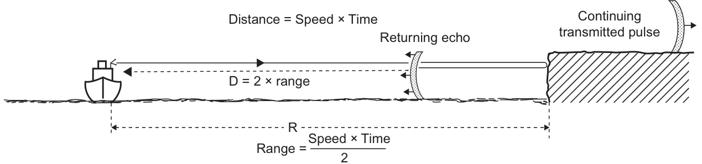  

FIGURE 1.2 The echo principle.  
b. $R=150T$ 
Since $1~{\mathrm{NM}}=1852~{\mathrm{m}},$ 
$12\times1852=150T$ 
hence $T=12\times1852/150=148.16 \mu s$  

图 1.2 回声原理。  
b. $R=150T$  
由于 $1~{\mathrm{纳米}}=1852~{\mathrm{米}}$ [纳米是国际单位制中的长度单位，1纳米等于十亿分之一米（$10^{-9}$米）]，  
$12\times1852=150T$  
因此 $T=12\times1852/150=148.16 \mu s$ [这里的 $\mu s$ 代表微秒，即秒的十亿分之一（$10^{-6}$秒）]。 

注意：由于原文中出现了专业术语，如纳米、微秒等，在括号中提供了直白的解读，以便于理解。同时，为了保持原文的专业性和技术精确性，尽可能地保留了原文中的技术术语和符号。

This result is noteworthy as it represents the elapsed time for a commonly used marine radar range scale. The elapsed times established in this section are of the order of millionths of a second and therefore need special instrumentation to be able to measure them accurately. In the early days of radar this was cutting-edge technology, but with the advent of quartz timing technology, and fast microelectronics it is no longer a major issue. Such technology is low cost, accurate and ubiquitous, with most humans owning multiple examples of precision timing in their watches, mobile phones, computers, TVs and cars.  

这一结果值得注意，因为它代表了常用海事雷达范围尺度的经过时间。 本节中确定的经过时间的数量级是秒的百万分之一，因此需要专门的仪器来能够准确地测量它们。在雷达的早期，这是最先进的技术，但是随着石英计时技术和快速微电子技术的出现，它不再是一个主要问题。这种技术成本低、准确性高且无处不在，大多数人类都在手表、移动电话、计算机、电视和汽车中拥有精确计时的多个示例。

### 1.2.3 Directional Transmission and Reception  

In a marine radar system it is cost and space effective to use a single antenna for both transmission and reception. It is designed in such a way (see Section 2.5) as to focus the transmitted energy into a beam which is very narrow in the horizontal plane. The angle within which the energy is constrained is called the horizontal beamwidth (Figure 1.3). It must have a value of not more than $2.0^{\circ}$ if it is to comply with the international regulations which govern marine radar. Civil marine radars for large ships are available with horizontal beamwidths as narrow as $0.75^{\circ}$ . The equivalent reception property of the antenna is such that it will detect energy which has returned from within the angular limits of the horizontal beamwidth; that is from those targets that have been illuminated by the corresponding radar transmission. Its insensitivity to picking up unwanted noise from other directions effectively increases its ability to detect the reflected echoes.  

在海洋雷达系统中，使用单一天线同时进行发射和接收不仅节省成本，还能有效地节约空间。天线的设计（见第2.5节）是将发射的能量聚焦成一个在水平平面上非常狭窄的束，其中束的宽度被称为水平波束宽度（图1.3）。如果要符合管辖海洋雷达的国际法规，水平波束宽度的值不能超过$2.0^{\circ}$。面向大型船舶的民用海洋雷达的水平波束宽度可以窄至$0.75^{\circ}$。天线的等效接收特性使其能够检测来自水平波束宽度角度限制范围内返回的能量，也就是说，从被对应的雷达发射照亮的目标返回的能量。它对从其他方向接收到不需要的噪声（[无关信号干扰]）不敏感，这有效地增加了其检测反射回波的能力。

  

FIGURE 1.3 The horizontal beam width.  

图1.3 水平波束宽度。

An essential feature of a marine radar is that it should provide continuous coverage over the full $360^{\circ}$ of azimuth angle. To achieve this the antenna has to rotate and no part of the vessel should obscure the radar beam, such as masts and other superstructure. Typical antenna rotation rates are 24-45 revolutions per minute, resulting in a complete rotation occurring every $1.3\mathrm{-}2.5\mathrm{s}.$ , depending on the system.  

海洋雷达的一个重要特征是，它应该在方位角（azimuth angle）的整个360°范围内提供连续的覆盖。为了实现这一点，天线（antenna）必须旋转，并且船上的任何部分都不能阻挡雷达束（radar beam），例如桅杆（masts）和其他上层结构（superstructure）。典型的天线旋转速度为每分钟24-45次，根据系统的不同，结果是每1.3-2.5秒完成一次完整的旋转。

The interval between successive transmitted pulses has to at least allow the transmitted signal to travel out to the furthest target of interest and back again, although there are other considerations, which are discussed in Section 2.3.3.2. This interval is normally considered as a pulse repetition frequency (PRF), that is the number of pulses transmitted in $1\mathrm{s}$ . If we take, as an example, a value of 1500 pulses per second $(1500~\mathrm{Hz})$ ; this is equivalent to one pulse every $667 \mu s$ . Taking a representative time for one revolution of the scanner to be $2\mathsf{s},$ it is seen that 3000 pulses are transmitted during one revolution and that the scanner rotates through $0.12^{\circ}$ between pulses. The picture is thus ‘built up’ of approximately 3000 radial lines of reflected echoes.  

两个连续传输的脉冲之间的间隔必须至少允许传输信号到达最远的目标并返回回来，尽管还有其他考虑因素，这些将在第2.3.3.2节中讨论。这个间隔通常被认为是脉冲重复频率（PRF），即在1秒钟内传输的脉冲数量。例如，我们取1500个脉冲每秒（1500赫兹）；这相当于每667微秒（$\mu s$）传输一个脉冲。假设扫描仪旋转一周的时间为2秒，那么可以看到，在一次扫描过程中传输了3000个脉冲，而扫描仪在两个脉冲之间旋转了0.12度。因此，图像是由大约3000条径向线的反射回声“构建”而成的。 

注意： 
- 脉冲重复频率（PRF）是指在一个信号中，两个连续脉冲之间的时间间隔的倒数，它代表了单位时间内传输的脉冲数量。 
- 微秒（$\mu s$）是时间单位，表示一秒钟的百万分之一。

### 1.2.4 Display of Radar Information  

#### 1.2.4.1 The A-Scan Display  

The A-scan is a useful concept to help understand the makeup of a reflected radar signal and how it can be displayed. This basic type of display is sometimes used today by engineers and technicians for special purposes, but is not a display that is available on a marine radar when used as a navigational aid. An A-scan display plots the returned radar signal as a graph, see Figure 1.4. The horizontal axis represents time and the vertical axis represents the strength (amplitude) of the received signal. The plot, sometimes called a trace, commences at the instant each radar pulse is transmitted. This event is indicated by a vertical spike, known as the transmission mark. Returning echoes also generate spikes in the plot. The amplitude of these spikes are related to the strength of the echo. The equivalent ‘real-life’ situation is also shown in the diagram.  

A-扫描是理解反射雷达信号的组成及其显示方式的一个有用概念。这种基本类型的显示有时被今天的工程师和技术人员用于特殊目的，但不是在使用海事雷达作为导航辅助工具时可以获得的显示。A-扫描显示将返回的雷达信号绘制为图表，如图1.4所示。水平轴代表时间，垂直轴代表接收信号的强度（幅度）。此图表，有时被称为轨迹，从每个雷达脉冲传输的瞬间开始。该事件由垂直尖峰（称为传输标记）指示。返回的回声也会在图表中产生尖峰。这些尖峰的幅度与回声的强度有关。等效的“现实生活”情况也显示在图表中。 

注意：A-扫描是海事雷达中的一个专业术语，指的是一种以图表形式显示雷达信号强度和时间关系的方法。雷达脉冲是海事雷达发射的无线电波信号，回声是物体反射回来的信号。导航辅助工具是指用于帮助船只导航的设备或系统。

The horizontal distance between the transmission mark and an echo spike is a measure of the range of the target. Using the result from Example 1.1(b), it is evident that if the full extent of the plot is to represent a range of $12\mathrm{NM}$ (the selected range scale) this is equivalent to a timescale of approximately $148~{ \mu\mathrm{s}}$ .  

发射标记与回声峰之间的水平距离是目标范围的衡量标准。利用例子1.1（b）的结果，可以看出，如果整个图的全部范围代表的范围是$12\mathrm{NM}$（所选的范围刻度），这相当于一个大约为$148~{ \mu\mathrm{s}}$的时间尺度。其中，NM代表海里（[nautical mile，约为1852米]），“$\mu\mathrm{s}$”代表微秒（[微秒，即一秒的十亿分之一]）。

#### 1.2.4.2 The Plan Position Indicator Display  

The A-scan shows the amplitude of the reflected radar energy as a function of range at a particular azimuth bearing angle of the radar antenna. In principle, this angle could be shown in degrees as an information box on the display, allowing the user to determine the range and azimuth of any target in view, as the antenna rotated. In practice, this would not be a very effective display. With targets only being visible for a short period, once per revolution of the antenna, the human brain would have difficulty in assessing any real situation.  

A-scan显示了雷达天线在特定方位角（azimuth bearing angle）下的反射雷达能量幅度与距离的关系。在理论上，这个角度可以以度为单位显示在信息框中，从而允许用户确定任何可视目标的距离和方位，因为天线在旋转。但是，实际上这种显示方法并不是很有效。由于目标只在天线旋转过程中的一瞬间可见，每次旋转只出现一次，人类的大脑难以评估任何实际情况。[这里的“方位角”是指天线的旋转方向，而“A-scan”是显示雷达信号强度与距离关系的图形显示方法]

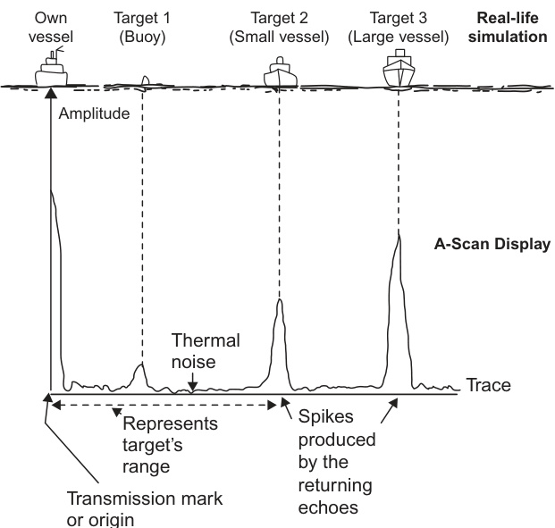  

FIGURE 1.4 The A-scan display.  

图 1.4 A 扫描显示。 

（注：A 扫描是超声诊断技术中的一种显示模式，主要用于显示物体内部结构的回声信号强度和深度信息）

What is perhaps ideally required is a plan view, such that the radar image creates a ‘map’ of the surrounding area, allowing easy assimilation of the current situation by the user. This is particularly relevant in our modern world as it also allows the radar display to show conventionally charted features as an ‘underlay’ to the radar image, putting them into geographical context.  

在实际应用中，理想的情况是用户能够获取一个平面视图（plan view），即雷达图像能够生成周围区域的“地图”，从而使用户能够轻松掌握当前的情况。这在现代世界中尤其重要，因为它还允许雷达显示将传统绘制的特征作为“底图”（underlay）叠加到雷达图像之上，将它们置于地理坐标系（geographical context）中。这样，用户就能够更好地理解雷达图像与实际地理环境之间的关系。这里的“地图”是指雷达图像中对周围环境的电子化表现，而“底图”则是指在雷达图像基础上叠加的传统地图或地理特征，以提供地理位置参考。

The term Plan Position Indicator (PPI) has been used for this type of radar display, since the 1940s. Nowadays the precise image on the display is produced by digital processing technology. This effectively computes the amplitude of the received signal, as shown in Figure 1.4 for the A-scan, at small increments of range. The increment used is known as the range cell increment. The process produces a computerized list of signal strengths against range for the particular azimuth angle (bearing) of the antenna. The next radar pulse is transmitted when the antenna has turned through a small angle, known as the azimuth cell increment, creating another list of signal strengths for each range cell increment. This ongoing process results in a digitally stored table of signal strengths against range and azimuth angle. This process is illustrated in Figure 1.5.  

计划位置指示器（Plan Position Indicator，简称PPI）一词自1940年代以来就被用于描述这种类型的雷达显示。如今，显示器上的精确图像是通过数字处理技术产生的。这种技术有效地计算了接收到的信号的幅度，如图1.4中的A-scan所示，以小范围增量进行计算。所使用的增量称为范围单元增量（range cell increment）。该过程生成了一个针对特定方位角（方位角，bearing）的信号强度与范围的计算机化列表。当天线转过一个小角度，即方位角单元增量（azimuth cell increment）后，会传输下一个雷达脉冲，从而为每个范围单元增量生成另一个信号强度列表。这种持续的过程结果是一个数字存储的信号强度与范围和方位角的表格。如图1.5所示。这种过程可以理解为通过[将雷达接收到的信号按照距离和方向分解，然后以数字形式存储，最后呈现在显示器上]，从而生成一个精确的雷达图像。

The main diagram is a plan view of an area with the ship’s position at the centre, showing its heading as a vertical arrow. It looks rather similar to a radar display, but in this case it is solely representing the actual geographical situation. Each cell increment in the azimuthal direction is depicted as a radial line and each increment in the radial direction as a circle, centred at the own ship’s position. The actual increment size is chosen so that a point target would be detected in a number of adjacent range and azimuth sampling points, taking into account the beamwidth of the antenna and the length of the transmitted pulse. This means, in practice, that there are many more azimuth cells than are depicted in Figure 1.5, typically 1,024 or more covering the full $360^{\circ}$ . Also, the length of a range cell is typically measured in tens of metres but depends on the chosen pulse length, see Section 2.3.3.1. The reflected signal strength measurement is centred at the crossing points of these lines and circles. The radar stores them as a table of values of signal strengths (amplitudes), which is also depicted in Figure 1.5. The illustrated table uses realistic values, including the depiction of signal strength. Signal strength, in this example, is based on a scaled value of between 0 and 1,023.  

主要图表是某区域的平面图，船舶的位置位于中心，航向用垂直箭头表示。它看起来与雷达显示屏幕有点相似，但在这里，它仅代表实际的地理情况。每个单元在方位方向的增量以辐射线表示，每个单元在半径方向的增量以一个以自身船舶位置为圆心的圆表示。

实际的增量大小是这样选择的：一个点目标将在多个相邻的距离和方位采样点中被检测到，同时考虑了天线的波束宽度和传输脉冲的长度。这意味着，在实际应用中，方位单元（azimuth cells）的数量远远超过图1.5中所示的数量，通常有1024个或更多的方位单元，覆盖整个360度范围。同时，距离单元（range cell）的长度通常以几十米为单位进行衡量，但也取决于所选择的脉冲长度，请参阅第2.3.3.1节。

反射信号强度的测量集中在这些线条和圆圈的交点处。雷达系统将这些测量值存储为一个信号强度（幅度）值表，该表也在图1.5中示出。所示表格使用了现实的值，包括信号强度的表现。信号强度，在本例中，是基于一个缩放值，范围在0到1,023之间[即信号强度的量化等级，0代表最弱，1,023代表最强]。

To display the image the radar’s digital processor has to convert the ranges and azimuths of the measurements to $\mathbf{\nabla}^{\prime}x^{\prime}$ and $'y^{\prime}$ coordinates, relative to the own ship, using the simple mathematical concept illustrated in Figure 1.6. After scaling the $x$ and $y$ positions to allow them to be represented on the radar display, the received echoes are indicated at their equivalent position by spots of appropriate colour and intensity, depending on the received signal strength. At every revolution of the antenna the stored data, and hence the resultant radar image, is updated. This process produces the conventional image of displayed radar targets, such as that illustrated in Figure 1.7.  

为了显示图像，雷达的数字处理器必须使用简单的数学概念（如图1.6所示），将测量的范围和方位转换为相对于自身船只的 $\mathbf{\nabla}^{\prime}x^{\prime}$ 和 $'y^{\prime}$ 坐标。在缩放 $x$ 和 $y$ 位置以便在雷达显示屏上表示它们之后，根据接收到的信号强度，以适当的颜色和强度的点表示接收到的回声。在天线的每一次旋转中，存储的数据以及由此产生的雷达图像都会被更新。这个过程会产生传统的雷达目标显示图像，如图1.7所示。

Today, the radar display is a conventional ‘flat-panel’ electronic screen, similar to that used on modern TVs and computer displays. The technology lying behind flat-panel displays is discussed in Section 2.8.3. The radar image is conventionally shown within a circular domain, with a radius equivalent to the selected maximum display range. This is no longer compulsory under the international regulations that govern marine radar but remains a widespread practice, reflecting the fact that original radar cathode ray tube (CRT) displays were circular rather than rectangular. These used to epitomize a radar installation, see Figure 1.8. There is always a bearing scale shown around the periphery of the operational display area, whether circular or otherwise. On older radars this used to be engraved on the rim surrounding the CRT. Nowadays, the scale is produced electronically and forms part of the displayed image. The bearing scale is labelled in degrees.  

如今，雷达显示器是一种传统的“平板”电子屏幕，与现代电视和电脑显示器类似。平板显示技术的细节将在第2.8.3节中讨论。雷达图像通常在一个圆形区域内显示，其半径等同于所选择的最大显示范围。这一做法在国际海事雷达规范中不再是强制性的，但仍然被广泛采用，反映了最初的雷达阴极射线管（CRT）显示器是圆形而非矩形的事实。这些圆形显示器曾经是雷达安装的典型代表，如图1.8所示。无论显示区域是圆形还是其他形状，都会在操作显示区域的周围显示一个方位标尺。在老式雷达上，这个标尺通常是在CRT周围的边缘上刻画的。如今，标尺是通过电子方式产生的，并成为显示图像的一部分。方位标尺以度为单位进行标记。

Also displayed are range circles centred on the origin (position of the own ship). These are known as range rings and can be set to convenient values by the operator, see Figure 1.9. This shows the radar on a 12 NM scale, with range rings set at 2 NM spacing. The rings can be switched off, if not required. In addition there are tools that enable a user to accurately determine the range and bearing of any target on the display. These are fully discussed in Section 6.9 and, for instance, include a variable range marker (VRM), as also illustrated in Figure 1.9.  

同样在显示屏上显示的还有以自身船舶位置（原点）为中心的范围圈，这些被称为范围环，可以由操作员设置为方便的数值，如图1.9所示。这显示了以12海里（NM）为范围的雷达图像，范围环的间隔设置为2海里。这些环可以在不需要时关闭。此外，还有一些工具可以让用户准确地确定显示屏上任何目标的距离和方位，这些都将在6.9节中详细讨论，例如包括可变范围标记（Variable Range Marker，VRM），如图1.9所示。

The normally circular operational display area of a radar is a useful means of assessing quickly whether any particular display on a ship’s bridge is set up as a radar or as an electronic chart. The latter image is generally  
Azimuth cell increment $=\mathsf{\Theta}_{\mathsf{\theta}}$ ,e.g. $0.3^{\circ}$  
Range cell increment $=R_{\Gamma},$ . e.g. 10 metres  

雷达的正常圆形操作显示区域是评估船桥上任何特定显示是否设置为雷达或电子海图的有用手段。后者图像通常是 
方位单元增量 $=\mathsf{\Theta}_{\mathsf{\theta}}$，例如 $0.3^{\circ}$  
距离单元增量 $=R_{\Gamma},$，例如 10 米。 
注：电子海图（electronic chart）是指采用电子技术来表示和显示海图的系统，可以实时更新和提供相关的海事信息。方位单元增量（Azimuth cell increment）和距离单元增量（Range cell increment）是雷达系统中的基本参数，分别用来表示雷达扫描的角度间隔和距离间隔。

The amplitude of the received signal at each azimuth and range cell increment, such as at the point ) $\mathsf{\Omega}\times(2\mathsf{\theta}_{\mathsf{a}},3\mathsf{R}_{\mathsf{r}})$ in the diagram, is measured and temporarily stored by the radar. This results in a table of values of the amplitude of the received signal at every cell  

雷达测量每个方位角和距离单元增量（如图中的点 $\mathsf{\Omega}\times(2\mathsf{\theta}_{\mathsf{a}},3\mathsf{R}_{\mathsf{r}})$）接收信号的幅值，并将其暂时存储。这样就生成了一个表格，表格中记录了每个单元的接收信号的幅值。 

注：方位角（azimuth）是指雷达天线扫描的角度位置，距离单元（range cell）是指雷达波以一定的距离间隔划分的区域。在本文中，这些术语都与雷达技术中的具体应用相关。

 

FIGURE 1.5 Creating a table of received signal strengths:(a) plane view of area with the own ship's position at centre and (b) table of amplitudes.  

图1.5 创建接收信号强度表：（a）以自身船只位置为中心的平面视图和（b）振幅表。 

注：这里的"接收信号强度"指的是在某个区域内接收到的信号的强度大小，而"振幅表"则是将这些信号强度以表格形式组织起来的数据集合，方便查阅和分析。在这里，图（a）展示了一个区域的平面视图，以自身船只的位置为中心，而图（b）则是根据信号强度生成的表格，记录了不同位置的信号振幅大小。

(b) Extract from example table, showing possible target at about $M2.0^{\circ}$ , 3,762 metres) and only small reflections, such as from waves, in the vicinity of $12.3^{\circ}$ ,2,400 metres):  
<html><body><table><tr><td colspan="2">Cell value</td><td rowspan="2">Amplitude (e.g., max value 1,024)</td></tr><tr><td>θ (Degree)</td><td>R (Metres)</td></tr><tr><td>--</td><td>-</td><td>-</td></tr><tr><td>12.0</td><td>3,750</td><td>105</td></tr><tr><td>12.0</td><td>3,760</td><td>904</td></tr><tr><td>12.0</td><td>3,770</td><td>495</td></tr><tr><td>12.0</td><td>3,780</td><td>75</td></tr><tr><td>---</td><td>---</td><td>---</td></tr><tr><td>12.3</td><td>2,390</td><td>20</td></tr><tr><td>12.3</td><td>2,400</td><td>14</td></tr><tr><td>12.3</td><td>2,410</td><td>25</td></tr><tr><td>12.3</td><td>2,420</td><td>16</td></tr><tr><td></td><td>-</td><td>--</td></tr></table></body></html>  

(b) 从示例表中提取数据，显示可能的目标位于大约 $M2.0^{\circ}$ （3,762 米），仅在 $12.3^{\circ}$ （2,400 米）附近有很小的反射，例如来自波浪的反射：
<html><body><table><tr><td colspan="2">单元值</td><td rowspan="2">幅度（例如最大值 1,024）</td></tr><tr><td>θ（度）</td><td>R（米）</td></tr><tr><td>--</td><td>-</td><td>-</td></tr><tr><td>12.0</td><td>3,750</td><td>105</td></tr><tr><td>12.0</td><td>3,760</td><td>904</td></tr><tr><td>12.0</td><td>3,770</td><td>495</td></tr><tr><td>12.0</td><td>3,780</td><td>75</td></tr><tr><td>---</td><td>---</td><td>---</td></tr><tr><td>12.3</td><td>2,390</td><td>20</td></tr><tr><td>12.3</td><td>2,400</td><td>14</td></tr><tr><td>12.3</td><td>2,410</td><td>25</td></tr><tr><td>12.3</td><td>2,420</td><td>16</td></tr><tr><td></td><td>-</td><td>--</td></tr></table></body></html> 

注：θ 代表仰角（角度），R 代表距离（米），幅度代表信号强度。表格中的数据显示了目标物体在不同距离和仰角下的信号强度。从数据中可以看出，大约在 $M2.0^{\circ}$ 和 3,762 米处有一个较大的目标，而在 $12.3^{\circ}$ 和 2,400 米处只有很小的反射。

  

图4.2：基于物联网和人工智能的智能家居系统架构

FIGURE 1.6 Conversion of range and azimuths to $(x,y)$ Cartesian coordinates.  

图1.6 将距离和方位角转换为$(x,y)$笛卡尔坐标。

displayed as a rectangle, even though it may have radar data included in the displayed image. Section 10.2 explains the significant differences between viewing and using radarderived data on a radar display (PPI) and on an electronic chart. In general, the simple rule is that fundamental decisions concerning collision avoidance should always be made on the radar display, but the main route monitoring activity should be using the chart display.  

在雷达显示设备上，即使包含了雷达数据，目标也会以矩形的形式展现。第10.2节解释了在雷达显示设备（PPI）上和电子海图上查看和使用雷达导出的数据之间的显著差异。一般来说，一个简单的规则是，关于碰撞避免的基本决策应该总是在雷达显示设备上进行，但主要的路线监控活动应该使用电子海图显示设备来完成。其中，雷达显示设备（PPI，平面位置指示器）是指一种以平面位置指示器的形式来显示雷达信号的设备，电子海图（electronic chart）是指以电子形式来表示海图的设备，碰撞避免（collision avoidance）是指为了避免船舶之间或者船舶与其他物体之间的碰撞而采取的措施。

The term PPI will perhaps cease to be used over time, especially with the increased use of multifunction displays, which can be set to be used at any one time as a radar, electronic chart or other navigational display. However, this book will use the terms PPI and radar display interchangeably, as is in common usage at the time of writing. Into the future the likely trend is that the main radar display will increasingly become known as the collision avoidance display and the electronic chart display (when not being used for route planning) as the route monitoring display. When radar data is being used for other functions, such as position fixing or assistance with route monitoring, these task will be performed on the appropriate display modes, showing relevant radar information as well as other available data.  

随着多功能显示器的广泛使用，这些显示器可以随时被设置为雷达、电子海图或其他导航显示器，以后“PPI”（计划位置指示器）这一术语可能会逐渐不再使用。然而，在本书中，我们将使用“PPI”和“雷达显示器”这两个术语来指代同一概念，就像当前的通用惯例一样。在未来的发展趋势中，主要的雷达显示器很可能会被称为碰撞避免显示器，而电子海图显示器（当不用于路线规划时）则会被称为路线监控显示器。当雷达数据被用于其他功能，如位置确定或路线监控辅助等任务时，这些任务将在相应的显示模式下进行，显示相关的雷达信息以及其他可用的数据。 

注：碰撞避免显示器是指利用雷达等技术来帮助避免船只碰撞的显示系统。路线监控显示器是指用于监测和跟踪船只行驶路线的电子海图显示系统。

#### 1.2.4.3 Target Trails  

It is very often useful on a radar display for the past track of targets to remain visible, at least for a few minutes. This can give a much clearer visualization of the movement of critical targets. Targets are said to leave a trail on the display. Originally this feature was achieved by using CRTs with a very high image persistence. Any instantaneous image on the display only slowly faded because of the specially chosen phosphors used on the display surface of the CRT. Consequently, targets would create a line on the display, showing their past positions. Close to the most recent position of the target the trail would be bright and would gradually fade to being invisible further along its length, see Figure 1.10. Nowadays this effect is artificially created by digital processing of the displayed radar image. This allows greater flexibility in the display of trails, such as their time length to extinction and whether or not they are displayed. It also more clearly distinguishes between targets and trials, for instance, by the use of different colours.  

在雷达显示屏上，目标的过去轨迹至少保持几分钟的可见性是非常有用的。这可以更清晰地展示关键目标的运动。目标会在显示屏上留下一条轨迹（[即目标移动的路径]）。最初，这个功能是通过使用具有非常高图像保持时间（[即图像在屏幕上停留的时间]）的阴极射线管（CRT）来实现的。显示屏上的任何瞬时图像都会因为CRT显示表面上使用的特殊磷光材料（[即会发光的材料]）而缓慢地消失。因此，目标会在显示屏上创建一条线，显示它们过去的位置。在目标的最近位置附近，轨迹会很亮，沿着轨迹长度的方向会逐渐消失，见图1.10。如今，这种效果是通过对显示的雷达图像进行数字处理来人为地创建的。这允许轨迹显示具有更大的灵活性，例如它们消失的时间长度以及是否显示。它还更清晰地区分目标和试验，例如，通过使用不同的颜色来区分。

 

FIGURE 1.7 Displayed radar targets. Figure courtesy of Kelvin Hughes.  

图1.7 所示雷达目标。图像来源：Kelvin Hughes。

  

FIGURE 1.8 Older radar display. Figure courtesy of Kelvin Hughes.  

图1.8 旧式雷达显示器。图片来源：Kelvin Hughes。

  

FIGURE 1.9 Radar range rings and VRM. 

图1.9 雷达测距环和相对测距标记（VRM，即虚拟距离参考标记，[用于辅助雷达距离测量的视觉参考工具]）

## 1.3 PRINCIPLES OF BEARING MEASUREMENT  

### 1.3.1 The Heading Marker  

In general, a bearing is the angle between the direction of a chosen reference and that of an object of interest. On a PPI display the fundamental reference is the instantaneous direction of the observing vessel’s heading.  

通常来说，方位角（bearing）是指选定的参考方向与感兴趣的物体方向之间的夹角。在径向扫描计划显示器（PPI）中，基本参考是观察船舶当前的航向（heading）方向。

 

FIGURE 1.10 Target trails.  

图1.10 目标轨迹。

As the axis of the beam of the radar antenna crosses the ship’s fore-and-aft line in the forward direction, a sensor within the turning mechanism of the radar antenna is activated and the associated electronics sends a timing pulse to the radar receiver. This pulse is used to synchronize the display electronics to the antenna rotation and, in particular, is used as the reference for the heading marker or heading indicator. In addition, azimuth pulses are generated at regular angular increments as the antenna rotates to take into account its potentially uneven rotation due to wind, vibration and vessel motion effects. Thus all targets are displayed, not only in the correct angular relationship to one another, but also in the correct angular relationship to the own ship’s heading (see Figure 1.11).  

当雷达天线的波束轴沿着船只的纵向线在向前方向移动时，雷达天线转动机构内的传感器被激活，相应的电子设备向雷达接收器发送一个定时脉冲。这个脉冲被用来同步显示电子设备与天线的旋转，特别是被用作航向标记（heading marker）或航向指示器（heading indicator）的参考点。此外，随着天线的旋转，在规则的角度间隔处会产生方位脉冲，以考虑到风、振动和船只运动等效应对天线旋转的潜在不均匀影响。因此，所有目标不仅以正确的角度关系显示为彼此的相对位置，而且还以正确的角度关系显示为与自身船只的航向（见图1.11）相对的位置。 

（注：航向标记或航向指示器是指显示船只当前航向的指示器，方位脉冲则是指在雷达天线旋转过程中，用于记录和显示目标的角度位置的脉冲信号。）

The angle between the observed vessel’s heading and the direction of the horizontal beam is sometimes called the antenna angle. IMO Performance Standards (see Section 11.2.1) require that the heading marker is able to be aligned to within $0.1^{\circ}$ . The procedure for checking this accuracy is discussed in Section 6.6.8. There is a danger that a target may be masked if it lies in the direction of the heading marker. The specification recognizes this danger by requiring that there is a provision for temporarily switching the marker off. However, it is such an important feature on the radar display that it cannot be permanently switched off. In particular, the appearance of the heading marker confirms the orientation of the display (see Section 1.4).  

观察到的船舶的航向与水平波束的方向之间的角度有时被称为天线角（antenna angle，[即天线的方向与船舶航向之间的夹角]）。国际海事组织（IMO）的性能标准（见11.2.1节）要求航向指示标记（heading marker）能够在0.1°的范围内对准（[也就是说，航向指示标记的方向必须与船舶的实际航向保持在0.1°以内的误差范围]）。检查此类精度的程序在6.6.8节中进行讨论。如果目标位于航向指示标记的方向，则可能会被遮蔽。该标准通过要求提供临时关闭标记的功能来承认这一风险。然而，航向指示标记是雷达显示屏上如此重要的一个功能，无法永久关闭。特别是，航向指示标记的出现确认了显示屏的方向（见1.4节）。

A modern radar may also be able to display a stern line, drawn on a reciprocal bearing to the heading, which can be very useful when manoeuvring astern. This line can be switched on or off, as required. The heading line remains visible when the stern line is selected.  

现代雷达也可能能够显示一个艉线（即船尾方向的参考线），该线是在相对的方位（与船头方向相反的方向）上绘制的，尤其是在操纵船尾时非常有用。这个线可以根据需要打开或关闭。即使在选择艉线时，船头方向线仍保持可见。

 

FIGURE 1.11 The build-up of the picture.  

图1.11 图像的构建过程。

### 1.3.2 Bearing Measurement  

IMO Performance Standards (see Section 11.2.1) require that provision be made for quickly obtaining the bearing of any object whose echo appears on the display. Traditionally this was fulfilled by a variety of mechanical and electromechanical devices which enabled the observer to measure the angle between the heading marker and the object of interest. On a modern radar, electronic bearing lines (EBLs) are used for this measurement. In particular, these are designed to be able to quickly determine the bearing of a target with respect to the own ship’s heading. In the basic setting of the radar the EBL emanates from the centre (origin) of the display, there will the own ship’s position, to the edge of the operational display area, where its angular position can be read off from the bearing scale around the periphery of the area. Using the appropriate controls the operator can orientate the EBL such that it passes through the target of interest. This is illustrated in Figure 1.12(a). In addition to the bearing scale facility there will also be a numerical readout of the bearing on the display, which is more typically used nowadays rather than the bearing scale. The bearing scale mainly helps the user to keep an appropriate awareness of bearing. A variety of bearing measurement facilities and the correct procedure for their use are discussed in Section 6.6.  

国际海事组织（IMO）性能标准（见11.2.1节）要求能够快速获取任何在显示屏上出现回声的物体的方位。传统上，这是通过各种机械和电机设备来实现的，这些设备使观察者能够测量方位标记和感兴趣的物体之间的角度。在现代雷达系统中，使用电子方位线（Electronic Bearing Lines，EBLs）来进行这一测量。特别地，这些电子方位线被设计为能够快速确定目标相对于本船航向的方位。

在雷达的基本设置中，电子束线（EBL）从显示屏的中心（原点）发出，标注着自身船只的位置，一直延伸到操作显示区域的边缘，在那里可以从区域周边的方位标度量表中读取其角位置。通过使用适当的控制，操作员可以调整电子束线，使其经过感兴趣的目标。这如图1.12(a)所示。 

注：电子束线（EBL）是雷达显示中一条虚拟线，用于指示雷达的方位和测量目标的角位置。

除了方位尺（bearing scale）设施外，显示屏上还会显示方位的数字读出，这在现代应用中更为常见，而不是仅依赖方位尺。方位尺主要帮助用户保持对方位的适当感知。各种方位测量设施以及它们的正确使用程序将在第6.6节中进行讨论。 

（注：方位尺的概念在这里指的是一种帮助用户意识到方向或方位的视觉辅助工具，其作用是让用户在导航或定位时更好地理解当前的方向或位置。）

  

FIGURE 1.12 Measurement of bearing: (a) relative bearing and (b) true bearing.  

图1.12 轴承的测量：（a）相对轴承和（b）真实轴承。 

或者可以更加准确地翻译为：

图1.12 方向角的测量：（a）相对方向角和（b）真方向角。

注：其中“bearing”是指航海或航空中指从观察者的位置出发，指向目标物体的方向的角度测量，相当于“方向角”或“航向角”的概念。

## 1.4 DISPLAY MODES  

There are a number of display modes on a modern radar for determining exactly how the radar shows information in relation to the outside world. These cover three different areas, which are referred to as orientation, motion and stabilization modes. The orientation mode defines how the ‘vertical’ direction of the display aligns with the outside world horizontal (azimuthal) direction; the motion mode defines how the own-vessel moves with respect to the display; and the stabilization mode defines how absolute movement is referenced relative to the ground or relative to the sea. Taking the display to be a conventional graphical representation in $x$ and $y$ coordinates, it is the $y$ -direction that is considered to be vertical and the $x$ -direction as being horizontal.  

在现代雷达中，有多种显示模式用于确定雷达如何将信息显示与外部世界相关联。这些模式涵盖了三个不同的领域，分别被称为定向（orientation）、运动（motion）和稳定（stabilization）模式。定向模式定义了显示的“垂直”方向如何与外部世界的水平（方位）方向对齐；运动模式定义了自身船只如何相对于显示进行移动；稳定模式定义了绝对运动如何参照地面或海面。假设显示为$x$和$y$坐标中的传统图形表示，则$y$方向被认为是垂直的，$x$方向被认为是水平的。其中，“垂直”方向和“水平”方向是相对于显示坐标系而言的，即垂直方向对应于$y$轴，水平方向对应于$x$轴。

### 1.4.1 Orientation Modes  

A vessel’s radar display provides a choice of orientation modes. The natural mode is the one already described where the heading direction of the ship, and therefore the heading line, is vertically upwards on the display. This is known as the head-up mode.  

舰船的雷达显示器提供多种定向模式。我们已经描述过的自然模式是指船舶的航向方向（heading direction），即航向线（heading line），在显示屏上呈现为垂直向上的状态。这被称为“头朝上模式”（head-up mode）。在这种模式下，雷达显示的参考方向始终与船舶的航向一致，方便操作人员快速理解船舶相对于周围环境的位置和朝向。

There are two other orientation modes available. One is termed north-up, where the vertical direction represents true-north and the other is course-up, where the vertical direction of the display represents the desired course of the vessel.  

除了默认的朝向模式外，还有两种其他的朝向模式可供选择。一种被称为“正北朝上”（north-up），在这种模式下，屏幕的垂直方向表示真实的北方向；另一种被称为“航向朝上”（course-up），其中屏幕的垂直方向表示船舶的预期航向。

#### 1.4.1.1 Head-Up Orientation  

This orientation, where the heading marker is always vertical on the display, is illustrated in Figure 1.13. As the vessel’s heading changes, so does the orientation of the displayed image the image is vessel stabilized, aligning with the view from the bridge windows, but is unstabilized with respect to truenorth. The figure shows the situation just before and after a course change. This was the only orientation mode available on very early marine radars because of cost and technological limitations. However, the only significant attraction of using the basic head-up mode today is that it does not need a working gyro or compass input to the radar, unlike the other orientation modes on a modern radar, north-up and course-up. These modes, described separately in the sections below, stabilize the orientation of the radar image. For this reason, head-up mode is often described as unstabilized. If compass problems are encountered its use may be essential and so needs to be fully understood.  

这种方位显示方式如图1.13所示，在显示屏上，方位标志始终保持垂直。当船舶的航向改变时，显示的图像的方向也会相应改变；该图像是针对船舶的稳定显示，能够与从桥楼窗口看到的视图保持一致，但与真北方向不一致。图中展示了航向变化前后的情况。这是在非常早期的海事雷达中唯一可用的方位显示模式，因为受到了成本和技术限制的影响。然而，使用基本的头向上模式（head-up mode）具有的主要吸引力在于，它不需要一个工作的陀螺仪或指南针输入到雷达中，而这是在现代雷达中的其他方位显示模式（如真北向上模式和航向向上模式）所必需的。这些模式将在下面的章节中分别进行描述，它们能够稳定雷达图像的方向。因此，头向上模式通常被描述为非稳定模式。如果遇到指南针问题，其使用可能是必要的，因此需要被充分理解。[注：头向上模式是指雷达显示屏上方位标志始终保持垂直，图像方向会随船舶航向变化而变化，与真北方向不一致；非稳定模式是指图像的方向不随着船舶航向变化而进行相应的调整。]

The head-up unstabilized mode is superficially attractive because of the very fact that the displayed radar image corresponds directly with the scene as viewed through the wheelhouse window. A well placed display unit, close to the bridge windows and facing forwards, means that irrespective of whether the user is viewing the radar screen or looking forward through the wheelhouse window, objects on the starboard side of the ship will lie on the right of the display and those on the port side will lie on the left.  

抬头未稳定模式（head-up unstabilized mode，[即用户在查看雷达图像时无需调整显示方向，图像直接与窗外场景对应的模式]）看似很有吸引力，因为显示的雷达图像直接与驾驶室窗户外的场景相对应。一个放置得当的显示单元，靠近驾驶室窗户，面向前方，这意味着无论用户是在查看雷达屏幕还是通过驾驶室窗户向前望去，船的右侧（starboard side，[即船的右边]）的物体将出现在显示屏的右侧，而左侧（port side，[即船的左边]）的物体将出现在显示屏的左侧。

However, this orientation mode became generally little used after north-up stabilization was introduced on marine radars. This was for a number of reasons. Firstly, the head-up image of earlier radars could become very unclear when in head-up mode. The ‘afterglow’ trail of static targets, especially of extended targets such as land masses, could obliterate critical small moving targets when the image rotated. This is not such a serious problem on modern radars set to head-up mode because of the digital processing technology now employed. Secondly, small yawing movements of the vessel create corresponding oscillations in the orientation of the radar image, which can make precise target range and bearing measurements difficult. This generally remains an issue, even on a modern radar set to unstabilized head-up mode. The third issue is that the bearing scale on an unstabilized head-up radar is not true-north related, and therefore creates extra work in establishing the true bearing of targets.  

然而，这种方向模式在海上雷达引入北向稳定后就变得较少使用了。这是出于多种原因。首先，早期雷达在头向上模式下的图像可能变得非常不清晰。当图像旋转时，静止目标（尤其是陆地等延伸目标）的“残影”痕迹可能会遮盖关键的移动小目标。在现代雷达中，由于采用了数字处理技术，这个问题并不是那么严重。其次，小型船只的偏航运动会在雷达图像的方向上产生相应的振荡，使得准确测量目标的距离和方位变得困难。这通常仍然是一个问题，即使在现代雷达的非稳定头向上模式下也是如此。第三个问题是，非稳定头向上雷达的方位量表与真北并不相关，因此需要额外的工作来确定目标的真实方位。

A particular reason for north-up mode becoming so frequently used was the general attractiveness of using an orientation which matches that of the paper chart, since it considerably benefits situation awareness. In fact, with the advent of electronic charts, which can also be displayed in head-up mode, the use of a head-up orientation mode potentially becomes more attractive. Before the era of electronic charts the use of head-up mode was mainly confined to special situations, such as when negotiating rivers, estuaries, narrow channels and locks, or when no compass interface was available. While course-up mode, described in Section 1.4.1.3, is a good alternative, many radars have an advanced head-up mode that is generally called stabilized head-up. This uses the gyro/compass input to orientate the bearing scale such that the heading direction is referenced relative to true-north, together with any other indications of bearing on the radar display. Smart processing can also prevent small yawing motions of the vessel creating an oscillating image, generally allowing targets, measurements to be easily performed, and also improving the clarity of the display.  

北向模式（north-up mode）被频繁使用的主要原因之一是，它使用与纸质海图（paper chart）相同的方向，这大大提高了情况感知（situation awareness，在这里指的是对周围环境和自身位置的感知和理解能力）。事实上，随着电子海图（electronic charts）的出现，这些海图也可以以头向上模式（head-up mode）显示，使用头向上方向模式的吸引力可能会更大。在电子海图出现之前，头向上模式的使用主要局限于一些特殊情况，例如在河流、河口、狭窄水道和船闸中航行，或者当没有罗盘接口（compass interface，指的是提供罗盘数据的接口）可用时。虽然航向向上模式（course-up mode，如1.4.1.3节所述）是一个很好的替代方案，但许多雷达系统都有一个高级头向上模式，通常被称为稳定头向上模式（stabilized head-up mode）。这种模式使用陀螺仪/罗盘输入（gyro/compass input）来调整方位标度（bearing scale），使得航向方向（heading direction）相对于真北（true-north）进行参考，同时也显示其他方位指示符号在雷达显示上。智能处理（smart processing，指的是使用算法和计算机器进行数据处理和分析）也可以防止船舶的小幅度偏摆运动（yawing motions）产生振荡图像（oscillating image），一般允许轻松进行目标跟踪和测量，同时也提高了显示的清晰度。

It should be borne in mind that in both stabilized and unstabilized head-up mode, an unwary or poorly trained observer can be misled by the angular rotation of the display as the own-vessel heading changes. For example, a small change of course by the observing vessel may give the impression that the bearing of a target is changing, while in fact the true bearing is remaining constant. The extremely important topic of systematic observation of target movement is discussed at length in Chapter 7.  

在稳定和非稳定头部向上模式下，人们都应牢记，一位缺乏警惕性或训练不足的观察者可能会被显示的角度旋转所迷惑，当自身船舶的航向（heading）发生变化时。例如，观察船舶的小航向变化可能会让人误以为目标的方位（bearing）正在变化，而事实上目标的真实方位却保持不变。目标运动的系统观察（systematic observation of target movement）是一个极其重要的主题，将在第7章中详细讨论。其中，系统观察是指（通过采集和分析数据，以系统化和科学的方法）对目标运动进行有条理的监测和研究。

  

FIGURE 1.13 Head-up orientation (unstabilized).  

图1.13 无穩定俯视（头部向上）方向 [这里的“头部向上”是指设备或摄像机的朝向，表示其正面朝上，俯视是指摄像机或设备的视角呈现一种从上往下的观察方式]。

#### 1.4.1.2 North-Up Orientation  

In north-up orientation, the heading marker is aligned with the graduation on the bearing scale that corresponds with the instantaneous value of the ship’s heading relative to truenorth. It means that $000^{\circ}$ on the bearing scale aligns with true-north. Thus the observer views the picture with north at the ‘top’ of the screen and it is for this reason that the orientation is so named. Figure 1.12(b) shows the same situation as that displayed in the headup mode in Figure 1.12(a) but with the system set to north-up, assuming that the own ship is on a heading of $280^{\circ}$ . Compass stabilization is essential to maintain north-up orientation, not least when the observing vessel alters course or yaws about its chosen course (Figure 1.14, which compares the cases for head-up, northup and course-up operation). The stabilization signal can be derived from any transmitting compass, but in practice the signal source is often a gyro compass, which is compulsory for larger vessels. The principles of north-up orientation are illustrated in Figure 1.15.  

在北向上（north-up）定向中，航向标志与方位表上的刻度对齐，刻度对应于船舶相对于真北（true north）的瞬时航向值。这意味着方位表上的$000^{\circ}$与真北对齐。因此，观察者以屏幕的“顶部”为北方来查看图像，这也是该定向名称的由来。图1.12（b）显示了与图1.12（a）中显示的头向上（head-up）模式相同的情况，但系统设置为北向上，假设本船航向为$280^{\circ}$。罗盘稳定（compass stabilization）对于保持北向上定向至关重要，尤其是在观察船只改变航向或绕过所选航向时（图1.14比较了头向上、北向上和航向上（course-up）操作的实例）。稳定信号可以从任何传输罗盘中派生，但实际上信号源通常是一个陀螺罗盘（gyro compass），对较大船舶来说这是必不可少的。图1.15演示了北向上定向的原理。其中，[陀螺罗盘]指的是一种利用陀螺原理来测量方向的罗盘，[罗盘稳定]则是指使用传感器和控制系统来保持罗盘指针指向北方的过程。

A major benefit is that the orientation compares directly with that of the paper chart. Also, because the display is stabilized it removed the significant disadvantage of earlier radars that changes in heading caused significant blurring of the radar displayed image when in head-up mode. These two factors have led to north-up mode becoming the most commonly used orientation option on most vessels. It also remains relevant when using electronic charts in north-up mode. Some users find using electronic charts and radar in north-up preferable, as it aligns both the radar and the chart image with the mind image they have of the area, easing situation awareness. For others, especially when on a southerly course, they find north-up awkward or uncomfortable to view as it appears ‘upside down’.  

一个主要的优势是，方向与纸质图表的方向直接对应。另外，由于显示屏是稳定的，它消除了早期雷达的一个重大缺点，即当以朝上（head-up）模式显示时，heading的变化会导致雷达显示图像发生明显的模糊。在朝上模式下，heading的变化会导致雷达显示图像的模糊程度较高。这些两个因素使得北向上（north-up）模式成为大多数船舶上最常用的方向选项。即使在使用电子海图时以北向上模式显示，也同样适用。一些用户发现使用电子海图和雷达以北向上模式更为方便，因为这同时使得雷达和海图图像与他们脑海中的区域图像保持一致，从而提高了状况感知能力。然而，对于其他人来说，尤其是在南行航向时，他们发现北向上模式显得不自然或不舒适，因为它看起来是“颠倒的”。

 

FIGURE 1.14 Target trails and the effect of yaw.  

图 1.14 目标轨迹和偏航（yaw）的影响。

（注：偏航是指飞行器或车辆绕其垂直轴旋转的运动，影响到目标的轨迹。）

 

FIGURE 1.15 North-up orientation (stabilized).  

图 1.15 北向定向（稳定化）

#### 1.4.1.3 Course-Up Orientation  

In course-up orientation the vertical direction on the display is aligned to the bearing which represents the desired course of the vessel. This can be obtained either automatically or semi-automatically from route planning information stored within the radar or by the operator selecting a particular course. By virtue of the compass stabilization, changes in the vessel’s instantaneous heading are reflected by sympathetic angular movements of the heading marker, thus maintaining the ship’s course (the reference course) in alignment with the display’s vertical direction. For the same reason, the angular wander of echoes associated with an unstabilized display is eliminated. On modern radars the bearing scale will be relative to true-north, but older radars may have the vertical direction always shown as $000^{\circ}$ , representing the desired course. Figure 1.16 illustrates course-up orientation.  

在航向向上定向（course-up orientation）中，显示器上方的垂直方向与表示船舶所需航向的航向（bearing）对齐。这可以通过以下方式获得：自动或半自动从存储在雷达中的航线规划信息中获得，或者通过操作员选择特定的航向。由于罗盘稳定化（compass stabilization），船舶的瞬时航向（instantaneous heading）的变化会反映在航向标记（heading marker）的同方向角运动中，从而保持船舶的航向（参考航向，与显示器的垂直方向对齐）。出于同样的原因，未经稳定化的显示器中与回声相关的角度漂移（angular wander）也被消除。在现代雷达中，方位标度（bearing scale）将相对于真北（true-north），但较旧的雷达可能总是显示垂直方向为$000^{\circ}$，代表所需航向。图1.16演示了航向向上定向。 

（注：罗盘稳定化指的是使用罗盘等导航设备来保持显示方向的一致性，使得船舶的航向变化能够准确地反映在显示器上。）

Provided that the observing vessel does not stray very far from her chosen course, this orientation can be more effective than a stabilized head-up orientation because it eliminates all angular wander of the picture due to yaw, while maintaining the heading marker approximately vertical on the display. Inevitably a major alteration of course will become necessary either due to the requirements of collision avoidance or to those of general navigation. When the vessel is steadied on the new course the orientation, although not meaningless, will have lost its property of being substantially head-up. The problem is that the orientation is still previous-course-up and the picture should be re-oriented to align the heading marker to the vertical direction of the display (see Figure 1.16(d)).  

假设观察船只在不太远离其预定航向的情况下，这种定向方式比稳定的头向上（head-up）定向更有效，因为它消除了由于偏航（yaw）导致的图像的所有角度游移，同时保持航向标志（heading marker）在显示屏上大约处于垂直状态。不可避免地，由于碰撞避免（collision avoidance）或一般导航（general navigation）需求的需要，航向的重大改变将变得必要。当船只稳定在新的航向上时，尽管定向并非毫无意义，但其基本上朝上的属性将会丧失。问题在于，定向仍然是按照以前的航向进行的，上述图像应重新定向以使航向标志与显示屏的垂直方向对齐（见图1.16（d））。这里所说的“偏航”（yaw）是指船只在水平方向上的转向运动，相当于飞机或车辆在水平面上的转向；“头向上”（head-up）定向是一种显示方式，即屏幕上显示的内容总是以操作者的头部方向为参考的，即操作者所面对的方向为上方。

#### 1.4.1.4 Choice of Orientation  

The fundamental function of any civil marine radar is to provide a means of measuring the ranges and bearings of targets for collision avoidance and the determination of the observing vessel’s position in order to ensure safe navigation. The ease with which these objectives can be achieved is affected by the choice of orientation. Where the various techniques of collision avoidance and navigation are described in this text, appropriate attention will be given to the influence of orientation. The practical use and setting up of orientations is discussed in Chapter 6. Table 1.1 summarizes the essential features of the three described orientations.  

任何民用海事雷达的基本功能都是提供一种测量目标的距离和方位的方法，用于避免碰撞并确定观测船只的位置，以确保安全的航行。实现这些目标的难易程度受到选择方向的影响。在本文中描述各种碰撞避免和航行技术时，将适当地考虑方向的影响。第6章将讨论方向的实际使用和设置。表1.1总结了描述的三个方向的基本特征。

Except in emergency situations, when azimuth stabilization has been compromised by equipment failure, head-up unstabilized orientation has nothing to offer other than its subjective appeal, because by its very nature it regularly disrupts the steady-state condition conducive to measurement of bearing and tracking of echo movement (see Figure 1.14(a)). The stabilized north-up and course-up orientations do not exhibit this angular disruption and hence are equally superior in fulfilling the fundamental requirements. Fortunately they are complementary in that while one is north-up, the other is orientated in such a way as not to alienate the user who has a ship’s-head-up preference. On some radar systems, stabilized head-up orientation may be included as an alternative to the use of course-up mode.  

除了在紧急情况下，当方位稳定性因设备故障而受到影响时，头部朝上、非稳定方向的显示方式除了其主观上的吸引力之外，没有其他优势，因为其本质上经常会破坏有利于测量方位和跟踪回波运动的稳态条件（见图1.14(a)）。稳定化的北向上和航向向上显示方式不会出现这种角度破坏，因此在满足基本要求方面同样优越。幸运的是，它们是互补的，因为当其中一个是北向上时，另一个会以一种不至于疏远具有船头向上偏好的用户的方式来进行定向。在一些雷达系统中，稳定化的头部朝上方向可能被包含为一种选择，以作为使用航向向上模式的替代。 

（备注：本段中提到的“方位稳定性”指的是雷达系统中保持稳定的方向，通常是指北向；“稳态条件”指的是系统运行中保持稳定状态的条件，这对测量和跟踪至关重要；“航向向上”和“北向上”是雷达显示的两种模式，前者以船只的航向为参考，后者以北方向为参考。）

## 1.5 MOTION AND STABILIZATION MODES  

There are two motion modes, known as relative motion and true motion. Relative means relative to the own ship, while true means relative to an outside reference system. The outside reference is split into two stabilization modes ground stabilized and sea stabilized. Ground stabilization requires an external sensor signal that at least can determine the speed over ground (SOG) of the observing vessel. In today’s world this is typically based on the output of a Global Navigation Satellite System (GNSS) using data from the US Global Positioning System (GPS) and/or Russia’s Globalnaya Navigatsionnaya Sputnikovaya Sistema (GLONASS). Other systems can also give this information, as discussed in Section 6.9.6. When sea stabilized, the important sensor is the speed log, which measures the vessel’s speed through the water (STW).  

物联网技术和人工智能专家认为，有两种运动模式，即相对运动和真实运动。相对运动是指相对于自身船舶的运动，而真实运动是指相对于外部参考系统的运动。外部参考系统可以分为两种稳定模式：地面稳定和海面稳定。地面稳定需要一个外部传感器信号，该信号至少可以确定观测船舶的地面速度（SOG）。在当今的世界中，这通常基于全球导航卫星系统（GNSS）的输出，使用来自美国全球定位系统（GPS）和/或俄罗斯全球导航卫星系统（GLONASS）的数据。其他系统也可以提供这些信息，如第6.9.6节所讨论的。海面稳定时，重要的传感器是速度记录仪，它测量船舶在水中的速度（STW）。这两种运动模式和稳定模式对于确保船舶在海面上的安全和准确的导航至关重要。

 

FIGURE 1.16 Course-up orientation (stabilized) - resetting the reference course.  
TABLE 1.1 Picture Orientations Compared   

图1.16航向上方朝向（稳定）-重置参考航向。
表1.1图像朝向对比

### 1.5.1 Relative-Motion Presentation  

In relative-motion presentation the origin of the display, which always represents the effective position of the observing vessel, is stationary. Commonly, the origin is located at the centre of the display circle, but the user can move this to a position of choice to better meet the needs of the actual situation. The essential feature is that the origin is stationary and as a consequence targets exhibit their motion relative to the observing vessel. The setting of relative motion is independent of the chosen orientation mode. Also, in terms of where the targets appear on the display at any one time, it is immaterial whether ground or sea stabilization has been set, simply because all positions are referenced to the observing vessel. The essential features of a relative-motion presentation are best illustrated by an example. In this example it is assumed that any leeway is negligible.  

在相对运动显示中，显示的起始点始终代表观察船舶的有效位置，是静止不动的。通常，起始点位于显示圆圈的中心，但用户可以将其移动到更适合实际情况的位置。其基本特征是起始点是静止的，因此目标（target）显示的是相对于观察船舶的运动。相对运动设置独立于所选择的方向模式。此外，目标在任何时候出现在显示屏上的位置与是否设置了地面或海面稳定（ground or sea stabilization）无关，因为所有位置都相对于观察船舶。相对运动显示的基本特征可以通过一个例子来说明。在这个例子中，假设任何摆动（leeway）都是可以忽略的。 

注：在上述翻译中，为了保持专业术语和技术精确性，保留了诸如“relative-motion presentation”、“observing vessel”、“ground or sea stabilization”等技术术语。其中，“relative-motion presentation”指的是相对运动显示；“observing vessel”指的是观察船舶；“ground or sea stabilization”指的是地面或海面稳定，即一种稳定显示的方法，以地面或海面为基准。

Consider the case of an observing vessel on a steady heading of $000^{\circ}$ $(T)$ at a speed of 10 knots through the water in a tide (which is uniform throughout the area) setting $270^{\circ}$ $(T)$ at a rate of 4 knots. For this case the basic PPI view would look very similar, whether the orientation mode was set to head-up (unstabilized or stabilized), course-up or north-up. A simplified chart of the situation is illustrated in Figure $1.17({\ a})$ , showing four targets:  

考虑一艘观察船在一个稳定的航向$000^{\circ}$$(T)$下，以10节的速度通过水面航行，同时受到一个在整个区域内均匀分布的潮汐（注：潮汐是指海洋由于月球和太阳的引力作用而产生的周期性升降现象）的影响，潮汐的方向为$270^{\circ}$$(T)$，速度为4节。对于这种情况，不论方向模式设置为以船头为参考（未稳定化或稳定化）、以航向为参考或以北方为参考，基本的PPI（平面位置指示器， Plane Position Indicator）视图看起来都非常相似。图1.17（a）中给出了这种情况的一个简化图表，显示了四个目标：

i. Vessel $A$ which is located 7 NM due north of the observing vessel and is stopped in the water heading $045^{\circ}$ $(T)$ .   

一、舰船 $A$ 位于观测舰船正北方向 7 海里处，且已停泊于水中，朝向为 $045^{\circ}$ $(T)$，即航向 $(T)$ 为 $045^{\circ}$，表示该舰船的头部方向。其中，"NM" 是 "海里" 的意思，是一种测量海上距离的单位，$045^{\circ}$ 是指该舰船头部所指的方向，与真北方向的夹角为 $45$ 度。 $(T)$ 代表真北。

ii. Vessel $B$ which is located 8 NM due east of vessel $A$ and is on a steady heading of $270^{\circ}$ $(T)$ at a speed of 10 knots through the water. 

ii. 船只 $B$ 位于距离船只 $A$ 以东 8 海里处，且保持着 $270^{\circ}$ $(正南方向)$ 的稳定航向，以每小时 10 节的速度在水中行进。

iii. Vessel C which is located 5 NM due north of vessel $A$ and is on a steady heading of $180^{\circ}$ $(T)$ at a speed of 5 knots through the water. 

三、船舶C位于距离船舶A 5 海里（nautical mile，简称NM）的正北方向，航向稳定为180度（真北方），在水中的速度为5节（knot，船舶在水中的速度单位）。

iv. A large navigational buoy $L$ which is anchored and therefore, for the purposes of this example, can be considered to be stationary over the ground. Its position is 7 NM due west of vessel $A$ .  

iv. 一个大型导航浮标 $L$ ，它被锚定，因此，在本例中，可以认为它相对于陆地是静止的。它的位置在船只 $A$ 的正西 7 海里（nautical miles，约为 12.96 公里或 8.05 英里）处。

 

FIGURE 1.17 Relative-motion presentation.  

图1.17 相对运动展示。

To assist in the understanding of relative motion, Figure 1.17(b) represents the observing vessel’s PPI as it would appear at $1000\mathrm{h}$ . For comparison, Figure $1.17(\mathrm{c})$ represents the same PPI showing the positions of the echoes as they would appear at 1030 together with a record of their 1000 positions. It will be noticed that the shape of the echoes normally gives little indication of the outline of the targets, as explained in Section 2.8.5. Consider now the movement of each of the four echoes in turn, commencing with that of the water-stationary target $A,$ which offers a simple basis on which an understanding of all relative motion can be built. It is important to remember the assumption that the observing vessel is maintaining a steady heading.  

为了帮助理解相对运动，图1.17(b)表示观察船的脉冲雷达（PPI）在$1000\mathrm{h}$时的显示。为了方便比较，图1.17(c)表示同样的PPI，显示了回波的位置，如它们在1030时出现的样子，同时也显示了它们在1000时的位置。人们会注意到，回波的形状通常不会给出目标轮廓的明显指示，如第2.8.5节所解释的。现在，让我们依次考虑每一个回波的运动，首先考虑静止在水中的目标$A$，它提供了一个简单的基础，所有相对运动的理解都可以在此基础上建立。同时，必须牢记观察船在运动过程中保持稳定的航向的假设（即，观察船的运动方向始终保持不变）。

In the period 1000-1030 the observing vessel will move north by a distance of 5 NM through the water. Because the origin remains stationary, and the range of target $A$ decreases at 10 NM/h (knots), it follows that the echo of $A$ will move down the heading marker by a distance of 5 NM in the $30\mathrm{min}$ interval. This reveals the basic property of the relativemotion presentation which is that the echo of a target which is stationary in the water will move across the screen in a direction reciprocal to that of the observing vessel’s heading, at a rate equal to the observing vessel’s STW. Importantly, this is not generally the case if heading is replaced by course over ground (COG) and STW is replaced by SOG.  

在1000-1030期间，观察船只将通过水面向北移动5海里（NM）。由于原点保持静止，而目标A的距离以每小时10海里的速度减小（结），因此可以得出，目标A的回声将在30分钟的时间间隔内沿着航向标记向下移动5海里。这揭示了相对运动演示的基本属性，即水中静止目标的回声将以观察船只航向的反方向，在屏幕上移动，移动速度等于观察船只的航行速度（STW）。值得注意的是，如果用“航向”替换为“地面航程”（COG），用“航行速度”（STW）替换为“地面航速”（SOG），则这种情况通常不会发生。[注：航向指的是船只的前进方向，而航行速度是指船只在水中的移动速度；地面航程和地面航速则分别指船只相对于地面的运动方向和速度。]

Consider now the movement of the echo of vessel B which at 1000 was $8~\mathrm{NM}$ due east of the stationary vessel $A$ . As $B$ is heading directly towards $A$ at 10 knots, it follows that its 1030 position will be 3 NM due east of $A$ . Figure 1.17(c) reveals that the trail left by the echo of vessel $B$ offers an indication of how far off the target will pass if neither vessel manoeuvres. However, the echo has moved across the screen in a direction and at a rate which is quite different from the target’s course and speed. An appreciation of this fact is absolutely essential if the basic presentation is to be interpreted correctly and used in assessing collision avoidance strategy. (In practice, target tracking vectors would be used to make such decisions, as discussed in detail in Section 4.4 and Chapter 7) Further consideration of the figure will show that the relative motion of echo $B$ is the resultant of that of a water-stationary target (which is determined by the observing vessel’s course and STW) and the true motion of the vessel $B$ through the water. An analogous argument can be based on ground referenced motions. The proper use of radar for collision avoidance is based on systematic observation and analysis of both the relative motion and the true motion of the other targets in an encounter (see Chapter 7).  

考虑现在船只B的回声的移动，在1000时，[船只B的回声]位于[距离]8海里（NM）[的位置]，[该位置]正好位于静止的船只A的正东方向。当船只B以每小时10海里的速度正好朝着船只A驶去时，可以得出它在1030时的位置将是距离船只A3海里，[该位置]也正好位于船只A的正东方向。图1.17（c）揭示了船只B的回声留下的轨迹提供了一个指示，即如果两艘船只都不进行操纵，目标将会在多远的距离上驶过。然而，回声在屏幕上以一种与目标的航向和速度完全不同的方向和速率移动。

为了能够正确解释基本的呈现内容并利用它来评估碰撞避免策略，认识这一事实是绝对必要的。（实际上，目标跟踪向量将被用来做出这样的决定，如4.4节和第7章中详细讨论的那样）进一步考虑图像表明，回声B的相对运动是由一个静止在水中的目标（其决定于观察船只的航向和航速）的运动和船只B通过水的真实运动共同决定的运动结果。

一个类似的论点可以基于地面参照运动。雷达在碰撞避免中的适当使用是建立在对两者相对运动和遭遇中其他目标的真实运动（请参见第7章）进行系统观察和分析的基础上。 

（解释：碰撞避免是指在两个或多个目标可能发生碰撞时，通过某种方式或技术避免碰撞发生的行为；地面参照运动是指以地面为参照系来描述和分析目标的运动。）

Consider now the movement on the screen of the echo of vessel C. At 1000 its position was $5~\mathrm{NM}$ due north of the water-stationary vessel $A$ and heading directly towards it at 5 knots. It follows that at 1030 its position will be $2.5\mathrm{NM}$ north of vessel $A$ . As shown in Figure 1.17(c), because the echo of vessel $A$ has itself moved across the screen by $5~\mathrm{NM}$ in a direction of south, the aggregate movement of echo $C$ is $7.5~\mathrm{NM}$ in the same direction. Thus, as in the case of vessel $B_{,}$ , the echo has moved across the screen in a way that is different from the movement of the vessel through the water. However it should be noted that, by coincidence, the track across the screen of echo $C$ is in the same direction as that of the waterstationary target $A$ . This reveals a further feature of the relative-motion presentation, which is that the echoes of targets which are stopped in the water, targets which are on a reciprocal course to the observing vessel and targets which are on the same course as the observing vessel, but slower, will all move across the screen in the same direction (but at different speeds). This feature has the potential to mislead the untrained or unwary observer into confusing, for example, a target that is being overtaken with one that is on a reciprocal course. This further emphasizes the necessity of having a good understanding of these basic principles and a systematic approach when using the radar for collision avoidance (see Chapter 7).  

让我们考虑屏幕上船只C的回声运动。在1000时，船只C位于距水面静止的船只A正北5海里处， 并以每小时5海里的速度直接向船只A驶去。由此可知，在1030时，船只C的位置将距离船只A以北2.5海里。如图1.17（c）所示，由于船只A的回声也随之在屏幕上向南移动了5海里，因此，回声C的综合运动距离为7.5海里，且方向相同（指向南）。

因此，就像船 $B$ 的情况一样，回声已经以一种与船只通过水的运动不同的方式穿过屏幕。然而，应该注意到的是，巧合的是，回声 $C$ 在屏幕上的轨迹与静止目标 $A$ 在水中的运动方向相同。 [这里的“静止目标”指的是不移动的目标物体，比如锚定在水底的物体或不动的船只]

这进一步揭示了相对运动显示的一个特征，即当目标在水中静止、目标与观察船只航向相反（即目标与观察船只的航向成180度角）以及目标与观察船只航向相同但速度较慢时，这些目标的回声都会在屏幕上以相同的方向（但速度不同）移动。这种特征可能会误导未经训练或缺乏警惕性的观察者，例如将被追越的目标与与其航向相反的目标混淆[即无法准确判断目标的相对运动状态]。

这进一步强调了在使用雷达进行碰撞避免（参见第7章）时，掌握这些基本原理和系统方法的必要性。

Initially the east/west distance between the buoy and the stationary ship was 7 NM. As the tide is setting the stationary vessel down on to the buoy at 4 knots, it follows that this distance will have reduced to 5 NM by 1030. A study of Figure 1.17(c) will show that the echo of the buoy has moved across the screen in a direction which is the reciprocal of the observing vessel’s ground track at a speed equal to the speed of the observing vessel over the ground. This property is exploited in the use of radar for navigation (as opposed to collision avoidance); the various procedures are set out in Chapter 8.  

最初，浮标和静止船只之间的东西向距离为7海里。由于潮流以4节的速度将静止的船只带向浮标，因此可以推断，到1030时，这个距离将减少到5海里。研究图1.17(c)将显示浮标的回波已经穿过屏幕，以观察船只的底航迹（ground track，[即船只相对于海底运动的轨迹]）的反方向移动，移动速度等于观察船只相对于海底的速度。这种性质被利用在雷达导航（与避碰相反）中；各种程序在第8章中列出。

### 1.5.2 The True-Motion Presentation 

It has been shown that in a relative-motion presentation the movement of all echoes across the screen is affected by the course and speed of the observing vessel. In a correctly adjusted true-motion presentation, the echo movement of all targets is rendered independent of the motion of the observing vessel. This is achieved by causing the origin of the picture to track across the screen in a direction and at a rate which corresponds with the motion of the observing vessel. There is clearly a fundamental difference to the actual movement of the origin as to whether ground or sea stabilisation has been set, although the displayed basic geometrical layout of targets with respect to the origin (but not its orientation or absolute position) always remains identical on the PPI. This remains true whatever the orientation,  motion or stabilisation mode, simply because the ‘world outside’ is obviously not affected by the settings of the radar.  

在相对运动的显示中，屏幕上所有回波的运动都受到观察船只的航向和速度的影响。在正确调整的真实运动显示中，所有目标的回波运动与观察船只的运动无关。这是通过使图像的起点在屏幕上以与观察船只的运动相对应的方向和速度移动来实现的。无论是否设置了地面或海面稳定，起点的实际运动存在明显的根本区别，尽管目标相对于起点（但不包括其方向或绝对位置）的基本几何布局在PPI（平面位置指示器）上始终保持相同。但是，这一点始终成立，不论方向、运动或稳定模式如何，因为“外部世界”显然不受雷达设置的影响。在这里，[雷达设置] 指的是雷达系统中用于控制和调整显示的各种参数和选项。[平面位置指示器] 是一种显示雷达信号的设备，用于显示目标的位置和运动情况。

It is clear that after a period of time the origin - that is the position of the observing vessel - will move to the edge of the display. It then has to be reset, either by user intervention or by an automatic process set up by the user. Strategies for resetting are discussed in Section 6.2.6.3.  

很显然，在一段时间之后，[起点，即观察船的位置]会移动到显示器的边缘。然后，它必须被重置， EITHER 是通过用户干预，或者通过用户设置的自动过程。重置的策略将在第6.2.6.3节中进行讨论。

#### 1.5.2.1 True-Motion Sea-Stabilized Presentation  

To produce a true-motion sea-stabilized presentation, the origin of the picture must be made to track across the screen in a direction and at a rate that corresponds with the observing vessel’s course and STW. In the example in the illustration (Figure 1.18) the course is $000^{\circ}$ $(T)$ and the speed is 10 knots.   

为了产生真实运动的海上稳定化呈现，图像的起源必须被设置为沿着屏幕以与观测船舶的航向和[船舶的真航速，STW（Speed Through Water）]（即船舶在水中的实际速度）相对应的方向和速度移动。在图1.18中的例子中，航向为$000^{\circ}$（真北，T），速度为10节（海里每小时）。

Figure 1.18(b) shows the PPI of the observing vessel as it would appear at 1000. The origin of the picture is offset in such a way as to make optimum use of the available screen area (see Section 6.2.6.3). Figure 1.18(c) shows the position of the four echoes as they would appear at 1030, together with an indication of their 1000 positions for the purpose of comparison. The movement of each of the four echoes will now be considered in turn, commencing with target $A$ which is stopped in the water.  

图1.18(b)显示了观测船的PPI（[平面位置指示器，用于显示多个目标的相对位置和运动情况]）大约在1000时的显示情况。图片的原点被偏移，以便能在可用的屏幕区域上取得最优的利用（详见第6.2.6.3节）。图1.18(c)显示了四个回声的位置，大约在1030时的显示情况，并且为了方便比较，还显示了它们在1000时的位置。现在，我们将逐一考虑每一个回声的运动情况，首先从靶标$A$开始，它在水中是静止的。

In the interval 1000-1030 the origin will move due north by a scale distance of 5 NM, while in the same time target $A$ will remain on the heading marker but its range will decrease by 5 NM. It follows that the net motion of the echo of target $A$ will be zero. Consideration of Figure 1.18 reveals the basic property of a correctly setup true-motion sea-stabilized presentation, which is that the echo of a target which is stationary in the water will maintain a constant position on the screen.  

在1000-1030时间间隔内，[物体或船只]的起点将朝正北方向移动一个距离为5海里（nautical mile，简称NM）的量级距离，而在同一时间内，目标A将保持在航向标记上，但其距离将减少5海里。由此可知，目标A的回波的净运动将为零。查看图1.18可以看出，正确设置的真正运动海上稳定化表现的基本属性是：水中静止目标的回波将在屏幕上保持一个恒定的位置。

At 1000 the moving target $B$ was located 8 NM due east of vessel $A$ . As it is heading directly towards $A$ its bearing from $A$ will remain steady, but the range will have decreased to 3 NM by 1030. Figure 1.18(c) shows that the echo of target B will move across the screen in a direction and at a rate which corresponds with the target vessel’s course and STW. A similar argument will reveal that the echo of vessel $C$ will move across the screen in a direction of $180^{\circ}$ $(T)$ at a scale speed of 5 knots. The presentation thus has the property that the target trails offer an indication of the headings (actually course through the water - CTW) of all moving targets. This feature is complementary to the corresponding property of the relative-motion presentation (see Section 1.5.1). It must be stressed that collision avoidance strategy must be based on systematic analysis of the displayed target movements, as detailed in Chapter 7.  

在1000时，移动目标$B$位于距离舰船$A$8海里东的位置。由于它正直接朝向$A$移动，其从$A$观察的方位将保持稳定，但距离将在1030时减少到3海里。图1.18(c)显示目标$B$的回声将在与目标船舶的航向和[船速通过水，STW：指船舶相对于水的速度]相对应的方向和速度上移动在屏幕上。类似的论证将揭示，船舶$C$的回声将以$180^{\circ}$$(T)$的方向，在5节的[图像缩放速度，指在雷达屏幕上显示的船舶速度]下移动在屏幕上。因此，显示的特性是目标踪迹能够提供所有移动目标的[航向，实际上是指船舶通过水的航向，CTW：course through the water]的指示。这一特性是对应于相对运动显示的特性的[互补特性，指两个特性一起提供更加全面的信息]（见1.5.1节）。必须强调，[碰撞避免策略，collision avoidance strategy]必须基于对显示的目标运动的系统分析，如第7章中详细描述。

  

FIGURE 1.18 True-motion sea-stabilized presentation.  

图 1.18 真实运动海洋稳定显示 [即利用传感器和演算法来消除海洋波动的影响，从而提供稳定清晰的图像显示]。

As a result of the tide, the water-stationary vessel $A$ will be set directly towards the buoy and by 1030 the east/west distance between the two will have reduced to 5 NM. It has been established that echo $A$ will maintain its position on the screen, and thus it follows that in the interval from 1000 to 1030, echo $L$ will move east across the screen by a scale distance of 2 NM. Consideration of Figure 1.18(c) will show that a third property of the true-motion sea-stabilized presentation is that landstationary targets will move across the screen at a rate equal to the tide but in the opposite direction to the set.  

随着潮汐的变化，静止在水中的船只 $A$ 将直接朝向浮标移动，到上午10点30分，船只与浮标之间的东西向距离将减少到5海里。已经确定，回波 $A$ 将保持其在屏幕上的位置，因此，在上午10点至10点30分的时间间隔内，回波 $L$ 将以2海里的标尺距离向东移动过屏幕。查看图1.18(c)可以看到，真实运动海平面稳定显示的第三个特性是：与陆地静止的目标将以与潮汐（[一种由海洋受引力影响导致的周期性海面升降运动]）相同的速度，但与潮汐的方向相反，移动过屏幕。

In considering the properties of the truemotion sea-stabilized presentation it is essential to appreciate that the accuracy with which the displayed target movements are presented is completely dependent on the accuracy with which the direction and rate of the movement of the picture origin represents the observing vessel’s course and STW. The true-motion presentation is only as good as the input data.  

在考虑真实运动海上稳定显示的特性时，必须理解显示的目标运动准确性的程度完全取决于图片原始位置的移动方向和速度准确地代表观察船只的航向和航速（STW，Ship's True Way）的程度。真实运动显示的质量完全依赖于输入数据的准确性，只有当输入数据准确时，真实运动显示才能达到理想的效果。其中，“真实运动”（true-motion）是指一种能够真实地显示船只运动状态的技术，[即能够实时、精确地显示船只在海上运动的轨迹和速度]。

The practical procedure for setting up the presentation and the effect of errors and inaccuracies are covered in Sections 6.2 and 7.9, respectively. Because the scenario used a heading of north for the observing vessel, the question of which orientation mode is in use is irrelevant. It should be noted that any orientation mode (except head-up unstabilized) can be used with true motion, irrespective of heading.  

在第6.2和第7.9节中，分别介绍了建立演示的实际步骤以及错误和不准确性的影响。由于使用的场景中，观测船的航向为正北，因此当前使用的方向模式（orientation mode）问题就无关紧要了。值得注意的是，任何方向模式（除了非稳定正北向模式（head-up unstabilized）之外的其他模式）都可以与真实运动（true motion）一起使用，而与航向（heading）无关。这意味着，无论船只的航向如何，只要使用合适的方向模式，就可以准确地模拟船只的真实运动情况。

#### 1.5.2.2 True-Motion Ground-Stabilized Presentation  

To create ground stabilization of a truemotion presentation, the origin of the picture is made to move across the screen in a direction and at a rate which correspond with the observing vessel’s track over the ground. Before accurate positioning systems were available, such as GNSS, it was necessary to have independent measurements of the observing vessel’s course and STW, plus a measurement that estimated the set and rate of the tidal stream or current. This complexity of understanding is now not normally necessary as the PPI can effectively be considered to be referenced to a ground fixed coordinate system, such as WGS-84 used by GPS and electronic navigational charts (ENCs).  

为了创建真实运动（truemotion）演示的基础稳定化，需要将图像的原点按照与观察船只的轨迹在陆地上的方向和速度相对应的方式移动在屏幕上。在精确的定位系统（如GNSS）出现之前，人们需要独立测量观察船只的航向和STW（船速，[即船舶在静水中的速度]），以及估计潮流或水流的方向和速度。这种复杂的理解现在通常不是必要的，因为PPI（计划位置指示器，[一种显示船舶位置的设备]）可以有效地被认为是参考到一个与陆地固定的坐标系中，例如由GPS和电子航海图表（ENCs）使用的WGS-84（世界大地测量系统）。

For comparison purposes it is convenient to illustrate the presentation with reference to the same scenario as was used in the two preceding examples. Figure 1.19(b) shows the PPI of the observing vessel as it would appear at 1000, while Figure 1.19(c) shows the echoes as they would appear at 1030 together with recorded plots of the 1000 positions. It is seen that this origin moves in a direction which differs from that of the heading marker. The latter represents the direction in which the observing vessel is heading at any instant and is independent of any tidal influence.  

为了方便比较，我们可以用同一个场景来说明这种情况，这个场景与前两个例子中使用的相同。图1.19(b)显示了观察船的PPI（径向位置指示器）在1000时的显示情况，而图1.19(c)则显示了1030时的回波信号，以及1000时位置的记录轨迹。可以看到，[PPI的原点，即观察船的位置]朝着一个与航向指示器方向不同的方向移动。航向指示器代表了观察船在任何时刻的航向，并且它不受潮汐影响的制约。

In this case it is helpful to start by considering the ground-stationary target $L$ . Reference to Figure 1.19(c) shows that in the period 1000 1030 the origin will have moved to a position which is a scale distance of $5\mathrm{NM}$ due north (representing the vessel’s movement through the water) and 2 NM due west (representing the set and drift experienced) of its 1000 screen location. In the same interval, the north/south distance between the observing vessel and the buoy will have decreased by 5 NM due north (representing the vessel’s movement through the water) and 2 NM due west (representing the set and drift experienced) of its 1000 screen location. In the same interval, the north/south distance between the observing vessel and the buoy will have decreased by 5 NM while the east/west distance will have decreased by 2 NM. It follows from these two statements that the echo of the buoy $L$ will exhibit neither north/south movement nor east/west movement across the screen. This reveals the key property of the correctly setup true-motion ground-stabilized presentation, which is that the echo of a land target will remain stationary on the screen.  

在这种情况下，从考虑地面静止目标$L$开始是有帮助的。参考图1.19（c）显示，在1000-1030期间，坐标系的原点将移动到一个位置，该位置与其1000屏幕位置相比，向北移动了$5\mathrm{NM}$的距离（代表船舶通过水的运动）和向西移动了$2\mathrm{NM}$的距离（代表受到的集水和漂移）。在相同的时间间隔内，观察船舶和浮标之间的南北距离减少了$5\mathrm{NM}$，而东西距离减少了$2\mathrm{NM}$。由此可知，浮标$L$的回声将既不会在屏幕上表现出南北方向的运动，也不会表现出东西方向的运动。这揭示了正确设置的真实运动地面稳定化呈现的关键属性，即陆地目标的回声将保持在屏幕上的静止性。这意味着，即使船舶在移动，陆地目标（如$L$）的回声也不会因船舶的运动而在屏幕上移动。这种呈现方式能够排除船舶运动对观察的影响，使得观察者可以更清楚地了解陆地目标的实际位置和状态。

  

FIGURE 1.19 True-motion ground-stabilized presentation.  

图 1.19 真实运动地面稳定显示 [即通过特定的算法和传感器技术，实现地面运动目标的精确跟踪和稳定展示，减少了运动模糊和抖动，提供更清晰的画面]。

Consider now vessel $A$ which is stopped in the water heading $045^{\circ}$ $(T)$ . As previously established, it will be set directly towards the buoy by a distance of $2\mathsf{N M}$ in the period 1000 1030. It follows from this, and the fact that echo $L$ is stationary on the screen, that the echo of vessel $A$ will move in a direction of due west by a scale distance of 2 NM in the interval considered. This reveals a second property of the truemotion ground-stabilized presentation, which is that the echo of a target which is stopped in the water will move across the screen in a direction and at a rate that corresponds with the set and rate of the tidal stream.  

现在考虑船舶$A$，它在水中停泊，朝向为$045^{\circ}$ $(T)$ 。根据之前的确定，船舶$A$将在1000-1030期间直接向导航浮标移动，距离为$2\mathsf{N M}$。由此可知，考虑到回声$L$在屏幕上是静止的，船舶$A$的回声将以每2海里（NM）[海里，航海里程单位，相当于1852米]的速度向正西方向移动。在所考虑的时间间隔内，这揭示了真实运动地面稳定显示的第二个特性，即水中停止的目标的回声将以与潮流的设置和速率相对应的方向和速率跨越屏幕。

Having regard to target $C,$ it is clear that at 1030 its position will be $2.5~\mathrm{NM}$ north of vessel $A$ . A study of Figure 1.19(c) will show that, because the movement of echo $A$ represents the tide, the echo of vessel C will therefore move across the screen in a direction and at a rate which is the resultant of the set and drift of the tidal stream, and the vessel’s course and STW. This shows the general property of the truemotion ground-stabilized presentation, which is that echoes of vessels that are under way will move across the screen in a direction and at a rate which represents their track over the ground. The example of the vessel $A$ which is under way but stopped is a special case of this general rule. The movement of the echo of vessel $B$ also illustrates this feature, but perhaps not so dramatically because it is heading in the same direction as the set of the tidal stream.  

考虑目标 $C$，很明显，在 1030 时，其位置将在船只 $A$ 以北 $2.5~\mathrm{NM}$ 处。研究图 1.19(c) 将表明，由于回波 $A$ 的运动表示潮汐，船只 $C$ 的回波因此将以与潮流的系漂和漂移的合成速率和方向，以及船舶的航向和 $STW$ （[船速通过水，表示船舶相对于水的速度，一般用来计算船舶的实际航速，与通过地面的速度有所不同]）相一致的方向和速率横跨屏幕。这展示了真实运动的以地面为基准的显示的普遍特性，即，处于航行状态下的船舶的回波将以代表它们在地面上的航迹的方向和速率横跨屏幕。处于航行状态但已经停下的船舶 $A$ 是这一普遍规则的特例。船舶 $B$ 的回波的运动也说明了这一特征，但也许没有这么引人注目，因为它正朝着与潮流的系漂方向一致的方向航行。

Consideration of the movements of echoes $A$ and $C$ in particular will emphasize how an untrained or unwary observer might be misled into erroneously concluding that vessel $A$ was slow-moving and crossing showing a red sidelight (when in fact it is stopped in the path of the observing vessel), and that vessel C was a passing vessel showing a red sidelight (when in fact it is head on).  

特别是，考虑回声$A$和$C$的运动，将会强调不训练或不警惕的观察者如何被误导成错误地得出结论：船只$A$是缓慢移动的并且正在显示红色侧灯（事实上，它是停在观察船的路径上），而船只$C$是正在经过并且显示红色侧灯的船只（事实上，它是与观察船对向而行）。这样可以强调观察者的判断需要谨慎，以免产生错误的结论。

It is thus essential to appreciate that in this presentation the movement of the echoes of vessels that are under way does not represent their headings. Information on headings is essential for the proper use of radar in collision avoidance. It follows that, in principle, this presentation, if used without the use of a tracked target (TT) presentation, is not appropriate as a basis for planning collision avoidance strategy since it could be dangerously misleading. This extremely important topic is further discussed in Section 6.9.6. As noted in the previous section, it should be appreciated that either north-up or course-up orientation can be used with true motion.  

因此，理解在本次展示中，运动中的船舶回波的运动方向并不能代表其航向非常重要。航向信息对于正确使用雷达以避免碰撞至关重要。由此可知，原则上，如果没有使用跟踪目标（TT）展示，本次展示不适合作为规划碰撞避免策略的基础，因为它可能会产生误导性的结果。这一极为重要的话题将在6.9.6节中进一步讨论。正如前一节所述，应该理解，无论是北向上还是航向向上方位，都可以与真实运动（true motion，指的是以实际地理坐标为参考的运动展示方式，通常用于导航和跟踪）一起使用。

In this mode it is common to have the option of being able to fix the origin, that is the position of the observing vessel, to any position on the display. At first sight this seems to be making the display identical to the relative-motion presentation discussed in Section 1.5.1. However, an important difference is that the displayed target trails will be shown in their original ground referenced position and not as a position relative to the observing vessel. This removes the problem of the changing ‘surveillance area’ that occurs when the origin moves across the display, which in particular can cause problems with ‘look-ahead’.  

在这种模式下，通常可以选择固定观测船的位置（即观测者的位置）到显示屏上的任何位置。乍一看，这似乎使得显示屏与第1.5.1节中讨论的相对运动演示（relative-motion presentation）相同。然而，一个重要的区别是，显示的目标轨迹将以其原始的地面参照位置（ground referenced position）显示，而不是作为相对于观测船的位置（position relative to the observing vessel）来显示。这消除了当原点（origin）跨过显示屏时发生的“监视区域”（surveillance area）变化问题，这尤其会导致“前方看”（look-ahead）功能的问题。[“前方看”（look-ahead）功能是指系统能够预测目标在未来某一时刻的位置和运动趋势，以便观测者能够提前做出反应。]

### 1.5.3 Choice of Presentation  

The choice of presentation made in any given circumstances will be influenced by a number of factors. To a certain extent, material to the decision will be the question of whether the radar is being used primarily for collision avoidance or for position fixing and progress monitoring. Because of some of the subtleties, it is appropriate to defer more detailed discussion of the factors affecting such a choice until after further consideration has been given to the operating principles of the radar system, the practical procedures for the setting-up and maintaining of the presentations, and the general philosophy of the use of radar for collision avoidance and navigation (see Chapters 6-8). However, at this stage it is useful, for comparison purposes, to summarize the major features of each presentation and comment briefly on its suitability for use in collision avoidance and navigation.  

在任何特定情况下，选择何种方式来呈现（radar数据）将受到多种因素的影响。决定采取何种呈现方式的关键因素之一，是雷达是否主要用于碰撞避免（collision avoidance）还是用于位置确定和进度监控（position fixing and progress monitoring）。鉴于某些复杂因素的存在，(复杂因素是指各种影响雷达使用的细微因素) ，我们认为在深入讨论这些选择的影响因素之前，最好先进一步考虑雷达系统的工作原理、呈现方式的设置和维护的实际程序，以及利用雷达进行碰撞避免和导航的基本理念（见第6-8章）。然而，在这一阶段，为了比较的目的，总结每种呈现方式的主要特点，并简要地评论其在碰撞避免和导航中的适用性是有益的。

In the relative-motion presentation the echo movement of targets which are under way is that of the target relative to the observing vessel. Systematic observation of this movement readily offers a forecast of the distance off at which a target will pass (the closest point of approach or CPA) and the time at which the target will reach its closest point of approach (TCPA). This information is an effective measure of the risk of a close-quarters situation developing. The presentation, without the addition of target tracking vectors, gives no direct indication of the heading or speed of target vessels. Thus the relative-motion presentation gives a direct indication of some of the information required for collision avoidance, but the remainder must be found by deduction (see Chapter 7).  

在相对运动的呈现中，目标的回声运动是指观察船只相对于目标的运动。系统地观察这种运动可以轻松地预测目标的距离（最接近点或CPA，即目标距离观察船只的最近点）和目标到达其最接近点的时间（TCPA，即目标到达最近点的时间）。这种信息是评估近距离情况发展的风险的有效衡量标准。这种呈现方式，如果不添加目标跟踪矢量，不能直接指示目标船只的航向或速度。因此，相对运动的呈现方式直接提供了一些用于避免碰撞所需信息的指示，但其余信息必须通过推理来确定（参见第7章）。 

[ 注释： 
  - CPA指的是目标距离观察船只的最近点，即Closest Point of Approach的简称。
  - TCPA指的是目标到达其最近点的时间，即Time of Closest Point of Approach的简称。
  - 相对运动的呈现方式是指从观察船只的角度出发，观察目标的运动情况。 ]

The echoes of land targets on a relativemotion presentation trace out a trail which is the reciprocal of the observing vessel’s track made good over the ground. This feature is particularly useful in progress monitoring and position fixing when the radar is being used for navigation as opposed to collision avoidance (see Chapter 8).  
TABLE 1.2 Presentations - Summary of Features (assuming no automatic plotting available)   

以下是文本的中文翻译：

陆地目标的回波（echoes）在相对运动的显示（relativemotion presentation）中画出了一条路径，这条路径是观察船舶（observing vessel）的航迹（track made good over the ground）在陆地上的逆向路径。这种特性在导航中进行进度监测（progress monitoring）和位置修正（position fixing）时尤其有用，特别是当雷达（radar）被用于导航而非防碰撞（collision avoidance）时（详见第8章）。  
表1.2显示模式特性总结（假设无自动绘图功能）

The true-motion sea-stabilized presentation makes the headings and speeds of targets available directly. In respect of the use of radar for collision avoidance it can be seen that the relative-motion and the true-motion sea-stabilized presentations are complementary. The true motion does have the added advantage that it makes it very much easier to identify target manoeuvres and, further, the continuity of target motion is not disrupted when the observing vessel manoeuvres or yaws.  

真实运动的海上稳定化显示方式能够直接提供目标的航向和速度。在使用雷达进行碰撞避免方面，可以看出相对运动和真实运动海上稳定化显示方式是互补的。真实运动具有额外的优势，即它使得识别目标的机动（即目标的运动变化）变得非常容易，而且，当观察船只进行机动或横移（改变航向）时，目标运动的连续性不会被破坏。

Table 1.2 summarizes the features of the presentation described above and is from a traditional hand plotting perspective or from observing the target trails on the screen.  

表1.2总结了上述演示的特点，这些特点可以从传统的手动绘图（hand plotting，手动绘制航线或航迹的方法）的角度或在屏幕上观察目标轨迹（target trails，指目标物体或飞行物体的预测轨迹）的角度来理解。

Modern observers usually have the assistance of an ARPA or TT (target tracker) for ascertaining target data. This negates much of the discussion above as the continuous tracking and computing power means that true and relative target data (vectors) can be displayed at the ’push of a button’. Also, if looking at true data (vectors), the display of sea and ground stabilized data (vectors), if available, can be changed at a push of another button. This does not reduce the need for observers to be aware of the different properties of these different vectors, but it does mean the choice of presentation can be selected on modern equipment using less critical criteria.  

现代观察者通常在确定目标数据时会得到ARPA（自动辨测和追踪系统）或TT（目标追踪器）的辅助。这种辅助大大减少了上述讨论的必要性，因为连续追踪和计算能力意味着真实和相对的目标数据（向量）可以通过“按一下按钮”就能显示出来。另外，如果观察真实数据（向量），则可以通过按另一个按钮来切换显示海和地面稳定化的数据（向量），如果这些数据是可用的。这种技术辅助并不降低观察者需要了解不同向量的特性，但是它意味着在现代设备上，向量的显示选择可以使用较不严格的标准来确定。这里的“向量”是指目标的运动参数和位置信息，在计算机图形学中，通常用向量来表示物体的位置、速度和方向等信息。

The choice of presentation in modern ARPA equipment therefore often becomes an option in how the observer wishes to control the area being shown on the display. Relative-motion means that the centre spot stays in one place, with the observer having a choice of the centre spot being at the geometric centre or offset so more is seen ahead of a perceived dangerous or useful direction.  

在现代ARPA（[航空雷达预警系统]，一种用于检测和跟踪目标的雷达系统）设备中，显示方式的选择往往取决于观察者希望如何控制显示屏上所显示的区域。相对运动意味着中心点保持在一个位置，而观察者可以选择中心点位于几何中心或者偏移，以便在感知的危险或有用方向前看到更多的内容。这种方式允许观察者根据自己的需求和偏好来调整显示方式，以便更好地监控和分析雷达信号。

The standard true-motion options mean that the centre spot moves across the display with time so the area being covered ahead reduces. This can be perceived as a disadvantage, although the occasional resetting of centre spot backwards is a quick and straightforward option on modern equipment. An advantage is that a stationary feature on the display such as a conspicuous headland can be maintained on the display as the vessel passes it.  

标准的真实运动选项意味着中央点会随着时间的推移在显示屏上移动，从而减少了前方被覆盖的区域。这可以被认为是一个缺点，尽管在现代设备上，偶尔将中心点向后重置是一个快速且简单的选项。一个优势是，当船只经过显眼的海岸特征（如一座突出的岬角）时，这样的固定特征可以在显示屏上保持显示，[即船只可以继续航行，但之前经过的重要地理特征在显示屏上不会消失]。

It still should be remembered that target trails are normally controlled by the choice of presentation, and this affects the interpretation of target manoeuvres.  

仍需要记住，目标轨迹（目标的移动路径）通常受展示方式（presentation）的控制，这会影响对目标机动（target manoeuvres，指目标的移动行为）的解读。

This modern use of presentation controls with ARPA and TT facilities is explored more fully in Section 6.9.  

本节中提到的，利用ARPA（自动资源优化算法，Automatic Resource Provisioning Algorithm）和TT（时间同步技术，Time Trigger）设施的现代演示控制方法，将在第6.9节中进行更详细的探讨。

# 2. The Radar System Technical Principles  

## 2.1 INTRODUCTION  

In Chapter 1 the fundamental principles of range and bearing measurement which underlie the generation of a marine radar picture were discussed. The way in which the target information is displayed for use in navigation and collision avoidance was also described in general terms. This chapter looks in more detail at the structure of modern marine radar systems. The treatment of the principles is substantially qualitative and does not need a detailed understanding of science or engineering, but some principles do require some basic mathematical treatment.  

在第1章中，讨论了海事雷达图像生成所依赖的基础测量原理，包括距离和方位测量。还概括性地描述了如何将目标信息显示出来，以便于在航行和避碰方面使用。本章将更详细地介绍现代海事雷达系统的结构。对这些原理的描述主要是定性的， 不需要对科学或工程有深入的理解，但某些原理确实需要一些基本的数学处理[即运用数学公式对概念进行描述和分析]。

Much of the chapter describes the principles of conventional magnetron-based pulse radar systems, but Section 2.9 describes the principles of solid-state radar. An increasing number of marine radars are of this type. In general, it is easier to understand such radars after getting a firm understanding of pulse radar concepts, since many of these are directly applicable to ‘coherent’ solid-state radars.  

本章的大部分内容都在描述传统的磁控管（magnetron）基准脉冲雷达系统的原理，但第2.9节则描述了固态雷达的原理。越来越多的海事雷达都是这种类型。一般来说，在对脉冲雷达概念有了深刻的理解之后，更容易理解这种雷达，因为许多这些概念都可以直接应用于“相干的（coherent）”固态雷达。其中，“相干的”是指[雷达系统在发送和接收信号时能够保持相对的相位关系，确保信号的稳定性和可靠性]。

## 2.2 BASIC FUNCTIONALITY  

The block diagram in Figure 2.1 shows the main functional elements of a marine radar and the following subsections elaborate on each of these. The basic diagram is applicable to both pulse and solid-state radar systems, but only the former are discussed in this section.  

图2.1中的块图显示了海洋雷达的主要功能元件，以下小节将对每个元件进行详细说明。该基本框图适用于脉冲式和固态雷达系统，但是本节只讨论前者。其中，脉冲式雷达系统（pulse radar systems）[即利用电磁波脉冲来检测目标的雷达系统]和固态雷达系统（solid-state radar systems）[即使用固态电子元件而非传统的真空管来发射和接收雷达信号的系统]都是雷达技术的重要形式，但本节的重点放在了脉冲式雷达系统上。

### 2.2.1 Transmitter  

The function of the transmitter is to generate the radiated electromagnetic energy. For a standard pulse radar the transmitter provides the correct radio frequency (RF) of the pulses, together with their repetition frequency, length, shape and power. Nowadays, the transmitter is often located upmast, close to the antenna, separated from it by the rotating joint. This allows the transmitted RF energy to travel between the typically static transmitter and the rotating antenna. On some systems the transmitter is below-deck and there is a transmission line, normally a coaxial cable at S-band and a waveguide at X-band, connecting it to the rotating joint of the antenna unit. A coaxial cable is one having a central conductor surrounded by insulating material together with an outer screening sheath, as illustrated in Figure 2.2(a). The traditional waveguide is hollow rigid copper tubing with a precise rectangular or circular cross-section (Figure 2.2(b)). Waveguide can also be made flexible, such as by corrugating the walls and using an elliptical cross-section. Waveguide is a technically good solution because it creates little loss in the transmitted or received signal. Typical runs can be up to $20{-}30\mathrm{m}$ in length. However, it is a very expensive and bulky transmission line, especially at S-band.  

发射器的功能是产生辐射的电磁能量（即，将能量以电磁波的形式发射到空间中）。对于标准的脉冲雷达，发射器提供正确的射频（RF）的脉冲，同时还控制这些脉冲的重复频率、长度、形状和功率。在现代系统中，发射器通常位于桅杆（一种高杆或桅）上，靠近天线（雷达的接收和发送设备），并通过旋转接头与天线分开。这种设计使得传输的射频能量可以在通常静止不动的发射器和旋转的天线之间传递。

在某些系统中，发射器位于甲板下方，并且有一根传输线（通常为S波段的同轴电缆和X波段的波导）将其连接到天线单元的旋转接头。同轴电缆是指具有中央导体的电缆，由绝缘材料包围，并具有外部屏蔽护套，如图2.2（a）所示。传统的波导是一个空心的刚性铜管，具有精确的矩形或圆形截面（图2.2（b））。波导也可以制成柔性波导，如通过在管壁上进行corrugation（波纹处理）并使用椭圆形截面。 

注意： 
- 甲板是指飞机或船舶上的地板或平台。 
- 同轴电缆是一种电缆，内部由一个导体作为信号传输的中心，外部包裹着一层绝缘材料和一层屏蔽层，防止信号受到干扰。
- 波导（waveguide）是指一根空心的管状结构，信号在其中以特定的模式传播。

波导是一种技术上较好的解决方案，因为它对传输或接收的信号造成的损失很小。典型的波导传输线路长度可以达到20-30米。然而，它是一种费用很高且体积庞大的传输线路，尤其是在S波段（[即频率范围在2-4GHz之间的微波频段])。

 

FIGURE 2.1 The main functional elements of a marine radar.  

图2.1 海洋雷达的主要功能元件。

In both coaxial cable and waveguide the energy travels in the form of electric and magnetic fields, bounded by the conducting metallic surfaces that make up the walls of the transmission line. In a coaxial cable the insulating dielectric material between the central conductor and the outer screening sheath absorbs some of the transmitted energy creating inefficiencies. Air forms the insulating material within a waveguide, which is one reason that makes it low loss compared to a coaxial cable. In the earlier days of radar the dielectric loss in coaxial cable was immense, forcing the use of waveguide. Nowadays, the better dielectrics available favour the use of coaxial cable for marine radars, at least at S-band, when compared with the use of lower loss but very expensive and bulky waveguide.  

在同轴电缆和波导中，能量以电场和磁场的形式传播，被组成传输线墙壁的导电金属表面所约束。在同轴电缆中，位于中心导体和外部屏蔽护套之间的绝缘介电材料会吸收部分传输能量，产生不效率。在波导中，内部的绝缘材料是空气，这是使其比同轴电缆低损耗的原因之一。在雷达的早期，由于同轴电缆中的介电损耗非常大，人们被迫使用波导。如今，随着更好的介电材料的出现，人们更倾向于在海洋雷达中使用同轴电缆，至少在S波段（一种雷达频率范围），相比于使用损耗更低但是价格昂贵且体积庞大的波导。

In the block diagram of Figure 2.1 a connection is shown between the transmitter and the receiver. This supplies a common time reference so that, for instance, the time taken by a particular echo to arrive at the receiver can be accurately measured.  

在图2.1的块图中，显示了发射器（transmitter）和接收器（receiver）之间的连接。这为它们提供了一个共同的时间参考（common time reference），因此，例如，可以准确地测量特定回声到达接收器所需的时间（time taken by a particular echo to arrive at the receiver）。

### 2.2.2 Antenna  

Antenna, scanner and aerial are all names that are used to describe the device which radiates the radio energy into space and collects the returning echoes. Its construction defines the shape (power distribution) of the radar beam in both the horizontal and vertical planes. In order to achieve the required directional characteristic (see Section 1.2.3) the horizontal limits of the beam must be narrow, in the order of $1-2^{\circ}$ . By contrast, the beam is wide in the vertical plane in order to maintain adequate performance when the vessel is rolling and pitching in a seaway. The International Maritime Organization (IMO) Performance Standards for radar set out certain range performance requirements and these must be achieved when the vessel is rolling or pitching up to $\pm10^{\circ}$ . In principle, the antenna could be mounted on a stabilized platform that compensates for the vessel pitch and roll, as implemented on some naval radars. In practice, this is very expensive and the simple low-cost solution is to ensure that the antenna’s vertical beamwidth accommodates the motion, effectively requiring it to be a minimum of $20^{\circ}$ .  

天线、扫描仪和天线杆都是用来描述将射频能量辐射到太空并接收返回回声的设备的名称。天线的结构决定了雷达波束在水平和垂直平面上的形状（功率分布）。为了实现所需的定向特性（见1.2.3节），波束在水平方向上的限制必须狭窄，大约在1-2°的范围内。相比之下，波束在垂直平面上的宽度较大，以便在舰船在海上滚动和俯仰时保持足够的性能。国际海事组织（IMO）制定的雷达性能标准中规定了某些范围的性能要求，这些要求必须在舰船滚动或俯仰达±10°时实现。原则上，天线可以安装在一个稳定平台上，该平台可以补偿舰船的俯仰和滚动，如一些海军雷达系统上所实施的那样。实际上，这个解决方案成本很高，而简单的低成本解决方案是确保天线的垂直波束宽度能够适应运动，有效地要求垂直波束宽度至少为20°。

To achieve the desired $360^{\circ}$ of azimuth coverage the antenna is typically rotated continuously and automatically in a clockwise direction, when viewed from above, thus rotating the beam to consecutively cover all azimuth angles. A signal measuring the precise pointing angle, either in analogue or in digital form, is relayed to the radar processor to ensure that the received echoes are correctly referenced with the antenna azimuth angle relative to the ship’s heading (relative bearing), see Section 1.2.4.2 and Figure 1.5. The transmission of this signal is represented in  

为了实现所需的360°方位覆盖范围，天线通常在顺时针方向（从上方观察）连续自动旋转，从而使波束依次覆盖所有方位角。一个测量精确指向角的信号，无论是模拟信号还是数字信号，都会传输到雷达处理器，确保接收到的回波正确地与天线的方位角相对于船舶的航向（相对航向）参考，详见1.2.4.2节和图1.5。这种信号的传输在[信号传输过程中被表示出来，主要目的是确保雷达系统能够准确地追踪和记录目标的位置和运动]。这一过程对于雷达系统的正常运行至关重要，因为它可以[确保雷达处理器能够根据天线的实际指向角来解释接收到的回波，从而提高雷达的测量精度]。

  

FIGURE 2.2 Typical transmission lines: (a) coaxial cable and (b) waveguide.  
Figure 2.1 by the line connecting the antenna to the processor.  

图 2.2 典型的传输线：（a）同轴电缆和（b）波导。 
图 2.1 中，天线和处理器之间的连接线代表传输线（即信号传输的物理通道）。 

注意：图 2.1 和图 2.2 似乎是描述无线通信系统中信号传输的图表，其中传输线（如同轴电缆和波导）在连接天线和处理器方面起着重要作用，传输线的类型会影响信号的传输质量和效率。 

（传输线：信号传输的物理通道，如同轴电缆、光纤等） 
（同轴电缆：一种将铜芯线作为信号传输线的电缆） 
（波导：一种用来传输微波或其他频率电磁波的导管）

### 2.2.3 Receiver  

The function of the receiver is to amplify the very weak echoes intercepted by the antenna. This permits the signals to be processed such that they appear as clear as possible on the display, and also so that they can be used for automated processes, such as target tracking (TT), see Section 2.7.5. The receiver is a very critical module of a radar as it must accurately amplify the received signal without any distortion. The very low levels of the original signal make this a demanding process. In particular, a poorly designed receiver can add unwanted noise into the received signal, which can then totally obscure weak signals and can also distort stronger ones. In today’s crowded radio spectrum any distortion effects within the receiver can inappropriately add components of other transmissions, such as digital telecommunications signals, into the received radar signal causing significant interference effects. These issues are looked at in more detail in Section 2.6.5.  

接收器的功能是放大天线拦截的非常微弱的回声。这样可以将信号处理成在显示屏上尽可能清晰的形式，并且也可以用于自动化过程，例如目标跟踪（TT），请参阅第2.7.5节。接收器是雷达的一个非常关键的模块，因为它必须准确地放大接收到的信号，而不引入任何失真。原始信号的非常低的水平使得这是一个具有挑战性的过程。特别是，一个设计不良的接收器可以将不需要的噪声添加到接收到的信号中，这可以完全掩盖微弱的信号，并且还可以使强信号失真。在今天拥挤的无线电频谱中，接收器内部的任何失真效应都可能不恰当地将其他传输的组成部分（如数字电信号）添加到接收到的雷达信号中，从而造成显著的干扰效应。这些问题将在第2.6.5节中进行更详细的讨论。

In order to be able to use a single antenna for both transmission and reception it is essential that the sensitive receiver is protected from the potentially damaging power of the transmitted signal. This is achieved by a device known as the transmit/receive (T/R) switch, sometimes called a T/R cell, which blocks the input to the receiver during transmission, see Section 2.6.3.1.  

为了能够使用单一天线既进行传输又进行接收，必须确保敏感的接收器受到保护，以免被传输信号的可能造成损害的高功率影响。这是通过一种称为发射/接收（T/R）开关的设备来实现的，有时也被称为T/R单元，它在传输过程中阻断接收器的输入，详见第2.6.3.1节。

### 2.2.4 Radar Processor  

The prime function of the radar processor is to turn the received radar signals into an optimized image that can be shown on the operator’s display. In particular, the image must be constructed to ensure that a trained user can make maximum use of the information that is available within the returned radar signals. This fundamentally includes a clear indication of the presence of objects by generating on the display a visible response whose angular and radial position with respect to, for instance, the own ship’s heading line and indicated position, are representative of the bearing and range at which the corresponding target lies.  

雷达处理器的主要功能是将接收到的雷达信号转换为优化的图像，并显示在操作员的显示屏上。特别是，图像必须构建得使得受过训练的用户能够最大限度地利用从雷达信号中返回的信息。从根本上讲，这包括在显示屏上清晰地指示物体的存在，方法是生成一个可见的响应，其角度和径向位置与（例如）自身舰船的航向线和所示位置相对于，从而代表对应目标的方位和距离[即目标相对于观测点的方向和距离，方位是指目标相对于观测点的方向，距离是指目标与观测点之间的距离]。

The radar processor function typically consists of some analogue pre-processing, followed by extensive digital processing. Analogue processing means that the signal is manipulated before it is digitized and so retains its ‘continuous’ structure and is not represented as a table of data. It can be depicted by a smooth curve of voltage or current against time. It has the advantage that relatively simple processing functions can be almost instantaneously carried out by a set of low-cost devices such as transistors, resistors, capacitors and inductors (coils). Analogue techniques are used when the speed of processing required makes it difficult or expensive to perform digitally, and nowadays, these techniques are generally confined to the very early processes of radar functionality. The speed of digital processing is always advancing and so this means that less and less analogue processing becomes necessary. A future advanced radar system would digitize the signal once it had been sufficiently amplified - the only analogue processing being the amplification of the antenna-received signal. Figure 2.1 shows both analogue and digital processing phases, which are elaborated in later sections of this chapter.  

雷达处理器功能通常由一些模拟预处理组成，其后续是广泛的数字处理。模拟处理（又称为模拟信号处理）是指信号在被数字化之前进行处理，这样信号保持其“连续”的结构，不被表示为数据表格。它可以被描绘为一个平滑的电压或电流与时间的曲线。它具有这样一个优势：相对简单的处理函数可以几乎瞬间地被一套低成本的设备（如晶体管、电阻器、电容器和电感器（线圈））执行。模拟技术（又称为模拟信号处理技术）在处理速度要求较高，难以或成本较高时使用，而现在，这些技术一般仅限于雷达功能的非常早期的处理过程。数字处理的速度正在不断提高，这意味着需要的模拟处理越来越少。在未来的高级雷达系统中，信号在被足够地放大之后将被数字化——唯一的模拟处理是放大天线接收到的信号。图2.1展示了模拟和数字处理的阶段，这些阶段将在本章的后续部分进行详细阐述。 

（注：这里的“模拟信号”是指连续信号，而“数字信号”是指离散信号。）

In general, the digital processing attempts to optimize the detection of wanted targets while reducing the deleterious effects of unwanted echoes, such as reflections from precipitation and the sea, known as clutter. It also provides the tracking function for targets, so that parameters such as the speed and course of selected targets may be shown graphically and numerically on the display and allows automatic collision warnings to be made. The tracking functionality of a modern radar can also be made to include the integration of radar information with that being received from the ship’s Automatic Identification System (AIS). AIS is described in Chapter 5.  

一般来说，数字处理（Digital Processing）尝试优化检测所需目标（Wanted Targets）的同时，减少不需要的回波（Unwanted Echoes）的不利影响，例如来自降水和海面的反射，这被称为杂波（Clutter）。它还为目标提供跟踪功能，使得可以在显示屏上以图形和数字形式显示所选目标的参数，如速度和航向等。此外，它还允许发出自动碰撞警告。现代雷达（Radar）的跟踪功能还可以包括将雷达信息与船舶的自动识别系统（Automatic Identification System，AIS）[一种能够自动广播船舶位置、速度和航向等信息的系统]接收到的信息进行整合。AIS将在第五章中进行描述。

Digital processing also formats the image for display, scaling it appropriately to fit the screen and putting it into the correct orientation and motion modes (see Section 2.8.4). Finally it ensures that supporting information is visible on the display, such as the heading line, bearing scale and range rings, and that user instigated calculations, such as the positional interrelationships of targets and the own ship, can be determined. All the processing takes into account the specific user settings, which form part of the user interface described in the following section.  

数字处理还对图像进行格式化，以便在屏幕上显示，适当地缩放以适应屏幕大小，并将其设置为正确的方向和运动模式（见第2.8.4节）。最后，它确保支持信息在显示屏上可见，例如航向线、方位标尺和距离环，并且用户启动的计算，例如目标和自身船只的位置间关系，可以确定。所有处理都考虑了特定的用户设置，这些设置是下一节中描述的用户接口的一部分。

### 2.2.5 Display and User Interface  

The user interface, including the display of the radar image and the control of the radar’s functionality, is obviously of high importance to the radar operator. It must be appropriately positioned on the ship’s bridge, to enable it to be used effectively in conjunction with other systems, while providing a good view from the bridge windows. The display needs to be clear under all operating conditions in day, dusk and night. In particular, at night, it must give clarity without diminishing the night vision of the user and others on the bridge. The controls and operating menus need to be easy to understand, with values that have been set by the user readily observable, helping to ensure that the radar is always set optimally to meet the needs of the immediate situation. In today’s terminology, it must be user-friendly.  

用户界面，包括雷达图像的显示和雷达功能的控制，对雷达操作员来说显然至关重要。它必须适当地放置在船桥上，以便能够与其他系统联合有效地使用，同时从桥窗提供良好的视野。显示屏在所有操作条件下，包括白天、黄昏和夜晚，都需要清晰可见。特别是在夜间，它必须提供清晰的图像而不降低用户和桥上其他人的夜视能力。控制和操作菜单需要易于理解，用户设定的值应易于观察，从而帮助确保雷达始终设置为最佳状态以满足当前情况的需求。用今天的术语来说，它必须是[对用户来说，操作简单易懂，不需要过多的专业知识]的用户友好界面。

Although older radar displays are based on rectangular cathode ray tubes (CRTs), similar to those used on old televisions, newer systems are all based on flat panel technology (described in Section 2.8.3). They are very similar to modern good quality computer and TV displays, and will undoubtedly continue to follow the general evolution of mainstream display technology. A radar may have a computer keyboard as part of its user interface, but most of its functionality will normally be accessed via a small number of dedicated buttons and switches, a tracker ball and a screenaccessible menu. Again, mainstream evolution in all aspects of user interfaces will continue to be adopted by radar system manufacturers, whenever applicable, such as the use of touch screens and the possible future use of head-up displays, auxiliary hand-held displays, voice control and three-dimensional displays.  

尽管较旧的雷达显示器是基于矩形阴极射线管（CRTs）的，类似于旧电视机中使用的管道，较新的系统都基于平板显示技术（如第2.8.3节所述）。它们与现代高质量的计算机和电视显示器非常相似，毫无疑问将继续遵循主流显示技术的普遍演进趋势。雷达可能在其用户界面中包含一个计算机键盘，但是其大部分功能通常通过少数专用按钮和开关、一个跟踪球（追踪器）和一个屏幕可访问菜单来访问。同样，在用户界面各个方面的主流演进将继续被雷达系统制造商采用，例如触摸屏的使用以及未来可能的头部显示、辅助手持显示、语音控制和三维显示（三维显示：一种可以从不同角度显示物体的显示技术）。

Today’s rectangular display is generally orientated such that the display surface is approximately vertical, with its longest dimension in the horizontal plane, similar to a conventional TV or computer display. The orientation is commonly described as landscape mode. On some systems, especially river radars, the longest dimension is in the vertical plane, where the display is said to be in portrait mode. Larger displays may have their surfaces tilted well away from the vertical to prevent the window view being obstructed. Possibly, the even larger displays that may be used in the future will have their surfaces almost horizontal, although reflections from the bridge windows will have to be taken into consideration.  

当前的矩形显示器（display）通常是以这样的方向排放：显示表面（display surface）大致垂直于地面，其最长边位于水平面上，这与传统的电视或电脑显示器类似。这种排放方式通常被描述为“横向模式”（landscape mode）。在某些系统中，特别是河流雷达（river radars）中，最长边却位于垂直面上，此时显示器被说成是处于“纵向模式”（portrait mode）。更大的显示器可能会将其表面倾斜远离垂直状态，以防止观景窗（window view）被阻挡。可能，在未来使用的更大型显示器将会使其表面几乎与地面平行，尽管这时必须考虑到来自桥梁窗户的反射（reflections from the bridge windows）会带来的影响。

On most systems the radar ‘picture’ is bounded by a circle, effectively replicating the historical circular CRT display. Auxiliary information, such as radar settings and radar TT data are placed outside this circle. There is no internationally agreed standard for positioning such auxiliary information and so different radar models can place information in very different positions. The function and position of control buttons and switches is also not highly regulated, neither is the structure of any menu. It is therefore important that before using a particular radar at sea, the user becomes familiar with its specific operation, see Chapter 6.  

在大多数系统中，雷达“图像”（即雷达显示的范围）被一个圆圈所限制，实际上是对历史上圆形阴极射线管（CRT）显示器的复制。 辅助信息，例如雷达设置和雷达目标跟踪（TT）数据，被放在这个圆圈之外。目前还没有国际上统一的标准来规定放置这些辅助信息的位置，因此不同的雷达模型可能会将信息放在非常不同的位置。控制按钮和开关的功能和位置也没有被高度规范化，菜单的结构也没有统一的标准。因此，在使用某一特定雷达进行海上导航之前，用户必须熟悉其特定的操作，具体请参阅第6章。

## 2.3 THE RADAR SIGNAL  

### 2.3.1 Fundamental Considerations  

The radar needs to transmit a signal such that when it is echoed from a target and received, as much relevant information about that target can be collected, especially including its instantaneous range and bearing. There is a need to collect information from targets at all bearings from $0^{\circ}$ to $360^{\circ}$ relative to own ship, and out to a specified range. In addition, the signal characteristics need to provide sufficiently rapid updates in information so that the successive changes in relative position of own ship and any target are small enough to allow a human operator or any automatic system within the radar to be able to keep track of all individual targets. Excessive positional jumps of targets between refreshes of the information would create the potential for confusion because the human user or the automatic process within the radar would not be able to correlate targets between updates.  

雷达需要传输一种信号，使得当这种信号从目标上反射回来并被接收时，可以收集到尽可能多的关于该目标的相关信息，特别是包括其瞬时距离和方位。有必要从相对于自身船只的所有方位（从0°到360°）以及出到一个指定的距离范围内的目标中收集信息。此外，信号特征需要提供足够快速的信息更新，以便自身船只和任何目标之间的相对位置的连续变化足够小，从而允许人类操作员或雷达内的任何自动系统能够跟踪所有个别的目标。如果目标在信息刷新之间出现过度的位置跳跃，会造成混淆的潜在可能性，因为人类用户或雷达内的自动处理过程无法在更新之间关联目标[即无法确定目标在连续的两个位置之间是如何移动的]。

The conceptually easiest way of meeting these fundamental requirements is to send out short pulses of RF energy at the radar operating frequency. The action of the antenna confines the energy to a small angular sector in azimuth; the antenna steadily rotates such that the radar beam illuminates all azimuth angles in a relatively short space of time, typically about $ {2-3~\mathrm{s}}$ . The beam must rotate slowly enough to allow the echoes from the most distant targets to be received before the beam rotates away from their particular azimuth angle. For a relatively short range radar, such as a commercial marine radar, this is generally not a practical limitation. The important aspect is that the beam must rotate fast enough so that data from any particular azimuth angle is updated at intervals short enough to ensure the correlation of individual targets at every revolution. The time gap between successive pulses needs to at least allow the transmitted pulse to be reflected and received from a target at the current maximum range setting of the radar. The time taken by the pulse to travel from the radar antenna to the target and back is, of course, a measure of the range of the target from the radar. This straightforward conception forms the basis of a conventional pulse radar, even though there are many practical considerations to be taken into account, which are elaborated further in Section 2.3.3.  

最容易实现这些基本要求的方法是以雷达工作频率发送短暂的射频能量脉冲。天线的作用是将能量限制在方位的较小角度范围内；天线稳定地旋转，以便雷达束在相对较短的时间内，通常约为$ {2-3~\mathrm{s}}$ ，照亮所有方位角度。束（beam）必须以足够缓慢的速度旋转，以便在束旋转离开其特定方位角度之前，能接收到来自最远目标的回波信号。这确保了雷达系统能够对所有方向进行探测，并且能够接收到来自所有可能目标的反射信号。

对于相对较短距离的雷达，例如商用海事雷达，这一般不是一个实际的限制。重要的方面是，波束必须旋转足够快，以便从任何特定方位角度获得的数据在足够短的时间间隔内更新，以确保在每个旋转过程中对个别目标的关联。连续两个脉冲之间的时间间隔至少需要允许传输的脉冲从目标上反射回来并被接收，且该目标位于雷达的当前最大距离设置范围内。这通常是通过调整脉冲重复频率（PRF）来实现的，[即雷达在单位时间内发送的脉冲数量]，以满足这些要求。

脉冲信号从雷达天线（radar antenna）发出，到达目标，然后反射回雷达接收器所需的时间，当然是目标距离雷达的度量（measure）。这一简单的概念构成了传统脉冲雷达（conventional pulse radar）的基础，尽管在实际操作中需要考虑到许多因素，这些因素将在第2.3.3节进一步详细阐述。

One important aspect to be determined, properly detailed in Section 2.3.3.1, is the length of the pulse itself. To achieve good range discrimination between targets it has to be extremely short; there then has to be a long gap before the next pulse is transmitted in order to allow the target echoes to be received. The inter-pulse gap for a marine radar is typically 2500-6000 times longer than the pulse itself. In effect, it means that the transmitter spends most of its time not transmitting. When a pulse is transmitted it is therefore not surprising that its magnitude has to be very large - in practice typically 25,000 W $(25~\mathrm{kW})$ for a ships’ radar. By comparison, the ship’s main very high frequency (VHF) radio typically transmits at $25{\:}W$ and has an operating range somewhat comparable to a ship’s radar.  

一个需要确定的重要方面，在2.3.3.1节中有详细的描述，是脉冲自身的长度。为了在目标之间实现良好的距离辨别能力，脉冲必须非常短；然后，必须在下一个脉冲传输之前留出一个长的间隔，以便允许目标回声被接收。对于海事雷达，脉冲之间的间隔（inter-pulse gap）通常比脉冲自身长2500-6000倍。这意味着，事实上，发射器大部分时间都处于非发射状态。当一个脉冲被传输时，不足为奇的是，它的幅度必须非常大 - 在实际应用中，通常为25,000 W（25 kW）用于船舶雷达。相比之下，船舶的主非常高频（VHF）无线电通常以25 W的功率传输，并且其工作范围与船舶雷达大致相似。注意：[距离辨别能力是指雷达系统区分两个目标的能力，而目标回声是指目标物体反射并返回给雷达接收器的信号]。

Generating $25~\mathrm{kW}$ of pulsed power is a very specialist requirement and the magnetron, described in Section 2.4, has evolved to be able to do this. However, if the pulses can be made to be much longer, without compromising radar performance, it would allow more conventional transmitters based on semiconductor technology to be utilized, similar to those used today by base stations for modern telecommunications. Advanced coherent radar principles essentially allow this to happen by using special processing techniques known as pulse compression, which are described in Section 2.9. In effect, the processing artificially reduces the length of the received echoes so that good target discrimination and range accuracy is maintained. The very stable signal that can be generated by a semiconductor-based transmitter also results in the radar receiver being able to be more sensitive to the received echoes than is the case for a conventional magnetronbased system, further helping to reduce the total power required, including the actual amount of pulse compression. Also, the stable signal enables more information to be extracted from the echoes, such as the radial velocity of the target, greatly helping the detection process, especially in clutter. Today’s coherent radars reduce the peak power required to a few hundred watts, compared to the $25~\mathrm{kW}$ typically needed for a magnetronbased marine radar.  

生成25千瓦的脉冲功率是一个非常专业的要求，第2.4节中描述的磁控管（magnetron，[一种用于微波发生器的设备，能产生高功率的微波脉冲]）已经演化为能够实现这一功能。然而，如果脉冲可以在不损害雷达性能的情况下变得更长，那么就可以利用基于半导体技术的更传统的发射器，类似于现代电信的基站今天使用的那些。先进的相干雷达（coherent radar，[一种通过发送和接收连贯的微波信号来提高精度的雷达技术]）原理本质上允许这种情况通过使用称为脉冲压缩（pulse compression，[一种通过压缩脉冲来提高雷达分辨率的技术]）的特殊处理技术发生，这些技术在第2.9节中进行了描述。

实际上，处理过程人为地减少了接收到的回声的长度，从而保持了良好的目标识别和距离精度。半导体基的发射器产生的非常稳定的信号，也使得雷达接收器能够比传统的磁控管基系统更敏感地接收回声，这进一步帮助减少了所需的总功率，包括实际的脉冲压缩（[将一系列短脉冲合并成一个长脉冲的过程，以提高信号强度和距离测量精度]）量。

此外，稳定的信号还能够从回波中提取更多的信息，例如目标的径向速度（即目标在距离雷达的方向上的速度，相当于目标相对于雷达的运动速度），这极大地帮助了检测过程，特别是在背景杂乱（clutter）的环境中。在当今的相干雷达中，相干雷达所需的峰值功率已经大大降低，仅需几百瓦特，相比于传统的磁控管（magnetron）海事雷达（marine radar）通常所需的25千瓦特来说，这是一个非常显著的降低。

However, a good knowledge of basic pulse radar principles is needed to fully understand the action of this newer radar technology. In particular, the concepts surrounding pulse length, pulse repetition frequency (PRF), power and frequency are all very relevant.  

然而，要完全了解这一新型雷达技术的工作原理，需要具备良好的基本脉冲雷达原理知识。特别是，与脉冲长度（pulse length，指脉冲的持续时间）、脉冲重复频率（PRF，指单位时间内发射的脉冲数量）、功率和频率相关的概念都是非常相关的。

### 2.3.2 Choice of Frequency  

An essential consideration for the radar is the frequency at which it operates. This is fundamentally connected to two important issues. The first is the angular resolution that is required and the second is how well the signal travels within the atmosphere of the earth. In Section 2.5.1.4 it is shown that angular resolution is fundamentally controlled by the antenna; the wider the antenna, the narrower its horizontal beamwidth can be made. Practical marine radars for ships need to be able to discriminate between two point targets at the same range that are separated by $2.5^{\circ}$ or more; also a target bearing accuracy of $1^{\circ}$ is required from the complete system. Both these requirements are embodied within IMO’s radar performance  standards, see Section 11.2.1. It means that the marine radar antenna needs to have a horizontal beamwidth somewhat less than $2.5^{\circ}$ . This only becomes practical at microwave frequencies; otherwise the antenna horizontal dimensions become too unwieldy. It became clear in the early days of marine radar that operation below about $2.5\mathrm{GHz}$ started to become impractical and that operation well above this frequency allowed even more practically sized antennas.  

雷达的工作频率是一个非常重要的考虑因素，这与两个重要问题息息相关。第一个问题是所需的角度分辨率（angular resolution），第二个问题是信号在地球大气中传播的效果。在第2.5.1.4节中，证明了角度分辨率主要由天线（antenna）控制；天线越宽，其水平波束宽度（horizontal beamwidth）可以做得越窄。实际的船用海事雷达需要能够区分同一距离上两个点目标，这两个点目标至少相隔$2.5^{\circ}$；同时，还需要整个系统的目标方位精度（target bearing accuracy）达到$1^{\circ}$。这两个要求都包含在国际海事组织（IMO）的雷达性能标准中（见第11.2.1节）。这意味着海事雷达天线需要具有小于$2.5^{\circ}$的水平波束宽度。这种情况只有在微波频率（microwave frequencies）下才变得可行；否则，天线的水平尺寸会变得过大。在海事雷达的早期阶段，人们已经清楚地认识到，在大约$2.5\mathrm{GHz}$以下工作开始变得不切实际，而在这个频率以上工作可以实现更加实用的天线尺寸。

However, it was also found that operation at higher frequencies increased the attenuation of the signal by the atmosphere and, even worse, by rain and other precipitation. This put a practical limit of around $10\mathrm{GHz}$ on marine radars, which was also affected by the difficulty in earlier days of producing signals significantly above this frequency. By international agreement two groups of radio frequencies are now allocated for use by civil marine radar systems. One group is at X-band, specifically those frequencies which lie between 9.2 and $9.5\mathrm{GHz}$ . These frequencies correspond with a wavelength of approximately $3\mathrm{cm}$ . The second group is at S-band and includes the frequencies lying between 2.9 and $3.1\mathrm{GHz}$ and corresponds with a wavelength of approximately $10\mathrm{cm}$ . In fact there was another band allocated at around $5\mathrm{GHz}$ (C-band), but this band never really caught on for marine radar.  

然而，也发现操作在更高频率下会增加大气层（地球大气层）[即地球上空的大气]和雨水等其他降水形式[如雪、冻雨等]对信号的衰减（信号减弱）。这对海上雷达系统设置了一个实际上的限制，约为$10\mathrm{GHz}$，同时早期生产出此频率以上的信号也存在困难。根据国际协议，目前为民用海上雷达系统分配了两个无线电频率组。一个组位于X频带，具体来说是指位于$9.2$和$9.5\mathrm{GHz}$之间的频率。这些频率对应的波长约为$3\mathrm{cm}$。第二组位于S频带，包括位于$2.9$和$3.1\mathrm{GHz}$之间的频率，对应的波长约为$10\mathrm{cm}$。事实上，还有一个位于约$5\mathrm{GHz}$（C频带）的频段被分配出来，但是这个频段并没有被广泛应用于海上雷达系统。

$\mathrm{{X}}$-band and $\mathrm{{S}}$-band radars have different strengths and weaknesses, and so on appropriately large vessels both are ideally installed. In fact it is an IMO requirement that both $\mathrm{{X}}$-band and S-band systems are fitted on all vessels above $3000{\mathrm{gt}}$ . The characteristics of the two systems are compared in Table 2.1. Basically, at S-band there is better performance in rain, but because of the practical limitation on antenna size the horizontal beamwidth is generally larger than optimum. At X-band, the antenna used can either be large enough to give excellent resolution or be smaller, and therefore more practical for smaller vessels, but still large enough to provide adequate resolution. Performance in precipitation and also at longer ranges is, however, compromised.  
TABLE 2.1 X-Band and S-Band Compared   

X-带和S-带雷达具有不同的优势和劣勢，因此，对于较大的船舶，两者都应安装。这实际上是国际海事组织（IMO）的要求，即所有3000吨以上的船舶都必须安装X-带和S-带系统。两种系统的特性在表2.1中进行了比较。基本上，S-带在雨中表现更好，但由于天线大小的实际限制，水平波束宽度通常大于最佳值。在X-带上，使用的天线可以足够大以提供优异的分辨率，或者可以更小，因此对于较小的船舶更为实用，但仍然足够大以提供足够的分辨率。然而，在降水和较长距离下的性能则有一定的妥协。  
表2.1 X-带和S-带比较

It is seen from Table 2.1 that there are many ways in which the characteristics of $\mathrm{{X}}$-band and Sband transmissions are complementary, and a knowledge of these leads to more effective use of the equipment. The various circumstances in which these complementary characteristics can be exploited are discussed in more detail in later sections of this book.  

从表2.1可以看出，$\mathrm{{X}}$频段和S频段传输的特性是互补的，了解这些特性可以更好地利用设备。在后续章节中，将详细讨论这些互补特性在不同情况下如何被利用（即如何根据实际情况选择最合适的频段来提高传输效率）。

### 2.3.3 Pulse Radar Concepts  

A marine pulse radar, such as that realized by a conventional magnetron-based transmitter, has to produce pulses of defined length, PRF, power and shape that are optimized to achieve the required radar performance defined by IMO. The actual pulse length, PRF and power of each transmitted pulse are of considerable importance in the effective detection of targets. The final pulse shape influences the accurate measurement of range and, perhaps surprisingly, the interference of the radar, both with other radars and with other RF systems, particularly digital telecommunications. Interference issues are discussed in Section 2.6.5.  

海洋脉冲雷达，例如使用传统的磁控管（magnetron）作为发射器，需要产生具有定义长度、脉冲重复频率（PRF）、功率和形状的脉冲，这些脉冲是为了实现国际海事组织（IMO）定义的所需雷达性能而优化的。每个传输脉冲的实际脉冲长度、脉冲重复频率和功率在有效检测目标方面具有相当的重要性。最终的脉冲形状影响对距离的准确测量，可能令人惊讶的是，影响了雷达的干扰（interference），包括与其他雷达以及其他射频（RF）系统（尤其是数字电信系统）的干扰。干扰问题将在第2.6.5节中讨论。 

（注：磁控管是一种常用于雷达发射器的高频振荡器；脉冲重复频率PRF是指雷达在单位时间内发射的脉冲数量；干扰指的是不同电信系统之间的信号互相干扰）

#### 2.3.3.1 Pulse Length  

Pulse length is defined as the duration of a single transmitted radar pulse and is often quoted in microseconds $( \mu s)$ , although pulses rather shorter than $1 \mu s$ are sometimes given in nanoseconds (ns), where $1~\mathrm{ns}=10^{-9}\mathrm{s}_{.}$ ; and so there are 1000 ns to $1 \mu s$ . As an example, a typical short pulse length of $0.05 \mu s$ can alternatively be stated as $50\mathrm{ns}$ . In general, the target echoes from longer pulses are easier to detect than those from shorter pulses, simply because long pulses contain more energy. Consider the analogy of an electric heater with a power of $3\mathrm{kW}$ . If it had been on for only $5\mathrm{min}$ any rise in the room’s temperature may be imperceptible. On the other hand, if it had been on for $50\mathrm{min}$ the room is likely to have become perceptibly warmer. Energy is typically measured in watt hours or kilowatt hours, with the heater examples being the equivalent of $3\times5$ $/60=0.25\mathrm{k}\bar{W}$ hours and $3^{\circ}\times50/60=2.5\mathrm{kW}$ hours, respectively. However, short radar pulses generally allow more easy and accurate determination of the range of a target, and also permit two targets closely spaced in range and at the same bearing to be displayed as separate targets. This is known as range discrimination, see Figure 2.3. Very short pulses are required when operating at a low maximum displayed range. For instance, a radiated pulse of $1 \mu\mathrm{s}$ has a length in space of about $300~\mathrm{m},$ effectively limiting the minimum range to at least half this figure - a conventional radar cannot receive while the pulse is still being transmitted. On the other hand, a pulse of $0.05 \mu s$ is only $7.5\mathrm{m}$ in length, greatly enhancing the minimum detectable range. See Section 3.2.4 for discussion of minimum range.  

脉冲长度（Pulse length）是指单个雷达脉冲传输的持续时间，通常以微秒（$\mu s$）为单位表示，尽管有时脉冲长度短于$1 \mu s$的也会以纳秒（ns）表示，其中$1~\mathrm{ns}=10^{-9}\mathrm{s}$，因此$1 \mu s$等于1000 ns。例如，典型的短脉冲长度为$0.05 \mu s$，也可以表示为$50\mathrm{ns}$。一般来说，从较长脉冲产生的目标回声比从较短脉冲产生的目标回声更容易被检测，这是因为长脉冲中包含的能量更多[即，长脉冲由于包含更多的能量，信号强度更强，从而更容易被接收和识别]。

考虑一个功率为$3\mathrm{kW}$的电热器的类比。如果它仅仅打开了$5\mathrm{min}$，房间温度的任何升高可能是无法察觉的。另一方面，如果它已经打开了$50\mathrm{min}$，房间很可能已经变得明显温暖了。能量（energy）通常以瓦时（watt hours）或千瓦时（kilowatt hours）来衡量，上述电热器的例子分别相当于$3\times5/60=0.25\mathrm{kW}$小时和$3\times50/60=2.5\mathrm{kW}$小时。其中，能量的计算公式为：能量（Q）=功率（P）×时间（t），即Q=P×t。

然而，一般而言，短雷达脉冲（radar pulses）能够更容易、更准确地确定目标（target）的距离范围（range），并且允许在同一方位（bearing）上两个距离较近的目标被显示为独立的目标。这被称为距离分辨率（range discrimination），如图2.3所示。当操作在较低的最大显示距离（maximum displayed range）下时，需要非常短的脉冲。

例如，一個持续时间为$1 \mu\mathrm{s}$的辐射脉冲，在空间中的长度约为$300~\mathrm{m}$，这有效地限制了最小的探测范围至少在半个这个距离的范围内——传统的雷达系统在脉冲仍在传输的同时无法接收信号。另一方面，持续时间为$0.05 \mu \mathrm{s}$的脉冲，其长度仅为$7.5\mathrm{m}$，从而大大提高了最小的可探测范围。（注意：这里的“最小探测范围”是指雷达系统能够准确探测目标的最小距离，而脉冲长度是指雷达脉冲在空间中延伸的物理距离）。有关最小探测范围的讨论，请参见第3.2.4节。

 

FIGURE 2.3 Range discrimination: (a) reflections from short pulses remain separate - good target, discrimination, and (b) reflections from long pulses merge - poor target discrimination.  

图 2.3 范围鉴别度：（a）短脉冲的反射保持分离状态——良好的目标鉴别度，以及（b）长脉冲的反射融合——目标鉴别度较差。在这里，目标鉴别度（target discrimination）是指区分两个或多个目标的能力，范围鉴别度（range discrimination）是指确定目标与传感器或雷达系统之间的距离的精度的能力。这种能力在雷达技术中至关重要，因为它直接影响到目标的识别和跟踪的准确性。

In certain special circumstances, such as those where targets are difficult to detect against the background of sea or precipitation clutter, the use of a short pulse generally improves the probability of detection of a wanted target. This is because of the better resolution that results, greatly enabling a small ‘persistent’ target to be discerned from, say, the noisy background of sea clutter. A longer pulse would have a greater amount of clutter embedded in it, making it more difficult to distinguish a real target within its return. Marine radars typically have three or four pulse lengths available, although their selection by the user may be appropriately limited by the radar, according to the selected range scale. On a conventional magnetron-based marine radar, available pulse lengths typically fall within the range $0.05{-}1.3 \mu s$ . If four different pulse lengths are used, they are typically labelled as short, medium, long and extra long.  

在某些特殊情况下，例如当目标很难在海洋或降水杂波的背景下被检测到时，使用短脉冲通常可以提高想要的目标的检测概率。这是因为短脉冲可以获得更好的分辨率（resolution，[目标的清晰度]），从而更容易地将一个小的“持续性”目标与海洋杂波的嘈杂背景区分开来。较长的脉冲会包含更多的杂波，使得在其返回信号中区分出真正的目标变得更加困难。海洋雷达通常具有三到四个可用的脉冲长度，尽管根据所选的范围尺度，用户的选择可能会被雷达恰当地限制。在传统的磁控管（magnetron）基礎的海洋雷达上，典型的可用脉冲长度通常在$0.05{-}1.3 \mu s$的范围内。如果使用四种不同的脉冲长度，它们通常被标记为短、中、长和超长。

It is useful to understand the reasons why the user’s choice of pulse lengths is restricted according to the selected range. If the radar is being used for general surveillance on the longer range scales, a long pulse is needed to increase the energy received from more distant targets. It is explained in Section 2.6.1 that the radar’s ability to detect more distant targets rapidly diminishes and so the highest practical energy must be transmitted to obtain adequate longer range performance; the use of longer pulses helps achieve this. At shorter range scales the returns are generally stronger and the observer is more likely to be concerned with the finer details of the picture. The theoretical minimum radial length of any echo, as eventually displayed on the radar screen, is determined by the pulse length. Hence, at short range the shorter the pulse length, the better the detail. The fact that the wanted targets are closer-in means that the highest possible energy is not required. The ability of the radar to display separately two targets which are on the same bearing and closely spaced in range is known as range discrimination, and this is discussed further in Sections 2.7.3.1 and 2.8.5.2.  

了解用户选择的脉冲长度受所选范围限制的原因是有益的。如果雷达用于一般监视，更长的范围尺度需要更长的脉冲，以增加从更远目标接收的能量。正如第2.6.1节中解释的，雷达检测更远目标的能力迅速减弱，因此必须传输最高实际能量以获得足够的长距离性能；使用更长的脉冲有助于实现这一点。（注：这里的“脉冲长度”指的是雷达发射的无线电波的持续时间，“范围尺度”指的是雷达的探测范围的大小，“能量”指的是无线电波的强度）

在较短的距离尺度下，[距离尺度，指的是雷达波与物体之间的距离]，回波[回波，指的是物体反射回来的雷达信号]一般更强，观察者也更关注图像的细节。任何回波的理论最小径向长度[径向长度，指的是雷达波的传播距离]，最终在雷达屏幕上显示，是由脉冲长度[脉冲长度，指的是雷达波的持续时间]决定的。因此，在近距离下，脉冲长度越短，细节越好。事实上，所需的目标[目标，指的是雷达波要探测的物体]更接近，这意味着不需要最高的能量。

雷达显示两个相距很近的目标的能力，这两个目标在同一方向上，当它们在距离上非常接近时，称为距离分辨率（range discrimination，这个概念是指雷达能否清晰地分辨出两个目标的距离差异，即使它们方向相同且距离非常近），这将在第2.7.3.1和2.8.5.2小节中进一步讨论。

Thus, in general usage, a short pulse is likely to be more appropriate on the shorter range scales and vice versa for longer pulses. Nevertheless, there are some occasions on which it may be helpful to use longer pulses on the shorter range scales or shorter pulses at longer range. The correct use of pulse length selection requires a good understanding of radar use. However, at this stage it is useful to summarize the various factors as set out in Table 2.2. Typical pulse lengths and PRFs available at selected ranges scales are given in Table 2.3.  

一般来说，在较短的距离范围内，较短的脉冲更为合适，反之，在较长的距离范围内，则较长的脉冲更为合适。然而，也有一些情况下，使用较长的脉冲在较短的距离范围内或使用较短的脉冲在较长的距离范围内可能会更有帮助。正确使用脉冲长度选择需要对雷达（一种使用无线电波来探测和定位物体的技术[简言之，利用射频信号探测物体的位置和速度等信息]）的使用有很好的理解。然而，在这一阶段，总结如表2.2中所列出的各种因素是有用的。在表2.3中给出了在选定的范围尺度下可用的典型脉冲长度和重复频率（脉冲重复频率，指单位时间内发射的脉冲数量[简言之，表示雷达系统发射脉冲的速度]）。

#### 2.3.3.2 Pulse Repetition Frequency  

PRF is normally expressed as the number of pulses transmitted in 1 s and is therefore denoted in Hertz or pps (pulses per second). Typical values for a marine radar are 1000-3000 pps. The pulse repetition interval (PRI) is the time interval between pulses. It should be noted that PRF and PRI effectively refer to the same feature and are simply related by the expression $\mathrm{PRF}=1/\mathrm{PRI}.$  

脉冲重复频率（PRF）通常表示为1秒内传输的脉冲数，因此以赫兹（Hertz）或每秒脉冲数（pps，pulses per second）表示。对于海洋雷达，典型的PRF值范围为1000-3000 pps。脉冲重复间隔（PRI）是指两个相邻脉冲之间的时间间隔。需要注意的是，PRF和PRI基本上指的是同一个特性，只是通过表达式 $\mathrm{PRF}=1/\mathrm{PRI}$ 相互关联。这意味着，PRF越高，PRI越短，反之亦然。

For any user selected range scale, the PRI must at least be long enough to allow the immediately previous transmitted pulse to travel out and back to a target situated at the maximum displayed range of the radar. If the next pulse was transmitted before this interval the radar receiver would not be able to decide whether a return was from a long range target illuminated by the preceding pulse or a short range target from the subsequent pulse. In fact, this possibility of confusion always remains, even when the PRI is rather longer than the time interval needed for the transmitted pulse to travel to and from a target at the maximum displayed range. This is because the return from a target situated beyond the maximum displayed range may be received after the next pulse has been transmitted, and erroneously displayed as a target at much shorter range. It is generally termed the second time around or second trace echo effect.  
TABLE 2.2 Short and Long Pulses Features Compared   

对于任何用户所选定的范围刻度，脉冲重复间隔（PRI）必须至少足够长，以便允许前一个传输的脉冲传播出去并返回到一个位于雷达最大显示范围内的目标。如果在此间隔之前就传输下一个脉冲，雷达接收器就无法确定回波是来自被前一个脉冲照亮的远距离目标还是来自后续脉冲的近距离目标。实际上，即使当PRI比所需的脉冲传播到最大显示范围内目标并返回所需的时间间隔长得多时，这种混淆的可能性始终存在。这是因为位于最大显示范围以外的目标的回波可能会在下一个脉冲传输后被接收，并错误地显示为一个近距离目标。这通常被称为“第二次回波”（Second Time Around）或“第二条跟踪回波效应”（Second Trace Echo Effect）。 

表2.2 短脉冲和长脉冲特性的比较

TABLE 2.3 PRF and Pulse Length Some Representative Values   

表2.3 脉冲重复频率（PRF）和脉冲长度的某些典型值

（注：脉冲重复频率（PRF）是指在一个脉冲序列中，脉冲的重复次数；脉冲长度是指一个脉冲的持续时间）

To reduce the possibility of such an effect it means that the radar designer has to build in extra ‘dead-time’ to the PRI, whilst not lowering the PRF to such an extent that it adversely affects the detection of targets at all azimuth angles. A very low PRF would result in appreciable rotation of the antenna before the next pulse, in the limit leaving azimuthal gaps where no targets could be detected. To also help reduce the possibility of such effects, the pulse length is chosen to be suitably short to limit the effective energy being radiated in order that excessive power does not exacerbate the situation (see also Section 2.3.3.3). This is all a bit of a compromise, but by experience suitable PRFs and pulse lengths are readily determined that give adequate performance. Even so, second trace echo effects are not an uncommon experience to the user, especially from very large targets, for example wind turbines located at distances rather longer than the user-set maximum displayed range (see also Section 3.9.6).  

为了减少这种效应的可能性，雷达设计师需要在重复发射间隔（PRI）中加入额外的“死区”时间，同时又不能降低脉冲重复频率（PRF）到影响目标在所有方位角检测的程度。一个非常低的PRF会导致天线在下一个脉冲到来之前旋转一个可观的角度，在极限情况下会产生方位间隙，无法检测目标。为了进一步减少这种效应的可能性，脉冲长度被选择为适当的短，以限制被辐射的有效能量，避免过多的能量加剧情况（参见2.3.3.3节）。这是一个妥协，但是通过经验，可以轻松确定合适的PRF和脉冲长度，以获得足够的性能。尽管如此，第二迹线回声效应并不是用户不常遇到的问题，特别是来自非常大的目标，例如风力涡轮机，位于距离比用户设置的最大显示范围（参见3.9.6节）更远的地方。

Even a point target will generally reflect several pulses back to the radar before the antenna beam no longer illuminates it, because of its rotation. This increases the received energy from any target, thereby increasing the likelihood that it will be detected, as further discussed in the next section. The radar designer carefully determines the PRFs and pulse lengths that are available for the user, with Table 2.3 indicating representative values. This shows that they are both dependent on the user-selected maximum display range. Long pulses are used on the longer range scales and are associated with low PRF, while short pulses are used on the short range scales and are associated with high PRF.  

即使是点目标，由于雷达天线的旋转，也会在天线束不再照射它之前，将多个脉冲反射回雷达。这会增加来自任何目标的接收能量，从而提高其被检测的可能性，如下一节进一步讨论。雷达设计者仔细确定了可供用户使用的脉冲重复频率（PRFs）和脉冲长度，表2.3列出了代表性的数值。表明它们都依赖于用户选择的最大显示范围。在较长的范围尺度上，使用较长的脉冲，且与低脉冲重复频率（PRF）相关联，而在较短的范围尺度上，使用较短的脉冲，且与高脉冲重复频率（PRF）相关联。这样设计可以优化雷达的性能，提高目标的检测概率。

In some circumstances the pulses are best not transmitted at regular intervals but with a small random variation in the length of time between each pulse. This is known as pulse jitter and the random process is effected by a digital process known as pseudo-random number generation. It is ‘pseudo-random’ because the numbers are the result of a defined algorithm that generates a sequence of numbers that appears to be random but is actually predictable. This can significantly reduce interference effects with other radars, as described in Section 2.6.5.1, albeit with a small degradation in overall radar performance.  

在某些情况下，脉冲不应在规则的间隔内传输，而是应该带有随机变化的时间间隔，这意味着每个脉冲之间的时间长度略有不同。这被称为脉冲抖动（pulse jitter），而这种随机过程是通过一种名为伪随机数生成（pseudo-random number generation）的数字过程来实现的。之所以称为“伪随机”，是因为这些数字是由一个定义明确的算法生成的，虽然这个算法产生的数字序列看起来是随机的，但实际上是可以预测的。这种方法可以显著地减少与其他雷达的干扰效应（如第2.6.5.1节所述），尽管这会对整体雷达性能产生微小的降级影响。

#### 2.3.3.3 Power Considerations  

It is obvious that the range at which a target can be detected is dependent on the actual power of the transmitted signal. In fact, many other factors affect the range at which detection takes place, but the transmitted signal power is perhaps the most obvious. On a magnetron-based radar, the instantaneous power is measured in kilowatts and may typically be $3\mathrm{kW}$ for a small craft radar or $25~\mathrm{kW}$ for a ship’s radar. As previously noted, this seems large, especially when compared to a 25 W VHF transmitter that has a similar operational range. In fact, as discussed in the previous section, what is more important is the energy that is effectively available to illuminate targets, with energy being the product (multiplication) of power and time.  

很明显，目标可以被检测到的范围取决于实际传输信号的功率。实际上，还有许多其他因素会影响目标被检测到的范围，但传输信号的功率可能是最明显的。对于基于磁控管（magnetron）的雷达系统，其瞬时功率的测量单位为千瓦（kilowatts），对于小型船只雷达，典型值可能是$3\mathrm{kW}$，而对于船舶雷达，可能是$25~\mathrm{kW}$。正如前面所提到的，这看起来似乎相当大，尤其是与一台仅有25 W的甚高频（VHF）传输器相比，它具有类似的工作范围。实际上，正如在前一节中所讨论的，更为重要的是有效可用于照亮目标的能量，能量是（乘法运算的）功率与时间的乘积。

First of all, consider a conventional $25~\mathrm{kW}$ maritime magnetron-based radar, operating at medium range with a pulse length of $0.25 \mu s$ and a PRF of $1000\mathrm{Hz}$ . A radar with such settings is only radiating power for $0.25 \mu{\mathrm{s}}$ every $1/1000\mathrm{th}$ of a second (every $10^{-3}s,$ . This results in the average (mean) power being generated given by:  
$$
=25,000\times(0.25\times10^{-6})/10^{-3}=6.25W
$$  

首先，考虑一个传统的25千瓦海事磁控管雷达，（磁控管：一种高功率、频率可变的微波发射器，常用于雷达系统），以中等距离运行，脉冲长度为0.25微秒，重复频率（PRF）为1000赫兹。具有此类设置的雷达仅在每1000分之一秒（即每10^-3秒）内向外辐射能量0.25微秒。这导致平均（均值）能量的产生如下所示：
$$
=25,000\times(0.25\times10^{-6})/10^{-3}=6.25W
$$
即，使得平均（均值）发射功率为6.25瓦特。

This is a better comparison to the power rating of more continuous systems such as domestic electric heaters and VHF radios. The radar transmitter is developing just 6.25 W hours of energy.  

这更类似于对连续系统（如家用电热水器和甚高频（VHF）无线电台）的功率等级的比较。雷达发射器仅产生6.25瓦时（[瓦时是能量单位，表示在一小时内以一瓦特的功率消耗的能量]）的能量。

A target is only illuminated as the antenna beam sweeps across it. If the antenna is rotating at 24 revolutions per minute, this is equivalent to $24\times360^{\circ}$ per minute or $24\times360/60^{\circ}$ per second, that is $144^{\circ}$ per second. If the antenna azimuth beamwidth is $1^{\circ}$ then the beam is only directing appreciable energy towards the target for $1/144\mathrm{s}$ every revolution of the antenna; that is for about $6.9\mathrm{ms}$ . This is called the dwell time of the radar beam. If pulses are being transmitted every millisecond it is seen, for this example, that a burst of about 7 pulses is directed towards a particular point target at every revolution of the antenna.  

目标只有在天线束扫过它时才会被照亮。如果天线以每分钟24转的速度旋转，这相当于每分钟$24\times360^{\circ}$，或者每秒$24\times360/60^{\circ}$，即每秒$144^{\circ}$。如果天线方位波束宽度（azimuth beamwidth）为$1^{\circ}$，则束只在每个天线旋转周期内的$1/144\mathrm{s}$时间内向目标方向传递可观测的能量；即大约$6.9\mathrm{ms}$。这被称为雷达束的停留时间（dwell time）。如果每毫秒都在传输脉冲，那么从这个例子中可以看出，大约有7个脉冲在每个天线旋转周期内向特定的点目标方向发送。

It can be useful to consider the concept of ‘effective energy’. Conceptually, the effective energy $(E_{\mathrm{f}})$ is a representation of the energy in watt seconds that is being transmitted by the radar towards any particular point target at every revolution of the antenna. For our example, this is $6.25\times6.9\approx43\mathrm{mW}$ seconds. It is emphasized that $E_{\mathrm{f}}$ is a conceptual quantity, that is useful in explaining certain basic properties of radar, but is not the full story nor is it widely quoted and it certainly does not represent absolute signal strengths.  

考虑“有效能量”（effective energy）的概念是有用的。从概念上讲，有效能量$(E_{\mathrm{f}})$代表了雷达在每次天线旋转时向任意特定目标点传输的能量，以瓦特秒（watt seconds）为单位。在我们的例子中，这个值约为$6.25\times6.9\approx43\mathrm{mW}$秒。需要强调的是，$E_{\mathrm{f}}$是一种概念性的数量（[即它是一个用于解释事物的抽象值，而不是一个直接测量的物理量]），它有助于解释雷达的某些基本属性，但这并不是完整的信息，也不是广泛引用的值，而且它绝对不代表绝对的信号强度。

For a conventional pulsed radar the effective energy being radiated in any particular azimuthal direction at every revolution of the antenna is therefore given by:  
$$
E_{\mathrm{f}}=P_{\mathrm{p}}\times P_{\mathrm{l}}\times N_{\mathrm{p}}\mathrm{~W~s~}
$$  
where:  

对于一种传统的脉冲雷达，每次天线旋转在任意特定方位（azimuthal direction）上辐射的有效能量（effective energy）可用以下公式给出：
$$
E_{\mathrm{f}}=P_{\mathrm{p}}\times P_{\mathrm{l}}\times N_{\mathrm{p}}\mathrm{~W~s~}
$$
其中：

$P_{\mathrm{{p}}}$ is the peak transmitted power in watts $P_{1}$ is the pulse length in seconds $N_{\mathrm{p}}$ is the number of pulses illuminating a point target every antenna revolution, and so:  
$$
N_{\mathrm{p}}=\frac{B_{\mathrm{w}}\times P_{\mathrm{rf}}}{R_{\mathrm{pm}}\times60}
$$  
where:  

$P_{\mathrm{{p}}}$ 是以瓦特为单位的峰值传输功率
$P_{1}$ 是以秒为单位的脉冲长度
$N_{\mathrm{p}}$ 是每个天线旋转周期内照射到目标点的脉冲数量，因此：
$$
N_{\mathrm{p}}=\frac{B_{\mathrm{w}}\times P_{\mathrm{rf}}}{R_{\mathrm{pm}}\times60}
$$
其中：

$P_{\mathrm{rf}}$ is the PRF in pulses per second $B_{\mathrm{w}}$ is the antenna beamwidth in degrees $R_{\mathrm{pm}}$ is the antenna rotation rate in revolutions per minute  

$P_{\mathrm{rf}}$ 是脉冲重复频率（PRF），其单位为每秒的脉冲数 $B_{\mathrm{w}}$ 是天线的波束宽度（antenna beamwidth），其单位为度 $R_{\mathrm{pm}}$ 是天线的旋转速率（antenna rotation rate），其单位为每分钟的转数

By substituting the expression for $N_{\mathrm{p}}$ in the original equation for $E_{\mathrm{f}},$ we get the relationship:  
$$
E_{\mathrm{f}}={\frac{P_{\mathrm{p}}\times P_{\mathrm{l}}\times B_{\mathrm{w}}\times P_{\mathrm{rf}}}{R_{\mathrm{pm}}\times60}}{\mathrm{W}}{\mathrm{s}}
$$  

通过将 $N_{\mathrm{p}}$ 的表达式代入 $E_{\mathrm{f}}$ 的原始方程，我们得到以下关系：
$$
E_{\mathrm{f}}={\frac{P_{\mathrm{p}}\times P_{\mathrm{l}}\times B_{\mathrm{w}}\times P_{\mathrm{rf}}}{R_{\mathrm{pm}}\times60}}{\mathrm{W}}{\mathrm{s}}
$$
其中，$E_{\mathrm{f}}$ 代表（前向能量），$P_{\mathrm{p}}$ 代表（峰值功率），$P_{\mathrm{l}}$ 代表（平均功率），$B_{\mathrm{w}}$ 代表（带宽），$P_{\mathrm{rf}}$ 代表（射频功率），$R_{\mathrm{pm}}$ 代表（脉冲重复频率），$\mathrm{W}$ 代表（瓦特），$\mathrm{s}$ 代表（秒）。

This simple equation, although not commonly quoted, is generally useful in helping to understand some fundamental radar aspects, including the comparison of conventional magnetron radars with solid-state systems, see Section 2.9. In particular, it shows how the basic parameters of a conventional pulsed radar with a rotating antenna influence the effective energy being radiated, and hence the basic ability of the radar to detect targets. It is seen that the effective energy is increased by any of the following:  

这一简单的方程式，尽管不常被引用，但通常对理解某些基本的雷达方面非常有帮助，包括比较传统的磁控管（magnetron）雷达和固态系统，详见第2.9节。特别是，它展示了传统脉冲雷达中具有旋转天线的基本参数如何影响被辐射的有效能量，从而影响雷达检测目标的基本能力。通过分析，可以看出有效能量可以通过以下任何方式来提高： 

注意： 
- 传统的磁控管雷达和固态系统之间的比较，主要是对比两种类型雷达系统的工作原理和性能指标的区别。
- 脉冲雷达（pulsed radar）是一种通过发送脉冲信号来检测目标的雷达类型。
- 旋转天线（rotating antenna）是指能够随着时间变化而转动的天线，目的是为了扫描和跟踪目标。

• A higher peak power   
• A longer pulse length   
• More pulses illuminating the target, such as by increasing the PRF or decreasing the antenna rotation rate.  

• 较高的峰值功率   
• 较长的脉冲长度   
• 照亮目标的脉冲数量更多，例如通过增加脉冲重复频率（PRF，[即每秒传输的脉冲数量]）或降低天线旋转速率。

The effective energy, as defined here, is only a concept but is useful in bringing out some important aspects that are otherwise only embedded in more difficult to understand equations. Furthermore, it does not include all real effects, such as the vertical beamwidth of the antenna. Also, in practice, the detectability of a target is additionally enhanced by it being illuminated on multiple revolutions of the radar antenna. This is a rather more complex situation, and a detailed analysis is outside the scope of this book as it involves a good knowledge of statistical mathematics. In fact, detailed statistical issues also arise when more accurately analysing the effective power of a radar, even when just considering the pulses received within the beamwidth of the antenna $(N_{\mathrm{p}})$ . These are also outside the scope of this book.  

在这里定义的有效能量，只是一个概念，但它有助于揭示一些重要的方面，这些方面通常深藏在更难以理解的方程中。另外，它并没有包括所有真实的影响，例如天线的垂直波束宽度。此外，在实践中，目标的可检测性还会因被雷达天线的多次扫描照亮而得到增强。这是一个相当复杂的情况，详细分析超出了本书的范围，因为它涉及到统计数学的良好知识。实际上，详细的统计问题也会在更准确地分析雷达的有效功率时产生，即使只考虑在天线的波束宽度内接收到的脉冲 $(N_{\mathrm{p}})$ 。这些问题也超出了本书的范围。

All these additional factors result in a concept known as the probability of detection $(P_{\mathrm{d}})$ , which is effectively a measure of the likelihood of a target being shown on the radar display. This is normally given as a percentage. A good $P_{\mathrm{d}}$ would typically be better than $90\%$ , whilst a poor one would be less than $50\%$ . It is best understood by the fact that, in effect, a target with a $P_{\mathrm{d}}$ of $90\%$ would be visible on the display for 9 out of 10 revolutions of the antenna. There is a connected parameter known as the probability of false alarm $(P_{\mathrm{fa}}),$ , that is where an apparent target is shown on the display but that it is noise and not ‘real’. In practice, a relatively poor $P_{\mathrm{fa}}$ would be larger than $10^{-4}\phantom{|}$ , that is more than 1 in every 10,000 apparent targets on the display is false. A relatively good Pfa is typically smaller than 1026, where only less than one target per million is false. The false targets form visual ‘noise’ on the display. Such noise is actually used to help the operator judge the correct settings of, for instance, the manual gain control, as detailed in Section 6.2.7.1. IMO defines the required basic detection ranges of a radar at a $P_{\mathrm{d}}$ of $80\%$ and a $P_{\mathrm{fa}}$ of $10^{-4}$ .  

所有这些额外的因素导致了一个名为探测概率（$P_{\mathrm{d}}$） 的概念，这实际上是指目标出现在雷达显示屏上的可能性 [即目标被雷达探测到的可能性] 的一个衡量指标。通常将其表示为百分比。一个良好的 $P_{\mathrm{d}}$ 通常应大于 $90\%$ ，而一个较差的则小于 $50\%$ 。可以通过以下事实更好地理解它：实际上，一个具有 $90\%$ 探测概率的目标将会在天线10次旋转中有9次出现在显示屏上 [即在10次扫描中，有9次能够被成功探测到并显示出来] 。

在目标检测系统中，有一个与之相关的参数，称为误警概率（$P_{\mathrm{fa}}$），它指的是在显示屏上出现一个明显的目标，但实际上这个目标是噪声而不是真正的目标。在实际应用中，相对较差的误警概率（$P_{\mathrm{fa}}$）可能大于$10^{-4}$，也就是说，在显示屏上每10,000个明显的目标中，有一个是假的。相对较好的误警概率通常小于$10^{-6}$，也就是说，每一百万个目标中只有不到一个是假的。这些虚假目标会在显示屏上形成视觉上的“噪声”[即干扰信息]。

这种噪声实际上被用来帮助操作员判断手动增益控制等参数的正确设置，如第 6.2.7.1 节中详细描述的。国际海事组织（IMO）定义了雷达在检测概率（$P_{\mathrm{d}}$）为 $80\%$ 和假警报概率（$P_{\mathrm{fa}}$）为 $10^{-4}$ 的条件下所需的基本检测范围。

#### 2.3.3.4 Pulse Shape  

The pulse shape is of particular significance in the accurate determination of range, although modern processing systems can compensate for non-idealities. Conceptually, the outline (or envelope) of the pulse should be rectangular and, particularly, the leading edge of the pulse should take the form of a vertical rise. The significance of this is illustrated by Figure 2.4, which shows the envelope of an ideal pulse and then compares the range measurement obtained using such an ideal pulse shape with that obtained using a pulse shape which differs from the ideal. Because of the great disparity between the strength of the transmitted pulse and that of the returning signals, it is not practical to show their amplitudes to scale. Thus, when considering Figure 2.4, it must be appreciated that the transmitted pulse is of extremely high power, whereas the received echo, even after amplification, is comparatively weak and will only be observed where its amplitude rises to the minimum level at which the receiver can detect signals. That level is called the minimum detectable signal and is a receiver characteristic which is discussed further in Section 3.2.3.  

脉冲形状在准确确定测量范围方面具有特殊意义，尽管现代处理系统可以弥补非理想因素。从概念上讲，脉冲的轮廓（或包络线）应该是矩形的，特别是脉冲的前沿应该呈现垂直上升的形状。图2.4演示了这一点，显示了理想脉冲的包络线，并将使用此类理想脉冲形状获得的测量范围与使用偏离理想的脉冲形状获得的测量范围进行了比较。由于传输脉冲的强度与返回信号的强度差异很大，因此不可能以相同的比例显示它们的幅值。因此，在查看图2.4时，必须认识到传输脉冲的功率极高，而接收到的回声，甚至在放大后，也相对较弱，仅当其幅值上升到接收器可以检测信号的最低水平时才会被观察到。这个水平称为最小可检测信号，是一个在第3.2.3节中进一步讨论的接收器特性[即接收器能够检测到的最低信号强度]。

  

FIGURE 2.4 The significance of pulse shape.  

图2.4脉冲形状的意义。

Figure 2.4 shows that the range obtained will be in error by an amount which depends on the time taken by the received signal to reach its minimum detection level. The time taken for the pulse amplitude to reach $90\%$ of its maximum value is generally known as the rise time of the pulse and for simplicity should be zero, as would be the case with a perfectly rectangular pulse. In practice, very short rise times are difficult to implement and are actually undesirable as they create interference effects on other systems, such as communications networks, working outside the radar operating bands. This is because a very fast rise time generates frequencies outside the radar band by a process known as Fourier transformation, which is described in Section 2.6.4.2.  

图2.4表明，将获得的范围将会由于接收到的信号达到其最小检测水平所需的时间而产生一定的错误。脉冲幅值达到其最大值的$90\%$所需的时间通常被称为脉冲的上升时间（rise time），为了简化，应该为零，如同一个完美的矩形脉冲（即一个理想的、边缘非常陡峭的脉冲信号）一样。在实际中，非常短的上升时间是难以实现的，并且实际上也是不理想的，因为它们会在其他系统中（如工作在雷达操作频带之外的通信网络）产生干扰效果。这是因为非常快的上升时间会通过一种称为傅里叶变换（Fourier transformation）的过程产生超出雷达频带的频率，如第2.6.4.2节所述（傅里叶变换：[一种能够将时域信号转换为频域信号的数学工具，用于分析信号中各个频率成分的方法]）。

While not being so crucial as rise time, the forms of the upper envelope and of the trailing edge can also be of significance. In particular, the trailing edge is made steep in order to give a clean-cut termination of the echo so as to minimize any overlap with a subsequent return.  

虽然不像上升时间那么至关重要，但上包络线（upper envelope）和拖尾边缘（trailing edge）的形状也可能具有重要意义。特别是，拖尾边缘被设计得很陡，以便为回声提供一个干净清晰的终止，从而尽量减少与随后回声信号（subsequent return）的重叠。

## 2.4 THE RADAR TRANSMITTER  

The radar transmitter has to generate the required transmitted signal of the correct power and detailed characteristics. The detail of the transmitted signal has to take into account many factors, including:  
The target detection performance of the radar as defined by IMO.   
The specific settings of the user, such as the display range.   

雷达发射器必须生成所需的传输信号，其功率和详细特征都必须正确。传输信号的细节必须考虑到许多因素，包括：
雷达的目标检测性能，如国际海事组织（IMO）所定义。
用户的特定设置，例如显示范围。

注意：国际海事组织（IMO）是指国际海事组织（International Maritime Organization），是一个联合国专门机构，负责制定和实施全球海事安全、环境保护和防止海事事故的标准。

The frequency and interference limitation requirements set by the International Telecommunication Union (ITU) see Section 2.6.5.2.   

国际电信联盟（ITU）规定的频率和干扰限制要求，请参见第2.6.5.2节。

Subtleties in the specific design of the radar system that may help a particular manufacturer in improving its overall performance.  

雷达系统具体设计中的细微差别可能有助于某一制造商提高其整体性能。

This section looks at the operation of a conventional magnetron-based radar transmitter. The transmitter concepts for a solid-state coherent radar are considered in Section 2.9.  

这一节研究的是传统的磁控管（magnetron-based）雷达发射器的工作原理。在第二节的2.9部分，我们会考虑固态相干雷达（solid-state coherent radar）的发射器概念。

### 2.4.1 Magnetron-Based Transmitter  

The basic components of a magnetron-based radar transmitter are shown in Figure 2.5. It consists of the following:  
1. The trigger generator, which controls the repetition frequency of the transmitted pulses.   

基于磁控管的雷达发射机的基本组成部分如图2.5所示，包括以下几部分：  
1. 触发信号发生器（trigger generator），它控制传输的脉冲信号的重复频率（repetition frequency）。

2. The pulse-forming network, which defines the length and shape of the transmitted pulses in conjunction with the magnetron.   

2. 脉冲成形网络（脉冲成形网络是指一组电子设备，它们协同工作将电能转化为具有特定长度和形状的电磁脉冲），与磁控管（磁控管是一种高功率的微波发生器，常用于雷达系统和微波炉中）共同定义了传输脉冲的长度和形状。

3. The magnetron itself, which creates the pulse of RF energy equating to the characteristics set by the pulse-forming network length. This pulse of RF energy is sent via the transmission line to the antenna (see Figure 2.1), which radiates the energy to the outside world.  

3. 磁控管（magnetron）本身会产生一系列与脉冲成形网络长度（pulse-forming network length）设置的特性相对应的射频（RF）能量脉冲。这种射频能量脉冲通过传输线（transmission line）发送到天线（antenna）（见图2.1），天线将能量辐射到外部环境中。

The trigger generator produces a continuous succession of low-voltage control signals known as synchronizing or trigger pulses. Commonly they are referred to simply as triggers. Each trigger results in the magnetron generating an RF pulse which is sent via the transmission line to the antenna. Because the trigger generator controls the PRF, it is sometimes referred to as the PRF generator.  

触发器（trigger generator）产生了一系列低电压的控制信号，这些信号被称为同步信号（synchronizing）或触发脉冲（trigger pulses），通常简称为触发器（triggers）。每个触发器都会导致磁控管（magnetron）产生一个射频脉冲（RF pulse），该脉冲通过传输线（transmission line）发送到天线（antenna）。由于触发器控制了重复频率（PRF，Pulse Repetition Frequency），所以有时也被称为PRF发生器（PRF generator）[即控制射频脉冲重复发射的频率的设备]。

  

FIGURE 2.5 The modulator unit.  

图2.5 调制单元。

It is normal to consider that the pulseforming network and associated circuitry modulates the transmitting device. This means that the basic RF energy generated by the magnetron is being controlled in the desired manner, in this case forming a pulse of a defined length with controlled rise and fall times. It forms a specific example of amplitude modulation.  

通常认为脉冲形成网络和相关电路会对传输设备进行调制。这意味着由磁控管（magnetron）产生的基本射频（RF）能量以期望的方式进行控制，在这种情况下，形成一个具有控制的上升和下降时间的特定长度脉冲。它形成了幅度调制（amplitude modulation，[即通过改变信号的幅度来实现信息传递的一种方式]）的一个具体例子。

Modern radars typically use designs based on a special type of device, known as a field effect transistor (FET), which has the ability to deal with the very fast rise and fall times required of the modulator and form a pulse modulation signal of several hundred volts, which is needed to drive the magnetron. Intelligence built-in to the FET modulator automatically compensates for the effects of magnetron ageing to ensure that a well-formed signal is transmittable over the working life of a magnetron (typically $10{,}000\mathrm{h)}$ .  

现代雷达通常采用基于一种特殊的设备设计，这种设备被称为场效应晶体管（Field Effect Transistor，FET），它能够处理模制器（modulator）和脉冲调制信号（pulse modulation signal）所需的非常快的上升和下降时间，形成数百伏特的脉冲调制信号，用于驱动磁控管（magnetron）。集成于FET模制器的智能功能可以自动补偿磁控管老化（磁控管老化是指磁控管在工作过程中参数的缓慢变化）的影响，确保在磁控管的整个工作寿命（通常为10,000小时）内都能发出良好的信号。这里的“模制器”是指[一种将载波信号转换为所需信号格式的设备，而“磁控管”则是指[一种用于产生高频能量的设备，通常用于雷达系统中]。

### 2.4.2 Magnetron Operation  

The magnetron (or cavity magnetron as it is more correctly named) was invented in 1939, when electronic systems were dominated by vacuum tube (valve) technology. Today, it is one of the very last vacuum tubes in common use to survive the solid-state revolution. The technology is based on the emission of electrons in a near vacuum from an internal device within the vacuum tube, known as the cathode, towards a collecting device, known as the anode. The anode has to be at a high positive voltage compared to the cathode for this to happen. Diode vacuum tubes just have a cathode and an anode but amplifying vacuum tubes, which used to do the job that has been dominated by transistors since the 1960s, have other electron controlling devices within them known as grids.  

磁控管（或空腔磁控管，是其更准确的名称）是在1939年发明的，当时电子系统主要由真空管（电子管）技术支配。如今，它是少数幸存的在固态电子革命中仍被广泛使用的真空管之一。这种技术是基于在真空管内部的近真空环境中，从一件名为阴极的内部设备发射电子，朝向一个名为阳极的收集设备。为了实现这一过程，阳极必须比阴极具有更高的正电压。二极管真空管只有阴极和阳极，但是放大真空管（过去曾完成现在由晶体管以来占主导地位的工作），则在其内部有其他控制电子的设备，称为网格（即控制电网，用于调节电子流动）。

The magnetron (Figure 2.6) is essentially a diode vacuum tube in which the anode is a copper cylinder into which are cut cavities (in the form of holes and slots) of very precise dimensions. The cathode is a pillar located along the central axis of the cylinder. A permanent magnet applies an extremely powerful magnetic field which acts along the axis of the cylinder. In the absence of the magnetic field one might expect electrons to flow, in an orderly fashion, radially from the cathode to the anode when a pulse is applied to the cathode. Because the magnetic field created by the permanent magnet is at right angles to the electric field created by the pulse, the electrons are deflected from the path which would take them directly to the anode (an application of the motor principle). Many electrons will eventually reach the anode only after a complex oscillatory journey in which their paths may alternately be directed towards and away from the anode, and their speed increased and decreased. The movement of each electron will be further affected by the electromagnetic influence of the millions of other electrons moving in its vicinity. The effect is extremely complex but it can be summarized by saying that if the change of electron velocity is regular and repetitive then there will be associated with such change, a sympathetic fluctuating electromagnetic field. There are certain limits of steady electric field (provided by the modulator pulse) and a steady magnetic field (provided by the permanent magnet) outside which oscillation will not take place. However, if values are selected which lie within the appropriate limits, the frequency of the oscillations that develop is determined by the physical dimensions of the cavities. The RF energy generated within the magnetron is picked up from one of the cavities by a small probe which couples the radar pulse to the waveguide by means of which it is conducted to the antenna.  

磁控管（图2.6）本质上是一个具有特殊结构的二极管真空管，其中阳极是一个铜制圆柱体，在其表面上切出具有非常精确尺寸的凹槽（以圆孔和狭缝的形式）。阴极是一个沿着圆柱体中心轴线排列的柱体。一个永久磁铁施加一个极其强大的磁场，该磁场沿着圆柱体的轴线方向作用。在没有磁场的情况下，人们可能会料到当阴极受到脉冲激励时，电子将会以一种有序的方式，从阴极辐射向阳极。但是，[在这里，“有序的方式”指的是电子运动的规则性和方向性]，磁场的存在会显著地改变这种状况。

由于permanent magnet（永磁体）产生的磁场与脉冲产生的电场垂直，电子会从原本直接到达阳极（anode）的路径上偏转（这是电机原理的一个应用）。很多电子最终会在经历了一段复杂的振荡旅程后到达阳极，在这段旅程中，它们的路径可能会交替地指向阳极和远离阳极，它们的速度也会被增加和减少。这种现象可以被描述为：在磁场和电场的综合作用下，电子的运动路径被改变，进而影响到达阳极的效率和速度。

每个电子的运动都会受到数百万个在其附近运动的其他电子的电磁影响的进一步影响。这种影响极其复杂，但可以总结为：如果电子速度的变化是规则的和重复的，那么与这种变化相关联的，将会产生一个同样波动的电磁场。有着稳定的电场（由调制脉冲提供）的某些限制和稳定的磁场（由永久磁铁提供）的限制，在这些限制之外，振荡不会发生。

然而，如果选择的数值在适当的范围内，则所产生振荡的频率（oscillations的频率）是由腔体的物理尺寸决定的。在磁控管（magnetron）中产生的射频能量（RF energy）被一根小探头（probe）从一个腔体中接收，这个探头通过波导（waveguide）将雷达脉冲耦合到天线（antenna），从而将能量传导到天线。

  

FIGURE 2.6 The cavity magnetron.  

图 2.6 腔磁控管（一种利用磁场控制的高频管，用于产生微波能量，广泛应用于雷达和微波设备中）。

Of the energy supplied to the magnetron, less than half contributes to the maintenance of the oscillations during transmission. The remainder generates heat, which is generally dissipated by the fitting of cooling fins to the magnetron assembly. The temperature of the magnetron will increase during the warm-up period (usually considered to be up to half an hour) which follows the initial switching on, with a consequent change in the size of the cavities because of expansion of the copper cylinder. The transmitted RF progressively changes during this period, although good design can minimize such effects. There are implications when consideration is given to maintaining the receiver in tune with the transmitted RF, see Sections 2.6.4.2 and 6.2.7.2. Systems which comply with IMO Performance Standards have a ‘stand-by’ condition (see Section 6.5) in which the magnetron is kept warm by means of a valve heater while the magnetron is not being used for transmission. This is to enable the equipment to return to peak performance more quickly. When the system is again transmitting, the supplementary heating is reduced or removed as the natural heating returns.  

供给磁控管的能量中，少于一半用于维持传输期间的振荡。其余部分产生的热量，通常通过将冷却鳍安装到磁控管组件上来散发。磁控管在初始打开后的预热期（通常认为是最长半个小时）内，温度会升高，铜筒膨胀导致腔体大小发生变化，从而对传输的射频（Radio Frequency，RF）产生连带影响。虽然良好的设计可以最小化此类效应，但在此期间，传输的射频会逐渐变化。对于接收器维持与传输射频匹配的考虑，请参阅第2.6.4.2和第6.2.7.2节。符合国际海事组织（IMO）性能标准的系统在非使用状态时具备“待机”条件（请参阅第6.5节），即通过阀门加热器对磁控管进行预热，能够更快地恢复设备的最佳性能。一旦系统再次传输，辅助加热会减少或取消，因为磁控管的自然加热会恢复。 

（注：磁控管是产生微波能量的设备，广泛应用于雷达和微波炉等领域；射频是指频率在3kHz至300GHz之间的电磁波，是无线电信号的主要载体。）

## 2.5 ANTENNA PRINCIPLES  

The antenna system is required to focus the transmitted energy into a beam, to receive reflected signals from targets and to rotate the beam at an appropriate angular speed. It also provides accurate rotation angle and heading marker data to the radar processor. The antenna forms a very important part of the total radar system, contributing greatly to its overall performance, and so it is important to understand its basic concepts.  

天线系统的功能是将发射的能量聚焦成一束，接收来自目标的反射信号，并以适当的角速度旋转这束能量。同时，它还为雷达处理器提供精确的旋转角度和航向标志数据。天线是整个雷达系统中非常重要的一部分，对整个系统的性能贡献巨大，因此理解其基本概念非常重要。

It is especially difficult to talk about antennas and, in general, about radar performance without using the term decibel, abbreviated as dB. This is a mechanism for making very small and very large ratios more comprehensible. In the electronics world it is mainly applied to power ratios. A system that can produce 1000 W compared to one producing 1 W is 1000 times more powerful. If we now take the logarithm to the base 10 of 1000 we get the value 3, which is the power ratio in logarithmic format, with units known as bels, named after the telecommunications pioneer Alexander Graham Bell. The more normally used decibel figure is just the number in bels multiplied by 10; this means that a power ratio of 3 bels is more normally referenced as 30 decibels (30 dB). Formally stated:  
$$
R(\mathrm{dB})=10\log_{10}(P_{1}/P_{0})
$$  
where:  

要讨论天线和雷达性能，尤其是在不使用分贝（decibel，缩写为dB）这个术语的情况下，会比较困难。分贝是一个使非常小和非常大的比率更容易理解的机制。在电子领域中，它主要应用于功率比率。一个能产生1000瓦的系统相比于一个只能产生1瓦的系统，是后者更强大1000倍。如果我们现在取1000的底数为10的对数，我们将得到值3，这就是以对数形式表示的功率比率，单位称为贝尔（bel），以电信先驱亚历山大·格雷厄姆·贝尔的名字命名。更常用的分贝数字只是贝尔数乘以10，这意味着3贝尔的功率比率通常被引用为30分贝（30 dB）。正式来说：

$$
R(\mathrm{dB})=10\log_{10}(P_{1}/P_{0})
$$

其中：[对数是指以某个数为底的幂函数的逆函数，其用于描述数量的变化率或相对变化，在这里表示的是对底数10取对数]。

$R$ is the ratio given in decibels $P_{1}$ is the measured power and $P_{0}$ is the reference power  

$R$ 是以分贝为单位的比率，$P_{1}$ 是测量的功率，而 $P_{0}$ 是参考功率。 

（注：分贝是表示两个功率或电压比率的单位，用于描述声音强度、电信号等的相对强度。在这里，分贝表示两种不同功率水平之间的比率。）

All power ratios tend to be quoted in dB by engineers, even those that are unity (0 dB). Here are some examples:  
<html><body><table><tr><td>PowerRatio</td><td>dB Equivalent</td></tr><tr><td>1</td><td>0 dB</td></tr><tr><td>2</td><td>3 dB (actually 3.01029996.. )</td></tr><tr><td>10</td><td>10 dB</td></tr><tr><td>100</td><td>20 dB</td></tr><tr><td>1000</td><td>30 dB</td></tr><tr><td>10,000</td><td>40 dB</td></tr></table></body></html>  

所有的功率比通常都用分贝（dB）来表示，即使是1（0 dB），工程师们也会如此。这里有一些例子：

| 功率比 | 分贝（dB）等效值 |
| --- | --- |
| 1 | 0 dB |
| 2 | 3 dB（实际上是3.01029996...） |
| 10 | 10 dB |
| 100 | 20 dB |
| 1000 | 30 dB |
| 10,000 | 40 dB |

从这些例子可以看出，分贝的计算方式（注意：分贝是对数标度，1分贝=原功率的10%增加[即10^（1/10）-1=0.259或26%增加]）遵循一种对数规律，即每当功率增加10倍，分贝值就会增加10分贝。这是一种方便的表示方式，可以用来描述广泛的功率范围。

### 2.5.1 Antenna Concepts  

#### 2.5.1.1 The Isotropic Source  

An isotropic source is a useful concept in antenna theory, even though it cannot actually be realized in practice. It is simply an antenna that radiates equally in all directions or, equivalently, has equal receive sensitivity from all directions. It can be imagined as a point at the centre of an imaginary sphere; at all points on the sphere’s surface equal radiation intensity will be present. Equivalently on receive, the isotropic antenna is equally sensitive to radiation coming from any direction. Despite the usefulness and simplicity of the concept, detailed electromagnetic theory shows that such a radiator cannot actually exist. It means that all real antennas will radiate better in some directions than in others. In fact, the essential characteristic of a radar antenna is that it does precisely that, radiating particularly well in one chosen direction. However, a convenient measure of its directional ability can be obtained by comparing the maximum radiation from a real antenna with that which would be obtained from an isotropic source. When given as a ratio this is normally expressed in dBs.  

等向性源（isotropic source）是天线理论中一个有用的概念，尽管它实际上无法实现。它只是一个朝所有方向发射能量相同的天线，或者说，它从所有方向接收信号的灵敏度都是相同的。可以想象它是一个位于虚拟球体中心的点；在球体表面的所有点上，均匀的辐射强度都会存在。同样地，从接收角度来讲，等向性天线对来自任何方向的辐射都具有相同的灵敏度。尽管这个概念的有用性和简单性，但详细的电磁理论表明，实际上这样的辐射源是无法存在的。这意味着所有实际的天线都会在某些方向上辐射得比其他方向好。在事实上，雷达天线的一个基本特征就是它能很好地朝一个特定的方向辐射。然而，通过比较实际天线的最大辐射能量与等向性源的辐射能量，可以很方便地获得其方向能力的衡量标准。通常，这个比率用分贝（dBs）来表示。

#### 2.5.1.2 Power Density  

As the power delivered from the transmitter via the antenna moves outwards in space it becomes distributed over a continuously increasing area, and thus the power available to be reflected by any intervening target decreases progressively. Power density is a measure of the power per unit area available at any location in the area of influence of an antenna and is typically measured in watts per square metre $(\dot{W}{\bar{/}}\mathbf{m}^{2})$ .  

随着通过天线发射的能量向空间外传播，它在不断增加的面积上分布，因此任何介入的目标能够反射的能量逐渐减少。功率密度是指天线影响区域内任意位置上每单位面积所能获得的能量的量度，通常以瓦特每平方米$(\dot{W}{\bar{/}}\mathbf{m}^{2})$作为测量单位。这种概念可以理解为（一个天线发出的信号或能量随着距离的增加，会在更广阔的空间中扩散和减弱，从而影响到达某一特定位置或物体的能量强度）。

To illustrate the concept, consider an isotropic radiator situated in ‘free’ space. If a pulse is transmitted, the power will travel outwards and will be uniformly distributed over the inside surface of an imaginary sphere of everincreasing radius. If the power delivered by the transmitter to the antenna is $W$ watts, then the power density at a distance $r$ metres from a lossless antenna will be given by the power  

为了说明这个概念，让我们考虑一个处于“自由”空间中的各向同性（isotropic）辐射体。如果发送一个脉冲，能量将向外传播，并且在一个想象的、半径不断增加的球体的内部表面上均匀分布。如果发射器向天线供给的功率是 $W$ 瓦特，那么在距离无损失（lossless）天线 $r$ 米处的功率密度将由以下公式给出：[这里“各向同性”是指在所有方向上都有相同的物理性质，"自由空间"指的是无任何干扰或阻碍的空间环境，"功率密度"是指单位面积上的功率，用于描述空间中能量的分布情况]。

W divided by the surface area of a sphere of radius $r$ . This can be written as:  
$$
{\mathrm{power~density}}=P_{\mathrm{r}}={\frac{W}{4\pi r^{2}}}
$$  

将功率 $W$ 除以半径为 $r$ 的球体表面积，可以得到如下表达式：
$$
{\mathrm{功率密度}}=P_{\mathrm{r}}={\frac{W}{4\pi r^{2}}}
$$
这里的 $P_{\mathrm{r}}$ 表示从球体表面接收到的功率密度，$W$ 是功率，$r$ 是球体的半径，$4\pi r^{2}$ 是球体的表面积。这种表达式可以用来描述在一个特定距离处的能量传输强度或强度[即单位面积上的功率或能量]。

This relationship forms part of the radar range equation, which shows the theoretical relationship that exists between transmitter power and target detection range. The radar equation is discussed further in Section 2.6.1 and in Chapter 3. For the case of an isotropic source the power density is the same in all directions, whereas for a real antenna it will be greater in some directions than in others.  

这种关系是雷达射程方程（radar range equation）的一部分，该方程展示了发射器功率和目标检测范围之间的理论关系。雷达方程在第2.6.1节和第3章中进一步讨论。在等向源（isotropic source，[即一个理想的、无方向性的发射源]）的情况下，功率密度（power density，[单位面积或单位立体角上的功率]）在所有方向上是相同的；而对于一个实际的天线（antenna，[即信号的发射和接收设备]），功率密度在某些方向上会比其他方向上更大。

#### 2.5.1.3 Radiation Intensity  

For many purposes radiation intensity is a more convenient measure of the radiation from an antenna because it is independent of the range at which it is measured. Radiation intensity is defined as the power per unit solid angle, that is the power incident on that portion of the surface of a sphere which subtends an angle of one radian at the centre of the sphere in both the horizontal and the vertical planes. To illustrate the concept, consider again the case of an isotropic radiator located in free space. If the power delivered to the antenna is W watts then as it travels outwards it will be uniformly distributed over the surface area of a sphere of ever-expanding radius but which subtends a constant solid angle of $4\pi$ radians at the centre of the sphere. Thus, at any point in the field of an isotropic radiator:  
$$
{\mathrm{radiation~intensity}}=U={\frac{W}{4\pi}}
$$  

对于许多目的，辐射强度（radiation intensity）是衡量天线辐射的更便捷的指标，因为它与测量的距离无关。辐射强度被定义为单位立体角的功率，即在球体表面的一部分上接收到的功率，该部分在球体中心的水平和垂直平面上形成1弧度的角度。为了说明这一概念，我们再次考虑一个等向性辐射器（isotropic radiator）置于自由空间中的情况。如果天线接收到的功率为W瓦特，则随着其向外传播，它将均匀分布在半径不断扩大的球体表面上，但在球体中心始终形成4π弧度的立体角。因此，在等向性辐射器的场中任意一点：
$$
{\mathrm{辐射强度}}=U={\frac{W}{4\pi}}
$$
这里，辐射强度（radiation intensity）是指在单位立体角（solid angle）内传播的功率，单位为瓦特每球面度（watt per steradian）。这个参数可以更好地描述天线的辐射特性，并且与测量距离无关，这使得它成为天线性能评估的重要指标。

Radiation intensity can be plotted for different directions from the antenna and this gives rise to what is known as a radiation pattern. It is clearly a three-dimensional figure, but in dealing with radar beams it is generally unnecessary to show all three dimensions simultaneously; it is generally more convenient to use two dimensions to illustrate the beam pattern either horizontally or vertically. Figure 2.7 illustrates the concept, showing the horizontal radiation pattern for an isotropic source and, for comparison purposes, that of a directional antenna.  

辐射强度可以针对天线的不同方向进行绘制，从而形成所谓的辐射图样（radiation pattern）。它显然是一个三维图形，但是在处理雷达束（radar beams）时，通常不需要同时显示所有三个维度；通常更方便的是使用两个维度来说明束的图样，可以是水平的也可以是垂直的。图2.7演示了这个概念，显示了一个等向源（isotropic source，[即能向所有方向辐射能量的源，具有相同的辐射强度]）的水平辐射图样，以及为了进行比较，一个定向天线（directional antenna，[即能向特定方向辐射能量的天线]）的辐射图样。

  

FIGURE 2.7 Examples of radiation patterns: (a) radiation pattern of an isotropic source, (b) directional pattern (absolute units) and (c) directional pattern (normalized).  

图2.7 辐射模式举例：(a)各向同性源的辐射模式，(b)定向模式（绝对单位）和(c)定向模式（归一化）。 

注：其中“各向同性源”是指[一个理想的点源，能够朝所有方向均匀地发射电磁波或其他形式的辐射，类似于一个理想的“点光源”]；“定向模式”是指[天线或其他辐射源发射辐射的方向特性，描述了辐射在各个方向上的强度和分布情况]；“归一化”是指[用某个特定值（通常是最大值）来规范化其他值，以便于比较和分析]。

The radiation in any given direction is represented by the length of a line drawn from the origin in the chosen direction, which terminates at its intersection with the pattern. The line can be measured in watts per unit solid angle, but as we are principally concerned with representation of shape it is more convenient for the representation to be normalized. In the normalized pattern the maximum value is considered to be unity (or 0 dB) and the other values represent the ratio of the radiation intensity in the chosen direction to that of the maximum radiation intensity. When normalized, the shape produced is commonly referred to as the antenna radiation pattern.  

在任何给定方向的辐射，可以用从原点到模式（图形）交点的线的长度来表示，这条线的测量单位是瓦特每固体角（watts per unit solid angle），但由于我们主要关心的是形状的表示，所以将表示归一化会更方便。在归一化模式中，最大值被认为是1（或0 dB），其他值则表示为所选方向的辐射强度与最大辐射强度的比率。当进行归一化后，得到的形状通常被称为天线辐射模式（antenna radiation pattern）。在这里，归一化（normalized）的含义是[对所有方向的辐射强度进行比率计算，使得最大值为1，以便于比较和分析不同方向的辐射强度相对关系]。

#### 2.5.1.4 Beamwidth and Sidelobes  

In considering the shape of the beam we are particularly concerned with its angular width, normally in both the horizontal and vertical planes. The beamwidth, in either plane, is defined as the angular limits within which the power does not fall to less than half its maximum value. This is readily extracted from the radiation pattern, as illustrated by Figure 2.7(c).  

在考虑光束的形状时，我们特别关注其角宽度（beamwidth），通常是在水平和垂直两个平面上。[光束的角宽度是指光束中，功率不低于其最大值一半的角度范围的界限]。在任一平面上，光束的角宽度均是按照这种定义来确定的。这可以从辐射图案中轻松提取出来，如图2.7(c)所示。其中，[辐射图案]是指描述光束在空间中辐射强度变化的图形。在图中，[水平和垂直平面]分别指的是与地面平行和垂直的两个平面，这两个平面构成了一个三维坐标系，以便描述光束的方向和范围。

The sidelobes of an antenna are effectively its sensitivity outside of the main beam, as illustrated in Figure 2.8. They arise from unwanted diffraction and other effects, and are more fully described in Section 2.5.2.2. They typically contribute to very little wasted power on transmit but sometimes cause large or close-in targets outside of the main beam to produce spurious received echoes. These effects are examined from an operational view in Section 3.9.4. Sidelobes are generally referenced to the maximum level of the main beam of the antenna. If a particular sidelobe is 1000 times lower than the main beam it would be said to have a level of $-30$ dB. The negative sign arises because the side lobe power is lower than that of the main beam, and the logarithm of a number less than 1 is negative. However, the negative sign is often omitted in practice. The sidelobe peaks of typical radar antennas normally lie in the range $-30$ to $-50$ dB and it would be commonly said that the antenna has sidelobes of 30 to $50\mathrm{dB}$ .  

天线的旁瓣是指天线在主瓣以外的灵敏度，如图2.8所示。它们是由不需要的衍射（一种波前被物体遮挡导致的波纹效应）和其他效应产生的，并且在第2.5.2.2节中有更详细的描述。通常，它们在发送时几乎不会浪费任何功率，但有时会因为主瓣以外的目标而产生错误的接收回声。这些效应将从操作视角在第3.9.4节中进行考察。旁瓣通常是相对于天线主瓣的最大水平而言的。如果某个特定的旁瓣的水平比主瓣低1000倍，那么就说它的水平是-30分贝。负号的出现是因为旁瓣的功率低于主瓣的功率，而小于1的数值的对数是负数。然而，在实际应用中，负号经常被省略。典型的雷达天线的旁瓣峰值通常在-30到-50分贝的范围内，人们常说这种天线的旁瓣是30到50分贝。

  

FIGURE 2.8 Radiation pattern showing sidelobes produced by practical antenna.  

图2.8实用天线产生的旁瓣辐射图案

（注：天线是指一种可以发送或接收电磁波的设备，类似于无线电的“耳朵”或“嘴巴”；辐射图案是指天线辐射电磁波的空间分布特征；旁瓣是指天线辐射图案中除了主瓣以外的次要最大辐射方向）

#### 2.5.1.5 Antenna Gain and Directivity  

Antenna gain is a measure of the maximum effectiveness with which the antenna can radiate the power delivered to it by the transmitter towards a target. Antenna gain is typically given the symbol $G,$ and is defined as the maximum radiation intensity produced by the antenna compared to that given by a lossless isotropic radiator supplied with the same level of power. If an antenna’s gain is 2 (3 dB), it means that twice the amount of effective power will be sent in the direction of a target than from an isotropic radiator, and so has the equivalent effect of doubling the power of the transmitter in that particular direction. In practice, the gain of a ship’s radar antenna will be around 30 dB (1000 times). By definition, the gain of an isotropic radiator is 0 dB (unity).  

天线增益是指天线向目标辐射由发射器提供的功率的最大效能的度量。天线增益通常用符号$G$表示，定义为天线产生的最大辐射强度与无损失的等向辐射器（[即理想的、没有任何方向性的辐射体]）在相同功率水平下的辐射强度的比值。如果一个天线的增益为2（3 dB），这意味着它向目标方向发送的有效功率是等向辐射器的两倍，因此在这种特定方向下相当于将发射器的功率增加一倍。实际应用中，船只雷达天线的增益大约为30 dB（1000倍）。根据定义，等向辐射器的增益为0 dB（[即没有任何增益，也就是说，它只是一个基准]）。

The antenna gain is a ratio and therefore has no units. Its maximum possible value would be realized in the ideal situation in which none of the energy supplied by the transmitter was wasted and all of it was concentrated within the optimum beam shape. In practice, this ideal cannot be achieved it is inevitable that some of the transmitter power will be dissipated in overcoming any electrical resistance in the antenna, and also the energy cannot be concentrated in a truly optimal beam shape. However, good design techniques make it possible to reduce the electrical losses in the antenna to small values, and the special antennas used in marine radar can concentrate the power particularly effectively.  

天线增益是一个比率，因此没有单位。其最大可能值将在理想情况下实现，即发射机供应的能量没有被浪费，全部集中在最佳的波束形状中。在实际中，无法实现这一理想，因为有些发射机功率会因为克服天线中的任何电阻而被耗散，而且能量也不能被集中在真正最优的波束形状中。然而，良好的设计技术可以使天线中的电损耗减少到很小的值，而用于海洋雷达的特殊天线可以特别有效地集中能量。[注：这里的"波束形状"指的是天线发射或接收电磁波的方向和强度的空间分布。"电损耗"是指天线中电能转化为热能而消耗的现象。]

An alternative indicator of the measure of power concentration achieved by the antenna is called directive gain or directivity. This is given the symbol $D$ and is defined as:  
$$
D={\frac{\mathrm{maximum~radiation~intensity}}{\mathrm{average~radiation~intensity}}}
$$  

另一种衡量天线（antenna）实现的功率集中度的指标被称为定向增益（directive gain）或定向性（directivity）。它的符号为$D$，定义为：
$$
D={\frac{\mathrm{最大辐射强度}}{\mathrm{平均辐射强度}}}
$$
其中，定向增益是反映天线辐射能量集中程度的一个指标，它表示天线在某一特定方向上辐射的能量强度与平均辐射强度的比值（直白地说，就是天线辐射能量最强的方向与其平均辐射强度的比较）。

This quantity is independent of the antenna losses and is thus a figure of merit for describing the ability of the antenna to concentrate the power. If there are no losses, then $G=D$ . Sidelobe levels relative to the main beam are identical whether directivity or gain is used as the fundamental measurement.  

该量独立于天线的损耗，因此是描述天线集中能量能力的优良指标。如果没有损耗，则 $G=D$。在侧瓣水平相对于主瓣的比较中，无论是用直接性（Directivity）还是增益（Gain）作为基本测量指标，得到的结果都是相同的。 

其中“直接性”是天线能将能量集中在某一方向的能力，而“增益”则是在考虑到天线自身损耗的情况下，能量集中能力的量化指标。

#### 2.5.1.6 Receiving Characteristics  

In the above, the antenna has been mainly treated as a transmitting element. For marine radar the same antenna is used for transmission and reception. However, advanced electromagnetic theory shows that there is a principle of reciprocity; whatever is said in relation to the directional nature of transmissions applies equally well to reception. This means, for instance, that the transmit and receive gains and directivities of an antenna are identical and if, say, a particular sidelobe, is $-30$ dB relative to the main beam on transmit, the same would be true on receive.  

在上述讨论中，天线主要被视为一个传输元件。对于海洋雷达，同一天线被用于传输和接收。然而，先进的电磁理论表明，有一个互惠原理（即天线的传输和接收特性是相同的）；无论何时讨论传输的方向性，同样的原理也适用于接收。这意味着，例如，天线的传输增益和接收增益是相同的，天线的传输方向性和接收方向性也是相同的。如果说某个特定的副瓣（sidelobe，指非主瓣的辐射），相对于主瓣（main beam）在传输时的相对值为 -30 分贝，那么在接收时也将是如此。这种互惠原理使得天线的传输和接收特性可以被统一地分析和设计。

#### 2.5.1.7 Polarization  

The energy travelling outward from the antenna is in the form of an electromagnetic wave having electric and magnetic fields which are at right angles to one another and, except very close to the antenna, are also at right angles to the direction of propagation. The fields are said to be orthogonal to the direction of propagation. The polarization is defined as the direction of the plane of the electric field. To comply with IMO Performance Standards (see Section 11.2.1), all marine radars using the Xband must be capable of being operated with horizontal polarization. This is to ensure that they properly activate radar beacons and Search and Rescue Transponders (SARTs), which also have horizontally polarized antennas. Other polarizations are allowed, provided there is a clear indication of what is being used and that horizontal polarization can be readily accessed. In principle, circular polarization (see Section 3.7.4.6) offers benefits in some situations, such as in rain, but is currently rarely encountered on commercial marine radars. In practice, current $\mathrm{{X}}$-band and S-band marine radar systems typically only offer horizontal polarization.  

从天线发射出来的能量以电磁波的形式传播，具有电场和磁场，这些场彼此之间垂直，对于传播方向来说，也几乎是垂直的，除了极靠近天线的地方。这些场被认为是与传播方向相垂直的。偏振被定义为电场的平面方向。为了符合国际海事组织（IMO）的性能标准（见11.2.1节），所有使用X频段的海事雷达必须能够以水平偏振方式运行。这是为了确保它们能够正确激活雷达信标和搜索及救援应答器（SARTs），这些设备也具有水平偏振的天线。允许其他类型的偏振，但必须清楚地表明正在使用哪种偏振，并且水平偏振可以轻松访问。原则上，圆偏振（见3.7.4.6节）在某些情况下（如在雨中）提供了优点，但目前在商业海事雷达中很少遇到。在实践中，当前的X频段和S频段海事雷达系统通常只提供水平偏振。

### 2.5.2 Array Antennas  

To achieve the directional transmission necessary for the accurate measurement of bearings (see Section 1.3), the horizontal beamwidth of the radar antenna must be appropriately narrow. This also has the effect of producing high antenna gain by concentrating all the available power in one azimuthal direction at a time. Further, such directional transmission is necessary in order to give the system the ability to display separately targets which are at the same range and closely spaced in bearing. This property is known as bearing discrimination and is discussed in Section 2.8.5.3.  

为了实现测量方位（见第1.3节）的定向传输，雷达天线的水平波束宽度必须适当地狭窄。这也会产生高天线增益的效果，因为它将所有可用的能量集中在一个方位方向上。另外，为了使系统能够分别显示同一距离上且方位紧密排列的目标，这样的定向传输是必要的。这种特性称为方位分辨率（[即天线能够区分不同方位的目标的能力]） ，并在第2.8.5.3节中进行了讨论。

The wavelengths of the electromagnetic energy contained in radar pulses are much longer than those of visible light but in many ways they exhibit similar characteristics. In the early days of radar, designers exploited this resemblance by using a parabolic reflector antenna to focus the radar beam, much in the same way as a reflecting mirror is used in a car headlight or torch to focus a beam of light. In civil marine radar the use of reflector antennas has been superseded by array antenna technology, but they are still used in some other radar applications such as ground-based air surveillance radars. For this reason, only array technology antennas are discussed in detail within this book.  

雷达脉冲中所包含的电磁能量的波长远远长于可见光的波长，但在许多方面它们表现出相似的特征。在雷达的早期，设计者通过使用抛物线反射器天线来集中雷达束，这与在汽车前照灯或手电筒中使用反射镜来集中光束的方式类似。在民用海事雷达中，反射器天线的使用已经被阵列天线技术所取代，但它们仍然被应用于一些其他雷达，如基于地面的空中监视雷达。因此，本书中仅详细讨论阵列技术天线。

#### 2.5.2.1 Multiple Radiating Elements  

An array antenna is comprised of multiple radiating elements. Figure 2.7(a) shows the antenna pattern of a single isotropic radiator. As discussed in Section 2.5.1.1, this is actually a sphere but the figure, for simplicity, is just looking at a single plane passing through the sphere’s centre. For a theoretical and lossless isotropic radiator, $D=G=1.$ , and therefore the radius of the sphere is unity. Now consider an electromagnetic wave emanating from the isotropic radiator at a certain frequency. This wave travels spherically outwards from the point source at the speed of light. At one particular instant the peaks in the wave could appear in the positions shown in Figure 2.9(a), which similarly to Figure 2.7(a) is depicted in a single plane. It can help to visualize this by comparing it to the water waves emanating on a calm surface after a stone has been thrown into the water. The wave-peaks at a particular time, frozen as in a photograph, correspond to the dashed concentric circles shown in Figure 2.9(a).  

阵列天线（array antenna）是由多个辐射单元（radiating elements）组成的。图2.7（a）展示了单个各向同性辐射器（isotropic radiator）的天线图案。如2.5.1.1节所讨论的，这实际上是一个球体，但出于简化的考虑，这个图仅查看了一个通过球体中心的平面。对于理想的无损失的各向同性辐射器，$D=G=1$，因此球体的半径为1。在某个特定频率下，从各向同性辐射器发出的电磁波。这个波以光速在点源处向外辐射，呈现球面形状。在某一特定时刻，波峰可能出现在图2.9（a）所示的位置，这与图2.7（a）类似，也是在单个平面上描绘的。通过将其与静水面上投掷石头后产生的水波进行比较，可以帮助形象化这个过程。特定时刻的波峰，可以想象成freeze在照片中的样子，相应地对应于图2.9（a）中虚线的同心圆。在这里，「电磁波」（electromagnetic wave）指的是[一个由电场和磁场组成的波动，能以光速在空间中传播的波]。

If we now plot the amplitude of a wave along a single radius, such as the diametrical line depicted in Figure 2.9(a), we get a sinelike wave but one that is diminishing in amplitude with distance from the isotropic source, as depicted in Figure $2.9(\mathrm{b})$ . The wavelength is that of the radiated signal, which for an $X-$ band radar is about $3\mathrm{cm}$ . At every doubling of the radial distance the amplitude of the wave diminishes by a factor of 4, simply based on the increase in area of the sphere that is being illuminated as the complete wave travels out from the source. This is often referred to as the $1/R^{2}$ (one over $R$ -squared) effect. Taking this philosophy in reverse, towards the source, each time halving the distance and therefore increasing the amplitude by four, mathematically ends up with an infinite amplitude of the wave at the point source. This shows that point source theory, although a useful concept, has theoretical problems in extreme circumstances.  

如果我们现在沿着一个半径，例如图2.9（a）中所示的直径线，绘制波的幅度，我们将得到一个正弦形状的波，但随着距离从各向同源（isotropic source，[即能均匀向各个方向发射能量的源]）增加，波的幅度会逐渐减小，如图2.9（b）所示。波长是辐射信号的波长，对于X频段雷达来说，大约是3厘米。在半径距离每增加一倍时，波的幅度就会减小4倍，这仅仅是基于随着波从源发出并向外传播时，所照亮的球面面积的增加。这通常被称为1/R^2（一个R平方的倒数）效应。以这种思路逆向推导，向源方向移动，每次减半距离，因此将幅度增加四倍，数学上会在点源处得到波的无限幅度。这表明点源理论，虽然是一个有用的概念，但在极端情况下会遇到理论问题。

  

FIGURE 2.9 Isotropic antennas: (a) instantaneous depiction of transmitted wave, and (b) amplitude of wave as distance from source.  

图2.9各向同性天线：(a)传输波的瞬时图像，和(b)波幅随源距离的变化。[注：各向同性天线是一种理想的天线模型，意味着它可以向所有方向传输相同强度的信号， isotropic意指“各向同性”，即无方向性的特性]

Now consider a second isotropic source placed close to the first and radiating the same fixed frequency signal. For good reasons, later explained, it will be assumed that this source is half a wavelength away from the first. This creates an interference pattern, rather like when throwing two stones into the water, perhaps separated by about a metre. Figure 2.10 depicts the geometry in a single plane. Consider what happens along the line that bisects the two sources: the $y\cdot$ -axis. The important aspect of this line is that any point along it is exactly the same distance from the two sources. Therefore, if the two sources are transmitting exactly the same signal with identical timing, the signals from each source will be identical in amplitude and phase. Phase is effectively the particular part of the wave’s oscillation, whether a peak or trough or somewhere in between. The signals will simply add together along this bisecting line. This is shown in Figure 2.10 where on the $y$ -axis it is seen that the maxima from both sources exactly coincide and so do the minima.  

现在，我们考虑在第一个等向源附近放置第二个等向源，并且它辐射出相同的固定频率信号。由于后面会解释的充分理由，我们假设这个源距离第一个源半个波长。这种安排会产生干扰图案，类似于同时向水中扔两块石头，两块石头之间可能相距约一米。图2.10描述了该几何形状在单个平面上的样子。让我们考虑一下这两个源的中轴线（即$y\cdot$ -轴）上的情况：在这条线上，任意一点到两个源的距离都是完全相同的。因此，如果两个源传输的信号完全相同，并且时序也完全一致，那么来自每个源的信号在幅度和相位方面都会是相同的。[这里的“相位”指的是波动中的特定部分，可能是波峰、波谷或位于两者之间的某个位置]。这些信号将简单地沿着这条中轴线叠加在一起。这一点可以从图2.10中看出来，在$y$ -轴上，两个源的最大值和最小值完全重合。

Now consider what happens along the extended line joining the two sources: the $x$ -axis. Because of their half wavelength spacing the signals from the two sources will be exactly out of phase. When one is at a positive peak the other will be at a negative peak and so, when added together, the effect will be to partially cancel each other. At short distances from the ‘array’ of two sources (or elements), the cancellation will not be complete because each is a slightly different distance away from any point on this line and the $1/R^{2}$ effect will create slightly different amplitudes. However, when $R$ becomes large, that is at long ranges, the cancellation effectively becomes complete, simply because the very small relative differences in the ranges makes the signal strengths effectively equal (but with opposite polarity). This is shown in Figure 2.10, where the maxima from one source and the minima from the other source exactly coincide on the $x\cdot$ -axis and vice versa.  

现在考虑沿着连接两个源的延长线（即$x$轴）发生的情况。由于两个源之间的距离是半波长，来自两个源的信号将完全相位相反。当一个信号处于正峰值时，另一个信号将处于负峰值，如此，当它们相加时，会产生部分相互抵消的效果。在距离两个源（或元件）阵列很近的区域，抵消并不是完全的，因为每个源距离该线上的任意一点的距离略有不同，而$1/R^{2}$效应会产生略有不同的幅值。然而，当$R$变得很大，即在长距离下，抵消基本上变得完整，只是因为相对距离的微小差异使得信号强度有效地相等（但极性相反）。这如图2.10所示，在$x$轴上，一个源的最大值和另一个源的最小值恰好相互重合，反之亦然。

  

FIGURE 2.10 Two element array - depiction of wave interference.  

图 2.10 两个元素的阵列 - 波干扰的示意图 [即：当两个波相互作用时，产生强化或削弱的现象]。

The effect on signal strength measured on every other line that passes through the midpoint between the two array elements is partial but not complete cancellation. The resultant pattern of the two-element array measured at a sufficiently far distance is shown in Figure 2.11(a). It exhibits a ‘figure-of-eight’ shape, with a peak directivity necessarily greater than unity. The detailed assessment of directivity is actually rather complicated and will not be developed here. In fact, the pattern shown in Figure 2.11 (a) is actually annular in shape because of the spherical beam emanating from each of the isotropic elements. It effectively comes out of the page; forms the lower half of the figure-ofeight shape as it goes back into the page; and then goes below the page to rejoin the upper half of the figure-of-eight. It is seen in Section 2.5.2.3 how this annular shape can be transformed into just a narrow vertical beam suitable for radar applications. Increasing the size of the array to many elements distributed along a line and with half wavelength spacing between each element increases the angular sharpness of the figure-of-eight pattern (i.e. the antenna horizontal beamwidth), as can be seen in Figure 2.11(b), and also introduces a sidelobe effect. The beamwidth of an antenna is normally specified in degrees at the half power $(-3\mathrm{dB})$ levels.  

通过两个阵列元件的中点的每隔一条线测量到的信号强度效应是部分但不是完全的抵消。两个阵列元件在足够远的距离处测量到的结果模式如图2.11(a)所示。它呈现出“8字形”的图案，并且具有峰值方向性，方向性大于1（这里的方向性是指阵列天线的方向性，也就是说天线对信号的放大或接收能力与同方向的理想全向天线相比的倍数关系）。实际上，方向性的详细评估相当复杂，在这里不会详细展开。

实际上，图2.11（a）中显示的模式由于各个全向元件发出的球面波束（spherical beam，[一种呈球面扩散的电磁波]）而具有环状（annular）形状。这种波束似乎从页面中冒出来，形成“8”字形的下半部分，然后回到页面中，接着在页面下方与“8”字形的上半部分相连。在第2.5.2.3节中，我们将看到如何将这种环状形状转变为仅仅针对雷达应用的狭窄的垂直波束。

将阵列的大小增加到许多沿直线分布的元素，并且每个元素之间的间距为半波长，可以提高八字形图案（即天线的水平波束宽度）的角度锐度，如图2.11（b）所示，并且还会引入旁瓣效应。天线的波束宽度通常在半功率（$-3\mathrm{dB}$）水平以度为单位来指定。在这里，波束宽度是指天线接受或发出无线电波的方向范围，而半功率水平则是指信号强度减少一半的位置，也就是信号强度相比最大值减少了3分贝（[解读：分贝是一种用于衡量两个声音或电信号强度比的单位]）。

  

FIGURE 2.11 Array patterns: (a) radiation pattern of two-element cophased array of isotropic radiators and (b) radiation pattern of multi-element cophased array of isotropic radiators.  

图2.11阵列图案：(a)双元件同相阵列的等向辐射体的辐射图案，以及(b)多元件同相阵列的等向辐射体的辐射图案。

（注：等向辐射体是指在所有方向上均匀辐射能量的理想辐射源，而同相阵列是指各个阵列元件的相位相同，以实现特定的辐射方向）

The ‘range-dependent’ pattern of the twoelement array, where for this example we only get complete cancellation in the $90^{\circ}$ direction at long distances from the array, is known as the near-field effect and occurs in all practical antennas, whatever their type. The gain/ directivity pattern of any antenna can be quite different in the near-field compared to where it has stabilized to a constant shape in the far-field. There is no definite transition point, but the effective far-field is more distant the larger the antenna is in terms of wavelengths. For a typical $2\textrm{m}$ wide X-band radar antenna the far-field is often said to have been reached at about $270\mathrm{m},$ using the approximate formula:  
$$
F_{\mathrm{d}}=2D^{2}/\lambda
$$  
where:  

两元素阵列的“距离依赖”模式中，在这个例子中，我们仅在远距离从阵列中获得$90^{\circ}$方向的完全抵消，这被称为近场效应（near-field effect），并且在所有实际天线（practical antennas）中都会出现，不论其类型如何。任何天线的增益/定向图案（gain/directivity pattern）在近场中可能与其在远场中稳定为常数形状时的大不相同。这里没有明确的转变点，但是当天线的尺寸（以波长为单位）越大时，有效的远场距离就会越远。对于一个典型的宽度为$2\mathrm{m}$的X波段雷达天线，通常认为在大约$270\mathrm{m}$距离处就已经达到远场，使用以下近似公式：
$$
F_{\mathrm{d}}=2D^{2}/\lambda
$$  
其中： 
（注：$F_{\mathrm{d}}$表示远场距离，$D$表示天线的尺寸，$\lambda$表示波长）

$F_{\mathrm{d}}$ is the far-field distance $D$ is the antenna width and $\lambda$ is the radiation wavelength  

$F_{\mathrm{d}}$ 是远场距离（指天线与观测点之间的距离远大于天线尺寸时的距离）；$D$ 是天线宽度（即天线的尺寸）；$\lambda$ 是辐射波长（即天线发射的电磁波的波长）。

In general, antennas are less effective, especially in terms of gain, beamwidth and sidelobes, when operating at near-field distances. It is rare for the near-field performance of antennas to be quoted.  

通常，天线在近场距离下工作时，其效率会较低，尤其是在增益（gain）、波束宽度（beamwidth）和侧瓣（sidelobes）等方面。近场距离下天线的性能很少被提及。 

（增益：天线放大信号的能力；波束宽度：天线发射或接收信号的方向范围；侧瓣：天线发射或接收信号的侧向散射信号）

#### 2.5.2.2 Sidelobes  

Sidelobes are an unfortunate reality of all directional antennas. They are a consequence of nature and are directly related to diffraction effects in light and there are similar effects in sound and water waves. Diffraction occurs whenever there is a sharp discontinuity in a radiating or reflecting surface. On the antenna arrays so far described we have a number of elements all radiating and suddenly the antenna ends, which creates diffraction or sidelobe type effects. These effects can be minimized by carefully controlling the power radiated by each element such that, in general, the further an element is away from the centre the less power it should radiate. In a sense this ‘softens’ the edge effect, lowering the component of diffraction. There have been many complicated algorithms developed over the years in attempts to optimize the performance of antenna arrays by determining the ‘optimum’ radiated power for each element.  

副瓣（Sidelobes）是所有定向天线的一个不幸现实，它们是自然规律的结果，直接与光线中的衍射效应（衍射效应：物体遇到边缘或缝隙时，会由于波的弯曲和通过缝隙形成的新波源而产生的效应）相关，声音波和水波中也有类似的效应。每当辐射或反射表面有急剧的不连续性时，衍射就会发生。在前面描述的天线阵列中，我们有多个辐射元件，它们都在辐射，同时天线突然结束，从而产生衍射或副瓣效应。通过仔细控制每个元件辐射的功率，可以最小化这些效应，通常情况下，元件离中心越远，辐射的功率越小。从某种程度上说，这“软化”了边缘效应，降低了衍射的成分。多年来，已经开发了许多复杂的算法，尝试通过确定每个元件的“最优”辐射功率来优化天线阵列的性能。

A linear array consisting of elements radiating with equal power has maximum sidelobes of about $^{-13}$ dB, that is about 20 times lower than the main beam directivity. Good designs can readily lower sidelobes to peak at about $-30$ dB or even to $-40\mathrm{dB}$ and better. In general, lower than $-40$ dB peak sidelobes are only essential for military systems, where they are needed to counteract jamming. This is because designing for very low sidelobes creates two significant drawbacks. The first is that as the sidelobes are lowered the beamwidth increases, thus requiring a larger antenna to get the required beamwidth. This increases both cost and causes siting difficulties. The second is that ultra-low sidelobes require very precise control of the power to each element, significantly raising the cost of design and production. It has already been noted that the beamwidth of a linear array is dependent on the number of elements in the array, although in general, the total length of the array is more fundamentally important. Typical array distributions used for civil marine radar antennas yield a horizontal beamwidth given approximately by the formula:  

(公式缺失。)

一个线性阵列由元素以相同功率辐射，最大旁瓣（sidelobes）约为-13分贝，即大约比主波束（main beam directivity）低20倍。良好的设计可以轻松地降低旁瓣，使其峰值达到约-30分贝，甚至-40分贝或更好。一般来说，低于-40分贝的峰值旁瓣只对军用系统至关重要，因为它们需要用来对抗干扰（jamming）[指一种无线电频率的干扰手段]。这是因为设计非常低的旁瓣会产生两个显著的缺点。首先，当旁瓣降低时，波束宽度（beamwidth）会增加，因此需要一个更大的天线（antenna）来获得所需的波束宽度。这会增加成本，并引起放置困难。第二，超低旁瓣需要对每个元素的功率进行非常精确的控制，从而大大提高设计和生产的成本。已经提到，线性阵列的波束宽度取决于阵列中的元素个数，尽管一般来说，阵列的总长度更加根本重要。用于民用海事雷达天线的典型阵列分布会产生一个水平波束宽度，大约由以下公式给出：

The practical consequences of this are explored in more detail in the following section.  

本节后续部分将更详细地探讨这一观点的实际影响。

#### 2.5.2.3 Practical Considerations  

The theoretical linear arrays of isotropic radiators considered so far do not give an antenna pattern usable for marine radar. The directivity patterns shown in Figure 2.11 form figure-of-eight patterns in three dimensions, meaning that the complete pattern has a main beam (and sidelobes) that are annular around the array axis. What is wanted is a vertical pattern that only occupies about $20^{\circ}$ , as described in Section 2.5.2.5, and not a full $360^{\circ}$ . This can be achieved by using elements that themselves have the desired vertical beamwidth of the complete antenna, rather than being isotropic. This is typically achieved by enclosing the elements within a reflecting surface that constrains the vertical extent of the beam, such as the example illustrated in Figure 2.12(a). Another technique is to use a two-dimensional array of elements that are constrained to radiate in just the forward direction, as conceptually depicted in Figure 2.12(b). Such a planar array has defined beamwidths in both the horizontal and vertical directions. The wider beamwidth that is required in the vertical direction means that fewer elements are needed in the vertical dimension than are needed horizontally.  

到目前为止我们所考虑的各向同性（isotropic）辐射器的理论线阵列不适用于海事雷达的天线图案。如图2.11所示的指向图案在三维空间中形成“8”字形图案，这意味着整个图案的主lobe（和侧lobe）在阵列轴周围是环形的。我们所期望的是一个垂直图案，它仅占据大约$20^{\circ}$的范围，如第2.5.2.5节中所述，而不是整个$360^{\circ}$的范围。这可以通过使用具有所需垂直波束宽度的元素来实现，而不是使用各向同性元素。这种方法通常是通过将元素封闭在一个反射表面内来实现的，反射表面限制了波束在垂直方向上的范围，如图2.12（a）所示的例子。另一种方法是使用一个限制辐射方向的二维阵列，如图2.12（b）所概念性地描述的那样。这种平面阵列在水平和垂直两个方向上都具有明确定义的波束宽度。在垂直方向上需要较宽的波束宽度，这意味着在垂直维度上需要的元素数量比水平维度上需要的元素数量少。

  

FIGURE 2.12 Vertical pattern shaping: (a) partially enclosed linear array of elements and (b) planar array of isotropic elements backed by conducting sheet.  

图2.12 垂直模式形成：(a) 部分封闭的线性阵列元件和（b）被导电板支撑的等向阵列元件。

The important principles are that the horizontal beamwidth is directly proportional to the transmitted wavelength but inversely proportional to the effective width of the antenna array. A practical feeling for the quantities involved is illustrated here by two numerical examples.  
EXAMPLE 2.1  

重要的原则是：水平波束宽度（horizontal beamwidth）与传输波长（transmitted wavelength）成正比，与天线阵列（antenna array）的有效宽度（effective width）成反比。下面通过两个数值例子来说明所涉及的量的实际感觉。  
例子2.1 

注意：括号里的解读可以增加读者的理解，但由于原文没有提供这部分内容，我将根据需要进行添加。

（水平波束宽度是指天线发射的射频能量的散射范围，传输波长是指射频信号的波长，天线阵列的有效宽度是指天线的物理尺寸与波长的乘积）。

Calculate the antenna width necessary to achieve a horizontal beamwidth of $2^{\circ}$ for an $\mathrm{\Delta{x}-\mathrm{\Delta{x}-\mathrm{\Delta{x}-\mathrm{\Delta{x}-\mathrm{\Delta{x}-\mathrm{\Delta{x}-\mathrm{\Delta{x}}}}}}}}$ band radar operating at $9.4\mathrm{GHz}$:  
$$
{\begin{array}{r}{\mathrm{wavelength}\left(\mathrm{m}\right)={\frac{\mathrm{speedofradioenergy}\left(\mathrm{m}/{s}\right)}{\mathrm{frequency}\left(\mathrm{Hz}\right)}}}\ {={\frac{3.00\times10^{8}}{9.4\times10^{8}}}}\end{array}}
$$  
that is wavelength $\mathrm{\Omega}=0.032\mathrm{m}\left(3.2\mathrm{cm}\right)$.  
(See Section 2.5.2.2)  
$$
{\mathrm{hence~aperture~width}}={\frac{70\times0.032}{2}}
$$  
that is aperture width $=1.12\mathrm{m}$ .  

为了实现水平波束宽度（horizontal beamwidth）为 $2^{\circ}$ 的 $\mathrm{\Delta{x}-\mathrm{\Delta{x}-\mathrm{\Delta{x}-\mathrm{\Delta{x}-\mathrm{\Delta{x}-\mathrm{\Delta{x}-\mathrm{\Delta{x}}}}}}}}$ 频段雷达，工作频率为 $9.4\mathrm{GHz}$，我们需要计算天线的宽度。根据以下公式，我们可以计算波长（wavelength）：

$$
{\begin{array}{r}{\mathrm{波长}\left(\mathrm{m}\right)={\frac{\mathrm{无线电能量传播速度}\left(\mathrm{m}/{s}\right)}{\mathrm{频率}\left(\mathrm{Hz}\right)}}}\ {={\frac{3.00\times10^{8}}{9.4\times10^{9}}}}\end{array}}
$$

也就是说，波长 $\mathrm{\lambda}=0.032\mathrm{m}\left(3.2\mathrm{cm}\right)$。（参考第 2.5.2.2 节）

然后，我们可以计算天线的孔径宽度（aperture width）：

$$
{\mathrm{孔径宽度}}={\frac{70\times0.032}{2}}
$$

也就是说，孔径宽度 $=1.12\mathrm{m}$ 。 

注：这里的$\mathrm{\Delta{x}-\mathrm{\Delta{x}-\mathrm{\Delta{x}-\mathrm{\Delta{x}-\mathrm{\Delta{x}-\mathrm{\Delta{x}-\mathrm{\Delta{x}}}}}}}}$ 指的是雷达工作的频段。波束宽度是指天线辐射出的能量在水平方向上的集中程度，通常用角度表示。无线电能量传播速度约为光速，即 $3.00\times10^{8}\mathrm{m/s}$。频率是指信号的周期性变化速率，单位为赫兹（Hz）。波长是指一周期信号在空间中占据的长度，通常用米（m）表示。

Therefore, to produce a horizontal beamwidth of $2^{\circ}$ with X-band transmission at $9.4\:\mathrm{GHz},$ an antenna width of about $1.12\mathrm{m}$ is necessary.  
EXAMPLE 2.2  

因此，要产生一个在9.4千兆赫（X波段）下具有2°水平波束宽度的信号，[即一个横向辐射模式的宽度达到2°，表示该天线的能量集中发射的角度范围]，天线的宽度需要大约1.12米。
示例2.2

An S-band marine radar antenna operating with a wavelength of $9.87\mathrm{cm}$ has a width of $3.8\mathrm{m}$ . Calculate its approximate horizontal beamwidth:  
$$
\mathrm{HBW(degrees)}=\frac{70\times\mathrm{transmittedwavelength(m)}}{\mathrm{aperturewidth(m)}}
$$  
$$
\mathrm{HBW}=70\times\frac{9.87\times10^{-2}\mathrm{m}}{3.8\mathrm{m}}
$$  
that is $\mathrm{HB}W=1.82^{\circ}$ .  

一款在S波段（[超高频段，频率范围约为2-4千兆赫兹]）工作的海洋雷达天线，其工作波长为$9.87\mathrm{cm}$，天线宽度为$3.8\mathrm{m}$。我们可以使用以下公式计算其水平波束宽度（[即天线辐射方向的散射角度，越小表示天线的方向性越强]）：
$$
\mathrm{HBW(度)}=\frac{70\times\mathrm{发射波长(m)}}{\mathrm{天线宽度(m)}}
$$
代入数值，我们得到：
$$
\mathrm{HBW}=70\times\frac{9.87\times10^{-2}\mathrm{m}}{3.8\mathrm{m}}
$$
经过计算，我们发现该海洋雷达天线的水平波束宽度约为$\mathrm{HBW}=1.82^{\circ}$。

Therefore, a marine radar antenna of width $3.8\mathrm{m},$ , transmitting a wavelength of $9.87\mathrm{cm},$ , will produce a horizontal beamwidth of about $1.8^{\circ}$ .  

因此，一款宽度为$3.8\mathrm{m}$的海洋雷达天线，传输波长为$9.87\mathrm{cm}$，将产生大约$1.8^{\circ}$的水平波束宽度。

It is clear from the examples why the internationally agreed frequencies (see Section 2.3.2) allocated to civil marine radar needed to be of an order which would give a wavelength of not more than about $10\mathrm{cm}$ . Longer wavelengths would require an antenna size so large as to preclude practical installation on many merchant vessels.  

从例子中可以清楚地看出，为什么国际上协定用于民用海上雷达的频率（见2.3.2节）需要分配一个能产生不超过大约$10\mathrm{cm}$波长的量级。更长的波长将需要如此之大的天线尺寸，以至于在许多商用船舶上安装将变得不切实际。

It is evident that for the same horizontal beamwidth an S-band antenna must be about three times the width of a corresponding X-band antenna. In general, available S-band antennas are not as large as this and hence they normally have wider beamwidths than typical X-band systems. To comply with IMO Performance Standards (see Section 11.2.1), a horizontal beamwidth of less than $2^{\circ}$ is required. Radars designed for use on large merchant ships normally offer horizontal beamwidths somewhere in the range $0.65{-}2^{\circ}$ for X-band operation and $1.7{-}2^{\circ}$ in the case of S-band.  

很明显，对于相同的水平波束宽度，S频段（[超高频段的一部分，频率范围为2-4GHz]）天线的宽度必须约是对应的X频段（[极高频段的一部分，频率范围为8-12GHz]）天线宽度的三倍。一般来说，现有的S频段天线并没有这么大，因此它们通常具有比典型的X频段系统更宽的波束宽度。为了符合国际海事组织的性能标准（见11.2.1节），需要水平波束宽度小于$2^{\circ}$。为大型商船设计的雷达系统通常提供的水平波束宽度在X频段操作下范围为$0.65{-}2^{\circ}$，在S频段操作下范围为$1.7{-}2^{\circ}$。

#### 2.5.2.4 The Slotted Waveguide Array Antenna  

If an electromagnetic wave is imagined impinging on a large conducting sheet having a small aperture within it, then it appears obvious that some energy will ‘leak’ through the opening, which is indeed the case. The actual energy that can leak through is dependent on a number of parameters, particularly the dimensions of the aperture relative to the wavelength of the incident wave. A very small aperture compared to the wavelength will allow very little energy to get through, but when the dimensions approximate to a half wavelength $(\lambda/2)$ there is a marked increase in the energy transmitted. In effect, the aperture is forming a small antenna, radiating energy into the region on the other side of the conducting sheet. Detailed physics can be used to accurately characterize the amount of energy being radiated from the aperture. In particular, if the impinging electromagnetic wave is horizontally polarized, a good radiating aperture is a vertical slot of length $\lambda/2$ with minimal width; the emerging wave is also horizontally polarized.  

如果我们想象一束电磁波照射到一个带有小孔的大型导电板上，那么很明显，一部分能量会“泄漏”通过这个孔，这的确是事实。实际上能够通过的能量取决于多个参数，尤其是孔的尺寸与入射波的波长的关系。一个非常小的孔相对于波长来说，会允许非常少的能量通过，但当孔的尺寸接近半波长 $(\lambda/2)$ 时，通过的能量会明显增加。实际上，孔正在形成一个小型天线，将能量辐射到导电板另一侧的区域。详细的物理学可以被用来准确地表征从孔中辐射出的能量的数量。特别地，如果入射的电磁波是水平偏振的，一个好的辐射孔是一个垂直的槽，其长度为 $\lambda/2$，且宽度最小化；从孔中辐射出的波也是水平偏振的。在这里，[电磁波] 指的是一种能量通过电场和磁场的传播的方式，[导电板] 指的是一种能够很好地导电的材料或表面，[天线] 指的是一种能够将电磁波辐射到空间的设备。

A waveguide is a conducting tube that is designed to allow electromagnetic energy to travel within it. Typically, the tube has a rectangular, circular or elliptical cross-section. The dimensions of the tube are carefully chosen to suit the band of wavelengths that need to be propagated along the tube. They can be made so that very little energy is dissipated, even in long lengths of waveguide. In fact, circular waveguide formed the basis for the development of fibre-optic cable, which allows signals at optical frequencies to travel along them with little attenuation for very long distances and are extensively used in the telecommunications industry. What is of interest here is that the energy propagating within the waveguide can also be made to ‘leak’ from slots created within the waveguide walls, similarly to that described for the conducting sheet. These slots can be considered to be the radiating elements of a linear array.  

波导是一种导电管，旨在允许电磁能量在其中传播。通常，该管具有矩形、圆形或椭圆形的横截面。管的尺寸被仔细选择，以适应需要在管中传播的波长范围。它们可以制成这样，即使在很长的波导长度上，能量也不会有很大的损失。事实上，圆形波导是光纤电缆发展的基础，光纤电缆允许在很长的距离上以光频率传输信号，而不会有很大的衰减，并且被广泛应用于电信行业。这里值得注意的是，在波导中传播的能量也可以通过波导壁上创建的缝隙“泄漏”出来，类似于导电板的情况。这些缝隙可以被认为是线阵天线的辐射元件。其中，“波导”是指一种能限制和控制电磁波传播方向的结构([类似于光纤，但不是光纤本身，而是导电管）），而“缝隙”是指波导壁上的狭长开口([类似于狭缝，可以使电磁波从波导中辐射出来])。

In a rectangular waveguide the slots can be made either in the broad or narrow walls; however, the use of detailed physics is necessary to explain their particular characteristics. Practical slots are approximately a half wavelength long $(\lambda/2)$ . If in the broad wall of the waveguide, the slots generally need to be cut parallel with the longitudinal axis of the waveguide. Such slots, if cut along the centre line of the wall, emit no energy but when displaced from this line, more and more energy is emitted, peaking when at its edge. For a horizontally placed waveguide array the resulting radiation is vertically polarized.  

在矩形波导中，缝隙（slots）可以在宽壁（broad walls）或窄壁（narrow walls）上开口，但是，要解释它们的特性，需要使用详细的物理学说。实际的缝隙大约长为半个波长（$\lambda/2$）。如果在波导的宽壁上开口，缝隙一般需要与波导的纵向轴（longitudinal axis）平行。这样的缝隙，如果沿着壁的中心线（centre line）切开，不会发出能量，但是当它们从这个中心线上偏离时，就会发出越来越多的能量，当到达壁的边缘时，能量达到最大。对于水平放置的波导阵列（waveguide array），产生的辐射（radiation）是垂直偏振（vertically polarized）的。

If cut in the narrow wall of the waveguide the energy radiated by each slot is dependent on its angle with respect to the waveguide’s longitudinal axis. When at right angles to this axis no energy is radiated, but as the angle increases so does the radiated energy. In practice, the slots remain nearly at right angles to the waveguide axis. Since the narrow wall of the waveguide has to be rather less than $\lambda/2$ in height to make it an effective waveguide, the slots have to wrap around into the broad wall, simply because they need to be around $\lambda/2$ in length to emit the required energy.  

当在波导的狭窄壁上切割时，每个孔（slot）的辐射能量（radiated energy）取决于其与波导的纵向轴（longitudinal axis）的角度。当孔与轴成直角（right angles）时，无能量被辐射，但随着角度的增加，辐射能量也会增加。在实际应用中，孔大致保持在与波导轴成直角的状态。由于波导的狭窄壁需要低于$\lambda/2$的高度以成为有效的波导，孔需要缠绕到宽壁上，因为它们需要大约$\lambda/2$的长度来发射所需的能量。[注：波导是指用来传导电磁波的设备，狭窄壁和宽壁是波导的两个侧面，$\lambda$代表电磁波的波长。]

To create a beam that is at right angles to the slotted waveguide array, the slots need to be positioned so that they each emit energy with the same phase. This means that they have to be spaced at intervals of one wavelength. Detailed analysis shows that the wavelength in the waveguide is longer than that in ‘free space’, typically by a factor of about 1.4 times. Such a spacing would make the elements of the array greater than a wavelength in free space, which has the highly undesirable effect of creating an additional beam in the pattern. Fortunately, advanced theory shows that the phase of the transmission from such slots differs by $180^{\circ}$ depending on whether they have been angled in a clockwise or anticlockwise direction. This means that if the slots are spaced at half waveguide wavelength intervals but tilted alternately in the clockwise and anticlockwise directions, they would all radiate with the same phase. In free space the spacing would be rather less than a wavelength, generally removing the possibility of an unwanted additional beam.  

为了创建一个与槽形波导阵列（slotted waveguide array）垂直的波束，槽需要被放置成每个槽都能以相同的相位（phase）发射能量。这意味着它们必须以一个波长（wavelength）的间隔来进行排列。详细分析显示，波导中的波长比在“自由空间”（free space）中的波长长，通常长约1.4倍。这种间隔会使阵列的元素大于自由空间中的一个波长，这会产生一个高度不可取的效果，即在模式（pattern）中创建一个额外的波束。幸运的是，高级理论显示，从这样的槽中传输的相位会根据它们是顺时针（clockwise）还是逆时针（anticlockwise）方向倾斜而有所不同，相位差为$180^{\circ}$。这意味着如果槽以波导波长的一半间隔排列，但交替地以顺时针和逆时针方向倾斜，它们将会以相同的相位辐射。在自由空间中，间隔将小于一个波长，通常消除不需要的额外波束的可能性。

The alternate tilting of the slots also has the effect of making the main beam virtually precisely horizontally polarized (for a horizontally oriented array), since the vertically polarized components of the emitted energy effectively cancel each other out. As previously mentioned, this meets IMO polarization requirements for a marine radar, and because of the relative simplicity in its design and manufacture results in the narrow wall slotted array being the basis of many practical marine radar antennas in use today.  

交替倾斜的槽状结构（slots）还具有使主波束基本上精确地呈现水平极化（对于水平方向的阵列）的效果，因为发射能量的垂直极化分量（vertically polarized components）有效地相互抵消。如前所述，这满足了国际海事组织（IMO）对海上雷达的偏振要求，而由于其设计和制造的相对简单性（relative simplicity），窄壁槽状阵列（narrow wall slotted array）成为了许多今天实际使用的海上雷达天线的基础。

Two more detailed effects need to be taken into account in a real system. The first is that the exact half waveguide wavelength spacing of the slots causes a ‘resonant’ effect that tends to reflect a lot of the energy being supplied by the transmitter back to it from the array and not being radiated. This can be overcome by slightly decreasing (or increasing) the spacing. The effect of this is to put a ‘squint’ into the main beam direction of maybe $3^{\circ}$ or $4^{\circ}$ from the broadside direction. This arises from more detailed antenna theory, taking into account that there is a steady change in the radiated phase from each radiating element within the array. This clearly has to be taken into account in the overall design of the radar system. The user needs to appreciate that the axis of the main beam will therefore not be fore-and-aft when the long axis of the antenna is athwartships. The squint is frequency dependent and so this also needs to be borne in mind, especially if a magnetron is replaced with one having a different frequency.  

在实际系统中，需要考虑两个更为详细的效应。第一个是，槽的精确半波导波长间距会产生一种“谐振”效应，这种效应倾向于将大量由发射器提供的能量反射回发射器，从而无法辐射出去。这可以通过略微减小（或增加）间距来克服。这样做的效果是将主波束方向向主航向方向的偏离角度引入一个小的偏角，也许是$3^{\circ}$或$4^{\circ}$。这源自更为详细的天线理论，考虑到天线阵列中的每个辐射元件都有一个稳定的相位变化。显然，这需要在整个雷达系统的设计中被考虑进去。用户需要了解，主波束的轴线因此不会与天线的长轴方向完全对齐，特别是当天线的长轴与船体的纵向（athwartships）方向平行时。这个偏角（squint）是与频率相关的，因此这也需要被特别注意，尤其是当用频率不同的磁控管（magnetron）来替换原始的磁控管时。

Another issue is that even at the last slot in the array there will still be appreciable energy travelling within the waveguide. This has to be absorbed by a resistive ‘load’ at the far end of the waveguide. This inefficiency shows in the fact that the gain of such an array is rather less than its directivity, typically by about $5\%$ , which is equivalent to approximately 0.2 dB.  

另外一个问题是，即使在数组的最后一个槽位，也仍然会有可观察到的能量在波导中传播。这需要通过波导远端的一个阻性‘负载’来吸收。这种低效率表现在这样的阵列的增益相对于其方向性来说较低，大约低了5%，这相当于大约0.2 dB。

Figure 2.13(a) shows the detail of an antenna waveguide with a typical pattern of slots. Figure 2.13(b) shows a full slotted waveguide antenna assembly of an older type which has the advantage that all of the parts can be clearly seen. The width of the aperture is simply determined by the length of the slotted unit. In the vertical plane, as previously described, the aperture is bounded by conducting sheets effectively forming a horn which guides the waves from the narrow vertical dimension of the slotted unit to an aperture of a depth consistent with the correct vertical beamwidth (see Section 2.5.2.5). A sheet of glass-reinforced plastic (GRP which is often referred to by the name fibreglass) protects the aperture from the ingress of water and dirt. GRP is virtually transparent to radar waves (see Section 3.3.3). Most paints are not transparent to radar energy and so the cover commonly carries the legend ‘do not paint’. As illustrated in Figure 2.13(c), common modern practice is to enclose the entire assembly in a GRP envelope.  

图2.13(a)展示了具有典型槽状图案的天线波导的详细结构。图2.13(b)展示了一种较旧的全槽波导天线组件的装配，具有一个优点，即所有部件都可以清晰地看到。天线口的宽度仅由槽单元的长度决定。在垂直平面中，如前所述，天线口由导电材料（conducting sheets）包围，有效地形成了一个引导波的喇叭（horn），将波从槽单元的狭窄垂直尺寸引导至与正确的垂直波束宽度（见第2.5.2.5节）一致的天线口深度。玻璃纤维增强塑料（GRP，也常被称为玻璃纤维）（见第3.3.3节）的一块保护天线口免受水和污垢的侵入。GRP几乎对雷达波是透明的。大多数油漆并不对雷达能量透明，因此天线口的遮蔽常带有“禁止涂漆”的字样。如图2.13(c)所示，现代的常见做法是整个天线组件被GRP外壳所包围。

  

FIGURE 2.13 The slotted waveguide array antenna: (a) detail of waveguide slots, (b) basic antenna assembly and (c) modern enclosed system.  

图 2.13 槽状波导阵列天线：(a) 波导槽的详细图，(b) 基本天线组装和 (c) 现代封闭系统。

#### 2.5.2.5 Vertical Beamwidth  

The minimum vertical beamwidth for compliance with IMO Performance Standards is $20^{\circ}$ because of the need to maintain the required performance when rolling and pitching. A further factor in favour of a wide vertical beam is that it reduces the possibility that a target at close range will escape detection by passing under the lower limit of the beam (see Section 3.2.4).  

为了符合国际海事组织（IMO）性能标准，雷达的最小垂直波束宽度应为$20^{\circ}$，这是因为需要在船只滚动和俯仰（[船体左右摇晃和前后仰俯]）时保持所需的性能。另外，一个垂直波束宽度较大的因素是，它减少了目标在近距离逃避检测的可能性，即通过进入波束的下限（[未被波束覆盖的下方区域]）而不被检测到（见第3.2.4节）。

To achieve a $20^{\circ}$ beamwidth means that the vertical dimension of the array can be up to 20 times less than the horizontal dimension that would give a $1^{\circ}$ beamwidth, characterizing the general outline of a marine radar antenna. The large vertical beamwidth necessary to compensate for the ship’s rolling and pitching does, however, create an undesirable effect, known as vertical lobing. This is because the radiation directed towards the sea is reflected, forming an interference pattern with the unreflected radiation direct from the antenna.  

为了实现 $20^{\circ}$ 的波束宽度，这意味着阵列的垂直尺寸可以是实现 $1^{\circ}$ 波束宽度的水平尺寸的 20 倍以下，从而描绘出海上雷达天线的一般轮廓。然而，大型垂直波束宽度虽然可以弥补船只的横摇和俯仰，但也会产生一种不良效应，即垂直瓣lobe效应（vertical lobing）[也称为垂直波束效应，是由于天线辐射的能量垂直方向扩散而产生的干扰效应]。这是因为射向海面的辐射会被反射，形成与从天线直接未反射的辐射的干扰图样（interference pattern）[干扰图样是指两个或两个以上波干扰产生的能量分布图样]。

Figure 2.14 illustrates how the interference pattern is created. Consider two rays of energy which arrive at point $P.$ , one having travelled directly and the other having been reflected from the surface of the sea at $B$ . Let us suppose that the reflected path length is one half wavelength longer than the direct path length. Detailed analysis shows that a $180^{\circ}$ phase shift takes place on reflection at the sea surface, and hence the signals arriving at point $P$ will be in phase ( $180^{\circ}$ phase shift due to path difference and $180^{\circ}$ phase shift due to reflection). Thus, assuming that the signal is perfectly reflected, the signal strength at point $P$ will, due to the addition of the reflected signal, be twice what it would have been if the antenna were located in free space. If the reflected path is extended further it must in due course intersect with another direct ray at a point at which the path difference is a full wavelength. At that point there will be $180^{\circ}$ phase difference $360^{\circ}$ due to path difference and $180^{\circ}$ due to phase shift on reflection) between the direct and reflected signals, and the resultant signal strength will be zero. Clearly this pattern of maxima and minima will repeat itself with height.  

图2.14说明了干扰图案（interference pattern，[指两种或多种波动叠加时产生的干扰现象]）是如何形成的。我们考虑两条能量射线在点$P$处的到达，其中一条射线直接到达，而另一条射线则从海面$B$处反射过来。假设反射路径的长度比直接路径长半个波长（wavelength，[即光或其他电磁波在一个周期内传播的距离]）。详细分析表明，在海面反射时发生$180^{\circ}$相位转移（phase shift，[指波动的初始相位与终端相位之间的差异]），因此抵达点$P$的信号将保持相位一致（由于路径差异引起的$180^{\circ}$相位转移与由于反射引起的$180^{\circ}$相位转移相抵消）。

因此，假设信号被完美反射，那么在点 $P$ 处的信号强度将由于反射信号的叠加而成为在自由空间中天线所能接收到的信号强度的两倍。如果反射路径被进一步延长，它最终将与另一个具有全波长[即信号波形一个完整周期的距离]的路径差的直接射线在某一点相交。

此时，由于路径差异（path difference）产生的$360^{\circ}$相位差（phase difference）与反射时的相移（phase shift on reflection）产生的$180^{\circ}$相位差之和，直接信号与反射信号之间存在$180^{\circ}$的相位差，使得结果信号的强度为零。很明显，这种最大值和最小值的模式会随着高度的变化而重复出现。

As a result of the existence of alternate maxima and minima the single main lobe in free space is broken up into a family of lobes of the form shown in Figure 2.14(d) and (e). The diagram shows only a few lobes in order to illustrate the pattern of maxima and zeros. In practice, for X-band transmission, there will be approximately 33 lobes per metre of scanner height. Thus, the lobes are much more numerous and more closely spaced than those illustrated in a diagram of reasonable size to maintain clarity. For S-band signals the figure is approximately 10 lobes per metre of scanner height. Thus the S-band vertical pattern has fewer, more widely spaced lobes. The radiation intensity along the axis of a lobe is twice what it would be in free space and an area of zero radiation lies between each pair of lobes. It can be shown that the elevation of the lowest maxima in degrees is approximately 14 times the ratio of wavelength to antenna height. For $\boldsymbol{\mathrm X}$ -band transmission with an antenna height of $20\mathrm{m}$ the lowest maxima will be approximately $8.5\mathrm{m}$ above the sea at a range of $12\mathrm{NM}$ (nautical miles).   

由于交替最大值和最小值的存在，自由空间中的单个主瓣会分裂成一个如图2.14（d）和（e）所示的瓣家族。图中仅显示了几个瓣，以说明最大值和零点的模式。在实际应用中，对于X波段传输，扫描器高度每米将有大约33个瓣。因此，瓣的数量远远多于图中所示的，并且更加紧密。但是，如果将图表绘制到合理的尺寸以保持清晰，所示的瓣的数量将远远少于实际情况。对于S波段信号，每米扫描器高度大约有10个瓣。因此，S波段的垂直模式具有较少、相距更远的瓣。沿着每个瓣的轴线，辐射强度是自由空间中强度的两倍，每对瓣之间存在零辐射区。可以证明，最低最大值的仰角（以度为单位）约为波长与天线高度之比的14倍。对于X波段传输，天线高度为20m，最低最大值将位于海面以上约8.5m的位置，距离约12海里（nautical miles）。

  

FIGURE 2.14 Vertical lobing pattern. (a) Main vertical lobe in free space; (b) Main vertical lobe close to sea surface; (c) The interference pattern; (d) Hyperbolic pattern; (e) Vertical lobe pattern – only a few lobes are shown. In practice, the number of lobes per metre of antenna height is approximately: At X-band 33; At S-band 10. Note: The horizontal extent represented in (e) is $2~\times$ that represented in (b).  

图 2.14 垂直波瓣图案。（a）自由空间中主垂直波瓣；（b）靠近海面时的主垂直波瓣；（c）干扰图案；（d）双曲线图案；（e）仅显示了几个垂直波瓣图案。在实际应用中，每米天线高度（antenna height）对应的波瓣（lobe）数量大约为：X 波段（X-band）下约为 33 个；S 波段（S-band）下约为 10 个。注意：图（e）中表示的水平范围是图（b）中水平范围的 2 倍。这里，X 波段和 S 波段是指微波频段中的两个特定范围（X 波段通常指 8-12 GHz 的频率范围，S 波段则指 2-4 GHz 的频率范围）。天线高度是指无线电天线的长度或高度，而波瓣是指天线辐射模式中能量集中且强度较大的区域。

Despite the apparently dramatic effect on the vertical radiation pattern of a radar antenna, vertical lobing is not often a real issue. This is because of two main reasons. The first is that the gross effects only occur when the sea is very calm. Waves create multiple reflections that rapidly ‘fill $\mathrm{in^{\prime}}$ the nulls of the lobing pattern, maintaining reasonable visibility of a point target at all vertical heights. Also, many real targets are not approximated by a point target, they have appreciable vertical extent. This also generally lessens the effect of vertical nulls. However, when observing a small target in relatively calm conditions, problems can occur. For instance, a radar reflector on a yacht generally forms the largest component of the radar reflection from the vessel and acts as a point target. Under relatively calm conditions a yacht that may have good visual visibility may be unobservable by a radar at specific ranges. Racons (radar beacons, see Section 3.5) also act as point source targets, with the possibility of lobing making them non-reactive to a specific radar at certain ranges.  

尽管雷达天线的垂直辐射模式似乎受到戏剧性的影响，垂直分瓣（vertical lobing）通常并不是一个真正的问题。这是因为两个主要原因。首先是在海面非常平静时才会出现粗略的效果。波浪会产生多次反射，这些反射会迅速地“填充”分瓣模式（lobing pattern）的空洞（nulls），使得在所有垂直高度上保持对点目标的合理可视性。另外，许多真实目标并不是由点目标近似表示的，它们具有可观的垂直范围（appreciable vertical extent）。这也通常会减少垂直空洞的影响。然而，在观察小型目标在相对平静的环境时，问题可能会出现。例如，游艇上的雷达反射器通常构成该船只的雷达反射的最大组成部分，并作为一个点目标。在相对平静的条件下，一艘游艇可能具有良好的视觉可视性，但在特定的距离范围内可能对雷达不可见。雷达信标（Racons，即雷达信标，见3.5节）也作为点源目标，可能由于分瓣（lobing）的影响而在特定距离范围内对特定的雷达无响应。

#### 2.5.2.6 Parallel Fed and Active Arrays  

An alternative to the slotted waveguide array antenna is using discretely fed radiating elements. The network feeding them just splits up the power from the transmitter so that the required amplitude at every element is produced, see Figure 2.15(a). This is known as a parallel fed array, whilst the slotted waveguide array is known as a serially fed array. The important thing about the parallel fed array is that the path lengths to each element from the transmitter can be made exactly the same. For a serial fed array, as depicted in Figure 2.15(b), the path lengths are all different resulting in a phase progression along the array. As described in Section 2.5.2.4, this causes the beam to squint. A parallel fed array has no squint. The network producing the power division is unsurprisingly known as a power divider network. A well-designed parallel fed array can produce very low sidelobes, but is typically more expensive to manufacture than serially fed systems and so they have not been as widely used as marine radar antennas. This is likely to change into the future with improved manufacturing techniques.  

与槽状波导阵列天线的替代方案是使用离散式馈电辐射元件。馈电网络只是将发射器的功率分配到每个元件，使得每个元件产生所需的幅度，如图2.15（a）所示。这被称为并行馈电阵列，而槽状波导阵列被称为串行馈电阵列。并行馈电阵列的一个重要特点是，从发射器到每个元件的路径长度可以被精确地设为相同的。对于串行馈电阵列，如图2.15（b）所示，路径长度各不相同，导致沿着阵列产生相位进展，如第2.5.2.4节所述，这会导致波束偏斜。并行馈电阵列则无偏斜。实现功率分配的网络不出意料地被称为功率分配网络（power divider network）。一个设计良好的并行馈电阵列可以产生非常低的副瓣（sidelobes），但通常比串行馈电系统更昂贵，于是它们并没有被广泛地应用于海事雷达天线。但是，随着制造技术的改进，这种情况可能会在未来发生变化。其中，[槽状波导阵列天线] 指的是一种利用波导产生和控制电磁波的天线类型；[并行馈电阵列] 和 [串行馈电阵列] 是指不同方式的阵列馈电方法；[功率分配网络] 是实现阵列元件功率分配的网络；[副瓣] 指的是天线辐射图案中，除主瓣外的其它瓣的电磁波强度；[波束偏斜] 则是指波束因阵列元件间的路径长度差异而产生的相位偏差，导致天线的主瓣方向发生偏移。

  

FIGURE 2.15 Array feed networks: (a) parallel fed linear array and (b) serial fed linear array, for example slotted waveguide array.  

图2.15阵列馈电网络：(a)并联馈电线性阵列和(b)串联馈电线性阵列，例如槽状波导阵列。 

注：这里的“Array feed networks”指的是阵列天线的馈电网络，这是无线通信和雷达技术中重要的组成部分。“线性阵列”是指天线元件按直线排列的阵列，而“并联馈电”和“串联馈电”则分别指不同馈电方式。槽状波导阵列是一种常见的阵列天线类型，利用波导中的槽状辐射元件来发射或接收电磁波。

With the advent of semiconductor-based transmitters for marine radar a totally different type of array becomes feasible, known as the active array. In an active array each element has its own mini-transmitter and also a receiver, known as a T/R module, as shown in Figure 2.16, which creates the required signal amplitude and phase for the particular connected element. Such technology is used today on a number of military radars and is especially used for air surveillance. For many years it has been postulated that marine radar will one day take this route. It is tempting to say that this may become feasible for marine radar within the next 10 years, but people have been saying the same for 30 years or more.  

随着半导体基传输器在海洋雷达中的应用，一种完全不同的阵列成为可能，这被称为主动阵列（active array）。在主动阵列中，每个元素都有自己的微型发射器（mini-transmitter）和接收器，称为发射/接收模块（T/R module），如图2.16所示，该模块为相连的特定元素创建所需的信号幅度和相位。这种技术目前被用于多个军用雷达系统中，特别是用于空中监视。多年来，人们一直推测海洋雷达有一天会采用这种技术。很容易说，这种技术可能在未来10年内成为海洋雷达的现实，但是人们已经这样说了30年或更长时间了。

Active arrays give a number of benefits. Firstly, the power from each element is low, allowing the use of more affordable RF transistors than are typically needed for a single transmitter. Also, the losses in the RF circuitry can be kept very low because there is no lost power in a beamforming network, whether serial or parallel. Most importantly, it can give the possibility of removing the need for a rotating antenna, saving cost and removing the mechanical issues associated with rotating structures, not least their maintenance. This is because the phase and even the amplitude - of each radiating element can be electronically adjusted so that it can form an optimized beam emanating from the array in any direction, see Figure 2.17.  

主动阵列（active arrays）提供了多种益处。首先，每个元件发出的功率很低，从而可以使用比传统单发射器（single transmitter）所需的更廉价的射频（RF）晶体管。此外，由于不存在束形形成（beamforming）网络（无论是串行还是并行）的功率损失，射频电路中的损失可以保持非常低。最重要的是，它可以消除对旋转天线的需求，从而节省成本并去除与旋转结构相关的机械问题，包括其维护。原因在于每个辐射元件的相位（phase）甚至幅度（amplitude）都可以通过电子方式进行调整，使得阵列可以朝任意方向发出优化的波束（beam），如图2.17所示。这种技术通过对每个元件的功率和相位进行精确控制，可以实现波束的定向和聚焦，从而提高了整个阵列的性能和效率。

  

FIGURE 2.16 Active array concept.  

图2.16 主动阵列概念。

The concept would need three or four separate linear or planar arrays, or perhaps even a circular or cylindrical array of elements, as shown in Figure 2.18. Such an antenna would allow a beam to be electronically scanned. Perhaps more than one beam would be active at any one time. The possible future use of active elements in the vertical plane would allow for the beam to also be directed in the vertically to compensate for the vessel’s pitch and roll. This would allow a narrower vertical beam, resulting in less reflection from precipitation and lobing effects from the sea. The resultant higher effective gain of the antenna would further reduce the power needed to be produced at each element, helping its cost feasibility. Furthermore, the antenna structure could be around a mast and so shadowing effects would be greatly alleviated. This is all speculation, but is inevitable at some future time.  

这一概念需要三个或四个独立的线性或平面阵列，或者甚至可能是一个圆形或圆柱形阵列的元素，如图2.18所示。这种天线可以实现电子波束扫描，也许同时会有多个波束处于活跃状态。在垂直平面中使用主动元素的可能未来应用将使得波束可以在垂直方向上进行方向控制，以补偿船舶的俯仰（pitch）和横滚（roll）。这将实现一个更加狭窄的垂直波束，从而减少来自降水的反射和来自海面的lobe效应。天线的更高有效增益将进一步减少每个元素所需的功率，帮助降低其成本。另外，天线结构可以被安装在桅杆（mast）周围，因此阴影效应（shadowing effects）将会大大减轻。这一切都是推测，但是在某个将来的时间点，这种技术的实现是不可避免的。

  

FIGURE 2.17 Beam steering with active array.  

图 2.17：使用主动阵列的波束控制。 

（注：波束控制是指通过控制天线阵列的相位和振幅来改变天线发射的波束方向的一种技术；主动阵列是指由多个单元天线组成的阵列，每个单元天线都具有独立的相位和振幅控制能力。）

  

FIGURE 2.18 The active cylindrical array. The marine radar antenna of the future?  

图2.18 活性柱形阵列。未来海洋雷达天线的雏形？（其中“活性柱形阵列”指的是一种可以主动发送和接收信号的、形状呈圆柱体的天线阵列，具有更高的灵活性和方向性）

### 2.5.3 Antenna Rotation Mechanism  

A significant part of the radar system today is its antenna rotation mechanism, often known as the turning mechanism or turning gear. Its main active items (Figure 2.19) are an electric motor, for producing the primary turning energy; a gearbox to convert the rotation rate of the motor to the required antenna rotation rate; and a rotating joint (sometimes called a rojo) to be able to transfer the transmitted and received RF signals to and from the antenna. The structure forms the main mount for the antenna and can also house the transmitter and receiver, when in an upmast configuration. On some newer systems the use of a direct drive motor removes the need for a gearbox, with the precise speed of the drive being electronically controlled. This can produce very stable rotation rates, even in extreme conditions of wind and vessel motion.  

雷达系统的一个重要组成部分是其天线旋转机构，通常被称为转动机构或转动齿轮。其主要的活动部件（图2.19）包括：电动马达，用于产生主要的转动能量；齿轮箱，将马达的转动速率转换为天线所需的转动速率；以及旋转接头（有时称为rojo），用于传输和接收天线的射频信号。该结构构成了天线的主要安装支架，并且在某些情况下也可以容纳发射器和接收器，特别是在上桅杆配置中。在一些新型系统中，直接驱动马达的使用消除了对齿轮箱的需求，而驱动的精确速度可以通过电子方式进行控制。这可以产生非常稳定的转动速率，即使在极端的风和船舶运动条件下也是如此。

  

FIGURE 2.19 Radar antenna-turning gear.  

图2.19：雷达天线转向齿轮。

A small but important part of the turning mechanism is a device known as the azimuth encoder or syncro transmitter, which provides the accurate angular positional information of the antenna. The encoder generates a signal that allows the precise pointing angle of the antenna to be accurately assessed. It typically sends a precise pulse at a defined azimuth increment, often 1024 pulses per $360^{\circ}$ of revolution. It separately supplies a pulse when passing through the heading line, effectively maintaining the calibration of the azimuth pulses. The use of these signals is covered in Section 2.7.3.2.  

转向机构中的一个小但重要的部分是方位编码器（azimuth encoder）或同步发射器（syncro transmitter），它提供天线的精确角位置信息。编码器生成一个信号，允许天线的精确定位角度得到准确的评估。它通常在定义的方位增量处发送精确的脉冲，通常为每360°旋转产生1024个脉冲。当通过方位基线（heading line）时，它会单独发送一个脉冲，从而有效地维持方位脉冲的校准。这些信号的使用将在第2.7.3.2节中介绍。

## 2.6 RADAR SIGNAL RECEPTION AND PROCESSING  

### 2.6.1 The Radar Equation  

Before considering the receiver and processor functionality of a radar in more detail, it is useful to consider what factors fundamentally govern radar performance. The basic list is relatively short, comprising the following: the effective power of the transmitter (see Section 2.3.3.3); the gain of the antenna (assumed to be used for both transmit and receive); the distance of the target from the radar; the ability of the target to reflect signals back to the radar; and the sensitivity of the radar receiver.  

在详细考虑雷达的接收器和处理器功能之前，了解基本上控制雷达性能的因素是非常有用的。这种基本列表相对较短，主要包括以下几个方面：发射器（见2.3.3.3节）的有效功率；天线的增益（假设用于传输和接收）；目标与雷达之间的距离；目标反射信号返回给雷达的能力；以及雷达接收器的灵敏度。这些因素决定了雷达系统的整体性能，因此了解这些基本要素对于优化雷达系统至关重要。

Initially ignoring the receiver sensitivity and just considering the level of the reflected signal at the output of the antenna emanating from a particular target at a defined range $R,$ it is possible to make a number of important deductions as certain parameters are varied. If, for instance, the level of the transmitted power is doubled the received energy from the target at the output of the antenna would also double. If the antenna gain is doubled, that is increased by $3\mathrm{dB}.$ , it would result in twice the energy reaching the target, and on reception, a further doubling of received energy. This gives a four times increase in the received power level (6 dB).  

最初，暂时忽略接收器的灵敏度，只考虑来自特定目标（位于定义的范围$R$）的反射信号在天线输出端的水平，就可以得出一些重要的结论。当某些参数变化时，例如，如果发送的功率水平加倍，那么从目标反射回来的能量（在天线输出端接收到的）也会加倍。如果天线增益加倍，即增加$3\mathrm{dB}$，那么就会将能量加倍地传递到目标，并在接收时进一步加倍接收到的能量。这会使接收到的功率水平增加四倍（相当于6 dB）。

Now consider what happens when the target range is altered. It has already been deduced in Section 2.5.1.2 that the transmitted energy follows the relationship $1/R^{2}$ . If the target range was initially at 3 NM and then it moved out to 6 NM, the resultant received energy would be down by the ratio $3^{2}/6^{2}=0.25_{,}$ , which is equivalent to $-6$ dB. This is true for all cases of doubling the range - the signal level at the target becomes 6 dB lower every time the range is doubled. The energy of the target-reflected signal also decreases by 6 dB (equivalent to $1/R^{\breve{2}\breve{}})$ every time the range is doubled. Taking the effect on the transmitted and the received signal together it means that the range effect becomes $1/R^{2}\times1/R^{2}=1/R^{4}-$ a doubling of range implies a 12 dB reduction in the received signal, that is to a level of 0.063 to what it was previously. This is a very rapid reduction in power as the target moves further from the antenna and epitomizes radar when compared to other radio systems. Radio, TV, wifi and mobile phone communications all have $1/R^{2}$ characteristics. If we double the transmitted power of a normal radio system the maximum range nominally increases by a factor of 1.41 (the square root of 2); if we double the power of a radar transmitter the effective range only increases by 1.19 (the fourth root of 2).  

现在考虑当目标距离发生变化时会发生什么。根据第2.5.1.2节已经推导出的结论，传输的能量遵循关系 $1/R^{2}$ （其中R代表目标距离，2代表能量随距离的平方反比变化）。如果目标距离最初为3海里（NM），然后增加到6海里，接收到的能量将降低到原来的0.25倍，即 $3^{2}/6^{2}=0.25$ ，这相当于减少6分贝（dB）。这一结论对所有距离加倍的情况都成立：每当距离加倍时，目标处的信号强度都会降低6分贝。

目标反射信号的能量也会随着距离的增加而减少，每当距离翻倍时，信号强度就会减少 6 dB（相当于 $1/R^2$）。综合考虑发射信号和接收信号的影响，距离效应变为 $1/R^2 \times 1/R^2 = 1/R^4$，即距离翻倍会导致接收信号减少 12 dB，即信号强度降低到原来的 0.063。这是一个极其快速的能量衰减过程，当目标距离天线越远时，信号就会迅速减弱，这是雷达系统（一种使用无线电波来探测和定位物体的技术）的一个典型特征，尤其与其他无线电系统相比。

无线电、电视、wifi和移动电话通信都具有$1/R^{2}$的特征，即[信号强度随距离平方反比的规律]。如果我们将正常无线电系统的发射功率增加一倍，其最大传输距离[范围]仅增加约1.41倍（即2的平方根）；如果我们将雷达发射器的功率增加一倍，其有效范围仅增加约1.19倍（即2的四次方根）。这说明了功率对通信系统范围的影响，并揭示了不同类型系统（如无线电和雷达系统）在功率增加时范围增加的不同程度。

The ability of a target to reflect incident transmitted energy back towards the radar is also a very important factor in determining the radar’s effective range. In general, and not surprisingly, physically small targets are poor reflectors of energy, whilst large ones return a stronger echo. The strength of the reflection is also dependent on the material that comprises a target and its shape. For all targets other than a perfect sphere the amount of energy returned is also highly dependent on their orientation to the radar. It is perhaps not surprising that a ship typically has a lower ability to reflect radar signals when it is head on than when it is broadside on. What is perhaps surprising is that very small changes in their orientation can cause massive fluctuations in the level of the reflected energy. This contributes to a phenomenon known as scintillation, where the observed echo is seen to fluctuate rapidly in intensity.  

目标反射传入的能量并将其反射回雷达的能力也是决定雷达有效范围的重要因素。一般来说，小型物理目标是能量的糟糕反射体，而大型目标则会返回更强的回声。反射的强度还取决于目标的材料组成和形状。对于除了完美球体以外的所有目标，返回的能量量也高度依赖于其与雷达的方向。也许并不令人惊讶的是，当船舶与雷达正面相对时，其反射雷达信号的能力通常低于当其与雷达侧面相对时。可能令人惊讶的是，其方向的非常小的变化都可能导致反射能量水平产生巨大的波动。这促成了被称为“闪烁”（scintillation）的现象，即所观察到的回声在强度上看起来会快速波动。这种现象是由于目标的微小方向变化导致反射能量波动所致，[即目标与雷达之间的位置变化会导致雷达信号强度变化，产生一种快速闪烁的效果]。

A useful concept, known as radar crosssectional area (RCS), has been developed to quantify target reflectivity, which is normally measured in square metres. The area can be likened to an electromagnetic ‘net’ of the specified area that collects the incident radar energy at the equivalent range of the target, with the collected energy being ‘retransmitted’ towards the radar by a hypothetical isotropic radiator. A target with an RCS of $10\mathrm{m}^{2}$ will hence reflect twice (3 dB) as much power as one with an RCS of $5\mathrm{m}^{2}$ . Hence the power available at the receiver is proportional to the power of the transmitted signal; proportional to the square of the gain of the radar antenna; proportional to the RCS of the target; and inversely proportional to the fourth power of the target’s range. This can be put mathematically as:  
$$
P_{\mathrm{r}}=k P_{\mathrm{t}}G^{2}\sigma/R^{4}
$$  
where:  
$P_{\mathrm{{r}}}$ is the received echo power  

一个有用的概念，即雷达横截面积（Radar Cross-Sectional Area，RCS），已经被开发出来来量化目标的反射性，它通常以平方米为单位来测量。这个面积可以被类比为一个电磁“网”，该网的面积与目标的雷达等效距离相同，收集来自该距离的入射雷达能量，并由一个假想的各向同性辐射器（hypothetical isotropic radiator）将收集的能量“重传”回雷达。一个RCS为$10\mathrm{m}^{2}$的目标将反射出（3 dB）两倍于RCS为$5\mathrm{m}^{2}$的目标的能量。因此，收到器可用的功率与传输信号的功率成正比；与雷达天线的增益平方成正比；与目标的RCS成正比；与目标距离的四次方成反比。这种关系可以用数学公式来表示为： 
$$
P_{\mathrm{r}}=k P_{\mathrm{t}}G^{2}\sigma/R^{4}
$$  
其中：  
$P_{\mathrm{{r}}}$ 是接收到的回波功率（Received Echo Power），这是指雷达接收到的目标反射信号的强度。这个公式表示了雷达系统中各个参数之间的关系，包括发射功率、天线增益、目标RCS以及目标距离等。这些参数共同决定了雷达系统的性能和目标检测的难易程度。

$k$ is a constant, which is only derivable by advanced considerations and is of no consequence to a basic understanding   
$P_{\mathrm{t}}$ is the effective transmitted power  
$G$ is the antenna gain   
$\sigma$ is the RCS of the target   
$R$ is the range of the target from the radar  

$k$ 是一个常数，它仅能通过高级的考虑得出，对于基本的理解没有影响。
$P_{\mathrm{t}}$ 是有效的发射功率。
$G$ 是天线的增益（[天线增益：指的是天线发射或接收电磁波时，其电磁辐射强度与同方向、同频率、同功率的标准天线相比的增益]）。
$\sigma$ 是目标的雷达散射截面（[雷达散射截面：目标物体反射雷达波的能力，反映了目标物体对雷达波的散射特性]）。
$R$ 是目标距离雷达的范围（[范围：目标与雷达之间的距离]）。

This equation is a form of the radar equation, essential for the understanding of fundamental radar principles. It is given some more consideration in a slightly different form in Chapter 3.  

该方程是雷达方程的一种形式，对于理解基本的雷达原理至关重要。在第三章中，该方程会以稍微不同的形式再次被讨论。

Clearly, the larger the value of $P_{\mathrm{r}},$ the greater is the power available at the receiver. If $P_{\mathrm{{r}}}$ is very low the receiver will not be able to amplify the reflected power successfully, because its level will be comparable either to the level of natural electromagnetic noise in the vicinity of the radar or to the level of selfnoise induced by the receiver itself. Also, if $P_{\mathrm{{r}}}$ is very high, the receiver may not be able to deal with it successfully, since it would attempt to increase its level beyond that which could be accommodated by the receiver - the receiver would become saturated.  

显然，$P_{\mathrm{r}}$ 的值越大，接收器可用的功率就越大。如果 $P_{\mathrm{r}}$ 很低，则接收器无法成功放大反射功率，因为其水平将与雷达周围的自然电磁噪声水平或接收器自身引入的噪声水平相当。另外，如果 $P_{\mathrm{r}}$ 过高，接收器可能也无法成功处理它，因为它会尝试将其水平提高到超过接收器可以容纳的水平，从而导致接收器饱和（[接收器的最大处理能力]）。

### 2.6.2 The Role of the Receiver and Processor  

The primary role of the receiver is to amplify the weak returning echoes intercepted by the antenna and optimize the received signal prior to it being converted into digital format. Once digitized the signal data enters several stages of processing. The first is generally known as signal processing, which, for instance, helps the wanted echoes to be distinguished from sea and rain clutter. In fact some of this initial processing may be carried out before digitization, depending on the system. The processed data then enters the display processor, which puts it into a format that allows it to be clearly visible to the radar user, for instance on a flat panel display, together with other relevant information, such as range rings, a bearing scale, a heading line and textual data. In addition, there is a TT processor, which takes the data from the digital signal processor and, on a scan-to-scan basis, tracks the movement of echoes from targets, estimating their courses and speeds. The derived data from the tracking processor is sent to the display processor. The process is generally known as the automatic radar plotting aid (ARPA) reflecting its historical background, although it is now referred to as target tracking (TT) by IMO in its Radar Performance Standards. The term ARPA continues to be used in IMO Model Courses defining the training requirements for mariners.  

接收器的主要作用是放大天线拦截的微弱回波信号，并在将其转换为数字格式之前优化接收到的信号。一旦信号被数字化，信号数据就会进入多个处理阶段。第一个阶段通常被称为信号处理（signal processing），它有助于区分所需的回波信号与来自海洋和雨水的杂波（sea and rain clutter）[即来自环境的干扰信号]。实际上，一些初始处理步骤可能在数字化之前完成，这取决于系统的设计。

处理后的数据随后进入显示处理器，这里将数据转化为一种用户友好格式，使得雷达用户可以清晰地看到相关数据，例如在平板显示器上，同时还会显示其他相关信息，如测距环、航向标度、航向线以及文本数据。此外，还有一个跟踪处理器（TT processor），它从数字信号处理器获取数据，并在每次扫描的基础上跟踪目标回波的运动，估计它们的航向和速度。跟踪处理器（[用来计算目标物体的轨迹和速度]）推导出的数据随后被发送到显示处理器([负责显示数据给用户]）。

这一过程通常被称为自动雷达绘图辅助系统（Automatic Radar Plotting Aid，简称ARPA），这反映了其历史背景，尽管国际海事组织（IMO）在其雷达性能标准中现在将其称为目标跟踪（Target Tracking，简称TT）。然而，ARPA这一术语仍然被国际海事组织的海员培训模型课程使用，以定义水手的培训要求。

  

图：该物联网设备使用 Wi-Fi 或 Ethernet 连接到互联网，但如果没有安全措施，可能会使整个网络容易受到网络攻击（网络攻击：是指一种试图破坏、摧毁或使计算机、计算机系统、计算机网络、手机网络等失去功能或使其无法正常运行的恶意行为）。

然而，随着物联网设备在各行各业的广泛应用，其安全问题也日益凸显，尤其是在家居自动化、工业控制系统和可穿戴设备等领域。物联网设备通常使用微控制器（一种小型计算机，用于控制和与外部设备交互）和传感器（一种用于检测和测量物理参数的设备，如温度、湿度和运动等）来收集和处理数据。

随着物联网设备变得越来越普遍，其安全风险也越来越高。黑客可能会利用物联网设备的漏洞，窃取敏感信息或破坏设备的正常运行，甚至使用物联网设备作为攻击其他网络或系统的跳板。因此，保证物联网设备的安全性和完整性变得非常重要。

为了应对这些安全风险，开发者和制造商可以采取多种措施，例如：使用安全的数据传输协议（一种用于确保数据在传输过程中安全的协议，如 HTTPS 和 TLS 等），确保设备及其组件得到及时的更新和补丁，使用强大的身份验证和授权机制（一种用于验证用户身份并授予用户访问权限的机制），以及实施加密技术（一种用于保护数据免受未经授权访问的技术，如 SSL 和 AES 等）。

此外，随着人工智能（人工智能：是一种模拟人类智能行为的计算机系统，能够感知周围环境、学习和适应环境的变化，并做出相应的反应）的应用越来越广泛，其与物联网设备的集成也变得更加紧密。人工智能可以帮助物联网设备更好地理解和响应环境的变化，并且可以帮助检测和防御潜在的安全威胁。因此，物联网设备的安全性和人工智能的集成对于构建一个更加安全和可靠的物联网生态系统至关重要。

FIGURE 2.20 Receiver processor chain.  

图2.20 接收器处理链。

Figure 2.20 shows the interconnection between the receiver and the various processors. The signal processor is further described in Section 2.7; the TT processor in Section 2.7.5; and the display processor in Section 2.8.  

图2.20显示了接收器与各种处理器之间的相互连接。信号处理器在第2.7节中进一步描述；TT处理器（[时间标签处理器，负责处理和解析时间信息]）在第2.7.5节中描述；而显示处理器则在第2.8节中进行了介绍。

#### 2.6.2.1 Analogue and Digital Processes  

The receiver processes the signal and, in particular, amplifies it by analogue means in order to get it into a form suitable for digitization. Analogue signals are continuously variable, resembling the real-life continuous variations of the actual signals received by the radar antenna, see Figure 2.21(a). In its simplest form a digital signal consists of just on and off states (say, generating 0 and $1\mathrm{~V~}$ to distinguish the states), which can only change, or remain the same, at precise timing intervals, see Figure 2.21(b). This enables long sequences, such as $10010100\cdots101,$ to be generated. If the sequence can then be considered to be subdivided into groups, such as into four, for example 1001, 0100,. . ., then each of the possible sequences in the group can have an identified meaning. For instance, 0000 could represent the digit zero; 0001 by the digit one; 0010 by two; and 0011 by three, etc. A digital signal can represent absolutely anything by suitable coding of regular numbers, letters and symbols into digital sequences; hence the power of computers. In particular, the strength of a radar signal at any one instance can be represented by a digital sequence; the actual time instance can be represented by a separate digital sequence. We call each time-specific measurement of the signal strength (or any other parameter) a sample. Once the signal is digitized, it is relatively straightforward to perform very complex processing on it since it becomes a straightforward digital computing process. However, there are several limitations. Firstly, the signal must be of a suitable strength to permit accurate digitization, and so the small signals of a radar return must be amplified by the receiver before digitization is practical. Secondly, if we are to replicate the information within the analogue signal, the signal’s successive digital samples must be taken at suitably short intervals. The chosen interval is known as the sample rate. The problem with a radar signal is its high transmission frequency. It is currently not economic to digitize received microwave radar signals directly, although this will inevitably change in the future. This means that the receiver also first has to perform some analogue ‘processing’ in order to help extract the underlying changes to the transmitted signal when it is reflected by a target and collected by the radar antenna. It initially does this by a process known as down-conversion, which is described in more detail below.  

接收器处理信号，特别是通过模拟方式放大信号，以便将其转换为适合数字化的形式。模拟信号是连续可变的，类似于雷达天线接收到的实际信号在现实生活中的连续变化，如图2.21(a)所示。在其最简单的形式中，数字信号仅由“开启”和“关闭”两种状态组成（例如，生成0和1V以区分状态），这种状态只能在精确的定时间隔内发生变化，或保持不变，如图2.21(b)所示。这里的“数字化”是指将模拟信号转换为数字信号的过程（即将连续信号转换为离散信号），而“精确的定时间隔”是指数字信号变化或保持不变的时间间隔是固定的和可预测的。

这使得长序列（如$10010100\cdots101$）能够被生成。如果序列可以进一步被划分为小组（如分为四个，例如1001、0100等），那么每个小组中的序列都可以被赋予特定的含义。例如，0000可以代表数字零；0001代表数字一；0010代表数字二；0011代表数字三等等。数字信号（Digital Signal）可以通过将常规的数字、字母和符号编码为数字序列来代表任何事物，从而展现计算机的强大功能。这种数字编码（Digital Coding）的能力是计算机强大的原因。

特别地，雷达信号在任何一个瞬间的强度可以用一个数字序列来表示；实际的时间瞬间可以用一个独立的数字序列来表示。我们将信号强度（或其他任何参数）在特定时间的测量值称为一个样本（sample）。一旦信号被数字化，很容易对其进行非常复杂的处理，因为这变成了一个简单的数字计算过程（digital computing process）。然而，也有一些限制。这些限制包括信号处理和计算复杂性等多个方面。数字化信号后，可以对其进行快速处理和分析，使得物联网设备和人工智能系统可以快速、准确地做出反应和决策。

首先，信号必须具有适合的强度，以允许准确的数字化，因此雷达回波的小信号必须在数字化之前由接收器放大，否则数字化是不切实际的。其次，如果我们要复制模拟信号中的信息，则信号的连续数字样本必须在适合的短时间间隔内采集。所选择的间隔被称为采样率（sample rate，[即信号在单位时间内被采样的次数]）。雷达信号的一个问题是其高传输频率（[即信号传输的频率非常高，需要更快的采样速度]）。

目前，将接收到的微波雷达信号直接数字化尚不具备经济效益，尽管这种情况在未来将不可避免地发生变化。这意味着接收器也需要首先进行一些模拟“处理”，以便于从反射目标并由雷达天线收集到的传输信号中提取潜在的变化。它最初通过一种称为下转换（down-conversion）的过程来实现，这将在下面进行更详细的描述。下转换是一种将高频信号转换为较低频率的信号的技术（通俗来说，就是降低信号的频率以便于处理）。

  

FIGURE 2.21 Analogue and digital signals: (a) analogue signal and (b) basic digital signal.  

图 2.21 模拟信号和数字信号：(a) 模拟信号 [连续的、无间断的信号，代表物理量的连续变化] 和 (b) 基本数字信号 [离散的、有间断的信号，通过一系列高低电平或数字码来表示信息]。

In particular, the speed limitation of digital processing has to be taken into account; or at least the cost and performance tradeoffs of doing something digitally or by analogue means. In Sections 2.6.3.3 it is explained that the processed signal is best represented logarithmically, since this allows huge variations in signal strength to be more easily accommodated. In principle the conversion to logarithmic representation can be performed by either digital or analogue processing. Many radars continue to use analogue processes for this function, because it can still offer a good compromise in performance and cost. The analogue logarithmic receiver is discussed in Section 2.6.4.5.  

特别地，数字处理的速度限制必须被考虑在内；或者至少要考虑在数字或模拟方式下进行某项操作的成本和性能权衡。在2.6.3.3节中解释了，已处理的信号（processed signal）最好以对数（logarithmically）的方式表示，因为这样可以更容易地适应信号强度（signal strength）的巨大变化。原则上，对数表示的转换可以通过数字或模拟处理来执行。许多雷达系统继续使用模拟过程来执行此功能，因为它仍然可以在性能和成本之间提供良好的折衷。模拟对数接收机（analogue logarithmic receiver）在2.6.4.5节中进行了讨论。 

（注：本文翻译中，专业术语如“数字处理”、“模拟过程”、“对数表示”等保持原有的技术精确性，力求用清晰流畅的中文表达，使读者能够轻松理解相关概念。）

In modern systems it is becoming increasingly difficult to separate the receiver function from that of the processing. This is because of the increasing capability of digital processing, for which there are no apparent theoretical limits. For a rising number of RF-based systems the only analogue functionality is the direct amplification of the received signal, and any necessary pre-filtering of the signal to help ensure that unwanted signals, such as interference, are not amplified. Once at an appropriate level of RF amplification the signal is digitized and all subsequent processes are performed in the digital domain. However, for most current magnetron-based radars, the designs follow the ‘traditional’ route of analogue processing towards a baseband signal (see Section 2.6.4.6), where it is converted into digital format.  

在现代系统中，接收器功能与处理功能之间的分离变得越来越困难。这是因为数字处理能力的不断提高，而这种提高几乎没有理论上的限制。对于越来越多的基于射频（RF）的系统来说，唯一的模拟功能是直接放大接收到的信号，以及对信号进行预滤波，以确保不必要的信号（如干扰）不会被放大。一旦信号达到适当的射频放大级别，信号就会被数字化，所有后续的处理过程都在数字域中进行。然而，对于大多数当前的磁控管（magnetron）基于的雷达系统来说，其设计遵循“传统”的模拟处理路线（见第2.6.4.6节），以便将信号转换为基带信号（baseband signal）[即信号在一个较低的频率范围内，方便后续处理]，然后再将其转换为数字格式。

### 2.6.3 The Radar Receiver  

A block diagram of a conventional radar receiver is shown in Figure 2.22. Each of the elements is discussed in the following subsections. Section 2.6.4 expands on the design principles of the total receiver and discusses the later stages of the receive process, which merge with that of signal processing and can be carried out in analogue or digital forms.  

图2.22显示了传统雷达接收机的方块图。以下各个小节将讨论每个元素的细节。第2.6.4节将扩展讨论整个接收机的设计原则，并讨论接收过程的后期阶段，该阶段与信号处理过程合并，可以采用模拟或数字形式进行处理[即，信号处理可以通过模拟电路或数字计算的方式来实现]。

#### 2.6.3.1 Receiver Protection  

The returning pulses collected by the antenna are extremely weak and the receiver must be capable of amplifying signals having a received amplitude of as little as one millionth of a volt. Both the transmitter and the receiver are connected to the same antenna, usually via waveguide. If the powerful transmitted signal was allowed to enter the sensitive receiver, permanent damage would almost certainly occur. At the very least, the receiver would take time to recover its sensitivity to small echoes. For this reason it is normal and essential for the very high peak powers of magnetronbased radars  to have an automatic switch that consecutively connects the transmitter (for just the duration of the transmitted pulse) and then the receiver to the antenna, so that echoed signals are properly directed and then amplified. This is often called the receiver protector and sometimes the T/R switch. This switch prevents power from the transmitter entering the receiver. On older systems, because of the technology then universally employed, it was known as the T/R cell, and this term is still sometimes used today. On modern systems, the receiver protector typically consists of a circulator, based on ferrite technology, which cleverly separates the received and transmitted signals effectively by their direction of travel and a limiter.  

收集到的返回脉冲极为微弱，接收器必须能够放大幅度小至十万分之一伏特的信号。无论是发射器还是接收器，都与同一天线连接，通常通过波导连接。如果允许强大的发射信号进入敏感的接收器，几乎可以肯定会造成永久性损害。至少，接收器需要一定的时间才能恢复对小回声的敏感度。天线同时连接发射器和接收器的方式被称为[时分复用，利用不同的时间段来区分发送和接收信号，从而避免了强信号对接收器造成干扰和损害]。

出于这个原因，对于基于磁控管的雷达（一种使用磁控管作为发射源的雷达系统 [即通过磁场来控制电子流的辐射源]）所需的极高峰值功率来说，配备自动切换装置是正常且必不可少的。这种装置能够依次将发射器（仅在发射脉冲期间）和接收器连接到天线上，以便回波信号可以被正确引导并放大。这通常被称为接收器保护器，有时也被称为发射/接收开关（T/R开关，Transmit/Receive switch [用于在发射和接收模式之间切换的开关，防止两个模式同时激活]）。这种开关可以防止发射器的功率进入接收器。

在较旧的系统中，由于当时被广泛采用（普遍）[即被所有人或大多数人使用）的技术，[它被称为]传输/接收（T/R）单元，而这个术语有时仍在今天使用。在现代系统中，接收器保护器通常由一个基于铁氧体技术的环形器（circulator）组成，[环形器]巧妙地通过[信号的]传输方向来有效地分离接收和传输信号，并配备了一个限制器（limiter）。

  

FIGURE 2.22 Block diagram of radar receiver.  

图2.22 雷达接收机的方块图

The circulator cleverly makes use of the field structure of electromagnetic energy when affected by magnetized ferrite material. The physics is surprisingly complicated and so its detailed action is not described here but the ferrite material, working in conjunction with the device geometry, effectively creates a ‘nonreciprocal’ device, meaning that the behaviour of a wave travelling in one direction is different to one that is travelling in the opposite direction. The functionality of the circulator is shown in Figure 2.23. It is seen that if the radar antenna was connected to Port 3 it would allow transmitted energy to enter from Port 2 and direct received energy to Port 1. Very little energy from Port 2 would enter the receiver at Port 1; also, very little received energy from Port 3 would be directed towards Port 2.  

环形器（circulator）巧妙地利用了电磁能量的场结构，当其受到磁化铁氧体材料的影响时。背后的物理原理非常复杂，因此其详细的工作原理在此不予描述，但铁氧体材料与设备的几何形状协同工作，有效地创建了一个“非复归”设备，即从一个方向传播的波的行为与从相反方向传播的波的行为不同。环形器的功能如图2.23所示。可以看到，如果雷达天线连接到端口3，它允许从端口2输入传输能量，并将接收到的能量引导至端口1。从端口2几乎没有能量会进入端口1的接收器；同时，从端口3接收到的能量也几乎不会被引导至端口2。[注：这里的“非复归”设备是指该设备对不同方向的波的处理方式不同，也就是说从一个方向来的信号不会对从另一个方向来的信号产生干扰。]

 

FIGURE 2.23 Energy flow in a three-port circulator.  

图2.23 三端口环形器中的能量流动。

The limiter, typically based on PIN diode technology, is put between Port 1 and the receiver. For the duration of the transmitted pulse, it blocks any residual transmitted energy from entering the receiver. A signal is sent to the limiter during the transmitted pulse so that its signal blocking functionality is activated. The limiter is needed for two reasons. The first is that the circulator is not perfect and some transmitted power can get into the receiver port. The second is that reflections can occur from the connections to the antenna, the antenna itself and from very close objects, such as the vessel’s adjacent superstructure, which can all be large enough to adversely affect the receiver. The limiter is therefore switched in for slightly longer than the duration of the transmitted pulse so that it also blocks such close reflections. These reflections are unlikely to permanently damage the receiver, but they can desensitize it for long enough so that wanted reflections from close targets are obscured.  

限制器（limiter），通常基于PIN二极管技术，放置在端口1和接收器之间。在传输脉冲期间，它会阻止任何残余的传输能量进入接收器。在传输脉冲期间，会向限制器发送一个信号，以激活其信号阻塞功能。限制器的必要性有两个原因：第一，环形器（circulator）并不完美，部分传输功率可能会进入接收器端口；第二，来自天线连接、天线本身和来自非常接近的物体（如船只的邻近上层结构）的反射可能会发生，这些反射都足以对接收器产生不良影响。因此，限制器被切换为比传输脉冲持续时间稍长一些，以便也能阻塞这些靠近的反射。这些反射不太可能永久损坏接收器，但它们可能使接收器对来自靠近目标的期望反射产生暂时的不敏感，从而使这些期望反射被遮蔽。

#### 2.6.3.2 RF Amplification  

After receiver protection, the raw signal received by the antenna is amplified, typically by a relatively small factor of about 3. The first stage amplification process is specially designed to introduce very little extra noise into the signal and hence this process is often known as ‘low-noise RF amplification’. On most modern shipborne radar systems the receiver is generally situated upmast, often with the transmitter. Both these actions significantly reduce the RF loss in the system, therefore minimizing the system-added noise, resulting in a greater sensitivity to small targets. Unfortunately, while performance is enhanced by an upmast system it significantly complicates the servicing of the radar.  

在接收器保护之后，天线接收的原始信号通常会被放大，大约放大3倍。第一级放大过程的设计宗旨是尽可能地减少对信号的噪声干扰，因此这一过程通常被称为“低噪声射频放大”（低噪声射频放大：在放大信号的同时尽量减少噪声的干扰，以保证信号的纯净度）。在大多数现代舰载雷达系统中，接收器通常与发射器一起安装在桅杆（船只的垂直杆状结构）上方。这些布局安排能够显著减少系统中的射频损耗，从而最小化系统本身引入的噪声，提高系统对小目标的敏感度。遗憾的是，虽然桅杆安装能够提高性能，但同时也显著地增加了雷达维护的复杂性。

Today, there are an increasing number of communications services, such as 4G, that are operating at frequencies close to the radar operating bands, particularly at S-band. Deleterious effects can arise if the receiver attempts to amplify a nearby telecoms signal, simply because of its inherent strength compared to radar reflections. For this reason it can be expected that RF filters on marine radars will become increasingly common, which will typically be fitted between the antenna output and the RF amplifier. Such filters are designed to only pass through the frequencies that are reserved for marine radar, $\bar{2.}7{-}3.1\mathrm{GHz}$ at S-band and $9.2{-}9.5\mathrm{GHz}$ at X-band, protecting the receiver from transmissions at other nearby frequencies.  

如今，越来越多的通信服务（如4G）正在以接近雷达操作频段的频率运行，特别是在S频段。由于附近电信信号的固有强度与雷达反射相比可能会产生有害影响，如果接收器试图放大附近的电信信号，那么将会产生有害影响。因此，可以预计海事雷达上的射频（RF）滤波器将变得越来越常见，通常会在天线输出和射频放大器之间安装。这些滤波器的设计目的是仅允许为海事雷达保留的频率通过，特别是在S频段上的2.7-3.1GHz和X频段上的9.2-9.5GHz，从而保护接收器免受其他附近频率的干扰。通过使用这些滤波器，海事雷达可以更好地避免电信信号带来的潜在干扰，确保雷达系统的正常运行和准确性。

#### 2.6.3.3 Mixer and Intermediate Frequency Amplifier  

Immediately after the low-noise RF amplifier is a device known as the mixer. This is a simple device, employed since the relatively early days of radio communications, which very cleverly produces an equivalent received signal that is modulated at a much lower frequency than the original transmission. On a marine radar, this is typically at $60\mathrm{MHz},$ , significantly lower than the transmitted radar signal. It does this by mixing the signal from an RF oscillator that is tuned to be $60\mathrm{MHz}$ higher or lower than the transmitted frequency. This oscillator is commonly called the local oscillator (LO). For reasons that will become obvious below, the resultant rate of modulation is known as the intermediate frequency (IF). This is a much lower and therefore easier frequency at which to achieve affordable high amplification using conventional transistor semiconductor technology, normally in the form of one or more analogue integrated circuits (IC). An IC is a microminiaturized set of semiconductorbased components. The process of amplification at this point is known as IF amplification. In fact, it is also a frequency at which the signal, after IF amplification, could be directly digitized, although most marine radars at the time of writing do not follow this route.  

低噪声RF（射频）放大器之后，紧接着是一个被称为“混合器”（mixer）的设备。这种设备从相对较早的无线电通信时代就已经被使用，它通过非常巧妙的方式产生一个等效的接收信号，这个信号的调制频率远远低于原始传输信号的频率。在海事雷达中，这个频率通常是$60\mathrm{MHz}$，远远低于传输的雷达信号的频率。混合器通过将来自一个RF（射频）振荡器的信号与接收到的信号混合而实现这一点，其中RF振荡器的频率被调节为比传输频率高出或低出$60\mathrm{MHz}$。这样一来，就可以将原始高频信号转换为一个更低频率的信号，从而便于后续的信号处理和解调。

这种振荡器通常被称为局部振荡器（LO）。如下所述的原因，将产生的调制速率称为中频（IF）。这是一个较低的频率，从而使得使用传统的晶体管半导体技术能够以较低的成本实现高放大，在这种情况下，通常以一个或多个模拟集成电路（IC）的形式存在。集成电路（IC）是一种微型化的半导体元件集合。在这一点上，放大过程被称为中频放大（IF放大）。 

注意：为了保持专业术语和技术精确性，特此说明，调制速率是指信号被调制（即改变其某些特性，如幅度、频率或相位）后的速率，而中频是指在调制后信号被放大之前的一个中间频率范围。集成电路（IC）是指将多个电子元件集成于一个微小的半导体晶片上，以实现电子功能的微型化电子元件。

实际上，这也是一个频率，在此频率下，信号经过[中频放大](中频放大：将信号的中频部分进行放大，以提高信号质量)，可以直接进行数字化，尽管在编写时，大多数海洋雷达并没有采用这种方法。

The problem with radar signals is the huge range of amplitudes that are encountered in the received signal, typically ${100}\mathrm{dB}$ or more. To help with this a logarithmic amplifier is used, which significantly reduces the dynamic range of the signal to enable easier processing. The ‘log amp’ typically operates as an analogue function within the IF amplifier. It is described in Section 2.6.4.5. Nowadays, it can also be digitally realized.  

雷达信号存在的一个问题是接收信号中的幅度范围非常巨大，通常在${100}\mathrm{dB}$以上。为了解决这个问题，采用对数放大器（logarithmic amplifier），它能够显著地降低信号的动态范围，以便于后续的信号处理。通常情况下，对数放大器作为IF放大器（中频放大器）中的一个模拟函数（analogue function）来工作。它的具体描述见第2.6.4.5节。如今，对数放大器也可以通过数字方式来实现（即数字对数放大器，digital log amp）。

#### 2.6.3.4 Signal Detection and Baseband Processing  

From the output of the IF amplifier the signals are passed to a device known as a detector that removes the 60 MHz oscillations, just leaving the envelope of the received signal. This envelope is a measure of the received signal strength as a function of time. The signal is then often referred to as being at baseband. In ideal conditions, on a conventional pulsed radar, the envelope of the return from a point target situated in clutter-free conditions would be in the form of a rectangular pulse with no modulating oscillations when at base band. The signal then goes through an analogue-to-digital convertor (A-to-D). Coherent radars have to go through a more complex detection process to preserve the essential ‘phase’ information. This is described in Section 2.9.  

从中频放大器的输出开始，信号被传递给一种称为探测器的设备，该设备去除60 MHz的振荡，只留下接收到的信号的包络（envelope）。这个包络是接收到的信号强度随时间变化的函数性测量。信号此时常被称为基带信号（at baseband）。在理想条件下，对于传统的脉冲雷达，在无干扰环境中来自点目标的返回信号的包络将以一个不带有调制振荡的矩形脉冲的形式出现，当时信号处于基带。信号然后通过一个模拟-数字转换器（A-to-D）。相干雷达必须经过一个更复杂的检测过程以保留基本的“相位”信息（phase information）。这一过程将在第2.9节中进行描述。

It is evident that the signal path through the receiver can be divided into four stages:  
1. Receiver protection and RF amplification 
2. Conversion to IF by the mixer and local oscillator. 
3. Amplification and analogue (e.g. logarithmic) signal processing at the IF   
4. Demodulation to baseband prior to signal digitization.  

很明显，信号在接收器中的传输路径可以划分为四个阶段：
1. 接收器保护和射频（RF）放大：这一阶段主要是防止强烈的信号损害接收器，同时对弱信号进行初步放大。
2. 混频器和局部振荡器将信号转换为中频（IF）：在这个阶段，信号通过混频器与局部振荡器产生的信号混合，实现信号的频率转换。
3. 在中频处的放大和模拟信号处理（如对数处理）：这一阶段主要是对中频信号进行进一步的放大，并进行模拟信号处理，例如对数放大。
4. 解调制到基带之前的信号数字化：在这个阶段，信号从模拟信号解调制为基带信号，随后将其数字化以便于后续的处理和分析。

Stage 3 is particularly relevant to the user in setting up and using the radar system, as settings of the gain and clutter controls can affect the analogue signal processing being performed here.  

第三阶段对用户在设置和使用雷达系统的过程中尤为重要，因为增益和杂波控制的设置会影响在此执行的模拟信号处理[即对信号的处理以提高雷达的精度和清晰度]。

### 2.6.4 Receiver Techniques  

#### 2.6.4.1 The Mixer Principle  

It can be shown that if two sinusoidal signals of differing frequencies are mixed, the resultant complex signal consists of a number of sinusoidal components. One has a frequency which is equal to the difference between the two frequencies that were mixed and which is known as the beat frequency. Other sinusoidal components generated include the sum of the mixed frequencies, twice the higher frequency and twice the lower frequency, and numerous even higher frequency components. The basic concept is more correctly known as the heterodyne principle and the radar receiver is said to be of the superheterodyne type, commonly abbreviated to superhet receivers. The resultant signal is said to have been down-converted because the main mixed component within the process is at a lower frequency than the original. This can be considerably lower by a factor of many tens of seconds.  

可以证明，如果两个不同频率的正弦信号被混合，所产生的复杂信号由多个正弦分量组成。其中一个分量的频率等于两个混合频率之差，被称为 [音调频率] 的 Beat 频率。其他生成的正弦分量包括混合频率的总和、更高频率的两倍、较低频率的两倍以及许多更高的频率分量。这个基本概念更准确地被称为 [异频 principle] 的 异频原理，而雷达接收器被称为超异频接收器，通常简称为超异频接收器。所产生的信号被称为已经被 [降频换换] 下换频，因为混合过程中主要的混合分量的频率低于原始频率。这种频率降低可以达到几十倍的因子。 

注意：我对某些技术术语进行了详细解释，以方便理解，但保留了原有的专业术语和技术精确性。

The principle is applied in the radar receiver by mixing the incoming signal, consisting of bursts of electromagnetic energy at the transmitted frequency, with a continuous low power RF signal generated by a device known as the local oscillator. The resulting waveform at the output of the mixer will contain, among others, the component whose frequency is equal to the difference between that of the transmitted signal and that of the local oscillator. This signal is used as the input to the IF amplifier. This amplifier is designed so that it will respond only to that component of the mixer output which lies at the chosen ‘beat’ frequency. As a result, all the other higher frequency components generated by the mixing process are rejected. Thus the IF section of the receiver deals with pulses whose envelope resembles the shape originally imparted by the transmitter, as modified by targets, and which encloses bursts of oscillations at a frequency which is sufficiently low to be easily amplified and further processed.  

该原理在雷达接收器中得以应用，方法是将输入信号（由在传输频率下以脉冲形式传输的电磁能量组成）与本地振荡器（local oscillator）生成的一种连续低功率射频信号混合。混合器输出的波形中将包含一个频率等于传输信号频率与本地振荡器频率之间差值的分量。此信号被用作中频放大器的输入信号。中频放大器被设计为仅响应混合器输出中位于所选“拍频”（beat frequency，[即两种频率之间的差频，通常指两个频率之间的低频差])的分量。结果，混合过程中产生的所有其他高频分量都被拒绝。因此，接收器的中频段部分处理的脉冲，其包络曲线类似于最初由发射器赋予的形状，如同被目标物（target，[指雷达波遇到的目标，如飞机或其他物体]）所修改，而这些脉冲包含的都是足够低的频率的振荡，从而可以轻松地被放大和进一步处理。

#### 2.6.4.2 Tuning and Bandwidth  

Since the IF amplifier is pre-tuned to the chosen IF frequency it follows that the local oscillator must be carefully adjusted so that the frequency which it generates differs from that of the transmitter, such as the magnetron (and thus the incoming wanted signals), by an amount equal to the chosen IF. This can be performed automatically by the system but generally magnetron-based systems also have a manual tuning facility, which can be operated by the user from the radar console. This position allows the user to monitor the radar display whilst making adjustments to the tuning of the receiver. It should be borne in mind that in almost all circumstances the automatic circuitry on most modern radars generally matches or even exceeds the capability of a skilled human operator in optimizing this task, but it can be useful for the operator to vary this control in special circumstances.  

由于中频放大器（IF amplifier）预先调谐到所选定的中频，因此必然要求本地振荡器（local oscillator）精心调整，以使其生成的频率与发射器（如磁控管（magnetron））及其发出所需信号的频率之间的差值等于所选定的中频。这种调谐可以通过系统自动完成，但通常基于磁控管的系统还配备了手动调谐功能，用户可以从雷达控制台进行操作。在这种位置，用户可以在调整接收器的调谐的同时监视雷达显示。需要牢记的是，在几乎所有情况下，现代雷达的大多数自动电路在优化这一任务方面的能力一般都能与熟练的人类操作员相匹配，甚至超过他们，但是在特殊情况下，让操作员改变这个控制仍然是有用的。[注：这里的中频放大器是指一种专门用于信号处理的放大器，能够放大特定频率范围内的信号；本地振荡器是指能够生成稳定频率的振荡器，用于与接收到的信号进行混合，生成中频信号。]

A magnetron is not highly stable in frequency and can vary in the short, medium and long terms (ranging from minutes - especially immediately after switch-on, whilst the magnetron warms up - to years, as the magnetron ages). This is because the magnetron relies on precisely engineered physical cavities for its control of frequency, which can vary in their precise dimensions, for instance, with temperature, air pressure, shock, vibration and contamination.  

磁控管在频率稳定性方面并不是非常可靠，且其频率会随时间的变化而在短期、中期和长期内发生变化（变化范围从几分钟，尤其是在打开开关后，磁控管暖机期间，到几年不等，因为磁控管会随着老化而发生变化）。这是因为磁控管依赖于精密工程设计的物理腔体来控制频率，而这些腔体的精确尺寸会随着温度、空气压力、冲击、振动和污染等因素的变化而发生变化。

It is important to understand the concept of signal bandwidth, when considering receiver and other design aspects concerning radar. It is a feature that affects all radio systems and is most easily understood by considering the information content contained within the signal. On a simple radio system, such as a marine VHF receiver or even the voice channel of a smartphone, very little bandwidth is needed. Speech can be understandable even if only the audio frequencies up to about $5000\mathrm{Hz}$ are ‘modulated’ (i.e. superimposed) onto the RF of the transmission. Good quality visual information with stereo sound, such as is used for wide-screen highdefinition TV, requires a much greater bandwidth, typically many megahertz. This is a bandwidth perhaps more than a thousand times greater than that used by a simple radio system.  

了解雷达接收器和其他设计方面的信号带宽（signal bandwidth）概念至关重要。这是影响所有无线电系统的一个特性，可以通过考虑信号中包含的信息内容来最容易地理解它。在一个简单的无线电系统中，例如海事VHF接收器或智能手机的语音通道，只需要很小的带宽。即使只有大约$5000\mathrm{Hz}$的音频频率被“调制”（即叠加）到传输的射频（RF）上，语音也可以是可理解的。具有立体声的高质量视觉信息，例如用于宽屏高清电视的信息，需要更大的带宽，通常为几兆赫兹。这是一个可能大于简单无线电系统使用的带宽多达一千倍的带宽。可以这样理解，带宽（signal bandwidth）是指信号能够包含的信息量，调制（modulated）是指在传输信号的过程中，将信息叠加到载波信号上，以便在接收端能够正确解码。

The need for marine radar to identify the presence and accurately measure the range of quite small targets in sea and rain clutter requires a surprisingly large bandwidth - around $20\mathrm{MHz}$ . It may be thought that a magnetron-based radar is only transmitting a single frequency, just pulsed on and off. However, it is this pulsing that gives the transmitted signal its high bandwidth. Furthermore, the returned signal is even slightly higher in bandwidth because it includes the variations produced by the targets and clutter, the very information that is needed to be ‘decoded’ to be put onto the radar display. As already emphasized, on a magnetron-based system it is the fast on and off switch times of the pulse, together with the actual pulse length, that fundamentally sets the ability of the radar to detect targets and differentiate them from other targets and clutter.  

为了使海洋雷达能够识别小目标的存在并准确测量其范围，而小目标通常处于海浪和雨雾的干扰中，需要一个令人惊讶地较大的带宽，大约为$20\mathrm{MHz}$。人们可能认为，基于磁控管的雷达仅仅以单一频率传输，只是以脉冲的形式不断开启和关闭。然而，正是这种脉冲特性赋予了传输信号很高的带宽。此外，返回的信号由于包含了目标和干扰所产生的变化，带宽稍微更高一些，这些变化正是需要被“解码”并显示在雷达屏幕上的信息。正如前面已经强调过的，基于磁控管的系统中，是脉冲快速开启和关闭的切换时间与实际的脉冲长度共同决定了雷达检测目标和将其与其他目标和干扰区分开来的能力。这种能力在于雷达系统能够处理高带宽信号，并通过处理这些信号来精确定位和识别目标，[这里的“精确定位”是指能够准确地确定目标的位置和距离，而“识别目标”则是指能够区分不同目标并了解目标的性质]。

A mathematical concept known as Fourier analysis, named after its French discoverer Joseph Fourier born in 1768 can be used to translate the shape of a signal into its frequency components. It shows that a radar pulse that will meet the short range requirements of a marine radar will of necessity have a bandwidth of about $20\mathrm{MHz}$ . Unfortunately, the mathematics behind this are too complicated to include in this book. However, Figure 2.24(a) shows how a simple pulse-like structure can be formed out of just three sine waves. The use of more than just three waves makes the resultant wave more and more square, with faster rise and fall times. Fourier analysis effectively starts with the shape of the resultant wave and calculates the single frequency waves needed to produce it. The highest frequency wave needed to adequately replicate the required signal represents the bandwidth of the transmission.  

一种以法国数学家约瑟夫·傅立叶（Joseph Fourier）命名的数学概念——傅立叶分析（Fourier analysis），可以用来将信号的形状转换为其频率分量。约瑟夫·傅立叶于1768年出生，他的工作成果在这里被应用。这种分析方法表明，为了满足海洋雷达（marine radar）的短距离要求，雷达脉冲必须具有大约$20\mathrm{MHz}$的带宽。遗憾的是，这种数学原理背后的复杂推导在本书中难以详细说明。然而，图2.24(a)展示了如何仅使用三个正弦波（sine waves）构造一个简单的脉冲状结构。使用超过三个波将使得出的波形越来越接近于矩形波（square wave），并具有更快的上升和下降时间。傅立叶分析（Fourier analysis）[一种将复杂信号分解为简单波的数学方法]，基本上是从结果波的形状开始，计算出为了产生该波形所需的单频率波。所需的最高频率波代表了该传输的带宽（bandwidth）[指信号所占的频率范围]。

  

FIGURE 2.24 Forming a near rectangular pulse from three sine waves. (i) Sine wave at amplitude $A$ units, frequency $f.$ . (ii) Sine wave at amplitude $A/3$ units, frequency $3f.$ . (iii) Sine wave at amplitude $A/5$ units, frequency $5f.$ . (iv) Sum of $\mathrm{(i)+(ii)+(iii)\rightarrow}$ tends toward a square wave.  

图2.24：从三个正弦波形成近似矩形脉冲。（i）幅度为$A$单位，频率为$f$的正弦波。（ii）幅度为$A/3$单位，频率为$3f$的正弦波。（iii）幅度为$A/5$单位，频率为$5f$的正弦波。（iv）将（i）+（ii）+（iii）相加，趋近于一个[类似方波的波形，即基本上方形且长时间上保持稳定的波形]方波。

This basic information bandwidth must be retained in all the preliminary processing of the radar signal, including the RF, IF and baseband amplification stages, and the ‘downconversion’ in the mixer. In most magnetronbased marine radar systems the bandwidth, when long pulse is selected, normally lies in the range 3 to $5\mathrm{MHz},$ and from 15 to $25\mathrm{MHz}$ in the case of short pulse selection.  

在对雷达信号进行初步处理的所有阶段中，包括射频（RF）、中频（IF）和基带放大阶段，以及混频器中的“下变频”（downconversion）过程中，都必须保留这些基本信息的带宽。在大多数磁控管（magnetron）基准的海事雷达系统中，当选择长脉冲时，带宽通常在3到$5\mathrm{MHz}$的范围内，而当选择短脉冲时，带宽范围通常在15到$25\mathrm{MHz}$之间。注意：（磁控管是一种用于产生高频能量的微波振荡器，广泛应用于雷达系统中；下变频是指将高频信号转换为较低频率的过程，以便于信号处理和分析）。

#### 2.6.4.3 Signal Amplification  

At all stages in the process signal amplification is achieved by the use of transistor technology. In the earlier stages, particularly in the RF amplifier, these may be discrete devices. At the lower frequency stages, many amplifying transistors will be built into a single ‘substrate’, giving large amplification with very high stability and needing few external components. This keeps costs down and increases the overall reliability of the system. When designing the amplifier stages care has to be taken to avoid the output from limiting. This is when further increase in the input signal will produce no further increase at the output. The amplifier is then said to be saturated. All input signals which exceed the limiting input produce the same level output but are highly distorted. This characteristic is of particular importance in the interpretation of a marine radar picture as a badly set-up radar can result in small echoes, for example from regular sea waves, having the same resultant strength as echoes from strong targets such as ships, creating an overall bright picture with very little detail being discernible. This can happen when the user-set manual gain control has been inappropriately set. The importance of this serious wrongful setting of marine radar is dealt with in detail in Sections 3.6 and 3.7.  

在整个过程的各个阶段，信号放大都是通过使用晶体管技术来实现的。在较早的阶段，特别是在射频（RF）放大器中，这些可能是独立的器件。在较低频率的阶段，许多放大晶体管将被集成到一个单独的基板（substrate）中，从而带来大幅度的放大和非常高的稳定性，同时需要很少的外部元件。这可以降低成本并提高系统的整体可靠性。在设计放大器阶段时，必须注意避免输出受到限制（即避免信号输出的饱和），这样可以确保信号的清晰和完整。

当放大器的输出信号不再随着输入信号的增加而增加时，就会达到这种状态。这时，放大器被认为是处于饱和状态。所有超过限值输入信号的输入信号都会产生相同的输出水平，但会高度失真。这种特性在解释海事雷达图像中尤为重要，因为设置不良的雷达可能会导致小回波（例如来自规则海浪的回波）与来自强目标（如船舶）的回波具有相同的结果强度，从而产生一个整体亮度很高但细节几乎无法辨别的图像。

这可能发生在手动增益控制（manual gain control）由用户设置不恰当的时候。海事雷达（marine radar）中这种严重的错误设置的重要性将在第3.6和3.7节中详细讨论。

#### 2.6.4.4 Thermal Noise  

In any electrical conductor or device at temperatures other than absolute zero there is random movement of electrons caused by thermal agitation. This results in the random movement of electrical charge, since electrons are negatively charged. This produces an effect known as thermal noise, which is often also called white noise, because like white light, it is equally distributed across a wide frequency spectrum.  

在任何温度非绝对零 Kelvin（-273.15°C）的电导体或设备中，电子都存在随机运动，这是由热激动（thermal agitation）引起的。由于电子带有负电荷，这种随机运动导致了电荷的随机运动。这种现象产生了一种被称为热噪声（thermal noise）的效果，也常被称为白噪声（white noise），因为它与白光类似，均匀分布在广泛的频率谱中。

The movement of the charge manifests itself as a minute random electrical signal which in the case of an amplifier stage will appear at its output. Although when initially generated the noise signal is of very low level, when amplified by a number of amplifier stages its amplitude could increase by a factor of as much as 1 million (Figure 2.25), rendering it strong enough to produce a very detectable signal on the radar display.  

电荷的运动表现为一个微小的随机电信号，在放大器阶段的例子中，这个信号将出现在其输出端。尽管最初产生的噪声信号的水平非常低，但当它被多个放大器阶段放大后，其幅度可以增加1百万（图2.25）倍，从而使其足够强大，能够在雷达显示上产生一个非常容易检测的信号。

The term ‘noise’ was adopted because, when the phenomenon was first noticed in audio systems, it could be heard as background hissing in earphones and loudspeakers making it difficult to hear weak signals. In a radar display it appears visually as a closegrained background speckling on the display. As the observer must attempt to discern the echoes of targets against this background, the level of noise generated in the first stage of the amplifier is of fundamental importance in determining the system’s ability to display weak echoes. If the returning echo is weaker than the noise produced in this first stage it will not be capable of detection, as successive stages of amplification will merely increase the amount by which the noise exceeds the required signal. However, if initially the signal is stronger than the noise, successive stages of amplification will magnify this difference and improve the probability of detection. Echoes which are close to noise level will always be difficult to detect.  

“噪声”（noise）这个术语的采用是因为，当这一现象第一次在音频系统中被注意到时，可以通过耳机和扬声器听到背景中的嘶嘶声，从而使得听取微弱信号变得困难。在雷达显示屏上，它表现为屏幕上密集的背景点纹。由于观察者必须尝试在这种背景下识别目标的回声，因此在放大器的第一阶段产生的噪声水平对于确定系统显示微弱回声的能力至关重要。如果返回的回声比第一阶段产生的噪声还要微弱，则无法检测，因为放大器的后续阶段只会增加噪声超过所需信号的量。然而，如果信号最初比噪声更强，后续的放大阶段将会放大这种差异并提高检测的概率。与噪声水平接近的回声始终难以被检测到。（这里的“噪声”特指电子系统中不需要的、杂乱的信号干扰，而“信号”则指系统中需要的、有用的信息传递。）

  

FIGURE 2.25 A multi-stage amplifier.  

图2.25 多级放大器。

The level of noise displayed on the screen, and hence the probability of detecting weak targets, will depend on the overall setting of the gain control within the radar. If the gain is set too low, weak echoes will be lost because they will fail to display. If the gain is set too high, weak echoes will be lost, not because they will not be displayed, but because they will be masked by the background noise. This is a different effect from that of amplifier limiting, discussed in the previous section. The correct practical procedure for setting the user gain control is discussed in detail in Chapter 6.  

屏幕上显示的噪声水平，以及检测弱目标的概率，将取决于雷达内的增益控制的整体设置。如果增益设置过低，弱回波将丢失，因为它们无法显示。如果增益设置过高，弱回波也将丢失，但这并不是因为它们不会被显示，而是因为它们会被背景噪声掩盖。这与前一节中讨论的放大器限制效应是一个不同的效果。正确的实用程序来设置用户增益控制将在第6章中详细讨论。 

注：根据原文专业术语和技术精确性，对部分术语进行了保留或直接翻译，如"gain control"（增益控制）、"radar"（雷达）、"amplifier limiting"（放大器限制效应）等，以确保翻译的准确性和专业性。

The greater the bandwidth of the overall radar receiver the more noise will be generated and amplified. Increasing the bandwidth allows more noise to be accepted, and hence reduces the probability of detection of weak echoes. To get the best possible performance, the actual IF bandwidth employed is optimized to suit the particular pulse length being transmitted - a narrower bandwidth for longer pulses and a wider bandwidth for shorter pulses. This increases the ability of the radar to see smaller targets at long range settings but increases the radar’s accuracy and discrimination of targets at shorter range settings.  

雷达接收器的总带宽越大，产生和放大的噪声就越多。增加带宽允许接受更多的噪声，从而降低了对弱回声的检测概率。为了获得最佳的性能，实际使用的中频（IF）带宽会被优化以适应被传输的特定脉冲长度——对于较长的脉冲使用较窄的带宽，对于较短的脉冲使用较宽的带宽。这增加了雷达在长距离设置下检测较小目标的能力，但也增加了雷达在短距离设置下对目标的精度和辨别能力。这样可以在检测性能和噪声抵御能力之间（检测目标和抵御噪声的能力）取得平衡，优化雷达的整体性能。

#### 2.6.4.5 The Logarithmic Amplifier and Sensitivity Time Control  

If the complete radar power amplification was say 60 dB (1 million), a signal with a power of $1 \mu\mathrm{W}$ from the antenna would result in a $1\mathrm{~W~}$ signal at the output of the receiver, similarly a $2 \mu\mathrm{W}$ signal would produce 2 W. The trouble with radar returns is the huge range that has to be accommodated more than ${100}\mathrm{dB}$ (ten thousand million). This is caused by two separate factors. One is the $1/R^{4}$ range factor that rapidly makes more distant targets give very low returns. The other is that the echo received from targets of interest can have a huge variation in strength. This depends, for instance, if it is from a small target, such as a dangerous but partially submerged object, for example debris or an iceberg; or from a large target, such as a supertanker. In practice, the range and target size effects are about equal, both equivalent to more than 50 dB each, making at least 100 dB in total.  

如果完整的雷达功率放大倍数为60 dB（1百万），那么天线发出的1微瓦特的信号将导致接收器输出为1瓦特的信号，同样，2微瓦特的信号将产生2瓦特的输出。雷达回波的问题在于需要适应的范围非常巨大，超过100 dB（一万亿）。这由两个独立因素引起。一个是1/R^4范围因素，它快速地使更远的目标产生非常低的回波。另一个是来自感兴趣目标的回声强度可能有巨大的变化。这取决于，例如，是否来自一个小目标，例如一个危险但部分浸没的物体，例如碎片或冰山；或者来自一个大目标，例如超级油轮。在实践中，范围和目标尺寸的影响大约相等，每个都相当于超过50 dB，使得总计至少为100 dB。这里，dB是指分贝，即信号功率比的对数测度单位，1/R^4是指目标距离的四次方范围因素，描述了目标距离与雷达信号强度之间的关系。

The range effect is countered by a technique known as sensitivity time control (STC), which adjusts the radar receiver gain to being very low immediately after the pulse is transmitted and then climbing at a rate approximately proportional to $\overset{\smile}{R}{}^{4}$ until it reaches its maximum gain. STC is also sometimes known as swept time constant, a term that accentuates the time-varying nature of the gain. The changing amplifier gain (also called sensitivity) can be applied at any amplification stage: RF, IF, video and also after digitization of the signal. There are various advantages and disadvantages as to where it is best applied. In fact, it is often optimized by being separately applied at several different stages of the receiver. The process is described in more detail in Section 2.7.4.1, as it is intimately connected with obtaining the best suppression of unwanted targets, especially sea clutter.  

距离效应（range effect）可以通过一种称为敏感性时间控制（sensitivity time control，STC）的技术来抵消，这种技术通过调整雷达接收器的增益，在脉冲传输后的瞬间设置为非常低，然后按照大约与距离的四次方（$\overset{\smile}{R}{}^{4}$）成比例的速度递增，直到达到其最大增益。STC有时也被称为扫描时间常数（swept time constant），这个术语强调了增益的时间变化特性。可变的放大器增益（也称为灵敏度）可以在任何放大阶段应用：射频（RF）、中频（IF）、视频，甚至在信号数字化之后。根据应用的位置，有不同的优点和缺点。实际上，它通常通过在接收器的几个不同的阶段分别应用而得到优化。该过程在第2.7.4.1节中有更详细的描述，因为它与获得最佳的不需要目标抑制（尤其是海杂波（sea clutter））关系密切。其中，“海杂波”指的是雷达信号中由于海面反射、波浪等引起的干扰。

The huge variations in the signals of interest are particularly countered by the use of a logarithmic amplifier, generally included within the IF amplifier chain. This reduces the dynamic range of the signal that has to be processed within further stages of the radar by having a response proportional to the logarithm of the input signal. For instance, a system that converted input signal powers of $10^{-4}\phantom{|}$ , $10^{-3}$ , $10^{-2}$ and $10^{-1}$ (max) watts to strengths of $1/4,1/3,1/2$ and $1\:W.$ , would be a logarithmic amplifier; the 1000:1 ratio of the smallest to largest figures being reduced to just a 4:1 ratio. In this case the equation linking the output $(O_{\mathrm{p}})$ value with the input $(I_{\mathrm{p}})$ can be simply written as:  
$O_{\mathrm{p}}=-1/(\log_{10}I_{\mathrm{p}})$ ; with $I_{\mathrm{p}}$ limited to $10^{-1}$ max  

信号中巨大的变化尤其通过在中频（IF）放大器链中使用对数放大器来抵消。这种方法通过使响应与输入信号的对数成比例来减少信号的动态范围，从而减少了在雷达的进一步阶段中需要处理的信号动态范围。例如，一个将输入信号功率 $10^{-4}$、$10^{-3}$、$10^{-2}$ 和 $10^{-1}$（最大值）瓦特转换为强度 $1/4$、$1/3$、$1/2$ 和 $1$ 瓦特的系统，将是一个对数放大器；原始的 $1000:1$ 比率（最小值与最大值的比率）被减少到仅 $4:1$ 比率。在这种情况下，输出 $(O_{\mathrm{p}})$ 值与输入 $(I_{\mathrm{p}})$ 之间的等式可以简单地写为：$O_{\mathrm{p}}=-1/(\log_{10}I_{\mathrm{p}})$；其中 $I_{\mathrm{p}}$ 限制在 $10^{-1}$ 的最大值内。这种对数放大器的使用方式可以有效地压缩信号的动态范围，使得信号处理变得更加简单和高效。 [这里的“动态范围”指的是信号强度变化的范围，使用对数放大器可以将这个范围进行压缩，使得信号处理更加容易。]

The 1000:1 ratio is equivalent to a $30\mathrm{dB}$ range; it follows that a 50 dB, 100,000:1 ratio will be translated by a log amplifier into an easily managed power ratio of 6:1, assuming that the STC process was carried out prior to log amplification. (In actuality, this is not often the case.)  

1000:1 的比例相当于 30dB 的范围；由此可知，50dB 的 100,000:1 比例将被对数放大器 [一种能够将输入信号的对数作为输出信号的放大器] 转换为易于管理的 6:1 的功率比例，这是假设信号传输编码（STC）过程 [一种信号处理技术] 在对数放大之前已经完成。（实际上，这种情况并不常见。）

The huge decrease in dynamic range makes it much easier to decide how the amplitude of the signal should be displayed on the radar display. For instance, a straightforward but hypothetical algorithm for a signal emerging from a log amplifier with a 50 dB range would be:  
Brightness level 5 for returns with a magnitude range of $1/2$ to 1 
Brightness level 4 for returns with a magnitude range of $1/3$ to $1/2$ 
Brightness level 3 for returns with a magnitude range of $1/4$ to $1/3$ 
Brightness level 2 for returns with a magnitude range of $1/5$ to $1/4$ 
Brightness level 1 for returns with a magnitude range of $1/6$ to 1/5 
Brightness level ‘off’ for returns with a magnitude below $1/6$  

信号动态范围的显著减少使得决定信号幅度如何在雷达显示屏上显示变得容易得多。例如，对于从具有50 dB范围的对数放大器中出现的信号，一个直接但假设的算法是：

* 亮度级别5对应于幅度范围为1/2至1的回波
* 亮度级别4对应于幅度范围为1/3至1/2的回波
* 亮度级别3对应于幅度范围为1/4至1/3的回波
* 亮度级别2对应于幅度范围为1/5至1/4的回波
* 亮度级别1对应于幅度范围为1/6至1/5的回波
* 亮度级别“关闭”对应于幅度低于1/6的回波

在这个例子中，算法根据信号的幅度范围（即信号的大小）将其分配到不同的亮度级别，低于某个阈值（1/6）的信号被设置为“关闭”状态，表示这些信号不被显示。这种方法可以简化信号处理和显示的过程，提高雷达系统的可用性。

Logarithmic amplifiers started being introduced into marine radars in the late 1960s, when the technology became affordably available. Up to then, the huge dynamic ranges that were having to be handled by the complete radar system required very careful user set-up with continual changes to the manual gain and STC setting to optimize target detection and avoid amplifier limiting in the immediate region of interest.  

对数放大器（logarithmic amplifier，即对数级别的信号进行放大的设备）开始在20世纪60年代末期被引入海洋雷达系统中，当时该技术变得较为成熟且经济可行。在那之前，由于雷达系统需要处理非常庞大的动态范围（dynamic ranges，指系统可以处理的信号强度范围），因此需要非常谨慎地进行用户设置，并不断地手动调整增益（gain）和STC（感度时间控制，sensitivity time control，用于控制雷达接收信号的灵敏度和时间常数）设置，以优化目标检测并避免在感兴趣的区域内的放大器饱和（amplifier limiting，即信号超过放大器的处理能力）。

In fact the traditional log amplifier actually relies on the limiting effect inherent in all linear amplifiers and consists of a serially connected set of the latter, as shown in Figure 2.26 (a). In this configuration it is also known as a successive detection log amplifier and the figure illustrates a typical six-stage system. The essential feature of the amplifier is that the gain and limiting output of all stages must be identical. The figure shows that an output is taken from each individual stage, which is then summed by a special circuit.  

事实上，传统的对数放大器实际上依赖于所有线性放大器中固有的限制效应，并由一串这样的放大器组成，如图2.26（a）所示。在这种配置中，它也被称为连续检测对数放大器，图中所示的是一个典型的六级系统。放大器的基本特点是所有级的增益和限制输出必须相同。图中可以看出，每个独立阶段的输出都被采取，然后由一个特殊电路进行汇总。这种结构使得对数放大器能够实现对输入信号的连续放大和限制，从而实现对数放大。 [限制效应：指当信号幅度超过一定阈值时，放大器的输出信号幅度不再随输入信号幅度的增加而增加，而是维持在一个恒定的最大值。]

Consider the situation where there is no saturation. For this case at the output of Amplifier 6, the total amplification would be equal to ${\cal A}^{6},$ , where $A$ is the amplification of each stage. The signal from the summing circuit would be the addition of the outputs from all the stages and would total to $A^{6}+A^{5}+A^{4}+^{3}+A^{3}+A^{2}+A$ . If the signal was large enough to cause the last amplifier to saturate, but not the second to last, the signal output would be $A^{5}+A^{4}+A^{3}+A^{2}+A,$ with the circuitry ensuring that saturated stage signals are not being summed. For increasing levels of signal, the total gain would progress through the following levels:  

考虑一种情况，即不存在饱和。对于这种情况，在放大器6的输出端，总的放大倍数将等于${\cal A}^{6}$，其中$A$是每个阶段的放大倍数。总和电路的信号将是所有阶段输出的总和，总计为$A^{6}+A^{5}+A^{4}+A^{3}+A^{2}+A$。如果信号足够大，以至于导致最后一个放大器（amplifier）饱和（即输出达到最大限值），但不是倒数第二个放大器，则信号输出将为$A^{5}+A^{4}+A^{3}+A^{2}+A$，电路将确保饱和阶段的信号不被汇总。随着信号水平的增加，总增益将逐步达到以下水平： 

（注：这里的“饱和”是指当信号幅度超过放大器的最大输出能力时，放大器的输出不再随着信号的增加而增加，而是维持在最大输出值。）

$A^{6}+A^{5}+A^{4}+A^{3}+A^{2}+A$ (for very small signals that do not saturate the last stage) $\begin{array}{l}{{A^{{\check{5}}}+A^{4}+A^{3}+A^{2}+A}}\ {{A^{4}+A^{3}+A^{2}+A}}\ {{A^{3}+A^{2}+A}}\ {{A^{2}+A}}\end{array}$   
$A$ (for signals that saturate all but the first stage).  

以下是英文文本的中文翻译：

对于非常小的信号（不会饱和最后一个阶段），表达式为：$A^{6}+A^{5}+A^{4}+A^{3}+A^{2}+A$
（对于各种不同阶段的饱和情况，可以分别表示为：
$\begin{array}{l}{{A^{{\check{5}}}+A^{4}+A^{3}+A^{2}+A}}\ {{A^{4}+A^{3}+A^{2}+A}}\ {{A^{3}+A^{2}+A}}\ {{A^{2}+A}}\end{array}$   
对于那些饱和所有阶段（除了第一个阶段）的信号，则表示为 $A$。

注：这里的 $A$ 代表放大器（amplifier）的增益（gain），而 $A^{n}$ 则代表信号在第 $n$ 个阶段的放大。括号中的内容是对不同阶段信号饱和情况下的表达式的简化，具体来说，信号在每个阶段的处理方式不同，从而导致最终输出结果的差异。

Providing $A$ is reasonably large, say 10 or greater, the gain at each of these transitions is mainly dominated by the first term of each row in the above sequence and so, as the signal level linearly increases, the gain decreases approximately according to the power series ${\check{A}}^{\check{6}},{A}^{5},{A}^{4},{A}^{\check{3}},{A}^{2},{A}^{.}$ that is, logarithmically. Figure 2.26(b) illustrates this. For signal levels lying in between each of the critical values that just cause adjacent stages to saturate, the amplification process is linear. In the graph of Figure 2.26(b), which is a logarithmic plot, the truly linear segments come out as curves. In fact, a well-designed log amplifier would hardly show this effect as compensatory measures can be implemented. The total amplifier will not saturate until the input signal is sufficiently large to saturate the first stage.  

假设 $A$ 的值比较大，例如 10 或更大，那么在这些过渡中的增益主要由上述序列中每行的第一项支配。因此，当信号级线性增加时，增益大约按照幂级数 ${\check{A}}^{\check{6}},{A}^{5},{A}^{4},{A}^{\check{3}},{A}^{2},{A}$ （即对数级）减少。图 2.26(b) 描述了这一点。对于处于每个临界值之间的信号级（这些信号级刚好导致相邻阶段饱和），放大过程是线性的。在图 2.26(b) 的对数图中，真正的线性段表现为曲线。实际上，设计良好的对数放大器几乎不会表现出这种效果，因为可以实施补偿措施。整个放大器不会饱和，直到输入信号足够大，以至于饱和第一阶段。

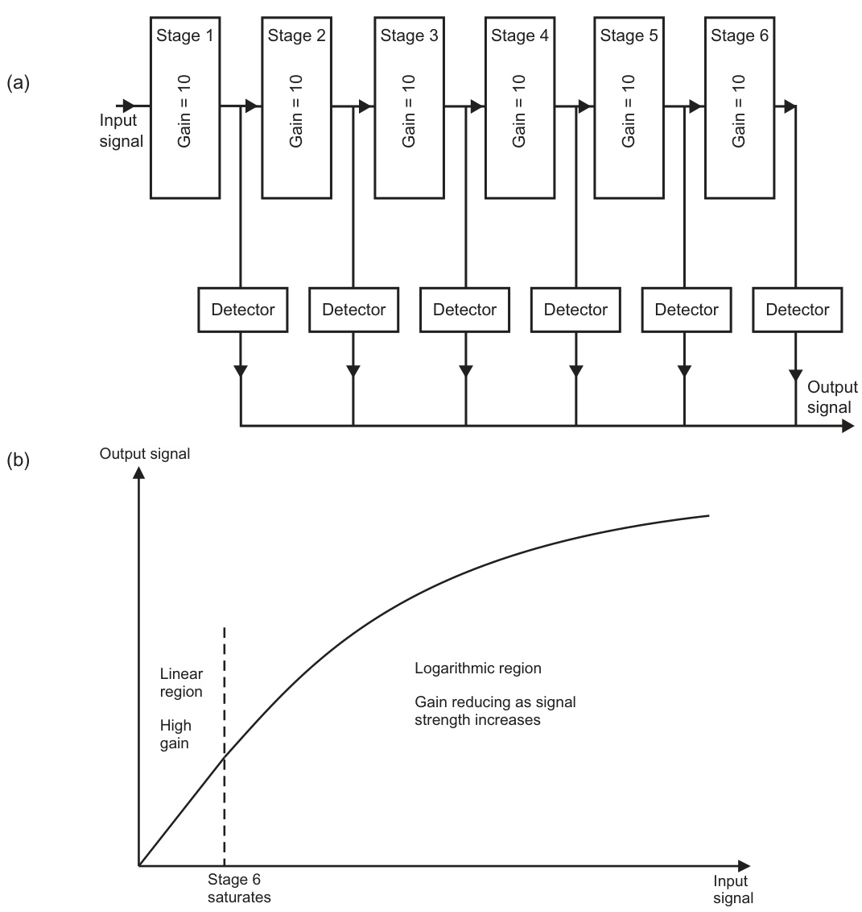  

FIGURE 2.26 The logarithmic amplifier: (a) successive detection and (b) gain curve.  

图 2.26 对数放大器：(a) 连续探测和 (b) 增益曲线。

注：这里的“对数放大器”是指一种可以对输入信号进行对数变换的电子设备，通常用于信号的放大和测量。“对数”是指对数函数，即以 e 为底的对数，在这里指的是信号强度的对数变换。在对数放大器中，输出信号是输入信号的对数函数，通过这种变换，可以实现信号的压缩和放大。 

这里的“增益曲线”是指对数放大器的增益随着输入信号的变化而变化的曲线，这条曲线可以直观地表现出对数放大器的工作特性和灵敏度。

The logarithmic amplifier increases the range of signals which can be handled without saturating the receiver. In practice, the radar designer has to use the characteristics of the log amplifier and the generally multiple stages of STC to handle the vast range of the received radar signals. It is not simply that the logarithmic amplifier deals with target size effects and the STC with range sensitivity effects. However, when using a logarithmic receiver with a wide dynamic range all the subtleties of the STC can potentially be carried out in the digital domain.  

对数放大器（logarithmic amplifier）能够扩大接受信号的范围，防止接受器过载。在实际应用中，雷达设计师通常利用对数放大器的特性以及多个敏感时间控制（STC）阶段来处理接收到的雷达信号的庞大范围。这种方法并不只是简单地依靠对数放大器来处理目标尺寸效应，而是让敏感时间控制处理距离敏感性效应。然而，当使用动态范围宽的对数接收器时，所有的敏感时间控制细节都可以在数字域中实现。这意味着，在设计和实施雷达系统时，可以在数字信号处理层面更好地控制和优化系统的性能，包括对目标检测和距离估计的影响。

The radar reception process so far described has been ensuring that no detrimental transmitted energy can enter the receiver chain; collecting the radar-reflected energy from targets by the antenna; low-noise amplification of the RF signal; down-conversion to IF; and then amplification and reduction of the dynamic range of the signal. At this point the signal is still modulated, typically at an IF of $60\mathrm{MHz}$ .  

到目前为止，所描述的雷达接收过程已经确保没有有害的传输能量可以进入接收链（receiver chain）；通过天线（antenna）收集来自目标的雷达反射能量；对射频（RF）信号进行低噪声放大；将信号下变换（down-conversion）至中频（IF）；然后对信号进行放大和动态范围（dynamic range）降低。在这一点，信号仍然被调制（modulated），通常在中频为$60\mathrm{MHz}$。

#### 2.6.4.6 The Second Detector  

The final phase of the conventional radar receiver is to eliminate the IF modulation from the received signal, and just be left with its envelope, which can then be digitized. It will feature multiple range (and therefore time) separated copies of the transmitted signal, approximating to a rectangular pulse on a conventional magnetron radar, but generally modified by the details of the specific reflecting objects. It is this signal which contains the essential radar information. It is used to form the displayed image and so is often known as the video signal. It is also known as the baseband signal, as it contains no frequency components other than that needed to portray the information contained within the reflected signal.  

传统雷达接收机的最后阶段是消除接收信号中的中频（IF）调制，只留下信号的包络（envelope），然后对其进行数字化。这个信号将包含多个范围（因此也是时间）分离的已传输信号的副本，对于传统的磁控管雷达来说，大致近似于一个矩形脉冲，但通常会被具体反射物的细节所修改。这就是包含基本雷达信息的信号，它被用来形成显示的图像，因此常被称为视频信号（video signal）。它也被称为基带信号（baseband signal），因为它只包含了反射信号中所包含信息需要的频率分量，不包含其他任何频率分量。其中，“基带信号”[指的是不进行频率转换、直接代表原始信号的数字信号]和“视频信号”[指的是最终用于显示的信号]都是雷达领域的重要概念。

The function of the detector is to extract the envelope from the amplified IF signals (Figure 2.27). In engineering texts it is sometimes referred to as the second detector, the mixer being considered to be the first detector; the process involved is fundamentally the same. Also the term demodulator is used. This arises from the general terminology of radio communication in which the term modulation is used to describe the process whereby a signal representing information (e.g. speech, music or data) is superimposed, for transmission onto an RF carrier. For radar, the modulating signal is the rectangular pulse envelope (see Figure 2.4), and the carrier is the RF oscillations produced by the magnetron. The function of the demodulator or detector is to recover the modulation, as modified by the target reflections.  

探测器（detector）的功能是从放大后的中频信号（IF信号）中提取信号包络（见图2.27）。在工程文本中，有时将其称为第二探测器，混频器（mixer）被认为是第一个探测器，因为所涉及的过程从根本上来说是相同的。同时，也使用解调制器（demodulator）这个术语。这源自无线电通信的通用术语，在这种术语中，调制（modulation）一词被用来描述将代表信息（例如语音、音乐或数据）的信号叠加到射频载波（RF carrier）上的传输过程。对于雷达来说，调制信号是矩形脉冲包络（见图2.4），而载波则是由磁控管（magnetron）产生的射频振荡。解调制器或探测器的功能是恢复调制信号，即根据目标反射进行修改的调制信号。

  

FIGURE 2.27 Pulse detection.  

图 2.27 脉冲检测。

The characteristic of the detector must be such that it will respond to the relatively low frequencies that are effectively contained (by Fourier analysis) within the pulse envelope - generally less than 20 MHz but reject the relatively high IF oscillations, typically at $60\mathrm{MHz}$ . In fact, if the targets are moving they also put a very subtle form of additional frequency modulation onto the transmitted signal, simply because the movement introduces a very slightly varying path length from transmission to reception. If this can be detected by the radar it can give an instantaneous velocity measurement of the target, which greatly helps identification of whether it is clutter or a wanted target. This information can be retained at detection if a special IQ demodulator is used, which is described in Section 2.9.1. The frequency instability of marine magnetrons is such that they mask such effects and so $I Q$ demodulation is generally only used in coherent radars. In fact the term coherent is intimately connected to the concept of IQ demodulation and the improved potential performance of such radars is a direct consequence of it.  

检测器的特性必须能够响应脉冲包络（通过傅里叶分析）中包含的相对较低的频率 - 通常小于20 MHz，但要拒绝相对较高的中频振荡，典型的频率在60MHz左右。实际上，如果目标正在移动，它们也会在传输信号上添加一种非常微妙的 频率调制 （频率调制是将信号的频率随着信息信号的变化而变化的调制方式 [通过改变信号的频率来传递信息]），只是因为运动会引入从传输到接收的路径长度略微变化。如果雷达能够检测到这种变化，则可以对目标进行瞬时速度测量，这有助于确定它是杂波（干扰信号 [来自非目标物体的信号]）还是所期望的目标。这种信息可以在检测时通过使用特殊的 IQ解调器来保留，该解调器在第2.9.1节中描述。海洋磁控管（一种产生高频电磁波的设备 [用于雷达系统]）的频率不稳定性足以掩盖这些效应，因此 IQ解调通常只在相干雷达中使用。实际上，相干（相干指两个或两个以上的波或波动在相位方面有规则的关系 [即它们的相位可以预测]）一词与 IQ解调的概念密切相关，这种雷达的潜在性能改进是相干的直接结果。

Once at baseband the signal is typically further (linearly) amplified and then converted from analogue into digital form. The processes often go by the names video amplification and analogue-to-digital conversion. The latter is variously abbreviated as A-to-D, A/D or ADC.  

一旦信号被转换为基带（baseband），它通常会进一步（线性地）放大，然后从模拟形式转换为数字形式。这些过程通常被称为视频放大（video amplification）和模拟-数字转换（analogue-to-digital conversion）。后者通常被缩写为A-to-D、A/D或ADC（模数转换，即将模拟信号转换为数字信号的过程）。

### 2.6.5 Radar Interference  

#### 2.6.5.1 In-Band Interference  

Interference issues for radars have become increasingly more complex as time has advanced. When first introduced the main problem was interference with other radars, not necessarily maritime. Radar-to-radar interference tends to cause a characteristic set of discontinuous lines across the display, see Figure 2.28. This is caused mainly by the direct transmissions of other radars being picked up by the main beam and sidelobes of the ownship radar antenna. It can often make the radar display unusable. For this reason the marine radar bands were made wide enough to allow different radars to be operating on different frequencies, but all within the internationally agreed limits (nowadays, 2.9 3.1 GHz at S-band and $9.2{-}9.5\mathrm{GHz}$ at X-band).  

雷达的干扰问题随着时间的推进变得越来越复杂。当雷达最初被引入时，主要问题是与其他雷达的干扰，而不仅仅是海事雷达。雷达到雷达的干扰往往会在显示屏上造成一组不连续的线条（见图2.28）。这主要是因为其他雷达的直接传输被本舰雷达天线的主波束和副瓣接收到。这种干扰经常会使雷达显示变得无法使用。因此，海事雷达频段被设计得足够宽，以便不同的雷达可以在不同的频率上操作，但都在国际协议的限制范围内（目前，S波段为2.9-3.1 GHz，X波段为9.2-9.5 GHz）。这种设计可以减少雷达之间的干扰，提高雷达的可用性和准确性。通过在不同的频率上操作，雷达可以降低被其他雷达干扰的可能性，从而提供更可靠和更准确的目标探测和跟踪功能。

This did not remove all interference but a way of significantly reducing the on-screen effect of radar-to-radar effects was developed. This was to introduce a random jitter into the timing of each transmitted pulse, resulting in a non-constant PRF but with the average value equalling the desired one. Of course, this effect has to be appropriately taken into account within the radar receiver. By doing this, it significantly reduces the possibility of interference ‘arcs’ being produced on the displays of other radars, simply because there is reduced probability that the timing of the own ship and interfering transmissions remain in any kind of step. Instead there are just random instances of interference across the display, creating intermittent rather bright false target effects. Furthermore, these can be eradicated by some clever but simple processing, illustrated in Figure 2.29. This shows a particularly simplified example but is the basic principle of radar interference rejection used on magnetron-based marine radars.  

这并没有消除所有的干扰，但开发了一种方法，可以显著减少雷达到雷达干扰对屏幕的影响。这种方法是将随机抖动（jitter）引入每个传输脉冲的时序中，从而产生一个非恒定的脉冲重复频率（PRF），但平均值等于所需的频率。当然，这个效果必须在雷达接收器中适当地考虑。通过这样做，它可以大大减少干扰“弧线”出现在其他雷达显示器上的可能性，只是因为自身船只和干扰传输的时序保持在任何步骤中的概率减少了。相反，在显示器上仅显示随机的干扰实例，产生间歇性而非常亮的假目标效果。此外，这些干扰可以通过一些巧妙但简单的处理来消除，如图2.29所示。这显示了一个特别简化的例子，但这是基于磁控管的海洋雷达中使用的雷达干扰抑制的基本原理。[磁控管是一种高功率的微波发生器，常用于雷达系统中]。

  

FIGURE 2.28 Interference patterns on display. Reproduced couretsy of Northrop Grumman Sperry Marine.  

图2.28 干扰（一种信号相互作用和破坏的现象，[类似于电磁波或声波之间的相互作用，导致信号失真或衰减]）模式显示。转载自Northrop Grumman Sperry Marine。

The returns from two consecutive pulses are shown. For the first (Pulse $n$ ), three targets are visible and there is one interference ‘spike’. For the second pulse (Pulse $n+1,$ ), it is almost certain that there will not be another interference pulse appearing at exactly the same instant and therefore equivalent to a particular range. This is because both the interfering and own ship radars are jittering their pulse transmissions to different times. Only real targets are therefore visible in the second trace. The radar then performs a digital process known as correlation. If a detection matches (in range) over the two pulses transmitted then we assume that the target is real, but if we only get a detection at a particular range for just one of the two transmitted pulses we assume that it is interference and it is rejected (deleted).  

下面是英文文本的中文翻译：

两个连续的脉冲返回信号如图所示。对于第一个脉冲（脉冲$n$），有三个目标可见，並且有一个干扰‘峰值’（spike）。对于第二个脉冲（脉冲$n+1$），可以肯定地说，不会在同一时刻出现另一个干扰脉冲，从而与特定的范围（range）相对应。这是因为，干扰 радар（radar）和自己的舰船雷达都将它们的脉冲传输随机化到不同的时间。因此，在第二个信号中，只有真正的目标是可见的。雷达系统随后执行一个称为相关性（correlation）的数字处理过程。如果在两个传输的脉冲中，目标的检测结果（detection）在范围上是匹配的，那么我们就假设该目标是真实的；但是，如果我们只在两个传输的脉冲中的一个脉冲的特定范围内获得检测结果，我们就假设它是干扰，然后将其删除（rejected）。这个过程可以有效地消除偶然的干扰，从而提高雷达系统的探测精度。

This was first introduced on marine radars in the early 1980s and proved to be very effective, even though it does reduce real target detectability by a small amount. This is because very small targets will not necessarily produce a detectable echo from every transmitted pulse, and hence will be totally rejected by the interference rejection system. For this reason interference rejection should not be applied if no disconcerting interference is visible when it is off. 

这是首先在20世纪80年代初期在海洋雷达系统中引入的，尽管它会稍微减少实际目标的可探测性，但它被证明是非常有效的。这是因为非常小的目标并不能保证从每一个传输的脉冲中产生一个可探测的回声，因此将被干扰拒绝系统完全排除。因此，如果在关闭状态下没有看到任何令人不安的干扰（interference），则不应该应用干扰拒绝系统。

 

FIGURE 2.29 Radar interference rejection.  

图2.29 雷达干扰抑制（[Reject指的是拒绝或消除无用信号对系统的影响，干扰指的是外界信号对系统正常工作的影响，抑制指的是减轻或消除这种影响]）。

#### 2.6.5.2 Out-of-Band Interference  

The problem with all radar and radio receivers is that they can be susceptible to interference that is not at the frequency at which they operate. Equipment using a particular band must not only take into account any interference possibilities of similar equipment operating within the same band, but also quite different equipment operating in other bands, which may be adjacent or much further apart in frequency. The possible interference mechanisms are quite complex and beyond the scope of this book. A main function of the International Telecommunication Union (ITU) is to agree internationally as to what band-specific equipment uses and what the maximum interference levels can be without significantly affecting the performance of other systems. Like IMO, ITU is an agency of the United Nations.  

所有雷达和无线电接收机的问题是，它们都容易受到不在其工作频率下的干扰。使用特定频段的设备不仅要考虑在同一频段内工作的类似设备可能产生的干扰，还要考虑在其他频段工作的完全不同的设备，这些设备可能在频率上相邻或相差很远。可能的干扰机制相当复杂，超出了本书的讨论范围。国际电信联盟（ITU）的主要职能之一就是在国际上达成协议，规定哪些频段特定的设备可以使用，以及最大干扰水平可以达到而不会显著影响其他系统的性能。与国际海事组织（IMO）类似，ITU也是联合国的一个机构。其中，干扰（interference）是指[来自其他电信设备或系统的不想要的信号，可能会对原始信号造成影响或破坏]，频段（band）是指[一系列特定的电磁波频率范围，用于无线电通信或其他电信应用]。

Over the years ITU has tightened the requirements of use of the marine radar bands, particularly on the allowable out-of-band interference levels. The easiest way for many manufacturers to meet the stricter criteria was to make their radars generally all operate at virtually the same mid-band frequency. This keeps the transmissions furthest in frequency from other bands and so generally reduces the interference issues to non-marine radar equipment. The built-in radar-to-radar in-band frequency rejection had become so good (ignoring the small level of lost target detection performance) that this was an affordable and practical approach.  

多年来，国际电联（ITU）逐渐加紧了对海事雷达频段使用的要求，特别是对允许的带外干扰水平的限制。许多制造商为了满足更严格的标准，最简单的方法是让他们的雷达设备通常都以几乎相同的中频率运行。这样可以使传输在频率上尽可能远离其他频段，从而一般性地减少了对非海事雷达设备的干扰问题。雷达设备内部的雷达间同频带抑制功能（同频带抑制：[指不同雷达设备之间为了避免互相干扰而进行的频率调整和优化]）变得非常优秀（忽略了小部分目标检测性能的损失），因此这种方法是可行且实用的。通过这样的方法，可以更好地控制和减少干扰问题。

What is now happening is that with the advent of 4G mobile phones and other developments, more and more systems are needing to operate at frequencies close to the radar bands (at present, especially at S-band) and this is further tightening the requirements to prevent interference. It is worth remembering that the use of a 4G mobile phone in the vicinity of the antenna of an older radar may produce interference. The actual effect may be difficult to see on the display, but it may result in lost targets. This is a potential concern for the future and so expect further information concerning this to be promulgated.  

当前的状况是，随着4G移动电话和其他技术的发展，越来越多的系统需要在接近雷达频段（目前尤其是在S波段）的频率下运行，这进一步加剧了防止干扰的要求。值得注意的是，在旧的雷达天线附近使用4G移动电话可能会产生干扰（干扰指的是一种电磁现象，会影响设备的正常工作）。这种干扰的实际影响可能很难在显示屏上看到，但它可能导致目标丢失。这是一个对于未来的潜在问题，因此可以预期会有更多关于此方面的信息被发布出来。

As we learn to live with 4G and its consequences it may be found that some radars are affected by it and other modern transmissions, especially from coastal masts. If this is suspected then the relevant authorities and the radar manufacturer should be alerted. If it does occur at all, it is likely to be observed as a loss of some targets along the bearing connecting the ship to the telecommunications transmitter. Such an effect could possibly only occur if the ship is relatively close to the transmitter, possibly (but not necessarily) closer than 1 NM.  

随着我们逐渐习惯4G及其带来的影响，我们可能会发现一些雷达系统受到了4G和其他现代传输信号的影响，尤其是来自沿海地区的传输信号。如果怀疑存在这种干扰，则应立即通知相关管理部门和雷达制造商。如果干扰确实发生，则可能表现为一些目标在连接船只和电信传输设备的方位上消失。这种影响可能仅在船只相对较近传输设备的情况下发生，可能需要船只距离传输设备不到（但不局限于）1海里[即约1.852公里]。

#### 2.6.5.3 Solid-State Coherent Radars  

These are described in Section 2.9. The problem with these is that the standard interference rejection techniques do not work as well. It generally means that such radars are designed to work at frequencies that are not occupied by conventional magnetron radars. It is therefore convenient that the latter are centred towards mid-band, as described above. By implication, such radars work closer to the edges of the radar bands and so their transmitters have to be particularly well designed to prevent interfering with ‘out-of-band’ systems. Some may automatically select their operating frequency at any one time to operate at a frequency not occupied by any nearby radar, or there may be a need for the operator to select a frequency with little or no interference effects.  

这些问题在第2.9节中有所描述。这些技术存在的问题是，标准的干扰抑制技术（interference rejection techniques，指的是消除或减少无关信号对有用信号的干扰的方法）不能很好地发挥作用。一般来说，这意味着这类雷达系统的设计需要在不被传统磁控管（magnetron）雷达占用的频率下工作。因此，以上所述的传统雷达的频率中心往往集中在中频段，这样就比较方便。隐含的意思是，这类新型雷达系统工作于雷达频段的边缘区域，因此它们的发射器需要特别好的设计，以避免对超出该频段的“带外系统”（out-of-band systems，指的是工作在预定频段以外的系统）产生干扰。有些雷达系统可能会自动选择在任何时候都工作在未被附近雷达占用的频率上，或者操作员可能需要选择一个具有最小或没有干扰影响的频率。这样可以最大限度地减少对其他雷达系统的干扰。

## 2.7 RADAR PROCESSING PRINCIPLES  

Radar has benefited enormously from digital processing. Although analogue processing can be very fast it is extremely limited in what it can do. In fact, the radar log amplifier is one of the few examples where analogue technology can still just hold its own against digital techniques. However, today’s processing power now allows even this function to be affordably performed. In general, the earliest conversion of the received signal to the digital domain is desirable in order to get the best visibility of the wanted targets from the raw received signal. The advent of the microprocessor in the 1970s started this revolution, but it is only since around the start of the twenty-first century that affordable processing power has allowed digitization to be employed prior to the second detection process. Many standard magnetron systems still continue to digitize the signal at this point.  

雷达技术从数字处理中受益良多。尽管模拟处理速度非常快，但它在功能上却非常有限。事实上，雷达对数放大器（log amplifier）是少数几个模拟技术仍然能够与数字技术相媲美的例子。然而，今天的处理能力已经使得即使是这种功能也可以以较低的成本来实现。一般来说，越早将接收到的信号转换为数字域，对于从原始接收信号中获得最佳的目标可视性（visibility）是有利的。20世纪70年代微处理器的出现启动了这场革命，但是直到21世纪初，经济的处理能力才允许在第二个检测过程之前实施数字化。许多标准的磁控管（magnetron）系统仍然继续在这一点对信号进行数字化。 

注：微处理器（microprocessor）是指可以对数据进行处理和运算的集成电路芯片，磁控管（magnetron）则是一种高功率的微波发生器，常用于雷达系统。数字域（digital domain）是指数字信号的处理范围，而第二个检测过程（second detection process）可能是指信号从模拟到数字的转换过程中的一个特定步骤。

### 2.7.1 Conversion to the Digital Domain  

Section 2.6.2.1 gave some initial insight into digitization and this section further elaborates on the basic concepts of working in the digital domain. We have seen that analogue-to-digital conversion is a process that at very short intervals measures the strength of a signal and assigns a digital value to it and is therefore known as a sampling process. The rate at which the sampling takes place is dependent on the maximum frequency of the information of interest embedded within the video signal. A mathematical concept, known as the Nyquist sampling theorem, shows that sampling has to take place at intervals of $2B$ samples per second, where $B$ is the highest frequency of interest (the bandwidth). For a conventional magnetron radar we have to at least adequately replicate the received pulse. The signal bandwidth typically needed to do this on a marine radar is up to about $20\mathrm{MHz}.$ , as discussed in Section 2.7.3.1. The minimum sampling interval for this case is therefore given by $2\times20$ million $=40$ million samples per second, equivalently $40\mathrm{MHz}$ .  

2.6.2.1节已经对数字化技术提供了一些初步的见解，本节将进一步阐述在数字领域工作的基本概念。我们已经看到，模拟-数字转换（analog-to-digital conversion，简称ADC）[将模拟信号转换为数字信号的过程]是一个过程，它在非常短的时间间隔内测量信号的强度，并为其分配一个数字值，因此被称为采样（sampling）[信号的取样]过程。采样发生的速率取决于视频信号中嵌入的有趣信息的最大频率。一个数学概念，即奈奎斯特采样定理（Nyquist sampling theorem）[一种确保采样率足以准确重构原始信号的理论]，表明采样必须在每秒$2B$个采样点的间隔内进行，其中$B$是最高频率（带宽，bandwidth）[信号中最高频率的范围]。对于传统的磁控管（magnetron）雷达，我们必须至少充分地复制接收到的脉冲。通常，在海洋雷达上执行此操作所需的信号带宽为高达20MHz，如2.7.3.1节所讨论的。因此，对于这种情况，采样的最小间隔由$2\times20$百万$=40$百万采样每秒给出，相当于$40\mathrm{MHz}$。

At each sample point we need to adequately represent the received signal amplitude. The amplitude values have typically been compressed by the logarithmic amplifier and some front-end STC but, in general, use of the finest affordable resolution brings benefits to the processing further down the chain. The resolution of this process is generally referenced to the number of digital bits used in representing the signal. The actual device which performs the conversion is known as the analogue-to-digital convertor (A-to-D, A/D or ADC). Early digital radar processors simply used $\prime0^{\prime}$ to represent a signal that at the sample point had a level below a defined threshold, and ${}^{\prime}1{}^{\prime}$ for signals above. In effect, a target was denoted by a 1 and the lack of a target by a 0. By utilizing digital strings many more levels can be represented. Such strings are generally known as words and each binary digit within the word is known as a bit (from binary digit).  

在每个采样点，我们需要充分地表示接收到的信号幅度。通常，幅度值已经被对数放大器和一些前端STC（[空间时间编码，指的是空间和时间上的信号编码和处理过程]）压缩，但是，通常使用最好的可负担的分辨率会给后续的处理过程带来好处。这个过程的分辨率通常是指表示信号时使用的数字位数。执行该转换的实际设备称为模拟-数字转换器（[A-to-D, A/D 或 ADC，负责将模拟信号转换为数字信号]）。早期的数字雷达处理器只使用“0”来表示在采样点信号水平低于定义阈值的信号，并使用“1”来表示高于阈值的信号。实际上，目标被表示为1，缺乏目标被表示为0。通过使用数字串，可以表示更多的级别。这种串通常被称为字（[word]），并且字中每个二进制数字被称为位（[bit]，来自二进制数字）。

A 2-bit word can represent four levels - 00, 01, 10 and 11. Typically, 00 is used to represent the lowest level signals, with 11 representing the highest. The A/D convertor will assign the appropriate word according to the level of the sampled signal strength, as shown in Figure 2.30. The use of 3 bits gives the possibility of representing eight separate levels; 000, 001, 010, 011, 100, 101, 110 and 111. Electronic processors use binary numbers simply because they can be easily represented by two simple states, typically ‘if there is a voltage or current present then the state equates to $1^{\prime}.$ ; and ‘if there is no discernible voltage or current then the state equates to $0^{\prime}$ . This simple logic is the basis lying behind digital processors. However, the processing of the digital data should not be confused with the digital sampling of a signal. As with all digital processes, we are representing our data as a digital string, which the processor can then manipulate, for instance by performing comparisons or calculations with other digital strings.  

一个2位字可以表示四个级别 - 00、01、10和11。通常，00用于表示最低级别的信号，而11表示最高级别。模拟/数字转换器（A/D转换器）会根据采样信号的强度级别分配适当的字，如图2.30所示。使用3位可以表示八个单独的级别：000、001、010、011、100、101、110和111。电子处理器使用二进制数字的原因是它们可以用两个简单的状态来表示，通常是“如果存在电压或电流，则状态等同于‘1’”和“如果没有可辨别的电压或电流，则状态等同于‘0’”。[这里的状态指的是电子信号中有无电压或电流，1表示有信号，0表示无信号] 这种简单的逻辑是数字处理器背后的基础。然而，数字数据的处理不应与数字信号的采样混淆。与所有数字过程一样，我们将数据表示为数字串，[数字串是指由数字组成的序列，如二进制代码] 处理器可以对其进行操作，例如执行与其他数字串的比较或计算。[这里的比较和计算是指处理器对数字串的基本运算，如加、减、乘、除等]

Although the word length of the digital sample has to be fully taken into account, the digital processor can operate with an entirely different word length. For instance, samples from a 10-bit A/D converter may be easily processed by a 16, 32 or even a 64-bit processor. In fact an 8-bit processor could also accurately deal with 10-bit samples, although the required ‘firmware’ would need to take into account the fact that each sample of the data would occupy two 8-bit words within the processor.  

尽管数字样本的字长必须被完全考虑在内，但数字处理器可以以完全不同的字长运行。例如，从10位模数转换器（A/D转换器）获得的样本可以容易地被16位、32位甚至64位处理器处理。实际上，8位处理器也可以精确地处理10位样本，尽管所需的“固件”（firmware）需要考虑到每个数据样本在处理器中占用两个8位字的这一事实。这需要处理器中的软件进行相应的调整，以确保数据的准确处理。

Table 2.4 gives the number of possible signal level representations for various word lengths of the A/D convertor. In fact, the relatively fast A/D conversion needed for marine radar can get comparatively expensive above about 16 bits and therefore current marine systems typically use 10 16 bits for their $\mathrm{A}/\mathrm{D}$ .  

表 2.4 给出了模数/数模转换器（A/D 转换器）不同字长的可能信号级表示数。实际上，对于海洋雷达来说，相对较快的 A/D 转换通常需要高于 16 位，而这会相对较为昂贵，因此当前的海洋系统通常使用 10 位至 16 位的 A/D 转换器（其中 A/D 转换器是指模数到数模的转换，即将连续的模拟信号转换为离散的数字信号）。

  

FIGURE 2.30 Analogue-to-digital conversion.  
TABLE 2.4 Strength Levels for Computer Words of Varying Length   
<html><body><table><tr><td>Word Length (number of bits)</td><td>Number of Levels</td></tr><tr><td>1</td><td>2</td></tr><tr><td>2</td><td>4</td></tr><tr><td>3</td><td>8</td></tr><tr><td>4</td><td>16</td></tr><tr><td>8</td><td>256</td></tr><tr><td>16</td><td>65,536</td></tr><tr><td>32</td><td>4,294,967,296</td></tr><tr><td>64</td><td>1.84467 × 1019</td></tr></table></body></html>  

图2.30 模拟-数字转换。  
表2.4 不同长度计算机字的强度等级   
| 字长（位数） | 级别数量 |
| --- | --- |
| 1  | 2 |
| 2  | 4 |
| 3  | 8 |
| 4  | 16 |
| 8  | 256 |
| 16 | 65,536 |
| 32 | 4,294,967,296 |
| 64 | 1.84467 × 10^19 |

注：这里的“字长”是指计算机中用来表示一个数值的二进制位数（bit），而“强度等级”是指在该字长下能够表示的不同数值的数量。在数字信号处理中，这两个概念非常重要，因为它们决定了数字信号的精度和范围。换句话说，字长越长，能够表示的数值范围就越大，精度就越高。例如，一个8位的字可以表示256个不同的数值，而一个16位的字可以表示65,536个不同的数值。

A particularly interesting observation is that a 16-bit sample gives a workable dynamic range equivalent to $20\times\mathrm{log}_{10}(65,536)=96$ dB. Not only is that range suitable for audio  it is the word length used for CDs and for many other recording formats but it closely approaches the total signal range required for marine radar $\bf{\nabla}100\mathrm{dB}$ or more). The big difference between audio and marine radar is that the sampling rate for CDs is $44.1\mathrm{kHz},$ but for radar is typically $40\mathrm{MHz\mathrm{~-~}}$ nearly 1000 times faster. It is readily seen that with appropriately fast 16-bit sampling and some minimal RF STC, the logarithmic processing can be performed digitally rather than by passing the signal through a logarithmic amplifier.  

一个特别有趣的观察结果是，16位采样可以提供一个可行的动态范围，相当于$20\times\mathrm{log}_{10}(65,536)=96$ dB。这个范围不仅适合音频（它是CD和许多其他录音格式中使用的字长），而且它也非常接近海洋雷达所需的总信号范围（$\bf{\nabla}100\mathrm{dB}$或更多）。音频和海洋雷达之间的巨大差异在于，CD的采样率为$44.1\mathrm{kHz}$，而雷达的采样率通常为$40\mathrm{MHz}$，快了近1000倍。很明显，通过使用适当快速的16位采样和一些最小的射频自适应阈值控制（RF STC），可以数字地进行对数处理，而不是通过对数放大器（[对数放大器：一种通过对输入信号取对数来压缩信号动态范围的设备]）处理信号。

### 2.7.2 Digital Processing  

Radar processing begins to become more simple to understand once conceptualized in the digital domain. For instance, if the user adjusts the gain control, it can simply be processed as a multiplication of all signal levels by a fixed number that represents the setting of the control. It is worth looking at this in more detail as it demonstrates some of the things that have to be considered by the radar engineer when designing a system, and by the user when operating it.  

雷达处理一旦被概念化为数字领域，就变得更容易理解。例如，如果用户调整增益控制（gain control），它可以简单地处理为将所有信号级别乘以一个固定数值，该数值代表控制的设置。这值得进一步详细探讨，因为它演示了雷达工程师在设计系统时和用户在操作系统时需要考虑的一些事情。 

（增益控制是指调整信号的强度，使其更容易被接收和处理。数字领域是指使用计算机和数字信号处理技术来处理和分析数据。）

As an example, take a system that uses an 8-bit A/D and an 8-bit processor. Assume that the sampled signal level at one instant is at the equivalent decimal level of 25 (0001 1001 binary). Now assume that the gain control has been set at a level that results in a five times multiplication of all the sampled values. The resultant signal is boosted to $5\times25=125$ decimal (0111 1101 binary) and so the signal level is increased, leading, in general, to a brighter spot on the display that corresponds to that particular sample. If the gain setting is set to 12, the decimal equivalent of the amplified signal would be $12\times25=300.$ , but this exceeds the highest level that can be represented by a simple 8-bit word and so the resultant level would be at the maximum value 1111 1111 binary, which is 255 decimal. This means that all signals that have been processed, for instance by the user gain setting, such that their levels would have exceeded the maximum possible will be shown at the maximum level. This state is called saturation. On the display it would result as an increased preponderance of very high-brightness signals being shown, potentially masking significant targets.  

以一个使用8位A/D（模数转换器）和8位处理器的系统为例。假设在某一瞬间，采样信号的水平相当于十进制的25（二进制的0001 1001）。现在假设，增益控制已设置为一个水平，这将导致对所有采样值进行五倍的乘法运算。结果信号被提升到$5\times25=125$的十进制值（二进制的0111 1101），从而提高信号水平，通常会导致对应于该特定采样值的显示屏上的点（spot）变得更亮。

如果增益设置为12，则放大信号的十进制等值为$12\times25=300$，但这超过了简单的8位字（binary word）可以表示的最高级别。因此，结果级别将为最大值，二进制表示为1111 1111，相当于十进制的255。这意味着所有经过处理的信号（例如，经过用户增益设置），其级别超过了最大可能值，都将显示为最大级别。此状态称为饱和（saturation，[即信号幅度超过了系统的表示能力上限，导致信号失真或被截断]）。

在显示屏上，这将表现为非常高亮度信号的比例明显增加，从而可能掩盖重要的目标对象。

In fact, this is no different to analogue processing. As previously mentioned, such processes also have a top limit, normally arising when a component such as an amplifier saturates it cannot reach a higher voltage because it is limited by the particular DC power supply within the radar. It is therefore important that any user controls that can effectively saturate the system are used with care. This includes parameters such as radar gain and display brightness. In practice, there is a lot that the radar designer can do to mitigate poor setting by the user, not least by having options for automatic control. Despite this, a skilful and knowledgeable user will naturally get far better performance out of a radar than one being used in ignorance.  

实际上，这与模拟处理没有区别。如前所述，这些过程也存在一个上限，通常是在一个部件（如放大器）达到饱和状态时，就无法达到更高的电压，因为它受到雷达内特定直流电源的限制。因此，任何可能使系统达到饱和状态的用户控制参数都应谨慎使用，包括雷达增益和显示亮度等参数。在实践中，雷达设计者可以做很多事情来减轻用户错误设置的影响，包括提供自动控制的选项。尽管如此，一个技巧娴熟、知识渊博的用户自然会比一个毫无了解的用户从雷达中获得更好的性能。

The given example has really been fundamentally limited by the word length of the assumed radar processor and the basic simplicity of the process. A more sophisticated set-up could, for instance, put the multiplied result into two 8-bit words or more easily utilize a 16-, 32- or even a 64-bit processor. As previously emphasized, the word length of the processor and the word length of the A/D process are entirely separate concepts.  

给出的例子实际上确实被所假设的雷达处理器的字长（字长，指计算机处理器一次能处理的二进制数据的位数）和过程的基本简单性所根本限制。一个更复杂的设置可以例如，将乘积结果放入两个8位字（8-bit words）中，或者更容易地利用一个16位、32位，甚至是一个64位处理器（64-bit processor，[即处理器一次能处理64位二进制数据的能力]）。如前所强调的，处理器的字长（[处理器的位宽，决定了处理器一次可以处理的二进制数据位数]）和A/D过程（模数转换过程，[即将模拟信号转换为数字信号的过程]）的字长是完全独立的概念。

To further illustrate the processing options it is perhaps useful to consider another simple example. Take the case where we multiply two 8-bit numbers together, for instance. This can result in up to a 16-bit answer. A further multiplication with an 8-bit number will produce up to 24 bits and so on. There are a number of ways of tackling this fundamental issue without generally leading to the calculation saturating. These all lead to some approximation but a good design will be unaffected in any practical sense.  

为了进一步说明处理选项，考虑另一个简单的例子可能是有用的。假设我们要将两个8位数字相乘，例如。这可以产生最多16位的结果。进一步将结果乘以一个8位数字将产生最多24位的结果，依此类推。为了解决这个基本问题，有几种方法可以避免计算结果的饱和（[即计算结果超过了系统的表示能力，导致信息丢失或错误]）。所有这些方法都会导致某种程度的近似（[即计算结果不是完全准确的，而是接近真实值的]），但良好的设计在实际意义上不会受到影响。

A generally good way of tackling this issue makes use of floating point representation. This is very similar to representing a decimal number in scientific notation such as $1.2\times10^{2}$ $(=120)$ . If we square this number we get $1.44\times10^{4}.$ , which, if working to 1 decimal place of accuracy, will be represented as $1.4\times1\hat{0}^{4}$ . This has maintained the magnitude of the number and maintained a definable accuracy. By such means, digital processors working in binary can perform lengthy calculations to a defined ‘percentage’ accuracy without incurring practical limiting issues.  

为了解决这个问题，一个普遍的好方法是使用浮点表示法。这种方法与在科学计数法中表示一个小数（如$1.2\times10^{2}$，等于120）非常相似。如果我们对这个数进行平方运算，得到的结果是$1.44\times10^{4}$，而如果我们只保留一个小数位的精度，这个结果将被表示为$1.4\times10^{4}$。这种表示方法既保留了数值的大小，又保留了可定义的精度。通过这样的方法，使用二进制运算的数字处理器可以在不出现实际限制的问题的情况下，以定义的“百分比”精度进行长时间的计算。其中，“百分比”精度的概念（即计算结果相对于真实值的误差范围）是通过浮点运算实现的，这使得计算结果在数值上是近似的，但在相对误差上是可控的。

Once in logarithmic form and in the digital domain there is the capability for almost unlimited processing of the received signal, which to a limited extent, is under the control of the operator. In particular, the processing will attempt to optimize the performance taking into account the actual signal format being transmitted, which for a magnetron transmitter is dominated by the pulse length and PRF. To a large extent, these parameters are governed by the particular display range selected by the user, as discussed in Section 2.3.3.2.  

当信号被转换为对数形式并进入数字领域后，就具备了几乎无限的信号处理能力，这种能力在某种程度上受到了操作员的控制。特别是，处理将尝试在考虑到实际被传输的信号格式（对于磁控管发射器来说，主要由脉冲长度和重复频率（PRF）决定）的情况下优化性能。这些参数在很大程度上受到用户所选的特定显示范围的制约，如2.3.3.2节所讨论的。

IMO radar performance standards require user controls to be able to optimize the performance in both sea and rain clutter. Also a gain control function needs to be provided to set the ‘signal threshold gain’. The requirements mention manual and automatic controls, but the term ‘manual’ is far removed from that applied to earlier radars, which were highly simplified compared to today’s systems. For instance, in earlier days the manual gain control would simply raise or lower the gain of the video amplifier, simply altering the brightness of the targets shown on the display. A modern ‘manual gain’ control may intelligently react to the observed situation giving somewhat different thresholds to different areas of the display dependent on the actual received signal. These would increase or decrease according to the user setting but not necessarily uniformly, such that the optimum display could be more subtly set. A threshold is the level of the signal needed for it to be displayed, for instance, at a particular brightness. The different approaches by different manufacturers do lead to observed differences, such that an individual user may prefer one radar to another.  

国际海事组织（IMO）雷达性能标准要求用户控制能够优化海洋和雨天杂波环境下的性能。此外，还需要提供增益控制功能来设置“信号阈值增益”。这些要求提到了手动和自动控制，但“手动”的概念已经与早期雷达系统所采用的概念大不相同，早期系统相比现代系统来说非常简化。例如，在早期，手动增益控制只是简单地提高或降低视频放大器的增益，从而改变显示器上目标的亮度。现代的“手动增益”控制可能会智能地响应观察到的情况，根据实际接收到的信号为显示器的不同区域提供略有不同的阈值。这些阈值会根据用户的设置增加或减少，但不一定是统一的，这样就可以更细致地设置最佳显示效果。阈值是指信号需要达到的水平，例如，在特定的亮度下显示。不同制造商采用的不同方法确实会导致观察到的差异，这样一位个体用户可能更偏爱一种雷达而不是另一种。[注：阈值是指信号必须达到某个特定强度才会被系统检测并显示出来的最低强度水平。在这里，指的是雷达系统中目标在显示器上显示的条件。]

The blurring between automatic and manual controls is effectively taken onboard by IMO, particularly for the functions optimizing the performance in sea and rain clutter, by the sentence in the Radar Performance Standards: ‘a combination of automatic and manual anti-clutter functions is permitted’, which follows the requirement that ‘effective manual and automatic anti-clutter functions is permitted’ (see Section 11.2.1). On some equipment, ‘Automatic’ implies there is no user adjustment, whereas on other equipment, manual adjustment may still be available. However, the range of adjustment or its total effect may be different to when the equipment is in manual mode.  

国际海事组织（IMO）有效地接受了自动和手动控制之间的模糊界限，特别是在优化海和雨杂波性能的功能上。在雷达性能标准中有一句话：“允许使用自动和手动去杂波函数的组合”，这遵循了“有效的手动和自动去杂波函数是允许的”的要求（见第11.2.1节）。在一些设备上，“自动”意味着没有用户调整，而在其他设备上，手动调整可能仍然可用。然而，调整范围或其总体效果可能与设备在手动模式下时不同。这种模糊的界限使得自动和手动控制之间的区分变得不那么明确，因为设备可以在两种模式之间灵活切换，以应对不同的操作需求和环境条件。

### 2.7.3 Range and Azimuth Sampling  

By definition of the concept ‘cell’, the received signal is sampled at every range cell for every discrete azimuth (relative bearing) ‘step’ of the rotating antenna. These samples are then used individually and in appropriate groups as values for the various algorithms that the radar uses to improve the detection and discrimination of targets. In addition, some data will be processed on a scan-to-scan basis, comparing and enhancing the resultant display at every rotation of the antenna. The range cell samples are typically taken after second detection and video amplification of the signal, as described in Section 2.7.1. If digitization has taken place before this point, the sampling rate will need to have been far greater than the rate needed when just digitizing the amplitude of the signal at every range/ azimuth cell. Section 2.7.3.1 shows that the cell sampling of a marine radar when at short rage is perhaps at about $40\mathrm{MHz}.$ , whereas if sampled at IF the rate will need to be at least double the IF frequency, typically $2\times60=120\mathrm{MHz}$ . If such fast sampling is undertaken for the initial digital detection process, they will subsequently be numerically processed to form the received signal strength at the slower sample rate needed to represent the amplitude at each range and azimuth cell.  

根据“单元格”（cell）的定义，接收到的信号会在旋转天线的每个离散方位（相对应的角度）“步骤”中，对每个距离单元格进行采样。然后，这些样本被单独使用和成组地使用，以作为雷达用来改善目标检测和识别的各种算法的值。此外，一些数据将以扫描为单位进行处理，每次天线旋转时都会比较和增强结果显示。注意，“单元格”概念是指雷达信号处理中的基本信息单元，即在特定的距离和方位范围内接收到的信号。

距离细胞采样通常在信号经过二次检测和视频放大后进行，如第2.7.1节所述。如果在此之前已经进行了数字化，则采样率将需要远远高于仅对每个距离/方位细胞的信号幅度进行数字化所需的速率。第2.7.3.1节表明，海洋雷达在短距离下的细胞采样可能约为$40\mathrm{MHz}$，而如果在中频（Intermediate Frequency，IF）[即信号经过混频后，仍然是高频信号，但相对于原始高频信号，有一定的频率降低]进行采样，则采样率至少需要是中频的两倍，通常为$2\times60=120\mathrm{MHz}$。

如果在初始数字探测过程中进行此类快速采样，则会对其进行数值处理，以在每个距离和方位单元格中表示幅度所需的较慢采样率下形成接收信号强度。 

注：范围（range）和方位（azimuth）在这里分别指的是距离和方向。距离通常指的是目标物体与雷达或传感器之间的距离，而方向则指的是目标物体相对于传感器的方位角度。

#### 2.7.3.1 Range Sampling Example  

It is useful to look at a specific example of digital sampling when applied to radar range discrimination. It is a fairly straightforward example and was one of the first used on marine radars. It assumes the normal case of signal digitization immediately after video amplification. It is aimed at recovering the essential target information, which is the amplitude of the received signal at every range/azimuth cell. This fundamental thinking forms the basis of many systems in use today.  

在雷达范围辨别（radar range discrimination）中应用数字采样（digital sampling）时，研究一个具体的例子是非常有用的。这是一个相对简单的例子，也是海事雷达（marine radars）中最早使用的例子之一。它假设信号数字化（signal digitization）发生在视频放大（video amplification）之后。其目标是恢复每个距离/方位单元（range/azimuth cell）上接收信号的幅度等基本目标信息。这种基本的思考方式构成了许多当前系统的基础。其中，雷达范围辨别是指雷达系统能够区分和识别不同距离上的目标的能力，而距离/方位单元是指雷达扫描区域中每个小的、独特的区域。

Example: A marine radar system needs to discriminate two targets separated by $40\mathrm{m}$ in range on the $1.5\mathrm{NM}$ range scale. Calculate a suitable pulse length and sampling rate, giving due regard to a required range accuracy of $30\mathrm{m}$ at short range.  

例子：某海洋雷达系统需要在1.5海里（nautical miles，NM）范围量表上区分两个相距40米的目标。考虑到短距离处需要的距离精度为30米，计算合适的脉冲长度和采样率。

An electromagnetic wave takes $40\div(3\times10^{8})$ seconds to travel $40\mathrm{m},$ which is equal to 133.3 ns. The situation is illustrated in Figure 2.31. The leading edge of the pulse from the closest target (Target 1) will be received at $133.3\times2=266.6$ ns before the leading edge of the response from Target 2. This is because the pulse has to travel an extra 133.3 ns both to and from Target 2, compared to the case for the reflection from Target 1. If a pulse length of 133.3 ns was used it would ensure that there is a gap equal to the pulse length between the reflections from Target 1 and Target 2. The sampling rate would then need to ensure that the responses from two such targets were always visibly separate. This would need the sample rate to be equivalent to measuring the received signal at least once every $133.3\mathrm{ns}_{.}$ , that is at $7.5\mathrm{MHz}$ . Looking at the best range accuracy that could be achieved, assuming perfect timing measurements, it is important to remember that for a radar, the range $(R)$ of a target is given by the formula:  

电磁波需要 $40\div(3\times10^{8})$ 秒钟才能行进 $40\mathrm{m}$ 的距离，这相当于 133.3 纳秒。这种情况如图 2.31 所示。来自最近目标（Target 1）的脉冲（一种信号传输方式，[直译：脉动状的波，特指一种数字信号传输方式]）的前沿将比来自 Target 2 的响应的前沿提前 $133.3\times2=266.6$ 纳秒被接收。这是因为脉冲需要额外地往返 Target 2 一次，和往返 Target 1 的距离不同。如果使用 133.3 纳秒的脉冲长度，那么可以保证 Target 1 和 Target 2 的反射之间会有一个间隙，间隙的长度等于脉冲长度。然后，采样率需要确保两个此类目标的响应始终可视分离。这需要采样率至少相当于每 $133.3\mathrm{ns}$ 测量一次接收到的信号，也就是说，每秒采样 $7.5\mathrm{MHz}$ 次。观察能否获得最好的范围精度，假设时间测量完美，无论如何，了解雷达的目标范围 $(R)$ 由公式给出是非常重要的：

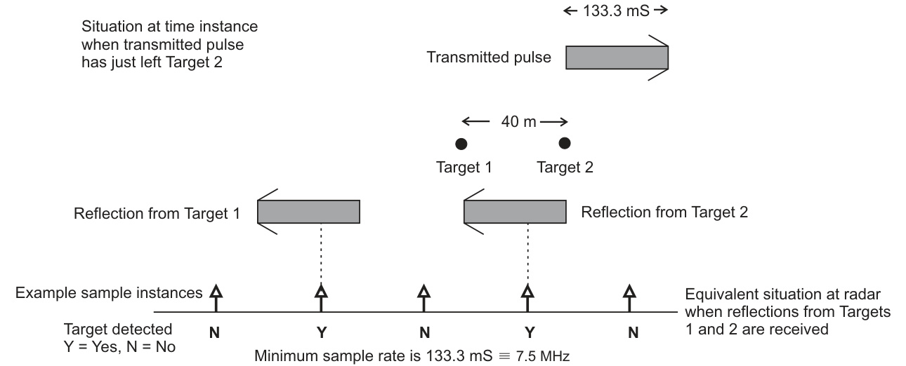  

FIGURE 2.31 Pulse length considerations.  
$$
R=c T/2
$$  
where:  
$c=$ the velocity of electromagnetic energy 
$T=$ the total time between the transmission and reception of a reflected pulse  

图2.31脉冲长度考虑。  
$$
R=c T/2
$$  
其中：  
$c=$ 电磁能量的速度（即光速，在真空中为299,792,458米每秒）  
$T=$ 传输和接收反射脉冲之间的总时间（也就是信号往返的时间，决定了系统的分辨率和精度）  

在上述公式中，$R$ 代表了反射脉冲传输和接收之间的距离（半程距离），$c$ 和 $T$ 之间的关系决定了脉冲长度对系统分辨率和精度的影响。

If time is being quantized to $133.3\mathrm{ns}$ because of the sampling rate, this equation also shows that the equivalent range quantization is $20\mathrm{m}$ . This means that the range accuracy degradation due to the chosen sampling rate is at worst $20\mathrm{m}$ and so is compatible with IMO requirements for a minimum of $30\mathrm{m}$ accuracy. It is also worth relating this example to the ideas discussed in Section 2.7.1, particularly concerning the Nyquist rate. The sampling rate of $7.5\mathrm{MHz}$ implies a signal bandwidth of half that amount, just $3.75\mathrm{MHz},$ with $c$ being the velocity of electromagnetic radiation and $f_{\mathrm{b}}$ being the bandwidth.  
This is equivalent to an electromagnetic wave of wavelength:  
$$
\begin{array}{c}{\lambda=c/f_{\mathrm{{b}}}=3\times{10^{8}}/{(3.75\times10^{6})}}\ {=80\mathrm{{m}}}\end{array}
$$  

如果由于采样率而使时间被量化为$133.3\mathrm{ns}$，那么该方程也表明等效的距离量化是$20\mathrm{m}$。这意味着由于所选采样率而导致的距离精度劣化最坏的情况是$20\mathrm{m}$，从而符合国际海事组织（IMO）对于最低$30\mathrm{m}$精度的要求。同样值得一提的是，将这个例子与第2.7.1节中讨论的想法相关联，特别是关于奈奎斯特率（[Nyquist率：信号处理中的一个概念，指出为了正确地重构一个连续时间信号，采样率必须至少是信号中的最高频率的两倍]）的讨论。采样率为$7.5\mathrm{MHz}$意味着信号的带宽是这个数字的一半，即$3.75\mathrm{MHz}$，其中$c$是电磁辐射的速度（[即光速，约为每秒300,000,000米]），$f_{\mathrm{b}}$是带宽。

这等同于一个电磁波的波长为：

$$
\begin{array}{c}{\lambda=c/f_{\mathrm{{b}}}=3\times{10^{8}}/{(3.75\times10^{6})}}\ {=80\mathrm{{m}}}\end{array}
$$

其中$\lambda$代表电磁波的波长，$c$代表电磁辐射的速度，$f_{\mathrm{b}}$代表带宽。这段内容强调了采样率、信号带宽以及电磁波的波长之间的关系，这是信号处理和通信系统中的一个重要概念。

This is exactly the length of the pulse in free space plus the $40\mathrm{m}$ minimum needed between targets to be able to distinguish them. It is effectively portraying the minimum needed system bandwidth $(3.75\mathrm{MHz})$ that is needed to be able to discriminate such targets in range.  

这正是自由空间中脉冲的长度加上能够区分目标所需的最小距离$40\mathrm{m}$。它有效地描绘了能够区分这种范围内的目标所需的最小系统带宽$(3.75\mathrm{MHz})$。其中，系统带宽是指系统能够传输或处理的信号频率范围[系统带宽是指系统能够处理的信号频率范围的宽度，通常用赫兹（Hz）来表示]，而自由空间中脉冲的长度是指脉冲在真空中传播的距离[自由空间是指没有任何物质或介质的空间，脉冲的长度是指脉冲波形在真空中传播的距离]。

A typical real radar operating at short range would actually utilize a considerably shorter pulse length of around 50 ns $(0.05 \mu s)$ , rather than the 133 ns $(0.113~ \mu s)$ pulse used in the example. This is because a shorter pulse gives appreciable benefits in separating wanted targets from clutter with its better range discrimination. The sample rate, following the logic in the above example, would then equate to $20\mathrm{MHz}$ and be able to distinguish point targets $15\mathrm{m}$ apart.  

一个典型的实际雷达在短距离操作时，实际上会使用一个明显较短的脉冲长度，约为50纳秒$(0.05 \mu s)$，而不是在示例中使用的133纳秒$(0.133 \mu s)$的脉冲长度。这是因为较短的脉冲可以在区分所需目标和杂乱方面带来显著的好处，因为它具有更好的距离鉴别能力[即雷达系统判断两个目标是否为独立目标的能力]。按照前面示例中的逻辑，采样率将相当于$20\mathrm{MHz}$，并且能够区分相距$15\mathrm{m}$的点目标[即两个相距15米的独立目标]。

In reality, for a well-formed pulse, even faster sampling will give target discrimination benefits. A reasonably well-formed pulse is considered to have an equivalent bandwidth given by the reciprocal of the pulse length. For a 50 ns pulse this equates to $20\mathrm{MHz}$ . To get the most information from the received signal this would need to be sampled at the Nyquist rate of $40\mathrm{MHz},$ and this would improve the range discrimination to about $7.5\mathrm{m}$ . In effect, what is happening is that the system, with increased sampling, is able to detect shorter gaps between targets. The reason why the simple approach initially illustrated in this example does not come up naturally with the Nyquist rate is because the time gap between the returns from targets at different ranges are effectively doubled (by the fundamental nature of radar), but the reflected pulses remain of the same length as the transmitted pulse.  

实际上，对于一个良好形成的脉冲（well-formed pulse），即使更快的采样也会带来目标辨别（target discrimination）的好处。一个合理的良好形成的脉冲被认为具有一个等效带宽（equivalent bandwidth），由脉冲长度的倒数给出。对于一个50纳秒的脉冲，这相当于$20\mathrm{MHz}$。为了从接收到的信号中获取最多的信息，这需要以奈奎斯特率（Nyquist rate）$40\mathrm{MHz}$进行采样，这将改善范围辨别度（range discrimination）到大约$7.5\mathrm{m}$。实际上，发生的情况是，系统通过增加采样率，能够检测到目标之间更短的间隙（gaps between targets）。最初在这个例子中介绍的简单方法之所以没有自然而然地得出奈奎斯特率，是因为来自不同范围目标的返回信号之间的时间间隙（time gap）实际上是被加倍的（这是雷达的基本性质），但是反射脉冲仍然与传输脉冲的长度相同。 [注：奈奎斯特率是指采样频率至少应为信号最高频率的两倍，才能完美地再现原始信号。目标辨别度是指雷达系统能够区分两个目标的能力，特别是在距离方面。]

#### 2.7.3.2 Defining the Azimuth Cell  

The selection of the azimuth cell is quite a complex task. Radar designers are likely to take different approaches because of the various factors that need to be considered. In this digital age it is easiest to consider that they all effectively amount to creating a table of samples that is defined in azimuth by the PRF. This means that the effective azimuth increment of the table is dependent on the PRF. Samples are taken and effectively stored at every range cell and for every pulse. Take the case of a radar antenna rotating at 24 revolutions per minute, equivalent to 0.4 revolutions per second or $144^{\circ}$ per second. If the example radar is operating at short range with a PRF of $3000H z,$ it effectively creates a table such that each azimuth increment is given by $144^{\circ}\:\div\:3000=0.048^{\circ}$ . At a very long range setting the PRF may be around $375\mathrm{Hz},$ with an equivalent azimuth cell increment of $0.384^{\circ}$ .  

方位单元（azimuth cell）的选择是一项复杂的任务，因为雷达设计师需要考虑各种因素，很可能会采用不同的方法。在这个数字时代，可以认为他们都有效地创建了一个以方位为单位的样本表，该表是由脉冲重复频率（PRF）定义的。这意味着表的有效方位增量取决于PRF。在每个距离单元和每个脉冲中都会取样本并有效地存储。考虑一个以每分钟24转（等价于每秒0.4转或144度每秒）的速度旋转的雷达天线的例子。如果这个示例雷达以3000赫兹的PRF在短距离下工作，那么它有效地创建了一个表格，使得每个方位增量为144度÷3000=0.048度。在一个非常长的距离设置中，PRF可能在375赫兹左右，相当于0.384度的方位单元增量。

Even a point target will appear at the same range in a number of azimuth cells. This is because of the antenna horizontal beamwidth. It means that processing on several adjacent cells can be used to enhance the appearance of the target on the display. In particular, the probability of detection can be enhanced and the probability of false alarm reduced by the use of suitable algorithms working on the samples of a number of adjacent cells, in both azimuth and range. Also, algorithms can be used to sharpen the displayed images of targets and numerous other tasks to improve the image quality and the overall performance of the radar. This includes the rejection of interfering pulses from other radars, see Section 2.6.5.  

即使是一个点目标，它也会出现在同一距离下的一些方位单元中。这是由于天线的水平波束宽度（horizontal beamwidth）[即天线发射的电磁波在水平方向上的散射角度]。这意味着可以通过处理多个相邻的方位单元来增强目标在显示屏上的显示效果。特别地，通过使用适合的算法处理多个相邻方位单元和距离单元的样本，可以提高目标的探测概率并降低虚警概率。此外，算法还可以用来锐化目标的显示图像，并执行许多其他任务以提高图像质量和整个雷达系统的性能。这包括拒绝来自其他雷达的干扰脉冲，参见2.6.5节。

In any particular system, the reality of how the processing is actually done may be rather different to this simplified description. It gets even more complicated when considering the possibilities of scan-to-scan processing. It is unlikely that all the detailed samples will be stored over many scans, or even over a complete scan. Certain processed information is likely to be stored and used over several scans but possibly not at the same cell resolution as originally used. This is all in the hands of the radar designer.  

在任何特定的系统中，实际处理的过程与这种简化的描述可能会有所不同。当考虑扫描间处理（scan-to-scan processing）的可能性时，情况会变得更加复杂 [即，将两个或多个扫描结果进行比较和处理]。不太可能所有详细的样本都会存储下来用于多次扫描，甚至整个扫描过程中都如此。某些处理过的信息可能会在多次扫描中被存储和使用，但不一定会以原始使用的相同像素分辨率进行存储和使用。这一切都由雷达设计师（radar designer）来决定 [雷达系统的开发和优化人员]。

One of the practical considerations to be taken into account is the measurement of the actual angle of the antenna horizontal beam when the pulse is transmitted. Because of mechanical influences such as wind and vessel stability the antenna is unlikely to be rotating at a precise angular rate. Therefore, its actual rotation angle has to be constantly measured. In certain circumstances, the rotation could even be momentarily reversed, especially in very high wind conditions. On a modern radar, the instantaneous bearing of the antenna is given by a digital signal, generated from within the turning mechanism. This is used at the reference angle for the discrete set of range cells measured at each ‘azimuth’ sample. It allows the received data to be associated with the correct bearing relative to the heading line of the vessel at each azimuth cell increment. In reality the azimuth cells previously described are really cells associated with each pulse. Associating the actual pointing angle of the antenna at each radar pulse makes them into azimuth samples. In general, the samples will not be taken at totally fixed azimuth increments and may even briefly reverse.  

在实际应用中，需要考虑的一个重要因素是测量天线水平波束的实际角度，当脉冲被传输时。由于机械影响，如风和船只的稳定性，天线不太可能以精确的角速度旋转。因此，其实际旋转角度必须不断被测量。在某些情况下，特别是在非常强风的条件下，旋转甚至可能暂时逆转。在现代雷达系统中，天线的瞬时方位是由数字信号提供的，该信号是从转动机构内部生成的。这个信号被用作参考角度，用于一组离散的范围单元，这些单元在每个“方位”样本中被测量。它允许接收到的数据与船只的航向线在每个方位单元增量处的正确方位相关联。在实际情况中，之前描述的方位单元实际上与每个脉冲相关的单元。通过关联天线在每个雷达脉冲时的实际指向角度，使它们成为方位样本。一般来说，这些样本不会在完全固定的方位增量处取样，甚至可能会暂时逆转。 [这里的"方位"指的是天线的水平方向，"方位样本"指的是在特定方位上采集的雷达数据]

The relative bearing of the antenna is an angle which generally increases progressively from $0^{\circ}$ to $360^{\circ}$ relative to the ship’s heading, as it rotates. It can, for instance, be represented by a binary number which increases from zero to some maximum, where that maximum is one azimuth increment below $360^{\circ}$ . This is unconnected to the increment that is used for the ‘azimuth’ cell size of the range/azimuth signal amplitude sample. In principle, the antenna sensor could directly give the bearing as a digitally encoded decimal number representing the rotation angle in degrees or radians. In practice, many systems use a more basic concept, which links to the historic development of marine radars.  

天线的相对方位角是一个通常随着天线的旋转而从$0^{\circ}$逐渐增加到$360^{\circ}$的角度，相对于船舶的航向。例如，它可以用一个二进制数字表示，该数字从零增加到某个最大值，其中该最大值是低于$360^{\circ}$一个方位角增量的值。这个最大值与用于测量范围/方位角信号幅度样本的“方位角”细胞尺寸（指的是信号采样时的方位角分辨率）的增量无关。在原理上，天线传感器可以直接以数字编码的十进制数字的形式给出方位角，该数字代表旋转角度的度或弧度（弧度是角度的另一种表示方式，通常用于数学和物理计算中[这里指的是，弧度是圆弧长度与半径之比，表示角度的大小]）。在实践中，许多系统使用一个更基本的概念，这与海洋雷达的历史发展有关。

Instead of a digital word being transmitted from the azimuth sensors on the antenna rotation mechanism, simple digital pulses are generally output. Two separate pulse outputs are provided. One gives a pulse every time the antenna beam is aligned with the heading of the vessel. The other provides a pulse as the antenna rotates through successive defined angular increments. The angular increment is typically related to a binary ‘round’ number such as 1024 or 4096. Thus using the 1024 example a pulse is given every time the antenna rotates through another $3\dot{6}0/1024=0.35^{\circ}$ . The system resets the relative azimuth of the antenna rotation to zero every time a heading pulse is received. For the following $360^{\circ}$ it determines the precise angle at any time instant by the number of azimuth pulses it has received. From this information it can then interpolate the angle of the antenna when each pulse is transmitted. It is this value that forms the angle of the particular azimuth cell. Such a simple system can create small errors in very high winds if the antenna rotation momentarily changes directions. However, these errors are corrected when the next heading line pulse is received. More sophisticated systems than that described here can instantaneously cope with such circumstances and are used on some marine radars.  

在天线的旋转机构上安装的方位传感器通常不会直接传输数字化的信息，而是输出简单的数字脉冲。一般提供两个独立的脉冲输出信号。一种信号在天线波束与船舶的航向对齐时产生脉冲。另一种信号则在天线按照预定的角度递增量进行旋转时产生脉冲。这个角度递增量通常与二进制的“整数”（例如1024或4096）相关。因此，使用1024作为例子，每次天线旋转通过$3\dot{6}0/1024=0.35^{\circ}$角度时，就会产生一个脉冲。这意味着天线的旋转可以被分解为许多小的、精确的角度变化，从而实现对天线位置的精确控制。

该系统在每次接收到航向脉冲（heading pulse）信号时，都会将天线旋转的相对方位角（relative azimuth）重置为零。在接下来的$360^{\circ}$范围内，它通过接收到的方位脉冲（azimuth pulses）的数量来确定任意时刻的精确角度。从这些信息中，它可以通过内插（interpolate）的方法计算出每个脉冲传输时天线的角度。正是这个值构成了特定方位单元（azimuth cell）的角度。这样一个简单的系统在极端风条件下可能会产生小的错误，因为如果天线旋转暂时改变了方向，这种系统可能无法及时纠正。这是因为在极端风中，天线的旋转可能会受到干扰，导致系统在短时间内无法准确地确定方位角，从而产生错误。

然而，当接收到下一个航向线脉冲信号时，这些错误就会得到纠正。在一些海洋雷达系统中，使用了比这里描述的更为先进的系统，这些系统能够瞬间处理此类情况。

Together with the value of the range cell, this angle is used to identify the stored measurement of signal strength. The process can be considered to form a table of signal strengths against range and relative bearing, as shown in Figure 2.32. The amplitude of the returns will be stored as a digital number. On older radars this could have been simply a 1-bit number, 0 or 1, depending on whether a target was detected or not, based on previous analogue processing of the signal. On modern radars the amplitude is stored in multi-bit form, typically 4-16 bits, allowing the target detection process to become part of the digital processing function.  
<html><body><table><tr><td rowspan="2"></td><td rowspan="2"></td><td colspan="3">Range</td><td></td></tr><tr><td>△R</td><td>2△R3△R</td><td></td><td>etc.</td></tr><tr><td rowspan="4">Relative bearing</td><td>O</td><td>A10</td><td>A20</td><td>A30</td><td></td></tr><tr><td>△p</td><td>A11</td><td>A21</td><td>A31</td><td></td></tr><tr><td>2△</td><td>A12</td><td>A22</td><td>A32</td><td></td></tr><tr><td>etc.</td><td>△R=Maximumrange/numberofrange △y=360°/numberofazimuthsamples Axy= Amplitude of return at (R,p)</td><td>samples</td><td></td><td></td></tr></table></body></html>  

与范围单元的值一起，这个角度被用来识别存储的信号强度测量结果。这个过程可以被认为是形成一个关于信号强度与范围和相对方位的表格，如图2.32所示。返回信号的幅度将以数字形式存储。在较老的雷达系统中，这可能只是一位数字，即0或1，取决于是否检测到目标，基于以前的模拟信号处理。在现代雷达系统中，幅度以多位数字形式存储，通常为4-16位，这使得目标检测过程成为数字处理功能的一部分。

/html>
/body>
/table>
/tr>
/td rowspan="2">
/td rowspan="2">
/td colspan="3">
范围
/td>
/td>
/tr>
/tr>
/td>
△R
/td>
/td>
2△R
/td>
/td>
3△R
/td>
/td>
等等
/td>
/tr>
/tr>
/td rowspan="4">
相对方位
/td>
/td>
O
/td>
/td>
A10
/td>
/td>
A20
/td>
/td>
A30
/td>
/td>
/tr>
/tr>
/td>
△p
/td>
/td>
A11
/td>
/td>
A21
/td>
/td>
A31
/td>
/td>
/tr>
/tr>
/td>
2△
/td>
/td>
A12
/td>
/td>
A22
/td>
/td>
A32
/td>
/td>
/tr>
/tr>
/td>
等等
/td>
/td>
△R=最大范围/范围单元数量 △y=360°/方位采样数量 Axy= 在(R,p)处的返回信号幅度
/td>
/td>
采样
/td>
/td>
/tr>
/table>
/body>
/html>

注：图2.32是一个二维表格，用于描述信号强度与范围和相对方位之间的关系。在这个表格中，每个单元格代表一个特定的范围和相对方位，存储着在该位置检测到的返回信号的幅度值。这种结构使得雷达系统

### 2.7.4 Clutter Suppression  

A great deal of processing is used to help detect targets in clutter. Nowadays, much of this takes place in the digital domain, but the important things to understand are the fundamental concepts, as described in this section.  

大量的处理手段被用来帮助检测杂乱环境中的目标。如今，大部分这些处理都发生在数字领域，但是要理解的重要事情是基本概念，就像本节中所描述的那样。 

（注：处理手段指的是数据处理和分析的方法和技术；数字领域是指使用数字信号处理和计算机技术来处理和分析数据；目标检测是指从背景或杂乱中识别和定位特定物体或模式的过程）

#### 2.7.4.1 Sea Clutter  

The amelioration of sea clutter effects is intimately tied up with STC. For normal targets, as underlined by the radar equation, we have seen that the returned signal power varies according to $1/R^{4}$ . However, the sea does not act like a normal target, as its effective RCS varies according to range. If at first we imagine a sea area on a totally flat earth, the effective illuminated area of sea at any one instant would be bounded by the beamwidth of the radar antenna and the length of the range cell, see Figure 2.33. Mathematics readily shows that the area $A_{\mathrm{s}}$ of the sea being ‘illuminated’ by the radar is given by:  
where:  
$$
A_{\mathrm{s}}=K\times\theta\times R\times\Delta R
$$  
$K$ is a constant irrelevant to this discussion 
$\theta$ is the beamwidth of the antenna 
$R$ is the range of the range cell and 
$\Delta R$ is the range cell increment  

改进海洋杂波效应与海杂波消除技术（STC）密切相关。对于正常目标，如雷达方程所强调的，我们已经看到返回信号功率根据$1/R^{4}$变化。但是，海洋并不像正常目标一样，其有效雷达截面积（RCS）根据距离变化。如果我们最初想象一个海洋区域位于完全平坦的大地上，那么海洋被雷达“照亮”的有效区域将受到雷达天线的波束宽度和距离单元的长度的限制，如图2.33所示。数学运算很容易表明，被雷达“照亮”的海洋区域$A_{\mathrm{s}}$的面积由以下公式给出：

其中：

$$
A_{\mathrm{s}}=K\times\theta\times R\times\Delta R
$$

其中：
$K$ 是一个与本讨论无关的常数，
$\theta$ 是天线的波束宽度（[即雷达波束的横向散射角度]），
$R$ 是距离单元的距离（[即雷达信号所覆盖的距离范围]），
$\Delta R$ 是距离单元的增量（[即距离单元的分辨率]）。

该公式表明，海洋杂波效应与距离的变化有关，这与正常目标截然不同。通过理解和分析这一关系，可以更好地开发和改进海杂波消除技术，以提高雷达系统在海洋环境中的检测和跟踪性能。

The important fact is that the area of the sea being illuminated is proportional to the range, $R,$ resulting in the equivalent RCS of the sea also being proportional to $R$ . The sea’s RCS increases with range, unlike regular targets which have a range independent of RCS. However, it is also worth recognizing that the RCS of the other major component of clutter (precipitation, such as rain) also tends to increase with range. This time, because the volume of precipitation illuminated also increases with range - and hence with the increase proportional to the square of the range, assuming that the precipitation continues to occupy all the vertical angle of the radar antenna, which in reality is unlikely over any appreciable distance.  

重要的事实是，被照亮的海洋区域与距离$R$成正比，这意味着海洋的雷达散射截面（RCS）也与$R$成正比。海洋的RCS随着距离的增加而增加，不像普通的目标，它们的雷达散射截面与距离无关。然而，同样值得注意的是，杂波的另一个主要成分（如降水，例如雨水）的雷达散射截面也随着距离的增加而增加。这一次，是因为被照亮的降水体积也随着距离的增加而增加——因此，其增长比例与距离的平方成正比，假设降水继续占据整个雷达天线的垂直角度，这在实际上是不太可能在任意可观测的距离内发生的。[这里的“可观测的距离”是指能够被雷达设备探测和跟踪的距离范围]。

  

FIGURE 2.33 Area of range/azimuth cell.  

图 2.33 距离/方位单元区域。 

（注：范围/方位单元指的是雷达或其他传感器探测区域中按照一定的距离和角度划分的最小单元，其中"范围"是指目标的距离，而"方位"则是指目标的角度位置。）

For sea clutter, and assuming a flat earth, the fact that its RCS is proportional to range effectively means that the $R^{4}$ term in the radar equation reduces to $R^{3}$ , simply because the RCS $(\sigma)$ should now be represented by $R\times\sigma_{\mathrm{s}},$ where $\sigma_{\mathrm{s}}$ is a fixed quantity, effectively representing the RCS of the particular seastate at $R=1$ . Mathematically we have from the representation of the radar equation in Section 2.6.1:  
$$
P_{\mathrm{r}}=k P_{\mathrm{t}}G^{2}\sigma/R^{4}=k P_{\mathrm{t}}G^{2}R\sigma_{\mathrm{s}}/R^{4}=k P_{\mathrm{t}}G^{2}\sigma_{\mathrm{s}}/R^{3}
$$  

对于海洋杂波，假设地球是平的，其RCS（雷达散射截面积）与距离成正比，这意味着雷达方程中的$R^{4}$项简化为$R^{3}$。这是因为RCS（$\sigma$）现在应该用$R\times\sigma_{\mathrm{s}}$表示，其中$\sigma_{\mathrm{s}}$是一个固定值，表示特定海况（seastate）在$R=1$处的雷达散射截面积。从2.6.1节中对雷达方程的描述来看，我们可以得到以下数学表达式：

$$
P_{\mathrm{r}}=k P_{\mathrm{t}}G^{2}\sigma/R^{4}=k P_{\mathrm{t}}G^{2}R\sigma_{\mathrm{s}}/R^{4}=k P_{\mathrm{t}}G^{2}\sigma_{\mathrm{s}}/R^{3}
$$

其中，$P_{\mathrm{r}}$表示接收到的信号功率，$P_{\mathrm{t}}$表示发射的信号功率，$G$表示雷达天线的增益，$\sigma$表示目标的雷达散射截面积，$R$表示目标到雷达的距离，$k$表示一个常数。$\sigma_{\mathrm{s}}$是海洋杂波在特定海况下的雷达散射截面积，代表了海面反射信号的强度。

If we applied STC following the standard $R^{4}$ law on such sea clutter (see Section 2.6.4.5) it would mean that the clutter would become increasingly dominant with range. Therefore, the applied STC should vary according to $R^{3}$ in order to compensate for this, whenever sea clutter is dominant. When we switch on the sea clutter control for a marine radar this is effectively what happens. However, one particular practicality has to be taken into account, which is that we are not operating on a flat earth. At distances beyond the radar horizon there is no sea clutter as the radar beam does not illuminate the sea at such distances, and therefore the STC needs to change to $R^{4}$ at this point. The actual horizon is dependent on the height of the radar antenna and so this is generally set by the engineer when the equipment is installed. The standard STC curve when sea clutter is switched on is illustrated in Figure 2.34. The manual sea clutter control adjusts the exact shape of this curve, according to how the equipment has been specifically designed. Very low settings would approximate to an $R^{4}$ curve and higher settings to an $R^{3}$ curve.  

如果我们按照标准的$R^{4}$律（见2.6.4.5节）对海上杂乱信号（sea clutter）应用感应时间控制（STC），这将意味着随着距离的增加，杂乱信号将变得越来越占主导地位。因此，应用的STC应该根据$R^{3}$变化，以此来弥补这种情况的影响，每当海上杂乱信号占主导地位时。开启海上杂乱控制时，这实际上就是发生的事情。然而，必须考虑到一种实际情况，即我们并不是在一个平坦的地球上运行。在距离雷达地平线以外的区域，没有海上杂乱信号，因为雷达束（radar beam）不能照亮距离这么远的海面，因此STC需要在这一点改变为$R^{4}$。实际的地平线取决于雷达天线的高度，因此这通常是由工程师在设备安装时设置的。当开启海上杂乱控制时，STC的标准曲线如图2.34所示。手动海上杂乱控制会根据设备的具体设计来调整该曲线的精确形状。非常低的设置会接近于$R^{4}$曲线，而较高的设置则会接近于$R^{3}$曲线。

  

FIGURE 2.34 Sensitivity time control.  

图2.34灵敏度时间控制。 

（注：灵敏度时间控制是指在感知或探测系统中，对灵敏度的调整和控制，尤其是在时间维度上，对于调节系统的响应速度和准确性具有重要作用。）

Switching to automatic sea clutter reduction would normally introduce additional processing that effectively altered the shape of the curve according to the actual level of returns. The user may also retain some manual control as to how intensely the automatic system is effectively ‘allowed’ to distort the curve from the standard $R^{3}$ through to $R^{4}$ settings.  

切换到自动海杂波（sea clutter，[一种由海面反射雷达信号造成的干扰，会影响雷达探测的精度]）减少功能通常会引入额外的处理，这有效地根据实际的返回级别改变了曲线的形状。用户也可能保留一些手动控制，以决定自动系统被允许扭曲标准的 $R^{3}$ 到 $R^{4}$ 设置曲线的强度。这样，用户可以在自动处理和手动控制之间取得平衡，以优化海杂波的减少效果。

The use of scan-to-scan correlation, also called rotation-to-rotation correlation, is an additional way of reducing sea clutter effects. Peaks in sea clutter are unlikely to occur at the same range and bearing for consecutive scans and so a digital process that attempts to eliminate the display of reflected signals that are only visible during one scan can significantly reduce such clutter. Unfortunately weak wanted signals can also be eliminated by such a process. The process is described in Section 3.6.3.4.  

扫描间关联（scan-to-scan correlation），也称为旋转间关联（rotation-to-rotation correlation），是另一种减少海洋杂波（sea clutter）影响的方法。海洋杂波中的峰值不太可能在连续扫描中出现在相同的距离（range）和方位（bearing）上，因此，一个尝试消除只在一个扫描中可见的反射信号显示的数字处理过程，可以显著地减少这种杂波。遗憾的是，弱的期望信号也可能被这种处理过程所消除。该过程在第3.6.3.4节中被描述。

#### 2.7.4.2 Rain Clutter  

Rain clutter, and other types of precipitation clutter such as from hail and snow, is typified by having a continuous return over a long range and at wide angles. Unlike the returns from sea clutter, which tend to be very ‘spiky’  the spikes resulting from particular instantaneous sea waves rain clutter has a very smooth overall response. It is a problem for the user of the radar because the generally increased levels of the total radar return caused by precipitation clutter can mask other targets, as shown in Figure 2.35. On a large area of rain clutter, falling from a well-defined rain cloud, for instance, the reflected signal would rise suddenly and then remain high over a large range, until it would fall suddenly. The effects of such clutter can be mitigated by ensuring that the gain thresholds in such affected areas are appropriately reduced.  

降水杂波（rain clutter），包括由冰雹和雪引起的其他类型的降水杂波，通常表现为在长距离和宽角度范围内持续返回信号。与来自海杂波（sea clutter）的返回信号相比，海杂波的返回信号往往表现为非常“尖锐的”[即由特定的瞬时海浪产生的峰值信号]，而降水杂波的整体响应却非常平滑。对于雷达用户来说，这是一个问题，因为降水杂波造成的雷达返回信号整体水平的增加可能会遮蔽其他目标，如图2.35所示。在一个大面积的降水杂波区域内，例如来自一个清晰定义的雨云的降水杂波，反射信号会突然升高，然后在长距离范围内保持高位，直到突然下降。通过确保受影响区域的增益阈值（gain thresholds）得到适当降低，可以缓解此类杂波的影响。

Before digital signal processing this was typically performed by having an analogue circuit that performed a differential process. By differentiating the signal with respect to time (i.e. range), the resultant signal will be large at the start and end of the rain area, where the signal changes amplitude suddenly, and near zero where the signal is virtually constant at ranges where the rain was falling. Since echoes of wanted targets rise and fall sharply with range, the differentiating process keeps these very visible, but now with much reduced contribution from the rain. This is illustrated in Figure 2.36.  

在数字信号处理技术出现之前，通常通过模拟电路来实现这一过程，通过执行差分过程（即对信号进行微分）来实现雨 clutter（雨杂波）的抑制。通过对信号进行时间（即距离）的微分，得到的信号在雨区的开始和结束处（即信号幅度突然变化的地方）会很大，而在雨滴落下的区域内信号基本上保持不变的地方，信号会接近于零。由于期望目标（wanted targets）的回波信号在距离（range）上升降很陡峭，因此，差分过程使得这些信号仍然很容易被看到，但是现在雨 clutter 的干扰却大大减少了。图2.36对此进行了示范。注意：雨 clutter 指的是由于雷达信号在雨区内的反射而产生的杂波，会干扰雷达信号的正常接收；差分过程是指对信号进行微分的数学操作，以消除信号中的干扰。

  

没有提供任何文本内容，似乎只提供了一个图片链接。请提供需要翻译的文本，我将准确地将其翻译为中文。

FIGURE 2.35 Precipitation clutter (with no FTC). Reproduced courtesy of Northrop Grumman Sperry Marine.  

图2.35 降水杂波（无抗杂波技术，FTC指Frequency Training Classification，[即一种通过频率训练来实现的分类算法，用于减少杂波的影响]）。图片来源：北方그鲁曼Sperry海洋公司。

Today, modern radars can use various digital methods to optimally set the threshold to be able to see small targets in rain, including those based on differentiation. The user’s rain control adjusts the level of the resultant threshold up and down, assisted by manufacturerspecific algorithms aimed at getting the best performance. Reflecting the original analogue processing techniques used for differentiation, the rain clutter control process is sometimes known as the fast time constant (FTC) control. This reflects the fact that the fast changing elements of the signal in time, for instance the edges of rain clutter and normal target reflections, create a larger processed signal than the slower changing elements, such as that from a large area of rain.  

如今，现代雷达可以采用各种数字方法，最佳地设置阈值（threshold），从而能够在雨中检测到小目标，包括基于微分（differentiation）的方法。用户的雨控（rain control）功能可以调整阈值的级别，既可以升高，也可以降低，这一过程得到了制造商特定的算法的辅助，这些算法的目标是为了获得最佳的性能。反映出最初用于微分的模拟处理技术（analogue processing techniques），雨杂乱控（rain clutter control）过程有时也被称为快速时间常数（fast time constant，FTC）控。这种称呼反映出这样一个事实：快速变化的信号元素，在时间上变化迅速，例如雨杂乱的边缘和正常目标的反射，会产生比缓慢变化的信号元素（例如来自一个大面积雨区的信号）更大的处理信号。

STC is sometimes understood to mean slow time constant, as the effective gain applied to the received signal is moving relatively slowly in time - at least compared to that implied by the use of FTC. The safe and successful operation of the main manual controls of a radar, gain, rain (FTC) and sea (STC) are dealt with in Sections 3.6, 3.7 and 6.7.  

STC有时被理解为慢时间常数（slow time constant），因为应用于接收信号的有效增益相对于时间的变化相对较慢——至少与使用FTC（快速时间常数）所隐含的相比如此。雷达的主要手动控制——增益、雨（FTC）和海（STC）的安全和成功操作，在第3.6、3.7和6.7节中有所阐述。 

注：STC是Slow Time Constant的缩写，指的是一个相对较慢的时间常数，用于描述雷达信号处理中的增益变化。FTC则是Fast Time Constant的缩写，指的是一个相对较快的时间常数。

  

FIGURE 2.36 Differential (FTC) processing: (a) signal before differentiation and (b) signal after differentiation.  

图 2.36 微分（FTC）处理：（a）微分前信号和（b）微分后信号。

（注：FTC 可能指 Frequency-Transformed signal 的 Conditioning，或者是 Fault-Tolerant Control 的简称，但根据图表内容来看，FTC 在此处更可能是指微分运算，即 Differential 的简称）

### 2.7.5 Target Tracking  

A very important function of a modern radar is its TT capability. This is still commonly called, albeit somewhat archaically, the Automatic Radar Plotting Aid. In the early days of radar, target plotting was carried out by hand, often assisted by the use of a mechanical plotting aid, which either overlaid the radar display or was immediately adjacent to it. The more modern processor-based systems that started to appear in the 1970s were understandably called ‘automatic’ radar plotting aids and the term has stuck, although it is not used in the current IMO Radar Performance Standards, where TT is used throughout. It used to be considered a very special and separate function, but on a modern radar it forms just part of the total digital processing system. Its functionality and use is explained in rather more detail in Chapter 7. Only the basics of TT functionality are outlined here to enable it to be put into context with other radar processing functions.  

现代雷达的一个非常重要的功能是其跟踪预警（Target Tracking，TT）能力。尽管这种说法有点过时，但它仍然被广泛称为自动雷达绘图辅助工具（Automatic Radar Plotting Aid）。在雷达技术的早期，目标跟踪是由人工完成的，通常通过使用机械绘图辅助工具来辅助，这种工具要么覆盖在雷达显示屏上，要么与其紧密相邻。从20世纪70年代开始出现的基于处理器的现代系统，被合理地称为“自动”雷达绘图辅助工具，尽管这一称呼已经不再使用在当前的国际海事组织（IMO）雷达性能标准中，其中使用的是TT的称呼。过去，它被认为是一个非常特殊且独立的功能，但是在现代雷达系统中，它仅仅是整个数字处理系统的一部分。其功能和使用方法将在第7章中详细解释。在这里，只对TT功能的基本内容进行了概述，以便将其与其他雷达处理功能放在一起进行比较。[注：跟踪预警（TT）是指雷达系统自动跟踪和预警目标的能力，而自动雷达绘图辅助工具是这种能力的早期称呼，已经不再使用。]

Given a specific radar return the TT process attempts to track the target over time. Either the operator initially selects specific targets, generally using the display cursor and by pressing a selection button, or else allowing automatic criteria to be used for target selection. The critical parameters of the automatic criteria are also in the control of the operator. A simple example would be for the TT to acquire and track all targets within a defined radius of the own ship. For automatic selection the radar processor also has to take decisions on what constitutes a target. This could be, for instance, a return of significant size that appears over several scans of the antenna and exhibiting movement consistent with floating targets, including those targets that are stationary.  

假设获得特定的雷达回波，跟踪目标（TT）过程会尝试在一段时间内跟踪目标。操作员可以最初选择特定的目标，通常使用显示光标并按下选择按钮，或者允许自动标准被用来选择目标。自动标准的关键参数也在操作员的控制之下。一个简单的例子是，TT 获取和跟踪所有位于自身船只（own ship）一定半径范围内的目标。对于自动选择，雷达处理器还必须对什么构成了目标做出决定。这可以是，例如，在天线的多次扫描中出现并表现出与漂浮目标（floating targets）一致的运动的显著大小的回波，包括那些静止的目标。在这种情况下，跟踪目标过程需要根据雷达回波的特征（如大小、速度和运动模式）来识别和跟踪目标。

From the movement of a tracked target from scan-to-scan its direction and speed is automatically estimated by the processor, allowing it to be shown in numerical form and as a vector on the display, emanating from the target position with a depiction that it is a target being tracked, as shown in Figure 2.37. In particular, the TT processes the information to estimate whether there is a risk of collision with the own vessel if both vessels continue at their current speeds and courses. If operatorset limits on safe passing distances are compromised the radar will produce an alarm. The estimate of a collision risk is entirely based on relative motion, the fundamental working reference for a marine radar, and hence is generally a very reliable estimate. However, the vector information (course and speed) concerning tracked targets can be usefully displayed to the user relative to a number of different references. In principle, these form part of the functionality of the display processor, which drives the display and ensures that the set-up of the final image reflects the settings of the operator. For this reason the discussion concerning reference modes is left to Section 2.8.4, where the processing for all orientation, motion and stabilization display modes is described. Use of these modes is described in Sections 1.4 and 6.2.5.  

从目标在扫描之间的运动中，其方向和速度会被处理器自动估计，这使得它们可以以数字形式和向量形式在显示屏上显示，向量从目标位置发出，表明这是一个被跟踪的目标，如图2.37所示。特别是，目标跟踪（TT）系统处理信息以估计，如果两个船只继续以当前的速度和航向行驶，是否存在碰撞的风险。如果操作员设置的安全通过距离限制被违反，雷达将会产生警报。[这里的“安全通过距离”指的是两船之间的最小安全距离，以避免碰撞。]

碰撞风险的估计完全基于相对运动，这是海洋雷达的基本工作参考，因此通常是非常可靠的估计。然而，对于被跟踪的目标的向量信息（航向和速度），可以根据多个不同的参考系有用地显示给用户。在原理上，这些信息是显示处理器功能的一部分，显示处理器驱动显示并确保最终图像的设置反映出操作员的设置。

因此，关于参考模式的讨论将在第2.8.4节中进行，这里描述了所有方向、运动和稳定化显示模式的处理过程。这些模式的使用方法将在第1.4节和第6.2.5节中进行描述。

  

似乎提供的文本中没有可翻译的内容，只有一个图片链接。请提供需要翻译的文本，我将尽力提供准确且流畅的中文翻译。

FIGURE 2.37 Tracked target.  
<html><body><table><tr><td colspan="2">Target 19 (Tracked)</td></tr><tr><td>Range</td><td>2.3 nm</td></tr><tr><td>True bearing</td><td>102.3°</td></tr><tr><td>COG</td><td>325.4</td></tr><tr><td>SOG</td><td>18.1 kt</td></tr><tr><td>TCPA</td><td>3.9min</td></tr></table></body></html>  

图2.37 跟踪目标。  
目标19（已跟踪）
| 项目 | 数值 |
| ---- | ---- |
| 距离（Range） | 2.3海里（nm） |
| 真正方位角（True bearing） | 102.3° |
| 方向过度角（COG，Course Over Ground） | 325.4° |
| 地面速度（SOG，Speed Over Ground） | 18.1节（kt） |
| 最近交汇时间（TCPA，Time to Closest Point of Approach） | 3.9分钟（min） |

注： nm 是海里（nautical mile）的缩写，1 海里 = 1852 米；kt 是节（knot）的缩写，1 节 = 1.852 公里/小时。

A modern TT digital system works in parallel with the main radar processes. It uses the sampled information in each range/azimuth cell and from the scan-to-scan correlation process. It also has to work closely with the processes forming the display and those interfacing with the operator settings. To ensure optimum performance it is likely that it will be using basic radar information specifically processed for its own use. For instance, it may not rely on the user-set gain, rain and clutter controls but use automatic settings, optimized for tracking. This will not affect the main radar display as set by the user because it is solely aimed at improving the tracking process. It also may not be constrained by the user range settings, generally allowing more distant targets to continue to be tracked when the user has selected a shorter range scale. This enables the target track information to be instantly available when the user reselects a longer scale. In principle, it may even form ‘hidden’ tracks on potential targets not yet selected by the operator, so that there is minimal delay when the operator selects a new target to be tracked.  

现代TT数字系统与主雷达过程并行工作。它利用每个距离/方位单元和从扫描到扫描的相关过程中采样的信息。同时，它还必须与形成显示的过程和与操作员设置进行接口的过程密切合作。为了确保最佳性能，很可能它将使用为其自身使用而特定的基本雷达信息（basic radar information，指的是雷达系统中直接获取的原始数据，例如距离、速度、方位等）。例如，它可能不依赖于用户设置的增益（gain，指的是雷达信号的放大程度）、雨和杂乱控制（rain and clutter controls，指的是雷达系统中抑制雨和杂乱干扰的功能），而是使用为跟踪（tracking，指的是雷达系统中跟踪目标的功能）优化的自动设置。这不会影响用户设置的主雷达显示，因为它的唯一目标是提高跟踪过程。它也可能不会受到用户距离设置的限制，一般允许当用户选择较短的距离量表时，更远的目标继续被跟踪。这使得当用户重新选择较长的量表时，目标跟踪信息可以立即提供。在原则上，它甚至可能对操作员尚未选择的潜在目标形成“隐藏”的跟踪（hidden tracks，指的是雷达系统中未被显示但已被跟踪的目标），这样当操作员选择新的目标进行跟踪时，延迟会降至最小。

## 2.8 THE RADAR DISPLAY AND USER CONTROLS  

The primary function of the display is to present the radar picture in such a way that it enhances the situational awareness of the user. This includes being able to readily detect all targets that have any significance to safety and for the protection of the environment; to be able to measure those target parameters necessary to make good collision avoidance decisions, such as their range, bearing, past track and present course and speed; and to be able to easily observe those own-ship navigational parameters considered essential for situational awareness. The user controls are to optimize the displayed image for the particular tasks being performed at any one time.  

显示设备的主要功能是以一种增强用户环境感知能力的方式呈现雷达图像。这种能力包括能够轻松检测所有对安全和环境保护具有重要性的目标；能够测量那些目标参数，例如距离、方位、过去的航迹、当前的航向和速度，以便做出良好的碰撞避免决定；以及能够轻松观察到自身船舶的导航参数，这些参数被认为是环境感知能力的必要条件。用户控制界面旨在优化显示的图像，以适应在任何时间内执行的特定任务。这些参数对于增强用户的环境感知能力和做出合理的决策都是至关重要的。

The display and the physical controls form the user interface of the radar system. The actual physical controls may be very minimal, such as a tracker ball and its associated button-type switches together with a few dedicated controls, potentially limited to just an on/off power switch. In general, the display and its menus give the visual information to enable the user to set up the radar optimally for the immediate task in hand and to show the precise way that the radar has been configured. Dedicated off-screen indicating lights may also show specific settings. Modern radar displays are identical to good quality industrial grade computer displays, fed by a digital signal from the display processor. Since the late 1990s new marine radar displays have been of the flat panel type, generally using liquid crystal display (LCD) technology, which is described in Section 2.8.3.  

显示屏和物理控制装置组成了雷达系统的用户接口（用户界面，[即用户与系统交互的所有点，包括硬件和软件的可视和触觉元素]）。实际的物理控制装置可能非常简单，例如跟踪球（tracker ball，[一种计算机输入设备，用于控制屏幕上的光标]）及其相关的按钮式开关，以及少量的专用控制按钮，甚至可能仅限于一个简单的开/关电源开关。一般来说，显示屏及其菜单为用户提供了可视化的信息，允许用户最佳地配置雷达以适应当前的任务，并显示雷达配置的精确方式。专用的离屏指示灯也可能显示特定的设置。现代雷达显示器与高质量的工业级计算机显示器相同，都由显示处理器的数字信号提供输入。自20世纪90年代末以来，新的海洋雷达显示器都是扁平面板类型的，通常使用液晶显示（LCD，[一种使用液晶显示技术的显示设备]）技术，这在第2.8.3节中有所描述。

Displays used until around the mid-1980s were a specific form of CRT known as a radial scan plan position indicator (PPI). They were epitomized by their circular (rather than rectangular) outline and their inherent reliance on the use of long persistence phosphors on the inside surface of the screen to produce the radar image. During the 1980s the use of rectangular format CRTs with standard persistence phosphors became the norm in the marine radar industry, not least because of the increased ability and cost effectiveness of digital processing techniques. During the 1990s colour CRTs were adopted for many marine systems. Rectangular CRTs had formed the basis of TV displays since the 1950s, initially in monochrome and then colour. They were used as the basis for computer displays before being replaced by flat panel technology. CRTs are made of an evacuated glass tube with a near flat viewing face. Unlike flat panel technology, they have a considerable depth making them relatively bulky and heavy, and are therefore not as practical as flat panel technology.  

在20世纪80年代中期之前，使用的显示设备是一种特殊形式的阴极射线管（CRT），称为辐射扫描平面位置指示器（PPI）。它们以其圆形（而不是矩形）的轮廓和在屏幕内部表面使用长持久性磷光材料来产生雷达图像的特点为特征。 20世纪80年代，矩形格式的CRT（使用标准持久性磷光材料）在海事雷达行业中成为常规，尤其是因为数字处理技术的提高和成本效益。 20世纪90年代，彩色CRT被应用于许多海事系统。矩形CRT从20世纪50年代开始成为电视显示的基础，最初是单色，然后是彩色。在被平板技术取代之前，它们被用作计算机显示的基础。CRT由一个真空玻璃管制成，具有近乎平坦的观察面。与平板技术不同，CRT具有相当的深度，使其相对来说体积大、重量大，因此在实用性方面不如平板技术。

From the earliest days of marine radar until about 1970, the radial CRT display contributed to a significant part of the analogue processing of the received radar signal. In particular, its specific action was effectively used to provide the timing mechanism that enabled the picture to be in synchronism with the real world layout of the actual targets, as detailed in the next section. From the early 1970s the change from a display-processed real-time picture to a synthetic picture began, although the basic radial scan PPI was initially retained until the mid1980s, when rectangular CRT raster displays started to become the norm. The radial scan origins of marine radar are still epitomized on most modern systems by the circular outline of the radar displayed area, although the advent of Electronic Chart Display and Information System (ECDIS) is perhaps starting to contribute to a change away from this. The display no longer performs any radar processing function. Its internal processing is dedicated to presenting, as far as possible, a clear and sharp image under all lighting conditions.  

从海上雷达技术的早期到大约1970年，径向CRT（阴极射线管）显示器在处理接收到的雷达信号的模拟处理中发挥了重要作用。特别是，其特定操作被有效地用于提供计时机制，使得图像可以与实际目标的真实世界布局保持同步，如下一节所详细描述。在20世纪70年代初期，从基于显示器处理的实时图像转变为合成图像的过程开始，尽管基本的径向扫描PPI（平面位置指示器）最初保留到20世纪80年代中期，当时矩形CRT光栅显示器开始成为标准。海上雷达的径向扫描起源仍然在大多数现代系统中体现为雷达显示区域的圆形轮廓，尽管电子海图显示和信息系统（ECDIS）的出现可能开始使这种情况有所改变。显示器不再执行任何雷达处理功能，其内部处理专门用于在所有照明条件下显示清晰、锐利的图像。

### 2.8.1 The Radial Scan PPI  

Since the final ‘look and feel’ of a modern marine radar is still influenced by its radial scan PPI origins it is useful to briefly look at that technology. It used (Figure 2.38) an airevacuated narrow glass tube which funnelled out at one end to produce a circular screen. Electrons were emitted from an electron gun. This consisted of a cathode at the narrow end of the tube, which generated the electrons. The amplified radar-received signal was applied to the cathode, leading to the number of emitted electrons varying according to the instantaneous strength of the signal. The emitted electrons were then accelerated and focused towards the display by appropriately placed anodes, all at a very high voltage and also forming part of the electron gun. A grid between the cathode and the first anode was used to control the overall strength of the electron steam and therefore the overall brightness of the display. This was simply set by the voltage on the grid, which was directly applied by the operator by means of the brilliance control.  

由于现代海洋雷达的最终“外观和感觉”仍受到其径向扫描PPI（平面位置指示器）起源的影响，因此有必要简要地了解该技术。它使用（图2.38）一个抽空的细玻璃管，管的一端收敛成一个圆形屏幕。从电子枪中发射出电子。电子枪由管的细端的阴极组成，阴极产生电子。放大后的雷达接收信号被应用于阴极，从而使发射出的电子数量根据信号的瞬时强度而变化。发射出的电子然后被加速并聚焦到显示器上，由恰当放置的阳极完成，这些阳极也在非常高的电压下工作，并且也是电子枪的一部分。在阴极和第一个阳极之间有一组电网，用来控制电子流的总强度，从而控制显示器的总亮度。这只是通过电网上的电压来设置的，电压直接由操作员通过亮度控制来应用。这样，操作员就可以通过调整电网上的电压来控制显示器的亮度，从而达到最佳的观察效果。[注意：电子枪是指产生电子的装置，阴极是产生电子的负极，阳极是加速电子的正极，电网是控制电子流强度的电极]

The electron beam was positioned on the display according to the rotation of the antenna and the equivalent range of the instantaneously received signal. Electron beams can be deflected by electrostatic and electromagnetic forces and so these were utilized in radial scan PPIs to dynamically position the beam. Marine radar CRTs generally used the electromagnetic force generated when a coil of wire is energized. The larger the current applied to the coil the greater the magnetic force, and hence the greater the deflection of the electron beam. The system is depicted in Figure 2.39. At zero range no current was applied, resulting in a centrally focused beam. At increasing ranges the current had to be appropriately increased. The scan coil was physically rotated in precise synchronism with the antenna to ensure the correct representation of bearing.  

电子束根据天线的旋转和瞬时接收信号的等效范围定位在显示设备上。电子束可以通过静电力和电磁力来偏转，因此在径向扫描PPI（计划位置指示器）中利用这些力来动态地定位束。海洋雷达的CRT（阴极射线管）通常使用当电线圈激活时产生的电磁力。施加到电线圈上的电流越大，磁力就越大，因此电子束的偏转也就越大。该系统如图2.39所示。在零范围时，没有施加电流，结果是 tập trung在中心的束。在增加的范围内，电流必须适当地增加。扫描线圈与天线一起以精确的同步方式物理旋转，以确保正确地表示方位[即目标物体相对于观察者的方向]。

The display had a special phosphor coating on its inside surface that produced light when impacted by electrons. The light intensity, typically orange in colour, was governed by the instantaneous strength of the electron beam - which corresponds to the strength of the received radar signal by the action of the electron gun. However, the phosphor was specially chosen such that the light intensity decayed relatively slowly, giving the property known as persistence or afterglow. This kept a target visible while the antenna rotated a full $360^{\circ}$ , but was also chosen to be long enough for a moving target to leave a trail across the display, showing its past track over a few minutes. The dynamic range of signals which can be displayed by the phosphor was very limited, typically around 10 and so the settings, particularly gain and brilliance, had to be very carefully adjusted by the operator while viewing the situation.  

显示设备的内部表面有一种特殊的磷光体涂层，当受到电子冲击时会产生光。光的强度通常为橙色，由电子束的瞬时强度决定，这对应于电子枪接收的雷达信号的强度。然而，磷光体是专门选择的，使得光强度相对较慢地衰减，具有称为“持久性”（persistence）或“余晕”（afterglow）的特性。这一特性可以在天线旋转完成一个360°的过程中，保持目标物的可视性，同时，也使得移动的目标物在显示器上留下一段轨迹，展示其过去几分钟的运动路径。磷光体可以显示的信号动态范围非常有限，通常在10左右，因此，操作员在观察情况时，必须非常小心地调整设置，特别是增益和亮度。

  

FIGURE 2.38 The radial scan CRT PPI.  

图2.38：径向扫描CRT径向位置指示器（PPI）

  

FIGURE 2.39 Rotating-scan coil deflection: time sequence diagram for $\mathrm{PRF}=1250$ , range scale 24 NM.  

图2.39 旋转扫描线圈偏转：时间序列图（PRF=1250，距离量程24海里） 

（注：这里的“PRF”指的是“脉冲重复频率”，即每秒发送的雷达脉冲数量。“NM”则是“海里”，一种距离单位，1海里等于1852米。）

The radial scan PPI turns the amplitude of the received radar signal at any instant into an equivalent strength of electron beam. The deflection coil then ensures that the beam is directed to the appropriate point on the display. Since the integral geometry of a radial scan PPI, measured in range and bearing $\left(r,\varphi\right)_{\mathbf{\Gamma}}$ , matches that of the received radar signal, there is no need for a conversion to a Cartesian $(x,y)$ representation. The timing of the radial scan display had to be kept in good synchronization with the antenna beam pointing angle and also with the pulse transmission times, but it was able to operate satisfactorily on signals with little analogue preprocessing and with no digital processing. Large targets were naturally shown brighter since the strength of the electron beam matched the larger amplitude of the received signal.  

辐射扫描PPI（计划位置指示器）将在任何瞬间接收的雷达信号的幅度转换为等效的电子束强度。然后偏转线圈确保电子束被定向到显示器上的适当位置。由于辐射扫描PPI的整体几何形状（以距离和方位 $\left(r,\varphi\right)_{\mathbf{\Gamma}}$ 测量）与接收的雷达信号的形状相匹配，因此无需将其转换为笛卡尔坐标系 $(x,y)$ 表示。辐射扫描显示的时序必须与天线束的指向角和脉冲传输时间保持良好的同步，但是它能够在没有数字处理的情况下对信号进行满意的操作，只需进行少量的模拟预处理。较大的目标被显示为更亮，因为电子束的强度与接收信号的较大幅度相匹配。这种特性使得系统能够在没有复杂信号处理的情况下，根据目标的大小和反射强度对其进行显示。

The capability of such displays is now greatly exceeded by today’s sophisticated digital and analogue processing techniques. However, comparison between them helps towards a greater understanding of modern radar. It has been explained previously in this book that modern radars build a table of amplitudes of the received signal for all cells defined by their discrete range and bearing. This enables digital processing to be carried out on the signals and for the resultant amplitude at any range and bearing to be used, for instance, as a brightness level at the equivalent position on the display. The final processing has to include converting the range and bearing of the cells to equivalent $(x,y)$ positions on the rectangular display, using simple geometry.  

当前的先进数字和模拟处理技术已经远远超过了此类显示设备的能力。然而，对它们之间的比较有助于更好地理解现代雷达。如本书前面所解释的，现代雷达为其离散的距离和方位定义的所有单元格建造了一个接收信号幅度表。这使得数字处理可以对信号进行处理，并且在任何距离和方位处的结果幅度可以被使用，例如，作为显示设备上对应位置的亮度级别。最终处理必须包括将单元格的距离和方位转换为显示设备上对应的 $(x,y)$ 坐标，利用简单的几何学 [即利用坐标变换将极坐标下的位置信息转换为直角坐标下的位置信息，以满足显示设备的要求]。

The persistence of the phosphor on the old CRTs had several important advantages, which on a modern system have to be replicated by processing. A highly important one is that of scan-to-scan integration. A weak target may not generate a visible return at every scan of the antenna. However, the persistence of the phosphor can allow such weak targets to be observed. If missed for a small number of scans the persistence of the display still shows its presence. This action has to be replicated digitally on a modern radar. Also, the same persistence over many scans shows the relative movement of targets as a trail, which is highly useful radar-derived information, providing the basis of TT. This too has to be replicated by digital processing.  

老式CRT（阴极射线管）中磷光体的持续性具有几个重要的优势，在现代系统中，这些优势需要通过处理来复制。其中一个非常重要的优势是扫描到扫描的集成（scan-to-scan integration，[即将多次扫描的结果合并，提高目标的可见度]）。弱目标可能不会在每次天线扫描时产生可见的回波。然而，磷光体的持续性可以让这些弱目标被观察到。如果在少数扫描中漏掉了目标，显示的持续性仍然会显示出它的存在。这一操作需要在现代雷达中用数字方式来复制。此外，在多次扫描中同样的持续性会显示出目标的相对运动轨迹（trail，[即目标运动的轨迹]），这是一种非常有用的雷达衍生信息，为跟踪技术（TT）提供了基础。这也需要通过数字处理来复制。

This may sound as if digital processing is just attempting to replicate the action of an old radar. In fact this is far from the truth as the use of digital techniques has very substantially transformed marine radar and we can expect continued improvements into the future. What the radial scan PPI provided was the basis of an excellent human-machine interface, which has been evolving ever since but still bears fundamental similarities. In fact the electronic chart is based on a very similar human machine interface, giving rise to the concept of a chart radar, which is explored in Section 10.2.  

这可能听起来像是数字处理只是试图复制老式雷达的动作。实际上，这远远不是事实，因为使用数字技术已经极大地改变了海洋雷达，我们可以期待在未来继续改进。径向扫描PPI（计划位置指示器）提供的基础是一个极好的人机接口（human-machine interface），虽然它自那时起就一直在演变，但仍然保持着基本的相似性。实际上，电子海图（electronic chart）是基于一个非常相似的 人机接口，引发了“海图雷达”（chart radar）的概念，这将在第10.2节中探讨。

### 2.8.2 The Digital Display  

From the late 1970s the original radar PPI display was generally superseded by CRT displays similar to those used on domestic televisions. These worked by a beam scanning in the horizontal direction, consecutively moving down the display in small discrete vertical steps and thus forming a picture composed of horizontal lines. They gave the advantages of good daylight viewing, a larger picture and also eventually allowed colour to be introduced. A picture made of lines is commonly known as a raster image the term is connected with the word ‘rake’. The analogue signal modulated the intensity of the beam, just as on the original PPI. The advent of colour tended to pixellate the image as the colour phosphors were arranged on a regular grid across the screen. At each grid-point phosphors for red, green and blue (RGB) were applied during the manufacturing process of the colour CRT, just as for colour TV CRTs.  

从20世纪70年代末开始，原始的雷达PPI（方位指示器）显示器一般被类似家用电视机的CRT（阴极射线管）显示器所取代。这些显示器通过一个横向扫描的光束工作，连续地沿着小的离散垂直步骤向下移动，并形成了由水平线组成的图像。它们提供了良好的白天观视效果、更大的图像，并最终也允许引入颜色。由线组成的图像通常被称为光栅图像（raster image），这个术语与“耙子”（rake）一词有关。模拟信号调制光束的强度，就像原始的PPI显示器一样。引入颜色使图像趋向像素化，因为颜色磷光体按照规则的网格分布在屏幕上。在每个网格点上，分别涂敷红、绿、蓝（RGB）磷光体，这是在制造彩色CRT（包括彩色电视机CRT）时采用的工艺。这样一来，屏幕上的每个像素都可以显示各种颜色，形成了彩色的图像。

Although earlier monochrome CRTs used long persistence phosphors, later versions and especially the colour CRTs used standard phosphors, and so analogue processing on the signal prior to its display had to emulate the effects of a long persistence phosphor. Increasingly, the processing needed to do this was digitized, even though the final signal to the CRT had to be converted back to analogue form. Modern flat panel displays used for radar work almost entirely digitally and it is nowadays best to consider that the final step of displaying a radar image is to define the brightness and colour on a closely spaced grid of elements across the display, each element being known as a pixel.  

早期的单色CRT（阴极射线管）使用长持续性（long persistence）磷光体（phosphors），而后来的版本，尤其是彩色CRT，则使用标准磷光体（standard phosphors）。因此，在信号显示之前，模拟处理（analogue processing）必须模拟长持续性磷光体的效果。逐渐地，为了实现这一点所需的处理被数字化（digitized），即使最终信号必须转换回模拟形式（analogue form）。现代用于雷达工作的平板显示器几乎全部是数字的，现在最好认为显示雷达图像的最后一步是定义显示器上紧密排列的网格元素的亮度和颜色，每个元素被称为像素（pixel）。换句话说，就是通过对显示器上的每个微小单位——像素进行亮度和颜色的定义来完成雷达图像的显示。

A set of memory locations within the display processor effectively have a one-to-one relationship with each of the pixels on the display. The memory locations contain the calculated amplitudes of the RGB amplitudes of each display pixel. These have been determined by the processed radar image, and by other digital processes which form overlays, such as graphics and text symbols, as shown in Figure 2.40. We have seen that the radar image is basically stored in terms of range $(R)$ and relative bearing $(\varphi)$ in discrete cells. These have to be transformed into the Cartesian $(x,y)$ coordinates of the display screen, by use of the basic equations (see Figure 2.41):  
$$
x=R\sin(\varphi),\quad y=R\cos(\varphi)
$$  

在显示处理器中，一组内存储器位置与显示器上的每个像素（pixel）都有着一一对应的关系。这些内存储器位置包含每个显示像素的红绿蓝（RGB）幅值的计算结果，这些计算结果是通过处理雷达图像以及形成叠加层（如图形和文本符号）的其他数字处理过程确定的，如图2.40所示。我们已经知道，雷达图像基本上是以距离$(R)$和相对方位$(\varphi)$的离散单元来存储的。这些需要通过基本方程（见图2.41）转换为显示屏幕的笛卡尔坐标$(x,y)$：
$$
x=R\sin(\varphi),\quad y=R\cos(\varphi)
$$
在这个过程中，雷达图像从极坐标系（以距离和方位表示的坐标系）转换为笛卡尔坐标系（以$x$和$y$坐标表示的坐标系），这样才能正确地显示在屏幕上。这种坐标转换对于确保雷达图像在显示屏幕上的准确显示至关重要。

#### 2.8.2.1 The Use of Colour  

Colour is widely used in modern radar displays as it helps clarity. Over time, more and more uniformity over the use of colour is mandated but at present much is left to the discretion of the equipment manufacturer. To illustrate this, it is worth noting IMO requirements for basic radar video images, which replicates Para 6.3.1 of MSC 191(79):2004  

颜色在现代雷达显示系统中得到广泛应用，因为它有助于提高显示的清晰度。随着时间的推移，颜色的使用在统一性上有了更多的要求，但目前为止，大部分细节仍然由设备制造商自行决定。为了说明这一点，值得注意的是国际海事组织（IMO）对于基本雷达视频图像的要求，这与海事海上安全委员会（MSC）第191(79)号决议中的6.3.1段的规定是一致的，该决议颁布于2004年。 [这里的决议是指海事海上安全委员会做出的决定和要求]

  

FIGURE 2.40 Graphics overlays. Reproduced courtesy of Kelvin Hughes.  

图2.40 图形叠加（图形叠加是指在现有图像或视频上添加额外的图形元素，例如文字、符号或图标，以增强图像的可视化和可理解性）。 该图由Kelvin Hughes提供。

  

FIGURE 2.41 Cartesian transformation.  
Performance standards for the presentation of navigation related information on shipborne navigational displays:  

图 2.41：笛卡尔坐标变换。  
船载导航显示器中导航相关信息展示的性能标准： 

（注：笛卡尔坐标变换，即将一个坐标系中的点或向量转换到另一个坐标系中，这里指的是将地理信息转换为屏幕上的显示坐标。）

Radar images should be displayed by using a basic colour that provides optimum contrast. Radar echoes should be clearly visible when presented on top of a chart background. The relative strength of echoes may be differentiated by tones of the same basic colour. The basic colour may be different for operation under different ambient light conditions.  

雷达图像应使用能提供最佳对比度的基本颜色进行显示。在图表背景上显示雷达回波时，回波应清晰可见。相同基本颜色的不同色调可以区分回波的相对强度。根据不同的环境光照条件，基本颜色可能有所不同 [指的是在不同光照环境中，为了使雷达图像更清晰可读，可能需要选择不同的基本颜色，以便于观察和分析]。

To meet the additional requirements of the International Electrotechnical Commission’s performance standards IEC 62288 Presentation of navigation-related information on shipborne navigational displays (Ed 1.0, 2008), the following additional clause (and others) must also be met for radar video images:  

为了满足国际电工委员会（International Electrotechnical Commission）的性能标准IEC 62288《船载导航显示设备上导航相关信息的呈现》（英文版：Presentation of navigation-related information on shipborne navigational displays，版本1.0，2008年）的额外要求，除了其他要求外，还必须满足以下附加条款（及其它相关条款），以适用于雷达视频图像：

The colours may be different for operation under different ambient light conditions (day, dusk and night) likely to be experienced on the bridge of a ship, and with due consideration to the night vision of the officer of the watch.  

颜色可能会根据不同的环境光线条件（白天、黄昏和夜晚）而有所不同，这些条件可能会在船桥上被遇到，[船桥指的是船舶的指挥和控制中心]，同时也需要考虑值班官员的夜间视力[夜间视力是指在低光照条件下人的视力]。这样设计是为了确保在不同的环境光线条件下，人员能够清晰地看到相关信息，并且不会影响到值班官员的夜间视力。

In particular, the IEC document also points out that if the colour red is used for the radar video image, then it shall be distinguishable from other uses of the colour red, for example, alarms including dangerous targets.  

特别地，国际电工委员会（IEC）文件还指出，如果雷达视频图像（radar video image）使用红色（colour red），那么它必须与红色的其他用途（如包括危险目标的报警系统（alarms））区分开来。

In principle, colour can be used to indicate signal strength but oversimplified ways of doing this can be confusing to the user, for instance leading to continuous colour changes for some targets. Typically, a single colour (e.g. yellow or amber) is used for the present position of all targets, irrespective of signal strength. A second colour (possibly brown or green) is then used to indicate more random responses, such as those from sea clutter, while persistent echoes retain the main echo colour. Such a feature can be user selectable, but must be used with care and with an understanding of the principles involved. It has to be appreciated, for example, that buoys, boats and similar small floating targets could return intermittent responses. However, with good design the increasing sophistication in signal processing algorithms certainly can provide very useful extra clarity to targets by using colour.  

从原则上来说，颜色可以用来指示信号强度，但过于简单的方法可能会让用户感到困惑，例如，某些目标可能会导致颜色持续变化。通常，会使用单一颜色（例如黄色或琥珀色）来表示所有目标的当前位置，无论信号强度如何。然后，会使用第二种颜色（可能是棕色或绿色）来指示更为随机的响应，例如来自海洋杂波的响应，而持久的回声会保留主要的回声颜色。这种功能可以由用户选择，但必须谨慎使用并理解其背后的原理。例如，必须认识到，浮标、船只和其他类似的、小型浮动目标可能会返回间歇的响应（间歇的响应是指信号在不同时间段内出现和消失的现象）。然而，好的设计可以让信号处理算法（信号处理算法是指一系列处理信号的步骤和技术，用于从信号中提取信息）的日益复杂性提供非常有用的额外清晰度来表示目标，并通过颜色实现这一点。

An important decision is the choice of background colour, which is that which represents the absence of signal (or data). There has been some earlier debate on this, but the current requirements are that a dark non-reflecting background should be used, such that it provides a contrast against the chosen colours for targets. Modern radars typically offer some user selection on this, even if limited to a choice of manufacturer-chosen day, dusk and night settings.  

一个重要的决定是背景颜色的选择，这是代表信号（或数据）缺失的颜色。早些时候，曾经有一些关于这一点的争论，但当前的要求是应该使用深色非反射背景，以便为目标选择的颜色提供对比。现代雷达通常提供一些用户选择的选项，尽管仅限于选择制造商预设的白天、黄昏和夜晚设置。这些设置通常能够根据不同环境下的光线条件来调整背景颜色和对比度，以便更好地观察和分析雷达信号。

A different colour contrasting with the background and the target itself must be used for target trails. In particular, assimilation of display information is assisted by using a separate colour (or more) for the additional display graphics, such as those associated with range and bearing measurement, for example range rings, variable range markers, electronic bearing lines, heading markers, bearing scales and data readouts. Red is required to be used as a warning colour for selected graphics and data.  

为了清晰地显示目标轨迹，需要使用一种与背景和目标本身形成鲜明对比的颜色。特别是，通过为附加的显示图形（例如与距离和方位测量相关的图形，例如距离环、可变距离标记、电子方位线、航向标记、方位标尺和数据读数）使用单独的颜色（或多种颜色），可以辅助显示信息的融合。其中，红色被要求作为警告颜色，用于特定的图形和数据，以吸引注意力。

### 2.8.3 Flat Panel Display Technology LCDs  

LCDs are now the standard screen technology used for radar and other bridge displays. Other display technologies will inevitably supersede them, but it is difficult to forecast what or by when. Current candidates include quantum dot light-emitting diode displays (QD-LED), organic light-emitting diode or transistor displays (OLED, OLET) and field emission display (FED). However, it is worth examining LCDs in a little depth as they epitomize much of the thinking behind modern display technology.  

液晶显示屏（LCDs）如今已成为雷达和其他桥梁显示设备中使用的标准屏幕技术。其他显示技术最终会取代其位，但预测何种技术会胜出以及何时会发生很困难。目前的候选技术包括量子点发光二极管显示（QD-LED，[一种利用量子点制造的超薄发光层来显示图像的技术]）、有机发光二极管或晶体管显示（OLED，OLET，[一种通过电流激发有机材料来产生光的显示技术]）以及场致发射显示（FED，[一种利用电场加速电子发射来显示图像的技术]）。然而，深入研究液晶显示屏是值得的，因为它们体现了许多现代显示技术背后的思考方式。

Liquid crystals are unusual in that they have a state that does not fall into one of three standard matter states of solid, liquid or gas. This extra state is nearer liquid than solid, but the molecules line themselves up in a fixed orientation, which is normally the property of a solid. This is called the nematic phase. Some liquid crystals are called twisted nematics, because in their nematic phase, the orientation of the molecules naturally twists with respect to each other. The amount of the twist can be controlled by applying a voltage across the liquid crystal.  

液晶有一种特殊的性质，即它们具有不属于固体、液体或气体三种标准物态的状态。这一额外的状态（液晶状态）更接近于液体而非固体，但分子以固定的方向排列，这通常是固体的特性。这被称为宁聚相（nematic phase）[即液晶中一种特殊的分子排列方式，其特点是分子在某个方向上保持平行但位置上却是随机分布的]。有些液晶被称为扭曲宁聚体（twisted nematics），因为在它们的宁聚相中，分子的方向会相对于彼此自然扭曲。通过对液晶施加电压，可以控制扭曲的程度。

Another property of liquid crystals is that they are transparent substances that allow light to pass through them. In the case of twisted nematics, light penetrating one side of the crystal will be twisted as it goes through the crystal (i.e. the polarization of the light will be rotated, henceforth referred to as twisted in this text). This property is exploited for LCD, by putting the liquid crystal (layer 3 in Figure 2.42) and its controlling transparent electrodes (layers 2 and 4), between two pieces of glass (layers 1 and 5) each with a polarizing film coating on one side. Finally a mirror (layer 6) is added to the bottom of the second piece of glass. The polarizing film only allows light that has a certain polarization to pass through the film. Light with incorrect polarization simply does not pass through the film. The top glass layer (layer 1) therefore only allows through external light polarized in one direction. The plane of the polarized light is twisted by a controlled amount through the liquid crystal, depending on the voltage on the electrodes (layers 2 and 4). In one condition, the twist will be such that the plane of the polarized light will match the polarization of the film on the second piece of glass. The light will therefore pass through and be reflected back through the same path by the mirror. The LCD appears blank to an observer in this case. In the second condition, the amount of twist is adjusted by the voltage across the electrodes so that the plane is polarized at $90^{\circ}$ to the polarized film on the second piece of glass and no light gets through. The LCD appears black in this case.  

液晶的另一个性质是，它们是透明的物质，允许光线通过它们。在扭曲型 нем晶体的例子中，[一种液晶类型]，从晶体的一侧穿过的光线将随着它通过晶体而被扭曲[即光线的偏振将被旋转，在本文中简称为“扭曲”]。这种性质被利用于液晶显示器（LCD），通过将液晶[第三层，如图2.42所示]及其控制的透明电极[第二层和第四层]放在两块玻璃[第一层和第五层]之间，每块玻璃的一侧都覆盖有一层偏振膜。这样，光线通过液晶层时，可以根据液晶的扭曲状态而改变其偏振方向，从而实现显示图像的功能。

最后，在第二块玻璃的底部添加一个镜子（第6层）。偏光膜仅允许具有特定偏振的光线通过该膜。偏振不正确的光线简单地无法通过该膜。因此，顶部的玻璃层（第1层）只允许外部偏振在一个方向上的光线通过。偏振光的平面通过液晶按照一个受控的量进行扭曲，这取决于电极（第2层和第4层）上的电压。这种控制使得光线在通过每个像素时可以被允许通过或者被阻挡，从而实现显示图像的功能。[这里的"偏振"是指光波的振动方向，即光线的振动方式。不同的偏振方式代表着不同方向上的振动。]

在一种条件下，扭转（twist，[即液晶中分子的排列方式对光线的偏振方向产生的扭转效应]）使得偏振光的平面与第二块玻璃片上的膜（film，[即一种可以改变光线偏振方向的薄层材料]）的偏振方向一致。因此，光线会通过并被镜子反射回原来的路径。从观察者的角度来看，液晶显示屏（LCD）在这种情况下显得空白。在第二种条件下，电极上的电压会调整扭转的量，使得平面在与第二块玻璃片上的偏振膜成90度角的位置上偏振，从而没有光线能够通过。在这种情况下，液晶显示屏显得漆黑。

  

FIGURE 2.42 Principles of the LCD.  

图2.42液晶显示（LCD）的原理。 

（液晶显示，是一种利用了液晶的电光效应的显示技术，其原理是通过电场控制液晶的分子排列，从而改变液晶层的透光率，进而实现显示图像。）

The simple LCD with a mirror background, described above, depends on external light to illuminate it and make it visible. These are sometimes termed reflective LCDs and cannot be seen unaided in the dark. The system used on modern LCDs is to provide backlighting. This may consist of very thin cold fluorescent strip lights that surround the screen. A white diffusion panel is then provided instead of the mirror behind the LCDs, so that the fluorescent light is distributed evenly behind the whole LCD screen. The level of backlighting can be adjusted to suit the ambient light and the convenience of the user.  

上面描述的简单液晶显示器（LCD）采用镜面作为背景，依赖外部光线来照亮并使其可见。这种类型的液晶显示器有时被称为反射式液晶显示器，无法在黑暗中直接观察到。现代液晶显示器中使用的系统是背光照明。这种背光照明可能由非常薄的冷阴极荧光灯（cold fluorescent strip lights）组成，这些灯条围绕着屏幕。然后，在液晶显示器后面提供一个白色漫射板（white diffusion panel），取代镜面，以便荧光灯的光线能够均匀地分布在整个液晶显示器屏幕的后面。背光照明的强度可以根据环境光线和用户的方便程度进行调整。

Each LCD element becomes one of a large number of pixels on a rectangular screen. The LCD pixels are arranged in a rectangular matrix and typically use a thin film transistor (TFT) to control each LCD pixel; the technique being known as an active matrix system. A TFT consists of a switching transistor and a capacitor. The TFT for each pixel is updated by row and column (similar in principle to the passive matrix) and the TFT capacitor holds the correct charge until the TFT pixel is refreshed again. This system precisely controls the voltage applied to the LCD pixel and therefore more precisely controls the twist. A very fine digitally controlled graduation of twist can be employed, each graduation letting through a different proportion of light. If a white diffusion panel (see backlighting above) is employed behind the  

每个液晶显示（LCD）元素都成为矩形屏幕上众多像素之一。液晶像素按矩形矩阵排列，通常使用薄膜晶体管（TFT）来控制每个液晶像素，这种技术被称为主动矩阵系统[即每个像素都有独立的控制电路，可以单独控制每个像素的状态]。一个TFT由一个开关晶体管和一个电容器组成。每个像素的TFT都是按行和列更新的（类似于被动矩阵），TFT电容器保持正确的电荷，直到TFT像素再次刷新。这种系统精确地控制了应用于液晶像素的电压，因此更加精确地控制了扭曲[指的是液晶分子的扭曲程度，可以调节透过的光线的强度]。可以采用非常细的数字控制扭曲分级，每个分级允许通过不同的光线比例。如果采用白色漫射面板（见上述背光），安装在液晶面板的后面，可以均匀地提供背景光线，从而使得显示更加清晰。

LCD, the effect is to obtain different shades of grey (greyscale) from pure white to pure black. This provides a good monochrome picture. To obtain a colour picture, now normal for marine radars, each pixel is split up into three separate sub-pixels fitted with RGB filters, respectively. Any colour can then be achieved by mixing the appropriate amount of each of the three primary colours.  

液晶显示（LCD），的作用是从纯白到纯黑获得不同的灰度（灰度级），从而提供一个好的单色图像。为了获得现在海洋雷达中常见的彩色图像，每个像素被分成三个单独的子像素，每个子像素分别装有红（R）、绿（G）和蓝（B）滤镜。然后，可以通过混合适量的三种原色来实现任何颜色。这种方法是基于[将三种原色（红、绿、蓝）以不同的比例混合，可以产生人们所能看到的大部分颜色]的原理。

In some systems the display surface also has a touch-sensitive characteristic and the user can operate certain functions simply by touching the appropriate screen location. This is achieved by means of a thin overlay consisting of two layers of plastic between which lies a matrix of a very large number of elemental areas whose conductivity is sensitive to finger pressure.  

在某些系统中，显示表面还具有触感特性，用户可以通过简单地触摸相应的屏幕位置来操作某些功能。这是通过在两个塑料层之间放置一个包含大量基本区域的矩阵来实现的，这些区域的导电性 [即材料的电导率] 对手指压力敏感。这种薄覆层由两层塑料组成，用户的触摸可以改变这些区域的导电性，从而实现触摸屏的功能。

### 2.8.4 Formatting the Display  

In principle modern technology gives the radar designer almost infinite possibilities in choosing how to represent radar information on the display. In reality, there are internationally agreed practices approved through IMO and the International Electrotechnical Commission (IEC) that govern many aspects of the display, which provides some essential uniformity to reduce the time needed for familiarization training when using a different radar. The display processor deals with the formatting of all the information on the display. It is effectively identical to the display processing functionality embedded within any personal computer (PC). Software controls the required display layouts and functionality, which is likely to be running on a processor that is also doing other radar processing tasks. The display data is output in one of several possible industry standard formats, such as XGA (Extended Graphics Array) and fed to the display itself, via the video cable. The display itself processes this signal further so that the required voltages/currents at the correct time are applied to the individual screen pixels that actually generate the picture.  

原则上，现代技术为雷达设计师提供了几乎无限的可能性来选择如何在显示器上显示雷达信息。实际上，国际海事组织（IMO）和国际电工委员会（IEC）批准的国际协议规范了显示器的许多方面，从而为不同雷达的使用提供了一些基本的统一性，以减少熟悉训练所需的时间。显示处理器负责显示器上所有信息的格式化，其功能基本上与嵌入在任何个人电脑（PC）中的显示处理功能相同。软件控制所需的显示布局和功能，这些功能可能运行在同时执行其他雷达处理任务的处理器上。显示数据以XGA（扩展图形阵列）等行业标准格式之一输出，并通过视频线缆传输到显示器本身。显示器本身进一步处理该信号，以便在正确的时间将所需的电压/电流应用于实际生成图片的单个屏幕像素（[屏幕上显示图像的最小单位]）。这使得雷达信息可以清晰地显示出来。

#### 2.8.4.1 Display Requirements  

IMO defines the main requirements of the display. In particular, these include the requirements that the operational display area of the radar presentation shall be at least a circle of diameter of:  
• $180\mathrm{mm}$ for ships smaller than 500 gross tonnage   

国际海事组织（IMO）规定了显示设备的主要要求。特别是，这些要求包括雷达显示的操作显示区域的要求，即该区域应至少是一个直径为：
• 180毫米的圆圈，适用于总吨位（gross tonnage）小于500吨的船舶。

$250\mathrm{mm}$ for ships larger than 500 gross tonnage and high-speed craft less than 10,000 gross tonnage   
$320\mathrm{mm}$ for ships larger than 10,000 gross tonnage.  

对于500吨（gross tonnage，[总吨位，即船舶的大小和容量的衡量标准]）以上且10,000吨以下的高速船舶，尺寸为$250\mathrm{mm}$；对于10,000吨以上的船舶，尺寸为$320\mathrm{mm}$。

It is this definition that allows the radar area to be other than a circle, provided that the display area covers at least the required diameter. The requirements given in IEC 62388, the technical specifications for marine radar issued by the International Electrotechnical Commission, which expand on IMO requirements, explicitly state that ‘circular, square or rectangular presentations’ are those that are permitted.  

这种定义允许雷达区域不是一个圆形，前提是显示区域至少覆盖所需的直径。国际电工委员会（International Electrotechnical Commission）发布的国际海事组织（IMO）要求的补充内容，即《IEC 62388》海洋雷达的技术规范中，明确规定了允许的显示形式为“圆形、方形或矩形”（[即图像的呈现方式可以是圆形、正方形或矩形，而不限于传统的圆形区域]）。

There is an important IMO requirement that ‘the presentation of alphanumeric data, information and text, symbols and other graphical information (e.g. radar image or echoes) shall support readability from typical user positions (i.e. reading distance and viewing angles) under all ambient light conditions (day, dusk and night), likely to be experienced on the bridge of a ship, and with due consideration to the night vision of the watch’ (from IMO Resolution MSC.191(79)). Preservation of night vision is a particularly important consideration. On today’s bridges the electronic instrumentation can produce very bright images. If incorrectly set by the user at night, their brightness will contract the irises of the eyes of those on watch, greatly affecting their night vision. The view from the bridge windows is a primary navigational aid and it must not be compromised by incorrect setting of the brightness of any display on the bridge.  

国际海事组织（IMO）有一个重要的规定，即“字母数字数据、信息和文本、符号以及其他图形信息（例如雷达图像或回声）的显示应在典型的用户位置（即阅读距离和视角）下，在所有环境光条件（白天、黎明和夜晚）下都支持可读性，并且这种环境光条件可能出现在船桥上，需要考虑值班人员的夜间视力”（来自IMO决议MSC.191（79））。保护夜间视力是一个特别重要的考虑因素。在现代船桥上，电子仪器可以产生非常亮的图像。如果在夜间用户设置不当，其亮度会导致值班人员的眼睛瞳孔收缩，从而大大影响他们的夜间视力。从船桥窗口望出去的景色是一种主要的航行辅助工具，不应因船桥上任何显示屏的亮度设置不当而受到影响。因此，正确设置电子设备的亮度对于保持值班人员的夜间视力至关重要。[注：夜间视力是指在低光照条件下的人类视力，它对亮光会产生影响]

The typically circular image on a current radar display allows much data to be shown in the area between the radar image and the extremities of the rectangular display. The user will typically have some choice in exactly what data is being displayed, although some data has to be displayed permanently. User menus will typically appear in this area, although startup menus, when the radar is not fully operational could also occupy the area normally used by the target display area. The convergence between the ‘look and feel’ of radar and ECDIS displays (but not their functionality, see Section 10.2) will probably mean that the typical radar display area becomes rectangular, rather than circular but there is an argument that suggests both the ECDIS and radar area displays should be circular, since it would maximize the space for additional data to be displayed whilst generally maintaining the practical effectiveness of the displayed area.  

典型的雷达显示屏上的圆形图像可以在雷达图像和矩形显示屏的边缘之间的区域显示大量数据。用户通常可以选择显示什么数据，尽管有些数据必须永久显示。用户菜单通常出现在这个区域，尽管当雷达没有完全运作时，启动菜单也可能占据目标显示区域通常使用的区域。雷达和电子海图显示（ECDIS）显示屏的“外观和感觉”（look and feel）之间的趋同（但不包括其功能，请参见第10.2节）可能意味着典型的雷达显示区域将变为矩形，而不是圆形。但有一个论点认为，ECDIS和雷达区域显示屏都应该是圆形的，因为这将最大限度地增加显示额外数据的空间，同时基本上保持显示区域的实际有效性[即圆形显示可以更好地利用屏幕空间，显示更多信息]。

An example of a modern radar display is shown in Figure 2.43. On all modern displays the user has control of the following:  
• The effective scale of the display, generally selected as a ‘maximum range’ 
• The position of the own ship on the display, generally known as off-centring   
• Whether range rings should be displayed and if displayed, which ones?   

现代雷达显示的一个例子如图2.43所示。在所有现代显示设备中，用户都可以控制以下内容：
• 显示的有效比例（通常选择为“最大范围”）
• 本船在显示屏上的位置（通常称为“偏心”）
• 是否显示距离环，如果显示，哪些距离环应该显示

注：为了方便理解，解释一下相关概念：
- 雷达（Radar）：无线电探测和定位系统，是通过向物体发送无线电波并检测物体反射回来的信号来确定物体的位置和速度的系统。
- 距心（Off-centring）：指的是本船的位置在雷达显示屏上不是居中的情况，而是根据用户的需要，通过调整显示参数来使本船出现在显示屏上的特定位置。
- 距离环（Range Rings）：在雷达显示屏上，表示不同距离的圆形标记，它们有助于用户判断目标物体与本船之间的距离。

• The orientation of the radar display area, such as north-up or course-up, known as the azimuth stabilization or orientation modes, see Section 2.8.4.2   
• The display motion modes true- or relative-motion modes, see Section 2.8.4.3   

• 雷达显示区域的方向，如北向上（north-up）或航向上（course-up），也被称为方位稳定（azimuth stabilization）或方向模式（orientation modes），详见第2.8.4.2节。
• 显示运动模式的真实运动（true-motion）或相对运动（relative-motion）模式，详见第2.8.4.3节。

• The horizontal reference mode of the radar ground or sea stabilization, see Section 2.8.4.4   
• Whether trails should be displayed and the time length for the trails  

• 雷达的水平参考模式的地面或海面稳定化，请参见第 2.8.4.4 节（即雷达系统如何根据地面或海面状态进行调整和稳定，以保证雷达数据的准确性）  
• 是否显示航迹以及航迹的时间长度（即是否在雷达屏幕上显示目标的移动轨迹，以及显示多长时间的轨迹）

  

FIGURE 2.43 Modern radar display. Reproduced courtesy of Northrop Grumman Sperry Marine.  

图2.43 现代雷达显示器。图片来源：Northrop Grumman Sperry Marine公司提供（雷达显示器是利用[一种使用电磁波探测和定位物体的技术]来显示物体位置和运动的电子设备）

• Whether TT should be activated and if so which targets should be tracked, see Sections 4.2 and 4.3 

• 是否应该激活TT（追踪机制，Tracking Technology），以及如果激活，应该跟踪哪些目标，请参阅第4.2和4.3节

• Whether AIS targets should also be displayed and if so which ones, together with their interaction with radar displayed data (such as correlation), see Section 5.7.  

• 是否也应显示AIS（自动识别系统，[一种可以自动向其他船舶和海岸基站提供自身位置、航向和速率等信息的系统]）目标，以及如果显示，哪些目标应显示，连同它们与雷达显示数据的交互作用（如相关性），见第5.7节。

In addition, the user will have control of at least the following functions, with any appropriate indications of the settings being shown on the display:  
• Radar gain  
• Rain clutter setting (manual level and setting to automatic)   
• Sea clutter setting (manual level and setting to automatic)   
• User map creation and display   
• Selection of radar stand-by or transmit   
• Alarm setting and acknowledgement.  

除了上述功能以外，用户还将拥有对以下功能的控制权，并在显示屏上显示相应的设置指示：
• 雷达增益（Radar gain，[即雷达信号的放大度]）
• 降雨杂波设置（Rain clutter setting，包括手动级别和自动设置）
• 海面杂波设置（Sea clutter setting，包括手动级别和自动设置）
• 用户地图创建和显示（User map creation and display，[即用户自定义的电子地图]）
• 雷达待机或发射模式的选择（Selection of radar stand-by or transmit，[即选择雷达是处于待机状态还是发射状态]）
• 报警设置和确认（Alarm setting and acknowledgement，[即设置报警阈值并确认报警信息]）

The control of these settings will typically be by a combination of dedicated and menu control, which can vary considerably from system to system. This underlines the need for proper familiarization with the particular radars on a vessel before they are used on a formal watch.  

这些设置的控制通常是通过专用控制和菜单控制的结合来实现的，这种结合方式会因系统的不同而有很大差异。[这里的"菜单控制"是指通过菜单界面进行设置的调整，而"专用控制"则是指通过专门的硬件设备进行设置的调整]。这凸显出在正式值班前，需要对船舶上的具体雷达系统进行适当的熟悉和学习的必要性，以便在实际操作中能够正确使用和控制这些设备。

#### 2.8.4.2 Display Orientation Modes  

There are three orientation modes that are provided on a radar, known as north-up, course-up and head-up (see Section 1.4). Headup is the ‘natural’ mode of a marine radar, with the ‘vertical’ direction on the display being aligned to the heading of the vessel. Nowadays, this mode is generally restricted to the case when the compass input to the radar has failed and should be considered to be an emergency mode. This is because the displayed radar image tends to oscillate in azimuth with small variations in the heading of the vessel, often making it difficult to make accurate radar observations.  

雷达提供了三种方向模式，分别为北向上（north-up）、航向向上（course-up）和头向上（head-up）（见1.4节）。头向上模式是海洋雷达的“自然”模式，即显示屏上的“垂直”方向与船舶的航向对齐。如今，这种模式通常仅限于雷达的指南针输入失败的情况下，并且应被视为紧急模式。这是因为当船舶的航向有小的变化时，显示的雷达图像往往会随着方位（方位是指物体相对于观测者的方向，与海上常用的航向和偏航角等概念相关）发生变化，常常使得难以进行准确的雷达观测。在这种模式下，雷达图像的稳定性和准确性会降低，因此它不再被认为是正常的工作模式。

If the radar picture is required to be generally aligned with the heading of the vessel, which can be useful in keeping a fast mental comparison with the view from the bridge windows, then course-up is IMO recommended display setting. The user selects the course, which may also be a selection that is automatically linked with other navigational aids, such as the autopilot and ECDIS. For this mode to operate an automatic input from the vessel’s compass is required, ideally a gyro compass, which is compulsory on larger vessels. The digital interface between the compass and the radar is defined and follows standards issued by the IEC, in a series known as IEC 61162. Such digital interconnections between navigational equipment are often also called ‘NMEA’ (see Section 10.3.4), indicating standards issued by the US National Marine Electronics Association, which have appropriate alignment with IEC 61162 standards and are commonly used on smaller vessels. Some compass inputs are still based on an internationally defined analogue signal for their interface.  

如果雷达图像需要与船舶的航向（heading）一般对齐，这在保持与从桥梁窗口的视图进行快速的心理比较时非常有用，那么航向向上（course-up）是国际海事组织（IMO）推荐的显示设置。在这种模式下，用户会选择航向，这也可能是与其他导航辅助设备（如自动驾驶和电子海图（ECDIS））自动关联的选择。为了使这种模式运行，需要船舶的罗经的自动输入，理想情况下是一架陀螺罗经，这是在较大的船舶上是强制性的。罗经和雷达之间的数字接口是定义明确的，并遵循由国际电工委员会（IEC）发布的标准，属于IEC 61162系列。这种导航设备之间的数字互联通常也被称为“NMEA”（参见第10.3.4节），表示美国国家海事电子协会（US National Marine Electronics Association）发布的标准，这些标准与IEC 61162标准保持一致，并常用于较小的船舶。有些罗经输入仍然基于国际定义的模拟信号作为其接口。

The most commonly used orientation mode is that of north-up, which aligns the radars ‘vertical’ direction to north. This matches the radar display to the orientation of paper charts and the usual ‘mind image’ of an area and so is a very useful mode. The increasing use of ECDIS in course-up mode may possibly lead to north-up mode being less used in the future on both ECDIS and radar. Since the image is set this way to align with the charted view it is true-north that is needed and so the correct variation should be applied, when using magnetic ‘transmitting’ compasses.  

最常用的方向模式是“北向上”（north-up）模式，该模式将雷达的“垂直”方向与北方向对齐。这种设置方式使得雷达显示与纸质海图的方向以及人们通常的脑海中的区域形象（[人们脑海中对一个区域的熟悉印象]）相一致，因此是一个非常有用的模式。随着电子海图显示和信息系统（ECDIS）在“航向上”（course-up）模式下的使用率越来越高，可能会导致“北向上”模式在未来在ECDIS和雷达系统中使用率降低。由于图像是以这种方式设置来与海图视图对齐的，因此需要使用真北（true-north）方向，并且当使用磁性“传输”指南针（[指通过磁性传输来确定方向的指南针]）时，应应用正确的偏角变差（[指由于地球磁场的影响而导致的指南针读数与真北之间的差异]）。

For both course-up and north-up modes the radar image is required to be aligned within $0.5^{\circ}$ of the signal being applied by the compass. However, the compass may be in error by more than this amount. For all orientation modes the heading of the own ship is shown by where the heading line intersects the bearing scale, which is generally shown around the edge of the circular radar area. For north-up mode true-north $\left(000^{\circ}\right)$ will be shown at the top of the bearing scale and the heading line will intersect the scale at the true heading. If the own vessel’s position is not in the centre of the display the bearings around the display will automatically adjust and will not appear to be uniformly spaced. The vessel’s heading will almost certainly also be displayed numerically in a box outside of the radar circle.  

对于航向向上（course-up）和北向上（north-up）两种模式，雷达图像都需要在0.5°范围内与罗盘输出的信号对齐。然而，罗盘可能会产生超过这一量的误差。对于所有的方向模式，自己的船舶航向都通过航向线与方位标尺的交点来显示，方位标尺通常在雷达圆形区域的边缘周围显示。对于北向上模式，真北（000°）将显示在方位标尺的顶部，航向线将在真实航向处与标尺相交。如果船舶的位置不在显示器的中心，显示器周围的方位会自动调整，并且看起来不会均匀分布。船舶的航向几乎肯定也会在雷达圆圈外的一个框中以数字形式显示。

If the display is in course-up mode it is likely that the bearing scale can be user-set such that it either displays relative to true-north or relative to the chosen course. If the vessel is on course the heading line will be vertical in both cases but the value indicated on the scale will either be $000^{\circ}$ or the actually chosen course, such as $030^{\circ}$ . The user must remain fully aware of what convention has been set. Course changes will be indicated by a non-vertical heading line. Sections 1.4 and 6.2.5 explain the use of each of the orientation modes.  

如果显示处于航向升序模式（course-up mode），那么用户可能能够根据需要设置方位表标度，以便显示相对于真北（true-north）的方位或相对于所选择的航向的方位。如果船舶正好在航线上，那么在这两种情况下，航向线（heading line）将是垂直的，但表标度上的数值要么显示为$000^{\circ}$，要么显示为实际选择的航向，如$030^{\circ}$。用户必须始终牢记所设置的约定是什么。航向变化将通过一个非垂直的航向线来指示。第1.4节和第6.2.5节解释了每种定向模式的使用方法。

#### 2.8.4.3 Display Motion Modes  

There are two motion modes true-motion and relative-motion. When set to true-motion the position of the own ship moves across the display at the scale speed of the vessel’s actual motion and in accordance with whether the radar has been set to ground or sea stabilization, see Section 2.8.4.4. When own vessel nears the edge of the display it will reset to a user-specified position. The reset will occur at a preset distance to the edge of the display, also preset by the user. IMO calls the position of the own vessel on the display the CCRP, the Consistent Common Reference Point, see Section 2.10.1.1. True-motion requires the own vessel’s changing (relative) position to be assessed by the radar. This may be from compass and log inputs or from a positional input, such as GPS. In fact, IMO’s radar requirements for SOLAS vessels always state the use of Speed and Distance Measuring Equipment (SDME), meeting certain minimum requirements, rather than the term $'\mathrm{log^{\prime}}$ .  

运动模式有两种：真实运动（true-motion）和相对运动（relative-motion）。当设定为真实运动时，自身船舶的位置会按照实际运动速度的比例在显示屏上移动，同时根据雷达是否设置为陆地或海上稳定化来进行调整，请参见第2.8.4.4节。当自身船舶接近显示屏边缘时，它将重置为用户指定的位置。重置将在距离显示屏边缘的预设距离处发生，此距离也是由用户预设的。国际海事组织（IMO）将显示屏上自身船舶的位置称为CCRP，即一致通用参考点（Consistent Common Reference Point），请参见第2.10.1.1节。真实运动要求雷达评估自身船舶的不断变化的（相对）位置。这可以来自指南针和航速计输入，或者来自位置输入，例如GPS。事实上，国际海事组织为SOLAS船舶制定的雷达要求总是指出使用速度和距离测量设备（Speed and Distance Measuring Equipment，SDME），并规定了最低要求，而不是使用“航速计”（$\mathrm{log}$）一词。

When set to relative-motion, own vessel will remain stationary on the display. This is traditionally at the centre of the display but can be set by the user to any position. The latter is often known as off-centring. It may even be possible to set this position so that it is off the display, but great care needs to be taken when so set, simply because close-in and therefore potentially dangerous targets will also not necessarily be shown. On a modern radar, the bearing scale will typically adjust to take into account the displayed position of own ship. Depending on specific circumstances this can look quite distorted and so the digital readout should always be referenced.  

当设置为相对运动时，自身船舶将保持静止在显示屏上。传统上，这是在显示屏的中心，但可以由用户设置为任意位置。这一概念经常被称为“去中心化”（off-centring）[即，船舶在显示屏上的位置不再固定在中心，而是可以自定义的]。甚至有可能将此位置设置为显示屏以外，但需要谨慎对待这种设置，因为这样设置可能会导致近距离目标（可能存在危险）也不会被显示出来。在现代雷达系统中，方位标度（bearing scale）[用于测量目标相对于自身船舶的方向]通常会根据自身船舶在显示屏上的位置进行调整。根据具体情况，这可能会看起来有些扭曲，因此数字读数（digital readout）[即，精确的数值读数]始终应该被参考以获取准确的数据。

#### 2.8.4.4 Horizontal Reference Mode  

Ground and sea stabilization form the two horizontal reference modes. The vessel’s motion is naturally based around a sea referenced framework. Neglecting wind and wave effects an unpowered vessel would lie stationary with respect to the current flow of the water and all powered motion would be relative to the actual current. In general, vessels nearby will be experiencing the same current. Therefore, correct judgements on collision avoidance can then be made without any reference to ground fixed coordinates, provided there are no (charted) underwater hazards to be avoided. Since radar is primarily a collision avoidance aid, working in sea stabilization mode can be very useful in the right circumstances. Furthermore, it can be easily implemented as the ship’s SDME and compass inputs are the only ones necessary to reflect the own vessel’s sea stabilized movements on the radar.  

陆地和海洋稳定化模式构成了两种水平参考模式。船舶的运动自然基于海洋参考框架（即以海洋为基准的坐标系[坐标参考系]） 。忽略风和波浪的影响，一个无动力的船舶将相对于水流的实际流动保持静止状态，而所有有动力的运动都将相对于实际的水流进行。一般而言，附近的船舶都将经历相同的水流。因此，在没有（已绘制的）水下危险需要避开的情况下，人们可以在不参考陆地固定坐标的情况下，对碰撞避免做出正确的判断。由于雷达的主要功能是辅助避免碰撞，在海洋稳定化模式下工作在适当的情况下可能非常有用。另外，它可以轻松实施，因为船舶的SDME（态势感知设备[一种能够探测并跟踪其他船舶的电子设备]）和罗盘输入是唯一必要的输入，以便在雷达上反映自己的船舶的海洋稳定运动。

For practical reasons, ground referenced motion is often preferred in many situations, especially to maintain safe distances from charted hazards but also to generally ease situational awareness. Ground referencing at sea used to be quite a difficult task, requiring estimates of the actual currents in terms of set and drift and/or by using a Doppler log referenced to the sea bed, with many associated problems. Nowadays, GNSS generally provides a very good solution, allowing good ground referencing to be automatically applied to the radar through the digital interface between the GNSS and the radar. However, the potential weaknesses of GNSS should always be understood when using such a source for ground stabilization, see Section 10.1.  

出于实际考虑，许多情况下更倾向于采用地面参照的运动，尤其是在保持安全距离从已经绘制的危险区域的同时，也有助于一般情况下提高情境感知。在海上进行地面参照曾经是一个相当困难的任务，需要估算实际洋流的设定和漂移情况，或者通过使用与海底参照的多普勒计程器，然而这也带来了许多相关的问题。如今，GNSS（全球导航卫星系统）[即中国的北斗系统，美国的GPS系统等全球卫星定位系统的统称]一般能够提供一个非常好的解决方案，使得良好的地面参照能够自动通过GNSS和雷达之间的数字接口应用于雷达。但是，在使用这种来源进行地面稳定时，应该始终了解GNSS的潜在弱点，请参见10.1节。

It is important to keep aware of the selected horizontal reference mode. The chosen orientation mode and the display motion modes are generally self-evident, just by observing the display. However, the changes between ground and sea stabilization are not so obvious, except by close examination of the tracks of targets, if when selected, or by the vectors of any targets that are being tracked. There should be an indication of the mode in use somewhere on the display. The practical use of all modes is examined in detail in Section 6.9.  

重要的是要随时注意所选的水平参考模式。所选的方向模式和显示运动模式一般很容易通过观察显示屏而自行了解。然而，在地面稳定和海面稳定之间的切换并不是那么明显，除非通过仔细检查所选时的目标轨迹，或是被跟踪的目标的向量[即目标运动的速度和方向]。显示屏上应该有某种指示来表明当前正在使用的模式。在第6.9节中，将对所有模式的实际应用进行详细分析。

### 2.8.5 The Display of Radar Echoes  

‘Echo paint’ is a term sometimes used to describe the size and shape of an echo as it appears on the screen. In general, the echo paint is highly influenced by certain characteristics of the radar system, including its processing algorithms, and somewhat less by the actual size and shape of the target. However, it is useful to consider the fundamental issues that affect the display of the echo from a point target. As discussed previously, a point target is a theoretical concept which supposes a target that has the ability to reflect radar energy but which has no dimensions. Clearly this cannot be realized in practice, but it is a useful concept because it simplifies conceptualization and, in practice, many practical targets behave in a manner closely resembling that of a theoretical point target. Figure 2.44 shows a situation in which a radar beam sweeps across two point targets and illustrates how the echo paint is built up.  

“回波画”（echo paint）是一个有时用来描述回波在屏幕上出现的大小和形状的术语。一般来说，回波画受到雷达系统的某些特性影响，包括其处理算法（处理雷达信号的计算方法）[即雷达系统内部处理回波信号的方式和公式]，并且在一定程度上受到目标的实际大小和形状的影响。然而，考虑从一个点目标（point target）[即理论上的一个具有反射雷达能量但没有任何大小和形状的目标]显示回波的基本问题是有用的。如前所述，一个点目标是一个理论概念，假设一个目标具有反射雷达能量的能力，但没有任何维度（大小和形状）。很明显，这在实际中无法实现，但它是一个有用的概念，因为它简化了概念化，并且在实践中，许多实际目标的行为都与理论上的点目标非常相似。图2.44展示了一个情况，即雷达波束扫过两个点目标，并说明了回波画是如何构建的。

The principle characteristics of the radar system which affect the size and shape of the displayed echo are the transmitted pulse length and the horizontal beamwidth of the antenna. As discussed in Section 2.7.3.1, the pulse length is the major factor to be taken into account when choosing the range cell size for radar target processing, not least because of the limitations that the pulse length put on the discrimination accuracy of the display. The azimuth cell size is dictated by the PRF and the antenna rotation rate. These do not have a major influence on the size of the displayed image and hence the radar’s fundamental resolution. It is the horizontal beamwidth of the antenna that is the dominant factor.  

雷达系统中影响显示回波大小和形状的主要特征是传输脉冲长度和天线的水平波束宽度。如2.7.3.1节所讨论的，脉冲长度是选择雷达目标处理的范围单元大小时的主要因素，尤其是因为脉冲长度限制了显示的辨别（识别）精度（即能否清晰地区分两个相邻目标）。方位单元（azimuth cell size）的大小由脉冲重复频率（PRF）和天线旋转速度决定，这些因素对显示图像的大小并没有主要的影响，因此也不会对雷达的基本分辨率产生重要影响。影响显示图像大小的主要因素是天线的水平波束宽度（horizontal beamwidth）。

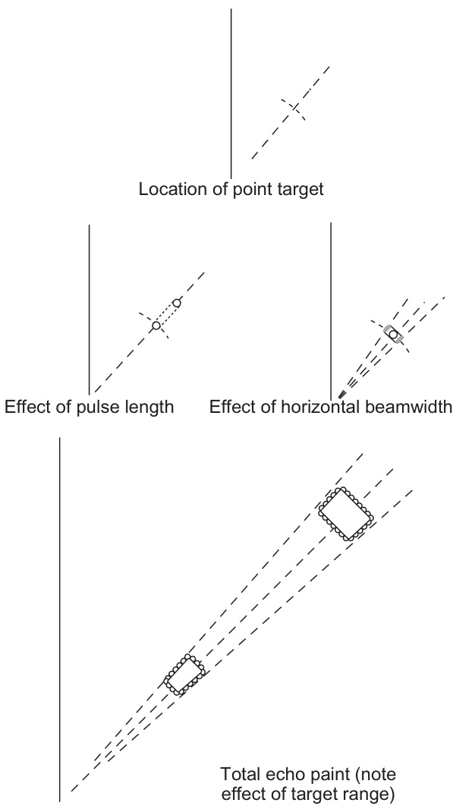  

FIGURE 2.44 The echo paint of a point target.  

图 2.44 点目标的回波图像。

Consider a pulse length of $1 \mu\mathrm{s}$ . As previously discussed, the typical sample rate for such a pulse would be half of this, that is, a sample every $0.5 \mu s$ . For a perfect point target two adjacent range cells would indicate the target. (In principle, the target could appear in three adjacent cells if the sampling happened to occur exactly at the start of the received pulse - one sample at the exact beginning, middle and end of a pulse - but this has, in our simple model, a precisely zero chance of happening.) The received pulse thus creates an exact $1 \mu\mathrm{s}$ ‘trace’ on the display, just as it would have done in the original analogue-based radars of the past. A length of $1 \mu\mathrm{s}$ on the display equates to $150\mathrm{m}$ in range, taking into account that a radar pulse has to travel to and from any target an electromagnetic wave travels a total of $300\mathrm{m}$ in $1 \mu\mathrm{s}$ . For this case $150\mathrm{m}$ is the fundamental apparent length of the received signal, provided the display resolution (number of pixels) can match or better this figure.  

考虑一个脉冲长度为 $1 \mu\mathrm{s}$ 的情况。如前所述，对于这样的脉冲，典型的采样率将是其的一半，即每 $0.5 \mu\mathrm{s}$ 采样一次。对于一个理想的点目标，两个相邻的距离单元（range cells）将会指示目标。（原则上，如果采样恰好发生在接收脉冲的开始时，目标可能会出现在三个相邻单元中——一个样本恰好在脉冲的开始、正中间和结束处——但是在我们简单的模型中，这种情况发生的概率正好为零。）因此，接收到的脉冲在显示屏上创建了一个精确的 $1 \mu\mathrm{s}$ 的“轨迹”（trace），就像它以前在基于模拟信号的雷达系统中所做的那样。在显示屏上，$1 \mu\mathrm{s}$ 的长度对应于 $150\mathrm{m}$ 的距离，考虑到雷达脉冲必须向任何目标发送并返回，这意味着电磁波在 $1 \mu\mathrm{s}$ 内总共行进了 $300\mathrm{m}$ 的距离。对于这个案例，假设显示器的分辨率（像素数量）能够匹配或超过这个数字，那么 $150\mathrm{m}$ 就是接收信号的基本显现长度。

As the beam sweeps across the point target, it will return a number of echoes according to the PRI, the antenna rotation rate and its horizontal beamwidth. The echo paint of the point target is therefore built up of a number of azimuthal elements each of which has a radial length, as defined in the preceding paragraph. This is illustrated by Figure 2.44. The angular width of the paint of a point target will depend on the horizontal beamwidth, while the number of azimuthal elements is dependent on the PRF and the antenna rotation rate. In general, the digital display processing within the radar effectively fills in the azimuthal gaps. The angular elongation of the echo paint is sometimes referred to as halfbeamwidth distortion because it has the effect of extending the paint by half the beamwidth on either side of the nominal echo position. The angle contained between the limits of the main lobe of the horizontal beam is constant, but the length of the arc which subtends this angle at the antenna increases in proportion to the range at which the arc is measured. Thus the length which this angular distortion produces increases with the range of the target (see Figure 2.44).  

当束扫过点目标时，它会根据脉冲重复间隔（PRI）、天线旋转速率及其水平波束宽度返回一定数量的回声。因此，点目标的回声图由多个方位元素组成，每个元素都具有如前一段所定义的径向长度。图2.44演示了这一点。点目标的回声图的角度宽度取决于水平波束宽度，而方位元素的数量则依赖于脉冲重复频率（PRF）和天线旋转速率。

注：翻译中尽量保持原文的技术术语和精确性，如脉冲重复间隔（PRI）、脉冲重复频率（PRF）等，以确保翻译的准确性。

一般来说，雷达内的数字显示处理可以有效地填充方位间隙。回波图像的角度延伸有时被称为半波束宽畸变（halfbeamwidth distortion），因为它会使图像在回波的理想位置两侧各延伸半个波束宽的距离。水平波束的主瓣（main lobe）所包含的角度是常数，但是这个角度所对应的弧长（arc length）会随着测量距离（range）的增加而成比例增加，这是因为随着测量距离的增加，相应的弧长也会增大，导致回波图像的方位分辨率（angular resolution）降低。

因此，角畸变（angular distortion）产生的长度随目标的范围（见图2.44）而增加。

In the limit, the pixel size of the display and/or any limitations within the display processing finally dictate the displayed size of target. Nowadays, this is rarely a practical issue. With early CRT technology the minimum spot size that could be produced did create an additional practical limitation.  

在极限情况下，显示器的像素大小和/或显示处理中的任何限制，最终决定了目标的显示大小。如今，这很少是一个实际问题。然而，在早期的CRT（阴极射线管）技术中，能够产生的最小点大小确实存在一个额外的实际限制[这里指的是CRT技术能够显示的最小的光点大小，是CRT显示器分辨率的限制之一]。

#### 2.8.5.1 Practical Considerations  

In the case of a point target, the aggregate of the effects described above is a paint whose size and shape depends on the pulse length and horizontal beamwidth of the radar system and also on the set maximum range of the display. To appreciate the practical significance of these effects it is helpful to consider the following numerical example.  

在点目标的情况下，上述效果的综合体现是一个“涂鸦”（paint），其大小和形状取决于雷达系统的脉冲长度和水平波束宽度，以及显示的设定最大距离。为了理解这些效果的实际意义，有助于考虑以下数值示例。

Example: A marine radar system has a radar display area (PPI) of diameter $250\mathrm{mm}$ . The horizontal beamwidth is $2^{\circ}$ , the pulse length is $1 \mu\mathrm{s}$ and the display is switched to the $12\mathrm{NM}$ range scale. A point target $\boldsymbol{\mathrm X}$ is detected at a range of $10\mathrm{NM}$ . Calculate the radial length and the angular width of the echo paint as it appears on the screen, and hence determine the distances, in NM, which these dimensions represent.  

示例：一个海洋雷达系统具有雷达显示区域（PPI）的直径为$250\mathrm{mm}$。水平波束宽度为$2^{\circ}$，脉冲长度为$1 \mu\mathrm{s}$，显示范围设置为$12\mathrm{NM}$。检测到一个点目标$\boldsymbol{\mathrm X}$位于距离$10\mathrm{NM}$处。计算回波画（echo paint）在屏幕上显示的径向长度和角度宽度，进而确定这些尺寸所代表的距离，以纳米（NM）为单位。 

注意： 
- 回波画（echo paint）是指雷达系统在屏幕上显示的回波信号的可视化表示。 
- 径向长度是指回波画在径向方向上的长度，通常与目标距离雷达站有关。
- 角度宽度是指回波画在角度方向上的宽度，通常与雷达的分辨率和目标的大小有关。
- 纳米（NM）是海洋测量单位，1纳米=1852米。

Let the total dimensions on the display of the echo paint be given by $T_{\mathrm{R}}$ (radial length) and $T_{\mathrm{{A}}}$ (angular width). The $12\mathrm{NM}$ range equates to an equivalent time interval of:  
$$
12\times1852\div(3\times10^{8})\div2\mathrm{{s}}=148.16 \mu s
$$  

假设回声图像（echo paint）的显示总维度由$T_{\mathrm{R}}$（径向长度）和$T_{\mathrm{{A}}}$（角度宽度）给出。$12\mathrm{NM}$范围相当于一个等效的时间间隔，即：
$$
12\times1852\div(3\times10^{8})\div2\mathrm{{s}}=148.16 \mu s
$$
其中，$12\mathrm{NM}$是距离范围，$3\times10^{8}$是光速（大约为每秒300,000,000米），而$\mu s$表示微秒（一个秒的百万分之一）。

with the division by 2 being a consequence of the ‘to and from’ nature of the radar signal. The received pulse is $1 \mu s$ and so its equivalent length on the display is given by:  
$T_{\mathrm{R}}=(1\div148.16)\times250\div2=1.2\mathrm{mm}$ on the display  
A $10\mathrm{NM}$ range ring on the display would have a circumference of:  
$$
\pi\times250\times10\div12=654.5\mathrm{mm}
$$  
A $2^{\circ}$ segment of this would therefore have a length given by:  
$$
T_{\mathrm{A}}=654.5\times2\div360=3.6\mathrm{mm}
$$  

以下是对所提供文本的翻译：

由于雷达信号具有“往返”的性质，因此除以2是一个结果。接收到的脉冲为$1 \mu s$，因此其在显示器上的等效长度由以下公式给出：
$T_{\mathrm{R}}=(1\div148.16)\times250\div2=1.2\mathrm{mm}$，显示在显示器上
在显示器上，$10\mathrm{NM}$ 范围环的周长为：
$$
\pi\times250\times10\div12=654.5\mathrm{mm}
$$
因此，这个环上$2^{\circ}$的弧段，其长度由以下公式给出：
$$
T_{\mathrm{A}}=654.5\times2\div360=3.6\mathrm{mm}
$$
注： NM 代表海里（nautical miles，航海里），是表示距离的单位，1海里约等于1.852公里。$1 \mu s$ 表示一微秒，一个时间单位。这些术语在航空、航海领域中常用，尤其是在雷达技术中。

Thus the echo paint has a radial length of $1.2\mathrm{mm}$ and an angular width of $3.6\mathrm{mm}$ . This is well in excess of the minimum resolution of a modern display and so therefore is a good approximation as to what would be shown on it. In fact, on long range scales the pixel size could dominate the radial length of the paint, which has to be a factor considered by the manufacturer in the design of the display processing of the radar to avoid any unintended suppression of such targets.  

因此，回声画（echo paint）的径向长度（radial length）为$1.2\mathrm{mm}$，角向宽度（angular width）为$3.6\mathrm{mm}$。这远远超过了现代显示器的最小分辨率（resolution），因此这是对显示器上显示内容的一个很好的近似（approximation）。事实上，在大范围的尺度上，像素大小（pixel size）可能会主导回声画的径向长度，而这是制造商在设计雷达的显示处理（display processing）时需要考虑的一个因素，以避免对这种目标的意外抑制（suppression）。[这里的“回声画”指的是雷达信号处理中的一个术语，表示目标的回声信号在雷达显示器上的表现形式；“径向长度”和“角向宽度”分别指的是目标的径向和角向方向上的尺寸；“显示器的最小分辨率”指的是显示器能够显示的最小尺寸；“像素大小”指的是显示器上的一个最小单位像素的尺寸。]

In the example chosen, the radius of the screen $(125\mathrm{mm})$ represents $12\mathrm{NM},$ , from which it can be deduced that the natural scale of the PPI is such that $1\mathrm{mm}$ represents $178\mathrm{m}$ . If this were to be applied to the dimensions of the echo paint it would suggest a target of approximate radial dimension $214\mathrm{m}$ $(1.2\times178)$ and approximate angular dimension $641\mathrm{m}$ $(3.6\times178)$ . This we know is likely to be a distortion of target size, especially the ‘angular’ width. The area which is bounded by these dimensions is the effective resolution cell of the radar. Thus while it is possible to determine the range and bearing of a target with the necessary degree of accuracy by taking the measurement to the centre of the nearer edge of the echo paint (this represents the location of the echoing surface, see Figure 2.44), the size and shape of the paint of all but very large targets bear little or no relationship to the size and shape of the target which produced it. A radar reflector (see Section 3.4) has almost negligible dimensions, but if located at the position of the point target suggested in the example above, it would produce an echo paint which covers a screen area equivalent to that of several large ships. Hence, only when a target has reflecting surfaces which extend beyond the resolution cell does it begin to contribute significantly to the size and shape of the echo on the display.  

在所选的例子中，屏幕的半径（$125\mathrm{mm}$）代表$12\mathrm{NM}$（[海里，航海里，1海里约等于1852米]），从而可以推导出PPI（[像素每英寸， pixels per inch]）的自然比例是$1\mathrm{mm}$代表$178\mathrm{m}$。如果将此比例应用于回声涂层的尺寸，会表明目标的近似径向尺寸为$214\mathrm{m}$（$1.2\times178$）和近似角向尺寸为$641\mathrm{m}$（$3.6\times178$）。我们知道，这可能是目标尺寸的失真，特别是‘角向’宽度的失真。

受这些尺寸限制的区域是雷达的有效分辨率单元。因此，虽然可以通过测量回波图（echo paint）中较近边缘的中心来确定目标的距离和方位，达到所需的精度（这代表了回波表面的位置，见图2.44），但除了一些非常大的目标外，几乎所有目标的回波图大小和形状与实际产生回波的目标的大小和形状几乎没有或者没有关系。

雷达反射器（参考3.4节）具有几乎可以忽略的尺寸，但如果它位于前面例子中所示的点目标位置，它将产生一个回声涂层，覆盖的屏幕区域相当于几艘大船的区域。因此，只有当目标具有超出分辨率单元（resolution cell，[即雷达系统能够区分两个目标的最小距离或区域]）的反射表面时，它才开始对回声的大小和形状在显示屏上产生明显的贡献。

Except at extremely close ranges it is evident that a ship will in general produce an echo approaching that of a point target. If the calculation in the example is performed for the same radar system, but with the point target located at a range of 2 NM, it will be found that the radial dimension remains unchanged at $1.2\mathrm{mm}$ (as it is not a function of range) while the angular dimension decreases to $0.5\mathrm{mm}$ . Thus, if a small target closes from a range of $10\mathrm{NM}$ to a range of 2 NM, its echo shape will change from one in which the angular width is the greater dimension to one in which the reverse is the case. It is noteworthy that radar characteristics selected in the above examples are representative and do not illustrate the worst possible case.  

除了在极近距离下以外，显然，一艘船通常会产生一种回声，其接近于一个点目标的回声。如果对相同的雷达系统进行计算，但将点目标定位在2海里（NM）的距离上，则会发现径向尺寸保持不变为$1.2\mathrm{mm}$（因为它不是距离的函数），而角向尺寸减小到$0.5\mathrm{mm}$。因此，如果一个小目标从$10\mathrm{NM}$的距离接近到2海里的距离，其回声形状将改变，从一个角向宽度为较大尺寸的形状变为一个相反的形状。值得注意的是，上述示例中选择的雷达特性是代表性的，并没有演示最坏的情况。 

注意： 
- 海里（NM）是航海距离的单位，1海里等于1852米。
- 点目标（point target）通常指的是一个理想化的小目标，如一个小球体或一个小的反射面，其尺寸远小于雷达波的波长。
- 角向尺寸（angular dimension）和径向尺寸（radial dimension）分别指的是目标在角向和径向上的大小，即目标在角度方向和距离方向上的分辨率。

In the use of radar for collision avoidance the principal significance of the above limitation is that the shape of the displayed echo of a ship gives no indication of how the vessel is heading. Heading inference drawn from the shape of the echo is likely to be dangerously misleading. For example, to the unwary or untrained observer, targets towards the edge of the screen may appear to be broadside-on (because of the dominance of the angular distortion), whereas targets towards the centre of the screen may appear to be end-on. The importance of understanding the specious nature of the impression created by the screen shape of the echo cannot be overstressed. The techniques for deducing a reliable indication of the heading of other vessels are set out in Chapter 7.  

在使用雷达进行碰撞避免时，上述限制的主要意义在于，船舶回波的显示形状不能表明该船舶的航向。根据回波形状推断航向（heading inference）可能产生误导，并且可能带来危险。例如，对于缺乏经验或未经训练的观察者，屏幕边缘的目标可能看起来是侧面朝向（因为空间畸变的主导作用），而屏幕中心的目标可能看起来是头尾相对。理解由回波的屏幕形状所产生的印象的虚假性质（specious nature）的重要性不容忽视。关于如何推断其他船舶可靠的航向指示的技术将在第7章中详细阐述。 

（注：碰撞避免是指船舶或其他交通工具为避免与其他物体碰撞而采取的措施。heading inference 是指根据雷达回波的形状推断目标的航向。specious 指的是看似真实但实际上可能是虚假或具有误导性的外观或印象。）

#### 2.8.5.2 Range Discrimination  

Range discrimination describes the ability of the radar system to display separately the echoes of two targets which lie on the same bearing but which are closely spaced in range. This was examined from a sampling point of view in Section 2.7.3.1. Obviously, the size of the resolution cell presents limitations to the navigational use of the radar, and this is looked at in detail in Section 8.2.2. Range discrimination is expressed in terms of the number of metres in range by which the targets must be separated in order to prevent their echoes overlapping on the display. In discussing discrimination it must be assumed that both targets are illuminated by the radar beam. If the more distant target is in a blind area caused by the nearer target, no echo will be displayed, irrespective of the ability of the radar to discriminate. IMO Performance Standards set out the requirement for range discrimination in terms of two small targets which lie on the same azimuth and which are separated by $40\mathrm{m}$ in range. To comply with the standard, the equipment must, on range scales of $1.5\mathrm{NM}$ and less, be capable of displaying the echoes of two such targets as separate indications when the pair lies at a range of between $50\%$ and $100\%$ of this range scale.  

距离分辨能力（range discrimination）描述了雷达系统显示两个位于同一方位但距离较近的目标回波的能力。从采样角度来看，这一问题在2.7.3.1节中已经进行了讨论。显然，分辨率单元（resolution cell）的大小对雷达的导航使用（navigational use）提出了限制，这一点将在8.2.2节中详细探讨。距离分辨能力通常用目标在距离方向上需要保持的最小距离来表示，以便在显示屏上防止它们的回波信号重叠。这一距离是以米为单位来衡量的，表示两个目标之间需要保持的最小距离，才能使得它们的回波信号在雷达显示屏上清晰地分开。

在讨论辨识度时，必须假设两个目标都被雷达束照亮。如果较远的目标处于由于较近的目标造成的盲区内，则无论雷达的辨识能力如何，都不会显示回波。国际海事组织（IMO）的性能标准以两个小目标的形式规定了距离辨识度的要求，这两个目标位于同一方位，并且相隔$40\mathrm{m}$的距离，要求雷达能够区分这两个目标。[这里的“距离辨识度”是指雷达区分两个目标的最小距离要求，而“方位”是指目标相对于雷达的方位角度，即目标的方向]。

为了符合该标准，设备必须能够在范围尺度（range scales）为$1.5\mathrm{NM}$或更小的情况下，当两个目标（目标可以理解为设备探测到的物体或信号源）之间的距离在该范围尺度的$50\%$到$100\%$之间时，将两个目标的回声（回声是指设备发送的信号被目标反射回来的信号，用于确定目标的存在和位置）显示为独立的指示。这意味着设备需要有一定的分辨率（分辨率指的是设备能够区分两个目标的最小距离），以便能够区分出两个相距在一定范围内的目标。

#### 2.8.5.3 Bearing Discrimination  

Bearing discrimination, which may also be referred to as bearing resolution, describes the ability of the radar system to display separately the echoes of two targets which lie at the same range but are closely spaced in bearing. The discrimination is normally expressed as the angular separation that two targets at the same range must be separated in azimuth such that their echoes will appear separately on the screen. IMO Performance Standards set out the requirement for bearing discrimination in terms of two small similar targets both situated at the same range between $50\%$ and $100\%$ of the $1.5\mathrm{NM}$ range scales and less. To comply with the standard, the equipment must be capable of displaying the echoes separately when the targets are separated by not more than $2.5^{\circ}$ in azimuth.  

航向辨别（bearing discrimination），也称为航向分辨率（bearing resolution），描述了雷达系统显示两个位于相同距离但在航向上紧密排列的目标回波的能力。这种辨别能力通常以两个位于相同距离的目标在方位上必须分离的角度间隔来表示，这样它们的回波就会在屏幕上单独显示。国际海事组织（IMO）的性能标准规定了航向辨别的要求，具体为两个小型、相似的目标同时位于同一距离的50%至100%的1.5海里（NM）范围内且更小的范围内。为了符合这一标准，设备必须能够在目标方位上分离不超过2.5°时，单独显示它们的回波。

 

FIGURE 2.45 Bearing discrimination.  

图2.45 轴承辨识（识别轴承类型的过程，通常用于机械系统的监测和维护）

If two targets lie at the same range and are closely spaced in bearing, a minimum requirement for angular discrimination is that the trailing edge of the rotating beam must leave the first target before the leading edge illuminates the second target. This is illustrated by Figure 2.45. This figure shows the limiting case of discrimination and two other cases for comparison purposes. It follows from the illustration that, in theory, the radar can only discriminate between targets which are separated by at least one horizontal beamwidth, providing the azimuth cell size is small in comparison to this.  

如果两个目标位于相同的距离上且在方位上紧密排列，那么，角度辨别度的最低要求是：当旋转束的尾边离开第一个目标时，前缘必须在此之前不照亮第二个目标。如图2.45所示。图中展示了极限辨别度的情形，以及另外两个用于对比的案例。由图可知，从理论上讲，雷达只能区分至少相隔一个水平束宽的目标，条件是方位单元尺寸（azimuth cell size）与此相比足够小[方位单元尺寸指的是雷达在水平方向上分辨目标的最小单元]。

Section 2.7.3.2 shows that for short range settings this is generally true, with a typical azimuth cell being about $0.05^{\circ}$ . The simple theory is also complicated by the fact that the effective antenna beamwidth for discrimination determination is unlikely to be its 3 dB figure, especially for relatively close-in targets - its 10 or even 20 dB beamwidth may be more appropriate to be used. As for range discrimination, the pixel size of the display is unlikely to have a limiting effect.  

第2.7.3.2节表明，对于短距离设置，这种说法一般是正确的，典型的方位单元（azimuth cell）大约为$0.05^{\circ}$。然而，这种简单的理论还会受到复杂因素的影响，即实际的天线束宽（antenna beamwidth）用于区分判定（discrimination determination）时，不太可能是其3 dB数值，尤其是对于相对较近的目标（relatively close-in targets）——其10 dB甚至20 dB束宽可能更合适使用。此外，对于距离区分（range discrimination），显示器的像素大小不太可能产生限制作用。

It is important to remember that the distance represented by the horizontal beamwidth increases in direct proportion to the range at which the discrimination is being considered. The influence of spot size will be less on larger screens and on shorter range scales. Some representative values are illustrated by the following numerical example.  

需要记住，水平波束宽度（horizontal beamwidth）所表示的距离会随着判别（discrimination）所考虑的距离（range）的增加而成正比增加。spots尺寸（spot size）的影响会在较大的屏幕和较短的距离范围内减小。一些典型的数值如下例子所示。其中判别是指区分物体或特征的能力（能力），波束宽度是指天线或传感器发射或接收的能量在水平方向上的分布宽度（天线或传感器的物理特性），spots尺寸是指传感器或成像设备的分辨率或像素尺寸（决定了传感器或成像设备能否分辨出两个物体或特征）。

Example: A radar display has a screen of diameter $250\mathrm{mm}$ . If the effective horizontal beamwidth is $1.5^{\circ}$ , calculate the bearing discrimination at a range of $10\mathrm{NM}$ when the $12\mathrm{NM}$ range scale is selected and 1 NM when the $1.5\mathrm{NM}$ range scale is selected.  
$$
A t10N M
$$  
The length of the arc of the horizontal beamwidth at $10\mathrm{NM}$ is given by:  
$$
{\begin{array}{r l}&{A_{\mathrm{B}}={\mathrm{range}}\times{\mathrm{horizontal~beamwic}}}\ &{\qquad=(10\times1852)\times1.5\times{\frac{\pi}{180}}{\mathrm{m}}}\ &{\qquad}\ &{\qquad=10\times1852\times1.5\times{\frac{22}{7\times180}}{\mathrm{m}}}\ &{\qquad=485{\mathrm{m}}}\end{array}}
$$  
$$
At 1 NM  
$$
$$
{\begin{array}{r l}{\displaystyle A_{\mathrm{B}}=1\times1852\times1.5\times{\frac{22}{7\times180}}{\mathrm{m}}}&{}\ {\displaystyle=48.5{\mathrm{m}}}&{}\end{array}}
$$  

示例：雷达显示器的屏幕直径为$250\mathrm{mm}$，有效水平波束宽度为$1.5^{\circ}$，计算在$10\mathrm{NM}$范围内，当选择$12\mathrm{NM}$范围刻度时的方位识别能力，以及当选择$1.5\mathrm{NM}$范围刻度时的方位识别能力为$1\mathrm{NM}$。

在$10\mathrm{NM}$范围内，水平波束宽度的弧长由以下公式给出：

$$
\begin{array}{r l}
&{A_{\mathrm{B}}={\mathrm{范围}}\times{\mathrm{水平波束宽度}}} \\
&{\qquad=(10\times1852)\times1.5\times{\frac{\pi}{180}}{\mathrm{m}}} \\
&{\qquad=10\times1852\times1.5\times{\frac{22}{7\times180}}{\mathrm{m}}} \\
&{\qquad=485{\mathrm{m}}}
\end{array}
$$

在$1\mathrm{NM}$范围内，水平波束宽度的弧长为：

$$
\begin{array}{r l}
{\displaystyle A_{\mathrm{B}}=1\times1852\times1.5\times{\frac{22}{7\times180}}{\mathrm{m}}} &{} \\
{\displaystyle =48.5{\mathrm{m}}} &{}
\end{array}
$$

注：NM为海里（[nautical mile]，即海里，1海里=1852米）；范围刻度是指雷达显示器上设置的距离范围；方位识别能力是指雷达系统在特定范围内能够识别目标的最小角度差异。

Care should be taken that this theoretical ‘best’ is not marred by excessive brilliance, gain or contrast settings (see Sections 6.2.3 and 6.2.7.1).  

应注意的是，这个理论上的“最佳”状态不应因过度鲜明、增益或对比度设置而受到影响（参见6.2.3和6.2.7.1节）。

A serious shortcoming of the use of civil marine radar for collision avoidance is its inability to offer direct indication of the heading of other vessels. Beamwidth distortion is a major contributor to this shortcoming. It also limits the usefulness of the radar for navigation by merging coastline details, such as bays and lock entrances which lie within one horizontal beamwidth. The significance of this is discussed in Section 8.2.2. Importantly, digital signal processing techniques can be used to help improve angular resolution to better the limits discussed in this section. This is because the small size of the azimuth cell relative to the beamwidth, at least at shorter range settings, gives extra information that can indicate that two targets are present, such as distinctive changes in the amplitudes of the return at a constant range as the antenna rotates.  

利用民用海洋雷达进行碰撞避让的一个严重缺陷是，它无法直接指示其他船舶的航向（航向是指船舶行进的方向）[即，无法判断其他船舶朝哪个方向运动]。波束宽度失真（beamwidth distortion）是造成这一缺陷的主要原因。同时，这也限制了雷达在航行中的作用，因为它会合并海岸线的细节，例如海湾和锁门入口，如果这些特征位于同一个水平波束宽度内，就会合并为一体，难以区分。这种现象的重要性将在8.2.2节中讨论。值得注意的是，数字信号处理技术可以用来提高角度分辨率（angular resolution），以改善本节中讨论的限制。这是因为，在较短的距离设置中，方位单元（azimuth cell）相对于波束宽度来说体积较小，从而提供了额外的信息，能够指示两个目标的存在，例如当天线旋转时，在恒定的距离下，反射信号的振幅发生明显的变化。

### 2.8.6 The User Interface  

The traditional radial CRT display had a large number of analogue and push-button controls surrounding the circular screen. Over time the number of features and the corresponding controls/buttons offered on sets tended to increase. The first raster-scan displays followed this traditional layout and sets (particularly ARPA/radar sets) with over 80 controls or buttons were common.  

传统的径向阴极射线管（CRT）显示器在其圆形屏幕周围有大量的模拟控制和按键。随着时间的推移，设备上的功能数量和相应的控制按钮/键也趋于增加。第一批光栅扫描显示器遵循这种传统的布局，特别是像ARPA/雷达等设备，其上有超过80个控制或按钮的情况很常见。其中，光栅扫描（raster-scan）是指[一种将电子束在屏幕上横向和纵向移动，以显示图像的技术]。

This trend has now reversed itself by the use of on-screen menus which have been encouraged by three interlinked factors:  

这种趋势现已通过屏幕菜单的使用而被逆转，这得益于三个相互关联的因素：[即三个因素之间是互相影响、互相联系的]

a. The increased computer literacy of the general population means that most mariners are familiar with the concept of pull-down menus.

随着计算机技术的普及，普通民众的计算机素养（计算机知识和技能）大大提高，这意味着大多数海事人员（mariners，指从事海事工作的人员，如水手、船员等）都熟悉下拉菜单（pull-down menus）的概念。

b. The increased use of pointing devices/ cursors (see below) enables a flexible arrangement on screen to operate the pulldown menus. 

b. 随着指点设备/光标（见下文）的使用增加，屏幕上可以灵活地排列操作界面，从而方便地操作下拉菜单。

c. The use of rectangular raster-scan screens means that there are convenient spaces to the side of the circular radar area to display both information and the drop-down menus (Figure 2.46).  

c. 使用矩形光栅扫描屏幕（rectangular raster-scan screens）意味着在圆形雷达区域（circular radar area）的两侧有方便的空间来显示信息（information）和下拉菜单（drop-down menus）（如图2.46所示）。

In the extreme case, the display may only have two buttons and the pointing device. A major advantage is that this considerably reduces the cost and maintenance of the radar system. Hardware is effectively replaced by software that does not wear out. The use of drop-down menus enables the manufacturer to provide many functions without cluttering up the display and radar set. The skill of the manufacturer is arranging the various commands into logical groupings so that an observer can intuitively find the correct information/command through several layers of menus without continual reference to the manual.  

在极端情况下，显示器可能只有两个按钮和指点设备。一个主要优点是，这大大减少了雷达系统的成本和维护费用。硬件基本上被不会磨损的软件所取代。使用下拉菜单（dropdown menus，[即菜单项目可以下拉展开，用户可以从中选择所需功能]）使得制造商可以在不使显示器和雷达设备过度繁杂的情况下提供许多功能。制造商的技巧在于将各种命令分成逻辑分组，这样观察员就可以通过多层菜单（[即可能需要多次点击才能找到所需功能的菜单]）直观地找到正确的信息或命令，而无需不断查阅手册。

Pointing devices. Pointing devices enable the user to control the position of a moving symbol on the display. Two or more ‘click’ buttons are provided. When pressed they will be programmed to perform an action or display more information.  

指点设备。指点设备允许用户控制在显示屏上移动符号的位置。通常会提供两个或两个以上的‘点击’按钮，当被按下时，这些按钮将被编程为执行某个操作或显示更多信息。

On a home computer the most common pointing device used is the ‘mouse’. Different designs exist, but the principle of a computer mouse is that mechanical, optical or potentially acceleration sensors in its base detect its movement over a surface. Radar displays on vessels are not usually provided with a mouse, but with a tracker ball (or trackball). A tracker ball acts as an inverted mouse with a mechanical ball as the sensor detecting the required motion of the cursor. The user simply spins the ball in the required direction. There are several reasons why a tracker ball is preferable to a mouse for a marine radar display. Firstly, on a rolling ship, the mouse may move of its own volition, the tracker ball is fixed to one place. Secondly, the mouse requires a convenient flat surface to operate and this makes the equipment larger. Thirdly, many users believe that the tracker ball is easier to use from a standing position, which is often the case on a ship’s bridge.  

在家用电脑中，使用最广泛的指点设备是“鼠标”。虽然鼠标的设计各有不同，但其基本原理是：鼠标底部的机械、光学或加速度传感器能够检测到其在表面上的移动。船舶上的雷达显示器通常不配备鼠标，而是配备“跟踪球”（或称轨迹球）。跟踪球的作用类似于一个反转的鼠标，通过一个机械球作为传感器来检测光标所需的运动。用户只需将球体按照需要的方向旋转即可。有几个原因使得跟踪球比鼠标更适合用于海事雷达显示。首先，在一艘颠簸的船上，鼠标可能会自行移动，而跟踪球则固定在某一位置。其次，鼠标需要一个方便的平面来操作，这使得设备变得更加庞大。第三，很多用户认为跟踪球从站立的位置（这通常是船桥上的情况）来使用更容易。（注：光标是图形用户界面中，表示键盘或鼠标等输入设备当前位置的可视化表示；轨迹球是一种通过手动转动球体来控制光标的输入设备。）

  

FIGURE 2.46  Example of larger vessel display. Reproduced courtesy of Kelvin Hughes.  

图2.46 大型船舶显示的例子。复制时得到了Kelvin Hughes的许可。

  

FIGURE 2.47 View of a modern bridge. Reproduced courtesy of Northrop Grumman Sperry Marine.  

图 2.47 现代桥梁的景观。经北罗普格鲁曼史百利海洋公司（Northrop Grumman Sperry Marine）许可复制。

Display arrangements. Dedicated screens for marine navigation equipment are increasingly giving way to multifunctional screens, which may be used to display data from a variety of sensors, for example radar or ECDIS as required or integrated from a number of sources, such as radar, ECDIS, log, gyro and echo sounder. One major advantage of the common standardization of display screens across equipment is that in the event of the failure of one screen, the display can be transferred to another. This facility is often referred to as redundancy. A typical example is shown in Figure 2.47.  

显示安排。海洋导航设备中专用显示屏逐渐被多功能显示屏所取代，这些多功能显示屏可以根据需要显示来自多种传感器的数据，例如雷达或电子海图系统（ECDIS），或者从多个来源（如雷达、电子海图系统、航程记录仪、陀螺罗盘和声纳）集成的数据。设备中显示屏的通用标准化具有一个主要优势，即当一个显示屏发生故障时，显示内容可以转移到另一个显示屏上，这个功能通常被称为冗余（[指系统中包含多余的组件，以便当某个组件发生故障时，系统可以自动切换到其他组件，确保系统的正常运行]）。图2.47中展示了一个典型的例子。

These advances in shipboard electronics have been very quick to be incorporated into the equipment on smaller vessels where acceptance has in many ways been faster than in larger vessels, where there can be a reluctance to embrace new technology. Smaller multifunction screens display a variety of data, save space, power and weight as well as reduce overall costs and are very popular on small well-equipped craft, such as racing craft. The screens can usually be switched to show standalone data (such as in Figure 2.48(a) and (b)) or the screen can be split (as in Figure 2.48(c)).  

船载电子设备的这些进步迅速被应用于小型船只上的设备，尤其是在这些船只上，采用新技术的接受度往往高于大型船只。这主要是因为大型船只可能存在抵制新技术的趋势。较小的多功能屏幕可以显示各种数据，节省空间、功耗和重量，同时降低整体成本，在如赛艇等小型、配置齐全的船只中非常受欢迎。这些屏幕通常可以切换显示独立数据（如图2.48（a）和（b）所示），或者可以将屏幕分割（如图2.48（c）所示）。这使得操作员可以方便地查看所需信息，并且能更好地控制船只的运行。

For many years raster screen displays were fixed in 4:3 ratio. Different ratios are now commonly in use, including the 16:9 ratio commonly used for domestic televisions. The screen size ratio is selected by the manufacturer to best show the data required within the confines of typical bridges layouts, whilst meeting minimum IMO requirements on the radar display area.  

多年来，光栅屏显示的比例一直固定为4:3。如今，各种比例被广泛使用，包括常用于家用电视的16:9比例（即屏幕宽度与高度的比例为16:9）。屏幕大小比例由制造商选择，以便在满足典型桥梁布局（即船舶控制台的布局）的同时，最大限度地展示所需数据，同时满足国际海事组织（IMO）对雷达显示区域的最低要求。

  

FIGURE 2.48 Multifunction display for smaller vessels: (a) Set to radar display. (b) Set to electronic chart display. (c) Set to ‘split screen’ radar. Reproduced courtesy of Raymarine.  

图2.48 小型船舶的多功能显示器：（a）设置为雷达显示模式。 （b）设置为电子海图显示模式。 （c）设置为“分屏雷达”显示模式。 （图片来源：雷马林公司）

## 2.9 SOLID-STATE RADAR PRINCIPLES  

The magnetron-based marine radar has served the shipping industry well for over 60 years, but its dominance will decline into the future because of the benefits offered by newer technology based on solid-state transmitters. Such radars can be termed as solid-state, coherent, pulse compressed, digital or even New Technology (NT) radars. The terms all attempt to refer to the same concept but concentrate on a particular feature of its implementation.  

基于磁控管的海洋雷达已经为航运行业服务了60多年，但其主导地位将会因为新技术的兴起而逐渐衰落，这些新技术是基于固态发射器的。这种雷达可以被称为固态、相干、脉冲压缩、数字或甚至新技术（NT）雷达。这些术语都试图指代同一个概念，但重点关注其实施的某一特定特征。这里，相干（coherent）是指[能够保持相对稳定的相位关系的波形信号]，脉冲压缩（pulse compressed）是指[一种通过压缩雷达脉冲来提高距离分辨率的技术]，固态发射器（solid-state transmitter）是指[使用固态电子元件而不是传统的真空管来产生高频能量的发射器]。

The ever-continuing growth in the telecommunications market is effectively promoting the development of the necessary technology, which is then being exploited innovatively by marine radar manufacturers. In developed regions of the world, telecoms users are demanding instantaneous mobile access with ever-increasing data speeds. In less developed regions it is difficult and expensive to put in wired communications and so wireless mobile communications often provide the only affordable option for phone calls, text and Internet access. All this implies an ever-increasing demand for radio communications bandwidth and for its more efficient use. In particular, the main growth area for telecommunications bandwidth is at the microwave frequencies. Newer 4G telecommunications networks are currently operating at S-band and it can be expected that growth will continue to beyond $10\mathrm{GHz},$ , despite the inherent problems that come with using such high frequencies, not least the increased necessity for the base station and the user to be in direct line of sight.  

电信市场的持续增长有效地推动了必要技术的发展，而这些技术正被海洋雷达制造商以创新方式利用。在世界的发达地区，电信用户正要求具有瞬时移动访问的功能，并且数据传输速度越来越快。在较不发达的地区，铺设有线通信网络困难且昂贵，因此无线移动通信往往是电话、短信和互联网访问的唯一可行选择。所有这些意味着对无线电通信带宽的需求日益增长，以及更高效地利用带宽的需求。特别是，电信带宽的主要增长领域在微波频率范围内。新的4G电信网络目前正在S频段（[2-4GHz頻段]）运行，可以预计增长将继续扩展至10GHz以上，尽管使用如此高频率的固有问题，包括基站和用户之间需要保持直视线，不然会产生很大的信号衰减。

Marine radar can make use of at least two particular technology improvements arising out of this growth in telecommunications. The first is the affordable availability of power transistors working at microwave frequencies that have been developed primarily for use in telecommunications base stations. The second is from the development of devices that allow very sophisticated modulation to be put onto the transmitted microwave signal, together with the corresponding devices that can perform the demodulation. These allow a process known as pulse compression to be used that decreases the peak power requirement of a radar, generally to levels that can be generated by solid-state transmitters. In essence, solidstate radars use very long pulses to increase the effective energy being radiated, which is otherwise limited by their lower peak power compared to magnetron-based radars. It is perhaps useful to reconsider the discussion on radar transmitted power considerations given in Section 2.3.3.3 to fully understand this important aspect.  

海军雷达可以利用至少两项特定的技术改进，这些改进源自电信领域的发展。第一项是价格合理的功率晶体管（power transistors）的可用性，这些晶体管工作在微波频率下，主要是为电信基站而开发的。第二项是从开发允许将非常复杂的调制（modulation）应用于传输的微波信号的设备中获得的，同时还包括可以执行解调制（demodulation）的对应设备。这些设备使得可以使用一种称为脉冲压缩（pulse compression）的过程，这个过程降低了雷达的峰值功率要求，通常可以达到由全固态发射器（solid-state transmitters）产生的水平。从本质上讲，全固态雷达使用非常长的脉冲来增加所发射的有效能量，这在其他情况下是由其较低的峰值功率与磁控管（magnetron）-基于雷达相比而受到限制的。也许有必要重新考虑在 2.3.3.3 节中讨论的雷达发射功率考虑（radar transmitted power considerations），以充分理解这一重要的方面。[注：磁控管是一种用于产生高功率微波能量的设备，全固态发射器则是指使用晶体管而非传统的真空管技术来产生微波能量的设备。]

Of significance, a fully transistor-based radar transmitter will have a higher reliability than a magnetron-based system simply because it would only utilize low voltages, less than about $50\mathrm{~V~}$ compared to a magnetronbased system requiring many thousands of volts. Furthermore, unlike a magnetron the power transistors in a solid-state design do not have to be replaced regularly, saving on servicing needs. Power transistors at S-band suitable for use in civil marine radars started to become affordably available from about 2005, leading to their relatively recent introduction by a number of manufacturers. Transistors for X-band use are becoming increasingly powerful and more affordable, but at the time of writing an X-band solid-state radar would cost rather more than its magnetron-based equivalent and so they are not commonly used in civil marine applications.  

值得注意的是，全晶体管雷达发射器由于仅使用低电压（低于大约$50\mathrm{~V}$），相比于需要成千上万伏的磁控管系统，其可靠性将更高。此外，与磁控管不同，全固态设计中的功率晶体管不需要定期更换，从而减少了维护需求。适合用于民用海洋雷达的S波段功率晶体管从大约2005年开始变得相对便宜，从而导致多家制造商最近将其引入市场。适合X波段使用的晶体管变得越来越强大，价格也越来越便宜，但截至撰写时，X波段全固态雷达的成本仍然高于其磁控管等效系统，因此在民用海洋应用中并不常用。

The pulse compression process is described in the following subsections and is basically a way of using a long pulse to give the same range accuracy and target discrimination as a very short pulse. A highly important consequence of adopting such technology is that, unlike a standard magnetron-based radar, they become capable of detecting the instantaneous radial velocity of the target returns, which can greatly help in increasing the discrimination of wanted targets from sea and precipitation clutter. It is an example of use of the Doppler effect, named after the nineteenth-century Austrian scientist Christian Doppler. In sound waves, it is this effect that causes the horn of an advancing or retarding locomotive to sound respectively higher or lower in frequency to the listener. A similar effect occurs in electromagnetic waves, simply because relative movement increases or reduces the transmitted wavelength. This is further explored in Section 2.9.5.  

脉冲压缩过程在以下子节中进行了描述，基本上是一种使用长脉冲来实现与非常短的脉冲相同的距离精度和目标识别能力的方法。采用这种技术的一个非常重要的结果是，与标准的磁控管（magnetron）基 础的雷达不同，它们能够检测到目标返回的瞬时径向速度（即目标沿雷达波方向的运动速度）[直白解读：目标在雷达波方向上移动的速度]，这可以大大帮助提高对所需目标与海洋和降水杂波的识别能力。 这是多普勒效应（Doppler effect）[直白解读：物体运动时其发出的电磁波或声波的频率变化]的应用实例，该效应以19世纪的奥地利科学家克里斯蒂安·多普勒（Christian Doppler）命名。 在声波中，正是这种效应使得前进或减速的机车喇叭听起来的频率要么升高，要么降低。类似的效应也发生在电磁波中，这仅仅是因为相对运动会增加或降低传输的波长。 这将在第2.9.5节中进一步探讨。

The use of Doppler in marine radar requires very sophisticated and still-developing principles, but it potentially offers considerable advantages, which will be increasingly exploited. With the performance improvements expected, it should allow IMO to steadily enhance the fundamental performance requirements for radar, while the use of ever-advancing technology should keep the equipment affordable. Present-day radars are far from meeting what users (and safety and environmental protection pressures) really desire, which is $100\%$ detection of all targets of relevance under all possible conditions, and so there is a fundamental demand for improved performance; the move to solid-state technology opens up these opportunities.  

海事雷达中使用多普勒原理（多普勒效应，指物体运动状态变化对其发射或反射电磁波频率的影响）需要非常复杂且仍在发展的原理，但它可能提供相当的优势，这些优势将被逐渐发掘。随着性能的改善，这应该使得国际海事组织（IMO）能够稳步提高雷达的基本性能要求，而使用不断进步的技术应该使得设备保持可负担性。现今的雷达远远不能满足用户（以及安全和环境保护压力）的真正期望，即在所有可能条件下实现对所有相关目标的100%检测，因此存在提高性能的基本需求；转向固态技术（一种电子元件技术，使用半导体材料制成，相对于传统真空管，具有体积小、重量轻、可靠性高、功耗低等优点）为这一机会提供了可能。

A more minor point is that a particular problem facing future magnetron-based radars is the special design skills needed for their future development it is a very niche area. Today’s electronic engineering requires primarily a mixture of solid-state technology and digital/software skills. The design skills necessary for future magnetron transmitters are becoming increasingly difficult to find and nurture.  

一个相对较小的问题是，未来磁控管（magnetron）基雷达面临的一个特别问题是，需要为其未来发展提供特殊的设计技能，但这是一个非常细化的领域。如今的电子工程主要需要的是固态技术（solid-state technology）和数字/软件技能（digital/software skills）的结合。然而，未来磁控管发射器所需的设计技能却越来越难以找到和培养。这种技能的稀缺对磁控管技术的发展构成了一定的挑战，因为它们需要专门的知识和经验，特别是在高功率放大器（high-power amplifier）和微波工程（microwave engineering）等领域。

All the above considerations contribute to speculation that within a few years most new Sband radars will be solid-state and within 10 years or so it is also likely to become the case at X-band. This is why a broad knowledge of solidstate radar principles is becoming essential for a good user understanding of marine radar.  

上述所有这些因素都促进了这样一种推测：在未来几年内，大多数新开发的S频段雷达将采用固态技术，并且在大约10年内，X频段雷达也很可能会是如此。因此，广泛掌握固态雷达（solid-state radar，[即使用集成电路和模块化设计的雷达系统，而非传统的真空管技术]）原理对于用户深入理解海洋雷达系统至关重要。

### 2.9.1 Coherent Radar Concepts  

In a very basic sense a signal propagating as an electromagnetic wave, whether in free space, in a transmission line, or within an active device such as a transistor, has just one property - its instantaneous amplitude with respect to time at any given point in space. By ‘time’ we here mean very precise time, such that the basic oscillations of the wave (the carrier) are measurable and not just the amplitude modulation on the wave, as on a conventional magnetronbased system. There are huge complications, such as how the wave is divided into electric and magnetic components and how the propagating medium itself affects the signal (including, in free space, the divergence of the beam), but in the end what is the only important factor is its amplitude with respect to precise time, at any one point in space. A radar sends out a signal, modified by the antenna and the ship’s characteristics including its velocity, and then receives back a highly modified version. It is modified by many things but particularly by the properties of the various reflecting objects, for instance their distance, size, shape and speed, and also by the atmosphere and extraneous noise components. The receiving process within the radar itself also modifies the signal, such as the movement of the vessel, including the rotation of the antenna, the precise action of the receiver, the effects of internally generated noise and the specific processing that takes place within the radar.  

在一个非常基础的意义上，作为电磁波传播的信号，无论是在自由空间中，在传输线上，还是在像晶体管这样的活跃器件中，都只有一个属性——即在任意时刻和空间点上的瞬时振幅。这里的“时间”是指非常精确的时间，以至于可以测量波的基本振荡（载波）[即信号的周期性波动特征]，而不仅仅是波上的幅度调制[即信号强度随时间变化的特征]，就像在传统的磁控管[一种高功率微波发生器]系统中一样。

存在着巨大的复杂性，例如如何将波分解为电和磁组件，以及传播介质本身如何影响信号（包括在自由空间中，光束的发散），但是最终，唯一重要的因素是信号在精确时间下的幅度，在空间中的任意一点。雷达发送一个信号，该信号被天线和船只的特性（包括其速度）修改，然后接收到一个经过高度修改的版本。在这里，天线（antenna）指的是一种用于发送和接收信号的设备，自由空间（free space）指的是信号传播的空旷环境，而发散（divergence）则是指信号在传播过程中由集中向扩散的趋势。

它会受到许多因素的影响，特别是各种反射对象的属性的影响，例如它们的距离、大小、形状和速度，以及大气和外部噪声组件的影响。雷达内部的接收过程也会修改信号，例如船只的运动，包括天线的旋转，接收器的精确动作，内部生成的噪声的影响，以及在雷达内部发生的特定处理过程[即信号处理算法的执行]。这些因素综合作用于原始信号，使得雷达接收到的信号与原始信号存在一定的差异。

When dealing with a conventional pulse radar we normally just focus on the envelope of the transmitted signal. However, a solid-state radar generally has to transmit a signal that is far from being a simple pulse. A magnetronbased pulse radar transmits a waveform that approximates to the one shown in Figure 2.49(a), where we see a representation of the RF oscillations forming the pulse. In reality, a $1 \mu\mathrm{s}$ pulse at X-band would comprise about 9300 complete oscillations of the RF energy and 2900 at S-band. A conventional magnetron transmitter is not very good at forming such a precise looking wave. In reality it would take many oscillations to build up to the full level; the actual frequency and amplitude of the wave would slightly ‘wander’ during the pulse; and it would also die away over many ‘cycles’ of the oscillating frequency and not be a precise cut-off. Figure 2.49 (b) illustrates these effects. Furthermore, the precise features of each pulse emanating from the magnetron differ.  

在处理传统的脉冲雷达时，我们通常只关注传输信号的包络（envelope）。然而，固态雷达通常需要传输一个远离简单脉冲的信号。基于磁控管的脉冲雷达会传输一种近似于图2.49（a）所示的波形，其中我们看到一组RF（射频）振荡形成脉冲的表示。在实际情况中，一个X波段的$1 \mu\mathrm{s}$脉冲包含大约9300个完整的RF能量振荡，而S波段的脉冲包含大约2900个振荡。传统的磁控管发射器不太擅长形成如此精确的波形。在实际情况下，它需要许多振荡才能达到满级（full level）；波的实际频率和幅度在脉冲期间会稍微“游移”（wander）；当振荡频率的“周期”（cycles）增加时，波也会逐渐消失，而不是进行一个精确的截止（cut-off）。图2.49（b）展示了这些影响。此外，来自磁控管的每个脉冲的精确特征都会有所不同。

This instability leads to a conventional magnetron-based marine system being termed as a non-coherent radar. (In English, incoherent has an entirely different meaning and should not be used in this context.) The stability of the transmitted signal in marine solid-state radars causes these to be known as coherent radars. In our use of the terms coherent and noncoherent we are implicitly meaning phase coherency. If two signals are compared, does the phase of their oscillations tie up or does it uncontrollably wander about, as shown in Figure 2.49(c). The transmitter of a coherent radar accurately reproduces the desired waveform, which allows us to perform sophisticated processing on the received signal that is not possible on a non-coherent system.  

这种不稳定性导致了基于磁控管的传统海洋系统被称为非相干雷达。（在英语中，非相干有完全不同的含义，不应该在这种情况下使用。）海洋固态雷达中传输信号的稳定性使得它们被称为相干雷达。在我们使用相干和非相干这些术语时，我们隐含地指的是相位相干性。如果比较两个信号，它们的振荡相位是否相互对齐，还是不可控制地漂移，如图2.49（c）所示。相干雷达的发射器能够精确地复制所需的波形，这使得我们可以对接收到的信号进行复杂的处理，而这些处理对于非相干系统来说是不可能的。这里的相干与非相干，主要是指信号的[保持一致的频率和相位关系]，即是否可以保持一致的频率和相位关系，以便进行进一步的信号处理和分析。

Imagine a very long pulse that is varying precisely linearly in frequency. At a specified pulse start time $t_{0},$ let its frequency be $f_{0};$ and at time $t_{1},$ where the pulse terminates, the frequency is $f_{1}$ . Furthermore, assume that the amplitude of the pulse is unity between the times $t_{0}$ and $t_{1}$ and is zero in amplitude, that is not present, outside of these times, see Figure 2.50(a). We say that the pulse has been frequency modulated, which just means that during the pulse its amplitude is constant, but the frequency of the signal is varying with time in some defined manner, in this example in a simple linear fashion.  

想象一个非常长的脉冲，其频率正以精确的线性方式变化。在指定的脉冲开始时间 $t_{0}$ 处，让其频率为 $f_{0}$；在脉冲终止的时间 $t_{1}$ 处，频率为 $f_{1}$ 。此外，假设脉冲的幅度在 $t_{0}$ 和 $t_{1}$ 之间为 1，在此时间范围以外，其幅度为零，即不存在，如图 2.50(a) 所示。我们说该脉冲已经进行了[频率调制（Frequency Modulation，简称 FM）]，这只是意味着在脉冲期间，其幅度保持常数，但信号的频率随时间以某种定义好的方式变化，在本例中以简单的线性方式变化。注意，[频率调制（Frequency Modulation）]是一种通过改变信号的频率来传递信息的调制方式，[幅度（Amplitude）]则是信号的大小。

  

FIGURE 2.49 Showing non-idealities of a magnetron pulse: (a) ideal pulse of magnetron radar, (b) common defects of magnetron pulse (exaggerated) and (c) showing phase non-coherency.  

图2.49展示了磁控管脉冲的非理想性：(a)磁控管雷达的理想脉冲，(b)磁控管脉冲的常见缺陷（夸张表示）以及(c)展示相位非相干性。 

注：磁控管（magnetron）是一种用于产生微波能量的设备，广泛应用于雷达系统等领域。脉冲的非理想性包括相位非相干性、幅度和频率的抖动等，这些都会影响雷达系统的性能和精度。

The returned echo from a simple point target would look very similar to this transmitted pulse, except its amplitude would be much reduced. In principle, we could examine the returned pulse in detail. We could identify the precise time that the pulse was at a particular frequency when transmitted. We could then measure the total time taken for the received pulse to be at the identical frequency when reflected from a target. In fact, for a totally static system, for whatever frequency we chose we would get the same time delay which, of course, corresponds to the actual distance of the target from the radar, following normal principles. The clever additional process that can happen in a coherent radar is through the application of pulse compression. For the particular frequency modulated coherent radar example that we are initially looking at, imagine a special circuit that applies a time delay to the received signal that is dependent on the instantaneous frequency of the signal being received. At the lowest (start) transmitted frequency, for example, the added time delay would equal the total pulse length. At the highest frequency it would be zero, and at other frequencies would be such that all the energy of the signal would be concentrated by being appropriately delayed, concentrating all the energy to the same time instant (see Figure 2.50(b)).  

从一个简单的点状目标返回的回声与所发出的脉冲（pulse）看起来非常相似，只是其幅度（amplitude）大大减小。在原理上，我们可以详细检查返回的脉冲（returned pulse）。我们可以确定脉冲在被发送出去时处于特定频率（particular frequency）的确切时间。然后，我们可以测量接收到的回声脉冲在从目标反射回来时达到相同频率所需的总时间。这样我们就可以计算出该目标与发射器和接收器之间的距离和速度等信息。 

注意： 
- 脉冲（pulse）指的是一系列连续的高频信号，通常用于雷达、激光等设备。
- 幅度（amplitude）是指信号的强度或大小。
- 频率（frequency）指的是信号在一段时间内重复的次数，通常以赫兹（Hz）为单位。

事实上，对于一个完全静态的系统，无论我们选择什么频率，我们都会得到相同的时间延迟，这当然对应于目标从雷达实际距离，按照正常原理。 在相干雷达中可以发生的一个巧妙的附加过程是通过应用脉冲压缩（pulse compression）技术。对于我们最初正在研究的特定频率调制（frequency modulated）的相干雷达示例，想象一种特殊的电路，它对接收的信号应用一个时间延迟，这个延迟取决于正在接收的信号的瞬时频率（instantaneous frequency）。这种电路可以根据信号的频率特性（frequency characteristic）对信号进行处理，从而实现更高的距离分辨率和更好的目标检测能力。

在最低（起始）的传输频率下，例如，增加的时间延迟将等于总脉冲长度。在最高频率下，它将为零，而在其他频率下，它将被适当地延迟，从而集中所有信号的能量，使其在同一时间瞬间（见图2.50（b））集中。在这个过程中，通过对不同频率的信号进行时间延迟的调整，能量被集中在特定的时间点上，实现了信号的压缩和整形。[时间延迟是指信号传输过程中由于各种原因导致的时间滞后，而能量集中则是指通过延迟调整使信号能量在特定时间点上集中，以提高信号质量和去噪能力。]

  

FIGURE 2.50 Pulse compression: (a) frequency modulated pulse; (b) pulse compression of received frequency modulated signal.  

图2.50脉冲压缩：（a）频率调制脉冲；（b）接收频率调制信号的脉冲压缩。

（注：频率调制指的是[通过改变信号的频率来对信号进行编码和调制的一种方式]；脉冲压缩是[一种信号处理技术，用于压缩脉冲宽度以提高信号的时间分辨率和频率分辨率]）

In practice, the resultant pulse does have a short length associated with it but one that is very small compared to the original; hence the term pulse compression. A detailed mathematical analysis shows us that the resultant length of the compressed pulse is controlled by the total bandwidth of the signal; the larger the bandwidth, the shorter the compressed pulse. In fact the compressed pulse length is given approximately by the reciprocal of the bandwidth. For a linear frequency modulated signal, the bandwidth is effectively the total frequency variation that occurs across the pulse. It is quite feasible to use analogue techniques to compress a linearly frequency modulated pulse and so the technique has been widely used for some time, particularly for military radars. However, digital pulse compression is now more often used in modern radars and seems to be particularly well suited to meet the requirements of a ship’s radar. It is this concept that is developed in the following sections.  

在实际应用中，得到的脉冲确实具有较短的长度，但与原始脉冲相比，该长度却非常小，因此被称为脉冲压缩（pulse compression）[即压缩原始脉冲以获得更短的脉冲长度，提高测量精度]。详细的数学分析表明，压缩脉冲的长度由信号的总带宽（bandwidth）控制；带宽越大，压缩后的脉冲越短。事实上，压缩脉冲的长度大约是带宽的倒数。对于线性调频信号（linear frequency modulated signal）[一种通过改变信号频率来调制信息的方法]，带宽实际上是脉冲过程中发生的总频率变化。在使用模拟技术压缩线性调频脉冲方面是完全可行的，因此这种技术已被广泛应用，尤其是在军用雷达中。然而，数字脉冲压缩现在更常用于现代雷达，并且似乎特别适合满足船只雷达的要求。这就是下面几个部分将要发展的概念。

For any coherent radar the pulse compression ratio, which may vary according to radar range setting, is an important parameter. If the ratio is given as 50 (i.e. 50:1), it means that the compressed pulse is 50 times shorter than the uncompressed pulse. If a coherent radar with a pulse compression of 50 was required to end up with a compressed pulse length of $1 \mu s,$ matching a typical magnetronbased marine radar at the longer range settings, the transmitted uncompressed pulse would be $50 \mu s$ in length. Since the energy of the echo from a target is effectively increased by this factor, the peak power of the coherent radar could then be nominally 50 times smaller than that needed for a non-coherent system.  

对于任何连贯的雷达系统，脉冲压缩比（pulse compression ratio）是一个重要参数，其数值可能会根据雷达的工作范围而有所不同。如果该比率被设置为50（即50:1），则意味着压缩后的脉冲长度比未压缩的脉冲长度短50倍。假设一个具有50倍脉冲压缩的连贯雷达系统需要结束时具有压缩后的脉冲长度为$1 \mu s$，这与典型的磁控管（magnetron）基准海事雷达在较长的工作范围设置下相匹配，则传输的未压缩脉冲长度将为$50 \mu s$。由于从目标回声的能量有效地被该因子所增强，因此连贯雷达的峰值功率可以比非连贯系统（non-coherent system）需要的功率小50倍。[注：峰值功率是指系统在最强功率输出时的功率大小，非连贯系统是指那些不采用相干脉冲技术的雷达系统。]

Pulse compression radar necessarily needs a coherent detection process, maintaining both the phase and amplitude characteristic of received signal through to the subsequent correlation process. This is achieved by using a method known as $I Q$ demodulation standing for in-phase and quadrature-phase demodulation. Two separate mixers have to be used for this and the concept is illustrated in Figure 2.51. On standard magnetron-based radars half of the available received energy cannot be ‘decoded’ due to the non-coherence of the transmitted signal and is therefore left unused. It means that all coherent radars have a 3 dB advantage in their receiver gain compared to non-coherent systems, such as standard magnetron radars. This effectively allows the radar transmitter of a coherent system to radiate half the mean power of a non-coherent system and still get the same detection performance.  

脉冲压缩雷达（pulse compression radar）必然需要一个相干（coherent）的检测过程，保持接收信号的相位（phase）和幅度（amplitude）特性，直到随后的相关处理过程。这是通过使用一种称为$I Q$解调制（demodulation）的方法实现的，代表同相位（in-phase）和正交相位（quadrature-phase）的解调制。这种方法需要使用两个独立的混频器（mixers），并且该概念在图2.51中进行了演示。在标准的磁控管（magnetron）基雷达系统中，由于传输信号的非相干性，接收到的能量的一半不能被“解码”（decode），因此被浪费。也就是说，所有相干雷达系统在接收器增益方面都比非相干系统（如标准磁控管雷达）具有3 dB的优势。这实际上允许相干系统的雷达发射器以较低的平均功率（mean power）辐射信号，同时仍能获得相同的探测性能。这意味着，在相同的探测性能下，相干雷达系统的发射器可以输出非相干系统发射器输出功率的一半。

Together, it means that a coherent radar with an effective 50:1 pulse compression ratio would have a peak power requirement nominally 100 times less than a conventional pulse radar. For example, the detection performance of a $25~\mathrm{kW}$ peak power magnetron radar would be nominally matched by a $250~\mathrm{W}$ peak power coherent radar with a 50:1 pulse compression ratio. It is this significant reduction in the peak power requirement that enables the use of a solid-state transmitter. The length of the compressed pulse is equivalent to the pulse length of a non-coherent (magnetron) radar, not least when considering its range resolution.  

总的来说，这意味着一个具有有效50:1脉冲压缩比的相干雷达的峰值功率需求仅相当于传统脉冲雷达的1/100。这是因为，通过使用脉冲压缩技术，可以在保持检测性能的同时大幅降低雷达发射器的峰值功率。例如，一个峰值功率为$25~\mathrm{kW}$的磁控管（magnetron）雷达与一个峰值功率为$250~\mathrm{W}$的相干雷达（具有50:1的脉冲压缩比）在检测性能上大致相当。正是这种峰值功率需求的显著降低使得以使用固态发射器成为可能。压缩后的脉冲长度相当于非相干（磁控管）雷达的脉冲长度，尤其是在考虑其距离分辨率时。这种脉冲压缩技术使得雷达系统能够在保持良好距离分辨率的同时，减少对峰值功率的需求，这对雷达系统的设计和实现有着重要的影响。

In principle, the transmission from a coherent radar can be continuous, and not divided into pulses at all. For our linear frequency modulated example the transmission would just continually scan in frequency, for example from the lowest to highest, and then immediately repeat with no gaps between the pulses, as shown in Figure 2.52. In fact this forms the basis of frequency modulated continuous wave (FMCW) pulse compression radars, first used on military systems in the mid-twentieth century. It has the advantage that the peak power of the transmitter is equal to the mean power and so, in principle, a marine radar would only need a transmitter capable of giving a signal power of less than 10 W. In fact, this concept has been recently used for some small boat radars but not, so far, on commercial shipborne radars. An important consideration on such systems is in effectively isolating the receiver from the directly transmitted signal. However, a more difficult issue for a ship’s radar is optimizing the signal to give good performance at both short and long ranges.  

原则上，相干雷达的传输可以是连续的，不需要分成脉冲。以我们的线性频率调制为例，传输只需不断扫描频率，例如从最低到最高，然后立即重复，没有脉冲之间的间隔，如图2.52所示。实际上，这形成了频率调制连续波（FMCW）脉冲压缩雷达的基础，首先在20世纪中叶的军事系统中使用。其优点是发射器的峰值功率等于平均功率，因此，原则上，海洋雷达只需要一个能够提供小于10W信号功率的发射器。事实上，这个概念已被应用于一些小型船舶雷达，但尚未应用于商用船载雷达。对于这种系统，一个重要的考虑是有效隔离接收器免受直接传输信号的影响。然而，对于船载雷达来说，一个更困难的问题是优化信号以获得短距离和长距离良好的性能。在这种系统中，接收器需要在处理直接传输信号的同时，也能够接收来自远距离的微弱回波信号，[回波信号是指目标物体反射回来的信号]，这要求接收器具有很高的动态范围[动态范围是指系统能够处理的信号强度范围]和良好的抗干扰能力[抗干扰能力是指系统抵御外部干扰信号的能力]。

  

FIGURE 2.51 Demodulation of RF-received signal into $I$ and $Q$ components at IF.  

图2.51：在中频（IF）下，射频接收信号的解调成$I$和$Q$分量。

  

FIGURE 2.52 FMCW signal.  

图2.52：频率调制连续波（FMCW）信号。 

（频率调制连续波是一种雷达技术，通过调制载波的频率来测量目标的距离和速度）

### 2.9.2 Correlation  

In the section above we looked at the possibility of using a precisely varying frequency signal as the modulation on a pulse compression radar. The received signal was precisely delayed according to its instantaneous frequency, allowing all the energy of the uncompressed pulse reflected from a particular point target to be concentrated at virtually the same time instant, effectively forming the compressed pulse. There is another particular but equivalent way which this can be looked at, which can be described as correlation theory. This allows the application of powerful statistical mathematics and can be applied to any form of transmitted signal. For instance, imagine the received signal of the frequency scanned radar plotted out as a graph of frequency versus time, as shown in Figure 2.53. In general, the signal would look very noise-like, except where there was a distinct target. The transmitted signal is portrayed in the inset to the figure. Now imagine cutting out this inset and moving it along the time axis of the graph until it exactly matches the shape of the received signal. At that point the lefthand edge of the inset is exactly at the time instant that marks the range of the target, as referenced to the start of the transmitted pulse.  

在上一节中，我们研究了使用精确变化的频率信号作为脉冲压缩雷达的调制信号的可能性。接收到的信号根据其瞬时频率精确地延迟，从而使得从一个特定点目标反射回来的未压缩脉冲的所有能量几乎在同一时间瞬间集中起来，有效地形成了压缩脉冲。还有另一种同等但不同的方法来看待这一问题，可以被描述为相关理论（[即通过计算不同时间的信号之间的关联度来确定信号的延迟时间和特征]）。

这使得强大的统计数学可以应用，并且可以应用于任何形式的传输信号。例如，设想接收到的频率扫描雷达信号被绘制成频率与时间的图表，如图2.53所示。在一般情况下，信号看起来非常类似于噪声，除了有一个明显的目标（目标，即物体或信号源，[指的是雷达探测到的物体或信号源]）时。传输信号在图表的插图中被描述。现在，想象切出这个插图并将其沿着图表的时间轴移动，直到它与接收到的信号的形状完全匹配。

在那一点上，嵌入图（inset）的左边缘正好位于标记目标范围的时间瞬间，相对于传输脉冲（transmitted pulse）的开始点进行参考。

This is an example of autocorrelation we have correlated the received signal with a replica of the transmitted signal in order to determine the precise position of the echoing source of the target. This is a special case of correlation, which in the general case, looks at the ‘level of match’ between one signal and another. In fact correlation, also sometimes called cross-correlation, can be applied to many disciplines such as finance, medicine and political science, as well as numerous other areas of engineering and conventional science, simply because correlation is such a fundamental statistical principle. There are several other related concepts and terms used in the literature concerning this complex subject, including convolution, covariance, autocovariance and matched filtering, but these are not used here. For this very simplified treatment we use ‘correlation’ to denote the general principles and ‘autocorrelation’ when we wish to stress the correlation of a signal with a replica of the one originally transmitted. In principle, we can perform a correlation process on any transmitted signal that is varying in some way with time. In actuality, amplitude variation is not generally a very useful option, as lower levels of the transmitted signal will not get the same detectability as the higher levels, and therefore the effective range capability of the radar would be compromised.  

这是一个自相关的例子，我们通过将接收到的信号与传输信号的复制品进行关联，来确定目标回声源的精确位置。这是一个特殊的相关案例，在一般情况下，相关性是指两个信号之间的“匹配程度”（即两个信号之间相似之处的程度）。在这种情况下，我们使用自相关来分析信号与其自身或与其它信号之间的相似性，以此来确定目标的位置。相关性（correlation）是信号处理中一个重要的概念，指的是两个信号之间的相似程度，可以用来分析信号的时域或频域特性。

实际上，相关性（correlation），有时也称为互相关性（cross-correlation），可以应用于许多领域，如金融、医学、政治科学，以及工程和传统科学的许多其他领域，这是因为相关性是一项如此基础的统计原则。 在有关这个复杂主题的文献中，有几个其他相关的概念和术语，包括卷积（convolution）、协方差（covariance）、自协方差（autocovariance）和匹配滤波（matched filtering），但这些概念在此处没有被使用。 

注意：卷积（convolution）[指的是一种数学运算，用于求两个函数的重叠程度]，协方差（covariance）[指的是两个变量之间的协方差，用于衡量变量之间的关系]，自协方差（autocovariance）[指的是一个变量与其自身之间的协方差，用于衡量变量的相关性]，匹配滤波（matched filtering）[指的是一种信号处理技术，用于提取特定模式的信号]。

在这种极其简化的处理中，我们使用“相关性”（correlation）来表示一般原理，而当我们需要强调信号与其原始传输信号的复制品之间的相关性时，则使用“自相关性”（autocorrelation）。原则上，我们可以对任何随时间变化的传输信号进行相关性处理。实际上，幅度变化并不是一个非常有用的选择，因为传输信号的较低水平不会像较高水平那样具有相同的可检测性，因此雷达的有效范围能力将受到损害。 

注：本段中的“相关性”和“自相关性”是信号处理中的两个重要概念，指的是两个信号之间的相似性度量和信号与其自身在不同时间点之间的相似性度量。 

（括号中的解释是为了帮助非专业人士理解相关概念，专业人士可能会跳过这些解释）

In practice, digital encoding of the transmitted signal, known as digital modulation, has been found to be an excellent method of generating pulse compression. Both frequency and phase variations can be used for digital encoding. For instance, the digital symbols 0 and 1 could be represented by two different frequencies $f_{0}$ and $f_{1},$ with the amplitude of their transmissions being equal. This is an example of frequency shift keying (FSK). More complex encoding can allow a faster transmission of a digital sequence, effectively sending multiple digits at the same time instant. For example, four different frequencies can be chosen to represent the digital codes 00, 01, 10 and 11, effectively halving the time to send a code compared to using two frequencies. Importantly, this increases the bandwidth of the signal and therefore its compression factor, similarly to that discussed in Section 2.9.1 concerning frequency modulation. The basic receiver function is effectively to measure the frequency of the received signal at any one time and assign the correct digital code.  

在实际应用中，数字编码（digital encoding）是通过数字调制（digital modulation）对传输信号进行处理，被认为是一种生成脉冲压缩（pulse compression）的有效方法。数字编码可以通过频率和相位变化来实现。例如，数字符号0和1可以分别用两个不同的频率$f_{0}$和$f_{1}$表示，而它们的传输幅度保持相等。这是一个频率偏移键控（频移键控，Frequency Shift Keying, FSK）的例子。更复杂的编码方法可以实现更快地传输数字序列，实际上是在同一时间瞬间发送多个数字。例如，可以选择四个不同的频率来表示数字代码00、01、10和11，从而有效地将代码的发送时间比使用两种频率的方法减半。重要的是，这增加了信号的带宽（bandwidth），从而提高了其压缩因子，类似于在2.9.1节中讨论的频率调制（frequency modulation）。基本的接收器功能，主要是测量接收信号在任意时间的频率，并为其分配正确的数字代码[即接收器根据接收到的信号频率确定对应的数字信息]。

  

FIGURE 2.53 Correlation of received signal with transmitted signal.  

图2.53：接收信号与发送信号的相关性。 

（这里的“相关性”是指两个信号之间的统计关系，表明它们是否存在一定的关联或规律性）

An important alternative method is known as phase modulation, which is illustrated in Figure 2.54. A constant amplitude, constant frequency wave is transmitted with discontinuities in its phase. Typically, the phase is limited to jumping between $0^{\circ}$ and $180^{\circ}$ or between $0^{\circ}$ , $90^{\circ}$ , $180^{\circ}$ and $270^{\circ}$ , known respectively as biphase (or binary phase) and quadraphase shift keying (BPSK and QPSK). For the binary case the phases can be considered to represent 0 and 1; for the quadraphase case the phases can represent 00, 01, 10 and 11, very similar to the cases for FSK. The good points about both digital frequency and phase modulation are that, using modern technology, they are reasonably easy to generate for transmission and to decode on reception, although the detailed processes employed lie outside the scope of this book. Digital modulation allows digital processing concepts to be employed at the earliest stages of the radar receiving process, with no analogue processing of the signal apart from receiver protection, RF and IF amplification stages and IQ signal detection, see Figure 2.55.  

一种重要的替代方法被称为相位调制，如图2.54所示。一个恒定幅度、恒定频率的波被传输，其相位具有不连续性。通常，相位仅限于在$0^{\circ}$和$180^{\circ}$之间或在$0^{\circ}$、$90^{\circ}$、$180^{\circ}$和$270^{\circ}$之间跳跃，这些情况分别被称为二相（或二进制相位）和四相移位键控（BPSK和QPSK）[即将相位调制用来表示二进制信息的过程]。对于二进制情况，相位可以被认为分别代表0和1；对于四相情况，相位可以代表00、01、10和11，与FSK情况非常相似。数字频率调制和相位调制的优点是，使用现代技术，它们相对来说生成和传输、解码都比较容易，尽管所采用的详细过程超出了本书的范围。数字调制允许在雷达接收过程的早期阶段使用数字处理概念，而无需对信号进行模拟处理，除了接收器保护、射频和中频放大阶段以及IQ信号检测，见图2.55。这样可以提高信号的处理效率和精度。

In general, recently designed coherent radar systems, not just for maritime use, are based on digital frequency or phase modulation techniques. The precise choice of modulation depends on the specific design philosophy of the manufacturer. What is also very manufacturer-dependent is the precise sequence of digital 0s and 1s used in the formation of a particular pulse. It is this sequence that the correlator needs to act upon, as described in the next section.  

一般来说，最近设计的相干雷达系统（不仅仅用于海事用途），都基于数字频率调制或相位调制技术。调制的具体选择取决于制造商的特定设计哲学。另一个受到制造商影响的因素是，在形成特定脉冲时使用的数字0和1的精确序列。正是这个序列，需要相关器（correlator）来执行操作，如下一节所述。相关器是信号处理中的一个组件，负责分析和处理接收到的信号与发送信号之间的相关性（[相关性：指两个信号之间的相似度或关联程度]）。

### 2.9.3 An Example of Correlation  

Manufacturers are unwilling to divulge details of the precise sequences that they use, but the basic principles of digital correlation can be understood by considering simple examples. Assume that the frequency or phase modulated signal can be represented by the specific 11-digit sequence 11100010010. The reasons behind using this particular sequence will be explained in the next section. A complete pulse consists of the 11 digits represented by an appropriate change in phase or frequency of the carrier signal, as discussed in the previous section. For this particular example, the correlation process effectively compresses the pulse by a factor of 11, equivalent to the number of digits in the pulse compression sequence, sometimes called a code.  

制造商不愿透露他们使用的精确序列的详细信息，但通过考虑简单的例子，可以了解数字相关性的基本原理。假设频率或相位调制信号可以用特定的11位序列11100010010来表示。在下一节中将解释使用这种特定序列的原因。一个完整的脉冲由11位数字组成，通过适当地改变载波信号的相位或频率来表示，如前一节中所讨论的。对于这个特定的例子，相关过程有效地将脉冲压缩了11倍，即相当于脉冲压缩序列中的位数，有时也被称为[编码]。通过这种方式，可以实现信号的压缩和[去相关性]操作。

  

FIGURE 2.54 Phase modulation. Note: The phase reversals are not necessarily restricted to points where the wave amplitude is zero.  

图2.54相位调制。注意：相位逆转（指信号的相位突然改变，类似于在波形上翻转）并不一定局限于波幅（振幅）为零的点处。

  

FIGURE 2.55 Analogue stages of typical coherent radar.  

图2.55 典型相干雷达的模拟阶段。 

（注：相干雷达是指能够保持发送和接收信号相位一致的雷达系统，具有更好的距离和速度测量精度）

How this happens is given in Table 2.5(a). The top line of the table labels the received time intervals, starting at the time $t=L_{\mathrm{t}},$ which coincides with the total time taken for transmitted energy from the radar to reach and be reflected back from a particular target. Each column represents a time that is equal to the compressed pulse length $(L_{\mathrm{c}})$ and the total extent of the 11 time cells is the length of the uncompressed pulse $(L_{\mathrm{u}})$ . The table effectively represents time advancing to the right, and also assumes that the first digit of the transmitted sequence is sent at time $t=0$ . The second line shows the received signal, demodulated into a sequence of binary numbers. The first digit of the received uncompressed pulse was received at $t=L_{\mathrm{t}},$ with the final digit of the 11- bit sequence being received at $t=L_{\mathrm{t}}+10L_{\mathrm{c}}$ . The third line shows the binary sequence modulation on the originally transmitted signal, which forms the reference sequence with which we are correlating the received signal. For Table 2.5(a) we are calculating the correlation sum when we have ‘fortuitously’ timealigned the transmitted reference code with the received code of the signal reflected from the point target. The received signal is fully correlated, as denoted by the sequences in lines 2 and 3 of Table 2.5(a) being identical.  

这种情况的发生是由表2.5（a）给出的。表格的第一行标注了接收时间间隔，从时间$t=L_{\mathrm{t}}$开始，这与从雷达传输能量到达并从特定目标反射回来的总时间相吻合。每一列代表的时间相等于压缩脉冲长度$(L_{\mathrm{c}})$，而11个时间单元的总长度是未压缩脉冲的长度$(L_{\mathrm{u}})$。其中，$L_{\mathrm{t}}$表示总时间，$L_{\mathrm{c}}$表示压缩脉冲长度，$L_{\mathrm{u}}$表示未压缩脉冲长度，这些参数都与雷达信号的传输和接收过程有关。

该表格有效地表示时间向右推进，并且假设传输序列的第一个数字在时间 $t=0$ 时发送。第二行显示了接收到的信号，解调制成二进制数字序列。接收到的无压缩脉冲的第一个数字在 $t=L_{\mathrm{t}}$ 时接收到，而 11 位序列的最后一个数字在 $t=L_{\mathrm{t}}+10L_{\mathrm{c}}$ 时接收到。其中，$L_{\mathrm{t}}$ 和 $L_{\mathrm{c}}$ 分别表示（时间延迟）和（单个码元的持续时间），这两个参数决定了信号传输和接收的时序关系。

第三行显示的是对原始传输信号的二进制序列调制，这形成了我们用来与接收信号相关联的参考序列。对于表2.5（a），我们正在计算相关和总数，当我们“偶然地”使传输的参考码与从点目标反射回来的信号的接收码在时间上对齐时。接收信号是完全相关的，如表2.5（a）中的第2行和第3行序列所示，它们是相同的。这意味着信号的各个部分都非常匹配，没有任何偏差。[相关联的意思是指两个信号之间有很强的同步或者匹配关系，表明它们之间可能有某种直接或间接的联系]。

The fourth line in Table 2.5(a) gives a simple method of calculating the correlation of the 11-digit received sequence. The correlation value $+1$ has been assigned when the received digit ties up (correlates) with the reference digit; $^{-1}$ is assigned to those that differ. We then sum the result of all these single digit correlations. In this instance this sum comes to $+11,$ , representing the highest correlation possible for this sequence, confirming that there is a target at the assumed range equivalent to the $\scriptstyle{\bar{\mathrm{T}}}/{\mathbb{R}}$ time interval of $L_{\mathrm{t}}$. Table $2.5(\mathrm{b})$ gives the case when we perform the correlation with the reference sequence shifted earlier in time by one digit (a time interval equal to $T_{\mathrm{c}})$ . The actually transmitted signal has not changed in time, nor the received sequence; we are just calculating the correlation when the reference sequence is shifted to start at $t=L_{\mathrm{t}}-L_{\mathrm{c}}$ . At this particular time cell, there will be no received signal so we have represented this case in the table by N/S (no signal). Also, if there is no received signal, we have applied the number 0 to the sum. The final line sums to zero, showing that there is not a target at the assumed range equivalent to $t=L_{\mathrm{t}}-L_{\mathrm{c}}$ .  

表2.5(a)的第四行给出了计算11位接收序列相关性的一个简单方法。当接收到的数字与参考数字一致（相关）时，分配相关性值$+1$；对于不同之处的数字，分配$-1$。然后，我们将所有这些单个数字相关性的结果进行求和。这样就可以得到整个序列的相关性值。

在这个例子中，这个和等于$+11,$，代表了该序列可能的最高相关性，确认了在假设的范围内存在一个目标，相当于 $\scriptstyle{\bar{\mathrm{T}}}/{\mathbb{R}}$ 时间间隔的 $L_{\mathrm{t}}$。表 $2.5(\mathrm{b})$ 给出了当我们将参考序列提前一个数字的时间（等于 $T_{\mathrm{c}}$ 时间间隔）与之相关时的例子。其中，$\scriptstyle{\bar{\mathrm{T}}}$ 是目标的平均值，${\mathbb{R}}$ 是序列的采样率，$L_{\mathrm{t}}$ 是目标的时间长度，$T_{\mathrm{c}}$ 是时钟周期（即两个采样点之间的时间间隔）。

实际传输的信号在时间上没有变化，接收到的序列也没有变化；我们只是在参考序列（reference sequence）从 $t=L_{\mathrm{t}}-L_{\mathrm{c}}$ 开始时计算相关性（correlation）。在这个特定的时间单元中，接收到的信号为零，所以我们在表中用 N/S （无信号）表示这种情况。另外，如果没有接收到的信号，我们将数字 0 应用于和运算中。最后一行的总和为零，表明在假定的范围（范围等价于 $t=L_{\mathrm{t}}-L_{\mathrm{c}}$ ）上没有目标。这里，$L_{\mathrm{t}}$ 可理解为目标距离（target distance），$L_{\mathrm{c}}$ 可理解为信号传播的距离（signal propagation distance）。

Table 2.5(c) gives the case when the correlation process is performed commencing at $t=L_{\mathrm{t}}-2L_{\mathrm{c}}$ . For this case the sum of the single digit correlations comes to $-1$ , showing that there is no target at the equivalent range given by $t=L_{\mathrm{t}}~-~2L_{\mathrm{c}}$ . Table 2.5(d) gives the case when we perform the correlation calculation with the reference sequence starting at $t=L_{\mathrm{t}}+L_{\mathrm{c}},$ where the sum is 0. If we plot the correlation for all possible positions of the reference sequence we get the graph depicted in Figure 2.56. It is seen that only when the sequences exactly match in time do we get a sum of $+11$ , all the other possible situations give a sum of either 0 or $-1$ .  

表2.5(c)给出了当相关过程从$t=L_{\mathrm{t}}-2L_{\mathrm{c}}$开始进行时的情况。对于这种情况，单个数字相关性之和为$-1$，表明在由$t=L_{\mathrm{t}}~-~2L_{\mathrm{c}}$给出的等效范围内没有目标。表2.5(d)给出了当我们从$t=L_{\mathrm{t}}+L_{\mathrm{c}}$开始的参考序列进行相关性计算时的情况，其中和为0。如果我们绘制出所有可能的参考序列位置的相关性，我们会得到图2.56中所示的图形。可以看出，只有当序列在时间上完全匹配时，我们才会得到一个和为$+11$，所有其他可能的情况都给出一个和为0或$-1$。在这里，相关过程（correlation process）[即测量两个序列之间的相似度或匹配程度的过程]和参考序列（reference sequence）[即用于与其他序列比较的基准序列]的概念尤为重要。

If we select an unrelated sequence we also tend to get a low correlation. Such a sequence could be created by an interfering signal from another radar or a telecommunications transmission, or even from natural noise. Because dissimilar interfering codes generally create low levels of correlation they are therefore less likely to cause visible interference, a further benefit of the correlation process. As an example, the sequence 01010101010 generates a sum of $^{-1}$ when correlated with the code that has been used for the examples given in Table 2.5.  

如果我们选择一个无关的序列，我们也倾向于得到低相关性。这样的序列可以由来自另一个雷达的干扰信号或电信传输，甚至是自然噪声生成。由于不同的干扰代码通常会产生低水平的相关性，因此它们不太可能引起可见的干扰，这是相关性过程的另一个优点。例如，序列01010101010与表2.5中例子中使用的代码相关时，会生成一个总和为-1的值。当两个序列（序列A和序列B）之间的相关性很低时，意味着它们之间没有强烈的相似性或同步性（即两个序列的波动没有明显的关联）。这种低相关性可以帮助我们过滤掉不需要的干扰信号，从而提高系统的稳定性和准确性。

A final example illustrates the case of perfect anti-correlation or negative correlation, where the ‘received’ sequence has each of its digital components reversed, that is a 0 becomes a 1, and a 1 becomes 0. This case is illustrated in Table 2.5(e), where it sums to $-11$ . It is fully correlated in the sense that all 1s in the transmitted code are matched by all 0s in the received code, and vice versa. It is explained in Section 2.9.4 why this, for radar, is identically equivalent to the standard correlation case and therefore positively indicates a target at the equivalent range.  
TABLE 2.5 11-Bit Barker Code Example 

最后一个例子阐述了完美的反相关性（negative correlation）或负相关性的情况，其中“接收”的序列中的每个数字组件都被反转，即0变成1，1变成0。这种情况如表2.5（e）所示，其总和为-11。这一案例在某种意义上是完全相关的，即传输码中的所有1都与接收码中的所有0相匹配，反之亦然。在第2.9.4节中解释了为什么这种情况（对于雷达而言）与标准的相关性案例是完全等效的，因此也能够正面指示目标位于相应的距离范围内。
表2.5 11位Barker码例子

    

  

FIGURE 2.56 Autocorrelation for 11-bit Barker code.  

图2.56 11位Barker码的自相关性图像。 

（注意：自相关性是指信号与其自身的相关性，即信号在不同时间延迟下的相关程度，而Barker码是一种用于信号处理和通信系统的数字序列，具有良好的自相关性和互相关性特性）

The summation process in the correlator generates a ‘large’ positive number $+11$ in the example 11-digit transmitted sequence) when the received signal exactly matches the transmitted signal, when the target is at the sample range. If a target is not at the assumed range then the summation in the correlation process provides a low number $(-1,0,$ or $+1$ for the above example). In addition, for a dissimilar received signal, such as noise or interference, it also generally provides a low summation. However, any noise-like effect could momentarily produce a signal with some correlation for a brief instant, resulting in a momentarily significant value of correlation. This is somewhat similar to the characteristics of noise in an analogue system at any one instant the noise level can be unusually large, but with very low probability. It appears only briefly on the display and is unlikely to persist or produce any scan-to-scan correlation.  

在相关器（correlator）的叠加过程中，当接收信号与发送信号完全匹配且目标位于采样范围内时，会生成一个“较大”的正数（例如，在11位发送序列中为$+11$）。如果目标不位于假定的范围内，则相关过程中的叠加将提供一个较低的数值（例如，高于或低于$-1$、$0$或$+1$，如上例所示）。另外，对于不相似的接收信号（如噪声或干扰），它通常也会提供一个较低的叠加值。然而，任何类似噪声的效果都可能暂时产生一些相关性的信号，从而在短暂的瞬间产生较大的相关值。这在某种程度上与模拟系统中的噪声特性相似，即在任意时刻，噪声水平可能会异常增大，但这种情况发生的概率却很低。这种相关性只会短暂地出现在显示屏上，并不太可能持续下去或产生从一个扫描到另一个扫描的相关性。

Correlation provides real gain to the receive process; the wanted signal has been amplified but, in general, not the unwanted noise or interfering signals. In this simplified treatment for the given example, it appears that the detection ‘effectiveness’ of the radar has improved by a factor of 11. This is backed up by applying a rigorous mathematical treatment, which shows that the effective range performance of the radar is approximated by the equivalent range of a conventional radar with a pulse length the same as the uncompressed pulse length $L_{{\mathrm{u}}},$ but with the range resolution given by the compressed pulse length $L_{\mathrm{c}}$ . This is explored in further detail in the next section. In reality, most pulse compression radars do not fully achieve a ‘compression gain’ that is exactly equal to $L_{\mathrm{u}}/L_{\mathrm{c}}.$ This is tied up with an important effect known as range sidelobes, which in the worst case can be discernible by the user.  

相关性（correlation）为接收过程提供了真正的增益；所需信号已经被放大，但一般来说，不需要的噪音或干扰信号也会被放大。在这个简化的例子中，雷达（radar）的探测“有效性”（detection 'effectiveness'）似乎已经通过相关性处理提高了11倍。这一点通过严格的数学处理得到了证实，这种处理表明，雷达的有效探测范围（effective range performance）近似于传统雷达的等效范围，其脉冲长度（pulse length）与未压缩脉冲长度$L_{{\mathrm{u}}}$相同，但其范围分辨率（range resolution）由压缩脉冲长度$L_{\mathrm{c}}$给出。这一点将在下一节中进一步详细探讨。实际上，大多数脉冲压缩雷达并没有完全达到与$L_{\mathrm{u}}/L_{\mathrm{c}}$完全相等的“压缩增益”（compression gain）。这与一个重要的效应——范围旁瓣（range sidelobes）有关，在最坏的情况下，用户可能会察觉到这些旁瓣的影响。范围旁瓣是指在脉冲压缩过程中产生的、与所需信号相邻的、不需要的信号旁瓣，这些旁瓣可能会影响雷达的检测性能。

It is worth looking at a few practical numbers to illustrate digital pulse compression. Assume that each digit of the 11 pulse code is $0.05 \mu s$ long and so the total pulse length is $0.55 \mu s$ . Imagine a point target at $1\mathrm{NM},$ which is equivalent to a range of $1852\mathrm{m}$ . The approximate speed of electromagnetic energy is $2.9979\times\dot{1}0^{8}\mathrm{m}/\mathrm{s}$ . This means that the leading edge of the $0.55 \mu s$ composite pulse will be received at a time $T_{\mathrm{p}}$ after it was transmitted, given by:  
$$
\begin{array}{c}{T_{\mathrm{p}}=2\times1852/(2.9979\times10^{8})\mathrm{s}}\ {=12.235 \mu s}\end{array}
$$  
FIGURE 2.57 Depiction of received uncompressed pulse.  

为了说明数字脉冲压缩，让我们来看一些实际的数字。假设脉冲代码中的每一位都是$0.05 \mu s$长，因此整个脉冲的长度为$0.55 \mu s$。想象一个位于$1\mathrm{NM}$（即海里）处的点目标，这相当于一个$1852\mathrm{m}$的距离。电磁能量的近似速度为$2.9979\times10^{8}\mathrm{m}/\mathrm{s}$。这意味着，组合脉冲（ composite pulse）的前沿将在发送后的一段时间$T_{\mathrm{p}}$内被接收到，$T_{\mathrm{p}}$的计算公式为： 
$$
\begin{array}{c}{T_{\mathrm{p}}=2\times1852/(2.9979\times10^{8})\mathrm{s}}\ {=12.235 \mu s}\end{array}
$$  
图2.57展示了接收到的未压缩脉冲的图示。 

注： NM是海里（nautical mile）的缩写，海里是英国常用的长度单位，相当于1852米。$\mu s$是微秒的符号，表示一秒的百万分之一。

  

Time referenced to O when the leading edge of the uncompressed pulse was transmitted.

时间参照点为 O，具体指当无压缩脉冲（uncompressed pulse）的前沿（leading edge）被传输时的那一刻。

The received signal is conceptualized in Figure 2.57. The pulse is shown divided into its 11 segments, with the trailing edge of the composite pulse occurring $0.55 \mu s$ later. The timebase of the receive process in the figure has been artificially adjusted to allow each digit of the pulse to exactly fill one range cell of length equivalent to $0.05 \mu s$ . The target has been assumed to be at a range of exactly 1 NM (Figure 2.58).  

图2.57中概念化了接收到的信号。该脉冲被分成其11个段，其中复合脉冲的后沿（trailing edge）发生在$0.55 \mu s$之后。图中的接收过程时间基（timebase）已人为地调整，以便脉冲的每一位数字恰好填满一个范围单元（range cell），其长度相当于$0.05 \mu s$。假设目标（target）位于恰好1海里（nautical mile，NM）的距离处（如图2.58所示）。

### 2.9.4 Range Sidelobes  

The digital pulse compression sequence used in the preceding section is, in fact, an example of a very special sequence, known as a Barker code. No other 11-bit sequence exists that would give such an emphatic performance for autocorrelation; a sum of $+11$ when correlated and either $^{-1}$ or 0 when uncorrelated, as illustrated in Table 2.5. In fact such codes appear to be limited to just nine examples, which all are depicted in Table 2.6. They all have a length of 13 digits or fewer. Table 2.6 gives the codes values as being $^{-1}$ or $+1,$ which is the more common way that Barker codes are notated rather than the 0 and 1 used in Section 2.9.3, which was used to emphasize their relationship to the usual binary notation. However, using the $+1/-1$ nomenclature as used in this section has other advantages, as will be seen later.  

在前一节中使用的数字脉冲压缩序列，实际上是非常特殊的序列——巴克尔代码（Barker code）的一个例子。事实上，没有其他11位序列能够提供这样的自相关（autocorrelation）性能：当相关时，和为$+11$，当不相关时，和为$-1$或0，如表2.5所示。事实上，这样的代码似乎仅限于九个例子，这些例子都在表2.6中进行了描述。所有这些代码的长度都为13位或更少。表2.6中的代码值为$-1$或$+1$，这是巴克尔代码更常用的表示方法，而不是在2.9.3节中使用的0和1。这种表示方法的改变是为了强调它们与通常的二进制表示法的关系。然而，使用本节中采用的$+1/-1$命名法有其他优势，这些优势将在后面看到。注意，自相关是指一种信号与其自身的移位版本之间的相关性（相关系数），这里的巴克尔代码是一种特殊的二进制序列，具有理想的自相关性能。

  

FIGURE 2.58 Phase and amplitude representation of received radar signal.  

图 2.58 接收到的雷达信号的相位和振幅表示 [即雷达系统接收到的信号以相位和振幅的形式表现出来]。

Unfortunately, the shortness of the Barker code sequences gives two unrelated problems for many real radar applications, including maritime. The first is that the levels of compression are relatively low, such as a factor of 13, at best. From the discussion in Section 2.9.3, in order to match the range performance of a $25\mathrm{kW}$ peak power magnetron radar, a pulse compressed radar with a peak power of around $1{-}2\mathrm{kW}$ would be needed if based on a 13-bit Barker code. This is not particularly low - and is currently expensive to achieve when using solid-state transmitters. However, a more fundamental problem is the phenomenon known as range sidelobes. In fact Figure 2.56 from Section 2.9.3 is an illustration of them. Totally excluding the effects of noise, if the autocorrelation is performed at even-numbered range cells from the correlated position, then we get the values of $^{-1}$ for the correlation coefficients. These are named range sidelobes, with a relative level of $-1$ , compared to the correlated sum. Because they do not have the value zero, they significantly affect the performance of the radar as now elaborated.  
TABLE 2.6 List of Barker Codes   

不幸的是，Barker码序列的短长度对许多实际的雷达应用（包括海事应用）带来了两个无关的问题。第一个问题是，压缩级别相对较低，例如，最好的情况下也只有13倍。根据2.9.3节的讨论，要达到25千瓦峰值磁控管雷达的距离性能，需要一个峰值功率约为1-2千瓦的脉冲压缩雷达，如果基于13位Barker码。这种功率水平并不是特别低，但是当使用固态发射器时，目前仍然难以实现。然而，一个更根本的问题是所谓的距离旁瓣（range sidelobes）（旁瓣是指信号在主瓣以外的区域内出现的副瓣，这些副瓣会影响信号的整体性能）。事实上，2.9.3节中的图2.56就是对距离旁瓣的插图。在完全排除噪声的影响下，如果在相关位置的偶数距离细胞中进行自相关操作，则会得到相关系数为-1的值。这些值被称为距离旁瓣，其相对水平为-1，与相关总和相比。由于它们的值不是零，因此会显著地影响雷达的性能，如下所详细阐述。
表2.6 Barker码列表

  

First of all it is necessary to look more closely at the correlation process. For illustration purposes it is convenient to continue to use the 11-bit Barker code. In a coherent radar based on such a code what is effectively happening is that the correlation calculation is being performed at every range cell and at all azimuthal increments. This leads to a correlation amplitude at every cell. The calculation, as described in the previous section, involves the particular range cell and the 10 following it - all at the same azimuth angle. The process can be looked at in a slightly different way if we use the $\pm1$ nomenclature to represent the Barker code and the received signals, rather than the $1/0$ nomenclature used in Section 2.9.3. Consider Table 2.7(a), which exactly replicates the example in Table 2.5(a). Table 2.7(b) gives the identical case using the $\pm1$ nomenclature. We can consider that the $+1$ or $^{-1}$ represents signal amplitudes measured as a voltage. Therefore, if we have no received signal at any range cell, instead of representing it as N/S (no signal) as we have done in Table 2.5, it would have the value 0. The correlation process then can be described as simply multiplying the received value with the comparison value of the transmitted sequence, as shown in the bottom line of Table 2.7(b), and then summing the result over the 11 range cells. In fact this exactly follows the true mathematical definition of correlation, whereas Tables 2.5(a)-(e) and 2.7(a) are just an equivalent way of looking at things. Table 2.7(c) replicates the case for Table $2.5(\mathrm{c})$ .  

首先，我们需要更详细地查看相关过程。为了便于说明，我们继续使用11位Barker码。基于这样的码的相干雷达，其实质上是在每个距离单元（range cell）和所有方位增量（azimuthal increments）处执行相关计算。这导致了每个单元产生一个相关幅值（correlation amplitude）。如前一节所述，这个计算涉及特定的距离单元及其后的10个单元，这些单元都位于相同的方位角。 

注：本翻译保持了原文的专业术语和技术精确性，如“相关过程”、“Barker码”、“相干雷达”、“距离单元”、“方位增量”、“相关幅值”等。同时使用了学术写作风格和符合中国人表达习惯的流畅中文。

如果我们使用$\pm1$命名法来表示Barker码和接收到的信号，而不是第2.9.3节中使用的$1/0$命名法，我们可以从稍微不同的角度来看待这个过程。考虑表2.7(a)，它完全复制了表2.5(a)中的例子。表2.7(b)给出了使用$\pm1$命名法的相同情况。我们可以认为$+1$或$-1$表示以电压测量的信号幅度（[即信号的强度或大小]）。

因此，如果我们在任意一个范围单元中没有接收到信号，取而代之的是将其表示为0，而不是像表2.5中所做的那样表示为N/S（无信号）。相关性处理过程可以简单地描述为：将接收到的值与传输序列的比较值相乘，如表2.7(b)底行所示，然后将结果在11个范围单元上累加。实际上，这恰好符合相关性的真正数学定义，而表2.5(a)-(e)和2.7(a)仅仅是对事物的另一种等价的看法。注意：相关性（correlation）[指两个或多个变量之间线性关系的量化测度，通常通过计算两个变量之间的协方差和各自标准差的比值来表示]。

表 2.7（c）重现了表 2.5（c）的案例。

For real radar signals the measured signal is defined by an amplitude and a phase value; let these be denoted by $a$ and $\varphi,$ see Figure 2.56. As the figure shows, they can also be represented by the Cartesian coordinates $(X,Y)$ . From Figure 2.56 it can be seen that if $\varphi=0,$ then $X=a$ (and $Y=0,$ ). If $\varphi=180^{\circ}$ , then $X=-a_{.}$ , also with $Y=0$ . This directly corresponds with the $\pm1$ nomenclature used above. This is also related to the concept introduced in the introductory paragraphs of Section 2.9.1 where a signal at any one point can be considered to be simply an amplitude with respect to time. Here time has been greatly simplified to being compared to the phase of a ‘reference’ signal. It is far from being a complete time reference but is a useful simplification over short intervals.  
TABLE 2.7 11-Bit Barker Code Example Using $-1/+1$ nomenclature   

对于真实的雷达信号，测量信号是由幅度和相位值定义的；我们分别用 $a$ 和 $\varphi$ 表示，见图 2.56。如图所示，它们也可以用直角坐标 $(X,Y)$ 表示。从图 2.56 中可以看出，如果 $\varphi=0$，则 $X=a$（且 $Y=0$）。如果 $\varphi=180^{\circ}$，则 $X=-a$，同时也满足 $Y=0$。这直接对应于前面使用的 $\pm1$ 命名法。这种表示也与本节介绍性段落中引入的概念相关，即在任意一个点上，信号可以简单地被认为是相对于时间的幅度。在这里，时间被极大地简化为与“参考”信号的相位进行比较。它远远不是一个完整的时间参考，但是在短时间间隔内是一个有用的简化。表 2.7 中给出了一个 11 位 Barker 码的示例，使用 $-1/+1$ 命名法。

 

The correlation value is simply the multiplication of the two numbers in the cells above it.  

相关性值只是在它上方的两个单元格中数字的乘积。

In this nomenclature the amplitude $^{-1}$ represents a signal with amplitude 1 at a phase of $180^{\circ}.$ , whereas the amplitude $+1$ is equivalent to an amplitude of 1 with a phase of $0^{\circ}$ . As previously mentioned, the $I Q$ demodulation illustrated in Figure 2.51 is just a particular way of measuring the amplitude and phase of the signal, but presenting the quantities in a different but equivalent form. Figure 2.51 also explains the relationship between amplitude and phase with the $I$ and $Q$ components. Therefore, the receive process of the radar provides the received signal at each range cell in amplitude and phase, typically represented in $I$ and $Q$ components. The autocorrelation process then multiplies these by the appropriate digit of the correlation code.  

在这种命名法中，幅度 $^{-1}$ 表示一种在 $180^{\circ}$ 相位时的幅度为 1 的信号 [这里的相位是指信号在时间轴上的位置，$180^{\circ}$ 表示信号被反相，即与原信号完全相反]，而幅度 $+1$ 则相当于幅度为 1、相位为 $0^{\circ}$ 的信号 [这里的相位为 $0^{\circ}$ 表示信号没有被反相，与原信号完全相同]。正如前面提到的，图 2.51 中展示的 $I Q$ 解调 juste 是一种测量信号幅度和相位的特定方法，但它以一种不同的但等效的形式呈现这些量。图 2.51 也解释了幅度和相位与 $I$ 和 $Q$ 分量之间的关系 [这里的 $I$ 和 $Q$ 分量是指信号的两个正交分量，在信号处理中常用来表示信号的幅度和相位信息]。因此，雷达的接收过程为每个范围单元提供了接收信号的幅度和相位，通常以 $I$ 和 $Q$ 分量的形式表示。然后，自相关过程将这些值乘以相关代码的适当数字 [这里的相关代码是指用来对信号进行相关运算的数字序列，其目的在于从接收信号中提取有用的信息]。

What is significant to detection is the power of the signal arising from the autocorrelation process in each cell. This is obtained by squaring the amplitudes of the $I$ and $Q$ components, and is therefore always a positive number. (For those with a knowledge of complex number theory we are really multiplying the complex number representation of the signal by its complex conjugate.) If we do this for the peak (correlated) value of the 11-bit Barker code we get $11\times11=121$ and a power of either 0 or 1 for all the uncorrelated cases.  

在检测中，重要的是来自每个单元的自相关过程中产生的信号功率。这是通过对 $I$ 和 $Q$ 分量的幅度求平方得到的，因此它总是一个正数。（对于了解复数理论的人，我们实际上是将信号的复数表示形式乘以其复共轭数。）如果我们对 11 位 Barker 代码的峰值（相关）值执行此操作，我们得到 $11\times11=121$，对于所有不相关的情况，功率为 0 或 1。（注：这里的“复数”是指复数，即包含实部和虚部的数，如 $a+bi$ 形式，其中 $a$ 和 $b$ 是实数，$i$ 是虚数单位，满足 $i^2 = -1$。）

The greatest relative signal level for these other cases is therefore given by the ratio 1:121, which in decibels is $10\log_{10}(1/121)\approx-21$ dB. It means that the autocorrelation process for an 11-bit Barker code on a perfectly received signal produces $-21$ dB peak ‘spurious’ signals in the 10 cells before and 10 cells after the actual range cell occupied by the target. This seems reasonably good until it is realized that these would appear as small but close range spurious targets on the radar display. In practice, wanted targets have a relative size that can be significantly greater than the 21 dB (121 times) difference between the actual and spurious responses of the 11- bit Barker code process - and even the 22 dB (169) times difference of the longest (13-bit) Barker code.  

对于其他情况，相对信号级别的最大值由比率1:121给出，以分贝表示为$10\log_{10}(1/121)\approx-21$ dB。这意味着，对于一个完美接收的信号，11位巴克尔码（Barker code）的自相关过程会产生峰值为$-21$ dB的“杂散”信号，这些信号出现在实际目标所占用的范围单元（range cell）前后的10个单元中。这种情况似乎是可以接受的，直到人们意识到这些杂散信号会出现在雷达显示屏上，表现为距离较近的小目标。在实际情况中，所需目标的相对大小可能远远大于11位巴克尔码过程（11-bit Barker code process）中实际响应和杂散响应之间的21 dB（121倍）差异，甚至大于最长的13位巴克尔码（13-bit Barker code）中实际响应和杂散响应之间的22 dB（169倍）差异。 

注意：巴克尔码（Barker code）是[一种用于雷达信号处理的特殊编码方式，能够帮助提高信号的可区分度和抗干扰能力]。自相关过程（autocorrelation process）是[一种信号处理技术，用于分析信号的相关性，以此来识别信号中的模式或特征]。分贝（decibel）是[用于表示两个信号强度比的对数单位，常用于描述信号的增益或损失]。雷达显示屏（radar display）是[用于显示雷达系统探测到的目标和信号的图形界面]。范围单元（range cell）是[雷达系统中用来表示探测目标的距离分辨率的基本单位]。

These spurious responses in range are remarkably similar to the effect on a radar display that radar antenna sidelobes can give in the azimuthal direction, as previously described in Section 2.5.2.2. In fact, the mathematics behind the effects is very similar. This is because the formation of an antenna’s mainbeam and sidelobes can be looked at as arising from a full or partial correlation in phase length of the possible routes of electromagnetic radiation from the antenna structure to any point in space. This results in local signal peaks with the main beam being at the highest level of correlation. These similarities, in both the appearance and the mathematics to antenna sidelobes, have given the name ‘range sidelobes’ to such features in a pulse compression radar. They also arise in analogue methods of pulse compression, such as frequency modulated systems. The effects are also often called time sidelobes, especially when correlation techniques are used in communications systems.  

这些在距离范围内出现的虚假响应，非常类似于天线侧lobe（天线的副lobe，指天线发出信号时，在主lobe以外的方向上也会有一定的能量辐射出来，这些能量形成的lobe被称为侧lobe）在方位方向上对雷达显示的影响，如2.5.2.2节之前所描述的。事实上，产生这些影响背后的数学原理是非常相似的。这是因为天线的主lobe和侧lobe的形成可以看作是由电磁辐射从天线结构到空间中任何一点的可能路径的相位长的全部或部分相关性所产生的。这种相关性会在信号中产生局部的峰值，主lobe处于相关性的最高水平。这种相似性不仅体现在外观上，也体现在与天线侧lobe的数学原理上，这使得在脉冲压缩雷达中，将这些特征称为“距离侧lobe”。它们也出现在类似频率调制系统的脉冲压缩的模拟方法中。这些影响也经常被称为“时间侧lobe”，特别是当通信系统中使用相关性技术时。[相关性技术是指通过计算信号之间的相关性来进行信号处理的技术]

It is worth looking at how range sidelobes actually affect the radar image of two targets that are close in range. We can illustrate this by using the 11-bit Barker code, while also showing the applicability of digital correlation to multi-target examples. Consider Table 2.8(a). It shows how the received signal from two identically sized targets separated by just one range cell can be combined. For this example, to simplify the calculation, we have assumed that the received signal from both targets is fortuitously in phase. We then just add the amplitudes in each ‘column’ to get the combined signal. (It is interesting to note that any assumed phase difference would result in the same final ‘answer’, but would be more complex to illustrate.) Once combined we can then apply the correlation algorithm (several examples are given in Table 2.8(b) (e)).  

值得注意的是，距离旁瓣（range sidelobes）实际上如何影响两个相距较近的目标的雷达图像。我们可以通过使用11位巴克尔码（Barker code）来说明这一点，同时也展示数字相关性（digital correlation）在多目标示例中的可应用性。让我们考虑表2.8（a）。它展示了如何合并两个相同大小的目标的接收信号，这两个目标只相隔一个距离单元（range cell）。为了简化计算，我们假设这两个目标的接收信号恰好相位。然后，我们只需在每个“列”中添加幅度即可得到合并信号。（值得注意的是，任何假定的相位差异都会导致相同的最终“答案”，但要说明会更复杂。）合并后，我们可以应用相关算法（表2.8（b）（e）中给出了几个示例）。 

（注：距离旁瓣是指在距离测量中，目标的反射信号产生的不必要的信号峰，可能干扰目标的检测和识别。数字相关性是指使用数字信号处理技术来分析和处理雷达信号的方法。巴克尔码是一种用于雷达和通信系统的脉冲码。）

We end up with the graph of correlation against range, shown in Figure 2.59. The peak amplitudes have been reduced from 11 to 10, with the peak range sidelobes all at an amplitude of $-2$ . This shows that there has been a marginal reduction in the signal detection of the targets, and that the peak range sidelobes are now at a level of 214 dB $(4/100)$ compared to the targets. Figure 2.60 shows exactly the same case when Target 2 is taken to have a relative amplitude of 0.316 $\mathrm{'-10}\mathrm{dB)}$ compared to Target 1. The peak power of the displayed Target 2 is now $-12.5$ dB relative to the power of Target 1, whereas it was at $-10\mathrm{dB}$ before pulse compression. It is seen that the peak sidelobes are now $-18.2$ relative to Target 1 and $-5.5$ dB (12.7 18.2) relative to Target 2.  

最终我们得到的是相关性与距离的图，显示在图2.59中。峰值幅度从11减少到10，峰值距离旁瓣（sidelobes）所有的幅度都在-2。这种情况表明，目标的信号检测有一定的减少，而峰值距离旁瓣现在已经降低到214 dB（4/100）相比于目标的水平。图2.60显示了完全相同的情况，当目标2相对于目标1具有相对幅度0.316（-10 dB）的时候。显示的目标2的峰值功率现在相对于目标1的功率为-12.5 dB，而在脉冲压缩之前，它的功率为-10 dB。观察表明，峰值旁瓣相对于目标1现在为-18.2，相对于目标2为-5.5 dB（12.7-18.2）。这种变化显示了对目标信号检测和旁瓣抑制的影响。 

注意：旁瓣（sidelobes）是指在脉冲雷达或其他信号处理系统中，目标信号以外的不需要的信号反射，可能会干扰目标信号的检测和识别。脉冲压缩（pulse compression）是雷达信号处理中的一种技术，用于提高目标信号的分辨率和强度。

The precise results are actually of little significance; what is really being shown is that pulse compression does put some artefacts into the display. The two targets remain clear for both cases but the spurious responses, especially when one target is a lot smaller, start to become prominent. Of course, the resultant effects become even more complicated when there are more than two targets involved. A practical marine radar with a good performance perhaps needs a 50 times compression, with range sidelobes typically rather better than $-60$ dB. Such a radar would have sufficient compression to enable the use of a solid-state transmitter, and would also generally be able to distinguish targets with about $60{\mathrm{dB}}$ range in their radar reflectivity. This ratio does not have to include the huge differences in received signal level resulting from targets at different ranges ($1/R^{4}$ effect) as it is only applicable to those targets encompassed within the uncompressed pulse at any one instant. Translating to a possible range of targets of interest, a $60\mathrm{dB}$ range would cover from say 0.05 to $50,000\mathrm{m}^{2}.$ , enabling a very small vessel or buoy, both without a radar reflector, to be visible close to a large SOLAS vessel, provided the vessel did not physically shield the buoy. As previously discussed, a 50 times compression allows the real transmitted power to be approximately 50 times lower than that of a non-compressed radar and a further two times (3 dB) when comparing with a magnetron-based non-coherent radar. With such a 100:1 total advantage the basic detection performance of a $25~\mathrm{kW}$ magnetron radar would be obtainable with a 250 W peak power pulse compressed radar.  

精确的结果实际上并没有太大的意义；真正被展示的是脉冲压缩确实会在显示中引入一些伪像（artefacts，即不真实的信号）。两 个目标在两种情况下仍然清晰可见，但在一个目标明显小于另一个目标的情况下，虚假响应（spurious responses）开始变得明显。当然，当涉及两个以上目标时，结果变得更加复杂。实际的海洋雷达系统（marine radar）为了获得良好的性能，可能需要50倍的压缩，在这种情况下，距离侧瓣（range sidelobes，即雷达系统的距离分辨率）的典型性能应该好于-60dB。

这样一个雷达将具有足够的压缩能力，以便能够使用固态发射器，并且一般来说，还能够区分那些在雷达反射率（radar reflectivity）上具有大约60dB范围的目标。这个比率不需要包括由于目标在不同距离（1/R^4效果）下接收到的信号水平的巨大差异，因为它只适用于在任何时候被未压缩脉冲所包含的目标。[这里的“1/R^4效果”是指信号强度随距离的四次方减少，R代表距离。]

其中，雷达反射率是指目标物体反射雷达波的能力，通常用来区分不同的目标，60dB范围代表目标反射率的变化范围；固态发射器是相比传统真空管发射器，更稳定、更高效的发射器类型；压缩能力指的是雷达系统对信号的压缩处理能力，有助于提高距离分辨率和目标检测能力。

将其翻译为可能的目标范围，一個 $60\mathrm{dB}$ 範圍可以涵盖从大約 $0.05$ 到 $50,000\mathrm{m}^{2}$ 的範圍，使得一個非常小的船隻（vessel）或浮標（buoy），即使兩者都沒有雷達反射器（radar reflector），也能夠在接近一個大型的SOLAS船隻（SOLAS vessel）的地方被偵測到，只要船隻不會物理上遮蔽浮標。如前所述，一個50倍的壓縮（compression）可以讓實際傳輸的功率約為非壓縮雷達（non-compressed radar）的50倍之低，而且與基於磁控管（magnetron）的非相干雷達（non-coherent radar）相比，还可以再低兩倍（3 dB）。其中，SOLAS是指[國際海事組織（IMO）制定的關於船隻安全裝置的國際公約，即「國際海上人命安全公約」（International Convention for the Safety of Life at Sea）]。

具有如此100:1的总优势，基本的检测性能 của一个$25~\mathrm{kW}$的磁控管雷达可以通过一个250 W峰值功率的脉冲压缩雷达来实现。 

（注：此处的“脉冲压缩雷达”指的是一种通过压缩雷达发射的脉冲来提高雷达探测性能的技术，相当于提高雷达的探测能力）

TABLE 2.8 11-Bit Barker Code Two Targets   

表 2.8 11 位巴克尔码，针对两个目标

 

Unfortunately, there is no Barker code that can give a 50 times compression or $60\mathrm{dB}$ range sidelobes. Fortunately, the similarity in the mathematics of range and antenna sidelobes means that somewhat similar techniques can be used to design for low sidelobes in both areas. The mathematics gets really complicated and so is not explored here. However, it means that suitable codes for pulse compression can be developed that enable high levels of compression and low range sidelobes. However, getting low sidelobes, as is identically the case for antennas, means that the width of the uncompressed pulse (compare with the width of an antenna) broadens with lower levels of the required sidelobes.  

遗憾的是，没有巴克尔（Barker）码能够实现50倍的压缩或 sidelobes 的$60\mathrm{dB}$范围。幸运的是，范围和天线侧瓣的数学相似性意味着，可以使用类似的技术来设计低侧瓣的方法，适用于两个领域。相关的数学推导非常复杂，这里不予以探讨。然而，这意味着可以开发出适合脉冲压缩的合适码，使得高水平的压缩和低范围侧瓣成为可能。然而，与天线情况相同，获得低侧瓣需要牺牲脉冲宽度，当需要的侧瓣水平降低时，未压缩的脉冲宽度（类似于天线的宽度）会变宽。

  

FIGURE 2.59 11-bit Barker code, 2 targets of equal size.  

图2.59 11位巴克尔码，两个大小相等的目标。

  

FIGURE 2.60 11-bit Barker code, two targets with Target 2 10 dB smaller than Target 1.  

图2.60：11位Barker码，两个目标，其中目标2的信号强度比目标1小10分贝。

In practice, it means that the effective reduction in peak power is less than the ratio between the uncompressed and the compressed pulse length, $L_{\mathrm{u}}/L_{\mathrm{c}}$ . Therefore, it means that codes rather longer than 50 digits have to be used to get the required compression and the desired range sidelobes. The range sidelobes needed are rather lower than can be achieved on practical antennas. Fortunately, it is easier to produce good range sidelobes as they rely on precise digital processing, rather than a physical structure, as is the case with the antenna. Achieved levels of range sidelobes are currently kept confidential by manufacturers, but into the future are likely to be specified by IMO.  

在实际应用中，这意味着有效的峰值功率减少量小于未压缩和压缩脉冲长度的比率，即$L_{\mathrm{u}}/L_{\mathrm{c}}$。因此，这意味着需要使用比50位数字长的代码来获得所需的压缩和理想的距离侧瓣（range sidelobes，[指雷达系统中，目标以外的距离位置上出现的不想要的信号峰值]）。所需的距离侧瓣相对较低，实际天线（antennas，[天线是指用来发射或接收电磁波的装置]）难以实现。幸运的是，由于距离侧瓣的产生依赖于精确的数字处理，而不是物理结构（如天线的情况），所以能够更容易地产生良好的距离侧瓣。目前，制造商对实现的距离侧瓣水平保密，但未来很可能会由国际海事组织（IMO）进行规范。

On a well-designed pulse compression radar, range sidelobe effects will be very rarely experienced by a user, certainly in comparison with those experienced in azimuth because of antenna sidelobes. If a range sidelobe effect occurs it will be relatively close-in to the actual target, showing a false smaller target or targets. The danger range is equivalent to the uncompressed pulse length. In practice, a welldesigned system should rarely exhibit such effects, but the user needs to be aware of their potential existence.  

在设计良好的脉冲压缩雷达中，距离旁瓣（range sidelobe）效应相比其他因素而言会很少被用户体验到，尤其与方位（azimuth）旁瓣效应（由天线旁瓣引起的效应）相比。若距离旁瓣效应发生，则其表现为实际目标附近（相对较近的距离）出现虚假的小目标或多个目标。危险距离等同于未压缩脉冲的长度。在实践中，设计良好的系统不应经常表现出此类效应，但用户仍需意识到其潜在的存在。

### 2.9.5 Further Considerations on Pulse Compression  

In Section 2.9.3 we effectively took it for granted that an 11-bit Barker code enabled an 11 times reduction in the peak power when compared to a non-pulse compressed coherent radar. If we explore this a little further, a conundrum appears to occur. This is that the code acts on the signal voltage and that the fully correlated signal is equivalent to an 11 times voltage amplification. This is equivalent to 121 times in power. However, the reduction in peak power required is not equal to 121, but is equal to 11 (the pulse compression ratio). This is explained by the fact that the correlation process has two different effects on the noise component. The first is that there is an increase in the total noise in the system because we are now dealing with 11 cells, instead of one; the second is that the correlation process acts to reduce the total noise. The combined effects equate to a noise level power increase of 11 times, compared to a signal power increase of 121. This produces an overall increase in signal-to-noise ratio of 11 (121/11), which is the true gain of the system and is equal to the pulse compression ratio.  

在2.9.3节中，我们基本上假设11位巴克尔码（Barker code）可以使峰值功率（peak power）在与非脉冲压缩相干雷达（non-pulse compressed coherent radar）相比时减少11倍。如果我们进一步探讨这个问题，似乎会出现一个困惑（conundrum）。这就是，码作用于信号电压（signal voltage），而完全相关的信号相当于11倍的电压放大（voltage amplification）。这相当于121倍的功率增强（power amplification）。然而，所需的峰值功率减少并不等于121倍，而是等于11倍（即脉冲压缩比，pulse compression ratio）。 

注：巴克尔码（Barker code）是一种用于脉冲压缩雷达系统的线性脉冲码，能够实现高信噪比的脉冲压缩，脉冲压缩比是指原始脉冲宽度与压缩后脉冲宽度的比值。

这是因为相关过程对噪声成分有两个不同的影响。首先，由于我们现在处理的是11个细胞，而不是一个，系统中的总噪声会增加；其次，相关过程会降低总噪声。两种效果综合起来，噪声功率会增加11倍，而信号功率会增加121倍。这样，信号与噪声的比率（信噪比）会整体增加11倍（121/11），这就是系统的真正增益，等同于脉冲压缩比[即在脉冲压缩过程中，信号强度与噪声强度之比的提高程度]。

An equivalent way of looking at this is that a coherent radar which did not use pulse compression would need a receiver bandwidth equal to the inverse of the pulse length, effectively the uncompressed pulse. A pulse compression radar would need a receiver bandwidth equal to the compressed pulse. The bandwidth required therefore increases by the pulse compression ratio, that is 11 times for the example Barker code. This increases the noise by 11 times simply because it is a greater range of noise frequencies that will be accepted by the system because of the need to detect the modulation on the wanted signal that varies according to the compressed pulse length.  

另一种看待这一问题的方法是，如果使用连贯雷达（coherent radar）而不使用脉冲压缩（pulse compression），则接收器的带宽需要等于脉冲长度的倒数，即实际上是未压缩的脉冲。使用脉冲压缩的雷达则需要接收器带宽等于压缩后的脉冲。因此所需的带宽会因脉冲压缩比（pulse compression ratio）而增加，在本例中使用Barker码（Barker code）的话，就是增加11倍。这会使噪声增加11倍，仅仅是因为系统会接受更广泛的噪声频率范围，以便检测到所需信号上的调制（modulation），而调制会随着压缩后的脉冲长度而变化。其中脉冲压缩比可以理解为[通过对原始脉冲进行压缩来获得的脉冲长度减小的倍数]，Barker码是一种[用于雷达信号调制的特定编码方式]。

The radar designer can really exploit pulse compression to get the most out of a system. In particular, it gives the ability to design pulse sequences that effectively cover short, medium and long ranges simultaneously, as well as potentially being able to give special modes for increased detection in particular areas selected by the user. This is simplified on a solid-state transmitter compared to that of a magnetron-based system, simply because of the relative ease of applying any sort of modulation.  

雷达设计师可以充分利用脉冲压缩技术来最大限度地发挥系统的潜能。特别是，它可以让设计师创建能够有效覆盖短、中、长距离范围的脉冲序列，并且可能还能根据用户的选择，在特定区域提供增强的检测模式。与磁控管（magnetron）基的系统相比，固态发射器可以更容易地实现这种模制（modulation），因为固态发射器的相对简单性使得应用任意形式的模制变得更容易。这使得设计师能够更好地优化系统的性能，进而提高雷达的整体检测能力。[注：脉冲压缩是雷达技术中的一种方法，用于提高雷达信号的精度和分辨率；磁控管是一种产生高功率微波的装置，常用于雷达系统中；模制是指对信号进行某种形式的变换，以便于传输或处理。]

For instance, a basic transmitted sequence could consist of three pulses. The first pulse may have very little compression on it and be designed to be very short, so that very close targets are detectable as well as those out to a certain distance. Immediately after the necessary gap to allow signals from the furthest point of (short range) interest to be received, a longer pulse is transmitted with more compression, designed to cover intermediate distances. This medium length pulse could then be followed by a long pulse to cover the longer ranges, perhaps with even greater compression, with the sequence then repeated, see Figure 2.61. Suitable gaps must be left in between pulses to ensure that the returns from the shorter range targets are received. In practice, even more complex sequences are necessary to get the best out of a particular radar design and will undoubtedly be kept confidential by manufacturers. Of course, the system has to be able to cope with the different autocorrelation codes perhaps needed on each pulse.  

举例来说，一个基本的传输序列可能由三个脉冲组成。第一个脉冲可能压缩很小，设计得很短，以便能够检测到非常接近的目标，以及那些在一定距离以外的目标。紧随其后，在允许来自最远点的（短距离）信号被接收的必要间隔之后，传输了一个较长的脉冲，压缩更大，设计用于覆盖中间距离。这个中等长度的脉冲可以接着被一个长脉冲跟随，用于覆盖更长的距离，压缩可能更大，然后序列被重复，参见图2.61。为了确保从较短距离的目标返回的信号被接收，脉冲之间必须留出合适的间隔。在实践中，为了从特定的雷达设计中获得最好的结果，往往需要更复杂的序列，制造商无疑会将其保密。当然，该系统必须能够处理可能在每个脉冲上都需要的不同[自动相关](自动相关是指一个信号与其自身的时间移位版本之间的相关性，这里指的是雷达系统中使用的特定编码技术)代码。

The optimization of such sequences becomes quite complex and is intimately connected with the antenna beamwidth and its rotation rate and, of course, the minimum performance requirements of the radar as defined by IMO. An important advantage over conventional magnetron-based systems is that such complex pulse sequences are able to cover the whole range of interest of a marine radar, and not just that being displayed at any one time. Therefore, the operator can switch ranges without there being a delay before a full screen update is available. Also, the tracking process (see Section 2.7.5) is not disrupted by a change in the viewing range of the radar display.  

优化此类序列变得相当复杂，并且与天线的波束宽度（beamwidth）和旋转速率以及国际海事组织（IMO）定义的雷达的最低性能要求密切相关。与传统的磁控管（magnetron）-based系统相比，一个重要的优势在于此类复杂的脉冲序列能够覆盖整个海洋雷达感兴趣的范围，而不仅仅是当前显示的范围。因此，操作员可以在不需要等待完整屏幕更新之前就切换范围。另外，跟踪过程（见2.7.5节）不会因雷达显示的查看范围的变化而被中断。这种功能的好处是显而易见的，因为操作员可以实时地监测和跟踪多个目标，而不需要等待雷达显示的更新，这对于海上交通管理和避碰非常重要。

A really important aspect, which can be more and more exploited into the future as increased processing power becomes affordably available, is the fact that the compressed pulse retains all its Doppler information. This is because the processed signal retains amplitude and phase information in its $I Q$ format. It is an important advantage of coherent radars that has been exploited in other radar sectors for many years, not least since the 1960s by air traffic control (ATC) radars. (All coherent radars preserve the Doppler effect on the received signals but pulse compression is a later refinement.) ATC radars use the Doppler content of the signal to suppress reflections from all static and slowly moving targets. This greatly enhances the view of aircraft, suppressing signals from the ground (ground clutter) and also from precipitation. These are commonly known as Moving Target Indication (MTI) radars. Earlier ATC radars were based on coherent magnetron technology, which was too expensive to be adopted for marine systems. However, a greater issue is that marine radars need to see static targets as well as moving ones. The Doppler content in the signals can therefore only be exploited by complex processing techniques, which are now just becoming affordable for civil marine applications.  

一个非常重要的方面是，随着处理能力的增加和价格的降低，这一优势可以被更广泛地利用：压缩脉冲保留了所有的多普勒信息。这是因为处理后的信号以 $I Q$ 格式保留了幅度和相位信息。这是相干雷达的一个重要优势，多年来已经被其他雷达领域所利用，尤其是从20世纪60年代开始的空中交通管制（ATC）雷达。这种优势在于，可以利用压缩脉冲中保留的多普勒信息（[多普勒信息，指的是目标物体运动速度和方向的信息，通过测量其频率变化来获得]）来进行更准确的速度测量和目标跟踪。

（所有连贯雷达都保留了接收信号的多普勒效应，但脉冲压缩是一个后来的改进。）空中交通管制（ATC）雷达使用信号的多普勒成分来抑制来自所有静止和缓慢移动目标的反射。这极大地增强了对飞机的视野，抑制来自地面的信号（地面杂波）以及来自降水的信号。这些雷达通常被称为移动目标指示（MTI）雷达。早期的ATC雷达基于连贯磁控管技术，这种技术太昂贵，无法被用于海事系统。（注：多普勒效应是指由于目标物体运动产生的信号频率变化；脉冲压缩是一种雷达信号处理技术；MTI是通过检测目标运动来抑制静止目标的雷达技术。）

然而，更大的问题是，海洋雷达需要同时检测静态目标和移动目标。因此，信号中的多普勒内容只能通过复杂的处理技术来利用，而这些技术现在才开始在民用海洋应用中变得可行[即，价格合理，并开始被广泛采用]。

Basically, what can happen is that the amplitude and phase of the returned signal over a small area can be analysed to see if it has the characteristics of a wanted target or is that of clutter. By this means the display of clutter can be rejected but that of wanted targets enhanced. The mathematics of doing this is tied up with the issues of pattern matching, which is used in very diverse areas, including video processing, medicine, finance, policing, robotics and position fixing. There appear to be no limits to the possible reduction for clutter that has a component of its movement in the radial direction - that is, the vast majority. Reductions of 30 to perhaps 50 dB may be feasible, but at present are certainly unaffordable to the marine market.  

基本上，发生的情况是，返回信号在小区域上的幅度和相位可以被分析，以确定它是否具有所需目标的特征或是杂波的特征。通过这种方法，杂波的显示可以被拒绝，而所需目标的显示可以被增强。实现这一点的数学方法与模式匹配（即在数据中寻找已知模式的技术，[一种用于识别数据中特定模式的方法]）问题密切相关，模式匹配被广泛应用于各个领域，包括视频处理、医学、金融、警务、机器人和位置定位。似乎没有限制能够减少具有径向运动成分的杂波的可能性——即绝大多数情况。可能实现30到50 dB的减少，但是目前对于海洋市场来说，这样的技术绝对无法承受。

  

FIGURE 2.61 Example 3-pulse sequence to optimize detection at short, medium and long ranges.  

图 2.61 示例 3 脉冲序列，用于优化在近距离、中距离和远距离的检测。（注：脉冲序列是指一种使用多个脉冲来完成特定任务的技术，在这里用于优化不同距离下的目标检测）

In fact non-coherent magnetron transmitter technology could potentially use Doppler processing. In principle, each transmitted pulse could be separately analysed in phase and amplitude and autocorrelated with the received signal. It would not give pulse compression but could give the potential for Doppler processing. However, the other previously described advantages of using solid-state technology will probably mean that such a route will never be exploited for commercial marine radar.  

实际上，非相干磁控管发射机技术（non-coherent magnetron transmitter technology）有可能利用多普勒处理技术（Doppler processing）。从原理上讲，每个发送的脉冲都可以分别分析其相位和幅度，并与接收到的信号进行自相关分析。这种方法不能实现脉冲压缩（pulse compression），但可以提供多普勒处理的潜力。然而，之前提到的使用固态技术（solid-state technology）的其他优势可能意味着这种方法不会被用于商用海洋雷达（commercial marine radar）。

In all, the advent of coherent solid-state technology in marine radars gives the possibility of significant user enhancements. In particular, it is highly likely that future radars will be able to give a greatly improved performance especially in detecting small targets in heavy clutter. Current non-coherent magnetron systems are at the peak of their capability in doing this and in many situations they do not meet real user requirements. This technology, in time, could resolve this issue and give real improvements in maritime safety.  

总之，固态相干技术（coherent solid-state technology）在海洋雷达中的应用为用户带来了显著的提升可能性。特别是，未来雷达系统很可能会在检测小目标（尤指在重雾环境下）方面实现大幅度的性能提升。当前的非相干磁控管（non-coherent magnetron）系统已经达到了其能力的极限，在许多情况下无法满足实际用户的需求。随着时间的推移，这项技术有望解决这一问题，并为海事安全带来真正的改善。

## 2.10 THE SITING OF UNITS ON BOARD SHIP  

The ideal siting of the shipboard units is dictated by a number of navigational criteria, but the extent to which such ideals can be realized is limited by certain engineering and practical considerations. In general, the units should be sited so as to avoid failure or undue maintenance difficulties due to heat or fumes and they should be mounted appropriately to prevent the performance and reliability of the system being adversely affected by shock and vibration. Particular navigational and engineering aspects of the siting of each of the physical units are discussed in the following sections, together with a description of interswitching duplicate units.  

船载设备的理想安装位置由多种航海标准决定，但实现这些理想的程度受限于某些工程和实际操作的考虑。通常，这些设备应该安装在避免因热量或烟雾引起的故障或不当的维护困难，并且应该安装在合适的位置，以防止系统的性能和可靠性因冲击和振动而受负面影响。每个物理设备的特定航海和工程方面的安装位置将在以下章节中讨论，同时也将描述交换式冗余设备的安装。 

[注：船载设备是指安装在船上的设备，包括电子、机械等设备；航海标准是指船舶操作和安全的规则和规范；交换式冗余设备是指可以在系统故障时快速更换的备用设备，以确保系统的正常运行。]

### 2.10.1 Antenna Siting  

In general, the antenna must be sited with a clear view on a rigid structure which will not twist and give rise to bearing errors. A poorly sited antenna can severely limit the overall performance of the radar in a number of ways. Unfortunately, the siting has to take into account a number of conflicting factors and can be a compromise. In most cases users will have had no say in the acceptance of any compromise, but it is important that the factors which may affect optimum performance are understood.  

通常，天线必须安装在一个僵硬的结构上，并且需要有一个清晰的视野，这样可以避免由于结构的扭曲而产生的方位误差。天线安装位置不当会严重限制雷达在多个方面的整体性能。不幸的是，安装位置的选择需要考虑到许多相互矛盾的因素，并且可能需要做出权衡。在大多数情况下，用户在接受任何权衡方案时可能没有发言权，但是了解可能影响最佳性能的因素仍然非常重要。

#### 2.10.1.1 Blind and Shadow Sectors  

Blind and shadow sectors occur when the radiation from the antenna is intercepted by obstructions such as masts, the vessel’s superstructure and cargo on board the vessel. They can also temporarily occur when the vessel is close to other structures, such as other vessels. The effect is illustrated in Figure 2.62 and it can be seen that it is similar to that of optical shadows cast when a source of light is obstructed. Because of the longer wavelength, radar waves experience more significant diffraction effects compared to light waves. Diffraction is the term used to describe the effect when an electromagnetic wave passes close to an object which results in a complex resultant pattern of varying intensity, rather than a distinct shadow area. Particularly at the longer wavelengths of S-band, it effectively allows a radar to have some performance in the shadow area if the width of the obstruction is small compared to the width of the antenna.  

盲区和阴影区会出现，当天线的辐射被桅杆、船只的上层结构以及船上的货物等障碍物所阻挡时。 当船只靠近其他结构，如其他船只时，它们也会暂时出现。 这种效果如图2.62所示，与光源被遮挡时投射的光学阴影的效果相似。 由于波长较长，雷达波相比光波会经历更显著的[衍射效应（即物体或边缘对波的弯曲和散射）]。 [衍射（diffraction）]是用来描述当电磁波靠近物体时产生的复杂结果图案的变化强度，而不是清晰的阴影区域。 尤其是在S波段的较长波长下，如果阻碍的宽度与天线的宽度相比较小，它可以使雷达在阴影区域内具有一定的性能。

  

FIGURE 2.62 Blind and shadow sectors.  

图2.62 盲区和阴影区。

The size of the antenna, the size of the obstruction and its proximity to the antenna will determine the angular width of the sector and whether it is totally blind or partially shadowed in character.  
IMO Radar Performance Standards (see Section 11.2.1) give the following requirements on antenna siting:  

天线的大小、遮挡物的大小及其与天线的距离将决定扇面区域的角宽度（angular width），以及它的性质是完全盲区（totally blind）还是部分阴影区（partially shadowed）。 国际海事组织（IMO）的雷达性能标准（见11.2.1节）对天线的安装位置提出了以下要求：

Blind sectors should be kept to a minimum, and should not be placed in an arc of the horizon from the right ahead direction to $22.5^{\circ}$ abaft the beam and especially should avoid the right ahead direction (relative bearing $000^{\circ}$ ). The installation of the antenna should be in such a manner that the performance of the radar system is not substantially degraded. The antenna should be mounted clear of any structure that may cause signal reflections, including other antenna and deck structure or cargo. In addition, the height of the antenna should take account of target detection performance relating to range of first detection and target visibility in sea clutter.  

盲区（blind sectors）应该尽量减少，并且不应该放在地平线（horizon）从正前方（right ahead direction）到距波束（beam）22.5°后的弧区（arc），尤其应避免正前方的方向（相对方位000°）。天线（antenna）的安装方式应能使雷达系统（radar system）的性能不明显退化。天线应安装在任何可能引起信号反射的结构物上方，包括其他天线、甲板结构（deck structure）或货物。另外，天线的高度还应考虑到目标检测性能与探测范围及海上杂波（sea clutter）中的目标可见性之间的关系，[即天线安装高度应确保能有效地检测到目标，并尽量减少海上杂波的干扰]。

It might appear at first sight that the best approach is to locate the antenna unit sufficiently high as to be above all obstructions. This may be possible on some ships but there are also disadvantages for excessive antenna height (see Section 2.10.1.3). Although it may not be possible to use the vertical location of the antenna to eliminate blind and shadow sectors, suitable attention to the horizontal siting may reduce the seriousness of their effects. This is illustrated in Figure 2.63.  

乍一看似乎最佳的方法是将天线单元放置得足够高，以便高于所有障碍物。这可能在一些船只上是可行的，但过高的天线高度也有一些缺点（请参阅第2.10.1.3节）。尽管可能无法利用天线的垂直位置来消除盲区和阴影区域，但通过合理规划天线的水平放置位置，有可能减轻这些区域的影响。如图2.63所示。

Figure 2.63(a) shows a fairly traditional siting with impaired sectors ahead and on both bows. Figure 2.63(b) and (c) shows how these can be relocated astern or on one side, which could have the advantage of improving the detection of targets which are often the ‘standon’ vessels in collision encounters. In considering these solutions it should be remembered that, although in clear weather the collision regulations allocate responsibilities to vessels which relate to the crossing and overtaking situations when vessels are not in sight of one another, the give way/stand on allocation of responsibilities no longer apply. Both vessels now have a responsibility to take action to avoid a close-quarters situation.  

图2.63（a）展示了一种传统的摆放方式，船头和两侧的扇区受到了影响。图2.63（b）和（c）展示了如何将这些扇区重新摆放到船尾或一侧，这可能有助于提高对碰撞遇险中常常处于“持有优先权的船舶”（stand-on vessels，即与另一艘船发生碰撞时不需要让路的船舶）的目标的检测。在考虑这些解决方案时，应当记住，尽管在晴天气况下，碰撞规则（collision regulations）为不在彼此视线内的船舶分配了相应的责任，这些责任与交叉和超越的情况（crossing and overtaking situations）有关，但让路/优先权（give way/stand on）分配的责任不再适用。现在，两艘船舶都有责任采取行动以避免近距离接触的情况。注：碰撞规则是指国际海事组织（IMO）制定的有关船舶防碰撞的规则和条例，旨在减少海上碰撞事故的发生；“stand-on vessels”指的是在碰撞规则中被指定为不需要让路的船舶，通常是因为它们处于特定的位置或航行状态。

There are practical limits to the physical separation between the antenna unit and the transceiver because of the cost and/or losses in the transmission line between the two. As stated in Section 2.2.1 it is therefore nowadays often the case that the transceiver is mounted close to the antenna-turning gear. If the antenna is sited off the vessel’s fore-and-aft centreline, the primary origin of the picture represents the location of the antenna. This was particularly a problem on older systems, especially in pilotage situations because, as illustrated by Figure 2.63(d), failure to appreciate it could result in the observer being seriously misled as to the position of the vessel with respect to mid-channel. However, a more recent IMO requirement on radars (for all fitted since 2008) has been the need for compatibility with working to a Consistent Common Reference Point (CCRP). This is a defined point on the ship to which all navigation sensors are referenced, not least, all radars. The CCRP is typically at the normal conning position. On a correctly set-up radar, it is the position of the CCRP that is at the centre of the bearing scale. On small range settings this can make a significance difference and so it is important that the CCRP has been correctly set on every radar on board.  

由于天线单元和收发器之间的传输线的成本和/或损失，天线单元和收发器之间的物理距离存在实际限制。如2.2.1节所述，目前通常是将收发器安装在靠近天线转向机构的地方。如果天线没有安装在船舶的纵向中心线上，图像的原始起点代表天线的位置[即天线的方位和位置]。

这尤其是在旧系统中存在的问题，特别是在领港情况下，因为如图2.63（d）所示，如果不能理解这一点，观察者可能会对船舶相对于河道中心的位置产生严重的误解。然而，国际海事组织（IMO）最近对雷达的要求（适用于2008年之后安装的所有雷达）（For all fitted since 2008）是需要与一致的通用参考点（Consistent Common Reference Point，CCRP）[即一个定义明确的参考基准点，用于确保所有导航传感器数据的一致性] 兼容。这种参考点是指在船上定义的一个点，所有导航传感器都以这个点为基准，包括所有雷达。CCRP通常位于正常驾驶位置[即船舶正常的驾驶控制点]。

在正确设置的雷达上，[中心基准位置，Center of Circular Reference Pattern（CCRP）] 的位置位于方位标度的中心。在小范围设置中，这会产生显著的差异，因此，确保每台船载雷达上的CCRP都已正确设置至关重要。

  

FIGURE 2.63 Antenna siting. (a) Traditional bridge mounting, (b) Mounting forwards, (c) Bridge mounting to starboard, (d) Showing potential positional offset (on radars with no CCRP setting).  

图2.63 天线安装位置。 (a) 传统桥梁式安装，(b) 向前安装，(c) 桥梁式安装在右舷，(d) 显示潜在的位置偏移（在没有CCRP设置的雷达上）。 

注意：CCRP是指“Course Compensation and Radar Plotting”（航向补偿和雷达绘图），是一个用于修正雷达测量数据的技术，主要用于海事领域，旨在减少由于船只自身运动而引起的测量误差。

All radar observers should be aware of the nature and extent of the shadow sectors on board their vessel. The prudent method of ensuring this is to measure the sectors and illustrate the results on a suitable plan-view diagram posted near the radar display (Figure 2.64 and Section 11.4.1). In addition, the information should be recorded in the radar log. In some vessels the trim or draught may affect the shadow pattern and if this is believed to be the case it will be necessary to measure the sectors in more than one condition of loading.  

所有雷达观察员都应了解船上阴影扇区的性质和范围。 确保这一点的审慎方法是测量这些扇区，并在雷达显示附近张贴的适合的俯视图图表中说明测量结果（图2.64和第11.4.1节）。 此外，信息应记录在雷达日志中。 在一些船只中，吃水（船舶的浮力）或船载状况可能会影响阴影图案，如果认为确实如此，那么将需要在多个载荷状态下测量这些扇区。 （吃水：指船舶载重或装卸货物后的重量会影响其在水中的浮力，进而影响到雷达信号的遮挡情况）

The angular extent of the sectors can be measured by observing the response of a weak isolated target such as a buoy which is not fitted with a radar reflector (see Section 3.4) and is located at a range of about 1 NM. The ship should be swung through $360^{\circ}$ and the limits of the sectors determined by measuring the bearings on which the echo disappears and subsequently reappears. It is important that a weak target is chosen to ensure that the areas of reduced sensitivity are effectively detected. A good target, such as a buoy with a radar reflector, may return an echo which is so strong that a response is obtained despite the loss in energy caused by the offending obstruction. The measurement procedure should be carried out in calm conditions so that the echo is not masked by clutter (see Section 3.6) and to avoid an intermittent response due to the rolling motion of the buoy.  

扇区的角度范围可以通过观察一个弱的孤立目标（如一个未装配雷达反射器的浮标，见3.4节）的响应来测量，该目标位于约1海里（NM）的范围内。船舶应该在$360^{\circ}$的范围内转动，并通过测量回声消失和重新出现的方位来确定扇区的极限。选择一个弱目标很重要，以确保有效地检测到灵敏度降低的区域。一个好的目标，例如带有雷达反射器的浮标，可能会返回一个非常强的回声，以至于即使受到（雷达信号的）能量损失的影响，由于（被测目标）对信号的干扰，也会产生响应。测量过程应该在平静的条件下进行，以免回声被杂散波（见3.6节）遮蔽，并避免由于浮标的滚动运动而产生的间歇性响应。这样可以确保测量结果的准确性和可靠性。其中，“杂散波”（clutter）[即是指在雷达探测中，由于环境或其他非目标物体而产生的干扰信号]。

  

FIGURE 2.64 Plan of shadow sectors.  

图2.64阴影扇区规划图。

An alternative approach is to measure the sectors against the background of the sea clutter pattern (see Section 3.6). For the same reasons given in the preceding paragraph for selecting a weak target, strong clutter conditions should be avoided. The measurements should not be taken when the vessel is in confined waters, as the sectors may be obscured by indirect echoes (see Section 3.9.2) due to reflections from the obstructions which produce the shadow sectors.  

一种替代方法是在海浪杂波模式（参考第3.6节）的背景下对各个扇区进行测量。出于与前一段落相同的理由，选择一个弱目标，应避免强杂波条件。此外，当船只处于封闭水域中时，不应进行测量，因为各个扇区可能会被间接回波（参考第3.9.2节）遮蔽，这些间接回波是由于障碍物的反射而产生的，会产生阴影扇区（这里的“阴影扇区”指的是由于障碍物的存在而导致雷达信号在某些区域无法到达，从而形成的“盲区”）。

Having measured the shadow pattern, it is important to appreciate the danger of a target approaching on a steady bearing which lies within one of the sectors. Collisions have resulted from this cause. In poor visibility this danger must be addressed by ensuring that from time to time the vessel is briefly swung either side of the course by at least half the width of the largest sector in an attempt to detect the presence of any targets within the blind and shadow sectors. In some situations the natural yawing motion of the vessel may adequately fulfil this function.  

在测量完影子图案后，了解在其中一个扇区范围内以稳定的方位接近目标的危险至关重要。这种情况已经导致了多次碰撞事故的发生。在能见度较差的环境中，必须通过确保船舶在某个时间段内略微地向左右偏离航向至少半个最大扇区的宽度，以此来尝试检测盲区和阴影扇区内目标的存在。有些情况下，船舶的自然偏航运动可能已经足够地完成了这一功能。 

（注意：这里的“shadow pattern”指的是由于船舶自身的结构或其他障碍物而形成的视线死角区域，也被称为“盲区”；“sector”指的是将航向区域划分为多个部分，每个部分代表一个特定的方向范围；“bearing”指的是目标相对于观察者的方向；“yawing motion”指的是船舶在航向上左右摇摆的运动。）

In ships which frequently navigate astern, for example short sea ferries, the antenna siting must be such as to avoid shadow sectors astern. In many cases such vessels are fitted with a dedicated docking antenna at the stern.  

对于频繁逆向（即尾随风浪）航行的船舶，例如短距离渡轮，其天线（antenna）的安装位置必须避免在尾部（astern）形成暗区（shadow sectors）。在许多情况下，这类船舶在尾部（stern）安装有专用的靠港天线（dedicated docking antenna），以确保逆向时的通信信号不受阻碍。

#### 2.10.1.2 Indirect Echoes  

Obstructions close to the site of the antenna may reflect some of the radar energy on both its outward and return journeys. This gives rise to false echoes known as indirect (or reflected) echoes. These are discussed in detail in Section 3.9.2.  

在天线附近的障碍物可能会在雷达能量的发出和返回的旅程中反射一部分能量。这就产生了被称为间接（或反射）回波的虚假回声。在第3.9.2节中，对此进行了详细的讨论。

#### 2.10.1.3 Antenna Height  

As suggested in Section 2.10.1.1, the location of the antenna above all obstructions is not a simple matter. The height at which it is sited is inevitably a compromise. There are benefits and drawbacks to siting the antenna as high as possible. In respect of shadow sectors, it is worth bearing in mind that if a vessel has cross-trees or similar reflecting areas on the masts, an antenna sited above the level of such an obstruction will cast a shadow on the water, whereas with a lower siting it may cast the shadow in space.  

如第2.10.1.1节所建议，天线在所有障碍物上方的位置并不是一个简单的问题。天线放置的高度必然是一个折衷。将天线放置在尽可能高的位置有其优点和缺点。考虑到阴影扇区（shadow sectors），如果一艘船有横梁或类似的反射区域在桅杆上，那么在这些障碍物水平以上放置的天线会在水面上投下阴影（这意味着可能会对某些区域的信号接收产生不利影响），而在较低的位置放置天线可能会将阴影投射到空间中（这可能会减少对信号接收的不利影响）。

In favour of a high antenna siting is the fact that the distance to the radar horizon, and hence the theoretical maximum detection range of targets, increases with antenna height. This topic is discussed in detail in Section 3.8. The minimum range at which targets can be detected also depends on antenna height. Excessively high and low antenna sitings may increase or decrease this important limit and the implications of this, including the effect on the accuracy with which very short ranges can be measured, are discussed in Section 3.2.4. In general, very short range performance is improved with a low antenna. Some vessels have two interswitched antennas (see Section 2.10.8), one high and one low, to obtain the advantages of each.  

支持高天线放置的是这样一个事实：到雷达视界的距离（从而推断出目标的理论最大检测范围）会随着天线高度的增加而增加。这个主题在第3.8节中将详细讨论。目标可以被检测到的最小距离也取决于天线高度。过高和过低的天线放置可能会增加或降低这一重要限制，而这一点的含义，包括对精确度的影响（特别是对测量非常短距离的精确度的影响），将在第3.2.4节中讨论。一般来说，低天线可以改善非常短距离的性能。有些船舶配备了两个交替的天线（见第2.10.8节），一个高一个低，以获得两者的优势。

A serious penalty incurred by the siting of the antenna at a great height is the effect on the amplitude and range of sea clutter response. The amplitude of sea clutter echoes and the maximum range at which they are detectable increases with antenna height. These responses produce a pattern of echoes centred around the origin which can mask even very strong targets. The danger of targets being lost in sea clutter returns represents one of the most serious limitations of marine radar and is discussed in detail in Section 3.6. Excessive antenna height will exacerbate this fundamental problem and serious consideration must be given to this factor when a shipboard radar installation is planned.  

将天线安装在很高的位置会带来严重的惩罚，即对海杂波响应的幅度和范围的影响。海杂波回声的幅度和它们可以被检测到的最大范围会随着天线高度的增加而增加。这些响应会产生一个以原点为中心的回声模式，这可能会遮蔽甚至非常强的目标。目标在海杂波回声中丢失的风险代表了海事雷达的一个最严重的限制，并将在3.6节中详细讨论。过高的天线高度会加剧这个基本问题，因此在规划船载雷达安装时必须认真考虑这个因素。 

（注：海杂波是指雷达波在海面上散射产生的回波信号，可能会干扰雷达系统对目标的检测）

For downmast transmitters, a further problem associated with a high antenna site is the loss of energy which occurs when the transmitted pulse and received signals travel along the necessary lengths of waveguide (see Section 2.2.1).  

对于下桅杆（downmast）传输器，高天线安装位置会带来另一个问题，即当传输脉冲和接收信号沿着必要的波导（waveguide）长度传播时会发生能量损失（请参阅第2.2.1节）。（注：波导是指一种用于引导电磁波，例如微波或毫米波的传输线，在这里指的是一种特殊的电磁波导管）

It is evident from this section that choosing an optimum antenna height involves reconciling a number of conflicting factors. The height selected in practice may be limited by the size and type of the vessel, but experience has shown that a height of between 13 and $20\mathrm{m}$ above the water level can offer the best overall radar performance if antenna shadowing is not a dominant factor at such heights.  

从这一部分可以看出，选择最佳天线高度需要协调多个相互冲突的因素。在实际中，所选择的高度可能会受到船舶大小和类型的限制，但是经验表明，如果在此高度下天线遮阴（antenna shadowing，即天线与信号源之间的视线被阻挡）不是一个主要因素，那么将天线安装在距离水面13米到20米之间的高度，可以提供整体最好的雷达性能。

#### 2.10.1.4 Susceptibility to Damage  

The site of the antenna unit should be well clear of halyards and similar rigging which might be liable to become entangled with the rotating antenna. Alternatively, the antenna and its turning gear can be located in a protective arrangement such as a radome. This is rarely implemented on commercial ship systems, but is common on smaller vessels and is also found on some larger naval vessels. A radome is a moulding made of GRP within which the antenna is free to rotate and is typically cylindrical or spherical. It must be kept clean because while GRP (more commonly referred to as fibreglass) is transparent to radar energy (see Section 3.3.3), salt, dirt and similar deposits which may accumulate on the surface of the radome can attenuate both the transmitted and returning signal.  

天线单元的安装位置应远离可能与旋转天线缠绕的帆索（halyards）和类似索具。此外，天线及其旋转机构也可以放置在一个保护装置中，例如雷达穹顶（radome）。这种做法在商用船舶系统中较为少见，但在小型船舶上较为常见，也可在一些大型海军舰艇上找到。雷达穹顶是由玻璃纤维增强塑料（GRP）制成的模制物，允许天线在其中自由旋转，通常呈圆柱形或球形。必须保持其清洁，因为虽然GRP（也就是玻璃纤维）对雷达能量是透明的（参考第3.3.3节），但是可能在雷达穹顶表面积聚的盐分、污垢和类似沉积物却会削弱天线的发送和接收信号。

#### 2.10.1.5 Radiation Hazard  

In general, there is no radiation hazard to shipboard personnel provided that the antenna is rotating. However, harmful effects, particularly to the eyes, can be experienced at very short distances from a stationary antenna if energy is being radiated. The distance will depend on the transmitted power, but in civil marine radars designed for merchant ships it is usually in the region of $0.3\mathrm{-}0.6\mathrm{~m~}$ . Many administrations require, and good practice dictates, that manufacturers should make radiation level measurements from which it is possible to determine the safe distance. This distance should form part of a warning contained in the operator’s manual and should also be printed on the antenna unit. Safe distance warning information is typically available on the antenna unit itself. If it is necessary for personnel to approach within the safe distance of a stationary antenna, it is important to ensure that the equipment is not transmitting and to take steps to prevent the equipment being switched to the transmit condition. An equally serious problem is the possibility that the antenna may start rotating and injure the person. It is an IMO requirement that there is a means to prevent antenna rotation and radiation during servicing or while personnel are in the vicinity of upmast units. On older systems it may be best to have the person qualified to service the equipment remove the fuses from the transceiver and antenna-turning equipment when this work is being carried out, and to place a prominent warning notice on the display.  

一般来说，只要天线在旋转，船上人员就不会受到辐射危害。然而，如果能量被辐射出来，从一个静止的天线距离很短的地方，尤其是对眼睛，可能会产生有害的影响。这种距离取决于发射的功率，但是在为商船设计的民用海洋雷达中，这个距离通常在0.3-0.6米范围内。许多管理机构要求，而且良好的做法规定，制造商应该进行辐射水平的测量，以确定安全距离[即不受到辐射危害的最小距离]。

距离应该作为操作员手册中的一部分警告，并且也应打印在天线单元上。安全距离警告信息通常可以在天线单元本身上找到。如果人员需要进入静止天线的安全距离内，那么就必须确保设备没有传输，并且采取措施防止设备切换到传输状态。同样严重的问题是天线可能开始旋转并伤害人的可能性。在这种情况下，操作人员应特别注意天线的运动情况，并采取必要的预防措施，以避免被天线撞击（旋转的天线可能对靠近的人造成物理伤害）。

国际海事组织（IMO）要求具备防止天线旋转和辐射的措施，在维护或人员靠近桅杆单元时。对于较老的系统，可能最好的做法是由具有资格的维护人员在进行维护工作时，从收发器和天线旋转设备中取出保险丝，并在显示屏上放置醒目的警告通知。这样可以防止人员因设备意外启动而受到伤害，确保维护工作的安全性和人员的安全。

Service personnel may have to carry out adjustments which require transmission from a stationary antenna, to undertake work on a waveguide while the transmitter is operating and to disconnect the waveguide from the transmitter. All such operations incur a risk of exposure to dangerous levels of radiation. It is essential that such work is only undertaken by fully trained and experienced service personnel. It must always be remembered that permanent damage to the eyes is likely to result from looking down a waveguide from which radar energy is being radiated. Some appreciation of the possible harmful effects of radiation can be obtained by recognizing that a domestic microwave oven uses frequencies similar to radar waves to cook meals and is therefore why the radiation is made to automatically cease, immediately the door is opened.  

维护人员可能需要进行调整，这需要从固定天线传输信号，同时在发射器运行时对波导进行工作，并断开波导与发射器的连接。所有这些操作都存在因接触高风险辐射而造成伤害的风险。因此，这样的工作只能由经过完全培训和经验丰富的维护人员来进行。必须始终牢记，直接从正在发射雷达能量的波导中看下去，可能会对眼睛造成永久性损伤。人们可以通过认识到家用微波炉使用与雷达波类似的频率来烹饪食物，从而了解辐射的可能有害影响，这也就是为什么当门打开时，辐射会自动停止的原因。 [注：雷达能量和微波炉中的微波都是电磁波的一种，能够使物体发热，长时间暴露在高能量的电磁波下可能会对人体造成伤害。]

It is also important to note that some cardiac pacemakers can be affected by intense radarfrequency radiation.  

值得注意的是，某些心脏起搏器（心脏起搏器）可能会受到强烈的雷达频率辐射（雷达频率辐射）的影响。 

或者，更流畅的中文表达方式：

同时，还需要指出，有些心脏起搏器会受到强烈的雷达频率（一种通过雷达设备发射的电磁波）辐射的影响。

#### 2.10.2 The Transceiver Unit  

The transceiver unit is so called because it houses the transmitter and all or part of the receiver. Ideally, the transmitter and at least the early stages of the receiver should be located as close to the antenna unit as possible. This reduces the attenuation of the powerful transmitted pulse on its journey up the waveguide to the antenna and, of equal importance, the attenuation of the weak returning signals as they travel down the waveguide to the receiver. Once the signal is at IF, or perhaps even effectively at base band frequencies, the path length between the antenna and the display is no longer an issue.  

该收发器单元之所以被称为收发器单元，是因为它包含了发射器以及全部或部分接收器。在理想情况下，发射器以及至少接收器的前级应该尽可能地靠近天线单元（天线单元：一个将电信号转换为电磁波或反之的设备）。这样可以减少强大的传输脉冲（传输脉冲：一种数字信号，用于传输信息）在其通过波导（波导：一种用来导向电磁波的设备或介质）向天线单元传输的过程中受到的衰减（衰减：信号强度的减弱），以及同样重要的是，减少弱回信号（回信号：从目的地返回源点的信号）在其通过波导向接收器传输的过程中的衰减。一旦信号被转换为中频（中频：一种在调制和解调制过程中使用的中间频率）信号，或者甚至有效地被转换为基带频率（基带频率：数字信号的原始频率），天线和显示器之间的路径长度将不再是一个问题（路径长度：信号传输的距离）。

The waveguide is expensive and thus siting the transceiver in close proximity to the antenna reduces the overall cost of the installation. If long waveguide runs are used, maintaining the cross-section of the waveguide is of critical importance for correct propagation and so must be plumbed in with great care. Particular attention must be given to ensure that bends and twists are formed in such a way as to prevent distortion of the waveguide dimensions, and so it is usual to have specially preformed sections for them. In an ideal situation the antenna unit would be mounted vertically above the transceiver so as to allow the use of a straight waveguide run. This is seldom possible in practice. Long waveguide runs are always at risk of accidental damage. The ingress of water or dirt will seriously affect the performance of the guide. Some waveguide systems are filled with a suitable gas in an attempt to maintain the guide cavity in a dry condition and, by pressure indication, to serve as an indicator of any accidental puncture in the wall of the guide.  

波导的成本相对较高，因此将收发器放在天线附近可以减少整个安装的总体成本。如果使用较长的波导运行，保持波导的横截面积对于正确的传播至关重要，因此必须非常小心地将其安装好。特别需要注意的是，弯曲和扭转必须以防止波导尺寸变形的方式进行，通常需要为这些部分使用预制的弯曲和扭转段。在理想情况下，天线单元应该直接安装在收发器上方，以便使用直波导运行。然而，这种情况在实际应用中很少发生。较长的波导运行总是容易发生意外损坏，水或脏物的进入会严重影响波导的性能。一些波导系统会被填充适合的气体，以尝试保持波导腔的干燥状态，并通过压力指示器来作为波导壁发生意外穿孔的指示器。

In many systems the transceiver is fitted within the antenna unit. This may even dispense with the need for a rotating waveguide joint (see Section 2.2.2), eliminates the waveguide run and reduces signal attenuation to a minimum. This approach suffers from the disadvantage that there may be serious difficulties in servicing the unit in situ, especially in bad weather.  

在许多系统中，收发器被安装在天线单元内。这甚至可以消除对旋转波导接头（见第2.2.2节）的需求，消除波导运行并将信号衰减降到最低限度。然而，这种方法的缺点是，在现场（在原地）维护单元时可能会遇到严重困难，特别是在恶劣的天气条件下。

In general, civil marine radar equipment should not produce undue interference in other radio equipment. However, good practice dictates that radar units in general, and the transmitter in particular, should not be sited close to radio communications equipment. As discussed in Section 2.6.5 some 4G phone systems may produce radar interference at S-band. If this is suspected to be a problem for any particular radar installation, the service agent should be contacted.  

一般来说，民用海洋雷达设备不应对其他无线电设备产生不当的干扰。然而，良好的做法要求，雷达单元（尤其是发射器）不应与无线电通信设备靠近。如第2.6.5节所讨论的，一些4G手机系统可能会在S频段（即米波段，[注：一种电磁波，频率范围为2-4GHz]）产生对雷达的干扰。如果人们怀疑这会对某些特定的雷达安装造成问题，应联系服务代理商进行处理。

While modern transceivers are quiet by comparison with older types, the possibility of acoustic noise being a nuisance to personnel on or off watch is a factor which might influence siting of the unit.  

尽管现代收发器相比老式收发器来说已经很安静，但是声学噪声（声学噪声：由于设备运行产生的不必要的声音干扰）可能对值班或非值班人员造成困扰，这一因素可能会影响收发器的放置位置。

There may be dangerous voltages present and the risk of radiation if the transceiver unit is opened. Only qualified service personnel should therefore perform such a task. In some cases there may also be risk from X-radiation (X-rays). If this is the case many administrations require that the transceiver or other unit should carry a warning notice.  

可能会有危险电压存在，并且如果打开收发器单元，还有辐射的风险 [即通过高能粒子或电磁波对生物体造成损害的风险]。因此，只有合格的维修人员应该执行此类任务。在某些情况下，也可能存在X射线辐射 [一种能够穿透固体并对生物体造成危害的电磁波] 的风险。如果是这种情况，许多管理机构要求收发器或其他单元应携带警告标志 [即危险品标志]。

### 2.10.3 The Display Unit  

The display unit will contain the units necessary to perform the display functions described in Section 2.8. On modern equipment, as discussed in Section 1.2.4.2, the display unit is typically equivalent to a computer display, with some additional modules that interconnect to the rest of the radar system. These may even be sited somewhat away from the actual flat panel display and user control panel. Because of the split nature of the radar set-up, some service procedures may require transceiver adjustments whose effect is best judged by viewing the display. If the two units are separated by a great distance, a communication link may greatly facilitate such servicing. This need may well be fulfilled by the use of portable VHF or UHF (ultrahigh frequency) radios. Modern electronics makes the provision of multiple displays a simple matter.  

显示单元将包含执行第2.8节中描述的显示功能所需的单元。在现代设备中，如第1.2.4.2节所讨论的那样，显示单元通常等同于计算机显示器，附加了一些额外的模块，这些模块与雷达系统的其他部分相互连接。这些模块甚至可以与实际的平板显示屏和用户控制面板有一定距离。由于雷达设置的分离性质，一些服务程序可能需要发射器/接收器（transceiver）调整，调整效果最好通过查看显示屏来判断。如果两个单元相隔很远，通信链路可以大大方便这样的维护。这种需求可以通过使用便携式VHF（甚高频）或UHF（超高频）无线电台来满足。现代电子技术使得提供多个显示屏变得很简单。[这里的VHF和UHF特指无线电通信中的频段，分别对应于30-300MHz和300-3000MHz的频率范围]

The light level produced by the display can be high and this factor has to be considered in choosing suitable sites for them. Good use of the display controls should be made to ensure that information is visible but, at night, minimally interfering with night vision. IMO requires that ‘the orientation of the display unit should be such that the user is looking ahead, the lookout view is not obscured and there is minimum ambient light on the display’.  

显示设备产生的光照水平可能很高，因此在选择安装位置时必须考虑这一因素。应该合理地使用显示控制功能，以确保信息在白天清晰可见，但在夜间不会干扰夜间视力。国际海事组织（IMO）要求“显示单元的方向应使用户向前看，瞭望视野不被遮挡，并且显示屏上有最小的环境光”。这意味着应尽量避免强烈的环境光照射在显示设备上，以免影响夜间视力和瞭望观察。

### 2.10.4 Compass Safe Distances  

Because of their potential magnetic influence, the radar bridge equipment will have been tested to establish the safe distance by which they should be separated from magnetic compasses. This may be indicated on a plate attached to the particular unit. Some radar spares, in particular magnetrons (see Section 2.4.2), have very strong magnetic effects. They may be marked with a magnetic safe distance, but if not should be stowed at least $7\mathrm{m}$ from magnetic compasses.  

由于雷达桥梁设备可能对磁罗盘产生磁场影响，因此需要对其进行测试以确定与磁罗盘保持安全距离的要求。这可能在设备上的板上标示。一些雷达备件，尤其是磁控管（见第2.4.2节），具有非常强大的磁场效应。它们可能会标有安全距离标识，但如果没有，则应至少距离磁罗盘7m存放，以避免对磁罗盘造成干扰（[即磁罗盘的指示方向可能会受到干扰而不准确])。

### 2.10.5 Exposed and Protected Equipment  

Some radar equipment, such as the antenna, must be designed to withstand the elements while others are intended to be protected from the weather. Certain administrations require the class of equipment to be indicated on each unit.  

某些雷达设备，例如天线（一种将电磁波转换为电信号或反之的设备），必须设计为能承受自然环境的影响，而其他设备则需要被保护免受恶劣天气的影响。某些管理机构要求在每个设备单元上标明其设备等级（即设备的分类等级）。

### 2.10.6 Power Supplies  

Radars for commercial ships normally operate from the standard 110/220 V single-phase mains supply. They may be connected to the emergency power supply to ensure continued operation during a temporary fault in the primary power. Small boat systems are usually designed to run off voltages between 12 and $30\mathrm{V}$ .  

商用船舶的雷达（Radars）通常从标准的110/220 V单相（single-phase）市电供应（mains supply）中获取电力。它们也可能连接到应急电源（emergency power supply），以确保在主电源出现暂时故障的情况下继续运行。小型船舶系统通常被设计为在12到30 V之间的电压下运行。这是因为小型船舶通常使用车载电池或其他低压电源（low-voltage power sources），因此它们的雷达系统需要适应这种电压范围，以确保正常工作。

### 2.10.7 High-Voltage Hazards  

Lethal voltages may exist at various points within shipboard radar equipment. The charge held by high-voltage capacitors may take some minutes to discharge after the equipment has been switched off. Maintenance adjustments which require the removal of the outside cover of units should only be attempted by fully qualified personnel.  

在舰载雷达设备的各个部位可能存在致命的电压。高压电容器（一种存储电能的器件）持有的电荷可能需要几分钟的时间来放电，直到设备被切断电源后。需要拆除单元外壳的维护调整（即进行内部维修或更换零件）仅应由完全合格的技术人员（拥有相关专业知识和操作经验）尝试进行。

### 2.10.8 Interswitching  

IMO Performance Standards (see Section 11.2.1) require vessels greater than 3000 tons gross to be fitted with two radar installations, generally one X-band and the other an S-band system. Many vessels below this tonnage limit also carry two radars because the benefits of such a dual installation are recognized. In order to maintain a high degree of reliability and flexibility where a dual installation is fitted, some or all of the units may be made interswitchable and capable of serving either or both displays. This allows unserviceable units to be isolated and also permits the servicing of units requiring maintenance, without affecting the availability of the overall system. IMO Performance Standards (see Section 11.2.1) require that, where interswitching is fitted, the failure of either radar must not cause the supply of electrical energy to the other radar to be interrupted or adversely affected. A typical fully interswitched system is illustrated in Figure 2.65.  

国际海事组织（IMO）的性能标准（见11.2.1节）要求，总吨位超过3000吨的船舶必须安装两套雷达系统，一般为一个X波段和一个S波段系统。许多小于这个吨位限制的船舶也安装了两套雷达，因为人们认识到这样的双系统安装带来的好处。为了在双系统安装中保持高可靠性和灵活性，一些或所有单元可能设计为可互换，并能够服务于任一台或两台显示设备。这使得不能正常工作的单元能够被隔离，也允许需要维护的单元进行维修，而不会影响整个系统的可用性。国际海事组织的性能标准（见11.2.1节）要求，在安装了互换功能的情况下，如果任一台雷达发生故障，不应导致另一台雷达的电能供应被中断或受到不利影响。一个典型的完全互换系统如图2.65所示。

Suitable selection of the characteristics of individual units will extend the capability of the system as a whole (see hereafter) to deal with a variety of conditions and circumstances.  

合适地选择个别单元的特征，将能够扩展整个系统（如下所述）处理各种情况和环境的能力。 

（注：上述翻译尽量保持原文的专业术语和技术精确性，使用流畅的中文进行表达，并保持学术写作风格，对某些复杂的概念如“characteristics of individual units”等已直接翻译为“个别单元的特征”，无需再加解读。）

On a modern integrated bridge system using integrated navigation concepts (INS) it is increasingly the case that multiple displays can access any radar or any other navigational system, such as ECDIS. For radar there should be some control as to which particular display at any one time has the primary control of a particular radar sensor (master and slave operation, see Section 2.10.8.6). This is because many of the chosen display settings influence the signal being transmitted and possibly to some extent the receiver processing. These settings include display range, gain, sea and rain clutter controls.  

在使用综合导航概念（INS）的现代综合桥梁系统中，越来越多的显示设备可以访问任何雷达或其他导航系统，例如电子海图显示和信息系统（ECDIS）。对于雷达，应该有一些控制，以确定哪个特定的显示设备在任何时候对特定的雷达传感器（[主从操作，即一种控制方式，一个主设备可以控制多个从设备]）具有主控制权。这是因为许多选定的显示设置会影响被传输的信号，并可能在一定程度上影响接收器的处理。这些设置包括显示范围（[即雷达可以扫描和显示的距离范围]）、增益（[即信号的放大倍数]）、海杂波和雨杂波控制（[即去除海面和雨天对雷达信号的干扰]）。

#### 2.10.8.1 Choice of Frequency  

The characteristics of S- and X-band systems are to some extent complementary (see Section 2.3.2) and an interswitched system which offers both options has much to recommend it. It allows the observer to select the frequency which is most appropriate to the particular task in hand. For example, the masking response from sea and rain clutter (see Sections 2.7.4.1 and 2.7.4.2) is less with S-band whereas, with comparable antenna size, X-band generally offers better bearing discrimination (see Section 2.5.1.4).  

S-和X-波段系统的特性在某种程度上是互补的（请参见第2.3.2节），一个既提供S-波段又提供X-波段的系统（interswitched system）具有很大的优势。它允许观察者选择最适合当前任务的频率。例如，来自海洋和雨的杂波（clutter）[即海洋和雨对雷达信号的干扰]的遮蔽响应（masking response）[即由于杂波信号强烈而使得雷达信号被遮蔽]在S-波段系统中较小，而在具有类似天线尺寸的X-波段系统中，一般提供更好的方向分辨率（bearing discrimination）[即能够更好地区分目标的方向]（请参见第2.5.1.4节）。

  

FIGURE 2.65 Interswitched system.  

图2.65 交换式系统。

#### 2.10.8.2 Choice of Picture Orientation and Presentation  

An interswitched system makes possible the simultaneous availability of two different orientations or presentations. In particular, the relative-motion and true-motion presentations are complementary (see Section 2.8.4.3), and a dual system allows the observer to exploit this.  

交替系统（interswitched system）能够实现两个不同的方向或表现形式（orientations or presentations）的同时可用性。特别地，相对运动（relative-motion）和真实运动（true-motion）表现是互补的（见2.8.4.3节），双系统（dual system）允许观察者利用这一点（即观察者可以根据需要在这两种互补的表现形式之间切换，以更好地理解和分析运动）。

#### 2.10.8.3 Choice of Antenna Location  

It is apparent that in the case of a single antenna installation, the choice of antenna siting is a compromise. With an interswitched dual installation, it is possible to ensure that the siting of each antenna gives particular benefits and that these can be exploited by the observer according to the prevailing circumstances. For example, the installation might have one high and one low antenna, one centred and one offset antenna, or one forward and one midships antenna. The particular trade in which a vessel is involved might influence the choice of antenna sites. Each radar transceiver should have the correct settings applied to be consistent with the Consistent Common Reference Position.  

在单天线安装的情况下，选择天线的位置是一个折中方案。具有交替的双天线安装，可以确保每个天线的位置带来特定的好处，并且这些好处可以根据当前情况由观察者所利用。例如，安装可能有一个高和一个低的天线，一个居中的和一个偏移的天线，或者一个向前和一个向中部的天线。船舶涉及的具体业务可能会影响天线位置的选择。每个雷达收发器都应该应用正确的设置，以与一致的公共参考位置（Consistent Common Reference Position，[即所有雷达设备都需要遵循的统一坐标系，以确保测量的一致性和准确性]）保持一致。

#### 2.10.8.4 Partial Interswitching  

A smaller degree of flexibility with lower cost may be achieved by partial interswitching. For example, one antenna and one power unit might serve two transceivers and two displays. Alternatively, a single antenna, transceiver and power supply might be provided with two displays, one as master and one as a slave.  

通过部分交换，可以以较低的成本实现较小程度的灵活性。例如，一個天线和一个电源单元可以为两个收发器和两个显示器服务。或者，可以提供一个天线、一个收发器和一个电源供给，连接两个显示器，其中一个作为主显示器，另一个作为从显示器（slave，[从机，即受主机控制的设备]）。

#### 2.10.8.5 Switching Protection  

Normally the equipment is protected during switching by the stand-by condition (see Section 6.5). In some systems this has to be done manually while in others access to the interswitching control is protected by an interlock.  

通常，在切换过程中，设备通过待机状态（见6.5节）得到保护。在某些系统中，这需要手动完成，而在其他系统中，互换控制的访问是通过一个互锁装置来保护的。

#### 2.10.8.6 Master and Slave Controls  

Where two displays are driven from the same transceiver, one display must be designated as master and the other as slave. This has significance in that it affects the use of the operational controls. The master display will control the receiver tuning (see Section 2.6.4.2). Normally the master display will also control PRF and the pulse length (see Sections 2.3.3.1 and 2.3.3.2), whereas the selected range scale is controlled by each display. As a result the pulse length and PRF could be inappropriate to the range scale selected at the slave display. To overcome this problem, at the slave display, an indication of the only available range scales may be given. The display will be protected by suitable circuitry from any technical incompatibility but the observer must be aware of any operational limitations, such as minimum range, discrimination and saturation, which may result (see Sections 3.2.4 and 2.3.3). Pure display functions such as brilliance, range rings, range markers, EBL, centring and rain clutter are available at each display (see Chapter 6).  

当两个显示器由同一个收发器驱动时，其中一个显示器必须被指定为主显示器（master），另一个被指定为从显示器（slave）。这很重要，因为它会影响操作控制的使用。主显示器将控制接收器的调谐（请参见第2.6.4.2节）。通常，主显示器也将控制脉冲重复频率（PRF）和脉冲长度（请参见第2.3.3.1和2.3.3.2节），而所选的范围尺度由每个显示器控制。因此，从显示器选定的范围尺度可能与主显示器设置的脉冲长度和PRF不相匹配。为了解决这个问题，从显示器可能会显示仅有的可用范围尺度。显示器将通过适当的电路从任何技术不兼容中得到保护，但观察者必须意识到可能产生的任何操作限制，例如最小范围、辨别度和饱和度（请参见第3.2.4节和第2.3.3节）。纯粹的显示功能，如亮度、范围环、范围标记、电子束限位（EBL）、中心化和雨 clutter（[这里指的是雷达信号中由于雨滴反射引起的干扰]），在每个显示器上都可用（请参见第6章）。

To overcome problems of mutual interference (see Section 3.9.5), a transmission synchronization circuit may be incorporated in the interswitching unit.  

为了克服相互干扰（参见3.9.5节）的问题，交换单元中可能会集成传输同步电路 [即一种确保多个传输设备同步工作、减少干扰的电路机制]。

#### 2.10.8.7 Combination of Radar Data from Multiple Antennas  

The ability to combine the data from more than one antenna position has been available on some systems installations for some time. It has the advantage of presenting complete radar coverage of an area in one display with the major advantage of eliminating blind and shadow sectors (if they exist) due to obstructions on the vessel. The combination can cause some targets to appear twice due to small calibration errors between the overlapping data coverage from two antennas. Such systems are more common ashore where extended area coverage is required with the combined display at a single control centre. It is usual to use adapted marine radars for this purpose.  

一些系统的安装已经可以整合来自多个天线位置的数据一段时间了。这种整合技术有一个显著的优势，即可以在一个显示界面上呈现某一区域的完整雷达覆盖范围，最大限度地消除由于船舶的阻碍（如障碍物）而产生的盲区和阴影区[即由于环境的限制导致雷达信号无法覆盖的区域]。然而，整合也可能导致某些目标在显示中出现两次，这主要是由于两个天线之间的重叠数据存在微小的校准误差所致。这种系统在shore（陆地）环境中更为常见，因为需要覆盖更广阔的区域，并且需要在单一的控制中心展示综合的雷达数据。通常会使用改装的海洋雷达来实现此目的。

# 3. Target Detection  

## 3.1 INTRODUCTION  

The ability of the radar system to detect and display a given target depends on a large number of factors, some of which are constant and others which may vary in quite a complex manner. The significance of some of these factors may be almost self-evident while that of others may be much less obvious. The radar equation is an expression which attempts to formalize the relationship between the range at which a target can be detected and the parameters on which that range depends. In the form in which the equation is used by radar engineers to predict radar performance by taking into account all conceivable factors, it is indeed lengthy and complex, containing statistical and empirical components. However, in its conventional basic form as set out below, it provides an indication of the significance of many of the factors which are of concern to the radar observer (an alternative form of this equation was introduced in Section 2.6.1):  
$$
R_{\mathrm{max}}={\sqrt{\left({\frac{P\times G_{0}\times A\times\sigma}{4\times\pi^{2}\times S_{\mathrm{min}}}}\right)}}
$$  
where:  
$R_{\mathrm{max}}=$ maximum detection range 
$P=$ peak transmitter power  
$G_{0}=$ antenna gain 
$A=$ antenna aperture area ($\mathbf{m}^{2}$ ) 
$\sigma=$ target radar cross-section $(\mathbf{m}^{2})$ 
$S_{\mathrm{min}}=$ minimxum detectable signal  

雷达系统检测和显示目标的能力取决于大量因素，其中一些是恒定的，另一些则可能以相当复杂的方式变化。其中一些因素的重要性几乎是自明的（直观的），而另一些则可能不那么明显。雷达方程（Radar Equation）是一种试图正式描述目标可以被检测到的距离与该距离所依赖的参数之间关系的表达式。雷达工程师使用该方程预测雷达性能时，考虑到了所有可想象的因素，表达式确实是冗长和复杂的，包含统计和经验成分。然而，在其传统的基本形式中（如下所述），它提供了对许多与雷达观测者相关的因素的重要性的指示（一种替代形式的该方程在2.6.1节中被介绍）：

$$
R_{\mathrm{max}}={\sqrt{\left({\frac{P\times G_{0}\times A\times\sigma}{4\times\pi^{2}\times S_{\mathrm{min}}}}\right)}}
$$

其中：
$R_{\mathrm{max}}=$ 最大检测范围（即雷达系统能够探测到目标的最远距离）
$P=$ 发射器峰值功率（Peak Transmitter Power，代表发射器的最大功率）
$G_{0}=$ 天线增益（Antenna Gain，描述天线收集和发射电磁波的能力）
$A=$ 天线孔径面积（Antenna Aperture Area，单位为平方米，$\mathbf{m}^{2}$）
$\sigma=$ 目标雷达截面积（Target Radar Cross-Section，单位为平方米，$\mathbf{m}^{2}$，表示目标物体对雷达波的反射能力）
$S_{\mathrm{min}}=$ 最小可探测信号（Minimum Detectable Signal，表示雷达系统能够探测到的最弱信号）

该方程表明，雷达系统检测目标的能力与多个参数相关，包括发射器的峰值功率、天线的增益和孔径面积、目标的雷达截面积，以及最小可探测信号等。这些参数的变化会直接影响雷达系统的最大

All but one of the variables appearing in the equation relates to the characteristics of the radar system and each of these is discussed in turn in Section 3.2. The sole representative of the target is its radar cross-section which is a measure of the size of the target as ‘seen’ by the radar. Except in the case of certain simple shapes, this is a complex quantity, often having a statistical nature; the implications of this are discussed in Section 3.3. This simple form of the radar equation assumes that the radar and the target are in free space. In practice they are both located on a curved earth having a surface of varying character and surrounded by an atmosphere in which various weather effects may be manifest. The simple equation takes no account of the surface over which, or the medium through which, the radar pulse travels, because many of the effects are extremely difficult to quantify. However, a suitable qualitative treatment of these factors is presented in Sections 3.6 3.8.  

除一个变量外，方程中出现的所有变量都与雷达系统的特性相关，每个变量在3.2节中分别进行了讨论。唯一代表目标的变量是其雷达散射截面积（RCS），它是目标大小的衡量标准，就像雷达“看到”的那样。在某些简单形状的例外，这是一个复杂的量，通常具有统计性质；这部分的影响在3.3节中进行了讨论。这一简单的雷达方程形式假设雷达和目标都处于自由空间中。在实际情况中，它们都位于一个具有不规则地形表面和被可能表现出各种天气效应的大气层所包围的曲面地球上。简单的方程式没有考虑到雷达脉冲传播的表面或媒介，因为许多这些效应都极难量化。然而，针对这些因素的适当的定性处理将在3.6节至3.8节中进行呈现。 

注意：自由空间是指理想状态下的空间环境，没有任何吸收或散射现象，如同一个完全真空的空间，能让电磁波不受任何阻碍地传播。

While each of the various factors will be discussed in turn, it is essential to appreciate that in assessing the ability of the radar to detect a target all factors will have to be considered and it must be recognized that the relative significance of individual factors will vary with circumstances.  

虽然我们将逐一讨论这些不同的因素，但在评估雷达探测目标的能力时，必须充分认识到所有这些因素都需要被考虑，并且必须承认个别因素的相对重要性会随着具体情况的变化而发生变化。[这里的“相对重要性”是指在不同的情况下，不同的因素对雷达探测目标的能力会有不同的影响和重要程度。]

A further result which follows from the equation is that, in general, the signal strength received varies inversely as the fourth power of the range of the reflecting surface. (This can be shown by replacing $S_{\mathrm{min}}$ with the more general term $S_{\mathbf{r}}$ representing received signal strength, and then making $S_{\mathrm{r}}$ the subject of the equation.) It is thus important to appreciate that, for distant targets, a small increase in range may produce a comparatively large decrease in response. The response from almost all wanted targets follows this law, but some unwanted responses such as those from the sea and from precipitation do not and these will be discussed in Sections 3.6 and 3.7, respectively. In general, this chapter assumes the use of a conventional pulse magnetronbased system.  

进一步的结果是，由方程可知，一般而言，接收到的信号强度与反射表面的距离的四次方成反比变化。（这可以通过用更一般的项 $S_{\mathbf{r}}$ 代替 $S_{\mathrm{min}}$，表示接收到的信号强度，然后使 $S_{\mathrm{r}}$ 成为方程的主体。）因此，了解以下概念非常重要：对于远距离的目标，小的距离增加可能会产生相对较大的响应减少。几乎所有想要的目标的响应都遵循这一法则，但是一些不需要的响应，例如来自海洋和来自降水的响应，不遵循这一法则，分别将在第 3.6 和 3.7 节中讨论。在一般情况下，本章假设使用的是一种传统的脉冲磁控管（pulse magnetron）系统，[即一种常见的雷达发射机制]。

## 3.2 RADAR CHARACTERISTICS  

The radar characteristics which appear in the radar range equation as set out above relate directly to the system units described in Sections 2.3 2.5. One (the power) relates to the transmitter, two (antenna gain and aperture) relate to the antenna and one $(S_{\mathrm{min}})$ relates to the receiver. It is thus appropriate to consider the characteristics under these headings.  

上文中提到的雷达特性出现在雷达范围方程中，与第2.3至2.5节中描述的系统单元直接相关。其中一个特性（功率）与发射器相关，两个特性（天线增益和孔径）与天线相关，一个特性$(S_{\mathrm{min}})$与接收器相关。因此，根据发射器、天线和接收器这三个部分来考虑这些特性是合适的。

### 3.2.1 Transmitter Characteristics  

As might be expected, the ability to detect distant targets can be improved by using a more powerful transmitter (see Section 2.2.2.1). In a single radar installation the transmitter power will be a factor which is beyond the control of the observer. However, in dual or interswitched systems (see Section 2.10.8), it may be possible to make a choice between two transmitters of differing powers. The important factor which the radar equation reveals is that the maximum detection range varies as the fourth root of transmitter power. The power of transmitters designed for fitting to large vessels varies with manufacturer, but 10 and $50\mathrm{KW}$ are representative of low and high values. However, it must be noted that a fivefold increase in power only yields an improvement in predicted detection range of approximately $50\%$ . This relationship must also be considered when contemplating the use of a lower power transmitter to reduce unwanted responses (see Section 6.7.2).  

可以预期，检测远距离目标的能力可以通过使用更强大的发射器（参见2.2.2.1节）来提高。在单个雷达安装中，发射器功率将是超出观察者控制范围的因素。然而，在双发射器或交替系统（参见2.10.8节）中，可能可以在两种不同功率的发射器之间进行选择。雷达方程揭示的重要因素是最大探测距离随着发射器功率的四次方根而变化。为大型船舶设计的发射器的功率因制造商而异，但10和50千瓦是低值和高值的代表性数值。然而，必须注意到，功率增加五倍仅能带来大约50%的预测探测距离改善。在考虑使用低功率发射器以减少不需要的响应（参见6.7.2节）时，也必须考虑这一关系。[注：这里的"四次方根"是指一个数的第四次方根，即该数的值的第四次方根的数，简单来说，就是一个数的值的四分之一次方。雷达方程是描述雷达系统中发射器功率、接收器灵敏度、天线增益、目标反射面积等因素与最大探测距离之间关系的方程。]

In the conventional form of the radar equation, which uses the peak transmitted power, it initially appears strange that the pulse length (see Section 2.3.3.1), which is clearly a transmitter characteristic, does not appear in the expression for detection range. The effect of pulse length is in fact included in the quantity $S_{\mathrm{min}},$ the minimum detectable signal, which is a function of pulse length and is discussed in Section 3.2.3.  

在雷达方程的传统形式中（该形式使用峰值发射功率），最初看起来很奇怪，脉冲长度（参见第2.3.3.1节），它明显是一个发射器特性，却没有出现在检测范围的表达式中。实际上，脉冲长度的影响包含在最小可检测信号$S_{\mathrm{min}}$的量中，而最小可检测信号是脉冲长度的函数，并在第3.2.3节中进行了讨论。最小可检测信号的概念（[即设备能够检测到的最弱信号]）与脉冲长度的关系使得脉冲长度对检测范围的影响通过最小可检测信号这一参数间接体现。

### 3.2.2 Antenna Characteristics  

The radar equation shows that maximum detection range is a function of antenna gain and aperture area. Clearly these two quantities are related, as a study of Sections 2.5.1.5 and 2.5.2 will reveal. For a given rectangular aperture area, an increase in one dimension at the expense of the other will increase the antenna gain in the plane of the larger dimension. It can be shown that $G_{0}$ is directly proportional to $A$ and can thus be replaced in the equation by $G_{0}^{2}$ . Hence the predicted maximum detection range varies as the square root of antenna gain. Thus antenna gain has a greater influence than transmitter power on long range performance.  

雷达方程表明，最大探测范围是天线增益和孔径面积的函数。显然，这两个量是相关的，研究2.5.1.5和2.5.2节将会揭示这一点。对于给定的矩形孔径面积，在一维增加的同时降低另一维，将会在较大维的平面上增加天线增益。可以证明，$G_{0}$与$A$直接成正比，因此可以在方程中用$G_{0}^{2}$取代。因此，预测的最大探测范围随着天线增益的平方根变化。因此，天线增益对长距离性能的影响比发射器（即传输器，[一个将信号发送到雷达天线的设备]）功率更大。

As in the case of transmitter power, where a single radar installation is fitted, the observer will have no choice in the matter of antenna gain. In a dual system or interswitched system (see Section 2.10.8), the observer may benefit from the ability to select the more suitable antenna. It should be remembered that bearing discrimination will also be improved by selection of the higher gain antenna.  

就像发射器功率一样，当只有一个雷达安装时，观察员在天线增益（antenna gain）方面没有选择的余地。在双系统（dual system）或交替开关系统（interswitched system）（参见第2.10.8节）中，观察员可能会从选择更合适的天线中受益。应当记住，方位辨别度（bearing discrimination）也会通过选择增益更高的天线而得到改善。注意：方位辨别度是在天线指向不同时，指向不同方向的天线接收到的信号强度之差。

It may seem strange that wavelength does not appear in the equation. It is in fact implicit in the antenna gain and the target radar crosssection, both of which are functions of wavelength (see Section 3.3.5.4).  

这可能看起来有些奇怪，因为波长（wavelength）没有出现在方程中。事实上，波长是隐含在天线增益（antenna gain）和目标雷达散射截面积（radar cross section）中，这两者都是波长的函数（见3.3.5.4节）。在这里，需要注意的是，天线增益和雷达散射截面积都是与波长相关的参数，它们会受到波长的影响，从而影响整个系统的性能。

### 3.2.3 Receiver Characteristics  

In the absence of unwanted echoes the criterion for the detection of an echo is that the target response must exceed that of the thermal noise generated at the first stage in the receiver (see Section 2.6.4.4). Thus $S_{\mathrm{min}},$ the minimum detectable signal, is a function of receiver sensitivity, while the theoretical maximum sensitivity is of course limited by the extent to which the radar design can minimize the amplitude of the noise generated in the first receiver stage. It cannot be stressed too strongly that the observer will degrade this sensitivity if the tuning and gain controls are set incorrectly (see Section 6.2.4).  

在没有不需要的回声的情况下，检测回声的标准是目标响应必须超过在接收器的第一阶段生成的热噪声（见第2.6.4.4节）。因此，$S_{\mathrm{min}}$，即最小可检测信号，是接收器灵敏度的函数，而理论上的最大灵敏度当然受到雷达设计最小化第一接收阶段中生成的噪声幅度的限制。需要强调的是，如果调谐和增益控制设置不正确，观察者将会降低这种灵敏度（见第6.2.4节）。 

注：这里的“热噪声”是指由于电子设备内部热运动而产生的随机电信号，属于设备的内在噪声；“雷达设计”指的是雷达系统的整体设计和结构；“调谐和增益控制”是指调整设备参数以优化信号接收和处理的过程。

Whatever the level of noise generated in the first stage of the receiver, the amount of noise which reaches the display depends on the bandwidth of the receiver (see Section 2.6.4.2). This bandwidth must be wider when shorter pulses are selected and hence the receiver sensitivity is inherently poorer in that condition. The receiver sensitivity, and hence the maximum range at which targets can be detected, is thus a function of the pulse length selected by the observer.  

无论接收器的第一阶段产生多少噪声，到达显示设备的噪声量取决于接收器的带宽（参见第2.6.4.2节）。当选择较短的脉冲时，必须增加带宽，因此在这种条件下，接收器的灵敏度本质上较低。因此，接收器的灵敏度（即目标可以被探测的最大距离），取决于观察者所选择的脉冲长度。注意，脉冲长度（pulse length）是指[雷达等设备发出的信号持续的时间长度]，而带宽（bandwidth）是指[设备可以处理的信号频率范围大小]。

Further study of the radar range equation shows that the transmitter power appears as a large quantity on the numerator of the expression while the receiver sensitivity is represented by a small number in the denominator. Radar designers recognize that small improvements in the noise performance are as effective as massive increases in transmitter power. This principle is at least as important to the radar observer because it must be borne in mind that minor maladjustments of the tuning or gain controls can have the same effect as a large loss in transmitter power.  

进一步研究雷达方程式（radar range equation）显示，发射器功率（transmitter power）出现在表达式的分子中是一个大数值，而接收器灵敏度（receiver sensitivity）则由分母中的一个小数值来表示。雷达设计师们认识到，小幅度的噪声性能（noise performance）改进可以与大幅度的发射器功率增加一样有效。这一原理对雷达观测人员来说至少同样重要，因为必须牢记在脑海中，即使是微小的调谐（tuning）或增益（gain）控制的微调，可以与发射器功率的大幅度损失产生相同的效果。[这里的“噪声性能”是指电子系统中随机干扰的大小，影响了系统接收和处理信号的能力]。

Where wanted echoes are present among unwanted signals such as clutter and spurious echoes, it may not be possible to exploit fully the sensitivity of the receiver, because the minimum detectable signal level will be determined not by the amplitude of the noise but by the amplitude of unwanted signals. The difficulties posed by such circumstances are discussed in Sections 3.6, 3.7 and 3.9.  

在想要的回声信号（wanted echoes）出现在不想要的信号（如杂波（clutter）和虚假回声（spurious echoes））中时，可能无法充分利用接收器的灵敏度（sensitivity），因为最小可检测信号水平（minimum detectable signal level）将由不想要的信号的幅值（amplitude）而不是噪声的幅值来决定。在这种情况下的困难将在第3.6、3.7和3.9节中进行讨论。 

注意： 
- 灵敏度（sensitivity）指的是接收器检测信号的能力，通常是指接收器能够检测的最小信号强度。
- 杂波（clutter）指的是多余的、无用的信号，可能干扰有用信号的检测。
- 虚假回声（spurious echoes）指的是不真实的、多余的回声信号，可能干扰真实回声信号的检测。

It must be appreciated that the available receiver sensitivity can only be fully exploited if the radar display is set up correctly and the controls maintained in correct adjustment to suit changing conditions and requirements. Some adjustments are routine while others, such as searching for targets in clutter (see Section 6.7), require considerable skill and practice. In this connection particular attention is drawn to the various practical procedures set out in Chapter 6. There is little doubt in traditional radar, that but for the difficulty of quantifying it, the skill of the radar observer is a factor which would appear in the radar range equation.  

必须认识到，只有当雷达显示器设置正确，控制设备保持正确的调整以适应不断变化的条件和要求时，才能充分发挥可用的接收机灵敏度。有些调整是常规的，而其他的，例如在杂乱中搜索目标（见6.7节），则需要大量的技能和实践。在这一方面，特别提请注意第6章中列出的各种实际程序。在传统雷达中，几乎可以肯定，如果不考虑到量化的困难，雷达观察员的技能将是一个出现在雷达距离方程中的因素[即影响雷达性能的重要参数]。

### 3.2.4 Minimum Detection Range  

The radar equation is especially concerned with the prediction of maximum detection ranges and in many circumstances the radar observer is concerned with this aspect of target detection. However, there are certain circumstances, for example pilotage situations, in which the minimum detection range is of particular importance. The importance of a small minimum detection range is recognized by IMO Performance Standards (see Section 11.2.1) which require that specific target types be clearly displayed down to a minimum range of $40\mathrm{m}$ . The various factors affecting minimum detection range are illustrated in Figure 3.1.  

雷达方程尤其关注最大检测范围的预测，而在许多情况下，雷达观察者关注的是目标检测的这一方面。然而，在某些情况下，例如导航情况，目标的最小检测范围至关重要。国际海事组织（IMO）性能标准（见第11.2.1节）承认小最小检测范围的重要性，要求对特定的目标类型进行清晰显示，直到最小范围为$40\mathrm{m}$。图3.1中演示了影响最小检测范围的各种因素。这些因素包括雷达系统的设计参数、目标的雷达散射截面、环境条件等多个方面。这些因素之间的相互作用决定了雷达系统的最小检测范围，直接影响到雷达系统的整体性能和使用效果。

  

FIGURE 3.1 Factors affecting minimum detection range. (a) Pulse length. (b) Vertical beam structure. (c) Ship structure shadowing.  

图3.1 最小探测范围的影响因素。（a）脉冲长度。（b）垂直波束结构。（c）船体结构阴影。 

（注：探测范围是雷达系统能够准确检测目标的最小距离，而影响因素则决定了该距离的长短。在这里，脉冲长度、垂直波束结构和船体结构阴影都可能影响雷达系统的探测性能。）

Clearly the radar cannot receive echoes while the pulse is being transmitted and this limitation determines the theoretical minimum detection range. The trailing edge of the transmitted pulse will clear the antenna after the start of the timebase by an elapsed time equal to the duration of one pulse length. This instant will coincide with the arrival of an echo from any reflecting surface which lies at a distance of one-half pulse length from the antenna (see Figure 3.1(a)). The theoretical minimum detection range can thus be determined by calculating the distance travelled by radar energy in one-half the duration of the transmitted pulse.  
EXAMPLE 3.1  

显然，雷达在脉冲发送期间不能接收回波，这一限制决定了理论上的最小探测范围。在时间基准开始后，传输脉冲的尾缘将在经过一个脉冲长度的时间后离开天线，此时将与来自任意反射表面（见图3.1（a））的回波到达时间相吻合，该反射表面距离天线的距离为半个脉冲长度。因此，可以通过计算传输脉冲持续时间的一半期间所传递的雷达能量的距离来确定理论上的最小探测范围。  
示例3.1

Calculate the theoretical minimum detection range for a radar which has three pulse lengths, the durations of which are 1.0, 0.5 and $0.1 \mu{\mathrm{s}}$ .  

计算一个有三个不同脉冲长度的雷达的理论最小探测范围，该雷达的脉冲持续时间分别为1.0、0.5和$0.1 \mu{\mathrm{s}}$。

To achieve the minimum detection range, the observer should select the shortest available pulse length. Half the duration of the shortest pulse length (PL) is given by:  
$$
\frac{\mathrm{PL}}{2}=\frac{0.1}{2} \mu s
$$  
The distance travelled by radar energy in this time is given by:  
$$
D_{\mathrm{min}}=\frac{0.1}{2}\times300~m(\mathrm{see~Section~1.2.2})=15~\mathrm{m}
$$  
The theoretical minimum detection range $=$ $15\mathrm{m}$ .  

要实现最小的探测范围，观察者应选择可用的最短脉冲长度。最短脉冲长度（PL）的半个持续时间由以下公式给出：

$$
\frac{\mathrm{PL}}{2}=\frac{0.1}{2} \mu s
$$

在此时间内，雷达能量传播的距离由以下公式给出：

$$
D_{\mathrm{min}}=\frac{0.1}{2}\times300~m（参见第1.2.2节）=15~\mathrm{m}
$$

理论上的最小探测范围为$15\mathrm{m}$。

It is evident that the theoretical minimum range illustrated by this example (which uses a typical short pulse length) is considerably less than that required by IMO Performance Standards. In practice, the theoretical minimum range cannot be achieved for three principal reasons, namely:  

从这个例子（它使用了典型的短脉冲长度）中可以看出，所示的理论最小测量范围远远小于国际海事组织（IMO）性能标准的要求。在实际中，理论最小测量范围无法实现，主要是因为三个原因：[即下文将要列举的三个原因]

1. At close range the target may be below the lower extent of the vertical beam though of course it may be illuminated by the vertical sidelobes. Assuming that the beam is not intercepted by the ship’s structure (see below), the range at which the lower edge intersects the sea increases with antenna height (see Figure 3.1(b)).  

1. 在近距离范围内，目标可能位于垂直波束的下限以下，当然，它也可能被垂直波束的旁瓣（vertical sidelobes，[即天线或阵列天线发射的能量中未集中在主瓣的部分]）照亮。假设波束没有被船舶的结构（见下文）截断，则天线高度（antenna height，[即发射或接收信号的设备的高度]）越高，波束下边缘与海面交汇的距离也会增加（如图3.1(b)所示）。

2. At close range the target may be shadowed in the athwartships direction by the ship’s side or in the fore-and-aft direction by the ship’s bow or stern. The likelihood of this shadowing decreases with antenna height. The question of whether the minimum range is limited by this factor, or by the lower limit of the beam described in item 1, depends on the height at which the antenna is sited, its location with respect to the ship’s fore-and-aft line and the dimensions of the vessel (see Figure 3.1(c)).  
3. The transmit/receive (T/R) cell takes a finite time to de-energize.  

2. 当距离目标较近时，目标可能会被舰船的一侧（在横向）或舰船的bows（船头）和stern（船尾）（在纵向）所遮挡，这种遮挡现象会随着天线高度的增加而减少。是否会由这种遮挡因素限制最小测量距离，还是由项1中所描述的束的下限决定，取决于天线的安装高度、天线相对于舰船的纵向位置以及舰船的尺寸（见图3.1（c））。

3. 发送/接收（T/R）单元需要一定时间来失去能量。 

注：bows指的是船头，stern指的是船尾，T/R指的是发送/接收，束指的是天线发出的能量束。

### 3.2.5 Detection Performance Standards  

Within IMO Radar Performance Standards (see Section 11.2.1), there are requirements covering minimum ranges for detection of coastlines and larger ships, as well as buoys, small boats and their radar reflectors. Table 3.1 gives these detection ranges in clutter-free conditions. The standards have different requirements for $\mathrm{S}\mathrm{-}$ and X-band systems, taking into account their different attributes.  

在国际海事组织（IMO）雷达性能标准（见第11.2.1节）中，有关最低探测范围的要求涵盖了海岸线、较大的船舶、浮标、 小型船舶以及它们的雷达反射器的探测。表3.1在无杂波条件下列出了这些探测范围。这些标准对S带和X带系统有不同的要求，这是考虑到它们的不同特性（属性）而定的。其中，S带和X带分别指的是微波频谱中的两个不同的频段，[即S带（2-4GHz）和X带（8-12GHz）]，各有其优缺点和适用范围。

The standards recognize that performance is much reduced in clutter conditions and the manufacturer is required to state in the manual the reduction in performance for distinct clutter conditions:  
• light rain ($4\mathrm{mm}$ per hour) and heavy rain ( $16\mathrm{mm}$ per hour); 
• sea state 2 and sea state 5; 
• a combination of these.  
This performance should be considered at different radar ranges and for different target speeds.  
TABLE 3.1 Minimum Detection Ranges in ClutterFree Conditions (for more details see Section 11.2.1)   

以下是英文文本的中文翻译：

这些标准规定，(雷达或传感器的)性能在受到干扰（clutter）的情况下会大大降低，制造商必须在手册中说明在不同干扰条件下性能的降低情况，包括：
• 轻微雨（每小时4毫米）和大雨（每小时16毫米）；
• 海况2级和海况5级；
• 这些条件的组合。
此性能应在不同的雷达距离和不同的目标速度下考虑。
表3.1干扰-free条件下的最小探测距离（详细信息请参阅第11.2.1节）

注意：其中“clutter”指的是雷达或传感器工作过程中遇到的各种干扰源，如雨、波浪、建筑物等，这些干扰会影响雷达或传感器的性能。“干扰-free条件”则指的是没有这些干扰的理想环境。

## 3.3 TARGET CHARACTERISTICS  

Energy in the pulse which is intercepted by the target is then available for return towards the antenna and hence to the receiver which is now in a receptive state. The amount of energy which is returned towards the antenna, as opposed to that energy which is absorbed and scattered by the target, is dependent upon the following five prime characteristics of the target.  

当脉冲能量被目标拦截后，一部分能量就可以返回到天线，并且也返回到现在处于接收状态的接收器。返回到天线的能量量（与被目标吸收和散射的能量相对比）取决于以下五个目标的主要特征。 [这里的“主要特征”是指目标物体本身的一些基本属性，影响它与脉冲能量的互动方式]。

### 3.3.1 Aspect  

The simplest approach to target response is to consider that the energy suffers ‘specular’ reflection, that is the sort of reflection that occurs when light strikes a plain mirror. Aspect is the angle which the radar rays make with the plane of the mirror and, as can be seen in Figure 3.2, the response will be good when the aspect is $90^{\circ}$ and poor at virtually all other angles.  

目标响应最简单的方法是认为能量会经历“镜面反射”（specular reflection），即当光线照射到一个平面镜子上时发生的那种反射。在这里，方面（Aspect）是雷达射线与镜面平面之间的角度。如图3.2所示，当方面角为$90^{\circ}$时，响应会很好，而在几乎所有其他角度下，响应都会很差。这里的“镜面反射”是指（一种理想状态下的反射，类似于光线照射到镜子上时的反射现象）。

  

FIGURE 3.2 The effects on target response of aspect and surface texture.  

图3.2 所示的是物体的表面纹理（surface texture）和方位（aspect）对目标响应（target response）的影响。

### 3.3.2 Surface Texture  

The extent to which reflection is specular is dependent upon the surface texture of the target, that is whether the surface is ‘rough’ or ‘smooth’. Whether a surface is rough or smooth has to be related to the wavelength of the waves which are striking it. A surface which reflects light poorly because the indentations or facets in the surface are of the same order as the wavelength of the light (approximately $0.001\mathrm{mm},$ ) will appear smooth to radar waves whose wavelength (some $3{-}10~\mathrm{cm}$) is very much longer, and specular reflection will result. It should be noted that objects which appear rough to radar waves, and therefore scatter a large proportion of the waves, can occasionally improve the response from a target which has an intrinsically poor aspect (see Figure 3.2).  

反射的规则性（specular）程度取决于目标表面的纹理，即表面是“粗糙”还是“光滑”。表面是否为粗糙或光滑必须与撞击其上的波的波长（wavelength）相关。由于表面上的凹陷或晶面（indentations或facets）与光的波长（大约$0.001\mathrm{mm}$）相差无几，因此该表面不能很好地反射光，但对于波长（约为$3{-}10~\mathrm{cm}$）远长于光的雷达波来说，表面会显得很光滑，从而产生规则反射（specular reflection）。需要注意的是，对于雷达波来说，表面看起来很粗糙的物体会将大量的波散射开（scatter），因此偶尔会改善对目标的响应，特别是当目标具有固有的糟糕的朝向（aspect）（见图3.2）。

### 3.3.3 Material  

In general, materials which are good conductors of electricity also return good radar responses. This occurs as a result of absorption and re-radiation of the waves at the same wavelength as those received, rather than from simple specular-type reflection.  

一般来说，良好的电导材料也会产生良好的雷达回应。这是因为这些材料会吸收和重新辐射与接收到的波长相同的电磁波，而不是仅仅通过镜面反射（specular-type reflection，[即光滑表面上类似镜子反射的现象]）。这种吸收和重新辐射的过程发生在相同的波长下，产生了良好的雷达回应。

Some bodies absorb radiation but, when they re-radiate, the wavelength is different from that at which it was received; still other bodies absorb radiation and re-radiate very little of the energy (this results in the temperature of the body rising, that is the received radiation is converted to heat). Some materials are simply transparent to radar energy. glass reinforced plastic (GRP) behaves to a large extent in this way; steel will return good responses, while wooden boats generally produce poor responses (Figures 3.3 3.8).  

有些物体能够吸收辐射能量，但是当它们重新辐射时，辐射的波长却与最初吸收时的波长不同；还有一些物体吸收辐射能量，但重新辐射的能量却非常少（这会导致物体的温度升高，即吸收的辐射能量被转换为热能）。有些材料对于雷达能量来说是完全透明的，玻璃纤维增强塑料（GRP）在很大程度上表现出这种特性；钢材会产生良好的回应，而木制船只通常会产生较差的回应（如图3.3和图3.8所示）。

  

FIGURE 3.4 The effect of target shape on target response.  

图3.4：目标形状对目标响应的影响。

### 3.3.4 Shape  

It is frequently suggested that shape might be considered as the variable aspect of an object. This is true, but when attempting to assess the degree of response which one might expect from a particular target, it is often convenient to consider the target as of fixed shape but able to change its aspect (e.g. a conical buoy rolling in a seaway).  

人们经常提出，形状可以被视为物体的可变方面。这是正确的，但是当试图评估预期从特定目标获得的响应程度时，通常更方便考虑目标的形状是固定的，但能够改变其方位（aspect）[即目标物体在观察者视野中的呈现方式或姿势]（例如，圆锥形浮标在波涛汹涌的大海中翻滚）。

### 3.3.5 Size  

In general, the more energy intercepted by the target, the better the response is likely to be, i.e. the response is related to the area of the target irradiated by the beam (at any instant). This is not necessarily the same as the intrinsic size of the target. Since the radar beam is angularly wider in the vertical plane than in the horizontal, tall targets will in general produce stronger responses (all other factors being equal).  

一般来说，目标（目标物体）所接收的能量越多，响应信号就越好，即响应信号与目标被束（beam）照射的面积（在任意时刻）有关。这并不一定等同于目标的固有尺寸（即目标本身的尺寸）。由于雷达束在垂直平面上的角度宽度大于水平平面，这意味着当其他所有因素保持不变时，高大的目标通常会产生更强的响应信号。

Consider two targets presenting the same area to the radar; if the linear width of the horizontal beam at the range of the targets is equal to the linear width of target A then, in the case of ${\mathrm{B}},$ only the small irradiated portion of the target will contribute to echo strength, while, in the case of A, virtually the total area will be irradiated.  

考虑两个呈现相同面积给雷达的目标；如果水平波束在目标范围内的线性宽度（Linear width，指的是波束的宽度，与波束的发散角度和距离有关）等于目标A的线性宽度，则在情况B中，只有目标的小区域被波束照射部分会对回波强度（Echo strength，指的是目标反射回来的信号强度）做出贡献，而在情况A中，目标几乎整个面积都会被照射到（被波束覆盖）。这样一来，目标A的回波强度就会远远高于目标B的回波强度。

  

FIGURE 3.5 The effect of irradiated area on echo strength. Area $A={\mathrm{Area}}$ $B=$ cross-section of the radar beam.  

图3.5：辐照区域对回声强度的影响。其中，区域$A$表示{$\mathrm{Area}$}，$B$表示雷达束的横截面。

  

FIGURE 3.6 The resolution cell.  

图3.6 分辨率单元（即空间分辨率的最小单位，[也就是说这是一个感知和测量物体或现象的最小空间单位]）。

It is essential to understand clearly that what is being considered here is target response as opposed to actual target size (and therefore its potential brightness on the screen) and not its displayed size (i.e. the area of the screen which it occupies).  

必须清晰地理解，我们这里所讨论的是目标响应（target response）与实际目标大小（以及它在屏幕上可能的亮度）之间的对比，而不是其显示大小（即它占据的屏幕区域）。[目标响应：指目标在被检测或跟踪时系统的反应或响应；实际目标大小：指目标的真实尺寸大小；显示大小：指目标在屏幕上显示的大小，与实际目标大小可能不同]。

It is also necessary here to consider the ‘resolution cell’ in relation to the threedimensional size of the target. The cell is defined by the transmitted pulse length, the horizontal beamwidth and the vertical beamwidth.  

在这里，还需要考虑目标的三维尺寸与“分辨率单元”（resolution cell，即目标的最小可分辨单元，[也就是说，是雷达或传感器能够区分的最小目标大小]）之间的关系。这个单元是由传输的脉冲长度、水平波束宽度和垂直波束宽度共同定义的。

Only that portion of the target which falls within the resolution cell at any instant can contribute to the response. In general, as the beam sweeps over small targets, they will fall completely within the resolution cell. With larger targets, all the energy may be intercepted when the target is at short range, whereas at longer ranges, as the cell ‘expands’, the target may still exceed the horizontal beamwidth but is unlikely to fill the vertical beam.  

只有在任意时刻处于分辨率单元（resolution cell）内的目标（target）部分才能对响应（response）做出贡献。一般而言，当束（beam）扫过较小的目标时，它们将完全落入分辨率单元内。对于较大的目标，当目标处于近距离时，所有能量（energy）可能都会被拦截（intercepted），而在较远的距离处，随着单元的“扩大”，目标可能仍然超过水平束宽（horizontal beamwidth），但不太可能填满垂直束（vertical beam）。

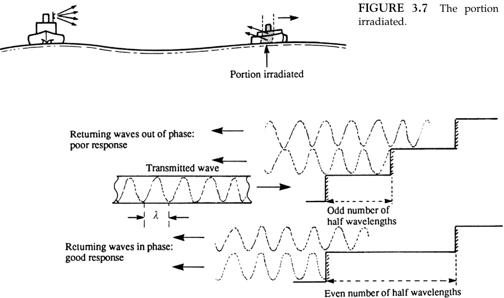  

FIGURE 3.8 The effect of coherence on echo strength.  

图3.8相干性对回声强度的影响。 

注：在图像或信号处理中，相干性（coherence）是指两个或多个信号之间的相关性和一致性，通常用来描述信号之间的相位关系和强度相关性。在回声信号中，相干性可以影响回声的强度和清晰度。

Where, within the cell, the target is sloping, for example a coastline, two consequences of the slope need to be considered.  

在单元格中，当目标有坡度时，例如海岸线，需要考虑到坡度的两个影响。[这里的“单元格”指的是计算机中处理数据的最小单位，“目标”指的是需要处理或分析的对象，如海岸线，“坡度”是指海岸线的倾斜角度]

#### 3.3.5.1 Sloping Surfaces - The Effect of Coherence on Response Amplitude  

Consider the face of the slope to be made up of small steps. The radial length of the step will determine the phase relationship of the elements of the returning composite wave. If the elements are out of phase on their return to the antenna then the echo strength will be poor, while if they are in phase the response will be good.  

考虑斜坡的表面由小台阶组成。每个台阶的径向长度（radial length，指从圆心向外延伸的长度）将决定返回的合成波（composite wave，指由多个波相互叠加形成的波）元素之间的相位关系。如果这些元素在返回天线（antenna，指接收和发送无线电波的设备）的途中相位不一致（out of phase），那么回声的强度（echo strength）就会很弱；而如果它们相位一致（in phase），那么回应就会很好。

Note: The radial length of the steps being considered here is of the order of a fraction of a wavelength (and will take the form of an odd number of quarter wavelengths).  

注：这里所考虑的阶梯的半径长度（radial length）约为波长（wavelength）的分数（并且将以奇数个四分之一波长（quarter wavelengths）的形式出现）。

#### 3.3.5.2 Sloping Surfaces - The Effect of Signal Integration on Echo Strength  

In this case, the steps which are to be considered are of the order of one-half pulse length, that is half of $0.1{-}1 \mu s,$ which equates to a radial distance of some $15{-}150\mathrm{m}$ .  

在这种情况下，需要考虑的步骤的顺序是脉冲长度的一半，即 $0.1{-}1 \mu s$ 的一半，这相当于半径距离的一些 $15{-}150\mathrm{m}$ （其中脉冲长度指的是信号传输的时间长度，半径距离指的是从中心到边缘的距离）。

Consider a stepped sloping surface (Figure 3.9) where each step is $10\mathrm{m}$ in length and the radar pulse length is $0.2 \mu s,$ that is the spatial length of the pulse is $0.2\times300=600\mathrm{m}$ .  

考虑一个阶梯状斜面（图3.9），其中每个阶梯的长度为$10\mathrm{m}$，雷达脉冲长度为$0.2 \mu s$，即脉冲的空间长度为$0.2\times300=600\mathrm{m}$。

It can be seen from Figure 3.9 that the responses from the individual steps on the target can integrate (i.e. add up) to a maximum from that portion of the target which lies within any one-half pulse length, but cannot increase indefinitely as the target increases in height. In the above example the one-half pulse length is $30\mathrm{m}$ .  

从图3.9可以看出，来自目标上各个步骤的响应（即可以叠加，即加起来）可以达到来自目标的一部分的最大值，该部分的长度位于任意一个半脉冲长度内，但是随着目标高度的增加，响应不能无限增加。在上述例子中，半脉冲长度为$30\mathrm{m}$。

If, with the same overall size of target, the step height and length are varied so that each step height is halved and the step length is halved, the same aggregate response will be obtained, which is the integration of a larger number of smaller responses. It is evident that the land still rises to the same height over half the pulse length. This suggests an alternative approach, which is to consider only the vertical height over the one-half pulse length, that is projected height (or, in three dimensions, the projected area (Figure 3.10).  

如果目标的整体尺寸保持不变，而步骤的高度（step height）和长度（step length）被改变， 即每个步骤的高度减半，步骤的长度也减半，那么将得到相同的综合响应（aggregate response），这是较多较小响应的积分（integration）。很明显，地面仍然在一个脉冲长度的一半范围内上升到相同的高度。这表明了一个替代的方法，即只考虑在一个脉冲长度的一半范围内的垂直高度（vertical height），这被称为投影高度（projected height），或者在三维空间中，被称为投影面积（projected area）（图3.10）。

  

FIGURE 3.9 Integration of signals from sloping surfaces.  
Note:  

图 3.9 倾斜表面信号的集成。 
注：

a. If the step lengths are not precisely the same and if the difference is of the order of one-half the wavelength, then the effects of coherence will also have to be considered when deciding on whether or not the elements of the response will integrate.   

如果步长（step lengths）不完全相同，且差值（difference）约为波长（wavelength）的一半，则在决定响应元素（elements of the response）是否集成时，也需要考虑相干性（coherence）的影响。这里的相干性是指波的相位（phase）之间的一致性，即不同步长的波是否能保持相位一致，影响到最终的集成结果。

b. If the facets are not true steps, random scattering will also have to be considered.   

b. 如果这些面（facet）不是真实的步阶，那么还需要考虑到随机散射（random scattering）的因素。

c. As a result of the most favourable integration of the elements of the response, the maximum echo strength would be the same as if a flat plate were placed in the path of the pulse. The plate would have a vertical height equivalent to the projected vertical height of the target which lies within half the radial length of the transmitted pulse.  

c. 作为响应元素最有利的集成结果，最大回声强度将与将一个平板放置在脉冲路径中时相同。平板的垂直高度应等同于目标的投影垂直高度，该高度位于传输脉冲的半径长度的一半范围内。这样，可以达到最大回声强度的效果。 [注：这里的“回声强度”指的是目标物体对雷达波或其他探测波的反射强度，而“平板”是用来模拟目标物体反射特性的一个简化模型。]

  

FIGURE 3.10 Projected area.  

图3.10 投射区域。

Where a target is small in relation to the resolution cell, it is convenient to consider the projected area of the target (see also Section 3.3.5.4), but its surface texture, material, aspect and shape must not be ignored.  

当目标与分辨率单元（resolution cell）相比较小时，考虑目标的投影面积（projection area）是方便的（参见3.3.5.4节），但其表面纹理（surface texture）、材料（material）、朝向（aspect）和形状（shape）则不能被忽略。

#### 3.3.5.3 The Equivalent Flat Plate Area $\left(\mathbf{A}_{t}\right)$ of a Target  

This is the area of a flat plate orientated at right angles to the incident radiation which would return the same energy as the object. The equivalent flat plate areas for some common shapes are given in Figure 3.11.  
Note:  

这是一个与入射辐射成直角的平板的面积，当其朝向入射辐射时，它将与对象返回相同的能量。图3.11中给出了有关一些常见形状的等效平板面积的数据。 
注意：

a. The values given in Figure 3.11 are maximum values, having been simplified by the removal of terms relating to aspect. If the aspect in either or both planes is changed, the response may decrease. For example, if the flat plate were tilted there would be a marked drop in response, whereas, with the cylinder, a change about a vertical axis would result in no change in response while a change about a horizontal axis would result in a marked drop in response.   

a. 图3.11中给出的值是最大值，由于去除了与方向（aspect）相关的项而得到的简化值。如果在一个或两个平面中改变方向，响应（response）可能会减少。例如，如果平板被倾斜，则响应会明显下降，而对于圆柱体来说，绕垂直轴旋转不会改变响应，但绕水平轴旋转会导致响应明显下降。

b. In deriving the formulae, there is an assumption that the size of the object is very large in comparison with the wavelength. (The formulae should not be applied, for instance, to spherical rain drops.)  

b. 在推导公式的过程中，存在一个假设，即物体的大小与波长相比非常大。（例如，不应将这些公式应用于球形的雨滴。）

#### 3.3.5.4 The Radar Cross-Section of a Target (σ)  

The radar cross-section (or equivalent echoing area) of an object is the area intercepting that amount of power which, when scattered isotropically, produces an echo equal to that received from the object.  

一个物体的雷达截面（或等效回波面积）是指在该物体上散射的能量，当这些能量以各向同性散射（即均匀地向所有方向散射）[注：各向同性散射是指物体接收的能量以相同的强度散射到所有方向，类似于一个点 источ产生的能量在空间中均匀分布]时，产生的回波与从该物体接收到的回波相同的那部分能量的截面面积。

Since a sphere is generally accepted as a typical isotropic radiator (i.e. it radiates in all directions), this definition is indicating the cross-section of a sphere which, if it replaced the target, would produce the same response.  

由于球体通常被认为是典型的各向同性辐射体（即，它在所有方向上辐射），这种定义指的是球体的横截面，如果它取代目标，会产生相同的响应。[这里的“各向同性辐射体”是指在所有方向上都能均匀发射能量的物体，如同一个球面一样向各个方向发射能量]

图 3.11

FIGURE 3.11 Radar cross-sections and equivalent flat plate areas for some common targets.

图3.11 显示了一些常见目标的雷达散射截面（Radar cross-sections）及其等效的平板面积（equivalent flat plate areas）。 

[解读：雷达散射截面是指目标物体在雷达波照射下反射回来的信号强度的测量指标，而等效平板面积则是用来比较不同目标物体在雷达波下的反射特性的一个参考值。]

It can be seen that if there is some directivity in the target’s response, its radar crosssection will be much greater than its actual physical cross-section or projected area.  
EXAMPLE 3.2  

可以看出，如果目标的响应中存在某种方向性，其雷达截面将远远大于其实际的物理截面或投影面积。  
示例 3.2

Compare the radar cross-section of a flat plate with that of a sphere if the plate is at right angles to the radiation; both plate and sphere have projected areas of $1~\mathrm{m}^{2}$ and the wavelength in use is $3.2\mathrm{cm}$.  

比较一个平板和一个球体在同等条件下的雷达截面，当平板与辐射方向垂直时；平板和球体都有1平方米的投影面积，并且使用的波长为3.2厘米。这里我们考虑的是雷达波（radio wave）在碰到物体时散射（scattering）的情况，雷达截面（radar cross-section）是指物体对雷达波散射的效率（效应），是一个用来描述物体散射雷达波能力的指标（这里指的是物体与雷达波的相互作用能力）。

This means that the flat plate would produce a response some 12,000 times greater than the sphere or, alternatively, a sphere having some 12,000 times the projected area of the plate would have to be placed at the same range as the plate to produce the same response. It is interesting to note that any slight change in the aspect of the plate will result in a massive drop in the response, whereas no change will occur if the sphere is re-orientated. 

这意味着平板将产生一个响应，其大小约为球体的12,000倍，或者从另一个角度来说，为了在相同的距离下产生相同的响应，需要放置一个具有约12,000倍于平板的投影面积（projected area）的球体。有趣的是，平板的方位（aspect）只要稍微变化一下，就会导致响应大幅度下降（massive drop），而如果球体重新定向（re-orientated），则不会发生任何变化。其中，球体的“投影面积”指的是球体在传感器或观察者视野中的二维影像面积，而“方位”则指的是物体与观察者或传感器之间的空间关系和朝向。

One of the surface objects referred to in IMO Performance Standards, in specifying range performance (see Sections 11.2.1), is a navigational buoy having an effective echoing area of approximately $1\mathrm{{0}}\mathrm{{m}}^{2}$ . This means one that produces the same strength of echo as a sphere having a projected area of $10\mathrm{m}^{2}.$ , that is a spherical buoy having a diameter of some $4\mathrm{m}$ .  

国际海事组织（IMO）性能标准中提到的表面物体之一是在规定的测量范围内（参见第11.2.1节），即具有大约$1\mathrm{{0}}\mathrm{{m}}^{2}$有效回声面积的航行浮标。这意味着，该浮标产生的回声强度与一个投影面积为$10\mathrm{m}^{2}$的球体相同，即直径约为$4\mathrm{m}$的球形浮标。

The relationship between radar crosssection and equivalent flat plate area is given by the formula:  
$$
\sigma={\frac{4\pi A_{\mathrm{t}}^{2}}{\lambda^{2}}}
$$  

雷达散射截面积与等效平板面积之间的关系由以下公式给出：  
$$
\sigma={\frac{4\pi A_{\mathrm{t}}^{2}}{\lambda^{2}}}
$$
该公式表明，雷达散射截面积（\(\sigma\)）与等效平板面积（\(A_{\mathrm{t}}\)）的平方成正比，与波长（\(\lambda\)）的平方成反比。其中，\(A_{\mathrm{t}}\)表示等效平板的面积，\(\lambda\)表示电磁波的波长。这种关系在雷达工程和电子对抗中非常重要，因为它帮助工程师预测和分析目标物体的雷达散射特性。

#### 3.3.5.5 The Rayleigh Roughness Criterion  

It can be shown that the roughness of a surface depends on the size of the discontinuities in relation to the incident wavelength and the angle at which the radiation strikes the surface (the grazing angle). Application of the Rayleigh criterion indicates that the surfaces for all practical purposes are smooth if $(8\times\delta h\times\sin\theta)<\lambda,$ where $\lambda$ is the wavelength and $\theta$ is the grazing angle (Figure 3.12).  
EXAMPLE 3.3  

可以证明，表面的粗糙度取决于不连续性尺寸相对于入射波长和辐射击中表面的角度（扫描角）的大小。应用雷利准则（Rayleigh criterion）指出，如果满足条件$(8\times\delta h\times\sin\theta)<\lambda$，那么从实际应用角度讲，表面可以认为是光滑的，其中$\lambda$代表波长，$\theta$代表扫描角（如图3.12所示）。  
例3.3

If the antenna is at a height of $15\mathrm{m},$ at what distance, $d_{,}$ , from the ship, will the sea surface appear smooth if wave height is $1\textrm{m}$ (the radar is working in the X-band)? (At the limit of clutter, $8\times\delta h\times\sin\theta=\lambda.$ )  
$$
\frac{8\times1\times15}{\sqrt{(225+d^{2})}}=0.03
$$  
$$
d^{2}=4000^{2}-225
$$  
The sea surface will appear smooth at a distance (Figure 3.13).  
$$
d\geq4\mathrm{km}(2.16\mathrm{NM})
$$  

如果天线（antenna）位于15米的高度，那么在海浪高度（wave height）为1米（雷达工作在X-band频段）的条件下，相距$d$多少距离，海面将看起来很平滑？（在杂波（clutter）的极限条件下，$8\times\delta h\times\sin\theta=\lambda$。）

$$
\frac{8\times1\times15}{\sqrt{(225+d^{2})}}=0.03
$$

$$
d^{2}=4000^{2}-225
$$

海面将在某一距离（如图3.13所示）看起来很平滑。

$$
d\geq4\mathrm{km}(2.16\mathrm{NM})
$$

翻译时我对专业术语进行了保留，如“天线”、“杂波”、“X-band”等，同时保持了原有的技术精度和学术风格。同时，我也注意到了括号中的内容，如（clutter）的直白解读，虽然由于原文括号中没有对应的内容，故而没有在翻译中添加相应的解读。请需要时提出任何调整要求。

  

FIGURE 3.12 Grazing angle and roughness.  

图3.12 草食角度和粗糙度。 

(注：在这里，“草食角度”指的是入射光线与物体表面之间的角度，类似于动物吃草时的角度，而“粗糙度”则是指物体表面的不平整度或凹凸程度。)

  

FIGURE 3.13 The theoretical extent of sea clutter.  

图3.13 海上杂波的理论范围。

### 3.3.6 Responses from Specific Targets  

#### 3.3.6.1 Ice  

Large icebergs, such as those which are formed on the east coast of Greenland and drift down towards the North Atlantic shipping routes, have been found to give greatly varying radar responses. Detection ranges as great as 11 NM have been experienced while, on the other hand, quite large icebergs have approached to within 2 NM without being detected. Even the same iceberg may give greatly differing responses when viewed from different directions.  

在格陵兰东海岸形成并向北大西洋航运路线漂移的大型冰山，已经被发现会产生非常不同的雷达响应信号。在某些情况下，探测范围可以达到11海里（NM），而在另一些情况下，相当大的冰山可以在未被探测的情况下靠近到距离船只2海里之内。即使是同一个冰山，从不同的方向观察时，也会产生非常不同的雷达响应信号。这主要是因为冰山的形状、大小和表面状况会影响雷达波的散射和反射，从而导致探测信号的强度和稳定性发生变化。

Particular concern has been expressed because of radar’s apparent difficulty in ‘detecting ice’. The point should be made that the ice which causes most concern is that form which comprises what are known as growlers. Many theories have been put forward and there have been many practical experiments carried out to determine the best way to use the radar in areas where growlers are expected: two major points emerge.  

人们对雷达技术特别担心，因为它似乎很难“探测到冰”（检测冰）。这里需要澄清的是，人们最担心的是那些由所谓的“冰山碎块”（growlers）组成的冰。为了确定在冰山碎块可能出现的区域中如何最好地使用雷达，人们已经提出了许多理论，并进行了许多实践实验：从中总结出两个主要观点。其中，冰山碎块是指比冰山小，但仍然对船只航行构成威胁的冰块，被认为是海上最危险的冰体之一。

1. Growlers are intrinsically poor targets because, as melting ice, the surface tends to be smooth and this does nothing to improve their essentially poor shape and aspect. They present a small projected area above the water and the signal returned is frequently of strength comparable to or weaker than that returned from the sea waves which are prevalent in the area in which the growlers are commonly found.  

1. 冰山（growlers）本质上是难以被探测的目标，因为它们表面随着冰的融化往往变得很平滑，这也不会改善它们本质上差的形状和外观。它们在水面上呈现出较小的投影面积，返回的信号强度往往与海浪的信号强度相当或更弱，而海浪是在冰山常见的区域中普遍存在的。同时，海浪也会对探测信号造成干扰，从而使得冰山更难被准确探测到。[注：这里的“growlers”指的是小型冰山，通常是冰川或冰山崩解后形成的，其尺寸较小且表面光滑，不易被雷达或其他探测手段探测到。]

Theories relating to the effects of hightemperature gradients in the immediate vicinity of the growler and also to the reradiation characteristic of the ice have not proved conclusive.  

与生长器（growler）附近高温梯度效应以及冰的再辐射特性相关的理论尚未被证明是有力的。 

（这里的“生长器”指的是一种在海洋中形成的冰体，“高温梯度”指的是温度随距离迅速变化的现象，“再辐射特性”指的是冰对辐射的吸收、反射和发射的能力。）

2. In areas where growlers are to be expected, radar should not be relied upon to give adequate or even any warning of their presence, especially at night or in poor visibility. Speed and the visual lookout should be set with this in mind.  
The best use of radar under these circumstances is:  
a. a dedicated radar watch by one observer;   

2. 在可能遇到growlers（Growlers指的是波浪或海冰，在某些海域中，尤指北大西洋等地区）的区域，尤其是在夜间或能见度较差的情况下，不应过度依赖雷达来获取足够的或者甚至任何关于growlers存在的警告。因此，航速和视觉观察应以此为前提进行设定。
在这种情况下，雷达的最佳使用方法是：
a. 由一名观察员专门进行雷达监视；

b. regular searching with the anti-clutter control on the short ranges (see Section 6.7.1), remembering to check at frequent intervals on the longer ranges for larger targets;   
c. use of the long pulse in weak clutter;   
d. use of the longer wavelength of the Sband radar.  

b. 在较短的距离范围内（见6.7.1节），使用抗杂波控制进行定期搜索，记得在较长的距离范围内以较短的间隔检查较大的目标；   
c. 在弱杂波环境中使用长脉冲；   
d. 使用S波段雷达的较长波长。

#### 3.3.6.2 Radar-Conspicuous Targets  

Targets which are designated radarconspicuous should be those which are known to provide good radar responses and are readily identifiable (see Section 8.2.5). In the past, particular land features which satisfied those criteria were highlighted on charts by the addition of the legend ‘Radar Conspic’. This practice has been discontinued, but there is no reason why observers should not mark their own charts in this way and also make notes in the radar log for the benefit of their successors.  

被指定为雷达显现目标的应该是那些已知能够提供良好雷达响应并且容易识别的目标（见第8.2.5节）。过去，特定的陆地特征如果满足这些标准，就会在图表上通过添加“雷达显现”的图例来突出显示。这一做法已经停止，但没有理由阻止观察员以这种方式标记自己的图表，并且还可以在雷达日志中记录便于后继人员参考。 

注：雷达显现，即Radar Conspicuous，指的是目标物体能很好地反射雷达波，易于被雷达探测到的特性。

#### 3.3.6.3 Ships  

The structure of ships is such that there are many natural ‘corner reflectors’ (see Section 3.4.1) and hence, when a target vessel is rolling and pitching in a seaway, its echo strength does not vary quite as much as might be expected. Some rather peculiar effects can be observed, although they are usually quite easily explained by reverting to first principles. For example, long vessels may appear as two or three individual echoes (each of which when tracked by Automatic Radar Plotting Aid (ARPA) might appear to be going in a slightly different direction). They may also be confused for a tug-and-tow or vice versa. Supertankers, because of their low freeboard, may not be detected at inordinately great ranges, when loaded.  

船舶的结构决定了它拥有许多天然的“角反射器”（参见3.4.1节），因此，当目标船舶在海中滚动和俯仰时，其回波强度并不会像预期的那样变化得非常大。虽然有一些相当奇特的效应可以被观察到，但这些效应通常可以通过回归到基本原理轻松地得到解释。例如，长型船舶可能表现为两个或三个独立的回波信号（每个信号在通过自动雷达绘图辅助系统（ARPA）跟踪时可能显示为朝着稍微不同的方向移动）。它们也可能被误认为是拖船和被拖船或者相反的情况。超大型油轮由于其自由板较低，在载货时可能不会在极大距离上被检测到。

It is important to realize that some naval vessels are designed to have a very low radar cross-section, not least by avoiding ‘corner reflector effects’ in their design. It is to be hoped that in peacetime these vessels carry sufficient passive or active artificial radar enhancers, such as those described in the following section, so as not to appear radarinvisible to other vessels.  

人们需要意识到，某些海军舰艇的设计宗旨在于使其拥有非常低的雷达截面面积，尤其是通过在设计中避免“角反射器效应”（一种使雷达信号能够被明显反射回来的结构特征）。希望在和平时期，这些舰艇能够配备足够的被动或主动的人工雷达增强器（如下一节所述），从而避免在其他舰艇的雷达屏幕上呈现出雷达“隐身”的状态（即被动雷达系统无法探测到）。

#### 3.3.6.4 Offshore Wind Farms  

The introduction of large offshore wind farms has been a recent addition to the coastal waters around Europe and other parts of the world. The towers and moving turbines can be over $100\mathrm{m}$ in height with blades over $50\mathrm{m}$ long. There has been some concern that the radar performance might be reduced or affected by false echoes in the vicinity of offshore wind farms.  

近年来，大型海上风电场在欧洲和世界其他地区的沿海水域中相继出现。风电场的塔楼和转动的涡轮机（turbines）可以超过$100\mathrm{m}$的高度，叶片长度也超过$50\mathrm{m}$。人们担心，在海上风电场附近，雷达（radar）的性能可能会因虚假回波（false echoes）而降低或受到影响。

Certainly this is sometimes quoted in the media as a reason for not placing onshore wind turbines near to airfields, as the echoes can be confused with moving aircraft. However, there is no known evidence of this in a marine context for offshore wind farms, other than the normal slight shadowing effect caused by targets of a similar size.  

的确，媒体上有时会提到这样一个理由，即不在机场附近安装陆上风力涡轮机，因为（雷达）回波可能会被误认为是移动的飞机。然而，在海上风电场的海上环境中，除了与目标大小相似的阴影效应（shadowing effect，[指风力涡轮机对雷达信号造成的遮蔽，影响雷达探测的精度]）以外，尚未发现有任何证据表明风力涡轮机对雷达信号造成的干扰。

On the positive side the regular pattern of wind turbine installations within an offshore field can make good radar-conspicuous navigation marks in areas as the pattern on the radar is easy to compare with the chart. These offshore wind farms are sometimes in navigational areas devoid of other suitable land-based targets, so the wind turbines can provide a good source of bearings and ranges for radarbased navigation. Issues such as the restriction in navigation caused by the offshore wind farms are not in the remit of this book.  

从积极的方面来说，在海上风电场内，风力涡轮机（wind turbine）安装的规则模式可以为雷达（radar）提供明显的导航标志，在这些区域，雷达上的模式与图表（chart）相比很容易识别。这些海上风电场有时位于没有其他适当陆基目标（land-based targets）的导航区域，因此风力涡轮机可以为基于雷达的导航提供一个良好的方位（bearings）和距离（ranges）的来源。诸如海上风电场对导航的限制等问题不在本书的讨论范围内。

## 3.4 TARGET ENHANCEMENT PASSIVE  

It is essential that some targets which would normally provide poor radar responses, for example buoys, glass fibre and wooden boats, are detected at an adequate range by radar. It was recognized at a very early stage in the development of radar that some form of echo enhancement was needed. IMO have Performance Standards for radar reflectors (see Section 11.2.6).  

确保某些通常会产生较差雷达回波的目标，例如浮标、玻璃纤维和木制船只，在合适的距离内被雷达探测到是至关重要的。在雷达技术的开发初期，就认识到需要某种形式的回波增强。国际海事组织（IMO）已经为雷达反射器制定了性能标准（请参见第11.2.6节）。

### 3.4.1 Corner Reflectors  

A corner reflector was seen as a simple device which would return virtually all of the energy which entered it, that is the energy would be returned in the direction from which it had come almost irrespective of the angle at which it had entered the corner (Figure 3.14). In its simplest form, such a corner consists of two metal plates placed at an angle of $90^{\circ}$ to each other, attached to a navigation mark which then returns an improved radar response and consequently is detectable at a greater range.  

一个角反射器（corner reflector）被视为一种简单的装置，它可以返回几乎所有进入它的能量，即能量将以与其进入角反射器的方向几乎相同的方向返回，无论其进入角反射器的角度如何（图3.14）。在其最简单的形式中，一个角反射器由两个以90°的角度彼此放置的金属板组成，附着在导航标志上，从而返回改进的雷达响应，并因此在更远的距离上是可检测的。这样一来，这种装置就可以增强导航标志的可检测性，提高导航的安全性和准确性。

An essential principle of all echo enhancement is that it provides reserve gain, which means that, in adverse conditions of sea or weather clutter, the target’s improved response can be expected to be greater than the clutter responses and therefore will be detectable (see Sections 6.7.1 and 6.7.2) despite the reduced gain necessary for the suppression of the clutter.  

所有回波增强的基本原则是，它提供了备用增益（reserve gain），这意味着，在海况或天气杂波不利的条件下，目标的改进响应（improved response）可以预期地大于杂波响应（clutter responses），因此即使在抑制杂波（suppression of the clutter）所需的降低增益（reduced gain）的情况下，也仍然可以检测到目标（detectable）（参见6.7.1和6.7.2节）。

  

FIGURE 3.14 Corner reflectors.  

图 3.14：角反射器（一种用来改变光线或信号方向的反射装置，[即通过在物体的两个邻接面上创建一个“角落”，使得入射的光线或信号可以被反射回原来的方向，从而可以被探测或接收到]）。

While a simple corner is adequate on nonfloating objects, if the attitude of the target is likely to change as it moves in a seaway, it is necessary to use the now familiar closed corner or triangular trihedral (see Figure 3.14(d)) rather than the dihedral corner. The closed corner will ensure that the energy is returned even though the corner is moving through quite a large angle in both the horizontal and vertical axes.  

当处理非浮动物体时，一个简单的角（corner）是足够的，但是如果目标物体在海上移动时，其姿态（attitude）可能会发生变化，那么就需要使用现在大家熟悉的封闭角（closed corner）或三面角体（triangular trihedral）（见图3.14（d）），而不是二面角（dihedral corner）。封闭角可以保证，即使角在水平轴和垂直轴上移动了很大一个角度，能量仍然会被返回。[这里的“角”指的是物体上的一个反射表面，“二面角”和“三面角体”指的是不同类型的反射结构，“姿态”指的是物体在三维空间中的方向和位置。]

#### 3.4.1.1 The Accuracy of Construction  

The angle between each pair of planes must be $90^{\circ}$ and very little error can be tolerated without affecting the efficient operation of the corner. Where, as a result of damage or careless construction, the angle is other than $90^{\circ}.$ , even by a very small amount, the response from the corner can be seriously impaired.  

每对平面的夹角必须为$90^{\circ}$，（即每对平面之间的角度必须是直角，相当于一个“L”型拐角），几乎不能容忍任何错误，否则将影响拐角（的工作效率）。在哪里，由于损坏或粗心的构造，（平面之间的）角度不是$90^{\circ}$，即使只是一个非常小的量，拐角的反应也可能会严重受损。

Figure 3.15 shows that, with a wavelength of $3\mathrm{cm}$ and a side length of $1.05\mathrm{m}$ (i.e. side length to wavelength ratio of 35); if the angle between the planes is $88^{\circ}$ the gain is only 10 dB instead of the 30 dB that might be expected - this difference of $20\mathrm{dB}$ represents a reduction in response by a factor of 100. Note that with smaller sides but still working at the same wavelength, the loss would not be so severe.  

图3.15展示了，当波长为$3\mathrm{cm}$，边长为$1.05\mathrm{m}$（即边长与波长的比例为35）时；如果平面之间的角度为$88^{\circ}$，增益仅为10 dB，而不是预期的30 dB - 这个20dB的差异代表了响应的减少，达到了100倍的因数。注意，若边长较小，但仍然在相同的波长下工作，损失不会这么严重。

Over the years, many designs for the ‘home’ construction of the corner reflectors and in particular ‘collapsible’ octahedral arrays (see Section 3.4.2.2) have been published, but it is never made clear how important is the precision required in the construction and assembly of the corners, in order for the full potential of the reflector to be achieved.  

多年来，已有许多关于家用拐角反射器构造的设计被发表，尤其是可折叠的八面体阵列（请参阅3.4.2.2节）。然而，人们始终没有明确说明，在拐角的构造和组装中，所需的精度对于实现反射器的全部潜力有多重要。这样做的主要目的是为了确保反射器能够达到最佳的性能，[即反射器能够有效地聚焦和反射光线，或者其他形式的电磁波]。因此，了解构造和组装的精度对于实现反射器的最佳性能至关重要。

The suggestion that ‘crumpled’ aluminium foil (in a plastic container!) will provide adequate radar responses is a serious over-simplification. The physical principles of adequate enhancement require precise corners and that the size of each facet is at least greater than and preferably a function of wavelength.  

认为用塑料容器包裹的“皱巴巴”的铝箔能够提供足够的雷达响应是一个严重的过度简化。雷达信号增强的物理原理要求精确的角度，并且每个面（facet）的尺寸至少要大于或是与波长（wavelength）成比例的函数，这样才能实现增强的效果。这样设计才能保证雷达信号的可靠性和有效性。

  

FIGURE 3.15 The effect of an error in all three corner angles of a corner reflector.  

图3.15：角反射器三个角的误差对其效果的影响。

#### 3.4.1.2 The Response from a Corner Reflector  

The three forms of the corner reflector may be compared by referring to Figure 3.11. The following points should be noted:  

图3.11中展示了三种角反射器的形式。以下几点值得注意：

1. Values shown are maximum values. Where aspect in either plane is changed, additional terms will need to be included in the equations.  

1. 所显示的值为最大值。若平面中的某个方面发生变化，则需要在方程中包含额外的项 [即需要在数学公式中添加新的变量或参数，以便能够准确地描述和计算新的情况]。

2. $A_{\mathrm{t}}$ indicates the area of a flat plate, orientated so as to be perpendicular to the direction of the incident radiation. For example, a triangular trihedral reflector which has a side length $a$ of $50\mathrm{cm}$ reflects as if it were a flat plate having an area of $1443.4~\mathrm{cm}^{2}$ and a $90^{\circ}$ aspect.  

2. $A_{\mathrm{t}}$ 表示平板的面积（area），平板的方向与入射辐射（incident radiation）的方向垂直（即平板面垂直于辐射线）。例如，一个边长 $a$ 为 $50\mathrm{cm}$ 的三角棱镜反射器，可以认为其反射行为相当于一个平板，其面积为 $1443.4~\mathrm{cm}^{2}$，且具有 $90^{\circ}$ 的横向（aspect），这里的横向是指平板在空间中与观察方向的夹角，相当于平板的展开方向与观察方向之间的角度关系（横向用来描述物体在一定视角下的展现方式）。

This would appear to indicate that a corner reflector is not as good at returning a response as a flat plate. While this is true, the very important proviso is that a flat plate will only respond at optimum level when it is perpendicular to the incident radiation. If there is only a very slight change in aspect of the flat plate, the response, however, will drop theoretically to zero; with the corner, the level will suffer very little reduction over some $\pm50^{\circ}$ of change in attitude.  

这似乎表明，角反射器（corner reflector）并不如平板（flat plate）那样善于返回响应。虽然这在某种程度上是正确的，但一个非常重要的条件是：平板只有在其面与入射辐射（incident radiation）垂直时，才会以最佳水平响应。如果平板的朝向仅仅稍有改变，响应会理论上降低到零；而对于角反射器，其响应水平在其朝向变化约$\pm50^{\circ}$范围内几乎不会降低。

A second point which is worthy of note is that the dihedral and rectangular trihedral corners both have better response figures than the triangular trihedral, but the former’s response is markedly susceptible to change of attitude while the latter does not have such a wide coverage angle since the square plates tend to intercept the incident radiation at an earlier stage as aspect is varied.  

值得注意的第二个问题是，二面角（dihedral）和矩形三面角（rectangular trihedral）两者的响应图形都优于三角形三面角（triangular trihedral），但前者的响应明显容易受到姿态变化的影响，而后者由于正方形板块（square plates）倾向于在方位变化时较早截断入射辐射，因此没有如此宽的覆盖角度。

### 3.4.2 Arrays of Reflectors  

A single triangular trihedral corner does not provide $360^{\circ}$ of azimuth coverage. By use of a group or array, irrespective of the direction from which it is viewed and of its attitude in the vertical plane, the response will remain virtually unchanged. The array may be incorporated in the basic structure of the navigation mark (Figure 3.16).  
The following points should be noted with regard to arrays:  

单个三角形三面角（triangular trihedral corner）不能提供 $360^{\circ}$ 的方位覆盖范围。通过使用一组或一组阵列（array），无论从哪个方向观察它，或者它在垂直平面上的方位如何，其响应都会保持几乎不变。该阵列可以集成到导航标志（navigation mark）的基本结构中（如图3.16所示）。 
以下几点关于阵列需要注意：

1. Reflectors which have surfaces of wire mesh, especially if $a$ is greater than 20 times the wavelength, tend to warp and so produce poor results.  

反射器表面为金属网状（尤指波长的20倍以上的网状），倾向于变形，从而产生较差的效果。 

（注：本段主要强调反射器的表面材料和大小对其效果的影响。网状材料容易变形，导致反射效果不佳。）

  

该图像显示了一个 IoT 设备的概念模型，它集成了多种传感器和执行器组件，通过网络连接和人工智能（AI）算法实现实时数据处理和决策。图像展示了设备与周围环境之间的交互，体现了“物联网”（Internet of Things，IoT）[即将各类物体与互联网连接起来，实现它们之间的信息交互和协同工作的一种技术体系] 的理念。

在图像的中心位置，是一个微控制器（Microcontroller）[一种小型的计算机系统，能够控制和监控外部设备]，它作为设备的大脑，处理传感器数据并执行智能决策。微控制器通过各种接口与传感器（Sensor）[能够检测和测量物理参数的设备] 和执行器（Actuator）[能够执行特定动作的设备] 连接，实现对环境的感知和控制。

图像左侧展示了多种类型的传感器，如温度传感器（Temperature Sensor）[测量温度的传感器]、湿度传感器（Humidity Sensor）[测量湿度的传感器] 和运动传感器（Motion Sensor）[检测运动的传感器]，这些传感器能够实时监测环境参数并将数据反馈给微控制器。右侧则展示了执行器，如继电器（Relay）[一种电气开关设备]、直流电机（DC Motor）[一种能够旋转的电动机] 和LED灯（LED Light）[一种发光二极管]，这些执行器能够根据微控制器的指令执行特定动作。

图像底部显示了设备与互联网的连接，通过无线通信技术，如Wi-Fi（Wireless Fidelity）[一种无线局域网技术] 或蜂窝网络（Cellular Network）[一种移动通信网络技术]，实现设备与云端服务器（Cloud Server）[一种通过互联网提供服务的远程服务器] 的数据交互和遥测控制。这种连接使得设备能够接收和执行远程指令，并将实时数据上传到云端进行处理和分析。

总的来说，该图像生动地演示了IoT设备的基本架构

FIGURE 3.16 Arrays of reflectors incorporated into the structures of navigation marks.  

图3.16：将反射器阵列集成到航行标志的结构中。

2. Deterioration of response is likely to result from: (a) imprecise construction or damage, (b) poor intrinsic orientation, and (c) changes in coherence.  

2. 响应的劣化可能是由于以下几种情况造成的：（a）结构的不精确建造或受损，（b）内在方向的不良，以及（c）相干性的变化。 

[注： 
- 响应的劣化是指系统或材料对刺激或信号的反应随时间推移而变得不那么强烈或有效的过程。
- 内在方向是指材料或系统在空间中的排列方式，这会影响其对外界刺激的反应。
- 相干性是指波动或振动之间的相位关联程度，它在光学、量子力学等领域是一个重要的概念。]

#### 3.4.2.1 Types of Array  

The dihedral array has been found to be most appropriate for shore-based navigation marks because the rapid fall-off in response associated with change of attitude in the vertical plane was not a factor.  

二面阵列被发现是最适合用于陆基导航标志的，因为在垂直平面上随着姿态变化相关的响应快速衰减现象在这里并不构成问题。

The octahedral array (Figure 3.17) was until recently regarded as the standard for most situations.  

八面体阵列（图3.17）直到最近仍被认为是大多数情况下的标准配置。

In the pentagonal array (Figure 3.18), the polar diagram in the horizontal plane shows quite serious arcs of reduced response where the beam passes between the elements.  

在五边形阵列（图3.18）中，水平面上的极坐标图显示出相当严重的弧形响应降低区域，这是由于波束通过阵列元素之间的间隙引起的[即，当信号从阵列中间的空隙处通过时，响应会降低，影响了阵列的整体性能]。

In the vertical plane, as the navigation mark heels, the response falls off rapidly with angle of heel.  

在垂直平面中，随着航标（navigation mark）的偏航（heels），响应会随着偏航角度迅速下降。其中，偏航指的是船舶或其他航行器在垂直平面上绕过航标时产生的横向偏移。

In the double pentagonal array, as can be seen from Figures 3.18(b) and 3.19, the interspaced corners fill out the polar diagram in the horizontal plane, thus improving the $360^{\circ}$ coverage pattern.  

在双五边形阵列中，如图3.18(b)和图3.19所示，间隔的角落填充了水平平面中的极坐标图，从而改善了$360^{\circ}$的覆盖模式。这样可以（更好地实现全方向的信号接收和发送，减少信号死角）。

#### 3.4.2.2 Stacked Arrays (Figure 3.20)  

In order to overcome the effect of the gaps in the polar diagrams for the arrays described above, the individual triangular trihedral corners can be arranged in such a way that, as the response from one corner decreases, the response from the next corner starts to increase and so compensates for that drop. In this way, uniformity of response is maintained over $360^{\circ}$ of azimuth.  

为了克服上述阵列的极坐标图中间隙的影响，可以将个别的三角形三面角（triangular trihedral corners，[即由三个平面构成的立体，具有三角形的横截面]）排列成这样一种方式：当一个角的响应（[即该角对信号的响应度]）减小时，下一个角的响应开始增大，从而弥补了该降低。在这种方式下，响应的均匀性（uniformity of response）在方位角（azimuth）$360^{\circ}$范围内得以维持。

An advantage of the many commercial forms of stacked arrays is that they are enclosed in a glass fibre housing which protects the metallic element from damage.  

商用层叠阵列（stacked arrays）的众多形式的一个优点是，它们被封装在玻璃纤维外壳（glass fibre housing）中，这种外壳可以保护金属元件（metallic element）免受损伤。

### 3.4.3 The Lunenburg Lens  

The Lunenburg lens has been in use for quite a number of years, both on navigation marks and on small craft, but frequently goes unrecognized. It comprises a series of concentric shells of differing refractive index.  

朗伯伦透镜已经被使用了很多年，无论是在导航标志上还是小型船只上，但常常被忽视。它由一系列具有不同[折射率的（即不同材料对光线的弯曲能力）]的同心壳组成。

#### 3.4.3.1 Principle of Operation (Figure 3.21)  

Paraxial rays, impinging on the outer spherical surface, are refracted by different amounts at each shell interface so that they are focused at a point on the opposite surface of the sphere. Here the energy is reflected by a metal band in such a way that the exit path of the returning energy is in a direction reciprocal to that of the incident energy.  

平行轴（Paraxial rays，指与光学系统的光轴近乎平行的光线）的光线照射在球体的外表面，会在每个壳层界面处因折射而改变方向不同量，从而使得它们在球体的对面表面上汇聚于一点。在这里，[能量（energy）]被金属带（metal band）反射，反射的方式使得返回能量的出射路径与入射能量的方向成[逆向（reciprocal）]，即返回能量的方向与入射能量的方向恰好相反。

#### 3.4.3.2 The Polar Diagram  

Figure 3.22 gives the theoretical polar diagram, and Figure 3.23 shows its practical effect when applied to a buoy. It should be noted that in the horizontal plane, there are no significant ‘dropout’ sectors. In the vertical plane the coverage is also good, allowing the buoy an angle of heel of some $35^{\circ}$ or, conversely, the response will be enhanced even when the buoy is close to a vessel with quite a large antenna height.  

图3.22给出了理论上的极图，图3.23显示了它在应用于浮标时的实际效果。应该注意的是，在水平面上，没有显著的“信号丧失”扇区[即信号在某些方向上突然下降的区域]。在垂直面上，覆盖范围也很好，允许浮标有一定角度的倾斜（约为35°），或者相反，当浮标靠近具有较大天线高度的船只时，响应会被增强[即，即使浮标位置相对较低，系统也能保持良好的信号接收效果]。

  

FIGURE 3.17 The octahedral array. (a) Correct orientation. (b) Polar diagram corresponding to (a). (d) Incorrect orientation. (e) Polar diagram corresponding to (c). The ‘point-up’ orientation gives reduced coverage.  

图3.17 八面体阵列。 (a) 正确的朝向。 (b) 对应于（a）的极图。 (d) 不正确的朝向。 (e) 对应于（c）的极图。 “点向上”朝向会减少覆盖范围。 

注：八面体阵列是指采用八面体结构的天线阵列，该结构可以提供较好的覆盖和方向性。极图是表示天线辐射模式的图表，通常用于分析和设计天线。

  

FIGURE 3.18 The pentagonal array. (a) The array. (b) Polar diagram.

图3.18 五边形阵列。 (a) 阵列。 (b) 极坐标图。 

（注：这里的“五边形阵列”指的是一种特殊的天线阵列排列方式，采用五边形的几何结构；“极坐标图”是指用极坐标系表示的图表，常用于表示天线的方向图和极化特性等）

## 3.5 TARGET ENHANCEMENT ACTIVE  

A good alternative method of increasing the radar detectability of a target is by the use of an active reflector. Such devices are triggered by the reception of a transmitted radar pulse and immediately generate a radar-like signal which is transmitted back to the original radar. They have to react very rapidly to ensure that the artificially generated echo appears on the radar display at approximately the correct range. There are two main types of active device. One generates a specific signal, which is discernible as such on the radar display and is known as a racon (an abbreviation of radar beacon). The other attempts to replicate the response from a large point target by simply amplifying and retransmitting received pulses. The latter are generally just referred to as active radar reflectors.  

提高雷达目标的可探测性的一个好方法是使用主动反射器（active reflector）。这种设备在接收到传输的雷达脉冲（radar pulse）时被触发，并立即产生类似于雷达信号的信号，这个信号会被传回给原始的雷达系统。为了确保人工产生的回声（echo）出现在雷达显示屏上，大约在正确的距离范围内，这些设备必须快速做出反应。有两种主要类型的主动设备。其中一种会产生一个特定的信号，这个信号在雷达显示屏上可以被识别出来，称为雷达信标（racon，radar beacon的缩写）。另一种则尝试通过简单地放大和重新传输接收到的脉冲来复制来自一个大型点目标的响应。后者通常被称为主动雷达反射器（active radar reflectors）。

  

FIGURE 3.19 The double pentagonal array.  

图3.19 双五边形阵列。

Racons are typically used on buoys and beacons and nowadays meet strict requirements issued by the International Association of Lighthouse Authorities (IALA). Active radar reflectors are typically used on small craft and well-designed examples can be very effective at making such craft visible on a radar display.  

雷达角反射器（Racons）通常用于浮标和信标，并且必须符合国际灯塔管理机构（International Association of Lighthouse Authorities，简称IALA）发布的严格要求。主动雷达反射器通常用于小型船只，设计良好的产品可以非常有效地使这些船只在雷达显示屏上可见。

### 3.5.1 The Racon Principle  

A simple explanation of the operation is that the ship’s radar pulse triggers the racon transmitter on the navigation mark, which then responds by transmitting a particular pulse or pulses, virtually instantaneously. The pulses are designed to be much more powerful than the equivalent power contained within the normal radar echo from the buoy or beacon on which the racon is mounted (see Figure 3.24).  

以下是英文文本的中文翻译：

简而言之，该系统的工作原理是：船舶的雷达（Radar，[即无线电探测和定范围系统]）脉冲信号触发航标（Navigation Mark，[即用于航海的标志物]）上的雷达应答机（Racon Transmitter，[即雷达应答机，用于向雷达发送应答信号]），然后应答机立即通过发送特定的脉冲或脉冲序列做出响应。这些脉冲的设计强度远远高于从浮标或信标（Buoy或Beacon，[即航海标志物]）上的正常雷达回波中所包含的能量（参见图3.24）。

  

FIGURE 3.20 The stacked array. The polar diagram varies according to how the stack is constructed: in general, there are few blind spots even with $20-30^{\circ}$ of heeling.  

图3.20堆叠阵列。在极坐标图中，根据堆叠的构造方法不同，图形会有所变化：一般来说，即使是以$20-30^{\circ}$的角度（这指的是堆叠阵列相对于水平面的倾斜角度，即堆叠阵列的“倾斜”程度[这里的倾斜角度是指堆叠阵列在空间中不完全垂直于水平面的情况]），盲点（即无法被探测到的区域[在这里，指的是堆叠阵列的天线无法覆盖到的方向或区域]）也非常少。

### 3.5.2 The Racon Appearance on the Display  

The racon signal appears on the radar screen as depicted in Figure 3.25, that is as a radial ‘flash’ some $1-2^{\circ}$ in angular width. Its radial length depends on the duration of the racon pulse, which is specified by IMO (see Section 11.2.4) as being approximately $20\%$ of maximum range but not more than 5 miles. Values are likely to lie in the range of $20{-}40 \mu s,$ which represents a length on the radar screen of some $1.5{-}3\mathrm{NM}$ . 

如图3.25所示，雷康信号（racon signal）出现在雷达屏幕上，表现为一个径向的“闪光”（flash），其角度宽度约为$1-2^{\circ}$。其径向长度（radial length）取决于雷康脉冲（racon pulse）的持续时间，该持续时间由国际海事组织（IMO）规定（见第11.2.4节），约为最大距离的$20\%$，但不超过5英里。典型的值可能在$20{-}40 \mu s$范围内，这在雷达屏幕上代表着大约$1.5{-}3$海里（nautical miles，NM）的长度。其中，海里是用于表示距离的单位，相当于1852米。

  

FIGURE 3.21 The Lunenburg lens - the principle.

图3.21 卢嫩堡镜（Lunenburg镜）- 原理 [一种以德国小镇卢嫩堡命名的特殊镜头设计，用于集光和成像]

FIGURE 3.22 Theoretical vertical polar diagram of the Lunenburg lens. The horizontal polar diagram is virtually  a circle, that is there are no ‘preferential’ directions.
FIGURE 3.23 The vertical plane polar diagram applied to a buoy.

图3.22 Lunenburg镜头的理论垂直极化图。水平极化图几乎是一个圆圈，这意味着没有“首选”的方向。
图3.23 应用于浮标的垂直平面极化图。

  

FIGURE 3.24 The racon principle.   

图3.24 拉康原理。

#### 3.5.2.1 Coding  

The racon transmitter may be interrupted by on/off keying in such a way as to give a displayed racon signal of a specific appearance. This normally takes the form of an appropriate morse coding; for instance, a harbour authority might mark a shoal called ‘King’s Bank’ by the morse letter K, as in Figure 3.25(b). This is of particular importance in aiding identification where there are several racons in the same area. The spacing between dots and dashes should be one dot. A dash should be equivalent in length to three dots.  

雷达信标（racon）发射器可能通过开/关键控（on/off keying）被中断，以显示出特定外观的信标信号。这种情况下，通常会采用适当的莫尔斯编码（morse coding）；例如，一个港务局可能会用莫尔斯字母K来标记一个名为“国王银行”（King's Bank）的浅滩，如图3.25（b）所示。在同一区域内有多个雷达信标的情况下，这一点尤为重要，因为它有助于识别信标。小点（dot）和短划（dash）之间的间隔应该是小点的一个长度。短划的长度应该等于三个小点的长度。

#### 3.5.2.2 Racons at Close Range  

When radar is being used in close proximity to a racon, it is possible that energy transmitted in the sidelobes triggers the racon at times other than when the radar’s main beam is scanning the target. In such cases, the ‘racon clutter’ (Figure 3.26) can cover a large arc of the radar screen close to the observing vessel (see also ‘side echoes’, Section 3.9.4).  

当雷达在与激发器（racon）非常接近的位置使用时，可能会出现这样一种情况：在侧瓣（sidelobes）中传输的能量在雷达的主束（main beam）扫描目标的时间以外激发激发器。这种情况下，会产生“激发器杂波”（图3.26），它可以覆盖雷达屏幕上靠近观测船只的一个大弧段区域（参见“侧回声”，第3.9.4节）。在这里，“激发器”（racon）是指一种[用于帮助雷达识别目标的设备，它通过向雷达发射信号来提醒雷达注意某个位置或目标]。

Many racons are now equipped with means to reduce the possibility of sidelobes triggering the racon. This is achieved, for instance, by frequency-agile racons (see Section 3.5.3.2) storing the received signal strength at particular frequencies and then only responding when the signal strength at a particular frequency is close to the stored maximum value.  

许多雷达应答机（racon）现在都配备了减少侧瓣（sidelobes）触发雷达应答机的可能性的手段。例如，通过频率灵活的雷达应答机（请参阅第3.5.3.2节），可以将接收到的信号强度在特定频率下储存，然后只有当特定频率下的信号强度接近储存的最大值时才会作出反应（[简而言之，即通过判断接收信号的强度是否达到了某一特定频率下的最大值，来确定是否为有效信号，而不是被侧瓣干扰的无效信号]）。

  

FIGURE 3.25 The racon appearance on the display. (a) Standard response. (b) Coded response.  

图3.25 照相机的显示屏上的racon外观。（a）标准响应。（b）编码响应。

注：racon是一种雷达信号的反射增强物，用于提高雷达信号的可检测性。

#### 3.5.2.3 Racons at Long Range  

Since one of the reasons for fitting a racon is to improve the detection range of what might otherwise be a poor response target, at longer ranges the response from the actual target may not be detected/displayed although the racon flash appears quite clearly. In this case, measuring the range to the nearest edge of the racon flash is acceptable as it will result in an error of only a hundred metres (the maximum racon receive/transmit delay time) and at long range such an error should not be significant. However, additional care must be exercised when navigating in close proximity to offlying hazards while using a distant racon to fix position.  

由于安装雷达应答器（racon）的一个原因是为了提高可能原本反应较差的目标的探测范围，在较长的距离上，实际目标的回应可能不会被检测或显示出来，尽管雷达应答器的闪光信号表现得非常清晰。在这种情况下，测量到雷达应答器闪光信号最近边缘的距离是可以接受的，因为这样会产生的误差只有大约一百米（这是雷达应答器的最大接收/发送延迟时间），而在远距离上，这样的误差应该不会显著。但是，当使用远处的雷达应答器来确定位置时，必须谨慎对待靠近障碍物的航行，特别是在靠近偏离的危险物体附近进行导航时。

  

FIGURE 3.26 Racon clutter.  

图3.26 雷达杂波（Racon clutter指的是雷达系统中产生的杂散信号或干扰信号，通常是由于雷达自身的副作用或外部环境因素引起的，会影响雷达信号的清晰度和准确性）。

#### 3.5.2.4 The Danger in Using Racons to Assess Correct Tuning of the Radar Receiver  

It is advocated (see Section 6.2.7.2) that the radar receiver be accurately tuned by observing the change in display brightness of certain received signals while adjusting the tuning control. Racon signals must not be used in this way since:  

有人主张（见第6.2.7.2节）通过观察调节控制调节过程中某些接收信号的（显示）亮度变化来精确地调节雷达接收机。雷达应答信号（Racon signals，[一种使用雷达波来确定自身位置的信号]）不能以这种方式使用，因为：

a. The racon signal is frequently above saturation level and will not therefore show any marked change as the tuning control is varied. 

a. 拉康信号（racon signal）通常处于饱和水平（saturation level）之上，因此在调谐控制（tuning control）变化时，信号强度不会表现出明显的变化。

b. The racon response will be displayed irrespective of the frequency to which the receiver is tuned (see Section 3.5.1), that is the racon will be displayed even when the receiver is off tune.  

b. 无论接收器调到哪个频率（见3.5.1节），雷康（racon）响应都将被显示，也就是说，即使接收器没有调到正确的频率，雷康响应也会被显示。

### 3.5.3 Frequency and Polarization  

It is evident that if the racon signal is to appear on the ship’s radar, then the beacon response must be transmitted at the transmission frequency of the ship’s radar. During periods of restricted visibility in areas of highdensity traffic, the demand on the racon can be extremely heavy, both in the number of interrogations and also the range of frequencies at which a response is required.  

显然，如果想要让拉康信号（racon signal）出现在船舶的雷达屏幕上，那么信标的应答信号（beacon response）必须在船舶雷达的传输频率（transmission frequency）下传输。在能见度受限的高密度交通区域，拉康系统的需求可能会非常庞大，无论是询问（interrogations）的数量还是需要应答的频率范围（range of frequencies）。这样做是为了确保船舶雷达可以接收到拉康信号，提高航行安全性和避免碰撞。在这种情况下，拉康系统需要具备足够的处理能力，以应对大量的询问和频率范围的要求。

For example, at X-band the marine radar transmissions will fall within the band 9200 9500 MHz. The radar receiver bandwidth, that is the band of frequencies within which an individual receiver can detect signals, is in the approximate range $2{-}20\mathrm{MHz}$ (see Section 2.6.4.2) and so it can be seen that some form of tunable oscillator is required within the racon transmitter if its responses to all interrogations are to be detectable.  

例如，在X频段，海事雷达传输的频率将落在9200到9500兆赫兹的范围内。雷达接收器的带宽，即单个接收器可以检测信号的频率范围，约在2到20兆赫兹之间（见第2.6.4.2节）。因此，可以看出，在雷达应答器（racon）发射器中需要有一种可调谐的振荡器（tunable oscillator），以便其对所有询问（interrogations）的响应都能被检测到[这里的“询问”是指雷达系统发出的探测信号]。

One concession in the demand for a response is that it is not normal for the racon to be ‘observed’ on every radar scan, i.e. every $3\mathrm{s}$ or so. This can also be beneficial in that there will be less likelihood of an observer failing to detect a real target which might be obscured by the racon flash.  

在要求响应的需求中，一个让步是，radar通常不会在每次扫描中“观察”到racon（无线电角发射器，简称racon），即大约每3秒一次。这样做也有好处，因为这样可以减少观察者忽略真实目标的可能性，而真实目标可能会被racon的信号遮挡（racon flash指的是无线电角发射器发出的短暂的电磁信号，这种信号可能会干扰radar系统对其他目标的检测）。

Racons are used at both X- and S-band. However, IMO Performance Standards (see Section 11.2.1) only require that X-band radars produce a pulse of sufficient power to trigger a marine racon. This is to allow solid-state coherent radars of low peak power to be operated at S-band. It is likely that future S-band (and X-band) racons will be designed to be compatible with such radars.  

雷达应答器（Racons）在X频段和S频段都被使用。然而，国际海事组织（IMO）的性能标准（参见第11.2.1节）仅要求X频段雷达产生足够的脉冲功率以触发海事雷达应答器（marine racon）。这使得低峰值功率的固态相干雷达（solid-state coherent radars）能够在S频段运行。未来很可能S频段（以及X频段）的雷达应答器将被设计为与此类雷达兼容。

X-band racon signals have to be horizontally polarized, but S-band racons should respond to both horizontal and vertically polarized radar signals.  

X-band 雷达标志（racon）信号必须是水平偏振的，但是S-band 雷达标志（racon）应该对水平偏振和垂直偏振的雷达信号都做出响应。

（注：雷达标志 racon 是一种特殊的雷达信号，用于识别和定位海上目标或地形特征。偏振指的是电磁波的振动方向。在这里，水平偏振和垂直偏振指的是电磁波在水平方向和垂直方向上的振动。）

#### 3.5.3.1 Slow-Sweep Racons  

Rather than attempt to respond to each ship’s radar pulse every time it is received, the racon oscillator is swept comparatively slowly across the marine radar band. Racon sweep periods of some $60{-}120{s}$ are typical (Figure 3.27).  

与其尝试对每艘船只的雷达脉冲信号进行响应，每当信号被接收到时，雷康（Racon）振荡器都会相对较慢地扫过海事雷达频带。雷康扫描周期一般为$60{-}120{s}$（图3.27），[这里所说的扫描周期是指雷康振荡器完成一次频带扫描所需的时间]。

By careful consideration of radar receiver bandwidths, scanner rotation rates and also the racon sweep time, some estimate can be made of duration and interval between racon appearances on an individual observer’s radar display. This will in general be for sufficient time to allow the identification of the raconfitted navigation mark (or to obtain a range and bearing of the racon itself). Typically, the racon flash will appear on some two to four consecutive scans of the ship’s radar in each sweep period of the racon.  

通过仔细考虑雷达接收器的带宽、扫描旋转速率以及雷达扫描（racon）的扫描时间，可以对雷达信号（racon）在个别观察者雷达显示屏上出现的持续时间和间隔时间进行估计。这通常需要足够的时间，以便识别配备了雷达扫描信号的导航标志（或获取雷达信号本身的距离和方位）。通常情况下，雷达扫描信号闪光会在船舶雷达的每个扫描周期内连续出现两到四次扫描。其中，“雷达扫描信号”（racon）是指一种通过改变雷达信号的方式来标记特定位置的技术，[这里简单来说，就是一种特殊的雷达信号，通过改变信号的发送方式，来表明某个特定的位置，比如一个导航标志或一个危险区域]。

Although the frequency is shown as being continuously swept, an alternative technique which had similar results was to increase the frequency in discrete steps which were held for a short period of time, with the overall ‘sweep’ period being as before.  
EXAMPLE 3.4  

尽管频率被显示为连续扫描，但一种可替代的技术可以获得类似的结果，即以离散的步骤（discrete steps）增加频率，并在短时间内保持每一步的频率，整个“扫描”（sweep）周期保持不变。 
示例 3.4

A racon with a sweep period of $100\mathrm{s}$ is triggered by a ship’s radar which has an antenna rotation rate of $20\mathrm{rpm}$ and a receiver bandwidth of $10\mathrm{MHz}$ . Determine the theoretical maximum and minimum number of responses which can be expected during a single racon frequency sweep if the sweep band was 9300-9500 MHz. Find also the nominal interval between responses from consecutive racon sweeps (Figure 3.28).  
Slow-sweep racons are no longer recommended by IMO.  

具有100秒扫描周期的拉康（Racon）设备受到船只雷达的触发，后者拥有20转/分钟的天线旋转速率和10兆赫兹的接收器带宽。若扫描频段设定为9300-9500兆赫兹，求出在单次拉康扫描周期内，理论上可能接收到的响应（Response）数量的最大值和最小值。此外，找到相邻拉康扫描周期之间响应的名义间隔时间（如图3.28所示）。

按照国际海事组织（IMO）的建议，慢扫描拉康设备不再被推荐使用。

注： 
- Racon是Radar Transponder的缩写，指一种雷达应答器设备。
- rpm是revolutions per minute的缩写，表示每分钟旋转次数。
- MHz是megahertz的缩写，指百万赫兹，表示频率单位。
-IMO是International Maritime Organization的缩写，指国际海事组织。

#### 3.5.3.2 Frequency-Agile Racons  

In such a system, the frequency of the interrogating radar is measured, the racon transmitter is then tuned to that frequency and a (coded) response is transmitted. The time taken for this operation is some $0.4 \mu s,$ which corresponds to a ranging error of some $60\mathrm{m}$ .  
The block diagram of a frequency-agile racon is shown in Figure 3.29.  

在这种系统中，询问雷达的频率会被测量，然后将racon发射器调谐到该频率，最后传输一个（编码的）响应。该操作所需的时间约为$0.4 \mu s$，这相当于一个范围误差约为$60\mathrm{m}$。
频率灵活（frequency-agile）的racon的方块图如图3.29所示。

  

FIGURE 3.27 Slow time/frequency racon sweep.  

图3.27缓慢的时间/频率雷达扫描（Racon是一种用于雷达信号处理的术语，指的是一种雷达信号调制方式，通过改变雷达信号的频率或相位来实现目标的识别和测量）

  

FIGURE 3.28 Calculation for Example ${\bf3.4~200M H z}$ in 100 s therefore $10\mathrm{MHz}$ in 5 s Time for 1 antenna rotation $=3$ s maximum 2 flashes minimum 1 flash Nominal interval between pulses $=100$ s  
The following points should be noted:  

图3.28 计算示例：在100秒内进行200MHz的计算，因此在5秒内进行10MHz的计算。一个天线旋转所需的时间 = 3秒，最大2次闪光，至少1次闪光。[这里的“闪光”指的是一次脉冲或信号的发送] 脉冲之间的名义间隔 = 100秒。下面几点应该被注意：

a. Racons which appear on each scan could mask other targets and so the racon is made to be ‘silent’ for a short period in each minute.   

a. 每次扫描时出现的拉康信标（racon）可能会遮蔽其他目标，因此拉康信标会在每分钟的短时间内被设置为“静默”。（这里的“静默”指的是暂时停止信标的工作，避免其干扰其他目标的检测）

b. The application of fast time constant (FTC) (see Section 3.7.4) and some video processing techniques including ‘interference suppression’ (de-fruiting, see Section 3.9.5.1) can mutilate racon signals and should be switched off. 
c. The claimed ‘mean time between failures’ (MTBF) is some 10 years.   

b. 应用快速时间常数（FTC）（请参考第3.7.4节）以及一些视频处理技术，包括“干扰抑制”（去斑点，参考第3.9.5.1节），可能会破坏雷达信标（racon）信号，因此这些功能应该关闭。
c. 声称的“平均无故障运行时间”（MTBF）大约为10年。

d. With frequency-agile racons it is essential that the receiver is on tune, especially if the receiver bandwidth is narrow (i.e. on longer range scales).   

d.对于能够快速切换频率的雷达信号（racons），接收器（receiver）处于调谐状态至关重要，特别是当接收器的带宽（bandwidth）较窄（即在较长的距离尺度上），这意味着接收器需要精确地接收和解码雷达发出的特定频率信号，以便能够正确地解读信号并提取有用的信息。

e. The ON periods of the racon should be not less than 15 s and there should be an ON period at least once every $60\mathrm{s}$ .  

e. 雷达信标（racon）的开启时间（ON periods）不应少于15秒，并且至少每60秒有一个开启周期。

The reduced ON period conserves battery power (important for offshore navigational aids) as well as reducing clutter. The US coast guard recommends that racons are on $50\%$ of the time (20 s ON, 20 s OFF) for buoys and a maximum of $75\%$ of the time for onshore installations where power supplies are not a problem.  

减少信标（racon）处于打开状态（ON）的时间，可以节省电池电力（这对于海上航海辅助设备至关重要），同时还能减少杂乱的信号。美国海岸警卫队建议，对于浮标，信标应该保持打开状态的时间不超过总时间的$50\%$（即20秒打开，20秒关闭），而对于岸上安装的设备，信标处于打开状态的时间最多不超过总时间的$75\%$，因为这些设备的电源供应通常不是问题。这里的“racon”指的是雷达信标，一种用来提供位置信息的电子设备，可以帮助船只确定自己的位置和附近障碍物的位置。

#### 3.5.3.3 Racon ‘Clutter’  

It has always been feared that with the proliferation of radar beacons, racon clutter could become a problem and mask targets. Alternatively, beacon responses can be masked by strong land and rain/sea clutter echoes.  
Three solutions have evolved:  

人们一直担心，随着雷达信标（radar beacon）的普及，雷达杂波（racon clutter）可能会变得严重，遮蔽目标（mask targets）。或者，信标响应可能会被强烈的陆地杂波和雨/海杂波回声所遮蔽。 
已经出现了三种解决方案： 

（注：雷达信标是指安装在陆地或海上的设备，能向雷达系统反射信号，帮助雷达系统定位目标；雷达杂波是指雷达信标或其他源发出的不需要的信号，干扰雷达系统的正常工作；目标是指雷达系统试图检测和跟踪的物体或飞行物体。）

1. Beacon band operation. This requires all radar beacons to transmit at a particular fixed frequency within a band at the edge of the marine radar frequency band, for example 9300 9320 MHz. A switch on the radar console sets the radar receiver to this ‘fixed’ frequency and only the radar beacons, but no targets, are displayed. The extra circuitry for all potential users could be expensive.  

1. 照明带操作（Beacon band operation，是一种专门的无线电频率范围，用于海事雷达系统中的辐射源识别）。这需要所有的雷达辐射源（radar beacons）在海事雷达频率范围边缘的特定固定频率带内进行传输，例如9300-9320兆赫。雷达控制台上的一个开关可以设置雷达接收器以接收这一‘固定’频率，并且只有雷达辐射源（而非其他目标）会在屏幕上显示出来。然而，如果为所有潜在的用户提供额外的电路，将会非常昂贵。

2. Interrogated time-offset frequency-agile racons (ITOFAR). The ITOFAR system requires specially modified beacons and radar sets to operate. When this frequency-agile racon is triggered at a very precise pulse repetition frequency (PRF) (1343.1 pulses per second), it recognizes it as an ITOFAR interrogation and delays its response by a very precise amount $(374 \mu s)$ . If the trigger to the display is delayed by the same amount, the racon signal will be displayed in what was previously the ‘clear’ outer portion of the radar screen on long range but is now at the correct range on the displayed range scale on a modified set (Figure 3.30). The circuitry required for this solution is less costly than for beacon band operation. On unmodified sets the ITOFAR appear as normal frequency beacons.  

2. 被询问的时间偏移频率敏捷拉康（ITOFAR）。ITOFAR系统需要专门修改的信标和雷达设备才能运行。当这种频率敏捷拉康（racon）在一个非常精确的脉冲重复频率（PRF）（每秒1343.1个脉冲）下触发时，它会将其识别为ITOFAR询问，并延迟其响应一个非常精确的量（374微秒）。（注意：这里的“脉冲重复频率”指的是雷达发射的脉冲信号的重复频率，而“延迟其响应”指的是拉康设备在接收到询问信号后，延迟一段时间才发出回应信号。）如果显示的触发信号也延迟相同的量，那么拉康信号将在以前‘清晰’的外部部分的长距离上显示，但现在是在修改后的设备上显示的范围尺度上的正确范围（图3.30）。该解决方案所需的电路成本比信标带操作成本较低。在未经修改的设备上，ITOFAR表现为正常的频率信标。（注：拉康是一种雷达信标设备，能够对雷达询问信号做出回应，以提供距离和位置信息。）

3. Sidelobe suppression. Circuitry is included in the racon to recognize the sidelobes of a radar. Basically the main beam is assumed to be the most powerful signal received and the racon will ignore all lesser signals.  

3. 侧瓣抑制。雷控（racon）中包含有相应的电路，用于识别雷达的侧瓣（sidelobe）。基本上，主瓣（main beam）被假设为接收到的最强信号，雷控将忽略所有较弱的信号。这里的“侧瓣”是指在雷达天线发射信号时，除了主瓣以外的其他方向上发射的、比主瓣信号弱的信号（这类信号可能会干扰雷达的正常工作）。

  

FIGURE 3.29 Block diagram of a frequency-agile racon (based on a diagram of AGA-Ericsson Radio Systems of Sweden).  

图3.29 频率灵活的雷达测距系统（基于瑞典AGA-Ericsson无线电系统公司的图表）的方块图（block diagram）

#### 3.5.3.4 The Application of Racons  

IMO Performance Standards (see Section 11.2.4) make it very clear that racons are to be used for improving the detection of fixed objects and not moving ones. However, the interpretation of this standard is up to individual administrations. For instance, some administrations use racons to mark turning points (way points) and leading lines, but the U.S. Coastguard does not.  

国际海事组织（IMO）性能标准（见11.2.4节）非常明确地规定，雷达应答机（Racons）用于提高对固定物体的检测，而不是移动物体。然而，该标准的解释取决于各个国家的管理机构。例如，一些管理机构使用雷达应答机来标记转弯点（航行点）和航道标线，但美国海岸警卫队并不这样做。

  

FIGURE 3.30 ITOFAR response. (a) ITOFAR beacon response on all radars. (b) Appearance of the ITOFAR beacon response when display trigger has not been delayed but beacon response has. (c) Display of ITOFAR beacon response if ITOFAR operation is selected at the radar display.  

图3.30 ITOFAR响应。 (a) 所有雷达的ITOFAR信标响应。 (b) 当显示触发（即雷达显示信号的触发器）没有延迟，但信标响应有延迟时，ITOFAR信标响应的显示情况。 (c) 如果在雷达显示中选择ITOFAR操作，则ITOFAR信标响应的显示情况。 

注：ITOFAR是“Identification friend or foe, Airborne Radar”的缩写，意为“航空雷达友敌识别系统”，是用于区分敌我方飞机身份的系统。

#### 3.5.3.5 Leading Lines Using Racons  

Figure 3.31 shows a leading line using two racons. Figure 3.32 shows a leading line using one racon and a buoy with a radar reflector.  

图3.31显示了使用两个雷达信标（racon）形成的领航线。图3.32显示了使用一个雷达信标（racon）和一个配备有雷达反射器的浮标形成的领航线。其中，雷达信标（racon）[即使用雷达信号的标志，帮助导航人员识别特定位置或航道]，浮标[即浮在水面上的标志物，帮助指示水域的边界或安全航道]。

### 3.5.4 Sources of Radar Beacon Information  

The Admiralty List of Radio Signals volume 2 contains information relating to racons working in both the $\mathrm{S}\mathrm{-}$ and X-band. Figure 3.33(a) gives typical extracts. Figure 3.33(b) shows the international chart symbols used for racons.  

海军部无线电信号列表（Admiralty List of Radio Signals）第二卷包含了关于雷达应答机（racons）在S频段（$\mathrm{S}\mathrm{-}$频段）和X频段工作的信息。图3.33（a）给出了典型的摘录。图3.33（b）展示了国际海图符号中用于表示雷达应答机（racons）的符号。其中，雷达应答机（racons）[即可以对雷达信号进行自动应答的设备，通常用于海上导航或気象觀測]。

  

FIGURE 3.31 Leading line using two racons. (a) Approaching the line. (b) On the leading line.  

图3.31 使用两个辉光标记的引导线。 (a) 接近引导线。 (b) 位于引导线上。 

（注：其中的“leading line”指的是摄影构图中的引导线，旨在引导观众的视线进入画面并关注主体。“racons”可能指的是一些视觉标记或辅助工具，帮助拍摄者或编辑人员确定和调整引导线。）

  

FIGURE 3.32 Leading line using a coded racon and buoy fitted with a reflector. (a) Approaching the line. (b) On the leading line.  

图3.32 使用编码的雷达信标（racon）和装有反射器的浮标的引导线。 （a）接近引导线时。 （b）位于引导线上。 

注：雷达信标（racon）是指一种能接收和反射雷达波的设备，[也就是说，这种设备可以被雷达探测到，以提供位置信息或其他信号]。

### 3.5.5 The Radaflare  

This is a rocket which is fired from a pistol. At some $300{-}400\mathrm{m}$ altitude, the rocket ejects a quantity of dipoles which respond strongly to $3\mathrm{cm}$ radar waves and at the same time the rocket gives out a very bright white light. The radar response has a maximum detection range of $12\mathrm{NM}$ and will last for some $15\mathrm{min},$ depending upon weather conditions. It is intended for use as a distress signal for small craft.  

这是从手枪发射的一种火箭。在大约300-400米的高空中，火箭弹射出一串[简化来说，就是可以反射雷达波的物体]，这些物体对3厘米的雷达波有很强的反应，同時火箭也會发出非常明亮的白光。这个雷达信号的最大检测范围是12海里，持续時間約為15分钟，具体取决于天气状况。这种火箭的设计目的是为小型船只提供一种求救信号。

### 3.5.6 Search and Rescue Transponders  

The detection of survival craft is a particularly important issue. Traditionally this function was carried out on radio frequencies by the RDF (Radio Direction Finder), but this responsibility has now been transferred to the radar display and the RDF is obsolete and no longer a current IMO requirement. Instead, all vessels that come under the Global Maritime Distress and Safety Service (GMDSS) regulations are required to carry a search and rescue transponder (SART) to use in survival craft, so that there is an active indication of its presence on a radar screen. The SART is normally mounted on a short pole on the survival craft. It is a transponder and only transmits when interrogated by a radar signal.  

生存艇的检测是一个尤其重要的问题。传统上，这个功能是通过无线电频率由RDF（无线电方向 finder，[即利用无线电信号来确定目标方位的设备]）来完成的，但是这个责任现在已经转移至雷达显示上，RDF已经变得过时，并且不再是国际海事组织（IMO）当前的要求。相反地，所有受全球海事紧急和安全服务（GMDSS）法规约束的船舶，必须配备生存艇的搜索和救援透射仪（SART，[即利用雷达信号来确定生存艇位置的设备]），以便在雷达屏幕上有生存艇存在的主动指示。SART 通常安装在生存艇上的一个短桩上，它是一个透射仪，只有在被雷达信号询问时才会传输信号。

  

该图显示了一个物联网设备的结构示意图，包括了各种传感器、执行器和通信模块（通信模块是指能让设备与其他设备或者服务器进行信息交换的部分），展示了其功能组成。这个图解释了物联网设备如何通过这些组件进行数据的采集和处理，同时也能与其他设备进行通信，进行数据的传输和接收。同时，该图也隐含了该设备可能使用的各种通信协议（通信协议是指设备之间数据传输时遵循的规则和标准）和技术，例如WiFi、蓝牙或者移动网络等。

FIGURE 3.33 (a) Examples of radar beacon information in Admiralty List of Radio Signals Vol. 2, (b) Extract from Admiralty chart symbols.  

图3.33（a）海军部无线电信号表第二卷中的雷达信标信息示例，（b）海军航图符号的摘录。

The SART works at X-band frequencies only. It is activated by a radar pulse from a vessel and transmits a series of 12 short radar pulses on the same frequency. The SART appears on the screen as a series of 12 dots (Figure 3.34(a)). Even if the target (survival craft) is not radar conspicuous, the target will be slightly closer than the first dot. However, unlike beacons, sidelobe suppression is not included in a SART, so the dots become arcs (see Figure $3.34({\mathrm{b}}),$ ), as the target gets closer. At very close range, the arcs can extend to be complete circles (see Figure 3.34(c)).  

SART（搜索和救援遥测器）仅在X频段下工作。它由来自船舶的雷达脉冲激活，并在相同频率下传输一系列12个短雷达脉冲。在屏幕上，SART显示为一系列12个点（图3.34（a））。即使目标（救生器）在雷达上不显眼，目标也会稍微比第一个点更近。然而，与信标不同，SART中不包括旁瓣抑制（sidelobe suppression，[指的是抑制雷达信号中不必要的旁瓣以减少干扰的技术]），因此随着目标越来越近，点会变成弧（见图3.34（b））。在极近距离下，弧可以延伸成完整的圆圈（见图3.34（c））。

图3.33

FIGURE 3.33 (Continued).   

图3.33（续）。

The SART has a battery life on standby (listening for radar signals) of at least $96\mathrm{{h}}$ and an operational life transmitting of at least $^{8\mathrm{~h~}}$ . The case should be brightly coloured (yellow or orange) and should be capable of floating, unless it is built into a craft. Its construction is very rugged (see Section 11.2.5). It should also survive immersion to a depth of $10\mathrm{m}$ for $5\mathrm{min}$ as well as being dropped into the water from a height of $20\mathrm{m}$ .  

SART（搜索和救援雷达过境系统）在待机状态（监听雷达信号）下，其电池寿命至少为$96\mathrm{{h}}$，而在传输状态下，其工作寿命至少为$8\mathrm{~h~}$。其外壳应为鲜艳的颜色（黄色或橙色），并且应具有浮力，除非它被集成到船只中。其结构非常坚固（请参阅第11.2.5节）。它还应能够在深度为$10\mathrm{m}$的水中浸泡$5\mathrm{min}$，并且能够承受从$20\mathrm{m}$的高度落入水中的冲击。

  

FIGURE 3.34 The appearance of a SART on a rescuing ship display.  

图3.34 救援船的显示屏上SART（搜索和救援先进技术，[即利用先进技术来辅助搜索和救援工作]）的显示外观。

The SART indicates by audible or visual means (or both) that radar has triggered it into operation, which should be a valuable stimulus for those about to be rescued. The operation of the SART is simple and it should be operable by unskilled personnel. There is also an audible or visual means of ascertaining that it is operating correctly.  

搜索和救援应答信标（SART）通过可听或可视的方式（或同时使用两者）指示雷达已触发其工作状态，这对于即将被救援的人来说应该是一个有价值的刺激。SART的操作非常简单，并且应该能够被无需特殊技能的人员操作。同时，也具有通过可听或可视的方式来确认其是否正常工作的功能。

Testing of SARTs at sea is allowed, but the transmission should be limited to a few seconds to avoid attracting the unnecessary attention of other radar users.  

在海上测试SARTs（[搜索和救援应答信标，Search and Rescue Transponder]，一种用来定位和救援遇险船只的设备）是被允许的，但是信号的传输应该被限制在几秒钟之内，以避免不必要地吸引其他雷达用户的注意。

An AIS version of SART, which works on different principles, is covered in Section 5.3.4.  

基于AIS（自动识别系统，[一种用于船舶之间以及船舶与海岸基站之间的自动识别和跟踪系统]）的SART（搜索和救援雷达变频器，[一种用于紧急情况下的定位和救援设备]）版本，依据不同的工作原理，详见第5.3.4节。

### 3.5.7 Active Radar Reflectors  

Active radar reflectors are increasingly fitted to small vessels to replace passive radar reflectors. They have the advantage of being small in size and of low weight, and so are easily positioned towards the highest point of the vessel, including the mast-top of a yacht. However, they need to be powered by a suitable source of electric current. They consist of a small (azimuthally) omni-directional antenna attached to an electronics module. They are basically a very simple concept - received radar signals are detected, amplified and immediately retransmitted. The effective delay in response is generally only marginally greater than the transmitted pulse length and so their positional accuracy on the radar display is approximately consistent with the displayed range of target.  

活性雷达反射器（active radar reflectors）越来越多地被安装在小型船只上，以替代被动雷达反射器（passive radar reflectors）。它们的优点在于体积小、重量轻，从而可以轻松地安装在船只的最高点，包括游艇（yacht）的桅杆顶端（mast-top）。然而，它们需要由合适的电流源供电。它们由一个小型的全向天线（omni-directional antenna）组成，这个天线与电子模块（electronics module）相连。从本质上讲，它们是一个非常简单的概念：接收到的雷达信号被检测、放大，然后立即重新传输。有效的延迟响应时间（effective delay in response）通常仅比传输的脉冲长度（transmitted pulse length）稍长，因此在雷达显示屏上的定位准确性（positional accuracy）大致与目标的显示范围（displayed range of target）一致。

## 3.6 THE DETECTION OF TARGETS IN SEA CLUTTER  

In general, the term ‘clutter’ is used to describe the accumulation on the screen of unwanted echoes. Sea clutter describes the particular case of echoes which arise as a result of the radar energy being scattered back from the surface of the sea. The presence of sea clutter echoes may make it difficult or even impossible to detect wanted targets and this represents an important limitation of even the most modern civil marine radar systems. It is essential that the radar observer understands not only the nature of this phenomenon, but also the principle of the various arrangements available to assist in combating the effect. Since the mid-1970s, with the advent of digital processing and storage (see Section 2.7), the complexity of anti-clutter arrangements has increased progressively and the limitations of these must be appreciated.  

一般来说，“杂波”（clutter）一词用于描述屏幕上不需要的回波的积累。海杂波（sea clutter）指的是一种特殊情况，即雷达能量从海面散射回来形成的回波。海杂波回波的存在可能使得检测所需目标变得困难，甚至不可能，这代表了即使是最现代的民用海事雷达系统也存在的一个重要局限性。对于雷达观察员来说，了解这种现象的性质以及各种可用方案的原理以帮助减轻杂波的影响至关重要。自20世纪70年代中期以来，伴随着数字处理和存储技术（见第2.7节）的出现，抗杂波方案的复杂性逐渐增加，了解这些方案的局限性至关重要。

The ever-changing surface of the sea represents an immensely complex population of varying radar targets. The radar cross-section (see Section 3.3.5.4) of any element of the sea surface fluctuates in a largely random fashion and can thus only be evaluated in terms of averages or probabilities. In an effort to identify the radar and sea surface characteristics which determine the magnitude of the sea clutter response, eminent radar engineers have spent much time and effort in using statistical techniques to obtain a mathematical model of the sea clutter mechanism. Because of the complexity of the problem, and in particular the difficulty of carrying out controlled experiments with the sea, it is not possible to reconcile completely the detailed mathematical predictions with the observed phenomena, and to this extent it is true to say that the mechanism is not yet fully understood. However, a discussion of such quantitative considerations is beyond the scope of this manual and the reader who wishes to pursue the mathematical approach is referred to any good radar engineering text. To the extent of understanding required for effective radar observation, the mechanism can be explained in the fairly simple qualitative terms used in the following section.  

海面的不断变化代表着一个极其复杂的、变化多端的雷达目标群。海面任意一个元素的雷达散射截面（参见第3.3.5.4节）会以一种大多为随机的方式波动，因此只能用平均值或概率来评估。为了识别决定海面杂波响应大小的雷达和海面特征，著名的雷达工程师们花费了大量时间和精力，利用统计技术来建立海面杂波机制的数学模型。由于问题的复杂性，尤其是进行受控实验的海面难度，人们无法完全调和详细的数学预测与观察现象，因此在某种程度上可以说该机制尚未被完全理解。然而，讨论这种定量考虑超出了本手册的范围，对于希望追求数学方法的读者，我们推荐参考任何好的雷达工程教材。就有效雷达观测所需的理解程度而言，机制可以用下一节中使用的相对简单的定性术语来解释。 

注意：本翻译尽量保持了原文的专业术语和技术精确性，如“雷达散射截面”等，并对某些复杂概念进行了必要的解释。同时，也尽量使用了流畅、符合中国人表达习惯的中文，保持了学术写作风格。

From the point of view of the radar observer, the essence of the clutter problem is that targets weaker than the clutter returns cannot be detected and even targets which return responses which are very much stronger than the clutter may be masked if the clutter returns saturate the receiver or the display.  

从雷达观察者的角度来看，杂波问题的核心是目标回波强度低于杂波回波强度时，目标无法被检测到，即使目标回波强度远远高于杂波，当杂波回波强度过高导致接收器或显示设备饱和时，也可能将目标回波遮蔽（即无法区分目标回波和杂波回波）。

### 3.6.1 The Nature of Sea Clutter Response  

In absolutely flat calm sea conditions, the sea surface will behave like a mirror and specular reflection will take place (see Section 3.3.1). All radar energy which strikes the surface of the sea will be reflected away and none will be scattered back towards the antenna (some of the energy which strikes target s will travel via the sea surface, as described in Section 2.7.4.1).  

在绝对平静的海面条件下，海面将像镜子一样表现，发生镜面反射（见3.3.1节）。所有击中海面的雷达能量都将被反射走，并且没有能量会被散射回天线的方向（一些击中目标的能量将通过海面传播，如2.7.4.1节所述）。

If there is any wind at all it will tend to ruffle the surface of the sea producing small wavelets and as the wind strength increases so too will the height of the waves which are generated. In deep water the height and period of the waves depends on the wind speed, the fetch and the length of time for which the wind has been blowing. In shallow water the waves tend to steepen and the distance between successive wave crests decreases. When the wind is blowing against the tide, wave height and steepness will be greater than the observed wind would perhaps suggest. Where two wave patterns are present, as for example may occur in an area where a large wind shift has taken place with the passage of a frontal system, constructive interference between the patterns will produce, from time to time, wave heights larger than the individual component heights. As wave height increases for whatever reason, a point will be reached at which the waves break, producing confused tumbling water and windblown spray. A more complex and less predictable target is difficult to conceive.  

即使风很微弱，也会使海面变得波动，产生小波纹，并且随着风力的增强，产生的波浪高度也会相应增加。在深水区，波浪的高度和周期取决于风速、风向距离（fetch）和风已经吹过的时间长度。在浅水区，波浪趋向于变得更加陡峭，相邻的波峰之间的距离也会减小。当风与潮流方向相反时，波浪高度和陡峭程度将会超过观测到的风力所预期的程度。在两个波浪模式同时存在的情况下，例如在一个大风向转变发生的区域，例如在一个锋面系统经过时，波浪模式之间的构造性干扰会产生，从时间到时间，产生的波浪高度超过各个组成波浪的高度。当由于任何原因波浪高度增加到一定程度时，波浪就会开始破碎，产生混乱的翻滚水和被风吹起的水雾。更复杂和难以预测的目标是很难想象的。 

注：本文涉及海洋动力学相关专业术语，主要内容围绕波浪生成、发展过程中的各因素影响进行讨论。特别强调了风速、风向距离、潮流方向等对波浪高度和周期的影响，以及波浪破碎的条件。

Despite the complexity of the problem, one can consider there to be three elements which contribute to the aggregate response:  

尽管问题复杂，但我们可以认为有三个元素对整体响应做出贡献：[即指综合反应的三个基本组成部分]

1. Specular reflection from those sloping parts of the wavefront which present a good aspect to the incident radar energy. This would be the sole contribution if the wind could produce a completely smooth sloping wavefront. It is well represented by the situation which arises when swell is present in calm conditions. (Swell is the term used to describe waves which have been generated by wind in some distant area and have travelled across the ocean.) Swell may be present in isolation or it may have locally generated sea waves superimposed upon it.  

1. 从波前（wavefront）那些倾斜部分向入射雷达能量呈现良好方位的镜面反射（Specular reflection，[即波面与入射光线垂直的区域发生的反射，类似于镜子反射]）。如果风能够产生一个完全光滑的倾斜波前，那么这将是唯一的贡献。这种情况在涟漪（swell，[即在风平浪静的条件下，由远处风产生并在海面上传播的波浪]）出现在平静条件下时表现得很好。涟漪是指由远处风产生并在海洋上传播的波浪，当地产生的海浪也可能叠加在涟漪之上。

2. Scattering of energy from the surface of the wavefront. Except when swell is present in flat calm conditions, the sloping surface of the wavefront will be disturbed by the wind and will thus produce a surface texture which is rough in terms of the wavelengths used in civil marine radar (see Section 3.3.5.5). The face of the wave can be thought of as being composed of a large number of facets whose aspects change at random with the ruffling and tumbling of the surface water. The resulting backscatter of radar energy will yield responses whenever a favourably placed facet lies within the resolution cell (see Section 3.3.5). It is essential to appreciate that although these facets may be quite small, possibly a few square centimetres, they will produce echoes whose displayed size is determined by the resolution cell. Thus if a facet remains favourable for the time taken by the radar beam to sweep across it (say 10 to $20\mathrm{ms})$ ), it will produce an echo which is one-half pulse long, one beamwidth wide and subject to spot size effect. 

2. 能量从波前表面散射。除非在平静条件下有涟漪（swell，指海面长周期的平稳波动），否则波前倾斜表面的风会引起紊乱，从而在民用海洋雷达（见3.3.5.5节）中产生粗糙的表面质地。在这种情况下，波面可以被认为是由大量的小facet（可理解为小水面单元）组成，这些facet的朝向随着水面波动和翻滚而随机变化。由此产生的雷达能量的回散会在facet有利位置放置在分辨率单元内（见3.3.5节）时产生相应的响应。需要注意的是，虽然这些facet可能很小，可能只有几平方厘米，但是它们会产生的回波大小取决于分辨率单元的大小。因此，如果一个facet在雷达束扫过它的时间内（大约10到20毫秒）保持有利位置，它将产生一个回波，回波的长度是半个脉冲长，宽度是束宽，并且会受到点尺寸效应（spot size effect）的影响（即由于雷达分辨率的限制，点目标在雷达图像上表现为一个圆形斑点，而不是一个理想的点）。

3. Reflection from water droplets close to the surface of the wave. In higher wind conditions water from the crests tends to be blown off the wave and the droplets so formed will reflect radar energy if sufficiently large (see also raindrops in Section 3.7.3.1).  

3. 波浪表面附近的水滴对雷达波的反射。在风速较大的情况下，波浪的顶部往往会被风吹走，形成的水滴（如果足够大）将反射雷达能量（参见第3.7.3.1节中关于雨滴的描述）。

The relative significance of each contribution depends on the actual conditions. Of particular note is that a large number of independent targets capable of producing backscatter exist on and around the sloping surfaces of sea waves. The observed response from this backscatter depends on characteristics of both the waves and the radar installation, and these will be considered in turn.  

每个贡献的相对重要性取决于实际条件。特别值得注意的是，在海浪的倾斜表面及其周围存在大量能够产生回波的独立目标。从这个回波中观察到的响应取决于波浪和雷达安装的特性，而这些将被逐一考虑。在这里，“回波”指的是[目标物体或表面向雷达波发送的信号被雷达接收器检测到的现象，通常用于描述雷达信号与目标物体或表面之间的相互作用]。

#### 3.6.1.1 The Effect of Wave Height  

Although, as indicated in the previous section, various factors can affect wave height, in general as the wind force rises so too does the wave height. In attempting to translate the growth in wave height into an increase in clutter response, one must consider not only the increase in the strength of signals received from nearby waves, but also the increases in the range from which detectable signals are received.  

尽管前一节已经指出，各种因素可以影响波浪高度，但一般来说，随着风力增强，波浪高度也会增加。在试图将波浪高度的增长转化为杂波响应的增加时，必须不仅考虑到来自附近波浪的信号强度的增加，还要考虑到可检测信号的接收范围的增加。（注：杂波响应指的是系统中由于外界信号或干扰而产生的无用信号，影响系统的正常工作。）

The response from an individual wave increases with wave height up to a certain level and then tends to flatten off. The precise nature of the law is a matter for the scientist rather than the radar observer who is more concerned with the effects which can be observed on the display. As wave height increases, the clutter returns close to the observing vessel will in due course saturate the receiver or display; a further increase in wave height will be observed to extend the radius to which this saturation is manifest. Beyond the radius of saturation the amplitude of the displayed clutter signals will decay progressively with range (see Section 3.6.1.2) towards the maximum radial extent of visible clutter, at which the grazing angle has reduced to that at which the radar sees the surface as smooth (see Section 3.3.5.5). In conclusion, the range within which the observer must combat the masking effects of saturation will increase with wave height, as will the range within which targets are undetectable if their response is less than that of the ambient clutter.  

来自个别波浪的响应会随着波浪高度的增加而增大，直到达到某个水平，然后趋于平坦化。这种规律的确切性质是科学家而非雷达观察员所关注的，而雷达观察员则更加关注可以在显示屏上观察到的效果。随着波浪高度的增加，靠近观察船只的杂波回波最终会饱和接受器或显示设备；进一步增加波浪高度将被观察到扩大饱和的半径，超过这个半径，显示的杂波信号的幅度将逐渐衰减（参见第3.6.1.2节），向可见杂波的最大径向范围衰减，在这个范围内，掠射角已经减小到雷达将水面看作光滑的程度（参见第3.3.5.5节）。总之，观察者必须应对饱和的遮蔽效果的范围将随着波浪高度的增加而增加，同样，目标如果其响应小于环境杂波的响应，将无法被检测到的范围也将随着波浪高度的增加而增加。[这里的“饱和”是指信号过强，以至于超过了设备的接受能力，导致设备无法正常工作；“掠射角”是指入射波与水平面的夹角；“光滑”的水面是指水面相对平静，波浪不高。]

#### 3.6.1.2 The Variation of Sea Clutter Response with Range  

In the introduction to this chapter it was shown that, in general, received echo strength varies inversely as the fourth power of range. However, it was emphasized in Section 2.7.4.1 that the response from sea clutter does not obey this law and that it varies inversely as the third power (cube) of range, simply because the area of sea illuminated is a function increasing with range.  

在本章的介绍中，已经指出，一般而言，接收到的回声强度与距离的四次方反比变化。然而，在2.7.4.1节中强调，海面杂波（sea clutter）的响应并不是遵循这一规律，其变化是与距离的三次方（立方）的反比，简单来说这是因为被照亮的海面区域是一个随距离而增加的函数[即：随着探测距离的增加，能够被雷达波照亮的海面面积也会增加，因此海面杂波的强度会相对减弱，但减弱的速度并不像一般情况下的四次方反比变化那么快]。

masking effect of the presence of sea clutter. The difficulties which arise from the masking and the benefit of employing a logarithmic receiver (see Section 2.6.4.5) will be discussed further in Section 3.6.3.2.  

海洋杂波的掩蔽效应（masking effect，[指某种干扰或噪声掩盖了原本需要关注的信号或现象]）。这种掩蔽带来的困难以及使用对数接收器（logarithmic receiver，[一种将信号处理为对数形式以增强动态范围的设备]，详见2.6.4.5节）所带来的益处，将在3.6.3.2节进一步讨论。

#### 3.6.1.3 The Effect of Wind Direction  

In the absence of saturation, the variation of sea clutter with range will be as illustrated in Figure 3.35(a). If the gain setting of the radar has been set so that saturation can occur, the situations as illustrated in Figure 3.35(b) result. Comparison of sections of the figure shows the  

在没有饱和的情况下，海杂波（sea clutter）与距离的变化如图3.35（a）所示。如果雷达的增益设置已设置为允许发生饱和，则会出现图3.35（b）中所示的情况。对图中各部分的比较显示出[饱和发生前后海杂波变化的情况]。

Even casual observation of the waves generated on the sea surface will reveal that the upwind wavefronts are steeper than their more gently sloping downwind counterparts. The steeper wavefronts present a more effective echoing surface and thus the radial extent of sea clutter echoes will be found to be greater to windward than it is to leeward, as illustrated by Figure 3.36.  

即使是粗略的观察，也可以发现海面上生成的波浪的风向波面（upwind wavefronts）比其在风后的对应波面（downwind counterparts）更为陡峭。这些陡峭的波面提供了更有效的回声表面，因此海杂波回声的径向范围（radial extent of sea clutter echoes）在风向（to windward）处要大于在风下（to leeward）处，如图3.36所示。

The outer limit of the pattern represents the minimum detectable signal (see Figure. 3.13) and hence the radial extent of the pattern offers a suitable criterion by which to judge the setting of the tuning control (see Section 6.2.7.1).  

图案的外限代表了最小可检测信号（见图3.13），因此图案的径向范围提供了一个适合的标准来判断调谐控制的设定（见第6.2.7.1节）。

In coastal and estuarial areas the pattern may be modified by seas breaking on banks or in areas of shallow water and the waves may be steepened where the wind blows against the tide.  

在沿海和河口地区，波浪模式可能会因海浪冲击河岸或浅水区域而受到改变，在风与潮汐方向相反的地方，波浪可能会变得更加陡峭[即波浪更加险恶]。

#### 3.6.1.4 The Effect of Antenna Height  

Increased antenna height extends the radial limit of the overall sea clutter pattern which appears on the screen and also the range within which the clutter echoes saturate the receiver or the display. This is illustrated by Figure 3.37.  

提高天线的高度可以扩展海杂波（sea clutter）模式的径向限制，这些模式出现在屏幕上，并且也增加了杂波回波（clutter echoes）饱和（saturate）接收器或显示设备的范围，如图3.37所示。

Sloping wavefronts close to the observing vessel present a more favourable aspect for the reflection of the radar energy than those at a distance. This arises because at large angles of depression, the beam looks down at nearby wavefronts and there is, as a consequence, a high probability that some energy will be normal to the general surface of the wavefront. If the surface is smooth, specular reflection will take place but in most cases the surface will be sufficiently rough to ensure scattering and thus a response from surfaces which are not exactly normal to the beam (see Section 3.3.1). It should not be assumed, with the ship upright, that the maximum depression angle of interest is only about $10^{\circ}$ , i.e. half the vertical beamwidth (see Section 2.5.2.5). This is because, in practice, there can be sufficient antenna sensitivity well beyond this point, including from the vertical sidelobes of the antenna, that will considerably increase the effective angle. As the range from the observing vessel increases, the aspect of the wavefront will become progressively less favourable for reflection as the direction of the incident energy approaches that which is tangential to the top of the wave. At about this distance, most of the energy will just graze the crest of the wave and clutter echoes will not be detected beyond this limit.  

当波阵面（wavefronts）靠近观测船只时，对雷达能量的反射更为有利。这是因为在大角度的俯仰角（angles of depression）下，雷达束（beam）朝向附近的波阵面，这样一来，就有很高的概率使得一些能量垂直于波阵面的总体表面（general surface）。如果表面光滑，则会发生镜面反射（specular reflection），但是大多数情况下，表面足够粗糙，以确保发生散射（scattering），从而使得不恰好垂直于雷达束的表面能够产生响应（response）（参见3.3.1节）。

不应假设，当船舶处于垂直状态时，感兴趣的最大下倾角（depression angle，[即辐射波向下方的倾斜角度]）仅约为$10^{\circ}$，即垂直波束宽度（vertical beamwidth，[即天线的垂直方向上能接受信号的角度范围]）的一半（见2.5.2.5节）。这是因为，在实际应用中，天线在此点以外仍可能具有足够的灵敏度，包括来自天线的垂直旁瓣（vertical sidelobes，[即天线发射或接受信号时，除了主瓣以外的其他方向上的能量分量]），这将大大增加有效角度。

随着观测船只与波浪之间的距离增加，波前（wavefront）的方向将逐渐变得对反射（reflection）不利，因为入射能量（incident energy）的方向逐渐接近于与波浪顶部的切线（tangential）方向。在这一距离处，大部分能量将刚好掠过波浪的峰值（crest），杂波回声（clutter echoes）不会在此限度之外被检测到。

  

FIGURE 3.35 The variation of clutter response with range. (a) Unsaturated response. (b) Saturated response.  

图3.35随距离的变化而变化的杂波响应。 (a) 未饱和响应。 (b) 饱和响应。 

（注：在雷达信号处理中，“杂波”[无关紧要的或多余的信号干扰]是指与目标信号无关的信号干扰。“未饱和响应”和“饱和响应”分别是指系统在接收信号时，输出信号的强度与输入信号的强度成正比，以及输出信号的强度达到最大值，不再随输入信号的强度而变化的两种状态。）

#### 3.6.1.5 The Effect of Radar Wavelength  

Like most aspects of the sea clutter phenomenon, experimental determination of the exact relationship between the wavelength being transmitted by the radar and the clutter response is difficult to achieve, as is an explanation of the results in terms of the necessarily complex theoretical mathematical model of the mechanism. There is general agreement that the response decreases with increase in wavelength, though there is some debate as to the significant power (wavelength)2 or (wavelength)3. At best, the civil marine radar observer will have the choice between the selection of 3 or $10\mathrm{cm}$ wavelength (see Section 2.2.2) and for practical purposes can consider the clutter response to be inversely proportional to wavelength. This is consistent with the concept of surface texture as set out in Section 3.3.2 which suggests that the roughness of the surface of the sloping wavefront will be greater for $3\mathrm{cm}$ than it will be for $10\mathrm{cm}$ radiation. It is similarly consistent with the theory that reflection from water droplets forms one component of the aggregate response (see Section 3.7.1).  

与海洋杂波现象的其他方面一样，实验确定雷达传输的波长与杂波响应之间的确切关系比较困难，同样，用必要的复杂理论数学模型来解释结果也较为挑战。一般来说，人们同意随着波长的增加，响应会减少，尽管在此过程中，(波长)²或(波长)³的显著权重存在争议。最好情况下，民用海洋雷达观测者在选择3厘米或10厘米波长（见2.2.2节）时，可以将杂波响应考虑为与波长成反比，这与第三节中提到的表面质地（surface texture）的概念相一致，该概念认为，倾斜波前面的粗糙度对于3厘米波长的辐射会大于10厘米波长的辐射。这种说法也符合从水滴的反射形成组合响应的一个部分的理论（见3.7.1节）。这意味着随着波长的增加，雷达信号在水面上的散射会减少，从而导致杂波响应的减弱。

  

FIGURE 3.36 Sea clutter pattern in the open sea.  

图3.36 开阔海域海浪杂波模式。

Thus, in general, the sea clutter response will be less troublesome at S-band than it will be at X-band, and where dual antenna/transceiver units are fitted the observer may well be able to exploit the potential of S-band transmissions in adverse sea clutter conditions. It is also a factor which should be considered when planning the radar installation for a new vessel or updating an existing installation.  

因此，一般来说，S频段（S-band）的海洋杂波响应（sea clutter response）比X频段（X-band）会少一些问题，而当安装有双天线/收发器（dual antenna/transceiver units）单元时，观察者可能能够充分利用S频段传输在不良海洋杂波条件下的潜力。这也是一个需要在为新船规划雷达安装或更新现有安装时考虑的因素。

  

FIGURE 3.37 The effect of antenna height on sea clutter response.  

图3.37 天线高度对海面杂波响应的影响。

#### 3.6.1.6 The Effect of Pulse Length  

In general, subject to any saturation, selection of long pulse rather than short pulse will improve the displayed response of any given target (see Section 2.3.3.1), and sea clutter is no exception to this rule. Thus if wanted targets are masked as a result of saturation, it may be possible to combat the effect by judicious choice of pulse length. Selection of short pulse will reduce the response of both clutter and wanted targets and may bring the clutter response below saturation level, or at least to a level which will allow the observer to apply smaller amounts of clutter suppression (see Section 3.6.3).  

一般来说，在不考虑饱和度的情况下，选择较长的脉冲而不是较短的脉冲可以改善任何给定目标的显示响应（见第2.3.3.1节），海洋杂波也遵循这一规则。因此，如果想要的目标由于饱和度而被遮挡，可以通过合理选择脉冲长度来减轻这种影响。选择短脉冲将会减少杂波和想要的目标的响应，可能将杂波响应降低到饱和度以下，或者至少降低到允许观察者应用较小量的杂波抑制（见第3.6.3节）。 

注意： 
- 饱和度（saturation）指的是[信号处理中超出设备或系统承受能力的极限，导致信号失真或不准确]。
- 海洋杂波（sea clutter）指的是[由海面反射雷达信号所产生的干扰，可能影响雷达系统的准确性]。
- 脉冲长度（pulse length）指的是[雷达发射脉冲的持续时间，影响信号的分辨率和灵敏度]。
- 杂波抑制（clutter suppression）指的是[一种技术，用于减少或消除杂波对雷达系统的影响，以提高目标检测的准确性]。

Selection of short pulse will also reduce the radial extent of the resolution cell (see Section 2.8.5). This effect can only begin to show if the distance between the farthest scattering element of a wavefront and the nearest scattering element (including any associated spray) of the next wave beyond exceeds half the transmitted pulse length. In certain sea conditions, it is possible to recognize the line of approaching wavefronts, especially in ocean conditions where a long swell is present.  

选择较短的脉冲还将减少分辨率单元（见2.8.5节）的径向范围[即分辨率单元的横向尺寸]。只有当某个波阵面的最远散射元件与下一个波浪超出传输脉冲长度一半处的最近散射元件（包括任何相关的溅洒）之间的距离开始显现时，这种效果才能开始显示。在某些海况下，特别是在有长浪的海洋条件下，可能会识别出波阵面的接近线。

#### 3.6.1.7 The Effect of Polarization (See Section 2.5.1.7)  

In clutter conditions there is little if any difference between the response from horizontally polarized radiation and that which is vertically polarized. In almost all cases any difference is in any event academic, since to comply with the traditional IMO Performance Standards relating to the ability to detect radar beacons (see Section 3.5) all systems operating in the $3\mathrm{cm}$ band must be capable of operating in a horizontally polarized mode. There was thus no stimulus for designers to produce an X-band system with vertical polarization. Although vertical polarization offers some improvement in target response in calm conditions, particularly at S-band, vertically polarized S-band systems are very much the exception rather than the rule. Thus, in general, polarization is not a system characteristic which is under the control of the observer.  

在杂乱环境中，水平极化辐射和垂直极化辐射的响应几乎没有差异。几乎在所有情况下，任何差异都是学术上的，因为为了符合传统的国际海事组织（IMO）性能标准（见第3.5节），所有在3厘米波段（$3\mathrm{cm}$）操作的系统必须能够以水平极化模式操作。因此，对于设计师来说，没有动力去生产具有垂直极化的X波段系统。尽管垂直极化在平静条件下提供了一些改进的目标响应，特别是在S波段，但是垂直极化的S波段系统是很少见的例外而不是常规。因此，一般来说，极化（polarization）不是在观察者控制下的系统特性[指系统的工作模式不受观察者的控制，而是由系统的设计和操作条件决定的]。

In the past, a system offering circular polarization was offered in an attempt to reduce the response from droplets of precipitation. This is discussed under that heading in Section 3.7.4.6; at this stage it is relevant to observe that any reduction so gained would have an effect on that element of sea clutter response originating in reflection from spray. It must, however, be borne in mind that there is some debate as to the significance of the contribution of the droplet component to the aggregate sea clutter response.  

在过去，为了减少从降水（precipitation）中的液滴（droplets）中获得的回应，提出了一种提供圆偏振（circular polarization）的系统。这在第3.7.4.6节中有详细讨论；在这里，值得注意的是，通过这种方式获得的任何减少都会对海浪杂波（sea clutter）中的来自海浪飞沫（spray）反射的那部分回应产生影响。然而，需要牢记的是，人们对液滴成分（droplet component）对海浪杂波总体回应的贡献度的重要性存在一些争论[即，人们尚未达成一致的意见，认为液滴成分对海浪杂波总体回应的影响究竟有多大]。

### 3.6.2 The Clutter Problem Summarized  

Sea clutter echoes may make it impossible to detect some targets, while the presence of others may only be revealed by skilful adjustment of the controls or with the assistance of some form of signal processing. Before discussing the techniques available for the suppression of sea clutter, it is appropriate to summarize the clutter problem in terms of three distinct cases of target amplitude which are set out below and illustrated by Figure 3.38:  

海洋杂波回声可能使得某些目标无法被探测到，而其他目标的存在可能只有通过对控制器进行精心的调整或者借助某种形式的信号处理才能被揭示。在讨论用于抑制海洋杂波的技术之前，合适的做法是总结杂波问题，根据三个不同的目标幅度案例来概述，这些案例列举如下并通过图3.38进行了说明：[这里的目标幅度案例，指的是目标回声信号的强度大小，在信号处理中，这个概念是用来区分目标信号和杂波的]。这种总结有助于深入了解海洋杂波的复杂性和对目标检测的影响。

1. Targets weaker than the ambient clutter. A target which returns a signal that is weaker than the clutter surrounding it cannot be detected, because any technique used to suppress the clutter will also suppress the echo of the wanted target. Marginal targets may be recognized by the regularity of their paint. 

1. 目标的回波信号强度弱于周围环境杂波。 当目标回波的信号强度低于其周围的杂波强度时，目标无法被检测到，因为任何用来抑制杂波的技术也会同时抑制目标回波的信号，使其无法被识别。 边缘目标（ marginal targets ，即目标的回波信号强度接近于环境杂波的阈值）可能通过其回波信号的规律性（ regularity of their paint ，指目标表面的反射特征）被识别出来。

2. Targets stronger than ambient clutter that does not saturate the receiver or display. Such a target is capable of detection, but it may not be obvious because of the poor contrast when viewed against the background of the clutter echoes. This is likely to be a particular problem if the targets are only marginally stronger than the ambient clutter. The target may be made more obvious by suppression of the clutter returns. 

2. 目标强度强于周围杂波，但不至于使接收器或显示器饱和。这种目标可以被探测，但由于目标与杂波回波形成的背景相比，对比度较差，可能并不明显。特别是，如果目标强度仅比周围杂波稍强，这种情况可能会出现问题。抑制杂波回波可以使目标变得更加明显。

  

由于你提供的内容中包含了一张图片的引用标记 ""，且没有具体的文本描述，因此无法直接进行翻译。

如果你能提供具体的文本内容，我将很乐意帮助你将其翻译为流畅、准确的中文，同时保持原文的专业术语和技术精确性，并使用符合中国人表达习惯的流畅中文。请提供具体的文本，我将尽力为你提供帮助。

FIGURE 3.38 The masking effect of sea clutter returns. (a) Clutter does not saturate receiver or display. (b) Clutter saturates receiver or display.   

图3.38 海洋杂波的遮蔽效应。 （a）杂波不会饱和接收器或显示器。 （b）杂波饱和接收器或显示器。 

（注：海洋杂波指的是雷达系统中由海洋表面反射回来的杂乱信号；遮蔽效应是指这些杂乱信号对雷达信号的干扰和遮蔽；饱和是指当接收器或显示器的输入信号超过其最大处理能力时，导致输出信号失真或被限制。）

3. Targets stronger than ambient clutter that saturates the receiver or display. Such a target will be masked because its echo will have exactly the same brightness on the display as all the sea clutter echoes surrounding it. It is capable of detection subject to suppression of the clutter signal. Skill is required to reveal targets which are only marginally stronger than the ambient clutter.  

3. 目标反射信号强于环境杂波，强烈到足以饱和接收器或显示设备。这种目标将被遮蔽，因为它的回波在显示设备上将与周围的所有海杂波回波具有相同的亮度。理论上，这种目标可以被探测，但需要抑制杂波信号。需要技巧来揭示那些仅比环境杂波稍微强一点的目标[即目标与环境杂波之间的信噪比非常接近]。

### 3.6.3 The Suppression of Displayed Sea Clutter Signals  

In Sections 3.6.1.4 3.6.1.6 it was indicated that a judicious choice of antenna height, wavelength and pulse length would reduce sea clutter responses. Except in very light sea conditions it is unlikely that such reduction alone will be sufficient to combat the sea clutter problem, and it will normally have to be supplemented by some form of active suppression applied in the receiver or the display.  

在3.6.1.4和3.6.1.6节中，提到经过慎重选择天线高度、波长和脉冲长度，可以减少海洋杂波（sea clutter）的响应。除非在极其轻微的海况下，否则仅凭借这种减少（对海洋杂波的影响）往往是不足以应对海洋杂波问题的，通常还需要在接收器或显示设备中补充某种形式的主动抑制（active suppression）。

#### 3.6.3.1 The Sea Clutter Control  

The probability of detecting targets in clutter will be maximized by adjusting the controls so that the echoes of the targets paint against a background of light residual clutter speckle similar to the noise speckle used as the criterion for setting the gain control. This can be achieved for a target at any given range by reducing the setting of the gain control. However, it can be seen from Figure 3.39 that this may only be achieved at the expense of losing more distant targets, and without achieving the desired degree of suppression for nearer targets.  

为了最大化在杂乱中检测目标的概率，需要通过调整控制参数使目标的回波以轻微的残留杂乱斑点（类似于用于设定增益控制的噪声斑点[增益控制的标准，用于确定系统的敏感度]）为背景而显现。这可以通过降低增益控制的设定值来实现，至少对于某个特定距离的目标是如此。然而，从图3.39中可以看出，这可能需要以牺牲更远距离目标的检测为代价，并且无法实现对更近距离目标的理想抑制效果。

Essentially, the problem is that the gain reduces the amplification uniformly across the radius of the timebase, whereas the clutter signals are strongest near the origin and decay with range (see Section 3.6.1.2). The sea clutter control is a specialized type of gain control which reduces the gain at the origin of each radial line and restores it with time as each radial line is written. The control thus allows a varying amount of suppression to be applied. The amount of initial suppression is variable and can be adjusted by the observer by the setting of the front panel control, whereas the rate at which the suppression decays is preset by the manufacturer (Figure 3.40). The joint effect determines the radius to which suppression is effected.  

本质上，问题在于增益（gain）会均匀地减少时间基线（timebase）半径上的放大，而杂乱信号（clutter signals）在原点（origin）附近最强，随着距离（range）的增加而衰减（decay）（见3.6.1.2节）。海杂乱控制（sea clutter control）是一种专门的增益控制类型，它可以在每条径向线（radial line）的原点减少增益，并随着时间的推移在写入每条径向线时恢复增益。因此，该控制允许施加可变数量的抑制（suppression）。初始抑制的量是可变的，可以通过前面板控制（front panel control）的设置由观察员进行调整，而抑制衰减的速率是由制造商预置的（图3.40）。两者的联合作用决定了抑制的半径。其中，[时间基线] 指的是雷达信号的时间参考基线，[径向线] 指的是雷达扫描的径向方向，[杂乱信号] 指的是雷达信号中除了目标信号以外的其他干扰信号。

The control is sometimes referred to as swept gain or sensitivity time control (STC) because of the time-related variation of the gain. Ideally the decay of the suppression curve should obey the same law as that governing the decay of the sea clutter response with range (see Section 3.6.1.2). As discussed in Section 2.7.4.1, the precise characteristics of the STC law on any radar are never made publicly available and are nowadays normally reactive to the actual conditions being experienced - not only when switched to fully automatic sea clutter settings. In earlier days the suppression decayed exponentially with time for the very practical reason that it is the waveform generated by discharging a capacitor through a resistor and hence had the merit of simplicity, reliability and cheapness.  

控制有时被称为扫描增益（swept gain）或灵敏度时间控制（STC），这是因为增益的时间相关变化。理想情况下，抑制曲线的衰减应该遵循与海杂波响应随距离衰减（见3.6.1.2节）相同的规律。如2.7.4.1节所讨论的，任何雷达的STC规律的确切特性从未公开披露，通常对实际经验条件做出反应——不仅仅是在切换到完全自动海杂波设置时。在早期，抑制随时间指数衰减，这是因为它是通过电容器和电阻器产生的波形，具有简单性、可靠性和廉价的优点。

Ideally, the observer wishes to optimize the suppression to match the clutter response, thus leaving wanted targets painting against a light residual clutter speckle. This is illustrated in Figure 3.40 which shows three (excluding the zero setting) particular levels of suppression which have been chosen in such a way that while one level is optimum, the other two levels are representative of the cases of insufficient and excessive suppression for that particular line of responses on the display. However, the clutter response varies from line to line (see Section 3.6.1.3) and thus it follows that if the control is set correctly for one radial line, it is likely to be set incorrectly for most, if not all, other radial lines. This is why a modern radar may attempt to provide some subtle aid to such settings, even when set to manual (see Section 3.6.3.3 below, which covers adaptive gain). However, there is no single correct manual setting for the sea clutter control; to maximize the probability of detecting targets in clutter, the observer must, at regular intervals, systematically adjust the control in small steps through the extent of its travel from full clutter suppression to zero effect. This operation is known as searching and considerable skill and practice are required to perform it successfully. It is one of the most important skills associated with marine radar operation; the appropriate practical procedure is described in detail in Section 6.7.1.  

在理想情况下，观察者希望优化抑制（suppression）以匹配杂波响应（clutter response），从而使期望的目标（wanted targets）在轻微的残余杂波斑点（residual clutter speckle）背景下显现。这如图3.40所示，该图展示了三种（不包括零设置）特定的抑制级别，这些级别被选择得如此巧妙，以至于当一个级别是最优的时，另外两个级别则代表了对于显示器上特定响应线的不充分抑制和过度抑制的案例。

然而，杂波响应（clutter response）从一根射线到另一根射线都有所不同（参见3.6.1.3节），因此如果对某一根径向线（radial line）设置控制正确，那么它很可能对大多数，甚至所有其他径向线设置不正确。这就是为什么现代雷达（radar）可能会在手动设置（manual）时尝试提供一些微妙的辅助设置（aid），尤其是在自适应增益（adaptive gain）方面（参见下文3.6.3.3节）。

然而，对于海浪杂波（sea clutter）控制没有单一正确的手动设置；为了最大限度地提高在杂波中检测目标的概率，观察员必须在定期间隔内，系统地将控制调整到极限范围内，从完全抑制杂波到没有任何影响的极限范围内进行调整。这一操作被称为搜索（searching），需要相当的技巧和实践经验才能成功地执行。它是与海洋雷达操作相关的最重要技能之一；合适的实用程序在6.7.1节中详细描述。

#### 3.6.3.2 The Effect of Receiver Characteristic  

In a modern system the use of a logarithmic amplifier (see Section 2.6.4.5) will ensure that in almost all cases an unsaturated output is available for input to the video section of the receiver. Thus saturation due to sea clutter returns will not normally take effect until later stages of processing (see Section 2.7.2). Logarithmic amplification and further processing in general make the masking effect of sea responses less troublesome than in the earlier days of radar, when only linear receivers and analogue processing were in use.  

在现代系统中，使用对数放大器（请参阅第2.6.4.5节）可以确保在几乎所有情况下，视频部分的接收器输入都有一个非饱和的输出。因此，由于海杂波返回而导致的饱和通常不会在处理的后期阶段（请参阅第2.7.2节）生效。对数放大和进一步处理一般使得海响应的遮蔽效应（masking effect，[即由于强烈的海回波信号遮蔽了较弱的目标回波信号，使得目标回波信号难以被检测]）变得不像早期的雷达系统那样令人烦恼，当时只使用线性接收器和模拟处理。

  

FIGURE 3.39 Suppression of clutter by use of the gain control. (a) Normal gain setting. (b) Gain suppressed.  

图3.39 利用增益控制抑制杂波的效果。 (a) 正常增益设置。 (b) 增益抑制。 

（其中，“增益”指的是电子设备中对信号的放大度，“杂波”是指背景中无关的信号干扰，影响主信号的清晰度）

  

FIGURE 3.40 Varying degrees of sea clutter suppression (echo of a visible throughout).

图3.40 不同程度的海杂波抑制（可见回声的全部范围）

From the treatment presented in Section 2.6.4.5 it is fairly evident that the use of a logarithmic amplifier reduces the risk of targets being masked by sea clutter because it extends the range of signals that will not saturate the intermediate frequency (IF) amplifier. It can also be shown that the logarithmic relationship between receiver output and input also produces a swept gain effect on the clutter signals, thus further improving the potential performance of the system in heavy clutter conditions. Proof of this requires a mathematical treatment beyond the scope of this text. The reader who wishes to pursue this further is referred to a good radar engineering text or to the various technical papers published on the subject of logarithmic receivers.  

从第2.6.4.5节中所述的内容可以看出，使用对数放大器可以减少目标被海洋杂波（sea clutter）遮蔽的风险，因为它扩展了不会饱和中频（IF）放大器的信号范围。另外，可以证明，接收器输出和输入之间的对数关系也会对杂波信号产生扫荡增益效应，从而进一步提高系统在重杂波条件下的潜在性能。要证明这一点，需要进行超出本文范围的数学推导。对于希望进一步研究这一主题的读者，可以参考优秀的雷达工程教材或有关对数接收器的各种技术论文。

#### 3.6.3.3 Adaptive Gain  

Before digital processing became ubiquitous the operator was continually attempting to alter the clutter suppression characteristics even within a scan. Ideally it should be set correctly for each radial line which makes up the picture. Clearly no human operator possesses the speed or dexterity to perform such a task, but it can be achieved with a considerable degree of success by electronic means. The general name for the technique is adaptive gain and it is so called because the associated processing is designed to adjust continually the effective receiver gain so as to adapt it to the level of clutter present at any point on each radial line. It did not become feasible until the mid-1970s, when solid-state logarithmic receivers started to be introduced for civil applications at sea. An essential requirement for adaptive gain control is the availability of a very wide dynamic range signal, which is given by such receivers. The principle of adaptive gain is illustrated by Figure 3.41.  

在数字处理技术变得普遍之前，操作员不断尝试修改扫描过程中的杂波抑制特性，理想的情况是，对于组成图像的每一条径向线，参数都应设置正确。显然，没有任何人工操作员能够具备足够的速度或灵活性来完成此类任务，但通过电子手段却可以以相当高的成功率实现这一点。这种技术的总称为自适应增益（adaptive gain），之所以这么称呼，是因为相关的信号处理设计会不断调整接收器的有效增益，以便使其适应每条径向线上任意一点存在的杂波水平。在20世纪70年代中期，固态对数接收器（solid-state logarithmic receivers）开始被用于民用海上应用之前，这种技术尚不具有可行性。自适应增益控制的一个基本要求是具有非常宽的动态范围信号，这正是由此类接收器提供的。自适应增益的原理如图3.41所示。[其中“动态范围”指的是信号强度范围，“自适应增益”指的是系统根据输入信号的强度自动调整增益，以优化信号质量。]

The theory of adaptive gain is that if an analogue of the clutter signal is used to produce the suppression signal, only signals stronger than the clutter will be displayed. Examination of the combined target and clutter signal shown in Figure 3.41 reveals that its characteristic has two main components, one being the relatively slow general decay with range (see Section 3.6.1.2), from maximum at the origin to zero at the radial limit of the sea clutter response. Superimposed on this is the second component which has the form of relatively rapid spikes which represent the presence of targets and clutter peaks. The total signal can be thought of as a slowly changing average signal about which rapid excursions occur. The reaction time of the sensing section (sometimes referred to as the integrator) of the adaptive gain circuitry (Figure 3.44) is designed to be too slow to respond to the rapid excursions, but sufficiently fast to react to the slowly changing average signal level. The sensing section thus effectively filters out the high-frequency fluctuations and generates a slowly changing average signal level which is inverted and used as a suppression signal to modify, continuously and instantaneously, the overall gain level set by the observer.  

自适应增益理论的基本思想是，如果使用杂波信号的类比来产生抑制信号，那么只有强于杂波的信号才会被显示。通过分析图3.41中展示的组合目标信号和杂波信号，可以发现它的特性主要由两个部分组成。其中一个部分是信号随距离的衰减（见3.6.1.2节），从起始点的最大值（在原点处）衰减到海杂波响应的径向极限处的零值。这个过程可以理解为信号强度会随着距离的增加而减弱，直到在远距离处变得无法检测。

在此基础上叠加的第二个组成部分具有相对快速的脉冲形式，代表目标和杂波峰的存在。总信号可以被认为是围绕缓慢变化的平均信号（average signal）而发生快速摆动（rapid excursions）。自适应增益电路（adaptive gain circuitry）（图3.44）中的感知部分（sensing section，有时称为积分器（integrator））的反应时间（reaction time）被设计为对快速摆动太慢而无法做出反应，但足够快以对缓慢变化的平均信号水平（slowly changing average signal level）做出反应。

感知部分（sensing section）因此有效地过滤掉了高频率的波动（fluctuations），并生成一个缓慢变化的平均信号水平（average signal level），该信号水平被反转并用作抑制信号（suppression signal），以此来实时且连续地修改观察者所设置的总增益水平（overall gain level）。

Clearly the slow reaction time of the sensing section will not allow it to respond immediately to a change from zero clutter at the end of one line to maximum clutter at the beginning of the next. This difficulty can be overcome by using the initial clutter signal from the previous line to produce the suppression for the first part of the current line. The adaptive gain effect is normally enhanced by the use of other techniques, such as differentiation which tends to emphasize the leading edge of echoes. This is described in detail in Section 3.7.4.4.  

很明显，传感部分的慢反应时间不会允许它立即响应从一行末端的零杂波到下一行开始的最大杂波的变化。这个困难可以通过使用前一行的初始杂波信号来产生当前行的第一部分的抑制来克服。自适应增益效应通常通过使用其他技术（如微分［即对函数进行微分，意为计算函数的导数］）来增强，微分趋于强调回波的前沿。详细内容请参见第3.7.4.4节。

If the suppression signal is a faithful analogue of the average signal level, the resultant video signal made available for display (see Figure 3.41) should comprise those signals which are rapid excursions from that level and which represent the presence of targets that are stronger than the clutter and also the clutter peaks. Targets which are much stronger than the clutter should be easy to detect as they will be displayed (on an analogue display) against the background of the light residual speckle of clutter peaks. Targets very close to clutter level will be difficult to detect and the observer may have to rely on an ability to recognize their regular paint against the background of random clutter echoes.  

如果抑制信号是平均信号水平的忠实模拟，那么可用于显示的结果视频信号（见图3.41）应该由以下信号组成：这些信号是快速偏离该水平的信号，并且代表了比杂乱信号更强的目标的存在以及杂乱信号峰值。那些远远强于杂乱信号的目标应该很容易被检测到，因为它们将被显示（在模拟显示器上）在轻微的残留杂乱信号峰值的背景下。与杂乱信号水平非常接近的目标将很难被检测到，观察者可能不得不依靠识别它们规则的回波图形与随机杂乱信号的背景相对比的能力。[这里所指的“回波图形”指的是目标物体在雷达信号中表现出的特征图案，而“杂乱信号”则是指雷达系统中出现的无用且不确定的信号干扰]。

It is possible that there are ship-specific settings for the adaptive gain control. If so, the setting up of the adaptive gain circuitry must be carried out by qualified service personnel, but it should really be performed in consultation with experienced radar observers who, on the basis of systematic use, are in a position to comment on the performance of the system in a wide variety of sea conditions. It has to be recognized that it is virtually impossible to adjust the adaptive gain circuitry so that it will give optimum response over the full range of wind and sea conditions between calm and gale force winds. For this reason, exclusive reliance should not be placed on the ability of such circuitry to remove clutter and to display only targets. The practical procedure for the use of the facility is set out in Sections 6.7.1 and 6.7.2.  

在实际应用中，可能存在特定于船舶的适应性增益控制设置。如果确实存在这样的设置，那么必须由合格的服务人员对适应性增益电路进行设置。然而，最好是在有经验的雷达观察员的协商下进行设置，他们通过系统性的使用，可以对系统在各种海况下的性能进行评论。必须承认，在风力和海况从风平浪静到飓风之间的整个范围内，调整适应性增益电路以获得最佳响应几乎是不可能的。因此，不应完全依赖这样的电路来去除杂波并仅显示目标。使用此功能的实用步骤在第6.7.1和6.7.2节中有所说明。

  

FIGURE 3.41 The principle of adaptive gain.  

图3.41自适应增益原理

Because of the averaging effect and the differentiation (see Section 3.7.4.4), adaptive gain circuitry can suppress radar beacon signals (see Section 3.5) and it is for this reason, among others, that IMO Performance Standards (see Section 11.2.1) require that it should be possible to switch off those signal processing facilities which might prevent a radar beacon from being shown on the radar display. Adaptive gain will have a similar effect on radial performance monitor signals (see Section 6.3) and clearly must be switched off, or minimized, when a performance check is carried out. The effect of adaptive gain on land echoes will vary depending on whether the beam is parallel with or normal to the coastline; in general, it will tend to display the leading edge and suppress what lies behind. For this reason, identification of coastal features (see Section 8.2) is best performed with the adaptive gain facility switched off.  

由于平均效应和差分作用（参见第3.7.4.4节），自适应增益电路可以抑制雷达信标信号（参见第3.5节），而国际海事组织（IMO）性能标准（参见第11.2.1节）要求出于此原因（以及其他原因），应能够关闭可能阻止雷达信标在雷达显示屏上显示的信号处理功能。自适应增益对径向性能监控信号（参见第6.3节）的影响将类似，显然在进行性能检查时必须关闭或最小化此功能。自适应增益对陆地回声的影响将根据束线（beam）是否与海岸线（coastline）平行或垂直而有所不同；一般来说，它将倾向于显示leading edge（前沿，指雷达波束最先接触到的陆地边缘）并抑制其后方的信号。因此，识别海岸特征（参见第8.2节）最好是在关闭自适应增益功能的情况下进行。

The adaptive gain facility may be effective in suppressing rain clutter responses (see Section 3.7.4.5). In some systems a single adaptive gain facility is offered, whereas in others separate sea and rain adaptive gain facilities may be provided. The adaptive gain principle described above is valid in both cases, the essential difference being that the sea clutter facility applies the adaptive gain to a limited preset range, whereas the rain clutter facility is effective for the full timebase. The principal reason for separating the functions is that a sea clutter adaptive gain facility will allow suppression of proximate clutter while permitting the detection of more distant radar beacons. ‘Adaptive gain’ is a general engineering term; the display control which effects this function may be labelled in a variety of ways by different radar manufacturers. Normally, when the adaptive gain facility is selected the manual sea and rain clutter controls (see Sections 6.7.1 and 6.7.2) are disabled.  

自适应增益（adaptive gain）功能可能在抑制雨杂波响应（rain clutter responses）方面是有效的（参见3.7.4.5节）。在某些系统中，只提供一个自适应增益功能，而在其他系统中，则可能分别提供海杂波和雨杂波自适应增益功能。上述自适应增益原理在两种情况下都是有效的，根本区别在于海杂波功能将自适应增益应用于一个有限的预设范围，而雨杂波功能则对整个时间基准（timebase）都是有效的。分离这些功能的主要原因是，海杂波自适应增益功能可以允许抑制临近杂波，同时允许检测更远距离的雷达信标。‘自适应增益’是一个通用的工程术语，不同的雷达制造商可能用不同的标签来标记实现此功能的显示控制。通常，当选择自适应增益功能时，手动海杂波和雨杂波控制（参见6.7.1和6.7.2节）将被禁用。

#### 3.6.3.4 Rotation-to-Rotation Correlation  

This is a further approach to automatic clutter suppression and is only available in systems which can store the range and bearing data for a full antenna rotation (see Section 2.7.3). The other methods of clutter suppression so far described use difference of amplitude (i.e. signal strength) in their attempt to distinguish between clutter and targets, though it has been mentioned that an observer may identify a weak target in clutter by virtue of the regularity of its paint when compared with random sea clutter responses. Rotationto-rotation correlation sets out to perform this latter operation automatically.  

这是对自动杂波抑制的进一步方法，只适用于能够存储一个完整天线旋转的范围和方位数据的系统（请参阅第2.7.3节）。到目前为止描述的其他杂波抑制方法都利用振幅的差异（即信号强度）来区分杂波和目标，尽管已经提到观察者可能通过将目标的回波规律性与随机海杂波响应进行比较，从而在杂波中识别出一个弱目标。旋转到旋转相关（rotation-to-rotation correlation）试图自动执行此操作 [即自动识别目标的回波规律性并抑制杂波]。

The principle is similar to line-to-line correlation which is described in Section 3.9.5.1, but differs in that, instead of comparing the contents of two different range cells at the same range on successive lines, the comparison is made between the content of the same range cell on two (or more) successive antenna rotations. The theory of operation can be understood by asking the question: ‘If a wave with a favourable aspect is present in a given range cell, what is the probability that a favourable wave will be present in the same range cell after one antenna rotation, that is after approximately $3\mathrm{s}?^{\prime}$ Evaluation of this probability is clearly an exercise in statistics, but it is fairly obvious that the probability of a wave being present in the same cell for two successive rotations is considerably less than that of a target. The difference between the probabilities will increase if the comparison is made for three or more rotations, provided of course that the target does not move out of the cell in question. Thus it is possible, to an extent which depends on the number of rotations over which the comparison is made, to distinguish between regular target returns and random clutter returns.  

原理与第 3.9.5.1 节中描述的行到行相关性（line-to-line correlation）相似，但两者有所不同。行到行相关性是指比较两个不同距离单元（range cells）在同一距离（range）上相邻线之间的内容，而这里的比较则是针对相同距离单元（range cell）在两个（或多个）连续的天线旋转周期之间的内容进行的。

工作原理可以通过提出以下问题来理解：“如果在给定的范围单元格中存在一个有利的波，[即检测到可能存在物体的信号波]，那么在一个天线旋转周期后，大约3秒后，该范围单元格中仍然存在有利波的概率是多少？”评估这种概率显然是一个统计学的练习，但很明显，在两个连续旋转周期中，波存在于同一个单元格的概率远远小于目标物体[即实际存在的物体]的存在概率。

如果比较是在三个或更多旋转周期中进行的，并且目标没有离开所讨论的单元格（cell），则概率之间的差异将会增加。因此，在一定程度上，可以根据比较所覆盖的旋转周期数来区分规则性的目标回波（regular target returns）和随机杂波回波（random clutter returns）。这种区分的可行程度取决于旋转周期的数量，即：比较的旋转周期数越多，区分规则性目标回波和随机杂波回波的能力越强。 

（注：规则性的目标回波是指目标物体在每个旋转周期内返回的信号，而随机杂波回波是指由周围环境或其他非目标物体返回的不规则信号。）

The way in which the probability theory is exploited and the name given to the facility (see Section 6.7.1.3) vary considerably with manufacturer. In a simple application of the principle, echoes which are present on successive rotations may be displayed at a higher level or in a different colour to those which appear at random from rotation to rotation. In a more complex approach, the comparison may be made over several successive rotations, and multi-levels of display symbology may be used to indicate the consistency of echo returns by promoting them to higher levels of echo prominence (e.g. brightness) as the number of successive rotations on which they appear increases. Demotion to a lower prominence level will occur if a target ceases to be consistent, though probably on the basis of a more tolerant law. The general effect of the correlation will be to favour consistent targets at the expense of clutter, but it must be borne in mind that targets which return an intermittent response, such as a buoy or a small boat in a seaway, will be penalized.  

各个制造商在利用概率理论（probability theory，[指研究随机事件的数学分支]）和对设备命名方面（参见第6.7.1.3节）有着显著的差异。在该原理的一种简单应用中，不同旋转过程中持续存在的回声可能会以更高的层次或不同的颜色显示，而随机出现的回声则不会这样显示。在一种更复杂的方法中，可以在多个连续旋转中进行比较，使用多层次的显示符号来表示回声信号的一致性，即随着回声信号在连续旋转中出现的次数增加，它们会被提升到更高的回声显著性层次（例如亮度）。如果目标不再持续存在，其回声信号就会被降级到较低的显著性层次，不过这可能是基于一个更宽容的规则。相关性的总体效果是有利于一致的目标，而不是杂乱无章的干扰，但必须牢记在心的是那些返回间歇性响应的目标，如浮标或波涛汹涌中的一艘小船，将会受到惩罚。

It is essential for radar observers using such a facility on any particular system to be aware of the logical rules on which that version operates. It is also important to appreciate that echo prominence modified in this way is not a measure of echo strength.  

使用这种设备的雷达观测人员在操作任何特定系统时，必须了解该版本所遵循的逻辑规则。此外，了解这样修改的回波强度（echo prominence）并不代表回波强度（echo strength）是非常重要的。这种修改只是改变了回波在显示上的显著程度，并不直接反映回波信号的实际强弱。

Normally in radial-scan synthetic displays, only one, or possibly two, radial lines are stored and it is for this reason that rotation-torotation correlation first became available only with the development of raster-scan displays suitable for use on large merchant vessels.  

通常，在辐射扫描合成显示系统中，只存储一条或可能是两条辐射线[即从中心向外辐射的扫描线]，正是因为这个原因，旋转-旋转相关性[即两个旋转运动之间的相关性] 的实现首先是在大型商用船只上适用的光栅扫描显示技术[一种使用矩形阵列的扫描方式] 的发展之后才变得可行。

Rotation-to-rotation correlation tends to eliminate some receiver noise and it is thus important to switch the facility off when setting the gain control (see Section 6.2.7.1).  

旋转至旋转相关性倾向于消除一些接收器噪声（receiver noise），因此在设置增益控制（gain control）时关闭设备非常重要（见6.2.7.1节）。

## 3.7 THE DETECTION OF TARGETS IN PRECIPITATION CLUTTER  

Precipitation is the general term used to describe collectively various states in which water can manifest itself in the atmosphere, of which rain, snow and hail are examples. Reflections from precipitation can produce unwanted echoes on the screen and these are, in practice (perhaps somewhat loosely), referred to as rain clutter though it is recognized that they may originate from other forms of precipitation. The effect of rain clutter in some ways resembles that of sea clutter, but it has other characteristics which are quite different. Like the responses from the sea, those from rain can mask even strong target echoes by causing saturation within the receiver. They can also make it difficult to detect unsaturated responses against the background of clutter due to poor contrast and impossible to detect targets whose response is weaker than that of the rain. However, precipitation echoes can occur anywhere on the screen and may well change their position quite rapidly. Additionally, the transmitted pulse and the returning echo suffer scattering and attenuation (see Section 3.7.2) on their journey through the precipitation, thus reducing the received echo strength below what it would be in the absence of the precipitation. This has the effect of exacerbating the masking effect of the clutter and reducing the probability of detecting targets located beyond the area of precipitation. It is important to recognize that the solutions to the problems of detecting targets in and beyond rain are distinctly different (see Sections 3.7.5.1 and 3.7.5.2).  

降水是用来描述水在大气中表现出各种状态的总称，其中雨、雪和冰雹等都是其典型的表现形式。降水产生的反射信号会在屏幕上产生不需要的回声，这些回声在实践中（也许有一点宽泛地）被称为“雨杂波”（rain clutter），尽管人们认识到它们也可能来源于其他形式的降水。雨杂波的影响在某些方面类似于海面杂波（sea clutter），但它也表现出一些完全不同的特征。

像海洋回应一样，雨的回应也可能掩盖甚至强烈的目标回声，因为它们会在接收器中造成饱和。同时，它们也会使得在杂乱的背景下难以检测到非饱和的回应，主要是因为对比度差而导致了难以检测到目标，尤其是当目标的回应比雨的回应还要弱的时候。然而，降水回声可能出现在屏幕上的任何位置，并且可能会非常快速地改变它们的位置。

另外，在传输脉冲和回波返回的旅程中，会受到降水的散射和衰减（见3.7.2节）的影响，从而降低接收到的回波强度，使其低于在没有降水的情况下的强度。这会加剧杂波（clutter）的屏蔽效应，降低检测位于降水区域以外目标的概率。认识到在雨中和雨外检测目标的问题解决方案是截然不同的（见3.7.5.1和3.7.5.2节）至关重要。注意：这里的“杂波”是雷达技术中的一个术语，指的是由非目标物体（如树木、建筑物等）反射回来的信号，可能会干扰目标的检测。

### 3.7.1 The Nature of Precipitation Response  

The area of precipitation can be considered to be an aggregation of a large number of randomly distributed individual particles which may take the form of water droplets, snowflakes or ice. Energy from the radar beam may strike these particles and will as a consequence be scattered in a multitude of directions. The aspect of some of the particles will favour backscatter, i.e. reflection in the direction of the antenna, and energy so reflected may produce detectable responses on the radar screen of the observing vessel. Like the backscatter from the multiple facets of sea waves (see Section 3.6.1), the mechanism is extremely complicated and quantitative analysis of the response involves complex statistical theory beyond the scope of this text. However, it is not altogether surprising that it can be shown that the amplitude of the response depends on the size and material of the particles, the number present per unit volume of space illuminated by the radar beam at any time and the range of the precipitation (also the energy in the pulse and the transmission frequency, although, for a particular radar at a particular time, these may be considered fixed: see Section 2.3 on pulse length, transmitted power/PRF and wavelength for the effects of deliberately varying each one).  

降水区域可以被视为大量随机分布的个别颗粒的聚集，这些颗粒可能以水滴、雪花或冰的形式出现。雷达束的能量可能击中这些颗粒，并将作为一种结果，在多个方向上散射。一些颗粒的外观将有利于反向散射，即向天线方向的反射，而被反射的能量可能会在观测船只的雷达屏幕上产生可检测的响应。其中，“反向散射”（backscatter）是指[物体或颗粒对射向其的能量或波进行反射的现象，特别是在雷达技术中，这些被反射的能量可以被雷达天线接收并用于检测和成像]。

与海浪的多个面（见3.6.1节）反向散射现象（反向散射：指的是物体或粒子对光线、声波等的反弹或散射，尤其是在逆向传播时发生的现象）类似，这一机制极其复杂，相应的量化分析需要使用超出本文范围的复杂统计理论（统计理论：研究数据规律和随机性的一门数学学科，通常用于对数据进行建模、分析和预测）。

然而，令人意外的是，可以证明响应的幅度（response amplitude）取决于颗粒（particle）的大小和材料、单元体积空间内被雷达束（radar beam）照射的颗粒数量（每单位体积的颗粒数量）、降水（precipitation）的距离范围（range）（同时也依赖于脉冲中的能量（energy in the pulse）和传输频率（transmission frequency），尽管对于特定的雷达系统（radar）在特定的时间，这些参数可以被认为是固定的。详见第2.3节关于脉冲长度（pulse length）、发射功率/重复频率（transmitted power/PRF）和波长（wavelength）对各参数有意改变的影响的讨论。

#### 3.7.1.1 The Effect of Particle Size  

As is evident from the treatment presented in Section 3.3.5, particle size is only significant when considered in relation to transmitted wavelength. Theoretical calculations show that, provided the particle diameter is small when compared to wavelength, for a given wavelength the scattering response increases in direct proportion to the square of particle diameter. Thus a doubling of particle size will produce a fourfold increase in response.  

如第3.3.5节所述，颗粒大小（particle size）只有在与传输波长（transmitted wavelength）相关时才显著。理论计算表明，如果颗粒直径（particle diameter）与波长相比较小时，对于给定的波长，散射响应（scattering response）会随着颗粒直径的平方而直接成比例增加。因此，颗粒大小的加倍将产生四倍的响应增加。这表明，在评估散射效应时，颗粒大小与波长的关系是一个重要的因素。

Conversely, for a given particle size, the response is inversely proportional to the square of transmitted wavelength. Thus in given precipitation conditions selection of an S-band (see Section 2.3.2) system will reduce the rain clutter responses to approximately one-tenth of that on an X-band radar.  

相反，对于给定的颗粒大小（即气溶胶或水滴的大小），响应（即雷达系统接收到的回波信号）与传输波长（即雷达发射的电磁波的波长）的平方成反比。因此，在给定的降水条件下，选择S波段（见2.3.2节）的雷达系统将使雨杂波（即非目标回波信号，可能来自雨滴等非目标物体）响应减少到X波段雷达系统的约十分之一。

#### 3.7.1.2 The Effect of Particle Intensity  

Particle intensity is the number of particles present per unit volume of space illuminated by the radar beam at any time. Clearly, for any given particle size, the response will increase with the particle intensity.  

粒子强度是指在任意时间内，雷达束照射的空间单位体积中存在的粒子数量。很明显，对于任何给定的粒子尺寸，粒子强度的增加都会导致响应的增强。换句话说，粒子强度越高，雷达信号的响应就会越强（因为有更多的粒子被检测到）。

#### 3.7.1.3 Precipitation Rate  

It is evident from the two preceding sections that the response from precipitation increases with both the intensity of the particle population and the size of the individual members. Both of these factors determine the precipitation rate which is a measurement meteorologists use to quantify precipitation in units of the volume falling per unit time. The term precipitation or rainfall rate is quite commonly used in discussing precipitation response. In general, the rain clutter response increases in proportion to the rainfall rate.  

从前两个部分中可以看出，降水的反应随着粒子群体的强度和个体尺寸的增加而增加。 这两个因素都决定了降水率，而降水率是气象学家用来用体积每单位时间的方式来量化降水的衡量指标。 降水率（或雨量率）的术语常被用于讨论降水的响应。一般而言，雨杂波响应会随着雨量率成比例地增加。

#### 3.7.1.4 The Effect of Range  

It was shown in Section 3.1 that in general, target response decays in proportion to the fourth power of range. By contrast, the response from precipitation falls off in proportion to the square of range. This arises because the radar cross-section of precipitation is range dependent, simply because the volume of rain in a particular cell is range dependent (as is the area of sea clutter). The relationship between the two decay rates favours the detection of clutter.  

在3.1节中，已经展示了目标响应通常会随着距离的四次方乘法衰减，而来自降水的响应则随着距离的平方乘法衰减。这是因为降水的雷达散射截面（radar cross-section）是与距离相关的，因为特定单元中雨的体积（volume of rain）和海面杂波（sea clutter）的面积都是与距离相关的。两种衰减率之间的关系有利于杂波的检测[这里的杂波是指无关信号或干扰信号，可能来自自然环境中的雨、雪、雾或人造环境中的建筑物、车辆等]。

The remote limits of the rain clutter pattern represent the minimum detectable signal (see Section 3.2.3) and hence the extent of the pattern offers a suitable criterion by which to judge the setting of the tuning control (see Section 6.2.7.2).  

遥远的降雨杂波模式的边界代表了最小可检测信号（参见第3.2.3节）[即雷达系统能够检测到的最弱信号]，因此模式的范围为评估[调整]调谐控制设置（参见第6.2.7.2节）提供了一个合适的标准。

### 3.7.2 Attenuation in Precipitation  

Even when the radar waves travel through clear atmosphere, some attenuation takes place. It occurs because some of the energy is absorbed by the gaseous constituents of the atmosphere, in particular oxygen and water vapour. The effect starts to become of major practical significance only at wavelengths shorter than that of X-band. However, the presence of precipitation considerably increases the amount of attenuation that takes place. The extent to which the energy is absorbed depends on particle size, particle form (e.g. water or ice) and rainfall rate. It also increases exponentially with the distance travelled by the energy through the attenuating medium. In any given set of precipitation conditions, S-band transmissions will suffer less attenuation than those at X-band.  

即使雷达波传播通过清洁的大气，也会发生一定的衰减（attenuation）。这是因为大气中的气体成分（尤其是氧气和水蒸气）吸收了部分能量。这种效应只有在波长短于X波段（X-band）时才变得具有实际意义。然而，降水的存在会显著增加衰减的程度。能量被吸收的程度取决于颗粒大小、颗粒形状（例如水或冰）和降雨率。它还会随着能量通过衰减介质的距离增加而指数增加。在任何给定的降水条件下，S波段（S-band）的传输会比X波段的传输受到较小的衰减。

注：X波段是指频率范围在8-12GHz的微波段，通常用于雷达和卫星通信系统。S波段则指频率范围在2-4GHz的微波段，同样用于雷达和通信系统。衰减是指信号强度随距离或介质而减弱的现象。

### 3.7.3 The Effect of Precipitation Type  

In the preceding sections, the strength of the response, the extent of scattering and the amount of attenuation to be expected from precipitation in general have been considered in terms of the physical characteristics that affect them. Such characteristics will vary with precipitation type and it is therefore appropriate to discuss the effects in terms of various forms in which the precipitation may be manifest.  

在前面的章节中，针对降水（precipitation，一般指大气中降落到地面的水或冰，如雨、雪、冰雹等）的响应强度（response strength）、散射范围（extent of scattering）和衰减量（amount of attenuation）的预期，在物理特性（physical characteristics）的层面进行了讨论。这些特性会随着降水类型（precipitation type）的不同而变化，因此讨论降水的影响时，考虑其表现形式（various forms）是适宜的。降水的表现形式包括雨、雪、冰雹等，不同的降水类型会对物体或信号产生不同的影响。

#### 3.7.3.1 Rain  

In the case of rain the particles which effect the scattering and attenuation take the form of water droplets. The droplet size cannot exceed a diameter of about $5.5\mathrm{mm}$ because at this limit the surface tension which holds the water in droplet form is overcome and the droplet subdivides.  

在下雨的情况下，影响散射和衰减的粒子呈现水滴的形式。水滴的大小不能超过约 $5.5\mathrm{mm}$ 的直径，因为在这个极限下，保持水滴形状的表面张力会被克服，水滴会进一步分裂 [即水滴过大，内部张力不足以保持其形状，导致分裂成更小的水滴]。

Large droplets tend to be found in tropical rainstorms and in general in the rain associated with vigorous convection such as occurs, for example, at and after the passage of a cold front. In such cases the droplet size is an appreciable proportion of the X-band wavelength, very strong clutter echoes will be produced and there will be serious loss of energy due to scattering and absorption. The detection ranges of strongly responding targets within the rain area will be reduced and their echoes may be severely masked by saturation within the receiver. Weaker target responses, for example those from small vessels and buoys, will be rendered undetectable if their echoes are not stronger than that of the rain. While targets in clear areas beyond the rain will not be subject to masking, scattering and absorption will significantly reduce the energy reaching them and therefore reduce their detection ranges. As the droplet size is a much smaller proportion of the $10\mathrm{cm}$ wavelength, and bearing in mind the square law relationship (see Section 3.7.1.1), it is evident that the problems will be significantly reduced by the selection of S-band under such circumstances.  

在热带雨暴和一般与剧烈对流相关的雨中，往往可以发现较大的水滴，例如在冷锋经过和经过后，这种情况下水滴的大小是X波段（[微波段，雷达频段的一部分，频率范围为8-12 GHz]）波长的一个可观察的比例。在这种情况下，会产生非常强烈的杂波回声，并且会由于散射和吸收而导致严重的能量损失。雨区内强烈响应目标的探测范围将减少，它们的回声可能会被接收器内的饱和效应严重遮蔽。较弱的目标响应，例如来自小型船只和浮标的回声，将变得不可检测，如果它们的回声不比雨的回声更强。在清晰区域以外的雨区中的目标不会受到遮蔽的影响，但是散射和吸收将会明显地减少到达它们的能量，从而降低它们的探测范围。由于水滴的大小是10厘米波长的一个较小比例（[S波段，雷达频段的一部分，频率范围为2-4 GHz]），并考虑到平方律关系（[即：雷达信号强度与距离的平方成反比]，见3.7.1.1节），可以看出，在这种情况下选择S波段将会显著地减少这些问题。

The droplet size of rain associated with stratiform clouds, such as those which might be expected at a warm front, tends to be smaller than those so far described. It must be remembered that the response and attenuation depend not only on the size of the droplets, but also on the number falling, that is on the rainfall rate.  

与层状云（stratiform clouds，[即层积云或层云的云层状表现形式]）相关的雨滴大小，例如可能在温锋（warm front，[指低压系统中暖空气向冷空气推进的边界]）处出现的情况，往往比前面描述的要小。必须记住，响应（response，[指雷达信号的反射强度]）和衰减（attenuation，[指信号在传播过程中由于吸收或散射而造成的能量损失]）不仅取决于雨滴的大小，还取决于雨滴的数量，即雨强（rainfall rate，[指单位时间内降水量]）。

Drizzle is a form of light rain characterized by low rainfall rate and small droplet size of less than about $0.25\mathrm{mm},$ and as a consequence is unlikely to cause serious problems other than in the case of very weak targets. However, the higher relative humidity normally associated with drizzle can result in greater absorption.  

细雨（Drizzle）是一种以低降雨率和小水滴尺寸为特征的轻雨，其水滴直径通常小于约$0.25\mathrm{mm}$，因此不易引起严重问题，除非遇到非常脆弱的目标。然而，通常与细雨相关的较高相对湿度（Relative Humidity，指空气中水蒸气含量与其能承载的最大水蒸气含量之比，[相对湿度是衡量空气湿度的指标]）会导致更大的吸收（Absorption，指物质被其他物质吸收的过程，[在这里指水分被物体吸收]）。

#### 3.7.3.2 Clouds  

The water droplets which form clouds are too small (less than $0.1\mathrm{mm};$ ) to produce detectable responses even at X-band. However, if there is rain or other precipitation within the cloud, it may well be detected.  

形成云朵的水滴太小（小于$0.1\mathrm{mm}$），即使在X频段（一种雷达频段，[即10 GHz至12 GHz之间的微波频率段]）也无法产生可检测的回应。然而，如果云中有雨或其他降水现象，就有可能被探测到。

#### 3.7.3.3 Fog  

Because of the very small particle size and density, it is most unlikely that fog and mist will return detectable echoes. In most circumstances attenuation results in only a slight reduction in maximum radar detection range. However, in the special case of the intense fogs which arise in polar regions, a significant reduction in detection range may occur.  

由于雾和薄雾的粒子大小和密度非常小，很不可能产生可检测的回声。在大多数情况下，[衰减]会导致最大雷达检测范围仅略微减少。然而，在极地区域出现的强烈雾的特殊情况下，检测范围可能会大大减少。

Smog is a portmanteau word formed from smoke and fog, and describes the effect of the condensation of water droplets on the dirt particles in areas of industrial smoke. It is likely to produce a somewhat higher degree of attenuation than a clean sea fog.  

烟雾（Smog）是一个混成词，由“烟”（smoke）和“雾”（fog）组合而成，用来描述工业烟雾区域中水滴（水汽凝结成的微小水珠）附着在尘埃颗粒（由土壤、灰尘等物质组成的微小固体颗粒）上的效果。它可能会产生比普通的海雾（一种自然形成的水汽雾气）更高的折射（光线在通过不同介质时发生的方向改变）和散射（光线被微小颗粒散射的现象），从而导致可见度（能见度）的降低。这样会使得烟雾区域内的能见度降低，并对环境和人们的健康产生不利影响。

#### 3.7.3.4 Snow  

Where no melting is taking place, snowflakes are single ice crystals or a conglomeration of such crystals. When precipitation rates are compared, snowfall rates are in general less than rainfall rates. If this is considered in parallel with the lesser response of ice, it is evident that the echoes from snow are likely to be less troublesome than those from rain. Sleet describes the condition in which the snow is partially melted and the response will tend towards that of water. The attenuation produced by snow is similarly less than in the case of rain.  

在没有融化发生的地方，雪花是单独的冰晶或这样一些晶体的集合。当比较降水速率时，雪降速率一般小于雨降速率。如果这与冰的较小响应一起考虑，那么很明显，来自雪的回声可能比来自雨的回声少一些麻烦。 冰雹描述了雪部分融化的状态，响应会趋向于水的响应。雪产生的衰减与雨相比也较小。 

注：冰晶（ice crystal）是指在大气中形成的冰体，通常是六边形的柱状或板状晶体。降水速率（precipitation rate）是指单位时间内降水量的大小。衰减（attenuation）是指信号或能量在传播过程中因遇到障碍或介质而受到的减弱或消失。

The fact that snow reflects radar energy less effectively than rain may be considered to be fortunate, but it must be borne in mind that where snow lies on the surface of wanted targets its relatively poorer reflecting property and its albeit limited absorption characteristic may reduce the detection range of good targets such as land and also render undetectable poor targets such as growlers (see Section 3.3.6.1).  

雪反射雷达能量的效果不如雨水，这也许可以被认为是一种幸运，但我们必须记住：当雪覆盖在期望目标的表面时，它相对较差的反射特性和有限的吸收特征（尽管有限，但仍会产生影响）可能会降低良好目标（如陆地）的探测范围，并使较差的目标（如雪地车，或称为"growlers"，即移动性较差或隐藏在雪中的目标）变得无法探测到（详见第3.3.6.1节）。

#### 3.7.3.5 Hail  

Hail is essentially composed of frozen raindrops. Ice reflects radar energy less effectively than water and hence, size for size, hailstones will produce a lesser response than raindrops. Melting on the surface of the hailstone will improve its response towards that of water. In general, the precipitation rates associated with hail are lower than those experienced with rain, and so clutter and attenuation from hail are likely to prove less troublesome than those from rain.  

冰雹（hail）本质上是由冻结的雨滴（raindrops）组成的。冰（ice）比水（water）对雷达能量（radar energy）的反射效率较低，因此，在同等大小的情况下，冰雹石（hailstones）比雨滴产生的雷达响应（response）较弱。冰雹石表面的熔化（melting）会改善其雷达响应，使其更接近于水的响应。一般来说，与冰雹相关的降水率（precipitation rates）低于与雨相关的降水率，因此冰雹引起的杂波（clutter）和衰减（attenuation）可能比雨引起的杂波和衰减要少，较不容易引起麻烦。

#### 3.7.3.6 Dry Sand and Dust Haze  

Clearly such phenomena cannot be described as precipitation but, as the effects are similar, it is appropriate to consider them under this general heading. On the basis of particle size and distribution, theory suggests that the effects should be similar to those of fog; practical experience substantiates this. Detectable responses, though not impossible, are extremely unlikely, and a fairly low level of attenuation is to be expected. These characteristics may prove very useful in conditions where visual sighting is severely hampered.  

显然，这些现象不能被描述为降水（precipitation，指大气中水汽凝结成液态或固态水的过程），但由于它们的影响与降水类似，因此有理由将它们纳入同一类别。根据颗粒大小和分布的理论，这些现象的影响应该与雾（fog，指近地面大气中水汽凝结成小水滴所形成的云层）的影响类似，实际经验也证实了这一点。虽然检测到的响应并非不可能，但极为罕见，预计会出现一个较低的衰减（attenuation，指信号或能量随着传播距离的增加而减弱）水平。这些特征在视觉观测严重受阻的情况下可能非常有用。

### 3.7.4 The Suppression of Rain Clutter  

The principle effects of rain clutter have been introduced in Section 2.7.4.2. This section covers the issues and the optimization of a radar’s performance in the presence of precipitation in rather more detail. As suggested in Section 3.6, in some ways the rain clutter problem resembles that of sea clutter and it is thus not surprising that some suppression techniques may be effective in both cases.  

降雨杂波的主要影响在第2.7.4.2节中已经介绍。 本节将更详细地介绍雷达在降雨条件下的性能问题和优化。如第3.6节所建议的，降雨杂波问题在某些方面类似于海浪杂波问题，因此有些抑制技术可能在两种情况下都有效[指的是某些用于抑制海浪杂波的技术也可以用于抑制降雨杂波]。

#### 3.7.4.1 The Choice of Pulse Length  

As in the case of sea clutter, selection of a shorter pulse length will reduce the amplitude of all received echoes and hence may well assist in the detection of targets within an area of rain by bringing rain clutter echoes below saturation and in general improving the contrast between clutter echoes and those of wanted targets. It will of course not assist in combating the attenuation caused by the presence of the precipitation (see Section 3.7.5).  

与海洋杂波的情况类似，选择较短的脉冲长度将会减少所有接收到的回波的幅度，从而可能有助于检测雨区内的目标，因为这样可以将雨杂波回波降低到饱和度以下，并且一般来说可以提高杂波回波与所需目标回波之间的对比度。然而，需要注意的是，这种方法并不能帮助抵消雨天中降雨的存在所带来的衰减效应（请参阅第3.7.5节）。在这里，（衰减）指的是由于雨滴或其他粒子对无线电波的吸收和散射，从而导致的信号强度减弱。

#### 3.7.4.2 The Choice of Wavelength  

Selection of S-band as opposed to X-band transmission will increase the probability of detection of targets within an area of precipitation clutter by reducing the response from the precipitation and the associated attenuation.  

选择S-band而不是X-band传输将增加在降水杂波区域内检测目标的概率，因为这样可以减少降水的响应和相关的衰减[即信号在传播过程中由于遇到降水而减弱的程度]。

#### 3.7.4.3 Searching Techniques  

The probability of detection of targets within areas of precipitation may be improved by using the gain control or the sea clutter control to systematically suppress and restore the clutter signals in a searching fashion similar to that described in Section 3.6.3.1. Where the clutter surrounds the observing vessel, the sea clutter control is likely to prove helpful but it will not be effective for more distant precipitation. The practical procedures for carrying out such searches are described in Section 6.7.1.  

在降水区域内检测目标的概率可以通过使用增益控制（gain control）或海杂波控制（sea clutter control）来改善，这些方法可以系统地抑制和恢复杂波信号，以一种类似于3.6.3.1节中描述的搜索方式。 当杂波包围观测船只时，海杂波控制可能会很有帮助，但是对于较远的降水区域则不会有效。 执行此类搜索的实用步骤在6.7.1节中被描述。 

注： 
- 增益控制（gain control）是指（调整雷达接收信号的强度以优化目标检测） 
- 海杂波控制（sea clutter control）是指（抑制海面杂波信号以提高目标检测的准确性）
- 杂波信号（clutter signals）是指（雷达接收到的与目标无关的干扰信号，可能来自海面、陆地等）

#### 3.7.4.4 The Rain Clutter Circuit  

This is an alternative approach to the problem of saturation and employs a technique known as differentiation which is performed in the video section of the receiver. The signal is conditioned by circuitry which responds only to increases in signal strength. The term ‘differentiation’ is mathematical in origin and essentially means to measure the rate of change of some quantity. The theoretical principle of operation is illustrated by Figure 3.42. Figure 3.42(a) and (b) shows the effect of varying degrees of differentiation on a single idealized rectangular pulse, while Figure 3.42(c) shows three idealized rectangular echoes which overlap one another, saturate the receiver and hence are representative of the masking effect of rain clutter. The first pulse represents the rain echo which returns immediately ahead of the target response and the third pulse represents the rain return immediately following that of the target.  

这是解决饱和问题的一种替代方法，该方法采用了一种称为[微分（即求某一量的变化率）]的技术，该技术是在接收器的视频部分执行的。信号经过电路的调节，只响应信号强度的增加。术语“[微分]”来源于数学，基本上是指[测量某一量的变化率]。该工作的理论原理如图3.42所示。图3.42（a）和（b）显示了对单个理想化的矩形脉冲施加不同程度的[微分]的效果，而图3.42（c）显示了三个理想化的矩形回声，它们互相叠加，饱和了接收器，从而代表了雨杂波的[掩蔽效应]。第一个脉冲代表了雨回声，该回声在目标响应之前立即返回，而第三个脉冲代表了雨返回，该返回紧随目标返回之后。

Because the circuitry responds only to those sections of the waveform where the signal strength is increasing, its effect is to remove the trailing edges of the echoes, thus making it possible to display the leading edge of the rain and that of the target as separate returns. Clearly the displayed echoes must not be made so short that they become difficult to discern. The finite radial length of the differentiated echo depends on the time constant of the circuit which is a measure of the time taken by the circuitry to respond to a levelling off or decrease in signal strength (Figure 3.42(a) and (b)). For this reason the rain clutter control may sometimes be referred to as the FTC. In some systems this is preset by the manufacturer, in which case the rain clutter control is an on/off FTC switch; in other systems it can be set by the observer over a continuous range of values. The effect of the rain clutter control on a practical set of echoes is illustrated by Figure 3.43.  

由于电路仅对波形中信号强度增加的部分做出响应，其效果是去除回声的滞后边缘，从而使得雨的前沿和目标的前沿能够作为独立的回声显示出来。显然，显示的回声不能被缩短到难以辨认的地步。差分回声的有限径向长度取决于电路的时间常数，即电路响应信号强度平稳或减少所需的时间（图3.42（a）和（b））。因此，雨杂波控制有时也被称为FTC（[快速时间常数]） 。在某些系统中，这是由制造商预设的，此时雨杂波控制是一个开/关的FTC开关；在其他系统中，观察者可以在一系列连续的值中设置。图3.43示出了雨杂波控制对实际回声集的影响。

Reference to Figure 3.43 shows that the two principal features of the differentiated output are the leading edges of the rain and the target which is stronger than the rain. It should also be noted that the raw rain signal shows a slow decrease with range, on which is superimposed a small high-frequency fluctuation of the instantaneous signal level. Depending on the setting of the rain clutter control, the differentiated output will also tend to show to a greater or lesser extent the rising edges of the fluctuating peaks; targets close to rain level will have to compete with these for attention. Targets weaker than the rain response cannot be detected. Traditionally differentiation was carried out before any digitization (see Section 2.7.4) and the output illustrated in Figure 3.43 maybe analogue or digital.  

参考图3.43，分化输出的两个主要特征是雨信号的前沿和比雨信号强的目标信号。同时，应当注意到原始雨信号随距离表现出缓慢的衰减，并且在此基础上叠加了高频率的小幅度波动。根据雨杂波控制的设置，分化输出也会在较大或较小程度上显示波动峰值的上升边缘；雨水平附近的目标信号必须与这些波动峰值竞争以获得注意。雨响应强度较弱的目标无法被检测。传统上，分化是在任何数字化（请见第2.7.4节）之前进行的，而图3.43中所示的输出可能是模拟的或数字的[这里特指信号的处理形式]。

It is important to appreciate that although the rain clutter control is so called, it is not necessarily the most effective way of dealing with rain echoes. Many users find the use of the gain control in a searching action much more effective. This is discussed further in Section 6.2.7.1, which sets out the practical procedures for detecting targets in rain. It is worth mentioning that the differentiating effect may be found particularly useful for improving discrimination on short range pictures.  

值得注意的是，虽然被称为“雨杂波控制”，但这并不一定是处理雨回波的最有效方法。许多用户发现在搜索操作中使用增益控制更加有效。这将在第6.2.7.1节中进一步讨论，该节概述了检测雨中目标的实用程序。值得一提的是，[区分效果，这里指的是能够区分不同的信号的能力]，可能特别有助于改善短距离图像上的辨识度。

  

FIGURE 3.42 The principle of differentiation. (a) High degree of differentiation. (b) Low degree of differentiation. (c) Separation of echoes by differentiation.  

图3.42 分化原理。（a）高分化度。（b）低分化度。（c）通过分化分离回声。 

（这里的“分化原理”是指信号处理中一种用于区分不同信号的技术，通过对信号进行数学处理，去除一些不需要的信号成分，以得到更纯净的目标信号。）

Targets within the rain clutter area can sometimes be detected by observing their shadowing effect in the rain clutter beyond them.  

雨杂波区域内部的目标有时可以通过观察它们在雨杂波区域以外的阴影效应来检测。 

（这里的“雨杂波区域”指的是雷达信号受到雨滴干扰导致的杂波区域，而“阴影效应”则是指目标物体挡住了后方的雨滴，从而在雷达信号中产生了一个相对安静或信号减弱的区域。）

#### 3.7.4.5 Adaptive Gain  

This technique was described in detail in Section 3.6.3.3 and represents an automatic approach which may be found effective in the suppression of rain clutter echoes. In most systems, when adaptive gain is selected, a fixed amount of differentiation is also applied. 

该技术在3.6.3.3节中已进行了详细描述，代表了一种自动方法，这种方法可能被证明在抑制雨杂波回声（雨杂波回声是指雷达信号中由于雨滴等大气颗粒引起的杂散信号[杂乱的信号反射回来的回声]）方面是有效的。在大多数系统中，当选择自适应增益（自适应增益是指根据输入信号的强度动态调整放大器的增益[以优化信号质量]）时，也会同时应用一个固定的微分量（微分是指对信号进行微小变化的分析[用来抑制噪声]）。

  

FIGURE 3.43 The effect of the rain clutter control.   

图3.43 雨杂波控制的效果。

#### 3.7.4.6 Circular Polarization  

For the reasons set out in Section 3.6.1.7 there is no stimulus for designers to produce X-band equipment other than with horizontal polarization. Hence, in civil marine applications, vertical polarization is very much the exception rather than the rule. In Section 2.5.1.7 it was explained that the terms ‘vertical’ and ‘horizontal’ refer to the plane of the fluctuating electric field associated with the electromagnetic wave.  

鉴于第3.6.1.7节中所述的原因，设计师没有动力去生产除水平极化（horizontal polarization）以外的X波段设备。因此，在民用海事应用中，垂直极化（vertical polarization）是极少数，而不是常规。在第2.5.1.7节中曾解释过，“垂直”和“水平”这两个术语是指与电磁波相关的电场（electric field）的波动平面（plane of the fluctuating electric field）。其中，电磁波是指一种由电场和磁场共同组成的波动，其传播方向与电场和磁场的方向都垂直[即电磁波的传播方向与电场和磁场的方向垂直，这意味着电场和磁场的方向是可变的]。

The visualization of a circularly polarized wave may require some mental effort. Its effect is best explained by considering it to be produced by generating a horizontally polarized wave, and adding to it a vertically polarized wave which has the same amplitude and frequency but is a quarter-cycle out of phase with it. The polarization of the resultant wave thus rotates and hence the use of the term ‘circular polarization’. On the return of echoes, the two components of the wave are separated and a further quarter-cycle phase shift is applied to the vertically polarized wave. If the two components of the wave have suffered identical reflection, they will be equal in amplitude, out of phase by one half-cycle and thus will cancel one another. Such symmetrical reflection will be experienced if the target is a small smooth sphere (radar cross-section is a function of polarization). In many circumstances a raindrop comes close to this ideal. Thus the response from raindrops will tend to be cancelled or at least considerably reduced. If the reflection of both components is not symmetrical, then the degree of cancellation will be reduced to a greater or lesser extent, depending on the lack of symmetry. The cancelling achieved in the case of other types of precipitation will not be as effective if the particle is not spherical, as in wet snowflakes. When compared with linear polarization, the response of wanted targets will also be reduced by the use of circular polarization. In general, cancellation can be expected where the energy has suffered an odd number of reflections, but not with an even number. A ship target is a complex arrangement of many reflecting surfaces. It thus behaves as a large scatterer and the energy returned to the observing vessel will contain components which have suffered an even number of reflections.  

将一个圆偏振波（circularly polarized wave）可视化出来可能需要一些脑力。其效果最好是通过考虑它是由生成一个水平偏振波（horizontally polarized wave）并将一个同幅度和频率的垂直偏振波（vertically polarized wave）添加到它上来实现的，这个垂直偏振波的相位（phase）与水平偏振波相差四分之一个周期。因此，所得波的偏振方向会发生旋转，因此使用“圆偏振”（circular polarization）这个术语是合适的。在回声返回时，这个波的两个分量被分离，并对垂直偏振波施加进一步的四分之一个周期的相位移位（phase shift）。

如果波的两个分量经历了相同的反射，它们将具有相同的幅度，但相位差为一个半周期，因此它们将相互抵消。这种对称反射将发生在目标是一个小的光滑球体（雷达截面是极化的函数）时。在许多情况下，雨滴接近这种理想状态。因此，来自雨滴的响应趋于被抵消或至少大大减少。 

注意：雷达截面是指目标在雷达波照射下散射能量的有效截面面积，反映了目标对雷达波的散射能力。极化指的是电磁波的振动方向，这里指的是雷达波的电场方向。

如果两个分量的反射不对称，那么取消的程度将会减少，减少的程度取决于对称性的缺乏。在其他类型的降水的情况下，取消的效果不会像湿雪花中的情况一样有效，因为雪花的粒子不是球形的。与线性偏振相比，使用圆偏振时期望目标的响应也会减少。一般来说，可以期待在能量经历了奇数个反射的地方发生取消，但是在能量经历了偶数个反射的地方则不会发生取消。（这里的奇数个和偶数个反射是指能量在物体表面或介质边界上发生的反射次数，反射次数的奇偶性会影响能量的相互干涉和抵消效果。）

舰船目标是一个由许多反射表面组成的复杂排列。因此，它表现为一个大散射体，返回到观测舰船的能量将包含已经经历了偶数次反射的成分。 

（注：这里的“散射体”指的是一种能将能量或信号散射到各个方向的物体或物质，“反射”是指信号或能量在表面上发生的弹回现象，"偶数次反射"指信号或能量经历的反射次数是偶数）

The effectiveness of circular polarization for the suppression of precipitation thus depends on the reduction in response of wanted targets being less than that suffered by the precipitation. This hope may well not be realized in the case of small targets and this limitation must be firmly borne in mind should such a facility be available. In the past some civil marine radar systems offering this facility were produced, but few, if any, are still at sea and there is no sign at present that they will be produced again. One might speculate that the additional cost and complication was not justified by the benefit gained. However, other radar applications, not least air traffic control systems, make good use of circular polarization.  

使用圆偏振来抑制降水的有效性取决于希望目标的响应减少（被抑制）程度低于降水的响应减少程度。这种期望可能在小目标的情况下无法实现，因此这种局限性必须牢牢记住，如果有这样的设施的话。过去，一些提供这种功能的民用海洋雷达系统已经被生产出来，但是很少（如果有的话）仍然在使用中，目前没有迹象表明它们会再次被生产。人们可能推测，额外的成本和复杂性并没有被所获得的益处所证明是合理的。然而，其他雷达应用，尤其是空中交通管制系统，很好地利用了圆偏振。

### 3.7.5 Combating the Attenuation Caused by Precipitation  

The nature of the problem differs depending on whether the target lies within or beyond the area of the precipitation.  

问题的性质会根据目标是否位于降水区域内或外而有所不同。

#### 3.7.5.1 The Attenuation of the Signal from a Target Beyond Precipitation  

The response from a target beyond an area of precipitation will be reduced as a result of scattering and attenuation of the radar signal on its two-way journey through the precipitation (see Section 3.7.2). This attenuation can be combated by the selection of the S-band and the use of a longer pulse length. While searching for specific targets, it may be useful temporarily to turn the gain above the normal setting or to use an echo-stretching facility (see Section 6.8) if the latter is available.  

当雷达信号通过降水区（见3.7.2节）进行两次旅程时，目标区域以外的目标响应将由于雷达信号的散射和衰减而减弱。这一衰减可以通过选择S频段和使用较长的脉冲长度来弥补。在搜索特定目标时，暂时提高增益设置或使用回声拉伸功能（见6.8节）（如果可用）可能会有所帮助。注意，S频段是一种[微波频率范围，通常用于雷达系统，以提高穿透雨水和其他环境干扰的能力]，而回声拉伸功能则是一种[通过延伸和增强目标的回声信号来提高目标检测能力的技术]。

#### 3.7.5.2 The Attenuation of the Signal from a Target Within Precipitation  

This is a more difficult problem; the only way in which this attenuation can be effectively reduced is by the use of S-band in preference to X-band transmission (see Section 3.6.1.5). The other techniques suggested in Section 3.7.5.1 will certainly increase the target response but they will also increase the response from the precipitation, thus exacerbating the already serious problem of saturation.  

这是一个更为困难的问题；这种衰减（attenuation，指信号在传输过程中因介质而造成的损失或减弱）只能通过使用S波段（S-band，频率范围为2-4GHz）而非X波段（X-band，频率范围为8-12GHz）传输来有效减少（见3.6.1.5节）。第3.7.5.1节中提到的其他技术（包括抗干扰技术、提高信号强度等）确实能够提高目标响应，但是它们同时也会增加对降水（precipitation，指雨、雪等气象现象）的响应，从而加剧已经非常严重的饱和度问题（saturation，指系统处理能力超载导致的性能下降）。

### 3.7.6 Exploiting the Ability of Radar to Detect Precipitation  

The ability of radar to detect precipitation at long range has been found useful in a number of meteorological applications. Shore-based radars having a range of several hundred miles have been used to track the movement of the large areas of precipitation present in hurricanes and other similar storms in order to provide warning of possible danger and damage from the associated weather conditions. The detection range offered by shipboard radar cannot provide sufficient warning to permit avoiding action. The presence of precipitation in other less dramatic weather systems has led to the use of long range surveillance radars in day-to-day general weather forecasting. Again, shipboard equipment does not offer the range necessary for weather forecasting, but the ability to track the movement of precipitation in the short term can prove useful.  

雷达检测降水的长距离能力已经被发现对许多气象学应用程序有用处。位于岸边的雷达，其探测距离可达数百英里，已经被用来追踪飓风和其他类似风暴中大面积降水的移动，以便为可能的危险和损害提供警告。船载雷达的探测距离不能提供足够的警告以允许规避行动。在其他较不戏剧性的天气系统中，降水的存在已经导致使用长距离监视雷达进行日常的一般天气预报。同样，船载设备无法提供天气预报所需的距离，但能够追踪降水在短期内的移动，可以被证明是有用的。 

注：本文中涉及的专业术语已被保持，如“降水”（precipitation）、“雷达”（radar）、“长距离监视雷达”（long range surveillance radars）等，以确保翻译的准确性和专业性。

Early warning of the approach of precipitation should make it possible to ensure that the vessel is adequately prepared to deal with the additional problems this may pose in the use of radar for collision avoidance. The Master can be called in adequate time, the engine room staff can be prepared for manoeuvres and arrangements can be made for such additional bridge and lookout personnel as may be required. It may be possible to commence the plotting of targets before they enter areas of precipitation. This may well assist in the detection of targets even in the presence of masking, as it is always easier to find an echo if its approximate location is known. The data extracted should also prove useful in planning collision avoidance strategy, although the observer must always be alert to the possibility of a target manoeuvring while masked.  

对降水的方法的预警应该使得能够确保船舶（vessel）充分准备好处理雷达（radar）碰撞避免使用时可能出现的额外问题。船长（Master）可以在足够的时间内被叫醒，轮机房人员可以为操纵做好准备，并且可以为可能需要的额外的桥梁和望岗人员做出安排。也可能在目标进入降水区域之前开始绘制它们的轨迹。这可能有助于即使在有遮蔽（masking）的情况下也能检测到目标，因为如果知道回声（echo）的大致位置，总是更容易找到它。提取的数据也应该在规划碰撞避免策略时证明是有用的，尽管观察者必须始终保持警惕以应对目标在被遮蔽时进行操纵的可能性[即目标可能在被遮蔽的情况下改变其运动状态或轨迹]。

In port, the ability to track approaching rain showers may make it possible to close cargo hatches in sufficient time to prevent cargo damage. At sea, the ability to avoid isolated showers might benefit a freshly painted deck or perhaps an outdoor event on a passenger vessel.  

在港口，能够追踪接近的雨暴（rain showers），可能使得能够在适当的时间关闭货物舱口（cargo hatches），从而防止货物受到损坏。在海上，能够避开孤立的雨暴（isolated showers）可能会使新漆的船甲板（deck）或可能是客轮上的一次户外活动受益。

  

FIGURE 3.44 The radar horizon under standard atmospheric conditions.  

图3.44 标准大气条件下的雷达地平线。 

（注：雷达地平线是指从雷达天线到地平线的距离，标准大气条件是指大气中的温度、压力和湿度在平均状态下的条件）

## 3.8 THE RADAR HORIZON  

At marine radar transmission frequencies (nominally 10,000 and $3{,}000\mathrm{MHz}$) , the paths followed by the signals may be considered as ‘line of sight’. This means that even though the radar is delivering a powerful pulse and the target is capable, if irradiated, of returning a detectable response, the target will not be detected if it is below the radar horizon. This is analogous to the visual observation of objects in the vicinity of the horizon.  

在海洋雷达传输频率（通常为10,000和$3{,}000\mathrm{MHz}$）下，信号所遵循的路径可以被认为是“视线”（line of sight，[即信号传播的方向必须是可视的，不能被地平线阻挡]）。这意味着，即使雷达发出强大的脉冲，并且目标在被照射时能够返回可检测的响应，如果目标位于雷达地平线以下，也不会被检测到。这与观察地平线附近物体的视觉观察类似（[视觉观察到的地平线是人眼能看到的最远的景观界限，超出此界限的物体就会被地平线遮挡，无法被看到]）。

The effect of the atmosphere on the horizon is a further factor which must be taken into account when assessing the likelihood of detecting a particular target and especially when considering the expected appearance of coastlines.  

在评估检测特定目标的可能性以及考虑海岸线预期外观时，需要考虑的一个进一步因素是大气层对地平线的影响（大气层指的是围绕地球的空气层，地平线指的是地球表面和大气层的交界线）。

### 3.8.1 The Effect of Standard Atmospheric Conditions  

Under standard atmospheric conditions, the radar beam tends to bend slightly downward, the distance to the radar horizon being given by the formula:  
$$
d_{\mathrm{NM}}=1.22\sqrt{h_{\mathrm{ft}}\mathrm{or}d_{\mathrm{NM}}}=2.21\sqrt{h_{\mathrm{m}}}
$$  
where $h$ is the height of the antenna in feet or metres.  

在标准的大气条件下，[雷达波束]（一种使用电磁波探测和定位物体的技术）倾向于稍微向下弯曲，[到达雷达地平线的距离]（即从雷达设备到地平线的水平距离）可通过以下公式计算： 
$$
d_{\mathrm{NM}}=1.22\sqrt{h_{\mathrm{ft}}\mathrm{或}d_{\mathrm{NM}}}=2.21\sqrt{h_{\mathrm{m}}}
$$
其中 $h$ 是[天线]（天线是一种用来发送或接收电磁波的设备）高度，以英尺或米为单位。

It can be seen from Figure 3.44 that the possibility of detecting targets beyond the radar horizon will, in addition to all the other factors discussed in this chapter, depend upon the height of the target (i.e. whether or not a responsive part of it extends above the horizon). Thus the theoretical detection range based purely on the antenna and target heights is given by the formula:  
$$
\begin{array}{l}{R_{\mathrm{d}}=d+D}\ {R_{\mathrm{d}}=1.22\sqrt{h_{\mathrm{ft}}}+1.22\sqrt{H_{\mathrm{ft}}}\mathrm{or}}\ {R_{\mathrm{d}}=1.21\sqrt{h_{\mathrm{m}}}+2.21\sqrt{H_{\mathrm{mt}}}}\end{array}
$$  

根据图3.44可以看出，（雷达能够探测到）超出雷达视界（radar horizon）[即在当前雷达位置上无法直接看到的视野范围，受地平线限制]的目标的可能性，不仅取决于本章讨论的所有其他因素，还取决于目标的高度（即目标中是否有一部分高出地平线）。因此，仅基于天线（antenna）和目标高度的理论检测距离（detection range）[即雷达能够探测到的最远距离]由以下公式给出：
$$
\begin{array}{l}{R_{\mathrm{d}}=d+D}\ {R_{\mathrm{d}}=1.22\sqrt{h_{\mathrm{ft}}}+1.22\sqrt{H_{\mathrm{ft}}}\mathrm{或}}\ {R_{\mathrm{d}}=1.21\sqrt{h_{\mathrm{m}}}+2.21\sqrt{H_{\mathrm{mt}}}}\end{array}
$$
注：上述公式中，$R_{\mathrm{d}}$代表理论检测距离，$h_{\mathrm{ft}}$和$H_{\mathrm{ft}}$代表以英尺为单位的天线和目标高度，$h_{\mathrm{m}}$和$H_{\mathrm{mt}}$代表以米为单位的天线和目标高度。

where $h$ and $H$ are heights of the antenna and the target, respectively, in feet or metres. In both cases, $R_{\mathrm{d}}$ is the theoretical detection range in NM.  
This relationship is of course theoretical since it assumes that:  
a. Standard atmospheric conditions prevail. 
b. The radar pulses are sufficiently powerful.   
c. The target response characteristics are such as to return detectable responses.   

在公式中，$h$ 和 $H$ 分别代表天线和目标的高度，单位可以是英尺或米。在这两种情况下，$R_{\mathrm{d}}$ 表示的是理论上的探测范围，单位为海里（NM）。  
这种关系当然是理论上的，因为它假设了以下几点：  
a. 大气条件是标准的 [即没有任何特殊的大气干扰或异常]。  
b. 雷达发射的脉冲足够强大 [能够穿透大气并返回目标]。  
c. 目标的响应特征能够返回可检测的响应 [即目标能够反射出足够强的信号，以便被雷达探测到]。

d. The weather conditions, such as precipitation, through which the pulses have to travel, will not unduly attenuate the signals.  

d. 天气条件，如降水（指雨、雪、雹等形式的水汽降落），不会使信号过度衰减（即信号在传输过程中减弱）的情况下，脉冲信号必须穿过这些天气条件。 

（这里的“过度衰减”指的是信号强度的不正常减弱，可能导致信号无法准确传递或接收。）

#### 3.8.1.1 The Increase in Detection Range with Increased Antenna Height  

While in theory it is correct to say that detection ranges can be increased by increasing the antenna height, in practice there is a limit to the extent to which it is worth pursuing this increase. Above moderate height, the increase in detection range is minimal and not worth the effort (or the consequent additional expense of waveguide, etc.). The reason for this can be appreciated by considering the theoretical relationship set out above: to double the distance to the radar horizon, the antenna will have to be four times as high. If the antenna is at a height of $16\mathrm{m},$ the distance to the radar horizon is 8.84 NM. To double this to some $17.7\mathrm{NM}$ would require an antenna height of some $(17.68/2.21)^{\frac{1}{2}}\mathbf{NM}=64\mathrm{{m}}$ . This point should be borne in mind when considering the extent to which radars offering 96 NM range scales can be effective.  

从理论上讲，说提高天线高度可以增加探测范围是正确的，但在实际操作中，仍然存在一个极限，超出这个范围，增加探测范围就不再值得去追求（因为这会带来额外的开支，例如波导管等的增加）。这种现象的原因可以通过考虑上述的理论关系来理解：为了将雷达地平线的距离增加一倍，天线的高度就必须增加到原来的四倍。当天线的高度为$16\mathrm{m}$时，到达雷达地平线的距离为$8.84$海里。要将这个距离增加一倍，达到大约$17.7\mathrm{NM}$，就需要天线的高度为某个值，即$(17.68/2.21)^{\frac{1}{2}}\mathbf{NM}=64\mathrm{{m}}$。这个观点在考虑提供$96$海里范围的雷达的有效性时应该被牢记于心。也就是说（为了让读者更好地理解），雷达的有效范围是受到其天线高度限制的，天线的高度决定了雷达可以看到多远的距离。

It can be seen from Figure 3.44 that if targets are observed beyond the horizon, it must not be assumed that nearer targets will necessarily also be detected. Note that, although the cliff may be detected, there is no chance of receiving an echo from the buoy at this stage.  

从图3.44可以看出，如果目标超出地平线被观察到，就不能假设更近的目标也一定会被探测到。需要注意的是，尽管悬崖（cliff，[一种地形或景观特征]）可能被探测到，但是在这一阶段，来自浮标（buoy，[一种海上标志物]）的回声是不会被接收到的。

Consider a vessel having its radar antenna at a height of $16\mathrm{m}$ above the water. The distance to the radar horizon will be $2.21\times4=8.84\mathrm{NM}$ . This means that when assessing the possibility of detecting a target at a range greater than some $8.5\mathrm{NM},$ one must first consider whether or not the target has sufficient height.  

假设有一艘船，其雷达天线位于距离水面 $16\mathrm{m}$ 的高度上。到达雷达地平线的距离将为 $2.21\times4=8.84\mathrm{NM}$。这意味着，当评估在超过某个 $8.5\mathrm{NM}$ 距离处检测目标的可能性时，首先必须考虑目标是否具有足够的高度（即[目标高度是否足够高，以便在此距离上被雷达检测到]）。

The theoretical range at which a sheer cliff face rising to a height of $64\mathrm{~m~}$ should be detected on a vessel whose antenna is at a height of $16\mathrm{m}$ is:  
$$
2.21\sqrt{(64)+2.21}\sqrt{(16)}
$$  
$$
=2.21\times8+2.21\times4
$$  
$$
= 26.5 NM
$$

理论上，一艘船只装备了一个天线（antenna），其天线高度为$16\mathrm{~m}$，应能发现海拔$64\mathrm{~m}$的悬崖的最远距离为：
$$
2.21\sqrt{(64)+2.21}\sqrt{(16)}
$$
$$
=2.21\times8+2.21\times4
$$
$$
= 26.5 \text{ 海里（NM）}
$$
（海里（NM）是航海里程的单位，1海里=1852米）

Note: Although sheer cliffs immediately suggest a good response target, aspect must be borne in mind, i.e. whether the cliffs are ‘square on’ or at an angle to the radar rays.  

注意：尽管陡峭的悬崖（sheer cliffs，指几乎是垂直的悬崖）立即让人想到是一个好的响应目标（response target），但方位（aspect）必须被考虑在内，即悬崖是直接朝向（‘square on’，即正面朝向）还是与雷达波（radar rays）呈一定角度的。

Consider the case where a vessel has its antenna at a height of $16\mathrm{m}$ above the water and first detects land at a range of $23\mathrm{NM}$ :  
$$
23=2.21\sqrt{(16)}\times2.21\sqrt{H}
$$  
$$
{\begin{array}{r l}{\mathrm{\;ore}}&{H=\left({\frac{23-(2.21\times4)}{2.21}}\right)^{2}}\ &{\qquad=41.05{\mathrm{~m}}}\end{array}}
$$  

假设有一艘船，其天线位于距离水面 $16\mathrm{m}$ 的高度，并在距离 $23\mathrm{NM}$ 的范围内首次探测到陆地：
$$
23=2.21\sqrt{(16)}\times2.21\sqrt{H}
$$
$$
{\begin{array}{r l}{\mathrm{\;则}}&{H=\left({\frac{23-(2.21\times4)}{2.21}}\right)^{2}}\ &{\qquad=41.05{\mathrm{~m}}}\end{array}}
$$
这里，$H$ 代表陆地上最高点的高度，单位为米（Meter，米）；$23\mathrm{NM}$ 表示距离的单位是海里（Nautical Miles，海里）；$2.21$ 是一个常数，反映了地球曲率对视距（即从观测点到地平线的距离）的影响。 

这种计算基于地平线的概念（即从观测点能看到的地球表面边缘），利用视距公式来求解未知高度 $H$ 的值。通过此公式，可以计算出陆地最高点的高度，从而确定地平线的位置。

The indication here is that, if standard atmospheric conditions prevail, the land which is being detected must be at least $41\mathrm{m}$ high. When attempting to relate what is being observed on the radar to the chart, only land having a height of at least $41\mathrm{m}$ should be considered. As can be seen in Figure 3.45, it would be completely incorrect to assume that the vessel is $23\mathrm{NM}$ from the coastline.  

这里的含义是，如果标准的大气条件占主导地位，则正在被探测的土地必须至少有$41\mathrm{m}$高。当试图将雷达上观察到的东西与图表关联起来时，只应考虑至少有$41\mathrm{m}$高的土地。如图3.45所示，假设该船距离海岸线$23\mathrm{NM}$将是完全错误的。其中，$\mathrm{NM}$代表[海里，一种距离单位，相当于1852米]。

Great care must be exercised when attempting to identify targets which are beyond the radar horizon. Using the example above (and Figure 3.45) it is evident that the land detected is unlikely to be the coastline but is probably higher ground lying inland. It is important to appreciate this principle as failure to do so gives the impression that the vessel is farther offshore than is in fact the case.  

在试图识别超出雷达地平线（radar horizon）的目标时，必须非常小心。从上面的例子（以及图3.45）可以看出，检测到的陆地不太可能是海岸线，而可能是内陆更高的地形。重要的是要理解这一原理，因为如果不能正确理解这一点，就会给人一种船只距离岸边更远的印象，而实际上却并非如此。 

（注：雷达地平线是指雷达波受到地球曲率的限制，不能检测到地平线以下的目标的那一条线。超出这一线的目标，需要特别谨慎地分析和判断。）

It should be noted that, when making in towards a sloping coastline such as that in Figure 3.46, the coastline as displayed on the radar screen can have a disconcerting effect of ‘appearing’ to come towards the vessel as more of the low-lying land comes above the horizon. This is especially so if it has been assumed that it was the coastline that was being observed in the first instance and positions have been laid off as if this were the case.  

值得注意的是，当向倾斜的海岸（如图3.46所示）移动时，雷达屏幕上显示的海岸线可能会产生一种令人不安的效果，即当越来越多的低洼陆地出现在地平线上方时，海岸线似乎正朝着船只移动。这尤其如此，如果最初假设观察到的就是海岸线，并根据这种情况确定了位置[即根据最初的观察结果画出预计的航线]。

  

FIGURE 3.45 The effects of target and antenna height.  

图 3.45 目标和天线高度的影响。

Considering a vessel with an antenna at a height of $16\mathrm{m}$ and assuming standard atmospheric conditions, if echoes from land are observed at a range of $26\mathrm{NM},$ , then whatever is being observed must be at least some $60\mathrm{m}$ high (Table 3.2).  

假设一艘船只拥有一个高16米的天线，并且在标准的大气条件下，如果在26海里（NM）的距离上观察到来自陆地的回波，那么被观察到的物体至少必须有60米的高度（表3.2）。

Table 3.2 gives the least theoretical height (in metres) of a target detected beyond the radar horizon for various antenna heights. Since the distance to the radar horizon in the above example is some $8.8\mathrm{NM},$ any target observed at a greater range than $8.8\mathrm{NM}$ should be checked against the table to ensure that it has adequate height for detection (Figure 3.45).  

表3.2给出了雷达天际线（[地平线上方的最高可视点]）以外被检测到的目标的最低理论高度（以米为单位），适用于不同天线高度的情景。由于上述例子中到雷达天际线的距离约为$8.8\mathrm{NM}$，因此在大于$8.8\mathrm{NM}$的距离处观察到的任何目标，都应该与表3.2进行核对，以确保其具有足够的高度来被检测（图3.45）。

#### 3.8.1.2 Standard Atmospheric Conditions  

‘Standard’ conditions are precisely defined as:  

“标准”条件被精确地定义为：

Pressure $=1013\mathrm{mb}$ decreasing at $36~\mathrm{mb/}$ 1000 ft of height   
Temperature $=15^{\circ}\mathrm{C}$ decreasing at $2^{\circ}C/$ 1000 ft of height   
Relative humidity $=60\%$ and constant with height  
TABLE 3.2 Least Height of a Target Detected Beyond the Radar Horizon (metres)   

压力 = 1013 毫巴（mb），随着高度的增加，每增高 1000 英尺，压力下降 36 mb  
温度 = 15 度摄氏（°C），随着高度的增加，每增高 1000 英尺，温度下降 2 度摄氏（°C）  
相对湿度 = 60%，在不同的高度上保持不变  
表 3.2 超出雷达视界的目标被探测到的最低高度（米）

  

FIGURE 3.46 The apparent movement of a coastline as it comes above the coastline.  

图3.46 当海岸线上升到水面以上时，其海岸线的视觉运动情况。

These conditions give a refractive index of 1.003 25 which decreases at 0.000 13 units/ 1000 ft of height.  

这些条件给出一个折射指数为1.00325，这个指数每1000英尺（约合305米）高度下降0.00013个单位。

The term ‘standard’ should not be confused with the term ‘normal’, which is extremely subjective and imprecise. Standard conditions are rarely likely to equate to what might be considered normal at any particular location on the earth.  

术语“标准”（standard）不应与术语“正常”（normal）混淆，后者极其主观且不精确。标准条件很少可能等同于在地球上的任何特定地点所认为的“正常”情况。在这里，“标准条件”指的是一种经过定义和规定的、具有可比性和可重复性的条件，而“正常”则是相对主观的，可能因人而异，或者因环境而异。

It can be seen that the definition of ‘standard’ conditions relates to the vertical composition of the atmosphere. The mariner is unlikely to be able to obtain a precise knowledge of this and so must rely on a more general appreciation of the weather conditions, the area of the world and the time of the year, as well as on past experience for guidance as to the likelihood of the existence of standard or non-standard atmospheric conditions and of the effects that they can have on the detection ranges of targets in the area.  

可以看出，“标准”条件的定义与大气的垂直组成有关。水手不太可能获得对此的精确知识，因此必须依靠对天气条件、世界区域和一年中的时间等更一般的认识，以及过去的经验来指导标准或非标准的大气条件的存在可能性以及它们对该区域目标的检测范围的影响。 

（这里的“标准条件”是指大气条件与标准状态相一致，即温度、湿度、气压等因素都处于正常范围内，而非标准条件则指这些因素有较大变化，可能对目标的检测产生影响）

In general, ‘normal’ conditions in the more highly frequented sea areas of the world tend to be super-refractive.  
Note: The attenuating and clutter effects of the atmosphere are considered in Section 3.7.2.  

一般来说，在世界上更频繁被航行的海域中，“正常”条件往往是超折射的。 
注：大气的衰减效应和杂乱效应将在第3.7.2节中进行讨论。

### 3.8.2 Sub-Refraction  

#### 3.8.2.1 The Effects of Sub-Refraction on Detection Ranges (Figure 3.47)  

Sub-refraction occurs when the refractive index of the atmosphere decreases less rapidly with height than under standard conditions. As a result, the radar beam is bent downward slightly less than under standard conditions. This means that, with all other factors constant, the same target will be detected at a slightly reduced range. In practice, this is likely to mean something of the order of $80\%$ of the detection range under standard conditions, but will obviously depend on the severity of the conditions prevailing at the time.  

亚折射现象（sub-refraction）发生在大气折射率（refractive index）随高度增加而减少的速度小于标准条件下的情况。因此，大气对雷达束（radar beam）的弯曲作用略小于标准条件下，这意味着在其他条件不变的情况下，同一目标将在略短的距离范围内被检测到。在实际应用中，这可能意味着大约是在标准条件下检测范围的$80\%$左右，但显然取决于当时的具体情况的严重程度。

#### 3.8.2.2 Atmospheric Conditions That Give Rise to Sub-Refraction (Figure 3.48)  

These can be specified precisely, but since the mariner is unlikely to have access to data relating to the vertical composition of the atmosphere, it is perhaps more appropriate to consider the conditions which, from experience, are likely to accompany this phenomenon. These are:  

这些参数可以被精确地定义，但是由于海事人员不太可能能够获取到与大气垂直构成相关的数据，所以也许更为合适的做法是考虑那些在经验中常常伴随这一现象的条件。这些条件包括： 

（注：上述“大气垂直构成”指的是大气中各个不同高度层的气体成分和物理性质的分布情况）

  

FIGURE 3.47 The effect of sub-refraction on detection ranges.  

图3.47 次折射对探测范围的影响。 

（这里的“次折射”是指在某些条件下，射入介质的光或射线在传播过程中，其折射现象弱于正常情况，导致射线的传播路径不符合常规，这种情况会对探测设备的检测范围产生影响。）

  

FIGURE 3.48 Atmospheric conditions associated with sub-refraction. The critical factor is land/sea (or sea/sea) temperature difference. When the sea is cold, subrefraction can occur provided that the sea is even colder.  
a. An increase in relative humidity with height.
b. A rapid fall in temperature with height.  

图 3.48 所示为亚折射（sub-refraction）的大气条件。关键因素是陆地/海洋（或海洋/海洋）温度差异。当海洋表面温度较低时，若海洋温度足够寒冷，则会发生亚折射现象。
a. 相对湿度（relative humidity）随高度的增加而增加。
b. 温度随高度的增加而迅速下降。 

注：亚折射（sub-refraction）是指在某些大气条件下，射线（如无线电波或光线）在传播过程中发生的折射效应减弱，从而使射线在垂直方向上比正常情况下更少弯曲。

Both of these conditions do not have to be satisfied at any one time but, obviously, the greater the changes in temperature and relative humidity with height, the greater will be the effect that they will have on the radar beam. This does not mean that, under extreme conditions, the whole beam will rise above the sea surface or that no targets will be detected at all.  

这两个条件在同一时间不必全部满足，很明显，随着高度的增加，温度和相对湿度的变化越大，它们对雷达束的影响就会越大。这并不意味着，在极端条件下，整个束会全部升高到海面以上，或者完全无法检测到任何目标。

These conditions, to a greater or lesser extent, may be encountered virtually anywhere but are most likely in the polar regions, the Grand Banks (especially in the Gulf Stream with northerly winds), east of Japan in winter and in the Mediterranean in winter.  

这些条件在不同程度上可能在几乎任何地方遇到，但极有可能出现在极地地区、大 银行漁场（尤其是在墨西哥湾流北风的条件下）、日本东部的冬季以及地中海的冬季。

Sub-refraction is generally associated with bad weather conditions, that is with lowpressure systems, which are typically the time when radar is most likely to be needed.  

次折射通常与恶劣天气条件相关联，即与低气压系统相关，这也是雷达最有可能被需要的时间。 

注：次折射是指大气条件使得无线电波或其他电磁波传播路径与标准折射路径偏离的现象，通常发生在天气条件复杂、气压较低的情况下。雷达是用来探测和跟踪目标物体的无线电波系统。在此上下文中，次折射会对雷达的正常工作造成干扰。

### 3.8.3 Super-Refraction  

#### 3.8.3.1 The Effects of Super-Refraction on Detection Ranges (Figure 3.49)  

Super-refraction occurs when the rate of decrease in refractive index with height is greater than under standard conditions. When super-refraction occurs, the radar beam tends to be bent down slightly more and so targets may be detected at ranges which are slightly greater than standard. Increases of some $40\%$ are not uncommon.  

当折射率随高度的减小速率大于标准条件下的速率时，就会发生超折射（super-refraction）。当超折射发生时，雷达束（radar beam）趋向于被弯曲得稍微多一些，因此目标（targets）可能会在稍微大于标准的距离范围内被检测到。某些距离的增加可达$40\%$，这并不罕见。

Again, the mariner has no means of knowing exactly what sort of atmospheric conditions, are being experienced and so has to rely on some form of subjective assessment; it is always best to err on the cautious side.  

再次，海员没有办法确切地知道正在经历什么样的大气条件（大气条件指的是空气中的温度、湿度、压力、风等状态）[即无法准确判断天气状况]，因此不得不依赖某种形式的主观评估（主观评估是指基于个人经验和感觉的判断）；总是最好谨慎行事（即宁可小心谨慎也不要冒险）。

  

FIGURE 3.50 Atmospheric conditions associated with super-refraction.  

图3.50：超折射现象的相关大气条件。 

（注：超折射是一种特殊的大气现象，指的是光线或无线电波通过大气层时，由于大气条件的变化，使得折射率超过正常值，从而导致信号传播距离超过正常视线范围。）

#### 3.8.3.2 Atmospheric Conditions Associated with Super-Refraction (Figure 3.50)  

These are:  
a. A decrease in relative humidity with height. 
b. Temperature falling more slowly than standard, or even increasing with height.  

这些特征包括： 
a. 随着高度的增加，相对湿度（Relative Humidity，指空气中水蒸气的分压与空气能够承载的最大水蒸气分压之比）减少。
b. 气温随高度的增加而下降速度比标准值（Standard Lapse Rate，指干燥空气在上升过程中温度随高度上升而降低的标准速率，约为每100米9.8摄氏度）慢，甚至随高度的增加而增加。

These conditions tend to be more frequently encountered in the maritime trading areas of the world, in particular the tropics; other areas include the Red Sea, the Arabian Gulf and the Mediterranean in summer.  
Super-refraction is generally associated with fine settled weather, i.e. with high-pressure weather systems.  

这些条件倾向于在世界上的海上贸易地区更加频繁地被遇到，尤其是在热带地区；其他地区包括红海、阿拉伯湾和地中海的夏季。超折射通常与晴朗的天气有关，也就是说与高气压天气系统相关联[即大气压力较高，天气通常较为平稳的状态]。

### 3.8.4 Extra Super-Refraction or Ducting  

#### 3.8.4.1 The Effects of Extra SuperRefraction (Figure 3.51)  

Under these conditions, the radar energy is, in effect, trapped in a ‘duct’ formed by the Earth’s surface and a highly refractive layer which may be as little as a 100 ft $(30\mathrm{m})$ above the ground. The effect is to concentrate energy which would otherwise have been lost into space together with the energy which would normally travel in the direction of the targets. This increased energy now follows the Earth’s surface, thus reducing the constraint of the radar horizon and considerably extending the detection ranges of targets. This can result in the detection of unwanted ‘second-trace echoes’ (see Section 3.9.6).  

在这些条件下，雷达能量实际上被困在一个“波导”中，该波导由地球表面和一个高折射层组成，该层可能距离地面仅有$100\mathrm{ft}$（30米）左右。这种效果是集中原本会散失到太空中的能量，同时也集中原本会朝目标方向传播的能量。现在，这增加的能量沿着地球表面传播，从而降低了雷达视界的限制，并大大延伸了目标的检测范围。这可能会导致检测到不想要的“第二痕迹回波”（请参见第3.9.6节）。

  

FIGURE 3.51 The effect of extra super-refraction.  

图3.51 超级折射的附加效应

#### 3.8.4.2 Atmospheric Conditions That Give Rise to Extra Super-Refraction  

If the rate of change of refractive index is of the order of four times the ‘standard’ rate, initially horizontal rays will follow the curvature of the Earth. It is more effective, though, for the energy to be trapped between the Earth and a highly refractive layer (such as a temperature inversion), thus forming a duct in which the energy will travel in a similar manner to propagation within a waveguide with a ‘leaky’ upper wall.  
Note:  
a. A temperature inversion by itself must be very pronounced to produce a duct.  
b. Relative humidity gradients are more effective than temperature gradients alone.  

如果折射率的变化率达到“标准”率的四倍左右，初始水平射线将遵循地球的曲率。然而，更有效的方法是让能量被困在地球和一个高度折射层（如温度逆转层）之间，形成一个导管，使能量以类似于在具有“泄漏”上墙的波导中传播的方式进行传输。 

注意： 
a. 单独的温度逆转层必须非常明显才能产生导管。 
b. 相对于仅温度梯度，相对湿度梯度更为有效。

The areas which are normally associated with extra super-refraction are the Red Sea, the Arabian Gulf, the Mediterranean in the summer with the wind from the south and the area off the west coast of Africa in the vicinity of the Canary Islands. However, extra superrefraction can occur anywhere if the conditions are right. The usual indication that these conditions exist is the appearance of second-trace echoes (see Section 3.9.6).  

与超级折射（extra super-refraction）相关的区域通常包括红海、阿拉伯湾、夏季风从南方吹来的地中海，以及加那利群岛（Canary Islands）附近非洲西海岸的区域。然而，如果条件合适，超级折射可以在任何地方发生。这些条件存在的典型迹象是第二追踪回声（second-trace echoes）的出现（见3.9.6节）。 

注： 
- 超级折射（extra super-refraction）[是指一种特殊的电磁波传播现象，尤其是在水面或陆地上，由于气象条件的特殊变化，会使无线电波以更长的距离传播] 
- 第二追踪回声（second-trace echoes）[指在雷达探测中，信号返回后，在屏幕上显示的第二道信号回声，通常与超级折射现象相关]

## 3.9 FALSE AND UNWANTEDRADAR RESPONSES  

### 3.9.1 Introduction  

These responses may also be referred to as spurious echoes and are the result of a number of specific causes. In all cases, echoes are displayed on the screen in positions where no genuine targets exist. In general, these are likely when genuine targets are close, but this is not always the case (see Section 3.9.6).  

这些响应也可能被称为错误的回声（spurious echoes），是由多种具体原因造成的。在所有情况下，这些回声在屏幕上显示的位置没有真正的目标存在。一般来说，当真正的目标靠近时，这种情况更有可能发生，但是这并非总是如此（见3.9.6节）。

### 3.9.2 Indirect Echoes (Reflected Echoes)  

These can occur when radar energy is deflected in the direction of an object by some obstruction in the path of the radiated energy, either on board the ship or ashore.  

当雷达能量被某些障碍物（可以是船载的，也可以是陆地上的）偏转到目标方向时，就会发生这些情况。这些障碍物位于射频能量的路径中，既可以位于船上，也可以位于岸边。

The returning energy follows a reciprocal path and so causes an echo to be displayed in the direction of the obstruction. This form of false echo can be particularly misleading when the obstruction is on board the ship.  

返回的能量遵循一个互逆的路径，因此在阻塞的方向上显示出一个回声。这一种虚假回声的形式尤其容易在障碍物位于船上时被误导，因为这时返回的能量（echo）与实际的目标回声非常相似，使得航海人员难以判断哪一个是真实的回声信号（即：实际目标的反射信号），哪一个是虚假的回声信号（即：由自身船体或者设备造成的干扰信号）。

#### 3.9.2.1 The Effect of On-Board Obstructions  

Consider the situation, depicted in Figure 3.52, where energy strikes the foremast and some of it is deflected in the direction of the target on the starboard quarter. Energy reflected by the target follows a reciprocal path and so returns to the antenna from a direction fine on the starboard bow (i.e. the reflection point on the foremast). As a result, a false echo will be displayed at a range which is similar to that of the genuine target (this assumes that the distance to the on-board obstruction is small by comparison with the range of the target), but on the bearing of the obstruction (i.e. the foremast).  

考虑如下情况，如图3.52所示：当能量击中前桅杆并且有一部分被偏转到指向右舷船尾的目标方向上时，目标所反射的能量遵循一个对称的路径，从而从星罗棋右船头（即前桅杆上的反射点）的方向返回到天线。因此，会在一个距离上显示一个虚假的回声，该距离与真实目标的距离相似（假设船载障碍物与目标距离相比距离很短），但是方向是障碍物的方向（即前桅杆）。

Typical of on-board obstructions which can give rise to this form of false echo are a mast, a funnel and cross-trees. In fact, any structure which intercepts energy in the beam can produce the effect. There is a tendency to associate indirect echoes with blind arcs and shadow sectors (see Section 2.10.1.1); while this is frequently the case, in recent times other less obvious causes have been identified. Most notable have been the indirect echoes resulting from reflections from the aft-facing surface of containers (Figure 3.53). Here, three points should be noted:  
a. The traditional blind/shadow sector theory need not apply. 

以下是中文翻译：

典型的船载障碍物（on-board obstructions），可能会产生这种形式的假回声（false echo），包括桅杆（mast）、烟囱（funnel）和横梁（cross-trees）。事实上，任何截断能量束（beam）的结构都可能产生这种效果。人们往往将间接回声（indirect echoes）与盲区（blind arcs）和阴影扇区（shadow sectors）联系起来（见第2.10.1.1节）；虽然这种情况经常发生，但近来人们已经发现了其他不那么明显的原因。其中最值得注意的是来自集装箱（containers）后向表面的反射而产生的间接回声（见图3.53）。这里需要注意三个点：
a. 传统的盲区/阴影扇区理论（blind/shadow sector theory）不一定适用。

b. There is a likelihood of other true echoes appearing on the radar display on the same bearing as the false echoes.   

b. 同时，还有可能其他真正的回波（真实的信号反射）出现在雷达显示屏上，并且与假回波（错误的信号反射）处于相同的方位（bearing，指的是目标的方向角）。

c. The cause of the problem may change each time the stowage of the containers on deck is changed.  

c. 问题的原因可能会在每次改变货船甲板上的集装箱储存方式时发生变化。

It is advisable, when containers are stowed in isolated stacks, that a warning of the possibility of indirect echoes is displayed alongside the radar.  

当集装箱堆放在孤立的货架上时，建议在雷达旁边显示一个关于间接回声可能性的警告（间接回声是指当雷达信号从一个物体上反弹后，又从另一个物体上反弹，产生的一种信号干扰现象）

  

FIGURE 3.52 Indirect echoes.  

图3.52 间接回声。

  

FIGURE 3.53 Reflections from aft-facing surfaces of containers.  

图 3.53：来自集装箱后方表面的反射。

#### 3.9.2.2 The Recognition of Indirect Echoes  

The more obvious causes (blind and shadow sectors) should be studied in clear weather when there are a number of other vessels in the vicinity of the observing ship. Blind and shadow sectors should have been logged (see Section 2.10.1.1) and any echo which appears in these sectors should be regarded as suspect. Visual comparison with the radar should confirm whether the echo is genuine or indirect. Where it is decided that the displayed echo is indirect, it is reasonable to expect to find a genuine target at about the same range, although even this search may be inconclusive.  

更明显的原因（盲区和阴影区）应该在晴天进行研究，此时观测船附近有多艘其他船只。在晴天时，观测员可以清晰地观测到盲区和阴影区的存在，盲区和阴影区应该已经被记录下来（见2.10.1.1节）。如果这些区域内出现了任何回波，应该将其视为可疑的回波。通过视觉比较雷达显示的回波，可以确认该回波是真实的还是间接的。如果决定显示的回波是间接的，那么可以合理地期望在大约相同的距离处找到一个真实的目标，尽管这种搜索也可能是无结论的。这需要观测员具有较强的专业知识和判断力来区分真实和间接回波。

Many unusual causes of indirect echoes have been reported but, without a careful study of the conditions obtaining at the time, it is very difficult to come to reliable conclusions and to take steps to prevent their recurrence. Deck cargo, deck cranes, breakwaters, ventilators and a host of other on-board structures have aroused suspicion at one time or another.  

已有许多关于间接回声的不寻常原因的报道，但是，如果没有仔细研究当时的条件，很难得出可靠的结论（指的是经过详细分析和研究后得出的结论）并采取措施防止这些现象再次发生。船舱货物、船舱起重机、防波堤、通风口以及其他许多在船上的结构都曾经在某个时候引起怀疑。

Indirect echoes can give rise to serious concern when they appear ahead of the vessel, particularly at night or in restricted visibility. At night, it may be suspected that the ‘vessel’ ahead is not showing the necessary navigation lights, or that the onset of restricted visibility is imminent.  

间接回声（在声纳或雷达系统中，指的是目标的回声与其他物体或地形相互作用后，产生的间接信号）在夜间或能见度有限的情况下，尤其是在船只前方出现时，可能引起严重的担忧。在夜间，人们可能怀疑船只前方的“船舶”未能正常显示必要的航行灯光（如_position_lights_，_running_lights_等），或者能见度受限的情况即将发生。这种情况下，船舶必须谨慎行驶并采取必要的安全措施。

If this phenomenon occurs in restricted visibility and it is considered necessary to manoeuvre to avoid what one must assume is a real target, the resulting apparent behaviour of the echo (if false) is quite unpredictable. For example, the ‘target’ may appear to make a simultaneous countermanoeuvre or may even disappear (Figure 3.54).  
The following safety precautions should be observed:  

如果这种现象发生在能见度有限的环境中，并且需要进行机动操作以避免被认为是实际目标时，（如果回声是假的）产生的回声的明显行为将是相当不可预测的。例如，“目标”可能看起来会同时进行反向机动操作，甚至可能消失（图3.54）。  
以下安全防护措施应该被遵守：

1. Where echoes are suspected of being false, they should be assumed to be real until proved false beyond all reasonable doubt. 

1. 当回声（回声指在信号处理和传输中，因延迟或反射而产生的原始信号的副本，被认为是可能为虚假回声）被怀疑为虚假时，应假设它们为真实，直到被证实为虚假并排除所有合理的怀疑（这一原则意味着，在处理可能的虚假回声时，应以谨慎态度对待，假设它们可能是真实的，除非有明确的证据证明它们是虚假的）。

2. Potential causes of indirect echoes such as blind and shadow sectors should be constantly borne in mind and any suspect arc investigated, preferably before arrival in areas of known restricted visibility. 
3. Unexplained ‘target’ behaviour should be logged. 

2. 应该始终注意间接回波的潜在原因，例如盲区和阴影区，并且对任何可疑的弧线进行调查，最佳是在进入已知可视性受限区域之前进行。
3. 无法解释的“目标”行为应该被记录下来。 

注： 
- “间接回波”指的是声纳或雷达等设备接收到的来自物体的间接反射信号（即信号先从一个物体反射到另一个物体，然后才被设备接收到的信号）。
- “盲区”和“阴影区”是由于检测设备的位置或环境因素导致的感知盲点区域，可能会掩盖物体的存在或属性。
- “目标”在此处指的是被检测或跟踪的物体，如飞机、船只等。

4. Where the cause of indirect echoes has been identified, steps to prevent their recurrence should be taken immediately.  

4. 一旦确定了间接回声的原因，应立即采取措施防止其再次发生。

#### 3.9.2.3 The Prevention of Indirect Echoes  

Where shipboard structures have been identified as the cause of indirect echoes, steps should be taken to prevent their future recurrence. In principle, this means that the energy striking the deflecting obstruction must be dissipated by redirection, scattering or absorption.  

在船舶结构被确定为间接回波的原因时，应采取措施防止将来的重复发生。原则上，这意味着撞击到偏折物体上的能量必须通过重新方向（指改变能量传播的方向）[即改变能量的传播路径]、散射（指能量在不同方向上的分散）[即能量向不同方向散发]或吸收（指能量被物体吸收）[即能量被物体内部结构所消耗]来消散。

  

FIGURE 3.54 The effect of a manoeuvre by own ship on an indirect echo.  

图 3.54 自己船只操纵对间接回声的影响。

Each cause has to be treated individually; typical solutions in the past have included attaching plates angled upwards to the crosstrees, welding angle iron to the after surfaces of the cross-trees and surfacing the obstruction with radar absorbent material (RAM).  

每种原因都需要单独处理；过去典型的解决方案包括将倾斜的板材安装到横梁上，(即在船只或飞机的横梁结构上）将角钢焊接到横梁的后表面，以及使用雷达吸收材料（RAM）对障碍物进行表面处理[即使用能吸收雷达波的材料来减少雷达反射信号]。

Note: Where attempts are made to scatter the energy by ‘roughening’ the surface, it must be remembered that facets must be of the order of wavelength (see Section 3.3.2).  

注意：在试图通过使表面“粗糙化”来散射能量时，必须记住，表面的facet（[分段，表面的小单元]）必须与波长（见3.3.2节）同一数量级，以确保散射效果。

#### 3.9.2.4 Indirect Echoes from Objects External to the Ship (Figure 3.55)  

These can frequently be seen when vessels are in built-up areas and other vessels are moving in the vicinity. Because of the conditions under which they occur, they are frequently not recognized.  

当船舶位于建筑密集区域，并且附近有其他船舶在移动时，这种情况（即两艘或以上船舶之间可能发生的碰撞或擦撞）经常可以被观察到。由于这些情况发生的条件，这些潜在的碰撞或擦撞经常未被识别（即人们可能没有意识到可能存在的安全隐患）。

In general, the obstructions which cause the deflection of energy tend to be large and the false echoes will display on the farther side of them. In many cases they will appear to move over the land, making it easy to recognize them and dismiss them as false. In the open sea, this recognition might not be quite so positive, but there is always the consolation that the nearer of the targets on the same bearing is invariably genuine.  

一般来说，造成能量偏转的障碍物体（obstructions）往往较大，假回波（false echoes）会出现在这些障碍物体的远侧。在很多情况下，这些假回波会表现为移动于陆地上的回声，使得人们可以轻松地识别并将其dismiss为假回波。在开阔的海面上，识别假回波可能会稍微困难一些，但是总是有一种安慰，即在同一方向上距离较近的目标（targets）始终是真实的。

One special form of false echo arising from this cause can be extremely misleading. This is where the indirect echoes occur as a result of a bridge structure spanning the waterway. Consider a vessel approaching a bridge, as in  

某种特殊形式的虚假回声（false echo）源于这种原因，可能非常具有迷惑性。这是指由于一座桥梁结构跨越水道而产生的间接回声（indirect echoes）。考虑一艘船接近一座桥梁的情况，就像这样：[这里指的是船只行驶过程中，声纳系统接收到非直接来自目标的回声信号，而是从桥梁结构上反射回来的信号，可能造成误判]。

  

FIGURE 3.55 Indirect echoes which occur as a result of objects external to the ship.  

图3.55 因船外物体引起的间接回声。

Figure 3.56. Energy reflected back and forth between the bridge and the vessel (in a similar manner to that described in Section 3.9.3) will result in a false echo appearing about as far beyond the bridge as the observer’s vessel is from it. As the vessel approaches the bridge, so the false echo will appear to approach the bridge from the opposite direction. In most cases, the bridge will cross the waterway at right angles which will mean that, however the vessel manoeuvres in an attempt to avoid the ‘other ship’, the observed echo will appear to have undertaken a complementary countermanoeuvre, that is the false echo’s position will be on the perpendicular from the observing vessel to the bridge, and its distance from the bridge will be about the same as that of the observing vessel.  

图3.56中所示，当能量在桥梁和船舶之间（以与第3.9.3节中描述的类似方式）反复反射时，将在与桥梁的距离大约与观察者船舶与桥梁之间的距离相等的位置产生一个虚假的回声。当船舶接近桥梁时，虚假回声似乎也从相反的方向接近桥梁。在大多数情况下，桥梁会垂直跨越水道，这意味着，无论船舶如何操纵以避免“另一艘船”，观察到的回声似乎都已经采取了相应的对抗措施，即虚假回声的位置始终在观察船舶与桥梁之间的垂直线上，并且其与桥梁的距离大约与观察船舶与桥梁的距离相等。这样，虚假回声就形成了一个与观察者相对应的（互补的）运动轨迹，从而使得观察者可能误以为是另一艘船（而实际上只是一个回声）在桥梁的另一侧。

Indirect echoes from objects ashore which result from reflections at the bridge can result in a considerable amount of ‘clutter’ appearing in the water area beyond the bridge. It should be noted that this clutter will be moving as the observing vessel moves and so changes its position in relation to the objects ashore. This clutter can also mask the real responses from other vessels using the waterway.  

通过桥梁反射，从岸上物体产生的间接回声可能会在桥梁以外的水域中产生大量的“杂波”[即在雷达或声纳设备上显示的无关信号]。需要注意的是，当观察船只移动时，这些杂波也会移动，从而相对于岸上的物体改变其位置。这些杂波还可能掩盖其他使用水道的船只的真实回应。

### 3.9.3 Multiple Echoes  

Multiple echoes are likely when a target is close and energy bounces back and forth between the hulls of the target and the observing ship, with some of the energy entering the antenna at each return (Figure 3.57). The features of this form of response are that the echoes:  
a. Lie along a single direction.   
b. Are consistently spaced.   
c. Tend to move in accord.   
d. Tend to diminish in strength with the increase of range.  

当目标靠近时，能量会在目标和观察船的船体之间来回弹回，可能会产生多个回声，其中一些能量会在每次回声返回时进入天线（图3.57）。这种响应形式的特点是回声：
a. 沿着单一方向排列。
b. 一致性地间隔排列。
c. 趋于保持一致的运动。
d. 趋于随着距离的增加而减弱。

注：这里的“回声”指的是在雷达技术中，天线接收到的反射信号，也被称为“echo”。

It should be noted that, while it would seem logical from Figure 3.57 for this form of response to occur when vessels are abeam, it has been observed to occur on virtually all relative bearings.  

需要注意的是，虽然图3.57似乎在船舶处于横向（abeam）位置时会出现这种响应形式，但实际观察表明这种现象几乎出现在所有相对方位（relative bearings）上。

  

FIGURE 3.56 False echoes from bridges.  

图3.56 桥梁产生的虚假回声。

Since it is most likely to occur when vessels are close (maybe as much as 4 NM but usually less), if the vessels are constrained within channels or rivers, etc. the false echoes will be seen to be navigating outside the channel or even on the shore.  

由于假回声（false echoes）通常出现在船舶相距较近的位置（可能在4海里以内，但通常更近），如果船舶被限制在航道或河流等通道内行驶，那么假回声看起来就会像是在航道外或甚至是在岸上航行[这里的“假回声”指的是雷达系统中，由于多次反射或其他因素引起的虚假的回声信号，这些信号可能会被误判为真实的船舶位置]。

Note: Because the outer echoes must keep on the same bearing line as the nearer ones, if plotted, their movement can be found to be higher than or contrary to that which might be anticipated.  

注意：由于外部回声必须与靠近的回声保持在相同的方位线上，如果进行绘制，人们会发现它们的运动可能高于或与预期相反，这与预期的移动方向可能不一致（这里指的是物体运动的预期路径与实际观测到的路径存在差异）。

The chances of multiple echoes can be reduced by ensuring that shorter pulse lengths are selected when using the lower range scales. It may be possible to produce this phenomenon deliberately in order to observe it, by selecting the longer pulse when on a lower range scale and with a close target.  

可以通过在使用较低距离量程时选择较短的脉冲长度来降低多次回波（多次回波是指物体与传感器之间的信号多次反射，产生多个虚假目标）的发生概率。也可能有意地产生这种现象（即多次回波）以便观察它，这可以通过在较低距离量程下选择较长的脉冲，并且目标物体较近来实现。这样做可以使多次回波的产生更加明显，从而便于观察和研究。

In general, this form of false echo should not give real cause for concern since the genuine target producing the effect is always the nearest. Nonetheless, it is worthwhile to watch out for it in clear weather, when the absence of real targets beyond the nearest one can be confirmed.  

通常，这种形式的虚假回声不应引起真正的担忧，因为产生这种效果的真正目标始终是最近的。然而，在晴天时仍然有必要注意这种情况，当时可以确认最近的目标以外没有其他真正的目标（即没有其他目标能够干扰测量结果）。在这种情况下，[虚假回声，即指在信号反射或者传播过程中，信号受到非预期的干扰或反射，导致观察到错误的目标或位置]不会对测量结果产生影响。

Multiple echoes can also be produced by targets ashore, but the multiples will generally be lost amidst the confusion of other land echoes.  

陆地上的目标也可以产生多重回声，但这些多重回声通常会被其他陆地回声的混乱声中淹没失去识别。

### 3.9.4 Side Echoes  

Side echoes are again associated with targets that are at close range, and result from the radar beam being surrounded by smaller beams or lobes (see Section 2.5.2.2).  

侧向回声（Side echoes）又与近距离的目标相关，并且是由雷达波束（Radar beam）被周围的较小波束或副瓣（lobe，小的波束）所环绕而产生的（见2.5.2.2节）。

In the case of the farther target in Figure 3.58, the radar beam sweeping over it will result in the display of an echo of angular width which is approximately equal to the horizontal beamwidth (see Section 2.8.5).  

在图3.58中，更远处的目标，当雷达波束扫过它时，将产生一个回波，其角宽度约等于水平波束宽度（参见第2.8.5节）。这里的“角宽度”[指的是回波信号在横向上的扩散程度，即雷达接收到的回波信号随扫描角度变化的宽度范围]，“水平波束宽度”[指的是雷达波束在水平方向上的散射角度，决定了雷达对目标的分辨率]。

In the case of the nearer target, if energy is returned as each lobe sweeps over it, the angular width of the displayed echo will be of the order of $100^{\circ}$ . Some of the echoes will appear to be separate but all will be at the same range, i.e. as if all were lying on the same range circle.  

在较近的目标情况下，如果能量在每个lobe扫过时返回，则显示的回声的角宽度将约为$100^{\circ}$。一些回声看起来像是独立的，但所有回声都位于同一距离，即，就好像所有回声都位于同一个距离圆（即距离圆上的点与观测点的距离相等）上一样。

  

FIGURE 3.57 Multiple echoes.  

图3.57 多重回声。

  

FIGURE 3.58 Side echoe.  

图 3.58 侧回声（指的是在超声或雷达成像中出现的与目标物体相邻的反射信号，通常是由于声波或电磁波与物体表面或边缘的交互作用而产生的）。

This phenomenon is generally associated with smaller antennae and those which are dirty or damaged. While it is normal for the side echoes to be symmetrical about the genuine response, this may not be so in all cases; it is reasonable to expect the true response to be the strongest. If it is essential to identify the genuine echo, this can be achieved by the use of the gain or anti-clutter controls to suppress the weaker side echoes, as when dealing with sea clutter (see Sections 6.2.7 and 6.7).  

这种现象通常与较小的天线或脏污/受损的天线相关联。虽然一般来说，侧向回声在真正的回应周围是对称的，但这并不总是如此；可以合理地预计真正的回应是最强的。如果必须确定真正的回声，可以通过使用增益或去杂波控制（见6.2.7和6.7节）来抑制较弱的侧向回声，例如处理海杂波时采取的方法。 

（注：这里的“增益”是指信号增益，即提高信号强度，而“去杂波控制”是指抑制不必要的杂波信号，使真正的信号更加清晰。）

The effect of side echoes on sea clutter is to intensify the displayed clutter by integration of the echoes and this can be a definite disadvantage.  

侧向回声（side echoes）对海杂波（sea clutter）的影响是通过回声的整合（integration of the echoes）来增强显示的杂波，这可以是一个明显的缺点。 

注： 
- 侧向回声（side echoes）指的是雷达波在目标物体或海面上产生的侧向反射回声，可能干扰到目标信号。
- 海杂波（sea clutter）是指雷达波在海面上散射后形成的杂波信号，对于雷达系统的目标检测和跟踪有干扰作用。
- 整合（integration of the echoes）指的是雷达系统对回声信号进行累积和处理，以提高目标的检测能力。

When side echoes are observed where they have not been seen before, their cause should be determined (a damaged or dirty antenna should be the first suspect) and rectified at the first possible opportunity.  

当在以前未曾出现过的位置观察到侧向回声时，应确定其原因（损坏或脏污的天线应是首要的嫌疑源）并在最早的可能机会下进行纠正。 

（注：这里的“侧向回声”指的是在雷达或其他探测系统中，来自非预期方向的回声信号，可能是由于天线或系统的问题引起的）

### 3.9.5 Radar-to-Radar Interference  

Radar interference issues were introduced in Section 2.6.5. This section looks at radar-toradar interference in more detail, particularly concentrating on its relevance to radar use. All civil marine radar systems are required to operate within a fairly narrow slot of 200 and $300\mathrm{MHz}$ allocated respectively in the $\mathrm{S-}$ and X-bands (see Section 2.3.3). When it is considered that the receiver bandwidth (see Section 2.6.4.2) of a marine radar system may be as much as $20\mathrm{MHz},$ , and given the high power and antenna height of a shipboard system, it is obvious that, except in mid-ocean, there is a very high probability of receiving interfering radiation from other vessels in the vicinity which are operating radar equipment.  

雷达干扰问题在第2.6.5节中被提出。本节更详细地研究了雷达间的干扰问题，特别是集中讨论了与雷达使用相关的干扰问题。所有民用海洋雷达系统都需要在一个相对较窄的频率范围内运行，该范围是200和$300\mathrm{MHz}$，分别分配在S-和X频段（见第2.3.3节）。考虑到海洋雷达系统的接收器带宽（见第2.6.4.2节）可能达到$20\mathrm{MHz}$，同时考虑到船载系统的高功率和天线高度，很明显除了在中海以外的其他地区，几乎可以肯定会接收到来自附近其他船只的运行雷达设备的干扰辐射。这种干扰可能会对雷达系统的正常运行产生重大影响。

If the radiation received is within the limits of the receiver bandwidth, the signals will be amplified in the same way as those reflected from targets and will produce a visible response on the display. In the case of returned echoes, there is a strict time sequence relationship between transmission and timebase cycles and both have the same repetition rate (see Section 2.3.3.2). By contrast, there is no synchronism in the relationship between the transmission sequence of the interfering radar and the timebase of the receiving system, nor are their repetition rates necessarily similar. As a result, the interfering signals produce a pattern on the screen which is totally random. It can take any form but frequently has a spiral character, as illustrated by Figure 3.59.  

如果接收到的辐射在接收器带宽的范围内，信号将以与从目标反射回来的信号相同的方式被放大，并且将在显示屏上产生可见的响应。在回波的情况下，存在一个严格的时间序列关系（time sequence relationship）[指信号发送和接收之间的时间顺序依赖关系]，即发送和时间基（timebase）[指显示屏上信号的扫描时基]周期之间的关系，以及两者的重复率（repetition rate）[指信号发送的频率]相同（见第2.3.3.2节）。相比之下，干扰雷达的发送序列和接收系统的时间基之间的关系没有同步性（synchronism）[指信号发送和接收之间的时序一致性]，它们的重复率也不一定相似。因此，干扰信号会在屏幕上产生一种完全随机的模式。它可以呈现任何形式，但通常具有螺旋状特征，如图3.59所示。

At best, the presence of interference may be a source of slight irritation which the practised observer may be able to cope with by mental filtering. In severe cases it may seriously impair the ability of the observer to detect targets.  

最好情况下，干扰（interference）的存在可能只会让训练有素的观察者稍感烦躁，这位观察者可能能够通过精神上的过滤（mental filtering，指的是观察者通过大脑过滤掉干扰信号的过程）来应对它。然而，在严重的情况下，干扰可能会严重损害观察者检测目标（detect targets，指的是发现和识别目标物体或信号）的能力。

If observers make prudent use of the standby condition (see Section 6.5), the general level of radar-to-radar interference present in the atmosphere can be reduced at source. Despite this, there is still a need to provide the observer with a means of suppressing displayed interference.  

如果观察员（observer）合理地使用待机状态（standby condition，详见第6.5节），则可以在源头上减少大气中存在的雷达间干扰（radar-to-radar interference）的总体水平。尽管如此，仍然需要为观察员提供一种手段来抑制（suppress）显示的干扰（displayed interference），以便观察员能够更好地进行观察和分析。

  

FIGURE 3.59 Radar-to-radar interference appearance on the display.  

图3.59 雷达间干扰（radar-to-radar interference）在显示屏上的表现。 

（这里的“雷达间干扰”是指当两个或多个雷达系统同时工作时，它们之间的信号相互干扰，导致显示屏上出现错误或杂乱的信号，影响雷达的正常使用和准确性）

#### 3.9.5.1 Interference Rejection  

Where picture data is stored, interference can be filtered out by comparing the signals present in successive range cells (see Section 2.7.3) and rejecting those which do not appear on successive azimuth increments (lines). The principle of operation is sometimes known as line-to-line correlation and is illustrated by Figure 3.60.  

在存储图像数据的地方，通过比较相邻范围单元（见2.7.3节）中的信号，并拒绝那些在相邻的方位增量（线）中没有出现的信号，可以过滤掉干扰。工作原理有时被称为线到线相关性（line-to-line correlation），如图3.60所示。

The underlying logic is that, because of the random nature of interference, the probability of two signals appearing in the same range cell on successive range words is negligible. By contrast, as a point target is swept by the radar beam, it will be struck by a number of successive pulses all of which will register in the same range cell in successive lines. Thus interference will be removed by the correlation process, whereas the echoes of targets will be unaffected other than the rejection of the first strike. This loss is generally acceptable since even a point target will experience multiple strikes. The output from the interference rejection circuit is known as correlated video.  

其潜在的逻辑是，由于干扰的随机性，两个信号在连续的距离单元（range words）中出现在相同的距离单元（range cell）中的概率是可以忽略的。相反，当一个点目标被雷达束扫过时，它将被多个连续的脉冲击中，所有这些脉冲都会在连续的行（lines）中注册在相同的距离单元中。因此，干扰将通过相关性处理过程被去除，而目标的回声将不会受到影响，除了拒绝第一次击中这一点。这种损失一般是可以接受的，因为即使是点目标也会经历多次击中。来自干扰拒绝电路的输出被称为相关视频（correlated video）。注意，相关性处理（correlation process）是指一种[信号处理技术，用于区分目标回声和干扰信号]。

  

FIGURE 3.60 Line-to-line correlation. $\mathrm{S=}$ stored line, $C=$ current line. Note. A target is only displayed on the radar screen when a ‘1’appears on successive displayed lines.  

图 3.60 线间相关性。其中，$\mathrm{S=}$ 表示存储线，$C=$ 表示当前线。注意：只有当连续显示的行中出现‘1’时，目标才会在雷达屏幕上显示。[这里的“相关性”（correlation）指的是雷达信号处理中两个信号之间的匹配程度，用于确定目标的存在]。

In Figure 3.60 successive lines of digital radar information are shown ‘line by line’. The previous line of information is stored (S). This is compared with the current line (C) and only if the target appears on both lines is it displayed. The current line (C) then becomes the new stored (S) line in preparation for comparison with the next new current line.  

在图3.60中，数字雷达信息的连续行以“行行”（即每一行）的方式显示。之前的一行信息被存储（S）。这行信息与当前行（C）进行比较，只有当目标同时出现在两行中时，才会将其显示出来。然后，当前行（C）变为新的存储行（S），以便与下一个新的当前行进行比较。这种方法可以有效地消除一次性（即出现一次然后消失的）噪声或干扰。

Such a facility will also reduce the amount of displayed receiver noise and should therefore be switched off when setting the gain control (see Section 6.2.7). Correlation may also result in the rejection of the signals from some radar beacons (see Section 3.5). IMO Performance Standards (see Section 11.2.1 and 11.2.4) state that it should be possible to switch off any signal processing facility that might prevent a radar beacon from being shown on the display (see also adaptive gain in Section 3.6.3.3).  

这样的设备也将减少接收器噪声的显示数量， 因此在设置增益控制（见第6.2.7节）时，应将其关闭。 相关性还可能导致一些雷达信标（见第3.5节）的信号被拒绝。 国际海事组织（IMO）性能标准（见第11.2.1节和第11.2.4节）规定，应该可以关闭任何可能阻止雷达信标在显示屏上显示的信号处理设备（见第3.6.3.3节中关于自适应增益的内容）。

Some modern radar systems offer a more sophisticated facility described as beam processing by which all hits within the antenna beamwidth are compared with criteria for probability of detection. The information so derived is used to eliminate interference and reduce noise and, additionally, to reduce the angular width of the echo in an attempt to reduce the distorting effect of the horizontal beamwidth (see Sections 2.5.1.4 and 3.9.4).  

一些现代雷达系统提供了一种更为先进的功能，被称为波束处理（beam processing），通过这种方法，天线波束宽度（antenna beamwidth）内的所有回波（hits）都与检测概率（probability of detection）的标准进行比较。从中获得的信息被用来消除干扰（interference）和降低噪音（noise），此外，还用于减少回波的角宽度（angular width），试图减少水平波束宽度（horizontal beamwidth）带来的畸变效应（distorting effect）（参见第2.5.1.4节和第3.9.4节）。

Mutual interference may be particularly troublesome where two X-band or two S-band systems are fitted on the same vessel. Where the two systems are interswitched (see Section 2.10.8), a pulse synchronization unit may be incorporated. This unit will synchronize the PRFs of both units and time-shift the transmissions in an attempt to ensure that neither system will transmit during the timebase of the other. This will not necessarily eliminate all interference from the adjacent system. Ho/wever, the strongest interfering signals are likely to be those reflected from the ship’s structure and nearby targets, and these will be not be displayed. A pulse synchronization circuit will make no contribution to the reduction of interference generated by other vessels.  

在同一艘船上安装了两个X波段或两个S波段系统时，互相干扰（Mutual interference）可能会特别麻烦。在两个系统之间进行切换（见2.10.8节）时，可以整合一个脉冲同步单元（pulse synchronization unit）。这个单元将同步两个单元的重复频率（PRFs），并尝试通过时间偏移传输来确保两个系统不会在对方的时间基准内传输。这不会完全消除来自邻近系统的所有干扰。然而，最强的干扰信号可能是从船只结构和附近目标反射回来的信号，这些信号将不会被显示出来。一个脉冲同步电路（pulse synchronization circuit）对减少其他船只产生的干扰没有任何贡献。 

注： 
- 互相干扰（Mutual interference）指的是两个或多个系统之间相互影响，产生不想要的信号。
- X波段和S波段是雷达系统中常用的频段。
- 脉冲同步单元（pulse synchronization unit）是一种设备，用于同步两个或多个雷达系统的脉冲频率，以减少干扰。
- 重复频率（PRFs）是指雷达系统发射脉冲的频率。

### 3.9.6 Second-Trace Echoes  

The conditions which must exist before this form of false echo will appear are fairly exceptional:  
a. Extra super-refractive atmospheric conditions must exist.   

这种形式的假回声（false echo）出现的条件相当特殊，包括： 
a. 需要存在极端的超折射大气条件（Extra super-refractive atmospheric conditions，[即大气中的特殊折射现象，可能导致无线电波的传播路径出现异常]）。

b. Targets must be in the vicinity of the ship and in areas which are precisely defined by the PRF selected by the observer at the time.  

b. 目标（被监控物体）必须位于船只附近，并且处于观察员在该时刻选定的PRF（脉冲重复频率，[即雷达发射的频率]）精确定义的区域内。

Nonetheless, false echoes of this type are regularly reported in some meteorological journals, while on many more occasions observations go unreported as they are not recognized for what they are.  

尽管如此，这种类型的虚假回声仍然在一些气象学期刊中经常被报道，而在更多的情况下，观察结果都没有被报道，因为它们没有被识别为真正的现象（即观察结果没有被正确地识别出来）。

Under conditions of extra super-refraction (see Section 3.8.4), the radar energy follows closely the surface of the Earth and travels to greater distances than under standard conditions. This means that echoes from distant targets can arrive back at the receiver one trace late (i.e. on the ‘second trace’) or even later, be accepted by the receiver and so be displayed but obviously at an incorrect range.  
Consider a radar system operating with the following parameters:  

在超级叠加折射（见3.8.4节）的条件下，雷达能量紧密地沿着地球表面传播，能够到达比标准条件下更远的距离。这意味着来自远距离目标的回声可能会在一个或多个范围追踪（即在“第二条追踪”或更晚）后才到达接受器，被接受器接受，并在显示设备上显示，但显然是在一个不正确的距离范围内。  
考虑一个工作参数如下所示的雷达系统：

$\mathrm{PRF}=1250$ pulses/second (pps) and therefore the $\mathrm{PRP}=800~ \mu s$ (an echo which returns after an interval of $800 \mu s$ from transmission will be from a target which is at a range of $64\mathrm{{NM})}$ .  

脉冲重复频率（$\mathrm{PRF}$）为1250 pulses/second（每秒脉冲数，pps），因此脉冲重复期（$\mathrm{PRP}$）为800微秒（$\mu s$）（一个在传输后800微秒的间隔内返回的回声将来自距离为64海里（nautical miles，NM）的目标）。

  

FIGURE 3.61 Time sequence graph.  

图3.61时间序列图。

Long pulse is being used on the $12\mathrm{NM}$ range scale (timebase $=150~ \mu s$) and there are objects at 6 and $72\mathrm{NM}$ which will respond well to radar pulses if struck.  

长脉冲正在被用于$12\mathrm{NM}$范围的刻度盘上（时间基$=150~\mu s$），并且在6和$72\mathrm{NM}$处存在一些物体，这些物体如果被击中，将对雷达脉冲做出很好的响应。

（注：NM的全称是nautical mile，表示海里，是一种表示距离的单位，1海里等于1852米。刻度盘是示波器中用来表示时间或电压的标尺。时间基是指示波器中表示一个小方格代表的时间单位。）

Note: Under standard atmospheric conditions, the object at $72\mathrm{NM}$ would be well below the radar horizon; also, the energy in the transmitted pulse would be insufficient to travel to and from targets at that range.  

注：在标准的大气条件下，位于$72\mathrm{NM}$的目标将远在雷达地平线以下。此外，传输脉冲中的能量将不足以到达并从该距离的目标返回[即，信号的强度会因距离太远而减弱，无法完成往返的过程]。

Figure 3.61 shows the time sequence graph for the above data. Consider how this can be translated to the area around the vessel. Figure 3.62 gives the standing area coverage pattern.  

图3.61展示了上述数据的时间序列图。考虑如何将其转换为周围的船只区域。图3.62给出了立场区域覆盖模式。（时间序列图是指用来表示随着时间推移，各个数据点的变化情况的图表；立场区域覆盖模式是指在特定区域内，根据时间序列图得到的信号或数据的分布情况）

By allowing a fairly long ‘resting’ period while no radar data is collected, radar designers are generally able to ensure that the energy in the pulse is sufficient to detect most targets out to the range of the scale in use (12 NM in this case), but insufficient to return echoes from targets in the $64{-}76\mathrm{NM}$ band. Targets in this latter band would otherwise arrive while the receiver was again receptive and the radar data collection period has restarted with a new pulse. So if targets in the $64{-}76\mathrm{NM}$ are strong enough to be detected, they would display together with those coming from within the range of the scale in use at the time.  

通过允许一个相当长的“休息”期间不收集雷达数据，雷达设计师通常能够确保脉冲中的能量足以检测大多数目标，直到当前使用的范围（本例中为12海里），但不足以从$64{-}76\mathrm{NM}$频段的目标返回回声。否则，在这个频段的目标将在接收器再次接收数据并且雷达数据收集周期通过新的脉冲重新启动时到达。因此，如果$64{-}76\mathrm{NM}$频段的目标强度足够被检测到，它们将与当前使用的范围内的目标一起显示。这样设计可以避免（目标检测的）范围重叠引起的干扰，保证了目标检测的准确性。

Under extra super-refraction conditions, the situation changes in that the energy trapped in the duct is capable of returning echoes from much greater ranges and so second (or even third and fourth) trace echoes become a real possibility.  

在额外的超折射条件下，情况发生变化，即被困在气波导管中的能量能够从更大范围内返回回声，因此第二（甚至第三和第四）痕迹回声成为一种真实的可能性。 

（注：超折射是指一种特殊的天气条件，空气中的温度和压力变化使得无线电波或声波的传播路径发生异常弯曲；气波导管是指大气中形成的能使无线电波或声波沿特定路径传播的层状结构；回声是指无线电波或声波被反射回传来的信号。）

As can be seen from Figures 3.61 and 3.62, the positioning of the bands from which secondtrace reception is possible is fixed by the PRF in use at the time, while the width of the band is equal to the range of the scale in use.  

从图3.61和图3.62可以看出，从中可以接收次要轨迹（secondtrace）的频带（bands）定位是由当时使用的脉冲重复频率（PRF）决定的，而频带的宽度（width）则等同于当时使用的量程（scale）范围。在这里，脉冲重复频率（PRF）是指雷达或其他脉冲系统中，两个相邻脉冲之间的时间间隔的倒数[即每秒发射的脉冲数量]。

  

FIGURE 3.62 The standing area coverage pattern.  

图3.62 站立区域覆盖模式。

#### 3.9.6.1 The Recognition of Second-Trace Echoes  

It should be remembered that second-trace echoes are generally associated with fine weather conditions and so in most cases it will be possible to compare the radar picture with the visual scene. In some areas, notably the Red Sea and Arabian Gulf, some parts of the Mediterranean and off the west coast of Africa, extra super-refraction conditions are accompanied by a dry sand haze which can severely restrict visibility, thus rendering visual comparison with the radar picture impossible.  

应记住，二次追踪回波（second-trace echoes）通常与晴好天气条件有关，因此在大多数情况下，可以将雷达图像与视觉景象进行比较。但是在一些地区，特别是红海和阿拉伯海湾的部分地区、地中海的一些区域以及非洲西海岸的一些地区，超级折射（super-refraction）条件往往伴随着干燥的沙尘，这可能会严重限制视野，进而使得视觉与雷达图像的比较变得不可能[即无法通过肉眼观察来验证雷达图像的准确性]。

Where conditions are unfavourable for visual comparison, some indications as to the second-trace nature of the echoes may be recognizable. The radar picture should be compared with echoes from the coastline which might be expected from the vessel’s present position. Where the DR position is sufficiently in doubt, other effects should be sought.  

在视觉比较条件不利的情况下，可能会有一些迹象表明回波的二次追踪性质（即回波可能是来自其他物体的反射信号，而不是来自实际目标的直接信号）。雷达图像应该与来自海岸线的回波进行比较，这些回波可能是根据船只的当前位置预期的。当距离计（DR）位置的不确定性足够大时，应该寻找其他影响（如干扰、反射或其他环境因素对雷达信号的影响）。

Consider a long straight coastline which is returned as a second-trace echo. The coastline would be as depicted in Figure 3.63, with the distortion towards the origin of the display. Also, as the vessel steamed parallel to the coast, the ‘point’ of land would appear to remain abeam to starboard.  

假设有一条笔直的海岸线，它作为第二道回波信号返回。海岸线将如图3.63所示，图中显示的海岸线的畸变趋向于显示器的原点。另外，当船只沿着平行于海岸的方向行驶时，陆地的“顶点”似乎会始终保持在右舷（即船的右侧）的位置。

Alternatively, the same coast line can be used as the relative track which an island would follow. When plotted it should be parallel to the heading marker but, as a second-trace echo, would produce a plotted apparentmotion line akin to the curve of the straight coastline. It might also move out of the band, either at long range or short range, and so disappear. The latter experience can be somewhat disconcerting, especially as the ‘target’ would appear to be on a collision course for much of the time when forward of the beam.  

另外，同样的海岸线可以被用作一个岛屿跟随的相对轨迹。当绘制出来时，它应该与航向标志（heading marker）平行，但是作为一个二次回声（second-trace echo），会产生一个类似于海岸线曲线的显现运动线。它也可能会从带状范围（band）中移出，或者是在远距离或近距离下发生，并因此而消失。后一种情况可能会有点令人不安，特别是当“目标”（target）看起来好像是在与自己发生碰撞的路线上时，尤其是当它位于波束（beam）的前方时。

  

FIGURE 3.63 The distortion of a straight coastline which returns as a second-trace echo.  

图 3.63 一条直线海岸线的失真，其返回的二次回声。 

（注：这里的“失真”指的是雷达信号在返回过程中由于地形或环境原因而发生的形状或特征变化，而“二次回声”则是指信号在反射回来的过程中，可能由于地形的折射或反射等原因而产生的第二个回声信号。）

To assess (assuming atmospheric conditions are appropriate) whether it is possible for echoes to be second-trace or multi-trace, it is necessary to study the charted coastline and the accuracy with which the vessel’s position is known. This must then be related to the radar’s PRF and range scale in use at the time.  
EXAMPLE 3.5  

为了评估（假设大气条件适当）回波是否可能为二次回波（second-trace）或多次回波（multi-trace），需要研究已绘制的海岸线和船舶位置的已知精度。然后，这必须与当时使用的雷达的重复频率（PRF）和距离刻度相关联。在例子3.5中进行了具体的阐述。 

（注：此处的专业术语如“回波”指的是雷达信号被反射回接收器的现象，“PRF”即Pulse Repetition Frequency，是雷达发射脉冲的频率，“距离刻度”是指雷达显示器上距离的标度）

An echo is observed at a range of $4\mathrm{NM}$ but visual observation shows nothing in the vicinity of the vessel. If the PRF is $1000\mathrm{pps}$ and the $12\mathrm{NM}$ range scale is in use at the time, what could be the range of the true target? (atmospheric conditions suggest extra super-refraction). $\mathrm{PRF}=1000~\mathrm{pps},$ ; therefore, $\mathrm{PRP}=1000 \mu s,$ , which relates to $80\mathrm{NM}$ .  
The bands from which echoes could return are:  

当雷达距离显示为$4\mathrm{NM}$时，视觉观察发现船只附近没有任何物体。如果脉冲重复频率（PRF）为$1000\mathrm{pps}$，且当前使用的距离量程为$12\mathrm{NM}$，那么真实目标的距离可能是多少？（大气条件表明存在超级折射现象）。已知$\mathrm{PRF}=1000~\mathrm{pps}$，因此脉冲重复周期（PRP）为$1000 \mu s$，这对应于$80\mathrm{NM}$的距离。 
可能返回回波的频段（或距离段）是： 

（注：NM指的是海里，1NM = 1852米。PPS指的是每秒脉冲数，PRF是脉冲重复频率，PRP是脉冲重复周期，这些概念都是雷达技术中的基本参数。超级折射是指在某些大气条件下，电磁波传播距离远远超过正常条件下的情况。）

therefore the target’s range could be: $84\mathrm{NM}164\mathrm{NM}244\mathrm{NM}\cdots$ In general terms, it can be shown that:  
$$
=\frac{8\times10^{4}\times(n-1)}{\mathrm{PRF}}+R_{\mathrm{d}}
$$  
where:  
$R_{\mathrm{nt}}$ is the range (NM) of an nth-trace echo 
$R_{\mathrm{d}}$ is the displayed range of the target 

因此，目标的范围可以是：$84\mathrm{NM}$、$164\mathrm{NM}$、$244\mathrm{NM}$等等。一般来说，可以证明以下等式成立：  
$$
R_{\mathrm{nt}}=\frac{8\times10^{4}\times(n-1)}{\mathrm{PRF}}+R_{\mathrm{d}}
$$  
其中：  
$R_{\mathrm{nt}}$ 是第n次TRACE 回波（[回波：指雷达发出的电磁波被目标物反射回来的信号，用于判断目标物的距离、速度、方位等信息]）的范围（NM）
$R_{\mathrm{d}}$ 是显示的目标范围（[显示范围：指雷达显示屏上所显示的距离范围]）

$n$ is the number of the trace on which the echo appears (the trace associated with transmission is counted as 1).  

$n$ 是回声出现的迹线编号（与传输关联的迹线被计为 1）。

In the example above, if the false echo were third-trace then its range would be:  
$$
\begin{array}{c}{{R_{\mathrm{nt}}=\left({\frac{80,000\times2}{1000}}\right)+4\mathrm{NM}}}\ {{=164~\mathrm{NM}~(\mathrm{as~above})}}\end{array}
$$  

在上面的例子中，如果虚假回声（false echo）是第三回声路径（third-trace），则其距离（range）的计算公式为：
$$
\begin{array}{c}{{R_{\mathrm{nt}}=\left({\frac{80,000\times2}{1000}}\right)+4\mathrm{NM}}}\ {{=164~\mathrm{NM}~(\mathrm{如上所述})}}\end{array}
$$
这意味着，如果虚假回声是第三回声路径，那么根据给定的计算公式，其距离为164海里（NM）。注意：海里（NM）是航海里程的单位，1海里约等于1852米。

#### 3.9.6.2 The Elimination of Second-Trace Echoes  

By using a knowledge of the PRFs selected by the observer on the various range scales, it is possible to vary the areas from which second-trace echoes are possible.  

通过利用对观察者在各种测量范围尺度上选择的脉冲重复频率（PRF）的知识，可以变化第二迹线回声（第二迹线回声指的是雷达系统中，距离目标较远的次要回声信号）可能来源的区域。

If, in the example above, it had been possible to change from a PRF of 1000 to one of $500~\mathrm{pps},$ then the bands at 80 and $240\mathrm{NM}$ would have been eliminated. By observing what happened to the echo when this change was made, some deduction as to the true range of the target could have been made. If, after the change of PRF, the echo still remained, the true target must have been at a range of $164\mathrm{NM};$ ; if it had disappeared, then its true range could have been either 84 or $244\mathrm{NM}$ with the former being more likely. The principle here is to change to a lower PRF by selecting a longer range scale. If this is to be done, a knowledge of the parameters of the particular radar is essential.  

在上面的例子中，如果可以将重复频率（PRF）从1000改变为500脉冲每秒（pps），则可以消除80和240海里（NM）的带状回声。通过观察当改变重复频率时回声的变化，可以对目标的真实距离做出某些推断。如果在改变重复频率后，回声仍然存在，则目标的真实距离一定是164海里（NM）；如果回声消失，则其真实距离可能是84或244海里（NM），其中前者更有可能。这里的原理是通过选择较长的距离尺度来降低重复频率。如果要这样做，了解特定雷达的参数是至关重要的。在进行这样的改变时，需要清楚地了解雷达的工作参数，才能准确地判断目标的真实距离。

Some traditional equipment had a false target elimination (FTE) control. The system allowed the observer to deliberately change the PRF to one which is not a sub-multiple of the PRF in use at the time, and so move the second (or multi-) trace bands to totally different areas which eliminate second-trace echoes arising from the original areas.  

一些传统设备都具备虚假目标消除（False Target Elimination，FTE）控制。该系统允许观察者故意改变脉冲重复频率（PRF）为当前使用的PRF的非倍数（即两个PRF之间没有整数倍数关系），从而将第二条（或多条）轨迹带移到完全不同的区域，这样就可以消除源自原始区域的第二次（或多次）回波。

Most modern radar systems incorporate an automatic elimination circuit which continually varies the PRF at a frequency of, say, $50\mathrm{Hz}$ on the nominal value. This has the effect of moving the second-trace echo areas 50 times per second, which in turn has the effect of making the individual strikes of any secondtrace echoes move in and out. Thus successive strikes would paint at different ranges and so would not line up side by side on the display, and therefore no recognizable paint would result (Figure 3.64). These circuits have been fitted in some radars; because they require no action on the part of the observer and appear to have no side effects which give cause for concern, their presence has gone largely unnoticed.  

大多数现代雷达系统都集成了自动消除电路，持续地以每秒50赫兹的频率变化脉冲重复频率（PRF）的名义值。这样做的效果是使第二迹线回声区域每秒移动50次，这反过来又使得任何第二迹线回声的单个击打在进出移动。因此，连续的击打会在不同的距离上绘制，从而不会在显示屏上一字排开，因此不会产生可识别的画面（图3.64）。这些电路已经被安装在一些雷达系统中；由于它们不需要观察者进行任何操作，并且似乎没有引起担忧的副作用，因此它们的存在几乎没有被注意到。[这里的“自动消除电路”是指一种能够自动消除多余回声的技术，特别是用于消除第二迹线回声的电路；“脉冲重复频率（PRF）”是指雷达系统发射脉冲的频率，即每秒发射的脉冲数量。]

### 3.9.7 ‘False’ Echoes from Power Cables  

If there are power or other cables crossing a channel, then it is likely they will produce a very confusing radar echo. They act like a very wide but thin reflecting plate. It means that they only produce an appreciable echo from the point on the cable-run where the line to the vessel is exactly at right angles to it (Figure 3.65b). The long cable has a similar effect to the use of a mirror at optical frequencies: you only see the reflection of your eye at the point of the mirror that it is exactly perpendicular to the line joining it and the mirror. The eye is acting like the radar’s transmitter, antenna and receiver: the mirror is acting like the cable.  

如果有电缆或其他类型的电缆横跨一个信道，那么它们很可能会产生一个非常令人困惑的雷达回波。它们的行为就像一个非常宽但很薄的反射板。也就是说，它们只会在电缆路径上的某一点产生一个明显的回波，而这个点恰好是与到船只的线路成直角的位置（图3.65b）。长电缆的效果与在光频下使用镜子类似：你只能看到眼睛在镜子上与连接眼睛和镜子之间的线路成直角的点处的反射。眼睛在这里扮演着雷达的发射器、天线和接收器的角色：镜子则扮演着电缆的角色。这种现象的原理在于，镜子或电缆的反射特性使得只有当与雷达信号的入射方向成直角时，才能产生明显的回波，这也是为什么在某些情况下，电缆可能成为雷达回波的干扰源（干扰源是指能干扰雷达信号的物体或信号）的原因。

Unfortunately, the rest of the cable does not show up as an echo because all the radar’s energy that impinges on the cable away from the perpendicular point is not reflected back to the radar. This means that it can be very difficult to associate the observed echo with the cable and thereby be alerted that it is misleading. Where the cable is at right angles to the channel, the echo from the cable will appear in the channel so that, however the vessel manoeuvres in the channel to avoid it, the ‘false’ echo will always move into the vessel’s path.  

不幸的是，电缆的其余部分在雷达图像上不会显示为回声，因为雷达发出的能量中，射向电缆非垂直部分的能量并不会被反射回雷达。这意味着要将观察到的回声与电缆关联起来是非常困难的，因此很难意识到这是一个误导性的信号。在电缆与航道成直角的情况下，电缆的回声会出现在航道中，这样，无论船舶如何在航道中操纵以避开它，‘虚假’的回声总会移动到船舶的行进路径上。

Where the cable is angled across the waterway, the false echo may initially appear among the shore echoes and so go unnoticed, but as the vessel approaches the cable, the false echo will appear on the water as if from a vessel on a converging course.  

当电缆（这里指的是水下通信电缆或海底光缆）在水面上呈现一定角度时，虚假回声（false echo，也称为“多路径效应”或“多重反射”，即[由于信号通过不同路径到达接收器，导致的信号叠加，产生虚假的信号]）可能最初与岸边的回声（shore echoes，指从陆地或岸边反射回来的信号）混杂在一起，从而不被察觉。然而，当船只（vessel）接近电缆时，这个虚假回声就会在水面上显现，仿佛它来自一艘与之正交向行驶的船只（converging course，指两个物体之间的相对运动轨迹不断接近）。

  

FIGURE 3.64 Second-trace echoes - the effect of varying the PRF. (a) Effect on the standing pattern. (b) The target as a second-trace echo with a fixed PRF. (c) The effect of varying the PRF.  

图3.64 二次追踪回波 -改变PRF（脉冲重复频率）的效果。（a）对驻波模式的影响。（b）在固定PRF下，目标物作为二次追踪回波。（c）改变PRF的效果。

注：PRF（脉冲重复频率）是指在一段时间内，发出的脉冲信号的数量。它是雷达技术中一个重要的参数，影响到信号的传输和接收。在这里，它被用来研究对二次追踪回波的影响。

Consider the situations illustrated in Figures 3.65(b) and 3.65(c). As the vessel approaches the cable, a ‘vessel’ would appear to put out from the starboard bank and proceed on a collision course. Any attempt by the observing vessel to pass under the ‘stern’ of the false echo would cause the false echo to return towards the bank, i.e. again into the vessel’s path. If the observing vessel stopped, the ‘target’ would also appear to stop.  

考虑图3.65（b）和图3.65（c）中所示的情形。当船只接近电缆时，会出现一个“船只”[虚假的回声]从右侧[星板]的河岸驶出，并沿着与真实船只发生碰撞的航线行驶。任何试图从假回声的“艉”[船尾]下方通过的观察船只都会导致假回声返回到河岸，也就是说，又回到船只的行进路线上。如果观察船只停下来，目标[假回声]也会似乎停止下来。

  

FIGURE 3.65 False echoes due to overhead power cables.  

图3.65 因高架电缆引起的虚假回声。

In Figure 3.65(c), the false echo would put out from the port bank, again on a collision course. Here the logical manoeuvre would be for the observing vessel to move farther over to the starboard side of the channel. The false echo would continue to crowd the observing vessel into the starboard bank. The result of stopping or a port manoeuvre would be as described above.  

在图3.65（c）中，虚假回声将从港口一侧发出，继续处于碰撞航向。这里，逻辑上的操舵动作应该是观测船只向星板侧（右侧）[右舷，即船的右边]的通道进一步移动。虚假回声将继续迫使观测船只向星板一侧靠近。如果观测船只停止移动或者向港口一侧进行操舵，结果将如上所述。

On some waterways, power cables have had radar reflectors fitted to them in order that their line will appear on the radar display. The unusual behaviour of echoes in the vicinity of the cable may thus be associated with the cable and should be treated with due caution.  

在某些水道上，电缆上已安装了雷达反射器（radar reflectors），这样电缆的走向就会出现在雷达显示屏上。电缆附近回声（echoes）的异常表现可能与电缆有关，因此应谨慎对待。雷达反射器的作用是增强电缆在雷达信号下的可见度，以便船只或其他水上运输工具能够清晰地看到电缆的位置并避免碰撞。

# 4. Automatic Radar Target Tracking, Specified Facilities  

## 4.1 INTRODUCTION  

With computers developing at an everincreasing pace, it was only a matter of time before their capabilities were harnessed to assist the mariner in resolving the continuing problem of tracking targets and analysing movements when faced with heavy traffic.  

随着计算机技术以极快的速度不断发展，只是时间问题，计算机的能力最终会被用来协助海员解决长期以来一直困扰他们的难题，即在遇到密集交通的情况下如何跟踪目标（目标是指需要被监测的物体或船只）和分析（对事物的运动规律、轨迹等进行研究和判断）运动。

In the past, many semi-automatic devices were developed to assist in this task. The first device recognized by IMO and other regulatory bodies was called automatic radar plotting aid (ARPA). Performance standards were provided by IMO in 1979 for the ARPA and it became a requirement for there to be a navigator trained on ARPA on the bridge, if one was fitted. It gradually became a requirement that larger ships were fitted with ARPA, although they were often found on other ships.  

过去，开发了许多半自动设备来协助这一任务。国际海事组织（IMO）和其他监管机构认可的第一种设备被称为自动雷达绘图辅助设备（Automatic Radar Plotting Aid，ARPA）。1979年，国际海事组织（IMO）为ARPA提供了性能标准，并规定如果船只配备了ARPA，则桥上必须有一名接受过ARPA训练的导航员。逐渐地，这种规定成为一种要求，即较大的船只必须配备ARPA，尽管其他船只上也常常可以找到这种设备。

In IMO Performance Standards for new radar equipment on ships fitted in 1997 or later, a slightly reduced specification was defined for smaller ships or for use as a second plotting device on larger ships. This short-lived device was termed an automatic tracking aid (ATA) which had many (but not quite all) of the features of a full ARPA (see Section 7.10.6). At the same time IMO also specified the standards for an electronic plotting aid (EPA) that aids manual plotting for installation on very small ships and which is covered in Section 7.10.6.  

在1997年或之后安装在船上的新型雷达设备的国际海事组织（IMO）性能标准中，对于较小的船舶或作为较大船舶上的第二个绘图设备，定义了一个稍微降低的规格。这种短暂的设备被称为自动跟踪辅助设备（ATA），它具备了许多（但不是全部）完整的自动雷达plot（ARPA）（请参阅第7.10.6节）的特性。同时，国际海事组织还规定了电子绘图辅助设备（EPA）的标准，用于辅助手动绘图，并安装在非常小的船舶上，这也将在第7.10.6节中进行介绍。

The latest 2004 IMO Performance Standards (see Section 11.2.1) apply to new vessels (and new equipment on existing vessels) from 2008. They have removed the terminology of ARPA and instead refer to automatic ‘target tracking’ (TT) which also includes an automatic identification system (AIS see Chapter 5). The ATA and EPA devices defined in the 1997 regulations have both disappeared from the new regulations, as all new SOLAS vessels are now required to have a TT. However, the TT for larger vessels is required to have a trial manoeuvre facility and automatic acquisition (see Table 4.2), while vessels of less than 10,000 grt do not. Thus some of the differentiation intended by the now obsolete ATA remains.  

2004年国际海事组织（IMO）的最新性能标准（见11.2.1节）适用于2008年以后建造的新船舶（以及现有船舶上的新设备）。这些标准取消了自动雷达 Plotter（ARPA）[即带有自动目标跟踪功能的雷达系统]的术语，而是采用自动“目标跟踪”（TT）[即自动识别和跟踪目标的系统]的称呼，这也包括了自动识别系统（AIS，见第5章）。1997年规定中的自动跟踪辅助装置（ATA）和电子位置指示装置（EPA）均已从新规定中消失，因为现在所有新建的SOLAS船舶都需要配备目标跟踪（TT）系统。然而，大型船舶的目标跟踪系统需要具备试验机动性设施和自动获取功能（见表4.2），而1万吨以下的船舶则不需要。因此，一些已经过时的ATA的区分仍然保留。

Many parts of industry continue to refer to the TT by its separate components of ARPA and AIS. Indeed, the 2011 UK MCA NAEST training course regulations for electronic navigation use the separate ARPA and AIS terminology.  
The 1997 IMO Performance Standards for ARPA state that it should:  

许多行业领域仍然将TT（追踪系统）称为其单独的组成部分，即ARPA（自动雷达.plotting援助）和AIS（自动识别系统）。事实上，2011年英国海事管理局（MCA）针对电子导航的NAEST培训课程规定使用了单独的ARPA和AIS术语。
1997年国际海事组织（IMO）对ARPA的性能标准规定，它应该：[即指出ARPA的具体功能和要求]

‘. . .reduce the workload of observers by enabling them to automatically obtain information about plotted targets, so that they can perform as well with several separate targets as they can by manually plotting a single target’.  

...减少观察者的工作量，通过使他们能够自动获取有关绘制目标的信息，从而使他们能够与手动绘制单个目标相比，同样高效地处理多个独立目标。

Although this statement is not in the latest IMO Performance Standards, it still remains a good description of the function of ARPAs.  

尽管这项陈述不在最新的国际海事组织（IMO）性能标准中，但它仍然是一个对ARPAs（自动救生器件激活系统，自动激活的救生器件系统，是一种在紧急情况下能够自动激活的救生设备）功能的良好描述。

### 4.1.1 Integral and Stand-Alone Displays  

When ARPA was first introduced, many of the installations were ‘add-ons’ to the existing conventional radars. They provided all of the ARPA facilities, but they derived their data from a host radar. The attraction was that the installation expense was reduced and the existing radar retained. Such displays became known as stand-alone ARPAs. It was never an ideal solution and very few, if any, such standalone equipment exists today. The concept of a stand-alone display has also disappeared from the latest regulations.  

当自动雷达应答系统（ARPA）首次被引入时，许多安装都是添加到现有的传统雷达系统上的[即：不是一个独立的系统，而是基于原有的雷达系统上添加新的功能]。它们提供了所有的ARPA功能，但它们的数据来源于主机雷达[即：它们依赖于原有的雷达系统来获取数据]。这样做的优点是安装费用得以降低，并且现有的雷达系统得以保留。这种显示方式被称为独立的ARPA[即：一个能够独立工作的ARPA系统，但实际上它仍然依赖于原有的雷达系统]。这种解决方案从来都不是理想的，今天几乎没有这样的独立设备存在[即：现在已经没有独立的ARPA设备了，所有的ARPA功能都已经集成到雷达系统中了]。独立显示的概念也已从最新的法规中消失[即：现在的法规中已经不再提及独立的ARPA显示设备了]。

### 4.1.2 Carriage Requirements, Standards and Operator Training  

In this section the current requirements are considered for new radar equipment installed after 1 July 2008.  

在本节中，考虑的是2008年7月1日之后安装的新雷达设备的当前要求。

Table 4.1 summarizes the carriage requirements for radar and plotting devices on new vessels as stated by IMO-SOLAS Chapter V as amended in 2001 (see Section 11.1). The full ARPA with trial manoeuvre and auto acquisition is only a requirement for one radar on vessels above $10{,}000{\mathrm{grt}},$ as the second radar can be fitted with a ‘reduced’ ARPA without trial manoeuvre (see Section 4.4.3) and automatic acquisition (see Section 4.2.3). Ships below $10{,}000{\mathrm{grt}}$ are not required to carry a full ARPA, but only one or two reduced ARPAs depending on their size.  

表4.1总结了国际海事组织（IMO）《国际海上人命安全公约》（SOLAS）第V章（于2001年修正，如第11.1节所述）对于新船舶上雷达和绘制设备的搭载要求。完全的自动雷达辅助 Collision 避让系统（ARPA），包括试验机动和自动获取功能，只是对于10,000总吨位（grt）以上的船舶的其中一台雷达设备的要求，第二台雷达设备可以安装“简化”的自动雷达辅助 Collision 避让系统（ARPA），而不需要试验机动（见第4.4.3节）和自动获取功能（见第4.2.3节）。总吨位在10,000grt以下的船舶不需要搭载完整的自动雷达辅助 Collision 避让系统（ARPA），只需要根据其大小搭载一台或两台简化的自动雷达辅助 Collision 避让系统（ARPA）。[这里的Collision 避让系统指的是船舶为了避免碰撞而进行的航行辅助系统]

Ever since ARPA was introduced, most maritime administrations have insisted that the operator should be specifically trained to use the ARPA, and not just in radar observer manual plotting techniques. For instance, UK regulations state that:  

自从ARPA（自动雷达监视辅助设备）[一种利用雷达自动追踪和监视海上目标的系统]被引入后，大多数海事管理机构都强调，操作员不仅需要接受雷达观察手动绘图技术的培训，还应该接受ARPA的专项培训。例如，英国法规规定：[具体来说，就是英国相关海事法规中的一项规定，强调了对ARPA操作员的培训要求]

In modern integral equipment all radar, tracked targets and data from other sources (including comparable data from AIS) can be processed in one unit and shown on one display. This has considerable operational and processing advantages.  

在现代集成设备中，所有雷达、跟踪目标以及来自其他来源的数据（包括来自自动识别系统（AIS）的可比数据）都可以在一个单元中处理，并显示在一个显示屏上。这具有可观的操作和处理优势。 

（注：自动识别系统（AIS）是为了防止船只碰撞而设计的，主要用于海事领域，每艘船只需要装备一个自动识别系统就可以知道其他船只的实时位置、航向、船速等信息。）

‘When a UK ship which is required to be fitted with ARPA is at sea and a radar watch is being kept on the ARPA, the installation shall be under the control of a person qualified in the operational use of ARPA, who may be assisted by unqualified personnel’. (Edited extract from UK SI 1993 No. 69, part IX, see Section 11.4.2.)  
TABLE 4.1 Minimum IMO Radar and Plotting Provision for New Ships   

当一艘英国籍船舶（该船舶需要安装自动雷达监视辅助系统，简称ARPA）在海上航行并且对其上的自动雷达监视辅助系统进行雷达值班时，该系统的安装应处于一名熟练掌握自动雷达监视辅助系统运行使用的合格人员的控制之下，该合格人员可能会得到未经资格认证的人员的协助。（摘自英国1993年第69号法规，第IX部分，详见11.4.2节）
表4.1 国际海事组织（IMO）对新船舶的雷达和绘图装置的最低要求

New SOLAS ships carrying ARPA or reduced ARPA require an integrated input from a gyro and a speed log that measure speed through the water. In the regulations, these are known as the THD (transmitting heading device) and SDME (speed and distance measuring equipment). Without reasonably accurate data from these sources, the ARPA functions have limited value. This is discussed further in Chapter 9.  

根据SOLAS（国际海事组织关于安全设备的协议）规定，新建造的配备有自动雷达测角和距离设备（ARPA）或简化版自动雷达测角和距离设备（reduced ARPA）的船舶，需要一个来自陀螺仪（gyro）和速志器（speed log）的集成输入，用于测量通过水的速度。在这些法规中，这些设备被称为传输航向设备（THD，transmitting heading device）和测量速度与距离设备（SDME，speed and distance measuring equipment）。如果没有来自这些来源的合理准确的数据，自动雷达测角和距离设备的功能将会大大降低。这将在第9章中进一步讨论。

Table 4.2 gives more detail on display sizes and target capacities and is reproduced from Section 11.2.1. Note that regulations differ slightly for high speed craft, which are defined as those capable of 30 knots or more. The two main functional differences from the previous standards are the general requirement for an automatic target tracker on vessels less than $500~\mathrm{grt}$ and the specific requirement to include information from AIS targets (see Chapter 5 for a full discussion of AIS). Other differences (from previous regulations) are that the minimum number of radar tracked targets has been increased for all ship sizes and the performance standards have split ship sizes into three categories.  

表4.2提供了显示尺寸和目标容量的更多细节，这是从11.2.1节复制的。请注意，高速船只的规定略有不同，高速船只被定义为能够达到30节或以上的船只。与之前的标准相比，两个主要的功能性差异是小于500总吨位（grt）的船舶通常需要自动目标跟踪器（automatic target tracker），以及具体要求包括来自自动识别系统（AIS，Automatic Identification System，见第5章对AIS的全面讨论）的目标信息。其他的差异（与之前的法规相比）包括最小的雷达跟踪目标数量已增加到所有船舶尺寸，以及性能标准将船舶尺寸分为三个类别。

The new regulations also make a separate distinction between the operational radar display diameter and the dimensions of the display screen of which the operational radar is a part. There is an implicit assumption that the display is rectangular and therefore that raster display technology is used.  

新的规定还在操作雷达显示直径和显示屏的尺寸之间做出了区分，其中操作雷达是显示屏的一部分。这里有一个隐含的假设，即显示屏是矩形的，因此采用了[光栅化（Raster）]显示技术。这种技术是将图像分解成一个个小的、独立的点（或称为像素），然后再将这些像素排列起来，形成最终的图像。

### 4.1.3 Compliance with IMO Performance Standards  

Irrespective of which type of equipment is installed, it is still necessary for it to comply with IMO Performance Standards, as well as with the various requirements of national legislation. Only the facilities which are specified by IMO Performance Standards will be considered in this chapter. Where appropriate, at the beginning of each relevant section, extracts from the current IMO Performance Standards for ARPAs will be quoted (in the form of indented paragraphs) to the extent necessary to support the section.  

无论安装哪种类型的设备，都必须遵守国际海事组织（IMO）性能标准（Performance Standards），以及各国立法的各种要求。本章仅考虑符合国际海事组织性能标准的设施。在适当的情况下，每个相关章节的开始将引用当前的适用于自动无线电定位系统（ARPAs）的国际海事组织性能标准的摘录（以缩进的段落形式），以支持该章节的内容。

## 4.2 THE ACQUISITION OF TARGETS  

Acquisition is the term used to describe the process whereby TT is initiated. This may be ‘manual’, in which case the operator, using the screen marker (see below), indicates to the computer which targets are to be tracked, or it may be ‘automatic’, when the computer is programmed to acquire targets which enter specified boundaries. When a target is ‘acquired’, the computer starts collecting data relating to that target.  

获取（Acquisition）是指令牌追踪（TT）初始化的过程。在这种情况下，获取可以是“手动的”，操作员使用屏幕标记（见下文），向计算机指示哪些目标需要被跟踪；或者它可以是“自动的”，当计算机被编程为获取进入指定边界的目标时。当一个目标被“获取”时，计算机开始收集与该目标相关的数据。 

注：这里的“获取”指的是系统对目标的识别和跟踪，标志着系统正式开始对目标进行数据收集和跟踪工作。

TABLE 4.2 Differences in the Performance Requirements for Various Sizes of Ship/Craft to Which SOLAS Applies   

表4.2 各种尺寸的船舶/航空器的SOLAS（国际海上人命安全公约）适用范围内的性能要求差异

（注：SOLAS是国际海事组织（IMO）制定的一个国际公约，旨在确保船舶和海上人员的安全。）

或者更流畅的翻译：

表4.2 不同尺寸的船舶/航空器适用SOLAS（国际海上人命安全公约）规定的性能要求差异

（注：SOLAS是国际海事组织（IMO）制定的一个国际公约，主要目的是为了保障船舶在海上的人员安全。）

A graphic symbol known as the screen marker, controlled by a joystick or tracker ball, is positioned over the target. When the ‘acquire’ button is pressed, an area centred on the screen marker is defined within the computer memory. This area is termed the ‘tracking gate’ or ‘tracking window’. The gate is made to appear automatically on some ARPA displays; on others, the operator may display it if desired. Within the gate, the computer will expect to find evidence of a target, that is a binary 1 in the appropriate memory location (see Sections 2.7 and 4.3.6).  

一种被称为屏幕标记（screen marker）的图形符号，由一个操纵杆（joystick）或轨迹球（tracker ball）控制，位于目标上方。当按下“获取”（acquire）按钮时，以屏幕标记为中心的区域在计算机内存中被定义。该区域被称为“跟踪门”（tracking gate）或“跟踪窗口”（tracking window）。在某些ARPA显示设备上，门（gate）会自动出现；在其他设备上，操作员可以根据需要显示它。在门（gate）内，计算机会期望找到目标的证据，即二进制1（binary 1）出现在适当的内存位置（参见2.7和4.3.6节）。[这里的“二进制1”是指计算机中的一个二进制位，被设置为1，表示目标存在]。

### 4.2.1 The Acquisition Specification  

Target acquisition may be manual or automatic for relative speeds up to 100 knots (140 knots for high speed craft radar). However, there should always be a facility to provide for manual acquisition and cancellation. ARPAs with automatic acquisition should have a facility to suppress acquisition in certain areas. On any range scale where acquisition is suppressed over a certain area, the area of acquisition should be indicated on the display.  

目标获取（Target acquisition）可能是手动或自动的，适用于相对速度高达100节（高速船只雷达可达140节）。然而，应该始终提供手动获取和取消的功能。具有自动获取功能的自动雷达跟踪系统（ARPAs）应具有抑制某些区域获取的功能。在任何范围尺度上，如果获取被抑制在某个区域上，则该获取区域应在显示屏上指示。这样可以确保操作员清晰地了解目标获取的状态，尤其是在目标移动速度较快的情况下。

Although it would seem that anything is possible in today’s technological climate, some practical problems still exist and fully automatic acquisition systems do not give quite the results which one might have been led to expect. The main problem with automatic acquisition is that the ‘sensitivity’ of the detection circuitry, if set too high, will acquire thermal noise and clutter, leading to false alarms, while if its sensitivity is reduced, poorresponse targets can evade the plotter.  

尽管在如今的技术环境下，似乎任何事情都是可能的，但仍然存在一些实际问题，完全自动化的获取系统并不能产生预期的结果。自动获取的主要问题是，当检测电路的“灵敏度”（即检测的灵敏程度，如果设定得过高，就会获取热噪声和杂乱信号，导致虚假警报；而如果其灵敏度降低，较差的目标响应可能会逃过绘图器（plotter，也就是系统的数据记录或显示部分）的监测。 

注：这里的“热噪声”是指由于热运动引起的电子设备中的随机电信号干扰，而“杂乱信号”是指不相关的、不想要的信号干扰。

### 4.2.2 Manual Acquisition  

In this case, the operator specifies the target to be acquired and subsequently tracked. To do this, a joystick and screen marker or tracker ball and screen marker are used. The target is entered into (acquired) or removed from (cancelled) the computer memory when the acquire or cancel button is pressed (Figure 4.1).  

在这种情况下，操作员指定要获取和随后跟踪的目标。为此，使用了摇杆和屏幕标记（screen marker）或跟踪球和屏幕标记。目标在按下“获取”（acquire）或“取消”（cancel）按钮时，被输入（获取）或从计算机内存中删除（取消）（图4.1）。

In some ARPAs, tracking can be initiated by touching the position of the target on a special touch-sensitive screen (see Section 2.8.3).  

在某些高级机器人辅助系统（ARPAs）中，可以通过在专用的触摸式屏幕（触摸屏）上点击目标位置来初始化跟踪（参见第2.8.3节）。

Sections 4.2.3 4.2.6 are not relevant to the reduced ARPA specification (vessels less than $10{,}000~\mathrm{grt}$) .  

4.2.3和4.2.6节与减少的ARPA规范（载重吨位不足10,000的船舶）无关。

### 4.2.3 Fully Automatic Acquisition  

Every echo (up to some 200 maximum) which is detected in the receiver is tested against a set of published criteria. Large (landsized) targets are rejected and the remainder prioritized according to the set criteria. (Note: This may only be on the basis of range, e.g. the nearest 20, or, at the other extreme, it may involve tests of CPA, TCPA, range, bearing and other criteria). Tracking is then initiated on the first (say) 20 in the priority order. Targets at the bottom of the list are deleted or acquired as their ranking changes, for example a target moving away may be dropped when there are (say) 20 nearer than it. Some ARPAs have more complicated priority criteria where parameters can be varied by the operator.  

在接收器中检测到的每个回声（最多可达200个）都会根据一套已发布的标准进行测试。较大的目标（地面尺寸的目标）会被拒绝，其余的目标则根据设定的标准进行优先级排序。注：这可能仅基于距离，例如最近的20个目标，或者在另一极端，可能涉及CPA（最接近的距离），TCPA（距离与航向的组合考虑），距离，方位等其他标准的测试。然后，根据优先级顺序，对前20个目标（例如）初始化跟踪。列表底部的目标会根据它们的排名变化而被删除或获得，例如，当有（例如）20个比它更近的目标时，一个正在远离的目标可能会被丢弃。一些自动雷达plotting辅助设备（ARPA）具有更复杂的优先级标准，其中参数可以由操作员调整。

  

FIGURE 4.1 Manual acquisition.  

图4.1 手动采集。

### 4.2.4 Automatic Acquisition by Area  

In this type, an area around the ship is specified by the operator and any target that is detected within this area is acquired. Some prioritizing system must operate when the number of targets exceeds the number of tracking channels (Figure 4.2).  

在这种类型中，操作员指定船舶周围的一个区域（指定区域），并且该区域内检测到的任何目标都会被获取（即被系统跟踪和记录）。当检测到的目标数量超过跟踪信道（tracking channels）的数量时（如图4.2所示），必须启用某种优先级系统（prioritizing system）来确定哪些目标应该被优先跟踪（这一过程通常涉及到目标的重要性、距离、速度等多个因素的综合评估）。

### 4.2.5 Guard Zones  

In this system, zones (usually up to two) may be specified by arc and depth. Targets entering the zone will be acquired and an alarm activated. A ‘tracks full’ warning will be given when all tracking channels are in use and it will then be up to the operator to decide which of the acquired targets can be cancelled (Figure 4.3).  

在这个系统中，[区域，通常指雷达或传感器的监测范围]（通常最多两个）可以通过[圆弧，指的是雷达扫描的圆形范围]和[深度，指的是雷达或传感器的探测距离]来指定。当目标进入该区域时，系统将获取目标并激活报警。 当所有的跟踪通道都在使用中时，将发出“跟踪通道满载”的警告，此时由操作员决定哪些已获取的目标可以被取消（图4.3）。

  

FIGURE 4.2 Automatic acquisition by area.  

图 4.2 按区域自动采集。

Note: Target $'A^{\prime}$ may only be acquired at a late stage in the encounter and target $\mathbf{\nabla}^{\prime}\mathrm{B^{\prime}}.$ , which appears for the first time inside the inner zone, may not be acquired at all. Careful thought must be given when setting up guard zones and the display must be regularly observed.  

注意：目标 $'A^{\prime}$ 可能只能在遭遇的后期阶段获得，而目标 $\mathbf{\nabla}^{\prime}\mathrm{B^{\prime}}$ ，它第一次出现在内部区域内，可能根本无法获得。设置警戒区域时必须谨慎思考，并且必须定期观察显示情况。这样可以确保快速响应和调整，否则可能会错过重要的目标（即可能对系统或者人员构成威胁的目标）。

（注：本段中涉及的“遭遇”指的是两个或多个系统、人员或者实体之间的相遇或者交互，可能存在一定的竞争或者冲突关系；“警戒区域”指的是为保证安全而设定的特定区域，进入此区域的目标可能会被视为威胁或者潜在威胁；“内部区域”指的是一个相对安全的区域，目标在此区域内可能会被忽略或者没有被及时发现。）

### 4.2.6 Guard Rings and Area Rejection Boundaries  

With this method of acquisition, the usual provision is for up to two ‘rings’ (of predetermined depth) plus up to two area rejection boundaries (ARBs). The rings and ARBs may be positioned by the operator  

使用这种获取方法，通常的规定是获取两个（预先设定的深度）“环”以及两个区域拒绝边界（ARBs）。环和ARBs可以由操作员进行定位[这里的定位是指根据需要确定环和区域拒绝边界的具体位置和参数]。

When a target is automatically acquired in a guard zone/guard area, it is usual for an alarm to be activated to attract the operator’s attention (see Section 4.7.1). The target activating the alarm will be indicated on the screen by, for example, a flashing symbol (Figure 4.4).  

当目标自动被检测到位于警戒区/警戒范围内时，通常会激活一个报警信号，以吸引操作员的注意力（详见第4.7.1节）。触发报警的目标将在屏幕上用某种指示符号标示，例如闪烁的符号（图4.4）。

  

FIGURE 4.3 Guard zones.  

图4.3 警戒区（这指的是设置在安防系统中，用来提醒或阻止未经授权的进入的区域）

In general, automatic acquisition has traditionally not been as successful as was at first predicted. There is a tendency to acquire sea clutter, rain clutter, noise and interference, while disassociated elements of land echoes will very quickly fill up the available tracking channels. Land echoes can be excluded by careful setting of the zones/areas and ARBs, but spurious targets (e.g. clutter), after having been acquired, are quickly lost and the ‘lost target’ alarm can sound continually. In future, this situation might be improved with the introduction of coherent radar technology (see Section 2.9.1).  

一般来说，自动获取传统上并没有预测的那么成功。存在一种倾向，即获取海洋杂乱回波（sea clutter）、雨杂乱回波（rain clutter）、噪声和干扰，同时与陆地回声脱节的元素会非常快速地填满可用的跟踪通道。通过仔细设置区域/区域和抗多路（ARBs），可以排除陆地回声，但假目标（例如杂乱回波）在被获取后，很快就会丢失，且“丢失目标”警报可以持续发声。将来，随着相干雷达技术（见2.9.1节）的引入，这种情况可能会得到改善。注意，相干雷达技术（coherent radar technology）[即通过发射连续波并利用接收信号与发射信号的相干性来提高目标检测和识别的能力]。

  

FIGURE 4.4 Guard rings and ARBs.  

图4.4 保护环（guard rings）和地址重定向缓冲器（ARBs，[即地址重定向缓冲器，是一种用于管理数据传输的缓冲器，能够根据不同的地址要求重定向数据流向不同的地方]）。

While it is argued that automatic acquisition will reduce the operator’s workload, in practice there is a tendency for it to acquire spurious targets, also to ‘over-acquire’ and so clutter the screen with unnecessary and unwanted vectors. This has led to auto-acquisition falling out of favour. Enquiries have indicated that it is rarely used in areas of high-density traffic, but can sometimes be useful on long ocean passages where the number of targets is small and there is the danger of loss of concentration by the officer of the watch due to boredom.  

有人认为自动获取（automatic acquisition）可以减少操作者的工作量，然而在实际操作中，它往往会获取到错误的目标（spurious targets），同时也会“过度获取”（over-acquire）目标，导致屏幕上充满不必要和不想要的矢量（vectors），使得画面杂乱。这种情况导致自动获取功能渐渐失宠。通过调查发现，自动获取功能很少在高密度交通区（high-density traffic）中使用，但是在长途海上航行中可能会有些用处，因为在这些情况下目标数量较少，值班官员（officer of the watch）可能会由于无聊而导致注意力分散。在这种情况下，自动获取功能可以帮助减轻值班官员的工作负担，避免由于长时间注意力不集中而导致的错误。

Manual acquisition can be very quick and also selective, and hence the perceived need for automatic acquisition has not really materialized.  

手动采集（manual acquisition）可以非常快速，并且具有选择性，因此人们感受到自动采集（automatic acquisition）的必要性并没有真正实现。

Guard zones/areas should be regarded as an additional, rather than an alternative, means of keeping a proper lookout.  

警戒区/区域应被视为保持适当警戒的额外手段，而非替代手段。

## 4.3 THE TRACKING OF TARGETS  

### 4.3.1 The Tracking Specification  

In previous performance standards the accuracy of tracking was stated to be not less than that obtainable by using manual recordings of successive target positions obtained from the radar display.  

在以前的性能标准中，追踪的准确度被规定为不低于通过使用从雷达显示器获得的目标位置的手动记录的连续跟踪所能达到的准确度。

Table 4.3 indicates the tracked target accuracy now required. Accuracy is a compromise with the time taken to plot.  

表4.3表明了当前需要的目标跟踪准确度（[即跟踪目标的精度]）。准确度（[精度]）与绘制（[计算和显示跟踪结果]）所需的时间之间存在权衡关系。

In many cases it may be obvious that a target is being tracked by virtue of the fact that its predicted movement will be indicated by a graphic line known as a vector (see Section 4.4). The line originates on the target and its remote end indicates the predicted position of the target after an elapsed time selected by the observer. However, the need for tracked targets to be clearly indicated on the display is important because in the early stages (up to about $1\mathrm{min},$ ) of tracking a fresh target, in most systems the vector is suppressed because the available data is unlikely to be sufficiently accurate or stable. Furthermore, in certain cases, even when the vector is present it may have zero length (e.g. the true vector of a stationary target or the relative vector of a target on the same course and speed as the observing vessel). Some manufacturers overcome this problem by replacing the zero length with the symbol ${}^{\prime}Z^{\prime}$ .  
TABLE 4.3 Tracked Target Accuracy $95\%$ Probability Figures)   

在许多情况下，通过一个称为向量（见第4.4节）的图形线，很明显一个目标正在被跟踪，这个线条起源于目标，其远端表示目标在经过观察者选择的时间后预测的位置。然而，需要明确地在显示屏上指示被跟踪的目标是很重要的，因为在跟踪新目标的初始阶段（大约1分钟内），在大多数系统中，向量被抑制，因为可用的数据不太可能足够准确或稳定。此外，在某些情况下，即使向量存在，也可能具有零长度（例如，静止目标的真实向量或与观察船舶相同航向和速度的目标的相对向量）。一些制造商通过用符号'Z'替换零长度来解决这个问题。表4.3 列出了跟踪目标的准确性，95%的概率数值。

Once tracking is initiated, by whatever method, the tracker will continue to follow the target until tracking is cancelled (manually, or automatically, because some other criterion has been met, e.g. ‘more than 16 miles away and range increasing’) or the target is ‘lost’.  

一旦开始追踪（不论使用何种方法），追踪器（tracker）都会继续跟踪目标，直到追踪被取消（手动取消或自动取消，因为满足了某些其他条件，例如“距离超过16英里且距离持续增加”），或者目标被判定为“丢失”（lost，即追踪器无法继续跟踪目标）。

The precise nature of the algorithms used to ensure that the tracking window will faithfully follow the target varies with manufacturer. The fine details of such methods are beyond the scope of this text, but the general principle can be illustrated by the following description of the technique known as rate aiding.  

确保跟踪窗口能够忠实地跟随目标的算法（algorithm）的具体性质因制造商而异。这种方法的细节超出了本文的范围，但一般原理可以通过描述一种称为速率辅助（rate aiding）的技术来说明。这项技术主要用于提高跟踪系统的准确性和稳定性，通过结合目标的运动速度和加速度等参数来预测和调整跟踪窗口的位置和速度，以便更好地跟随目标（目标可能是一个移动的物体，例如无人机、汽车或人员）。

### 4.3.2 Rate Aiding  

When the target is first acquired, a large gate is necessary since there is uncertainty as to the direction in which the target will move.  

当目标首次被获取时，需要一个大的门控（gate），因为不确定目标将在哪个方向上移动。

Figure 4.5 shows how successive positions can be used to improve the forecast of the next position in which the target is expected to appear. The radius of the gate is really a measure of confidence in the tracking and the smaller this value becomes, the more precise the prediction will be. In this way it is possible to establish a feedback loop in the computer which will progressively reduce the size of the tracking gate.  
The advantages of a reduced tracking gate are:  
a. A lower likelihood of target swap (see Section 4.3.5).   
b. An improved ability to track targets through rain and sea clutter.   
c. An ability to continue tracking, even when target response is intermittent.  

图4.5显示了如何使用连续位置来改进对下一个预计目标出现的位置的预测。门限的半径实际上是对跟踪的可信度的衡量，随着该值的减小，预测将变得更加精确。通过这种方式，计算机中可以建立一个反馈循环，从而逐渐减小跟踪门限的大小。 
减小跟踪门限（tracking gate）的优点有： 
a. 降低了目标混淆（target swap）的可能性（见4.3.5节）。 
b. 改进了在雨和海杂波（sea clutter）中跟踪目标的能力。 
c. 即使目标响应（target response）是间歇性的，也能够继续跟踪目标。

One problem which can arise with reduced gate size is that if a target manoeuvres and, as a result, is not found by the computer in the predicted position, the computer may continue to track and look in the predicted direction and end up by losing the target altogether. To avoid this possibility, as soon as the target is missed, i.e. not found in the predicted position, the gate size is increased (and the tracking duration reduced see Section 4.3.6). If the target is still detectable and is subsequently found, the tracking will resume and a new track will gradually stabilize.  

减少门限大小（gate size）可能会引发的一个问题是，如果目标物体进行机动（manoeuvres），结果没有出现在计算机预测的位置，那么计算机可能会继续跟踪并在预测方向上寻找，最后可能会彻底丢失目标物体。为了避免这种情况，一旦目标物体被错过，即没有在预测位置找到，门限大小就会被增加（同时跟踪时间也会被减少，详见4.3.6节）。如果目标物体仍然可以被探测，并且后来被找到，跟踪就会恢复，并且新的跟踪路径会逐渐稳定下来。在这里，门限大小是指计算机在跟踪目标物体时，探测目标物体位置的允许误差范围（相当于一个“搜索窗口”的大小），而跟踪时间则是指计算机维持对目标物体的跟踪的时间长度。

If, after six fruitless scans, the target is still not found then an alarm is activated and a flashing marker is displayed at the target’s last observed position (see Section 4.7.3).  

如果经过六次无结果的扫描后，目标仍然未被找到，那么就会触发报警，并在目标最后观察到的位置（见4.7.3节）显示闪烁的标记。

### 4.3.3 The Number of Targets to Be Tracked  

The ARPA should be able to automatically track, process, simultaneously display and continuously update the information on the number of targets specified in Table 4.2, whether manually or automatically acquired. This means that the reduced ARPA requires at least 20-30 tracking channels, depending on ship size. The full ARPA requires a minimum of 40 tracking channels.  

ARPA（自动雷达绘图辅助系统）应该能够自动跟踪、处理，并同时显示出表4.2中指定的目标数量的信息，不论是手动获取还是自动获取。这意味着简化的ARPA至少需要20-30个跟踪通道，具体取决于船只的大小（直译：船舶尺寸）。而完整的ARPA则需要至少40个跟踪通道（直译：追踪信道）。

It has been suggested that 20 tracking channels might be insufficient in heavy traffic, but from practical experience it has been found that ship’s officers can quickly identify the targets which need to be tracked and acquire them. (Although at times there will be some 40 plus targets on the screen, not all of them will need to be tracked.) In fact, it has been found that an excess of vectors can produce ‘ARPA clutter’ (i.e. information overload) and be counter-productive.  

有人提出，20个跟踪通道可能在重载交通中不足，但根据实际经验，船只的军官可以迅速地识别需要跟踪的目标并捕获它们。（尽管有时屏幕上会有40多个目标，但并非所有目标都需要跟踪。）事实上，已经发现，过多的向量（这里指的是跟踪目标的数目）会产生“ARPA干扰”（即信息过载）[直白解读：ARPA干扰是指自动雷达预警系统（Automatic Radar Plotting Aid）中由于过多的跟踪目标造成的信息混乱，使得系统难以有效工作]，并产生反作用。

  

FIGURE 4.5 Rate aiding.  

图 4.5 速度辅助（rate aiding，[利用来自其他传感器或系统的速度信息来辅助和改进传感器或系统的性能和准确性]）

It should be noted that a higher tracking capability is required by the performance standard where automatic acquisition is required. This recognizes the tendency of the latter facility to over-acquire (see Section 4.2.6) and compensates for it to some extent.  

值得注意的是，在需要自动获取的性能标准中，需要更高的跟踪能力 [即设备或系统能够跟踪和锁定目标的能力]。这是因为自动获取功能 [即设备或系统能够自动发现和跟踪目标的功能]倾向于过度获取 [即获取超过必要的目标或信息]（见第4.2.6节），这种机制在某种程度上可以弥补这种趋势。

### 4.3.4 Target Loss  

The system should continue to track an acquired target which is clearly distinguishable on the display for 5 out of 10 consecutive scans or equivalent.  

系统应该继续跟踪已获取的目标，该目标在显示屏上清晰可辨，且在10次连续扫描中至少有5次扫描（或等效的扫描次数）中保持可见。

(The term scan tends to be used rather loosely in radar terminology. Sometimes it is used to describe one line, as in the term ‘interscan period’, while on other occasions it refers to one antenna rotation. In the above context it refers to the latter.)  

在雷达术语中，“扫描”一词往往被比较随意地使用。有时它被用来描述一条线，例如在“扫描间隔期”这个术语中，而在其他情况下，它则指的是一个天线旋转。在上下文中，它指的是后者[即一个天线完整的旋转周期]。

It should be noted here that if, for some reason, a response from a tracked target is not received on a particular scan, the ARPA must not immediately declare the target lost. Also it is implied that some form of ‘search’ for it must take place, for example by opening the tracking gate rather than merely looking in the limited area in which it was expected but failed to be detected.  

应该在此处注意的是，如果由于某种原因，跟踪目标（tracked target）在某次扫描（scan）中没有返回响应（response），自动雷达周界瞄准系统（ARPA）不应立即宣布目标丢失（declare the target lost）。同时，这也意味着必须进行某种形式的“搜索”（search），例如通过打开跟踪门限（tracking gate），而不是仅仅在预期但未检测到的有限区域（limited area）内寻找。这样可以增加目标被重新检测到的机会。

### 4.3.5 Target Swap  

The possibility of tracking errors, including target swap, should be minimized by design (Figure 4.6).  

在设计中，应尽量减少跟踪错误的可能性，包括目标置换（Target Swap）[即指交换或混淆两个或多个目标的标识或信息]（图4.6）。

Target swap is likely when two targets respond within the tracking gate at the same time. When this happens, the tracker can become confused and the vector(s) may transfer to the wrong target. To minimize this problem, the gate should be made as small as possible, the movement of the target should be predicted and the gate moved on at each scan as described under ‘rate aiding’ (see Section 4.3.2).  

当两个目标在同一时间内响应于跟踪门（tracking gate）内时，目标交换（target swap）很可能发生。当这种情况发生时，跟踪器（tracker）可能会变得混淆，矢量（vector）可能会转移到错误的目标。为了减少这个问题，跟踪门应该尽可能小，目标的运动应该被预测，并且在每次扫描中按照“速率辅助”（rate aiding）的描述移动跟踪门（见4.3.2节）。这样可以提高跟踪器的准确性，减少目标交换的可能性。

The two requirements that target swap be minimized by the ARPA (and auto-tracking) design and that tracking be continued even if no response is received for a period of time are thus to some extent achieved by the common solution of rate aiding.  

两项要求，即自动跟踪和设计（ARPA和自动跟踪）目标交换最小化，并且即使在一段时间内没有接收到任何响应，跟踪仍应继续，到某种程度上可以通过速率辅助（rate aiding）的共同解决方案来实现。其中，速率辅助是指利用来自不同源的速率信息来辅助和提高目标跟踪和状态估计的准确性[即利用来自加速度计、陀螺仪等传感器的信息来辅助目标跟踪系统的工作]。

### 4.3.6 The Analysis of Tracks and the Display of Data  

When a target is acquired the system should present the targets motion within 1 min and the prediction within 3 min.  
The performance measures stated in Table 4.3 therefore define two levels of expected accuracy:  

当系统获得目标后，应在1分钟内显示目标的运动情况，并在3分钟内提供预测结果。 
因此，表4.3中列出的性能指标定义了两个预期准确性层次：

1. A lower level (after 1 min) relating to the target’s ‘trend’, which is an early indication of the target’s relative track.   

1. 一个较低的级别（在1分钟后），与目标的‘趋势’（即目标的相对轨迹走向）相关，这是对目标相对轨迹的早期指示（即目标运动的大致方向和特征）。

2. A higher level (after $3\mathrm{min},$ ) relating to the target’s predicted motion; this means the best possible estimate of the target’s relative- and true-motion data.  

2. 一个更高的层级（在3分钟之后），与目标的预测运动相关；这意味着对目标的相对运动和真实运动数据的最佳可能估计，也就是对目标运动的预测轨迹和实际运动参数（如位置、速度、加速度等）的最优估算。

  

图片描述：该图像似乎是一张技术图表或是一种展示特定物联网（IoT）设备或人工智能（AI）系统组件的插图。然而，没有提供具体的图像描述或上下文，我无法给出更详细的解释。通常，这种图像会用于演示物联网设备之间的连接、数据流动或者人工智能算法在物联网场景中的应用。如果需要对特定物联网技术或人工智能概念进行解释，请提供更多的上下文或图像描述。

  

FIGURE 4.6 Target swap.  

图 4.6 目标交换。

However, for the general discussion of tracking philosophy which follows, it is adequate to appreciate that essentially the performance standard requires the computer to deduce and display relative-motion data to a specified level of accuracy after $1\mathrm{min}$ of steady-state tracking, and both relative-and true-motion data to a higher specified accuracy after 3 min of steady-state tracking. Steadystate tracking means that neither the target nor the observing vessel has manoeuvred and no significant change has taken place in the errors of the input sensors.  

然而，在接下来的跟踪哲学的通用讨论中，足以理解的内容是，性能标准本质上要求计算机能够在稳态跟踪（steady-state tracking，[即目标和观测船同时处于稳定状态，无明显的改变或机动]）1分钟后，推断并显示出相对运动数据（relative-motion data，[即两个物体之间相对位置的变化]），其精度达到指定的水平；并在稳态跟踪3分钟后，能够推断并显示出相对运动数据和真实运动数据（true-motion data，[即物体实际的运动轨迹]），其精度达到更高的指定水平。所谓稳态跟踪，是指在跟踪过程中，目标（target，[被跟踪的物体]）和观测船（observing vessel，[执行跟踪任务的船只]）都没有进行机动（manoeuvred，[改变航向或速度]），同时输入传感器（input sensors，[提供跟踪数据的传感器设备]）的误差也没有发生明显的变化。

#### 4.3.6.1 General Tracker Philosophy  

In order to calculate the data required by the performance standard, the computer must store sequential positions of each tracked target and then analyse the movement represented by such successive positions so as to evaluate the relative-motion and the true-motion of each target. The computer is thus required to automate the operation which has traditionally been carried out manually by the recording of successive target positions (either by the plotting of ranges and bearings on a paper sheet or by the use of a reflection plotter) and the subsequent resolution of the OAW triangle (see Chapter 7). Automation of any process normally carried out by an intelligent being is always complex. The injection of pseudo-intelligence and the difficulty of satisfying conflicting requirements give considerable scope to the inventiveness of the designer, and it is not surprising that various solutions to the problem exist, all of which differ in mathematical detail to a greater or lesser extent. A detailed consideration of the options open to the designer in carrying out the data processing is beyond the scope of this text, but it is important for the observer to have some general knowledge of how the operation relates to the way in which the same task would be tackled by manual plotting. This understanding is relevant not only to the above extract from the performance standard, but to the general philosophy that requires the results to be at least as good as would be obtained by using manual recordings, and that autotracking should enable observers to perform as well with multiple targets as they can by manually plotting a single target. It should thus be appreciated that auto-tracking is carrying out a task which could be undertaken manually by an observer, given the time and the inclination, and that there is no reason to believe that the results obtained by auto-tracking are any better, or any worse, than those that can be achieved by such an observer.  

为了计算性能标准所需的数据，计算机必须存储每个被跟踪的目标（tracked target）的顺序位置，然后分析这些连续位置所表示的运动，以便评估每个目标的相对运动（relative-motion）和真实运动（true-motion）。

计算机因此被要求自动执行传统上由人工执行的操作，这个操作包括记录一系列目标位置（可以通过在纸张上绘制距离和方位图[即在一张纸上标记物体之间的距离和方向关系图]，也可以通过使用反射式绘图仪[一种利用光线反射来绘制目标位置关系图的仪器]），然后求解OAW三角形（见第7章）。任何通常由具有智能的生命体[具有思考和解决问题能力的人]执行的过程的自动化通常都是复杂的。

将虚假的智能注入以及满足相互冲突的要求的困难为设计者的创造力提供了相当的发挥空间，不奇怪各种解决方案的存在，这些方案在数学细节上存在较大或较小的不同。对设计师在执行数据处理时开放的选项进行详细考虑超出了本文的范畴，但对于观察者来说，拥有某些关于操作如何与手动绘制相同任务的方式相关的总体知识是非常重要的。这样可以帮助观察者更好地理解系统的运作原理和所依据的逻辑。

这一理解不仅与上述从性能标准中提取的摘录相关，而且与要求结果至少与使用手动记录取得的结果一样好的总体理念有关，并且认为自动跟踪（autotracking，自动跟踪是指利用传感器或计算机算法对物体进行自动定位和跟踪的技术，[即利用技术手段实时监测和记录物体的位置和移动轨迹]）应该使观察者能够像手动绘制单个目标一样，以同样的效率处理多个目标。

因此，应认识到自动跟踪（auto-tracking）正在执行一项原本可以由观察者在有足够时间和兴趣的情况下手动完成的任务，并且没有理由相信自动跟踪所获得的结果会比（通过手动观察）所能达到的结果更好或更差。

For acceptance by the ARPA, data must be in digital form, since the necessary calculations must be performed by digital computation. Thus, in the first instance, the analogue radar data must be stored, radial line by radial line, in a digital memory. The presence of a response will be registered as a binary 1 in the appropriate range cell(s) and will be associated with the appropriate bearing word, as was described for the general radar memory in Section 2.7.3. Filtering techniques are used to establish the likelihood of any particular response being a target, and hence whether or not it should be stored for tracking purposes. During each timebase the detected responses are read into what is known as the prime register, which is a group of memory elements of the form shown by one line of the memory matrix illustrated in Figure 1.5. During the rest (or interscan) period, the contents of the prime register are transferred into the number one register, which is the first of a group of $N$ identical registers. At the same time the contents of number one are transferred into number two, and so on down the group. The contents of the Nth register (i.e. the oldest data) are discarded. During the transfer period a comparison is made of the contents of the $N$ cells in each column and if more than $M$ out of $N$ cells in the column contain a binary 1, a hit is registered in the correct location in a further section of the tracker memory which holds only filtered responses. The filtering technique helps to reduce the probability of false echoes reaching the tracker and also improves the chances of a real but weak or intermittent response being tracked.  

为了被ARPA（自动雷达炮控系统）接受，数据必须以数字形式呈现，因为必要的计算必须通过数字计算执行。因此，首先，模拟雷达数据必须存储在数字存储器中，以放射线为单位，按顺序存储。响应的存在将被注册为相应的范围单元中的二进制1，并将与相应的方位字（bearing word，指的是目标的方向信息）关联起来，就像第2.7.3节中描述的通用雷达存储器一样。

过滤技术（ Filtering techniques ）用于确定任何特定响应（ response ）成为目标的可能性（ likelihood ），从而判断是否应将其存储用于跟踪（ tracking ）目的。在每个时间基（ timebase ）期间，检测到的响应（ detected responses ）被读入所谓的主寄存器（ prime register ），这是一组以图1.5中内存矩阵（ memory matrix ）中一行所示形式的存储器件（ memory elements ）组成的组。然后在休息（或间隔扫描， rest 或 interscan ）期间，主寄存器的内容被转移到编号为1的寄存器（ number one register ），这是在一组 $N$ 个相同的寄存器中的第一个寄存器。其中，主寄存器和编号为1的寄存器均可以看作是暂存数据的缓冲区（ buffer ），它们在数据处理和跟踪过程中起着重要的作用。

与此同时，第一个存储单元的内容被传输到第二个存储单元，以此类推，依次向下传输整个组。第N个寄存器（即最旧的数据）中的内容被丢弃。在传输期间，系统会比较每列中$N$个单元的内容，如果列中的超过$M$个单元（总共$N$个单元）包含二进制1（即 TRUE 值，[这里指的是计算机中的二进制数字，类似于"开"或"是"的状态]），则会在跟踪器内存的另一个部分注册一个命中记录，该部分仅存储经过滤波的响应。

滤波技术有助于降低假回声（false echoes）到达跟踪器（tracker）的概率，同时也提高了对实际但较弱或间歇性响应的跟踪可能性。其中，“跟踪器”是指一种用于追踪和分析目标的设备或算法，“假回声”是指在信号处理中由于噪声或干扰产生的虚假信号，而“间歇性响应”则是指信号在时间上不连续或中断的现象。

Targets within the filtered area of the memory are selected for tracking when, either manually or automatically, a gate is placed over their responses. As the antenna beam sweeps past a ship-target, it will register a number of strikes (see Sections 2.3.3.3 and 2.5) on successive timebases and it may be that such a target activates more than one successive radial range cell. In the case of picture storage (see Section 2.7.3.2), these digitized responses will aggregate in the memory to generate on the display an echo having the outline of the distinctive echo paint (see Section 2.8.5). Clearly it is neither necessary nor desirable for the computer to track each individual element present in the resolution cell. For this reason the input responses to the tracker are processed to produce a single registration which represents the location of the target to be tracked and about which the gate will in due course attempt to centre itself. The area of memory which is used to store the assembly of such registrations is known as the hit matrix.  

在内存的过滤区域内，当手动或自动地在目标的响应上放置一个[门控，gate，即一种选择和跟踪目标的技术]时，会选择这些目标进行跟踪。 当天线束[天线发射的电磁波束]扫过一个船只目标时，它将在连续的时间基数上记录一系列命中[这些命中是指雷达系统接收到目标反射回来的信号]，并且这种目标可能会激活多个连续的径向范围单元。在图像存储的情况下（见2.7.3.2节），这些数字化的响应将在内存中聚集，以在显示屏上生成一个回声，具有独特的回声绘制[一种将雷达信号转化为视觉图像的技术]的轮廓。很明显，计算机不需要也不应跟踪分辨率单元中存在的每个个别元素。因此，跟踪器的输入响应经过处理，以产生一个单一的注册，代表被跟踪的目标的位置，门控将在适当的时候尝试使自己居中于此位置。用于存储此类注册集合的内存区域被称为命中矩阵[一种用来记录和跟踪目标的数据结构]。

If the target has been acquired, and is being successfully tracked, a tracking window will be centred on that particular memory location within the hit matrix which corresponds with the target’s range and bearing. The coordinates of the window can be extracted and stored in a further area of the tracker memory. This area is sometimes referred to as the track file and there will have to be a separate track file for each tracked target. Thus, rotation by rotation, as the gate moves in steps following the target’s position through the hit matrix, sequential positions of each tracked target can be stored in the appropriate track file.  

如果目标已经被获取，并且被成功跟踪，则跟踪窗口（tracking window）将中心定位在命中矩阵（hit matrix）中的特定存储位置，该位置对应于目标的距离和方位。窗口的坐标可以被提取并存储在跟踪器存储器的另一个区域。这个区域有时被称为跟踪档案（track file），并且每个被跟踪的目标都需要有一个单独的跟踪档案。因此，按照每次旋转的方式，当门（gate）按照目标在命中矩阵中的位置进行移动时，每个被跟踪目标的顺序位置可以被存储在相应的跟踪档案中。 

（注：命中矩阵是目标检测和跟踪系统中的一个概念，表示检测到的目标的位置和距离的二维矩阵；跟踪窗口是指在命中矩阵中针对特定目标的检测和跟踪区域；跟踪档案是指存储每个目标的跟踪信息的数据结构。）

The processor (which is that part of the computer which manipulates the data and carries out the mathematical operations) must operate on the recorded positions to calculate the most probable track of the target. It is difficult to carry out calculations based on positions which are expressed in terms of range and bearing because the rates at which the bearing and range change are not constant for a target on a straight track. Further, the spatial resolution varies with range (i.e. it is geometrical). For these reasons it is usual to convert the target positions into Cartesian coordinates of northings and eastings, the mathematical operation being the same as that described for scan conversion (see Figure 2.41).  

处理器（即计算机中操纵数据并执行数学运算的部分）必须对记录的位置进行操作，以计算目标的最可能轨迹。由于目标的方位和距离的变化率并不恒定（尤其是当目标处于直线轨迹上时），因此基于用方位和距离表示的位置进行计算非常困难。此外，空间分辨率会随着距离的变化而变化（即是几何学的）。出于这些原因，通常会将目标位置转换为以北向和东向为基准的笛卡尔坐标（Cartesian coordinates），这种数学运算与扫描转换（scan conversion）中描述的运算相同（参见图2.41）。在这个过程中，处理器需要进行坐标转换，以便能够更准确地计算目标的位置和轨迹。这种转换使得后续的数据处理和分析能够更加高效和准确。

When laying off observed ranges and bearings on a plotting sheet (see Section 7.8), the effect of inherent errors is that, even for a target on a steady track, the plotted positions do not form a perfectly straight line but are scattered about the correct track; the observer has to attempt to draw the line that is the best fit. Exactly the same effect occurs with automatic plotting and it is further exacerbated by quantizing errors introduced by digital storage (see Sections 2.7.3.2 and 9.4). Since the data must eventually be displayed as a stable straight line vector, the processor must calculate a length and direction which represents the best fit to the scattered observations. This operation is known as smoothing and involves the application of quite complex mathematical techniques such as Kalman filtering, the mechanics of which are beyond the scope of this text. However, it is important for the observer to appreciate that such smoothing does take place and to understand the implications.  

在绘制观测范围和方向的图表（见第7.8节）时，固有误差的影响是，即使对于一条稳定的航向，绘制的位置也不形成一条完美的直线，而是围绕着正确的航向散乱；观察者必须尝试绘制出最合适的直线。与自动绘图一样，会产生相同的效果，并且由于数字存储引入的量化误差（见第2.7.3.2节和第9.4节）而进一步恶化。由于数据最终必须显示为一个稳定的直线向量，处理器必须计算出一条代表对散乱观测值的最佳拟合的长度和方向。这一操作称为平滑处理（smoothing），涉及应用复杂的数学技术，例如卡尔曼滤波（Kalman filtering）（注意：卡尔曼滤波是一种数学算法，用于估计一个线性动态系统的状态，通过从测量值中去除噪声和不确定性来实现系统状态的最优估计）[这里简单理解为“一种数学方法，用于消除数据中的干扰和不确定性，以得到更准确的结果”]，其机制超出了本文的范围。然而，重要的是观察者要了解这种平滑处理确实存在，并且要理解其含义。

If the smoothing is carried out over too long a period, the tracker will be insensitive to changes in tracks as a result of which small manoeuvres may go undetected and there will be a long delay before large manoeuvres become apparent. On the other hand, if smoothing is carried out over a short period, the output data will fluctuate, rendering decision-making difficult. Clearly the amount and duration of smoothing is a compromise and the difficulty of reconciling the twin requirements of sensitivity to target manoeuvres and data stability provides the designer with a considerable challenge. As a result, the particular algorithms used for smoothing vary in detail with manufacturer.  

如果平滑处理的时间跨度过长，跟踪器（tracker）将对轨迹（tracks）变化不敏感，从而导致小型机动（manoeuvres）可能被忽略，而大型机动需要经过长时间才会被发现。另一方面，如果平滑处理的时间跨度过短，输出数据将会剧烈波动，使得决策变得困难。显然，平滑处理的程度和持续时间是一个折衷，协调对目标机动的灵敏度（sensitivity）和数据稳定性（data stability）之间的矛盾，给设计师带来了相当大的挑战。因此，不同制造商所使用的平滑算法（smoothing algorithms）在细节上各有不同。

When a target is first acquired, the computer will commence storing positions, obtaining updated coordinates each time the antenna sweeps across the target (i.e. about once every $_{3-5\mathrm{s}}$) . These positions will have an inherent scatter and initially the mean line will be very sensitive to plots which fall some distance from it. However, as the plotting duration increases and more plots are obtained, the mean line will stabilize and accuracy will improve. During the first minute of tracking, the target will normally display only a symbol to indicate that it is being tracked. In most systems the vector (or other graphical indication of target movement) will be suppressed until sufficient observations have been obtained to produce the indication of the target’s motion trend to the level of accuracy required by the performance standard. Some systems were designed to display vectors within a few seconds of acquisition. This should not be seen as a sign of instant accuracy. Accuracy demands a number of successive observations and until the 1 min interval has elapsed there is no requirement to meet the performance standard accuracy. Any data derived directly or indirectly from these very early indications could be highly misleading. In general, where such early display takes place, a study of the instability of the vector (or other indication of movement) should convince the user that it is based on insufficient observations. After $1\mathrm{min}$ the tracker will have smoothed about 12 20 observations and must then produce data to the lower of the two accuracy levels set out in the performance standard. In some systems a graphic symbol on the target is used to indicate that the data is based on more than one but less than $3\mathrm{min}$ of observation. As long as the target continues to be detected at the location predicted by the rate aiding (see Section 4.3.2), the tracking period is allowed to build up to $3\mathrm{min},$ , at which stage the processor will be able to smooth some $36-60$ observations and must then reach the higher accuracy level. Thereafter as each new plot is added the oldest is discarded.  

当目标首次被获取时，计算机将开始存储位置，每次天线扫过目标（即大约每$_{3-5\mathrm{s}}$）时都会获取更新的坐标。这些位置将具有固有的离散度（即位置的随机波动），最初，平均线将非常敏感于那些与其有一定距离的数据点（即与平均线有一定偏差的数据点）。但是，当绘图持续时间增加并获得更多的数据点时，平均线将稳定下来，精度也将提高。在跟踪的第一分钟内，目标通常仅显示一个符号来指示它正在被跟踪。

在大多数系统中，矢量（或其他表示目标运动的图形指示）将在获得足够的观测数据以产生目标运动趋势指示达到所需的性能标准精度之前被抑制。一些系统被设计为在获取目标信息后几秒内显示矢量。这不应该被视为瞬间精度的标志。精度需要多个连续观测，直到1分钟间隔过去，系统才没有达到性能标准精度的要求。这意味着，在这段时间内，系统可能还没有达到所需的精度水平，用户需要等待一段时间才能获得更加准确的目标运动信息。

直接或间接从这些非常早期的迹象中推导出的任何数据都可能极其具有误导性。在一般情况下，当发生这种早期显示时，研究向量（或其他运动迹象）的不稳定性应该会使用户相信，这是基于不充分的观察。经过1分钟后，追踪器将对大约12至20个观察结果进行平滑处理，此时必须产生满足性能标准中规定的两个准确性水平中较低的一个的数据。这段内容的翻译注重于保持专业术语和技术精确性，使用流畅的中文表达，同时也对可能不熟悉相关技术的读者提供了便于理解的解读。 

（注：以上翻译考虑了专业术语，如“向量”和“性能标准”，以保持原文的技术精确性，同时也尽量使用流畅的中文来帮助读者理解。）

在某些系统中，目标上的图形符号用于指示数据是基于多于一分钟但少于3分钟的观察结果。在目标继续在预测位置（参见4.3.2节中关于速率辅助的描述）被探测到的情况下，跟踪周期被允许累积至3分钟，此时处理器将能够平滑大约36-60个观察结果，并且必须到达更高的精度水平。在此之后，每当添加新的观察结果时，旧的观察结果就会被丢弃。

If a target response is not detected in the location forecast by the rate aiding, one possible explanation is that the target has manoeuvred. The tracking gate will be opened out and if the target is detected, tracking will continue. If the departure from the $3\mathrm{min}$ track is not significant, the processor will conclude that the departure was due to scatter and will continue to smooth the track over a period of 3 min. On the other hand, if the departure is significant, the processor will treat the situation as a target manoeuvre and will reduce the smoothing period to 1 min. This reduction in smoothing period is analogous to the situation in which an observer decides that a target has manoeuvred and therefore discards a previous OAW triangle and starts a new plot. If steady-state conditions resume, low-level accuracy must be obtained within 1 min and then the tracking period can again be allowed to build up to $3\mathrm{min}.$ , allowing high level accuracy to be regained.  

如果在位置预测中未检测到目标响应，一个可能的解释是目标已经进行了机动（即目标改变了运动方向或速度）。这时，跟踪门（tracking gate）会被打开，如果检测到目标，跟踪将继续。如果与原来的3分钟跟踪路径的偏差不明显，处理器会认为这种偏差是由于散射（scatter，指的是目标反射信号的随机波动）造成的，并继续在3分钟的周期内平滑跟踪路径。另一方面，如果偏差明显，处理器会将这种情况视为目标机动，并将平滑周期减少到1分钟。这减少平滑周期的做法类似于观察者决定目标已经机动，因此放弃之前的观察记录（OAW三角形），并重新开始绘制新的路径。如果恢复到稳态条件，必须在1分钟内获得低级别的精度，然后跟踪周期可以再次增加到3分钟，从而恢复高级别的精度。

Most systems have two smoothing periods, a short period of about 1 min and a long period of about 3 min. For compliance with the performance standard the periods must not be more than 1 or $3\mathrm{min},$ respectively, but in practice manufacturers quite often use slightly shorter periods and hence reach the required accuracy a little more quickly than the standard requires.  

大多数系统都有两个平滑周期（smoothing periods），一个短周期大约为1分钟（1 min），一个长周期大约为3分钟（3 min）。为了符合性能标准（performance standard），这些周期不能超过1分钟或3分钟（$3\mathrm{min}$）分别，但是在实际运用中，制造商通常会使用稍微短一些的周期，从而比标准要求的速度稍快一些地达到所需的准确度（required accuracy）。

While the mathematical detail of the smoothing is beyond the scope of this work, what is of importance to the observer is the question of whether the smoothing is performed on the relative tracks or on the true tracks. This is a fundamental decision which must be taken by the designer and there are merits in both choices.  
In general trackers will either:  

虽然本文的范围并不涉及平滑处理的数学细节，但对观察者来说，一个重要的问题是：平滑处理是对相对轨迹（relative tracks）还是真实轨迹（true tracks）进行的。这是一个基本的决定，设计者必须做出选择，而两种选择都有其优点。  
一般来说，追踪器（trackers）通常会进行以下操作：[其中“追踪器”通常是指一种可以跟踪和预测目标运动的系统或算法]

a. smooth and store the relative track of a target to produce directly the output relative-motion data and hence calculate the true-motion data from the smoothed relative-track data and the instantaneous input course and speed data, which is normally unsmoothed to avoid any loss of sensitivity to manoeuvres by the observing vessel; or  

a. 平滑并存储目标的相对轨迹，以直接生成相对运动数据的输出，然后从平滑的相对轨迹数据和瞬时输入航向和速度数据（通常不进行平滑处理以避免对观察船舶的机动反应失去灵敏度[即，能够准确跟踪观察船舶的快速改变])中计算出真实运动数据；或者

b. smooth and store the true track of a target to produce directly the smoothed truemotion data and reconstitute the relativemotion data from the smoothed true-track data and the (normally unsmoothed) input course and speed data.  

b.平滑并存储目标的真实轨迹，以直接产生平滑的真实运动数据，并从平滑的真实轨迹数据和（通常未平滑的）输入航向和速度数据中重构相对运动数据。 

（注：本翻译保留了原文的技术术语，如“smoothed truemotion data”和“relativemotion data”，以确保翻译的准确性和专业性。其中，“smoothed truemotion data”指的是经过平滑处理的目标真实运动数据，而“relativemotion data”则指的是相对于某个参照系的运动数据。）

Note: In order to smooth and store true tracks, the normally unsmoothed course and speed data are applied to the raw relativemotion data (see Section 4.3.6.2).  

注：为了平滑和存储真实的轨迹，通常不进行平滑处理的航线和速度数据被应用于原始的相对运动数据（请参阅第4.3.6.2节）。

In the steady-state situation, i.e. where neither tracked target nor the observing vessel manoeuvres and no changes take place in any errors in the input data, both approaches will produce the same result. If a change takes place, the two different approaches will produce differing results over the succeeding smoothing period. To understand the differences, it is necessary to consider in general terms how the calculations are performed.  

在稳态情况下，即被跟踪的目标和观测船只都不进行机动，并且输入数据中的任何错误都不发生变化，这两种方法都会产生相同的结果。如果发生变化，这两种不同的方法将在随后的平滑周期内产生不同的结果。为了理解这些差异，需要从一般角度考虑计算是如何进行的。

#### 4.3.6.2 The Storage of Relative Data  

In this approach the ranges and bearings of the tracked target are scan-converted, smoothed and stored to produce the direction and rate of the target’s relative motion. The displayed relative vector (see Section 4.4.1) and the CPA/ TCPA (see Section 4.6) data are derived directly from this, as illustrated by Figure 4.7.  

在这种方法中，跟踪目标的范围和方位经过扫描转换、平滑处理并存储，用于生成目标相对运动的方向和速率。显示的相对向量（见4.4.1节）和CPA（最近接近点，Closest Point of Approach，[即目标与观察者之间最短距离的时刻和位置]）/TCPA（时间到最近接近点，Time to Closest Point of Approach，[即距离目标与观察者之间最短距离的时间]）（见4.6节）的数据直接从中派生出来，如图4.7所示。

The merit of this approach is that, just as when an observer constructs a relative plot, the CPA data is totally independent of the course and speed inputs to the system. This is a feature which many users believe to be of paramount importance because they take the view that the miss-distance ranks in importance above all other data.  

这种方法的优点是，就像观察者构建相对图表一样，CPA（碰撞防止辅助）数据完全独立于系统的航向和速度输入。这是一个很多用户认为非常重要的特点，因为他们认为距离误差排名在所有其他数据中占有重要地位[即，距离误差的排名高于其他任何数据]。

If the true-motion data relating to the target is requested, the computer will calculate that information by vector addition of the instantaneous course and speed data to the smoothed relative track. Thus, as might be expected, the accuracy of the true-motion data depends on the accuracy of the input course and speed data (see Section 9.6.3). Where trial manoeuvre data (see Section 4.4.3) is requested, the vector addition will involve the smoothed relative track and the proposed course and speed.  

如果需要请求与目标相关的真实运动数据，计算机将通过将瞬时航向和速度数据的矢量相加到平滑的相对航迹中来计算这些信息。因此，正如可以预期的那样，真实运动数据的准确性取决于输入的航向和速度数据的准确性（见第9.6.3节）。在请求试验机动数据（见第4.4.3节）时，矢量相加将涉及平滑的相对航迹和拟议的航向和速度。 

注意： 
- 矢量相加（vector addition）是指两个或多个矢量按照一定的规则进行合成的运算。
- 瞬时航向和速度数据（instantaneous course and speed data）是指目标在某一瞬间的航向和速度信息。
- 平滑的相对航迹（smoothed relative track）是指经过数据处理和平滑处理的目标相对于观测者的运动轨迹。
- 试验机动数据（trial manoeuvre data）是指针对目标可能进行的机动（如转向、加速等）而设定的假设数据。

An inherent difficulty which besets relativetrack storage is that if the observing vessel manoeuvres, the direction and rate of the relative track of all targets will change. There will thus be a tendency for the relative vectors to become unstable, because the tracker is vainly attempting to smooth a curve to produce a straight line. It follows that, during the time of the manoeuvre and for a short period thereafter, relative and true track data will be suspect. The effect is likely to be particularly dramatic on board vessels such as ferries which can change their heading and speed by a large amount in a fairly short time; the tracking data may give the mistaken impression that all tracked targets are manoeuvring. This is not intended as a criticism of the systems which elect to store relative data, but merely recognition of the basic laws of relative-motion which demand steady-state conditions for a stable and reliable assessment of relative-motion, however it is deduced. In general, the system will attempt to recover stability by smoothing the relative-motion over the shorter period (approximately $1\mathrm{min})$ ) once the computer has decided that a significant track change has taken place.  

相对跟踪存储的一种固有困难是，如果观察船只进行机动操纵，所有目标的相对跟踪方向和速度都会改变。这样，相对向量就有可能变得不稳定，因为跟踪系统试图平滑一个曲线以生成一条直线。由此可见，一旦进行机动操纵，在此期间和随后短暂的时间内，相对跟踪和真实跟踪数据将会存在疑问（即这些数据可能不准确或不可靠）。这种影响可能在能够在短时间内改变大量航向和速度的船只上（如渡轮）表现得尤为明显；跟踪数据可能会给人一种误解，即所有被跟踪的目标都在进行机动操纵。这里并非是对选择存储相对数据的系统的批评，而仅仅是对相对运动的基本定律（basic laws of relative-motion）的认识，即要求稳定的状态条件来获得稳定和可靠的相对运动评估，而不论这些评估是如何得出的。在一般情况下，一旦计算机决定已经发生了一个显著的轨迹变化，系统将试图通过平滑相对运动的较短周期（大约1分钟）来恢复稳定性。

#### 4.3.6.3 The Storage of True Data  

In this approach the ranges and bearings are scan-converted to produce Cartesian coordinates. Before each position is stored, its coordinates are modified by the direction and distance moved by the observing vessel since the first observation (see Figure 4.8).  

在这种方法中，距离和方位被扫描转换为生成笛卡尔坐标（Cartesian coordinates，直角坐标系，[即通常的x、y坐标]）。在每个位置被存储之前，其坐标都会被修改，以考虑到观测船自从第一次观测以来（见图4.8）移动的方向和距离。

The effect of this is to produce within the track file a succession of positions whose coordinates represent the unsmoothed true track of the selected target. These positions are smoothed to produce the best estimate of the target’s true course and speed. The operation is analogous to the construction of a true plot, as described in Section 7.3.  

这种处理的效果是在轨迹文件中产生一系列位置，这些位置的坐标代表所选目标的未平滑的真实轨迹。这些位置经过平滑处理，以产生对目标真实航迹和速度的最佳估计。这种操作与第7.3节中描述的真实轨迹图（真实轨迹图，即绘制目标实际运动路径的图表[这里的真实轨迹图是指用来描述目标运动规律的图表，通过收集目标位置数据并进行平滑处理来得到目标的真实运动规律]）的构建相类似。

  

FIGURE 4.7 The storage of relative data.  

图4.7 相关数据的存储。

If the relative-motion data relating to the target is requested, the computer will calculate that information by vector addition of the instantaneous input course and speed data to the smoothed true track of the target. Where trial manoeuvre data (see Section 4.4.3) is requested, the vector addition will involve the smoothed true track and the proposed course and speed.  

如果需要目标的相对运动数据，计算机将通过对目标的瞬时输入航向和速度数据与目标的平滑真实航迹进行矢量加法来计算这些信息。在请求试验机动数据（参见第4.4.3节）时，矢量加法将涉及平滑真实航迹和拟议的航向与速度。 

注意： 
- 相对运动数据（relative-motion data）指的是相对于观察者或其他参考系而言的目标运动数据。
- 矢量加法（vector addition）是指对两个或多个矢量按照一定规则进行运算，以得到一个新的矢量。
- 瞬时输入航向和速度数据（instantaneous input course and speed data）是指在某一特定时刻目标的航向和速度信息。
- 平滑真实航迹（smoothed true track）指的是目标经过滤波处理后获得的较为平滑的真实运动轨迹。
- 试验机动数据（trial manoeuvre data）是指预先设计好的目标运动轨迹和速度方案，以供模拟或试验使用。

The merit of this approach is that if the observing vessel manoeuvres, the relative vector will remain stable (though changing) because it is updated, rotation by rotation, being calculated from the smoothed true course of the target and the instantaneous course and speed of the observing vessel. On the debit side it would appear at first sight that the calculated relative-motion of the target is dependent on the accuracy of the input course and speed data. This is not the case provided that the input course and speed data are consistent over a full smoothing period. If the input data error is constant for the full smoothing period, the smoothed true track will of course similarly be in error. The computer will then use the wrong input data and the consistently wrong true track and as a result will arrive at the correct relative-motion (see Figures 4.8 and 9.7(b)).  

这种方法的优点是，如果观测船进行机动，相对速度矢量将保持稳定（尽管会变化），因为它会在每个旋转中更新，从目标的平滑真实航向和观测船的瞬时航向和速度中计算出来。另一方面，乍一看似乎计算出的目标的相对运动依赖于输入航向和速度数据的准确性。但是，只要输入的航向和速度数据在整个平滑周期内保持一致，这就不是问题。如果输入数据的误差在整个平滑周期内保持不变，当然，平滑后的真实航迹也会出现相同的误差。然后，计算机将使用错误的输入数据和一致的错误真实航迹，最终得出正确的相对运动（参见图4.8和9.7（b））。在这种情况下，计算机能够自动修正由于输入数据误差引起的错误，从而获得正确的相对运动结果。这种方法的鲁棒性使其在实际应用中具有较强的适应性和可靠性。

It is thus evident that, provided any error in the input course and speed data is consistent for the full smoothing period, it will not affect the accuracy of the CPA/TCPA data. However, if there is a fluctuating error, for example due to an erratic log input, the relative vector will be inaccurate and unstable. While recognizing the advantage of this approach in ensuring relative data stability during manoeuvres by the observing vessel, many users are concerned about the ability of random input errors to influence the CPA. Most users are prepared to tolerate some degree of instability or inaccuracy of true vectors when the observing vessel is performing a manoeuvre, but most, if not all, believe that the CPA is inviolate.  

显然，如果输入的航向和速度数据在整个平滑期内的错误是一致的，那么它不会影响CPA（最近接近点）/TCPA（时间最近接近点）的准确性。然而，如果存在波动错误，例如由于不规则的日志输入，相对向量将变得不准确和不稳定。在认识到这种方法在保证观察船进行机动时相对数据稳定的优势的同时，许多用户担心随机输入错误可能会影响CPA。多数用户在观察船进行机动时能够容忍一定程度的真实向量不稳定或不准确，但大多数，如果不是全部，认为CPA是不可侵犯的[即CPA的计算结果应该是绝对可靠的，不应受到任何随机错误的影响]。

#### 4.3.6.4 Storage Philosophies Compared  

The two forms of storage which in general terms are described above represent two different approaches to dealing with the difficulty of maintaining stable tracking data when the observing vessel manoeuvres. This is an inherent difficulty which is experienced whether the plotting is carried out manually or automatically and arises from the fact that the basic information, that is range and bearing, is being measured from a moving vessel. The implications for tracking accuracy are discussed further in Section 9.5.3. However, at this stage it has to be emphasized that the observer must be alert to the likelihood of the data being inaccurate during non-steady-state conditions, and to the way in which the method of track storage will influence the nature of these inaccuracies.  

以上所述的两种存储形式代表了处理观测船只机动过程中稳定跟踪数据的困难的两种不同方法。这是跟踪过程中一个固有的困难，无论是手动还是自动化进行绘图，都会遇到这个问题，因为基本的信息（即距离和方位）是在移动的船只上进行测量的。跟踪精度的影响在 9.5.3 节中进一步讨论。然而，在这个阶段，必须强调观察者需要警惕在非稳态条件下数据不准确的可能性，以及存储跟踪的方法将如何影响这些不准确性的性质。（注：这里的“非稳态条件”指的是观测船只在运动中，运动状态不稳定时的状态；“跟踪精度”指的是跟踪目标的精度；“方位”是目标相对于观测船只的方向。）

#### 4.3.7 Target Trails and Past Positions  

Older ARPA regulations termed past data as ‘target history’ and the information was required to be provided by four past plots at predefined intervals (2 min was common). At the same time similar information could theoretically be observed from the target trails which at one time were a natural afterglow from the target in the phosphorous of the old CRT display technology then in use. This afterglow was a side effect, but observers found it very useful as an indication of target trend, for reasons explored more fully in the next paragraph. However, as data became digitized, CRT technology moved on and was replaced by LCD and other technologies, these target trails have had to be artificially inserted by the manufacturers. As the trails are now artificial, the time length of these trails can be controlled on the display, which means they provide similar timed historical data as the ‘history plots’. The modern regulations (below) allow either or both modes of presentation, the past positions (still often called ‘history’ plot or dot) and the target trails.  

较早的ARPA法规中，将过去的数据称为“目标历史”（target history），并要求通过在预定义的间隔（通常为2分钟）内提供四个过去的图表来提供这些信息。在同一时间，观察者可以从目标轨迹（target trails）中理论上观察到类似的信息，这些信息曾经是老式CRT显示技术中目标的自然余晖（afterglow）。CRT显示技术（[一种使用阴极射线管的显示技术]）中使用的磷光材料会在目标消失后仍然发出光，这种余晖是这种技术的一个副作用，但观察者发现它对于判断目标趋势非常有用，我们将在下一段中更详细地探讨这一点。然而，随着数据的数字化，CRT技术已经发展并被LCD和其他技术所取代，这些目标轨迹必须由制造商人工地插入到显示设备中。由于这些轨迹现在是人工创建的，它们在显示设备上的时间长度可以被控制，从而为观察者提供类似的历史数据，类似于“历史图表”（history plots）。现代法规（见下文）允许使用两种显示模式：过去的位置（仍经常被称为“历史”图表或点）和目标轨迹。

Variable length (time) target trails should be provided, with an indication of trail time and mode. It should be possible to select true or relative trails from a reset condition for all true-motion display modes.  

应提供可变长度（时间）的目标路径，带有路径时间和模式的指示。应该能够从复位条件中选择真实或相对路径，适用于所有真实运动显示模式。其中，真实运动显示模式（true-motion display modes）是指[能够准确展示物体运动轨迹和速度的显示模式，减少了由于采样率导致的运动模糊或抖动]。

  

FIGURE 4.8 The storage of true data.  
1. The trails should be distinguishable from targets.   

图4.8 真实数据的存储。 
1. 路径（即数据的变化轨迹或序列）应能与目标（或预期结果）区分开来。

2. Either scaled trails or past positions or both should be maintained and should be available for presentation within two scans or equivalent, following: 
- the reduction or increase of one range scale; 
- the offset and reset of the radar picture position; and 
- a change between true and relative trails.  

2. 应当维持并确保在两个扫描周期（或等效时间）内提供缩放后的轨迹、历史位置或者两者兼有，这是在以下情况发生后：
- 一个范围刻度的减少或增加（即调整测量范围的大小）；
- 雷达图像位置的偏移和重置（即调整雷达显示的起始点或参考点）；
- 在真实轨迹和相对轨迹之间的切换（[这里指的是，真实轨迹是指目标物体相对于地球或其他固定坐标系的运动轨迹，而相对轨迹则是指目标物体相对于观察者或其他移动坐标系的运动轨迹])。

The past data enables an observer to check whether a particular target has manoeuvred in the recent past, possibly while the observer was temporarily away from the display on other bridge duties. Not only is this knowledge useful in showing the observer what has happened, but it may well help him to form an opinion of what the target is likely to do in the future. Manoeuvres by targets may be for navigational purposes and it may be possible to gain an indication from the general overview that this is the case. Alternatively, there may be an indication from the nature of the manoeuvre, when considered in relation to the general traffic pattern, that it has been undertaken for collision avoidance and hence the observer can be alert for a resumption of previous conditions.  

过去的数据使观察者能够检查某个特定目标是否在最近过去的时间内进行了机动（manoeuvred），有可能是在观察者暂时离开显示屏去执行其他桥梁职责的时候。这种知识不仅有助于向观察者展示发生了什么事情，还可能有助于观察者形成对目标在未来可能行为的看法。目标的机动（manoeuvres）可能是出于航行目的（navigational purposes），并且可能从总体概况中获得提示，表明这是这种情况。或者，考虑到一般的交通模式（general traffic pattern），机动的性质可能会提示它是为了避免碰撞（collision avoidance）而采取的，因此观察者可以为恢复之前的状态做好准备。总之，这种过去的数据对于理解目标的历史行为并预测其可能的未来行为具有重要的参考价值。

The past positions or history plots provide slightly better quality information on the history, because although the trails provide good information in changes of direction of target past motion, the only time references are the current position and the end of the trail. The provision of (say) four-time specific history dots would better indicate changes in speed of motion across the display. This is demonstrated by comparing the ‘slowing target’ in Figure 4.9 and the same target in Figure 4.10a.  

过去的位置或历史轨迹图提供了稍微更好的质量信息关于历史，因为尽管这些轨迹提供了目标过去运动方向变化的良好信息，但是唯一的时间参考是当前位置和轨迹的终点。提供（例如）四个特定时间的历史点将更好地指示运动速度在整个显示区域中的变化。这一点通过比较图4.9中的“减速目标”和图4.10a中的同一目标得到了体现。在图4.9中，我们可以看到目标的运动速度随着时间的推移而减慢，而在图4.10a中，目标的轨迹仅提供了运动方向的变化信息，但无法准确地表示出速度的变化。因此，提供特定时间的历史点可以更好地帮助我们了解目标的运动规律和速度变化规律。

However, a problem with the history plots is that they make the screen look more cluttered and they can be very confusing on short ranges and heavy traffic when the plots of different targets start crossing and overlapping each other. These are situations when the observer needs to have no ambiguity. The trails have the advantage of more clearly identifying to which target they belong.  

然而，历史记录图表存在一个问题，那就是它们使屏幕看起来更加杂乱，并且在短距离和高交通量的情况下，当不同目标的图表开始交叉和重叠时，它们可能会非常令人困惑。在这些情况下，观察者需要清晰无误的信息。轨迹（历史记录图表的替代形式，通常用来显示物体的运动路径）具有更明确地标识出属于哪个目标的优势。

  

FIGURE 4.9 True Target Trails, with targets maneuvering.  

图4.9 真实目标轨迹，目标正在进行机动。

‘True history’ is without doubt the only meaningful way in which this data can be displayed, since the nature of the manoeuvre is readily apparent. A curve in the trail indicates an alteration of course by the target, whereas a change in the spacing of the plots will occur when there has been a change in speed. Since changes in speed are much slower to take effect, they are consequently more difficult to detect.  

毫无疑问，“真实历史”（True history）是展示这些数据的唯一有意义的方式，因为从中可以轻松看出机动（manoeuvre）的性质。轨迹中的曲线（curve）表明目标已经改变了航向（course），而当目标速度发生变化时，将会在图中表现出点之间的间距（spacing of the plots）的变化。由于速度变化通常需要更长的时间才能生效，因此相应的变化也更加难以被检测到。

‘Relative history’ is not always provided but where it is, it is important to remember that any change in the direction or spacing of the plots can result from a change of course, a change of speed, or a combination of the two. It is therefore essential that the true manoeuvre is identified. Relative history should be used with great caution (see Section 7.4.2). Relative history will not be considered further.  

“相对历史”并不总是提供的，但在提供时，需要记住，在航向或间距图的方向或间距发生任何变化时，均可能是由于航向变化、速度变化，或者两者的结合。因此，识别出真正的机动（manoeuvre，指船只、飞机等的动作或一系列动作）至关重要。相对历史应谨慎使用（见7.4.2节）。此处不再进一步讨论相对历史。

The history plots can be likened to a vessel dropping buoys (with radar reflectors) at equal intervals of time, thus a change in the spacing is indicative of a change in the target’s speed, but it is important to appreciate the significance of the distance between the echo and the last plot. For example, in Figure 4.10, target $A$ has not just executed a crash stop but has just dropped a buoy and is now steaming away from it.  

历史轨迹图（history plots）可以被比喻为一个在时间上等间隔地抛放浮标（带有雷达反射器）的船只，因此浮标之间间隔的变化表明目标的速度已经发生了变化。但是，重要的是要理解回声与最后一个历史轨迹点之间的距离的意义。例如，在图4.10中，目标$A$不仅仅仅是执行了急刹车（crash stop），而是刚刚抛放了一个浮标，现在正在远离它。[这里的“急刹车”是指目标突然停止运动，而“抛放浮标”是指在历史轨迹图中标记一个时间点，类似于船只抛放浮标以标记路径]。

  

FIGURE 4.10 Tracking history: (a) 12-mile and (b) 6 mile range scale.  

图 4.10 跟踪历史：（a）12 英里和（b）6 英里范围尺度。 

（注意：这里的“跟踪历史”指的是追踪目标的历史记录或轨迹，而“范围尺度”指的是表示距离的尺度标记）

When history plots are requested, only those of tracked targets can be displayed, and even then the number of plots which are displayed will depend upon the period for which a particular target has been tracked. A target which has been tracked for 2 min can only display a maximum of 2 min worth of history and so probably only one plot will be displayed, others being added as the tracking period increases.  

当请求历史记录图表时，只有被跟踪目标的图表可以显示，此外，显示的图表数量还取决于特定目标被跟踪的时间段。一个被跟踪了2分钟的目标，只能显示最多2分钟的历史记录，因此可能只会显示一条图表（plot），其他图表将随着跟踪时间（tracking period）的增加而被添加。 

注意：本翻译尽量保持了原文的专业术语和技术精确性，并使用了符合中国人表达习惯的流畅中文。对于历史记录图表和跟踪目标等概念，已直接使用相应的中文术语，不需要额外的解释。若有需要进一步解读的复杂概念，将会在括号中提供直白的解读。

Some manufacturers cause the plots to flash sequentially, for example 2 min ago, 4 min ago, while others cause the plots to decrease in brightness or size with time. The last plot is always removed as the latest plot is added to the display. Users usually have control of the number of plots and the time spacing between plots.  

一些制造商会使曲线图（plots）依次闪烁，例如2分钟前、4分钟前等，而其他制造商则会使曲线图随着时间的推移而降低亮度或缩小尺寸。最新的曲线图被添加到显示界面时，最后一条曲线图总是会被移除。通常，用户可以控制曲线图的数量以及曲线图之间的时间间隔。

Uneven tracks of targets or apparent instability of motion may be taken to indicate that tracking of that target is less precise than it might be and the displayed data should be treated with caution.  

目标的不均匀轨迹或运动的明显不稳定性可能表明对该目标的跟踪精度不够高，如预期的那样，在这种情况下，显示的数据应该谨慎对待。

Because of the variations in the way this facility can operate, great care should be taken when observing history to ensure that one is certain of exactly what is being displayed. In particular, one must establish whether true or relative history is being displayed and also which time spacings are in use.  

由于该设施的操作方式可能有所不同，在观察历史记录时应谨慎，以确保对所显示的内容完全清楚。特别是，必须确定是显示绝对历史（true history，指显示从系统开始到当前时刻的所有历史记录）还是相对历史（relative history，指显示从某一特定时刻到当前时刻的历史记录），以及正在使用哪种时间间隔（time spacings，指记录历史数据的时间间隔）。

## 4.4 VECTORS  

The course and speed information generated by ARPA for acquired targets should be displayed in a vector or graphic form (e.g. PADs, predicted areas of danger, see Section 4.12 and Figure 4.10) which clearly indicates the target’s predicted motion. In this regard:  

自动雷达跟踪系统（ARPA）为已获目标生成的航线和速度信息，应以向量或图形形式（例如预警区[预测危险区域]，PADs，见第4.12节和图4.10）显示，清楚地指示出目标的预测运动。在这一方面： 

注：这里使用了“航线”一词来对应原文的“course”，这是一个专业术语，指的是飞机或船只的预测运动轨迹。同时，“预警区”是对PADs的解释，意在帮助读者更好地理解该概念。

1. ARPA (or auto-tracking) presenting predicted (extrapolated) information in  vector form only, should have the option o true and relative vectors. There should be an indication of the vector mode selected and, if true vector mode is selected, the display should show whether it is sea or ground stabilized.   

1. 自动跟踪（ARPA，或称为自动跟踪）以向量形式呈现预测（外推）的信息时，应提供真实向量和相对向量的选项。应有一个指示器表明所选择的向量模式，并且如果选择了真实向量模式，显示应显示其是否为海基稳定（基于海面）或陆基稳定（基于陆地）。

2. An ARPA (or auto-tracking) which is capable of presenting target course and speed information in graphic form should also, on request, provide the target’s true and/or relative vector. (Note: This means that vectors of some kind must be provided, irrespective of the availability of any other method such as PADs, used to display collision-avoidance information.)   
3. Vectors displayed should be time adjustable.   

2. 自动跟踪系统（ARPA）不仅应该能够以图形形式呈现目标的航向和速度信息，还应该在需要时提供目标的真实和/或相对速度矢量（[即目标运动方向和速度的直观表示方法]）。（注：这意味着必须提供某种形式的矢量，无论是否有其他方法（如PAD）来显示碰撞避免信息。）
3. 显示的矢量应该是可调节的，即可以根据需要调整矢量的时间显示参数。

4. A positive indication of the timescale of the vector in use should be given.  

4. 应当提供矢量使用的时间尺度的正面指示。 [这里的"时间尺度"是指矢量使用过程中时间的流逝速度或时间范围的衡量标准]

Vectors must be capable of indicating the rate and direction of the target’s relative motion (relative vectors), or indicating the rate and direction of the target’s proper motion (true vectors). The direction and rate forecast by a true vector will only be fulfilled if the tracked target maintains its course and speed. In the case of a relative vector, the fulfilment depends additionally on the observing vessel similarly maintaining course and speed.  

向量必须能够指示目标的相对运动（相对向量）速度和方向，或指示目标的固有运动（真实向量）速度和方向。真实向量所预测的方向和速度只会在被跟踪的目标保持其航向和速度时得到实现。在相对向量的情况下，其实现还取决于观察舰只（观察者）同样保持航向和速度。

In all cases, the displayed vector length is time related and is adjustable by using a ‘vector length’ control. An alternative approach is to have a default physical length which remains the same irrespective of the range scale, for example 3 min on the 6 NM range scale, 6 min on the $12\mathrm{NM}$ range scale.  

在所有情况下，显示的矢量长度都与时间相关，可以通过使用“矢量长度”控制来进行调整。另一种方法是设定一个默认的物理长度，该长度在不同的范围尺度下保持不变，例如在6海里范围尺度下为3分钟，在12海里范围尺度下为6分钟。[这里的海里是指航海里，一海里约等于1852米，用于衡量海洋或航空的距离]

Note: Vectors of either of the two types can be displayed on a true- or relative-motion radar picture presentation, that is true vectors can be selected to appear on a relative-motion presentation and vice versa. It was originally considered in some quarters that this might result in confusion and at least one manufacturer has in the past provided a default condition where relative vectors are displayed when relative-motion is selected and, likewise, true vectors on the truemotion presentation, with the alternative vector mode being temporarily selectable in each case by the user holding down a virtual or real ‘spring-loaded’ control (see also Section 9.6.1, incorrect interpretation).  

注：两种类型的矢量都可以显示在真实运动或相对运动的雷达图像中，即真实矢量可以选择出现在相对运动图像中，反之亦然。最初，一些人认为这样可能会导致混淆，并且至少有一家制造商在过去提供了一个默认条件，即当选择相对运动时显示相对矢量，同样，当选择真实运动图像时显示真实矢量，而在每种情况下，用户都可以通过按住虚拟或真实的“弹簧加载”控制（见9.6.1节，错误解释）暂时选择另一种矢量模式。

### 4.4.1 Relative Vectors  

As described in Section 4.3.6, the ARPA must track the target(s) for a period of time, after which a vector can be displayed as in Figure 4.11(a). Using the vector length control, the vectors can be extended to determine the CPA by observation against the background of the range rings and the TCPA can be read off from the vector length control.  

如4.3.6节所述，自动雷达.plotting辅助设备（ARPA）必须追踪目标（或目标集）一段时间，然后可以像图4.11（a）中那样显示一个向量。使用向量长度控制，向量可以被延伸以确定最接近点（CPA）[即物体与观察者之间最接近的点]，通过观察背景中的距离环和TCPA（时间最接近点）[即目标物体与观察者在某一时刻最接近的时间点]可以从向量长度控制中读取。

### 4.4.2 True Vectors  

As an alternative, the observer may request that the true vector(s) be displayed (Figure 4.11(b)). In this case, the own ship will also have a vector which will increase in length as the time control is increased. The likelihood of a close-quarters situation developing can be ascertained by running out the true vectors progressively to show the predicted development of the encounter. The dynamic nature of this technique appeals to many users, but it must be borne in mind that any evaluation of CPA/TCPA is a matter of trial and error and thus is better avoided. It is essential to appreciate that the CPA is not represented by the point at which the target’s true vector intersects the own ship’s true vector, except in the case of zero CPA.  

作为一种替代方案，观察者可以请求显示真实向量（图4.11（b））。在这种情况下，自己的船只也会有一个向量，该向量随着时间控制的增加而长度增加。可以通过逐步延伸真实向量来预测接近的quarters情况的可能性，展示预测的遭遇发展。这种动态技术的本质吸引了很多用户，但是必须牢记在心，任何对CPA（最接近点）/TCPA（时间至最接近点）的评估都是试错法的问题，因此最好避免。必须理解，CPA并不是由目标的真实向量与自己的船只的真实向量交点表示的，除非CPA为零[即两者完全不动的情况]。

True vectors can be ‘sea stabilized’ or ‘ground stabilized’ depending on the sensors used or the set-up. A more detailed discussion of these issues is reserved for a later chapter (Section 6.9.6).  

真实向量可以根据所使用的传感器或设置是“海上稳定”或“陆地稳定”。关于这些问题的更详细讨论将保留到后面的章节（6.9.6节）。

  

FIGURE 4.11 Vectors. (a) Relative vectors. (b) True vectors for the situation displayed in (a).  

图4.11 向量。 (a) 相对向量。 (b) 显示在（a）中情况的真实向量。 

注意：这里的“相对向量”和“真实向量”是指在矢量（向量）表示中的一种区分，前者是相对于一个参考系的矢量，后者则是指绝对的、不依赖于参考系的矢量。在向量空间中，这两种概念都是重要的，特别是在物理和工程学中。

### 4.4.3 Trial Manoeuvre  

The system should, where required by Table 4.2, be capable of simulating the predicted effects of the own ship’s manoeuvre in a potential threat situation and should include the own ship’s dynamic characteristics. A trial manoeuvre simulation should be clearly identified. The requirements are:  
• The simulation of the own ship’s course and speed should be variable.   
• A simulated time to manoeuvre with a countdown should be provided. 
• During simulation, TT should continue and the actual target data should be indicated. 

系统应在4.2表中规定的条件下，能够模拟（模拟的意思是使用计算机或其他工具模拟现实世界中的情况，[即预测某一系列操作可能带来的后果]）本船在潜在威胁情况下的操纵（操纵是指船舶的控制和指挥，[即操作船舶使其按照预期的方式移动]）预测效果，并且应包括本船的动态特性（动态特性是指系统或物体在运动或变化时的行为和表现，[即船舶在不同海况和负载下的运动特点]）。一种试验操纵模拟应清晰地标识。要求如下： 
• 本船的航向（航向是指船舶的行进方向，[即船头指向的方向]）和速度的模拟应是可变的（可变的意思是可以改变的，[即可以根据需要进行调整]）。 
• 应提供一个带有倒计时（倒计时是指从某一指定时间开始，逐渐减少直到时间用完，[即一个用于模拟操纵所需时间的计时工具]）的模拟操纵时间。 
• 在模拟过程中，TT（TT的意思是目标追踪，[即跟踪和监测目标的运动和行为]）应继续进行，并且应显示实际目标数据（实际目标数据是指与目标相关的真实信息，[即目标的位置、速度和其他相关信息]）。

• The trial manoeuvre should be applied to all tracked targets and at least all activated AIS targets.  

• 試驗動作應適用於所有被跟蹤的目標，以及至少所有已啟動的自動識別系統（AIS）目標。 

（注：自動識別系統是指一种船舶交通管理系统，能够自动向周围的船舶和岸基設施傳輸船舶的位置、航向、速度等信息）

The feature is still not a requirement for vessels below 10,000 grt in the latest standards.  

这一特性在最新的标准中仍然不是１００００总吨位（grt）以下的船舶的必备要求。 

（注：grt 是“总吨位”的英文缩写，表示船舶的尺寸或大小，１００００总吨位以下指的是船舶吨位较小的船只）

With the availability of computer assistance, the problem of predicting the effect of a manoeuvre prior to its implementation by the own ship is much simplified. While it is relatively easy to visualize mentally the outcome of a manoeuvre where two ships are involved, in dense traffic this becomes very difficult. In particular, with large ships and limited sea room, it is necessary to plan and update the whole collision-avoidance strategy as quickly as possible in light of the continually changing radar scene.  
While planning, it is important to bear in mind the following points:  

在计算机辅助技术的支持下，预测自己船舶在执行某一航海动作前该动作可能产生的影响变得简单得多。虽然对于仅涉及两艘船舶的航海动作，人们可以相对容易地在脑海中预设其结果，但是在拥挤的海上交通中，这变得非常困难。特别是，对于体积庞大的船舶，在海上空间有限的情况下，需要根据不断变化的雷达显示的情况，尽快地规划和更新整个碰撞避免策略（collision-avoidance strategy，[即为了避免碰撞而采取的航海策略]）。  
在规划过程中，需要牢记以下几点：

a. The own ship may temporarily need to be on a ‘collision course’ with more distant vessels, that is collisions may require sequential avoidance since it is unlikely that a single manoeuvre will resolve all the problems.   

a. 自己的船可能需要暂时与更远的船只保持在“碰撞航线”（即可能发生碰撞的航向）上，这意味着碰撞可能需要按顺序进行避让，因为不太可能通过单一的操纵（航海操作）来解决所有的问题。

b. Extrapolation of the present situation using the trial manoeuvre facility with current course and speed as inputs can provide valuable information on which of the ‘other’ vessels in the vicinity may have to manoeuvre in order to avoid collisions between each other. Obvious avoiding manoeuvres may present themselves and should be looked out for.  

b. 利用试验操纵设施（trial manoeuvre facility），以当前的航向和速度作为输入，外推当前的情况，可以提供有价值的信息，即在附近的哪些“其他”船舶可能需要进行操纵，以避免它们之间的碰撞。明显的避让操纵（避免碰撞的动作）可能会出现，应该注意观察这些迹象。

c. Constraints imposed by navigation may dictate the manoeuvre of ‘other’ vessels. This should be taken into account when planning strategy and watched for when carrying out the plan and assessing its effectiveness.  

导航约束（即导航过程中遇到的限制和约束，包括水域狭窄、航道受限、避让规则等）可能要求其他船只（除自身船只以外的其他相关船只）进行特定的操纵。这种情况应该在制定战略计划时予以考虑，并在实施计划和评估计划有效性时密切关注。

d. The ease with which this facility allows the navigator to establish the course to steer for a given passing distance may encourage the choice of a small alteration. This temptation must be avoided at all costs as it loses sight of the need to make a substantial alteration. The rules require the latter in recognition of the fact that other vessels may be using much more rudimentary methods of data extraction and may not be able to detect a small manoeuvre.  

d. 该设施允许航海员轻松设定航向，针对特定的通过距离，这可能会鼓励他们选择小的偏差。然而，这种诱惑必须避免，因为它忽视了需要进行实质性的修正。规则要求后者是因为其他船只可能使用更为原始的数据提取方法，可能无法检测到小的机动操作。[这里的“机动操作”是指船只在航行中的方向或速度变化]。规则的设定是为了确保所有船只都能安全地航行，因此，即使使用了先进的设施，航海员也必须考虑到可能没有使用这些先进技术的其他船只。

Unfortunately, although there is a single requirement for all approved ARPAs to possess a facility for simulating a trial manoeuvre, different methods of providing this have been devised by the various manufacturers.  

不幸的是，尽管所有批准的ARPAs都有一个共同的要求，即必须具备模拟试验机动（trial manoeuvre）的功能，但不同制造商却设计出了不同的实现方式。

When information relating to the proposed manoeuvre is fed in, the true or relative vectors which would result from such a manoeuvre are displayed on request. This, combined with the ability to adjust the vector length, can give a clear presentation of potential closequarters situations between other vessels and the observer’s vessel.  

当输入与拟议的机动（manoeuvre，指船舶的操纵或行动）相关的信息后，真实的或相对的向量（vector，指物体运动的方向和速度）会在请求时显示出来，这些向量是由该机动产生的结果。这种功能与调整向量长度的能力（vector length，指向量的大小或幅度）相结合，可以清晰地展现其他船舶与观察者所在船舶之间可能出现的近距离情况（closequarters situations，指船舶之间距离很近，需要特别注意避免碰撞的状态）。

It is important to select relative vectors when assessing the effect of a manoeuvre, as this will give an indication of how far the target will pass clear (Figure 4.12). It is also possible to vary the inputs while observing this display and note the effect on the CPA.  

选择相对向量来评估机动的效果非常重要，因为这样可以指示出目标将通过多远的清除距离（图4.12）。同时，也可以在观察这个显示的同时改变输入并注意对最近接近点（CPA，[最近距离，即物体与目标之间最近的距离]）的影响。

  

FIGURE 4.12 Trial manoeuvre display in the relative vector mode. (a) Construction of relative vectors. (b) The trial manoeuvre display.  

图 4.12 相对矢量模式下的试验机动显示。 (a) 相对矢量的构建。 (b) 试验机动显示界面。 

注意：本翻译保留了原文的专业术语和技术精确性，使用流畅的中文进行描述，同时保持了学术写作风格。对于相关概念，如“试验机动显示”和“相对矢量模式”，未进行解读，以保持原文的专业性和技术准确性。

The ARPA has to produce a plot similar to that discussed in Section 7.5. There is a range of facilities available, with an increasing number of factors being taken into account when presenting the trial data. In the simplest form, it is possible to feed in only the intended course, speed and alteration time and observe their effect on the display.  

ARPA 需要产生一个类似于第 7.5 节中讨论的图表。在这里，有一系列可供选择的功能选项，且在呈现试验数据时，需要考虑的因素数量会逐渐增加。在最简单的形式中，只需输入预期航线、速度和改变时间，就可以观察到这些参数对显示屏的影响。

In some ARPAs it is possible for the vessel’s handling characteristics to be included in the evaluation, but this will add to the complexity of data required from the user. Given that merchant vessels handling characteristics vary with condition of loading, weather and depth of water, the user must consider whether such data is worth providing or whether an error estimate is allowed in the observed results.  

在某些自动轮廓识别系统（ARPAs）中，可能会将船舶的操控特性（[即船舶对舵、螺旋桨等操纵指令的响应能力]）纳入评估中，但这将会增加对用户的数据需求复杂度。考虑到商船的操控特性会因载货状况、天气和水深等因素而变化，用户必须权衡是否有必要提供此类数据，或者是否允许在观察结果中存在一定的误差估计。

On some equipment, provision is made for two successive manoeuvres to be displayed. This can be extremely helpful when endeavouring to assess the time for which an alteration must be held, as well as modelling complex situations when more than one manoeuvre may be required. Observers should not be tempted into a series of frequent often small manoeuvres (see Section 7.11.6(b)).  

在一些设备上，预留了显示两个连续操纵（指控制设备的操作过程，如改变航向或速度）的功能。这在尝试评估改变需要维持的时间时非常有帮助，以及在模拟需要多个操纵的复杂情况时（因为复杂情况可能需要多步操作来完成）。观察者不应被诱惑进行一系列频繁的小规模操纵（请参阅第7.11.6（b）节，强调了在进行操纵前应仔细考虑和规划的重要性）。

In order that there should be no confusion between the ‘trial’ data and the current situation, when the trial is in operation the screen will display some distinctive indication such as the word SIM or TRIAL. The use of a ‘T’ to indicate trial is frequently mistaken for an indication that true vectors are being displayed.  

为了避免在“试验”数据和当前情况之间产生混淆，当试验运行时，屏幕将显示一些明显的指示，例如单词SIM或TRIAL（试验）。使用“T”来表示试验的标记经常被误解为真实向量（真实方向或状态）正在被显示的指示[即人们可能以为屏幕上显示的数据是真实的，而不是试验数据]。

Some systems have required the observer to hold down a button, which means that the observer has to make a positive decision to operate the switch and hold it over while he observes the display. Few systems offer such a fail-safe control.  
Note:  

一些系统要求观察者按住一个按钮，这意味着观察者必须做出一个积极的决定来操作开关并在观察显示时保持按住。很少有系统提供这样的故障安全控制。
注： 

（这里的“故障安全控制”是指一种设计，使系统在出现故障或异常情况时，能够自动切换到安全状态，防止事故的发生。这种控制机制可以避免由于人为错误或设备故障导致的安全风险。）

i. While trial manoeuvres are being presented on the display, the computer continues its normal task of tracking all acquired targets.  

当试验机动（指飞行器或其他车辆进行的试验性移动和操作）在显示屏上呈现时，计算机继续执行其正常任务，即跟踪所有已经获得的目标（指需要监控的物体或目标，例如其他飞行器、车辆或设备）。

ii. Where PADs (see Section 4.12) are provided, all the possible alterations of course should be simultaneously apparent.   

ii. 在提供了飞行进近图表（PADs，见第4.12节）时，所有可能的航向变化应该同时明确地显示出来。

iii. A ‘trial speed’ facility is also provided since any given family of PADs is drawn for a specific speed of the observing vessel.  

iii. 同时也提供了“试验速度”（trial speed）功能，因为任何给定的PADs家族都是为观察船（observing vessel）的一个特定速度而绘制的。

## 4.5 THE ARPA DISPLAY  

### 4.5.1 The Size of the Operational Display  

The sizes of operational display for different vessel sizes are summarized in Tables 4.1 and 4.2. The ARPA for a vessel above $10{,}000{\mathrm{grt}}$ should be at least $320\mathrm{mm}$ in diameter, but may be $250\mathrm{mm}$ in diameter and $180\mathrm{mm}$ in diameter as vessel size is reduced. This is the size of the circular PPI display and should not be confused with the overall (usually rectangular in practice) screen size, which is defined separately in Table 4.2. The minimum size is defined in terms of a square and the extra area outside of the operational area is intended for supporting information.  

表4.1和表4.2总结了不同船舶尺寸的操作显示器大小。对于10,000总吨位（grt）以上的船舶，自动雷达 Collision Avoidance 系统（Automatic Radar Plotting Aid，ARPA）的显示器直径至少应为320mm，但随着船舶尺寸的减小，可以减少到250mm和180mm。这是指圆形PPI（计划位置指示器，[即预计船舶将要通过的位置指示器]）显示器的大小，应与整个屏幕大小（通常为矩形）区分开来，后者在表4.2中单独定义。最小尺寸是以正方形来定义的，操作区域以外的额外面积是为提供辅助信息而预留的。

### 4.5.2 The Range Scales on Which ARPA Facilities Should Be Available  

TT facilities should be available on at least the 3, 6 and 12 NM range scales. Tracking range should extend to a minimum of 12 NM.  

TT 设施应该至少在 3 海里、6 海里和 12 海里范围的量表上提供。跟踪范围应该至少延伸到 12 海里。其中，NM 指的是“海里”（[即“nautical miles”，是表示距离的单位，1 海里约等于 1852 米])。

In actual practice, the provision is normally far in excess of this requirement: ARPA and auto-tracking facilities are usually provided on all the range scales provided.  

在实际操作中，[设备配置]的供应通常远远超过这个要求：自动辐射定位系统（ARPA）和自动跟踪设施通常在所有提供的[测量]范围尺度上都有配置。

### 4.5.3 The Modes of Display  

The ARPA and auto-tracking should be capable of operating with a relative-motion display with ‘north-up’ and ‘course-up’ azimuth stabilization. In addition, the ARPA and auto-tracking may also provide for a truemotion display. If true motion is provided, the operator should be able to select for his display either true or relative motion. There should be a positive indication of the display mode and orientation in use.  

ARPA（自动探测和跟踪系统）和自动跟踪功能应该能够与相对运动显示一起工作，该显示功能包括“朝北显示”和“朝航向显示”的方位稳定化。在此基础上，ARPA和自动跟踪还可能提供真实运动显示的功能。如果提供了真实运动显示，操作员应该能够根据需要选择显示真实运动或相对运动。此外，应有明显的指示显示当前的模式和方向。 [注：相对运动指的是物体相对于观察者的运动状态，而真实运动指的是物体在绝对坐标系中的实际运动状态；“朝北显示”和“朝航向显示”是导航中常用的坐标系设定方式，前者以北方为固定方向，后者以当前航向为参考方向。]

The term ‘mode’ is used here to describe the ‘radar’ features of picture orientation and picture presentation, which are discussed in detail in Sections 1.4 and 1.5.  

在这里，术语“模式”（mode）用于描述图片方向（picture orientation）和图片呈现（picture presentation）的“雷达”（radar）特征，这些特征将在1.4和1.5节中进行详细讨论。 

（注：雷达特征这里指的是图像处理中控制图像显示的参数和设置）

### 4.5.4 The ARPA Data Brilliance Control  

Means should be provided to adjust independently the brilliance of the ARPA (or autotracking) data, including complete elimination of the ARPA (or auto-tracking) data.  

应提供手段来独立调整ARPA（或自动跟踪）（Automatic Radar Plotting Aid，即自动雷达绘图辅助系统，[一种辅助雷达系统，能够自动跟踪目标物体，并提供相关数据]）数据的亮度，包括完全消除ARPA（或自动跟踪）数据。

This control allows the observer to remove all ARPA data from the screen in order to see just which is radar and which is ARPA data. It can be particularly useful when searching for a poor-response target (e.g. in clutter) while still wishing to continue tracking the other vessels in the vicinity.  

该控件允许观察者从屏幕上删除所有自动雷达绘图仪（ARPA）数据，以便仅查看哪些是雷达数据，哪些是ARPA数据 [自动雷达绘图仪是一种使用雷达和电子计算机处理雷达目标的系统]。当搜索响应不良的目标 [指目标的雷达信号较弱]（例如，在杂波环境中）时，该功能尤其有用，同时仍然希望继续跟踪附近的其他船舶 [指其他海上目标]。

Unfortunately, many a mariner has been caught out by this control and has spent some frustrating minutes trying to find the screen marker, only to realize that the ARPA data brilliance control was turned down.  

不幸的是，许多水手都曾经被这个控制功能所困扰，花费了许多令人沮丧的分钟试图找到屏幕标记，只是后来才意识到自动雷达plotting援助（ARPA）数据亮度控制被调低了。[自动雷达plotting援助（ARPA）是指一种利用雷达自动跟踪和识别目标的技术，通过这种技术可以提供实时的目标位置和速度信息]

### 4.5.5 The Use of the Screen Marker for Range and Bearing Measurement  

Provisions should be made to obtain quickly the range and bearing of any object which appears on the ARPA (or auto-tracking) display.  

应采取措施快速获取在ARPA（自动雷达 Collision Avoidance System，[即自动避碰系统，利用雷达技术，帮助避免碰撞]）或自动跟踪显示屏上出现的任何目标的距离和方向。

To comply with this requirement, most manufacturers have enabled the range and bearing of the screen-controlled marker to be displayed. In this way, the range and bearing of an object can be obtained by placing the marker over it. Like all range and bearing measuring devices, they should be regularly checked against the range rings and heading marker respectively (see also Section 6.6).  

为了满足这一要求，大多数制造商已经启用了屏幕控制标记的距离和方位显示。这样，通过将标记置于目标物体上方，就可以获得目标物体的距离和方位。与所有距离和方位测量设备一样，它们应该定期检查并与距离环和航向标记进行核对（参见第6.6节）。 

注意：屏幕控制标记（screen-controlled marker）是电子海图系统中一种工具，允许用户在屏幕上标记目标并测量其距离和方位；距离环（range rings）是指电子海图系统中用于测量距离的圆形标记；航向标记（heading marker）则是指用于指示当前航向的标记。

### 4.5.6 The Effect of Changing Range Scales  

After changing range scales on which the ARPA (or auto-tracking) facilities are available or resetting the display, full plotting information should be displayed within a period of time not exceeding one scan.  

修改范围刻度（即arpa（或自动跟踪）功能所适用的范围）或者重置显示器后，应在不超过一个扫描周期的时间内显示完整的绘图信息。 

（这里的“扫描周期”指的是一次完整的雷达或传感器数据采集和处理的过程，类似于一个完整的数据循环）

It should be appreciated that, in order to fulfil this requirement, the ARPA needs to track and plot the acquired targets continually out to some 16 miles, irrespective of the range scale selected by the operator. Because of this, if the shorter range scales are selected and accompanied by a short pulse, targets at a longer range returning a poor response may be lost.  

值得注意的是，为了满足这一要求，ARPA（自动雷达侦察和跟踪系统）[一种用于自动侦察和跟踪目标的雷达系统]需要连续跟踪和绘制已获得的目标，距离可达16英里，无论操作员选择的范围尺度是多少。由于这个原因，如果选择较短的范围尺度，并伴随着较短的脉冲，那么处于较远距离的目标可能会返回较差的响应，从而丢失这些目标。

## 4.6 THE DISPLAY OF ALPHANUMERIC DATA  

For each selected tracked radar target, the following data should be presented in alphanumeric form:  

对于每个选定的被跟踪的雷达目标，以下数据应以字母数字（即由字母和数字组成的文本形式）呈现：

1. Source of data   
2. Actual range to the target   
3. Actual bearing of the target   
4. Predicted target range at the closest point of approach (CPA)   
5. Predicted time to CPA (TCPA)   
6. True course of target   
7. True speed of target.  

1. 数据源 
2. 目标的实际距离 
3. 目标的实际方位（即目标相对于观察者的方向）
4. 在最接近点（CPA，即目标与观察者之间的最短距离时）的预测目标距离 
5. 到达最接近点的预测时间（TCPA，即到达CPA的预计时间）
6. 目标的真实航向（即目标的实际行进方向）
7. 目标的真实速度（即目标的实际移动速度）。

The alphanumeric display is usually shared with radar tracked targets and AIS targets. Many ARPAs now designate the targets with a serial number when first plotted or acquired by the AIS. (It should be noted that individual targets will often have two serial numbers, one as a radar tracked target and one as an AIS target.) The alphanumeric display usually makes use of the space to the side of the circular display on the rectangular screen and usually space for the display of one or more sets of target data simultaneously (Figure 4.13).  

字母数字显示通常与雷达跟踪目标和AIS目标共用。许多自动雷达情景图（ARPA）系统现在在第一次绘制或通过AIS获取目标时，为目标分配一个序列号（需要注意的是，单个目标通常会有两个序列号：一个作为雷达跟踪目标，另一个作为AIS目标）。字母数字显示通常利用矩形屏幕上圆形显示旁边的空间，并且通常可以同时显示一个或多个目标数据集（图4.13）。

Some manufacturers also change the colour of the target(s) on the display so it is clear to which target the alphanumerics relate.  

一些制造商还会改变显示屏上目标的颜色，这样就清晰地表明字母和数字信息（alphanumerics）与哪个目标相关。

When a target is ‘marked’ or ‘designated’, the alphanumeric display should change to reflect the data on the target so selected. The system is sometimes programmed by the manufacturer to automatically provide the alphanumeric data when a target becomes dangerous, that is, it first activates the CPA/TCPA alarm (see Section 4.2), although this is not a requirement in performance standards. In some systems the data available also includes the distance at which it is predicted that the target will cross ahead (BCR) and the interval which will elapse until this event occurs (BCT).  

当一个目标被“标记”或“指定”时，字母数字显示应更改，以反映所选目标的数据。系统有时由制造商编程，当目标变得危险时自动提供字母数字数据，即首先激活CPA（最接近点警报）/TCPA（时间到最接近点警报）（参见4.2节），尽管这不是性能标准的要求。在一些系统中，所提供的数据还包括预测目标将在何处交叉的距离（BCR，[预测目标交叉点的距离，意指目标与本体将要交叉的位置]）和直到发生此事件的时间间隔（BCT，[距离目标交叉点的时间，意指本体与目标将要交叉之前的时间]）。

Although vectors are suppressed during the first minute of tracking (for the reasons described in Section 4.3.6), the observer can normally select a target during that period and read out the alphanumeric data. This is acceptable as a means of quickly obtaining the range and bearing of the target, but it must be appreciated that other alphanumeric values will at that stage be based on only a few observations and hence can be dangerously misleading.  

虽然在跟踪的第一分钟内，矢量（vector）会被抑制（如第4.3.6节所述的原因），但是观察者通常可以在此期间选择一个目标并读取字母数字数据。这在快速获取目标的距离和方位方面是可接受的，但必须认识到，在那个阶段，其他的字母数字值将仅基于少数观察结果，因此可能具有误导性，甚至是危险的。 

注意： 
-矢量（vector）：这里指的是量的大小和方向 
- 跟踪（tracking）：这里指的是对目标的连续观察和记录 
- 字母数字数据（alphanumeric data）：这里指的是由字母和数字组成的数据，例如目标的距离、方位等信息 
- 方位（bearing）：这里指的是目标相对于观察者的方向 
- 误导性（misleading）：这里指的是可能导致错误判断或决策的信息。

When trial manoeuvre is selected, modern systems continue to provide the real alphanumeric data, while some older ARPA systems produce the trial values. In the case of any given system, it is essential to establish exactly which data are being made available.  

当试验机动（trial manoeuvre，指的是一种用于测试的虚拟机动，[这里特指的是一种模拟的航行状态]）被选中时，现代系统会继续提供真实的字母数字数据（real alphanumeric data，[这里特指的是以字母和数字组合形式呈现的数据]），而一些较旧的自动雷达拼图系统（ARPA系统，[自动雷达拼图系统，全称为Automatic Radar Plotting Aids]）则会产生试验值（trial values，[试验过程中模拟的数据值]）。在任意给定的系统中，确定哪些数据是可用的至关重要。

## 4.7 ALARMS AND WARNINGS  

It should be possible to activate or deactivate the operational warnings.  

应该能够激活或停用运行警告。

### 4.7.1 Guard Zone Violation  

If a user-defined acquisition/activation zone facility is provided, a target not previously acquired/activated entering the zone, or detected within the zone, should be clearly identified with the relevant symbol and an alarm should be given. It should be possible for the user to set ranges and outlines for the zone.  

如果提供了用户定义的获取/激活区（acquisition/activation zone）设施，当目标在以前未被获取/激活的情况下进入该区，或者在该区内被检测到时，应该用相关的符号（symbol）明确识别，并且应该发出报警信号。用户应该能够设置该区的范围和轮廓（outlines），以满足具体的需求。

  

FIGURE 4.13 Thedisplay of alphanumeric data.

图4.13 字母数字数据的显示。

It is possible to specify an area in the vicinity of the own ship, for example at 10 miles, a zone 5 cables in depth (Figure 4.14), or an area surrounding the own ship, which on entry by a target activates an alarm. It is not unusual to have two zones, one which may be at some preset range and the other at a range which may be varied according to circumstances.  

可以指定自身船舶周围的一个区域，例如在10英里范围内（一个区域的深度为5海里，如图4.14所示），或者是自身船舶周围的一个区域，当目标进入此区域时会激活警报。通常会设置两个区域，一个区域可能是在预设的范围内，另一个区域的范围可能根据情况进行变化。[这里的“海里”是航海中常用的长度单位，1海里约等于1852米，对应的深度单位是“缆”，1缆约等于183米]。 

[注：为了使翻译更加清晰，增加了对专业术语的解释。]

The target which has activated the alarm may be made to ‘flash’ or alternatively be marked in some other way, such as having a short bearing marker through it. In some systems, the range and bearing of the target entering the zone is displayed in numerical form. It is important to remember that a target which is detected for the first time at a lesser range than a guard ring or area will not activate the alarm; this warning system should not be regarded as an alternative to keeping a proper lookout, but rather as an additional means of ensuring the safety of the vessel. Each guard zone may be set for $360^{\circ}$ coverage or for a specific sector of threat. See also Figures 4.2 4.4.  

触发报警的目标可能会被设置为“闪烁”（指目标在显示设备上闪动提示），或者通过其他方式进行标记，例如在目标上标记一个短暂的方位标记。在某些系统中，进入区域的目标的距离和方位会以数字形式显示。需要记住的是，首次在警戒环或区域内以较短距离被检测到的目标不会触发报警；这种警告系统不应该被视为替代保持适当瞭望的方法，而应该被视为确保船舶安全的额外手段。每个警戒区域都可以设置为$360^{\circ}$的覆盖范围，或者针对特定的威胁扇区。参见图4.2和4.4。

  

FIGURE 4.14 Guard rings.  

图4.14 防护环（Guard rings，即在集成电路或其他电子设备中为防止电噪声和电磁干扰而设置的隔离环）

Note: This provision is normally coupled with the ‘automatic acquisition’ facilities, in which case, in addition to activating the alarm, the target will also be acquired if there is an available tracking channel. Even where automatic acquisition is not provided, the guard zone facility is still required.  

注意：本条款通常与“自动获取”（automatic acquisition，[即系统自动获取目标的能力]）功能相结合。在这种情况下，除了激活警报外，如果有可用的跟踪通道（tracking channel，[即系统用于跟踪目标的通信信道]），目标也将被获取，即使没有提供自动获取功能，警戒区（guard zone，[即系统预设的监控区域]）功能仍然是必需的。

### 4.7.2 Predicted CPA/TCPA Violation  

If the calculated CPA and TCPA values of a tracked target or activated AIS target are less than the set limits:  
• A CPA/TCPA alarm should be given.   
• The target should be clearly indicated.  

如果计算出的跟踪目标或激活的AIS（[自动识别系统，Automatic Identification System，用于船舶识别和位置报告的系统]）目标的CPA（[最近接近点，最接近两物体之间的最短距离]）和TCPA（[时间至最近接近点，预计到最近接近点的时间]）值都小于设置的限制值，则应：

• 触发CPA/TCPA报警；
• 清晰地指示出目标。

As the target has not yet violated BOTH conditions, the alarm has not yet been activated.  

由于目标尚未违反这两种条件（指两个必要条件均未满足），因此报警装置尚未被激活。

It is possible to specify a CPA and TCPA (sometimes referred to as safe limits) which will activate an alarm if both are violated. For example, if the CPA and TCPA controls are set to $0.5\mathrm{NM}$ and $30\mathrm{min},$ respectively, and a target which is being tracked will come to a CPA of less than $0.5\mathrm{NM}$ in less than $30\mathrm{min}$ , then the alarm will be activated (Figure 4.15). This will occur even if the ‘relative vector’ has not been extended into the specified area. The displayed echo and vector of the target activating the alarm may be made to flash or, alternatively, marked in some other way.  

可以指定一个CPA（最接近点）和TCPA（最接近时间点）[即安全距离限制，分别表示与目标物体的最短距离和到达该距离所需的时间），当这两个值同时被违反时，会触发一个警报。例如，如果CPA和TCPA的控制值分别设置为$0.5\mathrm{NM}$（海里）和$30\mathrm{min}$（分钟），而被跟踪的目标物体将在不到$30\mathrm{min}$的时间内到达小于$0.5\mathrm{NM}$的距离，那么警报就会被触发（图4.15）。这将在‘相对矢量’[表示目标物体与跟踪设备之间的相对运动方向和速度]没有延伸到指定区域的情况下发生。触发警报的目标物体的显示回声和矢量可以被设置为闪烁，或者用其他方式进行标记。

### 4.7.3 Lost Target  

The system should alert the user if a tracked radar target is lost, rather than excluded by a predetermined range or preset parameter. The target’s last position should be clearly indicated on the display.  

系统应该在追踪的雷达目标丢失时（而非被预设的范围或参数排除时）提醒用户。目标的最后位置应在显示屏上清晰地指示出来。这样，用户可以及时发现目标的消失，减少对系统的误判或遗漏。

Consider a target which is being tracked but, for one of a number of reasons does not return a detectable response on one scan, the tracker will open up the gate and, if it finds a response, will continue to track as described in Section 4.3.2. If it fails to find a response, it is required that the tracker should continue to search for the echo in an area where it might be expected until it has failed to appear for 5 out of 10 consecutive scans. If, after this searching, the target is still not detected, the ‘target lost’ warning is activated and the last observed position of the echo is marked on the screen. It is also normal to activate an audible alarm.  

考虑一个被跟踪的目标，但由于某种原因，在一次扫描中没有返回可检测的响应（response），跟踪器（tracker）将打开“门”（gate），如果找到响应（response），将继续跟踪，正如4.3.2节所述。如果未找到响应，要求跟踪器继续在目标可能出现的区域搜索回声（echo），直到连续10次扫描中有5次未找到回声。如果在此搜索后，目标仍未被检测到，则激活“目标丢失”（target lost）警告，并在屏幕上标记最后观察到的回声位置。同时，激活可听警报（audible alarm）也是正常的做法。 

注： 
- “gate” 在这里指的是跟踪器的探测范围或阈值（threshold）。
- “response” 指的是目标物体在扫描时返回的信号。
- “echo” 指的是从目标物体反射回来的信号。
- “target lost” 警告指的是当目标物体在多次扫描中都未被检测到时，系统会发出目标丢失的警告。

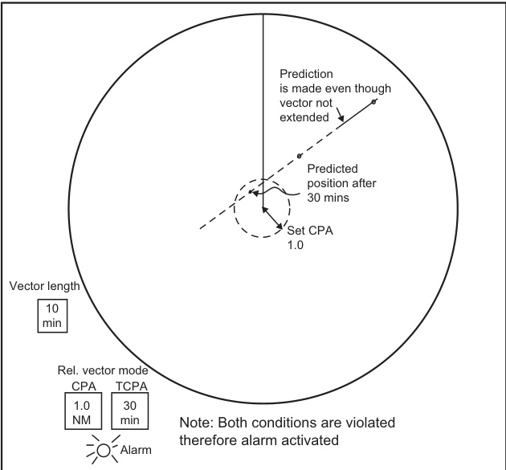  

FIGURE 4.15 CPA/TCPA alarm settings.  

图 4.15 CPA/TCPA 报警设置。 

（其中，CPA 和 TCPA 可能指的是特定的协议或技术标准，具体如下： 
- CPA 可能是指“Callable Persona Address” 或其他相关的通信协议地址。
- TCPA 可能是指“Telephone Consumer Protection Act” 或其他相关的通信保护协议。）

因此，如果需要更具体的解释，图 4.15 CPA/TCPA 报警设置 的意思是展示了CPA和TCPA这两个协议或标准的报警设置界面或配置方式。

### 4.7.4 Time to Manoeuvre  

A ‘delay’ facility is provided with trial manoeuvre (see Section 4.4.3) that an alarm may be provided to warn the officer of the watch that it is (usually) 1 min until ‘time to manoeuvre’. Depending on the size of ship and its manoeuvrability, this warning can be used as a reminder to apply helm and/or ring the telegraph, in order that a pre-planned manoeuvre is executed on time.  

为试验机动（见4.4.3节）提供了“延迟”功能，这样可以提醒值班官员，在（通常）1分钟内将到“执行机动”的时间。此类预警可以根据船只的大小和机动性，作为提醒，适时施舵和/或拉响电报提醒，确保预先规划好的机动（即按照预定计划进行的船舶转向、减速或其他航行动作）能够按时执行。

### 4.7.5 Track Change  

This alarm is associated with an algorithm which quantifies departures from the predicted tracks of targets. The target(s) activating the alarm will be indicated by some graphic symbol. Its operation is likely to be associated with the change from a long to a short smoothing period (see Section 4.3.6.1).  

该警报与一种算法（一种通过复杂计算来实现特定功能的程序）相关联，该算法（算法：一种通过复杂计算来实现特定功能的程序）会计算目标（目标：在这里指的是需要被追踪的物体，如飞机、导弹等）从预测轨迹上的偏离程度。激活警报的目标（目标）将由某种图形符号（图形符号：一种用来代表目标的视觉表示，如图标、箭头等）指示。其操作很可能与从长平滑期（平滑期：数据处理中用来平滑数据的时间窗口）到短平滑期（平滑期：数据处理中用来平滑数据的时间窗口）的变化有关（参见第4.3.6.1节）。

It can be useful, but it does depend on the application of some arbitrary decision as to when the change in track is ‘significant’. In some systems, the track change alarm will be activated by large or rapid manoeuvres performed by the observing vessel. This is more likely to arise where relative-track storage is used (see Section 4.3.6.2). In general, this condition can be recognized, as all targets will exhibit the track change symbol.  

这可能是有用的，但它确实依赖于某些任意的决定，来判断何时轨迹的变化被认为是“显著的”。在一些系统中，轨迹变化报警将被观察船只进行的大规模或快速操作所激活。这更有可能发生在相对轨迹存储被使用的地方（见第4.3.6.2节）。一般来说，这种情况可以被识别，因为所有目标都会显示轨迹变化符号。

### 4.7.6 Anchor Watch  

This facility attempts to offer automatic warning of the observing vessel or other vessels dragging in an anchorage. If a known stationary target (e.g. a small isolated navigation mark) is acquired and designated as such, then an alarm will be activated if the designated target moves more than a preset distance from the marked position. If the stationary target appears to move, then it must be due to the observing vessel dragging her anchor. Alternatively, if other anchored vessels in the anchorage are tracked, it will give a warning if a ‘tracked’ vessel in the anchorage drags her anchor. It will also, of course, be activated if such a vessel heaves up her anchor and gets under way.  

该设施尝试为观测船舶或其他船舶在锚泊区拖锚提供自动警告。如果已知的静止目标（例如，小型孤立的航行标志）被获取并被指定为此类目标，那么如果指定的目标从标记位置移动超过预设距离，则会激活警报。如果静止目标看起来移动，那么这一定是由于观测船舶（观察的船舶）拖着锚（即没有固定在原位）。或者，如果锚泊区内其他抛锚的船舶被跟踪，系统会在锚泊区内被“跟踪”的船舶拖着锚时发出警告。当然，如果这艘船（抛锚的船舶）举起锚（即起锚）并开始航行，也会激活警报。

### 4.7.7 Tracks Full  

There is a limit to the number of targets which an ARPA is capable of tracking, although this figure has risen considerably over the years. In areas of high traffic density, there may well come a time when all the tracking channels are in use. This is particularly likely when automatic acquisition (see Sections 4.2.4-4.2.6) is in operation. An alarm will warn the operator to inspect the untracked targets for potential dangers and to transfer tracking from less important targets which are being tracked. This is now a compulsory alarm in the current IMO Performance Standards (See Section 11.2.1).  

自动雷达监视辅助系统（ARPA）能够跟踪的目标数量是有限的，尽管这一数字在这些年里已经大幅度提高。在高交通密度区域，可能会出现所有跟踪通道都在使用的情况。这在自动获取（参见4.2.4-4.2.6节）操作时尤其容易发生。当这种情况发生时，会发出警报，提示操作员检查未被跟踪的目标是否存在潜在危险，并将对不那么重要的目标（这些目标正在被跟踪）的跟踪转移到更重要的目标上。根据当前的国际海事组织（IMO）性能标准（参见11.2.1节），这一警报已经成为强制性的。

### 4.7.8 Wrong or Invalid Request  

Where an operator feeds in incorrect data or data in an unacceptable form, for example course $370^{\circ}$ , an alarm and indicator will be activated and will continue until the invalid data is deleted or overwritten.  

当操作员输入不正确的数据或格式不被接受的数据时，例如航向$370^{\circ}$，将会触发报警和指示器，并且会一直持续直到无效的数据被删除或覆盖。 

（注：航向的单位通常为度，其中$360^{\circ}$代表一个完整的圆圈，而$370^{\circ}$在这里被视为一个无效的数据输入，因为它超出了航向的有效范围。）

### 4.7.9 Safe Limit Vector Suppression  

This uncommon facility, if selected, suppresses the vectors of targets whose predicted motion does not violate the safe limits (see Section 4.7.2) and is an attempt to reduce ARPA ‘clutter’. The computer continues to track the targets whose vectors are suppressed. If any of them should manoeuvre in such a way as to violate the set safe limits, the vector of that target will reappear and the safe limit alarm will be activated. If a decision is taken to use this facility, considerable thought must be given to the implications of the selected values of safe limits. In general, it is advisable to switch the facility off before contemplating a manoeuvre.  

如果选用该不常规的功能，它将抑制预计运动不违反安全限制（参见4.7.2节）的目标向量，这是一种尝试减少自动雷达Plot（ARPA）‘杂乱’的方法。计算机将继续跟踪被抑制的目标向量。如果任何目标以违反设定安全限制的方式进行机动，目标的向量将重新出现，安全限制报警将被激活。如果决定使用该功能，必须认真考虑所选的安全限制值的含义。通常，建议在考虑机动之前关闭该功能。这是因为[自动雷达plot（ARPA）是一种用来检测和跟踪其他船只或障碍物的雷达系统，它通过显示这些目标的位置和速度来帮助船员避免碰撞。在这个上下文中，‘杂乱’指的是屏幕上不必要的目标信息，而安全限制则是为了防止碰撞而设定的速度和距离界限。通过抑制不违反安全限制的目标向量，该功能可以减少不必要的信息，提高系统的有效性。]

### 4.7.10 Trial Alarm  

This facility is analogous to the safe limit alarm but operates only when the trial manoeuvre is selected. It is not available on all systems.  

该设施类似于安全限值报警（safe limit alarm，即当设备或系统达到某一安全阈值时会触发警报），但只在试验操作（trial manoeuvre，指试验或测试设备的某一具体动作或操作）被选择时才会生效。而且，并非所有系统都具备这一功能。

### 4.7.11 Performance Tests and Warnings  

All ARPA equipments incorporate some form of self-diagnostic routine which monitors the correct operation of the various circuits. These checks are normally conducted on ‘switch on’ and repeated at regular intervals (which may range from once per hour to many times per second) or on request from the operator. In the event of a fault, a warning is given to the operator and, in some cases, an indication of the cause or location (e.g. printed circuit board No. 6) of the fault is also given.  

所有的ARPA设备都具备某种形式的自诊断例程，用于监测各种电路的正确运行。这些检查通常在设备“开机”时进行，并在固定的时间间隔（可能从每小时一次到每秒多次不等）内重复进行，或者在操作员请求时进行。如果发生故障，会向操作员发出警告，并且在某些情况下，还会提供故障的原因或位置（例如，印刷电路板No. 6）的指示。这样可以帮助操作员快速识别和解决问题。

However, it must be appreciated that some faults cannot be detected internally, for example a failure of certain elements in a numeric read-out can cause an 8 to appear as a 6 or a 9 to appear as a 3. In such cases, a typical test may provide for the operator to switch all of the elements on so that each indicator should display an 8.  

然而，必须注意到有些故障无法通过内部检测来发现，例如，在数字显示设备中，某些元素的故障可能导致8显示为6，或者9显示为3。在这种情况下，典型的测试方法是让操作员打开所有元素，以便每个指示器都显示为8。这样可以通过外部观察来检测出故障，[即通过让所有元素显示同一数字，来检查是否有显示错误]。

## 4.8 AUTOMATIC GROUND-STABILIZATION  

The difficulties of achieving groundstabilization on a raw radar display are outlined in Sections 6.2.6.2 and 6.9.6. With ARPA assistance, ground-stabilization can be achieved easily and automatically in many circumstances, but not all. Once selected, this stabilization also applies to all true target vectors displayed, whether or not the operator is showing relative or true-motion display. It is particularly important to appreciate the implications of this, which are discussed later.  

在原始雷达显示屏上实现地面稳定化的难点在6.2.6.2和6.9.6节中有所阐述。在自动雷达监视系统（ARPA，Automatic Radar Plotting Aid）的辅助下，地面稳定化可以在许多情况下轻松且自动地实现，但并非所有情况皆然。一旦选中，这种稳定化也同样适用于所有显示的真实目标向量（true target vectors），无论操作员是否显示相对运动（relative motion）或真实运动（true motion）[也就是说，无论是显示相对于观察者参考系的运动还是绝对运动]。特别重要的是要理解这其中的含义，这将在后续讨论中展开。

An isolated land target with good response is selected as reference. It is acquired and tracked by one of the ARPA tracking channels and then designated as a ‘fixed target’. It has also been called ‘echo reference’ by some manufacturers. This makes it possible for the tracker to calculate the ground track of the observing vessel, and hence to maintain the movement of the electronic origin of the display in sympathy with it. When using this facility the observer should be particularly watchful for other targets which approach the reference target and, in particular, for those which pass between the observing vessel and the reference target. If the intervening target shadows the reference target, the chances of target swap (see Section 4.3.5) may be greatly increased. If target swap does involve the reference target, it may have quite dramatic effects on the presentation of all vectors, particularly if the reference attaches to a fast moving target. If such an eventuality seems likely, it may be expedient to move the reference to another fixed target.  

为了确保跟踪系统的准确性和稳定性，需要选择一个孤立的陆地目标，并且该目标在雷达回波中有良好的响应（[响应：指目标在雷达波照射下反射回来的信号强度]）作为参考。该目标由一个自动雷达跟踪（ARPA）跟踪通道获取和跟踪，然后被指定为“固定目标”（[固定目标：指在雷达屏幕上不动或稳定移动的目标，如山脉、岛屿等]）。一些制造商也称之为“回波参考”（[回波参考：指用于作为跟踪参考的稳定目标，通常是地面上的固定点]）。通过这种方式，跟踪系统可以计算观测船舶的行进轨迹，从而使电子显示的原点保持与船舶运动的一致性。当使用这一功能时，观测员应该特别注意其他接近参考目标的目标，特别是那些在观测船舶和参考目标之间通过的目标。如果干扰目标遮蔽了参考目标，目标交换（[目标交换：指跟踪系统错误地将一个目标识别为另一个目标，导致跟踪错误]，见4.3.5节）的几率可能会大大增加。如果目标交换涉及参考目标，它可能会对所有矢量的显示产生相当戏剧性的影响，特别是当参考目标附着在一个快速移动的目标上时。如果这种情况似乎可能发生，可能需要将参考目标转移到另一个固定目标上。

The facility has been developed in such a way that the same stabilization is applied to the radar picture presentation and to the true vectors, i.e. either both are sea-stabilized or both are ground-stabilized. Thus in general, where automatic ground-stabilization is selected, true vectors will indicate the ground tracks of targets and not their headings. Failure to appreciate this can render the presentation dangerously misleading if it is mistakenly used in the planning of collision-avoidance strategy. This is illustrated in the right-hand display of Figure 4.16. One might expect the danger of observers being misled in this respect, because (except in case of an alongtrack tide) there will be angular displacement of the observing vessel’s vector from the heading marker. Experience has indicated that this expectation of observers cannot be justified in all cases.  

该设施的开发使得雷达图像呈现和真实向量（即两个都是海上稳定化的还是两个都是陆地稳定化的）。因此，一般来说，当选择自动陆地稳定化时，真实向量将指示目标的陆地轨迹，而不是目标的航向。如果不了解这一点，误用此功能进行碰撞避免策略规划可能会导致展示产生危险的误导。这一点在图4.16的右侧显示中得到了体现。人们可能会期望观察者在这方面会产生误解，因为（除沿航向潮流的情况外），观察船的向量会与航向标志产生角位移。然而，经验表明这种对观察者的期望并非在所有情况下都成立。 

注：翻译中保持了原文的专业术语和技术精确性， 并使用了符合中国人表达习惯的流畅中文。对于一些复杂的概念，如“海上稳定化”和“陆地稳定化”，虽然并没有在括号中进行直白的解读，但根据上下文可以理解为指的是雷达图像或真实向量在海上或陆地坐标系下的稳定化处理。

The useful feature is that it makes truemotion parallel indexing a practical proposition, which is scarcely if at all the case with manual ground-stabilization (see Section 8.4.5). It also makes it possible to maintain electronic navigation lines and maps (see Sections 4.9 and 8.4.6) in a fixed position on the screen. Some users find the availability of a fixed map particularly attractive in coastal navigation. However, it must be stressed that the penalty paid is that the presentation may not afford traffic heading information and may therefore in principle be unsuitable for collision avoidance.  

该功能的优点在于它使得真实运动的平行索引成为一种可行的选择（这在手动地面稳定化（见第8.4.5节）中几乎是不可能的）。它还可以保持电子航线和地图（见第4.9节和第8.4.6节）在屏幕上处于固定的位置。一些用户认为，在近海航行中，固定地图的可用性尤其吸引人。然而，必须强调的是，付出的代价是，显示可能无法提供交通方向信息，可能本质上不适合碰撞避免（collision avoidance，[避免碰撞的系统或功能，旨在预防交通事故]）。

Automatic ground-stabilization can also be achieved by using the output from a twin axis Doppler log which is locked to the ground (see Section 6.2.6.2) and by integration with the Global Navigation Satellite System (GNSS) (see Section 10.1).  

自动的地面稳定化也可以通过使用双轴多普勒速率计（Doppler log）输出实现，后者被锁定到地面（见第6.2.6.2节），并且与全球导航卫星系统（Global Navigation Satellite System，GNSS）（见第10.1节）进行集成。其中，全球导航卫星系统（GNSS）[即利用卫星进行导航和定位的系统]，能够提供位置和速度的信息。

The ease of integration with GNSS and the accuracy make this a very popular display for modern navigators. However, it is important to remember the potential for misleading anticollision information in a cross track tide.  

GNSS（全球导航卫星系统）[一种利用卫星实现全球导航的系统]与现代导航器的集成易用性以及导航信息的准确性，使得这种显示方式在现代导航设备中非常受欢迎。然而，重要的是要记住在遇到横向潮流的情况下，防碰撞信息可能会产生误导。这意味着在横向潮流的情况下，导航器提供的防碰撞信息可能不完全准确，导航员需要谨慎对待这些信息，以避免潜在的碰撞风险。

The advantage of the ARPA ‘fixed target’ facility is that it provides a continuous check of ground course and speed, independent of GNSS and other sensors. The disadvantage is that it depends on the availability of a suitable fixed land-based target. Buoys may also be used with caution, particularly in areas like the English Channel, where the large buoys are well monitored and so may be regarded as fixed.  

ARPA（自动雷达拼图系统）的“固定目标”设施的优势在于，它能够提供独立于GNSS（全球卫星导航系统）和其他传感器的连续性地面航向和速度检查。然而，其缺点是它依赖于合适的固定陆基目标的可用性。在某些区域，例如英吉利海峡，警戒标志（浮标）也可以谨慎使用，特别是那里的大型浮标受到严密监控，可以被认为是固定的。

## 4.9 NAVIGATIONAL LINES AND MAPS (SEE ALSO SECTION 8.4.6.3)  

Most modern radar sets (even without ARPA) offer a graphics facility whereby electronic lines can be drawn on the screen. The position, length and orientation of the lines can be adjusted, thus making it possible to produce parallel indexing lines (see Section 8.4) and to delineate navigational limits in channels, traffic separation schemes, poor-response coastlines, etc. It may also be possible to indicate points of interest such as isolated rocks and floating marks with a specific symbol.  

大多数现代雷达系统（即使没有自动雷达.plot辅助装置（ARPA））都提供图形处理功能，允许在屏幕上绘制电子线。这些线的位置、长度和方向可以进行调整，从而使得能够生成并行索引线（参见第8.4节），并在航道、交通分离方案、信号回应不佳的海岸线、等区域绘制出导航限制。此外，可能还能够使用特定的符号标记出兴趣点，例如孤立的岩石和浮标等。

The range of facilities available under the general heading of a navigation lines package is considerable. With the advent of Electronic Chart Display and Information Systems (ECDIS) integration (see Section 10.2) modern equipments are tending to provide less complex facilities, if at all.  

在导航线路套件的总体框架下，提供的设施种类相当可观。随着电子海图显示和信息系统（ECDIS）（见10.2节）的发展，现代设备趋向于提供较少的复杂设施，如果有的话。或者更简单地理解，就是说现在的导航设备因为电子海图技术的进步，如果提供辅助功能，功能也会变得不那么复杂了。

  

FIGURE 4.16 Sea-stabilized and ground-stabilized displays.  

图4.16 海基稳定显示和地基稳定显示。

In simple facilities, only some ten to fifteen lines may be available, thus merely allowing the construction of fairly crude patterns or maps (see Figure 4.17). The pattern may be lost if the equipment is switched off, and it may or may not be possible to edit or move the pattern around the screen, once drawn. More advanced packages will allow the observer to prepare and store the pattern at a convenient time when planning the passage and subsequently to recall it when required. It will then be possible to move the pattern around the screen in order to align or realign it with displayed radar echoes and there will be provision for easy editing. A non-volatile memory allows the storage of several maps even when the equipment is switched off. The most comprehensive mapping facilities will provide for the permanent storage of maps containing as many as a thousand or more elements. While there is no rigid distinction in names between the two extremes, the simpler packages tend to be referred to as navigation lines while the more comprehensive are usually described as mapping facilities. The facility will frequently be used in association with automatic ground-stabilization (see Section 4.8).  

在简单的设备中，只有大约十到十五条线可用，从而只能构建出比较粗糙的图案或地图（见图4.17）。如果设备被关闭，图案可能会丢失，而且可能无法编辑或移动图案在屏幕上，一旦绘制。更高级的软件包将允许观察者在规划航线时准备和存储图案，然后在需要时回忆它。然后就可以移动图案在屏幕上以使其与显示的雷达回波对齐或重新对齐，並且还提供了方便的编辑功能。非易失性存储器可以即使设备关闭也可以存储多个地图。最全面的地图设施可以提供永久存储地图，包含多达一千个或更多元素的内容。虽然这两种极端之间没有严格的命名区别，但简单的软件包往往被称为导航线，而更全面的软件包通常被描述为地图设施。这种功能通常与自动地面稳定技术（见第4.8节）一起使用。在[自动地面稳定技术]中，[自动地面稳定技术]是指设备可以自动调整其显示的坐标系，以跟踪地面的稳定位置。这种技术与地图设施一起使用，可以更好地实现导航和定位功能。

  

FIGURE 4.17 Map presentation.  

图4.17 地图展示。

The concept of adding maps to the radar display has now extended to the integration of electronic charts (ECDIS) with the radar/ARPA. The advantages are that:  

将地图添加到雷达显示的概念现已扩展到电子海图（ECDIS）的雷达/ARPA集成。其优点是：[即：将电子海图与雷达/自动雷达盲点测量和显示系统集成，实现更全面准确的海上导航]

a. The data is not prepared by the navigator which improves the reliability and accuracy as well as being more convenient.  
b. It allows a more sophisticated selection of features to be added.  
The ECDIS topic is covered in more detail in Section 10.2.  

以下是该文本的中文翻译：

a. 数据不需要由导航员准备，这提高了可靠性和准确性，并且更为便捷。
b. 它允许更复杂的特征选择被添加。
ECDIS（电子海图显示和信息系统，[即一种电子导航系统，能够显示船舶的位置、航线和周围环境等信息]）主题在第10.2节中有更详细的介绍。

## 4.10 TARGET SIMULATION FACILITY  

A target simulation facility should be provided for training purposes.  

为训练目的，应提供目标仿真设施。

Older performance standards required a test programme to check the performance of the radar tracker. Test scenarios were provided with dummy echoes on the display and often these were also found useful for training trainee officers when at sea. The test scenarios are no longer a requirement, but the ability for the system to provide a simulation facility for training purposes is required. When in use, the display needs a clear indication that it is in training mode, in case it is accidently left in this mode and mistaken for a real situation.  

过去的性能标准要求制定一个测试程序来检查雷达跟踪器的性能。测试场景会在显示屏上提供模拟的回声数据，通常这些测试场景也被证明对在海上训练新手军官很有用。虽然测试场景不再是必需的，但系统必须具备为训练目的提供模拟设施的能力。在使用时，显示屏需要清晰地指示它处于训练模式（training mode），以防止它被误认为是真实情况（真实的雷达信号），尤其是在它被意外留在这种模式下时。这样可以避免操作人员误解模拟的雷达信号为真实的，导致潜在的安全隐患。

## 4.11 THE PREDICTED POINT OF COLLISION  

The predicted point of collision (PPC) is that point towards which the observing ship should steer at her present speed (assuming that the target does not manoeuvre) in order for a collision to occur.  

预测碰撞点（Predicted Point of Collision，PPC）是指观察船只在当前速度下（假设目标物体不进行机动）需要驶向的方向，以便发生碰撞。

Some early ARPA designers recognized that the positions of these points can be quickly calculated and displayed for all tracked targets. The argument made for displaying the PPCs is that they assist in developing a collisionavoidance strategy by showing the navigator, at a glance, the courses which are completely unacceptable because they intersect a collision point. This is the only contribution which can be claimed for PPCs. They do not give any indication of miss distance (other than in the zero CPA case) and any attempt to extrapolate the clearing distance either side of the point will be fraught with danger. A safe course is one which, among other things, results in passing at a safe distance, which implies a knowledge of clearing distance. Safe and effective use of PPCs depends upon a thorough understanding of the factors which affect their location and movement. As is evident from the following treatment, this is, in many cases, not a simple matter. Some systems make it possible to display these points as small circles when, but only when, true vectors are selected.  

一些早期的ARPA（高级研究计划署）设计人员认识到，这些点的位置可以快速计算并显示所有跟踪目标。提出显示预计相交点（PPCs）的理由是，它们通过向导航员展示与碰撞点相交的完全不可接受的航线，从而有助于制定碰撞规避策略。这种展示可以让导航员一眼就看到哪些航线需要避免。这是PPCs所能做出的唯一贡献。它们无法提供偏差距离的任何指示（除了在零CPA情况下），任何尝试在点的两侧外推清除距离都充满危险。安全的航线是指在其他条件下，还能保证通过一个安全距离的航线，这意味着需要了解清除距离。安全有效地使用PPCs取决于对影响其位置和运动的因素有全面性的理解。如以下论述所示，这在很多情况下并不是一个简单的问题。一些系统可以在选择真实向量时，将这些点显示为小圆圈，但仅限于此种情况。其中，CPA指的是[最近接近点，即两物体在运动中最近的距离点]，ARPA是[美国国防部高级研究计划署的简称，主要负责开发新型武器和技术]。

### 4.11.1 The Concept of Collision Points  

When two ships are in the same area of sea, it is always possible for them to collide. The point(s) at which collision can occur may be defined and depends upon:  
a. The speed ratio of the two ships.   
b. The position of the two ships.  

当两艘船处于同一海域时，它们发生碰撞的可能性始终存在。碰撞可能发生的点（或点集）可以被定义，并且取决于以下几种因素：
a. 两艘船的速度比率。
b. 两艘船的相对位置。

注意：本文的专业术语如“碰撞”、“速度比率”和“相对位置”都保持了原来的技术精确性，保证了翻译的准确性和专业性。同时，为了更好地符合中国人表达习惯，采用了流畅的中文表达方式，确保了整体的可读性和理解性。

Considering any two ships, usually one is moving faster than the other; the possibility that one is at exactly the same speed as the other and will maintain that ratio for any period of time is remote enough to be disregarded for the moment.  

考虑到任意两艘船，通常其中一艘的速度会比另一艘快；有一艘的速度恰好与另一艘相同（即两艘船的速度相等），并且能够在任意时间段内保持这种速度比率的可能性极小，可以暂时忽略不予考虑。

The ship which is the faster of the two will always see displayed one and only one collision point, since it can pursue the target if necessary. This collision point is always on the track of the target, as shown in Figure 4.18.  

两艘船中速度较快的那艘将始终看到一个且只有一个碰撞点的显示，因为它可以在必要时追逐目标 [追踪并与目标相撞]。这个碰撞点始终位于目标的航迹 [运动轨迹]上，如图4.18所示。

The ship which is the slower of the two may see displayed two collision points, both of which must be on the target track. One exists where the slow ship heads towards the target and intercepts it, while another exists where the slow ship heads away from the target but is struck by it. The two cases appear in Figure 4.19. Alternatively there may be no way for the slower ship to collide with the faster (even though the faster may collide with the slower) because it is just not fast enough to reach the target (Figure 4.20).  

在两艘船中，速度较慢的那艘可能会显示出两点碰撞点，两者都必须位于目标轨迹上。其中一个点是较慢的船朝向目标并与其相撞的位置，而另一个点是较慢的船朝向与目标相反的方向，但仍被目标撞击。两种情况如图4.19所示。或者，较慢的船可能根本无法与较快的船碰撞（尽管较快的船可能与较慢的船碰撞），因为它的速度不够快，无法到达目标（图4.20）。

  

FIGURE 4.18 Single point of collision.  

图 4.18 单点碰撞

  

FIGURE 4.19 Dual points of collision.  

图 4.19 双重碰撞点（即两个物体同时发生碰撞的两個位置点）。

  

FIGURE 4.20 No points of collision.  

图4.20 无碰撞点。

Note: A critical in-between case of one collision point exists where the slow ship can just reach the track of the fast ship.  

注：当慢速船刚好能够到达快速船的航迹时，存在一个临界的碰撞点情况。

### 4.11.2 The Behaviour of Collision Points If the Observing Ship Maintains Speed  

#### 4.11.2.1 The Initial Collision Case  

It is important to realize that collision points exist, whether an actual collision threat exists or not. The only significance is that in the event of an actual collision threat, the collision points are the same for both ships. Figure 4.21 shows how the collision points move in a collision situation and how they will appear to the two ships involved. On the faster ship, the single collision point appears on the heading marker and moves down, decreasing in range as the collision approaches. On the slower ship, one of the two collision points will move down the heading marker, while the other moves down a steady bearing.  

需要认识到，碰撞点（collision points）是存在的，不论实际的碰撞威胁（collision threat）是否存在。唯一的重要性在于，如果发生实际的碰撞威胁，两艘船的碰撞点是相同的。图4.21展示了在碰撞情况下碰撞点的移动方式，以及它们在两艘船看来如何出现。在速度较快的船上，单个碰撞点出现在航向标记（heading marker）上，并向下移动，随着碰撞的接近，距离逐渐减小。在速度较慢的船上，两个碰撞点中的一个会沿着航向标记向下移动，而另一个会沿着稳定的方位（steady bearing）向下移动。 

注意：这里涉及的概念主要是关于海事安全和碰撞避免的，尤其是在船舶导航领域。碰撞点是指在船舶运动预测中，如果两艘船按照当前的速度和方向继续航行，可能会发生碰撞的位置。这些位置的确定对于判断是否存在碰撞威胁以及采取避免碰撞的措施至关重要。

  

FIGURE 4.21 The movement of the PPC in the collision situation.  

图4.21碰撞情况下，预置控制点（PPC）的运动情况。

#### 4.11.2.2 The Non-Collision Case  

In a non-collision case, the collision point moves according to well-defined rules, but it will never cross the heading marker. In the case of the faster ship, the movement depends on whether the fast ship will cross ahead of or behind the target ship. Figure 4.22 shows the two possible cases and typical track lines.  

在非碰撞的情况下，碰撞点按照明确的规则移动，但它永远不会越过航向标记（航向标记指的是船舶运动预测中标记的航向线，[即预测船舶将运动的方向线]）。对于速度较快的船舶，其运动取决于快船是否会在目标船的前方或后方越过。在图4.22中，展示了两种可能的情况和典型的航迹线（[也就是船舶运动轨迹线]）。

The case of the slower ship is more complicated because of the two collision points and the possibility of no collision point existing. If the observin g ship’s course is to pass between the two collision points, they will pass down either side of the observing ship, generally shortening in range, and then draw together under the stern of the observing ship. As they meet they become one collision point before they finally disappear, as in Figure 4.23.  

较慢的船只（指观察到的船只）的情况更为复杂，这是因为存在两个碰撞点（collision points），同时也存在没有碰撞点的可能性。如果观察船的航向是通过两个碰撞点之间的路径行驶，那么这两艘船只将从观察船的两侧通过，一般情况下，其相对距离会减短，然后在观察船的船尾下方会合。如图4.23所示，当它们会合时，两个碰撞点会合成一个碰撞点，然后最终消失。

If the observing ship is steering to pass astern of the fast ship, the collision points will draw together, form one point and then disappear. It is noticeable that the collision point more distant from the target ship, usually termed the secondary point, moves much faster than the point nearer to the target which is termed the primary collision point.  

当观测船舵向调节以从快速船的后方通过时，碰撞点将会聚拢在一起，形成一个点，然后消失。值得注意的是，相比于离目标船较近的碰撞点（通常被称为主要碰撞点），离目标船较远的碰撞点（通常被称为次要碰撞点[即与目标船距离较远的潜在碰撞位置]）移动得要快得多。

### 4.11.3 The Behaviour of the Collision Point When the Target Ship’s Speed Changes  

If the speed ratio is infinitely large, for example when the target is stationary, then obviously the collision point is at the position of the target. If the observing ship maintains speed while the target begins to increase speed, the collision point will begin to move along the target track. When the target speed has increased to that of the observing ship, the secondary collision point will appear at infinity. Further increase of the target speed will move the primary and secondary collision points towards each other (not necessarily by equal amounts); eventually, own speed in comparison to target speed may be so slow that the two points will merge and then disappear. This behaviour is shown in Figure 4.24. 

如果速度比率无限大，比如当目标物是静止的，那么显然碰撞点就在目标物的位置。如果观测船维持速度而目标物开始增加速度，碰撞点将开始沿着目标物的轨迹移动。当目标物的速度增加到观测船的速度时，第二个碰撞点将出现在无穷远处。进一步增加目标物的速度将使得主要碰撞点和次要碰撞点向彼此移动（不一定是以相同的量），最终，自身的速度相比目标物的速度可能变得非常缓慢，以至于两个点会合并然后消失。这种行为如图4.24所示。 

注意：在这里，“速度比率无限大”（infinitely large speed ratio）指的是观测船的速度与目标物的速度之比接近于无穷大，即目标物基本静止或观测船的速度远远大于目标物的速度。“第二个碰撞点”（secondary collision point）指的是在目标物速度变化时出现的另一个可能的碰撞位置。

  

FIGURE 4.22 The track of the collision point.  

图4.22碰撞点的轨迹。

  

FIGURE 4.23 The movement of dual collision points.

图4.23 双重碰撞点的运动。

Own ship is steering to pass between the collision points at speed $7\mathrm{kn}$ . Target speed $=24\mathrm{kn}$ .  
$C_{\mathrm{n}}=$ primary collision point 
${\mathrm{C}}_{\mathrm{nn}}=$ secondary collision point when target is at $T_{\mathrm{n}}$ 
$C_{\mathrm{nn}}C L=$ limiting condition where the hazard disappears  

自身船舶正在以7节的速度转向通过两个碰撞点之间的路径。目标速度为24节。其中：
$C_{\mathrm{n}}$ 为首要碰撞点（即最先发生碰撞的点）
${\mathrm{C}}_{\mathrm{nn}}$ 为在目标处于 $T_{\mathrm{n}}$ 时的次要碰撞点（即在首要碰撞点之后可能发生碰撞的另一个点）
$C_{\mathrm{nn}}C L$ 为极限条件，即碰撞隐患消失的临界状态（此时，自身船舶与目标之间的距离达到一个临界值，碰撞的风险不再存在）

### 4.11.4 The Behaviour of the Collision Point When the Target Changes Course  

If the two ships have the same speed, the collision point moves on a locus which is the perpendicular bisector of the line joining the two ships. The greater the aspect, the farther away the collision point will be (Figure 4.25). Theoretically, the limiting aspect in this case is $90^{\circ}$ , but then the collision point would be at infinity and hence an aspect of some $85^{\circ}$ plus is considered the practical limit.  

如果两艘船的速度相同，碰撞点将沿着一条轨迹运动，这条轨迹是连接两艘船的直线的[垂直平分线，即这条线的中间部分与原线垂直]。角度越大，碰撞点将越远离两艘船（图4.25）。理论上讲，当角度为$90^{\circ}$时，这种情况下的最大角度是最极端的，但此时碰撞点将位于无穷远处，因此一般认为大约在$85^{\circ}$以上的角度才是实际上的极限。

#### 4.11.4.1 For a Slower Observing Ship  

When the observing ship is slower than the target, two collision points exist and they are seen to be on the circumference of a circle whose centre and radius are dependent on the speed ratio; the circle is always on the observing ship’s side of the unity speed ratio locus. A limiting aspect can be defined which is also dependent on the speed ratio. A slower observing ship will mean that a target will have a smaller limiting aspect angle. 

当观察船的速度低于目标物体时，存在两个碰撞点，它们被视为位于一个圆的圆周上，该圆的中心和半径取决于速度比；该圆始终位于观察船的单位速度比轨迹的一侧。还可以定义一个极限方面，它也取决于速度比。观察船速度越慢，意味着目标物体的极限方面角度越小。

注：本段落的翻译力求保持原文的专业术语和技术精确性，尤其是“速度比”、“碰撞点”、“极限方面”和“单位速度比轨迹”等术语，以确保准确性和专业性。同时，为了使译文更流畅、更易于理解，适当调整了句子的结构和用词。

  

FIGURE 4.24 The behaviour of the collision point with the change of speed ratio (i.e. own speed: target speed).  

图4.24 碰撞点随速度比（即自身速度：目标速度）变化的行为

  

FIGURE 4.25 The movement of the collision point(s) as target aspect changes, drawn for speed ratios of 2:1 and 1:2.   

图 4.25 当目标方位变化时，碰撞点的运动情况，分别以 2:1 和 1:2 的速度比绘制。

Aspects greater than the limit pose no hazard since the observing ship can never catch up with the target.  

大于该限度的方面不构成任何危险，因为观测船只无法追上目标。 

（其中“方面”指的是可能对观测船只构成危险的因素或者方向，而“限度”指的是观测船只的最大追赶速度或能力）

#### 4.11.4.2 For a Faster Observing Ship  

When the observing ship is the faster, the circle of collision points lies on the target side of the equal-speed locus. As the aspect increases, the collision point moves farther away from the observing ship. There is no limiting aspect and collision is always possible.  

当观测船比目标船速度快时，碰撞点圆圈位于等速位置图的目标船一侧。随着观测角度的增加，碰撞点会相对观测船移动到更远的位置。这意味着不管观测角度有多大，都不对碰撞造成限制，碰撞始终是有可能的。

An interesting point to note in Figure 4.25 is that the inverse of the idea of a limiting aspect to the slow observing ship appears when the observing ship is faster; this is effectively a limiting course for the observing ship. If the actual heading is to the remote side of this line, all collision points appear on the one bow. If the own heading is inside this limiting direction, the collision point will move across the heading marker as the target changes aspect.  

图4.25中一个值得注意的点是，当观察船的速度更快时，慢速观察船的局限性概念的逆现象出现；这实际上是观察船的一条限制航向。如果实际的航向在这条线的远侧，则所有碰撞点都出现在船的同一侧。如果自己的航向在这条限制方向的内侧，碰撞点将会在目标改变姿态（即目标的方向、位置或形状发生变化[简而言之，目标的外观发生变化]）时移动到航向标记（一个显示船舶当前航向的指示器[用于显示船舶当前行驶方向]）上。

## 4.12 THE PREDICTED AREA OF DANGER (PAD)  

The shortcomings of collision points can be listed as follows:  
a. Inaccuracies in data acquisition are likely to displace the points.   
b. No account is taken of the dimensions of the ships involved.   

碰撞点（collision points）的缺点可以列举如下：
a. 数据采集（data acquisition）的不准确性可能会导致这些点的位置发生偏移。
b. 没有考虑到涉及碰撞的船舶（ships）的尺寸（dimensions）。

c. They offer no quantitative indication of miss distance, which is the essential data required for collision avoidance.  

c. 它们无法提供近距离偏差的量化指标，而近距离偏差是碰撞避免所需的基本数据。 

（这里的“近距离偏差”是指两个物体在最接近时之间的距离，也就是所谓的“miss distance”）

The logical development is to construct, around the PPC, a plane figure which is associated with a chosen passing distance and in the calculation of which due margin of safety can be allowed for the effects of data inaccuracies and the physical dimensions of the vessels involved. The area within the figure is to be avoided to achieve at least the chosen passing distance and is referred to as a PAD. The technique was patented by Sperry Marine Systems and is exclusive to the ARPAs produced by that company. The PAD approach is an extremely elegant solution to the problem of how best to present collision-avoidance data. It is essential that the user has a thorough understanding of the principles underlying the presentation with particular reference to the location, movement, shape and change of shape of the PAD. As will be seen from the following explanation, this is not a simple subject.  

逻辑发展的下一步是围绕最近接近点（PPC）构建一个与选定的通过距离相关的平面图形，并在计算中允许为数据不准确性和所涉及的船舶的物理尺寸的影响提供足够的安全裕度。该图形内部的区域应该避免，以便至少实现所选定的通过距离，这一区域被称为最近接近点避让区（PAD）。该技术由Sperry海洋系统公司获得专利，并且仅限于该公司生产的自动雷达辅助导航系统（ARPA）。PAD方法是解决如何最佳地呈现碰撞避让数据的问题的一种非常优雅的解决方案。用户必须对基本原理有深刻的了解，特别是关于PAD的位置、移动、形状以及形状变化。如以下解释所示，这并不是一个简单的话题。

In the case of the collision point there is a course which intercepts the target’s track at the given speed ratio, whereas in the PAD there are generally two intersection points. One of these is where the observing ship will pass ahead of the target and the other where the observing ship will pass astern of the target. The angle subtended by these two limiting courses will depend upon:  
a. The speed ratio.   
b. The position of the target.   
c. The aspect of the target.  

在碰撞点的例子中，有一条航线会与目标的航迹在给定的速度比下相交，而在PAD（预测横向距离）中，通常会有两个交点。其中一个交点是观察船将会在目标前方通过，另一个交点是观察船将会在目标后方通过。这些两个极限航线所夹的角度将取决于： 
a. 速度比[即观察船与目标之间的速度关系]。   
b. 目标的位置[指目标相对于观察船的方位和距离]。   
c. 目标的朝向[指目标的运动方向和角度相对于观察船的位置]。

As shown in the case of the collision point, a faster observing ship must always generate a single cross-ahead and cross-astern position. A slower observing ship produces much more complex possibilities and, depending on the three variables noted above, these may include:  
a. Two cross-ahead and two cross-astern points.   
b. One cross-ahead and two cross-astern points.   
c. Two cross-astern points.   
d. No hazard.  

正如碰撞点的案例所示，一个观测速度更快的船只始终会产生一个单一的超前（cross-ahead）和超后（cross-astern）位置[即观测船与被观测船的位置关系）。然而，一个观测速度较慢的船只会产生更加复杂的可能性，并且根据上述三个变量，这些可能性可能包括：
a. 两个超前点和两个超后点。
b. 一个超前点和两个超后点。
c. 两个超后点。
d. 无碰撞隐患[即观测船与被观测船之间没有碰撞的风险]。

In the case of the single or primary collision point, the position at which the observing ship will cross ahead of the target is always farther from the target than the collision point, while the cross-astern point is always nearer to the target.  

在单一或主要碰撞点的情况下，观察船只将在目标前方交叉的位置总是远离目标的，而交叉船尾点（cross-astern point，[船尾方向，即目标船只的尾部方向]）总是更接近目标。

In the case of a slower observing ship, where there is a secondary collision point, the second cross-ahead position is nearer to the target and the associated cross-astern position more remote from it (Figure 4.26).  

在较慢的观察船的情况下，存在次要碰撞点时，第二个迎向位置距离目标更近，而相应的背向位置距离目标更远（图4.26）。

To indicate limits within the ‘cross-ahead/ cross-astern’ arc, it is necessary to draw a bar parallel to the target’s track and at the intended miss-distance closer to the observing ship’s position.  

为了指示“交叉前方/交叉后方”弧线内的限制范围，需要绘制一条与目标航迹平行的线条，并且该线条应距离观察船的位置比预期的偏离距离更近。（这里的“交叉前方/交叉后方”弧线是指在航海或军事领域中，为了避免碰撞或发起攻击而计算出的一个危险区域，通常需要预测目标的运动轨迹并据此进行导航或作战决策。）

The limits defined by the arc and the bar are such that, if the observing ship were to cross those limits, then it would be at a less distance than the desired miss-distance from the target. Figure 4.27 shows the generation of the two boundaries in the case of a slower observing ship.  

由弧线和横条定义的限制是这样的：如果观察船穿过这些限制，那么它将与目标之间的距离小于所期望的最小距离。图4.27展示了在观察船速度较慢的情况下生成两个边界的过程。（这里的“最小距离”指的是观察船与目标之间的安全距离，超过这个距离，观察船就会进入目标的最小安全距离内）

### 4.12.1 The PAD in Practice  

In order to produce an acceptable system for practical operation, these limits are normally encapsulated by a symmetrical figure such as an ellipse or a hexagon.  

为了产生适合实际操作的可接受系统，这些限制通常被一个对称的图形所封装，例如椭圆或六边形。这样可以使得系统的性能和限制更为明确和对称，从而更容易进行设计和优化。

  

然而，你提供的文本似乎是一张图片的链接，而不是需要翻译的文本。如果你能提供需要翻译的实际文本，我将非常乐意帮助你将其翻译为流畅、准确的中文。同时，请确保文本内容与物联网技术和人工智能相关，以便我能够提供专业且精确的翻译。

FIGURE 4.26 The sequence of cross-ahead/cross-astern points.  

图 4.26 过头点/过尾点序列。

  

FIGURE 4.27 The development of areas to keep clear: heavy lines indicate boundaries of danger areas.  

图4.27 保持清晰区域的发展：粗线表示危险区域的边界。

  

FIGURE 4.28 Acceptable symmetrical figures.  

图4.28 可接受的对称图形。

In the case of the ellipse, the major axis is equal to the difference between the cross-ahead and cross-astern distances as measured from the target, while the minor axis is equal to twice the intended miss-distance. In the case of the hexagon, it is drawn from a rectangle and two isosceles triangles. The base of the triangle is always twice the miss-distance and the vertical height is one-quarter of the distance $E_{1}E_{2},$ as shown in Figure 4.28. It should be noted that the collision point is not necessarily at the centre of either of the traditional figures.  

在椭圆的情况下，其长轴（major axis）等于从目标测量的横向前方距离与横向后方距离之间的差值，而短轴（minor axis）则等于预期的偏离距离（miss-distance）的两倍。对于六边形，其构造是由一个矩形和两个等腰三角形组成的。三角形的底边始终是偏离距离的两倍，而其垂直高度是距离$E_{1}E_{2}$的四分之一，如图4.28所示。值得注意的是，碰撞点不一定位于传统形状（如椭圆或六边形）的中心。[这里的“碰撞点”是指物体与其他物体或障碍物可能发生碰撞的位置，“传统形状”是指这里讨论的几何图形，如椭圆和六边形]

In many cases the stylized figures do not follow the limits exactly, but any bias is on the safe side.  

在许多情况下，这些风格化的图形并没有严格遵循这些限制，但任何偏差都偏向安全的一方 [即，如果存在偏差，都是向着更为保守或者安全的方向偏离的]。

### 4.12.2 Changes in the Shape of the PAD  

Due to the lack of symmetry in the geometry which generates the area, the cross-ahead and cross-astern positions do not move symmetrically about the collision point when the miss-distance is changed. The cross-ahead position usually moves more markedly than the cross-astern position (see Figure 4.24, showing the movement of the two collision points, where the primary movement is much slower than the secondary). The overall result is an asymmetrical growth of the area with the cross-ahead position moving rapidly away from the collision point.  

由于生成区域的几何形状缺乏对称性，当改变[安全距离（miss-distance）]时，交叉前方（cross-ahead）和交叉后方（cross-astern）位置并不会在碰撞点周围对称运动。交叉前方位置通常比交叉后方位置移动得更明显（参见图4.24，显示两次碰撞点的运动，其中主要运动远远慢于次要运动）。总的结果是区域的非对称增长，交叉前方位置迅速远离碰撞点。

### 4.12.3 The Movement of the PAD  

#### 4.12.3.1 The Collision Case  

As in the case of the collision point, when a danger area is violated by the heading marker the danger area will continue to move down the heading marker with the cross-ahead and cross-astern points on opposite bows. The shape of the danger area may change, but it will never move off the heading marker. In the case of a slower ship, where either of the two predicted areas is violated, the other will move in towards the target and eventually merge with the one on the heading marker.  

与碰撞点的情况类似，当危险区域（danger area）被航向标志（heading marker）侵犯时，危险区域将会继续沿着航向标志向下移动，且前方交叉点（cross-ahead）和后方交叉点（cross-astern）位于对侧的船身。危险区域的形状可能会改变，但它永远不会离开航向标志。在较慢的船只的情况下，如果两个预测区域中的任意一个被侵犯，另一个区域将会向目标移动并最终与航向标志上的区域合并。

In the limiting case where the observing ship’s heading marker just touches the limit of either of the PADs, the limit will remain in contact with the heading marker, although the shape of the area may change considerably.  

在一个极限情况下，当观测船的航向标志刚刚接触到PADs（预测避让区，Prediction of Area of Danger）的任意一个极限时，极限将保持与航向标志的接触，尽管该区域的形状可能会发生相当大的变化。

#### 4.12.3.2 The ‘Passing Clear’ Case  

In the non-collision case where the heading marker does not violate one of the danger areas, the areas themselves will move across the screen, changing in shape and position. The movement will be very similar to that described for the collision point in Figure 4.22, depending on whether the observing ship is heading farther ahead than the cross-ahead position or farther astern than the cross-astern position. In the case of the dual areas of danger, although the movement will generally be the same as that shown for the dual collision points, a special case can arise when two danger areas may merge. This special case indicates the possibility of two cross-astern positions existing but no cross-ahead position. It is also possible that cross-astern positions may exist and an area of danger be drawn, which does not embrace an actual collision point.  

在非碰撞情况下，即方向标记不会违反其中一个危险区域，危险区域本身将在屏幕上移动，形状和位置会发生变化。这种移动方式与图4.22中所描述的碰撞点的移动方式非常相似，这取决于观察船是否朝着比交叉前方位置更远的前方或比交叉后方位置更远的后方移动。在双重危险区域的情况下，尽管移动通常与所示的双重碰撞点的移动相同，但当两个危险区域可能合并时，会出现一个特殊情况。这个特殊情况表示可能存在两个交叉后方位置，但没有交叉前方位置。另外，也有可能存在交叉后方位置，并且会绘制出一个危险区域，该区域不包含实际的碰撞点[即可能发生碰撞的位置，译者注]。

#### 4.12.3.3 Special Cases  

In some cases, for example, an end-on encounter, a cross-ahead and cross-astern position is not valid. In this context it is necessary to consider a pass-to-port and pass-to-starboard as defining the limits of the miss-distance. In the practical case, this results in the generation of a circle about the target’s position.  

在某些情况下，例如尾对尾相遇（end-on encounter），交叉在船头方向和船尾方向的位置并不是有效的。在这种情况下，需要考虑从左侧（port）和右侧（starboard）通过的位置来定义错过的最小距离（miss-distance）。在实际应用中，这意味着会在目标位置周围生成一个圆圈。

### 4.12.4 The Future of PADs  

PADs are additional to the display of standard relative and true vectors. They have never become recognized by the regulatory authorities and do not have to be part of an ARPA training course. PADs are no longer provided on the present radar models manufactured by the company to which Sperry now belongs, although this does not necessarily mean that PADs will not be introduced on a new model.  

PAD（[辅助显示信息]）是除了标准的相对和真实向量显示之外的附加信息。它们从未被监管机构认可，也不需要成为电子雷达测距和方位测定（ARPA）培训课程的一部分。目前，生产电子雷达的公司不再在其新型号的雷达设备上提供PAD，尽管这并不一定意味着PAD不会在新的型号中被引入。

PADs require some understanding of the principles and misunderstanding of the data that can occur. There has been some suggestion that PADs take no account of the Collision Avoidance Regulations and encourage less well-trained navigators to alter course for the biggest gap rather than in accordance with the rules. Thus there has been some reluctance to accept PADs at sea, not helped by the fact that availability has been restricted to Sperry models no longer in production.  

自动防碰撞系统（PADs）需要对相关原理有所了解，并且对可能出现的数据误解也要有所认识。有人建议，自动防碰撞系统在实际应用中没有考虑到碰撞规避法规（Collision Avoidance Regulations），从而鼓励没有接受过充分训练的导航人员根据最大的间隙来改变航向，而不是按照规定的规则。因此，人们在海上使用自动防碰撞系统时产生了一定的犹豫和顾虑，这种情况并没有因为自动防碰撞系统的可用性仅限于斯佩瑞公司（Sperry）生产的旧型号而有所改善。这些旧型号已经不再生产了。

They remain an elegant solution to the collision-avoidance problem and a study of PADs becomes an interesting test of encounter geometry for the academic. It is not impossible that PADs will again be provided on ARPAs in the future.  

它们仍然是解决碰撞避免问题的一个优雅的方案（碰撞避免问题是指在系统设计中如何避免不同元素之间的冲突或碰撞，[简而言之，就是确保系统中不同的部分能够和谐共处而不发生冲突]），而对PADs（预防碰撞装置，[一种能够预防碰撞的系统或者算法]）的研究也成为了学术界对遭遇几何（[遇到多个物体时如何优雅地避免碰撞的问题]）的一个有趣的测试。未来在ARPAs（自动反应系统，[能够自动响应和决策的系统]）中再次提供PADs也是有可能的。

# 5. Automatic Identification System (AIS)  

With the advent of VHF communication systems at sea, the advantages of bridge-tobridge and bridge-to-shore communications were widely recognized. Unfortunately, outside of pilotage waters and particularly in restricted visibility, there was no certainty as to who was talking to whom. While other vessels might be detected by radar, there was no means of positive identification that would allow meaningful communications or dialogue to be established. Regrettably, attempts to establish a dialogue without this positive identification resulted in the too frequently heard and dangerous practice of calling ‘Ship on my starboard bow . . .’, with all its ramifications, especially where traffic was heavy.  

随着甚高频（VHF）通信系统在海上的应用，桥梁对桥梁（bridge-to-bridge）和桥梁对岸（bridge-to-shore）通信的优势得到了广泛的认可。遗憾的是，在除引航水域（pilotage waters）以外的区域，尤其是在能见度有限（restricted visibility）的情况下，谁在跟谁通话没有任何保证。虽然其他船只可以通过雷达（radar）被检测到，但没有任何手段能实现积极的辨识（positive identification），从而无法建立有意义的通信或对话。令人遗憾的是，在没有这种积极辨识的情况下尝试建立对话，经常会导致一种危险的做法，即喊出“我的右舷（starboard bow）有艘船……”，这种做法在交通繁忙的区域尤其危险，因为这会带来许多不确定性和潜在的风险（ramifications）。

The development of transponders provided the impetus to enable the identification of vessels fitted with the appropriate equipment to be established.  

应答器（transponder）的发展提供了驱动力，使得能够识别出配备了适当设备的船舶成为可能。 [注：应答器是指可以对特定信号做出回应的设备，例如自动识别系统（AIS）中的船舶应答器，可以向其他船舶或岸基站发送自己的位置和身份信息]

The ability of shore stations, particularly where a vessel traffic service (VTS) is provided, to automatically identify vessels within their surveillance area, has long been an ideal, and the automatic identification system (AIS) provides just such a facility. The AIS also provides useful tracking data for security services and commercial business.  

岸基站（特别是提供船舶交通服务（VTS）的岸基站）的能力，长期以来一直被视为理想状态，即能够自动识别其管制区域内的船舶，而自动识别系统（AIS）正是提供了这一功能的系统。自动识别系统（AIS）还为安全服务和商业业务提供了有用的跟踪数据。 

（注：船舶交通服务VTS是指对某一特定海域或水道内的船舶进行监控和管理的服务，自动识别系统AIS是一种利用无线电通信技术来自动识别和跟踪船舶的系统）

The AIS is based on transponders located on vessels and other locations that transmit and receive information on dedicated VHF frequencies (Figure 5.1). Once set up for a voyage, information is transmitted continuously from each vessel without requiring attention from the mariner, unless something changes. The introduction of AIS provides an alternative way of obtaining information for both collision avoidance and navigation, which has traditionally been the preserve of the radar or automatic radar plotting aid (ARPA). Hence it is particularly important to appreciate the benefits and limitations of this new technology.  

自动识别系统（AIS）是基于船舶和其他位置上的应答器（transponders），这些应答器可以在专用的甚高频（VHF）频率上传输和接收信息（图5.1）。一旦为航程配置完成，信息就会从每艘船舶持续传输，不需要水手的注意，除非发生某些变化。自动识别系统的引入提供了一种替代的方式来获取信息，用于碰撞避免和航行，这些信息传统上是通过雷达或自动雷达绘图辅助工具（ARPA）获得的。因此，了解这种新技术的优点和局限性尤为重要。其中，自动雷达绘图辅助工具（ARPA）是一种[利用雷达信号来自动跟踪和预测周围船舶的位置和运动，帮助船员更好地避免碰撞的系统]。

The specifications for a marine AIS were adopted by IMO as part of the revisions in 2001 to SOLAS Chapter V. AIS became a requirement for vessels covered by SOLAS in 2004, now termed Class A vessels, this date having been brought forward from 2007 due to international pressure. These are vessels of $300{\mathrm{grt}}$ or greater which are approved to operate internationally. Later in 2007, IMO introduced specified minimum standards for non-SOLAS (now termed Class B) vessels, which are generally small vessels, but can be larger vessels that only work in national waters of one state. It should be noted that by definition Class B vessels do not come under IMO jurisdiction, but under national government jurisdiction. IMO specified Class B equipment standards to ensure compatibly with Class A equipment. It also means that the fitting of Class B equipment to these non-SOLAS vessels is optional in most countries unless a country has made it a requirement in their own territorial waters.  

国际海事组织（IMO）于2001年作为对SOLAS（国际海上人命安全公约）第五章修订的一部分，通过了海事自动识别系统（AIS）的技术规范。AIS成为了2004年起适用于SOLAS约定的船舶（现称为A类船舶）的要求，这一时间表是在2007年前的国际压力下提前实施的。这类船舶是指300吨或以上的总吨位（gross tonnage，grt），并且获得批准在国际范围内运营的船舶。2007年后期，国际海事组织又为非SOLAS船舶（现称为B类船舶）引入了指定的最低技术标准，B类船舶通常指小型船舶，但也可能是只在某一国家境内水域工作的大型船舶。值得注意的是，由定义，B类船舶不受国际海事组织的管辖，而是受国家政府的管辖。国际海事组织制定了B类设备的技术标准，以确保其与A类设备的兼容性。这也意味着，在大多数国家中，为这些非SOLAS船舶安装B类设备是可选的，除非某一国家在其领海内将其规定为强制要求。 

（注：总吨位是衡量船舶大小的指标，grt是gross tonnage的英文缩写。国际海上人命安全公约是确保船舶安全运行的重要国际协议。）

  

FIGURE 5.1 AIS overview.  

图 5.1 自动识别系统（AIS）概览。

注：自动识别系统（AIS）是[一种用于船舶、海事和水上交通管制的自动化识别和跟踪系统，利用无线电通信和GPS定位技术，实现船舶位置、速度和航向等信息的实时共享和监控]。

Additionally transmissions can also be sent by other types of ‘user’. These are SAR (search and rescue) aircraft, aids to navigation (e.g. buoys), AIS base stations and AIS SARTs (search and rescue transponders). More details of these AIS types are provided in this chapter. This chapter also covers AIS displays, and compares the AIS with ARPA data from the perspective of both the shore and sea-based users.  

此外，除了上述类型的用户外，还有其他类型的“用户”可以发送传输。这些包括搜索和救援（SAR）飞机、航行辅助设施（例如浮标）、AIS（自动识别系统）基站以及AIS SART（搜索和救援应答器）[即一种特殊类型的应答器，用于紧急情况下的位置报告]。有关这些AIS类型的更多详细信息将在本章中提供。本章还将介绍AIS显示，并从岸基用户和海基用户的角度出发，比较AIS与ARPA（雷达辅助导航和避碰）[一种使用雷达数据辅助导航和避碰的系统]数据。

## 5.1 ORGANIZATION OF AIS TRANSMISSIONS  

Two VHF frequencies have been dedicated for AIS transmission. In AIS terms they are designated as AIS channel A (VHF channel 87B or $161.975\mathrm{MHz})$ ) and AIS channel B (VHF channel 88B or 162.025 MHz). The Class A system is designed to be capable of transmission on other frequencies should there be a future demand.  

已专门为AIS传输分配了两个VHF频率。在AIS术语中，它们被指定为AIS通道A（VHF通道87B或$161.975\mathrm{MHz}$）和AIS通道B（VHF通道88B或162.025 MHz）。第一型（Class A）系统被设计为能够在其他频率上传输，以满足潜在的未来需求。其中，“第一型系统”指的是按照国际海事组织（IMO）标准制定的AIS设备分类，通常适用于航运和海事领域。

The potential range of Class A AIS on normal power (12.5 W) is therefore similar to VHF voice communications and is usually greater than radar. This is typically 30 or $40~\mathrm{NM}$ for a VHF antenna mounted on a large vessel and 20 miles for a smaller craft. However, if a Class A AIS transponder decides that the AIS is overloaded then it will switch to low power mode (2 W), which is the same power as Class B transmissions and reduces the effective range to under $10\mathrm{NM}$ .  

在正常功率（12.5瓦）下，A类AIS（[自动识别系统]）的潜在覆盖范围与VHF（[甚高频]）语音通信相似，通常大于雷达。对于安装在大型船舶上的VHF天线，覆盖范围通常为30或40海里（[海里，是一种表示距离的单位]），而对于小型船只，则为20英里（[英里，是一种表示距离的单位]）。然而，如果A类AIS收发器（[负责发送和接收AIS信号的设备]）决定AIS过载，则它将切换到低功率模式（2瓦），其功率与B类传输（[AIS的另一种类型]）相同，有效范围减少到不到10海里。

In order to allow all transponders to share the limited frequencies available, each transponder transmits for very short and precisely controlled time periods. The transmission system is known as TDMA time division multiple access. The time is regulated by the Global Navigation Satellite System (GNSS) (in practice GPS) clocks provided by satellite and it is divided into frames, each of 1 min in length. Each frame is divided into 2250 equal slots. Thus there are normally 4500 time slots available for transmission in every minute over the two frequencies (Figure 5.2). Approximately 256 bits, which can transmit the equivalent of 40 50 text characters, are sent in each slot. The allocation of the information into time slots can be made by an individual transponder under three different modes.  

为了使所有应答器能够共享有限的可用频率，每个应答器仅在非常短的时间内传输，并且传输时间被精确控制。这种传输系统被称为TDMA（时间分割多址）时间分割多址。时间由全球导航卫星系统（GNSS）（实际上是GPS）卫星提供的时钟来调节，并被划分为帧，每个帧的长度为1分钟。每个帧被进一步划分为2250个相等的时隙。因此，在每一分钟内，通常有4500个时隙可供传输使用，分布在两个频率上（图5.2）。大约256个比特（相当于40-50个文本字符）被发送在每个时隙中。信息到时隙的分配可以通过个别应答器在三个不同的模式下进行。在这三个模式中，应答器可以根据自己的需要和系统的要求灵活地分配传输时隙，从而实现高效的通信。这些模式使得应答器可以在不同的应用场景中发挥作用，如物联网设备、移动终端等，根据不同的需求和资源条件来调整传输策略。

### 5.1.1 Autonomous and Continuous Mode  

This is the default Class A mode and its technical name is SOTDMA (self-organizing time division multiple access), where each Class A transponder decides in which slot it is transmitting. The amount of information that is transmitted by each transponder varies, so each transponder may use a variable number of slots on each frame. If a transponder detects that it is transmitting in the same slot as another station, it will change its slot. There is another practical interference problem in that there may be accidental interference with another vessel, as shown by vessels A and C in Figure 5.3, each out of range of the other but both within range of another vessel B. To help reduce the time over which this potential interference occurs, each transponder will periodically change the slots it uses.  

这是默认的A类模式，其技术名称为SOTDMA（自组织时分多路复用）[即每个设备根据自己组织的时分进行数据发送]，其中每个A类应答器决定在哪个时隙中进行发送。每个应答器发送的信息量是不同的，因此每个应答器在每个帧中可能使用可变数量的时隙。如果一个应答器检测到它与另一台设备在同一个时隙中发送信号，则它将改变其时隙。还存在一个实际的干扰问题，即可能与另一艘船发生意外干扰，如图5.3所示，船A和船C各自超出了对方的范围，但都在另一艘船B的范围内。为了减少这种潜在干扰发生的时间，每个应答器将定期改变其使用的时隙。这样可以帮助降低干扰的影响。

### 5.1.2 Assigned Mode  

The second mode of organizing the VHF time slots is the ‘assigned mode’ in which a suitably equipped shore station will take responsibility for all AIS transmissions within an area and will assign slots to individual AIS transponders. This may be applicable, or indeed become a necessity, in busy waters.  

第二种组织VHF时间槽的方式是“指定模式”，在这种模式下，一个配置合适的岸基站将负责某个区域内的所有AIS（自动识别系统，[自动识别系统：一种用于船舶之间和船舶与岸基设施之间自动交换船舶识别信息、位置和相关航行信息的系统]）传输，并为个别AIS应答器（[应答器：一种设备，可以接收和发送信号或数据]）分配时间槽。在繁忙的水域中，这种模式可能是适用的，甚至是必要的。

  

FIGURE 5.2 Principles of SOTDMA.  

图5.2 SOTDMA（分时自组织多址）[即 Self-Organized Time Division Multiple Access 的缩写，指一种无线通信技术，能够让多个设备共享同一通信信道，并且各设备都可以自行决定何时传输数据，提高通信效率和减少冲突的可能性] 的原则。

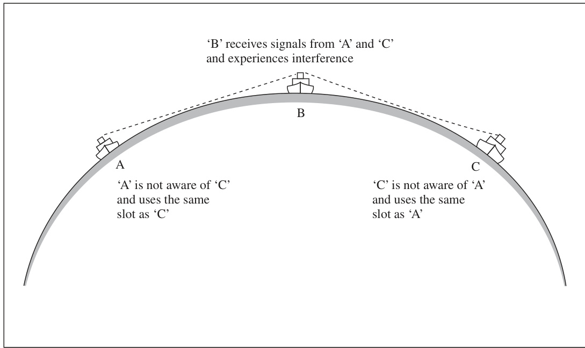  

FIGURE 5.3 Interference to a vessel caused by vessels out of range of each other.  

图 5.3 当船只相互之间处于无法通信的范围外时，由其他船只对某艘船只产生的干扰 [即，电磁信号的干扰，影响通信或导航系统的正常工作]。

### 5.1.3 Polling Mode  

IMO specification also allows for a third mode of AIS transmission: the ‘polling mode’. In this mode the AIS transponder will give out its information whenever interrogated by an authorized transponder. For example, this mode could be used to get static information on a vessel instead of potentially waiting 6 min.  

国际海事组织（IMO）规范还允许AIS传输的第三种模式，即“轮询模式”（polling mode）。在这种模式下，当AIS应答器被授权的应答器（transponder）查询时，它会提供自己的信息。例如，可以使用这种模式来获取船舶的静态信息，而不必潜在地等待6分钟。这样可以更快速地获取所需的信息。

### 5.1.4 Class B Transmissions CSTDMA  

The Class A AIS SOTDMA was already in operation when the system for Class B was designed. There was much concern as to the AIS congestion and interference that could be caused by the considerable number of potential Class B users. In many busy maritime areas, the theoretical number of leisure craft present outnumbers commercial (SOLAS) vessels by a factor of 10 or more. It is estimated that there are over 10,000,000 potential Class B users in comparison with the potential maximum number of Class A users, which is less than 100,000.  

当Class B AIS系统被设计出来时，Class A AIS SOTDMA已经投入运营。人们对AIS拥堵和干扰的担忧十分严重，尤其是考虑到可能的Class B用户数量。 在许多繁忙的海事区域，理论上的休闲船舶数量（在这里指的是私人游艇或娱乐用船）远远超过商业（SOLAS）船舶的数量，比例高达10倍甚至更多。 据估计，潜在的Class B用户超过1,000万，而与此相比，潜在的Class A用户数量最高不超过10万。

Class B equipment was therefore designed to reduce potential AIS congestion in a number of ways. Firstly data requirements are reduced by limiting the amount of data transmitted per vessel and also by increasing the intervals between message transmissions (see below). Secondly Class B transmitters only operate on low power (2 W) which limits their range to less than 10 miles) and thirdly they do not use SOTDMA but CSTDMA carrier sensitive time division multiple access. Carrier sensitive means that the Class B transmitters are designed to work within the AIS time slots, but defer to Class A and other AIS transmissions. In other words, Class B transmissions are ‘polite’ to Class A transmissions. Class B equipment decides on the slots in which they will transmit in a similar way to Class A, but at their prescribed (increased) intervals (30 or 180 or 360 s as per Table 5.1). However, at the start of the time slot, the Class B AIS listens to see if they can detect another station transmitting in that slot and if so, the Class B transmitter does not transmit and defers to the next intended transmission. The main differences between Class B and Class A equipment are summarized in Table 5.2.  

B类设备因此被设计为通过多种方式来减少潜在的AIS拥堵。首先，通过限制每艘船只传输的数据量以及增加消息传输之间的时间间隔（见下文），从而减少了数据要求。其次，B类发射器仅以低功率（2瓦）运行，这限制了它们的范围在10英里以内。第三，它们不使用SOTDMA（[静态时分多址接入，一种信道访问方法]）而是使用CSTDMA（[载波敏感时分多址接入，一种信道访问方法]）。这意味着B类设备不仅可以减少数据传输量，还能限制其通信范围和方式，从而减少对AIS系统的拥堵。

载波敏感的意思是，Class B 发射器被设计为在AIS（自动识别系统）时间槽中工作，但会让位于Class A和其他AIS传输之中。换句话说，Class B 传输对Class A 传输是“礼貌”的。Class B 设备通过与Class A 类似的方式决定他们将在哪个时间槽中传输，但按照其规定的（增加的）间隔（即30秒、180秒或360秒，如表5.1所示）。这意味着Class B 设备会在它被分配的特定时间槽中传输，同时避免干扰Class A 传输，从而确保AIS系统中的通信效率和可靠性。

但是，在时间槽开始时，B类AIS（自动识别系统）会监听，看看是否能检测到其他站点在该时间槽内正在传输的信号，如果可以检测到，则B类传输器不会传输，而是延迟到下一次预定的传输。B类设备和A类设备之间的主要区别总结在表5.2中。 

（注：自动识别系统AIS是一种用于船舶之间和船舶与海岸之间通信的系统，可以实现船舶位置、速度、方向等信息的自动交换。）

  

FIGURE 5.4 Block diagram of AIS user equipment.  

图 5.4：自动识别系统（AIS）用户设备的功能块图。 

（注：自动识别系统（AIS）是一种用于船舶之间、船舶与岸基站之间的识别和数据交换的技术，主要用于航海安全和交通管理。功能块图是指将系统分解为各个功能单元，并用块和线来表示其之间的关系，展示系统的结构和组成。）

## 5.2 AIS INFORMATION TRANSMITTED BY A CLASS A VESSEL  

The standard information transmitted by a SOLAS (Class A) vessel can be divided into four sections, as shown below. Any information sent by a vessel is identifiable as belonging to that vessel by the inclusion of a Maritime Mobile Service Identification (MMSI) number. This is unique to each vessel and enables the receiver to associate messages with a particular ship. For example, it correlates the static data with the dynamic data as these are sent in different messages and time slots. It can also be used by a vessel to communicate to a specific vessel using AIS or Digital Selective Calling (DSC) on VHF, MF, HF or satellite communication frequencies and thus helps avoid communicating with the wrong vessel.  
In addition to the MMSI number the following information is sent:  
• Static 
IMO number 
Callsign 
Length and beam (metres) 
Type of ship (container, tanker, etc.) 

按照SOLAS（A类）国际标准，海事通讯中传递的标准信息可以分为四个部分，如下所述。任何由船舶发送的信息都可以通过包含海事移动业务识别码（Maritime Mobile Service Identification，MMSI）来识别属于该船舶。这一识别码对每艘船舶都是唯一的，允许接收者将信息与特定的船舶关联起来。例如，它可以将静态数据与动态数据关联起来，因为这些数据是通过不同的信息和时间段发送的。它还可以被船舶用来通过自动识别系统（AIS）或数字选呼（Digital Selective Calling，DSC）在VHF、MF、HF或卫星通信频率上与特定的船舶进行通信，从而避免与错误的船舶进行通信。

除了MMSI识别码之外，以下信息也会被发送：
• 静态信息
国际海事组织（IMO）编号
呼号（Callsign）
船舶长度和宽度（米）
船舶类型（例如：集装箱船、油轮等）

Location of position fixing antenna to ship extremities (stern, bow, port and starboard). Note that overall dimension are assumed to be the relevant summation
• Dynamic 
Ship position (with accuracy indication and integrity) 
Time in UTC 
Course over the ground 
Speed over the ground 
Heading 
Navigational status (NUC, underway, at anchor, etc.) 
Rate of turn (where available) 
Angle of heel (optional and where available) 
Pitch and roll (optional and where available) 
• Voyage related 
Ship’s draught (metres) 
Hazardous cargo type (if any) 
Destination and ETA (at master’s discretion) 
Optional - Route plan (waypoints)  
TABLE 5.1 Data Reporting Rates   

位置定位天线相对于船舶的位置（船头、船尾、左舷和右舷）进行布置。注意，整体尺寸被假定为相关的总和。

- 动态数据
船舶位置（附带精度指示和完整性）
时间（UTC）
地面航向
地面速度
航向
导航状态（NUC，正在航行，抛锚等）
转弯率（如果可用）
倾斜角度（可选且如果可用）
俯仰和横滚（可选且如果可用）

- 航程相关数据
船舶吃水深度（米）
危险货物类型（如果有）
目的地和预计到达时间（ETA）（由船长自行决定）
可选 - 航线计划（途经点）

表5.1 数据报告速率

注：NUC 指“not under command”，意为“未受控制”或“失去控制”，代表船舶不能按照正常指令行驶的状态。UTC 指“协调世界时”，是一个基于原子钟的时间标准，用于全球范围内的时间同步。

TABLE 5.2 Differences Between AIS Class A and Class B Transponders   

表5.2  AIS（自动识别系统）A类和B类应答器的区别

（注意：AIS是自动识别系统，即Automatic Identification System，主要用于船舶的身份识别和位置报告；A类和B类应答器是AIS系统中两种不同类型的设备）

• Short safety related message 
A short text message can be routinely transmitted.  

• 短安全相关消息 
可以定期传输简短的文本消息。

The information is grouped into different AIS messages (see Section 5.3) and updated at different time intervals, in order to keep the amount of information being transmitted to a minimum. As indicated in Table 5.1, the voyage related data and the static data block are only transmitted every 6 min or if there is an outside request. The safety related message is sent as required. The dynamic data is sent according to the frequency indicated in Table 5.1, which depends on vessel speed and if changing course. The structure of messages for all ships, shore and aircraft is detailed in the next section.  

信息被分组成不同的AIS消息（见第5.3节），并在不同的时间间隔更新，以便将传输的信息量保持在最小限度。如表5.1所示，行程相关数据和静态数据块仅每6分钟或在收到外部请求时传输一次。安全相关消息按照需要发送。动态数据的发送频率根据表5.1中指出的频率进行发送，这取决于船速以及是否改变航向。所有船舶、岸基站和飞机的消息结构将在下一节中详细说明。 

（注：AIS即 Automatic Identification System，即自动识别系统，是一种用于船舶识别和跟踪的技术。）

## 5.3 AIS MESSAGES AND TYPES  

The AIS standards allow up to 63 different messages to be defined, but currently there are only definitions for 27. Different messages are defined for different purposes and different AIS types (Table 5.3).  

AIS 标准（自动识别系统标准）允许定义多达 63 种不同的消息（信息交换格式），但目前只有 27 种消息的定义（实现标准）。不同的消息是为不同的目的和不同的 AIS 类型（见表 5.3）而定义的。不同的 AIS 类型包括：基于岸站的 AIS（shore-based AIS）、船载 AIS（onboard AIS）和其他类型。这些定义的目的是为了满足不同应用场景和需求下的信息交换和识别要求。

### 5.3.1 Class A Transmissions  

Messages 1, 2 and 3 are the ‘short’ messages routinely transmitted by Class A vessels, every few seconds (see Table 5.1). They contain the same positional and dynamic information, but the different message numbers indicate the mode of transmission of the receiver. Message 1 is for use when the AIS transmitter is operating in autonomous mode, Message 2 is sent when the transmitter is in assigned mode as a result of instructions from a competent authority via an AIS base station using Message 16 or 23 (polling mode). Message 3 is a transmitted response to an interrogation (i.e. polling mode) by an authorized user using AIS Message 15.  

消息1、2和3是由A类船舶（见表5.1）每隔几秒定期传输的“短”消息。它们包含相同的位置和动态信息，但不同的消息编号表示接收器的传输模式。消息1用于自动模式下的AIS发射器操作，消息2在发射器由于有权威组织通过AIS基站使用消息16或23（轮询模式）指令而处于指定模式时发送。消息3是对授权用户使用AIS消息15（即轮询模式）进行询问的响应传输。其中，[自动模式] 指的是设备可以自主运行的状态，而[指定模式] 则是指设备运行模式由外部指令决定的状态，[轮询模式] 是一种通过发送特定消息来询问特定设备状态的方法。

Message 5 is the ‘long’ Class A AIS message sent every 6 min. It contains all the expected static and voyage data as indicated in Section 5.2. The exception is the optional route (waypoint) data which is sent using in a subtype of AIS binary message 8 (see Section 5.3.6).  

第 5 条消息是每 6 分钟发送一次的“长”Class A AIS 消息 [自动识别系统的消息类型之一，用于船舶的身份识别和位置报告]。它包含如第 5.2 节所示的所有预期静态和航程数据 [用于描述船舶的静止属性和航行信息]。唯一的例外是可选的路线（航点）数据 [用于描述船舶的预定航线上的特定位置]，该数据使用 AIS 二进制消息 8 的子类型进行发送（见第 5.3.6 节）。

The optional safety text message broadcast to all ships is defined as message 14, but if only sent (addressed) to a specific vessel then Message 12 is used.  

向所有船舶广播的可选安全文本消息被定义为消息14，但是，如果仅发送（定向）给特定的船舶，则使用消息12。 

（注：这里的“广播”是指通过某种通信系统或设备，将信息同时发送给多个接收者；“定向”则是指信息或消息是特定发送给某一方或某个特定对象。）

### 5.3.2 Class B Transmissions  

The main differences for Class B vessels are summarized in Table 5.2. Class B transponders transmit a shorter Message 18 than Messages 1, 2 and 3 used by Class A. The dynamic information excluded from Class B are the Rate of Turn and Navigational Status fields. There is also no requirement for Class B vessels to provide compass heading, although it is an optional field within Message 18.  

B 类船舶的主要区别总结在表 5.2 中。B 类应答机（transponder）传输的 Message 18 比用于 A 类的 Message 1、2 和 3 要短。B 类中排除的动态信息是转弯率（Rate of Turn）和导航状态（Navigational Status）字段。此外，B 类船舶也不需要提供罗盘方位（compass heading），尽管它是 Message 18 中的一个可选字段。 

注： 
- 应答机（transponder）：[一种用于自动识别系统（AIS）中接收和发送信息的设备]
- Message 1、2、3 和 18：[AIS系统中特定的信息类型，用来传输不同的船舶信息]
- 转弯率（Rate of Turn）：[船舶当前的转弯速度]
- 导航状态（Navigational Status）：[船舶当前的导航状态，如锚泊、航行等]
- 罗盘方位（compass heading）：[船舶的当前方向，用罗盘度表示]

Message 24 is equivalent to Class A Message 5 in that it provides the static data. However, the voyage related data of Class A is not included. Draft, ETA and destination fields are all not provided by Class B craft. The static data also does not include IMO number, which is logical as these are not IMO ships.  

第24条消息相当于A类消息5，因为它提供了静态数据。然而，A类的相关航程数据并没有被包含。对于B类船只来说，吃水、预计到达时间（ETA）和目的地字段均未提供。静态数据也不包括国际海事组织编号（IMO），这在逻辑上是合理的，因为这些船只并非国际海事组织登记的船舶。

Class B regulations were designed and came into force several years after Class A. On introduction of Class B, some of the older Class A receivers were only partially compatible with Class B messages and they did not show all available Class B information (particularly the Class B static data). These older equipments all should have been (software or hardware) upgraded by now, but no doubt some may still in use.  

B类规定是在A类的几年后设计和实施的。在B类引入时，一些较旧的A类接收器只能部分兼容B类消息，并且它们不能显示所有可用的B类信息（特别是B类静态数据）。这些较旧的设备都应该已经（软件或硬件）升级，但无疑有些可能仍在使用。

### 5.3.3 SAR Aircraft  

SAR aircraft can broadcast Message 9 which will provide their positional data on an AIS graphical display. Low flying aircraft can sometimes be picked up in radar vertical lobes, but the marine radar is not designed for this task and the occurrence of aircraft echoes on a radar screen are erratic. The provision of AIS information of SAR aircraft (particularly helicopters) on ship and shore AIS displays could be of potential great benefit in a SAR scenario and could assist in the monitoring and execution of a combined ship/aircraft search.  

搜索和救援（SAR）飞机可以广播信息9（Message 9），它将在自动识别系统（AIS）的图形显示上提供其位置数据。低空飞行的飞机有时会被雷达的垂直lobe（[垂直波束]）捕获，但海事雷达并不是为此任务设计的，飞机回波在雷达屏幕上出现的次数也是不规律的。提供SAR飞机（尤其是直升机）的AIS信息在船舶和岸基AIS显示设备上，在SAR情景中可能会带来巨大的潜在益处，并有助于监测和执行综合船机搜索。 

注：AIS是自动识别系统（Automatic Identification System）的英文缩写，广泛应用于船舶交通管理，能够自动交换船舶的静态和动态信息；雷达是无线电探测和定位的英文缩写。

### 5.3.4 AIS SART  

Although similar in user function to the radar-based SART (see Section 3.5.6), the AIS SART, when activated by the seafarer, instead transmits a distress message on both the AIS channels. IMO now allows SOLAS vessels (which above 500 grt require two such devices) to choose between the traditional radar-based SARTs or the AIS SARTs. Once activated the AIS SART sends eight transmissions a minute, four on each AIS VHF frequency. AIS receivers on other ships in range should alarm and it should appear as a cross surrounded by a red circle on Electronic Chart Display and Information System (ECDIS) and AIS displays. Once activated it should transmit for at least 96 hours. Like radar SARTs they are designed so that they can easily be pole mounted in a life raft or lifeboat. Unlike the radar SART, it does not indicate if it has received AIS signals from other vessels. The transmission consists of a unique number (programmed by the manufacturer before it is fitted to the ship) and the GPS position. Like the radar SART, there is no additional information programmable by the ship’s crew at the time of the distress.  
TABLE 5.3 AIS Messages   

尽管从用户功能上来看，AIS SART（见3.5.6节）与基于雷达的SART类似，但当水手激活AIS SART时，它会在两个AIS信道上传输求救信号。国际海事组织（IMO）现在允许符合国际海上人命安全公约（SOLAS）的船舶（大于500总吨位的船舶需要两台这样的设备）在传统的基于雷达的SART和AIS SART之间进行选择。一旦激活，AIS SART每分钟发送八次传输，分别在两个AIS VHF频率上发送。在范围内的其他船舶上的AIS接收器应会发出警报，并且在电子海图显示和信息系统（ECDIS）以及AIS显示上显示为被红圈围绕的十字标志。一次激活后，它应至少传输96小时。与雷达SART类似，它们被设计为可以轻松地安装在救生艇或救生筏上。与雷达SART不同的是，它不能指示是否从其他船舶接收到AIS信号。传输由一个唯一的编号（由制造商在将其安装在船舶上之前编程）和GPS位置组成。与雷达SART类似，在发出求救信号时，船舶的船员无法编程添加额外的信息。

表5.3 AIS消息类型

### 5.3.5 Aids to Navigation  

#### 5.3.5.1 AIS on Buoys  

AIS transponders are fitted to a number of navigationally important buoys. They transmit AIS message 21. This has two main benefits. The buoy will be positively identified to AIS users including its specific name. Furthermore, if the buoy moves out of position, the shore authorities and vessels will be alerted. There are thoughts that these could eventually replace Racons (see Section 3.5.1) as these are not only much cheaper to install, operate and maintain, but additionally AIS self-monitors its position and is not dependent on the user selecting the correct radar frequency for observation.  

自动识别系统（AIS）[一种用于船舶识别和位置报告的无线电通信系统]的应答器被安装在许多导航上重要的浮标上。它们传输AIS消息21，这带来了两个主要的好处。首先，浮标将被正确认识并显示其特定的名称给AIS用户。其次，如果浮标移出了位置，岸基管理机构和船舶将会收到警报。人们认为，这些浮标最终可能会取代雷达应答机（Racons）（见3.5.1节），因为它们不仅安装、运行和维护成本大大降低，而且AIS系统还能够自行监测自己的位置，并不依赖于用户选择正确的雷达频率来进行观察。

#### 5.3.5.2 Virtual AIS Transmissions from Shore Stations  

Another related area being explored is the use of virtual AIS. In this scenario a shore authority can send AIS messages representing virtual ‘buoys’ to indicate a safe channel or mark a wreck. These would appear on an AIS display to vessels even though the ‘buoys’ would not physically exist. This would be of great benefit for marking safe or dangerous areas of a temporary or transient nature, or in advance of real wreck-marking buoys being laid over a new wreck. A further example is in areas where, in winter, real buoys are removed because of floating ice.  

另一个相关的研究领域是虚拟自动识别系统（AIS）的应用。在这种情景中，海岸管理机构可以发送代表虚拟“浮标”的AIS消息，以指示安全的航道或标记沉船。这将在AIS显示设备上显示给船只，即使这些“浮标”并不存在于物理环境中。这将对标记临时或暂时的安全区域或危险区域带来极大的便利，或者在真正的沉船标志浮标布设之前，为新发现的沉船提供提前标记。另一个例子是在某些地区，由于冬季浮冰的存在，实体浮标会被拆除，而虚拟AIS浮标可以弥补这一缺陷。[自动识别系统（AIS）是指一种通过卫星或岸基站自动识别和跟踪船舶位置和状态的技术。浮标则是指海上用于标记航道或危险区的导航标志。]

#### 5.3.5.3 Synthetic AIS Transmissions from Shore Stations  

Another similar proposal is synthetic AIS, where AIS messages for existing marks and buoys are generated by a shore station. This would save the expense of installing and maintaining AIS transmitters on the actual marks and buoys. It could cause confusion if the buoy drifted out of position, but again it could be argued that this is useful information, if an observing vessel with radar and AIS observes and understands the discrepancy.  

另一个类似的提议是合成自动识别系统（Synthetic AIS），即海岸站生成现有水位标志和浮标的自动识别系统（AIS）消息。这将节省在实际水位标志和浮标上安装和维护AIS发射器的费用。然而，如果浮标漂移到原位以外的位置，这可能会造成混淆。但是，再次可以认为，如果一个配备了雷达和自动识别系统的观察船只观察并理解这种差异，这也是有用的信息。

The standard message used to transmit data on both virtual and synthetic aids to navigation is another example of the message subtype of AIS binary message 8. Other examples of AIS binary messages are covered in the next section.  

用于在虚拟和综合导航辅助系统上传输数据的标准信息是AIS二进制消息8（自动识别系统二进制消息，AIS（Automatic Identification System）是一种用于船舶识别和位置报告的自动化系统，[自动识别系统（AIS）是一种无线电通信系统，用于交换船舶和海岸站之间的信息，如位置、航向等]）的一个子类型的另一个例子。其他AIS二进制消息的例子将在下一节中介绍。

### 5.3.6 AIS Binary Messages  

Certain AIS messages allowed by IMO performance measures allow competent authorities to define extra messages within the standard IMO message structure. These are often termed ASMs (Application Specific Messages). Thus messages 6, 8, 25 and 26 allow authorized users to transmit ASMs relating to specific areas or additional information. These can be broadcast to all vessels (messages 8, 25, 26) or by using message 6 addressed to specific vessels (or vessel) using MMSI numbers.  

国际海事组织（IMO）制定的性能指标中允许某些自动识别系统（AIS）消息，能够让相关权限的主管机构在标准的IMO消息结构中定义额外的消息。这些被称为应用特定消息（ASMs，Application Specific Messages）。因此，消息6、8、25和26允许授权用户传输与特定区域或额外信息相关的ASMs。这些消息可以广播给所有船只（消息8、25、26），或使用消息6以海事移动服务身份码（MMSI）为特定船只（或某艘船只）进行定址。

Examples of AIS message 8 developed by specific shore authorities include the Saint Lawrence Seaway (which broadcasts data on locks, tidal levels and weather) and the Panama Canal (which broadcasts weather data from specific locations along the canal).  

特定岸基管制机构开发的AIS（自动识别系统）信息8的例子包括圣劳伦斯航道（该航道广播了锁、潮汐水位和天气数据）和巴拿马运河（该运河从运河沿线特定位置广播天气数据）。

There are also many other more generic binary messages currently defined for authorized users to send on weather reports, tidal information, salinity reports, traffic reports, suggested routes and text messages. Examples of binary messages containing additional information for transmission by vessels include the number of persons onboard, route (waypoint) information, extended static and voyage data.  

除了这些功能外，还有许多其他的通用二进制消息（binary messages）被定义，允许授权用户发送天气报告、潮汐信息、盐度报告、交通报告、建议路线和文本消息等。这些二进制消息中还包含可以由船只传输的附加信息，例如船上人员数量、路线（途经点）信息、扩展静态数据和航程数据。

Individual countries and organizations have often developed these messages and they are then submitted to IMO for approval. These messages are still developing and there is evidence that the development is not always well coordinated. There is overlap and national differences between similar binary messages. The official IMO registry of these binary messages is updated occasionally with some older messages having already been superseded and made obsolete. It emphasizes the need for regular AIS software updates to be provided by equipment manufacturers and updated by individual vessels, if a full AIS service is to be provided.   

各个国家和组织经常开发这些信息，然后将其提交给国际海事组织（IMO）批准。这些信息仍在不断发展，但有一些证据表明，该过程并非总是得到很好的协调。存在相似二进制信息之间的重叠和国家差异。国际海事组织（IMO）官方注册的这些二进制信息会偶尔更新，一些较旧的信息已经被取代和废弃。该注册表明，设备制造商需要定期提供自动识别系统（AIS）软件更新，并由个别船舶更新，才能提供完整的AIS服务。这样可以确保AIS系统的正常运行和信息的准确性。注：自动识别系统（AIS）是[一种用于船舶位置报告和识别的系统，通过无线电通信将船舶的位置、速度和方向等信息传输给其他船舶和岸基站，以提高海上安全和避免碰撞]。

## 5.4 AIS UNITS AND BRIDGE DISPLAYS  

The Class A AIS unit is fitted on the bridge. When fitted to an existing vessel, much of the installation expense for Class A vessels can be the linking of the unit to other bridge equipment, especially older bridge equipment (e.g. stepper motor type gyro interfaces).  

A类AIS（自动识别系统）单元安装在桥上。当安装在现有船舶上时，A类船舶的大部分安装费用可能是将单元连接到其他桥设备的费用，特别是旧的桥设备（例如步进电机型陀螺仪接口）。在这样的情况下，可能需要进行额外的接口改造或硬件升级，以确保AIS单元能够与现有的设备进行兼容和正常工作。 [AIS：一种用于船舶安全和交通管理的识别系统，通过无线电通信自动发送和接收船舶位置、速度、方向等信息，促进海上交通的安全和高效]。

The standard of the provision of AIS data available to the navigator has been very variable and the provision can be divided into three broad types. This is because the initial 2004 standards ensured that vessels transmitted AIS messages, but (at the minimum compliance with IMO standards) did not provide a graphical user-friendly device for the navigator. The compulsory provision of AIS as a graphical interface together with integration of AIS and ARPA data was left until IMO Performance Standards for new radar equipment on ships from 2008.  

自动识别系统（AIS）数据对导航员的提供标准一直变化很大，可以大致分为三种类型。这是因为最初的2004年标准（IMO标准的最低限度）确保了船舶传输AIS信息，但并没有为导航员提供一个（图形化的）用户友好界面。直到2008年，国际海事组织（IMO）针对新型雷达设备的性能标准中，才要求将AIS作为图形界面与自动雷达 Plotter辅助系统（ARPA）数据集成在一起，这样一来导航员才能方便地使用AIS数据。

### 5.4.1 Stand-Alone Minimum Keyboard Display 

The minimum keyboard display (MKD) is a unit with a display that provides a small data screen capable of displaying only text (not graphics) with a limited number of buttons, each performing multiple tasks (similar to mobile phones). Input and extraction of information can be tedious and is prone to keying error. Initially this was the simplest unit and popular because it meets IMO approval at the lowest cost. It is designed for the primary purpose of programming the AIS unit with the vessel’s own information. The reception and output of target vessel data to the navigator was clearly of secondary concern to whoever formulated the regulations. There were even reports in the early days of implementation that this philosophy extended on some vessels to the fitting of these units away from the navigational area of the bridge, or not even on the bridge at all.  

最小键盘显示器（Minimum Keyboard Display，简称MKD）是一种具有显示屏的设备，能够显示仅文本（不包括图形）的小数据屏，配备有限数量的按钮，每个按钮可以执行多个任务（类似于移动电话）。输入和提取信息的过程可能很繁琐，且容易出现键盘输入错误。最初，这种设备是最简单的型号，因其低廉的成本而获得国际海事组织（IMO）的批准而受到青睐。它的主要设计目的在于为自动识别系统（AIS）编程提供船舶自身的信息。相比之下，接受和输出目标船舶数据给航海员的功能显然是次要的，似乎在规定这些标准时也并未被优先考虑。甚至在实施初期，就有报告称在一些船舶上，这种设计理念导致了这些设备被安装在船桥的非航海区域，或者甚至根本没有安装在船桥上。这种做法可能会对航海员使用这些设备造成不便。

However, within an MKD, it is possible to get lists of vessels that are in the own ship’s geographical area with range and bearing (see Section 6.10.1.2), and this can be used to supplement information on other vessels being observed from traditional sources such as visual scene or radar/ARPA. Alarms can be set up for certain parameters, including collision threats based on GPS position calculations.  

然而，在多船数据交换系统（MKD）中，可以获取本船地理区域内的船舶列表，包括它们的距离和方位（请参见第6.10.1.2节），这可以用来补充从传统来源（如视觉场景或雷达/ARPA）获取的其他船舶的信息。可以为某些参数设置报警，包括基于GPS位置计算的碰撞威胁报警。注意：这里的“MKD”指的是多船数据交换系统（Maritime Keyword Data），是船舶之间以及船舶与岸基站之间进行数据交换的系统；“GPS”指的是全球定位系统（Global Positioning System），是一种提供位置信息和时间信息的卫星导航系统；“ARPA”指的是自动雷达 Plotting 辅助（Automatic Radar Plotting Aid），是辅助雷达操作员跟踪和预测船舶位置的系统。

### 5.4.2 Stand-Alone Graphical Display  

This unit was more intended for operational use by the navigators of the ship on which the AIS is fitted. Information can be displayed graphically and the display will therefore look similar in function and appearance to a radar screen. However, this graphical display will only display vessels that have AIS transponders.  

该单元主要是为安装有AIS（自动识别系统）的船只的导航员在操作时使用而设计的。信息可以以图形方式显示，因此显示界面在功能和外观上与雷达屏幕相似。然而，这种图形显示仅会显示具有AIS应答器（一种可以自动发送船只位置、速度等信息的设备，[简而言之，就是一种让船只“曝光”的装置]）的船只。

Additional AIS information on a displayed vessel should therefore be available at the press of a button (See section 6.10.1).  

因此，关于当前显示船舶的额外AIS（自动识别系统[一种用于船舶之间和船舶与岸基站之间交换识别信息的无线电通信系统])信息应该在按一下按钮后即可获取（参见6.10.1节）。

### 5.4.3 Integration of AIS with ARPA and/or ECDIS  

In this system, the AIS unit provides the AIS information on other vessels to an ARPA, radar, ECDIS or integrated bridge system (IBS) display, possibly as part of the network of an IBS.  

在这个系统中，AIS（自动识别系统）单元向ARPA（自动雷达盲区处理系统）、雷达、ECDIS（电子海图显示和信息系统）或集成桥梁系统（IBS）的显示设备提供其他船舶的AIS信息，这些信息可能作为IBS网络的一部分进行显示。 

（注：ARPA的全称是自动雷达盲区处理系统，是一种辅助雷达系统，以减少雷达盲区带来的航行风险；ECDIS是电子海图显示和信息系统，能够显示船舶的位置、海图和其他相关信息；IBS是集成桥梁系统，集成了船舶的各项系统和设备。）

The advantage of overlaying the AIS information on the ARPA is that radar targets can be compared with the additional AIS information. Vessels that are poor radar targets become obvious and vessels not operating AIS can become identifiable on the radar screen. The navigator can therefore see a summary of both systems on one screen.  

叠加AIS信息于ARPA（自动雷达定Plotter）的优势在于，可以将雷达目标与额外的AIS信息（船舶自动识别系统）进行比较。那些不容易被雷达捕捉到的船舶目标变得明显，而没有开启AIS的船舶也可以在雷达屏幕上被识别。因此，导航员可以在一个屏幕上看到两个系统的总结，这使得信息更加直观和便于分析。（其中的AIS是船舶自动识别系统，用于帮助船舶安全航行；ARPA是自动雷达定Plotter，用于辅助雷达定位和跟踪目标）

The advantages of overlaying the AIS on the ECDIS display is that other vessels’ paths can be seen in a navigational context, which is particularly apt as the AIS gives ground track and ground speed. Additionally, the projected routes of target vessels can sometimes also be displayed for consideration.  

在ECDIS显示屏上叠加AIS（[自动识别系统，Automatic Identification System，用于船舶识别和位置报告]）的优势在于，可以在导航背景下看到其他船舶的航线，这尤其适用，因为AIS提供了地面航迹（[即船舶在地面上的实际航迹]）和地面速度（[即船舶相对于地面的速度]）。另外，对于目标船舶，其预测航线有时也可以被显示出来，以供考虑。

The obvious disadvantage of AIS information is the danger of information overload on the navigator. In busy situations, navigators have already demonstrated the potential (and often serious) consequences of getting the following information confused:  
• ARPA derived relative and true vectors 
• ARPA derived ground and water stabilized true vectors.  

自动识别系统（AIS）信息的一个明显缺点是导航员可能会面临信息过载的危险。在繁忙的情况下，导航员已经表现出可能会将以下信息混淆的潜在（且常常是严重的）后果：
• 自动雷达轨迹测定系统（ARPA）推导的相对和真实矢量（即根据相对运动和绝对运动计算出来的方向和速度）
• 自动雷达轨迹测定系统（ARPA）推导的相对于陆地和水面稳定的真实矢量（即以陆地或水面为参考系的真实方向和速度）。

The provision of additional vectors based on AIS derived information has provoked serious consideration in some quarters to reduce the problem of information overload. There are two results of this research.  
1. Standard symbology  

为解决信息过载问题，一些人对在自动识别系统（AIS）派生信息的基础上提供额外的向量进行了认真的考虑。这种研究有两个结果。
1. 标准符号（即使用一套标准化的符号来表示不同类型的信息，以便于理解和处理）

Table 3 in Section 11.2.3 shows IMO approved symbols for AIS targets. These symbols have been selected for their clarity. Note that the triangle points in the direction of the ship’s head and should therefore provide aspect. The vector line gives ground course and speed. The curved tail on this vector appears when a vessel is changing course and indicates the direction of the change. The triangle can be replaced by a ship outline of the correct scale dimensions when the display scale is large enough and the static information relating to that vessel is available.  
2. Data fusion  

11.2.3 节中的表格 3 列出了 IMO （国际海事组织）批准的 AIS （自动识别系统）目标符号，这些符号因其清晰度而被选用。注意，三角形的尖端指向船头的方向，应能显示出船只的朝向。矢量线表示地面航向和速度，当船只改变航向时，矢量线末端的曲线尾迹会出现，指示出航向变化的方向。当显示比例足够大，并且有关于该船只的静态信息可供参考时，可以用正确比例尺寸的船只轮廓来替代三角形。
2. 数据融合 [即将来自不同来源的数据综合处理和分析，以便于更好地理解和利用这些数据的技术过程]

Algorithms have been developed to compare ARPA derived data with AIS derived data. Thus, where the system thinks an ARPA target and AIS source are the same vessel, it will indicate that they are the same on a combined display and will not show them as two separate vessels. The idea here is to reduce the amount of unnecessary information provided to the navigator. These algorithms are manufacturer specific and can vary in operation and in terms of (any) operator adjusted parameters (see Section 6.10.2).  

已经开发出了算法来比较来自ARPA（自动雷达航行辅助装置）[自动雷达航行辅助系统，用于辅助船舶导航]的数据与来自AIS（自动识别系统）[一种用于船舶识别和位置报告的系统]的数据。当系统认为某个ARPA目标和AIS源对应同一艘船舶时，它会在综合显示中指示它们是同一艘船舶，而不会将其显示为两艘独立的船舶。这里的想法是减少提供给航海员的不必要信息量。这些算法是特定于制造商的，且在操作和可调整参数（见6.10.2节）方面存在差异。

It can be computer intensive for a radar/ ARPA/AIS set to track and plot a large number of AIS targets in addition to its normal workload. Radar/ARPA sets that have AIS integration include a maximum number of AIS targets that will be monitored and displayed on the screen. A typical maximum number is 50, but the navigator can usually select a lower number if required. The radar/ARPA/AIS set will plot the nearest AIS targets to the own ship if the maximum number of AIS targets is exceeded.  

当雷达/自动雷达测位辅助系统（ARPA）/自动识别系统（AIS）设备需要在其正常工作负荷的基础上，跟踪和绘制大量的AIS目标时，计算机的处理负担可能会很大。集成了AIS功能的雷达/ARPA设备，会对要监控和在屏幕上显示的AIS目标数设定一个最大值。通常这个最大值是50，但导航员通常可以选择一个较小的数字，如果需要的话。若超过了AIS目标的最大数目，则雷达/ARPA/AIS设备将绘制与本船最近的AIS目标。（注：自动雷达测位辅助系统（ARPA）是指利用雷达技术自动测定和跟踪目标的位置和速度的系统；自动识别系统（AIS）是指船舶之间以及船舶与岸基设施之间，自动交换位置、航速和航向等信息的系统。）

In the performance standards for new ships built after 2008, the radar installation must be capable of displaying a minimum number of active AIS targets. This number depends on ship size and is, in fact, the same number as the minimum number of radar tracked targets (see Table 4.2). The standards also allow the navigator to designate a certain number as sleeping targets, so the display is not overly cluttered with information. This can be on an individual vessel basis or by designating the area around the own ship in which to show AIS vessels (see Section 6.10.2.1).  

在2008年以后建造的新船的性能标准中，雷达安装必须能够显示最少数量的活动AIS（自动识别系统，[一个帮助船只安全航行的系统，可以自动广播船只的位置和其他相关信息]）目标。这个数量取决于船只的大小，实际上与最少数量的雷达跟踪目标（见表4.2）相同。标准还允许导航员指定一定数量的目标为“休眠”目标，这样显示屏就不会被过多的信息弄得混乱不堪。这可以根据个别船只的情况进行设置，或者通过指定在自船周围的哪个区域显示AIS船只（见第6.10.2.1节）来实现。

### 5.4.4 Pilot Plug and Display  

AIS units are also fitted with a ‘pilot plug’, which is simply a standard data connector. The pilot brings onboard a display unit (sometimes termed PPU pilot portable unit) which interfaces directly with the AIS. The advantage is that the pilot can then use a display device with which he is familiar while controlling and using the transponder already installed on the vessel. The pilot is also able to use the information from the ship’s transponder in conjunction with other computer-based applications specific to the pilotage, such as local electronic charts and tide data.  

AIS（自动识别系统）设备还配备了一个“引航插头”（pilot plug），它仅是一个标准的数据连接器。引航员将一个显示单元（有时称为便携式引航单元，PPU）带到船上，该显示单元直接与AIS设备接口相连。这样做的好处是，引航员可以使用自己熟悉的显示设备，同时控制和使用已经安装在船上的信号转发器。此外，引航员还可以将船上的信号转发器提供的信息与其他特定于引航的计算机应用程序结合使用，例如本地电子海图和潮汐数据。这样，引航员可以更好地掌握航行情况，提高操作效率。

Vessels entering US waters are additionally required to provide a convenient $120~\mathrm{V}$ power supply for the use of the pilot display, when using the pilot plug.  

进入美国水域的船舶还需要提供一个方便的120伏特电源，为驾驶员显示器（pilot display）使用时提供电力，当使用驾驶员插头（pilot plug）时。

### 5.4.5 Class B Equipment  

Class B is (by design) intended to be lower cost and power consumption. The reduced data inputs will also mean less installation costs, as less interfaces are needed. Indeed the external bridge equipment to interface with AIS in Class A is unlikely to be carried by such vessels. In practice they resemble a Class A MKD (Section 5.4.1) or more likely an AIS stand-alone device (Section 5.4.2). Optionally they can be provided for output interfaces for any kind of electronic chart or radar display (full IMO compliant ARPA and ECDIS equipment would be unusual on most Class B vessels). However, pages and menu systems should be simpler due to the lesser data information that Class B vessels transmit. The fact that voyage data and navigational status are not transmitted by such vessels means that the Class B navigator does not normally need to update the AIS on a voyage-by-voyage basis, unlike the Class A counterpart. It can be just switch on and switch off.  

B类设备（按照设计意图）旨在降低成本和功耗。减少的数据输入还意味着较低的安装成本，因为需要的接口较少。事实上，外部桥梁设备用于在A类设备上与自动识别系统（AIS）进行接口，对于此类船舶来说不太可能配备。实际上，它们类似于A类的移动设备（第5.4.1节）或者更有可能是一个独立的AIS设备（第5.4.2节）。可选地，它们可以提供输出接口，用于任何类型的电子海图或雷达显示（完全符合国际海事组织（IMO）标准的自动雷达画面分析和电子海图显示系统（ARPA和ECDIS）设备在大多数B类船舶上是罕见的）。然而，页面和菜单系统应较为简单，因为B类船舶仅传输较少的数据信息。这一事实表明航程数据和导航状态不会被此类船舶传输，这意味着B类导航员通常不需要在每次航程中更新AIS，与A类设备不同。它可以简单地开启和关闭。

### 5.4.6 AIS Receivers  

Also available for small boats are AIS receivers, which do not transmit any AIS messages. They are intended for small craft and are low cost. In particular they have very low power requirements. The advantage of this equipment is that it gives the navigator a graphical picture of larger vessels and any other users in the local area who are transmitting AIS messages. It has the obvious disadvantage that the equipment does not transmit the presence of the ‘own ship’ to other users, which is effectively missing one half of the true collision avoidance scenario. However, the argument is probably that it is better than no AIS information and at least such vessels are trying to keep out of the way of large vessels. One could also argue that the target market for such equipment represents a large number of vessels and if they adopt this equipment they will not cause AIS congestion. There are no standards for such equipment and no known carriage requirements. These have been unofficially termed Class C AIS by some manufacturers.  

小型船舶也可以使用AIS接收器（自动识别系统接收器），这些设备不传输任何AIS消息。它们适用于小型船舶，并且成本较低。特别是，它们的功耗要求非常低。这种设备的优点是，它为导航员提供了大型船舶和本地区域内其他正在传输AIS消息的用户的图形显示。它有一个明显的缺点，就是设备不会将“自己的船舶”（own ship）的存在传输给其他用户，这实际上缺少了真正的碰撞避免场景的一半。然而，人们可以认为，即使这样，也比没有任何AIS信息要好，而至少这些船舶试图避开大型船舶。还可以认为，这种设备的目标市场代表了大量的船舶，如果他们采用这种设备，他们就不会导致AIS拥堵。目前，没有针对这种设备的标准，也没有已知的装备要求。一些制造商将这些设备非正式地称为“Class C AIS”（C类自动识别系统）。 

注意：这里提到的“AIS”是指“Automatic Identification System”（自动识别系统），是一种用于船舶之间以及船舶与岸基站之间的自动生成、交换和显示船舶的位置和相关信息的系统，用于实现船舶的自动识别和跟踪。

## 5.5 AIS USABILITY  

AIS and ARPA information are often compared. In considering the relative capabilities of AIS, a number of issues need to be considered.  

自动识别系统（AIS）和雷达自动plots定位系统（ARPA）信息经常被比较。在考虑AIS的相对能力时，需要考虑几个问题。这些问题包括AIS与其他船舶交通管理系统之间的技术差异、数据交换协议的兼容性、系统更新和维护的频率等，这些因素都会影响AIS的性能和可靠性。

### 5.5.1 Target Swap  

A common ARPA issue (onshore or vessel display) is radar target swap (see Section 4.3.5). This is when a target plotted by an ARPA loses its ‘tag’ to another passing vessel or static radar target. AIS does not have this problem. In fact, on a combined AIS/ARPA display (on vessel or shore VTS), it can provide a warning that radar target swap has occurred.  

一种常见的自动雷达导航辅助系统（ARPA）问题（无论是岸基显示还是船载显示）是雷达目标混淆（参见第4.3.5节）。这种情况发生在ARPA绘制的目标丢失其“标签”（tag）并将其分配给另一艘正在经过的船舶或静态雷达目标时。自动识别系统（AIS）则不具备这一问题。事实上，在结合了AIS和ARPA的显示系统中（无论是在船载还是岸基航道交通管理系统中），当发生雷达目标混淆时，AIS都能够提供警告。

However, there has been a form of AIS target swap that can occur. It has previously been stressed that AIS quality depends on the information that has been programmed into the AIS equipment. If two vessels are programmed with the same MMSI number and they are both within the observing range of a third vessel or VTS centre, then this will cause a problem on the observing AIS display. The observing AIS equipment will think the messages are all from the same vessel. On the user display, this would result in the vessel jumping from one position to the other as the dynamic data comes in every few seconds. The actual vessel name (and other static data) shown will depend on which vessel last sent its static and voyage message (every 6 min), so the name and static data shown will therefore change probably twice in every 6 min. MMSI numbers are of course supposed to be unique to each vessel, but typographical mistakes can occur and the two vessels may happen to be in the same AIS coverage area. It also does not help that manufacturers usually put the same default information into all their AIS equipment, so it can be an error of omission on commissioning the onboard equipment which results in a common incorrect MMSI being used by several vessels. Furthermore, there has also been a case (hopefully now past) caused by poor AIS equipment design by one AIS manufacturer. The MMSI number on the shipboard unit in question defaulted to the preset manufacturer MMSI number whenever restarted after any power outage. A significant number of vessels therefore were at one time using the same incorrect MMSI number.  

然而，曾经有一种AIS（自动识别系统）目标交换的情况可能会发生。在以前的论述中强调过，AIS的质量取决于编程到AIS设备中的信息。如果两艘船只被编程为具有相同的MMSI（海上移动服务身份码）[一种用于识别船舶的唯一编码]，并且它们都处于第三艘船或VTS（船舶交通服务）中心的观察范围之内，那么这就会在观察AIS显示屏上引起问题。观察AIS设备会认为这些信息都是来自同一艘船。这样，会导致信息显示混乱，难以区分哪艘船只发送了哪些信息。

在用户显示界面上，这将导致船舶从一个位置跳跃到另一个位置，因为动态数据（指能够实时更新的数据，如船舶位置、速度等）每隔几秒钟就会更新一次。实际显示的船舶名称（以及其他静态数据（静态数据是指不常变化的信息，如船舶名称、呼号等））取决于哪艘船舶最后发送了其静态和航程信息（每6分钟发送一次），因此显示的名称和静态数据将在每6分钟内可能改变两次。当然，MMSI号码（MMSI是船舶自动识别系统中的一个唯一标识符）应该是每艘船舶独有的，但可能会发生打字错误，两艘船舶可能恰好处于同一AIS（自动识别系统）覆盖范围内（AIS是一种通过无线电通信系统向附近的船舶和岸基站自动发送和接收船舶位置、速度等信息的技术）。

此外，制造商通常会在其所有AIS设备中设置相同的默认信息，这意味着当设备在船上安装和启动时，如果遗漏了正确配置，可能会导致多艘船只使用一个相同的错误的MMSI号码。另外，曾经有一家AIS设备制造商的设计不当（希望现在已经改进），导致了问题。其生产的船载AIS设备在任何一次断电后重新启动时，设备中的MMSI号码都会默认恢复到该制造商预设的MMSI号码（即制造商自己的MMSI号码），而不是正确的船只MMSI号码。

因此，一大批船舶曾一度使用相同的错误MMSI号码（船舶识别码，Maritime Mobile Service Identity）。

In summary, given the very small numbers of vessels likely to be incorrectly programmed with their MMSI number, it is very unlikely that two vessels with the same MMSI number will be in the same ship AIS area and so AIS target swap is unlikely to be a common problem for seafarers. One benefit of the existence of the larger ‘global’ AIS networks (see Sections 5.8.1 and 5.8.2) is that the existence of such MMSI errors will be known to such networks and they will probably be proactive in advising the culprit vessels of the problem.  

综上所述，考虑到错误编程MMSI号码的船舶数量极为少数，因此在同一海域内，两个具有相同MMSI号码的船舶出现的概率极低，因此AIS目标交换不太可能成为船员的常见问题。较大规模的“全球”AIS网络（详见5.8.1和5.8.2节）的一个优势在于，这些网络能够识别出MMSI错误的存在，并可能会主动通知相关的船舶（即使错误的源头）关于该问题的存在。

### 5.5.2 The Transmission of AIS Signals Around Large Land Features  

AIS VHF transmissions can not only have a longer range than radar, but they also have a limited ability to go round corners and over the top of land masses. This is particularly useful in fjord type regions where radar and visual observer are unable to see far ahead due to blind areas, whereas AIS transmissions can usually be received (Figure 5.5). Such areas can also be blessed with narrow navigation channels with only limited searoom for vessels to pass. The ability to recognize the position and ETA of a vessel approaching around a blind corner, and then communicate a passing strategy in advance can be very useful.  

AIS（自动识别系统）VHF（甚高频）信号传输不仅可以覆盖比雷达更长的距离，而且还具有有限的能力绕过拐角和跨越陆地 масс。这在像峡湾型区域特别有用，在这些区域，雷达和视觉观察者由于盲区的限制，无法看到远处的目标，而AIS信号通常可以被接收到（图5.5）。这种区域还可能拥有狭窄的航道，只有有限的空间让船舶通过。能够识别一艘船舶在绕过拐角处接近的位置及其预计抵达时间（ETA），然后提前与其通信通过策略，可以非常有用。 

注意： 
- AIS：自动识别系统（Automatic Identification System），一种用于船舶安全和交通管理的技术。
- VHF：甚高频（Very High Frequency），一种无线电频率范围。
- ETA：预计抵达时间（Estimated Time of Arrival），指预计某物体（如船舶）到达某一地点的时间。

### 5.5.3 AIS Capacity  

It is claimed that the system copes with in excess of 2000 transponders in an area. It can be seen from Table 5.1 that the maximum capacity will depend on whether a large proportion of the vessels are in motion and how fast they are travelling. Thus for such a claim to be possible, it is assuming that the majority of vessels transmitting are stationary and that a significant proportion are Class B, which may well be a reasonable assumption. Class A transmitters can also reduce the power and therefore range of transmissions to reduce congestion, as described in Section 5.1.4.  

据称，该系统能够处理一个区域内超过2000个[响应器（transponder），一种用于自动识别和跟踪物体的设备]。从表5.1可以看出，最大容量将取决于是否有大量[船舶（vessels）]处于运动状态，以及它们的运动速度。因此，要实现这一说法，假设大多数传输[船舶]是静止的，并且相当一部分是B类[自动识别系统（AIS）设备，用于船舶的自动识别和跟踪]，这可能是一个合理的假设。A类[自动识别系统设备]也可以降低传输的功率和范围，以减少[通信信号]拥堵，如5.1.4节所述。

As the system gets more congested then the occasional transmissions are missed by other craft due to corruption caused interference or because slots are not always available to transmit. Effectively the updates on AIS displays reduce, so whether the AIS is ‘coping’ depends on the user’s perception of what is an acceptable update rate. Certainly most users would not be too concerned if they receive data at intervals significantly larger than IMO specified intervals, and to date there have been no known complaints that the system has failed to work due to congestion.  

随着系统变得更加拥挤，其他船只（craft）可能会由于干扰（interference）引起的数据腐坏（corruption）或者因为传输时隙（slots）并不总是可用的缘故，错过一些偶发的传输（transmissions）。实际上，AIS显示器上的更新会减少，因此AIS是否“跟上”（coping）的标准取决于用户对可接受的更新速率（update rate）的认知。当然，绝大多数用户如果收到数据的间隔远远大于国际海事组织（IMO）指定的间隔，他们也不会过于担心，而且到目前为止，还没有任何已知的投诉表明由于拥堵（congestion）而导致系统无法正常工作。

### 5.5.4 AIS Dependence on GNSS  

An important point about AIS is that the system is completely dependent on an operational GNSS (in practice GPS) for its timing of radio message broadcasts. Indeed AIS units come with an internal GNSS unit incorporated - primarily to provide the timing.  

关于AIS的一个重要方面是，该系统完全依赖于可用的卫星导航系统（GNSS，实际上是GPS）来控制其无线电信号的广播时序。事实上，AIS设备通常都内置了GNSS模块，其主要目的是提供时序参考。[注意：GNSS指的是全球卫星导航系统，是一个利用一组卫星来提供位置、导航和时序信息的系统；GPS是美国的全球卫星定位系统，是GNSS中最为人熟知的组成部分]

  

FIGURE 5.5 Fjord effect.  

图5.5 菲约德效应。 

注：菲约德效应是地理学中的一个术语，指的是由冰川侵蚀形成的狭长海湾（[即冰川在退缩过程中，经常会留下狭长的海湾，如挪威的峡湾一样]）。在该图中，这个概念可能被应用于地理信息系统或环境研究等领域。

The position, ground speed and ground course will also come from GNSS derived data. However, it should also be noted that these should come from the GNSS unit on the bridge being used by the navigators, which may not be the internal GNSS fitted to the AIS. It is the position of the navigator’s GNSS antennae (i.e. not necessarily the antenna of the GNSS internal to the AIS) which should be included in the static message.  

位置、地面速度和地面航向也将来自GNSS（全球导航卫星系统，Global Navigation Satellite System）派生的数据。然而，也应该注意到，这些数据应该来自桥上导航员使用的GNSS单元，这可能不是内部安装在AIS（自动识别系统，Automatic Identification System）中的GNSS。应该包含在静态消息中的，是导航员的GNSS天线（即，不一定是内部AIS的GNSS天线）的位置。

The introduction of other GNSS, including GLONASS, Compass and Galileo (see Section 10.1.8) provides the opportunity for the AIS time system not being dependent on GPS alone. This has the political advantage of the AIS not being under the control of one country, but it will not significantly reduce the vulnerability of the system to potential interference to GNSS satellite-based transmissions (see Section 10.1.5.8).  

其他卫星导航系统（GNSS）的引入，包括格洛纳斯系统（GLONASS）、北斗卫星导航系统（Compass）和伽利略系统（Galileo） （请参见第10.1.8节），为自动识别系统（AIS）的时间系统提供了不依赖于单一GPS系统的机会。这具有政治优势，即AIS不受单一国家的控制，但这并不会显著减少系统对基于GNSS卫星传输的潜在干扰的脆弱性（请参见第10.1.5.8节）。

### 5.5.5 AIS Participation by Vessels  

A number of vessels can be exempted by administrations from carrying AIS. These may include warships and security vessels. In practice such vessels have found it beneficial to fit and transmit AIS as (rightly or wrongly) other navigators are getting used to having AIS information as part of their decision-making processes. In should be borne in mind that the transmission of AIS by such vessels is voluntary and that they are fully entitled to switch off AIS without notice. Indeed, as in law enforcement ashore, they may even pretend to be another vessel, when on law enforcement activities.  

一些船舶可以在管理机构的豁免下不携带自动识别系统（AIS）。这些船舶可能包括军舰和安全船舶。在实际操作中，这些船舶发现安装并传输AIS（无论是正确还是错误）是有益的，因为其他航行者已经习惯将AIS信息作为决策过程的一部分。应当牢记的是，这类船舶传输AIS是自愿的，它们完全有权在不通知的情况下关闭AIS。事实上，与陆地上的执法一样，它们甚至可能在执法活动中冒充其他船舶。 

（注：自动识别系统（AIS）是船舶的一种自动识别设备，用于向其他船舶和岸基站发送位置、速度、航向等信息，以提高海上交通安全。）

As already indicated, many Class B vessels are not required to carry or transmit AIS.  

如前所述，许多B类船舶不需要携带或传输自动识别系统（AIS，[即通过VHF电台或卫星等方式，自动广播船舶的位置、航向、速度等信息，以提高海上交通安全性]）。

It is therefore not certain that every vessel encountered at sea will have AIS even in those waters where the national administration has adopted the Class B AIS. Another potential problem is that there are occasions in many countries when many thousands of leisure craft congregate together in a few square miles. If all these vessels are fitted with AIS, then the system could theoretically become overloaded.  

因此，即使在国家管理部门已经采纳Class B自动识别系统（AIS）的水域中，也不能肯定每艘遇到的船只都装备有AIS。另一个潜在的问题是，在许多国家，有时候会有成千上万艘休闲船只（leisure craft）在仅几平方英里（[大约4.05平方公里]）范围内聚集在一起。如果所有这些船只都安装了AIS，那么该系统理论上可能会因过载而失去作用。

Vessels fitted with AIS do not necessarily have to send all the normal information. As already indicated in Section 5.2, certain parameters, particularly route information, are optional.  

安装了自动识别系统（AIS）的船舶不一定需要发送所有正常的信息。如第5.2节中已指出，某些参数，尤其是航线信息，是可选的。

The full AIS may be turned off if the master believes that it constitutes a danger to his vessel. This may be the case when transiting known piracy areas or carrying sensitive cargoes such as nuclear waste.  

完整的自动识别系统（AIS）可能会在船长认为它对自己的船只构成危险时被关闭。这可能发生在航行通过已知的海盗活动区域或运载敏感货物（如核废料）的情况下。

In summary, although some administrations are intending to have AIS fitted and used on all vessels in their waters whenever practical, it is unlikely in the foreseeable future that a situation will be reached where all vessels encountered on a voyage can be depended upon to have AIS. From this perspective it would appear certain that there will be a requirement for vessels to continue to carry and operate radar in order to dependably detect other craft in reduced visibility.  

综上所述，尽管有些管理机构计划在其管辖水域内所有船只上安装并使用自动识别系统（AIS），但在可预见的未来，遇到的所有船只都可以依靠拥有AIS的局面不太可能实现。从这个角度来看，似乎可以肯定的是，船只将继续需要携带和操作雷达（radio detection and ranging，[一种利用电磁波探测和定位物体的系统]），以便在能见度降低的情况下可靠地检测到其他船只。

### 5.5.6 AIS Vulnerability to False Reports, Spoofing and Jamming  

Like radar, AIS is susceptible to jamming. The more precise frequency control and low transmission power means that AIS can be jammed far more easily than radar, either by accident or by deliberate act.  

与雷达（一种使用无线电波探测和定位物体的技术）类似，自动识别系统（AIS）也容易受到干扰。由于AIS具有更精确的频率控制和较低的传输功率，因此比雷达更容易受到干扰，这种干扰可能是意外的（如无线电频率冲突），也可能是故意的（如有人故意发出干扰信号）。

As already described in synthetic and virtual AIS (see Sections 5.3.5.2 and 5.3.5.3), it is comparatively easy for one station to send messages referring to another geographic location, and it is therefore very easy for a malignant user to generate false targets on a user’s  

正如在合成和虚拟自动识别系统（AIS）中已经描述的那样（见第5.3.5.2节和第5.3.5.3节），一个站点发送关于其他地理位置的消息相对来说是比较容易的，因此对于一个恶意用户来说，生成虚假目标（false targets）在用户的[用户的自动识别系统中显示虚假的船舶或目标，可能导致用户误判情况] 显示屏上是非常容易的。

AIS display. Whilst there has been no reported deliberate occurrence of this type, vessels have had false AIS positions and data reported due to faulty equipment and incorrect data entry by installers and navigators.  

AIS（自动识别系统）显示。尽管这种类型的故意事件尚未被报道，但由于设备故障和安装人员、导航员的错误数据输入，船舶仍可能出现错误的AIS位置和数据。

## 5.6 BENEFITS OF AIS TO SHORE MONITORING STATIONS  

The speeding up of the AIS implementation by IMO was for the benefit of nations wanting better shore-based surveillance, probably for security and perhaps VTS purposes. Many such VTS centres already operate radars, but having AIS has a number of positive benefits for these centres.  

国际海事组织（IMO）加速自动识别系统（AIS）的实施，主要是为了惠及那些希望提高岸基监视能力（shore-based surveillance）的国家，这可能是出于安全考虑，也有可能是为了航道交通管理（VTS）目的。许多这样的航道交通管理中心已经在运行雷达系统，但拥有AIS（自动识别系统）会为这些中心带来多种正面的好处。

AIS facilitates the positive identification of vessels on a VTS display without recourse to the VHF radio. Many useful details regarding the AIS equipped vessel become available and the information is passed on in computer language. Thus AIS avoids the language difficulties and identification confusions often associated with VHF voice communications.  

自动识别系统（AIS）[一种通过无线电通信系统自动向其他船舶和海岸基站发送船舶位置和其他相关信息的技术] 使得不需要使用甚高频（VHF）[一种无线电通信频段] 无线电就能在船舶交通管理系统（VTS）[监控和管理海上船舶交通的系统] 显示屏上明确识别船舶。许多关于装备了AIS的船舶的有用细节变得可用，这些信息是用计算机语言传递的。这样，AIS就避免了与VHF语音通信常常相关联的语言困难和识别混淆。

Many shore VTS stations cover large areas requiring a network of antennae connected to the centre by data communications channels. VHF antennae and transponders are much simpler devices than radar antenna and transceivers, with considerably less power and maintenance requirements. The AIS data communications network should also be of much lower capacity and low cost. Finally, it is much simpler to correlate the data for tracking purposes from multiple AIS receivers than the output from multiple radars. AIS data is digital and it is easy for computer processors to recognize multiple occurrences of the same target from different receivers. Correlation of radar data can be more difficult due the same target being a different size when observed by different radar positions, and the correct range calibration and alignment of each radar in the network is critical.  

许多岸基VTS（船舶交通服务）站点覆盖了大范围的区域，需要通过数据通信通道将天线连接到中心。VHF天线和应答器是比雷达天线和收发器要简单得多的设备，功耗和维护要求也大大降低。AIS（自动识别系统）数据通信网络也应具有较低的容量和成本。最后，从多个AIS接收器中对数据进行关联以实现跟踪目的比从多个雷达中关联输出更为简单。AIS数据是数字化的，对于计算机处理器来说，很容易从不同的接收器中识别出相同目标的多个出现。雷达数据的关联可能更困难，因为同一个目标在不同的雷达位置下观察时大小可能会不同，并且网络中每个雷达的正确范围校准和对齐至关重要。[自动识别系统（AIS）是一种船舶跟踪系统，通过VHF无线电信号传输船舶的位置和其他相关信息]。

The net effect of this and two previously mentioned factors, the larger range for Class A vessels (Section 5.5.2) and the ‘fjord’ effect (Section 5.5.1), means that it normally requires fewer AIS transponders than radar scanners to provide shore coverage of an area, and therefore an AIS shore network is a lot less expensive to operate than a radar-based one. A good example of the benefits of AIS is the Panama Canal VTS. The radar coverage was limited to a very small proportion of the canal before AIS, despite having multiple radar antennae. Once AIS was introduced it was cheap, quick and cost-effective to provide coverage of the whole canal. The Panama Canal has made AIS carriage mandatory for the transit including otherwise exempted vessels (such as warships). AIS sets are available for rental for the transit.  

综合考虑这三个因素（本节及之前提到的两个因素）：适用于A级船舶的更大范围（第5.5.2节）和“峡湾”效应（第5.5.1节），结果表明，通常需要较少的AIS（自动识别系统）发射器，而不是雷达扫描仪来实现对某一区域的岸基覆盖，这意味着AIS岸基网络比基于雷达的网络操作费用要低得多。一个很好的例子是巴拿马运河的VTS（船舶交通服务）系统。在引入AIS之前，尽管有多个雷达天线，但雷达覆盖范围仅限于运河的很小一部分。引入AIS后，能够快速、廉价、有效地实现对整个运河的覆盖。巴拿马运河要求所有过境船舶（包括原本豁免的船舶，如战舰）必须安装AIS。为此，AIS设备还可供过境船舶租用。

The main disadvantage of the AIS network from a shore perspective is that the vessel messages are dependent upon and under the control of the vessels themselves. If a vessel chooses not to transmit its AIS or its equipment fails, the shore-based VTS would have no indication of the vessel’s presence on an AIS network. This indicates that the ideal solution is to have some radar coverage, particularly in the approaches to the VTS area, as well as total coverage by AIS. This would enable the existence of vessels to be confirmed and confirm that their AIS is working. The previously mentioned Panama Canal is a good example of this arrangement. It is also worth mentioning that as well as traffic management, many shore authorities have a security role and the indication of a vessel on the radar which does not have an AIS message output may well make the vessel of interest to security forces.  

从岸基角度来看，AIS（自动识别系统）网络的主要缺点是船舶的消息传输依赖于并受船舶自身的控制。如果一艘船选择不传输其AIS信号，或者其设备发生故障，岸基的VTS（船舶交通管理系统）就无法在AIS网络中检测到该船的存在。这表明，理想的解决方案是拥有某些雷达覆盖范围，特别是在接近VTS区域的水域，以及完全由AIS覆盖。这将使得检测到船舶的存在成为可能，并确认其AIS设备是否正常工作。之前提到的巴拿马运河就是这种布局的一个很好的例子。同时，也值得提到，除了交通管理外，许多岸基管理机构还拥有安全职责，而在雷达上探测到一艘没有AIS消息输出的船舶可能会引起安全力量的兴趣。这样可以更好地监控和管理海上交通，以防止潜在的安全隐患。[自动识别系统（AIS）是指一种可以让船舶自动向周围的其他船舶和岸基站发送自己的位置、航向等信息的系统；岸基VTS是指岸基的船舶交通管理系统，通过雷达、AIS等手段监控和管理海上交通。]

If the shore authority wishes, AIS can be used to send useful information to vessels autonomously, such as tidal information, lock information, weather and other environmental information (see Section 5.3.6).  

如果海岸管理机构希望这样做，AIS（自动识别系统）可以用来自动向船舶发送有用的信息，例如潮汐信息、闸门信息、天气和其他环境信息（参见第5.3.6节）。

The addition of AIS (probably in conjunction with radar) should make remote pilotage more feasible in certain areas, particularly where the pilotage demands are not intense, or where severe weather or other constraints might prevent a pilot from boarding a vessel. The pilot would be able to monitor the course steered and ground track of a vessel very effectively in near real-time and advise the master from the shore. The role of the shore-based radar in emergency pilotage would be to act both as a check that the AIS is operating correctly, and as an emergency fallback should the AIS suffer a malfunction.  

在某些区域，尤其是那些对驾驶要求不高的地区，或由于恶劣天气等因素导致船员无法登船的情况下，增加自动识别系统（AIS，Automatic Identification System，[自动识别系统，一种用于船舶识别和位置报告的技术]）（可能与雷达系统联合使用）应该可以使远程驾驶更加可行。驾驶员可以在近乎实时的情况下，非常有效地监测船舶的航向和地面轨迹，并从岸边向船长提供建议。在紧急驾驶情况下，岸基雷达系统的作用将是双重的：一方面作为检查手段，确保AIS系统正常运作；另一方面，当AIS系统发生故障时，作为紧急的备用方案。这种设置可以提高远程驾驶的安全性和可靠性。

Overall the benefits of AIS to a shore authority are thus large and will enable monitoring of vessel traffic in areas not currently feasible by radar due to geographical and/or cost considerations.  

总体而言，自动识别系统（AIS）对岸基管制机构的益处非常显著，它将能够监测目前由于地理环境和/或成本因素限制了雷达使用的区域内的船舶交通。

## 5.7 RADAR/ARPA AND AIS COMPARISON FOR COLLISION AVOIDANCE  

The AIS information is much faster to update than ARPA. Course changes are indicated as soon as the target ship’s heading starts to change instead of waiting for the ARPA to detect the change in apparent motion (it could be 5 more minutes later for large vessels). The AIS information is reliant totally on GPS. The positive side of this is that groundbased information does not depend on other less reliable sensors such as gyro and logs for processing such information.  

AIS（自动识别系统）的信息更新速度比ARPA（雷达自动跟踪辅助）快得多。当目标船只的航向开始改变时，AIS就会立即指示出航向变化，而不是等待ARPA检测到明显的运动变化（对于大型船舶，这可能需要5分钟甚至更长的时间）。AIS信息完全依赖于GPS。这一方面的优势在于，基于地面的信息不需要依赖其他可靠性较低的传感器，如陀螺仪（测量方向）和航速计（测量速度）来处理此类信息。

AIS did have initial teething troubles due to the limited equipment initially installed on the majority of vessel (the stand-alone MKD, see Section 5.4.1), poor bridge installation, incorrect information being programmed, missing information and a complete lack of initial user training. There were some parallels here with the initial early industry introduction of radar in the 1950s which led to the occurrence of several high-profile ‘radar assisted collisions’. Fortunately there have been to date very few ‘AIS assisted collisions’. However, it has taken time for navigators to see the benefits of having AIS on their displays and only then taking the trouble to ensure that their AIS is transmitting the correct information at the correct stage of the voyage. Vessels with new radar equipment from 2008 have benefited from compulsory integrated AIS and radar display.  

自动识别系统（AIS）最初由于在大多数船舶上安装的设备有限（独立的MKD，见第5.4.1节），桥梁安装不良，程序化的信息不正确，缺失的信息以及完全缺乏初始用户培训而遇到了一些初期的困难。这种情况与20世纪50年代雷达（一种用来探测和定位物体的无线电波系统 [雷达是RAdio Detection And Ranging的缩写，即无线电探测和测距]）的早期行业介绍有一些相似之处，当时雷达的引入导致了几起高调的“雷达辅助碰撞”事件。幸运的是，到目前为止，只发生了极少数的“AIS辅助碰撞”事件。然而，花了些时间，导航员才开始看到在他们的显示屏上使用AIS的益处，并在此之后才会费心确保他们的AIS在航程的正确阶段传输正确的信息。从2008年开始配备新雷达设备的船舶受益于强制集成的AIS和雷达显示。

In Table 5.4 the comparison of radar and AIS information for anti-collision purposes is summarized. It is true that in the open ocean there is no need for the quality and depth of information that AIS provides in order to easily detect and avoid potential collisions. However, in coastal areas under pilotage type conditions, traffic can be busier, traffic movements more complex and the options to avoid collision become more restricted. In these conditions both the extra information (such as the vessels’ destination) and the speed of reception of course/speed changes can be a useful complement to ARPA information for the navigator.  

在表5.4中，总结了雷达和AIS（自动识别系统）信息在防碰撞方面的比较。事实上，在公海中，容易检测和避免潜在的碰撞，不需要AIS提供的信息质量和深度。然而，在沿海地区，特别是在领航条件下，交通可能更加繁忙，交通动作更加复杂，避免碰撞的选择也更加受到限制。在这种情况下，AIS提供的额外信息（如船舶的目的地）和航向/速度变化的接收速度，可以成为一个有用的补充，以增强ARPA（自动雷达飞行辅助）信息，对于航海员来说更加便捷。

There is also the danger that AIS information could lead to bad practices in potential collision situations, with more vessels exchanging communications and agreeing to actions contrary to good seamanship and the rules of the road, but it is beyond the remit of this book to cover such issues in depth.  

除了上述优势外，还存在一种潜在的危险，即AIS（自动识别系统）信息可能导致在潜在碰撞情况下采取不良的做法，更多的船只会交换通信并同意违背良好航海实践（good seamanship）和道路规则（rules of the road）的行为[即安全航行的规则和约定]，但这些问题的深入讨论已经超出了本书的范围。

Another concern is that the provision of AIS may lead to fewer small craft fitting radar reflectors, even though the ideal would be to have both. A converse point is that there will be practical limitations to implementation of AIS on some small craft due to such problems as available power supply and finding an effective antenna position. From a radar perspective, this is unfortunate as these small vessels are very often poor radar targets and AIS would give confirmation of their positions.  
TABLE 5.4 Comparison of ARPA and AIS Data for Anti-Collision Purposes   

另一个担忧（顾虑）是，自动识别系统（AIS）的实施可能会导致较少的小型船只安装雷达反射器（radar reflectors），尽管理想的情况是同时具备这两种设备（即同时安装雷达反射器和自动识别系统）。一个相反的观点是，由于诸如可用电源（available power supply）和有效的天线安装位置（finding an effective antenna position）等问题，在一些小型船只上实施自动识别系统将面临实际的限制。从雷达的角度来看，这是令人遗憾的，因为这些小型船舶通常是很差的雷达目标，而自动识别系统可以提供它们位置的确认（即通过自动识别系统，可以更好地确定小型船舶的位置）。

表5.4：自动雷达Plotting辅助设备（ARPA）和自动识别系统（AIS）数据在防碰撞方面的比较

In summary, it is unlikely that AIS will replace radar as an anti-collision aid, because it depends on every other vessel having AIS equipment, for every other vessel to have their equipment in full working order and for every other vessels’ AIS to be set up properly. However, there is no denying that when working properly and if provided in a user-friendly display to the navigator, the AIS can provide high-quality and useful information. In poor weather, it may even be superior to radar and visual in detecting small vessels (if fitted with AIS). AIS should therefore be regarded as a complement to radar/ARPA and not a competitor.  

总而言之，不太可能自动识别系统（AIS）会取代雷达作为防碰撞辅助设备，因为其依赖于每其他船舶都配备有AIS设备，每其他船舶的设备都处于完善的工作状态，并且每其他船舶的AIS都配置得当。然而，没有人能否认，当AIS设备工作正常并以用户友好的方式显示给航海员时，它能够提供高质量且有用的信息。在恶劣的天气条件下，如果小型船舶（已安装AIS设备），它甚至可能在检测小型船舶方面优于雷达和视觉观察。因此，AIS应该被视为是对雷达/自动雷达防碰撞辅助系统（ARPA）的补充，而不是竞争对手。

## 5.8 OTHER AIS APPLICATIONS AND APPLICATIONS ASSOCIATED WITH AIS  

### 5.8.1 AIS Internet-Based Networks  

The advent of Class A AIS in 2004 also saw the introduction of shore-based AIS networks which were set up for access by Internet users. Technically these are similar to VTS type AIS networks above, but these were set up by coastguards, commercial companies with ambitions to provide a regional/global network, and by local enthusiasts for their local area. It is relatively low cost to set up a VHF antenna and AIS receiver onshore (near a coast) and then transmit the results through an Internet portal to anywhere and everywhere. Some of the commercial companies have very large global networks of antennas/receivers, particularly located in coastal areas next to major sea lanes. The receivers continuously relay the messages to a central server. The server normally does some processing of the messages to remove spurious or corrupted messages and then provides the information on global maps to their clients. Tens of thousands of ships are monitored in this way.  

2004年A类AIS系统的出现也标志着岸基AIS网络的引入，这些网络是为互联网用户提供访问而设立的。从技术上讲，这些网络与上述VTS类型的AIS网络类似，但它们是由海岸警卫队、旨在提供区域/全球网络的商业公司以及为当地地区服务的当地爱好者设立的。建立一个很高频（VHF）天线和AIS接收器在岸上（靠近海岸），然后通过互联网门户将结果传输到任何地方和每个地方的成本相对较低。一些商业公司拥有非常庞大的全球天线/接收器网络，尤其是在主要海道旁边的沿海地区。接收器不断将信息传递给中央服务器。服务器通常会处理信息以去除错误的或受损的信息，然后将信息显示在全球地图上供客户使用。成千上万艘船舶都是通过这种方式被监测的。其中，AIS系统（自动识别系统）[是一种船舶跟踪系统，能够自动发送和接收有关船舶位置、速度和方向的信息，以提高海上安全性和避免碰撞]。

In terms of coverage, although these large networks may have a global nature, they are not and can never be $100\%$ global. Ships are only monitored when within range of a coast station. Most ocean going ships will disappear from coverage for large periods of time, either due to an ocean passage or passing a coastal region with no coverage.  

从覆盖范围来讲，尽管这些大型网络可能具有全球性质，但它们并非也不可能实现100%的全球覆盖。船舶（ships）仅在它们进入岸基站（coast station）的范围内时才会被监控。绝大多数的远洋船舶（ocean going ships）在长时间内会从覆盖范围中消失，这要么是因为它们正在穿越（ocean passage）广阔的海洋，要么是因为它们正驶过一个没有覆盖的沿海地区（coastal region with no coverage）。这种情况可能会导致在较长的时间内无法实时监测这些船舶的位置和状态。

These networks can also provide additional services to their clients, such as time, position and ETA when the ship last reported, and additional correlated non-AIS vessel data such as archived photographs and registry data.  

这些网络还可以为其客户提供额外的服务，例如船只最后报告时的时间、位置和预计到达时间（ETA），以及额外的相关非AIS船只数据，例如存档的照片和登记数据。 

（注：AIS指自动识别系统，用于船舶之间以及船舶与岸基站之间的自动交换动态信息和静态信息）

It should also be noted that providers are restricting information in certain areas due to political or other sensibilities. This has included the non-provision of any ship data in areas of high piracy risk.  

还应注意到，供应商由于政治或者其他敏感性问题，在某些地区限制了信息的披露。这种限制包括在海盗高风险地区不提供任何船舶数据。

### 5.8.2 Satellite AIS  

In an attempt to get over the range limitations of terrestrial-based shore AIS networks, several countries and organizations have been using satellite-based technology to receive AIS messages from ships on a truly global basis. They have all used satellites in low earth orbits, to receive messages and then relay them to a shore station. In some cases these are very small satellites, the size of a football, called nanosatellites. Even in these low earth orbits, the footprint of these low earth orbits is such that thousands of AIS transmissions can be received at any one time, something for which AIS was not designed. Furthermore, even if the volume of ships is not high (such as a rarely travelled ocean route), the AIS transmissions will probably overlap and interfere with each other on many occasions, because the AIS messages are being transmitted by ships which are unaware of each others’ transmissions. However, it has now proved possible to unscramble some or all the messages being received, even though they are being received simultaneously at the same time and frequency. This can be assisted by the use of directional receivers which can restrict the area being examined and search small area by small area over time. The satellites can only download data when over a suitable shore station, so it is not intended that the service provides instantaneous data, but that individual ship data is only updated over periods of 1-12 hours (Figure 5.6).  

为了克服陆地基站AIS（自动识别系统）网络的覆盖范围限制，多个国家和组织开始采用基于卫星的技术，从船只接收AIS信息，以实现真正的全球范围覆盖。他们都利用低地球轨道上的卫星来接收信息，然后将其中继到岸基站。在某些情况下，这些卫星非常小，只有足球大小，被称为纳米卫星（[小型的人造卫星，重量不超过10公斤，尺寸也非常小]）。

即使在这些低地球轨道上，这些低地球轨道的覆盖范围也足以使得成千上万的AIS（自动识别系统，Automatic Identification System）信号可以在任何时候被接收到，这也超出了AIS最初的设计预期。此外，即使船舶的数量不多（例如是一条很少有人通行的海上航线），AIS信号也很可能会在很多时候相互重叠和干扰，因为这些AIS信号是由相互之间并不知道对方信号存在的船舶所发送的。[这里的"低地球轨道"是指距离地球表面约200-800公里的空间轨道，适合用于地球观测和通信 satellites 的轨道]。

然而，已证明有可能解开部分或全部接收到的消息，即使它们是同时在同一时间和频率下接收到的。这可以通过使用定向接收器来辅助，这些接收器可以限制被检查的区域，并随着时间的推移逐一小区域地进行搜索。卫星只能在经过合适的岸基站时下载数据，因此这项服务并不是为提供瞬时数据而设计的，而是每艘船的数据仅在1-12小时的时间间隔内更新（图5.6）。这意味着该服务的设计初衷是提供一种定期更新的数据服务，而不是实时数据服务。

These organizations are governmental or quasi-governmental and unlike the shorebased networks (Section 5.8.1) the information is claimed to be strictly controlled. The organizations involved collect the data for safety, search and rescue (SAR), SAR, security and environmental protection. IMO itself does not regulate satellite-based AIS networks.  

这些组织是政府或准政府组织，[即这些组织与政府有密切联系，但不完全是政府组成的]，与陆基网络（5.8.1节）不同，[陆基网络是指安装在陆地的网络基站] 其信息被声称是严格受控的。参与组织收集这些数据是出于安全、搜救（SAR，[搜救是指搜索和救援工作]）、安全以及环境保护的目的。国际海事组织（IMO）自身并不对基于卫星的AIS（[AIS是自动识别系统，即Automatic Identification System的缩写，用于标识和跟踪船舶]）网络进行监管。

  

FIGURE 5.6 Satellite AIS data collection and distribution.  

图 5.6 卫星自动识别系统（Satellite AIS，[一种用于跟踪和识别船舶的卫星系统]）数据采集和分发。

### 5.8.3 Long Range Identification and Tracking LRIT  

In parallel with the development of satellitebased AIS, IMO itself developed LRIT to correct for the deficiencies of AIS and provide the ability to track vessels on a truly global basis. LRIT is not AIS, it is included here as it is has many objectives which are the same as AIS, and it is useful to make clear the differences.  

与卫星基AIS（自动识别系统）的发展并行，国际海事组织（IMO）本身开发了长程识别跟踪（LRIT），以纠正AIS的缺陷，并提供在真正的全球范围内跟踪船舶的能力。LRIT并不是AIS（自动识别系统），但在这里提到它是因为它与AIS有许多相同的目标，同时阐明两者之间的差异是有益的。LRIT是为了弥补AIS的不足而开发的，能够实现全球范围内的船舶跟踪，从而更好地实现海事管理和安全监管的目标。

LRIT applies to all SOLAS vessels, the equipment onboard contains a GNSS device and may contain low-cost text-only dedicated satellite communications equipment (usually INMARSAT MINI-C), or it may be linked to the ships existing satellite equipment. The MINI-C antenna is a static compact antenna without the complications of a gyro stabilized satellite ‘dish’. The equipment sends a positional report (at least) every 6 hour via satellite to the LRIT data centre of the flag state. The message contains the vessel ID, date and position. Some flag states have contracted the data collection and supervision out to commercial IT providers, but it still means that the flag states control the data. In the case of the European Union (EU), all European flag data goes straight to an EU LRIT data centre under the control of the European maritime administration (EMSA). Ship data can be requested by approved government parties who have a legitimate interest, through an LRIT international data exchange set up by IMO (Figure 5.7).  

长程识别和跟踪系统（LRIT）适用于所有国际海事组织（IMO）海上安全协议（SOLAS）的船舶。船上的设备包含一个卫星导航系统（GNSS）设备，并可能包含低成本的文本专用卫星通信设备（通常是INMARSAT MINI-C），或者可能与船舶现有的卫星设备相连。MINI-C天线是一个静态紧凑的天线，不需要安装复杂的陀螺稳定卫星‘盘式’天线。设备每隔6小时至少通过卫星向国旗国的LRIT数据中心发送一次位置报告。信息包含船舶识别码、日期和位置。一些国旗国已经将数据收集和监督委托给商业信息技术提供商，但这仍然意味着国旗国控制着这些数据。在欧洲联盟（EU）的情况下，所有欧洲国旗国的数据直接发送到欧洲海事管理局（EMSA）控制下的EU LRIT数据中心。经过批准的政府部门如果对船舶数据有合法的兴趣，可以通过国际海事组织（IMO）建立的LRIT国际数据交换系统（图5.7）请求船舶数据。

Like AIS, the flag state can send an interrogation message to the ship LRIT unit (polling mode), which will generate an immediate positional message by the vessel being polled. There are two classes of polling requests, routine and SAR. Requests can be addressed to an individual ship or to ships in a specified area. The flag state can also request, remotely, for the positional message to be sent at much reduced intervals down to a minimum of $15\mathrm{min}$ . 

与AIS（自动识别系统）类似，旗籍国（一个船舶注册的国家）可以发送一个询问消息到船舶的LRIT（长距离识别和跟踪）单元（轮询模式），这将通过被询问的船舶生成一个立即的位置消息。有两种类型的轮询请求：常规和搜索及救援（SAR）。请求可以发送给个别的船舶，也可以发送给某个特定区域内的所有船舶。旗籍国还可以远程请求位置消息以更短的间隔发送，间隔最短可达$15\mathrm{min}$。

  

FIGURE 5.7 Block architecture of LRIT.  

图 5.7 LRIT 的块状结构。

Unlike Class A AIS units, there are no user inputs on a voyage by voyage basis. However, message transmission intervals can be increased from every 6 hours to every 24 hours if the vessel is in long-term layup or drydock.  

与A类AIS（自动识别系统）设备不同，在每次航行中，用户不需要进行任何输入。然而，如果船舶处于长期停泊（长期停靠在港口或泊位）或在干船坞（一种可以让船舶在陆地上进行维修的设施）中，设备可以将消息传输间隔从每6小时增加到每24小时。这样可以在船舶非正常运行期间减少不必要的消息传输次数。

# 6. Operational Controls

## 6.1 USE OF CONTROLS AND OPTIMUM PERFORMANCE  

This chapter will focus on the use of the main controls for target tracking equipment which essentially can be broken into the radar, the automatic radar plotting aid (ARPA) and the automatic identification system (AIS).  

本章将重点介绍目标跟踪设备的主要控制器的使用，这些控制器可以大致分为（雷达系统），自动雷达绘图辅助系统（ARPA，自动雷达绘图辅助系统是一种利用雷达信号自动识别和跟踪目标的辅助系统）以及自动识别系统（AIS，用于船舶和海事部门自动识别和跟踪目标的系统）。

The bulk of the chapter is on radar because unlike the other two components, the performance of traditional radar has depended on the correct setting of several controls. A major aim of the radar observer should be to ensure that all the targets which can be detected are detected. This is sometimes described as achieving the maximum probability of detection of targets. For any given radar system, the performance is limited in all circumstances by certain design parameters such as transmitter power, antenna gain and receiver sensitivity (see Section 3.2). On any particular occasion the performance of the system may be further limited by weather, atmospheric conditions and antenna position (see Sections 3.6-3.8). Although design features and environmental conditions place limits on the potential performance of the system, the ability of the observer to set and maintain the operational controls in correct adjustment determines whether or not such potential performance is realized.  

本章的主要内容是关于雷达，因为与其他两个组成部分不同，传统雷达的性能取决于几个控制装置的正确设置。雷达观察员的一个主要目标应该是确保所有可以被探测的目标都被探测到。这有时被描述为实现目标的最大[概率/可能性]（probability）[即某事物发生的可能性]。对于任何给定的雷达系统，其性能在所有情况下都受到某些设计参数的限制，例如发射器[即向环境中发送能量的装置]功率、天线[即用于发送或接收信号的装置]增益和接收器灵敏度（参见3.2节）。在任何特定的场合，系统的性能可能进一步受到天气、[大气]环境条件和天线位置的限制（参见3.6-3.8节）。尽管设计特征和环境条件对系统的潜在性能施加了限制，但观察员设置和维护操作控制装置的正确调整的能力决定了这种潜在性能是否能够实现。

Maladjustment of the controls may result in a failure to detect and display targets at a sufficiently early stage or may allow them to escape detection completely. It is therefore of crucial importance that the radar observer knows, understands and implements the correct practical procedures for the setting up of the operational controls and for maintaining them in optimum adjustment according to changing requirements and circumstances.  

控制装置的失调可能导致无法在足够早的阶段检测和显示目标，或者允许它们完全逃避检测。因此，雷达观察员知道、理解并实施设置操作控制和根据不断变化的需求和情况维持其最佳调节的正确实用程序至关重要。这样可以确保雷达系统的最佳性能，包括目标检测的及时性和准确性，以及对目标进行有效跟踪和监控的能力[即能够连续地、准确地记录目标的方位、距离和速度等信息，以便进行相关的反应和处理]。

Further, when basic data is extracted by making measurements from the display, the observer must ensure that the full potential accuracy is realized. Maladjustment of certain controls may impair the accuracy of such measurements and this must be avoided by the use of the proper procedures.  

此外，当从显示屏上提取基本数据时，观察者必须确保充分实现测量的全部潜在精度（即能达到的最高准确度）。某些控制装置的失调（或称为校准不当）可能会损害此类测量的准确度，通过使用适当的程序，这一点必须避免（这里所指的“适当的程序”，是指按照设备操作手册规定的步骤和参数进行测量和校准的方法）。

This chapter presents detailed practical procedures which, if followed, will ensure the correct initial setting of the controls at switch-on and the appropriate subsequent adjustments necessary to maintain optimum performance. The procedures also deal with the use of the controls in routine tasks, including the combating of the adverse effects of weather conditions and the extraction of basic radar, ARPA and AIS data from the display. There are different display options of the AIS and ARPA tracking information for a modern observer, and it is important that the observer understands what is being presented.  

本章介绍了详细的实用操作步骤，如果按照这些步骤进行，将确保控制器在开机时的正确初始设置，以及为维持最佳性能而进行的适当的后续调整。这些步骤还涉及控制器在日常任务中的使用，包括对抗不利天气条件的影响和从显示屏上提取基本的雷达、自动雷达目标跟踪（ARPA）和自动识别系统（AIS）数据。对于现代观察员来说，有不同的AIS和ARPA跟踪信息显示选项，了解被呈现的内容非常重要。 

（注：自动识别系统AIS是Automatic Identification System的简称，是一种用来识别和跟踪船舶的系统；自动雷达目标跟踪ARPA是Automatic Radar Plotting Aid的简称，是一种用来辅助雷达目标跟踪的系统）

Traditionally, there existed long established criteria by which the setting of the radar controls for best radar performance was judged. These criteria derived historically from the characteristics of the traditional analogue picture on a cathode ray tube (CRT) display cannot be applied directly to a modern synthetic raster display, and are no longer covered in this book. The recent introduction of new technologies mean that setting up these radars is much simpler in order to obtain an optimum radar picture. The setting up of an ARPA display requires the optimization of the radar controls and the correct adjustment of the ARPA controls to achieve effective and accurate tracking and this is also treated separately (see Section 6.9). In many modern displays, there is the additional complexity of inputs from sensors such as AIS and Global Navigation Satellite System (GNSS). Finally the display options for AIS data are discussed.  

传统上，人们使用长期建立的标准来判断雷达控制设置是否达到最佳雷达性能。这些标准源自传统模拟图像在阴极射线管（CRT）显示器上的特性，不能直接应用于现代合成栅格显示器，因此在本书中不再进行介绍。最近引入的新技术意味着设置这些雷达变得更加简单，以便获得最佳的雷达图像。设置自动雷达.plot辅助系统（ARPA）显示器需要优化雷达控制和正确调整ARPA控制，以实现有效和准确的跟踪，这一部分将在第6.9节中单独讨论。在许多现代显示器中，还增加了来自诸如自动识别系统（AIS）和全球导航卫星系统（GNSS）的传感器输入的复杂性。最后，讨论了AIS数据的显示选项。

## 6.2 SETTING UP THE RADAR DISPLAY  

The operational controls are all located on the display unit and for this reason the procedure is commonly referred to as setting up the display. However, it should be borne in mind that some of the controls do not perform display functions. The tuning control, if fitted, operates within the radio frequency section of the transceiver (see Sections 2.7.2 and 2.7.4.1). The gain and sea clutter controls also perform receiver functions (see Section 2.6.4.5), although the section of the receiver in which they operate may well be located within the display unit. The pulse length selector (which may also be affected by the range selector) operates in the transmitter (to control the pulse length and pulse repetition frequency (PRF) - see Section 2.3.3.2) and in the receiver (to control the bandwidth see Section 2.6.4.2).  

操作控制都位于显示单元上，因此这一程序通常被称为设置显示。然而，应该注意到的一点是，其中一些控制并没有执行显示功能。如果配备了，调谐控制在收发器的无线电频率部分内运行（见第2.7.2和2.7.4.1节）。增益和海雾控制也执行接收器功能（见第2.6.4.5节），尽管它们运行的接收器部分可能位于显示单元内部。脉冲长度选择器（也可能受距离选择器影响）在发射器中运行（用于控制脉冲长度和脉冲重复频率（PRF）- 见第2.3.3.2节），并在接收器中运行（用于控制带宽 - 见第2.6.4.2节）。这意味着，虽然这些控制器的设置与显示相关，但它们实际上控制着收发器不同部分的功能，包括无线电频率、接收器带宽、发射器脉冲长度等。

### 6.2.1 Preliminary Procedure  

Before switching the equipment on, the following preliminary checks should be carried out:  

在打开设备之前，应进行以下初步检查：

1. Ensure that the antenna is clear. In particular it is important to check that no personnel are working on or close to the antenna and that there are no loose halyards or other such rigging which may foul it.   

1. 确保天线（天线是一种用于发送和接收电磁波的设备，常用于无线通信系统）是清晰的。特别是，需要检查是否有人员在天线上或附近工作，以及是否有松散的索具（用于升降或固定旗帜的绳子）或其他类似的索具设置，这些可能会缠绕或阻碍天线。

2. Check that the power switch that makes the ship’s mains available to the installation is on. This switch may not necessarily be located in the wheelhouse.  

2. 检查使船舶主电路（mains）对安装设备开放的电源开关是否已打开。这个开关不一定位于驾驶室（wheelhouse）内。

### 6.2.2 Switching On  

It is convenient to consider that this operation carries out three distinct functions:  

考虑到这个操作执行三个不同的功能是很方便的： 

（这里的三个“函数”指的是三个独立的操作或处理过程）

1. The supply of power to the antenna.   
2. The supply of power to the transceiver and display.   
3. The switching of the system from the standby condition to the operational condition (see below).  

1. 天线的电力供应。
2. 收发器和显示器的电力供应。
3. 系统从待机状态切换到操作状态（见下文），[即系统从休眠或低功耗状态转变为正常工作状态]。

In some systems an individual switch may be associated with each function. It is perhaps more common to find that a single switch combines functions 1 and 2. In a further traditional variation, a single multi-position switch may service all three functions. It is now common to have a software control to switch between stand-by and operational conditions.  

在一些系统中，每个功能可能都对应一个独立的开关。然而，更常见的情况是，一个开关同时控制功能1和2。在进一步的传统变种中，一个多位开关可以控制所有三个功能。现在，通常使用软件控制来在待机状态和工作状态之间进行切换。

#### 6.2.2.1 Magnetron Radar  

The application of power to the system initiates a warming-up period. In a magnetronbased radar, very high voltages (EHT) and working temperatures are associated with certain elements of the system, in particular the transmitter (see Section 2.3). Good engineering practice dictates that such elements should be raised gradually to working temperature before the high voltages are applied. Some form of thermal or other delay timer will normally be used to isolate the EHT during the warming-up period, which is likely to exceed one and a half minutes. The maximum duration is set by IMO Performance Standards (see Section 11.2.1) which require that, after switching on from cold, the equipment should become fully operational within 4 minutes. For situations other than that of a cold start the same section of the standard requires the provision of a stand-by condition from which the equipment can be brought to an operational condition within $5\mathrm{s}$ .  

将功率应用于系统时，会开始一个预热期。在基于磁控管的雷达中，非常高的电压（EHT）和工作温度与系统的某些元素相关，特别是发射器（见2.3节）。好的工程实践规定，在应用高电压之前，这些元素应逐渐提高到工作温度。在预热期内，一般会使用某种形式的热延时器或其他延时器来隔离EHT，而这种预热期的时间很可能超过一分钟半。预热的最大持续时间由国际海事组织（IMO）的性能标准（见11.2.1节）确定，该标准要求，在从冷态打开后，设备应在4分钟内完全启动并进入工作状态。对于除冷启动以外的其他情况，标准的同一节要求提供一个待机状态（stand-by condition），从而设备可以在5秒内从待机状态切换到工作状态。

The precise status of the equipment in the stand-by condition may vary with manufacturer, but in all cases the transmitter will be in the quiescent state, that is it will be maintained at or close to working temperature but no pulses will be transmitted. The use of the stand-by condition is discussed in detail in Section 6.5. If the operational condition is selected at initial switch-on (see function 3 above), the system will automatically switch from the stand-by condition to the operational condition when the warming-up period has elapsed.  

设备在待机状态下的精确状态可能会根据制造商的不同而有所变动，但在所有情况下，发射器都会处于静息状态（quiescent state），即它将被维持在或接近工作温度，但不会传输任何脉冲（pulses）。待机状态的使用将在6.5节中详细讨论。如果在初始开机时选择了操作状态（见上述第3项功能），则系统将在预热期（warming-up period）结束后自动从待机状态切换到操作状态。 

注意： 
- 静息状态（quiescent state）指系统或设备处于休眠或低功耗状态，但仍然保持一定的能量供应，以便快速恢复工作状态。
- 预热期（warming-up period）是指设备从关闭状态转变为正常工作状态所需的时间段，在此期间设备会逐渐达到工作温度并进行自检等准备工作。

#### 6.2.2.2 Solid-State Radar  

The introduction of this new technology (Section 2.9) means that the radar is no longer high voltage, indeed it may be termed low voltage (under $50\mathrm{~V~}$ is typical in the transmitter/receiver). The issues of a significant warming-up period for components are therefore a thing of the past. The only delay is due to booting up time of the computer-based technology which processes the radar signals and provides the display.  

该新技术（第2.9节）的引入意味着雷达不再是高压的，事实上可以将其称为低压（传输器/接收器中的典型电压低于$50\mathrm{~V~}$）。因此，组件的显著预热期的问题已经成为过去。唯一的延迟是由于基于计算机的技术的启动时间，这种技术处理雷达信号并提供显示。这样可以大大减少了雷达系统的启动时间，并提高了其响应速度。

### 6.2.3 Setting the Screen Brilliance  

The setting of the brilliance on a raster display is judged by a criterion which differs fundamentally from that traditionally used in radial-scan displays, where the control adjusts the brilliance of the slowly rotating trace, and the criterion for optimum setting can be rigidly specified in terms of the principle on which echoes are displayed. In a modern high-refresh-rate television-type raster display, the screen brilliance controls the brightness of the entire picture frame and the setting is far less critical for good radar performance. The perceived brightness of the picture is largely a function of the ambient light conditions. It is also affected by the screen contrast control which defines the difference between dark and light for both graphics and echoes. In some systems the contrast is preset. The relationship between the brilliance and contrast settings for a green monochrome display is illustrated in Figure 6.1.  

在光栅显示设备中，设置图像的亮度是根据一个与传统的径向扫描显示设备中使用的标准完全不同的标准来判断的。在传统的径向扫描显示设备中，控制器调整缓慢旋转的轨迹的亮度，而最佳设置的标准可以根据显示回波的原理严格地指定。然而，在现代高刷新率的电视式光栅显示设备中，屏幕亮度控制整个图像帧的亮度，设置的精确度对于良好的雷达性能来说远不那么关键。图像的感知亮度在很大程度上取决于环境光照条件 [即房间或空间的整体光照强度]。它也受到屏幕对比度控制的影响，该控制定义了图形和回波的黑暗和明亮之间的差异 [即图像的明暗对比度]。在某些系统中，对比度是预设的 [即默认设置，无法调整]。图 6.1 展示了绿色单色显示器的亮度和对比度设置之间的关系 [即如何调整亮度和对比度以获得最佳的图像显示效果]。

Reference to Figure 6.1 shows that the screen contrast adjusts the difference in brilliance level between the darker/darkest areas of the screen and the brighter/brightest areas. In general, the graphics will be single level, i.e. bright on dark, and this will also be the case for target echoes in a simple singlethreshold system. Where multi-level video is offered, the number of levels of echo brightness is dependent on the number of levels to which the signal strength has been digitized (see Section 2.6.4.5). The perceived effect of the screen contrast will depend to some extent on the screen brilliance setting. At higher brilliance settings, a greater absolute difference between light and dark will be necessary for an observer to perceive a difference between the two levels. Similarly, at very low levels of brilliance, both light and dark levels may be so dark as to be indistinguishable.  

参考图6.1可以看出，屏幕对比度会调整屏幕上较暗/最暗区域与较亮/最亮区域之间的亮度级别差异。通常，图形将是单级别的，即亮在暗上，而且在简单的单阈值系统中，目标回声也是如此。当提供多级别视频时，回声亮度的级别数量取决于信号强度被数字化的级别数量（见2.6.4.5节）。屏幕对比度的感知效果在一定程度上取决于屏幕亮度设置。在更高的亮度设置下，光明与黑暗之间需要更大的绝对差异，才能让观察者感知到两者之间的差异。同样，在非常低的亮度水平下，两者可能都太暗，以至于无法区分。[其中，“单阈值系统”指的是只有一个阈值（临界值）的系统，只有当信号强度超过这个阈值时，才会被认为是有效信号；“数字化”指的是将信号强度转换为数字形式，以便于处理和存储]。

Clearly there is an interrelationship between screen brilliance and screen contrast. Both contribute to the overall brightness of the picture as perceived by the observer, and must be adjusted alternately until the best joint setting is found. The assessment of ‘best’ is a matter of subjective judgement for which a simple specific criterion, such as that prescribed for the radial case, cannot be given. However, consideration of the following factors will assist in making the judgement.  

显然，屏幕的亮度（screen brilliance）和对比度（screen contrast）之间存在着相互的关系。两者都对图像的整体亮度（overall brightness）产生影响，这种亮度是从观察者的角度来感知的，并且必须交替调整，直到找到最优的组合设置。所谓“最优”的评估是主观判断，并不能像半径情况下那样给出一个简单具体的标准（criterion）。然而，考虑以下因素将有助于做出这个判断： 

（注：半径情况下可能指的是某种特定条件下的光学或显示标准。在这里，原文提到“radial case”的含义可能需要具体的上下文才能完全理解。）

  

FIGURE 6.1 The relationship between raster-scan screen brilliance and contrast settings.  

图 6.1 光栅扫描屏幕的亮度（screen brilliance）和对比度（contrast）设置之间的关系。 

（注：光栅扫描是计算机图形学中一种常见的图像显示技术，将图像分成由许多小点组成的矩阵，并按照行序（先绘制第一行，然后是第二行，以此类推）进行绘制。亮度和对比度是图像显示的两个重要参数，分别控制图像的整体明亮程度和明暗对比程度。）

Excessive brilliance. If the overall brightness is too high, the picture will be uncomfortable to view in the same way as any source of bright light. Tiredness, stress and headaches may result. At night the high level of illumination associated with the display may impair night vision and distract the watchkeeper by producing reflections on the inside of the wheelhouse windows and other such surfaces. Even at maximum screen contrast setting, it will be difficult to achieve an adequate difference between background and picture content, because both will already be very bright.  

过度的亮度。如果整体亮度过高，图像会让人感到不舒适，就像任何强光源一样。长时间观看可能会导致疲劳、压力和头痛。在夜间，显示屏的高亮度会损害夜视能力，并通过在驾驶室窗户内侧和其他表面上产生反射来分散值班人员的注意力。即使在最大屏幕对比度设置下，也很难在背景和图像内容之间实现足够的区别，因为两者已经非常亮了[指图像背景和内容本身就已经过亮，难以通过对比度设置来区分]。这种情况会降低观察和识别图像细节的能力[指由于过亮，图像的细节部分会变得不清晰，难以识别]。

Insufficient brilliance. If the overall brightness is too low, it will be difficult to view the display and distinguish picture detail in full daylight, particularly at a distance. Even at maximum screen contrast setting, it will be difficult to achieve an adequate difference between background and picture content, because both will be very dark.  

显示亮度不足。如果整体亮度过低，尤其是在全天日照下，特别是在远距离观察时，很难清晰地查看显示屏和辨别图像细节。即使在最大屏幕对比度设置下，也很难实现背景和图像内容之间的足够区别，因为两者都将显得非常暗淡。（这里的“对比度”指的是屏幕中不同部分之间的亮度差异，也就是黑白之间的差异。）

Excessive contrast. If the screen brilliance is set at a level which is comfortable to the eye, excessive screen contrast will make the picture stark and harsh.  
Inadequate contrast. Insufficient contrast will result in a picture which is flat and featureless.  

过度对比度。如果屏幕的亮度设置在对眼睛舒适的水平，过度的屏幕对比度会使图像变得刺眼和严峻。
对比度不足。不足的对比度会导致图像变得平淡和缺乏层次感。

In most cases it will be found that if at switch-on the screen brilliance and contrast controls are left in the position in which they were last used, the settings will be sufficiently close to the optimum as to require only a small amount of adjustment to suit the new ambient light conditions. If the controls have been set to zero or have been badly maladjusted, the following procedures should be used:  

在大多数情况下，人们会发现，如果在开机时，屏幕亮度和对比度控制保持在最后使用时的位置，那么这些设置将足够接近最佳值，只需要进行少量的调整即可适应新的环境光照条件。若这些控制已被设置为零或已被严重错误地调整，则应遵循以下步骤：

1. If the system offers alternative daytime and nighttime monochrome or colour combinations, select the option appropriate to the ambient light conditions.   

如果系统提供了不同的白天和黑夜的单色或彩色组合，请选择适合当前环境光线条件的选项。

2. Set the screen brilliance and screen contrast controls to the middle of their travel. The plan position indicator (PPI) circle, synthetic bearing scale and other graphics should be visible. (If they are not, advance each control in turn by small amounts until the graphics are visible.)   

2. 将屏幕亮度和屏幕对比度控制器（screen contrast controls）调整到它们的运动中间位置。计划位置指示器（PPI）圆圈、合成方位标尺（synthetic bearing scale）以及其他图形应该是可见的。（如果它们不可见，依次将每个控制器顺时针调整少量，直到图形变得可见。）

3. Adjust the screen brilliance to a level consistent with comfortable viewing in the ambient light conditions and such that the light issuing from the display does not interfere with the keeping of a proper lookout.   

3. 将屏幕的亮度调整到在环境光照条件下舒适观赏的水平，并确保从显示器发出的光线不会干扰保持适当的观察（即注意观察周围环境和潜在危险的能力）。

4. Adjust the screen contrast to achieve an obvious but comfortable difference in brightness between the graphics and the background.   

4. 调整屏幕的对比度，以达到图形与背景之间的亮度差异明显但又舒适的程度。

5. It may be necessary to make further repeated small alternate adjustments to the screen brilliance and screen contrast controls to obtain an optimum overall level of brightness.  

5. 可能需要对屏幕亮度和屏幕对比度控制进行进一步的重复小幅度的交替调整，以获得整体亮度的最佳水平。

### 6.2.4 Default Conditions and Start-Up  

In modern systems it is usually found that orientation, presentation, range scale, pulse length and signal processing are selected automatically on switch-on. The conditions automatically selected are known as the default conditions and will also probably include status of controls such as range rings and variable range marker (VRM). If the observer does not wish to use any given default setting, appropriate selection can be made after switch-on.  

在现代系统中，通常在打开开关时，[方向、方位]、显示方式、范围刻度、[脉冲长度]和信号处理等参数会被自动选取。这些被自动选取的条件被称为默认条件，它们还可能包括范围环和变范围标记（VRM）等控制状态。如果观察者不希望使用任何给定的默认设置，可以在打开开关后进行相应的选择。 

（注：翻译时尽量保持专业术语的精确性，如“orientation”翻译为“方向、方位”，“pulse length”翻译为“脉冲长度”，以便于理解复杂的概念。）

The use of default conditions has been made possible by the availability of modern on-screen controls designed particularly for computer applications. Traditionally, marine radar controls have been analogue in their action, normally taking the form of rotary knobs and multi-position mechanical switches, but most, if not all, of these controls are now replaced by electronic switches which send a digital signal to the display computer when operated by touch or pressure. They may take the form of push buttons, touch-sensitive switches or a tracker ball. The touch-sensitive screen described in Section 2.8.3 is an extension of this technique.  

默认条件的使用成为可能，这得益于现代屏幕控制的出现，这些控制特别为计算机应用而设计。传统上，海事雷达控制是模拟的，通常以旋转旋钮和多位置机械开关的形式存在，但现在，这些控制中的大多数，如果不是全部，都被电子开关取代，当操作时通过触摸或压力向显示计算机发送数字信号。它们可能以推动按钮、触摸敏感开关或追踪球（又称为“滚动球”，用于控制光标移动）的形式存在。第2.8.3节中所描述的触摸敏感屏幕是这一技术的延伸。

On receipt of the start-up signal, the display computer will carry out some programmed checks on the status of the equipment. The controls can be configured and programmed to operate in a variety of ways. They may operate on the alternative action or toggle principle, that is one push or touch selects a function and a further push de-selects that function. Alternatively, they may be used to control more than one function, for example the first push selects function 1, the second push selects function 2 and the third push de-selects both functions. They can be used in pairs to perform an incremental action. For example, each push of one control may select the next higher range scale while its partner will reduce, in steps, the range scale selected. The list of variations is almost endless but the common feature of all actions is that, other than the actual push or touch, the action is not mechanical.  

在接收到启动信号后，显示计算机将对设备的状态执行一些编程检查。控制器可以配置和编程以多种方式运行。它们可以按照替代动作或切换原则（Toggle Principle）工作，即一次按键或触摸选择一个功能，另一次按键则取消选择该功能。或者，它们也可以用来控制多个功能，例如第一次按键选择功能1，第二次按键选择功能2，第三次按键则取消选择两个功能。它们可以成对使用来执行增量动作。例如，每次按下一个控制器可能选择下一个更高范围的刻度，而其配对控制器则会逐步减少所选范围的刻度。变化的列表几乎是无穷无尽的，但是所有动作的共同特征是，除了实际的按键或触摸以外，动作并非机械性的。这类控制器通常依赖于电子信号和编程逻辑来实现其功能，使得操作过程中除了初步的物理接触或按压以外，不涉及机械部件的移动。

The display computer can be programmed to select the default conditions when the power is first applied at switch-on. For example, it might default to true-north-up orientation, relative-motion presentation, 12 mile range scale and long pulse. If the observer wishes to use conditions other than those to which the system defaults, the necessary selection can be made by pushing the appropriate switches immediately after switch-on.  
The observer may make the following selections:  
Orientation and presentation. 

显示计算机可以编程为在打开电源时选择默认设置。例如，它可能默认为真北朝上方向（即以北方向为上方的显示方式）、相对运动展示（即以相对运动的方式呈现目标物的运动轨迹）、12英里范围的比例尺（即地图或图像的比例尺）和长脉冲（即雷达等设备发出的脉冲的长度）。如果观察者希望使用除系统默认设置以外的其他设置，可以在打开电源后立即通过按下相应的开关来进行必要的选择。

观察者可以进行以下选择：
方向和展示方式（即如何显示地图或图像的方向，以及以何种方式呈现运动目标物的信息）。

This selection is a matter of personal choice and navigational circumstances. This is considered in greater detail in Sections 6.2.5 and 6.2.6. Features which might influence such a selection are considered in Sections 1.4.4, 1.5.3, Chapters 7 and 8. 
Range scale. 

此选项是个人偏好和导航环境的结合，具体细节将在第6.2.5和6.2.6节中进行阐述。影响此类选择的特性将在第1.4.4、1.5.3节以及第7章和第8章中进行讨论。
范围标度。

At sea, it is usually best to set up on a medium range scale such as 12 miles. The likelihood of echoes and sea clutter which have not been affected by saturation (see Section 2.7.4) make such a scale best suited for judging the quality of the picture when it is subsequently obtained. In port, when surrounded by large land-based structures and large vessels which prevent the radar pulses travelling long distances, a lower range scale is frequently more applicable. Pulse length. This should be appropriate to the range scale selected, for example medium range scale would suggest medium pulse length (see Section 2.3.3.1).  

在海上，通常最好在中等范围的比例上设置，例如12英里。回声和海杂波（sea clutter）没有被饱和（参见第2.7.4节）影响的可能性，这样的比例最适合在稍后获得图像时判断图像质量。在港口，周围有大型陆基结构和大型船舶，这些结构和船舶会阻止雷达脉冲传播长距离，因此通常更适合使用较低的范围比例。脉冲长度应与所选的范围比例相适应，例如中等范围比例表明应该使用中等脉冲长度（参见第2.3.3.1节）。在选择脉冲长度时，应考虑到海杂波（海上无关信号的杂乱回声）对雷达图像质量的影响，以及饱和（信号过载导致的失真）的影响，以确保获得清晰准确的雷达图像。

### 6.2.5 Setting the Orientation of the Picture  

The picture must be correctly orientated so that the heading marker intersects the correct graduation on the circular bearing scale surrounding the radar picture. In many older systems it was necessary to rotate the picture manually, whereas in modern systems it is an automatic alignment as the azimuth scale is part of the graphics. Nevertheless the display should be observed to ensure that the heading marker has aligned correctly according to the numerical value of the compass course in use, as well as to check that the numerical value indicated on the radar data display is the same as that indicated on the actual compass.  

图片必须正确地定向，这样标志标记（heading marker）就能与雷达图片周围的圆形航向标尺（circular bearing scale）上的正确刻度（graduation）重合。在许多老系统中，需要手动旋转图片，而在现代系统中，这是一个自动对齐过程，因为方位标尺（azimuth scale）是图形的一部分。然而，应观察显示以确保标志标记已根据所用指南针航向（compass course）的数值正确地对齐，同时还要检查雷达数据显示（radar data display）上的数值与实际指南针上的数值是否相同。这样可以确保雷达显示的信息是准确可靠的。

After the heading marker has been checked for alignment, the display should be observed for a short period to ensure that the heading marker is following variations in the ship’s heading. The observer must decide between three options, head-up (unstabilized), north-up (stabilized) and course-up (stabilized) as discussed in Section 1.4.1. Modern sets are usually provided with a three button toggle control. The two stabilized options are to be much preferred if the intention is to do manual paper plotting or taking bearings for navigation. They are essential if using an ARPA as stabilized options require the input from a working compass.  

在对航向标志进行对齐检查后，应观察显示器一段短时间，以确保航向标志能够跟随船只航向的变化。观察员必须在三个选项之间做出选择：以头部朝上（未稳定化）、以北方朝上（稳定化）和以航向朝上（稳定化）进行显示，如第1.4.1节所讨论的。现代设备通常配备有三个按钮的切换控制。 如果意图进行手动纸质绘制或为导航而获取方位，那么这两个稳定化选项更为可取。 如果使用自动雷达盲区处理系统（ARPA），则这两个稳定化选项是必不可少的，因为它们需要来自工作罗盘的输入。

The digital read-out of the compass should be clearly displayed on the screen along with the source (e.g. ‘gyro compass $2^{\prime}$ ). There will be a method (usually in the menu system) of changing to different compass sources when available. Older compass repeater systems merely reproduced the changes in headings of the vessel and it was also essential to check that the compass heading on the radar was aligned with the master compass, and to periodically check that this was still the case.  

指南针的数字读数应清晰地显示在屏幕上，同时显示其来源（例如“陀螺罗经$2^{\prime}$”[即利用陀螺的惯性原理来确定方向的罗经]）。通常在菜单系统中，将有一种方法可以在可用时切换到不同的指南针来源。较旧的指南针重复系统仅仅复制了船舶航向的变化，而且还必须检查雷达上的指南针航向是否与主指南针对齐，并且周期性地检查这种情况是否仍然如此。这样可以确保不同系统间的指南针数据的一致性。

In the particular case of course-up orientation, it will be necessary to reset the reference course each time the vessel makes a sustained alteration of course. In modern systems it is merely necessary to press some form of reset control when the vessel is steady on the new course.  

在课程方向校准（course-up orientation）这种特定情况下，每当船舶进行持续的航向改变（sustained alteration of course）时，就需要重置参考航向（reference course）。在现代系统中，只需要在船舶稳定在新航向（steady on the new course）时，按下某种形式的重置控制（reset control）即可。

The alignment of the heading marker on the bearing scale should not be confused with that of the alignment of the heading marker with the ship’s fore-and-aft line. The latter operation is concerned with ensuring that the heading marker contacts (see Section 2.5.3) close and produce the heading marker signal at the instant the radar beam crosses the ship’s foreand-aft line in the forward direction. This alignment cannot be checked without reference to both visual and radar observations (see Section 6.6.8).  

在方位标志的校准中，应注意区分方位标志在方位标尺上的对齐与方位标志与船只的纵向线（fore-and-aft line）的对齐。后者主要是为了确保当雷达束（radar beam）沿前进方向与船只的纵向线相交时，方位标志接触点（见第2.5.3节）能够闭合并产生方位标志信号。此过程中的对齐不能仅凭借视觉观察或雷达观察单独进行校验，需要同时参考视觉观察和雷达观察（见第6.6.8节）。

### 6.2.6 Setting the Presentation of the Radar Picture  

The presentation of the radar is matter of observer choice (see Section 1.5.3). In simple terms it is the control of the spot at the centre of the radar picture which represents the own ship (otherwise known as the origin). It also affects the artificial direction of the artificial afterglow or trails of targets and (for true-motion only) the afterglow of the own ship origin. The observer has a choice of relative-motion and true-motion, which is usually provided by two push buttons acting as a toggle switch.  

雷达的显示方式取决于观察者的选择（见1.5.3节）。简单来说，就是控制雷达图片中心的点，这个点代表自己的船只（也被称为原点）。它还影响目标的人工方向，即目标的残影或轨迹（对于真实运动模式，还有自己的船只原点的残影）。观察者可以在相对运动和真实运动之间进行选择，这通常通过两个按键作为切换开关来实现。

#### 6.2.6.1 Relative-Motion  

In relative-motion, the own ship origin has a fixed position on the screen. This can be at the centre so that observer can see an equal range all around the ship, or it can be off-centre - up to $75\%$ of screen radius from the centre of display. The advantage of this latter option is that, for a given range scale, the observer can see further ahead than behind. The theory is that the relative speed of head-on vessels is large and the relative speed of overtaking vessels from behind is small, but care must be taken in case the vessel encounters the odd exceptional fast vessel from astern or quarters. For relatively slow vessels, the offset screen is not recommended.  

在相对运动中，自身船只的原点在屏幕上有一个固定的位置。这可以在屏幕中心，这样观察者可以在船只的四周看到相同的范围，或者它可以偏离中心——最多距离显示中心75%的屏幕半径。后一种选项的优点是，对于给定的范围尺度，观察者可以比从后面看到更远的前方。但是，前方来的船只的相对速度很大，而从后面超越的船只的相对速度很小，(相对速度是指两个物体之间的速度差)不过，需要注意的是，即使偏离中心的屏幕也可能遇到从后方或斜后方驶来的异常快速的船只。对于相对较慢的船只，不建议使用偏移屏幕，因为这可能会影响观察者对船只周围情况的判断。

A push-button control is normally provided to centre the picture and the screen is usually offset by pointing the tracker ball/joystick at the desired position for the own ship origin and clicking a push button.  

通常会提供一个推钮控制（push-button control）来使图像居中，屏幕通常通过将追踪球/操纵杆（tracker ball/joystick）指向所需的自身舰船坐标原点，然后点击推钮来进行偏移。

#### 6.2.6.2 True-Motion  

In true-motion presentation, the own ship origin moves across the screen according to the speed and heading obtained from external sensors. The observer has a choice of seastabilization or ground-stabilization. This selection of sea-or ground-stabilization also (and more importantly) affects the true vectors on targets (see Section 6.9.6). In the context of presentation mode, in sea-stabilized true-motion, the origin is driven across the display based on compass heading and water speed. While in the groundstabilized mode, the origin is driven across the display based on heading and speed of vessel with respect to the ground. This ground-based heading and speed may be derived from a number of different types of sensors and sources, as discussed more fully in Section 6.9.6 in the context of effect on displayed vector headings. The ground speed and heading being used should be clearly indicated in a data read-out on the display. In all cases, the inputs of sensor headings and speeds must be verified as correct.  

在真实运动演示中，自身船只的原点根据来自外部传感器的速度和航向在屏幕上移动。观察者可以选择海上稳定或地面稳定。这一海上或地面稳定的选择也（更重要的是）影响了目标的真实向量（见6.9.6节）。在演示模式的背景下，海上稳定的真实运动中，原点根据指南针航向和水速驱动在显示屏上移动。相反，在地面稳定模式中，原点根据船舶相对于地面的航向和速度驱动在显示屏上移动。这种基于地面的航向和速度可能来自不同类型的传感器和源，正如在6.9.6节中在显示的矢量航向影响的背景下更详细地讨论的那样。在使用的地面速度和航向应该在显示屏上的数据读取中清晰地指示。所有情况下，传感器航向和速度的输入都必须被验证为正确。[这里的“真实运动演示”是指模拟系统中，自身船只位置和运动参数的真实显示，“海上稳定”和“地面稳定”则分别指以海面和地面为参考系来表示运动的两种模式]

Note that in ground-stabilized true-motion the origin of the own ship moves according to ground speed and track, and the heading line should still be indicating the compass heading of the vessel.  

注意，在基于地面稳定的真实运动中，自身船只的原点按照地面速度和航向移动，而航向线仍应指示该船舶的指南针航向。

#### 6.2.6.3 True-Motion Reset Controls  

As the origin tracks across the screen, the view ahead decreases and from time to time it will be necessary to reset the position of the origin.  

随着起点（origin）在屏幕上移动，前方的视野范围会逐渐减小，因此有时需要重置起点的位置。

In modern systems, with a tracker ball or mouse, the observer can select the new position of the origin at any time, by ‘pointing’ at the required new position and then giving a ‘click’. The origin selected must be a legal position. IMO allows the observer to move the origin anywhere within a fairly large circular limit which must not exceed a maximum. This maximum limit is chosen by the manufacturer, but it must be between $50\%$ and $75\%$ of the radius of the display from the centre of the screen (see IMO Performance Standard in Section 11.2.1). Alternatively, the equivalent action is achieved by holding in a push-button type control and steering the origin to the desired reset position by means of a joystick or tracker ball (see Figure 6.11).  

在现代系统中，使用跟踪球或鼠标，观察员可以随时通过“指向”所需的新位置，然后进行“点击”来选择原点的新位置。被选中的原点必须是一个合法的位置。国际海事组织（IMO）允许观察员在一个相当大的圆形限制范围内移动原点，该限制范围不得超过最大值。该最大限制值由制造商选择，但必须在屏幕中心的显示半径的$50\%$和$75\%$之间（见第11.2.1节的IMO性能标准）。或者，通过按住一种带有推button的控制器（控制杆），然后使用操纵杆（joystick）或跟踪球来控制原点移动到所需的重置位置（如图6.11所示）。

Also, often provided is a reset button, which when pressed, resets the origin on the reciprocal of the observing vessel’s course at the maximum permitted radius, thus seeking to make the best possible use of the screen area ahead (see Section 6.2.6.3).  

另外，通常也会提供一个复位按钮，当按下该按钮时，它会将观测船舶的航向（course）的倒数（reciprocal，即与原方向相反的方向）在最大允许半径（radius）处作为新的原点（origin），从而尝试充分利用屏幕前方的区域（见第6.2.6.3节）。

If the observer fails to reset the origin and allows it to approach the outer extent of the tracking limit, the display will produce some form of automatic response. The reset position is likely to lie on the reciprocal of the vessel’s course at up to $50\%$ of the screen radius from the screen centre, as encouraged by IMO specification (see Section 11.2).  
In most systems automatic resetting takes place when a new range scale is selected.  

当观察者未能重置原点并允许其接近跟踪极限的外部范围时，显示屏将产生某种形式的自动响应。重置位置可能位于船舶航向的倒数[即与船舶航向相反的方向]上，距离屏幕中心的距离为屏幕半径的50%以内，如国际海事组织（IMO）规范（见第11.2节）建议的那样。
在大多数系统中，当选择新的范围刻度时，会自动重置。

#### 6.2.6.4 True-Motion with Fixed Display Origin  

As already mentioned in Section 1.5.2, some manufacturers provide a third presentation option to get over the perceived problem in true-motion of the own ship moving across the radar picture display and the view ahead reducing in range. Effectively it is a true-motion display but instead of the origin moving forward over a fixed radar picture, the origin is in a fixed position on the display and the radar picture is moved backwards as the vessel progresses.  

如第1.5.2节中已经提到的，一些制造商提供了一个第三种显示选项，以解决自身舰船在雷达图片显示中横跨运动的真正运动问题（true-motion）以及前方视野范围的减少问题。有效地来说，这是一个真正的运动显示，但与其说原点（origin）在固定雷达图片上向前移动，不如说原点在显示屏上保持一个固定的位置，而雷达图片则随着船舶的行进而向后移动。这种方式可以使用户更好地理解船舶的运动情况和周围环境。[true-motion指的是雷达系统中显示目标物体的真实运动轨迹，origin指的是雷达系统的坐标原点，即以自身舰船为中心的参照点]。

To the observer, this looks like a relativemotion picture, the essential difference is that target trails will be true trails, not relative trails. The different names for this type of display show the confusion as to the complexity of this presentation. For instance, it has been called true-motion constant display (TMCD) on one model and relative-motion true-tracks (RMT) on another.  

对于观察者来说，这看起来像是相对运动图像，但其根本区别在于目标轨迹将是真实轨迹，而不是相对轨迹。这种类型的显示有不同的名称，表明了对其复杂性的混淆。例如，它在一种模型上被称为真实运动恒定显示（True-Motion Constant Display，TMCD），而在另一种模型上则被称为相对运动真实轨迹（Relative-Motion True-Tracks，RMT）。（这里的“真实轨迹”是指目标在空间中真实的运动路径，“相对轨迹”则是指观察者相对于目标的运动路径）。

### 6.2.7 Obtaining the Optimum Picture (Magnetron Radar)  

The optimum picture is obtained by setting the receiver controls to maximize the detection of weak echoes. These may be automatic controls on some modern radars, but non-coherent magnetron radars always have the option of manual controls that require the adjustment of, firstly, the gain control and, secondly, the tuning control.  

最佳图像是通过设置接收器控制来获得的，以最大限度地检测弱回声。这些可能是某些现代雷达上的自动控制，但非相干磁控管雷达总是具有手动控制的选项，需要调整，首先是增益控制（gain control，控制信号的放大程度），其次是调谐控制（tuning control，调节雷达系统的工作频率以获得最佳接收效果）。

The gain, sea clutter and rain clutter controls should be set to zero. In addition, particular attention should be paid to ensuring that signal-processing facilities, such as interference suppression, echo stretch, adaptive gain and rotation-to-rotation correlation, are inoperative (see Sections 3.9.5.1, 3.6.3.3, 3.6.3.4 and 6.8 respectively). In some raster-scan systems these facilities default to the off condition at switchon. The setting of the gain is fundamental to achieving the correct relationship between threshold and noise levels (see Section 2.6.4.4). All of the other foregoing controls and facilities also affect the echo content of the picture and may result in the gain being set incorrectly if not switched to zero effect when the gain level is assessed.  

增益、海洋杂波和雨雾杂波的控制应设置为零。此外，应特别注意确保信号处理设施，如干扰抑制（抑制来自其他信号的干扰以提高图像质量）、回波拉伸（一种处理回波信号的技术，用于提高距离分辨率）、自适应增益（根据信号强度自动调整增益）和旋转-旋转相关性（一种用于提高图像质量的信号处理技术），处于失效状态（详见3.9.5.1、3.6.3.3、3.6.3.4和6.8节）。在一些栅格扫描系统中，这些设施在打开时默认为关闭状态。增益的设置对于实现阈值和噪声水平之间的正确关系至关重要（详见2.6.4.4节）。所有其他前述控制和设施也会影响图像的回波内容，如果在评估增益级别时不切换到零效果，可能会导致增益设置不正确。

#### 6.2.7.1 Setting the Gain Control  

The gain must be set to achieve the optimum relationship between the threshold level and the noise amplitude (see Section 2.6.4.4). In some systems, by operating the gain, the observer controls the threshold level, while in others the receiver gain is affected. The difference is academic as, in both cases, advancing the setting of the gain control brings the threshold closer to the noise.  

为了实现阈值水平（threshold level）和噪声幅度（noise amplitude）之间的最佳关系，必须设置适当的增益（gain）（见第2.6.4.4节）。在某些系统中，通过操作增益，观察者控制阈值水平，而在其他系统中，则影响的是接收器的增益。这种区别在学术上是微不足道的，因为在两种情况下，增加增益控制的设置都会使阈值更接近噪声[即噪声对信号的干扰变得更加明显]。

Ideally one would wish the gain to be set so that the threshold level is sufficiently low to display all detectable echoes, yet sufficiently high to miss the noise (Figure 6.2). Because noise is a very rapidly fluctuating signal, such an ideal cannot be achieved. If the setting of the gain is sufficiently high for all detectable targets to cross the threshold, many noise peaks will also cross the threshold. Conversely, if the gain is set so that no noise peaks cross the threshold, weak but detectable targets may well be missed. For the case of a single-level digitized picture, the dilemma is illustrated by Figure 6.3. Clearly a compromise setting must be found. The ease with which this setting can be made depends on the number of discrete video levels offered by the system (see Section 2.6.4.5).  

理想情况下，我们希望增益（gain）设置得恰到好处，阈值水平（threshold level）足够低以显示所有可检测的回声（detectable echoes），同时又足够高以忽略噪声（noise）（图6.2）。由于噪声是一种变化非常快的信号，这种理想的情况是无法实现的。如果增益设置得足够高，以使所有可检测的目标（detectable targets）超过阈值，那么许多噪声峰值（noise peaks）也将超过阈值。反之，如果增益设置得足够低，以使没有噪声峰值超过阈值，那么可能会错过一些弱但可检测的目标。在单级数字化图像（single-level digitized picture）的情况下，这种困境如图6.3所示。显然，必须找到一个折衷的设置方案。这种设置可以容易地进行，取决于系统提供的离散视频级别的数量（见2.6.4.5节）。这种困境的解决需要在检测目标和忽略噪声之间取得平衡，[即找到一个合适的增益设置，以确保大多数可检测的目标被显示，同时尽量减少噪声的干扰]。

  

FIGURE 6.2 Setting the gain control.  

图6.2 设置增益控制。

In the single-level video case any noise which crosses the threshold will be displayed with the same brightness as a detectable echo. This makes it much more difficult to assess the background noise than in the analogue case, where there is a very obvious amplitude difference between most echoes and the noise background. In some older synthetic displays it is possible to revert to an analogue picture, albeit in some cases on only one range scale. The difficulty can then be avoided by setting the gain while viewing the analogue picture. Later synthetic displays do not offer the analogue option and in such cases it was necessary to live with the difficulty of single-level noise and targets. With practice the observer should be able to identify the noise by its random nature and the radial length of individual noise pulses. The peaks of real noise are sharply spiked, and thus the number of successive range cells (see Section 2.7.3) occupied by a single noise pulse is likely to be noticeably less than that occupied by most genuine targets. This does not mean that every very short digital response is necessarily noise. A weak, but genuine, received echo which barely crosses the threshold may well activate only one range cell, but may appear in the same place on successive scans, whereas the noise will appear randomly.  

在单层视频情况下，任何超过阈值的噪声都将与可检测的回声（detectable echo）显示相同的亮度。这使得评估背景噪声比在模拟情况下更为困难，在模拟情况下，大多数回声和噪声背景之间的幅度差异非常明显。在一些较老的合成显示设备中，可能会切换到模拟图像，尽管在某些情况下，这只适用于单个范围尺度。然后，可以通过设置增益（gain）同时查看模拟图像，从而避免这种困难。其中，“增益”是指信号的放大倍数，在此 contexto 下，指的是调整设备的灵敏度以优化图像显示效果。

后期的合成显示器不提供模拟选项，在这种情况下，观察者必须忍受单层噪声和目标的困难。经过练习，观察者应该能够通过噪声的随机性质（指噪声信号呈现随机、无规律的变化）和单个噪声脉冲的径向长度（指噪声信号在径向方向上的延伸长度）来识别噪声。真实噪声的峰值（即噪声信号的最强部分）是尖锐的，因此单个噪声脉冲占据的连续距离单元（见2.7.3节，[指雷达信号接收和处理中的一个基本单位，用于表示雷达信号的距离分辨率]）的数量可能会明显少于大多数真正目标占据的数量。这并不意味着每一个非常短的数字响应一定是噪声。

一个微弱但真实的接收回波，仅仅超过阈值（检测阈值，决定系统是否接收到有效信号的最低强度水平），可能只激活一个距离单元（range cell，指雷达系统中一个特定的距离范围，用于检测目标的存在），但可能在连续的扫描中出现在同一位置，而噪声（无意义的干扰信号）则会随机出现。

  

FIGURE 6.3 Target detection and threshold setting.  

图 6.3 目标检测和阈值设置。

The difficulty of achieving a suitable noise setting is reduced where more than one video level is offered. Modern equipment with digital signal processing (see Section 2.7.1) allows the signal strength to have multiple digital levels and therefore multiple video levels. Because noise pulses are displayed at a fraction of high-level amplitude, the practised observer will not confuse them with stronger genuine echoes. Further, although low-level echoes will have the same amplitude as the noise, their coherence, persistence and radial length will favour detection when compared with the random noise pattern.  

当提供多个视频级别时，实现适当的噪声设置的困难度会降低。现代设备采用数字信号处理技术（见2.7.1节），可以使信号强度具有多个数字级别，从而实现多个视频级别。当噪声脉冲以高级别幅度的一小部分显示时，经过练习的观察者不会将其与更强的真实回声混淆。另外，尽管低级别回声的幅度与噪声相同，但其相干性、持久性和径向长度会在与随机噪声模式相比时有利于检测（这意味着低级别回声由于这些特性而更容易被识别出来）

#### 6.2.7.2 Setting the Tuning Control  

In a magnetron-based radar, the function of the tuning control is to adjust the frequency of the receiver (see Section 2.6.4.2) so that it coincides with that of the transmitter, rather in the same way as one might tune a broadcast receiver to listen for a distant station. Some modern radar equipments offer automatic tuning, while the solid-state coherent radar equipment no longer requires ‘tuning’ in the traditional sense as the monitoring of the small variations in the received radar signals are part of the ‘coherent’ principle. This section considers the use of the manual tuning control.  

在基于磁控管的雷达系统中，调谐控制（tuning control）的作用是调整接收器（见2.6.4.2节）的频率，使其与发射器的频率相符，类似于调节广播接收器以接收远距离的电台信号。一些现代雷达设备提供自动调谐功能，而固态相干雷达设备（solid-state coherent radar equipment）则不再需要传统意义上的“调谐”（tuning），因为监测接收到的雷达信号的微小变化是“相干”（coherent）原理的一部分。本节重点讨论手动调谐控制的使用。

If the receiver is only slightly mistuned, the extent of the bandwidth may still allow stronger echoes to be displayed even to the level of saturation. It is important not to be misled by this because weak echoes will most certainly be lost. It is thus important to establish criteria against which it is possible to make a sensitive assessment of the setting of the tuning control.  

如果接收器的调谐仅仅稍有偏差，带宽范围仍可能允许更强的回声信号被显示，甚至达到饱和水平。然而，这可能会产生误导，因为弱回声信号很可能会被丢失。因此，建立评判标准非常重要，以便能够对调谐控制的设置进行灵敏的评估（[即在对接收器调谐参数进行微小调整时，能够准确判断出接收器是否已经达到最佳的接收状态]）。

One of the most sensitive criteria is the response of a weak echo from land (Figure 6.4). The tuning control should be adjusted while carefully watching such a response. On traditional radar, as the correct frequency was approached, the brightness of the displayed target response increased. It will peak at the correct setting and decay after that setting has been passed. By adjusting the control to achieve the maximum displayed brightness of such a target, the correct setting could be easily and reliably found.  

一个最敏感的判据是来自陆地的微弱回波的响应（图6.4）。应在仔细观察此类响应的同时调整调谐控制。 在传统的雷达系统中，当接近正确的频率时，显示的目标响应的亮度会增加。当达到正确的设置时会达到峰值，在超过该设置后会减弱。通过调整控制以实现此类目标的显示亮度达到最大值，可以轻松且可靠地找到正确的设置。[这里的“回波”是指雷达信号在遇到目标后反射回来的信号，类似于声波的回声。调谐控制则是调整雷达工作频率的装置，用于确保雷达接收到最强的回波信号，从而提高目标检测的准确性]。

The use of a weak land echo as the sensitive criterion by which to judge the setting of the tuning control cannot be applied in the case of a modern synthetic display due to the quantizing effect of digital storage. This is illustrated for a single video level system by Figure 6.5.  

在现代合成显示设备中，不能使用弱陆地回波作为判断调谐控制设置的敏感标准，因为数字存储的量化效应（quantizing effect，[即数字信号处理中的取样和量化过程对连续信号的离散化处理]）会影响判断的准确性。这一点通过图6.5对单视频级系统的示例进行了说明。

  

图片中所示的设备是一个IoT（物联网）[即“互联网的下一代”，通过让设备与互联网相连，打破设备间和人与设备间的孤立，形成一个万物互联的网络，实现设备与设备间、设备与人、设备与环境间的实时信息交互与通讯]设备，其特点包括集成度高、可靠性强、安全性好、易维护等。

FIGURE 6.4 Setting the tuning control.  

图6.4 设置调谐控制。

Reference to Figure 6.5 shows that there may be little or no relation between the amplitude of the synthetic echo and the analogue response which produced it. The setting of the tuning control must not be judged with respect to the amplitude of the synthetic echoes, because their brightness is not sufficiently sensitive to the position of the control. Even if several video levels are offered, the displayed echo strength will change only when the real echo moves into a new inter-threshold band, and even then in steps which may be quite large.  

参考图6.5显示，合成回波的幅度和产生它的模拟响应之间可能存在很小或没有关系。调谐控制的设置不能根据合成回波的幅度来判断，因为它们的亮度对控制的位置不够敏感。即使提供了多个视频级别，当真正的回波移动到一个新的门槛带（inter-threshold band，[指在两个不同强度阈值之间的范围]）时，显示的回波强度才会改变，而且即使那样，变化也可能是相当大的阶梯式变化。

It is therefore necessary to adjust the control to achieve one of the following results:  

因此，有必要调整控制以实现以下结果之一：

1. The maximum radial extent of sea clutter echoes: these are described in Section 3.6.   
2. The maximum area of precipitation echoes: these are described in Section 3.7.   
3. The maximum extent of land echoes (ideally a coastline).  

以下是英文文本的中文翻译：

1. 海浪杂波回声的最大径向范围：这些内容在第3.6节中进行了描述。
2. 降水回声的最大面积：这些内容在第3.7节中进行了描述。
3. 陆地回声的最大范围（理想情况下是一个海岸线）。 

（注：径向范围指的是从雷达天线出发，向外辐射的信号在水平方向上的最大距离范围。海浪杂波回声是指由海浪引起的雷达信号干扰，降水回声是指由降水，如雨或雪，引起的雷达信号反射，陆地回声是指由陆地表面引起的雷达信号反射。）

4. The maximum radial extent of the receiver monitor signal: this is discussed in Section 6.5.  

4. 接收器监测信号的最大径向范围：这在第6.5节中进行了讨论。

It should be noted that all the above criteria are suitable because they are based on the area of response rather than on its brightness.  

需要注意的是，上述所有标准都是合适的，因为它们是基于响应区域（即响应的空间范围或反应区域）而非其亮度（即响应的强度或光照度）。

The tuning may drift as the system warms up and to a lesser extent with the passage of time. The setting of the control should therefore be checked frequently during the first 30 minutes after switching on and periodically thereafter.  

调节（tuning）可能会随着系统的预热（warm up）而发生偏移，虽然程度较小，但也会随着时间的流逝而变化。因此，控制（control）的设置应该在开机后（switching on）的前30分钟内频繁检查，并在此之后定期检查，以确保系统的最佳性能。

If the coarse tuning has been set correctly by service personnel, the correct setting for the display tuning control should lie close to the centre of its range of travel. If the correct position is found to approach either end of the range of travel, the coarse tuning control, usually located in the transmitter and not normally available to the operator, should be readjusted by qualified service personnel.  

如果维护人员正确设置了粗调（初步调整），则显示调谐（精调）控制的正确设置应该靠近其移动范围的中间位置。如果正确位置被发现接近移动范围的任意一端，粗调控制（通常位于发射器内，不对操作员开放）应该由合格的维护人员重新调整。 

注意：粗调和精调是无线电频率设备中常见的概念。粗调是指初步的大范围调整，而精调则是指在粗调的基础上进行的微调，以达到最准确的频率设置。在本文中，这两个概念的直白解读分别是“初步的大范围调整”和“微调以达到准确的频率设置”。

Most displays offer features such as magic eyes, tuning meters and tuning indicators. They should not be used in preference to the above criteria. Such devices are not required by IMO Performance Standards and there is a danger of the observer being misled by such indicators. 

大多数显示设备都提供诸如“魔眼”（一种辅助瞄准工具）[可以帮助观察者快速调整视线]、调节仪表和调节指示器等功能。然而，不应将这些功能作为首选来替代上述标准。国际海事组织（IMO）的性能标准并不要求这些设备，而且观察者可能会被这些指示器误导。因此，在进行观察和测量时，应优先依靠上述标准和方法。

  

FIGURE 6.5 Setting the tuning control - the effect of quantizing.  

图 6.5 设置调优控制 - 量化（即将模拟信号转换为数字信号的过程，其中连续信号被分解为一系列离散值）效应。

Where full automatic tuning is provided, a performance check should be carried out to ensure that optimum tuning is being achieved. The procedure for carrying this out is described in Section 6.3.  

在提供全自动调谐（指无需人工干预，即可自行完成参数优化的调节过程）的情况下，应该进行性能检查，以确保达到最佳调谐（即系统参数达到最优状态）。具体实施此过程的步骤在第6.3节中进行了描述。

### 6.2.8 Optimum Picture on Coherent Radar Systems  

Coherent radars (Section 2.9) provide sophisticated and automated tuning controls, essential to ensure the required coherency of the system. For this reason they are unlikely to have conventional tuning controls. However, they will have manual controls to help the user optimize the picture, which will generally replicate the gain and clutter controls of a conventional magnetron radar. They will also have a number of of automated options for setting the display.  

相干雷达（第2.9节）提供了精密且自动化的调谐控制，这对于确保系统所需的相干性（[即系统的各个部分能够协调一致地工作，减少干扰和不确定性]）是至关重要的。因此，它们不太可能具备传统的调谐控制。但是，它们将具备手动控制以帮助用户优化图像，这通常会复制传统磁控管雷达的增益和杂波控制。它们还将拥有多个自动选项来设置显示，帮助用户获得最佳的雷达图像。

## 6.3 PERFORMANCE MONITORING  

As soon as practical after the initial setting up of the display, the system performance should be monitored. In the case of a shorebased radar system, it may be possible to assess the level of performance from a knowledge of the identity of those targets which were at the limit of detection when the system was installed and the performance was tested and optimized by the manufacturer. However, at sea it is usually not possible to discern whether or not the system is giving optimum performance merely by viewing the displayed picture, because the observer does not usually have exact knowledge of which targets should be seen. Although the picture may look good, the observer cannot be sure that the equipment is operating at the level of performance that was intended by the manufacturer. In the open sea in calm, foggy weather, the absence of echoes, despite the presence of receiver noise, may be due to a loss in performance rather than an empty ocean. Failure to appreciate this fundamental principle could lead to a very dangerous situation. The absence of echoes deprives the observer of the normal criteria by which to judge the setting of the tuning control.  

在显示屏初步设置完成后，应尽快监测系统的性能。在岸基雷达系统中，通过了解当系统安装并由制造商测试和优化时，处于检测限界的那些目标的身份，可能可以评估系统的性能水平。然而，在海上，仅凭借观察显示的图像，通常无法判断系统是否发挥出最佳性能，因为观察者通常缺乏确切的知识，无法确定应该看到哪些目标。尽管图像看起来很好，观察者仍然无法确定设备是否按照制造商的意图运行在预期的性能水平上。在开阔的大海中，天气平静、雾气缭绕，尽管有接收噪声，却可能没有回声，这可能是由于性能下降而不是海面空旷。忽视这一基本原则可能会导致非常危险的情况。没有回声，观察者就失去了判断调节控制设置的正常标准。[调节控制是指用于调整设备参数以优化性能的控制器] 这种情况可能使观察者难以准确评估系统的工作状态，从而可能导致错误的判断和决策。

IMO Performance Standard (see Section 11.2.1) requires that means be available, while the equipment is in use operationally, to determine readily a significant drop in performance relative to a calibration standard established at the time of installation, and that the equipment is correctly tuned in the absence of targets. This facility is commonly referred to as a performance monitor. The sensitive element which makes monitoring possible is usually a unit known as an echo box and is described in the next section. Some systems use a device known as a transponder (see Section 6.3.4).   

国际海事组织（IMO）性能标准（见11.2.1节）要求，在设备运作期间，必须有手段来便捷地确定其性能相对于在安装时设定的校准标准的明显下降，并且在没有目标的情况下，设备应正确地进行调谐。这一设施通常被称为“性能监测器”[一种检测设备性能是否符合标准的工具]。使监测成为可能的敏感元件通常是一个被称为“回波箱”[一种测试设备发出信号的装置，用于检测信号的回波，相当于一个模拟的目标]的单元，并将在下一节中进行描述。有些系统使用一种被称为“应答器”[一种接收信号后自动发送回信号的设备，相当于一个确认收到信号的装置]（见6.3.4节）的设备。

### 6.3.1 The Principle of the Echo Box  

Any normal target which was mounted on the ship to reflect signals for test purposes would be unsatisfactory because, apart from the fact that it would probably be inside the minimum detection range (see Section 3.2.4), the strength of the echo would probably be so great as to saturate the receiver even if the performance was well below optimum. The problem is commonly overcome by using what is known as an echo box.  

对于安装在船上的任何正常目标，用于反射信号进行测试的效果将是不令人满意的，因为，除了它很可能位于最小探测范围内（见3.2.4节）以外，反射回波的强度可能会非常大，以至于即使性能远低于最佳状态，也会饱和（过载）接收器。这个问题通常是通过使用所谓的回声箱（echo box，[一种能够控制反射信号强度的设备，通常用于测试和校准雷达系统]）来解决的。

The echo box is essentially a hollow metal container of precisely machined dimensions. In theory, a variety of shapes can be used but, in practice, modern systems normally use a cylinder about the size of a small food can. The theory of the operation of the echo box is quite complex but its behaviour can be described in fairly simple terms. When a pulse of radar energy is transmitted into the box, the energy reverberates within the cavity and if, but only if, the cavity is the correct size in relationship to the wavelength of the radar signal, intense oscillations build up over the duration of the pulse length. At the end of the transmitted pulse the oscillations continue but their amplitude gradually decays over a period which is much longer than the duration of the transmitted pulse. As long as the oscillations persist, radar energy is re-radiated from the box. The energy reradiated from the echo box can be treated in the same way as other returning radar signals and thus produces a visible, radial response on the display which is known as the performance monitor signal. This general principle is illustrated by Figure 6.6, but it should be noted that the angular extent of the monitor signal depends on other factors which are discussed in Section 6.3.2. The echo box and its associated circuitry is referred to as a performance monitor.  

回声箱本质上是一个精密加工的空心金属容器，其尺寸非常精确。理论上讲，各种形状都可以使用，但是实际上，现代系统通常使用一个大约相当于小型食品罐头大小的圆柱体。回声箱的工作原理相当复杂，但其行为可以用相当简单的术语来描述。

当雷达能量的脉冲被传输到箱中时，能量在腔体内产生共振，如果且仅当腔体的大小与雷达信号的波长（即两个波峰之间的距离）相适宜时，在脉冲长度的持续时间内会产生强烈的振荡。在传输脉冲结束时，振荡继续存在，但其幅度会在一个远长于传输脉冲持续时间的时间段内逐渐衰减。只要振荡持续存在，雷达能量就会从箱中重新辐射出来。

回声箱重新辐射出的能量可以与其他返回的雷达信号一样处理，因此会在显示屏上产生一个可见的、放射状的响应，这被称为性能监测信号（performance monitor signal）。这种一般原理如图6.6所示，但需要注意的是，监测信号的角度范围取决于其他因素，这些因素将在6.3.2节中讨论。回声箱及其相关电路被称为性能监测器（performance monitor）。

It may be found helpful to liken the action of the echo box to that of a bell which rings for a long time after being struck by a comparatively swift blow. In fact, engineers often refer to the re-radiation from the box as ‘ringing’. (A full explanation of the action of the echo box is beyond the scope of this work, requiring an understanding of the theory of the resonant cavity: the reader who wishes to pursue this is referred to any good radar engineering text.)  

把回声箱（echo box）的作用与钟被敲击后久久回响的现象相比，对于理解其工作原理可能会有一定的帮助。实际上，工程师们经常将从回声箱中重新辐射（re-radiation）的信号比喻为“钟鸣”（ringing）。（对回声箱工作原理的完整解释超出了本文的讨论范围，需要读者具备共振腔（resonant cavity）理论的知识：对于希望进一步深入研究的读者，可以参考任何一本好的雷达工程（radar engineering）教材。）

Pursuing the analogy of the bell further, the length of time for which a nearby listener hears the bell ringing depends on the vigour with which it has been struck, and the sensitivity of the listener’s ear at the frequency emitted by the bell. Applying this reasoning to the echo box, it should be evident that the radial extent of the monitor signal on the display is a measure of the performance of the radar system since it depends on:  

进一步延续钟声的比喻，可以看出附近的听众听到钟声持续的时间取决于钟声被敲击的力度（vigor），以及听众的耳朵对钟声发出的频率的灵敏度（sensitivity）。将这种推理应用到回声箱（echo box），应该很明显，显示器上监控信号（monitor signal）的径向范围（radial extent）是雷达系统性能的衡量标准，因为它取决于以下几个因素：[“径向范围”指的是信号在屏幕上从中心向外延伸的距离，这里用来衡量雷达系统的性能]

  

FIGURE 6.6 The echo box response.  

图6.6 回声箱响应。

1. The transmitter performance. The energy entering the echo box is a function of transmitted power and pulse length (see Sections 2.3.3.1 and 2.3.3.2). Thus the greater the amount of transmitted energy, the longer the echo box will ring. 

1. 发射器性能。进入回声箱的能量是发射功率和脉冲长度的函数（见2.3.3.1和2.3.3.2节）。因此，发射的能量越大，回声箱的持续时间（“ring”指回声箱产生的持续振动或能量衰减过程，这里翻译为“持续时间”）就越长。

2. The receiver sensitivity. The re-radiated signal is capable of detection until its amplitude has decayed to less than that of the receiver noise. Thus the more sensitive the receiver, the greater is the visible extent of the monitor signal (see Figure 6.6).  

2. 接收器的灵敏度。再辐射信号在其幅度衰减到小于接收器噪声的幅度之前都能被检测到。因此，接收器越灵敏，监视信号（见图6.6）的可视范围就越大。这里的“灵敏度”指的是接收器能够检测到的信号的最小强度[即接收器的最低检测阈值]，而“噪声”则指的是接收器内部或外部环境中存在的、干扰信号检测的随机干扰[即不需要的电信号]。

3. The receiver tuning. The frequency re-radiated by the echo box is the same as that of the transmitter. The maximum monitor signal depends on the receiver being tuned to the same frequency.   

3. 接收器调谐。回声箱重新辐射的频率与发射器的频率相同。最大监控信号取决于接收器被调谐至相同的频率，这意味着接收器需要被调整为与发射器的工作频率（即信号传输的特定频率）一致，才能接收到最强的信号反射。

4. The display control settings. Maladjustment of the display controls may prevent the observer detecting the full potential extent of the signal emitted by the echo box.  

4. 显示控制设置。显示控制的不当调整可能会阻止观察者检测到回声盒发出的信号的全部潜在范围。在这里，“信号的全部潜在范围”是指回声盒发出的信号可能达到的最大程度或大小（信号幅度、信号强度等），如果显示控制设置不当，观察者可能无法准确地观察或测量到这一程度。

It is evident that if the system is adjusted by the manufacturer to optimum performance on installation (or after a service visit), and the radial extent of the monitor signal is measured at that time, the observer can be supplied with an objective calibration, in terms of miles and cables, against which to judge the performance of the system in the future. In particular, this facilitates an assessment of the setting of the tuning control in the absence of echoes. It should be noted that if the echo box is sited external to the radar system, for example on some part of the ship’s structure, it additionally monitors the antenna and waveguide performance. However, if the echo box is located within the radar system, as is quite common, it only monitors the transmitter and receiver functions. The implications of echo box siting are discussed further in the next section.  

很明显，如果制造商在安装时（或服务访问后）调整系统以达到最佳性能，并在那时测量监视器信号的径向范围，观察者可以获得一个客观的校准，以里程和海里为单位，以此来判断系统在未来的性能。特别是，这便于评估调谐控制的设置，在没有回波的情况下。值得注意的是，如果回波箱位于雷达系统的外部，例如在船只结构的某个部分上，它不仅监测雷达信号的质量，还额外地监测天线和波导器的性能。然而，如果回波箱位于雷达系统内部，如同相当普遍的情况一样，它仅监测发射器和接收器的功能。回波箱的位置的影响将在下一节进一步讨论。 

（注：本段落涉及到雷达系统的性能优化和校准，提到了“回波箱”的位置对系统性能的影响。回波箱是模拟回波信号来测试雷达系统的一种设备，其位置会影响到系统的监测和性能评估。）

### 6.3.2 Echo Box Siting  

In older systems it was common for the echo box to be mounted in a blind sector on a mast, Samson post or other part of the ship’s structure. Such boxes were large and rectangular in shape with a parabolic reflector to focus the received energy at the entrance to the cavity. They are now really only of historical interest. One of a number of subsequent variations which developed from this was the incorporation of the echo box within the antenna drive unit and the fitting of a horn with a short length of connecting waveguide below the level of the scanner, as illustrated by Figure 6.7(b).  

在较老的系统中，回音箱（echo box）通常安装在桅杆、萨姆森柱（Samson post）或船只结构的其他部分的一个盲区（blind sector）。这种箱体大型且矩形，带有一个抛物线反射器（parabolic reflector），用于将接收到的能量聚焦于腔体（cavity）的入口。这些箱体现在主要只具有历史意义。随后发展起来的众多变体之一，是将回音箱集成到天线驱动单元（antenna drive unit）中，并在扫描器（scanner）以下的水平线上安装一个喇叭（horn），并配以一段较短的连接波导（connecting waveguide），如图6.7(b)所示。

As the beam sweeps the horn once per revolution, some 10 20 pulses (see Section 1.2.3) will energize the horn and be conveyed down the waveguide to the echo box. This approach, like all external sitings, has the virtue that the length of the monitor signal is a measure of antenna and waveguide performance in addition to that of the transmitter and receiver. Such an echo box and its associated circuitry can justifiably be referred to as an overall performance monitor because it monitors the performance of all units of the system. The principal drawback of an external echo box is the general expense of producing such a unit (in particular the cost of making it suitable for above-deck fitting) and the problems which result if water does penetrate the system. The monitor can be switched on and off by means of an attenuator which effectively blocks the short length of waveguide when the signal is not required. Because external echo boxes are only energized as the radar beam sweeps across them, they produce a monitor signal which has a limited angular width the form of which is illustrated in Figure 6.7(c). This form is commonly described as a plume.  

随着波束在一次转动中扫过喇叭，十到二十个脉冲（见1.2.3节）将激活喇叭，并通过波导传递到回声盒。这种方法，像所有外部放置一样，具有这样一种优点：监视信号的长度不仅是发射机和接收机的性能指标，还包括了天线和波导的性能。这样一个回声盒及其相关电路可以被合理地称为总体性能监视器，因为它监视系统的所有单元的性能。外部回声盒的主要缺点是制作这样一个单元的总体费用（特别是使其适合在甲板上安装的成本）以及如果水进入系统后产生的问题。当信号不需要时，监视器可以通过一个衰减器开启或关闭，它有效地阻挡了短波导的长度。因为外部回声盒仅在雷达波束扫过它们时才被激活，所以它们产生的监视信号具有有限的角度宽度，其形式如图6.7（c）所示。这种形式通常被描述为一个（喇叭形状的回声信号图）。

Many systems site the echo box on the waveguide just on the antenna side of the transmit/ receive (T/R) cell (see Section 2.6.3.1), as illustrated in Figure 6.7(a). This dispenses with the need to make the unit suitable for above-deck mounting and allows the unit to be more compact and less expensive. However, it does have the serious shortcoming that it does not monitor antenna or waveguide performance. If the echo box is sited in this position it forms, with the associated circuitry, a transceiver monitor and this should be supplemented by some arrangement which monitors the radiation from the antenna. Such an arrangement is normally referred to as a power or output monitor (see Section 6.3.3).  

许多系统将回声箱（echo box）安装在波导（waveguide）上，位于传输/接收（T/R）单元的天线侧（见第2.6.3.1节），如图6.7（a）所示。这消除了使单元适合在甲板上安装的需要，并允许单元更加紧凑和经济。但是，它存在一个严重的缺点，即它无法监测天线或波导的性能。如果将回声箱放置在这个位置，它与相关电路一起，形成一个收发器监测器（transceiver monitor），并且应该由某种安排来监测天线的辐射。这种安排通常被称为功率或输出监测器（power or output monitor）（见第6.3.3节）。 

注：本文中的专业术语如“回声箱”（echo box）、“波导”（waveguide）、“传输/接收单元”（T/R cell）、“收发器监测器”（transceiver monitor）、“功率或输出监测器”（power or output monitor）等保持了原文的技术精确性，适合于物联网技术和人工智能领域的专业阅读。

  

FIGURE 6.7 Echo box siting and the performance monitor signals. (a) Echo box located on waveguide between transmitter and antenna. (b) Echo box located below antenna. (c) ‘Plume’ from external echo box. (d) ‘Sun pattern’ from internal fixed-tune echo box. (e) ‘Multi-plume’ from internal echo box with oscillating plunger. (f) ‘Concentric rings’.  

图6.7 回声箱放置位置与性能监测信号。 (a) 回声箱放置在发射器和天线之间的波导上。 (b) 回声箱放置在天线下方。 (c) 外部回声箱产生的“羽状” [类似于羽毛状的扩散图案] 。 (d) 内部固定频率回声箱产生的“太阳图案” [一种圆形的辐射图案，类似太阳的形状] 。 (e) 具有振荡活塞的内部回声箱产生的“多羽状” [多个羽状扩散图案] 。 (f) “同心环” [由一系列同心圆圈组成的图案] 。

In the transceiver monitor the cavity is cylindrical and its size can be varied by adjusting a plunger. This allows service personnel to tune the cavity (i.e. make the cavity the correct size) so that it will ring at the magnetron frequency. The monitor can be switched on or off from the display position by means of some form of electromechanical control which detunes the cavity when the monitor signal is not required. Because the echo box is located on the waveguide, the response is not sensitive to antenna direction and hence the monitor signal extends for the full $360^{\circ}$ of azimuth. The resulting pattern is sometimes referred to as a sun and is illustrated in Figure 6.7(d). Some observers might have a natural reluctance to switch on a monitor which produces such an extensive pattern. It is also sometimes argued that it is more difficult to discern the extent of a sun pattern than that of a plume, in which the contrast on either side assists in identifying the pattern. Some manufacturers break up the sun pattern as shown in Figure 6.7(e) by driving the tuning plunger in and out of the cavity. The echo box rings each time the plunger passes the tuned position, producing a ‘family’ of plumes which rotate at a speed governed by the relationship between the periods of the plunger oscillation and that of the antenna rotation. A plunger which makes a single sweep of the cavity and is triggered once per scan by the antenna as it rotates will produce a plume.  

在发收器监测器中，腔体（cavity）是圆柱形的，其大小可以通过调整柱塞（plunger）来改变。这允许维护人员调整腔体的大小（即使腔体的大小达到正确的状态），以便它能够在磁控管（magnetron）频率下产生共振。监测器可以通过某种形式的电机控制（electromechanical control）从显示位置开启或关闭，当监测信号不需要时，电机控制会使腔体失谐（detunes），从而停止监测。由于回声箱（echo box）位于波导（waveguide）上，因此响应不敏感于天线方向，进而监测信号可以覆盖整个方位角（azimuth）的360°范围。 

（注意：这里的“磁控管频率”是指磁控管工作的频率，“腔体失谐”是指腔体的大小被调整，使其不能在磁控管频率下产生共振，从而停止监测器的工作。）

所产生的模式有时被称为“太阳”（sun），如图6.7（d）所示。一些观察者可能会对打开一个会产生如此广泛模式的监视器有自然的犹豫。也有时有人认为，识别太阳模式的范围比识别羽流（plume）模式更加困难，因为在羽流模式中，两侧的对比度有助于识别模式[羽流模式是指在流体中，某个物质或能量以一定的方向和速度移动，形成的一个狭长的区域，在这种区域内，物质或能量的浓度或强度逐渐降低]。一些制造商通过驱动调谐活塞[一种机械设备，用于调节电磁腔体的共振频率]在腔体内进出，以此来打破太阳模式，如图6.7（e）所示。

当活塞通过调谐位置时，回声盒就会发出信号，每次都会产生一系列“家庭”中的羽流（plumes），并且这些羽流的旋转速度是由活塞振荡周期和天线旋转周期之间的关系所决定的。一个在腔体中进行单次扫描并在天线旋转过程中每次扫描时由天线触发的活塞，将会产生一个羽流。这里，羽流是指在回声盒中产生的能量束，由于活塞的运动和天线的旋转而形成特定的图案。

### 6.3.3 Power Monitors  

Where a transceiver monitor is fitted, the performance of the system is only monitored as far as the location of the echo box. Thus the presence on the display of a monitor signal of the specified length is no guarantee of optimum radiation from the antenna, which may be reduced by a variety of causes. These may include puncture or distortion damage to the waveguide, the presence of moisture or dirt in the waveguide space, damage to the antenna or the accretion of dirt or ice on the glass reinforced plastic (GRP) envelope which protects the antenna.  

在安装有发收器监控器的情况下，系统的性能仅在回声箱的位置处被监控。因此，在显示屏上出现指定长度的监控信号，并不能保证天线的最佳辐射效果，因为这可能受到各种因素的影响而降低。这些因素可能包括波导（waveguide）受到穿孔或变形损伤、波导空间中存在水分或脏物、天线受到损伤或者玻璃纤维增强塑料（GRP）外壳（保护天线）上积累了脏物或冰。这意味着，即使监控信号正常，系统的实际性能可能仍然存在问题。

The sensitive element commonly used in power monitors is a neon tube a glass envelope which is filled with the inert gas neon and contains two separate metal electrodes. Neon gas has the particular property that it normally behaves as an insulator but, if it is subjected to an adequate level of radio frequency radiation, the gas is ionized and behaves as a conductor. Thus, within the tube, in the quiescent condition the electrodes are insulated from one another, whereas, when the gas ionizes in the irradiated state, the electrodes are effectively connected by a conducting medium. The neon tube is mounted close to the scanner so that radiated energy from the beam falls on it at each revolution. The tube is connected in series with some circuitry which produces a visual indication at the display position. In the absence of adequate radiation, the de-ionized neon will interrupt the circuitry and give a visual indication of an absence of power. If the output power from the antenna is adequate, the ionized neon will complete the circuitry with a low-resistance path, giving a visual indication of the presence of radiation at the antenna output. (The particular feature of the neon tube is that the ionization level can be fixed very precisely.)  

在电力监测设备中常用的敏感元件是一种霓虹灯管，[一种玻璃管] 它的玻璃外壳中充满了惰性气体——霓虹，并包含两个独立的金属电极。霓虹气体具有特殊的性质，即它通常表现为绝缘体，但当它受到足够水平的射频辐射时，气体就会被电离并表现为导体。因此，在管内，当处于静止状态时，电极彼此之间是被绝缘的，然而，当气体在辐射状态下被电离时，电极会通过一个导电介质有效地连接起来。

霓虹管（neon tube）被安装在离扫描器很近的地方，以便从束（beam）中发射出的能量（radiated energy）在每一次旋转中都会照射到它。管子通过某些电路连接，當管子处于显示位置时，这些电路会产生视觉指示。在没有足够辐射的情况下，去电离的霓虹（de-ionized neon）将会打断电路，并给出一种无电力的视觉指示。如果天线（antenna）的输出功率足够强，电离的霓虹（ionized neon）将会通过低电阻路径完成电路，从而给出一种辐射存在于天线输出端的视觉指示。

霓虹管的一个特点是其电离水平可以非常精确地固定下来。

The form of visual indication employed can vary considerably with manufacturer. It may take the form of a simple light which is illuminated when adequate power is present, or the signal from the neon may be used to indicate the output power by the deflection of a meter. The meter scale may well have a red arc or some other feature to give an indication of an unacceptably low-output power level. In both cases it is likely that the indication will be smoothed over a period of one antenna revolution, otherwise the light or meter reading would fluctuate as the beam swept across the neon sensor. Some systems have used the signal detected by the neon to produce on the display a plume whose radial length represents the level of output power.  

视觉指示的形式可以根据制造商而有很大差异。它可以是简单的指示灯，当有足够的电源时就会亮起，或者霓虹灯（neon）的信号可以用来通过表盘指针的偏转来指示输出功率。表盘上可能有一个红色区域或其他特征，以表明输出功率水平过低。在这两种情况下，指示可能会在一个天线（antenna）旋转周期内被平滑化处理，否则灯光或表盘读数会随着束（beam）扫过霓虹传感器而波动。有些系统利用霓虹传感器检测到的信号在显示屏上产生一个羽状图像，其径向长度代表输出功率水平。[这里的羽状图像可以理解为一种图形表示，长度与功率水平成比例，随着功率水平的变化而变化]。

### 6.3.4 Transponder Performance Monitors  

The sensitive unit of this modern type of performance monitor is an active (as opposed to passive) element known as a transponder, which is located on the antenna drive unit in such a way that it is irradiated by the beam as it sweeps past. The transponder reacts to reception of the radio frequency pulses by transmitting, after a short delay, a low-level coded response at the same frequency. A threshold set within the active element ensures that the response will only be given if the received signal is above a power level determined by the manufacturer.  

现代性能监测设备的敏感单元是一个活跃（与被动相对）的元件，称为应答器（transponder，[一种可以接收信号并发送回应的无线电设备]），它位于天线驱动单元上，以便在天线扫描时被辐射束照射。 当应答器接收到无线电频率脉冲时，它会在短暂的延迟后，以相同的频率发送一个低级别的编码应答信号。 应答器内部设置的阈值（threshold，[一个判断信号强度的门槛值]）确保，只有当接收到的信号强度高于制造商确定的功率水平时，才会产生应答信号。 这样可以确保设备只对强度足够的信号做出反应，从而提高了监测的准确性。

The power level within the limits of the horizontal beam of the radar system falls off on either side of the axis. Thus, as the beam sweeps past the transponder, the latter responds over an arc bounded by the limits at which the radiated power is above the preset level. The transponder is thus a monitor of transmitted power.  

雷达系统的水平波束（horizontal beam）内的能量水平在波束的两侧下降。因此，当波束扫过应答器（transponder）时，应答器在一个以预设能量水平为界限的弧形区域内做出响应。这个界限是指辐射能量（radiated power）高于预设能量水平的阈值。因此，应答器充当一种传输能量的监测器（monitor of transmitted power）。

The response returned to the antenna is treated as any other received signal, and thus the ability to receive the response is a measure of receiver response. The response is displayed in the form of a series of arcs (Figure 6.8), the angular limits of which are a measure of performance.  

天线返回的响应被视为其他任何接收到的信号，于是接收到响应的能力是接收器响应的衡量标准。响应以一系列弧线（图6.8）的形式显示，其角度极限是性能（性能指标，衡量系统或元件的能力或效率）的衡量标准。

The angular limits are measured by the manufacturer when the performance is known to be optimum and supplied as a calibration level against which performance can be judged.  

角度限制是由制造商在设备性能最优时测量的，并作为校准水平提供，用户可以以此为基准来评估设备的性能。

  

Extent of arc is a measure of overall performance   
FIGURE 6.8 Transponder monitor signal.  

弧度范围是衡量整体性能的一种指标   
图6.8 超声发射器监测信号。

### 6.3.5 Calibration Levels  

Given the wide variety of purely arbitrary ways in which the monitor information may be displayed, and considering in particular that, for example, one manufacturer may use a plume as an indicator of output power whereas another may use it as a transceiver monitor signal, it should be evident that it is essential to study the operator’s manual to establish which signal or indicator to observe and to appreciate precisely what it measures.  

考虑到监控信息可以通过各种任意的方式来显示，特别是，例如，一家制造商可能使用羽毛状图标（plume）作为输出功率的指示器，而另一家制造商可能使用它作为收发器监控信号的指示器，因此，应该很明显，学习操作手册是必要的，以确定需要观察哪个信号或指示器，并且要准确地理解它所测量的内容。

The calibration levels should be measured by the manufacturer when the performance of the system is known to be optimum. In the case of a sun or plume pattern, such measurement will be made in miles and cables. The following information should be shown on a tally close to the display:  
1. The length of the signal (or status of indicator) consistent with optimum performance.

校准级别应在系统性能最佳时由制造商进行测量。对于太阳或羽状图案等情况，测量应采用里程和电缆的方式进行。在显示屏附近的计数器上应显示以下信息：
1. 与最佳性能相一致的信号长度（或指示器状态），[即确保系统正常运行的信号长度或状态]。

2. The length of the signal (or status of indicator) corresponding to a significant drop in performance.  

2. 信号（或指标）的长度对应于性能的显著下降[即指标或信号表现出明显的不良变化]。

If the overall performance is not monitored by a single signal or indicator, the values for both transceiver and power monitors should be shown separately and unambiguously.  

如果整体性能并非通过单一信号或指标进行监测，那么对于发收器（transceiver，[用来同时发送和接收信号的设备]）和电源监测器（power monitors，[监控设备电源状态的工具]）的数值应分别、明确地显示出来。

### 6.3.6 Performance Check Procedure  

It must be remembered that the length of the monitor signals (or the status of other indicators) is influenced by the position in which the operational controls have been set. When carrying out a performance check it is vital that controls are set as instructed in the maker’s manual otherwise comparison with the calibration level is meaningless.  

在进行性能检查时，必须记住监控信号（或其他指标）的长度受到操作控制设置位置的影响。当进行性能检查时，必须按照制造商手册中的说明设置控制，否则与校准水平（指标准化的参考值[即设备或系统的性能基准]）进行比较将是没有意义的。

It cannot be stressed too strongly that the way in which the performance signals are displayed, and the extent to which they monitor the performance, vary considerably from manufacturer to manufacturer and even with different types made by the same company. Thus the important basic rule for carrying out a performance check is: consult the maker’s manual and follow exactly the instructions given therein.  

不能过分地强调，对于性能信号的显示方式以及它们对性能的监测程度，各个制造商之间甚至同一家公司的不同型号之间存在相当大的差异。因此，进行性能检查的重要基本规则是：参阅制造商的使用手册，并且严格按照手册中给出的说明进行操作。这样才能确保性能检查的准确性和有效性。

A performance check should be carried out as soon as practicable after setting up and thereafter at regular intervals. In the United Kingdom, it is a requirement (see Section 11.4.1) that a check should be carried out before sailing and at least every 4 hours when a radar watch is kept. This should be regarded as a minimum.  

性能检查应尽快在设置完成后进行，并在此之后以固定的时间间隔进行。在英国，规定（见11.4.1节）要求在启航前和至少每4小时（当进行雷达值班时）进行一次性能检查。这应该被视为最低的标准。

### 6.3.7 Modern Trends  

The methods described above are still in use today, and even replacements that exist replicate the patterns (above) to the observer.  

上述方法至今仍在使用，而且即使有一些替代方案，也会在观察者眼中复制（上述方法中提到的）模式。

Manufacturers and suppliers of radars are occasionally seeking ways to avoid the installation of external performance monitors and power monitors. Possibly this is because of economic pressure as there will be an extra exterior unit with cabling to be installed. Certain recent models have been approved without an external monitor, as it is claimed that the internal monitoring of the equipment is sufficient.  

雷达的制造商和供应商有时会尝试避免安装外部性能监测器和电源监测器。可能的原因是，由于经济压力，安装外部单元和相应的电缆会带来额外的成本。最近，一些新型号的雷达设备在没有外部监测器的情况下获得了批准，因为据称设备内部的监测已经足够（即内部监测可以替代外部监测，实现对设备性能和电源的监控） 。

Instances have been reported where a significant loss of performance was detected in marine radars (but shore based), by observing that known targets were failing to display in spite of (internal) monitoring indicating that the performance was satisfactory. On visual inspection, the antenna/waveguide section of the system was found to be damaged. Had this happened aboard a vessel in the open sea, in fog where the energy was attenuated/ failed to leave the antenna, the existence of vessels in the vicinity would have gone undetected even though the (internal) monitor was indicating that satisfactory performance might be expected.  

有报告称，在海事雷达（但基于陆地）中检测到显著的性能损失，尽管（内部）监测指示性能令人满意，但已知的目标仍然无法显示。在视觉检查中，发现天线/波导部分的系统受损。如果这种情况发生在公海上的一艘船上，在雾天，能量被衰减/无法离开天线，那么即使（内部）监测指示性能令人满意，附近的船只仍然无法被探测到。这种情况下，天线/波导部分受损将导致雷达信号传输不畅，产生的雷达波不能有效地检测到目标，这将对航行安全构成严重威胁。[这里的“性能损失”指的是雷达系统的检测能力下降，可能是由于天线或波导部分受损导致的信号衰减。]

The most important value of the external performance monitor is the ability to reliably detect a drop in performance. It is a not impossible scenario that the vessel is in poor visibility with little or no sea clutter and there is a defect in radar performance so that weaker targets are no longer seen. The internal monitors may not detect the problem, because some responses are being received. Like the internal performance monitoring, the observer will gain some false confidence from the display of the larger targets, but not be aware that other targets are not being detected. The external monitors are very useful pieces of equipment.  

外部性能监测器的最重要价值是其能够可靠地检测到性能的下降。这并不是一种不可能发生的情景：当船只处于能见度较低的环境中，海面杂波较少或几乎没有，雷达性能存在缺陷，导致较弱的目标无法被检测到。在这种情况下，内部监测器可能无法检测到这个问题，因为它们仍然能够接收到一些响应。就像内部性能监测一样，观察者从显示出的较大目标中获得了一定的自信，但是却没有意识到其他目标并没有被检测到。外部监测器是一种非常有用的设备。 

[注：能见度较低的环境中指的是由于天气、海况等因素导致的视野受限的环境，例如雾天、浓云、夜晚等；海面杂波是指海面上由于波浪、涟漪等运动产生的干扰信号；较弱的目标指的是距离较远或信号较弱的物体，如小船、浮标等。]

## 6.4 CHANGE OF RANGE SCALE AND/OR PULSE LENGTH  

During normal operation of the radar system it will be necessary for a variety of reasons to change range scale from time to time. For example, having considered factors such as traffic density, speed of the observing vessel and the frequency of observation, a suitable range scale may have been selected on which to carry out radar plotting (see Section 7.2.4), but it may be necessary to change to a longer range scale at intervals in order to fix the vessel’s position or to obtain early warning of approaching vessels. When using the radar for position-fixing or progress-monitoring, it may be necessary to change scale in order to maximize the available accuracy of range and bearing measurement (see Sections 6.6.7 and 6.6.8). From time to time during general observation, it may be necessary to select a suitable scale on which to search for targets among sea clutter returns. Many other circumstances will arise in which the range scale selected for some aspects of watchkeeping is not suitable for others. Intelligent use must thus be made of the range scale selector. “Don’t keep fiddling with the radar”, is a phrase which is frequently heard, when two persons are using the same radar on a bridge. While it might appear to be justified in some cases, it is essential to make intelligent and appropriate use of ALL the radar’s facilities and at times, this may appear as fiddling.  

在雷达系统正常运行过程中，由于多种原因，会需要时不时地改变距离刻度。例如，考虑到诸如交通密度、观察船只的速度以及观察频率等因素，可能已经选择了一个合适的距离刻度（见第7.2.4节）来进行雷达图表绘制，但可能需要间隔地切换到更长距离的刻度，以便确定船只的位置或提前预警接近船只的靠近。

在使用雷达进行位置定位或进度监测时，可能需要更改比例尺以最大限度地提高距离和方位测量的可用精度（请参阅第6.6.7和6.6.8节）。在一般观测过程中，可能需要定期选择合适的比例尺来搜索目标，在海洋杂波回波中进行搜索。将会出现许多其他情况，即为某些值班方面选择的距离比例尺不适合其他方面。因此，必须智能地使用距离比例尺选择器。

“别一直调整雷达”，这是一个在桥上两个人共用同一个雷达时经常听到的短语。在某些情况下，这种说法可能看起来是合理的，但关键的是要明智地、恰当地使用雷达的所有功能，有时，这种行为可能看起来像是在进行（不必要的调整或试验）。

A change of range scale may be associated with a change in pulse length, and some pulse lengths may not be available on all range scales (see Section 2.3.3.1). Change of pulse length may be necessary for a variety of reasons such as the need to improve range discrimination, minimum range, detection in sea clutter, long-range detection and detection in and beyond areas of rain (see Sections 2.3.3.1, 3.2.4, 3.6, and 3.7, respectively).  

范围尺度的变化可能与脉冲长度的变化有关，并且有些脉冲长度可能在所有范围尺度上都不可用（见第2.3.3.1节）。出于各种原因，可能需要改变脉冲长度，例如需要改善范围识别度、最小范围、[海面杂波（sea clutter）]检测、远程检测和雨区及雨区以外区域的检测（见第2.3.3.1、3.2.4、3.6和3.7节）。

## 6.5 THE STAND-BY CONDITION  

As indicated in Section 6.2.2, IMO Performance Standards require that such a condition be available. This requires the radar to be brought into the full operational condition in 5 seconds (see Section 11.2.1).  

如第6.2.2节所述，国际海事组织（IMO）性能标准要求这种状况可用。这需要雷达在5秒内（参见第11.2.1节）进入完全的操作状态。

The detailed nature of the stand-by condition will vary with manufacturer, but in all cases transmission is inhibited. Thus, although the radar is virtually ready for immediate use, limited-life components in the transmitter are not operational. A further, more general benefit is that the amount of radar-to-radar interference (see Section 3.9.5) experienced by other vessels (which may need to operate their radar systems) will be reduced over a potentially large geographical area. The life of components and hence the reliability of the radar system will be far less affected by continuous running than by frequent switching on and off, so that in periods of uncertain visibility, it is better to leave the radar in full operation or in the stand-by condition.  

备用状态的具体细节会根据制造商的不同而有所不同，但在所有情况下，传输都会被抑制。因此，尽管雷达基本上已经准备好立即使用，但发射器中的有限寿命组件并不会启动。另一个更普遍的好处是，其他船只（可能需要操作其雷达系统）所经历的雷达之间的干扰（参见3.9.5节）将在可能很大的地理区域内减少。组件的寿命，进而雷达系统的可靠性，在连续运行期间将远远少于在频繁开启和关闭期间受到的影响，因此在能见度不确定的期间，最好将雷达保持在完全运行状态或备用状态，这样可以更好地保护雷达系统。

Rule 7(b) of the Collision Regulations requires that ‘proper use shall be made of radar equipment if fitted and operational’. There are many occasions on which proper use means continuous running. However, there are other occasions, for example in the open sea on a clear day with fog forecast, when the stand-by condition constitutes proper use. Thus, compliance with the letter and spirit of the rule is ensured as there is no excessive delay should the equipment be required quickly, yet there is no unnecessary transmission in the meantime.  

碰撞規則（Collision Regulations）第7(b)條規定，如果船舶裝有並且雷達設備（radar equipment）正常運作，則必須‘正確使用’。在很多場合，‘正確使用’意味著需要持續運作（continuous running）。然而，也有一些場合，例如在晴天的公海中，雖然預報有霧（fog forecast），但讓雷達設備保持待機狀態（stand-by condition）則被視為是正確使用。這樣可以確保嚴格遵守規則的字面意義和精神實質，同時避免不必要的延遲，以免需要快速啟動設備時產生不必要的延遲，但在此期間又不會有不必要的傳輸發生。這樣可以在安全性和實用性之間取得平衡。

If the equipment is to be left on stand-by, the controls may be left in the optimum position, but the settings, particularly that of the tuning control, should be checked immediately on returning to the operational condition.  

如果设备需要保持待机状态，则控制器可以保持在最佳位置，但是在恢复到操作状态时，应立即检查设置，特别是调谐控制（调谐控制是一种用于调整设备参数以获得最佳性能的控件）的设置。

If the equipment is likely to be on stand-by for a long period, it is probably better on a magnetron radar for the gain, sea clutter and rain clutter controls to be set to minimum effect and all signal-processing facilities should be switched off, all being subsequently reset on returning to the operational condition. On coherent radar there are fewer controls to be concerned about. The concepts of gain and tuning no longer apply. There will be different filter settings which can help reduce different types of clutter.  

如果设备可能处于待机状态（stand-by）长时间，那么对于磁控管雷达来说，最好将增益（gain）、海杂波（sea clutter）和雨杂波（rain clutter）控制设置为最小效果，并且应关闭所有信号处理设施（signal-processing facilities），所有这些设置都应在设备恢复正常工作状态时重新设置。在相干雷达（coherent radar）系统中，则需要关心的控制较少。增益（gain）和调谐（tuning）的概念不再适用。相反，有不同的滤波器设置（filter settings），可以帮助减少不同类型的杂波（clutter），从而提高雷达系统的整体性能。

## 6.6 CONTROLS FOR RANGE AND BEARING MEASUREMENT  

A wide range of facilities are provided to enable the observer to measure the range and bearing of targets. Some arrangements measure range and bearing while others measure one quantity or the other. Modern equipments employ a joystick/tracker ball and a graphic read-out to measure range and bearing. There is considerable variation in the precise detail of facilities provided by different manufacturers, but the principle is essentially the same in each case.  

为使观测人员能够测量目标的距离和方位，提供了一系列的设施。有些配置可以同时测量距离和方位，而其他的则只能测量其中一种。现代设备采用了操纵杆（joystick）/跟踪球（tracker ball）和图形读数显示器来测量距离和方位。不同制造商提供的设施的详细内容可能有相当大的差异，但是每种情况下的基本原理都是相同的。

The new IMO Performance Standards (see Section 11.2.1) also require that all radar displays are fitted with compensation for an offset antenna position so that all positional data is relative to a consistent common reference point (normally the conning position). This could be very useful for multiple antenna installations.  

新的国际海事组织（IMO）性能标准（参见11.2.1节）还要求所有雷达显示设备都要安装有补偿功能，以适应偏置的天线位置，从而使所有位置数据都相对于一个一致的共同参考点（通常是驾驶位置[即船舶的操舵位置]）。这可能对多天线安装非常有用。

### 6.6.1 Fixed Range Rings  

IMO Performance Standard requires that fixed rings should be provided. The number of rings required depends on the range scale selected; six rings are typical for range scales above 1 NM, but this can be reduced to two rings for range scales below 1 NM. There is also a requirement that the range scale displayed and the interval between the range rings should be clearly indicated at all times.  

国际海事组织（IMO）性能标准要求提供固定环。所需环的数量取决于所选择的距离量程；对于1海里（NM）以上的距离量程，通常需要6个环，但对于1海里以下的距离量程，可以减少到2个环。此外，还有一个要求，即显示的距离量程和距离环之间的间隔必须在任何时候都清晰地指示。这意味着[设备必须始终清晰地显示当前的距离测量设置和每个距离环代表的间隔值]。

The fixed range rings take the form of a pattern of equally spaced circles concentric with the electronic origin of the picture.  

固定范围环采用了一系列与电子图像原点（电子原点，即图像的中心点[即图像的坐标零点]）同心的等间距圆形图案。

In a raster-scan display, a slight ‘staircase’ effect may be noticed due to the quantizing effect of scan conversion (see Section 2.7.1). The effect will be most noticeable close to bearings of $0^{\circ}$ and $180^{\circ}$ , because in that area the circumference of the circle runs parallel or nearly parallel to the raster lines and will be exacerbated at lower line standards. The effect may offend the eye of the observer, but it should be appreciated that it does not in itself represent a ranging error. This can be understood from consideration of the fact that a circular stretch of coastline at the range represented by the ring would have the same steps due to quantizing.  

在栅格扫描显示中，由于扫描转换的量化效应（见2.7.1节），可能会注意到一个轻微的“阶梯”效应。该效应在靠近$0^{\circ}$和$180^{\circ}$的方位处最为明显，因为在该区域，圆的周长与栅格线平行或几乎平行，且在较低的线标准下会更加明显。该效应可能会刺激观察者的视觉，但是应该认识到，它本身并不代表一个测距错误。这可以从这样的一个事实中得出：表示的范围内的海岸线的圆弧部分由于量化会有相同的步进。注意：其中的“量化效应”（quantizing effect）是指将连续的模拟信号转换为离散的数字信号的过程，这个过程会导致信息的丢失和误差；“栅格扫描显示”（raster-scan display）是指使用一系列的水平线和垂直线来显示图像的技术。

A facility will be provided to switch the rings on/off and often to adjust their brilliance. This may take the form of a single control or two separate controls. Usually only two or three different levels of brilliance are provided. Brighter brilliance will usually make the rings thicker and fuzzy, thus making accurate range measurement more difficult. There also exists the risk that a weak target will be obscured by the brightness of the ring.  

将提供一个功能来开启或关闭环形标志（rings），并经常调整它们的亮度（brilliance）。这个功能可能是以一个单独的控制装置的形式存在，或者是两个独立的控制装置。通常，只提供两到三个不同的亮度级别。更高的亮度通常会使环形标志变得更厚实且模糊（fuzzy），从而使得精确的测距（range measurement）更加困难。此外，还存在这样一个风险：一个较弱的目标（target）会被环形标志的亮度遮蔽。

IMO Performance Standards require that the fixed range rings should enable the range of an object to be measured with an error not exceeding $1\%$ of the maximum range of the scale in use or $30\mathrm{m,}$ whichever is greater. Thus, when using the range rings to measure the range of a target, the most open range scale appropriate should be selected so as to maximize the inherent accuracy of the measurement.  

国际海事组织（IMO）性能标准要求固定范围环应使得出能够以最大范围的误差不超过所用尺度的最大范围的$1\%$或$30\mathrm{m}$（两者中较大者）来测量目标的距离。因此，在使用范围环来测量目标距离时，应该选择最适合的最大范围尺度，以此来最大化测量的固有精度。

The measurement of range should be taken to the nearer edge of the echo, as this represents the leading edge of the returned echo. Time measurement commences at the leading edge of the transmitted pulse, and thus elapsed time must be measured to the same reference on the received pulse (see Figure 2.4). It must be appreciated that the leading edge of the echo represents the range of the nearest detectable facet of the target and not necessarily the nearest part of the target (e.g. possibly the bridge rather than the bow of a ship approaching head-on).  

距离的测量应取在回波的较近边缘，因为这代表了返回的回波的前沿。时间测量从传输脉冲的前沿开始，因此所经过的时间必须测量到接收到的脉冲的相同参考点（见图2.4）。必须理解，回波的前沿代表了目标中最近可检测到的面（facet）的距离，而不一定是目标的最近部分（例如，可能是船头正面迎接时的桥梁而不是船头）。在这里，[facet] 指的是目标表面的小部分，它反射了雷达信号并返回给雷达系统。

The only situation in which an observer can conveniently fix the vessel’s position with a sufficient degree of precision to be able to check the accuracy of the rings is when the vessel is alongside a berth. It is possible for an observer to check the accuracy of the rings by observing the echo of a known small, isolated and steep-sided target when secure in a known charted position.  

只有当船舶（vessel）停靠在码头（berth）旁时，观察员（observer）才能够方便地以足够的精度（precision）确定船舶的位置，从而能够检查环（rings）的准确性。在这种情况下，观察员可以通过观察已知的小型、隔离且陡峭的目标（target）回声来检查环的准确性，当观察员处于已知的图表位置（charted position）时，这种方法是可行的。 

注： 
- 船舶（vessel）指的是各种类型的船只或海事设施。
- 码头（berth）指的是船舶停靠或系泊的指定位置。
- 环（rings）可能指的是测距或导航系统中的某种测量或定位环，具体取决于上下文。
- 目标（target）在这里指的是一种小型、独立且具有陡峭侧面的物体或标志物，用于测试或校准系统。

The range rings are highly suited to the measurement of the range of a target which lies on a ring and there may well be situations in which it is convenient to measure the range of a target as it crosses a ring. In general it will be necessary to interpolate between the rings and this is best done with the aid of the VRM (see Section 6.6.6) or the joystick/tracker ball control.  

距离环（range rings）非常适合测量目标的距离，特别是在目标位于距离环上时。此外，在某些情况下，测量目标在穿越距离环时的距离也是很方便的。通常情况下，需要对距离环之间的距离进行插值（interpolate），这最好借助距离测量标志（VRM，参见第6.6.6节）或操纵杆/跟踪球控制（joystick/tracker ball control）来完成。

If the decision is taken to interpolate by eye, a visual check should be made to ensure that the rings are equally spaced.  

如果决定通过目视进行插值，则应进行视觉检查，以确保环形均匀分布[即，同等间距]。

The factors affecting the inherent accuracy of range measurement and the procedure for ensuring that this accuracy is realized are summarized in Section 6.6.7.  

影响测量范围的固有精度的因素以及确保实现这种精度的程序，在第6.6.7节中进行了总结。

### 6.6.2 Variable Range Marker  

The new IMO Performance Standards (see Section 11.2.1) require that two electronic range markers with a numerical read-out of range be provided. It also requires that arrangements are made so that it is possible to vary the brilliance of each marker and to remove it completely from the screen. Such arrangements will in general be similar to those described for the fixed rings in Section 6.6.1. The accuracy requirement, that is $1\%$ of the maximum range of the scale in use or 30 metres (whichever is greater), is also the same as that required for the fixed range rings.  

新的国际海事组织（IMO）性能标准（见11.2.1节）要求提供两个带有数字读数的电子测量标记。它还要求做出安排，以便可以调整每个标记的亮度，并且可以完全将其从屏幕上删除。这样的安排通常与6.6.1节中描述的固定环类似。准确性要求，即测量范围最大值的$1\%$或30米（以较大值为准），也是与固定范围环要求相同的准确性要求。这些标准是为了确保电子测量标记的可靠性和准确性，特别是在导航系统中对精度要求较高的场合下 [导航系统指的是船舶、飞机等交通工具的导航和控制系统]。

The VRM will be similarly liable to exhibit the staircase effect described for the fixed range rings in Section 6.6.1.  

变分辨率测量（VRM）同样容易表现出第 6.6.1 节中对固定范围环（fixed range rings）描述的“阶梯效应”（staircase effect，即由于离散采样导致的信号畸变，表现为信号的“阶梯状”变化）。

It is good practice to check the accuracy of the VRM regularly by placing it over a ring and comparing the read-out value with that of the ring. To maximize the inherent accuracy of any range measurement made with the VRM, the most open range scale appropriate should be selected. The VRM brilliance should be adjusted to obtain the finest possible line and the range should be taken to the nearer edge of the echo (see also Section 6.6.1). Errors in VRM of this kind are not very likely, but it is prudent to check the VRM anyway.  

为了确保变距测量仪（VRM）的准确性，建议定期通过将其置于某个环上并将测量值与环的已知值进行比较来检查其准确性。为了最大限度地提高使用变距测量仪进行的任何范围测量的固有准确性，应选择最适合的最宽范围尺度。变距测量仪的亮度应调整到获得可能的最细线，并且范围测量应取自回波的较近边缘（参见6.6.1节）。这种类型的变距测量仪错误不太可能发生，但为了保险起见，仍然应该检查变距测量仪。 

注意：括号内的解读已省略，因为原文中没有复杂概念需要进一步解释。变距测量仪（VRM）本身就是一个专业术语，指的是一种用于测量距离或范围的设备，特别是在声波或超声波等领域。

The factors affecting the inherent accuracy of range measurement and the practical procedure for ensuring that this accuracy is realized are summarized in Section 6.6.8.  

影响范围测量固有精度的因素以及确保实现这一精度的实际程序在第6.6.8节中进行了总结。

### 6.6.3 Parallel Index Lines  

These lines are available electronically for display on the screen. For a full discussion of their use, see Chapter 8.  

这些行可以电子化，以在屏幕上显示。有关它们的使用详细讨论，请参阅第八章。

### 6.6.4 The Electronic Bearing Line  

This may also be referred to as the electronic bearing indicator (EBI) or electronic bearing marker (EBM). It takes the form of a continuous or dashed line which is generated electronically (Figure 6.9(a)). It can also be available as an electronic bearing and range line (EBRL), where the length as well as direction is controlled by the observer (see Figure 6.9(b)). Because it emanates from the electronic origin it can be used even if the origin is not centred. In raster-scan displays the brilliance levels may be restricted to on/off or possibly to off/low/high.  

这也可能被称为电子方位指示器（Electronic Bearing Indicator，EBI）或电子方位标志（Electronic Bearing Marker，EBM）[即一种利用电子手段来标示方向的设备]。它呈现为一条连续或虚线，通过电子手段生成（见图6.9(a)）。它也可以作为电子方位和距离线（Electronic Bearing and Range Line，EBRL）提供，其中不仅方向，还有距离的长度都由观察者控制（见图6.9(b)）。由于它源自电子起点，即使起点未居中，也可以使用。 在光栅扫描显示器中，亮度水平可能限制为开/关或可能是关/低/高。

The electronic bearing line (EBL) or ERBL may be controlled by incremental touch controls, a joystick or a tracker ball (see Section 6.6.6).  

电子基线（EBL）或电子基线（ERBL）可以通过增量触摸控制、操纵杆（joystick）或追踪球（tracker ball）来控制（见第6.6.6节）。

Although errors are unlikely in modern equipment, the EBL can be checked by superimposing it on the heading marker and checking that the bearing read-out is in agreement. Similarly, the ERBL should be checked for range measurement against the rings.  

尽管在现代设备中错误的可能性很小，但仍然可以通过将电子基线（EBL）叠加在航向标记上并检查方位读数是否一致来验证其准确性。同样，电子范围基线（ERBL）也应该通过与环形标记相比较来验证其测量范围的准确性。

In general, the type of bearing (i.e. relative or true) which is read off using the EBL will depend on the orientation selected, as described in Section 6.2.5. In some systems arrangements are made for the EBL to read off true bearings even when a ship’s head-up orientation is selected. This is only possible where there is a gyro repeater input, as the ship’s instantaneous heading must be added automatically to the relative bearing to produce a true read-out. For any given system, care must be taken to establish the type of bearings available with each orientation.  

一般来说，使用电子方位仪（EBL）读取的方位类型（即相对方位或真方位）将取决于所选择的方向，如第6.2.5节所述。在某些系统中，电子方位仪即使在选择船舶的头向上方向时，也可以读取真方位。这只可能在存在陀螺仪重复器输入时，因为必须自动将船舶的瞬时航向添加到相对方位中，以产生真实的读数。对于任何给定的系统，必须谨慎地建立在每个方向下可用的方位类型。[注：方位类型包括相对方位和真方位，相对方位是指相对于观察者自身的方向，而真方位则是指相对于地理坐标的方向；陀螺仪重复器输入是一种提供船舶航向的设备]

  

FIGURE 6.9 Electronic bearing line, VRM and EBRL.  

图6.9 电子罗经线、VRM和EBRL（电子罗经基准线）。 

注意：VRM和EBRL是航海术语的缩写，VRM是“变量范围标志”的英文缩写，指的是一种电子罗经测量系统中的参考标志；EBRL是“电子罗经基准线”的英文缩写。

When taking a bearing the most open range scale appropriate should be selected, and the bearing should be taken through the angular centre of the echo. The inherent accuracy of radar bearings and the procedures for ensuring that the potential accuracy is realized are discussed in detail in Section 6.6.8.  

在测量方位时，应选择最合适的开放式范围量表，并通过回波的角度中心取方位。雷达方位的固有准确性以及确保潜在准确性得以实现的程序在第6.6.8节中进行了详细讨论。 

注意：方位是指某个目标或方位的方向，通常以度为单位测量（这里指的是雷达信号的方向）；角度中心是指回波信号（回波的图像）在雷达屏幕上的中心点，通过这个中心点可以更准确地确定目标的方位。

### 6.6.5 Free Electronic Range and Bearing Line  

This facility takes the form of an ERBL, the origin of which can be positioned at any point on the screen. It allows the observer to measure the range and bearing between two displayed targets, as illustrated by Figure 6.10.  

该设施以电子范围和方位线（ERBL）的形式存在，其起点可以放在屏幕上的任意位置。它允许观察者测量两个显示目标之间的距离和方向，如图6.10所示。其中，电子范围和方位线是（一种用于测量目标间距离和方向的电子工具）。

The following three examples serve to indicate that there is a range of circumstances in which this facility might be found useful.  

以下三个例子表明，在多种情况下，这种设施（facility，指的是某种设备、功能或服务，[这里特指的是一种技术或系统的功能或特性]）可能被认为是有用的。

1. Approaching port may be useful to ascertain the distance of other approaching vessels from the pilot station.   

1. 接近港口可能有助于确定从驾驶员站点到其他接近的船舶的距离。 

（这里的“驾驶员站点”指的是船舶上的一个控制中心，负责航行和操舵的控制）

2. Having heard another vessel broadcast its position in terms of bearing from a welldefined charted object, it may be possible to identify positively the radar echo of that vessel. (Note: the incorrect use of VHF in collision avoidance can contribute to the development of a dangerous situation; see also AIS, Chapter 5.)   

2. 当听到另一艘船只广播了其与一个明确定义和已知位置的地理参照物（charted object）的方位角（bearing）时，可能就有办法来确认那艘船的雷达回波（radar echo）。（注意：在避碰系统中，VHF的不当使用可能会促成危险局势的形成；另见AIS，第5章。）

3. Having positively identified one land echo, it may be possible to positively identify others by measuring their range and bearing from the known echo.  

3. 一旦确认了一个陆地回波，通过测量其与已知回波的距离和方位，可能就能够确认其他回波。

Other applications which are particularly appropriate to a given trade will no doubt suggest themselves to readers. The facility can also be used to draw navigational lines in systems which offer automatic tracking (see Section 8.4.6.3).  

其他应用程序对于特定行业尤其适用，读者可能会很容易想到这些应用。这种设施还可以用于在具有自动跟踪（见第8.4.6.3节）的系统中绘制导航线。

### 6.6.6 Joystick/Tracker Ball and Screen Marker  

This facility makes use of the fact that in modern synthetic displays, range and bearing data are stored in digital form (see also Sections 2.7 and 4.5.5).  

该设施利用了现代合成显示设备的一个事实，即距离和方位数据以数字形式存储（见2.7和4.5.5节）。 

（注：合成显示设备是指使用电子设备模拟或合成显示图像的设备；数字形式存储是指以二进制代码的形式存储数据，以便计算机能够处理和分析。）

A joystick is a short spindle which is mounted on the display adjacent and normally to the right of the screen (Figure 6.11). In its neutral position it lies perpendicular to the plane of the screen. A small sphere or other suitable hand-grip is fitted on the outer end of the spindle, while the inner end is pivoted in such a way that it can be moved fore-and-aft, athwartships or in any direction which lies between these two. The movement of the joystick controls two independent voltages which are analogues of the displacement of the joystick from its neutral position. If these analogue signals are converted into digital numbers they can be used to control the $\boldsymbol{\mathrm X}$ and Y screen coordinates of a graphics marker and to generate the corresponding digital angle and range in the form of a read-out of bearing and range. The engineering details of the technique by which the displacement of the joystick is translated into marker position (or bearing and range) may vary in detail with manufacturer.  

操纵杆（joystick）是一根短小的主轴（spindle），通常安装在显示屏的右侧或显示器的邻近位置（图6.11所示）。在其中性位置，操纵杆与显示屏的平面成直角。一个小球体或其他合适的手柄（hand-grip）安装在主轴的外端，而内端则以这样的方式支撑（pivoted），使得其可以向前、向后、横向或在这两者之间的任何方向移动。操纵杆的运动控制着两个独立的电压，这些电压是操纵杆从其中性位置偏移的模拟信号（analogues）。如果这些模拟信号被转换成数字，则可以用它们来控制图形标记（graphics marker）的X和Y屏幕坐标，并生成相应的数字角度和范围，以bearing（方位）和range（距离）的读数形式呈现。不同制造商可能会对操纵杆偏移转换为标记位置（或方位和距离）的技术细节有所不同。

  

FIGURE 6.10 Free electronic range and bearing line: (a) EBL and VRM and (b) ERBL.  

图6.10 自由电子范围和方位线：（a）电子基线（EBL）和视觉参考方位（VRM）以及（b）电子范围和方位基线（ERBL）。 

（注：图中的EBL、VRM和ERBL等术语为英文原文专业术语，分别指电子基线、视觉参考方位和电子范围和方位基线。）

  

FIGURE 6.11 Joystick/tracker ball and screen marker.  

图6.11操纵杆/追踪球和屏幕标记。

The graphics marker is commonly a small circle or cross which is located at the origin of the picture when the joystick is in its neutral position. By steering the marker with the joystick, it is placed over the chosen target and the bearing and range are read out on a computer-controlled digital scale. This facility offers a simple and rapid method of range and bearing measurement. As with any form of range and bearing measurement, it should be monitored for errors by checking it against the rings and heading marker.  

图形标记通常是一个小圆圈或十字架，当操纵杆处于中性位置时，它位于图片的原点。通过使用操纵杆控制标记，并将其置于所选目标上，可以在计算机控制的数字刻度尺上读出方位和距离。这一功能提供了测量距离和方位的简单而快速的方法。与任何形式的距离和方位测量一样，为了发现错误，应通过检查它与环形标记（环形标记，指的是一种显示距离和方位的环形图标）和方向标记（heading marker，指的是一种显示方向的标记）进行比较，以防止出现误差。

In some systems a tracker ball is used as an alternative to a joystick. This comprises a sphere, half of which projects above the top panel of the display. It is pivoted in such a way that it can be rotated in any direction, thus allowing control of the graphics marker in a similar fashion to that of the joystick. It effectively operates as an inverted computer mouse (see Section 2.8.6).  

在一些系统中，追踪球（tracker ball）被用作操纵杆（joystick）的替代品。它由一个球体组成，球体的一半突出于显示器的顶部面板之上。该球体以一种方式安装，允许它在任何方向上旋转，从而以类似于操纵杆的方式实现对图形标记（graphics marker）的控制。它实际上是作为一个反转的计算机鼠标（见第2.8.6节）[这里的“反转”是指与传统计算机鼠标相比，追踪球的使用方式是相反的，因为传统鼠标是向下按压来控制，而追踪球则是通过球体的旋转来控制]。

### 6.6.7 Range Accuracy  

IMO Performance Standards (see Section 11.2.1) require that the fixed range rings and the VRM enable the range of a target to be measured with an error not exceeding $1\%$ of the maximum range of the scale in use or $30\mathrm{m}$ , whichever is greater. Where appropriate in the preceding descriptions of the various facilities available for range measurement, mention was made of procedures for ensuring that the potential accuracy is realized. For ease of reference it is appropriate to summarize these procedures in this section.  

国际海事组织（IMO）性能标准（参见11.2.1节）要求，固定范围环和变速旋转镜（VRM）必须能够使目标的距离测量范围在最大尺度范围内的误差不超过$1\%$，或者不超过$30\mathrm{m}$，以两者中较大的为准。在前面对各种用于距离测量的设施的描述中，提到了确保潜在精度的程序。为了便于参考，在本节中总结这些程序是合适的。 

注意：IMO是指国际海事组织，VRM是变速旋转镜的英文缩写，意为“变速旋转镜”，用于实现不同测量范围的灵活切换。

1. If the ability exists, adjust the brilliance of the VRM, or ERBL, to obtain the finest possible line.   
2. Measure the range to the nearer edge of the displayed echo.   
3. Use the rings when the target is on or close to a ring.   
4. Use the VRM, ERBL or joystick marker to interpolate between the rings.   
5. Regularly check the VRM, ERBL or joystick marker against the rings.   
6. Use the most open scale appropriate.  

以下是翻译后的中文文本：

1. 如果具备该能力，请调整VRM（虚拟范围标记）或ERBL（电子范围线）的亮度，以获得可能的最精确的线条。
2. 测量到显示的回声较近边缘的距离范围。
3. 当目标位于或接近环形标记时，使用环形标记。
4. 使用VRM、ERBL或操纵杆标记来进行环形标记之间的插值计算。
5. 定期检查VRM、ERBL或操纵杆标记与环形标记的对齐情况。
6. 使用最合适的、开口最大的比例尺。

### 6.6.8 Bearing Accuracy  

IMO Performance Standards require that the means provided for measuring bearings should enable the bearing of a target whose echo appears at the edge of the display to be measured with an accuracy of $\pm1^{\circ}$ or better.  

国际海事组织（IMO）性能标准要求，为测量方位角而提供的方法应能够使其能够以$\pm1^{\circ}$或更高的精度来测量位于显示边缘的目标的回声的方位角。这种精度要求可以理解为（确保测量工具能够提供足够准确的方位角读数，误差范围不超过1度，这是海事导航中非常重要的指标）。

It is essential to appreciate that the permitted error of $\pm1^{\circ}$ refers only to the measurement of the angle (whose accuracy will depend on the correctness of the alignment of scanner and trace/digital bearing word and the graduation accuracy of the measuring device). It does not take into account the accuracy of the heading marker from which the angle is measured, or of the accuracy of the gyro signal used where azimuth stabilization is provided. The performance standards specify an accuracy of $\pm1^{\circ}$ for the heading marker and $\pm0.5^{\circ}$ for the gyro input. If these error sources are aggregated, a bearing measured from the display could be in error by $2.5^{\circ}$ without the provisions of the standards being contravened. However, it must be said that each error will have a component which is substantially constant throughout the period of taking a series of bearings. For example, only in the case of mechanical fault would one expect the error from the heading marker source to change from $+1^{\circ}$ to $-1^{\circ}$ during the taking of a series of bearings and there are no mechanical components in modern equipment. The significance of the aggregate error will depend on whether the bearings are being used for radar plotting or for position-fixing. The implications of bearing errors are discussed separately in terms of their significance in the accuracy of radar plotting in Section 7.8 and of the accuracy of position-fixing in Section 8.3.  

需要理解，允许的测量误差为$\pm1^{\circ}$仅适用于角度的测量（其准确性取决于扫描仪和跟踪/数字化方位词的对齐正确性以及测量设备的刻度精度）。它不考虑从该角度测量的偏航标志（heading marker）的准确性，或在提供方位稳定（azimuth stabilization）时使用的陀螺信号（gyro signal）的准确性。性能标准规定了偏航标志的准确性为$\pm1^{\circ}$，陀螺输入的准确性为$\pm0.5^{\circ}$。其中，方位稳定是指利用陀螺仪等设备来维持设备或平台在运动过程中的稳定方向（方位）的技术。

如果这些错误源汇总，显示屏上测量的方位可能会有$2.5^{\circ}$的误差，而不会违反标准的规定。然而，必须指出，每个错误都具有一个在采集一系列方位的期间基本保持不变的常数分量。例如，只有在机械故障的情况下，才会期望来自[方位标记的指示源，直译为“heading marker source”，这里指的是用来指示当前方位的设备或指针]的错误从$+1^{\circ}$变化到$-1^{\circ}$，而在现代设备中没有机械部件[现代设备通常使用电子或数字方式来显示方位，减少了机械故障的可能性]。

总误差的意义取决于轴承（bearing）是否被用于雷达绘图（radar plotting）或位置确定（position-fixing）。轴承误差的影响在7.8节和8.3节分别从雷达绘图的精度和位置确定的精度两个角度讨论了它们的重要性。其中，“轴承”在这里特指的是测量中的角度或方向测量，如在雷达定位系统中使用的轴承测量；“雷达绘图”指的是使用雷达技术来绘制和跟踪目标的位置和运动；“位置确定”指的是确定特定目标或物体的精确位置。

Where appropriate in the preceding descriptions of the various facilities available for bearing measurement, mention was made of procedures for ensuring that the potential accuracy is realized. For ease of reference it is appropriate to summarize these procedures in this section:  

在前面对各种用于轴承测量的设施的描述中，根据情况提到了确保潜在精度的程序。在这里对这些程序进行总结是合适的，以便于查阅：

1. It is important to check regularly that the   
heading marker accurately represents the   
ship’s fore-and-aft line. The procedure for   
carrying out this check is as follows:   

1. 定期检查航向标志（heading marker）是否准确代表船只的前后线（fore-and-aft line，[即船只的长轴线，用于确定船只的前后方向]）是非常重要的。进行此项检查的步骤如下：

a. Switch off azimuth stabilization and ensure the heading marker is aligned with $0^{\circ}$ on bearing scale.   

a. 关闭方位稳定功能，并确保方位指示器与方位量表上的$0^{\circ}$对齐。

b. Select an object which is conspicuous but small visually and whose echo is small and lies as near as possible to the maximum range scale in use. Measure simultaneously the relative visual bearing of this object and the bearing on the PPI relative to the bearing scale. It is important that the visual bearing is taken from a position near the radar antenna in plan. Repeat at least twice and calculate the mean difference between bearings obtained visually and by radar.   

b. 选择一个在视觉上显眼但尺寸较小、回波信号较弱且尽可能接近当前使用的最大距离量程的物体。同时测量该物体的相对视觉方位和相对于方位标度的相控盘（PPI）方位。重要的是，视觉方位应从靠近雷达天线的平面位置进行测量。至少重复两次，然后计算视觉测量和雷达测量得到的方位之间的平均差值。这样可以帮助评估雷达系统的准确性和可靠性，特别是在定位和跟踪目标方面的表现。注意，方位标度（bearing scale）是指用来测量和显示目标方位的标度，PPI（相控盘）是雷达显示器上的一种图形表示，用于显示目标的相对位置和运动。

c. If an error exists, adjust the heading marker contact adjustment to remove the error. Traditionally, the adjustment was in the antenna unit, but modern systems allow adjustment to be done in the processing unit and so could be accessible to an operator.  
d. Repeat (b) above to check the accuracy of the adjustment.  
2. Ensure that the picture is correctly orientated.   

c. 如果存在错误，调整航向标记接触调节以消除错误。传统上，这种调节是在天线单元中进行的，但现代系统允许在处理单元中进行调节，因此可以让操作员访问。[这里的“处理单元”是指系统中负责处理和计算数据的部分，相当于计算机中的CPU]
d. 重复上述步骤（b），以检查调节的准确性。
2. 确保图像正确地定向。[这里的“定向”是指图像的方向是否正确，类似于摄影中的“构图”概念]

3. Use an appropriate range scale with the target as near to the edge of the screen as possible.   

3. 使用合适的范围尺度（range scale），并尽可能将目标放置在屏幕边缘附近，以便于观察和操控。

4. If using a ship’s head-up unstabilized orientation, the ship’s head must be read at the same instant as taking the bearing.   

4. 如果使用船舶的非稳定化头位向（head-up orientation，指船舶自身的前后左右方向作为参考系），那么必须在同一时间内读取船舶的头位，同时记录方位（bearing，指目标相对于观察者的方向）。

5. Check the EBL, ERBL or joystick marker by superimposing them on the heading marker, at which time the bearing and heading should agree. Any error should be noted, applied to bearings and the cause investigated.   

5. 检查电子基线（EBL）、电子基线参考（ERBL）或操纵杆标志（joystick marker，操纵杆标记，指的是飞行控制中的操纵设备标志[飞行控制中的操纵设备标志是指显示飞行方向的标志]），方法是将它们叠加到航向标志（heading marker，指的是飞行器目前的方向标志[飞行器目前的方向标志是指显示飞行器目前航向的标志]）上，此时方位（bearing，指的是某个目标相对于观察者的方位[某个目标相对于观察者的方位是指从观察者的角度看过去某个目标的方向]）和航向（heading，指的是飞行器目前的航向[飞行器目前的航向是指飞行器目前的飞行方向]）应该一致。如果发现任何错误，应记录下来，并应用于方位，调查错误的原因。

6. For a small isolated target align the cursor, EBL, ERBL or marker with the centre of the target.   
7. Temporarily reduce the gain if it will give a more clearly defined echo.  

6. 对于小型隔离目标，将光标（cursor）、电子束定位线（EBL）、电子束参考基线（ERBL）或标记（marker）与目标的中心对齐。
7. 如果减少增益（gain）可以得到更清晰的回声定义，则暂时减少增益（注：增益是指设备对输入信号的放大倍数，如果增益过高，可能会导致回声信号失真，因此适当的增益设置是获得清晰回声的关键）。

In general it should be borne in mind that positions derived from radar ranges have a much higher inherent accuracy than is obtainable from position lines derived from radar bearings. Further, radar bearings are not as accurate as visual bearings.  

一般来说，人们应该牢记的是，从雷达测距数据（radar ranges）推导出的位置比从雷达方位角（radar bearings）推导出的位置线（position lines）更准确。此外，雷达方位角的精度也不如视觉观测的方位角（visual bearings）的精度。这里，“视觉观测的方位角”指的是通过肉眼观察目标物体的方向，通常使用视觉观测工具，如双筒望远镜等来实现的测量方法。雷达测距数据和雷达方位角都是通过雷达系统来获取的，前者是通过测量从雷达天线发射的电磁波到目标物体然后返回的时间和强度来计算目标的距离的，而后者则是通过测量从雷达天线发射的电磁波与目标物体的方位角来确定目标的方向。

## 6.7 CONTROLS FOR THE SUPPRESSION OF UNWANTED RESPONSES  

Controls for the suppression of unwanted responses naturally group themselves under the headings of sea clutter, rain clutter and interference. Each of these controls will be dealt with in turn, but it should be borne in mind that the usefulness of their effects is not necessarily limited to the heading under which they are considered. For example, the sea clutter control may assist in the detection of a target masked by proximate rain clutter or strong sidelobe response (see Sections 3.7.4 and 3.9.4) and the rain clutter control may be efficacious in improving range discrimination (see Section 3.7.4.4).  

用于抑制不良反应的控制措施自然地分为海杂波（sea clutter）、雨杂波（rain clutter）和干扰（interference）几个类别。每一种控制措施都会在此之后依次讨论，但是需要注意的是，它们的效果的有用性不一定局限于它们被列出的类别。例如，海杂波控制可能有助于检测被邻近雨杂波或强边瓣反应（sidelobe response）[即雷达信号与非目标物体的相互作用，产生的干扰信号]掩蔽的目标（请参阅第3.7.4和3.9.4节），而雨杂波控制可能在改善距离辨识能力（range discrimination）[即识别两个或多个目标之间的距离]方面发挥作用（请参阅第3.7.4.4节）。

### 6.7.1 Sea Clutter Suppression  

The theory of the sea clutter response and of the various techniques available for its suppression are treated in detail in Section 3.6 for non-coherent radar and it is intended in this chapter merely to deal with the appropriate practical procedures.  

本文对海洋杂波响应理论以及其抑制技术的详细介绍请参见第3.6节，该节内容主要针对非相干雷达系统；本章的目的仅在于概述与此相关的实际操作程序。

It should be appreciated that many targets will be visible before they enter the clutter area and the probability of detecting them within the clutter will be improved if their position is regularly monitored as they approach. As the range of any target decreases its response will improve (see Section 3.6), but once within the clutter it must compete for attention with clutter signals which will be weak at the point of entry but the response of which improves with decreasing range. If the clutter response overtakes that of the target the latter will be undetectable. Thus, where weak targets are approaching, it is important to attempt to detect them before this occurs. Very weak targets may of course be within the clutter area before they return a detectable response.  

应该认识到，许多目标在进入杂波区之前是可见的，并且如果在它们接近时定期监测它们的位置，则在杂波区内检测它们的概率将会提高。随着任意目标的距离减小，其响应会改善（见第3.6节），但是一旦进入杂波区，它就必须与杂波信号竞争注意力，后者在进入点处会很弱，但其响应会随着距离的减小而改善。如果杂波响应超过目标的响应，则目标将变得不可检测。因此，当弱目标接近时，尝试在此之前检测它们是很重要的。当然，非常弱的目标可能在返回可检测响应之前就已经处于杂波区内。 

注：括号里的解读未添加，因为原文已经相当清晰。但如果需要，可以对某些专业术语进行解读，如“杂波区”（指的是由于地形、建筑物等因素产生的干扰区域，目标在此区域内可能难以被检测）等。

The above principle is well illustrated by the situation in which a vessel engaged in a search and rescue mission is attempting to locate the echoes of survival craft close to her in clutter conditions. Under such circumstances it may be that the rescue vessel cannot detect the echoes of the survival craft because of the clutter. Another vessel stationed sufficiently far away that the first vessel and the survival craft responses are clear of the clutter response may well be able to locate all the craft involved, because it does not have to view them against a clutter background.  

上述原理可以通过以下情景得以体现：当一艘船只参与搜索和救援任务，试图在杂乱的环境中定位靠近它的求生船只的回声。 在这种情况下，由于杂乱的信号，救援船只可能无法探测到求生船只的回声。 另一艘船只停靠在足够远的距离之外，从而第艘船只和求生船只的响应不再与杂乱的响应混杂，这样就有可能定位到所有相关的船只。 因为它不需要在杂乱的背景中观察它们 [即杂乱的环境对信号的干扰]。

#### 6.7.1.1 The Manual Sea Clutter Control  

It is evident from the theory (see Section 3.6) that there is no single correct setting for the sea clutter control and that the correct use of the control is to perform regular searching operations. The practical procedure for carrying out searches can be set out as follows:  

根据理论（见3.6节），显然没有单一的正确设置海杂波控制，并且正确使用该控制的方法是执行定期的搜索操作。执行搜索的实际步骤可以概括如下：

1. Turn the manual sea clutter control to maximum effect. This will immediately suppress the responses within the receiver but the artificial afterglow of previously displayed echoes will persist on the screen for a short period. To maximize the possibility of detecting targets it is necessary to pause and allow the afterglow to fade.   

1. 将手动海杂波控制调至最大效果。这将立即抑制接收器内的响应，但之前显示的回波的人工残影将在屏幕上持续一段短时间。为了最大限度地提高检测目标的可能性，需要暂停并允许残影消退。

2. Reduce the suppression by a small step and study the screen for the appearance of echoes.   

2. 将抑制（抑制指的是一种用于减少或消除不需要的信号或干扰的技术措施）减小一个很小的步长，然后观察屏幕，看是否出现回声（回声指的是在信号传输或反射过程中产生的附加信号或反射信号）。

3. Continue to reduce the suppression in small steps, pausing at each step to examine the screen for the appearance of echoes. In due course the clutter peaks will begin to appear and, as the suppression continues to be removed, it will become progressively difficult to detect targets against the clutter background. In this connection it should be remembered that sea clutter paints will tend to be random while those of targets will tend to be relatively steady.   

3. 继续以小步骤降低抑制度，在每一步停下来检查屏幕，看是否出现回声。随着时间的推移，杂波峰值将开始出现，随着抑制度的持续降低，检测目标将变得越来越困难，因为目标需要在杂波背景下被识别。在此过程中，应牢记于心，海杂波的回声（sea clutter paints）往往是随机的，而目标的回声则相对稳定。

4. Repeat the search procedure at frequent intervals. The frequency with which this is done must be matched to the prevailing conditions. In particular, consideration should be given to the speed of the observing vessel, the visibility and the type of floating object which is likely to be encountered.   

4. 应该在频繁的时间间隔内重复搜索程序。这种搜索的频率必须与当前的环境条件相匹配。特别是，应该考虑到观察船的速度、能见度以及可能遇到的漂浮物的类型。这些因素将决定搜索的有效性和时效性，因此应根据具体情况进行调整，以确保搜索工作的有效开展。[这里的“能见度”是指视野范围内可见物体的清晰度，即视觉条件]

5. Between searches it is prudent to set the control so that just a few sea clutter echoes are painting.   

5. 在搜索之间，最好将控制设置为只有少量海洋杂波回声（也就是来自海洋环境的无关信号，可能干扰搜索结果）被标记出来。这样可以减少干扰，并提高搜索的准确性。

6. The effectiveness of the searching operation may be assisted by the overall reduction in response which can be achieved by the use of a short pulse length, a logarithmic receiver and the selection of S-band transmission. In very heavy clutter, it may be found that even the full suppression offered by the sea clutter control is inadequate, in which case its effect will have to be supplemented by that of the gain control.  

6. 搜索操作的有效性可以通过整体响应的减少来提高，这可以通过使用短脉冲长度（简称：短脉冲，指雷达系统中脉冲的时间长度较短，以减少多余信号的干扰）[即：减少雷达信号的干扰，提高信噪比]、对数接收器（一种可以压缩动态范围的接收器，使信号更容易处理）[即：一种可以自动调整接收信号强度的设备]以及选择S波段传输（S波段是雷达频率的一个子集，常用于避免干扰）来实现。在非常严重的杂乱环境中，[即：雷达信号受到大量杂乱信号的干扰，难以提取有效信息]，可能会发现，即使是海杂乱控制（一种抑制海面杂乱信号的技术）[即：一种可以减少海面反射信号的干扰的技术]提供的完全抑制也是不够的，在这种情况下，其效果将不得不通过增益控制（一种可以自动调整信号增益的技术）[即：一种可以根据信号强度自动调整放大倍数的设备]来补充。

Where two transmitters of different powers are available, it may be helpful to select the one having the lower power.  

在有两台不同功率的发射器可供选择时，选择功率较低的那一台可能会有帮助。

Effective sea clutter searching requires considerable skill which can only be developed by practice. It is recommended that, wherever possible in clear weather, the observer should make use of opportunities to carry out such practice. It must always be remembered that with noncoherent radar, targets weaker than the clutter may not be detected although a weak target in clutter may be detected due to its persistence.  

有效的海杂波搜索需要大量的技巧，这只能通过练习来培养。建议在可能的情况下，尤其是在天气晴朗时，观察者应利用机会进行这样的练习。必须始终记住，使用非相干雷达时，若干扰信号强于目标信号，则可能无法检测到目标，尽管目标在杂波中的持续性可能会使其被检测到[即使目标信号较弱，由于其在时间上持续存在，仍有可能被雷达探测到]。

#### 6.7.1.2 Adaptive Gain  

When adaptive gain is selected, the manual sea clutter and rain clutter controls are rendered inoperative, a fixed amount of differentiation is applied, and the gain is varied instantaneously and automatically according to the dictates of a suppression waveform derived from the signals present on the current or previous radial timebase (see Section 3.6.3.3).  

当采用自适应增益（adaptive gain，[即根据输入信号自动调整放大倍数以优化输出信号质量的技术]）时，手动海杂波（sea clutter，[指海面上的杂乱反射信号]）和雨杂波（rain clutter，[指雨天中雨滴对雷达信号的干扰]）控制将失效，一定量的差异化处理（differentiation，[一种信号处理技术，用于提取信号的变化部分]）将被应用，增益将根据当前或前一根发射线的时间基线（radial timebase，[雷达信号的时间参考基线，表示信号在不同距离上的时间延迟]）上存在的信号的抑制波形（suppression waveform，[用于抑制不想要的信号成分的波形]）指令，瞬时自动变化（见第3.6.3.3节）。

The name ‘adaptive gain’ is a general engineering term but the control which selects the facility may be variously named by different manufacturers. Examples include video processor, automatic clutter, auto sea clutter and CFAR (constant false alarm rate a statistical term used in the theory of threshold detection). In this, unwanted targets, such as noise and clutter, which cross the threshold are referred to as false alarms. In the case of noise, which is a random phenomenon as described in Section 2.6.4.4, the false alarm rate, that is the number of false alarms per unit time, should be the same whatever the screen location. This makes it comparatively easy to make a judgement on threshold setting. In the case of sea clutter, the false alarm rate is likely to have a high value at the centre of the screen falling to a lower value where only noise is present, making the choice of threshold setting a problem. Adaptive gain seeks to simplify the problem of threshold setting by producing a constant false alarm rate, that is reducing the clutter to a noise-like response (see Section 3.6.3.3).  

“自适应增益”（adaptive gain）是一个通用的工程术语，但是控制选项的设施可能被不同制造商以不同的名称命名。例如，视频处理器（video processor）、自动杂波（automatic clutter）、自动海杂波（auto sea clutter）和CFAR（恒定虚警率，信号检测理论中使用的一个统计学术语）。在这些选项中，未经欢迎的目标，如噪声和杂波，当它们越过阈值时被称为虚警。在噪声的情况下，噪声是一个随机现象，如第2.6.4.4节所述，虚警率，即每单位时间的虚警数量，应该是相同的，无论屏幕位置如何。这使得判断阈值设置变得相对容易。在海杂波的情况下，虚警率可能在屏幕中心具有较高的值，然后降低到仅存在噪声的位置，使阈值设置的选择成为一个问题。自适应增益（adaptive gain）试图通过产生恒定的虚警率来简化阈值设置问题，即将杂波降低到类似噪声的响应（参见第3.6.3.3节）。通过这样的方式，可以更好地控制信号检测中的虚警，确保信号处理的准确性和可靠性。

The particular virtue of adaptive gain is that, if correctly set up, it will provide near optimum instantaneous clutter suppression, line by radial line, hour after hour, without tiring, losing concentration or becoming distracted. In general, it is not possible to set up the circuitry so as to guarantee optimum performance over the entire range of sea conditions that may be experienced, and exclusive reliance must not be placed on its ability to remove all clutter responses and display all targets. In some conditions, particularly heavy clutter, it may well be found that skilled use of the manual sea clutter control in a ‘searching’ action (see Section 3.6.3.1) will provide a higher probability of detection. The adaptive gain facility should be regarded as having the ability to display most of the targets masked by clutter for most of the time. However, the observer must from time to time switch off the adaptive gain and use the manual clutter control to check for targets close to clutter level. Commonly, the control for the selection of adaptive gain is integral with the manual clutter control.  

自适应增益（adaptive gain）的独特优点在于，如果正确设置，它将提供几乎最佳的瞬时杂波抑制（instantaneous clutter suppression），从而线条到辐射线，每小时不停地工作，而不会感到疲劳、失去注意力或分心。一般来说，不可能设置电路以保证在可能遇到的整个海况范围内实现最佳性能，且不能仅仅依赖其去除所有杂波响应和显示所有目标的能力。在某些情况下，特别是在重杂波的情况下，可能会发现手动海杂波控制（manual sea clutter control）的熟练使用，采用“搜索”操作（见第3.6.3.1节），将提供更高的探测概率。应该认为自适应增益设施（adaptive gain facility）有能力大部分时间内显示被杂波遮蔽的大多数目标。然而，观察员必须从时间到时间关闭自适应增益，并使用手动杂波控制来检查靠近杂波水平的目标。通常，选择自适应增益的控制与手动杂波控制是整合的。 

[备注： 
- 自适应增益（adaptive gain）：一种自动调整信号增益的技术，以优化信号处理。
- 杂波（clutter）：无关紧要的信号反射，可能干扰目标探测。
- 探测概率（probability of detection）：成功探测目标的概率。
- 手动海杂波控制（manual sea clutter control）：一种手动调整参数的方法，以抑制杂波。]

The manual gain control remains operative and thus the observer maintains control of the gain level which obtains in the absence of automatic suppression. At initial setting up the manual gain control should be set with the manual and adaptive clutter controls at zero effect. If the adaptive gain circuitry is functioning correctly, further adjustment of the gain should not be necessary. However, at any time that the observer suspects that excessive suppression is being applied, the gain may be adjusted to produce a higher level of residual speckle in order to ensure maximum probability of detection of targets.  

手动增益控制仍然有效，因此观察者维持了在没有自动抑制的情况下的增益水平的控制。在最初设置时，手动增益控制应与适应性杂乱控制一起设置为零效应。如果适应性增益电路功能正常，则不应需要进一步调整增益。然而，在任何时候，当观察者怀疑过度抑制被应用时，可以调整增益以产生更高水平的残留斑点（residual speckle，[即由于散射和噪声等因素导致的信号杂乱，使得目标检测变得困难]），从而确保最大概率的目标检测。

For the reasons set out in Section 3.6.3.3, it may be necessary to switch off the adaptive gain facility in the following circumstances:  

基于第3.6.3.3节中列出的原因，可能需要在以下情况下关闭[自适应增益设施，即系统能够根据输入信号的大小自动调整增益的功能]：

1. When attempting to detect radar beacons. In some systems, separate automatic sea and rain adaptive gain controls are provided and it may be possible to detect a distant radar beacon while maintaining the ability to use the limited range of the automatic sea clutter adaptive gain facility.   
2. When carrying out a performance check.   
3. When attempting to identify coastlines.   
4. In rivers, narrow channels and enclosed dock areas.  

1. 在试图探测雷达信标时，某些系统中会提供独立的自动海和雨自适应增益控制，这可能使得在保持有限范围的自动海杂波自适应增益设施可用性的同时，探测到遥远的雷达信标（即使信号很弱，也能被探测到）。
2. 在进行性能检查时。
3. 在试图识别海岸线时。
4. 在河流、狭窄的水道和封闭的码头区域中。

#### 6.7.1.3 Rotation-to-Rotation Correlation  

This facility seeks to remove clutter responses by identifying their random character (see Section 3.6.3.4). The signal produced as a result of the processing is sometimes referred to as integrated video and the control may be similarly labelled.  

该设施旨在通过识别杂乱响应的随机特征（见3.6.3.4节）来消除杂乱响应。处理后产生的信号有时被称为“整合视频”[即经过处理后得到的清晰视频信号]，控制装置也可能以此类似的方式命名。

Only two states, on and off, are associated with the facility. In some systems the facility defaults to off at switch-on and the observer is required to make a positive selection if the correlation is required. In other systems the facility defaults to the on condition and the observer must switch it off if not desired. In some cases the switch is spring-loaded. In cases where the facility does default to the on state, it is important to switch it off when setting the gain control because it will produce some reduction in the displayed noise.  

该设备仅与两种状态相关联，即打开和关闭。在某些系统中，设备在打开时默认为关闭状态，如果需要关联，观察者必须进行正选。在其他系统中，设备默认为打开状态，如果不需要，观察者必须将其关闭。在某些情况下，开关是由弹簧加载的。在设备默认为打开状态的情况下，在设置增益控制时关闭它很重要，因为这将产生一些在显示的噪音（指设备接收到的干扰信号）[这里指的是设备接收到的非期望信号干扰]方面的减少。

The use of the facility in combination with adaptive gain will greatly reduce the displayed clutter response. It will also make manual searching a simpler operation. However, it must be borne in mind that echoes close to clutter level, such as those from small boats, buoys and small icebergs, may also be random in their character. Small fast-moving targets may also be displayed at low level if the facility is selected.  

当该功能与自适应增益结合使用时，将大大降低显示的杂乱回声反应。这也会使手动搜索变得更简单的操作。然而，必须记住，接近杂乱水平的回声，例如来自小船、浮标和小冰山的回声，也可能具有随机性。小型高速目标如果选择该功能，也可能以低水平显示。 

(注：这里的“杂乱水平”指的是雷达或声纳设备中背景信号的强度水平，而“自适应增益”指的是设备根据实际情况自动调整信号增益以优化显示效果。)

### 6.7.2 Rain Clutter Suppression  

The theory of the rain clutter response and of the various techniques available for its suppression is treated in detail in Section 3.7 and it is intended in this chapter merely to deal with the appropriate practical procedures.  

雨杂波响应理论及各种抑制方法的详细内容将在第3.7节中进行阐述，本章主要关注相关的实践程序。

As in the case of sea clutter, targets may well be visible before they enter areas of precipitation and it is self-evident that the task of detecting any target is made easier by knowing roughly where to look. Thus every effort should be made to track such targets so as to improve the probability of detecting them once they are within the clutter area. One must of course always be alert to the danger of a target manoeuvring within the clutter region. Rain clutter differs from sea clutter in that the echoes may appear in any part of the screen and may move quite rapidly. The probability of problems arising with targets being lost in precipitation can be anticipated if efforts are made to track the direction in which particular areas of precipitation are moving.  

与海面杂波（sea clutter）类似，目标可能在进入降水区之前就已经可见，很明显，知道大致哪里有目标可以更容易地检测到任何目标。因此，应该尽一切努力来跟踪这些目标，以便一旦它们进入杂波区，就可以提高检测它们的概率。当然，人们必须始终保持警惕，以防目标在杂波区域内进行机动（manoeuvring）。雨杂波（rain clutter）与海面杂波不同，它的回声可能出现在屏幕的任何部分，并且可能移动得相当快。如果人们努力跟踪特定降水区域移动的方向， 就可以预料到目标在降水中丢失的可能性。这样就可以采取相应的措施来减少这种风险。 

（注：海面杂波是指雷达波在海面反射回来的信号，可能会干扰目标的检测；雨杂波是指雷达波在雨中反射回来的信号，也可能会干扰目标的检测；机动是指目标的突然改变方向或速度。）

#### 6.7.2.1 The Rain Clutter Control  

As described in Sections 2.7.4.2 and 3.7.4.4, this control seeks to deal with the saturation problem by displaying only the leading edges of echoes. Because it is so called, there is a tendency for observers to assume that it is the most effective way of dealing with rain echoes. On the basis of practical experience, many observers hold the view that the use of the gain control in a searching fashion is much more effective. It can of course be argued that this view is to some extent subjective. The important point to appreciate is that suppression and differentiation are two quite different attempts to solve the same problem. Given the subjective element that exists, an observer should take every opportunity to establish which particular technique he or she finds most helpful, and whether the preference applies to particular circumstances.  

如第2.7.4.2节和第3.7.4.4节所述，该控制（control）通过仅显示回声的前沿来解决饱和度（saturation）问题 [即回声过强，超过雷达系统的处理能力，导致信号失真或无法准确接收信号的问题]。由于其名称如此，观察者往往认为这是处理降雨回声的最有效方法。然而，根据实际经验，许多观察者认为以搜索方式使用增益控制（gain control） [即调整雷达信号的增益来优化图像质量] 更加有效。当然，可以认为这种观点在某种程度上是主观的 [即依赖于个人经验和偏好]。需要明确的是，抑制（suppression） [减少或消除不需要的信号] 和差异化（differentiation） [区分不同类型的信号] 是两种完全不同的方法，用于解决同样的问题。考虑到其中的主观因素，观察者应该尽可能地确定哪种特定的技术最适合自己，以及这种偏好是否适用于特定的情况。

#### 6.7.2.2 Manual Searching for Targets Within Rain  

The masking effect of rain can be dealt with as follows:  

雨的屏蔽效应（masking effect）[即雨声对其他声音的遮盖或干扰作用]可以通过以下方法进行处理：

1. If the rain is close to the ship, searching with the sea clutter control may be effective.   

如果雨区距离船只较近，则使用海洋杂波抑制（sea clutter control，[即一种抑制海面杂散波的技术，主要用于提高雷达和其他传感器的探测精度]）进行搜索可能会有效。

2. In general the most effective technique is to use the gain control in a searching fashion.   

2. 一般来说，最有效的技术是以搜索的方式使用增益控制。这种方法允许用户通过反复试验来找到最佳的增益设置，进而获得最优的系统性能。增益控制（gain control）是指在信号处理系统中调整信号的强度或大小，以达到最佳效果的过程[即通过调整信号的大小来优化系统的性能]。

3. If preferred, the rain clutter control may be used in a searching fashion, either alone or in combination with some suppression of the gain.   

3. 如果需要，可以将雨夹杂控制（rain clutter control，[指的是雷达系统中用来减少雨滴等大气现象对雷达信号的干扰的技术]）以搜索方式使用，无论是单独使用还是与增益抑制（suppression of the gain，[指的是降低系统的增益来减少干扰]）结合使用。

4. The effectiveness of the searching operation may be assisted by the overall reduction in response which can be achieved by the use of a short pulse length, a logarithmic receiver, the selection of S-band transmission, the selection of a low-power transmitter or the selection of circular polarization if available.  

4. 搜索操作的有效性可以通过整体响应的减少来提高，这可以通过使用短脉冲长度（即，在给定的时间段内传输的信号长度较短）[简而言之：使用较短的信号长度来减少干扰]，对数接收器（即：对信号的幅度进行对数变换，放大弱信号的同时压制强信号）[简而言之：一种特殊的放大器，可以更好地接收微弱信号]，选择S频带传输（即：选择2.2至4.0吉赫兹的频带来传输信号）[简而言之：选择适合搜索的频率范围]，选择低功率发射机（即：选择低能耗的发射机）或选择可用的圆偏振（即：一种特殊的电磁波偏振，可以更好地穿透障碍物）[简而言之：一种特殊的电磁波形态，有助于更好地穿透障碍物]来实现。

#### 6.7.2.3 Adaptive Gain  

This is an effective way of providing automatic rain clutter suppression. Attention however is drawn to the practical limitations of the technique set out in Sections 3.7.4 and 6.7.1.2.  

这是一种有效的自动降雨杂波抑制方法。然而，需要注意的是，该技术的实际限制如第3.7.4节和第6.7.1.2节所述。

#### 6.7.2.4 Searching for Targets Beyond Precipitation  

Because of the attenuating effect of precipitation (see Section 3.7.4), it may be difficult to detect weak targets which lie beyond areas of precipitation. It may be possible to overcome this difficulty by using S-band transmission, a higher power transmitter (if fitted) or selecting a longer pulse length. While searching for specific targets it may be useful temporarily to turn the gain above the normal setting, or use an echo-stretching facility if available (see below).  

由于降水的衰减效应（详见第3.7.4节），可能很难检测到位于降水区域以外的弱目标。可以尝试使用S波段传输、更高功率的发射器（如果配备）或选择较长的脉冲长度来克服这一困难。在搜索特定目标时，临时将增益调至正常设置以上，或使用回声拉伸功能（如果可用，详见下文）可能会有所帮助。这样可以提高对弱目标的检测能力，尽管可能会伴随着一定的噪声和干扰。 

注意： 
- 降水的衰减效应：指的是降水对雷达信号的吸收和散射效应，导致信号在传播过程中能量的减弱。
- S波段传输：使用S波段（波长约为10厘米的微波）进行雷达信号传输。
- 回声拉伸功能：一种用于延长雷达回声持续时间的技术，通过延长脉冲长度或对回声信号进行延迟处理。

### 6.7.3 Interference Suppression  

Section 2.6.5.1 explains how interference suppression works. It is based on pulse-topulse (also known as line-to-line) correlation. The facility should be switched off when initially setting the gain control because it also reduces the noise content of the picture. Its use will reduce the visibility of weak targets and may also affect the display of certain types of racon (see Section 3.9.5).  

第2.6.5.1节解释了干扰抑制的工作原理。它基于脉冲到脉冲（也称为线到线）的相关性[相关性是指两个或多个信号之间的关联程度，通常用来分析信号之间的同步关系]。在初步设置增益控制时，应将该设备关闭，因为它也会降低图像中的噪声内容[噪声内容指的是图像中不需要的信号分量，会影响图像质量]。使用该功能会降低弱目标的可见度，并可能影响某些类型的雷达信标（Racon）[雷达信标是一种用于校准或测试雷达系统的信号源]的显示（详见第3.9.5节）。

#### 6.7.3.1 Second-Trace Echo Elimination  

Some systems provide a facility whereby second-trace echoes can be eliminated. The facility can normally be switched on or off. The theory of the techniques used to eliminate the second-trace echoes is described in Section 3.9.6.  

一些系统提供了一个功能，可以消除第二道回声（第二道回声是指信号反射回来后，又次被反射回来的回声，即多次反射引起的干扰）[简单来说，就是某些信号在被接收前，会多次反射导致干扰的问题]。这个功能通常可以开启或关闭。用于消除第二道回声的技术理论在第3.9.6节中进行了描述。

## 6.8 ECHO STRETCH  

In a synthetic display, the radial length of the displayed echo is normally fixed by the number of elements of memory activated by the detected response. Some systems offer an additional facility whereby the number of radial elements representing the target can be increased, as a result of which the observer can cause the displayed echoes to be stretched radially away from the origin in order to make them more obvious, while preserving the leading edge at the correct range. The rules which govern the stretching vary somewhat with manufacturer, but in general the availability of the facility is limited to:  
1. The longer range scales.   
2. Targets beyond a preset minimum range.  
3. Targets whose received echoes exceed a preset duration.  

在合成显示中，显示回波的径向长度通常由被检测响应激活的存储器元素的数量决定。一些系统提供了额外的功能，通过这种功能，可以增加表示目标的径向元素的数量，从而使观察者能够使显示的回波向原点以外拉伸，以便更明显地显示它们，同时保持正确范围的前沿。不同制造商制定的拉伸规则略有不同，但一般来说，该功能的可用性仅限于以下几种情况：
1. 较长的距离刻度。
2. 超过预设最小距离的目标。
3. 其接收回波超过预设持续时间的目标。

注意：这里的“合成显示”指的是一种将检测到的回波信号经过处理和组合后在显示器上呈现出来的技术；“径向长度”指的是回波在显示屏上从原点向外的延伸长度；“存储器元素”是指系统中存储和处理回波信号的基本单元；“前沿”是指回波信号的起始边缘，代表目标的距离。

Such a facility may be particularly useful when trying to detect distant land echoes. Once detection has been achieved and identification becomes a priority, the stretching effect will become counter-productive (see Section 8.2.1).  

这种设备在检测遥远的地面回声时可能特别有用。一旦检测成功，识别成为优先考虑的问题，拉伸效应就会变得反而不利（见8.2.1节）。 

或者（更加自然的表达方式）：
这样的设备在探测远距离的地面回声时尤其有用。当成功探测到信号，并且需要将识别作为首要任务来进行处理时，拉伸效应（即由于设备设置而使得回声信号被拉长，从而使识别变得困难）就会起到反作用（详见8.2.1节）。

## 6.9 USING AN AUTOMATICRADAR PLOTTING DISPLAY  

Most ARPAs offer a host of facilities, some of which are required by IMO Performance Standards and others which are not (see Chapter 4). The precise way in which the facilities are controlled varies considerably with manufacturer. This general treatment seeks to deal with the setting up of the display for basic tracking of radar targets in terms of the important guiding principles which are common to all systems.  

大多数自动雷达 Plotter辅助设备（ARPAs）提供了多种功能，其中一些是国际海事组织（IMO）性能标准所要求的，而另一些则不是（见第4章）。这些功能的控制方式因制造商而异。此处的总体介绍旨在根据所有系统共同的重要指导原则，处理基本雷达目标跟踪的显示设置，包括设定显示参数以便于跟踪雷达目标。

### 6.9.1 The Input of Radar Data  

It is essential to ensure that the radar system supplying the raw data to the ARPA tracker is correctly set up (see Section 6.2). Particular attention on a magnetron radar must be paid to pulse length selection, tuning and any control that affects receiver gain (e.g. the sea clutter control see Sections 3.6.3.1 and 6.7.1). Failure to use the correct pulse length or to tune the receiver will reduce the probability of targets being detected and tracked by ARPA although, in some cases, once tracking has been initiated, the tracker will continue to track the target even though the target may not appear on the display (see below). The effect of the setting of the receiver gain controls on the video fed to the tracker varies from one manufacturer to another. In most modern systems the signal level fed to the tracker (see Section 4.3.6) is independent of the operator’s gain controls, being continuously set by some form of adaptive gain or other form of automatic signal processing. In other systems, the manual gain control determines the signal level fed to both the tracker and the CRT. When first using an ARPA with which the observer is not familiar it is prudent to establish which gain control settings affect the input to the tracker. This can be done quite simply by acquiring a target, adjusting each relevant control in turn, and observing any consequent loss of tracking (see Section 4.7.3).  

为了确保ARPA跟踪器（Automatic Radar Plotting Aid，自动雷达绘图辅助系统）能够正常工作，必须确保提供原始数据的雷达系统（radar system）正确设置（见第6.2节）。对于磁控管雷达（magnetron radar），需要特别注意脉冲长度选择（pulse length selection）、调谐（tuning）以及任何影响接收器增益（receiver gain）的控制（例如，海杂波控制（sea clutter control），见第3.6.3.1节和第6.7.1节）。在这里，脉冲长度选择指的是雷达发射的脉冲持续时间的选择，而调谐则是指调整雷达系统参数以获得最佳性能的过程。海杂波控制是指抑制海面杂波（clutter）以提高目标检测的可靠性的功能。

未能使用正确的脉冲长度（即雷达系统发射和接收信号的时间间隔）[即正确设置雷达发射和接收的时序参数]或调节接收器将会降低ARPA（自动辐射制导）系统检测和跟踪目标的概率，尽管在某些情况下，一旦跟踪开始，跟踪器将继续跟踪目标，即使目标可能不出现在显示屏上（见下文）。接收器增益控制（即调节接收器信号强度的设置）对发送到跟踪器的视频的影响会因制造商而异。

在大多数现代系统中，传递给追踪器（见4.3.6节）的信号水平与操作员的增益控制（gain controls）无关，而是通过某种形式的自适应增益（adaptive gain）或其他形式的自动信号处理（automatic signal processing）持续设置。 在其他系统中，手动增益控制（manual gain control）决定了传递给追踪器和阴极射线管（CRT）的信号水平。 当第一次使用一个操作员不熟悉的自动雷达导航辅助系统（ARPA）时，谨慎的做法是确定哪些增益控制设置会影响传递给追踪器的输入。

这可以通过以下步骤简单地完成：首先获得目标（即，目标对象或追踪目标），然后依次调整每个相关的控制（控制参数），并观察是否会导致跟踪（目标追踪）功能的丧失（详见4.7.3节）。

### 6.9.2 Switching on the Computer  

In most systems the ARPA computer is switched on when the radar is switched to the ‘operate’ condition, while there may still be some older models in which a separate ‘ARPA’ switch is provided. After the computer is switched on, it may be necessary to wait for a short time, normally less than a minute, for the computer to carry out a self-checking programme.  

在大多数系统中，当雷达切换到“操作”状态时，ARPA计算机就会被打开，而在一些较老的型号中，可能还需要单独的“ARPA”开关。计算机开启后，可能需要等待短暂的时间，通常不超过一分钟，以便计算机能够执行自检程序（即计算机自己对自己的硬件和软件进行检查，确保其正常工作） 。

When the computer becomes active, many ARPAs have default conditions by which all but the basic facilities are switched off. This ensures that the observer obtains the additional facilities only if they are positively requested and is thus not confused by uncertainty as to the status of the controls, nor plagued by the need to find the control necessary to switch off unwanted facilities.  

当计算机变为活跃状态时，许多自动资源规划和分配系统（ARPA）都具有默认设置，除基本功能外的所有其他功能都会被关闭。这确保观察者仅在明确请求时获得额外的功能，否则不会因为对控制状态的不确定而感到困惑，也不会被迫去寻找关闭不需要的功能的控制。这样可以避免不必要的混乱和操作困难。 

（注：ARPAs 指的是“自动资源规划和分配系统”，是一种自动管理和分配计算机资源的系统。在这里，它被描述为一种默认状态下控制计算机功能的机制。）

### 6.9.3 Heading and Speed Input Data  

The observer should check that the correct heading and water speed information is being fed to the computer for the target tracking; if not, the necessary adjustments should be made. It is vital that this check is made, otherwise no reliance can be placed on the tracking. The importance of heading and speed inputs cannot be overstressed and the observer must always be watchful for errors in these fundamental data sources. The use of groundstabilized heading and speed is discussed in Section 6.9.6.  

观察员应检查是否向计算机提供了目标跟踪的正确航向（heading）和水速（water speed）信息；如果没有，应进行必要的调整。这项检查至关重要，否则无法依赖跟踪结果。航向和速度输入的重要性不容忽视，观察员必须始终警惕地监视这些基本数据源的错误。第 6.9.6 节中讨论了地面稳定化航向和速度（groundstabilized heading and speed，[即使用地面参考点来稳定和修正航向和速度测量的方法]）的使用。

#### 6.9.3.1 Compass Heading Input  

The checking and setting up of the compass input has been covered in Section 6.2.5  

第 6.2.5 节已经涵盖了罗盘输入（compass input，[即设备中用于指示方向的传感器输入]）的检查和设置。

#### 6.9.3.2 Water Speed Input  

As in the case of the course input, it is vital that the correct value of speed is fed in, otherwise all the displayed tracks will be in error and may dangerously mislead the observer (see Section 7.9.3).  

与课程输入一样，输入正确的速度值至关重要，否则所有显示的轨迹都会出现错误，并可能危险地误导观察者（参见第7.9.3节）。

There were will be an input speed selector that enables the observer to choose the input either as a signal from the ship’s log or an artificial log that is usually referred to as manual speed. In the latter case the observer must input the value of estimated speed, perhaps based on engine revolutions with an allowance for propeller slip which will vary according to weather and the loaded condition of the vessel.  

将会有一个输入速度选择器，允许观察员选择输入 Either 作为来自船只记录仪（ship's log）的信号，或者作为人工记录仪（artificial log），通常被称为手动速度（manual speed）。在后一种情况下，观察员必须输入估计速度的值，这可能是基于发动机转速（engine revolutions）并考虑到推进器滑行（propeller slip）的裕度，而推进器滑行的裕度会根据天气条件和船舶的载重状况（loaded condition of the vessel）而有所不同。

Many shipboard logs measure speed through the water and will thus, if selected, produce the correct water track true vector. The Doppler log is an exception to this rule. Where a Doppler log is used to provide the speed input, particular care must be taken to establish the answers to the following questions:  
1. Is the log measuring speed through the water or speed over the ground? 

许多船载日志记录了通过水的速度，因此，如果选中，将产生正确的水上航迹真向量。多普勒测速仪（Doppler log）是这一规则的例外。当使用多普勒测速仪提供速度输入时，必须特别注意建立对以下问题的答案：
1. 测速仪是否测量的是通过水的速度还是在地面上的速度？ 

注： 
- 多普勒测速仪（Doppler log）：是一种利用多普勒效应（Doppler Effect）测量物体相对速度的仪器，在此处特指用来测量船舶在水中速度的设备。
- 速度真向量（true vector）：指的是物体运动的真实速度和方向，在航海中常用于描述船舶的运动状态。
- 水上航迹（water track）：指的是船舶在水面上实际行进的路径。

2. Is the log a single-axis or a dual-axis (sometimes referred to as a Janus Array) type?  

2. 这个日志是单轴（single-axis）类型还是双轴（dual-axis）类型（有时也被称为雅努斯阵列（Janus Array），[即一种具有两面或双重结构的阵列，类似于罗马神话中的雅努斯，具有两个相对的面]）？

Most Doppler logs can be set to operate either on signals returned from the water mass or on signals returned from the sea bed. These two options are commonly referred to as water lock and ground lock, respectively. In very shallow water it will only be possible to obtain ground lock, while in very deep water only water lock will be possible.  

大多数多普勒日志（Doppler logs）可以设置为在水体返回的信号或海床返回的信号上运行。这些两个选项通常分别被称为水锁（water lock）和地锁（ground lock）。在极浅的水中，只有可能获得地锁（即与海床耦合的状态），而在极深的水中，只有可能获得水锁（即与水体耦合的状态）。

A single-axis Doppler log uses one transducer which measures fore-and-aft movement only. If the log is ground locked and the vessel is experiencing a tide having an athwartships component, the reading will be neither the speed through the water nor the speed over the ground (see paragraph 3 below).  

单轴多普勒测速仪（A single-axis Doppler log）使用一个传感器（transducer），仅测量船体的前后运动（fore-and-aft movement）。如果测速仪与海底对接（ground locked），而船只受到洋流的影响，且洋流具有横向分量（athwartships component），那么读数既不是通过水的速度（speed through the water），也不是相对于地面（ground）的速度（speed over the ground）（详见下方第3段）。

A dual-axis Doppler log has a second transducer which additionally measures athwartships movement. The output from the dual-axis Doppler log can be in the form of the individual velocity components or their resultant. Some radar displays are designed to accept both a fore-and-aft input and an athwartships input and to cause the origin to track in sympathy with the resultant from both, whereas others will only accept a single input. The possible effects on the true-motion tracking of these various options are illustrated by Figure 6.12 (see also Section 7.9.3) and can be analysed by considering the following three possible cases:  

双轴多普勒速率计（dual-axis Doppler log）拥有第二个传感器（transducer），额外测量横向运动（athwartships movement），即船舶与其航向垂直方向的运动。双轴多普勒速率计的输出可以是各个速度分量（velocity components）的形式，或是它们的合成速度分量（resultant）。一些雷达显示设备被设计为接受前后（fore-and-aft）输入和横向输入，并使原点与两个输入的合成速度分量同步跟踪，而其他设备只能接受单一输入。图6.12（见也7.9.3节）演示了这些选项对真实运动跟踪的可能影响，可以通过考虑以下三个可能的情况进行分析：

1. If the Doppler log is correctly water locked, the input speed to the true-motion computer will represent the speed through the water whether it is a single-axis or a dual-axis log and irrespective of whether the radar display is designed to accept single-axis or dual-axis inputs (assuming that leeway can be neglected). The effect of this input will be to produce a correct water track true vector on targets and (when selected by the observer) a correct seastabilized presentation.  

1. 如果多普勒日志（Doppler log）正确地与水速锁定，则输入到真实运动计算机（true-motion computer）的速度将代表船舶在水中的速度，无论这是一根轴（single-axis）还是两根轴（dual-axis）的日志，且与雷达显示器是否被设计为接受单轴或双轴输入无关（假设横向位移（leeway）可以忽略不计）。这种输入的效果将是生成目标的正确水速追踪真实向量（true vector），并且（当被观察者选择时）生成正确的海面稳定化显示（seastabilized presentation）。

2. If the Doppler log is correctly ground locked, and the radar display is designed to accept a dual-axis input, then this will represent the vessel’s speed over the ground in two dimensions and can be used to set up a ground-stabilized presentation and ground track true vectors of target vessels will be displayed, as covered in Section 6.9.6. Attention is drawn to the danger of using this presentation when planning a collision avoidance strategy (see Section 1.5.2.2).  

2. 如果多普勒日志（Doppler log）正确地接地锁定（ground locked），并且雷达显示器的设计可以接受双轴输入（dual-axis input），那么这将代表船舶在两维空间中相对于地面的速度（speed over the ground），并可以用来设置地面稳定化的显示（ground-stabilized presentation）以及目标船舶的真实地面航迹向量（ground track true vectors），如第6.9.6节所述。需要注意的是，在规划碰撞避免（collision avoidance）策略时使用这种显示方法存在的危险（见第1.5.2.2节）。

3. If the Doppler log is ground locked, and it is of the single-axis type and/or the radar display is designed to accept a single-axis input only, then it will be neither the vessel’s speed over the ground nor the vessel’s speed through the water: It will be the vessel’s speed through the water plus that component of the tide which lies in the direction of the vessel’s course (see Figure 6.12). The effect will be to produce an erroneous calculation of target vessels true course and effectively a presentation which is neither sea-stabilized nor ground-stabilized. Such a display will be highly misleading and could lead to the development of a dangerous situation. The effect of errors on the true vectors and true-motion presentation is discussed in Section 7.9.  

3. 如果多普勒日志（Doppler log）被锁定在地面上，并且它是单轴类型（single-axis type），和/或雷达显示被设计仅接受单轴输入，那么它既不会显示船舶的地面速率，也不会显示船舶在水中的速率：它会显示船舶在水中的速率加上与船舶航向（course）方向相同的潮汐分量（见图6.12）。 这将产生对目标船舶真实航向的错误计算，从而有效地产生一个既不是海上稳定（sea-stabilized）也不是地面稳定（ground-stabilized）的显示。这种显示将极具误导性，并可能导致危险情况的发展。 对真实向量和真实运动显示的错误影响在第7.9节中进行了讨论。 

（注：本段中提到的专业术语，如多普勒日志、单轴类型、海上稳定和地面稳定，均保持了原文的技术精确性。同时，对于非专业读者可能不熟悉的概念，如“航向”（course），也进行了保留，以便于专业人员的理解和交流。）

  

FIGURE 6.12 The use of a Doppler log as speed input.  

图6.12 使用多普勒计程表作为速度输入。 

（注：多普勒计程表是一种利用多普勒效应测量相对速度的设备，多普勒效应是指当波源与观察者相对运动时，波的频率会发生变化）

It is evident that, where a Doppler log is used, great care must be taken to establish the nature of the input to the ARPA calculations of true vector. Failure to do so may result in inadvertent use of the ground-stabilized true vectors or the use of true vectors with an inherent error in the speed input.  

当使用多普勒计程器（Doppler log）时，必须非常小心地建立输入自动雷达Plotter和真实矢量计算（ARPA）的性质。否则，可能会不经意地使用地面稳定化的真实矢量（ground-stabilized true vectors）[即相对于陆地的真实运动矢量]，或者使用具有内在速度输入误差的真实矢量，从而导致计算结果不准确。

See also Section 6.9.6 for a further discussion of heading and speed data in the context of ground-stabilized true vectors.  

另见第6.9.6节，对地面稳定真实矢量（[即在地面坐标系中，相对于地面的运动矢量]）的航向和速度数据进行了进一步讨论。

### 6.9.4 Setting the Vector Time Control  

In many systems the vector time control will default to some non-zero setting, probably in the range of 6 12 minutes. This ensures that, when vectors are initially displayed after acquisition has commenced, they will in general have a length which is sufficient to be obvious but not excessive. In due course the length can be set to suit the traffic conditions and will of course have to be adjusted from time to time as the vectors are used to extract data from the display. Where there is no default condition the observer should, when setting up, adjust the vector time control to a suitable non-zero value, usually in the range 6 12 minutes. Some observers have recommended using a value equivalent to range scale in use, thus 6 minutes vectors for 6 NM scale as their ‘default’ as it represents a good compromise for many conditions.  

在许多系统中，矢量时间控制将默认为某个非零设置，可能在6至12分钟的范围内。这确保了，当矢量在数据采集开始后首次显示时，它们通常会有足够的长度以使其明显但不过多。在适当的时候，长度可以根据交通状况进行设置，当然需要随着矢量从显示中提取数据而不断调整。在没有默认条件的情况下，观察者在设置时应将矢量时间控制调整为合适的非零值，通常在6至12分钟的范围内。一些观察者建议使用相当于当前使用的范围尺度的值，因此对于6海里（NM）尺度使用6分钟的矢量作为他们的“默认”设置，因为它代表了许多条件的良好折衷。（注：海里 NM 是一种距离单位，1海里约等于1852米）

### 6.9.5 Selecting the Relative or True Vector Mode  

Most systems will have a default condition which will select a particular vector mode (see Section 4.4) at switch-on, either true or relative vectors. Some systems default to relative vector mode, some to true vector mode, while in others the default condition depends on the radar picture presentation that has been selected. The observer clearly must be able to select the alternate mode to the default condition, but in some systems the vector mode is biased to the default condition, so that in order to select the other mode the observer must activate a control which returns to the default condition on release. Such are the variations found in practice that it is essential to consult the operating manual and discover what options are available.  

大多数系统都有一个默认状态，这个状态会在打开系统时选择一种特定的矢量模式（见4.4节），即真实矢量或相对矢量。有些系统默认为相对矢量模式，有些系统默认为真实矢量模式，而在其他系统中，默认状态则取决于所选择的雷达图像呈现方式。观察者必须能够清楚地选择与默认状态相反的模式，但是有些系统中的矢量模式会偏向默认状态，这样就需要观察者激活一个控制器以返回到默认状态，而在释放控制器后会恢复默认状态。实践中会遇到各种各样的情况，因此有必要查阅操作手册来了解哪些选项是可用的。

There should be a clear indication on the display of the vector mode. Even so, more than one collision has been partially attributed to confusion between which vectors were being observed by the navigators.  

向量模式应在显示屏上有明显的指示。然而，即使这样，多次碰撞事故也部分归因于导航员对观察哪些向量（即方向或速度矢量，指的是物体运动或变化的方向和大小）的混淆。

### 6.9.6 Selecting Ground- or SeaStabilized True Vectors  

Ground- and sea-stabilization is normally selected by a software button operating as a toggle switch. The main importance to the observer (assuming that ground/sea speeds and headings are not identical) is that choosing ground- or sea-stabilization affects the displayed course, speed and aspect of targets, and therefore the direction and the length of true vectors. It does not affect the direction and size of the relative vector (and therefore does not affect CPA and TCPA readings).  

通常，地面稳定和海面稳定是通过一个软件按钮以开关方式进行选择的。对于观察者来说（假设地面/海面的速度和方向不是相同的），最重要的是选择地面稳定或海面稳定会影响显示的目标航向、速度和方位，从而影响真实向量的方向和长度。然而，它不会影响相对向量的方向和大小（因此不会影响最近距离（CPA）和时间最近距离（TCPA）读数）。其中，最近距离（CPA）是指目标与观察者之间的最近距离，时间最近距离（TCPA）是指目标与观察者之间达到最近距离的时间。

As already covered in Section 6.2.6, the selection of ground- or sea-stabilization of vectors will also affect the movement of the own ship origin across the display and the direction of artificial afterglow of targets and own ship origin, if in true-motion presentation.  

正如第6.2.6节已经讨论的，选择地面或海面稳定化的矢量（矢量是指具有大小和方向的量，通常用来表示运动或位移）也会影响在显示屏上显示的自身船只原点的运动，以及在真实运动展示（真实运动展示是一种显示方式，能够真实地显示船只或目标的运动轨迹）下的目标和自身船只原点的人工残影（人工残影是指在显示屏上人为增加的运动轨迹或痕迹，用于辅助观察和跟踪目标）的方向。

As emphasized in many other sections, if using the ARPA or target tracker in an anticollision situation, ground-stabilized true vectors will probably not show the correct aspect of the vessel, in terms of the rule of the road. Sea-stabilized true vectors should be used for this purpose. In this respect, it is interesting to note that in IMO performance specification (Section 11.2) that in the event of ground course and speed sensor failure, the observer should select sea-stabilized display, while in the event of failure of the water track speed sensor, the user should use a manual estimate of speed.  

如在其他许多部分中强调的，如果在避碰情况下使用ARPA（自动雷达监视和追踪系统）或目标追踪器，地面稳定真向量可能不会显示船舶的正确朝向，即按照《国际海上避碰规则》（rule of the road）。在这种情况下，应使用海面稳定真向量。此外，值得注意的是，根据国际海事组织（IMO）的性能规范（第11.2节），当地面航向和速度传感器发生故障时，观察员应选择海面稳定显示，而当水上航迹速度传感器发生故障时，用户应使用手动估算的速度。这表明，在特定的海上情况下，海面稳定数据的选择对于准确的航行判断至关重要。

As with all displayed information, the displayed information is only as good as the input data from which it is derived. The input and issues in getting the correct values of compass and water speed for sea-stabilized true vectors is covered in Section 6.9.3. The rest of this section will focus on the possible inputs to obtain the ground heading and speed of the own vessel, in order to obtain groundstabilized true vectors.  

如下所示的所有信息，其准确性仅取决于其来源的输入数据质量。获取指南针和水速的正确值以用于海上稳定真实向量的输入和问题在第6.9.3节中进行了讨论。本节的其余部分将集中讨论如何获得船舶自身的地面航向和速度的可能输入，以便获得地面稳定真实向量[即考虑地面稳定条件下船舶的真实运动方向和速度]。

#### 6.9.6.1 GNSS or Other Navigational Input  

It is relatively straightforward for the manufacturers to input the positional signal from a GNSS (currently most commonly GPS) into the radar (see Sections 10.1 and 10.3), and also to get the ground speed and heading which the GNSS has obtained by integration of the positional data over time. The GNSS equipment itself must be switched on and checked that it is operational. Then the GNSS must be selected in the ARPA/target tracking display (usually in the menu system). There may be a choice of GNSS equipment in some vessels. The readout of position, ground heading and ground speed displayed on the ARPA should be checked against the original equipment.  

制造商可以相对轻松地将来自全球导航卫星系统（GNSS，目前最常用的仍是GPS）的位置信号输入到雷达中（见第10.1和10.3节），同时也可以获得GNSS通过对位置数据进行时间积分获得的地面速度和航向。GNSS设备本身必须打开并检查其是否正常工作。然后，必须在ARPA/目标跟踪显示中选择GNSS（通常在菜单系统中）。在某些船舶上，可能会有多个GNSS设备供选择。随后，应将ARPA上的位置、地面航向和地面速度读数与原始设备上的读数进行核对，以确保准确性。

The same can apply to other non-satellite navigational equipment such as LORAN $\subset,$ if available in the vessels geographical region and with a LORAN C receiver onboard. However, this is not commonly fitted to vessels in practice.  

相同的原理也适用于其他非卫星导航设备，如 [洛兰-C（LORAN C），一种使用地面发射的无线电信号的超长波导航系统] ，如果这些设备在船舶的地域范围内可用并且船舶上安装有对应的接收器，那么这些设备也可以用来提供位置信息。然而，在实际操作中，这些设备并不常常被安装在船舶上。

#### 6.9.6.2 Manual Estimate of Tide/Current  

It is clear from Figure 6.12 that given that all ARPAs should have compass and water speed inputs, it is also possible for the ARPA to estimate ground speed and heading if the observer can provide a value of tide or current.  

从图6.12中可以看出，如果所有自动雷达测距和方位系统（ARPA）都具备方位罗盘和水速输入，那么当观察者能够提供潮流或洋流的数值时，ARPA不仅可以估计地速（即船只相对于陆地的速度），还可以估计航向（[即船只的前进方向]）。

The manual tidal inputs can simply take the form of two data entry fields. One is the estimated direction of the tidal stream or current between $0^{\circ}$ and $360^{\circ}.$ , while the other is the estimated rate of the tidal or current stream in knots. The ground speed and heading used for true vector calculations will be the vector addition of these values of current and the compass heading and water speed (see Figure 6.12). In theory the estimate of current can be obtained from current information from charts and tables or by radar plotting of buoys and fixed objects. In the latter case, consideration should be given to use the fixed target reference mode of ground-stabilization. However, if persevering with this method of manual tide/current tide settings:  

手动潮汐输入可以简单地采用两个数据输入字段的形式。一个是估计潮汐流动或洋流的方向（介于$0^{\circ}$和$360^{\circ}$之间），而另一个是估计潮汐流动或洋流的速率（单位为节）。用于真实矢量计算的底层速度和航向将是洋流和磁罗经航向及水速的矢量和（见图6.12）。从理论上讲，洋流的估计可以从图表和数据表中的洋流信息中获得，或通过对浮标和固定物体的雷达测绘得到。在后一种情况下，应考虑使用固定目标参考模式的地面稳定化。然而，如果坚持使用这种手动潮汐/洋流设置的方法：[注意：这里的“手动潮汐/洋流设置”是指通过手动输入的方式来设置潮汐流动或洋流的方向和速率，而不是自动获取这些信息]。

a. Set a sea-stabilized display with zero current/tide settings. Any radar plots of known stationary targets will indicate the set and rate of the current. However, the actual direction of current will be the reciprocal of the ‘true course’ indicated on the fixed target.   

将显示设备设置为海上稳定状态，当前/潮汐设定为零。任何已知静止目标的雷达图谱都将指示当前的设定值和速率。然而，实际的当前方向将是固定目标上指示的“真航向”的倒数[即与实际方向相反]。

b. Enter this value into tide current settings and select ground-stabilized vectors using this manual entry.   

b. 将此值输入到潮流当前设置中，并选择使用此手动输入的基准固定向量[即以地面作为稳定参考系的矢量]。

c. The effectiveness of the value of current entered can be monitored by continuing to plot the fixed targets in ground-stabilized vector mode. If the speed of the fixed targets is not zero or near zero, then the value of current entered into the ARPA must be adjusted until it does become zero or near zero.  

c. 当前输入值的有效性可以通过继续以地面稳定矢量模式绘制固定目标来监测。如果固定目标的速度不是零或接近零，那么必须调整输入到ARPA（自动雷达.plot辅助设备，[一种辅助导航设备，用于帮助操作员识别和跟踪雷达信号]）的当前值，直到它变得接近零或恰好为零。

In summary, the availability of easier to operate and more accurate alternates do not make this option attractive to use.  

综上所述，更容易操作和更准确的替代方案的出现使得这个选项不再具备吸引力。

#### 6.9.6.3 Dual-Axis Doppler Log in Ground Track Mode  

As already discussed in Section 6.9.3 the output of the dual-axis Doppler log when used in ground track mode will make a valid estimate of ground track. The ARPA must add together by vector addition, the fore-and-aft component of ground track with the athwartship component of ground track to obtain a value of ground heading and speed to be indicated on the ARPA display (see Figure 6.12). The dual-axis log option (if available) is simply selected as an alternative to GNSS or manual entry of current data in the menu system.  

如第6.9.3节已讨论的，双轴多普勒航速仪（dual-axis Doppler log）在使用地面航迹模式时的输出，可以提供地面航迹的有效估计。自动雷达辅助Collision避免系统（ARPA）必须通过矢量加法，将地面航迹的纵向（fore-and-aft）分量与横向（athwartship）分量相加，从而获得地面航向和速度的值，这些值将在ARPA显示屏上显示（见图6.12）。如果可用，双轴航速仪选项（dual-axis log option）可以简单地在菜单系统中作为GNSS（全球导航卫星系统）或手动输入当前数据的替代选择。这样，用户可以方便地在不同数据来源之间切换，获得所需的数据。

The concerns of a Doppler log probably not remaining ground locked throughout the passage are well covered in Section 6.9.3 and equally apply to this section. If used, the status of the dual-axis ground lock must be checked frequently.  

多普勒记录仪（Doppler log）可能在整个行程中无法保持地面锁定状态（ground locked）的担忧，在第6.9.3节中已经有详细的讨论，这同样适用于本节。如果使用多普勒记录仪，则必须频繁检查双轴地面锁定（dual-axis ground lock）的状态。这样可以确保记录仪的准确性和可靠性，防止数据的错误。其中，地面锁定是指记录仪在测量时参照地面坐标系的状态，双轴则指记录仪可以在两个轴向上进行测量和锁定。

#### 6.9.6.4 Ground-Stabilization Using an ARPA Plotted Fixed Target as Reference  

This technique is well covered in Sections 4.8 and 8.4.6. When possible, this is a very effective way of monitoring the instantaneous vessel’s navigational position and obtaining ground speed and heading independently from GNSS and other navigation equipment.  

该技术在第4.8和8.4.6节中有详细的介绍。在可能的情况下，这是一种非常有效的监测船舶瞬时（即当前的）导航位置的方法，並获得地面速度（指船舶在地面上运动的速度）和航向（指船舶运动的方向），同时這些數據是與GNSS（全球导航卫星系统）和其他导航设备相互独立的。

1. A fixed target must be selected for use as a reference. Some systems allow a number of such targets to be selected. Ideally it is a rock or platform or tower fixed to the sea bed, small enough to be trackable by the ARPA. In extremis, a buoy can be used with caution, particularly if more than one can be used or they are the large channel buoys fitted with racons and monitored by the shore radar, such as in the Dover Strait.   

1. 必须选择一个固定的目标作为参考。有些系统允许选择多个此类目标。理想情况下，选定的目标应该是锚定在海床上的岩石、平台或塔楼，且其大小足够小，以便自动雷达绘景系统（ARPA）能够跟踪。[自动雷达绘景系统（ARPA）是一个使用雷达来自动检测和跟踪其他船只的系统]。在极端情况下，可以谨慎地使用一个浮标，特别是当可以使用多个浮标时，或者它们是装备了雷达应答机（racons）的大型航道浮标，并且被岸基雷达监控，例如在多佛海峡（Dover Strait）。[雷达应答机（racons）是一个设备，用于对雷达信号进行应答，以提供位置信息，通常用于海上导航标志。]

2. The selected fixed target(s) must be selected as ARPA targets and tracked for the requisite 3 minutes.   
3. The selected fixed target(s) must then be ‘designated’ in the ARPA menu.   

2.所选择的固定目标（s）必须被选为ARPA目标，并被追踪规定的3分钟。 
3.所选择的固定目标（s）然后必须在ARPA菜单中被“指定”。 

（注：ARPA指的是Automatic Radar Plotting Aid，自动雷达绘图辅助系统，用于辅助雷达系统的绘图和追踪工作）

修改后的翻译：

2. 所选择的固定目标必须被选为自动雷达绘图辅助（ARPA）系统的目标，并被追踪至少3分钟。
3. 所选择的固定目标必须然后在自动雷达绘图辅助（ARPA）系统的菜单中被指定。

4. Finally, the option to use the designated target(s) as a reference for groundstabilization can be selected. The designated targets will be indicated on the display by a special symbol. ${}^{\prime}\mathrm{R}^{\prime}$ (Reference) is in the latest IMO approved symbol list, but $\mathrm{^{/}F^{\prime}}$ (Fixed) is quite common. It will, of course, have no true vector, when used as such.  

4. 最后，可以选择将指定的目标（s）作为地面稳定化的参考。指定的目标将在显示屏上用特殊符号表示。${}^{\prime}\mathrm{R}^{\prime}$（参考）是最新的国际海事组织（IMO）批准的符号列表中，但$\mathrm{^{/}F^{\prime}}$（固定）也非常常见。当作为参考使用时，它当然不会有真正的向量。其中，“地面稳定化”指的是对设备或系统进行的调整和校准，以确保其在陆地环境中保持稳定和准确的工作状态。

Even if limited to only one designated target at a time, it is good practice to have several suitable targets plotted at the same time, in order to change as the vessel proceeds. Whilst ground-stabilized true vectors are selected, they should be showing as a ‘stopped’ target or nearly stopped target, which is a good check that the observer has selected a stationary target. It also allows the observer to quickly swap the designated target to another one, should the tracking of the existing designated target be lost. Indeed the prudent observer will change the designated target in advance of the designated target being lost. His passage plan should indicate which target(s) to designate next.  

即使只限定于一个指定的目标，每次都有几个合适的目标同时被标记出来，以便在航行过程中进行更换，这是一种好的做法。当选择地面固定（ground-stabilized）的真实向量（true vectors）时，应该显示为“静止”（stopped）目标或几乎静止的目标，这是观察员选择静止目标的良好检查方法。它还允许观察员快速将指定的目标切换到另一个目标，如果对现有指定目标的跟踪丢失。实际上，谨慎的观察员将在指定目标丢失之前预先更换指定目标。他的通行计划（passage plan）应指示哪些目标（s）应被指定为下一个目标。这样可以确保跟踪目标的连续性，避免因目标丢失而造成的不确定性。在这种情况下，指定目标（designated target）的概念是指观察员当前正在跟踪和监视的特定目标（目标可以是地面上的固定物体，也可以是移动的物体），而更换目标则是指观察员将跟踪的重点从当前的目标转移到另一个目标的过程。

### 6.9.7 Safe Limits  

The observer should set suitable safe limits in terms of CPA and TCPA (see Section 4.7.2). The judgement of what is suitable is to some extent subjective. Excessive alerts can be distracting and counter-productive whereas, by contrast, if very small limits are used the dangerous target alarm will not be activated by a vessel which is standing in a close-quarters situation.  

观察者应根据CPA（最接近距离）和TCPA（最接近时间）设置适当的安全限制（见4.7.2节）。判断何谓“适当”在某种程度上是主观的。过多的警报可能会分散注意力，并产生反作用，而相反，如果使用非常小的限制，危险目标报警器不会被处于近距离情况的船只激活。[这里的“近距离情况”是指两艘船之间距离非常近，存在碰撞风险的情况。]

### 6.9.8 Preparation for Tracking  

If the observer is unfamiliar with the system, time should be spent in locating the joystick (or tracker ball), the acquire button and the cancel button and practicing their use. This can be done using live targets if available or, failing that, use can be made of the synthetic targets provided by the training programme supplied with some ARPAs.  

如果观察者不熟悉该系统，则应花费时间来定位操纵杆（或轨迹球）、采集按钮和取消按钮，并练习使用它们。这可以使用可用的实时目标来完成，如果没有，则可以使用一些ARPAs（自动目标跟踪radar系统）配套的训练程序提供的合成目标来进行练习。

#### 6.9.8.1 Manual Tracking  

Once the radar is set up, tracking of radar targets can commence. This requires putting the tracker ball/joystick control into ‘tracking’ or ‘acquire’ mode (by pressing an appropriate software button) and then using the pointing device to hover over a target and then ‘click’ a push button to manually acquire. Then one can move to another target and repeat to acquire this target (if required). Most equipments do not have ‘acquire’ mode as the default setting, so after a short delay the joystick/tracker ball pointer will default to another mode. There will also be another push button which will allow the observer to select ‘delete target’ mode for the tracker ball/joystick pointer and ARPA targets with which target vectors can be deleted by pointing and clicking. Tracking information (containing minimum of CPA, TCPA, course, speed, range and bearing) on a small number of selected targets can be shown textually on the display. These targets are selected and clicked in the default mode. It should be noted that these same functions are also used for AIS targets in AIS-enabled equipment.  

当雷达系统安装完成后，目标追踪可以开始进行。这需要将追踪球/杆杆控制器置于“追踪”或“获取”模式（通过按下相应的软件按钮），然后使用指点设备悬停在目标上方，然后按下“点击”按钮手动获取目标。然后可以转移到另一个目标并重复获取该目标（如果需要）。大多数设备的默认设置并没有“获取”模式，因此经过短暂的延迟后，杆杆/追踪球指针将默认为其他模式。还将有另一个按钮，允许观察员选择“删除目标”模式，以便用追踪球/杆杆指针和自动雷达 Plotting 功能（Automatic Radar Plotting Aid，ARPA）来删除目标向量，只需指向目标并点击即可。有关少数选定的目标的追踪信息（至少包含最近距离CPA、最短时间TCPA、航向、速度、距离和方位等信息），可以在显示屏上以文本形式显示。这些目标是在默认模式下选定并点击的。需要注意的是，这些相同的功能也适用于启用AIS（自动识别系统）的设备上的AIS目标。

#### 6.9.8.2 Selecting Automatic Acquisition  

Larger ships are required to have automatic acquisition facilities. There will be a simple software touch button to press to activate this. However, before doing this, it is important to take the trouble to make sure that an observer understands how to control the area or region of the screen that is being automatically searched for targets to track. It may seem to be a good thing to be searching a large area, but each time a new target is found, an alarm will go off and if these alarms are continually sounding for targets which are of absolutely no interest to the observer, then the observer’s responsiveness to alarms will be reduced. Also the maximum target capacity of the tracker may be reached although many of the targets are of no interest.  

大型船舶需要配备自动获取设施。用户可以通过点击一个简单的软件触摸按钮来激活该功能。然而，在做这件事之前，必须确保观察员了解如何控制屏幕上正在自动搜索的区域或区域，以便跟踪目标（[即通过自动化手段来检测和跟踪目标的区域]）。搜索大范围区域似乎是一件好事，但每当发现新的目标时，报警器就会响起，如果这些报警不断响起，针对观察员完全不感兴趣的目标，那么观察员对报警的响应就会降低。另外，跟踪器的最大目标容量（[即能够跟踪的最大目标数量]）可能会达到，尽管其中很多目标对观察员来说完全没有意义。因此，观察员应该事先设置好感兴趣的区域或范围，避免不必要的报警和跟踪，确保跟踪系统能够有效地工作。

As discussed in Section 4.2.3, there are as many different ways of defining the shapes of automatic acquisition areas (sometimes called guard zones) as there are manufacturers. Figures 4.2 4.4 give some indications of the shape and controls of some types of area, but there are others. It is important that the observers (who may be intending to use automatic acquisition) are familiar with the system on their own particular equipment. The outline of the area can be shown graphically (and hidden) on the graphical display at the touch of a software button (often within the display menu system), but there will also be controls to alter the boundaries of the area to suit user requirements.  

正如第4.2.3节所讨论的，自动获取区域（有时被称为守卫区域）的形状定义方式与制造商的数量一样多。图4.2至图4.4给出了某些类型区域的形状和控制方法的某些指示，但仍有其他类型。观察员（可能打算使用自动获取功能）了解自己所使用设备的系统至关重要。区域的轮廓可以通过图形界面（并且可以隐藏）在软件按钮的触摸下显示（通常位于显示菜单系统内），但也会有控制界面来改变区域的边界以满足用户的需求。这样，用户可以根据自己的需求灵活地调整自动获取区域的形状和大小。

It should be pointed out that automatic acquisition should not be used as an excuse for an observer to not examine the ARPA for new targets. The manual operator can often find weak targets missed by the automatic tracking. Also, the automatic acquisition may be subject to many false alarms in heavy clutter conditions.  

应该指出，自动获取不应成为观察员不检查ARPA（自动雷达侦察和追踪）中新目标的借口。手动操作员通常可以找到被自动跟踪（自动获取）漏掉的微弱目标。此外，在严重的杂波条件下，自动获取可能会产生许多虚假警报。 

注：ARPA的全称为Automatic Radar Plotting Aids，指的是一种利用雷达技术自动跟踪和识别目标的系统。

## 6.10 AIS OPERATIONALCONTROLS  

As already discussed in Chapter 5, AIS data can be provided from a stand-alone device or it can be fed to an electronic chart display and information system (ECDIS) or radar type screen. There is a multitude of models and types of AIS enabled equipment, including all SOLAS radars installed since 2008 (see Sections 4.1 and 4.2). This section will discuss the basic operations required for both types of AIS-enabled target tracking equipment with a particular focus on that likely to be installed on Class A vessels.  

如第5章已讨论的，自动识别系统（AIS）数据可以来自独立设备，也可以输入到电子海图显示和信息系统（ECDIS）或类似雷达的屏幕中。有许多类型和模型的AIS启用设备，包括所有自2008年以来安装的SOLAS雷达（参见4.1和4.2节）。本节将讨论两种类型的AIS启用目标跟踪设备的基本操作，特别关注可能安装在A级船舶上的设备。 

（注：SOLAS是“国际海上人命安全公约”的英文缩写，即国际海事组织制定的关于船舶安全的国际公约）

### 6.10.1 Stand-Alone AIS Equipment  

Class A vessels could either have an MKD (minimum keyboard display; see Section 5.4.1) or an AIS with a graphical display as the main stand-alone device onboard (see Section 5.4.2). The keyboards on such devices are typically a minimum set of multi-function keys similar to an early model mobile phone with a few extra keys for navigating the menu and display (text or graphical display). Much of the data broadcast is derived automatically from its own GPS and other external sensors, all of which do not need any attention from the observer, except to monitor that it is working. There are some manual fields which will need occasional attention.  

A级船舶可以采用最小键盘显示（MKD，参见第5.4.1节）或具有图形显示的自动识别系统（AIS）作为船上独立的主要设备（参见第5.4.2节）。此类设备的键盘通常只包含最基本的多功能按键，类似于早期的手机，外加几个用于导航菜单和显示（文本或图形显示）的按键。大部分广播的数据都是从设备自身的全球定位系统（GPS）和其他外部传感器（sensor）自动获取的，因此不需要观察者进行任何操作，只需要监测设备是否正常工作。有一些手动字段需要偶尔进行检查和维护。

#### 6.10.1.1 Input of Data  

Certain important data must be programmed into the unit at the appropriate time, by the user. These can be divided into permanent data, voyage-related data and safety messages:  
a. Permanent data. 

某些重要的数据必须在适当的时间，由用户将其编程到设备中。这些数据可以分为永久数据、航程相关数据和安全信息： 
a. 永久数据[即不变的、始终有效的设备信息]。

This data is normally programmed in by the installer and will only need changing should this information be changed during the life of the ship. It includes the AIS static data, MMSI number, name of ship, IMO number, type of ship and dimensions of ship in relation to the navigational GPS antenna (port, starboard, forward and aft). It may also include equipment settings such as the data rates to communicate with other shipboard devices. 
b. Voyage data. 

此数据通常由安装人员编程，并且在船舶的使用寿命内，只有当此信息发生变化时才需要进行更改。它包括AIS静态数据（自动识别系统静态数据，[即船舶的基本信息，用于自动识别和跟踪]）、MMSI号码（海事移动服务身份码，[即船舶的唯一识别码]）、船舶名称、IMO号码（国际海事组织船舶识别码，[即船舶的唯一识别码]）、船舶类型以及相对于导航GPS天线（[全球定位系统天线]，位置包括左舷、右舷、前部和后部）的船舶尺寸。它还可能包括设备设置，例如与其他船载设备进行通信的数据速率。 
b. 航程数据。

This is data which normally needs updating at the start of each voyage and which may occasionally need updating while on the voyage. This includes draft, destination, ETA and navigational status of the vessel (underway, restricted in ability to manoeuvre, etc.). There are also optional extras such as the route waypoints and number of persons onboard. 
c. Safety messages. 

这是一种通常需要在每次航程开始时更新的数据，偶尔也可能需要在航程中更新。这包括船舶的吃水（船舶目前的载重状态），目的地，预计到达时间（ETA）以及船舶的导航状态（例如，正在航行，机动能力受限等）。此外，还有一些可选的附加信息，例如路线的途经点和船上的人数。
c. 安全信息（这类信息通常涉及与航行安全相关的警告或通知，例如天气警报、海上危险物体等）。

The equipment also has to be programmed for the ship to broadcast safety messages to all users or a specific address or addresses. This is by the MMSI number(s), but the navigator need not type the target MMSI direct, but can select the ship or other AIS user to address from the target list (see below).  

该设备还需要被编程以便能够让船只向所有用户或特定的地址（或多个地址）广播安全信息。这是通过MMSI（海事者识别码，Maritime Mobile Service Identity）编号来实现的，但是导航员不需要直接输入目标MMSI编号，而是可以从目标列表中选择要发送信息的船只或其他AIS（自动识别系统，Automatic Identification System）用户。[其中，AIS是船舶上的一个系统，用于向其他船舶或岸基站自动发送和接收位置和其他相关信息，以提高海事安全性]

The AIS devices have a series of pages containing a few lines of data or fields for the observer to enter data. These multiple pages are arranged in a tree-like hierarchy and they can be cumbersome to operate and use. The observer has to find the appropriate screen for the task required, be it to update or input data, or to get data on other vessels or other information from the AIS.  

AIS 设备拥有多个页面，这些页面包含少量的数据行或字段，供观察者输入数据。这些多个页面按照树状层次结构组织，但操作和使用起来可能会有些麻烦。观察者需要找到适合当前任务的相应界面，无论是更新或输入数据，还是获取其他船舶或从 AIS 获取其他信息。这样不仅耗时，还可能会降低操作效率。[这里的“树状层次结构”是指一种以树状方式组织和显示数据的方法，每个分支代表一个类别或子类别，以此类推。]

#### 6.10.1.2 Output of Data  

In the menu system of the AIS, the standalone units can display lists of available targets, which are usually ordered in terms of range from the own ship. If the data list cannot be fitted into one page then the data is spread over multiple pages, accessed by the arrow up/down keys (Figure 6.13(a)). These simple lists usually only display ship name, range, true bearing and class of user (usually class A or B, but other transmissions from SAR aircraft, buoys, etc. can be received as discussed in Section 5.3). The class B ships can be hidden from the list, but all class A vessels must be shown. As the user goes up and down the list, selecting an AIS vessel, further details of that vessel can obtained by pressing the appropriate button, which will take the observer to one or more pages of information giving the full details of its AIS message. Pressing a ‘back’ button will normally take the navigator back to the target list (Figure 6.13(a) and (b)).  

在AIS（自动识别系统）的菜单系统中，独立单元可以显示可用目标的列表，这些目标通常按距离从自身船只排序。如果数据列表不能适合一页，则数据会分散到多个页面中，可以通过上下箭头键访问（图6.13（a））。这些简单的列表通常只显示船只名称、距离、真实方位和用户类别（通常为A类或B类，但如第5.3节讨论的那样，也可以接收来自SAR飞机、浮标等的其他传输）。B类船只可以从列表中隐藏，但所有A类船舶必须显示。随着用户上下滚动列表并选择AIS船舶，可以通过按相应按钮获得该船舶的进一步细节，这将带领观察者到一个或多个信息页面，显示其AIS消息的完整细节。按“返回”按钮通常会将导航员带回目标列表（图6.13（a）和（b））。 

注：AIS（自动识别系统）是指一种通过无线电通信系统，使船舶可以自动向周围的其他船舶和海岸基站传输自身的位置、速度、方向和其他相关信息的系统。SAR指搜索和救援，通常指在紧急情况下搜索和救援人员的行动。浮标是指放置在水面上的信号标志，用于标记水下障碍物或通航水道等。类别A和B的船舶是按照国际海事组织（IMO）规定的标准分类的，A类船舶通常指需要具有最高安全标准的船舶。

In the case of stand-alone graphical devices, the input and output features are the same, but additionally a radar-like situation display that only displays the AIS targets is included (Figure 6.14). Typically each ship is shown as an isosceles triangle on the situation display with the sharp angle indicating the heading of the vessel. The full range of symbols that can be used is detailed in Section 11.3. The heading of the own ship is displayed as a single line, and typically a single range ring is provided to give the observer an appropriate reference for scale. The observer can change the range being displayed. The keyboard arrow will allow the user to select one of the targets and then go to the appropriate AIS individual target’s data pages (Figure 6.13(b)).  

在独立的图形设备中，输入和输出特征是相同的，但还包括一个类似雷达的状况显示，该显示仅显示AIS（自动识别系统）目标（图6.14）。通常情况下，每艘船在状况显示中显示为一个等腰三角形，三角形的锐角指示船舶的航向。可以使用的全部符号范围在第11.3节中详细列出。自身船舶的航向以单线显示，通常还会提供一个单一的范围环，以便为观察者提供适当的比例参考。观察者可以更改所显示的范围。键盘上的箭头允许用户选择其中一个目标，然后进入相应的AIS单个目标的数据页面（图6.13（b））。 

注：AIS（自动识别系统）[一种用于船舶安全和交通管理的识别系统，能够自动广播船舶的位置、速度、航向等信息，帮助防止碰撞]。

  

  

FIGURE 6.13 Examples of textual AIS data: (a) textual data display from vessels transmitting in the AIS area and (b) textual data display relating to one vessel in the AIS text list.  

图6.13 文本AIS（自动识别系统）数据示例：（a）来自AIS区域内传输的船舶的文本数据显示，以及（b）与AIS文本列表中某一船舶相关的文本数据显示。 

[注：AIS（自动识别系统）是Automatic Identification System的缩写，指的是一种用于船舶识别和位置报告的自动系统，主要用于海上交通管制和安全监管。]

### 6.10.2 AIS Integrated with ARPA  

The facility to have integrated ARPA and AIS data on one target tracking display is a prominent feature of IMO Performance Standard in Section 11.2. The AIS data is fed from the stand-alone device and can be superimposed on top of the ARPA data. The observer can choose to display or not display the additional AIS vector data. The navigator can also select a specific AIS target and can:  

将整合自动雷达plots辅助装置（ARPA）和自动识别系统（AIS）数据显示在一个目标跟踪显示设备上，是国际海事组织（IMO）性能标准第11.2节的一个突出特征。AIS数据来自独立的设备，可以叠加在ARPA数据之上。观察者可以选择是否显示额外的AIS矢量数据。导航员还可以选择一个特定的AIS目标，并可以进行相关操作。[这里提到的"目标跟踪显示设备"是指一种可以实时显示和跟踪多个海上目标的电子设备，用于辅助航行和避碰。"自动雷达plots辅助装置（ARPA）"是一种通过雷达系统自动检测和跟踪海上目标的技术，而"自动识别系统（AIS）"是一种通过VHF无线电信号实现船 舶之间和船舶与岸基站之间自动共享位置和其他识别信息的系统。]

a. Obtain the equivalent information to an ARPA target (range, bearding, course, speed, CPA, TCPA), plus the actual target name. This is usually displayed alongside the comparable radar target text displays of data.   

a. 获取与ARPA目标（自动雷达定位系统目标）等效的信息（距离、方位、航向、速度、最近接近点、最近接近时间），以及实际目标名称。这些信息通常与雷达目标的可比性数据文本显示一起显示。 

（注：ARPA是自动雷达定位系统的英文缩写，用于海事领域中的碰撞避免系统；最近接近点CPA指的是船只与其他目标之间在未来一定时间内可能达到的最近距离；最近接近时间TCPA则指的是船只与其他目标之间达到最近接近点的时间。）

b. Request a further display of detailed AIS information associated with that target (IMO number, navigational status, AIS class, ETA, destination, number of persons onboard, etc.). This is usually accessed through a menu page.  

b. 请求进一步显示与该目标相关的详细自动识别系统（AIS）信息（国际海事组织编号（IMO号）、导航状态、AIS类别、预计到达时间（ETA）、目的地、船上人员数量等）。这些信息通常通过菜单页面访问。

Additionally, in this combined ARPA/AIS/ target tracking display menu system, there is usually a copy of many of the AIS functions found on the stand-alone AIS equipment indicated in Section 6.10.1. Thus, AIS information displayed by the ownship can be checked on the ARPA/AIS/target tracking device and also some of the updating of the own ship AIS information can be done within the ARPA/ AIS/target tracking display which is then sent to the AIS device which transmits the AIS messages.  

在这个综合的ARPA（[自动雷达盲区测量]，一种用于测量船舶周围雷达盲区的系统）/AIS（[自动识别系统]，一种用于自动识别和报告船舶位置、航向等信息的系统）/目标跟踪显示菜单系统中，通常包含许多独立的AIS设备（如6.10.1节所述）中发现的AIS功能的副本。因此，船舶上的AIS信息可以在ARPA/AIS/目标跟踪设备上进行检查，同时，也可以在ARPA/AIS/目标跟踪显示中更新一些自身船舶的AIS信息，然后将这些信息发送到AIS设备，AIS设备会将这些AIS信息进行传输。这样可以方便地管理和更新船舶的AIS信息，并确保相关信息的及时传输。

#### 6.10.2.1 Sleeping and Active AIS Targets  

As well as having the ability to totally remove all AIS targets from the display, it is also possible to filter the targets being shown. These targets are not removed from the display completely, but are all designated as ‘sleeping’ targets and are typically shown as very small isosceles triangles which display no vector or target identification detail. However, the acute angle of the triangle should be indicating the heading of the AIS target. The full IMO approved list of symbols is given in Section 11.2.3.  

除了能够完全从显示屏上删除所有AIS（自动识别系统）目标外，还可以对显示的目标进行过滤。这些目标并没有完全从显示屏上删除，而是被标记为“休眠”目标，通常以非常小的等腰三角形（isosceles triangles）表示，这些三角形不显示矢量（vector）或目标识别详情。然而，三角形的锐角（acute angle）应该指示AIS目标的朝向（heading）。完整的国际海事组织（IMO）批准的符号列表详见第11.2.3节。

The criteria for targets to become sleeping targets may vary from manufacturer to manufacturer. Some allow individual selection, but the manufacturers can provide the ability to filter the AIS targets on the basis of range, CPA/TCPA and target class (Class A, B, etc.). Most also have some kind of area control, so that targets outside a designated area are automatically designated as sleeping, while those inside the area are designated as active AIS targets and are shown on the display with name and appropriate vector. The filter status of AIS targets should be clear to users.  

成为“休眠目标”（sleeping targets）的标准可能因制造商而异。有些允许个别选择，但制造商可以提供根据距离、CPA（最接近点）/TCPA（时间最接近点）和目标类别（A类、B类等）来过滤AIS目标的功能。大多数设备还具有某种区域控制功能，因此超出指定区域的目标会自动被标记为休眠状态，而在区域内的目标则被标记为活动AIS目标，并在显示屏上显示其名称和相应的矢量。AIS目标的过滤状态应清晰地呈现给用户。

注：CPA（最接近点）是指船只与其他船只或障碍物之间的最短距离；TCPA（时间最接近点）则是指船只与其他船只或障碍物之间的最短时间距离。这些参数在航海和避碰方面非常重要。

  

无法翻译该文本，因为提供的文本不是一个有意义的文档，而是一个图片链接，且没有提供图片的内容描述。若要进行翻译，请提供图片的内容描述或相关的英文文本。

FIGURE 6.14 Example of graphical AIS display on stand-alone equipment.  

图 6.14 独立设备上图形化AIS（[自动识别系统，Automatic Identification System，用于船舶之间以及船舶与岸基站之间的信息交换]) 显示示例。

The controls to move the boundaries of the area again vary between manufacturers, but IMO have specified that it is the same area shape that defines the limits of both ‘active’ AIS data and automatic acquisition of radar targets (see Sections 6.9.8.2 and 4.2.3). It can by a point, click and drag on the display itself or more usually within the menu system of the display. In this latter option, the observer selects digital values of the distance ahead, port, starboard and astern of vessel and/or relative bearings defining radial lines which define the area. This sharing of the same area works quite well in practice, partly because the same areas of the target display are of interest to the observer, and partly because automatic acquisition is not actually used by many observers.  

用于移动区域边界的控制方式在不同制造商之间有所不同，但国际海事组织（IMO）已经明确规定，这个区域形状定义了“主动”AIS数据和自动获取雷达目标（请参见6.9.8.2和4.2.3节）的限制。它可以通过在显示屏本身上点击和拖拽一个点来进行，也可以在显示屏的菜单系统中进行（这种方式更为常见）。在这种后一种选项中，观察员选择距离船舶前方、左侧、右侧和后方的数字距离值和/或相对方位，定义出辐射线，从而定义出该区域。这种同一区域的共享在实际操作中效果相当不错，部分原因是目标显示屏的同一区域对观察员来说也是有趣的，部分原因是自动获取功能并没有被很多观察员实际使用。[AIS是自动识别系统（Automatic Identification System），用于船舶识别和位置信息的自动交换；雷达目标是指雷达系统检测到的目标。]

Finally, at low-range scales, the isosceles triangle symbol can be replaced by an outline (to scale) of a target vessel, based on the dimensions of the target being broadcast in the AIS message.  

最后，在低范围的尺度上，等腰三角形符号可以被替换为目标船舶（在AIS消息中广播的目标尺寸的规模内）的轮廓（按比例缩放），这基于AIS消息中广播的目标尺寸。

#### 6.10.2.2 Data Fusion  

IMO (Section 11.2.1) also requires that where a tracked radar target and AIS information are clearly the same physical target, they should appear as one target and the AIS symbols and alphanumeric text should be displayed by default. This is called data fusion and is intended to make the display less cluttered for the observer. However, the observer should have the ability to change the display of the target symbol and alphanumeric data to that provided by the ARPA or the AIS.  

国际海事组织（第11.2.1节）还要求，当追踪的雷达目标和AIS（[自动识别系统，Automatic Identification System，船舶之间和船舶与岸基站之间自动交换船舶位置、航向和其他相关信息的系统]）信息明显指向同一物理目标时，应该将它们显示为一个目标，并默认显示AIS符号和字母数字文本。这被称为数据融合（[即将来自不同来源的数据结合起来，进行综合处理和分析，以提供更全面的信息]），旨在减少显示屏的杂乱度，使观察者更容易观察。然而，观察者应该具有更改目标符号和字母数字数据显示的能力，可以选择显示ARPA（[自动雷达导航辅助系统，Automatic Radar Plotting Aid，用于辅助雷达导航的系统]）或AIS提供的信息。

The algorithms to make this decision as to whether an AIS and ARPA target is the same target are specific to the manufacturers. Within the AIS section of the menu system, there are normally criteria which the observer can adjust which are used for making this decision. For example, it could specify the maximum differences in:  
a. Distance between the AIS and radar positions (probably in metres).   
b. Heading (in degrees).   
c. Speed (in knots).  

这些算法（算法，指的是计算机程序中用于解决特定问题或进行特定计算的方法和步骤）用于决定自动识别系统（AIS，自动识别系统，是一种船舶交通管理系统，用于自动识别和跟踪船舶位置和运动）和雷达自动跟踪与显示系统（ARPA，雷达自动跟踪与显示系统，是一种雷达系统，用于自动跟踪和显示目标位置和运动）的目标是否为同一目标，这些算法是特定于制造商的。在菜单系统的AIS部分，通常有可以被观察者调整的标准，这些标准被用来做出这个决定。例如，它可以指定AIS和雷达位置之间的最大距离差异（可能以米为单位）、航向（以度为单位）和速度（以节为单位）。这些参数可以被调整，以确保AIS和ARPA系统能够正确地识别和跟踪目标。

In this case, if the AIS and ARPA targets are less than all three limits, then the targets would appear as one.  

在这种情况下，如果自动识别系统（AIS）和雷达自动跟踪系统（ARPA）的目标距离分别小于这三个限制距离，那么这些目标就会被显示为一个目标。

Again, it is important that the observer understands how the display is making decisions on what information is being displayed.   

同样，观察者需要了解显示器如何做出决定，选择哪些信息进行显示。

# 7. Radar Plotting Including Collision Avoidance  

## 7.1 INTRODUCTION  

It may be argued that the prime function of the radar system is avoidance of collision, either with other vessels, with navigation marks or land in restricted visibility. After the initial euphoria of being able to detect other vessels in fog, the plethora of accidents involving vessels equipped with radar left no doubt as to the need for systematic observation of the radar display and for proper techniques for the extraction of data relating to other vessels. The method by which this information has been displayed to the navigator has seen a steady progression from paper plotting sheets via true-motion displays to the present-day automatic radar plotting aids (ARPAs). All have sought to provide the mariner with the most meaningful portrayal of the situation in the proximity of his ship and with the least amount of distraction to the other bridge routines. In order to understand the more complex operations performed by ARPAs and for the benefit of those who are not so fortunate as to have that aid or where it has broken down, it is still necessary to have a fair degree of skill and dexterity in practical plotting. To maintain this dexterity, it is essential to engage in regular practice, preferably in clear weather where visual confirmation of results will build confidence in the information obtained when using the radar in restricted visibility.  

可以认为，雷达系统的主要功能是避免碰撞，无论是与其他船只、航行标志还是在能见度受限的地区与陆地发生碰撞。在最初能够在雾中探测到其他船只的兴奋之后，一系列涉及配备了雷达的船只的意外事件使人不再怀疑系统观察雷达显示和提取有关其他船只的数据的技术的必要性。这些技术是确保安全航行和避免碰撞的关键。换句话说，雷达系统并不能自动避免碰撞（自动避免碰撞的概念），而需要操作人员通过系统的观察和数据提取（数据提取的概念是从雷达显示中获取并解释有关其他船只的信息）来实现安全航行。

显示此信息给导航员的方法已经经历了从纸质绘图表（paper plotting sheets）到真实运动显示（true-motion displays），再到现今的自动雷达绘图辅助设备（ARPAs，自动雷达绘图辅助设备[一种利用雷达信号自动绘制海面情况的电子设备]）的稳步进化。所有这些方法都旨在为海员提供最有意义的船舶周围情况描述，同时尽量减少对其他驾驶台常规工作的干扰。

为了理解ARPAs（自动雷达测位设备）执行的更复杂的操作，特别是对于那些没有此类辅助工具或辅助工具出现故障的人来说，仍然需要具备相当程度的实用性图表技能。为了保持这种灵活性，定期进行练习是至关重要的，最佳状态是在天气晴朗的时候进行练习，此时视觉确认的结果会增强对在受限能见度条件下使用雷达获取的信息的信任度。[ARPAs：自动雷达测位设备，这里指的是一种使用雷达技术来自动确定目标位置的设备]

This chapter covers the basics of plotting from a manual plotting perspective. It also covers electronic aids to plotting. This chapter concludes with a section on the use of radar and ARPA for collision avoidance.  

本章涵盖了从手动绘图的角度出发的绘图基础知识。同时，还介绍了电子辅助绘图工具。此外，本章在最后部分讨论了使用雷达（Radar，[无线电探测和定范围系统]）和自动雷达 Collision Avoidance System（ARPA，[自动雷达碰撞避免系统]）以避免碰撞的应用。

## 7.2 THE RELATIVE PLOT  

Since the radar is carried along by the vessel as it proceeds, the direct measurements obtainable are always relative to the observing vessel (see Section 1.5.1). Thus, in order to determine the true courses and speeds of other vessels, it is necessary to resolve this observed relative or apparent track into its components by using a knowledge of the own ship’s true course and speed. The means by which this may be achieved ranges from pencil-on-paper plotting sheets via reflection plotters and true-motion displays to computer-based collision-avoidance systems. Irrespective of the mechanism used, if a complete appreciation of the dynamic situation in the vicinity of the own ship is to be obtained, the relative track of targets must be systematically recorded and the true track derived by means of a plot (manual or ARPA). The techniques employed to extract the relevant data by manual methods and the use to which it is put will form the major part of this chapter. Failure to carry out systematic observation has resulted in many dangerous misconceptions (Figure 7.1). An older generation of navigators reliant on manual methods often used the excuse that the method was laborious and slow. However, such lapses still occasionally occur with modern navigators with ARPA equipment.  

由于雷达随着船舶的移动而移动，因此可以直接获得的测量结果始终相对于观察船舶（见1.5.1节）。因此，要确定其他船舶的真实航向和速度，需要利用对自己船舶的真实航向和速度的了解，将观察到的相对或表观轨迹分解为其组成部分。实现这一点的方法从最基本的铅笔和纸张制图表到反射绘图仪和真实运动显示器，甚至到计算机 기반的碰撞避免系统等各种手段都有所涉及。[碰撞避免系统是一个使用计算机和传感器来检测和预防潜在的碰撞或碰撞风险的系统]

无论使用何种机制，如果想要对自己船舶附近的动态情况有一个完整的了解，都必须系统地记录目标的相对航迹，并通过制图（手动或自动雷达.plotting和分析，简称ARPA [自动雷达.plotting和分析系统]）来推导出真实的航迹。本章的主要内容将集中于手动方法提取相关数据的技术以及这些数据的应用。没有进行系统化观察，将会导致许多危险的误解（图7.1）。

较早一代依赖手动方法的导航员经常以这种方法耗费人力和时间为借口。然而，即使是使用了自动雷达 Plotting 辅助（ARPA）设备的现代导航员，偶尔仍会出现类似的失误。 

（注：自动雷达 Plotting 辅助，简称ARPA，是一种使用雷达进行目标跟踪和距离测量的辅助系统，可以提高导航的准确性和效率。）

If systematic observations are made of the bearing and range of a displayed echo and the positions are plotted on a traditional plotting sheet, the line joining the plotted positions will depict the target’s apparent track OA (Figure 7.2), which if extended will enable a measurement of the target’s closest point of approach, CPA, to be obtained. The time to closest point of approach, TCPA, can be obtained by stepping off the rate from $O$ to $A$ along OA extended to CPA. This does of course assume that both vessels maintain their present courses and speeds. If this condition is not met, the apparent track will not be uniform, that is the echo will not move across the screen in a constant direction at a constant rate.  

如果对显示的回声的方位和距离进行系统观察，并将这些位置绘制在传统的绘图纸上，那么连接这些绘制位置的线将描述目标的表观轨迹 OA（图 7.2），如果延伸这个轨迹，就可以获得目标的最接近点（Closest Point of Approach，CPA）。通过沿着从 O 到 A 的速度在 OA 延伸到 CPA 上计算，可以获得到最接近点的时间（Time to Closest Point of Approach，TCPA）。这当然假设两艘船都保持当前的航向和速度。如果不满足这一条件，表观轨迹将不均匀，即回声不会以恒定的方向和恒定的速度横跨屏幕。也就是说，目标的运动轨迹会因为速度或方向的变化而发生偏离，导致预测的结果不准确。 

注：Closest Point of Approach（CPA）即目标物体与观察者之间的最近距离点，是预测碰撞风险的重要参考指标。

It is important to realize that the measurements obtained thus far are only subject to those errors inherent in the radar system itself, the azimuth stabilization (see Sections 7.9.1 and 7.9.2) and in the observations. They are therefore uncontaminated by errors (or blunders) to which other inputs notably the own ship’s speed - might be subjected. For this reason, relative track (or the relative plot) is probably the most reliable, although not the only data on which to base decisions.  

为了使读者了解所获得的测量结果的可靠性，我们需要认识到，这些结果仅受到雷达系统本身的固有误差（如方位稳定化，详见7.9.1和7.9.2节）以及观测过程中的误差的影响。因此，这些测量结果并没有受到其他输入可能引入的误差（或明显错误）的影响，尤其是与自身船只的速度相关的输入。正是因为如此，相对航迹（或相对图表）可能是最可靠的数据依据，尽管它并不是唯一的决策依据。

  

FIGURE 7.1 Common misinterpretations of relative-motion displays. (a) The target, believed to be stopped, is in fact on the same course and proceeding at the same speed as the own ship. (b) A vessel which might be expected, if observed visually at night, to be showing both sidelights, i.e. to be head-on and to present no threat, is in fact crossing broad starboardto-port and on a collision course. (c) The target appears to be proceeding slowly on a reciprocal course, showing a red light; it is actually being overtaken and showing a stern light.  

图7.1 相对运动显示的常见误解。（a）被认为是停靠的目标，实际上是沿着相同的航向以相同的速度行驶，与自己的船只保持一致的航速。（b）如果在夜间通过肉眼观察，可能会料想到该船会显示两侧的灯光，即呈现正面朝向并且不会带来威胁；但事实上，该船正以右舷向左舷（星板向港舷）的方式横过，与自己的船只形成了碰撞航向。（c）目标似乎正沿着对向航线以缓慢的速度行驶，并且显示出红色灯光；事实上，它正被超越并且显示出后部灯光。

  

FIGURE 7.2 The relative-motion plot.  

图7.2 相对运动图。

While CPA and TCPA are two important pieces of information, it is essential that, prior to manoeuvring the own ship, the true course and speed of the target(s) are derived and this can only be done by resolving the vector triangle.  

在进行船舶操纵之前，了解CPA（最近接近点）和TCPA（时间到最近接近点）这两条重要信息至关重要，但更为重要的是，必须首先推导出目标船舶（或目标）的真实航向和速度，而这只有通过解析矢量三角形[即通过矢量运算确定目标船舶的真实运动状态]才能实现。

### 7.2.1 The Vector Triangle  

By plotting the apparent track of a target and with a knowledge of the own ship’s true course and speed, it is possible to determine the true course and speed of the target (Figure 7.3).  

通过绘制目标的视觉轨迹，并结合自身船舶的真实航向和速度，可以确定目标的真实航向和速度（图7.3）。

### 7.2.2 The Plotting Triangle  

EXAMPLE 7.1 (USED IN FIGURES 7.2 AND 7.4)  

示例 7.1（如图 7.2 和图 7.4 所示）

  

FIGURE 7.3 The vector triangle. (a) With the own ship stopped, target moves with true course and speed. (b) With target stopped, the own ship movement causes the target to appear to move. (c) The resultant track of the echo when both vessels are moving.  
At 0935, determine the target’s true course and speed; CPA and TCPA; and aspect.  

图7.3矢量三角形。（a）当自己的船停靠时，目标物以真实航向和速度运动。（b）当目标物静止时，自己的船的运动使目标物似乎运动。（c）当两艘船都在运动时，回波的实际轨迹。  
在0935时，确定目标物的真实航向和速度；最接近点（CPA）和最接近时间（TCPA）；以及目标物的方位（aspect）。

The data relating to the target in Figure 7.4 as extracted from the plot at 0935 is as follows:  

图7.4中目标的相关数据，如图中在0935时刻提取的数据，具体如下：

Course: $008^{\circ}$ (T); CPA: $1.0\mathrm{NM}.$ ; Aspect: Red $65^{\circ}$ Speed: $11\mathbf{kn}$ TCPA: in 26 minutes.  

课程：$008^{\circ}$（真航向）；CPA（最接近点）：$1.0\mathrm{NM}$（海里）；方位：红色$65^{\circ}$；速度：$11\mathbf{kn}$（结，每小时11海里）；TCPA（时间至最接近点）：26分钟内。

### 7.2.3 The Construction of the Plot  

a. Draw in the own ship’s heading line on the plotting sheet.   
b. Plot the first position of the target. Label it O. Insert the time.  

以下是英文文本的中文翻译：

a. 在绘图纸上画出自己的船舶的航向线。
b. 描绘目标的初始位置，并标记为 O，插入时间。 

（注意：此处的“航向线”指的是船舶的行进方向，“绘图纸”是航海中用于记录和计算位置的特殊图表，“目标”可能指的是其他船舶或是导航中的一个参考点。）

c. Lay off a line to represent the apparent track of a stationary target, from O, opposite to the direction of the heading line.   

c. 从原点 O 开始，绘制一条线以表示静止目标的视觉轨迹，该线的方向与航向线（heading line，[即飞行器或车辆的前进方向]）相反。

d. Plot at least one intermediate position of the target to ascertain that its apparent track is not changing. Insert the time.   

d. 切换到目标物体的至少一个中间位置，以确定其视觉轨迹没有发生变化，并插入时间。 

注：上述翻译尽量保持原文的专业术语和技术精确性，用以便于理解。如果有不准确或不流畅的地方，请见谅。 

另外，也可以这样翻译：
d. 记录目标物体运动过程中的至少一个中间位置，以验证其运动轨迹是否一致，并记录此时的时间。 

这两种翻译都尽量保持了原文的意思和专业术语。

e. Plot the final position, with the time, and label it A. Ensure that the apparent track is consistent in direction and rate. Join OA and label it thus.   
f. Produce the apparent-track line OA to find the CPA and the TCPA.   

e. 将最终位置与时间标记并标记为A。确保明显的轨迹在方向和速度上保持一致。连接OA并将其标记为OA。
f. 生成明显轨迹线OA以找到最接近点（CPA，Closest Point of Approach）[即两物体之间最短距离的位置]和最接近时间（TCPA，Time of Closest Point of Approach）[即两物体之间最短距离出现的时间]。

g. The ‘plotting interval’ is the time between the readings of range and bearing for O and A. Calculate the distance that the own ship has steamed in this time and plot the position in which you would expect to find the stationary target W at the end of the plotting interval. (OW is derived from the own ship’s speed and course reversed.)   

g. “绘图间隔”（plotting interval）是指从自己的船只O和目标船只A读取测量数据（航程和方位）的时间间隔。计算在此时间内自己的船只行驶的距离，并在地图上标注出在绘图间隔末你所期望发现静止目标W的位置。（OW是根据自己的船只的速度和航向反方向推算得出的。）

h. If $A$ and W coincide, the target is stationary. If they do not, the line $W$ to $A$ represents the proper track of the target in the plotting interval.   

h. 如果 $A$ 和 $W$ 重合，那么目标是静止的。如果它们不重合，线 $W$ 到 $A$ 就代表目标在绘图区间的正确轨迹（即目标在此期间的运动路径）。

i. ‘Aspect’ is measured between the ‘line of sight’ and the WA direction as in Figure 7.4.  

i. “方位”（Aspect）是指在图7.4中，从“视线”（line of sight）到WA（天线朝向，WA direction）之间的测量值。

It can be seen that, whichever orientation is used for the plot, the answers obtained will be the same, but some consideration must be given to the actual practicalities of plotting and the way in which the results are to be used. Where it is not possible to compass-stabilize the radar display (see Section 1.4.1), the ship’s head-up display will be the obvious choice. Where the radar display is capable of being compass-stabilized, it makes good sense to orientate the plot in the same way as the radar display, that is true-north-up when the radar display is truenorth-up, especially when the vessel is on a southerly heading. There can be considerable confusion and even potential danger in trying to relate a ship’s head-up plot to a displayed radar picture which is ‘upside down’, for example when heading south. Course-up radar display and paper plot orientation is also a possible option, but is best avoided as it is a common outcome of radar target plotting that the own ship alters course and therefore loses the benefit of the ‘new’ course being at the top of the display. On the other hand, when conning the vessel and therefore relating the plot to the visual scene ahead of the vessel, it is sensible to orientate the display and to plot the ship’s head-up or course-up accordingly.  

无论使用哪种方向来绘制图表，所获得的答案都将相同，但是必须考虑到实际绘制的可行性和结果的使用方式。在无法使雷达显示实现罗盘稳定化（见1.4.1节）的情况下，船舶的头部向上显示将是最明显的选择。

在雷达显示屏能够进行方位稳定（compass-stabilized，指的是雷达显示屏的朝向可以随compass变化而调整，确保朝向保持一致）的情况下，最好是将图表（plot）按照与雷达显示屏相同的方式进行定向，即当雷达显示屏为真北向上（true-north-up）时，图表也应为真北向上，尤其是在船只向南航行时。试图将船只的头部朝上（head-up）的图表与显示的雷达图像相关联时，可能会产生相当大的混淆，甚至可能带来潜在的危险，特别是当船只正向南航行，而雷达图像却是“上下颠倒”的时候。

课程-向上（course-up）雷达显示和纸质图表定向也是一个可能的选项，但最好避免，因为雷达目标绘制的一个常见结果是自己的船只改变航向，从而失去“新的”航向在显示顶部的优势。另一方面，当驾驶船只并将图表与船只前方的视觉场景相关联时，设置显示和相应地绘制船只的头部-向上（head-up）或航向-向上（course-up）是合理的。在这种情况下，[头部-向上（head-up）] 指的是以船只的前方为视觉中心，[航向-向上（course-up）] 指的是以船只的航向为显示的顶部参考方向。

  

FIGURE 7.4 (a) The relative plot for Example 7.1 ship’s head-up. (b) True-north-up.  

图7.4 (a) 示例7.1中船舶的相对图（head-up模式，即以船头为参考方向）。（b）真北向上模式（true-north-up，即以地理北极为参考方向）。

### 7.2.4 The Practicalities of Plotting  

The way in which the plot is constructed in practice is very different from the way in which one theoretically tackles a plot, such as the example in Section 7.2.2. In the first place, ranges and bearings are obtained only at intervals of some 3 6 minute (not all at the same time), and it is unlikely that the plotter will be able to enjoy the luxury of radar plotting as a dedicated task, having rather to dovetail this activity into the many other bridge duties. If plotting is not to become all-consuming, or if it results in peaks and troughs of activity, some wrinkles will have to be adopted to assist in spreading the load:  
a. Always draw in the heading line before starting to plot.   

实践中构建图表的方法与理论上处理图表的方法（如7.2.2节中的例子）大不相同。在第一点，[航向]范围和[方位]角度通常只在每隔3-6分钟才能获得（不是同时获得所有数据），而且绘图人员不太可能有足够的时间专门从事[雷达]图表绘制工作，而是需要将这项工作与许多其他驾驶室职责一起协调进行。如果不对图表绘制进行合理安排，工作量将会非常繁重，或者会出现工作量的高峰和低谷，这时就需要采取一些措施来帮助分配工作量。例如： 
a. 开始绘图前，总是先画出[船舶]航向线。

b. When a target is first plotted, draw in OW and graduate it in 3 minute steps up to about 12 minutes. This is not to suggest that one should plot slavishly at 3 minute intervals but, rather, that one should plot when the opportunity arises and interpolate visually between the 3 minute graduations on the OW line.  

b. 当目标首次被标绘（plot）时，应在观测走向线（OW）上标记并以3分钟的时间间隔对其进行分度，直至约12分钟。这并不是说应该在3分钟的间隔内机械地进行标绘（plot），而是说应该在机会出现时进行标绘，并在观测走向线（OW）上的3分钟分度之间进行视觉内插（interpolate），[即根据已知的3分钟间隔数据，通过观察和经验来估计两个已知点之间的未知值]。

  

似乎提供的文本中没有实际内容，只有一个图片标签。图片标签指向了一张名为“86d6e4b181489c869be1f09cb2c670d120f37648b47d71878dfdd7c1bdbce4a3.jpg”的图片，但没有任何描述性文本可供翻译。因此，没有任何可以翻译成中文的内容。

FIGURE 7.4 (Continued)  

图 7.4（续）

The frequency with which the target should be plotted is dependent on a number of factors, namely, the range, the approach rate and the CPA. A target which is closing fast will require more frequent plots than, say, one which the observing vessel is slowly overhauling.  

目标的绘制频率取决于多种因素，包括[距离]范围、[相对速度]接近率和[最接近点]CPA（最短距离）。一个快速接近的目标需要比一个被观察船只缓慢超越的目标更频繁地绘制其位置。

c. Make a quick, early plot after, say, 3 minutes. Although the triangle will be small and not particularly accurate, it will give early warning of the potential of the encounter which is arising and allow time for some pre-planning. Do not wait 12 minutes before drawing the first triangle   

c. 在大约3分钟后，快速绘制出早期的图表。尽管三角形可能很小，且不特别准确，但它可以对即将出现的遭遇提供早期的预警，并允许进行一些预先的规划。不要等待12分钟后才开始绘制第一个三角形。这样可以尽早地掌握情况发展的潜力，进行初步的准备工作和应对策略的制定（即提前做好准备和计划）。

d. Obtain at least three consistently spaced positions in a reasonably straight line before being prepared to make a decision based on the plot.   

d. 在做出基于绘制结果的决定之前，应至少获得三个均匀间隔的位置，且这些位置应大致位于一条直线上。

e. Plotted positions should be in a reasonably straight line and spaced at distance intervals which are related to the time intervals between the plots. Where a plotted position appears significantly different from what is anticipated, it should be investigated immediately for an error either in reading the range and bearing from the radar or in plotting the position. Where a change in apparent track is found to have occurred, a new triangle should be started (see Section 7.4).  

e. 绘制的位置应该基本上是在一条直线上，并且以与绘制间隔时间相关的距离间隔分布。若绘制的位置明显与预期有所不同，应立即调查以确定是雷达测量范围和方位的读数错误还是位置绘制错误。当发现有明显的轨迹变化时，应开始一个新的三角测量（详见第7.4节）。

f. Only essential lines should be put on the plot and then kept to a minimum in length. Extending WA beyond $A$ should be avoided as it can be dangerously misleading and mistaken for an indication of CPA. On the other hand, OA should not be stopped short but extended at least beyond CPA.   

f. 只应在图表中绘制必要的线条，并且应尽量减少线条长度。在点 $A$ 之外延伸 WA 应该避免，因为这可能会产生误导，并被错误地认为是 CPA（[最近接近点，指两个物体之间最近的距离点]） 的指示。另一方面，OA 不应过早终止，而应该至少延伸到 CPA 之外。

g. It can be extremely helpful, especially when other officers are likely to observe the plot, to adopt some standard form of labelling (the labelling used in all figures in this text conforms with the United Kingdom Department of Transport’s recommendations).   

采用统一的标签（标记）形式非常有帮助，尤其是在其他工作人员可能会观察到此方案的情况下（本文中所有图表中的标签使用方式均符合英国交通部的建议）。这样可以提高标签的可识别性和可读性，避免因标签混淆而产生的误解。标准化的标签使用还可以增强团队内部的沟通效率，因为所有成员都可以快速理解标签的含义。

h. Times should be placed alongside each plotted position. This is essential when the plotting interval varies as it can justify the unequal spacing of the positions. ‘Minutes’ are quite sufficient, with the occasional indication of the hour.   

h. 每个绘制的位置旁边都应该标注时间。这在绘制间隔不均匀变化时尤为重要，因为它可以证明位置之间的不均匀间隔是合理的。一般来说，标注“分钟”（即精确到分钟）已经足够，在需要时偶尔标注“小时”（即精确到小时）即可。

i. TCPA should be given as the ‘time to elapse’, that is ‘CPA in 16 minutes’ rather than ‘CPA at $1743^{\prime}$ which is far less meaningful to someone who has then to check the time and subtract mentally. Also, time to elapse will in itself convey the degree of urgency in the situation.   

i. TCPA 应该以“预计剩余时间”（即“16分钟后CPA”）的方式提供，而不是“距CPA还有$1743^{\prime}$”（注：CPA意为最近接近点，指两艘船或物体之间的最近距离，$1743^{\prime}$为时间或距离值），因为后者对于那些需要查看当前时间并在脑中减去的用户来说，信息量要小得多。此外，剩余时间本身就能传达出情况的紧迫程度。

j. After some 12 minutes there should be no real need to continue plotting bigger and bigger triangles, but it is essential to continue to plot positions and ensure that the target’s apparent track is being maintained. As soon as the apparent track is observed to change, a new plot should be commenced (see Section 7.4). 

j. 大约12分钟后，不需要继续画更大、更大的三角形，但是继续记录位置并确保目标的[视觉上的运动轨迹，即目标在观察者视野中的运动方向和速度]正在被维持是至关重要的。只要观察到目标的[视觉上的运动轨迹]发生变化，就应该开始一个新的记录（见第7.4节）。

k. Neatness is essential at all times. An untidy plot lines everywhere, no labels, with times not related closely to plots, crossings out, etc. - is likely to be more of a hindrance than a help. There is no merit in a plot which even the plotter has difficulty in understanding.  

整洁性在任何时候都至关重要。一个杂乱无章的图表，到处都是线条却没有标签，时间轴与图表内容没有密切关系，还有许多划掉的痕迹等 - 这种图表可能会带来更多的阻碍而不是帮助。对于一个连制作图表的人都难以理解的图表来说，它根本没有任何价值。

l. The range scale on which to plot requires some consideration. As a general rule, plots should be initiated on the 12 NM range scale, but two differing requirements can arise. Where targets are likely to be closing fast, the earlier the plot is commenced the better, in which case the 12 NM range scale should be adequate; when targets are close, a shorter (3 or 6 NM) scale should be in use, possibly off-centred. The advantages of the shorter range scale are that there is better intrinsic accuracy, and that changes in the target’s movement are quickly and easily identifiable. As a target closes, a shorter range scale should be selected, but the plotter should, at intervals, temporarily return to the longer range scale(s) to search for newly arrived targets which could be a potential threat.  

1. 选择绘制的距离范围需要一些考虑。作为一般规则，绘制应从12海里（NM）距离范围尺度开始，但可能会出现两种不同的需求。当目标可能迅速接近时，绘制开始得越早越好，这种情况下，12海里距离范围尺度应该是足够的；当目标靠近时，应该使用较短的尺度（3或6海里），可能会偏离中心。较短距离范围尺度的优点是其内在精度更高，并且可以快速、轻松地识别目标运动的变化。随着目标的接近，应该选择较短的距离范围尺度，但绘制人员应在间隔期间临时返回较长的距离范围尺度，以搜索可能构成潜在威胁的新目标。

### 7.2.5 The Need to Extract Numerical Data  

Plotting theory provides for the extraction of data in numerical form but this takes time and is needed only rarely. Also, the precision with which it is displayed often belies its accuracy and therefore the reliance which can be placed upon it.  

绘图理论（plotting theory）允许以数字形式提取数据，但是这种方法需要花费时间，并且只在极少数情况下才需要。此外，数据展示的精度（precision）往往掩盖了其准确性（accuracy），因此也就不能完全依赖它。 

[注：这里的“精度”和“准确性”是两个不同的概念。精度是指数据的显示或测量的精确程度，而准确性则是指数据与真实值之间的偏差。]

Of the information normally available on a clearly constructed plot, CPA and the target’s aspect/course should be directly observable with sufficient accuracy and without precise measurement. The target’s speed should be mentally assessable by visual comparison with the own ship’s speed vector, that is by comparing WA with WO, which is known. By this means, the target’s aspect/course, speed and CPA should be obtainable with sufficient accuracy for the practical assessment of the situation, and only TCPA will require some form of measurement.  

在一个清晰构建的航向图上，通常可以获取的信息中，CPA（[最近接近点，即两船之间最近的距离点]）和目标的方位/航向应该能够直接观察到，并且能够在不需要精确测量的情况下获得足够的准确度。目标的速度可以通过将自己的船舶的速度向量（WO）与目标的速度向量（WA）进行视觉比较，从而在精神上评估出来。通过这种方法，目标的方位/航向、速度和CPA都可以获得足够的准确度，以进行实际情况的评估，只有TCPA（[时间最近接近点，即两船之间最近的距离点到来的时间]）需要某种形式的测量。

### 7.2.6 The Plot in Special Cases Where No Triangle ‘Appears’  

As can be seen in the cases shown in Figure 7.5, all of the vector values are represented but in some of the cases their value is zero, while in others, the vectors are superimposed, all of which requires a little more care in the drawing of the plot and its subsequent analysis.  

如图7.5所示，在这些示例中，所有的向量值均有表示，但在某些情况下，其值为零，而在其他情况下，向量会重叠，这一切都需要在绘制图表和进行随后分析时更加小心注意。[注意：“随后分析”指的是在绘制图表之后对图表结果进行进一步的解释和分析过程]

## 7.3 THE TRUE PLOT  

The data given in Example 7.1 in Section 7.2.2 can alternatively be plotted on graph paper or on the chart as a ‘true plot’ (Figure 7.6), although it has never been in common use.  

在7.2.2节中例7.1给出的数据也可以另外选择在图纸上或者图表中以“真实图”（图7.6）的形式绘制出来，尽管这种方式很少被使用。

In this case, the own ship’s course line is laid off on the plotting sheet and the own position marked. From this position the bearing and range of the target are laid off. The own ship’s position at, say, 3 minute intervals is then marked off along the course line. What will be obtained directly is the target’s course and the distance travelled in the plotting interval but, as already stated, perhaps the most important single piece of information available from a plot is the target’s CPA, which is not immediately available and must be determined by the following geometrical construction:  

在这种情况下，自己的航向线会被绘制在绘图纸上，自己的位置也会被标记。从这个位置出发，目标的方位和距离会被标记出来。然后，自己的船舶在（例如）3分钟间隔的位置会被沿着航向线标记出来。直接获得的结果是目标的航向和在绘图间隔中行进的距离，但是，正如前面已经提到的那样，可能从绘图中获得的最重要的单一信息是目标的最近接近点（CPA，Closest Point of Approach），但这并不是立即可用的，必须通过以下几何构造来确定：[这里的最近接近点（CPA）是指目标物体与观察者之间在某一段时间内最接近的时刻的距离和位置]。

a. Lay off a line WO, parallel with the course line and of a length equal to the distance that the own ship has travelled in the plotting interval.   

a. 放置一条平行于航向线的线WO，长度等于自身船舶在绘图间隔时间内所行进的距离。

  

FIGURE 7.5 Plots where no triangle appears.  

图7.5 未出现三角形的图形。

  

FIGURE 7.6 The true plot for Example 7.1.  

图 7.6 为例 7.1 的真实曲线。

b. Join O to the current position of the target $A$ and extend $O A$ to pass $O_{2},$ that is the own ship’s current position, thus giving CPA. The static situation is identical with that depicted in Figure 7.4 and the required information is extracted in the same way. To this extent, relative and true plots are equally valid, but some practical points are worth noting:  

b. 将点O连接到目标$A$的当前位置，并延伸$OA$以通过自己的船只的当前位置$O_{2}$，从而得到CPA（最近接近点）。静态情况与图7.4中所示的情况相同，所需信息也以相同的方式提取。在这一点上，相对和真实的图表同样有效，但有一些实际问题值得注意：

(i). The convenience of a bearing scale and range circles on a relative plotting sheet are not possible with a true plot where the own position is continually moving. In plotting the target’s position, protractor (or equivalent) and dividers will have to be used and the operation will be somewhat slower.   

（i）在相对绘图表上，方位标度和范围圈的便利性是不可能与真实绘图达到同样的效果的，因为在真实绘图中，自身位置（own position，指的是观测者或设备的位置）不断变化。在绘制目标位置时，需要使用量角器（protractor，用于测量角度）或其等效工具，以及划分器（dividers，用于测量距离），因此操作将会稍微缓慢一些。

(ii). Each target position will have to be laid off from the own ship’s current position, which can be very timeconsuming if a number of targets are being plotted.   

(ii) 每个目标位置都需要从自身船只的当前位置进行测量和计算，这个过程如果有多个目标需要标绘，可能会非常耗时。

(iii). Any error in plotting the own ship’s position (i.e. an error in the course and/or speed input) will result in an error in the directly obtained answer, that is the course and speed of the target. Note. If this error is repeated when laying off WO the CPA of the target will in fact be correct. 

（iii）在绘制自己船只的位置时出现任何错误（即航向和/或速度输入错误），将导致直接获得的答案出现错误，即目标的航向和速度。注意：如果在确定目标的最近接近点（CPA）时重复出现此类错误，目标的CPA实际上是正确的。

(iv). Perhaps the most disconcerting feature of this plotting technique is the temporary nature of the apparent-track line (Figure 7.7). It is essential to appreciate that the ‘displayed’ CPA relates to only one the own ship’s position, after which the apparent-track line can be at worst misleading. Where a number of targets are being plotted on the same sheet, apparent-track lines can relate to different own ship positions.  

（四）这种绘图技术可能最令人困惑的特点是明显航迹线（Figure 7.7）的暂时性质。必须要理解，被“显示”的CPA（最接近点）仅与自身船舶的某一位置有关，一旦自身船舶的位置改变，明显航迹线可能会变得最糟糕的是具有误导性。当多个目标被绘制在同一张图表上时，明显航迹线可能对应于不同的自身船舶位置。[这里的CPA是指最接近点，即目标物体与自身船舶之间最近距离的时刻和位置，而自身船舶的位置变化会导致这个点的变化]

In general, where manual plotting has to be carried out, time is of the essence and in this respect the relative plot, is better. For this reason the subsequent treatment will assume the use of the relative plot, except in the now obsolescent case of reflection plotting on a true-motion display. In the latter case, a true plot was easily and quickly produced.  

通常情况下，在需要手动绘制图表的地方，时间至关重要，从这一点来看，相对图表（relative plot）更为合适。因此，在后续的讨论中，将假设使用相对图表，除非是在现在已经基本过时的反射绘制（reflection plotting）在真实运动显示（true-motion display）上的情况下。在这种情况下，真实图表（true plot）可以轻松且快速地生成。 

（注：反射绘制和真实运动显示都是专业术语，其中反射绘制通常指的是一种通过反射原理来显示运动的技术，而真实运动显示则指的是一种能真实展现运动轨迹的显示设备。相对图表和真实图表则分别指的是两种不同的图表类型，相对图表强调相对位置和变化，而真实图表则强调绝对位置和精确的运动轨迹。）

  

FIGURE 7.7 The temporary nature of the apparent-track line on a true plot.  

图7.7 真实轨迹图上明显轨迹线的暂时性质。 

（注：这里的“apparent-track line”指的是在航海或航空领域中，因观测角度或位置的变化而形成的、看似物体运动的轨迹线，这种轨迹线的位置和形状会随着观测条件的变化而改变。）

## 7.4 THE PLOT WHEN ONLY THE TARGET MANOEUVRES  

EXAMPLE 7.2 (USED IN FIGURE 7.8)  

示例 7.2 （如图 7.8 所示）

The apparent-track line OA which is produced when determining CPA and TCPA depends upon four factors: the own ship’s course and speed, and the target’s course and speed. If any of these factors change then the apparenttrack line will also change. Changes in the own ship’s proper track are known (but in this example remain unchanged) and the resulting apparent track can be predicted (see Section 7.5), but where a change in the apparent track of the target is observed, the procedure set out in Section 7.4.1 should be followed to determine the change in the target’s proper track.  
Answer   

显现轨迹线OA是在确定CPA（最近接近点）和TCPA（时间最近接近点）时产生的，它依赖于四个因素：自身船舶的航向和速度，以及目标的航向和速度。如果其中任何一个因素发生变化，那么显现轨迹线也会相应变化。自身船舶的真实轨迹（[即船舶在海图上实际的航线]）的变化是已知的（但在这个例子中保持不变），由此产生的显现轨迹可以被预测（见第7.5节）。但是，当观察到目标的显现轨迹发生变化时，应按照第7.4.1节中概述的程序来确定目标的真实轨迹（[即目标的实际运动路径]）的变化。

Note that target $B$ is similar to that used in the previous example and although, in this case, the bearings are re-orientated, the plots CPA and TCPA are identical.  

注意，目标 $B$ 与前面例子中使用的类似，尽管在这种情况下，轴承被重新定向，但 CPA 和 TCPA 的图却是完全相同的。

### 7.4.1 The Construction of the Plot (Figure 7.8)  

a. The own ship’s heading line should have been drawn in.   
b. The OAW triangle should have been constructed and the basic information extracted.   

a. 本船的航向线应该已经画出来。
b. OAW 三角形（开放式目视航向三角，[即利用地图和目视观测来确定船只位置和航向的三角测量法]）应该已经构建完成，并且提取出基本信息。

c. Continue to plot the apparent track of the target, making sure the direction and rate are as predicted in the initial plot.   

继续绘制目标的视觉轨迹，确保方向和速率与初始轨迹预测一致。

d. As soon as a change in the target’s apparent track is noticed, plot more frequently and, when a new steady apparent track is established, choose a position, label it $O_{1}$ and insert the time.   

d. 一旦发现目标的明显轨迹（apparent track，[即目标在观察者视角下的运动路径]）发生变化，就增加绘图频率。当新的稳定明显轨迹建立后，选择一个位置，标记为 $O_{1}$，并插入时间。

  

FIGURE 7.8 The plot when only the target manoeuvres (Example 7.2).  

图7.8仅考虑目标机动（例7.2）时的曲线。

e. Plot the new apparent track as if it were a new target. Predict the new CPA and TCPA, also course and speed, from which any changes from the previous proper track may be noted.  

e. 将新的视觉航迹（apparent track）画出来，如同处理一个新的目标（new target）一样。预测新的最近接近点（CPA，Closest Point of Approach）和时间最近接近点（TCPA，Time of Closest Point of Approach），以及航向（course）和速度（speed），从而记录下与之前的正确航迹（proper track）相比的任何变化。 

（注：最近接近点CPA是指两个物体之间在某一时间点的最短距离；时间最近接近点TCPA则是指两个物体达到最近接近点的时间。）

### 7.4.2 The Danger in Attempting to Guess the Action Taken by a Target  

Since the change in the target’s apparent track can result from virtually any combination of changes in its course and speed, one should always construct a new plotting triangle and never attempt to assume a particular manoeuvre has taken place even though it fits in with what is both logical and desirable under the collision-avoidance rules. In the typical crossing situation shown in Figure 7.9, one might expect the target to give way by altering her course to starboard. While the change in apparent track would seem to indicate that this is what has happened, when the plot is completed it is clearly indicated that the target has in fact reduced her speed. If the observing vessel is subsequently presented with the development of a close-quarters situation with another vessel, the assessment of the appropriate manoeuvre will be dangerously flawed if it assumes the wrong heading for the preexisting target.  

由于目标的明显航迹变化可能源于其航向和速度的任何组合变化，因此在处理碰撞避免规则时，人们应该始终构建一个新的绘图三角形，从不假设某个特定的操纵已经发生，即使它看起来符合逻辑和期望的规则。在图7.9所示的典型交叉情况下，人们可能预计目标会通过向右（starboard）改变航向来让路。虽然目标的明显航迹变化似乎表明这种情况已经发生，但当完成绘图后，明显表明目标实际上已经减速。如果观察船只在随后遇到与另一艘船只的近距离情况，评估适当的操纵时如果假设目标的错误航向，将会产生危险的错误。因此，在碰撞避免中，必须始终依据最新的观察和数据来进行决策。[这里的“绘图三角形”指的是一种用来判断船舶相对位置和运动趋势的图表方法，而“碰撞避免规则”则指的是船舶驾驶中为了避免碰撞而采取的规则和措施。]

## 7.5 THE PLOT WHEN THE OWN SHIP MANOEUVRES  

When it is decided (after assessment of the initial plot) that it is necessary for the own ship to manoeuvre, it is essential to determine the effect of that manoeuvre prior to its execution and to ensure that it will result in a safe passing distance. After the manoeuvre has been completed, plotting must be continued to ensure that the manoeuvre is having the desired effect.  

当决定（在评估初始航向后）需要自己的船只进行转向时，必须在执行该转向之前确定该转向的影响，并且必须确保它将导致一个安全的通过距离。在转向完成后，必须继续绘制以确保转向正在产生预期的效果。这样可以实时监控和调整，确保航行的安全性和效率。[这里的“转向”指的是船舶为了避免碰撞或改变航向而进行的航向调整]

  

FIGURE 7.9 The danger in attempting to guess the action taken by a target.  

图 7.9 尝试猜测目标采取的行动所带来的危险。

### 7.5.1 The Plot When the Own Ship Alters Course Only  

Because of the time taken for a change in speed to have any effect on the apparent-track line, the mariner will frequently select a change in course if it will achieve a satisfactory passing distance. This has some distinct advantages:  
a. It is quick to take effect.   
b. The vessel retains steerage way.   
c. The encounter may be more quickly cleared.   
d. It is more likely to be detected if the other vessel is plotting.   
e. It complies with the spirit of rule 8c (see Section 7.11.6).  
EXAMPLE 7.3 (USED IN FIGURE 7.10)  

由于改变速度需要一段时间才能对明显的航道线产生影响，水手通常会选择改变航向，以实现满意的通过距离。这有几个明显的优势：
a. 快速生效。
b. 船舶保留转向能力（[即船舶能否正常转向]）。
c. 可能更快速地清除遇险情况。
d. 如果另一艘船正在绘制航线，这种情况更容易被发现。
e. 这也符合规则8c的精神（见第7.11.6节）。
示例7.3（如图7.10所示）

### 7.5.2 The Construction of the Plot (Figure 7.10)  

a. The original OAW triangle should have been drawn.   
b. With compasses at W and radius WO, draw an arc.   

a. 原始的OAW三角形应该已经被绘制出来。
b. 在W点处以WO为半径使用圆规，画出一个圆弧。 

（注：圆规是指一种用于画圆或圆弧的工具，半径是指圆或圆弧与中心点之间的距离）

c. Draw from W a line at an angle to port or starboard of WO, equal to the proposed alteration of course.   
d. Label as $O_{1}$ the point at which this line cuts the arc.   

c. 从点W出发，画一条与基准航向WO成一定角度的线，该线向左（port）或右（starboard）偏离，且长度等于预计的航向变化。
d. 将这条线与弧线（arc）的交点标记为$O_{1}$。

e. Join $O_{1}$ to $A-$ this now represents the new apparent track in direction and rate.   
f. Draw in the ship’s new heading line and expunge the old heading line.   

e. 将$O_{1}$连接到$A-$，这现在表示新的视觉航迹（视觉航迹是指从一个观察点看到的物体运动的轨迹，[即物体相对于观察者显现的运动方向和速度]）在方向和速度方面。
f. 画出船的新航向线，并删除旧的航向线。

g. Until the manoeuvre takes place, the target will continue to move down the original apparent-track line. Predict the position of the target at the time at which it is proposed to alter the own ship’s course and label it $O_{2}$ .   

g. 在进行转向之前，目标将继续沿着原始的视觉航线（原文为apparent-track line，指的是观察者视角下的目标运动轨迹）向下移动。预测目标在计划改变自身船只航向时的位置，并将其标记为$O_{2}$。

h. Draw $O_{2}A_{2}$ parallel with and equal to $O_{1}A$ and produce if necessary to find the new CPA.  
Note:  

h. 画出一条与$O_{1}A$平行且长度相等的线段$O_{2}A_{2}$，必要时延伸以找到新的CPA（[最近的对应点，指在两条曲线或两条线段之间，相互对应的点，通常用于测量两条曲线或线段之间的距离或变化关系]））。 
注意：

a. The prediction is based on the assumption that the target will maintain its course and speed. If the target also manoeuvres then the target will not follow the predicted apparent track in both direction and rate, and a new plot will have to be started.   

预测是基于这样一个假设：目标将保持其航向和速度。如果目标也进行机动（即目标也在改变其运动状态），那么目标不会遵循预测的明显轨迹（包括方向和速度），并且需要重新开始一个新的航迹跟踪。

b. It is assumed that the alteration of course is instantaneous. For a more practical prediction, when manoeuvring at sea, to obtain a more realistic indication of the new CPA, one could predict the effect of the manoeuvre and check that it is acceptable. If so, bring the ship round to the new course and, when steadied on the new course, plot the position of the target and transfer the new apparent track, $O_{2}A_{2},$ through this position.  

b. 假设航向的改变是瞬间发生的。为了获得更实用的预测，当在海上进行机动操作时，为了得到对新的最接近点（CPA，Closest Point of Approach）的更现实的指示，人们可以预测机动操作的效果，并检查其是否可接受。如果可接受，则将船舶调转至新的航向，当稳定在新的航向上时，绘制目标的位置，并将新的观测航迹 $O_{2}A_{2}$ 通过此位置传输。 [这里的“最接近点（CPA）”指的是两艘船舶在当前航向和速度下的最近距离，也就是说，如果两艘船舶按照当前的速度和方向继续航行，两者之间的最近距离是在哪个位置。]

### 7.5.3 The Plot When the Own Ship Alters Speed Only  

EXAMPLE 7.4 (USED IN FIGURE 7.11)  

示例7.4（如图7.11所示）

With the own ship steering $000^{\circ}$ (T) at a speed of 12 knots, an echo is observed as follows:  
<html><body><table><tr><td></td><td></td><td></td><td></td><td></td></tr><tr><td>0923</td><td>Echo bears</td><td>037° (T)</td><td>at</td><td>9.5 NM</td></tr><tr><td>0929</td><td>Echo bears</td><td>036° (T)</td><td>at</td><td>8.0 NM</td></tr><tr><td>0935</td><td>Echo bears</td><td>034° (T)</td><td>at</td><td>6.5 NM</td></tr></table></body></html>  
FIGURE 7.10 The plot when the own ship alters course only (Example 7.3).  

当自己的船以12节的速度，朝向000°（真北）方向航行时，观察到如下回声： 

<table>
<tr><td>时间</td><td>回声方向</td><td>方位（真北）</td><td>距离</td><td>距离值</td></tr>
<tr><td>0923</td><td>回声位于</td><td>037°（真北）</td><td>在</td><td>9.5海里</td></tr>
<tr><td>0929</td><td>回声位于</td><td>036°（真北）</td><td>在</td><td>8.0海里</td></tr>
<tr><td>0935</td><td>回声位于</td><td>034°（真北）</td><td>在</td><td>6.5海里</td></tr>
</table>

图7.10：当自己的船只改变航向时的绘制图（示例7.3）。 

注：海里（NM）是表示距离的单位，1海里相当于1852米；真北（T）表示使用真北方向作为参考的坐标系；方位表示目标相对于观察者的方向。

  

At 0935 it is intended to reduce speed to 3 knots (assume this to be instantaneous).  
a. Predict the new CPA and TCPA.   

在0935时，计划将速度减少至3节（假设这是瞬间发生的）。
a. 预测新的最接近距离（CPA）和时间最接近距离（TCPA）。

注：最接近距离（CPA）是指两艘船或物体在预测路径上彼此最接近的距离；时间最接近距离（TCPA）是指两艘船或物体在预测路径上彼此最接近的时间点。

b. Predict the new CPA and TCPA if the manoeuvre is delayed until 0941 (assume an instantaneous reduction of speed).   

b. 预测（预测指利用历史数据、模型或算法等手段，对未来事件或趋势进行推断和估计）新的CPA（最接近时刻，Closest Point of Approach，指两艘船或物体在经过一段时间后的最短距离，也可以理解为两者之间的最近距离）和TCPA（最接近时刻时间，Time of Closest Point of Approach，指两艘船或物体达到最短距离的时间），假设如果航向调整（manoeuvre，指船舶进行的转向、速度调整等动作）延迟至0941（可能指的是早上9点41分，一个特定的时间点），并假设速度会瞬间减少（instantaneous reduction of speed，指速度在极短的时间内突然减少）。

c. Predict the bearing and range of the echo at 0953, if the manoeuvre is made at 0941. 
Answer   

c. 预测0941时进行机动后0953时的回波方位和距离。

答案： 

（注：本题目考查的是雷达导航中的回波预测问题，涉及到目标物体的运动和位置的计算。在实际的雷达导航系统中，这种计算可以帮助操作员更好地掌握目标物体的动态位置和轨迹。）

假设0941时的机动被实施，那么我们需要考虑目标物体在0941时到0953时这段时间内的运动情况，包括它的速度、方向和加速度等因素，以便计算出0953时的回波方位和距离。

在实际操作中，这种预测通常需要使用复杂的数学模型和计算方法，包括运动学模型、球面三角学和时间序列分析等，来考虑目标物体的运动规律和雷达信号的传播特性。

因此，0953时的回波方位和距离预测将取决于0941时的机动参数、目标物体的运动规律和雷达系统的技术参数等多种因素的综合作用。

a. New CPA is 4.8 NM, 24.5 minutes after the alteration of speed, that is at 0959.5.   

新近距离点（CPA，Closest Point of Approach）为4.8海里（NM，Nautical Mile），是在速度发生改变后的24.5分钟，即0959.5时。

b. New CPA is 3.9 NM, 19 minutes after the alteration of speed, that is at 1000.   
c. At 0953 the bearing should be $007^{\circ}$ (T), range 4.0 NM.  

b. 新的CPA（最接近点，指船舶在当前航向和速度下的最近距离）为3.9海里（浬，一个距离单位，约合1.852公里），这是速度改变后的19分钟，也就是说是在1000时。
c. 在0953时，航向应为$007^{\circ}$（真北，指的是指向地理北极的方向），距离为4.0海里。

### 7.5.4 The Construction of the Plot (See Figure 7.11)  

a. The original OAW triangle should have been drawn.   

a. 原始的OAW三角形应该已经被绘制出来。 

（注：OAW三角形指的是一种特定的几何图形，如果需要更详细的解释，可以理解为“一种用来表示关系或结构的三角形模型”）

b. From $W_{\iota}$ , measure off in the direction WO, the distance at the new speed that the own ship will steam in the plotting interval and label the point $O_{1}$ . Join $O_{1}$ to $A$ . This represents, in direction and rate, the new apparent track.   

b. 从 $W_{\iota}$ 开始，沿着方向 WO（指向观测目标的方向），以新的速度（own ship 将在绘制间隔期间行进的速度）测量出距离，并标记为点 $O_{1}$ 。然后，将 $O_{1}$ 与 $A$ 相连。这代表了新的视觉航迹（apparent track），包括其方向和速度。

c. Until the proposed alteration takes place, the target should continue to move along the old apparent-track line. Predict the position of the target at the time it is proposed to alter the own ship’s speed and label it $O_{2}$ .  

c. 在拟议的改变实施之前，目标应沿着旧的视线（apparent-track line，[即目标相对于观察者视角的运动路径]）继续移动。预测目标在拟议改变自身船速时的位置，并将其标记为 $O_{2}$ 。

  

没有提供任何需要翻译的文本。图片无法翻译，请提供相关的文本内容，我将尽力提供专业的翻译服务。

FIGURE 7.11 The plot when the own ship alters speed only ( $\operatorname{Ex}$ ample 7.4).  

图 7.11 只改变自身舰船速度时的曲线图（例 7.4）。

d. Lay off $O_{2}A_{2}$ parallel with and equal to $O_{1}A$ and extend it if necessary to find the new CPA.  
Note:  

d. 与$O_{1}A$平行且长度相等的$O_{2}A_{2}$，若需要可延长以找到新的CPA（[即“最近接近点”，指两个物体或轨道在空间中相互接近的最近点]）。  
注：

a. This prediction is based on the assumption that the target will maintain its course and speed and that the own change in speed is instantaneous.   

该预测是基于以下假设：目标物体将保持其航向和速度，而且自身的速度变化是瞬间的（即假设目标物体的运动状态保持不变，且观察者自身的速度变化也可以在极短的时间内完成）。

b. It should be appreciated that when changing speed, especially in large vessels, it can take a considerable time to achieve the required new speed. Because of this, the new apparent-track line, $O_{2}A_{2},$ will be much nearer the own ship than predicted in the example above.  

b. 应该注意的是，当改变速度时，尤其是在大型船舶中，达到所需的新速度可能需要相当长的时间。因此，在上述例子中，新的预测航迹线 $O_{2}A_{2}$ 将会远远近于自己的船舶，而不是如预测的那样。这里的“预测航迹线”（apparent-track line）指的是根据预测的速度和方向计算出的航行路径。

This is demonstrated in Figure 7.12 where a ship’s engines are stopped after a 12 minute plotting triangle has been constructed. The own ship’s head reach (stopping distance) is $2.3\mathrm{NM}$ . The limit line constructed on Figure 7.12 will represent a line the target will not cross, but will eventually meet as the own ship comes to a complete stop.  

这是在图7.12中所示的，其中在绘制出12分钟的三角形后，船的引擎被停止。自身船只的头部到达范围（停止距离）为$2.3\mathrm{NM}$。在图7.12中构造的限制线将代表目标不会越过的线，但随着自身船只完全停止，目标最终会遇到这一线。在该图中，自身船只的停止距离是自身船只从初始速度（通常是指船只的巡航速度）减速至完全停止所需的距离（也称为"停船距离"，是船舶安全航行的重要指标）。这表明，即使船只已经停止移动，目标也会最终到达限制线的位置。

### 7.5.5 The Use of ‘Stopping Distance’ Data in the Form of Tables, Graphs and Formulae  

#### 7.5.5.1 Stopping Distance Tables  

In the radar period before the arrival of ARPA, several organizations produced stopping distance tables to enable the manual plotter to estimate the stopping distances. The most notable of these was produced by the Honourable Company of Master Mariners in London, which included tables of stopping distances for a variety of ship types and tonnages.  

在ARPA（自动雷达collision避免系统）问世之前的雷达时代，几个组织编制了停船距离表，以便手动绘图员能够估算停船距离。其中最值得注意的是由伦敦的名誉船长公司（Honourable Company of Master Mariners）编制的，该公司的停船距离表包含了多种类型和吨位的船舶的停船距离数据。

  

FIGURE 7.12 The plot when the own ship stops: the effect of head reach and construction of a limit line.  

图7.12 当自身船舶停靠时的示意图：头部延伸范围的效果和限位线的构建。 

（其中，“自身船舶”指的是被考虑和研究的船舶，“头部延伸范围”是指船舶在停靠过程中，船头向外延伸的范围，而“限位线”则是指为确保船舶安全停靠而设定的边界线。）

#### 7.5.5.2 Manoeuvring Data Which Should Be Available on Board  

The International Maritime Organization (IMO) recommends in Resolution A.601 (15) that booklets containing manoeuvring information should be on board and available to the masters of large ships and also on board smaller ships, especially those carrying dangerous chemicals and gas carriers.  

国际海事组织（IMO）在第A.601（15）号决议中建议，对于大型船舶的船长和较小的船舶（尤其是运载危险化学品和气体的船舶），应在船上备有包含机动信息的小册子，并使其方便船长获取。这一要求旨在确保船长能够获取有关船舶操纵的重要信息，特别是在紧急情况或特殊环境下，能够更好地控制和操作船舶。

The booklet should contain manoeuvring data and/or diagrams (preferably the latter), typical of which are the turning circle and stopping curve diagrams (Figures 7.13 and 7.14).  

小册子应包含转弯数据和/或图表（最好是后者），其典型的例子包括转弯圆圈图和制动曲线图（图7.13和图7.14）。

The form of the booklet should be such that additional information can be added from ‘trials’ and during the normal course of the voyage. Shipmasters are encouraged to add to this basic information as they gain experience in the handling of the vessel in conditions not covered by the original data.  

小册子的形式应该允许从“试验”和在正常航程中添加额外的信息。船长被鼓励在处理船舶时，在原数据中未涉及的条件下，随着经验的积累而添加到这基本信息中。 [这里的"试验"指的是船舶在不同环境下的试航或测试，而"原数据"是指在出航前收集到的关于船舶性能和特性的信息]。

The data should be presented in the form of pilot cards, wheelhouse posters and manoeuvring booklet.  

这些数据应该以驾驶卡、驾驶室海报和操作手册的形式呈现。

#### 7.5.5.3 The Use of Stopping Curves Drawn Up from Data Recorded During Trials  

Consider a vessel proceeding at 16 knots. If the engines are put to stop, it will take some $3.2\mathrm{NM}$ to run off the way, that is the readings associated with $A_{\cdot}$ , Figure 7.14.  

假设一艘船正以16节（每小时28.4公里）的速度行驶。如果马上停船，船只会在大约3.2海里（海里是航海距离单位，相当于1852米）范围内减速停止，这是因为船只具有很大的惯性，需要一定距离来减速，这与图7.14中的$A_{\cdot}$位置相对应。

  

FIGURE 7.13 Turning circles. The response actually experienced may differ from that shown if any of the following conditions is not met:  
<html><body><table><tr><td>Calmweather</td><td>Displacement97,440tonnes</td></tr><tr><td>Nocurrentortidalstream</td><td>Draught forward 9.14 m</td></tr><tr><td>Water depth at least 2X vessel's draught</td><td>Draught aft9.14 m</td></tr><tr><td>Cleanhull</td><td></td></tr></table></body></html>  

图7.13 转弯圈。实际体验到的反应可能与显示的不同，如果以下任意条件未满足：  
条件如下： 
- 天气平静 
- 无洋流或潮流 
- 水深至少是船舶吃水深度的2倍 
- 以上水深的条件需满足于船舶的吃水深度（船舶前部和后部吃水深度均为9.14米） 
- 船体清洁无阻碍 
- 船舶的排水量为97,440吨。 

注：吃水深度是指船舶的底部到水面的距离（前部和后部均为9.14米），排水量是指船舶的重量（97,440吨）。

  

FIGURE 7.14 Stopping curves.  

图 7.14 停车曲线。

If the engines are put to half astern, the vessel will be stopped in the water in some 17 minutes having covered some 1.7 NM in running the way off, that is the readings associated with $B$ .  

如果发动机转向半后退（即发动机的转速减慢，达到半速逆向旋转，以减速或逆行），则该船将在水中大约17分钟内停下来，在此过程中，它将行驶大约1.7海里（航程偏离原路，即偏离预定航线），这也就是与位置$B$相关的数值读数。

If proceeding at 10 knots and full astern is demanded, the vessel will be stopped in the water in 10 minutes having covered some seven cables while running the way off, that is the readings associated with C.  

如果以10节的速度行驶，并要求进行全反转（即最大化逆向推进），那么在10分钟内，船只将在水中停下来，此时它已经覆盖了大约7链的距离（链是海上距离的测量单位，一链约为185.2米），这与C相关的读数相对应，也就是说，船只在逆向推进的过程中，会有一定的距离和时间来减速并最终停下来。

The stopping curves are intended primarily for use when the engines are to be put astern in order to stop the vessel in the water, for example when picking up a pilot, anchoring or in an emergency.  

停车曲线（stopping curves）主要用于当船舶需要通过逆转发动机（put astern）使船舶在水中停下来时，例如[即需要减速并使船只停下来，比如]接载引水员（picking up a pilot），抛锚（anchoring）或者在紧急情况（emergency）下[指的是危险或意外事件]。

Note: The curves assume that the environmental and loaded conditions, etc. are the same as when the trials data was obtained. They should only be used as a rough guide as to what might be expected. It should also be borne in mind that as speed reduces, a critical speed will be reached when the vessel will no longer answer to the helm. When it is necessary to reduce speed even more quickly, other techniques such as rudder cycling may have to be employed. The prediction of how the speed may change or the vessel may turn under any conditions of loading, weather, etc. can be very difficult. While the documents (see Section 7.5.5) give some indication as to what may be expected, one should always work with a margin of safety and not leave manoeuvres until the last possible moment which theory suggests.  

注意：曲线假设环境和负载条件等与试验数据获取时相同。它们应该仅作为大致的参考指南，了解可能的预期。同时，也应该牢记，随着速度的降低，会达到一个临界速度，此时船舶将不再响应舵（即无法控制方向）。当需要更快地降低速度时，可能需要采用其他技术，例如舵（rudder）循环控制。预测在任何负载、天气等条件下船舶的速度变化或转弯情况可能非常困难。虽然相关文件（见第7.5.5节）给出了某些预期的指示，但在操作时应该始终保持安全裕度，不要将操纵（manoeuvres）留到最后可能的时刻，如理论所建议的那样。

### 7.5.6 The Plot When the Own Ship Combines Course and Speed Alterations  

EXAMPLE 7.5 (USED IN FIGURE 7.15)  

示例 7.5（如图 7.15 所示）

With the own ship steering $000^{\circ}$ (T) at a speed of 12 knots, an echo is observed as follows:  

在自身船舵向$000^{\circ}$（顺时针转向北）航向，以12节（海里每小时）的速度行驶时，观察到如下回声：

<html><body><table><tr><td colspan="2"></td></tr><tr><td>0923</td><td>Echobears 037°(T) at 9.5 NM</td></tr><tr><td>0929</td><td>Echobears 036° (T) at 8.0 NM</td></tr><tr><td>0935</td><td>Echo bears 034° (T) at 6.5 NM</td></tr></table></body></html>  

以下是提供的HTML代码中的表格部分的翻译：

| 时间 | 回声熊的位置和距离 |
| --- | --- |
| 0923 | 回声熊位于037°（真北）[即真北方向，相对于磁北的方向]，距离9.5海里 |
| 0929 | 回声熊位于036°（真北）[即真北方向，相对于磁北的方向]，距离8.0海里 |
| 0935 | 回声熊位于034°（真北）[即真北方向，相对于磁北的方向]，距离6.5海里 |

注意：海里是距离单位，1海里约等于1.852公里。真北方向是地球的磁北极，而非地理北极。

At 0935 it is intended to alter course $40^{\circ}$ to starboard and reduce speed to 6 knots (assume this to be instantaneous).  
a. Predict the new CPA and TCPA. 
b. Predict the new CPA and TCPA if the manoeuvre is delayed until 0941.  

在0935时，计划向右舵（starboard）改变航向40度，并将速度降低至6节（假设这一变化是瞬间的）。
a. 预测新的最接近距离（CPA，Closest Point of Approach）和时间到最接近距离（TCPA，Time to Closest Point of Approach）。
b. 如果在0941时才进行此次转弯操纵，预测新的最接近距离（CPA）和时间到最接近距离（TCPA）。

注意：最接近距离（CPA）是指两个物体在运动过程中彼此最接近的距离；时间到最接近距离（TCPA）则是指两个物体从当前时刻开始到达最接近距离所需的时间。

c. Predict the range and bearing of the echo at 0953 if the manoeuvre was made at 0941. 
Answer (Figure 7.15)   

c. 预测（预计）在0953时的回声（echo，指的是声纳或雷达等系统接受到的信号反射）方位范围和方向，如果此次操纵（manoeuvre，指的是航海中的机动或操作）是在0941时进行的。
答案（参考图7.15）

a. CPA is $4.4\mathrm{NM},$ , 20 minutes after the manoeuvre. Note: The new apparent-track direction is the same as that when course only was altered (see Figure 7.10) but the new rate, $O_{1}A,$ is much slower.   

a. 20 分钟后，CPA（最接近点）为 $4.4\mathrm{NM}$。注意：新的显现航向与仅改变航向时（参见图 7.10）相同，但新的速度 $O_{1}A$ 远远较慢。其中，CPA 是指在进行某种操纵（manoeuvre）后，船只与原来的预测路径之间的最短距离，NM 代表海里（一海里约为 1852 米）。

b. CPA is $3.6\mathrm{NM},$ , 14.5 minutes after the manoeuvre at 0941, that is at 0955.5.   
c. Predicted range is $3.6\mathrm{NM}$ on a bearing of $355^{\circ}$ (T).  

b. 最近접点（CPA，Closest Point of Approach，即两物体在运动过程中最接近的时刻和地点）距离为$3.6\mathrm{NM}$，于0941时执行操作后的14.5分钟，即0955.5时。
c. 预测范围（Predicted range）为$3.6\mathrm{NM}$，方向为$355^{\circ}$（T，True北，即真北）。

### 7.5.7 The Plot When the Own Ship Resumes Course and/or Speed  

When taking action to avoid a closequarters situation, the action should be substantial enough and held for long enough to show up in the plotting of radar observers on other vessels.  
In order to determine the effect of resuming the own ship’s course and/or speed:  
a. The original OAW triangle should have been drawn.   

在采取行动避免近距离接触的情况下，行动应该足够明显，并且持续足够长的时间，以便在其他船舶上的雷达观察员的绘图中显现出来。
为了确定恢复己方船舶的航向和/或速度的影响：
a. 应该已经画出原始的OAW（[操作区域警告，用于判断两船是否会相撞的图表]）三角形。

b. The apparent track after manoeuvring should have been predicted and, provided that the target has maintained its course and speed, the target will follow the new apparent-track line, $O_{2}A_{2}$ .  

b. 操作后明显的航迹应该已经被预测，而且假设目标保持了其航向和速度，则目标将沿着新的明显航迹线（$O_{2}A_{2}$）行进。

  

FIGURE 7.15 The plot when the own ship combines course and speed alterations (Example 7.5).  

图7.15：当自身船只同时改变航向和速度时的曲线图（示例7.5）。

c. If the target still maintains its course and speed and the own ship resumes her original course and/or speed, the direction and rate of the final apparent track will be the same as in the original OAW triangle. Thus, from the target’s predicted position at the time of resumption, draw $O_{3}A_{3}$ parallel and equal to OA and produce if necessary to find the new CPA after resumption.   

c. 如果目标仍然保持其航向和速度，而本船恢复到原来的航向和/或速度，则最终的相对航迹（final apparent track）的方向和速率将与原始的OAW三角形（原始相对运动解析图）相同。因此，从目标在恢复时的预测位置（predicted position），画出$O_{3}A_{3}$平行于并且长度等于OA（本船到目标的初始相对位置矢量），如有必要则延长该线，以确定恢复后新的最近接近点（new CPA，即两船之间最短的距离）。

d. If it is required to find the time to resume course/speed so that the CPA will not be less than, for example, 4 NM, lay off a line parallel to OA and tangential to the 4 NM range circle. The point at which this final apparent-track line crosses the second apparent-track line should be labelled $O_{3}$ . Predict the time at which the target will reach $O_{3}$ . This will be the earliest time to resume course/speed if the target is not to come within the required CPA.  

d. 如果需要找到恢复航程/速度的时间，以便CPA（最接近距离）不少于例如4海里，可以画一条与OA平行且与4海里范围圆相切的线。该最终的明显航迹线与第二个明显航迹线的交点应标记为$O_{3}$。预测目标到达$O_{3}$的时间。这将是恢复航程/速度的最早时间，如果目标不应进入所需的CPA范围内[即最接近距离，指两条轨迹或航程在未来某一时刻之间的最短距离]。

Note: When predicting the movement of a target along an apparent-track line, be sure to use the appropriate rate along the apparent track.  
EXAMPLE 7.6  

注意：在预测目标沿着明显轨迹（apparent-track line，即目标在观察者视野中运动的路径线）的运动时，务必使用沿着该明显轨迹的适当速度率（即与目标相对运动的速度）。 
示例7.6

Using Examples 7.3 and 7.4, predict in each case the CPA if the original course and speed respectively are resumed at 0953 (see Figures 7.10 and 7.11).  
Answer  
a. If course is resumed at 0953, $\mathrm{CPA}=3.5\mathrm{NM}$ . 
b. If speed is resumed instantaneously at 0953, $\mathrm{CPA}=2.4\:\mathrm{NM}.$  

使用例7.3和7.4，预测在每种情况下，如果分别在0953（见图7.10和7.11）恢复原航向和原速度，[即原来的行驶方向和速度]，交点预警距离（CPA）的值。
答案：
a. 如果在0953恢复原航向，[即按照原来的方向继续航行]，CPA = 3.5海里（NM）。
b. 如果在0953立即恢复原速度，[即恢复原来的速度]，CPA = 2.4海里（NM）。

Note: If the order for an increase in speed is given at 0953, then by the time the vessel has worked up to the required speed the target will have passed in excess of the 2.4 NM CPA.  

注意：如果在0953时发出增加速度的命令，那么等到船只加速到所需速度时，目标将已经超过2.4海里（[海里是距离单位，1海里约为1852米]）的最小安全距离（CPA，[最小安全距离是指两个船只之间或船只与其他海上目标之间的最小安全距离，以避免碰撞]）。

### 7.5.8 The Plot When Both Vessels Manoeuvre Simultaneously  

It has been assumed until now that only one of the two vessels in the encounter manoeuvres. In such cases, the resulting apparent track can be predicted when the own ship manoeuvres, or resolved when only the target manoeuvres. When ships of about the same size meet, it is not uncommon for them to commence plotting at about the same time and subsequently manoeuvre simultaneously or nearly so. If each vessel has plotted initially and completed the construction showing the effect of an own ship manoeuvre, then the target in each case will not follow the predicted apparent track. In some cases this will result in each ‘target’ clearing by a greater distance than predicted, but this will not always be the case. Thus it is essential when the own ship manoeuvres:  

在过去的研究中，人们通常假设两艘遇到的船只中，只有一艘会进行机动 [即改变航向或速度]。在这种情况下，当自己的船只进行机动时，或者当目标船只进行机动时，结果的视觉航迹 [即目标相对于观察者船只的运动轨迹] 都可以被预测。如果两艘大小相近的船只相遇，通常情况下它们会在同一时间开始绘制各自的航线，并随后同时或几乎同时进行机动。当每艘船只都已经开始绘制航线，并完成了显示自身机动效果的构图后，每艘船只作为对方的目标，其航迹不会按照预测的视觉航迹行进。在某些情况下，这可能会导致每艘“目标”船只之间的距离比预测的要大，但这并不是每次都如此。因此，当自己的船只进行机动时，[掌握实际情况并做出相应决策] 是非常重要的。

a. To predict the target’s new apparent track, assuming that it maintains course and speed.   

a. 假设目标保持当前的航向和速度，预测其新的视觉轨迹。 

（注：这里的“视觉轨迹”是指从观察者的角度看到的目标的运动路径，这个概念在航海、航空等领域常被用来描述目标物体的运动预测。）

b. To ensure that the manoeuvre is having the (desired) predicted effect. It is not sufficient merely to assume that, because the target ‘appears’ to be going clear, it is moving in the direction and rate predicted. Where the predicted direction and rate are not as expected, a new plot must be started immediately and the action taken by the target must be determined.  

b. 为确保机动（manoeuvre，指导航或飞行中的某种运动或操作）产生预期（desired）到的预测效果。仅仅假设目标“似乎”正在变得清晰，这并不足够，因为它还需要确认目标是否按照预测的方向和速度移动。当预测的方向和速度与预期不符时，必须立即开始一个新的航向图（plot），并确定目标采取的行动。 

（注：本文中涉及的专业术语，如“机动”、“预测效果”和“航向图”，都保持了原来的专业性和技术精确性，确保翻译的准确性和流畅性。）

The latter can have important consequences in deciding when it is safe to resume course/ speed. No longer can it be assumed that the ‘final’ apparent track will be parallel and equal to the original apparent track, as was assumed in Section 7.5.7.  

后者在决定何时可以安全地恢复航线/速度时会产生重要的后果。不能再假设“最终”的视觉航线（apparent track）将与原始视觉航线（original apparent track）平行且相等，这是第7.5.7节中的一个假设。（注：视觉航线是指船只或飞行器从观察者的角度看起来的行进方向，受观察者自身运动状态的影响，而原始视觉航线则是指观察者自身运动状态不变时，船只或飞行器看起来的行进方向。）

Consider the situation in fog, as set out in Figure 7.16. If both vessels manoeuvre simultaneously or at nearly the same time, $B$ as observed from $A$ will move along the new apparent-track line (but at the wrong rate, which is now much slower) and so appear to be going clear. No longer will $B$ move along $O_{2}O_{3}$ when $A$ resumes; it will move down parallel to the heading marker, since $B$ is now stopped in the water. 

让我们考虑一下雾中的情况，如图7.16所示。如果两艘船同时或几乎同时进行机动，[机动是指船舶的转向或前进动作]，从A观察到的B将沿着新的视觉轨迹线（但速度较慢）移动，这使得B看起来似乎正在远离。 当A恢复机动时，B将不再沿着O2O3的路径移动；而是沿着与航向标志平行的方向移动，因为B此时已经在水中停下来了。[这里的“航向标志”是指船舶导航中用于指示方向的标志，类似于指南针]。

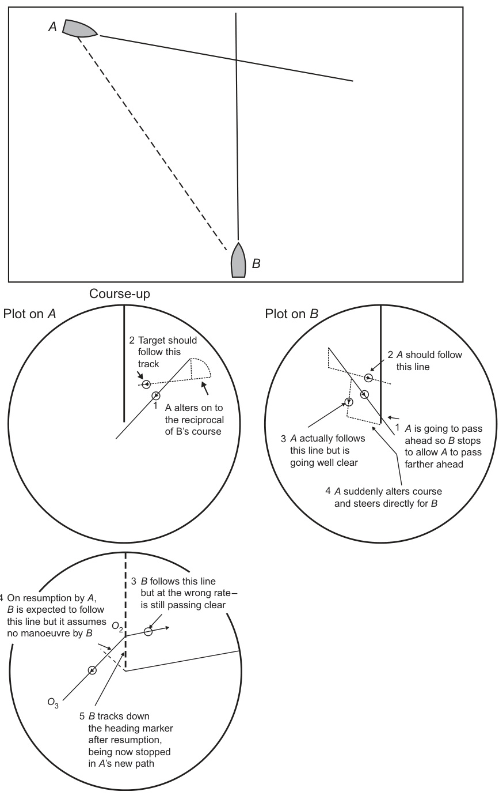  

FIGURE 7.16 The danger of not determining the target’s actual manoeuvre when apparently passing clear.  

图7.16 未能确定目标实际机动时的危险，即使看起来已经通过清除[这里的清除是指已经排除了目标的潜在危险或者障碍，实际上仍有隐患]。

If the apparent track of $B$ had not been predicted, monitored and reappraised after the manoeuvre was detected, $A$ might well have resumed course when $B$ was at $O_{2},$ only to find a vessel stopped directly in its path. This would have manifested itself by $B$ coming down A’s heading marker and thus requiring sudden emergency action, possibly by both vessels at a very late stage in the encounter.  

如果没有预测、监测和在操纵被发现后重新评估船舶$B$的明显航迹，那么当船舶$B$处于$O_{2}$位置时，船舶$A$可能会重新航行其航向，只是发现一艘船只停泊在其航迹上。这将表现为船舶$B$进入船舶$A$的航向指标器（即通过航向指标器的位置可以判断出$B$正处于$A$的航向上），从而需要船舶$A$（甚至可能两艘船只）在相遇的非常晚的阶段采取突然的紧急行动。

If systematic observation and interpretation is not carried out on $B_{.}$ , as the way is run off, the relative-motion plot would start to relate to the true situation, in which case $B$ would have observed a vessel steering to pass clear down the port side but then appearing to turn to port and steer directly towards it. Having very little way on at this stage, there is very little that $B$ can do to avoid the close-quarters situation.  

如果对 $B$ 未进行系统的观察和解释，而是按照事物发展的轨迹 [即按照事物发展的规律或路径] ，那么相对运动图 [描述两物体之间相对运动的图表，通常用于航行或碰撞分析] 就会开始反映真实的情况，即 $B$ 会观察到一艘船只 [vessel] 正在转向左舷 [port] 并且似乎正在直接朝向它 steer [即，船只的航向] 。 在这个阶段， $B$ 的航速 [way] 非常小 [即，船速非常慢] ，因此 $B$ 能够做的避免近距离接触 [close-quarters situation，可能指碰撞或险些碰撞的局面] 的事情非常有限。

The encounter considered above is frequently carried out with the best of intentions but it is clear that, where manoeuvres are executed without proper prediction, monitoring and reappraisal, the consequences can be dire.  

上述遭遇通常是出于最好的意图，但很明显，当机动（manoeuvres）在没有适当的预测、监控和重新评估的情况下执行时，其后果可能是（非常糟糕的）灾难性的。在这种情况下，机动是指（复杂的动作或操作，尤其是涉及多个步骤或环节的动作或操作）。

## 7.6 THE THEORY AND CONSTRUCTION OF PPCs, PADs, SODs AND SOPs  

The harnessing of computers and ARPAs to assist in the resolution of the plotting triangle led to the question of whether some assistance could be given which would be of a higher order than that provided by the trial manoeuvre facility on the ARPA (see Section 4.4.3). Without going to the extreme of an expert system (see Section 7.12), some attempts were made to give a graphical representation of the encounter geometry which would assist the mariner in selecting an acceptable manoeuvre. The major problem was to devise a way in which this ‘advice’ should be presented to the mariner so that it was most meaningful. What follows is the theory and construction of the graphical representations that were devised; the philosophy and shortcomings are discussed in Sections 4.11 and 4.12. It is stressed that it is not envisaged that an observer would construct these points or areas manually. Where available, they would be generated by computer graphics. However, it is essential that any observer who elects to use such facilities understands the principles upon which their construction is based.  

利用计算机和自动雷达绘图辅助系统（ARPA）来协助解决绘图三角形问题，引发了一个问题：是否可以提供更高级的辅助功能，而不是仅仅依靠ARPA上的试验机动设施（见4.4.3节）。在不采用专家系统（见7.12节）的极端情况下，尝试提供了一种图形化的遭遇几何表示，以协助航海员选择一个可接受的机动。然而，主要问题是如何将这种“建议”呈现给航海员，使其最有意义。下面介绍了这些图形化表示的理论和构建；相关的哲学和局限性在4.11和4.12节中进行了讨论。需要强调的是，预计不会有人手动构建这些点或区域。当条件允许时，这些图形将由计算机绘图技术生成。然而，对于任何选择使用这些设施的观察者来说，理解他们构建的原理是至关重要的。（其中提到的“专家系统”[expert system] 指的是一种能模拟人类专家的决策能力和专业知识的计算机系统。）

### 7.6.1 The Predicted Point of Collision  

This is the point or points towards which the own ship should steer at her present speed (assuming that the target does not manoeuvre) in order for a collision to occur (Figure 7.17(a) and Section 4.11). The logic of this is that if one knows the course(s) which will result in collision then, by not steering those courses, collisions will be avoided. Also, by picking one’s way between the predicted point of collisions (PPCs), a more farreaching collision-avoidance strategy can be evolved.  
EXAMPLE 7.7 (USED IN FIGURE 7.17)  

这是船舶在当前速度下（假设目标物体不进行转向操纵）应向之方向点，以便发生碰撞（图7.17（a）和第4.11节）。这种逻辑的依据是，如果知道哪些航向会导致碰撞，那么通过避免沿着这些航向航行，就可以避免碰撞。另外，通过选择一条在预测碰撞点（PPCs）之间的路径，可以发展出一种更为深入的碰撞避免策略。
例7.7（如图7.17所示）

With the own ship steering $000^{\circ}$ (T) at a speed of 10 knots, an echo is observed as follows:  

当船舶以10节（[十个海里每小时]）的速度朝着000度（[正北方向]，T表示船舶正向）方向行驶时，观察到以下回声：

0923 Echo bears $037^{\circ}$ (T) at 10.3 NM   
0929 Echo bears $036^{\circ}$ (T) at 8.5 NM   
0935 Echo bears $034^{\circ}$ (T) at $6.7\mathrm{NM}$  
Determine the bearing and range of the PPC(s).  
Answer (Figure 7.17(b))  
a. $P_{1}$ bearing $337^{\circ}$ at a range of $4.4\mathrm{NM}$ .   
b. $P_{2}$ bearing $270^{\circ}$ at a range of $18.0\mathrm{NM}$ .  

0923 回声位于 $037^{\circ}$ （真北）方位，距离为 10.3 海里（NM）  
0929 回声位于 $036^{\circ}$ （真北）方位，距离为 8.5 海里（NM）  
0935 回声位于 $034^{\circ}$ （真北）方位，距离为 $6.7$ 海里（NM）  
确定 PPC（最接近点）的方位和距离。  
答案（图 7.17(b)）  
a. $P_{1}$ 方位为 $337^{\circ}$（相当于西北偏北），距离为 $4.4$ 海里（NM）。   
b. $P_{2}$ 方位为 $270^{\circ}$（相当于正西），距离为 $18.0$ 海里（NM）。

  

FIGURE 7.17 (a) PPC. (b) Answer to Example 7.7.  

图7.17 (a) 可预测控制（Predictive Pole Assignment，PPA，简称PPC，也就是预测极点配置） (b) 例7.7的答案

### 7.6.2 The Construction to Find the PPC  

For a full explanation of PPCs, refer to Section 4.11. The plot is constructed as follows:  
a. Plot the target and produce the basic triangle.   

有关PPCs的完整解释，请参考第4.11节。图表的构建步骤如下： 
a. 绘制目标并产生基本三角形。 

注：由于原文较短，翻译尽量保持原文的技术精确性和学术写作风格。如果有更长的文本，翻译会更加流畅和自然。

b. Join the own ship position $'C^{\prime}$ to the target’s position $'A^{\prime}$ and extend beyond $'A^{\prime}$ .   

b. 将自身船只的位置 $'C^{\prime}$ 与目标位置 $'A^{\prime}$ 连接，然后延伸至 $'A^{\prime}$ 之外。

c. With compasses at $W$ and radius WO, scribe an arc to cut $C A$ produced at $O_{1}$ or, if the own ship is the slower (i.e. $W O<W A)$ , at $O_{1}$ and $O_{2}$ .   
d. Join $W O_{1}$ (and $W O_{2},$ ).   

c. 在点 $W$ 处放置圆规，半径为 $WO$，划出一个圆弧，切割延长线 $CA$ 于点 $O_{1}$，或者，如果自身船只的速度较慢（即 $WO < WA$），则切割于点 $O_{1}$ 和 $O_{2}$。
d. 连接线段 $WO_{1}$（以及 $WO_{2}$，若适用）。

e. Draw $C P_{1}$ parallel to $W O_{1}$ to cut WA produced at $P_{1}$ (and $C P_{2}$ parallel to $W O_{2}$ to cut WA produced at $P_{2}$ ).   
f. $P_{1}$ (and $P_{2}$ ) is the PPC.  

e. 作出$CP_{1}$与$WO_{1}$平行的直线，交WA延长线于$P_{1}$点（同样，作出$CP_{2}$与$WO_{2}$平行的直线，交WA延长线于$P_{2}$点）。
f. $P_{1}$（和$P_{2}$）即为最优投影点（PPC，Perfect Projection Center，[即物体投影到图像平面时，能保持其几何特征和形状的最优点]）。

For a clearer appreciation of the determination of the PPC, Example 7.7 should be drawn out full size and to scale on a plotting sheet.  

为了更好地理解预计算值（PPC）的确定，应将例7.7完整地绘制在尺寸和比例上都合适的图表纸上。

### 7.6.3 The Predicted Area of Danger  

The PPC gives no indication of the course which needs to be steered to clear the PPC by some specific distance; to this end, the predicted area of danger (PAD) was devised (Figure 7.18(a)). A further improvement is that the target is connected to its PAD on the display, which was not the case with the PPC.  

预防碰撞课程（PPC）并没有给出具体的航向调整方案，以便在某个特定的距离内避开预防碰撞课程；为此，人们设计了预测危险区域（Predicted Area of Danger，PAD）（图7.18（a））。进一步的改进是，目标对象会与其对应的PAD在显示屏上相连接，这是预防碰撞课程所不具备的功能。

  

FIGURE 7.17 (Continued)  
EXAMPLE 7.8 (USED IN FIGURE 7.18)  

图 7.17（续）  
例 7.8（用于图 7.18）

With the own ship steering $000^{\circ}$ (T) at a speed of 12 knots, an echo is observed as follows:  

随着自己的船只以12节的速度向$000^{\circ}$（真北）方向舵航，当观察到以下回声：

1000 Echo bears $045^{\circ}$ (T) at 10.0 NM   
1006 Echo bears $045^{\circ}$ (T) at 8.5 NM   
1012 Echo bears $045^{\circ}$ (T) at 7.0 NM  
Plot the target and draw in the PAD for a 2.0 NM clearing. 
Answer See Figure 7.18(b).  

1000 回声测向为 $045^{\circ}$（真北 [即以地球磁北极为参考的北方向] ） ，距离为 10.0 海里   
1006 回声测向为 $045^{\circ}$（真北 [即以地球磁北极为参考的北方向] ） ，距离为 8.5 海里   
1012 回声测向为 $045^{\circ}$（真北 [即以地球磁北极为参考的北方向] ） ，距离为 7.0 海里  
绘制目标的位置，并画出 PAD （ [PAD即“防撞区”，是指船只行进过程中应避开的区域] ）以实现 2.0 海里的安全间隔。 
答案请参见图 7.18（b）。

### 7.6.4 The Construction of the PAD  

a. Plot the target and produce the basic triangle.   

a.绘制目标并生成基本三角形。

b. Draw lines $A T_{1}$ and $A T_{2}$ from the target’s position $A,$ tangential to a circle of radius equal to the required CPA. Extend beyond $A$ . 

b. 从目标位置 $A$ 出发，画出与半径等于所需的最小安全距离（CPA）的圆相切的两条线 $A T_{1}$ 和 $A T_{2}$，且这两条线在 $A$ 点的外侧延伸。[这里的CPA指的是“最小安全距离”，即两个物体之间必须保持的最小距离，以避免碰撞]

c. With compasses at $W$ and radius WO, scribe an arc to cut $T_{1}A$ and $T_{2}A$ at $O_{1}$ and $O_{2},$ respectively.   

c. 在点$W$处摆放圆规，半径设为$WO$，描绘一个圆弧，分别与$T_{1}A$和$T_{2}A$在$O_{1}$和$O_{2}$处相交。

d. Join $W O_{1}$ and $W O_{2}$ . These represent the limiting courses to steer to clear the target by the required CPA.   

d. 连接 $W O_{1}$ 和 $W O_{2}$ 。这些代表了导航员在需要的最小距离（CPA，[最近接近点，即飞行路径中两物体之间最近的距离]）到达目标时需要采取的限制航线。

e. Draw $C E_{1}$ and $C E_{2}$ parallel to $W O_{1}$ and $W O_{2},$ respectively, to cut WA produced at $E_{1}$ and $E_{2},$ respectively.   

e. 分别画出 $C E_{1}$ 和 $C E_{2}$ 与 $W O_{1}$ 和 $W O_{2}$ 平行，[即分别与 $W O_{1}$ 和 $W O_{2}$ 不相交且保持同一角度]，分别与在 $E_{1}$ 和 $E_{2}$ 处延长的 $WA$ 线段相交。

f. At the mid-point of $E_{1}E_{2},$ draw the perpendicular to $E_{1}E_{2}$ and extend it in both directions. In each direction, mark off the ‘required CPA’ and label the points $E_{3}$ and $E_{4}$ .   

f. 在$E_{1}E_{2}$的中点处，画出与$E_{1}E_{2}$垂直的直线，并将其延伸到两端。在两端各方向上，标记出“所需的最短距离（CPA，即Closest Point of Approach）”，并标记这些点为$E_{3}$和$E_{4}$。

g. Draw in the ellipse (Figure 7.18(a)) passing through the points $E_{1},E_{2},E_{3}$ and $E_{4}$ (or the hexagon as indicated in Figure 7.18(b)). In the interest of simplicity, the ellipse was replaced by the hexagonal PAD in later equipment.   

绘制经过点$E_{1},E_{2},E_{3}$和$E_{4}$的椭圆（图7.18(a)）[即一种形状像鸡蛋的曲线形状]（或者如图7.18(b)所示的六边形）。为了简化，后来的设备中椭圆被替换为六边形的PAD[被动式防御系统，主要目的是简化设计，提高制造和维护效率]。

  

FIGURE 7.18 (a) The PAD (b) Answer to Example 7.8.  

图7.18 (a) PAD（-padding，[即数据填充，指在数据传输过程中，为使数据长度达到一定的要求，而添加的额外数据]）(b) 示例7.8的答案。

For a clearer appreciation of the PAD, Example 7.8 should be drawn out full size and to scale on a plotting sheet.  

为了更好地理解PAD（[人工智能辅助设计中的参数辅助设计]）， 应该将示例7.8按照实际尺寸和比例绘制在绘图纸上。

### 7.6.5 The Sector of Danger  

In this approach, a line $C H,$ equal in length and direction to $O W,$ is drawn from the centre of the plotting sheet. This line is referred to as the own ship vector. The sector of danger is an area constructed to provide a chosen passing distance. If the remote end of the own ship vector lies outside the sector of danger (SOD), a passing distance greater than the chosen value will be achieved, provided that the target does not manoeuvre.  
EXAMPLE 7.9 (USED IN FIGURE 7.19)  

在这种方法中，画出一条线 $C H$，其长度和方向与 $O W$ 相等，从绘图纸的中心开始。这条线被称为自己的船向量。危险区域是一个为提供所选的通过距离而构建的区域。如果自己的船向量的远端位于危险区域（sector of danger，SOD）以外，那么在目标物体没有进行机动的情况下，将会获得大于所选值的通过距离。
示例 7.9（如图 7.19 所示）

With the own ship steering $000^{\circ}$ (T) at a speed of 12 knots, an echo is observed as follows:  

当船只以12节的速度向$000^{\circ}$（正北方向）行驶时，观察到以下回声：

<html><body><table><tr><td>1000</td><td>Echo bears 045° (T) at 11.0 NM</td></tr><tr><td></td><td></td></tr><tr><td>1010</td><td>Echo bears 045° (T) at 9.0 NM</td></tr><tr><td>1020</td><td>Echo bears 045° (T) at 7.0 NM</td></tr></table></body></html>  

这是一个HTML表格，包含几行数据。翻译如下：

<html><body><table><tr><td>1000</td><td> 回声位于045°（真北）方向，距离11.0海里</td></tr><tr><td></td><td></td></tr><tr><td>1010</td><td> 回声位于045°（真北）方向，距离9.0海里</td></tr><tr><td>1020</td><td> 回声位于045°（真北）方向，距离7.0海里</td></tr></table></body></html>

这里的“真北”指的是地球的磁北极，而不是指南针的磁北极。 NM表示海里，是一种用于测量海洋距离的单位（1海里=1852米）。

Plot the SOD and suggest the minimum alteration of course to starboard at 1020 (instantaneous) which will achieve a 2 NM CPA if the own ship’s speed is maintained throughout.  
Answer. 

绘制SOD（安全距离曲线，Straight of Distance，[即两船之间的最短距离，通常用于避碰时计算两船之间的最近距离]）并建议在1020时（瞬时）向右舷（starboard，[船舶的右侧]）进行最小修正，以实现当保持自身船速时，[即保持当前航速不变]，实现2海里CPA（最近距离，Closest Point of Approach，[两船最近会相遇的点]）。  
答案。

If the own ship alters course to $027^{\circ}$ (T) at 1020, then the target’s new apparent track will be along $A T_{1}$ (Figure 7.19).  

如果本舰在1020时将航向（course）改为027°（真向，T），则目标的新视向迹（apparent track）将沿AT1（图7.19）行进。

  

FIGURE 7.18 (Continued)  

图 7.18 （续）

### 7.6.6 The Construction of a Sector of Danger  

a. Plot the target for a set period.   

a. 为一段时间内绘制目标值曲线 [即：画出一段时间内预期的目标值变化趋势]。

b. Draw the own ship’s vector for the same period CH, equal to the distance that the own ship will travel in the plotting interval, that is equal to OW.   
c. Draw $H S$ parallel and equal to OA.   

b. 在同一时间段CH内，绘制自身船舶的向量，该向量等于自身船舶在绘图间隔期间将要行驶的距离，即等于OW。

c. 绘制一条与OA平行且长度相等的线段，记为HS。

d. Draw $A T_{1}$ and $A T_{2}$ tangential to the ‘required CPA’ range circle. (Note: If it were intended to delay the manoeuvre, then the tangents would be drawn from the predicted position of the target at the manoeuvre time.)   
e. Draw parallel lines to $T_{1}A$ and $T_{2}A$ through $S$ .   

d. 绘制从点A到“所需CPA范围”圆的切线$AT_{1}$和$AT_{2}$。（注：如果预计延迟 манёвр，则应从预测的目标在曼ёвр时间的位置绘制切线。）
e. 通过点S绘制与$T_{1}A$和$T_{2}A$平行的线。

f. Any manoeuvre which takes $H$ outside the shaded sector will achieve a CPA in excess of the required CPA.   

f. 任何使得 $H$ 超出阴影扇区的操作，都将会导致实现的预防碰撞能力（CPA）超过所需的预防碰撞能力（CPA）。

g. Swing $C H$ until it just touches the sector boundary at $H_{1}$ . This is the minimum alteration of course to starboard which the own ship can make at the present speed to keep the target to a 2 NM CPA.  

g. 将方位盘 $C H$ 旋转直到刚刚接触到扇区边界 $H_{1}$ 。这是在当前速度下，为了保持目标的2 NM CPA（最接近距离，[即两船之间最短的距离]），本船向右舷（[即向右转舵]）所能做出的最小航向修正。

Alternatively, ‘speed’ could have been reduced to $C H_{2}$ which would also have taken the own ship’s vector just outside the sector.  

或者，“速度”也可以简化为$CH_{2}$，这也同样需要考虑到自己的船只[飞行物体或航海工具]的矢量[一个指明方向和大小的数学对象]，放在扇区[一个用于表示空间范围的几何形状，通常用于表示感兴趣的区域或探测范围]的外部。

While this will take care of the geometry, it is essential to ensure that the manoeuvre selected is still in accordance with the collision-avoidance rules and the practice of good seamanship (see Section 7.11).  
FIGURE 7.19 The SOD Example 7.9.  

虽然这样可以处理几何问题，但必须确保所选择的动作仍然符合碰撞规避规则（collision-avoidance rules）和良好的海务习惯（good seamanship）（见第7.11节）。  
图7.19 SOD示例7.9。 

（注：碰撞规避规则是指船舶避免碰撞的规则和规定；良好的海务习惯是指船舶操作中遵循安全和高效的做法）

  

### 7.6.7 The Sector of Preference  

This relates to a stationary target or navigation mark and is a sector into which one must steer to achieve a passing distance within prescribed limits (Figure 7.20).  
EXAMPLE 7.10 (USED IN FIGURE 7.20)  

这与静止的目标或导航标志相关，指的是需要驾驶进入的扇形区域，以便在规定的限值内实现预定的通过距离（图7.20）。 
示例7.10（如图7.20所示）

With the own ship steering $310^{\circ}$ (T) at a speed of 15 knots, a light vessel, identified by its racon, is observed as follows:  

当自己的船以$310^{\circ}$（真北纠准星方向）方向，时速15结的速度行驶时，通过识别其雷达应答机（racon），观察到一艘灯船，其情況如下：

<html><body><table><tr><td>0900</td><td>Echo bears 296° (T) at 10.0 NM</td></tr><tr><td>0906</td><td>Echo bears 290° (T) at 8.6 NM</td></tr><tr><td>0912</td><td>Echo bears 282° (T) at 7.4 NM</td></tr><tr><td></td><td></td></tr></table></body></html>  
It is intended to manoeuvre at 0924.  

<html><body><table><tr><td>0900</td><td>回声（echo）方位为296°（真北T），距离为10.0海里（NM）</td></tr><tr><td>0906</td><td>回声方位为290°（真北T），距离为8.6海里（NM）</td></tr><tr><td>0912</td><td>回声方位为282°（真北T），距离为7.4海里（NM）</td></tr><tr><td></td><td></td></tr></table></body></html>  
计划于0924开始进行机动（manoeuvre）。 

注意： 
- 回声（echo）在这里指的是通过声纳（sonar）或其他传感器检测到的信号反射。
- 机动（manoeuvre）指的是船舶或其他载体进行的转向、停靠或其他控制操作。
- 真北（T）是指与地球磁北极对齐的方向，而非地磁北极。海里（NM）是表示距离的单位，1海里约等于1852米。

a. Construct the sector of preference (SOP) if the light vessel is required to pass at not less than 2 NM nor more than 4 NM to port.   

a. 构建首选航向区（Sector of Preference, SOP），当光船需要在距离左岸不少于2海里（nautical mile，简称NM）且不超过4海里（NM）的范围内通过时。

b. Determine the course alteration which would be needed to achieve a CPA of 2 NM to port (assume the alteration to be instantaneous). Answer. (a) See Figure 7.20. Alter course to $258^{\circ}$ (T), that is $52^{\circ}$ to port.  

b. 确定需要进行的航向改正，以便在左舷（港舷）处获得一个2海里（NM）的最近接近点（CPA）[最近接近点，即两条航迹在最接近时的最近距离]（假设改正是瞬间的）。答案如下：（a）参见图7.20。改正航向为258°（真北），即向左舷（港舷）改正52°。

  

FIGURE 7.20 The SOP Example 7.10.  

图 7.20 SOP 示例 7.10。

### 7.6.8 The Construction of an SOP  

a. Plot the stationary target for a set period of time.   

a. 在一段设定的时间内，绘制静止目标的轨迹。 

（这里的“静止目标”指的是不动的目标，“绘制轨迹”是指在坐标系上画出目标在此期间的位置和运动路径。）

b. Draw the own ship’s vector for the same period, CH, equal to the distance that the own ship will travel in the plotting interval, that is equal to OW.   
c. Draw HS parallel and equal to OA.   

b. 绘制同一时间段内本舰的矢量，即CH，等于本舰在绘图间隔内将要行进的距离，即等于OW。
c. 绘制与OA平行且长度相等的HS。

d. Plot the position of the target at the time at which it is intended to manoeuvre, $A_{1}$ .   

d. 在目标计划进行机动（操纵）的时间点，绘制目标的位置，$A_{1}$ 。 

（这里的“机动”是指飞机、船只等载具按照预定的计划改变运动方向或方式的行为）

e. From $A_{1},$ draw tangents to range limits for clearing the target, $A_{1}T_{1}$ and $A_{1}T_{2}$ .  
f. Draw parallel lines to $T_{1}A_{1}$ and $T_{2}A_{1}$ through S.  

e. 从$A_{1}$出发，绘制切线至范围限制以清除目标，分别为$A_{1}T_{1}$和$A_{1}T_{2}$。
f. 绘制经过S点的、与$T_{1}A_{1}$和$T_{2}A_{1}$平行的线。

g. Any manoeuvre which takes $H$ into the shaded sector will result in the target clearing within the limits for which the sector was drawn (provided that any tidal effect remains constant). This could be achieved by an alteration of course or speed, or both. If CH is swung until it intersects either of the limits of the shaded sector then that will be the course required to achieve the specific CPA.  

g. 任何将$H$移动到阴影扇区内的动作，都会导致目标在该扇区所绘制的极限范围内清除（假设任何潮汐效应保持不变）。这可以通过改变航向或速度，或者同时改变两者来实现。如果$CH$被旋转直到与阴影扇区的任何极限相交，那么这就是实现特定最近接近点（Closest Point of Approach，CPA）的所需航向。

## 7.7 THE PLOT IN TIDE  

EXAMPLE 7.11 (USED IN FIGURE 7.21)  

示例 7.11（如图 7.21 所示）

With the own ship steering $310^{\circ}$ (T) at a speed of 15 knots, the echo from a light vessel fitted with a racon is observed as follows:  

当该船以15结（速度单位，约为28.97公里/小时）的速度向$310^{\circ}$（T，True北，即真北方，区别于磁北）的方向航行时，船只的导航雷达设备观察到一艘装有雷达应答机（racon，也称为雷达信标或应答器，一种能对雷达波发送应答信号的设备，[它可以帮助增强目标的可见度]）的浮标的回波信号，其观察情况如下：

<html><body><table><tr><td>0900</td><td>Echo bears 346° (rel) at 10.0 NM</td></tr><tr><td>0906</td><td>Echo bears 340° (rel) at 8.6 NM</td></tr><tr><td>0912</td><td>Echo bears 332° (rel) at 7.4 NM</td></tr></table></body></html>  
a. Find the set and rate of the tide.  

以下是翻译后的中文文本：

<html><body><table><tr><td>0900</td><td>回声（echo）位于相对（rel）方向346°，距离10.0海里（NM）</td></tr><tr><td>0906</td><td>回声位于相对方向340°，距离8.6海里</td></tr><tr><td>0912</td><td>回声位于相对方向332°，距离7.4海里</td></tr></table></body></html>  
a. 寻找（find）潮汐（tide）的方向（set）和速度（rate）。

其中，“回声”指的是声纳设备测量到的信号，可能是水下物体或地形特征；“相对方向”是指相对于观测者的方向，可能是指航向或方位（bearing）；“海里”是长度单位，相当于1852米。

如果要保持原文的专业术语和技术精确性，翻译后可以写为：

<html><body><table><tr><td>0900</td><td>声纳探测到回声，相对方向为346°，距离10.0海里</td></tr><tr><td>0906</td><td>声纳探测到回声，相对方向为340°，距离8.6海里</td></tr><tr><td>0912</td><td>声纳探测到回声，相对方向为332°，距离7.4海里</td></tr></table></body></html>  
a. 确定潮汐的方向和速率。

注意：潮汐的方向和速率通常需要通过对多个观测数据进行分析和计算才能获得，以上翻译仅为示例。

b. It is required that your ship should pass 2 NM off, leaving the light vessel to port. 

b. 要求您的船只应保持距离，距离灯船2海里（海里是衡量距离的单位，相当于1852米），并将灯船留在左侧（即船舶的左边，即港侧）。

(i). If action is taken instantaneously at 0912, find the alteration of course which would be necessary. 

(i). 假设在0912时采取立即行动，求出为此所需的航向变化。

(ii). If instead, the action is to be taken at 0924 instead of 0912, find the alteration of course which would then be necessary.  
Answer. See Figure 7.21.  
a. $\mathrm{Set}=032^{\circ}$ (T) at 5 knots 
b. 
(i). Course to steer at 0912 is $278^{\circ}$ (T) 
(ii). Course to steer at 0924 is $260^{\circ}$ (T)  

（ii）。如果相反，行动的时间是在0924而不是0912，请找到届时需要的航向变化。
答案。参见图7.21。
a. 设定航向为032°（真北）时，速度为5结。
b.
（i）。在0912时应掌舵的航向是278°（真北）。
（ii）。在0924时应掌舵的航向是260°（真北）。

  

FIGURE 7.21 The plot in tide Example 7.11.  

图 7.21 显示了潮汐示例 7.11 中的图形。

### 7.7.1 The Construction of the Plot  

a. Establish the identity of the target beyond all doubt (see Section 8.2). Plot the target and construct the basic triangle.   

a. 确定目标身份，排除所有疑虑（见第8.2节）。绘制目标位置，并构建基本三角形。

b. W and $A$ should coincide if there is no tide. If they do not, then $A$ to W is the direction in which the tide is setting. Note that this is the reverse of what is normally deduced from a plot but since the target cannot be moving, it is the ship which must be experiencing set. The distance WA is the drift of the tide in the plotting interval and it is from this that the tidal rate can be calculated.  

b. 如果没有潮汐的影响，W 和 $A$ 应该重合。如果它们不重合，那么从 $A$ 到 W 的方向就是潮汐的方向。注意，这与从图中通常推断的结论相反，因为目标物体不能移动，所以一定是船只正在经历潮汐的影响。WA 之间的距离是潮汐在绘图区间内的漂移距离，而从这个距离可以计算出潮汐的速率。[这里的“潮汐的速率”是指潮汐的移动速度，也就是说船只在单位时间内由于潮汐的影响而移动的距离。]

Note: When plotting other (moving) targets while experiencing tide, it is their movement through the water which is evaluated. It is precisely this which needs to be known when applying the collision-avoidance rules, and so it is essential that no attempt should be made to apply the effect of tide or current to their courses as determined from the plot.  

注意：在遇到潮汐时，绘制其他（移动）目标的轨迹，是评估它们在水中运动的情况。正是这个因素在应用碰撞避免规则时需要知道，因此，绘制出目标的轨迹后，不应尝试将潮汐或水流的影响应用于这些确定的航线。 [碰撞避免规则：一种用来预防两艘船只或船只与其他障碍物之间发生碰撞的规则或指南，特别是在海上航行时]

### 7.7.2 The Course to Steer to Counteract the Tide  

a. Plot the target and determine the tide or current.   

a. 绘制目标轨迹并确定潮汐（指海洋中的潮起潮落现象）或洋流（指海洋中的水流）的影响。

b. Predict the position of the target at the time at which it is intended to manoeuvre.   
c. Draw in the apparent track which is required, for example $A_{1}T$ .   

b. 预测目标在计划进行机动时的位置。
c. 画出所需的视觉轨迹，例如 $A_{1}T$ 。 

（注：这里的“视觉轨迹”是指从观察者的角度看到的目标移动路径。）

d. Draw in a line in the reverse direction through $A,$ i.e. $A O_{2}$ (and $A O_{3}$ for the manoeuvre at 0924).   

d. 在图中，通过点$A$画出一条反向的线，即$AO_{2}$（对于0924时的动作，则是$AO_{3}$）。

e. Swing WO to cut the line through $A$ at $A O_{2}$ (and $A O_{3},$ ).   

e. 对于通过点 $A$ 的直线，截取线段 $A O_{2}$（以及 $A O_{3}$，）。

f. $W O_{2}$ is the new course to steer (and $W O_{3}$ if the manoeuvre is delayed).  

f. $W O_{2}$ 是新的航向（如果操纵被延迟，则为 $W O_{3}$）。

Note: All of the above assume instantaneous manoeuvres. When handling large ships in tide, due allowance will need to be made for their handling characteristics, especially when a speed change is demanded.  

注意：上述所有内容都假设瞬间机动。当在潮汐中处理大型船舶时，需要为其操作特性（即船舶对操作指令的响应特点，如转向、减速、加速等的特性）预留足够的裕度，特别是在要求速度变化时（即需要快速加减速或转向时）。

### 7.7.3 The Change of Course Needed to Maintain Track When Changing Speed in Tide  

When proceeding while experiencing tide, any change in the own ship’s course and/or speed and/or tidal set and/or rate will affect the vessel’s ground track.  
EXAMPLE 7.12 (USED IN FIGURE 7.22)  

当在潮汐中行驶时，自身船舶的航向和/或速度和/或潮流方向和/或速率的任何变化都会影响船舶的[在地图上实际行进的]航迹。  
例7.12（如图7.22所示）

While steering $090^{\circ}$ (T) at a speed of 16 knots, a beacon marking the anchorage is observed as follows:  

当以16节（海里每小时，航海上常用的速度单位）[一个节是指一小时内行驶的海里数，相当于1.852公里）的速度，向$090^{\circ}$（T）[即真北方向，也就是说航向是正东，船头朝东]方向驾驶时，观察到一个标志锚泊区的信标，如下所示：

<html><body><table><tr><td colspan="2"></td></tr><tr><td>0900</td><td>Echo bears 076° (T) at 10.0 NM</td></tr><tr><td>0906</td><td>Echo bears 070° (T) at 8.6 NM</td></tr><tr><td>0912</td><td>Echo bears 062° (T) at 7.4 NM</td></tr></table></body></html>  
It is intended to anchor 2 NM due south of the beacon.  
a. Determine the set and rate of the tide.   
b. Determine the course to steer at 0912 to counteract the tide.   

<html>标签是超文本标记语言（HTML）的标签，用于定义网页的结构和内容，包括表格（table）和表格行（tr）等。在这里，我们看到的是一个简单的表格，记录了多个时刻的回声（Echo）方向和距离。下面是对该部分的解读和翻译：

<table>表格中包含三个表格行<tr>，每个行代表一个时刻的观测数据。第一列<td>记录了时间，第二列<td>记录了回声的方向和距离。其中，“Echo bears”指的是回声的方向，“° (T)”表示角度的单位是角秒（不是度分秒的意思，而是ten的缩写，表示角度），“at”后面的数字表示距离（以海里NM为单位）。

翻译如下：

<html><body><table><tr><td colspan="2"></td></tr><tr><td>0900</td><td>回声位于076°（真北T）方向，距离10.0海里</td></tr><tr><td>0906</td><td>回声位于070°（真北T）方向，距离8.6海里</td></tr><tr><td>0912</td><td>回声位于062°（真北T）方向，距离7.4海里</td></tr></table></body></html>

计划在航标以南2海里处抛锚。 
a. 确定潮汐的方向和速度。   
b. 确定在0912时需要航行的航向，以便对抗潮汐。 

其中，“真北”是指以地球磁北极为参考的方向，“海里”是航海中常用的距离单位，相当于1852米。 

这个问题涉及到航海和潮汐的计算，需要利用给出的回声数据和计划抛锚的位置来计算潮汐的方向和速度，然后确定需要航行的航向以对抗潮汐。

c. If the speeds which are represented by the engine room telegraph settings of Half Ahead, Slow Ahead and Dead Slow Ahead are 9, 6 and 3 knots, respectively, determine the courses to be steered as the speed is progressively reduced when approaching the anchorage.  
Answer. See Figure 7.22.  
a. The tide is setting $184^{\circ}$ (T) at 5 knots.   
b. At 0912, alter course to $060^{\circ}$ (T).   
c. Half Ahead steer $052^{\circ}$ (T). Slow Ahead steer $035^{\circ}$ (T).  

c. 假设发动机室电报设置（engine room telegraph settings）为“半前进”（Half Ahead）、“慢前进”（Slow Ahead）和“完全缓慢前进”（Dead Slow Ahead）所对应的速度分别为9、6和3节（knots），则在靠近锚泊点时，需要随着速度的逐渐降低确定要驶往的航向。
答案：见图7.22。
a. 潮流（tide）方向为$184^{\circ}$（T），速度为5节（knots）。
b. 于0912时，改变航向为$060^{\circ}$（T）。
c. 当发动机室电报设置为“半前进”（Half Ahead）时，应驶往$052^{\circ}$（T）航向；当设置为“慢前进”（Slow Ahead）时，应驶往$035^{\circ}$（T）航向。

  

FIGURE 7.22 The course to steer in tide as speed is reduced Example 7.12.  

图7.22 减速时的潮流航向航程示例 7.12。

Dead Slow Ahead: it is necessary to steer $004^{\circ}$ (T) and stem the tide, but note that the tide is 1 knot greater than the ahead speed.  

“减速前进”：需要以$004^{\circ}$（真北方向）的航向行驶并逆潮航行，但注意到当前的潮流速度比前进速度快1结（表示船舶在单位时间内通过的距离，一般为海里，每海里约相当于1.852公里）。

## 7.8 MANUAL PLOTTING ACCURACY AND ERRORS  

ship’s course and speed, and the plotting interval. Also, there are of course personal errors and blunders. While a constant (or systematic) error in input will result in a constant error in the answer obtained, it is the errors which are of a random nature which govern the size of the ‘circle of uncertainty’ around the plotted position which, if not actually drawn, should be borne in mind when plotting a position.  

航行中的船舶航向和速度，以及绘图的时间间隔。当然，还有个人错误和失误。虽然输入中的恒定（或系统性）误差会导致结果中恒定的误差，但影响“不确定性圈”大小的却是那些随机性质的误差，这个不确定性圈环绕着已绘制的位置，若没有实际地画出来，也应该在绘制位置时铭记于心。当我们在海图上标注位置时，应该注意到，这些随机误差会影响我们的测量精度，[即使我们使用了精确的测量工具和方法，仍然会有由于随机因素引起的位置偏差]。因此，在实际的航行中，理解和控制这些随机误差对于确保船舶的安全航行和准确的位置标注至关重要。

The error in the result from any computation depends upon the accuracy of the data used. The intrinsic sources of error in the radar system relate to the measurement of ranges and bearings. Other data needed to complete the radar plot and subject to error are the own  

计算结果的误差取决于所用数据的准确性。雷达系统内在的误差源与测量距离（范围）和方位（bearing）有关。其他需要用来完成雷达图像（plot）的数据并且容易出错的包括自身的[即指飞机或船只自身的位置和状态]位置和速度等信息，这些数据的准确性也会对计算结果产生影响。

Note: Precision of measurement and accuracy of measurement should not be confused. For example, it was no good being able to measure bearings to $0.1^{\circ}$ when the ‘free play’ in traditional mechanical gearing was $\pm2^{\circ}$ .  

注意，测量的精度（precision）和测量的准确度（accuracy）不应混淆。例如，当传统的机械齿轮系统中存在 $\pm2^{\circ}$ 的“自由游隙”（即齿轮之间的间隙，[这里指齿轮运动中由于制造或安装误差引起的微小误差范围]）时，即使能够以$0.1^{\circ}$的精度测量轴承的角度也是没有意义的。

### 7.8.1 Accuracy of Bearings as Plotted  

Errors in bearings may arise from any of the following causes:  

轴承中的错误可能源于以下任何一种原因：

1. The existence of inherent errors which fall within the limits allowed by IMO Performance Standard (see Section 11.2.1). The individual error sources are discussed in detail in Section 6.6.8 where it is shown that they may aggregate to as much as $\pm2.5^{\circ}$ . It is also indicated that some components of the total error can be expected to remain constant over a series o bearings and these will have the effect of slewing all plotted positions by a fixed amount. There will, of course, be a random component which is most likely to arise from an instantaneous misalignment of the antenna and trace, and should not exceed $\pm1^{\circ}$ . This error will have the effect of scattering the observed positions about the correct apparent track.   

1. 存在一些固有的错误，这些错误的范围在国际海事组织（IMO）性能标准规定的允许限度之内（见11.2.1节）。个别的错误来源在6.6.8节中进行了详细的讨论，其中表明这些错误可能累积到最大为$\pm2.5^{\circ}$。同时，还指出总错误的某些成分可以预计在一系列测量中保持不变，这些成分将使所有绘制的位置都倾斜一个固定的量。当然，还存在一个随机成分，它最有可能是由于天线和轨迹的瞬时不对齐（即天线和轨迹的位置不完全一致）造成的，且不应超过$\pm1^{\circ}$。这种错误将使观察到的位置围绕在正确的视迹轨道周围散布。

2. Parallax when bearings are taken with a Perspex cursor (no longer seen at sea).   

2. 当使用Perspex光标（已不再在海上使用）取方位角时的视差现象（指由于观察视角的变化而产生的物体位置或形状的变化，[即不同视角下的同一物体看起来位置或形状不一致的现象]）。

3. Failure to centre the origin correctly when use is to be made of a Perspex cursor, (again not a modern problem).   

3. 未能正确居中原点时，将使用一个丙烯酸（Perspex）光标（同样，这也不是现代的问题）。[这里的“丙烯酸光标”是指一种使用丙烯酸材料制成的指示工具，用于在绘图或导航时帮助准确定位]

4. Errors of alignment of the electronic bearing line. This error is likely to be constant over a series of bearings (sec Section 6.6.8).   

4. 电子方位线的对齐误差。这类误差在一系列的方位测量中（参见第6.6.8节）很可能保持不变。

5. Failure to check the heading at the time a bearing is taken when a ship’s head-up unstabilized orientation is selected. This error is likely to be random.  
6. Personal errors and blunders.  

5. 未在选择船舶非稳定化头向状态（head-up unstabilized orientation，指船舶的航向信息未被稳定化，可能会随机变化[即船舶的前进方向未被固定]）时核对当前的航向（heading），而只是测量了方位（bearing）。此类错误很可能是随机发生的。
6. 个人失误和粗心大意。

### 7.8.2 Accuracy of Ranges as Plotted  

Sources of error in the measurement of range may include any or all of the following:  

测量范围的误差源可能包括以下任意或全部内容：

1. Range errors inherent in radar systems which comply with IMO Performance Standards. These are described in  

1. 遵循国际海事组织（IMO）性能标准的雷达系统所固有的距离误差。这些误差在[即这些特定的错误范围，被描述为]中有所描述。

Section 6.6.7. They should not exceed $1\%$ of the maximum range of the scale in use or $30\mathrm{m},$ , whichever is the greater. On the $12\mathrm{NM}$ range scale this gives 1.2 cables or $222\mathrm{m}$ . These errors should be constant over a series of ranges. 
2. Inaccurate interpolation. This will give rise to random errors. 

第6.6.7节规定，他们不应该超过（使用的）量表最大量程的$1\%$或$30\mathrm{m}$，以两者中较大的为准。在$12\mathrm{NM}$量程范围的量表上，这意味着允许有$1.2$海里（nautical miles，即海里，等于1852米）或$222\mathrm{m}$的误差。这些误差应该在一系列的测量范围内保持一致。
2. 由于插值不准确，会产生随机错误。这类错误通常是由于量表或测量系统内部的插值算法（即在已知数据点之间进行推算）不够精确，从而导致结果不确定性，表现为随机波动。

3. Mechanical errors in the variable range marker of old radial cathode ray tube (CRT) displays. Such errors should normally be constant over a series of ranges unless a serious mechanical fault exists. 
4. Personal errors or blunders.  

3. 旧式径向阴极射线管（CRT）显示器的可变范围标记中的机械性错误。这种错误通常应该在一系列范围内保持恒定，除非存在严重的机械故障。
4. 个人错误或失误。

### 7.8.3 Accuracy of the Own Ship’s Speed  

In general, the means of obtaining the ship’s speed can be flawed in the extreme and is the quantity most susceptible to error. Speed (or rather, distance travelled in the plotting interval) can be derived from a variety of sources, for example:  

一般来说，获取船速的方法可能存在极大的缺陷，并且是最容易出错的数量。船速（或者说，在绘图间隔期间行驶的距离）可以从多种来源推导出来，例如：

1. Distance (towed) log. A very traditional mechanical system in which it was not possible to know one’s speed quickly, particularly when altering speed (e.g. in poor visibility). Also, it was common practice to hand the log when the engines are put on stand-by, so as to avoid fouling the propeller when the engines were put astern. Some towed logs did have an additional unit which provide a read-out of speed as well as distance.   

1. 距距记录仪（拖曳式记录仪）。这是一个非常传统的机械系统，在这种系统中，难以快速知道自己的速度，特别是在改变速度时（例如，在能见度差的情况下）。另外，当发动机处于待命状态时，通常会手动断开记录仪，以避免当发动机反转时螺旋桨被缠绕。有些拖曳式记录仪还配备了额外的单元，除了记录 距距外，还能显示速度的读数。

2. Speed (pitot, impeller, electromagnetic) log. Although the speed may be read at any instant, the sensor is frequently withdrawn when the vessel is in shallow water, for example in port approaches.   

2. 速度（pitot管、叶轮、电磁）记录。尽管速度可以在任何时候读取，但当船只在浅水中航行时，例如接近港口，传感器通常会被收回。

3. Engine revolutions. This is only accurate in so far as how well the ‘slip’ is accurately known and this is rarely the case when changing speed such as when manoeuvring in fog.  

3. 发动机转数。这只在已知“滑移”（即船舶在水中航行时，其实际速度与理论速度之差，即由于船舶推进器与水的相对运动速度造成的速度损失）的情况下才是准确的，而这种情况在改变速度时（例如在雾中行驶时）很少见，因为此时很难精确地知道滑移的大小。

4. Doppler log. It should be borne in mind that if ground locked, this indicates speed over the ground which in tide can lead to misinterpretation of the aspects of other ships (see Section 6.9.3). Also, there is some uncertainty as to just what ‘speed’ is being measured if using a single-axis sensor which is ‘ground locked’.  

4. 多普勒航速计。在使用多普勒航速计时，应注意，如果航速计的锁定模式设置为“地面锁定”（ground locked），则表示的是相对于地面的速度（speed over the ground），这种情况下，在潮汐或洋流（tide）条件下，可能会导致对其他船只的航向和其他方面的解读产生误解（详见第6.9.3节）。此外，如果使用单轴传感器（single-axis sensor）并且处于“地面锁定”模式，究竟是测量哪种“速度”（speed）也存在一定的不确定性。

5. Speed derived from positions plotted on the chart or Global Navigation Satellite System (GNSS) (see Section 10.1). There is a common misconception that this is the ship’s ‘correct’ speed, and on this basis it is used for plotting and as the manual input to the true-motion unit and ARPA (see Section 6.9.3). It must be remembered that the speed derived is measured over the ground, whereas it is the speed through the water which is required for plotting. Thus, if there is any tide involved, its effect must be allowed for in order to deduce the water speed.  

5. 根据在图表上绘制的位置或全球导航卫星系统（GNSS）[即利用卫星提供位置和速度信息的导航系统]（见第10.1节）推算的速度。有一种常见的误解，即认为这是船舶的“正确”速度，并基于此使用它来进行绘图以及作为真实运动单位和自动雷达plotting辅助（ARPA）[辅助雷达plotting系统，用于识别和跟踪其他船舶或物体]的手动输入（见第6.9.3节）。必须牢记的是，从地面上测量的速度与需要用于绘图的水中速度是不同的。因此，如果涉及到潮汐，那么为了推断出水中的速度，就必须考虑到潮汐的影响。

Note: The slower the own ship’s speed, the greater will be the proportionate effects of errors in the knowledge of the own ship’s speed. Unfortunately, the plot can be at its most inaccurate when both vessels are moving slowly, as they might be when proceeding in fog.  

注意：当船舶自身的速度越慢，自身速度知识中的错误会产生越大的比例效应。遗憾的是，当两艘船都移动得很慢时，图表可能会最不准确，例如在雾中行驶时可能会出现这种情况。因为在这种情况下，甚至很小的速度误差也会导致相对较大的位置误差，从而使得航行变得更加危险。

### 7.8.4 Accuracy of the Own Ship’s Course  

Compass error should be small and relatively constant so, although it will produce errors in target course and speed, they too should be small and constant. Where the ship is off course for minutes at a time and this is not taken into account in the plot, errors in the target’s course and speed will result (Figure 7.23).  

指南针（compass）误差应该很小且相对恒定，因此，尽管它会在目标航向和速度上产生错误，但这些错误也应该很小且恒定。当船只长时间（数分钟）偏离航向，而这种情况在绘图（plot）中没有被考虑到时，会导致目标的航向和速度出现错误（如图7.23所示）。

### 7.8.5 Accuracy of the Plotting Interval  

The times of each plot are normally recorded to the nearest minute and so an error of up to half a minute can be quite common when plotting a position. This can mean an error of up to 1 minute in a plotting interval of, say, 5 minutes, i.e. $20\%$ . As the plotting interval is used to calculate the distance run (OW), an error here will have the same effect as an error in speed.  

通常，记录每个航程的时间是精确到分钟的，因此，在绘制位置时，时间误差可能达到半分钟，这种情况相当常见。这意味着，在5分钟的绘制间隔内，时间误差可能达到1分钟，也就是说，误差率可能达到$20\%$。由于绘制间隔被用于计算行驶距离（航程，OW），此处的误差会与速度误差产生同样的影响。

  

FIGURE 7.23 Threat assessment markers on a truemotion presentation.  

图7.23：真实动作演示中的威胁评估标记。

### 7.8.6 The Accuracy with Which CPA Can Be Determined  

Random errors in obtaining the range and bearing of a target will mean that when a position is plotted, it should be surrounded by an area of uncertainty based on the errors referred to in Sections 7.8.1 and 7.8.2. In Figure 7.24, the apparent-track line through the plotted positions indicates a vessel on a collision course. However, if ‘worst accuracy’ is considered, that is that the target’s position is at $a_{1}$ and some time later at $b_{2}$ or, alternatively, is at $a_{2}$ and later at $b_{1},$ then the CPA of the target will lie in the range between $c_{1}$ to port and $c_{2}$ to starboard.  

在获取目标的距离和方位时，随机错误意味着当绘制一个位置时，应该根据第7.8.1和7.8.2节中提到的错误在该位置周围标注一个不确定性区域。如图7.24所示，通过绘制位置点的明显航迹线表明该船处于碰撞航向上。然而，如果考虑“最坏的情况”，即目标的位置在$a_{1}$，稍后在$b_{2}$，或者相反，目标的位置在$a_{2}$，稍后在$b_{1}$，那么目标的最近接近点（CPA）将位于从左舷$c_{1}$到右舷$c_{2}$的范围内。

注：这里的CPA指的是“最近接近点”（Closest Point of Approach），是指两艘船之间最近的距离点，[也就是两艘船最接近的时候它们之间的位置关系]。

  

由于你提供的文本中没有具体的英文内容，图片的链接也无法直接访问，所以我无法提供翻译。如果你能提供具体的英文文本，我将非常乐意帮助你将其翻译为流畅、准确的中文。同时，如果文中涉及到专业术语或技术概念，我会在括号中添加简单的解释以便于理解。请提供具体的文本以便我能够更好地帮助你。

FIGURE 7.24 The accuracy with which CPA can be determined.  
The means by which accuracy can be improved are:  

图7.24 CPA确定的准确度。 
提高准确度的方法有：

a. Improve the inherent accuracy of the system, that is decrease the size of the circles of uncertainty.   
b. Plot frequently. This has the advantage of being a quick check for blunders while also allowing for a better ‘mean’ line to be drawn through the plotted positions. It has been suggested that the ideal time period for which plotting should be continued before accepting that the result is of sufficient accuracy should be calculated by allowing the target to traverse some $0.2\times$ radius of screen, for example OA should be some $2.4\mathrm{NM}$ when using the $12\mathrm{NM}$ range scale.  

以下是该文本的中文翻译：

a. 提高系统的固有精度，即减小不确定性圆圈的大小。

b. 频繁地绘制[即定期记录和更新目标位置的数据点]。这样做的优点是可以快速检查是否存在明显的错误，同时也可以画出一条更好的平均线[即趋势线]，通过绘制的位置来实现。这些建议表明，在接受结果具备足够的精度之前，绘制的理想时间段应该通过让目标物体移动一定距离（例如屏幕半径的$0.2$倍）来计算，例如当使用$12$海里（nautical miles， NM）范围的刻度时，OA[可能是指目标物体移动的距离]应该约为$2.4$海里。这样可以确保绘制的结果达到所需的精度。

### 7.8.7 The Consequences of Random Errors in the Own Ship’s Course and Speed  

We assume in the following that positions O and $A$ are without error.  

在以下讨论中，我们假设位置 O 和 $A$ 是没有错误的。

In the OAW triangle (Figure 7.25), the position of $W$ is determined from a knowledge of the own ship’s course and speed. It is important to note here, that, when dealing with a slowmoving target, if $A$ falls within the error circle around $W$ then it is impossible to determine the course and/or speed of the target (Figure 7.26).  

在OAW三角形（图7.25）中，点W的位置是通过了解自身船舶的航向和速度来确定的。在这里需要注意的是，当处理一个移动缓慢的目标时，如果点A落在点W周围的误差圆内，那么就不可能确定目标的航向和/或速度（图7.26）。

### 7.8.8 Summary  

1. It has been estimated that the full maximum error occurs only in some $1\%$ of encounters.   

已有估计表明，最大误差仅出现在大约$1\%$的遭遇中。

2. In deciding what is an acceptable CPA, the consequences of inaccuracies should be borne in mind and one should err on the safe side.   

2. 在决定什么是可接受的 CPA 时，应考虑到不准确的后果，並且應該傾向于谨慎处理。这意味着，在确定可接受的 CPA（[CPA，指在物联网技术中，预防措施和控制活动的可接受程度]）时，应考虑到不准确可能带来的后果，并且应该倾向于采取更为谨慎的态度，以避免潜在的风险。

3. Small alterations of course and speed by plotted targets can be completely swamped by errors, especially when speeds are low.  

3. 轨迹和速度的小幅度变化对于已规划的目标可能会被错误完全掩盖，尤其是在速度较低时 [即当速度不高的时候，误差的影响会更加明显]。

  

FIGURE 7.25 Errors resulting from inaccuracy (a) in the own ship’s speed and $(\mathbf{b})$ in the own ship’s course. Note: Assume no error in $O$ or $A$ .   
FIGURE 7.26 Slow-moving targets.  
In an attempt to evaluate the errors, the following have been suggested:  

图7.25 不准确性造成的错误：（a）自身船速不准确，（b）自身船舶航向不准确。注意：假设观测点$O$或$A$没有错误。
图7.26 慢速移动的目标。
在尝试评估这些错误时，以下几点已被提出：

Error $\mathrm{in{CPA}=\frac{\pm0.03\times\mathrm{mean\mathrm{range}}}{r a n g e\mathrm{change}}}$   
Error in   
vessel0s   
estimated $={\frac{103\times{\mathrm{mean~range}}}{\left({\begin{array}{l}{{\mathrm{estimated~speed}}}\ {{\mathrm{~of~target}}}\end{array}}\right)\times{\binom{\mathrm{plot~interval}}{{\mathrm{in~minutes}}}}}}$   
course   
ðdegreesÞ   
Error in   
target0s $=\frac{180\times\mathrm{mean~range}}{\left(\mathrm{^{estimated~speed}}\right)\times\left(\mathrm{^plot~interval}\right)}$   
speed $(\%$ Þ  

误差在CPA（最接近时的距离）中可以计算为：
$\mathrm{误差在CPA}=\frac{\pm0.03\times\mathrm{平均距离}}{\距离变化}$

误差在船舶（vessel）的估计中可以表示为：
$\mathrm{误差在船舶的估计}={\frac{103\times{\mathrm{平均距离}}}{\left({\begin{array}{l}{{\mathrm{目标估计速度}}}\ {{\mathrm{~目标}}}\end{array}}\right)\times{\binom{\mathrm{绘制间隔}}{{\mathrm{以分钟为单位}}}}}}$

航向（course）误差以度（degrees）为单位：
$\mathrm{误差在航向}=\frac{180\times\mathrm{平均距离}}{\left(\mathrm{目标估计速度}\right)\times\left(\mathrm{绘制间隔}\right)}$

目标的速度误差，以百分比（%）表示为：
$\mathrm{误差在目标的速度}=\frac{180\times\mathrm{平均距离}}{\left(\mathrm{目标估计速度}\right)\times\left(\mathrm{绘制间隔}\right)}$

注：CPA指的是“最接近距离”（Closest Point of Approach），表示两个物体在其轨迹上最接近的距离；目标估计速度和绘制间隔分别指的是对目标物体的速度进行估计以及两个位置记录之间的时间间隔。

## 7.9 ERRORS ASSOCIATED WITH THE TRUE-MOTION PRESENTATION  

The true-motion display (see Section 2.6.4) is, in fact, a contrived mode of display in that the ‘received data’ is processed by applying the ship’s course and speed in order to achieve the desired method of presentation. Because of this, the accuracy of this form of presentation is subject, in addition to the errors discussed in Sections 7.8.7 and 7.8.8, to errors which may arise in the accuracy with which the origin tracks across the screen.  

真实运动显示（见第2.6.4节）实际上是一种人为设计的显示模式，因为“接收的数据”会经过处理，以应用船舶的航向和速度，从而达到所需的显示方法。因此，这种显示形式的准确性不仅受到第7.8.7节和第7.8.8节中讨论的错误的影响，还会受到起源（原点）在屏幕上运动轨迹的准确性的影响，可能由于这一因素而产生错误。

The use of a true-motion display for manual plotting is associated historically with the reflection plotter (see Section 7.10.3). The true plot is not as easy to use as the relative plot when using paper-based manual plotting (see Section 7.3). This discussion of errors is still relevant to the modern ARPA display.  

使用真实运动显示器（true-motion display）进行手动绘图（manual plotting）在历史上与反射绘图仪（reflection plotter）有关（见7.10.3节）。当使用基于纸张的手动绘图（paper-based manual plotting）时，真实绘图（true plot）不如相对绘图（relative plot）那样容易使用（见7.3节）。关于错误的讨论仍然与现代的自动雷达定位和追踪系统（Automatic Radar Plotting Aid，ARPA）显示器相关。

### 7.9.1 Incorrect Setting of the True-Motion Inputs  

When setting up the true-motion presentation, the method of course and speed input will have to be selected by the operator. The course input will invariably be from a repeating compass and will be automatic, but the repeater in the radar will have to be aligned with the master compass. Provided that this has been done correctly, errors from this source should be minimal (see Section 6.2.6.2).  

在设置真正的运动演示时，操作员需要选择课程和速度输入的方法。课程输入始终来自重复的指南针，并且是自动的，但雷达中的重复器需要与主指南针对齐。假设这一步骤已经正确完成，来自该来源的错误应该是最小的（见6.2.6.2节）。 

注：这里的“真正的运动演示”指的是（真实地展示物体的运动状态），“重复的指南针”指的是（一种可以重复显示指南针方向的装置），“主指南针”指的是（参照的标准指南针）。

The source of speed input, can be provided by log, by manual input, or with ARPA, by means of automatic ground-stabilization (see Section 4.8). The points discussed in Section 7.8.7 apply here and will affect the displayed movement of the target(s) (Figures 7.27 and 7.28), but it is the setting of the ‘manual’ input of speed that warrants special attention.  

速度输入的来源，可以通过日志提供，也可以通过手动输入提供，或者使用自动雷达定位系统（ARPA，Automatic Radar Plotting Aid）[即通过雷达自动追踪目标并计算其速度]，通过自动地面稳定化（见第4.8节）[即通过传感器等方式实时测量和调整地面运动参数]来实现。第7.8.7节中讨论的要点在这里同样适用，并将影响显示的目标运动（图7.27和图7.28），但需要特别注意的是“手动”输入速度的设置。

While steaming at a steady speed it is possible to set the manual speed input and virtually forget about it, but in fog, heavy traffic and in port approaches it may be necessary to change speed frequently. Amid all the other bridge activity, it must be remembered that the manual speed control on the radar will also need to be reset each time there is a change in the demanded speed. It is logical at times like these to use the $'1\mathrm{og}^{\prime}$ input to the true-motion unit, but on some vessels these are also the times when the log is least likely to be deployed.  

在以稳定的速度行驶时，可以设置手动速度输入并基本上不再关心它，但是在雾天、交通拥挤以及靠近港口时，可能需要频繁地改变速度。在所有其他桥梁活动中，必须记住，雷达上的手动速度控制也需要在每次有速度需求变化时进行重置。在这样的时刻，使用“对数值”('1\mathrm{og}^{\prime}')输入到真实运动单元是合理的，但是在一些船只上，这些时候也是最不可能部署测速仪（log）的时候。[注：测速仪是一种用于测量船速的设备，“对数值”是指以对数的形式表示的速度值。]

  

FIGURE 7.27 Tracking course errors on a true-motion presentation. True course $225^{\circ}$ ; Speed $10\mathrm{kn}$ . Origin tracking $270^{\circ}$ ; Speed $10\mathrm{kn}$ .  

图7.27 在真实运动演示中跟踪航程错误。真实航向为$225^{\circ}$；速度为$10\mathrm{kn}$。初始跟踪航向为$270^{\circ}$；速度为$10\mathrm{kn}$。 

注：$\mathrm{kn}$是“节（knot）”的缩写，表示“海里每小时”，是航海中用于表示速度的单位。

It is very easy to order a change in speed and forget to change the manual speed input to the radar and so have it portray a most misleading presentation of the situation. Such forgetfulness will be less likely if the observer maintains a plot of the origin.  

在改变速度时，人们很容易忘记更新雷达的手动速度输入，导致显示出错误的当前情况。这种忘记的情况可以通过保持显示原始数据（的记录），从而大大减少。如此一来，观察者便能随时查看原始状态的轨迹（即“origin”的“plot”）以避免误解。

Consider the own ship steaming at 16 knots, using manual speed input to the radar which is correct during the initial plotting period. Having passed ahead of vessel $A,$ , the own ship now reduces speed (the other vessels maintain course and speed throughout) but forgets to alter the manual speed input to the radar. The target $A$ would appear to alter course to starboard as indicated in Figure 7.29, but on ‘visual’ observation would still be showing a green light (her starboard side) instead of the expected red light. Careful observation of the land would show that it too is now ‘moving’ - but at times like this, one rarely has time to analyse the more subtle discrepancies on the display.  

考虑到自己的船正在以16节的速度行驶，并且在雷达中使用手动输入速度，这在最初的绘图周期中是正确的。在经过船只A之前，自己的船现在减速（其他船只在整个过程中保持航向和速度不变），但忘记了更改手动输入到雷达的速度。目标A似乎会向右舷（星板）改变航向，如图7.29所示，但是通过“视觉”观察，它仍然显示绿色灯光（她的右舷侧），而不是预期的红色灯光。对陆地的仔细观察会显示，它现在也在“移动”——但是像这样的时刻，人们很少有时间来分析显示器上更微妙的不一致性。 

（注：本段落中提到的专业术语如“手动速度输入”、“雷达”、“航向”和“节”等，均为航海术语。）

  

FIGURE 7.28 Tracking speed errors on a true-motion presentation. True course $225^{\circ}$ ; Speed $5\mathrm{kn}$ . Origin tracking $225^{\circ}$ ; Speed 7 knots.  

图7.28真实运动显示上的速度误差跟踪。真实航向$225^{\circ}$；速度$5\mathrm{kn}$。原始跟踪航向$225^{\circ}$；速度7节（[这里的"节"指的是海里每小时，用于表示船舶或飞机的速度]）。

One must also be conscious of the fact that an error in the log input will produce a similar effect.  

同样，人们也应该意识到，日志输入中的错误也会产生类似的效果。

Other inputs which can inadvertently cause problems are the tide input controls (see Sections 1.5.2 and 6.9.6.2). When setting up the true-motion display, it is essential to check that these controls are set as required (see Section 6.9.6) or are completely inoperative. If allowed to remain as when previously in use, they can cause the origin to track in completely the wrong direction and thus give a totally incorrect impression of the direction in which the targets are tracking. Again, the importance of plotting the origin must be stressed.  

其他可能无意中引起问题的输入包括潮汐输入控制（见第1.5.2和6.9.6.2节）。在设置真实运动显示时，检查这些控制是否按要求设置（见第6.9.6节）或完全失效至关重要。如果允许它们保持之前使用时的状态，它们可能会导致原点（origin）朝完全错误的方向移动，从而完全错误地表示目标的移动方向。再次强调，绘制原点的重要性。为了准确地表现运动轨迹，必须在设置过程中确保这些控制正确设置或失效，以避免对运动方向的误判。

  

FIGURE 7.29 The misleading effect caused by failing to reset the manual speed input to the true-motion unit after a manoeuvre - a reduction of speed in this case.  

图 7.29 在进行了转弯操纵后未能将手动速度输入重置为真实运动单元所导致的误导性影响——在本例中为速度的减小。

### 7.9.2 Tracking Course Errors  

In achieving true-motion, the origin must track in the direction in which the vessel is travelling. If it does not, then the target’s courses and/or speeds will be in error. The magnitude and direction of these errors will vary from target to target and will be dependent upon the encounter geometry, and the magnitude and direction of the tracking error (see Figure 7.27).  

要实现真正的运动追踪（true-motion），其起点必须跟随舰船的行进方向进行移动。如果不这样做，那么目标的航向和/或速度将出现错误。这些错误的大小和方向将根据目标的不同而有所变化，并且取决于遭遇的几何形状（encounter geometry，[即两个物体运动路径之间的空间关系]），以及跟踪错误的大小和方向（如图7.27所示）。

Causes of tracking course error can include a fault in the true-motion unit, incorrect alignment of the compass repeater (heading marker) and incorrect setting of the tidal correctors (see Section 6.9.2).  

航线偏差的原因可以包括真实运动单元（True-motion unit，指的是能够准确测量和记录船舶运动的设备，[即能够根据地理位置变化、潮汐影响等因素进行航线修正的系统]）的故障、罗经重复器（compass repeater，[罗经指示器]，指的是在导航系统中提供方位信息的设备）的校准不正确以及潮汐修正器（tidal correctors，[用于计算潮汐对航线的影响的设备]）设置不正确（详见第6.9.2节）。

### 7.9.3 Tracking Speed Errors  

As with tracking course errors, these will result from errors in the movement of the origin across the display (see Figure 7.28). Causes may include a fault in the true-motion unit, an error in the transmitting log, an error in the estimated speed, failure to reset the manual speed control after ordering a change in speed and failure to reset the tidal correctors.  

与跟踪航迹误差类似，这些误差将源自原点（即显示屏上的参照点）在显示屏上的运动错误（参见图7.28）。这些误差的原因可能包括：真实运动单元（true-motion unit）中的故障，传输日志（transmitting log）中的错误，估计速度（estimated speed）中的错误，没有在改变速度后重置手动速度控制（manual speed control），以及没有重置潮汐修正器（tidal correctors）。其中，真实运动单元是指能够提供真实运动参数的设备，传输日志是指记录传输过程中各项参数的日志，估计速度是指根据各种因素预估的速度，手动速度控制是指人工控制速度的装置，潮汐修正器是指用于修正由于潮汐等自然因素引起的位置偏差的设备。

It is essential not only to plot the origin of the display when using the true-motion presentation, but also to ensure that the movement is correct in both direction and scale speed. This may mean that a future position of the origin must be predicted and marked on the reflection plotter. If the prediction is not achieved then the cause should be investigated.  

在使用真实运动演示（true-motion presentation）时，不仅要描绘显示的起源，还要确保运动在方向和速度尺度上都是正确的。这可能意味着需要预测起源的未来位置并在反射绘图仪（reflection plotter）上标记。如果预测没有实现，则应该调查原因。在这里，真实运动演示指的是一种能够真实模拟物体运动的演示方式，[它通过模拟物体在不同时间和位置的状态来展示物体的运动轨迹]。这种预测和标记的过程对于确保运动的准确性和可靠性是至关重要的。

## 7.10 RADAR PLOTTING AIDS  

Many pieces of equipment have been developed over the years which were intended to assist the mariner in plotting and thereby interpreting the display. Most are now only of historical interest, having been superseded by ARPAs, but one or two are worthy of individual mention.  

多年来，人们开发了许多设备，旨在协助航海人员（mariner）绘制和解释显示的内容。大多数设备现在只具有历史意义，因为它们已经被自动雷达绘制和识别系统（ARPAs）所取代，但有一两种设备仍值得单独提及。

### 7.10.1 The Radar Plotting Board  

This took a number of forms as various manufacturers attempted to provide something more permanent and durable than the paper plotting sheet. Effectively, this was little more than a plotting sheet, overlaid with Perspex or heavy transparent film, which was free to rotate and so assist in predicting the effect of an alteration of course by the own ship.  

这促使各个制造商尝试提供比纸质绘图表更持久、更耐用的产品。 （纸质绘图表是一种用于记录和预测船舶航行路线的工具） 。实际上，这只不过是在绘图表上覆盖了一层丙烯酸板（Perspex）或者厚的透明胶膜，（这种表面）可以自由旋转，从而帮助预测船舶航向变化的影响。

It is not intended here to discuss its construction and use since it has been superseded, but this was a fruitful area for personal innovation and some boards are still in use in the pleasure boat market.  

在这里，我们不打算讨论其构建和使用，因为它已经被取代，但这是一个个人创新成果丰富的领域，一些板子仍然在游艇市场中被使用。 

（注：为了保持原文的专业术语和技术精确性，以上翻译尽量保留了原文的技术性语言，若有需要，可进一步解释相关概念。）

### 7.10.2 Threat Assessment Markers (‘Matchsticks’ or ‘Pins’)  

It has long been the practice of mariners to observe the compass bearing of an approaching vessel and, where there is no appreciable change, to assume that risk of collision exists. Unwary mariners have been seriously misled when using an unstabilized display as the source of bearing measurement.  

水手们长期以来一直遵循着观察接近船只的指南针方位，并且当没有明显变化时，假设存在碰撞风险。毫无防备的水手在使用非稳定显示作为方位测量来源时，经常会产生严重的误导。

With the increased use of compass-stabilized displays, the principle of observing the compass bearing of a target again manifested itself by mariners adopting the practice of placing the cursor on the target and observing how its bearing changed in relation to this datum.  

随着指南针稳定显示的使用增加，观察目标的指南针方位的原理再次表现出来，航海人员采用了将光标放在目标上并观察其方位相对于此基准（datum）而变化的做法。 

（注：这里的“指南针稳定显示”是指利用指南针来稳定显示的设备，确保显示的方向始终与地理北极保持一致；“方位”是指一个目标相对于观察者位置的方向；“光标”是指显示设备上的指针或标记；“基准”是指用来作为参考的点或线。）

Where it is necessary to monitor more than one target, the technique is difficult to implement. Recognizing this problem, Decca Radar in 1966 made provision for the observer to use up to five ‘threat assessment markers’. These are, in effect, sections of electronic cursor which can be positioned in range and azimuth so that, when placed on a target as shown in Figure 7.23, they will quickly show whether the bearing of the target is changing. The remote end of the marker, which represents a constant range and bearing from the observing vessel, is brightened and thus the marker resembles a match or pin.  

在需要监测多个目标的情况下，该技术的实施变得困难。认识到这一问题，Decca Radar 于 1966 年为观察者提供了使用多达五个“威胁评估标记”（threat assessment markers）的功能。这些标记，实际上是电子光标（electronic cursor）的部分，可以在距离和方位（azimuth）上进行定位，以便当它们放置在目标上，如图 7.23 所示时，能够快速显示目标的方位是否发生变化。标记的远端代表了从观察船只到目标的恒定距离和方位，通常会被加亮，因此标记看起来像一根火柴或一枚大头针。这种方法使观察者能够同时跟踪多个目标，并快速评估每个目标的威胁程度。（方位是指一个方向与地平线之间的夹角，通常用来描述目标的位置）

Correct use of the markers provides much more information than merely an indication of change of bearing. It enabled the observer to deduce the relative- and true-motion data for each marked target. To exploit this facility, the true-motion sea-stabilized presentation must be selected. Used in this way, the true plot of the target will indicate its true motion, but the position of the target in relation to the bright end of the marker will indicate its potential threat. By joining the ‘head’ of the marker to the current position of the target and extending the line, the CPA of the target can be assessed.  

正确使用标记可以提供比简单的方位变化指示更为丰富的信息。它使观察者能够推断出每个标记目标的相对运动和真实运动数据。为了利用这一功能，必须选择真实运动的海上稳定显示。以这种方式使用时，目标的真实轨迹将表明其真实运动，但目标相对于亮端标记的位置将表明其潜在威胁。（真实运动和相对运动是指目标相对于观察者和海上环境的运动状态。）通过连接标记的“头部”到目标当前的位置并延伸这一线，可以评估目标的最接近点（CPA， Closest Point of Approach）。（最接近点是指目标与观察者之间的最短距离点。）

Note: When used with a true-motion display, the markers track across the screen in the same manner as the origin but with their orientation and position in relation to the origin remaining unchanged.  

注意：当与真实运动显示（True-Motion Display，[一种可以准确展现物体运动轨迹的显示技术]）一起使用时，标记物（markers）会以与原点（origin，[坐标系或运动轨迹的起始点]）相同的方式在屏幕上移动，但它们相对于原点的朝向和位置保持不变。

Other manufacturers have produced variations on this basic idea. In one system, the markers are bright spots (i.e. only the head of the ‘match’ is shown) and a free electronic bearing line, having time divisions on it, is used to lay off the relative track of the chosen target. In this particular system, if relativemotion is selected, the marker traces out the track of a water-stationary target and there is a provision temporarily to move the marker to the $O_{1}$ plotting position in order to assess the effect of a proposed manoeuvre by the observing vessel.  

其他制造商也生产了基于这个基本理念的变体。在一种系统中，标记（marker）是明亮的斑点（即只显示“火柴”头部），并使用带有时间分割的自由电子方位线来标定所选目标的相对轨迹。在这种特定系统中，如果选择相对运动（relativemotion），则标记会描绘出一个水上静止目标的轨迹，并且可以暂时将标记移动到$O_{1}$绘图位置，以评估观测舰艇拟议的机动（manoeuvre）的影响。其中，相对运动（relativemotion）是指目标与观测舰艇之间的相对运动关系[即目标和舰艇之间的运动相对性]。

### 7.10.3 The Reflection Plotter  

The work involved in the transferring of data from the radar display to a plotting sheet is both time-consuming and a potential source of errors and so is a discouragement to practical plotting. For those having to plot manually, the advantage of being able to plot directly on the screen surface was recognized at a very early stage in the development of radar. As a result, the anti-parallax reflection plotter was developed.  

雷达显示器上的数据转移到绘图纸上的工作既耗时又容易产生错误，因此不利于实际绘图。对于需要手动绘图的人来说，能够直接在屏幕表面绘图的优势在雷达发展的早期就被认识到了。因此，开发出了抗视差反射绘图仪（anti-parallax reflection plotter）。这种设备可以消除由于观察视角不同导致的测量误差，并提高绘图的准确性（抗视差：指的是减少或消除由于观察视角的差异而导致的测量或显示错误）。

It has rapidly disappeared from general use due to the introduction of the raster-scan display. The UK regulations (see Section 11.4.1) still require that plotting facilities shall be at least as effective as a reflection plotter.  

由于光栅扫描显示技术（raster-scan display）的引入，[类似于电视或电脑显示器的显示技术，使用像素点阵列来显示图像]，它迅速从常规使用中消失。英国法规（请参见第11.4.1节）仍然要求绘图设施的效果至少应与反射绘图机（reflection plotter）[一种使用反射原理在纸上绘制图像的设备]一样有效。

#### 7.10.3.1 The Construction of the Reflection Plotter  

As can be seen from Figure 7.30, the plotting surface has the same curvature as the CRT. By inverting it and placing a flat partial reflecting surface midway between the two curved surfaces, it is possible to put a mark on the concave plotting surface such that its reflection will be aligned with the target’s response on the CRT surface, irrespective of where the observer’s eye is positioned. This overcomes the problems of parallax which would arise if one were to try to plot on the plastic cursor placed some inches above the CRT surface.  

从图7.30可以看出，绘图表面的曲率与CRT（阴极射线管）相同。通过将其翻转过来，并在两个曲面之间放置一个平坦的部分反射表面，可以在凹面绘图表面做一个标记，使其反射与CRT表面的目标响应保持一致，无论观察者的眼睛处于何种位置。这解决了试图在CRT表面上几英寸处放置的塑料光标上绘制时出现的视差问题[即当观察者的视线与被观察物体的实际位置不一致时，会出现的视觉偏差]。

#### 7.10.3.2 The Practical Use of Reflection Plotters, Including the Use of the Perspex Cursor and Parallel Index  

Plotting is carried out on the plotting surface as if working on a plotting sheet, but it is the ‘reflections’ which must be continually observed. Two techniques are peculiar to reflection plotting (Figure 7.30):  

绘图是在绘图表面上进行的，仿佛是在一张绘图纸上工作，但需要不断地观察的是“反射”（即数据或信号在不同维度或方向上的映射或反射，[指通过观察和分析不同维度或方向上的数据或信号来进行绘图和分析的技术]）。在“反射绘图”中，有两种特殊的技术（图7.30所示）：

a. It was necessary to make a ‘scale’ rule for measuring distance on the plotting surface. This was done by brightening the range rings, placing a mark on each ring and then, using stiff card, marking the position of each ring on the card. Sub-divisions may be put in by eye or more precisely, using the variable range marker. See Figure 7.31.  

为了在绘图表面上测量距离，需要制定一个“比例尺”规则。这是通过加亮范围环（range rings），在每个环上放置一个标记，然后使用硬纸板（stiff card），在纸板上标记每个环的位置来实现的。细分（Sub-divisions）可以通过肉眼估计或者更精确地，使用可变范围标记器（variable range marker）来完成。请参阅图7.31。

b. It was necessary to draw parallel lines on the plotter surface, for example OW parallel to the heading marker. This was done by lining up the Perspex cursor with the heading marker. The parallel index lines on the cursor were then parallel with the heading marker. The edge of the scale rule was then aligned with the nearest parallel index line below it this may mean that one had to move the position of one’s head slightly, or slide the card a short distance.  

b. 需要在绘图仪表面上绘制与航向标志（heading marker）平行的平行线，例如与航向标志平行的OW线。这是通过将亚克力（Perspex）光标与航向标志对齐来实现的。当光标上的平行索引线与航向标志平行后，则将尺子（scale rule）的边缘与其下方最近的平行索引线对齐，这可能需要稍微调整头的位置，或将卡片向某个方向滑动一小段距离。

Note: When drawing a line from a point, tangential to a range ring, for example when determining the time to resume, it was best first to mark the position of the range ring on the plotter surface.  

注意：当从某个点开始画一条线，与某个范围环（range ring）相切（tangential）时，例如在确定恢复时间时，首先最好在绘图表面（plotter surface）上标记范围环的位置。

#### 7.10.3.3 Changing Range Scale  

The reflection plotter had two distinct advantages: namely, it eliminated the need for reading and transferring of ranges and bearings to a plotting sheet and it maintained the immediate contact between display and plot. However, there was often a certain reluctance on the part of the observer to change range scale because of the perceived potential loss of the plot. Nonetheless, it is important that when targets are close, the most appropriate range scale was used. This meant adapting the plot to the new range scale. As can be seen in Figure 7.32, once the target is within the inner portion of the screen, the range scale was changed and the predicted apparent-track line $A_{2}A_{3}$ drawn parallel through the new position of the target.  

反射式绘图仪（reflection plotter）具有两个显著的优势：一方面，它消除了读取和转移距离和方位到绘图纸的需要；另一方面，它保持了显示和绘图之间的即时联系。然而，观察者在改变距离刻度时往往会有某种犹豫，因为他们担心会丢失绘图。但是，当目标靠近时，使用最合适的距离刻度是至关重要的。这意味着需要将绘图适应新的距离刻度。如图7.32所示，一旦目标进入屏幕的内部部分，就会更改距离刻度，并在目标的新位置上画出预测的视觉轨迹线$A_{2}A_{3}$，且此线与原来的预测视觉轨迹线平行。注意这里的（视觉轨迹线）是指目标在观察者视野中运动的轨迹预测线，这里的（距离刻度）是指测量目标距离的量表单位。

It can often prove useful to retain the original plot and, provided that the lines do not become confusing, they can be left on. If available, different colour wax pencils could be used for each range scale to aid clarity.  
FIGURE 7.30 The reflection plotter.  

通常来说，保留原始图表是很有用的，只要线条不至于引起混淆，就可以将其保留。若有条件，可使用不同颜色的蜡笔来标记每个量表范围，从而提高图表的清晰度。
图7.30 反射图绘制器（即一种能够记录和显示反射信号的设备，通常用于地震勘探和其他领域的数据采集和分析[即通过记录和显示地震波或其他信号的反射来对地下或其他介质进行成像和分析的设备]）。

  

#### 7.10.3.4 The Use of the ‘Free’ EBL to Draw Parallel Lines (See Section 6.6.5)  

The ‘free’ EBL was often extremely useful for transferring parallel lines in conjunction with a reflection plotter in preference to the use of the parallel lines on the Perspex cursor.  

“免费”的电子束写入（EBL）在与反射绘图仪（reflection plotter）联合使用时，经常被用来极其有效地传递并行线（parallel lines），这比使用在有机玻璃光标（Perspex cursor）上的并行线更为高效。

The EBL origin is positioned on the reflection of the line to be transferred and is rotated so that it is aligned with the line to be transferred. The EBL maintained its orientation as it was moved about the screen using the joystick (Figure 7.33).  

电子束列（EBL）的起点被放置在待传输线的反射线上，并旋转以与待传输线对齐。电子束列在使用操纵杆（图7.33）在屏幕上移动时保持其方向。

#### 7.10.3.5 Fixed and Rotatable Surfaces - Use with a Ship’s Head-Up Unstabilized Display  

While using a reflection plotter on a ship’s head-up unstabilized display, if it became necessary to alter the own ship’s course, the target and plot became out of alignment as the own ship changes course. For example, in Figure 7.34, after an initial plot, the own ship alters course $55^{\circ}$ to starboard; at the completion of the manoeuvre, the plot and target will be as depicted. To realign the plot to the target, it was necessary to rotate the plotter surface anticlockwise (i.e. in the opposite direction to the alteration of course) by the amount which the own ship has altered course.  

在使用舰船头部未稳定显示的反射图绘器时，如果需要改变舰船的航向，目标和图绘就会与舰船的航向变化失去一致。例如，在图7.34中，在初步绘制图后，舰船向右（星板侧）改变航向$55^{\circ}$；在完成这次行动后，图绘和目标将如图所示。为了使图绘重新与目标对齐，需要将图绘器表面逆时针方向旋转（即与航向变化的方向相反）旋转舰船改变航向的量。这样才能确保图绘与目标保持一致，方便随后的操作。

When a rotatable surface has not been provided, there are means by which the plot can be continued. However, they can be complicated and consequently confusing, and are best avoided. When a fixed-surface plotter was provided, it was virtually essential that the true-north-up stabilized presentation was selected (see Section 1.4.1.2).  

当没有提供可旋转的表面时，有一些方法可以继续绘制图像。然而，这些方法可能比较复杂，从而导致混淆，因此最好避免使用它们。当提供了固定表面绘图仪时，选择真北朝上稳定显示（见1.4.1.2节）几乎是必不可少的。

  

FIGURE 7.31 Constructing and using a scale rule.   
FIGURE 7.33 The use of the ‘free’ EBL to draw parallel lines. Note: Transfer the line to the plotting surface if the EBL is required for another use; if not, leave it in place.  

图7.31 构建并使用比例规则。
图7.33 使用“自由”的基线（EBL）绘制平行线。注：如果基线（EBL）需要用于其他用途，请将线条转移到绘图表面；如果不需要，请将其保持在原位。[这里的“比例规则”是指一种用于绘图的工具，类似于尺子，可以用来测量和标记比例尺寸的距离；“基线（EBL）”则是指一条用于绘制图形的参考线，一般是用直尺或其他工具画出的一条直线。]

  

FIGURE 7.32 Changing range scale on a reflection plotter.  

图7.32 在反射绘图仪（一种用于显示和记录数据的设备，[通常用于显示物质或结构的反射特性]）上更改范围标度。

#### 7.10.3.6 Flat and Concave Surfaces  

The concave surface can be rather awkward to work on and so more complex plotters were provided with flat plotting surfaces. This was made possible by using a curved partial reflecting surface. However, apart from that, its use was exactly the same as for a plotter with a concave plotting surface.  

凹形表面（concave surface，指的是一种向内弯曲的表面，[即表面内凹的部分是指向内部的]）在工作时会相当棘手，因此更复杂的绘图仪（plotters）被提供了平坦的绘图表面（flat plotting surfaces）。这是通过使用弯曲的部分反射表面（curved partial reflecting surface）来实现的。然而，除了这一点之外，其使用方式与具有凹形绘图表面的绘图仪（plotter）完全相同。

#### 7.10.3.7 Use in Conjunction with Parallel Indexing  

The provision of a reflection plotter made it possible for a prepared navigation plan to be marked out on the plotter and the movement of particular navigation marks observed in relation to their predicted movement. Any deviation from the pre-planned track will be readily apparent and compensation can be made (see Section 8.4).  

配备反射式绘图仪（reflection plotter）使得可以在绘图仪上标记出预先制定的导航计划，并且可以观察到特定导航标志相对于其预测运动的运动情况。任何偏离预先规划的轨迹的行为都会立即显现出来，从而可以进行补偿（参见第8.4节）。

#### 7.10.3.8 Reflection Plotters and Raster-Scan Displays  

No manufacturer has produced an optical reflection plotter which can be used with a television-type rectangular CRT or liquid crystal display (LCD). There is an inherent assumption that in the unlikely event that the ARPA is not working but the radar is, then any manual plotting will have to be done on paper. 

目前尚无制造商生产出一种可以与电视式矩形阴极射线管（CRT）或液晶显示（LCD）一起使用的光学反射绘图仪。有一种潜在的假设，即在不太可能发生的情况下，即便自动雷达绘图仪（ARPA）不工作但是雷达系统却正常运行，则任何手动绘图操作都必须在纸上进行。

  

FIGURE 7.34 The use of a rotatable plotting surface. (a) Before or during alteration of course. (b) After rotation of the plotting surface.  

图7.34 旋转绘图表面的应用。 (a) 在改变航向之前或期间。 (b) 旋转绘图表面之后。 

（注：此处的“旋转绘图表面”指的是一种可以旋转的绘制表面，用于航行或制图等领域，其中“改变航向”是指船只或飞行器改变行进方向。）

  

FIGURE 7.35 The $\mathrm{'E^{\prime}}$ plot.  

图7.35 $\mathrm{E^{\prime}}$图（即能量损失函数图）

### 7.10.4 The ‘E’ Plot  

This system used a joystick and marker to record ‘electronically’ the position of a target (Figure 7.35). The operator recorded the positions of targets at regular intervals, after which the data was processed and extrapolated to provide the information which would be available from a normal plot, that is course, speed, CPA and TCPA. Up to 10 targets could be manually tracked.  

该系统使用操纵杆（joystick）和标记器（marker）来“电子化”地记录目标（target）的位置（图7.35）。操作员在规则的时间间隔内记录目标的位置，之后这些数据会被处理和外推（extrapolated），以提供与正常图表中可获得的信息相同的数据，即航向（course）、速度（speed）、最接近距离（CPA，Closest Point of Approach）和最接近时间（TCPA，Time of Closest Point of Approach）。最多可以手动跟踪10个目标。

Manual recording as practiced here should not be confused with manual acquisition followed by automatic tracking which takes place in the simplest of ARPAs.  

在这里所说的manual recording（手动记录）不应与manual acquisition（手动获取）后续的automatic tracking（自动跟踪）混淆，后者是在最基本的自动雷达预警系统（ARPAs）中就存在的功能。 

（注：ARPAs是Automatic Radar Plotting Aids的简称，指的是一种通过雷达信号自动跟踪目标的系统；manual acquisition指的是人工获取目标位置信息，automatic tracking则指的是系统自动跟踪目标位置的变化。）

The system was unique to Kelvin Hughes. However, other types of plotting aids using graphics were common. Development of such facilities is a natural result of the need to provide plotting facilities on a raster-scan display which are at least equivalent to a reflection plotter (see Section 7.10.3), and has been assisted by the ease with which lines and points can be drawn electronically on such a display.  
The $\mathrm{^{/}E^{\prime}}$ plot has now been superseded by the EPA.  

Kelvin Hughes 公司拥有独特的系统，但其他类型的图形化绘图辅助工具已经变得普遍。开发这种设施是出于在栅格扫描显示器上提供绘图设施的需要，而这些设施至少应相当于反射绘图仪（见第 7.10.3 节），并且得益于在这样的显示器上电子绘制线条和点的便捷性。  
$\mathrm{^{/}E^{\prime}}$ 绘图已经被 EPA 取代。

### 7.10.5 Electronic Plotting Aid (EPA)  

In 1997, IMO produced performance standards for an electronic aid to manual plotting. It was a refinement of earlier graphical devices such as the E plot covered in the previous section. IMO called the device an electronic plotting aid (EPA) and for a short period of time it was the minimum requirement for the smallest vessels (under $500~\mathrm{grt})$ that come under SOLAS (see Section 4.1.3), although not for high-speed craft. This regulation and the device have since disappeared.  

1997年，国际海事组织（IMO）制定了电子辅助手动绘图的性能标准。这是对前几节中提到的早期图形设备（如E图）的一种改进。国际海事组织将该设备称为电子绘图辅助工具（EPA），在短暂的时间内，它是适用于最小的船舶（吨位在500吨以下）的最低要求，这些船舶受到国际海上人命安全法规（SOLAS，见4.1.3节）的约束，尽管对高速船只则不适用。这一法规和该设备后来都已经不再使用。

The performance standards required that the radar/EPA has azimuth stabilization, which could be provided by either a gyro or transmitting magnetic compass. There is no requirement for an electronic speed input, thus the speed may have to be input manually.  

性能标准要求雷达/EPA具备方位稳定功能，这可以通过陀螺仪（gyro）或传输磁性指南针来实现。没有对电子速度输入的要求，因此可能需要手动输入速度。

The observer simply plots a target initially by using the joystick or tracker ball controls to position a marker symbol over the target to be plotted. A second plot is added any time between 30 seconds or 15 minutes later. A target symbol and vector then appear on the display. The symbol will move in an extrapolation of the two plots across the screen. The observer should enter more plots in time, particularly if the symbol’s relative motion does not match the underlying relative track of the target across the screen. Individual plots can be corrected if not plotted accurately.  

观察者首先通过使用操纵杆（joystick）或跟踪球（tracker ball）控制来定位一个标记符号在目标上，以便对目标进行初步的绘制（plotting）。然后，在30秒至15分钟后，可以添加第二个绘制点。目标符号和向量（vector）随后出现在显示屏上。符号将根据两个绘制点的外推（extrapolation）在屏幕上移动。如果符号的相对运动（relative motion）与目标在屏幕上的基本相对轨迹（relative track）不匹配，观察者应该随着时间的推移输入更多的绘制点，特别是[即不断更新和调整目标的位置和运动预测]。如果绘制点没有被准确地绘制出来，也可以对个别的绘制点进行更正。

As soon as a second position has been plotted, the observer can obtain the traditional alphanumeric target information associated with ARPA equipment, i.e. present range and bearing, CPA, TCPA, true course and speed. The observer is also able to switch between true and relative vectors, as well as adjust the time length of vectors. As the observer added more plots to the target, the information and vectors were updated based on calculations from the last two plots only. It obviously follows that best results were obtained by plotting at reasonably regular intervals. Plotting at too small an interval caused minor plotting errors to have a large effect on the accuracy of the result. On the other hand, if the time interval was stretched too much then any target manoeuvres are less accurately detected and followed. The best interval to use will vary according to the target relative speed and direction and the range scale in use at the time (see also Section 7.9).  

当第二个位置被绘制出来后，观察者可以获取与ARPA设备（自动雷达辨识和跟踪系统）相关的传统字母数字目标信息，即当前距离和方位、最接近距离（CPA）、最接近时间（TCPA）、真实航向和速度。观察者还可以在真实向量和相对向量之间切换，以及调整向量的时间长度。随着观察者向目标添加更多的绘制点，信息和向量会根据最近两次绘制点的计算结果进行更新。很明显，通过在合理的间隔内绘制可以获得最佳的结果。如果间隔太小，会使得小的绘制错误对结果的准确性产生很大的影响。另一方面，如果时间间隔拉得太长，则对目标的任何机动作的检测和跟踪都会变得不够准确。最佳的间隔会根据目标的相对速度和方向以及当前使用的距离尺度（见7.9节）而有所不同。 

注意：括号中对概念的直白解读并没有在原文中出现，因为原文已经比较清晰了。但是如果需要，可以在括号中添加对CPA、TCPA的解读，如“最接近距离（CPA，最接近目标的距离）”和“最接近时间（TCPA，最接近目标的时间）”。

The standard called for a minimum capability of 10 targets to be tracked in this way, so each target symbol must be assigned a target number, which (when appropriate) is included on the alphanumeric display as well as on the radar picture. The observer selects an appropriate target first, before reading the alphanumeric display or adjusting its plot.  

该标准要求最低能够跟踪10个目标，并且以这种方式进行跟踪，因此每个目标符号必须分配一个目标编号，当适当时，目标编号将包含在字母数字显示中，以及雷达图像中。观察员首先选择一个合适的目标，然后再阅读字母数字显示或调整其图像。

#### 7.10.5.1 Alarms  

The traditional target violation of preset CPA and TCPA limits found on the ARPA (see Section 4.7.2) was provided on an EPA.  

传统的目标违规，即预设的CPA（[临界前置时间，指在发生碰撞之前，系统必须提前多长时间介入）和TCPA（[临界前置时间，指在发生碰撞之前，系统必须提前多长时间介入）限制，如第4.7.2节所述，在EPA（[电子程序控制汽车，指装备了自动驾驶系统的汽车）上得到体现。

In addition there is a warning if a target plot has not been updated by the observer for more than 10 minutes. The plot is dropped completely if this update time exceeds 15 minutes.  

此外，如果观察者在10分钟以上没有更新目标地块（target plot），系统将发出警告。如果更新时间超过15分钟，则该地块将被完全移除。

#### 7.10.5.2 Comparison Between EPA and the Reflection Plotter  

For a short time the EPA effectively superseded the requirement for a reflection plotter on non-ARPA radars. The modern raster CRT and LCD displays do not lend themselves to a reflection plotter and the EPA eliminated the need for calculations by the observer that are associated with hand plotting.  

在短暂的时间内，EPA（电子计划分析仪）有效地取代了非ARPA（自动雷达预警系统）雷达上对反射绘图仪的要求。现代光栅CRT（阴极射线管）和LCD（液晶显示器）显示器不适合使用反射绘图仪，而EPA则消除了观察员与手动绘图相关的计算需求。这意味着，EPA简化了雷达数据处理的过程，减少了人工计算和绘图的需要，提高了雷达信息的处理效率。 

注：ARPA自动雷达预警系统是（一种用于军事和海事领域的雷达系统，可以自动探测和跟踪目标），EPA电子计划分析仪是（一种用于分析和处理雷达数据的电子设备）。

The plotting errors due to working with a thick grease pencil were reduced and a major advantage is that it is no longer a requirement for the navigator to record the precise time of the plot as it is done by the EPA. Indeed, while it may improve accuracy of EPA to plot at a suitable regular interval (as discussed above), the EPA was more likely to obtain accurate results than a reflection plotter if the plotting periods were a little irregular.  

由于使用厚重的油性画笔而导致的绘图错误得到了减少，一个主要优势是现在不再要求导航员记录绘图的精确时间，因为这些都是由电子绘图辅助设备（EPA）来完成的。事实上，正如上文所讨论的，EPA在合适的规则间隔（regular interval）内进行绘图可能会提高其准确性，但即使绘图周期（plotting periods）稍微有些不规则，EPA也比传统的反射式绘图仪（reflection plotter）更有可能获得准确的结果。 

注： 
- 电子绘图辅助设备（EPA）是指一种可以自动记录和辅助绘图的电子设备。
- 反射式绘图仪（reflection plotter）是指一种使用反射原理来绘制图表的传统设备。

The EPA also maintained plots at the correct range and predicted speed when the range scale was changed, unlike the reflection plotter.  

美国环境保护署（EPA）也能在正确的范围内维持绘图，当范围尺度发生变化时，预测的速度也保持不变，这与反射绘图仪不同。

The main disadvantage of the EPA over the reflection plotter was that only two plots are used for the calculations and it is up to the observer to monitor the target track to ensure that the target achieved the second plot in a straight line and at constant speed. The results would not be valid if (unbeknown to the observer) the target adjusted its course or speed and ran a dogleg to the second plot.  

EPA（电子预测算法）相对于反射绘图法的主要缺点是，只有两个坐标点被用于计算，而观察员需要监视目标的轨迹，以确保目标以直线和恒定速度运动到达第二个坐标点。如果（观察员不知道），目标在运动过程中调整了方向或速度，并以犬牙交错（即一种在两个坐标点之间存在方向或速度变化的轨迹）的方式运动到第二个坐标点，那么计算结果将无效。

It is of course possible for an observer using a reflection plotter to make this error, but in this case it is less likely as the observer was encouraged to take three or more plots and the change in relative track would be more obvious. The human observer may also obtain a more accurate indication of target relative track by averaging it over three or more target plots. This is likely to be particularly true if, for example, the azimuth input was from a transmitting magnetic compass or the vessel is yawing badly.  

当然，观察员使用反射绘图仪时可能会犯这个错误，但是这种情况下这种错误的可能性较小，因为观察员被鼓励绘制三个或更多的图，并且相对航迹的变化会更加明显。人类观察员也可以通过对三个或更多的目标图进行平均来获得目标相对航迹的更准确的指示，这尤其是在方位输入来自传输磁罗盘（[传统的指南针，利用磁性来确定方向]）或者船只剧烈偏航（[船只在水平面上左右摇摆]）的情况下。这样，观察员可以更好地规避由观察误差或环境因素引起的不确定性。

As in all manual plotting, the results are still only as good as the diligence of the observer.  

与所有手动绘图一样，结果的质量仍然取决于观察者的勤勉度 [即观察者认真程度和细致程度]。

### 7.10.6 Auto-Tracking Aid  

IMO Performance Standards of 1997 also introduced the auto-tracking aid or ATA. Essentially it was an ARPA, but with certain features removed (Table 7.1). It was introduced as the minimum standard for vessels between 500 and 10,000 grt and even as the second radar tracker on ships greater than $10{,}000{\mathrm{grt}}$ . Like the EPA, it has been short-lived, existing in the regulations for a period. It had limited takeup by the industry and it is no longer part of current regulations.  

1997年的国际海事组织（IMO）性能标准也引入了自动跟踪辅助设备或ATA（Auto-Tracking Aid）。本质上来说，它是一种减功能的自动雷达情报图像系统（ARPA），某些功能被删除（表7.1）。它被引入作为500至10,000总吨位（grt）之间的船舶的最低标准，甚至作为大于10,000总吨位船舶上的第二雷达跟踪系统。与电子位置指示器（EPA）一样，它的生命周期很短，只在法规中存在了一段时间。它在行业中采用率有限，且不再是当前法规的一部分。

As noted in Section 4.2.6, automatic acquisition has not been found as useful as was first predicted (particularly for a vessel underway) when ARPA standards were first introduced. This omission from ATA standards perhaps reflected this low usage and usefulness. The logic for the lower minimum number of tracked targets follows mainly by removing this automatic acquisition option. There is also a school of thought that too many tracked targets simply clutter up the screen. It follows that 10 tracked targets are more than adequate, provided the navigator selects the 10 targets having the greatest potential threat. Similarly, the history dot option (see Section 4.3.7) is one not often used in practice, especially as manufacturers provide a traditional smear ‘snail’ trail (true or relative track) to show target progress. The biggest loss of function between the ATA and the ARPA is probably the lack of a trial manoeuvre facility (see Section 4.4.3).  
TABLE 7.1 Differences Between Minimum ARPA and ATA Standards (IMO 1997 and 2001)   

正如4.2.6节所述，自动获取（automatic acquisition）功能在arpa标准首次引入时并没有被发现像预测的那样有用（尤其是对于在航行中的舰船），这一遗漏在ATA标准中可能反映了其低使用率和有限的用处。去掉自动获取选项后，支持较低最小跟踪目标数量的逻辑主要是由此而来。有一个观点认为，过多的跟踪目标会使屏幕杂乱无章，因此，只要导航员选择10个具有最大潜在威胁的目标，那么跟踪10个目标就足够了。同样，历史点选项（见4.3.7节）在实践中也很少被使用，特别是当制造商提供传统的模糊“蜗牛”轨迹（真实或相对航迹）来显示目标进展时。 ATA与ARPA之间最大的功能损失可能是缺乏试验机动（trial manoeuvre）功能（见4.4.3节）。
表7.1  minimum ARPA和ATA标准之间的差异（IMO 1997年和2001年）

<html><body><table><tr><td></td><td>ATA</td><td>ARPA</td></tr><tr><td>Acquisition(seeSection4.2)</td><td>Manual</td><td>Manual and (optionally) automatic</td></tr><tr><td>Minimum tracked target capability (seeSection4.2)</td><td>10</td><td>20</td></tr><tr><td>History dots (see Section 4.3.7)</td><td>Nonerequired</td><td>Four equally spaced past positions over timeperiod suitablefor range scale</td></tr><tr><td>Trialmanoeuvre(seeSection4.4.3)</td><td>None</td><td>Yes, including with or without a time delay</td></tr></table></body></html>  

下表比较了ATA和ARPA的特性：

| 特性 | ATA | ARPA |
| --- | --- | --- |
| 获取（详见4.2节） | 手动 | 手动和（可选）自动 |
| 最低跟踪目标能力（详见4.2节） | 10 | 20 |
| 历史点（详见4.3.7节） | 无要求 | 相等间隔的过去位置，适合范围尺度的时间段 |
| 试验机动（详见4.4.3节） | 无 | 是，包括带或不带时间延迟的机动 |

注意： 
- 获取（Acquisition）[指的是获得或跟踪目标的过程] 
- 最低跟踪目标能力（Minimum tracked target capability）[指的是系统能跟踪的最低目标数量或能力] 
- 历史点（History dots）[是指在显示上标记目标过去位置的点，帮助用户理解目标的运动轨迹] 
- 试验机动（Trial manoeuvre）[指的是系统测试或演练目标的机动或行动，以评估或改进系统性能]

All told, the manufacturing differences between ARPA and ATA were actually quite small and one would speculate that the difference in costs of production between a minimum specification ARPA and a minimum specification ATA is actually quite small (mainly software and computer memory). A significant cost (at the time of writing the ATA regulations) would probably have been a smaller minimum screen size, but display screens subsequently went down dramatically in price.  

综上所述，ARPA和ATA之间的制造差异实际上相当小，我们可以推测一款最低配置的ARPA和一款最低配置的ATA之间的生产成本差异实际上也非常小（主要是软件和计算机内存的差异）。在撰写ATA法规时，一个重大的成本因素（大概）可能是更小的最小屏幕尺寸，但是后来显示屏的价格大幅下降。

A separate point is that ever since ARPA was first introduced, most maritime administrations have insisted that the operator should be specifically trained to use the ARPA and not just in radar observer manual plotting techniques. For instance UK regulations state that:  

一个独立的观点是，自从ARPA（自动辐射定位和追踪系统，[即一种可以自动检测和跟踪目标的雷达系统]）首次被引入以来，大多数海事管理机构都坚持认为，操作员应该接受专门的ARPA培训，而不仅仅是雷达观察者手动绘图技术。例如，英国的规定指出：

‘When a UK ship which is required to be fitted with ARPA is at sea and a radar watch is being kept on the ARPA, the installation shall be under the control of a person qualified in the operational use of ARPA, who may be assisted by unqualified personnel’. (Edited extract from UK SI 1993 No. 69, part IX, see Section 11.4.2.)  

当一艘英国籍船舶（该船舶需安装自动雷达plotting辅助系统（Automatic Radar Plotting Aid，简称ARPA））在海上航行，并且正在对ARPA进行雷达监视时，该系统的安装必须处于一名具备ARPA运行使用资格的人员控制之下，该人员可能会得到未取得资格的人员的协助。（摘自英国1993年第69号法规（SI 1993 No. 69）第IX部分，参见第11.4.2节）

The ATA had no such provision and would therefore come under the regulation for radar, not ARPA. For instance in UK ships, it would come under the requirement:  

ATA没有这样的规定，因此将受到雷达法规的约束，而不是ARPA（自动雷达测距和跟踪系统，[一种使用雷达和计算机来自动检测和跟踪多个目标的系统]）。例如，在英国的船舶中，它将受到以下规定的约束：

‘While a UK ship which is required to be fitted with a radar installation is at sea and a radar watch is being kept, the radar installation shall be under the control of a qualified radar observer who may be assisted by unqualified personnel’. (Extract from UK SI 1993 No. 69, part IV, see Section 11.4.1.)  

当一艘英国船舶（该船舶要求配备雷达设备）在海上航行，并且正在保持雷达值班时，雷达设备应当处于合格的雷达观察员（qualified radar observer）的控制之下，后者在工作中可以接受未经资格认证的人员（unqualified personnel）的协助。 （摘自英国1993年统计令（SI 1993 No. 69）第四部分，见11.4.1节）。

Whilst it is hard to justify the difference in minimum training between an ATA and an ARPA on the basis of the difference in features, it would appear that lesser training was required. The only basis for this difference in training is that personnel who are not ARPA trained are effectively restricted to smaller vessels, and traditionally smaller vessels have always had lesser qualifications. However, it is a tradition that does not stand up to close scrutiny as smaller vessels often spend more time in high-density traffic and navigate in waters with little sea room.  

虽然很难根据ATA（自动舵角控制系统）和ARPA（自动雷达纵观系统）的功能差异来证明两者之间的最低培训要求的差异，但似乎较少的培训被认为是足够的。这种培训差异的唯一依据是，没有接受ARPA培训的人员基本上被限制在较小的船只上，传统上，较小的船只一直有较低的资格要求。然而，这是一种无法经得起密切审查的传统，因为较小的船只经常在高密度的交通中花费更多的时间，并在水域航行空间较小的海域中航行。[注：本段强调了对船舶操作人员培训要求的关注，尤其是在高风险环境中的小型船舶，传统的资格要求可能不能满足实际操作的复杂性和安全性需求。]

Although the ATA has disappeared from the performance standards, the philosophy (rightly or wrongly) that small ships need a reduced specification for ARPA and this need still exists in the current IMO performance, as covered in Sections 4.1 and 4.2.  

尽管自动跟踪辅助（ATA）已经从性能标准中消失，但（无论是否合理）小型船舶需要为自动雷达plotter和追踪系统（简称ARPA，[即一种利用雷达和计算机技术来自动跟踪和识别多个目标的系统]）减少规格的理念仍然存在于当前国际海事组织（IMO）的性能标准中，这一点在第四章第一节和第四章第二节中有所体现。

## 7.11 THE REGULATIONS FOR PREVENTING COLLISIONS AT SEA AS APPLIED TO RADAR AND ARPA  

### 7.11.1 Introduction  

The specific function of radar plotting (whether carried out on a paper plotting sheet, with the aid of an ARPA, or with any of the intermediate facilities or techniques) is to provide the data on which a collision-avoidance strategy can be based. It is not intended that this section should represent a treatise on collision-avoidance strategy in restricted visibility. This section aims to provide the radar observer with an appreciation of the need to carry out radar plotting (or equivalent systematic observation) in order to comply with the rules for preventing collisions at sea and with an understanding of the relationship between the data extracted and the provision of the regulations to the extent necessary to provide informed support for the master or other officer responsible for the collision-avoidance strategy.  

雷达绘制（无论是在纸质绘制表格上进行的，还是通过自动雷达绘制辅助设备（ARPA）[自动雷达绘制辅助设备：一种利用雷达信号自动识别和跟踪目标的设备]，或者使用任何中间设施或技术）的具体功能是提供可以制定碰撞避免策略的数据。本节并非旨在成为一篇关于在受限能见度[能见度：指人们能够看清物体的最远距离，受限能见度是指由于雾、雨、雪、浓烟等气象条件导致能见度降低的情况]条件下碰撞避免策略的专著。本节的目标是让雷达观察员理解进行雷达绘制（或等效的系统化观察）以遵守海上防止碰撞规则的必要性，并且理解从数据中提取的信息与法规的规定之间的关系，到足以为船长或其他负责碰撞避免策略的负责官员提供明智支持的程度。

A notable feature of the 1972 Collision Regulations was that many specific references to the use of radar were made in the body of the rules. Subsequent amendments have not changed the role of radar as an anti-collision aid.  

1972年碰撞规则的一个值得注意的特点是，在规则的正文中包含了许多对雷达（一种利用无线电波探测和定位物体的技术，简称“雷达”，在这里指的是一种辅助避碰撞的工具）使用的具体引用。随后的修正案并没有改变雷达作为防碰撞辅助工具的作用。

When considering the application of radar and ARPA to collision avoidance, it is particularly pertinent that the term radar plotting or equivalent systematic observation of detected objects (rule 7b) appears for the first time. Although the rules do not define this term, consideration of the various instructions and cautions given in the specific references to radar make it possible to deduce a procedure which would enable competent personnel to comply with both the letter and spirit of the rules. In this respect, ARPA should merely be seen as readily providing data which would otherwise have to be obtained from the radar by lengthy and tedious manual extraction.  

在考虑雷达和自动雷达导航辅助系统（ARPA）在碰撞避免中的应用时，特别值得注意的是，“雷达绘图”或等效的系统观察检测到的物体（第7b规则）这一术语首次出现。尽管规则没有定义这个术语，但通过考虑对雷达的特定引用中给出的各种指示和注意事项，可以推断出一种程序，从而使有能力的人员能够遵守规则的字面和精神。在这方面，ARPA应该被看作是方便地提供了数据，否则这些数据将需要通过雷达的冗长和乏味的手动提取来获得。这样，有能力的人员就可以轻松地获得所需的信息，从而更好地进行碰撞避免。[这里的“雷达绘图”指的是利用雷达获取的数据来绘制目标物体的运动轨迹和速度等信息，以辅助航行和避免碰撞。]

### 7.11.2 Lookout Rule 5  

Every vessel shall at all times maintain a proper lookout by sight and hearing, as well as by all available means appropriate in the prevailing circumstances and conditions so as to make a full appraisal of the situation and of the risk of collision.  

每艘船舶应始终通过视觉和听觉，以及根据当时的环境和条件利用所有可用的手段，保持适当的望眼（即警戒和观察），以便能够对情况和碰撞风险进行全面评估。

Although this rule does not specifically mention radar, there seems little doubt that radar is embraced by the term ‘all available means’; its ability to detect targets and its role as a source of information allow an observer to make a more complete appraisal of the situation. It would also appear that there is an implied requirement to use the equipment in clear weather where it can augment or clarify the visual scene, for example in dense traffic, especially at night.  

尽管这一规定没有具体提到雷达，但似乎没有疑问，雷达被涵盖在“所有可用手段”这个术语中；雷达能够检测目标并作为信息来源，允许观察者对情况做出更完整的评估。同时，也似乎隐含着一个要求，即在晴天使用设备，特别是在密集的交通中，尤其是在夜间，以增强或阐明视觉场景。

### 7.11.3 Safe Speed Rule 6  

Every vessel shall at all times proceed at a safe speed so that she can take proper and effective action to avoid collision and be stopped within a distance appropriate to the prevailing circumstances and conditions. In determining a safe speed, the following factors shall be among those taken into account:  
a. By all vessels: 
i. the state of visibility; 
ii. the traffic density including concentrations of fishing vessels or any other vessels; 

每艘船只应当始终以安全的速度航行，以便能够采取适当有效的措施避免碰撞，并在适合当前情况和条件的距离内停船。在确定安全速度时，应考虑以下因素： 
a. 所有船只应考虑以下因素：
i. 能见度状况 [即指视线清晰度或能看到多远的意思]；
ii. 交通密度，包括渔船或其他船只的集中情况 [意指某一区域内船只分布的密集程度]；

iii. the manoeuvrability of the vessel with special reference to stopping distance and turning ability in the prevailing conditions; 

iii. 船舶的机动性（指船舶在狭窄水域或复杂环境中容易控制和操纵的能力），特别是考虑在当前环境条件下，船舶的停靠距离（船舶从发现障碍到完全停止的距离）和转弯能力（船舶在狭窄空间中转弯的灵活程度）。

iv. at night the presence of background light such as from shore lights or from backscatter of her own lights; 
v. the state of wind, sea and current, and the proximity of navigational hazards; 
vi. the draught in relation to the available depth of water.   
b. Additionally, by vessels with operational radar: 
i. the characteristics, efficiency and limitations of the radar equipment; 
ii. any constraints imposed by the radar range scale in use; 

翻译如下：

iv. 夜间，背景光线的存在，如来自岸边灯光或是自己灯光的反射光[即光线与水面或其他物体相互作用后返回的光线]； 
v. 风、海、洋流的状态，以及导航危险区的接近程度[导航危险区指可能对船舶导航造成危险的区域，如岩石、浅滩等]； 
vi. 船舶的吃水[吃水指船舶的下部结构浸入水中的深度]与可用的水深之间的关系。

b. 此外，对于配备有作业雷达的船舶： 
i. 雷达设备的特性、效率和局限性[雷达设备是利用无线电波来探测和定位物体的设备]； 
ii. 雷达范围标度[雷达范围标度指雷达设备可以探测到的距离范围]当前使用时施加的任何限制；

iii. the effect on radar detection of the sea state, weather and other sources of interference; 

iii. 海况、天气和其他干扰源对雷达探测的影响；（这里的“海况”是指海面状态，如风浪、潮汐等，而“干扰源”则指可能影响雷达信号的其他因素，如电磁干扰、气象条件等）

iv. the possibility that small vessels, ice and other floating objects may not be detected by radar at an adequate range; 
v. the number, location and movement of vessels detected by radar; 

以下是英文文本的中文翻译：

iv. 小型船舶、冰块和其他漂浮物体可能无法被雷达在适当的距离内检测到；
v. 由雷达检测到的船舶数量、位置和运动情况； 

译注： 
- "小型船舶" 指的是相对较小的船只，如游艇或渔船。
- "雷达" 是一种利用电磁波来探测和定位物体的设备，广泛应用于航空、航海和气象等领域。
- "适当的距离内检测到" 的意思是，雷达需要在一定的距离范围内能够有效地探测到目标物体，这里的距离是指目标物体与雷达设备之间的最远可探测距离。

vi. the more exact assessment of the visibility that may be possible when radar is used to determine the range of vessels or other objects in the vicinity.  

六、当使用雷达（Radio Detection and Ranging，射频探测和测距）技术来确定附近船舶或其他物体的距离范围时，可能会实现更精确的可视性评估。 

（注：这里的“可视性评估”是指对物体或环境的可见度进行评估和测量，而“雷达技术”则是利用无线电波来探测和定位物体的方法）

In listing the factors to be considered when determining a safe speed, this rule devotes a complete section to those factors which can be determined by the use of radar. It is important to realize that the factors listed extend beyond the context of basic radar into that of collisionavoidance systems such as ARPA.  

在列出确定安全速度的考虑因素时，该条例专门设立了一节，用来讨论那些可以通过雷达（radio detection and ranging，[无线电探测和测距]）使用来确定的因素。了解以下几点很重要：所列出的因素超出了基本雷达（basic radar，[简单的无线电波测距系统]）的范围，延伸到了碰撞避免系统（collision avoidance systems，[为了避免碰撞而设计的系统]），如自动雷达预警辅助系统（ARPA，Automatic Radar Plotting Aid，[一种辅助雷达导航系统]）。

### 7.11.4 Risk of Collision Rule 7  

a. Every vessel shall use all available means appropriate to the prevailing circumstances and conditions to determine if risk of collision exists. If there is any doubt, such risk shall be deemed to exist.   

每艘船舶都应利用所有可用的手段，根据当时的情况和条件，来判断是否存在碰撞的风险。如果存在任何怀疑，[即使没有明显证据，也应认为风险存在]，则应认为碰撞风险是存在的。

b. Proper use shall be made of radar equipment if fitted and operational, including long range scanning to obtain early warning of risk of collision and radar plotting or equivalent systematic observation of detected objects.   

b. 如果安装并处于正常工作状态，应当正确使用雷达设备，包括进行长距离扫描以获得潜在碰撞风险的早期警告，以及进行雷达绘图（radar plotting）或等效的系统观察以对检测到的物体进行跟踪和监测。

c. Assumptions shall not be made on the basis of scanty information, especially scanty radar information.   

c. 不应基于不足的信息进行假设，特别是不能依靠不足的雷达信息进行判断。

d. In determining if risk of collision exists, the following considerations shall be among those taken into account: 

d. 在判断是否存在碰撞风险时，应考虑以下因素： 

（注：碰撞风险是指两个或多个物体之间可能发生碰撞的概率或危险性，其考虑因素可能包括速度、距离、方向等。）

i. such risk shall be deemed to exist if the compass bearing of an approaching vessel does not appreciably change; 

如果一艘接近的船舶的指南针方位（compass bearing，指的是船舶相对于观察者的位置，通常以度为单位表示）没有明显改变；那么就认为存在此种风险。

ii. such risk may sometimes exist even when an appreciable bearing change is evident, particularly when approaching a very large vessel or a tow, or when approaching a vessel at close range.  

ii. 这种风险有时即使在明显的偏航变化（改变航向）中存在，尤其是在接近非常大的船只或拖船时，或者在与船只接近至非常短的距离时，仍然可能存在。

Any discretion as to whether to make use of radar if fitted and operational, which may have existed under the previous rules, appears to have been removed by rule 7b. This section specifies that proper use shall be made of such equipment and the well-established warning about ‘scanty information’ is now embodied in this rule.  

在之前的规定下，如果雷达已安装且处于运作状态，可能存在关于是否使用雷达的判断权（discretion），但这一权利似乎已经被第7b条规则所取消。该条款明确规定，应当恰当地使用此类设备，而关于“信息不足”（scanty information）的久经验证的警告现在已经载入了这一规则中。[注：这里的“信息不足”是指使用雷达等设备时可能获得的信息过少，难以做出准确判断的情况。]

### 7.11.5 Conduct of Vessels in Restricted Visibility - Rule 19  

a. This rule applies to vessels not in sight of one another when navigating in or near an area of restricted visibility.   

这条规则适用于在具有视觉限制区域内或附近航行时，彼此看不见对方的船舶[指视线被阻碍，无法直接看到其他船只的情况，如在雾天、雨天或能见度有限的环境中]。

b. Every vessel shall proceed at a safe speed adapted to the prevailing circumstances and conditions of restricted visibility. A power-driven vessel shall have her engines ready for immediate manoeuvre.   

b. 每艘船只应以适应当前情况和受限能见度条件的安全速度行驶。动力船应随时准备好引擎，以便立即进行机动（指通过改变引擎转速或方向来控制船只的运动）。

c. Every vessel shall have due regard to the prevailing circumstances and conditions of restricted visibility when complying with the rules of section i of this part.   

c. 所有船舶在遵守本部分第一节的规则时，应充分考虑到当前的情况和受到限制的能见度（即视觉条件受到限制，例如雾、雨、雪、沙尘暴等天气条件，影响了船舶之间的视觉互通，[简言之，能见度不佳]）的环境和条件。

d. A vessel which detects by radar alone the presence of another vessel shall determine if a close-quarters situation is developing and/or risk of collision exists. If so, she shall take avoiding action in ample time, provided that when such action consists of an alteration of course, so far as possible the following shall be avoided: 

d. 如果一艘船只靠雷达（一种使用电磁波来探测和定位物体的系统，[即使用无线电波来探测和跟踪目标]）检测到其他船只的存在，则应确定是否正在发展为近距离接触的情况和/或碰撞风险。如果确实如此，应在足够的时间内采取避让行动，条件是当此类行动涉及改变航向时，尽可能地应避免以下行为：

i. an alteration of course to port for a vessel forward of the beam, other than for a vessel being overtaken; 
ii. an alteration of course towards a vessel abeam or abaft the beam.   

以下是翻译后的中文文本：

i. 对于位于航向左（或右）前方的船舶（指航向左或右侧的前方船舶），改变航向朝向左（或右）港（即改变航向驶向左侧或右侧的港口）；除非是被超越的船舶（即被另一艘船从后方超越）； 
ii. 改变航向朝向与自己平行或在后方的船舶（即与自己在同一航向上或位于自己航向后的船舶）。

e. Except where it has been determined that a risk of collision does not exist, every vessel which hears apparently forward of her beam the fog signal of another vessel, or which cannot avoid a close-quarters situation with another vessel forward of her beam, shall reduce her speed to the minimum at which she can be kept on her course. She shall if necessary take all her way off and in any event navigate with extreme caution until danger of collision is over.  

除非已经确定不存在碰撞风险，否则每艘船只听到其他船只在其船beam（横梁）前方的雾号信号，或不能避免与前方其他船只发生近距离接触的情况下，应将其速度降至最低可保持航向的速度。如果必要，应完全停止航行；在任何情况下，应谨慎航行，直到碰撞的危险消除。[Beam（横梁）指的是船只的宽度，是衡量船只尺寸的一个重要指标] 

注意：beam 在这里指的是船舶宽度的测量方法，但在航海环境中，它也指船舶在左右两侧的中间位置，即左侧和右侧中间的位置。

#### 7.11.5.1 The Development of a Close-Quarters Situation  

In cases where a target is detected by radar alone, rule 19d places a specific obligation on the observer to determine whether a closequarters situation is developing. To comply with this requirement, the target should be plotted and its CPA and TCPA determined. With ARPA, this information can be made available in alphanumeric form if the target is designated. (The TCPA will assume particular importance if a close-quarters situation is developing.)  

在仅由雷达检测到目标的情况下，规则19d对观察员提出了具体的义务，即确定是否正在发展成为近距离情况。为了满足这一要求，应将目标绘制出来，并确定其最接近点（CPA，Closest Point of Approach）和时间到最接近点（TCPA，Time to Closest Point of Approach）。利用自动雷达绘图和分析系统（ARPA），如果目标被指定，则可以以字母数字形式提供这些信息。（如果正在发展成为近距离情况，TCPA将具有特别的重要性。）

注： 
- CPA即最接近点，是指目标物体与观察点之间的最近距离点。
- TCPA即时间到最接近点，是指目标物体到达其最接近点的时间。 
- ARPA即自动雷达绘图和分析系统，是一种利用雷达信号来检测和跟踪目标物体的系统。

At this juncture, it is the duty of the officer of the watch to decide if the CPA constitutes a close-quarters situation; the CPA which would suggest that the encounter be deemed ‘closequarters’ will depend upon:  
a. the geographical position of the vessels, 
b. the handling capability of the ship, 
c. the density of the traffic.  

在这一时刻，值班官员有责任决定CPA（最接近点，指两船在预测航线上最接近的时刻的距离）是否构成近距离遭遇；判断是否为近距离遭遇的CPA取决于以下几个因素：
a. 船舶的实际地理位置，
b. 船舶的操纵能力（即船舶的机动性和控制能力），
c. 交通的密度（即周围海域的船舶数量和交通情况）。

#### 7.11.5.2 Manoeuvres to Avoid Collision  

If it is decided that a close-quarters situation is developing, the observer must take action to resolve the situation in ample time, subject to the recommendations laid down in rule 19d (i) and (ii). Any avoiding manoeuvre not based on a knowledge of the true vector of all relevant targets would be unseamanlike and could certainly attract criticism as an assumption based on scanty radar information.  

如果决定接近情况正在发展，观察员必须采取行动在充足的时间内解决这一情况，遵循第19条第d款（i）和（ii）所制定的建议。任何不基于对所有相关目标的真实[矢量，即目标移动方向和速度的合成向量]的了解而进行的规避[避让，指在海上为避免碰撞而采取的措施]动作都是不专业的，并且可能引起批评，因为它是基于不完整的雷达信息所做出的假设。

When ARPA is being used, the true vector data may be obtained in alphanumeric form and cross-checked by interpretation of the graphical presentation but, since these are often generated from the same database, a good comparison should not be taken as an assumption of accuracy of the information. It is important to remember that the success of the action by the own ship may be influenced by recent changes in the target’s true vector. It is thus useful to check, by using the history presentation on the ARPA, whether such changes have occurred.  

当自动雷达跟踪辅助（ARPA）系统被使用时，真实的向量数据可能以字母数字形式获得，并通过图形显示的解释进行交叉核对，但是，由于这些数据通常是从同一个数据库中生成的，良好的比较不应被视为信息准确性的假设。重要的是要记住，自己的船只采取的行动的成功可能受到目标真实向量最近变化的影响。因此，通过使用ARPA的历史显示来检查是否发生了此类变化是有用的，可以得知目标的航迹是否有所改变[即目标的运动方向和速度是否有所变化]。

### 7.11.6 Action to Avoid Collision Rule 8  

a. Any action taken to avoid collision shall be taken in accordance with the rules of this part and shall, if the circumstances of the case admit, be positive, made in ample time and with due regard to the observance of good seamanship.  

任何为避免碰撞而采取的行动，均应遵循本部分的规定，并且只要案件情况允许，应采取积极的措施，在充分的时间内进行，并应恪守良好的航海习惯（即遵循航海安全的惯例和准则，以确保船舶的安全操作）。

b. Any alteration of course and/or speed to avoid collision shall, if the circumstances of the case admit, be large enough to be readily apparent to another vessel observing visually or by radar; a succession of small alterations of course and/or speed should be avoided.   

b. 为避免碰撞而改变航向和/或速度的行为，应在情况允许的范围内进行足够大幅度的改变，以便其他船舶能够通过视觉观察或雷达轻松察觉；应避免进行一系列的小幅度航向和/或速度改变（即避免频繁的小幅度调整）。

c. If there is sufficient sea room, alteration of course alone may be the most effective action to avoid a close-quarters situation provided that it is made in good time, is substantial and does not result in another close-quarters situation.   

c. 如果有足够的海上空间，仅改变航向可能是避免近距离接触情况（close-quarters situation，[即两个船只之间距离非常近，可能导致碰撞的危险情况]）的最有效行动，前提是改变航向的行动要及时、明显且不能导致另一种近距离接触情况。

d. Action taken to avoid collision with another vessel shall be such as to result in passing at a safe distance. The effectiveness of the action shall be carefully checked until the other vessel is finally past and clear.   

采取避免与另一艘船碰撞的措施，应使双方能够在安全距离内相互通过。行动的有效性应仔细核查，直到另一艘船完全驶过并脱离为止。

e. If necessary to avoid collision or allow more time to assess the situation, a vessel shall slacken her speed or take all way off by stopping or reversing her means of propulsion.  

e. 若为了避免碰撞（即防止船舶之间或船舶与其他物体之间的碰撞）或需要更多时间来评估情况，船舶应当减慢速度或者完全停止前进，这可以通过停止或逆转其推进系统（如螺旋桨或其他推进装置，用于使船舶向前或向后移动）来实现。

#### 7.11.6.1 The Forecast  

Rule 8d requires that action taken to avoid collision with another vessel shall be such as to result in a safe passing distance. This rule applies to all states of visibility but, in restricted visibility, the safe passing distance may have to be greater than that which would be tolerated in clear weather.  

第8d条规则要求，为了避免与另一艘船相撞所采取的行动应能保证安全的通过距离。该规则适用于所有能见度状态，但是，在能见度受限的条件下，安全通过距离可能需要大于在晴天条件下能够容忍的距离。

When employing radar and ARPA, passing distances may and should be determined by the construction of a ‘predicted OA line’ on the plot or the use of the ‘trial manoeuvre’ facility which all ARPAs are required to have. Such a forecast will also enable the observer to check that the manoeuvre will not result in a close-quarters situation with other vessels (rule 8c) and can often indicate where targets may manoeuvre to avoid each other.  

在使用雷达和自动雷达绘图辅助系统（ARPA）时，通过船体（航向、速度和位置）和目标物的预测路径（predicted OA line）的构建，或使用所有自动雷达绘图辅助系统必须具备的“模拟操作”（trial manoeuvre）功能，可以确定通过的距离。这种预测还使观察者能够检查操作不会与其他船只（规则8c）形成近距离情况，并且经常指出目标可能会如何操作以避免互相碰撞。 

注意：以上翻译使用了更加符合中国人表达习惯的中文，括号中对相关概念进行了直白的解读，以便于读者理解专业术语。同时，学术写作风格得到了保留。

It is essential to remember that a further criterion for an acceptable manoeuvre is that it must be readily apparent to another vessel observing by radar (rule 8b). In making this judgement, one must consider the own ship’s speed and the speeds of target vessels.  

必须记住，进行可接受的机动 [指的是船舶的操作或动作，特别是在特定情况下的操作，例如避免碰撞] 时，还有一个额外的标准，即这种机动必须能被其他通过雷达 [一种用来探测和定位物体的远距离无线电波系统] 观察的船舶清晰地察觉到（规则8b）。在做出这种判断时，必须考虑自己的船舶速度以及目标船舶的速度。

Further, it must be appreciated that, even if the target vessel is equipped with radar, the plotting facilities may be very basic. Hence the rate at which the other observer can extract data, and thus become aware of changes, may be slow and the ability to identify small changes may be particularly limited (for this reason, rule 8b gives a warning about a succession of small alterations).  

此外，我们必须认识到，即使目标船只配备了雷达（一种利用电磁波探测和定位目标的设备）[简而言之，即一种可以探测物体并在屏幕上显示其位置和速度的设备]，其绘图设施（即将雷达数据转化为可视化的位置和轨迹图表）可能非常基本。因此，其他观察员（即非操作雷达的人）提取数据（从雷达屏幕上读取信息）的速度可能很慢，他们意识到变化的能力也可能受到限制，特别是对于小变化（因为这种情况，规则8b发出警告，关于连续的、小幅度的改變，因为这些小变化累积起来可能会对航行安全构成风险）[解释：规则8b警告人们注意多次小幅度的改变，可能会导致观察员难以准确地跟踪目标的运动轨迹]。

Finally, the possibility that a target vessel may not be plotting, or may not even have an operational radar, must be continually kept in mind.  

最后，必须始终牢记目标船只可能没有进行航向记录（plotting），或甚至可能没有一个可用的雷达系统（operational radar）。

#### 7.11.6.2 The Effectiveness of a Manoeuvre  

Rule 8d requires that the effectiveness of the avoiding action be checked until the other vessel is finally past and clear. This requirement can be satisfied by monitoring:  

第8d条规定，在采取规避行动后，必须继续检查规避行动的有效性，直到另一艘船最终驶过并脱离险情。这一要求可以通过监测（以下内容）来满足：

a. The true track of all relevant targets (to ensure early detection and identification of target manoeuvres).   

a. 所有相关目标的真实轨迹（以确保对目标机动的早期探测和识别）。 

（注：目标机动是指目标物体的运动和变化，例如飞机的飞行路线或舰船的航向。早期探测和识别这些机动对于防御和监控系统至关重要。）

b. The relative track of all relevant targets to check for the fulfilment of the forecast nearest approach.  

b. 所有相关目标的相对轨迹，用于检查预测的最近接近度（即预测的最小距离）是否得以实现。

#### 7.11.6.3 Resumption  

When the target is finally past and clear, the decision must be made to resume course and/ or speed.  

当目标终于过去并且清晰地被观察到时，[目标已经完全通过，并不再在当前航线上]，必须做出决定以恢复原来的航向和/或速度。

As in the case of the avoiding manoeuvre, prior to resuming, the apparent track of the target after resumption (see Section 7.5.7) or the trial manoeuvre on the ARPA should be employed to verify that a safe passing distance will be achieved with respect to all relevant targets. It should be remembered that the resumption will be most obvious to other observing vessels if it is performed as a single manoeuvre as opposed to a series of small alterations. The common practice of resuming course in steps by ‘following the target round’ will make it difficult for other observing ships to identify the manoeuvre positively and could be considered to be in contravention of the spirit of rule 8b.  

与避让机动一样，在恢复原航线之前，应该使用恢复后目标的明显航迹（见7.5.7节）或ARPA（[自动防撞雷达系统]）上的试验机动来验证，是否能够与所有相关目标保持安全的通过距离。应当记住，如果恢复原航线的机动作为单一的机动来执行，而不是一系列的小幅度改变，那么对其他观察到的船只来说，最明显的恢复原航线方式。通常的恢复原航线实践是通过“跟随目标的移动”来分步骤地恢复，这将使其他观察到的船只难以确定机动的正面性，并可能被认为是违背了第8b规则的精神。

### 7.11.7 The Cumulative Turn  

This set of related manoeuvres based on wrongly interpreted radar information (in restricted visibility) has probably done more than anything else to give radar a bad name and to indicate the need for a proper appreciation and use of the data displayed on the screen.  

这一系列基于对雷达信息（在视野受限的情况下）错误解读的机动操作，很可能比其他任何因素都更能说明雷达的负面形象，并表明出需要正确地理解和使用屏幕上显示的数据的必要性。 

（注意：雷达是Radar的缩写，指的是无线电探测和定位系统；视野受限是指能见度不佳，如在雾、雨、雪等天气条件下）

A number of elements have been identified which are common in the majority of the cases which have come before the courts and which are of interest when endeavouring to understand just how, in spite of repeated warnings, the same fatal scenario has been played out on so many occasions.  
The common elements are:  
a. The encounter is end-on or nearly end-on.   

已识别出多个在大多数已在法庭上提出并具有参考价值的案件中共同存在的元素，这些元素对于了解尽管有反复的警告，同样的致命场景如何在这么多场合中重演具有重要意义。 
这些共同的元素是： 
a. 接触（或碰撞）是端到端的（即两个物体的前端直接对冲）或者近似端到端的。

b. In most cases, only the two ships are involved, that is there are no constraints by other vessels or by the land.   

b. 在大多数情况下，只涉及两艘船，也就是说，没有其他船只或陆地的约束（限制或干扰）。

c. There was no proper assessment of the situation based on acceptable plotting techniques, but rather a subjective judgement based on casual observation of the display. Because of the small change in bearing, each assumes (on scanty information) that the other vessel is on a reciprocal course.   

c. 没有对情况进行过基于可接受的制图技术的适当评估，而是基于对显示屏的随意观察做出的主观判断。由于方位变化较小，每艘船只凭借少量信息（即两船相互方位变化的信息）就假设对方船舶正沿着相反方向的航线行驶（即两个船舶正以相反方向的航线相互靠近，存在碰撞风险）。

d. With only one other ship on the screen, each considers that there is no need to go to the trouble of a formal plot.   
e. Speeds have invariably been excessive.   

d. 当屏幕上只有另外一艘船时，每艘船都认为没有必要麻烦地制作正式的航线图（即详细的航行计划）。
e. 速度始终过高（即超过了安全或必要的速度）。

f. Small alterations of course have been seen as adequate and usually the justification has been that it was done ‘only to give the other vessel a wider berth’.   

小规模的航向调整通常被认为是充分的，通常的理由是，这样做“只是为了给另一艘船留出更宽的通行距离”（[即让两艘船之间的距离变得更大，以免发生碰撞或其他不测]）。

g. Each vessel alters into the apparently ‘clear water’, that is $A$ alters to starboard while $B$ alters to port (Figure 7.36). In other words, each vessel alters course away from the target.  

g. 每艘船只转向看似“清洁的水域”（即远离另一艘船的方向），也就是说，船只 $A$ 向右（starboard）转向，而船只 $B$ 向左（port）转向（图7.36）。换句话说，每艘船只都将航向从目标（即另一艘船）移开。

h. The misunderstanding of the true situation can be aggravated by the use of a ship’s head-up unstabilized relative-motion display where, after the completion of the manoeuvre, the impression obtained from the casual observation of the display is that the target will now pass farther off (Figure 7.37).  

h. 对真实情况的误解可能会因使用船只的非稳定相对运动显示装置而加剧，在完成机动后，通过对显示器的随意观察，人们可能会得到这样一个印象：目标将会从现在更远的距离经过（图7.37）。 

注意：这里的“head-up unstabilized relative-motion display”指的是一种未经稳定处理的相对运动显示设备，主要用于展示相对于观察者（这里指船只）而言的目标运动情况。这种设备的特点是它没有考虑到观察者的运动状态，而只是简单地显示目标的相对运动轨迹，从而可能导致观察者对实际情况的误解。

i. In the agony of the final moments any manoeuvre might be ordered but, in general, the wheel will be put hard over and the engines put astern. The outcome or the intention of the manoeuvre is extremely difficult to predict and rarely has time to take effect.  

在最后时刻的痛苦中，可能会下达任何操纵的命令，但是，总的来说，舵轮会被急剧转向一侧，并且发动机会被设置为倒退。这个操纵的结果或者意图极难预测，并且很少有足够的时间来产生效果。

With the aid of ARPA, the true situation can be more readily understood at an early stage in the encounter so that if early and substantial action is taken to avoid the collision followed by rigorous subsequent monitoring, the irretrievable situation should not be allowed to develop. Where there is no ARPA assistance, it is essential that both the letter and spirit of the collision-avoidance rules are adhered to in terms of plotting, predicting ahead, monitoring target manoeuvres, while at the same time making an early and substantial avoiding manoeuvre. The importance of ‘making time to plot’ by reducing speed at an early stage in the encounter cannot be too strongly stressed.  

借助自动雷达辅助瞄准系统（ARPA），可以更好地在遭遇的早期阶段理解真实情况，从而如果采取早期、实质性的行动以避免碰撞，并随后进行严格的监测，那么不可挽回的局面就不应该被允许发展。在没有自动雷达辅助瞄准系统（ARPA）协助的情况下，坚持碰撞避免规则的字面和精神对于绘制图表、预测前方情况、监测目标机动、同时采取早期和实质性的避让机动至关重要。早期减速以“挤出时间进行绘制”（通过减速来获得更多反应时间）的重要性不容低估。 

注：自动雷达辅助瞄准系统（ARPA）是一种用于辅助船舶雷达瞄准的系统，通过自动跟踪目标、预测其运动趋势等功能帮助船舶避免碰撞。

Classical cases which have followed the above scenario with fatal consequences are the Stockholm-Andrea Dona; Crystal Jewel-British Aviator; Dalhanna-Staxton Wyke; as well as the Canopic-Hudson Firth and many more which followed the same basic pattern, but in which no lives were lost.  

以下是一些经典案例，这些案例都遵循了上述情景，并导致了致命的后果，包括斯德哥尔摩-安德烈·多娜号（Stockholm-Andrea Dona）、水晶珠宝-英国航空员号（Crystal Jewel-British Aviator）、达尔汉娜-斯塔克斯顿·怀克号（Dalhanna-Staxton Wyke），以及卡诺匹克-哈德逊·弗斯号（Canopic-Hudson Firth）等。此外，还有很多其他案例虽然也遵循了相同的基本模式，但幸运的是没有造成人员伤亡。

### 7.11.8 Conclusion  

A summary of the regulations for preventing collision as applied to radar and ARPA is presented in Table 7.2.  

本节对防碰撞的法规在雷达和自动 радар辅助冲突避免系统（自动雷达辅助碰撞避免系统，[自动系统帮助避免船舶或其他物体碰撞]）中的应用做了总结，相关规定的详细内容见表7.2。

In any potential collision situation, particularly in restricted visibility, the interpretation of displayed radar information facilitates the determination and execution of action to avoid close-quarters situations. Traditionally this is achieved by a decision based on data extracted by manual plotting. ARPA should be seen as a device that extracts and presents such data. It thus reduces the workload on the observer by carrying out routine tasks and allows him more time to carry out decision-making on the basis of the data supplied.  

在任何潜在的碰撞情况下，尤其是在能见度有限的环境中，解读显示的雷达信息有助于确定和执行规避近距离接触的情况的行动。传统上，这是通过基于手动绘制的数据做出的决定来实现的。自动雷达绘图仪（ARPA）应该被视为一种可以提取和呈现此类数据的设备。因此，它通过执行常规任务来减轻观察者的工作量，并让他有更多时间根据提供的数据做出决策。在这种情况下，观察者可以更专注于决策过程，而不是耗时的数据提取和处理工作，从而提高了安全性和效率。 [自动雷达绘图仪（ARPA）：一种可以自动提取和处理雷达数据的设备，辅助决策]

  

FIGURE 7.36 The cumulative turn.  

图7.36 累積轉彎（指在行进过程中，一个物体或个人逐步改变方向，最终完成一个整体的转弯动作）。

  

FIGURE 7.37 The effect of altering course and changing range scale on a ship’s head-up unstabilized radar presentation.  

图7.37 更改航向和改变距离尺度对船只的头顶未稳定化雷达显示的影响。

The ability of the equipment to carry out routine tracking and computation in no way relieves the observer of the need to understand fully the principles of radar plotting, or of being capable of applying such principles to a practical encounter, such as might be the case in the event of an equipment failure. The traditional Merchant Navy training in manual radar plotting is useful both as an insight to potential issues with ARPA derived results, as well as providing a backup strategy in case of failure of the ARPA tracker.  

设备执行常规跟踪和计算的能力并不能减轻观察员完全理解雷达绘图（radar plotting，[即使用雷达获取目标的位置、速度、方向等信息的过程]）原理的需要，或者减轻其将这些原理应用于实际情况（如设备故障）的能力。传统的商船海军（Merchant Navy）手动雷达绘图训练既有助于洞悉自动雷达绘图仪（ARPA，[Automatic Radar Plotting Aids，辅助雷达绘图系统]）结果可能存在的问题，也为自动雷达绘图仪跟踪器（ARPA tracker）故障时提供了一种备用策略。

It is imperative that the observer is capable of interpreting and evaluating the data presented by the ARPA system. Equally essential is the ability to detect any circumstances in which the equipment is producing data which is inconsistent with the manner in which a situation is developing as observed, say, from the raw radar.  

观察者必须能够解释和评估ARPA系统（自动雷达绘制辅助系统，[一种用于辅助雷达绘制和目标跟踪的电子系统]）呈现的数据。同样重要的是，观察者必须能够检测出设备产生的数据与实际情况发展方式不一致的情况，例如，通过原始雷达数据（raw radar，[未经处理或分析的直接雷达信号]）观察到的情况。

In general, it is vital that the observer understands the limitations of the system in use and hence is aware of the dangers of exclusive reliance on the data produced by an ARPA. In particular, the implicit reliance on the validity of the prediction of small non-zero passing distances should be avoided. The CPA errors tabulated in sections of the Performance Standards for ARPA (see Section 9.3) clearly indicate that predicted passing distances of less than one mile should be treated with the utmost caution.  

一般来说，观察者必须理解所使用系统的局限性，因此要意识到过度依赖自动雷达辅助导航设备（ARPA）产生的数据的危险。特别是，应避免暗中依赖小的非零通过距离的预测有效性。自动雷达辅助导航设备性能标准（见9.3节）中列出的CPA（最接近点）错误表明，对于预测的通过距离小于一英里的情况，应以极大的谨慎对待。[CPA即最接近点，是指两艘船舶或船舶与其他物体在航行过程中最接近的时刻的距离，通常作为安全评估的重要指标。]

The importance of regular comparison of the visual situation with that presented by the radar/ARPA cannot be stressed too strongly.  

定期比较视觉情况与雷达/自动雷达辅助雷达定位系统（ARPA）所呈现的情况的重要性不容低估。 [这里的“雷达/自动雷达辅助雷达定位系统（ARPA）”是指一种利用雷达技术辅助船舶或飞机等载具进行导航和避碰的电子系统，能够实时显示周围环境和其他物体的位置信息。]

## 7.12 INTELLIGENT KNOWLEDGEBASED SYSTEMS AS APPLIED TO COLLISION AVOIDANCE  

Systems have been developed to supply the navigator with advice as to the manoeuvre (or manoeuvres) that will be most effective in the existing circumstances.  

已经开发出了能够为导航员提供有关在当前情况下最有效的机动（或一系列机动）建议的系统。

The International Regulations for Preventing Collisions at Sea provide a framework within which all manoeuvres must conform. Unfortunately, the regulations only work well for two-ship encounters in open water. The presence of other vessels and restrictions in navigable water may cause apparent conflicts with the rules. Furthermore, terms such as ‘early’, ‘substantial’ and ‘close-quarters’ are quantitatively imprecise and so application and encoding of the rules is far from simple. 

《国际海上防碰撞规则》(International Regulations for Preventing Collisions at Sea) 为所有操纵提供了一个框架[即规定了航行中的各种操作应遵守的原则]。遗憾的是，这些规则只适用于在开阔水域中两艘船只相遇的情况。在其他船只存在和航行受限的水域中，可能会出现明显的与规则相冲突的情况。此外，诸如“提前”、“大量”和“接近distance”[即两船靠近的距离]等词语是定量上不精确的，因此这些规则的应用和编码远远不是简单的。

TABLE 7.2 Summary of the Regulations for Preventing Collision at Sea as Applied to Radar and ARPA   

表7.2 雷达和自动雷达.plotting援助系统（ARPA）在海上防撞规则的总结

（注意：这里的ARPA指的是Automatic Radar Plotting Aids，即自动雷达绘图辅助系统，用于辅助船舶导航，避免碰撞）

海上防撞规则是为了保证船舶在海上航行时的安全，防止发生碰撞事故。这些规则适用于所有类型的船舶，包括商业船舶、休闲船舶和军用船舶。雷达和ARPA系统是船舶安全导航的重要工具，它们可以帮助船舶避免碰撞。

以下是海上防撞规则中关于雷达和ARPA系统的规定总结：

* 规则1：所有船舶必须在白天和黑夜、良好天气和恶劣天气条件下保持警惕，使用目视观察和听觉观察，并使用辅助导航设备，如雷达和ARPA系统。
* 规则2：船舶必须保持安全速度，以避免发生碰撞。雷达和ARPA系统可以帮助船舶确定其他船舶的位置和速度。
* 规则3：船舶必须保持安全距离，以避免发生碰撞。雷达和ARPA系统可以帮助船舶确定其他船舶的距离和速度。
* 规则4：船舶必须使用雷达和ARPA系统来检测其他船舶，并采取措施避免发生碰撞。
* 规则5：船舶必须记录雷达和ARPA系统的数据，以备不时之需。

总之，海上防撞规则强调了船舶安全导航的重要性，雷达和ARPA系统是实现安全导航的重要工具。通过使用这些系统，船舶可以避免发生碰撞，确保安全航行。

 

Computational techniques can facilitate the encoding of experience. If experienced mariners are presented with complex encounters that are known to cause difficulty, their solutions can be analysed. The principles behind the solutions are learned by the computer which then applies them to a future similar (but not necessarily identical) encounter.  

计算技术可以促进经验的编码。如果让经验丰富的水手们面对那些已知会导致困难的复杂情况，他们的解决方案可以被分析。计算机学习了这些解决方案背后的原则，然后将这些原则应用于未来的类似情况（但不一定是完全相同的）[即计算机可以通过学习经验丰富的水手们的解决方案来提高自身处理类似情况的能力]。

These systems at present are mainly experimental and do not have any validation from international agencies. Systems based solely on ARPA information have the following features:  
1. The navigator must select whether the restricted visibility or unrestricted visibility rules apply.

当前，这些系统主要处于实验阶段，尚未获得国际机构的验证。仅基于ARPA（自动识别系统，Automatic Recognition and Plotting Aids）信息的系统具有以下特点：
1. 导航员必须选择是否适用受限制的视程规则或不受限制的视程规则。

（注：自动识别系统，即ARPA，是一种可以自动识别和绘制船舶等物体的电子导航辅助设备。受限制的视程规则和不受限制的视程规则是指船舶在不同视程条件下遵循的安全导航规则。）

2. The user must designate manually the targets believed to have extra rights under the rules (e.g. vessels engaged in fishing, restricted in ability to manoeuvre and NUC).   

2. 用户必须手动指定那些在规则下被认为拥有额外权利的目标（例如，参与捕鱼的船舶、限制了机动能力的船舶和无法正常通航的船舶（NUC））。

3. The navigator must designate manually if there are areas not navigable by the own ship.   

3. 航海员必须手动指定船舶无法航行的区域。

4. The systems also should present the navigator with the rationale behind the recommended manoeuvre strategy.   

4. 这些系统还应向导航员（navigator）展示推荐的机动（manoeuvre）策略背后的理由（rationale），即解释为什么要采用这种导航策略。

5. The system can also predict the likely manoeuvres of other vessels based on the rules, which also aids the decision-making process, although it should be remembered that the other vessel might be constrained by vessels not seen on the own ship’s radar.  

5. 该系统还可以根据规则预测其他船舶的可能行动，这也有助于决策过程。尽管应该记住，其他船舶可能受到自身雷达范围内未显示的其他船舶的限制 [即自身雷达范围外的船舶对其行动的制约]。

These systems will also benefit from the increased use of other navigation technologies. The integration with ECDIS and GNSS (see Sections 10.1 and 10.2) means that geographical information can be input into the computer and overcomes point 3 above. The universal adoption of the Automatic Identification System (AIS) (see Section 5.4.3), if it happens, will overcome many of the above limitations. Targets will automatically be transmitting their status under the rules (e.g. engaged in fishing and NUC). They also can transmit their intended route so that changes in course for navigational reasons can be included in the analysis. The detection range of AIS is potentially further than radar and is less affected by blind areas (see Section 5.5.2) overcoming the problem identified in point 5.  

这些系统还将受益于其他导航技术的广泛应用。与电子海图显示和信息系统（ECDIS）以及全球导航卫星系统（GNSS）（见10.1和10.2节）集成，这意味着可以将地理信息输入到计算机中，并克服了上述第三点。自动识别系统（AIS）的普遍采纳（见5.4.3节），如果真的实现了，将会克服许多上述限制。目标将会自动传输其状态信息（例如，是否正在捕鱼和未编码消息（NUC））。它们还可以传输预定的航线，以便在分析中包含由于航行原因而进行的航向变化。AIS的探测范围可能比雷达还要远，并且受盲区（见5.5.2节）影响较小，从而克服了在第五点中确定的问题。

The recommendation in point 5 above of a particular set of manoeuvres is not intended to take over the navigational function of the navigator, but rather to support, in quantitative terms, the overall strategy that should be followed.   

以上第5点中推荐的一组特定航行操作，不是意图取代航海员的导航功能，而是为了从数量上支持应该遵循的整体战略。

# 8. Navigation Techniques Using Radar and ARPA  

## 8.1 INTRODUCTION  

The availability of information from radar and Automatic Radar Plotting Aid (ARPA) forms the basis of a number of techniques which may assist in the safe navigation of vessels. Successful and safe use of these require an ability to relate the echoes displayed by the radar to the information shown on the chart and an understanding of the levels of performance and accuracy which can be achieved under given circumstances. Where radar information alone is used in making a landfall, the ship’s position may be in considerable doubt and it may be difficult to positively identify specific echoes, particularly if the observer is unfamiliar with the locality. In routine coastal navigation there may be more general certainty as to the vessel’s position, but effective use of these techniques will require organization, skill, practice and a thorough awareness of the capability of the radar system. They will also be found to be of great assistance in certain pilotage situations, but it has to be said that current civil marine radar equipment has a very limited ability to contribute to the docking of vessels.  

雷达和自动雷达绘图辅助系统（ARPA）提供的信息为多种安全导航技术的基础，这些技术可以帮助船只安全导航。要成功、安全地使用这些技术，需要具备将雷达显示的回波与图表上显示的信息关联起来的能力，以及了解在特定情况下可以达到的性能水平和准确度。当仅使用雷达信息进行陆地航行时，船舶的位置可能存在很大的不确定性，尤其是当观察员对该地区不熟悉时，很难准确识别特定的回波信号。在日常的沿海导航中，可能对船舶的位置有更大的确定性，但这些技术的有效使用将需要组织、技能、实践和对雷达系统能力的全面了解。这些技术还将在某些领航情况下被证明是非常有帮助的，但是必须承认，当前的民用海洋雷达设备在船舶靠港方面的贡献能力非常有限。

Before Global Navigation Satellite System (GNSS), these actions were of prime importance in vessel navigation, as there were many areas of the world without an alternate positioning technology until visual sightings were possible. With the advent of GNSS these activities can be considered as firstly to confirm the position indicated by the GNSS and secondly to provide an alternate means of navigation in case of GNSS failure. The ability of a navigator to make best use of the radar in these circumstances requires a certain amount of skill and experience, so the prudent navigators should be performing these tasks to confirm their position even when GNSS is thought to be fully operational. Radar has the advantage that all the equipment is onboard the vessel, while GNSS requires reliance on signals from an external source.  

在全球导航卫星系统（GNSS）出现之前，这些行动在船舶导航中具有首要重要性，因为世界上有许多区域在视觉观测成为可能之前没有替代定位技术。在GNSS出现后，这些活动可以被认为是首先确认GNSS指示的位置，其次是在GNSS故障的情况下提供替代导航手段。导航员在这种情况下充分利用雷达的能力，需要一定的技能和经验，因此谨慎的导航员即使认为GNSS完全正常运作，也应该执行这些任务来确认自己的位置。雷达具有所有设备都在船舶上的优势，而GNSS需要依赖外部信号源[即卫星信号]。

The role of Automatic Identification System (AIS) in this chapter is very limited. It is true that (when provided by shore authorities) the AIS identification of buoys and prominent radar targets can aid identification of these important marks in the same way as racons currently do. However, AIS on buoys depends on GNSS for timing control of its transmission signals as well as the position of these marks, so the AIS information only works if the GNSS as a whole works. The assumption in this chapter is either that GNSS is not available or, at least, the navigator is preparing for a situation when GNSS is not available or is inaccurate.  

本章中，自动识别系统（AIS）的作用非常有限。虽然（当由海岸管理机构提供时），AIS对浮标和突出雷达目标的识别可以像雷达应答器（racons）一样辅助识别这些重要的标志，但是，浮标上的AIS依赖于全球导航卫星系统（GNSS）来控制其传输信号的时序以及这些标志的位置，因此，AIS信息仅当整个GNSS系统正常工作时才有效。本章的假设是：要么GNSS不可用，要么导航员正在为GNSS不可用或不准确的情况做准备。

This chapter discusses the difficulties of making comparisons between the radar picture and charted features before passing on to describe the navigation techniques in terms of the underlying theory covered elsewhere in this text.  

本章讨论了在探讨航行技术的基本理论（本文其他部分已有所涉及）之前，比较雷达图像和已勘测特征的困难。

It is often stressed that radar is only an aid to navigation. This does not mean that radar information is necessarily of any less value than that obtained from other sources. What it does mean is that radar data should not be used in isolation and to the exclusion of that available from other sources. The radar system should be seen as one element in a variety of data sources which must be taken into account in arriving at decisions related to directing the safe navigation of the vessel. The exercise of command decision-making based on an evaluation of navigation information derived from all sources is referred to as navigation control.  

人们经常强调，雷达只是导航的一种辅助工具。这并不是说雷达信息的价值一定比从其他来源获得的信息低。它的意思是，雷达数据不应该孤立地使用，而忽略其他来源的数据。雷达系统应该被视为多种数据源之一，这些数据源必须被考虑在内，以便在有关指挥船舶安全导航的决策中做出决定。在评估从所有来源获取的导航信息的基础上进行的命令决策的锻炼被称为[导航控制（即综合考虑所有导航信息进行决策）]。这样可以保证船舶的安全导航。

## 8.2 IDENTIFICATION OF TARGETS AND CHART COMPARISON  

It is sometimes suggested that the radar picture offers a bird’s-eye view of the area surrounding the observing vessel. This analogy is imperfect on a number of counts, but two are particularly evident in the use of radar for navigation. The radar antenna does not look down on the terrain from a great height and thus its view can be obstructed. Further, it does not offer the optical resolution (see Section 2.2.2) which the use of the word ‘eye’ may imply. As a consequence, the radar picture may be an incomplete and fairly coarse version of the chart’s finely detailed plan view of the terrain.  

有时候，人们会认为雷达图像能够提供一个俯瞰观察船周围区域的「鸟瞰视角」（bird’s-eye view）。然而，这种比喻在几个方面都存在缺陷，尤其是在使用雷达进行导航时尤为明显。首先，雷达天线并不是从极高的高度俯瞰地形（terrain），因此它的视野可能会被阻挠。其次，雷达图像不能提供与「眼睛」这一比喻所暗示的那样高的光学分辨率（optical resolution）（见2.2.2节）。因此，雷达图像可能是对地形的不完整和粗糙的版本，而不是像海图那样对地形有着细致入微的平面图像。

This may limit the observer’s ability to identify positively elements of the terrain echoes and relate them to the charted representation.  

这可能会限制观察者的识别地形回声的积极元素的能力，并将它们与已绘制的表征（图表或地图）进行关联。

Interpretation of the displayed picture involves consideration of a number of factors each of which will be discussed in turn.  

显示图像的解释需要考虑多个因素，这些因素将会逐一进行讨论。

### 8.2.1 Long Range Target Identification  

When making a landfall, the radar must be carefully observed in order to obtain an early indication of the presence of the terrain. In the absence of clutter (see Sections 3.6 and 3.7) the first echoes will have to be found against the background of receiver noise (see Section 2.6.4.4). If the observer knows the approximate bearing and range at which to expect the first echoes, early detection may be assisted by, from time to time, temporarily setting the gain control a little higher than the normal optimum level (see Section 6.2.7.1). A slight loss of contrast is traded for an increase in received signal amplification and this may be beneficial when looking in a specific area as opposed to scanning the entire screen area. Where an echo stretch facility (see Section 6.8) is provided, it may be found similarly helpful. A knowledge of where to look for the expected echoes on the screen pre-supposes other sources of information concerning the vessel’s likely position and the probable detection range of specific terrain features. Such information may stem from dead reckoning techniques, knowledge of leeway and tidal streams, other position-fixing systems (GNSS or LORAN C), and an assessment of specific target detection ranges in the light of radar, target and environmental characteristics (see Chapter 3). This emphasizes the complementary nature of the various data sources available for the safe navigation of the vessel.  

当雷达接近陆地时，必须仔细观察雷达信号，以便获得地形存在的早期指示。在没有杂波（参见3.6和3.7节）的情况下，第一次回波必须在接收器噪声（参见2.6.4.4节）的背景下找到。如果观察者知道第一次回波大约的方向和距离，早期检测可以通过偶尔将增益控制（gain control，[控制雷达信号的强度]）设置为略高于正常的最佳水平（参见6.2.7.1节）来获得帮助。这样可以更早地发现地形的存在。

为了提高接收信号的放大倍数，可能会牺牲一点对比度（contrast），而这在查看特定区域时可能是有益的，尤其是相对于扫描整个屏幕区域的情况。在提供回声拉伸功能（echo stretch facility，参见第6.8节）的情况下，也可能发现类似的有用之处。要在屏幕上找到预期回声的位置，需要预先掌握其他来源的信息，包括有关船只可能的位置以及特定地形特征的可能探测范围等。这样才能更好地利用回声信号。 

（对比度：指图像中明暗部分的明显差异；回声拉伸功能：一种提高回声信号显示的技术；地形特征：地面或水面的特定物体或形态）

此类信息可能源自死计算（一种通过已知的初始位置、速度和时间来计算当前位置的方法，[即利用已知的行驶数据来推算当前位置]）技术、对漂移和潮流的了解、其他位置确定系统（全球导航卫星系统（GNSS）或长基线导航系统（LOLAN C））以及基于雷达、目标和环境特性（参见第3章）评估特定目标的探测范围。这强调了各种用于船舶安全导航的数据源的互补性质。

Initially the presence of the land may be indicated by only a few responses and these will be considerably distorted by the angular width of the resolution cell (see Sections 2.8.5 and 8.2.2) which will be large at long range. Under these circumstances it will be extremely difficult, if not impossible, to identify positively specific terrain features from the few distorted echoes which are being observed. It must be appreciated that the use of the echo stretch technique is likely to exacerbate the problem by adding radial distortion and it should be switched off after it has fulfilled its role of assisting initial detection. Identification may be assisted if the observer knows which parts of the terrain are likely to show first and also the approximate range and bearing at which they should appear. As indicated in the previous paragraph this presupposes other sources of information related to probable position and target detection considerations.  

最初，陆地的存在可能仅通过少数响应来表明，这些响应将受到分辨率单元的角宽（参见2.8.5和8.2.2节）的显著影响，而在远距离下，这种影响将很大。在这种情况下，从所观察到的少数失真的回声中，想要确定地形特征将是极为困难的，甚至是不可能的。必须认识到，使用回声拉伸技术（echo stretch technique，[即通过拉伸回声信号来增强距离分辨率的方法]）可能会加剧这个问题，因为它会增加径向失真（radial distortion，[即距离测量中的非线性失真]），所以应该在它完成初始探测辅助角色后关闭它。如果观察者知道哪些地形部分可能首先出现，以及它们大约在哪个距离和方向上出现，识别可能会得到辅助。如上一段所示，这假设了与可能位置和目标探测考虑相关的其他信息来源。

To exploit fully the use of radar in making a landfall, adequate preparation should be made in terms of collating the information from other sources. An up-to-date and best available estimate of the ship’s position should be maintained using information from all available sources. Prior to making the landfall, the chart and the Admiralty Sailing Directions should be consulted in order to assess the ranges at which the radar should detect specific terrain features which are likely to be easy to identify. This assessment should take into account the characteristics of the radar system, the characteristics of the target, the atmospheric conditions and any limits to detection which may be imposed by clutter or attenuation, all of which are dealt with in detail in Chapter 3. In particular it should be remembered that frequently coastlines are backed by higher terrain and at long ranges it must be borne in mind that the first land to show is not necessarily the coastline (see Section 3.8.1). Failure to appreciate this can be dangerously misleading because the measured range will suggest that the vessel is farther to seaward than is in fact the case. Also, as the land is closed, responses will be obtained from land which is lower and closer than that originally detected and as it comes above the horizon it may give an exaggerated impression of the speed at which the vessel is approaching the land. When a particular landfall has been made on more than one occasion, it may be possible to establish a list of good landfall targets which may supplement those tabulated in the Sailing Directions.  

为了充分利用雷达技术实现陆地测位，应在汇总其他来源的信息方面做好充分的准备。应该使用所有可用来源的信息来维护对船舶位置的最新和最可靠的估计。在进行陆地测位之前，应查阅海图和海军航行指南，以评估雷达检测特定地形特征的距离范围，这些特征可能易于识别。这样做的目的是为了让船舶在靠近陆地时能够准确识别特定的地形特征，从而实现精确定位。[陆地测位是指船舶通过观测和测量陆地特征来确定自身位置的过程，这里特别指利用雷达技术辅助实现精确定位]。

该评估应该考虑雷达系统的特性、目标的特性、大气条件以及任何受杂波干扰（clutter）或衰减（attenuation）[即信号强度减弱]限制的探测限制，而这些内容都在第3章中详细说明。特别需要记住的是，沿海岸线（coastlines）往往有更高的地形作背景，尤其在长距离的探测中，要注意到第一块出现的陆地不一定是海岸线（见3.8.1节）。

如果不理解这一点，就可能产生危险的误导，因为测量的范围将表明船只比实际位置更远地位于海上。此外，当地面被封闭时，会从较低、较近的陆地上获得响应，这片陆地比最初探测到的位置更近，当它出现在地平线上时，可能会夸大船只接近陆地的速度的印象。

当某一特定海岸（landfall）多次被到达时，可能可以建立一个良好的海岸目标列表，这些列表可以作为补充，加入到航海指南（Sailing Directions）中已经列出的目标中。

It has to be recognized that, while civil marine radar offers early warning of the presence of most land formations, long range target identification is not a function at which it excels. A coded racon (see Section 3.5.2.1) is probably the only sure source of early positive target identification and its range may well be limited by the height of its antenna. Positive identification of just one target is a major step forward because it may then be possible to identify other terrain echoes by virtue of their known range and bearing from the identified target. A free electronic bearing line (EBL) (see Section 6.6.4) is ideally suited to making the necessary measurements.  

必须承认，虽然民用海洋雷达可以对大多数陆地地形提供早期预警，但是长距离目标识别并不是其擅长的功能。一个编码的雷达应答信标（Racon）（见3.5.2.1节）可能是早期获得正面目标识别的唯一可靠来源，其工作距离可能会受到其天线高度的限制。仅对一个目标进行正面识别就是一个巨大的进步，因为在对一个目标进行识别后，就有可能通过已知的距离和方位从已识别的目标来识别其他地形回波。一个自由的电子方位线（EBL）（见6.6.4节）非常适合进行必要的测量。 

注意：编码的雷达应答信标（Racon）是[一种用于在雷达屏幕上显示目标位置的设备，它可以帮助确定目标的身份和位置]；自由的电子方位线（EBL）是[一种用于在雷达屏幕上绘制目标方位的电子线，帮助测量目标的位置和距离]。

Care must be taken not to jump to conclusions when a radar echo appears in the general area in which a particular point of land is expected by dead reckoning (DR). There appears to be a great temptation to ascribe immediately and unquestioningly the hoped-for identity to the target. This temptation must be resisted until cross-checks have established that any fix so obtained is consistent with that obtained from all other available sources of information.  

在雷达回波出现在根据死区航法（DR）预期的特定陆地点的普遍区域内时，必须小心避免草率下结论。当雷达回波出现时，似乎有很大的诱惑力会立即而不加质疑地将所期望的身份归因于目标。但是，必须抵制这种诱惑，直到进行交叉核查，确认通过这种方式获得的任何固定点与从所有其他可用的信息来源获得的固定点一致。这样才能确保信息的准确性和可靠性。在这里，死区航法（DR）[即通过之前位置和速度的记录来预测当前位置的方法]和交叉核查[即通过比较多个信息来源来验证信息的过程]是两个重要的概念，需要特别注意。

### 8.2.2 The Effect of Discrimination  

In the previous section attention was drawn to the difficulty of identifying targets in the landfall situation because of the effect of the size of the resolution cell on the few echoes which may be detected at extreme ranges. Even at the more moderate ranges likely to be employed when using the radar for routine coastal navigation, the effect of resolution (see  

在前一节中，我们强调了在登陆情况下识别目标的困难，因为分辨率单元（resolution cell）的大小会影响到极端距离处可能检测到的少数回波信号。即使是在较为适中的距离下，当使用雷达进行常规的沿海导航时，分辨率（参见[解释：这里的分辨率是指雷达系统能够区分两个目标的最小距离或角度，影响雷达系统的精度和识别目标的能力]）的影响仍然存在，这使得目标的识别和测量变得困难。这主要是因为目标的回波信号会受到分辨率单元大小的限制，从而影响到目标的精确定位和识别。因此，了解分辨率对雷达检测和识别的影响至关重要。

Sections 2.7.3 and 2.8.5) may still make it difficult to identify specific coastal features, despite the fact that there will be a larger aggregation of land responses forming some sort of chart-like coastline on the plan position indicator (PPI).  

即使是这样，（第2.7.3和2.8.5节）仍然可能难以识别特定的海岸特征，尽管将会有更多的陆地回响信号聚合在一起，形成某种图表式的海岸线出现在计划位置指示器（PPI）上。（计划位置指示器是雷达设备中一种显示目标相对于自身位置的设备）。

The angular width of the resolution cell produces an angular distortion on both sides of all targets by an amount, each equal to half the horizontal beamwidth plus the spot size effect. Neglecting for the moment the spot size effect, it is evident that if two headlands forming the entrance to a bay are separated by less than the horizontal beamwidth, their echoes will overlap. Thus the effect of the limited bearing discrimination may be to mask coastal features such as bays, river entrances, sea lochs and other similar inlets. The echoes of an island close to the mainland may appear as a peninsula and small islands close together may appear as one large island. Thus a charted coastline having many indentations may translate to a featureless coastline on the PPI. It must be borne in mind that, while the width of the beam is a fixed angle, the linear measurement of the arc it cuts off increases in direct proportion to the range at which it is considered. Thus features which are masked at a distance may become identifiable as their range decreases.  

分辨率单元的角度宽度会在所有目标的两侧产生角度失真，这种失真的量等于水平波束宽度的一半，加上点大小效应（即目标反射回来的信号在雷达屏幕上表现出的大小效应）。暂且忽略点大小效应，可以看出，如果两个海岬（即两块突入海中的陆地，形成海湾的入口）之间的距离小于水平波束宽度，它们的回波信号就会重叠。因此，有限的方向辨别能力可能会遮蔽诸如海湾、河口、海峡（一种狭窄的海湾，通常连接于海洋）等类似的海岸特征。如果一个岛屿靠近大陆，它的回波信号可能表现为一个半岛，若多个小岛屿靠近，它们的回波信号可能表现为一个大岛。因此，具有许多凹陷的绘制的海岸线可能在计划位置指示器（PPI）上表现为一个没有特征的海岸线。必须牢记，在水平波束的宽度是一个固定的角度的情况下，它切割的弧的线性度量会随着考虑的距离的增加而成正比增加。因此，在远距离处被遮蔽的特征可能会随着距离的减少而变得可以辨别。

The pulse length/spot size dimension of the resolution cell will produce radial distortion of all responses. Except at very short ranges this will have an effect which is much less significant than that of the angular distortion. However, where two features lie one behind the other, for example an island or a buoy located close to the shore, they may appear as one feature due to the limited range discrimination.  

分辨率单元的脉冲长度/点大小维度将产生所有响应的径向畸变（即使得图像或信号在径向方向发生扭曲或变形，[这里指的是与圆心的距离相关的形变]）。除了在非常短的距离范围内，这种效果与角度畸变（即由角度变化引起的形变，[这里指的是与物体的横向位置相关的形变]）相比，其影响要小得多。然而，在两个特征（或物体）一个位于另一个的后面时，例如一个岛屿或一个位于近岸的浮标，它们可能由于有限的距离分辨率（即无法区分彼此）而显现为一个特征。

The observer’s ability to minimize the effects of the angular and radial distortion is fairly limited. In both cases the spot size effect will be reduced by using the shortest appropriate range scale. Where a dual or interswitched system (see Section 2.10.8) is available, selection of the antenna having the narrower beamwidth will assist, as would a modern raster-scan display offering beam processing. A temporary reduction in the setting of the gain control may help to locate features which have been masked by angular distortion, but this requires some practice and is not invariably successful. Use of differentiation (see Section 3.7.4.4) may improve the picture by combating the radial distortion. However, this technique must be used with care, as if two echoes overlap and the farther is the weaker of the two, the effect of differentiation may be to remove the remote echo.  

观察者的能力仅限于减少角畸变和径向畸变的影响。在这两种情况下，使用最短的适当范围尺度都可以减少光点尺寸效应（spot size effect）。如果有双工或交替系统（见2.10.8节），则选择具有较窄束宽（beamwidth）的天线，可以减少畸变，如同现代的光栅扫描显示器（raster-scan display）提供的束处理（beam processing）一样，也可以减少畸变。暂时性地降低增益控制（gain control）的设置可能有助于定位那些被角畸变遮蔽的特征，但这需要一些实践，并不是总是有效的。使用微分（differentiation，见3.7.4.4节）可能会通过对抗径向畸变来改善图像。然而，这种技术必须谨慎使用，因为如果两个回波（echoes）重叠，而更远的回波是两个回波中较弱的，那么微分的效果可能会去除远距离的回波（remote echo）。

Thus, due to the inherent difficulty of relating the radar picture to the chart, care must be taken to ensure positive identification of any target before selecting it for use in position fixing (see also Section 8.3).  

因此，由于雷达图像与海图（chart）之间的对应关系本身具有固有的困难性 [即，难以准确对应雷达图像中的目标与海图上的位置]，必须谨慎操作，以确保在选择目标用于位置测定（position fixing）[即，确定船舶或飞机的位置]之前，对其进行正确认识（positive identification）[即，能够准确无误地识别目标]（另见第8.3节）。

### 8.2.3 Shadow Areas  

Because the line of sight of the radar system is substantially horizontal, some features of the terrain may be shadowed by others. These shadows are a further factor which may make it difficult to relate the radar picture to that of the chart, the problem being compounded by the fact that the shadow pattern will vary with the position of the observing vessel (Figure 8.1).  

由于雷达系统的视线基本上是水平的，一些地形特征可能会被其他特征遮蔽。这些阴影是另一个因素，这些因素可能会使雷达图像与海图（chart）难以对应，这个问题还会因为观察船只的位置会导致阴影图案发生变化而变得更加复杂（图8.1）。 

（这里的“视线”是指雷达系统传感器发射和接收信号的方向，相当于人的视线；“地形特征”是指陆地、水面或其他地理环境的特有形态和构造；“阴影”则是指某些地形特征被其他特征遮蔽，无法被雷达系统探测到的情况。）

#### 8.2.3.1 Vertical Shadowing  

Figure 8.2 shows an example of vertical shadowing. To a vessel which is close inshore, the lower range of coastal hills may shadow higher mountains lying inland, whereas from another vessel farther offshore, the radar may be able to ‘see’ the mountains over the top of the coastal range.  

图8.2展示了垂直阴影（垂直遮蔽）的一个例子。对于靠近岸边的船只，沿海地区较低的山丘范围可能会遮蔽（shadow）内陆地区较高的山脉，而对于离岸边较远的另一艘船只，其雷达可能能够“看到”（即探测到）沿海山丘之上的山脉。

Bearing in mind that, as described in Section 8.2.1, a vessel making landfall on such a coastline may well detect the higher inland mountains first, it is evident that if a ship closes the coastline from seaward the character of the radar picture will change through three distinct phases. Initially the vessel will observe the higher mountains only, then both coastal and inland mountains and finally only the coastal range. If there are gaps in the coastal range, horizontal shadowing (see below) will also take place, further complicating the pattern.  

考虑到如8.2.1节中所描述的，在这种海岸线上靠岸的船只可能首先探测到较高的内陆山脉，这一点很明显：如果一艘船从海上接近海岸线，雷达图像的特征将会经过三个不同的阶段。最初，船只只能观察到较高的山脉（即内陆山脉），然后同时观察到海岸山脉和内陆山脉，最后只能观察到海岸山脉。如果海岸山脉上有间隙，水平阴影（见下文）[即由于山脉或地形的遮挡导致的雷达信号阴影区域]也会出现，从而进一步使图案变得复杂。

  

无法翻译，因为提供的文本是一个图片链接，似乎无法直接访问该图片。请提供具体的文本内容，以便进行准确的翻译。

FIGURE 8.1 The radar display of charted features (a) Chart. (b) Radar.  

图8.1 已录入的特征的雷达显示（a）图表。（b）雷达。

  

FIGURE 8.2 Vertical shadowing.  

图8.2 垂直阴影（此概念是指在物联网和人工智能图像处理中，垂直方向上的阴影效应，[即对象或物体在垂直方向上投射出的阴影，对图像或视觉效果产生影响]）。

#### 8.2.3.2 Horizontal Shadowing  

Figure 8.3 shows an example of horizontal shadowing from which it is clear that the radar picture obtained by a vessel at location $A$ looks quite different from that which would be obtained at location B. It follows that a ship whose course takes it from $A$ to $B$ will notice a progressive change in the character of the radar picture.  

图8.3展示了一个水平阴影（Horizontal Shadowing）的例子，从中我们可以清楚地看到，一艘位于位置$A$的船只接收到的雷达图像与位于位置$B$的船只接收到的雷达图像看起来差异很大。由此可见，一艘从位置$A$航行到位置$B$的船只将会注意到雷达图像的性质会逐渐发生变化。

#### 8.2.3.3 Composite Shadowing  

In many cases both vertical and horizontal shadowing occur and the interaction between the two as a ship steams past the terrain may produce a complex and changing pattern of responses. In the early days of radar some experimental attempts were made to produce radar maps by producing a collage of radar photographs. Such attempts proved to be of little practical value, because the character of the radar picture portrayed by each element in the collage was heavily dependent on the location at which the photograph was taken and the characteristics of the radar installation used.  

在许多情况下，竖向和横向阴影效应都会出现，當船只行驶过地形时，两个效应之间的相互作用可能会产生复杂且变化的响应模式。 在雷达的早期发展中，曾经有人试图通过制作雷达照片的拼贴画来产生雷达地图 [即通过将多张雷达照片按照地理位置拼接起来，形成一张完整的地图]。 这样的尝试被证明具有很小的实际价值，因为每个拼贴元素中呈现的雷达图像特征极大地取决于照片拍摄的位置以及所使用的雷达设备特性 [即设备的频率、分辨率、发射功率等参数]。

If a ship is uncertain of its position, the complex shadow pattern may make it difficult to recognize the particular stretch of coastline or to identify specific targets on the terrain.  

如果一艘船不确定自己的位置，复杂的阴影图案（即由物体或地形阻挡阳光而形成的黑影区域）可能会使得识别特定的海岸线段或是在地形上确定特定的目标变得困难。

### 8.2.4 Rise and Fall of Tide  

The radar picture may appear quite different at various states of the tide. The changes will depend very much on the character of the area. For example, at low water an area with off-lying, drying sandbanks may produce large areas of no response (where the smooth sloping surfaces reflect the radar energy away from the antenna) surrounded by fringes of clutter (where the waves break on the shore) which depend on the strength and direction of the wind. By contrast, at high water, in calm conditions there may be no response at all, whereas in strong winds there may be extensive clutter in the shallow water over the banks. The ability to understand and recognize such effects may be of value to the radar observer in identifying specific targets.  

雷达图像在不同的潮汐状态下可能表现出很大的不同。这些变化将极大地取决于该地区的特征。例如，在低潮时，一个有离岸、裸露的沙滩的区域可能会产生大片无响应区域（因为光滑的倾斜表面将雷达能量反射离天线），这些区域周围可能会有杂波的边缘（因为波浪在岸边破碎），这些边缘的特征取决于风的强度和方向。相比之下，在高潮时，若海面平静，则可能根本没有任何响应，而在强风中，淺水区尤其是沙滩上方的水域可能会产生广泛的杂波。了解和识别这种影响的能力可能对雷达观察员识别特定目标具有价值。

### 8.2.5 Radar-Conspicuous Targets  

A radar-conspicuous target is one which produces a good response that can be positively identified. While the ability of radar waves to penetrate fog is of great assistance to vessels navigating in restricted visibility, all targets obscured visually by the fog are not necessarily conspicuous when viewed by the radar.  

雷达显目目标是指能产生清晰可识别的回波信号的目标。虽然雷达波能够穿透雾气这一特性对在能见度受限的环境中航行的船只提供了很大的帮助，但被雾气遮挡导致视觉上不可见的所有目标，不一定在雷达成像中显得突出。这里的“能见度受限的环境”指的是由于雾、雨、雪等气象条件导致视线受到限制的环境，船只难以通过视觉来观察周围的环境；“雷达成像”则指的是通过雷达系统对目标进行检测和成像的过程，通过这种方式可以获取目标的距离、速度、方位等信息。

A particularly important example is a lighthouse, which traditionally represents a key navigational mark whose charted position is known. It is visually conspicuous and can be identified beyond doubt. Unless other adequate sources of position lines are available, it is a serious loss to the navigator if the lighthouse is obscured by poor visibility and that loss may not be made good by the radar. In general, the shape of a lighthouse makes it an inherently poor target (see Section 3.3.4) and, unless it is situated on an isolated rock, whatever response there is tends to be lost in the land echoes from the terrain surrounding it. Thus, unless the lighthouse is fitted with a radar beacon (see Section 3.5), in many cases it may be difficult or impossible to identify on the radar. Buoys represent another example of navigation marks which, because of their inherently poor reflecting characteristics, may be difficult to detect and hence identify unless fitted with a reflector or a racon (see Sections  

一个特别重要的例子是灯塔，它传统上代表着一个关键的导航标志，其图表位置是已知的。它在视觉上很显眼，并且可以无可置疑地识别出来。除非有其他充分的位置线源可用，否则如果灯塔被差的能见度遮挡，会对导航员造成严重的损失，而这种损失可能无法通过雷达来弥补。一般来说，灯塔的形状使其成为一个固有地差的目标（参见第3.3.4节），除非它坐落在一个孤立的岩石上，否则无论怎样的响应都倾向于在其周围地形的雷达回声中丢失。因此，除非灯塔安装了雷达信标（参见第3.5节），否则在许多情况下可能很难或不可能在雷达上识别出来。 浮标代表了另一个导航标志的例子，由于它们固有的反射特性差，可能很难被检测和识别，除非装备了反射器或激光雷达（见第3.5节等）。这使得雷达作为一种辅助工具，在导航中起着重要的作用，可以帮助确定目标的准确位置。

  

FIGURE 8.3 Horizontal shadowing. (a) The chart. (b) The radar picture from position A: shadowing takes effect particularly in the south, west and northwest areas of the bay. (c) The radar picture from position B: shadowing takes effect particularly in the north, west and southwest areas of the bay.  

图8.3 水平阴影效应。 (a) 图表。 (b) 从位置A的雷达图像：阴影效应尤其在海湾的南部、西部和西北部地区显现。 (c) 从位置B的雷达图像：阴影效应尤其在海湾的北部、西部和西南部地区显现。

3.4 and 3.5) or an AIS transmission (see Section 5.3.5.1). This may be particularly so in cases where vessels anchor or fish in the vicinity of a floating navigation mark such as a fairway buoy.  

在某些情况下，船舶可能会因靠近浮标（如航道浮标）而被激发发送自己的位置信息，例如通过AIS（自动识别系统，[一种能够使船舶自动向其他船舶和岸基站发送自己的位置、航向和速度等信息的系统]）发送（见第5.3.5.1节），或者通过发送3.4和3.5类型的消息。这种情况可能特别发生在船舶在浮标附近抛锚或捕鱼的情况下。

However, some man-made features are particularly conspicuous when observed on radar. Tank farms and small built-up areas are particularly good examples. Their response is among the strongest likely to be encountered and, if isolated from other areas of response, they may be very conspicuous. Naturally occurring features such as small isolated islands offer a further example of radar-conspicuous and potentially identifiable targets.  

然而，一些人工特征在雷达观测中尤其显著。例如油箱群和小型建成区。这些区域的回应信号通常是最强的，如果将它们与其他回应信号区隔开，它们可能非常显眼。天然存在的特征，如小型孤立岛屿，也提供了雷达上显著且可能被识别的目标的进一步例子。这些目标由于其独特的形状和大小，在雷达图像中非常容易被识别出来（注：雷达图像是利用雷达技术获取的目标物体的电子图像）。

Sloping sandy coastlines may be quite conspicuous to the eye even when fairly low-lying, but their radar response is likely to be poor because most of the energy is not reflected back towards the antenna. The response may be improved if waves are breaking on the beach, but this will only be experienced at fairly short range.  

倾斜的沙滩海岸线即使相对较低，也可能在视觉上相当显眼，但它们的雷达响应可能很差，因为大部分能量并没有反射回天线。當海浪撞击海滩时（即海浪拍打海岸），响应可能会改善，但这只會在相當短的距離範圍內體驗到。

### 8.2.6 Pilotage Situations  

In most pilotage situations targets are so close that detection scarcely presents a problem. However, identification may be a problem, and an urgent one given the proximity of hazards and the speed with which manoeuvres must be effected.  

在大多数引航情况下，目标距离非常近，以至于检测几乎不会带来任何问题。然而，识别目标可能会是一个问题，而且鉴于危险的近距离和操纵（包括改变船舶航向或速度等动作）的快速执行，解决这一问题可能非常紧迫。

In estuary and port approach situations, the need for continuous position monitoring may well be met by using parallel-indexing techniques (see Section 8.4), provided that suitable preparation has been carried out beforehand and the necessary indexing targets can be easily and positively identified. Some high-definition radars are designed with very short range scales, low minimum range and good discrimination that suit them for use in pilotage situations. In the absence of such equipment the observer must attempt to make the best use of the available system. In an interswitched system, antenna siting, beamwidth, pulse length, and the setting of gain and clutter controls should receive attention. Where a single system is fitted, fine detail can be improved by use of the shortest pulse length and differentiation.  

在河口和港口接近情况下，持续位置监测的需求可以通过使用并行索引技术（见第8.4节）来满足，前提是事先进行了适当的准备工作，并且必要的索引目标可以容易且肯定地识别。一些高定义雷达被设计为具有非常短的范围尺度、低最小范围和良好的辨别度，使其适合用于领航情况。没有这样的设备，观察者必须尝试充分利用现有的系统。在交换系统中，天线放置、波束宽度、脉冲长度以及增益和杂波控制的设置都应受到关注。在单系统安装的情况下，细节可以通过使用最短的脉冲长度和差异化来改善。在这种情况下，[索引技术]（一种通过设置特定标志或参考点来帮助确定位置的方法）和[脉冲长度]（雷达发射的电磁脉冲的持续时间，影响距离测量的精度）的设置将对提高位置监测的准确性有重要影响。

In the docking phase of pilotage, the presence at very close range of targets which produce strong and spurious responses (see Section 3.9) will conspire with the limited discrimination of the radar system (see Sections 2.8.5.2 and 2.8.5.3) to obscure the fine detail of the picture. On the short range scales in use under such circumstances, only relativemotion presentation will be available and the consequent movement of the land echoes on the screen, together with the changes in shadow areas and indirectly reflected echoes, will greatly exacerbate this effect and make it very difficult to identify the extent of berths, lock entrances and other essential features.  

在导航的靠港阶段，由于目标物体在非常近的距离内产生强烈而杂乱的响应（参见3.9节），并且雷达系统的识别能力有限（参见2.8.5.2节和2.8.5.3节），这将使得图像的细节变得模糊。在这种情况下，使用的短距离尺度下，只有相对运动的显示方式可用，而且地物回声在屏幕上的运动，阴影区域的变化以及间接反射回声的变化，将大大加剧这种效果，使得辨识（识别）泊位、锁门入口以及其他重要特征的范围变得非常困难。

While the problem can be to some extent reduced by judicious use of differentiation, it has to be said that the docking phase of pilotage is one for which current civil marine radar equipment is not particularly suited. In the past the docking of very large vessels has been assisted by the siting of Doppler equipment ashore to measure the rate of approach of the vessels. There is considerable debate as to how the problem might be solved for the frequent and regular berthing of ferries in fog. The more traditional suggestion is to use radar having a wavelength of a few millimetres, while more recent applications use differential global positioning system (DGPS) in conjunction with an electronic chart (see Sections 10.1.6 and 10.2).  

虽然通过恰当地使用差分技术可以在一定程度上减少这个问题，但必须承认，引导阶段的停靠是一个当前的民用海洋雷达设备并不特别适合的领域。在过去，超大型船舶的停靠是通过在岸上安装多普勒设备来实现的，用于测量船舶的接近速度。人们正在就如何解决频繁和定期的渡轮在雾中的停靠问题进行激烈的讨论。更传统的建议是使用波长为几毫米的雷达（即毫米波雷达）[一种能以很高分辨率成像物体的雷达技术，常用于测量高速运动物体的速度和位置]，而更近期的应用则是结合使用电子海图（electronic chart）[一种将地理信息与船舶的实际位置实时关联起来的导航工具]和微差分全球定位系统（Differential Global Positioning System，DGPS）[一种通过接收多个卫星信号并进行差分运算来提高定位精度的导航技术]（请参阅第10.1.6和第10.2节）。

## 8.3 POSITION FIXING  

Essentially two types of position lines are available directly from the radar, namely radar range circles and radar bearings. These can of course be used in association with position lines from other sources. In making a decision as to which particular position lines should be used to obtain a fix in any given circumstances, consideration must be given to the accuracy that can be obtained. This will depend on the targets chosen and the type of position lines selected.  

从本质上讲，雷达可以直接提供两种类型的位置线，分别是雷达范围圆圈（即根据距离目标的不同而画出的圆圈，以确定目标大致的方位和距离）和雷达方位线（即从雷达站点到目标的方位）。这些位置线当然可以与其他来源的位置线一起使用。在决定在任何特定情况下使用哪些特定的位置线来确定位置（即“fix”，这里指的是通过两个或两个以上的位置线交点确定目标的准确位置）时，必须考虑可以获得的准确度。这将取决于所选目标和所选择的位置线类型。

### 8.3.1 Selection of Targets  

In selecting targets for position fixing, attention must be given to the certainty with which they can be identified and the suitability of their angular disposition.  

在选择定位目标时，必须考虑到目标能被识别的确定性（即目标可以被准确辨别的程度）以及它们的角度排列是否合适（这里的角度排列是指目标之间的空间位置和角度关系，[即目标的空间分布是否便于进行三角测量等定位方法]）。

#### 8.3.1.1 Target Identification  

The importance of positive target identification and the difficulties of achieving this have been discussed at length in the proceeding sections of this chapter. Mistaken identification can seriously mislead the observer as to the vessel’s most probable position. Even where the feature has been correctly identified, unless it is small, it is essential to identify which part of the feature has reflected the radar energy; otherwise, accuracy may suffer. For example, when measuring a range from a sloping surface, the high level of ranging accuracy can be lost if the range is not laid off from the correct contour on the chart.  

本章的前几节已经详细讨论了正确定位识别的重要性以及实现这一点的困难。 错误的识别可能会严重地误导观察者对船舶最可能位置的判断。 即使特征已经被正确识别，除非它很小，否则也必须确定哪部分特征反射了雷达能量 [即哪部分特征与雷达信号相互作用]；否则，精度可能会受影响。 例如，在从斜坡表面测量距离时，如果距离没有从图表上的正确轮廓 [即地图或海图上的等高线或地形特征] 上标记出来，则高精度的测距结果可能会丢失。

Similarly, if taking a bearing from the edge of the radar echo of a point, considerable thought must be given to the effect of any slope of the terrain and the beamwidth effect of the radar before deciding from which charted position to lay off the observed bearing. In general, if radar bearings are used it is better to attempt to avoid the effect of the half beamwidth distortion by using the centre of small isolated targets or, if it is necessary to use a point of land, to take a bearing which runs along the axis of the headland rather than one which is tangential to it.  

同样地，如果从一个点的雷达回波边缘取一个方位，需要仔细考虑地形的斜坡和雷达的波束宽度效应，才能决定从哪个已绘制的位置来量出观测到的方位。在一般情况下，如果使用雷达方位，为了避免半波束宽度失真（[即由于雷达的波束宽度导致的测量误差]），最好尝试使用小型孤立目标的中心，或者，如果必须使用一块陆地，沿着海岬（[即陆地向海洋延伸的部分]）的轴线取一个方位，而不是与其成切线（[即与海岬边缘相切]）的方位。这可以更好地减少地形和雷达波束宽度效应带来的误差。

#### 8.3.1.2 Angle of Cut  

In selecting targets for position fixing, the considerations given to angles of cut are not confined to radar but are based on the general principles of position lines. Where two position lines are involved, the angle of cut should be as close to $90^{\circ}$ as possible as this minimizes the displacement of the fix due to any errors in the position lines used. To provide crosschecking, good practice dictates that where possible at least three position lines should be used. Under these circumstances, angles of cut less than $30^{\circ}$ or greater than $150^{\circ}$ should be avoided as small errors in the position lines can produce relatively large errors in the fix.  

在选择用于位置确定的目标时，考虑角度（angles of cut）的因素不仅仅限于雷达（radar），而是基于位置线（position lines）的普遍原则。当涉及两个位置线时，交角（angle of cut）应该尽可能接近90°，这样可以最小化由于使用的位置线中的错误而导致的修正（fix）位移。为了提供交叉检查，良好的做法是：如果可能的话，至少应该使用三个位置线。在这种情况下，应该避免小于30°或大于150°的交角，因为位置线中的小错误可以产生相对较大的修正错误。这是因为位置线的交点就是目标的位置，而角度越接近90°，位置线的交点就越稳定；如果角度过小或过大，则交点会因为位置线中的微小错误而产生较大的变化。

### 8.3.2 Types of Position Line  

The position lines available from radar and other sources can be used in a variety of combinations. The considerations of radar accuracy affecting these combinations are discussed in turn.  

来自雷达和其他来源的位置线可以以多种组合方式使用。下面讨论了雷达精度对这些组合的影响。

#### 8.3.2.1 The Use of Radar Ranges  

The inherent accuracy of radar range is very high. IMO Performance Standards (see Section 11.2.1) require that the fixed range rings, the variable range marker and cursor should all enable the range of a target to be measured with an error not exceeding $1.0\%$ of the range scale in use or $30\mathrm{m},$ whichever is the greater. On the 12 mile range scale the error should not exceed $222\mathrm{m}$ and this is adequate for most navigation at this range from the coast. Care must be taken in using the facilities provided for range measurement to ensure that the full potential accuracy is realized. The practical procedures for doing this are summarized in Section 6.6.7. Additionally, as indicated in Section 8.3.1.1, it is essential to establish with certainty the charted location of the reflecting surface. There is little point in measuring with a high degree of accuracy the range of a target which has been incorrectly identified. Assuming that the foregoing procedures are followed, radar ranges have the potential to produce a highly accurate fix.  

雷达范围的内在准确性非常高。国际海事组织（IMO）的性能标准（见11.2.1节）要求固定范围环、可变范围标记和光标应全部能够以不超过当前使用的范围刻度的$1.0\%$或$30\mathrm{m}$（以较大者为准）的误差来测量目标的范围。在12海里范围刻度上，误差不应超过$222\mathrm{m}$，这对于从海岸进行大多数导航来说是足够的。在使用提供的范围测量设施时，必须谨慎以确保实现全部潜在准确性。执行此操作的实用程序在6.6.7节中总结。另外，如8.3.1.1节所示，确定反射表面的图表位置至关重要。如果按照前面的程序进行，雷达范围具有产生高精度定位的潜力。需要注意的是，这里所说的“定位”是指[确定某个物体或目标在空间中的精确位置]，而“范围”是指[从雷达设备到目标的距离]。因此，在使用雷达进行导航时，确保目标的准确识别和范围测量是非常重要的。

#### 8.3.2.2 The Use of Radar Bearings  

When compared with that of radar ranges, the inherent accuracy of radar bearings is very much lower. In Section 6.9 the various error sources set out in IMO Performance Standards are discussed and it is shown that the inherent accuracy of radar bearings is such that a bearing measured from the display can be in error by as much as $2.5^{\circ}$ without the system being in breach of the Standard. The arc subtended by an angle of $2.5^{\circ}$ at 12 miles is approximately $870\:\mathrm{m,}$ which does not compare favourably with the inherent accuracy offered by radar ranges. Suitable practical procedures must be followed to ensure that the potential accuracy is realized; these are summarized in Section 6.6.7. As already stressed, care must be exercised to ensure that the target has been correctly identified (see Section 8.3.1.1).  

与雷达测量距离的准确度相比，雷达测量方向（方位）的固有准确度要低得多。在第6.9节中，根据国际海事组织（IMO）的性能标准，讨论了各种错误源，表明雷达测量方向的固有准确度如此之低，即从显示屏上测量的方位可能存在高达$2.5^{\circ}$的误差，而不会违反该标准。在12英里（约19.3公里）处，$2.5^{\circ}$的角度所对应的弧长约为$870\:\mathrm{m}$，这与雷达测量距离的固有准确度相比，并不具有优势。为了确保实现潜在的准确度，必须遵循适当的实用程序；这些程序在第6.6.7节中进行了总结。正如之前强调的，必须谨慎确保目标已经被正确识别（见第8.3.1.1节）。此外，需要注意的是，在使用雷达进行导航和避碰时，[“避碰”是指船舶或其他水面作业时避免与其他船舶或障碍物碰撞的行为]，必须采取恰当的措施来确保设备的准确度和可靠性。

In general, given the relative inherent accuracy levels, wherever possible radar ranges should be used in preference to radar bearings.  

一般来说，考虑到相对固有的精度水平，尽可能地应优先使用雷达测量范围（即能够提供距离信息的雷达测量）而不是雷达方位角（即只能提供方向信息的雷达测量）。

#### 8.3.2.3 The Combination of Radar Ranges and Bearings  

Inevitably, circumstances will arise in which a combination of ranges and bearings will have to be used. Where only one feature is available for fixing, a single range and bearing fix does have the virtue that the angle of cut is $90^{\circ}$ . However, in such circumstances the respective accuracies of the two position lines must be borne in mind.  

不可避免地，会出现需要结合使用多个距离范围（ranges）和方位角（bearings）的情况。在只有一个特征可用于定位的情况下，单一距离范围和方位角的定位方法有一定的优点，即切角（angle of cut）为$90^{\circ}$。然而，在这种情况下，必须考虑两个位置线（position lines）的相对准确度，[即两个位置线的测量误差会影响定位的准确性]。

#### 8.3.2.4 The Use of Single Position Lines  

A single radar range or bearing can be used in the same way as any other single position line to exploit the various general navigation techniques, such as the running fix, which maximizes the use of such observations.  

单一的雷达测量范围或方位可以像其他任何单一位置线一样被利用，来发挥各种一般导航技术的作用，例如“连续定位法”（running fix），这种方法能最大限度地利用这些观测结果。

#### 8.3.2.5 The Combination of Radar Position Lines with Those from Other Sources  

Radar ranges and bearings should be seen as one of several sources of position lines, all of which may be combined to arrive at a decision as to the vessel’s most probable position.  

雷达测量范围和方位应被视为众多位置线源之一，这些源可以结合起来，以便确定船舶最可能的位置。 

（这里的位置线是指从不同方位测量到的船舶位置的线，通过综合这些线可以确定船舶的最可能位置）

A particular example is the situation which arises in clear weather when only one feature can be positively identified. Under such conditions the accuracy of a visual bearing (which is higher than that of a radar bearing) can be combined with that of a radar range circle to produce a fix having a potentially high degree of accuracy. In conditions of poor visibility of course the lower accuracy of a radar bearing would have to be substituted for the visual.  

一个特别的例子是在晴天时，只有一个特征可以被明确识别。在这种情况下，视觉测量方位（其精度高于雷达测量方位）的精度可以与雷达测量范围圈的精度相结合，产生一个具有潜在高精度的定位结果。当然，在能见度差的条件下，需要用较低精度的雷达测量方位来替代视觉测量方位（这指的是在能见度不佳的情况下，无法进行视觉观察和测量，而必须依赖雷达等电子辅助设备来获取位置信息）。

In general, the radar should be seen as one source of position-fixing information which should be compared and combined with the others that are available. Any disparity between the information available from different sources such as is manifest by a ‘cocked hat’ should alert the observer to consider carefully why the disparity exists. Serious thought should precede any decision to discount a particular data source. In particular, a large ‘cocked hat’ should be a warning to check all position lines and not an excuse for discarding the one which puts one furthest from one’s preconceived position.  

一般来说，雷达应该被视为位置定位信息的一种来源，这种信息应与其他可用信息进行比较和结合。来自不同来源的信息之间的任何差异，例如表现为“方位偏差（cocked hat）”，都应引起观察者的注意，令其仔细考虑这种差异的原因。在做出决定之前，特别是决定放弃某个特定数据源之前，应进行认真的思考。特别是，大的“方位偏差（cocked hat）”应该是一个警告，提示检查所有位置线，而不是放弃最远离预先设想位置的那一条位置线的借口。 

（注：方位偏差（cocked hat）是导航中的一种现象，指的是多个位置线交汇处形成一个三角形，表示不同数据源之间存在差异，这种差异可能是由于测量误差、设备故障或其他原因引起的。）

## 8.4 PARALLEL INDEXING  

### 8.4.1 Introduction  

While navigating from one port to another, it is inevitable that for part of the time the ship will be in confined waters, be it the approaches to the port and berth, or in a busy waterway such as the Dover Strait or Malacca Strait. Leaving aside for the moment any consideration of avoiding collision with other vessels, restrictions on the available sea room require the navigator to monitor the vessel’s position, not just with an increased accuracy commensurate with the reduced safety margins and clearing distances imposed upon him, but also with an increased frequency to ensure that environmental and other forces that take the vessel off her desired track are recognized in sufficient time for corrective action to be taken and the vessel to be maintained on a safe track.  

在从一个港口航行到另一个港口的过程中，不可避免地有一部分时间，船只会处于封闭的水域中，无论是港口和泊位的接近区域，还是像多佛海峡或马六甲海峡这样繁忙的水道。暂且不考虑与其他船只碰撞的避免问题，（由于安全距离和间隔距离的减小）限制了可用的海面空间，要求导航员监测船只的位置，不仅要以提高的精度来匹配减小的安全边际和清除距离，而且还要以提高的频率来确保在足够的时间内识别出环境和其他力量使船只偏离其预期航向的现象，从而采取纠正措施，保持船只在安全的航向上。

Traditionally the navigator would identify the vessel’s proximity to the track or danger by putting a fix on the chart, the data for this fix having been obtained from a variety of navigation sources. Depending upon which navigation system is being used, the time needed to establish the fix will probably be, at best, about 2 minutes. However, a single fix does not reveal the whole story, merely the ship’s position some 2 minutes ago. Before the navigator can take corrective action, it is necessary to know the trend of the movement, that is a series of fixes is required - probably three or more, bearing in mind the inherent imprecision of most fixing systems. Consequently, there may be a time delay of the order of 6-10 minutes between the vessel beginning to deviate from its desired track to the time when proper considered action is taken to return the vessel to safety.  

传统上，导航员会通过在图表上标记船舶的位置（fix）来确定船舶与航道或危险区域的接近程度，该位置数据来自各种导航源。根据使用的导航系统不同，确定位置的时间最好也需要大约2分钟。然而，单次位置标记不能揭示整个情况，只能显示2分钟前的船舶位置。在导航员能够采取纠正措施之前，需要了解运动的趋势，即需要一系列的位置标记——通常需要三个或更多，考虑到大多数定位系统的固有不精确性。因此，从船舶开始偏离其预期航道到采取适当的纠正措施将其返回到安全区域的时间可能会有6-10分钟的延迟。

If the reason for the deviation is a five knot crosscurrent and the shoal water is only a few cables away, a reaction time in excess of 6 minutes is too great.  

如果偏离的原因是一个5节（约9.3公里/小时的）横向洋流，而浅水区仅距离当前位置几根缆绳（约100-200米）的距离，那么6分钟以上的反应时间就太长了。

One might expect that, under conditions such as these, where the shoal water is so close, there ought to be sufficient visual navigation marks nearby to enable the person conning the vessel, be it the master, pilot or officer of the watch, to react almost instantly to any deviation from the planned track. This will probably be the situation in a port approach with moderate to good visibility. In poor visibility, however, when all the visual marks disappear, conning becomes extremely difficult even with the radar giving the relative positions of some of these marks. Consider also the very large vessel fully laden. Its deep draft means that it may be ‘confined’ to waters well away from port approaches in an area where the navigation marks necessary for the visual conning are sparse.  

在这样的条件下，人们可能会认为，由于浅水区非常接近，附近应该有足够的视觉航行标志，以便驶船的人（无论是船长、引航员还是值班军官），都能够几乎瞬间地对任何偏离计划航线的行为做出反应。这种情况可能会出现在港口接近区域，具有中等至良好的能见度。在能见度差的情况下，然而，所有视觉标志都会消失，即使雷达提供了一些标志的相对位置，驾驶也变得极其困难。考虑一下一艘完全载满货物的非常大型船只。它的深吃水量意味着它可能被“限制”在距离港口接近区域较远的水域中，在那里，用于视觉驾驶的航行标志稀少。

The usefulness of parallel indexing in the above circumstances is indisputable. There have been numerous incidents of grounding which have resulted from the navigator using a position-monitoring method that had too long a reaction time for the conditions in which the vessel was operating (for instance, the Metaxa, and also the Sundancer casualties), or where the navigator failed to recognize that the data he was appraising was insufficient on which to base remedial action.  

在上述情况下，[并行索引法]（一种同时对多个索引进行处理的方法）的有用性是无可争议的。有许多次[触底]（船只碰触或撞击海底）的事故是由于导航员使用的位置监测方法的反应时间太长，不适应船只操作的条件（例如，墨塔克萨号和桑丹斯号的事故），或者导航员未能认识到他评估的数据不足以作为采取[矫正行动]（改正错误的行动）的依据。

It is in situations like these that parallel indexing shows its true worth by enabling the navigator to monitor the vessel’s progress moment by moment and by providing enough data to allow corrective manoeuvres to be made in a timescale which is very similar to that of visual conning, that is about 23 minutes.  

在这种情况下，[并行索引法，一种利用多个索引同时对比定位的导航方法] 展现出其真正的价值，通过它，导航员可以实时监测船舶的进程，并且能够提供足够的数据，以便能够在与视觉导航[利用目视观察来确定船舶位置和速度的方法] 时间尺度非常相似的时间内（大约2-3分钟）进行修正操作。

#### 8.4.1.1 Parallel Index Facilities  

The facilities for parallel indexing have evolved from the reflection plotter (see Section 7.10.3) to electronic index lines or electronic maps drawn by the user (see Section 4.9). Effectively, parallel indexing has further evolved into the integration of ARPA with Electronic Chart Display and Information Systems (ECDIS) and GNSS, where all fixed radar features can be compared with the chart for accuracy, simultaneously checking the GNSS system against the radar. This is covered fully in Sections 10.1 and 10.2. These advances in other technologies may have led some manufacturers to drop maps (with permanent storage) as many sets only have the four electronic index lines (IMO minimum requirement). Unlike map lines, the user enters direction and offset for the index line, so there is no control of the length of these lines only, they are automatically drawn from the edge of the display to the edge of the display.  

并行索引的设施已经从反射绘图仪（见第7.10.3节）演变为电子索引线或由用户绘制的电子地图（见第4.9节）。实际上，[并行索引]（一种快速定位的方法，通过在雷达图像上绘制参考线以确定目标位置）已经进一步演变为与电子海图显示和信息系统（ECDIS）和全球导航卫星系统（GNSS）集成的一部分，在这里，所有固定的雷达特征都可以与海图进行比较以检查准确性，同时还可以检查GNSS系统是否与雷达一致。这在第10.1和第10.2节中有详细的介绍。其他技术的进步可能导致一些制造商放弃地图（带有永久存储功能），因为许多设备只具备四条电子索引线（国际海事组织的最低要求）。与地图线不同，用户输入索引线的方向和偏移量，所以这些线的长度不可控，[只能通过自动绘制]，它们会从显示屏的一边自动延伸到另一边。

The simplest parallel index facilities possible are an azimuth-stabilized radar with a reflection plotter (traditional radar) or the electronic index lines (modern radar). With this simple system it is usual to use a relative parallel index plot on a relative-motion display. It is difficult to use a true parallel index plot on a ground-stabilized true-motion display for reasons covered in Section 8.4.5. The relative-motion parallel index plot is covered in Sections 8.4.2 8.4.4.  

最简单的平行索引设备是方位稳定雷达配备反射绘制仪（传统雷达）或电子索引线（现代雷达）。使用这种简单系统时，通常会在相对运动显示屏上使用相对平行索引图。然而，在地面稳定真实运动显示屏上使用真实平行索引图却比较困难，相关原因请参见第8.4.5节。相对运动平行索引图的内容将在第8.4.2和8.4.4节中详细介绍。

The ability for the user to draw electronic lines on the display has replaced the Perspex reflection plotter. In fact the lines provided can be relative lines (which remain relative to the own ship) or true lines (which are fixed to where the positional information that the system sensors tell the radar). The facilities associated with drawing these lines are covered in Section 8.4.6.3.  

用户在显示屏上绘制电子线的能力已经取代了聚碳酸酯（Perspex）反射绘图仪。在实际操作中，提供的线可以是相对线（与本船相关，会随着船的移动而变化）或真实线（相对于系统传感器提供的雷达定位信息而固定，不会随着船的移动而变化）。与绘制这些线相关的设施将在第8.4.6.3节中详细介绍。

The use of electronic lines also means that it is now more straightforward for an azimuthstabilized radar to use a true parallel index plot, where the user moves the map manually over the radar plot keeping the radar marks in line with marks on the electronic map as covered in Section 8.4.5.  

采用电子线条的方法，也意味着对于方位稳定雷达来说，更直接的方法是使用真实的平行索引图，用户手动移动地图以使雷达图上的标记与电子地图上的标记对齐（如8.4.5节所述）。这使得雷达系统的操作更加直观和高效。

The advantage of the true parallel index technique is that the index lines have the same orientation as the chart and take less skill to interpret. However, this technique becomes far more powerful when the display is additionally automatically ground-stabilized. The automatic ground-stabilization can be provided by:  
1. Reference to a known fixed radar target or targets plotted by an ARPA. 
2. Input from a ground track dual-axis Doppler log, although this would be unusual.  
3. Input from a position-fixing system such as a GNSS.  
These automatic ground-stabilized displays are covered in Section 8.4.6.  

真正的平行索引技术的优势在于索引线与图表具有相同的方向且需要的解释技能较少。然而，当显示屏额外自动实现地面稳定化时，该技术变得远为强大。自动地面稳定化可以通过以下方式实现：
1. 参照已知的固定雷达目标或由自动雷达跟踪辅助系统（ARPA）绘制的目标。
2. 从地面航迹双轴多普勒日志中输入数据，尽管这种情况较为罕见。
3. 从位置修正系统（如全球导航卫星系统（GNSS））中输入数据。
这些自动地面稳定化显示将在第8.4.6节中进行详细介绍。

In the following sections the techniques specifically for using the reflection plotter are mentioned when appropriate, as some may still be in use. The relative-motion parallel index plot still has a useful future using electronic lines, particularly for use on simple low-cost radar displays without speed input but also on more complicated systems for simple parallel index plotting including the ‘unplanned’ techniques covered in Section 8.4.7.  

在以下章节中，针对使用反射绘图仪的具体技术将在适当的位置提及，因为其中一些技术可能仍然在使用中。相对运动平行索引图（relative-motion parallel index plot）仍然具有在电子线路中使用的有用未来，特别是在不需要速度输入的简单低成本雷达显示设备中，但也适用于更复杂的系统，以实现简单的平行索引图绘制，包括8.4.7节中所涉及的“非计划”技术（即没有预先规划的，随机应变的技术）。

### 8.4.2 Preparations and Precautions  

#### 8.4.2.1 Pre-Planning  

Navigators who conduct their vessels in confined waters using blind pilotage techniques such as parallel indexing must never lose sight of the fact that safety margins are often minimal and on no account must operator errors be allowed to creep in to the parallelindexing data. By the time an error becomes apparent it can very likely be too late to recover the situation. Considerable care must be taken therefore in deriving the parallelindexing data from the navigation chart and transferring it onto the radar display, to ensure that it is as accurate as possible. All data should be cross-checked and, indeed, the whole process of acquiring the parallelindexing data is best carried out when there is a minimum of pressure and distraction. It would be inviting trouble to attempt to derive and use parallel-indexing data in quantity when the vessel is already proceeding through the confined area. Most ‘off the cuff’ work suffers from inadequate checking and hence is susceptible to error. On occasions, parallel indexing may be employed directly from the radar screen without any pre-planning (see Section 8.4.7), but generally the need for parallel indexing should be assessed during the passage-planning stage and all the necessary data to carry out the task, extracted from the chart and stored in suitable form (see Section 8.4.3.5), hours before it is intended to make use of the data. Only by doing this can one be sure of reliable data of sufficient quality to realize the full benefits of parallel indexing.  

在狭窄水域中进行导航的导航员，使用诸如平行索引（parallel indexing，一种通过地图和雷达信号之间的平行对应关系来确定船舶位置的导航技术）等盲目驾驶技术时，绝不能忘记安全边际通常是非常有限的，因此绝不能允许操作错误（operator errors，指人为操作导致的误差）进入到平行索引数据中。一旦错误被发现，很可能已经为时已晚，无法挽回局面。因此，在从航海图表中获取平行索引数据，并将其转移到雷达显示屏上时，必须非常小心，以确保数据的准确性。导航员应谨慎地核对数据，避免任何可能导致错误的疏忽，因为这可能会对船舶的安全造成严重后果。

所有数据都应该进行交叉核对（即验证数据的一致性和准确性），事实上，在获取并行索引数据（parallel-indexing data，指的是在获取数据的同时，对数据进行索引和分类）的整个过程中，最好是在压力和干扰最小的情况下进行。这将有助于确保数据的准确性和可靠性。如果试图在船只已经驶入狭窄水域的情况下，批量推导并使用并行索引数据，则可能会引发麻烦。因为在这种高压力情况下，很容易发生错误。大多数“临时”（off the cuff）工作都缺乏充分的检查和验证，因此容易出现错误。

在某些情况下，平行索引（parallel indexing）可能直接从雷达屏幕（radar screen）上获得，无需任何预先规划（pre-planning）[在此指没有事先的准备工作]（参见第8.4.7节），但一般来说，是否需要平行索引的评估应该在航程规划阶段（passage-planning stage）[在此指规划船舶或飞行器的航线]进行，并且所有必要的数据以便于完成任务的方式从航图（chart）中提取出来，并存储在合适的形式中（参见第8.4.3.5节），这应该在计划使用这些数据的几小时之前就完成。只有这样做，才能确保获得可靠的、足够质量的数据，从而实现平行索引的全部优势。

#### 8.4.2.2 Preparing the On-Board Equipment  

The radar set is an integral part of the parallel-indexing process and must be in proper working order, able to display the indexing target, be operated correctly, orientated and stabilized and with proper discrimination and accuracy. Particular care must be exercised with the tuning, gyro compass error and heading marker accuracy (see practical setting-up procedures in Chapter 6). The electronic index lines will be used, so the readout accuracy must be confirmed. Similarly, if the bearing lines and variable range markers are also to be used, then any errors must be removed or known so that due allowance can be made.  

雷达系统是并行索引过程中的一个重要组成部分，必须处于正常工作状态，能够显示索引目标，正确操作、定向和稳定，并具有适当的辨别能力和精度。特别是在调谐（调节参数使其达到最佳状态）、陀螺罗盘误差和航向标志精度（请参阅第6章中的实际设置程序）方面，必须注意。电子索引线将被使用，因此读数精度必须得到确认。同样，如果也要使用方位线和可变范围标志，则任何误差必须被消除或已知，以便可以做出适当的调整（以确保测量的准确性）。

#### 8.4.2.3 The Radar Presentation  

In theory, parallel indexing can be employed either on a relative-motion north-up azimuth-stabilized display or on a groundstabilized true-motion display.  

从理论上讲，平行索引（parallel indexing）可以在相对运动的北向方位稳定显示（north-up azimuth-stabilized display，[即以北方为参照，保持屏幕方位不变的显示方式]）或地面稳定的真实运动显示（ground-stabilized true-motion display，[即以地面为参照，反映物体真实运动状态的显示方式]）上实施。

There are practical difficulties in achieving a reliable ground-stabilized display with a simple radar without ARPA or a GNSS position input (see also Sections 6.2.6.2 and 8.4.5). For instance:  

在没有自动雷达plotter协助（ARPA）或全球导航卫星系统（GNSS）位置输入（请参见6.2.6.2和8.4.5章节）的简单雷达系统中，要实现可靠的基准稳定显示存在实际困难。例如： 

注意： 
- ARPA是自动雷达plotter协助的缩写，全称为Automatic Radar Plotting Aid，指的是一种辅助雷达操作的电子系统。
- GNSS是全球导航卫星系统的缩写，全称为Global Navigation Satellite System，包括多个卫星导航系统，如美国的GPS、俄罗斯的格洛纳斯、欧洲的伽利略卫星导航系统等。

1. Obtaining the present tidal rate and set can be time-consuming and not necessarily very accurate. Even if good values are obtained, changing conditions may mean that the values need to be frequently reassessed.  

1. 获取当前的潮汐速率和潮汐方向（即潮水的流动速度和方向）可能是一个耗时且不一定很准确的过程。即使能够获取到较好的数据值，在变化的环境条件下，也可能意味着这些值需要频繁地重新评估（因为环境条件的变化可能会影响潮汐的速度和方向）。

2. An accurate knowledge of our own ship’s course and speed through the water is not always easily available, especially when using unreliable speed logs.   

2. 我们自己的船舶的航线和水中速度（指船舶在水中的实际速度，与理论上的设计速度或空速 khác）准确信息的获取并不总是容易，特别是当使用不太可靠的速率记录仪（速率记录仪是一种测量船舶速度的设备，在这里指的是可能存在一定误差或不稳定的测量数据）时。

3. Given good information regarding the vessel’s movement over the ground, it still remains for the radar equipment to track accurately in response to this information. This cannot always be taken for granted.  

3. 即使我们拥有有关船舶在地面上的运动情况的良好信息，雷达设备仍需要准确地跟踪这些信息[追踪船舶的位置和运动轨迹]。这并不是一件可以被忽视的事情[不能总是假设雷达设备可以自动完成这一任务]。

Bearing in mind that parallel indexing is intended to improve navigational safety, the operational difficulties mentioned above that could influence the reliability of this work means that true-motion parallel indexing must be considered second best to relative-motion parallel indexing for a simple radar with azimuth stabilization.  

考虑到并行索引（parallel indexing）旨在提高导航安全性，上述在操作中可能影响该工作可靠性的困难意味着，对于具有方位稳定（azimuth stabilization）的简单雷达系统来说，真实运动并行索引（true-motion parallel indexing）必须被认为是次优的选择，而相对运动并行索引（relative-motion parallel indexing）则是更优的选择。 

注：方位稳定（azimuth stabilization）是指维持雷达天线或其他设备在水平方向上的稳定，使得设备始终指向预设的方位。

#### 8.4.2.4 Selecting the Indexing Target and its Effect on Accuracy  

The indexing target is a chosen radar target which appears on the PPI and whose movements relative to the observing vessel as it transits a particular confined area will be closely monitored. If everything goes according to plan, the ship will be manoeuvred to make this target track along the lines that have been drawn on the reflection plotter, or at least within certain limits from these index lines, and in so doing the navigator can ensure that the vessel follows the chosen track line.  

索引目标（indexing target）是一个在径向位置指示器（PPI）上显示的被选定的雷达目标，当该目标在特定的封闭区域内移动时，其相对于观察船的运动会被密切监测。如果一切按照计划进行，船只将被操纵使其沿着在反射绘图仪（reflection plotter）上所绘制的线路移动，或者至少在这些索引线的某些限制范围内移动，通过这样做，导航员可以确保船只沿着所选定的航迹线行进。 

注： 
-径向位置指示器（PPI）是雷达系统的一种显示设备，可以显示目标的距离和方位。
- 反射绘图仪是一种用于记录和绘制船只航迹的设备。

For a target to be suitable, there are certain conditions which must apply to the indexing target:  

要使目标适用，需要满足一定的条件，这些条件必须适用于索引目标：

1. It must be a good radar target, that is clearly visible on the PPI at the ranges at which it is intended to be used.   

1. 它必须是一个良好的雷达目标，即在预期使用的距离范围内，在计划位置指示器（PPI）上清晰可见。[计划位置指示器（PPI）：一种用于显示雷达目标位置的圆形显示屏，帮助用户了解目标的距离和方位]

2. It must be identifiable among all the other land targets in the area and also there must be some recognizable feature on the target to which all the measurements can be related. This latter requirement can be difficult to resolve in the case of non-point targets, since most change their radar aspect and therefore their appearance as the relative position of the ship changes (see Section 8.2).  

2. 目标必须在区域内所有其他陆地目标中被识别出来，同时目标上也必须有某些可识别的特征，以便所有测量结果能够与之相关联。后者在处理非点目标时可能较难解决，因为大多数非点目标会随着与舰船的相对位置变化而改变其雷达方位，从而改变其外观表现（见第8.2节）。

The navigator, in preparing for parallel indexing, must study the chart of the area with particular care to find the most suitable indexing targets, such as the end of a breakwater, the tip of a headland, small islands, isolated rocks, isolated lighthouses, etc. Lighted navigation marks are of no consequence in this context of course and it is usually advisable to not rely on a floating navigation mark as an indexing target (except as provided in Section 8.4.6.1), not so much because of their slight variations in position but because of the possibility of their not being there at all when the vessel arrives. It is impossible to change all the pre-worked parallelindexing data to another target at short notice.  

为了进行平行索引，导航员必须特别小心地研究该区域的图表，以找到最合适的索引目标，例如防波堤的尽头、岬角的顶端、小岛、孤立岩石、孤立的灯塔等。在这种情况下，照明的导航标志当然是没有意义的，通常不建议将浮动导航标志作为索引目标（除第8.4.6.1节中规定的情形外），这并不是因为浮动导航标志位置的轻微变化，而是因为当船只抵达时，它们可能根本不存在。同时，修改所有预先准备好的平行索引数据以切换到另一个目标在短时间内也是不可能的。

Note: Whenever a vessel is operating in a confined area where parallel indexing can be useful, the navigator is advised to watch the radar picture carefully with a view to identifying suitable indexing targets for use on a future occasion. This method is far more certain than studying the chart. This information should be stored for future use, for example by marking the chart.  

注意：每当一艘船只在一个封闭的区域（confined area）内操作，而平行索引法（parallel indexing）可以派上用场时，导航员（navigator）被建议仔细观察雷达图像（radar picture），以便找出合适的索引目标（indexing targets），供日后使用。这一方法远比研究航海图表（chart）更为可靠。此类信息应储存备后用，比如在图表上做标记。这样，导航员就可以在将来的导航中更好地利用这些信息。 

（注：平行索引法是指利用两个或多个已知目标的方位和距离来确定船只自身位置的方法，这是一种传统的航海导航技术。）

Another important consideration is the choice of the working range scale for the radar. Inevitably, the longer the range scale, the lower the accuracy with which one can monitor the position. The navigational requirements will determine the accuracy required and also the safety margins which will apply. The navigator must therefore be sure that the working range scale of the radar meets this accuracy requirement and that the selected indexing target will be ‘in range’. This should not be taken to imply that a complete parallel index transit should be completed on one range scale. As accuracy requirements change, so should the working range scale. Hand-drawn index lines need to be redrawn at different range scales. It is a great benefit that modern electronic index lines change their position automatically with changes in radar range scale. Similarly, as the vessel progresses through the confined area, so the indexing target will also need to be changed.  

另一个重要的考虑因素是雷达的工作范围刻度的选择。不可避免地，范围刻度越长，监测位置的精度就越低。导航要求将决定所需的精度以及适用的安全裕度。因此，导航员必须确保雷达的工作范围刻度满足该精度要求，并且所选定的索引目标将“在范围内”。这并不意味着在一个范围刻度上完成完整的并行索引传递。随着精度要求的变化，工作范围刻度也应相应变化。在不同的范围刻度上，手绘的索引线需要被重绘。现代电子索引线自动随着雷达范围刻度的变化而改变其位置，这是一个巨大的优势。同样，随着船舶在狭窄区域中行进，索引目标也需要被改变。[这里的“工作范围刻度”是指雷达系统中，用来表示距离和精度的尺度设置；“索引目标”指的是导航中用来定位和跟踪的参考点或目标；“并行索引传递”指的是同时使用多个索引线来进行定位和导航。]

#### 8.4.2.5 Preparing the Navigation Data  

Parallel indexing is part of the navigation of the ship and therefore any guidance lines that appear on the display should be directly related to actual data of navigational significance on the chart, for example the safety margins and course lines (Figure 8.4).  

并行索引是船舶导航的一部分，因此在显示屏上出现的任何导航线条都应与图表上的实际导航数据直接相关，例如安全边距和航向线（图8.4）。

In planning a passage through a confined area, the adjacent dangers need to be assessed in detail. Adjacent dangers in addition to shoal water can include areas of strong tidal sets and the boundaries of traffic separation schemes. The navigator should also assess the state of preparedness of the vessel for the passage, that is for the time of the intended transit, speed and engine readiness, method of steering and turning circles, preparedness for anchoring and manning levels, etc. and, with these factors in mind, decide on a safe distance at which to clear the adjacent dangers.  

在规划通过狭窄区域的航程时，需要对邻近的危险进行详细评估。除了浅水区外，邻近的危险还可能包括强烈潮流区和交通分离方案的边界。导航员还应评估船舶在通过该区域时的准备状态，这包括预计通过时间、速度和发动机准备状态、转向方法和转弯半径、抛锚准备状态和人员配备水平等。根据这些因素，导航员应决定一个安全的距离，以便安全地绕过邻近的危险。（其中，“邻近的危险”指的是船舶航行过程中可能遇到的周边区域的潜在风险，“强烈潮流区”是指水流速度很快的区域，“交通分离方案”是指为防止船舶碰撞而设定的航行通道）

This data is put onto the chart as a safety or ‘margin’ line spaced away from the danger by the estimated safe distance.  

这些数据被添加到图表上作为安全线或“边距”（margin），距离危险区域有一定距离，以保证安全，这个距离是通过估计得出的安全距离。

Common sense and experience must be relied upon here when estimating where to position the margin lines, as it is impracticable to draw a ‘contour’ line around every adjacent danger. Furthermore, it is extremely difficult to reproduce curved lines from the chart on a reflection plotter with any degree of accuracy and impossible on modern radars equipped with electronic lines. The purpose of this part of the passage-planning process is to identify clearly all the clear water that can be used safely by the vessel during a transit of the area. Naturally the intention is to maintain the course line, but unfortunately the seaways have to be shared with many other vessels and therefore one must be prepared to leave the course line should an anti-collision manoeuvre be required at any time.  

在估计边界线的位置时，必须依靠常识和经验，因为在每个相邻的危险区域周围都画一条“轮廓”线是不切实际的。此外，从图表上复制曲线到反射绘图仪上具有很高的难度，且在配备电子线的现代雷达上则完全不可能。该航程规划过程的这一部分目的是清晰地确定所有可以在此区域过境期间安全使用的清澈水域。当然，目标是保持航线，但不幸的是，海道必须与许多其他船舶共享，因此在任何时候，如果需要进行防碰撞机动（防止碰撞的转向动作），都必须准备好离开航线。这样做的目的是确保船舶的安全，并避免在繁忙的海上发生潜在的碰撞事故。

  

FIGURE 8.4 Adjacent dangers, margin lines and course lines.  

图 8.4 邻近危险、边界线和航向线。

The final stage of this navigation process is to draw in the course lines on the chart, taking care at all times to keep within the defined safe/clear water areas.  

导航过程的最后阶段是将航线绘制在海图上，同时在任何时候都要注意保持在定义的安全/无障碍水域内（即避免浅水或障碍物区域，确保船舶的安全行驶）。

### 8.4.3 Relative Parallel Indexing: The Technique  

#### 8.4.3.1 The Relative Parallel Indexing Principle  

On a relative-motion compass-stabilized radar display, a land target will always move across the screen in a direction which is the reciprocal of the observing vessel’s course made good over the ground and at a rate directly related to the vessel’s speed over the ground.  

在相对运动的罗盘稳定雷达显示屏上，陆地目标将始终以一种方向移动跨过屏幕，这种方向是观察船舶的航向（course made good，指船舶相对于陆地的实际行进方向）[即观察船舶相对于地面的运动方向]的逆向，而移动的速率则直接与船舶在地面上的速度[指船舶相对于地面的运动速度]相关。

In the example shown in Figure 8.5(a), as the vessel steams from position $A$ to position $B$ (3.6 miles off island $C$ ), the radar echo of the island on the PPI will move from a position on the starboard bow until it is 3.6 miles off on the starboard side bearing $100^{\circ}$ $(T)$ , having moved in a direction $190^{\circ}$ $(T)$ , that is reciprocal to the ship’s course made good over the ground.  

在图8.5（a）所示的例子中，当船舶从位置$A$航行至位置$B$（距离岛屿$C$3.6英里）时，雷达回波在PPI（[平面位置指示器]）上的岛屿位置将从右舷（[指船的右侧]）弧度处移动，直到它到达右舷侧3.6英里外的位置，方位为$100^{\circ}$（[真北方向顺时针方向的角度]）（$T$），而移动的方向为$190^{\circ}$（[真北方向顺时针方向的角度]）（$T$），这与船舶在陆地上所航行的航向（[航程中实际经过的路线]）成倒向关系。

With an understanding of this principle, it is possible for the navigator to predict the movements of an echo on the PPI, of a ‘fixed’ object while the ship follows a series of course lines near this object and to draw lines (index lines) on the display to represent these movements prior to arriving in the area (see Figure 8.5(b)).  

了解了这一原理，导航员就可以预测在平面位置指示器（PPI）上，一个“静止”的物体的回波运动轨迹，当船只沿着一系列的航向线接近这个物体时。此外，还可以在显示屏上预先绘制出这些运动的轨迹（索引线），以表示这些运动，如此一来，即使在尚未到达该区域之前，也可以实现对船舶运动的预测和规划（如图8.5（b）所示）。

#### 8.4.3.2 Positioning the Index Line on the Radar Display  

In the example illustrated in Figure 8.6(a) it is intended to make good a course of $010^{\circ}$ $(T)$ and to pass 3.6 miles off the island $C$ (the indexing target).  

在图8.6(a)中所示的例子中，意图是保持一个$010^{\circ}$的航向$(T)$，并距离岛屿$C$（索引目标）3.6英里。这种操作的目标是为了测量和导航，其中岛屿$C$作为一个重要的参考点（索引目标）来帮助确定当前位置和方向。

The electronic index line is usually positioned on the display by entering the desired angle and offset required (see Figure $8.7(\mathrm{c}))$ . The latest standards require four of these lines (see Section 11.2.1).  

电子指示线通常通过输入所需的角度和偏移量（参见图 $8.7(\mathrm{c})$ ）在显示屏上定位。最新标准要求有四条这样的线（参见第 $11.2.1$ 节）。

  

FIGURE 8.5 A simple index line. (a) A charted plan. (b) The relative movement of a fixed target on the PPI as prepared in (a).  

图8.5 简单索引线。 (a) 已绘制的计划。 (b) 固定目标在（a）中准备好的PPI（相控扫描雷达平面指示器，[即：一种显示雷达信号的设备，可以根据雷达的扫描方式来显示目标物体的相对运动])上的相对运动。

On equipment with maps or manual lines drawn on the reflection plotter it was often necessary to set up the lines in one of two ways, either:  

在带有地图或手动线条的手动绘图仪（reflection plotter）上，通常需要以两种方式之一来设置这些线条，具体如下：[这里的"手动绘图仪"指的是一种可以手动绘制图表的设备]

a. Set 3.6 miles on the variable range marker and then turn the cursor to $010^{\circ}/190^{\circ}$ $(T)$ . Now, lay off the index line at a tangent to the variable range marker and parallel to the cursor as shown in Figure $8.5(\mathrm{b})$ ; or 

a. 将可变范围标记（variable range marker）设定为3.6英里，然后将光标（cursor）转向$010^{\circ}/190^{\circ}$ $(T)$。现在，在图8.5（b）中所示的方式下，沿着可变范围标记的切线（tangent）方向并且与光标平行，铺设索引线（index line）；或者

b. Measure the range and bearing of the indexing target from a chosen position on the course line (any position will do, but preferably a beam position, an alter-course position or another position where the highest accuracy is needed). Plot the range and bearing, turn the cursor to $010^{\circ}/190^{\circ}$ $(T)$ and lay off the index line, parallel to the cursor and passing through the plotted position.  

b. 从航线（course line）上的选定位置（任何位置都可以，但更倾向于选择像束线（beam position）位置、改变航向（alter-course）位置或其他需要最高精度的位置）测量索引目标（indexing target）的距离和方位（bearing）。绘制距离和方位，旋转光标（cursor）到$010^{\circ}/190^{\circ}$$(T)$的位置，然后画出索引线（index line），使其与光标平行，并通过已经绘制的位置。这一步的目的是为了确定索引目标相对于特定航线位置的精确方位和距离，[方位是指目标方向的角度，距离是指目标与观测点之间的距离]。

  

FIGURE 8.6 Positioning the relative index lines. (a) A charted navigation plan. (b) Positioning the index line by beam distance using a mechanical cursor. (c) Positioning the index line by ranges and bearings.  

图8.6 相对索引线的定位。（a）已图表的导航计划。（b）使用机械光标通过束线距离定位索引线。（c）通过距离和方位定位索引线。 

（注：图中的索引线指的是帮助确定位置或导航的参考线，束线距离是指从某一点到另一点的测量距离，机械光标是一种机械辅助工具，方位是指目标的方向，距离则是到目标的远近。）

  

FIGURE 8.7 More complex indexing. (a) A complex charted plan. (b) A series of parallel index lines. (c) Undesirable effect of using all the four minimum IMO specified index lines together.  

图 8.7 更复杂的索引。 (a) 一个复杂的图表计划。 (b) 一系列平行的索引线。 (c) 使用所有四条最低国际海事组织（IMO）指定的索引线共同使用的不良效果。 

注：IMO 指国际海事组织，是一个负责制定全球海事安全标准和规范的国际组织。在本图中，提到的“索引线”可能指的是船舶稳性计算中用于表示船舶稳性信息的图表中的参考线，用于评估和预测船舶在不同载重和海况下的稳定性。

As a variation on method (b), if two points on the charted course line are fixed and plotted on the reflection plotter then they can be simply joined by a straight line. This method is useful in that it allows a simple cross-check, that is fix the start and end of a particular index line and then confirm from the chart, the actual direction and distance between the two (see Figure $8.6(\mathrm{c}),$ ). Example 8.1 and Figure 8.7 (a) shows a more complex series of intended tracks within a parallel-indexing area and Figure 8.7(b) illustrates how this data translates onto the display.  
EXAMPLE 8.1  

作为方法（b）的变体，如果图表中航线上的两个点固定并绘制在反射绘图仪上，那么它们可以简单地用一条直线连接。这种方法有用，因为它允许进行简单的交叉核对，即固定特定索引线的开始和结束点，然后从图表中确认两个点之间的实际方向和距离（见图8.6（c））。示例8.1和图8.7（a）显示了平行索引区域内更复杂的预期轨迹系列，而图8.7（b）演示了如何将这些数据转换到显示屏上。 

注：这里的“反射绘图仪”可能指的是一种工具或软件，用于绘制和分析图表，尤其是在航海或制图领域，能够帮助用户更直观地理解和分析数据。

Figure 8.7(a) has been drawn to scale. Extract the appropriate data and then, using either (a) the beam distance method or (b) the range and bearing method, construct the parallel-indexing lines as they would be drawn out on the display. The accuracy of the construction should be verified by measuring the directions and distances $A$ to $B$ and $B$ to C or the offset distances, as appropriate. The plot should appear as in Figure 8.7(b).  

图8.7（a）已按比例绘制。首先抽取适当的数据，然后使用（a）光束距离法或（b）范围和方位法，构造并列索引线（parallel-indexing lines），就像在显示屏上绘制一样。构造的准确性应该通过测量从A到B和从B到C的方向和距离，或者相应的偏移距离来验证。图表应与图8.7（b）类似。其中，（parallel-indexing lines）是指用来表示多个点之间位置关系的多条平行线。

Figure 8.8(c) shows how this would appear using all four electronic lines, at once, as on a modern IMO specification display. Clearly the extra portions of line do not lend themselves to clarity in this example. It is strongly advised in this type of scenario, that navigators have all four electronic index lines entered and ready, but when on passage, only display the current index line and the next one (i.e. have two turned off).  

图8.8(c)展示了如何使用所有四条电子线同时显示，就像现代IMO规范显示器一样。显然，在这个例子中，线的额外部分并没有增加清晰度。在这种类型的场景中，强烈建议导航员预先输入所有四条电子索引线，并且准备就绪，但是当航行时，只显示当前的索引线和下一个索引线（即关闭另外两个）。这样可以提高显示的清晰度和可读性，减少不必要的信息干扰，从而更好地辅助导航。

#### 8.4.3.3 Transferring the Margin Lines to the Radar Display  

a. Normal lines. Adding the margin line data to the parallel-indexing plot is simply an extension of what has already been done, that is draw another series of lines on the display representing the acceptable limits for deviation of the indexing target. When possible, these are usually drawn in such a way as to distinguish them from the normal course keeping index lines. See the straight margin lines on Figure 8.8(a) and (b).  

正常线条。将边缘线数据添加到平行索引图中，只是对已经完成的工作的扩展，即在显示器上画出另一系列表示索引目标偏差的可接受限度的线条。当可能时，这些线条通常被绘制成能够与正常航线索引线区分开来。参见图8.8(a)和(b)中的直边缘线条。这样，边缘线数据就可以与索引目标的实际位置进行对比，从而判断索引目标是否在可接受的限度内。[索引目标是指需要对准的目标，索引是指对准的过程，偏差则是指实际位置与目标位置之间的差异]。

b. The danger circle. A position circle could be constructed on the now obsolete reflection plotter. It is not usual to find this option to plot a circle electronically on modern raster display equipment. If the option is there, Figure 8.8(a) and (b) illustrates the special case of an isolated danger with a circular margin of safety or ‘danger circle’. In this case, its position on the display is determined by first measuring the position of the indexing target from the isolated danger and then transferring that to the display. Then the margin of safety is drawn as a circle of appropriate radius centred on the plotted point X. Some modern radar sets allow the addition of symbols, which could indicate the centre of such a circle.  

b. 危险圈。过去，在过时的反射绘图设备上，可以构建一个位置圈。在现代光栅显示设备上，很少找到以电子方式绘制圆圈的选项。如果有此选项，图8.8(a)和(b)演示了带有圆形安全边缘的孤立危险，也称为“危险圈”的特殊情况。在这种情况下，其在显示屏上的位置是通过首先测量索引目标从孤立危险的位置，然后将其转移到显示屏上来确定的。然后，以绘制点X为圆心、半径合适的安全边缘被绘制为一个圆圈。一些现代雷达系统允许添加符号，这些符号可以指示此类圆圈的中心。

Note: Although position X has been plotted on the display, this should not be misinterpreted as the actual position of the isolated danger relative to the observing vessel. As the ship transits the area, the indexing target moves along the index line. When the index target reaches position $Z$ (the alter-course position), the vessel is 2.8 NM away from the danger, that is by the distance XZ.  

注意：尽管位置X已经在显示屏上标记出来，但这不应被误解为观察船相对于隔离危险区的实际位置。 当船舶经过该区域时，索引目标（indexing target）沿着索引线（index line）移动。 当索引目标到达位置Z（改航位置，alter-course position）时，船舶距离危险区2.8海里（NM），即距离XZ。 

注：其中海里（NM）是国际标准的海上距离单位，与中国常用的“海里”一致，1海里约等于1852米。索引目标和索引线是航海图表（特别是军事或专用图表）上用于快速测定位置和距离的辅助工具。在这种情况下，索引目标移动到改航位置，提示船舶需要改变航向，以避开危险区。

c. An alternative method of defining margin lines. On traditional displays and in confined waters where the margin lines are relatively close to the course line, it may be found more convenient to fix the margin lines on the plotter using the index lines as the datum rather than the indexing target. This technique is depicted in Figure 8.9(a) and (b).  

c. 定义边界线的另一种方法。在传统的显示设备和狭窄的水域中，边界线距离航线相对较近，此时使用索引线作为基准数据，而不是索引目标来固定绘图仪上的边界线，可能会更方便。这种技术如图8.9(a)和(b)所示。[索引线是指在绘图仪上用于确定特定位置的线条，基准数据是指确定位置的参考点]。

  

FIGURE 8.8 Margin lines and danger circles. (a) A navigation plan including margin lines and a danger circle. (b) A parallel-indexing plot of margin lines and a danger circle.  

图8.8 边缘线和危险圈。 (a) 包括边缘线和危险圈的导航计划。 (b) 边缘线和危险圈的平行索引图。

（这里的“边缘线”指的是导航中用于确定安全距离的参考线，“危险圈”则是指在导航图或计划中标注的，需要特别注意或避开的区域。）

Note that the distances being measured from the chart are the beam distances between the alter-course positions 1 and 2 and the adjacent margin line for both headings. The margin lines on the final $310^{\circ}$ course are additionally referenced by the directions and distances.  

注意，从图表中测量的距离是改变航向位置1和2与相邻的边缘线之间的束线距离，这适用于两个航向。最终的$310^{\circ}$航向的边缘线不仅被这些方向和距离所参考。

As confirmation that the resultant margin lines on the plotter are in the correct position, check that their individual directions and lengths agree with those laid off on the chart. Provided that the distances $A,B,C,$ etc. are relatively small, it will not be found necessary to measure the beam angle but to lay off the direction by eye and measure the appropriate distance.  

为了确认图表机上生成的边距线是否位于正确位置，请检查这些线的个别方向和长度是否与在图表上标记的数据一致。假设距离$A、B、C$等相对较小，那么就不需要测量光束角度，而是通过目视估计方向并测量合适的距离。

#### 8.4.3.4 The ‘Wheel-Over’ Position  

When transiting a very confined channel and/or conning a large vessel, it is advisable to plan the wheel-over positions using a knowledge of the ship’s turning characteristics including any interaction effects. Use of this data should make it possible to keep on the track line required. This information will appear on the chart as a point on the course line spaced a calculated distance prior to the alter-course position. This distance can be used on the display to indicate the point on the index line where the ship should begin to turn. See Figure 8.10(a) and (b).  

当通过非常狭窄的航道和/或驾驶大型船只时，建议使用对船舶转弯特性的了解（包括任何相互作用的影响）来规划轮换位置 [换向，船舶转向的位置]。使用这些数据应该使船舶能够保持在所需的航迹线上 [船舶应该按照的理想航线]。这些信息将出现在图表上，作为航程线 [预定航线]上的一个点，该点距离改变航向位置 [需要改变航向的位置]有一定的计算距离。这段距离可以在显示屏上用来指示船舶应该开始转弯的索引线 [船舶航向参考线]上的位置。请参阅图8.10（a）和（b）。

Note: It is advisable to make these turning predictions for a moderate value of helm $(10^{\circ}-15^{\circ})$ on the understanding that, if the conditions are other than calm (and assuming deep water), the actual turn as executed may not correspond with the predictions. Consequently the person conning the ship should be prepared to increase or reduce the amount of helm applied in order to meet the precise requirements of the turn.  

注意：建议对舵角进行适度的预测（10°-15°），基于这样的理解：如果条件不是极其平静（并假设是深水），实际执行的转弯可能不符合预测结果。因此，负责操舵的人应该准备好根据转弯的精确需求增加或减少所施加的舵角（[舵角，即船只转向的角度]）。

The track line may be regained using the wheel-over position when the vessel is not exactly on the course line and is approaching an alteration point. Provided circumstances allow, it is common practice to take the new course either early or late, as necessary, in order to recover the course line (see Figure 8.11(a)).  

当船舶没有完全按照航线行驶且即将到达一个转向点时，可能会使用车轮在航线上方的位置来重新找到航线。只要情况允许，人们通常会在必要时尽早或尽晚地转向新的航线，以便重新恢复到航线上（参见图8.11（a））。

  

FIGURE 8.8 (Continued)  

图 8.8（续）

To identify the position at which to begin the alteration of course, a construction line is drawn through the wheel-over position and parallel to the new course line. On the parallel index plot (see Figure 8.11(b)), when the indexing target reaches the construction line through the wheel-over position, the turn begins.  

为了确定开始改变航向的位置，一条通过轮过位置（wheel-over position）且与新航线（new course line）平行的构造线（construction line）被绘制。在平行索引图（parallel index plot）（参见图8.11（b））上，当索引目标（indexing target）到达经过轮过位置的构造线时，转弯就开始。这里的“轮过位置”指的是船舶转向的初始位置，需要通过对航向的调整来完成转弯。

#### 8.4.3.5 Recording the Parallel Indexing Data  

Having spent the necessary time and effort in planning a coastal passage or port approach and having defined the areas where parallel indexing will be used, the data needed for the plot must be extracted and recorded in a suitable form, that is either in a notebook or in a diagrammatic form so that, when the time comes to use the data, it can be used with an absolute minimum of delay. It is essential to remember that no mistakes can be tolerated at this stage.  

经过必要的时间和精力来规划沿海航行或港口接近，并且定义了将使用平行索引（parallel indexing，[即同时参考多个数据源或指南以确保导航安全和准确性]）的区域后，必须提取和记录绘制航线所需的数据，并以适当的形式记录下来，可以是笔记本，也可以是图表形式，这样当需要使用这些数据时，可以最小化延迟。记住，在这个阶段，绝不能容忍任何错误至关重要。

The diagrammatic method of data storage gives the operator the additional advantage of being able to cross-check by direct comparison of the indexing lines drawn on the plot with the previously prepared data.  

图表式数据存储方法（图表式数据存储方法[一种将数据以图表形式组织和存储的方法]）为操作员提供了额外的优势，即能够通过直接比较绘制在图上的索引线（索引线[用来标记和定位数据的线条]）与预先准备的数据进行交叉核对。这样，操作员可以快速验证数据的准确性和一致性。

An extension of the diagrammatic method when used with the traditional reflection plotter involves drawing the parallel-indexing data accurately on one or more acetate sheets which have been cut to fit the face of the display. Apart from the normal parallel indexing data, these sheets would need careful marking with reference points for centre and north.  

当使用传统的反射绘图仪（reflection plotter）时，图解法（diagrammatic method）的扩展涉及在一个或多个丙烯酸盐片（acetate sheets）上准确地绘制平行索引数据，这些片材已被裁剪以适应显示屏的表面。除了正常的平行索引数据外，这些片材还需要小心标记中心和北方的参考点。这种方法可以确保数据的准确性和显示的清晰度，从而提高绘图的整体质量。 

（注：丙烯酸盐片是一种透明的塑料片，常用于绘图和标记，反射绘图仪是指一种利用光线和镜子的装置来投射和记录图像的仪器。图解法是指通过图形和符号来表示和分析数据的方法。）

  

FIGURE 8.9 Narrow margins. (a) A navigation plan with narrow margins.  

图8.9 窄窄的边距。（a）一个带有窄窄边距的导航计划。 

（注：图表未提供，但根据提供的文字描述可以完成这样的翻译。如果需要完整的翻译，包括图表的详细描述，则可能需要更多关于图8.9的信息。）

或许更准确的翻译会是：

图8.9 边际空间狭窄。（a）一个带有狭窄边际空间的导航计划。

（边际空间狭窄即指边缘部分的空间很狭小，狭窄的空间可能导致导航或操作的灵活性降低。）

The recording of this navigational data is part of the normal passage-planning process and the operator should not look on the data as permanent and able to be used repeatedly on future occasions without amendment. It should be remembered that, in deciding on the margin-of-safety lines, the tide and present vessel status, for example, are important factors. Hence the parallel indexing data contained on the acetate overlays should not be used subsequently without first checking that all the data is still valid.  

以下是英文文本的中文翻译：

记录这些航行数据是正常航程规划过程的一部分，操作员不应认为这些数据是永久的，并且能够在未来的场合中反复使用而不需要进行修改。应记住，在确定安全裕度（margin-of-safety lines）时，潮汐和当前船舶状态等因素都是重要的因素。因此，乙酸盐覆盖层（acetate overlays）上的平行索引数据不应在未经检查确认所有数据仍然有效之前再次使用。 

注意：其中的“安全裕度”（margin-of-safety lines）指的是为保证航行安全而预留的安全距离或裕度，类似于“安全边界”或“警戒线”的概念。

Included with the parallel indexing lines will be the operational instructions, such as the point at which to begin using the data, the range scale to use, the appropriate point/time to change range scale or to change the indexing target.  

与并行索引线（指能够同时进行的多个索引过程）一起提供的，将包括操作说明，例如从何时开始使用数据、使用什么范围尺度（范围尺度是指用来度量和表示数据范围的标尺或标准）、何时应该改变范围尺度或者改变索引目标（索引目标是指要被索引和处理的数据或对象）。

Where a radar ‘mapping’ facility is used to construct the indexing lines, the map may instead be simply stored for future use. The fact that an index map has been used and tested is useful as the possibility of an error in its construction has been removed. However, the map should always be rechecked before use in case of changes in the navigational regime which may have occurred in the interim.  

在使用雷达“映射”设备来构建索引线的情况下，地图可以简单地存储以备将来使用。由于已使用和测试过索引地图，因此这一事实是有用的，因为其构建过程中可能出现的错误已经被排除了。然而，在使用索引地图之前，应始终重新检查，以防导航环境（指的是船舶、飞机等航行过程中遵守的规则和规定[导航规则]）在此期间可能发生了变化。

### 8.4.4 Progress Monitoring  

As described in Section 8.4.2.4, the intention while navigating using parallel indexing is to keep the indexing target on the relative indexing line that has been drawn for it, or at least within the margin lines that may apply. To do this the navigator must continuously monitor the movement of the indexing target and take particular note of (a) the actual position of the indexing target relative to the index line and safety margin lines and (b) the present trend of movement relative to the desired direction of movement.  

如第8.4.2.4节所述，在使用并行索引（parallel indexing）进行导航时的目标是，保持索引目标（indexing target）位于为其绘制的相对索引线（relative indexing line）上，或至少在可能适用的边距线（margin lines）内。为此，导航员必须连续监测索引目标的运动，并特别注意（a）索引目标相对于索引线和安全边距线的实际位置，以及（b）索引目标相对于期望运动方向的当前运动趋势。这样可以确保索引目标保持在预定的路径上，以便实现安全高效的导航。[注：索引目标是指需要被定位和跟踪的对象，索引线是指预定义的路径或线路，边距线是指安全区域的边界。]

  

FIGURE 8.9 (Continued)  

图8.9（续）

Simple observation of the echo and its afterglow can provide this information, but on the traditional reflection plotter it was possible to plot the indexing target with grease pencil to make the data more obvious. The actual position of the indexing target relative to the margin lines confirms that the vessel is in safe water and how much sea room is currently available. The trend of movement as provided by the plotting confirms whether or not the vessel is at that time making good the required track. The navigator can now decide, on the basis of these two pieces of information, whether corrective action is needed, either to regain the planned course line or to make good the required track direction.  

简单地观察回声和其余晖就可以提供这些信息，但是传统的反射绘图仪上，可以用油脂铅笔标记索引目标，从而使数据更加明显。索引目标相对于边界线的实际位置，确认了船只是否处于安全的水域中，以及当前有多少海面空间可供使用。通过绘图提供的运动趋势，能够确认船只在那一时刻是否正在朝着预定的航向前进。导航员现在可以根据这两方面的信息来决定，是否需要进行纠正操作，或者是重新回到计划中的航线上，或者是按照要求的航向进行航行。[这里所说的“索引目标”是指在雷达屏幕上标记的目标物体的位置，是导航员用来判定船只位置和航向的参考点。]

For example, in Figure 8.12, monitoring the indexing target as the vessel transits the narrow channel shows that over the past few minutes the indexing target has left the indexing line and is approaching the margin line. This indicates that the ship is being set to the west and that the required corrective action is to turn to starboard by a few degrees so that the indexing target moves back onto the index line, or at least does not move any farther away from it.  

例如，在图8.12中，监测当船舶通过狭窄的航道时的索引目标（indexing target），显示在过去的几分钟内，索引目标已经离开了索引线（indexing line）并正接近边界线（margin line）。这表明船舶正在被设置为向西偏移（被设置到西边），并且所需的纠正行动是向右舷（starboard）转向几度，这样索引目标就会回到索引线上，或者至少不会进一步远离它。 

注： 
- 索引目标（indexing target）：船舶在电子海图上预设的行驶路线上的一个特定点。
- 索引线（indexing line）：船舶在电子海图上预设的行驶路线。
- 边界线（margin line）：船舶在电子海图上预设的最靠近浅水或障碍物的边界。 
- 右舷（starboard）：船舶的右侧。

Notice that no reference is made to the ship’s head in this process because what in fact is relevant here is the course which is being made good rather than the direction in which the ship is pointing. The difference between the two can be large in a cross tideway and when the ship’s speed is low. When visibility is restricted, these differences can be very disorientating. It is not being suggested here that the ship’s head should be totally disregarded; obviously there should be some logical relationship between the two directions provided by knowledge of the tidal set and rate.  

值得注意的是，在这个过程中没有提到船的头部，因为这里相关的实际是正在进行的航向，而不是船所指的方向。两者之间的差异在横向潮流中可能很大，而且当船速很低时，差异也会很显著。当能见度受限时，这些差异会非常混淆。在这里，并不是建议完全忽略船的头部；显然，潮流的方向和速度提供的两种方向之间应该有一定的逻辑关系。换句话说，(在航海中，船的头部指的是船的前方，而航向指的是船实际运动的方向，因此两者可能并不总是相同的，特别是在有横向潮流的情况下)。

  

FIGURE 8.10 Incorporating the wheel-over position. (a) A navigation plan with alter-course and wheel-over positions. (b) A parallel-indexing plot with the wheel-over position marked.  

图8.10整合车轮超越位置。（a）一个包含变航向和车轮超越位置的导航计划。（b）一个包含车轮超越位置标记的平行索引图。

（注：车轮超越位置是航海术语，指船只转向新航线时，为确保船只能够顺利过渡至新航线上，而预先向新航线的方向移动车轮的位置。平行索引图是导航中用于辅助判断船只是否能够平行通过两条航线之间的工具。变航向则是指改变船只的航向。）

As the indexing target moves along the indexing line there is no need to keep the earlier information and plots behind it and these may be progressively cleared from the plotter. While the vessel is being navigated using parallel indexing it is very important to fix the ship’s position on the chart by normal methods at frequent intervals as confirmation that the ship is in fact in safe water and is in fact moving in agreement with the parallel indexing information.  

当索引目标（即需定位的物体）沿着索引线（即预设的路径）移动时，不需要保留其后的早期信息和图表，因此这些信息和图表可以逐步从绘图设备（plotter）中清除。同时，在使用平行索引（parallel indexing，指一种利用已知的路径或参考线来定位和导航的方法）的过程中，经常需要通过正常方法（如使用地图、罗盘和其他航海工具）在图表上确认船舶的位置，以验证船舶确实处于安全的水域中，并且其运动轨迹与平行索引信息（即预先设定的路径信息）保持一致。这样可以确保导航的准确性和安全性。

On modern equipment with electronic lines, track monitoring is limited (but still very effective) to the target trails or history dots. Care should be taken that relative target trails or history dots are being observed for this purpose (not true trails or history dots).  

在带有电子线路的现代设备上，轨迹监控（track monitoring）受到限制（但仍然非常有效），仅限于目标轨迹（target trails）或历史点（history dots）。在此过程中，应注意观察的是相对的目标轨迹或历史点（而非真正的轨迹或历史点），以便于实现监控目的。这样可以有效地跟踪和分析目标的移动历史和轨迹特征。

### 8.4.5 Parallel Indexing on a True-Motion Display  

As explained in Section 8.4.2.3, the use of a true-motion radar presentation for parallel indexing requires an ability to ground-stabilize the display reliably. Assuming that this condition can be met, the PPI may be used as an extension of the chart. The navigational data additional to the radar targets already on the PPI, such as course lines and margin-of-safety lines, can be marked on the display.  

如第8.4.2.3节所解释的，使用真实运动（true-motion）雷达显示来进行平行索引（parallel indexing）需要能够可靠地对显示进行地面稳定（ground-stabilize）。假设满足这一条件，平面位置指示器（PPI）可以用作图表的延伸。除了PPI上已经有的雷达目标之外的导航数据，例如航线（course lines）和安全边界线（margin-of-safety lines），可以标记在显示器上。这使得用户可以更直观地观察到导航信息，并能够更好地进行航行决策。 

（注：这里的“真实运动雷达显示”指的是一种模拟雷达目标在显示屏上按照其真实的运动轨迹运动的显示方式，这样可以让观察者更好地感受到目标的运动状态。“平行索引”是指一种使用雷达来辅助导航的方法，通过在雷达显示屏上标记航线等信息来帮助航行者更好地确定自己的位置和航向。）

The data needed to be transferred to the plotter is identified during passage planning in exactly the same way as when working with relative indexing, except that the lines will be located relative to any fixed identifiable target on the PPI rather than to a single indexing target. This implies that, if the data is to be maintained at a high level of accuracy, careful consideration must be given to the identification of these fixed targets. In addition, the overall accuracy of this process will be enhanced by using the shortest range scale which is capable of showing the required data and by using reference navigation marks that are the nearest available. Each individual line should also be cross-checked by confirming from the chart the direction and length of each leg. Figure 8.13(a) shows the navigational situation with the own ship approaching an alter-course position north of island $Y,$ , to be followed by the transit of a narrow passage. Suitable radar navigation marks are identified at point $X,$ island $Y$ and point Z. The alter-course position and margin lines are referenced relative to these points. As our vessel approaches the area (see Figure 8.13(b)), the radar echoes of the selected navigation marks are identified, marked on radar and the navigation lines are drawn on the display using the previously recorded ranges and bearings. Each individual line should also be cross-checked by confirming, from the chart, its length and direction. As the ship transits the area in question, the navigator must be prepared to reset the origin and/or change the range scale at the appropriate time. Where the navigation data is on a reflection plotter, this necessitates redrawing, therefore the point at which to do this needs to be pre-planned and the data stored in a form suitable for rapid application to the plotter. It has to be recognized that if ground-stabilization is not perfectly maintained, the fixed targets will drift away from their marks on the reflection plotter. The picture reset controls are normally fairly coarse and it may be difficult or even impossible to recover from this situation without redrawing the lines. Many users believe that this limitation of true parallel indexing rendered the technique unsuitable for practical use on older radars equipped with azimuth stabilization and older reflection plotter.  

需要传输到绘图仪的数据是在航程规划期间识别的，与使用相对索引（relative indexing）时的方法完全相同，区别仅在于线条将相对于PPI（平面位置指示器， Plane Position Indicator）上的任意固定可识别目标进行定位，而不是相对于单一的索引目标（indexing target）。这意味着，如果要保持数据在高精度水平上，则必须谨慎地考虑这些固定目标的识别过程，以确保准确性和可靠性。[索引目标是指在导航或制图中用作参考点的特定坐标或位置标志，而平面位置指示器则是显示当前位置及其与其他目标或路径关系的设备或软件。]

此外，整个过程的整体精度可以通过使用能够显示所需数据的最短范围尺度以及使用最近可用的参考导航标志来提高。每一条航线也应通过检查图表以确认每一段的方向和长度来进行交叉核验。图8.13（a）显示了航海情况，即本船正接近岛屿Y以北的改变航向位置，然后将通过一条狭窄的通道。雷达导航标志分别在点X、岛屿Y和点Z处被识别出来。 

注意：翻译尽量保持原文的专业术语和技术精确性，并使用符合中国人表达习惯的流畅中文。此外，对于一些专业术语，如“alter-course position”（改变航向位置），“reference navigation marks”（参考导航标志），“radar navigation marks”（雷达导航标志）等，并没有进行直白的解读，因为这些术语在专业领域内已经是较为通用的表达方式。

转向位置和边界线是相对于这些点的参考。随着我们的船只接近该区域（见图8.13（b）），我们选择的导航标志的雷达回波被识别出来，并在雷达上标记出来，导航线使用以前记录的距离和方位在显示屏上绘制出来。每一条线也应该通过从图表中确认其长度和方向来进行交叉核对。随着船只通过所讨论的区域，导航员必须准备在适当的时间重置原点和/或改变范围尺度。这样可以确保导航数据的准确性和一致性，特别是在复杂的水域中导航时。[注：原点是指坐标系统中的起点，范围尺度是指距离的测量单位，两者都是导航中重要的参考依据。]

在导航数据显示在反射式绘图仪（reflection plotter）[一种通过光学或电气方式反射显示数据的绘图设备]上时，这就需要重新绘制（redrawing）[手动重新画线或图形的过程]，因此需要提前规划好重新绘制的起点，并将数据存储在一种适合快速应用于绘图仪的格式中。需要认识到，如果地面稳定性（ground-stabilization）[即保持设备与地面之间的相对位置稳定]不能完美地维持，固定目标（fixed targets）[在导航中使用的稳定的参考点]将会从它们在反射式绘图仪上的标记处漂移。图片重置控制（picture reset controls）[用于重置或调整显示图像的控制器]通常相当粗糙，可能很难或者甚至不可能在不重新绘制线条的情况下恢复这种情况。

许多用户认为真正的平行索引的限制使得这种技术不适合在较旧的雷达上进行实践应用，这些雷达设备中带有方位稳定（azimuth stabilization）功能和较旧的反射图表绘制仪（reflection plotter）。

  

FIGURE 8.10 (Continued)  

图8.10（续）

  

FIGURE 8.11 Recovering the track. (a) A navigation plan to recover the track line using the wheel-over line. (b) A parallel-indexing plot with wheel-over line to assist in the recovery of the track line.  

图8.11 轨迹恢复。 (a) 利用车轮经过线路的导航计划，以恢复轨迹线。 (b) 使用车轮经过线路的平行索引图，辅助恢复轨迹线。 

注：图中的概念“轮过线”（wheel-over line）是指车辆轮胎与地面接触的路径线条，在导航和车辆控制中常用作位置参考。

However, if electronic lines or maps are employed it becomes more feasible for the observer to move the map as it drifts due to tide and other effects.  

然而，如果使用电子线路或地图（electronic lines或maps，指的是数字化的线路或地图），观察者可以更容易地在潮汐和其他效应的影响下移动地图，使地图保持与实际位置的同步。

The process is further improved by the use of automatic ground-stabilization. This technique requires the use of more advanced facilities of either ARPA, dual-axis ground track speed log, GNSS or other positioning system. However as an ECDIS display would also probably be present on such a vessel and the use of the ECDIS display would almost certainly be of preference, with perhaps radar overlay if available. A possible exception might be using the ARPA ground-stabilization method (described next) in preference to the ECDIS.  

该过程通过使用自动陆地稳定技术得到了进一步的改进。这种技术需要使用更先进的设施，例如ARPA（自动雷达定位和追踪）、双轴地面速度记录仪、GNSS（全球导航卫星系统）或其他定位系统。然而，在这样的船舶上，ECDIS（电子海图显示和信息系统）显示屏很可能也存在，而使用ECDIS显示屏几乎肯定是首选，可能还会结合雷达叠加（如果可用）。一种可能的例外是，可能会更喜欢使用ARPA地面稳定方法（在下面描述），而不是ECDIS。注意，ECDIS是电子海图显示和信息系统的英文缩写，可以理解为[一种集成导航、警告和信息系统的电子显示设备]。

### 8.4.6 Modern Radar Navigation Facilities  

#### 8.4.6.1 Ground-Stabilization Using ARPA (See Also Section 4.8)  

The target-tracking capability of the ARPA can provide the navigator with an important and potentially very useful piece of data to help with the navigation problem, namely a continuously updated rate and set of the current being experienced. This is a significant improvement on the previous situation where relatively long periods of plotting or position fixing were needed to be able to deduce the rate and set experienced over that period. The navigator then had to assume that this data was constant and use it to plan future action, naturally with varying degrees of success as this data can be very time-variable.  

自动雷达定位和追踪系统（ARPA）的人员跟踪能力可以为导航员提供一个重要且可能非常有用的数据，以帮助解决导航问题，即不断更新的当前速度和方向。这种能力是相对于之前情况的一个显著改进，在之前，导航员需要花费相对较长的时间进行绘制或位置修正，才能推断出在该期间内所经历的速度和方向。然后，导航员不得不假设这些数据是恒定的，并利用它们来计划未来的行动，自然而然，会因为这些数据可能随着时间的推移而变化，导致成功程度各异。（注：自动雷达定位和追踪系统是一种利用雷达技术来自动检测和跟踪目标的系统，广泛应用于航海、航空等领域。）

  

FIGURE 8.11 (Continued)  

图8.11（续）

There are two prerequisites for the ARPA to provide the navigator with accurate tidal data:  

为了能够为导航员提供准确的潮汐数据，ARPA（自动雷达测距和方位系统，[一种用于检测和跟踪目标的雷达系统]）需要满足两个前提条件：

1. The computer must be provided with accurate values of the own ship’s motion through the water, that is true heading and speed (see Section 6.9.3).   

1. 计算机必须获得本船在水中的运动的准确值，即真实的航向和速度（见第6.9.3节）。

2. There must be a radar echo from a known fixed reference target showing on the PPI and capable of being tracked by the ARPA. In most cases this means that it must be small and isolated, otherwise the point being tracked will tend to wander randomly within the echo area and so provide random spurious data. In some geographical areas, this type of fixed target can be hard to find. However, the rigorous selection requirements associated with parallel-indexing targets (see Section 8.4.2.4) do not apply in this case and, provided that the target is small and isolated and does not move its geographical location during the period of time that it is being used for this purpose, it will suffice. Hence floating marks are acceptable with due caution in this regard.  
FIGURE 8.12 A parallel-indexing plot with the target movement recorded.  

2. 必须在径向速度指示器（PPI）上显示出一个来自已知固定参考目标的雷达回波，并且该回波必须能够被自动雷达.plot定位系统（ARPA）跟踪。通常，这意味着该目标必须足够小且孤立，否则被跟踪的点将趋于在回波区域内随机漂移，从而提供随机的错误数据。在某些地理区域，找到这种固定目标可能比较困难。然而，与平行索引目标相关的严格选择要求（见8.4.2.4节）在这种情况下并不适用，只要目标足够小且孤立，并且在用于此目的的时间段内其地理位置不变，那么它就足够了。因此，在这种情况下，漂浮标志是可以接受的，只要注意相关的注意事项即可。  
图8.12一个平行索引图，记录了目标的运动情况。 

注： 
- PPI是径向速度指示器（Plan Position Indicator）的缩写，表示一种显示雷达回波的方式。
- ARPA是自动雷达.plot定位系统（Automatic Radar Plotting Aid）的缩写，表示一种辅助雷达.plot定位的系统。

  

The accuracy of the tidal data calculated is dependent not only on the accuracy with which the reference target is tracked (yielding the ground track), but also on the accuracy of the input of the observing vessel’s water track since the tidal values are deduced from the vector difference of these two tracks. For practical purposes, the accuracy of the set and drift so obtained should be at least as good as would be obtained by using more traditional methods, i.e. better than $\pm0.5$ knot for rate and $\pm20^{\circ}$ for direction. The fact that it has been obtained very rapidly and with only token effort by the navigator makes it an ideal source of information with which to ground-stabilize the radar presentation. This may be done by setting in the relevant values on separate controls, or the radar manufacturer may provide a direct internal route such that, at the touch of the appropriate control, the tidal data is automatically applied to the tracking of the own ship (see Sections 4.8 and 6.9.6). Since the tidal data is continually updated, the result is an almost perfect degree of ground-stabilization where the own ship and all target motions are now indicated with respect to the ground.  

潮汐数据的计算准确性不仅取决于参考目标（从而得出航迹）被跟踪的准确性，也取决于观测船舶水面航迹的输入准确性，因为潮汐值是从这两条航迹的矢量差中推导出来的。从实际应用的角度来看，所获得的潮流速度和漂移的准确性至少应该与传统方法所获得的结果一样好，即速度的准确性应该高于$\pm0.5$节，方向的准确性应该高于$\pm20^{\circ}$。

由于导航员仅需付出很少的努力就能迅速获得这些信息，因此这使得其成为一种理想的信息来源，可以用来实现雷达显示的基础稳定（ground-stabilize，[即以陆地或海底为参考系，消除船舶自身运动的影响]）。这可以通过在单独的控制器上设置相关的数值来完成，或者雷达制造商可能会提供一个直接的内部通路，这样，在触摸合适的控制器时，潮汐数据就会自动应用于跟踪本船（见4.8和6.9.6节）。

由于潮汐数据不断更新，结果是几乎完美的地面稳定化，自身船只和所有目标运动现在都以地面为参考系来表示。

Note: When the display is being automatically ground-stabilized by a reference target, the accuracy of the own ship’s perceived movement through the water does not affect the indicated ground course and speed on the screen. If, however, a read-out is taken of tidal rate and set, then the computation involves the own ship’s input course and speed data, and this factor must therefore be correct.  

注意：当显示器正在通过参考目标进行自动地面稳定时，自身船只在水中运动的精度并不影响屏幕上显示的地面航向和速度。但是，如果需要读取潮流率和设定值，则计算将涉及自身船只的输入航向和速度数据，因此这个因素必须是准确的。

  

FIGURE 8.13 Parallel indexing on a true-motion ground-stabilized presentation. (a) A navigation plan to transit a narrow passage. (b) A parallel-indexing plot on a true-motion ground-stabilized presentation.  

图8.13 在真实运动的稳定地面显示上进行并行索引。（a）一份用于通过狭窄通道的导航计划。（b）在真实运动的稳定地面显示上的一份并行索引图。 

注意：稳定地面显示（ground-stabilized presentation）是指一种地图显示方式，即地图是以稳定的方式显示在地面上，而不是随着飞行器的移动而变化。真实运动（true-motion）则指的是地图上标记物体的移动方式与其在现实世界中的运动方式相同。并行索引（parallel indexing）则是指一种索引方式，即使用多条平行线来标记和跟踪地图上的特征。

The reliability with which the ARPA continues as a ground-stabilized display depends on how well it continues to track the reference fixed target. Tracking can be lost under certain circumstances (see Sections 4.8 and 6.9.6) and, remembering the purpose for which groundstabilization is selected for the radar presentation, it is advisable to pay close attention to the performance of the ARPA in this respect. In particular, always try to keep the reference target visible on the PPI and under observation. Other fixed targets suitable for the purpose of ground-stabilizing should already be being tracked and available to take over the role of reference target at short notice. Some ARPA manufacturers allow the simultaneous tracking of several fixed targets from which the mean value of tidal data is derived and applied. This makes the system less vulnerable to the loss of tracking of a single reference target.  

自动雷达定位辅助系统（ARPA）作为地面稳定显示继续正常运作的可靠性，取决于其跟踪参考固定目标的持续性。跟踪可能在某些情况下丢失（请参阅第4.8和6.9.6节），而考虑到选择地面稳定用于雷达显示的目的，在这方面关注ARPA的表现是很有必要的。特别是，应始终尝试保持参考目标在方位指示器（PPI）上可见并在观察之下。此外，其他适合用于地面稳定目的的固定目标应已经被跟踪并可在短时间内接管参考目标的角色。一些ARPA制造商允许同时跟踪多个固定目标，从而计算出平均的潮汐数据并应用。这样可以减少系统对单个参考目标跟踪丢失的脆弱性[这里特指如果系统依赖单一目标，若目标跟踪丢失，可能造成系统稳定性下降]。

Once the radar presentation has been stabilized, the additional navigational data can be applied to the reflection plotter as described in Section 8.4.5.  

一旦雷达显示稳定下来，附加的导航数据可以按照第8.4.5节中所描述的那样应用于反射绘图仪。

#### 8.4.6.2 Other Automatic Ground-Stabilization Methods  

The main disadvantage of the reference target method of stabilization is the availability of fixed small radar targets. Other methods of automatic ground-stabilization exist that do not require ARPA plotting facilities.  

参考目标法稳定化的主要缺点是需要固定的小型雷达目标。还存在其他不需要自动雷达盲区绘制（ARPA plotting facilities）设施的自动地面稳定化方法 [即利用雷达或其他传感器技术自动调整系统以保持稳定的位置或轨迹]。

The inputs from a dual-axis ground track Doppler log can be used, but this is not common because of accuracy issues with logs in general and the limited depth range in which the equipment will operate.  

可以使用双轴地面跟踪多普勒记录器（dual-axis ground track Doppler log）的输入数据，但是这种方法并不常用。这是因为日志数据（log）一般存在精度问题（accuracy issues），而且设备的工作深度范围有限（limited depth range），从而限制了其在此领域的应用。

The most popular method of ground-stabilization tends to be the input from GNSS (see Sections 10.1 and 10.3) as they have a high degree of accuracy and availability and are easily connected. It is also possible to use other position-fixing systems such as LORAN C, but the much superior accuracy, reliability and availability of GNSS mean that other systems are not popular for this purpose.  

目前最流行的土地稳定化方法往往依赖于GNSS（全球导航卫星系统，参见第10.1节和第10.3节）的输入，因为GNSS系统具有很高的精度和可用性，并且容易连接。另外，也可以使用其他定位系统，如LORAN C，但由于GNSS系统的精度、可靠性和可用性远远优于其他系统，因此其他系统在这一目的上并不流行。其中，GNSS是通过一组环绕地球的卫星提供位置信息、精确到米级别的卫星导航系统[简单来说，GNSS可以理解为“GPS”的一种更广泛的称呼，帮助确定用户的精确位置和时间]。

When using these sources for fixing position, the observer has no need to worry about the availability of reference targets and the system will run until switched off. However, in using GNSS data the observer should remember that the operation of the GNSS depends on equipment outside the vessel over which he has no control and may not be informed of system problems. GNSS position fixing should therefore be checked regularly. This can be done externally to the radar set by comparing radar, GNSS and other data positions on the chart. However, if the facilities are available, it can be done on the radar display by comparing the radar image with an electronic true map (see Section 8.4.6.3 below) or integration with ECDIS (see Section 10.2). If not available, conventional parallel indexing may be used.  

在使用这些来源来确定位置时，观察员不需要担心参考目标的可用性，系统将一直运行直到关闭。然而，在使用GNSS（全球导航卫星系统）数据时，观察员应该记住GNSS的操作依赖于船外的设备，这些设备超出了他的控制范围，他可能不知道系统的问题。因此，GNSS位置确定应该定期检查。这可以通过在图表上比较雷达、GNSS和其他数据位置来在雷达系统外部完成。然而，如果有条件， 也可以在雷达显示屏上通过比较雷达图像和电子真实地图（见下文8.4.6.3节）或者与电子海图表系统（ECDIS，见10.2节）集成来完成。如果不可用，传统的平行索引法也可以使用。 

注意：电子海图表系统（ECDIS）是指一种集成的电子海图表和辅助导航系统，能够为船员提供海图表、航线规划和安全信息等。电子真实地图是指一种能够在雷达显示屏上展示真实的地图信息，包括海岸线、浅滩、水深等的地理信息。

  

FIGURE 8.13 (Continued)  

图 8.13（续）

The comments on the accuracy of derived tidal data in the previous sections also apply to GNSS automatic ground-stabilization.  

前几节中关于推导潮汐数据准确性的评论同样适用于全球导航卫星系统（GNSS）的自动地面稳定化技术[即利用GNSS接收机实时监测和纠正地面运动的技术]。

#### 8.4.6.3 Electronic Navigation Lines (See Also Section 4.9)  

Many radars provide some form of optional navigation line package. This facility allows the navigator to use graphics to draw electronic lines directly on the screen. A major advantage of such a facility is that the observer has complete freedom to reset the origin of the picture and change range scale, because the lines are automatically scaled and referenced to suit the selected range scale and presentation.  

许多雷达系统都提供某种形式的可选导航线条包（navigation line package），这项功能允许导航员使用图形直接在屏幕上绘制电子线条。这种功能的一个主要优势是，观察者拥有完全的自由度来重新设置图片的原点（origin of the picture）并改变范围刻度（range scale），因为这些线条会自动按照所选择的范围刻度和显示方式进行缩放和参照（scaled and referenced）。这样，观察者可以根据需要自定义导航线条，以便更好地满足实际的导航需求。

In theory, the pattern of lines may be referenced to the observing vessel, or to the ground. There is considerable variety in the way manufacturers have approached the provision of this facility, and both modes are not necessarily available in any given package.  

在理论上，线条模式可以参照观测船舶（observing vessel），或是参照陆地（ground）。各制造商在提供这一功能方面采取的方式存在相当的差异，并且在任意一个软件包中，不一定同时提供这两种模式。

Where the lines can be referenced to the observing vessel they will maintain constant position on the screen when the relativemotion presentation (see Section 1.5.1) is selected, thus facilitating relative-motion parallel indexing as described previously.  

当这些线可以参照观测船只时，如果选择相对运动呈现（参见1.5.1节），它们将保持在屏幕上的一致位置，从而方便前面所描述的相对运动平行索引 [即根据两个物体之间的相对运动来进行定位和追踪的方法]。

The ready availability of automatic groundstabilization in radar and ARPA systems makes it simple to generate a line pattern which remains stationary on the screen when the ground-stabilized true-motion presentation (see Section 1.5.2.2) is selected. This facilitates truemotion parallel indexing as described previously in Section 8.4.5 and, additionally, allows the navigator to arrange the lines in such a way as to form simple maps giving a chart-like presentation. It is essential to appreciate that in the case of many systems this will be accompanied by ground-stabilization of the true vectors, as a result of which they will not represent the headings of other vessels. If the radar is also being used for collision avoidance, the observer may be dangerously misled. This important limitation of ground-stabilization is discussed in Sections 8.4.8.2, 4.8 and 6.9.6. In some ARPA systems it is possible to display groundreferenced lines when the relative-motion presentation is selected. In such a situation the map or other pattern should maintain its registration with a ground-stationary target.  

雷达和ARPA系统中自动的地面稳定化功能的可用性使得生成一种在屏幕上保持静止的线图案变得简单，当地面稳定化的真实运动显示（见1.5.2.2节）被选中时。这便利了如前所述在8.4.5节中描述的真实运动平行索引，以及此外，还允许导航员以一种简单的方式排列这些线以形成类似海图的简单地图。理解以下内容至关重要：在许多系统中，这将伴随着真实向量的地面稳定化，结果是它们不代表其他船只的航向。如果雷达也被用于碰撞避免，观察者可能会受到误导。这一地面稳定化的重要限制在8.4.8.2节、4.8节和6.9.6节中进行了讨论。在某些ARPA系统中，当选择相对运动显示时，可以显示地面参照线。在这种情况下，地图或其他图案应保持与地面静止目标的注册。

The format in which navigation line data is read into the computer is not standardized and many different systems exist while yet others are being developed. In general, the method will involve one of the following:  
a. A series of ranges and bearings 
b. A Cartesian coordinate system 
c. A series of latitudes and longitudes.  

导航线数据读入计算机的格式并未标准化，目前存在许多不同的系统，而其他系统仍在不断开发中。一般来说，这种方法将涉及以下之一：
a. 一系列的距离和方位（即以某一点为基准，描述目标的距离和角度位置）
b. 笛卡尔坐标系（即使用x、y坐标来描述点的位置）
c. 一系列的纬度和经度（即使用地球坐标系来描述点的位置）。

注：翻译时尽量保持原文的专业术语和技术精确性，并使用直白的解读来帮助读者更好地理解复杂的概念。

In each case the navigator must have some datum (or reference) from which to measure so as to establish the relationship between the chart and the radar picture (e.g. if a navigation line is referenced on the chart relative to a prominent navigation feature such as the end of a breakwater, then, when the vessel arrives in the area in question and the breakwater echo appears on the radar screen, the navigation line can be positioned in the correct relationship to the radar echo of the breakwater and will thus take up its proper geographical location).  

在每种情况下，导航员必须有一些基准（或参考点），以便从中进行测量，从而建立图表和雷达图像之间的关系（例如，如果一条导航线在图表上相对于一个突出的导航特征（如防波堤的尽头）进行了参考，那么，当船只到达相关区域，防波堤回波出现在雷达屏幕上时，导航线可以与防波堤的雷达回波建立起正确的关系，并因此取得其适当的[在地理上实际的]位置）。

The navigator must be very aware of the accuracy with which the datum can be defined and, similarly, of the accuracy with which the lines can be positioned on the screen. It is also a condition that the datum used must be an identifiable radar target.  

导航员必须非常清楚地了解数据（datum）能够被定义的准确度，以及线条能够被定位在屏幕上的准确度。同时，导航员还必须确保所使用的数据（datum）是一个可以被识别的雷达目标（即，能够被雷达系统明确识别的目标）。

Many radar ‘navigation’ packages provide a storage facility such that the map can be drawn at some convenient time prior to use and put into the computer’s memory. Depending on the sophistication of the particular package, several maps of varying sizes may be stored simultaneously and called up when required. When recalled to the display, the map needs precise positioning; to assist in this function, a map align control is usually provided. It is worth remembering that it may be impossible to turn the map in azimuth once drawn and therefore, before constructing any map, the navigator must check that the radar presentation is accurately north-referenced and stabilized.  

许多雷达“导航”软件包提供了存储功能，可以在使用前方便的时间将地图绘制出来并存储到计算机的内存中。根据软件包的复杂程度，可能可以同时存储多个不同尺寸的地图，并在需要时调用。当地图被调用到显示屏上时，需要精确定位；为了帮助实现这一功能，通常会提供地图对齐控制。值得注意的是，一旦地图被绘制出来，可能无法根据方位（azimuth）旋转地图，因此，在构建任何地图之前，导航员必须检查雷达显示是否准确地与北方对齐并且稳定。这可以确保地图的方向与实际环境的一致性，从而提高导航的准确性。其中，北方对齐（north-referenced）是指地图上的方向与实际的地理环境中的北方方向一致，稳定是指地图在显示时不会发生意外的偏移或旋转。

A fundamental precaution that must be taken by all navigators designing maps which are to be used to assist with navigation in confined waters is the inclusion of check marks within the map such that, at any time while the maps are being used, it is possible for the navigator to confirm by simple inspection of the PPI screen that the lines drawn are in correct registration with geographical features. Happily, the lines drawn on the paper chart do not move without warning, but this may happen with electronic lines. For any radar there is likely to be one or more sets of circumstances that would allow the maps to shift their position. Usually the drift is very slow but therein lies the danger, for the gradual movement easily escapes detection unless there are obvious marks within the map to highlight the discrepancy. Generally, when the radar presentation has been ground-stabilized by fixed target reference, the map stabilization is reliable provided that the ground-stabilization is accurately maintained. The commonest form of check is to include points or lines in the map which correspond to recognizable fixed radar targets. Only when these markers lie on the appropriate radar echoes is the map known to be properly positioned. These markers, if they include floating reference marks, have the complementary function of attracting the attention of the navigator to buoys which are out of position or missing.  

所有设计用于在封闭水域中导航的导航地图的制作者都必须采取的一个基本预防措施是，在地图中加入检查标记，这样，在使用地图的任何时候，导航员都可以通过简单地检查PPI（计划位置指示器，[一种用于显示船只位置和航向的电子设备]）屏幕来确认绘制的线条与地理特征正确对齐。幸运的是，纸质海图上绘制的线条不会在没有警告的情况下移动，但电子线条可能会出现这种情况。

对于任何雷达系统，可能都会存在一组或多组情况，这些情况会导致地图发生位置偏移。通常这种偏移非常缓慢，但是正是这种缓慢的变化容易被忽略，除非地图上有明显的标志来突出这种差异。一般来说，当雷达显示经过固定目标参考地面稳定化（ground-stabilized）处理后，地图的稳定性是可靠的，前提是这种地面稳定化必须被准确地维持。这样可以确保雷达系统提供的信息是准确可靠的。这里的“固定目标参考地面稳定化”（ground-stabilized by fixed target reference）是指利用已知的固定目标（如地标、建筑物等）作为参考点来纠正雷达系统的位置和姿态，从而实现地图的稳定化。

最常见的校正方式是将对应于可识别的固定雷达目标的点或线纳入地图中。只有当这些标记与适当的雷达回声重合时，才能确认地图是正确放置的。这些标记，如果包括浮动参考标记，具有吸引导航员注意到位置不正确或丢失的浮标的辅助功能。这样可以帮助导航员快速发现和纠正地图中的错误，确保航行的安全和准确。

### 8.4.7 Unplanned Parallel Indexing  

Occasionally, the navigator may realize a need for parallel-indexing data while actually conning the vessel in an area where the passage-planning appraisal had not foreseen the need. In such a case it is necessary to devise a strategy which, with the minimum of measurements, will allow a simple and rapid application of data to the reflection plotter or a rapid input of data to the facility which generates the navigation lines.  

在某些情况下，航海导航员可能在实际操作船舶时意识到需要同时进行数据索引（parallel-indexing data），尤其是在计划航程（passage-planning appraisal）中未曾预料到的区域内。在这种情况下，必须制定一种策略，以最少的测量为前提，实现对反射式绘图仪（reflection plotter）进行快速简单的数据应用，或者实现快速输入数据到生成导航线的设施中。这一过程可以确保在不预期的情况下，也能高效地处理数据并进行导航。

For example, suppose that the vessel is experiencing difficulty, due to tide or wind, in making an alter-course position off a buoy or other radar target:  

例如，假设该船只由于潮汐或风的影响，而难以在一个浮标或其他雷达目标处进行航向修正：

a. With a relative-motion radar presentation, set the variable range marker (VRM) at the required passing distance (CPA) from the radar target and draw a line on the display from the radar target at a tangent to the VRM. Thereafter, steer the vessel so that the echo remains on the index line. 

a. 在相对运动的雷达显示中，将变幻范围标记（VRM）设置为从雷达目标到规定的过近距离（CPA）的位置，接着在显示屏上从雷达目标处画出一条与VRM相切的直线。然后，调整船舶的航向，使回波始终保持在该索引线上。 

注：CPA的全称是Closest Point of Approach，指船舶与目标物体最接近的位置。雷达回波（echo）是指雷达发射的信号被目标物体反射回来接受到的信号。索引线（index line）则是为了帮助确定船舶与目标物体的相对位置和运动趋势而在雷达屏幕上设置的参考线。

b. With a true-motion ground-stabilized radar presentation, set the VRM at the required passing distance from the radar target, then draw a line on the display through the radar echo at a tangent to the VRM. Thereafter, steer the vessel to maintain the tangent relationship between the VRM and the index line.  

b. 使用真实运动的地面稳定雷达显示时，将变 距里程表（VRM）设置为距离雷达目标的所需通过距离，然后在显示屏上画一条线，使其与雷达回波（雷达信号的回声，指的是目标物体对雷达信号的反射）相切，并与变距里程表（VRM）保持切线关系。随后，驾驶船舶以保持变距里程表（VRM）与指示线（即与雷达回波相切的线）之间的切线关系。

It is essential to appreciate that ‘steer the vessel’ means just that, and that no ‘course to steer’ is directly available.  

必须明白，“驾驶船舶”（steer the vessel）就是指这个意思，并没有直接给出“航向”（course to steer）的指令。换句话说，就是需要根据环境和目标来主动控制方向，而不是被动地遵循一个预先设定的航线。

The advantage of these methods is their instant response to a particular need. Navigators should not, however, lose sight of the dangers inherent in failing to pre-plan thoroughly, such as the absence of crosschecking and the inability to detect the proximity of danger. The navigator also needs to be able to pick out, at short notice, a reliable indexing target.  

这些方法的优点是它们能够对特定的需求做出即时响应。然而，导航员不应忽视彻底预先规划的重要性，否则可能会面临一些固有的危险，例如缺乏[互相验证，即crosschecking，指的是通过多个来源或方法来验证信息的准确性]，以及无法检测到危险的临近性。同时，导航员还需要能够在短时间内选出一个可靠的[索引目标，即indexing target，指的是导航中用作参考点的目标或地标]。

### 8.4.8 Anti-Collision Manoeuvring While Parallel Indexing  

Parallel indexing is purely a radar navigational technique which is unlikely to be employed unless navigational constraints are present and which requires the continuous attention of the navigator. However, nonnavigational obstructions in the form of other vessels may appear at any time requiring anticollision action. This action must not take the vessel into unsafe water and it is in integrating this anti-collision action with the navigational constraints that the margin-of-safety lines included in the parallel indexing data show their true value.  

并行索引法（Parallel indexing）纯粹是一种雷达导航技术，它在没有导航限制的情况下不太可能被采用，而需要导航员的持续关注。然而，其他船舶等非导航障碍可能随时出现，需要采取防碰撞措施。这一措施不能让船舶驶入不安全的水域，而将防碰撞行动与导航限制（navigational constraints）相结合正是包含在并行索引法数据中的安全裕度线（margin-of-safety lines）显示其真正价值的时候。

#### 8.4.8.1 Using a Relative-Motion Presentation  

Unless ARPA data is available, the relativemotion display with parallel indexing data on the display is most unsuitable as a source of anti-collision data, mainly due to the disruption it causes to the navigation process while the plotting is taking place. To determine the motion of a target, it is preferable to use one of the following techniques:  

除非有ARPA（自动雷达 Plotting 系统辅助）数据可用，否则相对运动显示器即使带有平行索引数据，也不太适合作为防碰撞数据的来源，主要原因是由于绘图过程对导航过程造成的干扰。在确定目标的运动时，通常更倾向于使用以下技术之一：[这里指的是目标的运动追踪方法]

a. Use a second radar set solely for anti-collision data acquisition. In a confined water situation with no ARPA, true-motion would probably be of assistance as it allows the tactical situation to be more apparent and, consequently, possible action by targets to be more predictable and detectable.   

a. 使用第二套雷达系统专门用于防碰撞数据采集。在一个封闭的水域环境中，没有自动雷达辅助巡航规划（ARPA）[自动雷达系统，用于辅助船只导航和避免碰撞]，真实运动显示（true-motion）[一种显示雷达屏幕上目标物真实运动轨迹的技术]可能会带来帮助，因为它可以使战术情况更加明显，因此目标的可能行动会更加可预测和可探测。

b. Plot the target’s position on the navigation chart. A period of such plotting puts the anti-collision problem into its proper context and the navigator can then plan his actions to avoid the traffic while still remaining in safe water.  

b. 在航行图表上标注目标的位置。经过一段时间的标注，碰撞避免问题就会被置于适当的背景下，导航员可以据此计划自己的行动，以避免交通同时仍然保持在安全的水域中。

When working on the relative-motion plot, it can be difficult to assess rapidly the importance of any particular moving target and much time and effort can be used in plotting each one as it appears. A ‘rule of thumb’ method to resolve this problem is to take an approximate range and bearing of the moving target from the own ship, transfer the line defined by this vector to the indexing target (the end of the line which intersected the target to be placed on the indexing target). The other end of the line now indicates the position of the moving target relative to the fairway. If it is in or close to the fairway margin lines then it should be given further consideration immediately. If, however, it falls completely away from the parallel-indexing fairway then it can be discounted for the time being as it is not in or close to the intended route. Obviously it could subsequently enter the fairway so it cannot be ignored completely.  

在绘制相对运动图时，快速评估任何特定移动目标的重要性可能比较困难，且绘制每一个目标可能会耗费大量时间和精力。解决这个问题的一种“经验法则”方法是：从自己的船只（own ship）大致测量移动目标的距离和方位，然后将由这个矢量（vector）定义的线转移到索引目标（indexing target）（即交叉于待放置目标的线的末端）。现在，这条线的另一端指示移动目标相对于航道（fairway）的位置。如果它位于航道边界线内或附近，则应立即进一步考虑。如果然而，它完全落在平行索引航道（parallel-indexing fairway）之外，则可以暂时排除它，因为它不在或不接近预定航线。很明显，它随后可能进入航道，因此不能完全忽略它。[这里的“航道”指的是船只预计通过的水路或航线，“经验法则”是一种简单快速的判断方法]

In Figure 8.14, while indexing on the present heading of $110^{\circ}$ $(T)$ , target $a$ has appeared on the starboard bow. By transferring line Oa so that $a$ lies on the indexing target at $A,$ it is established that the target is well outside the fairway at $O_{1}$ and the observing vessel expects to turn to $050^{\circ}$ $(T)$ before reaching the target.  

在图8.14中，当前航向为$110^{\circ}$ $(T)$ 时，目标$a$出现在右舷（starboard bow）。通过移动线Oa，使$a$位于索引目标$A$上，确定目标在$O_{1}$处远离航道（fairway），观察船只预计在到达目标之前转向$050^{\circ}$ $(T)$。

Where ARPA facilities are provided, it should be possible to extract collisionavoidance data in the usual way.  

在提供ARPA（自动防碰撞系统，Automatic Radar Plotting Aid）设施的情况下，通常应该能够以常规方式提取防碰撞数据。

#### 8.4.8.2 Using a True-Motion Ground-Stabilized Presentation  

a. Without automatic ground-stabilization. In this case stabilization is achieved by the navigator observing a known fixed mark and making adjustments based on these observations (see Sections 4.8 and 6.9.6). Moving targets within the vicinity are soon recognized after a small amount of plotting. Their positions and approximate movements with respect to the navigation problem can be deduced. However, it is essential to bear in mind that all targets will now exhibit their ground tracks.  

a. 在没有自动地面稳定装置的情况下，稳定化是通过导航员观察已知的固定标志并根据这些观察结果进行调整来实现的（参见4.8和6.9.6节）。在附近移动的目标很快就会在进行了一小部分绘制后被识别出来。它们的位置和相对于导航问题的大致运动可以被推断出来。然而，必须牢记于心的是，现在所有目标都会展现出它们的地面轨迹（即目标在地面上的运动路径）。

This limitation is resolved by turning the tidal speed control to zero for long enough to assess the course and speed of the target through the water, that is 2-3 minutes, depending on the range scale. (Note: The parallel-indexing lines on the plotter are now out of position and the origin will need to be reset to restore the parallel-indexing plot.) 

这个限制可以通过将潮流速度控制调零，持续足够长的时间，以评估目标在水中的航向和速度，大约2-3分钟，具体取决于测量范围的尺度。（注意：绘图仪上的平行索引线现在已经失去了对齐，需要重置原点以恢复平行索引图。） 

（其中“潮流速度控制”是指一种在测量目标运动速度时排除水体自身运动速度影响的技术；“平行索引线”是指绘图仪上用于辅助测量的平行参考线；“重置原点”是指重新设定测量的起始点，以保证测量的准确性。）

b. With automatic ground-stabilization. In this case the ground stabilization is provided by a fixed target reference, dual-axis log or position-fixing system such as GNSS. Echoes of moving targets can be tracked in the normal manner and their true vectors displayed. The relative vectors or data will provide CPA and TCPA information as required.   

b. 具有自动地面稳定功能。在这种情况下，地面稳定功能由一个固定目标参考、双轴로그（即可以记录两个方向的移动或旋转，主要用于飞机或船只的姿态测量）或位置固定系统（如GNSS，即全球导航卫星系统，包括美国的GPS、俄罗斯的格洛纳斯、欧洲的伽利略、中国的北斗卫星等）提供。移动目标的回波（这里指的是雷达波被目标物体反射回来的信号）可以按照正常方式被跟踪，其真实速度和方向矢量（向量表示目标物体的速度大小和方向，可以直观地表示为“速度和方向的组合”）可以被显示。相对矢量或数据将提供最近接近点（CPA，指两个物体之间最近的距离）和预计通过时间（TCPA，指物体通过某一点的预计时间）信息，如需要。

  

FIGURE 8.14 Approximate identification of the relative position of a target on a parallel-indexing plot.  

图8.14：在平行索引图上目标相对位置的近似识别（这里的平行索引图是指一种数据可视化技术，用于展示多维数据之间的关系）

However, the true vectors may well represent the movement of the targets over the ground and if the tidal component is significant there could be a large discrepancy between the ARPA ground tracks and the target’s course and speed through the water (see Sections 4.8 and 6.9.6). Since it is the course through the water which provides the aspect, the distortion of this piece of information can result in a complete misunderstanding of the situation which is facing the navigator. For example, in clear visibility at night, as a vessel approaches a port and is presented with an array of lights from moving targets against a backdrop of shore lights, unless there is a fairly close correlation between observed aspects and those illustrated on the PPI, the navigator may become disorientated or, alternatively, begin to lose faith in the equipment, all at a critical point in the passage. In reduced visibility, the fact that the data is distorted may go completely unnoticed and result in the navigator having a completely erroneous understanding of the traffic situation. This could lead to the wrong anti-collision action being taken.  

然而，真实的矢量可能代表目标在地面上的运动，如果潮汐成分显著，则会在ARPA地面轨迹和目标在水中的航向和速度之间存在很大的差异（请参阅第4.8和6.9.6节）。由于提供航向的是水中的运动， 这部分信息的失真可能导致完全误解面临的情况。例如，在夜间的良好视野中，当船舶接近港口，并呈现出一系列来自移动目标的灯光阵列，背景是岸边的灯光，除非观察到的方位与PPI（平面位置指示器）上绘制的方位之间有相当的相关性，否则导航员可能会变得迷失方向，或者相反，开始失去对设备的信任，所有这一切都发生在通过过程中的一个关键点上。在能见度较差的情况下，数据失真的事实可能完全未被察觉，导致导航员对交通情况有完全错误的理解。这可能导致采取错误的防碰撞措施。

The solution to this particular problem is that the navigator should not use a radar presentation that is primarily intended for navigation to deal with an anti-collision problem. The correct information on which to base collisionavoidance action comes from a sea-stabilized display and should always be made use of prior to making an anti-collision decision. The observer should remove the fixed target reference or GNSS input and return to the display of sea-stabilized data. Most of these changes of presentation are simple and quick with modern radars, and there is no excuse for attempting to guess the effect that removing the tide would have. Having assessed the relevant information, the navigator can then return to his navigation problem by reselecting the reference and realigning the navigation lines which will have drifted.  

针对这个特定问题的解决方案是，导航员不应该使用主要用于导航的雷达显示来处理防碰撞问题。正确的信息，应该用来作为基础来进行碰撞避免操作，是来自海面稳定化的显示，且在做出防碰撞决定之前，应始终优先使用。观察员应该移除固定的目标参考（fixed target reference）或GNSS输入（全球导航卫星系统输入），并返回到显示海面稳定化数据的界面。大多数这些显示变化是简单快速的，尤其是在现代雷达系统中，没有借口尝试猜测移除潮汐（tide）会产生什么效果。在评估了相关信息之后，导航员可以通过重新选择参考点（reference）并重新对齐已经漂移的导航线（navigation lines），返回到导航问题上。 

注：这里的“海面稳定化”是指通过技术手段使雷达显示与海面保持一致的状态，而不是与地球表面保持一致，这样可以更好地观察海面目标的相对运动；“GNSS输入”指的是全球导航卫星系统的数据输入，用于提供位置和速度信息；“潮汐”指的是海洋潮汐的影响，这个影响可能会干扰雷达的测量结果。

# 10. Ancillary Equipment  

Whereas, in the past, the radar and target tracking equipment was essentially a standalone module and could, apart from crosschecking, be considered in relative isolation, this is no longer the case. Now that virtually all data is digitized prior to display, it has become possible and desirable for the display of data to be integrated (see Section 10.3). For this reason, some insight into the way other major data sources interact with the radar and target tracking system is included here.  

过去，雷达和目标跟踪设备基本上是一个独立的模块，可以除去交叉核查外，认为它们是相对独立的。但现在，这种情况已经不再存在。由于几乎所有数据在显示之前都已经数字化，因此数据显示的集成（见第10.3节）已经成为可能并且是理想的。因此，我们在这里对其他主要数据源如何与雷达和目标跟踪系统进行交互提供了一些见解，[这意味着不同系统之间的数据整合和协同工作]。

## 10.1 GLOBAL NAVIGATION SATELLITE SYSTEMS  

discuss global navigation satellite systems (GNSS) to any great depth here, but rather to consider the manner in which they interact with the radar and target tracking equipment. Where a deeper understanding of a particular GNSS is required, readers should consult a more specialized text. Several GNSS’s now exist or are in an advanced stage of implementation. The American GPS will be discussed first (with a little more detail), as it was for many years the only globally available system and is typical of a satellite system from which positional data is derived.  

在这里，我们不会深入讨论全球导航卫星系统（Global Navigation Satellite Systems，GNSS），而是考虑它们与雷达和目标跟踪设备的交互方式。当需要更深入地理解某个特定的GNSS时，读者应该参考更专业的文本。目前，已经有几个GNSS系统存在或处于高级别的实施阶段。美国的GPS系统将首先被讨论（稍微详细一些），因为它多年来一直是唯一全球可用的系统，且是典型的从中获取位置数据的卫星系统。

With the availability of artificial earth satellites and highly accurate clocks, it was soon recognized that there was the potential for a satellite-based global navigation system. At first, the ‘Transit’ system was developed in the United States. The ship’s position was derived from a series of hyperbolic position lines based on measurements obtained from a single satellite in a low earth orbit. With the advance of technology and the US requirement for a 24 hour high precision position fixing system for military purposes, the global positioning system (GPS) was developed and the Transit system has been discontinued. It is not intended to  

随着人工地球卫星和高度精确的时钟的出现，人们很快意识到卫星基准的全球导航系统具有潜在的可能性。最初，美国开发了“Transit”系统。船只的位置是根据从低地球轨道单个卫星获取的测量结果计算出的一系列双曲线位置线。随着技术的进步和美国军事用途对24小时高精度位置固定系统的需求，全球定位系统（GPS）得以发展，而“Transit”系统也逐渐被废弃。该系统的设计初衷并非（即最初的设计目标不是）...（文本被截断，完整的原文无法得知，无法继续翻译）

注： 
- 人工地球卫星指的是人造卫星。
- 双曲线位置线是一种基于双曲线方程计算出的位置确定方法，在这里指的是根据卫星信号计算船只位置的方法。
- 低地球轨道是指距离地球表面约200-800公里的卫星运行轨道。
- 全球定位系统（GPS）是一种利用多颗卫星实现高精度位置定位和导航的系统。

### 10.1.1 Global Positioning System  

The first experimental GPS satellite was launched in 1978, but the full system was only declared operational with 18 satellites in 1994. The system comprises three segments, namely the tracking and control segment, the satellite or space segment, and the user segment.  

第一颗实验性的GPS卫星是在1978年发射的，但是整个系统直到1994年拥有18颗卫星时才被宣布完全投入运作。该系统由三个部分组成，分别是跟踪和控制部分（tracking and control segment）、卫星或空间部分（satellite或space segment）以及用户部分（user segment）。

#### 10.1.1.1 The Tracking and Control Segment  

In general, the overall control and operation of the system is in the hands of the United States Air Force who monitor the performance of the satellites via a series of ground tracking stations around the world. They also update the information transmitted by the satellites and from time to time correct the satellite positions to ensure that their orbits remain within the desired tolerances. The whole of the system is supervised from a master control station (MCS) in the United States. They also launch new satellites to replace those that have come to the end of their useful life or have malfunctioned (Figure 10.1).  

通常，整个系统的总体控制和操作掌握在美国空军手中，他们通过世界各地的一系列地面跟踪站监测卫星的性能。他们还会更新卫星传输的信息，并不时纠正卫星的位置，以确保它们的轨道保持在期望的[允许的误差范围内]。整个系统由位于美国的主控制站（MCS）进行监督。他们还会发射新的卫星，以替换那些已经达到使用寿命末端或发生[功能异常]的卫星（图10.1）。

  

FIGURE 10.1 Overall supervision of the system.  

图10.1 系统的总体监督（即对整个系统的监控和管理，确保系统按照预期目标和要求运行）。

#### 10.1.1.2 The Space Segment  

This is now based on a theoretical constellation of some 24 satellites in six near-circular orbits, each orbit being inclined at an angle of $55^{\circ}$ to the equator and separated by some $60^{\circ}$ in longitude. Within each orbit, the four satellites are spaced at $90^{\circ}$ . The relationship between satellites in consecutive orbits is that as one satellite is crossing the equator heading northwards, the one in the orbit ‘ahead’ will have crossed the equator $60^{\circ}$ to the east and will now be some $15^{\circ}$ to the east along its track and north of the equator. The maximum declination of each orbit is $55^{\circ}$ north and south (Figures 10.2 and 10.3). The orbits have a mean altitude of $20{,}200\mathrm{km}.$ , which is designed to result in the satellite completing two orbits in precisely one sidereal day. While the satellites move along the orbits, the earth will rotate within this ‘bird cage’. There is a tendency for the orbits to be perturbed, but this is corrected by the MCS as necessary.  

这现在基于一个理论星座，由24颗卫星组成，分布在六个近圆形轨道中，每个轨道相对于赤道的倾斜角为$55^{\circ}$，并且每个轨道在经度上相隔约$60^{\circ}$。在每个轨道中，四颗卫星均匀分布，间隔$90^{\circ}$。在连续的轨道中，卫星之间的关系是：当一颗卫星正好越过赤道向北行进时，位于它“前方”的轨道上的那颗卫星已经越过赤道，并且已经向东移动了$60^{\circ}$，现在位于其轨迹上的东边和赤道以北约$15^{\circ}$的位置。每个轨道的最大赤纬分别为$55^{\circ}$北和$55^{\circ}$南（图10.2和10.3）。轨道的平均海拔为$20{,}200\mathrm{km}$，设计目的是使卫星在精确的一个恒星日内完成两次轨道运行。在卫星沿轨道运行的同时，地球将在这个“鸟笼”中自转。轨道存在被干扰的趋势，但这会被监控和控制系统（MCS）根据需要进行纠正。

For practical reasons, the constellation has been developed over a period of years and in a climate of advancing technology. Satellites have been replaced and in most orbits, there is at least one spare satellite. Consequently, the actual constellation is not precisely as described above, but the basic principle, that is to have at least four visible and usable satellites available worldwide at all times, is achieved and surpassed (Figure 10.5).  

出于实际考虑，星座系统是在数年时间内发展起来的，同时技术也在不断进步。卫星已经被替换，在大多数轨道上，都至少有一颗备用的卫星。因此，实际的星座系统并不是完全如上所描述的那样，但是基本原则，即在全球范围内随时至少有四颗可见且可用的卫星（图10.5），已经得到了实现和超越。这意味着，该系统能够在任何时候、任何地点提供可靠的卫星信号，满足用户的需求。[星座系统：一组在太空中按照特定模式运行的卫星群，用于提供全球范围内的定位、导航和通信服务]

Each satellite carries a number of high precision ‘clocks’ on board with all clocks in the system synchronized to a common standard. In the initial specification, all satellites transmit signals on two frequencies in the $\mathrm{~\textit~{~L~}~}$ -band $\operatorname{L1}=1575.42$ and $\mathrm{L}\bar{2}=1227.6\mathrm{MHz}$ derived from a basic clock frequency of $10.23\mathrm{MHz}.$ , both of which are uniquely coded to provide satellite identification and orbital data and also a signal which provides the means for signal transit time to be measured (see Figure 10.4). Currently only the L1 frequency is available for civilian users (but see Section 10.1.7).  

每颗卫星都搭载了多个高精度的“时钟”，所有的时钟都与系统中的一个共同标准（标准）同步。在最初的规格中，所有的卫星都在两个频率的 L 频段（$\mathrm{~\textit~{~L~}~}$ -band）上发送信号，分别为 $\operatorname{L1}=1575.42$ 和 $\mathrm{L}\bar{2}=1227.6\mathrm{MHz}$，这两个频率都是从基本时钟频率 $10.23\mathrm{MHz}$ 推导出来的。这些信号都被唯一地编码，以提供卫星识别和轨道数据，以及提供测量信号传输时间的手段（见图 10.4）。目前，只有 L1 频率对民用用户开放（但请参阅第 10.1.7 节）。

  

FIGURE 10.2 The satellite constellation.  

图10.2 卫星星座（即一组在太空中以特定模式分布和运行的卫星群，共同提供连续的覆盖和服务）

#### 10.1.1.3 The User Segment (See Performance Specifications Section 11.3.1)  

As each satellite proceeds along its orbit, it transmits information regarding its identity, position and also ‘timing pulses’ which allow a receiver to determine the time taken for a particular pulse to travel from the satellite to the receiver. With knowledge of the speed of the pulse, the range from the satellite can be determined. Then, using the transmitted data, the satellite’s position can be fixed at that instant and using the distance from the observer, a position sphere around the satellite can be defined. If similar measurements are made from a second satellite, the intersection of the two position spheres gives a circular ring or position circle in space. The position sphere derived from a third satellite cuts this position circle in two places. Given that one of these positions will be in the reaches of outer space and can be discarded, the receiver’s position can therefore effectively be calculated in three dimensions from three satellites. However, this also assumes that there is a very accurate clock in the receiver see Figures 10.5 and 10.8.  

当每个卫星沿着其轨道运行时，它会传输有关其身份、位置以及“时序脉冲”（timing pulses）的信息，这些信息使得接收器能够确定某个特定脉冲从卫星传输到接收器所需的时间。由于知道了脉冲的传输速度，可以确定从卫星到接收器的距离。然后，使用传输的数据，可以确定卫星在该时刻的位置，并使用从观察者的距离，可以在卫星周围定义一个位置球（position sphere）。如果从第二个卫星进行类似的测量，两个位置球的交点将形成一个空间中的圆环或位置圆（position circle）。从第三个卫星得出的位置球将切割这个位置圆在两个地方。假设其中一个位置在外太空的范围内，可以被舍弃，因此接收器的位置可以从三个卫星中有效地在三维空间中计算出来。然而，这也假设接收器中有一个非常精确的时钟（参见图10.5和图10.8）。在这里，位置球的概念是指卫星传输的位置信息和接收器接收这些信息的时刻共同决定的一个球形区域，这个球形区域的中心是卫星的位置，半径是从卫星到接收器的距离。

  

FIGURE 10.3 Mercator diagram of the satellite orbits.  

图 10.3 卫星轨道的墨卡托投影图。

The timing signals have two levels of potential precision. The higher level, or Precision code (P-code), is primarily intended for military and other specialized users and is available on both L1 and L2 frequencies, while the Coarse/Acquisition code (C/A code) is currently freely available to all users on the L1 frequency only.  

定时信号具有两种精度级别。较高级别的精度，即精度代码（P-code），主要针对军事和其他专业用户，既可在L1频率也可在L2频率上获得，而粗略/获取代码（C/A code）目前仅在L1频率上向所有用户开放。

### 10.1.2 The Measurement of Range and Time from the Satellite  

The timing signal transmitted by the satellite can be thought of as a continuous train of pulses having a unique format. Within the user’s receiver, having identified the satellite from its navigation message, an identical train of pulses relating to that satellite is generated which is then time adjusted until it matches the incoming signal. The amount of this time adjustment is a measure of the signal travel time, and hence the range from the satellite is calculated (Figure 10.6). The detailed process uses correlation principles, similarly to that described for coherent radar in Section 2.9.  

由卫星传输的时序信号可以被看作是具有独特格式的连续脉冲序列。在用户的接收器中，通过识别卫星的导航信息（navigation message），生成与该卫星相关的相同的脉冲序列，然后进行时间调整，直到它与入射信号（incoming signal）匹配。这种时间调整的量是信号传播时间（signal travel time）的衡量指标，因此可以计算出从卫星到用户的距离（range）(图10.6)。该详细过程使用相关性原理（correlation principles），与第2.9节中描述的相干雷达（coherent radar）类似。其中，相关性原理是指通过测量两个信号之间的相似度来确定它们之间的时间或空间关系的技术。在这里，接收器通过生成与卫星信号相匹配的脉冲序列，并测量两者之间的时间差，来计算信号传播时间和卫星的距离。

  

FIGURE 10.4 Satellite block diagram.  

图10.4 卫星功能模块图（[简化的卫星系统架构图，显示了各个组件之间的关系和功能分配]）

  

FIGURE 10.5 The ranging principle.  
Digital stream generated in receiver 

图 10.5 距离测量原理  
接收器中生成的数字信号流 [即接收器接收到发射设备发出的信号后，通过数字化处理转换成的数字形式的信号]

  

没有提供任何文本供翻译。你提供了一个图片的链接，但并没有附带任何文本内容。请提供需要翻译的文本，我将尽力提供准确、流畅的中文翻译。

FIGURE 10.6 Time signal digital matching using satellite code.  

图10.6：利用卫星代码的时间信号数字匹配 [这指的是使用卫星信号来进行时间同步的过程，具体来说，就是使用卫星传输的代码来确保不同设备或系统之间的时间信号保持一致和准确]。

All this presupposes that the clock in the user’s receiver is as accurate as the atomic clocks in the satellites. This is patently not true as the majority of receivers are designed to be low cost, portable and robust. However, the error in ranges due to any receiver clock error will be the same for all observations. Also, the system is specified to be able to receive four satellites worldwide (not the theoretical three) so that the positional errors in three dimensions and time can all be resolved very accurately. This provision of the receiver clock error also means that very accurate GPS time is maintained at the receiver, which is also useful for many (very often non-navigational) users. In simplistic terms, three satellites are required for an accurate 3D fix; the fourth is required to allow very accurate measurement of time as well as well as 3D position, although it also resolves the theoretical ambiguity in position noted in Section 10.1.1.3.  

所有这些假设都依赖于用户接收器中的时钟与卫星中的原子钟一样准确。然而，这显然并非真实，因为大多数接收器都被设计为低成本、便携和强壮。然而，由于接收器时钟错误导致的测量偏差将对所有观测都是一致的。此外，系统被指定为能够接收来自全球四颗卫星的信号（而不仅仅是理论上的三颗），因此可以非常准确地解决三维空间和时间的定位错误。接收器时钟错误的这一特性也意味着在接收器上可以维持非常准确的GPS时间，这对许多用户（通常是非导航应用）来说也是有用的。用简单的术语来说，三个卫星是实现准确的三维定位所必需的；第四颗卫星则是为了能够非常准确地测量时间以及三维位置，尽管它也解决了在10.1.1.3节中提到的理论上的位置模糊性[即利用多个卫星来消除位置的不确定性]。

### 10.1.3 The Position Fix  

The angular movement of the satellites along their orbits is comparatively slow and with a constellation of some 24 satellites, it is intended that there should be at least four usable satellites above the preferred altitude of $10^{\circ}$ from the horizon at any one time. It is then necessary for the receiving equipment to analyse the geometry and select four satellites whose position lines are expected to give the most accurate position. Included in the navigational data portion of the satellite’s transmission are details relating to the complete constellation which makes it possible to analyse the geometry of the available satellites and select the four which will give the best angle of cut for the position spheres and which give the best quality signals. In particular, the use of low altitude satellites is avoided whenever possible, due to the probability of significant atmospheric errors (see Section 10.1.5). If only three satellites are available, many receivers go into 2D mode where the receiver’s height is estimated from previous observations or is entered by the user.  

人造卫星沿轨道的角运动相对较慢，通过部署一个由24颗卫星组成的星座，期望在任意时刻至少有四颗可用的卫星位于地平线上方10°的偏好高度以上。然后，接收设备必须分析几何关系，并选择四颗卫星，预计它们的位置线将提供最准确的位置。卫星传输的导航数据部分包括整个星座的详细信息，使得可以分析可用卫星的几何关系，并选择四颗能为位置球体提供最佳切角并能提供最佳质量信号的卫星。特别地，尽可能避免使用低轨卫星（请参见10.1.5节），因为它们可能会引入显著的大气误差。如果只有三颗卫星可用，许多接收器会切换到二维模式，此时接收器的高度会根据之前的观测结果进行估计，或者由用户手动输入。在这种情况下，接收器将使用可用的卫星数据来估计其在二维平面上的位置。

### 10.1.4 User Equipment and Display of Data  

#### 10.1.4.1 Switching On and Setting Up  

When first switched on, the pre-tuned receiver locks on to any satellite and its navigational message is used to determine which satellites are available for use in that area and which are to be preferred. The preferred satellites are locked onto, their ranges determined and the position of the observing equipment fixed.  

当首次打开时，预先调整好的接收器会锁定到任何一个卫星，并利用其导航信息来确定在该区域中哪些卫星可供使用，以及哪些是优先选择的。优先选择的卫星被锁定，测定它们的距离，并且观测设备的位置被确定下来。这样，可以实现对用户位置的快速和准确测定。

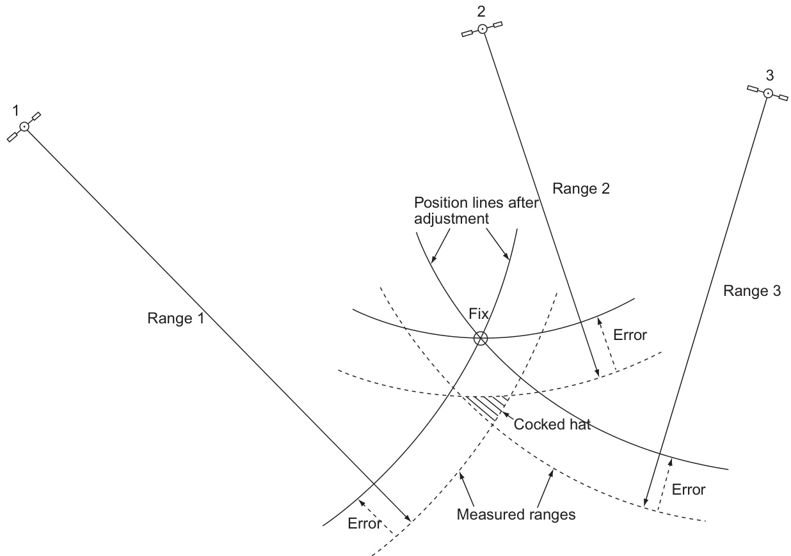  

FIGURE 10.7 Effect of systematic errors (including time) on measured ranges.  

图10.7 系统性误差（包括时间）对测量距离的影响。

#### 10.1.4.2 Continuity - Transfer to Other Satellites with Time  

With the passing of time, the user equipment will change the four satellites being observed, as the positions in the sky change. Thus the observed satellites are changed to those whose position is navigationally more favourable, either through altitudes being better or improved angle of cut of position line or higher signal quality.  

随着时间的推移，用户设备将改变正在观测的四颗卫星，因为天空中的位置会发生变化。因此，观测到的卫星会被更改为那些位置在导航上更为有利的卫星，这要么是因为海拔（指卫星的高度）更好，要么是因为位置线（指卫星信号的方向）的切割角度有所改善，或许是因为信号质量更高。这样可以提高卫星信号的接收质量和导航精度。

#### 10.1.4.3 Frequency of Update of Position  

This is to all intents and purposes continuous, automatic and seamless. The whole operation after switch-on, that is satellite acquisition, lock-on, analysis of data, timing to determine ranges and the derivation of position, as well as continual assessment of the changing circumstances, continues without the operator’s intervention.  

这几乎是持续、自动和无缝的。开机后（即激活设备），整个过程包括卫星采集（获取卫星信号）、信号锁定（确保信号稳定）、数据分析（处理获取的数据）、计时以确定距离（通过卫星信号计算设备与卫星之间的距离）以及位置推导（利用多个卫星的距离计算设备的位置），以及对不断变化的情况进行持续评估，都在无需操作员干预的情况下继续进行。

#### 10.1.4.4 Output of Position Coordinates  

As a first choice, positions are given in latitude/longitude coordinates which relate to the earth as defined by the World Geodetic System 1984 (WGS 84), and for relative navigation this is sufficient. Where it is necessary to relate the output position to a navigational chart which is based on some other datum, there is usually a facility for the user to enter the name of the datum into the receiver which will then make the necessary adjustments to the output readings. Where positions are being automatically transferred to an ECDIS (see Section 10.2.3), it is essential that the correct datum has been fed in. It is also necessary to check regularly that the correct datum is being used. It is required that ‘. . . the display should indicate that coordinate conversion is being performed, and should identify the coordinate system in which the position is expressed’ (see Section 11.3.2).  

首选位置是以纬度/经度坐标表示的，这些坐标是根据1984年世界大地测量系统（World Geodetic System 1984，简称WGS 84）定义的，与地球相关的坐标，对于相对导航来说，这已经足够。在需要将输出位置与基于其他大地测量系统（datum）的导航图表相关联的情况下，用户通常可以在接收器中输入大地测量系统的名称，接收器将根据需要对输出读数进行调整。当位置被自动传输到电子海图显示和信息系统（ECDIS）（见10.2.3节）时，必须确保正确的大地测量系统已经被输入。同时，需要定期检查以确保正在使用正确的大地测量系统。规定要求“显示屏应指示正在进行坐标转换，并应识别位置所使用的坐标系统”（见11.3.2节）。大地测量系统（datum）[即一个已知点与地球表面之间的假设距离，用于确定地球表面上其他点的坐标]的选择对于确保导航数据的准确性至关重要。

  

$P_{\uparrow}$ and $P_{2}$ are the possible positions but $P_{2}$ is ruled out as it is out in space   
FIGURE 10.8 Three-dimensional position fix.  

$P_{\uparrow}$ 和 $P_{2}$ 是可能的位置，但 $P_{2}$ 被排除掉，因为它在太空中 [太空指的是地球大气层外的空间环境]。 
图10.8 三维位置定位。

### 10.1.5 Accuracy and Errors  

The positional accuracy that is being achieved by civil marine users is exceptionally high compared with earlier position fixing methods. Nonetheless, it is important to appreciate why the quoted accuracy figures might be compromised.  

民用海事用户目前所能达到的定位精度与早期的定位方法相比异常高。然而，了解所引用的精度数字可能会受损的原因仍然很重要。[所谓的“定位精度”是指定位技术能够准确地确定目标位置的能力，这里提到的“定位方法”则是指不同方式和技术来确定位置，如GPS、北斗等卫星导航系统]

#### 10.1.5.1 Sources of Error  

Atmospheric conditions. As the signals travel through the various layers of the atmosphere, the path followed and the medium through which they pass will affect their speed and will therefore affect the calculated range from the satellite.  

大气条件。当信号通过大气的各个层时，信号所经过的路径和介质会影响其速度，从而影响从卫星计算的距离范围。[即，大气条件会对卫星信号的传播速度产生一定的影响，进而影响卫星与地面接收器之间的距离计算]

Signal path. The time taken to pass through the various layers and therefore the delaying effect will be different, depending on the altitude of the satellite (Figure 10.10).  

信号路径。信号通过各层所需的时间以及延迟效应将会不同，这取决于卫星的海拔高度（如图10.10所示）。

It is necessary to make some estimates based on models of the atmosphere through which the satellite signal has passed. In equipment which is capable of receiving at more than one frequency, it is possible to determine a more accurate estimate of the value of error due to atmospheric conditions by using a more sophisticated error model. Effectively, civilian users have access only to the single L1 frequency, although this situation is changing (see Section 10.1.7).  

为了准确接收卫星信号，需要根据信号通过的大气模型进行一些估计。在能够接收多个频率的设备中，可以通过使用更复杂的错误模型来确定由于大气条件而产生的误差值的更准确估计。实际上，民用用户只能够接收单一的L1频率的信号（即：只有一个载频），尽管这种情况正在变化（见10.1.7节）。

  

FIGURE 10.9 Block diagram of user equipment.  

图10.9用户设备的功能块图。 

（注：用户设备是移动通信网络中的一个重要组成部分，主要指移动电话、平板电脑等终端设备）

  

FIGURE 10.10 Effect of signal path.  

图 10.10 信号路径的影响。

• Ionosphere. Errors due to this source are now to some extent predictable and can be modelled and applied. 

• 电离层（即地球大气中离子和电子高度集中的区域，影响无线电波的传播）。由于电离层的影响所产生的错误，在一定程度上已经可以预测，并且可以通过建立数学模型来模拟和应用（以此来改进定位算法，提高定位精度）。

• Troposphere. Errors arising as the signals pass through this layer of the atmosphere can vary widely and will depend on the existing weather conditions in particular, water vapour. Very little can be done in practice to eliminate this source of error. 

• 对流层。信号通过大气这一层时产生的错误可能会有很大差异，这取决于特定的天气条件，尤其是水蒸气的存在。实际上，几乎没有什么有效的方法可以消除这一来源的错误[即大气层中的水蒸气会影响信号的传播，从而导致测量误差]。

• Multi-path. With range being measured to such a high precision, signals arriving as a result of reflections from nearby surfaces on the vessel or from the sea will have an effect on the required signals which arrive by the direct path. Multi-path signals will arrive later than those that arrive directly. In any event, all the signals are very weak and where signals arrive out of phase, the timing signal can become undetectable. Note that signals suffer phase reversal at each reflection (Figure 10.11). 

• 多路径效应（即信号通过多个路径传播，包括直接路径和通过反射、散射等方式形成的间接路径）。由于测量范围具有非常高的精度，来自船舶附近表面或海面的反射信号将对直接到达的所需信号产生影响。多路径信号将晚于直接到达的信号到达。在任何情况下，所有信号都非常微弱，当信号相位不一致时，定时信号（用于确定信号到达时间的信号）可能变得无法检测。需要注意的是，信号在每次反射时都会发生相位逆转（图10.11）。

• Relativity. According to Einstein, as a clock travels in different gravity fields and at speeds that are a significant proportion of the speed of light, it will tend to slow down. Corrections for this effect are taken care of in each satellite’s transmission.  

• 相对论。根据爱因斯坦的理论，当一个钟表在不同的重力场中移动，并以接近光速的显著比例速度运动时，它会趋向于减慢。这种效应的校正是在每颗卫星的传输中进行的[这里指的是为纠正卫星钟表由于相对论效应而产生的时间漂移，确保卫星信号的准确性]。

#### 10.1.5.2 Cross-Checking with Other Systems  

It cannot be stressed too strongly that total reliance should not be placed on a single position fixing system and GPS is no different. In spite of its reputation, cross-checking GPS derived positions against those derived by other position fixing methods, for example visual or radar means, is essential. Serious examples have already occurred where signal loss or system malfunction has resulted in the receiver reverting to dead reckoning mode and although this was indicated on the display, its significance was missed as the displayed position continued to be updated on the equipment that was in use.  

不能过度强调，不应完全依赖单一的位置定位系统，GPS也不例外。尽管GPS有其声誉，但仍需要对其获取的位置数据进行交叉核查，例如与通过视觉观察或雷达等其他位置定位方法获取的数据进行比较。这一点是至关重要的。已经有严重的例子表明，当信号丢失或系统故障时，接收器会切换到[死算法模式，即根据设备的前进方向和速度来估算当前位置的方法]，虽然这在显示屏上会有相应的指示，但由于设备上显示的位置继续更新，使用人员对此仍然浑然不知，忽略了这些指示的重要性。

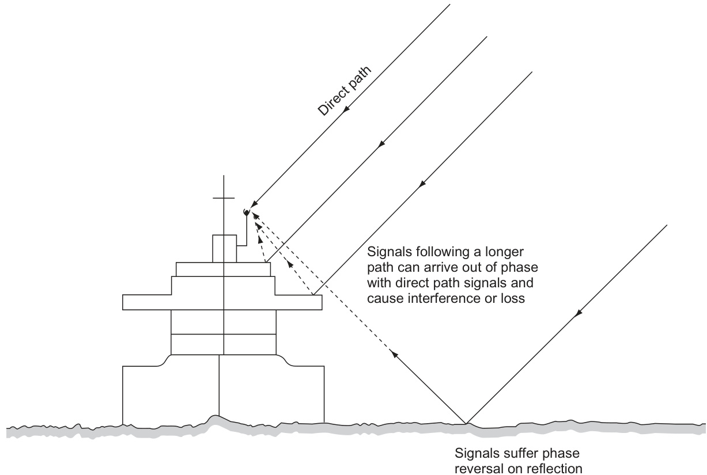  

FIGURE 10.11 Multi-path signals.  

图10.11 多径信号。 

（注：多径信号是指在物联网或无线通信系统中，信号通过多条不同的路径传播到接收端，这种现象可能会导致信号的衰弱、延迟或干扰。）

#### 10.1.5.3 Loss of Signal  

There are a number of possibilities why this might occur. Typical is that as time progresses or after an alteration of the ship’s course, a satellite signal might be temporarily obstructed by the ship’s funnel or by some other part of the ship’s structure. When this occurs, the receiver will endeavour to select another satellite and use its signal to replace the one that has become unreliable. Not all receivers indicate that lock has been lost or that transfer has taken place.  

出现这种情况的原因有几种。通常情况下，当时间推移或船舶航向发生变化后，卫星信号可能会被船舶的[烟囱（船舶的排气或通风管道）]或船舶结构的其他部分暂时遮挡。这种情况发生时，接收器将尝试选择另一个卫星，并使用其信号来替换变得不可靠的信号。但并非所有接收器都会指示已经失去锁定或已经进行了转移。

#### 10.1.5.4 System Malfunction  

The satellite constellation’s ‘health’ is being continually monitored by the ground tracking stations, and at any sign of trouble this is communicated to the MCS and action is taken to resolve and rectify the problem. However, satellites are not always in sight of the monitoring stations and they can only be corrected when they are in sight of the MCS. Both detection and correction processes may take some time (see also Section 10.1.5.7) and there have been documented instances when significant outages have occurred.  

星座系统的“健康状况”正在被地面跟踪站持续监测，一旦出现问题的迹象，这将被传达给任务控制系统（MCS），并采取行动来解决和纠正问题。然而，卫星并不总是处于监测站的视线范围内，而且只有当它们进入MCS的视线范围内时，才可以进行更正。检测和更正过程可能需要一些时间（请参阅10.1.5.7节），并且已有记录表明，在发生重大中断时，采取纠正措施可能会有所延迟。

#### 10.1.5.5 Expected Accuracies  

When originally set up, the signals available to civil users (using the single L1 frequency and $\mathrm{C}/\mathrm{A}$ code) were deliberately downgraded. This downgrade was referred to as selective availability (SA) and ensured that accuracies of the order of $100\mathrm{m}$ $95\%$ accuracy) were the norm. In 2000, SA was discontinued and longterm average accuracies of around $35\mathrm{m}$ $95\%$ accuracy) should therefore have been achieved by a 24 satellite constellation. However, the system currently has more satellites (usually around 30) than the minimum constellation and accuracies of $10{-}15\mathrm{m}$ $95\%$ accuracy) are now considered typical under standard conditions. This satellite over-population is not guaranteed to continue but has been the norm for many years. It provides redundancy for satellites that are near or past their designed life span.  

最初設立時，面向民用用户（使用单一的L1频率和$\mathrm{C}/\mathrm{A}$代码）的信号被故意降级。这种降级被称为选择性可用性（SA），它确保了准确度的順序為$100\mathrm{m}$（95\%的准确度），这是正常的。2000年，SA被停止，長期平均准确度應該達到大約$35\mathrm{m}$（95\%的准确度），這應該是由一個24颗衛星星座實現的。然而，目前的系统比最低星座（通常在30颗衛星左右）拥有更多的衛星，在标准条件下，准确度達到$10{-}15\mathrm{m}$（95\%的准确度）被认为是典型的。这种衛星過度擁擠的情況不能被保證，但它已經持續了很多年。它為那些接近或超過設計壽命的衛星提供了冗余。

#### 10.1.5.6 Quality of Fix or Dilution of Precision  

This is a concept that is essentially intended to give the user a confidence figure that will indicate the reliance that he can place on the position that is being displayed. The figure is based on the geometry of the position fix (Figure 10.12). The minimum attainable DOP which indicates a perfect fix is 1. IMO Performance Standards require that the horizontal dilution of precision $\mathrm{(HDOP)}~\le~4$ (see Section 11.3.2).  

这是一种本质上旨在为用户提供一个置信度数值的概念，该数值将指示用户可以对所显示的位置放置多少信任。这一数值是基于位置定位的几何形状（图10.12）。可以实现的最小DOP（伪随机噪声，Dilution of Precision）表示一个完美的定位，其值为1。国际海事组织（IMO）性能标准要求水平精度稀释度（HDOP）小于或等于4（参见第11.3.2节）。在这里，DOP的概念是用来衡量全球定位系统（GNSS）或其他导航系统位置定位精度的指标，[它表示的是由于衛星或基站位置與用戶端位置之間的几何关系而导致的精度损失]。

Note: DOP may be given for the horizontal plane - HDOP - or the vertical plane - VDOP - or in three dimensions - position dilution of position (PDOP).  

注：DOP 可能指示在水平面上的值 - HDOP（水平稀释度）- 或在垂直面上的值 - VDOP（垂直稀释度）- ，或者是在三维空间中的位置稀释度 - 位置稀释度（PDOP，[即位置精度的不确定度]）。

#### 10.1.5.7 Warnings (See Also Section 11.3.2 Warnings and Status Indications)  

The receiver is required to give a warning within 5 s if the HDOP has been exceeded, i.e. ${>}4,$ or if a new position has not been calculated for more than $^{1\mathrm{s},}$ in which case, the time and position of the last valid fix must be displayed, with a clear indication of what has occurred and a warning of loss of position.  

接收器需要在5秒内发出警告，如果HDOP（[水平精度因子，表示GPS信号的水平方向精度]）超过了规定值，即大于4，或者如果在超过1秒的时间内没有计算出新的位置。在这种情况下，必须显示最后一个有效位置的时间和位置，并清晰地指示发生了什么以及丢失位置的警告。

When DGPS (see Section 10.1.6) is in operation, there must be an indication that DGPS signals are being received and that DGPS corrections are being applied to the displayed position. There must also be a display of DGPS integrity status and alarms (if any) plus any DGPS text messages.  

当差分全球定位系统（DGPS）（参见第10.1.6节）正在运行时，必须有指示表明正在接收DGPS信号，并且正在将DGPS校正应用于显示的位置。还必须显示DGPS完整性状态和报警（如果有）以及任何DGPS文本消息。这确保用户能够实时了解DGPS的运行状态和可能的错误信息，以便进行相应的调整和应对。 [差分全球定位系统（DGPS）：一种通过接收来自多个地面参考站的差分信号来提高全球定位系统（GPS）定位精度的技术]。

  

FIGURE 10.12 Dilution of precision.  

图10.12 准确度稀释。

#### 10.1.5.8 Vulnerability of GPS Signals  

GPS signals are very low power when received on the earth’s surface and the received signal strength is about the level of background noise. The code system allows receivers to pick out an individual satellite from the transmission of other satellites and background noise all operating at the same frequency. However, if the interfering signals are powerful enough, they will swamp the GPS signals and render the receiver ineffective.  

全球定位系统（GPS）信号在接收到地球表面时功率非常低，接收到的信号强度约为背景噪声的水平。编码系统允许接收器从其他卫星的传输和背景噪声中识别出单个卫星信号，这些信号都在同一频率下运行。然而，如果干扰信号足够强大，它们将会淹没GPS信号，使接收器失去作用。

The main natural cause of concern is the potential for interference from solar flares from the sun. Solar flares are associated with sunspot activity on the sun. The flares are a large energy release from the sun and they are accompanied by extensive magnetic radiation across a wide spectrum of radio frequencies. If the earth is hit by such radiation, it is likely that GPS (and any other radio equipment) will be affected. The frequency of occurrence of solar flares follows an 11-year cycle, but precise prediction is very problematic.  

主要的自然原因的担忧是太阳耀斑（Solar flares）对地球的潜在干扰。太阳耀斑与太阳黑子（sunspot）活动有关。这些耀斑是太阳释放的大量能量，并且伴随着在广泛的无线电频率范围内的强烈磁辐射。如果地球受到这种辐射的影响，很可能全球定位系统（GPS）和其他无线电设备都会受到影响。太阳耀斑的发生频率遵循一个11年的周期，但是准确的预测非常困难。

GPS jammers are widely available to the public, as well as for military applications. There have also been a number of occurrences of unintentional interferences that cause GPS ‘blackspots’. Many of the causes of unintentional interference have been traced to faulty or illegal radio equipment and they usually occur in inland regions. However, there has been more than one occasion when harbours and harbour entrances were affected. There have also been a number of GPS blackspots that have not been satisfactorily explained.  

GPS干扰器（GPS干扰器是一种可以干扰GPS信号的设备，[即可以通过发出相同频率的信号来干扰GPS接收器的正常工作]）广泛地面向公众销售，也被用于军事应用。同时，还有多次无意干扰的发生，导致GPS信号在某些区域完全失效，形成了所谓的GPS“黑洞”。这些无意干扰的原因大多被追溯至有故障或非法的无线电设备，通常出现在内陆地区。然而，也有过多次港口和港口入口受到影响的事件。另外，还有一些GPS黑洞的成因尚未被令人满意地解释。

It is also understood that GPS ‘spoofers’ exist that give false satellite signals and would enable the receiver to give a false but believable position on a user’s display.  

人们还了解到，GPS“欺骗器”（spoofers）是存在的，这种设备会发出虚假的卫星信号，从而使得接收器显示出一个虚假但可信的位置信息在用户的界面上。 

（注：这里的“欺骗器”是指一种可以发出与真实GPS卫星信号类似信号的设备，从而欺骗GPS接收器，导致位置信息出错。）

In summary, although GPS has proved to be a very reliable and secure device, it is theoretically very vulnerable to attack and unintentional interference. The user is advised not to rely on it uniquely, but heed the advice given earlier and cross-check between position fixing systems.  

综上所述，尽管GPS已被证明是一种非常可靠且安全的设备，但从理论上讲，它对攻击和意外干扰（指的是非故意的、不可预测的信号或能量对GPS系统的影响）非常脆弱。用户被建议不要仅仅依赖它，而是采纳之前提出的建议，并在不同位置确定系统（例如，辅以电子海图、天文导航、惯性导航等其他导航方法）之间进行交叉核对。

### 10.1.6 Differential GPS  

#### 10.1.6.1 System Principle  

The position of a shore-based antenna is accurately surveyed and its geo-coordinates calculated. The differences given by satellite fixes and the surveyed position are transmitted as corrections to be applied to positions obtained by vessels using GPS in that area. In order to receive these signals, a DGPS receiver is required. The application of these corrections is normally automatic (see Figure 10.12).  

在shore-based（陆基）天线的位置得到精确测量并计算出其地理坐标（geo-coordinates）后，卫星定位系统（satellite fixes）提供的位置与实际测量位置之间的差值会被传输，并作为修正信息发送给在该区域使用GPS的船舶。这些船舶需要安装DGPS接收器（差分全球卫星定位系统接收器）才能接收到这些修正信号。通常情况下，这些修正的应用是自动进行的（参见图10.12）。 

注意： 
- shore-based 天线指的是安装在陆地上的天线，与船舶或其他移动平台上的天线相对应。
- DGPS指的是差分全局卫星定位系统，是一种通过卫星信号和陆基参考站的组合来提高GPS定位精度的技术。
- geo-coordinates 指的是地理坐标，是地球表面上某一点的精确位置描述，包括纬度和经度等信息。

The UK government has set up a public system of DGPS stations using the sites and frequencies previously used for marine RDF beacons (see Figure 10.14). The US Coastguard has done much the same on the US coasts and commercial organizations can provide corrections in many areas for a fee. Also available are wide area DGPS networks which provide continuous DGPS corrections over continental areas using geostationary communication satellites. They include the European EGNOS, the US WAAS and the Japanese MSAS. The generic term for such systems is satellite based augmentation systems (SBAS). Sometimes conventional ground based DGPS is called ground based augmentation systems (GBAS).  

英国政府已建立了公共的差分全球定位系统（DGPS）站网络，利用以前用于海事无线电方向指示器（RDF）海标的站点和频率（见图10.14）。美国海岸警卫队也在美国沿海地区采取了类似的措施，商业组织也可以在许多地区提供更正数据，但需要收取一定的费用。此外，还有广域DGPS网络可以提供连续的DGPS更正数据，覆盖整个大陆区域，利用地球静止轨道通信卫星。这些网络包括欧洲的EGNOS、美国的WAAS和日本的MSAS。这种系统的通称是卫星基增强系统（Satellite Based Augmentation Systems，SBAS）[即利用卫星提供位置更正数据的系统]。有时候，传统的基于地面的DGPS系统也被称为地面基增强系统（Ground Based Augmentation Systems，GBAS）[即利用地面基站提供位置更正数据的系统]。

#### 10.1.6.2 Potential Accuracies Using DGPS  

Using DGPS equipment, accuracies in the order of $5\mathrm{m}$ are expected and even better results have been reported. With such high precision, it is important to appreciate that it is the position of the receiving antenna that is being displayed. Updating of the direct signal is typically within $15s$ . The improvement in accuracy of DGPS over GPS is irrelevant for most marine navigators now that SA (see Section 10.1.5.5) has been removed. However, DGPS has a large advantage over GPS in that there is immediate notification of system malfunction, unlike stand-alone GPS (see Section 10.1.5.4). Thus many users are using DGPS because of the gain in reliability due to external monitoring and not necessarily because of its increased accuracy.  

使用差分全球定位系统（DGPS）设备，预计可以达到5米的精度，甚至有报道称取得了更好的结果。由于这种高精度，了解当前显示的是接收天线的位置至关重要。直接信号的更新通常在15秒之内完成。在SA（参见第10.1.5.5节）被移除后，DGPS相对于GPS的精度提高对于大多数海上导航员来说已经变得无关紧要。然而，DGPS相对于GPS有一个很大的优势，即系统发生故障时可以立即通知用户，这与独立的GPS（参见第10.1.5.4节）不同。因此，许多用户使用DGPS的原因是由于外部监控而带来的可靠性提高，而不一定是因为它的精度提高。

### 10.1.7 Improvements to GPS  

The US military is currently implementing three main improvements in the GPS service for civilian users, as well as a new military service (M code) not for civilian use. The process is a slow one because the improvements are only being fitted to satellites that have been either launched relatively recently or are still in reserve on the ground. Each improved service will therefore only become properly operational when a minimum of about 18 improved satellites is in orbit. It is an ironic fact that the impressive reliability and longevity of the older satellites is actually holding up further progress.  

美国军方目前正在为GPS服务的民用用户实施三个主要改进，同时也为军用用户推出了一种新服务（M代码），但这项新服务不供民用用户使用。这个过程进展较慢，因为改进措施仅应用于近期发射的卫星或仍在地面上的备用卫星。因此，每项改进服务仅当至少有大约18颗改进卫星进入轨道时才能正式投入运行。一个耐人寻味的事实是，老卫星令人印象深刻的可靠性和寿命实际上正阻碍着进一步的进展。[这里的"阻碍进展"是指老卫星运行太久，导致无法快速更新和升级，因为新卫星的推出需要旧卫星逐步退役和替换]。

  

FIGURE 10.13 Principle of DGPS.  

图10.13 差分全球定位系统（DGPS）的原理。

The first civilian improvement is to open up L2 to civilian users. They are not allowed to use the P-code, so the modification is to transmit the equivalent of the C/A code as well as the P-code on the L2 frequency. This is called the L2C, it currently transmits from a limited number of satellites and it is expected to be fully operational in 2018. The addition of observations on a second frequency will enable better modelling of the atmospheric errors and hence a more accurate fix will be achieved (see Section 10.1.5.1). Moreover, the L2C code will be inherently more accurate and more reliable in weak reception conditions than the C/A code used on the L1 frequency.  

第一项面向民用的改进是开放L2频段供民用用户使用。由于他们不允许使用P-code，因此对L2频段的修改是同时传输与C/A代码相当的信号以及P-code。这被称为L2C，目前它仅从有限数量的卫星传输，预计将在2018年完全投入运营。在第二个频率上增加观测将能够更好地对大气误差进行建模，进而实现更准确的定位（见10.1.5.1节）。此外，在弱信号接收条件下，L2C代码将比使用在L1频率上的C/A代码具有更高的精度和可靠性。这种双频段的使用方式，可以减少大气延迟（atmospheric delay）[即卫星信号穿过大气层时由于大气层中电离层和对流层等造成的信号延迟]对GPS信号的影响，从而提高整个系统的精度和可靠性。

The second civilian improvement is the addition of a third frequency, $1176.45\mathrm{MHz}$ , termed L5. As well as potentially allowing more sophisticated atmospheric error modelling from using up to three frequencies simultaneously, the civilian code available on L5 will be a more sophisticated signal allowing higher accuracy and reliability than both the L2C and L1 C/A codes. Satellites with the L5 frequency are just beginning to be launched and a full constellation is expected by 2021.  

第二项民用改进是添加了第三个频率，$1176.45\mathrm{MHz}$，称为L5。除了可以使用多达三个频率同时进行大气误差建模外，L5上的民用码将是一个更加先进的信号，允许比L2C和L1 C/A码更高的精度和可靠性。使用L5频率的卫星刚刚开始发射，预计到2021年将有完整的星座。（这里的“星座”指的是一组人工地球卫星的组合，它们协同工作以提供全球导航服务。）

The third civilian improvement is an additional civilian code on the L1 frequency termed the L1C. This code will again offer improved detection and accuracy in weak reception areas. However, its major importance is that it was developed with GALILEO GNSS as a common code and it is also now intended to be implemented on navigation satellites of other countries (see next section).  

第三项民用改进是在L1频率上增加了一种名为L1C的民用代码。这种代码将再次提供在信号接收较弱的区域中提高检测和精度。然而，其主要重要性在于它是与GALILEO卫星导航系统（GNSS）[一种欧洲的卫星导航系统，类似于美国的GPS系统]作为一个共同的代码开发的，并且现在也打算在其他国家的导航卫星上实施（见下一节）。

### 10.1.8 Other Navigation Satellite System Developments  

The GPS is entirely under the control of the US military. It is fully operational, is freely available and is expected to remain so for the foreseeable future. However, other GNSS and regional systems are available or about to become available. It is foreseen that for most users, the use of these additional systems will not be as an alternative to GPS. Instead receivers will be become GNSS receivers capable of receiving satellites’ signals operated by many countries. Thus the receiver will be able to select best available satellites from all the GNSS combined, and the number of available satellites is expected to total over 100 within the next decade. This will mean an improvement in the DOP of positions, with a resulting increase in accuracy as well as redundancy.  

全球定位系统（GPS）完全处于美国军方的控制之下。它已经完全投入使用，免费对公众开放，并预计在可预见的未来保持这种状态。然而，其他全球导航卫星系统（GNSS）和区域系统已经可用或即将投入使用。人们预计，对于大多数用户来说，这些额外系统的使用不会作为替代GPS的选择。相反，接收器将成为GNSS接收器，能够接收由多个国家运营的卫星信号。因此，接收器将能够从所有GNSS系统中选择最好的可用卫星，而预计在未来十年内可用卫星的数量将超过100颗。这将意味着定位精度（DOP）的改善，从而导致精度提高以及冗余度的增加[即，在更多卫星信号的支持下，定位将更加准确和可靠]。

  

FIGURE 10.14 DGPS coverage in UK waters.  

图10.14：英国水域中的DGPS覆盖范围。

（注：DGPS是Differential Global Positioning System的缩写，中文译为“差分全球卫星定位系统”，是一种通过卫星信号和地面参考站信号的差分来提高卫星定位精度的技术。）

  

FIGURE 10.15 Typical ECDIS display.  

图10.15 典型的电子海图显示系统（ECDIS）显示界面。

（注：ECDIS是Electronic Chart Display and Information System的缩写，指的是电子海图显示和信息系统，用于提供航海信息和辅助船舶导航）

Combined GLONASS/GPS receivers already exist that are able to deal with the different ranging methods, frequencies, datum and satellite time systems involved. In the future, this will be even easier for the other systems discussed below, as these are intended to have the new L1C code as part of their specification, which will facilitate the integration of multiple systems. These different satellite navigation systems are listed below.  

联合GLONASS/GPS接收机已经存在，可以处理不同系统中所使用的测距方法、频率、基准面和卫星时间系统。在未来，对于下面讨论的其他系统，这将变得更加容易，因为这些系统将采用新的L1C码作为其规范的一部分，从而促进多个系统的集成。这些不同的卫星导航系统如下列出。这些系统包括（即将开发或已经投入使用的卫星导航系统），通过采用新的L1C码，各系统之间的兼容性和互操作性将得到改善。

#### 10.1.8.1 GLONASS  

This is a system operated by the Russian military and is similar in concept to GPS, being based on a nominal number of 24 satellites. Although the project was started about the same time as GPS, financial constraints have resulted in considerable delays in full implementation, which was only achieved in 2011.  

这是由俄罗斯军方运营的系统，与GPS（全球定位系统，注：一种利用一组卫星提供位置信息和时间信息的卫星导航系统）的概念类似，基于大约24颗卫星的数量。尽管该项目与GPS大约在同一时间开始，但由于资金限制，导致了在完全实施方面的相当延迟，直到2011年才实现完整部署。

The orbit configuration is three equally spaced orbits, inclined at $64.8^{\circ}$ to the equator. Each orbit is designed to have eight equally spaced satellites. The orbit altitude is slightly less than GPS at $19{,}130\mathrm{km},$ , which gives an orbit period of 11.25 hours.  

轨道配置由三个等间距的轨道组成，相对于赤道的倾斜角为$64.8^{\circ}$（赤道平面上的角度，[用于描述卫星轨道的空间位置]）。每个轨道设计为容纳八个等间距的卫星。轨道高程略低于GPS的$19{,}130\mathrm{km}$，这样就能实现轨道周期为11.25小时。

The GLONASS satellites currently transmit on different frequencies, unlike the GPS, which shares a single frequency with different satellite codes. Note that GLONASS satellites that are $180^{\circ}$ apart can use the same frequency, which makes slightly more efficient use of the frequency spectrum. GLONASS achieves similar accuracies to GPS. One advantage of the system is that GLONASS satellites can communicate with each other and that satellite errors can therefore be corrected even when the satellite is not visible to the MCS.  

GLONASS 卫星目前使用不同的频率进行传输，不像 GPS 那样与不同的卫星代码共享一个频率。值得注意的是，相距 $180^{\circ}$ 的 GLONASS 卫星可以使用相同的频率，这样可以更好地利用频率谱。GLONASS 达到的精度与 GPS 相似。该系统的一个优势是 GLONASS 卫星可以相互通信，因此即使卫星对地面控制站（MCS）不可见，卫星错误仍然可以被纠正。这种通信能力使得 GLONASS 系统在某些方面具有更高的灵活性和可靠性，尤其是在卫星信号被阻塞或干扰的情况下。 

注：GLONASS 是俄罗斯的卫星导航系统，全称为 Global Navigation Satellite System；MCS 指的是地面控制站，是负责控制和管理卫星系统的站点。

The Russians have also developed a codebased signal for broadcast from GLONASS satellites. This will make building combined GNSS receivers that include GLONASS even easier.  

俄罗斯人也开发了一种基于代码的信号，可以从GLONASS卫星（全球导航卫星系统，GLONASS是俄罗斯的卫星导航系统，与美国的GPS系统相似）广播。这将使得建造包含GLONASS的组合GNSS（全球卫星导航系统，GNSS是一个泛指各种卫星导航系统的术语）接收器变得更加容易。

#### 10.1.8.2 Galileo  

This is a satellite system for navigation and communications, planned and led by the European Union (EU) with an ever-advancing completion date. Unlike GPS and GLONASS, it is civilian controlled and the project has partnerships with a number of countries outside the EU. It also plans to charge some users for some of its high-quality and specialist services. Although primarily a GNSS for navigation, it is expected to have some communications facilities including use by emergency and distress services. It has had considerable funding difficulties and delays over the project’s lifetime.  

这是一个由欧洲联盟（EU）规划和领导的用于导航和通信的卫星系统，其完成日期正在不断推迟。与GPS和格洛纳斯系统不同，它由民间机构控制，且该项目已与欧盟以外的多个国家建立了合作伙伴关系。它还计划对某些高质量和专业服务的用户收取费用。尽管它主要是一个用于导航的全球卫星导航系统（GNSS），但它预计将拥有某些通信设施，包括紧急和困境服务的使用。该项目在其生命周期中遇到了相当大的资金困难和延迟。 

（注：GNSS，即全球卫星导航系统，是一种利用一组人造卫星为全球用户提供位置、速度和时间信息的系统。）

The basic design has a 30-satellite system (27 satellites plus three active spares). There are three separate orbits (10 satellites in each) inclined at $56^{\circ}$ to the equator with an altitude of $23{,}616\mathrm{km}$ and an orbit period of about 14 hours. Every satellite will transmit on several frequencies with E5A $(1176.45\mathrm{MHz})$ , E5B $(1207.14\:\mathrm{MHz})$ and E2 ${}^{1575.42\mathrm{MHz})}$ being planned for public use. Another feature of the Galileo system is the large number of ground stations to control and monitor the satellites, that is more than provided by GLONASS and GPS. At the time of writing, funding is committed to launch two-thirds of the full constellation, with a small number already launched.  

Galileo系统的基本设计采用30颗卫星（27颗工作卫星加3颗备用卫星）的配置。这些卫星分布在三个独立的轨道（每个轨道10颗卫星）上，相对于赤道的倾角为$56^{\circ}$，海拔高度为$23{,}616\mathrm{km}$，轨道周期约为14小时。每颗卫星将在多个频率上进行传输，包括E5A（1176.45MHz）、E5B（1207.14MHz）和E2（1575.42MHz），这些频率计划用于公共服务。Galileo系统的另一个特点是拥有大量的地面站，用来控制和监测卫星，其数量甚至超过了GLONASS和GPS系统。截至撰写本文时，已经为发射全部星座的三分之二获得了资金保障，少量卫星已经发射升空。

The system plans to offer a number of services including a ‘free to user’ service of similar accuracy to GPS. A single frequency receiver should achieve $25\mathrm{m}$ $95\%$ accuracy), while a dual frequency receiver should achieve $5\mathrm{m}$ $(95\%)$ . Higher accuracy ‘fee-paying’ services will also be available.  

该系统计划提供多项服务，包括一个与GPS（全球定位系统，[一种利用卫星来确定位置的导航系统]）准确度相似的“免费对用户”服务。单频接收器应能够达到$25\mathrm{m}$的准确度（95%的情况下），而双频接收器则应能够达到$5\mathrm{m}$的准确度（95%的情况下）。此外，还将提供更高准确度的“付费”服务。

Galileo operates like GPS using satellite codes and is thus able to use very similar frequencies to GPS. Galileo is to adopt different datum and time systems to GPS, but the differences in datum are expected to be minimal and measured in centimetres. It has been intended from the outset that Galileo and GPS will have a degree of compatibility and receivers capable of receiving both systems will be relatively easy to manufacture. One of the frequencies to be used is the internationally agreed L1C (see Section 10.1.7).  

伽利略系统（Galileo）与GPS类似，使用卫星信号，并且能够使用与GPS非常接近的频率。伽利略系统将采用与GPS不同的基准面（datum）和时间系统，但基准面之间的差异预计将是很小的，仅为几厘米。从一开始，伽利略系统和GPS就被设计为有一定程度的兼容性，能够同时接收两种系统的接收器相对来说较容易制造。其中一个将被使用的频率是国际上同意的L1C频率（见10.1.7节）。 

注：GPS是全 cầu卫星導航系統（Global Positioning System），伽利略系统是欧洲的卫星导航系统，datum指的是测量坐标的基准面。

#### 10.1.8.3 BeiDou Navigation Satellite System (Aka COMPASS)  

This is a Chinese GNSS which already offers a regional service and is intended to offer a full global service by 2020. It will consist of 30 medium earth orbit satellites (that is similar to GPS characteristics) as well 5 geostationary satellites which serve regional areas. Like Galileo and now GPS, it is planned to offer code-based signals on several frequencies. This also includes the L1C signal (see Section 10.1.7).  

这是一个中国的卫星导航系统（GNSS），它已经提供区域服务，并计划在2020年之前提供完整的全球服务。该系统将由30颗中地球轨道卫星（其特性与GPS类似）以及5颗地静卫星组成，后者将为区域提供服务。与Galileo和GPS一样，计划在多个频率上提供基于代码的信号，包括L1C信号（见第10.1.7节）。其中，中地球轨道卫星（Medium Earth Orbit satellites，MEO）指的是绕地球运行的卫星，其轨道高度约在2000公里至3.6万公里之间，而地静卫星（Geostationary satellites，GEO）则是指运行在大约3.6万公里高空的静止轨道上的卫星。

#### 10.1.8.4 Regional Satellite Navigation Systems  

Although not global, it should be noted that a number of countries are developing regional satellite navigation systems. These include the Japanese QZSS and the Indian IRNSS, both of whom intend to use the L1C signal.  

尽管这不是全球性的，但值得注意的是，许多国家正在开发区域卫星导航系统。这些系统包括日本的QZSS（准天球卫星系统，简称QZSS）和印度的IRNSS（印度区域导航卫星系统，简称IRNSS），这两个系统都计划使用L1C信号[即一种卫星导航信号，用于提供位置和时间信息]。

### 10.1.9 Inter-Relationship of GNSS with Radar  

Where radar equipment is fitted with mapping facilities, it may be possible to feed co-ordinates to the radar in latitude/longitude. Where this can be done, it is usual to be able to automatically feed the GNSS derived position of the ship to the radar and thereby fix the latitude/longitude of radar derived features on the display, thus aiding identification (see also cross-checking, Section 10.1.5.2).  

当雷达设备配备有制图功能时，可能可以将经纬度（latitude/longitude）坐标输入到雷达系统中。在这种情况下，通常可以自动将卫星导航系统（GNSS）获得的船舶位置信息输入到雷达系统中，从而在显示屏上固定雷达获取的特征的经纬度坐标，如此有助于识别目标（参见交叉核对，第10.1.5.2节）。

The availability of high-quality GNSS derived positions has led to the decline in using radar as the prime navigational tool. Obviously positions derived from radar are not as accurate as GNSS, but the radar remains a good source of secondary navigational information that is independent of any external transmission and external control. The good navigator will use the radar to check the accuracy of GNSS positions, but the concern is that the less professional navigators who over-rely on the ‘easiest’ positional source will ignore the radar as a navigational tool and thus leave themselves exposed to increased risk in the event of a GNSS failure.  

高精度的GNSS（全球导航卫星系统）[即利用一组人造卫星连续向地球发回信号，以提供三维空间位置及精确时间的系统]导航定位数据的可用性，导致了雷达作为主要导航工具的使用率下降。很明显，从雷达获取的位置数据不如GNSS导航数据那么准确，但是雷达仍然是一个好的次要导航信息来源，不依赖于任何外部传输和控制。优秀的导航员会利用雷达来验证GNSS定位数据的准确性，但令人担忧的是，过度依赖于“最简单”的定位来源的非专业导航员会忽略雷达作为导航工具，从而在GNSS系统发生故障时，增加自己的风险。

### 10.1.10 Inter-Relationship of GNSS with ECDIS (See Sections 10.2 and 11.3.3)  

GNSS equipment is able to supply position and time, as well as (optionally) Course Over the Ground (COG) and Speed Over the Ground (SOG) to a digital interface which can then provide an input to an ECDIS.  

全球导航卫星系统（GNSS）设备能够提供位置和时间，以及（可选）地面航向（Course Over the Ground，COG）和地面速度（Speed Over the Ground，SOG）到数字接口，该接口随后可将这些数据作为输入提供给电子海图显示和信息系统（ECDIS）。

Radar images and ARPA information may also be added to the ECDIS but should not degrade the chart information and should be clearly distinguishable from it. Where this information is added, the data should match in scale and orientation. It should be possible to remove this radar data from the ECDIS by a single operator action.  

雷达图像和自动雷达监视系统（ARPA）信息也可以添加到电子海图显示和信息系统（ECDIS），但是这些信息不应降低海图信息的质量，并且应能明显地与海图信息区分开来。在添加这些信息时，数据应在比例和方向上保持一致。同时，应能通过单一操作员的行为轻松地从电子海图显示和信息系统中删除这些雷达数据。 

注：电子海图显示和信息系统（ECDIS）是船舶上的一个电子海图系统，能够显示海图以及其他相关信息。自动雷达监视系统（ARPA）是一个利用雷达技术来监测和跟踪其他船舶的系统，可以提供诸如目标船舶的位置、航向和速度等信息。

## 10.2 ELECTRONIC CHARTS (ECDIS)  

Electronic charts are an example of a geographical information system (GIS). A GIS has a database of geographical information that can be filtered and arranged in a display for the convenience of the user.  

电子图表是地理信息系统（GIS）的一个例子。GIS具有一个地理信息数据库，该数据库可以被过滤和排列在一个显示界面中，以方便用户使用。[这里的GIS即地理信息系统，是一种能对地理数据进行捕获、存储、检查、分析、管理和出图的计算机系统]。

For many hundreds of years, the navigator has used paper-based charts. It is only relatively recently that a computer-based alternative has become practical due to the improvements in and the affordability of two computing related technologies. The first is the ability to store and process large amounts of data and the second is the display technology that is able to show data to an adequate resolution and sufficiently large view of an area of the chart.  

在过去的几百年里，导航员一直使用基于纸张的海图。直到最近，随着两个与计算机相关的技术（计算机技术和显示技术）的改进和成本的降低，才出现了计算机基础的海图替代品。第一个技术是存储和处理大量数据的能力（大数据处理能力），第二个技术是能够以足够高的分辨率和足够大的区域来显示海图的显示技术（高分辨率显示）。这些改进使得计算机基础的海图成为可能并具有实际应用价值。

The standards for an approved electronic chart system were being developed from the 1980s by IMO and IHO (International Hydrographic Organization).  

国际海事组织（IMO）和国际水文组织（IHO）从20世纪80年代开始发展电子海图系统的标准。

The new system was called ECDIS or electronic chart display and information system. The standards for ECDIS are very high. The opportunity was taken to:  

新的系统被称为ECDIS（电子海图显示和信息系统）。ECDIS的标准非常高。因此，这一机会被用来：（注：ECDIS是指一种将电子海图与其他相关信息结合，通过电子设备进行显示和处理的系统，主要用于航海领域以提高船只的导航安全性）

• set electronic and hydrographic data storage standards to allow easy interchange of information between hydrographic services and also update ships at sea;  
• set minimum hydrographic standards of accuracy and reliability;   
• set a common chart datum (basically the one used by GPS).  

• 设定电子和水文数据存储标准，以便于水文服务机构之间信息的轻松交换，同时也能更新在海上的船舶的数据；  
• 设定水文数据的最低准确性和可靠性标准；   
• 设定一个共同的图表基准面（基本上是使用GPS的那个基准面）。 

或者，更流利的翻译版本：
• 制定电子和水文数据存储标准，以实现水文服务机构之间信息的便捷交换，并实时更新海上船舶的数据；  
• 确立水文数据的最低精度和可靠性标准，确保数据的一致性和准确性；   
• 确定一个统一的图表基准面（即使用全球定位系统GPS的基准面），从而统一数据坐标参考系。

IMO ECDIS standards came into force in 1996 and it was then theoretically possible for a vessel operating under SOLAS regulations to replace its approved paper chart system with an ECDIS. The reality was that although manufacturers rushed out ECDIS software display systems for ships, there was no approved ECDIS chart data. ECDIS data was slow to emerge due firstly to the time it takes to convert existing chart data into ECDIS format, but more particularly due to the need to resurvey hydrographically many areas to the new ECDIS standards. More recently the hydrographic standards required have been relaxed, making a worldwide portfolio of ECDIS charts a practical reality. New merchant ships are now required to have ECDIS fitted.  

国际海事组织（IMO）电子海图显示和信息系统（ECDIS）标准于1996年开始实施，这意味着在当时，按照国际安全生活救生条约（SOLAS）规定的船舶操作，可以用ECDIS取代传统的纸质海图系统。然而，尽管制造商急忙推出了船用ECDIS软件显示系统，但当时并没有得到批准的ECDIS海图数据。ECDIS数据的推出进展缓慢，主要是因为需要将现有的海图数据转换成ECDIS格式所需的时间较长，特别是需要对许多地区进行重新的水文测量以满足新的ECDIS标准。最近，相关的水文标准有所放松，这使得全球范围内的ECDIS海图组合成为现实。现在，新建的商船必须配备ECDIS。

### 10.2.1 Vector Charts  

The data format of ECDIS is vector storage. In this system, the ECDIS data is stored in data tables of separate information. Thus there are data tables of buoys, navigation aids, digitized coastlines, sounding lines, text labels, etc. Each item is stored with details of geographical location, its characteristics and the range of chart scales at which it should be shown. When data on a specific area, at a specific scale, is requested for display, the system selects the data in the requested area, of the right type for display. Important points to note are:  

ECDIS 的数据格式为矢量存储（vector storage）。在这种系统中，ECDIS 数据被存储在独立信息的数据表中。因此，存在浮标（buoys）、航行辅助设备（navigation aids）、数字化海岸线（digitized coastlines）、测深线（sounding lines）、文本标签（text labels）等的数据表。每个项目都存储了地理位置、特征以及应显示的图表尺寸范围的详细信息。当要求显示某个特定区域的数据时，系统会选择所请求区域内、适合显示的数据类型。需要注意的重要点是：

• The chart data shown on the chart display can be manipulated to remove data not required by the navigator and which may be cluttering up his screen. There is no need to show all data available in a specific area. Thus information on lights could be removed from the display if the vessel is conducting a daylight transit. IMO standards place careful limits on the information that can be removed by the navigator and also what should be displayed. For instance, all information on depths need not be shown, but there must be a minimum safety contour, which shows safe/unsafe water for the own ship.   

• 图表上的数据可以被操作以移除导航员不需要且可能会使屏幕变得杂乱的数据。没有必要显示特定区域的所有可用数据。因此，如果船舶正在进行白天过境（daylight transit），可以从显示中移除灯光信息。国际海事组织（IMO）的标准对导航员可以移除的信息以及应该显示的信息施加了仔细的限制。例如，所有有关水深的信息都无需显示，但必须有一个最低安全等高线（minimum safety contour），它能显示出适航区（safe/unsafe water）信息，即标明哪些水域对于自己的船舶来说是安全的或不安全的。这一等高线是确保船舶安全航行的最基本要求。

• The vector chart can easily change scale or zoom. As the navigator zooms in or out, the data displayed will change according to scale parameters stored with each item of data. Thus a buoy off the Liverpool Bar will not be shown when viewing the whole Atlantic Ocean, but as the navigator zooms into the Liverpool region, the buoy will appear. All depths or soundings have minimum and maximum scale parameters so that as the navigator zooms into an area, more soundings appear so that an appropriate density of soundings is maintained. It will be appreciated that the attachment of these scale factors is a highly skilled and laborious job for a marine cartographer and this is one reason why it has taken such a long time to get approved ECDIS data published, even when the hydrographic data was up to ECDIS standard.   

•矢量图表可以轻松地改变比例尺或缩放。当导航员放大或缩小时，显示的数据将根据存储在每个数据项中的比例尺参数进行变化。因此，当查看整个大西洋时，利物浦海堤外的浮标不会被显示，但当导航员放大到利物浦地区时，浮标就会出现。所有深度或测量数据都有最小和最大比例尺参数，这样当导航员放大到某个区域时，会显示更多的测量数据，以维持适当的测量密度。人们会欣赏到附加这些比例系数的工作是一项需要很高技能和劳动量的工作，对于海图制作者来说，这也是为什么即使当水文数据达到ECDIS标准时，也需要花费很长时间来发布批准的ECDIS数据的原因之一。[这里的ECDIS指的是电子海图显示和信息系统（Electronic Chart Display and Information System），是一种用于航海的电子海图系统]

• The responsibility for obtaining and maintaining approved ECDIS data is divided up between different nations and all data is stored centrally by the IHO. Participating nations can then obtain approved ECDIS data from other areas through the IHO.   

• 获得和维护批准的电子海图显示和信息系统（ECDIS）数据的责任由不同的国家分担，所有数据都由国际海事组织（IHO）集中存储。参与的国家可以通过国际海事组织从其他地区获取批准的ECDIS数据。 

（注：ECDIS 是电子海图显示和信息系统的英文缩写，全称为 Electronic Chart Display and Information System，指的是一种电子海图系统。国际海事组织即 IHO，全称为 International Hydrographic Organization，即国际海道测量组织。）

• Vessels that are required by SOLAS to carry an approved chart navigation system can replace their paper chart system with an approved ECDIS which uses approved ECDIS vector data. However, it should be noted that there must be a backup system as well as regulations on installation, training and the provision of regular chart corrections.   

• 根据SOLAS（国际海上人命安全公约）规定，需要携带批准的图表航行系统的船舶，可以用批准的ECDIS（电子海图显示和信息系统）替代纸质图表系统，但前提是ECDIS必须使用批准的矢量数据。然而，需要注意的是，必须配备备份系统，并遵守有关安装、培训以及定期图表更正的法规。

• Vector ECDIS displays are required to show chart datum soundings in a similar way to paper and raster charts. The predicted tidal height is shown as a separate figure, when available.  

•矢量式电子海图显示系统（Vector ECDIS）需要以类似纸质海图和光栅海图的方式显示海图基准（chart datum）水深测量数据。当数据可用时，预测的潮汐高度（predicted tidal height）会以独立的数值形式显示。

### 10.2.2 Raster Charts  

An alternative method of chart data storage is raster storage. Raster data is stored in picture format. In marine terms, the paper chart is scanned into a digital file using the same techniques as a photocopier or fax machine. The picture to be stored is divided into lines of very small dots or pixels. The scanner decides what the colour number of the original document was for that specific pixel, and it is the colour number that is stored for every pixel on the document. Principal points to note are:  

一种替代的图表数据存储方法是栅格存储（raster storage，[即将图像以矩阵形式存储，通过像素表示图像的方法]）。栅格数据以图像格式存储。在海事方面，纸质图表通过与复印机或传真机相同的技术扫描成数字文件。要存储的图像被划分为由非常小的点或像素（pixel，[即图像的基本单位]）组成的线。扫描仪决定原始文档的特定像素的颜色编号，并将该颜色编号存储为文档上的每个像素。需要注意的主要点是：

• Raster data on display cannot be manipulated by the user. Effectively we have a photocopy of a paper chart on screen. It is not possible to suppress chart data. 

• 位图（Raster）数据一旦显示出来，就不能被用户进行编辑或操作。实际上，我们在屏幕上看到的是纸质图表的“复印件”，我们无法对图表中的特定数据进行屏蔽或隐藏处理。

• A raster chart should be displayed at the correct scale on screen as the original paper chart from which it was derived. Some chart displays do allow a limited zoom function, but the navigator should note that the system simply magnifies or shrinks the chart. At extreme zoom levels the chart becomes unreadable and/or the amount of data shown is inappropriate for the scale. Thus systems which allow zoom display warnings that the chart is being shown underscale or overscale, as appropriate. The navigator can of course select another chart of different scale if one is available. This process is similar to using paper charts, but much faster as courses and positions will normally be transferred automatically. 

• 光栅图表（[一种通过栅格化表示的电子图表]）应在屏幕上以正确的比例显示，且应与原纸质图表（[光栅图表的原始来源]）保持一致。某些图表显示设备允许有限的缩放功能，但导航员应注意系统只是对图表进行放大或缩小。在极端的缩放水平下，图表变得无法阅读，和/或所显示的数据量对于当前比例尺不适合。因此，允许缩放的系统会显示警告，提示图表正在以“低于比例尺”或“高于比例尺”的方式显示，如适用时。导航员当然可以选择另一张不同比例尺的图表，如果有的话。这一过程与使用纸质图表类似，但速度要快得多，因为航线和位置通常会自动传输。

• In the western world, only two organizations maintain a full worldwide paper chart system; the chart authorities of the United Kingdom and the United States. Both these countries have produced raster charts based on their existing paper charts and effectively these are also the only two raster systems that provide comprehensive and approved raster electronic chart systems. These systems were available before ECDIS received IMO approval in 1996.  

• 在西方世界中，只有两个组织维护着完整的全球纸质海图系统：英国和美国的海图管理机构。两个国家都基于现有的纸质海图制作了光栅（raster）海图，实际上，这两种也都是仅有的提供全面和获批光栅电子海图系统的系统。这些系统是在1996年ECDIS（电子海图显示和信息系统，[即一种使用电子方式显示海图和提供航海信息的系统]）获得国际海事组织批准之前就已经存在的。

• Approved raster data can be used in ECDIS where ECDIS vector data is not available. This is sometimes termed a ‘dual-fuel’ system. However, IMO has determined that raster chart data is not an acceptable replacement for paper charts. The official position is that the paper chart is the approved navigation system and the raster electronic chart is an aid to navigation. Therefore, when the system switches to raster data, because of lack of vector data, the prime means of navigation switches to the paper chart. However, some administrations are allowing a significant reduction in the number of paper charts carried, when the raster chart system is used in conjunction with the appropriate training, backup, installation and correction system.  

• 经审核的栅格数据可以在电子海图显示和信息系统（ECDIS）中使用，特别是在电子海图矢量数据不可用时。这有时被称为“双燃料”系统（[注：此处的“双燃料”是指系统可以使用两种不同的数据类型，分别是矢量数据和栅格数据]）。然而，国际海事组织（IMO）已经确定，栅格海图数据不能作为纸质海图的可接受替代品。官方立场是纸质海图是批准的导航系统，而栅格电子海图只是辅助导航工具。因此，当系统由于缺乏矢量数据而切换到栅格数据时，主要的导航手段会切换到纸质海图。然而，一些管理机构允许在使用栅格海图系统与适当的培训、备份、安装和纠正系统联合使用时，大幅度减少携带的纸质海图数量。

### 10.2.3 Comparison Between Paper and Electronic Charts  

The biggest single advantage of electronic charts over paper systems to the professional navigator is the ease of correction. Both raster and vector systems allow for automatic electronic correction of the charts onboard, with no real work on the part of the navigator. This means that the corrections are inserted exactly as intended by the marine cartographer. The potential labour reductions for a ship with a worldwide portfolio of 2000 3000 charts are also significant. It is estimated that there are 10,000 15,000 manual corrections which need to be made by the navigator in a typical year for a worldwide paper portfolio of this size. The electronic corrections also lend themselves to electronic transmission so that corrections can be passed immediately to the ship, even while at sea. This is a vast improvement on the traditional paper-based system where corrections often took months to reach a ship by post, although paper chart small corrections can now be transmitted electronically and printed out onboard. The electronic systems also allow the electronic transmission of whole new charts. This could be either because of unexpected passage changes at sea or the issue of a new chart edition when it would usually be impractical to get the chart to the ship at sea in a paper-based system.  

电子图表相对于传统纸质系统的最大的单一优势，对专业导航员来说，就是修正的便捷性。无论是栅格（raster）还是矢量（vector）系统，都允许在船上进行自动的电子修正，而无需导航员进行实际的工作。这意味着修正会恰如marine cartographer（[海图制图师]，负责创建和更新海图的专业人员）所期望的那样被精确地插入。对于一艘拥有全球范围内2000至3000张图表的船舶来说，潜在的劳动力减少也是相当可观的。

根据估计，对于这样规模的全球纸质图表库，每年大约需要进行10,000到15,000次手动更正，由航海员进行操作。电子更正可以方便地进行电子传输，这样即使在海上，修正也可以立即传送给船只。这相比传统的纸质系统有了巨大的改进，因为在过去，修正通常需要通过邮寄数月才能抵达船只，尽管现在纸质图表的小规模更正也可以通过电子方式传输，并在船上打印出来。 

注意：对一些专业术语进行了直接的解读，以帮助理解：航海员（navigator）指的是负责导航和更正船只位置的船员；图表库（portfolio）指的是收集的海图和航海资料；电子传输（electronic transmission）是指通过数字方式传输信息；纸质图表（paper chart）是指传统的纸质海图。

电子系统还允许传输全新的图表（即航海图），这可能是因为海上航线的意外变化（如航道变化或新航线的开辟），或者是因为发布了新的图表版本。在这种情况下，如果使用传统的纸质系统（即依赖物理媒体，如纸质图表），通常很难在船只在海上的时候将图表更新到船上，因为纸质图表的更换和更新需要一定的时间和物流支持。

Another significant advantage is the ability to easily add extra information, overlaid on top of the electronic chart. This can include routes, notes, links to extra material (pictures, videos and text documents), tidal currents and lines of safety. Moreover this information can be saved as both a permanent record and also brought back from storage for reusing when a vessel undertakes a second transit of the same area in the same direction. The paper chart requires much laborious preparation and rubbing out on every occasion it is used. It will wear out in time and need replacement.  

另一个显著的优势是能够轻松地在电子海图上叠加额外的信息。这可以包括航线、备注、链接到额外的材料（图片、视频和文本文档）、潮流和安全线。此外，这些信息可以作为永久记录保存，并且可以从存储中检索出来，当船舶第二次穿过同一区域时重新使用。纸质海图则需要繁琐的准备工作和每次使用时都需要擦除。在经过一段时间后，它会磨损并需要更换。这种电子海图的优势使得它在航海领域具有更高的效率和实用性。[这里的“叠加”是指在电子海图上添加新的信息层，以便于用户的查看和使用]

Another pencil saving advantage is that the electronic chart lends itself to electronic fixing methods. GNSS or LORAN C systems can feed the position electronically to the chart (see Section 10.1). The improvement over the paper system means that the ship’s position is continuously plotted rather than sampled at intervals convenient to the navigator and the possibility of human plotting error is eliminated. There is usually an option to stabilize the chart display on the vessel’s position so the chart always shows the area around the current position, that is the chart moves past the ship. In these cases, the ship does not have to be at the centre of the display, but can be offset to show a feature of land or to see further ahead than astern. There is also a provision to put in the vessel’s length and breadth so that a scaled ship shape can be displayed when the chart scale in use is appropriate.  

另一个电子海图节省铅笔的优势在于，它适合电子修正方法。GNSS（全球导航卫星系统）或LORAN C（长基线导航系统）[一种使用地面电台的超长波导航系统]可以将位置电子化地传输到海图上（详见第10.1节）。与纸质系统相比，改进之处在于，船舶的位置可以被持续地标绘，而不是在方便航海员的间隔时间内进行采样，从而消除了人为标绘错误的可能性。通常，存在一个选项，可以以船舶的位置来稳定海图显示，使得海图总是显示当前位置周围的区域，即海图会在船舶旁边移动。在这种情况下，船舶不需要位于显示的中心，而可以被偏移，以显示陆地的特征或者看清前方比后方更远的区域。同时，也可以设置船舶的长度和宽度，以便在海图比例合适时显示一个按比例缩放的船舶形状。

There can be an issue with the electronic chart datum being different to the datum of the electronically derived position, but provided the datum adjustments are known to the navigator, they can easily be adjusted automatically in the electronic plotting (see also Section 10.2.4).  

在电子海图中，可能会出现一个问题，即电子海图的基准面（datum）与电子位置的基准面不同，但是如果导航员知道基准面调整的参数，他们可以在电子绘制中轻松自动进行调整（另见10.2.4节）。 

（注：基准面（datum）在这里指的是用于测量位置和海图的参考系，电子海图的基准面和电子位置的基准面可能会有所不同，导航员需要了解这种差异并进行调整。）

Currently, the main disadvantage of the electronic chart is screen size, although large displays of more than 40 inches are becoming affordable. The minimum size of display for an approved ECDIS is 21 inches, which provides about a sixth of the coverage area of the traditional paper chart. This is why zooming and panning facilities are useful, together with the ability to have different windows on the chart area open and available for easy viewing.  

目前，电子海图的主要缺点是屏幕尺寸，尽管40英寸以上的超大显示屏正在变得更加经济。批准的电子海图显示系统（ECDIS）的最小显示尺寸为21英寸，这大约能提供传统纸质海图面积的六分之一的覆盖范围。这就是为什么[放大和移动，用于查看海图不同部分的功能]和[同时打开多个窗口以便于查看的功能]是有用的，用户可以在海图区域打开和查看多个窗口，从而方便地查看海图内容。

The other main disadvantage is the reliance on electronic equipment and the need for a power supply. Hence, there is a requirement for emergency power supplies and a backup chart system that may be a duplicate system and/or a minimal number of paper charts intended to get a vessel to a pilot station.  

另一个主要缺点是依赖电子设备和对电源供应的需求。因此，需要紧急电源供应和备用图表系统，这可能是重复的系统和/或少量的纸质图表，旨在帮助船舶驶往导航站[指引导船舶安全航行的站点]。

### 10.2.4 Comparison Between Vector and Raster Charts  

One major advantage of the ECDIS vector system is that the navigator can be assured that all the data is surveyed to an approved standard. The raster (and paper) charts traditionally represent the best available data for an area, which is not quite the same thing.  

ECDIS矢量系统的一个主要优势是，航海员可以确保所有数据都符合已批准的标准进行测量。传统的光栅（和纸质）图表通常代表某个区域的最佳可用数据，但是这与矢量系统的数据精确度和标准化程度不完全相同，因为矢量系统可以提供精确的测量数据并且这些数据是按照统一标准（这里指的是批准的标准）来采集和更新的。

The main strength of the raster chart system has been that approved worldwide portfolios are available from both the United Kingdom and the United States. Now that equivalent vector ECDIS data is available, the use of the raster charts is expected to decline.  

栅格图表系统的主要优势一直是获得全球范围内的批准组合，这些组合来自于英国和美国。现在，等效的矢量式电子海图（ECDIS）数据已经可用，预计栅格图表的使用将会减少。

The ECDIS vector charts are all based on a model of the earth that is effectively the same as the WGS 84 datum, so no corrections are needed when using the American GPS. Raster charts are copied from paper charts that traditionally tended to be based on a local chart datum developed for a particular region. As an example, the British Admiralty paper chart system uses about 300 different chart datums over its worldwide portfolio. However, in their raster electronic chart version (known as ARCS), the corrections are included electronically within approved raster chart data and applied automatically, so the navigator can still use GPS positional data directly without datum conversion. Moreover, as new paper chart editions are produced, the WGS 84 chart datum is being adopted for paper charts, so the theoretical problem is further diminished. For example, all paper and raster charts of the UK region produced by the British Admiralty are now based on WGS 84.  

ECDIS矢量图表均基于一个与WGS 84数据相同的earth模型（地球模型，[即一种地理空间参考系]），因此在使用美国GPS时无需进行任何纠正。光栅图表则是从纸质图表复制而来，传统上纸质图表往往基于为特定区域开发的本地图表数据（local chart datum，[即特定区域的地理参考系]）。例如，英国海军部纸质图表系统在其全球产品中使用了大约300个不同的图表数据。然而，在他们的光栅电子图表版本（称为ARCS）中，纠正包含在批准的光栅图表数据中，并自动应用，因此导航员仍然可以直接使用GPS位置数据，而无需进行数据转换。此外，随着新版纸质图表的生产，WGS 84图表数据被用于纸质图表，因此理论问题进一步减少。例如，英国海军部为英国地区生产的所有纸质和光栅图表现在都基于WGS 84。

The raster charts have a chart edge, just like the paper chart. The navigator has to change chart or the system will itself decide to change to the next chart. However, most mariners are already well used to dealing with chart edges and changing charts in the paper-based system. In contrast, ECDIS vector datasets or ‘charts’ can be integrated seamlessly together, so no join shows on the user display.  

光栅图表（raster charts）拥有图表边缘（chart edge），就像纸质图表一样。导航员需要更换图表，或者系统会自动决定更换到下一个图表。然而，大多数海员已经习惯了处理纸质系统中的图表边缘和更换图表。在相比之下，电子海图显示和信息系统（ECDIS）矢量数据集（vector datasets）或称为“电子海图”（charts）可以无缝地集成在一起，因此在用户界面上看不到接缝（join）。这样可以为用户提供更流畅和连贯的海图显示体验。[括号内解读：光栅图表是通过扫描或其他方式将纸质图表数字化形成的电子图表；而矢量数据集则是使用数学曲线和点来描绘海图的，并且可以无限地放大而不失真]

Both raster and vector systems are easily correctable by electronic means and while each electronic chart system may have different data storage and computer processing power requirements to cover a particular area in raster or vector format, the actual requirements of either are not expected to be significant or expensive by modern computer standards.  

无论是光栅（Raster）还是矢量（Vector）系统，都可以通过电子手段轻松纠正。虽然每个电子图表系统可能对特定区域的数据存储和计算机处理能力有不同的要求，以光栅或矢量格式来表示，但现代计算机标准来看，这两种格式的实际需求都不太大且成本不高。

A major benefit of the vector system is the potential for an electronic chart to have ‘intelligence’. In a vector system, the computer knows that it is a buoy, wreck or coastline ahead and the depth expected. Thus it is possible for the chart to warn the navigator if he is approaching shallow water or a danger, the times at which lights should be picked up or if he has inadvertently laid a course line over a shoal or dangerous wreck. The data stored in a raster system is simply the colours of different dots and the computer would not know if a specific black pixel was part of a buoy, coastline or text.  

矢量系统的一个主要优势在于电子海图具有“智能化”的潜力。在矢量系统中，计算机知道前方是浮标（buoy）、残骸（wreck）还是海岸线（coastline），并且预期的水深是多少。因此，海图可以在导航员接近浅水区或危险区域时发出警告，提醒导航员何时应该注意灯光（lights），或者如果导航员不小心将航线（course line）绘制在浅滩（shoal）或危险残骸上。相反，栅格系统（raster system）中存储的数据只是不同点的颜色，计算机无法判断一个特定的黑色像素（pixel）是否是浮标、海岸线还是文字的一部分。[其中，浮标是指用来标志航道或水域的浮动标志物，残骸是指沉没的船只或飞机的残余部分，海岸线是指陆地和海洋的交界处，航线是指船只或飞机的预定航程，浅滩是指水深较浅的区域，灯光是指用来指示方向或警告的光信号。]

### 10.2.5 Unapproved Electronic Chart Data  

A number of commercial companies offer unapproved vector data for electronic chart systems. The data first appeared due to the long wait for approved ECDIS data. The standard of this unapproved data is very variable. The companies rarely use original hydrographic data but usually digitize existing paper charts. They also do not provide a continuous system of chart corrections. Nevertheless there is nothing to stop them being used on small vessels not required to carry any approved charts or as an ‘aid’ on larger vessels that still have the paper system as the official navigation system. Electronic charts of this type can sometimes be associated with specialized tasks such as fishing or other underwater activities. The term Electronic Chart System (ECS) is used by IMO to denote a system that does not meet the standards for ECDIS.  

多家商业公司提供未经批准的矢量数据供电子图表系统使用。这些数据的出现主要是因为等待批准的ECDIS（电子海图显示和信息系统）数据需要很长时间。这些未经批准的数据的标准差异很大。这些公司很少使用原始的水文数据，而通常是对现有的纸质图表进行数字化处理。此外，他们也不提供图表更正的连续系统。尽管如此，在不需要携带任何批准图表的小型船舶上使用这些数据是没有任何限制的，或者在仍然使用纸质系统作为官方导航系统的大型船舶上将其作为“辅助工具”使用也是可以的。这种类型的电子图表有时会与特定的任务相关联，例如捕鱼或者其他水下活动。国际海事组织（IMO）使用“电子图表系统”（ECS）这个术语来指代不符合ECDIS标准的系统。这里的ECDIS（电子海图显示和信息系统）是[一种电子系统，能够显示和交互式处理海图和其他相关数据，以支持船舶的安全导航]，而ECS则是[一个相对简单的电子图表显示系统，不具备完整的海图数据管理和更新功能]。

### 10.2.6 Publications Associated with Charts  

The same regulations that require charts to be carried on ships also require that associated publications be carried. These include tide tables, tidal stream atlases, light lists, radio signal lists and sailing directions. These publications are slowly moving over to an electronic format, which would also simplify usage and improve the quality of corrections. The ideal is an integration of the combined chart and publication information into one large GIS so that the relevant textual information can be derived on a geographical basis from a visual display and be selected as required.   

要求船舶携带航海图表的相同法规也要求携带相关出版物。这些出版物包括潮汐表、潮流地图集、灯光列表、无线电信号列表和航行指南。这些出版物正在逐渐转向电子格式，这也将简化使用并提高更正的质量。理想情况是将综合图表和出版物信息集成到一个大型地理信息系统（GIS）中，从而可以从地理视觉显示中派生出相关的文本信息，并根据需要进行选择，这样可以实现（地理信息系统，即一种能处理地理空间数据的计算机系统，以便于分析和展示这些数据）。这将使得船舶能够更容易地获取和使用这些重要的航海信息。

### 10.2.7 Relationship of ECDIS with Radar and Target Tracking  

The ECDIS Performance Standards (see Section 11.3.3) allow for the display of radar and target tracking information on the ECDIS display. In practice, there are two levels of integration on the display.  

电子海图显示和信息系统（ECDIS）的性能标准（参见11.3.3节）允许在ECDIS显示屏上显示雷达和目标跟踪信息。在实际应用中，显示屏上有两种集成水平，分别是[将不同系统的功能结合在一起，使其协调工作的不同程度]。

The first is the display of radar and AIS tracked targets on the ECDIS. These look similar to the symbols/vectors displayed on a standard radar display and this can be achieved through a standard IEC/NMEA interface (see Section 10.3.4). The advantage of this transfer of data is that the traffic situation can be analysed in the context of the chart’s geographical information. This is particularly useful in coastal areas as the flow of traffic around geographical features may not be obvious on the pure radar screen. These may include shoals, underwater hazards, traffic separation schemes and political boundaries. Charts can cover a larger geographical area than the radar and this can be useful for planning manoeuvres in advance.  

首先是在电子海图显示系统（ECDIS）上显示雷达和自动识别系统（AIS）跟踪的目标。这些目标在显示上类似于标准雷达显示屏上的符号/矢量，并且可以通过标准的国际电工委员会（IEC）/国家海洋和大气管理局海事中心（NMEA）接口（见10.3.4节）来实现。这次数据传输的优势在于，可以在海图的地理信息背景下分析交通情况。这在沿海地区尤其有用，因为在纯粹的雷达屏幕上，地理特征周围的交通流动可能并不明显。这些地理特征可能包括浅滩、水下危险、交通分离方案和政治边界。海图可以涵盖比雷达更广阔的地理区域，这对于提前规划机动非常有用。

The second level of radar integration is the superimposition of the radar image onto the ECDIS display. This will allow the easy identification of some radar targets (e.g., which target is the buoy and which target is a possible fishing vessel). The radar overlay will also check that the land features or buoy patterns on the ECDIS line up with the radar overlay, which is the quickest and easiest way to check that GNSS, ECDIS, radar and compass are all working correctly.  

雷达集成的第二个层次是将雷达图像叠加到电子海图显示系统（ECDIS）上。这将使某些雷达目标（例如，哪个目标是浮标，哪个目标是可能的捕鱼船）的识别变得容易。雷达叠加层还会检查ECDIS上的陆地特征或浮标模式是否与雷达叠加层一致，这是验证全球卫星导航系统（GNSS）、ECDIS、雷达和指南针都正常工作的最快速和最简单的方法。

The navigator must be able to suppress or remove all radar and AIS tracked target information from the ECDIS in one operation (see Section 11.3.3).  

航海导航员必须能够在一次操作中（参见第11.3.3节）抑制或从电子海图显示和信息系统（ECDIS）中移除所有的雷达和自动识别系统（AIS）跟踪目标信息。

There is also the reverse possibility of superimposing selected ECDIS data on the radar display (see Section 11.2.1). Care must be taken that the radar information has priority and is not masked by ECDIS data. 

还存在另一种可能性，即将选定的ECDIS数据叠加到雷达显示上（参见11.2.1节）。必须注意，雷达信息应具有优先权，不应被ECDIS数据遮蔽[即ECDIS数据不能覆盖雷达信息，否则会影响雷达信息的显示和使用]。

## 10.3 INTEGRATED SYSTEMS  

Traditionally bridge (and other) instruments have tended to be developed in isolation, with each having an individual (possibly mechanical) method of measuring and displaying data. Ergonomics was a discipline for the future and each instrument had to fight for its position on the bridge. As each new instrument was added to existing bridges, they were invariably placed wherever a vacant spot existed. In time, the grouping and placement of instrument displays was given some consideration in vessels under construction. It is only relatively recently, with the widespread digitization of data, that the ability to integrate and display the data has become a possibility. With the development of an international standard for data format and transmission protocols (see Section 10.3.4), integration is now becoming more commonplace. Whilst initially some manufacturers did integrate instruments of their own manufacture, it is now possible to integrate instruments from different manufacturers who adhere to these common standards.  

传统上，桥梁（以及其他）仪表的开发往往是孤立的，每个仪表都有其自身的测量和显示数据的方法（可能是机械的）。人体工程学（Ergonomics，是研究如何设计系统、设备和工作场所以便于人使用的学科，注）曾被认为是未来的事情，每个仪表都必须为其在桥梁上的位置而奋斗。随着每个新仪表被添加到现有的桥梁上，它们通常被放置在任何有空位的地方。随着时间的推移，对于正在建造的船舶，仪表显示的分组和放置位置给予了一些考虑。只是在最近，随着数据的广泛数字化，整合和显示数据的能力才成为可能。随着数据格式和传输协议的国际标准的制定（见第10.3.4节），整合现在变得更加普遍。虽然最初有些制造商已经整合了他们自己制造的仪表，但现在已经有可能整合来自不同制造商的仪表，只要这些制造商遵守这些共同的标准。

### 10.3.1 Integrated Bridge Systems  

An integrated bridge system (IBS) was defined as ‘. . . a combination of systems which are interconnected in order to allow centralized access to sensor information. . .’. ‘The IBS should support systems performing two or more of the following operations: passage execution; communications; machinery control; and safety and security’.  

一个集成桥梁系统（Integrated Bridge System，IBS）被定义为“……一个组合系统，其中各个系统相互连接，以便于集中式访问传感器信息……”。“该IBS应支持执行两个或两个以上以下操作的系统：通行执行；通信；机械控制；以及安全和保安”。 

（注：这里的“集成桥梁系统”指的是一种集成的船桥系统，将各个独立系统集成一体，以提高船只的运行效率和安全性。）

While IMO Performance Standard for IBS dealt with all aspects of vessel operation and safety, it is intended here to deal only with the integration of those systems which have a navigational function and are in some way related to the radar/ARPA as a sub-system of the integrated system. It should also be noted that IMO no longer recognizes the term IBS in the current standards.  

国际海事组织（IMO）性能标准针对综合桥式系统（IBS）时，涉及到船舶操作和安全的所有方面。然而，在这里，我们只关注那些具有导航功能、并以某种方式与雷达/自动雷达plotting辅助系统（ARPA）相关的子系统的集成。需要注意的是，国际海事组织（IMO）在当前标准中不再认可“综合桥式系统”（IBS）这一术语[即国际海事组织已更新了对这一概念的称呼和标准，不再使用“IBS”这一名称]。

### 10.3.2 Integrated Navigation Systems  

An integrated navigation system (INS) aims to ‘. . . enhance safe and expeditious navigation and to complement the mariner’s capabilities . . .’. Three levels of performance standard are specified by IMO (see Section 11.3.4).  

综合导航系统（INS）旨在“...增强安全和高效的导航，并补充水手的能力...”。国际海事组织（IMO）规定了三个级别的性能标准（见11.3.4节）。

### 10.3.3 Typical Systems That May Be Integrated  

Given that a sensor has the ability to export data in a universally recognized format, virtually any combination of instruments may be integrated into a single display system, but the method of display and data grouping does require careful consideration.  

假设一个传感器具有以一种被普遍认可的格式（即一种标准化的数据格式，容易被不同系统识别和接受）输出数据的能力，那么几乎任何组合的仪器都可以被集成到一个单一的显示系统中，但是显示方法和数据分组的方式（即如何组织和展示这些数据）却需要仔细考虑（因为不同的显示和分组方式会对用户理解和使用数据产生不同的影响）。

• Integration on smaller craft. For some time now, sailing boats, and in particular those intended for racing, have tended to concentrate on those instrument displays, crucial for strategic decision-making in a single console, readily visible (in all weathers) by the tactician.  

• 对小型船只的集成。在过去的一段时间里，帆船，尤其是那些用于赛艇的船只，趋于将重要的仪表显示集中在一个控制台上，便于战术决策者（tactician，在帆船比赛中，负责制定比赛策略的人）在各种天气条件下清晰可见地观察。

Although integration implies that everything is centralized in one unit, this is not necessarily the case, nor is it particularly desirable. The final navigation package may well incorporate a variety of configurations.  

虽然集成（integration）意味着所有东西都集中在一个单元中，但这并不一定是事实，也不是特别理想的。最终的导航软件包（navigation package）可能会包含各种不同的配置（配置指的是系统或软件的设置和排列方式）。

While the integrated system console is intended to centralize the display of data for command and control of the craft, each of the instruments is required to be independently operable should the link to the main console or the main console itself fail or malfunction. It is usual for any ‘permanent’ setting-up of the sensor to be done at the sensor with data and status being transmitted to the central position. Where operating controls are in regular use (such as the radar range change control), these are usually duplicated at the display. There may also be remote keypads to facilitate operations such as steering and autopilot inputs which may need to be done at some distance from the console, for example during berthing. The system may also include facilities for data logging, recording of VHF communications and the printout of text transmissions and navigational warnings (Figure 10.16). 

虽然集成系统控制台旨在集中显示数据以用于飞行器的指挥和控制，但每个仪器都需要在与主控制台或主控制台本身的连接失败或发生故障的情况下独立操作。通常，任何“永久”的传感器设置都在传感器本身完成，数据和状态被传输到中央位置。在操作控制（如雷达范围变化控制）经常使用的情况下，这些控制通常会在显示屏上重复出现。可能还会有远程键盘以方便诸如驾驶和自动驾驶输入等操作，这些操作可能需要在离控制台有一定距离的地方进行，例如在停靠期间。系统还可能包括数据记录、VHF通信录音和文本传输以及导航警告打印的功能（图10.16）。 

（注：此处的“飞行器”指飞机或航天器等具有飞行功能的装置；“传感器”是指飞行器上用来检测和采集数据的各种传感设备；“自动驾驶”是指飞行器在无人控制的情况下自动驾驶的功能；“VHF通信”是指超高频通信，即飞行器与地面控制台或其他飞行器之间的无线电通信。）

• Integration on larger pleasure craft and commercial vessels. This follows all the same basic principles as above with all the same sensors being integrated but expanded to embrace additional sensors and to take account of different navigational requirements. The additional sensor inputs may include radar target tracking; AIS, rate of turn indicator; bow/stern thruster demand and status; engine and steering control demand and status, with the extra data being displayed on an additional monitor.  

• 在大型休闲船只和商用船舶上的集成。这一过程遵循与上述相同的基本原则，集成同样的传感器，并扩展以包含额外的传感器，同时考虑到不同的导航要求。额外的传感器输入可能包括雷达目标跟踪（使用雷达信号跟踪目标物体的动态和位置）；自动识别系统（AIS，Automatic Identification System，船舶之间的自动识别和定位系统）；转弯率指示器（表示船舶转弯的速度和方向）；船头/船尾推进器的需求和状态；发动机和转向控制的需求和状态，其中额外的数据被显示在额外的监视器上。

The three monitors would be identical and what is displayed would be interchangeable in order to provide redundancy should one display malfunction.  

这三个监视器将是相同的，所显示的内容也可以互相替换，以便在其中一个显示器发生故障时提供冗余（[指系统中有多个相同的组件，以保证当一个组件失效时，系统可以继续正常运行]）功能。

While virtually anything is possible, for example the inclusion of AIS (see Section 10.3) and GMDSS, the desirability of incorporating additional functions in a single facility, and the need to display data in a readily assimilated format, needs to be carefully considered. If one bears in mind the integration of other shipboard systems on the bridge (see Sections 10.3.1 and 11.3.4), especially with the additional alarms and warnings, overkill and information overload become a distinct possibility (see Figures 10.17 and 10.18).  

几乎所有事情都是可能的，例如，包含自动识别系统（AIS，见10.3节）和全球海事卫星系统（GMDSS），但是，在一个设备中加入额外功能的可行性，以及需要以清晰易懂的格式显示数据，这些都需要被仔细考虑。如果考虑到其他船载系统（见10.3.1和11.3.4节）在桥梁上的集成，特别是额外的警报和提示，过度设计和信息超载就成为一个非常现实的可能性（见图10.17和10.18）。

  

FIGURE 10.16 Instruments typically integrated on smaller craft.  

图10.16 小型船只上常见的综合仪表。

### 10.3.4 Connectivity and Interfacing  

Initially, the interfacing between different items of navigational equipment was individual to certain manufacturers. However, more open general standards have been developed. The NMEA 0183 (National Marine Electronics Association) data standard was developed in the early 1980s and is still extensively used where the data rate required is low. Most radar devices have some NMEA connections so the simple NMEA 0183 interface standard is covered here. The international standard based on NMEA-type messages is known as IEC 61162-1, which is mandated for use on SOLAS vessels. Other standards issued by the IEC and NMEA are typically also used for faster and more flexible interconnection.  

最初，不同导航设备之间的接口是由特定制造商独自开发的。然而，更开放的通用标准已经被开发出来。NMEA 0183（国家海事电子协会）数据标准是在20世纪80年代初期开发的，至今仍被广泛使用，特别是在对数据传输速率要求不高的情况下。大多数雷达设备都有一些NMEA接口，因此简单的NMEA 0183接口标准在此被涵盖。基于NMEA类型消息的国际标准被称为IEC 61162-1，该标准要求在SOLAS（安全生命-saving设备协会）船舶上使用。IEC和NMEA发布的其他标准通常也被用于更快、更灵活的互联。其中，IEC 61162-1是一个（与船舶安全和信息交换相关的国际）标准，保证了不同设备之间的信息交换的一致性和可靠性。

#### 10.3.4.1 Binary and the ASCII Standard  

Computers use the binary language for all their communications and calculations. For example, in terms of electric wires, the $\mathbf{\tilde{()}}\mathbf{\tilde{s}}$ and ‘1’s are represented by high and low voltages, whereas in magnetic storage locations (as found on traditional hard disks) use the polarity of the magnetic field at the location.  

计算机在所有通信和计算中都使用二进制语言（二进制语言指的是只有两个符号，即0和1的编码系统[这使得信息的存储和传输更加简单和可靠]）。例如，考虑到电线，二进制中的‘0’和‘1’分别被高电压和低电压表示（高电压通常代表‘1’，低电压代表‘0’[这是一种约定俗成的电压表示方法，允许计算机对电信号进行区分和解读]），而在磁存储位置（如传统硬盘中发现的）则利用磁场在该位置的极性（正极和负极[这两个极性分别对应二进制中的0和1，允许信息以极性变化的形式储存]）来表示‘0’和‘1’。

Standard sequences of ${}^{\prime}0^{\prime}\mathrm{s}$ and ‘1’s are used to store text characters and the most common one is the ASCII standard which is used by NMEA. The ASCII standards were developed before computers for telex systems and ASCII refers to the American Standard Code for Information Interchange. The code has 7-bit and 8-bit versions. The 7-bit version contains 128 characters, the additional bit in the 8-bit version allows for an additional 128 characters, 256 characters in all. The first 128 characters (numbered 0 to 127) are the same in both versions, the extra 128 bits are used for symbols for simple graphics. Some of the original ASCII characters have strange names, originally developed as a function in the telex system, and do not necessarily represent printable characters. These include the code for line feed or $\mathrm{^{/}L F^{\prime}}$ which is ASCII code 12 (i.e. 00001100 in 8-bit binary, see Section 2.7.1) and carriage return or $\mathbf{\nabla}^{\prime}\mathbf{C}\mathbf{R}^{\prime}$ ASCII code 13 (i.e. 00001101). The capital letters start at the binary for $\mathbf{\nabla}^{\prime}\mathbf{A}^{\prime}$ at 65 (i.e. 01000001); $\mathbf{\nabla}^{\prime}\mathrm{B^{\prime}}$ is 66 (i.e. 01000010), etc. The small letters start for $\mathbf{\nabla}^{\prime}\mathrm{a}^{\prime}$ at 97 (i.e. 01100001); $\mathbf{\Phi}^{\prime}\mathbf{b}^{\prime}$ is 98 (i.e. 01100010), etc. Number characters are also included: $'0^{\prime}$ is 48 (i.e. 00110000); $'1^{\prime}$ is 49 (i.e. 001100001), etc. and most symbols commonly found on keyboards are also included, for example ${}^{\prime}\$1$ is 36 (i.e. 00100100).  

标准序列的 ${}^{\prime}0^{\prime}\mathrm{s}$ 和 ‘1’s 被用来存储文本字符，其中最常见的是ASCII标准，这也是NMEA所使用的。ASCII标准是在计算机出现之前为电传系统（telex systems）开发的，ASCII指的是美国信息交换标准代码（American Standard Code for Information Interchange）。该代码有7位和8位版本。7位版本包含128个字符，8位版本中的额外位允许增加128个字符，从而总共有256个字符。

第一个128个字符（编号0至127）在两种版本中是相同的，额外的128位被用于表示简单图形的符号。一些原始的ASCII字符具有奇怪的名称，最初是作为电传打字机系统中的一个函数开发的，并不一定代表可打印的字符。这些字符包括换行符（line feed，简称LF）的代码，ASCII代码为12（即二进制的00001100，参见第2.7.1节）和回车符（carriage return，简称CR）的代码，ASCII代码为13（即二进制的00001101）。在这里，换行符（line feed）指的是[将当前位置移到下一行的开始处，而不改变当前位置在该行中的水平位置的操作]，而回车符（carriage return）指的是[将当前位置移到当前行的开始处，而不改变当前位置在该页面中的垂直位置的操作]。

大写字母从二进制$\mathbf{\nabla}^{\prime}\mathbf{A}^{\prime}$的65（即01000001）开始；$\mathbf{\nabla}^{\prime}\mathrm{B^{\prime}}$是66（即01000010），依此类推。小写字母从$\mathbf{\nabla}^{\prime}\mathrm{a}^{\prime}$的97（即01100001）开始；$\mathbf{\Phi}^{\prime}\mathbf{b}^{\prime}$是98（即01100010），等等。数字字符也包括在内：$'0^{\prime}$是48（即00110000）；$'1^{\prime}$是49（即00110001），等等。大多数键盘上常见的符号也都包括在内，例如${}^{\prime}\$1$是36（即00100100）。 

注意：翻译中保留了原文的技术术语和二进制数值，以保持准确性和专业性。

  

FIGURE 10.17 Integrated system console.  

图10.17 集成系统控制台。

#### 10.3.4.2 NMEA 0183 Message Standard  

The current most popular interface standard is NMEA 0183 (IEC 61162-1). It is the simplest way of connecting one device to another. Other more complex standards are available, such as NMEA 2000 (IEC 61162-3), that allow multiple device two-way communication as well as much faster data rates. These are not compatible with NMEA 0183.  

目前最广泛使用的接口标准是NMEA 0183（IEC 61162-1）。这是连接一个设备到另一个设备最简单的方式。其他更复杂的标准也可用，例如NMEA 2000（IEC 61162-3），允许多个设备之间的双向通信（即设备之间可以相互发送和接收信息），以及更快的数据传输速率。然而，这些标准与NMEA 0183不兼容（即不能直接在这两种标准之间进行数据交换）。

The adoption of new open standards is a very time consuming and difficult procedure and manufacturers have to make difficult decisions on what interfaces to include such that they can be easily and effectively connected to other manufacturers’ products. For this reason, modern equipment can either offer multiple interfaces (often capable of operating in parallel), or else just a simple NMEA 0183 interface, which is compatible with most equipment but is relatively unsophisticated.  

采用新的开放标准是一个非常耗时和困难的过程，制造商必须就要包含哪些接口做出艰难的决定，这样他们的设备才能轻松且有效地连接到其他制造商的产品。因此，现代设备可以提供多个接口（通常可以并行操作），或者只是一个简单的NMEA 0183接口（美国国家海洋电子协会第0183号标准），它与大多数设备兼容，但相对而言功能较为简单（直译：不够先进）。

Each line (or sentence) of an NMEA 0183 message is made up of a number of ASCII characters. Each sentence starts with a ${}^{\prime}\$1$ . Five characters immediately follow the ${}^{\prime}\$1$ . The first two characters identify the device from which the message originated, for example $\mathrm{^{/}H E^{\prime}}$ for a gyro compass, $\prime G\mathrm{{P^{\prime}}}$ for a GPS device and $\mathbf{\Lambda}^{\prime}\mathbf{RA}^{\prime}$ for a radar or ARPA. The last three characters identify the NMEA standard sentence. After the identification group, the data fields follow that are associated with that sentence. Each data field is separated by a comma. Many of the sentences include the option of a checksum at the end. Sometimes it is compulsory. The checksum is the numerical binary addition (using exclusive OR logic) of all the binary code sent in a sentence between the ${}^{\prime}\$1$ and the ‘\*’ included as the second character of the checksum (for format see Example 10.1). The checksum is a communication error detection device. If the message received does not add up to the checksum, then there has been a corruption of the sentence between transmission and reception. Each sentence is terminated with carriage return ‘CR’ and line feed ‘LF’ ASCII codes.  

每一行（或句子）NMEA 0183 消息由若干 ASCII 字符组成。每个句子以 `${}^{\prime}\$1$ 开头。紧随其后的是五个字符，其中前两个字符用来识别消息源自哪个设备，例如 `${}^{\prime}\mathrm{HE}^{\prime}$ 用于陀螺罗经， `${}^{\prime}\mathrm{GP}^{\prime}$ 用于 GPS 设备，而 `${}^{\prime}\mathbf{\Lambda}^{\prime}\mathbf{RA}^{\prime}$ 用于雷达或 ARPA（自动雷达 Plotting 插值系统 [自动雷达绘图仪]）。接下来的三个字符用于识别 NMEA 标准句子。在识别组之后，紧接着的是与该句子相关的数据字段，每个数据字段之间用逗号隔开。许多句子在末尾提供了校验和（checksum）的选项，有时校验和是必需的。校验和是指句子中 `${}^{\prime}\$1$ 和 `\*` 之间（含第二个字符）所有二进制代码的二进制加法（采用排他或运算 [即异或操作]），它作为通信错误检测装置使用。如果接收到的消息不能通过校验和验证，那么这就意味着在传输和接收之间，句子已经被破坏。每个句子以回车（Carriage Return，CR）和换行（Line Feed，LF）ASCII 码结束。

  

FIGURE 10.18 Integrated system console as it may appear on a larger vessel.  

图 10.18 在较大的船舶上集成系统控制台的可能外观。

The range of information and instructions that can be sent via NMEA 0183 is large and ever increasing. For example, it can send information as diverse as water temperature, navigation waypoints, GPS almanac, location and type of trawler gear, autopilot and engine instructions.  

通过NMEA 0183协议可以发送的信息和指令种类繁多，且不断增加。例如，通过该协议可以发送诸如水温、导航路线点（航海中的路线点，用于确定船只行进的路线）、GPS星座表（用来确定卫星位置的预测表）、拖网渔具的位置和类型、自动驾驶和发动机指令等多种信息。

There are a large number of standard sentences available and each manufacturer selects and incorporates the sentences that a specific piece of equipment can use, either for receiving or transmission. In many devices, it is also possible for the navigator to select from the manufacturer’s list the sentences for actual transmission or reception.  

有大量标准句可供选择，每个制造商都会为特定设备选择并整合相应的句子，这些句子可以用于接收或传输数据。在许多设备中，导航员还可以从制造商的列表中选择实际传输或接收的句子。这样，可以根据设备的具体需要和使用场景，灵活地配置和使用这些标准句，以实现设备之间的有效通讯和数据交换。

NMEA 0183 is continually evolving and different versions of sentences sometimes exist. Usually later versions are longer, so some earlier equipment may only read the first part of the sentence. Another feature of NMEA 0183 is that many manufacturers add extra proprietary sentences designed to interface only with other equipment made by the same manufacturer. The format of the identifier data field is different for proprietary codes. These sentences are all prefixed by $\$1$ , the next three characters are the approved NMEA code for that manufacturer (e.g. ‘GRM’ is Garmin) and the last character is the sentence ID specified by the manufacturer.  

NMEA 0183 协议正在不断演进，不同版本的句子有时会同时存在。通常，较晚的版本的句子更长，因此一些较早的设备可能只能读取句子的第一部分。NMEA 0183 的另一个特点是许多制造商会添加额外的专有句子，这些句子专门设计为仅与同一制造商生产的其他设备接口。这些专有代码的标识符数据字段的格式是不同的。这些句子都以 "\$1" 为前缀，接下来的三个字符是该制造商的批准 NMEA 代号（例如“GRM”代表 Garmin），最后一个字符是由制造商指定的句子 ID。这样可以确保制造商的专有扩展功能不与标准 NMEA 代码冲突，并能够被相应的设备识别和处理。

#### 10.3.4.3 Other Connectivity Standards  

NMEA 0183 is not fast enough to send picture data so other faster methods are used (for example) to transfer the radar picture to ECDIS. Such standards can be proprietary and confidential so that such a transfer of information is only possible between equipment provided by a single manufacturer or between two manufacturers who have a working relationship.  

NMEA 0183 的数据传输速度不足以传输图像数据，因此采用其他更快的方法（例如）来将雷达图像传输到电子海图显示和信息系统（ECDIS）。这种标准可能是专有的和机密的，这意味着这样的信息传输只能在同一制造商提供的设备之间，或是在两个具有合作关系的制造商之间进行。这样做的原因是这些制造商可能共享或协议了某些特定的、未公开的通信协议（即，数据传输的格式和规则），从而实现设备之间的互操作性。

### 10.3.5 Advantages of Integration  

There are distinct advantages to having all data upon which decisions are to be based readily available at one command and control position. However, not all of the data needs to be shown all of the time. There are unique phases in a voyage - as diverse as docking and open-sea collision avoidance - where only some of the data is required and it is important during these operations that irrelevant information is not cluttering up the displays. Hence, great care is necessary when deciding on what data is to be displayed and in what format.  

在指挥和控制位置上拥有所有决策依据数据的优势是显而易见的，这样所有数据都可以通过一个命令轻松获取。然而，并不是所有数据都需要一直显示出来。在航程中存在着不同的阶段，例如停靠（docking）和避免在公海上发生碰撞（open-sea collision avoidance），这些阶段所需的数据是不同的，并且在这些操作过程中，非相关信息出现在显示屏上会造成干扰。因此，在决定哪些数据应该被显示以及以何种格式显示时，需要谨慎对待。

Having all the data outputs centrally located makes it easy for cross-checking similar data derived from different sensors and sources, for example the vessel’s position may be derived from visual observations, ECDIS/GNSS and radar. A quick check of compass heading and COG as derived from the GNSS will give a sense of how the vessel is being set.  

将所有数据输出集中在一起，使得对来自不同传感器和来源的类似数据进行交叉核对变得容易。例如，船舶的位置可能通过视觉观察、电子海图系统（ECDIS）/全球卫星导航系统（GNSS）和雷达等方式获得。快速检查从GNSS导航系统中推导出的罗经方向和航行方向（COG），可以了解船舶的当前设置情况。其中，全球卫星导航系统（GNSS）是利用卫星提供位置和时间信息的导航系统，电子海图系统（ECDIS）是电子版的海图，罗经方向（compass heading）是指船舶的航向，航行方向（COG）是指船舶实际的航向。

While all this data is available, it is essential that great care is exercised when making decisions and that no unjustifiable weight is given to some of the data while other data is overlooked.  

虽然这些数据都是可用的，但在做出决定时，必须谨慎，并且不能对某些数据给予不合理的重视，而忽视其他数据。这样可以确保决策的公正性和有效性，避免因数据选择偏差而导致的错误结论。[这里的"不合理的重视"指的是在决策过程中，对某些数据的重要性进行不恰当的放大或者过分强调，而忽视其他同样重要的数据。]

In earlier sections in this chapter, we considered the advantages of integrating ECDIS and GPS/GNSS (Section 10.1.10); radar target tracking with ECDIS (Section 10.2.7); ARPA, AIS and ECDIS (Section 5.4.3). Clearly a full integration of bridge information does not stop at integrating these suggested combinations of equipment alone.  

在本章的前几节中，我们讨论了集成ECDIS（电子海图显示和信息系统）和GPS/GNSS（全球定位系统/全球导航卫星系统）[一种用于导航和位置确定的卫星系统]（第10.1.10节）；雷达目标跟踪与ECDIS（第10.2.7节）；以及ARPA（自动雷达辅助导航）、AIS（自动识别系统）[一种用于船舶之间和船舶与岸基站之间的位置信息交换的系统]和ECDIS（第5.4.3节）的集成。很明显，完全集成桥梁信息不仅仅是将这些设备的组合进行集成，还需要进一步的集成。

### 10.3.6 Potential Dangers of Data Overload  

There is an increasing awareness of the potential problem of information overload on the user. As has already been stated, not all the data is needed all of the time, especially when one includes other data displayed on the bridge (see Section 10.3.1). It is essential, when designing the display of data, that only data essential to the operation taking place be directly displayed, while additional data is available on demand.  

人们越来越意识到信息过载对用户可能造成的问题。如前所述，并非所有数据都需要在所有时候都呈现给用户，尤其是在驾驶桥（见第10.3.1节）上显示其他数据时。设计数据显示时，必须仅直接显示当前操作所需的数据，同时将其他数据作为可按需检索的形式提供。这样可以避免信息过载，确保用户能够快速、准确地获取所需信息。在数据显示的设计中，需要仔细考虑数据的优先级和用户的需求，以确保只显示最重要的数据，其他数据则可以通过用户的请求来获取。这一设计理念可以帮助减少信息过载，提高用户的工作效率和安全性。

### 10.3.7 System Cross-Checking, Warnings and Alarms  

In order for the early detection of malfunction in a system, cross-checking between systems (either electronically or manually) is important. It is also important to check progress against a predetermined plan. Warnings and alarms can be built into the system at various levels of urgency, but the navigator can be overwhelmed and distracted by buzzers, whistles and flashing lights. Again care in design is essential.  

为了实现系统中故障的早期检测，系统之间的交叉检查（无论是电子还是手动）非常重要。这也要求我们检查进度是否符合预先制定的计划。警告和报警信号可以在系统的不同紧急程度级别上预设，但导航员可能会被蜂鸣器、口哨和闪烁的灯光弄得不知所措，并且分心。再一次，设计时的谨慎至关重要（这里强调的是设计系统时需要注意这些交互操作可能对使用者产生的干扰）。 

注意：这里的“系统”是指技术系统（如电子设备或计算机系统），而“导航员”则可能是指操作这些系统的人员，如工程师或技术员。在实际应用中，这些术语可能会因具体情境和行业的不同而有所不同。

### 10.3.8 Sensor Errors and Accuracy of Integration  

One would hope that similar data derived from different sources would have a high correlation factor, but this is not necessarily the case due to system and other errors, which can be random. Where there is unacceptable divergence an alarm should be activated and the navigator will need to exercise his judgement as to the possible cause of the discrepancy or if it is due to the malfunction of a specific sensor.  

人们会希望从不同来源获得的类似数据具有很高的相关性系数，但是由于系统错误和其他错误，这并不是必然的结果，这些错误可以是随机的。 当存在不可接受的偏差时，应该激活警报，导航员需要运用自己的判断力来确定差异的可能原因，或者判断是否是由于特定传感器（sensor）的故障。

### 10.3.9 Data Monitoring and Loggings  

In addition to voyage data recorders (VDRs) (see Section 10.4), data derived from a multitude of shipboard systems (see Section 10.3.1) is in digital form and may be accumulated and stored on a variety of media to facilitate record keeping (e.g. log book) and for voyage performance analysis. In many organizations, there is still a preference for a hard copy of information required for permanent record and legal purposes. A printer is therefore still part of most systems.  

除了航程数据记录器（VDRs ）（见10.4节）外，来自众多船载系统（见10.3.1节）的数据以数字形式呈现，可能会积累和存储在各种介质上，以便于记录保存（例如航海日志）和航程性能分析。在许多组织中，仍然偏好将需要永久存档和法律用途的信息以纸质版的形式保存。因此，打印机仍然是大多数系统的一部分。

## 10.4 VOYAGE DATA RECORDERS(SEE ALSO SECTION 11.3.5)  

The purpose of a VDR is to record operational information of a vessel so that it can assist investigators should the vessel become involved in an incident. The idea has long been used in the aviation industry, where it has often been called the ‘black box’. Commercial aircraft actually record different information in two separate boxes that are coloured bright orange.  

船载航行数据记录器（VDR）的目的是记录船舶的操作信息，以便在船舶发生事故时协助调查人员进行调查。这个概念最初源自航空业，在那里它常被称为“黑盒子”（black box）。实际上，商用飞机会在两个独立的箱子中记录不同的信息，这两个箱子通常是鲜橙色的。这样设计的目的是为了方便事故调查人员快速找到和恢复这些重要的数据，类似于船载航行数据记录器在海事领域的应用。

The VDR helps to overcome two distinct problems in ascertaining causes of marine incidents. Firstly, there is occasionally a situation when key personnel do not survive the incident. Secondly, even when personnel survive an incident, the truth is not always forthcoming. Survivors may not be aware of certain facts. They could have a mistaken impression of what happened due to the trauma of the event and they may not tell the truth in order to protect themselves or colleagues. Marine incidents are not unique in that one party has a different version of an accident to a second party. The lack of objective evidence has prevented firm conclusions in many enquiries.  

航运数据记录器（VDR）帮助克服了确定海上事件原因的两个不同问题。首先，可能会出现关键人员在事件中不幸遇难的情况。这时，缺乏直接证词就使得事件原因的调查变得困难。其次，即使事件中的相关人员幸存下来，事实的真相也不总是能被如实地揭露。幸存者可能不知道某些事实（可能是由于他们没有亲眼目睹相关事件，或是他们没有相关的专业知识），或者他们可能由于事件的创伤（对心理的影响）而产生错误的印象。另外，他们可能为了保护自己或同事而不如实地描述事件的经过。海上事件并不是唯一的一个领域，存在不同的人对事件的描述存在分歧。在许多调查中，由于缺乏客观的证据，难以得出确定的结论。因此，客观记录的数据（比如VDR记录的数据）对还原事件的真相具有非常重要的意义。

VDR regulations were first introduced in the revisions to SOLAS Chapter V in 2001. All new vessels of more than $3000~\mathrm{grt}$ and all new passenger vessels are required to have them fitted. There is also a phased requirement for fitting them to some existing ships, especially passenger ships. All other existing vessels above $3000~\mathrm{grt}$ are required to have a simplified VDR (SVDR), which is less onerous on the requirements of the data capsule and the number of interfaces connected.  

VDR（航行数据记录器）规定首次出现在2001年对SOLAS（国际海上人命安全公约）第五章的修订中。所有3000吨以上的新建船舶和所有新建的客运船舶都必须安装VDR。同时，对于部分现有船舶（尤其是客运船舶），也有一个分阶段的安装要求。其他所有3000吨以上的现有船舶，则需要安装一个简化版的VDR（简称SVDR），该版本对数据载体和连接的接口数量的要求相对较少（[即对数据存储和输出接口的要求较低]）。

### 10.4.1 Equipment  

The VDR equipment has two main items of hardware. There is a single data storage capsule located externally on top of the vessel and a data collection unit probably located inside the bridge (Figure 10.19). Replay facilities are normally located ashore.  

VDR设备主要包括两项硬件设备。一个是单独的数据存储胶囊（data storage capsule），通常位于船舶外部的顶部；另一个是数据采集单元（data collection unit），可能位于桥楼（bridge）内部（图10.19）。回放设施（replay facilities）通常位于岸上。在上下文中，VDR指的是“航海数据记录仪”[一种记录船舶航行数据的设备]，桥楼是指船舶的指挥中心。

The data storage capsule is designed to survive a total loss of the vessel. It is a capsule designed to withstand an intense fire as well as immersion in over $4000\mathrm{m}$ of water. Its construction is therefore very thick steel. The capsule would normally be located towards the top of the vessel in an open space. Its securing arrangements are designed to be easily released by a remotely operated vehicle (ROV) or a deep-sea diver encumbered in a heavy suit. It will not actually contain much electronic equipment, the main component being enough solid-state memory to record at least the last 12 hours of the vessel’s operations. Solid-state memory does not actually require a battery to maintain the data recorded. The capsule is fully sealed to meet its demanding specifications with only a data wire penetrating the casing. To aid detection, it is brightly coloured, covered in retro-reflective material and an underwater locator beacon is attached.  

数据存储胶囊（data storage capsule，是一种专门设计的数据存储容器）被设计为即使船舶完全损失，也能幸存下来。它是一种胶囊，能够承受强烈的火灾和在4000多米深的水中浸泡。因此，其结构由非常厚的钢材制成。通常，这种胶囊会被放置在船舶顶部的开放空间中。其固定装置被设计为可以容易地被遥控潜水器（ROV）或者穿着厚重潜水服的深海潜水员释放。它实际上不会包含太多的电子设备，主要组件是足够的固态存储器（solid-state memory），可以记录至少船舶过去12小时的操作记录。固态存储器不需要电池来维持记录的数据。胶囊是完全密封的，以满足其苛刻的技术规格，只有一根数据线穿过外壳。为了帮助探测，它被涂上了鲜艳的颜色，覆盖着反光材料，并且一个水下定位信标（underwater locator beacon，是一种能发出信号的设备，方便寻找和定位）被附着在其上。这种设计使得即使在恶劣的环境中，也能有效地保护和恢复重要的数据。

The data collection unit is usually a standard personal computer, although the usual controls and displays need not normally be provided for ships’ staff. There is little for the navigator to operate except to check that the system is on and functioning, indicated by some manufacturers as a simple flashing light. Connections from all the required bridge equipment are made direct to the data collection unit. The data is stored internally as well as sent to the data storage capsule. Data compression techniques are employed to enable efficient use of the storage systems.  

数据收集单元通常是一个标准的个人计算机，尽管通常不需要为船员提供常规的控制和显示设备。导航员几乎无需操作，只需检查系统是否已打开并正常运行，部分制造商使用一个简单的闪烁灯光来指示这一状态（即：系统工作正常的提示灯）。所有所需的桥梁设备与数据收集单元直接相连。数据既存储在内部，又发送到数据存储胶囊（即：一种数据存储设备）中。为了能高效地利用存储系统，数据压缩技术被采用（即：通过压缩算法减少数据所占用的存储空间，从而提高存储效率）。

  

FIGURE 10.19 Block diagram of VDR system.  

图10.19航行数据记录器（VDR）系统的方框图。 

（注：VDR是Voyage Data Recorder的缩写，指的是一种能够记录船舶在航行过程中相关数据的设备，类似于飞机的黑盒子，其主要目的是为了提高海上航行的安全性和便于事故调查）

The data storage capsule only needs to contain the last 12 hours of operation. It is also the single most expensive item in the VDR equipment and once opened cannot be easily reused (if at all). It would be an unnecessary expense to have to cut open the capsule to investigate the vast majority of marine incidents when the bridge and ship are still essentially intact. Following an incident, the stored data in the data collection unit will be maintained over a much longer period. (more than a week is typical) and standard electronic means are provided to extract the data much more cheaply than by opening up the data storage capsule. The method of extraction is at the choice of the supplier and buyer but can be via an electronic network or by standard computer storage media such as compact disk or removable hard drive.  

数据存储胶囊（Data Storage Capsule）只需要容纳过去12小时的操作数据。它也是VDR设备中最昂贵的单个组件，一旦打开就不能轻易地重复使用（如果有的话）。为了调查绝大多数海事事件，当桥梁和船只基本上仍然完好无损时，需要切开胶囊将其打开，这将是一笔不必要的开支。在事件发生后，数据收集单元（Data Collection Unit）中存储的数据将在更长的时间内保持（典型的是超过一周），并且提供了标准的电子手段来以比打开数据存储胶囊更廉价的方式提取数据。数据提取的方法由供应商和买方自行选择，可以通过电子网络或者标准的计算机存储介质如光盘（Compact Disk）或可移除的硬盘（Removable Hard Drive）来实现。

### 10.4.2 Non-Radar Data Recorded  

The data recorded includes the following from bridge equipment:  
Date and time
Position from electronic position fixing systems
Speed
Compass heading   
Echo sounder depth   
Audio from VHF communications   
Audio from a network of microphones installed on the bridge   
Main (mandatory) alarms to be found on a bridge   
Rudder order and response   
Engine order and response   
Status of hull openings, watertight/fire doors, hull stresses (on vessels with the equipment)   
Wind speed and direction   
AIS is a requirement only on SVDR equipment where radar display is not  recorded.  

记录的数据包括来自桥梁设备的以下内容：
日期和时间
来自电子定位系统的位置
速度
指南针方向
回声声纳深度
VHF通信的音频
安装在桥梁上的麦克风网络的音频
桥梁上的主要（强制性）报警
舵（航行时的方向控制装置）指令和响应
发动机指令和响应
船体开口、防水/防火门、船体应力（对装备了该设备的船舶）的状态
风速和方向
AIS（自动识别系统，是一种通过VHF无线电频道交换航海信息的系统[简单来说，就是一种帮助船舶识别和跟踪其他船舶的设备]）要求仅适用于SVDR（船舶航海数据记录器，是一种记录船舶航行数据的设备[可以理解为“黑盒子”]）设备，其中雷达显示没有被记录。

### 10.4.3 Radar and Radar Tracking Data Recorded  

There is also a requirement to record radar and tracking data. The system adopted makes use of the fact that all modern radar displays are raster. A software technique called ‘frame grabbing’ to store an instantaneous frame (the raster picture) is well established in the computer industry and the picture data can be compressed for efficient storage. The frame grab of the full raster display is completed at least every 15 seconds from one of the ship’s radars.  

除了这些功能之外，还需要记录雷达和跟踪数据。所采用的系统利用了现代雷达显示设备都是光栅（Raster）显示的这一事实。计算机行业中有一种叫做“帧抓取”（frame grabbing）的软件技术，可以存储一个瞬间帧（即光栅图像），并且可以对图像数据进行压缩以便于高效存储。从舰船上的雷达设备中，每隔至少15秒就会完成对完整光栅显示的帧抓取。

The raster display on a modern raster-scan radar does not just show the picture, it also shows the main radar settings (e.g. range scale in use, true or relative vectors in use, vector time and amount of sea clutter control applied). This trend has increased as ‘hard’ analogue controls have largely disappeared and been replaced by software driven menu controls. Therefore, the frame grabber will record much information of value to investigators as to the way the equipment was being used, as well as the operational state of the radar equipment and the outside scenario in which the vessel was participating.  

现代光栅扫描雷达的光栅显示不仅仅显示图像，还显示主要雷达设置（例如当前使用的距离刻度，使用的真实或相对向量，向量时间和应用的海浪杂波控制量）。随着“硬”模拟控制的基本消失，被软件驱动的菜单控制取而代之，这一趋势得到了加强。因此，帧抓取器（frame grabber）将记录大量对调查人员有价值的信息，包括设备的使用方式、雷达设备的操作状态以及船舶参与的外部场景。这些信息对于了解雷达设备的使用情况和外部环境具有重要参考价值。 [这里的“帧抓取器”指的是一種能夠抓取和保存數位影像的设备，“海浪杂波控制”是雷达系统中用来减少海面杂波干扰的技术]

This use of the frame grabber means that there is little need to have specialized interfaces to capture this radar information. Given the number of radar models and manufacturers, this would otherwise be a matter of some complexity and expense for a VDR manufacturer to handle.  

利用帧grabber（帧采集器，[一种用于捕获和处理视频信号的设备]）意味着不需要专门的接口来捕获这些雷达信息。考虑到雷达模型和制造商的数量，如果没有帧grabber，虚拟数据记录器（VDR）制造商处理这些信息将会是一个复杂且昂贵的事情。

The radar picture will be an important part of many marine investigations. The visual view is not recorded, so the only dynamic reconstruction of physical events will be found on the radar display.  

雷达图像将成为许多海事调查的重要组成部分。视觉观察没有被记录下来，因此物理事件的唯一动态重构将出现在雷达显示器上。 

（注：雷达图像是通过雷达设备接受返回的信号，并将这些信号转化为视觉化的电子图像，能够提供目标物体的位置、速度、距离等信息。雷达显示器则是用于显示雷达图像的设备，能够让操作人员直观地观察到目标物体的动态变化。）

A downside to the frame grabber radar recording system is that the results are dependent on the navigator adjusting the radar to the optimum settings. If the radar is set up incorrectly, the true situation (e.g. missing target echoes) will not be retrievable by the investigator. This would not necessarily be the case if the raw radar data (i.e. prior to digitization and display) was recorded by the VDR, but the potential gain in recording raw radar is small compared with the potential complexity of recording the raw radar data on a large variety of radar models.  

帧数捕获雷达记录系统的一个缺点是，其结果取决于导航员将雷达调整到最佳设置。如果雷达设置不正确，真实情况（例如缺失的目标回声）将无法被调查员检索出来。如果航程数据记录器（VDR）能够记录原始雷达数据（即在数字化和显示之前的数据），这种情况可能不会发生。但是，记录原始雷达数据所带来的潜在优势与记录各种雷达模型的原始雷达数据的潜在复杂性相比是微不足道的。

An advantage of the frame grabber system is that it will record when navigators have not used the radar display correctly, and will probably be able to detect the occasions when human error on the part of the navigator in the use of the radar was a factor in a collision.  

帧抓取系统的一个优势是，即使导航员未正确使用雷达显示，它也会记录下来，并且可能能够检测到人类错误（即导航员在使用雷达时的操作失误）是碰撞事故发生的原因之一的那些场合。

### 10.4.4 Playback Equipment  

It is not intended that the vessel has playback equipment. The playback software is usually installable on a standard multimedia personal computer and would normally be available in the ship manager’s office. The software and the retrieved data would be made available to investigators after an accident. Most playback software allows rewinding, fast-forwarding and freeze framing of data in a similar fashion to a standard video player. A selection of different data streams (radar, helm-controls position, audio channel) can be played back simultaneously and the graphical data (radar picture, helm orders, etc.) are shown in different windows so that an overall view of the incident is obtained. The positional data can be fed to a separate electronic chart to further aid the replay analysis.  

这里没有意图让该船具备播放设备。播放软件通常可以安装在标准的多媒体个人电脑上，通常会在船舶经理的办公室中找到。播放软件和检索的数据将会在事故发生后提供给调查人员。大多数播放软件都允许对数据进行倒带、快进和冻结框架的操作，类似于标准的视频播放器。可以选择不同的数据流（雷达、舵控位置、音频通道等）同时回放，并且图形数据（雷达图像、舵命令等）会在不同的窗口中显示，以便对事件有一个整体的了解。位置数据可以传输到一个单独的电子海图上，以进一步辅助回放分析[即使用电子海图来模拟事故发生时的船舶位置和海上环境]。这样可以使调查人员更好地理解事故的经过。

### 10.4.5 Future of VDRs  

Operational experience with VDRs is still very limited. Whilst a lot of vessels now carry them, they have only been of use in a limited number of investigations. Like the ship’s lifeboat, very few of the installations will actually be used for their intended purpose. Nevertheless it is anticipated that, the few times that they are used, they will provide vital and objective information as to the causes of the incident. IMO have also introduced a simplified VDR (SVDR) which has been installed on existing ships over $3000~\mathrm{grt}.$ . This does not require data to be recorded if it’s not economically viable to provide, such as from old analogue equipment. If a radar picture is not recorded then AIS data must be provided in its place. The regulations for SVDR also allow for a float free data capsule if preferred to the VDR data capsule designed to sink with the vessel.  

使用航行数据记录器（VDR）的操作经验仍然非常有限。虽然许多船只现在都配备了VDR，但它们只在有限数量的调查中发挥了作用。与救生艇类似，极少数安装的VDR实际上会被用于其预期的用途。然而，预计在它们被使用的少数情况下，它们将提供关于事件原因的至关重要和客观的信息。国际海事组织（IMO）还推出了简化的VDR（SVDR），该系统已被安装在3000吨或以上的现有船只上。如果从老式模拟设备中获取数据在经济上不可行，SVDR不需要记录这些数据。如果没有记录雷达图像，则必须提供AIS数据来替代。SVDR的法规还允许使用浮动数据舱代替随船沉没的VDR数据舱，如果需要的话。[AIS是自动识别系统（Automatic Identification System）的简称，是一种通过无线电通信系统使船舶、海岸基站和其他参与者相互交换和显示有关船舶的位置、航向和其他特征的信息的系统。]

The data collected by VDR also has potential for research and analysis of vessel operation when not concerned with an incident. There are already schemes where navigators report (usually anonymously) examples of a near miss that otherwise would not have been analysed. If it were possible to treat data records of these near misses in the same way, future safety would be significantly improved. In fact, it would be useful for VDRs to be examined for examples of good (and successful) navigational practice and for navigational data. For instance, this could include radar pictures of port approaches so that parallel index targets can be identified. This VDR information could be usefully fed back to navigators. However, it would need a large culture shift by navigators, regulators and shipowners to make this data freely available.  

航运数据记录器（VDR）收集的数据也为研究和分析船舶运营（即无事故发生时的正常运行）提供了可能。已经有一些计划允许航海员（通常是匿名的）报告近距离擦过事件的案例，这些事件原本不会被分析。如果能够像对待其他数据记录一样处理这些近距离擦过事件的数据记录，未来的安全性将会得到显著改善。实际上，对于VDR来说，检查良好的（成功的）航海实践和航海数据的例子将会很有用。例如，这可以包括对港口接近的雷达图片进行分析，以便识别并行索引目标。这种VDR信息可以反馈给航海员，从而对他们的操作产生帮助。然而，要实现这些数据的共享，需要航海员、管理部门和船舶所有者进行一次巨大的文化转变。 

（注：近距离擦过事件指的是船舶几乎发生碰撞，但最终避免了碰撞的事件。航海数据记录器的数据可以用来分析这些事件，以提高航海安全。）