# 1  

# Basic Radar Principles  

## 1.1 INTRODUCTION  

Radar forms an important component of the navigational equipment fitted on virtually all vessels apart from the very smallest. Its display of critical information is easily assimilated by a trained user and has acted as a focus for the presentation of other navigational data, giving it a deserved prominence on the bridge of a vessel. It is poised to retain its central electronic navigational role into the foreseeable future, equalled only in display significance by the rather more recent development, the electronic chart. Together, they will provide the basis of the major displays for marine navigation into an increasingly integrated navigational world.  

【翻译】
雷达是几乎所有船舶（除了最小的船只）上必不可少的导航设备组件。它能够清晰地显示关键信息，经过训练的操作员可以轻松理解这些信息。此外，雷达还作为其他导航数据的展示中心，展现出其应有的重要性，在船桥上占据着核心位置。在可预见的未来，雷达仍将保持其在电子导航中的核心地位，其重要性仅次于较为近期发展起来的电子海图。两者共同构成了现代海事导航中主要显示系统的基础，将推动海事导航朝着更加集成化的方向发展。

【解读】
这段话强调了雷达在现代海事导航中的重要性。雷达不仅能提供关键的导航信息，而且其易于理解的特点使得它成为其他导航数据的理想展示平台。随着技术的进步，雷达与电子海图一起，将继续发挥核心作用，为海事导航提供更加高效、集成化的解决方案。

【词汇表】
| 英文词汇 | 中文翻译 | 解释 |
| --- | --- | --- |
| Radar | 雷达 | 一种利用无线电波探测和定位物体的设备，广泛应用于航空、海事等领域的导航系统。 |
| Navigational | 导航的 | 指与导航相关的，包括确定位置、规划路线、避免障碍等方面的活动或设备。 |
| Electronic Chart | 电子海图 |一种数字化的海图，能够实时更新并提供详细的海事信息，如水深、航道、危险区等。 |
| Integrated | 集成化 | 指系统或过程的各个部分紧密结合，实现功能的高度协同和自动化。 |

The word RADAR is an acronym derived from the words Radio Detection and Ranging. The scientist Heinrich Hertz, after whom the basic unit of frequency is named, demonstrated in 1886 that radio waves could be reflected from metallic objects. In 1904 a German engineer, Christian  Huilsmeyer, obtained a patent in several countries for a radio wave device capable of detecting ships, but it aroused little enthusiasm because of its very limited range. Marconi, delivering a lecture in 1922, drew attention to the work of Hertz and proposed in principle what we know today as marine radar. Although radar was used to determine the height of the ionosphere in the mid-1920s, it was not until 1935 that radar pulses were successfully used to detect and measure the range of an aircraft. In the 1930s there was much simultaneous but independent development of radar techniques in Britain, Germany, France and America. Radar first went to sea in a warship in 1937 and by 1939 considerable improvement in performance had been achieved. By 1944 naval radar had made an appearance on merchant ships and from about the end of the Second World War the growth of civil marine radar began. Progressively it was refined to meet the needs of peacetime navigation and collision avoidance.  

【翻译】
RADAR这个词是由Radio Detection和Ranging几个单词组合而成的缩写。科学家海因里希·赫兹（Heinrich Hertz）在1886年证明了无线电波可以从金属物体上反射回来，他的名字也被用来命名频率的基本单位。在1904年，一位德国工程师克里斯蒂安·胡伊斯梅耶（Christian Huygens）获得了多个国家关于一种能够探测船只的无线电波设备的专利，但是由于其非常有限的范围，这项技术并没有引起太大的热情。马可尼（Marconi）在1922年的演讲中提到了赫兹的工作，并提出了我们今天所知的海事雷达的原理。尽管雷达在20世纪20年代中期被用于确定电离层的高度，但直到1935年，雷达脉冲才成功地被用来探测和测量飞机的距离。在20世纪30年代，英国、德国、法国和美国同时但独立地发展了雷达技术。雷达首先在1937年被安装在军舰上，到1939年，其性能已经有了相当大的改善。到1944年，海军雷达已经出现在商船上，大约从第二次世界大战结束开始，民用海事雷达的发展就开始了。逐渐地，雷达技术被改进以满足和平时期航行和避碰的需求。

【解读】
本段主要介绍了雷达技术的历史发展过程，从赫兹证明无线电波可以从金属物体上反射开始，到雷达技术在各个国家的发展，以及它在军事和民用领域的应用。雷达技术经历了从初步发展到广泛应用的过程，其性能也得到了不断的改善。

【词汇表】
| 英文词汇 | 中文翻译 | 解释 |
| --- | --- | --- |
| Acronym | 缩写 | 由多个单词的首字母组合而成的新词 |
| Ionosphere | 电离层 | 地球大气层中带电粒子的区域 |
| Navigation | 航行 | 指导或控制船只、飞机等移动

The civil marine radars in use today differ markedly from their ancestors of the 1940s in size, appearance and versatility, but the basic data that they offer, namely target range and bearing, are determined by exploiting the same fundamental principles unveiled so long ago. An understanding of such principles is an essential starting point in any study of marine radar, even though recent developments in the use of a technology known as coherent radar have somewhat complicated the picture. This latter technology is explained in some detail in Section 2.9, but first it is useful to gain an understanding of the basic principles behind radar.  

【翻译】
如今使用的民用海事雷达与20世纪40年代的祖先相比，在大小、外观和多功能性方面有着明显的不同，但它们所提供的基本数据，即目标距离和方位，是通过利用揭示已久的相同基本原理来确定的。了解这些原理是任何海事雷达研究的必要起点，尽管最近在一种称为相干雷达技术的应用中取得的进展使得情况变得有些复杂。这种技术在第2.9节中进行了详细说明，但首先了解雷达背后的基本原理是很有用的。

【解读】
本段主要讨论了现代民用海事雷达与其早期版本之间的差异，以及理解雷达基本原理的重要性。尽管近年来的技术发展使雷达系统变得更加复杂，但掌握基础知识仍然至关重要。本段还提到了相干雷达技术，这是一个较新的发展方向，将在后续章节中进一步阐述。

【词汇表】
| 英文词汇 | 中文翻译 | 解释 |
| --- | --- | --- |
| Civil marine radars | 民用海事雷达 | 指用于民用海事领域的雷达系统 |
| Coherent radar | 相干雷达 | 一种新型雷达技术，能够提高测量精度 |
| Fundamental principles | 基本原理 | 指支配某一科学或技术的基本规律或理论 |
| Versatility | 多功能性 | 指设备或系统能够执行多种不同的任务或功能 |

## 1.2 PRINCIPLES OF RANGE AND BEARING MEASUREMENT  

### 1.2.1 The Echo Principle  

An object (normally referred to as a target) is detected by the transmission of radio energy as a pulse or otherwise, and the subsequent reception of a fraction of such energy (the echo) which is reflected by the target in the direction of the transmitter. The phenomenon is analogous to the reflection of sound waves from land formations and large buildings. Imagine somebody giving a short sharp shout through cupped hands to focus the sound energy. The sound wave travels outwards and some of it may strike, for example, a cliff. Some of the energy which is intercepted will be reflected by the cliff. If the reflected energy returns in the direction of the caller, and is of sufficient strength, it will be heard as an audible echo, resembling the original shout. In considering this analogy, the following points can usefully assist in gaining a preliminary understanding of pulse radar detection:  

【翻译】
通常情况下，被检测的物体（称为目标）是通过向其发送无线电能量脉冲或其他形式的能量，然后接收到来自该物体方向的一部分被反射回来的能量（回声）。这种现象与声音波从陆地形成和大型建筑物上反射类似。想象一下有人用双手捧着嘴巴发出一个短暂而清晰的喊叫，以聚焦声音能量。声音波向外传播，一些声音波可能会击中某个物体，比如悬崖。被拦截的能量的一部分将被悬崖反射回来。如果反射回来的能量足够强壮，并且朝向呼叫者返回，它将被听到为一个听得见的回声，类似于原始的喊叫。在考虑这个类比时，以下几点可以帮助我们更好地理解脉冲雷达探测：

【解读】
本段主要介绍了脉冲雷达探测的基本原理，通过类比的声音波反射来帮助读者理解这一概念。它描述了目标物体如何通过反射无线电能量来被检测，以及这种过程与声音波的行为有相似之处。通过这样的类比，可以更容易地理解复杂的技术概念。

【词汇表】
| 英文词汇 | 中文翻译 | 解释 |
| --- | --- | --- |
| Target | 目标物体 | 被检测或跟踪的对象 |
| Pulse | 脉冲 | 一种短暂的能量爆发 |
| Echo | 回声 | 从物体上反射回来的能量信号 |
| Transmitter | 发送器 | 向目标物体发送能量的设备 |

A. The echo is never as loud as the original shout.   

B. The chance of detecting an echo depends on the loudness and duration of the shout.   

C. Short shouts are required if echoes from close targets are not to be drowned by the original shout.   

D. A sufficiently long interval between shouts is required to allow time for echoes from distant targets to return.   

E. It can be more effective to cup one’s hands over the mouth when shouting and put a hand to the ear when listening for the echo.  

【翻译】
A. 回声永远不会比原始喊叫声更大。
B. 检测回声的机会取决于喊叫声的响度和持续时间。
C. 如果不想让来自近距离目标的回声被原始喊叫声淹没，则需要使用短暂的喊叫声。
D. 需要在喊叫声之间留出足够长的间隔，以便为来自远距离目标的回声返回留出时间。
E. 在喊叫时用手捂住嘴巴，在倾听回声时把手放在耳朵旁可能会更有效。

【解读】
这段话讨论了与回声相关的一些基本原理，包括回声的特性、检测回声的条件以及如何提高检测回声的效果。这些原理对于理解声音在不同环境中的行为有着重要意义，尤其是在探索或通信领域。

【词汇表】
| 英文词汇 | 中文翻译 | 解释 |
| --- | --- | --- |
| Echo | 回声 | 原始声音停止后，由于声音反弹而产生的相同的声音 |
| Loudness | 响度 | 声音的大小或强度 |
| Duration | 持续时间 | 声音保持的时间长度 |
| Interval | 间隔 | 两个事件（如喊叫声）之间的时间差距 |

Now considering radar, its basic building blocks are illustrated diagrammatically in Figure 1.1. The antenna is used both to transmit the signal and to receive its reflection. On transmit, the antenna is acting very much like the cupped hand, focussing the energy in a particular direction. On receive it is acting more like a hand to the ear, collecting more received energy from that direction. The transmitter has a similar role to that of the mouth and vocal chords of the shouter, and the radar receiver acts as the ear. The processor clarifies the received signal and judges its distance, perhaps somewhat similar to what a trained human brain can do in identifying and assessing a received sound wave. Finally the radar displays the information to a human operator, perhaps analogous to a human writing down the estimated range and direction of the object producing the echo.  

【翻译】
现在考虑雷达，其基本构建块如图1.1所示。在发射信号时，天线就像一个杯状的手，将能量聚焦在特定方向上。在接收反射信号时，它更像是一个贴近耳朵的手，从那个方向收集更多的能量。发射器的作用类似于喊叫者嘴巴和声带的角色，而雷达接收器则扮演着耳朵的角色。处理器澄清了接收到的信号，并判断其距离，这与训练有素的人脑识别和评估接收到的声音波相似。最后，雷达向人类操作员显示信息，可能类似于一个人记录下估计的目标产生回声的范围和方向。

【解读】
本段主要介绍了雷达系统的基本组成部分及其功能。通过将雷达的各个部件比喻为人体的不同部分（如手、耳朵、嘴巴和大脑），作者形象地描述了雷达工作原理，使得复杂的技术概念变得更加容易理解。这种比喻法帮助读者直观地认识到雷达如何发送和接收信号，以及如何处理这些信号来获取有关目标的信息。

【词汇表】
| 英文词汇 | 中文翻译 | 解释 |
| --- | --- | --- |
| Antenna | 天线 | 用于发送和接收信号的设备 |
| Transmitter | 发射器 | 将电信号转换为电磁波并发送出去的设备 |
| Receiver | 接收器 | 接收电磁波并将其转换回电信号的设备 |
| Processor | 处理器 | 负责处理和分析接收到的信号以提取有用信息的设备 |

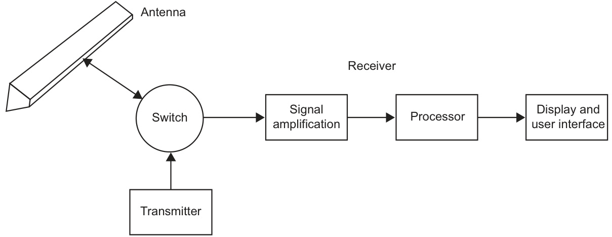

FIGURE 1.1 The basic radar system.  

【翻译】
图1.1 基本雷达系统。

【解读】
该图展示了一个基本的雷达系统，包括发射器、天线、接收器等组件，用于探测和跟踪目标物体。

【词汇表】
| 英文词汇 | 中文翻译 | 解释 |
| --- | --- | --- |
| Radar | 雷达 | 无线电探测和定位系统 |
| System | 系统 | 一系列相互连接的组件或设备 |
| Basic | 基本 | 最简单或最初级的形式或结构 |

The antenna of a marine radar rotates steadily in the horizontal plane giving a complete rotation about every 2 s. This means that radar pulses consecutively cover all directions over $360^{\circ}$ at each rotation of the antenna. The speed of radio waves is so high, about one million times greater than sound waves, that the antenna receives all the reflected energy from a particular transmitted pulse before it has appreciably rotated.  

### 1.2.2 Range as a Function of Time  

It is self-evident that the time which elapses between the transmission of a pulse and the reception of the corresponding echo depends on the speed of the pulse and the distance which it has travelled in making its two-way journey. If the speed of the pulse is known and the elapsed time can be measured, the range of the target producing the echo can be calculated.  

【翻译】
显而易见，脉冲传输与其对应回声接收之间所经过的时间取决于脉冲的速度以及它在往返旅程中行进的距离。如果已知脉冲的速度且能测量出所经历的时间，则可以计算出产生回声的目标的范围。

【解读】
本段讨论了利用脉冲信号来测量目标距离的原理，即通过测量脉冲发出后到回声返回之间的时间差，可以根据脉冲的速度计算出目标的距离。这是雷达技术和其他基于回声定位系统的基本工作原理。

【词汇表】
| 英文词汇 | 中文翻译 | 解释 |
| --- | --- | --- |
| pulse | 脉冲 | 一种短暂的能量或信号脉动 |
| echo | 回声 | 原始信号被反射回来后的副本 |
| elapsed time | 所经历的时间 | 指两个事件之间的时间间隔 |
| range | 范围、距离 | 指目标物体与观察者或传感器之间的距离 |

The velocity of radio waves is dependent on the nature of the medium through which they travel. In fact, within the Earth’s atmosphere it is hardly different to that within a space-type vacuum, that is $299,792,458\mathrm{m}/\mathrm{s}$ . In our own minds this is easiest to be considered to be almost precisely 300,000,000 (three hundred million) metres per second, or as 300 metres per microsecond $(\upmu s)$ , where $1\upmu\mathrm{s}$ represents one millionth part of a second (i.e. $10^{-6}s,$ . Using this value it is possible to produce a simple general relationship between target range and the elapsed time which separates the transmission of the pulse and the reception of an echo in any particular case (Figure 1.2).  

Let $D=$ the distance travelled by the pulse to and from the target (metres)  

$R=$ the range of the target $(\mathrm{m})$ $T=$ the elapsed time $(\upmu s)$ $S=$ the speed of radio waves $(\mathrm{m}/\upmu s)$  

Then $D=S\times T$ and $R=(S\times T)/2$ hence $R=(300\times T)/2$ thus $R=150T$ The application of this relationship can be illustrated by the following example.  

# EXAMPLE 1.1  

Calculate the elapsed time for a pulse to travel to and return from a radar target whose range is (a) $40\mathrm{m}$ (b) 12 nautical miles (NM).  

a. $R=150T$ thus $40=150T$ hence $T=40/150\approx0.27\upmu s$  

This value is of particular interest because $40\mathrm{m}$ represents the minimum detection range that must be achieved to ensure compliance with IMO Performance Standards for Radar Equipment (see Section 11.2.1). While this topic will be fully explored in Section 3.2.4, it is useful at this stage to note the extremely short time interval within which transmission and reception must be accomplished.  

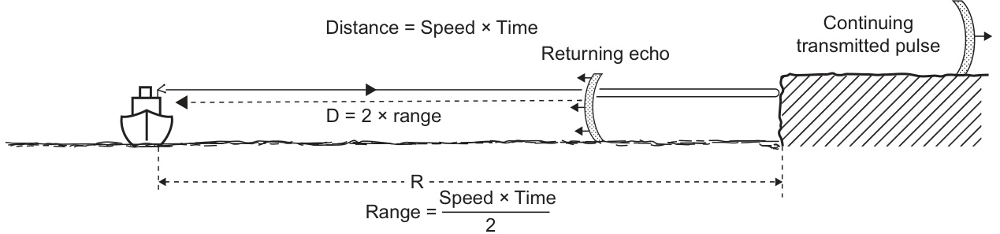  
FIGURE 1.2 The echo principle.  

【处理失败：内存不足或无法生成有效响应】

b. $R=150T$ Since $1~{\mathrm{NM}}=1852~{\mathrm{m}},$ $12\times1852=150T$ hence $T=12\times1852/150=148.16\upmu s$  

This result is noteworthy as it represents the elapsed time for a commonly used marine radar range scale. The elapsed times established in this section are of the order of millionths of a second and therefore need special instrumentation to be able to measure them accurately. In the early days of radar this was cutting-edge technology, but with the advent of quartz timing technology, and fast microelectronics it is no longer a major issue. Such technology is low cost, accurate and ubiquitous, with most humans owning multiple examples of precision timing in their watches, mobile phones, computers, TVs and cars.  

【翻译】
这一结果值得注意，因为它代表了常用海洋雷达范围尺度的经过时间。 本节中确定的经过时间是秒的百万分之一，因此需要特殊仪器才能准确地测量它们。在雷达早期，这是最先进的技术，但随着石英计时技术和快速微电子技术的出现，它不再是一个主要问题。这种技术成本低、精度高且无处不在，大多数人都拥有多个精密计时设备，如手表、手机、电脑、电视和汽车。

【解读】
本段讨论的是海洋雷达技术中的时间测量问题，特别是指出早期雷达技术难以精确测量极短的时间，而现在由于石英计时技术和快速微电子技术的发展，这已经不再是一个挑战。现代科技使得精密计时变得廉价和普遍，人们日常使用的许多设备都具备此功能。

【词汇表】
| 英文词汇 | 中文翻译 | 解释 |
| --- | --- | --- |
| elapsed time | 经过时间 | 指从某一时刻开始到另一时刻为止的时间间隔 |
| quartz timing technology | 石英计时技术 | 一种利用石英晶体的特性来实现高精度计时的技术 |
| microelectronics | 微电子技术 | 研究和制造小型电子元件和系统的技术领域 |
| ubiquitous | 无处不在 | 指某物或某事在所有地方都存在或可用的情况 |

# 1.2.3 Directional Transmission and Reception  

In a marine radar system it is cost and space effective to use a single antenna for both transmission and reception. It is designed in such a way (see Section 2.5) as to focus the transmitted energy into a beam which is very narrow in the horizontal plane. The angle within which the energy is constrained is called the horizontal beamwidth (Figure 1.3). It must have a value of not more than $2.0^{\circ}$ if it is to comply with the international regulations which govern marine radar. Civil marine radars for large ships are available with horizontal beamwidths as narrow as $0.75^{\circ}$ . The equivalent reception property of the antenna is such that it will detect energy which has returned from within the angular limits of the horizontal beamwidth; that is from those targets that have been illuminated by the corresponding radar transmission. Its insensitivity to picking up unwanted noise from other directions effectively increases its ability to detect the reflected echoes.  

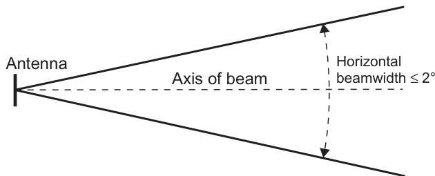  
FIGURE 1.3 The horizontal beam width.  

【翻译】
图1.3 水平梁宽度。

【解读】
该图显示了一个水平方向上的梁宽度，可能是在建筑或工程设计中使用的一个参数。图中的内容没有具体描述，但从标题可以看出，这是一个关于结构尺寸的图示，用于说明水平方向上某一构件的宽度大小。

【词汇表】
| 英文词汇 | 中文翻译 | 解释 |
| --- | --- | --- |
| Figure | 图 | 一种插图或图表，用来说明某一概念或数据 |
| Horizontal | 水平的 | 指与地面平行的方向或状态 |
| Beam | 梁 | 建筑或工程中的一种构件，通常为长条形状，用于承载荷载 |
| Width | 宽度 | 物体在某一方向上的测量值，表示其大小 |

An essential feature of a marine radar is that it should provide continuous coverage over the full $360^{\circ}$ of azimuth angle. To achieve this the antenna has to rotate and no part of the vessel should obscure the radar beam, such as masts and other superstructure. Typical antenna rotation rates are 24#45 revolutions per minute, resulting in a complete rotation occurring every $1.3\mathrm{-}2.5\mathrm{s}.$ , depending on the system.  

The interval between successive transmitted pulses has to at least allow the transmitted signal to travel out to the furthest target of interest and back again, although there are other considerations, which are discussed in Section 2.3.3.2. This interval is normally considered as a pulse repetition frequency (PRF), that is the number of pulses transmitted in $1\mathrm{s}$ . If we take, as an example, a value of 1500 pulses per second $(1500~\mathrm{Hz})$ ; this is equivalent to one pulse every $667\upmu s$ . Taking a representative time for one revolution of the scanner to be $2\mathsf{s},$ it is seen that 3000 pulses are transmitted during one revolution and that the scanner rotates through $0.12^{\circ}$ between pulses. The picture is thus ‘built up’ of approximately 3000 radial lines of reflected echoes.  

# 1.2.4 Display of Radar Information  

# 1.2.4.1 The A-Scan Display  

The A-scan is a useful concept to help understand the makeup of a reflected radar signal and how it can be displayed. This basic type of display is sometimes used today by engineers and technicians for special purposes, but is not a display that is available on a marine radar when used as a navigational aid. An A-scan display plots the returned radar signal as a graph, see Figure 1.4. The horizontal axis represents time and the vertical axis represents the strength (amplitude) of the received signal. The plot, sometimes called a trace, commences at the instant each radar pulse is transmitted. This event is indicated by a vertical spike, known as the transmission mark. Returning echoes also generate spikes in the plot. The amplitude of these spikes are related to the strength of the echo. The equivalent ‘real-life’ situation is also shown in the diagram.  

【翻译】
A-scan是一个有用的概念，可以帮助理解反射雷达信号的组成以及如何显示它。这一种基本的显示类型有时被工程师和技术人员用于特殊目的，但不是在海事雷达中作为导航辅助工具使用时可用的显示。A-scan显示将返回的雷达信号绘制为图形，如图1.4所示。水平轴代表时间，垂直轴代表接收到的信号强度（幅值）。该图，有时称为痕迹，从每次雷达脉冲发送的瞬间开始。在图中，这一事件用一个垂直尖峰表示，称为传输标记。返回的回声也会在图中产生尖峰。这些尖峰的幅值与回声的强度有关。等效的“现实生活”情况也在图中展示。

【解读】
本段主要介绍了A-scan的概念及其工作原理。A-scan是通过将雷达信号以图形方式显示来帮助理解雷达信号的组成。这种显示方法可以清晰地看到信号的强度随时间的变化，以及不同物体的回声强度差异。虽然现在这种显示方式不常用作导航辅助工具，但仍然具有特殊的应用价值。

【词汇表】
| 英文词汇 | 中文翻译 | 解释 |
| --- | --- | --- |
| A-scan | A扫描 | 一种显示雷达信号的方式，以图形形式呈现信号的强度和时间关系 |
| Radar signal | 雷达信号 | 由雷达设备发出的电磁波信号 |
| Amplitude | 幅值 | 信号的强度或大小 |
| Spike | 尖峰 | 图中代表信号强度突然增加的部分 |
| Transmission mark | 传输标记 | 图中代表雷达脉冲发送时刻的标记 |

The horizontal distance between the transmission mark and an echo spike is a measure of the range of the target. Using the result from Example 1.1(b), it is evident that if the full extent of the plot is to represent a range of $12\mathrm{NM}$ (the selected range scale) this is equivalent to a timescale of approximately $148~{\upmu\mathrm{s}}$ .  

# 1.2.4.2 The Plan Position Indicator Display  

The A-scan shows the amplitude of the reflected radar energy as a function of range at a particular azimuth bearing angle of the radar antenna. In principle, this angle could be shown in degrees as an information box on the display, allowing the user to determine the range and azimuth of any target in view, as the antenna rotated. In practice, this would not be a very effective display. With targets only being visible for a short period, once per revolution of the antenna, the human brain would have difficulty in assessing any real situation.  

【翻译】
A-scan显示了反射雷达能量的幅度如何随距离在特定方位角（雷达天线的方向）变化。理论上讲，这个角度可以用度数表示，在显示屏上以信息框的形式呈现，从而让用户能够确定视野中任何目标的距离和方位，因为天线正在旋转。然而，在实际操作中，这种显示方式并不是非常有效。由于目标只在天线每旋转一周时短暂可见一次，人类的大脑会很难评估出任何真实的情况。

【解读】
本段主要讨论了A-scan的工作原理及其在实际应用中的局限性。A-scan通过显示反射雷达能量的幅度与距离之间的关系来帮助用户确定目标的位置。但是，由于目标的可见时间极短且只有在天线旋转到特定角度时才可见，因此这种方法在实践中并不十分有效，尤其是在需要快速反应和准确判断的情况下。

【词汇表】
| 英文词汇 | 中文翻译 | 解释 |
| --- | --- | --- |
| Amplitude | 幅度 | 指信号或波动的最大振幅值 |
| Azimuth | 方位角 | 地平面上的一个点相对于观测者位置的顺时针角度 |
| Radar antenna | 雷达天线 | 发送和接收雷达信号的设备 |
| Revolution | 旋转 | 完整地围绕一个中心点旋转一圈 |

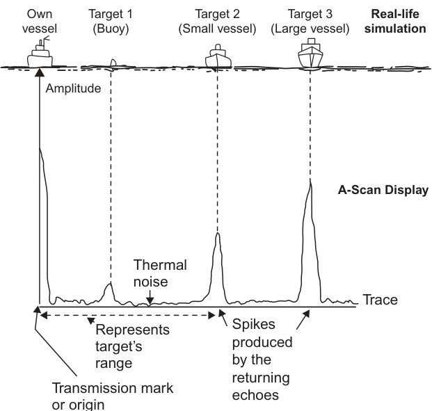  
FIGURE 1.4 The A-scan display.  

【翻译】
图1.4 A扫描显示。

【解读】
该段落主要是对一张图片的描述，这张图片展示了A扫描的显示结果。A扫描是一种常用于医学影像技术中的超声波检查方法，特别是在眼科检查中，它可以用来测量眼球的长度、晶状体的厚度等参数，以帮助医生诊断和治疗相关的眼部疾病。

【词汇表】
| 英文词汇 | 中文翻译 | 解释 |
| --- | --- | --- |
| FIGURE | 图片/图表 | 一种插图或图示，用来说明某个概念或数据。 |
| A-scan | A扫描 | 一种超声波检查方法，用于测量眼球或其他组织的厚度和长度。 |
| display | 显示 | 指的是将信息以可视化的形式呈现出来，如在屏幕上显示图像或数据。 |

What is perhaps ideally required is a plan view, such that the radar image creates a ‘map’ of the surrounding area, allowing easy assimilation of the current situation by the user. This is particularly relevant in our modern world as it also allows the radar display to show conventionally charted features as an ‘underlay’ to the radar image, putting them into geographical context.  

【翻译】
也许理想的情况是拥有一个平面视图，这样雷达图像就可以创建出周围区域的地图，从而使用户能够轻松地掌握当前的情况。在现代社会中，这尤为重要，因为它还允许雷达显示以传统绘制的特征作为“底图”来展示雷达图像，并将其置于地理环境中。

【解读】
这段话强调了在雷达系统中呈现平面视图的重要性，以便用户能够快速理解当前情况。这种方法不仅有助于提高用户体验，还能通过在地图上叠加雷达图像来提供更丰富的地理信息。

【词汇表】
| 英文词汇 | 中文翻译 | 解释 |
| --- | --- | --- |
| plan view | 平面视图 | 从直接上方观察物体或场景的二维表示方式 |
| assimilation | 掌握、理解 | 获取并处理信息的过程 |
| underlay | 底图 | 在其他图像或数据下方显示的基础图层或信息 |
| geographical context | 地理环境 | 指某事物或事件发生的具体位置和空间关系背景 |

The term Plan Position Indicator (PPI) has been used for this type of radar display, since the 1940s. Nowadays the precise image on the display is produced by digital processing technology. This effectively computes the amplitude of the received signal, as shown in Figure 1.4 for the A-scan, at small increments of range. The increment used is known as the range cell increment. The process produces a computerized list of signal strengths against range for the particular azimuth angle (bearing) of the antenna. The next radar pulse is transmitted when the antenna has turned through a small angle, known as the azimuth cell increment, creating another list of signal strengths for each range cell increment. This ongoing process results in a digitally stored table of signal strengths against range and azimuth angle. This process is illustrated in Figure 1.5.  

【翻译】
“计划位置指示器（Plan Position Indicator，PPI）”一词自1940年代以来就被用于描述这种类型的雷达显示。如今，在显示屏上精确的图像是通过数字处理技术产生的。这项技术有效地计算了接收信号的幅度，如图1.4中的A扫描图所示，以小范围增量来计算。使用的增量称为距离单元增量。该过程会生成一个针对特定方位角（航向）的天线的信号强度列表，与距离相关联。当天线转过一个小角度，即方位单元增量后，会发出下一个雷达脉冲，从而为每个距离单元增量创建另一个信号强度列表。这个持续的过程结果是一个数字存储的表格，记录了信号强度与距离和方位角之间的关系。这个过程如图1.5所示。

【解读】
本段主要介绍了雷达显示技术中使用的“计划位置指示器（PPI）”概念，以及其工作原理。通过数字处理技术，可以精确地计算出接收信号的幅度，并以此来构建雷达图像。整个过程涉及到距离和方位角的测量，并最终形成一个数字化的信号强度表格，这对于雷达系统的正常运作至关重要。

【词汇表】
| 英文词汇 | 中文翻译 | 解释 |
| --- | --- | --- |
| PPI | 计划位置指示器 | 一种雷达显示技术的名称 |
| Amplitude | 幅度 | 信号的大小或强度 |
| Azimuth | 方位角 | 天线的方向角度 |
| Range Cell Increment | 距距单元增量 | 测量距离的基本单位 |
| Azimuth Cell Increment | 方位单元增量 | 测量方位角的基本单位 |

The main diagram is a plan view of an area with the ship’s position at the centre, showing its heading as a vertical arrow. It looks rather similar to a radar display, but in this case it is solely representing the actual geographical situation. Each cell increment in the azimuthal direction is depicted as a radial line and each increment in the radial direction as a circle, centred at the own ship’s position. The actual increment size is chosen so that a point target would be detected in a number of adjacent range and azimuth sampling points, taking into account the beamwidth of the antenna and the length of the transmitted pulse. This means, in practice, that there are many more azimuth cells than are depicted in Figure 1.5, typically 1,024 or more covering the full $360^{\circ}$ . Also, the length of a range cell is typically measured in tens of metres but depends on the chosen pulse length, see Section 2.3.3.1. The reflected signal strength measurement is centred at the crossing points of these lines and circles. The radar stores them as a table of values of signal strengths (amplitudes), which is also depicted in Figure 1.5. The illustrated table uses realistic values, including the depiction of signal strength. Signal strength, in this example, is based on a scaled value of between 0 and 1,023.  

To display the image the radar’s digital processor has to convert the ranges and azimuths of the measurements to $\mathbf{\nabla}^{\prime}x^{\prime}$ and $'y^{\prime}$ coordinates, relative to the own ship, using the simple mathematical concept illustrated in Figure 1.6. After scaling the $x$ and $y$ positions to allow them to be represented on the radar display, the received echoes are indicated at their equivalent position by spots of appropriate colour and intensity, depending on the received signal strength. At every revolution of the antenna the stored data, and hence the resultant radar image, is updated. This process produces the conventional image of displayed radar targets, such as that illustrated in Figure 1.7.  

Today, the radar display is a conventional ‘flat-panel’ electronic screen, similar to that used on modern TVs and computer displays. The technology lying behind flat-panel displays is discussed in Section 2.8.3. The radar image is conventionally shown within a circular domain, with a radius equivalent to the selected maximum display range. This is no longer compulsory under the international regulations that govern marine radar but remains a widespread practice, reflecting the fact that original radar cathode ray tube (CRT) displays were circular rather than rectangular. These used to epitomize a radar installation, see Figure 1.8. There is always a bearing scale shown around the periphery of the operational display area, whether circular or otherwise. On older radars this used to be engraved on the rim surrounding the CRT. Nowadays, the scale is produced electronically and forms part of the displayed image. The bearing scale is labelled in degrees.  

【翻译】
如今，雷达显示器通常采用与现代电视机和电脑显示器类似的“平板”电子屏幕。平板显示技术的详细讨论见第2.8.3节。雷达图像通常在一个圆形区域内显示，其半径等同于所选的最大显示范围。这一做法虽然不再是海事雷达国际规定中的强制要求，但仍然被广泛采用，这反映了最初的雷达阴极射线管（CRT）显示器是圆形而非矩形的事实。这些曾经是雷达安装的典型代表，如图1.8所示。在操作显示区域的周边总是有一个方位标尺，无论显示区域是圆形还是其他形状。在老式雷达中，这个标尺曾经刻在CRT周围的边缘上。现在，标尺是通过电子方式产生的，并成为显示图像的一部分。方位标尺以度为单位进行标记。

【解读】
本段主要介绍了现代雷达显示器的特点及其演变历史。从传统的CRT显示器到现在的平板电子屏幕，雷达显示技术已经发生了显著的变化。尽管国际规定已经放松了对显示形式的限制，但圆形显示区域和方位标尺仍然被广泛使用，这些元素已成为雷达系统的标准配置。

【词汇表】
| 英文词汇 | 中文翻译 | 解释 |
| --- | --- | --- |
| flat-panel | 平板 | 一种薄、轻、低功耗的显示设备 |
| cathode ray tube (CRT) | 阴极射线管 |一种传统的显示设备，通过电子枪发射电子束来显示图像 |
| bearing scale | 方位标尺 | 用于指示方向的标尺，通常以度为单位 |
| radar image | 雷达图像 | 由雷达系统生成的图像，用于显示目标物体的位置和运动信息 |
| international regulations | 国际规定 | 管理海事雷达使用的规则和标准 |

Also displayed are range circles centred on the origin (position of the own ship). These are known as range rings and can be set to convenient values by the operator, see Figure 1.9. This shows the radar on a 12 NM scale, with range rings set at 2 NM spacing. The rings can be switched off, if not required. In addition there are tools that enable a user to accurately determine the range and bearing of any target on the display. These are fully discussed in Section 6.9 and, for instance, include a variable range marker (VRM), as also illustrated in Figure 1.9.  

【翻译】
此外，还显示了以自身船只位置（原点）为中心的范围圆圈，这些被称为范围环，可以由操作员设置为方便的值，如图1.9所示。这显示了雷达在12海里尺度上，以2海里间隔设置范围环。如果不需要，可以关闭这些环。此外，还有一些工具可以让用户准确地确定显示屏上任何目标的距离和方向。这些都将在第6.9节中详细讨论，例如包括一个可变范围标记（VRM），如图1.9所示。

【解读】
本段主要介绍了雷达系统中的范围环和其他辅助工具的功能。范围环是以自身船只位置为中心的圆圈，可以根据需要进行开启或关闭，并且可以设置不同的距离间隔。另外，系统还提供了一些工具，如可变范围标记（VRM），帮助用户精确定位目标的距离和方向。

【词汇表】
| 英文词汇 | 中文翻译 | 解释 |
| --- | --- | --- |
| Range Rings | 范围环 | 以自身船只位置为中心的距离圆圈 |
| Variable Range Marker (VRM) | 可变范围标记 | 一种辅助工具，帮助用户确定目标的距离 |
| Bearing | 方向 | 目标相对于观察者的方向角度 |
| Target | 目标 | 需要被定位或跟踪的物体或船只 |

The normally circular operational display area of a radar is a useful means of assessing quickly whether any particular display on a ship’s bridge is set up as a radar or as an electronic chart. The latter image is generally  

【翻译】
雷达的正常圆形操作显示区域是快速评估船桥上任何特定显示是否设置为雷达或电子图表的一种有用途径。后者图像通常是

【解读】
该段落讨论了如何通过观察雷达的显示区域来区分雷达和电子图表。雷达的显示区域通常呈圆形，而电子图表可能有不同的显示形式。

【词汇表】
| 英文词汇 | 中文翻译 | 解释 |
| --- | --- | --- |
| Radar | 雷达 | 一种使用无线电波探测和定位物体的系统 |
| Operational display area | 操作显示区域 | 指雷达或其他设备中用于显示信息的区域 |
| Electronic chart | 电子图表 | 一种数字化的海图或地图，用于导航和规划路线 |

Azimuth cell increment $=\mathsf{\Theta}_{\mathsf{\theta}}$ ,e.g. $0.3^{\circ}$  

Range cell increment $=R_{\Gamma},$ . e.g. 10 metres  

The amplitude of the received signal at each azimuth and range cell increment, such as at the point ) $\mathsf{\Omega}\times(2\mathsf{\theta}_{\mathsf{a}},3\mathsf{R}_{\mathsf{r}})$ in the diagram, is measured and temporarily stored by the radar. This results in a table of values of the amplitude of the received signal at every cell  

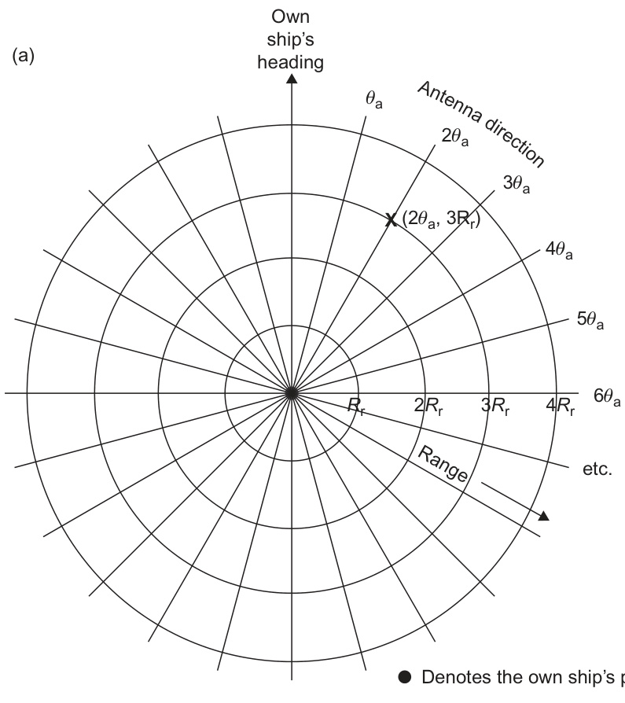  
FIGURE 1.5 Creating a table of received signal strengths:(a) plane view of area with the own ship's position at centre and (b) table of amplitudes.  

【翻译】
图1.5 创建接收信号强度表：（a）以自身船只位置为中心的平面区域视图和（b）幅值表。

【解读】
该图示意在展示如何创建一个接收信号强度表，以便分析和记录不同位置的信号强度。图（a）显示了一个平面区域视图，其中自身船只位于中心，而图（b）则是对应的信号幅值表。这可能是在通信或导航系统中用于优化信号接收质量的技术步骤。

【词汇表】
| 英文词汇 | 中文翻译 | 解释 |
| --- | --- | --- |
| Received signal strengths | 接收信号强度 | 指的是设备接收到的信号的强度大小 |
| Amplitudes | 幅值 | 信号的振幅，即信号的最大值 |
| Plane view | 平面视图 | 二维平面上的视觉表现形式 |
| Centre | 中心 | 指的是某一物体或图形的中央位置 |

(b) Extract from example table, showing possible target at about $M2.0^{\circ}$ , 3,762 metres) and only small reflections, such as from waves, in the vicinity of $12.3^{\circ}$ ,2,400 metres):  

<html><body><table><tr><td colspan="2">Cellvalue</td><td rowspan="2">Amplitude (e.g., max value 1,024)</td></tr><tr><td>θ (Degree)</td><td>R (Metres)</td></tr><tr><td>--</td><td>-</td><td>-</td></tr><tr><td>12.0</td><td>3,750</td><td>105</td></tr><tr><td>12.0</td><td>3,760</td><td>904</td></tr><tr><td>12.0</td><td>3,770</td><td>495</td></tr><tr><td>12.0</td><td>3,780</td><td>75</td></tr><tr><td>---</td><td>---</td><td>---</td></tr><tr><td>12.3</td><td>2,390</td><td>20</td></tr><tr><td>12.3</td><td>2,400</td><td>14</td></tr><tr><td>12.3</td><td>2,410</td><td>25</td></tr><tr><td>12.3</td><td>2,420</td><td>16</td></tr><tr><td></td><td>-</td><td>--</td></tr></table></body></html>  

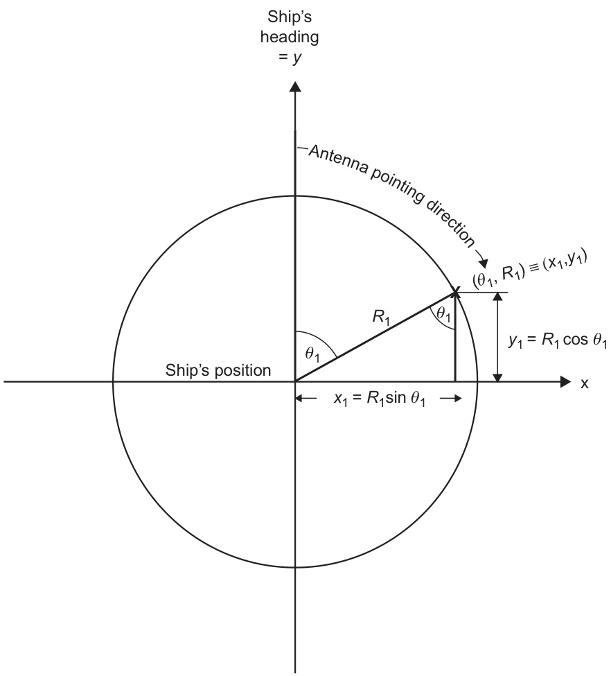  
FIGURE 1.6 Conversion of range and azimuths to $(x,y)$ Cartesian coordinates.  

displayed as a rectangle, even though it may have radar data included in the displayed image. Section 10.2 explains the significant differences between viewing and using radarderived data on a radar display (PPI) and on an electronic chart. In general, the simple rule is that fundamental decisions concerning collision avoidance should always be made on the radar display, but the main route monitoring activity should be using the chart display.  

【翻译】
即使雷达数据包含在显示图像中，也会以矩形形式显示。第10.2节解释了在雷达显示（PPI）和电子海图上查看和使用雷达导出的数据之间的显著差异。一般来说，简单的规则是关于碰撞避免的基本决策应该始终在雷达显示上进行，但主要路线监测活动应使用海图显示。

【解读】
本段强调了雷达显示和电子海图在航行中的不同作用和重要性。雷达显示适合用于实时监控和避免碰撞，而电子海图更适合用于规划和监测航线。这一原则对于确保安全航行至关重要。

【词汇表】
| 英文词汇 | 中文翻译 | 解释 |
| --- | --- | --- |
| Radar | 雷达 | 无线电探测和定位系统 |
| PPI | 计划位置指示器 | 一种类型的雷达显示设备 |
| Collision avoidance | 碰撞避免 | 航空或航海中为了防止碰撞而采取的措施 |

The term PPI will perhaps cease to be used over time, especially with the increased use of multifunction displays, which can be set to be used at any one time as a radar, electronic chart or other navigational display. However, this book will use the terms PPI and radar display interchangeably, as is in common usage at the time of writing. Into the future the likely trend is that the main radar display will increasingly become known as the collision avoidance display and the electronic chart display (when not being used for route planning) as the route monitoring display. When radar data is being used for other functions, such as position fixing or assistance with route monitoring, these task will be performed on the appropriate display modes, showing relevant radar information as well as other available data.  

【翻译】
PPI这个术语可能会随着时间的推移而被逐渐淘汰，特别是随着多功能显示器的广泛使用，这些显示器可以根据需要设置为雷达、电子海图或其他导航显示器。然而，本书将同时使用PPI和雷达显示这两个术语，因为在写作时这是常见的用法。展望未来，很可能的趋势是主要的雷达显示器将越来越多地被称为碰撞避免显示器，而电子海图显示器（当不用于路线规划时）则被称为路线监控显示器。当雷达数据被用于其他功能，如位置确定或辅助路线监控时，这些任务将在相应的显示模式下进行，展示相关的雷达信息以及其他可用的数据。

【解读】
本段讨论了PPI（计划位置指示器）这一术语的潜在演变，以及随着技术进步，尤其是多功能显示器的应用，导航系统中各类显示器的命名和功能可能发生变化。作者提到，在未来的发展中，雷达显示器可能更侧重于碰撞避免和路线监控等特定功能，同时整合更多的数据类型以提高导航效率。

【词汇表】
| 英文词汇 | 中文翻译 | 解释 |
| --- | --- | --- |
| PPI | 计划位置指示器 | 一种导航设备，显示预计船只位置 |
| Multifunction displays | 多功能显示器 | 可以显示多种信息的屏幕，如雷达、电子海图等 |
| Collision avoidance display | 碰撞避免显示器 | 用于防止碰撞的导航显示器 |
| Route monitoring display | 路线监控显示器 | 用于监测行驶路线的导航显示器 |

# 1.2.4.3 Target Trails  

It is very often useful on a radar display for the past track of targets to remain visible, at least for a few minutes. This can give a much clearer visualization of the movement of critical targets. Targets are said to leave a trail on the display. Originally this feature was achieved by using CRTs with a very high image persistence. Any instantaneous image on the display only slowly faded because of the specially chosen phosphors used on the display surface of the CRT. Consequently, targets would create a line on the display, showing their past positions. Close to the most recent position of the target the trail would be bright and would gradually fade to being invisible further along its length, see Figure 1.10. Nowadays this effect is artificially created by digital processing of the displayed radar image. This allows greater flexibility in the display of trails, such as their time length to extinction and whether or not they are displayed. It also more clearly distinguishes between targets and trials, for instance, by the use of different colours.  

【翻译】
在雷达显示屏上，目标的过去轨迹保持可见性至少几分钟是非常有用的。这可以更清晰地展示关键目标的运动情况。人们说目标会在显示屏上留下一条痕迹。最初，这个功能是通过使用具有很高图像持久性的CRT（阴极射线管）实现的。由于CRT显示表面上使用了特殊选择的磷光体，任何瞬间图像在显示屏上只会慢慢消失。因此，目标会在显示屏上创建一条线，显示它们过去的位置。在目标最近的位置附近，痕迹会很亮，随着距离的增加而逐渐消失，参见图1.10。如今，这种效果是通过对显示的雷达图像进行数字处理来人工创造的。这允许对痕迹的显示具有更大的灵活性，例如其时间长度到消失以及是否显示。它还更清楚地区分目标和试验，例如，通过使用不同的颜色。

【解读】
本段主要讨论了雷达系统中目标轨迹显示的重要性及其实现方式。传统上，利用CRT的图像持久性来显示目标的过去轨迹，而现在则通过数字处理来实现这一功能，从而提高了显示的灵活性和区分度。

【词汇表】
| 英文词汇 | 中文翻译 | 解释 |
| --- | --- | --- |
| Radar Display | 雷达显示屏 | 用于显示雷达信号的屏幕 |
| Image Persistence | 图像持久性 | 物理设备中图像持续显示的能力 |
| Phosphors | 磷光体 | 发光材料，在CRT中用于显示图像 |
| Digital Processing | 数字处理 | 使用计算机技术处理数据的过程 |

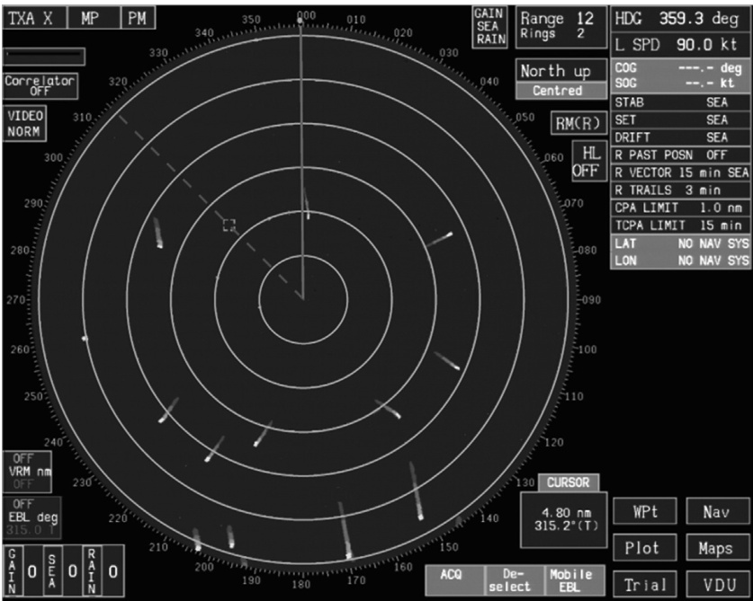  
FIGURE 1.7 Displayed radar targets. Figure courtesy of Kelvin Hughes.  

【翻译】
图1.7 所示为雷达显示目标。图片来源：Kelvin Hughes。

【解读】
本段落主要是对一张图片的描述，这张图片展示了雷达系统中显示的目标。雷达（Radio Detection and Ranging）技术广泛应用于航空、航海、军事等领域，用以探测和跟踪目标。该图片可能来自Kelvin Hughes公司，该公司可能是雷达设备或相关技术的供应商或开发者。

【词汇表】
| 英文词汇 | 中文翻译 | 解释 |
| --- | --- | --- |
| Radar | 雷达 | 无线电探测和测距系统，用于探测和定位物体 |
| Targets | 目标 | 在此 contexto 指的是雷达系统能够探测到的物体，如飞机、船只等 |
| Courtesy | 来源 | 表示某件事情或资料的来源或提供者 |

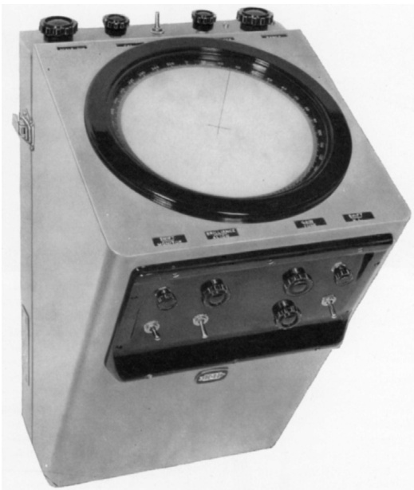  
FIGURE 1.8 Older radar display. Figure courtesy of Kelvin Hughes.  

【翻译】
图1.8较旧的雷达显示器。图片来源：Kelvin Hughes公司。

【解读】
该段落主要是对一张图片的描述，这张图片展示了一个较旧的雷达显示器。雷达（Radio Detection and Ranging）技术常用于探测和定位物体，特别是在航空、航海和气象领域。这张图片可能来自Kelvin Hughes公司，该公司可能是雷达设备的制造商或供应商。

【词汇表】
| 英文词汇 | 中文翻译 | 解释 |
| --- | --- | --- |
| Radar | 雷达 | 无线电探测和测距系统，用于探测和定位物体 |
| Display | 显示器 | 电子设备中显示信息的屏幕或界面 |
| Courtesy | 来自 | 表示某物品或信息来源于某人或某组织 |

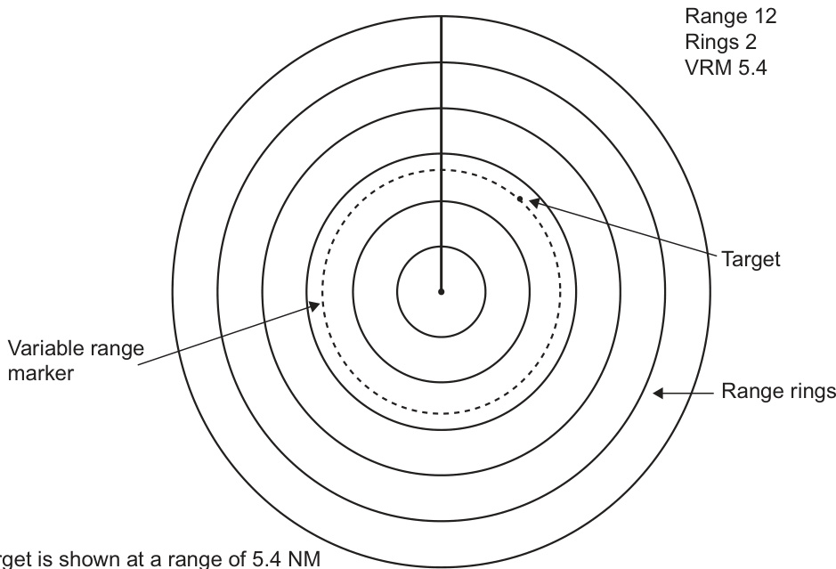  

【处理失败：内存不足或无法生成有效响应】

# 1.3 PRINCIPLES OF BEARING MEASUREMENT  

# 1.3.1 The Heading Marker  

In general, a bearing is the angle between the direction of a chosen reference and that of an object of interest. On a PPI display the fundamental reference is the instantaneous direction of the observing vessel’s heading.  

【翻译】
一般来说，方位角是指选定参考方向与目标物体方向之间的夹角。在PPI（平面位置指示器）显示中，基本参考是观察船舶当前航向的瞬时方向。

【解读】
本段主要介绍了方位角的定义及其在PPI显示中的应用背景。方位角是一个用于描述两个方向之间关系的参数，在导航和航空领域尤其重要，因为它帮助确定相对位置和运动方向。

【词汇表】
| 英文词汇 | 中文翻译 | 解释 |
| --- | --- | --- |
| Bearing | 方位角 | 指两个方向之间的夹角，常用于描述一个物体相对于另一个物体或参考点的方向。 |
| Reference | 参考 | 在此 contexto 中指的是用来作为比较或测量基准的标准或方向。 |
| Heading | 航向 | 指飞机、船舶等载具当前的行进方向。 |
| PPI | 平面位置指示器 | 一种显示设备，通常用于雷达系统中，以平面图像形式显示目标物体的位置和移动情况。 |

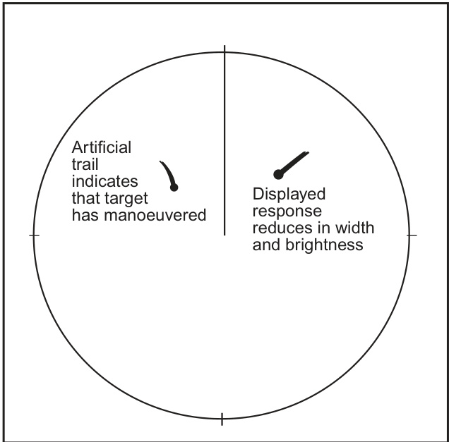  
FIGURE 1.9 Radar range rings and VRM.   
FIGURE 1.10 Target trails.  

【翻译】
图1.9 雷达距离环和VRM。
图1.10 目标轨迹。

【解读】
这两个图分别展示了雷达系统中的两个重要概念：距离环（range rings）和目标轨迹（target trails）。距离环是指雷达信号在不同距离处形成的圆形图案，而目标轨迹则表示被跟踪目标随时间移动的路径。这两个概念对于雷达系统的工作原理和应用至关重要。

【词汇表】
| 英文词汇 | 中文翻译 | 解释 |
| --- | --- | --- |
| Radar | 雷达 | 无线电探测和定位系统 |
| Range Rings | 距离环 | 雷达信号在不同距离处形成的圆形图案 |
| Target Trails | 目标轨迹 | 被跟踪目标随时间移动的路径 |
| VRM | 虚拟范围标记 | 一种用于标记和测量距离的技术 |

As the axis of the beam of the radar antenna crosses the ship’s fore-and-aft line in the forward direction, a sensor within the turning mechanism of the radar antenna is activated and the associated electronics sends a timing pulse to the radar receiver. This pulse is used to synchronize the display electronics to the antenna rotation and, in particular, is used as the reference for the heading marker or heading indicator. In addition, azimuth pulses are generated at regular angular increments as the antenna rotates to take into account its potentially uneven rotation due to wind, vibration and vessel motion effects. Thus all targets are displayed, not only in the correct angular relationship to one another, but also in the correct angular relationship to the own ship’s heading (see Figure 1.11).  

【翻译】
当雷达天线的轴线穿过船只的前后线向前方向时，雷达天线转动机构内的传感器被激活，其相关电子设备发送一个定时脉冲到雷达接收器。该脉冲用于同步显示电子设备与天线旋转，并特别作为航向标记或指示器的参考。此外，当天线旋转时，在规则的角度增量处产生方位脉冲，以考虑由于风、振动和船舶运动效应而引起的潜在不均匀旋转。因此，不仅所有目标都以正确的角度关系显示为彼此相对，而且还以正确的角度关系显示为本船的航向（见图1.11）。

【解读】
这段话描述了雷达系统中天线旋转与显示电子设备之间的同步过程。当天线旋转时，内部传感器会激活并发送定时脉冲，以确保显示出的目标位置与实际位置保持一致。同时，系统也会考虑到风、振动和船舶运动等因素对天线旋转的影响，从而保证目标在显示屏上以正确的角度关系呈现。

【词汇表】
| 英文词汇 | 中文翻译 | 解释 |
| --- | --- | --- |
| Antenna | 天线 | 雷达系统中的发射和接收信号的装置 |
| Synchronize | 同步 | 使两个或多个事件或过程保持相同的时间或频率 |
| Azimuth | 方位 | 地平面上的某一点相对于观测点的角度位置 |
| Heading | 航向 | 船舶或飞机的前进方向 |

The angle between the observed vessel’s heading and the direction of the horizontal beam is sometimes called the antenna angle. IMO Performance Standards (see Section 11.2.1) require that the heading marker is able to be aligned to within $0.1^{\circ}$ . The procedure for checking this accuracy is discussed in Section 6.6.8. There is a danger that a target may be masked if it lies in the direction of the heading marker. The specification recognizes this danger by requiring that there is a provision for temporarily switching the marker off. However, it is such an important feature on the radar display that it cannot be permanently switched off. In particular, the appearance of the heading marker confirms the orientation of the display (see Section 1.4).  

A modern radar may also be able to display a stern line, drawn on a reciprocal bearing to the heading, which can be very useful when manoeuvring astern. This line can be switched on or off, as required. The heading line remains visible when the stern line is selected.  

【翻译】
现代雷达还可能显示一条艉线，该线以相反的方位绘制在航向上，这在倒车操作时非常有用。这条线可以根据需要打开或关闭。当选择艉线时，航向线仍然可见。

【解读】
这段话主要介绍了现代雷达系统的一项功能，即能够显示“艉线”（stern line），它是与当前航向方向相反的参考线。在进行后退式操纵（如泊船或其他需要后视的操作）时，这个功能尤其有用，因为它能帮助操作员更好地判断空间位置和距离。同时，雷达系统允许用户根据需要开启或关闭这个功能，以适应不同的操作需求。

【词汇表】
| 英文词汇 | 中文翻译 | 解释 |
| --- | --- | --- |
| Radar | 雷达 | 无线电探测和定范围系 |
| Reciprocal bearing | 相反方位 | 指两个方向恰好相反的关系 |
| Manoeuvring | 操纵、操作 | 特指船舶等交通工具的驾驶或控制动作 |
| Astern | 倒车、后退 | 指船舶或飞机等逆着原来的行进方向移动 |

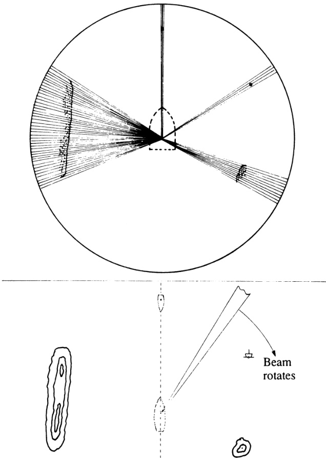  
FIGURE 1.11 The build-up of the picture.  

【翻译】
图1.11 图片的构建过程。

【解读】
该段落主要是对一张图片的描述，特别是指出这张图片是如何一步步构建起来的。这种描述通常用于艺术、设计或技术领域，以帮助观众了解创作过程中的各个阶段。

【词汇表】
| 英文词汇 | 中文翻译 | 解释 |
| --- | --- | --- |
| build-up | 构建过程 | 指逐步建立或组装某物的过程 |
| picture | 图片 | 一幅图像或照片 |
| figure | 图表或插图 | 在书籍或文章中用来说明某一点的图表或插图 |

# 1.3.2 Bearing Measurement  

IMO Performance Standards (see Section 11.2.1) require that provision be made for quickly obtaining the bearing of any object whose echo appears on the display. Traditionally this was fulfilled by a variety of mechanical and electromechanical devices which enabled the observer to measure the angle between the heading marker and the object of interest. On a modern radar, electronic bearing lines (EBLs) are used for this measurement. In particular, these are designed to be able to quickly determine the bearing of a target with respect to the own ship’s heading. In the basic setting of the radar the EBL emanates from the centre (origin) of the display, there will the own ship’s position, to the edge of the operational display area, where its angular position can be read off from the bearing scale around the periphery of the area. Using the appropriate controls the operator can orientate the EBL such that it passes through the target of interest. This is illustrated in Figure 1.12(a).  

【翻译】
国际海事组织（IMO）的性能标准（见第11.2.1节）要求能够快速获取在显示屏上出现回波的任何物体的方位。传统上，这是通过各种机械和电机设备来实现的，它们使观察者能够测量heading标记和感兴趣的物体之间的角度。在现代雷达中，使用电子方位线（EBLs）进行此类测量。特别地，这些电子方位线被设计为能够快速确定目标相对于自身船只航向的方位。在雷达的基本设置中，从显示屏的中心（原点）发出电子方位线，即自身船只的位置，到操作显示区域的边缘，其角度位置可以从周围的方位尺度上读取。使用适当的控制装置，操作员可以调整电子方位线，使其经过感兴趣的目标，如图1.12（a）所示。

【解读】
本段主要介绍了国际海事组织对雷达系统的性能标准，特别是关于快速获取物体方位的要求。它解释了传统方法和现代电子方位线（EBLs）的使用，以便于测量目标与自身船只航向之间的角度。这种技术使得操作员能够快速准确地确定目标的方位，对于航海安全至关重要。

【词汇表】
| 英文词汇 | 中文翻译 | 解释 |
| --- | --- | --- |
| IMO | 国际海事组织 | 制定全球海事安全、保安和环境保护标准的联合国专门机构 |
| EBLs | 电子方位线 | 用于测量目标与自身船只航向之间角度的电子辅助工具 |
| Heading Marker | 航向标记 | 指示自身船只当前航向的指针或标志 |
| Bearing Scale | 方位尺度 | 用于测量和表示方向或角度的刻度盘或标尺 |

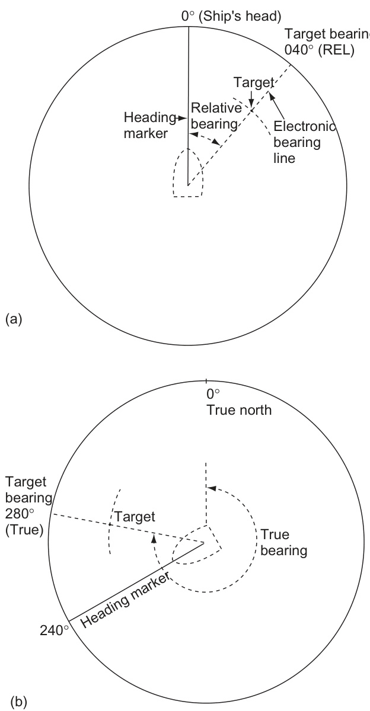  
FIGURE 1.12 Measurement of bearing: (a) relative bearing and (b) true bearing.  

【翻译】
图1.12 测量方位：（a）相对方位和（b）真方位。

【解读】
该图示意了测量方位的两种方式，即相对方位和真方位。相对方位是指从观察者到目标物体的方向与观察者的前进方向之间的夹角；而真方位则是指从观察者到目标物体的方向与地理正北方向之间的夹角。这两个概念在航海、航空等领域中非常重要，因为它们帮助人们确定目标物体的位置和方向。

【词汇表】
| 英文词汇 | 中文翻译 | 解释 |
| --- | --- | --- |
| Relative Bearing | 相对方位 | 从观察者到目标物体的方向与观察者的前进方向之间的夹角 |
| True Bearing | 真方位 | 从观察者到目标物体的方向与地理正北方向之间的夹角 |
| Measurement | 测量 | 获取某一物理量的数值的过程 |

In addition to the bearing scale facility there will also be a numerical readout of the bearing on the display, which is more typically used nowadays rather than the bearing scale. The bearing scale mainly helps the user to keep an appropriate awareness of bearing. A variety of bearing measurement facilities and the correct procedure for their use are discussed in Section 6.6.  

【翻译】
除了方位标尺设施外，还会在显示屏上提供方位的数字读数，这是现在更常用的方式，而不是使用方位标尺。方位标尺主要帮助用户保持对方位的适当意识。各种方位测量设施及其正确使用程序将在第6.6节中讨论。

【解读】
本段介绍了导航或测量系统中关于方位（bearing）的两个呈现方式：传统的方位标尺和现代的数字读数。前者有助于用户直观地感受到方向，后者则提供精确的数字信息。同时，提到了相关的测量设施和使用方法将在另一个章节中详细讨论。

【词汇表】
| 英文词汇 | 中文翻译 | 解释 |
| --- | --- | --- |
| bearing | 方位 | 指物体相对于参考点的方向角度 |
| numerical readout | 数字读数 | 以数字形式显示的数据或结果 |
| facility | 设施、设施 | 为某种目的而设置的设备或条件 |
| awareness | 意识、认识 | 对事物的理解或注意到的事物 |

# 1.4 DISPLAY MODES  

There are a number of display modes on a modern radar for determining exactly how the radar shows information in relation to the outside world. These cover three different areas, which are referred to as orientation, motion and stabilization modes. The orientation mode defines how the ‘vertical’ direction of the display aligns with the outside world horizontal (azimuthal) direction; the motion mode defines how the own-vessel moves with respect to the display; and the stabilization mode defines how absolute movement is referenced relative to the ground or relative to the sea. Taking the display to be a conventional graphical representation in $x$ and $y$ coordinates, it is the $y$ -direction that is considered to be vertical and the $x$ -direction as being horizontal.  

# 1.4.1 Orientation Modes  

A vessel’s radar display provides a choice of orientation modes. The natural mode is the one already described where the heading direction of the ship, and therefore the heading line, is vertically upwards on the display. This is known as the head-up mode.  

【翻译】
船舶的雷达显示器提供多种方向模式。自然模式是已经描述过的那种模式，即 जहaj的航向方向，也就是航向线，在显示屏上呈现为垂直向上的状态。这被称为头朝上模式。

【解读】
本段主要介绍了船舶雷达显示器中的方向模式设置，特别提到了“自然模式”（natural mode）或“头朝上模式”（head-up mode），这种模式下，船舶的前进方向在雷达屏幕上以垂直向上方式表示，便于操作人员观察和导航。

【词汇表】
| 英文词汇 | 中文翻译 | 解释 |
| --- | --- | --- |
| Vessel | 船舶 | 指各种类型的船只或海洋运输工具 |
| Radar display | 雷达显示器 | 一种电子设备，用来显示雷达信号接收到的回波信息 |
| Orientation modes | 方向模式 | 指雷达显示器中可以选择的不同显示方向设置 |
| Head-up mode | 头朝上模式 | 一种特定的雷达显示模式，其中船舶的前进方向始终显示在屏幕顶部 |

There are two other orientation modes available. One is termed north-up, where the vertical direction represents true-north and the other is course-up, where the vertical direction of the display represents the desired course of the vessel.  

【翻译】
除了上述模式外，还有另外两种方向模式可供选择。一种被称为“北向上”（north-up），在这种模式中，垂直方向代表真实的北方；另一种是“航向上”（course-up），其中显示屏的垂直方向表示船舶所期望的航向。

【解读】
本段介绍了导航系统中的两个其他方向模式：北向上和航向上。这两种模式分别以不同的方式来表示方向，北向上模式始终指向地理上的北极，而航向上模式则根据船舶的预定航线来调整显示屏的方向，以便于驾驶员的操作。

【词汇表】
| 英文词汇 | 中文翻译 | 解释 |
| --- | --- | --- |
| north-up | 北向上 | 导航模式之一，垂直方向固定指向地理北方 |
| course-up | 航向上 | 导航模式之一，垂直方向根据船舶预定航线进行调整 |
| true-north | 真实北方 | 地理上的北极方向，与磁北不同 |
| vessel | 船舶 | 指各种类型的船只或海洋运输工具 |

# 1.4.1.1 Head-Up Orientation  

This orientation, where the heading marker is always vertical on the display, is illustrated in Figure 1.13. As the vessel’s heading changes, so does the orientation of the displayed image the image is vessel stabilized, aligning with the view from the bridge windows, but is unstabilized with respect to truenorth. The figure shows the situation just before and after a course change. This was the only orientation mode available on very early marine radars because of cost and technological limitations. However, the only significant attraction of using the basic head-up mode today is that it does not need a working gyro or compass input to the radar, unlike the other orientation modes on a modern radar, north-up and course-up. These modes, described separately in the sections below, stabilize the orientation of the radar image. For this reason, head-up mode is often described as unstabilized. If compass problems are encountered its use may be essential and so needs to be fully understood.  

【翻译】
这种方向模式在显示屏上始终以垂直的航向标记为特征，如图1.13所示。当船舶的航向发生变化时，显示的图像也会随之改变；图像与从桥梁窗口看到的视图保持一致，但相对于真北则没有稳定。图中展示了航向变化前后的情况。这是早期海洋雷达系统中唯一可用的方向模式，因为当时受限于成本和技术。然而，使用基本的头朝上模式的主要优势在于，它不需要一个工作陀螺仪或指南针输入到雷达系统中，而其他现代雷达系统中的方向模式（如真北模式和航向模式）则需要这些输入来稳定雷达图像的方向。因此，头朝上模式通常被描述为非稳定模式。如果遇到指南针问题，其使用可能是必要的，因此需要完全理解它。

【解读】
本段讨论的是雷达系统中的方向模式，特别是“头朝上”模式。在这个模式下，显示屏上的航向标记总是垂直的，当船舶的航向改变时，显示的图像也会相应地改变。这种模式曾经是早期海洋雷达系统中唯一可用的选择，但现在它的一个主要优点是，不需要陀螺仪或指南针输入就能运行。然而，这也意味着它不能提供稳定的方向信息，与其他模式相比，如真北模式和航向模式。了解这个模式对解决某些技术问题至关重要。

【词汇表】
| 英文词汇 | 中文翻译 | 解释 |
| --- | --- | --- |
| Heading Marker | 航向标记 | 指示当前航向的标志或符号 |
| Stabilize | 稳定 | 使得以保持稳定的状态或方向 |
| Gyro | 陀螺仪 | 一种测量方向和角速度的设备 |
| Compass Input | 指南针输入 | 雷达系统中关于方向的数据输入 |

The head-up unstabilized mode is superficially attractive because of the very fact that the displayed radar image corresponds directly with the scene as viewed through the wheelhouse window. A well placed display unit, close to the bridge windows and facing forwards, means that irrespective of whether the user is viewing the radar screen or looking forward through the wheelhouse window, objects on the starboard side of the ship will lie on the right of the display and those on the port side will lie on the left.  

【翻译】
头部朝上非稳定模式看起来很有吸引力，因为显示出的雷达图像直接对应着从驾驶室窗口看到的场景。一台摆放得当的显示单元，靠近桥梁窗户并且面向前方，这意味着无论用户是在查看雷达屏幕还是通过驾驶室窗口向前望去，船右侧的物体都会出现在显示屏的右边，而左侧的物体则会出现在左边。

【解读】
这段话描述了“头部朝上非稳定模式”的一个特点，即雷达图像与实际视野之间的直观对应关系，使得操作人员可以更容易地理解船舶周围环境的布局。这提高了操作的便捷性和安全性。

【词汇表】
| 英文词汇 | 中文翻译 | 解释 |
| --- | --- | --- |
| head-up | 头部朝上 | 指显示设备或界面的方向与用户视线一致，不需要低头看屏幕 |
| unstabilized | 非稳定 | 在这里指的是雷达图像不进行任何姿态修正，直接反映真实环境 |
| wheelhouse | 驾驶室、桥梁 | 船舶上的指挥中心 |
| starboard | 右侧 | 船舶的右侧 |
| port | 左侧 | 船舶的左侧 |

However, this orientation mode became generally little used after north-up stabilization was introduced on marine radars. This was for a number of reasons. Firstly, the head-up image of earlier radars could become very unclear when in head-up mode. The ‘afterglow’ trail of static targets, especially of extended targets such as land masses, could obliterate critical small moving targets when the image rotated. This is not such a serious problem on modern radars set to head-up mode because of the digital processing technology now employed. Secondly, small yawing movements of the vessel create corresponding oscillations in the orientation of the radar image, which can make precise target range and bearing measurements difficult. This generally remains an issue, even on a modern radar set to unstabilized head-up mode. The third issue is that the bearing scale on an unstabilized head-up radar is not true-north related, and therefore creates extra work in establishing the true bearing of targets.  

【翻译】
然而，在海洋雷达中引入北向稳定化后，这种方向模式基本上很少被使用。这是由于多种原因。首先，早期雷达在头向上模式下的图像可能变得非常不清晰。当图像旋转时，静态目标（尤其是陆地等扩展目标）的“残影”会遮挡关键的小型移动目标。在现代设置为头向上模式的雷达中，由于现在采用的数字处理技术，这个问题并不那么严重。第二，小型偏航运动会使雷达图像的方向产生相应的振荡，从而使得精确测量目标距离和方位变得困难，即使是在现代未经稳定化的头向上模式的雷达中，这仍然是一个问题。第三，未经稳定化的头向上雷达的方位标度与真北无关，因此需要额外的工作来确定目标的真实方位。

【解读】
这段话讨论了海洋雷达中的方向模式，特别是头向上模式的缺点。在北向稳定化被引入后，头向上模式因为几个原因而变得较少使用：一是早期雷达的图像容易变得模糊；二是小型船只的运动会导致雷达图像的方向发生变化，使得精确测量目标距离和方位变得困难；三是未经稳定化的头向上雷达的方位标度与真北无关，需要额外的工作来确定目标的真实方位。

【词汇表】
| 英文词汇 | 中文翻译 | 解释 |
| --- | --- | --- |
| Stabilization | 稳定化 | 指的是对系统进行控制以保持其状态或性能的稳定性 |
| Head-up mode | 头向上模式 | 一种雷达显示模式，其中图像始终朝向观察者 |
| Afterglow | 残影 | 静态目标在雷达屏幕上的残留痕迹 |
| Yawing | 偏航 | 船只或飞机绕其垂直轴旋转的运动 |
| True-north related | 与真北相关 | 指的是与地球的磁北极或真北

A particular reason for north-up mode becoming so frequently used was the general attractiveness of using an orientation which matches that of the paper chart, since it considerably benefits situation awareness. In fact, with the advent of electronic charts, which can also be displayed in head-up mode, the use of a head-up orientation mode potentially becomes more attractive. Before the era of electronic charts the use of head-up mode was mainly confined to special situations, such as when negotiating rivers, estuaries, narrow channels and locks, or when no compass interface was available. While course-up mode, described in Section 1.4.1.3, is a good alternative, many radars have an advanced head-up mode that is generally called stabilized head-up. This uses the gyro/compass input to orientate the bearing scale such that the heading direction is referenced relative to true-north, together with any other indications of bearing on the radar display. Smart processing can also prevent small yawing motions of the vessel creating an oscillating image, generally allowing targets, measurements to be easily performed, and also improving the clarity of the display.  

【翻译】
北向模式之所以被频繁使用，有一个特定的原因，那就是使用与纸质海图相同的方向具有很大的吸引力，因为这对情况感知非常有益。事实上，随着电子海图的出现，这些海图也可以以头向上模式显示，因此使用头向上方向模式可能变得更加有吸引力。在电子海图时代之前，头向上模式的使用主要局限于特殊情况，如航行河流、河口、狭窄水道和锁门，或当没有指南针接口时。虽然课程向上模式（如第1.4.1.3节所述）是一个好的替代方案，但许多雷达都有一个先进的头向上模式，通常称为稳定化头向上模式。这使用陀螺仪/指南针输入来确定方位标度，使得航向方向相对于真北进行参考，同时还包括雷达显示上的其他任何方位指示。智能处理还可以防止船舶的小偏航运动产生振荡图像，一般允许容易地执行目标测量，并且还提高了显示的清晰度。

【解读】
本段讨论了北向模式在导航中的应用及其优势，特别是在使用电子海图的情况下。它强调了这种模式对改善情况感知的好处，以及其在特殊情况下的应用。同时，也提到了课程向上模式作为一种替代选择，并介绍了一种叫做稳定化头向上模式的高级雷达功能，该功能利用陀螺仪和指南针输入来提供更准确的导航信息。

【词汇表】
| 英文词汇 | 中文翻译 | 解释 |
| --- | --- | --- |
| Situation Awareness | 情况感知 | 指能够快速准确地感知和理解当前环境和状况的能力 |
| Head-up Mode | 头向上模式 | 一种导航模式，屏幕上显示的信息是以用户当前的视角为参考的 |
| Gyro/Compass Input | 陀螺仪/指南针输入 | 使用陀螺仪和指南针提供的数据来确定方向和位置 |
| Stabilized Head-up | 稳定化头向上模式 | 一种高级雷达模式

It should be borne in mind that in both stabilized and unstabilized head-up mode, an unwary or poorly trained observer can be misled by the angular rotation of the display as the own-vessel heading changes. For example, a small change of course by the observing vessel may give the impression that the bearing of a target is changing, while in fact the true bearing is remaining constant. The extremely important topic of systematic observation of target movement is discussed at length in Chapter 7.  

【翻译】
在稳定和非稳定头向上模式下，应牢记于心的是，不谨慎或训练不足的观察者可能会被显示的角度旋转所迷惑，当自己的船舶方向发生变化时。例如，观察船只的小幅度航向变化可能会让人觉得目标的方位正在改变，而实际上真正的方位仍然保持不变。系统性地观察目标运动这个极为重要的话题将在第七章中详细讨论。

【解读】
本段强调了在使用某些导航设备或系统时，特别是在稳定和非稳定头向上模式下，观察者的注意力和训练水平对准确判断目标位置和运动的影响。它提醒人们要小心避免由于自身船舶的微小航向变化而产生的误判，并指出这方面的深入讨论将在后续章节中进行。

【词汇表】
| 英文词汇 | 中文翻译 | 解释 |
| --- | --- | --- |
| Stabilized | 稳定 | 指系统或设备经过校正调整，以保持稳定的状态或输出 |
| Unstabilized | 非稳定 | 指系统或设备未经校正调整，可能存在波动或不确定性 |
| Angular rotation | 角度旋转 | 指物体或图像在平面上的旋转运动，通常以角度为单位来衡量 |
| Systematic observation | 系统性观察 | 指按照一定的方法、步骤和标准进行的观察活动，旨在获得可靠的数据或结论 |

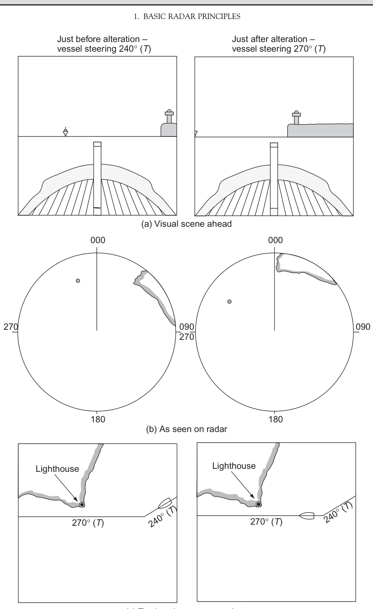  
(c) Track as it appears on chart   
FIGURE 1.13 Head-up orientation (unstabilized).  

【翻译】
图1.13 未稳定状态下的头部朝上方位（如航海图表所示）。

【解读】
这段文字主要是描述一个图表中的内容，特别是关于某种导航或航空相关的图像显示方式。提到的“头部朝上方位”指的是一种特定的方向表示方法，而“未稳定状态”可能意味着该图像或数据没有经过处理或校正，以反映真实的环境条件。

【词汇表】
| 英文词汇 | 中文翻译 | 解释 |
| --- | --- | --- |
| unstabilized | 未稳定状态 | 指数据或图像没有经过处理或校正 |
| head-up orientation | 头部朝上方位 | 一种方向表示方法，通常用于航空或导航设备中 |
| chart | 图表、航海图 | 用于记录和展示数据的视觉工具，尤其是在导航领域 |

# 1.4.1.2 North-Up Orientation  

In north-up orientation, the heading marker is aligned with the graduation on the bearing scale that corresponds with the instantaneous value of the ship’s heading relative to truenorth. It means that $000^{\circ}$ on the bearing scale aligns with true-north. Thus the observer views the picture with north at the ‘top’ of the screen and it is for this reason that the orientation is so named. Figure 1.12(b) shows the same situation as that displayed in the headup mode in Figure 1.12(a) but with the system set to north-up, assuming that the own ship is on a heading of $280^{\circ}$ . Compass stabilization is essential to maintain north-up orientation, not least when the observing vessel alters course or yaws about its chosen course (Figure 1.14, which compares the cases for head-up, northup and course-up operation). The stabilization signal can be derived from any transmitting compass, but in practice the signal source is often a gyro compass, which is compulsory for larger vessels. The principles of north-up orientation are illustrated in Figure 1.15.  

A major benefit is that the orientation compares directly with that of the paper chart. Also, because the display is stabilized it removed the significant disadvantage of earlier radars that changes in heading caused significant blurring of the radar displayed image when in head-up mode. These two factors have led to north-up mode becoming the most commonly used orientation option on most vessels. It also remains relevant when using electronic charts in north-up mode. Some users find using electronic charts and radar in north-up preferable, as it aligns both the radar and the chart image with the mind image they have of the area, easing situation awareness. For others, especially when on a southerly course, they find north-up awkward or uncomfortable to view as it appears ‘upside down’.  

【翻译】
一个主要优点是，方向与纸质图表的方向直接对应。此外，由于显示屏被稳定化，它消除了早期雷达的一个重大缺点，即当以头部朝上的方式操作时，航向变化会导致雷达显示图像出现明显的模糊。在这两个因素的影响下，大多数船只都采用了北向上模式作为最常用的方向选项。即使使用电子图表时，这种模式仍然相关。有些用户发现，在北向上模式下同时使用电子图表和雷达更为方便，因为它使得雷达图像和图表图像与他们脑海中的区域形象保持一致，从而提高了情况感知能力。然而，对于其他人来说，特别是在南行航程中，他们觉得北向上模式不太舒适或看起来像是“倒置”的。

【解读】
本段讨论了在雷达系统中使用北向上（north-up）模式的优势。这种模式可以让雷达图像与纸质图表保持一致，减少了由于航向变化引起的图像模糊，并且有助于提高用户的情况感知能力。尽管如此，不同的人可能有不同的偏好，有些人可能觉得北向上模式在某些情况下不太适用。

【词汇表】
| 英文词汇 | 中文翻译 | 解释 |
| --- | --- | --- |
| Orientation | 方向 | 指物体或人的位置关系或姿势 |
| Stabilized | 稳定化 | 使得系统或设备保持稳定的状态 |
| Heading | 航向 | 船舶飞机等的前进方向 |
| Blurring | 模糊 | 图像变得不清晰或难以辨认 |
| Situation Awareness | 情况感知能力 | 能够快速准确地感知和理解周围环境的能力 |

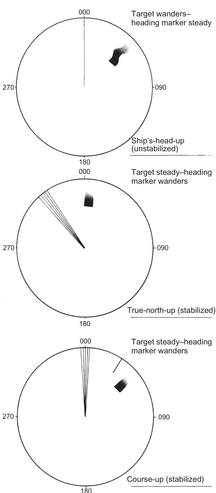  
FIGURE 1.14 Target trails and the effect of yaw.  

【翻译】
图1.14 目标轨迹与偏航角的影响

【解读】
该图展示了目标物体在运动过程中的轨迹，以及当其发生偏航（yaw）时对轨迹的影响。偏航是指物体绕其垂直轴旋转的运动，这种运动会改变物体的方向，从而影响其轨迹。图中可能显示了不同偏航角度下目标物体的轨迹变化，帮助分析者或观察者了解偏航如何影响目标的运动特性。

【词汇表】
| 英文词汇 | 中文翻译 | 解释 |
| --- | --- | --- |
| Yaw | 偏航 | 物体绕其垂直轴旋转的运动 |
| Target | 目标 | 被跟踪或观察的物体 |
| Trails | 轨迹 | 物体运动过程中的路径 |

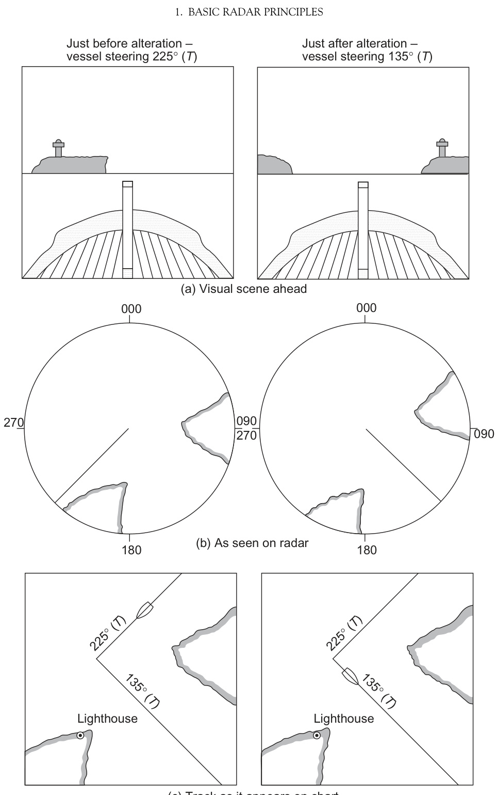  
FIGURE 1.15 North-up orientation (stabilized).  

【翻译】
图1.15 正北向定向（稳定化）。

【解读】
该图显示了一个地理信息系统或导航设备中使用的正北向定向，这意味着地图或屏幕上的方向是以北为上方的标准方式呈现的。这通常用于帮助用户更好地理解地理环境和方向关系。

【词汇表】
| 英文词汇 | 中文翻译 | 解释 |
| --- | --- | --- |
| North-up orientation | 正北向定向 | 以北为上方的标准方向表示方式 |
| Stabilized | 稳定化 | 指图像或数据经过处理后保持稳定的状态 |
| FIGURE | 图 | 文档或报告中的插图或示意图 |

# 1.4.1.3 Course-Up Orientation  

In course-up orientation the vertical direction on the display is aligned to the bearing which represents the desired course of the vessel. This can be obtained either automatically or semi-automatically from route planning information stored within the radar or by the operator selecting a particular course. By virtue of the compass stabilization, changes in the vessel’s instantaneous heading are reflected by sympathetic angular movements of the heading marker, thus maintaining the ship’s course (the reference course) in alignment with the display’s vertical direction. For the same reason, the angular wander of echoes associated with an unstabilized display is eliminated. On modern radars the bearing scale will be relative to true-north, but older radars may have the vertical direction always shown as $000^{\circ}$ , representing the desired course. Figure 1.16 illustrates course-up orientation.  

Provided that the observing vessel does not stray very far from her chosen course, this orientation can be more effective than a stabilized head-up orientation because it eliminates all angular wander of the picture due to yaw, while maintaining the heading marker approximately vertical on the display. Inevitably a major alteration of course will become necessary either due to the requirements of collision avoidance or to those of general navigation. When the vessel is steadied on the new course the orientation, although not meaningless, will have lost its property of being substantially head-up. The problem is that the orientation is still previous-course-up and the picture should be re-oriented to align the heading marker to the vertical direction of the display (see Figure 1.16(d)).  

【翻译】
假设观察船只在其选择的航线上没有偏离太远，这种定向方式比稳定的头部朝上的定向更有效，因为它消除了由于偏航而导致的图像的所有角度游移，同时保持航向标志在显示屏上大致垂直。但是，由于避碰或一般导航的需要，可能会出现对航线进行重大改变的必要。当船只稳定在新的航线上时，尽管这种定向并不毫无意义，但已经失去了基本上是头部朝上的特性。问题在于，当前的定向仍然是基于之前的航线，而图像应该重新定向以使航向标志与显示屏的垂直方向对齐（见图1.16（d））。

【解读】
本段讨论了船舶导航中一种特殊的定向方式，当船舶在其预先选择的航线上行进时，这种方式可以减少因偏航而引起的图像变化，从而提高导航效率。但当船舶需要改变航线时，这种定向方式就不再适用，需要重新调整图像以确保航向标志正确指向。这一过程对于保证船舶安全导航至关重要。

【词汇表】
| 英文词汇 | 中文翻译 | 解释 |
| --- | --- | --- |
| stabilized head-up orientation | 稳定的头部朝上的定向 | 一种导航方式，始终保持图像头部朝上 |
| angular wander | 角度游移 | 图像因偏航等原因产生的角度变化 |
| heading marker | 航向标志 | 指示船舶当前航向的标记 |
| collision avoidance | 避碰 | 为避免碰撞而采取的措施或系统 |

# 1.4.1.4 Choice of Orientation  

The fundamental function of any civil marine radar is to provide a means of measuring the ranges and bearings of targets for collision avoidance and the determination of the observing vessel’s position in order to ensure safe navigation. The ease with which these objectives can be achieved is affected by the choice of orientation. Where the various techniques of collision avoidance and navigation are described in this text, appropriate attention will be given to the influence of orientation. The practical use and setting up of orientations is discussed in Chapter 6. Table 1.1 summarizes the essential features of the three described orientations.  

【翻译】
任何民用海洋雷达的基本功能都是为了提供一种测量目标距离和方位的方法，以避免碰撞并确定观察船只在航行中的位置，从而确保安全的航行。实现这些目标的容易程度会受到选择方向的影响。在本文中描述各种碰撞避免和导航技术时，将适当地考虑到方向的影响。第六章讨论了设置方向的实际使用和安装。表1.1总结了三种方向的基本特征。

【解读】
这段话介绍了民用海洋雷达的基本功能，即通过测量目标的距离和方位来帮助船只避免碰撞并确定自身位置，以便于安全航行。同时，也提到了方向的选择对实现这些目标的容易程度有影响，并指出后续章节会详细讨论这个问题。

【词汇表】
| 英文词汇 | 中文翻译 | 解释 |
| --- | --- | --- |
| collision avoidance | 碰撞避免 | 船只或其他交通工具采取措施以避免与其他物体发生碰撞的行为或系统 |
| orientation | 方向 | 指定一个物体或人的朝向或位置关系 |
| navigation | 导航 | 指引或控制船只、飞机等移动物体沿着预定路线行进的过程或系统 |

Except in emergency situations, when azimuth stabilization has been compromised by equipment failure, head-up unstabilized orientation has nothing to offer other than its subjective appeal, because by its very nature it regularly disrupts the steady-state condition conducive to measurement of bearing and tracking of echo movement (see Figure 1.14(a)). The stabilized north-up and course-up orientations do not exhibit this angular disruption and hence are equally superior in fulfilling the fundamental requirements. Fortunately they are complementary in that while one is north-up, the other is orientated in such a way as not to alienate the user who has a ship’s-head-up preference. On some radar systems, stabilized head-up orientation may be included as an alternative to the use of course-up mode.  

【翻译】
除了在紧急情况下，当方位稳定功能因设备故障而受损时，头部朝上且未经稳定处理的方向对测量航向和跟踪回声运动没有任何帮助，只有其主观上的吸引力，因为它本质上会破坏稳定的状态，而这种状态对于测量航向和跟踪回声运动是必要的（见图1.14（a））。稳定的北向上和航线向上方向不会出现这种角度扰动，因此它们同样优越地满足了基本要求。幸运的是，它们是互补的，这意味着当一个是北向上时，另一个可以以一种不排斥具有船头朝上偏好的用户的方式进行定向。在某些雷达系统中，稳定的头部朝上方向可能作为使用航线向上模式的替代品被纳入。

【解读】
该段讨论了不同类型的雷达显示方向的优缺点，特别是在测量航向和跟踪回声运动方面。作者认为，在非紧急情况下，头部朝上且未经稳定处理的方向由于会破坏稳定的状态，从而影响测量和跟踪的准确性，因此并不理想。相比之下，稳定的北向上和航线向上方向能够提供更稳定的环境，有利于这些任务的完成。同时，作者也提到了一些雷达系统可能会提供稳定的头部朝上方向作为一个可选项，以适应不同的用户偏好。

【词汇表】
| 英文词汇 | 中文翻译 | 解释 |
| --- | --- | --- |
| Azimuth | 方位 | 指物体或信号在水平面上的位置或方向 |
| Stabilization | 稳定 | 指通过技术手段使系统或信号保持稳定的过程 |
| Steady-state | 稳态 | 指系统或过程达到平衡状态，不再发生显著变化 |
| Disrupt | 扰动 | 指打断或破坏某种状态或过程 |
| Complementary | 互补 | 指两个或多个事物能够互相补充，共同发挥作用 |

# 1.5 MOTION AND STABILIZATION MODES  

There are two motion modes, known as relative motion and true motion. Relative means relative to the own ship, while true means relative to an outside reference system. The outside reference is split into two stabilization modes ground stabilized and sea stabilized. Ground stabilization requires an external sensor signal that at least can determine the speed over ground (SOG) of the observing vessel. In today’s world this is typically based on the output of a Global Navigation Satellite System (GNSS) using data from the US Global Positioning System (GPS) and/or Russia’s Globalnaya Navigatsionnaya Sputnikovaya Sistema (GLONASS). Other systems can also give this information, as discussed in Section 6.9.6. When sea stabilized, the important sensor is the speed log, which measures the vessel’s speed through the water (STW).  

【翻译】
运动模式有两种，即相对运动和真实运动。相对运动是指相对于自身船只的运动，而真实运动则是指相对于外部参考系统的运动。外部参考分为两个稳定模式：陆地稳定和海上稳定。陆地稳定需要一个外部传感器信号，该信号至少可以确定观测船只的陆地速度（SOG）。在今天的世界中，这通常基于全球导航卫星系统（GNSS）的输出，使用美国全球定位系统（GPS）和/或俄罗斯全球导航卫星系统（GLONASS）的数据。其他系统也可以提供这些信息，如第6.9.6节所讨论的那样。当采用海上稳定时，重要的传感器是速率计，它测量船只在水中的速度（STW）。

【解读】
本段主要介绍了运动模式的分类，包括相对运动和真实运动，以及与之相关的两个稳定模式：陆地稳定和海上稳定。它强调了不同传感器信号在确定船只速度方面的作用，特别是全球导航卫星系统、速率计等。这一知识在航海领域尤其重要，因为准确掌握船只的位置和速度对于安全航行至关重要。

【词汇表】
| 英文词汇 | 中文翻译 | 解释 |
| --- | --- | --- |
| Relative Motion | 相对运动 | 指相对于自身船只的运动 |
| True Motion | 真实运动 | 指相对于外部参考系统的运动 |
| GNSS | 全球导航卫星系统 | 一种利用卫星提供位置和时间信息的系统 |
| GPS | 全球定位系统 | 美国开发的卫星导航系统 |
| GLONASS | 俄罗斯全球导航卫星系统 | 俄罗斯开发的卫星导航系统 |

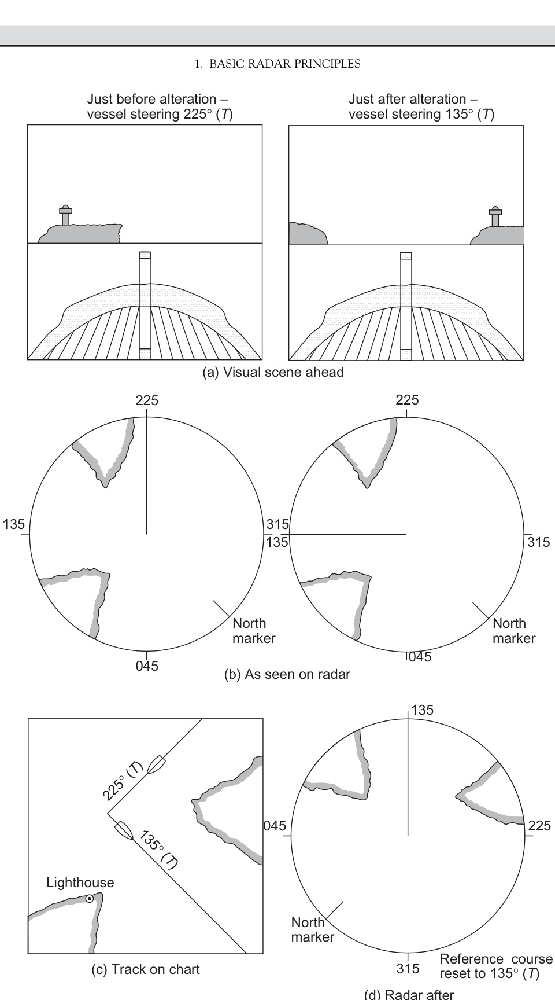  
FIGURE 1.16 Course-up orientation (stabilized) # resetting the reference course.  

【翻译】
图1.16航向上方定向（稳定）#重置参考航向。

【解读】
这段文字描述的是一个航空或导航系统中的概念，即“航向上方定向”（Course-up orientation），它表示飞机或船只的前进方向与其当前航向一致，这通常是通过某种方式来实现的，比如重置参考航向，以确保设备或系统能够准确地跟踪和调整自己的位置和方向。

【词汇表】
| 英文词汇 | 中文翻译 | 解释 |
| --- | --- | --- |
| Course-up | 航向上方 | 指飞行器或船只的前进方向与其当前航向一致的状态 |
| Orientation | 定向 | 指确定物体在空间中的位置和方向的过程 |
| Stabilized | 稳定 | 指系统或设备经过调整后达到稳定的状态，不再发生变化 |
| Reference | 参考 | 指用作比较或校正的基准或标准 |

TABLE 1.1 Picture Orientations Compared   

【翻译】
表1.1 图片方向比较

【解读】
该英文段落是一个表格标题，主要内容是比较不同图片的方向。这个标题可能出现在一篇关于图像处理、摄影或设计的文章中，用于总结和对比不同图片的方向信息。

【词汇表】
| 英文词汇 | 中文翻译 | 解释 |
| --- | --- | --- |
| Table | 表格 | 一种组织数据的方式，通常由行和列组成 |
| Picture | 图片 | 指二维图像，如照片或插图 |
| Orientations | 方向 | 指物体或图像在空间中的朝向或排列方式 |

<html><body><table><tr><td></td><td colspan="3">Orientation</td></tr><tr><td>Feature</td><td>Head-Up, Unstabilized</td><td>North-Up, Stabilized</td><td>Course-Up,Stabilized</td></tr><tr><td>Blurring when observing vessel yaws or alters course</td><td>Yes:canproducevery serious masking</td><td>None</td><td>None</td></tr><tr><td>Measurement of bearings</td><td>Awkwardandslow</td><td></td><td>StraightforwardStraightforward</td></tr><tr><td>Angular disruption of target trails when observing vessel yaws or alters course</td><td>Yes: can be dangerously</td><td>None</td><td>None</td></tr><tr><td>Correspondencewithwheelhousewindow view</td><td>misleading Perfect</td><td>Notobvious</td><td>Virtuallyperfectexceptafter large course change</td></tr><tr><td>Correspondencewithchart</td><td>Not obvious</td><td>Perfect</td><td>Not obvious</td></tr></table></body></html>  

# 1.5.1 Relative-Motion Presentation  

In relative-motion presentation the origin of the display, which always represents the effective position of the observing vessel, is stationary. Commonly, the origin is located at the centre of the display circle, but the user can move this to a position of choice to better meet the needs of the actual situation. The essential feature is that the origin is stationary and as a consequence targets exhibit their motion relative to the observing vessel. The setting of relative motion is independent of the chosen orientation mode. Also, in terms of where the targets appear on the display at any one time, it is immaterial whether ground or sea stabilization has been set, simply because all positions are referenced to the observing vessel. The essential features of a relative-motion presentation are best illustrated by an example. In this example it is assumed that any leeway is negligible.  

【翻译】
在相对运动显示中，屏幕的原点始终代表观察船只的有效位置，是静止不动的。通常，原点位于圆形显示屏的中心，但用户可以根据实际情况需要，将其移动到更合适的位置。相对运动显示的基本特征是原点保持静止，因此目标物体以相对于观察船只的运动方式展现出来。相对运动设置与所选择的方向模式无关。此外，无论何时，目标物体出现在显示屏上的哪个位置，都与是否设置了地面或海面稳定化无关，因为所有位置都参考观察船只。相对运动显示的基本特征最好通过一个例子来说明。在这个例子中，我们假设任何缓冲空间都是可以忽略的。

【解读】
本段主要讨论相对运动显示的特性，即以观察者（如船只）为参照系，展示目标物体的相对运动。这种显示方式使得观察者能够清晰地看到目标物体相对于自己的运动状态，有利于实时监控和决策。同时，这种显示方式与其他设置如方向模式、地面或海面稳定化等无关，只需考虑目标物体相对于观察者的位置即可。

【词汇表】
| 英文词汇 | 中文翻译 | 解释 |
| --- | --- | --- |
| Relative-motion | 相对运动 | 指以某一参照系为基准的运动状态 |
| Origin | 原点 | 指坐标系统中的起点或基准点 |
| Orientation mode | 方向模式 | 指确定显示方向的方法或模式 |
| Stabilization | 稳定化 | 指使显示保持稳定的过程或技术 |

Consider the case of an observing vessel on a steady heading of $000^{\circ}$ $(T)$ at a speed of 10 knots through the water in a tide (which is uniform throughout the area) setting $270^{\circ}$ $(T)$ at a rate of 4 knots. For this case the basic PPI view would look very similar, whether the orientation mode was set to head-up (unstabilized or stabilized), course-up or north-up. A simplified chart of the situation is illustrated in Figure $1.17({\ a})$ , showing four targets:  

i. Vessel $A$ which is located 7 NM due north of the observing vessel and is stopped in the water heading $045^{\circ}$ $(T)$ .   
ii. Vessel $B$ which is located 8 NM due east of vessel $A$ and is on a steady heading of $270^{\circ}$  

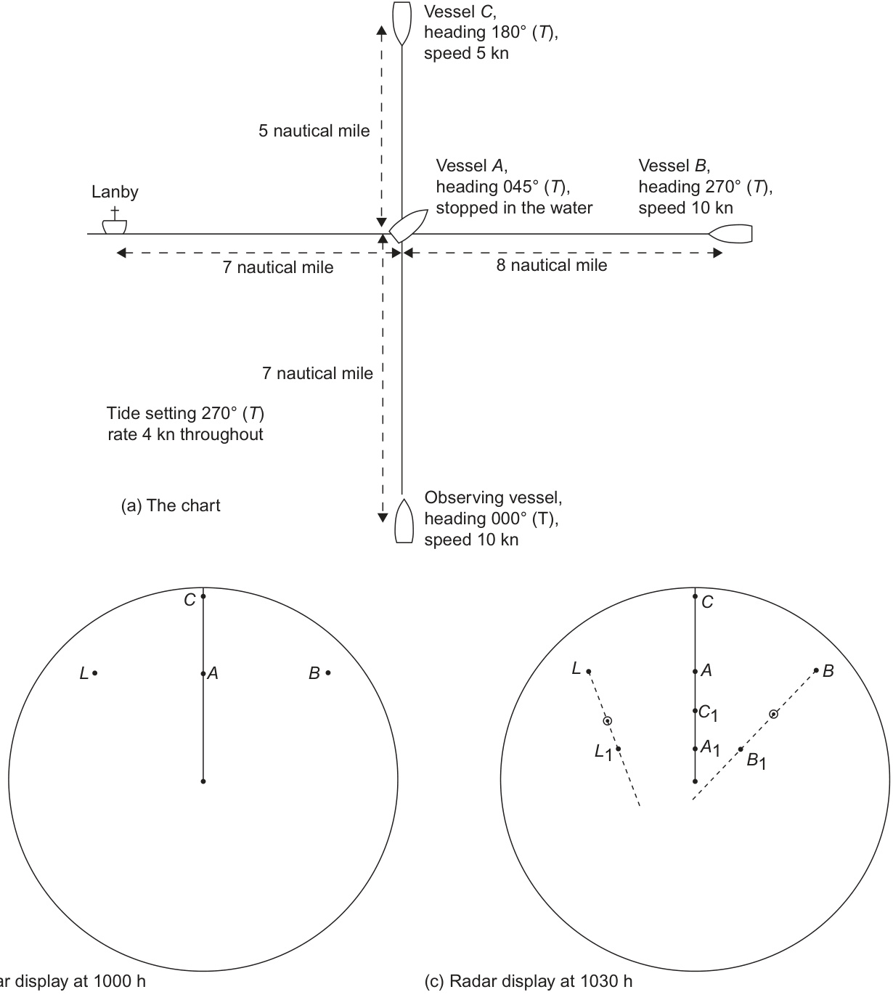  
FIGURE 1.17 Relative-motion presentation.  

【翻译】
图1.17 相对运动呈现。

【解读】
该图展示了相对运动的概念，即两个或多个物体之间的相对位置和运动关系。在这个例子中，图像中可能显示了一个背景和一个前景物体，它们之间的相对运动被呈现在视觉上。这可以帮助研究人员或学习者理解和分析相对运动的原理和特征。

【词汇表】
| 英文词汇 | 中文翻译 | 解释 |
| --- | --- | --- |
| Relative-motion | 相对运动 | 指两个或多个物体之间的相对位置和运动关系。|
| Presentation | 呈现 | 指以某种方式展示或表现信息或概念。|
| Figure | 图 | 指插图、图表或其他形式的视觉辅助工具。|

$(T)$ at a speed of 10 knots through the water. iii. Vessel C which is located 5 NM due north of vessel $A$ and is on a steady heading of  

$180^{\circ}$ $(T)$ at a speed of 5 knots through the water. iv. A large navigational buoy $L$ which is anchored and therefore, for the purposes of this example, can be considered to be stationary over the ground. Its position is 7 NM due west of vessel $A$ .  

To assist in the understanding of relative motion, Figure 1.17(b) represents the observing vessel’s PPI as it would appear at $1000\mathrm{h}$ . For comparison, Figure $1.17(\mathrm{c})$ represents the same PPI showing the positions of the echoes as they would appear at 1030 together with a record of their 1000 positions. It will be noticed that the shape of the echoes normally gives little indication of the outline of the targets, as explained in Section 2.8.5. Consider now the movement of each of the four echoes in turn, commencing with that of the water-stationary target $A,$ which offers a simple basis on which an understanding of all relative motion can be built. It is important to remember the assumption that the observing vessel is maintaining a steady heading.  

In the period 1000#1030 the observing vessel will move north by a distance of 5 NM through the water. Because the origin remains stationary, and the range of target $A$ decreases at 10 NM/h (knots), it follows that the echo of $A$ will move down the heading marker by a distance of 5 NM in the $30\mathrm{min}$ interval. This reveals the basic property of the relativemotion presentation which is that the echo of a target which is stationary in the water will move across the screen in a direction reciprocal to that of the observing vessel’s heading, at a rate equal to the observing vessel’s STW. Importantly, this is not generally the case if heading is replaced by course over ground (COG) and STW is replaced by SOG.  

Consider now the movement of the echo of vessel B which at 1000 was $8~\mathrm{NM}$ due east of the stationary vessel $A$ . As $B$ is heading directly towards $A$ at 10 knots, it follows that its 1030 position will be 3 NM due east of $A$ . Figure 1.17(c) reveals that the trail left by the echo of vessel $B$ offers an indication of how far off the target will pass if neither vessel manoeuvres. However, the echo has moved across the screen in a direction and at a rate which is quite different from the target’s course and speed. An appreciation of this fact is absolutely essential if the basic presentation is to be interpreted correctly and used in assessing collision avoidance strategy. (In practice, target tracking vectors would be used to make such decisions, as discussed in detail in Section 4.4 and Chapter 7) Further consideration of the figure will show that the relative motion of echo $B$ is the resultant of that of a water-stationary target (which is determined by the observing vessel’s course and STW) and the true motion of the vessel $B$ through the water. An analogous argument can be based on ground referenced motions. The proper use of radar for collision avoidance is based on systematic observation and analysis of both the relative motion and the true motion of the other targets in an encounter (see Chapter 7).  

Consider now the movement on the screen of the echo of vessel C. At 1000 its position was $5~\mathrm{NM}$ due north of the water-stationary vessel $A$ and heading directly towards it at 5 knots. It follows that at 1030 its position will be $2.5\mathrm{NM}$ north of vessel $A$ . As shown in Figure 1.17(c), because the echo of vessel $A$ has itself moved across the screen by $5~\mathrm{NM}$ in a direction of south, the aggregate movement of echo $C$ is $7.5~\mathrm{NM}$ in the same direction. Thus, as in the case of vessel $B_{,}$ , the echo has moved across the screen in a way that is different from the movement of the vessel through the water. However it should be noted that, by coincidence, the track across the screen of echo $C$ is in the same direction as that of the waterstationary target $A$ . This reveals a further feature of the relative-motion presentation, which is that the echoes of targets which are stopped in the water, targets which are on a reciprocal course to the observing vessel and targets which are on the same course as the observing vessel, but slower, will all move across the screen in the same direction (but at different speeds). This feature has the potential to mislead the untrained or unwary observer into confusing, for example, a target that is being overtaken with one that is on a reciprocal course. This further emphasizes the necessity of having a good understanding of these basic principles and a systematic approach when using the radar for collision avoidance (see Chapter 7).  

Initially the east/west distance between the buoy and the stationary ship was 7 NM. As the tide is setting the stationary vessel down on to the buoy at 4 knots, it follows that this distance will have reduced to 5 NM by 1030. A study of Figure 1.17(c) will show that the echo of the buoy has moved across the screen in a direction which is the reciprocal of the observing vessel’s ground track at a speed equal to the speed of the observing vessel over the ground. This property is exploited in the use of radar for navigation (as opposed to collision avoidance); the various procedures are set out in Chapter 8.  

【翻译】
最初，浮标与静止船只之间的东西向距离为7海里。由于潮汐使得静止船只以每小时4节的速度朝着浮标移动，因此到上午10点30分，这个距离就会减少到5海里。研究图1.17（c）可以看出，浮标的回声在屏幕上移动的方向是观测船只的地面航迹的逆向，其速度等于观测船只在地面上的速度。这一特性被利用在雷达导航中（与避碰相反），各种程序都在第8章中列出。

【解读】
本段主要讨论了浮标、静止船只和观测船只之间的相对运动关系，以及如何利用雷达技术来进行导航。通过分析浮标回声在屏幕上的移动，可以确定观测船只的地面航迹和速度，从而辅助导航。

【词汇表】
| 英文词汇 | 中文翻译 | 解释 |
| --- | --- | --- |
| Buoy | 浮标 | 一种用于海上标志或参考点的漂浮装置 |
| Reciprocal | 逆向 | 指两个方向相反的关系 |
| Ground track | 地面航迹 | 船只在地面上的实际行进路线 |
| Radar | 雷达 | 无线电探测和定位系统，常用于导航和避碰 |

motion or stabilisation mode, simply because the ‘world outside’ is obviously not affected by the settings of the radar.  

【翻译】
运动或稳定模式，只是因为“外部世界”显然不受雷达设置的影响。

【解读】
这段话强调了雷达设置（如运动或稳定模式）与外部环境之间的独立性，指出外部世界不会受到这些设置的影响。这意味着雷达的工作模式主要是为了适应内部系统需求，而不是为了改变或影响外界环境。

【词汇表】
| 英文词汇 | 中文翻译 | 解释 |
| --- | --- | --- |
| motion | 运动 | 指物体的移动状态或运动模式 |
| stabilisation | 稳定 | 指使系统保持稳定的过程或状态 |
| radar | 雷达 | 无线电探测和定位系统，用于检测和跟踪目标 |

It is clear that after a period of time the origin # that is the position of the observing vessel # will move to the edge of the display. It then has to be reset, either by user intervention or by an automatic process set up by the user. Strategies for resetting are discussed in Section 6.2.6.3.  

【翻译】
很明显，在一段时间之后，观察船只（即原点）的位置会移动到显示屏的边缘。这时，它需要被重置，这可以通过用户干预或由用户设置的自动过程来实现。重置策略在第6.2.6.3节中进行了讨论。

【解读】
这段话主要讲述的是一种观察系统中的坐标原点（origin）会随着时间的推移而变化，导致其位置从中心移到显示屏的边缘，从而需要进行重置操作。这种重置可以是人工触发的，也可以是自动完成的，并且相关的策略会在后续章节中详细讨论。

【词汇表】
| 英文词汇 | 中文翻译 | 解释 |
| --- | --- | --- |
| origin | 原点 | 指坐标系中的起始点或参考点 |
| observing vessel | 观察船只 | 指进行观察或测量的设备或平台 |
| reset | 重置 | 将系统或参数恢复到初始状态的操作 |
| intervention | 干预 | 人为地干涉或控制某个过程或系统 |
| automatic process | 自动过程 | 由机器或计算机程序自动执行的过程，无需人工干预 |

# 1.5.2.1 True-Motion Sea-Stabilized Presentation  

To produce a true-motion sea-stabilized presentation, the origin of the picture must be made to track across the screen in a direction and at a rate that corresponds with the observing vessel’s course and STW. In the example in the illustration (Figure 1.18) the course is $000^{\circ}$ $(T)$ and the speed is 10 knots.  

# 1.5.2 The True-Motion Presentation  

Figure 1.18(b) shows the PPI of the observing vessel as it would appear at 1000. The origin of the picture is offset in such a way as to make optimum use of the available screen area (see Section 6.2.6.3). Figure 1.18(c) shows the position of the four echoes as they would appear at 1030, together with an indication of their 1000 positions for the purpose of comparison. The movement of each of the four echoes will now be considered in turn, commencing with target $A$ which is stopped in the water.  

It has been shown that in a relative-motion presentation the movement of all echoes across the screen is affected by the course and speed of the observing vessel. In a correctly adjusted true-motion presentation, the echo movement of all targets is rendered independent of the motion of the observing vessel. This is achieved by causing the origin of the picture to track across the screen in a direction and at a rate which corresponds with the motion of the observing vessel. There is clearly a fundamental difference to the actual movement of the origin as to whether ground or sea stabilisation has been set, although the displayed basic geometrical layout of targets with respect to the origin (but not its orientation or absolute position) always remains identical on the PPI. This remains true whatever the orientation,  

【翻译】
已经证明，在相对运动的显示中，屏幕上所有回波的移动都会受到观察船只的航向和速度的影响。在正确调整的真实运动显示中，所有目标的回波移动都与观察船只的运动无关。这是通过使图像的原点按照与观察船只的运动方向和速度相对应的方式在屏幕上移动来实现的。无论是否设置了地面或海面稳定化，原点的实际移动都有明显的区别，但在PPI（平面位置指示器）上显示的目标相对于原点的基本几何布局（但不包括其方向或绝对位置）始终保持一致，这一点不受观察方向的影响。

【解读】
本段讨论的是雷达系统中的相对运动显示和真实运动显示。相对运动显示会受到观察船只的运动影响，而真实运动显示则可以排除这种影响，使得目标的回波移动独立于观察船只的运动。这种效果是通过控制图像原点的移动来实现的，同时考虑到地面或海面稳定化的设置。这种技术能够为操作员提供更准确、更可靠的目标位置信息，从而提高导航和监控的效率。

【词汇表】
| 英文词汇 | 中文翻译 | 解释 |
| --- | --- | --- |
| Relative-motion presentation | 相对运动显示 | 一种雷达显示模式，目标的移动相对于观察者而言 |
| True-motion presentation | 真实运动显示 | 一种雷达显示模式，目标的移动与观察者的运动无关 |
| Observing vessel | 观察船只 | 进行观察和监测的船只或平台 |
| Stabilisation | 稳定化 | 对设备或系统进行的稳定处理，以减少外界因素的干扰 |

In the interval 1000#1030 the origin will move due north by a scale distance of 5 NM, while in the same time target $A$ will remain on the heading marker but its range will decrease by 5 NM. It follows that the net motion of the echo of target $A$ will be zero. Consideration of Figure 1.18 reveals the basic property of a correctly setup true-motion sea-stabilized presentation, which is that the echo of a target which is stationary in the water will maintain a constant position on the screen.  

At 1000 the moving target $B$ was located 8 NM due east of vessel $A$ . As it is heading directly towards $A$ its bearing from $A$ will remain steady, but the range will have decreased to 3 NM by 1030. Figure 1.18(c) shows that the echo of target B will move across the screen in a direction and at a rate which corresponds with the target vessel’s course and STW. A similar argument will reveal that the echo of vessel $C$ will move across the screen in a direction of $180^{\circ}$ $(T)$ at a scale speed of 5 knots. The presentation thus has the property that the target trails offer an indication of the headings (actually course through the water # CTW) of all moving targets. This feature is complementary to the corresponding property of the relative-motion presentation (see Section 1.5.1). It must be stressed that collision avoidance strategy must be based on systematic analysis of the displayed target movements, as detailed in Chapter 7.  

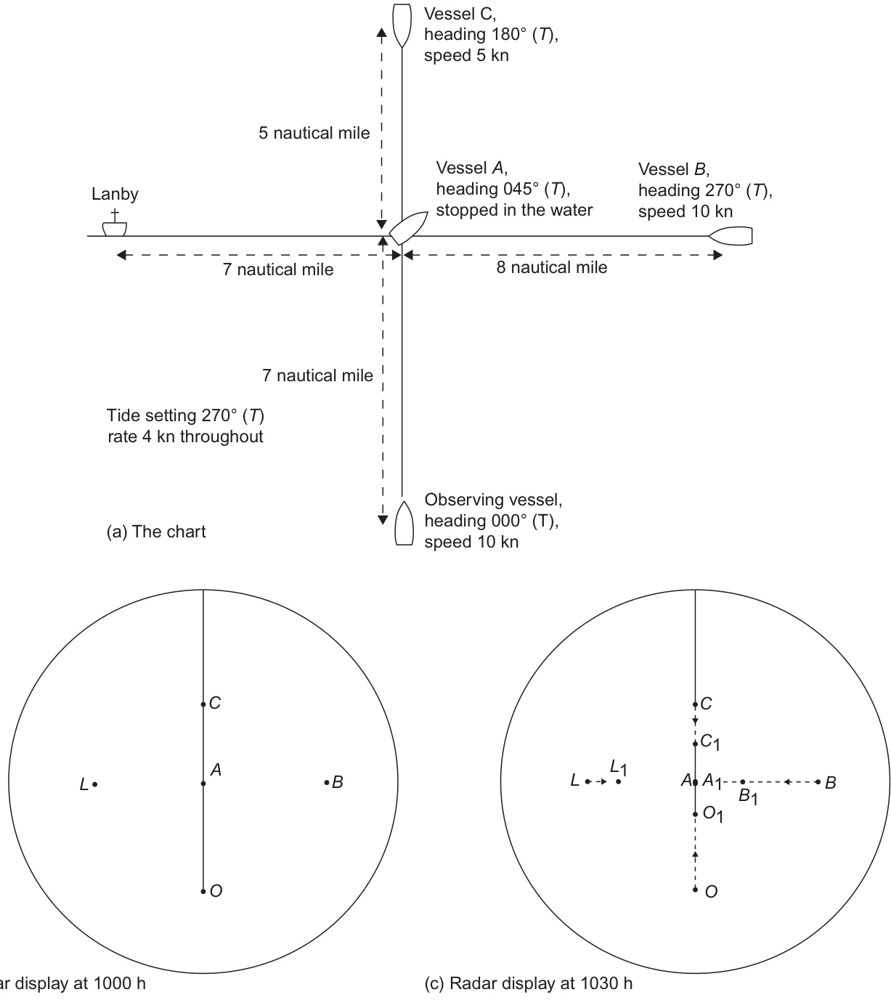  
FIGURE 1.18 True-motion sea-stabilized presentation.  

【翻译】
图1.18真实运动海上稳定化呈现。

【解读】
该图展示了海上稳定化技术在真实运动中的应用，能够减少因波浪或船只运动引起的视觉抖动，提供更平滑、更清晰的观察体验。

【词汇表】
| 英文词汇 | 中文翻译 | 解释 |
| --- | --- | --- |
| true-motion | 真实运动 | 指的是物体或相机在运动时保持其实际轨迹的状态，不受外界干扰。 |
| sea-stabilized | 海上稳定化 | 一种用于减少海面波浪对视觉或设备影响的技术，常用于航海、航空等领域。 |
| presentation | 呈现、表现 | 指的是信息、数据或者图像以特定的方式被显示或呈现给观众。 |

As a result of the tide, the water-stationary vessel $A$ will be set directly towards the buoy and by 1030 the east/west distance between the two will have reduced to 5 NM. It has been established that echo $A$ will maintain its position on the screen, and thus it follows that in the interval from 1000 to 1030, echo $L$ will move east across the screen by a scale distance of 2 NM. Consideration of Figure 1.18(c) will show that a third property of the true-motion sea-stabilized presentation is that landstationary targets will move across the screen at a rate equal to the tide but in the opposite direction to the set.  

In considering the properties of the truemotion sea-stabilized presentation it is essential to appreciate that the accuracy with which the displayed target movements are presented is completely dependent on the accuracy with which the direction and rate of the movement of the picture origin represents the observing vessel’s course and STW. The true-motion presentation is only as good as the input data.  

【翻译】
在考虑真实运动海上稳定化呈现的特性时，必须认识到显示的目标运动的准确度完全取决于图片原点运动方向和速度代表观察船舶航向和STW（船速通过水）的准确度。真实运动呈现的质量只与输入数据的质量一样好。

【解读】
本段强调了真实运动海上稳定化呈现技术的关键特征，即其准确性直接依赖于输入数据的精度。这意味着，如果输入数据不够准确，整个系统的表现就会受到影响，因此高质量的输入数据对于获得可靠的真实运动呈现至关重要。

【词汇表】
| 英文词汇 | 中文翻译 | 解释 |
| --- | --- | --- |
| truemotion | 真实运动 | 一种模拟或呈现物体运动的方式，旨在提供最真实的运动感受 |
| sea-stabilized | 海上稳定化 | 指在海上环境中对图像或设备进行稳定处理，以减少晃动等影响 |
| STW | 船速通过水 | 指船舶在水中的速度，是判断船舶运动状态的一个重要参数 |

The practical procedure for setting up the presentation and the effect of errors and inaccuracies are covered in Sections 6.2 and 7.9, respectively. Because the scenario used a heading of north for the observing vessel, the question of which orientation mode is in use is irrelevant. It should be noted that any orientation mode (except head-up unstabilized) can be used with true motion, irrespective of heading.  

【翻译】
关于设置演示和错误、不准确性影响的实际步骤分别在第6.2节和第7.9节中进行了介绍。由于所使用的场景中观察船的朝向为北，因此当前使用的方向模式是无关紧要的。需要注意的是，任何方向模式（除了非稳定头向上模式）都可以与真实运动一起使用，无论其朝向如何。

【解读】
本段主要讨论了有关设置演示和处理错误的程序，以及不同方向模式对真实运动的影响。它强调了选择合适的方向模式以获得最佳效果的重要性，同时也指出某些模式可能并不适用。

【词汇表】
| 英文词汇 | 中文翻译 | 解释 |
| --- | --- | --- |
| Practical Procedure | 实际步骤 | 指完成特定任务的具体操作方法 |
| Orientation Mode | 方向模式 | 指设备或系统中物体的方向设定方式 |
| True Motion | 真实运动 | 指按照实际物理规律模拟的运动效果 |
| Heading | 朝向 | 指航海或航空中，船只或飞机的前进方向 |

# 1.5.2.2 True-Motion Ground-Stabilized Presentation  

To create ground stabilization of a truemotion presentation, the origin of the picture is made to move across the screen in a direction and at a rate which correspond with the observing vessel’s track over the ground. Before accurate positioning systems were available, such as GNSS, it was necessary to have independent measurements of the observing vessel’s course and STW, plus a measurement that estimated the set and rate of the tidal stream or current. This complexity of understanding is now not normally necessary as the PPI can effectively be considered to be referenced to a ground fixed coordinate system, such as WGS-84 used by GPS and electronic navigational charts (ENCs).  

【翻译】
为了创建真实运动演示的场地稳定化，图片的原点会按照观察船只在陆地上的航迹方向和速度移动。在精确的定位系统（如GNSS）出现之前，需要独立测量观察船只的航向、STW（通过水速），以及估计潮流或洋流的方向和速度。这种复杂性现在通常不再必要，因为PPI（计划位置指示器）可以被认为是参照一个固定在地球坐标系上的坐标系统，如GPS和电子导航图表（ENCs）使用的WGS-84。

【解读】
本段主要讨论如何实现真实运动演示中的场地稳定化，以及过去和现在获取相关数据的方法。随着技术的进步，尤其是精确的定位系统的出现，大大简化了这一过程，使得对观察船只的位置和运动参数的测量变得更加容易和准确。

【词汇表】
| 英文词汇 | 中文翻译 | 解释 |
| --- | --- | --- |
| GNSS | 全球卫星导航系统 | 一种利用卫星实现全球范围内的导航和定位的系统 |
| PPI | 计划位置指示器 | 一种显示预定航线和当前位置的设备或软件 |
| WGS-84 | 世界大地测量系统1984 | 一种国际标准的地球坐标参考系统，广泛用于GPS等领域 |
| STW | 通过水速 | 船只相对于水体的速度 |

For comparison purposes it is convenient to illustrate the presentation with reference to the same scenario as was used in the two preceding examples. Figure 1.19(b) shows the PPI of the observing vessel as it would appear at 1000, while Figure 1.19(c) shows the echoes as they would appear at 1030 together with recorded plots of the 1000 positions. It is seen that this origin moves in a direction which differs from that of the heading marker. The latter represents the direction in which the observing vessel is heading at any instant and is independent of any tidal influence.  

【翻译】
为了方便比较，我们以与前两个例子相同的情景为参考来说明这个问题。图1.19（b）显示了观察船的PPI在1000时的样子，而图1.19（c）则显示了1030时的回声，以及记录下来的1000时位置的轨迹。可以看到，这个起点移动的方向与航向标志的方向不同。后者表示观察船在任何时候所朝的方向，与潮汐影响无关。

【解读】
本段主要讨论的是如何通过图像来比较和分析观察船的位置和运动情况，特别是指出观察船的实际运动方向可能会受到潮汐等因素的影响，从而与其预期或记录下的航向有所不同。这需要仔细观察和分析图像中的信息，以准确地判断观察船的状态。

【词汇表】
| 英文词汇 | 中文翻译 | 解释 |
| --- | --- | --- |
| PPI | 平面位置指示器 | 一种用于显示船只位置和周围环境的导航设备 |
| observing vessel | 观察船 | 指进行观察或监测任务的船只 |
| heading marker | 航向标志 | 表示船只当前航向的指示器 |
| tidal influence | 潮汐影响 | 潮汐对海洋或水体的影响，可能导致水位、流速等变化 |

In this case it is helpful to start by considering the ground-stationary target $L$ . Reference to Figure 1.19(c) shows that in the period 1000 1030 the origin will have moved to a position which is a scale distance of $5\mathrm{NM}$ due north (representing the vessel’s movement through the water) and 2 NM due west (representing the set and drift experienced) of its 1000 screen location. In the same interval, the north/south distance between the observing vessel and the buoy will have decreased by 5 NM due north (representing the vessel’s movement through the water) and 2 NM due west (representing the set and drift experienced) of its 1000 screen location. In the same interval, the north/south distance between the observing vessel and the buoy will have decreased by 5 NM while the east/west distance will have decreased by 2 NM. It follows from these two statements that the echo of the buoy $L$ will exhibit neither north/south movement nor east/west movement across the screen. This reveals the key property of the correctly setup true-motion ground-stabilized presentation, which is that the echo of a land target will remain stationary on the screen.  

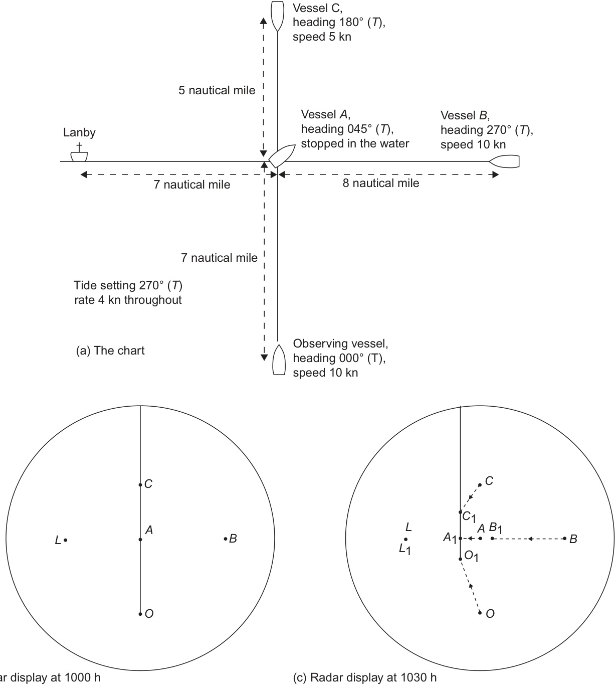  
FIGURE 1.19 True-motion ground-stabilized presentation.  

【翻译】
图1.19真实运动的地面稳定化呈现。

【解读】
该图展示了真实运动的地面稳定化呈现，这意味着图像或视频中物体的运动是相对于地面的，而不是相对于观察者的。这项技术可以帮助减少晕动症的发生，提高观众对画面内容的理解和跟随能力。

【词汇表】
| 英文词汇 | 中文翻译 | 解释 |
| --- | --- | --- |
| True-motion | 真实运动 | 指的是物体在图像或视频中的运动方式与其在现实世界中的运动方式一致。 |
| Ground-stabilized | 地面稳定化 | 指的是以地面为参考系，消除相机抖动等因素对图像的影响，使得图像更加稳定清晰。 |
| Presentation | 呈现 | 指的是信息、数据或者图像通过某种形式（如图表、视频等）向观众展示的过程。 |

Consider now vessel $A$ which is stopped in the water heading $045^{\circ}$ $(T)$ . As previously established, it will be set directly towards the buoy by a distance of $2\mathsf{N M}$ in the period 1000 1030. It follows from this, and the fact that echo $L$ is stationary on the screen, that the echo of vessel $A$ will move in a direction of due west by a scale distance of 2 NM in the interval considered. This reveals a second property of the truemotion ground-stabilized presentation, which is that the echo of a target which is stopped in the water will move across the screen in a direction and at a rate that corresponds with the set and rate of the tidal stream.  

Having regard to target $C,$ it is clear that at 1030 its position will be $2.5~\mathrm{NM}$ north of vessel $A$ . A study of Figure 1.19(c) will show that, because the movement of echo $A$ represents the tide, the echo of vessel C will therefore move across the screen in a direction and at a rate which is the resultant of the set and drift of the tidal stream, and the vessel’s course and STW. This shows the general property of the truemotion ground-stabilized presentation, which is that echoes of vessels that are under way will move across the screen in a direction and at a rate which represents their track over the ground. The example of the vessel $A$ which is under way but stopped is a special case of this general rule. The movement of the echo of vessel $B$ also illustrates this feature, but perhaps not so dramatically because it is heading in the same direction as the set of the tidal stream.  

Consideration of the movements of echoes $A$ and $C$ in particular will emphasize how an untrained or unwary observer might be misled into erroneously concluding that vessel $A$ was slow-moving and crossing showing a red sidelight (when in fact it is stopped in the path of the observing vessel), and that vessel C was a passing vessel showing a red sidelight (when in fact it is head on).  

It is thus essential to appreciate that in this presentation the movement of the echoes of vessels that are under way does not represent their headings. Information on headings is essential for the proper use of radar in collision avoidance. It follows that, in principle, this presentation, if used without the use of a tracked target (TT) presentation, is not appropriate as a basis for planning collision avoidance strategy since it could be dangerously misleading. This extremely important topic is further discussed in Section 6.9.6. As noted in the previous section, it should be appreciated that either north-up or course-up orientation can be used with true motion.  

【翻译】
因此，在本次演示中，移动中的船舶回波的运动并不代表它们的航向。了解航向信息对于正确使用雷达以避免碰撞至关重要。由此可见，一般来说，如果不使用跟踪目标（TT）演示，本次演示不适合作为规划避碰策略的依据，因为它可能带来危险性的误导。这一极为重要的话题在第6.9.6节中进一步讨论。如前一节所述，应该理解，无论是北向上还是航程向上的定向，都可以与真实运动一起使用。

【解读】
本段强调了在使用雷达进行避碰时，了解船舶的航向信息的重要性，并指出如果没有跟踪目标的辅助，仅凭借回波的运动可能会产生误导，从而影响安全。同时，也提到了不同定向方式（北向上或航程向上）的应用灵活性。

【词汇表】
| 英文词汇 | 中文翻译 | 解释 |
| --- | --- | --- |
| Heading | 航向 | 指船舶或飞机等的行进方向 |
| Collision Avoidance | 避碰 | 指通过各种手段避免相互碰撞的措施或技术 |
| Tracked Target (TT) | 跟踪目标 | 指在雷达系统中被跟踪监视的目标物体 |
| True Motion | 真实运动 | 指显示物体实际运动状态的雷达显示模式 |

In this mode it is common to have the option of being able to fix the origin, that is the position of the observing vessel, to any position on the display. At first sight this seems to be making the display identical to the relative-motion presentation discussed in Section 1.5.1. However, an important difference is that the displayed target trails will be shown in their original ground referenced position and not as a position relative to the observing vessel. This removes the problem of the changing ‘surveillance area’ that occurs when the origin moves across the display, which in particular can cause problems with ‘look-ahead’.  

【翻译】
在这种模式下，一般可以选择固定观察船只（即观察者的位置）的起始点到显示屏上的任何位置。一开始，这似乎使得显示与1.5.1节中讨论的相对运动呈现方式相同。但是，有一个重要的区别：显示出的目标轨迹将以其原始的地面参考位置显示，而不是作为相对于观察船只的位置。这消除了当起始点移动到整个显示区域时发生的“监视区域”变化的问题，特别是在“向前看”功能方面可能会引发问题。

【解读】
本段主要介绍了一种显示模式下的特性，即允许用户固定观察者位置，并且显示目标的轨迹以地面为参考系，而非相对于观察者。这解决了由于观察者位置变化导致的显示区域变化问题，尤其是在需要预测目标未来位置的应用场景中。

【词汇表】
| 英文词汇 | 中文翻译 | 解释 |
| --- | --- | --- |
| Origin | 起始点/原点 | 指定显示的参考点或坐标系的起点 |
| Relative-motion presentation | 相对运动呈现方式 | 一种显示方式，目标的位置是相对于观察者的 |
| Ground referenced position | 地面参考位置 | 以地面为基准的坐标系中的位置 |
| Surveillance area | 监视区域 | 被监控或跟踪的区域 |

# 1.5.3 Choice of Presentation  

The choice of presentation made in any given circumstances will be influenced by a number of factors. To a certain extent, material to the decision will be the question of whether the radar is being used primarily for collision avoidance or for position fixing and progress monitoring. Because of some of the subtleties, it is appropriate to defer more detailed discussion of the factors affecting such a choice until after further consideration has been given to the operating principles of the radar system, the practical procedures for the setting-up and maintaining of the presentations, and the general philosophy of the use of radar for collision avoidance and navigation (see Chapters 6#8). However, at this stage it is useful, for comparison purposes, to summarize the major features of each presentation and comment briefly on its suitability for use in collision avoidance and navigation.  

【翻译】
在任何特定情况下，呈现方式的选择都会受到多种因素的影响。在某种程度上，决定呈现方式的关键因素是雷达是否主要用于碰撞避免或位置确定与进度监测。如果考虑到一些细微差别，最好是在进一步讨论雷达系统的操作原理、设置和维护演示的实际程序以及使用雷达进行碰撞避免和导航的一般哲学之后（见第6-8章），再详细讨论影响此类选择的因素。然而，在这个阶段，为了比较目的，总结每种呈现方式的主要特征并简要评论其在碰撞避免和导航中的适用性是有用的。

【解读】
本段讨论了雷达呈现方式的选择会受到多种因素的影响，包括雷达的主要用途，如碰撞避免或位置确定等。作者认为，需要在了解雷达系统的基本原理和使用方法后，再深入讨论这些因素的影响。同时，也对不同呈现方式的优缺点进行了初步的比较和评估，以便于读者理解和选择合适的呈现方式。

【词汇表】
| 英文词汇 | 中文翻译 | 解释 |
| --- | --- | --- |
| Collision avoidance | 碰撞避免 | 使用雷达等技术来避免船舶、车辆等相互碰撞 |
| Position fixing | 位置确定 | 确定物体当前所处的位置 |
| Progress monitoring | 进度监测 | 监测和跟踪物体运动的进度和状态 |
| Radar system | 雷达系统 | 利用雷达技术来探测和跟踪目标的系统 |

In the relative-motion presentation the echo movement of targets which are under way is that of the target relative to the observing vessel. Systematic observation of this movement readily offers a forecast of the distance off at which a target will pass (the closest point of approach or CPA) and the time at which the target will reach its closest point of approach (TCPA). This information is an effective measure of the risk of a close-quarters situation developing. The presentation, without the addition of target tracking vectors, gives no direct indication of the heading or speed of target vessels. Thus the relative-motion presentation gives a direct indication of some of the information required for collision avoidance, but the remainder must be found by deduction (see Chapter 7).  

【翻译】
在相对运动显示中，正在移动的目标的回声运动是指观察船只相对于目标的运动。系统地观察这种运动可以轻松地预测目标将经过的距离（最近接近点或CPA）以及目标达到最近接近点的时间（TCPA）。这些信息是衡量近距离情况发展风险的有效措施。没有添加目标跟踪矢量，该显示不直接指示目标船只的航向或速度。因此，相对运动显示直接给出了部分用于避免碰撞所需的信息，但其余部分必须通过推断来确定（见第7章）。

【解读】
本段主要讨论了相对运动显示在海事领域中的应用，特别是在避免碰撞方面的作用。通过分析目标与观察船只之间的相对运动，可以预测目标最接近的点及其到达时间，从而评估近距离情况的风险。这一技术为航海安全提供了重要的参考价值，但也需要结合其他信息进行综合判断。

【词汇表】
| 英文词汇 | 中文翻译 | 解释 |
| --- | --- | --- |
| Relative-motion | 相对运动 | 指两个物体之间的相对位置和运动关系 |
| Closest Point of Approach (CPA) | 最近接近点 | 指两船之间最近的距离点 |
| Time of Closest Point of Approach (TCPA) | 到达最近接近点的时间 | 指目标到达其最近接近点的时间 |
| Collision Avoidance | 避免碰撞 | 指采取措施防止船只之间发生碰撞的行为 |

The echoes of land targets on a relativemotion presentation trace out a trail which is the reciprocal of the observing vessel’s track made good over the ground. This feature is particularly useful in progress monitoring and position fixing when the radar is being used for navigation as opposed to collision avoidance (see Chapter 8).  

【翻译】
陆地目标在相对运动演示中的回声会描绘出一条轨迹，这条轨迹是观察船只在地面上实际行进路线的倒数。这一特性在监测进度和确定位置时尤其有用，特别是在雷达用于导航而非避碰（见第八章）的时候。

【解读】
这段话主要讨论了雷达技术在导航中的应用，特别是如何利用陆地目标的回声来辅助确定船只的位置和监测其行进情况。这种方法对于确保安全高效的航行具有重要意义。

【词汇表】
| 英文词汇 | 中文翻译 | 解释 |
| --- | --- | --- |
| reciprocal | 倒数 | 指的是两个数量之间的互为倒数的关系，在这里指的是观察船只的地面轨迹与陆地目标回声轨迹之间的关系 |
| relativemotion | 相对运动 | 指的是两个或多个物体之间的相对运动状态，在这里指的是观察船只与陆地目标之间的相对运动 |
| navigation | 导航 | 指的是通过各种手段和工具来确定位置、方向和速度，以便安全高效地到达目的地的过程 |
| collision avoidance | 避碰 | 指的是为了防止碰撞而采取的措施和策略，在海事领域中尤其重要 |

TABLE 1.2 Presentations # Summary of Features (assuming no automatic plotting available)   

【翻译】
表1.2 演示 # 特征摘要（假设无自动绘图功能）

【解读】
该段落似乎是从一份技术文档或研究论文中提取出来的，描述了一张名为“表1.2”的表格，该表格总结了演示的特征，特别是在没有自动绘图功能可用的情况下。

【词汇表】
| 英文词汇 | 中文翻译 | 解释 |
| --- | --- | --- |
| Presentation | 演示 | 指的是一种展示信息的方式，可能包括文字、图片、图表等。 |
| Feature | 特征 | 在这里指的是演示中的某些属性或元素，如图表、数据展示等。 |
| Automatic Plotting | 自动绘图 | 指的是计算机自动生成图表或图形的能力，无需人工干预。 |

<html><body><table><tr><td>Feature</td><td colspan="3">Presentation</td></tr><tr><td></td><td>Relative-Motion</td><td>True-Motion Sea-Stabilized</td><td>True-Motion Ground-Stabilized</td></tr><tr><td>Ease of assessing target's Directly available CPA/TCPA from trails</td><td></td><td>Resolution required</td><td>Resolution required</td></tr><tr><td>or hand plots Ease of assessing target's Resolution required course, speed and aspect</td><td></td><td>Directly available</td><td>Resolution required — potentially misleading</td></tr><tr><td>Need for additional sensor inputs: course</td><td>No, but course input desirable</td><td>Yes</td><td>Yes</td></tr><tr><td>and speed Need for data on tide setNo and rate or ground</td><td></td><td>No</td><td>Yes</td></tr><tr><td>speed and course Displayed information relative to:</td><td>Observer</td><td>The water</td><td>The ground</td></tr><tr><td>Particular application for collision avoidance/ navigation</td><td>rPartial contribution to collision avoidance data; ideal for parallel indexing</td><td>Partial contribution to collision avoidance data</td><td>Difficult to achieve without Automatic Radar Plotting Aid (ARPA) but if achieved provides stationary map</td></tr><tr><td>Limitations for collision avoidance</td><td>Target heading not directly available</td><td>CPA not directly available</td><td>No collision avoidance data directly available</td></tr><tr><td>Limitations for navigation</td><td>Movement of land echoes may hinder target identification</td><td>Limited movement of land echoes</td><td>None if stabilization effective</td></tr></table></body></html>  

The true-motion sea-stabilized presentation makes the headings and speeds of targets available directly. In respect of the use of radar for collision avoidance it can be seen that the relative-motion and the true-motion sea-stabilized presentations are complementary. The true motion does have the added advantage that it makes it very much easier to identify target manoeuvres and, further, the continuity of target motion is not disrupted when the observing vessel manoeuvres or yaws.  

【翻译】
真实运动海上稳定化显示方式可以直接获取目标物的航向和速度。在使用雷达进行碰撞避免方面，可以看出相对运动和真实运动海上稳定化显示方式是互补的。真实运动具有额外的优势，即它使得识别目标机动变得非常容易，而且当观察船只进行机动或转向时，目标运动的连续性不会被打断。

【解读】
本段主要讨论了在雷达系统中使用真实运动海上稳定化显示方式的优点，特别是在碰撞避免方面。这种显示方式不仅能直接提供目标物的航向和速度，还能帮助更容易地识别目标物的机动，并且即使观察船只发生变化，也不会影响目标运动的连续性跟踪。

【词汇表】
| 英文词汇 | 中文翻译 | 解释 |
| --- | --- | --- |
| true-motion | 真实运动 | 指的是以实际的、没有被任何其他运动干扰的方式来表示目标物的运动状态。 |
| sea-stabilized | 海上稳定化 | 是一种技术，用于消除由于观察船只自身运动而引起的干扰，从而得到更加稳定的目标物运动数据。 |
| collision avoidance | 碰撞避免 | 使用雷达等技术来预防船只之间或船只与其他障碍物之间的碰撞。 |
| relative-motion | 相对运动 | 指的是两个或多个物体之间的相对位置和运动关系。 |
| yaw | 转向 | 船只横向旋转的运动。 |

Table 1.2 summarizes the features of the presentation described above and is from a traditional hand plotting perspective or from observing the target trails on the screen.  

【翻译】
表1.2总结了上述演示的特征，这些特征是从传统的手动绘图角度出发或者是在屏幕上观察目标轨迹得出的。

【解读】
本段主要介绍了一张表格（表1.2），它概括性地总结了某种演示或展示的特点。这些特点可以通过两种方式来观察：一种是采用传统的手动绘图方法，另一种是在电子设备的屏幕上直接观察目标物体的运动轨迹。这意味着该表格试图从不同视角来描述和分析某一呈现形式的特征。

【词汇表】
| 英文词汇 | 中文翻译 | 解释 |
| --- | --- | --- |
| Presentation | 演示/展示 | 指的是一种信息、数据或想法的呈现方式 |
| Traditional | 传统的 | 指的是长期以来被广泛接受和使用的方法或方式 |
| Perspective | 视角/观点 | 指的是看待事物的方式或角度 |
| Target trails | 目标轨迹 | 指的是在屏幕上显示的目标物体的移动路径 |

Modern observers usually have the assistance of an ARPA or TT (target tracker) for ascertaining target data. This negates much of the discussion above as the continuous tracking and computing power means that true and relative target data (vectors) can be displayed at the ’push of a button’. Also, if looking at true data (vectors), the display of sea and ground stabilized data (vectors), if available, can be changed at a push of another button. This does not reduce the need for observers to be aware of the different properties of these different vectors, but it does mean the choice of presentation can be selected on modern equipment using less critical criteria.  

【翻译】
现代观察员通常在确定目标数据时会得到ARPA或TT（目标跟踪器）的帮助。这使得上述讨论的大部分变得不再相关，因为连续跟踪和计算能力意味着真实和相对目标数据（向量）可以通过“按一下按钮”来显示。如果查看真实数据（向量），则海面和地面稳定化数据（向量）的显示（如果可用），也可以通过按另一个按钮来改变。这并不减少观察员需要了解这些不同向量的不同特性的需求，但这确实意味着在现代设备上，可以使用较不严格的标准来选择呈现方式。

【解读】
本段主要讨论了现代观察技术如何辅助观察员获取目标数据，并且如何通过简单的操作切换不同的数据显示方式，从而提高观察效率。同时，也强调了观察员仍然需要理解不同类型数据的特性，以便更好地利用这些技术。

【词汇表】
| 英文词汇 | 中文翻译 | 解释 |
| --- | --- | --- |
| ARPA | 自动雷达plotter分析仪 | 一种自动处理雷达数据的系统 |
| TT | 目标跟踪器 | 跟踪和记录目标移动的设备 |
| Vectors | 向量 | 在此 context 中指目标的运动方向和速度等信息 |
| Stabilized data | 稳定化数据 | 经过滤波或校正后更加准确可靠的数据 |

The choice of presentation in modern ARPA equipment therefore often becomes an option in how the observer wishes to control the area being shown on the display. Relative-motion means that the centre spot stays in one place, with the observer having a choice of the centre spot being at the geometric centre or offset so more is seen ahead of a perceived dangerous or useful direction.  

【翻译】
在现代ARPA设备中，显示方式的选择往往取决于观察者希望如何控制显示屏上所显示的区域。相对运动意味着中心点保持不变，而观察者可以选择中心点位于几何中心或偏移，以便更好地观察到可能存在危险或有用的方向。

【解读】
本段主要讨论了现代ARPA（空中雷达预警系统）设备中的显示设置选项。它提到了“相对运动”的概念，这使得观察者能够自定义显示屏上的内容布局，以便更好地监控特定区域或方向。这一功能增强了观察者的灵活性和实用性，使其能够根据实际需要调整显示设置以获得最佳观察效果。

【词汇表】
| 英文词汇 | 中文翻译 | 解释 |
| --- | --- | --- |
| ARPA | 空中雷达预警系统 | 一种用于航空领域的雷达预警系统 |
| Relative-motion | 相对运动 | 指的是在显示屏上，中心点保持静止，而其他元素相对于中心点进行移动的显示模式 |
| Geometric centre | 几何中心 | 指的是一个图形或物体的中心点，通常是通过数学计算确定的 |
| Offset | 偏移 | 指的是某个元素或物体相对于其正常位置或中心点的偏离或移动 |

The standard true-motion options mean that the centre spot moves across the display with time so the area being covered ahead reduces. This can be perceived as a disadvantage, although the occasional resetting of centre spot backwards is a quick and straightforward option on modern equipment. An advantage is that a stationary feature on the display such as a conspicuous headland can be maintained on the display as the vessel passes it.  

【翻译】
标准的真实运动选项意味着中心点会随时间在显示屏上移动，因此被覆盖区域减少。这可以看作是一个缺点，尽管现代设备上偶尔将中心点向后重置是一个快速且直接的选项。一个优点是，当船只经过某一特征时，如显眼的海岬，可以保持该特征在显示屏上的位置不变。

【解读】
这段话讨论了航海电子设备中“真实运动”（true motion）模式的特点及其带来的影响。在这种模式下，显示屏上的中心点会随着时间的推移而移动，这可能会使得用户难以跟踪某些特定区域。但同时，这种模式也允许当船只经过某些固定特征（如海岸线上的突出地貌）时，这些特征在显示屏上的位置不会改变，从而为导航提供了一定的便利性。

【词汇表】
| 英文词汇 | 中文翻译 | 解释 |
| --- | --- | --- |
| true-motion | 真实运动 | 一种模拟船舶实际运动的显示模式 |
| centre spot | 中心点 | 显示屏上的参考点，通常表示船舶当前位置 |
| conspicuous | 显眼的 | 引人注目的，容易被注意到的 |
| headland | 海岬 | 一种沿海岸突出的陆地或岩石地貌 |

It still should be remembered that target trails are normally controlled by the choice of presentation, and this affects the interpretation of target manoeuvres.  

【翻译】
仍然需要记住，目标轨迹通常由呈现方式来控制，这会影响对目标机动的解释。

【解读】
这段话强调了在分析目标行为时，必须考虑到呈现方式（即如何向观察者展示目标）对目标轨迹的控制作用。这意味着同一个目标可能因为呈现方式不同而表现出不同的行为特征，从而影响观察者的判断和解释。

【词汇表】
| 英文词汇 | 中文翻译 | 解释 |
| --- | --- | --- |
| Target trails | 目标轨迹 | 指的是目标物体运动或移动的路径或轨道 |
| Presentation | 呈现方式 | 指的是向观察者展示目标的方法或形式 |
| Interpretation | 解释 | 指的是对某事物的理解或说明 |

This modern use of presentation controls with ARPA and TT facilities is explored more fully in Section 6.9.  

【翻译】
本节中对结合ARPA和TT设施的演示控制现代应用进行了初步探讨，更详细的内容将在第6.9节中展开。

【解读】
这段话提到了使用ARPA（可能是指Advanced Research Projects Agency，即美国高级研究计划局）和TT（可能是指TeleType或其他通信技术）设施来增强演示控制的现代应用，并指出更详细的信息会在后续章节中介绍。这意味着作者正在为后面的章节做铺垫，引导读者去关注这些技术与演示控制的融合带来的创新和可能性。

【词汇表】
| 英文词汇 | 中文翻译 | 解释 |
| --- | --- | --- |
| ARPA | 高级研究计划局 | 美国的一个机构，负责推动尖端技术的研发 |
| TT | 电传打字机/通信技术 | 一种早期的电信设备或通信技术的缩写 |
| Facilities | 设施、设施 | 指为某项活动或服务提供的条件或资源 |

