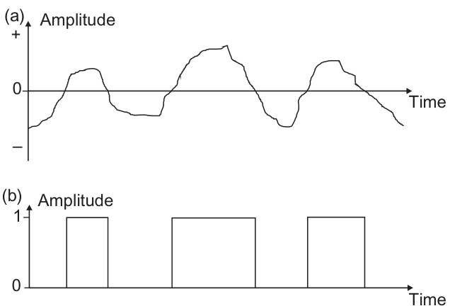

# 2  

# The Radar System Technical Principles  

# 2.1 INTRODUCTION  

In Chapter 1 the fundamental principles of range and bearing measurement which underlie the generation of a marine radar picture were discussed. The way in which the target information is displayed for use in navigation and collision avoidance was also described in general terms. This chapter looks in more detail at the structure of modern marine radar systems. The treatment of the principles is substantially qualitative and does not need a detailed understanding of science or engineering, but some principles do require some basic mathematical treatment.  

【翻译】
在第一章中，我们讨论了海洋雷达图像生成所依据的基本测量原理，包括距离和方位测量。此外，还概述了如何以适合用于导航和避碰的方式显示目标信息。本章更详细地介绍了现代海洋雷达系统的结构。对这些原理的描述主要是定性的，不需要深入理解科学或工程知识，但某些原理确实需要一些基本的数学处理。

【解读】
本段落介绍了海洋雷达系统的基础知识，包括距离和方位测量原理，以及如何利用这些信息进行导航和避碰。同时，也提到了本章将更详细地探讨现代海洋雷达系统的结构，强调了对部分原理的数学处理的必要性。

【词汇表】
| 英文词汇 | 中文翻译 | 解释 |
| --- | --- | --- |
| Range | 距离测量 | 测量目标与雷达之间的距离 |
| Bearing | 方位测量 | 测量目标相对于雷达的方向角度 |
| Qualitative | 定性 | 不涉及具体数值的描述方法 |
| Mathematical treatment | 数学处理 | 使用数学方法来分析和解决问题 |

Much of the chapter describes the principles of conventional magnetron-based pulse radar systems, but Section 2.9 describes the principles of solid-state radar. An increasing number of marine radars are of this type. In general, it is easier to understand such radars after getting a firm understanding of pulse radar concepts, since many of these are directly applicable to ‘coherent’ solid-state radars.  

【翻译】
本章的大部分内容描述了传统的磁控管脉冲雷达系统的原理，但第2.9节描述了固态雷达的原理。越来越多的海事雷达属于这种类型。一般来说，在对脉冲雷达概念有了深入的理解之后，更容易理解这种雷达，因为许多这些概念可以直接应用于“相干”的固态雷达。

【解读】
这段话主要介绍了雷达系统的两种类型：传统的磁控管脉冲雷达系统和固态雷达系统。作者建议读者首先了解脉冲雷达的基本概念，然后再学习固态雷达的原理，这样会更容易理解，因为两者之间存在很多可共享的知识点。

【词汇表】
| 英文词汇 | 中文翻译 | 解释 |
| --- | --- | --- |
| magnetron | 磁控管 | 一种用于产生微波能量的设备，常用于雷达系统中 |
| pulse radar | 脉冲雷达 | 一种使用脉冲信号进行距离和速度测量的雷达系统 |
| solid-state radar | 固态雷达 | 一种使用固态电子元件而非真空管的雷达系统，具有更高的可靠性和效率 |
| coherent | 相干 | 指的是两个或多个波具有相同的频率和相位关系，通常用于描述光学或电磁波的特性 |

# 2.2 BASIC FUNCTIONALITY  

The block diagram in Figure 2.1 shows the main functional elements of a marine radar and the following subsections elaborate on each of these. The basic diagram is applicable to both pulse and solid-state radar systems, but only the former are discussed in this section.  

【翻译】
图2.1中的块状图显示了海洋雷达的主要功能元件，下面的子节对每一个进行详细说明。基本图适用于脉冲式和固态雷达系统，但本节只讨论前者。

【解读】
该段落介绍了海洋雷达的基本组成部分，并指出后续内容将对这些部分进行详细阐述。值得注意的是，这里提到的“脉冲式”和“固态”雷达系统是两种不同的技术实现方式，而本节的重点在于脉冲式雷达系统。

【词汇表】
| 英文词汇 | 中文翻译 | 解释 |
| --- | --- | --- |
| Block diagram | 块状图 | 一种用来表示系统各个部分之间关系的图表 |
| Pulse radar | 脉冲式雷达 | 一种使用电磁波脉冲来探测目标的雷达系统 |
| Solid-state radar | 固态雷达 | 一种使用固态电子设备来发射和接收雷达信号的雷达系统 |
| Subsections | 子节 | 文章或章节中的小标题或分节 |

# 2.2.1 Transmitter  

The function of the transmitter is to generate the radiated electromagnetic energy. For a standard pulse radar the transmitter provides the correct radio frequency (RF) of the pulses, together with their repetition frequency, length, shape and power. Nowadays, the transmitter is often located upmast, close to the antenna, separated from it by the rotating joint. This allows the transmitted RF energy to travel between the typically static transmitter and the rotating antenna. On some systems the transmitter is below-deck and there is a transmission line, normally a coaxial cable at S-band and a waveguide at X-band, connecting it to the rotating joint of the antenna unit. A coaxial cable is one having a central conductor surrounded by insulating material together with an outer screening sheath, as illustrated in Figure 2.2(a). The traditional waveguide is hollow rigid copper tubing with a precise rectangular or circular cross-section (Figure 2.2(b)). Waveguide can also be made flexible, such as by corrugating the walls and using an elliptical cross-section. Waveguide is a technically good solution because it creates little loss in the transmitted or received signal. Typical runs can be up to $20{-}30\mathrm{m}$ in length. However, it is a very expensive and bulky transmission line, especially at S-band.  

  
FIGURE 2.1 The main functional elements of a marine radar.  

【翻译】
图2.1海洋雷达的主要功能元件。

【解读】
该图展示了海洋雷达系统的基本组成部分，包括天线、发射器、接收器、显示器等关键功能模块。这些元素共同工作以实现海洋雷达的功能，如探测和跟踪目标、测量距离和速度等。

【词汇表】
| 英文词汇 | 中文翻译 | 解释 |
| --- | --- | --- |
| Marine Radar | 海洋雷达 | 一种用于海上导航和监视的雷达系统 |
| Functional Elements | 功能元件 | 指系统中执行特定功能的各个部分 |
| Antenna | 天线 | 雷达系统中负责发送和接收信号的装置 |
| Transmitter | 发射器 | 将电信号转换为微波能量并向空间发射的设备 |
| Receiver | 接收器 | 从空间接收微波能量并将其转换回电信号的设备 |

In both coaxial cable and waveguide the energy travels in the form of electric and magnetic fields, bounded by the conducting metallic surfaces that make up the walls of the transmission line. In a coaxial cable the insulating dielectric material between the central conductor and the outer screening sheath absorbs some of the transmitted energy creating inefficiencies. Air forms the insulating material within a waveguide, which is one reason that makes it low loss compared to a coaxial cable. In the earlier days of radar the dielectric loss in coaxial cable was immense, forcing the use of waveguide. Nowadays, the better dielectrics available favour the use of coaxial cable for marine radars, at least at S-band, when compared with the use of lower loss but very expensive and bulky waveguide.  

【翻译】
在同轴电缆和波导中，能量以电场和磁场的形式传输，被组成传输线墙壁的导电金属表面所约束。在同轴电缆中，中央导体和外部屏蔽套之间的绝缘介质材料会吸收部分传输能量，从而产生效率损失。在波导中，空气作为绝缘材料，这也是它相比同轴电缆低损耗的原因之一。在雷达技术的早期，由于同轴电缆中的介质损耗非常大，因此不得不使用波导。如今，随着更好的介质材料的出现，对于海洋雷达来说，至少在S频段，同轴电缆的使用变得更加普遍，而不是选择低损耗但价格昂贵且体积庞大的波导。

【解读】
本段主要讨论了同轴电缆和波导在能量传输方面的比较，特别是从能量损耗的角度出发。通过对两种传输方式的介质材料和损耗特性的分析，可以看出技术的进步如何影响设备的选择和设计，尤其是在雷达技术领域。

【词汇表】
| 英文词汇 | 中文翻译 | 解释 |
| --- | --- | --- |
| Coaxial Cable | 同轴电缆 | 一种用于传输电信号的电缆，其内部有一个中心导体，周围有一层绝缘材料和外部屏蔽层。 |
| Waveguide | 波导 | 用于引导电磁波传播的结构，通常为管状或矩形截面的导体。 |
| Dielectric Loss | 介质损耗 | 指介质材料在电场作用下发生的能量损失。 |
| Radar | 雷达 | 无线电探测和定位系统，利用无线电波来探测和定位目标。 |

In the block diagram of Figure 2.1 a connection is shown between the transmitter and the receiver. This supplies a common time reference so that, for instance, the time taken by a particular echo to arrive at the receiver can be accurately measured.  

【翻译】
在图2.1的块状图中，显示了发射器和接收器之间的连接。这提供了一个共同的时间参考，因此，例如，可以准确地测量特定回声到达接收器所需的时间。

【解读】
本段主要描述了发射器和接收器之间的连接对于实现精确的时间测量的重要性，特别是在信号传输过程中的应用，如雷达系统等。

【词汇表】
| 英文词汇 | 中文翻译 | 解释 |
| --- | --- | --- |
| transmitter | 发射器 | 将信号发送出去的设备 |
| receiver | 接收器 | 接收信号的设备 |
| echo | 回声 | 信号被反射回来后的回响信号 |
| common time reference | 共同时间参考 | 两个或多个设备之间共享的标准时间基准 |

# 2.2.2 Antenna  

Antenna, scanner and aerial are all names that are used to describe the device which radiates the radio energy into space and collects the returning echoes. Its construction defines the shape (power distribution) of the radar beam in both the horizontal and vertical planes. In order to achieve the required directional characteristic (see Section 1.2.3) the horizontal limits of the beam must be narrow, in the order of $1-2^{\circ}$ . By contrast, the beam is wide in the vertical plane in order to maintain adequate performance when the vessel is rolling and pitching in a seaway. The International Maritime Organization (IMO) Performance Standards for radar set out certain range performance requirements and these must be achieved when the vessel is rolling or pitching up to $\pm10^{\circ}$ . In principle, the antenna could be mounted on a stabilized platform that compensates for the vessel pitch and roll, as implemented on some naval radars. In practice, this is very expensive and the simple low-cost solution is to ensure that the antenna’s vertical beamwidth accommodates the motion, effectively requiring it to be a minimum of $20^{\circ}$ .  

To achieve the desired $360^{\circ}$ of azimuth coverage the antenna is typically rotated continuously and automatically in a clockwise direction, when viewed from above, thus rotating the beam to consecutively cover all azimuth angles. A signal measuring the precise pointing angle, either in analogue or in digital form, is relayed to the radar processor to ensure that the received echoes are correctly referenced with the antenna azimuth angle relative to the ship’s heading (relative bearing), see Section 1.2.4.2 and Figure 1.5. The transmission of this signal is represented in  

  
FIGURE 2.2 Typical transmission lines: (a) coaxial cable and (b) waveguide.  

【翻译】
图2.2 典型传输线：（a）同轴电缆和（b）波导。

【解读】
该图展示了两种常见的传输线类型，即同轴电缆和波导。同轴电缆由内外两个绝缘层包围的铜线组成，广泛用于有线通信网络中信号的传输。而波导则是利用电磁波在其中传播的特性，将能量从一个点传递到另一个点，通常应用于微波频率范围的通信系统中。

【词汇表】
| 英文词汇 | 中文翻译 | 解释 |
| --- | --- | --- |
| transmission lines | 传输线 | 用于传输电信号或光信号的线路或介质 |
| coaxial cable | 同轴电缆 | 一种中心为铜线、外层为网状铜丝的电缆，用于传输高频信号 |
| waveguide | 波导 | 一种利用电磁波在其内部传播的装置，用于传输能量或信号 |

Figure 2.1 by the line connecting the antenna to the processor.  

【翻译】
图2.1中，天线与处理器之间通过一条连接线相连。

【解读】
这段话描述了一幅图表（图2.1）中的一个简单电路或系统，其中天线（antenna）和处理器（processor）通过一根线缆相连。这可能是在讨论无线通信、电子设备或计算机系统的上下文中使用的基本概念。

【词汇表】
| 英文词汇 | 中文翻译 | 解释 |
| --- | --- | --- |
| Antenna | 天线 | 用于发送或接收信号的设备 |
| Processor | 处理器 | 计算机系统中执行指令和进行数据处理的核心部件 |
| Connecting line | 连接线 | 将两个设备或组件连接起来的导线或通道 |

# 2.2.3 Receiver  

The function of the receiver is to amplify the very weak echoes intercepted by the antenna. This permits the signals to be processed such that they appear as clear as possible on the display, and also so that they can be used for automated processes, such as target tracking (TT), see Section 2.7.5. The receiver is a very critical module of a radar as it must accurately amplify the received signal without any distortion. The very low levels of the original signal make this a demanding process. In particular, a poorly designed receiver can add unwanted noise into the received signal, which can then totally obscure weak signals and can also distort stronger ones. In today’s crowded radio spectrum any distortion effects within the receiver can inappropriately add components of other transmissions, such as digital telecommunications signals, into the received radar signal causing significant interference effects. These issues are looked at in more detail in Section 2.6.5.  

【翻译】
接收器的功能是放大天线拦截到的非常微弱的回声信号。这使得信号可以被处理以便在显示屏上清晰地显示，同时也可以用于自动化过程，如目标跟踪（TT），详见第2.7.5节。接收器是雷达系统中一个非常关键的模块，因为它必须准确地放大接收到的信号而不引入任何失真。原始信号的极低水平使得这个过程变得很有挑战性。特别是，如果接收器设计不良，它可能会向接收到的信号中添加不需要的噪音，从而完全遮蔽微弱的信号，也可能扭曲较强的信号。在今天拥挤的无线电频谱中，接收器内部的任何失真效应都可能不恰当地将其他传输的组件，如数字电信号，添加到接收到的雷达信号中，从而导致显著的干扰效应。这些问题将在第2.6.5节中进行更详细的讨论。

【解读】
本段主要介绍了雷达系统中的接收器的作用及其重要性。接收器负责放大微弱的回声信号，以便于信号处理和自动化过程。但是，这一过程对接收器的要求很高，因为它必须准确地放大信号而不引入任何失真或噪音。否则，可能会导致信号质量下降甚至完全丧失。

【词汇表】
| 英文词汇 | 中文翻译 | 解释 |
| --- | --- | --- |
| Receiver | 接收器 | 雷达系统中负责放大微弱信号的设备 |
| Distortion | 失真 | 信号在传输或处理过程中产生的变形或错误 |
| Interference | 干扰 | 对信号传输或处理产生影响的外部信号或噪音 |
| Spectrum | 频谱 | 电磁波的频率范围，包括无线电频谱等 |

In order to be able to use a single antenna for both transmission and reception it is essential that the sensitive receiver is protected from the potentially damaging power of the transmitted signal. This is achieved by a device known as the transmit/receive (T/R) switch, sometimes called a T/R cell, which blocks the input to the receiver during transmission, see Section 2.6.3.1.  

【翻译】
为了能够使用单一天线同时进行传输和接收，必须保护敏感的接收器免受传输信号可能造成的损害。这是通过一种称为发射/接收（T/R）开关的设备实现的，有时也被称为T/R单元，该开关在传输过程中阻断了接收器的输入，请参见第2.6.3.1节。

【解读】
本段主要讨论了在无线通信系统中如何保护接收器免受自身传输信号的干扰或损害。通过使用T/R开关，可以确保在传输信号期间，接收器不会受到来自自身传输信号的强大电力影响，从而避免潜在的损坏。

【词汇表】
| 英文词汇 | 中文翻译 | 解释 |
| --- | --- | --- |
| Antenna | 天线 | 用于发送和接收无线电信号的装置 |
| Transmitted signal | 传输信号 | 从发送端发出去的信号 |
| Receiver | 接收器 | 用于接受和处理信号的设备 |
| T/R switch | 发射/接收开关 | 控制信号流向的电子开关，用于防止接收器在发送信号时受到损害 |

# 2.2.4 Radar Processor  

The prime function of the radar processor is to turn the received radar signals into an optimized image that can be shown on the operator’s display. In particular, the image must be constructed to ensure that a trained user can make maximum use of the information that is available within the returned radar signals. This fundamentally includes a clear indication of the presence of objects by generating on the display a visible response whose angular and radial position with respect to, for instance, the own ship’s heading line and indicated position, are representative of the bearing and range at which the corresponding target lies.  

【翻译】
雷达处理器的主要功能是将接收到的雷达信号转换为优化后的图像，这些图像可以在操作员的显示屏上显示出来。特别地，生成的图像必须能够让受过训练的用户充分利用从雷达信号中返回的信息。这基本上包括清晰地指示物体的存在，即在显示屏上生成一个可见的响应，其角度位置和径向位置相对于例如自身船只的航向线和指示位置，是对应目标所在方位和距离的代表。

【解读】
本段描述了雷达处理器的核心功能，即将原始雷达信号转化为易于理解的视觉图像，以便操作员能够快速准确地获取目标的位置信息。这种处理不仅需要技术上的精确，还需要考虑到人机交互的因素，确保操作员能有效地使用这些信息进行决策。

【词汇表】
| 英文词汇 | 中文翻译 | 解释 |
| --- | --- | --- |
| Radar Processor | 雷达处理器 | 负责处理雷达信号的设备或软件 |
| Optimized Image | 优化后的图像 | 经过处理后，使得图像更清晰、更容易被理解的形式 |
| Angular Position | 角度位置 | 物体与参考点之间的角度关系 |
| Radial Position | 径向位置 | 物体与参考点之间的距离关系 |

The radar processor function typically consists of some analogue pre-processing, followed by extensive digital processing. Analogue processing means that the signal is manipulated before it is digitized and so retains its ‘continuous’ structure and is not represented as a table of data. It can be depicted by a smooth curve of voltage or current against time. It has the advantage that relatively simple processing functions can be almost instantaneously carried out by a set of low-cost devices such as transistors, resistors, capacitors and inductors (coils). Analogue techniques are used when the speed of processing required makes it difficult or expensive to perform digitally, and nowadays, these techniques are generally confined to the very early processes of radar functionality. The speed of digital processing is always advancing and so this means that less and less analogue processing becomes necessary. A future advanced radar system would digitize the signal once it had been sufficiently amplified ! the only analogue processing being the amplification of the antenna-received signal. Figure 2.1 shows both analogue and digital processing phases, which are elaborated in later sections of this chapter.  

【翻译】
雷达处理器功能通常由一些模拟预处理组成，然后是广泛的数字处理。模拟处理意味着信号在被数字化之前就已经被操纵，因此保留了其“连续”的结构，不以数据表格的形式表示。它可以用一条平滑的电压或电流与时间的曲线来描述。它有一个优点，即相对简单的处理函数可以几乎瞬间地通过一套低成本的设备（如晶体管、电阻器、电容器和感应器）执行。模拟技术是在需要的处理速度使得数字处理变得困难或昂贵时使用的，而现在，这些技术一般只局限于雷达功能的非常早期过程。数字处理的速度总是在进步，这意味着需要的模拟处理越来越少。在未来的先进雷达系统中，一旦信号被足够地放大，就会被数字化，只有天线接收到的信号的放大才是唯一的模拟处理。图2.1展示了模拟和数字处理阶段，这些内容将在本章的后续部分详细阐述。

【解读】
这段话主要介绍了雷达处理器功能中的模拟和数字处理。模拟处理是指信号在被数字化之前进行的一系列操作，可以快速地通过低成本的设备执行，但随着数字处理速度的提高，模拟处理变得越来越不必要。未来，雷达系统可能只保留最基本的模拟处理，如信号放大，其余均采用数字处理。

【词汇表】
| 英文词汇 | 中文翻译 | 解释 |
| --- | --- | --- |
| analogue | 模拟 | 指的是信号在被数字化之前的处理方式 |
| digital | 数字 | 指的是信号被数字化后的处理方式 |
| pre-processing | 预处理 | 指的是信号被正式处理前的初步处理 |
| transistor | 晶体管 | 一种电子元件，常用于模拟电路中 |
| resistor | 电阻器 | 一种电子元件，常用于模拟电路中控制电流大小 |

In general, the digital processing attempts to optimize the detection of wanted targets while reducing the deleterious effects of unwanted echoes, such as reflections from precipitation and the sea, known as clutter. It also provides the tracking function for targets, so that parameters such as the speed and course of selected targets may be shown graphically and numerically on the display and allows automatic collision warnings to be made. The tracking functionality of a modern radar can also be made to include the integration of radar information with that being received from the ship’s Automatic Identification System (AIS). AIS is described in Chapter 5.  

【翻译】
一般来说，数字处理试图优化检测所需目标，同时减少不需要的回声（如来自降水和海面的反射）带来的有害影响，这些被称为杂波。它还为目标提供跟踪功能，以便选定目标的速度、航向等参数可以在显示屏上以图形和数字形式显示，并允许发出自动碰撞警告。现代雷达的跟踪功能还可以包括与船舶的自动识别系统（AIS）接收到的信息进行整合。AIS将在第五章中描述。

【解读】
本段主要介绍了数字雷达处理技术的作用和优势，特别是其优化目标检测、减少杂波干扰以及提供实时跟踪和警告功能的能力。此外，还提到了雷达信息与船舶自动识别系统（AIS）的整合，这进一步增强了雷达系统在导航和安全方面的应用价值。

【词汇表】
| 英文词汇 | 中文翻译 | 解释 |
| --- | --- | --- |
| clutter | 杂波 | 不需要的回声信号，如来自降水或海面的反射 |
| Automatic Identification System (AIS) | 自动识别系统 | 一种用于识别和跟踪船舶位置和身份的系统 |
| deleterious | 有害的 | 对系统性能或安全产生负面影响的 |
| integration | 整合 | 将不同系统或数据源结合起来以提高功能或效率的过程 |

Digital processing also formats the image for display, scaling it appropriately to fit the screen and putting it into the correct orientation and motion modes (see Section 2.8.4). Finally it ensures that supporting information is visible on the display, such as the heading line, bearing scale and range rings, and that user instigated calculations, such as the positional interrelationships of targets and the own ship, can be determined. All the processing takes into account the specific user settings, which form part of the user interface described in the following section.  

【翻译】
数字处理还会对图像进行格式化，以适应屏幕大小，调整其方向和运动模式（见第2.8.4节）。最后，它确保支持信息在显示屏上可见，如航向线、方位标尺和距离环，以及用户启动的计算结果，如目标与自身船只之间的位置关系，可以被确定。所有这些处理都考虑到了特定的用户设置，这些设置是下一节中描述的用户界面的一部分。

【解读】
本段主要介绍了数字处理在图像显示中的作用，包括格式化、缩放、定向和运动模式的调整，以及确保相关信息的可视性。同时，也提到所有这些处理都会根据用户的具体设置来进行，这些设置是用户界面的一个组成部分。

【词汇表】
| 英文词汇 | 中文翻译 | 解释 |
| --- | --- | --- |
| Digital processing | 数字处理 | 使用数字技术对数据或图像进行处理和分析的过程 |
| Orientation | 方向 | 指物体或图像在空间中的方向或朝向 |
| Motion modes | 运动模式 | 指物体或图像的运动状态或方式 |
| User interface | 用户界面 | 计算机系统与用户交互的接口或平台 |

# 2.2.5 Display and User Interface  

The user interface, including the display of the radar image and the control of the radar’s functionality, is obviously of high importance to the radar operator. It must be appropriately positioned on the ship’s bridge, to enable it to be used effectively in conjunction with other systems, while providing a good view from the bridge windows. The display needs to be clear under all operating conditions in day, dusk and night. In particular, at night, it must give clarity without diminishing the night vision of the user and others on the bridge. The controls and operating menus need to be easy to understand, with values that have been set by the user readily observable, helping to ensure that the radar is always set optimally to meet the needs of the immediate situation. In today’s terminology, it must be user-friendly.  

【翻译】
用户界面，包括雷达图像的显示和对雷达功能的控制，对于雷达操作员来说显然非常重要。它必须适当地放置在船桥上，以便与其他系统一起有效使用，同时从桥窗提供良好的视野。显示屏需要在所有操作条件下清晰显示，无论是白天、黄昏还是夜晚。特别是在夜间，它必须提供清晰的显示而不影响用户和桥上其他人的夜视能力。控制和操作菜单需要易于理解，用户设置的值应容易观察到，这有助于确保雷达始终根据当前情况的需求进行最佳设置。在今天的术语中，它必须是用户友好的。

【解读】
本段强调了用户界面的重要性，尤其是在雷达操作中的显示和控制方面。为了确保雷达操作员能够高效地工作，用户界面需要设计得方便、直观且易于使用。同时，也需要考虑到夜间操作的特殊要求，避免影响夜视能力。这段话反映出现代电子设备设计中“用户体验”（User Experience）的理念，即产品应该被设计为易用、直观和满足用户需求。

【词汇表】
| 英文词汇 | 中文翻译 | 解释 |
| --- | --- | --- |
| User Interface | 用户界面 | 电子设备与用户交互的部分，包括显示、控制等 |
| Radar Operator | 雷达操作员 | 操作和管理雷达系统的人员 |
| Night Vision | 夜视能力 | 在低光照条件下看到物体的能力 |
| User-Friendly | 用户友好 | 设计使产品易于使用和理解的特性 |

Although older radar displays are based on rectangular cathode ray tubes (CRTs), similar to those used on old televisions, newer systems are all based on flat panel technology (described in Section 2.8.3). They are very similar to modern good quality computer and TV displays, and will undoubtedly continue to follow the general evolution of mainstream display technology. A radar may have a computer keyboard as part of its user interface, but most of its functionality will normally be accessed via a small number of dedicated buttons and switches, a tracker ball and a screenaccessible menu. Again, mainstream evolution in all aspects of user interfaces will continue to be adopted by radar system manufacturers, whenever applicable, such as the use of touch screens and the possible future use of head-up displays, auxiliary hand-held displays, voice control and three-dimensional displays.  

【翻译】
尽管较旧的雷达显示器基于矩形阴极射线管（CRT），类似于老式电视机使用的技术，但新型系统都基于平板显示技术（如第2.8.3节所述）。它们与现代高质量电脑和电视显示屏非常相似，毫无疑问会继续遵循主流显示技术的一般演进趋势。一个雷达可能拥有作为用户接口一部分的计算机键盘，但其大多数功能通常通过少量专用按钮、开关、跟踪球和可在屏幕上访问的菜单来实现。同样，在所有方面的主流发展，如触摸屏的应用以及未来可能采用头戴式显示、辅助手持显示、语音控制和三维显示等，将会被雷达系统制造商不断采纳。

【解读】
本段主要讨论了雷达显示技术的演进，从传统的CRT到现代的平板显示技术，并预测了未来的发展趋势。同时，也提到了雷达系统的用户接口如何随着科技的进步而变得更加人性化和便捷，例如采用触摸屏、语音控制等方式。

【词汇表】
| 英文词汇 | 中文翻译 | 解释 |
| --- | --- | --- |
| Cathode Ray Tube (CRT) | 阴极射线管 | 一种传统的电子显像管技术 |
| Flat Panel Technology | 平板显示技术 | 现代显示设备中常用的技术，如液晶显示等 |
| Tracker Ball | 跟踪球 | 一种用于控制界面的输入设备 |
| Head-up Display | 头戴式显示 | 一种投影在透明屏幕上的显示技术，常用于飞行员装备中 |
| Touch Screen | 触摸屏 | 一种通过触摸操作的显示屏 |

Today’s rectangular display is generally orientated such that the display surface is approximately vertical, with its longest dimension in the horizontal plane, similar to a conventional TV or computer display. The orientation is commonly described as landscape mode. On some systems, especially river radars, the longest dimension is in the vertical plane, where the display is said to be in portrait mode. Larger displays may have their surfaces tilted well away from the vertical to prevent the window view being obstructed. Possibly, the even larger displays that may be used in the future will have their surfaces almost horizontal, although reflections from the bridge windows will have to be taken into consideration.  

【翻译】
如今的矩形显示器通常以这样的方式摆放：显示面大约垂直，且其最长维度在水平平面上，与传统电视或电脑显示屏类似。这种方向通常被描述为横向模式。在某些系统中，特别是河流雷达系统中，最长维度在垂直平面上，此时显示屏被认为处于纵向模式。大型显示屏可能会将其表面倾斜得远离垂直，以防止窗口视图被阻塞。可能，在未来使用的更大型显示屏将使其表面几乎水平，但需要考虑到桥梁窗户的反射。

【解读】
本段主要讨论现代显示技术中的显示屏方向问题，包括横向模式（landscape mode）和纵向模式（portrait mode），以及不同尺寸显示屏的摆放方式对观察效果的影响。同时，也提到了未来显示屏设计中可能遇到的挑战，如窗户反射等。

【词汇表】
| 英文词汇 | 中文翻译 | 解释 |
| --- | --- | --- |
| Landscape mode | 横向模式 | 显示屏的方向与地平线平行，较宽的边缘在水平方向 |
| Portrait mode | 纵向模式 | 显示屏的方向与地平线垂直，较长的边缘在垂直方向 |
| Horizontal plane | 水平平面 | 与地面平行的平面 |
| Vertical plane | 垂直平面 | 与地面垂直的平面 |

On most systems the radar ‘picture’ is bounded by a circle, effectively replicating the historical circular CRT display. Auxiliary information, such as radar settings and radar TT data are placed outside this circle. There is no internationally agreed standard for positioning such auxiliary information and so different radar models can place information in very different positions. The function and position of control buttons and switches is also not highly regulated, neither is the structure of any menu. It is therefore important that before using a particular radar at sea, the user becomes familiar with its specific operation, see Chapter 6.  

【翻译】
在大多数系统中，雷达“图像”被一个圆圈所限制，有效地复制了历史上的圆形CRT显示器。辅助信息，如雷达设置和雷达TT数据，被放置在这个圆圈之外。没有国际上一致同意的标准来定位此类辅助信息，因此不同的雷达模型可以将信息放在非常不同的位置。控制按钮和开关的功能和位置也不受高度监管，菜单的结构也是如此。因此，在海上使用特定的雷达之前，用户必须熟悉其具体操作，请参阅第6章。

【解读】
本段主要讨论的是雷达系统的界面布局和操作规范。由于缺乏统一的国际标准，不同的雷达设备可能有着不同的布局和操作方式，这就要求用户在实际使用前必须对特定的雷达设备进行充分的了解，以避免操作错误。

【词汇表】
| 英文词汇 | 中文翻译 | 解释 |
| --- | --- | --- |
| Radar | 雷达 | 无线电探测和定位系统 |
| CRT | cathode ray tube | 电子管显示技术 |
| Auxiliary | 辅助的 | 在这里指辅助信息或功能 |
| Regulated | 监管的 | 受到一定规则或法律的约束和管理 |

# 2.3 THE RADAR SIGNAL  

# 2.3.1 Fundamental Considerations  

The radar needs to transmit a signal such that when it is echoed from a target and received, as much relevant information about that target can be collected, especially including its instantaneous range and bearing. There is a need to collect information from targets at all bearings from $0^{\circ}$ to $360^{\circ}$ relative to own ship, and out to a specified range. In addition, the signal characteristics need to provide sufficiently rapid updates in information so that the successive changes in relative position of own ship and any target are small enough to allow a human operator or any automatic system within the radar to be able to keep track of all individual targets. Excessive positional jumps of targets between refreshes of the information would create the potential for confusion because the human user or the automatic process within the radar would not be able to correlate targets between updates.  

The conceptually easiest way of meeting these fundamental requirements is to send out short pulses of RF energy at the radar operating frequency. The action of the antenna confines the energy to a small angular sector in azimuth; the antenna steadily rotates such that the radar beam illuminates all azimuth angles in a relatively short space of time, typically about $ {2-3~\mathrm{s}}$ . The beam must rotate slowly enough to allow the echoes from the most distant targets to be received before the beam rotates away from their particular azimuth angle. For a relatively short range radar, such as a commercial marine radar, this is generally not a practical limitation. The important aspect is that the beam must rotate fast enough so that data from any particular azimuth angle is updated at intervals short enough to ensure the correlation of individual targets at every revolution. The time gap between successive pulses needs to at least allow the transmitted pulse to be reflected and received from a target at the current maximum range setting of the radar. The time taken by the pulse to travel from the radar antenna to the target and back is, of course, a measure of the range of the target from the radar. This straightforward conception forms the basis of a conventional pulse radar, even though there are many practical considerations to be taken into account, which are elaborated further in Section 2.3.3.  

One important aspect to be determined, properly detailed in Section 2.3.3.1, is the length of the pulse itself. To achieve good range discrimination between targets it has to be extremely short; there then has to be a long gap before the next pulse is transmitted in order to allow the target echoes to be received. The inter-pulse gap for a marine radar is typically 2500!6000 times longer than the pulse itself. In effect, it means that the transmitter spends most of its time not transmitting. When a pulse is transmitted it is therefore not surprising that its magnitude has to be very large ! in practice typically 25,000 W $(25~\mathrm{kW})$ for a ships’ radar. By comparison, the ship’s main very high frequency (VHF) radio typically transmits at $25{\:}W$ and has an operating range somewhat comparable to a ship’s radar.  

Generating $25~\mathrm{kW}$ of pulsed power is a very specialist requirement and the magnetron, described in Section 2.4, has evolved to be able to do this. However, if the pulses can be made to be much longer, without compromising radar performance, it would allow more conventional transmitters based on semiconductor technology to be utilized, similar to those used today by base stations for modern telecommunications. Advanced coherent radar principles essentially allow this to happen by using special processing techniques known as pulse compression, which are described in Section 2.9. In effect, the processing artificially reduces the length of the received echoes so that good target discrimination and range accuracy is maintained. The very stable signal that can be generated by a semiconductor-based transmitter also results in the radar receiver being able to be more sensitive to the received echoes than is the case for a conventional magnetronbased system, further helping to reduce the total power required, including the actual amount of pulse compression. Also, the stable signal enables more information to be extracted from the echoes, such as the radial velocity of the target, greatly helping the detection process, especially in clutter. Today’s coherent radars reduce the peak power required to a few hundred watts, compared to the $25~\mathrm{kW}$ typically needed for a magnetronbased marine radar.  

However, a good knowledge of basic pulse radar principles is needed to fully understand the action of this newer radar technology. In particular, the concepts surrounding pulse length, pulse repetition frequency (PRF), power and frequency are all very relevant.  

【翻译】
然而，要完全理解这种新型雷达技术的工作原理，需要对基本的脉冲雷达原理有良好的了解。特别是，脉冲长度、脉冲重复频率（PRF）、功率和频率等概念都非常相关。

【解读】
本段强调了掌握基础的脉冲雷达知识对于理解新型雷达技术的重要性，尤其是与脉冲特征和性能参数相关的概念，如脉冲长度、重复频率、功率和频率等。

【词汇表】
| 英文词汇 | 中文翻译 | 解释 |
| --- | --- | --- |
| Pulse Radar | 脉冲雷达 | 一种使用电磁波脉冲来探测目标的雷达类型 |
| PRF (Pulse Repetition Frequency) | 脉冲重复频率 | 雷达发射脉冲的频率，即每秒发射的脉冲数量 |
| Power | 功率 | 雷达发射的能量大小，影响到检测距离和精度 |

standards, see Section 11.2.1. It means that the marine radar antenna needs to have a horizontal beamwidth somewhat less than $2.5^{\circ}$ . This only becomes practical at microwave frequencies; otherwise the antenna horizontal dimensions become too unwieldy. It became clear in the early days of marine radar that operation below about $2.5\mathrm{GHz}$ started to become impractical and that operation well above this frequency allowed even more practically sized antennas.  

However, it was also found that operation at higher frequencies increased the attenuation of the signal by the atmosphere and, even worse, by rain and other precipitation. This put a practical limit of around $10\mathrm{GHz}$ on marine radars, which was also affected by the difficulty in earlier days of producing signals significantly above this frequency. By international agreement two groups of radio frequencies are now allocated for use by civil marine radar systems. One group is at X-band, specifically those frequencies which lie between 9.2 and $9.5\mathrm{GHz}$ . These frequencies correspond with a wavelength of approximately $3\mathrm{cm}$ . The second group is at S-band and includes the frequencies lying between 2.9 and $3.1\mathrm{GHz}$ and corresponds with a wavelength of approximately $10\mathrm{cm}$ . In fact there was another band allocated at around $5\mathrm{GHz}$ (C-band), but this band never really caught on for marine radar.  

# 2.3.2 Choice of Frequency  

An essential consideration for the radar is the frequency at which it operates. This is fundamentally connected to two important issues. The first is the angular resolution that is required and the second is how well the signal travels within the atmosphere of the earth. In Section 2.5.1.4 it is shown that angular resolution is fundamentally controlled by the antenna; the wider the antenna, the narrower its horizontal beamwidth can be made. Practical marine radars for ships need to be able to discriminate between two point targets at the same range that are separated by $2.5^{\circ}$ or more; also a target bearing accuracy of $1^{\circ}$ is required from the complete system. Both these requirements are embodied within IMO’s radar performance  

$\mathrm{_{x-}}$ and S-band radars have different strengths and weaknesses, and so on appropriately large vessels both are ideally installed. In fact it is an IMO requirement that both $\mathrm{_{x-}}$ and S-band systems are fitted on all vessels above $3000{\mathrm{gt}}$ . The characteristics of the two systems are compared in Table 2.1. Basically, at S-band there is better performance in rain, but because of the practical limitation on antenna size the horizontal beamwidth is generally larger than optimum. At X-band, the antenna used can either be large enough to give excellent resolution or be smaller, and therefore more practical for smaller vessels, but still large enough to provide adequate resolution. Performance in precipitation and also at longer ranges is, however, compromised.  

TABLE 2.1 X-Band and S-Band Compared   

【翻译】
表2.1：X波段与S波段比较

【解读】
本节目标题介绍了一个比较表格，内容涉及X波段（X-Band）和S波段（S-Band）的对比。这些波段是无线电通信中使用的频率范围，不同波段具有不同的特性和应用场景。

【词汇表】
| 英文词汇 | 中文翻译 | 解释 |
| --- | --- | --- |
| X-Band | X波段 | 无线电通信中的一个频率范围，通常指10GHz左右的微波频段 |
| S-Band | S波段 | 无线电通信中的一个频率范围，通常指2-4GHz的微波频段 |
| Compared | 比较 | 将两个或多个事物进行对照分析，以找出其相似和不同之处 |

<html><body><table><tr><td>Feature</td><td>Comparison</td></tr><tr><td>Target response</td><td>For a target of a given size, the response at X-band is greater than at S-band</td></tr><tr><td>Bearing discrimination</td><td>For agivenantennawidththe horizontal beamwidth effect in an S-band system will be approximately 3.3 times that of an X-band system</td></tr><tr><td>Verticalbeam structure</td><td>The vertical lobe pattern produced by an S-band antenna is about 3.3 times as coarse as that from an X-band antenna located at the same height (see Section 2.5.2.5)</td></tr><tr><td>Sea clutter response</td><td>The unwanted response from sea waves is less at S-band than at X-band thus the probability of targets being masked is less</td></tr><tr><td>Precipitation response</td><td>The probability of detection of targets whichliewithinanareaof precipitation is higher with S-band transmissionthanwithX-band transmission</td></tr><tr><td>Attenuationin precipitation</td><td>In any given set of precipitation conditions,S-band transmissionswill sufferless attenuation than those at X-band</td></tr></table></body></html>  

It is seen from Table 2.1 that there are many ways in which the characteristics of $\mathrm{_{x-}}$ and Sband transmissions are complementary, and a knowledge of these leads to more effective use of the equipment. The various circumstances in which these complementary characteristics can be exploited are discussed in more detail in later sections of this book.  

# 2.3.3 Pulse Radar Concepts  

A marine pulse radar, such as that realized by a conventional magnetron-based transmitter, has to produce pulses of defined length, PRF, power and shape that are optimized to achieve the required radar performance defined by IMO. The actual pulse length, PRF and power of each transmitted pulse are of considerable importance in the effective detection of targets. The final pulse shape influences the accurate measurement of range and, perhaps surprisingly, the interference of the radar, both with other radars and with other RF systems, particularly digital telecommunications. Interference issues are discussed in Section 2.6.5.  

【翻译】
海洋脉冲雷达，如传统的磁控管发射器，需要产生长度、重复频率、功率和形状都已定义的脉冲，以优化达到国际海事组织（IMO）规定的雷达性能要求。每个发送脉冲的实际长度、重复频率和功率对于有效检测目标至关重要。最终的脉冲形状影响了对距离的精确测量，可能令人惊讶的是，还会影响雷达与其他雷达以及其他无线电系统（尤其是数字通信系统）的干扰问题。干扰问题在第2.6.5节中进行讨论。

【解读】
本段主要介绍了海洋脉冲雷达的基本要求和特性，强调了脉冲长度、重复频率、功率和形状等参数对于实现最佳雷达性能的重要性，同时也提到了这些参数对准确测量距离和避免干扰的影响。

【词汇表】
| 英文词汇 | 中文翻译 | 解释 |
| --- | --- | --- |
| Marine pulse radar | 海洋脉冲雷达 | 一种用于海洋环境中的雷达技术 |
| Magnetron-based transmitter | 磁控管发射器 | 一种常见的微波发射设备 |
| PRF | 重复频率 | 脉冲信号的重复次数，每秒的脉冲数量 |
| Interference | 干扰 | 不同信号之间的相互影响，可能导致信号失真或错误 |

# 2.3.3.1 Pulse Length  

Pulse length is defined as the duration of a single transmitted radar pulse and is often quoted in microseconds $(\upmu s)$ , although pulses rather shorter than $1\upmu s$ are sometimes given in nanoseconds (ns), where $1~\mathrm{ns}=10^{-9}\mathrm{s}_{.}$ ; and so there are 1000 ns to $1\upmu s$ . As an example, a typical short pulse length of $0.05\upmu s$ can alternatively be stated as $50\mathrm{ns}$ . In general, the target echoes from longer pulses are easier to detect than those from shorter pulses, simply because long pulses contain more energy. Consider the analogy of an electric heater with a power of $3\mathrm{kW}$ . If it had been on for only $5\mathrm{min}$ any rise in the room’s temperature may be imperceptible. On the other hand, if it had been on for $50\mathrm{min}$ the room is likely to have become perceptibly warmer. Energy is typically measured in watt hours or kilowatt hours, with the heater examples being the equivalent of $3\times5$ $/60=0.25\mathrm{k}\bar{W}$ hours and $3^{\circ}\times50/60=2.5\mathrm{kW}$ hours, respectively. However, short radar pulses generally allow more easy and accurate determination of the range of a target, and also permit two targets closely spaced in range and at the same bearing to be displayed as separate targets. This is known as range discrimination, see Figure 2.3. Very short pulses are required when operating at a low maximum displayed range. For instance, a radiated pulse of $1\upmu\mathrm{s}$ has a length in space of about  

  
FIGURE 2.3 Range discrimination: (a) reflections from short pulses remain separate ! good target, discrimination, and (b) reflections from long pulses merge ! poor target discrimination.  

【翻译】
图2.3范围辨别度：（a）来自短脉冲的反射保持分离——良好的目标辨别度，以及（b）来自长脉冲的反射融合——较差的目标辨别度。

【解读】
该图示意了雷达系统中脉冲长度与目标辨别度之间的关系。当使用短脉冲时，返回的信号可以清晰地分辨出不同目标；而当使用长脉冲时，不同目标的信号可能会重叠，从而降低目标辨别度。这是雷达技术中的一个基本概念，影响着系统的精度和有效性。

【词汇表】
| 英文词汇 | 中文翻译 | 解释 |
| --- | --- | --- |
| Range discrimination | 范围辨别度 | 雷达系统区分不同距离目标的能力 |
| Reflections | 反射 | 物体对电磁波的反弹 |
| Pulses | 脉冲 | 短暂的能量或信号爆发 |
| Target discrimination | 目标辨别度 | 区分多个目标物体的能力 |

$300~\mathrm{m},$ effectively limiting the minimum range to at least half this figure ! a conventional radar cannot receive while the pulse is still being transmitted. On the other hand, a pulse of $0.05\upmu s$ is only $7.5\mathrm{m}$ in length, greatly enhancing the minimum detectable range. See Section 3.2.4 for discussion of minimum range.  

In certain special circumstances, such as those where targets are difficult to detect against the background of sea or precipitation clutter, the use of a short pulse generally improves the probability of detection of a wanted target. This is because of the better resolution that results, greatly enabling a small ‘persistent’ target to be discerned from, say, the noisy background of sea clutter. A longer pulse would have a greater amount of clutter embedded in it, making it more difficult to distinguish a real target within its return. Marine radars typically have three or four pulse lengths available, although their selection by the user may be appropriately limited by the radar, according to the selected range scale. On a conventional magnetron-based marine radar, available pulse lengths typically fall within the range $0.05{-}1.3\upmu s$ . If four different pulse lengths are used, they are typically labelled as short, medium, long and extra long.  

It is useful to understand the reasons why the user’s choice of pulse lengths is restricted according to the selected range. If the radar is being used for general surveillance on the longer range scales, a long pulse is needed to increase the energy received from more distant targets. It is explained in Section 2.6.1 that the radar’s ability to detect more distant targets rapidly diminishes and so the highest practical energy must be transmitted to obtain adequate longer range performance; the use of longer pulses helps achieve this. At shorter range scales the returns are generally stronger and the observer is more likely to be concerned with the finer details of the picture. The theoretical minimum radial length of any echo, as eventually displayed on the radar screen, is determined by the pulse length. Hence, at short range the shorter the pulse length, the better the detail. The fact that the wanted targets are closer-in means that the highest possible energy is not required. The ability of the radar to display separately two targets which are on the same bearing and closely spaced in range is known as range discrimination, and this is discussed further in Sections 2.7.3.1 and 2.8.5.2.  

【翻译】
了解用户选择脉冲长度受到限制的原因是有用的。当雷达用于较长距离范围的普遍监视时，需要更长的脉冲来增加从更远目标接收到的能量。正如第2.6.1节所解释的那样，雷达检测更远目标的能力迅速降低，因此必须传输最高的实际能量以获得足够的长距离性能；使用较长的脉冲可以实现这一点。在较短的距离范围内，回波通常更强，观察者更可能关注图像的细节。任何回波在最终显示在雷达屏幕上的径向长度的理论最小值由脉冲长度决定。因此，在短距离下，脉冲长度越短，细节越好。由于期望目标更近，这意味着不需要最高的能量。雷达显示两个在同一方位且距离上紧密排列的目标的能力被称为距离辨别度，这将在第2.7.3.1和2.8.5.2节中进一步讨论。

【解读】
本段主要讨论了雷达系统中脉冲长度与距离范围之间的关系，以及如何根据不同的监视需求调整脉冲长度以优化雷达性能。特别强调了在长距离监视中需要较长的脉冲来增强信号，而在短距离监视中则需要较短的脉冲来提高图像细节和距离辨别度。

【词汇表】
| 英文词汇 | 中文翻译 | 解释 |
| --- | --- | --- |
| Pulse Length | 脉冲长度 | 雷达发射的电磁波持续时间 |
| Range Scales | 距间范围 | 雷达监视的距离范围 |
| Target | 目标 | 被雷达探测的物体或飞行物 |
| Range Discrimination | 距间辨别度 | 雷达区分两个紧邻目标的能力 |

Thus, in general usage, a short pulse is likely to be more appropriate on the shorter range scales and vice versa for longer pulses. Nevertheless, there are some occasions on which it may be helpful to use longer pulses on the shorter range scales or shorter pulses at longer range. The correct use of pulse length selection requires a good understanding of radar use. However, at this stage it is useful to summarize the various factors as set out in Table 2.2. Typical pulse lengths and PRFs available at selected ranges scales are given in Table 2.3.  

【翻译】
一般来说，在较短的距离范围内，使用较短的脉冲更为合适，而在较长的距离范围内，则应使用较长的脉冲。然而，也有一些情况下，在较短的距离范围内使用较长的脉冲或者在较长的距离范围内使用较短的脉冲会比较有帮助。正确选择脉冲长度需要对雷达的使用有很好的理解。然而，在这个阶段，总结各种因素如表2.2所示是有用的。在选定的距离范围内，典型的脉冲长度和重复频率（PRF）如表2.3所列。

【解读】
本段讨论了雷达系统中脉冲长度的选择与距离范围的关系，强调了根据实际情况灵活选择脉冲长度的重要性，同时也提到了相关参数的参考值。

【词汇表】
| 英文词汇 | 中文翻译 | 解释 |
| --- | --- | --- |
| pulse | 脉冲 | 雷达信号的一次发射 |
| PRF | 重复频率 | 脉冲的发送频率 |
| radar | 雷达 | 无线电探测和定位系统 |

# 2.3.3.2 Pulse Repetition Frequency  

PRF is normally expressed as the number of pulses transmitted in 1 s and is therefore denoted in Hertz or pps (pulses per second). Typical values for a marine radar are 1000!3000 pps. The pulse repetition interval (PRI) is the time interval between pulses. It should be noted that PRF and PRI effectively refer to the same feature and are simply related by the expression $\mathrm{PRF}=1/\mathrm{PRI}.$  

For any user selected range scale, the PRI must at least be long enough to allow the immediately previous transmitted pulse to travel out and back to a target situated at the maximum displayed range of the radar. If the next pulse was transmitted before this interval the radar receiver would not be able to decide whether a return was from a long range target illuminated by the preceding pulse or a short range target from the subsequent pulse. In fact, this possibility of confusion always remains, even when the PRI is rather longer than the time interval needed for the transmitted pulse to travel to and from a target at the maximum displayed range. This is because the return from a target situated beyond the maximum displayed range may be received after the next pulse has been transmitted, and erroneously displayed as a target at much shorter range. It is generally termed the second time around or second trace echo effect.  

【翻译】
对于任何用户选择的范围刻度，脉冲重复间隔（PRI）必须至少足够长，以便允许立即之前传输的脉冲能够到达位于最大显示范围内的目标并返回。如果在此时间间隔之前发送下一个脉冲，雷达接收器就无法确定回波是来自被前一脉冲照亮的远距离目标还是来自后续脉冲的近距离目标。实际上，即使当PRI比所需的时间间隔长得多时，这种混淆的可能性仍然存在，因为超出最大显示范围的目标的回波可能会在发送下一个脉冲之后被接收，并错误地显示为一个更近距离的目标。这通常被称为“第二次环绕”或“第二条迹线回声”效应。

【解读】
本段主要讨论了雷达系统中脉冲重复间隔（PRI）的重要性及其与目标检测的关系。它强调了PRI需要足够长以避免对不同目标的回波进行误判，特别是在最大显示范围之外的目标可能引起的混淆现象。

【词汇表】
| 英文词汇 | 中文翻译 | 解释 |
| --- | --- | --- |
| PRI | 脉冲重复间隔 | 雷达系统中两个连续脉冲之间的时间间隔 |
| Radar | 雷达 | 无线电探测和定位系统 |
| Target | 目标 | 被雷达探测到的物体或位置 |
| Pulse | 脉冲 | 雷达发射的无线电信号 |

TABLE 2.2 Short and Long Pulses Features Compared   

【翻译】
表2.2 短脉冲和长脉冲特征对比

【解读】
本节目标题介绍了一个比较表格，用于对比短脉冲和长脉冲的特征。这可能是在信号处理、通信系统或医学成像等领域中使用到的技术术语，旨在通过对比不同类型脉冲的特点来了解其差异和应用场景。

【词汇表】
| 英文词汇 | 中文翻译 | 解释 |
| --- | --- | --- |
| Pulses | 脉冲 | 一种信号形式，指在时间上具有有限长度的能量集中的变化 |
| Short Pulses | 短脉冲 | 持续时间较短的脉冲信号 |
| Long Pulses | 长脉冲 | 持续时间较长的脉冲信号 |
| Features | 特征 | 指的是信号或数据中的某些具体属性或参数，如幅度、频率、持续时间等 |

<html><body><table><tr><td colspan="3"></td></tr><tr><td>Feature Long range target</td><td>Short Pulse Poor. Use when short range scales</td><td>Long Pulse Good. Use when long range scales are</td></tr><tr><td>detection Minimum</td><td>are selected. Good.Use when</td><td>selected andfor poor response targets at short range. Poor. Use when long</td></tr><tr><td>range</td><td>short range scales are selected.</td><td>range scales are selected and minimum range is not a major consideration.</td></tr><tr><td>Range discrimination Effectonecho</td><td>Good. Short radial paint.</td><td>Poor. Long radial paint</td></tr><tr><td>paint</td><td>Produces a well- defined picture when short range scales are selected.</td><td>when short range scalesareselected but the effect is acceptable when long range scales are selected.</td></tr><tr><td>Effect on sea clutter</td><td>Reduces the probability of the masking of targets due tosaturation.</td><td>Increases the probability of the masking of targets due to saturation.</td></tr><tr><td>Effect in precipitation</td><td>Reduces the probability of the masking of targets due to saturation.</td><td>Increases the probability of the masking of targets due to saturation. However, the use of long pulse helps to combat the attenuationcaused by precipitation and willincrease the probability of detecting targets</td></tr></table></body></html>  

TABLE 2.3 PRF and Pulse Length Some Representative Values   

【翻译】
表2.3 脉冲重复频率（PRF）和脉冲长度的一些代表性值

【解读】
本段落似乎是从一份技术报告或学术论文中截取的，内容涉及到超声或雷达技术中的两个重要参数：脉冲重复频率（PRF）和脉冲长度。这些参数在信号处理和设备设置中非常关键，因为它们直接影响到信号的质量和设备的性能。

【词汇表】
| 英文词汇 | 中文翻译 | 解释 |
| --- | --- | --- |
| PRF | 脉冲重复频率 | 指在一个周期内发送的脉冲数量，通常用于超声、雷达等领域。 |
| Pulse Length | 脉冲长度 | 指一个脉冲持续的时间长度，影响信号的分辨率和深度。 |
| Representative Values | 代表性值 | 在此 context 中指的是一些典型或常见的数值，用于说明参数的设定范围。 |

<html><body><table><tr><td rowspan="3">Range Scale Selected (NM)</td><td colspan="3">Pulse Length Selected</td></tr><tr><td colspan="2">Short</td><td colspan="2">Long</td></tr><tr><td>PRF (Hz)</td><td>PL (μs)</td><td>PRF (Hz)</td><td>PL (μs)</td></tr><tr><td>0.25</td><td>2000</td><td>0.05</td><td>2000</td><td>0.05</td></tr><tr><td>0.5</td><td>2000</td><td>0.05</td><td>1000</td><td>0.25</td></tr><tr><td>0.75</td><td>2000</td><td>0.05</td><td>1000</td><td>0.25</td></tr><tr><td>1.5</td><td>2000</td><td>0.05</td><td>1000</td><td>0.25</td></tr><tr><td>3.0</td><td>1000</td><td>0.25</td><td>500</td><td>1.0</td></tr><tr><td>6.0</td><td>1000</td><td>0.25</td><td>500</td><td>1.0</td></tr><tr><td>12</td><td>1000</td><td>0.25</td><td>500</td><td>1.0</td></tr><tr><td>24</td><td>500</td><td>1.0</td><td>500</td><td>1.0</td></tr><tr><td>48</td><td>500</td><td>1.0</td><td>500</td><td>1.0</td></tr></table></body></html>  

To reduce the possibility of such an effect it means that the radar designer has to build in extra ‘dead-time’ to the PRI, whilst not lowering the PRF to such an extent that it adversely affects the detection of targets at all azimuth angles. A very low PRF would result in appreciable rotation of the antenna before the next pulse, in the limit leaving azimuthal gaps where no targets could be detected. To also help reduce the possibility of such effects, the pulse length is chosen to be suitably short to limit the effective energy being radiated in order that excessive power does not exacerbate the situation (see also Section 2.3.3.3). This is all a bit of a compromise, but by experience suitable PRFs and pulse lengths are readily determined that give adequate performance. Even so, second trace echo effects are not an uncommon experience to the user, especially from very large targets, for example wind turbines located at distances rather longer than the user-set maximum displayed range (see also Section 3.9.6).  

【翻译】
为了减少这种影响的可能性，这意味着雷达设计师必须在PRI中添加额外的“死区”时间，同时不能降低PRF到一定程度，以免不利于检测所有方位角的目标。非常低的PRF会导致天线在下一个脉冲之前旋转得相当明显，从而产生方位间隙，使得无法检测目标。为了进一步减少这种影响的可能性，选择适当的脉冲长度以限制有效辐射能量，避免过多的功率加剧情况（见2.3.3.3节）。这是一个妥协，但通过经验，可以轻松确定合适的PRF和脉冲长度以获得良好的性能。尽管如此，第二迹线回声效应对用户来说并不是一种罕见的体验，尤其是来自非常大的目标，如风力涡轮机，它们位于比用户设置的最大显示距离更远的地方（见3.9.6节）。

【解读】
本段主要讨论了雷达系统中的一个技术问题，即如何平衡脉冲重复频率（PRF）与目标检测的需求。设计师需要在增加“死区”时间和保持足够高的PRF之间找到平衡点，以确保能够检测到所有方向的目标，同时也要考虑到脉冲长度的选择，以避免过度辐射能量引起的问题。尽管存在这些挑战，但通过经验和调整，可以找到合适的参数来实现良好的性能。

【词汇表】
| 英文词汇 | 中文翻译 | 解释 |
| --- | --- | --- |
| PRI | 脉冲重复间隔 | 雷达系统中两个连续脉冲之间的时间间隔 |
| PRF | 脉冲重复频率 | 雷达系统发射脉冲的频率 |
| Azimuth | 方位角 | 地平面上某一点相对于观测者位置的角度位置 |
| Pulse length | 脉冲长度 | 雷达发射的单个脉冲的持续时间 |

Even a point target will generally reflect several pulses back to the radar before the antenna beam no longer illuminates it, because of its rotation. This increases the received energy from any target, thereby increasing the likelihood that it will be detected, as further discussed in the next section. The radar designer carefully determines the PRFs and pulse lengths that are available for the user, with Table 2.3 indicating representative values. This shows that they are both dependent on the user-selected maximum display range. Long pulses are used on the longer range scales and are associated with low PRF, while short pulses are used on the short range scales and are associated with high PRF.  

【翻译】
即使是点目标，由于天线束的旋转，也会在天线束不再照射它之前反射多个脉冲回雷达。这增加了从任何目标接收到的能量，从而提高了检测其的可能性，如下一节进一步讨论。雷达设计师仔细确定可供用户使用的重复频率（PRFs）和脉冲长度，表2.3指出了代表性的值。这表明它们都依赖于用户选择的最大显示范围。在较长距离尺度上使用长脉冲，与低重复频率相关，而在短距离尺度上使用短脉冲，与高重复频率相关。

【解读】
本段主要讨论雷达系统中脉冲的特性及其与目标检测的关系。由于天线束的旋转，即使是一个小目标，也可能反射多个脉冲，这提高了目标被检测到的概率。同时，雷达设计师需要根据用户的需求设置合适的重复频率和脉冲长度，以达到最佳的检测效果。

【词汇表】
| 英文词汇 | 中文翻译 | 解释 |
| --- | --- | --- |
| PRFs | 重复频率 | 脉冲信号重复发射的频率 |
| Pulse Length | 脉冲长度 | 单个脉冲信号的持续时间 |
| Antenna Beam | 天线束 | 雷达天线发射或接收信号的方向性束 |
| Display Range | 显示范围 | 雷达屏幕上显示的距离范围 |

In some circumstances the pulses are best not transmitted at regular intervals but with a small random variation in the length of time between each pulse. This is known as pulse jitter and the random process is effected by a digital process known as pseudo-random number generation. It is ‘pseudo-random’ because the numbers are the result of a defined algorithm that generates a sequence of numbers that appears to be random but is actually predictable. This can significantly reduce interference effects with other radars, as described in Section 2.6.5.1, albeit with a small degradation in overall radar performance.  

【翻译】
在某些情况下，脉冲不应以固定的间隔传输，而是应该在每个脉冲之间的时间长度上引入一个小的随机变化。这被称为脉冲抖动（pulse jitter），这种随机过程是通过一种名为伪随机数生成（pseudo-random number generation）的数字过程来实现的。之所以称为“伪随机”，是因为这些数字是由一个定义明确的算法生成的，这个算法产生了一串看似随机但实际上可预测的数字序列。如第2.6.5.1节所述，这可以显著地减少与其他雷达系统的干扰效应，尽管这会带来对整体雷达性能的小幅度劣化。

【解读】
本段主要讨论了在特定情况下如何优化脉冲信号的传输，以减少干扰效应。通过引入微小的随机变化，即脉冲抖动，可以降低雷达系统之间的干扰，从而提高系统的稳定性和准确性。然而，这种方法可能会导致雷达性能略微下降，因此需要权衡利弊进行决策。

【词汇表】
| 英文词汇 | 中文翻译 | 解释 |
| --- | --- | --- |
| Pulse Jitter | 脉冲抖动 | 指在脉冲信号传输中故意引入的微小随机时间变化，以减少干扰。 |
| Pseudo-Random Number Generation | 伪随机数生成 | 一种通过算法生成看似随机但实际可预测的数字序列的技术。 |
| Interference Effects | 干扰效应 | 指不同信号源之间相互影响导致的信号质量下降或失真现象。 |
| Degradation | 劣化 | 性能或状态的下降或恶化。 |

# 2.3.3.3 Power Considerations  

It is obvious that the range at which a target can be detected is dependent on the actual power of the transmitted signal. In fact, many other factors affect the range at which detection takes place, but the transmitted signal power is perhaps the most obvious. On a magnetron-based radar, the instantaneous power is measured in kilowatts and may typically be $3\mathrm{kW}$ for a small craft radar or $25~\mathrm{kW}$ for a ship’s radar. As previously noted, this seems large, especially when compared to a 25 W VHF transmitter that has a similar operational range. In fact, as discussed in the previous section, what is more important is the energy that is effectively available to illuminate targets, with energy being the product (multiplication) of power and time.  

First of all, consider a conventional $25~\mathrm{kW}$ maritime magnetron-based radar, operating at medium range with a pulse length of $0.25\upmu s$ and a PRF of $1000\mathrm{Hz}$ . A radar with such settings is only radiating power for $0.25\upmu{\mathrm{s}}$ every $1/1000\mathrm{th}$ of a second (every $10^{-3}s,$ . This results in the average (mean) power being generated given by:  

$$
=25,000\times(0.25\times10^{-6})/10^{-3}=6.25W
$$  

This is a better comparison to the power rating of more continuous systems such as domestic electric heaters and VHF radios. The radar transmitter is developing just 6.25 W hours of energy.  

【翻译】
这与家用电热水器和VHF收音机等更为连续的系统的功率评级比较更为合适。雷达发射器仅产生6.25瓦时的能量。

【解读】
本段主要讨论的是雷达发射器的能量输出与其他设备（如家用电热水器和VHF收音机）相比的大小，以此来说明雷达发射器的能量输出相对较低。

【词汇表】
| 英文词汇 | 中文翻译 | 解释 |
| --- | --- | --- |
| power rating | 功率评级 | 指设备的最大功率输出能力 |
| continuous systems | 连续系统 | 指能够持续运行的系统，如家用电器 |
| VHF radios | 超高频收音机 | 一种使用超高频率的无线电收音机 |
| radar transmitter | 雷达发射器 | 发送雷达信号的设备 |

A target is only illuminated as the antenna beam sweeps across it. If the antenna is rotating at 24 revolutions per minute, this is equivalent to $24\times360^{\circ}$ per minute or $24\times360/60^{\circ}$ per second, that is $144^{\circ}$ per second. If the antenna azimuth beamwidth is $1^{\circ}$ then the beam is only directing appreciable energy towards the target for $1/144\mathrm{s}$ every revolution of the antenna; that is for about $6.9\mathrm{ms}$ . This is called the dwell time of the radar beam. If pulses are being transmitted every millisecond it is seen, for this example, that a burst of about 7 pulses is directed towards a particular point target at every revolution of the antenna.  

It can be useful to consider the concept of ‘effective energy’. Conceptually, the effective energy $(E_{\mathrm{f}})$ is a representation of the energy in watt seconds that is being transmitted by the radar towards any particular point target at every revolution of the antenna. For our example, this is $6.25\times6.9\approx43\mathrm{mW}$ seconds. It is emphasized that $E_{\mathrm{f}}$ is a conceptual quantity, that is useful in explaining certain basic properties of radar, but is not the full story nor is it widely quoted and it certainly does not represent absolute signal strengths.  

For a conventional pulsed radar the effective energy being radiated in any particular azimuthal direction at every revolution of the antenna is therefore given by:  

【翻译】
对于传统的脉冲雷达，在天线每旋转一周时，向任意方位发射的有效能量由以下公式给出：

【解读】
本段主要讨论了传统脉冲雷达中天线旋转过程中向特定方向发射的能量问题，强调了计算这种能量的重要性，这对理解雷达系统的性能和工作原理至关重要。

【词汇表】
| 英文词汇 | 中文翻译 | 解释 |
| --- | --- | --- |
| Conventional | 传统的 | 指按照惯常规则或方法进行的 |
| Pulsed Radar | 脉冲雷达 | 一种通过发送和接收电磁波来探测目标物体的雷达类型 |
| Azimuthal | 方位的 | 指与地平线相关的水平方向或角度 |
| Revolution | 旋转 | 天线或其他物体绕其轴心旋转一圈的动作 |

$$
E_{\mathrm{f}}=P_{\mathrm{p}}\times P_{\mathrm{l}}\times N_{\mathrm{p}}\mathrm{~W~s~}
$$  

where:  

$P_{\mathrm{{p}}}$ is the peak transmitted power in watts $P_{1}$ is the pulse length in seconds $N_{\mathrm{p}}$ is the number of pulses illuminating a point target every antenna revolution, and so:  

$$
N_{\mathrm{p}}=\frac{B_{\mathrm{w}}\times P_{\mathrm{rf}}}{R_{\mathrm{pm}}\times60}
$$  

where:  

$P_{\mathrm{rf}}$ is the PRF in pulses per second $B_{\mathrm{w}}$ is the antenna beamwidth in degrees $R_{\mathrm{pm}}$ is the antenna rotation rate in revolutions per minute  

By substituting the expression for $N_{\mathrm{p}}$ in the original equation for $E_{\mathrm{f}},$ we get the relationship:  

$$
E_{\mathrm{f}}={\frac{P_{\mathrm{p}}\times P_{\mathrm{l}}\times B_{\mathrm{w}}\times P_{\mathrm{rf}}}{R_{\mathrm{pm}}\times60}}{\mathrm{W}}{\mathrm{s}}
$$  

This simple equation, although not commonly quoted, is generally useful in helping to understand some fundamental radar aspects, including the comparison of conventional magnetron radars with solid-state systems, see Section 2.9. In particular, it shows how the basic parameters of a conventional pulsed radar with a rotating antenna influence the effective energy being radiated, and hence the basic ability of the radar to detect targets. It is seen that the effective energy is increased by any of the following:  

【翻译】
这个简单的方程式虽然不常被引用，但通常对理解一些基本的雷达方面很有帮助，包括比较传统的磁控管雷达与固态系统（见第2.9节）。特别是，它展示了如何通过一个带有旋转天线的传统脉冲雷达的基本参数来影响所发射的有效能量，从而影响雷达探测目标的基本能力。可以看出，有效能量会随着以下任何因素的增加而增加：

【解读】
本段主要讨论了一个简单的方程式在理解雷达基本原理中的作用，尤其是在比较不同类型的雷达系统时。它强调了雷达的基本参数，如天线的旋转方式，对于提高雷达探测目标的能力有重要影响。同时，也提到了有效能量的增加会提升雷达的性能。

【词汇表】
| 英文词汇 | 中文翻译 | 解释 |
| --- | --- | --- |
| magnetron | 磁控管 | 一种用于产生微波能量的设备，常用于雷达系统中 |
| solid-state system | 固态系统 | 使用半导体元件代替传统真空管的电子系统 |
| pulsed radar | 脉冲雷达 | 发送一系列脉冲信号以检测目标的雷达类型 |
| rotating antenna | 旋转天线 | 可以旋转以改变方向的天线，用于扫描周围环境 |

• A higher peak power   
• A longer pulse length   
• More pulses illuminating the target, such as by increasing the PRF or decreasing the antenna rotation rate.  

【翻译】
• 较高的峰值功率 
• 较长的脉冲长度 
• 更多的脉冲照射目标，例如通过增加重复频率（PRF）或降低天线旋转速率。

【解读】
该段落讨论了提高雷达系统性能的几种方法，包括增强峰值功率、延长脉冲长度以及增加照射目标的脉冲数量。这可以通过调整系统参数如重复频率和天线旋转速率来实现，从而提高雷达的探测能力和精度。

【词汇表】
| 英文词汇 | 中文翻译 | 解释 |
| --- | --- | --- |
| Peak Power | 峰值功率 | 雷达发射能量的最高点 |
| Pulse Length | 脉冲长度 | 单个雷达信号的持续时间 |
| PRF (Pulse Repetition Frequency) | 重复频率 | 雷达发射脉冲的频率 |

The effective energy, as defined here, is only a concept but is useful in bringing out some important aspects that are otherwise only embedded in more difficult to understand equations. Furthermore, it does not include all real effects, such as the vertical beamwidth of the antenna. Also, in practice, the detectability of a target is additionally enhanced by it being illuminated on multiple revolutions of the radar antenna. This is a rather more complex situation, and a detailed analysis is outside the scope of this book as it involves a good knowledge of statistical mathematics. In fact, detailed statistical issues also arise when more accurately analysing the effective power of a radar, even when just considering the pulses received within the beamwidth of the antenna $(N_{\mathrm{p}})$ . These are also outside the scope of this book.  

All these additional factors result in a concept known as the probability of detection $(P_{\mathrm{d}})$ , which is effectively a measure of the likelihood of a target being shown on the radar display. This is normally given as a percentage. A good $P_{\mathrm{d}}$ would typically be better than $90\%$ , whilst a poor one would be less than $50\%$ . It is best understood by the fact that, in effect, a target with a $P_{\mathrm{d}}$ of $90\%$ would be visible on the display for 9 out of 10 revolutions of the antenna. There is a connected parameter known as the probability of false alarm $(P_{\mathrm{fa}}),$ , that is where an apparent target is shown on the display but that it is noise and not ‘real’. In practice, a relatively poor $P_{\mathrm{fa}}$ would be larger than $10^{-4}\phantom{|}$ , that is more than 1 in every 10,000 apparent targets on the display is false. A relatively good Pfa is typically smaller than 1026, where only less than one target per million is false. The false targets form visual ‘noise’ on the display. Such noise is actually used to help the operator judge the correct settings of, for instance, the manual gain control, as detailed in Section 6.2.7.1. IMO defines the required basic detection ranges of a radar at a $P_{\mathrm{d}}$ of $80\%$ and a $P_{\mathrm{fa}}$ of $10^{-4}$ .  

# 2.3.3.4 Pulse Shape  

The pulse shape is of particular significance in the accurate determination of range, although modern processing systems can compensate for non-idealities. Conceptually, the outline (or envelope) of the pulse should be rectangular and, particularly, the leading edge of the pulse should take the form of a vertical rise. The significance of this is illustrated by Figure 2.4, which shows the envelope of an ideal pulse and then compares the range measurement obtained using such an ideal pulse shape with that obtained using a pulse shape which differs from the ideal. Because of the great disparity between the strength of the transmitted pulse and that of the returning signals, it is not practical to show their amplitudes to scale. Thus, when considering Figure 2.4, it must be appreciated that the transmitted pulse is of extremely high power, whereas the received echo, even after amplification, is comparatively weak and will only be observed where its amplitude rises to the minimum level at which the receiver can detect signals. That level is called the minimum detectable signal and is a receiver characteristic which is discussed further in Section 3.2.3.  

【翻译】
脉冲形状在准确测定范围方面具有特殊意义，尽管现代处理系统可以弥补非理想性。从概念上讲，脉冲的轮廓（或包络线）应该是矩形的，特别是脉冲的前沿应该呈现垂直上升的形式。这一点通过图2.4得到了说明，该图显示了理想脉冲的包络线，然后比较使用这种理想脉冲形状获得的范围测量结果与使用不同于理想的脉冲形状获得的结果。由于传输脉冲的强度与返回信号的强度之间存在巨大的差异，因此不切实际地显示它们的幅度。因此，在考虑图2.4时，必须认识到传输脉冲的功率极高，而接收到的回声，即使经过放大后，也相对较弱，只有当其幅度达到接收器能够检测信号的最低水平时才会被观察到。该水平称为最小可检测信号，是一个在第3.2.3节中进一步讨论的接收器特征。

【解读】
本段主要讨论脉冲形状在测定范围中的重要性，以及理想脉冲形状与实际脉冲形状之间的区别。同时也提到了传输脉冲与返回信号之间的强度差异以及接收器的最小可检测信号这一特征。

【词汇表】
| 英文词汇 | 中文翻译 | 解释 |
| --- | --- | --- |
| Pulse Shape | 脉冲形状 | 指脉冲的时间域波形 |
| Envelope | 包络线 | 指脉冲的外层边界 |
| Minimum Detectable Signal | 最小可检测信号 | 接收器能够检测到的最低信号强度 |
| Disparity | 差异 | 强调两个事物之间的差异或不匹配 |

  
FIGURE 2.4 The significance of pulse shape.  

【翻译】
图2.4脉冲形状的意义。

【解读】
该图表明了脉冲形状在信号传输中的重要性，展示了不同形状的脉冲如何影响信号的质量和传输效率。

【词汇表】
| 英文词汇 | 中文翻译 | 解释 |
| --- | --- | --- |
| Pulse | 脉冲 | 一种短暂的能量或信号峰值 |
| Shape | 形状 | 物体或信号的外观或形式 |
| Significance | 意义 | 某事物的重要性或意义 |

Figure 2.4 shows that the range obtained will be in error by an amount which depends on the time taken by the received signal to reach its minimum detection level. The time taken for the pulse amplitude to reach $90\%$ of its maximum value is generally known as the rise time of the pulse and for simplicity should be zero, as would be the case with a perfectly rectangular pulse. In practice, very short rise times are difficult to implement and are actually undesirable as they create interference effects on other systems, such as communications networks, working outside the radar operating bands. This is because a very fast rise time generates frequencies outside the radar band by a process known as Fourier transformation, which is described in Section 2.6.4.2.  

While not being so crucial as rise time, the forms of the upper envelope and of the trailing edge can also be of significance. In particular, the trailing edge is made steep in order to give a clean-cut termination of the echo so as to minimize any overlap with a subsequent return.  

【翻译】
虽然不如上升时间那么关键，但上包络线和尾缘的形状也很重要。特别是，尾缘被设计得很陡，以便在回声终止处产生一个干净的截断，从而最小化与随后返回信号的重叠。

【解读】
本段讨论了雷达或超声波技术中回声信号的特征，尤其是上包络线和尾缘的形状对回声信号质量的影响。通过使尾缘更陡，可以减少回声信号之间的重叠，提高信号的清晰度和准确性。

【词汇表】
| 英文词汇 | 中文翻译 | 解释 |
| --- | --- | --- |
| envelope | 包络线 | 指信号的外壳或边界 |
| trailing edge | 尾缘 | 信号的末端部分 |
| termination | 终止 | 信号结束的位置或方式 |
| overlap | 重叠 | 两个信号之间的相互覆盖或干扰 |

# 2.4 THE RADAR TRANSMITTER  

The radar transmitter has to generate the required transmitted signal of the correct power and detailed characteristics. The detail of the transmitted signal has to take into account many factors, including:  

【翻译】
雷达发射器必须生成所需的传输信号，其功率和详细特征都正确无误。传输信号的细节需要考虑许多因素，包括：

【解读】
本段主要讨论雷达系统中的发射器模块，强调了其在产生高质量传输信号方面的重要性。这些信号不仅要满足一定的功率要求，还需要具有精确的特征，以便能够准确地完成任务，如探测目标物体等。

【词汇表】
| 英文词汇 | 中文翻译 | 解释 |
| --- | --- | --- |
| Radar | 雷达 | 一种利用电磁波来探测和定位物体的系统 |
| Transmitter | 发射器 | 负责发送信号的设备或模块 |
| Signal | 信号 | 在通信或探测系统中传递信息的电磁波或电压脉冲 |
| Characteristics | 特征 | 对事物的性质、属性的描述，尤指能区别于其他事物的特点 |

The target detection performance of the radar as defined by IMO.   
The specific settings of the user, such as the display range.   
The frequency and interference limitation requirements set by the International   
Telecommunication Union (ITU) see   
Section 2.6.5.2.   
Subtleties in the specific design of the radar system that may help a particular   
manufacturer in improving its overall   
performance.  

【翻译】
雷达的目标检测性能，如国际海事组织（IMO）所定义。
用户的特定设置，例如显示范围。
国际电信联盟（ITU）规定的频率和干扰限制要求，请参见第2.6.5.2节。
雷达系统特定设计中的细微差别，这些差别可能帮助某一制造商提高其整体性能。

【解读】
本段主要讨论影响雷达目标检测性能的几个因素，包括国际标准、用户设置、国际电信联盟的技术要求以及雷达系统的具体设计。这些因素都对雷达的整体表现有着重要影响，因此在设计和使用雷达系统时需要仔细考虑。

【词汇表】
| 英文词汇 | 中文翻译 | 解释 |
| --- | --- | --- |
| IMO | 国际海事组织 | 制定全球海事安全标准的国际组织 |
| ITU | 国际电信联盟 | 管理全球电信和信息通信技术的国际组织 |
| Radar System | 雷达系统 | 使用无线电波探测和定位物体的电子系统 |
| Interference Limitation | 干扰限制 | 指限制或减少无线电信号之间相互干扰的措施或技术要求 |

This section looks at the operation of a conventional magnetron-based radar transmitter. The transmitter concepts for a solid-state coherent radar are considered in Section 2.9.  

【翻译】
本节介绍了传统磁控管雷达发射器的工作原理。固态相干雷达发射器的概念将在第2.9节中讨论。

【解读】
这段话主要是对一个特定类型的雷达系统——基于磁控管的雷达发射器进行介绍，提到了它的工作原理，同时也指出，对于另一种类型，即固态相干雷达发射器，将会在后续章节中进行详细讨论。这意味着作者正在为读者提供一个结构化的学习或理解路径，逐步深入到不同类型的雷达技术中去。

【词汇表】
| 英文词汇 | 中文翻译 | 解释 |
| --- | --- | --- |
| Magnetron | 磁控管 | 一种用于产生微波能量的设备，常用于雷达系统中。 |
| Radar Transmitter | 雷达发射器 | 发送雷达信号的设备，是雷达系统的一个关键组成部分。 |
| Solid-State | 固态 | 指利用半导体材料等固体元件构造的电子设备，与传统的真空管设备相比，具有更高的可靠性和效率。 |
| Coherent Radar | 相干雷达 | 一种能够保持发射信号相位一致性的雷达系统，提高了信号处理和目标识别的精度。 |

# 2.4.1 Magnetron-Based Transmitter  

The basic components of a magnetron-based radar transmitter are shown in Figure 2.5. It consists of the following:  

【翻译】
基于磁控管的雷达发射器的基本组成部分如图2.5所示。它包括以下内容：

【解读】
本段介绍了基于磁控管的雷达发射器的结构组成，提到了一个具体的图表（图2.5），这意味着该段落可能出自一篇技术文章或教材中关于雷达系统的章节。通过描述其组成部分，这段文字为理解雷达发射器的工作原理和设计提供了基础。

【词汇表】
| 英文词汇 | 中文翻译 | 解释 |
| --- | --- | --- |
| Magnetron | 磁控管 | 一种高功率微波发生器，常用于雷达系统。 |
| Radar | 雷达 | 无线电探测和定位系统，利用无线电波来检测目标物体。 |
| Transmitter | 发射器 | 将信号转换为电磁波并向外传输的设备。 |

1. The trigger generator, which controls the repetition frequency of the transmitted pulses.   
2. The pulse-forming network, which defines the length and shape of the transmitted pulses in conjunction with the magnetron.   
3. The magnetron itself, which creates the pulse of RF energy equating to the characteristics set by the pulse-forming network length. This pulse of RF energy is sent via the transmission line to the antenna (see Figure 2.1), which radiates the energy to the outside world.  

【翻译】
1. 触发器（trigger generator），控制传输脉冲的重复频率。
2. 脉冲形成网络（pulse-forming network），与磁控管（magnetron）一起定义传输脉冲的长度和形状。
3. 磁控管本身，它根据脉冲形成网络长度设置的特性创建射频能量的脉冲，然后通过传输线发送到天线（见图2.1），从而向外界辐射能量。

【解读】
该段落描述了一个雷达系统中的三个关键组件：触发器、脉冲形成网络和磁控管。这些组件共同作用以产生并控制射频能量的脉冲，进而实现向外界辐射能量。其中，触发器负责控制脉冲的重复频率，脉冲形成网络则决定了脉冲的长度和形状，而磁控管则是实际产生射频能量脉冲的设备。

【词汇表】
| 英文词汇 | 中文翻译 | 解释 |
| --- | --- | --- |
| Trigger Generator | 触发器 | 控制信号的发生器，用于启动或停止某一过程 |
| Pulse-Forming Network | 脉冲形成网络 | 一种电路或网络，用于塑造或定义脉冲的形状和长度 |
| Magnetron | 磁控管 |一种高功率的微波发生器，常用于雷达系统中产生射频能量的脉冲 |

The trigger generator produces a continuous succession of low-voltage control signals known as synchronizing or trigger pulses. Commonly they are referred to simply as triggers. Each trigger results in the magnetron generating an RF pulse which is sent via the transmission line to the antenna. Because the trigger generator controls the PRF, it is sometimes referred to as the PRF generator.  

【翻译】
触发器产生了一系列连续的低压控制信号，这些信号被称为同步或触发脉冲。通常，它们简单地被称为触发器。每个触发器都会导致磁控管产生一个射频脉冲，该脉冲通过传输线发送到天线。由于触发器控制了重复频率（PRF），因此有时也被称为PRF发生器。

【解读】
本段主要介绍了触发器在雷达系统中的作用。触发器产生一系列的控制信号，每个信号会引发一次射频脉冲的产生，并通过天线发送出去。同时，触发器还控制着这些脉冲的重复频率，因此也被称为PRF发生器。这说明了触发器在雷达系统中起到的关键作用，即控制和调节雷达信号的发送。

【词汇表】
| 英文词汇 | 中文翻译 | 解释 |
| --- | --- | --- |
| Trigger | 触发器 | 产生控制信号的设备 |
| Synchronizing pulses | 同步脉冲 | 用于同步的电信号 |
| Magnetron | 磁控管 | 产生射频能量的设备 |
| PRF | 重复频率 | 脉冲信号的重复次数与单位时间的比值 |

  
FIGURE 2.5 The modulator unit.  

【翻译】
图2.5 调制单元。

【解读】
该图显示了一个调制单元（modulator unit），这是通信系统中用于改变信号特性的关键组件。调制是指根据信息信号修改载波信号的参数（如幅度、频率或相位）的过程，以便于信号在传输线路上传输。

【词汇表】
| 英文词汇 | 中文翻译 | 解释 |
| --- | --- | --- |
| Modulator | 调制器 | 一种设备或电路，用于修改信号以适应传输需求 |
| Unit | 单元 | 指一个独立的功能模块或部件 |
| Figure | 图 | 图片或插图，通常用于说明技术概念或结构 |

It is normal to consider that the pulseforming network and associated circuitry modulates the transmitting device. This means that the basic RF energy generated by the magnetron is being controlled in the desired manner, in this case forming a pulse of a defined length with controlled rise and fall times. It forms a specific example of amplitude modulation.  

【翻译】
通常认为脉冲形成网络及其相关电路会调制传输设备。这意味着由磁控管产生的基本射频能量以期望的方式进行控制，在这种情况下，它形成一个具有受控上升和下降时间的定长脉冲。这是幅度调制的一个具体例子。

【解读】
该段落讨论了脉冲形成网络在控制射频（RF）能量方面的作用，特别是在形成特定长度的脉冲时。它强调了对能量的精确控制，以实现所需的上升和下降时间，这是幅度调制的一个关键方面。

【词汇表】
| 英文词汇 | 中文翻译 | 解释 |
| --- | --- | --- |
| Pulseforming | 脉冲形成 | 指的是创建特定形状和持续时间的脉冲信号的过程 |
| Magnetron | 磁控管 | 一种用于产生微波能量的电子设备 |
| Amplitude Modulation | 幅度调制 |一种通过改变载波波的幅度来编码信息的调制技术 |
| Rise and Fall Times | 上升和下降时间 |指的是信号从低状态转变为高状态（上升时间）和从高状态转变为低状态（下降时间）的时间 |

Modern radars typically use designs based on a special type of device, known as a field effect transistor (FET), which has the ability to deal with the very fast rise and fall times required of the modulator and form a pulse modulation signal of several hundred volts, which is needed to drive the magnetron. Intelligence built-in to the FET modulator automatically compensates for the effects of magnetron ageing to ensure that a well-formed signal is transmittable over the working life of a magnetron (typically $10{,}000\mathrm{h)}$ .  

# 2.4.2 Magnetron Operation  

The magnetron (or cavity magnetron as it is more correctly named) was invented in 1939, when electronic systems were dominated by vacuum tube (valve) technology. Today, it is one of the very last vacuum tubes in common use to survive the solid-state revolution. The technology is based on the emission of electrons in a near vacuum from an internal device within the vacuum tube, known as the cathode, towards a collecting device, known as the anode. The anode has to be at a high positive voltage compared to the cathode for this to happen. Diode vacuum tubes just have a cathode and an anode but amplifying vacuum tubes, which used to do the job that has been dominated by transistors since the 1960s, have other electron controlling devices within them known as grids.  

【翻译】
磁控管（或称为腔体磁控管，是其更准确的名称）是在1939年发明的，当时电子系统主要由真空管技术支配。如今，它是少数仍在使用的真空管之一，能够经受固态电子革命的考验。这种技术基于在接近真空状态下，从真空管内部的一个装置——阴极，向一个收集设备——阳极发射电子。为了实现这一点，阳极必须比阴极具有更高的正电压。二极管真空管只有阴极和阳极，但放大真空管则拥有其他控制电子的装置，如网格，这些装置曾经承担着自20世纪60年代以来被晶体管所取代的工作。

【解读】
本段介绍了磁控管的历史背景、基本原理以及与其他电子元件的关系。它首先提到了磁控管的发明时间及其在当时的电子技术中的地位，然后描述了其工作原理，即通过在真空中从阴极到阳极的电子发射来实现功能。同时，也对比了不同类型的真空管，如二极管和放大真空管，并指出它们各自的特点和应用领域。

【词汇表】
| 英文词汇 | 中文翻译 | 解释 |
| --- | --- | --- |
| Magnetron | 磁控管 | 一种利用磁场控制电子运动的真空管 |
| Cavity | 腔体 | 指真空管内部的空间结构 |
| Cathode | 阴极 | 真空管中发射电子的负极 |
| Anode | 阳极 | 收集电子的正极 |
| Grid | 网格 | 放大真空管中控制电子流动的电极 |

The magnetron (Figure 2.6) is essentially a diode vacuum tube in which the anode is a copper cylinder into which are cut cavities (in the form of holes and slots) of very precise dimensions. The cathode is a pillar located along the central axis of the cylinder. A permanent magnet applies an extremely powerful magnetic field which acts along the axis of the cylinder. In the absence of the magnetic field one might expect electrons to flow, in an orderly fashion, radially from the cathode to the anode when a pulse is applied to the cathode. Because the magnetic field created by the permanent magnet is at right angles to the electric field created by the pulse, the electrons are deflected from the path which would take them directly to the anode (an application of the motor principle). Many electrons will eventually reach the anode only after a complex oscillatory journey in which their paths may alternately be directed towards and away from the anode, and their speed increased and decreased. The movement of each electron will be further affected by the electromagnetic influence of the millions of other electrons moving in its vicinity. The effect is extremely complex but it can be summarized by saying that if the change of electron velocity is regular and repetitive then there will be associated with such change, a sympathetic fluctuating electromagnetic field. There are certain limits of steady electric field (provided by the modulator pulse) and a steady magnetic field (provided by the permanent magnet) outside which oscillation will not take place. However, if values are selected which lie within the appropriate limits, the frequency of the oscillations that develop is determined by the physical dimensions of the cavities. The RF energy generated within the magnetron is picked up from one of the cavities by a small probe which couples the radar pulse to the waveguide by means of which it is conducted to the antenna.  

【翻译】
磁控管（图2.6）本质上是一个二极管真空管，其中阳极是铜制圆柱体，其上刻有非常精确尺寸的凹槽（以孔和槽的形式）。阴极是一个沿着圆柱体中心轴线排列的支柱。一个永久磁铁施加了一个极其强大的磁场，该磁场沿着圆柱体的轴线方向作用。在没有磁场的情况下，我们可能会期望电子在脉冲被应用于阴极时，从阴极到阳极径向流动，以一种有序的方式。但是，由于由永久磁铁产生的磁场与由脉冲产生的电场垂直，电子从直接到达阳极的路径上被偏转（这是电机原理的一个应用）。许多电子最终只会在经过复杂的振荡旅程后才到达阳极，在此过程中，他们的路径可能会交替地指向和远离阳极，他们的速度也会增加和减少。每个电子的运动都会受到数百万其他电子在其附近移动的电磁影响。这种效果非常复杂，但可以总结为：如果电子速度的变化是规则的和重复的，那么就会伴随着这样的变化而出现一个共振的波动电磁场。存在一定的稳定电场（由调制器脉冲提供）的限制和稳定磁场（由永久磁铁提供）的限制，如果超出了这些范围，就不会发生振荡。然而，如果选择的值位于适当的范围内，则发展起来的振荡频率由凹槽的物理尺寸决定。在磁控管内部产生的射频能量通过从凹槽之一取出的一个小探头从而获取，这个探头通过波导将雷达脉冲耦合到天线上。

【解读】
这段文字描述了磁控管的工作原理，包括其结构、磁场和电场的作用，以及电子的运动和振荡。它还提到了射频能量的产生和传输。磁控管是一种用于产生微波能量的设备，广泛应用于雷达技术等领域。

【词汇表】
| 英文词汇 | 中文翻

  
FIGURE 2.6 The cavity magnetron.  

【翻译】
图2.6：腔体磁控管。

【解读】
该图展示了一个名为“腔体磁控管”的设备，它是微波技术中常用的一个部件。磁控管通过利用磁场来控制电子流动，从而产生高频率的电磁波。在雷达系统、微波炉等领域都有应用。

【词汇表】
| 英文词汇 | 中文翻译 | 解释 |
| --- | --- | --- |
| cavity | 腔体 | 指在物理或工程学中用来描述封闭空间的术语 |
| magnetron | 磁控管 | 一种利用磁场控制电子流动以产生微波的设备 |
| FIGURE | 图 | 用于指代插图或示意图的术语 |

Of the energy supplied to the magnetron, less than half contributes to the maintenance of the oscillations during transmission. The remainder generates heat, which is generally dissipated by the fitting of cooling fins to the magnetron assembly. The temperature of the magnetron will increase during the warm-up period (usually considered to be up to half an hour) which follows the initial switching on, with a consequent change in the size of the cavities because of expansion of the copper cylinder. The transmitted RF progressively changes during this period, although good design can minimize such effects. There are implications when consideration is given to maintaining the receiver in tune with the transmitted RF, see Sections 2.6.4.2 and 6.2.7.2. Systems which comply with IMO Performance Standards have a ‘stand-by’ condition (see Section 6.5) in which the magnetron is kept warm by means of a valve heater while the magnetron is not being used for transmission. This is to enable the equipment to return to peak performance more quickly. When the system is again transmitting, the supplementary heating is reduced or removed as the natural heating returns.  

【翻译】
供给磁控管的能量中，不到一半用于维持传输过程中的振荡，其余部分产生热量，这些热量通常通过在磁控管组件上安装散热鳍来散发。在最初打开后的一段预热时间（通常认为是半小时左右）内，磁控管的温度会升高，由于铜缸的膨胀，谐振腔的尺寸也会发生变化，从而导致传输的射频信号逐渐改变，尽管良好的设计可以最小化这些影响。当考虑保持接收器与传输的射频信号同步时，这些因素都需要被考虑，请参见第2.6.4.2和6.2.7.2节。符合国际海事组织性能标准的系统具有“待机”状态（请参见第6.5节），即使磁控管不用于传输，也会通过阀门加热器保持其温暖，以便设备能够更快地恢复到最佳性能。一旦系统再次开始传输，辅助加热就会减少或取消，因为自然加热会重新开始。

【解读】
本段主要讨论了磁控管在工作过程中的能量利用、热量管理以及对系统性能的影响。它指出，大部分供给磁控管的能量转化为热量，而非用于维持振荡，这些热量需要通过散热措施来处理。此外，在预热阶段，磁控管的温度升高会导致谐振腔尺寸的变化，从而影响传输的射频信号。为了应对这些挑战，系统设计需要考虑如何保持接收器与传输信号的同步，并且某些系统还采用“待机”模式来保持磁控管的温暖，以便快速恢复最佳性能。

【词汇表】
| 英文词汇 | 中文翻译 | 解释 |
| --- | --- | --- |
| Magnetron | 磁控管 | 一种用于产生微波能量的电子管 |
| Oscillations | 振荡 | 指电子设备中电流或电压的周期性变化 |
| Cavities | 谐振腔 | 指在特定频率下产生谐振的空腔或

It is especially difficult to talk about antennas and, in general, about radar performance without using the term decibel, abbreviated as dB. This is a mechanism for making very small and very large ratios more comprehensible. In the electronics world it is mainly applied to power ratios. A system that can produce 1000 W compared to one producing 1 W is 1000 times more powerful. If we now take the logarithm to the base 10 of 1000 we get the value 3, which is the power ratio in logarithmic format, with units known as bels, named after the telecommunications pioneer Alexander Graham Bell. The more normally used decibel figure is just the number in bels multiplied by 10; this means that a power ratio of 3 bels is more normally referenced as 30 decibels (30 dB). Formally stated:  

【翻译】
特别是在讨论天线和雷达性能时，如果不使用分贝（decibel，缩写为dB）这个术语，话题就会变得尤其困难。这是一个使非常小和非常大的比率更容易理解的机制。在电子世界中，它主要应用于功率比率。一个能够产生1000瓦的系统相比于只能产生1瓦的系统来说，是1000倍强大。如果我们现在取1000的以10为底的对数，我们得到的值是3，这就是以对数形式表示的功率比率，以贝尔（bels）为单位，名称来源于电信业先驱亚历山大·格雷厄姆·贝尔。更常用的分贝数字只是贝尔数乘以10，这意味着3贝尔的功率比率通常被引用为30分贝（30 dB）。正式来说：

【解读】
本段介绍了分贝的概念及其在电子领域中的应用，特别是在描述功率比率时。通过使用对数，可以更好地比较和理解不同设备之间的巨大差异。这种方法在评估天线和雷达性能时尤其有用，因为它们涉及到处理广泛的功率范围。

【词汇表】
| 英文词汇 | 中文翻译 | 解释 |
| --- | --- | --- |
| Decibel | 分贝 | 用于衡量两个音量或功率水平之间的比率 |
| Logarithm | 对数 | 一种数学运算，用于求出一个数的幂 |
| Bel | 贝尔 | 功率比率的单位，用于定义分贝 |
| Power Ratio | 功率比率 | 两个设备或系统输出功率之间的比率 |

$$
R(\mathrm{dB})=10\log_{10}(P_{1}/P_{0})
$$  

where:  

$R$ is the ratio given in decibels $P_{1}$ is the measured power and $P_{0}$ is the reference power  

All power ratios tend to be quoted in dB by engineers, even those that are unity (0 dB). Here are some examples:  

【翻译】
所有功率比通常都用分贝（dB）来表示，即使是1（0 dB）。这里有一些例子：

【解读】
本段主要讨论了工程师在表示功率比时的惯用法，即使用分贝（dB）作为单位，包括那些等于1的比例，这被认为是0 dB。

【词汇表】
| 英文词汇 | 中文翻译 | 解释 |
| --- | --- | --- |
| dB | 分贝 | 用于衡量两个电压或电流比值的对数单位 |
| unity | 1，统一 | 在此处指功率比为1的情况 |
| engineers | 工程师 | 指从事技术工作的人员，如设计、开发、测试等 |

# 2.5 ANTENNA PRINCIPLES  

The antenna system is required to focus the transmitted energy into a beam, to receive reflected signals from targets and to rotate the beam at an appropriate angular speed. It also provides accurate rotation angle and heading marker data to the radar processor. The antenna forms a very important part of the total radar system, contributing greatly to its overall performance, and so it is important to understand its basic concepts.  

【翻译】
天线系统需要将传输能量聚焦成束，接收来自目标的反射信号，并以适当的角速度旋转束。它还为雷达处理器提供准确的旋转角度和航向标记数据。天线是整个雷达系统中非常重要的一部分，对其整体性能贡献巨大，因此了解其基本概念至关重要。

【解读】
本段主要介绍了天线系统在雷达中的作用和重要性，包括聚焦能量、接收信号、旋转束以及提供关键数据等功能。同时强调了天线对雷达整体性能的影响，提示理解天线的基本原理对于优化雷达系统非常重要。

【词汇表】
| 英文词汇 | 中文翻译 | 解释 |
| --- | --- | --- |
| Antenna System | 天线系统 | 雷达系统中负责传输和接收信号的组件 |
| Transmitted Energy | 传输能量 | 从天线发出的能量束 |
| Reflected Signals | 反射信号 | 由目标物体反射回来的信号 |
| Angular Speed | 角速度 | 天线束旋转的速度 |
| Radar Processor | 雷达处理器 | 处理雷达信号并进行分析的设备或软件 |

<html><body><table><tr><td>PowerRatio</td><td>dB Equivalent</td></tr><tr><td>1</td><td>0 dB</td></tr><tr><td>2</td><td>3 dB (actually 3.01029996.. )</td></tr><tr><td>10</td><td>10 dB</td></tr><tr><td>100</td><td>20 dB</td></tr><tr><td>1000</td><td>30 dB</td></tr><tr><td>10,000</td><td>40 dB</td></tr></table></body></html>  

# 2.5.1 Antenna Concepts  

# 2.5.1.1 The Isotropic Source  

An isotropic source is a useful concept in antenna theory, even though it cannot actually be realized in practice. It is simply an antenna that radiates equally in all directions or, equivalently, has equal receive sensitivity from all directions. It can be imagined as a point at the centre of an imaginary sphere; at all points on the sphere’s surface equal radiation intensity will be present. Equivalently on receive, the isotropic antenna is equally sensitive to radiation coming from any direction. Despite the usefulness and simplicity of the concept, detailed electromagnetic theory shows that such a radiator cannot actually exist. It means that all real antennas will radiate better in some directions than in others. In fact, the essential characteristic of a radar antenna is that it does precisely that, radiating particularly well in one chosen direction. However, a convenient measure of its directional ability can be obtained by comparing the maximum radiation from a real antenna with that which would be obtained from an isotropic source. When given as a ratio this is normally expressed in dBs.  

【翻译】
等向源是天线理论中一个有用的概念，即使它在实际上无法实现。它只是一个以所有方向辐射能量相等的天线，或者说，它从所有方向接收信号的灵敏度是相同的。可以想象它是一个位于虚拟球体中心的点，在球体表面上的所有点都具有相同的辐射强度。同样地，从接收角度来说，等向天线对来自任何方向的辐射都具有相同的灵敏度。尽管这个概念很有用且简单，但详细的电磁理论表明这样的辐射器实际上不存在。这意味着所有真实的天线都会在某些方向上比其他方向辐射得更好。事实上，雷达天线的一个基本特征就是它能够非常好地在一个选定的方向上辐射。然而，可以通过比较真实天线的最大辐射与等向源的辐射来获得其方向能力的一个方便的衡量标准。当表示为比率时，这通常用分贝（dB）来表示。

【解读】
本段主要讨论了天线理论中的“等向源”概念，指出虽然这种理想状态在现实中无法实现，但它对于理解天线的辐射特性和方向能力至关重要。通过与等向源的比较，可以评估真实天线的性能，特别是在不同方向上的辐射效率方面。

【词汇表】
| 英文词汇 | 中文翻译 | 解释 |
| --- | --- | --- |
| Isotropic source | 等向源 | 理想中的均匀辐射源 |
| Antenna theory | 天线理论 | 研究天线特性和行为的学科 |
| Radiation intensity | 辐射强度 | 单位面积或单位立体角内传递的辐射能量 |
| Directional ability | 方向能力 | 天线在不同方向上辐射或接收信号的能力 |

# 2.5.1.2 Power Density  

As the power delivered from the transmitter via the antenna moves outwards in space it becomes distributed over a continuously increasing area, and thus the power available to be reflected by any intervening target decreases progressively. Power density is a measure of the power per unit area available at any location in the area of influence of an antenna and is typically measured in watts per square metre $(\dot{W}{\bar{/}}\mathbf{m}^{2})$ .  

To illustrate the concept, consider an isotropic radiator situated in ‘free’ space. If a pulse is transmitted, the power will travel outwards and will be uniformly distributed over the inside surface of an imaginary sphere of everincreasing radius. If the power delivered by the transmitter to the antenna is $W$ watts, then the power density at a distance $r$ metres from a lossless antenna will be given by the power  

W divided by the surface area of a sphere of radius $r$ . This can be written as:  

$$
{\mathrm{power~density}}=P_{\mathrm{r}}={\frac{W}{4\pi r^{2}}}
$$  

This relationship forms part of the radar range equation, which shows the theoretical relationship that exists between transmitter power and target detection range. The radar equation is discussed further in Section 2.6.1 and in Chapter 3. For the case of an isotropic source the power density is the same in all directions, whereas for a real antenna it will be greater in some directions than in others.  

【翻译】
这种关系是雷达距离方程的一部分，该方程展示了发射器功率与目标探测范围之间的理论关系。雷达方程在第2.6.1节和第三章中进一步讨论。在等向源的情况下，功率密度在所有方向上都是相同的，而对于实际天线，它在某些方向上的功率密度会大于其他方向。

【解读】
本段主要介绍了雷达距离方程的基本概念，特别是发射器功率与目标探测范围之间的关系，以及不同类型的天线（如等向源和实际天线）对功率密度分布的影响。这一知识点对于理解雷达系统的工作原理和设计具有重要意义。

【词汇表】
| 英文词汇 | 中文翻译 | 解释 |
| --- | --- | --- |
| Radar range equation | 雷达距离方程 | 描述发射器功率与目标探测范围之间的理论关系的数学模型 |
| Isotropic source | 等向源 | 理想化的辐射源，在所有方向上均匀地发出能量 |
| Power density | 功率密度 | 单位面积或单位体积内的功率量，描述能量在空间中的分布情况 |
| Antenna | 天线 | 用于发送或接收电磁波的设备，对信号传输和接收质量有重要影响 |

# 2.5.1.3 Radiation Intensity  

For many purposes radiation intensity is a more convenient measure of the radiation from an antenna because it is independent of the range at which it is measured. Radiation intensity is defined as the power per unit solid angle, that is the power incident on that portion of the surface of a sphere which subtends an angle of one radian at the centre of the sphere in both the horizontal and the vertical planes. To illustrate the concept, consider again the case of an isotropic radiator located in free space. If the power delivered to the antenna is W watts then as it travels outwards it will be uniformly distributed over the surface area of a sphere of ever-expanding radius but which subtends a constant solid angle of $4\pi$ radians at the centre of the sphere. Thus, at any point in the field of an isotropic radiator:  

$$
{\mathrm{radiation~intensity}}=U={\frac{W}{4\pi}}
$$  

Radiation intensity can be plotted for different directions from the antenna and this gives rise to what is known as a radiation pattern. It is clearly a three-dimensional figure, but in dealing with radar beams it is generally unnecessary to show all three dimensions simultaneously; it is generally more convenient to use two dimensions to illustrate the beam pattern either horizontally or vertically. Figure 2.7 illustrates the concept, showing the horizontal radiation pattern for an isotropic source and, for comparison purposes, that of a directional antenna.  

【翻译】
辐射强度可以针对天线的不同方向进行绘制，从而产生所谓的辐射模式。这显然是一个三维图形，但是在处理雷达束时，通常不需要同时显示所有三个维度；一般更方便使用两个维度来说明束模式，无论是水平还是垂直。图2.7阐述了这个概念，展示了一个等向源的水平辐射模式，以及为了比较目的，一个定向天线的辐射模式。

【解读】
本段主要讨论的是天线的辐射强度及其在不同方向上的分布情况，这被称为辐射模式。由于三维图形较难表现，因此通常会选择二维方式来表示辐射模式，可以从水平或垂直方向来观察和分析。通过这样的方式，可以更好地理解和比较不同类型天线（如等向源和定向天线）的特性。

【词汇表】
| 英文词汇 | 中文翻译 | 解释 |
| --- | --- | --- |
| Radiation intensity | 辐射强度 | 指的是电磁波在单位面积上的能量传递率 |
| Radiation pattern | 辐射模式 | 描述电磁波在空间中分布的情况 |
| Isotropic source | 等向源 | 理想中的均匀辐射源，在所有方向上辐射强度相同 |
| Directional antenna | 定向天线 | 能够控制电磁波辐射方向的天线，具有方向性 |

  
FIGURE 2.7 Examples of radiation patterns: (a) radiation pattern of an isotropic source, (b) directional pattern (absolute units) and (c) directional pattern (normalized).  

【翻译】
图2.7 辐射模式示例：（a）等向源的辐射模式，（b）定向模式（绝对单位），以及（c）定向模式（归一化）。

【解读】
该图展示了不同类型的辐射模式，包括等向源的辐射模式、定向模式（以绝对单位表示）和定向模式（经过归一化处理）。这些模式反映了不同辐射源在空间中发射能量的方向性和强度分布特征，对于理解和分析各种辐射现象具有重要意义。

【词汇表】
| 英文词汇 | 中文翻译 | 解释 |
| --- | --- | --- |
| Isotropic source | 等向源 | 发射能量均匀分布于所有方向的辐射源 |
| Directional pattern | 定向模式 | 描述辐射源在不同方向上发射能量的分布情况 |
| Normalized | 归一化 | 将数据或值调整到一个标准范围内，以便比较和分析 |

The radiation in any given direction is represented by the length of a line drawn from the origin in the chosen direction, which terminates at its intersection with the pattern. The line can be measured in watts per unit solid angle, but as we are principally concerned with representation of shape it is more convenient for the representation to be normalized. In the normalized pattern the maximum value is considered to be unity (or 0 dB) and the other values represent the ratio of the radiation intensity in the chosen direction to that of the maximum radiation intensity. When normalized, the shape produced is commonly referred to as the antenna radiation pattern.  

【翻译】
在任意给定方向上的辐射可以用从原点向所选方向绘制的一条线的长度来表示，该线终止于其与图案的交点处。该线可以以每单位立体角的瓦特数来衡量，但由于我们主要关注形状的表示，因此对表示进行归一化更为方便。在归一化图案中，最大值被认为是1（或0分贝），其他值代表所选方向上的辐射强度与最大辐射强度之比。当归一化后，产生的形状通常被称为天线辐射图案。

【解读】
本段主要讨论了如何表示天线的辐射图案，特别是通过一种归一化的方法来描述不同方向上辐射的相对强度。这种方法使得比较和分析不同的天线性能变得更加容易。

【词汇表】
| 英文词汇 | 中文翻译 | 解释 |
| --- | --- | --- |
| Radiation | 辐射 | 指从某个源发出并向各个方向传播的能量或粒子 |
| Normalized | 归一化 | 将数据或测量结果调整到一个标准范围内，以便于比较和分析 |
| Antenna Radiation Pattern | 天线辐射图案 | 描述天线在不同方向上发射辐射的强度分布图案 |
| Solid Angle | 立体角 | 三维空间中一个方向的量度单位 |

# 2.5.1.4 Beamwidth and Sidelobes  

In considering the shape of the beam we are particularly concerned with its angular width, normally in both the horizontal and vertical planes. The beamwidth, in either plane, is defined as the angular limits within which the power does not fall to less than half its maximum value. This is readily extracted from the radiation pattern, as illustrated by Figure 2.7(c).  

【翻译】
在考虑束的形状时，我们特别关注其角度宽度，通常是在水平和垂直平面上。束宽，在任意平面上，是定义为功率不低于最大值一半的角度范围内的极限。这可以从辐射图案中轻松提取，如图2.7（c）所示。

【解读】
本段主要讨论了束的形状，尤其是其角度宽度的概念。它指出，束宽是指功率不低于最大值一半的角度范围，这个参数可以通过分析辐射图案来确定。

【词汇表】
| 英文词汇 | 中文翻译 | 解释 |
| --- | --- | --- |
| Beamwidth | 束宽 | 指束在某一平面上的角度宽度 |
| Angular width | 角度宽度 | 物体或束在空间中的角度尺寸 |
| Radiation pattern | 辐射图案 | 描述电磁波或其他形式辐射在空间分布的图像或图表 |

The sidelobes of an antenna are effectively its sensitivity outside of the main beam, as illustrated in Figure 2.8. They arise from unwanted diffraction and other effects, and are more fully described in Section 2.5.2.2. They typically contribute to very little wasted power on transmit but sometimes cause large or close-in targets outside of the main beam to produce spurious received echoes. These effects are examined from an operational view in Section 3.9.4. Sidelobes are generally referenced to the maximum level of the main beam of the antenna. If a particular sidelobe is 1000 times lower than the main beam it would be said to have a level of $-30$ dB. The negative sign arises because the side lobe power is lower than that of the main beam, and the logarithm of a number less than 1 is negative. However, the negative sign is often omitted in practice. The sidelobe peaks of typical radar antennas normally lie in the range $-30$ to $-50$ dB and it would be commonly said that the antenna has sidelobes of 30 to $50\mathrm{dB}$ .  

  
FIGURE 2.8 Radiation pattern showing sidelobes produced by practical antenna.  

【翻译】
图2.8 实际天线产生的旁瓣辐射模式图。

【解读】
该图显示了实际天线在辐射时产生的侧瓣（sidelobes），这是由于天线设计和制造过程中存在的局限性导致的。这些侧瓣会影响天线的方向性和信号质量，因此在天线设计和优化中需要考虑这一因素。

【词汇表】
| 英文词汇 | 中文翻译 | 解释 |
| --- | --- | --- |
| Sidelobes | 旁瓣 | 天线辐射模式中的次要波束，可能干扰主波束的方向性和信号质量 |
| Radiation pattern | 辐射模式 | 描述天线发射或接收电磁波的空间分布特征 |
| Practical antenna | 实际天线 | 指具有现实可行性的天线设计和制造，而非理想化的模型 |

# 2.5.1.5 Antenna Gain and Directivity  

Antenna gain is a measure of the maximum effectiveness with which the antenna can radiate the power delivered to it by the transmitter towards a target. Antenna gain is typically given the symbol $G,$ and is defined as the maximum radiation intensity produced by the antenna compared to that given by a lossless isotropic radiator supplied with the same level of power. If an antenna’s gain is 2 (3 dB), it means that twice the amount of effective power will be sent in the direction of a target than from an isotropic radiator, and so has the equivalent effect of doubling the power of the transmitter in that particular direction. In practice, the gain of a ship’s radar antenna will be around 30 dB (1000 times). By definition, the gain of an isotropic radiator is 0 dB (unity).  

The antenna gain is a ratio and therefore has no units. Its maximum possible value would be realized in the ideal situation in which none of the energy supplied by the transmitter was wasted and all of it was concentrated within the optimum beam shape. In practice, this ideal cannot be achieved it is inevitable that some of the transmitter power will be dissipated in overcoming any electrical resistance in the antenna, and also the energy cannot be concentrated in a truly optimal beam shape. However, good design techniques make it possible to reduce the electrical losses in the antenna to small values, and the special antennas used in marine radar can concentrate the power particularly effectively.  

【翻译】
天线增益是一个比率，因此没有单位。其最大可能值出现在理想情况下，即发射器供应的能量都集中在最佳的波束形状中，没有任何浪费。但是在实际操作中，这种理想的情况是无法实现的，因为一定会有一部分发射器的功率被消耗在克服天线中的电阻上，而且能量也不能完全集中在最优的波束形状中。然而，良好的设计技术可以使得天线中的电损失减少到很小的值，而用于海事雷达的特殊天线能够特别有效地集中能量。

【解读】
本段主要讨论了天线增益的概念及其理想状态下的最大值。它强调了实际操作中由于电阻和能量分布不均匀等因素导致的限制，但同时也指出了通过良好的设计技术和使用特制天线来减少这些限制的可能性。这对于理解天线在通信和雷达系统中的作用以及如何优化其性能具有重要意义。

【词汇表】
| 英文词汇 | 中文翻译 | 解释 |
| --- | --- | --- |
| Antenna Gain | 天线增益 | 指天线相对于同方向、相同频率的理想点源所接受到的功率之比 |
| Transmitter | 发射器 | 将信号转换为电磁波并向外传播的设备 |
| Electrical Resistance | 电阻 | 物体对电流流动的阻碍能力 |
| Optimum Beam Shape | 最佳波束形状 | 能量传输效率最高的波束形状 |

An alternative indicator of the measure of power concentration achieved by the antenna is called directive gain or directivity. This is given the symbol $D$ and is defined as:  

$$
D={\frac{\mathrm{maximum~radiation~intensity}}{\mathrm{average~radiation~intensity}}}
$$  

This quantity is independent of the antenna losses and is thus a figure of merit for describing the ability of the antenna to concentrate the power. If there are no losses, then $G=D$ . Sidelobe levels relative to the main beam are identical whether directivity or gain is used as the fundamental measurement.  

# 2.5.1.6 Receiving Characteristics  

In the above, the antenna has been mainly treated as a transmitting element. For marine radar the same antenna is used for transmission and reception. However, advanced electromagnetic theory shows that there is a principle of reciprocity; whatever is said in relation to the directional nature of transmissions applies equally well to reception. This means, for instance, that the transmit and receive gains and directivities of an antenna are identical and if, say, a particular sidelobe, is $-30$ dB relative to the main beam on transmit, the same would be true on receive.  

# 2.5.1.7 Polarization  

The energy travelling outward from the antenna is in the form of an electromagnetic wave having electric and magnetic fields which are at right angles to one another and, except very close to the antenna, are also at right angles to the direction of propagation. The fields are said to be orthogonal to the direction of propagation. The polarization is defined as the direction of the plane of the electric field. To comply with IMO Performance Standards (see Section 11.2.1), all marine radars using the Xband must be capable of being operated with horizontal polarization. This is to ensure that they properly activate radar beacons and Search and Rescue Transponders (SARTs), which also have horizontally polarized antennas. Other polarizations are allowed, provided there is a clear indication of what is being used and that horizontal polarization can be readily accessed. In principle, circular polarization (see Section 3.7.4.6) offers benefits in some situations, such as in rain, but is currently rarely encountered on commercial marine radars. In practice, current $\mathrm{_{x-}}$ and S-band marine radar systems typically only offer horizontal polarization.  

ways they exhibit similar characteristics. In the early days of radar, designers exploited this resemblance by using a parabolic reflector antenna to focus the radar beam, much in the same way as a reflecting mirror is used in a car headlight or torch to focus a beam of light. In civil marine radar the use of reflector antennas has been superseded by array antenna technology, but they are still used in some other radar applications such as ground-based air surveillance radars. For this reason, only array technology antennas are discussed in detail within this book.  

【翻译】
雷达波与光波在某些方面表现出相似的特征。在雷达技术的早期阶段，设计师们利用这种相似性，使用抛物线反射器天线来聚焦雷达束，就像汽车前灯或手电筒中使用反射镜来聚焦光束一样。在民用海事雷达中，反射器天线的使用已经被阵列天线技术所取代，但它们仍然被用于其他一些雷达应用，如地面空中监视雷达。因此，本书中只详细讨论了阵列技术天线。

【解读】
本段主要介绍了雷达波与光波之间的相似性，以及这种相似性如何被应用于雷达天线的设计。随着技术的进步，阵列天线技术已经成为主流，但传统的反射器天线仍然在某些领域中被使用。本书重点关注于阵列技术天线的讨论，体现了现代雷达技术的发展趋势。

【词汇表】
| 英文词汇 | 中文翻译 | 解释 |
| --- | --- | --- |
| Parabolic Reflector | 抛物线反射器 | 一种利用抛物线形状来聚焦信号的设备 |
| Array Antenna Technology | 阵列天线技术 | 利用多个天线组成一个阵列来提高信号质量和方向性的技术 |
| Ground-Based Air Surveillance Radars | 地面空中监视雷达 | 安装在地面的雷达系统，用于监测空中的目标 |
| Superseded | 取代 | 被新技术或方法所替代 |

# 2.5.2.1 Multiple Radiating Elements  

# 2.5.2 Array Antennas  

To achieve the directional transmission necessary for the accurate measurement of bearings (see Section 1.3), the horizontal beamwidth of the radar antenna must be appropriately narrow. This also has the effect of producing high antenna gain by concentrating all the available power in one azimuthal direction at a time. Further, such directional transmission is necessary in order to give the system the ability to display separately targets which are at the same range and closely spaced in bearing. This property is known as bearing discrimination and is discussed in Section 2.8.5.3.  

【翻译】
为了实现对航向的精确测量所需的定向传输（见第1.3节），雷达天线的水平波束宽度必须适当地狭窄。这也会产生高天线增益的效果，因为它集中所有可用的功率在一个方位方向上。此外，这种定向传输是必要的，以便系统能够分别显示同一距离内且航向上紧密排列的目标。这种特性被称为航向辨别能力，并在第2.8.5.3节中进行了讨论。

【解读】
本段主要讨论了雷达天线的定向传输对于准确测量航向的重要性。通过使天线的水平波束宽度变窄，可以提高天线的增益，并实现对目标的精确定位和识别，即使这些目标距离相同且航向上非常接近。

【词汇表】
| 英文词汇 | 中文翻译 | 解释 |
| --- | --- | --- |
| directional transmission | 定向传输 | 指向某一具体方向的信号或能量传输方式 |
| antenna gain | 天线增益 | 天线发射或接收信号的放大倍数 |
| azimuthal direction | 方位方向 | 地平面上的某一方向，与正北方向的夹角表示 |
| bearing discrimination | 航向辨别能力 | 区分两个或多个目标的航向差异的能力 |

The wavelengths of the electromagnetic energy contained in radar pulses are much longer than those of visible light but in many  

【翻译】
雷达脉冲中所含电磁能量的波长远远长于可见光的波长，但在许多方面与之相似。

【解读】
本段主要讨论了雷达技术中使用的电磁能量与可见光之间的比较，强调了两者在波长上的差异以及某些相似之处。这一讨论有助于理解雷达技术的基本原理及其与其他形式的电磁辐射（如可见光）的关系。

【词汇表】
| 英文词汇 | 中文翻译 | 解释 |
| --- | --- | --- |
| Wavelengths | 波长 | 物质或能量以波动形式传播时，两个连续波峰或波谷之间的距离。 |
| Electromagnetic | 电磁的 | 与电和磁有关的，尤指能够以波动形式通过空间传播的能量。 |
| Radar | 雷达 | 一种利用无线电波探测和定位物体的系统。 |
| Pulses | 脉冲 | 短暂而规则地重复出现的能量或信号。 |

An array antenna is comprised of multiple radiating elements. Figure 2.7(a) shows the antenna pattern of a single isotropic radiator. As discussed in Section 2.5.1.1, this is actually a sphere but the figure, for simplicity, is just looking at a single plane passing through the sphere’s centre. For a theoretical and lossless isotropic radiator, $D=G=1.$ , and therefore the radius of the sphere is unity. Now consider an electromagnetic wave emanating from the isotropic radiator at a certain frequency. This wave travels spherically outwards from the point source at the speed of light. At one particular instant the peaks in the wave could appear in the positions shown in Figure 2.9(a), which similarly to Figure 2.7(a) is depicted in a single plane. It can help to visualize this by comparing it to the water waves emanating on a calm surface after a stone has been thrown into the water. The wave-peaks at a particular time, frozen as in a photograph, correspond to the dashed concentric circles shown in Figure 2.9(a).  

If we now plot the amplitude of a wave along a single radius, such as the diametrical line depicted in Figure 2.9(a), we get a sinelike wave but one that is diminishing in amplitude with distance from the isotropic source, as depicted in Figure $2.9(\mathrm{b})$ . The wavelength is that of the radiated signal, which for an $X-$ band radar is about $3\mathrm{cm}$ . At every doubling of the radial distance the amplitude of the wave diminishes by a factor of 4, simply based on the increase in area of the sphere that is being illuminated as the complete wave travels out from the source. This is often referred to as the $1/R^{2}$ (one over $R$ -squared) effect. Taking this philosophy in reverse, towards the source, each time halving the distance and therefore increasing the amplitude by four, mathematically ends up with an infinite amplitude of the wave at the point source. This shows that point source theory, although a useful concept, has theoretical problems in extreme circumstances.  

  
FIGURE 2.9 Isotropic antennas: (a) instantaneous depiction of transmitted wave, and (b) amplitude of wave as distance from source.  

【翻译】
图2.9各向同性天线：（a）传输波的瞬时图像，以及（b）从源头到某一距离处的波幅。

【解读】
该图描述了各向同性天线（isotropic antennas）的特性。各向同性天线是指在所有方向上都具有相同辐射特性的天线。在图（a）中，我们可以看到传输波的瞬时图像，这表示天线如何均匀地向所有方向发射信号。图（b）则展示了从天线源头到一定距离处的波幅随着距离的变化而减小。这说明了信号强度会随着距离的增加而衰减。

【词汇表】
| 英文词汇 | 中文翻译 | 解释 |
| --- | --- | --- |
| Isotropic | 各向同性 | 指在所有方向上表现出相同特性的物体或现象，在这里指的是天线的辐射特性。|
| Antennas | 天线 | 用于发送或接收电磁波的设备。|
| Instantaneous | 瞬时 | 指在一个非常短暂的时间内发生的事情，或是一个特定时刻的情况。|
| Amplitude | 波幅 | 电磁波的最大振幅，代表了信号的强度。|

Now consider a second isotropic source placed close to the first and radiating the same fixed frequency signal. For good reasons, later explained, it will be assumed that this source is half a wavelength away from the first. This creates an interference pattern, rather like when throwing two stones into the water, perhaps separated by about a metre. Figure 2.10 depicts the geometry in a single plane. Consider what happens along the line that bisects the two sources: the $y\cdot$ -axis. The important aspect of this line is that any point along it is exactly the same distance from the two sources. Therefore, if the two sources are transmitting exactly the same signal with identical timing, the signals from each source will be identical in amplitude and phase. Phase is effectively the particular part of the wave’s oscillation, whether a peak or trough or somewhere in between. The signals will simply add together along this bisecting line. This is shown in Figure 2.10 where on the $y$ -axis it is seen that the maxima from both sources exactly coincide and so do the minima.  

Now consider what happens along the extended line joining the two sources: the $x$ -axis. Because of their half wavelength spacing the signals from the two sources will be exactly out of phase. When one is at a positive peak the other will be at a negative peak and so, when added together, the effect will be to partially cancel each other. At short distances from the ‘array’ of two sources (or elements), the cancellation will not be complete because each is a slightly different distance away from any point on this line and the $1/R^{2}$ effect will create slightly different amplitudes. However, when $R$ becomes large, that is at long ranges, the cancellation effectively becomes complete, simply because the very small relative differences in the ranges makes the signal strengths effectively equal (but with opposite polarity). This is shown in Figure 2.10, where the maxima from one source and the minima from the other source exactly coincide on the $x\cdot$ -axis ! and vice versa.  

  
FIGURE 2.10 Two element array ! depiction of wave interference.  

【翻译】
图2.10：两个元素阵列中波干扰的示意图。

【解读】
该图描述了两个元素阵列中的波干扰现象，展示了当两个波源同时发射波时，它们之间会产生干扰，从而影响波的传播和强度。

【词汇表】
| 英文词汇 | 中文翻译 | 解释 |
| --- | --- | --- |
| Interference | 干扰 | 指两个或多个波相互作用导致的能量分布变化 |
| Array | 阵列 | 一组按照特定排列方式布置的元素或天线 |
| Element | 元素 | 阵列中的单个单位，如天线或声源 |
| Depiction | 描述、示意图 | 对某一事物或概念的图像化表现 |

The effect on signal strength measured on every other line that passes through the midpoint between the two array elements is partial but not complete cancellation. The resultant pattern of the two-element array measured at a sufficiently far distance is shown in Figure 2.11(a). It exhibits a ‘figure-of-eight’ shape, with a peak directivity necessarily greater than unity. The detailed assessment of directivity is actually rather complicated and will not be developed here. In fact, the pattern shown in Figure 2.11 (a) is actually annular in shape because of the spherical beam emanating from each of the isotropic elements. It effectively comes out of the page; forms the lower half of the figure-ofeight shape as it goes back into the page; and then goes below the page to rejoin the upper half of the figure-of-eight. It is seen in Section 2.5.2.3 how this annular shape can be transformed into just a narrow vertical beam suitable for radar applications. Increasing the size of the array to many elements distributed along a line and with half wavelength spacing between each element increases the angular sharpness of the figure-of-eight pattern (i.e. the antenna horizontal beamwidth), as can be seen in Figure 2.11(b), and also introduces a sidelobe effect. The beamwidth of an antenna is normally specified in degrees at the half power $(-3\mathrm{dB})$ levels.  

  
FIGURE 2.11 Array patterns: (a) radiation pattern of two-element cophased array of isotropic radiators and (b) radiation pattern of multi-element cophased array of isotropic radiators.  

【翻译】
图2.11阵列模式：（a）两个同相位的等向辐射器阵列的辐射模式和（b）多元素同相位的等向辐射器阵列的辐射模式。

【解读】
该段落描述了阵列天线的辐射模式，展示了两种不同情况下的阵列模式：一种是由两个同相位的等向辐射器组成的阵列，另一种是由多个同相位的等向辐射器组成的阵列。这些模式可以帮助理解阵列天线的工作原理及其在无线通信系统中的应用。

【词汇表】
| 英文词汇 | 中文翻译 | 解释 |
| --- | --- | --- |
| Array | 阵列 | 指多个天线或辐射器按照特定排列方式组合而成的系统 |
| Radiation Pattern | 辐射模式 | 描述天线或辐射器发射电磁波的方向性和强度分布的图形表示 |
| Isotropic Radiator | 等向辐射器 | 理想化的辐射器，能够均匀地向所有方向发射电磁波 |
| Cophased | 同相位 | 指多个信号或波之间具有相同的初始相位关系 |

The ‘range-dependent’ pattern of the twoelement array, where for this example we only get complete cancellation in the $90^{\circ}$ direction at long distances from the array, is known as the near-field effect and occurs in all practical antennas, whatever their type. The gain/ directivity pattern of any antenna can be quite different in the near-field compared to where it has stabilized to a constant shape in the far-field. There is no definite transition point, but the effective far-field is more distant the larger the antenna is in terms of wavelengths. For a typical $2\textrm{m}$ wide X-band radar antenna the far-field is often said to have been reached at about $270\mathrm{m},$ using the approximate formula:  

$$
F_{\mathrm{d}}=2D^{2}/\lambda
$$  

where:  

$F_{\mathrm{d}}$ is the far-field distance $D$ is the antenna width and $\lambda$ is the radiation wavelength  

In general, antennas are less effective, especially in terms of gain, beamwidth and sidelobes, when operating at near-field distances. It is rare for the near-field performance of antennas to be quoted.  

【翻译】
一般来说，当天线在近场距离下工作时，其效率会降低，特别是在增益、波束宽度和侧瓣方面。很少有关于天线近场性能的数据被公布。

【解读】
这段话主要讨论了天线在不同距离下的工作效率问题，特别是指出当天线在近场距离（即与天线尺寸相比，观察点较近的区域）下工作时，其性能会受到影响，包括增益、波束宽度和侧瓣等方面的表现不佳。

【词汇表】
| 英文词汇 | 中文翻译 | 解释 |
| --- | --- | --- |
| antenna | 天线 | 一种用于发送或接收电磁波的设备 |
| near-field | 近场 | 距离发射源较近的区域，在这个区域内，电磁场的性质与远场不同 |
| gain | 增益 | 天线放大信号的能力，通常用来描述天线的方向性和效率 |
| beamwidth | 波束宽度 | 天线辐射或接收能量最强的方向范围 |
| sidelobes | 侧瓣 | 天线辐射图中的次要最大值，可能会干扰其他信号 |

# 2.5.2.2 Sidelobes  

Sidelobes are an unfortunate reality of all directional antennas. They are a consequence of nature and are directly related to diffraction effects in light and there are similar effects in sound and water waves. Diffraction occurs whenever there is a sharp discontinuity in a radiating or reflecting surface. On the antenna arrays so far described we have a number of elements all radiating and suddenly the antenna ends, which creates diffraction or sidelobe type effects. These effects can be minimized by carefully controlling the power radiated by each element such that, in general, the further an element is away from the centre the less power it should radiate. In a sense this ‘softens’ the edge effect, lowering the component of diffraction. There have been many complicated algorithms developed over the years in attempts to optimize the performance of antenna arrays by determining the ‘optimum’ radiated power for each element.  

【翻译】
侧瓣是所有定向天线的不幸现实，它们是自然规律的结果，与光中的衍射效应直接相关，在声波和水波中也有类似的效果。当辐射或反射表面出现突然的不连续性时，就会发生衍射。在到目前为止描述的天线阵列中，我们有多个元素都在辐射，当天线突然结束时，就会产生衍射或侧瓣效应。这些效应可以通过仔细控制每个元素所发射的功率来最小化，这样，一般来说，离中心越远的元素应该发射的功率越少。这在某种意义上“软化”了边缘效应，从而降低了衍射的分量。多年来，人们开发了许多复杂的算法，以优化天线阵列的性能，通过确定每个元素的“最佳”发射功率。

【解读】
本段主要讨论了定向天线的侧瓣问题及其与衍射效应的关系。作者指出，侧瓣是由于天线表面的不连续性造成的，可以通过控制每个元素的发射功率来减少这种效应。同时，也提到了为了优化天线阵列的性能，已经发展出了很多复杂的算法来确定每个元素的最佳发射功率。

【词汇表】
| 英文词汇 | 中文翻译 | 解释 |
| --- | --- | --- |
| Sidelobes | 侧瓣 | 定向天线中除了主瓣以外的其他方向上的能量辐射 |
| Diffraction | 衍射 | 光、声或其他波通过狭窄处或绕过障碍物时发生的弯曲和散射现象 |
| Discontinuity | 不连续性 | 物理系统中参数或状态的突然变化 |
| Radiating | 辐射 | 发射电磁波或其他形式的能量 |
| Algorithm | 算法 | 一套用于解决特定问题或完成特定任务的步骤或方法 |

A linear array consisting of elements radiating with equal power has maximum sidelobes of about $^{-13}$ dB, that is about 20 times lower than the main beam directivity. Good designs can readily lower sidelobes to peak at about $-30$ dB or even to $-40\mathrm{dB}$ and better. In general, lower than $-40$ dB peak sidelobes are only essential for military systems, where they are needed to counteract jamming. This is because designing for very low sidelobes creates two significant drawbacks. The first is that as the sidelobes are lowered the beamwidth increases, thus requiring a larger antenna to get the required beamwidth. This increases both cost and causes siting difficulties. The second is that ultra-low sidelobes require very precise control of the power to each element, significantly raising the cost of design and production. It has already been noted that the beamwidth of a linear array is dependent on the number of elements in the array, although in general, the total length of the array is more fundamentally important. Typical array distributions used for civil marine radar antennas yield a horizontal beamwidth given approximately by the formula:  

The practical consequences of this are explored in more detail in the following section.  

【翻译】
本节后续章中将更详细地探讨这一观点的实际影响。

【解读】
这句话是对前面某一论点或结论的后续说明，表示接下来会有更加具体和详细的分析来阐述该论点的实际结果或影响。

【词汇表】
| 英文词汇 | 中文翻译 | 解释 |
| --- | --- | --- |
| practical | 实际的 | 指的是与实践相关、能够应用于现实生活中的 |
| consequences | 后果、影响 | 指的是某一行为或事件所产生的结果或影响 |
| explored | 探讨、研究 | 指的是深入调查、研究某一问题或主题 |

# 2.5.2.3 Practical Considerations  

The theoretical linear arrays of isotropic radiators considered so far do not give an antenna pattern usable for marine radar. The directivity patterns shown in Figure 2.11 form figure-of-eight patterns in three dimensions, meaning that the complete pattern has a main beam (and sidelobes) that are annular around the array axis. What is wanted is a vertical pattern that only occupies about $20^{\circ}$ , as described in Section 2.5.2.5, and not a full $360^{\circ}$ . This can be achieved by using elements that themselves have the desired vertical beamwidth of the complete antenna, rather than being isotropic. This is typically achieved by enclosing the elements within a reflecting surface that constrains the vertical extent of the beam, such as the example illustrated in Figure 2.12(a). Another technique is to use a two-dimensional array of elements that are constrained to radiate in just the forward direction, as conceptually depicted in Figure 2.12(b). Such a planar array has defined beamwidths in both the horizontal and vertical directions. The wider beamwidth that is required in the vertical direction means that fewer elements are needed in the vertical dimension than are needed horizontally.  

  
FIGURE 2.12 Vertical pattern shaping: (a) partially enclosed linear array of elements and (b) planar array of isotropic elements backed by conducting sheet.  

【翻译】
图2.12 垂直模式塑形：（a）部分封闭的线性阵列元件和（b）具有等向性元件的平面阵列，由导电板支撑。

【解读】
该图示意了两种不同类型的天线阵列结构，用于实现垂直方向上的模式塑形。第一种是部分封闭的线性阵列元件，第二种是由等向性元件组成的平面阵列，并在其后面附加了一块导电板，以增强辐射特性。这两种结构都可以用来控制和优化天线的辐射模式，特别是在垂直方向上。

【词汇表】
| 英文词汇 | 中文翻译 | 解释 |
| --- | --- | --- |
| Vertical pattern shaping | 垂直模式塑形 | 控制和优化天线在垂直方向上的辐射模式 |
| Linear array | 线性阵列 | 一维排列的天线或传感器阵列 |
| Isotropic elements | 等向性元件 | 辐射特性在所有方向上均匀的一致性天线元件 |
| Conducting sheet | 导电板 | 用于增强或改变天线辐射特性的导电材料层 |

The important principles are that the horizontal beamwidth is directly proportional to the transmitted wavelength but inversely proportional to the effective width of the antenna array. A practical feeling for the quantities involved is illustrated here by two numerical examples.  

【翻译】
重要原理是水平波束宽度与传输波长直接成正比，与天线阵列的有效宽度成反比。这里通过两个数值例子来说明所涉及数量的实际感觉。

【解读】
本段主要讨论了影响水平波束宽度的因素，指出其与传输波长和天线阵列的有效宽度之间的关系。这对理解和设计天线系统具有重要意义，因为它帮助工程师预测和优化天线的性能。

【词汇表】
| 英文词汇 | 中文翻译 | 解释 |
| --- | --- | --- |
| beamwidth | 波束宽度 | 天线发射或接收信号的横向角度范围 |
| wavelength | 波长 | 电磁波的一个周期内电场或磁场变化一个完整周期的距离 |
| antenna array | 天线阵列 | 多个天线按照特定排列方式组合起来，以增强或改变辐射方向的装置 |

# EXAMPLE 2.1  

Calculate the antenna width necessary to achieve a horizontal beamwidth of $2^{\circ}$ for an $\mathrm{\Delta{x}-\mathrm{\Delta{x}-\mathrm{\Delta{x}-\mathrm{\Delta{x}-\mathrm{\Delta{x}-\mathrm{\Delta{x}-\mathrm{\Delta{x}}}}}}}}$ band radar operating at $9.4\mathrm{GHz}$ :  

$$
{\begin{array}{r}{\mathrm{wavelength}\left(\mathrm{m}\right)={\frac{\mathrm{speedofradioenergy}\left(\mathrm{m}/{s}\right)}{\mathrm{frequency}\left(\mathrm{Hz}\right)}}}\ {={\frac{3.00\times10^{8}}{9.4\times10^{8}}}}\end{array}}
$$  

that is wavelength $\mathrm{\Omega}=0.032\mathrm{m}\left(3.2\mathrm{cm}\right)$ .  

# (See Section 2.5.2.2)  

$$
{\mathrm{hence~aperture~width}}={\frac{70\times0.032}{2}}
$$  

that is aperture width $=1.12\mathrm{m}$ .  

Therefore, to produce a horizontal beamwidth of $2^{\circ}$ with X-band transmission at $9.4\:\mathrm{GHz},$ an antenna width of about $1.12\mathrm{m}$ is necessary.  

# EXAMPLE 2.2  

An S-band marine radar antenna operating with a wavelength of $9.87\mathrm{cm}$ has a width of $3.8\mathrm{m}$ . Calculate its approximate horizontal beamwidth:  

$$
\mathrm{HBW(degrees)}=\frac{70\times\mathrm{transmittedwavelength(m)}}{\mathrm{aperturewidth(m)}}
$$  

$$
\mathrm{HBW}=70\times\frac{9.87\times10^{-2}\mathrm{m}}{3.8\mathrm{m}}
$$  

that is $\mathrm{HB}W=1.82^{\circ}$ .  

Therefore, a marine radar antenna of width $3.8\mathrm{m},$ , transmitting a wavelength of $9.87\mathrm{cm},$ , will produce a horizontal beamwidth of about $1.8^{\circ}$ .  

It is clear from the examples why the internationally agreed frequencies (see Section 2.3.2) allocated to civil marine radar needed to be of an order which would give a wavelength of not more than about $10\mathrm{cm}$ . Longer wavelengths would require an antenna size so large as to preclude practical installation on many merchant vessels.  

It is evident that for the same horizontal beamwidth an S-band antenna must be about three times the width of a corresponding X-band antenna. In general, available S-band antennas are not as large as this and hence they normally have wider beamwidths than typical X-band systems. To comply with IMO Performance Standards (see Section 11.2.1), a horizontal beamwidth of less than $2^{\circ}$ is required. Radars designed for use on large merchant ships normally offer horizontal beamwidths somewhere in the range $0.65{-}2^{\circ}$ for X-band operation and $1.7{-}2^{\circ}$ in the case of S-band.  

# 2.5.2.4 The Slotted Waveguide Array Antenna  

If an electromagnetic wave is imagined impinging on a large conducting sheet having a small aperture within it, then it appears obvious that some energy will ‘leak’ through the opening, which is indeed the case. The actual energy that can leak through is dependent on a number of parameters, particularly the dimensions of the aperture relative to the wavelength of the incident wave. A very small aperture compared to the wavelength will allow very little energy to get through, but when the dimensions approximate to a half wavelength $(\lambda/2)$ there is a marked increase in the energy transmitted. In effect, the aperture is forming a small antenna, radiating energy into the region on the other side of the conducting sheet. Detailed physics can be used to accurately characterize the amount of energy being radiated from the aperture. In particular, if the impinging electromagnetic wave is horizontally polarized, a good radiating aperture is a vertical slot of length $\lambda/2$ with minimal width; the emerging wave is also horizontally polarized.  

A waveguide is a conducting tube that is designed to allow electromagnetic energy to travel within it. Typically, the tube has a rectangular, circular or elliptical cross-section. The dimensions of the tube are carefully chosen to suit the band of wavelengths that need to be propagated along the tube. They can be made so that very little energy is dissipated, even in long lengths of waveguide. In fact, circular waveguide formed the basis for the development of fibre-optic cable, which allows signals at optical frequencies to travel along them with little attenuation for very long distances and are extensively used in the telecommunications industry. What is of interest here is that the energy propagating within the waveguide can also be made to ‘leak’ from slots created within the waveguide walls, similarly to that described for the conducting sheet. These slots can be considered to be the radiating elements of a linear array.  

【翻译】
波导是一种导电管，旨在允许电磁能量在其内部传播。通常，该管具有矩形、圆形或椭圆形的横截面。管道的尺寸被仔细选择，以适应需要沿管道传播的波长范围。它们可以设计为使得非常少的能量被消散，即使在很长的波导长度中也是如此。事实上，圆形波导构成了光纤电缆发展的基础，光纤电缆允许信号以光频率沿着它传播，且在非常长的距离内衰减很小，并被广泛应用于电信行业。在这里，感兴趣的是，在波导内部传播的能量也可以从波导壁内创建的槽中“泄漏”出来，与所描述的导电板类似。这些槽可以被认为是线阵的辐射元件。

【解读】
本段主要介绍了波导的概念及其特性，包括其结构、工作原理以及应用领域。特别提到了波导与光纤电缆之间的关系，以及波导中的能量如何通过槽“泄漏”出来形成辐射元件。这一技术在电信行业有着重要的应用价值。

【词汇表】
| 英文词汇 | 中文翻译 | 解释 |
| --- | --- | --- |
| Waveguide | 波导 | 一种导电管，用于传播电磁能量 |
| Electromagnetic energy | 电磁能量 | 包括电场和磁场的能量形式 |
| Attenuation | 衰减 | 信号强度随距离而减弱的现象 |
| Radiating elements | 辐射元件 | 发射电磁波的部件，如天线等 |

In a rectangular waveguide the slots can be made either in the broad or narrow walls; however, the use of detailed physics is necessary to explain their particular characteristics. Practical slots are approximately a half wavelength long $(\lambda/2)$ . If in the broad wall of the waveguide, the slots generally need to be cut parallel with the longitudinal axis of the waveguide. Such slots, if cut along the centre line of the wall, emit no energy but when displaced from this line, more and more energy is emitted, peaking when at its edge. For a horizontally placed waveguide array the resulting radiation is vertically polarized.  

If cut in the narrow wall of the waveguide the energy radiated by each slot is dependent on its angle with respect to the waveguide’s longitudinal axis. When at right angles to this axis no energy is radiated, but as the angle increases so does the radiated energy. In practice, the slots remain nearly at right angles to the waveguide axis. Since the narrow wall of the waveguide has to be rather less than $\lambda/2$ in height to make it an effective waveguide, the slots have to wrap around into the broad wall, simply because they need to be around $\lambda/2$ in length to emit the required energy.  

To create a beam that is at right angles to the slotted waveguide array, the slots need to be positioned so that they each emit energy with the same phase. This means that they have to be spaced at intervals of one wavelength. Detailed analysis shows that the wavelength in the waveguide is longer than that in ‘free space’, typically by a factor of about 1.4 times. Such a spacing would make the elements of the array greater than a wavelength in free space, which has the highly undesirable effect of creating an additional beam in the pattern. Fortunately, advanced theory shows that the phase of the transmission from such slots differs by $180^{\circ}$ depending on whether they have been angled in a clockwise or anticlockwise direction. This means that if the slots are spaced at half waveguide wavelength intervals but tilted alternately in the clockwise and anticlockwise directions, they would all radiate with the same phase. In free space the spacing would be rather less than a wavelength, generally removing the possibility of an unwanted additional beam.  

The alternate tilting of the slots also has the effect of making the main beam virtually precisely horizontally polarized (for a horizontally oriented array), since the vertically polarized components of the emitted energy effectively cancel each other out. As previously mentioned, this meets IMO polarization requirements for a marine radar, and because of the relative simplicity in its design and manufacture results in the narrow wall slotted array being the basis of many practical marine radar antennas in use today.  

【翻译】
交替倾斜的槽状结构还能使主波束在水平方向上极其精确地实现水平偏振（适用于水平排列的阵列），因为发射能量的垂直偏振分量能够有效地相互抵消。如前所述，这满足了国际海事组织（IMO）对于海洋雷达的偏振要求，由于设计和制造上的相对简单性，狭窄壁槽状阵列成为许多实际使用的海洋雷达天线的基础。

【解读】
本段主要讨论狭窄壁槽状阵列天线的特点及其优点。通过交替倾斜的槽状结构，可以实现主波束的水平偏振，从而满足海洋雷达的偏振要求。这种设计不仅满足了技术需求，还由于其相对简单的设计和制造过程，而被广泛应用于实际的海洋雷达系统中。

【词汇表】
| 英文词汇 | 中文翻译 | 解释 |
| --- | --- | --- |
| Polarization | 偏振 | 物理学中的一个概念，指光或其他电磁波的振动方向 |
| Array | 阵列 | 指多个相同或类似的元素按照一定规律排列形成的集合体 |
| Marine Radar | 海洋雷达 | 一种用于海上导航、监视和探测目标的雷达系统 |
| IMO | 国际海事组织 | 联合国的一个专门机构，负责制定全球海事安全、保安和环境保护标准 |

Two more detailed effects need to be taken into account in a real system. The first is that the exact half waveguide wavelength spacing of the slots causes a ‘resonant’ effect that tends to reflect a lot of the energy being supplied by the transmitter back to it from the array and not being radiated. This can be overcome by slightly decreasing (or increasing) the spacing. The effect of this is to put a ‘squint’ into the main beam direction of maybe $3^{\circ}$ or $4^{\circ}$ from the broadside direction. This arises from more detailed antenna theory, taking into account that there is a steady change in the radiated phase from each radiating element within the array. This clearly has to be taken into account in the overall design of the radar system. The user needs to appreciate that the axis of the main beam will therefore not be fore-and-aft when the long axis of the antenna is athwartships. The squint is frequency dependent and so this also needs to be borne in mind, especially if a magnetron is replaced with one having a different frequency.  

Another issue is that even at the last slot in the array there will still be appreciable energy travelling within the waveguide. This has to be absorbed by a resistive ‘load’ at the far end of the waveguide. This inefficiency shows in the fact that the gain of such an array is rather less than its directivity, typically by about $5\%$ , which is equivalent to approximately 0.2 dB.  

Figure 2.13(a) shows the detail of an antenna waveguide with a typical pattern of slots. Figure 2.13(b) shows a full slotted waveguide antenna assembly of an older type which has the advantage that all of the parts can be clearly seen. The width of the aperture is simply determined by the length of the slotted unit. In the vertical plane, as previously described, the aperture is bounded by conducting sheets effectively forming a horn which guides the waves from the narrow vertical dimension of the slotted unit to an aperture of a depth consistent with the correct vertical beamwidth (see Section 2.5.2.5). A sheet of glass-reinforced plastic (GRP which is often referred to by the name fibreglass) protects the aperture from the ingress of water and dirt. GRP is virtually transparent to radar waves (see Section 3.3.3). Most paints are not transparent to radar energy and so the cover commonly carries the legend ‘do not paint’. As illustrated in Figure 2.13(c), common modern practice is to enclose the entire assembly in a GRP envelope.  

【翻译】
图2.13（a）显示了天线波导中具有典型槽状图案的细节。图2.13（b）显示了一种较旧类型的全槽波导天线组件，其优点在于所有部件都可以清晰地看到。开口宽度简单地由槽单元的长度决定。在垂直平面上，如前所述，开口被导电板包围，有效地形成一个喇叭，将波从狭窄的垂直尺寸的槽单元引导到与正确的垂直束宽一致的深度（见第2.5.2.5节）。一张玻璃纤维增强塑料（GRP，通常也称为玻璃纤维）保护开口免受水和污垢的侵入。GRP几乎对雷达波是透明的（见第3.3.3节）。大多数油漆对雷达能量不透明，因此盖子上常带有“禁止涂漆”的字样。如图2.13（c）所示，现代常规做法是用GRP封套整个组件。

【解读】
本段主要描述了天线波导及其组件的结构和特性，包括开口宽度、导电板、GRP材料等。同时提到了GRP对雷达波的透明性以及油漆可能造成的影响。这些信息对于理解雷达天线的设计和工作原理有一定参考价值。

【词汇表】
| 英文词汇 | 中文翻译 | 解释 |
| --- | --- | --- |
| Waveguide | 波导 | 一种用于传输电磁波的结构 |
| Aperture | 开口 | 天线或光学系统中的一个开口 |
| GRP | 玻璃纤维增强塑料 | 一种使用玻璃纤维作为增强剂的塑料材料 |
| Radar waves | 雷达波 | 电磁波的一种形式，用于雷达技术 |
| Beamwidth | 束宽 | 天线发射或接收的能量束的宽度 |

  
FIGURE 2.13 The slotted waveguide array antenna: (a) detail of waveguide slots, (b) basic antenna assembly and (c) modern enclosed system.  

【翻译】
图2.13 槽状波导阵列天线：（a）波导槽细节，（b）基本天线组装和（c）现代封闭系统。

【解读】
该图展示了槽状波导阵列天线的结构和演变过程，从最基本的波导槽到完整的天线组装，再到现代化的封闭系统。这一系列变化反映了技术的进步和对天线设计的不断改进，以提高其性能和适用性。

【词汇表】
| 英文词汇 | 中文翻译 | 解释 |
| --- | --- | --- |
| Slotted waveguide array antenna | 槽状波导阵列天线 | 一种利用波导中的槽状结构来控制电磁波辐射方向的天线类型 |
| Waveguide slots | 波导槽 | 波导中用于控制电磁波传播的狭窄部分 |
| Antenna assembly | 天线组装 | 将各个部件组合起来形成一个完整的天线系统的过程或结果 |
| Enclosed system | 封闭系统 | 指完全被外壳或其他结构包围的系统，在这里指现代化的天线设计形式 |

# 2.5.2.5 Vertical Beamwidth  

The minimum vertical beamwidth for compliance with IMO Performance Standards is $20^{\circ}$ because of the need to maintain the required performance when rolling and pitching. A further factor in favour of a wide vertical beam is that it reduces the possibility that a target at close range will escape detection by passing under the lower limit of the beam (see Section 3.2.4).  

To achieve a $20^{\circ}$ beamwidth means that the vertical dimension of the array can be up to 20 times less than the horizontal dimension that would give a $1^{\circ}$ beamwidth, characterizing the general outline of a marine radar antenna. The large vertical beamwidth necessary to compensate for the ship’s rolling and pitching does, however, create an undesirable effect, known as vertical lobing. This is because the radiation directed towards the sea is reflected, forming an interference pattern with the unreflected radiation direct from the antenna.  

Figure 2.14 illustrates how the interference pattern is created. Consider two rays of energy which arrive at point $P.$ , one having travelled directly and the other having been reflected from the surface of the sea at $B$ . Let us suppose that the reflected path length is one half wavelength longer than the direct path length. Detailed analysis shows that a $180^{\circ}$ phase shift takes place on reflection at the sea surface, and hence the signals arriving at point $P$ will be in phase ( $180^{\circ}$ phase shift due to path difference and $180^{\circ}$ phase shift due to reflection). Thus, assuming that the signal is perfectly reflected, the signal strength at point $P$ will, due to the addition of the reflected signal, be twice what it would have been if the antenna were located in free space. If the reflected path is extended further it must in due course intersect with another direct ray at a point at which the path difference is a full wavelength. At that point there will be $180^{\circ}$ phase difference $360^{\circ}$ due to path difference and $180^{\circ}$ due to phase shift on reflection) between the direct and reflected signals, and the resultant signal strength will be zero. Clearly this pattern of maxima and minima will repeat itself with height.  

As a result of the existence of alternate maxima and minima the single main lobe in free space is broken up into a family of lobes of the form shown in Figure 2.14(d) and (e). The diagram shows only a few lobes in order to illustrate the pattern of maxima and zeros. In practice, for X-band transmission, there will be approximately 33 lobes per metre of scanner height. Thus, the lobes are much more numerous and more closely spaced than those illustrated in a diagram of reasonable size to maintain clarity. For S-band signals the figure is approximately 10 lobes per metre of scanner height. Thus the S-band vertical pattern has fewer, more widely spaced lobes. The radiation intensity along the axis of a lobe is twice what it would be in free space and an area of zero radiation lies between each pair of lobes. It can be shown that the elevation of the  

【翻译】
由于存在交替的最大值和最小值，自由空间中的单一主瓣被分解为一个家族，如图2.14（d）和（e）所示的瓣形。该图仅显示了几个瓣，以说明最大值和零点的模式。在实际应用中，对于X波段传输，每米扫描高度大约会有33个瓣。因此，这些瓣比在合理尺寸的图中所示的要多得多，也更密集。对于S波段信号，每米扫描高度大约只有10个瓣。因此，S波段的垂直模式具有较少、间隔较大的瓣。沿着每个瓣的轴线上的辐射强度是自由空间中强度的两倍，在每对瓣之间都有一块零辐射区域。可以证明，海拔的升高与这些瓣的方向性有关。

【解读】
本段主要讨论了天线扫描时出现的lobe现象，即天线发出的能量在不同方向上形成多个lobe状区域，而不是单一的主lobe。这是由于天线设计和工作频率的影响所致。通过比较X波段和S波段，可以看出不同的频率下lobe的数量和分布情况，以及它们对辐射强度的影响。

【词汇表】
| 英文词汇 | 中文翻译 | 解释 |
| --- | --- | --- |
| lobe | 瓣 | 天线发出的能量在不同方向上形成的lobe状区域 |
| maxima | 最大值 | 辐射强度最高的点或区域 |
| minima | 最小值 | 辐射强度最低的点或区域 |
| X-band | X波段 | 一种微波频段，通常用于雷达和通信系统 |
| S-band | S波段 | 一种微波频段，通常用于雷达和通信系统 |

FIGURE 2.14 Vertical lobing pattern. (a) Main vertical lobe in free space; (b) Main vertical lobe close to sea surface; (c) The interference pattern; (d) Hyperbolic pattern; (e) Vertical lobe pattern – only a few lobes are shown. In practice, the number of lobes per metre of antenna height is approximately: At X-band 33; At S-band 10. Note: The horizontal extent represented in (e) is $2~\times$ that represented in (b).  

  

【处理失败：内存不足或无法生成有效响应】

lowest maxima in degrees is approximately 14 times the ratio of wavelength to antenna height. For $\boldsymbol{\mathrm X}$ -band transmission with an antenna height of $20\mathrm{m}$ the lowest maxima will be approximately $8.5\mathrm{m}$ above the sea at a range of $12\mathrm{NM}$ (nautical miles).  

Despite the apparently dramatic effect on the vertical radiation pattern of a radar antenna, vertical lobing is not often a real issue. This is because of two main reasons. The first is that the gross effects only occur when the sea is very calm. Waves create multiple reflections that rapidly ‘fill $\mathrm{in^{\prime}}$ the nulls of the lobing pattern, maintaining reasonable visibility of a point target at all vertical heights. Also, many real targets are not approximated by a point target, they have appreciable vertical extent. This also generally lessens the effect of vertical nulls. However, when observing a small target in relatively calm conditions, problems can occur. For instance, a radar reflector on a yacht generally forms the largest component of the radar reflection from the vessel and acts as a point target. Under relatively calm conditions a yacht that may have good visual visibility may be unobservable by a radar at specific ranges. Racons (radar beacons, see Section 3.5) also act as point source targets, with the possibility of lobing making them non-reactive to a specific radar at certain ranges.  

# 2.5.2.6 Parallel Fed and Active Arrays  

An alternative to the slotted waveguide array antenna is using discretely fed radiating elements. The network feeding them just splits up the power from the transmitter so that the required amplitude at every element is produced, see Figure 2.15(a). This is known as a parallel fed array, whilst the slotted waveguide array is known as a serially fed array. The important thing about the parallel fed array is that the path lengths to each element from the transmitter can be made exactly the same. For a serial fed array, as depicted in Figure 2.15(b), the path lengths are all different resulting in a phase progression along the array. As described in Section 2.5.2.4, this causes the beam to squint. A parallel fed array has no squint. The network producing the power division is unsurprisingly known as a power divider network. A well-designed parallel fed array can produce very low sidelobes, but is typically more expensive to manufacture than serially fed systems and so they have not been as widely used as marine radar antennas. This is likely to change into the future with improved manufacturing techniques.  

【翻译】
与槽状波导阵列天线相比，另一种选择是使用离散馈电辐射元件。网络为它们提供能量，只需分配发射器的功率，以便在每个元件上产生所需的幅度，如图2.15（a）所示。这被称为并联馈电阵列，而槽状波导阵列则被称为串联馈电阵列。并联馈电阵列的一个重要特点是，从发射器到每个元件的路径长度可以做到完全相同。对于串联馈电阵列，如图2.15（b）所示，路径长度各不相同，导致沿着阵列出现相位进展。如第2.5.2.4节所述，这会导致束偏移。并联馈电阵列没有束偏移。实现功率分配的网络被称为功率分割网络。设计良好的并联馈电阵列可以产生非常低的旁瓣，但通常比串联馈电系统更昂贵，因此尚未被广泛应用于海事雷达天线。但是，随着制造技术的改进，这种情况可能会改变。

【解读】
本段讨论了两种不同类型的阵列天线：槽状波导阵列天线和并联馈电阵列天线。并联馈电阵列天线通过一个网络将功率分配给各个辐射元件，使得从发射器到每个元件的路径长度可以保持一致，从而避免了束偏移的问题。虽然并联馈电阵列天线具有很低的旁瓣，但其制造成本较高，限制了其应用范围。然而，随着制造技术的进步，其应用前景看好。

【词汇表】
| 英文词汇 | 中文翻译 | 解释 |
| --- | --- | --- |
| Discretely | 离散地 | 指以单独、独立的方式进行操作或处理 |
| Radiating elements | 辐射元件 | 阵列天线中负责发出电磁波的组件 |
| Power divider network | 功率分割网络 | 将输入功率分配给多

  
FIGURE 2.15 Array feed networks: (a) parallel fed linear array and (b) serial fed linear array, for example slotted waveguide array.  

【翻译】
图2.15阵列馈电网络：（a）平行馈电线性阵列和（b）串联馈电线性阵列，例如槽状波导阵列。

【解读】
本段落主要介绍了阵列馈电网络的两种类型，即平行馈电线性阵列和串联馈电线性阵列。这两种结构常用于天线设计中，以提高信号接收和发送的效率和方向性。图中的例子特别提到了槽状波导阵列，这是一种常见的阵列天线形式。

【词汇表】
| 英文词汇 | 中文翻译 | 解释 |
| --- | --- | --- |
| Array | 阵列 | 指多个相同或相似的元素按照一定规律排列而成的集合，在这里指的是天线阵列。 |
| Feed network | 馈电网络 | 天线系统中负责分配和控制信号在各个单元间分布的网络。 |
| Parallel fed | 平行馈电 | 信号同时输入到多个阵列单元的馈电方式。 |
| Serial fed | 串联馈电 | 信号顺序地输入到各个阵列单元的馈电方式。 |

With the advent of semiconductor-based transmitters for marine radar a totally different type of array becomes feasible, known as the active array. In an active array each element has its own mini-transmitter and also a receiver, known as a T/R module, as shown in Figure 2.16, which creates the required signal amplitude and phase for the particular connected element. Such technology is used today on a number of military radars and is especially used for air surveillance. For many years it has been postulated that marine radar will one day take this route. It is tempting to say that this may become feasible for marine radar within the next 10 years, but people have been saying the same for 30 years or more.  

【翻译】
随着半导体基传输器在海洋雷达中的应用，一种完全不同的阵列类型成为可能，即主动阵列。在主动阵列中，每个元素都有自己的微型发射器和接收器，称为T/R模块，如图2.16所示，它可以产生与连接的特定元素相对应的信号幅度和相位。这种技术目前被用于多个军用雷达系统，特别是在空中监视方面。许多年来，人们一直推测海洋雷达有一天会采用这种技术。很想说，这种技术可能在未来10年内成为海洋雷达的可行选择，但人们已经这样说了30年或更长时间。

【解读】
本段主要讨论了海洋雷达技术的发展趋势，特别是主动阵列技术的应用前景。通过使用半导体基传输器，主动阵列能够实现每个元素独立控制信号的幅度和相位，从而提高雷达系统的性能和灵活性。虽然这种技术已经在军用雷达领域得到应用，但其在海洋雷达中的广泛采用仍然是一个未来的预期。

【词汇表】
| 英文词汇 | 中文翻译 | 解释 |
| --- | --- | --- |
| Semiconductor | 半导体 | 一种材料，其电导率介于导体和绝缘体之间，在电子设备中常作为开关或放大器。 |
| Transmitter | 发射器 | 将信号转换为电磁波并向外发送的设备。 |
| Active Array | 主动阵列 |一种雷达天线阵列，每个元素都有自己的发射器和接收器，可以独立控制信号的幅度和相位。 |
| T/R Module | T/R模块 | 指一个包含发射器和接收器的组件，用于生成和处理雷达信号。 |

Active arrays give a number of benefits. Firstly, the power from each element is low, allowing the use of more affordable RF transistors than are typically needed for a single transmitter. Also, the losses in the RF circuitry can be kept very low because there is no lost power in a beamforming network, whether serial or parallel. Most importantly, it can give the possibility of removing the need for a rotating antenna, saving cost and removing the mechanical issues associated with rotating structures, not least their maintenance. This is because the phase and even the amplitude ! of each radiating element can be electronically adjusted so that it can form an optimized beam emanating from the array in any direction, see Figure 2.17.  

【翻译】
主动阵列具有多种优势。首先，每个元件发出的功率较低，这使得可以使用比传统单一发射器所需的更经济的射频晶体管。此外，由于没有束形成网络（无论是串行还是并行）的能量损失，可以保持射频电路中的能量损失非常低。最重要的是，它可以消除对旋转天线的需求，从而节省成本并去除与旋转结构相关的机械问题，包括维护。因为每个辐射元件的相位甚至幅度都可以电子地调整，使得从阵列中任何方向发出优化的波束，如图2.17所示。

【解读】
本段主要讨论了主动阵列在设计和应用上的优势，特别是在功率控制、能量损失减少以及灵活性方面。通过使用主动阵列，可以降低每个元件的功率输出，选择更经济的射频设备，并且由于能够电子地控制每个元件的相位和幅度，实现了更加灵活的波束形成和方向控制。这项技术进步有可能大幅度地改善通信系统和雷达系统等领域的性能和可靠性。

【词汇表】
| 英文词汇 | 中文翻译 | 解释 |
| --- | --- | --- |
| Active arrays | 主动阵列 | 一种可以电子地控制每个元件的相位和幅度的阵列天线 |
| Beamforming | 波束形成 | 通过控制阵列中各个元件的相位和幅度来形成特定方向的波束的过程 |
| RF transistors | 射频晶体管 | 用于放大或开关射频信号的电子元件 |
| Rotating antenna | 旋转天线 | 需要物理旋转以改变其工作方向的天线装置 |

  
FIGURE 2.16 Active array concept.  

【翻译】
图2.16：主动阵列概念。

【解读】
该图展示了一个名为“主动阵列”的概念，可能与电子或计算机系统中的阵列技术有关。图中没有具体的描述，但从名称可以推断出这是一个涉及到多个元素协同工作以实现某种功能的设计理念。

【词汇表】
| 英文词汇 | 中文翻译 | 解释 |
| --- | --- | --- |
| Active | 主动的 | 指在系统中能够独立执行任务或具有自主性的组件。 |
| Array | 阵列 | 一系列排列整齐的相同或相似物体或元件，通常用于科学、工程或计算机领域。 |
| Concept | 概念 | 一个抽象的想法或理论框架，用来描述或解释某一事物或现象。 |

The concept would need three or four separate linear or planar arrays, or perhaps even a circular or cylindrical array of elements, as shown in Figure 2.18. Such an antenna would allow a beam to be electronically scanned. Perhaps more than one beam would be active at any one time. The possible future use of active elements in the vertical plane would allow for the beam to also be directed in the vertically to compensate for the vessel’s pitch and roll. This would allow a narrower vertical beam, resulting in less reflection from precipitation and lobing effects from the sea. The resultant higher effective gain of the antenna would further reduce the power needed to be produced at each element, helping its cost feasibility. Furthermore, the antenna structure could be around a mast and so shadowing effects would be greatly alleviated. This is all speculation, but is inevitable at some future time.  

【翻译】
该概念需要三个或四个独立的线性或平面阵列，或者甚至可能是一个圆形或柱形的元件阵列，如图2.18所示。这样的天线可以实现电子扫描束。也许在任何时候都会有多个束同时活跃。垂直平面中使用主动元件的可能未来应用将使束能够纵向指向，以补偿船只的俯仰和横滚。这将允许一个更窄的垂直束，从而减少来自降水和海浪的反射和瓣效应。天线的更高有效增益将进一步减少每个元件所需的功率，从而提高其成本可行性。此外，天线结构可以围绕着桅杆，这样阴影效应就会大大缓解。这一切都是推测，但是在某个未来的时间点是不可避免的。

【解读】
本段讨论了一种新型天线设计概念，该设计采用多个独立阵列或环形/柱形阵列来实现电子扫描束。这种设计不仅可以提高天线的灵活性，还能通过调整束的方向来减少来自环境的干扰和信号损失。同时，通过使用主动元件和优化天线结构，可以进一步提高天线的性能和成本效益。虽然这仍然是一种推测性的想法，但随着技术的发展，这样的设计很可能会在未来得到实施。

【词汇表】
| 英文词汇 | 中文翻译 | 解释 |
| --- | --- | --- |
| linear array | 线性阵列 | 一维排列的天线元件阵列 |
| planar array | 平面阵列 | 二维排列的天线元件阵列 |
| cylindrical array | 柱形阵列 | 三维排列的天线元件阵列，呈圆柱形状 |
| beam | 束 | 天线发射或接收的方向性信号 |
| pitch and roll | 俯仰和横滚 | 船只在航行中的两个主要运动方式，分别指船头上下摇晃和左右摇摆 |

  
FIGURE 2.17 Beam steering with active array.  

【翻译】
图2.17：主动阵列波束控制。

【解读】
该图展示了使用主动阵列进行波束控制（beam steering）的概念。在这个系统中，多个天线或传感器按照特定模式排列，以便能够通过调整每个单元的相位和幅度来控制辐射方向。这项技术在雷达、通信系统以及医学成像等领域有着广泛的应用。

【词汇表】
| 英文词汇 | 中文翻译 | 解释 |
| --- | --- | --- |
| Beam steering | 波束控制 | 指的是通过改变天线阵列的相位和幅度来控制电磁波辐射方向的技术。 |
| Active array | 主动阵列 | 一种由多个可以独立控制的天线或传感器组成的阵列，用于实现波束控制和其他高级功能。 |
| FIGURE | 图 | 用于指代插图或示意图的术语。 |

  
FIGURE 2.18 The active cylindrical array. The marine radar antenna of the future?  

【翻译】
图2.18 活性柱形阵列。未来海洋雷达天线的样子？

【解读】
该段落介绍了一种新的海洋雷达天线技术，即活性柱形阵列。这项技术可能是未来海洋雷达系统的发展方向。图中的插图展示了这种新型天线的设计和结构。

【词汇表】
| 英文词汇 | 中文翻译 | 解释 |
| --- | --- | --- |
| Active | 活性 | 指能够主动发送和接收信号的设备或系统 |
| Cylindrical | 柱形 | 描述一种圆柱形状的几何体 |
| Array | 阵列 | 一组按照特定规律排列的元素或设备 |
| Marine | 海洋 | 与海洋相关的领域或应用 |

# 2.5.3 Antenna Rotation Mechanism  

A significant part of the radar system today is its antenna rotation mechanism, often known as the turning mechanism or turning gear. Its main active items (Figure 2.19) are an electric motor, for producing the primary turning energy; a gearbox to convert the rotation rate of the motor to the required antenna rotation rate; and a rotating joint (sometimes called a rojo) to be able to transfer the transmitted and received RF signals to and from the antenna. The structure forms the main mount for the antenna and can also house the transmitter and receiver, when in an upmast configuration. On some newer systems the use of a direct drive motor removes the need for a gearbox, with the precise speed of the drive being electronically controlled. This can produce very stable rotation rates, even in extreme conditions of wind and vessel motion.  

【翻译】
雷达系统的一个重要部分是其天线旋转机构，通常被称为转动机构或齿轮箱。其主要活动部件（图2.19）包括一个电动机，为产生主要转动能量；一个变速箱，将电动机的转速转换为所需的天线旋转速度；以及一个旋转接头（有时称为rojo），以便能够传输和接收RF信号到和从天线。该结构形成了天线的主安装支架，也可以容纳发射器和接收器，当处于桅杆配置时。在一些较新的系统中，使用直接驱动电动机消除了对变速箱的需求，驱动的精确速度由电子控制。这可以在极端风和船只运动条件下产生非常稳定的旋转速度。

【解读】
本段介绍了雷达系统中的天线旋转机构的组成和功能，强调了其在实现稳定旋转速度方面的重要性，尤其是在恶劣环境条件下。同时提到了新技术的应用，如直接驱动电动机，以提高系统的性能和可靠性。

【词汇表】
| 英文词汇 | 中文翻译 | 解释 |
| --- | --- | --- |
| Antenna rotation mechanism | 天线旋转机构 | 雷达系统中使天线旋转的机械装置 |
| Gearbox | 变速箱 | 将电动机的转速转换为所需速度的设备 |
| Rotating joint | 旋转接头 | 连接天线与系统其他部分的旋转连接点 |
| Direct drive motor | 直接驱动电动机 | 不需要变速箱直接驱动天线旋转的电动机 |

  
FIGURE 2.19 Radar antenna-turning gear.  

【翻译】
图2.19 雷达天线转动齿轮。

【解读】
该图片展示了雷达系统中的一个关键部件，即天线转动齿轮。这个装置使得雷达天线能够旋转，从而实现对不同方向的信号接收和发送。这是雷达技术中用于探测和跟踪目标的基本机制之一。

【词汇表】
| 英文词汇 | 中文翻译 | 解释 |
| --- | --- | --- |
| Radar | 雷达 | 无线电探测和定位系统 |
| Antenna | 天线 | 用于发射或接收无线电波的设备 |
| Gear | 齿轮 | 机械传动系统的一部分，用来改变运动方向或速度 |

A small but important part of the turning mechanism is a device known as the azimuth encoder or syncro transmitter, which provides the accurate angular positional information of the antenna. The encoder generates a signal that allows the precise pointing angle of the antenna to be accurately assessed. It typically sends a precise pulse at a defined azimuth increment, often 1024 pulses per $360^{\circ}$ of revolution. It separately supplies a pulse when passing through the heading line, effectively maintaining the calibration of the azimuth pulses. The use of these signals is covered in Section 2.7.3.2.  

# 2.6 RADAR SIGNAL RECEPTION AND PROCESSING  

# 2.6.1 The Radar Equation  

Before considering the receiver and processor functionality of a radar in more detail, it is useful to consider what factors fundamentally govern radar performance. The basic list is relatively short, comprising the following: the effective power of the transmitter (see Section 2.3.3.3); the gain of the antenna (assumed to be used for both transmit and receive); the distance of the target from the radar; the ability of the target to reflect signals back to the radar; and the sensitivity of the radar receiver.  

【翻译】
在详细考虑雷达的接收器和处理器功能之前，有必要考虑哪些因素从根本上决定了雷达的性能。基本列表相对较短，包括以下几点：发射器的有效功率（见第2.3.3.3节）；天线的增益（假设用于传输和接收）；目标与雷达之间的距离；目标反射信号回归到雷达的能力；以及雷达接收器的灵敏度。

【解读】
本段强调了解影响雷达性能的关键因素的重要性，这些因素包括发射器的有效功率、天线的增益、目标与雷达的距离、目标的反射能力以及雷达接收器的灵敏度。这些因素直接关系到雷达系统的整体表现和效能。

【词汇表】
| 英文词汇 | 中文翻译 | 解释 |
| --- | --- | --- |
| Transmitter | 发射器 | 雷达系统中负责发送电磁波的设备 |
| Antenna Gain | 天线增益 | 天线放大信号的能力，影响雷达的检测范围和精度 |
| Target | 目标 | 被雷达探测的物体或区域 |
| Sensitivity | 灵敏度 | 雷达接收器检测微弱信号的能力，高灵敏度意味着可以检测更远或更小的目标 |

Initially ignoring the receiver sensitivity and just considering the level of the reflected signal at the output of the antenna emanating from a particular target at a defined range $R,$ it is possible to make a number of important deductions as certain parameters are varied. If, for instance, the level of the transmitted power is doubled the received energy from the target at the output of the antenna would also double. If the antenna gain is doubled, that is increased by $3\mathrm{dB}.$ , it would result in twice the energy reaching the target, and on reception, a further doubling of received energy. This gives a four times increase in the received power level (6 dB).  

Now consider what happens when the target range is altered. It has already been deduced in Section 2.5.1.2 that the transmitted energy follows the relationship $1/R^{2}$ . If the target range was initially at 3 NM and then it moved out to 6 NM, the resultant received energy would be down by the ratio $3^{2}/6^{2}=0.25_{,}$ , which is equivalent to $-6$ dB. This is true for all cases of doubling the range ! the signal level at the target becomes 6 dB lower every time the range is doubled. The energy of the target-reflected signal also decreases by 6 dB (equivalent to $1/R^{\breve{2}\breve{}})$ every time the range is doubled. Taking the effect on the transmitted and the received signal together it means that the range effect becomes $1/R^{2}\times1/R^{2}=1/R^{4}-$ a doubling of range implies a 12 dB reduction in the received signal, that is to a level of 0.063 to what it was previously. This is a very rapid reduction in power as the target moves further from the antenna and epitomizes radar when compared to other radio systems. Radio, TV, wifi and mobile phone communications all have $1/R^{2}$ characteristics. If we double the transmitted power of a normal radio system the maximum range nominally increases by a factor of 1.41 (the square root of 2); if we double the power of a radar transmitter the effective range only increases by 1.19 (the fourth root of 2).  

The ability of a target to reflect incident transmitted energy back towards the radar is also a very important factor in determining the radar’s effective range. In general, and not surprisingly, physically small targets are poor reflectors of energy, whilst large ones return a stronger echo. The strength of the reflection is also dependent on the material that comprises a target and its shape. For all targets other than a perfect sphere the amount of energy returned is also highly dependent on their orientation to the radar. It is perhaps not surprising that a ship typically has a lower ability to reflect radar signals when it is head on than when it is broadside on. What is perhaps surprising is that very small changes in their orientation can cause massive fluctuations in the level of the reflected energy. This contributes to a phenomenon known as scintillation, where the observed echo is seen to fluctuate rapidly in intensity.  

【翻译】
目标反射传入能量回向雷达的能力也是决定雷达有效范围的一个非常重要的因素。一般来说，小型物理目标是能量的糟糕反射器，而大型目标则会返回更强的回声。反射的强度还取决于组成目标的材料及其形状。对于除完美球体以外的所有目标，返回的能量量也高度依赖于它们与雷达的方向。当船只正面朝向雷达时，其反射雷达信号的能力通常低于侧面朝向雷达时。这可能并不令人惊讶，但很小的方向变化却会导致反射能量水平发生巨大的波动。这促成了“闪烁”现象，即观察到的回声在强度上迅速波动。

【解读】
本段讨论了影响雷达有效范围的因素之一，即目标物体对入射能量的反射能力。它指出，目标物体的大小、材质、形状以及与雷达的方向都会影响其反射能量的强度，从而影响到雷达探测的效果。特别提到了目标物体方向的微小变化可以导致反射能量的巨大波动，这种现象被称为“闪烁”。

【词汇表】
| 英文词汇 | 中文翻译 | 解释 |
| --- | --- | --- |
| reflector | 反射器 | 能够反射光或其他形式能量的物体或表面 |
| scintillation | 闪烁 | 物理学中指由于某些原因（如介质不均匀）导致的光或其他辐射强度的快速、随机变化 |
| orientation | 方向 | 指物体相对于某一坐标系或参考系的位置关系 |
| fluctuation | 波动 | 数值或状态的周期性变化 |

A useful concept, known as radar crosssectional area (RCS), has been developed to quantify target reflectivity, which is normally measured in square metres. The area can be likened to an electromagnetic ‘net’ of the specified area that collects the incident radar energy at the equivalent range of the target, with the collected energy being ‘retransmitted’ towards the radar by a hypothetical isotropic radiator. A target with an RCS of $10\mathrm{m}^{2}$ will hence reflect twice (3 dB) as much power as one with an RCS of $5\mathrm{m}^{2}$ . Hence the power available at the receiver is proportional to the power of the transmitted signal; proportional to the square of the gain of the radar antenna; proportional to the RCS of the target; and inversely proportional to the fourth power of the target’s range. This can be put mathematically as:  

$$
P_{\mathrm{r}}=k P_{\mathrm{t}}G^{2}\sigma/R^{4}
$$  

where:  

$P_{\mathrm{{r}}}$ is the received echo power   
$k$ is a constant, which is only derivable by   
advanced considerations and is of no   
consequence to a basic understanding   
$P_{\mathrm{t}}$ is the effective transmitted power   
$G$ is the antenna gain   
$\sigma$ is the RCS of the target   
$R$ is the range of the target from the radar  

This equation is a form of the radar equation, essential for the understanding of fundamental radar principles. It is given some more consideration in a slightly different form in Chapter 3.  

【翻译】
这个方程是雷达方程的一种形式，对于理解基本的雷达原理至关重要。在第三章中，以稍微不同的形式对其进行了进一步的讨论。

【解读】
本段强调了雷达方程在理解雷达基本原理中的重要性，并指出该方程将在后续章节中以不同形式进一步讨论。

【词汇表】
| 英文词汇 | 中文翻译 | 解释 |
| --- | --- | --- |
| radar equation | 雷达方程 | 描述雷达系统性能的数学模型 |
| fundamental | 基本的 | 与基础原理相关的 |
| principles | 原理 | 指定领域或科学的基本规则或理论 |

Clearly, the larger the value of $P_{\mathrm{r}},$ the greater is the power available at the receiver. If $P_{\mathrm{{r}}}$ is very low the receiver will not be able to amplify the reflected power successfully, because its level will be comparable either to the level of natural electromagnetic noise in the vicinity of the radar or to the level of selfnoise induced by the receiver itself. Also, if $P_{\mathrm{{r}}}$ is very high, the receiver may not be able to deal with it successfully, since it would attempt to increase its level beyond that which could be accommodated by the receiver ! the receiver would become saturated.  

# 2.6.2 The Role of the Receiver and Processor  

The primary role of the receiver is to amplify the weak returning echoes intercepted by the antenna and optimize the received signal prior to it being converted into digital format. Once digitized the signal data enters several stages of processing. The first is generally known as signal processing, which, for instance, helps the wanted echoes to be distinguished from sea and rain clutter. In fact some of this initial processing may be carried out before digitization, depending on the system. The processed data then enters the display processor, which puts it into a format that allows it to be clearly visible to the radar user, for instance on a flat panel display, together with other relevant information, such as range rings, a bearing scale, a heading line and textual data. In addition, there is a TT processor, which takes the data from the digital signal processor and, on a scan-to-scan basis, tracks the movement of echoes from targets, estimating their courses and speeds. The derived data from the tracking processor is sent to the display processor. The process is generally known as the automatic radar plotting aid (ARPA) reflecting its historical background, although it is now referred to as target tracking (TT) by IMO in its Radar Performance Standards. The term ARPA continues to be used in IMO Model Courses defining the training requirements for mariners.  

【翻译】
接收器的主要作用是放大天线拦截到的微弱回声，并在信号转换为数字格式之前优化接收到的信号。一旦数字化，信号数据就会进入多个处理阶段。首先通常被称为信号处理，这有助于区分所需的回声与海洋和雨雾杂乱。在某些情况下，一部分初始处理可能会在数字化之前进行，具体取决于系统。然后经过处理的数据进入显示处理器，将其转换为一种可以清晰地呈现在雷达用户面前的格式，例如在平板显示屏上，同时还会显示其他相关信息，如距离环、方位标尺、航向线和文字数据。此外，还有一个目标跟踪（TT）处理器，它从数字信号处理器获取数据，并根据扫描对扫描的方式跟踪目标回声的运动，估计它们的航向和速度。从跟踪处理器得出的数据发送到显示处理器。这个过程通常被称为自动雷达绘图辅助（ARPA），反映了它的历史背景，尽管国际海事组织（IMO）在其雷达性能标准中现在将其称为目标跟踪（TT）。然而，在定义水手培训要求的IMO模型课程中，仍然继续使用ARPA这一术语。

【解读】
本段描述了雷达系统中的接收器和信号处理过程，包括信号放大、优化、数字化以及后续的多级处理。这些处理使得雷达能够有效地识别和跟踪目标，提供实时的位置、速度等信息，以便于操作人员的决策。同时，也提到了自动雷达绘图辅助（ARPA）和目标跟踪（TT）的概念，强调了这些技术在现代雷达系统中的应用和发展。

【词汇表】
| 英文词汇 | 中文翻译 | 解释 |
| --- | --- | --- |
| Receiver | 接收器 | 雷达系统的一部分，负责接收和处理回声信号 |
| Signal Processing | 信号处理 | 对雷达信号进行分析和处理以提取有用信息的过程 |
| Digitization | 数字化 | 将模拟信号

  
FIGURE 2.20 Receiver processor chain.  

【翻译】
图2.20接收器处理链。

【解读】
该图显示了一个接收器（receiver）中的信号处理过程，包括一系列的处理步骤，这些步骤按照特定的顺序进行，以便从接收到的信号中提取出有用的信息。这个过程对于无线通信系统、雷达系统等许多领域都是非常重要的，因为它直接影响到系统的性能和准确性。

【词汇表】
| 英文词汇 | 中文翻译 | 解释 |
| --- | --- | --- |
| Receiver | 接收器 | 指接受和处理信号的设备或系统 |
| Processor | 处理器 | 负责执行指令和处理数据的组件 |
| Chain | 链 | 一系列相互连接的步骤或过程 |

Figure 2.20 shows the interconnection between the receiver and the various processors. The signal processor is further described in Section 2.7; the TT processor in Section 2.7.5; and the display processor in Section 2.8.  

【翻译】
图2.20展示了接收器与各种处理器之间的相互连接。信号处理器在第2.7节中进一步描述；TT处理器在第2.7.5节中描述；显示处理器在第2.8节中描述。

【解读】
本段主要介绍了一个系统内部各个组件之间的连接关系，特别是接收器与不同类型的处理器（如信号处理器、TT处理器和显示处理器）之间的联系。这些处理器的详细信息分别在后续章节中进行阐述。

【词汇表】
| 英文词汇 | 中文翻译 | 解释 |
| --- | --- | --- |
| Receiver | 接收器 | 指接受信号或数据的设备或模块 |
| Signal Processor | 信号处理器 | 负责处理和分析输入信号的处理器 |
| TT Processor | TT处理器 | 特定类型的处理器，可能涉及时间标签（Time Tag）等功能 |
| Display Processor | 显示处理器 | 负责控制和优化显示输出的处理器 |

# 2.6.2.1 Analogue and Digital Processes  

The receiver processes the signal and, in particular, amplifies it by analogue means in order to get it into a form suitable for digitization. Analogue signals are continuously variable, resembling the real-life continuous variations of the actual signals received by the radar antenna, see Figure 2.21(a). In its simplest form a digital signal consists of just on and off states (say, generating 0 and $1\mathrm{~V~}$ to distinguish the states), which can only change, or remain the same, at precise timing intervals, see Figure 2.21(b). This enables long sequences, such as $10010100\cdots101,$ to be generated. If the sequence can then be considered to be subdivided into groups, such as into four, for example 1001, 0100,. . ., then each of the possible sequences in the group can have an identified meaning. For instance, 0000 could represent the digit zero; 0001 by the digit one; 0010 by two; and 0011 by three, etc. A digital signal can represent absolutely anything by suitable coding of regular numbers, letters and symbols into digital sequences; hence the power of computers. In particular, the strength of a radar signal at any one instance can be represented by a digital sequence; the actual time instance can be represented by a separate digital sequence. We call each time-specific measurement of the signal strength (or any other parameter) a sample. Once the signal is digitized, it is relatively straightforward to perform very complex processing on it since it becomes a straightforward digital computing process. However, there are several limitations. Firstly, the signal must be of a suitable strength to permit accurate digitization, and so the small signals of a radar return must be amplified by the receiver before digitization is practical. Secondly, if we are to replicate the information within the analogue signal, the signal’s successive digital samples must be taken at suitably short intervals. The chosen interval is known as the sample rate. The problem with a radar signal is its high transmission frequency. It is currently not economic to digitize received microwave radar signals directly, although this will inevitably change in the future. This means that the receiver also first has to perform some analogue ‘processing’ in order to help extract the underlying changes to the transmitted signal when it is reflected by a target and collected by the radar antenna. It initially does this by a process known as down-conversion, which is described in more detail below.  

  
FIGURE 2.21 Analogue and digital signals: (a) analogue signal and (b) basic digital signal.  

【翻译】
图2.21模拟信号和数字信号：（a）模拟信号和（b）基本数字信号。

【解读】
这幅图展示了模拟信号和数字信号之间的区别。模拟信号是连续的，而数字信号则是离散的，由一系列高低电压表示0和1的二进制码组成。这两种类型的信号在电子通信系统中都有应用，了解它们的差异对于设计和开发相关技术至关重要。

【词汇表】
| 英文词汇 | 中文翻译 | 解释 |
| --- | --- | --- |
| Analogue | 模拟 | 指连续变化的信号或量 |
| Digital | 数字 | 指由离散值组成的信号或量 |
| Signal | 信号 | 在通信系统中传递信息的载体 |

In particular, the speed limitation of digital processing has to be taken into account; or at least the cost and performance tradeoffs of doing something digitally or by analogue means. In Sections 2.6.3.3 it is explained that the processed signal is best represented logarithmically, since this allows huge variations in signal strength to be more easily accommodated. In principle the conversion to logarithmic representation can be performed by either digital or analogue processing. Many radars continue to use analogue processes for this function, because it can still offer a good compromise in performance and cost. The analogue logarithmic receiver is discussed in Section 2.6.4.5.  

【翻译】
特别地，数字处理的速度限制必须被考虑在内；或者至少要考虑用数字或模拟方式做某事的成本和性能权衡。在第2.6.3.3节中解释说，处理后的信号最好以对数形式表示，因为这样可以更容易地适应信号强度的巨大变化。原则上，对数表示的转换可以通过数字或模拟处理来完成。许多雷达继续使用模拟过程来实现这一功能，因为它仍然可以在性能和成本之间提供良好的折衷。模拟对数接收器在第2.6.4.5节中进行了讨论。

【解读】
本段主要讨论数字处理和模拟处理在雷达系统中的应用，特别是指出数字处理的速度限制以及两种方法之间的成本和性能权衡。同时提到，对数表示可以更好地适应信号强度的变化，并且这种转换既可以通过数字也可以通过模拟方式实现。最后，作者指出尽管数字技术发展迅速，但在某些领域，如雷达系统，模拟技术仍然因其良好的性能和成本平衡而被广泛采用。

【词汇表】
| 英文词汇 | 中文翻译 | 解释 |
| --- | --- | --- |
| Digital Processing | 数字处理 | 使用计算机等数字设备进行数据处理的方法 |
| Analogue Means | 模拟方式 | 使用连续信号或物理模型进行信息处理的方法 |
| Logarithmic Representation | 对数表示 | 一种数学表示法，用于表示数量级范围很大的数据 |
| Performance Tradeoffs | 性能权衡 | 在不同设计或技术选择中，为了达到最佳效果而需要在不同方面进行取舍的过程 |
| Cost and Performance | 成本与性能 | 指产品、项目或技术的经济效益和实际运行效果之间的关系 |

In modern systems it is becoming increasingly difficult to separate the receiver function from that of the processing. This is because of the increasing capability of digital processing, for which there are no apparent theoretical limits. For a rising number of RF-based systems the only analogue functionality is the direct amplification of the received signal, and any necessary pre-filtering of the signal to help ensure that unwanted signals, such as interference, are not amplified. Once at an appropriate level of RF amplification the signal is digitized and all subsequent processes are performed in the digital domain. However, for most current magnetron-based radars, the designs follow the ‘traditional’ route of analogue processing towards a baseband signal (see Section 2.6.4.6), where it is converted into digital format.  

【翻译】
在现代系统中，越来越难以区分接收器功能和处理功能。这是因为数字处理能力的不断提高，没有明显的理论限制。对于越来越多的基于射频（RF）的系统来说，唯一的模拟功能是直接放大接收到的信号，以及对信号进行必要的预滤波，以确保不需要的信号（如干扰）不会被放大。一旦达到适当的射频放大水平，信号就会被数字化，所有后续的过程都在数字域中执行。然而，对于大多数当前的磁控管雷达，其设计遵循“传统”的路线，即将模拟信号处理为基带信号（见第2.6.4.6节），然后再转换为数字格式。

【解读】
这段话讨论了现代系统中接收器功能和处理功能之间的界限变得越来越模糊。由于数字处理技术的进步，许多系统现在可以直接将接收到的信号数字化，然后在数字域中进行处理，而无需经过复杂的模拟信号处理过程。但是，对于一些特定类型的雷达系统，如磁控管雷达，它们仍然采用传统的模拟信号处理方法，将信号转换为基带信号，然后再数字化。

【词汇表】
| 英文词汇 | 中文翻译 | 解释 |
| --- | --- | --- |
| Receiver | 接收器 | 指的是接收和处理信号的设备或组件 |
| Processing | 处理 | 指的是对信号或数据进行操作、转换或分析的过程 |
| Digital Domain | 数字域 | 指的是使用二进制代码表示和处理信息的计算机环境 |
| Analogue Functionality | 模拟功能 | 指的是使用连续信号而不是离散信号的电子设备或系统的功能 |
| Magnetron-Based Radars | 磁控管雷达 | 指的是一种使用磁控管作为发射源的雷达系统 |

# 2.6.3 The Radar Receiver  

A block diagram of a conventional radar receiver is shown in Figure 2.22. Each of the elements is discussed in the following subsections. Section 2.6.4 expands on the design principles of the total receiver and discusses the later stages of the receive process, which merge with that of signal processing and can be carried out in analogue or digital forms.  

【翻译】
图2.22显示了传统雷达接收机的块状图。每个元素在下面的子节中进行讨论。第2.6.4节详细介绍了整个接收机的设计原则，并讨论了接收过程的后期阶段，这些阶段与信号处理的阶段融合在一起，可以采用模拟或数字形式进行。

【解读】
本段主要描述了传统雷达接收机的结构和工作原理，提到了一个具体的图表（图2.22），并指出各个部分的功能和设计原则将在随后的章节中展开讨论，尤其是关于信号处理阶段的内容。

【词汇表】
| 英文词汇 | 中文翻译 | 解释 |
| --- | --- | --- |
| Block diagram | 块状图 | 一种用来表示系统各个组件之间关系的图表 |
| Receiver | 接收机 | 指接受和处理信号的设备或系统 |
| Analogue | 模拟 | 使用连续信号表示信息的方式 |
| Digital | 数字 | 使用离散信号表示信息的方式 |

# 2.6.3.1 Receiver Protection  

The returning pulses collected by the antenna are extremely weak and the receiver must be capable of amplifying signals having a received amplitude of as little as one millionth of a volt. Both the transmitter and the receiver are connected to the same antenna, usually via waveguide. If the powerful transmitted signal was allowed to enter the sensitive receiver, permanent damage would almost certainly occur. At the very least, the receiver would take time to recover its sensitivity to small echoes. For this reason it is normal and essential for the very high peak powers of magnetronbased radars ! to have an automatic switch that consecutively connects the transmitter (for just the duration of the transmitted pulse) and then the receiver to the antenna, so that echoed signals are properly directed and then amplified. This is often called the receiver protector and sometimes the T/R switch. This switch prevents power from the transmitter entering the receiver. On older systems, because of the technology then universally employed, it was known as the T/R cell, and this term is still sometimes used today. On modern systems, the receiver protector typically consists of a circulator, based on ferrite technology, which cleverly separates the received and transmitted signals effectively by their direction of travel and a limiter.  

【翻译】
收到的回波脉冲极其微弱，接收器必须能够放大幅度小至一百万分之一伏特的信号。发射器和接收器都连接到同一个天线，通常通过波导。如果允许强大的发射信号进入敏感的接收器，几乎肯定会造成永久性损害。至少，接收器需要时间来恢复对小型回声的灵敏度。因此，对于基于磁控管的雷达系统来说，具有自动开关是正常且必要的，该开关依次连接发射器（仅在发射脉冲期间）和接收器到天线，以便正确地引导和放大回声信号。这通常被称为接收器保护器，有时也称为T/R开关。该开关防止发射器的功率进入接收器。在较旧的系统中，由于当时普遍使用的技术，它被称为T/R单元，这个术语有时仍然被使用。在现代系统中，接收器保护器通常由基于铁氧体技术的环形器组成，该环形器巧妙地根据信号传输方向有效地分离了接收和发射的信号，以及限制器。

【解读】
本段主要讨论了雷达系统中的信号处理问题，特别是如何保护接收器免受强烈发射信号的影响。由于回波信号非常微弱，因此需要一种机制来确保这些信号不会被发射器的强大能量所淹没或破坏。为此，采用了一种自动开关（T/R开关），它可以在发射脉冲期间切换到发射器，然后再切换到接收器以捕获回波信号。此外，还提到了现代系统中使用的接收器保护器，它利用铁氧体技术和环形器来分离接收和发射信号，从而保护接收器。

【词汇表】
| 英文词汇 | 中文翻译 | 解释 |
| --- | --- | --- |
| Antenna | 天线 | 用于发送和接收电磁波的设备 |
| Transmitter | 发射器 | 将信号转化为电磁波并发送出去的

  
FIGURE 2.22 Block diagram of radar receiver.  

【翻译】
图2.22 雷达接收机的方块图。

【解读】
该图显示了雷达接收机的基本组成部分及其相互连接关系，是一种技术性质的插图，帮助理解雷达系统的工作原理。

【词汇表】
| 英文词汇 | 中文翻译 | 解释 |
| --- | --- | --- |
| Radar | 雷达 | 无线电探测和定位系统的缩写，利用无线电波来检测和定位目标。 |
| Receiver | 接收机 | 指接收和处理信号的设备或系统，在这里指的是雷达系统的一部分。 |
| Block diagram | 方块图 | 一种使用简单的几何形状（如矩形）来表示系统各个部分及其之间关系的图表。 |

The circulator cleverly makes use of the field structure of electromagnetic energy when affected by magnetized ferrite material. The physics is surprisingly complicated and so its detailed action is not described here but the ferrite material, working in conjunction with the device geometry, effectively creates a ‘nonreciprocal’ device, meaning that the behaviour of a wave travelling in one direction is different to one that is travelling in the opposite direction. The functionality of the circulator is shown in Figure 2.23. It is seen that if the radar antenna was connected to Port 3 it would allow transmitted energy to enter from Port 2 and direct received energy to Port 1. Very little energy from Port 2 would enter the receiver at Port 1; also, very little received energy from Port 3 would be directed towards Port 2.  

【翻译】
环形器巧妙地利用了电磁能量在受磁化铁氧体材料影响下的场结构。当与设备几何形状协同工作时，铁氧体材料有效地创建了一个“非对称”设备，这意味着波在一个方向传播的行为与它在相反方向传播的行为不同。环形器的功能如图2.23所示。如果雷达天线连接到端口3，它允许从端口2输入传输能量，并将接收到的能量定向到端口1。从端口2输入的能量几乎不会进入端口1的接收器；同时，从端口3接收到的能量也几乎不会被定向到端口2。

【解读】
本段主要介绍了环形器（circulator）的工作原理及其特性。通过使用磁化铁氧体材料和特定的设备几何形状，环形器能够实现非对称传输，即波在不同方向上的传播行为不同。这使得环形器可以控制信号的流动方向，在雷达系统中起到关键作用。

【词汇表】
| 英文词汇 | 中文翻译 | 解释 |
| --- | --- | --- |
| Circulator | 环形器 | 一种用于控制信号流动方向的电子元件 |
| Ferrite | 铁氧体 | 一种具有磁性质的陶瓷材料 |
| Nonreciprocal | 非对称 | 指波在不同方向上的传播行为不同的现象 |
| Geometry | 几何形状 | 设备或物体的空间排列和形态 |

  
FIGURE 2.23 Energy flow in a three-port circulator.  

【翻译】
图2.23 三端口环形器中的能量流动。

【解读】
该图描述了三端口环形器中能量的流动情况，展示了信号或能量在不同端口之间的传递过程，这是微波工程和通信系统中常见的一种元件。

【词汇表】
| 英文词汇 | 中文翻译 | 解释 |
| --- | --- | --- |
| Circulator | 环形器 | 一种用于控制信号或能量在不同端口之间流动的电子元件 |
| Three-port | 三端口 | 指具有三个连接端口的设备或元件 |
| Energy flow | 能量流动 | 指能量在系统或元件中传递或转移的过程 |

The limiter, typically based on PIN diode technology, is put between Port 1 and the receiver. For the duration of the transmitted pulse, it blocks any residual transmitted energy from entering the receiver. A signal is sent to the limiter during the transmitted pulse so that its signal blocking functionality is activated. The limiter is needed for two reasons. The first is that the circulator is not perfect and some transmitted power can get into the receiver port. The second is that reflections can occur from the connections to the antenna, the antenna itself and from very close objects, such as the vessel’s adjacent superstructure, which can all be large enough to adversely affect the receiver. The limiter is therefore switched in for slightly longer than the duration of the transmitted pulse so that it also blocks such close reflections. These reflections are unlikely to permanently damage the receiver, but they can desensitize it for long enough so that wanted reflections from close targets are obscured.  

【翻译】
限幅器通常基于PIN二极管技术，将其放置在端口1和接收器之间。在传输脉冲期间，它会阻止任何残余的传输能量进入接收器。在传输脉冲期间，向限幅器发送一个信号，以激活其信号阻塞功能。限幅器是必要的，主要有两个原因：第一，环形器不是完美的，一些传输功率可能会进入接收器端口；第二，从天线连接、天线本身以及附近物体（如船只的相邻上层结构）等处可能会发生反射，这些反射可能足够大到对接收器产生不利影响。因此，限幅器被切换为比传输脉冲持续时间稍长一点，以便它也可以阻挡这些近距离的反射。这些反射不太可能永久性损坏接收器，但它们可能使接收器暂时失去灵敏度，从而遮蔽来自近距离目标的期望反射。

【解读】
该段落描述了雷达系统中限幅器的作用和重要性。限幅器用于防止传输脉冲中的能量进入接收器，并且能够阻挡来自天线和其他附近物体的反射。这种设计可以保护接收器免受潜在的损害，并确保其正常工作。

【词汇表】
| 英文词汇 | 中文翻译 | 解释 |
| --- | --- | --- |
| Limiter | 限幅器 | 一种电子设备，用于限制或控制电信号的强度 |
| Circulator | 环形器 | 一种无源网络，用于隔离或耦合不同端口的信号 |
| PIN diode | PIN二极管 | 一种半导体器件，常用于高频电子开关和限幅器中 |
| Desensitize | 失去灵敏度 | 指某个设备或系统因受到干扰或损伤而变得不那么敏感或有效 |
| Superstructure | 上层结构 | 船只或建筑物上的上部结构，如甲板、桅杆等 |

# 2.6.3.2 RF Amplification  

After receiver protection, the raw signal received by the antenna is amplified, typically by a relatively small factor of about 3. The first stage amplification process is specially designed to introduce very little extra noise into the signal and hence this process is often known as ‘low-noise RF amplification’. On most modern shipborne radar systems the receiver is generally situated upmast, often with the transmitter. Both these actions significantly reduce the RF loss in the system, therefore minimizing the system-added noise, resulting in a greater sensitivity to small targets. Unfortunately, while performance is enhanced by an upmast system it significantly complicates the servicing of the radar.  

【翻译】
在接收保护之后，天线接收到的原始信号会被放大，通常是通过一个相对较小的因子，大约为3倍。第一个阶段的放大过程专门设计为引入非常少的额外噪声到信号中，因此这个过程经常被称为“低噪声RF放大”。在大多数现代舰载雷达系统中，接收器通常位于桅杆上，与发射器一起。这两种做法都显著地减少了系统中的RF损失，从而最小化了系统增加的噪声，结果是提高了对小目标的灵敏度。不幸的是，当性能通过桅杆系统得到增强时，它也明显地复杂化了雷达的维护。

【解读】
本段主要讨论了雷达系统中信号处理的初步阶段，即接收保护后对原始信号进行放大的过程。为了尽量减少噪声的影响，这一阶段采用了低噪声RF放大的技术。此外，本段还提到了现代舰载雷达系统中，将接收器和发射器置于桅杆上的优势，即可以减少系统中的信号损失，提高对小目标的检测能力，但同时也指出这种布局会使得雷达系统的维护变得更加复杂。

【词汇表】
| 英文词汇 | 中文翻译 | 解释 |
| --- | --- | --- |
| Amplification | 放大 | 将电子信号增强的过程 |
| Low-noise RF amplification | 低噪声RF放大 | 一种旨在最小化引入额外噪声的放大技术 |
| Upmast | 桅杆上 | 指将设备安装在船只的桅杆上，以获得更好的视野和信号效果 |
| RF loss | RF损失 | 无线电频率信号在传输过程中的能量损失 |

Today, there are an increasing number of communications services, such as 4G, that are operating at frequencies close to the radar operating bands, particularly at S-band.  

【翻译】
如今，越来越多的通信服务（如4G）正在以接近雷达操作频带的频率运行，尤其是在S波段。

【解读】
该段描述了现代通信技术与雷达系统之间的频率重叠问题，特别是随着更多通信服务（如4G）的出现，它们的工作频率越来越接近于雷达系统的操作频带，这可能会导致信号干扰等问题。

【词汇表】
| 英文词汇 | 中文翻译 | 解释 |
| --- | --- | --- |
| Radar | 雷达 | 无线电探测和定位系统 |
| Operating Bands | 操作频带 | 指设备或系统能够正常工作的频率范围 |
| S-band | S波段 | 一种特定的微波频率范围，常用于雷达和通信系统 |

Deleterious effects can arise if the receiver attempts to amplify a nearby telecoms signal, simply because of its inherent strength compared to radar reflections. For this reason it can be expected that RF filters on marine radars will become increasingly common, which will typically be fitted between the antenna output and the RF amplifier. Such filters are designed to only pass through the frequencies that are reserved for marine radar, $\bar{2.}7{-}3.1\mathrm{GHz}$ at S-band and $9.2{-}9.5\mathrm{GHz}$ at X-band, protecting the receiver from transmissions at other nearby frequencies.  

# 2.6.3.3 Mixer and Intermediate Frequency Amplifier  

Immediately after the low-noise RF amplifier is a device known as the mixer. This is a simple device, employed since the relatively early days of radio communications, which very cleverly produces an equivalent received signal that is modulated at a much lower frequency than the original transmission. On a marine radar, this is typically at $60\mathrm{MHz},$ , significantly lower than the transmitted radar signal. It does this by mixing the signal from an RF oscillator that is tuned to be $60\mathrm{MHz}$ higher or lower than the transmitted frequency. This oscillator is commonly called the local oscillator (LO). For reasons that will become obvious below, the resultant rate of modulation is known as the intermediate frequency (IF). This is a much lower and therefore easier frequency at which to achieve affordable high amplification using conventional transistor semiconductor technology, normally in the form of one or more analogue integrated circuits (IC). An IC is a microminiaturized set of semiconductorbased components. The process of amplification at this point is known as IF amplification. In fact, it is also a frequency at which the signal, after IF amplification, could be directly digitized, although most marine radars at the time of writing do not follow this route.  

The problem with radar signals is the huge range of amplitudes that are encountered in the received signal, typically ${100}\mathrm{dB}$ or more. To help with this a logarithmic amplifier is used, which significantly reduces the dynamic range of the signal to enable easier processing. The ‘log amp’ typically operates as an analogue function within the IF amplifier. It is described in Section 2.6.4.5. Nowadays, it can also be digitally realized.  

# 2.6.3.4 Signal Detection and Baseband Processing  

From the output of the IF amplifier the signals are passed to a device known as a detector that removes the 60 MHz oscillations, just leaving the envelope of the received signal. This envelope is a measure of the received signal strength as a function of time. The signal is then often referred to as being at baseband. In ideal conditions, on a conventional pulsed radar, the envelope of the return from a point target situated in clutter-free conditions would be in the form of a rectangular pulse with no modulating oscillations when at base band. The signal then goes through an analogue-to-digital convertor (A-to-D). Coherent radars have to go through a more complex detection process to preserve the essential ‘phase’ information. This is described in Section 2.9.  

【翻译】
从IF放大器的输出中，信号被传递到一种称为探测器的设备，该设备去除60 MHz的振荡，只留下接收到的信号的包络。这一包络是接收到的信号强度随时间变化的衡量标准。然后，这个信号通常被称为基带信号。在理想条件下，在传统的脉冲雷达中，从一个位于无干扰环境中的点目标返回的包络应该是在基带时呈现为一个矩形脉冲，没有调制振荡。信号然后通过模数转换器（A-to-D）。相干雷达必须经过更复杂的检测过程以保留基本的“相位”信息。这在第2.9节中有所描述。

【解读】
本段主要介绍了雷达系统中信号处理的过程，特别是探测器的作用以及信号如何被转换为数字形式。同时，也提到了相干雷达需要特殊的处理来保存相位信息，以便于后续的数据分析和处理。

【词汇表】
| 英文词汇 | 中文翻译 | 解释 |
| --- | --- | --- |
| Detector | 探测器 | 一种去除不需要的振荡并提取信号包络的设备 |
| Envelope | 包络 | 信号强度随时间变化的外形或轮廓 |
| Baseband | 基带 | 信号在没有调制的情况下的原始状态 |
| Analogue-to-digital convertor | 模数转换器（A-to-D） | 将模拟信号转换为数字信号的设备 |
| Coherent radar | 相干雷达 | 一种利用相干原理提高精度的雷达技术 |

It is evident that the signal path through the receiver can be divided into four stages:  

【翻译】
很明显，信号在接收器中的传输路径可以分为四个阶段：

【解读】
这段话指出，在一个接收器中，信号的处理过程可以划分为几个关键步骤，这些步骤对于理解整个信号传输和处理过程至关重要。

【词汇表】
| 英文词汇 | 中文翻译 | 解释 |
| --- | --- | --- |
| signal | 信号 | 指的是通过某种介质或设备传递的信息或消息 |
| receiver | 接收器 | 指的是接受和处理信号的设备或系统 |
| stage | 阶段 | 在这里指的是信号处理过程中的一个特定部分或步骤 |

1. Receiver protection and RF amplification   
2. Conversion to IF by the mixer and local oscillator.   
3. Amplification and analogue (e.g. logarithmic) signal processing at the IF   
4. Demodulation to baseband prior to signal digitization.  

【翻译】
1. 接收器保护和射频放大
2. 由混频器和局部振荡器将信号转换为中频
3. 在中频进行放大和模拟（例如对数）信号处理
4. 在信号数字化之前进行基带解调

【解读】
该段落描述了一个无线电信号接收系统的主要步骤，从接收器保护开始到信号数字化之前的各个阶段。每一步骤都对信号进行特定的处理，以便于后续的信号处理和分析。

【词汇表】
| 英文词汇 | 中文翻译 | 解释 |
| --- | --- | --- |
| Receiver | 接收器 | 无线电信号的接收设备 |
| Mixer | 混频器 | 将两个信号混合以产生新的信号的设备 |
| Local Oscillator | 局部振荡器 | 生成参考信号以便于信号处理的设备 |
| Demodulation | 解调 | 从载波信号中提取原始信息的过程 |

Stage 3 is particularly relevant to the user in setting up and using the radar system, as settings of the gain and clutter controls can affect the analogue signal processing being performed here.  

【翻译】
第三阶段对于用户在设置和使用雷达系统时尤其相关，因为增益和杂波控制的设置会影响在此处执行的模拟信号处理。

【解读】
本段强调了第三阶段在雷达系统的设置和使用过程中的重要性，特别是对增益和杂波控制的调整，这些参数直接影响到信号处理的效果，从而决定了整个雷达系统的性能。

【词汇表】
| 英文词汇 | 中文翻译 | 解释 |
| --- | --- | --- |
| Stage 3 | 第三阶段 | 雷达系统工作过程中的一个特定阶段 |
| gain | 增益 | 信号放大倍数，用于提高信号强度 |
| clutter | 杂波 | 干扰信号或噪声，对目标检测产生负面影响 |
| analogue signal processing | 模拟信号处理 | 使用电子电路对模拟信号进行处理和分析的技术 |

# 2.6.4 Receiver Techniques  

# 2.6.4.1 The Mixer Principle  

It can be shown that if two sinusoidal signals of differing frequencies are mixed, the resultant complex signal consists of a number of sinusoidal components. One has a frequency which is equal to the difference between the two frequencies that were mixed and which is known as the beat frequency. Other sinusoidal components generated include the sum of the mixed frequencies, twice the higher frequency and twice the lower frequency, and numerous even higher frequency components. The basic concept is more correctly known as the heterodyne principle and the radar receiver is said to be of the superheterodyne type, commonly abbreviated to superhet receivers. The resultant signal is said to have been down-converted because the main mixed component within the process is at a lower frequency than the original. This can be considerably lower by a factor of many tens of seconds.  

【翻译】
可以证明，如果两个不同频率的正弦信号混合在一起，所得到的复杂信号由多个正弦分量组成。其中一个分量的频率等于两者之间的差值，被称为拍频。其他生成的正弦分量包括混合频率之和、较高频率的两倍、较低频率的两倍以及许多更高频率的分量。这个基本概念更准确地被称为异频原理，而雷达接收器被称为超异频接收器，通常缩写为超异频接收器。所得信号被认为是下转换的，因为过程中主要混合分量的频率比原始频率低很多，这个频率可以低到几十倍。

【解读】
本段讨论了当两个不同频率的正弦信号混合时产生的结果信号的特性，引入了异频原理（heterodyne principle）和超异频接收器（superheterodyne receiver）的概念。这些概念在雷达技术中尤其重要，因为它们使得信号处理更加高效。

【词汇表】
| 英文词汇 | 中文翻译 | 解释 |
| --- | --- | --- |
| Sinusoidal | 正弦的 | 指具有正弦波形的信号或振动 |
| Heterodyne Principle | 异频原理 | 一种通过混合两个不同频率的信号来产生新的频率信号的技术 |
| Superheterodyne Receiver | 超异频接收器 | 一种使用异频原理来提高信号处理效率的雷达接收器类型 |
| Down-converted | 下转换 | 将高频信号转换为低频信号的过程 |

The principle is applied in the radar receiver by mixing the incoming signal, consisting of bursts of electromagnetic energy at the transmitted frequency, with a continuous low power RF signal generated by a device known as the local oscillator. The resulting waveform at the output of the mixer will contain, among others, the component whose frequency is equal to the difference between that of the transmitted signal and that of the local oscillator. This signal is used as the input to the IF amplifier. This amplifier is designed so that it will respond only to that component of the mixer output which lies at the chosen ‘beat’ frequency. As a result, all the other higher frequency components generated by the mixing process are rejected. Thus the IF section of the receiver deals with pulses whose envelope resembles the shape originally imparted by the transmitter, as modified by targets, and which encloses bursts of oscillations at a frequency which is sufficiently low to be easily amplified and further processed.  

【翻译】
该原理在雷达接收器中应用，方法是将传入信号（由以发射频率传输的电磁能量脉冲组成）与本地振荡器产生的连续低功率RF信号混合。在混合器输出端生成的波形中，将包含一个其频率等于传输信号频率与本地振荡器频率之间差值的分量。这个信号被用作中频放大器的输入。该放大器设计为只响应混合器输出中位于所选“拍频”上的那一部分。因此，混合过程中产生的所有其他高频分量都被拒绝。因此，接收器的中频部分处理的脉冲，其包络类似于发射机最初赋予的形状，如目标物修改过的那样，并且封闭了以足够低的频率振荡的脉冲，这些频率可以轻松地被放大和进一步处理。

【解读】
这段话描述了雷达系统中的一个关键过程，即如何从接收到的信号中提取有用的信息。通过混合传入信号和本地振荡器产生的信号，可以得到一个频率较低、更容易处理的信号。这一过程对于提高雷达系统的灵敏度和准确性至关重要。

【词汇表】
| 英文词汇 | 中文翻译 | 解释 |
| --- | --- | --- |
| Radar Receiver | 雷达接收器 | 接收和处理雷达信号的设备 |
| Local Oscillator | 本地振荡器 | 产生参考信号的设备，用于混合接收到的信号 |
| Mixer | 混合器 | 将两个信号混合以产生新的信号的设备 |
| IF Amplifier | 中频放大器 | 放大中频信号的设备，以便进一步处理 |

# 2.6.4.2 Tuning and Bandwidth  

Since the IF amplifier is pre-tuned to the chosen IF frequency it follows that the local oscillator must be carefully adjusted so that the frequency which it generates differs from that of the transmitter, such as the magnetron (and thus the incoming wanted signals), by an amount equal to the chosen IF. This can be performed automatically by the system but generally magnetron-based systems also have a manual tuning facility, which can be operated by the user from the radar console. This position allows the user to monitor the radar display whilst making adjustments to the tuning of the receiver. It should be borne in mind that in almost all circumstances the automatic circuitry on most modern radars generally matches or even exceeds the capability of a skilled human operator in optimizing this task, but it can be useful for the operator to vary this control in special circumstances.  

【翻译】
由于IF放大器预先调谐到所选的IF频率，因此局部振荡器必须仔细调整，以便它产生的频率与发射器（如磁控管）以及因此而来的期望信号之间的差异等于所选的IF。这可以由系统自动完成，但一般来说，基于磁控管的系统也具有手动调谐功能，可以从雷达控制台由用户操作。这个位置允许用户在监视雷达显示的同时对接收器的调谐进行调整。应该牢记在几乎所有情况下，大多数现代雷达的自动电路通常能匹配或甚至超过熟练的人类操作员在优化此任务方面的能力，但是在特殊情况下，让操作员改变这种控制可能是有用的。

【解读】
这段话主要讨论了雷达系统中IF放大器和局部振荡器的关系，以及如何通过自动或手动方式来调整以获得最佳性能。强调了自动电路在优化任务方面的优势，同时也指出在特定情况下人工干预可能是必要的。

【词汇表】
| 英文词汇 | 中文翻译 | 解释 |
| --- | --- | --- |
| IF amplifier | 中频放大器 | 放大中频信号的设备 |
| local oscillator | 局部振荡器 | 生成参考频率的设备 |
| magnetron | 磁控管 | 一种高功率微波发生器 |
| radar console | 雷达控制台 | 操作和监控雷达系统的界面 |
| automatic circuitry | 自动电路 | 能够自动执行任务的电子元件集合 |

A magnetron is not highly stable in frequency and can vary in the short, medium and long terms (ranging from minutes ! especially immediately after switch-on, whilst the magnetron warms up ! to years, as the magnetron ages). This is because the magnetron relies on precisely engineered physical cavities for its control of frequency, which can vary in their precise dimensions, for instance, with temperature, air pressure, shock, vibration and contamination.  

【翻译】
磁控管在频率稳定性方面并不高，其频率会随时间的推移（从几分钟，尤其是在打开后磁控管预热期间，到数年，因为磁控管老化）而变化。这是因为磁控管依赖于精密工程设计的物理腔体来控制频率，而这些腔体的精确尺寸可能会因温度、气压、冲击、振动和污染等因素而发生变化。

【解读】
这段话主要讨论了磁控管的一个特点，即它的频率稳定性不高，这意味着它的工作频率可能会随着时间的推移而变化。这种变化可能是由于各种外部因素引起的腔体尺寸变化所致，如温度、气压、机械冲击或振动等。因此，磁控管的性能可能会受到环境条件的影响，从而导致其工作频率的波动。

【词汇表】
| 英文词汇 | 中文翻译 | 解释 |
| --- | --- | --- |
| magnetron | 磁控管 | 一种利用磁场控制电子运动以产生微波的设备 |
| stability | 稳定性 | 指系统或设备在外界条件变化时保持其原有状态的能力 |
| cavity | 腔体 | 指一个封闭的空间，通常用于控制电磁波的传播或反射 |
| contamination | 污染 | 指物质或能量对系统或设备的不良影响 |

It is important to understand the concept of signal bandwidth, when considering receiver and other design aspects concerning radar. It is a feature that affects all radio systems and is most easily understood by considering the information content contained within the signal. On a simple radio system, such as a marine VHF receiver or even the voice channel of a smartphone, very little bandwidth is needed. Speech can be understandable even if only the audio frequencies up to about $5000\mathrm{Hz}$ are ‘modulated’ (i.e. superimposed) onto the RF of the transmission. Good quality visual information with stereo sound, such as is used for wide-screen highdefinition TV, requires a much greater bandwidth, typically many megahertz. This is a bandwidth perhaps more than a thousand times greater than that used by a simple radio system.  

The need for marine radar to identify the presence and accurately measure the range of quite small targets in sea and rain clutter requires a surprisingly large bandwidth ! around $20\mathrm{MHz}$ . It may be thought that a magnetron-based radar is only transmitting a single frequency, just pulsed on and off. However, it is this pulsing that gives the transmitted signal its high bandwidth. Furthermore, the returned signal is even slightly higher in bandwidth because it includes the variations produced by the targets and clutter, the very information that is needed to be ‘decoded’ to be put onto the radar display. As already emphasized, on a magnetron-based system it is the fast on and off switch times of the pulse, together with the actual pulse length, that fundamentally sets the ability of the radar to detect targets and differentiate them from other targets and clutter.  

A mathematical concept known as Fourier analysis, named after its French discoverer Joseph Fourier born in 1768 can be used to translate the shape of a signal into its frequency components. It shows that a radar pulse that will meet the short range requirements of a marine radar will of necessity have a bandwidth of about $20\mathrm{MHz}$ . Unfortunately, the mathematics behind this are too complicated to include in this book. However, Figure 2.24(a) shows how a simple pulse-like structure can be formed out of just three sine waves. The use of more than just three waves makes the resultant wave more and more square, with faster rise and fall times. Fourier analysis effectively starts with the shape of the resultant wave and calculates the single frequency waves needed to produce it. The highest frequency wave needed to adequately replicate the required signal represents the bandwidth of the transmission.  

  
FIGURE 2.24 Forming a near rectangular pulse from three sine waves. (i) Sine wave at amplitude $A$ units, frequency $f.$ . (ii) Sine wave at amplitude $A/3$ units, frequency $3f.$ . (iii) Sine wave at amplitude $A/5$ units, frequency $5f.$ . (iv) Sum of $\mathrm{(i)+(ii)+(iii)\rightarrow}$ tends toward a square wave.  

This basic information bandwidth must be retained in all the preliminary processing of the radar signal, including the RF, IF and baseband amplification stages, and the ‘downconversion’ in the mixer. In most magnetronbased marine radar systems the bandwidth, when long pulse is selected, normally lies in the range 3 to $5\mathrm{MHz},$ and from 15 to $25\mathrm{MHz}$ in the case of short pulse selection.  

# 2.6.4.3 Signal Amplification  

At all stages in the process signal amplification is achieved by the use of transistor technology. In the earlier stages, particularly in the RF amplifier, these may be discrete devices. At the lower frequency stages, many amplifying transistors will be built into a single ‘substrate’, giving large amplification with very high stability and needing few external components. This keeps costs down and increases the overall reliability of the system. When designing the amplifier stages care has to be taken to avoid the output from limiting. This is when further increase in the input signal will produce no further increase at the output. The amplifier is then said to be saturated. All input signals which exceed the limiting input produce the same level output but are highly distorted. This characteristic is of particular importance in the interpretation of a marine radar picture as a badly set-up radar can result in small echoes, for example from regular sea waves, having the same resultant strength as echoes from strong targets such as ships, creating an overall bright picture with very little detail being discernible. This can happen when the user-set manual gain control has been inappropriately set. The importance of this serious wrongful setting of marine radar is dealt with in detail in Sections 3.6 and 3.7.  

【翻译】
在整个过程中，信号放大都是通过使用晶体管技术来实现的。在早期阶段，特别是在射频放大器中，这些可能是离散设备。在较低频率的阶段，许多放大晶体管将被集成到单个基板上，从而带来很高的稳定性和需要很少的外部元件。这可以降低成本并提高系统的整体可靠性。在设计放大器阶段时，必须注意避免输出限制。当进一步增加输入信号不会产生输出增加时，就会发生这种情况。然后，放大器被认为是饱和的。所有超过限制输入的输入信号都会产生相同水平的输出，但会受到严重失真的影响。在解读海洋雷达图像方面，这一特征尤为重要，因为设置不当的雷达可能会导致来自规则海浪等小回声与来自强目标（如船只）等回声具有相同的结果强度，从而产生一个整体明亮但缺乏细节的图像。这通常发生在用户设置的手动增益控制被不恰当地设置时。有关海洋雷达错误设置的重要性将在第3.6和3.7节中详细讨论。

【解读】
本段主要讨论了信号放大的技术实现以及在海洋雷达系统中的应用。它强调了正确设置放大器以避免信号饱和和失真对获得清晰、准确的雷达图像的重要性。同时，也提到了不恰当的设置可能导致的小问题，如无法区分不同强度的回声，进而影响雷达图像的质量和使用价值。

【词汇表】
| 英文词汇 | 中文翻译 | 解释 |
| --- | --- | --- |
| Transistor | 晶体管 | 一种半导体器件，用于放大或开关电子信号 |
| Amplifier | 放大器 |一种电子设备，用于增强弱电信号 |
| Saturated | 饱和 | 当放大器达到最大输出能力，不能再放大输入信号时的状态 |
| Distorted | 失真 | 信号在传输或处理过程中发生形状变化，导致信息损

# 2.6.4.4 Thermal Noise  

In any electrical conductor or device at temperatures other than absolute zero there is random movement of electrons caused by thermal agitation. This results in the random movement of electrical charge, since electrons are negatively charged. This produces an effect known as thermal noise, which is often also called white noise, because like white light, it is equally distributed across a wide frequency spectrum.  

【翻译】
在任何电导体或设备中，当温度不为绝对零度时，电子会因热扰动而产生随机运动。这导致了电荷的随机移动，因为电子带有负电荷。这种现象产生了一种称为热噪声的效果，也常被称为白噪声，因为它与白光一样，在广泛的频率谱中均匀分布。

【解读】
该段描述了热噪声的产生机制，即由于电子的热扰动引起的随机运动，从而导致电荷的随机移动。这种噪声在所有非绝对零度的电导体或设备中都会存在，并且其能量在整个频率范围内均匀分布，因此也被称为白噪声。

【词汇表】
| 英文词汇 | 中文翻译 | 解释 |
| --- | --- | --- |
| Thermal Agitation | 热扰动 | 因温度变化导致粒子（如电子）的随机运动 |
| White Noise | 白噪声 | 在所有频率下都具有相同功率谱密度的噪声 |
| Absolute Zero | 绝对零度 | 理论上的最低温度，约为-273.15摄氏度 |
| Frequency Spectrum | 频率谱 | 描述信号或噪声在不同频率下的强度分布的图表或函数 |

The movement of the charge manifests itself as a minute random electrical signal which in the case of an amplifier stage will appear at its output. Although when initially generated the noise signal is of very low level, when amplified by a number of amplifier stages its amplitude could increase by a factor of as much as 1 million (Figure 2.25), rendering it strong enough to produce a very detectable signal on the radar display.  

【翻译】
电荷的运动表现为一个微小的随机电信号，在放大器阶段中，这个信号会出现在其输出端。当噪声信号最初产生时，其水平非常低，但当它被多个放大器阶段放大后，其幅度可能增加100万倍（图2.25），使得它足够强大，以至于在雷达显示屏上产生一个非常容易检测到的信号。

【解读】
这段话描述了噪声信号是如何在电子设备中产生和放大的。噪声信号一开始很弱，但经过多级放大后，可以变得非常强烈，从而影响到雷达信号的质量。这说明了噪声对电子系统的潜在影响，以及需要采取措施来减少或消除噪声以保证系统的正常运行。

【词汇表】
| 英文词汇 | 中文翻译 | 解释 |
| --- | --- | --- |
| manifest | 表现 | 指某种性质或特征的外在体现 |
| amplifier stage | 放大器阶段 | 电子设备中用于增强信号的部分 |
| amplitude | 幅度 | 信号的大小或强度 |
| detectable | 可检测的 | 能够被发现或感知的 |

The term ‘noise’ was adopted because, when the phenomenon was first noticed in audio systems, it could be heard as background hissing in earphones and loudspeakers making it difficult to hear weak signals. In a radar display it appears visually as a closegrained background speckling on the display. As the observer must attempt to discern the echoes of targets against this background, the level of noise generated in the first stage of the amplifier is of fundamental importance in determining the system’s ability to display weak echoes. If the returning echo is weaker than the noise produced in this first stage it will not be capable of detection, as successive stages of amplification will merely increase the amount by which the noise exceeds the required signal. However, if initially the signal is stronger than the noise, successive stages of amplification will magnify this difference and improve the probability of detection. Echoes which are close to noise level will always be difficult to detect.  

【翻译】
“噪声”这个术语之所以被采用，是因为当这一现象首次在音频系统中被注意到时，可以通过耳机和扬声器听到背景中的嘶嘶声，使得听弱信号变得困难。在雷达显示屏上，它以密集的背景点状图案出现。由于观察者必须尝试从这种背景下分辨出目标的回声，因此放大器第一阶段产生的噪声水平对于确定系统显示弱回声的能力至关重要。如果返回的回声比第一阶段产生的噪声还要弱，则它无法被检测，因为随后的放大阶段只会增加噪声超过所需信号的程度。然而，如果最初信号强于噪声，则随后的放大阶段将放大这种差异并提高检测概率。与噪声水平接近的回声始终难以被检测。

【解读】
这段话主要讨论了噪声对雷达系统检测能力的影响。噪声是指干扰信号的背景杂乱声，在雷达系统中，这种噪声可能使得弱信号难以被检测。文章指出，放大器第一阶段产生的噪声水平决定了系统检测弱回声的能力，并且如果信号强于噪声，则后续放大阶段可以提高检测概率，但如果信号弱于噪声，则检测就会变得困难。

【词汇表】
| 英文词汇 | 中文翻译 | 解释 |
| --- | --- | --- |
| Noise | 噪声 | 背景中的杂乱声或干扰信号 |
| Amplifier | 放大器 | 电子设备，用于增强信号强度 |
| Radar | 雷达 | 无线电探测和定位系统 |
| Echo | 回声 | 物体反射回来的信号 |
| Detection | 检测 | 发现或识别某一物体或信号的过程 |

  
FIGURE 2.25 A multi-stage amplifier.  

【翻译】
图2.25 多级放大器。

【解读】
该图展示了一个多级放大器的结构，这种放大器通过多个阶段来增强输入信号，从而提高输出信号的幅度。这种设计可以实现更高的增益和更好的信号质量，是电子工程中常见的一种电路设计。

【词汇表】
| 英文词汇 | 中文翻译 | 解释 |
| --- | --- | --- |
| Amplifier | 放大器 | 一种用于增强输入信号的电子设备或电路 |
| Multi-stage | 多级 | 指在一个系统或过程中，有多个连续的阶段或步骤 |
| Gain | 增益 | 信号的放大倍数，表示输出信号相对于输入信号的强度增加程度 |

The level of noise displayed on the screen, and hence the probability of detecting weak targets, will depend on the overall setting of the gain control within the radar. If the gain is set too low, weak echoes will be lost because they will fail to display. If the gain is set too high, weak echoes will be lost, not because they will not be displayed, but because they will be masked by the background noise. This is a different effect from that of amplifier limiting, discussed in the previous section. The correct practical procedure for setting the user gain control is discussed in detail in Chapter 6.  

【翻译】
屏幕上显示的噪声水平，以及检测弱目标的概率，将取决于雷达内部增益控制的整体设置。如果增益设置过低，弱回波会丢失，因为它们无法显示。如果增益设置过高，弱回波也会丢失，但不是因为它们不会被显示，而是因为它们会被背景噪声掩盖。这与前一节讨论的放大器限制效应不同。正确的实用程序——用户增益控制的设置，将在第六章中详细讨论。

【解读】
本段主要讨论了雷达系统中的增益控制对检测弱目标的影响。它指出，如果增益设置不当，可能导致弱信号被遮蔽或丢失，进而影响到目标的检测概率。因此，合理地设置增益控制对于提高雷达系统的检测能力至关重要。

【词汇表】
| 英文词汇 | 中文翻译 | 解释 |
| --- | --- | --- |
| Gain Control | 增益控制 | 调整设备输出信号强度的装置或功能 |
| Background Noise | 背景噪声 | 不相关的、干扰性的环境音频信号 |
| Amplifier Limiting | 放大器限制 | 放大器达到最大输出时，进一步输入增加不会改变输出的现象 |
| Radar | 雷达 | 无线电测距和方位系统，即使用无线电波来探测和定位物体的系统 |

The greater the bandwidth of the overall radar receiver the more noise will be generated and amplified. Increasing the bandwidth allows more noise to be accepted, and hence reduces the probability of detection of weak echoes. To get the best possible performance, the actual IF bandwidth employed is optimized to suit the particular pulse length being transmitted ! a narrower bandwidth for longer pulses and a wider bandwidth for shorter pulses. This increases the ability of the radar to see smaller targets at long range settings but increases the radar’s accuracy and discrimination of targets at shorter range settings.  

【翻译】
雷达接收器的总带宽越大，产生和放大的噪声就越多。增加带宽允许接受更多的噪声，从而降低了检测弱回波的概率。为了获得最佳性能，实际使用的中频带宽会根据所传输的脉冲长度进行优化：对于较长的脉冲使用较窄的带宽，对于较短的脉冲使用较宽的带宽。这提高了雷达在远距离设置下检测小目标的能力，但也提高了雷达在近距离设置下对目标的准确性和辨别度。

【解读】
本段讨论了雷达系统中带宽与检测性能之间的关系。随着带宽的增加，噪声也会增多，这可能会降低检测弱信号的能力。但是，通过优化中频带宽，可以在不同距离设置下提高雷达的检测能力和准确性。这种优化可以帮助雷达更好地检测到小目标或区分不同的目标。

【词汇表】
| 英文词汇 | 中文翻译 | 解释 |
| --- | --- | --- |
| Bandwidth | 带宽 | 指信号处理系统能够处理的频率范围 |
| Noise | 噪声 | 指干扰信号或杂乱电磁波 |
| Probability of detection | 检测概率 | 指检测目标的可能性大小 |
| Pulse length | 脉冲长度 | 指雷达发射的脉冲持续时间的长短 |

# 2.6.4.5 The Logarithmic Amplifier and Sensitivity Time Control  

If the complete radar power amplification was say 60 dB (1 million), a signal with a power of $1\upmu\mathrm{W}$ from the antenna would result in a $1\mathrm{~W~}$ signal at the output of the receiver, similarly a $2\upmu\mathrm{W}$ signal would produce 2 W. The trouble with radar returns is the huge range that has to be accommodated more than ${100}\mathrm{dB}$ (ten thousand million). This is caused by two separate factors. One is the $1/R^{4}$ range factor that rapidly makes more distant targets give very low returns. The other is that the echo received from targets of interest can have a huge variation in strength. This depends, for instance, if it is from a small target, such as a dangerous but partially submerged object, for example debris or an iceberg; or from a large target, such as a supertanker. In practice, the range and target size effects are about equal, both equivalent to more than 50 dB each, making at least 100 dB in total.  

The range effect is countered by a technique known as sensitivity time control (STC), which adjusts the radar receiver gain to being very low immediately after the pulse is transmitted and then climbing at a rate approximately proportional to $\overset{\smile}{R}{}^{4}$ until it reaches its maximum gain. STC is also sometimes known as swept time constant, a term that accentuates the time-varying nature of the gain. The changing amplifier gain (also called sensitivity) can be applied at any amplification stage: RF, IF, video and also after digitization of the signal. There are various advantages and disadvantages as to where it is best applied. In fact, it is often optimized by being separately applied at several different stages of the receiver. The process is described in more detail in Section 2.7.4.1, as it is intimately connected with obtaining the best suppression of unwanted targets, especially sea clutter.  

The huge variations in the signals of interest are particularly countered by the use of a logarithmic amplifier, generally included within the IF amplifier chain. This reduces the dynamic range of the signal that has to be processed within further stages of the radar by having a response proportional to the logarithm of the input signal. For instance, a system that converted input signal powers of $10^{-4}\phantom{|}$ , $10^{-3}$ , $10^{-2}$ and $10^{-1}$ (max) watts to strengths of $1/4,1/3,1/2$ and $1\:W.$ , would be a logarithmic amplifier; the 1000:1 ratio of the smallest to largest figures being reduced to just a 4:1 ratio. In this case the equation linking the output $(O_{\mathrm{p}})$ value with the input $(I_{\mathrm{p}})$ can be simply written as:  

$O_{\mathrm{p}}=-1/(\log_{10}I_{\mathrm{p}})$ ; with $I_{\mathrm{p}}$ limited to $10^{-1}$ max  

The 1000:1 ratio is equivalent to a $30\mathrm{dB}$ range; it follows that a 50 dB, 100,000:1 ratio will be translated by a log amplifier into an easily managed power ratio of 6:1, assuming that the STC process was carried out prior to log amplification. (In actuality, this is not often the case.)  

The huge decrease in dynamic range makes it much easier to decide how the amplitude of the signal should be displayed on the radar display. For instance, a straightforward but hypothetical algorithm for a signal emerging from a log amplifier with a 50 dB range would be:  

【翻译】
动态范围的大幅度降低使得决定信号幅度在雷达显示屏上如何显示变得更加容易。例如，对于从具有50dB范围的对数放大器中出现的信号，一个直接但假设性的算法可能是：

【解读】
该段落讨论了动态范围减小后，对信号进行处理和显示的便利性。它提到了使用一个简单的算法来确定信号的幅度应该如何在雷达显示屏上呈现，特别是在信号来自对数放大器的情况下。

【词汇表】
| 英文词汇 | 中文翻译 | 解释 |
| --- | --- | --- |
| Dynamic Range | 动态范围 | 指系统或设备能够处理的信号强度范围 |
| Amplitude | 幅度 | 信号的大小或强度 |
| Log Amplifier | 对数放大器 | 一种以对数形式放大的电子元件 |
| Algorithm | 算法 | 一套用于解决特定问题的步骤或规则集合 |

Brightness level 5 for returns with a magnitude range of $1/2$ to 1 Brightness level 4 for returns with a magnitude range of $1/3$ to $1/2$ Brightness level 3 for returns with a magnitude range of $1/4$ to $1/3$ Brightness level 2 for returns with a magnitude range of $1/5$ to $1/4$ Brightness level 1 for returns with a magnitude range of $1/6$ to 1/5 Brightness level ‘off’ for returns with a magnitude below $1/6$  

Logarithmic amplifiers started being introduced into marine radars in the late 1960s, when the technology became affordably available. Up to then, the huge dynamic ranges that were having to be handled by the complete radar system required very careful user set-up with continual changes to the manual gain and STC setting to optimize target detection and avoid amplifier limiting in the immediate region of interest.  

【翻译】
对数放大器开始在20世纪60年代末期被引入海事雷达中，当时该技术变得经济且广泛可用。在那之前，由于整个雷达系统需要处理非常巨大的动态范围，因此需要用户非常小心地设置，并不断调整手动增益和STC（敏感时间控制）设置，以优化目标检测并避免在感兴趣区域内的放大器限制。

【解读】
这段话描述了对数放大器在海事雷达中的应用历史。由于早期雷达系统需要处理很宽的信号强度范围，操作人员必须手动调整参数以获得最佳效果。直到20世纪60年代末，对数放大器的引入使得到了更自动化、更高效的解决方案，减轻了操作员的负担，提高了目标检测的准确性。

【词汇表】
| 英文词汇 | 中文翻译 | 解释 |
| --- | --- | --- |
| Logarithmic amplifiers | 对数放大器 | 一种能够以对数方式放大输入信号的设备，常用于扩展动态范围。 |
| Dynamic ranges | 动态范围 | 指系统能够处理的信号强度范围，从最弱到最强。 |
| Manual gain | 手动增益 | 用户可以手动调整的信号增益设置。 |
| STC (Sensitivity Time Control) | 敏感时间控制 | 雷达系统中的一种功能，通过调整灵敏度来优化目标检测。 |

In fact the traditional log amplifier actually relies on the limiting effect inherent in all linear amplifiers and consists of a serially connected set of the latter, as shown in Figure 2.26 (a). In this configuration it is also known as a successive detection log amplifier and the figure illustrates a typical six-stage system. The essential feature of the amplifier is that the gain and limiting output of all stages must be identical. The figure shows that an output is taken from each individual stage, which is then summed by a special circuit.  

【翻译】
实际上，传统的对数放大器确实依赖于所有线性放大器固有的限制效应，并由一系列这样的放大器串联而成，如图2.26（a）所示。在这种配置中，它也被称为连续检测对数放大器，图中展示了一个典型的六级系统。该放大器的一个基本特征是所有阶段的增益和限制输出必须相同。图中显示，每个单独阶段都有一个输出，然后由一个特殊电路进行求和。

【解读】
本段主要介绍了传统对数放大器的工作原理及其结构。它强调了这些放大器通过多个线性放大器的串联来实现对数放大的功能，并且每个阶段的增益和输出限制都是相同的，这一点对于整个系统的正常运作至关重要。

【词汇表】
| 英文词汇 | 中文翻译 | 解释 |
| --- | --- | --- |
| Log Amplifier | 对数放大器 | 一种用于处理信号的电子设备，能够对输入信号进行对数变换。 |
| Linear Amplifier | 线性放大器 | 一种保持输入信号波形不变的放大器，只改变其幅度。 |
| Successive Detection | 连续检测 | 在信号处理中，一种逐步检测和处理信号的方法。 |
| Serially Connected | 串联 | 将多个元件或模块按照顺序连接起来的方式。 |

Consider the situation where there is no saturation. For this case at the output of Amplifier 6, the total amplification would be equal to ${\cal A}^{6},$ , where $A$ is the amplification of each stage. The signal from the summing circuit would be the addition of the outputs from all the stages and would total to $A^{6}+A^{5}+A^{4}+^{3}+A^{3}+A^{2}+A$ . If the signal was large enough to cause the last amplifier to saturate, but not the second to last, the signal output would be $A^{5}+A^{4}+A^{3}+A^{2}+A,$ with the circuitry ensuring that saturated stage signals are not being summed. For increasing levels of signal, the total gain would progress through the following levels:  

$A^{6}+A^{5}+A^{4}+A^{3}+A^{2}+A$ (for very small signals that do not saturate the last stage) $\begin{array}{l}{{A^{{\check{5}}}+A^{4}+A^{3}+A^{2}+A}}\ {{A^{4}+A^{3}+A^{2}+A}}\ {{A^{3}+A^{2}+A}}\ {{A^{2}+A}}\end{array}$   
$A$ (for signals that saturate all but the first stage).  

Providing $A$ is reasonably large, say 10 or greater, the gain at each of these transitions is mainly dominated by the first term of each row in the above sequence and so, as the signal level linearly increases, the gain decreases approximately according to the power series ${\check{A}}^{\check{6}},{A}^{5},{A}^{4},{A}^{\check{3}},{A}^{2},{A}^{.}$ that is, logarithmically. Figure 2.26(b) illustrates this. For signal levels lying in between each of the critical values that just cause adjacent stages to saturate, the amplification process is linear. In the graph of  

  
FIGURE 2.26 The logarithmic amplifier: (a) successive detection and (b) gain curve.  

【翻译】
图2.26对数放大器：（a）连续检测和（b）增益曲线。

【解读】
这幅图展示了对数放大器的工作原理和特性，其中包括了连续检测的过程和设备的增益曲线。这说明了在电子信号处理中，对数放大器如何被用来调整和控制信号的强度。

【词汇表】
| 英文词汇 | 中文翻译 | 解释 |
| --- | --- | --- |
| logarithmic amplifier | 对数放大器 | 一种用于压缩动态范围的电子元件或电路 |
| successive detection | 连续检测 | 在信号处理中，一种检测方法，指的是对信号进行连续的监测和分析 |
| gain curve | 增益曲线 | 描述电子设备或系统随着输入变化而输出变化的关系图表 |

Figure 2.26(b), which is a logarithmic plot, the truly linear segments come out as curves. In fact, a well-designed log amplifier would hardly show this effect as compensatory measures can be implemented. The total amplifier will not saturate until the input signal is sufficiently large to saturate the first stage.  

【翻译】
图2.26（b）是一个对数图，它真正的线性部分表现为曲线。事实上，一款设计良好的对数放大器几乎不会显示这种效果，因为可以实施补偿措施。整个放大器只有在输入信号足够大以饱和第一级时才会饱和。

【解读】
本段讨论了对数放大器的特性，特别是当其工作在非线性区域时可能出现的现象。通过使用对数坐标系绘制的图像，可以观察到原本线性的部分变成了曲线。这说明了对数放大器在处理不同幅度的信号时的行为方式，以及如何通过设计来减少或消除这些非线性效应，从而提高放大器的性能。

【词汇表】
| 英文词汇 | 中文翻译 | 解释 |
| --- | --- | --- |
| logarithmic | 对数的 | 指以对数为单位的坐标系 |
| compensatory | 补偿的 | 指为了抵消某种不利影响而采取的措施 |
| saturate | 饱和 | 指电子元件达到最大工作能力，无法进一步放大信号 |

The logarithmic amplifier increases the range of signals which can be handled without saturating the receiver. In practice, the radar designer has to use the characteristics of the log amplifier and the generally multiple stages of STC to handle the vast range of the received radar signals. It is not simply that the logarithmic amplifier deals with target size effects and the STC with range sensitivity effects. However, when using a logarithmic receiver with a wide dynamic range all the subtleties of the STC can potentially be carried out in the digital domain.  

【翻译】
对数放大器可以增加信号的处理范围，使接收器不会饱和。在实际应用中，雷达设计师需要利用对数放大器的特性以及通常具有多级的STC（敏感时间控制）来处理接收到的雷达信号的巨大范围。这不仅仅是因为对数放大器处理目标大小效应，而STC处理距离灵敏度效应。然而，当使用具有宽动态范围的对数接收器时，所有关于STC的细微差别都可以在数字域中实现。

【解读】
本段主要讨论了对数放大器和敏感时间控制（STC）的作用及其在雷达系统中的应用。通过使用对数放大器，可以扩大信号的处理范围，避免接收器饱和。同时，STC也起到关键作用，特别是在处理不同距离下的信号灵敏度方面。值得注意的是，当采用宽动态范围的对数接收器时，可以在数字领域实现更精确的STC控制，这为雷达系统的设计和优化提供了新的可能性。

【词汇表】
| 英文词汇 | 中文翻译 | 解释 |
| --- | --- | --- |
| Logarithmic amplifier | 对数放大器 | 一种能够以对数方式放大输入信号的电子设备，常用于扩大信号的动态范围。 |
| STC (Sensitivity Time Control) | 敏感时间控制 | 雷达系统中的一种技术，用于控制信号的灵敏度与时间的关系，以适应不同的距离和环境条件。 |
| Dynamic range | 动态范围 | 指一个系统或设备能够处理的信号幅度范围，从最小可检测信号到最大不饱和信号。 |
| Digital domain | 数字域 | 指使用数字信号处理技术和设备进行信号处理和分析的区域，与模拟域相对。 |

The radar reception process so far described has been ensuring that no detrimental transmitted energy can enter the receiver chain; collecting the radar-reflected energy from targets by the antenna; low-noise amplification of the RF signal; down-conversion to IF; and then amplification and reduction of the dynamic range of the signal. At this point the signal is still modulated, typically at an IF of $60\mathrm{MHz}$ .  

# 2.6.4.6 The Second Detector  

The final phase of the conventional radar receiver is to eliminate the IF modulation from the received signal, and just be left with its envelope, which can then be digitized. It will feature multiple range (and therefore time) separated copies of the transmitted signal, approximating to a rectangular pulse on a conventional magnetron radar, but generally modified by the details of the specific reflecting objects. It is this signal which contains the essential radar information. It is used to form the displayed image and so is often known as the video signal. It is also known as the baseband signal, as it contains no frequency components other than that needed to portray the information contained within the reflected signal.  

【翻译】
传统雷达接收机的最后阶段是消除从接收信号中去掉中频调制，只保留其包络，然后可以对其进行数字化。它将具有多个范围（因此也是时间）分离的已发送信号的副本，这些副本近似于在传统磁控管雷达上呈现为矩形脉冲，但通常会被特定反射物体的细节所修改。这正是包含基本雷达信息的信号。它被用来形成显示图像，因此常被称为视频信号。它也被称为基带信号，因为除了需要描绘反射信号中包含的信息之外，它不包含任何其他频率成分。

【解读】
这段话描述了传统雷达接收机处理接收信号的最后阶段，即去掉中频调制，提取信号的包络，并将其数字化，以便进一步处理和显示。这种处理后的信号，被称为视频信号或基带信号，包含了雷达系统感兴趣的所有信息，如目标的距离、大小和形状等。

【词汇表】
| 英文词汇 | 中文翻译 | 解释 |
| --- | --- | --- |
| IF modulation | 中频调制 | 将高频信号转换为较低频率的中频信号的过程 |
| envelope | 包络 | 信号的外壳或边界 |
| baseband signal | 基带信号 | 只包含必要信息的最基本信号，不含任何额外的频率成分 |
| video signal | 视频信号 | 用于显示图像的信号，在这里指的是雷达系统的输出信号 |
| magnetron | 磁控管 | 一种用于产生微波能量的设备，常用于雷达系统 |

The function of the detector is to extract the envelope from the amplified IF signals (Figure 2.27). In engineering texts it is sometimes referred to as the second detector, the mixer being considered to be the first detector; the process involved is fundamentally the same. Also the term demodulator is used. This arises from the general terminology of radio communication in which the term modulation is used to describe the process whereby a signal representing information (e.g. speech, music or data) is superimposed, for transmission onto an RF carrier. For radar, the modulating signal is the rectangular pulse envelope (see Figure 2.4), and the carrier is the RF oscillations produced by the magnetron. The function of the demodulator or detector is to recover the modulation, as modified by the target reflections.  

【翻译】
探测器的功能是从放大后的中频信号（图2.27）中提取包络。在工程文本中，有时将其称为第二探测器，将混合器视为第一个探测器；所涉及的过程基本上是相同的。此外，还使用了解调制术语。这源自无线电通信的一般术语，其中使用“调制”一词来描述将代表信息（例如语音、音乐或数据）的信号叠加到射频载波上的传输过程。对于雷达来说，调制信号是矩形脉冲包络（见图2.4），而载波则是磁控管产生的射频振荡。解调制器或探测器的功能是恢复被目标反射修改的调制。

【解读】
该段落主要介绍了雷达系统中的探测器（detector）的作用，即从放大后的中频信号中提取包络，同时也解释了与之相关的其他术语，如解调制器（demodulator）。这些概念在理解雷达信号处理过程中至关重要，因为它们直接关系到如何从接收到的信号中提取有用信息。

【词汇表】
| 英文词汇 | 中文翻译 | 解释 |
| --- | --- | --- |
| Detector | 探测器 | 用于提取信号包络的设备 |
| Demodulator | 解调制器 | 恢复原始调制信号的设备 |
| Modulation | 调制 | 将信息信号叠加到载波上的过程 |
| Carrier | 载波 | 携带信息信号的高频信号 |

  
FIGURE 2.27 Pulse detection.  

【翻译】
图2.27脉冲检测。

【解读】
该图显示的是一种用于检测脉冲的技术或设备，可能是在医疗领域中用于监测心率或血液循环的情况下的一个特定时刻的信号捕获。

【词汇表】
| 英文词汇 | 中文翻译 | 解释 |
| --- | --- | --- |
| Pulse | 脉冲 | 指人体内血液流动的周期性波动，也可指电子信号中的短暂尖峰。 |
| Detection | 检测 | 发现或识别某种物质、能量或信号的过程。 |
| Figure | 图 | 一幅插图或图表，用来说明或支持某一观点或信息。 |

The characteristic of the detector must be such that it will respond to the relatively low frequencies that are effectively contained (by Fourier analysis) within the pulse envelope ! generally less than 20 MHz but reject the relatively high IF oscillations, typically at $60\mathrm{MHz}$ . In fact, if the targets are moving they also put a very subtle form of additional frequency modulation onto the transmitted signal, simply because the movement introduces a very slightly varying path length from transmission to reception. If this can be detected by the radar it can give an instantaneous velocity measurement of the target, which greatly helps identification of whether it is clutter or a wanted target. This information can be retained at detection if a special IQ demodulator is used, which is described in Section 2.9.1. The frequency instability of marine magnetrons is such that they mask such effects and so $I Q$ demodulation is generally only used in coherent radars. In fact the term coherent is intimately connected to the concept of IQ demodulation and the improved potential performance of such radars is a direct consequence of it.  

Once at baseband the signal is typically further (linearly) amplified and then converted from analogue into digital form. The processes often go by the names video amplification and analogue-to-digital conversion. The latter is variously abbreviated as A-to-D, A/D or ADC.  

【翻译】
一旦信号处于基带，通常会进一步进行（线性）放大，然后从模拟形式转换为数字形式。这些过程经常被称为视频放大和模拟到数字转换。后者通常被缩写为A-to-D、A/D或ADC。

【解读】
本段主要介绍了信号处理中的两个关键步骤：视频放大和模拟到数字转换。这两个过程是将信号从模拟形式转换为数字形式以便于处理和存储的必要步骤。

【词汇表】
| 英文词汇 | 中文翻译 | 解释 |
| --- | --- | --- |
| Baseband | 基带 | 信号处理中指原始信号的频率范围 |
| Linearly Amplified | 线性放大 | 按照一定比例增强信号的幅度 |
| Analogue-to-Digital Conversion | 模拟到数字转换 | 将模拟信号转换为数字信号的过程 |
| A/D 或 ADC | 模拟/数字转换器 | 指代模拟到数字转换的设备或过程 |

# 2.6.5 Radar Interference  

# 2.6.5.1 In-Band Interference  

Interference issues for radars have become increasingly more complex as time has advanced. When first introduced the main problem was interference with other radars, not necessarily maritime. Radar-to-radar interference tends to cause a characteristic set of discontinuous lines across the display, see Figure 2.28. This is caused mainly by the direct transmissions of other radars being picked up by the main beam and sidelobes of the ownship radar antenna. It can often make the radar display unusable. For this reason the marine radar bands were made wide enough to allow different radars to be operating on different frequencies, but all within the internationally agreed limits (nowadays, 2.9 3.1 GHz at S-band and $9.2{-}9.5\mathrm{GHz}$ at X-band).  

This did not remove all interference but a way of significantly reducing the on-screen effect of radar-to-radar effects was developed.  

【翻译】
这并没有完全消除所有干扰，但开发了一种方法，可以显著减少雷达间干扰对屏幕显示效果的影响。

【解读】
该段落描述了在雷达技术领域中解决干扰问题的进展。尽管无法彻底消除所有干扰，但研究人员找到了一种有效的方法来减少雷达信号之间相互干扰对显示效果的影响，从而提高了雷达系统的性能和可靠性。

【词汇表】
| 英文词汇 | 中文翻译 | 解释 |
| --- | --- | --- |
| Interference | 干扰 | 指的是两个或多个信号之间的相互作用导致的信号失真或质量下降 |
| Radar | 雷达 | 无线电探测和定位系统，使用无线电波来检测和跟踪目标 |
| On-screen effect | 屏幕显示效果 | 指的是在电子设备屏幕上呈现的视觉效果或图像 |
| Significantly reducing | 显著减少 | 表示某一指标或效应有明显的降低或减少 |

  
FIGURE 2.28 Interference patterns on display. Reproduced couretsy of Northrop Grumman Sperry Marine.  

【翻译】
图2.28 干扰模式显示。图片来源：Northrop Grumman Sperry Marine公司。

【解读】
本段落主要是对一张图片的描述，这张图片展示了干扰模式。干扰模式通常是在物理或工程领域中讨论的概念，尤其是在波动理论、光学或者通信系统中。这种模式可能是由于两个或多个波源同时发射波动而产生的叠加效应，从而形成特定的干涉图案。在这里，图片来自Northrop Grumman Sperry Marine公司，可能与海事导航或雷达技术有关。

【词汇表】
| 英文词汇 | 中文翻译 | 解释 |
| --- | --- | --- |
| Interference | 干扰 | 指两个或多个波动叠加时产生的相互作用效果，可能导致增强或减弱某些频率的波动。 |
| Patterns | 模式 | 在此指干扰后形成的规则性图形或排列。 |
| Display | 显示 | 指通过视觉方式呈现信息，如在屏幕上或图片中。 |
| Courtesy | 来自 | 表示图片或资料的来源，通常用于表示感谢或致谢。 |

This was to introduce a random jitter into the timing of each transmitted pulse, resulting in a non-constant PRF but with the average value equalling the desired one. Of course, this effect has to be appropriately taken into account within the radar receiver. By doing this, it significantly reduces the possibility of interference ‘arcs’ being produced on the displays of other radars, simply because there is reduced probability that the timing of the own ship and interfering transmissions remain in any kind of step. Instead there are just random instances of interference across the display, creating intermittent rather bright false target effects. Furthermore, these can be eradicated by some clever but simple processing, illustrated in Figure 2.29. This shows a particularly simplified example but is the basic principle of radar interference rejection used on magnetron-based marine radars.  

【翻译】
这是在每个传输脉冲的时序中引入随机抖动，从而导致非恒定PRF（脉冲重复频率），但平均值等于所需值。当然，这种效果必须在雷达接收器中适当地考虑。通过这样做，它大大减少了其他雷达显示屏上产生干扰“弧”线的可能性，因为自己的船只和干扰传输的时序不太可能保持任何步调。相反，只有显示屏上的随机干扰实例，产生间歇性较亮的假目标效应。此外，这些可以通过一些聪明但简单的处理来消除，如图2.29所示。这是一个特别简化的例子，但这是基于磁控管的海洋雷达使用的雷达干扰抑制的基本原理。

【解读】
本段主要讨论的是一种用于降低雷达干扰的技术，即通过引入随机抖动使得脉冲重复频率变得非恒定，从而减少其他雷达设备受到干扰的可能性。这种方法可以有效地降低干扰的影响，并且可以通过简单的信号处理进一步消除干扰。

【词汇表】
| 英文词汇 | 中文翻译 | 解释 |
| --- | --- | --- |
| Jitter | 抖动 | 指信号或脉冲的随机波动或变化 |
| PRF | 脉冲重复频率 | 雷达系统发射脉冲的频率 |
| Interference | 干扰 | 指一个信号对另一个信号的影响或破坏 |
| Magnetron | 磁控管 | 一种高功率微波发生器，常用于雷达系统 |

The returns from two consecutive pulses are shown. For the first (Pulse $n$ ), three targets are visible and there is one interference ‘spike’. For the second pulse (Pulse $n+1,$ ), it is almost certain that there will not be another interference pulse appearing at exactly the same instant and therefore equivalent to a particular range. This is because both the interfering and own ship radars are jittering their pulse transmissions to different times. Only real targets are therefore visible in the second trace. The radar then performs a digital process known as correlation. If a detection matches (in range) over the two pulses transmitted then we assume that the target is real, but if we only get a detection at a particular range for just one of the two transmitted pulses we assume that it is interference and it is rejected (deleted).  

This was first introduced on marine radars in the early 1980s and proved to be very effective, even though it does reduce real target detectability by a small amount. This is because very small targets will not necessarily produce a detectable echo from every  

【翻译】
这种技术最早是在20世纪80年代初期在海军雷达系统中引入的，尽管它会稍微降低真实目标的可检测性，但被证明是非常有效的。这是因为非常小的目标不一定能够从每一个方向产生可检测的回声。

【解读】
这段话讨论了一种在海军雷达系统中引入的技术，这种技术虽然对真实目标的可检测性有一定影响，但仍然被认为是非常有效的。这种技术可能与信号处理或干扰抑制有关，通过减少来自小目标的回声来提高整体性能。

【词汇表】
| 英文词汇 | 中文翻译 | 解释 |
| --- | --- | --- |
| Marine Radars | 海军雷达 | 一种用于海上环境中的雷达系统 |
| Detectability | 可检测性 | 指目标能否被成功探测到的能力 |
| Echo | 回声 | 由目标物反射回来的信号，在雷达系统中用来确定目标位置和大小 |

FIGURE 2.29 Radar interference rejection.  

【翻译】
图2.29 雷达干扰抑制

【解读】
该图展示了雷达系统中对抗干扰的能力，特别是指雷达接收到的信号中如何识别和排除外部干扰源，以确保雷达系统的正常工作。

【词汇表】
| 英文词汇 | 中文翻译 | 解释 |
| --- | --- | --- |
| Radar | 雷达 | 无线电探测和定位系统 |
| Interference | 干扰 | 对信号或系统产生不良影响的外部信号或噪声 |
| Rejection | 抑制 | 排除或消除不需要的信号或干扰 |

  

【处理失败：内存不足或无法生成有效响应】

transmitted pulse, and hence will be totally rejected by the interference rejection system. For this reason interference rejection should not be applied if no disconcerting interference is visible when it is off.  

【翻译】
传输的脉冲，因此会被干扰拒绝系统完全拒绝。因此，如果在关闭状态下没有可见的令人不安的干扰，那么不应该应用干扰拒绝。

【解读】
本段讨论了干扰拒绝系统的使用原则。如果没有明显的干扰出现，则不应启用干扰拒绝功能，以免影响正常信号的传输。

【词汇表】
| 英文词汇 | 中文翻译 | 解释 |
| --- | --- | --- |
| transmitted | 传输的 | 指通过某种方式发送或传递的信号或信息 |
| interference | 干扰 | 指对正常信号或系统产生不良影响的外部信号或噪音 |
| rejection | 拒绝 | 在此 contexto 指系统对干扰信号的排斥或抑制 |

# 2.6.5.2 Out-of-Band Interference  

The problem with all radar and radio receivers is that they can be susceptible to interference that is not at the frequency at which they operate. Equipment using a particular band must not only take into account any interference possibilities of similar equipment operating within the same band, but also quite different equipment operating in other bands, which may be adjacent or much further apart in frequency. The possible interference mechanisms are quite complex and beyond the scope of this book. A main function of the International Telecommunication Union (ITU) is to agree internationally as to what band-specific equipment uses and what the maximum interference levels can be without significantly affecting the performance of other systems. Like IMO, ITU is an agency of the United Nations.  

【翻译】
所有雷达和无线电接收器的问题在于，它们容易受到不在其工作频率下的干扰。使用特定频段的设备不仅要考虑同一频段内类似设备可能产生的干扰，还要考虑其他频段中完全不同的设备可能产生的干扰，这些设备可能与当前频段相邻或在频率上远远分开。可能的干扰机制非常复杂，超出了本书的范围。国际电信联盟（ITU）的主要职能之一是，在国际上就某个频段的设备使用和最大允许干扰水平达成一致，以免对其他系统的性能产生重大影响。像国际海事组织（IMO）一样，ITU也是联合国的一个机构。

【解读】
这段话讨论了雷达和无线电接收器面临的一个共同问题，即它们容易受到来自不同频率的干扰。这种干扰可能来自同一频段或其他频段的设备。为了解决这个问题，国际电信联盟（ITU）负责协调各国之间关于频段使用和最大允许干扰水平的协议，以确保不同系统之间的兼容性和正常运行。

【词汇表】
| 英文词汇 | 中文翻译 | 解释 |
| --- | --- | --- |
| Interference | 干扰 | 指一种设备或系统对另一个设备或系统的正常运行造成的不良影响 |
| Frequency | 频率 | 指电磁波或信号的振荡次数，每秒的周期数 |
| Band | 频段 | 指电磁波谱中的一个特定范围，用来区分不同类型的电磁波或信号 |
| ITU | 国际电信联盟 | 联合国下属的一个专门机构，负责管理和协调全球电信事务 |
| IMO | 国际海事组织 | 联合国下属的一个专门机构，负责管理和协调全球海事安全和环境保护事务 |

Over the years ITU has tightened the requirements of use of the marine radar bands, particularly on the allowable out-of-band interference levels. The easiest way for many manufacturers to meet the stricter criteria was to make their radars generally all operate at virtually the same mid-band frequency. This keeps the transmissions furthest in frequency from other bands and so generally reduces the interference issues to non-marine radar equipment. The built-in radar-to-radar in-band frequency rejection had become so good (ignoring the small level of lost target detection performance) that this was an affordable and practical approach.  

【翻译】
多年来，国际电信联盟（ITU）逐步加强了海事雷达频带使用的要求，特别是对允许的带外干扰水平的限制。对于许多制造商来说，满足更严格标准的最简单方法是使他们的雷达设备基本上都在同一个中频范围内工作。这可以保持传输与其他频带之间的最大频率差异，从而减少对非海事雷达设备的干扰问题。由于内置的雷达到雷达带内频率拒绝技术已经非常先进（忽略小部分目标检测性能损失），这种方法变得可行且实用。

【解读】
本段主要讨论国际电信联盟（ITU）对海事雷达频带使用的规定以及制造商为满足这些规定所采取的措施。随着ITU对带外干扰水平的限制越来越严格，制造商选择让雷达设备在相同的中频范围内工作，以尽量减少对其他设备的干扰。这种做法得益于现代雷达技术能够有效地拒绝来自其他雷达的带内频率干扰，从而成为一种经济且实用的解决方案。

【词汇表】
| 英文词汇 | 中文翻译 | 解释 |
| --- | --- | --- |
| ITU | 国际电信联盟 | 负责全球电信管理和协调的国际组织 |
| Marine Radar | 海事雷达 | 用于海上导航和监视的雷达系统 |
| Out-of-band Interference | 带外干扰 | 超出指定频带范围的无线电信号干扰 |
| In-band Frequency Rejection | 带内频率拒绝 | 雷达系统内部拒绝来自其他雷达的同频干扰技术 |

What is now happening is that with the advent of 4G mobile phones and other developments, more and more systems are needing to operate at frequencies close to the radar bands (at present, especially at S-band) and this is further tightening the requirements to prevent interference. It is worth remembering that the use of a 4G mobile phone in the vicinity of the antenna of an older radar may produce interference. The actual effect may be difficult to see on the display, but it may result in lost targets. This is a potential concern for the future and so expect further information concerning this to be promulgated.  

【翻译】
目前的情况是，随着4G移动电话和其他技术的发展，越来越多的系统需要在接近雷达频段（尤其是在S波段）的频率下运行，这进一步加剧了防止干扰的要求。值得注意的是，在老式雷达天线附近使用4G移动电话可能会产生干扰。实际效果可能很难从显示屏上看出来，但它可能导致目标丢失。这是一个对未来的潜在问题，因此可以预计会有更多关于此事的信息被发布。

【解读】
本段主要讨论了现代通信技术与雷达系统之间的干扰问题。随着新技术的出现，如4G移动电话，它们的工作频率越来越接近于雷达的频段，从而增加了两者之间的干扰风险。这种干扰可能不会立即显现，但可能导致雷达无法准确地检测到目标，进而影响相关领域的安全性和效率。

【词汇表】
| 英文词汇 | 中文翻译 | 解释 |
| --- | --- | --- |
| Advent | 出现、到来 | 指某事物或情况的出现或开始 |
| Interference | 干扰 | 指一种信号或能量对另一个信号或系统的不良影响 |
| Radar | 雷达 | 无线电探测和定位系统的缩写，用于探测和跟踪物体 |
| S-band | S波段 | 电磁波谱中的一部分，特指某一频率范围内的微波 |

As we learn to live with 4G and its consequences it may be found that some radars are affected by it and other modern transmissions, especially from coastal masts. If this is suspected then the relevant authorities and the radar manufacturer should be alerted. If it does occur at all, it is likely to be observed as a loss of some targets along the bearing connecting the ship to the telecommunications transmitter. Such an effect could possibly only occur if the ship is relatively close to the transmitter, possibly (but not necessarily) closer than 1 NM.  

【翻译】
当我们学习如何适应4G及其后果时，我们可能会发现有些雷达受到其影响以及其他现代传输信号的干扰，尤其是来自沿海桅杆的信号。如果怀疑有此类问题，则应通知相关部门及雷达制造商。如果确实发生了这种情况，它很可能表现为在连接船只与电信传输器的方位上丢失了一些目标。这种影响可能只有当船只相对较近距离内接近传输器时才会出现，可能（但不一定）需要距离小于1海里。

【解读】
本段讨论的是4G网络信号对雷达系统的潜在干扰，特别是在船舶靠近沿海电信传输设施时。它提醒人们如果观察到目标丢失，应该考虑是否由于4G或其他现代传输信号造成的干扰，并建议在必要时联系相关部门和雷达制造商进行处理。

【词汇表】
| 英文词汇 | 中文翻译 | 解释 |
| --- | --- | --- |
| Radar | 雷达 | 无线电探测和定位系统 |
| Telecommunications | 电信 | 指利用电磁波传递信息的技术和系统 |
| Transmitter | 传输器 | 发送信号的设备 |
| Bearing | 方位 | 指从一个点到另一个点的方向角度 |

# 2.6.5.3 Solid-State Coherent Radars  

These are described in Section 2.9. The problem with these is that the standard interference rejection techniques do not work as well. It generally means that such radars are designed to work at frequencies that are not occupied by conventional magnetron radars. It is therefore convenient that the latter are centred towards mid-band, as described above. By implication, such radars work closer to the edges of the radar bands and so their transmitters have to be particularly well designed to prevent interfering with ‘out-of-band’ systems. Some may automatically select their operating frequency at any one time to operate at a frequency not occupied by any nearby radar, or there may be a need for the operator to select a frequency with little or no interference effects.  

【翻译】
这些问题在第2.9节中有所描述。这些雷达存在的问题是标准的干扰抑制技术不太有效。一般来说，这意味着此类雷达被设计为在非传统磁控管雷达占用的频率范围内工作。因此，当后者集中在中频段，如上述所描述时，是很方便的。由此可知，此类雷达工作在雷达频带的边缘，因此它们的发射器必须特别好地设计，以防止与“超出频带”的系统相互干扰。有些雷达可能会自动选择其操作频率，在任何时候都能避免附近其他雷达的频率；或者操作员可能需要选择一个尽量减少或消除干扰效应的频率。

【解读】
本段主要讨论了一种特殊类型的雷达及其面临的挑战。由于标准的干扰抑制技术对这种雷达不太有效，它们通常被设计为在较为清晰的频率范围内工作，以避免与其他雷达系统的干扰。为了实现这一点，这些雷达可能会自动调整自己的工作频率，或需要操作员手动选择一个合适的频率以最小化干扰。

【词汇表】
| 英文词汇 | 中文翻译 | 解释 |
| --- | --- | --- |
| Interference | 干扰 | 指一种信号或系统对另一个信号或系统的影响，导致其性能下降或失真。 |
| Magnetron | 磁控管 | 一种用于微波发射的电子设备，常用于雷达系统。 |
| Out-of-band | 超出频带 | 指超过某一特定频率范围的信号或干扰。 |
| Transmitter | 发射器 | 将信号转换为电磁波并向外发送的设备。 |

# 2.7 RADAR PROCESSING PRINCIPLES  

Radar has benefited enormously from digital processing. Although analogue processing can be very fast it is extremely limited in what it can do. In fact, the radar log amplifier is one of the few examples where analogue technology can still just hold its own against digital techniques. However, today’s processing power now allows even this function to be affordably performed. In general, the earliest conversion of the received signal to the digital domain is desirable in order to get the best visibility of the wanted targets from the raw received signal. The advent of the microprocessor in the 1970s started this revolution, but it is only since around the start of the twenty-first century that affordable processing power has allowed digitization to be employed prior to the second detection process. Many standard magnetron systems still continue to digitize the signal at this point.  

【翻译】
雷达技术从数字处理中受益良多。虽然模拟处理速度很快，但其功能极为有限。事实上，雷达对数放大器是少数几个模拟技术仍能与数字技术相抗衡的例子。然而，如今的处理能力使得即使这一功能也可以以较低的成本实现。一般来说，将接收到的信号尽早转换为数字域是可取的，以便从原始接收到的信号中获得最佳的目标可视性。20世纪70年代微处理器的出现开启了这场革命，但直到21世纪初，价格合理的处理能力才允许在第二次探测过程之前进行数字化。许多标准磁控管系统仍然继续在此阶段对信号进行数字化。

【解读】
本段主要讨论了数字处理技术对雷达技术的影响。通过使用数字处理，雷达系统能够更好地处理信号，从而提高目标的可视性。随着计算机技术的发展，尤其是微处理器的出现和处理能力的增强，雷达系统能够更早地将信号转换为数字形式，这进一步提高了系统的性能。

【词汇表】
| 英文词汇 | 中文翻译 | 解释 |
| --- | --- | --- |
| Radar | 雷达 | 无线电探测和定位系统 |
| Digital processing | 数字处理 | 使用计算机对数据进行处理和分析 |
| Analogue processing | 模拟处理 | 使用电子设备对连续信号进行处理 |
| Microprocessor | 微处理器 | 一种小型计算机中央处理器 |
| Digitization | 数字化 | 将模拟信号转换为数字信号的过程 |

# 2.7.1 Conversion to the Digital Domain  

Section 2.6.2.1 gave some initial insight into digitization and this section further elaborates on the basic concepts of working in the digital domain. We have seen that analogue-to-digital conversion is a process that at very short intervals measures the strength of a signal and assigns a digital value to it and is therefore known as a sampling process. The rate at which the sampling takes place is dependent on the maximum frequency of the information of interest embedded within the video signal. A mathematical concept, known as the Nyquist sampling theorem, shows that sampling has to take place at intervals of $2B$ samples per second, where $B$ is the highest frequency of interest (the bandwidth). For a conventional magnetron radar we have to at least adequately replicate the received pulse. The signal bandwidth typically needed to do this on a marine radar is up to about $20\mathrm{MHz}.$ , as discussed in Section 2.7.3.1. The minimum sampling interval for this case is therefore given by $2\times20$ million $=40$ million samples per second, equivalently $40\mathrm{MHz}$ .  

At each sample point we need to adequately represent the received signal amplitude. The amplitude values have typically been compressed by the logarithmic amplifier and some front-end STC but, in general, use of the finest affordable resolution brings benefits to the processing further down the chain. The resolution of this process is generally referenced to the number of digital bits used in representing the signal. The actual device which performs the conversion is known as the analogue-to-digital convertor (A-to-D, A/D or ADC). Early digital radar processors simply used $\prime0^{\prime}$ to represent a signal that at the sample point had a level below a defined threshold, and ${}^{\prime}1{}^{\prime}$ for signals above. In effect, a target was denoted by a 1 and the lack of a target by a 0. By utilizing digital strings many more levels can be represented. Such strings are generally known as words and each binary digit within the word is known as a bit (from binary digit).  

A 2-bit word can represent four levels ! 00, 01, 10 and 11. Typically, 00 is used to represent the lowest level signals, with 11 representing the highest. The A/D convertor will assign the appropriate word according to the level of the sampled signal strength, as shown in Figure 2.30. The use of 3 bits gives the possibility of representing eight separate levels; 000, 001, 010, 011, 100, 101, 110 and 111. Electronic processors use binary numbers simply because they can be easily represented by two simple states, typically ‘if there is a voltage or current present then the state equates to $1^{\prime}.$ ; and ‘if there is no discernible voltage or current then the state equates to $0^{\prime}$ . This simple logic is the basis lying behind digital processors. However, the processing of the digital data should not be confused with the digital sampling of a signal. As with all digital processes, we are representing our data as a digital string, which the processor can then manipulate, for instance by performing comparisons or calculations with other digital strings.  

Although the word length of the digital sample has to be fully taken into account, the digital processor can operate with an entirely different word length. For instance, samples from a 10-bit A/D converter may be easily processed by a 16, 32 or even a 64-bit processor. In fact an 8-bit processor could also accurately deal with 10-bit samples, although the required ‘firmware’ would need to take into account the fact that each sample of the data would occupy two 8-bit words within the processor.  

【翻译】
尽管数字样本的字长必须被完全考虑在内，但数字处理器可以使用一个完全不同的字长来操作。例如，从10位A/D转换器采集的样本可以轻松地被16位、32位甚至64位处理器处理。实际上，8位处理器也可以准确地处理10位样本，只是所需的“固件”需要考虑到每个数据样本在处理器中占据两个8位字的事实。

【解读】
这段话主要讨论了数字信号处理中的字长问题，即数字样本的位数与处理器的位数不一定要匹配。通过适当的设计和编程，较低位数的处理器也可以高效地处理较高位数的数字样本，这为系统设计提供了灵活性。

【词汇表】
| 英文词汇 | 中文翻译 | 解释 |
| --- | --- | --- |
| word length | 字长 | 指数字信号处理中数据的位数，如8位、16位等 |
| firmware | 固件 | 存储在只读存储器中的软件，用于控制设备或系统的行为 |
| A/D converter | 模拟/数字转换器 | 将模拟信号转换为数字信号的电子元件 |
| processor | 处理器 | 执行指令和进行计算的电子元件，通常指中央处理单元（CPU） |

Table 2.4 gives the number of possible signal level representations for various word lengths of the A/D convertor. In fact, the relatively fast A/D conversion needed for marine radar can get comparatively expensive above about 16 bits and therefore current marine systems typically use 10 16 bits for their $\mathrm{A}/\mathrm{D}$ .  

  

【处理失败：内存不足或无法生成有效响应】

FIGURE 2.30 Analogue-to-digital conversion.  

【翻译】
图2.30 模拟到数字转换。

【解读】
该图展示了模拟信号（连续信号）如何被转换为数字信号（离散信号）的过程，这是数字电子技术中的一个基本概念。这种转换使得模拟信号可以被计算机或其他数字设备处理、存储和传输。

【词汇表】
| 英文词汇 | 中文翻译 | 解释 |
| --- | --- | --- |
| Analogue | 模拟 | 指连续变化的信号或量 |
| Digital | 数字 | 指离散的、以二进制形式表示的信号或量 |
| Conversion | 转换 | 将一种形式的信号或数据转变为另一种形式的过程 |

TABLE 2.4 Strength Levels for Computer Words of Varying Length   

【翻译】
表2.4 不同长度计算机字的强度级别

【解读】
本段落似乎是来自一篇关于计算机安全或密码学的文章，讨论了不同长度的计算机字（可能指的是二进制数据块）的强度级别。这意味着作者正在探讨计算机中数据存储和处理的基本单位——“字”（word），以及它们的长度如何影响系统的安全性或性能。

【词汇表】
| 英文词汇 | 中文翻译 | 解释 |
| --- | --- | --- |
| Strength Levels | 强度级别 | 指计算机系统或数据的安全强度或抗攻击能力的等级划分 |
| Computer Words | 计算机字 | 计算机中用于存储和处理数据的基本单位，通常由固定长度的二进制数字组成 |
| Varying Length | 不同长度 | 指计算机字的长度可以变化，不同长度的计算机字可能有不同的应用和特性 |

<html><body><table><tr><td>Word Length (number of bits)</td><td>Number of Levels</td></tr><tr><td>1</td><td>2</td></tr><tr><td>2</td><td>4</td></tr><tr><td>3</td><td>8</td></tr><tr><td>4</td><td>16</td></tr><tr><td>8</td><td>256</td></tr><tr><td>16</td><td>65,536</td></tr><tr><td>32</td><td>4,294,967,296</td></tr><tr><td>64</td><td>1.84467 × 1019</td></tr></table></body></html>  

A particularly interesting observation is that a 16-bit sample gives a workable dynamic range equivalent to $20\times\mathrm{log}_{10}(65,536)=96$ dB. Not only is that range suitable for audio ! it is the word length used for CDs and for many other recording formats but it closely approaches the total signal range required for marine radar $\bf{\nabla}100\mathrm{dB}$ or more). The big difference between audio and marine radar is that the sampling rate for CDs is $44.1\mathrm{kHz},$ but for radar is typically $40\mathrm{MHz\mathrm{~-~}}$ nearly 1000 times faster. It is readily seen that with appropriately fast 16-bit sampling and some minimal RF STC, the logarithmic processing can be performed digitally rather than by passing the signal through a logarithmic amplifier.  

# 2.7.2 Digital Processing  

Radar processing begins to become more simple to understand once conceptualized in the digital domain. For instance, if the user adjusts the gain control, it can simply be processed as a multiplication of all signal levels by a fixed number that represents the setting of the control. It is worth looking at this in more detail as it demonstrates some of the things that have to be considered by the radar engineer when designing a system, and by the user when operating it.  

【翻译】
雷达处理一旦被数字化，就变得更容易理解了。例如，如果用户调整增益控制，可以简单地将所有信号级别乘以一个固定数值，这个数值代表控制的设置。值得注意的是，这个过程展示了一些雷达工程师在设计系统时以及用户在操作系统时需要考虑的问题。

【解读】
本段主要讨论了雷达处理在数字领域中的概念化，以及如何通过简单的数学运算（如乘法）来实现对信号的控制和调整。这反映了雷达系统设计和操作中的一些基本原理，强调了对数字信号处理的理解对于有效使用雷达技术的重要性。

【词汇表】
| 英文词汇 | 中文翻译 | 解释 |
| --- | --- | --- |
| Radar | 雷达 | 无线电探测和定位系统 |
| Digital Domain | 数字领域 | 指计算机或其他数字设备处理信息的环境 |
| Gain Control | 增益控制 | 调整信号强度的装置或功能 |
| Signal Levels | 信号级别 | 指信号的强度或幅度 |
| Multiplication | 乘法 | 一种数学运算，即两个数相乘 |

As an example, take a system that uses an 8-bit A/D and an 8-bit processor. Assume that the sampled signal level at one instant is at the equivalent decimal level of 25 (0001 1001 binary). Now assume that the gain control has been set at a level that results in a five times multiplication of all the sampled values. The resultant signal is boosted to $5\times25=125$ decimal (0111 1101 binary) and so the signal level is increased, leading, in general, to a brighter spot on the display that corresponds to that particular sample. If the gain setting is set to 12, the decimal equivalent of the amplified signal would be $12\times25=300.$ , but this exceeds the highest level that can be represented by a simple 8-bit word and so the resultant level would be at the maximum value 1111 1111 binary, which is 255 decimal. This means that all signals that have been processed, for instance by the user gain setting, such that their levels would have exceeded the maximum possible will be shown at the maximum level. This state is called saturation. On the display it would result as an increased preponderance of very high-brightness signals being shown, potentially masking significant targets.  

In fact, this is no different to analogue processing. As previously mentioned, such processes also have a top limit, normally arising when a component such as an amplifier saturates it cannot reach a higher voltage because it is limited by the particular DC power supply within the radar. It is therefore important that any user controls that can effectively saturate the system are used with care. This includes parameters such as radar gain and display brightness. In practice, there is a lot that the radar designer can do to mitigate poor setting by the user, not least by having options for automatic control. Despite this, a skilful and knowledgeable user will naturally get far better performance out of a radar than one being used in ignorance.  

【翻译】
实际上，这与模拟处理没有区别。如前所述，这些过程也存在一个最高限制，通常是当某个部件（如放大器）达到饱和状态时，它不能达到更高的电压，因为它受到雷达内特定直流电源的限制。因此，任何可能有效地使系统达到饱和的用户控制都应谨慎使用。这包括诸如雷达增益和显示亮度等参数。在实践中，雷达设计师可以做很多事情来减轻用户不良设置带来的影响，尤其是通过具有自动控制选项。尽管如此，一个技巧娴熟且知识渊博的用户自然会比一个在无知状态下使用雷达的人获得远远更好的性能。

【解读】
这段话讨论了雷达系统中的信号处理问题，特别是指出即使在数字化时代，雷达系统仍然有可能达到饱和状态，从而限制其性能。作者强调了用户对雷达系统的设置和控制的重要性，提醒用户应该小心调整参数以避免系统过载，同时也指出了设计师可以通过自动控制等方式帮助减少错误设置的负面影响。

【词汇表】
| 英文词汇 | 中文翻译 | 解释 |
| --- | --- | --- |
| analogue processing | 模拟处理 | 指传统的非数字化信号处理方法 |
| saturates | 饱和 | 当系统或元件达到最大容量或能力时的状态 |
| radar gain | 雷达增益 | 控制雷达接收信号强度的参数 |
| automatic control | 自动控制 | 系统自行调整参数以优化性能的功能 |

The given example has really been fundamentally limited by the word length of the assumed radar processor and the basic simplicity of the process. A more sophisticated set-up could, for instance, put the multiplied result into two 8-bit words or more easily utilize a 16-, 32- or even a 64-bit processor. As previously emphasized, the word length of the processor and the word length of the A/D process are entirely separate concepts.  

【翻译】
所给出的例子确实受到假设的雷达处理器字长和过程基本简单性的根本限制。一个更复杂的设置可以例如，将乘以后的结果放入两个8位字中，或更容易地利用16位、32位甚至64位处理器。如前所强调的，处理器的字长和A/D过程的字长是完全独立的概念。

【解读】
本段讨论了雷达信号处理中的技术限制，特别是处理器的字长对处理能力的影响。作者指出，当前的例子受限于处理器的字长和A/D（模数转换）过程的简单性，但通过使用更高位的处理器或更复杂的设置，可以提高处理效率。同时，作者强调了处理器字长和A/D过程字长之间的区别，说明它们是两个独立的概念。

【词汇表】
| 英文词汇 | 中文翻译 | 解释 |
| --- | --- | --- |
| Radar processor | 雷达处理器 | 处理雷达信号的电子设备 |
| Word length | 字长 | 处理器能够处理的二进制数据的长度，通常以位为单位 |
| A/D process | 模数转换过程 | 将模拟信号转换为数字信号的过程 |
| Bit | 位 | 计算机中信息的基本单位，通常用0和1表示 |

To further illustrate the processing options it is perhaps useful to consider another simple example. Take the case where we multiply two 8-bit numbers together, for instance. This can result in up to a 16-bit answer. A further multiplication with an 8-bit number will produce up to 24 bits and so on. There are a number of ways of tackling this fundamental issue without generally leading to the calculation saturating. These all lead to some approximation but a good design will be unaffected in any practical sense.  

【翻译】
为了进一步说明处理选项，我们考虑另一个简单的例子。假设我们将两个8位数字相乘，结果可能达到16位。然后，再与一个8位数字相乘，结果可能达到24位，以此类推。有多种方法可以解决这个基本问题，而不至于导致计算溢出。这些方法都会产生一些近似值，但良好的设计在实际意义上不会受到影响。

【解读】
本段讨论了数字运算中数据位数增加的问题，以及如何通过各种方法避免计算溢出。作者强调了良好设计的重要性，即使使用近似值，也能保持计算的准确性和实用性。

【词汇表】
| 英文词汇 | 中文翻译 | 解释 |
| --- | --- | --- |
| tackle | 处理、解决 | 指找到方法来应对或解决某个问题 |
| saturating | 溢出、饱和 | 指计算结果超过了系统能够处理的范围，从而导致错误或失真 |
| approximation | 近似、逼近 | 指由于某些限制或约束条件而使用的接近但不完全精确的值 |
| unaffected | 不受影响 | 指某事物或情况没有被改变或影响 |
| practical sense | 实际意义、实际应用 | 指在现实世界中的应用和效果，而非理论上的完美 |

A generally good way of tackling this issue makes use of floating point representation. This is very similar to representing a decimal number in scientific notation such as $1.2\times10^{2}$ $(=120)$ . If we square this number we get $1.44\times10^{4}.$ , which, if working to 1 decimal place of accuracy, will be represented as $1.4\times1\hat{0}^{4}$ . This has maintained the magnitude of the number and maintained a definable accuracy. By such means, digital processors working in binary can perform lengthy calculations to a defined ‘percentage’ accuracy without incurring practical limiting issues.  

Once in logarithmic form and in the digital domain there is the capability for almost unlimited processing of the received signal, which to a limited extent, is under the control of the operator. In particular, the processing will attempt to optimize the performance taking into account the actual signal format being transmitted, which for a magnetron transmitter is dominated by the pulse length and PRF. To a large extent, these parameters are governed by the particular display range selected by the user, as discussed in Section 2.3.3.2.  

【翻译】
一旦信号以对数形式存在于数字域中，就可以进行几乎无限的处理，这在一定程度上受操作员的控制。特别是，处理会尝试优化性能，同时考虑到实际传输的信号格式，对于磁控管发射器来说，这主要取决于脉冲长度和重复频率（PRF）。在很大程度上，这些参数由用户选择的特定显示范围决定，如第2.3.3.2节所讨论的那样。

【解读】
本段主要讨论了数字信号处理的灵活性和潜力。一旦信号被转换为对数形式并进入数字领域，操作员就可以对其进行广泛的调整和优化，以适应不同的应用场景，尤其是在雷达系统中。这其中包括根据具体的显示需求来设置最佳的脉冲长度和重复频率等参数，从而实现信号处理的最优化。

【词汇表】
| 英文词汇 | 中文翻译 | 解释 |
| --- | --- | --- |
| Logarithmic | 对数的 | 指以对数形式表示的数据或量级 |
| Digital Domain | 数字域 | 指计算机或数字设备处理信息的环境 |
| Magnetron Transmitter | 磁控管发射器 | 一种用于产生高功率微波能量的设备，常用于雷达系统 |
| Pulse Length | 脉冲长度 | 微波脉冲的持续时间 |
| PRF (Pulse Repetition Frequency) | 重复频率 | 微波脉冲的发送频率 |

IMO radar performance standards require user controls to be able to optimize the performance in both sea and rain clutter. Also a gain control function needs to be provided to set the ‘signal threshold gain’. The requirements mention manual and automatic controls, but the term ‘manual’ is far removed from that applied to earlier radars, which were highly simplified compared to today’s systems. For instance, in earlier days the manual gain control would simply raise or lower the gain of the video amplifier, simply altering the brightness of the targets shown on the display. A modern ‘manual gain’ control may intelligently react to the observed situation giving somewhat different thresholds to different areas of the display dependent on the actual received signal. These would increase or decrease according to the user setting but not necessarily uniformly, such that the optimum display could be more subtly set. A threshold is the level of the signal needed for it to be displayed, for instance, at a particular brightness. The different approaches by different manufacturers do lead to observed differences, such that an individual user may prefer one radar to another.  

【翻译】
国际海事组织（IMO）雷达性能标准要求用户控制能够优化海洋和雨天杂波中的性能。此外，还需要提供增益控制功能来设置“信号阈值增益”。这些要求提到了手动和自动控制，但与早期雷达相比，“手动”一词有了很大不同，早期雷达系统非常简单，与现在的系统相比差异很大。例如，在早期，手动增益控制只会简单地提高或降低视频放大器的增益，从而改变显示屏上目标的亮度。而现代的“手动增益”控制可能会智能地对观察到的情况做出反应，对显示屏的不同区域根据实际接收到的信号设置不同的阈值，这些阈值会根据用户的设置增加或减少，但不一定是均匀的，以便更细致地设置最佳显示效果。阈值是指信号需要达到某种水平才会被显示的程度，例如在特定亮度下。不同制造商采取的不同方法确实会导致观察到的差异，因此个别用户可能更喜欢一种雷达而不是另一种。

【解读】
本段主要讨论了国际海事组织关于雷达性能标准的要求，特别是在海洋和雨天杂波环境下的用户控制和增益控制。同时，也提到了手动和自动控制之间的区别，以及现代雷达系统中“手动增益”控制的智能化调整能力。这些技术细节对于理解雷达系统的优化和个性化配置具有重要意义。

【词汇表】
| 英文词汇 | 中文翻译 | 解释 |
| --- | --- | --- |
| IMO | 国际海事组织 | 制定海事安全标准的国际组织 |
| Radar Performance Standards | 雷达性能标准 | 规定雷达设备的技术要求 |
| Gain Control | 增益控制 | 调整信号强度的功能 |
| Signal Threshold | 信号阈值 | 信号需要达到的最低水平才能被显示 |
| Clutter | 杂波 | 干扰雷达信号的无关信号，如海洋或雨天产生的干扰 |

The blurring between automatic and manual controls is effectively taken onboard by IMO, particularly for the functions optimizing the performance in sea and rain clutter, by the sentence in the Radar Performance Standards: ‘a combination of automatic and manual anti-clutter functions is permitted’, which follows the requirement that ‘effective manual and automatic anti-clutter functions is permitted’ (see Section 11.2.1). On some equipment, ‘Automatic’ implies there is no user adjustment, whereas on other equipment, manual adjustment may still be available. However, the range of adjustment or its total effect may be different to when the equipment is in manual mode.  

【翻译】
国际海事组织（IMO）有效地接受了自动和手动控制之间的模糊性，特别是在优化海上和雨天杂波性能方面的功能。雷达性能标准中的一句话体现了这一点：“允许使用自动和手动抗杂波函数的组合”，这遵循了“有效的手动和自动抗杂波函数是允许的”的要求（见第11.2.1节）。在某些设备上，“自动”意味着没有用户调整，而在其他设备上，手动调整可能仍然可用。但是，调整范围或其总效果可能与设备处于手动模式时不同。

【解读】
本段主要讨论国际海事组织（IMO）对雷达系统中自动和手动控制的规定，特别是在处理海上和雨天杂波时的性能优化。IMO允许同时使用自动和手动的抗杂波函数，这为设备制造商提供了灵活性。在实际应用中，不同设备上的“自动”模式可能有不同的实现方式，有些设备可能完全不允许用户进行调整，而有些则可能仍然保留一定的手动调整能力，但这种调整的范围或效果可能会受到限制。

【词汇表】
| 英文词汇 | 中文翻译 | 解释 |
| --- | --- | --- |
| Automatic | 自动 | 不需要人工干预的操作模式 |
| Manual | 手动 | 需要人工干预的操作模式 |
| Anti-clutter | 抗杂波 | 雷达技术中用于减少杂波干扰的方法 |
| Adjustment | 调整 | 对设备参数进行修改以达到最佳状态的过程 |

# 2.7.3 Range and Azimuth Sampling  

By definition of the concept ‘cell’, the received signal is sampled at every range cell for every discrete azimuth (relative bearing) ‘step’ of the rotating antenna. These samples are then used individually and in appropriate groups as values for the various algorithms that the radar uses to improve the detection and discrimination of targets. In addition, some data will be processed on a scan-to-scan basis, comparing and enhancing the resultant display at every rotation of the antenna. The range cell samples are typically taken after second detection and video amplification of the signal, as described in Section 2.7.1. If digitization has taken place before this point, the sampling rate will need to have been far greater than the rate needed when just digitizing the amplitude of the signal at every range/ azimuth cell. Section 2.7.3.1 shows that the cell sampling of a marine radar when at short rage is perhaps at about $40\mathrm{MHz}.$ , whereas if sampled at IF the rate will need to be at least double the IF frequency, typically $2\times60=120\mathrm{MHz}$ . If such fast sampling is undertaken for the initial digital detection process, they will subsequently be numerically processed to form the received signal strength at the slower sample rate needed to represent the amplitude at each range and azimuth cell.  

# 2.7.3.1 Range Sampling Example  

It is useful to look at a specific example of digital sampling when applied to radar range discrimination. It is a fairly straightforward example and was one of the first used on marine radars. It assumes the normal case of signal digitization immediately after video amplification. It is aimed at recovering the essential target information, which is the amplitude of the received signal at every range/azimuth cell. This fundamental thinking forms the basis of many systems in use today.  

【翻译】
查看数字采样在雷达距离辨别中的具体应用例子是有用的。这是一个相对简单的例子，也是最早应用于海事雷达的例子之一。它假设信号数字化发生在视频放大之后的正常情况下。其目标是恢复每个距离/方位单元中接收到的信号的幅度等基本目标信息，这种基本思维构成了许多今天使用的系统的基础。

【解读】
本段讨论了数字采样技术在雷达系统中的应用，特别是在距离辨别方面。通过分析一个具体的例子，本段阐述了如何利用数字采样来提取目标信息，如信号幅度，以便更好地理解和处理雷达数据。

【词汇表】
| 英文词汇 | 中文翻译 | 解释 |
| --- | --- | --- |
| digital sampling | 数字采样 | 将连续信号转换为离散数值的过程 |
| radar range discrimination | 雷达距离辨别 | 利用雷达技术区分不同距离的目标 |
| video amplification | 视频放大 | 对雷达信号进行放大的过程 |
| azimuth | 方位 | 指目标的方向角度 |
| amplitude | 幅度 | 信号的强度或大小 |

Example: A marine radar system needs to discriminate two targets separated by $40\mathrm{m}$ in range on the $1.5\mathrm{NM}$ range scale. Calculate a suitable pulse length and sampling rate, giving due regard to a required range accuracy of $30\mathrm{m}$ at short range.  

An electromagnetic wave takes $40\div(3\times10^{8})$ seconds to travel $40\mathrm{m},$ which is equal to 133.3 ns. The situation is illustrated in Figure 2.31. The leading edge of the pulse from the closest target (Target 1) will be received at $133.3\times2=266.6$ ns before the leading edge of the response from Target 2. This is because the pulse has to travel an extra 133.3 ns both to and from Target 2, compared to the case for the reflection from Target 1. If a pulse length of 133.3 ns was used it would ensure that there is a gap equal to the pulse length between the reflections from Target 1 and Target 2. The sampling rate would then need to ensure that the responses from two such targets were always visibly separate. This would need the sample rate to be equivalent to measuring the received signal at least once every $133.3\mathrm{ns}_{.}$ , that is at $7.5\mathrm{MHz}$ . Looking at the best range accuracy that could be achieved, assuming perfect timing measurements, it is important to remember that for a radar, the range $(R)$ of a target is given by the formula:  

  
FIGURE 2.31 Pulse length considerations.  

【翻译】
图2.31脉冲长度考虑因素。

【解读】
该图表明了在脉冲技术中，脉冲长度是一个需要被仔细考虑的参数。不同的脉冲长度可能会对系统或信号产生不同的影响，因此了解和选择合适的脉冲长度是非常重要的。

【词汇表】
| 英文词汇 | 中文翻译 | 解释 |
| --- | --- | --- |
| Pulse | 脉冲 | 一种短暂的能量或信号脉动 |
| Length | 长度 | 指测量或尺寸的大小 |
| Considerations | 考虑因素 | 需要被思考或评估的因素或条件 |

$$
R=c T/2
$$  

where:  

$c=$ the velocity of electromagnetic energy $T=$ the total time between the transmission and reception of a reflected pulse  

If time is being quantized to $133.3\mathrm{ns}$ because of the sampling rate, this equation also shows that the equivalent range quantization is $20\mathrm{m}$ . This means that the range accuracy degradation due to the chosen sampling rate is at worst $20\mathrm{m}$ and so is compatible with IMO requirements for a minimum of $30\mathrm{m}$ accuracy. It is also worth relating this example to the ideas discussed in Section 2.7.1, particularly concerning the Nyquist rate. The sampling rate of $7.5\mathrm{MHz}$ implies a signal bandwidth of half that amount, just $3.75\mathrm{MHz},$ with $c$ being the velocity of electromagnetic radiation and $f_{\mathrm{b}}$ being the bandwidth.  

This is equivalent to an electromagnetic wave of wavelength:  

【翻译】
这相当于一个电磁波的波长为：

【解读】
该段落提到了电磁波的概念，特别是指出某一特定条件下的电磁波的波长。这意味着讨论的内容可能与物理学或工程学领域相关，涉及到光、无线电通信或者其他形式的电磁辐射。

【词汇表】
| 英文词汇 | 中文翻译 | 解释 |
| --- | --- | --- |
| Electromagnetic | 电磁的 | 指涉及电场和磁场的相互作用的现象或波动 |
| Wavelength | 波长 | 电磁波在一个周期内传播的距离 |
| Equivalent | 相当 | 在某种意义上相同或等价的状态或情况 |

$$
\begin{array}{c}{\lambda=c/f_{\mathrm{{b}}}=3\times{10^{8}}/{(3.75\times10^{6})}}\ {=80\mathrm{{m}}}\end{array}
$$  

This is exactly the length of the pulse in free space plus the $40\mathrm{m}$ minimum needed between targets to be able to distinguish them. It is effectively portraying the minimum needed system bandwidth $(3.75\mathrm{MHz})$ that is needed to be able to discriminate such targets in range.  

A typical real radar operating at short range would actually utilize a considerably shorter pulse length of around 50 ns $(0.05\upmu s)$ , rather than the 133 ns $(0.113~\upmu s)$ pulse used in the example. This is because a shorter pulse gives appreciable benefits in separating wanted targets from clutter with its better range discrimination. The sample rate, following the logic in the above example, would then equate to $20\mathrm{MHz}$ and be able to distinguish point targets $15\mathrm{m}$ apart.  

In reality, for a well-formed pulse, even faster sampling will give target discrimination benefits. A reasonably well-formed pulse is considered to have an equivalent bandwidth given by the reciprocal of the pulse length. For a 50 ns pulse this equates to $20\mathrm{MHz}$ . To get the most information from the received signal this would need to be sampled at the Nyquist rate of $40\mathrm{MHz},$ and this would improve the range discrimination to about $7.5\mathrm{m}$ . In effect, what is happening is that the system, with increased sampling, is able to detect shorter gaps between targets. The reason why the simple approach initially illustrated in this example does not come up naturally with the Nyquist rate is because the time gap between the returns from targets at different ranges are effectively doubled (by the fundamental nature of radar), but the reflected pulses remain of the same length as the transmitted pulse.  

# 2.7.3.2 Defining the Azimuth Cell  

The selection of the azimuth cell is quite a complex task. Radar designers are likely to take different approaches because of the various factors that need to be considered. In this digital age it is easiest to consider that they all effectively amount to creating a table of samples that is defined in azimuth by the PRF. This means that the effective azimuth increment of the table is dependent on the PRF. Samples are taken and effectively stored at every range cell and for every pulse. Take the case of a radar antenna rotating at 24 revolutions per minute, equivalent to 0.4 revolutions per second or $144^{\circ}$ per second. If the example radar is operating at short range with a PRF of $3000H z,$ it effectively creates a table such that each azimuth increment is given by $144^{\circ}\:\div\:3000=0.048^{\circ}$ . At a very long range setting the PRF may be around $375\mathrm{Hz},$ with an equivalent azimuth cell increment of $0.384^{\circ}$ .  

Even a point target will appear at the same range in a number of azimuth cells. This is because of the antenna horizontal beamwidth. It means that processing on several adjacent cells can be used to enhance the appearance of the target on the display. In particular, the probability of detection can be enhanced and the probability of false alarm reduced by the use of suitable algorithms working on the samples of a number of adjacent cells, in both azimuth and range. Also, algorithms can be used to sharpen the displayed images of targets and numerous other tasks to improve the image quality and the overall performance of the radar. This includes the rejection of interfering pulses from other radars, see Section 2.6.5.  

【翻译】
即使是点目标，也会出现在多个方位单元中相同的距离上。这是由于天线的水平波束宽度所致。这意味着可以通过处理几个相邻单元来增强显示器上目标的显示效果。特别地，可以通过使用适合的算法对多个相邻单元（包括方位和距离）的样本进行处理，从而提高检测概率并降低假警报概率。此外，还可以使用算法来锐化显示的目标图像，并执行许多其他任务以提高图像质量和雷达的整体性能。这包括拒绝来自其他雷达的干扰脉冲，如第2.6.5节所述。

【解读】
该段落主要讨论了雷达系统中的信号处理技术，尤其是如何利用相邻的方位单元和距离信息来提高目标检测的准确性和可靠性。通过使用适当的算法，可以增强目标的显示效果，减少假警报的发生，并且还能提高整个雷达系统的性能。

【词汇表】
| 英文词汇 | 中文翻译 | 解释 |
| --- | --- | --- |
| Azimuth | 方位 | 指物体在水平面上的方向角度 |
| Beamwidth | 波束宽度 | 天线发射或接收电磁波的水平方向范围 |
| Algorithm | 算法 | 一套用于解决特定问题的指令集合 |
| Interfering pulses | 干扰脉冲 | 来自其他雷达系统的不想要的信号，可能干扰当前雷达系统的正常工作 |

In any particular system, the reality of how the processing is actually done may be rather different to this simplified description. It gets even more complicated when considering the possibilities of scan-to-scan processing. It is unlikely that all the detailed samples will be stored over many scans, or even over a complete scan. Certain processed information is likely to be stored and used over several scans but possibly not at the same cell resolution as originally used. This is all in the hands of the radar designer.  

【翻译】
在任何特定系统中，处理实际上是如何完成的现实可能与这种简化描述大不相同。当考虑扫描到扫描处理的可能性时，它变得更加复杂。所有详细样本都存储在多次扫描或甚至整个扫描过程中的可能性不大。某些处理信息可能会在几次扫描中存储和使用，但可能不会以原始使用的相同细胞分辨率来存储。这一切都掌握在雷达设计师的手中。

【解读】
这段话讨论了雷达系统的处理机制，指出实际操作可能比简化描述更为复杂，尤其是在不同扫描之间进行数据处理时。雷达设计师需要决定哪些信息应该被存储和重用，以及如何平衡数据的精度和存储需求。

【词汇表】
| 英文词汇 | 中文翻译 | 解释 |
| --- | --- | --- |
| scan-to-scan processing | 扫描到扫描处理 | 指在两个或多个扫描周期之间对数据进行处理的技术 |
| radar designer | 雷达设计师 | 负责设计和优化雷达系统的人员 |
| cell resolution | 细胞分辨率 | 指雷达系统能够区分两个相邻目标的最小距离或角度 |
| simplified description | 简化描述 | 对复杂事物或系统的简要概括性介绍 |

One of the practical considerations to be taken into account is the measurement of the actual angle of the antenna horizontal beam when the pulse is transmitted. Because of mechanical influences such as wind and vessel stability the antenna is unlikely to be rotating at a precise angular rate. Therefore, its actual rotation angle has to be constantly measured. In certain circumstances, the rotation could even be momentarily reversed, especially in very high wind conditions. On a modern radar, the instantaneous bearing of the antenna is given by a digital signal, generated from within the turning mechanism. This is used at the reference angle for the discrete set of range cells measured at each ‘azimuth’ sample. It allows the received data to be associated with the correct bearing relative to the heading line of the vessel at each azimuth cell increment. In reality the azimuth cells previously described are really cells associated with each pulse. Associating the actual pointing angle of the antenna at each radar pulse makes them into azimuth samples. In general, the samples will not be taken at totally fixed azimuth increments and may even briefly reverse.  

【翻译】
实际操作中需要考虑的一个因素是测量天线水平波束的实际角度，当脉冲被传输时。由于风、船只稳定性等机械影响，天线不太可能以精确的角速度旋转。因此，其实际旋转角度必须不断被测量。在某些情况下，尤其是在非常强风的条件下，旋转甚至可能暂时逆转。在现代雷达系统中，天线的瞬时方位由数字信号给出，该信号来自转动机构内部。该信号用于作为一组离散范围单元在每个“方位”采样时的参考角度。这使得接收到的数据能够与相对于船只航向线在每个方位单元增量的正确方位相关联。实际上，之前描述的方位单元实际上是与每个脉冲关联的单元。通过关联天线在每个雷达脉冲时的实际指向角度，使它们成为方位采样。一般来说，这些采样不会在完全固定的方位增量上取，并且甚至可能会暂时逆转。

【解读】
本段讨论了雷达系统中的一个实际问题，即如何准确地测量天线的旋转角度，以便于数据处理和分析。由于外界环境的影响，如风和船只的稳定性，天线的旋转速度可能会有所不同，因此需要实时监测和调整。这种技术可以帮助提高雷达系统的精度和可靠性。

【词汇表】
| 英文词汇 | 中文翻译 | 解释 |
| --- | --- | --- |
| Antenna | 天线 | 雷达系统中用来发射和接收电磁波的装置 |
| Azimuth | 方位 | 地平面上的方向角度，通常以北为0°，顺时针增加 |
| Pulse | 脉冲 | 一种短暂的能量激增，常用于雷达系统中发射电磁波 |
| Vessel | 船只 | 通常指海军舰艇或其他类型的船舶，但在此处特指装备雷达系统的船只 |

The relative bearing of the antenna is an angle which generally increases progressively from $0^{\circ}$ to $360^{\circ}$ relative to the ship’s heading, as it rotates. It can, for instance, be represented by a binary number which increases from zero to some maximum, where that maximum is one azimuth increment below $360^{\circ}$ . This is unconnected to the increment that is used for the ‘azimuth’ cell size of the range/azimuth signal amplitude sample. In principle, the antenna sensor could directly give the bearing as a digitally encoded decimal number representing the rotation angle in degrees or radians. In practice, many systems use a more basic concept, which links to the historic development of marine radars.  

Instead of a digital word being transmitted from the azimuth sensors on the antenna rotation mechanism, simple digital pulses are generally output. Two separate pulse outputs are provided. One gives a pulse every time the antenna beam is aligned with the heading of the vessel. The other provides a pulse as the antenna rotates through successive defined angular increments. The angular increment is typically related to a binary ‘round’ number such as 1024 or 4096. Thus using the 1024 example a pulse is given every time the antenna rotates through another $3\dot{6}0/1024=0.35^{\circ}$ . The system resets the relative azimuth of the antenna rotation to zero every time a heading pulse is received. For the following $360^{\circ}$ it determines the precise angle at any time instant by the number of azimuth pulses it has received. From this information it can then interpolate the angle of the antenna when each pulse is transmitted. It is this value that forms the angle of the particular azimuth cell. Such a simple system can create small errors in very high winds if the antenna rotation momentarily changes directions. However, these errors are corrected when the next heading line pulse is received. More sophisticated systems than that described here can instantaneously cope with such circumstances and are used on some marine radars.  

Together with the value of the range cell, this angle is used to identify the stored measurement of signal strength. The process can be considered to form a table of signal strengths against range and relative bearing, as shown in Figure 2.32. The amplitude of the returns will be stored as a digital number. On older radars this could have been simply a 1-bit number, 0 or 1, depending on whether a target was detected or not, based on previous analogue processing of the signal. On modern radars the amplitude is stored in multi-bit form, typically 4!16 bits, allowing the target detection process to become part of the digital processing function.  

【翻译】
与范围单元的值一起，这个角度被用来识别存储的信号强度测量。这个过程可以看作是形成一个信号强度与距离和相对方位的表格，如图2.32所示。返回信号的幅度将以数字形式存储。在较旧的雷达系统中，这可能只是一个1位数字，取决于是否检测到目标（0或1），基于之前的模拟信号处理。在现代雷达系统中，幅度以多位形式存储，通常为4至16位，使得目标检测过程成为数字处理功能的一部分。

【解读】
本段主要讨论了雷达系统中信号强度的测量和存储过程。通过结合距离和角度信息，雷达系统能够生成一个信号强度与位置的关联表格，以便于后续的数据分析和处理。在早期的雷达技术中，由于处理能力有限，信号的检测往往采用简单的二元制（0或1）表示是否有目标存在。而在现代雷达系统中，信号的幅度被以多位数字形式存储，从而使得目标检测和跟踪更加精确和高效。

【词汇表】
| 英文词汇 | 中文翻译 | 解释 |
| --- | --- | --- |
| Range Cell | 范围单元 | 雷达系统中用于表示距离的基本单位 |
| Relative Bearing | 相对方位 | 目标相对于观察者的方向角度 |
| Amplitude | 幅度 | 信号的大小或强度 |
| Multi-bit Form | 多位形式 | 数字信号的表示方式，允许更高的精度和更多的信息存储 |
| Digital Processing Function | 数字处理功能 | 利用计算机进行信号处理和分析的能力 |

<html><body><table><tr><td rowspan="2"></td><td rowspan="2"></td><td colspan="3">Range</td><td></td></tr><tr><td>△R</td><td>2△R3△R</td><td></td><td>etc.</td></tr><tr><td rowspan="4">Relative bearing</td><td>O</td><td>A10</td><td>A20</td><td>A30</td><td></td></tr><tr><td>△p</td><td>A11</td><td>A21</td><td>A31</td><td></td></tr><tr><td>2△</td><td>A12</td><td>A22</td><td>A32</td><td></td></tr><tr><td>etc.</td><td>△R=Maximumrange/numberofrange △y=360°/numberofazimuthsamples Axy= Amplitude of return at (R,p)</td><td>samples</td><td></td><td></td></tr></table></body></html>  

# 2.7.4 Clutter Suppression  

A great deal of processing is used to help detect targets in clutter. Nowadays, much of this takes place in the digital domain, but the important things to understand are the fundamental concepts, as described in this section.  

【翻译】
大量的处理被用来帮助检测杂乱环境中的目标。如今，大部分工作都在数字领域进行，但需要理解的是本节中描述的基本概念。

【解读】
这段话强调了在杂乱环境中检测目标的重要性，以及使用大量处理技术来实现这一点。它还指出，尽管现在大多数处理工作都是在数字领域进行的，但理解基本概念仍然至关重要。

【词汇表】
| 英文词汇 | 中文翻译 | 解释 |
| --- | --- | --- |
| processing | 处理 | 指对信息或数据进行操作以提取、转换或改进其内容的过程 |
| detect | 检测 | 发现或识别某物，尤其是通过使用特殊设备或方法 |
| clutter | 杂乱环境 | 指视觉或听觉上混乱、不清晰的环境或情况 |
| digital domain | 数字领域 | 指使用数字技术和计算机系统处理信息的范围或区域 |

# 2.7.4.1 Sea Clutter  

The amelioration of sea clutter effects is intimately tied up with STC. For normal targets, as underlined by the radar equation, we have seen that the returned signal power varies according to $1/R^{4}$ . However, the sea does not act like a normal target, as its effective RCS varies according to range. If at first we imagine a sea area on a totally flat earth, the effective illuminated area of sea at any one instant would be bounded by the beamwidth of the radar antenna and the length of the range cell, see Figure 2.33. Mathematics readily shows that the area $A_{\mathrm{s}}$ of the sea being ‘illuminated’ by the radar is given by:  

where:  

$$
A_{\mathrm{s}}=K\times\theta\times R\times\Delta R
$$  

$K$ is a constant irrelevant to this discussion $\theta$ is the beamwidth of the antenna $R$ is the range of the range cell and $\Delta R$ is the range cell increment  

The important fact is that the area of the sea being illuminated is proportional to the range, $R,$ resulting in the equivalent RCS of the sea also being proportional to $R$ . The sea’s RCS increases with range, unlike regular targets which have a range independent of RCS. However, it is also worth recognizing that the RCS of the other major component of clutter (precipitation, such as rain) also tends to increase with range. This time, because the volume of precipitation illuminated also increases with range ! and hence with the increase proportional to the square of the range, assuming that the precipitation continues to occupy all the vertical angle of the radar antenna, which in reality is unlikely over any appreciable distance.  

  
FIGURE 2.33 Area of range/azimuth cell.  

【翻译】
图2.33 范围/方位单元面积

【解读】
该图显示了一个范围/方位单元的面积，这是雷达系统中用来描述目标位置的基本单位。范围指的是目标与雷达站之间的距离，而方位则指的是目标相对于雷达站的角度位置。这个概念在雷达信号处理和目标跟踪中非常重要，因为它帮助确定目标的精确位置和运动轨迹。

【词汇表】
| 英文词汇 | 中文翻译 | 解释 |
| --- | --- | --- |
| Range | 范围 | 指目标与雷达站之间的距离 |
| Azimuth | 方位 | 指目标相对于雷达站的角度位置 |
| Cell | 单元 | 在此 contexto 中指的是一个基本的空间单位，用来描述目标的位置 |

For sea clutter, and assuming a flat earth, the fact that its RCS is proportional to range effectively means that the $R^{4}$ term in the radar equation reduces to $R^{3}$ , simply because the RCS $(\sigma)$ should now be represented by $R\times\sigma_{\mathrm{s}},$ where $\sigma_{\mathrm{s}}$ is a fixed quantity, effectively representing the RCS of the particular seastate at $R=1$ . Mathematically we have from the representation of the radar equation in Section 2.6.1:  

$$
P_{\mathrm{r}}=k P_{\mathrm{t}}G^{2}\sigma/R^{4}=k P_{\mathrm{t}}G^{2}R\sigma_{\mathrm{s}}/R^{4}=k P_{\mathrm{t}}G^{2}\sigma_{\mathrm{s}}/R^{3}
$$  

If we applied STC following the standard $R^{4}$ law on such sea clutter (see Section 2.6.4.5) it would mean that the clutter would become increasingly dominant with range. Therefore, the applied STC should vary according to $R^{3}$ in order to compensate for this, whenever sea clutter is dominant. When we switch on the sea clutter control for a marine radar this is effectively what happens. However, one particular practicality has to be taken into account, which is that we are not operating on a flat earth. At distances beyond the radar horizon there is no sea clutter as the radar beam does not illuminate the sea at such distances, and therefore the STC needs to change to $R^{4}$ at this point. The actual horizon is dependent on the height of the radar antenna and so this is generally set by the engineer when the equipment is installed. The standard STC curve when sea clutter is switched on is illustrated in Figure 2.34. The manual sea clutter control adjusts the exact shape of this curve, according to how the equipment has been specifically designed. Very low settings would approximate to an $R^{4}$ curve and higher settings to an $R^{3}$ curve.  

  
FIGURE 2.34 Sensitivity time control.  

【翻译】
图2.34灵敏度时间控制。

【解读】
该图显示的是一种设备或系统中的灵敏度时间控制设置，可能用于医疗、科学研究或工程领域，以调整设备对信号或刺激的响应速度和强度。

【词汇表】
| 英文词汇 | 中文翻译 | 解释 |
| --- | --- | --- |
| Sensitivity | 灵敏度 | 指设备或系统对信号或刺激的响应程度 |
| Time control | 时间控制 | 控制设备或系统响应的时间参数 |
| FIGURE | 图 | 用于表示插图或图表的标题 |

Switching to automatic sea clutter reduction would normally introduce additional processing that effectively altered the shape of the curve according to the actual level of returns. The user may also retain some manual control as to how intensely the automatic system is effectively ‘allowed’ to distort the curve from the standard $R^{3}$ through to $R^{4}$ settings.  

The use of scan-to-scan correlation, also called rotation-to-rotation correlation, is an additional way of reducing sea clutter effects. Peaks in sea clutter are unlikely to occur at the same range and bearing for consecutive scans and so a digital process that attempts to eliminate the display of reflected signals that are only visible during one scan can significantly reduce such clutter. Unfortunately weak wanted signals can also be eliminated by such a process. The process is described in Section 3.6.3.4.  

【翻译】
使用扫描间相关性，也称为旋转间相关性，是一种减少海杂波影响的额外方法。在连续扫描中，不太可能在相同的距离和方位上出现海杂波峰值，因此，通过数字处理尝试消除只在一个扫描中可见的反射信号的显示，可以显著地减少这种杂波。不幸的是，这种过程也可能消除较弱的期望信号。该过程在第3.6.3.4节中进行了描述。

【解读】
本段讨论了一种叫做扫描间相关性的技术，用于减少雷达系统中的海杂波干扰。通过比较连续扫描的数据，系统可以识别出不太可能同时出现的海杂波峰值，从而消除这些干扰信号。但是，这种方法也存在缺点，即可能会误删较弱的有效信号。

【词汇表】
| 英文词汇 | 中文翻译 | 解释 |
| --- | --- | --- |
| scan-to-scan correlation | 扫描间相关性 | 一种雷达信号处理技术，通过比较不同扫描之间的信号相关性来减少干扰 |
| sea clutter | 海杂波 | 雷达系统中由海面反射引起的干扰信号 |
| rotation-to-rotation correlation | 旋转间相关性 | 与扫描间相关性类似的概念，但强调了旋转扫描之间的关系 |
| reflected signals | 反射信号 | 由物体或海面反射回来的雷达信号 |

# 2.7.4.2 Rain Clutter  

Rain clutter, and other types of precipitation clutter such as from hail and snow, is typified by having a continuous return over a long range and at wide angles. Unlike the returns from sea clutter, which tend to be very ‘spiky’ ! the spikes resulting from particular instantaneous sea waves rain clutter has a very smooth overall response. It is a problem for the user of the radar because the generally increased levels of the total radar return caused by precipitation clutter can mask other targets, as shown in Figure 2.35. On a large area of rain clutter, falling from a well-defined rain cloud, for instance, the reflected signal would rise suddenly and then remain high over a large range, until it would fall suddenly. The effects of such clutter can be mitigated by ensuring that the gain thresholds in such affected areas are appropriately reduced.  

【翻译】
雨杂波，以及其他类型的降水杂波，如冰雹和雪，是一种典型的具有连续返回信号的现象，这种信号在长距离和宽角度范围内保持稳定。与海浪杂波相比，后者往往表现出非常“尖锐”的特征，而雨杂波则具有非常平滑的整体响应。这对雷达用户来说是一个问题，因为由降水杂波引起的总体雷达返回信号水平的普遍增加可能会遮蔽其他目标，如图2.35所示。在一个大面积的雨杂波区域中，例如从一个明确的雨云中下落的雨，反射信号会突然升高，然后在很长的距离上保持高位，直到突然下降。通过适当地降低受影响区域的增益阈值，可以减轻此类杂波的影响。

【解读】
本段主要讨论了雨杂波及其对雷达系统的影响。雨杂波是指由降水（如雨、冰雹或雪）导致的雷达信号干扰，它们通常表现为连续且平滑的返回信号，在长距离和宽角度范围内保持稳定。这种干扰可能会遮蔽其他目标，因此需要采取措施来减轻其影响，例如调整增益阈值。

【词汇表】
| 英文词汇 | 中文翻译 | 解释 |
| --- | --- | --- |
| Rain clutter | 雨杂波 | 由雨导致的雷达信号干扰 |
| Precipitation clutter | 降水杂波 | 由各种形式的降水（如雨、雪、冰雹）导致的雷达信号干扰 |
| Spiky | 尖锐的 | 描述信号的形状，指信号有许多尖锐的峰值 |
| Gain thresholds | 增益阈值 | 控制雷达信号强度的参数，用于过滤掉不必要的信号干扰 |

Before digital signal processing this was typically performed by having an analogue circuit that performed a differential process. By differentiating the signal with respect to time (i.e. range), the resultant signal will be large at the start and end of the rain area, where the signal changes amplitude suddenly, and near zero where the signal is virtually constant at ranges where the rain was falling. Since echoes of wanted targets rise and fall sharply with range, the differentiating process keeps these very visible, but now with much reduced contribution from the rain. This is illustrated in Figure 2.36.  

【翻译】
在数字信号处理之前，这通常是通过一个模拟电路来实现的，该电路执行差分过程。通过对信号进行时间（即距离）上的微分，得到的信号在雨区开始和结束处幅度突然变化的地方会很大，而在雨下降区域信号几乎保持不变的距离上接近零。由于期望目标的回声随距离迅速升高和降低，差分过程使这些回声保持可见，但现在来自雨的贡献大大减少。这如图2.36所示。

【解读】
本段主要讨论了在雷达系统中如何利用差分过程来抑制雨 clutter 的影响，以便更好地检测到目标回声。通过对信号进行时间上的微分，可以增强目标回声的可视性，同时减少雨 clutter 的干扰。

【词汇表】
| 英文词汇 | 中文翻译 | 解释 |
| --- | --- | --- |
| analogue circuit | 模拟电路 | 一种使用连续信号的电子电路 |
| differential process | 差分过程 | 一种数学运算，用于计算信号的变化率 |
| range | 距离、范围 | 指物体或信号传播的距离 |
| echoes | 回声 | 物体或信号被反射回来后的残余信号 |

  
FIGURE 2.35 Precipitation clutter (with no FTC). Reproduced courtesy of Northrop Grumman Sperry Marine.  

【翻译】
图2.35 无频率偏移技术（FTC）的降水杂波。图片来源：Northrop Grumman Sperry Marine公司。

【解读】
本图展示了雷达系统中一种称为“降水杂波”的现象，这种情况发生在没有使用频率偏移技术（FTC）时。这种现象会导致雷达信号受到干扰，使得难以准确地检测目标。频率偏移技术是用来减少这种干扰的一种方法，从而提高雷达系统的精度和可靠性。

【词汇表】
| 英文词汇 | 中文翻译 | 解释 |
| --- | --- | --- |
| Precipitation clutter | 降水杂波 | 雷达信号中由于降水引起的干扰 |
| FTC | 频率偏移技术 | 一种用于减少雷达信号干扰的技术 |
| Reproduced courtesy of | 图片来源 | 表示图片的来源或版权所有者 |

Today, modern radars can use various digital methods to optimally set the threshold to be able to see small targets in rain, including those based on differentiation. The user’s rain control adjusts the level of the resultant threshold up and down, assisted by manufacturerspecific algorithms aimed at getting the best performance. Reflecting the original analogue processing techniques used for differentiation, the rain clutter control process is sometimes known as the fast time constant (FTC) control. This reflects the fact that the fast changing elements of the signal in time, for instance the edges of rain clutter and normal target reflections, create a larger processed signal than the slower changing elements, such as that from a large area of rain.  

【翻译】
如今，现代雷达可以使用各种数字方法来优化阈值设置，以便在雨中看到小目标，包括基于差分的方法。用户的雨控制功能可以调整结果阈值的水平，上下浮动，由制造商特有的算法辅助，以实现最佳性能。反映出最初用于差分的模拟处理技术，雨杂波控制过程有时被称为快速时间常数（FTC）控制。这反映了这样一个事实：信号在时间上的快速变化元素，例如雨杂波的边缘和正常目标反射，会产生比慢速变化元素（如大面积雨）更大的处理信号。

【解读】
本段主要讨论现代雷达技术如何通过数字方法优化阈值设置，以便在雨中检测到小目标。同时提到了雨控制功能和快速时间常数（FTC）控制的概念，这些都是为了提高雷达系统在雨天条件下的性能而设计的。

【词汇表】
| 英文词汇 | 中文翻译 | 解释 |
| --- | --- | --- |
| Threshold | 阈值 | 指雷达系统能够检测到的最低信号强度 |
| Differentiation | 差分 | 一种信号处理技术，用于区分不同类型的信号 |
| Fast Time Constant (FTC) | 快速时间常数 | 一种控制过程，用于优化雷达系统在雨天条件下的性能 |
| Rain Clutter | 雨杂波 | 雨天条件下雷达信号中的干扰噪声 |

STC is sometimes understood to mean slow time constant, as the effective gain applied to the received signal is moving relatively slowly in time ! at least compared to that implied by the use of FTC. The safe and successful operation of the main manual controls of a radar, gain, rain (FTC) and sea (STC) are dealt with in Sections 3.6, 3.7 and 6.7.  

【翻译】
STC有时被理解为慢时间常数，因为应用于接收信号的有效增益相对较慢地移动！至少与使用FTC所暗示的相比是如此。雷达的主要手动控制（增益、雨（FTC）和海（STC））安全成功运行的内容在第3.6、3.7和6.7节中进行了讨论。

【解读】
本段主要介绍了STC（慢时间常数）的概念及其与FTC（快速时间常数）的区别，强调了两者的时间尺度差异。此外，本段还提到了雷达系统中的几个关键参数，如增益、雨和海，这些参数对于雷达的正常运作至关重要，并指出这些内容在后续章节中会有详细讨论。

【词汇表】
| 英文词汇 | 中文翻译 | 解释 |
| --- | --- | --- |
| STC | 慢时间常数 | 一种雷达信号处理技术，调整信号增益以适应环境变化 |
| FTC | 快速时间常数 | 另一种雷达信号处理技术，与STC相比，FTC调整速度更快 |
| Radar | 雷达 | 无线电探测和定位系统，利用无线电波来检测和定位目标 |

  
FIGURE 2.36 Differential (FTC) processing: (a) signal before differentiation and (b) signal after differentiation.  

【翻译】
图2.36：微分（FTC）处理：（a）微分前信号和（b）微分后信号。

【解读】
本图展示了微分处理对信号的影响，通过比较微分前后的信号变化，可以直观地看到微分处理如何改变信号的形状和特征，这在信号处理领域具有重要意义。

【词汇表】
| 英文词汇 | 中文翻译 | 解释 |
| --- | --- | --- |
| Differential | 微分 | 指一种数学运算，用于求函数的导数，在信号处理中常用于分析信号的变化率。 |
| Processing | 处理 | 指对信号或数据进行操作以提取、变换或改善其特性的过程。 |
| Signal | 信号 | 指在通信系统中传输的信息载体，如电压、电流等。 |

# 2.7.5 Target Tracking  

to it. The more modern processor-based systems that started to appear in the 1970s were understandably called ‘automatic’ radar plotting aids and the term has stuck, although it is not used in the current IMO Radar Performance Standards, where TT is used throughout. It used to be considered a very special and separate function, but on a modern radar it forms just part of the total digital processing system. Its functionality and use is explained in rather more detail in Chapter 7. Only the basics of TT functionality are outlined here to enable it to be put into context with other radar processing functions.  

【翻译】
这些系统被称为“自动”雷达绘图辅助工具，这个名称一直沿用至今，尽管在当前的国际海事组织（IMO）雷达性能标准中，它们被统一称为TT。以前，人们认为这是一个非常特殊且独立的功能，但是在现代雷达系统中，它只是整个数字处理系统的一部分。在第7章中，将更详细地介绍其功能和使用方法。在这里，只是概述了TT功能的基本内容，以便与其他雷达处理功能放在一起讨论。

【解读】
本段主要讲述了雷达技术中的一个发展过程，即从早期的人工操作到后来的自动化处理。随着技术的进步，“自动”雷达绘图辅助工具逐渐演变为现代雷达系统中的一个组成部分，其功能也变得更加多样化和复杂。通过对TT功能的介绍，可以看出雷达技术在不断地向着智能化和高效率的方向发展。

【词汇表】
| 英文词汇 | 中文翻译 | 解释 |
| --- | --- | --- |
| automatic | 自动的 | 指不需要人工干预的操作方式 |
| radar plotting aids | 雷达绘图辅助工具 | 一种帮助绘制雷达图像的设备或软件 |
| TT | 跟踪系统 | Track Target的缩写，指跟踪目标的系统 |
| IMO Radar Performance Standards | 国际海事组织雷达性能标准 | 由国际海事组织制定的关于雷达设备性能的规范 |

A very important function of a modern radar is its TT capability. This is still commonly called, albeit somewhat archaically, the Automatic Radar Plotting Aid. In the early days of radar, target plotting was carried out by hand, often assisted by the use of a mechanical plotting aid, which either overlaid the radar display or was immediately adjacent  

【翻译】
现代雷达的一个非常重要的功能是其TT（目标跟踪）能力。这仍然被称为自动雷达绘图辅助工具，尽管这种说法有点过时。在雷达的早期阶段，目标绘图通常是手动完成的，经常借助机械绘图辅助工具，这种工具要么覆盖在雷达显示屏上，要么紧邻着雷达显示屏。

【解读】
本段主要介绍了现代雷达系统中的一个关键功能，即目标跟踪（TT）能力，也被称为自动雷达绘图辅助工具。它描述了从早期的手动绘图到现在的自动化过程，突出了技术的进步和现代雷达系统的高效性。

【词汇表】
| 英文词汇 | 中文翻译 | 解释 |
| --- | --- | --- |
| TT capability | 目标跟踪能力 | 雷达系统中追踪和预测目标运动的功能 |
| Automatic Radar Plotting Aid | 自动雷达绘图辅助工具 | 一种帮助操作员快速准确地绘制雷达目标位置和轨迹的设备或软件 |
| Mechanical plotting aid | 机械绘图辅助工具 | 早期用于辅助手动绘图的机械设备 |
| Radar display | 雷达显示屏 | 显示雷达信号和目标信息的屏幕或界面 |

Given a specific radar return the TT process attempts to track the target over time. Either the operator initially selects specific targets, generally using the display cursor and by pressing a selection button, or else allowing automatic criteria to be used for target selection. The critical parameters of the automatic criteria are also in the control of the operator. A simple example would be for the TT to acquire and track all targets within a defined radius of the own ship. For automatic selection the radar processor also has to take decisions on what constitutes a target. This could be, for instance, a return of significant size that appears over several scans of the antenna and exhibiting movement consistent with floating targets, including those targets that are stationary.  

【翻译】
在获得特定的雷达回波后，跟踪目标（TT）过程尝试随时间跟踪目标。操作员可以最初选择特定的目标，通常使用显示光标并按下选择按钮，也可以允许自动标准用于目标选择。自动标准的关键参数也由操作员控制。一个简单的例子是让TT获取和跟踪所有在自己船只定义半径内的目标。对于自动选择，雷达处理器还必须决定什么构成了一个目标。这可能是一个显著大小的回波，它出现在天线的多次扫描中，并且表现出与漂浮目标一致的运动，包括那些静止的目标。

【解读】
本段主要介绍了跟踪目标（TT）过程的基本原理，即通过雷达系统识别和跟踪目标。操作员可以手动选择目标，也可以设置自动标准让系统自行判断和跟踪目标。自动标准需要考虑诸如目标大小、移动性等因素，以确保准确地识别和跟踪目标。

【词汇表】
| 英文词汇 | 中文翻译 | 解释 |
| --- | --- | --- |
| Radar Return | 雷达回波 | 指雷达信号被反射回来的情况 |
| Target Selection | 目标选择 | 从多个目标中选取特定目标的过程 |
| Automatic Criteria | 自动标准 | 系统根据预设条件自动选择目标的规则 |
| Antenna Scans | 天线扫描 | 雷达天线对空间进行扫描以探测目标的动作 |

From the movement of a tracked target from scan-to-scan its direction and speed is automatically estimated by the processor, allowing it to be shown in numerical form and as a vector on the display, emanating from the target position with a depiction that it is a target being tracked, as shown in Figure 2.37. In particular, the TT processes the information to estimate whether there is a risk of collision with the own vessel if both vessels continue at their current speeds and courses. If operatorset limits on safe passing distances are compromised the radar will produce an alarm. The estimate of a collision risk is entirely based on relative motion, the fundamental working reference for a marine radar, and hence is generally a very reliable estimate. However, the vector information (course and speed) concerning tracked targets can be usefully displayed to the user relative to a number of different references. In principle, these form part of the functionality of the display processor, which drives the display and ensures that the set-up of the final image reflects the settings of the operator. For this reason the discussion concerning reference modes is left to Section 2.8.4, where the processing for all orientation, motion and stabilization display modes is described. Use of these modes is described in Sections 1.4 and 6.2.5.  

【翻译】
从扫描到扫描，跟踪目标的运动，其方向和速度会被处理器自动估计，这使得它们可以以数字形式和向量形式在显示屏上呈现，发出来自目标位置的信号，表明这是一个正在被跟踪的目标，如图2.37所示。特别是，TT（跟踪系统）处理信息，以估计如果两艘船继续以当前速度和航向行驶，是否存在碰撞风险。如果操作员设置的安全通过距离限制被违反，雷达将产生警报。碰撞风险的估计完全基于相对运动，这是海事雷达的基本工作参考，因此通常是一个非常可靠的估计。然而，关于跟踪目标的向量信息（航向和速度）可以有用地显示给用户，相对于多种不同的参考点。在原则上，这些是显示处理器功能的一部分，它驱动显示并确保最终图像的设置反映了操作员的设置。因此，关于参考模式的讨论留到了第2.8.4节，其中描述了所有定向、运动和稳定化显示模式的处理。这些模式的使用在第1.4节和第6.2.5节中进行了描述。

【解读】
本段主要介绍了海事雷达系统中的跟踪功能，特别是如何根据目标的运动估计其方向和速度，并在显示屏上以向量形式呈现。此外，还提到了系统能够预测潜在的碰撞风险，如果两个物体按照当前的速度和方向继续移动。同时，文中还强调了相对运动在海事雷达中的重要性，以及不同参考模式下的显示设置。

【词汇表】
| 英文词汇 | 中文翻译 | 解释 |
| --- | --- | --- |
| Tracked Target | 跟踪目标 | 被雷达系统跟踪的目标 |
| Relative Motion | 相对运动 | 指两个或多个物体之间的相对位置、速度和加速度变化 |
| Collision Risk | 碰撞风险 | 指两艘船或物体可能发生碰撞的可能性 |
| Reference Modes | 参考模式 | 指雷达系统中用于显示目标位置和运动的不同坐标系或参照系 |

  
FIGURE 2.37 Tracked target.  

【翻译】
图2.37 被跟踪的目标。

【解读】
这段文字主要是对一张图片的描述，指出这是一个被跟踪的目标的图像，可能是在某种追踪或监控系统中使用的图示。

【词汇表】
| 英文词汇 | 中文翻译 | 解释 |
| --- | --- | --- |
| Tracked | 跟踪 | 指通过某种方式持续监测或记录目标的位置、状态等信息的过程。 |
| Target | 目标 | 在这里指的是被跟踪或监控的对象，可以是物体、人或者其他可识别的实体。 |

<html><body><table><tr><td colspan="2">Target 19 (Tracked)</td></tr><tr><td>Range</td><td>2.3 nm</td></tr><tr><td>True bearing</td><td>102.3°</td></tr><tr><td>COG</td><td>325.4</td></tr><tr><td>SOG</td><td>18.1 kt</td></tr><tr><td>TCPA</td><td>3.9min</td></tr></table></body></html>  

A modern TT digital system works in parallel with the main radar processes. It uses the sampled information in each range/azimuth cell and from the scan-to-scan correlation process. It also has to work closely with the processes forming the display and those interfacing with the operator settings. To ensure optimum performance it is likely that it will be using basic radar information specifically processed for its own use. For instance, it may not rely on the user-set gain, rain and clutter controls but use automatic settings, optimized for tracking. This will not affect the main radar display as set by the user because it is solely aimed at improving the tracking process. It also may not be constrained by the user range settings, generally allowing more distant targets to continue to be tracked when the user has selected a shorter range scale. This enables the target track information to be instantly available when the user reselects a longer scale. In principle, it may even form ‘hidden’ tracks on potential targets not yet selected by the operator, so that there is minimal delay when the operator selects a new target to be tracked.  

【翻译】
现代TT数字系统与主雷达过程并行工作。它利用每个距离/方位单元中的采样信息以及从扫描到扫描的相关性处理过程中获得的信息。同时，它还需要与形成显示的过程和与操作员设置进行接口的过程密切合作，以确保最佳性能，它可能会使用为其自身用途而专门处理的基本雷达信息。例如，它可能不会依赖于用户设置的增益、雨和杂波控制，而是使用针对跟踪优化的自动设置。这不会影响由用户设置的主雷达显示，因为它唯一的目标是改善跟踪过程。同样，它也可能不受用户距离设置的限制，一般允许在用户选择较短范围尺度时，更远的目标继续被跟踪。当用户重新选择较长的尺度时，这使得目标跟踪信息能够立即可用。在原则上，它甚至可以对尚未被操作员选定的潜在目标形成“隐藏”的轨迹，从而当操作员选择新的目标进行跟踪时，延迟时间最小。

【解读】
本段描述了现代TT数字系统如何与主雷达过程并行工作，以实现高效的目标跟踪。该系统通过利用采样信息和相关性处理过程来优化跟踪性能，同时考虑到用户的设置和界面要求。值得注意的是，该系统可以独立于用户的某些设置（如距离和增益控制）进行工作，以便更好地完成跟踪任务，但这不会干扰主雷达显示的正常功能。

【词汇表】
| 英文词汇 | 中文翻译 | 解释 |
| --- | --- | --- |
| Parallel | 并行 | 同时进行的多个过程或操作 |
| Correlation | 相关性 | 两个或多个变量之间的统计关系 |
| Interface | 接口 | 系统组件之间或系统与外部环境之间的交互点 |
| Optimum | 最佳 | 最好的或最合适的状态 |
| Constrained | 受限 | 被某些条件或规则所限制 |

# 2.8 THE RADAR DISPLAY AND USER CONTROLS  

The primary function of the display is to present the radar picture in such a way that it enhances the situational awareness of the user. This includes being able to readily detect all targets that have any significance to safety and for the protection of the environment; to be able to measure those target parameters necessary to make good collision avoidance decisions, such as their range, bearing, past track and present course and speed; and to be able to easily observe those own-ship navigational parameters considered essential for situational awareness. The user controls are to optimize the displayed image for the particular tasks being performed at any one time.  

【翻译】
显示器的主要功能是以一种增强用户情况感知的方式呈现雷达图像。这包括能够轻松检测所有对安全和环境保护具有意义的目标；能够测量必要的目标参数，以便做出良好的碰撞避免决策，如它们的距离、方位、过去轨迹、当前航向和速度；以及能够轻松观察到自身船舶导航参数，这些参数被认为对于情况感知至关重要。用户控制用于优化特定任务时显示的图像。

【解读】
本段描述了显示器在雷达系统中的作用，即通过清晰地呈现雷达图像来提高用户的环境意识，帮助用户快速识别重要目标，获取关键信息，并做出合理的决策以避免碰撞，同时也考虑到了自身船舶的导航参数。

【词汇表】
| 英文词汇 | 中文翻译 | 解释 |
| --- | --- | --- |
| Situational awareness | 情况感知 | 指的是对周围环境和情况有清晰的认识和理解能力 |
| Collision avoidance | 碰撞避免 | 指的是采取措施避免与其他物体发生碰撞的行为或技术 |
| Navigational parameters | 导航参数 | 指的是与船舶导航相关的各种数据和信息，如位置、速度、方向等 |
| Target parameters | 目标参数 | 指的是关于目标物体的详细信息，如距离、大小、移动速度等 |

The display and the physical controls form the user interface of the radar system. The actual physical controls may be very minimal, such as a tracker ball and its associated button-type switches together with a few dedicated controls, potentially limited to just an on/off power switch. In general, the display and its menus give the visual information to enable the user to set up the radar optimally for the immediate task in hand and to show the precise way that the radar has been configured. Dedicated off-screen indicating lights may also show specific settings. Modern radar displays are identical to good quality industrial grade computer displays, fed by a digital signal from the display processor. Since the late 1990s new marine radar displays have been of the flat panel type, generally using liquid crystal display (LCD) technology, which is described in Section 2.8.3.  

【翻译】
雷达系统的显示和物理控制组成了用户界面。实际的物理控制可能非常简单，只包括一个跟踪球、按钮开关以及少量专用控制器，甚至可能只有一个简单的开/关电源开关。一般来说，显示屏及其菜单为用户提供了视觉信息，以便设置雷达以适应当前任务，并准确地展示雷达配置的方式。独立的离屏指示灯也可以显示特定设置。现代雷达显示与高质量工业级计算机显示相同，由来自显示处理器的数字信号驱动。自20世纪90年代末以来，新型海事雷达显示通常采用平板式设计，主要使用液晶显示（LCD）技术，如第2.8.3节所述。

【解读】
本段描述了雷达系统的用户界面，强调了显示和物理控制在操作雷达中的重要性。它还提到了现代雷达显示的发展趋势，即采用类似于工业级计算机显示的平板式液晶显示技术，从而提高了操作的直观性和效率。

【词汇表】
| 英文词汇 | 中文翻译 | 解释 |
| --- | --- | --- |
| User Interface | 用户界面 | 计算机或设备与用户交互的接口 |
| Liquid Crystal Display (LCD) | 液晶显示 | 一种常用于电子设备显示的技术 |
| Digital Signal | 数字信号 | 由二进制数表示的信号，用于数字通信和处理 |
| Flat Panel Type | 平板式 | 一种显示设备的设计形式，薄而扁平 |

Displays used until around the mid-1980s were a specific form of CRT known as a radial scan plan position indicator (PPI). They were epitomized by their circular (rather than rectangular) outline and their inherent reliance on the use of long persistence phosphors on the inside surface of the screen to produce the radar image. During the 1980s the use of rectangular format CRTs with standard persistence phosphors became the norm in the marine radar industry, not least because of the increased ability and cost effectiveness of digital processing techniques. During the 1990s colour CRTs were adopted for many marine systems. Rectangular CRTs had formed the basis of TV displays since the 1950s, initially in monochrome and then colour. They were used as the basis for computer displays before being replaced by flat panel technology. CRTs are made of an evacuated glass tube with a near flat viewing face. Unlike flat panel technology, they have a considerable depth making them relatively bulky and heavy, and are therefore not as practical as flat panel technology.  

【翻译】
直到20世纪80年代中期，显示器都是特定形式的CRT（阴极射线管），即辐射扫描计划位置指示器（PPI）。它们以其圆形（而非矩形）外观和对内部屏幕表面长持久性磷光体的依赖为特征，以产生雷达图像。在20世纪80年代，海事雷达行业开始采用标准持久性磷光体的矩形CRT，这主要是因为数字处理技术的提高和成本效益。在20世纪90年代，彩色CRT被广泛应用于许多海事系统。自20世纪50年代以来，矩形CRT就成为电视显示器的基础，最初是单色，然后发展到彩色。它们也曾作为计算机显示器的基础，但后来被平板技术所取代。CRT由一个真空玻璃管组成，具有近乎平坦的视觉表面。与平板技术不同，CRT有相当的深度，使得它们相对较为笨重且沉重，因此不如平板技术那样实用。

【解读】
本段描述了CRT（阴极射线管）在海事雷达领域的演变过程，从早期的圆形CRT到后来的矩形CRT，以及从单色到彩色的发展。同时，也提到了CRT与平板技术之间的比较，强调了CRT的体积和重量问题。

【词汇表】
| 英文词汇 | 中文翻译 | 解释 |
| --- | --- | --- |
| CRT | 阴极射线管 | 一种传统的显示设备技术 |
| PPI | 辐射扫描计划位置指示器 | 早期海事雷达系统中的显示器类型 |
| Phosphors | 磷光体 | 用于CRT显示器中的物质，可以发光 |
| Flat Panel Technology | 平板技术 | 现代显示设备技术，如LCD、LED等 |

From the earliest days of marine radar until about 1970, the radial CRT display contributed to a significant part of the analogue processing of the received radar signal. In particular, its specific action was effectively used to provide the timing mechanism that enabled the picture to be in synchronism with the real world layout of the actual targets, as detailed in the next section. From the early 1970s the change from a display-processed real-time picture to a synthetic picture began, although the basic radial scan PPI was initially retained until the mid1980s, when rectangular CRT raster displays started to become the norm. The radial scan origins of marine radar are still epitomized on most modern systems by the circular outline of the radar displayed area, although the advent of Electronic Chart Display and Information System (ECDIS) is perhaps starting to contribute to a change away from this. The display no longer performs any radar processing function. Its internal processing is dedicated to presenting, as far as possible, a clear and sharp image under all lighting conditions.  

【翻译】
从海洋雷达最早期到大约1970年，径向CRT显示器对接收到的雷达信号的模拟处理做出了重大贡献。特别是，其特定动作被有效地用来提供时序机制，使得图像与实际目标的真实世界布局保持同步，如下一节所详细描述。从20世纪70年代初开始，人们逐渐从以显示器为中心的实时图像转变为合成图像，尽管基本的径向扫描PPI（平面位置指示器）最初保留到了80年代中期，当时矩形CRT光栅显示器开始成为常态。现代海洋雷达系统中的大多数仍然体现了海洋雷达的径向扫描起源，这一点从雷达显示区域的圆形轮廓就可以看出，尽管电子海图显示和信息系统（ECDIS）的出现可能正在促使这种情况发生变化。显示设备不再执行任何雷达处理功能，其内部处理专门用于在所有照明条件下呈现清晰、锐利的图像。

【解读】
本段主要讨论了海洋雷达技术的发展历史，尤其是显示技术的演进。从早期的径向CRT显示器到后来的合成图像和电子海图显示系统，海洋雷达的显示技术经历了重大变化。这些变化不仅提高了图像质量，也改变了雷达信号的处理方式。现在，显示设备的主要功能是呈现清晰的图像，而不是进行雷达信号处理。

【词汇表】
| 英文词汇 | 中文翻译 | 解释 |
| --- | --- | --- |
| Radial CRT display | 径向CRT显示器 | 一种使用阴极射线管（CRT）显示雷达信号的设备，以径向方式显示图像。 |
| Analogue processing | 模拟处理 | 对模拟信号进行处理的方法，通常涉及放大、滤波等操作。 |
| Synthetic picture | 合成图像 | 由计算机生成的图像，通过处理和组合原始数据而非直接拍摄或记录得到。 |
| ECDIS | 电子海图显示和信息

# 2.8.1 The Radial Scan PPI  

Since the final ‘look and feel’ of a modern marine radar is still influenced by its radial scan PPI origins it is useful to briefly look at that technology. It used (Figure 2.38) an airevacuated narrow glass tube which funnelled out at one end to produce a circular screen. Electrons were emitted from an electron gun. This consisted of a cathode at the narrow end of the tube, which generated the electrons. The amplified radar-received signal was applied to the cathode, leading to the number of emitted electrons varying according to the instantaneous strength of the signal. The emitted electrons were then accelerated and focused towards the display by appropriately placed anodes, all at a very high voltage and also forming part of the electron gun. A grid between the cathode and the first anode was used to control the overall strength of the electron steam and therefore the overall brightness of the display. This was simply set by the voltage on the grid, which was directly applied by the operator by means of the brilliance control.  

【翻译】
由于现代海洋雷达的最终“外观和感觉”仍然受到其径向扫描PPI起源的影响，因此有必要简要地了解该技术。它使用（图2.38）一个真空密封的狭窄玻璃管，其一端逐渐扩大形成圆形屏幕。电子从电子枪发射出来。电子枪由阴极组成，位于管子的狭窄端，负责产生电子。放大的雷达接收信号被应用于阴极，从而导致发射出的电子数量根据信号的瞬时强度变化。然后，发射出的电子被加速并聚焦到显示器上，由适当放置的阳极完成，这些阳极也处于非常高的电压之下，并且是电子枪的一部分。在阴极和第一个阳极之间，有一个网格用于控制电子蒸汽的总体强度，从而控制显示器的整体亮度。这只需通过操作员直接施加网格上的电压来设置，即通过亮度控制来实现。

【解读】
本段主要介绍了老式海洋雷达的工作原理，特别是其径向扫描PPI（计划位置指示器）的技术细节。这种技术利用真空玻璃管、电子枪、阳极和网格等部件来控制电子的发射、加速和聚焦，最终在圆形屏幕上显示出雷达信号的强度和方向。这些内容对于理解现代海洋雷达的发展历史和技术演变具有重要意义。

【词汇表】
| 英文词汇 | 中文翻译 | 解释 |
| --- | --- | --- |
| Radial scan PPI | 径向扫描PPI | 一种老式雷达显示技术，利用径向扫描方式在圆形屏幕上显示目标物的位置和信号强度 |
| Electron gun | 电子枪 | 一种设备，负责产生和控制电子的发射和加速 |
| Cathode | 阴极 | 电子枪中产生电子的部件 |
| Anode | 阳极 | 电子枪中加速电子的部件 |
| Grid | 网格 | 控制电子蒸汽强度和显示器亮度的部件 |

The electron beam was positioned on the display according to the rotation of the antenna and the equivalent range of the instantaneously received signal. Electron beams can be deflected by electrostatic and electromagnetic forces and so these were utilized in radial scan PPIs to dynamically position the beam. Marine radar CRTs generally used the electromagnetic force generated when a coil of wire is energized. The larger the current applied to the coil the greater the magnetic force, and hence the greater the deflection of the electron beam. The system is depicted in Figure 2.39. At zero range no current was applied, resulting in a centrally focused beam. At increasing ranges the current had to be appropriately increased. The scan coil was physically rotated in precise synchronism with the antenna to ensure the correct representation of bearing.  

【翻译】
电子束根据天线的旋转和瞬时接收信号的等效距离在显示屏上定位。电子束可以通过静电力和电磁力进行偏转，因此这些力在径向扫描PPI中被利用来动态地定位束。海洋雷达CRT通常使用当一圈线圈通电时产生的电磁力。大于线圈中应用的电流越大，磁力就越大，从而导致电子束的偏转也就越大。该系统如图2.39所示。在零距离处，没有电流被施加，结果是集中聚焦的束。在增加的距离处，电流必须适当地增加。扫描线圈与天线以精确的同步方式物理旋转，以确保正确表示方位。

【解读】
本段主要介绍了海洋雷达系统中的电子束定位原理，特别是在径向扫描计划位置指示器（PPI）中。通过控制扫描线圈中的电流，可以实现电子束的动态定位，从而准确地表示目标的方位和距离。这种技术依赖于电磁力的作用和精确的同步控制，保证了雷达系统的准确性和可靠性。

【词汇表】
| 英文词汇 | 中文翻译 | 解释 |
| --- | --- | --- |
| Electron beam | 电子束 | 一种由电子流组成的束状结构，在显示设备中用于显示图像或信息 |
| Electrostatic force | 静电力 | 由静电荷之间相互作用产生的力 |
| Electromagnetic force | 电磁力 | 由电流或变化的电场产生的磁场所引起的力 |
| Radial scan PPI | 径向扫描PPI | 一种雷达显示模式，采用径向扫描方式显示目标的方位和距离 |
| Synchronism | 同步 | 指两个或多个事件或过程按照预定的时间关系发生或运行的状态 |

The display had a special phosphor coating on its inside surface that produced light when impacted by electrons. The light intensity, typically orange in colour, was governed by the instantaneous strength of the electron beam ! which corresponds to the strength of the received radar signal by the action of the electron gun. However, the phosphor was specially chosen such that the light intensity decayed relatively slowly, giving the property known as persistence or afterglow. This kept a target visible while the antenna rotated a full $360^{\circ}$ , but was also chosen to be long enough for a moving target to leave a trail across the display, showing its past track over a few minutes. The dynamic range of signals which can be displayed by the phosphor was very limited, typically around 10 and so the settings, particularly gain and brilliance, had to be very carefully adjusted by the operator while viewing the situation.  

  
FIGURE 2.38 The radial scan CRT PPI.  

【翻译】
图2.38：径向扫描CRT管PPI（平面位置指示器）。

【解读】
该图显示的是一种使用径向扫描技术的CRT（阴极射线管）管中的PPI（平面位置指示器）。这种技术主要用于医疗成像领域，如超声波检查中，以清晰地显示人体内部结构的位置和形状。

【词汇表】
| 英文词汇 | 中文翻译 | 解释 |
| --- | --- | --- |
| Radial scan | 径向扫描 | 一种扫描方式，从中心点向外辐射状扫描 |
| CRT | 阴极射线管 | 一种显示设备，通过电子束控制来显示图像 |
| PPI | 平面位置指示器 | 用于显示被扫描物体在特定平面的位置和形状的指示器 |

  
FIGURE 2.39 Rotating-scan coil deflection: time sequence diagram for $\mathrm{PRF}=1250$ , range scale 24 NM.  

The radial scan PPI turns the amplitude of the received radar signal at any instant into an equivalent strength of electron beam. The deflection coil then ensures that the beam is directed to the appropriate point on the display. Since the integral geometry of a radial scan PPI, measured in range and bearing $\left(r,\varphi\right)_{\mathbf{\Gamma}}$ , matches that of the received radar signal, there is no need for a conversion to a Cartesian $(x,y)$ representation. The timing of the radial scan display had to be kept in good synchronization with the antenna beam pointing angle and also with the pulse transmission times, but it was able to operate satisfactorily on signals with little analogue preprocessing and with no digital processing. Large targets were naturally shown brighter since the strength of the electron beam matched the larger amplitude of the received signal.  

The capability of such displays is now greatly exceeded by today’s sophisticated digital and analogue processing techniques. However, comparison between them helps towards a greater understanding of modern radar. It has been explained previously in this book that modern radars build a table of amplitudes of the received signal for all cells defined by their discrete range and bearing. This enables digital processing to be carried out on the signals and for the resultant amplitude at any range and bearing to be used, for instance, as a brightness level at the equivalent position on the display. The final processing has to include converting the range and bearing of the cells to equivalent $(x,y)$ positions on the rectangular display, using simple geometry.  

The persistence of the phosphor on the old CRTs had several important advantages, which on a modern system have to be replicated by processing. A highly important one is that of scan-to-scan integration. A weak target may not generate a visible return at every scan of the antenna. However, the persistence of the phosphor can allow such weak targets to be observed. If missed for a small number of scans the persistence of the display still shows its presence. This action has to be replicated digitally on a modern radar. Also, the same persistence over many scans shows the relative movement of targets as a trail, which is highly useful radar-derived information, providing the basis of TT. This too has to be replicated by digital processing.  

【翻译】
旧式CRT显示器中磷光体的持久性具有多个重要优势，在现代系统中这些优势需要通过处理来复制。其中一个非常重要的优势是扫描到扫描的集成。在每次天线扫描时，弱目标可能不会产生可见的回波。然而，磷光体的持久性可以使这样的弱目标变得可见。如果在少数几次扫描中漏掉了这个目标，显示屏的持久性仍然会显示它的存在。这一动作需要在现代雷达中用数字方式来复制。此外，多次扫描中的相同持久性会以轨迹的形式显示目标的相对运动，这是一种非常有用的基于雷达的信息，为跟踪技术（TT）提供了基础。这也需要通过数字处理来复制。

【解读】
这段话主要讨论了老式CRT显示器中磷光体持久性的优点，以及如何在现代雷达系统中通过数字处理来复制这些优点。磷光体的持久性允许观察到弱目标，即使在某些扫描中没有检测到它们，也能因为之前的扫描结果而被显示出来。这种特性不仅帮助识别弱信号，还能够通过显示目标的运动轨迹来提供有关目标相对运动的信息，这对于跟踪技术至关重要。

【词汇表】
| 英文词汇 | 中文翻译 | 解释 |
| --- | --- | --- |
| Phosphor | 磷光体 | 一种物质，当受到电子束照射时会发光，常用于CRT显示器中。 |
| Persistence | 持久性 | 指磷光体发光后的持续时间，在这里指CRT显示器中图像的残留时间。 |
| Scan-to-scan integration | 扫描到扫描的集成 | 将多次扫描的结果集成，以提高目标的可视度，特别是对于弱目标。 |
| TT (Track Technology) | 跟踪技术 | 利用雷达数据来跟踪和预测目标的运动路径的技术。 |

This may sound as if digital processing is just attempting to replicate the action of an old radar. In fact this is far from the truth as the use of digital techniques has very substantially transformed marine radar and we can expect continued improvements into the future. What the radial scan PPI provided was the basis of an excellent human!machine interface, which has been evolving ever since but still bears fundamental similarities. In fact the electronic chart is based on a very similar human machine interface, giving rise to the concept of a chart radar, which is explored in Section 10.2.  

【翻译】
这可能听起来像数字处理只是试图复制老式雷达的动作。但事实上，这与真相相去甚远，因为使用数字技术已经极大地改变了海洋雷达，我们可以期待在未来继续改进。径向扫描PPI提供的基础是一个优秀的人机接口，它从那时起就一直在演变，但仍然保留着基本的相似之处。实际上，电子图表也是基于一个非常相似的 人机接口，从而产生了“图表雷达”的概念，这将在第10.2节中探讨。

【解读】
本段主要讨论了数字技术对海洋雷达的影响，以及它如何改变了人机接口。作者指出，尽管数字处理看似是在模仿传统雷达的功能，但实际上它带来了巨大的变化，并且这种变化还会在未来继续。同时，电子图表也采用了类似的接口设计，引发了关于“图表雷达”概念的思考。

【词汇表】
| 英文词汇 | 中文翻译 | 解释 |
| --- | --- | --- |
| replicate | 复制、模仿 | 指的是完全重现或再现某种状态或效果 |
| transform | 转换、改变 | 指的是使某物发生根本性的改变 |
| human-machine interface | 人机接口 | 指的是人类与机器之间进行信息交互的界面或系统 |
| evolve | 演变、发展 | 指的是随着时间的推移而发生渐进的变化或发展 |

# 2.8.2 The Digital Display  

From the late 1970s the original radar PPI display was generally superseded by CRT displays similar to those used on domestic televisions. These worked by a beam scanning in the horizontal direction, consecutively moving down the display in small discrete vertical steps and thus forming a picture composed of horizontal lines. They gave the advantages of good daylight viewing, a larger picture and also eventually allowed colour to be introduced. A picture made of lines is commonly known as a raster image the term is connected with the word ‘rake’. The analogue signal modulated the intensity of the beam, just as on the original PPI. The advent of colour tended to pixellate the image as the colour phosphors were arranged on a regular grid across the screen. At each grid-point phosphors for red, green and blue (RGB) were applied during the manufacturing process of the colour CRT, just as for colour TV CRTs.  

【翻译】
从20世纪70年代末开始，原始的雷达PPI显示器逐渐被类似家用电视机的CRT（阴极射线管）显示器所取代。这些CRT显示器通过一个水平方向扫描的电子束来工作，依次向下移动，形成一幅由水平线组成的图像。它们具有良好的日光视觉效果、更大的画面，而且最终还允许引入彩色。由线条组成的图像通常被称为栅格图像，这个术语与“耙子”有关。模拟信号调制了电子束的强度，就像在原始的PPI上一样。彩色的出现趋势是使图像变得像素化，因为颜色磷光体是在屏幕上的规则网格点上排列的。在每个网格点上，都会在制造过程中应用红、绿、蓝（RGB）磷光体，就像彩色电视机的CRT一样。

【解读】
这段话主要讲述了雷达技术中显示设备的演变，从最初的PPI显示器到后来的CRT显示器。CRT显示器由于其良好的日光视觉效果、大画面以及支持彩色显示等优势而成为主流。同时，随着彩色技术的引入，图像也变得更加细腻，但也因此而呈现出像素化的特征。这段话涉及了相关的技术原理和术语，如栅格图像、CRT显示器、模拟信号调制等。

【词汇表】
| 英文词汇 | 中文翻译 | 解释 |
| --- | --- | --- |
| PPI | 计划位置指示器 | 一种早期的雷达显示设备 |
| CRT | 阴极射线管 | 一种传统的显示技术，使用电子束扫描来显示图像 |
| Raster image | 栅格图像 | 由线条或像素组成的数字图像 |
| Modulate | 调制 | 改变信号的某些参数以传递信息 |

Although earlier monochrome CRTs used long persistence phosphors, later versions and especially the colour CRTs used standard phosphors, and so analogue processing on the signal prior to its display had to emulate the effects of a long persistence phosphor. Increasingly, the processing needed to do this was digitized, even though the final signal to the CRT had to be converted back to analogue form. Modern flat panel displays used for radar work almost entirely digitally and it is nowadays best to consider that the final step of displaying a radar image is to define the brightness and colour on a closely spaced grid of elements across the display, each element being known as a pixel.  

【翻译】
早期的单色CRT使用长持久性磷光体，而后来的版本尤其是彩色CRT则使用标准磷光体，因此在信号显示之前需要进行模拟处理以模拟长持久性磷光体的效果。越来越多地，这种处理被数字化，即使得最终发送到CRT的信号必须转换回模拟形式。现代用于雷达工作的平板显示器几乎全部采用数字技术，现在认为显示雷达图像的最后一步就是定义密集排列的网格元素上的亮度和颜色，每个元素称为像素。

【解读】
本段主要讨论了CRT（阴极射线管）技术的演进以及现代平板显示器在雷达应用中的使用。随着技术的发展，信号处理从模拟转向数字化，以适应标准磷光体的特性。现在，雷达图像的显示主要依赖于数字技术，通过控制每个像素的亮度和颜色来呈现图像。

【词汇表】
| 英文词汇 | 中文翻译 | 解释 |
| --- | --- | --- |
| Monochrome | 单色 | 指只有一个色的图像或显示器 |
| Phosphor | 磷光体 | 一种物质，在受到电子束照射时会发光 |
| Pixel | 像素 | 数字图像的基本单位，表示图像中一个小区域的颜色和亮度 |
| Digitized | 数字化 | 将模拟信号转换为数字信号的过程 |
| Analogue | 模拟 | 与数字相对，指连续变化的信号或系统 |

A set of memory locations within the display processor effectively have a one-to-one relationship with each of the pixels on the display. The memory locations contain the calculated amplitudes of the RGB amplitudes of each display pixel. These have been determined by the processed radar image, and by other digital processes which form overlays, such as graphics and text symbols, as shown in Figure 2.40. We have seen that the radar image is basically stored in terms of range $(R)$ and relative bearing $(\varphi)$ in discrete cells. These have to be transformed into the Cartesian $(x,y)$ coordinates of the display screen, by use of the basic equations (see Figure 2.41):  

$$
x=R\sin(\varphi),\quad y=R\cos(\varphi)
$$  

# 2.8.2.1 The Use of Colour  

Colour is widely used in modern radar displays as it helps clarity. Over time, more and more uniformity over the use of colour is mandated but at present much is left to the discretion of the equipment manufacturer. To illustrate this, it is worth noting IMO requirements for basic radar video images, which replicates Para 6.3.1 of MSC 191(79):2004  

【翻译】
颜色在现代雷达显示中被广泛使用，因为它有助于提高清晰度。随着时间的推移，对颜色的使用越来越趋向统一化，但目前仍然留有一些由设备制造商自行决定的空间。为了说明这一点，值得注意的是国际海事组织（IMO）对于基本雷达视频图像的要求，这与海事委员会（MSC）第191(79)号决议中的6.3.1条款相吻合。

【解读】
该段主要讨论了颜色在现代雷达显示系统中的应用及其标准化进展。由于颜色能够增强信息的可视性和理解性，因此其在雷达显示中的使用变得非常普遍。但是，尽管已经有一些初步的标准化努力，如国际海事组织的相关规定，设备制造商仍然拥有相当大的自主权来决定如何使用颜色。这意味着不同设备之间可能存在一定的差异性，影响到用户体验的统一性。

【词汇表】
| 英文词汇 | 中文翻译 | 解释 |
| --- | --- | --- |
| Clarity | 清晰度 | 指信息或图像的清晰易懂程度 |
| Uniformity | 统一化 | 指对某种事物或行为的标准化和规范化过程 |
| Discretion | 自主权 | 指个人或机构根据自己的判断做出决定的权利 |
| Replicates | 复制、复现 | 在这里指的是重述或重新表述某些内容，如规则或要求 |

  
FIGURE 2.40 Graphics overlays. Reproduced courtesy of Kelvin Hughes.  

【翻译】
图2.40 图形叠加层。经Kelvin Hughes公司允许复制。

【解读】
该图展示了图形叠加技术的应用，可能是在雷达或导航系统中使用的。图形叠加层可以帮助用户更好地理解和分析数据。

【词汇表】
| 英文词汇 | 中文翻译 | 解释 |
| --- | --- | --- |
| Graphics overlays | 图形叠加层 | 在电子设备屏幕上叠加图像或文字以增强显示效果 |
| Reproduced | 复制 | 指再次制作或出版某物，通常是经过授权 |
| Courtesy of | 经...允许 | 表示获得某人的同意或许可 |

  
FIGURE 2.41 Cartesian transformation.  

【翻译】
图2.41：笛卡尔坐标变换。

【解读】
该图展示了笛卡尔坐标系中的变换过程，笛卡尔坐标系是数学中一种常用的坐标表示方法，该方法以法国哲学家和数学家勒内·笛卡尔（René Descartes）的名字命名。在这个坐标系中，每个点都通过其在x轴和y轴上的投影来定位。这种变换可以帮助我们更好地理解空间中物体的位置关系以及进行各种几何运算。

【词汇表】
| 英文词汇 | 中文翻译 | 解释 |
| --- | --- | --- |
| Cartesian | 笛卡尔 | 以勒内·笛卡尔命名的坐标系 |
| Transformation | 变换 | 指的是对某一物体或函数进行的改变或映射 |
| Coordinate | 坐标 | 用于描述点在空间中的位置的数值 |

Performance standards for the presentation of navigation related information on shipborne navigational displays:  

【翻译】
船载导航显示器上导航相关信息展示的性能标准：

【解读】
该段落主要讨论的是关于船舶导航系统中导航信息在屏幕上的显示要求的规范和标准，旨在确保导航信息的清晰度、准确性和一致性，以帮助水手更好地进行导航操作。

【词汇表】
| 英文词汇 | 中文翻译 | 解释 |
| --- | --- | --- |
| Performance standards | 性能标准 | 指定某项技术或设备应达到的最低性能要求 |
| Navigation | 导航 | 指引导船舶、飞机等移动物体行进方向的过程和方法 |
| Shipborne | 船载 | 安装或搭载于船舶上的设备或系统 |
| Displays | 显示器 | 电子设备上显示信息的屏幕或界面 |

Radar images should be displayed by using a basic colour that provides optimum contrast. Radar echoes should be clearly visible when presented on top of a chart background. The relative strength of echoes may be differentiated by tones of the same basic colour. The basic colour may be different for operation under different ambient light conditions.  

【翻译】
雷达图像应使用能够提供最佳对比度的基本颜色来显示。雷达回波应该在呈现在图表背景上时清晰可见。相同基本颜色的不同色调可以用来区分回波的相对强度。根据不同的环境光照条件，可能需要使用不同的基本颜色进行操作。

【解读】
本段主要讨论了雷达图像的显示要求，强调了选择合适的基本颜色以获得最佳对比度的重要性，这样才能使雷达回波清晰可见，并且能通过同一颜色的不同色调来表示回波的强度差异。此外，还提到了环境光照条件会影响显示效果，因此可能需要根据实际情况调整基本颜色。

【词汇表】
| 英文词汇 | 中文翻译 | 解释 |
| --- | --- | --- |
| Radar images | 雷达图像 | 利用雷达技术获取的图像数据 |
| Optimum contrast | 最佳对比度 | 能够清晰显示细节和区别不同部分的最优视觉效果 |
| Ambient light conditions | 环境光照条件 | 指周围环境中的光线强度和特征 |
| Differentiated | 区分 | 通过某种方式使不同的事物或特征变得明显可辨别 |

To meet the additional requirements of the International Electrotechnical Commission’s performance standards IEC 62288 Presentation of navigation-related information on shipborne navigational displays (Ed 1.0, 2008), the following additional clause (and others) must also be met for radar video images:  

【翻译】
为了满足国际电工委员会（International Electrotechnical Commission）性能标准IEC 62288《船载导航显示设备中导航相关信息的呈现》（第1.0版，2008年）的附加要求，除了其他要求外，还必须满足以下附加条款，以适用于雷达视频图像：

【解读】
本段主要讨论的是国际电工委员会关于船载导航显示设备的性能标准，特别是对雷达视频图像的要求。这些标准旨在确保导航信息的清晰呈现和安全使用。通过满足这些标准，可以提高海上导航的准确性和可靠性，从而增强海事安全。

【词汇表】
| 英文词汇 | 中文翻译 | 解释 |
| --- | --- | --- |
| International Electrotechnical Commission | 国际电工委员会 | 制定和发布国际电气、电子、电信等领域技术标准的组织 |
| Performance standards | 性能标准 | 对产品或系统的性能提出的一系列要求和指标 |
| Navigation-related information | 导航相关信息 | 与导航有关的数据或消息，如位置、速度、方向等 |
| Shipborne navigational displays | 船载导航显示设备 | 安装在船只上的导航信息显示屏或系统 |

The colours may be different for operation under different ambient light conditions (day, dusk and night) likely to be experienced on the bridge of a ship, and with due consideration to the night vision of the officer of the watch.  

【翻译】
颜色可能会根据不同的环境光线条件（白天、黄昏和夜晚）而有所不同，这些条件可能在船桥上经常遇到，并且需要考虑值班官员的夜视能力。

【解读】
本段强调了在船桥操作中，颜色的选择应考虑到不同的环境光线条件，如白天、黄昏和夜晚，以确保值班官员能够清晰地观察和操作。同时，也需要考虑到夜间视力的影响，选择合适的颜色以避免影响夜视能力。

【词汇表】
| 英文词汇 | 中文翻译 | 解释 |
| --- | --- | --- |
| Ambient | 环境的 | 指的是周围或背景中的某种状态或条件，在这里指环境光线条件。 |
| Dusk | 黄昏 | 指日落后到完全黑暗前的时间段。 |
| Night vision | 夜视能力 | 指人眼在低光照条件下看到物体的能力。 |
| Officer of the watch | 值班官员 | 指负责监管和控制船只运行的工作人员。 |

In particular, the IEC document also points out that if the colour red is used for the radar video image, then it shall be distinguishable from other uses of the colour red, for example, alarms including dangerous targets.  

【翻译】
特别地，IEC文件还指出，如果雷达视频图像使用红色，则必须使其与其他使用红色的情况（例如包括危险目标在内的报警）区分开来。

【解读】
本段强调了在雷达视频图像中使用颜色的重要性，尤其是红色。由于红色常用于表示警告或危险，因此如果雷达图像也使用红色，需要确保它不会与其他警告信号混淆，以避免误解。

【词汇表】
| 英文词汇 | 中文翻译 | 解释 |
| --- | --- | --- |
| distinguishable | 可区分的 | 能够被区别或识别出的 |
| alarms | 报警 | 警告信号或系统 |
| targets | 目标 | 在此 context 下指的是雷达探测到的物体或位置 |

In principle, colour can be used to indicate signal strength but oversimplified ways of doing this can be confusing to the user, for instance leading to continuous colour changes for some targets. Typically, a single colour (e.g. yellow or amber) is used for the present position of all targets, irrespective of signal strength. A second colour (possibly brown or green) is then used to indicate more random responses, such as those from sea clutter, while persistent echoes retain the main echo colour. Such a feature can be user selectable, but must be used with care and with an understanding of the principles involved. It has to be appreciated, for example, that buoys, boats and similar small floating targets could return intermittent responses. However, with good design the increasing sophistication in signal processing algorithms certainly can provide very useful extra clarity to targets by using colour.  

【翻译】
原则上，颜色可以用来表示信号强度，但过于简单化的方法可能会让用户感到混淆，例如导致某些目标的颜色不断变化。通常，使用单一颜色（如黄色或琥珀色）来表示所有目标的当前位置，无论信号强度如何。然后使用第二种颜色（可能是棕色或绿色）来指示更随机的响应，例如来自海洋杂波的响应，而持续回声保持主要回声颜色。这种功能可以由用户选择，但必须谨慎使用并理解所涉及的原理。例如，必须认识到浮标、船只和类似的小型漂浮目标可能会返回间歇性响应。然而，通过良好的设计，信号处理算法的日益复杂确实可以通过使用颜色为目标提供非常有用的额外清晰度。

【解读】
本段讨论了在信号处理中使用颜色来表示信号强度的原则和注意事项。作者指出，虽然颜色可以用来增强目标的可视性，但如果方法过于简单化，可能会导致用户混淆。因此，需要谨慎设计和使用颜色编码，以避免误导，同时也要考虑到不同类型目标的特点，如浮标和船只可能返回间歇性响应。

【词汇表】
| 英文词汇 | 中文翻译 | 解释 |
| --- | --- | --- |
| Signal strength | 信号强度 | 指信号的强弱程度 |
| Oversimplified | 过于简单化 | 指方法过于简单，缺乏细致入微的考虑 |
| Sea clutter | 海洋杂波 | 指海洋环境中的杂乱反射信号 |
| Persistent echoes | 持续回声 | 指持续存在的回声信号 |
| Sophistication | 复杂程度 | 指系统或算法的复杂程度 |

An important decision is the choice of background colour, which is that which represents the absence of signal (or data). There has been some earlier debate on this, but the current requirements are that a dark non-reflecting background should be used, such that it provides a contrast against the chosen colours for targets. Modern radars typically offer some user selection on this, even if limited to a choice of manufacturer-chosen day, dusk and night settings.  

【翻译】
一个重要的决定是背景颜色的选择，它代表了没有信号（或数据）的状态。早些时候曾经有一些关于这个问题的争论，但当前的要求是应该使用暗色非反射背景，以便与目标所选颜色形成对比。现代雷达通常在这方面提供一些用户选择，即使只限于制造商预设的白天、黄昏和夜晚设置。

【解读】
本段讨论的是雷达系统中背景颜色的选择问题。作者指出，背景颜色应该能够与目标颜色形成对比，以便更好地显示信号或数据。同时，现代雷达设备也提供了一些用户自定义的选项，以适应不同的环境条件，如白天、黄昏和夜晚等。

【词汇表】
| 英文词汇 | 中文翻译 | 解释 |
| --- | --- | --- |
| background | 背景 | 指的是雷达屏幕上的底色 |
| non-reflecting | 非反射 | 不会反射光线的材料或表面 |
| contrast | 对比 | 两个或多个事物之间的差异或区别 |
| manufacturer-chosen | 制造商预设 | 由设备制造商提前设置好的参数或选项 |

A different colour contrasting with the background and the target itself must be used for target trails. In particular, assimilation of display information is assisted by using a separate colour (or more) for the additional display graphics, such as those associated with range and bearing measurement, for example range rings, variable range markers, electronic bearing lines, heading markers, bearing scales and data readouts. Red is required to be used as a warning colour for selected graphics and data.  

【翻译】
目标轨迹必须使用与背景和目标本身形成鲜明对比的不同颜色。特别是，通过为附加的显示图形（如与距离和方位测量相关的图形）使用单独的颜色（或多种颜色），可以辅助显示信息的融合，例如距离环、可变距离标记、电子方位线、航向标记、方位刻度和数据读数。红色被要求作为选定图形和数据的警告颜色。

【解读】
这段话主要讨论了在显示目标轨迹时选择合适颜色的重要性，以便于观察和理解。它强调了使用对比鲜明的颜色来区分目标和背景的必要性，同时也提到了使用不同的颜色来表示不同的信息类型，如距离和方位测量，这样可以更好地辅助信息的呈现和理解。

【词汇表】
| 英文词汇 | 中文翻译 | 解释 |
| --- | --- | --- |
| contrasting | 形成鲜明对比的 | 指的是两个或多个元素之间存在着明显的差异，使得它们容易被区分开来。 |
| assimilation | 融合 | 在这里指的是信息的整合和理解，通过使用恰当的视觉表现方式来辅助人们更好地接受和处理信息。 |
| bearing | 方位 | 指的是一个方向或角度，通常用于导航和测量中。 |
| readouts | 数据读数 | 指的是从设备或系统中读取的数字或信息输出。 |

# 2.8.3 Flat Panel Display Technology LCDs  

LCDs are now the standard screen technology used for radar and other bridge displays. Other display technologies will inevitably supersede them, but it is difficult to forecast what or by when. Current candidates include quantum dot light-emitting diode displays (QD-LED), organic light-emitting diode or transistor displays (OLED, OLET) and field emission display (FED). However, it is worth examining LCDs in a little depth as they epitomize much of the thinking behind modern display technology.  

【翻译】
液晶显示器（LCD）目前是用于雷达和其他桥梁显示的标准屏幕技术。其他显示技术最终会取代它们，但很难预测是什么时候以及会被什么所取代。当前的候选技术包括量子点发光二极管显示（QD-LED）、有机发光二极管或晶体管显示（OLED、OLET）和场致发射显示（FED）。然而，值得深入研究液晶显示器，因为它代表了现代显示技术背后的很多思考。

【解读】
这段话讨论了当前的显示技术，特别是液晶显示器（LCD），在雷达和桥梁显示领域的应用。作者提到虽然新技术可能会取代LCD，但现在还很难预测未来会出现哪些新的显示技术。同时，作者也指出了解LCD对于理解现代显示技术的发展方向具有重要意义。

【词汇表】
| 英文词汇 | 中文翻译 | 解释 |
| --- | --- | --- |
| LCD | 液晶显示器 | 一种常用的显示技术 |
| Quantum Dot | 量子点 | 一种微小颗粒，用于显示技术中提高色彩准确性 |
| OLED | 有机发光二极管 | 一种显示技术，使用有机材料发光 |
| FED | 场致发射显示 | 一种显示技术，利用电场控制电子发射来显示图像 |

Liquid crystals are unusual in that they have a state that does not fall into one of three standard matter states of solid, liquid or gas. This extra state is nearer liquid than solid, but the molecules line themselves up in a fixed orientation, which is normally the property of a solid. This is called the nematic phase. Some liquid crystals are called twisted nematics, because in their nematic phase, the orientation of the molecules naturally twists with respect to each other. The amount of the twist can be controlled by applying a voltage across the liquid crystal.  

【翻译】
液晶体很特殊，因为它们具有不属于三种标准物态（固体、液体或气体）之一的状态。这额外的状态比起固体更接近于液体，但分子却以固定的方向排列，这通常是固体的特性。这被称为向列相。有些液晶体被称为扭曲向列相，因为在它们的向列相中，分子的方向会自然地相对于彼此扭曲。通过对液晶体施加电压，可以控制扭曲的程度。

【解读】
本段介绍了液晶体的独特性质，即其存在一种不属于传统的固体、液体或气体状态的特殊状态——向列相。在这种状态下，液晶体的分子虽然像液体一样可以自由移动，但又表现出类似固体的有序排列。此外，对于某些类型的液晶体，如扭曲向列相，其分子的排列方向会出现自然的扭曲现象，而这个扭曲程度可以通过施加电压来控制。

【词汇表】
| 英文词汇 | 中文翻译 | 解释 |
| --- | --- | --- |
| Liquid crystals | 液晶体 | 一种介于固体和液体之间的特殊物态 |
| Nematic phase | 向列相 | 液晶体的一种特殊状态，分子呈现有序排列 |
| Twisted nematics | 扭曲向列相 | 一种特殊类型的液晶体，其分子排列方向会自然扭曲 |
| Voltage | 电压 | 控制液晶体扭曲程度的方法之一 |

Another property of liquid crystals is that they are transparent substances that allow light to pass through them. In the case of twisted nematics, light penetrating one side of the crystal will be twisted as it goes through the crystal (i.e. the polarization of the light will be rotated, henceforth referred to as twisted in this text). This property is exploited for LCD, by putting the liquid crystal (layer 3 in  

【翻译】
液晶另一个性质是它们是透明物质，允许光线通过。对于扭曲型ネマティクス（twisted nematics），当光线从晶体的一侧穿过时，它会被扭曲（即光线的偏振方向会发生旋转，在本文中统称为“扭曲”）。这种性质被应用于液晶显示器（LCD），方法是将液晶层（图中的第3层）放在两个偏振滤镜之间，以此来控制光线的传递。

【解读】
这段话主要介绍了液晶的一个重要性质，即其透明度和对光线的影响。特别是，对于扭曲型ネマティクス来说，当光线通过晶体时，其偏振方向会发生变化，这一特性被广泛应用于液晶显示技术中，以实现图像的显示和控制。

【词汇表】
| 英文词汇 | 中文翻译 | 解释 |
| --- | --- | --- |
| Liquid Crystals | 液晶 | 一种具有液体和晶体双重性质的物质 |
| Twisted Nematics | 扭曲型ネマティクス | 一种特殊类型的液晶，表现出扭曲的结构 |
| Polarization | 偏振 | 光线的振动方向，决定了光线的性质和传播方式 |
| LCD | 液晶显示器 | 利用液晶控制光线传递以显示图像的电子设备 |

Figure 2.42) and its controlling transparent electrodes (layers 2 and 4), between two pieces of glass (layers 1 and 5) each with a polarizing film coating on one side. Finally a mirror (layer 6) is added to the bottom of the second piece of glass. The polarizing film only allows light that has a certain polarization to pass through the film. Light with incorrect polarization simply does not pass through the film. The top glass layer (layer 1) therefore only allows through external light polarized in one direction. The plane of the polarized light is twisted by a controlled amount through the liquid crystal, depending on the voltage on the electrodes (layers 2 and 4). In one condition, the twist will be such that the plane of the polarized light will match the polarization of the film on the second piece of glass. The light will therefore pass through and be reflected back through the same path by the mirror. The LCD appears blank to an observer in this case. In the second condition, the amount of twist is adjusted by the voltage across the electrodes so that the plane is polarized at $90^{\circ}$ to the polarized film on the second piece of glass and no light gets through. The LCD appears black in this case.  

  
FIGURE 2.42 Principles of the LCD.  

【处理失败：内存不足或无法生成有效响应】

The simple LCD with a mirror background, described above, depends on external light to illuminate it and make it visible. These are sometimes termed reflective LCDs and cannot be seen unaided in the dark. The system used on modern LCDs is to provide backlighting. This may consist of very thin cold fluorescent strip lights that surround the screen. A white diffusion panel is then provided instead of the mirror behind the LCDs, so that the fluorescent light is distributed evenly behind the whole LCD screen. The level of backlighting can be adjusted to suit the ambient light and the convenience of the user.  

【翻译】
上述带有镜面背景的简单液晶显示器（LCD）依赖外部光源来照亮它并使其可见。这种类型的液晶显示器有时被称为反射式液晶显示器，在黑暗中无法直接观察。现代液晶显示器使用的系统是背光照明，这可能包括非常薄的冷阴极荧光灯条围绕在屏幕周围。在液晶显示器后面提供了一块白色漫射板，以便荧光灯的光线均匀分布在整个液晶屏幕的后面。背光照明的强度可以根据环境光线以及用户的方便程度进行调整。

【解读】
这段话主要介绍了液晶显示器（LCD）的两种不同类型：反射式液晶显示器和带背光的液晶显示器。前者需要外部光源才能显示图像，而后者通过内部的背光系统来照亮屏幕，使得即使在黑暗环境下也能清晰地看到内容。同时，背光的强度可以根据实际情况进行调整，以满足不同的需求。

【词汇表】
| 英文词汇 | 中文翻译 | 解释 |
| --- | --- | --- |
| LCD | 液晶显示器 | 一种显示技术，使用液晶来控制光线的透过率 |
| Backlighting | 背光照明 | 指在液晶显示器后面设置光源以提高显示效果的技术 |
| Diffusion panel | 漫射板 | 一种材料，可以使光线均匀分布于某一区域 |
| Ambient light | 环境光 | 指周围环境中的自然或人工光源 |

Each LCD element becomes one of a large number of pixels on a rectangular screen. The LCD pixels are arranged in a rectangular matrix and typically use a thin film transistor (TFT) to control each LCD pixel; the technique being known as an active matrix system. A TFT consists of a switching transistor and a capacitor. The TFT for each pixel is updated by row and column (similar in principle to the passive matrix) and the TFT capacitor holds the correct charge until the TFT pixel is refreshed again. This system precisely controls the voltage applied to the LCD pixel and therefore more precisely controls the twist. A very fine digitally controlled graduation of twist can be employed, each graduation letting through a different proportion of light. If a white diffusion panel (see backlighting above) is employed behind the  

【翻译】
每个液晶显示（LCD）元素都成为矩形屏幕上众多像素之一。这些LCD像素以矩形阵列排列，通常使用薄膜晶体管（TFT）来控制每个LCD像素，这种技术被称为主动矩阵系统。一个TFT由一个开关晶体管和一个电容器组成。每个像素的TFT通过行和列更新（与被动矩阵类似），而TFT电容器保持正确的电荷直到下一次刷新。这种系统精确地控制了应用于LCD像素的电压，因此更精确地控制了扭曲。可以采用非常细致的数字控制扭曲级别，每个级别允许不同比例的光线通过。如果在后面使用白色漫射板（见上述背光），那么就可以实现非常高的对比度和色彩还原度。

【解读】
本段主要介绍了液晶显示（LCD）的工作原理，特别是主动矩阵系统的构成和工作方式。它解释了如何通过薄膜晶体管（TFT）控制每个像素的电压，从而实现对光线传递的精确控制。这使得LCD能够呈现出丰富的色彩和高对比度的图像。

【词汇表】
| 英文词汇 | 中文翻译 | 解释 |
| --- | --- | --- |
| Pixel | 像素 | 数字图像的最小单位 |
| Thin Film Transistor (TFT) | 薄膜晶体管 |一种用于控制LCD像素的电子元件 |
| Active Matrix System | 主动矩阵系统 |一种高效的LCD控制技术 |
| Backlighting | 背光 | LCD屏幕背后的光源，用于照亮液晶层 |

LCD, the effect is to obtain different shades of grey (greyscale) from pure white to pure black. This provides a good monochrome picture. To obtain a colour picture, now normal for marine radars, each pixel is split up into three separate sub-pixels fitted with RGB filters, respectively. Any colour can then be achieved by mixing the appropriate amount of each of the three primary colours.  

【翻译】
在液晶显示（LCD）中，这种效果可以从纯白到纯黑获得不同的灰度（灰阶）。这可以提供一个好的单色图像。为了获得现在海洋雷达中常见的彩色图像，每个像素被分割成三个独立的子像素，分别安装有红、绿、蓝（RGB）滤镜。然后，可以通过混合适量的三原色来实现任何颜色。

【解读】
本段主要介绍了液晶显示技术在海洋雷达中的应用，特别是如何实现灰度和彩色图像的显示。通过使用RGB滤镜，可以混合出各种颜色，从而呈现出更丰富多彩的图像。

【词汇表】
| 英文词汇 | 中文翻译 | 解释 |
| --- | --- | --- |
| LCD | 液晶显示 | 一种显示技术，使用液晶来控制光线的传递 |
| Greyscale | 灰阶 | 图像中不同程度的灰色，范围从纯白到纯黑 |
| Pixel | 像素 | 数字图像的最小单位 |
| RGB | 红、绿、蓝 | 三原色，通过混合不同比例的这些颜色可以产生其他颜色 |

In some systems the display surface also has a touch-sensitive characteristic and the user can operate certain functions simply by touching the appropriate screen location. This is achieved by means of a thin overlay consisting of two layers of plastic between which lies a matrix of a very large number of elemental areas whose conductivity is sensitive to finger pressure.  

【翻译】
在某些系统中，显示表面还具有触摸敏感特性，用户可以通过简单地触摸屏幕上的相应位置来操作某些功能。这是通过一种薄型叠加层实现的，该层由两层塑料组成，在这两层之间是一个非常庞大的基本区域矩阵，这些区域的导电性对手指压力敏感。

【解读】
本段描述了一种触摸式显示技术，用户可以通过触摸屏幕来操作设备。这种技术通过在显示表面上覆盖一层特殊的薄膜来实现，这层膜含有许多微小的导电区域，当用户的手指接触到这些区域时，就会产生反应，从而实现触摸操作。

【词汇表】
| 英文词汇 | 中文翻译 | 解释 |
| --- | --- | --- |
| touch-sensitive | 触摸敏感 | 能够检测到触摸或按压的特性 |
| overlay | 叠加层 | 在显示表面上覆盖的一层薄膜或材料 |
| conductivity | 导电性 | 物质传导电流的能力 |
| elemental areas | 基本区域 | 构成触摸屏的微小单元区域 |

# 2.8.4 Formatting the Display  

In principle modern technology gives the radar designer almost infinite possibilities in choosing how to represent radar information on the display. In reality, there are internationally agreed practices approved through IMO and the International Electrotechnical Commission (IEC) that govern many aspects of the display, which provides some essential uniformity to reduce the time needed for familiarization training when using a different radar. The display processor deals with the formatting of all the information on the display. It is effectively identical to the display processing functionality embedded within any personal computer (PC). Software controls the required display layouts and functionality, which is likely to be running on a processor that is also doing other radar processing tasks. The display data is output in one of several possible industry standard formats, such as XGA (Extended Graphics Array) and fed to the display itself, via the video cable. The display itself processes this signal further so that the required voltages/currents at the correct time are applied to the individual screen pixels that actually generate the picture.  

【翻译】
原则上，现代技术为雷达设计师提供了几乎无限的可能性来选择如何在显示屏上呈现雷达信息。在实际中，有国际公认的做法通过国际海事组织（IMO）和国际电工委员会（IEC）批准，这些做法规范了显示屏的许多方面，从而为不同雷达的熟悉训练减少所需时间提供了一些基本的统一性。显示处理器负责格式化显示屏上的所有信息，它有效地等同于任何个人电脑（PC）内嵌入的显示处理功能。软件控制所需的显示布局和功能，这可能是在同时执行其他雷达处理任务的处理器上运行的。显示数据以一种或多种行业标准格式输出，例如XGA（扩展图形阵列），并通过视频线缆传输到显示屏本身。显示屏本身进一步处理此信号，以便在正确的时间应用所需的电压/电流到单个屏幕像素，从而生成图片。

【解读】
这段话主要讨论了现代雷达技术中的显示系统。它提到了尽管理论上有很多选择，但实际操作中会遵循国际标准和协议，以确保不同雷达设备之间的一致性和兼容性。同时，也介绍了显示处理器、软件控制以及显示数据的输出格式等关键概念，强调了这些元素在实现高效的雷达显示系统中的重要性。

【词汇表】
| 英文词汇 | 中文翻译 | 解释 |
| --- | --- | --- |
| Radar | 雷达 | 无线电探测和定位系统 |
| Display Processor | 显示处理器 | 负责格式化显示屏信息的组件 |
| IMO | 国际海事组织 | 制定海事安全标准的国际机构 |
| IEC | 国际电工委员会 | 制定电气和电子技术标准的国际机构 |
| XGA | 扩展图形阵列 | 一种计算机显示标准 |

# 2.8.4.1 Display Requirements  

IMO defines the main requirements of the display. In particular, these include the requirements that the operational display area of the radar presentation shall be at least a circle of diameter of:  

【翻译】
国际海事组织（IMO）定义了显示器的主要要求。特别是，这些要求包括雷达显示的操作显示区域至少应为直径不小于某一特定值的圆圈。

【解读】
该段落介绍了国际海事组织对雷达显示器的基本要求，强调了显示区域的最小尺寸标准，以确保安全有效的海上导航。

【词汇表】
| 英文词汇 | 中文翻译 | 解释 |
| --- | --- | --- |
| IMO | 国际海事组织 | 负责制定全球海事安全、环境保护等方面的标准和规范的国际组织 |
| operational display area | 操作显示区域 | 指雷达设备中实际用于显示信息的屏幕区域 |
| radar presentation | 雷达显示 | 指通过雷达系统呈现的图像或数据，用于辅助导航和目标探测 |

• $180\mathrm{mm}$ for ships smaller than 500 gross tonnage   
$250\mathrm{mm}$ for ships larger than 500 gross tonnage and high-speed craft less than 10,000 gross tonnage   
$320\mathrm{mm}$ for ships larger than 10,000 gross tonnage.  

It is this definition that allows the radar area to be other than a circle, provided that the display area covers at least the required diameter. The requirements given in IEC 62388, the technical specifications for marine radar issued by the International Electrotechnical Commission, which expand on IMO requirements, explicitly state that ‘circular, square or rectangular presentations’ are those that are permitted.  

【翻译】
正是这一定义允许雷达区域不是一个圆圈，只要显示区域覆盖至少所需的直径即可。国际电工委员会（IEC）发布的《海事雷达技术规范》（IEC 62388），对国际海事组织（IMO）的要求进行了扩展，明确规定“圆形、方形或矩形显示”都是被允许的。

【解读】
本段主要讨论的是海事雷达的显示区域的形状问题。根据国际标准，雷达区域不一定需要是一个圆圈，只要能覆盖到最小的直径要求就可以。同时，也提到了相关的技术规范中，对于显示区域的形状有明确的规定，可以是圆形、方形或者矩形。

【词汇表】
| 英文词汇 | 中文翻译 | 解释 |
| --- | --- | --- |
| Radar area | 雷达区域 | 指雷达设备能够检测和显示目标的范围 |
| Display area | 显示区域 | 指雷达屏幕上能够显示信息的区域 |
| IEC 62388 | 国际电工委员会第62388号标准 | 一项关于海事雷达的技术规范 |
| IMO | 国际海事组织 | 一个负责制定全球海事安全标准的国际组织 |

There is an important IMO requirement that ‘the presentation of alphanumeric data, information and text, symbols and other graphical information (e.g. radar image or echoes) shall support readability from typical user positions (i.e. reading distance and viewing angles) under all ambient light conditions (day, dusk and night), likely to be experienced on the bridge of a ship, and with due consideration to the night vision of the watch’ (from IMO Resolution MSC.191(79)). Preservation of night vision is a particularly important consideration. On today’s bridges the electronic instrumentation can produce very bright images. If incorrectly set by the user at night, their brightness will contract the irises of the eyes of those on watch, greatly affecting their night vision. The view from the bridge windows is a primary navigational aid and it must not be compromised by incorrect setting of the brightness of any display on the bridge.  

【翻译】
国际海事组织（IMO）有一个重要的要求，即“字母数字数据、信息和文本、符号以及其他图形信息（例如雷达图像或回声）的显示应支持从典型用户位置（即阅读距离和视角）在所有环境光条件下（白天、黎明和夜晚）进行阅读，这些条件可能会在船桥上遇到，并且需要考虑值班人员的夜间视力”（来自IMO决议MSC.191（79））。保护夜间视力是一个特别重要的考虑因素。在今天的船桥上，电子仪器可以产生非常亮的图像。如果在夜间由用户错误设置，它们的亮度会使值班人员的眼睛瞳孔收缩，大大影响他们的夜间视力。从船桥窗口的视野是主要的航行辅助工具，它不能被船桥上任何显示屏的亮度错误设置所损害。

【解读】
该段强调了国际海事组织对船桥上电子设备显示的可读性和亮度的要求，尤其是在夜间保护值班人员的夜间视力的重要性。这是为了确保船员能够清晰地观察周围环境和使用电子设备，同时避免由于过亮的显示屏而导致的夜间视力受损。

【词汇表】
| 英文词汇 | 中文翻译 | 解释 |
| --- | --- | --- |
| Alphanumeric | 字母数字 | 由字母和数字组合而成的字符集 |
| Ambient light | 环境光 | 指的是周围环境中的自然光或人工光 |
| Night vision | 夜间视力 | 在低光照条件下的人类视觉能力 |
| Readability | 可读性 | 指的是文字或图像在特定条件下的清晰度和易读性 |
| Watch | 值班 | 指的是船员在指定时间内负责监控和操作船只的状态 |

The typically circular image on a current radar display allows much data to be shown in the area between the radar image and the extremities of the rectangular display. The user will typically have some choice in exactly what data is being displayed, although some data has to be displayed permanently. User menus will typically appear in this area, although startup menus, when the radar is not fully operational could also occupy the area normally used by the target display area. The convergence between the ‘look and feel’ of radar and ECDIS displays (but not their functionality, see Section 10.2) will probably mean that the typical radar display area becomes rectangular, rather than circular but there is an argument that suggests both the ECDIS and radar area displays should be circular, since it would maximize the space for additional data to be displayed whilst generally maintaining the practical effectiveness of the displayed area.  

【翻译】
当前雷达显示器上的典型圆形图像允许在雷达图像和矩形显示器的极端之间的区域中显示大量数据。用户通常可以选择要显示的确切数据，尽管有些数据必须永久显示。在此区域中通常会出现用户菜单，尽管启动菜单（当雷达尚未完全运行时）也可能占用目标显示区域正常使用的空间。雷达和ECDIS显示器的“外观和感觉”趋于一致（但功能除外，请参见第10.2节），这可能意味着典型的雷达显示区域变为矩形，而不是圆形。但有一种论点认为，无论是ECDIS还是雷达区域显示，都应该是圆形的，因为这样可以最大限度地增加额外数据的显示空间，同时保持显示区域的实用性。

【解读】
本段主要讨论了雷达显示器的设计和布局，特别是显示区域的形状和数据展示方式。作者提到了雷达显示器与ECDIS（电子海图信息系统）之间的相似之处，以及两者在显示数据方面的不同需求。同时，也提出了关于显示区域形状的争议，一些人主张采用圆形以便于数据展示，而另一些人则认为矩形更为合适。

【词汇表】
| 英文词汇 | 中文翻译 | 解释 |
| --- | --- | --- |
| Radar | 雷达 | 无线电探测和定位系统 |
| ECDIS | 电子海图信息系统 | 一种用于航海的电子海图系统 |
| Rectangular | 矩形 | 具有四个直角和四条平行边的几何形状 |
| Convergence | 趋同 | 指两个或多个事物变得更加相似或一致 |

An example of a modern radar display is shown in Figure 2.43. On all modern displays the user has control of the following:  

【翻译】
现代雷达显示器的一个例子如图2.43所示。在所有现代显示设备中，用户都可以控制以下内容：

【解读】
该段落介绍了现代雷达显示技术，特别是提到了一个具体的图表（Figure 2.43），展示了现代雷达显示器的功能和特点。它强调了用户在这些系统中的主动性，可以控制多种参数以获得最佳的雷达显示效果。

【词汇表】
| 英文词汇 | 中文翻译 | 解释 |
| --- | --- | --- |
| Radar | 雷达 | 无线电探测和定范围系 |
| Display | 显示器 | 电子设备输出信息的屏幕或界面 |
| Modern | 现代的 | 指当前时代或近期的技术、产品等 |
| Control | 控制 | 用户对系统或设备的操作和管理能力 |

The effective scale of the display, generally   
selected as a ‘maximum range’   
The position of the own ship on the display,   
generally known as off-centring   
Whether range rings should be displayed   
and if displayed, which ones?   
The orientation of the radar display area,   
such as north-up or course-up, known as   
the azimuth stabilization or orientation   
modes, see Section 2.8.4.2   
The display motion modes true- or   
relative-motion modes, see Section 2.8.4.3   
The horizontal reference mode of the   
radar ground or sea stabilization, see   
Section 2.8.4.4   
Whether trails should be displayed and the   
time length for the trails  

【翻译】
显示的有效范围，通常被选为“最大范围”；自身船只在显示屏上的位置，通常被称为“偏离中心”；是否显示距离环，以及如果显示，哪些距离环应该被显示；雷达显示区域的方向，如“北向上”或“航向上”，被称为方位稳定或方向模式（见第2.8.4.2节）；显示运动模式，即真实运动或相对运动模式（见第2.8.4.3节）；雷达地面或海面稳定化的水平参考模式（见第2.8.4.4节）；是否显示轨迹以及轨迹的时间长度。

【解读】
该段落主要讨论了雷达显示系统中的各种设置选项，包括显示范围、自身船只位置、距离环显示、方向模式、运动模式、水平参考模式以及轨迹显示等。这些设置可以根据用户需求进行调整，以优化雷达显示效果和使用体验。

【词汇表】
| 英文词汇 | 中文翻译 | 解释 |
| --- | --- | --- |
| Maximum range | 最大范围 | 雷达显示的最远距离 |
| Off-centring | 偏离中心 | 自身船只在显示屏上的位置不在中心 |
| Azimuth stabilization | 方位稳定 | 雷达显示区域的方向保持稳定，不随船只转向而改变 |
| True-motion modes | 真实运动模式 | 显示目标物体的真实运动状态 |
| Relative-motion modes | 相对运动模式 | 以自身船只为参考，显示其他物体的相对运动状态 |

  
FIGURE 2.43 Modern radar display. Reproduced courtesy of Northrop Grumman Sperry Marine.  

【翻译】
图2.43 现代雷达显示器。图片来源：Northrop Grumman Sperry Marine公司。

【解读】
该图展示了现代雷达系统的显示界面，展现了雷达技术在信息显示和处理方面的进步。这种显示方式能够清晰地呈现目标物体的位置、速度和其他相关信息，对于航海、航空和军事领域具有重要意义。

【词汇表】
| 英文词汇 | 中文翻译 | 解释 |
| --- | --- | --- |
| Radar | 雷达 | 无线电探测和定范围距离系统的缩写，用于检测和跟踪目标物体。 |
| Display | 显示器 | 指的是设备或系统中用来呈现信息的屏幕或界面。 |
| Reproduced | 转载 | 指的是以某种形式重新发布或使用已有的内容，如图片或资料。 |
| Courtesy | 感谢 | 用于表示对他人帮助或支持的感激。 |

• Whether TT should be activated and if so which targets should be tracked, see Sections 4.2 and 4.3 Whether AIS targets should also be displayed and if so which ones, together with their interaction with radar displayed data (such as correlation), see Section 5.7.  

【翻译】
是否应该激活TT，以及如果激活，应该跟踪哪些目标，请参阅第4.2和4.3节。是否也应该显示AIS目标，如果显示，应该显示哪些目标，以及它们与雷达显示数据（如相关性）的交互作用，请参阅第5.7节。

【解读】
本段落主要讨论了关于TT（可能指的是“Target Tracker”，即目标跟踪器）和AIS（自动识别系统）的使用问题。它提到了两个具体的操作步骤：一是决定是否激活TT以及跟踪哪些目标，二是考虑是否同时显示AIS目标及其与雷达数据的关联关系。这意味着在某种导航或监控系统中，需要根据特定章节的指导来配置和优化这些功能，以达到最佳的效果。

【词汇表】
| 英文词汇 | 中文翻译 | 解释 |
| --- | --- | --- |
| TT | 目标跟踪器 | 一种用于跟踪和监测目标的技术或系统 |
| AIS | 自动识别系统 |一种用于自动识别和报告船舶位置、速度等信息的系统 |
| Radar | 雷达 | 无线电探测和定位系统，常用于气象观测、交通管制等领域 |
| Correlation | 相关性 | 在这里指的是雷达数据与AIS目标之间的匹配或关联关系 |

In addition, the user will have control of at least the following functions, with any appropriate indications of the settings being shown on the display:  

【翻译】
另外，用户至少可以控制以下功能，并且相应的设置指示会显示在屏幕上：

【解读】
本段强调了用户对系统或设备的控制权，特别是能够调整某些基本功能，并能通过显示屏看到这些设置的变化。这意味着设计者致力于提高用户体验和操作便捷性。

【词汇表】
| 英文词汇 | 中文翻译 | 解释 |
| --- | --- | --- |
| control | 控制 | 能够决定或影响事物的行为或状态 |
| indications | 指示 | 提供信息或线索以帮助理解或做出决定 |
| settings | 设置 | 对设备或软件的配置或参数进行调整 |
| display | 显示屏 | 电子设备上用于显示图像、文字等信息的部分 |

• Radar gain   
• Rain clutter setting (manual level and setting to automatic)   
• Sea clutter setting (manual level and setting to automatic)   
• User map creation and display   
• Selection of radar stand-by or transmit   
• Alarm setting and acknowledgement.  

【翻译】
雷达增益设置、雨杂波设置（手动级别和自动设置）、海杂波设置（手动级别和自动设置）、用户地图创建和显示、选择雷达待机或发射状态、报警设置和确认。

【解读】
该段落主要介绍了雷达系统中的一些关键功能和设置选项，包括对雷达信号增益的控制，对不同类型的杂波（如雨和海）的处理方式，以及用户自定义地图的使用等。这些功能对于优化雷达系统的性能和提高其在不同环境下的适应性至关重要。

【词汇表】
| 英文词汇 | 中文翻译 | 解释 |
| --- | --- | --- |
| Radar gain | 雷达增益 | 控制雷达信号的强度以获得最佳效果 |
| Clutter | 杂波 | 来自非目标物体的干扰信号，如雨或海面反射 |
| Stand-by | 待机状态 | 雷达不主动发射信号，但可以快速激活的状态 |
| Transmit | 发射状态 | 雷达主动发射信号以探测目标的状态 |

The control of these settings will typically be by a combination of dedicated and menu control, which can vary considerably from system to system. This underlines the need for proper familiarization with the particular radars on a vessel before they are used on a formal watch.  

【翻译】
这些设置的控制通常是通过专用按钮和菜单控制的组合来实现的，这种组合在不同的系统中可能有很大差异。这凸显了在正式值班前需要对船上的特定雷达进行适当的熟悉。

【解读】
本段强调了对雷达系统的控制设置进行充分了解的必要性，因为不同系统之间的操作界面可能存在较大差异，以免在实际使用时出现操作错误或不适应。

【词汇表】
| 英文词汇 | 中文翻译 | 解释 |
| --- | --- | --- |
| dedicated | 专用的 | 指为特定任务或功能而设计的设备或控件 |
| menu control | 菜单控制 | 通过菜单选项来控制设备或系统的方式 |
| familiarization | 熟悉 | 使自己熟悉某事物或情况，以便更好地理解或操作 |

# 2.8.4.2 Display Orientation Modes  

There are three orientation modes that are provided on a radar, known as north-up, course-up and head-up (see Section 1.4). Headup is the ‘natural’ mode of a marine radar, with the ‘vertical’ direction on the display being aligned to the heading of the vessel. Nowadays, this mode is generally restricted to the case when the compass input to the radar has failed and should be considered to be an emergency mode. This is because the displayed radar image tends to oscillate in azimuth with small variations in the heading of the vessel, often making it difficult to make accurate radar observations.  

【翻译】
雷达上有三种方向模式，即北向上、航向上和头向上（见第1.4节）。头向上是海事雷达的“自然”模式，在显示屏上，“垂直”方向与船舶的航向对齐。如今，这种模式通常只在雷达的指南针输入失败时使用，被认为是一种紧急模式。这是因为当船舶的航向发生小变化时，显示的雷达图像会随着方位角的变化而振荡，常常使得难以进行准确的雷达观测。

【解读】
本段主要介绍了雷达的三个方向模式：北向上、航向上和头向上，其中头向上模式是海事雷达的默认设置，但由于其容易受到船舶航向变化的影响而产生不稳定性，因此现在主要作为紧急模式使用。

【词汇表】
| 英文词汇 | 中文翻译 | 解释 |
| --- | --- | --- |
| Orientation | 方向 | 指物体或系统的朝向或位置关系 |
| Radar | 雷达 | 无线电探测和定位系统的缩写 |
| Azimuth | 方位角 | 地平面上的一个点相对于观察者的顺时针角度 |
| Heading | 航向 | 船舶或飞机的前进方向 |
| Oscillate | 振荡 | 指某物体或信号在一个中心点或状态周围作周期性运动 |

If the radar picture is required to be generally aligned with the heading of the vessel, which can be useful in keeping a fast mental comparison with the view from the bridge windows, then course-up is IMO recommended display setting. The user selects the course, which may also be a selection that is automatically linked with other navigational aids, such as the autopilot and ECDIS. For this mode to operate an automatic input from the vessel’s compass is required, ideally a gyro compass, which is compulsory on larger vessels. The digital interface between the compass and the radar is defined and follows standards issued by the IEC, in a series known as IEC 61162. Such digital interconnections between navigational equipment are often also called ‘NMEA’ (see Section 10.3.4), indicating standards issued by the US National Marine Electronics Association, which have appropriate alignment with IEC 61162 standards and are commonly used on smaller vessels. Some compass inputs are still based on an internationally defined analogue signal for their interface.  

【翻译】
如果雷达图像需要与船舶的航向一般对齐，这在保持从桥梁窗口看到的视图的快速精神比较中是有用的，那么“航线朝上”（course-up）是国际海事组织（IMO）推荐的显示设置。用户选择航线，这也可能是一个自动链接到其他导航辅助设备的选项，例如自动驾驶仪和电子海图系统（ECDIS）。要使此模式运行，需要来自船舶罗盘的自动输入，理想情况下是一个陀螺罗盘，这是在较大的船舶上是强制性的。罗盘和雷达之间的数字接口是定义明确的，并遵循由国际电工委员会（IEC）发布的一系列标准，即IEC 61162。这种导航设备之间的数字互连通常也被称为“NMEA”（见第10.3.4节），指的是美国国家海洋电子协会发布的标准，与IEC 61162标准有一致性，并且常用于较小的船舶。一些罗盘输入仍然基于一个国际定义的模拟信号作为其接口。

【解读】
本段主要讨论了雷达系统中的显示设置，特别是“航线朝上”的模式，这种模式可以帮助船员更好地理解船舶的位置和方向。同时，也提到了罗盘和雷达之间的数字接口标准，以及不同类型的罗盘输入方式。这段内容对于了解现代船舶导航系统的技术细节具有参考价值。

【词汇表】
| 英文词汇 | 中文翻译 | 解释 |
| --- | --- | --- |
| IMO | 国际海事组织 | 一个负责制定全球海事安全标准的国际组织 |
| Gyro Compass | 陀螺罗盘 | 一种使用陀螺原理来确定方向的罗盘 |
| NMEA | 美国国家海洋电子协会 | 发布了一系列关于海洋电子设备通信协议的标准 |
| IEC 61162 | 国际电工委员会61162标准 | 定义了罗盘和雷达之间的数字接口标准 |

The most commonly used orientation mode is that of north-up, which aligns the radars ‘vertical’ direction to north. This matches the radar display to the orientation of paper charts and the usual ‘mind image’ of an area and so is a very useful mode. The increasing use of ECDIS in course-up mode may possibly lead to north-up mode being less used in the future on both ECDIS and radar. Since the image is set this way to align with the charted view it is true-north that is needed and so the correct variation should be applied, when using magnetic ‘transmitting’ compasses.  

【翻译】
最常用的方向模式是“北向上”（north-up）模式，即使雷达的“垂直”方向与北方对齐。这使得雷达显示与纸质海图的方向以及人们通常对某一区域的“心智图像”相匹配，因此这是一个非常有用的模式。随着ECDIS在航向上模式下的使用越来越广泛，可能会导致北向上模式在未来在ECDIS和雷达系统中使用较少。由于图像是以这种方式设置以与绘制视图对齐的，所以需要真北（true-north），因此当使用磁性“传输”指南针时，应应用正确的偏角变换。

【解读】
本段主要讨论了雷达系统中的方向模式，特别是北向上模式的使用及其优势。同时，也提到了ECDIS（电子海图显示和信息系统）在航向上模式下的使用趋势，以及这可能如何影响北向上模式的使用。此外，还强调了在使用磁性指南针时，需要考虑到真北的偏角变换，以确保导航的准确性。

【词汇表】
| 英文词汇 | 中文翻译 | 解释 |
| --- | --- | --- |
| North-up | 北向上 | 雷达系统中的一种方向模式，指的是雷达的“垂直”方向与北方对齐。 |
| ECDIS | 电子海图显示和信息系统 | 一种用于船舶导航的电子系统，能够显示海图、航线等信息。 |
| True-north | 真北 | 指的是地球的真正北极方向，与磁北不同。 |
| Variation | 偏角变换 | 指的是由于地理位置而导致的磁北与真北之间的差异，需要在导航计算中进行修正。 |

For both course-up and north-up modes the radar image is required to be aligned within $0.5^{\circ}$ of the signal being applied by the compass. However, the compass may be in error by more than this amount. For all orientation modes the heading of the own ship is shown by where the heading line intersects the bearing scale, which is generally shown around the edge of the circular radar area. For north-up mode true-north $\left(000^{\circ}\right)$ will be shown at the top of the bearing scale and the heading line will intersect the scale at the true heading. If the own vessel’s position is not in the centre of the display the bearings around the display will automatically adjust and will not appear to be uniformly spaced. The vessel’s heading will almost certainly also be displayed numerically in a box outside of the radar circle.  

If the display is in course-up mode it is likely that the bearing scale can be user-set such that it either displays relative to true-north or relative to the chosen course. If the vessel is on course the heading line will be vertical in both cases but the value indicated on the scale will either be $000^{\circ}$ or the actually chosen course, such as $030^{\circ}$ . The user must remain fully aware of what convention has been set. Course changes will be indicated by a non-vertical heading line. Sections 1.4 and 6.2.5 explain the use of each of the orientation modes.  

# 2.8.4.3 Display Motion Modes  

There are two motion modes true-motion and relative-motion. When set to true-motion the position of the own ship moves across the display at the scale speed of the vessel’s actual motion and in accordance with whether the radar has been set to ground or sea stabilization, see Section 2.8.4.4. When own vessel nears the edge of the display it will reset to a user-specified position. The reset will occur at a preset distance to the edge of the display, also preset by the user. IMO calls the position of the own vessel on the display the CCRP, the Consistent Common Reference Point, see Section 2.10.1.1. True-motion requires the own vessel’s changing (relative) position to be assessed by the radar. This may be from compass and log inputs or from a positional input, such as GPS. In fact, IMO’s radar requirements for SOLAS vessels always state the use of Speed and Distance Measuring Equipment (SDME), meeting certain minimum requirements, rather than the term $'\mathrm{log^{\prime}}$ .  

When set to relative-motion, own vessel will remain stationary on the display. This is traditionally at the centre of the display but can be set by the user to any position. The latter is often known as off-centring. It may even be possible to set this position so that it is off the display, but great care needs to be taken when so set, simply because close-in and therefore potentially dangerous targets will also not necessarily be shown. On a modern radar, the bearing scale will typically adjust to take into account the displayed position of own ship. Depending on specific circumstances this can look quite distorted and so the digital readout should always be referenced.  

【翻译】
当设置为相对运动时，自己的船只将保持静止状态在显示屏上。这通常是在显示屏的中心，但也可以由用户设置为任何位置。后者通常被称为偏心设置。甚至可能将此位置设置为不在显示屏上，但需要谨慎，因为靠近且可能危险的目标也不会一定显示。在现代雷达系统中，方位标度通常会调整以考虑到自己的船只在显示屏上的位置。根据具体情况，这可能看起来相当扭曲，因此数字读数应始终参考。

【解读】
本段主要讨论的是雷达系统中的相对运动模式。当启用该模式时，自身的船只会固定在显示屏上的某一位置，通常是屏幕中心，但也可以自定义。这种设置方式被称为偏心设置，需要注意的是，如果设置位置过于偏离屏幕中心，可能会导致一些潜在危险的目标无法显示。因此，在使用现代雷达系统时，应该结合数字读数来确保准确性。

【词汇表】
| 英文词汇 | 中文翻译 | 解释 |
| --- | --- | --- |
| Relative-motion | 相对运动 | 雷达系统中的一个模式，显示相对于自身船只的运动 |
| Off-centring | 偏心设置 | 将自身船只的显示位置设置为非中心位置的做法 |
| Bearing scale | 方位标度 | 用于表示方向的量角标尺或刻度 |
| Digital readout | 数字读数 | 使用数字形式显示的数据或信息 |

# 2.8.4.4 Horizontal Reference Mode  

Ground and sea stabilization form the two horizontal reference modes. The vessel’s motion is naturally based around a sea referenced framework. Neglecting wind and wave effects an unpowered vessel would lie stationary with respect to the current flow of the water and all powered motion would be relative to the actual current. In general, vessels nearby will be experiencing the same current. Therefore, correct judgements on collision avoidance can then be made without any reference to ground fixed coordinates, provided there are no (charted) underwater hazards to be avoided. Since radar is primarily a collision avoidance aid, working in sea stabilization mode can be very useful in the right circumstances. Furthermore, it can be easily implemented as the ship’s SDME and compass inputs are the only ones necessary to reflect the own vessel’s sea stabilized movements on the radar.  

【翻译】
陆地和海上稳定化形成了两个水平参考模式。船舶的运动自然以海上参考框架为基础。在忽略风和波浪效应的情况下，无动力船舶相对于水流而言是静止的，而所有有动力的运动都是相对于实际水流的。一般来说，附近的船舶都会经历相同的水流。因此，只要没有（已绘制的地图上的）水下危险需要避开，就可以在不参考陆地固定坐标的情况下做出正确的碰撞避免判断。由于雷达主要是一个碰撞避免辅助工具，在海上稳定化模式下工作在合适的情况下可能非常有用。此外，它可以轻松实现，因为只需要船舶的SDME和指南针输入来反映自身船舶的海上稳定化运动在雷达上。

【解读】
本段讨论了船舶导航中的两个重要参考模式：陆地稳定化和海上稳定化。特别强调了海上稳定化模式在碰撞避免方面的作用和优势，尤其是在使用雷达辅助系统时。这种模式考虑到了船舶与周围水流之间的相对运动，有助于提高航行安全性。

【词汇表】
| 英文词汇 | 中文翻译 | 解释 |
| --- | --- | --- |
| Stabilization | 稳定化 | 指保持某种状态或位置的稳定 |
| Reference mode | 参考模式 | 指用于导航或测量的基准模式 |
| Collision avoidance | 碰撞避免 | 指为了防止碰撞而采取的措施或系统 |
| Radar | 雷达 | 指一种利用无线电波探测和定位物体的设备或系统 |

For practical reasons, ground referenced motion is often preferred in many situations, especially to maintain safe distances from charted hazards but also to generally ease situational awareness. Ground referencing at sea used to be quite a difficult task, requiring estimates of the actual currents in terms of set and drift and/or by using a Doppler log referenced to the sea bed, with many associated problems. Nowadays, GNSS generally provides a very good solution, allowing good ground referencing to be automatically applied to the radar through the digital interface between the GNSS and the radar. However, the potential weaknesses of GNSS should always be understood when using such a source for ground stabilization, see Section 10.1.  

【翻译】
出于实际考虑，在许多情况下，人们往往更喜欢使用地面参考运动，尤其是为了保持与已知危险区域的安全距离，同时也能提高情境意识。在海上进行地面参考曾经是一个相当困难的任务，需要估计实际洋流的设定值和漂移值，或者使用相对于海床的多普勒测速仪，这些方法都存在很多问题。然而，如今GNSS（全球导航卫星系统）通常能够提供一个非常好的解决方案，使得通过GNSS和雷达之间的数字接口，可以自动对雷达应用良好的地面参考。然而，在使用这种来源进行地面稳定时，应该始终了解GNSS的潜在弱点，请参见第10.1节。

【解读】
本段讨论了地面参考运动在海上导航中的重要性，以及如何利用现代技术如GNSS来实现地面参考。它强调了理解GNSS的局限性的必要性，以确保安全有效的导航。

【词汇表】
| 英文词汇 | 中文翻译 | 解释 |
| --- | --- | --- |
| Ground referenced motion | 地面参考运动 | 以陆地或海底为基准的运动状态 |
| Situational awareness | 情境意识 | 对周围环境和状况的认识和理解 |
| GNSS | 全球导航卫星系统 | 一种利用卫星提供位置、速度和时间信息的导航系统 |
| Doppler log | 多普勒测速仪 | 利用多普勒效应测量物体速度的设备 |

It is important to keep aware of the selected horizontal reference mode. The chosen orientation mode and the display motion modes are generally self-evident, just by observing the display. However, the changes between ground and sea stabilization are not so obvious, except by close examination of the tracks of targets, if when selected, or by the vectors of any targets that are being tracked. There should be an indication of the mode in use somewhere on the display. The practical use of all modes is examined in detail in Section 6.9.  

【翻译】
保持对所选水平参考模式的关注是非常重要的。所选择的方向模式和显示运动模式通常很明显，只需观察显示屏即可。但是，地面和海面稳定化之间的变化除非通过仔细检查目标的轨迹（如果已选择）或被跟踪的任何目标的矢量，否则不会那么明显。显示屏上应该有某处指示当前使用的模式。所有模式的实际使用在第6.9节中进行了详细说明。

【解读】
本段强调了在使用导航或跟踪系统时，了解当前所选的水平参考模式的重要性。它提醒用户需要注意不同模式（如地面稳定化和海面稳定化）之间的区别，这些区别可能不是一眼就能看出来的，而需要通过仔细观察目标的移动轨迹或者矢量来确定。同时，它也指出这些模式的具体应用会在后续章节中进行详细介绍。

【词汇表】
| 英文词汇 | 中文翻译 | 解释 |
| --- | --- | --- |
| horizontal reference mode | 水平参考模式 | 指导航系统中用于确定方向和位置的基准模式 |
| stabilization | 稳定化 | 指系统对地面或海面的运动进行补偿和调整，以保持稳定的显示效果 |
| vector | 矢量 | 在此 context 中，指表示目标运动方向和速度的线段或箭头 |
| target | 目标 | 指被跟踪或监测的物体或对象 |

# 2.8.5 The Display of Radar Echoes  

‘Echo paint’ is a term sometimes used to describe the size and shape of an echo as it appears on the screen. In general, the echo paint is highly influenced by certain characteristics of the radar system, including its processing algorithms, and somewhat less by the actual size and shape of the target. However, it is useful to consider the fundamental issues that affect the display of the echo from a point target. As discussed previously, a point target is a theoretical concept which supposes a target that has the ability to reflect radar energy but which has no dimensions. Clearly this cannot be realized in practice, but it is a useful concept because it simplifies conceptualization and, in practice, many practical targets behave in a manner closely resembling that of a theoretical point target. Figure 2.44 shows a situation in which a radar beam sweeps across two point targets and illustrates how the echo paint is built up.  

【翻译】
“回波绘制”（echo paint）是用来描述回波在屏幕上显示的大小和形状的一种说法。一般来说，回波绘制受到雷达系统某些特性的影响，包括其处理算法，这些因素对回波绘制的影响较大，而实际目标的大小和形状的影响则相对较小。然而，考虑从点目标显示回波的基本问题是有用的。如前所述，点目标是一个理论概念，它假设一个能够反射雷达能量但没有任何维度的目标。显然，这在实践中是不可能实现的，但这个概念很有用，因为它简化了概念化，而且在实践中，许多实际目标的行为与理论上的点目标非常相似。图2.44展示了一种情况，即雷达束扫过两个点目标，并说明了如何构建回波绘制。

【解读】
本段主要讨论了“回波绘制”的概念及其受雷达系统特性影响的程度。同时，也提到了点目标的理论概念以及它在理解雷达信号中的作用。通过分析这些内容，可以更好地理解雷达技术的工作原理和回波信号的显示机制。

【词汇表】
| 英文词汇 | 中文翻译 | 解释 |
| --- | --- | --- |
| Echo paint | 回波绘制 | 描述回波在屏幕上显示的大小和形状 |
| Radar system | 雷达系统 | 一种使用无线电波探测和定位物体的系统 |
| Point target | 点目标 | 一个理论概念，指具有反射雷达能量能力但无任何维度的目标 |
| Processing algorithms | 处理算法 | 用于处理和分析数据的计算方法和步骤 |

The principle characteristics of the radar system which affect the size and shape of the displayed echo are the transmitted pulse length and the horizontal beamwidth of the antenna. As discussed in Section 2.7.3.1, the pulse length is the major factor to be taken into account when choosing the range cell size for radar target processing, not least because of the limitations that the pulse length put on the discrimination accuracy of the display. The azimuth cell size is dictated by the PRF and the antenna rotation rate. These do not have a major influence on the size of the displayed image and hence the radar’s fundamental resolution. It is the horizontal beamwidth of the antenna that is the dominant factor.  

【翻译】
雷达系统中影响回波显示大小和形状的主要特征是传输脉冲长度和天线的水平束宽。如第2.7.3.1节所讨论的，脉冲长度是在选择雷达目标处理的范围单元尺寸时需要考虑的主要因素，尤其是因为脉冲长度对显示的辨别精度有限制。方位单元尺寸由重复频率（PRF）和天线旋转速率决定，这些因素对显示图像的大小没有重大影响，因此也不会对雷达的基本分辨率产生重大影响。天线的水平束宽才是主导因素。

【解读】
本段落讨论了雷达系统中几个关键参数如何影响雷达回波的显示效果，特别强调了传输脉冲长度和天线水平束宽的重要性。这些参数直接关系到雷达系统的分辨率和目标识别能力，理解它们对于设计和优化雷达系统至关重要。

【词汇表】
| 英文词汇 | 中文翻译 | 解释 |
| --- | --- | --- |
| Radar System | 雷达系统 | 利用无线电波探测和定位物体的系统 |
| Transmitted Pulse Length | 传输脉冲长度 | 雷达发射的电磁脉冲的持续时间 |
| Horizontal Beamwidth | 水平束宽 | 天线在水平方向上能接收或发射信号的角度范围 |
| Range Cell Size | 范围单元尺寸 | 雷达处理目标时使用的最小距离单位 |
| Discrimination Accuracy | 辨别精度 | 区分不同目标的准确程度 |

  
FIGURE 2.44 The echo paint of a point target.  

【翻译】
图2.44 点目标的回波图像。

【解读】
该图显示了点目标在雷达或声纳系统中产生的回波图像，展示了目标物体与信号之间的关系。

【词汇表】
| 英文词汇 | 中文翻译 | 解释 |
| --- | --- | --- |
| Echo | 回波 | 指的是信号从目标物体上反射回来形成的图像或信号。|
| Paint | 图像 | 在此处指的是雷达或声纳系统中生成的目标物体的图像。|
| Point Target | 点目标 | 指的是一个小型、集中性的目标物体，如一个点或一个小球。|

Consider a pulse length of $1\upmu\mathrm{s}$ . As previously discussed, the typical sample rate for such a pulse would be half of this, that is, a sample every $0.5\upmu s$ . For a perfect point target two adjacent range cells would indicate the target. (In principle, the target could appear in three adjacent cells if the sampling happened to occur exactly at the start of the received pulse ! one sample at the exact beginning, middle and end of a pulse ! but this has, in our simple model, a precisely zero chance of happening.) The received pulse thus creates an exact $1\upmu\mathrm{s}$ ‘trace’ on the display, just as it would have done in the original analogue-based radars of the past. A length of $1\upmu\mathrm{s}$ on the display equates to $150\mathrm{m}$ in range, taking into account that a radar pulse has to travel to and from any target an electromagnetic wave travels a total of $300\mathrm{m}$ in $1\upmu\mathrm{s}$ . For this case $150\mathrm{m}$ is the fundamental apparent length of the received signal, provided the display resolution (number of pixels) can match or better this figure.  

As the beam sweeps across the point target, it will return a number of echoes according to the PRI, the antenna rotation rate and its horizontal beamwidth. The echo paint of the point target is therefore built up of a number of azimuthal elements each of which has a radial length, as defined in the preceding paragraph. This is illustrated by Figure 2.44. The angular width of the paint of a point target will depend on the horizontal beamwidth, while the number of azimuthal elements is dependent on the PRF and the antenna rotation rate. In general, the digital display processing within the radar effectively fills in the azimuthal gaps. The angular elongation of the echo paint is sometimes referred to as halfbeamwidth distortion because it has the effect of extending the paint by half the beamwidth on either side of the nominal echo position. The angle contained between the limits of the main lobe of the horizontal beam is constant, but the length of the arc which subtends this angle at the antenna increases in proportion to the range at which the arc is measured. Thus the length which this angular distortion produces increases with the range of the target (see Figure 2.44).  

【翻译】
当束扫过点目标时，它会根据脉冲重复频率（PRI）、天线旋转速率和其水平波束宽度返回多个回声。因此，点目标的回声图像是由多个方位元素组成，每个元素都有一个径向长度，如前一段所定义。这如图2.44所示。点目标的回声图像的角宽度取决于水平波束宽度，而方位元素的数量则取决于脉冲重复频率（PRF）和天线旋转速率。一般来说，雷达中的数字显示处理有效地填充了方位间隙。回声图像的角延伸有时被称为半波束宽度失真，因为它使得回声图像在名义回声位置的两侧各延伸半个波束宽度。主瓣的水平波束的极限之间所含的角度是常数，但该角度在天线处所对应的弧长随着测量距离的增加而成比例增加。因此，该角失真产生的长度会随着目标距离的增加而增加（见图2.44）。

【解读】
本段主要讨论了雷达系统中点目标的回声图像形成过程，以及影响回声图像特征的因素，如脉冲重复频率、天线旋转速率和水平波束宽度。同时，也提到了由于半波束宽度失真导致的回声图像角延伸现象，这种失真会使得回声图像在实际位置的两侧各延伸半个波束宽度，从而影响目标距离的测量精度。

【词汇表】
| 英文词汇 | 中文翻译 | 解释 |
| --- | --- | --- |
| PRI | 脉冲重复间隔 | 雷达系统中两个连续脉冲之间的时间间隔 |
| PRF | 脉冲重复频率 | 雷达系统中单位时间内发出的脉冲数量 |
| Beamwidth | 波束宽度 | 雷达天线发射或接收的能量集中区域的宽度 |
| Azimuthal elements | 方位元素 | 构成点目标回

In the limit, the pixel size of the display and/or any limitations within the display processing finally dictate the displayed size of target. Nowadays, this is rarely a practical issue. With early CRT technology the minimum spot size that could be produced did create an additional practical limitation.  

【翻译】
在极限情况下，显示器的像素大小和/或显示处理中的任何限制最终决定了目标的显示大小。在当今，这通常不是一个实际问题。早期的CRT技术中，可以产生的最小点大小确实造成了额外的实际限制。

【解读】
这段话讨论的是显示技术中目标的显示大小与显示器硬件限制之间的关系。作者指出，在理论上，显示器的像素大小和内部处理能力会影响目标的显示效果，但是在现代技术中，这已经不再是一个实际的问题，只有在早期的CRT技术中才会出现这种限制。

【词汇表】
| 英文词汇 | 中文翻译 | 解释 |
| --- | --- | --- |
| pixel | 像素 | 显示器中构成图像的最小单位 |
| CRT | 阴极射线管 | 一种老式的显示技术，使用电子枪扫描磷光体来显示图像 |
| limitation | 限制 | 指某些条件或因素对某事物的发展或功能的制约 |
| dictate | 决定 | 指某些因素或条件对结果或行为的控制或支配作用 |

# 2.8.5.1 Practical Considerations  

In the case of a point target, the aggregate of the effects described above is a paint whose size and shape depends on the pulse length and horizontal beamwidth of the radar system and also on the set maximum range of the display. To appreciate the practical significance of these effects it is helpful to consider the following numerical example.  

【翻译】
在点目标的情况下，上述效果的综合表现为一个斑块，其大小和形状取决于雷达系统的脉冲长度、水平波束宽度以及显示器的最大设置范围。为了更好地理解这些效果的实际意义，我们可以考虑以下数字示例。

【解读】
本段主要讨论了雷达系统中点目标的检测效果如何受到多种因素影响，包括脉冲长度、水平波束宽度和最大显示范围等，这些因素会决定检测到的目标的大小和形状。通过举出具体的数字示例，可以更直观地理解这些因素对检测结果的影响。

【词汇表】
| 英文词汇 | 中文翻译 | 解释 |
| --- | --- | --- |
| Aggregate | 综合表现 | 指多种因素或效应的总体表现 |
| Pulse length | 脉冲长度 | 雷达发射的电磁脉冲的持续时间 |
| Beamwidth | 波束宽度 | 雷达天线发射的能量集中区域的宽度 |
| Maximum range | 最大设置范围 | 雷达系统能够检测到的最远距离 |

Example: A marine radar system has a radar display area (PPI) of diameter $250\mathrm{mm}$ . The horizontal beamwidth is $2^{\circ}$ , the pulse length is $1\upmu\mathrm{s}$ and the display is switched to the $12\mathrm{NM}$ range scale. A point target $\boldsymbol{\mathrm X}$ is detected at a range of $10\mathrm{NM}$ . Calculate the radial length and the angular width of the echo paint as it appears on the screen, and hence determine the distances, in NM, which these dimensions represent.  

Let the total dimensions on the display of the echo paint be given by $T_{\mathrm{R}}$ (radial length) and $T_{\mathrm{{A}}}$ (angular width). The $12\mathrm{NM}$ range equates to an equivalent time interval of:  

$$
12\times1852\div(3\times10^{8})\div2\mathrm{{s}}=148.16\upmu s
$$  

with the division by 2 being a consequence of the ‘to and from’ nature of the radar signal. The received pulse is $1\upmu s$ and so its equivalent length on the display is given by:  

$T_{\mathrm{R}}=(1\div148.16)\times250\div2=1.2\mathrm{mm}$ on the display  

A $10\mathrm{NM}$ range ring on the display would have a circumference of:  

$$
\pi\times250\times10\div12=654.5\mathrm{mm}
$$  

A $2^{\circ}$ segment of this would therefore have a length given by:  

$$
T_{\mathrm{A}}=654.5\times2\div360=3.6\mathrm{mm}
$$  

Thus the echo paint has a radial length of $1.2\mathrm{mm}$ and an angular width of $3.6\mathrm{mm}$ . This is well in excess of the minimum resolution of a modern display and so therefore is a good approximation as to what would be shown on it. In fact, on long range scales the pixel size could dominate the radial length of the paint, which has to be a factor considered by the manufacturer in the design of the display processing of the radar to avoid any unintended suppression of such targets.  

In the example chosen, the radius of the screen $(125\mathrm{mm})$ represents $12\mathrm{NM},$ , from which it can be deduced that the natural scale of the PPI is such that $1\mathrm{mm}$ represents $178\mathrm{m}$ . If this were to be applied to the dimensions of the echo paint it would suggest a target of approximate radial dimension $214\mathrm{m}$ $(1.2\times178)$ and approximate angular dimension $641\mathrm{m}$ $(3.6\times178)$ . This we know is likely to be a distortion of target size, especially the ‘angular’ width. The area which is bounded by these dimensions is the effective resolution cell of the radar. Thus while it is possible to determine the range and bearing of a target with the necessary degree of accuracy by taking the measurement to the centre of the nearer edge of the echo paint (this represents the location of the echoing surface, see Figure 2.44), the size and shape of the paint of all but very large targets bear little or no relationship to the size and shape of the target which produced it. A radar reflector (see Section 3.4) has almost negligible dimensions, but if located at the position of the point target suggested in the example above, it would produce an echo paint which covers a screen area equivalent to that of several large ships. Hence, only when a target has reflecting surfaces which extend beyond the resolution cell does it begin to contribute significantly to the size and shape of the echo on the display.  

Except at extremely close ranges it is evident that a ship will in general produce an echo approaching that of a point target. If the calculation in the example is performed for the same radar system, but with the point target located at a range of 2 NM, it will be found that the radial dimension remains unchanged at $1.2\mathrm{mm}$ (as it is not a function of range) while the angular dimension decreases to $0.5\mathrm{mm}$ . Thus, if a small target closes from a range of $10\mathrm{NM}$ to a range of 2 NM, its echo shape will change from one in which the angular width is the greater dimension to one in which the reverse is the case. It is noteworthy that radar characteristics selected in the above examples are representative and do not illustrate the worst possible case.  

In the use of radar for collision avoidance the principal significance of the above limitation is that the shape of the displayed echo of a ship gives no indication of how the vessel is heading. Heading inference drawn from the shape of the echo is likely to be dangerously misleading. For example, to the unwary or untrained observer, targets towards the edge of the screen may appear to be broadside-on (because of the dominance of the angular distortion), whereas targets towards the centre of the screen may appear to be end-on. The importance of understanding the specious nature of the impression created by the screen shape of the echo cannot be overstressed. The techniques for deducing a reliable indication of the heading of other vessels are set out in Chapter 7.  

【翻译】
在使用雷达进行碰撞避免时，上述限制的主要意义是显示的船只回波形状不能指示该船的航向。根据回波形状推断出的航向信息可能会产生误导。例如，对于缺乏经验或训练的观察者来说，屏幕边缘上的目标可能看起来像是侧面朝向（因为角度失真的主导作用），而屏幕中心的目标可能看起来像是头尾相对。理解屏幕上回波形状所产生的虚假印象的重要性不容低估。在第7章中，将详细介绍如何推断其他船只航向的可靠指标。

【解读】
本段讨论了使用雷达进行碰撞避免时的一个重要限制，即雷达显示的船只回波形状不能准确地指示出该船的航向。这意味着如果仅凭借回波形状来判断船只的方向，很容易产生错误的结论，从而导致潜在的安全风险。因此，需要采用更可靠的方法来确定其他船只的航向，这些方法将在后续章节中详细介绍。

【词汇表】
| 英文词汇 | 中文翻译 | 解释 |
| --- | --- | --- |
| Collision avoidance | 碰撞避免 | 使用雷达等技术以避免船只之间的碰撞 |
| Angular distortion | 角度失真 | 因为雷达信号接收角度不同而造成的图像失真 |
| Specious | 虚假的、具有欺骗性的 | 指的是某种情况或现象看似如此，但实际上并非如此 |
| Heading | 航向 | 船只或飞机的前进方向 |

# 2.8.5.2 Range Discrimination  

Range discrimination describes the ability of the radar system to display separately the echoes of two targets which lie on the same bearing but which are closely spaced in range. This was examined from a sampling point of view in Section 2.7.3.1. Obviously, the size of the resolution cell presents limitations to the navigational use of the radar, and this is looked at in detail in Section 8.2.2. Range discrimination is expressed in terms of the number of metres in range by which the targets must be separated in order to prevent their echoes overlapping on the display. In discussing discrimination it must be assumed that both targets are illuminated by the radar beam. If the more distant target is in a blind area caused by the nearer target, no echo will be displayed, irrespective of the ability of the radar to discriminate. IMO Performance Standards set out the requirement for range discrimination in terms of two small targets which lie on the same azimuth and which are separated by $40\mathrm{m}$ in range. To comply with the standard, the equipment must, on range scales of $1.5\mathrm{NM}$ and less, be capable of displaying the echoes of two such targets as separate indications when the pair lies at a range of between $50\%$ and $100\%$ of this range scale.  

# 2.8.5.3 Bearing Discrimination  

Bearing discrimination, which may also be referred to as bearing resolution, describes the ability of the radar system to display separately the echoes of two targets which lie at the same range but are closely spaced in bearing. The discrimination is normally expressed as the angular separation that two targets at the same range must be separated in azimuth such that their echoes will appear separately on the screen. IMO Performance Standards set out the requirement for bearing discrimination in terms of two small similar targets both situated at the same range between $50\%$ and $100\%$ of the $1.5\mathrm{NM}$ range scales and less. To comply with the standard, the equipment must be capable of displaying the echoes separately  

Targets separated by  

【翻译】
目标隔离体

【解读】
该英文段落似乎是描述一个技术或科学概念，其中“targets”可能指的是实验、研究或工程领域中的特定对象或样本，而“separated by”则表示这些目标之间存在某种区分或隔离。这句话可能出现在实验设计、数据分析或材料科学等领域的讨论中。

【词汇表】
| 英文词汇 | 中文翻译 | 解释 |
| --- | --- | --- |
| Targets | 目标 | 实验或研究中的特定对象或样本 |
| Separated | 隔离 | 区分或分开的状态 |
| By | 以 | 表示方式或手段 |

  
FIGURE 2.45 Bearing discrimination.  

【翻译】
图2.45 轴承辨别

【解读】
该图展示了轴承（bearing）在不同情况下的识别或区分，可能与机械工程或机器人工智能中的模式识别有关。这张图片可能是用来说明如何根据不同的特征或参数来区分或识别不同的轴承类型。

【词汇表】
| 英文词汇 | 中文翻译 | 解释 |
| --- | --- | --- |
| bearing | 轴承 | 机械设备中支撑转动部件的零件 |
| discrimination | 辨别、区分 | 区分或识别事物的过程或能力 |
| figure | 图、图形 | 一种视觉表现形式，用于说明某一概念或想法 |

Section 2.7.3.2 shows that for short range settings this is generally true, with a typical azimuth cell being about $0.05^{\circ}$ . The simple theory is also complicated by the fact that the effective antenna beamwidth for discrimination determination is unlikely to be its 3 dB figure, especially for relatively close-in targets ! its 10 or even 20 dB beamwidth may be more appropriate to be used. As for range discrimination, the pixel size of the display is unlikely to have a limiting effect.  

when the targets are separated by not more than $2.5^{\circ}$ in azimuth.  

It is important to remember that the distance represented by the horizontal beamwidth increases in direct proportion to the range at which the discrimination is being considered. The influence of spot size will be less on larger screens and on shorter range scales. Some representative values are illustrated by the following numerical example.  

【翻译】
需要记住，水平波束宽度所代表的距离会随着判别考虑的范围而直接成比例增加。在较大的屏幕上和较短的范围尺度下，点大小的影响会减小。一些典型值可以通过以下数字示例来说明。

【解读】
本段强调了在考虑判别时，水平波束宽度代表的距离与判别范围之间的直接关系。这意味着当判别范围增大时，水平波束宽度代表的距离也会相应增加。同时，也提到了点大小对判别的影响会因屏幕大小和范围尺度而异，这为理解和应用相关技术提供了参考。

【词汇表】
| 英文词汇 | 中文翻译 | 解释 |
| --- | --- | --- |
| beamwidth | 波束宽度 | 指光或其他电磁辐射的横向尺寸 |
| discrimination | 判别 | 区分或识别不同物体或信号的能力 |
| range | 范围 | 指测量、观察或有效作用的距离或区域 |
| spot size | 点大小 | 在特定位置的能量集中程度或尺寸 |

Example: A radar display has a screen of diameter $250\mathrm{mm}$ . If the effective horizontal beamwidth is $1.5^{\circ}$ , calculate the bearing discrimination at a range of $10\mathrm{NM}$ when the $12\mathrm{NM}$ range scale is selected and 1 NM when the $1.5\mathrm{NM}$ range scale is selected.  

$$
A t10N M
$$  

The length of the arc of the horizontal beamwidth at $10\mathrm{NM}$ is given by:  

If two targets lie at the same range and are closely spaced in bearing, a minimum requirement for angular discrimination is that the trailing edge of the rotating beam must leave the first target before the leading edge illuminates the second target. This is illustrated by Figure 2.45. This figure shows the limiting case of discrimination and two other cases for comparison purposes. It follows from the illustration that, in theory, the radar can only discriminate between targets which are separated by at least one horizontal beamwidth, providing the azimuth cell size is small in comparison to this.  

【翻译】
如果两个目标位于相同的距离且方位上紧密排列，角度辨别的最低要求是：当旋转波束的尾缘离开第一个目标之前，其前沿必须照亮第二个目标。这一点在图2.45中得到了说明。该图显示了判别的极限情况以及另外两种情况供比较。在理论上，从图中可以看出，雷达只能区分那些至少相隔一个水平波束宽度的目标，这需要方位单元尺寸与此相比小。

【解读】
本段主要讨论雷达系统中的角度辨别问题，即如何区分两个紧密排列的目标。通过图示，作者阐述了判别的极限条件，以及理论上的限制，即雷达只能区分至少相隔一个水平波束宽度的目标。

【词汇表】
| 英文词汇 | 中文翻译 | 解释 |
| --- | --- | --- |
| Angular discrimination | 角度辨别 | 雷达系统区分目标的角度精度 |
| Trailing edge | 尾缘 | 波束的后沿 |
| Leading edge | 前沿 | 波束的前沿 |
| Beamwidth | 波束宽度 | 雷达波束的横向宽度 |
| Azimuth cell size | 方位单元尺寸 | 雷达系统中用来测量方位的单元尺寸 |

$$
{\begin{array}{r l}&{A_{\mathrm{B}}={\mathrm{range}}\times{\mathrm{horizontal~beamwic}}}\ &{\qquad=(10\times1852)\times1.5\times{\frac{\pi}{180}}{\mathrm{m}}}\ &{\qquad}\ &{\qquad=10\times1852\times1.5\times{\frac{22}{7\times180}}{\mathrm{m}}}\ &{\qquad=485{\mathrm{m}}}\end{array}}
$$  

At 1 NM  

$$
{\begin{array}{r l}{\displaystyle A_{\mathrm{B}}=1\times1852\times1.5\times{\frac{22}{7\times180}}{\mathrm{m}}}&{}\ {\displaystyle=48.5{\mathrm{m}}}&{}\end{array}}
$$  

Care should be taken that this theoretical ‘best’ is not marred by excessive brilliance, gain or contrast settings (see Sections 6.2.3 and 6.2.7.1).  

【翻译】
在理论上的“最佳”状态下，应避免因过度明亮、增益或对比度设置而产生负面影响（参见第6.2.3和6.2.7.1节）。

【解读】
本段强调在追求理论上的最佳效果时，需要注意不要因为某些参数设置过高而导致实际效果变差。这些参数包括亮度、增益和对比度等，这些设置如果过高，可能会使得结果失去平衡，变得不自然或难以接受。

【词汇表】
| 英文词汇 | 中文翻译 | 解释 |
| --- | --- | --- |
| excessive | 过度的 | 超出正常范围的，过多的 |
| brilliance | 明亮度 | 物体或图像的亮度或光泽度 |
| gain | 增益 | 电子信号的放大倍数，或是指某种设备的灵敏度 |
| contrast | 对比度 | 两个物体或颜色之间的鲜明程度或区别度 |

A serious shortcoming of the use of civil marine radar for collision avoidance is its inability to offer direct indication of the heading of other vessels. Beamwidth distortion is a major contributor to this shortcoming. It also limits the usefulness of the radar for navigation by merging coastline details, such as bays and lock entrances which lie within one horizontal beamwidth. The significance of this is discussed in Section 8.2.2. Importantly, digital signal processing techniques can be used to help improve angular resolution to better the limits discussed in this section. This is because the small size of the azimuth cell relative to the beamwidth, at least at shorter range settings, gives extra information that can indicate that two targets are present, such as distinctive changes in the amplitudes of the return at a constant range as the antenna rotates.  

【翻译】
民用海洋雷达用于避免碰撞的一个严重缺陷是，它无法直接指示其他船舶的航向。波束宽度失真是一个主要原因，这也限制了雷达在导航方面的有用性，因为它会合并海岸线的细节，如湾口和锁门入口等，如果这些都位于一个水平波束宽度之内。这种现象的意义将在第8.2.2节中讨论。值得注意的是，数字信号处理技术可以被用来提高角分辨率，从而改善本节中讨论的限制。这是因为方位单元相对于波束宽度来说较小的尺寸（至少是在较短距离设置下），能够提供额外信息以指示两个目标物体的存在，例如当天线旋转时，在恒定距离处返回信号的幅度发生明显变化。

【解读】
这段话讨论了使用民用海洋雷达进行碰撞避免的局限性，特别是其无法准确指示其他船舶的航向。这种局限性主要由波束宽度失真引起，也影响了雷达在导航中的作用。然而，通过采用数字信号处理技术，可以提高角分辨率，从而部分解决这个问题。

【词汇表】
| 英文词汇 | 中文翻译 | 解释 |
| --- | --- | --- |
| Beamwidth distortion | 波束宽度失真 | 指由于雷达波束宽度有限导致的测量误差 |
| Angular resolution | 角分辨率 | 指雷达能够区分两个接近目标的能力 |
| Azimuth cell | 方位单元 | 指雷达扫描过程中，每个方向上的一小块区域 |
| Digital signal processing | 数字信号处理 | 使用计算机对信号进行分析和处理的技术 |

# 2.8.6 The User Interface  

The traditional radial CRT display had a large number of analogue and push-button controls surrounding the circular screen. Over time the number of features and the corresponding controls/buttons offered on sets tended to increase. The first raster-scan displays followed this traditional layout and sets (particularly ARPA/radar sets) with over 80 controls or buttons were common.  

【翻译】
传统的辐射式CRT显示器具有大量模拟和按钮控制，围绕在圆形屏幕周围。随着时间的推移，设备上的功能数量和相应的控制/按钮也趋于增加。第一批光栅扫描显示器遵循了这种传统布局，某些设备（尤其是ARPA/雷达设备）上常见超过80个控制或按钮。

【解读】
本段描述了早期CRT显示器的特点及其演变过程。传统的CRT显示器有许多模拟和按钮控制，这些控制数量会随着技术进步而增加。特别是在军事领域使用的ARPA/雷达设备，其复杂程度更高，拥有众多的控制按钮。

【词汇表】
| 英文词汇 | 中文翻译 | 解释 |
| --- | --- | --- |
| radial CRT | 辐射式CRT | 一种传统的CRT显示技术 |
| analogue | 模拟 | 指非数字信号或系统 |
| raster-scan | 光栅扫描 | 一种图像显示技术 |
| ARPA | 高级研究计划署 | 美国国防部的一个研究机构，后改名为DARPA |

This trend has now reversed itself by the use of on-screen menus which have been encouraged by three interlinked factors:  

【翻译】
这种趋势现在已经通过使用屏幕菜单逆转过来，这是由三个相互关联的因素所促进的。

【解读】
这段话描述了一个技术或设计趋势的变化，即从之前的某种形式转变为现在使用屏幕菜单。这三个相互关联的因素推动了这一变化，但具体因素未在此段中提及，可能与用户体验、技术发展或者界面设计相关。

【词汇表】
| 英文词汇 | 中文翻译 | 解释 |
| --- | --- | --- |
| trend | 趋势 | 一种方向或模式的变化 |
| on-screen menus | 屏幕菜单 | 在电子设备屏幕上显示的菜单选项 |
| interlinked factors | 相互关联的因素 | 多个因素之间存在联系，共同影响某一结果的因素 |

a. The increased computer literacy of the general population means that most mariners are familiar with the concept of pull-down menus.   
b. The increased use of pointing devices/ cursors (see below) enables a flexible  

【翻译】
a. 随着计算机知识在普通民众中的普及，大多数水手都熟悉下拉菜单的概念。
b. 指点设备/光标（见下文）的使用增加，使得操作变得更加灵活。

【解读】
这两句话主要讨论了计算机技术对海事行业的影响，特别是水手们如何受益于日常生活中计算机的普及。第一句强调了大众对下拉菜单的熟悉度，这意味着水手也能轻松适应这种界面。第二句提到了指点设备和光标的应用，提高了操作的灵活性。

【词汇表】
| 英文词汇 | 中文翻译 | 解释 |
| --- | --- | --- |
| mariners | 水手 | 从事航海工作的人员 |
| pull-down menus | 下拉菜单 | 一种图形用户界面的菜单形式 |
| pointing devices | 指点设备 | 如鼠标、触摸板等，用于控制光标的设备 |
| cursors | 光标 | 计算机屏幕上表示当前位置或焦点的符号 |

arrangement on screen to operate the pulldown menus. c. The use of rectangular raster-scan screens means that there are convenient spaces to the side of the circular radar area to display both information and the drop-down menus (Figure 2.46).  

【翻译】
在屏幕上进行布局以操作下拉菜单。使用矩形光栅扫描屏幕意味着，在圆形雷达区域旁边有方便的空间来显示信息和下拉菜单（图2.46）。

【解读】
本段主要讨论了屏幕布局的设计，特别是如何有效地利用屏幕空间来展示信息和菜单。通过使用矩形光栅扫描屏幕，可以在圆形雷达区域旁边留出空间，以便于用户访问和操作下拉菜单，从而提高用户体验。

【词汇表】
| 英文词汇 | 中文翻译 | 解释 |
| --- | --- | --- |
| arrangement | 布局 | 指的是物品或元素在空间中的排列方式 |
| pulldown menus | 下拉菜单 | 一种常见的计算机界面元素，允许用户从列表中选择选项 |
| rectangular raster-scan screens | 矩形光栅扫描屏幕 | 一种显示技术，使用矩形像素阵列组成图像 |
| drop-down menus | 下拉菜单 | 与“pulldown menus”同义，指的是一种菜单样式，当点击时会展开显示更多选项 |

In the extreme case, the display may only have two buttons and the pointing device. A major advantage is that this considerably reduces the cost and maintenance of the radar system. Hardware is effectively replaced by software that does not wear out. The use of drop-down menus enables the manufacturer to provide many functions without cluttering up the display and radar set. The skill of the manufacturer is arranging the various commands into logical groupings so that an observer can intuitively find the correct information/command through several layers of menus without continual reference to the manual.  

【翻译】
在极端情况下，显示屏可能只有两个按钮和指向设备。一个主要优势是，这大大减少了雷达系统的成本和维护费用。硬件基本上被不易磨损的软件所取代。使用下拉菜单使得制造商能够在不使显示屏和雷达设备过于拥挤的情况下提供许多功能。制造商的技巧在于，将各种命令分组到逻辑分类中，以便观察者可以直觉地通过多层菜单找到正确的信息/命令，而无需不断参考手册。

【解读】
本段讨论的是一种极简化的雷达系统界面设计，其优点包括降低成本、减少维护，以及通过软件实现更多功能而不至于使界面过于复杂。这种设计依赖于良好的用户体验设计，使操作者能轻松找到所需的信息或命令。

【词汇表】
| 英文词汇 | 中文翻译 | 解释 |
| --- | --- | --- |
| extreme case | 极端情况 | 指最简单或最基本的形式 |
| pointing device | 指向设备 | 一种用于控制或选择的输入设备，如鼠标或触摸板 |
| drop-down menus | 下拉菜单 | 一种图形用户界面的菜单形式，点击后会展开显示更多选项 |
| intuitive | 直觉的 | 能够直接感受到或理解的，不需要经过思考或学习 |
| continual | 不断的 | 持续不断的，没有间断 |

Pointing devices. Pointing devices enable the user to control the position of a moving symbol on the display. Two or more ‘click’ buttons are provided. When pressed they will be programmed to perform an action or display more information.  

【翻译】
指点设备使用户能够控制显示屏上移动符号的位置。通常会有两个或以上的“点击”按钮。当这些按钮被按下时，它们可以被编程为执行某种操作或者显示更多信息。

【解读】
本段主要介绍了计算机中指点设备的基本功能，即通过点击按钮来控制屏幕上的光标并执行相应的操作。这类设备在现代计算机系统中非常常见，如鼠标、触摸板等。

【词汇表】
| 英文词汇 | 中文翻译 | 解释 |
| --- | --- | --- |
| pointing devices | 指点设备 | 能够控制屏幕上光标位置的输入设备，如鼠标、触摸板等 |
| click | 点击 | 按下鼠标或其他指点设备的按钮 |
| symbol | 符号 | 在屏幕上表示光标的图形或标志 |
| display | 显示屏 | 电脑或其他电子设备上显示图像和文字的部分 |

On a home computer the most common pointing device used is the ‘mouse’. Different designs exist, but the principle of a computer mouse is that mechanical, optical or potentially acceleration sensors in its base detect its movement over a surface. Radar displays on vessels are not usually provided with a mouse, but with a tracker ball (or trackball). A tracker ball acts as an inverted mouse with a mechanical ball as the sensor detecting the required motion of the cursor. The user simply spins the ball in the required direction. There are several reasons why a tracker ball is preferable to a mouse for a marine radar display. Firstly, on a rolling ship, the mouse may move of its own volition, the tracker ball is fixed to one place. Secondly, the mouse requires a convenient flat surface to operate and this makes the equipment larger. Thirdly, many users believe that the tracker ball is easier to use from a standing position, which is often the case on a ship’s bridge.  

【翻译】
在家用电脑中，最常用的指点设备是“鼠标”。虽然有不同的设计，但电脑鼠标的原理是其底部的机械、光学或加速度传感器检测其在表面的移动。在船舶上的雷达显示屏通常不配备鼠标，而是使用跟踪球（或轨迹球）。跟踪球作为一个倒置的鼠标，具有机械球作为传感器，检测光标所需的运动。用户只需按照需要的方向旋转球体。有几个原因说明为什么跟踪球比鼠标更适合用于海事雷达显示。首先，在一艘正在滚动的船上，鼠标可能会自行移动，而跟踪球固定在一个位置。第二，鼠标需要一个方便的平面来操作，这使得设备变得更大。第三，许多用户认为从站立位置使用跟踪球更容易，这往往是在船桥上经常出现的情况。

【解读】
本段主要讨论了计算机输入设备中的鼠标和跟踪球的区别，以及它们在不同环境下的应用。特别强调了跟踪球在海事雷达显示中的优势，包括稳定性、空间利用率和易用性。

【词汇表】
| 英文词汇 | 中文翻译 | 解释 |
| --- | --- | --- |
| Mouse | 鼠标 | 计算机输入设备，用来控制光标 |
| Tracker Ball | 跟踪球/轨迹球 | 一种替代鼠标的输入设备，通过旋转球体来控制光标 |
| Radar Display | 雷达显示 | 用于显示雷达信号的电子设备 |
| Vessel | 船舶 | 通常指海洋船只，如货轮、客轮等 |

  
FIGURE 2.46  Example of larger vessel display. Reproduced courtesy of Kelvin Hughes.  

【翻译】
图2.46 大型船舶显示示例。经Kelvin Hughes公司允许复制。

【解读】
该段落主要是对一张图片（图2.46）的描述，这张图片展示了大型船舶在某种设备或系统中的显示效果。图片来源于Kelvin Hughes公司，可能是一家生产海事电子设备的企业，如雷达系统等。这张图片很可能用于说明如何通过特定设备来监测和跟踪较大的船只。

【词汇表】
| 英文词汇 | 中文翻译 | 解释 |
| --- | --- | --- |
| Vessel | 船舶 | 指各种类型的船只或水上交通工具 |
| Display | 显示 | 在屏幕或其他视觉介质上呈现信息或图像 |
| Courtesy | 允许 | 指获得他人同意后可以使用其作品、资料等 |
| Reproduced | 复制 | 将原有内容以相同或不同形式再次制作或发布 |

  
FIGURE 2.47 View of a modern bridge. Reproduced courtesy of Northrop Grumman Sperry Marine.  

【翻译】
图2.47 现代桥梁景观。图片来源：Northrop Grumman Sperry Marine公司。

【解读】
这段文字主要是对一张图片的描述，图片展示了现代桥梁的外观。这张图片来自Northrop Grumman Sperry Marine公司，可能用于某些技术或工程领域的教材或报告中，以示范现代桥梁设计和建筑的特点。

【词汇表】
| 英文词汇 | 中文翻译 | 解释 |
| --- | --- | --- |
| Figure | 图片/图表 | 指插入文中的图片、图表等视觉辅助工具 |
| Modern | 现代的 | 指当前时代或近期的风格、技术等 |
| Bridge | 桥梁 | 连接两岸的建筑结构 |
| Courtesy | 感谢/鸣谢 | 用于表示感谢某人或机构提供的帮助或资料 |

Display arrangements. Dedicated screens for marine navigation equipment are increasingly giving way to multifunctional screens, which may be used to display data from a variety of sensors, for example radar or ECDIS as required or integrated from a number of sources, such as radar, ECDIS, log, gyro and echo sounder. One major advantage of the common standardization of display screens across equipment is that in the event of the failure of one screen, the display can be transferred to another. This facility is often referred to as redundancy. A typical example is shown in Figure 2.47.  

【翻译】
显示安排。专用屏幕用于海事导航设备正日益被多功能屏幕所取代，这些屏幕可以根据需要或从多个来源（如雷达、ECDIS、记录仪、陀螺罗盘和声纳）整合显示各种传感器的数据。设备中显示屏幕的标准化的一个主要优势是，如果一个屏幕发生故障，可以将显示转移到另一个屏幕上。这一功能通常被称为冗余。图2.47中展示了一个典型的例子。

【解读】
本段讨论的是现代海事导航设备中的显示技术。随着技术的发展，单一功能的专用屏幕正在被多功能屏幕所取代，这使得不同类型的数据可以在同一屏幕上显示，从而提高了操作的效率和灵活性。同时，标准化的显示屏幕也带来了设备之间的互换性和可靠性的提升，即使某一块屏幕出现问题，也可以快速切换到另一块屏幕继续工作，这被称为“冗余”设计。

【词汇表】
| 英文词汇 | 中文翻译 | 解释 |
| --- | --- | --- |
| Multifunctional | 多功能的 | 能够执行多种功能的 |
| Redundancy | 冗余 | 在系统中，为保证关键组件的可靠性而设置的备份或复制 |
| ECDIS | 电子海图信息系统 | 一种电子海图系统，能够显示船舶位置、水深等信息 |
| Gyro | 陀螺罗盘 | 一种测量方向和角速度的仪器 |

These advances in shipboard electronics have been very quick to be incorporated into the equipment on smaller vessels where acceptance has in many ways been faster than in larger vessels, where there can be a reluctance to embrace new technology. Smaller multifunction screens display a variety of data, save space, power and weight as well as reduce overall costs and are very popular on small well-equipped craft, such as racing craft. The screens can usually be switched to show standalone data (such as in Figure 2.48(a) and (b)) or the screen can be split (as in Figure 2.48(c)).  

【翻译】
船载电子设备的这些进步迅速被应用于小型船只的设备中，在很多方面，小型船只对新技术的接受速度比大型船只更快。大型船只可能存在对新技术的犹豫不决。小型多功能屏幕可以显示各种数据，节省空间、功耗和重量，同时降低整体成本，在配备齐全的小型船只（如赛艇）上非常受欢迎。这些屏幕通常可以切换显示独立数据（如图2.48（a）和（b）所示），或者屏幕可以分割（如图2.48（c）所示）。

【解读】
这段话主要讨论了船载电子设备在小型船只上的应用。由于小型船只对新技术的接受速度较快，因此这些设备得以快速推广。这些设备包括小型多功能屏幕，可以显示多种数据，节省空间和成本。在小型船只尤其是赛艇等配备齐全的船只上，这些设备特别受欢迎。

【词汇表】
| 英文词汇 | 中文翻译 | 解释 |
| --- | --- | --- |
| multifunction | 多功能的 | 能够执行多种功能的 |
| vessel | 船只 | 指各种类型的船舶或水craft |
| reluctance | 犹豫不决 | 对某事物持有抵触情绪或不愿意的态度 |
| standalone | 独立的 | 能够单独运行或操作的 |
| split | 分割 | 将某物分成两个或更多部分 |

For many years raster screen displays were fixed in 4:3 ratio. Different ratios are now commonly in use, including the 16:9 ratio commonly used for domestic televisions. The screen size ratio is selected by the manufacturer to best show the data required within the confines of typical bridges layouts, whilst meeting minimum IMO requirements on the radar display area.  

【翻译】
多年来，光栅屏幕显示一直固定为4:3比例。现在，包括常用于家用电视的16:9比例在内的不同比例被广泛使用。屏幕尺寸比例由制造商选择，以便在典型的桥梁布局范围内最佳地显示所需的数据，同时满足国际海事组织（IMO）对雷达显示区域的最低要求。

【解读】
本段主要讨论了光栅屏幕显示的发展，特别是屏幕尺寸比例的变化。过去，4:3比例曾经是标准，但现在包括16:9比例在内的各种比例被应用于不同的设备，如家用电视。制造商会根据特定应用场景的需求选择合适的屏幕比例，以确保信息清晰显示，同时也要满足相关的技术标准和安全要求。

【词汇表】
| 英文词汇 | 中文翻译 | 解释 |
| --- | --- | --- |
| Raster | 光栅 | 一种数字图像处理技术，通过点阵列组成图像 |
| Ratio | 比例、比例 | 两个数量之间的关系，通常表示为分数或百分比 |
| IMO | 国际海事组织 | 一个专门负责制定全球海事安全标准的国际组织 |
| Radar | 雷达 | 无线电探测和定位系统，利用无线电波来检测和跟踪目标 |

  
FIGURE 2.48 Multifunction display for smaller vessels: (a) Set to radar display. (b) Set to electronic chart display. (c) Set to ‘split screen’ radar. Reproduced courtesy of Raymarine.  

【翻译】
图2.48小型船舶的多功能显示器：（a）设置为雷达显示。（b）设置为电子海图显示。（c）设置为“分屏”雷达显示。图片来源：Raymarine公司。

【解读】
这段文字主要介绍了一种用于小型船舶的多功能显示设备，可以根据需要切换到不同的模式，如雷达显示、电子海图显示或“分屏”雷达显示，以满足不同航行需求。

【词汇表】
| 英文词汇 | 中文翻译 | 解释 |
| --- | --- | --- |
| Vessels | 船舶 | 指各种类型的船只或水上交通工具 |
| Radar | 雷达 | 无线电探测和定位系统，常用于导航和监视 |
| Electronic Chart | 电子海图 | 数字化的海图，能够实时更新和显示海洋信息 |
| Split Screen | 分屏 | 一种显示模式，允许同时显示两个或以上不同的内容 |

# 2.9 SOLID-STATE RADAR PRINCIPLES  

The magnetron-based marine radar has served the shipping industry well for over 60 years, but its dominance will decline into the future because of the benefits offered by newer technology based on solid-state transmitters. Such radars can be termed as solid-state, coherent, pulse compressed, digital or even New Technology (NT) radars. The terms all attempt to refer to the same concept but concentrate on a particular feature of its implementation.  

【翻译】
基于磁控管的海事雷达已为航运业服务超过60年，但由于新技术带来的益处，其主导地位将会在未来逐渐下降。这些新技术是基于固态发射器的，可以被称为固态、相干、脉冲压缩、数字或甚至新技术（NT）雷达。这些术语都尝试指向同一个概念，但侧重于其实施的特定功能。

【解读】
这段话讨论了传统的基于磁控管的海事雷达与新兴的基于固态发射器的雷达技术之间的比较。随着技术的进步，新型雷达系统凭借其多项优势，如更高的效率、精度和可靠性，开始挑战传统技术的主导地位。这一转变预示着航运业技术更新换代的趋势。

【词汇表】
| 英文词汇 | 中文翻译 | 解释 |
| --- | --- | --- |
| Magnetron | 磁控管 | 一种用于产生微波能量的设备，常用于雷达系统中 |
| Solid-state transmitter | 固态发射器 | 使用半导体材料而非真空管来放大或产生电信号的设备 |
| Coherent | 相干 | 指具有相同频率和相位的波，通常用于描述某些雷达系统的工作原理 |
| Pulse compression | 脉冲压缩 | 一种提高雷达系统距离分辨率的技术，通过压缩雷达脉冲实现更高的精度 |

The ever-continuing growth in the telecommunications market is effectively promoting the development of the necessary technology, which is then being exploited innovatively by marine radar manufacturers. In developed regions of the world, telecoms users are demanding instantaneous mobile access with ever-increasing data speeds. In less developed regions it is difficult and expensive to put in wired communications and so wireless mobile communications often provide the only affordable option for phone calls, text and Internet access. All this implies an ever-increasing demand for radio communications bandwidth and for its more efficient use. In particular, the main growth area for telecommunications bandwidth is at the microwave frequencies. Newer 4G telecommunications networks are currently operating at S-band and it can be expected that growth will continue to beyond $10\mathrm{GHz},$ , despite the inherent problems that come with using such high frequencies, not least the increased necessity for the base station and the user to be in direct line of sight.  

Marine radar can make use of at least two particular technology improvements arising out of this growth in telecommunications.  

【翻译】
海洋雷达可以利用至少两项来自电信领域增长所带来的特定技术改进。

【解读】
这段话指出，随着电信领域的发展，海洋雷达可以借鉴其中的技术进步来提高自己的性能和功能，特别是提到了至少两项具体的技术改进。这意味着海洋雷达的发展与电信技术的进步密切相关，通过采用新兴的电信技术，可以增强海洋雷达的能力。

【词汇表】
| 英文词汇 | 中文翻译 | 解释 |
| --- | --- | --- |
| Marine radar | 海洋雷达 | 一种用于海上导航、监视和探测目标的雷达系统 |
| Telecommunications | 电信 | 指传输、接收和处理信息的技术和系统，包括电话、互联网等 |
| Technology improvements | 技术改进 | 新的技术方法或设备，能够提高现有系统或过程的效率或效果 |

The first is the affordable availability of power transistors working at microwave frequencies that have been developed primarily for use in telecommunications base stations. The second is from the development of devices that allow very sophisticated modulation to be put onto the transmitted microwave signal, together with the corresponding devices that can perform the demodulation. These allow a process known as pulse compression to be used that decreases the peak power requirement of a radar, generally to levels that can be generated by solid-state transmitters. In essence, solidstate radars use very long pulses to increase the effective energy being radiated, which is otherwise limited by their lower peak power compared to magnetron-based radars. It is perhaps useful to reconsider the discussion on radar transmitted power considerations given in Section 2.3.3.3 to fully understand this important aspect.  

【翻译】
第一个原因是微波频率功率晶体管的价格合理且广泛可用，这些晶体管主要是为电信基站开发的。第二个原因是出现了能够对传输的微波信号进行非常复杂的调制的设备，以及相应的可以执行解调制的设备。这使得一种称为脉冲压缩的过程成为可能，从而降低了雷达的峰值功率要求，一般来说，可以由固态发射器产生。固态雷达本质上使用很长的脉冲来增加被辐射的有效能量，这在其他情况下受到其与磁控管基雷达相比较低的峰值功率限制。也许有必要重新考虑第2.3.3.3节中关于雷达传输功率考虑的问题，以充分理解这一重要方面。

【解读】
这段话讨论了固态雷达技术发展的两个关键因素：微波频率功率晶体管的可用性以及复杂调制和解调制设备的发展。这些进步使得固态雷达能够通过脉冲压缩技术降低峰值功率要求，同时仍然保持或提高其性能。这种技术对于雷达系统的设计和优化具有重要意义，因为它影响到系统的整体效率和能力。

【词汇表】
| 英文词汇 | 中文翻译 | 解释 |
| --- | --- | --- |
| Microwave frequencies | 微波频率 | 电磁波谱中的一个范围，对应于1 GHz至100 GHz之间的频率 |
| Modulation | 调制 | 将信息信号叠加到载波信号上的过程，以便于传输 |
| Demodulation | 解调制 | 从接收到的信号中提取原始信息的过程 |
| Pulse compression | 脉冲压缩 | 一种雷达信号处理技术，用于减少峰值功率同时保持或提高距离分辨率 |

Of significance, a fully transistor-based radar transmitter will have a higher reliability than a magnetron-based system simply because it would only utilize low voltages, less than about $50\mathrm{~V~}$ compared to a magnetronbased system requiring many thousands of volts. Furthermore, unlike a magnetron the power transistors in a solid-state design do not have to be replaced regularly, saving on servicing needs. Power transistors at S-band suitable for use in civil marine radars started to become affordably available from about 2005, leading to their relatively recent introduction by a number of manufacturers. Transistors for X-band use are becoming increasingly powerful and more affordable, but at the time of writing an X-band solid-state radar would cost rather more than its magnetron-based equivalent and so they are not commonly used in civil marine applications.  

The pulse compression process is described in the following subsections and is basically a way of using a long pulse to give the same range accuracy and target discrimination as a very short pulse. A highly important consequence of adopting such technology is that, unlike a standard magnetron-based radar, they become capable of detecting the instantaneous radial velocity of the target returns, which can greatly help in increasing the discrimination of wanted targets from sea and precipitation clutter. It is an example of use of the Doppler effect, named after the nineteenth-century Austrian scientist Christian Doppler. In sound waves, it is this effect that causes the horn of an advancing or retarding locomotive to sound respectively higher or lower in frequency to the listener. A similar effect occurs in electromagnetic waves, simply because relative movement increases or reduces the transmitted wavelength. This is further explored in Section 2.9.5.  

【翻译】
脉冲压缩过程在下面的子节中进行了描述，基本上这是利用长脉冲来获得与非常短的脉冲相同的距离精度和目标识别能力的一种方法。采用此类技术的一个非常重要的结果是，与标准的磁控管基准雷达不同，它们能够检测到目标返回的瞬时径向速度，这可以大大帮助提高所需目标与海洋和降水杂波的区分度。这是多普勒效应使用的一个例子，以19世纪奥地利科学家克里斯蒂安·多普勒命名。在声波中，是这种效应使得以进站或退站的机车喇叭听起来分别更高频率或更低频率。电磁波中也会发生类似的效应，因为相对运动增加或减少传输波长。这一内容在第2.9.5节中进一步探讨。

【解读】
本段主要介绍了脉冲压缩过程及其优点，特别是在目标识别和杂波区分方面的优势。同时提到了多普勒效应的应用，这是一种由于相对运动导致波长变化，从而影响观察者感知到的频率的现象。这种效应不仅在声波中体现，也同样适用于电磁波。

【词汇表】
| 英文词汇 | 中文翻译 | 解释 |
| --- | --- | --- |
| Pulse Compression | 脉冲压缩 | 一种通过修改脉冲形状来提高距离测量精度和目标识别能力的技术 |
| Doppler Effect | 多普勒效应 | 因为相对运动导致观察者的频率感知发生变化的现象 |
| Radial Velocity | 径向速度 | 指物体沿着半径方向的速度，即朝向或离去观察者的速度 |
| Clutter | 杂波 | 在信号处理中指干扰信号，如来自海洋或降水的背景噪声 |

The use of Doppler in marine radar requires very sophisticated and still-developing principles, but it potentially offers considerable advantages, which will be increasingly exploited. With the performance improvements expected, it should allow IMO to steadily enhance the fundamental performance requirements for radar, while the use of ever-advancing technology should keep the equipment affordable. Present-day radars are far from meeting what users (and safety and environmental protection pressures) really desire, which is $100\%$ detection of all targets of relevance under all possible conditions, and so there is a fundamental demand for improved performance; the move to solid-state technology opens up these opportunities.  

A more minor point is that a particular problem facing future magnetron-based radars is the special design skills needed for their future development it is a very niche area. Today’s electronic engineering requires primarily a mixture of solid-state technology and digital/software skills. The design skills necessary for future magnetron transmitters are becoming increasingly difficult to find and nurture.  

【翻译】
一个较为次要的问题是，未来基于磁控管的雷达面临的一个特殊问题，即它们的未来发展需要特定的设计技能，这是一个非常细分的领域。如今的电子工程主要需要固态技术和数字/软件技能的结合。但是，未来磁控管发射器所需的设计技能却越来越难以找到和培养。

【解读】
这段话讨论了未来基于磁控管的雷达系统面临的一个挑战，即缺乏适当的设计技能。由于现代电子工程更侧重于固态技术和数字/软件技能，导致传统磁控管发射器所需的专门设计技能变得稀有。这可能会阻碍这些雷达系统的进一步开发和创新。

【词汇表】
| 英文词汇 | 中文翻译 | 解释 |
| --- | --- | --- |
| magnetron | 磁控管 | 一种高功率微波发生器，常用于雷达系统中 |
| solid-state technology | 固态技术 | 使用半导体材料而非真空管的电子技术 |
| digital/software skills | 数字/软件技能 | 与计算机程序设计、编码等相关的技能 |
| niche area | 细分领域 | 一个狭窄或专业化的领域，通常只有少数人涉足 |

All the above considerations contribute to speculation that within a few years most new Sband radars will be solid-state and within 10 years or so it is also likely to become the case at X-band. This is why a broad knowledge of solidstate radar principles is becoming essential for a good user understanding of marine radar.  

【翻译】
上述所有考虑因素都促进了人们对未来几年的预测：在不久的将来，大多数新的S波段雷达将采用固态技术，而在十年左右的时间内，这种趋势也可能出现在X波段。这就是为什么广泛地掌握固态雷达原理对于用户深入理解海事雷达至关重要的原因。

【解读】
本段讨论了雷达技术的发展趋势，特别是固态雷达在S波段和X波段的应用前景。作者认为，在未来几年内，新开发的雷达系统大多会采用固态技术，从而提高性能和可靠性。因此，对于使用海事雷达的人员来说，了解固态雷达的基本原理变得非常重要，以便能够更好地操作和维护这些设备。

【词汇表】
| 英文词汇 | 中文翻译 | 解释 |
| --- | --- | --- |
| Solid-state | 固态 | 使用半导体材料制成的电子元件或系统 |
| Radar principles | 雷达原理 | 雷达系统的基本工作原理和理论基础 |
| Marine radar | 海事雷达 | 为航海、船舶导航等海事领域服务的雷达系统 |
| Sband | S波段 | 一种特定频率范围的无线电波段，常用于雷达通信 |

# 2.9.1 Coherent Radar Concepts  

In a very basic sense a signal propagating as an electromagnetic wave, whether in free space, in a transmission line, or within an active device such as a transistor, has just one property ! its instantaneous amplitude with respect to time at any given point in space. By ‘time’ we here mean very precise time, such that the basic oscillations of the wave (the carrier) are measurable and not just the amplitude modulation on the wave, as on a conventional magnetronbased system. There are huge complications, such as how the wave is divided into electric and magnetic components and how the propagating medium itself affects the signal (including, in free space, the divergence of the beam), but in the end what is the only important factor is its amplitude with respect to precise time, at any one point in space. A radar sends out a signal, modified by the antenna and the ship’s characteristics including its velocity, and then receives back a highly modified version. It is modified by many things but particularly by the properties of the various reflecting objects, for instance their distance, size, shape and speed, and also by the atmosphere and extraneous noise components. The receiving process within the radar itself also modifies the signal, such as the movement of the vessel, including the rotation of the antenna, the precise action of the receiver, the effects of internally generated noise and the specific processing that takes place within the radar.  

【翻译】
在一个非常基本的意义上，信号作为电磁波传播，无论是在自由空间中、传输线中还是在像晶体管这样的活跃设备中，都只有一个属性：即其在任意时刻和空间点上的瞬时幅度。这里所说的“时间”是指非常精确的时间，以至于可以测量波的基本振荡（载波），而不仅仅是波上的幅度调制，如在传统的磁控管系统中。虽然有很多复杂因素，例如波如何分为电场和磁场组件，以及传播介质本身如何影响信号（包括在自由空间中的束缝度），但最终，唯一重要的因素是其在精确时间下的幅度，在空间中的任意一点。雷达发射出信号，该信号被天线和船只特性（包括速度）修改，然后接收到一个高度修改过的版本。该信号被许多事物修改，特别是各种反射物体的特性，例如它们的距离、大小、形状和速度，以及大气和外部噪声组件。雷达内部的接收过程也会修改信号，例如船只的运动（包括天线的旋转）、接收器的精确动作、内部产生的噪声效应以及在雷达内部进行的具体处理。

【解读】
这段话主要讨论了信号在雷达系统中的传播和修改过程。它强调了信号的瞬时幅度对于理解信号传播和接收的重要性，同时也提到了影响信号传播的各种复杂因素，包括环境、大气条件和设备自身的特性。这段话还涉及了雷达系统中信号的发送、接收和处理过程，突出了信号在整个过程中可能发生的变化和干扰。

【词汇表】
| 英文词汇 | 中文翻译 | 解释 |
| --- | --- | --- |
| Electromagnetic wave | 电磁波 | 一种能量通过电场和磁场传播的波动 |
| Instantaneous amplitude | 瞬时幅度 | 信号在某一时刻的幅度值 |
| Carrier | 载波 | 信号传播

When dealing with a conventional pulse radar we normally just focus on the envelope of the transmitted signal. However, a solid-state radar generally has to transmit a signal that is far from being a simple pulse. A magnetronbased pulse radar transmits a waveform that approximates to the one shown in Figure 2.49(a), where we see a representation of the RF oscillations forming the pulse. In reality, a $1\upmu\mathrm{s}$ pulse at X-band would comprise about 9300 complete oscillations of the RF energy and 2900 at S-band. A conventional magnetron transmitter is not very good at forming such a precise looking wave. In reality it would take many oscillations to build up to the full level; the actual frequency and amplitude of the wave would slightly ‘wander’ during the pulse; and it would also die away over many ‘cycles’ of the oscillating frequency and not be a precise cut-off. Figure 2.49 (b) illustrates these effects. Furthermore, the precise features of each pulse emanating from the magnetron differ.  

This instability leads to a conventional magnetron-based marine system being termed as a non-coherent radar. (In English, incoherent has an entirely different meaning and should not be used in this context.) The stability of the transmitted signal in marine solid-state radars causes these to be known as coherent radars. In our use of the terms coherent and noncoherent we are implicitly meaning phase coherency. If two signals are compared, does the phase of their oscillations tie up or does it uncontrollably wander about, as shown in Figure 2.49(c). The transmitter of a coherent radar accurately reproduces the desired waveform, which allows us to perform sophisticated processing on the received signal that is not possible on a non-coherent system.  

【翻译】
这种不稳定性导致了基于磁控管的传统海洋系统被称为非相干雷达。（在英语中，不相干有完全不同的含义，在此背景下不应使用它。）海洋固态雷达中传输信号的稳定性使得它们被称为相干雷达。在我们使用相干和非相干这些术语时，我们隐含地指的是相位相干。如果比较两个信号，它们的振荡相位是否保持一致，还是不可控制地变化，如图2.49（c）所示。相干雷达的发射器能够精确地复制所需的波形，这使得我们可以对接收到的信号进行复杂的处理，而这在非相干系统上是不可能的。

【解读】
本段主要讨论了相干雷达和非相干雷达之间的区别。相干雷达由于其传输信号的稳定性，可以实现更高级的信号处理，而非相干雷达则不能。这是因为相干雷达的发射器能够准确地复制所需的波形，从而使得信号的相位保持一致。这种特性对于提高雷达系统的性能和准确性至关重要。

【词汇表】
| 英文词汇 | 中文翻译 | 解释 |
| --- | --- | --- |
| Coherent | 相干 | 指信号或系统中各部分的相位保持一致 |
| Noncoherent | 非相干 | 指信号或系统中各部分的相位不保持一致 |
| Phase coherency | 相位相干 | 指信号的相位保持一致的状态 |
| Oscillations | 振荡 | 物理学中的周期运动或变化 |

Imagine a very long pulse that is varying precisely linearly in frequency. At a specified pulse start time $t_{0},$ let its frequency be $f_{0};$ and at time $t_{1},$ where the pulse terminates, the frequency is $f_{1}$ . Furthermore, assume that the amplitude of the pulse is unity between the times $t_{0}$ and $t_{1}$ and is zero in amplitude, that is not present, outside of these times, see Figure 2.50(a). We say that the pulse has been frequency modulated, which just means that during the pulse its amplitude is constant, but the frequency of the signal is varying with time in some defined manner, in this example in a simple linear fashion.  

  
FIGURE 2.49 Showing non-idealities of a magnetron pulse: (a) ideal pulse of magnetron radar, (b) common defects of magnetron pulse (exaggerated) and (c) showing phase non-coherency.  

【翻译】
图2.49显示了磁控管脉冲的非理想性：（a）磁控管雷达的理想脉冲，（b）磁控管脉冲的常见缺陷（夸张表示）和（c）显示相位非相干性。

【解读】
该图展示了磁控管脉冲在实际应用中可能出现的非理想情况，包括理想状态、常见缺陷以及相位非相干性的表现。这有助于理解和分析磁控管雷达系统中的信号特征和潜在问题。

【词汇表】
| 英文词汇 | 中文翻译 | 解释 |
| --- | --- | --- |
| magnetron | 磁控管 | 一种用于产生高功率微波能量的设备，常用于雷达系统。 |
| non-idealities | 非理想性 | 指的是实际情况与理论模型或理想状态之间的差异或偏离。 |
| phase non-coherency | 相位非相干性 | 指的是两个或多个信号之间的相位关系不一致或不可预测。 |
| pulse | 脉冲 | 短暂的能量或信号爆发，通常用于雷达和其他电子系统中。 |

The returned echo from a simple point target would look very similar to this transmitted pulse, except its amplitude would be much reduced. In principle, we could examine the returned pulse in detail. We could identify the precise time that the pulse was at a particular frequency when transmitted. We could then measure the total time taken for the received pulse to be at the identical frequency when reflected from a target. In fact, for a totally static system, for whatever frequency we chose we would get the same time delay which, of course, corresponds to the actual distance of the target from the radar, following normal principles. The clever additional process that can happen in a coherent radar is through the application of pulse compression. For the particular frequency modulated coherent radar example that we are initially looking at, imagine a special circuit that applies a time delay to the received signal that is dependent on the instantaneous frequency of the signal being received. At the lowest (start) transmitted frequency, for example, the added time delay would equal the total pulse length. At the highest frequency it would be zero, and at other frequencies would be such that all the energy of the signal would be concentrated by being appropriately delayed, concentrating all the energy to the same time instant (see Figure 2.50(b)).  

【翻译】
从一个简单点目标返回的回声与传输的脉冲非常相似，但其幅度会大大降低。原则上，我们可以详细检查返回的脉冲。我们可以确定脉冲在特定频率时传输的精确时间。然后，我们可以测量接收到的脉冲在反射自目标时达到相同频率所需的总时间。事实上，对于一个完全静态系统，无论我们选择什么频率，我们都会得到相同的时间延迟，这当然对应于目标从雷达实际距离，遵循正常原理。在相干雷达中，可以发生的一个聪明的附加过程是通过脉冲压缩的应用。对于我们最初观察的特定频率调制相干雷达示例，想象一种特殊电路，该电路根据被接收信号的瞬时频率向接收信号施加时间延迟。在最低（开始）传输频率下，例如，添加的时间延迟等于整个脉冲长度。在最高频率下，它为零，在其他频率下，它们将使所有信号能量集中在同一时间瞬间（见图2.50（b））。

【解读】
本段主要讨论了相干雷达技术中的脉冲压缩原理。通过分析返回的脉冲信号，雷达系统可以确定目标的距离和速度。此外，通过对接收信号施加依赖于瞬时频率的时间延迟，相干雷达可以实现脉冲压缩，从而提高信号质量和距离分辨率。

【词汇表】
| 英文词汇 | 中文翻译 | 解释 |
| --- | --- | --- |
| Coherent Radar | 相干雷达 | 一种利用相干性原理来提高距离和速度测量精度的雷达技术 |
| Pulse Compression | 脉冲压缩 | 一种通过修改脉冲形状来提高信号质量和距离分辨率的技术 |
| Frequency Modulation | 频率调制 | 一种通过改变信号频率来编码信息的方法 |
| Time Delay | 时间延迟 | 信号传播或处理过程中产生的时间差异 |

  
FIGURE 2.50 Pulse compression: (a) frequency modulated pulse; (b) pulse compression of received frequency modulated signal.  

【翻译】
图2.50脉冲压缩：（a）频率调制脉冲；（b）接收到的频率调制信号的脉冲压缩。

【解读】
该图描述了脉冲压缩技术，该技术用于提高雷达系统的距离分辨率。通过对发射的脉冲进行频率调制，然后对接收到的信号进行压缩，可以实现更高的距离分辨率，从而获得更精确的目标位置信息。

【词汇表】
| 英文词汇 | 中文翻译 | 解释 |
| --- | --- | --- |
| Pulse compression | 脉冲压缩 | 一种提高雷达系统距离分辨率的技术 |
| Frequency modulated | 频率调制 | 将信号的频率随时间变化以编码信息 |
| Distance resolution | 距离分辨率 | 雷达系统区分两个相邻目标的最小距离能力 |

In practice, the resultant pulse does have a short length associated with it but one that is very small compared to the original; hence the term pulse compression. A detailed mathematical analysis shows us that the resultant length of the compressed pulse is controlled by the total bandwidth of the signal; the larger the bandwidth, the shorter the compressed pulse. In fact the compressed pulse length is given approximately by the reciprocal of the bandwidth. For a linear frequency modulated signal, the bandwidth is effectively the total frequency variation that occurs across the pulse. It is quite feasible to use analogue techniques to compress a linearly frequency modulated pulse and so the technique has been widely used for some time, particularly for military radars. However, digital pulse compression is now more often used in modern radars and seems to be particularly well suited to meet the requirements of a ship’s radar. It is this concept that is developed in the following sections.  

【翻译】
在实际应用中，所产生的脉冲确实具有较短的长度，但与原始脉冲相比，这个长度非常小，因此被称为“脉冲压缩”。详细的数学分析显示，压缩后的脉冲长度由信号的总带宽控制；带宽越大，压缩后的脉冲就越短。事实上，压缩后的脉冲长度约等于带宽的倒数。对于线性频率调制信号，带宽有效地代表了整个脉冲过程中发生的总频率变化。使用模拟技术来压缩线性频率调制脉冲是完全可行的，因此这种技术已经被广泛应用了一段时间，特别是在军用雷达系统中。然而，数字脉冲压缩现在更常用于现代雷达系统，并且似乎特别适合满足船舶雷达的要求。这一概念将在下面的章节中进一步阐述。

【解读】
本段主要讨论的是脉冲压缩技术及其原理。通过对信号进行处理，可以使得原始脉冲变得更短，从而提高雷达系统的分辨率和精度。文章提到了两种实现脉冲压缩的方法：模拟技术和数字技术，并指出数字技术现在更加普遍，尤其是在现代雷达系统中。

【词汇表】
| 英文词汇 | 中文翻译 | 解释 |
| --- | --- | --- |
| Pulse Compression | 脉冲压缩 | 一种通过处理信号使脉冲变短的技术，以提高雷达系统的分辨率和精度。 |
| Bandwidth | 带宽 | 信号中所包含的频率范围，影响着脉冲压缩后的脉冲长度。 |
| Frequency Modulation | 频率调制 |一种信号处理方式，通过改变信号的频率来传递信息。 |
| Analogue Techniques | 模拟技术 | 使用电子设备直接处理信号的方法，与数字技术相对应。 |
| Digital Pulse Compression | 数字脉冲压缩 | 使用计算机和数字信号处理算法来压缩脉冲的技术。 |

For any coherent radar the pulse compression ratio, which may vary according to radar range setting, is an important parameter. If the ratio is given as 50 (i.e. 50:1), it means that the compressed pulse is 50 times shorter than the uncompressed pulse. If a coherent radar with a pulse compression of 50 was required to end up with a compressed pulse length of $1\upmu s,$ matching a typical magnetronbased marine radar at the longer range settings, the transmitted uncompressed pulse would be $50\upmu s$ in length. Since the energy of the echo from a target is effectively increased by this factor, the peak power of the coherent radar could then be nominally 50 times smaller than that needed for a non-coherent system.  

Pulse compression radar necessarily needs a coherent detection process, maintaining both the phase and amplitude characteristic of received signal through to the subsequent correlation process. This is achieved by using a method known as $I Q$ demodulation standing for in-phase and quadrature-phase demodulation. Two separate mixers have to be used for this and the concept is illustrated in Figure 2.51. On standard magnetron-based radars half of the available received energy cannot be ‘decoded’ due to the non-coherence of the transmitted signal and is therefore left unused. It means that all coherent radars have a 3 dB advantage in their receiver gain compared to non-coherent systems, such as standard magnetron radars. This effectively allows the radar transmitter of a coherent system to radiate half the mean power of a non-coherent system and still get the same detection performance.  

Together, it means that a coherent radar with an effective 50:1 pulse compression ratio would have a peak power requirement nominally 100 times less than a conventional pulse radar. For example, the detection performance of a $25~\mathrm{kW}$ peak power magnetron radar would be nominally matched by a $250~\mathrm{W}$ peak power coherent radar with a 50:1 pulse compression ratio. It is this significant reduction in the peak power requirement that enables the use of a solid-state transmitter. The length of the compressed pulse is equivalent to the pulse length of a non-coherent (magnetron) radar, not least when considering its range resolution.  

In principle, the transmission from a coherent radar can be continuous, and not divided into pulses at all. For our linear frequency modulated example the transmission would just continually scan in frequency, for example from the lowest to highest, and then immediately repeat with no gaps between the pulses, as shown in Figure 2.52. In fact this forms the basis of frequency modulated continuous wave (FMCW) pulse compression radars, first used on military systems in the mid-twentieth century. It has the advantage that the peak power of the transmitter is equal to the mean power and so, in principle, a marine radar would only need a transmitter capable of giving a signal power of less than 10 W. In fact, this concept has been recently used for some small boat radars but not, so far, on commercial shipborne radars. An important consideration on such systems is in effectively isolating the receiver from the directly transmitted signal. However, a more difficult issue for a ship’s radar is optimizing the signal to give good performance at both short and long ranges.  

【翻译】
原则上，从相干雷达发射出的信号可以是连续的，不需要分割成脉冲。对于我们的线性频率调制例子，发射信号只需不断扫描频率范围，例如从最低到最高，然后立即重复，无需在脉冲之间留有间隙，如图2.52所示。实际上，这种方法构成了频率调制连续波（FMCW）脉冲压缩雷达的基础，该技术最初在20世纪中叶用于军事系统。其优点在于发射器的峰值功率等于平均功率，因此，在理论上，一台海洋雷达只需要一个能够发出小于10瓦特的信号功率的发射器。事实上，这种概念最近被应用于一些小型船舶雷达，但尚未应用于商用船载雷达。然而，对于这种系统来说，一个重要的考虑因素是在有效地隔离接收器与直接传输信号之间的关系。然而，对于一艘船的雷达来说，更为难题的是如何优化信号以便在近距离和远距离下都能获得良好的性能。

【解读】
本段主要讨论了相干雷达的工作原理，特别是频率调制连续波（FMCW）脉冲压缩雷达的概念。这种技术允许雷达发射连续信号，而不是分割成脉冲，从而降低了发射器的峰值功率要求。同时，也提到了这种技术在实际应用中的挑战，包括隔离接收器与直接传输信号以及优化信号以适应不同距离下的性能要求。

【词汇表】
| 英文词汇 | 中文翻译 | 解释 |
| --- | --- | --- |
| Coherent Radar | 相干雷达 | 一种利用相干性原理来提高测量精度的雷达技术 |
| Frequency Modulated Continuous Wave (FMCW) | 频率调制连续波 | 一种通过调制频率来实现连续波传输的技术 |
| Pulse Compression Radars | 脉冲压缩雷达 | 一种通过压缩脉冲宽度来提高测量

  
FIGURE 2.51 Demodulation of RF-received signal into $I$ and $Q$ components at IF.  

  
FIGURE 2.52 FMCW signal.  

【处理失败：内存不足或无法生成有效响应】

# 2.9.2 Correlation  

In the section above we looked at the possibility of using a precisely varying frequency signal as the modulation on a pulse compression radar. The received signal was precisely delayed according to its instantaneous frequency, allowing all the energy of the uncompressed pulse reflected from a particular point target to be concentrated at virtually the same time instant, effectively forming the compressed pulse. There is another particular but equivalent way which this can be looked at, which can be described as correlation theory. This allows the application of powerful statistical mathematics and can be applied to any form of transmitted signal. For instance, imagine the received signal of the frequency scanned radar plotted out as a graph of frequency versus time, as shown in Figure 2.53. In general, the signal would look very noise-like, except where there was a distinct target. The transmitted signal is portrayed in the inset to the figure. Now imagine cutting out this inset and moving it along the time axis of the graph until it exactly matches the shape of the received signal. At that point the lefthand edge of the inset is exactly at the time instant that marks the range of the target, as referenced to the start of the transmitted pulse.  

【翻译】
在上一节中，我们探讨了使用精确变化频率信号作为脉冲压缩雷达调制的可能性。接收到的信号根据其瞬时频率进行精确延迟，使得从特定点目标反射回来的未压缩脉冲的所有能量都集中在几乎同一时间瞬间，从而有效地形成压缩脉冲。还有另一种特殊但等效的方法来看待这一过程，可以被描述为相关理论。这使得强大的统计数学可以被应用于任何形式的传输信号。例如，想象一下频率扫描雷达接收到的信号被绘制成一个频率与时间的图，如图2.53所示。一般来说，信号看起来会非常像噪声，除了有明显目标的地方。传输信号在图中的插图中被展示出来。现在，想象一下剪下这个插图并沿着图的时间轴移动它，直到它完全匹配接收到的信号的形状。在那一点，插图的左边缘正好位于标记目标距离的时间瞬间，以传输脉冲开始为参考。

【解读】
本段主要介绍了脉冲压缩雷达技术中的相关理论，该理论通过分析接收信号与传输信号之间的关联关系来确定目标的距离。这种方法利用统计数学对任意形式的传输信号进行处理，从而提高了目标检测的准确性。

【词汇表】
| 英文词汇 | 中文翻译 | 解释 |
| --- | --- | --- |
| Modulation | 调制 | 信号处理技术，改变信号的某些参数以传递信息 |
| Pulse Compression | 脉冲压缩 | 雷达技术，通过调制和延迟处理提高目标检测的分辨率 |
| Correlation Theory | 相关理论 | 统计学方法，研究两个或多个变量之间的关联关系 |
| Statistical Mathematics | 统计数学 | 数学分支，研究数据的统计规律和随机性质 |

This is an example of autocorrelation we have correlated the received signal with a replica of the transmitted signal in order to determine the precise position of the echoing source of the target. This is a special case of correlation, which in the general case, looks at the ‘level of match’ between one signal and another. In fact correlation, also sometimes called cross-correlation, can be applied to many disciplines such as finance, medicine and political science, as well as numerous other areas of engineering and conventional science, simply because correlation is such a fundamental statistical principle. There are several other related concepts and terms used in the literature concerning this complex subject, including convolution, covariance, autocovariance and matched filtering, but these are not used here. For this very simplified treatment we use ‘correlation’ to denote the general principles and ‘autocorrelation’ when we wish to stress the correlation of a signal with a replica of the one originally transmitted. In principle, we can perform a correlation process on any transmitted signal that is varying in some way with time. In actuality, amplitude variation is not generally a very useful option, as lower levels of the transmitted signal will not get the same detectability as the higher levels, and therefore the effective range capability of the radar would be compromised.  

【翻译】
这是自相关的一个例子，我们通过将接收到的信号与传输信号的复制品进行关联，以确定目标回声源的精确位置。这是相关性的一个特例，而在一般情况下，相关性是指两个信号之间的“匹配程度”。事实上，相关性，有时也称为交叉相关性，可以应用于许多领域，如金融、医学、政治科学，以及众多其他工程和传统科学领域，因为相关性是一个如此基本的统计原理。在有关这个复杂主题的文献中，还有几个其他相关概念和术语，包括卷积、协方差、自协方差和匹配滤波，但这些在这里没有使用。在这个非常简单的处理中，我们使用“相关性”来表示一般原则，当我们想要强调信号与其原始传输信号的复制品之间的相关性时，我们使用“自相关性”。原则上，我们可以对任何随时间变化的传输信号执行相关性过程。实际上，幅度变化通常不是一个非常有用的选项，因为传输信号的较低水平不会获得与较高水平相同的可检测性，因此雷达的有效范围能力将受到损害。

【解读】
本段主要讨论了相关性（correlation）和自相关性（autocorrelation）的概念，特别是在信号处理和雷达技术中的应用。相关性是一种统计分析方法，用于衡量两个信号之间的相似程度或匹配程度。自相关性则是指信号与其自身的延迟版本之间的相关性，这在确定信号来源和位置方面尤其重要。文章还提到了相关性在各个领域的广泛应用，包括金融、医学等，同时也简要地介绍了其他相关概念如卷积和协方差。

【词汇表】
| 英文词汇 | 中文翻译 | 解释 |
| --- | --- | --- |
| Autocorrelation | 自相关性 | 指信号与其自身的延迟版本之间的相关性 |
| Correlation | 相关性 | 统计分析方法，用于衡量两个信号之间的相似程度或匹配程度 |
| Convolution | 卷积 | 一种数学运算，用于求两个函数的乘积然后对

In practice, digital encoding of the transmitted signal, known as digital modulation, has been found to be an excellent method of generating pulse compression. Both frequency and phase variations can be used for digital encoding. For instance, the digital symbols 0 and 1 could be represented by two different frequencies $f_{0}$ and $f_{1},$ with the amplitude of their transmissions being equal. This is an example of frequency shift keying (FSK). More complex encoding can allow a faster transmission of a digital sequence, effectively sending multiple digits at the same time instant. For example, four different frequencies can be chosen to represent the digital codes 00, 01, 10 and 11, effectively halving the time to send a code compared to using two frequencies. Importantly, this increases the bandwidth of the signal and therefore its compression factor, similarly to that discussed in Section 2.9.1 concerning frequency modulation. The basic receiver function is effectively to measure the frequency of the received signal at any one time and assign the correct digital code.  

  
FIGURE 2.53 Correlation of received signal with transmitted signal.  

【翻译】
图2.53接收信号与发送信号的相关性。

【解读】
该图显示了接收到的信号与发送出去的信号之间的相关关系，通常用于通信系统中信号传输质量的评估。

【词汇表】
| 英文词汇 | 中文翻译 | 解释 |
| --- | --- | --- |
| Correlation | 相关性 | 指两个或多个变量之间的统计关系或依赖关系。 |
| Received signal | 接收信号 | 在通信系统中，指接收设备接收到的信号。 |
| Transmitted signal | 发送信号 | 在通信系统中，指发送设备发送出的原始信号。 |

An important alternative method is known as phase modulation, which is illustrated in Figure 2.54. A constant amplitude, constant frequency wave is transmitted with discontinuities in its phase. Typically, the phase is limited to jumping between $0^{\circ}$ and $180^{\circ}$ or between $0^{\circ}$ , $90^{\circ}$ , $180^{\circ}$ and $270^{\circ}$ , known respectively as biphase (or binary phase) and quadraphase shift keying (BPSK and QPSK). For the binary case the phases can be considered to represent 0 and 1; for the quadraphase case the phases can represent 00, 01, 10 and 11, very similar to the cases for FSK. The good points about both digital frequency and phase modulation are that, using modern technology, they are reasonably easy to generate for transmission and to decode on reception, although the detailed processes employed lie outside the scope of this book. Digital modulation allows digital processing concepts to be employed at the earliest stages of the radar receiving process, with no analogue processing of the signal apart from receiver protection, RF and IF amplification stages and IQ signal detection, see Figure 2.55.  

In general, recently designed coherent radar systems, not just for maritime use, are based on digital frequency or phase modulation techniques. The precise choice of modulation depends on the specific design philosophy of the manufacturer. What is also very manufacturer-dependent is the precise sequence of digital 0s and 1s used in the formation of a particular pulse. It is this sequence that the correlator needs to act upon, as described in the next section.  

【翻译】
一般来说，最近设计的相干雷达系统（不仅限于海事用途），都是基于数字频率或相位调制技术。调制的精确选择取决于制造商的具体设计理念。此外，还有一个与制造商密切相关的因素，即在形成特定脉冲时使用的数字0和1的精确序列。正是这个序列需要被关联器作用，如下一节所述。

【解读】
该段落主要讨论了现代相干雷达系统的设计基础，强调了数字频率或相位调制技术的应用，以及制造商对系统设计的影响，特别是在数字信号序列的选择方面。这意味着不同制造商可能会有不同的实现方法，这对于理解和操作这些系统至关重要。

【词汇表】
| 英文词汇 | 中文翻译 | 解释 |
| --- | --- | --- |
| coherent | 相干的 | 指的是波或信号之间具有固定的相位关系 |
| modulation | 调制 | 信号处理中改变信号某些参数的过程 |
| correlator | 关联器 | 一种用于分析两个信号之间相关性的设备或算法 |
| manufacturer | 制造商 | 生产和销售产品的公司或个人 |
| philosophy | 理念 | 指的是指导思想、原则或态度 |

# 2.9.3 An Example of Correlation  

Manufacturers are unwilling to divulge details of the precise sequences that they use, but the basic principles of digital correlation can be understood by considering simple examples. Assume that the frequency or phase modulated signal can be represented by the specific 11-digit sequence 11100010010. The reasons behind using this particular sequence will be explained in the next section. A complete pulse consists of the 11 digits represented by an appropriate change in phase or frequency of the carrier signal, as discussed in the previous section. For this particular example, the correlation process effectively compresses the pulse by a factor of 11, equivalent to the number of digits in the pulse compression sequence, sometimes called a code.  

【翻译】
制造商不愿意透露他们使用的精确序列的细节，但通过考虑简单的例子，可以理解数字相关性的基本原理。假设频率或相位调制信号可以用特定的11位序列11100010010来表示。在下一节中将解释使用这种特定序列的原因。一个完整的脉冲由11位数字组成，这些数字通过载波信号的适当变化（如前一节所讨论的）来表示。对于这个具体例子，相关过程有效地压缩了脉冲，压缩因子为11，即等于脉冲压缩序列中的数字数量，有时也称为代码。

【解读】
本段主要介绍了数字相关性和脉冲压缩的基本概念。制造商通常不会公开他们使用的具体序列，但通过简单的例子，我们可以了解到数字相关性是如何工作的。通过使用特定的序列，如11位数字序列，可以实现对信号的压缩和编码，从而提高信号处理的效率。

【词汇表】
| 英文词汇 | 中文翻译 | 解释 |
| --- | --- | --- |
| correlation | 相关性 | 指两个或多个变量之间的统计关系 |
| sequence | 序列 | 一系列有顺序的元素或事件 |
| modulation | 调制 | 将信息信号叠加到载波信号上以便传输的过程 |
| pulse compression | 脉冲压缩 |一种信号处理技术，用于压缩脉冲宽度以提高时间分辨率 |

  
FIGURE 2.54 Phase modulation. Note: The phase reversals are not necessarily restricted to points where the wave amplitude is zero.  

【翻译】
图2.54相位调制。注意：相位反转不一定局限于波幅为零的点。

【解读】
该图示意了相位调制的概念，即通过改变信号的相位来实现信息传递。在这个过程中，信号的振幅保持不变，但其相位会发生变化，这些变化可以在任何时刻发生，而不仅仅是在波幅为零的时候。这意味着相位调制可以更灵活地控制信号的特性，从而提高通信系统的效率和可靠性。

【词汇表】
| 英文词汇 | 中文翻译 | 解释 |
| --- | --- | --- |
| Phase modulation | 相位调制 | 一种通过改变信号相位来传递信息的方法 |
| Wave amplitude | 波幅 | 信号或波动的最大值或最小值 |
| Phase reversals | 相位反转 | 信号相位的突然变化或逆转 |

  
FIGURE 2.55 Analogue stages of typical coherent radar.  

【翻译】
图2.55：典型相干雷达的模拟阶段。

【解读】
该图展示了一个典型的相干雷达系统中的模拟信号处理阶段。相干雷达是一种利用相干性原理来提高距离和速度测量精度的雷达技术。在这个阶段，雷达接收到的回波信号经过一系列的模拟电路处理，以提取目标的信息，如距离、速度和方向等。

【词汇表】
| 英文词汇 | 中文翻译 | 解释 |
| --- | --- | --- |
| Analogue | 模拟 | 指使用连续信号表示信息的电子技术 |
| Coherent | 相干 | 指具有相同频率和相位的两个或多个波 |
| Radar | 雷达 | 无线电探测和定位系统，利用无线电波来检测和定位物体 |
| Stages | 阶段 | 指系统中的一系列处理或操作步骤 |

How this happens is given in Table 2.5(a). The top line of the table labels the received time intervals, starting at the time $t=L_{\mathrm{t}},$ which coincides with the total time taken for transmitted energy from the radar to reach and be reflected back from a particular target. Each column represents a time that is equal to the compressed pulse length $(L_{\mathrm{c}})$ and the total extent of the 11 time cells is the length of the uncompressed pulse $(L_{\mathrm{u}})$ . The table effectively represents time advancing to the right, and also assumes that the first digit of the transmitted sequence is sent at time $t=0$ . The second line shows the received signal, demodulated into a sequence of binary numbers. The first digit of the received uncompressed pulse was received at $t=L_{\mathrm{t}},$ with the final digit of the 11- bit sequence being received at $t=L_{\mathrm{t}}+10L_{\mathrm{c}}$ . The third line shows the binary sequence modulation on the originally transmitted signal, which forms the reference sequence with which we are correlating the received signal. For Table 2.5(a) we are calculating the correlation sum when we have ‘fortuitously’ timealigned the transmitted reference code with the received code of the signal reflected from the point target. The received signal is fully correlated, as denoted by the sequences in lines 2 and 3 of Table 2.5(a) being identical.  

The fourth line in Table 2.5(a) gives a simple method of calculating the correlation of the 11-digit received sequence. The correlation value $+1$ has been assigned when the received digit ties up (correlates) with the reference digit; $^{-1}$ is assigned to those that differ. We then sum the result of all these single digit correlations. In this instance this sum comes to $+11,$ , representing the highest correlation possible for this sequence, confirming that there is a target at the assumed range equivalent to the $\scriptstyle{\bar{\mathrm{T}}}/{\mathbb{R}}$ time interval of $L_{\mathrm{t}}$ .  

Table $2.5(\mathrm{b})$ gives the case when we perform the correlation with the reference sequence shifted earlier in time by one digit (a time interval equal to $T_{\mathrm{c}})$ . The actually transmitted signal has not changed in time, nor the received sequence; we are just calculating the correlation when the reference sequence is shifted to start at $t=L_{\mathrm{t}}-L_{\mathrm{c}}$ . At this particular time cell, there will be no received signal so we have represented this case in the table by N/S (no signal). Also, if there is no received signal, we have applied the number 0 to the sum. The final line sums to zero, showing that there is not a target at the assumed range equivalent to $t=L_{\mathrm{t}}-L_{\mathrm{c}}$ .  

Table 2.5(c) gives the case when the correlation process is performed commencing at $t=L_{\mathrm{t}}-2L_{\mathrm{c}}$ . For this case the sum of the single digit correlations comes to $-1$ , showing that there is no target at the equivalent range given by $t=L_{\mathrm{t}}~-~2L_{\mathrm{c}}$ . Table 2.5(d) gives the case when we perform the correlation calculation with the reference sequence starting at $t=L_{\mathrm{t}}+L_{\mathrm{c}},$ where the sum is 0. If we plot the correlation for all possible positions of the reference sequence we get the graph depicted in Figure 2.56. It is seen that only when the sequences exactly match in time do we get a sum of $+11$ , all the other possible situations give a sum of either 0 or $-1$ .  

If we select an unrelated sequence we also tend to get a low correlation. Such a sequence could be created by an interfering signal from another radar or a telecommunications transmission, or even from natural noise. Because dissimilar interfering codes generally create low levels of correlation they are therefore less likely to cause visible interference, a further benefit of the correlation process. As an example, the sequence 01010101010 generates a sum of $^{-1}$ when correlated with the code that has been used for the examples given in Table 2.5.  

A final example illustrates the case of perfect anti-correlation or negative correlation, where the ‘received’ sequence has each of its digital components reversed, that is a 0 becomes a 1, and a 1 becomes 0. This case is illustrated in Table 2.5(e), where it sums to $-11$ . It is fully correlated in the sense that all 1s in the transmitted code are matched by all 0s in the received code, and vice versa. It is explained in Section 2.9.4 why this, for radar, is identically equivalent to the standard correlation case and therefore positively indicates a target at the equivalent range.  

TABLE 2.5 11-Bit Barker Code Example   

【翻译】
表2.5 11位巴克码示例

【解读】
本段落似乎是来自一份技术文档或教材，特别是关于数字通信或编码理论的内容。巴克码（Barker Code）是一种用于错误检测和纠正的编码方式，这里给出的例子是一个11位的巴克码示例，可能用于说明如何构造或应用这种编码。

【词汇表】
| 英文词汇 | 中文翻译 | 解释 |
| --- | --- | --- |
| Barker Code | 巴克码 | 一种用于错误检测和纠正的编码方式 |
| Bit | 位 | 数字信号中的基本单位，表示0或1 |
| Example | 示例 | 具体案例，用以说明某种原理或方法 |

<html><body><table><tr><td colspan="10">(a) Fully Correlated - Sample Sequence Fully Matched to Received Signal</td></tr><tr><td>Time</td><td>Lt Lt+Lc Lt+2Lc Lt+3Lc Lt+4Lc Lt+5Lc Lt+6Lc Lt+7Lc Lt+8Lc Lt+9Lc Lt+10Lc Sum</td><td></td><td></td><td></td><td></td><td></td><td></td><td></td><td></td><td></td><td></td></tr><tr><td>Receivedsequence</td><td>1</td><td>1</td><td>1</td><td>0</td><td>0</td><td>0</td><td></td><td></td><td>1</td><td></td><td></td></tr><tr><td>Sample sequence</td><td>1</td><td>1</td><td>1</td><td>0</td><td>0</td><td></td><td>0</td><td>0</td><td>1</td><td>0</td><td></td></tr><tr><td>Correlation</td><td>+1</td><td>+1</td><td>+1</td><td>+1</td><td>+1</td><td>+1</td><td>+1</td><td>+1</td><td>+1</td><td>+1</td><td>+11</td></tr><tr><td></td><td colspan="10">(b) Uncorrelated - Sample Sequence One Range Cell Too Early'</td></tr><tr><td>Time</td><td>Lt-Lc</td><td>Lt Lt+Lc Lt+2Lc Lt+3Lc Lt+4Lc Lt+5Lc Lt+6Lc Lt+7Lc Lt+8Lc Lt+9Lc</td><td></td><td></td><td></td><td></td><td></td><td></td><td></td><td></td><td>Sum</td></tr><tr><td>Received sequence</td><td>N/S</td><td>1</td><td>1</td><td></td><td>0</td><td>0</td><td>1</td><td>0</td><td>0</td><td>1</td><td></td></tr><tr><td>Sample sequence</td><td>1</td><td>1</td><td>1</td><td>0</td><td></td><td></td><td>0</td><td>0</td><td>1</td><td>0</td><td></td></tr><tr><td>Correlation</td><td>0</td><td>+1</td><td>+1</td><td>-1</td><td>+1</td><td>-1</td><td>-1</td><td>+1</td><td>-1</td><td>-1</td><td>0</td></tr><tr><td colspan="10">+1 (c) Uncorrelated - with Sample Sequence Two Range Cells Too Early'</td></tr><tr><td>Time</td><td>Lt-2Lc</td><td>Lt-Lc Lt Lt+Lc Lt+2Lc Lt+3Lc Lt+4Lc Lt+5Lc Lt+6Lc Lt+7Lc Lt+8Lc Sum</td><td></td><td></td><td></td><td></td><td></td><td></td><td></td><td></td><td></td></tr><tr><td>Receivedsequence</td><td>N/S</td><td>N/S</td><td>1</td><td>1 1</td><td>0</td><td>0</td><td>0</td><td>1</td><td>0</td><td>0</td><td></td></tr><tr><td>Sample sequence</td><td>1</td><td>1</td><td>1</td><td>0</td><td></td><td></td><td>0</td><td>0</td><td>1</td><td>0</td><td></td></tr><tr><td>Correlation</td><td>0</td><td>0</td><td>+1</td><td>-1</td><td>-1</td><td>-1</td><td>+1</td><td>-1</td><td>-1</td><td>+1</td><td>-1</td></tr><tr><td colspan="10">(d) Uncorrelated - with Sample (Transmitted) Sequence One Range Cell Too Late'</td></tr><tr><td>Time</td><td>Lt+Lc Lt+2Lc Lt+3Lc Lt+4Lc Lt+5Lc Lt+6Lc Lt+7Lc Lt+8Lc Lt+9Lc Lt+10Lc Lt+11Lc Sun</td><td></td><td></td><td></td><td></td><td></td><td></td><td></td><td></td><td></td><td></td></tr><tr><td>Receivedsequence 0 1</td><td>1</td><td>1</td><td>0</td><td>0</td><td>0</td><td>1</td><td></td><td></td><td></td><td></td><td></td></tr><tr><td>Sample sequence</td><td>1</td><td>1</td><td>1</td><td>0</td><td>0</td><td>0</td><td></td><td></td><td></td><td></td><td></td></tr><tr><td>Correlation</td><td>+1</td><td>+1</td><td>-1</td><td>+1</td><td>+1</td><td>-1</td><td>+1</td><td>-1</td><td>-1</td><td></td><td>0</td></tr><tr><td colspan="10">(e) Anti-Correlation - with Received Sequence the Exact Opposite of the Sample</td></tr><tr><td>Time</td><td>Lt Lt+Lc Lt+2Lc Lt+3Lc Lt+4Lc Lt+5Lc Lt+6Lc Lt+7Lc Lt+8Lc Lt+9Lc Lt+10Lc</td><td></td><td></td><td></td><td></td><td></td><td></td><td></td><td></td><td></td><td>Sum</td></tr><tr><td>Received sequence</td><td>0 0</td><td></td><td>0</td><td>1</td><td></td><td></td><td>1</td><td>1</td><td>0</td><td>1</td><td></td></tr><tr><td>Sample sequence</td><td>1</td><td>1</td><td>1</td><td>0</td><td>0</td><td></td><td></td><td></td><td></td><td></td><td></td></tr><tr><td>Correlation</td><td>-1</td><td>-1</td><td>-1</td><td>-1</td><td>-1</td><td>-1 -1</td><td>-1</td><td></td><td>-1</td><td>-1</td><td>-11</td></tr></table></body></html>

$L_{\mathrm{t}}=$ total time that electromagnetic energy takes to travel from radar to target and back to radar. $L_{\mathrm{c}}=$ length of compressed pulse $=$ duration of single digit frequency or phase encoding on signal. $11L_{\mathrm{c}}=$ total length of uncompressed pulse. $\mathrm{{N}}/{\cal{S}}=\mathrm{{no}}$ received signal.  

  
FIGURE 2.56 Autocorrelation for 11-bit Barker code.  

【翻译】
图2.56 11位Barker码的自相关性。

【解读】
该图显示了11位Barker码的自相关性特征，自相关性是信号处理中一种用于分析信号自身相似度的方法。Barker码是一种特殊的二进制序列，具有良好的自相关性特性，在雷达、通信等领域有广泛应用。

【词汇表】
| 英文词汇 | 中文翻译 | 解释 |
| --- | --- | --- |
| Autocorrelation | 自相关性 | 信号处理中的一种分析信号自身相似度的方法 |
| Barker code | Barker码 | 一种特殊的二进制序列，具有良好的自相关性特性 |
| FIGURE | 图 | 图片或插图的称呼 |

The summation process in the correlator generates a ‘large’ positive number $+11$ in the example 11-digit transmitted sequence) when the received signal exactly matches the transmitted signal, when the target is at the sample range. If a target is not at the assumed range then the summation in the correlation process provides a low number $(-1,0,$ or $+1$ for the above example). In addition, for a dissimilar received signal, such as noise or interference, it also generally provides a low summation. However, any noise-like effect could momentarily produce a signal with some correlation for a brief instant, resulting in a momentarily significant value of correlation. This is somewhat similar to the characteristics of noise in an analogue system at any one instant the noise level can be unusually large, but with very low probability. It appears only briefly on the display and is unlikely to persist or produce any scan-to-scan correlation.  

Correlation provides real gain to the receive process; the wanted signal has been amplified but, in general, not the unwanted noise or interfering signals. In this simplified treatment for the given example, it appears that the detection ‘effectiveness’ of the radar has improved by a factor of 11. This is backed up by applying a rigorous mathematical treatment, which shows that the effective range performance of the radar is approximated by the equivalent range of a conventional radar with a pulse length the same as the uncompressed pulse length $L_{{\mathrm{u}}},$ but with the range resolution given by the compressed pulse length $L_{\mathrm{c}}$ . This is explored in further detail in the next section. In reality, most pulse compression radars do not fully achieve a ‘compression gain’ that is exactly equal to $L_{\mathrm{u}}/L_{\mathrm{c}}.$ This is tied up with an important effect known as range sidelobes, which in the worst case can be discernible by the user.  

It is worth looking at a few practical numbers to illustrate digital pulse compression. Assume that each digit of the 11 pulse code is $0.05\upmu s$ long and so the total pulse length is  

FIGURE 2.57 Depiction of received uncompressed pulse.  

【翻译】
图2.57 接收到的未压缩脉冲波形图。

【解读】
该图显示了接收到的未经压缩处理的脉冲信号的波形图像，可能用于信号处理或通信系统中以可视化方式呈现原始数据。

【词汇表】
| 英文词汇 | 中文翻译 | 解释 |
| --- | --- | --- |
| Depiction | 描绘、表现 | 指通过图像或其他形式来展示某物的外观或特征。 |
| Uncompressed | 未压缩 | 指没有经过压缩处理的数据或信号，保留了其原始大小和细节。 |
| Pulse | 脉冲 | 在电子或通信系统中，指一个短暂的能量或信号峰值。 |

  

【处理失败：内存不足或无法生成有效响应】

Time referenced to O when the leading edge of the uncompressed pulse was transmitted  

【翻译】
时间参考点为O，即当无压缩脉冲的前沿被传输时

【解读】
这句话描述了一个特定的时间参考点，称为O，当无压缩脉冲的前沿（leading edge）开始被传输时，这一刻被定义为时间参考点O。这通常用于信号处理或通信系统中，以确定事件发生的具体时间。

【词汇表】
| 英文词汇 | 中文翻译 | 解释 |
| --- | --- | --- |
| Time referenced | 时间参考 | 指定一个特定的时间作为参考点 |
| Leading edge | 前沿 | 信号或脉冲的起始部分 |
| Uncompressed pulse | 无压缩脉冲 | 未经压缩处理的原始脉冲信号 |
| Transmitted | 传输 | 将信号从发送端送到接收端的过程 |

$0.55\upmu s$ . Imagine a point target at $1\mathrm{NM},$ which is equivalent to a range of $1852\mathrm{m}$ . The approximate speed of electromagnetic energy is $2.9979\times\dot{1}0^{8}\mathrm{m}/\mathrm{s}$ . This means that the leading edge of the $0.55\upmu s$ composite pulse will be received at a time $T_{\mathrm{p}}$ after it was transmitted, given by:  

$$
\begin{array}{c}{T_{\mathrm{p}}=2\times1852/(2.9979\times10^{8})\mathrm{s}}\ {=12.235\upmu s}\end{array}
$$  

The received signal is conceptualized in Figure 2.57. The pulse is shown divided into its 11 segments, with the trailing edge of the composite pulse occurring $0.55\upmu s$ later. The timebase of the receive process in the figure has been artificially adjusted to allow each digit of the pulse to exactly fill one range cell of length equivalent to $0.05\upmu s$ . The target has been assumed to be at a range of exactly 1 NM (Figure 2.58).  

# 2.9.4 Range Sidelobes  

The digital pulse compression sequence used in the preceding section is, in fact, an example of a very special sequence, known as a Barker code. No other 11-bit sequence exists that would give such an emphatic performance for autocorrelation; a sum of $+11$ when correlated and either $^{-1}$ or 0 when uncorrelated, as illustrated in Table 2.5. In fact such codes appear to be limited to just nine examples, which all are depicted in Table 2.6. They all have a length of 13 digits or fewer. Table 2.6 gives the codes values as being $^{-1}$ or $+1,$ which is the more common way that Barker codes are notated rather than the 0 and 1 used in Section 2.9.3, which was used to emphasize their relationship to the usual binary notation. However, using the $+1/-1$ nomenclature as used in this section has other advantages, as will be seen later.  

  
FIGURE 2.58 Phase and amplitude representation of received radar signal.  

【翻译】
图2.58接收到的雷达信号的相位和幅度表示。

【解读】
该图展示了雷达系统中接收到的信号在相位（phase）和幅度（amplitude）两个维度上的表现形式。这是理解雷达信号特征和处理方法的一个关键方面，因为雷达技术广泛应用于航空、气象观测等领域，通过分析信号的相位和幅度，可以提取目标物体的位置、速度、距离等信息。

【词汇表】
| 英文词汇 | 中文翻译 | 解释 |
| --- | --- | --- |
| Phase | 相位 | 信号波形中的一个特定时刻与其周期性变化相关的角度或时间位置 |
| Amplitude | 幅度 | 信号的最大振幅，代表信号的强度或大小 |
| Radar Signal | 雷达信号 | 由雷达发射并反射回来的电磁波信号，携带有目标物体的信息 |

Unfortunately, the shortness of the Barker code sequences gives two unrelated problems for many real radar applications, including maritime. The first is that the levels of compression are relatively low, such as a factor of 13, at best. From the discussion in Section 2.9.3, in order to match the range performance of a $25\mathrm{kW}$ peak power magnetron radar, a pulse compressed radar with a peak power of around $1{-}2\mathrm{kW}$ would be needed if based on a 13-bit Barker code. This is not particularly low ! and is currently expensive to achieve when using solid-state transmitters. However, a more fundamental problem is the phenomenon known as range sidelobes. In fact Figure 2.56 from Section 2.9.3 is an illustration of them. Totally excluding the effects of noise, if the autocorrelation is performed at even-numbered range cells from the correlated position, then we get the values of $^{-1}$ for the correlation coefficients. These are named range sidelobes, with a relative level of $-1$ , compared to the correlated sum. Because they do not have the value zero, they significantly affect the performance of the radar as now elaborated.  

TABLE 2.6 List of Barker Codes   

【翻译】
表2.6 巴克尔码列表

【解读】
本段落似乎是从一份技术报告或学术论文中截取的一部分，提到了“巴克尔码”（Barker Codes），这可能是一个特定领域中的编码系统或分类方法。没有更多的上下文信息，这个列表的具体内容和用途尚不清楚，但它可能与密码学、计算机科学或其他相关领域有关。

【词汇表】
| 英文词汇 | 中文翻译 | 解释 |
| --- | --- | --- |
| Barker Codes | 巴克尔码 | 一种编码系统或分类方法，可能用于密码学或计算机科学等领域 |
| Table | 表格 | 用于组织和展示数据的结构化列表 |
| List | 列表 | 按一定顺序排列的项目集合 |

<html><body><table><tr><td>Length</td><td>Barker Code</td></tr><tr><td>2</td><td>+1-1 and +1 +1</td></tr><tr><td>3</td><td>+1 +1 -1</td></tr><tr><td>4</td><td>I-I+I+I+pue'+I-I+I+</td></tr><tr><td>5</td><td>+1 +1 +1 -1 +1</td></tr><tr><td>7</td><td>+1 +1 +1 -1 -1 +1 -1</td></tr><tr><td>11</td><td>+1 +1 +1 -1 -1 -1 +1-1 -1 +1 -1</td></tr><tr><td>13</td><td>+1 +1 +1 +1 +1 -1 -1 +1 +1 -1 +1 -1 +1</td></tr></table></body></html>  

First of all it is necessary to look more closely at the correlation process. For illustration purposes it is convenient to continue to use the 11-bit Barker code. In a coherent radar based on such a code what is effectively happening is that the correlation calculation is being performed at every range cell and at all azimuthal increments. This leads to a correlation amplitude at every cell. The calculation, as described in the previous section, involves the particular range cell and the 10 following it ! all at the same azimuth angle. The process can be looked at in a slightly different way if we use the $\pm1$ nomenclature to represent the Barker code and the received signals, rather than the $1/0$ nomenclature used in Section 2.9.3. Consider Table 2.7(a), which exactly replicates the example in Table 2.5(a). Table 2.7(b) gives the identical case using the $\pm1$ nomenclature. We can consider that the $+1$ or $^{-1}$ represents signal amplitudes measured as a voltage. Therefore, if we have no received signal at any range cell, instead of representing it as N/S (no signal) as we have done in Table 2.5, it would have the value 0. The correlation process then can be described as simply multiplying the received value with the comparison value of the transmitted sequence, as shown in the bottom line of Table 2.7(b), and then summing the result over the 11 range cells. In fact this exactly follows the true mathematical definition of correlation, whereas Tables 2.5(a)!(e) and 2.7(a) are just an equivalent way of looking at things. Table 2.7(c) replicates the case for Table $2.5(\mathrm{c})$ .  

For real radar signals the measured signal is defined by an amplitude and a phase value; let these be denoted by $a$ and $\varphi,$ see Figure 2.56. As the figure shows, they can also be represented by the Cartesian coordinates $(X,Y)$ . From Figure 2.56 it can be seen that if $\varphi=0,$ then $X=a$ (and $Y=0,$ ). If $\varphi=180^{\circ}$ , then $X=-a_{.}$ , also with $Y=0$ . This directly corresponds with the $\pm1$ nomenclature used above. This is also related to the concept introduced in the introductory paragraphs of Section 2.9.1 where a signal at any one point can be considered to be simply an amplitude with respect to time. Here time has been greatly simplified to being compared to the phase of a ‘reference’ signal. It is far from being a complete time reference but is a useful simplification over short intervals.  

TABLE 2.7 11-Bit Barker Code Example Using $-1/+1$ nomenclature   

<html><body><table><tr><td colspan="10">(a) Fully Correlated, 0/1 Binary Representation - Replicating Table 2.5(a)</td></tr><tr><td>Time</td><td>Lt1 Lt+Lc Lt+2Lc Lt+3Lc Lt+4Lc Lt+5Lc Lt+6Lc Lt+7Lc Lt+8Lc Lt+9Lc Lt+10Lc Sum</td><td></td><td></td><td></td><td></td><td></td><td></td><td></td><td></td><td></td><td></td></tr><tr><td>Received sequence</td><td>1</td><td></td><td>1</td><td></td><td>0</td><td>1</td><td>0</td><td>0</td><td>1</td><td>0</td><td></td></tr><tr><td>Sample sequence</td><td>1</td><td></td><td></td><td>0</td><td>0</td><td>1</td><td>0</td><td>0</td><td>1</td><td>0</td><td></td></tr><tr><td>Correlation</td><td>+1</td><td>+1</td><td>+1</td><td>+1</td><td>+1</td><td>+1</td><td>+1</td><td>+1</td><td>+1</td><td>+1</td><td>+11</td></tr><tr><td colspan="10">(b) Fully Correlated, -1/ + 1 Representation of Table 2.5(a)</td><td></td><td></td><td></td></tr><tr><td>Time</td><td>Lt</td><td>Lt+Lc Lt+2Lc Lt+3Lc Lt+4Lc Lt+5Lc Lt+6Lc Lt+7Lc Lt+8Lc Lt+9Lc Lt+10Lc Sum</td><td></td><td></td><td></td><td></td><td></td><td></td><td></td><td></td><td></td></tr><tr><td>Receivedsequence</td><td>+1</td><td>+1</td><td>+1</td><td>-1 -1</td><td>-1</td><td>+1</td><td>-1</td><td>-1</td><td>+1</td><td>-1</td><td></td></tr><tr><td>Sample sequence</td><td>+1</td><td>+1</td><td>+1</td><td>-1</td><td>-1 -1</td><td>+1</td><td>-1</td><td>-1</td><td>+1</td><td>-1</td><td></td></tr><tr><td>Correlation</td><td>+1</td><td>+1</td><td>+1</td><td>+1 +1</td><td>+1</td><td>+1</td><td>+1</td><td>+1</td><td>+1</td><td>+1</td><td>+11</td></tr><tr><td colspan="10">(c) Uncorrelated, -1/ + 1 Representation of Table 2.5(c)</td><td></td><td></td><td></td></tr><tr><td>Time</td><td></td><td>Lt-2LcLt-Lc</td><td>Lt</td><td>Lt+Lc Lt+2Lc Lt+3Lc Lt+4Lc Lt+5Lc Lt+6Lc Lt+7Lc Lt+8Lc Sum</td><td></td><td></td><td></td><td></td><td></td><td></td><td></td></tr><tr><td>Received sequence</td><td>0</td><td>0</td><td>+1</td><td>+1 +1</td><td>-1</td><td>-1</td><td>-1</td><td>+1</td><td>-1</td><td>-1</td><td></td></tr><tr><td>Sample sequence</td><td>+1</td><td>+1</td><td>+1</td><td>-1</td><td>-1</td><td>+1</td><td>-1</td><td>-1</td><td>+1</td><td>-1</td><td></td></tr><tr><td>Correlation</td><td>0</td><td>0</td><td>+1</td><td>-1</td><td>-1</td><td>-1</td><td>+1</td><td>-1</td><td>-1</td><td>+1</td><td>-1</td></tr></table></body></html>

The correlation value is simply the multiplication of the two numbers in the cells above it.  

【翻译】
相关性值只是在它上方两个数字的乘积。

【解读】
这段话描述了计算相关性值的简单方法，即将某个位置上方的两个数字相乘得到相关性值。这通常用于统计分析中，以衡量两个变量之间的关系强度。

【词汇表】
| 英文词汇 | 中文翻译 | 解释 |
| --- | --- | --- |
| correlation | 相关性 | 指两个或多个变量之间的统计关系或依赖关系 |
| multiplication | 乘法、乘积 | 数字之间的乘运算结果 |
| cell | 单元格、细胞 | 通常指电子表格中的一个单独区域或单位 |

In this nomenclature the amplitude $^{-1}$ represents a signal with amplitude 1 at a phase of $180^{\circ}.$ , whereas the amplitude $+1$ is equivalent to an amplitude of 1 with a phase of $0^{\circ}$ . As previously mentioned, the $I Q$ demodulation illustrated in Figure 2.51 is just a particular way of measuring the amplitude and phase of the signal, but presenting the quantities in a different but equivalent form. Figure 2.51 also explains the relationship between amplitude and phase with the $I$ and $Q$ components. Therefore, the receive process of the radar provides the received signal at each range cell in amplitude and phase, typically represented in $I$ and $Q$ components. The autocorrelation process then multiplies these by the appropriate digit of the correlation code.  

What is significant to detection is the power of the signal arising from the autocorrelation process in each cell. This is obtained by squaring the amplitudes of the $I$ and $Q$ components, and is therefore always a positive number. (For those with a knowledge of complex number theory we are really multiplying the complex number representation of the signal by its complex conjugate.) If we do this for the peak (correlated) value of the 11-bit Barker code we get $11\times11=121$ and a power of either 0 or 1 for all the uncorrelated cases.  

The greatest relative signal level for these other cases is therefore given by the ratio 1:121, which in decibels is $10\log_{10}(1/121)\approx-21$ dB. It means that the autocorrelation process for an 11-bit Barker code on a perfectly received signal produces $-21$ dB peak ‘spurious’ signals in the 10 cells before and 10 cells after the actual range cell occupied by the target. This seems reasonably good until it is realized that these would appear as small but close range spurious targets on the radar display. In practice, wanted targets have a relative size that can be significantly greater than the 21 dB (121 times) difference between the actual and spurious responses of the 11- bit Barker code process ! and even the 22 dB (169) times difference of the longest (13-bit) Barker code.  

These spurious responses in range are remarkably similar to the effect on a radar display that radar antenna sidelobes can give in the azimuthal direction, as previously described in Section 2.5.2.2. In fact, the mathematics behind the effects is very similar. This is because the formation of an antenna’s mainbeam and sidelobes can be looked at as arising from a full or partial correlation in phase length of the possible routes of electromagnetic radiation from the antenna structure to any point in space. This results in local signal peaks with the main beam being at the highest level of correlation. These similarities, in both the appearance and the mathematics to antenna sidelobes, have given the name ‘range sidelobes’ to such features in a pulse compression radar. They also arise in analogue methods of pulse compression, such as frequency modulated systems. The effects are also often called time sidelobes, especially when correlation techniques are used in communications systems.  

【翻译】
这些在距离范围内出现的虚假响应与雷达天线侧瓣在方位方向上对雷达显示产生的影响非常相似，如前面2.5.2.2节所述。事实上，这些效应背后的数学原理是非常相似的。这是因为天线的主瓣和侧瓣的形成可以看作是由于从天线结构到空间中任意一点的电磁辐射可能路径的相位长度的全部或部分相关性所致。这导致了局部信号峰值，其中主瓣处于最高相关性水平。这种相似之处，不论是在外观还是在数学上，都使得脉冲压缩雷达中的此类特征被称为“距离侧瓣”。它们也出现在模拟方法的脉冲压缩中，例如频率调制系统中。当通信系统中使用相关技术时，这些效应通常也被称为时间侧瓣。

【解读】
本段主要讨论的是脉冲压缩雷达系统中出现的虚假响应现象，这种现象与雷达天线侧瓣的影响非常相似。通过分析其背后的数学原理，可以发现两者之间存在着深刻的联系，即都涉及到相关性的问题。这种相似性不仅体现在外观上，也体现在数学描述上，因此这类特征被命名为“距离侧瓣”或“时间侧瓣”。

【词汇表】
| 英文词汇 | 中文翻译 | 解释 |
| --- | --- | --- |
| Spurious responses | 虚假响应 | 系统中出现的非预期信号或干扰 |
| Sidelobes | 侧瓣 | 天线发射的次要波束，可能引起干扰 |
| Correlation | 相关性 | 数学中两个变量之间的关系度量 |
| Pulse compression radar | 脉冲压缩雷达 | 一种提高雷达分辨率的技术 |
| Antenna structure | 天线结构 | 发射和接收电磁波的设备 |

It is worth looking at how range sidelobes actually affect the radar image of two targets that are close in range. We can illustrate this by using the 11-bit Barker code, while also showing the applicability of digital correlation to multi-target examples. Consider Table 2.8(a). It shows how the received signal from two identically sized targets separated by just one range cell can be combined. For this example, to simplify the calculation, we have assumed that the received signal from both targets is fortuitously in phase. We then just add the amplitudes in each ‘column’ to get the combined signal. (It is interesting to note that any assumed phase difference would result in the same final ‘answer’, but would be more complex to illustrate.) Once combined we can then apply the correlation algorithm (several examples are given in Table 2.8(b) (e)).  

【翻译】
值得注意的是，距离侧瓣实际上如何影响两个相距较近的目标的雷达图像。我们可以通过使用11位Barker码来说明这一点，同时也展示数字相关性在多目标示例中的适用性。考虑表2.8（a）。它显示了如何组合来自两个大小相同、仅由一个距离单元隔开的目标接收到的信号。在这个例子中，为了简化计算，我们假设来自两个目标的接收信号恰好处于同相位。然后，我们只需在每一“列”中添加幅度即可得到组合信号。（有趣的是，任何假定的相位差异都会导致相同的最终“答案”，但更难以说明。）一旦组合，我们就可以应用相关算法（表2.8（b）（e）中给出了几个示例）。

【解读】
本段讨论了雷达系统中距离侧瓣对两个相邻目标的影响，通过使用特定编码方式（11位Barker码）和数字相关技术来演示其原理。关键点在于，即使两个目标非常接近，也可以通过合理的信号处理方法区分它们。

【词汇表】
| 英文词汇 | 中文翻译 | 解释 |
| --- | --- | --- |
| Range sidelobes | 距距侧瓣 | 雷达系统中由于天线不完善而产生的副瓣，会干扰主瓣信号 |
| Barker code | 巴克尔码 | 一种用于雷达脉冲压缩的编码方式，以提高距离分辨率 |
| Digital correlation | 数字相关性 | 利用数字信号处理技术来提取和分析雷达回波信号的方法 |
| Multi-target examples | 多目标示例 | 指涉及多个目标的雷达探测场景，需要特殊的信号处理技巧来区分各个目标 |

We end up with the graph of correlation against range, shown in Figure 2.59. The peak amplitudes have been reduced from 11 to 10, with the peak range sidelobes all at an amplitude of $-2$ . This shows that there has been a marginal reduction in the signal detection of the targets, and that the peak range sidelobes are now at a level of 214 dB $(4/100)$ compared to the targets. Figure 2.60 shows exactly the same case when Target 2 is taken to have a relative amplitude of 0.316 $\mathrm{'-10}\mathrm{dB)}$ compared to Target 1. The peak power of the displayed Target 2 is now $-12.5$ dB relative to the power of Target 1, whereas it was at $-10\mathrm{dB}$ before pulse compression. It is seen that the peak sidelobes are now $-18.2$ relative to Target 1 and $-5.5$ dB (12.7 18.2) relative to Target 2.  

The precise results are actually of little significance; what is really being shown is that pulse compression does put some artefacts into the display. The two targets remain clear for both cases but the spurious responses, especially when one target is a lot smaller, start to become prominent. Of course, the resultant effects become even more complicated when there are more than two targets involved. A practical marine radar with a good performance perhaps needs a 50 times compression, with range sidelobes typically rather better than $-60$ dB. Such a radar would have sufficient compression to enable the use of a solid-state transmitter, and would also generally be able to distinguish targets with about $60{\mathrm{dB}}$ range in their radar reflectivity. This ratio does not have to include the huge differences in received signal level resulting from targets at different ranges $(1/R^{4}$ effect) as it is only applicable to those targets encompassed within the uncompressed pulse at any one instant. Translating to a possible range of targets of interest, a $60\mathrm{dB}$ range would cover from say 0.05 to $50,000\mathrm{m}^{2}.$ , enabling a very small vessel or buoy, both without a radar reflector, to be visible close to a large SOLAS vessel, provided the vessel did not physically shield the buoy. As previously discussed, a 50 times compression allows the real transmitted power to be approximately 50 times lower than that of a non-compressed radar and a further two times (3 dB) when comparing with a magnetron-based non-coherent radar. With such a 100:1 total advantage the basic detection performance of a $25~\mathrm{kW}$ magnetron radar would be obtainable with a 250 W peak power pulse compressed radar.  

TABLE 2.8 11-Bit Barker Code Two Targets   

【翻译】
表2.8 11位巴克码两个目标

【解读】
本段落似乎是来自一份技术文档或研究论文，特别是关于编码理论或通信系统的内容。巴克码（Barker Code）是一种用于错误检测和纠正的编码方式，11位巴克码指的是这种编码方式中使用了11个二进制位来表示信息。两个目标可能指的是该编码方式能够同时检测和纠正两个不同的错误类型。

【词汇表】
| 英文词汇 | 中文翻译 | 解释 |
| --- | --- | --- |
| Barker Code | 巴克码 | 一种用于错误检测和纠正的编码方式 |
| Bit | 位 | 计算机中最基本的信息单位，通常为0或1 |
| Target | 目标 | 在此上下文中，可能指的是错误类型或编码方式的应用场景 |

<html><body><table><tr><td colspan="13">(a) Calculation of Combined Signal by Simple Addition</td><td colspan="2"></td></tr><tr><td>Target 1</td><td></td><td>1</td><td>1</td><td>1</td><td>-1</td><td>-1</td><td></td><td>-1</td><td>1</td><td>-1</td><td>-1</td><td>１</td><td>-1</td><td></td><td></td></tr><tr><td>Target 2</td><td></td><td></td><td></td><td>1</td><td></td><td>1</td><td>1</td><td>-1</td><td>-1</td><td>-1</td><td>1</td><td>-1</td><td>-1</td><td></td><td>-1</td></tr><tr><td>Combined (received sequence)</td><td></td><td>1</td><td>1</td><td>2</td><td></td><td></td><td>0</td><td>-2</td><td>0</td><td>-2</td><td>0</td><td>0</td><td>-2</td><td>1</td><td>-1</td></tr><tr><td colspan="10">(b) Calculation of Correlation-SampleSequenceStart Aligned d with Target 1</td><td></td><td></td><td></td><td></td><td></td><td></td></tr><tr><td>Received sequence</td><td>1</td><td></td><td></td><td>0</td><td>-2</td><td></td><td>0 -2</td><td></td><td>0</td><td>-2</td><td></td><td>-1</td><td></td><td></td><td>Sum</td></tr><tr><td>Sample sequence</td><td>1</td><td></td><td>-1</td><td>-1</td><td>-1</td><td>1</td><td>-1</td><td>-1</td><td>1</td><td>-1</td><td>0</td><td>0</td><td>0</td><td>0</td><td></td></tr><tr><td>Correlation</td><td>1</td><td></td><td>0</td><td>0</td><td>2</td><td></td><td>2</td><td>0</td><td>0</td><td></td><td></td><td>0</td><td>0</td><td>0</td><td>10</td></tr><tr><td colspan="10">(c) Calculation of Correlation - Sample Sequence Start Aligned with Target 1/Target 2 Gap</td><td colspan="7"></td></tr><tr><td>Received sequence</td><td>1</td><td></td><td>2</td><td>0</td><td>0</td><td>-2</td><td>0</td><td>-2</td><td>0</td><td>0</td><td>-2</td><td>1</td><td>-1</td><td>0</td><td></td><td>Sum</td></tr><tr><td>Sample sequence</td><td>0</td><td></td><td></td><td>-1</td><td></td><td>-1</td><td>-1</td><td>1</td><td>-1</td><td>-1</td><td>1</td><td>-1</td><td>0</td><td>0</td><td></td><td></td></tr><tr><td>Correlation</td><td>0</td><td>1</td><td>2</td><td>0</td><td>0</td><td>2</td><td>0</td><td>-2</td><td>0</td><td>0</td><td>-2</td><td>-1</td><td>0</td><td>0</td><td>0</td><td>0</td></tr><tr><td colspan="10">(d) Calculation of Correlation - Sample Sequence Start Aligned with Target 2</td><td colspan="7"></td></tr><tr><td>Received sequence</td><td>1</td><td>1</td><td>2</td><td>0</td><td>0</td><td>-2</td><td>0</td><td>-2</td><td>0</td><td>0</td><td>-2</td><td>1</td><td>-1</td><td></td><td></td><td>Sum</td></tr><tr><td>Sample sequence</td><td>0</td><td>0</td><td>1</td><td>1</td><td>1</td><td>-1</td><td>-1</td><td>-1</td><td>1</td><td>-1</td><td>-1</td><td>1</td><td>-1</td><td></td><td></td><td></td></tr><tr><td>Correlation</td><td>0</td><td>0</td><td>2</td><td>0</td><td>0</td><td>2</td><td>0</td><td>2</td><td>0</td><td>0</td><td>2</td><td>1</td><td>1</td><td></td><td></td><td>10</td></tr><tr><td colspan="10">(e) Calculation of Correlation 一 Sample SequenceStart Aligned Two Cells After Target 2</td><td colspan="7"></td></tr><tr><td>Received sequence</td><td>1</td><td>1</td><td>2</td><td>0</td><td>0</td><td>-2</td><td>0</td><td>-2</td><td>0</td><td>0</td><td>-2</td><td>1</td><td>-1</td><td>0</td><td>0</td><td>Sum</td></tr><tr><td>Sample sequence</td><td>0</td><td></td><td>0</td><td>0</td><td>1</td><td>1</td><td>1</td><td>-1</td><td>-1</td><td>-1</td><td>1</td><td>-1</td><td>-1</td><td>1</td><td>-1</td><td></td></tr><tr><td>Correlation</td><td>0</td><td></td><td>0</td><td>0</td><td>0</td><td>-2</td><td>0</td><td>2</td><td>0</td><td>0</td><td>-2</td><td>-1</td><td>1</td><td>0</td><td>0</td><td>-2</td></tr></table></body></html>  

Unfortunately, there is no Barker code that can give a 50 times compression or $60\mathrm{dB}$ range sidelobes. Fortunately, the similarity in the mathematics of range and antenna sidelobes means that somewhat similar techniques can be used to design for low sidelobes in both areas. The mathematics gets really complicated and so is not explored here. However, it means that suitable codes for pulse compression can be developed that enable high levels of compression and low range sidelobes. However, getting low sidelobes, as is identically the case for antennas, means that the width of the uncompressed pulse (compare with the width of an antenna) broadens with lower levels of the required sidelobes.  

  
FIGURE 2.59 11-bit Barker code, 2 targets of equal size.  

【翻译】
图2.59：11位巴克尔码，两个大小相等的目标。

【解读】
该图显示了一个11位巴克尔码序列，这是雷达系统中常用的编码技术。巴克尔码是一种用于调制载波的二进制序列，以便在接收端能够正确地解调制并检测信号。在这个特定例子中，有两个大小相等的目标，这意味着雷达系统需要区分这两个目标并准确测量它们的距离和速度。

【词汇表】
| 英文词汇 | 中文翻译 | 解释 |
| --- | --- | --- |
| Barker code | 巴克尔码 | 一种用于雷达系统的二进制编码序列 |
| Targets | 目标 | 在雷达系统中被探测和跟踪的物体或位置 |
| Modulation | 调制 | 将信息信号叠加到载波信号上的过程 |

  
FIGURE 2.60 11-bit Barker code, two targets with Target 2 10 dB smaller than Target 1.  

【翻译】
图2.60：11位巴克尔码，两个目标，其中目标2比目标1小10dB。

【解读】
该图显示了使用11位巴克尔码进行雷达信号处理时的模拟结果，涉及两个目标，其中一个目标的回波信号强度比另一个目标弱10分贝。这是雷达工程中常见的一种信号处理技术，用于区分不同目标的回波信号。

【词汇表】
| 英文词汇 | 中文翻译 | 解释 |
| --- | --- | --- |
| Barker code | 巴克尔码 | 一种用于雷达系统的脉冲编码方式，以提高距离测量的精度。 |
| Target | 目标 | 在雷达系统中，被检测或跟踪的物体或对象。 |
| dB | 分贝 |一种用于表示两个音量或电压级别之间相对差异的单位。 |

In practice, it means that the effective reduction in peak power is less than the ratio between the uncompressed and the compressed pulse length, $L_{\mathrm{u}}/L_{\mathrm{c}}$ . Therefore, it means that codes rather longer than 50 digits have to be used to get the required compression and the desired range sidelobes. The range sidelobes needed are rather lower than can be achieved on practical antennas. Fortunately, it is easier to produce good range sidelobes as they rely on precise digital processing, rather than a physical structure, as is the case with the antenna. Achieved levels of range sidelobes are currently kept confidential by manufacturers, but into the future are likely to be specified by IMO.  

On a well-designed pulse compression radar, range sidelobe effects will be very rarely experienced by a user, certainly in comparison with those experienced in azimuth because of antenna sidelobes. If a range sidelobe effect occurs it will be relatively close-in to the actual target, showing a false smaller target or targets. The danger range is equivalent to the uncompressed pulse length. In practice, a welldesigned system should rarely exhibit such effects, but the user needs to be aware of their potential existence.  

【翻译】
在一个设计良好的脉冲压缩雷达中，距离侧瓣效应相对于方位方向由于天线侧瓣而产生的效应来说会很少被用户体验到。如果发生距离侧瓣效应，它通常会出现在实际目标附近，表现为虚假的小目标或多个小目标。危险范围相当于未压缩脉冲的长度。在实践中，一个设计良好的系统不应该经常出现这样的效应，但是用户需要意识到这些潜在的存在。

【解读】
本段主要讨论了脉冲压缩雷达中的距离侧瓣效应，这种效应相比于方位方向的效应较少见。它指出，如果发生距离侧瓣效应，通常会显示为实际目标附近的一个或多个虚假的小目标，并且这种情况下的危险范围与未压缩脉冲的长度有关。同时强调了用户需要对此类现象保持警惕，即使是在设计良好的系统中也可能出现。

【词汇表】
| 英文词汇 | 中文翻译 | 解释 |
| --- | --- | --- |
| Pulse Compression Radar | 脉冲压缩雷达 | 一种通过压缩脉冲来提高雷达分辨率的技术 |
| Range Sidelobe Effects | 距间侧瓣效应 | 因雷达天线侧瓣引起的距离方向上的干扰效应 |
| Azimuth | 方位 | 地平面上某点相对于观测者位置的角度位置 |
| Uncompressed Pulse Length | 未压缩脉冲长度 | 未经压缩处理的雷达脉冲的时间长度 |

# 2.9.5 Further Considerations on Pulse Compression  

In Section 2.9.3 we effectively took it for granted that an 11-bit Barker code enabled an 11 times reduction in the peak power when compared to a non-pulse compressed coherent radar. If we explore this a little further, a conundrum appears to occur. This is that the code acts on the signal voltage and that the fully correlated signal is equivalent to an 11 times voltage amplification. This is equivalent to 121 times in power. However, the reduction in peak power required is not equal to 121, but is equal to 11 (the pulse compression ratio). This is explained by the fact that the correlation process has two different effects on the noise component. The first is that there is an increase in the total noise in the system because we are now dealing with 11 cells, instead of one; the second is that the correlation process acts to reduce the total noise. The combined effects equate to a noise level power increase of 11 times, compared to a signal power increase of 121. This produces an overall increase in signal-to-noise ratio of 11 (121/11), which is the true gain of the system and is equal to the pulse compression ratio.  

【翻译】
在第2.9.3节中，我们基本上假设11位Barker码可以使峰值功率与非脉冲压缩相干雷达相比减少11倍。如果我们进一步探讨这个问题，就会出现一个矛盾。这个矛盾是指该码作用于信号电压，而完全相关的信号相当于11倍的电压放大，这相当于121倍的功率增加。但是，所需的峰值功率降低并不等于121，而是等于11（即脉冲压缩比）。这是因为相关过程对噪声分量有两个不同的影响。首先，由于现在处理的是11个单元而不是一个，因此系统中的总噪声会增加；其次，相关过程会降低总噪声。综合这些影响，噪声水平的功率增加了11倍，与此同时信号功率增加了121倍。这产生了整体上的信噪比增加了11倍（121/11），这就是系统的真正增益，等于脉冲压缩比。

【解读】
本段主要讨论了Barker码在脉冲压缩雷达系统中的作用，特别是它如何影响信号和噪声的功率。通过分析相关过程对信号和噪声的不同影响，作者得出结论：虽然信号功率增加了121倍，但由于噪声水平也增加了11倍，因此系统的整体信噪比增益为11倍，即等于脉冲压缩比。这一结论对于理解脉冲压缩技术在提高雷达系统性能方面的作用具有重要意义。

【词汇表】
| 英文词汇 | 中文翻译 | 解释 |
| --- | --- | --- |
| Barker code | 巴克尔码 | 一种用于脉冲压缩雷达的编码方式 |
| pulse compression ratio | 脉冲压缩比 | 指脉冲压缩前后的信号峰值功率比 |
| signal-to-noise ratio | 信噪比 | 指信号功率与噪声功率之比，衡量信号质量的一个重要参数 |
| correlation process | 相关过程 | 在信号处理中，将多个信号或数据进行比较和组合

An equivalent way of looking at this is that a coherent radar which did not use pulse compression would need a receiver bandwidth equal to the inverse of the pulse length, effectively the uncompressed pulse. A pulse compression radar would need a receiver bandwidth equal to the compressed pulse. The bandwidth required therefore increases by the pulse compression ratio, that is 11 times for the example Barker code. This increases the noise by 11 times simply because it is a greater range of noise frequencies that will be accepted by the system because of the need to detect the modulation on the wanted signal that varies according to the compressed pulse length.  

【翻译】
另一种看待这个问题的方式是，如果一个连贯的雷达不使用脉冲压缩技术，则需要一个接收带宽等于脉冲长度的倒数，即未压缩的脉冲。一个使用脉冲压缩的雷达则需要一个接收带宽等于压缩后的脉冲。因此所需的带宽会随着脉冲压缩比而增加，在Barker码的例子中，这意味着带宽增加了11倍。这会使噪声增加11倍，因为系统需要接受更广泛的噪声频率范围，以便检测到与压缩后脉冲长度变化相对应的调制信号上的变化。

【解读】
本段主要讨论了在雷达系统中使用脉冲压缩技术对接收带宽和噪声的影响。通过比较有无脉冲压缩的情况，作者指出使用脉冲压缩可以显著增加系统所需的带宽，从而导致噪声水平的提高。这一讨论对于理解雷达系统设计中的trade-off非常重要。

【词汇表】
| 英文词汇 | 中文翻译 | 解释 |
| --- | --- | --- |
| Pulse Compression | 脉冲压缩 | 一种雷达信号处理技术，用于提高信号质量和分辨率 |
| Receiver Bandwidth | 接收带宽 | 雷达系统能够处理的频率范围 |
| Noise | 噪声 | 干扰信号的总称，对雷达系统性能产生负面影响 |
| Modulation | 调制 | 信号处理技术，用于改变信号的某些特性以传递信息 |

The radar designer can really exploit pulse compression to get the most out of a system. In particular, it gives the ability to design pulse sequences that effectively cover short, medium and long ranges simultaneously, as well as potentially being able to give special modes for increased detection in particular areas selected by the user. This is simplified on a solid-state transmitter compared to that of a magnetron-based system, simply because of the relative ease of applying any sort of modulation.  

【翻译】
雷达设计师可以充分利用脉冲压缩技术来最大限度地发挥系统的潜能。特别是，它能够设计出有效覆盖短、中、长距离范围的脉冲序列，同时也可能为用户选择的特定区域提供增加探测能力的特殊模式。这在固态发射器中比在磁控管基系统中更容易实现，因为应用任何类型的调制都相对简单。

【解读】
本段主要讨论了雷达设计中的脉冲压缩技术及其优势。通过使用此技术，设计师可以创建出能够同时高效覆盖不同距离范围的脉冲序列，并且可以根据用户需求提供特定的检测模式。此外，本段还提到了固态发射器与磁控管基系统之间的比较，强调了前者的灵活性和易用性。

【词汇表】
| 英文词汇 | 中文翻译 | 解释 |
| --- | --- | --- |
| Pulse Compression | 脉冲压缩 | 一种雷达信号处理技术，用于提高信号质量和检测精度。 |
| Modulation | 调制 | 信号处理中的一个过程，涉及改变信号的某些参数以传递信息。 |
| Magnetron | 磁控管 | 一种用于产生微波能量的设备，常用于雷达系统。 |
| Solid-state Transmitter | 固态发射器 | 一种使用固态电子元件的发射器，相比于磁控管具有更好的稳定性和可靠性。 |

For instance, a basic transmitted sequence could consist of three pulses. The first pulse may have very little compression on it and be designed to be very short, so that very close targets are detectable as well as those out to a certain distance. Immediately after the necessary gap to allow signals from the furthest point of (short range) interest to be received, a longer pulse is transmitted with more compression, designed to cover intermediate distances. This medium length pulse could then be followed by a long pulse to cover the longer ranges, perhaps with even greater compression, with the sequence then repeated, see Figure 2.61. Suitable gaps must be left in between pulses to ensure that the returns from the shorter range targets are received. In practice, even more complex sequences are necessary to get the best out of a particular radar design and will undoubtedly be kept confidential by manufacturers. Of course, the system has to be able to cope with the different autocorrelation codes perhaps needed on each pulse.  

【翻译】
例如，一种基本的传输序列可以由三个脉冲组成。第一个脉冲可能压缩很小，设计得非常短，以便能够检测到非常近的目标以及一定距离以外的目标。在必要的间隙之后，即允许来自最远点（短距离）感兴趣信号被接收后，会传输一个较长的脉冲，其压缩更大，旨在覆盖中等距离。这个中等长度的脉冲随后可以被一个长脉冲跟随，以覆盖更长的距离，也许带有更大的压缩，然后重复该序列，如图2.61所示。为了确保从较短距离目标返回的信号被接收，在脉冲之间必须留出合适的间隙。在实践中，需要甚至更复杂的序列来获得特定雷达设计的最佳效果，这些信息无疑将被制造商保密。当然，该系统必须能够处理每个脉冲上可能需要的不同自相关代码。

【解读】
本段主要讨论了雷达系统中的脉冲序列设计。通过使用不同长度和压缩度的脉冲，可以实现对不同距离目标的有效探测。这些脉冲序列的设计需要考虑到信号的传播时间、目标的距离以及系统的处理能力等因素。同时，制造商通常会保密这些设计细节以保持竞争优势。

【词汇表】
| 英文词汇 | 中文翻译 | 解释 |
| --- | --- | --- |
| compression | 压缩 | 指的是信号处理中的数据压缩技术，用于减少信号的长度或大小。 |
| autocorrelation | 自相关 | 是一种统计分析方法，用于衡量信号与其自身在不同时间延迟下的相似性。 |
| radar design | 雷达设计 | 指的是雷达系统的整体架构和配置，包括硬件和软件部分。 |
| pulse | 脉冲 | 在雷达系统中，指的是一次性的能量发射，用于探测目标。 |
| sequence | 序列 | 指的是一系列按照特定规则排列的事件或操作，在这里指的是雷达脉冲的发送顺序。

The optimization of such sequences becomes quite complex and is intimately connected with the antenna beamwidth and its rotation rate and, of course, the minimum performance requirements of the radar as defined by IMO. An important advantage over conventional magnetron-based systems is that such complex pulse sequences are able to cover the whole range of interest of a marine radar, and not just that being displayed at any one time. Therefore, the operator can switch ranges without there being a delay before a full screen update is available. Also, the tracking process (see Section 2.7.5) is not disrupted by a change in the viewing range of the radar display.  

【翻译】
这样的序列优化变得相当复杂，并且与天线的波束宽度、旋转速率以及雷达的最低性能要求（如国际海事组织定义）密切相关。与传统的磁控管系统相比，这样的复杂脉冲序列的一个重要优势在于，它们能够覆盖整个海洋雷达感兴趣的范围，而不仅仅是当前显示的范围。因此，操作员可以在无需等待全屏更新的情况下切换范围。此外，当雷达显示的查看范围发生变化时，跟踪过程（见第2.7.5节）不会被中断。

【解读】
本段主要讨论了现代海洋雷达系统中使用的复杂脉冲序列的优点。这些序列使得雷达能够高效地扫描和跟踪目标，同时也能根据操作员的需求快速切换不同的显示范围而不影响系统的实时性和连续性。这对于海洋雷达来说是一个非常重要的特性，因为它直接关系到船舶安全导航和目标识别的能力。

【词汇表】
| 英文词汇 | 中文翻译 | 解释 |
| --- | --- | --- |
| Optimization | 优化 | 指的是对系统或过程进行调整以达到最佳状态或效果的行为。 |
| Beamwidth | 波束宽度 | 天线发射或接收信号的角度范围。 |
| Rotation Rate | 旋转速率 | 指的是天线或其他部件每单位时间内旋转的角度。 |
| Magnetron | 磁控管 | 一种用于产生微波能量的电子设备，常用于雷达系统。 |

A really important aspect, which can be more and more exploited into the future as increased processing power becomes affordably available, is the fact that the compressed pulse retains all its Doppler information. This is because the processed signal retains amplitude and phase information in its $I Q$ format. It is an important advantage of coherent radars that has been exploited in other radar sectors for many years, not least since the 1960s by air traffic control (ATC) radars. (All coherent radars preserve the Doppler effect on the received signals but pulse compression is a later refinement.) ATC radars use the Doppler content of the signal to suppress reflections from all static and slowly moving targets. This greatly enhances the view of aircraft, suppressing signals from the ground (ground clutter) and also from precipitation. These are commonly known as Moving Target Indication (MTI) radars. Earlier ATC radars were based on coherent magnetron technology, which was too expensive to be adopted for marine systems. However, a greater issue is that marine radars need to see static targets as well as moving ones. The Doppler content in the signals can therefore only be exploited by complex processing techniques, which are now just becoming affordable for civil marine applications.  

Basically, what can happen is that the amplitude and phase of the returned signal over a small area can be analysed to see if it has the characteristics of a wanted target or is that of clutter. By this means the display of clutter can be rejected but that of wanted targets enhanced. The mathematics of doing this is tied up with the issues of pattern matching, which is used in very diverse areas, including video processing, medicine, finance, policing, robotics and position fixing. There appear to be no limits to the possible reduction for clutter that has a component of its movement in the radial direction ! that is, the vast majority. Reductions of 30 to perhaps 50 dB may be feasible, but at present are certainly unaffordable to the marine market.  

【翻译】
基本上，可以通过分析返回信号在小区域上的幅度和相位来判断其是否具有所需目标或杂波的特征。通过这种方法，可以拒绝显示杂波而增强所需目标的显示。实现这一点的数学原理与模式匹配问题密切相关，而模式匹配被广泛应用于包括视频处理、医学、金融、警务、机器人和定位等多个领域。似乎没有限制可以减少具有径向运动分量的杂波，即大多数情况下的杂波。可能实现30到50 dB的降低，但目前这对于海事市场来说仍然过于昂贵。

【解读】
该段落讨论了如何通过分析返回信号的特征来区分所需目标和杂波，从而提高目标检测的准确性。它提到了模式匹配技术在各个领域的应用，并指出这种方法有潜力显著地减少杂波干扰，但当前的成本限制使得其难以在海事市场中实施。

【词汇表】
| 英文词汇 | 中文翻译 | 解释 |
| --- | --- | --- |
| amplitude | 幅度 | 信号的大小或强度 |
| phase | 相位 | 信号的相对位置或阶段 |
| clutter | 杂波 | 干扰信号或无关信息 |
| pattern matching | 模式匹配 | 一种识别和分类数据的技术 |
| radial direction | 径向方向 | 与圆心辐射线方向一致的方向 |

  
FIGURE 2.61 Example 3-pulse sequence to optimize detection at short, medium and long ranges.  

【翻译】
图2.61：示例3脉冲序列，用于优化在近、中、远距离下的探测。

【解读】
该图展示了一种雷达或声纳系统中使用的3脉冲序列，以优化不同距离（近、中、远）下的目标探测。这意味着通过调整脉冲的时序和参数，可以提高系统在不同距离条件下检测目标的能力。

【词汇表】
| 英文词汇 | 中文翻译 | 解释 |
| --- | --- | --- |
| pulse | 脉冲 | 一种短暂的能量或信号脉动 |
| sequence | 序列 | 按照一定顺序排列的事件或操作 |
| optimize | 优化 | 使某事物或过程达到最好或最有效的状态 |
| detection | 探测 | 发现或识别某物的行为或过程 |
| range | 距离 | 物体之间的距离，或某一范围内的距离 |

In fact non-coherent magnetron transmitter technology could potentially use Doppler processing. In principle, each transmitted pulse could be separately analysed in phase and amplitude and autocorrelated with the received signal. It would not give pulse compression but could give the potential for Doppler processing. However, the other previously described advantages of using solid-state technology will probably mean that such a route will never be exploited for commercial marine radar.  

【翻译】
实际上，非相干磁控管发射器技术有可能使用多普勒处理。在原理上，每个传输脉冲都可以分别分析其相位和幅度，并与接收到的信号进行自相关分析。这不会带来脉冲压缩，但可以实现多普勒处理的潜力。然而，之前描述过的使用固态技术的其他优势可能意味着这种方法永远不会被用于商用海洋雷达。

【解读】
这段话讨论了非相干磁控管发射器技术在海洋雷达中的应用潜力，特别是使用多普勒处理的可能性。尽管这种技术有一些限制，如无法实现脉冲压缩，但它仍然具有某些优势。然而，由于固态技术的优越性，这种方法可能不会被广泛应用于商用海洋雷达系统中。

【词汇表】
| 英文词汇 | 中文翻译 | 解释 |
| --- | --- | --- |
| Doppler processing | 多普勒处理 | 一种利用多普勒效应来处理信号的技术，常用于雷达系统中以测量目标物体的速度和方向。 |
| magnetron transmitter | 磁控管发射器 | 一种高功率的微波发射器，常用于雷达系统中作为信号源。 |
| pulse compression | 脉冲压缩 | 一种雷达信号处理技术，通过压缩脉冲宽度来提高距离分辨率。 |
| solid-state technology | 固态技术 | 使用半导体材料等固态元件构建的电子技术，具有高可靠性、低能耗等优势。 |

In all, the advent of coherent solid-state technology in marine radars gives the possibility of significant user enhancements. In particular, it is highly likely that future radars will be able to give a greatly improved performance especially in detecting small targets in heavy clutter. Current non-coherent magnetron systems are at the peak of their capability in doing this and in many situations they do not meet real user requirements. This technology, in time, could resolve this issue and give real improvements in maritime safety.  

【翻译】
总之，固态技术在海洋雷达中的应用为用户带来了显著的改进可能。特别是，未来雷达系统很有可能在检测小目标和重杂波环境中表现出色。当前的非相干磁控管系统已经达到其能力的巅峰，但是在许多情况下，它们无法满足实际用户需求。这项技术随着时间的推移，有望解决这一问题并真正提高海事安全。

【解读】
这段话讨论了固态技术在海洋雷达领域的发展前景。通过采用这种新技术，未来的雷达系统可能会大幅度提高性能，尤其是在检测小目标和处理复杂环境方面。目前的非相干磁控管系统已经接近其极限，难以满足实际使用者的需求。因此，新的技术有望解决这些问题，从而提高海事安全水平。

【词汇表】
| 英文词汇 | 中文翻译 | 解释 |
| --- | --- | --- |
| coherent | 相干的 | 指信号或系统保持一致的频率和相位关系 |
| solid-state | 固态的 | 指利用半导体材料等制造的电子设备或技术 |
| magnetron | 磁控管 | 一种高功率微波发生器，常用于雷达系统 |
| clutter | 杂波 | 指雷达信号中除了目标反射信号以外的其他信号干扰 |

# 2.10 THE SITING OF UNITS ON BOARD SHIP  

The ideal siting of the shipboard units is dictated by a number of navigational criteria, but the extent to which such ideals can be realized is limited by certain engineering and practical considerations. In general, the units should be sited so as to avoid failure or undue maintenance difficulties due to heat or fumes and they should be mounted appropriately to prevent the performance and reliability of the system being adversely affected by shock and vibration. Particular navigational and engineering aspects of the siting of each of the physical units are discussed in the following sections, together with a description of interswitching duplicate units.  

【翻译】
船载设备的理想安装位置由多种导航标准决定，但实现这些理想的程度受到某些工程和实际考虑的限制。一般来说，这些设备应该安装在避免因热量或烟雾导致故障或不当维护困难的位置，并且应适当地安装以防止系统的性能和可靠性因冲击和振动而受影响。在接下来的章节中，将讨论每个物理单元的具体导航和工程方面，以及描述交换复制单元的方法。

【解读】
本段主要讨论了船载设备的安装位置问题，强调了导航标准、工程考虑和实际操作之间的平衡关系。它指出，设备的安装位置需要仔细规划，以确保其正常运行和可靠性，同时也要考虑到热量、烟雾、冲击和振动等可能对设备产生负面影响的因素。

【词汇表】
| 英文词汇 | 中文翻译 | 解释 |
| --- | --- | --- |
| navigational | 导航的 | 与导航相关的 |
| siting | 安装位置 | 设备或建筑物的放置位置 |
| interswitching | 交换 | 在这里指的是交换复制单元，以保证系统的连续运行 |
| duplicate units | 复制单元 | 为保证系统的可靠性和连续运行而设置的备份单元 |

# 2.10.1 Antenna Siting  

In general, the antenna must be sited with a clear view on a rigid structure which will not twist and give rise to bearing errors. A poorly sited antenna can severely limit the overall performance of the radar in a number of ways. Unfortunately, the siting has to take into account a number of conflicting factors and can be a compromise. In most cases users will have had no say in the acceptance of any compromise, but it is important that the factors which may affect optimum performance are understood.  

【翻译】
一般来说，天线必须安装在一个刚性结构上，该结构具有清晰的视野，不会扭曲并产生轴向错误。天线位置不佳可能严重限制雷达在多个方面的整体性能。不幸的是，天线的放置需要考虑到许多相互矛盾的因素，并且可能是一个妥协。在大多数情况下，用户对任何妥协的接受没有发言权，但了解可能影响最佳性能的因素是非常重要的。

【解读】
本段强调了天线放置位置对于雷达系统性能的重要性。由于天线的位置直接关系到信号的接收和发送质量，因此选择一个合适的位置至关重要。然而，由于各种限制和冲突因素，实际中的天线放置往往需要做出妥协。因此，理解这些因素对于优化雷达系统的性能至关重要。

【词汇表】
| 英文词汇 | 中文翻译 | 解释 |
| --- | --- | --- |
| antenna | 天线 | 用于接收和发送电磁波的设备 |
| rigid structure | 刚性结构 | 不易变形或弯曲的建筑物或构件 |
| bearing errors | 轴向错误 | 由结构变形或移动引起的测量误差 |
| compromise | 妥协 | 在不同要求之间找到平衡点的解决方案 |

# 2.10.1.1 Blind and Shadow Sectors  

Blind and shadow sectors occur when the radiation from the antenna is intercepted by obstructions such as masts, the vessel’s superstructure and cargo on board the vessel. They can also temporarily occur when the vessel is close to other structures, such as other vessels. The effect is illustrated in Figure 2.62 and it can be seen that it is similar to that of optical shadows cast when a source of light is obstructed. Because of the longer wavelength, radar waves experience more significant diffraction effects compared to light waves. Diffraction is the term used to describe the effect when an electromagnetic wave passes close to an object which results in a complex resultant pattern of varying intensity, rather than a distinct shadow area. Particularly at the longer wavelengths of S-band, it effectively allows a radar to have some performance in the shadow area if the width of the obstruction is small compared to the width of the antenna.  

【翻译】
盲区和阴影区会出现，当天线发射的辐射被船上的桅杆、上层建筑和货物等障碍物阻挡时，也可能在船舶靠近其他结构（如其他船舶）时暂时出现。这种效果如图2.62所示，与光源被遮挡产生的光学阴影类似。由于雷达波长较长，它比光波更容易受到衍射效应的影响。衍射是指当电磁波绕过一个物体时产生的复杂结果模式，其强度各异，而不是形成明显的阴影区域。特别是在S频段的较长波长下，如果障碍物的宽度与天线的宽度相比很小，则即使在阴影区域，雷达也能保持一定的性能。

【解读】
本段主要讨论了雷达信号在遇到障碍物时产生的盲区和阴影区现象。这些现象是由障碍物对雷达波的干扰造成的，但由于雷达波的波长较长，它们能够绕过障碍物，从而在阴影区域仍然保持一定的探测能力。这一特性使得雷达系统在某些情况下能够继续工作，即使在视线受阻的情况下。

【词汇表】
| 英文词汇 | 中文翻译 | 解释 |
| --- | --- | --- |
| Diffraction | 衍射 | 电磁波或光波绕过物体时产生的复杂结果模式 |
| Obstruction | 障碍物 | 阻挡或干扰信号传播的物体或结构 |
| Radar waves | 雷达波 | 一种用于探测和跟踪目标的电磁波 |
| Shadow sector | 阴影区 | 由障碍物引起的雷达信号盲区或弱区 |
| Superstructure | 上层建筑 | 船舶上部的建筑结构，如桅杆、甲板等 |

  
FIGURE 2.62 Blind and shadow sectors.  

【翻译】
图2.62 盲区和阴影区域。

【解读】
该图示意为展示了在某些情况下，由于视角或其他因素限制，观察者可能无法看到的区域，被称为盲区和阴影区域。这通常出现在光学、摄影或者计算机视觉等领域，指的是由于遮挡物体或者视线死角造成的不可见区域。

【词汇表】
| 英文词汇 | 中文翻译 | 解释 |
| --- | --- | --- |
| Blind | 盲区 | 指由于视角限制而看不到的区域 |
| Shadow | 阴影 | 指被遮挡物体阻挡光线而形成的暗区 |
| Sectors | 区域 | 指空间中被划分出来的部分区域 |

The size of the antenna, the size of the obstruction and its proximity to the antenna will determine the angular width of the sector and whether it is totally blind or partially shadowed in character.  

【翻译】
天线的大小、障碍物的大小及其与天线的距离，将决定扇形区域的角度宽度，以及该区域是否完全盲区或部分阴影区域。

【解读】
本段主要讨论了影响天线信号接收质量的因素，包括天线自身尺寸、障碍物的大小以及它们之间的距离。这些因素综合决定了信号在某一方向上的衰减程度，可以导致完全失去信号（盲区）或者部分信号损失（阴影区域）。

【词汇表】
| 英文词汇 | 中文翻译 | 解释 |
| --- | --- | --- |
| Antenna | 天线 | 用于发送或接收电磁波的设备 |
| Obstruction | 障碍物 | 阻挡或干扰信号传播的物体或结构 |
| Proximity | 距离 | 物体之间的近距离关系 |
| Angular width | 角度宽度 | 指定方向上信号强度变化的范围 |

# IMO Radar Performance Standards (see Section 11.2.1) give the following requirements on antenna siting:  

Blind sectors should be kept to a minimum, and should not be placed in an arc of the horizon from the right ahead direction to $22.5^{\circ}$ abaft the beam and especially should avoid the right ahead direction (relative bearing $000^{\circ}$ ). The installation of the antenna should be in such a manner that the performance of the radar system is not substantially degraded. The antenna should be mounted clear of any structure that may cause signal reflections, including other antenna and deck structure or cargo. In addition, the height of the antenna should take account of target detection performance relating to range of first detection and target visibility in sea clutter.  

It might appear at first sight that the best approach is to locate the antenna unit sufficiently high as to be above all obstructions. This may be possible on some ships but there are also disadvantages for excessive antenna height (see Section 2.10.1.3). Although it may not be possible to use the vertical location of the antenna to eliminate blind and shadow sectors, suitable attention to the horizontal siting may reduce the seriousness of their effects. This is illustrated in Figure 2.63.  

【翻译】
乍一看似乎最好的方法是将天线单元放置得足够高，以便超出所有障碍物之上。这在某些船只上可能实现，但过高的天线高度也存在缺点（见第2.10.1.3节）。尽管利用天线的垂直位置无法消除盲区和阴影区域，但是通过适当地考虑天线的水平摆放，可以减轻这些影响的严重性，如图2.63所示。

【解读】
本段讨论了天线的摆放问题，提到虽然将天线放在很高的位置可以避免一些障碍，但过高的天线高度也有其弊端。因此，需要考虑天线的水平摆放以减少盲区和阴影区域对信号传输的影响。

【词汇表】
| 英文词汇 | 中文翻译 | 解释 |
| --- | --- | --- |
| obstruction | 障碍物 | 阻碍视线或通行的物体或情况 |
| excessive | 过度的 | 超出正常或合理范围的 |
| horizontal | 水平的 | 与地面平行的方向或位置 |
| blind sector | 盲区 | 信号接收不到的地方或区域 |
| shadow sector | 阴影区域 | 因为障碍物而产生信号阴影的区域 |

Figure 2.63(a) shows a fairly traditional siting with impaired sectors ahead and on both bows. Figure 2.63(b) and (c) shows how these can be relocated astern or on one side, which could have the advantage of improving the detection of targets which are often the ‘standon’ vessels in collision encounters. In considering these solutions it should be remembered that, although in clear weather the collision regulations allocate responsibilities to vessels which relate to the crossing and overtaking situations when vessels are not in sight of one another, the give way/stand on allocation of responsibilities no longer apply. Both vessels now have a responsibility to take action to avoid a close-quarters situation.  

【翻译】
图2.63（a）显示了一种传统的布置方式，其中前方和两侧的扇区受到了影响。图2.63（b）和（c）展示了如何将这些扇区重新布置在后方或一侧，这可能有利于改善对碰撞遇险中常见的“停靠”船舶的探测。在考虑这些解决方案时，应该记住，即使在晴天，碰撞规则也会为船舶分配责任，这些责任与交叉和超越情况有关，当船舶不在彼此视线范围内时。但是，让路/停靠的责任分配不再适用。现在，两艘船舶都有责任采取行动以避免近距离的情况。

【解读】
本段讨论的是船舶的雷达系统布置以及碰撞规则的应用。传统的布置方式可能存在一些局限性，通过调整布置可以提高对某些目标的探测能力。同时，也提醒人们注意到，即使在晴天，碰撞规则仍然要求船舶之间相互谦让，以避免碰撞。

【词汇表】
| 英文词汇 | 中文翻译 | 解释 |
| --- | --- | --- |
| siting | 布置方式 | 指船舶上的设备或系统的安装位置和方式 |
| astern | 后方 | 船舶的后部方向 |
| stand-on | 停靠 | 在碰撞规则中，指有一艘船舶需要保持原来的航向和速度，而另一艘船舶需要让路 |
| close-quarters | 近距离 | 指两个物体之间的距离很小，可能导致碰撞的情况 |

There are practical limits to the physical separation between the antenna unit and the transceiver because of the cost and/or losses  

【翻译】
由于成本和/或损失的原因，天线单元与收发器之间的物理距离存在实际限制。

【解读】
这段话强调了在设计无线通信系统时，需要考虑到天线单元和收发器之间的距离不能任意增加，因为随着距离的增加，会导致信号衰减和成本上升，从而影响系统的整体性能和经济效益。

【词汇表】
| 英文词汇 | 中文翻译 | 解释 |
| --- | --- | --- |
| Antenna Unit | 天线单元 | 无线通信系统中负责发送和接收信号的设备 |
| Transceiver | 收发器 | 能够同时进行发送和接收信号的电子设备 |
| Losses | 损失 | 信号传输过程中的能量损耗或信号质量下降 |

  

【处理失败：内存不足或无法生成有效响应】

FIGURE 2.63 Antenna siting. (a) Traditional bridge mounting, (b) Mounting forwards, (c) Bridge mounting to starboard, (d) Showing potential positional offset (on radars with no CCRP setting).  

【翻译】
图2.63 天线安装位置。（a）传统桥式安装，（b）向前安装，（c）在右侧桥安装，（d）显示潜在的位置偏移（适用于没有CCRP设置的雷达）。

【解读】
该段落描述了天线安装的不同方式，包括传统的桥式安装、向前安装和在右侧桥安装等，并特别提到了某些雷达设备中可能存在的位置偏移问题，这与CCRP（可能指的是一种校正或调整参数）设置有关。

【词汇表】
| 英文词汇 | 中文翻译 | 解释 |
| --- | --- | --- |
| Antenna | 天线 | 用于发送和接收电磁波的装置 |
| Siting | 安装位置 | 指定设备或结构的放置位置 |
| CCRP | 校正或调整参数 | 一种技术参数，可能用于修正设备的测量或显示结果 |
| Radars | 雷达 | 无线电探测和定位系统，使用无线电波来检测和定位目标 |

in the transmission line between the two. As stated in Section 2.2.1 it is therefore nowadays often the case that the transceiver is mounted close to the antenna-turning gear. If the antenna is sited off the vessel’s fore-and-aft centreline, the primary origin of the picture represents the location of the antenna. This was particularly a problem on older systems, especially in pilotage situations because, as illustrated by Figure 2.63(d), failure to appreciate it could result in the observer being seriously misled as to the position of the vessel with respect to mid-channel. However, a more recent IMO requirement on radars (for all fitted since 2008) has been the need for compatibility with working to a Consistent Common Reference Point (CCRP). This is a defined point on the ship to which all navigation sensors are referenced, not least, all radars. The CCRP is typically at the normal conning position. On a correctly set-up radar, it is the position of the CCRP that is at the centre of the bearing scale. On small range settings this can make a significance difference and so it is important that the CCRP has been correctly set on every radar on board.  

【翻译】
在发射器和天线之间的传输线上。如第2.2.1节所述，现在通常是这样的：发射器安装在靠近天线转动机构的地方。如果天线不位于船只的纵向中心线上，图像的主要起源代表了天线的位置。这在老式系统中尤其是一个问题，特别是在引航情况下，因为，如图2.63（d）所示，不了解这一点可能会导致观察者对船只相对于航道中心的位置产生严重的误解。然而，国际海事组织最近针对雷达的要求（适用于2008年以后安装的所有雷达）是需要与一致的公共参考点（CCRP）兼容。这是一个定义在船上的点，所有导航传感器都以此为参考点，包括所有雷达。CCRP通常位于正常驾驶位置。在正确设置的雷达上，CCRP的位置就在方位标度的中心。在小范围设置中，这可能会带来显著的差异，因此确保每台船载雷达的CCRP都正确设置非常重要。

【解读】
本段讨论了雷达系统中的一个重要概念，即一致的公共参考点（CCRP）。CCRP是船上一个特定点，所有导航传感器，包括雷达，都以此为参考点。正确设置CCRP可以避免由于天线位置而导致的观察误解，特别是在小范围设置中。国际海事组织的新要求强调了CCRP的重要性，确保所有新安装的雷达系统都能与之兼容。

【词汇表】
| 英文词汇 | 中文翻译 | 解释 |
| --- | --- | --- |
| Transceiver | 发射器 | 雷达系统的一部分，负责发送和接收信号 |
| Antenna-turning gear | 天线转动机构 | 控制天线方向的机械装置 |
| Consistent Common Reference Point (CCRP) | 一致的公共参考点 | 船上一个特定点，所有导航传感器都以此为参考点 |
| Conning position | 驾驶位置 | 船只的正常驾驶位置 |
| Bearing scale | 方位标度 | 显示目标相对于观察

All radar observers should be aware of the nature and extent of the shadow sectors on board their vessel. The prudent method of ensuring this is to measure the sectors and illustrate the results on a suitable plan-view diagram posted near the radar display (Figure 2.64 and Section 11.4.1). In addition, the information should be recorded in the radar log. In some vessels the trim or draught may affect the shadow pattern and if this is believed to be the case it will be necessary to measure the sectors in more than one condition of loading.  

【翻译】
所有雷达观察员都应了解船上阴影区的性质和范围。确保这一点的谨慎方法是测量这些区域，并在靠近雷达显示屏的地方用一张合适的平面图（图2.64和第11.4.1节）来说明结果。此外，这些信息也应该记录在雷达日志中。在一些船只中，吃水或船体倾斜可能会影响阴影模式，如果认为这种情况存在，就需要在多种载荷条件下测量这些区域。

【解读】
本段强调了雷达观察员对船上阴影区的认识和记录的重要性，提出了通过测量、绘制平面图以及记录雷达日志等方式来确保观察员对阴影区有充分的了解，同时考虑到船只的不同载荷状态可能对阴影模式产生影响。

【词汇表】
| 英文词汇 | 中文翻译 | 解释 |
| --- | --- | --- |
| Shadow sectors | 阴影区 | 指由于船体结构或其他障碍物导致雷达信号无法覆盖的区域 |
| Prudent method | 谨慎方法 | 指采取小心谨慎的态度和步骤来避免错误或风险 |
| Trim | 吃水 | 指船只在水中的位置和姿势，包括前后倾斜和左右倾斜 |
| Draught | 船深 | 指船只浸入水中的深度 |

The angular extent of the sectors can be measured by observing the response of a weak isolated target such as a buoy which is not fitted with a radar reflector (see Section 3.4) and is located at a range of about 1 NM. The ship should be swung through $360^{\circ}$ and the limits of the sectors determined by measuring the bearings on which the echo disappears and subsequently reappears. It is important that a weak target is chosen to ensure that the areas of reduced sensitivity are effectively detected. A good target, such as a buoy with a radar reflector, may return an echo which is so strong that a response is obtained despite the loss in energy caused by the offending obstruction. The measurement procedure should be carried out in calm conditions so that the echo is not masked by clutter (see Section 3.6) and to avoid an intermittent response due to the rolling motion of the buoy.  

  
FIGURE 2.64 Plan of shadow sectors.  

【翻译】
图2.64 阴影扇区计划

【解读】
该图显示了阴影扇区的规划，展示了如何划分和组织阴影区域。这可能是在建筑设计、景观设计或城市规划中用于分析和优化阳光照射和阴影效果的工具。

【词汇表】
| 英文词汇 | 中文翻译 | 解释 |
| --- | --- | --- |
| Figure | 图 | 一种视觉辅助工具，通常是图片或插图 |
| Plan | 计划 | 对某事物的详细安排或设计 |
| Shadow | 阴影 | 由阻挡光线而形成的暗区 |
| Sectors | 扇区 | 将一个区域分成多个部分的方法 |

An alternative approach is to measure the sectors against the background of the sea clutter pattern (see Section 3.6). For the same reasons given in the preceding paragraph for selecting a weak target, strong clutter conditions should be avoided. The measurements should not be taken when the vessel is in confined waters, as the sectors may be obscured by indirect echoes (see Section 3.9.2) due to reflections from the obstructions which produce the shadow sectors.  

【翻译】
一种替代方法是测量海上杂波模式（见第3.6节）下的扇区。出于与前一段中选择弱目标的相同原因，应避免强烈杂波条件。在船舶处于封闭水域时，不应进行测量，因为扇区可能会被间接回声（见第3.9.2节）遮蔽，这些回声是由产生阴影扇区的障碍物的反射引起的。

【解读】
本段讨论了在海上测量扇区的另一种方法，即以海上杂波模式为背景。这要求避免强烈的杂波条件，并且不应该在船舶位于封闭水域时进行测量，以防止间接回声对测量结果造成干扰。

【词汇表】
| 英文词汇 | 中文翻译 | 解释 |
| --- | --- | --- |
| clutter | 杂波 | 指的是雷达信号中除了目标信号以外的其他信号，通常来自环境中的各种散乱物体或障碍 |
| sector | 扇区 | 在这里指的是雷达扫描的区域或范围 |
| obstruction | 障碍物 | 指的是能够阻挡或干扰雷达信号的物体，如岛屿、山丘等 |
| echo | 回声 | 指的是雷达发出的信号被目标物体反射回来后接受到的信号 |

Having measured the shadow pattern, it is important to appreciate the danger of a target approaching on a steady bearing which lies within one of the sectors. Collisions have resulted from this cause. In poor visibility this danger must be addressed by ensuring that from time to time the vessel is briefly swung either side of the course by at least half the width of the largest sector in an attempt to detect the presence of any targets within the blind and shadow sectors. In some situations the natural yawing motion of the vessel may adequately fulfil this function.  

【翻译】
在测量了阴影模式之后，了解目标以稳定的方位接近所带来的危险至关重要，这种情况可能发生在某一扇区内。由于这种原因曾经导致碰撞事故。在能见度不佳的情况下，必须通过确保船舶从时间到时间被短暂地偏离航向至少半个最大扇区的宽度，尝试检测盲区和阴影扇区内是否有任何目标。这可以增加发现潜在危险的机会。在某些情况下，船舶的自然摆动运动可能足以完成这一功能。

【解读】
本段强调了在测量阴影模式后，需要注意目标可能以稳定的方位接近船舶，从而引发碰撞的风险，尤其是在能见度不佳的情况下。为此，建议周期性地调整船舶航向，以便及时发现可能存在于盲区或阴影扇区内的目标。同时，也提到了船舶自身的摆动运动可能在某些情况下帮助完成这一任务。

【词汇表】
| 英文词汇 | 中文翻译 | 解释 |
| --- | --- | --- |
| shadow pattern | 阴影模式 | 指物体或船舶投下的阴影形状与大小随方向变化的规律 |
| steady bearing | 稳定的方位 | 指目标相对于观察者的位置保持不变的状态 |
| sectors | 扇区 | 将圆周分成若干部分，每部分代表一个特定的方向范围 |
| yawing motion | 摆动运动 | 船舶因波浪、风等外界因素而产生的横向摇晃运动 |

In ships which frequently navigate astern, for example short sea ferries, the antenna siting must be such as to avoid shadow sectors astern. In many cases such vessels are fitted with a dedicated docking antenna at the stern.  

【翻译】
在那些频繁向后航行的船舶中，例如短距离渡轮，天线的安装位置必须避免在后方产生死角。在许多情况下，这类船舶在尾部安装了专用的靠港天线。

【解读】
本段讨论的是船舶通信系统中的天线安装问题，特别是在需要频繁向后航行的船舶中，如短距离渡轮。为了确保通信信号的稳定性和清晰度，天线的安装位置非常关键，尤其是要避免在船舶后方产生死角或信号盲区。因此，在这些船舶上通常会额外安装一根专门用于靠港时通信的天线，以保证通信的可靠性。

【词汇表】
| 英文词汇 | 中文翻译 | 解释 |
| --- | --- | --- |
| astern | 向后、后方 | 指船舶的后方向 |
| shadow sectors | 死角、信号盲区 | 指由于物体遮挡导致信号无法到达的区域 |
| dedicated | 专用 | 指为特定目的或任务而设计或分配的设备或资源 |
| docking antenna | 靠港天线 | 指专门用于船舶靠港时进行通信的天线 |

# 2.10.1.2 Indirect Echoes  

Obstructions close to the site of the antenna may reflect some of the radar energy on both its outward and return journeys. This gives rise to false echoes known as indirect (or reflected) echoes. These are discussed in detail in Section 3.9.2.  

【翻译】
天线附近的障碍物可能会在雷达能量的传播路径上反射一部分能量，无论是向外还是返回的旅程。这就会产生被称为间接（或反射）回波的虚假回声。在第3.9.2节中对此进行了详细讨论。

【解读】
本段主要讲述了天线附近的障碍物如何影响雷达信号，导致出现虚假的回声，这些回声被称为间接或反射回声。这些回声的产生是由于障碍物对雷达能量的反射所致，影响了雷达信号的准确性。

【词汇表】
| 英文词汇 | 中文翻译 | 解释 |
| --- | --- | --- |
| Obstructions | 障碍物 | 指能够阻挡或干扰某种能量或信号传播的物体或结构 |
| Radar energy | 雷达能量 | 由雷达发射出的电磁波能量 |
| False echoes | 虚假回声 | 不是由目标物体直接反射而来的雷达回声 |
| Indirect echoes | 间接回声 | 因为其他物体或介质反射而产生的非直接回声 |
| Reflected echoes | 反射回声 | 被其他物体或表面反射后返回的雷达回声 |

# 2.10.1.3 Antenna Height  

As suggested in Section 2.10.1.1, the location of the antenna above all obstructions is not a simple matter. The height at which it is sited is inevitably a compromise. There are benefits and drawbacks to siting the antenna as high as possible. In respect of shadow sectors, it is worth bearing in mind that if a vessel has cross-trees or similar reflecting areas on the masts, an antenna sited above the level of such an obstruction will cast a shadow on the water, whereas with a lower siting it may cast the shadow in space.  

【翻译】
正如第2.10.1.1节所建议的，在所有障碍物上方放置天线的位置并不是一个简单的问题。天线放置的高度不可避免地是一个折衷。将天线放置在尽可能高的位置既有益处也有缺点。考虑到阴影区域，如果一艘船具有横梁或类似的反射面在桅杆上，那么在此种障碍物以上放置天线会在水面上投下阴影，而较低的放置位置可能会在空间中投下阴影。

【解读】
本段讨论了在船舶上放置天线的最佳位置问题，强调了需要权衡不同因素以找到最合适的位置。特别是，作者提到了如果天线放置得过高，可能会在水面上产生阴影，从而影响信号接收质量。

【词汇表】
| 英文词汇 | 中文翻译 | 解释 |
| --- | --- | --- |
| Obstruction | 障碍物 | 阻碍视线或通行的物体或结构 |
| Compromise | 折衷 | 在两个或多个相互冲突的要求之间找到一个平衡点 |
| Shadow sector | 阴影区域 | 指由物体阻挡光线或信号而形成的区域 |
| Cross-trees | 横梁 | 船舶桅杆上的横向木材或结构 |

In favour of a high antenna siting is the fact that the distance to the radar horizon, and hence the theoretical maximum detection range of targets, increases with antenna height. This topic is discussed in detail in Section 3.8. The minimum range at which targets can be detected also depends on antenna height. Excessively high and low antenna sitings may increase or decrease this important limit and the implications of this, including the effect on the accuracy with which very short ranges can be measured, are discussed in Section 3.2.4. In general, very short range performance is improved with a low antenna. Some vessels have two interswitched antennas (see Section 2.10.8), one high and one low, to obtain the advantages of each.  

【翻译】
支持高天线安装位置的事实是：到雷达地平线的距离，以及因此理论上的最大目标探测范围，会随着天线高度的增加而增加。这一主题在第3.8节中进行了详细讨论。目标可以被探测到的最小距离也取决于天线高度。过高或过低的天线安装位置可能会增加或减少这一重要限制，其含义包括对非常短距离可以被测量的准确性的影响，这些内容都在第3.2.4节中进行了讨论。一般来说，非常短距离的性能会通过低天线得到改善。一些船只配备了两个交替使用的天线（见第2.10.8节），一个高一个低，以获得每个天线的优势。

【解读】
本段主要讨论了天线安装位置对雷达系统性能的影响，特别是在目标探测范围和测量精度方面。作者指出，较高的天线可以增加目标探测范围，但同时也提到了天线高度对测量精度的影响，并且某些情况下，低天线可能更有利于短距离的测量。最后，作者还介绍了一种解决方案，即使用两套不同高度的天线来综合利用它们各自的优点。

【词汇表】
| 英文词汇 | 中文翻译 | 解释 |
| --- | --- | --- |
| Antenna Height | 天线高度 | 指的是天线相对于地面的垂直高度 |
| Radar Horizon | 雷达地平线 | 是指从雷达天线位置观察地面时的地平线 |
| Detection Range | 探测范围 | 指的是雷达系统能够探测到目标的最大距离 |
| Interswitched Antennas | 交替使用的天线 | 指的是可以在不同的时间或模式下切换使用的多套天线 |

A serious penalty incurred by the siting of the antenna at a great height is the effect on the amplitude and range of sea clutter response. The amplitude of sea clutter echoes and the maximum range at which they are detectable increases with antenna height. These responses produce a pattern of echoes centred around the origin which can mask even very strong targets. The danger of targets being lost in sea clutter returns represents one of the most serious limitations of marine radar and is discussed in detail in Section 3.6. Excessive antenna height will exacerbate this fundamental problem and serious consideration must be given to this factor when a shipboard radar installation is planned.  

【翻译】
在天线安装高度较大时，会产生一个严重的惩罚，即对海浪杂波响应的幅度和范围的影响。随着天线高度的增加，海浪杂波回声的幅度和最大检测范围也会增加。这些响应会产生一个以原点为中心的回声模式，这可能会遮蔽甚至非常强大的目标。目标被海浪杂波返回信号遮蔽的危险代表了海洋雷达的一个最严重的限制，这将在第3.6节中详细讨论。过高的天线高度会加剧这个基本问题，因此在规划船载雷达安装时必须认真考虑这一因素。

【解读】
本段主要讨论了海洋雷达中的一个关键问题：当天线安装高度过高时，会导致海浪杂波响应的幅度和范围增大，从而可能遮蔽目标信号。这是一个海洋雷达系统的重大限制，需要在设计和安装过程中予以考虑，以确保系统的有效性和可靠性。

【词汇表】
| 英文词汇 | 中文翻译 | 解释 |
| --- | --- | --- |
| Amplitude | 幅度 | 信号的大小或强度 |
| Sea Clutter | 海浪杂波 | 由海面反射引起的雷达干扰信号 |
| Antenna Height | 天线高度 | 雷达天线的安装高度 |
| Detectable | 可检测的 | 能够被探测到的信号或目标 |
| Exacerbate | 加剧 | 使情况变得更糟糕或复杂 |

For downmast transmitters, a further problem associated with a high antenna site is the loss of energy which occurs when the transmitted pulse and received signals travel along the necessary lengths of waveguide (see Section 2.2.1).  

【翻译】
对于下桅杆发射器来说，与高天线位置相关的一个进一步问题是，当传输脉冲和接收信号沿着必要的波导长度（见第2.2.1节）行进时发生的能量损失。

【解读】
本段讨论了下桅杆发射器中与高天线位置相关的问题，即由于信号在波导中传输过程中的能量损失。这一问题可能会影响到信号的质量和强度，进而影响到整个系统的性能。

【词汇表】
| 英文词汇 | 中文翻译 | 解释 |
| --- | --- | --- |
| downmast transmitters | 下桅杆发射器 | 一种特定类型的发射设备 |
| antenna site | 天线位置 | 指安装天线的位置或场所 |
| waveguide | 波导 | 用于引导电磁波传播的结构或材料 |
| transmitted pulse | 传输脉冲 | 发射设备发送出的电磁脉冲信号 |

It is evident from this section that choosing an optimum antenna height involves reconciling a number of conflicting factors. The height selected in practice may be limited by the size and type of the vessel, but experience has shown that a height of between 13 and $20\mathrm{m}$ above the water level can offer the best overall radar performance if antenna shadowing is not a dominant factor at such heights.  

# 2.10.1.4 Susceptibility to Damage  

The site of the antenna unit should be well clear of halyards and similar rigging which might be liable to become entangled with the rotating antenna. Alternatively, the antenna and its turning gear can be located in a protective arrangement such as a radome. This is rarely implemented on commercial ship systems, but is common on smaller vessels and is also found on some larger naval vessels. A radome is a moulding made of GRP within which the antenna is free to rotate and is typically cylindrical or spherical. It must be kept clean because while GRP (more commonly referred to as fibreglass) is transparent to radar energy (see Section 3.3.3), salt, dirt and similar deposits which may accumulate on the surface of the radome can attenuate both the transmitted and returning signal.  

【翻译】
天线单元的安装位置应远离可能与旋转天线缠绕的索具或类似索具。或者，天线及其转动机构可以放置在一个保护装置中，如雷达穹顶。这种设计很少用于商用船舶系统，但常见于小型船只，也可在一些大型海军舰艇上找到。雷达穹顶是由玻璃纤维增强塑料（GRP）制成的模制物，允许天线自由旋转，通常为圆柱形或球形。必须保持其清洁，因为虽然GRP对雷达能量是透明的（参见第3.3.3节），但可能在雷达穹顶表面积累的盐、污垢和其他沉积物会削弱传输和返回信号。

【解读】
本段主要讨论了天线单元的安装位置以及如何防止天线与周围结构缠绕。提出了两种解决方案：一是在天线周围留出足够的空间，二是在天线外部安装一个保护罩，即雷达穹顶，以便天线能够自由旋转而不受干扰。同时也指出需要定期清洁雷达穹顶以避免由于表面附着的杂质导致信号衰减的问题。

【词汇表】
| 英文词汇 | 中文翻译 | 解释 |
| --- | --- | --- |
| Halyards | 索具 | 船只上的索具或绳子 |
| Radome | 雷达穹顶 | 一种保护天线的罩状结构 |
| GRP | 玻璃纤维增强塑料 | 一种材料，常用于制作雷达穹顶 |
| Attenuate | 削弱 | 指信号强度的降低 |

# 2.10.1.5 Radiation Hazard  

In general, there is no radiation hazard to shipboard personnel provided that the antenna is rotating. However, harmful effects, particularly to the eyes, can be experienced at very short distances from a stationary antenna if energy is being radiated. The distance will depend on the transmitted power, but in civil marine radars designed for merchant ships it is usually in the region of $0.3\mathrm{-}0.6\mathrm{~m~}$ . Many administrations require, and good practice dictates, that manufacturers should make radiation level measurements from which it is possible to determine the safe distance. This distance should form part of a warning contained in the operator’s manual and should also be printed on the antenna unit. Safe distance warning information is typically available on the antenna unit itself. If it is necessary for personnel to approach within the safe distance of a stationary antenna, it is important to ensure that the equipment is not transmitting and to take steps to prevent the equipment being switched to the transmit condition. An equally serious problem is the possibility that the antenna may start rotating and injure the person. It is an IMO requirement that there is a means to prevent antenna rotation and radiation during servicing or while personnel are in the vicinity of upmast units. On older systems it may be best to have the person qualified to service the equipment remove the fuses from the transceiver and antenna-turning equipment when this work is being carried out, and to place a prominent warning notice on the display.  

Service personnel may have to carry out adjustments which require transmission from a stationary antenna, to undertake work on a waveguide while the transmitter is operating and to disconnect the waveguide from the transmitter. All such operations incur a risk of exposure to dangerous levels of radiation. It is essential that such work is only undertaken by fully trained and experienced service personnel. It must always be remembered that permanent damage to the eyes is likely to result from looking down a waveguide from which radar energy is being radiated. Some appreciation of the possible harmful effects of radiation can be obtained by recognizing that a domestic microwave oven uses frequencies similar to radar waves to cook meals and is therefore why the radiation is made to automatically cease, immediately the door is opened.  

【翻译】
服务人员可能需要进行调整，这些调整需要从固定天线传输信号，同时在发射器运行时对波导进行工作，并断开波导与发射器的连接。所有这些操作都存在暴露于危险辐射水平的风险。因此，只有经过全面培训和经验丰富的服务人员才能承担此类工作。必须始终牢记，直接从正在发出雷达能量的波导中看下去，很可能会导致眼睛永久性损伤。通过认识到家用微波炉使用与雷达波相似的频率来烹饪食物，可以了解辐射的潜在有害影响，这也是为什么打开门后辐射会自动停止的原因。

【解读】
本段强调了服务人员在维护和修理雷达设备时面临的辐射风险。由于雷达设备会发出高能量的电磁波，服务人员如果不遵循正确的安全协议，就可能受到伤害。特别是，如果他们直接从波导中观察辐射，可能会导致眼睛永久性损伤。为了避免这种情况，必须确保只有受过充分训练和具有丰富经验的服务人员才能够进行相关工作。此外，本段还提到了家用微波炉作为一个例子，以说明辐射的潜在危害，因为它也使用与雷达波相似的频率来烹饪食物，但微波炉的设计可以自动停止辐射以防止事故。

【词汇表】
| 英文词汇 | 中文翻译 | 解释 |
| --- | --- | --- |
| Service personnel | 服务人员 | 指负责维护、修理和操作设备的人员 |
| Waveguide | 波导 | 一种用于引导和控制电磁波（如雷达波）的装置或结构 |
| Radiation | 辐射 | 电磁波的发射，如X光、伽马射线等 |
| Transmitter | 发射器 | 将电磁波转换为其他形式能量的设备，如将电能转换为电磁波能量的设备 |

It is also important to note that some cardiac pacemakers can be affected by intense radarfrequency radiation.  

【翻译】
同样值得注意的是，一些心脏起搏器可能会受到强烈雷达频率辐射的影响。

【解读】
这段话提醒人们，某些医疗设备，如心脏起搏器，在特定环境下可能会受到外部辐射的干扰，特别是来自强烈雷达信号的频率辐射。这意味着在使用或靠近这些设备时，需要考虑到潜在的电磁兼容性问题，以确保设备正常运作。

【词汇表】
| 英文词汇 | 中文翻译 | 解释 |
| --- | --- | --- |
| cardiac pacemakers | 心脏起搏器 | 医疗设备，帮助控制心跳节律 |
| radarfrequency radiation | 雷达频率辐射 | 一种通过雷达系统发出的电磁波 |
| intense | 强烈 | 描述某种能量或作用的强度很高 |

# 2.10.2 The Transceiver Unit  

The transceiver unit is so called because it houses the transmitter and all or part of the receiver. Ideally, the transmitter and at least the early stages of the receiver should be located as close to the antenna unit as possible. This reduces the attenuation of the powerful transmitted pulse on its journey up the waveguide to the antenna and, of equal importance, the attenuation of the weak returning signals as they travel down the waveguide to the receiver. Once the signal is at IF, or perhaps even effectively at base band frequencies, the path length between the antenna and the display is no longer an issue.  

【翻译】
收发器单元之所以被称为收发器，是因为它包含了发射器以及全部或部分接收器。在理想情况下，发射器和至少接收器的早期阶段应该尽可能地靠近天线单元。这可以减少强大的传输脉冲在其通过波导到达天线的过程中，以及同等重要性的是，减少弱回信号在通过波导返回到接收器的过程中的衰减。一旦信号处于中频（IF），或者甚至有效地处于基带频率，天线与显示屏之间的路径长度不再是一个问题。

【解读】
本段主要讨论了收发器单元的设计原则，特别是发射器和接收器相对于天线位置的重要性。通过将这些组件放置得更接近天线，可以减少信号在传输和接收过程中的衰减，从而提高整体系统的性能。

【词汇表】
| 英文词汇 | 中文翻译 | 解释 |
| --- | --- | --- |
| Transceiver | 收发器 | 一种同时具有发送和接收功能的设备 |
| Attenuation | 衰减 | 信号强度随距离增加而减弱的现象 |
| Waveguide | 波导 | 一种用于引导电磁波的结构 |
| IF (Intermediate Frequency) | 中频 | 在超外差接收机中，将高频信号转换为较低频率的中间频率信号，以便于处理和放大 |

The waveguide is expensive and thus siting the transceiver in close proximity to the antenna reduces the overall cost of the installation. If long waveguide runs are used, maintaining the cross-section of the waveguide is of critical importance for correct propagation and so must be plumbed in with great care. Particular attention must be given to ensure that bends and twists are formed in such a way as to prevent distortion of the waveguide dimensions, and so it is usual to have specially preformed sections for them. In an ideal situation the antenna unit would be mounted vertically above the transceiver so as to allow the use of a straight waveguide run. This is seldom possible in practice. Long waveguide runs are always at risk of accidental damage. The ingress of water or dirt will seriously affect the performance of the guide. Some waveguide systems are filled with a suitable gas in an attempt to maintain the guide cavity in a dry condition and, by pressure indication, to serve as an indicator of any accidental puncture in the wall of the guide.  

【翻译】
波导很昂贵，因此将收发器放在天线附近可以减少整个安装的总成本。如果使用长波导，则保持波导的横截面对于正确的传播至关重要，因此必须小心地布置。如果弯曲和扭转没有以防止波导尺寸失真的方式形成，就会特别注意到这些问题，因此通常为这些部分准备专门预制的部件。在理想情况下，天线单元应该直接安装在收发器上方，以便于使用直波导。但是，这种情况在实际中很少出现。长波导运行始终存在意外损坏的风险。水或污垢进入波导会严重影响其性能。一些波导系统被填充适当的气体，以尝试保持波导腔在干燥状态，并通过压力指示器来检测波导壁上的任何意外穿孔。

【解读】
本段主要讨论了波导在无线通信系统中的应用和维护问题。由于波导的高昂贵性，为了降低成本，通常需要将收发器放置在天线附近。此外，长距离的波导运行容易受到损伤，且水分或杂物的进入会严重影响波导的性能。因此，波导的维护和保护非常重要，包括保持其干燥和完整性。

【词汇表】
| 英文词汇 | 中文翻译 | 解释 |
| --- | --- | --- |
| waveguide | 波导 | 一种用于引导电磁波的装置或结构 |
| transceiver | 收发器 | 可以同时接收和发送信号的设备 |
| propagation | 传播 | 信号或能量在介质中传递的过程 |
| plumbed | 布置管道 | 安装管道以便于流体或气体的传输 |
| preformed | 预制 | 事先制作好的部件或结构 |

In many systems the transceiver is fitted within the antenna unit. This may even dispense with the need for a rotating waveguide joint (see Section 2.2.2), eliminates the waveguide run and reduces signal attenuation to a minimum. This approach suffers from the disadvantage that there may be serious difficulties in servicing the unit in situ, especially in bad weather.  

【翻译】
在许多系统中，收发器被安装在天线单元内部。这甚至可以消除对旋转波导接头（见第2.2.2节）的需求，去掉波导运行，并将信号衰减降至最低限度。然而，这种方法有一个缺点，即现场维护单元可能会遇到严重困难，特别是在恶劣天气条件下。

【解读】
这段话讨论了在某些系统中，将收发器集成到天线单元内的优缺点。这种设计方式可以简化系统结构，减少信号损失，但同时也带来了维护上的挑战，尤其是在恶劣环境条件下。

【词汇表】
| 英文词汇 | 中文翻译 | 解释 |
| --- | --- | --- |
| Transceiver | 收发器 | 一种设备，可以同时发送和接收信号 |
| Antenna unit | 天线单元 | 用于发送和接收信号的设备组件 |
| Waveguide joint | 波导接头 | 连接两个波导的部件，用于传输电磁波 |
| Signal attenuation | 信号衰减 | 信号在传输过程中的能量损失或减弱 |

In general, civil marine radar equipment should not produce undue interference in other radio equipment. However, good practice dictates that radar units in general, and the transmitter in particular, should not be sited close to radio communications equipment. As discussed in Section 2.6.5 some 4G phone systems may produce radar interference at S-band. If this is suspected to be a problem for any particular radar installation, the service agent should be contacted.  

【翻译】
一般来说，民用海事雷达设备不应对其他无线电设备产生不必要的干扰。然而，良好的做法规定，雷达单元（尤其是发射器）不应该与无线电通信设备靠近。在第2.6.5节中讨论过，一些4G手机系统可能会在S波段产生雷达干扰。如果怀疑某个特定雷达安装存在此问题，应联系服务代理人。

【解读】
本段强调了民用海事雷达设备在使用时应避免对其他无线电设备造成干扰，特别是在布置雷达设备时应注意与其他通信设备的距离。此外，也提到了新一代移动网络技术可能会对雷达系统产生影响，因此需要采取相应措施来解决潜在的问题。

【词汇表】
| 英文词汇 | 中文翻译 | 解释 |
| --- | --- | --- |
| Interference | 干扰 | 指一种设备或信号对另一个设备或信号的正常工作造成的不利影响 |
| Radar | 雷达 | 无线电探测和定位系统，利用无线电波来检测和跟踪目标 |
| Transmitter | 发射器 | 将信号转换为电磁波并向空间传播的设备 |
| S-band | S波段 | 电磁波谱中的一个频率范围，大约在2-4GHz之间，常用于雷达和卫星通信 |

While modern transceivers are quiet by comparison with older types, the possibility of acoustic noise being a nuisance to personnel on or off watch is a factor which might influence siting of the unit.  

【翻译】
尽管现代收发器相比老式型号来说噪音较小，但声学噪音可能会对值班或非值班人员造成困扰，这是一个可能影响设备摆放位置的因素。

【解读】
这段话讨论了现代收发器的噪音问题，提到虽然新款收发器的噪音较旧款小，但仍有可能对人员造成干扰，因此在安置这些设备时需要考虑噪音对人员的影响。

【词汇表】
| 英文词汇 | 中文翻译 | 解释 |
| --- | --- | --- |
| transceiver | 收发器 | 一种同时具有发送和接收信号功能的电子设备 |
| acoustic noise | 声学噪音 | 由声音波引起的干扰或噪音 |
| siting | 摆放位置 | 指设备或建筑物的安置位置 |
| personnel | 人员 | 指工作或活动中的相关人群 |

There may be dangerous voltages present and the risk of radiation if the transceiver unit is opened. Only qualified service personnel should therefore perform such a task. In some cases there may also be risk from X-radiation (X-rays). If this is the case many administrations require that the transceiver or other unit should carry a warning notice.  

【翻译】
如果打开收发器单元，可能会有危险电压存在，并且还存在辐射风险。因此，只有合格的维修人员才应该执行此类任务。在某些情况下，也可能存在来自X射线（X光）的风险。如果是这种情况，许多管理机构要求收发器或其他单元应携带警告标志。

【解读】
本段强调了在处理电子设备尤其是收发器时的安全问题，提醒人们注意电压和辐射的潜在风险，并建议只有经过资格认证的人员才能进行相关操作，以确保安全。

【词汇表】
| 英文词汇 | 中文翻译 | 解释 |
| --- | --- | --- |
| Transceiver | 收发器 | 一种可以同时发送和接收信号的电子设备 |
| Radiation | 辐射 | 来自核反应、X光等的能量，可能对人体造成伤害 |
| Qualified | 合格的，资格认证的 | 指通过一定的培训、考试或评估，获得相应资格的人员 |
| Administration | 管理机构 | 负责监督、管理和实施相关政策的组织或部门 |

# 2.10.3 The Display Unit  

The display unit will contain the units necessary to perform the display functions described in Section 2.8. On modern equipment, as discussed in Section 1.2.4.2, the display unit is typically equivalent to a computer display, with some additional modules that interconnect to the rest of the radar system. These may even be sited somewhat away from the actual flat panel display and user control panel. Because of the split nature of the radar set-up, some service procedures may require transceiver adjustments whose effect is best judged by viewing the display. If the two units are separated by a great distance, a communication link may greatly facilitate such servicing. This need may well be fulfilled by the use of portable VHF or UHF (ultrahigh frequency) radios. Modern electronics makes the provision of multiple displays a simple matter.  

【翻译】
显示单元将包含执行第2.8节中描述的显示功能所需的单元。在现代设备中，如第1.2.4.2节所讨论的那样，显示单元通常相当于计算机显示器，附带有一些额外的模块，这些模块与雷达系统的其他部分相互连接。这些模块甚至可能位于实际的平板显示屏和用户控制面板稍远的地方。由于雷达设置的分离性质，一些维护程序可能需要发收器调整，而其效果最好通过查看显示来判断。如果两个单元之间距离很大，通信链接可以极大地便利这种维护。这种需求可以通过使用便携式VHF或UHF（超高频）无线电台来满足。现代电子技术使得提供多个显示变得简单。

【解读】
本段主要介绍了雷达系统中的显示单元及其特点。它提到现代设备中的显示单元类似于计算机显示器，并且可能与其他组件有一定距离。同时，它也指出由于雷达设置的特殊性，某些维护工作可能需要在显示单元上进行调整，并且如果显示单元与其他组件距离较远，通信链接可以帮助简化维护过程。最后，它提到了现代电子技术对多显示支持的优势。

【词汇表】
| 英文词汇 | 中文翻译 | 解释 |
| --- | --- | --- |
| Display Unit | 显示单元 | 雷达系统中负责显示信息的组件 |
| Transceiver | 发收器 | 既能发送也能接收信号的设备 |
| VHF/UHF Radios |甚高频/超高频无线电台 | 一种用于通信的无线电设备 |
| Modular | 模块化 | 将系统或设备设计为可拆卸、可扩展的模块形式 |

The light level produced by the display can be high and this factor has to be considered in choosing suitable sites for them. Good use of the display controls should be made to ensure that information is visible but, at night, minimally interfering with night vision. IMO requires that ‘the orientation of the display unit should be such that the user is looking ahead, the lookout view is not obscured and there is minimum ambient light on the display’.  

【翻译】
显示设备产生的光线水平可能很高，这一因素在选择合适的安装地点时需要考虑。应充分利用显示控制，以确保信息清晰可见，但在夜间尽量减少对夜视的干扰。国际海事组织（IMO）要求“显示单元的方向应使用户能够向前看，瞭望视野不被遮挡，并且显示屏上有最小的环境光”。

【解读】
本段强调了显示设备的光线水平可能会影响其使用效果，特别是在夜间，因此需要仔细选择安装地点并调整显示设置以避免干扰夜视。同时，也提到了国际海事组织对于显示设备安装方向的具体要求，旨在确保用户能清晰地看到信息，同时又不会影响到瞭望视野。

【词汇表】
| 英文词汇 | 中文翻译 | 解释 |
| --- | --- | --- |
| Display | 显示设备 | 指电子屏幕等显示信息的设备 |
| Ambient light | 环境光 | 指周围环境中的自然或人工光源 |
| Night vision | 夜视 | 指在低光照条件下的人类视觉能力 |
| Orientation | 方向 | 指物体或人的位置与方向关系 |

# 2.10.4 Compass Safe Distances  

Because of their potential magnetic influence, the radar bridge equipment will have been tested to establish the safe distance by which they should be separated from magnetic compasses. This may be indicated on a plate attached to the particular unit. Some radar spares, in particular magnetrons (see Section 2.4.2), have very strong magnetic effects. They may be marked with a magnetic safe distance, but if not should be stowed at least $7\mathrm{m}$ from magnetic compasses.  

# 2.10.5 Exposed and Protected Equipment  

Some radar equipment, such as the antenna, must be designed to withstand the elements while others are intended to be protected from the weather. Certain administrations require the class of equipment to be indicated on each unit.  

【翻译】
某些雷达设备，如天线，必须设计为能抵御自然环境，而其他一些则打算在受到天气保护的情况下使用。某些管理机构要求每台设备上标明其等级。

【解读】
本段主要讨论了雷达设备对自然环境的适应性和保护需求，不同类型的设备有不同的设计要求，以确保其正常运行和寿命。

【词汇表】
| 英文词汇 | 中文翻译 | 解释 |
| --- | --- | --- |
| Radar | 雷达 | 一种利用无线电波探测和定位物体的系统 |
| Antenna | 天线 | 用于发送或接收电磁波的设备 |
| Withstand | 抵御、承受 | 能够承受某种压力或影响而不受损害 |
| Administrations | 管理机构 | 负责监督和管理特定领域的组织或部门 |

# 2.10.6 Power Supplies  

Radars for commercial ships normally operate from the standard 110/220 V single-phase mains supply. They may be connected to the emergency power supply to ensure continued operation during a temporary fault in the primary power. Small boat systems are usually designed to run off voltages between 12 and $30\mathrm{V}$ .  

# 2.10.7 High-Voltage Hazards  

Lethal voltages may exist at various points within shipboard radar equipment. The charge held by high-voltage capacitors may take some minutes to discharge after the equipment has been switched off. Maintenance adjustments which require the removal of the outside cover of units should only be attempted by fully qualified personnel.  

【翻译】
在船载雷达设备内部的各个部位可能存在致命电压。高压电容器所储存的电荷在设备关闭后可能需要几分钟才能放电。对于需要拆除单元外壳的维护调整，只应由完全合格的人员尝试进行。

【解读】
本段强调了船载雷达设备中电击危险的存在，特别是在维护过程中。它提醒人们，即使设备已经关闭，高压电容器仍然可能携带电荷一段时间，因此只有经过适当培训和资格认证的人员才应该进行相关维护工作，以确保安全。

【词汇表】
| 英文词汇 | 中文翻译 | 解释 |
| --- | --- | --- |
| Lethal | 致命的 | 能够导致死亡的 |
| Voltages | 电压 | 电路中的电压水平 |
| Capacitors | 电容器 | 储存电能的电子元件 |
| Qualified | 合格的 | 具有必要的技能或知识的 |

# 2.10.8 Interswitching  

IMO Performance Standards (see Section 11.2.1) require vessels greater than 3000 tons gross to be fitted with two radar installations, generally one X-band and the other an S-band system. Many vessels below this tonnage limit also carry two radars because the benefits of such a dual installation are recognized. In order to maintain a high degree of reliability and flexibility where a dual installation is fitted, some or all of the units may be made interswitchable and capable of serving either or both displays. This allows unserviceable units to be isolated and also permits the servicing of units requiring maintenance, without affecting the availability of the overall system. IMO Performance Standards (see Section 11.2.1) require that, where interswitching is fitted, the failure of either radar must not cause the supply of electrical energy to the other radar to be interrupted or adversely affected. A typical fully interswitched system is illustrated in Figure 2.65.  

【翻译】
国际海事组织（IMO）性能标准（见第11.2.1节）要求，总吨位超过3000吨的船舶必须安装两套雷达系统，一般为一个X波段和一个S波段系统。许多低于这个吨位限制的船舶也安装了两个雷达，因为人们认识到这种双重安装的好处。为了保持高可靠性和灵活性，在安装双雷达的情况下，一些或所有单元可以设计为互换和服务于任意或两个显示设备。这允许隔离无法正常工作的单元，也允许维护需要保养的单元，而不会影响整个系统的可用性。国际海事组织（IMO）性能标准（见第11.2.1节）要求，如果安装了互换功能，那么任何一个雷达发生故障都不能中断或不利地影响另一个雷达的电力供应。一个典型的完全互换系统如图2.65所示。

【解读】
本段主要讨论国际海事组织对船舶雷达系统的性能标准要求，特别是对于大于3000吨的船舶，强制安装两套雷达系统，以确保安全和可靠性。同时，对于小于这个吨位限制的船舶，出于安全考虑，也建议安装双雷达系统。此外，本段还提到了互换系统的优点，即使得以便于维护和提高系统的整体可用性。

【词汇表】
| 英文词汇 | 中文翻译 | 解释 |
| --- | --- | --- |
| IMO | 国际海事组织 | 负责制定全球海事安全、防污染和相关实践标准的联合国专门机构 |
| Radar Installations | 雷达系统安装 | 在船舶上安装的用于探测和跟踪目标的雷达设备 |
| Interswitchable | 互换的 | 能够相互替代或转换使用的设备或系统 |
| Availability | 可用性 | 系统或设备随时可供使用的状态 |
| Tonnage Limit | 吨位限制 | 船舶的最大载重量限制 |

Suitable selection of the characteristics of individual units will extend the capability of the system as a whole (see hereafter) to deal with a variety of conditions and circumstances.  

【翻译】
合适地选择单元的特性，将会扩展整个系统（如下所述）处理各种条件和情况的能力。

【解读】
本段强调了在系统设计中选择合适的单元特性的重要性，这样可以增强系统应对不同情况和条件的能力，提高其整体性能和灵活性。

【词汇表】
| 英文词汇 | 中文翻译 | 解释 |
| --- | --- | --- |
| suitable | 合适的 | 指的是与某种目的或要求相符的选择或安排 |
| capability | 能力、功能 | 系统或设备执行特定任务或操作的能力 |
| circumstance | 情况、环境 | 指的是影响事件或行为的外部条件或状态 |
| variety | 多样性、种类 | 指的是事物的多种类型或形式 |

On a modern integrated bridge system using integrated navigation concepts (INS) it is increasingly the case that multiple displays can access any radar or any other navigational system, such as ECDIS. For radar there should be some control as to which particular display at any one time has the primary control of a particular radar sensor (master and slave operation, see Section 2.10.8.6). This is because many of the chosen display settings influence the signal being transmitted and possibly to some extent the receiver processing. These settings include display range, gain, sea and rain clutter controls.  

【翻译】
在现代集成桥梁系统中，使用集成导航概念（INS），多个显示器可以访问任何雷达或其他导航系统，如ECDIS。对于雷达，应该有一些控制，以确定哪个特定显示器在任何时候对特定雷达传感器具有主控权（主从操作，请参见第2.10.8.6节）。这是因为许多选定的显示设置会影响被传输的信号，可能在某种程度上也会影响接收器处理。这些设置包括显示范围、增益、海杂波和雨杂波控制等。

【解读】
本段主要讨论了现代集成桥梁系统中的雷达控制问题。在这种系统中，多个显示器可以访问同一个雷达传感器，因此需要有一套控制机制来决定哪个显示器拥有对该传感器的主控权。这是为了确保雷达信号的正确传输和接收器的准确处理。

【词汇表】
| 英文词汇 | 中文翻译 | 解释 |
| --- | --- | --- |
| INS | 集成导航概念 | 一种综合性的导航系统概念 |
| ECDIS | 电子海图显示和信息系统 | 一种用于显示和管理电子海图的系统 |
| Master and Slave Operation | 主从操作 | 一种控制模式，其中一个设备作为主控设备，另一个设备作为从属设备 |
| Display Range | 显示范围 | 雷达信号的显示距离或范围 |
| Gain | 增益 | 信号的放大倍数 |

# 2.10.8.1 Choice of Frequency  

The characteristics of S- and X-band systems are to some extent complementary (see Section 2.3.2) and an interswitched system which offers both options has much to recommend it. It allows the observer to select the frequency which is most appropriate to the particular task in hand. For example, the masking response from sea and rain clutter (see Sections 2.7.4.1 and 2.7.4.2) is less with S-band whereas, with comparable antenna size, X-band generally offers better bearing discrimination (see Section 2.5.1.4).  

【翻译】
S-和X波段系统的特性在某种程度上是互补的（见2.3.2节），一个可以切换的系统同时提供这两种选项是非常有优势的。这允许观察者选择最适合当前任务的频率。例如，从海洋和雨天杂乱信号（见2.7.4.1和2.7.4.2节）中获得的掩蔽响应在S波段下较小，而与相同的天线大小相比，X波段通常提供更好的方向辨别能力（见2.5.1.4节）。

【解读】
本段讨论了S-和X波段雷达系统的优缺点，以及它们如何互相补充。通过结合这两个波段，可以根据具体情况选择最合适的频率，以提高雷达系统的性能。特别提到了S波段对抗海洋和雨天杂乱信号的优势，以及X波段在方向辨别方面的优势。

【词汇表】
| 英文词汇 | 中文翻译 | 解释 |
| --- | --- | --- |
| Complementary | 互补的 | 指两个或多个事物能够彼此补充，形成完整或完善的状态。 |
| Interswitched | 可以切换的 | 指系统能够在不同的模式或设置之间进行切换。 |
| Masking response | 掩蔽响应 | 指系统对干扰信号的反应，使得原始信号被掩盖或难以识别。 |
| Bearing discrimination | 方向辨别能力 | 指系统区分不同方向信号的能力。 |

  
FIGURE 2.65 Interswitched system.  

【翻译】
图2.65 交换系统。

【解读】
该图展示了一个交换系统（interswitched system），这是电信领域中的一个概念，指的是两个或多个交换设备之间的连接方式，以实现通信网络中的信号交换和转发。

【词汇表】
| 英文词汇 | 中文翻译 | 解释 |
| --- | --- | --- |
| Interswitched | 交换的 | 指两个或多个交换设备之间的连接状态 |
| System | 系统 | 指一个完整的、有组织的结构或网络 |
| FIGURE | 图 | 指一种视觉辅助工具，用于说明某一概念或过程 |

# 2.10.8.2 Choice of Picture Orientation and Presentation  

An interswitched system makes possible the simultaneous availability of two different orientations or presentations. In particular, the relative-motion and true-motion presentations are complementary (see Section 2.8.4.3), and a dual system allows the observer to exploit this.  

【翻译】
交错系统使得两个不同的方向或表现形式能够同时可用。特别是，相对运动和真实运动的表现形式是互补的（见第2.8.4.3节），双重系统允许观察者利用这一点。

【解读】
本段讨论了交错系统的优势，即它可以让两种不同视角或表现方式同时呈现给观察者，从而提高观察效率和理解能力。这种系统尤其适用于需要展示相对运动和真实运动的场合，让观察者能更好地理解和分析信息。

【词汇表】
| 英文词汇 | 中文翻译 | 解释 |
| --- | --- | --- |
| Interswitched | 交错 | 指系统中两个或多个部分可以交替使用或切换的状态 |
| Complementary | 互补 | 指两个或多个事物之间存在着互相补充、完善关系 |
| Relative-motion | 相对运动 | 指两个或多个物体之间的相对位置变化 |
| True-motion | 真实运动 | 指物体在空间中的实际运动状态 |

# 2.10.8.3 Choice of Antenna Location  

It is apparent that in the case of a single antenna installation, the choice of antenna siting is a compromise. With an interswitched dual installation, it is possible to ensure that the siting of each antenna gives particular benefits and that these can be exploited by the observer according to the prevailing circumstances. For example, the installation might have one high and one low antenna, one centred and one offset antenna, or one forward and one midships antenna. The particular trade in which a vessel is involved might influence the choice of antenna sites. Each radar transceiver should have the correct settings applied to be consistent with the Consistent Common Reference Position.  

【翻译】
在单天线安装的情况下，选择天线位置是一个妥协的结果。对于交替的双天线安装，则可以确保每个天线的位置都能带来特定的益处，并且这些益处可以根据实际情况被观察者所利用。例如，安装可能包括一个高位和一个低位天线，一个居中的和一个偏移的天线，或者一个前置和一个中部天线。船只从事的具体业务可能会影响天线位置的选择。每个雷达收发器都应应用正确的设置，以便与一致的共同参考位置保持一致。

【解读】
本段讨论了雷达天线安装的策略，特别是比较了单天线和双天线安装的优缺点。通过使用双天线，可以灵活地根据不同的情况选择最合适的天线位置，从而获得更好的雷达信号效果。此外，文章还提到了根据船只的具体用途选择合适的天线位置，以及确保雷达系统的设置的一致性。

【词汇表】
| 英文词汇 | 中文翻译 | 解释 |
| --- | --- | --- |
| Antenna | 天线 | 用于发送或接收电磁波的设备 |
| Interswitched | 交替的 | 在这里指的是两台天线设备之间的切换 |
| Consistent Common Reference Position | 一致的共同参考位置 | 指的是雷达系统中所有设备的统一坐标系或基准点 |
| Radar Transceiver | 雷达收发器 | 能够同时发送和接收雷达信号的设备 |

# 2.10.8.4 Partial Interswitching  

A smaller degree of flexibility with lower cost may be achieved by partial interswitching. For example, one antenna and one power unit might serve two transceivers and two displays. Alternatively, a single antenna, transceiver and power supply might be provided with two displays, one as master and one as a slave.  

【翻译】
通过部分交换，可以以较低的成本实现较小程度的灵活性。例如，一根天线和一个电源单元可以同时为两个收发器和两个显示器服务。或者，可以为两块显示器（一块作为主机，另一块作为从机）提供一个天线、一个收发器和一个电源供应。

【解读】
本段讨论的是如何在系统设计中实现灵活性和降低成本。作者提出了两种可能的解决方案：第一种是让一个天线和一个电源单元同时为多个收发器和显示器服务；第二种是使用一个共享的天线、收发器和电源供应，但配备多个显示器，其中一个作为主机，另一个作为从机。这两种方法都旨在提高系统的灵活性，同时尽量降低成本。

【词汇表】
| 英文词汇 | 中文翻译 | 解释 |
| --- | --- | --- |
| flexibility | 灵活性 | 指系统能够适应不同情况或需求的能力 |
| partial interswitching | 部分交换 | 指在系统中部分组件之间进行交换，以提高效率或降低成本 |
| transceiver | 收发器 | 指一种既能接收也能发送信号的设备 |
| master | 主机 | 指在系统中扮演控制或主导角色的设备或组件 |
| slave | 从机 | 指在系统中接受主机控制的设备或组件 |

# 2.10.8.5 Switching Protection  

Normally the equipment is protected during switching by the stand-by condition (see Section 6.5). In some systems this has to be done manually while in others access to the interswitching control is protected by an interlock.  

【翻译】
通常，在切换过程中，设备通过待机状态（见第6.5节）得到保护。在某些系统中，这需要手动完成，而在其他系统中，进入交换控制的访问是通过互锁装置来保护的。

【解读】
本段主要讨论设备在切换过程中的保护措施，提到了一些系统需要手动操作，而另一些系统则使用互锁装置来自动保护设备。

【词汇表】
| 英文词汇 | 中文翻译 | 解释 |
| --- | --- | --- |
| stand-by condition | 待机状态 | 设备或系统处于准备就绪、但尚未激活的状态 |
| interlock | 互锁装置 | 一种安全装置，用于防止两个或多个相互冲突的动作同时发生 |
| interswitching control | 交换控制 | 指管理和控制不同设备或系统之间切换的功能或模块 |
| manually | 手动 | 由人工操作而非自动进行的方式 |

# 2.10.8.6 Master and Slave Controls  

Where two displays are driven from the same transceiver, one display must be designated as master and the other as slave. This has significance in that it affects the use of the operational controls. The master display will control the receiver tuning (see Section 2.6.4.2). Normally the master display will also control PRF and the pulse length (see Sections 2.3.3.1 and 2.3.3.2), whereas the selected range scale is controlled by each display. As a result the pulse length and PRF could be inappropriate to the range scale selected at the slave display. To overcome this problem, at the slave display, an indication of the only available range scales may be given. The display will be protected by suitable circuitry from any technical incompatibility but the observer must be aware of any operational limitations, such as minimum range, discrimination and saturation, which may result (see Sections 3.2.4 and 2.3.3). Pure display functions such as brilliance, range rings, range markers, EBL, centring and rain clutter are available at each display (see Chapter 6).  

【翻译】
当两个显示器由同一个收发器驱动时，其中一个必须被指定为主显示器，另一个被指定为从显示器。这一点很重要，因为它会影响操作控制的使用。主显示器将控制接收器调谐（见第2.6.4.2节）。通常，主显示器还将控制重复频率（PRF）和脉冲长度（见第2.3.3.1和2.3.3.2节），而所选范围刻度则由每个显示器控制。因此，从显示器选择的范围刻度可能与主显示器设置的脉冲长度和PRF不匹配。为了解决这个问题，在从显示器上，可以指示仅有的可用范围刻度。显示器将通过合适的电路保护免受任何技术上的不兼容，但观察者必须意识到可能产生的任何操作限制，例如最小范围、辨别度和饱和度（见第3.2.4节和2.3.3节）。纯粹的显示功能，如亮度、范围环、范围标记、电子束限界、定中心和雨雾杂乱等均可在每个显示器上使用（见第六章）。

【解读】
本段主要讨论了当两个显示器由同一收发器驱动时，需要指定一个主显示器和一个从显示器，以及这对操作控制的影响。特别强调了主显示器对接收器调谐、PRF和脉冲长度的控制，而从显示器可能面临由于范围刻度选择导致的参数不匹配问题。同时提到了显示器的保护机制以及观察者需要注意的操作限制。

【词汇表】
| 英文词汇 | 中文翻译 | 解释 |
| --- | --- | --- |
| Transceiver | 收发器 | 一种既能发送也能接收信号的设备 |
| Master Display | 主显示器 | 指定为主控的显示器，负责控制关键参数 |
| Slave Display | 从显示器 | 受主显示器控制的显示器，可能有操作限制 |
| PRF | 重复频率 | 脉冲信号的重复频率，是雷达系统的一个重要参数 |

To overcome problems of mutual interference (see Section 3.9.5), a transmission synchronization circuit may be incorporated in the interswitching unit.  

【翻译】
为了克服相互干扰的问题（见第3.9.5节），可以在交换单元中加入传输同步电路。

【解读】
该段落讨论了解决通信系统中相互干扰问题的一种方法，即通过在交换单元中加入传输同步电路来实现信号的同步，从而提高通信质量。

【词汇表】
| 英文词汇 | 中文翻译 | 解释 |
| --- | --- | --- |
| Mutual Interference | 相互干扰 | 指两个或多个信号之间相互影响，导致信号失真或错误 |
| Transmission Synchronization | 传输同步 | 指确保不同信号或设备之间的时序一致，以避免干扰或错误 |
| Interswitching Unit | 交换单元 | 指连接不同通信设备或网络的设备或模块，用于转发或交换信号 |

# 2.10.8.7 Combination of Radar Data from Multiple Antennas  

The ability to combine the data from more than one antenna position has been available on some systems installations for some time. It has the advantage of presenting complete radar coverage of an area in one display with the major advantage of eliminating blind and shadow sectors (if they exist) due to obstructions on the vessel. The combination can cause some targets to appear twice due to small calibration errors between the overlapping data coverage from two antennas. Such systems are more common ashore where extended area coverage is required with the combined display at a single control centre. It is usual to use adapted marine radars for this purpose.  

【翻译】
一些系统已经具备了从多个天线位置合并数据的能力，这项技术已在某些系统中使用了一段时间。它具有显示一个区域的完整雷达覆盖范围的优势，主要优点是消除了由于船只上的障碍物而产生的盲区和阴影区（如果存在）。合并可能会导致一些目标出现两次，因为两个天线之间重叠的数据覆盖范围存在小的校准错误。这种系统在岸上更为常见，因为需要对广泛的区域进行覆盖，并且可以在单一控制中心显示合并后的结果。通常会采用改装的海事雷达来实现这一目的。

【解读】
这段话讨论了利用多个天线位置合并数据的雷达系统的优势。通过合并来自不同位置的数据，可以获得一个区域的完整雷达覆盖范围，从而消除盲区和阴影区。但同时，也提到了合并过程中可能出现的小错误，导致目标出现两次。这种技术在岸上应用较为普遍，因为需要对大范围的区域进行监控。

【词汇表】
| 英文词汇 | 中文翻译 | 解释 |
| --- | --- | --- |
| Antenna position | 天线位置 | 雷达发射或接收信号的位置 |
| Blind sector | 盲区 | 因为障碍物而无法被雷达探测到的区域 |
| Shadow sector | 阴影区 | 因为障碍物而被遮挡的区域，无法被雷达探测到 |
| Calibration error | 校准错误 | 测量设备或系统中的误差，影响测量结果的准确性 |

