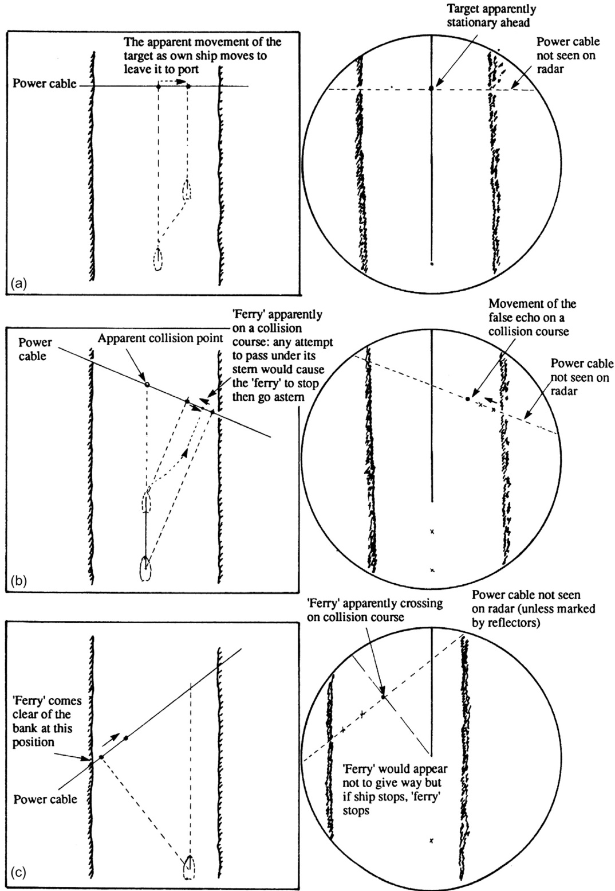

C H A P T E R  

3  

# Target Detection  

# 3.1 INTRODUCTION  

The ability of the radar system to detect and display a given target depends on a large number of factors, some of which are constant and others which may vary in quite a complex manner. The significance of some of these factors may be almost self-evident while that of others may be much less obvious. The radar equation is an expression which attempts to formalize the relationship between the range at which a target can be detected and the parameters on which that range depends. In the form in which the equation is used by radar engineers to predict radar performance by taking into account all conceivable factors, it is indeed lengthy and complex, containing statistical and empirical components. However, in its conventional basic form as set out below, it provides an indication of the significance of many of the factors which are of concern to the radar observer (an alternative form of this equation was introduced in Section 2.6.1):  

【翻译】
雷达系统检测和显示特定目标的能力取决于大量因素，其中一些是恒定的，而另一些可能以相当复杂的方式变化。其中一些因素的重要性几乎不言自明，而另一些则可能不那么明显。雷达方程式是一个试图形式化表示目标可被检测到的距离与影响该距离的参数之间关系的表达式。在雷达工程师用来预测雷达性能时考虑到所有可想象的因素的形式中，该方程式确实很长且复杂，包含统计和经验组成部分。然而，在其传统的基本形式中，如下所述，它为许多与雷达观察者相关的因素提供了重要性的指示（一种替代形式的方程式在第2.6.1节中介绍）。

【解读】
本段主要讨论雷达系统检测目标的能力及其影响因素，强调了这些因素的复杂性和多样性。雷达方程式作为一个工具，被用于量化这些关系，但其完整形式较为复杂，因此通常会使用其基本形式来理解关键因素对雷达性能的影响。

【词汇表】
| 英文词汇 | 中文翻译 | 解释 |
| --- | --- | --- |
| Radar System | 雷达系统 | 一种利用无线电波探测和跟踪物体的电子系统 |
| Parameters | 参数 | 影响某一过程或结果的变量或常数 |
| Empirical Components | 经验组成部分 | 根据实验数据和观察而非纯理论推导出的组成部分 |
| Statistical Components | 统计组成部分 | 使用统计方法分析和处理数据的组成部分 |
| Conventional Basic Form | 传统基本形式 | 指某种理论或公式的最简单、最基础的表现形式 |

$$
R_{\mathrm{max}}={\sqrt{\left({\frac{P\times G_{0}\times A\times\sigma}{4\times\pi^{2}\times S_{\mathrm{min}}}}\right)}}
$$  

where:  

$R_{\mathrm{max}}=$ maximum detection range $P=$ peak transmitter power  

$G_{0}=$ antenna gain $A=$ antenna aperture area $(\mathbf{m}^{2})$ ) $\sigma=$ target radar cross-section $(\mathbf{m}^{2})$ $S_{\mathrm{min}}=$ minimxum detectable signal  

All but one of the variables appearing in the equation relates to the characteristics of the radar system and each of these is discussed in turn in Section 3.2. The sole representative of the target is its radar cross-section which is a measure of the size of the target as ‘seen’ by the radar. Except in the case of certain simple shapes, this is a complex quantity, often having a statistical nature; the implications of this are discussed in Section 3.3. This simple form of the radar equation assumes that the radar and the target are in free space. In practice they are both located on a curved earth having a surface of varying character and surrounded by an atmosphere in which various weather effects may be manifest. The simple equation takes no account of the surface over which, or the medium through which, the radar pulse travels, because many of the effects are extremely difficult to quantify. However, a suitable qualitative treatment of these factors is presented in Sections 3.6 3.8.  

【翻译】
除了一个变量之外，方程中出现的所有变量都与雷达系统的特性有关，每一个都会在第3.2节中分别讨论。目标的唯一代表是其雷达截面，这是目标大小被雷达“看到”的衡量标准。除某些简单形状外，这是一个复杂的数量，通常具有统计性质；这些含义将在第3.3节中讨论。本形式的雷达方程假设雷达和目标都处于自由空间。在实践中，它们都位于曲面地球上，地表特征各异，周围有大气层，在那里可能会表现出各种天气效应。这个简单的方程没有考虑到雷达脉冲传播的表面或介质，因为许多影响非常难以量化。然而，第3.6至3.8节中提出了适合的定性处理这些因素的方法。

【解读】
本段主要介绍了雷达方程及其相关变量，特别强调了雷达截面的概念以及它对目标大小的衡量意义。同时，也指出了实际环境中的复杂性，如曲面地球、大气层和天气效应对雷达信号的影响，并预告了后续章节中对这些因素的详细讨论。

【词汇表】
| 英文词汇 | 中文翻译 | 解释 |
| --- | --- | --- |
| radar cross-section | 雷达截面 | 目标被雷达探测到的大小衡量 |
| free space | 自由空间 | 理想状态下无任何干扰的空间环境 |
| quantify | 量化 | 将无法直接测量的东西转换为可测量的数值 |
| qualitative treatment | 定性处理 | 非数值的、描述性的分析方法 |

While each of the various factors will be discussed in turn, it is essential to appreciate that in assessing the ability of the radar to detect a target all factors will have to be considered and it must be recognized that the relative significance of individual factors will vary with circumstances.  

【翻译】
虽然每个不同的因素都会被逐一讨论，但在评估雷达探测目标的能力时，必须考虑所有这些因素，并且要认识到不同情况下各个因素的相对重要性会有所不同。

【解读】
这段话强调了在评估雷达系统检测目标的能力时，需要综合考虑多种因素，而不是单独看待任何一个因素。同时，也提到了这些因素之间的相对重要性会根据具体情况而变化，这意味着在实际应用中需要灵活地权衡这些因素的影响。

【词汇表】
| 英文词汇 | 中文翻译 | 解释 |
| --- | --- | --- |
| factor | 因素 | 影响某一结果或情况的元素或条件 |
| assess | 评估 | 对某事物的价值、质量或性能做出判断 |
| circumstance | 情况 | 特定环境或条件下的状态或事件 |
| relative | 相对的 | 与其他事物比较而言的关系或程度 |
| significance | 重要性 | 某事物对特定背景或决策的影响程度 |

A further result which follows from the equation is that, in general, the signal strength received varies inversely as the fourth power of the range of the reflecting surface. (This can be shown by replacing $S_{\mathrm{min}}$ with the more general term $S_{\mathbf{r}}$ representing received signal strength, and then making $S_{\mathrm{r}}$ the subject of the equation.) It is thus important to appreciate that, for distant targets, a small increase in range may produce a comparatively large decrease in response. The response from almost all wanted targets follows this law, but some unwanted responses such as those from the sea and from precipitation do not and these will be discussed in Sections 3.6 and 3.7, respectively. In general, this chapter assumes the use of a conventional pulse magnetronbased system.  

# 3.2 RADAR CHARACTERISTICS  

The radar characteristics which appear in the radar range equation as set out above relate directly to the system units described in Sections 2.3 2.5. One (the power) relates to the transmitter, two (antenna gain and aperture) relate to the antenna and one $(S_{\mathrm{min}})$ relates to the receiver. It is thus appropriate to consider the characteristics under these headings.  

# 3.2.1 Transmitter Characteristics  

As might be expected, the ability to detect distant targets can be improved by using a more powerful transmitter (see Section 2.2.2.1). In a single radar installation the transmitter power will be a factor which is beyond the control of the observer. However, in dual or interswitched systems (see Section 2.10.8), it may be possible to make a choice between two transmitters of differing powers. The important factor which the radar equation reveals is that the maximum detection range varies as the fourth root of transmitter power. The power of transmitters designed for fitting to large vessels varies with manufacturer, but 10 and $50\mathrm{KW}$ are representative of low and high values. However, it must be noted that a fivefold increase in power only yields an improvement in predicted detection range of approximately $50\%$ . This relationship must also be considered when contemplating the use of a lower power transmitter to reduce unwanted responses (see Section 6.7.2).  

In the conventional form of the radar equation, which uses the peak transmitted power, it initially appears strange that the pulse length (see Section 2.3.3.1), which is clearly a transmitter characteristic, does not appear in the expression for detection range. The effect of pulse length is in fact included in the quantity $S_{\mathrm{min}},$ the minimum detectable signal, which is a function of pulse length and is discussed in Section 3.2.3.  

# 3.2.2 Antenna Characteristics  

The radar equation shows that maximum detection range is a function of antenna gain and aperture area. Clearly these two quantities are related, as a study of Sections 2.5.1.5 and 2.5.2 will reveal. For a given rectangular aperture area, an increase in one dimension at the expense of the other will increase the antenna gain in the plane of the larger dimension. It can be shown that $G_{0}$ is directly proportional to $A$ and can thus be replaced in the equation by $G_{0}^{2}$ . Hence the predicted maximum detection range varies as the square root of antenna gain. Thus antenna gain has a greater influence than transmitter power on long range performance.  

As in the case of transmitter power, where a single radar installation is fitted, the observer will have no choice in the matter of antenna gain. In a dual system or interswitched system (see Section 2.10.8), the observer may benefit from the ability to select the more suitable antenna. It should be remembered that bearing discrimination will also be improved by selection of the higher gain antenna.  

【翻译】
就像发射器功率的情况一样，当只有一个雷达装置安装时，观察者在天线增益方面没有选择的余地。在双系统或交替系统（见第2.10.8节）中，观察者可能会从选择更合适的天线中受益。应该记住，方位辨别度也会通过选择更高增益的天线而得到改善。

【解读】
本段讨论了雷达系统中的天线增益问题，指出当只有单一雷达装置时，观察者无法选择天线增益，但是在双系统或交替系统中，可以根据需要选择更合适的天线，从而提高方位辨别度。

【词汇表】
| 英文词汇 | 中文翻译 | 解释 |
| --- | --- | --- |
| Transmitter power | 发射器功率 | 雷达系统中发射信号的功率大小 |
| Antenna gain | 天线增益 | 天线接收或发射信号的能力强度 |
| Dual system | 双系统 | 同时使用两个独立系统的配置方式 |
| Bearing discrimination | 方位辨别度 | 区分不同方向信号的能力 |

It may seem strange that wavelength does not appear in the equation. It is in fact implicit in the antenna gain and the target radar crosssection, both of which are functions of wavelength (see Section 3.3.5.4).  

【翻译】
这可能看起来很奇怪：波长没有出现在这个方程中。实际上，它是隐含在天线增益和目标雷达散射截面中的，这两者都是波长的函数（见第3.3.5.4节）。

【解读】
本段讨论了一个方程中为什么没有明确出现波长的原因，解释说波长其实是通过其他两个参数（天线增益和目标雷达散射截面）间接地体现出来的，因为这些参数都与波长有关。

【词汇表】
| 英文词汇 | 中文翻译 | 解释 |
| --- | --- | --- |
| wavelength | 波长 | 物理学中指波动的长度 |
| antenna gain | 天线增益 | 天线发射或接受信号的能力强度 |
| radar cross-section | 雷达散射截面 | 目标物体对雷达波的反射面积大小 |

# 3.2.3 Receiver Characteristics  

In the absence of unwanted echoes the criterion for the detection of an echo is that the target response must exceed that of the thermal noise generated at the first stage in the receiver (see Section 2.6.4.4). Thus $S_{\mathrm{min}},$ the minimum detectable signal, is a function of receiver sensitivity, while the theoretical maximum sensitivity is of course limited by the extent to which the radar design can minimize the amplitude of the noise generated in the first receiver stage. It cannot be stressed too strongly that the observer will degrade this sensitivity if the tuning and gain controls are set incorrectly (see Section 6.2.4).  

Whatever the level of noise generated in the first stage of the receiver, the amount of noise which reaches the display depends on the bandwidth of the receiver (see Section 2.6.4.2). This bandwidth must be wider when shorter pulses are selected and hence the receiver sensitivity is inherently poorer in that condition. The receiver sensitivity, and hence the maximum range at which targets can be detected, is thus a function of the pulse length selected by the observer.  

【翻译】
无论接收器第一阶段产生多少噪声，到达显示设备的噪声量取决于接收器的带宽（见第2.6.4.2节）。当选择较短的脉冲时，必须采用更广泛的带宽，因此在这种条件下，接收器的灵敏度本质上较差。因此，接收器的灵敏度以及可以检测目标的最大距离是观察者所选脉冲长度的函数。

【解读】
该段落讨论了雷达系统中接收器的性能与脉冲长度之间的关系。它指出，当使用较短的脉冲时，由于需要更大的带宽，接收器的灵敏度会降低，从而影响到最大探测范围。这意味着，在设计或操作雷达系统时，需要平衡脉冲长度与系统的灵敏度和探测能力。

【词汇表】
| 英文词汇 | 中文翻译 | 解释 |
| --- | --- | --- |
| Bandwidth | 带宽 | 指信号处理或传输过程中允许通过的频率范围。 |
| Receiver | 接收器 | 指接受和处理信号的设备或系统。 |
| Sensitivity | 灵敏度 | 指系统对信号变化的响应程度，通常用来描述系统的检测能力。 |
| Pulse Length | 脉冲长度 | 指一个脉冲信号持续的时间长度。 |

Further study of the radar range equation shows that the transmitter power appears as a large quantity on the numerator of the expression while the receiver sensitivity is represented by a small number in the denominator. Radar designers recognize that small improvements in the noise performance are as effective as massive increases in transmitter power. This principle is at least as important to the radar observer because it must be borne in mind that minor maladjustments of the tuning or gain controls can have the same effect as a large loss in transmitter power.  

【翻译】
进一步研究雷达范围方程显示，发射器功率出现在表达式的分子中作为一个大数量，而接收器灵敏度则由分母中的一个小数表示。雷达设计师们认识到，小幅度的噪声性能改进与大量增加发射器功率一样有效。这一原理对雷达观察者来说至少同样重要，因为必须牢记在心的是，调谐或增益控制的小失调可以与发射器功率的大损失产生相同的效果。

【解读】
本段讨论了雷达系统中发射器功率和接收器灵敏度之间的关系，以及如何通过优化这些参数来提高雷达的整体性能。它强调了即使是小幅度的噪声性能改进也能带来显著的效果，这对于雷达设计和操作具有重要意义。

【词汇表】
| 英文词汇 | 中文翻译 | 解释 |
| --- | --- | --- |
| Transmitter power | 发射器功率 | 雷达系统中发射信号的功率大小 |
| Receiver sensitivity | 接收器灵敏度 | 雷达系统中接收信号的灵敏程度 |
| Noise performance | 噪声性能 | 系统中噪声的影响程度，通常需要降低噪声以提高信号质量 |
| Tuning or gain controls | 调谐或增益控制 | 用于调整雷达系统参数以优化其性能的控制装置 |

Where wanted echoes are present among unwanted signals such as clutter and spurious echoes, it may not be possible to exploit fully the sensitivity of the receiver, because the minimum detectable signal level will be determined not by the amplitude of the noise but by the amplitude of unwanted signals. The difficulties posed by such circumstances are discussed in Sections 3.6, 3.7 and 3.9.  

【翻译】
在存在不需要的信号（如杂波和伪回声）中，如果想要的回声也存在，则可能无法充分利用接收器的灵敏度，因为最小可检测信号水平将由不需要信号的幅度决定，而不是噪音的幅度。这种情况下的困难将在第3.6、3.7和3.9节中讨论。

【解读】
本段主要讨论了在信号检测中，由于存在不需要的信号干扰，使得接收器难以达到其最佳灵敏度，从而影响到对目标信号的检测能力。这种问题通常出现在雷达、声纳等领域，解决方案需要通过提高信号处理技术来减少干扰，提高目标信号的识别率。

【词汇表】
| 英文词汇 | 中文翻译 | 解释 |
| --- | --- | --- |
| clutter | 杂波 | 不需要的信号干扰 |
| spurious echoes | 伪回声 | 虚假或无关的回声信号 |
| sensitivity | 灵敏度 | 接收器能够检测到的最小信号强度 |
| amplitude | 幅度 | 信号的大小或强度 |

It must be appreciated that the available receiver sensitivity can only be fully exploited if the radar display is set up correctly and the controls maintained in correct adjustment to suit changing conditions and requirements. Some adjustments are routine while others, such as searching for targets in clutter (see Section 6.7), require considerable skill and practice. In this connection particular attention is drawn to the various practical procedures set out in Chapter 6. There is little doubt in traditional radar, that but for the difficulty of quantifying it, the skill of the radar observer is a factor which would appear in the radar range equation.  

【翻译】
必须认识到，只有当雷达显示器设置正确且控制装置根据不断变化的条件和要求进行适当调整时，才可以充分利用可用的接收机灵敏度。有些调整是常规性的，而其他一些，如在杂乱中搜索目标（见第6.7节），则需要相当的技巧和实践。在这方面，特别提醒注意第6章中概述的各种实际程序。在传统雷达中，几乎没有疑问，如果不是因为量化的困难，雷达观察员的技能将是一个出现在雷达距离方程中的因素。

【解读】
本段强调了雷达操作中人为因素的重要性，尤其是雷达观察员的技能和经验。只有当设备设置和调整得当，操作人员具备足够的技能和实践经验时，才能最大限度地发挥雷达系统的潜能。这一观点对于提高雷达系统的整体性能和有效性具有重要意义。

【词汇表】
| 英文词汇 | 中文翻译 | 解释 |
| --- | --- | --- |
| sensitivity | 灵敏度 | 指设备或系统对信号或刺激的响应能力 |
| clutter | 杂乱 | 在雷达图像中指不相关的、干扰性的回波或信号 |
| quantifying | 量化 | 将某种属性或现象用数字或数量来表示或衡量 |
| radar range equation | 雷达距离方程 | 一种数学模型，用于计算雷达系统能够检测目标的最大距离 |

# 3.2.4 Minimum Detection Range  

The radar equation is especially concerned with the prediction of maximum detection ranges and in many circumstances the radar observer is concerned with this aspect of target detection. However, there are certain circumstances, for example pilotage situations, in which the minimum detection range is of particular importance. The importance of a small minimum detection range is recognized by IMO Performance Standards (see Section 11.2.1) which require that specific target types be clearly displayed down to a minimum range of $40\mathrm{m}$ . The various factors affecting minimum detection range are illustrated in Figure 3.1.  

  
FIGURE 3.1 Factors affecting minimum detection range. (a) Pulse length. (b) Vertical beam structure. (c) Ship structure shadowing.  

【翻译】
图3.1 最小探测范围的影响因素。（a）脉冲长度。（b）垂直波束结构。（c）船体结构阴影效应。

【解读】
该图表明了影响雷达或声纳系统最小探测范围的三个主要因素：脉冲长度、垂直波束结构以及船体结构对信号的遮挡（阴影效应）。这些因素会直接影响到设备能够准确检测目标的最短距离。

【词汇表】
| 英文词汇 | 中文翻译 | 解释 |
| --- | --- | --- |
| Pulse length | 脉冲长度 | 雷达或声纳发出的能量持续时间的长短 |
| Vertical beam structure | 垂直波束结构 | 声纳或雷达发射波束在垂直方向上的分布特征 |
| Ship structure shadowing | 船体结构阴影效应 | 船体某些部分可能阻挡或遮挡声纳或雷达信号，导致探测盲区 |

Clearly the radar cannot receive echoes while the pulse is being transmitted and this limitation determines the theoretical minimum detection range. The trailing edge of the transmitted pulse will clear the antenna after the start of the timebase by an elapsed time equal to the duration of one pulse length. This instant will coincide with the arrival of an echo from any reflecting surface which lies at a distance of one-half pulse length from the antenna (see Figure 3.1(a)). The theoretical minimum detection range can thus be determined by calculating the distance travelled by radar energy in one-half the duration of the transmitted pulse.  

【翻译】
很明显，雷达在发送脉冲期间无法接收回波，这一限制决定了理论上的最小探测范围。在时间基准开始后，传输脉冲的尾缘将在一个脉冲长度的时间内离开天线。这一时刻与来自距离天线半个脉冲长度的任何反射表面的回波到达时间相吻合（见图3.1（a））。因此，可以通过计算在发送脉冲持续时间的一半期间，雷达能量所行进的距离来确定理论上的最小检测范围。

【解读】
本段主要讨论雷达系统的基本原理，特别是探测范围的限制。由于雷达在发送信号时不能同时接收回波，因此存在一个最小的探测范围，这取决于发送脉冲的持续时间。通过分析这个过程，可以计算出理论上的最小探测范围，从而了解雷达系统的工作机制。

【词汇表】
| 英文词汇 | 中文翻译 | 解释 |
| --- | --- | --- |
| Radar | 雷达 | 无线电探测和定位系统 |
| Pulse | 脉冲 | 短暂的能量或信号冲击 |
| Timebase | 时间基准 | 参考时间轴或计时器 |
| Antenna | 天线 | 发送和接收无线电信号的设备 |
| Echo | 回波 | 从物体表面反射回来的信号 |

# EXAMPLE 3.1  

Calculate the theoretical minimum detection range for a radar which has three pulse lengths, the durations of which are 1.0, 0.5 and $0.1\upmu{\mathrm{s}}$ .  

To achieve the minimum detection range, the observer should select the shortest available pulse length. Half the duration of the shortest pulse length (PL) is given by:  

【翻译】
为了实现最小的探测范围，观察者应该选择可用的最短脉冲长度。最短脉冲长度（PL）的半持续时间由以下公式给出：

【解读】
本段主要讨论了雷达或其他信号检测系统中实现最小探测范围的方法。通过选择最短的脉冲长度，可以提高系统的分辨率和准确性，从而更好地检测目标。

【词汇表】
| 英文词汇 | 中文翻译 | 解释 |
| --- | --- | --- |
| Pulse Length | 脉冲长度 | 信号传输过程中的一个参数，指信号持续的时间长度 |
| Detection Range | 探测范围 | 系统能够检测到目标的最大距离 |
| Observer | 观察者 | 操作系统的人员，或负责监控和分析数据的人 |

$$
\frac{\mathrm{PL}}{2}=\frac{0.1}{2}\upmu s
$$  

The distance travelled by radar energy in this time is given by:  

【翻译】
在这段时间内，雷达能量所行进的距离由以下公式给出：

【解读】
本段主要讨论了雷达技术中能量传播距离的计算公式，强调了解这一点对于掌握雷达系统的工作原理至关重要。

【词汇表】
| 英文词汇 | 中文翻译 | 解释 |
| --- | --- | --- |
| Radar | 雷达 | 无线电探测和定位系统 |
| Energy | 能量 | 在此指雷达波的传播能量 |
| Distance | 距离 | 物体之间的空间间隔，特别是指能量传播的路径长度 |

$$
D_{\mathrm{min}}=\frac{0.1}{2}\times300~m(\mathrm{see~Section~1.2.2})=15~\mathrm{m}
$$  

The theoretical minimum detection range $=$ $15\mathrm{m}$ .  

It is evident that the theoretical minimum range illustrated by this example (which uses a typical short pulse length) is considerably less than that required by IMO Performance Standards. In practice, the theoretical minimum range cannot be achieved for three principal reasons, namely:  

【翻译】
很明显，这个例子（使用典型的短脉冲长度）所示的理论最小范围远远低于国际海事组织（IMO）性能标准所要求的范围。在实际操作中，由于三个主要原因，无法实现理论上的最小范围：

【解读】
本段讨论了雷达系统的理论最小探测范围与实际操作中的差异，指出即使在理想条件下，也很难达到国际海事组织制定的性能标准。这意味着实际应用中需要考虑到更多的限制因素以确保系统的可靠性和有效性。

【词汇表】
| 英文词汇 | 中文翻译 | 解释 |
| --- | --- | --- |
| theoretical minimum range | 理论最小范围 | 雷达系统能够探测到的最小距离的理论值 |
| IMO Performance Standards | 国际海事组织性能标准 | 由国际海事组织制定，对船舶设备性能的要求 |
| principal reasons | 主要原因 | 导致某一结果的关键因素或理由 |

1. At close range the target may be below the lower extent of the vertical beam though of course it may be illuminated by the vertical sidelobes. Assuming that the beam is not intercepted by the ship’s structure (see below), the range at which the lower edge intersects the sea increases with antenna height (see Figure 3.1(b)).  

【翻译】
在近距离下，目标可能位于垂直波束的下限以下，但当然，它也可能被垂直旁瓣照亮。假设波束不会被船只结构拦截（见下文），天线高度增加时，下边缘与海面相交的距离也会增加（见图3.1（b））。

【解读】
本段主要讨论了雷达系统中波束与目标物体之间的关系，特别是在近距离的情况下。它提到了目标可能位于垂直波束的下限以下，但仍然可以被垂直旁瓣照亮。此外，它还指出天线高度对波束与海面相交点的位置有影响，这意味着在设计和使用雷达系统时需要考虑到这些因素，以确保最佳的探测效果。

【词汇表】
| 英文词汇 | 中文翻译 | 解释 |
| --- | --- | --- |
| Vertical beam | 垂直波束 | 雷达发射的垂直方向上的能量集中区域 |
| Sidelobes | 旁瓣 | 波束发射的次要能量区域，与主瓣相比，能量较弱 |
| Antenna height | 天线高度 | 雷达天线安装的高度，对波束的形状和覆盖范围有影响 |
| Intersect | 相交 | 指两个或多个物体或线条在空间中相遇的点或区域 |

2. At close range the target may be shadowed in the athwartships direction by the ship’s side or in the fore-and-aft direction by the ship’s bow or stern. The likelihood of this shadowing decreases with antenna height. The question of whether the minimum range is limited by this factor, or by the lower limit of the beam described in item 1, depends on the height at which the antenna is sited, its location with respect to the ship’s fore-and-aft line and the dimensions of the vessel (see Figure 3.1(c)).  

【翻译】
2. 在近距离下，目标可能会被船舶的侧面在横向上或被船头和船尾在纵向上遮挡。在天线高度增加时，这种遮挡的可能性会降低。最小测量距离是否受到这一因素限制还是受第1项中描述的波束下限的限制，取决于天线安装的高度、其与船舶纵向线的位置关系以及船舶的尺寸（见图3.1（c））。

【解读】
本段主要讨论了在近距离下，船舶的结构对雷达信号的影响。特别是，当目标靠近船舶时，船舶的侧面或船头、船尾可能会遮挡目标，从而影响到测量的准确性。同时，天线的高度也是一个关键因素，它可以减少这种遮挡的影响。因此，在实际应用中需要考虑这些因素，以保证测量的精度。

【词汇表】
| 英文词汇 | 中文翻译 | 解释 |
| --- | --- | --- |
| athwartships | 横向 | 与船舶的纵向垂直的方向 |
| fore-and-aft | 纵向 | 船舶的前后方向 |
| antenna height | 天线高度 | 雷达天线安装的高度 |
| beam | 波束 | 雷达发射的能量束 |
| sited | 安装 | 天线的放置位置 |

3. The transmit/receive (T/R) cell takes a finite time to de-energize.  

【翻译】
3. 发送/接收（T/R）单元需要有限的时间来去除能量。

【解读】
这句话描述了发送/接收单元在切换状态时需要一定的时间来去除能量，这意味着该过程不是瞬间完成的，而是需要一个有限的时间周期。

【词汇表】
| 英文词汇 | 中文翻译 | 解释 |
| --- | --- | --- |
| transmit | 发送 | 将信号或能量从一个地方传输到另一个地方 |
| receive | 接收 | 获取或接受来自其他地方的信号或能量 |
| de-energize | 去除能量 | 消除或清除系统中的能量或电荷 |

# 3.2.5 Detection Performance Standards  

Within IMO Radar Performance Standards (see Section 11.2.1), there are requirements covering minimum ranges for detection of coastlines and larger ships, as well as buoys, small boats and their radar reflectors. Table 3.1 gives these detection ranges in clutter-free conditions. The standards have different requirements for $\mathrm{S}\mathrm{-}$ and X-band systems, taking into account their different attributes.  

The standards recognize that performance is much reduced in clutter conditions and the manufacturer is required to state in the manual the reduction in performance for distinct clutter conditions:  

【翻译】
这些标准认识到在杂乱环境中，性能会大幅度降低，因此制造商需要在使用手册中说明不同杂乱条件下的性能降低情况。

【解读】
本段强调了在实际应用中，设备或系统的性能可能受到环境因素如杂乱（clutter）的影响，从而导致其性能下降。因此，相关标准要求制造商必须对此进行说明，以便用户能够了解设备在不同环境条件下的表现。

【词汇表】
| 英文词汇 | 中文翻译 | 解释 |
| --- | --- | --- |
| standards | 标准 | 指定某一行业或领域的技术规范或要求 |
| performance | 性能 | 设备、系统或人员的工作效率或质量 |
| clutter | 杂乱 | 指环境中的干扰或障碍物，如建筑物、树木等，在信号传输中可能造成干扰的物体或情况 |

light rain $4\mathrm{mm}$ per hour) and heavy rain ( $16\mathrm{mm}$ per hour); • sea state 2 and sea state 5; • a combination of these.  

This performance should be considered at different radar ranges and for different target speeds.  

【翻译】
该性能应在不同的雷达距离范围内以及针对不同目标速度进行考虑。

【解读】
这句话强调了评估某一系统或设备（可能是雷达系统）性能时需要考虑多种因素的重要性，特别是目标物体与雷达系统之间的距离（雷达距离范围）以及目标物体的移动速度。这意味着系统的表现会因为这些变量而有所不同，因此在评估其性能时，应该从不同角度和条件下进行考察。

【词汇表】
| 英文词汇 | 中文翻译 | 解释 |
| --- | --- | --- |
| Radar | 雷达 | 无线电探测和定位系统 |
| Range | 距距、范围 | 指的是两个点之间的距离，或一个系统能够覆盖的区域大小 |
| Target | 目标、靶子 | 在这里指的是被雷达跟踪或检测的对象，如飞机、导弹等 |

TABLE 3.1 Minimum Detection Ranges in ClutterFree Conditions (for more details see Section 11.2.1)   

【翻译】
表3.1 无干扰条件下的最小探测范围（详见第11.2.1节）

【解读】
本段落介绍了一个技术表格，具体来说是关于在无干扰条件下，某些设备或系统能够探测到的最小范围。这个表格可能是在讨论雷达、传感器或者其他探测技术的背景下出现的，强调了这些设备在理想环境中的性能极限。

【词汇表】
| 英文词汇 | 中文翻译 | 解释 |
| --- | --- | --- |
| Detection | 探测 | 发现或识别目标的过程 |
| Clutter | 干扰 | 背景中不相关的信号或噪音，可能影响探测准确性 |
| Range | 范围 | 指定距离内的测量或探测能力 |

<html><body><table><tr><td>Target Description</td><td>Target Feature</td><td>Detection Range in NM</td></tr><tr><td>Target description</td><td>Height above sea</td><td>X-band S-band</td></tr><tr><td></td><td>level in metres</td><td>NM NM</td></tr><tr><td>Shorelines</td><td>Rising to 60</td><td>20</td></tr><tr><td>Shorelines</td><td>Rising to 6</td><td></td></tr><tr><td>Shorelines</td><td>Rising to 3</td><td></td></tr><tr><td>SOLAS ships (>5000 gross tonnage)</td><td></td><td>11</td></tr><tr><td>SOLAS ships (>500 gross tonnage)</td><td>5.0</td><td></td></tr><tr><td>Small vessel with radar reflector meeting</td><td></td><td>3.7</td></tr><tr><td>Standards Navigation buoy with</td><td></td><td>4.9 3.6</td></tr><tr><td>corner reflector Typical navigation buoy</td><td>3.5</td><td>4.6</td></tr><tr><td>Small vessel of length 10 m with no radar reflector</td><td></td><td>3.0</td></tr></table></body></html>  

# 3.3 TARGET CHARACTERISTICS  

Energy in the pulse which is intercepted by the target is then available for return towards the antenna and hence to the receiver which is now in a receptive state. The amount of energy which is returned towards the antenna, as opposed to that energy which is absorbed and scattered by the target, is dependent upon the following five prime characteristics of the target.  

【翻译】
脉冲中被目标拦截的能量随后可用于返回天线，并从而返回到现在处于接收状态的接收器。返回至天线的能量数量，与被目标吸收和散射的能量相比，取决于目标的以下五种主要特征。

【解读】
该段描述了雷达系统工作原理中的一个关键环节，即目标物体对雷达波的反射和散射。文中提到的“五种主要特征”可能指的是目标物体的大小、形状、材料、表面粗糙度以及其它影响雷达波反射和散射的因素。这段强调了解这些特征对于设计和优化雷达系统至关重要，因为它们直接影响到系统的检测精度和可靠性。

【词汇表】
| 英文词汇 | 中文翻译 | 解释 |
| --- | --- | --- |
| pulse | 脉冲 | 一次雷达信号的发送 |
| target | 目标 | 被雷达探测的物体或区域 |
| antenna | 天线 | 发送和接收雷达信号的设备 |
| receptive state | 接收状态 | 指接收器准备好接收信号的状态 |
| scattered | 散射 | 信号在目标上散射的现象 |

# 3.3.1 Aspect  

The simplest approach to target response is to consider that the energy suffers ‘specular’ reflection, that is the sort of reflection that occurs when light strikes a plain mirror. Aspect is the angle which the radar rays make with the plane of the mirror and, as can be seen in Figure 3.2, the response will be good when the aspect is $90^{\circ}$ and poor at virtually all other angles.  

  
FIGURE 3.2 The effects on target response of aspect and surface texture.  

【翻译】
图3.2：方面和表面纹理对目标响应的影响。

【解读】
该图展示了不同方面（aspect）和表面纹理（surface texture）对目标响应（target response）的影响。这可能是在讨论光学、材料科学或工程领域中关于物体表面特性如何影响其与环境的相互作用的研究内容。

【词汇表】
| 英文词汇 | 中文翻译 | 解释 |
| --- | --- | --- |
| Aspect | 方面 | 指物体表面的某一特定方向或角度 |
| Surface Texture | 表面纹理 | 指物体表面的粗糙程度或图案 |
| Target Response | 目标响应 | 指物体对特定刺激或条件的反应或响应 |

appear rough to radar waves, and therefore scatter a large proportion of the waves, can occasionally improve the response from a target which has an intrinsically poor aspect (see Figure 3.2).  

【翻译】
在雷达波方面看起来很粗糙的物体，因此会散射大量的波，可以偶尔提高对目标的响应，这些目标本身具有固有的劣勢（见图3.2）。

【解读】
该段落讨论了雷达技术中一个有趣的现象，即某些物体尽管其形状或结构并不利于雷达信号的反射，但仍可能由于其粗糙的表面特性而散射大量的雷达波，从而偶尔提高了雷达系统对这些目标的检测能力。这一现象与目标的几何形状和材质有关，尤其是在雷达波的散射和反射机制上。

【词汇表】
| 英文词汇 | 中文翻译 | 解释 |
| --- | --- | --- |
| radar waves | 雷达波 | 一种用于探测和定位物体的电磁波 |
| scatter | 散射 | 物体对入射波的分散和重新辐射 |
| intrinsically poor aspect | 固有的劣勢 | 指目标物体由于其形状、材质等原因，本身不利于雷达信号的反射 |
| target | 目标 | 在这里指被雷达系统探测和跟踪的物体 |

# 3.3.2 Surface Texture  

The extent to which reflection is specular is dependent upon the surface texture of the target, that is whether the surface is ‘rough’ or ‘smooth’. Whether a surface is rough or smooth has to be related to the wavelength of the waves which are striking it. A surface which reflects light poorly because the indentations or facets in the surface are of the same order as the wavelength of the light (approximately $0.001\mathrm{mm},$ ) will appear smooth to radar waves whose wavelength (some $3{-}10~\mathrm{cm})$ is very much longer, and specular reflection will result. It should be noted that objects which  

# 3.3.3 Material  

In general, materials which are good conductors of electricity also return good radar responses. This occurs as a result of absorption and re-radiation of the waves at the same wavelength as those received, rather than from simple specular-type reflection.  

【翻译】
一般来说，电的良好导体材料也会产生良好的雷达响应。这是因为这些材料能够吸收和重新辐射与接收到的波长相同的电磁波，而不是简单地通过镜面反射来实现的。

【解读】
本段主要讨论了材料的电导性与其雷达响应之间的关系，指出那些对电具有良好导电性的材料通常也能产生较强的雷达信号。这是由于这些材料能够有效地吸收和再次发射雷达波，而不仅仅是通过简单的反射机制。

【词汇表】
| 英文词汇 | 中文翻译 | 解释 |
| --- | --- | --- |
| conductor | 导体 | 能够有效传导电流或热量的物质 |
| radar response | 雷达响应 | 物体对雷达波的反应，包括反射、散射等 |
| absorption | 吸收 | 物体吸收外界能量（如光、电磁波）的过程 |
| re-radiation | 重新辐射 | 物体在吸收能量后，再次发出能量（如电磁波）的过程 |

Some bodies absorb radiation but, when they re-radiate, the wavelength is different from that at which it was received; still other bodies absorb radiation and re-radiate very little of the energy (this results in the temperature of the body rising, that is the received radiation is converted to heat). Some materials are simply transparent to radar energy. glass reinforced plastic (GRP) behaves to a large extent in this way; steel will return good responses, while wooden boats generally produce poor responses (Figures 3.3 3.8).  

【翻译】
有些物体能够吸收辐射，但当它们再次发射辐射时，其波长与接收时的波长不同；其他一些物体吸收辐射但只再次发射出很少的一部分能量（这会导致物体温度升高，即接收到的辐射被转化为热量）。有些材料对于雷达能量来说是透明的，如玻璃纤维增强塑料（GRP）在很大程度上表现出这种特性；钢材会产生良好的回应，而木制船只会产生较差的回应（图3.3至3.8）。

【解读】
本段主要讨论了不同材料对辐射（特别是雷达能量）的反应。其中提到了三个主要现象：一是某些物体改变了辐射的波长后再次发射；二是某些物体吸收辐射能量后转化为热量而不是再次发射；三是某些材料对雷达能量透明，不会产生回应。这些特性在实际应用中非常重要，比如设计雷达系统或选择适合的材料以获得最佳的雷达信号反射效果。

【词汇表】
| 英文词汇 | 中文翻译 | 解释 |
| --- | --- | --- |
| Radiation | 辐射 | 能量以电磁波形式传播的过程 |
| Re-radiate | 再次发射 | 物体吸收辐射能量后，再次向外发射辐射的过程 |
| Transparent | 透明 | 对于某种形式的辐射或光线，可以让其通过而不被吸收或散射 |
| GRP | 玻璃纤维增强塑料 | 一种由玻璃纤维和树脂组成的复合材料，具有轻便、坚固等优点 |

  
FIGURE 3.4 The effect of target shape on target response.  

【翻译】
图3.4 目标形状对目标响应的影响。

【解读】
该图表明了不同形状的目标对目标响应的影响，展示了目标几何形状与其反应之间的关系。这可能是在讨论目标识别、追踪或其他相关领域中的一个研究发现或实验结果。

【词汇表】
| 英文词汇 | 中文翻译 | 解释 |
| --- | --- | --- |
| Target | 目标 | 指定要达到的对象或状态 |
| Shape | 形状 | 物体的外观形式或轮廓 |
| Response | 响应 | 对刺激或情况做出的反应 |

# 3.3.5 Size  

# 3.3.4 Shape  

It is frequently suggested that shape might be considered as the variable aspect of an object. This is true, but when attempting to assess the degree of response which one might expect from a particular target, it is often convenient to consider the target as of fixed shape but able to change its aspect (e.g. a conical buoy rolling in a seaway).  

【翻译】
人们经常建议，将形状视为物体的可变方面。这是正确的，但是在尝试评估预期从特定目标中获得的响应程度时，通常更方便地考虑目标具有固定的形状，但能够改变其外观（例如，锥形浮标在海浪中滚动）。

【解读】
本段讨论了物体形状与其外观之间的关系，强调了在评估目标响应度时，考虑目标形状保持不变但外观变化的便利性。这一概念在海事或工程领域尤其重要，因为了解目标在不同条件下的行为对于设计和操作至关重要。

【词汇表】
| 英文词汇 | 中文翻译 | 解释 |
| --- | --- | --- |
| aspect | 外观 | 指物体在特定角度或条件下的显示方式 |
| target | 目标 | 在此 contexto 中指的是被观察或研究的物体 |
| conical buoy | 锥形浮标 | 一种用于海上导航或标志的浮动装置，呈锥形 |
| seaway | 海浪 | 波涛汹涌的大海，特别是指有波浪的海面 |

In general, the more energy intercepted by the target, the better the response is likely to be, i.e. the response is related to the area of the target irradiated by the beam (at any instant). This is not necessarily the same as the intrinsic size of the target. Since the radar beam is angularly wider in the vertical plane than in the horizontal, tall targets will in general produce stronger responses (all other factors being equal).  

【翻译】
一般来说，被目标截获的能量越多，响应就越好，也就是说，响应与目标被束射线照射的面积（在任何时候）有关。这并不一定等同于目标的固有尺寸。由于雷达束在垂直平面上比在水平方向上更宽，因此高大的目标通常会产生更强的响应（其他因素保持不变）。

【解读】
本段主要讨论了雷达技术中目标的响应与其被照射面积之间的关系，以及目标的形状和大小对响应强度的影响。关键点是目标被照射的面积以及目标的高度和宽度都会影响到最终的雷达信号强度。

【词汇表】
| 英文词汇 | 中文翻译 | 解释 |
| --- | --- | --- |
| intercepted | 截获 | 被雷达波或其他形式的能量所接收或检测到的意思 |
| irradiated | 照射 | 用能量（如光、热、辐射等）照亮或加热某个区域或物体 |
| intrinsic | 固有 | 指的是事物本身的性质或特征，而不是外部施加的 |
| angularly | 角度上 | 与角度相关，描述物体或束的宽度或展开程度在不同维度上的差异 |

Consider two targets presenting the same area to the radar; if the linear width of the horizontal beam at the range of the targets is equal to the linear width of target A then, in the case of ${\mathrm{B}},$ only the small irradiated portion of the target will contribute to echo strength, while, in the case of A, virtually the total area will be irradiated.  

  
FIGURE 3.5 The effect of irradiated area on echo strength. Area $A={\mathrm{Area}}$ $B=$ cross-section of the radar beam.  

  
FIGURE 3.6 The resolution cell.  

【翻译】
图3.6 分辨率单元。

【解读】
该图展示了一个分辨率单元（resolution cell），它是地理信息系统（GIS）或遥感技术中用来表示空间数据最小单位的概念。在这个单元中，每个像素或网格单元代表一定范围内的地理空间信息，决定了数据的精度和细节程度。

【词汇表】
| 英文词汇 | 中文翻译 | 解释 |
| --- | --- | --- |
| Resolution | 分辨率 | 指空间数据中能被区分的最小距离或尺寸 |
| Cell | 单元 | 在GIS或遥感中指代表示空间数据的基本单位，如像素或网格单元 |
| GIS | 地理信息系统 | 一种用于捕获、存储、检查、分析、管理和呈现所有类型的地理数据的计算机系统 |

It is essential to understand clearly that what is being considered here is target response as opposed to actual target size (and therefore its potential brightness on the screen) and not its displayed size (i.e. the area of the screen which it occupies).  

【翻译】
理解这一点至关重要，即这里所考虑的是目标响应与实际目标大小（以及它在屏幕上的潜在亮度）相对比，而不是其显示大小（即它占据的屏幕区域）。

【解读】
本段强调了区分目标响应、实际目标大小及其显示大小的重要性，这对于准确评估和分析目标在屏幕上的表现至关重要。

【词汇表】
| 英文词汇 | 中文翻译 | 解释 |
| --- | --- | --- |
| Target Response | 目标响应 | 指目标在特定条件下的反应或表现 |
| Actual Target Size | 实际目标大小 | 指目标的真实尺寸或大小 |
| Displayed Size | 显示大小 | 指目标在屏幕上占据的区域或空间 |

It is also necessary here to consider the ‘resolution cell’ in relation to the threedimensional size of the target. The cell is defined by the transmitted pulse length, the horizontal beamwidth and the vertical beamwidth.  

【翻译】
在这里，还需要考虑“分辨率单元”与目标三维尺寸之间的关系。该单元由传输脉冲长度、水平波束宽度和垂直波束宽度定义。

【解读】
本段强调了在探测或成像技术中，了解目标物体的大小与分辨率单元（resolution cell）之间的关系的重要性。分辨率单元是指能够被系统清晰地分辨和表示的最小空间单位，它受到传输脉冲长度以及水平和垂直方向上的波束宽度的限制。这意味着，如果目标物体的尺寸小于分辨率单元，系统可能无法准确地检测或成像它。

【词汇表】
| 英文词汇 | 中文翻译 | 解释 |
| --- | --- | --- |
| resolution cell | 分辨率单元 | 能够被系统清晰地分辨和表示的最小空间单位 |
| transmitted pulse length | 传输脉冲长度 | 影响分辨率单元大小的一个因素 |
| horizontal beamwidth | 水平波束宽度 | 水平方向上波束的宽度，影响分辨率单元的大小 |
| vertical beamwidth | 垂直波束宽度 | 垂直方向上波束的宽度，影响分辨率单元的大小 |

Only that portion of the target which falls within the resolution cell at any instant can contribute to the response. In general, as the beam sweeps over small targets, they will fall completely within the resolution cell. With larger targets, all the energy may be intercepted when the target is at short range, whereas at longer ranges, as the cell ‘expands’, the target may still exceed the horizontal beamwidth but is unlikely to fill the vertical beam.  

【翻译】
只有目标中在任意时刻处于分辨率单元内的部分才能对响应做出贡献。一般来说，当束扫过小型目标时，它们完全会落入分辨率单元内。对于较大的目标，当目标距离近时，可能会拦截所有能量，而当距离较远时，随着单元的“扩大”，目标仍可能超过水平束宽，但不太可能填满垂直束。

【解读】
这段话主要讨论了雷达系统中的分辨率问题，即系统能够区分两个相邻目标的最小距离。在这里，提到了目标与分辨率单元（resolution cell）的关系，指出只有目标的一部分如果落在这个单元内，才会对雷达的响应产生贡献。同时，也讨论了目标大小与距离的影响，特别是当目标较大时，不同距离下目标被检测到的情况会有所不同。

【词汇表】
| 英文词汇 | 中文翻译 | 解释 |
| --- | --- | --- |
| Resolution Cell | 分辨率单元 | 雷达系统中用于测量目标位置和大小的最小单位 |
| Beamwidth | 束宽 | 雷达波束的横向或纵向尺寸，决定了雷达的分辨率能力 |
| Intercepted | 拦截 | 指目标被雷达波束完全覆盖，能量被全部吸收或反射回去 |
| Horizontal/Vertical Beam | 水平/垂直束 | 描述雷达波束在水平方向或垂直方向上的宽度和形状 |

  

【处理失败：内存不足或无法生成有效响应】

  
FIGURE 3.8 The effect of coherence on echo strength.  

【翻译】
图3.8 相干性对回声强度的影响。

【解读】
该图表明了相干性（coherence）与回声强度（echo strength）之间的关系，展示了当信号或波具有相干性的情况下，回声会如何变化。这可能是在探讨超声、雷达或者其他利用波动原理进行测量或成像技术中的一个基本概念。

【词汇表】
| 英文词汇 | 中文翻译 | 解释 |
| --- | --- | --- |
| Coherence | 相干性 | 指波动中不同部分保持一致的相位关系，通常用于描述光波或其他类型波动的特性。 |
| Echo | 回声 | 原始信号被反射回来后形成的信号，在这里指的是由于相干性而产生的回声强度变化。 |
| Strength | 强度 | 在此上下文中，指的是回声的强弱程度，与信号的能量或幅度有关。 |

Where, within the cell, the target is sloping, for example a coastline, two consequences of the slope need to be considered.  

【翻译】
在细胞内，当目标呈倾斜状态时，例如海岸线，需要考虑到该倾斜带来的两个后果。

【解读】
这段话讨论的是在细胞内部处理某些地理或形态特征（如海岸线）时遇到的问题，特别是当这些特征呈现出一定的倾斜度时，会产生什么样的影响或结果。这种情况可能出现在地理信息系统、生物医学成像等领域，强调了对空间数据进行细致分析的必要性。

【词汇表】
| 英文词汇 | 中文翻译 | 解释 |
| --- | --- | --- |
| Target | 目标 | 指定要研究或分析的对象，如海岸线等地理特征 |
| Slope | 倾斜度 | 指物体或地形的倾斜程度，在这里指海岸线的倾斜状态 |
| Consequences | 后果 | 指因某种情况或行为而产生的结果或影响，在这里指倾斜度对分析或处理的影响 |

# 3.3.5.1 Sloping Surfaces ! The Effect of Coherence on Response Amplitude  

Consider the face of the slope to be made up of small steps. The radial length of the step will determine the phase relationship of the elements of the returning composite wave. If the elements are out of phase on their return to the antenna then the echo strength will be poor, while if they are in phase the response will be good.  

【翻译】
考虑斜坡的面由小台阶组成，小台阶的径向长度决定了返回的复合波的各个元素之间的相位关系。如果这些元素在返回天线时不处于同一相位，则回声强度会很差，而如果它们处于同一相位，则响应会很好。

【解读】
该段落讨论的是关于斜坡面对返回波的影响，特别是指出不同相位关系下的回声强度变化。这意味着在雷达或其他探测技术中，斜坡面的几何形状和结构会显著地影响到信号的质量和可靠性。

【词汇表】
| 英文词汇 | 中文翻译 | 解释 |
| --- | --- | --- |
| radial length | 径向长度 | 指从圆心到某点的距离，在这里特指小台阶的径向尺寸 |
| phase relationship | 相位关系 | 指两个或多个波动量在时间上的先后顺序与同步程度 |
| composite wave | 复合波 | 由多个简单波叠加而成的波动 |
| echo strength | 回声强度 | 指物体反射回来的信号强度大小 |

Note: The radial length of the steps being considered here is of the order of a fraction of a wavelength (and will take the form of an odd number of quarter wavelengths).  

【翻译】
注意：这里考虑的台阶的径向长度是波长分数级（并且会以奇数个四分之一波长的形式出现）。

【解读】
这段话强调了在某种特定情况下，台阶的径向长度与波长之间的关系，这对于理解相关物理或工程问题至关重要。这种关系通常涉及到电磁学、声学或光学等领域中的波动理论。

【词汇表】
| 英文词汇 | 中文翻译 | 解释 |
| --- | --- | --- |
| Radial length | 径向长度 | 指从圆心辐射出的距离或长度，在此指台阶的长度。 |
| Wavelength | 波长 | 电磁波或其他类型波动中两个连续相邻波峰或波谷之间的距离。 |
| Quarter wavelengths | 四分之一波长 | 波长的四分之一，是一种描述波动周期的小单位。 |

# 3.3.5.2 Sloping Surfaces ! The Effect of Signal Integration on Echo Strength  

In this case, the steps which are to be considered are of the order of one-half pulse length, that is half of $0.1{-}1\upmu s,$ which equates to a radial distance of some $15{-}150\mathrm{m}$ .  

Consider a stepped sloping surface (Figure 3.9) where each step is $10\mathrm{m}$ in length and the radar pulse length is $0.2\upmu s,$ that is the spatial length of the pulse is $0.2\times300=600\mathrm{m}$ .  

It can be seen from Figure 3.9 that the responses from the individual steps on the target can integrate (i.e. add up) to a maximum from that portion of the target which lies within any one-half pulse length, but cannot increase indefinitely as the target increases in height. In the above example the one-half pulse length is $30\mathrm{m}$ .  

If, with the same overall size of target, the step height and length are varied so that each step height is halved and the step length is halved, the same aggregate response will be obtained, which is the integration of a larger number of smaller responses. It is evident that the land still rises to the same height over half the pulse length. This suggests an alternative approach, which is to consider only the vertical height over the one-half pulse length, that is projected height (or, in three dimensions, the projected area (Figure 3.10).  

【翻译】
如果目标的总体尺寸保持不变，而改变步骤高度和长度，使每个步骤高度减半、步骤长度也减半，则会得到相同的综合响应，这是更多较小响应的积分。很明显，地面仍然在半个脉冲长度上升到相同的高度。这表明了一种替代方法，即只考虑半个脉冲长度上的垂直高度，也就是所谓的投影高度（或是在三维空间中，投影面积，如图3.10所示）。

【解读】
本段讨论的是一种实验或模拟中的参数变化对结果的影响。通过改变步骤高度和长度，可以获得与原始设置相同的综合响应，但这是通过集成更多的小规模响应来实现的。这种现象提示了一个新的分析角度，即关注特定范围内（如半个脉冲长度）的垂直高度或投影面积，以此来理解和预测系统的行为。

【词汇表】
| 英文词汇 | 中文翻译 | 解释 |
| --- | --- | --- |
| Target | 目标 | 实验或模拟中的对象或区域 |
| Aggregate response | 综合响应 | 多个单独响应的总和 |
| Projected height | 投影高度 | 在特定范围内物体或地面的垂直高度 |
| Pulse length | 脉冲长度 | 脉冲信号的持续时间 |

  
FIGURE 3.9 Integration of signals from sloping surfaces.  

【翻译】
图3.9：斜面信号的整合。

【解读】
该图展示了如何整合来自不同斜面（sloping surfaces）的信号，以便更好地理解和分析这些信号之间的关系。这可能是在机器人领域、计算机视觉或地理信息系统等领域中使用的一种技术方法，用于处理和分析空间数据。

【词汇表】
| 英文词汇 | 中文翻译 | 解释 |
| --- | --- | --- |
| Integration | 整合 | 将多个部分或信号结合起来以获得更全面的理解或结果 |
| Signals | 信号 | 在这里指的是来自斜面或其他来源的数据或信息 |
| Sloping surfaces | 斜面 | 指具有倾斜角度的表面，在地理信息系统或计算机视觉中常用来描述地形或物体的表面特征 |

Note:  

a. If the step lengths are not precisely the same and if the difference is of the order of one-half the wavelength, then the effects of coherence will also have to be considered when deciding on whether or not the elements of the response will integrate.   
b. If the facets are not true steps, random scattering will also have to be considered.   
c. As a result of the most favourable integration of the elements of the response, the maximum echo strength would be the same as if a flat plate were placed in the path of the pulse. The plate would have a vertical height equivalent to the projected vertical height of the target which lies within half the radial length of the transmitted pulse.  

【翻译】
如果步长不完全相同且差异约为波长的一半，则在决定响应元素是否集成时，还需要考虑相干性的影响。如果facet不是真正的台阶，还需要考虑随机散射的影响。由于对响应元素进行了最有利的集成，最大回声强度与将一个平板放置在脉冲路径中所获得的效果相同，该平板的垂直高度等同于目标在传输脉冲半径长度内投影的垂直高度。

【解读】
这段话讨论的是雷达信号处理中的回声强度问题，特别是在目标表面不规则的情况下。它指出，如果目标表面的台阶或facet之间的距离（即步长）存在一定的差异，或者这些facet本身不是理想的台阶，那么在计算回声强度时就需要考虑到相干性和随机散射的影响。同时，它还提到了通过合适的方式集成响应元素，可以使得最大回声强度达到某种理想状态，即相当于使用一个平板来反射信号，这里的平板尺寸是根据目标在传输脉冲范围内的投影尺寸确定的。

【词汇表】
| 英文词汇 | 中文翻译 | 解释 |
| --- | --- | --- |
| Coherence | 相干性 | 物理学中描述两个或多个波动过程之间的相关性和同步性，在这里指信号处理中的相干性效应。 |
| Facet | 台阶/面片 | 指目标表面的一个个别部分或面片，可能会影响雷达信号的反射特性。 |
| Radial length | 半径长度 | 指从雷达天线到目标的距离，或在此上下文中指脉冲信号的传播距离。 |
| Pulse | 脉冲 | 一种短暂的能量增强，用于雷达系统中发射和接收信号。 |

  
FIGURE 3.10 Projected area.  

【翻译】
图3.10 投影面积。

【解读】
该图显示了一个投影面积的概念，这通常用于几何学、计算机图形学或工程领域来描述物体在平面上的投影大小。在这里，“Projected area”指的是物体在某一平面上投影所覆盖的面积大小。

【词汇表】
| 英文词汇 | 中文翻译 | 解释 |
| --- | --- | --- |
| Projected | 投影 | 将物体的图像投射到另一个表面或平面上 |
| Area | 面积 | 指一定范围内的空间大小 |
| Figure | 图 | 一种视觉表现形式，常用来说明某种概念或数据 |

Where a target is small in relation to the resolution cell, it is convenient to consider the projected area of the target (see also Section 3.3.5.4), but its surface texture, material, aspect and shape must not be ignored.  

【翻译】
当目标相对于分辨率单元来说较小时，考虑目标的投影面积（见3.3.5.4节）是方便的，但不能忽略其表面质地、材料、朝向和形状。

【解读】
本段强调了在评估小目标时，除了考虑其投影面积外，还需要关注目标的其他特征，如表面质地、材料、朝向和形状，以获得更加准确的评估结果。

【词汇表】
| 英文词汇 | 中文翻译 | 解释 |
| --- | --- | --- |
| resolution cell | 分辨率单元 | 指传感器或成像设备中一个最小的采样单位 |
| projected area | 投影面积 | 物体在某一平面上的投影大小 |
| surface texture | 表面质地 | 物体表面的粗糙程度或图案 |
| aspect | 朝向 | 物体与观察者或其他参考系之间的方向关系 |

# 3.3.5.3 The Equivalent Flat Plate Area $\left(\mathbf{A}_{t}\right)$ of a Target  

This is the area of a flat plate orientated at right angles to the incident radiation which would return the same energy as the object. The equivalent flat plate areas for some common shapes are given in Figure 3.11.  

【翻译】
这是一个与入射辐射成直角的平板区域，其能量与物体相同。图3.11中给出了几个常见形状的等效平板面积。

【解读】
本段主要讨论的是在辐射传输中，如何用一个平板来模拟其他形状物体对辐射能量的吸收和反射。通过计算出这些物体的等效平板面积，可以更方便地进行热传导分析。

【词汇表】
| 英文词汇 | 中文翻译 | 解释 |
| --- | --- | --- |
| Incident radiation | 入射辐射 | 指向物体发射的电磁波或粒子流 |
| Equivalent flat plate areas | 等效平板面积 | 用于模拟非平面物体对辐射能量的吸收和反射的平板面积 |
| Orientated | 方向 | 指物体或表面的空间方向 |
| Right angles | 直角 | 两个平面或线之间的90度夹角 |

Note:  

a. The values given in Figure 3.11 are maximum values, having been simplified by the removal of terms relating to aspect. If the aspect in either or both planes is changed, the response may decrease. For example, if the flat plate were tilted there would be a marked drop in response, whereas, with the cylinder, a change about a vertical axis would result in no change in response while a change about a horizontal axis would result in a marked drop in response.   
b. In deriving the formulae, there is an assumption that the size of the object is very large in comparison with the wavelength. (The formulae should not be applied, for instance, to spherical rain drops.)  

【翻译】
图3.11中给出的值是最大值，这些值通过去除与方位相关的项而得到简化。如果在一个或两个平面上改变方位，响应可能会降低。例如，如果平板倾斜，响应就会明显下降，而对于圆柱体，绕垂直轴旋转不会改变响应，但绕水平轴旋转则会导致响应明显下降。在推导公式时，假设物体的大小与波长相比非常大。（例如，不应将这些公式应用于球形雨滴。）

【解读】
本段主要讨论了图3.11中的数值特征以及其应用限制。它指出这些数值是在忽略某些方面条件下的极限值，一旦改变物体的方向，响应就会减弱。此外，它还提到了公式的适用范围，即物体尺寸必须远大于波长，否则公式不再适用，如小型球形雨滴。

【词汇表】
| 英文词汇 | 中文翻译 | 解释 |
| --- | --- | --- |
| Aspect | 方位 | 指物体在空间中的方向或朝向 |
| Wavelength | 波长 | 物理学中描述波动特性的一个基本参数 |
| Formulae | 公式 | 用数学语言描述事物之间关系的表达式 |

# 3.3.5.4 The Radar Cross-Section of a Target (σ)  

The radar cross-section (or equivalent echoing area) of an object is the area intercepting that amount of power which, when scattered isotropically, produces an echo equal to that received from the object.  

【翻译】
雷达散射截面（或等效回波面积）是指物体在空间中拦截一定量能量，当这些能量以各向同性方式散射时，产生的回波强度与从该物体接收到的回波强度相等的面积。

【解读】
本段主要介绍了雷达散射截面的概念，即物体在雷达波照射下散射能量的能力。它描述了当物体受到雷达波照射时，会散射出一定量的能量，而这个散射出的能量与物体的大小、形状和材质有关。雷达散射截面是一个重要的参数，它可以用来评估物体被雷达探测到的可能性。

【词汇表】
| 英文词汇 | 中文翻译 | 解释 |
| --- | --- | --- |
| Radar Cross-Section | 雷达散射截面 | 物体对雷达波的散射能力 |
| Isotropically | 各向同性地 | 指能量在所有方向上均匀分布的散射方式 |
| Echo | 回波 | 雷达波被物体反射回来的信号 |
| Scattered | 散射 | 物体对入射能量的分散和反射 |

Since a sphere is generally accepted as a typical isotropic radiator (i.e. it radiates in all directions), this definition is indicating the cross-section of a sphere which, if it replaced the target, would produce the same response.  

【翻译】
由于球体通常被认为是典型的各向同性辐射体（即它朝所有方向发射辐射），这个定义指的是一个球体的横截面，如果用它来替换目标，将会产生相同的响应。

【解读】
本段主要讨论了球体作为各向同性辐射体的特性及其在物理实验中的应用，特别是在描述目标物体的响应时使用球体作为参考模型。

【词汇表】
| 英文词汇 | 中文翻译 | 解释 |
| --- | --- | --- |
| Isotropic | 各向同性 | 指物体或系统在所有方向上表现出相同的性质或行为。 |
| Radiator | 辐射体 | 发射辐射的物体或系统。 |
| Cross-section | 横截面 | 物体或系统在某一平面上的剖切图或截面。 |
| Target | 目标物体 | 在实验或测量中被观察、研究或影响的对象。 |

<html><body><table><tr><td colspan="2">Target</td><td>Max.equivalent flat plate area At</td><td>Max.radar cross-section</td></tr><tr><td>Sphere</td><td></td><td>a入 2</td><td>πa2</td></tr><tr><td>Cylinder</td><td>b</td><td></td><td>2πab2 入</td></tr><tr><td>Flat plate</td><td></td><td>ab</td><td>4πa2b2 x2</td></tr><tr><td>Dihedral corner</td><td>a b</td><td>ab√2</td><td>8πa2b2 x2</td></tr><tr><td>Triangular trihedral</td><td></td><td>a² J3</td><td>4πa4 32</td></tr><tr><td>Rectangular trihedral</td><td></td><td>2√3</td><td>12πa4 x2</td></tr><tr><td>Cone</td><td></td><td>2² tan2 θ 8π</td><td>2tan*0 16π</td></tr><tr><td>Lunenburg lens</td><td></td><td>πa2</td><td>4π3a4</td></tr></table></body></html>  

It can be seen that if there is some directivity in the target’s response, its radar crosssection will be much greater than its actual physical cross-section or projected area.  

【翻译】
可以看出，如果目标的响应有一定方向性，其雷达散射截面将远大于其实际物理截面或投影面积。

【解读】
这段话主要讨论了目标物体在雷达探测中的特性。当目标物体对雷达信号有方向性的响应时，其在雷达上的表现（即雷达散射截面）会比其实际的物理尺寸或投影面积要大得多。这意味着目标物体的形状、材料和朝向都会影响到雷达探测到的结果。

【词汇表】
| 英文词汇 | 中文翻译 | 解释 |
| --- | --- | --- |
| Directivity | 方向性 | 指某物体对不同方向的辐射或接收信号的能力差异 |
| Radar Cross-section | 雷达散射截面 | 物体对雷达波的反射和散射能力的衡量指标 |
| Projected Area | 投影面积 | 物体在某一平面上的投影大小 |

The relationship between radar crosssection and equivalent flat plate area is given by the formula:  

【翻译】
雷达散射截面与等效平板面积之间的关系由以下公式给出：

【解读】
该段落介绍了雷达散射截面与等效平板面积之间的数学关系，这是雷达技术中的一个基本概念。这个公式可以帮助研究人员和工程师计算和分析目标物体的雷达散射特性。

【词汇表】
| 英文词汇 | 中文翻译 | 解释 |
| --- | --- | --- |
| Radar cross-section | 雷达散射截面 | 指目标物体对雷达波的散射能力 |
| Equivalent flat plate area | 等效平板面积 | 用于模拟目标物体雷达散射特性的虚拟平板面积 |
| Formula | 公式 | 数学表达式，用以描述两个或多个变量之间的关系 |

$$
\sigma={\frac{4\pi A_{\mathrm{t}}^{2}}{\lambda^{2}}}
$$  

# EXAMPLE 3.2  

Compare the radar cross-section of a flat plate with that of a sphere if the plate is at right angles to the radiation; both plate and sphere have projected areas of $1~\mathrm{m}^{2}$ and the wavelength in use is $3.2\mathrm{cm}$ .  

# 3.3.5.5 The Rayleigh Roughness Criterion  

It can be shown that the roughness of a surface depends on the size of the discontinuities in relation to the incident wavelength and the angle at which the radiation strikes the surface (the grazing angle). Application of the Rayleigh criterion indicates that the surfaces for all practical purposes are smooth if $(8\times\updelta h\times\sin\theta)<\lambda,$ where $\lambda$ is the wavelength and $\theta$ is the grazing angle (Figure 3.12).  

$$
\begin{array}{l}{{=\displaystyle\frac{4\pi a b}{\lambda^{2}}}}\ {{=\displaystyle\frac{4\pi A}{\lambda^{2}}}}\ {{=\displaystyle\frac{4\times3.142\times10^{4}}{3.2^{2}}}}\ {{=12.273\mathrm{~times}}}\end{array}
$$  

# EXAMPLE 3.3  

If the antenna is at a height of $15\mathrm{m},$ at what distance, $d_{,}$ , from the ship, will the sea surface appear smooth if wave height is $1\textrm{m}$ (the radar is working in the X-band)? (At the limit of clutter, $8\times\updelta h\times\sin\theta=\lambda.$ )  

This means that the flat plate would produce a response some 12,000 times greater than the sphere or, alternatively, a sphere having some 12,000 times the projected area of the plate would have to be placed at the same range as the plate to produce the same response. It is interesting to note that any slight change in the aspect of the plate will result in a massive drop in the response, whereas no change will occur if the sphere is re-orientated.  

【翻译】
这意味着平板会产生一个响应，其大小约是球体的12,000倍，或者说，要想让球体在相同距离下产生与平板相同的响应，它需要有大约12,000倍于平板投影面积的尺寸。值得注意的是，如果平板的朝向发生轻微变化，就会导致响应急剧下降，而如果球体重新定向，则不会发生任何变化。

【解读】
本段讨论了平板和球体在某种测量或探测系统中的响应差异。它指出平板比球体更容易被检测到，因为其响应强度远高于球体。但同时，也提到了平板的方向对其响应有很大的影响，一旦方向稍有改变，就会导致响应大幅减少。这说明在设计或使用这种系统时，物体的形状和方向都是非常关键的因素。

【词汇表】
| 英文词汇 | 中文翻译 | 解释 |
| --- | --- | --- |
| response | 响应 | 指系统对刺激或信号的反应 |
| aspect | 朝向、方向 | 指物体的空间方向或姿势 |
| re-orientated | 重新定向 | 指改变物体的方向或位置 |
| projected area | 投影面积 | 指物体在某一平面上的投影大小 |

$$
\frac{8\times1\times15}{\sqrt{(225+d^{2})}}=0.03
$$  

$$
d^{2}=4000^{2}-225
$$  

The sea surface will appear smooth at a distance (Figure 3.13).  

【翻译】
从远处看，海面似乎很平滑（图3.13）。

【解读】
这句话描述了当观察者距离海面较远时，海面的外观特征。它暗示了视觉感知与实际距离之间的关系，即随着距离的增加，海面的细节变得不那么明显，从而呈现出一种平滑的效果。

【词汇表】
| 英文词汇 | 中文翻译 | 解释 |
| --- | --- | --- |
| smooth | 平滑 | 表示没有凹凸或粗糙的状态 |
| distance | 距离 | 指两个物体之间的空间间隔 |
| appear | 显现 | 指事物呈现在眼前的样子或状态 |

$$
d\geq4\mathrm{km}(2.16\mathrm{NM})
$$  

One of the surface objects referred to in IMO Performance Standards, in specifying range performance (see Sections 11.2.1), is a navigational buoy having an effective echoing area of approximately $1\mathrm{{0}}\mathrm{{m}}^{2}$ . This means one that produces the same strength of echo as a sphere having a projected area of $10\mathrm{m}^{2}.$ , that is a spherical buoy having a diameter of some $4\mathrm{m}$ .  

  
FIGURE 3.12 Grazing angle and roughness.  

【翻译】
图3.12 放牧角度与粗糙度。

【解读】
该图展示了放牧角度与粗糙度之间的关系，可能用于地理信息系统、遥感或土壤科学等领域，研究不同角度下地表的反射特性与其粗糙度的关联。

【词汇表】
| 英文词汇 | 中文翻译 | 解释 |
| --- | --- | --- |
| Grazing angle | 放牧角度 | 指光线或其他辐射照射物体表面时的入射角度，与地表的夹角。 |
| Roughness | 粗糙度 | 表面不平整的程度，影响光线或其他能量的散射和吸收。 |

  
FIGURE 3.13 The theoretical extent of sea clutter.  

【翻译】
图3.13 海洋杂波的理论范围。

【解读】
该图展示了海洋杂波的理论范围，海洋杂波是指在雷达或其他传感器中，由于海面反射、涟漪等因素引起的干扰信号。这种现象会影响到海上目标的探测和跟踪。

【词汇表】
| 英文词汇 | 中文翻译 | 解释 |
| --- | --- | --- |
| Sea clutter | 海洋杂波 | 由海面反射、涟漪等因素引起的干扰信号 |
| Theoretical extent | 理论范围 | 指某一现象或事件的预测或估计范围 |
| Radar | 雷达 | 无线电探测和定位系统，利用无线电波来探测和定位目标 |

# 3.3.6 Responses from Specific Targets  

# 3.3.6.1 Ice  

Large icebergs, such as those which are formed on the east coast of Greenland and drift down towards the North Atlantic shipping routes, have been found to give greatly varying radar responses. Detection ranges as great as 11 NM have been experienced while, on the other hand, quite large icebergs have approached to within 2 NM without being detected. Even the same iceberg may give greatly differing responses when viewed from different directions.  

【翻译】
格陵兰岛东海岸形成的大型冰山会随着洋流向北大西洋的航运路线漂移，这些冰山被发现对雷达信号有非常不同的反应。在某些情况下，检测范围可以达到11海里，而在其他情况下，相当大的冰山可能在距离不到2海里的情况下接近而未被探测到。即使是同一个冰山，从不同方向观察时也可能产生非常不同的雷达反应。

【解读】
这段话主要讨论了大型冰山对雷达信号的反应差异性，特别是在格陵兰岛东海岸形成并漂移到北大西洋的那些冰山。这种差异性使得雷达探测变得复杂，因为相同的冰山从不同角度观察时可能产生完全不同的反应。这意味着依靠雷达来探测冰山可能并不总是可靠的，尤其是在航运安全方面。

【词汇表】
| 英文词汇 | 中文翻译 | 解释 |
| --- | --- | --- |
| Iceberg | 冰山 | 浮在水面上的冰块，通常由冰川或冰盖破裂形成 |
| Radar response | 雷达反应 | 指物体对雷达波的反射或响应情况 |
| Detection range | 探测范围 | 能够探测到目标的最大距离 |
| NM | 海里 | 英里（nautical mile）的缩写，用于表示海上距离，1NM约等于1852米 |

Particular concern has been expressed because of radar’s apparent difficulty in ‘detecting ice’. The point should be made that the ice which causes most concern is that form which comprises what are known as growlers. Many theories have been put forward and there have been many practical experiments carried out to determine the best way to use the radar in areas where growlers are expected: two major points emerge.  

【翻译】
人们特别担心雷达似乎难以“探测冰”。需要指出的是，最令人担忧的冰是由所谓的冰山碎片组成的。已经提出了很多理论，并进行了许多实际实验来确定在可能存在冰山碎片的地区如何最好地使用雷达：有两个主要观点浮现出来。

【解读】
这段话讨论了雷达技术在检测某种类型的冰（即冰山碎片）方面的挑战。尽管进行了多次尝试和实验，但仍然存在一些问题和疑虑。文章强调了找到最佳方法来应对这一挑战的必要性。

【词汇表】
| 英文词汇 | 中文翻译 | 解释 |
| --- | --- | --- |
| radar | 雷达 | 一种利用无线电波探测和定位物体的系统 |
| detecting ice | 探测冰 | 使用雷达或其他技术来发现和识别冰的过程 |
| growlers | 冰山碎片 | 小型冰山或冰块，通常是从较大冰山破裂而来的 |
| practical experiments | 实际实验 | 在现实环境中进行的测试和试验，以验证理论或改进方法 |

1. Growlers are intrinsically poor targets because, as melting ice, the surface tends to be smooth and this does nothing to improve their essentially poor shape and aspect. They present a small projected area above the water and the signal returned is frequently of strength comparable to or  

【翻译】
格劳勒（Growlers）天然就是难以被击中的目标，因为当冰块融化时，它们的表面往往很平滑，这并不能改善它们本质上糟糕的形状和外观。它们在水面以上投射出的面积很小，而返回的信号强度经常与背景噪声相当或甚至更弱。

【解读】
这段话主要讨论了“格劳勒”（一种海洋冰块）的特性及其作为目标的难度。由于其表面平滑，体积小，且信号反射强度低，使得它们成为难以被探测和攻击的目标。这段话可能出自军事或海洋研究领域的技术文章，强调了格劳勒的隐蔽性和难以被发现的特点。

【词汇表】
| 英文词汇 | 中文翻译 | 解释 |
| --- | --- | --- |
| Growlers | 格劳勒（一种海洋冰块） | 一种小型、不规则形状的冰山或浮冰 |
| Intrinsically | 天然地、固有地 | 指某物的内在属性或特性 |
| Projected area | 投射面积 | 物体在某一平面上的影子面积 |
| Signal returned | 返回的信号 | 指探测设备接收到的回波信号 |

weaker than that returned from the sea waves which are prevalent in the area in which the growlers are commonly found.  

【翻译】
比海浪回传到岸边时的声响还要弱，这种现象在生长者通常出没的区域内十分常见。

【解读】
这段话描述了一种声音现象，即某些地区的“growlers”（可能指的是一种自然现象或特定物体）发出的声音比海浪撞击岸边的声音还要微弱。这意味着这种声音非常柔和，不容易被察觉。

【词汇表】
| 英文词汇 | 中文翻译 | 解释 |
| --- | --- | --- |
| prevalent | 普遍、常见 | 指在某一区域或情况下经常出现或广泛存在的事物或现象 |
| growlers | 生长者、隆隆声源 | 可能指一种自然现象，如冰川裂缝或特殊的地质构造，发出低沉的隆隆声 |
| sea waves | 海浪 | 波涛汹涌的海水，尤其是指海洋中由风等外力引起的波动 |

Theories relating to the effects of hightemperature gradients in the immediate vicinity of the growler and also to the reradiation characteristic of the ice have not proved conclusive.  

【翻译】
关于高温梯度对生长器周围区域影响以及冰的再辐射特性的理论尚未得到确凿的证明。

【解读】
该段落讨论了与高温梯度及其对某一区域（特别是生长器附近）影响相关的理论，以及冰的再辐射特性。这些理论试图解释在特定条件下发生的热效应，但目前尚未获得明确的结论或证据支持。

【词汇表】
| 英文词汇 | 中文翻译 | 解释 |
| --- | --- | --- |
| Theories | 理论 | 系统化的思想或概念框架 |
| High-temperature gradients | 高温梯度 | 温度随空间位置变化的速率，在此指高温环境下的温度变化 |
| Reradiation | 再辐射 | 物体吸收辐射能量后，再向外发出的辐射过程 |

2. In areas where growlers are to be expected, radar should not be relied upon to give adequate or even any warning of their presence, especially at night or in poor visibility. Speed and the visual lookout should be set with this in mind.  

【翻译】
2. 在可能出现growler（冰山或浮冰）的区域，不应过度依赖雷达来预警它们的存在，特别是在夜间或能见度不佳的情况下。速度和视觉观察应该以此为前提进行设置。

【解读】
本段强调了在可能出现冰山或浮冰的海域中，不能完全依靠雷达来探测这些危险物体，尤其是在低能见度条件下，如夜间或雾天等情况。因此，船只的速度和视觉观察措施需要根据这种风险进行调整，以确保安全航行。

【词汇表】
| 英文词汇 | 中文翻译 | 解释 |
| --- | --- | --- |
| Growler | 冰山/浮冰 | 一种较小的冰块或冰山，可能对船只造成隐患 |
| Radar | 雷达 | 无线电探测和定位系统，用于探测和跟踪目标 |
| Visibility | 能见度 | 指的是人们能够看到物体的清晰程度，受天气、光线等因素影响 |

The best use of radar under these circumstances is:  

【翻译】
在这种情况下，雷达的最佳用途是：

【解读】
本段讨论了在特定条件下使用雷达的最优方式，可能涉及军事、航空或气象等领域的应用。

【词汇表】
| 英文词汇 | 中文翻译 | 解释 |
| --- | --- | --- |
| Radar | 雷达 | 无线电探测和测距系统 |
| Circumstances | 情况、环境 | 指特定的条件或背景 |
| Best use | 最佳用途 | 指在某种情况下最合适或有效的利用方法 |

a. a dedicated radar watch by one observer;   
b. regular searching with the anti-clutter control on the short ranges (see Section 6.7.1), remembering to check at frequent intervals on the longer ranges for larger targets;   
c. use of the long pulse in weak clutter;   
d. use of the longer wavelength of the Sband radar.  

【翻译】
a. 由一名观察员进行专门的雷达监视； 
b. 定期使用抗杂波控制在短距离范围内进行搜索（见第6.7.1节），同时记得在较长距离范围内以较频繁的间隔检查较大的目标； 
c. 在弱杂波环境中使用长脉冲； 
d. 使用S波段雷达的较长波长。

【解读】
该段落描述了几种提高雷达系统性能和减少杂波干扰的方法，包括指定观察员进行专门监视、定期搜索、选择合适的脉冲模式以及使用特定波段的雷达。这些措施可以帮助改善雷达系统在不同环境下的检测能力。

【词汇表】
| 英文词汇 | 中文翻译 | 解释 |
| --- | --- | --- |
| Radar | 雷达 | 无线电探测和定位系统 |
| Clutter | 杂波 | 干扰雷达信号的无关信号 |
| Pulse | 脉冲 | 雷达发射的能量脉冲 |
| Wavelength | 波长 | 电磁波的长度，影响其传播特性 |

# 3.3.6.2 Radar-Conspicuous Targets  

Targets which are designated radarconspicuous should be those which are known to provide good radar responses and are readily identifiable (see Section 8.2.5). In the past, particular land features which satisfied those criteria were highlighted on charts by the addition of the legend ‘Radar Conspic’. This practice has been discontinued, but there is no reason why observers should not mark their own charts in this way and also make notes in the radar log for the benefit of their successors.  

【翻译】
被指定为雷达显现目标的应该是那些已知能够提供良好雷达响应且容易识别的目标（见第8.2.5节）。在过去，满足这些标准的特定陆地特征会在图表上通过添加“雷达显现”图例来突出显示。这种做法已经停止，但没有理由阻止观察员以这种方式标记自己的图表，同时也可以在雷达日志中记录笔记，以便于后继人员参考。

【解读】
本段主要讨论了如何确定和标记雷达显现目标，这些目标能够清晰地反映雷达信号，从而帮助观察员更容易识别。尽管历史上有一种特定的标记方法已经不再使用，但鼓励观察员自行标记图表并记录相关信息，以方便他人使用。

【词汇表】
| 英文词汇 | 中文翻译 | 解释 |
| --- | --- | --- |
| Radar Conspicuous | 雷达显现 | 能够清晰地反映雷达信号的目标或特征 |
| Designated | 指定 | 被官方认可或确定为某种状态或用途 |
| Readily Identifiable | 容易识别 | 能够轻松辨别或识别的目标或特征 |
| Legend | 图例 | 在图表或地图上用于表示特定含义的符号或文字说明 |

# 3.3.6.3 Ships  

The structure of ships is such that there are many natural ‘corner reflectors’ (see Section 3.4.1) and hence, when a target vessel is rolling and pitching in a seaway, its echo strength does not vary quite as much as might be expected. Some rather peculiar effects can be observed, although they are usually quite easily explained by reverting to first principles. For example, long vessels may appear as two or three individual echoes (each of which when tracked by Automatic Radar Plotting Aid (ARPA) might appear to be going in a slightly different direction). They may also be confused for a tug-and-tow or vice versa. Supertankers, because of their low freeboard, may not be detected at inordinately great ranges, when loaded.  

【翻译】
船舶的结构使其具有许多天然的“角反射器”（见3.4.1节），因此，当目标船舶在海上滚动和俯仰时，其回声强度不会像预期那样变化太大。虽然可以观察到一些相当奇怪的效果，但它们通常可以通过回到基本原理来轻松解释。例如，长船可能表现为两个或三个独立的回声（每一个当被自动雷达绘图辅助设备（ARPA）跟踪时可能显得朝着稍微不同的方向移动）。它们也可能与拖船或被拖船混淆。超级油轮由于其低的自由板高度，在载重状态下可能无法在极远的距离内被探测到。

【解读】
本段讨论了船舶结构对雷达信号的影响，特别是如何影响回声强度和目标识别。由于船舶的设计，存在许多自然的角反射器，这使得即使在波涛汹涌的大海中，目标船舶的回声强度也不会随着运动而剧烈变化。此外，本段还提到了长船、超级油轮等特殊类型船舶在雷达探测中的特点，以及可能出现的识别错误。

【词汇表】
| 英文词汇 | 中文翻译 | 解释 |
| --- | --- | --- |
| corner reflector | 角反射器 | 一种能将入射光线或信号反射回来的结构或物体 |
| freeboard | 自由板高度 | 船舶在正常负载条件下的主甲板与水线之间的垂直距离 |
| ARPA | 自动雷达绘图辅助设备 |一种用于辅助雷达操作员追踪和识别目标的电子系统 |
| supertanker | 超级油轮 |一种超大型的油轮，用于运输大量石油或其他液体货物 |

It is important to realize that some naval vessels are designed to have a very low radar cross-section, not least by avoiding ‘corner reflector effects’ in their design. It is to be hoped that in peacetime these vessels carry sufficient passive or active artificial radar enhancers, such as those described in the following section, so as not to appear radarinvisible to other vessels.  

【翻译】
人们需要认识到，一些海军舰艇被设计为具有非常低的雷达截面，不少是通过在设计中避免“角反射器效应”。希望在平时，这些舰艇能够携带足够的被动或主动的人工雷达增强设备，如下一节所述，以免对其他舰艇呈现出雷达隐形状态。

【解读】
本段强调了一些海军舰艇为了降低雷达可探测性而进行的特殊设计，包括避免产生“角反射器效应”，同时也提到了这些舰艇可能会携带人工雷达增强设备，以确保在必要时仍能被其他舰艇探测到。这体现了现代海战中的隐身技术与识别需求之间的平衡。

【词汇表】
| 英文词汇 | 中文翻译 | 解释 |
| --- | --- | --- |
| Radar Cross-Section | 雷达截面 | 指物体对雷达波的反射面积大小 |
| Corner Reflector Effects | 角反射器效应 | 一种由于物体边缘或角落形成的强烈雷达反射现象 |
| Passive/Active Artificial Radar Enhancers | 被动/主动人工雷达增强设备 | 用于增加物体雷达反射信号的设备，可以被动或主动工作 |

# 3.3.6.4 Offshore Wind Farms  

The introduction of large offshore wind farms has been a recent addition to the coastal waters around Europe and other parts of the world. The towers and moving turbines can be over $100\mathrm{m}$ in height with blades over $50\mathrm{m}$ long. There has been some concern that the radar performance might be reduced or affected by false echoes in the vicinity of offshore wind farms.  

Certainly this is sometimes quoted in the media as a reason for not placing onshore wind turbines near to airfields, as the echoes can be confused with moving aircraft. However, there is no known evidence of this in a marine context for offshore wind farms, other than the normal slight shadowing effect caused by targets of a similar size.  

【翻译】
确实，有时媒体会引用这个原因来解释为什么不在机场附近安装陆上风力涡轮机，因为回声可能会被误认为是移动中的飞机。然而，在海上风电场的海洋环境中，没有已知的证据表明这种情况会发生，除了目标大小相似的正常轻微阴影效应以外。

【解读】
这段话讨论了风力涡轮机对雷达信号的影响，特别是在机场附近和海上风电场的背景下。它指出虽然在陆地上可能存在由于回声而导致的干扰问题，但在海上风电场中，这种影响似乎并不显著，主要只有轻微的阴影效应。

【词汇表】
| 英文词汇 | 中文翻译 | 解释 |
| --- | --- | --- |
| echoes | 回声 | 指的是物体或信号反射回来产生的重复信号 |
| confused | 混淆 | 在这里指的是无法区分两种不同信号（回声和实际飞机信号） |
| shadowing effect | 阴影效应 | 指的是某些物体对信号的遮挡或屏蔽作用，导致信号减弱或失真 |
| targets | 目标 | 在这里指的是能够反射雷达信号的物体，如风力涡轮机或飞机 |

On the positive side the regular pattern of wind turbine installations within an offshore field can make good radar-conspicuous navigation marks in areas as the pattern on the radar is easy to compare with the chart. These offshore wind farms are sometimes in navigational areas devoid of other suitable land-based targets, so the wind turbines can provide a good source of bearings and ranges for radarbased navigation. Issues such as the restriction in navigation caused by the offshore wind farms are not in the remit of this book.  

【翻译】
在积极的一方面，在海上风电场内风力涡轮机安装的规律性模式可以成为雷达导航标志，在这些区域中，雷达上的图案与图表进行比较很容易。这些海上风电场有时位于没有其他合适陆基目标的导航区域，因此风力涡轮机可以为基于雷达的导航提供良好的方位和距离参考。诸如由海上风电场引起的导航限制等问题不在本书的讨论范围之内。

【解读】
这段话主要讨论了海上风电场对雷达导航的影响。在正面方面，风力涡轮机的规律性布局可以作为雷达导航标志，帮助确定船只或飞机的位置和方向。然而，也提到了海上风电场可能带来的导航限制，但这些问题不是本书关注的重点。

【词汇表】
| 英文词汇 | 中文翻译 | 解释 |
| --- | --- | --- |
| conspicuous | 显眼的，显著的 | 在这里指的是雷达信号清晰可辨别 |
| remit | 范围，权限 | 指的是某人、组织或书籍所负责或讨论的内容范围 |
| navigational | 导航的 | 与导航相关的，包括确定位置、方向等 |
| radarbased | 基于雷达的 | 使用雷达技术来实现导航功能 |

# 3.4 TARGET ENHANCEMENT PASSIVE  

It is essential that some targets which would normally provide poor radar responses, for example buoys, glass fibre and wooden boats, are detected at an adequate range by radar. It was recognized at a very early stage in the development of radar that some form of echo enhancement was needed. IMO have Performance Standards for radar reflectors (see Section 11.2.6).  

【翻译】
在雷达技术中，有些目标物体通常会产生很弱的雷达信号，如浮标、玻璃纤维船和木制船只，这些目标需要被雷达系统在适当的距离上检测到。早期的雷达开发者就认识到需要某种形式的回波增强技术。国际海事组织（IMO）已经为雷达反射器制定了性能标准（见第11.2.6节）。

【解读】
本段主要讨论的是雷达技术中的目标检测问题，特别是那些难以被雷达探测到的物体，如浮标或木制船只等。为了解决这个问题，研究人员意识到需要一种能增强这些目标物体的雷达回波信号的技术，从而提高雷达系统的检测能力。同时，国际海事组织也对此进行了规范，制定了相关的性能标准，以确保雷达系统能够有效地检测到这些目标。

【词汇表】
| 英文词汇 | 中文翻译 | 解释 |
| --- | --- | --- |
| Radar | 雷达 | 无线电探测和定位系统 |
| Echo Enhancement | 回波增强 | 一种技术，用于增强雷达信号的强度 |
| IMO | 国际海事组织 | 制定海事安全和环境保护标准的国际组织 |
| Performance Standards | 性能标准 | 对设备或系统的性能要求的规定 |

# 3.4.1 Corner Reflectors  

A corner reflector was seen as a simple device which would return virtually all of the energy which entered it, that is the energy would be returned in the direction from which it had come almost irrespective of the angle at which it had entered the corner (Figure 3.14). In its simplest form, such a corner consists of two metal plates placed at an angle of $90^{\circ}$ to each other, attached to a navigation mark which then returns an improved radar response and consequently is detectable at a greater range.  

An essential principle of all echo enhancement is that it provides reserve gain, which means that, in adverse conditions of sea or weather clutter, the target’s improved response can be expected to be greater than the clutter responses and therefore will be detectable (see Sections 6.7.1 and 6.7.2) despite the reduced gain necessary for the suppression of the clutter.  

【翻译】
回声增强的一个基本原则是，它提供了备用增益，这意味着在海况或天气杂波不利的条件下，目标的改进响应可以预期地大于杂波响应，因此即使需要降低增益来抑制杂波，也仍然能够被检测到（见6.7.1和6.7.2节）。

【解读】
本段主要讨论回声增强技术的基本原则，即通过提供备用增益，在恶劣环境条件下提高目标信号与杂波信号的比率，从而提高目标的可检测性。这一原则对于雷达和声纳系统等应用至关重要，因为它能帮助提高目标探测的准确性和可靠性。

【词汇表】
| 英文词汇 | 中文翻译 | 解释 |
| --- | --- | --- |
| Reserve gain | 备用增益 | 指系统中为应对不确定情况而预留的额外增益能力 |
| Adverse conditions | 不利条件 | 指可能干扰系统正常运行的环境条件，如恶劣天气或海况 |
| Clutter | 杂波 | 指干扰目标信号的无关信号，如来自背景的反射信号 |
| Detectable | 可检测的 | 指能够被系统识别和跟踪的目标信号 |

  
FIGURE 3.14 Corner reflectors.  

【翻译】
图3.14：角反射器。

【解读】
该图展示了角反射器的结构，角反射器通常用于雷达系统中，以增强信号的回波效果。通过特定的几何设计，角反射器可以将接收到的电磁波以预期的方式进行反射，从而提高目标的可检测性。

【词汇表】
| 英文词汇 | 中文翻译 | 解释 |
| --- | --- | --- |
| Corner reflector | 角反射器 | 一种用来增强雷达信号回波效果的设备 |
| Radar system | 雷达系统 | 利用无线电波探测和定位物体的系统 |
| Electromagnetic wave | 电磁波 | 一种能量传递形式，可在真空中传播 |

While a simple corner is adequate on nonfloating objects, if the attitude of the target is likely to change as it moves in a seaway, it is necessary to use the now familiar closed corner or triangular trihedral (see Figure 3.14(d)) rather than the dihedral corner. The closed corner will ensure that the energy is returned even though the corner is moving through quite a large angle in both the horizontal and vertical axes.  

【翻译】
在非浮动物体上，一个简单的角通常是足够的，但如果目标物体在海浪中移动时其姿态可能会改变，则需要使用现在熟悉的封闭角或三棱柱（见图3.14（d）），而不是二面角。封闭角可以确保即使角在水平轴和垂直轴上移动了相当大的角度，能量仍然会被返回。

【解读】
本段讨论的是关于如何选择合适的角结构，以便在海浪中跟踪移动目标物体的能量信号。由于目标物体的运动可能导致其姿态发生变化，因此需要使用能够适应这种变化的角结构，如封闭角或三棱柱，以保证能量信号的准确返回。

【词汇表】
| 英文词汇 | 中文翻译 | 解释 |
| --- | --- | --- |
| seaway | 海浪 | 指波涛汹涌的大海 |
| attitude | 姿态 | 指物体在空间中的位置和方向 |
| dihedral corner | 二面角 | 一种由两个平面组成的角结构 |
| trihedral | 三棱柱 | 一种由三个平面组成的三维角结构 |

# 3.4.1.1 The Accuracy of Construction  

The angle between each pair of planes must be $90^{\circ}$ and very little error can be tolerated without affecting the efficient operation of the corner. Where, as a result of damage or careless construction, the angle is other than $90^{\circ}.$ , even by a very small amount, the response from the corner can be seriously impaired.  

Figure 3.15 shows that, with a wavelength of $3\mathrm{cm}$ and a side length of $1.05\mathrm{m}$ (i.e. side length to wavelength ratio of 35); if the angle between the planes is $88^{\circ}$ the gain is only 10 dB instead of the 30 dB that might be expected ! this difference of $20\mathrm{dB}$ represents a reduction in response by a factor of 100. Note that with smaller sides but still working at the same wavelength, the loss would not be so severe.  

Over the years, many designs for the ‘home’ construction of the corner reflectors and in particular ‘collapsible’ octahedral arrays (see Section 3.4.2.2) have been published, but it is never made clear how important is the precision required in the construction and assembly of the corners, in order for the full potential of the reflector to be achieved.  

【翻译】
多年来，许多关于角反射器“自制”构造以及特别是可折叠八面体阵列（见3.4.2.2节）的设计被发表，但从未明确说明在角的构造和组装中所需的精度有多重要，以便实现反射器的全部潜能。

【解读】
这段话讨论了角反射器的构造和组装对其性能的影响，指出尽管有很多设计方案被提出，但对于达到最佳效果所需的精度要求却没有明确的说明。这意味着要想充分发挥角反射器的作用，需要仔细考虑其构造和组装的细节。

【词汇表】
| 英文词汇 | 中文翻译 | 解释 |
| --- | --- | --- |
| precision | 精度 | 指的是某一过程或结果的准确程度 |
| reflector | 反射器 | 一种用于改变光线或其他辐射方向的设备或材料 |
| assembly | 组装 | 将各个部件或零件结合起来形成一个完整系统或结构的过程 |
| potential | 潜能 | 指的是某物或某系统能够达到的最大能力或效率 |

The suggestion that ‘crumpled’ aluminium foil (in a plastic container!) will provide adequate radar responses is a serious over-simplification. The physical principles of adequate enhancement require precise corners and that the size of each facet is at least greater than and preferably a function of wavelength.  

【翻译】
认为“皱巴巴”的铝箔（放在塑料容器里！）能够提供足够的雷达反应是一个严重的过度简化。增强雷达信号所需的物理原理要求精确的角度，而且每个面的尺寸至少要大于波长，或者更好的是与波长成比例。

【解读】
这段话批评了一个过于简单的想法，即使用皱巴巴的铝箔来增强雷达信号。作者指出，要获得足够的雷达反应，需要精确的角度和特定的面大小，这些条件是基于物理原理的，而不是随便地使用任何材料或形状。

【词汇表】
| 英文词汇 | 中文翻译 | 解释 |
| --- | --- | --- |
| Crumpled | 皱巴巴的 | 形容某物被压皱或揉皱的状态 |
| Over-simplification | 过度简化 | 指把复杂的问题或情况过于简单化的处理方式 |
| Facet | 面 | 在几何学中，指多面体的一个平面部分 |
| Wavelength | 波长 | 物理学中的一个基本概念，指电磁波或其他波的一种性质，即两个连续相邻波峰之间的距离 |

  
FIGURE 3.15 The effect of an error in all three corner angles of a corner reflector.  

【翻译】
图3.15：三角反射器三个角度都存在误差的影响。

【解读】
该图展示了当一个三角反射器（corner reflector）的三个角度都出现错误或偏差时，其效果会受到怎样的影响。这通常与测量、光学或者工程领域相关，研究人员可能利用这种图示来分析和讨论角度误差对系统性能的影响。

【词汇表】
| 英文词汇 | 中文翻译 | 解释 |
| --- | --- | --- |
| Corner Reflector | 三角反射器 | 一种用于改变光线或其他辐射方向的设备或结构，尤其是在三个平面交汇处。 |
| Error | 误差 | 在测量、计算或制造过程中产生的不准确性或偏差。 |
| Effect | 影响 | 某一因素或行为对某事物或情况所产生的结果或后果。 |

# 3.4.1.2 The Response from a Corner Reflector  

The three forms of the corner reflector may be compared by referring to Figure 3.11. The following points should be noted:  

【翻译】
三种角反射器形式可以通过参考图3.11进行比较。需要注意以下几点：

【解读】
本段主要介绍了角反射器的三种形式，并指出可以通过查看特定图表（图3.11）来进行比较，同时提醒读者需要注意某些关键点，这意味着接下来的内容可能会对这些点进行详细说明，以便更好地理解角反射器的不同之处。

【词汇表】
| 英文词汇 | 中文翻译 | 解释 |
| --- | --- | --- |
| Reflector | 反射器 | 一种物体或表面，可以反射光、声或其他形式的能量 |
| Corner | 角 | 指物体或结构的拐角处 |
| Compared | 比较 | 将两个或多个事物放在一起以观察其相似性和差异性 |

1. Values shown are maximum values. Where aspect in either plane is changed, additional terms will need to be included in the equations.   
2. $A_{\mathrm{t}}$ indicates the area of a flat plate, orientated so as to be perpendicular to the direction of the incident radiation. For example, a triangular trihedral reflector which has a side length $a$ of $50\mathrm{cm}$ reflects as if it were a flat plate having an area of $1443.4~\mathrm{cm}^{2}$ and a $90^{\circ}$ aspect.  

This would appear to indicate that a corner reflector is not as good at returning a response as a flat plate. While this is true, the very important proviso is that a flat plate will only respond at optimum level when it is perpendicular to the incident radiation. If there is only a very slight change in aspect of the flat plate, the response, however, will drop theoretically to zero; with the corner, the level will suffer very little reduction over some $\pm50^{\circ}$ of change in attitude.  

A second point which is worthy of note is that the dihedral and rectangular trihedral corners both have better response figures than the triangular trihedral, but the former’s response is markedly susceptible to change of attitude while the latter does not have such a wide coverage angle since the square plates tend to intercept the incident radiation at an earlier stage as aspect is varied.  

【翻译】
值得注意的第二点是，二面角和矩形三棱角都比三角形三棱角具有更好的响应图，但前者的响应明显容易受到姿态变化的影响，而后者由于正方形板在随着视角变化而早期截断入射辐射，因此没有这么宽的覆盖角度。

【解读】
这段话讨论了不同几何形状（二面角、矩形三棱角和三角形三棱角）对辐射的响应特性。结果显示，二面角和矩形三棱角的响应图优于三角形三棱角，但是二面角的响应会因姿态变化而显著改变，而矩形三棱角则不受这种变化的影响。这意味着在设计或应用这些形状时，需要考虑它们对辐射的响应特性以及姿态变化带来的影响。

【词汇表】
| 英文词汇 | 中文翻译 | 解释 |
| --- | --- | --- |
| Dihedral | 二面角 | 指两个平面之间的夹角 |
| Trihedral | 三棱角 | 指三个平面之间形成的角形结构 |
| Aspect | 视角/姿态 | 指物体相对于观察者或其他参考系的方向或位置 |
| Incident radiation | 入射辐射 | 指从外部环境进入系统或物体内部的电磁辐射 |

# 3.4.2 Arrays of Reflectors  

A single triangular trihedral corner does not provide $360^{\circ}$ of azimuth coverage. By use of a group or array, irrespective of the direction from which it is viewed and of its attitude in the vertical plane, the response will remain virtually unchanged. The array may be incorporated in the basic structure of the navigation mark (Figure 3.16).  

The following points should be noted with regard to arrays:  

【翻译】
关于数组，需要注意以下几点：

【解读】
本段主要是对数组相关知识的介绍或总结，提示读者需要特别关注某些方面的内容，以便更好地理解和使用数组。

【词汇表】
| 英文词汇 | 中文翻译 | 解释 |
| --- | --- | --- |
| array | 数组 | 一种数据结构，用于存储多个相同类型的元素 |
| regard | 关于、有关 | 用来表示所讨论或考虑的事物 |
| note | 注意、记录 | 提示读者或者听众要特别记住或关注某事 |

1. Reflectors which have surfaces of wire mesh, especially if $a$ is greater than 20 times the wavelength, tend to warp and so produce poor results.  

  
FIGURE 3.16 Arrays of reflectors incorporated into the structures of navigation marks.  

【翻译】
图3.16：导航标志结构中集成的反射器阵列。

【解读】
这幅图展示了如何将反射器阵列整合到导航标志的结构中，以提高其可视度和功能性。这是航海或航空领域中常见的一种技术应用，旨在增强导航标志的效果，特别是在低光照条件下或远距离观察时。

【词汇表】
| 英文词汇 | 中文翻译 | 解释 |
| --- | --- | --- |
| Reflector | 反射器 | 一种物体或表面，可以反射光线或其他形式的辐射。 |
| Navigation mark | 导航标志 | 用于指示方向、警告危险或提供位置信息的标志或符号，尤其是在水上或空中导航时使用。 |
| Array | 阵列 | 指多个相同或相似的物体按照一定规律排列形成的集合。 |

2. Deterioration of response is likely to result from: (a) imprecise construction or damage, (b) poor intrinsic orientation, and (c) changes in coherence.  

【翻译】
2. 响应的劣化可能是由以下原因引起的：（a）不精确的构造或损伤，（b）内部取向不良，以及（c）相干性的变化。

【解读】
本段主要讨论了响应劣化的可能原因，包括结构或设备的不完善、内部方向性不足以及相干性发生变化等因素，这些因素都可能导致系统或材料的性能下降。

【词汇表】
| 英文词汇 | 中文翻译 | 解释 |
| --- | --- | --- |
| deterioration | 劣化 | 性能或状态的恶化或下降 |
| imprecise | 不精确的 | 指没有达到准确或精密的标准 |
| intrinsic | 内部的 | 指某物体或系统自身的特性或属性 |
| coherence | 相干性 | 在物理学中指波动的有序性或一致性，在其他领域也可指事物之间的一致性或协调性 |

# 3.4.2.1 Types of Array  

The dihedral array has been found to be most appropriate for shore-based navigation marks because the rapid fall-off in response associated with change of attitude in the vertical plane was not a factor.  

【翻译】
二面阵列被发现是最适合用于岸基导航标志，因为在垂直平面中随着姿态变化而迅速降低的响应不是一个因素。

【解读】
这段话主要讨论了二面阵列（dihedral array）在岸基导航标志中的应用。由于二面阵列在垂直平面中不会因为姿态变化而导致响应急剧下降，因此它特别适合用于这种环境下的导航标志。

【词汇表】
| 英文词汇 | 中文翻译 | 解释 |
| --- | --- | --- |
| Dihedral array | 二面阵列 | 一种特定排列方式的天线或传感器阵列 |
| Shore-based | 岸基 | 指位于陆地或海岸上的设备或系统 |
| Navigation marks | 导航标志 | 用于帮助船只或飞机等交通工具进行导航的标志或信号装置 |
| Fall-off | 降低 | 响应或信号强度的减少或衰减 |

The octahedral array (Figure 3.17) was until recently regarded as the standard for most situations.  

【翻译】
八面体阵列（图3.17）直到最近仍被认为是大多数情况下的标准。

【解读】
这段话介绍了八面体阵列曾经被广泛接受为各种情况下的标准配置，但随着时间的推移，这种看法可能已经发生了变化。这意味着在相关领域中，人们对八面体阵列的认知和应用可能有所调整或更新。

【词汇表】
| 英文词汇 | 中文翻译 | 解释 |
| --- | --- | --- |
| Octahedral | 八面体的 | 指具有八个面的几何形状 |
| Array | 阵列 | 一组按照一定规律排列的物体或元素 |
| Standard | 标准 | 被广泛接受或规定的基准或模式 |

In the pentagonal array (Figure 3.18), the polar diagram in the horizontal plane shows quite serious arcs of reduced response where the beam passes between the elements.  

【翻译】
在五边形阵列（图3.18）中，水平面上的极坐标图显示出相当严重的响应降低弧段，这些弧段出现在波束通过阵列元素之间的位置。

【解读】
该段落描述了五边形阵列的特性，特别是指出了水平面上极坐标图中的响应降低现象。这意味着当信号从阵列传递时，在某些方向上会出现接收信号强度较弱的区域，这对阵列的设计和应用有重要影响。

【词汇表】
| 英文词汇 | 中文翻译 | 解释 |
| --- | --- | --- |
| Pentagonal array | 五边形阵列 | 一种特殊的天线或传感器排列方式，以五边形为基础排列单元。 |
| Polar diagram | 极坐标图 |一种用来表示信号强度与方向关系的图表，通常用于天线或传感器的性能分析。 |
| Beam | 波束 | 指由阵列发射或接收的能量集中在某一方向上的信号。 |
| Elements | 元素/单元 | 阵列中组成整个系统的基本部分，如天线、传感器等。 |

In the vertical plane, as the navigation mark heels, the response falls off rapidly with angle of heel.  

【翻译】
在垂直平面上，当航行标志物倾斜时，随着倾斜角度的增加，其响应迅速减弱。

【解读】
本段描述了航行标志物（navigation mark）在垂直平面上的表现。当这些标志物发生倾斜（heels）时，它们的有效性或可识别性会随着倾斜角度的增大而快速降低。这意味着航行标志物的设计需要考虑到其在不同状态下的可视性和识别性，以确保安全高效的航行。

【词汇表】
| 英文词汇 | 中文翻译 | 解释 |
| --- | --- | --- |
| Navigation mark | 航行标志物 | 用于引导船只或其他交通工具的标志物，如灯塔、浮标等。 |
| Heels | 倾斜 | 指航行标志物或船只发生倾斜的情况。 |
| Vertical plane | 垂直平面 | 指与地面垂直的平面，在这里用于描述航行标志物的位置关系。 |
| Response | 响应 | 在这里指的是对航行标志物的反应或识别能力。 |

In the double pentagonal array, as can be seen from Figures 3.18(b) and 3.19, the interspaced corners fill out the polar diagram in the horizontal plane, thus improving the $360^{\circ}$ coverage pattern.  

# 3.4.2.2 Stacked Arrays (Figure 3.20)  

In order to overcome the effect of the gaps in the polar diagrams for the arrays described above, the individual triangular trihedral corners can be arranged in such a way that, as the response from one corner decreases, the response from the next corner starts to increase and so compensates for that drop. In this way, uniformity of response is maintained over $360^{\circ}$ of azimuth.  

An advantage of the many commercial forms of stacked arrays is that they are enclosed in a glass fibre housing which protects the metallic element from damage.  

【翻译】
商业形式的堆叠阵列的一个优点是，它们被封装在玻璃纤维外壳中，从而保护金属元件免受损害。

【解读】
这段话指出商业形式的堆叠阵列有一项优势，即它们被放置在一个由玻璃纤维制成的保护性外壳中，这样可以防止金属部件受到损伤或腐蚀等问题，提高了其使用寿命和可靠性。

【词汇表】
| 英文词汇 | 中文翻译 | 解释 |
| --- | --- | --- |
| Stacked arrays | 堆叠阵列 | 一种电子元件排列方式 |
| Glass fibre housing | 玻璃纤维外壳 |一种用玻璃纤维制成的保护性外壳 |
| Metallic element | 金属元件 | 指电子元件中的金属部分 |

# 3.4.3 The Lunenburg Lens  

The Lunenburg lens has been in use for quite a number of years, both on navigation marks and on small craft, but frequently goes unrecognized. It comprises a series of concentric shells of differing refractive index.  

【翻译】
伦伯格镜头已经使用了很多年，不仅在航行标志上，也在小型船只上，但是经常被忽视。它由一系列具有不同折射率的同心壳组成。

【解读】
这段话介绍了一种叫做“伦伯格镜头”的光学设备，它已经被广泛应用于航海领域，包括航行标志和小型船只上。尽管它很常见，但往往被人们忽视。这段话还提到了该设备的结构，即由多层同心的壳体组成，每层都有不同的折射率，这使得它能够有效地聚焦光线。

【词汇表】
| 英文词汇 | 中文翻译 | 解释 |
| --- | --- | --- |
| Lunenburg lens | 伦伯格镜头 | 一种特殊的光学镜头，用于聚焦光线 |
| concentric shells | 同心壳 | 指多层同心的圆形壳体 |
| refractive index | 折射率 | 物质对光线的弯曲能力的度量指标 |

# 3.4.3.1 Principle of Operation (Figure 3.21)  

Paraxial rays, impinging on the outer spherical surface, are refracted by different amounts at each shell interface so that they are focused at a point on the opposite surface of the sphere. Here the energy is reflected by a metal band in such a way that the exit path of the returning energy is in a direction reciprocal to that of the incident energy.  

【翻译】
近轴射线照射到球体外表面时，在每个壳层接口处会受到不同程度的折射，从而使得它们在球体的另一侧表面的一个点上汇聚。在这里，能量被金属带反射回来，以一种与入射能量方向相逆的方式，使得返回能量的路径朝相反的方向。

【解读】
这段话描述了光线（或其他形式的能量）如何通过一个球形结构进行传播和反射。特别是，它提到了“近轴射线”（paraxial rays），这些射线与球体的中心轴线非常接近。当这些射线击中球体的外表面时，由于折射作用，它们会在球体内部的各个壳层接口处发生弯曲，最终汇聚在球体的另一侧的一个点上。之后，这些能量被一个金属带反射回来，但反射的方向与最初的入射方向相反。这意味着返回的能量将沿着一条与入射路径相反的路线行进。

【词汇表】
| 英文词汇 | 中文翻译 | 解释 |
| --- | --- | --- |
| Paraxial rays | 近轴射线 | 与中心轴线非常接近的光线或能量束 |
| Refracted | 折射 | 光线或能量通过介质界面时改变方向的现象 |
| Reciprocal | 相逆的 | 指两个方向或运动状态完全相反 |
| Incident energy | 入射能量 | 照射到物体表面的能量或光线 |
| Exit path | 出口路径 | 能量或光线离开物体后的行进方向 |

# 3.4.3.2 The Polar Diagram  

Figure 3.22 gives the theoretical polar diagram, and Figure 3.23 shows its practical effect when applied to a buoy. It should be noted that in the horizontal plane, there are no significant ‘dropout’ sectors. In the vertical plane the coverage is also good, allowing the buoy an angle of heel of some $35^{\circ}$ or, conversely, the response will be enhanced even when the buoy is close to a vessel with quite a large antenna height.  

  
FIGURE 3.17 The octahedral array. (a) Correct orientation. (b) Polar diagram corresponding to (a). (d) Incorrect orientation. (e) Polar diagram corresponding to (c). The ‘point-up’ orientation gives reduced coverage.  

【翻译】
图3.17八面体阵列。（a）正确方向。（b）与（a）对应的极坐标图。（d）错误方向。（e）与（c）对应的极坐标图。“点向上”的方向会降低覆盖范围。

【解读】
该段落描述了一种称为八面体阵列的几何结构，并展示了其在不同方向下的表现。图中分别显示了正确和错误的方向，以及相应的极坐标图，以说明“点向上”的方向如何影响覆盖范围。这一概念可能应用于材料科学、物理学或工程领域中的晶体结构研究或天线设计等方面。

【词汇表】
| 英文词汇 | 中文翻译 | 解释 |
| --- | --- | --- |
| Octahedral | 八面体的 | 描述一种具有八个面的几何形状 |
| Array | 阵列 | 一组以特定方式排列的物体或元素 |
| Orientation | 方向 | 物体或系统在空间中的位置或朝向 |
| Coverage | 覆盖范围 | 指某物体或信号能够覆盖或影响的区域或范围 |

  

【处理失败：内存不足或无法生成有效响应】

# 3.5 TARGET ENHANCEMENT ACTIVE  

A good alternative method of increasing the radar detectability of a target is by the use of an active reflector. Such devices are triggered by the reception of a transmitted radar pulse and immediately generate a radar-like signal which is transmitted back to the original radar. They have to react very rapidly to ensure that the artificially generated echo appears on the radar display at approximately the correct range. There are two main types of active device. One generates a specific signal, which is discernible as such on the radar display and is known as a racon (an abbreviation of radar beacon). The other attempts to replicate the response from a large point target by simply amplifying and retransmitting received pulses. The latter are generally just referred to as active radar reflectors.  

【翻译】
一种提高目标雷达可探测性的替代方法是使用主动反射器。这种设备在接收到传输的雷达脉冲后被触发，并立即生成一个类似于雷达信号的信号，该信号被传回原始雷达。它们必须非常快速地做出反应，以确保人工产生的回声出现在雷达显示屏上，大致处于正确的距离范围内。有两种主要类型的主动设备。一种会产生特定的信号，这种信号在雷达显示屏上可以被识别出来，被称为雷达信标（racon，即radar beacon的缩写）。另一种则试图通过简单地放大和重新传输接收到的脉冲来复制来自大型点状目标的响应。后者通常被称为主动雷达反射器。

【解读】
本段讨论了如何提高目标物体在雷达系统中的可探测性，提出了使用主动反射器作为一种有效的方法。这种方法通过接收雷达信号并迅速生成类似的信号返回给雷达系统，从而增强目标物体的可见度。文中还介绍了两种不同类型的主动设备：一种是产生特定信号的雷达信标，另一种是通过放大和重新传输接收到的信号来模拟目标物体回应的主动雷达反射器。

【词汇表】
| 英文词汇 | 中文翻译 | 解释 |
| --- | --- | --- |
| Active Reflector | 主动反射器 | 一种能接收雷达信号并生成相应信号返回的设备 |
| Radar Beacon | 雷达信标 | 产生特定信号以便于识别的设备 |
| Radar Pulse | 雷达脉冲 | 雷达系统发出的电磁波脉冲 |
| Detectability | 可探测性 | 目标物体被雷达系统检测到的能力 |

  
FIGURE 3.19 The double pentagonal array.  

【翻译】
图3.19：双五边形阵列。

【解读】
该图展示了一个称为“双五边形阵列”的几何结构，它由多个五边形排列而成，形成一种对称且规则的图案。这类结构在数学、物理和材料科学中有着重要的应用价值，尤其是在研究晶体结构和纳米材料时。

【词汇表】
| 英文词汇 | 中文翻译 | 解释 |
| --- | --- | --- |
| Pentagonal | 五边形的 | 指具有五条边的几何形状 |
| Array | 阵列 | 一组按照一定规律排列的元素或物体 |
| Symmetrical | 对称的 | 指两侧或各部分相互对应，形状相同或相似的性质 |

Racons are typically used on buoys and beacons and nowadays meet strict requirements issued by the International Association of Lighthouse Authorities (IALA). Active radar reflectors are typically used on small craft and well-designed examples can be very effective at making such craft visible on a radar display.  

【翻译】
雷达反射器通常安装在浮标和灯塔上，如今需要满足国际灯塔管理局（IALA）发布的严格要求。主动雷达反射器通常用于小型船只，设计良好的例子可以非常有效地使这些船只在雷达显示屏上可见。

【解读】
本段主要介绍了雷达反射器的使用场景和类型。雷达反射器是为了增强目标物体在雷达上的可视性而设计的设备，它们被广泛应用于航海领域，如浮标、灯塔和小型船只，以提高安全性和便利性。

【词汇表】
| 英文词汇 | 中文翻译 | 解释 |
| --- | --- | --- |
| Racons | 雷达反射器 | 设备，用于增强目标物体在雷达上的可视性 |
| Buoys | 浮标 | 水面上的标志物，用于导航或警示 |
| Beacons | 灯塔 | 高大的结构物，用于发光或其他信号以引导或警告 |
| IALA | 国际灯塔管理局 | 一个组织，负责制定与灯塔和航海辅助设施相关的标准和指南 |

# 3.5.1 The Racon Principle  

A simple explanation of the operation is that the ship’s radar pulse triggers the racon transmitter on the navigation mark, which then responds by transmitting a particular pulse or pulses, virtually instantaneously. The pulses are designed to be much more powerful than the equivalent power contained within the normal radar echo from the buoy or beacon on which the racon is mounted (see Figure 3.24).  

【翻译】
简单来说，这个操作过程是这样的：船上的雷达脉冲触发了航行标志上的racon发射器，后者随即通过传输特定的脉冲或一系列脉冲做出响应，几乎是在同一瞬间发生的。这些脉冲被设计为比从浮标或信号塔（上面安装有racon）反射回来的正常雷达回声所含有的能量要强得多（见图3.24）。

【解读】
本段主要描述了racon系统的工作原理，即当船只的雷达发出脉冲时，会触发航行标志上的racon发射器，然后该发射器会立即发送更强大的脉冲作为响应，从而帮助提高导航的准确性和安全性。

【词汇表】
| 英文词汇 | 中文翻译 | 解释 |
| --- | --- | --- |
| Radar | 雷达 | 无线电探测和定位系统 |
| Racon | 雷控 | 一种用于增强雷达信号的设备 |
| Pulse | 脉冲 | 短暂的能量或信号爆发 |
| Navigation mark | 航行标志 | 用于引导船只航行的标志物，如浮标、灯塔等 |

  
FIGURE 3.20 The stacked array. The polar diagram varies according to how the stack is constructed: in general, there are few blind spots even with $20-30^{\circ}$ of heeling.  

# 3.5.2 The Racon Appearance on the Display  

The racon signal appears on the radar screen as depicted in Figure 3.25, that is as a radial ‘flash’ some $1-2^{\circ}$ in angular width. Its radial length depends on the duration of the racon pulse, which is specified by IMO (see Section 11.2.4) as being approximately $20\%$ of maximum range but not more than 5 miles.  

  

【处理失败：内存不足或无法生成有效响应】

  
FIGURE 3.24 The racon principle.  

【处理失败：内存不足或无法生成有效响应】

Values are likely to lie in the range of $20{-}40\upmu s,$ which represents a length on the radar screen of some $1.5{-}3\mathrm{NM}$ .  

# 3.5.2.1 Coding  

The racon transmitter may be interrupted by on/off keying in such a way as to give a displayed racon signal of a specific appearance. This normally takes the form of an appropriate morse coding; for instance, a harbour authority might mark a shoal called ‘King’s Bank’ by the morse letter K, as in Figure 3.25(b). This is of particular importance in aiding identification where there are several racons in the same area. The spacing between dots and dashes should be one dot. A dash should be equivalent in length to three dots.  

【翻译】
雷达应答机发射器可能会被开/关键控中断，以便显示出特定外观的雷达信号。这通常采用适当的莫尔斯电码形式；例如，一个港务局可能通过莫尔斯字母K来标记名为“国王银行”的浅滩，如图3.25（b）所示。在同一区域内有多个雷达应答机的情况下，这一点尤其重要，以帮助识别。点与点之间、点与划之间的间隔应该是1个点。一个划的长度应该相当于3个点。

【解读】
本段主要讨论了雷达应答机（racon）的工作原理和应用，特别是在海事领域。通过使用莫尔斯电码，可以在雷达屏幕上显示特定的信号，以标记特定的位置或物体，如浅滩等。这种方法可以帮助识别和区分不同区域内的多个雷达应答机，从而提高导航安全性。

【词汇表】
| 英文词汇 | 中文翻译 | 解释 |
| --- | --- | --- |
| racon | 雷达应答机 | 一种用于回复雷达信号的设备 |
| morse coding | 莫尔斯电码 |一种通过不同组合的点和划来表示信息的编码方式 |
| shoal | 浅滩 | 水深较浅的水域或陆地 |
| harbour authority | 港务局 | 负责管理和维护港口及其设施的组织 |

# 3.5.2.2 Racons at Close Range  

When radar is being used in close proximity to a racon, it is possible that energy transmitted in the sidelobes triggers the racon at times other than when the radar’s main beam is scanning the target. In such cases, the ‘racon clutter’ (Figure 3.26) can cover a large arc of the radar screen close to the observing vessel (see also ‘side echoes’, Section 3.9.4).  

【翻译】
当雷达在距离拉康（racon）很近的地方使用时，有可能侧瓣发射的能量会在雷达主波束扫描目标以外的时间触发拉康，从而产生“拉康杂波”（图3.26），这会覆盖雷达屏幕上观察船只附近的大片区域（参见第3.9.4节中的“侧回声”）。

【解读】
本段主要讨论了雷达与拉康之间的相互作用，当雷达靠近拉康时，可能会因为侧瓣能量的影响而产生不必要的信号干扰，这种现象被称为“拉康杂波”，它会出现在雷达屏幕上，尤其是在观察船只附近的区域。

【词汇表】
| 英文词汇 | 中文翻译 | 解释 |
| --- | --- | --- |
| Racon | 拉康 | 一种用于辅助导航的雷达反射器 |
| Sidelobes | 侧瓣 | 雷达天线发射出的非主方向的能量 |
| Main beam | 主波束 | 雷达天线发射出的主要能量方向 |
| Clutter | 杂波 | 雷达接收到的无用信号干扰 |

Many racons are now equipped with means to reduce the possibility of sidelobes triggering the racon. This is achieved, for instance, by frequency-agile racons (see Section 3.5.3.2) storing the received signal strength at particular frequencies and then only responding when the signal strength at a particular frequency is close to the stored maximum value.  

【翻译】
许多雷达信标设备现在都配备了减少旁瓣触发信标可能性的手段。例如，通过频率灵活的雷达信标（见3.5.3.2节）存储特定频率下的接收信号强度，然后只有当某一特定频率下的信号强度接近存储的最大值时才做出响应，从而实现这一目标。

【解读】
该段落主要讨论如何降低雷达信标被旁瓣（sidelobes）错误触发的问题。通过采用频率灵活的技术，雷达信标可以记录下不同频率下的信号强度，只有当信号强度达到预先存储的最大值附近时才会响应。这项技术有助于提高雷达信标的准确性和可靠性。

【词汇表】
| 英文词汇 | 中文翻译 | 解释 |
| --- | --- | --- |
| Sidelobes | 旁瓣 | 雷达天线图中的次要波束，可能干扰主瓣的正常工作 |
| Frequency-agile | 频率灵活的 | 能够快速切换工作频率的设备或系统 |
| Racon | 雷达信标 | 一种用于雷达测距和识别的电子设备 |

  
FIGURE 3.25 The racon appearance on the display. (a) Standard response. (b) Coded response.  

【翻译】
图3.25信号在显示器上的外观。（a）标准响应。（b）编码响应。

【解读】
这段文字主要是描述一张图片或图表中的内容，具体来说，是关于某种信号在显示设备上呈现出的两种不同状态：一种是标准响应，另一种是经过编码处理后的响应。这可能是在雷达技术、通信系统或者其他相关领域中使用到的术语，用于区分和分析不同的信号类型。

【词汇表】
| 英文词汇 | 中文翻译 | 解释 |
| --- | --- | --- |
| Racon | 雷达标志物 | 一种用来测试和校准雷达系统的设备或信号 |
| Standard response | 标准响应 | 未经任何修改或编码处理的原始信号反应 |
| Coded response | 编码响应 | 经过特定编码方式处理后的信号反应，通常用于增强信号质量或安全性 |

# 3.5.2.3 Racons at Long Range  

Since one of the reasons for fitting a racon is to improve the detection range of what might otherwise be a poor response target, at longer ranges the response from the actual target may not be detected/displayed although the racon flash appears quite clearly. In this case, measuring the range to the nearest edge of the racon flash is acceptable as it will result in an error of only a hundred metres (the maximum racon receive/transmit delay time) and at long range such an error should not be significant. However, additional care must be exercised when navigating in close proximity to offlying hazards while using a distant racon to fix position.  

【翻译】
由于安装雷达应答机（racon）的一个原因是为了提高可能原本响应不良的目标的探测范围，在较长距离下，实际目标的响应可能无法被检测或显示出来，尽管雷达应答机的闪光信号非常清晰。在这种情况下，测量到雷达应答机闪光边缘最近点的距离是可以接受的，因为这只会导致大约一百米的误差（这是雷达应答机最大接收/发送延迟时间），而在远距离上，这样的误差应该不是很显著。然而，当使用远处的雷达应答机来确定位置时，必须特别小心以避免靠近障碍物。

【解读】
本段主要讨论了使用雷达应答机（racon）来辅助导航时的一些注意事项，尤其是在较长距离的情况下。它提醒用户，即使实际目标的回波信号可能不够强烈，但通过观察雷达应答机的闪光，可以间接地估计出目标的大致位置。同时，也指出了在靠近障碍物区域导航时需要格外小心，以确保安全。

【词汇表】
| 英文词汇 | 中文翻译 | 解释 |
| --- | --- | --- |
| Racon | 雷达应答机 | 一种用于增强雷达信号的设备，帮助提高目标的可探测性 |
| Detection Range | 探测范围 | 能够探测到目标的最大距离 |
| Response Target | 响应目标 | 指能够对雷达信号做出反应的目标，如装有雷达应答机的飞机或船只 |
| Proximity | 距近 | 指两个物体之间的距离相对较近 |

  
FIGURE 3.26 Racon clutter.  

【翻译】
图3.26 雷达杂波。

【解读】
该图显示了雷达系统中一种称为“杂波”的现象，这种现象会影响雷达信号的质量和准确性。杂波是指在雷达屏幕上出现的无关信号或干扰，可能由各种因素引起，如大气条件、地形特征或其他电子设备的干扰。

【词汇表】
| 英文词汇 | 中文翻译 | 解释 |
| --- | --- | --- |
| Racon | 雷达杂波 | 一种雷达系统中的干扰现象 |
| Clutter | 杂波 | 在雷达屏幕上出现的无关信号或干扰 |
| Radar | 雷达 | 无线电探测和定位系统 |

# 3.5.2.4 The Danger in Using Racons to Assess Correct Tuning of the Radar Receiver  

It is advocated (see Section 6.2.7.2) that the radar receiver be accurately tuned by observing the change in display brightness of certain received signals while adjusting the tuning control. Racon signals must not be used in this way since:  

【翻译】
建议（见第6.2.7.2节）通过观察调整调谐控制时某些接收信号的显示亮度变化来准确地调谐雷达接收器。但是，不能使用拉康信号这种方式，因为：

【解读】
本段强调了在雷达系统中准确调谐接收器的重要性，并指出了一种实现此目的的方法，即通过观察特定信号的显示亮度变化来进行调谐，同时也提醒避免使用拉康信号进行这样的操作，以保证调谐的准确性和可靠性。

【词汇表】
| 英文词汇 | 中文翻译 | 解释 |
| --- | --- | --- |
| advocate | 建议、倡导 | 支持或推荐某一做法或想法 |
| tune | 调谐 | 调整设备以获得最佳性能或效果 |
| racon | 拉康信号 | 一种用于雷达系统校验的特殊信号 |

a. The racon signal is frequently above saturation level and will not therefore show any marked change as the tuning control is varied. b. The racon response will be displayed irrespective of the frequency to which the receiver is tuned (see Section 3.5.1), that is the racon will be displayed even when the receiver is off tune.  

【翻译】
a. 雷肯信号通常高于饱和水平，因此在调谐控制变化时不会显示明显的变化。
b. 无论接收器调到什么频率（见第3.5.1节），雷肯响应都会被显示，也就是说，即使接收器失去调谐，雷肯信号仍会被显示。

【解读】
这段话主要讨论了雷肯信号（racon signal）在不同情况下的表现。第一部分指出，由于雷肯信号强度较高，当调谐控制发生变化时，不会观察到信号的明显变化。第二部分则说明，无论接收器是否处于正确的调谐状态，雷肯响应都会被显示。这意味着即使接收器的频率设置不正确，雷肯信号也能够被检测和显示出来。

【词汇表】
| 英文词汇 | 中文翻译 | 解释 |
| --- | --- | --- |
| Racon signal | 雷肯信号 | 一种用于导航或通信的特殊信号 |
| Saturation level | 饱和水平 | 信号强度超过设备处理能力的阈值 |
| Tuning control | 调谐控制 | 用于调整接收器频率的装置或功能 |
| Off tune | 失去调谐 | 接收器的频率设置不正确，无法正常接收信号 |

# 3.5.3 Frequency and Polarization  

It is evident that if the racon signal is to appear on the ship’s radar, then the beacon response must be transmitted at the transmission frequency of the ship’s radar. During periods of restricted visibility in areas of highdensity traffic, the demand on the racon can be extremely heavy, both in the number of interrogations and also the range of frequencies at which a response is required.  

【翻译】
很明显，如果雷达信号要出现在船上的雷达屏幕上，那么应答信标的响应必须以与船上雷达相同的发射频率进行传输。在能见度受限且交通密集的区域内，对于雷达信号的需求可能非常高，不仅是在询问次数方面，也在需要响应的频率范围方面。

【解读】
这段话讨论了雷达信号（racon）在船只导航系统中的应用，特别是强调了在低能见度条件下，尤其是在交通繁忙的海域中，雷达信号的使用需求会大幅增加。这意味着雷达信号不仅需要能够准确地被接收和处理，还需要能够快速响应来自不同方向和频率的询问，以确保船只安全导航。

【词汇表】
| 英文词汇 | 中文翻译 | 解释 |
| --- | --- | --- |
| racon | 雷达信号 | 一种用于船只导航的雷达信号系统 |
| restricted visibility | 能见度受限 | 指由于天气、雾霾等原因导致视野不清的情况 |
| high-density traffic | 交通密集 | 指船只或其他交通工具密集的区域 |
| interrogations | 询问次数 | 指对雷达信号的查询或请求次数 |

For example, at X-band the marine radar transmissions will fall within the band 9200 9500 MHz. The radar receiver bandwidth, that is the band of frequencies within which an individual receiver can detect signals, is in the approximate range $2{-}20\mathrm{MHz}$ (see Section 2.6.4.2) and so it can be seen that some form of tunable oscillator is required within the racon transmitter if its responses to all interrogations are to be detectable.  

One concession in the demand for a response is that it is not normal for the racon to be ‘observed’ on every radar scan, i.e. every $3\mathrm{s}$ or so. This can also be beneficial in that there will be less likelihood of an observer failing to detect a real target which might be obscured by the racon flash.  

Racons are used at both X- and S-band. However, IMO Performance Standards (see Section 11.2.1) only require that X-band radars produce a pulse of sufficient power to trigger a marine racon. This is to allow solid-state coherent radars of low peak power to be operated at S-band. It is likely that future S-band (and X-band) racons will be designed to be compatible with such radars.  

【翻译】
雷达应答机（racon）既用于X频段，也用于S频段。然而，国际海事组织（IMO）的性能标准（见第11.2.1节）只要求X频段雷达产生足够强大的脉冲来触发海上雷达应答机。这是为了允许低峰值功率的固态相干雷达在S频段运行。可能未来S频段（以及X频段）的雷达应答机将被设计为与此类雷达兼容。

【解读】
本段主要讨论了雷达应答机在不同频段（X频段和S频段）上的应用，以及国际海事组织对其性能的规定。特别提到，对于X频段雷达，有特定的要求，即必须能够产生足够强大的信号来激活海上雷达应答机，以适应新型低功率雷达技术的发展。

【词汇表】
| 英文词汇 | 中文翻译 | 解释 |
| --- | --- | --- |
| Racon | 雷达应答机 | 一种用于回复雷达信号的设备 |
| X-band | X频段 | 微波频谱中的一个范围，常用于雷达系统 |
| S-band | S频段 | 微波频谱中的另一个范围，也用于雷达系统 |
| Coherent radar | 相干雷达 | 一种利用相干性原理提高测量精度的雷达技术 |

X-band racon signals have to be horizontally polarized, but S-band racons should respond to both horizontal and vertically polarized radar signals.  

【翻译】
X波段雷达信标必须是水平偏振的，但S波段雷达信标应该对水平和垂直偏振的雷达信号都做出反应。

【解读】
本段主要讨论了不同波段（X波段和S波段）雷达信标的偏振要求。其中提到X波段雷达信标需要水平偏振，而S波段则需要同时响应水平和垂直偏振的雷达信号。这意味着在设计和使用这些设备时，需要考虑到它们工作的频率范围以及相应的偏振特性，以确保有效的通信和检测。

【词汇表】
| 英文词汇 | 中文翻译 | 解释 |
| --- | --- | --- |
| X-band | X波段 | 微波频谱中的一个子带，通常用于雷达系统 |
| S-band | S波段 | 微波频谱中的另一个子带，也用于雷达系统 |
| Polarized | 偏振 | 指光或电磁波的振动方向，与此处指雷达信号的偏振状态 |
| Racon | 雷达信标 | 一种用于雷达系统校准和测试的设备 |

# 3.5.3.1 Slow-Sweep Racons  

Rather than attempt to respond to each ship’s radar pulse every time it is received, the racon oscillator is swept comparatively slowly across the marine radar band. Racon sweep periods of some $60{-}120{s}$ are typical (Figure 3.27).  

By careful consideration of radar receiver bandwidths, scanner rotation rates and also the racon sweep time, some estimate can be made of duration and interval between racon appearances on an individual observer’s radar display. This will in general be for sufficient time to allow the identification of the raconfitted navigation mark (or to obtain a range and bearing of the racon itself). Typically, the racon flash will appear on some two to four consecutive scans of the ship’s radar in each sweep period of the racon.  

【翻译】
通过仔细考虑雷达接收器的带宽、扫描旋转速率以及racon扫描时间，可以对racon在单个观察者雷达显示屏上出现的持续时间和间隔做出一些估计。这通常需要足够的时间来识别配备了racon的导航标志（或获取racon本身的距离和方位）。通常情况下，racon闪光会在每个racon扫描周期内出现在船只雷达的两到四次连续扫描中。

【解读】
该段落讨论了如何利用雷达技术参数来预测和识别racon（一种雷达信号增强装置）在雷达显示屏上的出现规律。通过分析雷达接收器的带宽、扫描速度以及racon的扫描周期，可以估计出racon信号在雷达屏幕上出现的频率和持续时间，从而帮助观察者识别导航标志或确定目标位置。

【词汇表】
| 英文词汇 | 中文翻译 | 解释 |
| --- | --- | --- |
| Radar | 雷达 | 无线电探测和定位系统 |
| Racon | 雷达信号增强装置 | 一种用于增强雷达信号的设备 |
| Bandwidth | 带宽 | 信号处理或传输中的频率范围 |
| Scanner | 扫描仪 | 旋转扫描雷达天线的设备 |
| Sweep | 扫描周期 | 雷达信号一次完整的扫描过程 |

Although the frequency is shown as being continuously swept, an alternative technique which had similar results was to increase the frequency in discrete steps which were held for a short period of time, with the overall ‘sweep’ period being as before.  

【翻译】
尽管频率显示为连续扫描，但一种具有相似结果的替代技术是以离散步骤增加频率，这些步骤在短时间内保持不变，总的“扫描”周期与之前相同。

【解读】
这段话描述了一种实验或测量技术，其中频率可以通过两种方式进行调整：一种是连续扫描，另一种是离散步骤式增加。两种方法都能获得类似的结果，但离散步骤式增加法可能更容易控制和实现。

【词汇表】
| 英文词汇 | 中文翻译 | 解释 |
| --- | --- | --- |
| frequency | 频率 | 指信号或波动的每秒振荡次数 |
| sweep | 扫描 | 指对某一范围内的参数（如频率）进行连续或离散变化的过程 |
| discrete | 离散 | 指由个别的、分开的值组成，而不是连续的 |
| period | 周期 | 指一个完整的循环或过程所需的时间长度 |

# EXAMPLE 3.4  

A racon with a sweep period of $100\mathrm{s}$ is triggered by a ship’s radar which has an antenna rotation rate of $20\mathrm{rpm}$ and a receiver bandwidth of $10\mathrm{MHz}$ . Determine the theoretical maximum and minimum number of responses which can be expected during a single racon frequency sweep if the sweep band was 9300!9500 MHz. Find also the nominal interval between responses from consecutive racon sweeps (Figure 3.28).  

Slow-sweep racons are no longer recommended by IMO.  

【翻译】
缓扫雷达不再被国际海事组织（IMO）推荐使用。

【解读】
该段落指出，国际海事组织（IMO）已经不再建议使用缓扫雷达。这意味着这种技术可能已被认为过时或存在某些缺陷，不再符合当前的安全或效率标准。

【词汇表】
| 英文词汇 | 中文翻译 | 解释 |
| --- | --- | --- |
| Slow-sweep | 缓扫 | 指一种雷达扫描方式，扫描速度较慢 |
| Racons | 雷达信标 | 一种用于船舶导航的雷达信号发射设备 |
| IMO | 国际海事组织 | 负责制定全球海事安全、保安和环境保护标准的国际组织 |

# 3.5.3.2 Frequency-Agile Racons  

In such a system, the frequency of the interrogating radar is measured, the racon transmitter is then tuned to that frequency and a (coded) response is transmitted. The time taken for this operation is some $0.4\upmu s,$ which corresponds to a ranging error of some $60\mathrm{m}$ .  

The block diagram of a frequency-agile racon is shown in Figure 3.29.  

【翻译】
频率灵活雷达应答机（racon）的块图如图3.29所示。

【解读】
本段介绍了一个特定类型的雷达设备——频率灵活雷达应答机（frequency-agile racon），并指出其结构或工作原理的图示位置。这种设备能够在不同的频率下工作，从而提高其适应性和灵活性。

【词汇表】
| 英文词汇 | 中文翻译 | 解释 |
| --- | --- | --- |
| Frequency-agile | 频率灵活的 | 能够快速切换工作频率的能力 |
| Racon | 雷达应答机 | 一种对雷达信号做出响应的设备 |
| Block diagram | 块图 |一种用简单的图形表示系统各部分及其关系的图表 |

  
FIGURE 3.27 Slow time/frequency racon sweep.  

【翻译】
图3.27 慢速时间/频率拉锥扫描。

【解读】
该图显示的是一种称为“慢速时间/频率拉锥扫描”的技术或现象，可能与雷达系统、信号处理或者通信领域相关。这种扫描方式可能涉及到以较低的速度进行时间或频率上的扫描，以便更好地捕捉特定范围内的信号或信息。

【词汇表】
| 英文词汇 | 中文翻译 | 解释 |
| --- | --- | --- |
| Racon | 拉锥 | 一种用于测量距离或探测目标的雷达信号类型 |
| Sweep | 扫描 | 在一定范围内进行连续的信号发送或接收过程 |
| Frequency | 频率 | 信号波动的次数，通常指每秒钟周期的数量 |

  
FIGURE 3.28 Calculation for Example ${\bf3.4~200M H z}$ in 100 s therefore $10\mathrm{MHz}$ in 5 s Time for 1 antenna rotation $=3$ s maximum 2 flashes minimum 1 flash Nominal interval between pulses $=100$ s  

The following points should be noted:  

【翻译】
需要注意的是以下几点：

【解读】
本段强调了在某一特定情境下，有几个关键信息或要点是需要被特别关注和记住的。这通常出现在指南、教程或者报告中，以提醒读者或者听众注意某些重要细节。

【词汇表】
| 英文词汇 | 中文翻译 | 解释 |
| --- | --- | --- |
| note | 注意 | 强调某事物的重要性，需要特别关注 |
| point | 点，方面 | 在这里指某一具体的观点或信息 |
| following | 其次的，接下来的 | 指时间或逻辑顺序上的后续事项 |

a. Racons which appear on each scan could mask other targets and so the racon is made to be ‘silent’ for a short period in each minute.   
b. The application of fast time constant (FTC) (see Section 3.7.4) and some video processing techniques including ‘interference suppression’ (de-fruiting, see Section 3.9.5.1) can mutilate racon signals and should be switched off.   
c. The claimed ‘mean time between failures’ (MTBF) is some 10 years.   
d. With frequency-agile racons it is essential that the receiver is on tune, especially if the receiver bandwidth is narrow (i.e. on longer range scales).   
e. The ON periods of the racon should be not less than 15 s and there should be an ON period at least once every $60\mathrm{s}$ .  

The reduced ON period conserves battery power (important for offshore navigational aids) as well as reducing clutter. The US coast guard recommends that racons are on $50\%$ of the time (20 s ON, 20 s OFF) for buoys and a maximum of $75\%$ of the time for onshore installations where power supplies are not a problem.  

# 3.5.3.3 Racon ‘Clutter’  

It has always been feared that with the proliferation of radar beacons, racon clutter could become a problem and mask targets. Alternatively, beacon responses can be masked by strong land and rain/sea clutter echoes.  

【翻译】
人们一直担心随着雷达信标的普及，雷达杂波可能会成为一个问题并遮蔽目标。或者，信标响应可能被强烈的地面和雨/海杂波回声所遮蔽。

【解读】
该段落讨论了雷达技术中的一个潜在问题，即雷达信标（radar beacons）的增多可能导致雷达杂波（racon clutter），从而使得目标难以被检测到。同时，也提到了另一种情况，即信标响应可能被来自地面或雨/海面的强烈回声所遮蔽。这两个问题都可能影响雷达系统的准确性和有效性。

【词汇表】
| 英文词汇 | 中文翻译 | 解释 |
| --- | --- | --- |
| Radar Beacons | 雷达信标 | 发送特定信号以便于雷达识别的设备 |
| Racon Clutter | 雷达杂波 | 由多个雷达信标引起的干扰信号 |
| Mask Targets | 遮蔽目标 | 指某些因素使得目标难以被检测到 |
| Land Clutter | 地面杂波 | 来自地面的雷达回声干扰 |
| Rain/Sea Clutter | 雨/海杂波 | 来自雨或海面的雷达回声干扰 |

Three solutions have evolved:  

【翻译】
已经发展出了三个解决方案：

【解读】
该段落提到了在某一问题或领域中，随着时间的推移，出现了三个不同的解决方法或方案。这意味着这些解决方案可能是通过不断尝试、改进和创新而形成的。

【词汇表】
| 英文词汇 | 中文翻译 | 解释 |
| --- | --- | --- |
| evolved | 发展出 | 指的是某事物经过一系列变化或过程后形成新的形态或状态 |
| solutions | 解决方案 | 指的是针对特定问题或需求而设计的方法或措施 |

1. Beacon band operation. This requires all radar beacons to transmit at a particular fixed frequency within a band at the edge of the marine radar frequency band, for example 9300 9320 MHz. A switch on the radar console sets the radar receiver to this ‘fixed’ frequency and only the radar beacons, but no targets, are displayed. The extra circuitry for all potential users could be expensive.  

【翻译】
信标带操作。这需要所有雷达信标在海事雷达频率带边缘的一个特定固定频率带内传输，例如9300-9320兆赫。雷达控制台上的一个开关设置雷达接收器到这个“固定”频率，只有雷达信标而不是目标被显示。为所有潜在用户添加额外的电路可能会很昂贵。

【解读】
本段主要讨论了雷达系统中的信标带操作原理，即通过设定特定频率范围，让雷达信标能够在此频率下工作，从而实现对信标的识别和跟踪。这种方法可以帮助提高雷达系统的准确性和可靠性，但同时也提到了增加此功能所需的额外电路成本较高。

【词汇表】
| 英文词汇 | 中文翻译 | 解释 |
| --- | --- | --- |
| Beacon | 信标 | 一种用于向其他设备发送位置或状态信息的装置 |
| Radar | 雷达 | 无线电探测和定位系统 |
| Frequency band | 频率带 | 电磁波中的一系列频率范围 |
| Console | 控制台 | 操作和监控设备的界面 |
| Circuitry | 电路 | 电子设备中用于连接和控制电子元件的导线和组件 |

2. Interrogated time-offset frequency-agile racons (ITOFAR). The ITOFAR system requires specially modified beacons and radar sets to operate. When this frequency-agile racon is triggered at a very precise pulse repetition frequency (PRF) (1343.1 pulses per second), it recognizes it as an ITOFAR interrogation and delays its response by a very precise amount $(374\upmu s)$ . If the trigger to the display is delayed by the same amount, the racon signal will be displayed in what was previously the ‘clear’ outer portion of the radar screen on long range but is now at the correct range on the displayed range scale on a modified set (Figure 3.30). The circuitry required for this solution is less costly than for beacon band operation. On unmodified sets the ITOFAR appear as normal frequency beacons.  

3. Sidelobe suppression. Circuitry is included in the racon to recognize the sidelobes of a radar. Basically the main beam is assumed to be the most powerful signal received and the racon will ignore all lesser signals.  

【翻译】
3. 边瓣抑制。雷达接收机（racon）中的电路设计可以识别雷达信号的边瓣。基本上，假设主波束是最强的接收信号，而雷达接收机会忽略所有较弱的信号。

【解读】
本段主要介绍了雷达系统中的一种技术，即侧瓣抑制。这种技术通过在雷达接收机中加入特定的电路，可以识别出雷达信号的侧瓣，并且能够忽略这些相对较弱的信号，从而提高雷达系统的精度和可靠性。

【词汇表】
| 英文词汇 | 中文翻译 | 解释 |
| --- | --- | --- |
| Sidelobe | 边瓣 | 雷达信号的次要方向图形，可能干扰主波束信号 |
| Racon | 雷达接收机 | 接收和处理雷达信号的设备 |
| Main beam | 主波束 | 雷达发射的最强信号方向 |
| Suppression | 抑制 | 在这里指的是减少或消除不需要的信号干扰 |

  
FIGURE 3.29 Block diagram of a frequency-agile racon (based on a diagram of AGA-Ericsson Radio Systems of Sweden).  

【翻译】
图3.29 一种频率灵活的雷达应答机（基于瑞典AGA-Ericsson无线电系统公司的图表）的方块图。

【解读】
该图表展示了一种名为“racon”的设备的内部结构，这种设备能够根据需要调整其工作频率，以适应不同的环境和需求。这类设备在雷达技术中尤为重要，因为它可以提高系统的灵活性和适应性，从而更好地满足不同场合下的使用要求。

【词汇表】
| 英文词汇 | 中文翻译 | 解释 |
| --- | --- | --- |
| frequency-agile | 频率灵活的 | 能够快速切换工作频率以适应不同环境的能力 |
| racon | 雷达应答机 |一种用于回应雷达信号的设备，通常用于航空或海事领域的通信和导航 |
| block diagram | 方块图 |一种用简单的图形表示复杂系统各部分及其关系的图表方式 |

# 3.5.3.4 The Application of Racons  

IMO Performance Standards (see Section 11.2.4) make it very clear that racons are to be used for improving the detection of fixed objects and not moving ones. However, the interpretation of this standard is up to individual administrations. For instance, some administrations use racons to mark turning points (way points) and leading lines, but the U.S. Coastguard does not.  

【翻译】
国际海事组织（IMO）的性能标准（见第11.2.4节）非常明确地规定，雷达应答器（racon）应该用于提高对固定物体的检测，而不是移动物体。但是，这一标准的解释取决于各个国家的管理机构。例如，一些国家的管理机构使用雷达应答器来标记转弯点（航道点）和引导线，但美国海岸警卫队并不这样做。

【解读】
本段主要讨论了国际海事组织关于雷达应答器使用的性能标准，以及不同国家管理机构对这一标准的解释差异。雷达应答器主要用于提高对固定物体的检测能力，如岩石、岛屿等，以便于船舶的安全航行。

【词汇表】
| 英文词汇 | 中文翻译 | 解释 |
| --- | --- | --- |
| IMO | 国际海事组织 | 负责制定全球海事安全标准的国际组织 |
| Racon | 雷达应答器 | 一种通过向雷达发射信号以提高自身可被探测性的设备 |
| Administration | 管理机构 | 指各国负责海事管理的政府部门或机构 |
| US Coast Guard | 美国海岸警卫队 | 美国的一支军事力量，负责海上执法、搜救等任务 |

  
FIGURE 3.30 ITOFAR response. (a) ITOFAR beacon response on all radars. (b) Appearance of the ITOFAR beacon response when display trigger has not been delayed but beacon response has. (c) Display of ITOFAR beacon response if ITOFAR operation is selected at the radar display.  

【翻译】
图3.30 ITOFAR响应。（a）所有雷达上的ITOFAR信标响应。（b）当显示触发器没有延迟但信标响应有延迟时，ITOFAR信标响应的外观。（c）如果在雷达显示中选择了ITOFAR操作，则显示ITOFAR信标响应。

【解读】
本段落主要描述了ITOFAR（一种航空电子系统）信标响应在雷达显示屏上的表现，包括不同情况下的显示效果，如延迟和非延迟状态下的信标响应，以及在雷达显示中选择ITOFAR操作后的显示结果。这一系列的图示帮助理解ITOFAR系统在实际应用中的工作原理和显示特征。

【词汇表】
| 英文词汇 | 中文翻译 | 解释 |
| --- | --- | --- |
| ITOFAR | 航空电子系统的一部分 | 一种用于航空领域的电子系统，可能与导航或通信有关 |
| Beacon | 信标 | 发送定向信号的设备，常用于导航或位置确定 |
| Radar | 雷达 | 无线电探测和定位系统，使用无线电波来检测和定位物体 |
| Trigger | 触发器 | 电子信号的控制装置，当满足某些条件时会发出信号以启动其他设备或动作 |

# 3.5.3.5 Leading Lines Using Racons  

Figure 3.31 shows a leading line using two racons. Figure 3.32 shows a leading line using one racon and a buoy with a radar reflector.  

【翻译】
图3.31展示了使用两个雷达角反射器（racon）的领航线。图3.32展示了使用一个雷达角反射器和带有雷达反射器的浮标的领航线。

【解读】
这段话描述了两种不同的领航线设置方式，一种是使用两个雷达角反射器，另一种是结合使用雷达角反射器和带有雷达反射器的浮标，以便于船只导航。

【词汇表】
| 英文词汇 | 中文翻译 | 解释 |
| --- | --- | --- |
| Racon | 雷达角反射器 | 一种用于向雷达系统反射信号的设备 |
| Buoy | 浮标 | 水上标志物，通常用作导航辅助设施 |
| Radar Reflector | 雷达反射器 | 增强雷达信号回波的装置 |

# 3.5.4 Sources of Radar Beacon Information  

The Admiralty List of Radio Signals volume 2 contains information relating to racons working in both the $\mathrm{S}\mathrm{-}$ and X-band. Figure 3.33(a)  

  
FIGURE 3.31 Leading line using two racons. (a) Approaching the line. (b) On the leading line.  

【翻译】
图3.31：使用两个锚点的引导线。（a）接近引导线。（b）位于引导线上。

【解读】
这段文字描述的是一张图片的标题，具体来说，是关于摄影或绘画中使用“引导线”的概念。引导线是指在构图中用来引导观众视线的线条或元素，这里特别提到了使用两个锚点（racons可能是笔误，应该是reference points或anchor points）来创建这种效果。

【词汇表】
| 英文词汇 | 中文翻译 | 解释 |
| --- | --- | --- |
| Leading line | 引导线 | 一种视觉元素，用来引导观众的视线在图像中移动 |
| Racons | 锚点 | 可能是笔误，正确应为reference points或anchor points，指在图像中作为参考或定位的点 |
| Approaching | 接近 | 在这里指的是摄影机或观众的视角逐渐靠近某个特定的线条或位置 |
| On the leading line | 位于引导线上 | 指的是当拍摄对象或观众的视线完全处于预设定的引导线上时的状态 |

  
FIGURE 3.32 Leading line using a coded racon and buoy fitted with a reflector. (a) Approaching the line. (b) On the leading line.  

【翻译】
图3.32 使用编码雷达信标和带有反射器的浮标的引导线。（a）接近引导线。（b）位于引导线上。

【解读】
这段文字描述了一张图片，展示了使用特定设备（编码雷达信标和浮标）来帮助航行或船只找到正确的路径或“引导线”。这两幅子图分别显示了接近引导线和已经处于引导线上的情景，强调了这些辅助工具在航海中的重要性。

【词汇表】
| 英文词汇 | 中文翻译 | 解释 |
| --- | --- | --- |
| Leading line | 引导线 | 一条引导船只或其他水上交通工具沿着预定路径行进的线路或方向。 |
| Coded racon | 编码雷达信标 |一种使用编码系统向雷达发射机发送信号的装置，以便于识别和跟踪目标。 |
| Reflector | 反射器 |一种物体或表面，用于反射光、声波或其他形式的辐射能量，在这里指的是附着在浮标上的设备，用以增强其可见度或被探测能力。 |
| Buoy | 浮标 |一种漂浮装置，通常用作海上标志或信号标志。 |

gives typical extracts. Figure 3.33(b) shows the international chart symbols used for racons.  

【翻译】
提供典型的提取物。图3.33（b）显示了用于雷达信标（racon）的国际图表符号。

【解读】
该段落主要介绍的是关于雷达信标（racon）的国际图表符号的使用，特别是指出图3.33（b）中展示了这些符号。这意味着在航海或航空领域，人们使用特定的图表符号来表示雷达信标，以便于识别和导航。

【词汇表】
| 英文词汇 | 中文翻译 | 解释 |
| --- | --- | --- |
| extracts | 提取物 | 从某物中提取出的部分或要点 |
| racons | 雷达信标 | 用于辅助导航的雷达反射器或发射器 |
| international chart symbols | 国际图表符号 | 在国际上通用的图表符号系统，用于表示各种信息，如地理位置、气象等 |

# 3.5.5 The Radaflare  

This is a rocket which is fired from a pistol. At some $300{-}400\mathrm{m}$ altitude, the rocket ejects a quantity of dipoles which respond strongly to $3\mathrm{cm}$ radar waves and at the same time the rocket gives out a very bright white light. The radar response has a maximum detection range of $12\mathrm{NM}$ and will last for some $15\mathrm{min},$ depending upon weather conditions. It is intended for use as a distress signal for small craft.  

# 3.5.6 Search and Rescue Transponders  

The detection of survival craft is a particularly important issue. Traditionally this function was carried out on radio frequencies by the RDF (Radio Direction Finder), but this responsibility has now been transferred to the radar display and the RDF is obsolete and no longer a current IMO requirement. Instead, all vessels that come under the Global Maritime Distress and Safety Service (GMDSS) regulations are required to carry a search and rescue transponder (SART) to use in survival craft, so that there is an active indication of its presence on a radar screen. The SART is normally mounted on a short pole on the survival craft. It is a transponder and only transmits when interrogated by a radar signal.  

【翻译】
生存艇的探测是一个特别重要的问题。传统上，这一功能是通过无线电频率由RDF（无线电方向探测器）来完成的，但现在这一责任已经转移至雷达显示，而RDF已经过时，不再是国际海事组织（IMO）的当前要求。相反，所有受全球海事紧急和安全服务（GMDSS）法规约束的船舶，都必须携带搜索和救援应答器（SART），用于在生存艇中使用，以便在雷达屏幕上有一个活跃的指示其存在的标志。SART通常安装在生存艇上的一个短杆上，它是一个应答器，只有当被雷达信号询问时才会发出信号。

【解读】
本段主要讨论了生存艇的探测问题，强调了传统方法的局限性以及新技术的应用。随着技术的进步，无线电方向探测器（RDF）已被淘汰，取而代之的是雷达显示和搜索与救援应答器（SART）。这种变化提高了生存艇的可探测性，为救援工作提供了更有效的支持。

【词汇表】
| 英文词汇 | 中文翻译 | 解释 |
| --- | --- | --- |
| RDF | 无线电方向探测器 | 一种传统的设备，用来确定无线电信号的来源 |
| GMDSS | 全球海事紧急和安全服务 | 一个国际性的海事通信系统，旨在提高海事安全和效率 |
| SART | 搜索和救援应答器 | 一种设备，当被雷达信号询问时，会发出信号以帮助定位生存艇 |
| Radar | 雷达 | 一种利用无线电波来探测和定位物体的系统 |

  
FIGURE 3.33 (a) Examples of radar beacon information in Admiralty List of Radio Signals Vol. 2, (b) Extract from Admiralty chart symbols.  

【翻译】
图3.33（a）海军部无线电信号列表第2卷中的雷达信标信息示例，（b）从海军航图符号中提取的内容。

【解读】
该段落主要介绍了与雷达信标相关的信息来源，特别是来自海军部出版物的数据。这些信息对于航海和通信领域非常重要，因为它们提供了关于雷达信标的位置、特性等关键信息，有助于确保安全高效的通讯和导航。

【词汇表】
| 英文词汇 | 中文翻译 | 解释 |
| --- | --- | --- |
| Radar Beacon | 雷达信标 | 一种通过向雷达发射信号以便被探测的设备，用于辅助导航。 |
| Admiralty List of Radio Signals | 海军部无线电信号列表 | 由英国海军部发布的一份关于无线电信号的目录，包括各类信号的详细信息。 |
| Chart Symbols | 航图符号 | 在航海图上使用的各种符号，用来表示不同的地理或人工设施，如灯塔、浮标等。 |

The SART works at X-band frequencies only. It is activated by a radar pulse from a vessel and transmits a series of 12 short radar pulses on the same frequency. The SART appears on the screen as a series of 12 dots (Figure 3.34(a)). Even if the target (survival craft) is not radar conspicuous, the target will be slightly closer than the first dot. However, unlike beacons, sidelobe suppression is not included in a SART, so the dots become arcs (see Figure $3.34({\mathrm{b}}),$ ), as the target gets closer. At very close range, the arcs can extend to be complete circles (see Figure 3.34(c)).  

FIGURE 3.33 (Continued).   

【翻译】
图3.33（续）。

【解读】
该英文段落似乎是从一份技术文档或教材中截取的一部分，指示图3.33的内容在下一页或后续部分继续展示。

【词汇表】
| 英文词汇 | 中文翻译 | 解释 |
| --- | --- | --- |
| Figure | 图 | 指图表、插图等视觉辅助工具 |
| Continued | 续 | 表示某事物或内容在后续部分继续展现或叙述 |

<html><body><table><tr><td></td><td></td><td>Coast radar station providingrange</td><td></td><td>485.1 M11</td></tr><tr><td>1 2</td><td>Ra Ramark</td><td>andbearingfromstationonrequest Ramark,radarbeacontransmitting</td><td></td><td>486.1</td></tr><tr><td rowspan="5">3.1 3.2 3.3</td><td>Racon(Z) (3 cm)</td><td>continuously Radartransponderbeacon,withmorse identification,respondingwithin</td><td>Racon(Z)</td><td>M14a 486.2 486.3</td></tr><tr><td>Racon(Z) (10 cm)</td><td>the3cm(X)band Radar transponderbeacon,with morse identification,respondingwithin</td><td>十</td><td rowspan="2">M12 486.3</td></tr><tr><td></td><td>the 10cm(S)band Radartransponderbeacon,with morse</td><td></td></tr><tr><td>Racon(Z)</td><td>identification,respondingwithinthe 3 cm(X)and the10 cm (S)bands</td><td>Racon(Z) (3& 10cm) 十</td><td></td></tr><tr><td>Racon(P)</td><td>Radartransponderbeaconwithsector ofobscuredreception</td><td></td><td rowspan="2">486.4</td></tr><tr><td></td><td>Racon(Z)</td><td>Radar transponderbeaconwith sector ofreception</td><td></td></tr><tr><td rowspan="3">3.5</td><td>Racons ≠270° Racon Racon</td><td>Leadingradartransponderbeacons</td><td></td><td></td><td rowspan="3">486.5</td></tr><tr><td>Lts≠270° Racon Racon Racons ≠270°</td><td>Leadingradartransponderbeacons coincidentwithleadinglights</td><td></td><td></td></tr><tr><td>Y Racon Racon</td><td>Floatingmarkswithradartransponder beacons</td><td></td><td>486.2 M12</td></tr><tr><td>4</td><td></td><td>Radar reflector(not usually charted on IALA System buoys)</td><td>十</td><td>Ra.Refl.</td><td>460.3 465 M13</td></tr><tr><td>5</td><td></td><td>Radar-conspicuousfeature</td><td>十</td><td>Ra conspic</td><td>485.2 M14</td></tr></table></body></html>  

The SART has a battery life on standby (listening for radar signals) of at least $96\mathrm{{h}}$ and an operational life transmitting of at least $^{8\mathrm{~h~}}$ . The case should be brightly coloured (yellow or orange) and should be capable of floating, unless it is built into a craft. Its construction is very rugged (see Section 11.2.5). It should also survive immersion to a depth of $10\mathrm{m}$ for $5\mathrm{min}$ as well as being dropped into the water from a height of $20\mathrm{m}$ .  

  
FIGURE 3.34 The appearance of a SART on a rescuing ship display.  

【翻译】
图3.34：SART在救援船只显示器上的外观。

【解读】
本段落主要是对一张图片的描述，这张图片展示了SART（Search and Rescue Transponder，搜索和救援应答器）设备在救援船只的显示器上呈现的样子。这说明SART设备可以与救援船只的系统集成，方便救援人员快速定位和识别求救信号。

【词汇表】
| 英文词汇 | 中文翻译 | 解释 |
| --- | --- | --- |
| SART | 搜索和救援应答器 | 一种用于紧急情况下发送求救信号的电子设备 |
| Rescuing ship | 救援船只 | 指参与救援任务的船只 |
| Display | 显示器 | 电子设备上显示信息的屏幕或界面 |

The SART indicates by audible or visual means (or both) that radar has triggered it into operation, which should be a valuable stimulus for those about to be rescued. The operation of the SART is simple and it should be operable by unskilled personnel. There is also an audible or visual means of ascertaining that it is operating correctly.  

【翻译】
SART通过听觉或视觉信号（或两者兼有）指示雷达已触发其操作，这应该是对即将被救援人员的一个宝贵刺激。SART的操作非常简单，因此它应该可以由无需技能的人员操作。同时，也有听觉或视觉的手段来确定它是否正常工作。

【解读】
本段主要介绍了SART（搜索和救援应答信标）的基本功能和特点。它强调了SART在被救援过程中的作用，以及其易于使用的特性，无论是对被救援人员还是操作人员来说都是如此。

【词汇表】
| 英文词汇 | 中文翻译 | 解释 |
| --- | --- | --- |
| SART | 搜索和救援应答信标 | 一种用于紧急情况下的定位和通信设备 |
| Audible | 听觉的 | 能够被听到 |
| Visual | 视觉的 | 能够被看到 |
| Operable | 可操作的 | 能够被控制或管理 |

Testing of SARTs at sea is allowed, but the transmission should be limited to a few seconds to avoid attracting the unnecessary attention of other radar users.  

【翻译】
在海上允许进行SARTs（搜索和救援雷达应答器）的测试，但传输时间应该限制在几秒钟内，以避免吸引其他雷达用户不必要的注意。

【解读】
本段强调了在海上测试SARTs时需要谨慎，以免干扰或吸引其他雷达系统的注意，从而确保测试的安全性和有效性。

【词汇表】
| 英文词汇 | 中文翻译 | 解释 |
| --- | --- | --- |
| SARTs | 搜索和救援雷达应答器 | 一种用于紧急情况下快速定位和救援的雷达设备 |
| transmission | 传输 | 信号或数据从一个地方到另一个地方的发送过程 |
| radar users | 雷达用户 | 使用雷达技术的人员或系统，如导航、监视等 |

An AIS version of SART, which works on different principles, is covered in Section 5.3.4.  

【翻译】
AIS版本的SART工作原理不同，在第5.3.4节中有所介绍。

【解读】
本段指出AIS版本的SART遵循不同的工作原理，并且相关内容在第5.3.4节中进行了详细说明。这意味着读者可以通过参考该节来了解AIS版本的SART的具体工作机制和特点。

【词汇表】
| 英文词汇 | 中文翻译 | 解释 |
| --- | --- | --- |
| AIS | 自动识别系统 | 一种用于船舶之间或船舶与岸基站之间交换航行信息的系统 |
| SART | 搜索和救援转发器 | 一种用于搜索和救援操作的设备或系统 |
| Section | 节、部分 | 文档或书籍中的一个独立部分，通常以数字编号标识 |

# 3.5.7 Active Radar Reflectors  

Active radar reflectors are increasingly fitted to small vessels to replace passive radar reflectors. They have the advantage of being small in size and of low weight, and so are easily positioned towards the highest point of the vessel, including the mast-top of a yacht. However, they need to be powered by a suitable source of electric current. They consist of a small (azimuthally) omni-directional antenna attached to an electronics module. They are basically a very simple concept ! received radar signals are detected, amplified and immediately retransmitted. The effective delay in response is generally only marginally greater than the transmitted pulse length and so their positional accuracy on the radar display is approximately consistent with the displayed range of target.  

【翻译】
主动雷达反射器越来越多地被安装在小型船只上，以取代被动雷达反射器。它们具有体积小、重量轻的优势，因此可以轻松地放置在船只的最高点，包括游艇的桅杆顶部。然而，它们需要由合适的电流源供电。它们由一个小型（方位）的全向天线连接到电子模块上。它们基本上是一个非常简单的概念！接收到的雷达信号被检测、放大并立即重新传输。有效延迟响应通常仅比发射脉冲长度稍长，因此其位置精度在雷达显示屏上约与目标显示范围一致。

【解读】
本段主要介绍了主动雷达反射器的特点和工作原理。它强调了主动雷达反射器相对于被动雷达反射器的优点，如体积小、重量轻、易于安装等。同时，也提到了它需要外部电源供应，并且其工作原理是接收、放大和重新传输雷达信号，从而实现对目标位置的精确定位。

【词汇表】
| 英文词汇 | 中文翻译 | 解释 |
| --- | --- | --- |
| Active radar reflector | 主动雷达反射器 | 一种能主动接收和重新发送雷达信号的设备 |
| Omni-directional antenna | 全向天线 | 能够接收来自各个方向的信号的天线类型 |
| Azimuthally | 方位 | 指的是物体或信号在水平面上的方向或角度 |
| Retransmitted | 重新传输 | 将接收到的信号再次发出去 |
| Positional accuracy | 位置精度 | 指的是测定目标位置的准确程度 |

# 3.6 THE DETECTION OF TARGETS IN SEA CLUTTER  

In general, the term ‘clutter’ is used to describe the accumulation on the screen of unwanted echoes. Sea clutter describes the particular case of echoes which arise as a result of the radar energy being scattered back from the surface of the sea. The presence of sea clutter echoes may make it difficult or even impossible to detect wanted targets and this represents an important limitation of even the most modern civil marine radar systems. It is essential that the radar observer understands not only the nature of this phenomenon, but also the principle of the various arrangements available to assist in combating the effect. Since the mid-1970s, with the advent of digital processing and storage (see Section 2.7), the complexity of anti-clutter arrangements has increased progressively and the limitations of these must be appreciated.  

【翻译】
一般来说，“杂波”一词用于描述屏幕上不需要的回声的积累。海洋杂波描述了雷达能量从海面散射回来的特殊情况下产生的回声。海洋杂波回声的存在可能使得检测期望目标变得困难甚至不可能，这代表了即使是最现代的民用海事雷达系统的一个重要限制。雷达观察员不仅要理解这种现象的性质，还要了解各种可用的安排原理，以帮助对抗这种影响。自20世纪70年代中期以来，随着数字处理和存储技术的出现（见第2.7节），防杂波安排的复杂性逐渐增加，必须认识到这些限制。

【解读】
本段主要讨论了“杂波”的概念，特别是在海洋环境下的雷达信号干扰问题。它强调了海洋杂波对雷达系统的限制，以及理解这一现象和使用相关技术来减轻其影响的重要性。

【词汇表】
| 英文词汇 | 中文翻译 | 解释 |
| --- | --- | --- |
| Clutter | 杂波 | 不需要的回声或信号干扰 |
| Scattered | 散射 | 物体表面反射或分散能量 |
| Arrangements | 安排 | 技术设置或措施 |
| Digital Processing | 数字处理 | 使用计算机进行数据处理 |
| Storage | 存储 | 数据保存或记录 |

The ever-changing surface of the sea represents an immensely complex population of varying radar targets. The radar cross-section (see Section 3.3.5.4) of any element of the sea surface fluctuates in a largely random fashion and can thus only be evaluated in terms of averages or probabilities. In an effort to identify the radar and sea surface characteristics which determine the magnitude of the sea clutter response, eminent radar engineers have spent much time and effort in using statistical techniques to obtain a mathematical model of the sea clutter mechanism. Because of the complexity of the problem, and in particular the difficulty of carrying out controlled experiments with the sea, it is not possible to reconcile completely the detailed mathematical predictions with the observed phenomena, and to this extent it is true to say that the mechanism is not yet fully understood. However, a discussion of such quantitative considerations is beyond the scope of this manual and the reader who wishes to pursue the mathematical approach is referred to any good radar engineering text. To the extent of understanding required for effective radar observation, the mechanism can be explained in the fairly simple qualitative terms used in the following section.  

【翻译】
海面的不断变化代表着一个极其复杂的、变化多端的雷达目标群体。任何海面元素的雷达截面（见3.3.5.4节）都会以一种大致随机的方式波动，因此只能通过平均值或概率来评估。为了确定决定海杂波响应大小的雷达和海面特征，著名的雷达工程师们花费了大量时间和精力，使用统计技术来建立海杂波机制的数学模型。由于问题的复杂性，特别是进行受控实验的困难，使得完全协调详细的数学预测与观察现象变得不可能，在某种程度上，可以说该机制尚未被完全理解。然而，对于这种定量考虑的讨论超出了本手册的范围，希望深入研究数学方法的读者可以参考任何好的雷达工程教材。就有效的雷达观察而言，下一节中使用的简单定性术语已经足够用来解释海杂波机制。

【解读】
这段话主要讲述了海面对雷达信号的影响，即海杂波。由于海面的复杂性和变化性，很难准确地建模和预测海杂波的行为。尽管有很多努力试图了解这个过程，但由于实验的困难，目前还不能完全掌握海杂波的机理。不过，对于实际的雷达观察来说，简单的定性描述已经足够用来理解海杂波的基本原理。

【词汇表】
| 英文词汇 | 中文翻译 | 解释 |
| --- | --- | --- |
| Radar Cross-Section | 雷达截面 | 指物体对雷达波的反射面积 |
| Statistical Techniques | 统计技术 | 使用数据分析和概率理论来研究事物的方法 |
| Sea Clutter Response | 海杂波响应 | 海面对雷达信号的干扰反应 |
| Mathematical Model | 数学模型 | 用于描述和预测复杂系统行为的数学方程和公式 |

From the point of view of the radar observer, the essence of the clutter problem is that targets weaker than the clutter returns cannot be detected and even targets which return responses which are very much stronger than the clutter may be masked if the clutter returns saturate the receiver or the display.  

【翻译】
从雷达观察者的角度来看，杂波问题的本质是目标回声弱于杂波回声时无法被检测到，即使目标回声远强于杂波，也可能被遮蔽，如果杂波回声饱和了接收器或显示设备。

【解读】
这段话主要讨论了雷达系统中杂波问题对目标检测的影响。杂波会干扰目标信号，使得较弱的目标难以被探测到，甚至当目标信号非常强烈时，如果杂波导致接收器或显示设备过载，也可能掩盖目标信号。这凸显了在雷达技术中解决杂波问题的重要性，以提高目标检测的准确性和可靠性。

【词汇表】
| 英文词汇 | 中文翻译 | 解释 |
| --- | --- | --- |
| Clutter | 杂波 | 在雷达系统中指不相关的、干扰性的回声信号 |
| Saturate | 饱和 | 指信号过强，超过设备的处理能力，从而导致失真或信息丢失 |
| Receiver | 接收器 | 雷达系统中的信号接收设备 |
| Display | 显示设备 | 用于展示雷达数据的屏幕或其他输出设备 |

# 3.6.1 The Nature of Sea Clutter Response  

In absolutely flat calm sea conditions, the sea surface will behave like a mirror and specular reflection will take place (see Section 3.3.1). All radar energy which strikes the surface of the sea will be reflected away and none will be scattered back towards the antenna (some of the energy which strikes target s will travel via the sea surface, as described in Section 2.7.4.1).  

【翻译】
在绝对平静且风平浪静的海面条件下，海面会像镜子一样表现出规则反射（见3.3.1节）。所有击中海面的雷达能量都会被反射走，而不会有任何能量向天线散射回去（一些击中目标的能量会通过海面传播，如2.7.4.1节所述）。

【解读】
本段描述了在极度平静的海面条件下，雷达信号与海面的相互作用。在这种情况下，由于海面非常平滑，雷达信号会以规则反射的方式离开海面，而不是向各个方向散射。这意味着大部分雷达能量不会返回到天线，从而影响雷达系统的探测能力。

【词汇表】
| 英文词汇 | 中文翻译 | 解释 |
| --- | --- | --- |
| specular reflection | 规则反射 | 物体表面对光或其他电磁波的镜面反射 |
| scattered | 散射 | 电磁波或粒子因遇到物体表面或介质而改变方向的现象 |
| antenna | 天线 | 发送或接收电磁波的设备 |
| target | 目标 | 雷达系统用于探测的对象，如飞机、船只等 |

If there is any wind at all it will tend to ruffle the surface of the sea producing small wavelets and as the wind strength increases so too will the height of the waves which are generated. In deep water the height and period of the waves depends on the wind speed, the fetch and the length of time for which the wind has been blowing. In shallow water the waves tend to steepen and the distance between successive wave crests decreases. When the wind is blowing against the tide, wave height and steepness will be greater than the observed wind would perhaps suggest. Where two wave patterns are present, as for example may occur in an area where a large wind shift has taken place with the passage of a frontal system, constructive interference between the patterns will produce, from time to time, wave heights larger than the individual component heights. As wave height increases for whatever reason, a point will be reached at which the waves break, producing confused tumbling water and windblown spray. A more complex and less predictable target is difficult to conceive.  

【翻译】
如果有任何风吹向海面，它会使海面变得波动，产生小波浪，当风力增强时，所产生的波浪高度也会增加。在深水中，波浪的高度和周期取决于风速、风向距离（fetch）以及风吹的时间长度。在浅水中，波浪趋于变陡，而连续波峰之间的距离减少。当风与潮流相反时，波浪高度和陡度将大于观测到的风可能暗示的程度。在两个波浪模式同时存在的情况下，例如在一个大规模风向转变发生的区域内（如锋面系统通过时），这两个模式之间的构造性干扰会从时间到时间地产生比各个组成部分更高的波浪高度。不管出于什么原因，当波浪高度增加到一定程度时，波浪就会开始破碎，产生混乱的翻滚水花和被风吹散的飞沫。这是一个复杂且难以预测的目标，很难想象出更为复杂和不可预测的场景。

【解读】
本段主要讨论了风对海面波浪的影响，包括波浪高度、周期和形态的变化，以及风速、风向距离、风吹时间等因素对波浪特性的影响。特别提到了当风与潮流方向相反时，或者两个不同波浪模式叠加时，会出现更高的波浪。此外，还描述了波浪在达到某一高度后会破碎，产生混乱的海况，这种情况非常复杂，难以准确预测。

【词汇表】
| 英文词汇 | 中文翻译 | 解释 |
| --- | --- | --- |
| ruffle | 使...起皱 | 指风吹过海面，使其变得波动不平 |
| fetch | 风向距离 | 指风吹过水面的距离，影响波浪大小 |
| constructive interference | 构造性干扰 | 指两个或多个波浪模式叠加时，产生更高波浪的现象 |
| break | 破碎 | 波浪达到某一高度后，开始碎裂成许多小波浪和飞沫 |

Despite the complexity of the problem, one can consider there to be three elements which contribute to the aggregate response:  

【翻译】
尽管问题很复杂，但可以认为有三个因素对总体反应做出了贡献：

【解读】
这段话强调了一个复杂问题可以被分解为几个关键要素，这些要素共同决定了最终的结果或反应。这意味着通过分析这些基本元素，可以更好地理解和解决看似复杂的问题。

【词汇表】
| 英文词汇 | 中文翻译 | 解释 |
| --- | --- | --- |
| Complexity | 复杂性 | 指事物或情况的复杂程度 |
| Aggregate | 总体的 | 指多个部分组合在一起形成的整体 |
| Contribute | 贡献 | 指为某一结果或目标提供帮助或支持 |

1. Specular reflection from those sloping parts of the wavefront which present a good aspect to the incident radar energy. This would be the sole contribution if the wind could produce a completely smooth sloping wavefront. It is well represented by the situation which arises when swell is present in calm conditions. (Swell is the term used to describe waves which have been generated by wind in some distant area and have travelled across the ocean.) Swell may be present in isolation or it may have locally generated sea waves superimposed upon it.  

【翻译】
来自波前倾斜部分的镜面反射，这些部分对入射雷达能量呈现出良好的方位。这将是唯一的贡献，如果风能够产生一个完全光滑的倾斜波前。在平静条件下出现涟漪时，就会出现这种情况。涟漪是指在遥远地区由风产生并跨越整个海洋传播的波浪。涟漪可以单独存在，也可以与局部产生的海浪叠加在一起。

【解读】
本段主要讨论了波浪对雷达信号的影响，特别是当波浪被风吹拂形成一定角度时，会产生镜面反射，从而影响雷达信号的接收。同时提到了“涟漪”的概念，即远距离处由风产生并传播过来的波浪，以及它可能独立存在或叠加于其他海浪之上。

【词汇表】
| 英文词汇 | 中文翻译 | 解释 |
| --- | --- | --- |
| Specular reflection | 镜面反射 | 一种光滑表面的反射现象 |
| Wavefront | 波前 | 波动传播的前沿 |
| Swell | 涟漪 | 由远距离风产生并传播过来的波浪 |
| Superimposed | 叠加 | 指两个或多个波浪同时存在于同一空间 |

2. Scattering of energy from the surface of the wavefront. Except when swell is present in flat calm conditions, the sloping surface of the wavefront will be disturbed by the wind and will thus produce a surface texture which is rough in terms of the wavelengths used in civil marine radar (see Section 3.3.5.5). The face of the wave can be  

【翻译】
2. 能量从波前表面散射。当没有涟漪（swell）在平静海面条件下存在时，波前倾斜表面的风会造成干扰，从而产生一个粗糙的表面纹理，这种纹理对于使用在民用海洋雷达（见第3.3.5.5节）的波长来说是粗糙的。波的表面可以被认为是

【解读】
本段主要讨论了波前表面受到风的影响导致能量散射的情况，以及这种情况对海洋雷达的影响。特别提到了当没有涟漪存在于平静海面条件下，波前表面的风会使得表面变得粗糙，这对使用特定波长的海洋雷达系统来说是一个重要因素。

【词汇表】
| 英文词汇 | 中文翻译 | 解释 |
| --- | --- | --- |
| Swell | 涟漪 | 一种长周期、低振幅的海浪，通常由远处风暴产生 |
| Wavefront | 波前 | 波动传播时的前沿面 |
| Civil marine radar | 民用海洋雷达 | 用于民用领域的海洋雷达系统，如航运、气象观测等 |
| Wavelengths | 波长 | 电磁波或其他波动的波峰之间的距离 |

thought of as being composed of a large number of facets whose aspects change at random with the ruffling and tumbling of the surface water. The resulting backscatter of radar energy will yield responses whenever a favourably placed facet lies within the resolution cell (see Section 3.3.5). It is essential to appreciate that although these facets may be quite small, possibly a few square centimetres, they will produce echoes whose displayed size is determined by the resolution cell. Thus if a facet remains favourable for the time taken by the radar beam to sweep across it (say 10 to $20\mathrm{ms})$ ), it will produce an echo which is one-half pulse long, one beamwidth wide and subject to spot size effect. 3. Reflection from water droplets close to the surface of the wave. In higher wind conditions water from the crests tends to be blown off the wave and the droplets so formed will reflect radar energy if sufficiently large (see also raindrops in Section 3.7.3.1).  

The relative significance of each contribution depends on the actual conditions. Of particular note is that a large number of independent targets capable of producing backscatter exist on and around the sloping surfaces of sea waves. The observed response from this backscatter depends on characteristics of both the waves and the radar installation, and these will be considered in turn.  

【翻译】
每项贡献的相对重要性取决于实际条件。值得注意的是，在海浪的斜坡表面及其周围，有大量能够产生后向散射的独立目标。从这些后向散射中观察到的响应取决于波浪和雷达安装的特征，这些将会逐一考虑。

【解读】
本段讨论了海浪上和周围存在的大量独立目标如何影响雷达信号的后向散射，并强调了波浪特征和雷达安装特性的重要性。这些因素都会影响到最终观察到的雷达响应。

【词汇表】
| 英文词汇 | 中文翻译 | 解释 |
| --- | --- | --- |
| backscatter | 后向散射 | 指物体或介质对入射电磁波（如雷达信号）的反弹或散射现象，尤其是指向入射方向的散射。 |
| sloping surfaces | 斜坡表面 | 指海浪的倾斜或不平坦的表面。 |
| radar installation | 雷达安装 | 指用于发射和接收雷达信号的设备和系统的设置和布置。 |
| characteristics | 特征 | 指事物的特有属性、性状或表现，如波浪的大小、形态等。 |

# 3.6.1.1 The Effect of Wave Height  

Although, as indicated in the previous section, various factors can affect wave height, in general as the wind force rises so too does the wave height. In attempting to translate the growth in wave height into an increase in clutter response, one must consider not only the increase in the strength of signals received from nearby waves, but also the increases in the range from which detectable signals are received.  

【翻译】
虽然如前一节所示，各种因素会影响波浪高度，但一般来说，当风力增强时，波浪高度也会增加。在试图将波浪高度的增长转化为杂波响应的增加时，不仅要考虑来自附近波浪的信号强度的增加，还要考虑可以检测到信号的范围的增加。

【解读】
本段讨论了波浪高度与风力的关系，以及如何将波浪高度的变化转化为杂波响应的变化。它指出，在研究这一问题时，需要同时考虑信号强度的增加和可检测信号范围的扩大。

【词汇表】
| 英文词汇 | 中文翻译 | 解释 |
| --- | --- | --- |
| wave height | 波浪高度 | 指海面上波浪的高低 |
| wind force | 风力 | 指风的强弱程度 |
| clutter response | 杂波响应 | 指系统对杂散波的反应 |
| detectable signals | 可检测信号 | 指能够被系统识别和处理的信号 |

The response from an individual wave increases with wave height up to a certain level and then tends to flatten off. The precise nature of the law is a matter for the scientist rather than the radar observer who is more concerned with the effects which can be observed on the display. As wave height increases, the clutter returns close to the observing vessel will in due course saturate the receiver or display; a further increase in wave height will be observed to extend the radius to which this saturation is manifest. Beyond the radius of saturation the amplitude of the displayed clutter signals will decay progressively with range (see Section 3.6.1.2) towards the maximum radial extent of visible clutter, at which the grazing angle has reduced to that at which the radar sees the surface as smooth (see Section 3.3.5.5). In conclusion, the range within which the observer must combat the masking effects of saturation will increase with wave height, as will the range within which targets are undetectable if their response is less than that of the ambient clutter.  

【翻译】
来自个别波浪的响应会随着波高的增加而增强，直到某一水平，然后趋于平稳。这种规律的确切性质是科学家的研究对象，而不是雷达观察者的关注点，后者更关心在显示屏上可以观察到的效果。随着波高的增加，靠近观测船只的杂波回声最终会饱和接收器或显示屏；进一步增加波高会被观察到扩大饱和的半径。在饱和半径之外，显示的杂波信号的幅度会逐渐衰减（见3.6.1.2节），朝向可见杂波的最大半径范围发展，在那里，当雷达看到地面时，掠射角已经降低到光滑的地面所对应的值（见3.3.5.5节）。总之，观察者必须与饱和遮蔽效应作斗争的范围会随着波高的增加而扩大，同时，如果目标的响应小于环境杂波的响应，则目标不可检测的范围也会增加。

【解读】
本段主要讨论了波浪高度对雷达观察的影响，特别是在杂波方面。随着波浪高度的增加，杂波会变得更加明显，并可能导致雷达接收器或显示屏的饱和，从而影响目标的检测。因此，观察者需要考虑这些因素，以便更好地进行雷达观察和目标检测。

【词汇表】
| 英文词汇 | 中文翻译 | 解释 |
| --- | --- | --- |
| clutter | 杂波 | 雷达信号中不相关的干扰信号 |
| saturation | 饱和 | 信号过强，超过设备处理能力，导致失真或无法正常工作 |
| grazing angle | 掠射角 | 入射到物体表面的光线与物体表面之间的夹角 |
| ambient clutter | 环境杂波 | 周围环境中的杂波信号 |

# 3.6.1.2 The Variation of Sea Clutter Response with Range  

In the introduction to this chapter it was shown that, in general, received echo strength varies inversely as the fourth power of range. However, it was emphasized in Section 2.7.4.1 that the response from sea clutter does not obey this law and that it varies inversely as the third power (cube) of range, simply because the area of sea illuminated is a function increasing with range.  

【翻译】
在本章介绍中，已经展示了通常情况下，接收到的回声强度与距离的四次方反比变化。然而，在第2.7.4.1节中强调指出，对于海洋杂波的响应并不遵循这一规律，而是随着距离的三次方（立方）反比变化，这主要是因为被照亮的海洋面积是一个随距离增加而增长的函数。

【解读】
这段话讨论了回声强度与距离之间的关系，特别是在海洋环境中的情况。一般来说，回声强度会随着距离的增加而减少，但这种减少的速度取决于具体的情况。在海洋杂波的背景下，由于被照亮的海洋面积会随距离的增加而增长，因此回声强度的减少速度与距离的三次方成反比，而不是通常的四次方。

【词汇表】
| 英文词汇 | 中文翻译 | 解释 |
| --- | --- | --- |
| Inversely | 反比 | 数学概念，表示两个量之间的相互关联，当一个量增大时，另一个量减小。 |
| Range | 距离 | 指两个物体或点之间的距离。 |
| Sea clutter | 海洋杂波 | 指海面上由于波浪、船只等因素引起的干扰信号。 |
| Cube | 立方 | 数学运算符号，表示某数值的三次方。 |

masking effect of the presence of sea clutter. The difficulties which arise from the masking and the benefit of employing a logarithmic receiver (see Section 2.6.4.5) will be discussed further in Section 3.6.3.2.  

【翻译】
海洋杂波的掩蔽效应。由掩蔽产生的困难以及使用对数接收器（见第2.6.4.5节）的益处将在第3.6.3.2节进一步讨论。

【解读】
本段主要讨论了海洋杂波对信号检测的影响，即掩蔽效应，并提到了使用对数接收器可以缓解这一问题。它指出相关细节将在后续章节中进行详细说明。

【词汇表】
| 英文词汇 | 中文翻译 | 解释 |
| --- | --- | --- |
| masking effect | 掩蔽效应 | 指一种干扰或噪声使得原本清晰的信号变得不易辨识的现象 |
| sea clutter | 海洋杂波 | 指海洋环境中的各种无关信号或噪声 |
| logarithmic receiver | 对数接收器 | 一种通过对输入信号取对数来压缩动态范围的设备或算法，用于提高低信号的可检测性 |

# 3.6.1.3 The Effect of Wind Direction  

In the absence of saturation, the variation of sea clutter with range will be as illustrated in Figure 3.35(a). If the gain setting of the radar has been set so that saturation can occur, the situations as illustrated in Figure 3.35(b) result. Comparison of sections of the figure shows the  

【翻译】
在没有饱和的情况下，海杂波随距离的变化如图3.35（a）所示。如果雷达的增益设置使得饱和可以发生，则会出现图3.35（b）中所示的情況。比较图中的部分可以看出

【解读】
本段讨论了雷达信号在不同条件下的表现，特别是当雷达系统处于饱和状态或非饱和状态时，海杂波（sea clutter）如何随着距离的变化而变化。通过比较两种情况下的图像，可以观察到饱和对雷达信号的影响。

【词汇表】
| 英文词汇 | 中文翻译 | 解释 |
| --- | --- | --- |
| Saturation | 饱和 | 指系统或设备达到其最大处理能力或容量，无法再接受更多输入。 |
| Sea Clutter | 海杂波 | 雷达信号中由于海面反射而产生的干扰信号。 |
| Gain Setting | 增益设置 | 调整雷达系统的敏感度以优化信号接收。 |
| Radar | 雷达 | 无线电探测和定位系统，使用无线电波来检测和定位目标。 |

Even casual observation of the waves generated on the sea surface will reveal that the upwind wavefronts are steeper than their more gently sloping downwind counterparts. The steeper wavefronts present a more effective echoing surface and thus the radial extent of sea clutter echoes will be found to be greater to windward than it is to leeward, as illustrated by Figure 3.36.  

【翻译】
即使是随意观察海面上产生的波浪，也会发现迎风方向的波浪更加陡峭，而其背风方向的对应物则坡度更缓。这些陡峭的波浪提供了一个更有效的回声表面，因此如图3.36所示，海洋杂波回声的径向范围在迎风方向比在背风方向更大。

【解读】
本段主要讨论的是海面上的波浪特征及其对雷达信号的影响。通过观察，可以发现迎风方向的波浪比背风方向的波浪更加陡峭，这种差异导致了海洋杂波回声的径向范围在迎风方向更大。这一现象对于理解和分析海洋环境中的雷达信号具有重要意义。

【词汇表】
| 英文词汇 | 中文翻译 | 解释 |
| --- | --- | --- |
| upwind | 迎风方向 | 指与风向相同的方向 |
| downwind | 背风方向 | 指与风向相反的方向 |
| wavefronts | 波浪面 | 波浪传播时的前沿 |
| radial extent | 径向范围 | 指从中心点辐射出的距离或范围 |
| sea clutter echoes | 海洋杂波回声 | 由海洋波浪等引起的干扰回声 |

The outer limit of the pattern represents the minimum detectable signal (see Figure. 3.13) and hence the radial extent of the pattern offers a suitable criterion by which to judge the setting of the tuning control (see Section 6.2.7.1).  

【翻译】
图案的外限代表了最小可检测信号（见图3.13），因此图案的径向范围为判断调谐控制设置是否合适提供了一个合适的标准（见第6.2.7.1节）。

【解读】
本段主要讨论的是一种图案或模式的特征及其与设备调试相关的应用。它提到图案的外部边界对应于最小可检测到的信号强度，这一信息可以用来评估某种调谐控制的设置是否恰当。这种技术细节通常出现在电子工程、通信系统或者物理实验等领域的讨论中，尤其是在设备校准、信号处理或者实验数据分析时。

【词汇表】
| 英文词汇 | 中文翻译 | 解释 |
| --- | --- | --- |
| Pattern | 图案/模式 | 指在特定条件下观察到的规律性结构或分布 |
| Minimum Detectable Signal | 最小可检测信号 | 能够被设备或系统检测到的最弱信号 |
| Radial Extent | 径向范围 | 从中心向外延伸的距离或尺寸，常用于描述圆形或球形物体的大小 |
| Tuning Control | 调谐控制 | 用于调整设备参数以获得最佳性能的控制装置或功能 |

In coastal and estuarial areas the pattern may be modified by seas breaking on banks or in areas of shallow water and the waves may be steepened where the wind blows against the tide.  

【翻译】
在沿海和河口地区，波浪模式可能会因海水撞击岸边或浅水区而改变，在风吹与潮汐相反方向的地方，波浪可能变得更加陡峭。

【解读】
这段话描述了沿海和河口地区波浪模式受到多种因素影响的情况，包括海水与陆地的互动、水深以及风向与潮汐的关系。这些因素可以导致波浪形态的变化，使其变得更加复杂和多变。

【词汇表】
| 英文词汇 | 中文翻译 | 解释 |
| --- | --- | --- |
| coastal | 沿海的 | 指靠近海洋的区域 |
| estuarial | 河口的 | 指河流入海洋的区域 |
| steepened | 陡峭 | 指波浪变得更高、更险峻 |
| tide | 潮汐 | 指海洋由于月亮和太阳引力的作用而产生的周期性涨落现象 |

# 3.6.1.4 The Effect of Antenna Height  

Increased antenna height extends the radial limit of the overall sea clutter pattern which appears on the screen and also the range within which the clutter echoes saturate the receiver or the display. This is illustrated by Figure 3.37.  

【翻译】
提高天线高度可以扩大海杂波模式在屏幕上显示的径向极限，同时也增加了杂波回声饱和接收器或显示范围内的距离。这如图3.37所示。

【解读】
本段主要讨论提高天线高度对雷达系统中海杂波模式的影响。通过提高天线高度，可以观察到更远距离的海杂波信号，这可能会导致接收器或显示设备被过量的回声信号饱和，从而影响雷达系统的正常工作。

【词汇表】
| 英文词汇 | 中文翻译 | 解释 |
| --- | --- | --- |
| Antenna height | 天线高度 | 雷达系统中天线的安装高度 |
| Sea clutter | 海杂波 | 由海面反射回来的雷达信号，可能干扰雷达系统 |
| Radial limit | 径向极限 | 从雷达中心向外延伸的最大距离，超过此距离信号强度减弱 |
| Saturate | 饱和 | 指信号过强，以至于超出接收器或显示设备的处理能力 |

Sloping wavefronts close to the observing vessel present a more favourable aspect for the reflection of the radar energy than those at a distance. This arises because at large angles of depression, the beam looks down at nearby wavefronts and there is, as a consequence, a high probability that some energy will be normal to the general surface of the wavefront. If the surface is smooth, specular reflection will take place but in most cases the surface will be sufficiently rough to ensure scattering and thus a response from surfaces which are not exactly normal to the beam (see Section 3.3.1). It should not be assumed, with the ship upright, that the maximum depression angle of interest is only about $10^{\circ}$ , i.e. half the vertical beamwidth (see Section 2.5.2.5). This is because, in practice, there can be sufficient antenna sensitivity well beyond this point, including from the vertical sidelobes of the antenna, that will considerably increase the effective angle. As the range from the observing vessel increases, the aspect of the wavefront will become progressively less favourable for reflection as the direction of the incident energy approaches that which is tangential to the top of the wave. At about this distance, most of the energy will just graze the crest of the wave and clutter echoes will not be detected beyond this limit.  

  
FIGURE 3.35 The variation of clutter response with range. (a) Unsaturated response. (b) Saturated response.  

【翻译】
图3.35随距离变化的杂波响应。(a)非饱和响应。(b)饱和响应。

【解读】
该图展示了杂波（clutter）响应如何随着距离（range）的变化而发生变化。在雷达系统中，杂波是指来自不感兴趣目标或环境的回波信号，它会干扰对真正目标的检测。图(a)显示了在未达到最大容量的情况下的杂波响应，即非饱和响应；图(b)则显示了当系统达到最大容量时的杂波响应，即饱和响应。这两个图帮助理解杂波如何影响雷达系统的性能。

【词汇表】
| 英文词汇 | 中文翻译 | 解释 |
| --- | --- | --- |
| Clutter | 杂波 | 来自不感兴趣目标或环境的回波信号，干扰真正目标的检测 |
| Saturated response | 饱和响应 | 系统达到最大容量时的响应状态 |
| Unsaturated response | 非饱和响应 | 未达到最大容量的响应状态 |
| Range | 距离 | 雷达系统中目标与雷达之间的距离 |

# 3.6.1.5 The Effect of Radar Wavelength  

Like most aspects of the sea clutter phenomenon, experimental determination of the exact relationship between the wavelength being transmitted by the radar and the clutter response is difficult to achieve, as is an explanation of the results in terms of the necessarily complex theoretical mathematical model of the mechanism. There is general agreement that the response decreases with increase in wavelength, though there is some debate as to the significant power (wavelength)2 or (wavelength)3. At best, the civil marine radar observer will have the choice between the selection of 3 or $10\mathrm{cm}$ wavelength (see Section 2.2.2) and for practical purposes can consider the clutter response to be inversely proportional to wavelength. This is consistent with the concept of surface texture as set out in Section 3.3.2 which suggests that the roughness of the surface of the sloping wavefront will be greater for $3\mathrm{cm}$ than it will be for $10\mathrm{cm}$ radiation. It is similarly consistent with the theory that reflection from water droplets forms one component of the aggregate response (see Section 3.7.1).  

  
FIGURE 3.36 Sea clutter pattern in the open sea.  

【翻译】
图3.36 开阔海域中的海洋杂波模式。

【解读】
该图展示了开阔海域中雷达信号受到海洋杂波的影响所呈现出的模式。海洋杂波是指由海浪、风暴等自然因素引起的海面状态变化对雷达信号产生的干扰效应。这张图可能出自一篇关于雷达技术或海洋探测的文章或者书籍章节，用于说明海洋环境下雷达信号处理的挑战。

【词汇表】
| 英文词汇 | 中文翻译 | 解释 |
| --- | --- | --- |
| Sea clutter | 海洋杂波 | 由海浪、风暴等自然因素引起的海面状态变化对雷达信号产生的干扰效应 |
| Open sea | 开阔海域 | 指没有陆地或岛屿遮挡的广阔海面区域 |
| Radar signal | 雷达信号 | 使用无线电波来检测和定位物体的电子信号 |

Thus, in general, the sea clutter response will be less troublesome at S-band than it will be at X-band, and where dual antenna/transceiver units are fitted the observer may well be able to exploit the potential of S-band transmissions in adverse sea clutter conditions. It is also a factor which should be considered when planning the radar installation for a new vessel or updating an existing installation.  

【翻译】
因此，一般来说，S波段的海洋杂波响应会比X波段少一些问题，而在安装了双天线/收发器单元的情况下，观察者可能能够利用S波段传输在不利的海洋杂波条件下的潜力。这也是规划新船只雷达设备安装或更新现有安装时需要考虑的一个因素。

【解读】
本段讨论了不同波段（S波段和X波段）在雷达系统中对海洋杂波的响应差异，指出S波段相对于X波段更能抵御海洋杂波的干扰，并提及在特定条件下可以利用这一特性来改善雷达性能。

【词汇表】
| 英文词汇 | 中文翻译 | 解释 |
| --- | --- | --- |
| S-band | S波段 | 一种微波频率范围，常用于雷达系统 |
| X-band | X波段 | 另一种微波频率范围，也用于雷达系统，但与S波段相比，对海洋杂波更敏感 |
| Sea clutter | 海洋杂波 | 由海面反射回来的雷达信号，可能干扰雷达正常工作 |
| Dual antenna/transceiver units | 双天线/收发器单元 | 一种雷达系统配置，可以同时使用两个不同的天线和收发器来提高系统的灵活性和抗干扰能力 |

  
FIGURE 3.37 The effect of antenna height on sea clutter response.  

【翻译】
图3.37 天线高度对海杂波响应的影响。

【解读】
该图表明天线的高度会对雷达接收到的海杂波信号产生影响，可能与海面散射特性以及天线接受角度有关。

【词汇表】
| 英文词汇 | 中文翻译 | 解释 |
| --- | --- | --- |
| Antenna | 天线 | 用于发射或接收电磁波的设备 |
| Sea clutter | 海杂波 | 由海面反射回来的雷达信号干扰 |
| Response | 响应 | 对刺激或输入的反应或输出 |

# 3.6.1.6 The Effect of Pulse Length  

In general, subject to any saturation, selection of long pulse rather than short pulse will improve the displayed response of any given target (see Section 2.3.3.1), and sea clutter is no exception to this rule. Thus if wanted targets are masked as a result of saturation, it may be possible to combat the effect by judicious choice of pulse length. Selection of short pulse will reduce the response of both clutter and wanted targets and may bring the clutter response below saturation level, or at least to a level which will allow the observer to apply smaller amounts of clutter suppression (see Section 3.6.3).  

【翻译】
一般来说，在任何饱和情况下，选择较长的脉冲而不是较短的脉冲可以提高显示的目标响应（见第2.3.3.1节），海洋杂波也不例外。如果所需目标由于饱和而被遮蔽，可以通过合理地选择脉冲长度来减轻这种影响。选择短脉冲会降低杂波和所需目标的响应，可能使杂波响应降至饱和水平以下，或至少降至允许观察者应用较小量的杂波抑制（见第3.6.3节）。

【解读】
本段讨论了在雷达系统中如何优化目标检测，特别是在存在饱和的情况下。通过选择适当的脉冲长度，可以改善目标的可视性，即使得以往被杂波掩盖的目标变得可见。关键点是，选择较长的脉冲可以提高目标的响应，而选择短脉冲则可以降低杂波和目标的响应，从而有助于观察者更好地识别出所需的目标。

【词汇表】
| 英文词汇 | 中文翻译 | 解释 |
| --- | --- | --- |
| Saturation | 饱和 | 指信号超过设备处理能力导致失真或信息丢失的状态 |
| Pulse Length | 脉冲长度 | 雷达发射的脉冲持续时间，影响目标检测的分辨率和灵敏度 |
| Clutter | 杂波 | 雷达接收到的来自非目标物体的不需要信号，干扰目标检测 |
| Suppression | 抑制 | 降低或消除杂波对目标检测的干扰的技术或方法 |

Selection of short pulse will also reduce the radial extent of the resolution cell (see Section 2.8.5). This effect can only begin to show if the distance between the farthest scattering element of a wavefront and the nearest scattering element (including any associated spray) of the next wave beyond exceeds half the transmitted pulse length. In certain sea conditions, it is possible to recognize the line of approaching wavefronts, especially in ocean conditions where a long swell is present.  

【翻译】
选择较短的脉冲也会减少分辨率单元的径向范围（见第2.8.5节）。这种效果只有当波阵面上最远散射元素与下一个波浪超出半个传输脉冲长度之外最近散射元素（包括任何相关飞沫）之间的距离开始显现时才会出现。在某些海况下，特别是在有长大浪的情况下，可以识别接近波阵面的线条。

【解读】
本段主要讨论了在特定海况下，选择较短的脉冲对提高测量精度的影响。通过减少分辨率单元的径向范围，可以更好地识别波阵面的形态，尤其是在有长大浪的海况下，这种方法可以帮助识别接近波阵面的线条，从而获得更加准确的测量结果。

【词汇表】
| 英文词汇 | 中文翻译 | 解释 |
| --- | --- | --- |
| pulse | 脉冲 | 一种信号或能量的短暂发射 |
| wavefront | 波阵面 | 波动的前沿或边缘 |
| scattering element | 散射元素 | 对波动产生散射作用的物体或结构 |
| swell | 大浪 | 海洋中形成的大型、缓慢移动的波浪 |

# 3.6.1.7 The Effect of Polarization (See Section 2.5.1.7)  

In clutter conditions there is little if any difference between the response from horizontally polarized radiation and that which is vertically polarized. In almost all cases any difference is in any event academic, since to comply with the traditional IMO Performance Standards relating to the ability to detect radar beacons (see Section 3.5) all systems operating in the $3\mathrm{cm}$ band must be capable of operating in a horizontally polarized mode. There was thus no stimulus for designers to produce an X-band system with vertical polarization. Although vertical polarization offers some improvement in target response in calm conditions, particularly at S-band, vertically polarized S-band systems are very much the exception rather than the rule. Thus, in general, polarization is not a system characteristic which is under the control of the observer.  

In the past, a system offering circular polarization was offered in an attempt to reduce the response from droplets of precipitation. This is discussed under that heading in Section 3.7.4.6; at this stage it is relevant to observe that any reduction so gained would have an effect on that element of sea clutter response originating in reflection from spray. It must, however, be borne in mind that there is some debate as to the significance of the contribution of the droplet component to the aggregate sea clutter response.  

【翻译】
过去，有一种系统提供了圆偏振，以尝试减少来自降水滴的响应。这在第3.7.4.6节中有所讨论；在这个阶段，值得注意的是，任何通过这种方式获得的减少都会对起源于海浪飞沫反射的海杂波响应元素产生影响。然而，必须牢记在心的是，关于液滴组分对综合海杂波响应的贡献的意义存在一些争议。

【解读】
本段主要讨论了使用圆偏振技术来减少由降水引起的雷达信号干扰的问题，并提到了这一方法可能对海面杂波产生一定影响，但同时也指出目前尚存有一些争议，需要进一步研究和讨论。

【词汇表】
| 英文词汇 | 中文翻译 | 解释 |
| --- | --- | --- |
| Circular Polarization | 圆偏振 | 一种电磁波的偏振状态，指波的电场矢量在传播方向上呈圆形运动 |
| Droplets | 液滴 | 小而圆的液体颗粒，如雨滴或雾滴 |
| Sea Clutter | 海杂波 | 雷达信号中由于海面反射而产生的干扰信号 |
| Aggregate Response | 综合响应 | 指系统或过程对多种刺激或因素的总体反应 |

# 3.6.2 The Clutter Problem Summarized  

Sea clutter echoes may make it impossible to detect some targets, while the presence of others may only be revealed by skilful adjustment of the controls or with the assistance of some form of signal processing. Before discussing the techniques available for the suppression of sea clutter, it is appropriate to summarize the clutter problem in terms of three distinct cases of target amplitude which are set out below and illustrated by Figure 3.38:  

【翻译】
海浪杂波回声可能使得某些目标无法被探测到，而其他一些目标的存在只有通过对控制装置进行巧妙的调整或者借助某种形式的信号处理才能被揭示。在讨论用于抑制海浪杂波的技术之前，首先以三个不同的目标幅度情况来总结杂波问题，这三个情况如下所述，并由图3.38进行了说明：

【解读】
本段主要讨论了海浪杂波对目标探测的影响，以及如何通过调整控制装置或使用信号处理技术来提高探测能力。同时，也提到了将要讨论的抑制海浪杂波的技术。

【词汇表】
| 英文词汇 | 中文翻译 | 解释 |
| --- | --- | --- |
| Sea clutter | 海浪杂波 | 指的是海面上的波动、涟漪等产生的干扰信号 |
| Signal processing | 信号处理 | 使用各种算法和技术来增强、滤除信号中的有用信息 |
| Target amplitude | 目标幅度 | 指的是目标反射信号的强度大小 |
| Suppression | 抑制 | 指的是减少或消除不需要的信号干扰 |

1. Targets weaker than the ambient clutter. A target which returns a signal that is weaker than the clutter surrounding it cannot be detected, because any technique used to suppress the clutter will also suppress the echo of the wanted target. Marginal targets may be recognized by the regularity of their paint. 2. Targets stronger than ambient clutter that does not saturate the receiver or display. Such a target is capable of detection, but it may not be obvious because of the poor contrast  

【翻译】
1. 当目标回波信号弱于周围环境杂乱时。若目标反射回来的信号比其周围环境中的杂乱信号还要弱，则该目标无法被检测出来，因为任何用来抑制杂乱的技术也会同时抑制掉目标本身的回声。然而，对于那些边缘目标，可以通过它们的规律性质（如定期出现的特征）加以识别。2. 当目标强于环境杂乱，但又不至于使接收器或显示设备饱和时。这样的目标是可以被探测到的，但是由于对比度较差，它可能并不明显。

【解读】
这段话主要讨论了雷达系统中目标检测的两个挑战。一方面，当目标的回波信号非常弱，甚至低于环境中的杂乱信号时，就很难被检测到，因为抑制杂乱的方法可能同时会削弱目标的信号。另一方面，即使目标的信号足够强大，但如果环境杂乱太高或者目标与背景的对比度不够高，也可能导致目标不容易被发现。这需要提高雷达系统的灵敏度和图像处理能力，以便更好地识别出这些目标。

【词汇表】
| 英文词汇 | 中文翻译 | 解释 |
| --- | --- | --- |
| Ambient clutter | 环境杂乱 | 指的是雷达系统中来自环境的无关信号，会干扰目标的检测。 |
| Suppress | 抑制、压制 | 在这里指的是使用技术手段减少或消除不想要的信号，如杂乱。 |
| Contrast | 对比度 | 指的是目标与其背景之间的可区分程度，高对比度有利于目标的识别。 |
| Saturate | 饱和 | 指的是当信号过强以至于超过设备的处理能力，导致信号失真或设备不能正常工作。 |

  
FIGURE 3.38 The masking effect of sea clutter returns. (a) Clutter does not saturate receiver or display. (b) Clutter saturates receiver or display.  

【翻译】
图3.38 海洋杂波的遮蔽效应。（a）杂波不会使接收器或显示器饱和。（b）杂波使接收器或显示器饱和。

【解读】
该图示意了海洋杂波对雷达信号的影响。在（a）中，杂波没有超过接收器或显示器的处理能力，因此仍能清晰地接收目标信号。而在（b）中，杂波过强，使得接收器或显示器无法正常工作，从而导致目标信号被遮蔽。

【词汇表】
| 英文词汇 | 中文翻译 | 解释 |
| --- | --- | --- |
| Masking effect | 遮蔽效应 | 指一种信号被另一种更强的信号所掩盖的现象 |
| Sea clutter | 海洋杂波 | 指由海面反射回来的无用雷达信号 |
| Saturate | 饱和 | 指电子设备达到其最大处理能力，超出此范围则会失去功能或产生错误结果 |

when viewed against the background of the clutter echoes. This is likely to be a particular problem if the targets are only marginally stronger than the ambient clutter. The target may be made more obvious by suppression of the clutter returns.  

【翻译】
当目标信号与杂波回声的背景相比较时，这种情况很可能会出现特别的问题，如果目标信号只比周围的杂波稍微强一点，那么目标就可能被淹没在杂波中。但是，通过抑制杂波回声，可以使目标变得更加明显。

【解读】
这段话讨论了在检测目标信号时遇到的挑战，尤其是在存在大量杂波的情况下。如果目标信号的强度仅略高于杂波，则难以识别。为了解决这个问题，可以采用抑制杂波的方法，使得目标信号更加突出，从而提高检测的准确性。

【词汇表】
| 英文词汇 | 中文翻译 | 解释 |
| --- | --- | --- |
| clutter | 杂波 | 指的是干扰或噪音，通常用于雷达或声纳系统中描述不相关的信号 |
| ambient | 周围的、环境的 | 描述某物体或现象所处的环境或周围条件 |
| suppression | 抑制、压制 | 在这里指的是减少或消除不需要的信号，如杂波，以提高目标信号的可见度 |

3. Targets stronger than ambient clutter that saturates the receiver or display. Such a target will be masked because its echo will have exactly the same brightness on the display as all the sea clutter echoes surrounding it. It is capable of detection subject to suppression of the clutter signal. Skill is required to reveal targets which are only marginally stronger than the ambient clutter.  

【翻译】
3. 当目标回声强度超过环境杂波时，如果接收器或显示设备被饱和，目标会被遮蔽，因为其回声在显示屏上的亮度与周围所有海洋杂波回声相同。这种情况下，目标可以通过抑制杂波信号来检测，但需要技巧来揭示那些只比环境杂波稍微强一点的目标。

【解读】
本段主要讨论了雷达系统中目标检测的问题，特别是在环境杂波较强的情况下。它指出，当目标的回声强度超过环境杂波导致接收器或显示设备饱和时，目标可能会被遮蔽。这意味着即使目标存在，它也可能因为与背景杂波的亮度相同而难以被识别。然而，通过适当的技术和技能，可以尝试抑制杂波信号，从而提高对这些目标的检测能力。

【词汇表】
| 英文词汇 | 中文翻译 | 解释 |
| --- | --- | --- |
| Ambient clutter | 环境杂波 | 指的是雷达系统中来自环境的无关信号，如海面、陆地等反射回来的杂乱信号。 |
| Saturates | 饱和 | 在这里指的是当信号过强，以至于超出了接收器或显示设备能够处理的范围，使得设备无法正常工作。 |
| Marginally | 稍微 | 表示某物的特性或程度非常小或不明显，在这里指目标的回声强度只比环境杂波稍微强一点。 |

# 3.6.3 The Suppression of Displayed Sea Clutter Signals  

In Sections 3.6.1.4 3.6.1.6 it was indicated that a judicious choice of antenna height, wavelength and pulse length would reduce sea clutter responses. Except in very light sea conditions it is unlikely that such reduction alone will be sufficient to combat the sea clutter problem, and it will normally have to be supplemented by some form of active suppression applied in the receiver or the display.  

【翻译】
在3.6.1.4和3.6.1.6节中提到，合理选择天线高度、波长和脉冲长度可以减少海浪杂乱信号的响应。除了非常轻微的海况外，仅靠这样的降低通常不足以解决海浪杂乱问题，因此需要在接收器或显示设备上采用某种形式的主动抑制来补充。

【解读】
本段讨论了如何减少雷达系统中的海浪杂乱信号。通过选择适当的参数，可以一定程度上减少这些干扰，但是在大多数情况下，这还不够，需要额外的技术，如主动抑制，来进一步处理这些问题。

【词汇表】
| 英文词汇 | 中文翻译 | 解释 |
| --- | --- | --- |
| judicious | 合理的、明智的 | 指做出明智的决定或选择 |
| supplement | 补充 | 在这里指添加其他方法来增强效果 |
| suppression | 抑制、压制 | 指通过技术手段减少或消除不想要的信号 |
| receiver | 接收器 | 雷达系统的一部分，负责接收信号 |
| display | 显示设备 | 雷达系统的一部分，负责显示信息 |

# 3.6.3.1 The Sea Clutter Control  

The probability of detecting targets in clutter will be maximized by adjusting the controls so that the echoes of the targets paint against a background of light residual clutter speckle similar to the noise speckle used as the criterion for setting the gain control. This can be achieved for a target at any given range by reducing the setting of the gain control. However, it can be seen from Figure 3.39 that this may only be achieved at the expense of losing more distant targets, and without achieving the desired degree of suppression for nearer targets.  

【翻译】
在杂乱环境中检测目标的概率可以通过调整控制参数来最大化，使得目标的回声在类似于用于设置增益控制的噪声斑点的轻微残余杂乱斑点背景下显现。这可以通过降低特定距离内目标的增益控制设置来实现。然而，如图3.39所示，这可能会以牺牲更远距离目标的检测为代价，同时也无法对较近的目标达到理想的抑制程度。

【解读】
本段讨论了如何在雷达系统中优化目标检测的概率，特别是在存在杂乱信号的情况下。通过调整增益控制，可以使目标的回声更加突出，但这可能会导致更远距离的目标被忽略，或者是不能有效地抑制较近目标的杂乱信号。因此，需要在检测能力和抑制杂乱信号之间找到一个平衡点。

【词汇表】
| 英文词汇 | 中文翻译 | 解释 |
| --- | --- | --- |
| Clutter | 杂乱信号 | 指的是雷达系统中除了目标以外的其他信号干扰 |
| Speckle | 斑点 | 一种由于雷达波与物体散射而产生的随机干扰信号 |
| Gain Control | 增益控制 | 用于调节雷达接收器灵敏度的设备或功能 |
| Suppression | 抑制 | 指的是减少或消除不想要的信号干扰的过程 |

Essentially, the problem is that the gain reduces the amplification uniformly across the radius of the timebase, whereas the clutter signals are strongest near the origin and decay with range (see Section 3.6.1.2). The sea clutter control is a specialized type of gain control which reduces the gain at the origin of each radial line and restores it with time as each radial line is written. The control thus allows a varying amount of suppression to be applied. The amount of initial suppression is variable and can be adjusted by the observer by the setting of the front panel control, whereas the rate at which the suppression decays is preset by the manufacturer (Figure 3.40). The joint effect determines the radius to which suppression is effected.  

【翻译】
本质上，这个问题是增益减少了时间基线半径上的放大，而杂乱信号在起源处最强，随着距离的增加而衰减（见第3.6.1.2节）。海洋杂乱控制是一种专门的增益控制类型，它降低每条径向线起源处的增益，并随着时间的推移，在写入每条径向线时恢复它。这种控制允许应用可变量的抑制。初始抑制量可以通过前面板控制设置由观察者调整，而抑制衰减率是预设的，由制造商设置（图3.40）。联合效果决定了抑制作用的半径。

【解读】
这段话讨论的是雷达系统中的一个技术问题，即如何有效地控制海洋杂乱信号对雷达信号的干扰。通过使用一种特殊的增益控制——海洋杂乱控制，可以根据距离的变化调节增益，从而更好地抑制杂乱信号。这一机制使得观察者能够根据需要调整抑制的程度，同时也考虑到不同距离下的信号特性。

【词汇表】
| 英文词汇 | 中文翻译 | 解释 |
| --- | --- | --- |
| Clutter | 杂乱信号 | 指雷达系统中除了目标信号以外的其他不相关信号 |
| Gain Control | 增益控制 | 调整信号强度的机制或方法 |
| Timebase | 时间基线 | 雷达扫描的时间参考系 |
| Radial Line | 径向线 | 从雷达天线辐射出的直线，用于检测目标 |

The control is sometimes referred to as swept gain or sensitivity time control (STC) because of the time-related variation of the gain. Ideally the decay of the suppression curve should obey the same law as that governing the decay of the sea clutter response with range (see Section 3.6.1.2). As discussed in Section 2.7.4.1, the precise characteristics of the STC law on any radar are never made publicly available and are nowadays normally reactive to the actual conditions being experienced ! not only when switched to fully automatic sea clutter settings. In earlier days the suppression decayed exponentially with time for the very practical reason that it is the waveform generated by discharging a capacitor through a resistor and hence had the merit of simplicity, reliability and cheapness.  

【翻译】
控制有时被称为扫描增益或灵敏度时间控制（STC），因为其增益随时间变化。理想情况下，抑制曲线的衰减应遵循与海杂波响应随距离衰减相同的规律（见第3.6.1.2节）。如第2.7.4.1节所讨论的，任何雷达的STC规律的确切特性从未公开披露，现在通常对实际条件做出反应，而不仅仅是在切换到全自动海杂波设置时。在早期，抑制随时间指数衰减，这是由于它是通过电容器放电产生的波形，因此具有简单、可靠和廉价的优点。

【解读】
本段主要讨论了雷达系统中的灵敏度时间控制（STC），这是一个根据时间变化来调整雷达增益的机制，以适应不同环境下的海杂波干扰。文中提到了理想状态下STC应该遵循的规律，以及早期STC实现的简单方法，即指数衰减。同时，也指出了现在STC的具体实施细节并不公开，且会根据实际情况进行调整。

【词汇表】
| 英文词汇 | 中文翻译 | 解释 |
| --- | --- | --- |
| Swept Gain | 扫描增益 | 雷达系统中根据时间变化调整的增益 |
| Sensitivity Time Control (STC) | 灵敏度时间控制 | 根据时间变化调整雷达增益以适应环境的机制 |
| Sea Clutter | 海杂波 | 由海面反射回来的雷达信号干扰 |
| Exponential Decay | 指数衰减 |一种随时间呈指数形式衰减的信号特征 |

Ideally, the observer wishes to optimize the suppression to match the clutter response, thus leaving wanted targets painting against a light residual clutter speckle. This is illustrated in Figure 3.40 which shows three (excluding the zero setting) particular levels of suppression which have been chosen in such a way that while one level is optimum, the other two levels are representative of the cases of insufficient and excessive suppression for that particular line of responses on the display. However, the clutter response varies from line to line (see Section 3.6.1.3) and thus it follows that if the control is set correctly for one radial line, it is likely to be set incorrectly for most, if not all, other radial lines. This is why a modern radar may attempt to provide some subtle aid to such settings, even when set to manual (see Section 3.6.3.3 below, which covers adaptive gain). However, there is no single correct manual setting for the sea clutter control; to maximize the probability of detecting targets in clutter, the observer must, at regular intervals, systematically adjust the control in small steps through the extent of its travel from full clutter suppression to zero effect. This operation is known as searching and considerable skill and practice are required to perform it successfully. It is one of the most important skills associated with marine radar operation; the appropriate practical procedure is described in detail in Section 6.7.1.  

【翻译】
理想情况下，观察者希望优化抑制以匹配杂波响应，从而使所需目标在轻微的残余杂波斑点上突出。这如图3.40所示，该图显示了三种（不包括零设置）特定水平的抑制，这些水平被选取的方式是，当一个水平是最优时，其他两个水平代表了对于该特定线路上的响应来说，抑制不足和过度抑制的情况。然而，杂波响应从一行到另一行都有变化（见3.6.1.3节），因此，如果控制正确地设置为一条径向线，那么它很可能会被错误地设置为大多数甚至所有其他径向线。这就是为什么现代雷达可能尝试为这些设置提供一些细致的帮助，即使设置为手动模式（见下面的3.6.3.3节，涵盖自适应增益）。但是，没有单一正确的手动设置方法来控制海浪杂波；为了最大限度地提高检测目标于杂波中的概率，观察者必须在规律的时间间隔内系统地调整控制，以小步骤地遍历其整个移动范围，从完全杂波抑制到无效。这种操作称为搜索，需要大量的技巧和实践经验才能成功执行。这是与海洋雷达操作相关的最重要技能之一；适当的实际程序在6.7.1节中详细描述。

【解读】
本段主要讨论了雷达系统中杂波抑制的优化问题，强调了找到合适的抑制水平以便更好地检测目标的重要性。由于杂波响应会根据不同的径向线而变化，因此手动设置控制参数可能会面临挑战，需要通过反复调整和实践经验来掌握。

【词汇表】
| 英文词汇 | 中文翻译 | 解释 |
| --- | --- | --- |
| Clutter | 杂波 | 指雷达信号中除了目标反射信号以外的其他干扰信号，如来自海面、树木等的反射信号。 |
| Suppression | 抑制 | 在雷达系统中，指的是对杂波信号进行

# 3.6.3.2 The Effect of Receiver Characteristic  

In a modern system the use of a logarithmic amplifier (see Section 2.6.4.5) will ensure that in almost all cases an unsaturated output is available for input to the video section of the receiver. Thus saturation due to sea clutter returns will not normally take effect until later stages of processing (see Section 2.7.2). Logarithmic amplification and further processing in general make the masking effect of sea responses less troublesome than in the earlier days of radar, when only linear receivers and analogue processing were in use.  

【翻译】
在现代系统中，使用对数放大器（见第2.6.4.5节）可以确保在几乎所有情况下，视频部分接收到的输出都是不饱和的。因此，由海杂波返回引起的饱和现象通常不会在处理的后期阶段产生影响（见第2.7.2节）。对数放大和进一步处理一般使得海响应的遮蔽效应比早期雷达系统中只使用线性接收器和模拟处理时要少见。

【解读】
本段主要讨论了现代雷达系统中使用对数放大器的优势。通过对数放大，可以减少海杂波返回信号对雷达系统的干扰，使得系统能够更好地处理信号，提高整体性能。

【词汇表】
| 英文词汇 | 中文翻译 | 解释 |
| --- | --- | --- |
| logarithmic amplifier | 对数放大器 | 一种能将输入信号进行对数变换的放大器，常用于信号处理以压缩动态范围。 |
| saturation | 饱和 | 指信号超过设备或系统的最大处理能力，从而导致输出信号失真。 |
| sea clutter | 海杂波 | 由海面反射回来的雷达信号，可能干扰雷达系统的正常工作。 |
| masking effect | 遮蔽效应 | 指一种信号被另一种信号所掩盖或干扰，难以被正确识别或处理。 |

  
FIGURE 3.39 Suppression of clutter by use of the gain control. (a) Normal gain setting. (b) Gain suppressed.  

【翻译】
图3.39：通过增益控制抑制杂波。（a）正常增益设置。（b）增益被抑制。

【解读】
该图展示了如何通过调整增益控制来减少或消除雷达信号中的杂波（clutter）。在正常增益设置下，杂波会明显影响信号质量，而当增益被抑制后，杂波得到了有效的减少，从而提高了信号的清晰度和可靠性。这一技术在雷达系统中尤为重要，因为它可以帮助提高目标检测的准确性。

【词汇表】
| 英文词汇 | 中文翻译 | 解释 |
| --- | --- | --- |
| Clutter | 杂波 | 在雷达信号中，由于非目标物体反射引起的干扰信号 |
| Gain Control | 增益控制 | 调整信号强度的功能，用于优化信号质量 |
| Suppressed | 抑制 | 指某种信号或噪声被降低或去除 |

  

【处理失败：内存不足或无法生成有效响应】

From the treatment presented in Section 2.6.4.5 it is fairly evident that the use of a logarithmic amplifier reduces the risk of targets being masked by sea clutter because it extends the range of signals that will not saturate the intermediate frequency (IF) amplifier.  

【翻译】
从第2.6.4.5节中提出的处理方法可以看出，使用对数放大器能够减少目标被海杂波遮蔽的风险，因为它扩展了不会饱和中频（IF）放大器的信号范围。

【解读】
这段话讨论了在雷达系统中使用对数放大器的优势。通过使用对数放大器，可以降低目标信号被海杂波遮蔽的可能性，这是因为对数放大器可以处理更广泛的信号强度范围，从而避免中频放大器的饱和。

【词汇表】
| 英文词汇 | 中文翻译 | 解释 |
| --- | --- | --- |
| logarithmic amplifier | 对数放大器 | 一种能以对数方式放大输入信号的电子设备 |
| sea clutter | 海杂波 | 雷达系统中由海面反射引起的干扰信号 |
| intermediate frequency (IF) amplifier | 中频放大器 | 在超外差接收机中，将高频信号转换为较低频率的中频信号，以便于处理的放大器 |
| saturate | 饱和 | 当放大器的输出达到最大限值，无法再放大输入信号时的状态 |

It can also be shown that the logarithmic relationship between receiver output and input also produces a swept gain effect on the clutter signals, thus further improving the potential performance of the system in heavy clutter conditions. Proof of this requires a mathematical treatment beyond the scope of this text. The reader who wishes to pursue this further is referred to a good radar engineering text or to the various technical papers published on the subject of logarithmic receivers.  

【翻译】
此外，还可以证明接收器输出与输入之间的对数关系也会对杂波信号产生扫描增益效应，从而进一步提高系统在严重杂波条件下的潜在性能。证明这一点需要超出本文范围的数学处理。希望进一步探讨此问题的读者可以参考好的雷达工程教材或有关对数接收器主题的各种技术论文。

【解读】
这段话主要讲述了对数接收器在雷达系统中的作用，特别是在处理杂波信号方面的优势。通过对数关系，可以实现扫描增益效应，从而提高系统在复杂环境下的性能。然而，这一证明过程需要更深入的数学分析，读者可以通过相关的技术资料进行进一步学习。

【词汇表】
| 英文词汇 | 中文翻译 | 解释 |
| --- | --- | --- |
| logarithmic | 对数的 | 指以对数为基础的关系或函数 |
| clutter | 杂波 | 在雷达系统中指干扰信号或无关信号 |
| swept gain | 扫描增益 | 一种电子设备或系统的增益特性，能够扫描并增强信号 |
| radar engineering | 雷达工程 | 研究和开发雷达系统的技术领域 |

# 3.6.3.3 Adaptive Gain  

Before digital processing became ubiquitous the operator was continually attempting to alter the clutter suppression characteristics even within a scan. Ideally it should be set correctly for each radial line which makes up the picture. Clearly no human operator possesses the speed or dexterity to perform such a task, but it can be achieved with a considerable degree of success by electronic means. The general name for the technique is adaptive gain and it is so called because the associated processing is designed to adjust continually the effective receiver gain so as to adapt it to the level of clutter present at any point on each radial line. It did not become feasible until the mid-1970s, when solid-state logarithmic receivers started to be introduced for civil applications at sea. An essential requirement for adaptive gain control is the availability of a very wide dynamic range signal, which is given by such receivers. The principle of adaptive gain is illustrated by Figure 3.41.  

【翻译】
在数字处理成为普遍之前，操作员不断尝试修改扫描中的杂乱抑制特性。理想情况下，它应该为构成图像的每条径向线正确设置。显然，没有人工操作员能够具备足够的速度或灵活性来完成此类任务，但通过电子手段可以以相当高的成功率实现这一点。这种技术的通用名称是自适应增益，因为相关的处理设计用于持续调整有效接收器增益，以使其适应每条径向线上任何一点存在的杂乱水平。直到20世纪70年代中期，当固态对数接收器开始被引入海上民用应用时，这种方法才变得可行。自适应增益控制的一个基本要求是拥有非常宽的动态范围信号，而这样的信号正是由这些接收器提供的。自适应增益的原理如图3.41所示。

【解读】
本段主要讨论了雷达系统中的自适应增益技术，该技术旨在根据不同区域的杂乱程度实时调整雷达接收器的增益，从而提高图像质量。由于人类操作员无法快速准确地进行这些调整，因此该技术依赖于电子设备来自动化这个过程。随着20世纪70年代中期固态对数接收器的出现，这项技术得以实施，因为它需要一个具有广泛动态范围的信号输入。

【词汇表】
| 英文词汇 | 中文翻译 | 解释 |
| --- | --- | --- |
| Adaptive Gain | 自适应增益 | 一种根据信号强度自动调整接收器增益的技术，以优化信号质量。 |
| Clutter Suppression | 杂乱抑制 | 雷达系统中减少或消除不必要回波（如来自树木、建筑物等）的技术。 |
| Dynamic Range | 动态范围 | 信号强度变化的范围，指系统能处理的最小和最大信号之间的差异。 |
| Logarithmic Receivers | 对数接收器 | 一种使用对数放大器的接收器，可以处理更广泛的信号强度范围。 |

The theory of adaptive gain is that if an analogue of the clutter signal is used to produce the suppression signal, only signals stronger than the clutter will be displayed. Examination of the combined target and clutter signal shown in Figure 3.41 reveals that its characteristic has two main components, one being the relatively slow general decay with range (see Section 3.6.1.2), from maximum at the origin to zero at the radial limit of the sea clutter response. Superimposed on this is the second component which has the form of relatively rapid spikes which represent the presence of targets and clutter peaks. The total signal can be thought of as a slowly changing average signal about which rapid excursions occur. The reaction time of the sensing section (sometimes referred to as the integrator) of the adaptive gain circuitry (Figure 3.44) is designed to be too slow to respond to the rapid excursions, but sufficiently fast to react to the slowly changing average signal level. The sensing section thus effectively filters out the high-frequency fluctuations and generates a slowly changing average signal level which is inverted and used as a suppression signal to modify, continuously and instantaneously, the overall gain level set by the observer.  

【翻译】
自适应增益理论认为，如果使用类似杂波信号来产生抑制信号，只有强于杂波的信号才会被显示。在图3.41中，联合目标和杂波信号显示出两个主要组成部分：一个是相对较慢的总体衰减随距离变化（见3.6.1.2节），从起点的最大值到海杂波响应的径向极限处的零值；另一个是叠加在其上的快速脉冲形式的第二个组成部分，它代表了目标和杂波峰值的存在。总信号可以看作是一个缓慢变化的平均信号，在此基础上发生快速的偏离。感知部分（有时称为积分器）的反应时间设计得足够慢，以至于无法对快速偏离做出反应，但又足够快以对缓慢变化的平均信号水平做出反应。因此，感知部分有效地过滤掉高频率的波动，并生成一个缓慢变化的平均信号水平，该水平被反转并用作抑制信号，以连续和瞬间地修改观察者设置的整体增益水平。

【解读】
本段讨论的是雷达系统中的自适应增益技术，旨在抑制杂波信号以提高目标检测能力。通过分析目标和杂波信号的特征，研究人员发现总信号由缓慢变化的平均信号和快速的波动组成。自适应增益电路的感知部分被设计为只能对缓慢变化的平均信号做出反应，从而实现对高频率波动的过滤和对整体增益水平的实时调整。

【词汇表】
| 英文词汇 | 中文翻译 | 解释 |
| --- | --- | --- |
| Adaptive Gain | 自适应增益 | 一种根据输入信号自动调整放大倍数的技术 |
| Clutter Signal | 杂波信号 | 雷达系统中干扰目标检测的不需要信号 |
| Sensing Section | 感知部分 | 自适应增益电路中负责检测和处理信号的部分 |
| Integrator | 积分器 | 一种电子元件或

Clearly the slow reaction time of the sensing section will not allow it to respond immediately to a change from zero clutter at the end of one line to maximum clutter at the beginning of the next. This difficulty can be overcome by using the initial clutter signal from the previous line to produce the suppression for the first part of the current line. The adaptive gain effect is normally enhanced by the use of other techniques, such as differentiation which tends to emphasize the leading edge of echoes. This is described in detail in Section 3.7.4.4.  

【翻译】
显然，传感器部分的反应时间较慢，无法立即响应从一行末端的零杂波到下一行开始处的最大杂波的变化。这个困难可以通过使用前一行的初始杂波信号来产生当前行第一部分的抑制来克服。自适应增益效应通常通过使用其他技术（如微分）而得到增强，这些技术趋于强调回声的前沿。这在第3.7.4.4节中有详细描述。

【解读】
本段讨论了传感器系统对环境变化的响应速度问题，以及如何通过利用之前的信号信息来改善这一问题。同时提到了其他技术，如微分法，可以增强自适应增益效应，从而更好地处理回声信号。

【词汇表】
| 英文词汇 | 中文翻译 | 解释 |
| --- | --- | --- |
| clutter | 杂波 | 指干扰雷达信号的背景噪声或杂散信号 |
| suppression | 抑制 | 在这里指的是减少或消除不需要的信号干扰 |
| differentiation | 微分 | 一种数学运算，用于找出函数的导数，在信号处理中可用来强调信号的某些特征，如边缘检测 |
| adaptive gain | 自适应增益 | 能够根据输入信号自动调整放大倍数的功能，以优化信号质量 |

If the suppression signal is a faithful analogue of the average signal level, the resultant video signal made available for display (see Figure 3.41) should comprise those signals which are rapid excursions from that level and which represent the presence of targets that are stronger than the clutter and also the clutter peaks. Targets which are much stronger than the clutter should be easy to detect as they will be displayed (on an analogue display) against the background of the light residual speckle of clutter peaks. Targets very close to clutter level will be difficult to detect and the observer may have to rely on an ability to recognize their regular paint against the background of random clutter echoes.  

【翻译】
如果抑制信号是平均信号水平的忠实模拟，则用于显示的生成视频信号（见图3.41）应该包括那些快速偏离该水平的信号，这些信号代表了比杂波更强的目标以及杂波峰值。那些远远强于杂波的目标应该容易被检测到，因为它们会在轻微的残留斑点杂波峰值背景下（在模拟显示器上）被显示出来。与杂波水平非常接近的目标将很难被检测到，观察者可能需要依靠识别其规则形状来区分目标和随机杂波回声的能力。

【解读】
本段讨论的是雷达或其他探测系统中目标检测的原理。当系统能够有效地抑制背景杂波时，只有那些比杂波强的目标才会被清晰地显示出来，从而使得这些目标容易被检测到。而对于那些信号强度与杂波相近的目标，检测就变得困难，观察者可能需要通过识别目标的特征模式来完成检测。

【词汇表】
| 英文词汇 | 中文翻译 | 解释 |
| --- | --- | --- |
| Suppression signal | 抑制信号 | 用于减少或消除不必要信号的控制信号 |
| Clutter | 杂波 | 在雷达或其他探测系统中，由无关物体或环境引起的干扰信号 |
| Speckle | 斑点 | 雷达或光学成像中的细小干扰点或噪声 |
| Target | 目标 | 需要被检测或跟踪的对象或信号 |

It is possible that there are ship-specific settings for the adaptive gain control. If so, the setting up of the adaptive gain circuitry must be carried out by qualified service personnel, but it should really be performed in consultation with experienced radar observers who, on the basis of systematic use, are in a position to comment on the performance of the system in a wide variety of sea conditions. It has to be recognized that it is virtually impossible to adjust the adaptive gain circuitry so that it will give optimum response over the full range of wind and sea conditions between calm and gale force winds. For this reason, exclusive reliance should not be placed on the ability of such circuitry to remove clutter and to display only targets. The practical procedure for the use of the facility is set out in Sections 6.7.1 and 6.7.2.  

【翻译】
可能存在适用于自适应增益控制的船舶特定设置。如果是这样，那么设置自适应增益电路必须由合格的服务人员进行，但最好是在有经验的雷达观察员的协商下进行，这些观察员通过系统性的使用，可以对系统在各种海况下的性能发表评论。必须承认，几乎不可能调整自适应增益电路，使其能够在从平静到烈风的整个风力和海况范围内产生最佳响应。因此，不应该完全依赖此类电路去除杂波并仅显示目标的能力。该设施的实际操作程序在第6.7.1和6.7.2节中列出。

【解读】
本段讨论了雷达系统中的自适应增益控制，强调了根据不同海况调整设置的重要性。由于海况复杂，难以找到一个通用设置，因此需要经验丰富的雷达观察员来评估系统的性能。此外，本段警告不要过度依赖自适应增益电路，因为它不能完美地去除所有杂波和错误目标。

【词汇表】
| 英文词汇 | 中文翻译 | 解释 |
| --- | --- | --- |
| Adaptive gain control | 自适应增益控制 |一种根据信号强度自动调整放大倍数的技术，以优化信号质量。 |
| Clutter | 杂波 |雷达信号中不想要的反射或干扰，可能来自海面、雨或其他环境因素。 |
| Gale force winds | 烈风 |一种强风，通常指风速超过每秒34米（75英里/小时）的风。 |
| Qualified service personnel | 合格的服务人员 |经过培训和认证，具有维护和修理设备所需技能和知识的人员。 |

  
FIGURE 3.41 The principle of adaptive gain.  

【处理失败：内存不足或无法生成有效响应】

Because of the averaging effect and the differentiation (see Section 3.7.4.4), adaptive gain circuitry can suppress radar beacon signals (see  

【翻译】
由于平均效应和差异化（见3.7.4.4节），自适应增益电路可以抑制雷达信标信号（见

【解读】
该段落讨论了自适应增益电路在雷达系统中的作用，特别是其对雷达信标信号的抑制效果。平均效应和差异化是实现这一功能的关键机制。

【词汇表】
| 英文词汇 | 中文翻译 | 解释 |
| --- | --- | --- |
| averaging effect | 平均效应 | 指的是一种信号处理技术，通过平均多个信号样本来减少噪声和干扰 |
| differentiation | 差异化 | 指的是一种信号处理技术，通过计算信号之间的差异来提取有用信息 |
| adaptive gain circuitry | 自适应增益电路 | 一种电子电路，可以根据输入信号的强度自动调整放大倍数，以优化信号质量 |
| radar beacon signals | 雷达信标信号 | 由雷达信标发射的信号，用于提供位置和身份信息 |

Section 3.5) and it is for this reason, among others, that IMO Performance Standards (see Section 11.2.1) require that it should be possible to switch off those signal processing facilities which might prevent a radar beacon from being shown on the radar display. Adaptive gain will have a similar effect on radial performance monitor signals (see Section 6.3) and clearly must be switched off, or minimized, when a performance check is carried out. The effect of adaptive gain on land echoes will vary depending on whether the beam is parallel with or normal to the coastline; in general, it will tend to display the leading edge and suppress what lies behind. For this reason, identification of coastal features (see Section 8.2) is best performed with the adaptive gain facility switched off.  

【翻译】
第三节第五部分）之所以要求这样做，是因为国际海事组织（IMO）的性能标准（见第十一节第二点一）规定，应该可以关闭可能阻止雷达信标在雷达显示屏上显示的信号处理设施。自适应增益对径向性能监控信号（见第六节第三点）也有类似的影响，因此必须在进行性能检查时关闭或最小化它。在陆地回声方面，自适应增益的效果取决于束是否与海岸线平行或垂直；一般来说，它会倾向于显示前沿并抑制其后面的内容。因此，识别海岸特征（见第八节第二点）最好是在关闭自适应增益功能的情况下进行。

【解读】
本段主要讨论了自适应增益对雷达系统的影响，特别是如何影响雷达信标、径向性能监控信号和陆地回声的显示。同时，也提到了国际海事组织的性能标准对于关闭可能干扰雷达显示的信号处理设施的要求。总体而言，这段强调了在使用雷达系统时，尤其是在进行性能检查或识别海岸特征时，需要考虑自适应增益的作用并根据情况调整设置。

【词汇表】
| 英文词汇 | 中文翻译 | 解释 |
| --- | --- | --- |
| Radar Beacon | 雷达信标 | 一种用于向雷达系统发送信号的设备，以便于定位和识别。 |
| Adaptive Gain | 自适应增益 | 雷达系统中一种自动调整信号强度以优化显示效果的技术。 |
| Radial Performance Monitor Signals | 径向性能监控信号 | 用于监测和评估雷达系统径向性能的信号。 |
| Land Echoes | 陆地回声 | 由陆地物体反射回来的雷达信号，在雷达图像中表现为陆地特征。 |

The adaptive gain facility may be effective in suppressing rain clutter responses (see Section 3.7.4.5). In some systems a single adaptive gain facility is offered, whereas in others separate sea and rain adaptive gain facilities may be provided. The adaptive gain principle described above is valid in both cases, the essential difference being that the sea clutter facility applies the adaptive gain to a limited preset range, whereas the rain clutter facility is effective for the full timebase. The principal reason for separating the functions is that a sea clutter adaptive gain facility will allow suppression of proximate clutter while permitting the detection of more distant radar beacons. ‘Adaptive gain’ is a general engineering term; the display control which effects this function may be labelled in a variety of ways by different radar manufacturers. Normally, when the adaptive gain facility is selected the manual sea and rain clutter controls (see Sections 6.7.1 and 6.7.2) are disabled.  

【翻译】
自适应增益设施可能有效地抑制雨杂波响应（见第3.7.4.5节）。在一些系统中，只提供单一的自适应增益设施，而在其他系统中，则分别提供海洋和雨天的自适应增益设施。上述自适应增益原理在两种情况下都是有效的，主要区别在于海洋杂波设施将自适应增益应用于有限的预设范围，而雨杂波设施则对整个时间基数都有效。分离这些功能的主要原因是，海洋杂波自适应增益设施可以允许抑制邻近杂波，同时允许检测更远距离的雷达信标。‘自适应增益’是一个通用的工程术语；实现此功能的显示控制可能被不同雷达制造商以各种方式标记。通常，当选择自适应增益设施时，手动海洋和雨杂波控制（见第6.7.1和6.7.2节）会被禁用。

【解读】
本段讨论了雷达系统中的自适应增益设施及其作用。这种设施可以帮助抑制由雨或海洋等环境因素引起的杂波干扰，从而提高雷达信号的清晰度和准确性。根据系统的不同，自适应增益设施可能被设计为针对特定类型的杂波，如海洋杂波或雨杂波。通过调整增益，雷达系统可以优化其性能，以便在不同的环境条件下获得最佳的目标检测效果。

【词汇表】
| 英文词汇 | 中文翻译 | 解释 |
| --- | --- | --- |
| Adaptive Gain | 自适应增益 | 一种根据环境条件自动调整雷达信号强度的技术 |
| Clutter | 杂波 | 雷达信号中由于环境因素如雨、海洋等引起的干扰 |
| Timebase | 时间基数 | 雷达信号的时间参考框架 |
| Radar Beacons | 雷达信标 | 用于辅助导航的特殊雷达发射器 |

# 3.6.3.4 Rotation-to-Rotation Correlation  

This is a further approach to automatic clutter suppression and is only available in systems which can store the range and bearing data for a full antenna rotation (see Section 2.7.3). The other methods of clutter suppression so far described use difference of amplitude (i.e. signal strength) in their attempt to distinguish between clutter and targets, though it has been mentioned that an observer may identify a weak target in clutter by virtue of the regularity of its paint when compared with random sea clutter responses. Rotationto-rotation correlation sets out to perform this latter operation automatically.  

【翻译】
这是进一步实现自动杂波抑制的一种方法，只适用于能够存储整个天线旋转过程中的距离和方位数据的系统（见第2.7.3节）。到目前为止所描述的其他杂波抑制方法都利用幅度差（即信号强度）来区分杂波和目标，尽管已经提到观察者可以通过比较目标的规则性与随机海浪杂波响应来识别弱目标。旋转相关法旨在自动执行此操作。

【解读】
本段介绍了一种新的自动杂波抑制方法——旋转相关法，这种方法通过分析目标的规则性与杂波的随机性来区分目标和杂波。这种方法需要系统能够存储整个天线旋转过程中的距离和方位数据，并且是相对于之前基于信号强度差异的方法的一个改进。

【词汇表】
| 英文词汇 | 中文翻译 | 解释 |
| --- | --- | --- |
| clutter | 杂波 | 指干扰雷达信号的无关信号或噪声 |
| correlation | 相关性 | 在这里指的是两个信号之间的统计关系 |
| rotation | 旋转 | 天线的旋转运动 |
| suppression | 抑制 | 指降低或消除不需要的信号或噪声 |

The principle is similar to line-to-line correlation which is described in Section 3.9.5.1, but differs in that, instead of comparing the contents of two different range cells at the same range on successive lines, the comparison is made between the content of the same range cell on two (or more) successive antenna rotations. The theory of operation can be understood by asking the question: ‘If a wave with a favourable aspect is present in a given range cell, what is the probability that a favourable wave will be present in the same range cell after one antenna rotation, that is after approximately $3\mathrm{s}?^{\prime}$ Evaluation of this probability is clearly an exercise in statistics, but it is fairly obvious that the probability of a wave being present in the same cell for two successive rotations is considerably less than that of a target. The difference between the probabilities will increase if the comparison is made for three or more rotations, provided of course that the target does not move out of the cell in question. Thus it is possible, to an extent which depends on the number of rotations over which the comparison is made, to distinguish between regular target returns and random clutter returns.  

The way in which the probability theory is exploited and the name given to the facility (see Section 6.7.1.3) vary considerably with manufacturer. In a simple application of the principle, echoes which are present on successive rotations may be displayed at a higher level or in a different colour to those which appear at random from rotation to rotation. In a more complex approach, the comparison may be made over several successive rotations, and multi-levels of display symbology may be used to indicate the consistency of echo returns by promoting them to higher levels of echo prominence (e.g. brightness) as the number of successive rotations on which they appear increases. Demotion to a lower prominence level will occur if a target ceases to be consistent, though probably on the basis of a more tolerant law. The general effect of the correlation will be to favour consistent targets at the expense of clutter, but it must be borne in mind that targets which return an intermittent response, such as a buoy or a small boat in a seaway, will be penalized.  

【翻译】
概率理论被利用以及对该功能（见第6.7.1.3节）的命名方式会因制造商而有很大差异。在一个简单的应用中，连续旋转过程中出现的回声可能以更高的水平或不同的颜色显示，而那些在每次旋转之间随机出现的回声则不会这样处理。在一个更加复杂的方法中，可以通过比较多次连续旋转来进行判断，并且可以使用多级别的显示符号来表示回声返回的一致性，当某个目标在多次连续旋转中都出现时，其回声强度（例如亮度）就会提高。如果某个目标不再保持一致性，其回声强度就会降低，但这种降低可能是基于一种更宽容的规则。相关性的总体效果是偏爱一致性的目标同时削弱杂乱信号，但是必须记住，那些间歇性返回响应的目标，如浮标或海上小船，将会受到惩罚。

【解读】
本段主要讨论了概率理论在雷达系统中的应用，特别是在处理回声信号方面。不同制造商可能采用不同的方法来实现这一功能，包括简单地改变回声的显示级别或颜色，以及更复杂的方法，如比较多次旋转的结果并根据一致性调整回声的强度。这种做法旨在增强一致性的目标信号，同时减少杂乱信号。但是，对于那些只间歇性返回响应的目标，这种方法可能会产生负面影响。

【词汇表】
| 英文词汇 | 中文翻译 | 解释 |
| --- | --- | --- |
| Exploited | 利用 | 指的是如何使用或应用某种技术或原理 |
| Facility | 功能 | 在这里指的是雷达系统中用于处理回声信号的特定功能 |
| Prominence | 突出度/显著性 | 指的是目标在雷达图像中的可见度或明显程度 |
| Clutter | 杂乱信号 | 指的是干扰有效目标检测的无关信号或噪音 |
| Symbology | 符号学 | 指的是使用符号或图形来表示信息

It is essential for radar observers using such a facility on any particular system to be aware of the logical rules on which that version operates. It is also important to appreciate that echo prominence modified in this way is not a measure of echo strength.  

【翻译】
对于使用这种设施的雷达观察员来说，在任何特定系统中了解该版本所依据的逻辑规则是至关重要的。同时，也很重要的是要认识到以这种方式修改的回声显著性并不是回声强度的衡量标准。

【解读】
本段强调了雷达观察员在使用特定系统时需要了解其背后的逻辑规则，以便能够正确地解读数据。此外，还提醒人们注意，以这种方式修改的回声显著性不能作为判断回声强度的标准，这意味着在实际操作中需要考虑多种因素来准确评估情况。

【词汇表】
| 英文词汇 | 中文翻译 | 解释 |
| --- | --- | --- |
| facility | 设施、设备 | 指用于某种目的的工具或系统 |
| logical rules | 逻辑规则 | 指根据逻辑原理制定的规则或法则 |
| echo prominence | 回声显著性 | 指回声信号在显示中的突出程度或明显性 |
| echo strength | 回声强度 | 指回声信号的强弱程度 |

Normally in radial-scan synthetic displays, only one, or possibly two, radial lines are stored and it is for this reason that rotation-torotation correlation first became available only with the development of raster-scan displays suitable for use on large merchant vessels.  

【翻译】
通常，在辐射扫描合成显示系统中，只存储一条或可能两条辐射线，这也是旋转-旋转相关性首先只在开发出适用于大型商船的光栅扫描显示器时才变得可用的原因。

【解读】
这段话主要讨论了辐射扫描合成显示技术与旋转-旋转相关性的发展历史。由于早期技术限制，辐射扫描合成显示只能存储有限的辐射线，导致旋转-旋转相关性功能难以实现。直到光栅扫描显示技术的出现，特别是在大型商船上，旋转-旋转相关性功能才得以广泛应用。

【词汇表】
| 英文词汇 | 中文翻译 | 解释 |
| --- | --- | --- |
| Radial-scan | 辐射扫描 | 一种显示技术，通过扫描辐射线来生成图像 |
| Raster-scan | 光栅扫描 | 一种显示技术，通过扫描点阵来生成图像 |
| Rotation-torotation correlation | 旋转-旋转相关性 | 指两个旋转运动之间的相关关系，常用于导航和控制系统中 |

Rotation-to-rotation correlation tends to eliminate some receiver noise and it is thus important to switch the facility off when setting the gain control (see Section 6.2.7.1).  

【翻译】
旋转相关性趋于消除一些接收器噪声，因此在设置增益控制时关闭设备非常重要（见第6.2.7.1节）。

【解读】
本段强调了旋转相关性的重要性及其对减少接收器噪声的影响，同时也提醒用户在调整设备参数时应关闭设备，以确保准确的设置。

【词汇表】
| 英文词汇 | 中文翻译 | 解释 |
| --- | --- | --- |
| Rotation-to-rotation correlation | 旋转相关性 | 一种信号处理技术，用于消除噪声 |
| Receiver noise | 接收器噪声 | 设备接收信号过程中产生的干扰或杂音 |
| Gain control | 增益控制 | 调整设备信号放大倍数的功能 |

# 3.7 THE DETECTION OF TARGETS IN PRECIPITATION CLUTTER  

Precipitation is the general term used to describe collectively various states in which water can manifest itself in the atmosphere, of which rain, snow and hail are examples. Reflections from precipitation can produce unwanted echoes on the screen and these are, in practice (perhaps somewhat loosely), referred to as rain clutter though it is recognized that they may originate from other forms of precipitation. The effect of rain clutter in some ways resembles that of sea clutter, but it has other characteristics which are quite different. Like the responses from the sea, those from rain can mask even strong target echoes by causing saturation within the receiver. They can also make it difficult to detect unsaturated responses against the background of clutter due to poor contrast and impossible to detect targets whose response is weaker than that of the rain. However, precipitation echoes can occur anywhere on the screen and may well change their position quite rapidly. Additionally, the transmitted pulse and the returning echo suffer scattering and attenuation (see Section 3.7.2) on their journey through the precipitation, thus reducing the received echo strength below what it would be in the absence of the precipitation. This has the effect of exacerbating the masking effect of the clutter and reducing the probability of detecting targets located beyond the area of precipitation. It is important to recognize that the solutions to the problems of detecting targets in and beyond rain are distinctly different (see Sections 3.7.5.1 and 3.7.5.2).  

【翻译】
降水是用来描述水在大气中表现出的各种状态的总称，其中雨、雪和冰雹都是例子。从降水反射回来的信号可以在屏幕上产生不想要的回声，这些回声通常被称为“雨杂波”，尽管它们也可能来自其他形式的降水。雨杂波的影响在某些方面类似于海洋杂波，但它也有许多不同的特征。与海洋反应一样，雨的反应也可以掩盖甚至强烈的目标回声，因为它们会导致接收器内的饱和。同时，它们还会使得检测未饱和的反应变得困难，因为背景中的杂波会降低对比度，使得检测到目标回声小于雨回声的目标变得不可能。此外，降水回声可以出现在屏幕上的任何位置，并且其位置可能会迅速改变。此外，在通过降水时，传输脉冲和返回回声都会受到散射和衰减（见3.7.2节），这会降低接受到的回声强度，使得没有降水的情况下应该有的回声强度降低。这会加剧杂波的遮蔽效应，并降低检测位于降水区域以外的目标的概率。认识到检测位于雨中及雨后的目标问题的解决方案是截然不同的（见3.7.5.1和3.7.5.2节）非常重要。

【解读】
本段主要讨论了降水（如雨、雪、冰雹等）对雷达系统的影响，特别是如何产生“雨杂波”并干扰目标回声的检测。降水可以导致接收器饱和，降低对比度，使得检测目标变得困难。同时，降水也会导致回声强度的衰减，从而加剧杂波的遮蔽效应。因此，解决检测雨中及雨后目标的问题需要不同的方法。

【词汇表】
| 英文词汇 | 中文翻译 | 解释 |
| --- | --- | --- |
| Precipitation | 降水 | 指水在大气中以各种形式出现，如雨、雪、冰雹等 |
| Clutter | 杂波 |

# 3.7.1 The Nature of Precipitation Response  

The area of precipitation can be considered to be an aggregation of a large number of randomly distributed individual particles which may take the form of water droplets, snowflakes or ice. Energy from the radar beam may strike these particles and will as a consequence be scattered in a multitude of directions. The aspect of some of the particles will favour backscatter, i.e. reflection in the direction of the antenna, and energy so reflected may produce detectable responses on the radar screen of the observing vessel. Like the backscatter from the multiple facets of sea waves (see Section 3.6.1), the mechanism is extremely complicated and quantitative analysis of the response involves complex statistical theory beyond the scope of this text. However, it is not altogether surprising that it can be shown that the amplitude of the response depends on the size and material of the particles, the number present per unit volume of space illuminated by the radar beam at any time and the range of the precipitation (also the energy in the pulse and the transmission frequency, although, for a particular radar at a particular time, these may be considered fixed: see Section 2.3 on pulse length, transmitted power/PRF and wavelength for the effects of deliberately varying each one).  

【翻译】
降水区域可以被认为是大量随机分布的个体粒子的聚集，这些粒子可能以雨滴、雪花或冰的形式出现。雷达束的能量可能会击中这些粒子，并因此在多个方向上散射。其中一些粒子的特性有利于后向散射，即反射到天线的方向，而这样反射的能量可能会在观测船的雷达屏幕上产生可检测的响应。与海浪多个面的后向散射类似（见3.6.1节），这种机制极其复杂，响应的定量分析需要超出本文范围的复杂统计理论。然而，不完全令人惊讶的是，可以证明响应的幅度取决于粒子的大小和材料，每单位空间体积内存在的粒子数量，以及降水的距离（也包括脉冲中的能量和传输频率，尽管对于特定的雷达系统在特定的时间，这些参数可能被视为固定：见2.3节关于脉冲长度、发射功率/重复频率和波长对每个参数故意变化的影响）。

【解读】
该段落主要讨论了雷达信号与降水区域之间的相互作用，特别是如何通过后向散射机制来检测降水。它提到了粒子的大小、材料、数量以及距离等因素对雷达响应的影响，并指出这种关系非常复杂，涉及到复杂的统计理论。

【词汇表】
| 英文词汇 | 中文翻译 | 解释 |
| --- | --- | --- |
| Precipitation | 降水 | 指从大气中降落到地面的水或固体物质，如雨、雪、冰雹等 |
| Backscatter | 后向散射 | 指物体表面反射回来的光或其他电磁辐射的现象，在这里指雷达信号被粒子反射回来的情况 |
| Radar beam | 雷达束 | 指由雷达发射出的狭窄束状的电磁波束 |
| Facets | 面 | 指物体表面的一个个别部分或侧面，在这里指海浪的各个面 |

# 3.7.1.1 The Effect of Particle Size  

As is evident from the treatment presented in Section 3.3.5, particle size is only significant when considered in relation to transmitted wavelength. Theoretical calculations show that, provided the particle diameter is small when compared to wavelength, for a given wavelength the scattering response increases in direct proportion to the square of particle diameter. Thus a doubling of particle size will produce a fourfold increase in response.  

【翻译】
如第3.3.5节中所述，当粒子大小与传输波长相关时，其意义才变得明显。理论计算表明，只要粒子的直径相对于波长来说足够小，对于某一特定波长，散射响应会随着粒子直径的平方而直接增加。因此，将粒子大小加倍将导致响应增加四倍。

【解读】
本段讨论了粒子大小与其散射响应之间的关系，指出只有当考虑到传输波长时，粒子大小才具有意义。通过理论计算发现，当粒子直径远小于波长时，散射响应会随着粒子直径的平方而增加。这意味着粒子大小的变化会对散射响应产生显著影响。

【词汇表】
| 英文词汇 | 中文翻译 | 解释 |
| --- | --- | --- |
| particle size | 粒子大小 | 指的是微观粒子的尺寸或直径 |
| wavelength | 波长 | 电磁波（包括光）在一个周期内沿传播方向振动的距离 |
| scattering response | 散射响应 | 物体受到电磁波照射后向各个方向散射能量的反应 |
| diameter | 直径 | 圆形物体最长的直线距离，也是粒子的最大尺寸 |

Conversely, for a given particle size, the response is inversely proportional to the square of transmitted wavelength. Thus in given precipitation conditions selection of an S-band (see Section 2.3.2) system will reduce the rain clutter responses to approximately one-tenth of that on an X-band radar.  

【翻译】
相反，对于给定的颗粒大小，响应与传输波长的平方成反比。因此，在给定的降水条件下，选择S频段（见第2.3.2节）系统可以将雨杂波响应减少到X频段雷达的约十分之一。

【解读】
本段讨论了不同雷达频段对降水条件下的响应影响，特别是指出对于相同的颗粒大小，S频段系统由于其较长的波长，可以显著地减少雨杂波的干扰，从而提高雷达信号的清晰度和准确性。

【词汇表】
| 英文词汇 | 中文翻译 | 解释 |
| --- | --- | --- |
| inversely proportional | 成反比 | 指两个量之间的关系是随着一个量的增加而另一个量的减少，以此类推 |
| S-band | S频段 | 一种特定范围的微波频率，常用于雷达系统 |
| X-band radar | X频段雷达 | 工作在X频段的雷达系统，具有较高的频率和分辨率，但可能更容易受到雨杂波的干扰 |
| rain clutter responses | 雨杂波响应 | 雷达接收到的来自雨滴等小目标的回波信号，可能干扰实际目标的检测 |

# 3.7.1.2 The Effect of Particle Intensity  

Particle intensity is the number of particles present per unit volume of space illuminated by the radar beam at any time. Clearly, for any given particle size, the response will increase with the particle intensity.  

【翻译】
粒子强度是指在任何时候，由雷达波照亮的空间单位体积中存在的粒子数量。显然，对于任何给定的粒子大小，响应会随着粒子强度的增加而增强。

【解读】
本段主要讨论了粒子强度与雷达信号响应之间的关系，指出当粒子强度（即单位体积中的粒子数量）增加时，雷达接收到的信号也会增强。这意味着粒子的密度直接影响到雷达探测的效果。

【词汇表】
| 英文词汇 | 中文翻译 | 解释 |
| --- | --- | --- |
| Particle intensity | 粒子强度/粒子浓度 | 指单位体积内的粒子数量 |
| Radar beam | 雷达波束 | 一种用于探测目标的电磁波束 |
| Unit volume | 单位体积 | 用于计算粒子浓度的标准化参考体积 |

# 3.7.1.3 Precipitation Rate  

It is evident from the two preceding sections that the response from precipitation increases with both the intensity of the particle population and the size of the individual members. Both of these factors determine the precipitation rate which is a measurement meteorologists use to quantify precipitation in units of the volume falling per unit time. The term precipitation or rainfall rate is quite commonly used in discussing precipitation response. In general, the rain clutter response increases in proportion to the rainfall rate.  

【翻译】
从前两节中可以看出，降水的响应随着粒子群体的强度和个别成员的大小而增加。这两个因素决定了降水率，这是气象学家用来量化单位时间内降水的体积的测量指标。在讨论降水响应时，“降水”或“雨量率”这个术语被广泛使用。一般来说，雨杂波响应会随着雨量率的增加而成比例地增强。

【解读】
本段主要讨论的是降水（如雨）对某些条件的响应如何变化，特别是与粒子的数量和大小有关。它提到降水率是一个关键的衡量标准，而这种率会影响到雨后的效果，如雨杂波的强度。因此，了解这些关系对于准确预测和分析天气现象至关重要。

【词汇表】
| 英文词汇 | 中文翻译 | 解释 |
| --- | --- | --- |
| Precipitation | 降水 | 指从大气中降落到地面的水，如雨、雪等 |
| Intensity | 强度 | 在这里指的是粒子群体的密集程度或能量大小 |
| Rainfall rate | 雨量率 | 单位时间内降落的雨水量，用于衡量降水的速度和强度 |
| Meteorologists | 气象学家 | 研究和预报天气的人员 |

# 3.7.1.4 The Effect of Range  

It was shown in Section 3.1 that in general, target response decays in proportion to the fourth power of range. By contrast, the response from precipitation falls off in proportion to the square of range. This arises because the radar cross-section of precipitation is range dependent, simply because the volume of rain in a particular cell is range dependent (as is the area of sea clutter). The relationship between the two decay rates favours the detection of clutter.  

【翻译】
在3.1节中已经证明，一般来说，目标响应会随着距离的四次方而衰减。相比之下，由降水引起的响应则随着距离的平方而衰减。这是因为降水的雷达截面与距离有关，因为特定单元格中的雨量体积（以及海洋杂波的面积）也与距离有关。两种衰减率之间的关系有利于杂波的检测。

【解读】
本段讨论了目标响应和由降水引起的响应随距离变化的规律，指出目标响应衰减得更快，而降水引起的响应衰减较慢，这使得杂波更容易被检测到。

【词汇表】
| 英文词汇 | 中文翻译 | 解释 |
| --- | --- | --- |
| target response | 目标响应 | 指雷达系统对目标物体的回应信号 |
| precipitation | 降水 | 指雨、雪等形式的天气现象 |
| radar cross-section | 雷达截面 | 物体或区域对雷达波的反射能力的衡量指标 |
| clutter | 杂波 | 指干扰雷达信号的不相关信号，如来自海洋或地面的反射信号 |

The remote limits of the rain clutter pattern represent the minimum detectable signal (see Section 3.2.3) and hence the extent of the pattern offers a suitable criterion by which to judge the setting of the tuning control (see Section 6.2.7.2).  

【翻译】
雨雜波模式的远端极限代表了最小可檢測信號（見第3.2.3節），因此該模式的範圍extent提供了一個合適的標準來評估調整控制的設置（見第6.2.7.2節）。

【解读】
该段落讨论的是雷达系统中的雨雜波模式，其远端极限对应于最小可检测信号。这意味着通过观察雨雜波模式的范围，可以评估调节控制的设置是否适当。这种方法为操作员提供了一个简单的标准来调整设备以获得最佳性能。

【词汇表】
| 英文词汇 | 中文翻译 | 解释 |
| --- | --- | --- |
| remote limits | 远端极限 | 雨雜波模式中信号最弱的部分 |
| minimum detectable signal | 最小可检測信號 | 设备能够检测到的最低信号强度 |
| tuning control | 调整控制 | 用于调整设备参数以优化性能的控制器 |
| extent | 范围、程度 | 指某一事物或现象的大小、广度或程度 |

# 3.7.2 Attenuation in Precipitation  

Even when the radar waves travel through clear atmosphere, some attenuation takes place. It occurs because some of the energy is absorbed by the gaseous constituents of the atmosphere, in particular oxygen and water vapour. The effect starts to become of major practical significance only at wavelengths shorter than that of X-band. However, the presence of precipitation considerably increases the amount of attenuation that takes place. The extent to which the energy is absorbed depends on particle size, particle form (e.g. water or ice) and rainfall rate. It also increases exponentially with the distance travelled by the energy through the attenuating medium. In any given set of precipitation conditions, S-band transmissions will suffer less attenuation than those at X-band.  

【翻译】
即使雷达波通过清晰的大气层时，也会发生一定程度的衰减。这是因为大气中的某些气体成分，如氧气和水蒸气，会吸收部分能量。这种影响只有在X频段波长以下的波长下才变得具有实际意义。然而，降水的存在会显著增加衰减的程度。能量被吸收的程度取决于颗粒大小、形状（如水或冰）以及降雨速率。同时，它也随着能量穿过介质的距离而指数级增加。在任何特定条件下，S频段的传输比X频段的传输受到的衰减要小。

【解读】
本段主要讨论了雷达波在通过大气层时可能遇到的衰减问题，无论是在晴朗的大气环境中还是在有降水的情况下。特别强调了不同频段（如S频段和X频段）在面对衰减时的差异，以及降水条件如何影响信号的衰减程度。

【词汇表】
| 英文词汇 | 中文翻译 | 解释 |
| --- | --- | --- |
| Attenuation | 衰减 | 信号强度随距离的减弱 |
| Constituents | 成分 | 组成部分，尤指化学元素或化合物 |
| Precipitation | 降水 | 从天空降落到地面的水或冰，包括雨、雪等 |
| Exponentially | 指数级 | 按照指数规律增长或变化 |

# 3.7.3 The Effect of Precipitation Type  

In the preceding sections, the strength of the response, the extent of scattering and the amount of attenuation to be expected from precipitation in general have been considered in terms of the physical characteristics that affect them. Such characteristics will vary with precipitation type and it is therefore appropriate to discuss the effects in terms of various forms in which the precipitation may be manifest.  

【翻译】
在前面的章节中，我们讨论了降水对信号强度、散射范围以及衰减程度的影响，这些影响是通过与其相关的物理特性来描述的。这些特性会随着降水类型的不同而变化，因此有必要以各种形式来讨论降水对信号的影响。

【解读】
本段主要介绍了关于降水（如雨、雪等）对信号传播的影响的讨论。作者提到，之前的内容已经从物理特性的角度出发，分析了降水对信号强度、散射和衰减的影响，而这些影响会因降水的类型不同而有所差异。因此，接下来需要具体讨论不同类型的降水对信号传播的影响。

【词汇表】
| 英文词汇 | 中文翻译 | 解释 |
| --- | --- | --- |
| precipitation | 降水 | 指从大气中降落到地面的水或冰，如雨、雪、冻雨等 |
| scattering | 散射 | 物理过程中，粒子或波被其他物体或场所偏转的现象 |
| attenuation | 衰减 | 信号或能量在传播过程中由于遇到障碍或介质而逐渐减弱的现象 |

# 3.7.3.1 Rain  

In the case of rain the particles which effect the scattering and attenuation take the form of water droplets. The droplet size cannot exceed a diameter of about $5.5\mathrm{mm}$ because at this limit the surface tension which holds the water in droplet form is overcome and the droplet subdivides.  

Large droplets tend to be found in tropical rainstorms and in general in the rain associated with vigorous convection such as occurs, for example, at and after the passage of a cold front. In such cases the droplet size is an appreciable proportion of the X-band wavelength, very strong clutter echoes will be produced and there will be serious loss of energy due to scattering and absorption. The detection ranges of strongly responding targets within the rain area will be reduced and their echoes may be severely masked by saturation within the receiver. Weaker target responses, for example those from small vessels and buoys, will be rendered undetectable if their echoes are not stronger than that of the rain. While targets in clear areas beyond the rain will not be subject to masking, scattering and absorption will significantly reduce the energy reaching them and therefore reduce their detection ranges. As the droplet size is a much smaller proportion of the $10\mathrm{cm}$ wavelength, and bearing in mind the square law relationship (see Section 3.7.1.1), it is evident that the problems will be significantly reduced by the selection of S-band under such circumstances.  

The droplet size of rain associated with stratiform clouds, such as those which might be expected at a warm front, tends to be smaller than those so far described. It must be remembered that the response and attenuation depend not only on the size of the droplets, but also on the number falling, that is on the rainfall rate.  

【翻译】
与层状云相关的雨滴大小，如可能在暖锋出现的那种情况下，往往比迄今描述过的要小。必须记住，响应和衰减不仅取决于雨滴的大小，还取决于降落的数量，即降雨率。

【解读】
本段主要讨论了与层状云相关的雨滴大小特征，以及这些特征对雨量测量的影响。作者强调了雨滴大小、雨滴数量（即降雨率）对于理解雨水对环境的影响的重要性。

【词汇表】
| 英文词汇 | 中文翻译 | 解释 |
| --- | --- | --- |
| Stratiform | 层状的 | 形容词，指云层呈现平铺或分层状的形态 |
| Droplet | 雨滴 | 名词，指小而圆的液体颗粒，如雨滴 |
| Attenuation | 衰减 | 名词，指信号或能量随距离增加而逐渐减弱的现象 |
| Rainfall rate | 降雨率 | 名词，指单位时间内降落的雨水量 |

Drizzle is a form of light rain characterized by low rainfall rate and small droplet size of less than about $0.25\mathrm{mm},$ and as a consequence is unlikely to cause serious problems other than in the case of very weak targets. However, the higher relative humidity normally associated with drizzle can result in greater absorption.  

# 3.7.3.2 Clouds  

The water droplets which form clouds are too small (less than $0.1\mathrm{mm};$ ) to produce detectable responses even at X-band. However, if there is rain or other precipitation within the cloud, it may well be detected.  

# 3.7.3.3 Fog  

Because of the very small particle size and density, it is most unlikely that fog and mist will return detectable echoes. In most circumstances attenuation results in only a slight reduction in maximum radar detection range. However, in the special case of the intense fogs which arise in polar regions, a significant reduction in detection range may occur.  

【翻译】
由于雾和薄雾的粒子尺寸和密度非常小，因此不太可能产生可检测的回声。在大多数情况下，衰减只会导致最大雷达探测范围略微减少。然而，在极地地区形成的强烈雾的情况下，探测范围可能会明显减少。

【解读】
本段主要讨论了雾和薄雾对雷达信号的影响，指出它们通常不会对雷达探测范围产生重大影响，但是在极地地区出现的强雾可能会导致探测范围显著减少。这意味着在不同环境中，雷达系统的性能可能会有所不同，尤其是在极端天气条件下。

【词汇表】
| 英文词汇 | 中文翻译 | 解释 |
| --- | --- | --- |
| particle size | 粒子尺寸 | 指物质的微小单位的大小 |
| attenuation | 衰减 | 信号或能量随距离增加而减弱的现象 |
| detection range | 探测范围 | 雷达系统能够探测目标的最大距离 |
| polar regions | 极地地区 | 地球上最北和最南的区域，如北极和南极 |

Smog is a portmanteau word formed from smoke and fog, and describes the effect of the condensation of water droplets on the dirt particles in areas of industrial smoke. It is likely to produce a somewhat higher degree of attenuation than a clean sea fog.  

【翻译】
烟雾（smog）是一个由“烟”和“雾”组合而成的混成词，描述了水汽在工业烟区中的凝结对污染颗粒的影响。它可能会产生比清洁的海雾更高程度的衰减效应。

【解读】
这段话介绍了“smog”的概念，它是由烟和雾混合形成的一个新词，指的是工业区域中由于水汽与污染颗粒结合导致的能见度降低现象。这种现象会使得视野变得更加模糊，比起正常的海雾来说具有更强的遮蔽作用。

【词汇表】
| 英文词汇 | 中文翻译 | 解释 |
| --- | --- | --- |
| Smog | 烟雾 | 由烟和雾组合形成的混成词，指工业区域的空气污染现象 |
| Portmanteau | 混成词 | 由两个或更多单词的部分组合而成的新词 |
| Condensation | 凝结 | 水汽转变为液态的过程 |
| Attenuation | 衰减 | 信号或光线强度的减弱 |

# 3.7.3.4 Snow  

Where no melting is taking place, snowflakes are single ice crystals or a conglomeration of such crystals. When precipitation rates are compared, snowfall rates are in general less than rainfall rates. If this is considered in parallel with the lesser response of ice, it is evident that the echoes from snow are likely to be less troublesome than those from rain. Sleet describes the condition in which the snow is partially melted and the response will tend towards that of water. The attenuation produced by snow is similarly less than in the case of rain.  

【翻译】
在没有融化发生的地方，雪花是单独的冰晶或这些晶体的集合。当比较降水率时，雪降率一般低于雨降率。如果这与冰的较小响应同时考虑，那么很明显来自雪的回声可能比来自雨的回声少一些麻烦。冻雨描述了雪部分融化的状态，其响应趋向于水的响应。雪产生的衰减也类似地低于雨的情况。

【解读】
本段主要讨论了雪和雨对雷达信号的影响，指出雪的回声通常比雨的回声弱，这是因为雪的降率较低，且其衰减效应也较小。另外提到了冻雨，即雪部分融化后的状态，其特性介于雪和雨之间。

【词汇表】
| 英文词汇 | 中文翻译 | 解释 |
| --- | --- | --- |
| Conglomeration | 集合、聚集 | 指多个物体聚集在一起形成一个整体 |
| Attenuation | 衰减、减弱 | 指信号强度随距离增加而逐渐减弱的现象 |
| Sleet | 冻雨 | 指雪花在下落过程中部分融化后再次冻结形成的冰粒 |
| Precipitation | 降水 | 指从大气中降落到地面的水或固态物质，如雨、雪、雹等 |

The fact that snow reflects radar energy less effectively than rain may be considered to be fortunate, but it must be borne in mind that where snow lies on the surface of wanted targets its relatively poorer reflecting property and its albeit limited absorption characteristic may reduce the detection range of good targets such as land and also render undetectable poor targets such as growlers (see Section 3.3.6.1).  

【翻译】
雪反射雷达能量不如雨水有效，这一事实可以被认为是幸运的，但必须牢记在心的是：当雪覆盖在所需目标的表面时，其相对较差的反射特性及其有限的吸收特征可能会降低良好目标（如陆地）的探测范围，并且使得较差的目标（如冰山）无法被探测到（见第3.3.6.1节）。

【解读】
本段主要讨论了雪和雨对雷达信号的影响，特别是在目标检测方面。由于雪的反射能力较弱，它可能会导致一些目标变得难以被探测到，尤其是那些原本就比较难以被发现的目标。这意味着在使用雷达进行目标探测时，需要考虑天气条件对结果的潜在影响。

【词汇表】
| 英文词汇 | 中文翻译 | 解释 |
| --- | --- | --- |
| Reflects | 反射 | 物体表面将光或其他形式的电磁辐射向其他方向弹回 |
| Radar energy | 雷达能量 | 由雷达发射出的电磁波能量 |
| Detection range | 探测范围 | 能够被探测到的距离或区域 |
| Targets | 目标 | 在这里指的是需要被探测或跟踪的物体或位置 |

# 3.7.3.5 Hail  

Hail is essentially composed of frozen raindrops. Ice reflects radar energy less effectively than water and hence, size for size, hailstones will produce a lesser response than raindrops. Melting on the surface of the hailstone will improve its response towards that of water. In general, the precipitation rates associated with hail are lower than those experienced with rain, and so clutter and attenuation from hail are likely to prove less troublesome than those from rain.  

【翻译】
冰雹基本上是由冻结的雨滴组成的。相比水，冰对雷达能量的反射效率较低，因此，在同等大小的情况下，冰雹会产生比雨滴更小的反应。但是，当冰雹表面发生融化时，其反应会趋近于水的反应。一般来说，与雨相比，冰雹相关的降水速率较低，因此与冰雹相关的杂波和衰减可能比雨引起的要少。

【解读】
本段主要讨论了冰雹在雷达探测中的特性。由于冰雹的材质和结构，它对雷达信号的反射效率较低，这意味着即使大小相同，冰雹也会产生比雨滴更弱的回声。此外，冰雹的降水速率通常较低，从而导致其引起的干扰和信号衰减相对于雨来说较为轻微。

【词汇表】
| 英文词汇 | 中文翻译 | 解释 |
| --- | --- | --- |
| Hail | 冰雹 | 由冻结的雨滴形成的小冰块 |
| Radar energy | 雷达能量 | 用于探测目标物体的电磁波能量 |
| Clutter | 杂波 | 干扰雷达信号的不想要的回声 |
| Attenuation | 衰减 | 信号强度随距离增加而减弱的现象 |

# 3.7.3.6 Dry Sand and Dust Haze  

Clearly such phenomena cannot be described as precipitation but, as the effects are similar, it is appropriate to consider them under this general heading. On the basis of particle size and distribution, theory suggests that the effects should be similar to those of fog; practical experience substantiates this. Detectable responses, though not impossible, are extremely unlikely, and a fairly low level of attenuation is to be expected. These characteristics may prove very useful in conditions where visual sighting is severely hampered.  

【翻译】
显然，这些现象不能被描述为降水，但由于它们的影响相似，因此在这个总体标题下考虑它们是合适的。在颗粒大小和分布的基础上，理论表明其效果应该与雾类似；实际经验证实了这一点。虽然检测到的响应不可能，但极不可能，而且预计会有一个相当低的衰减水平。这些特征可能在视觉观测严重受阻的情况下证明非常有用。

【解读】
本段讨论的是一种特殊的天气现象，它们虽然不能算作传统意义上的降水（如雨、雪等），但却表现出与雾类似的特性，如对视觉观测的影响。根据颗粒的大小和分布，理论认为这种现象的效果应该与雾相似，而实际经验也支持这一观点。值得注意的是，在这种情况下，能够检测到明显的响应是非常困难的，预计会出现一定程度的信号衰减。但是，这种现象在某些条件下，特别是在视觉观测受到严重限制的情况下，却可能具有很大的价值。

【词汇表】
| 英文词汇 | 中文翻译 | 解释 |
| --- | --- | --- |
| Precipitation | 降水 | 指从大气中降落到地面的水或冰，包括雨、雪、冻雨等。 |
| Attenuation | 衰减 | 指信号或能量在传播过程中因遇到障碍而减弱的现象。 |
| Fog | 雾 | 一种由小水滴或冰晶组成的大气现象，能降低视野清晰度。 |
| Phenomena | 现象 | 指可以被观察或感知的事件或情况。 |

# 3.7.4 The Suppression of Rain Clutter  

The principle effects of rain clutter have been introduced in Section 2.7.4.2. This section covers the issues and the optimization of a radar’s performance in the presence of precipitation in rather more detail. As suggested in Section 3.6, in some ways the rain clutter problem resembles that of sea clutter and it is thus not surprising that some suppression techniques may be effective in both cases.  

【翻译】
雨杂波的主要影响在第2.7.4.2节中已经介绍过。本节更详细地讨论了雷达在降水存在时的性能问题及其优化。如第3.6节所建议的，在某些方面，雨杂波问题与海杂波问题相似，因此有些抑制技术可能对两种情况都有效。

【解读】
本段主要讨论了雨杂波对雷达系统的影响，以及如何通过优化雷达性能来减轻这些影响。同时，也提到了雨杂波问题与海杂波问题之间的相似性，这意味着一些用于解决海杂波问题的方法也可能适用于雨杂波问题。

【词汇表】
| 英文词汇 | 中文翻译 | 解释 |
| --- | --- | --- |
| Clutter | 杂波 | 指干扰雷达信号的不想要的回声或反射 |
| Optimization | 优化 | 指使系统或过程达到最佳状态的行为 |
| Suppression | 抑制 | 指减少或消除不想要的信号或干扰 |
| Precipitation | 降水 | 指从天空落下的水，如雨、雪等 |

# 3.7.4.1 The Choice of Pulse Length  

As in the case of sea clutter, selection of a shorter pulse length will reduce the amplitude of all received echoes and hence may well assist in the detection of targets within an area of rain by bringing rain clutter echoes below saturation and in general improving the contrast between clutter echoes and those of wanted targets. It will of course not assist in combating the attenuation caused by the presence of the precipitation (see Section 3.7.5).  

【翻译】
与海洋杂波的情况类似，选择较短的脉冲长度可以减少所有接收到的回声的幅度，从而有助于在雨区内检测目标，因为它可以使雨杂波回声低于饱和点，并且一般来说提高杂波回声和所需目标回声之间的对比度。然而，它不能帮助抵消降雨存在造成的衰减（见第3.7.5节）。

【解读】
本段讨论了在雷达系统中如何通过调整脉冲长度来改善目标检测，特别是在雨天条件下。通过使用较短的脉冲长度，可以降低杂波回声的强度，使得真正的目标信号更容易被识别出来。但是，这种方法并不影响降雨带来的信号衰减问题。

【词汇表】
| 英文词汇 | 中文翻译 | 解释 |
| --- | --- | --- |
| pulse length | 脉冲长度 | 雷达发射的能量持续时间 |
| clutter | 杂波 | 干扰雷达信号的不需要的回声 |
| attenuation | 衰减 | 信号强度的减弱或丧失 |
| saturation | 饱和 | 超过设备处理能力的最大信号强度 |

# 3.7.4.2 The Choice of Wavelength  

Selection of S-band as opposed to X-band transmission will increase the probability of  

【翻译】
选择S频段而不是X频段传输将会增加成功传输的概率。

【解读】
这段话讨论了在通信或雷达系统中选择不同频段（S频段与X频段）对传输成功率的影响，暗示S频段可能更适合某些应用场景。

【词汇表】
| 英文词汇 | 中文翻译 | 解释 |
| --- | --- | --- |
| S-band | S频段 | 微波频谱中的一个频段，通常指3GHz至4GHz之间的范围 |
| X-band | X频段 | 微波频谱中的一个频段，通常指8GHz至12GHz之间的范围 |
| transmission | 传输 | 信号或数据从发送端到接收端的过程 |

detection of targets within an area of precipitation clutter by reducing the response from the precipitation and the associated attenuation.  

【翻译】
在降水杂波区域内检测目标的技术，通过减少来自降水及其相关衰减的响应来实现。

【解读】
该段落描述了一种用于提高目标检测能力的技术，特别是在存在降水杂波的情况下。这种方法可以减少降水对信号的干扰，从而更好地检测到目标。

【词汇表】
| 英文词汇 | 中文翻译 | 解释 |
| --- | --- | --- |
| detection | 检测 | 发现或识别某物的行为或过程 |
| precipitation | 降水 | 从大气中降落到地面的水，如雨、雪等 |
| clutter | 杂波 | 在信号处理中指不想要的背景噪声或干扰 |
| attenuation | 衰减 | 信号强度随距离或其他因素而减弱的现象 |

# 3.7.4.3 Searching Techniques  

The probability of detection of targets within areas of precipitation may be improved by using the gain control or the sea clutter control to systematically suppress and restore the clutter signals in a searching fashion similar to that described in Section 3.6.3.1. Where the clutter surrounds the observing vessel, the sea clutter control is likely to prove helpful but it will not be effective for more distant precipitation. The practical procedures for carrying out such searches are described in Section 6.7.1.  

【翻译】
在降水区域内检测目标的概率可以通过使用增益控制或海杂波控制来系统地抑制和恢复杂波信号，从而得到改善，这种方法与第3.6.3.1节中描述的方法类似。当杂波包围观测船只时，海杂波控制可能会很有帮助，但对于更远处的降水则不会有效。有关实施此类搜索的实际步骤，请参阅第6.7.1节。

【解读】
本段讨论了如何提高在降水区域内检测目标的概率，提出了使用增益控制或海杂波控制来抑制和恢复杂波信号的方法，以便更好地检测目标。这种方法对近距离的降水区域较为有效，但对于远距离的降水区域，则效果有限。

【词汇表】
| 英文词汇 | 中文翻译 | 解释 |
| --- | --- | --- |
| Probability | 概率 | 指事件发生的可能性大小 |
| Detection | 检测 | 发现或识别某物的行为 |
| Clutter | 杂波 | 干扰信号，尤指雷达系统中的干扰信号 |
| Gain Control | 增益控制 | 调整设备增益以优化信号质量的过程 |
| Sea Clutter Control | 海杂波控制 |一种专门针对海面杂波的控制技术 |

# 3.7.4.4 The Rain Clutter Circuit  

This is an alternative approach to the problem of saturation and employs a technique known as differentiation which is performed in the video section of the receiver. The signal is conditioned by circuitry which responds only to increases in signal strength. The term ‘differentiation’ is mathematical in origin and essentially means to measure the rate of change of some quantity. The theoretical principle of operation is illustrated by Figure 3.42. Figure 3.42(a) and (b) shows the effect of varying degrees of differentiation on a single idealized rectangular pulse, while Figure 3.42(c) shows three idealized rectangular echoes which overlap one another, saturate the receiver and hence are representative of the masking effect of rain clutter. The first pulse represents the rain echo which returns immediately ahead of the target response and the third pulse represents the rain return immediately following that of the target.  

【翻译】
这是解决饱和问题的一种替代方法，它采用了一种称为微分的技术，这种技术是在接收器的视频部分执行的。信号由电路条件化，只对信号强度的增加做出反应。‘微分’一词源自数学，基本上意味着测量某个数量的变化率。理论工作原理如图3.42所示。图3.42（a）和（b）显示了不同程度的微分对单个理想矩形脉冲的影响，而图3.42（c）显示了三个重叠的理想矩形回声，这些回声会使接收器饱和，从而代表了雨杂波的掩蔽效应。第一个脉冲代表雨回声，该回声在目标响应之前立即返回，而第三个脉冲代表雨回声在目标响应之后立即返回。

【解读】
本段介绍了一种用于解决雷达系统中饱和问题的新方法，即通过微分技术来增强信号质量。这种方法通过只响应信号强度的增加来实现，有效地减少了由于雨杂波等因素引起的干扰。图3.42则是用来说明这种方法的工作原理及其效果的。

【词汇表】
| 英文词汇 | 中文翻译 | 解释 |
| --- | --- | --- |
| differentiation | 微分 | 一种数学概念，指的是测量某个数量的变化率，在此处用于描述一种信号处理技术 |
| saturation | 饱和 | 指的是当信号过强时，接收器或系统无法正常工作的情况 |
| clutter | 杂波 | 指的是在雷达系统中，由于各种干扰源（如雨、雾等）产生的不需要的信号反射 |

Because the circuitry responds only to those sections of the waveform where the signal strength is increasing, its effect is to remove the trailing edges of the echoes, thus making it possible to display the leading edge of the rain and that of the target as separate returns.  

【翻译】
由于电路只对波形中信号强度增加的部分做出反应，因此其效果是去除回声的尾缘，使得能够分别显示雨和目标的前沿作为独立的返回值。

【解读】
这段话描述了一个雷达系统中的电路特性，该电路通过只响应信号强度增加的部分来去除回声的尾缘，从而使得系统能够区分雨和目标的前沿，提高了雷达的精度和可靠性。

【词汇表】
| 英文词汇 | 中文翻译 | 解释 |
| --- | --- | --- |
| circuitry | 电路 | 指电子设备或系统中控制信号流动的元件和连接 |
| waveform | 波形 | 指表示信号随时间变化的图形或曲线 |
| signal strength | 信号强度 | 指信号的强弱程度，通常用来衡量信号的质量或可靠性 |
| trailing edges | 尾缘 | 指信号或波形的后部边缘 |
| leading edge | 前沿 | 指信号或波形的前部边缘 |

Clearly the displayed echoes must not be made so short that they become difficult to discern. The finite radial length of the differentiated echo depends on the time constant of the circuit which is a measure of the time taken by the circuitry to respond to a levelling off or decrease in signal strength (Figure 3.42(a) and (b)). For this reason the rain clutter control may sometimes be referred to as the FTC. In some systems this is preset by the manufacturer, in which case the rain clutter control is an on/off FTC switch; in other systems it can be set by the observer over a continuous range of values. The effect of the rain clutter control on a practical set of echoes is illustrated by Figure 3.43.  

【翻译】
显然，显示的回声不能太短，以至于难以辨别。区分回声的有限径向长度取决于电路的时间常数，这是衡量电路对信号强度平稳或减少响应所需时间的指标（图3.42（a）和（b））。因此，雨杂波控制有时也被称为FTC。在某些系统中，这是由制造商预设的，在这种情况下，雨杂波控制是一个开/关FTC开关；在其他系统中，可以由观察者在一系列连续值上设置。雨杂波控制对实际回声集的影响如图3.43所示。

【解读】
本段主要讨论雷达系统中的雨杂波控制问题，强调了回声长度与电路时间常数之间的关系，以及雨杂波控制对回声质量的影响。同时，也提到了不同系统中雨杂波控制的设置方式，包括预设和可调节两种形式。

【词汇表】
| 英文词汇 | 中文翻译 | 解释 |
| --- | --- | --- |
| Echoes | 回声 | 雷达系统接收到的反射信号 |
| Time Constant | 时间常数 | 电路对信号变化响应的速度指标 |
| Rain Clutter Control | 雨杂波控制 | 控制雨滴等杂波对雷达回声的干扰功能 |
| FTC | 快时控（或滤波时间常数） | 一种控制雨杂波的技术方法 |

Reference to Figure 3.43 shows that the two principal features of the differentiated output are the leading edges of the rain and the target which is stronger than the rain. It should also be noted that the raw rain signal shows a slow decrease with range, on which is superimposed a small high-frequency fluctuation of the instantaneous signal level. Depending on the setting of the rain clutter control, the differentiated output will also tend to show to a greater or lesser extent the rising edges of the fluctuating peaks; targets close to rain level will have to compete with these for attention. Targets weaker than the rain response cannot be detected. Traditionally differentiation was carried out before any digitization (see Section 2.7.4) and the output illustrated in Figure 3.43 maybe analogue or digital.  

【翻译】
参考图3.43可以看出，分化输出的两个主要特征是雨的前沿和比雨强的目标。此外，还应注意到原始雨信号随距离呈现缓慢下降趋势，同时伴有瞬时信号水平的小幅度高频波动。根据雨杂波控制设置的不同，分化输出也会在一定程度上显示波动峰值的上升边缘；与雨级别接近的目标需要与这些信号竞争以获得关注。弱于雨响应的目标无法被检测。传统上，分化是在任何数字化之前进行的（见第2.7.4节），图3.43中的输出可能是模拟或数字的。

【解读】
本段讨论了雷达系统中雨杂波的处理，特别是通过分化来增强目标信号。它指出分化输出的主要特点，如雨的前沿和较强的目标，以及如何根据雨杂波控制设置来调整输出，以便更好地识别目标。同时，也提到了弱目标的检测困难。

【词汇表】
| 英文词汇 | 中文翻译 | 解释 |
| --- | --- | --- |
| differentiated output | 分化输出 | 经过处理以增强目标信号的输出结果 |
| rain clutter control | 雨杂波控制 | 用于减少雨对雷达系统干扰的设置 |
| instantaneous signal level | 瞬时信号水平 | 信号在某一刻的强度 |
| digitization | 数字化 | 将模拟信号转换为数字信号的过程 |

It is important to appreciate that although the rain clutter control is so called, it is not necessarily the most effective way of dealing with rain echoes. Many users find the use of the gain control in a searching action much more effective. This is discussed further in Section 6.2.7.1, which sets out the practical procedures for detecting targets in rain. It is worth mentioning that the differentiating effect may be found particularly useful for improving discrimination on short range pictures.  

【翻译】
值得注意的是，尽管被称为雨杂波控制，但它不一定是处理雨回声的最有效方法。许多用户发现在搜索动作中使用增益控制更加有效。这将在第6.2.7.1节进一步讨论，该节概述了检测雨中目标的实际程序。值得一提的是，区分效应可能特别有用，用于改善短距离图像的辨别度。

【解读】
本段强调了雨杂波控制并不是唯一或最有效的解决雨回声问题的方法，而是在特定情况下，如短距离图像中，其他方法如增益控制可能更为有效。同时，也指出后续章节会对此进行详细讨论。

【词汇表】
| 英文词汇 | 中文翻译 | 解释 |
| --- | --- | --- |
| Rain clutter control | 雨杂波控制 | 一种雷达技术，用于减少雨回声对目标检测的干扰 |
| Gain control | 增益控制 | 调整雷达信号强度以优化目标检测的功能 |
| Discrimination | 辨别度 | 区分目标与背景或干扰的能力 |

  
FIGURE 3.42 The principle of differentiation. (a) High degree of differentiation. (b) Low degree of differentiation. (c) Separation of echoes by differentiation.  

【翻译】
图3.42 分化原理。（a）高分化度。（b）低分化度。（c）通过分化分离回声。

【解读】
该图解释了分化（differentiation）的概念，展示了不同程度的分化对结果的影响。在生物学或医学领域，分化指的是细胞或组织从一种类型转变为另一种更专门的类型。图中分别展示了高分化度、低分化度以及如何通过分化来区分不同的信号或回声。这一过程在理解细胞发展、疾病诊断等方面具有重要意义。

【词汇表】
| 英文词汇 | 中文翻译 | 解释 |
| --- | --- | --- |
| Differentiation | 分化 | 指细胞或组织从一种类型转变为另一种更专门的类型的过程。 |
| Principle | 原理 | 基本规律或准则。 |
| Echoes | 回声 | 在这里指的是可以被检测或测量的信号。 |
| Separation | 分离 | 将物体或信号区分开来的行为。 |

Targets within the rain clutter area can sometimes be detected by observing their shadowing effect in the rain clutter beyond them.  

【翻译】
在雨杂波区域内的目标有时可以通过观察它们在雨杂波以外的阴影效应来检测。

【解读】
这段话描述了雷达技术中一种利用雨杂波（rain clutter）特征来检测目标的方法，即通过观察目标在雨杂波区域以外产生的阴影效应来识别目标。这意味着，即使目标本身位于雨杂波区域内难以直接被探测到，但其对周围环境产生的影响仍然可以被用来间接地确定目标的存在位置。

【词汇表】
| 英文词汇 | 中文翻译 | 解释 |
| --- | --- | --- |
| Targets | 目标 | 在这里指的是需要被探测或跟踪的物体，如飞机、车辆等 |
| Rain clutter | 雨杂波 | 雷达信号中由于雨滴反射而产生的干扰信号 |
| Shadowing effect | 阴影效应 | 指目标阻挡或遮蔽后面的信号，从而在图像上形成阴影区域的现象 |

# 3.7.4.5 Adaptive Gain  

This technique was described in detail in Section 3.6.3.3 and represents an automatic approach which may be found effective in the produced by generating a horizontally polarized wave, and adding to it a vertically polarized wave which has the same amplitude and frequency but is a quarter-cycle out of phase with it. The polarization of the resultant wave thus rotates and hence the use of the term ‘circular polarization’. On the return of echoes, the two components of the wave are separated and a further quarter-cycle phase shift is applied to the vertically polarized wave. If the two components of the wave have suffered identical reflection, they will be equal in amplitude, out of phase by one half-cycle and thus will cancel one another. Such symmetrical reflection will be experienced if the target is a small smooth sphere (radar cross-section is a function of polarization). In many circumstances a raindrop comes close to this ideal. Thus the response from raindrops will tend to be cancelled or at least considerably reduced. If the reflection of both components is not symmetrical, then the degree of cancellation will be reduced to a greater or lesser extent, depending on the lack of symmetry. The cancelling achieved in the case of other types of precipitation will not be as effective if the particle is not spherical, as in wet snowflakes. When compared with linear polarization, the response of wanted targets will also be reduced by the use of circular polarization. In general, cancellation can be expected where the energy has suffered an odd number of reflections, but not with an even number. A ship target is a complex arrangement of many reflecting surfaces. It thus behaves as a large scatterer and the energy returned to the observing vessel will contain components which have suffered an even number of reflections.  

【翻译】
该技术在第3.6.3.3节中有详细描述，它代表了一种自动方法，通过产生一个水平偏振波，然后添加一个垂直偏振波（其幅度和频率相同，但相差四分之一周期），从而实现有效的降雨 clutter抑制。由于所得波的偏振方向旋转，因此称之为“圆偏振”。当回声返回时，将波的两个分量分离，并对垂直偏振波施加进一步的四分之一周期相移。如果波的两个分量经历了相同的反射，则它们将具有相同的幅度，但相差半个周期，从而互相抵消。这种对称反射会发生在目标是小而光滑的球体（雷达截面是偏振的函数）时。在许多情况下，雨滴接近于这种理想状态。因此，来自雨滴的响应趋向于被取消或至少大大减少。如果两个分量的反射不对称，则取消的程度将根据非对称的程度减少。当与线性偏振比较时，所需目标的响应也将因使用圆偏振而减少。一般来说，可以预期在能量经历奇数次反射的地方发生取消，但不是偶数次反射。船只目标是一个复杂的多个反射面的排列，因此它表现为一个大的散射器，观察到的能量将包含已经经历偶数次反射的分量。

【解读】
本段主要讨论了使用圆偏振技术来抑制降雨clutter的原理。通过产生水平和垂直偏振波并使其相差四分之一周期，形成的圆偏振波可以减少来自雨滴等小而光滑的球体的回声。这种方法利用了不同形状和大小的物体对偏振波的反射特性，进而实现了对所需目标的识别和跟踪。

【词汇表】
| 英文词汇 | 中文翻译 | 解释 |
| --- | --- | --- |
| Circular Polarization | 圆偏振 | 一种电磁波的偏振方式，波的电场矢量在传播方向上呈圆形运动 |
| Linear Polarization |

  
FIGURE 3.43 The effect of the rain clutter control.  

【翻译】
图3.43 雨杂波控制效果。

【解读】
该图展示了雨杂波控制技术对雷达信号的影响，通过减少或消除雨杂波的干扰，从而提高雷达系统的探测精度和可靠性。

【词汇表】
| 英文词汇 | 中文翻译 | 解释 |
| --- | --- | --- |
| Rain Clutter | 雨杂波 | 一种由降雨引起的雷达信号干扰现象 |
| Control | 控制 | 在此处指的是减少或消除雨杂波的干扰技术 |
| Effect | 效果 | 指的是雨杂波控制技术对雷达信号的影响 |

suppression of rain clutter echoes. In most systems, when adaptive gain is selected, a fixed amount of differentiation is also applied.  

【翻译】
抑制雨杂波回声。在大多数系统中，当选择自适应增益时，也会同时应用一定量的微分。

【解读】
该段落主要讨论雷达系统中的信号处理技术，特别是如何抑制雨杂波回声对雷达信号的干扰。当启用自适应增益功能时，系统不仅会根据环境自动调整信号强度，还会应用一定程度的微分处理，以提高信号质量和去除噪音。

【词汇表】
| 英文词汇 | 中文翻译 | 解释 |
| --- | --- | --- |
| suppression | 抑制、压制 | 指的是减少或消除某种不需要的信号或干扰 |
| adaptive gain | 自适应增益 | 一种根据信号强度或环境自动调整放大倍数的技术 |
| differentiation | 微分、差异化 | 在信号处理中指的是计算信号的变化率或梯度，以提取特征信息 |

# 3.7.4.6 Circular Polarization  

For the reasons set out in Section 3.6.1.7 there is no stimulus for designers to produce X-band equipment other than with horizontal polarization. Hence, in civil marine applications, vertical polarization is very much the exception rather than the rule. In Section 2.5.1.7 it was explained that the terms ‘vertical’ and ‘horizontal’ refer to the plane of the fluctuating electric field associated with the electromagnetic wave.  

【翻译】
根据第3.6.1.7节中提出的理由，设计师没有动力去生产除水平偏振以外的X波段设备。因此，在民用海事应用中，垂直偏振是非常罕见的，而不是常规。在第2.5.1.7节中已经解释过，“垂直”和“水平”这两个术语指的是与电磁波相关联的电场振荡平面。

【解读】
本段主要讨论了X波段设备中的偏振问题，特别是在民用海事应用中。由于某些原因，设计师倾向于只生产水平偏振的设备，因此垂直偏振在这种情况下并不常见。同时，本段还回顾了之前关于电磁波中电场方向的定义。

【词汇表】
| 英文词汇 | 中文翻译 | 解释 |
| --- | --- | --- |
| Stimulus | 动机、刺激 | 指促使人们采取行动或做出反应的因素 |
| Polarization | 偏振 | 电磁波中电场矢量的振荡方向 |
| Electromagnetic wave | 电磁波 | 一种能量传递的方式，包括光、无线电等形式 |
| Fluctuating electric field | 振荡电场 | 与电磁波相关的电场强度随时间变化的现象 |

The visualization of a circularly polarized wave may require some mental effort. Its effect is best explained by considering it to be  

【翻译】
圆偏振波的可视化可能需要一些脑力劳动。其效果最好是通过考虑它是一个具有特定旋转方向的电磁波来解释的。

【解读】
本段主要讨论了圆偏振波的可视化问题，提到理解这种波的行为可能需要一定的认知努力。通过思考它作为一个带有特定旋转方向的电磁波，可以更好地理解其影响。

【词汇表】
| 英文词汇 | 中文翻译 | 解释 |
| --- | --- | --- |
| Visualization | 可视化 | 将抽象概念或数据以图像形式呈现的过程 |
| Circularly Polarized Wave | 圆偏振波 | 一种电磁波，其电场矢量在传播方向上呈圆形运动 |
| Mental Effort | 脑力劳动 | 指的是认知活动所需的精神能量或集中注意力的程度 |

The effectiveness of circular polarization for the suppression of precipitation thus depends on the reduction in response of wanted targets being less than that suffered by the precipitation. This hope may well not be realized in the case of small targets and this limitation must be firmly borne in mind should such a facility be available. In the past some civil marine radar systems offering this facility were produced, but few, if any, are still at sea and there is no sign at present that they will be produced again. One might speculate that the additional cost and complication was not justified by the benefit gained. However, other radar applications, not least air traffic control systems, make good use of circular polarization.  

【翻译】
环形偏振对降水抑制的有效性取决于希望目标的响应减少程度低于降水所受的影响。如果目标较小，这种希望可能无法实现，因此在考虑这种设施时必须牢记这一限制。在过去，一些民用海事雷达系统提供了这种功能，但现在几乎没有这样的系统仍在使用中，也没有迹象表明它们会再次被生产。人们可以推测，额外的成本和复杂性并没有被获得的好处所证明是合理的。然而，其他雷达应用，尤其是空中交通管制系统，很好地利用了环形偏振。

【解读】
本段讨论了环形偏振技术在雷达系统中的应用，特别是在降水抑制方面。它指出该技术的有效性依赖于目标物体的响应减少程度是否低于降水所受到的影响，并提到了小目标可能使得该技术效果不佳。此外，它还提到虽然一些民用海事雷达系统曾经提供过这种功能，但由于成本和复杂性的问题，现在已经基本上停止了使用。最后，它强调了环形偏振在其他领域，如空中交通管制系统中的价值。

【词汇表】
| 英文词汇 | 中文翻译 | 解释 |
| --- | --- | --- |
| Circular Polarization | 环形偏振 | 一种雷达波的偏振方式，用于区分不同类型的目标物体 |
| Suppression of Precipitation | 降水抑制 | 使用雷达技术来减少或消除降水（如雨、雪等）对信号的干扰 |
| Wanted Targets | 希望目标 | 在雷达探测中，指的是用户感兴趣的目标物体，如飞机、船只等 |
| Air Traffic Control Systems | 空中交通管制系统 | 用于管理和控制空中交通的系统，包括雷达、通信设备等 |

# 3.7.5 Combating the Attenuation Caused by Precipitation  

The nature of the problem differs depending on whether the target lies within or beyond the area of the precipitation.  

【翻译】
问题的性质会根据目标是否位于降水区域内或以外而有所不同。

【解读】
这句话讨论的是一个与地理位置相关的问题，即目标（target）相对于降水区域（precipitation area）的位置如何影响问题的性质。这意味着解决方案可能需要根据目标的具体位置进行调整。

【词汇表】
| 英文词汇 | 中文翻译 | 解释 |
| --- | --- | --- |
| target | 目标 | 指定要达到的对象或位置 |
| precipitation | 降水 | 从大气中降落到地面的水，如雨、雪等 |
| area | 区域 | 指一定范围内的空间或面积 |

# 3.7.5.1 The Attenuation of the Signal from a Target Beyond Precipitation  

The response from a target beyond an area of precipitation will be reduced as a result of scattering and attenuation of the radar signal on its two-way journey through the precipitation (see Section 3.7.2). This attenuation can be combated by the selection of the S-band and the use of a longer pulse length. While searching for specific targets, it may be useful temporarily to turn the gain above the normal setting or to use an echo-stretching facility (see Section 6.8) if the latter is available.  

【翻译】
当雷达信号经过降水区域时，其往返路径上的散射和衰减会导致目标回波的强度减弱（见3.7.2节）。这种衰减可以通过选择S频段和使用较长的脉冲长度来弥补。在搜索特定目标时，可能需要暂时提高增益设置或使用回声拉伸功能（见6.8节），如果有的话，这样做是有帮助的。

【解读】
本段主要讨论了雷达信号在遇到降水区域时会受到影响，从而导致目标回波强度减弱的问题，并提出了两种解决方法：一是选择适合的频段和调整脉冲长度，二是在搜索特定目标时临时调整雷达设置以获得更好的效果。

【词汇表】
| 英文词汇 | 中文翻译 | 解释 |
| --- | --- | --- |
| Scattering | 散射 | 物理过程中粒子或波被其他物体或场所偏转的现象 |
| Attenuation | 衰减 | 信号强度随距离增加而减弱的现象 |
| S-band | S频段 | 一种微波频率范围，常用于雷达系统 |
| Pulse length | 脉冲长度 | 雷达发射的电磁脉冲持续时间的长度 |

# 3.7.5.2 The Attenuation of the Signal from a Target Within Precipitation  

This is a more difficult problem; the only way in which this attenuation can be effectively reduced is by the use of S-band in preference to X-band transmission (see Section 3.6.1.5). The other techniques suggested in Section 3.7.5.1 will certainly increase the target response but they will also increase the response from the precipitation, thus exacerbating the already serious problem of saturation.  

【翻译】
这是一个更为困难的问题；这种衰减只能通过使用S波段而非X波段传输（见第3.6.1.5节）来有效地减少。第3.7.5.1节中提出的其他技术肯定会增加目标响应，但它们也会增加来自降水的响应，从而加剧已经严重的问题——饱和度。

【解读】
本段讨论的是雷达信号在传输过程中的衰减问题，特别是在遇到降水的情况下。作者指出，为了减少这种衰减，可以采用S波段传输代替X波段传输。此外，虽然某些技术可以增强目标信号，但同时也会增强来自降水的干扰信号，使得系统更容易达到饱和状态，导致信号失真。

【词汇表】
| 英文词汇 | 中文翻译 | 解释 |
| --- | --- | --- |
| Attenuation | 衰减 | 信号在传输过程中由于介质吸收或散射等原因而造成的能量损失 |
| Saturation | 饱和度 | 系统或设备接收信号超过其最大处理能力时产生的失真或错误状态 |
| Precipitation | 降水 | 大气条件下的雨、雪、冰雹等形式的水汽凝结和降落 |
| S-band/X-band | S波段/X波段 | 微波频谱中的特定频率范围，用于无线电通信和雷达系统 |

# 3.7.6 Exploiting the Ability of Radar to Detect Precipitation  

The ability of radar to detect precipitation at long range has been found useful in a number of meteorological applications. Shore-based radars having a range of several hundred miles have been used to track the movement of the large areas of precipitation present in hurricanes and other similar storms in order to provide warning of possible danger and damage from the associated weather conditions. The detection range offered by shipboard radar cannot provide sufficient warning to permit avoiding action. The presence of precipitation in other less dramatic weather systems has led to the use of long range surveillance radars in day-to-day general weather forecasting. Again, shipboard equipment does not offer the range necessary for weather forecasting, but the ability to track the movement of precipitation in the short term can prove useful.  

【翻译】
雷达在长距离上检测降水的能力已被证明在许多气象应用中是有用的。在岸基雷达具有数百英里范围，被用来追踪飓风和其他类似风暴中大面积降水区域的移动，以便提醒可能的危险和损害。船载雷达的探测范围无法提供足够的警告以允许避免行动。在其他不太戏剧性的天气系统中存在降水，导致使用长距离监视雷达进行日常的一般天气预报。同样，船载设备不能提供必要的天气预报范围，但能够跟踪降水在短期内的移动可以证明是有用的。

【解读】
本段主要讨论了雷达技术在气象领域中的应用，特别是在检测降水方面的优势。通过使用岸基或船载雷达，可以实时监测到远距离上的降水情况，从而为天气预报、风暴追踪等提供重要信息。这种技术对于提前预警可能的恶劣天气条件至关重要，尤其是在海上或者容易受到风暴影响的地区。

【词汇表】
| 英文词汇 | 中文翻译 | 解释 |
| --- | --- | --- |
| Precipitation | 降水 | 指从空中降落到地面的水或冰，如雨、雪、冻雨等。 |
| Meteorological | 气象的 | 与研究和预报天气有关的学科或领域。 |
| Surveillance | 监视、监控 | 指密切观察或监测某物或某人的行为或状态。 |
| Shipboard | 船载的 | 指安装或操作在船只上的设备或系统。 |

Early warning of the approach of precipitation should make it possible to ensure that the vessel is adequately prepared to deal with the additional problems this may pose in the use of radar for collision avoidance. The Master can be called in adequate time, the engine room staff can be prepared for manoeuvres and arrangements can be made for such additional bridge and lookout personnel as may be required. It may be possible to commence the plotting of targets before they enter areas of precipitation. This may well assist in the detection of targets even in the presence of masking, as it is always easier to find an echo if its approximate location is known. The data extracted should also prove useful in planning collision avoidance strategy, although the observer must always be alert to the possibility of a target manoeuvring while masked.  

【翻译】
提前预警降水的接近，可以确保船舶能够充分准备应对可能出现的雷达碰撞避免使用中的额外问题。可以及时通知船长，发动机室工作人员可以为操纵做好准备，并且可以安排增加桥梁和瞭望人员。也许可以在目标进入降水区域之前开始绘制目标图。这可能有助于即使在遮蔽的情况下也能检测到目标，因为如果大致位置已知，找到回声总是更容易的。提取的数据还应该在规划碰撞避免策略中证明其有用性，尽管观察员必须始终保持警惕，以防目标在被遮蔽时进行操纵。

【解读】
本段强调了早期预警系统对于船舶安全操作的重要性，特别是在降水条件下使用雷达进行碰撞避免时。通过提前预警，可以让船舶做好充分准备，包括通知船长、准备发动机室工作人员以及安排增加桥梁和瞭望人员。此外，在目标进入降水区域之前开始绘制目标图，也有助于提高目标检测率，即使在遮蔽情况下也是如此。同时，本段也提醒观察员需要保持警惕，以防目标在被遮蔽时进行操纵。

【词汇表】
| 英文词汇 | 中文翻译 | 解释 |
| --- | --- | --- |
| Precipitation | 降水 | 指雨、雪等形式的天气现象 |
| Collision avoidance | 碰撞避免 | 指船舶或其他交通工具采取措施以避免与其他物体发生碰撞 |
| Masking | 遮蔽 | 指某些因素（如降水）干扰或阻碍了雷达信号的传播，从而影响目标的检测 |
| Manoeuvres | 操纵 | 指船舶或其他交通工具的转向、停靠等动作 |
| Bridge | 桥梁 | 指船舶的指挥中心，通常位于上层甲板 |

In port, the ability to track approaching rain showers may make it possible to close cargo hatches in sufficient time to prevent cargo damage. At sea, the ability to avoid isolated showers might benefit a freshly painted deck or perhaps an outdoor event on a passenger vessel.  

【翻译】
在港口，能够跟踪接近的雨阵可能使得及时关闭货舱，以防止货物受损。在海上，能够避开孤立的阵雨可能会让新漆的甲板或客船上的户外活动受益。

【解读】
本段讨论了天气预报在航运领域的重要性，特别是在港口和海上。通过实时监测天气，可以采取措施保护货物和船只免受恶劣天气的影响，从而减少经济损失和提高安全性。

【词汇表】
| 英文词汇 | 中文翻译 | 解释 |
| --- | --- | --- |
| Port | 港口 | 指停靠船只的区域 |
| Cargo hatches | 货舱 | 船只用于装卸货物的开口 |
| Vessel | 船只/舰艇 | 指各种类型的船只或海军舰艇 |
| Passenger vessel | 客船 | 指载有乘客的船只，如游轮、渡轮等 |

  
FIGURE 3.44 The radar horizon under standard atmospheric conditions.  

【翻译】
图3.44 标准大气条件下的雷达地平线。

【解读】
该图展示了在标准的大气条件下，雷达信号的传播范围，即雷达地平线的位置。这是了解雷达技术在不同环境中的应用和限制的一个重要方面。

【词汇表】
| 英文词汇 | 中文翻译 | 解释 |
| --- | --- | --- |
| Radar | 雷达 | 无线电探测和定位系统 |
| Horizon | 地平线 | 地球表面与天空相交的视觉界限，在这里指的是雷达信号的传播范围 |
| Atmospheric Conditions | 大气条件 | 指影响地球上空气体状态的各种因素，如温度、压力和湿度等 |

# 3.8 THE RADAR HORIZON  

At marine radar transmission frequencies (nominally 10,000 and $3{,}000\mathrm{MHz})$ , the paths followed by the signals may be considered as ‘line of sight’. This means that even though the radar is delivering a powerful pulse and the target is capable, if irradiated, of returning a detectable response, the target will not be detected if it is below the radar horizon. This is analogous to the visual observation of objects in the vicinity of the horizon.  

The effect of the atmosphere on the horizon is a further factor which must be taken into account when assessing the likelihood of detecting a particular target and especially when considering the expected appearance of coastlines.  

【翻译】
大气层对地平线的影响是另一个需要考虑的因素，当评估检测特定目标的可能性以及考虑海岸线预期外观时尤其重要。

【解读】
本段强调了在评估探测目标的可行性和预测海岸线外观时，大气层对视野的影响是一个不可忽略的因素。这意味着大气条件会影响我们看到的地平线和海岸线的样子，从而影响目标的可见度和识别难易程度。

【词汇表】
| 英文词汇 | 中文翻译 | 解释 |
| --- | --- | --- |
| Atmosphere | 大气层 | 指围绕地球的空气层，对光线和视觉有影响 |
| Horizon | 地平线 | 指地球与天空相交的界线，在视觉中表现为一条线 |
| Target | 目标、目标物体 | 指要被探测或识别的对象，如船只、飞机等 |
| Coastline | 海岸线 | 指陆地与海洋的边缘线，在视觉中表现为一条曲线或直线 |

# 3.8.1 The Effect of Standard Atmospheric Conditions  

Under standard atmospheric conditions, the radar beam tends to bend slightly downward, the distance to the radar horizon being given by the formula:  

【翻译】
在标准的大气条件下，雷达束趋向于稍微向下弯曲，到达雷达地平线的距离由以下公式给出：

【解读】
本段描述了雷达波在大气中的传播特性。在正常的大气环境中，由于折射效应，雷达信号会略微向下偏转，这使得雷达能够探测到一定距离以外的地面目标。雷达地平线是指从雷达天线位置开始，能看到的地球表面的最远点。

【词汇表】
| 英文词汇 | 中文翻译 | 解释 |
| --- | --- | --- |
| Radar beam | 雷达束 | 一种电磁波束，用于探测和跟踪物体 |
| Atmospheric conditions | 大气条件 | 指影响地球上空气体状态的各种因素，如温度、压力等 |
| Refraction | 折射 | 当光或其他电磁波通过不同介质时发生的方向变化 |

$$
d_{\mathrm{NM}}=1.22\sqrt{h_{\mathrm{ft}}\mathrm{or}d_{\mathrm{NM}}}=2.21\sqrt{h_{\mathrm{m}}}
$$  

where $h$ is the height of the antenna in feet or metres.  

It can be seen from Figure 3.44 that the possibility of detecting targets beyond the radar horizon will, in addition to all the other factors discussed in this chapter, depend upon the height of the target (i.e. whether or not a responsive part of it extends above the horizon). Thus the theoretical detection range based purely on the antenna and target heights is given by the formula:  

【翻译】
从图3.44可以看出，检测到超出雷达地平线以外目标的可能性除了本章讨论的其他所有因素之外，还取决于目标的高度（即其是否有响应部分超过地平线）。因此，纯粹基于天线和目标高度的理论探测范围由以下公式给出：

【解读】
该段落主要讨论了雷达系统中目标探测范围与目标高度之间的关系，特别是当目标位于雷达地平线以外时。它强调了目标高度对探测范围的影响，并提到了一个相关的计算公式，这意味着在实际应用中需要考虑目标的具体情况以确定最大的探测范围。

【词汇表】
| 英文词汇 | 中文翻译 | 解释 |
| --- | --- | --- |
| Radar Horizon | 雷达地平线 | 地平线以上的区域内，雷达信号能够直接到达的最大距离 |
| Detection Range | 探测范围 | 雷达系统能够探测到目标的最大距离 |
| Antenna Height | 天线高度 | 雷达发射器或接收器的安装高度，对信号传播和接收有影响 |
| Target Height | 目标高度 | 被探测目标的高度，影响探测的难易程度 |

$$
\begin{array}{l}{R_{\mathrm{d}}=d+D}\ {R_{\mathrm{d}}=1.22\sqrt{h_{\mathrm{ft}}}+1.22\sqrt{H_{\mathrm{ft}}}\mathrm{or}}\ {R_{\mathrm{d}}=1.21\sqrt{h_{\mathrm{m}}}+2.21\sqrt{H_{\mathrm{mt}}}}\end{array}
$$  

where $h$ and $H$ are heights of the antenna and the target, respectively, in feet or metres. In both cases, $R_{\mathrm{d}}$ is the theoretical detection range in NM.  

This relationship is of course theoretical since it assumes that:  

【翻译】
这种关系当然是理论性的，因为它假设了某些条件：

【解读】
这段话强调了所讨论的关系是基于理论假设的，而不是实际观察或实证研究结果。这意味着该关系可能在现实世界中并不完全成立，或者需要进一步验证。

【词汇表】
| 英文词汇 | 中文翻译 | 解释 |
| --- | --- | --- |
| theoretical | 理论性的 | 基于理论假设或模型的 |
| assumes | 假设 | 设定某种条件或前提 |
| relationship | 关系 | 两个或多个事物之间的联系或关联 |

a. Standard atmospheric conditions prevail.   
b. The radar pulses are sufficiently powerful.   
c. The target response characteristics are such as to return detectable responses.   
d. The weather conditions, such as precipitation, through which the pulses have to travel, will not unduly attenuate the signals.  

【翻译】
标准的大气条件占主导地位。
雷达脉冲足够强大。
目标响应特性能够返回可检测的响应。
天气条件，如降水，通过这些脉冲传播时，不会过度衰减信号。

更好的翻译：
在标准的大气条件下，
雷达发射的脉冲必须足够强大。
目标物体的响应特征应该能够返回可以被探测到的信号。
天气状况（如雨雪等），不会对信号造成过大的衰减，从而影响信号的传输。

【解读】
该段落描述了雷达系统正常工作所需满足的几个条件，包括标准的大气环境、强大的雷达脉冲、目标物体的响应特征以及适宜的天气条件，以确保信号的清晰传输。

【词汇表】
| 英文词汇 | 中文翻译 | 解释 |
| --- | --- | --- |
| prevail | 占主导地位 | 指某种情况或状态是主要或常见的 |
| attenuation | 衰减 | 信号或能量随距离增加而减弱的现象 |
| detectable | 可检测的 | 能够被发现或感知的 |
| precipitation | 降水 | 从大气中降落到地面的水，如雨、雪、冰雹等 |

# 3.8.1.1 The Increase in Detection Range with Increased Antenna Height  

While in theory it is correct to say that detection ranges can be increased by increasing the antenna height, in practice there is a limit to the extent to which it is worth pursuing this increase. Above moderate height, the increase in detection range is minimal and not worth the effort (or the consequent additional expense of waveguide, etc.). The reason for this can be appreciated by considering the theoretical relationship set out above: to double the distance to the radar horizon, the antenna will have to be four times as high. If the antenna is at a height of $16\mathrm{m},$ the distance to the radar horizon is 8.84 NM. To double this to some $17.7\mathrm{NM}$ would require an antenna height of some $(17.68/2.21)^{\frac{1}{2}}\mathbf{NM}=64\mathrm{{m}}$ . This point should be borne in mind when considering the extent to which radars offering 96 NM range scales can be effective.  

It can be seen from Figure 3.44 that if targets are observed beyond the horizon, it must not be assumed that nearer targets will necessarily also be detected. Note that, although the cliff may be detected, there is no chance of receiving an echo from the buoy at this stage.  

【翻译】
从图3.44可以看出，如果目标在地平线以外被观察到，就不能假设更近的目标也一定会被检测到。注意，即使悬崖可能被探测到，但是在这一阶段没有机会接收来自浮标的回声。

【解读】
这段话强调了在雷达或其他传感器技术中，目标的距离和可见性之间的关系。当目标超出视野范围时，更近的目标不一定能被探测到。这是因为信号强度、环境条件等因素会影响探测结果，因此不能简单地假设所有目标都会被同时探测到。

【词汇表】
| 英文词汇 | 中文翻译 | 解释 |
| --- | --- | --- |
| horizon | 地平线 | 能够看到的地球表面与天空相交的界限 |
| detected | 探测到 | 使用传感器或其他设备发现目标 |
| echo | 回声 | 信号反射回来形成的回响 |
| buoy | 浮标 | 水上标志物，用来指示水道深浅或航行方向 |

Consider a vessel having its radar antenna at a height of $16\mathrm{m}$ above the water. The distance to the radar horizon will be $2.21\times4=8.84\mathrm{NM}$ . This means that when assessing the possibility of detecting a target at a range greater than some $8.5\mathrm{NM},$ one must first consider whether or not the target has sufficient height.  

The theoretical range at which a sheer cliff face rising to a height of $64\mathrm{~m~}$ should be detected on a vessel whose antenna is at a height of $16\mathrm{m}$ is:  

$$
2.21\sqrt{(64)+2.21}\sqrt{(16)}
$$  

$$
=2.21\times8+2.21\times4
$$  

Note: Although sheer cliffs immediately suggest a good response target, aspect must be borne in mind, i.e. whether the cliffs are ‘square on’ or at an angle to the radar rays.  

【翻译】
注意：虽然陡峭的悬崖立即让人联想到一个好的响应目标，但必须考虑到方位，即悬崖是否与雷达射线“面对面”或是以一定角度相交。

【解读】
本段强调在评估地形特征作为雷达响应目标时，需要考虑到方位因素，也就是说，地形特征（如悬崖）与雷达信号的相对位置会影响到雷达信号的接收效果。这意味着，即使是陡峭的悬崖，如果其方向不利于雷达信号的反射和接收，也可能不会成为理想的响应目标。

【词汇表】
| 英文词汇 | 中文翻译 | 解释 |
| --- | --- | --- |
| sheer cliffs | 陡峭的悬崖 | 指近乎垂直且非常陡峭的岩石壁或山坡 |
| aspect | 方位 | 指物体或地形特征与观察者或测量设备之间的空间关系，尤指角度关系 |
| radar rays | 雷达射线 | 指雷达发出的电磁波束，用于探测和定位目标 |
| square on | 面对面 | 指两个物体或平面直接面对，不存在角度偏差 |

Consider the case where a vessel has its antenna at a height of $16\mathrm{m}$ above the water and first detects land at a range of $23\mathrm{NM}$ :  

$$
23=2.21\sqrt{(16)}\times2.21\sqrt{H}
$$  

$$
{\begin{array}{r l}{\mathrm{\;ore}}&{H=\left({\frac{23-(2.21\times4)}{2.21}}\right)^{2}}\ &{\qquad=41.05{\mathrm{~m}}}\end{array}}
$$  

The indication here is that, if standard atmospheric conditions prevail, the land which is being detected must be at least $41\mathrm{m}$ high. When attempting to relate what is being observed on the radar to the chart, only land having a height of at least $41\mathrm{m}$ should be considered. As can be seen in Figure 3.45, it would be completely incorrect to assume that the vessel is $23\mathrm{NM}$ from the coastline.  

Great care must be exercised when attempting to identify targets which are beyond the radar horizon. Using the example above (and Figure 3.45) it is evident that the land detected is unlikely to be the coastline but is probably higher ground lying inland. It is important to appreciate this principle as failure to do so gives the impression that the vessel is farther offshore than is in fact the case.  

【翻译】
在尝试识别超出雷达视界的目标时，必须谨慎操作。以上述例子（以及图3.45）为例，可以看出检测到的陆地不太可能是海岸线，而可能是内陆较高的地形。了解这一原则非常重要，因为如果不能正确理解，就会产生一种错觉，即船只比实际位置更远离海岸。

【解读】
本段强调了在使用雷达技术进行导航或侦察时，需要特别注意目标的识别，尤其是当这些目标位于雷达视界之外的时候。由于雷达信号的传播特性和地球曲率的影响，直接从雷达数据中得出的结论可能会有误差，因此需要结合其他信息和经验来进行综合判断，以避免错误的结论。

【词汇表】
| 英文词汇 | 中文翻译 | 解释 |
| --- | --- | --- |
| Radar Horizon | 雷达视界 | 指雷达能够探测到的最远距离，超过此范围的目标无法被直接探测到。 |
| Coastline | 海岸线 | 指陆地与海洋的交界线。 |
| Inland | 内陆 | 指距离海岸线有一定距离的陆地区域。 |
| Vessel | 船只 | 指各种类型的船舶，如货船、客轮等。 |

It should be noted that, when making in towards a sloping coastline such as that in Figure 3.46, the coastline as displayed on the radar screen can have a disconcerting effect of ‘appearing’ to come towards the vessel as more of the low-lying land comes above the horizon. This is especially so if it has been assumed that it was the coastline that was being observed in the first instance and positions have been laid off as if this were the case.  

【翻译】
值得注意的是，当向倾斜的海岸（如图3.46所示）靠近时，雷达屏幕上显示的海岸线可能会产生一种令人不安的效果，即似乎海岸线在向船只靠近，因为更多的低洼陆地出现在地平线以上。这尤其如此，如果最初假设观察到的就是海岸线，并且位置已经按照这种情况进行了标记。

【解读】
本段主要讨论了在使用雷达导航时，如何正确判断船舶与海岸线之间的相对位置，特别是在海岸线呈现一定角度的情况下。它提醒人们要注意到视觉上的误差，这种误差可能是由于陆地随着船舶移动而逐渐出现在地平线上，从而导致海岸线看起来好像在向船舶移动一样。

【词汇表】
| 英文词汇 | 中文翻译 | 解释 |
| --- | --- | --- |
| disconcerting | 令人不安的 | 描述某事物让人感到不适或困惑的感觉 |
| sloping coastline | 倾斜的海岸线 | 指海岸线不是笔直，而是有明显倾斜角度的海岸线 |
| low-lying land | 低洼陆地 | 指海拔较低、容易被遮挡的陆地区域 |
| horizon | 地平线 | 指从观察点能看到的地球表面和天空的交界线 |

  
FIGURE 3.45 The effects of target and antenna height.  

【翻译】
图3.45 目标物和天线高度的影响。

【解读】
该图表明了目标物和天线的高度对信号传输或接收的影响。通过改变目标物和天线的高度，可以观察到信号强度、方向性等参数的变化，从而优化通信系统的设计和性能。

【词汇表】
| 英文词汇 | 中文翻译 | 解释 |
| --- | --- | --- |
| Target | 目标物 | 指在通信系统中需要检测或跟踪的对象 |
| Antenna | 天线 | 用于发送或接收电磁波的设备 |
| Height | 高度 | 对象或设备相对于地面或基准面的垂直距离 |

Considering a vessel with an antenna at a height of $16\mathrm{m}$ and assuming standard atmospheric conditions, if echoes from land are observed at a range of $26\mathrm{NM},$ , then whatever is being observed must be at least some $60\mathrm{m}$ high (Table 3.2).  

Table 3.2 gives the least theoretical height (in metres) of a target detected beyond the radar horizon for various antenna heights. Since the distance to the radar horizon in the above example is some $8.8\mathrm{NM},$ any target observed at a greater range than $8.8\mathrm{NM}$ should be checked against the table to ensure that it has adequate height for detection (Figure 3.45).  

# 3.8.1.2 Standard Atmospheric Conditions  

‘Standard’ conditions are precisely defined as:  

【翻译】
“标准”条件被精确定义为：

【解读】
本段落介绍了化学或物理实验中“标准”条件的概念，这些条件通常是指在特定温度、压力等环境下进行实验或反应的规定条件。这些条件的明确定义对于保证实验结果的一致性和可重复性至关重要。

【词汇表】
| 英文词汇 | 中文翻译 | 解释 |
| --- | --- | --- |
| Standard | 标准 | 指实验或反应中的统一条件，如温度、压力等 |
| Conditions | 条件 | 实验或反应所需的环境或状态 |
| Defined | 定义 | 清楚地说明或界定某事物的含义或范围 |

Pressure $=1013\mathrm{mb}$ decreasing at $36~\mathrm{mb/}$ 1000 ft of height   
Temperature $=15^{\circ}\mathrm{C}$ decreasing at $2^{\circ}C/$ 1000 ft of height   
Relative humidity $=60\%$ and constant with height  

TABLE 3.2 Least Height of a Target Detected Beyond the Radar Horizon (metres)   

【翻译】
表3.2 超出雷达地平线检测到的目标最低高度（米）

【解读】
本表格记录了超出雷达地平线后能够被检测到的目标物体的最低高度，这是雷达技术中一个重要的参数，反映了雷达系统在不同距离下检测目标的能力。

【词汇表】
| 英文词汇 | 中文翻译 | 解释 |
| --- | --- | --- |
| Radar Horizon | 雷达地平线 | 指从雷达天线位置到视线与地球曲率相交点之间的距离，是雷达能看到的地球弧度范围的边界 |
| Target | 目标 | 在此处指的是雷达需要检测的物体，如飞机、车辆等 |
| Detected | 检测 | 指雷达系统成功识别和跟踪目标的过程 |

<html><body><table><tr><td></td><td colspan="9">Antenna Height (m)</td><td colspan="4"></td></tr><tr><td>Detection range of target (NM)</td><td>8</td><td>10</td><td>12</td><td>14</td><td>16</td><td>18</td><td>20</td><td>22</td><td>24</td><td>26</td><td></td><td></td><td>30</td></tr><tr><td></td><td>6.8</td><td>5.1</td><td></td><td>3.9</td><td>2.9</td><td>2.0</td><td>1.4</td><td>0.9</td><td>0.5</td><td>0.3</td><td>0.1</td><td>0.0</td><td></td></tr><tr><td>12</td><td>12.3</td><td>10.1</td><td></td><td>8.2</td><td>6.7</td><td>5.5</td><td>4.4</td><td>3.5</td><td>2.7</td><td>2.1</td><td>1.5</td><td>1.1</td><td>0.7</td></tr><tr><td>14</td><td>19.5</td><td>16.6</td><td></td><td>14.3</td><td>12.2</td><td>10.5</td><td>9.0</td><td>7.7</td><td>6.5</td><td>5.5</td><td>4.6</td><td>3.8</td><td>3.1</td></tr><tr><td>16</td><td>28.3</td><td>24.8</td><td></td><td>21.9</td><td>19.4</td><td>17.2</td><td>15.2</td><td>13.5</td><td>11.9</td><td>10.5</td><td>9.3</td><td>8.1</td><td>7.1</td></tr><tr><td></td><td>38.7</td><td>34.7</td><td></td><td>31.2</td><td>28.2</td><td>25.5</td><td>23.1</td><td>21.0</td><td>19.0</td><td>17.2</td><td>15.6</td><td>14.1</td><td>12.8</td></tr><tr><td></td><td>20 50.8</td><td>46.1</td><td></td><td>42.1</td><td>38.6</td><td>35.5</td><td>32.6</td><td>30.1</td><td>27.7</td><td>25.6</td><td>23.6</td><td>21.7</td><td>20.0</td></tr><tr><td>22</td><td>64.5</td><td>59.3</td><td></td><td>54.7</td><td>50.7</td><td>47.1</td><td>43.8</td><td>40.8</td><td>38.1</td><td>35.5</td><td>33.2</td><td>31.0</td><td>29.0</td></tr><tr><td></td><td>24 79.9</td><td></td><td>74.0</td><td>68.9</td><td>64.4</td><td>60.3</td><td>56.6</td><td>53.2</td><td>50.0</td><td>47.1</td><td>44.4</td><td>41.9</td><td>39.5</td></tr><tr><td></td><td>26 96.9</td><td></td><td>90.4</td><td>84.7</td><td>79.7</td><td>75.2</td><td>71.0</td><td>67.2</td><td>63.7</td><td>60.4</td><td>57.3</td><td>54.4</td><td>51.7</td></tr><tr><td></td><td>28 115.5</td><td>108.4</td><td></td><td>102.2</td><td>96.7</td><td>91.7</td><td>87.1</td><td>82.9</td><td>78.9</td><td>75.3</td><td>71.8</td><td>68.6</td><td>65.6</td></tr><tr><td></td><td>30</td><td>135.8</td><td>128.1</td><td>121.3</td><td>115.3</td><td>109.8</td><td>104.8</td><td>100.2</td><td>95.8</td><td>91.8</td><td>88.0</td><td>84.4</td><td>81.0</td></tr><tr><td></td><td>32 157.7</td><td></td><td>149.4</td><td>142.1</td><td>135.6</td><td>129.6</td><td>124.1</td><td>119.1</td><td>114.4</td><td>109.9</td><td>105.8</td><td>101.9</td><td>98.2</td></tr><tr><td></td><td>34 181.2</td><td></td><td>172.3</td><td>164.5</td><td>157.5</td><td>151.0</td><td>145.1</td><td>139.7</td><td>134.5</td><td>129.7</td><td>125.2</td><td>121.0</td><td>116.9</td></tr><tr><td></td><td>36 206.4</td><td></td><td>196.9</td><td>188.5</td><td>181.0</td><td>174.1</td><td>167.8</td><td>161.9</td><td>156.4</td><td>151.2</td><td>146.3</td><td>141.7</td><td>137.3</td></tr><tr><td></td><td>38</td><td>233.2</td><td>223.1</td><td>214.2</td><td>206.1</td><td>198.8</td><td>192.0</td><td>185.7</td><td>179.8</td><td>174.3</td><td>169.0</td><td>164.0</td><td>159.3</td></tr><tr><td>40</td><td></td><td></td><td></td><td></td><td></td><td></td><td></td><td></td><td></td><td></td><td></td><td></td><td></td></tr></table></body></html>  

  
FIGURE 3.46 The apparent movement of a coastline as it comes above the coastline.  

【翻译】
图3.46 海岸线随着海平面上升而出现的运动趋势。

【解读】
这幅图展示了海岸线在海平面上升时可能出现的变化情况，表现出海岸线位置的相对移动。这通常与全球变暖导致的海平面上升有关，进而影响到沿海地区的地貌和生态环境。

【词汇表】
| 英文词汇 | 中文翻译 | 解释 |
| --- | --- | --- |
| Apparent movement | 表观运动 | 指的是人们感觉到的或观察到的运动，但不一定是实际的物理位移。 |
| Coastline | 海岸线 | 指陆地与海洋交界处的边缘线。 |
| Elevation | 上升 | 在这里指的是海平面的提高。 |

These conditions give a refractive index of 1.003 25 which decreases at 0.000 13 units/ 1000 ft of height.  

【翻译】
这些条件给出一个折射指数为1.00325，这个值每升高1000英尺就会减少0.00013单位。

【解读】
这段话描述了某种物质或环境下的折射指数及其随高度变化的规律。折射指数是指光线在通过不同介质时发生弯曲的程度，这里提到的折射指数为1.00325，并且会随着高度的增加而逐渐减小，每1000英尺减少0.00013单位。这可能是在讨论大气层中光线传播特性的背景下。

【词汇表】
| 英文词汇 | 中文翻译 | 解释 |
| --- | --- | --- |
| Refractive index | 折射指数 | 物质对光线的弯曲度量 |
| Units | 单位 | 用于衡量某一物理量的标准 |
| Height | 高度 | 从某一基准面上测量的垂直距离 |

The term ‘standard’ should not be confused with the term ‘normal’, which is extremely subjective and imprecise. Standard conditions are rarely likely to equate to what might be considered normal at any particular location on the earth.  

【翻译】
“标准”一词不应与“正常”混淆，因为后者具有极强的主观性和不精确性。在地球上的任何特定位置，“标准”条件很少可能等同于人们通常认为的“正常”。

【解读】
本段强调了“标准”和“正常”两个概念之间的区别，指出“标准”是有明确定义的，而“正常”则因人而异且缺乏精确性。这意味着在科学或技术领域中，使用“标准”条件可以减少歧义，提高沟通的准确性。

【词汇表】
| 英文词汇 | 中文翻译 | 解释 |
| --- | --- | --- |
| standard | 标准 | 指符合一定规范或要求的条件或状态 |
| normal | 正常 | 指一般情况下被认为是合适或典型的状态，但容易受个人观点影响 |
| subjective | 主观的 | 指基于个人意见、感受或偏见，而非客观事实 |
| precise | 精确的 | 指清晰、准确，没有模糊之处 |

It can be seen that the definition of ‘standard’ conditions relates to the vertical composition of the atmosphere. The mariner is unlikely to be able to obtain a precise knowledge of this and so must rely on a more general appreciation of the weather conditions, the area of the world and the time of the year, as well as on past experience for guidance as to the likelihood of the existence of standard or non-standard atmospheric conditions and of the effects that they can have on the detection ranges of targets in the area.  

【翻译】
可以看出，“标准”条件的定义与大气的垂直组成有关。水手不太可能获得对此的精确知识，因此必须依靠对天气状况、世界区域和一年中的时间以及过去经验的一般性理解来指导判断大气中“标准”或“非标准”条件的可能性及其对目标探测范围的影响。

【解读】
本段强调了在海上环境中，了解大气条件对于探测目标的重要性。由于水手难以获取大气垂直组成的精确信息，他们需要通过对天气、地理位置和季节的综合考虑，以及借助过去的经验来估计大气条件是否为“标准”或“非标准”，从而预测这些条件对目标探测范围的潜在影响。

【词汇表】
| 英文词汇 | 中文翻译 | 解释 |
| --- | --- | --- |
| Standard | 标准 | 指大气条件的一种基准状态 |
| Non-standard | 非标准 | 指偏离正常的大气条件 |
| Detection ranges | 探测范围 | 指能够检测到目标的距离或区域 |
| Targets | 目标 | 指需要被探测或识别的物体或对象 |

In general, ‘normal’ conditions in the more highly frequented sea areas of the world tend to be super-refractive.  

【翻译】
通常情况下，世界上更为频繁航行的海域中的“正常”条件趋向于超折射。

【解读】
这句话描述了世界上一些海域中常见的光学现象，即超折射。在这些地区，由于空气和水面之间的温度差异，光线会发生异常的弯曲，从而影响视觉效果。这一现象在航海领域尤其重要，因为它可能影响到船只的可视距离和识别能力。

【词汇表】
| 英文词汇 | 中文翻译 | 解释 |
| --- | --- | --- |
| super-refractive | 超折射 | 指光线在通过介质时发生的异常弯曲现象 |
| frequented | 频繁出入、热门 | 指某些区域或地点的人流量大或活动频繁 |
| refractive | 折射 | 指光线通过不同介质时方向的变化 |

Note: The attenuating and clutter effects of the atmosphere are considered in Section 3.7.2.  

【翻译】
注意：大气的衰减效应和杂波效应在第3.7.2节中被考虑到了。

【解读】
本段提示读者，大气对信号或传播的影响（包括衰减和杂波）会在后续章节中进行讨论，这意味着这些因素可能会对研究或测量结果产生一定的影响。

【词汇表】
| 英文词汇 | 中文翻译 | 解释 |
| --- | --- | --- |
| Attenuating | 衰减 | 指的是大气或其他介质对信号强度的减弱作用 |
| Clutter | 杂波 | 指的是背景噪声或干扰信号，对于有效信号的提取或识别造成困难 |
| Atmosphere | 大气 | 地球周围的空气层，对信号传播有影响 |

# 3.8.2 Sub-Refraction  

# 3.8.2.1 The Effects of Sub-Refraction on Detection Ranges (Figure 3.47)  

Sub-refraction occurs when the refractive index of the atmosphere decreases less rapidly with height than under standard conditions. As a result, the radar beam is bent downward slightly less than under standard conditions. This means that, with all other factors constant, the same target will be detected at a slightly reduced range. In practice, this is likely to mean something of the order of $80\%$ of the detection range under standard conditions, but will obviously depend on the severity of the conditions prevailing at the time.  

# 3.8.2.2 Atmospheric Conditions That Give Rise to Sub-Refraction (Figure 3.48)  

These can be specified precisely, but since the mariner is unlikely to have access to data relating to the vertical composition of the atmosphere, it is perhaps more appropriate to consider the conditions which, from experience, are likely to accompany this phenomenon. These are:  

【翻译】
这些可以被精确地指定，但由于水手不太可能获取与大气垂直组成有关的数据，因此也许更合适的是考虑那些从经验中来看，很可能伴随这一现象出现的条件。这些条件是：

【解读】
本段讨论了在观察某种天气现象时，由于缺乏具体的大气垂直组成数据，水手需要依靠经验来判断可能出现的条件。这意味着在实际操作中，经验和实践知识对于预测和应对特定天气情况非常重要。

【词汇表】
| 英文词汇 | 中文翻译 | 解释 |
| --- | --- | --- |
| Mariner | 水手、海员 | 指在船上工作的人，尤其是指航海人员。 |
| Vertical composition | 垂直组成 | 指大气中各层气体的垂直分布情况。 |
| Phenomenon | 现象 | 指自然界或其他领域中发生的特殊事件或情况。 |
| Access | 获取 | 指能够使用或接触到信息、资源等的机会或权限。 |

  
FIGURE 3.47 The effect of sub-refraction on detection ranges.  

【翻译】
图3.47 次折射对探测范围的影响。

【解读】
该图展示了次折射现象对雷达或其他传感器探测范围的影响。次折射是指当电磁波（如无线电波）通过不同密度的介质时发生的折射现象。在大气中，这种现象会导致信号的路径发生弯曲，从而影响到探测目标的距离和精度。

【词汇表】
| 英文词汇 | 中文翻译 | 解释 |
| --- | --- | --- |
| Sub-refraction | 次折射 | 电磁波通过不同密度介质时发生的折射现象 |
| Detection range | 探测范围 | 雷达或传感器能够检测到的最大距离 |
| Refraction | 折射 | 光或电磁波通过不同介质时方向的改变 |

  
FIGURE 3.48 Atmospheric conditions associated with sub-refraction. The critical factor is land/sea (or sea/sea) temperature difference. When the sea is cold, subrefraction can occur provided that the sea is even colder.  

【翻译】
图3.48所示为与亚折射相关的大气条件。关键因素是陆地/海洋（或海洋/海洋）之间的温度差异。当海洋较冷时，只要海洋足够寒冷，就会发生亚折射现象。

【解读】
本段主要讨论了大气中亚折射现象的发生条件，强调了陆地和海洋之间的温度差异对于亚折射的产生至关重要。特别指出，当海洋温度较低，而陆地温度相对较高时，就有可能出现亚折射。这一现象在气象学和光学领域具有重要意义，因为它影响着光线在不同介质中的传播路径。

【词汇表】
| 英文词汇 | 中文翻译 | 解释 |
| --- | --- | --- |
| Sub-refraction | 亚折射 | 指光线在某些特定条件下通过不同密度的介质时发生的折射现象，不同于正常折射。 |
| Critical factor | 关键因素 | 对某一结果或现象起决定性作用的最重要因素。在这里指的是温度差异。 |
| Temperature difference | 温度差异 | 不同物体或区域之间的温度差。这里指陆地和海洋之间的温度差异。 |

a. An increase in relative humidity with height. b. A rapid fall in temperature with height.  

【翻译】
a. 相对湿度随着高度的增加而升高。b. 温度随着高度迅速下降。

【解读】
该段落描述了大气中两个重要的变化规律：相对湿度的增加和温度的下降。这两个现象都是随着海拔高度的增加而发生的，反映了大气环境的变化特征。

【词汇表】
| 英文词汇 | 中文翻译 | 解释 |
| --- | --- | --- |
| Relative Humidity | 相对湿度 | 指空气中水蒸气含量占其最大容纳能力的百分比 |
| Temperature | 温度 | 物体或环境的热能水平 |
| Height | 高度 | 海拔或垂直距离的测量单位 |

Both of these conditions do not have to be satisfied at any one time but, obviously, the greater the changes in temperature and relative humidity with height, the greater will be the effect that they will have on the radar beam. This does not mean that, under extreme conditions, the whole beam will rise above the sea surface or that no targets will be detected at all.  

【翻译】
这两个条件不需要同时满足，但是很明显，温度和相对湿度随高度变化越大，对雷达束的影响就会越大。这并不意味着在极端条件下，整个束会完全升高到海面以上或者根本无法检测到任何目标。

【解读】
本段讨论了气象条件（温度和相对湿度）如何影响雷达信号的传播，特别是在不同海拔高度时。它强调了这些条件变化对雷达性能的潜在影响，但也指出即使在极端条件下，也不会导致雷达完全失效或无法检测目标。

【词汇表】
| 英文词汇 | 中文翻译 | 解释 |
| --- | --- | --- |
| relative humidity | 相对湿度 | 指空气中水蒸气含量占其最大容纳量的百分比 |
| radar beam | 雷达束 | 由雷达发射的电磁波束 |
| extreme conditions | 极端条件 | 非常规、异常的环境状态，如极端天气条件 |
| targets | 目标 | 在此 contexto 下指可以被雷达探测到的物体或信号源 |

These conditions, to a greater or lesser extent, may be encountered virtually anywhere but are most likely in the polar regions, the Grand Banks (especially in the Gulf Stream with northerly winds), east of Japan in winter and in the Mediterranean in winter.  

【翻译】
这些条件可能在任何地方以不同程度出现，但极有可能出现在极地地区、格兰德班克斯（特别是在墨西哥湾暖流中遇到北风时）、冬季日本东部以及冬季的地中海地区。

【解读】
本段描述了某些特定气象或海洋条件可能出现的区域，这些条件可能与天气模式、洋流或其他环境因素有关。提到的具体地点，如极地地区、格兰德班克斯、日本东部和地中海，在冬季尤其容易出现这些条件。

【词汇表】
| 英文词汇 | 中文翻译 | 解释 |
| --- | --- | --- |
| Polar regions | 极地地区 | 地球上最靠近南极和北极的地区，通常指南极和北极周围的陆地和海域。 |
| Grand Banks | 格兰德班克斯 | 大西洋中的一片大型浅海区，位于加拿大纽芬兰岛和新斯科舍省之间，以丰富的渔业资源闻名。 |
| Gulf Stream | 墨西哥湾暖流 | 一条从墨西哥湾向北流动的温暖洋流，对欧洲和北美洲的气候产生重大影响。 |

Sub-refraction is generally associated with bad weather conditions, that is with lowpressure systems, which are typically the time when radar is most likely to be needed.  

【翻译】
次折射通常与恶劣天气条件有关，即低压系统，这也是雷达最有可能被需要的时候。

【解读】
本段主要讨论了次折射现象与天气条件之间的关系，特别是指出次折射往往发生在低压系统相关的恶劣天气中，而这恰好也是雷达技术最为必要的时候。这意味着在这些情况下，准确的雷达测量和预报对于航行或其他活动至关重要。

【词汇表】
| 英文词汇 | 中文翻译 | 解释 |
| --- | --- | --- |
| Sub-refraction | 次折射 | 一种大气现象，影响无线电波或光的传播路径 |
| Low-pressure systems | 低压系统 | 天气中的一个区域，其气压低于周围地区，常与雨、风等恶劣天气相关 |
| Radar | 雷达 | 无线电探测和定位系统，用于检测和跟踪物体，如飞机、船只或天气系统 |

# 3.8.3 Super-Refraction  

# 3.8.3.1 The Effects of Super-Refraction on Detection Ranges (Figure 3.49)  

Super-refraction occurs when the rate of decrease in refractive index with height is greater than under standard conditions. When super-refraction occurs, the radar beam tends to be bent down slightly more and so targets may be detected at ranges which are slightly greater than standard. Increases of some $40\%$ are not uncommon.  

Again, the mariner has no means of knowing exactly what sort of atmospheric conditions, are being experienced and so has to rely  

【翻译】
再次，水手无法准确地知道正在经历什么样的大气条件，因此不得不依靠（其他方法）来获取信息。

【解读】
这段话描述了水手在海上面临的挑战，即无法直接获得有关当前天气状况的准确信息，从而需要依赖其他方式或工具来获取必要的数据。

【词汇表】
| 英文词汇 | 中文翻译 | 解释 |
| --- | --- | --- |
| mariner | 水手、航海员 | 指从事航海工作的人，如船长、水手等 |
| atmospheric conditions | 大气条件、大气状态 | 指地球大气层中的温度、湿度、风向、云层等各种状态 |
| rely | 依靠、依赖 | 在这里指水手需要依赖其他方法或工具来获取信息，因为无法直接获得准确的大气条件信息 |

  
FIGURE 3.50 Atmospheric conditions associated with super-refraction.  

【翻译】
图3.50超折射相关的大气条件。

【解读】
该图描述了与超折射现象相关的大气条件，展示了不同大气层中温度、压力和密度的变化对光线传播的影响。超折射是指在某些特定的大气条件下，光线被过度弯曲，从而使得观察者看到比正常情况下更远处的物体或景象。

【词汇表】
| 英文词汇 | 中文翻译 | 解释 |
| --- | --- | --- |
| Super-refraction | 超折射 | 一种特殊的大气现象，使得光线被过度弯曲 |
| Atmospheric conditions | 大气条件 | 指大气中的温度、压力、密度等因素的综合状态 |
| Refraction | 折射 | 光线通过不同介质时发生的方向变化 |

on some form of subjective assessment; it is always best to err on the cautious side.  

【翻译】
在某种形式的主观评估上；总是最好谨慎行事。

【解读】
这句话强调了在进行评估或决策时，应采取保守的态度，以避免潜在的风险或错误。它鼓励人们在不确定的情况下选择更加稳妥的做法。

【词汇表】
| 英文词汇 | 中文翻译 | 解释 |
| --- | --- | --- |
| subjective | 主观的 | 根据个人意见、感受或偏见而非客观事实 |
| assessment | 评估 | 对某事物的价值、质量或性能进行判断或评价 |
| cautious | 谨慎的 | 小心、避免冒险 |
| err | 犯错 | 做出错误的决定或行为 |

# 3.8.3.2 Atmospheric Conditions Associated with Super-Refraction (Figure 3.50)  

These are:  

a. A decrease in relative humidity with height. b. Temperature falling more slowly than standard, or even increasing with height.  

【翻译】
a. 相对湿度随着高度的增加而降低。b. 温度下降速度比标准慢，甚至随着高度的增加而上升。

【解读】
该段落描述了大气中温度和相对湿度与海拔高度变化之间的关系，指出在某些情况下，相对湿度会随着高度的增加而降低，而温度可能不会按照标准模式下降，反而可能保持稳定或甚至上升。这通常与特定的天气条件或地理环境有关。

【词汇表】
| 英文词汇 | 中文翻译 | 解释 |
| --- | --- | --- |
| Relative Humidity | 相对湿度 | 指空气中水蒸气含量占其最大容纳量的百分比 |
| Standard | 标准 | 指正常或平均状态下的参考值 |
| Height | 高度 | 指距离地球表面的垂直距离 |

These conditions tend to be more frequently encountered in the maritime trading areas of the world, in particular the tropics; other areas include the Red Sea, the Arabian Gulf and the Mediterranean in summer.  

【翻译】
这些条件往往在世界海上贸易区域中更为常见，尤其是在热带地区；其他容易遇到这些条件的地区包括红海、阿拉伯湾以及夏季的地中海。

【解读】
本段描述了某些特定气候或环境条件在全球范围内的分布情况，特别指出这些条件在热带海上贸易区域较为常见，如红海、阿拉伯湾和地中海等地区。在这些地区，由于地理位置和气候因素，可能会出现一些特殊的天气现象或自然条件。

【词汇表】
| 英文词汇 | 中文翻译 | 解释 |
| --- | --- | --- |
| maritime | 海上的、航海的 | 指与海洋相关的活动或区域 |
| tropics | 热带 | 地球上纬度在23.5°以内的区域，气候温暖湿润 |
| Red Sea | 红海 | 位于非洲和亚洲之间的一片海域，以其独特的生态环境而闻名 |
| Arabian Gulf | 阿拉伯湾 | 也称波斯湾，位于中东的一个重要海上通道 |
| Mediterranean | 地中海 | 位于欧洲、非洲和亚洲交界处的一个半封闭海 |

Super-refraction is generally associated with fine settled weather, i.e. with high-pressure weather systems.  

【翻译】
超折射通常与晴朗天气有关，即与高压天气系统相关联。

【解读】
本段描述了超折射现象与天气条件之间的关系，特别是指出它经常出现在晴朗稳定的天气中，这类天气通常由高压系统带来。

【词汇表】
| 英文词汇 | 中文翻译 | 解释 |
| --- | --- | --- |
| Super-refraction | 超折射 | 一种特殊的光折射现象，在特定条件下发生 |
| High-pressure | 高压 | 大气压力较高的区域或天气系统 |
| Weather systems | 天气系统 | 指控制某一地区天气状况的大规模气候模式，如高压或低压系统 |

# 3.8.4 Extra Super-Refraction or Ducting  

# 3.8.4.1 The Effects of Extra SuperRefraction (Figure 3.51)  

Under these conditions, the radar energy is, in effect, trapped in a ‘duct’ formed by the Earth’s surface and a highly refractive layer which may be as little as a 100 ft $(30\mathrm{m})$ above the ground. The effect is to concentrate energy which would otherwise have been lost into space together with the energy which would normally travel in the direction of the targets. This increased energy now follows the Earth’s surface, thus reducing the constraint of the radar horizon and considerably extending the detection ranges of targets. This can result in the detection of unwanted ‘second-trace echoes’ (see Section 3.9.6).  

  
FIGURE 3.51 The effect of extra super-refraction.  

【翻译】
图3.51 超级折射效应。

【解读】
该图展示了超级折射（extra super-refraction）对光线传播的影响，可能与大气条件或特殊材料有关，展现出一种非正常的折射现象。

【词汇表】
| 英文词汇 | 中文翻译 | 解释 |
| --- | --- | --- |
| Super-refraction | 超级折射 | 一种特殊的光折射现象，通常发生在特定的大气条件下或通过某些特殊材料。 |
| Extra | 额外的、额外的 | 表示超过正常范围或预期范围之外的程度或数量。 |
| Refraction | 折射 | 光线通过不同介质界面时方向的改变。 |

# 3.8.4.2 Atmospheric Conditions That Give Rise to Extra Super-Refraction  

If the rate of change of refractive index is of the order of four times the ‘standard’ rate, initially horizontal rays will follow the curvature of the Earth. It is more effective, though, for the energy to be trapped between the Earth and a highly refractive layer (such as a temperature inversion), thus forming a duct in which the energy will travel in a similar manner to propagation within a waveguide with a ‘leaky’ upper wall.  

【翻译】
如果折射率变化的速率是“标准”速率的四倍，则初始水平光线将遵循地球的曲率。但更有效的方法是能量被困在地球和一个高折射层（如温度逆转）之间，从而形成一个导管，在这个导管中，能量将以类似于波导中具有“泄漏”上壁的传播方式进行传输。

【解读】
本段讨论了光线在特定条件下如何沿着地球曲率行进或被困在某一区域内。关键点在于，当折射率变化达到一定速度时，光线可以被引导沿着地球表面行进，或被困在两个介质之间，如地球表面和高折射层之间，这样就形成了一个能量传输的通道。

【词汇表】
| 英文词汇 | 中文翻译 | 解释 |
| --- | --- | --- |
| Refractive index | 折射率 | 物质对光线的弯曲能力的度量 |
| Temperature inversion | 温度逆转 | 大气中温度随高度增加而升高的现象 |
| Waveguide | 波导 | 一种用于控制电磁波传播方向的装置或结构 |
| Leaky | 泄漏 | 本文中指波导的上壁允许部分能量逸出 |

Note:  

a. A temperature inversion by itself must be very pronounced to produce a duct.   
b. Relative humidity gradients are more effective than temperature gradients alone.  

【翻译】
a. 单独的温度逆转必须非常明显才能产生导管。
b. 相对湿度梯度比单独的温度梯度更有效。

【解读】
这两句话讨论了气象学中形成导管（duct）的条件。第一句强调，仅凭借温度逆转形成导管需要非常显著的温度变化。第二句则指出相对湿度的梯度比温度梯度更能有效地影响导管的形成。这意味着在研究大气条件时，同时考虑温度和湿度因素对于准确预测天气模式至关重要。

【词汇表】
| 英文词汇 | 中文翻译 | 解释 |
| --- | --- | --- |
| Temperature inversion | 温度逆转 | 指大气中温度随高度增加而升高的现象 |
| Duct | 导管 | 在大气科学中，指一种特殊的大气结构，能够引导或改变风向 |
| Relative humidity | 相对湿度 | 指空气中水蒸气含量占其最大容纳能力的百分比 |
| Gradient | 梯度 | 物理量沿某一方向的变化率，在这里指温度或湿度沿空间的变化率 |

The areas which are normally associated with extra super-refraction are the Red Sea, the Arabian Gulf, the Mediterranean in the summer with the wind from the south and the area off the west coast of Africa in the vicinity of the Canary Islands. However, extra superrefraction can occur anywhere if the conditions are right. The usual indication that these conditions exist is the appearance of second-trace echoes (see Section 3.9.6).  

【翻译】
通常与超级折射现象相关的区域包括红海、阿拉伯湾、夏季南风下的地中海以及加那利群岛附近非洲西海岸的地区。然而，如果条件合适，超级折射现象也可以在其他任何地方发生。这些条件存在的常见迹象是第二追踪回声的出现（详见第3.9.6节）。

【解读】
本段主要讨论了超级折射现象的常见区域和识别条件。超级折射是一种特殊的大气光学效应，它使得人们能够看到远距离以外的物体或目标。这种现象通常出现在某些特定区域，但如果大气条件合适，也可能在其他任何地方发生。识别超级折射的一个关键指标是雷达信号中的第二追踪回声的出现，这提示观察者可能正在经历超级折射。

【词汇表】
| 英文词汇 | 中文翻译 | 解释 |
| --- | --- | --- |
| Super-refraction | 超级折射 | 一种特殊的大气光学效应，使得人们能够看到远距离以外的物体或目标 |
| Second-trace echoes | 第二追踪回声 | 雷达信号中的一种回声，提示可能存在超级折射 |
| Refraction | 折射 | 光线通过不同介质时方向的改变 |
| Anomalous propagation | 异常传播 | 指的是电磁波（如无线电信号）在大气中传播时表现出的不寻常行为，如超级折射 |

# 3.9 FALSE AND UNWANTEDRADAR RESPONSES  

# 3.9.1 Introduction  

These responses may also be referred to as spurious echoes and are the result of a number of specific causes. In all cases, echoes are displayed on the screen in positions where no genuine targets exist. In general, these are likely when genuine targets are close, but this is not always the case (see Section 3.9.6).  

【翻译】
这些响应也可能被称为虚假回声，它们是由多种特定原因造成的。在所有情况下，回声都显示在屏幕上，在没有真正目标存在的位置。一般来说，当真正的目标靠近时，这种情况更容易发生，但这并不总是如此（见第3.9.6节）。

【解读】
本段主要讨论了虚假回声的产生原因和表现形式，指出它们通常出现在真正目标不存在的屏幕位置，尤其是在真正目标靠近时。但是，也提到这种情况并不是绝对的，具体还需要参考相关章节进行详细了解。

【词汇表】
| 英文词汇 | 中文翻译 | 解释 |
| --- | --- | --- |
| Spurious | 虚假的 | 指不真实或无关紧要的东西 |
| Echoes | 回声 | 在这里指的是雷达系统中接收到的信号反射 |
| Genuine | 真正的 | 指实际存在或真实的东西 |
| Targets | 目标 | 在这里指的是雷达系统中检测到的物体或信号源 |

# 3.9.2 Indirect Echoes (Reflected Echoes)  

These can occur when radar energy is deflected in the direction of an object by some obstruction in the path of the radiated energy, either on board the ship or ashore.  

【翻译】
这些情况可能发生在雷达能量被某种障碍物从路径中偏转到目标方向时，无论这种障碍是来自船上的还是岸上的。

【解读】
本段主要讨论了雷达信号受到干扰的情况，这种情况通常是由于路径中的障碍导致雷达能量被偏转，从而影响到目标物体的检测。

【词汇表】
| 英文词汇 | 中文翻译 | 解释 |
| --- | --- | --- |
| deflected | 偏转 | 指的是光、声或其他形式的能量从其原始路径上被改变方向 |
| obstruction | 障碍 | 阻塞或妨碍某事物运动或功能的物体或情况 |
| radiated | 辐射 | 发出或发出能量，如电磁辐射 |
| ashore | 岸上 | 在陆地上，与在船上（on board）相对应 |

The returning energy follows a reciprocal path and so causes an echo to be displayed in the direction of the obstruction. This form of false echo can be particularly misleading when the obstruction is on board the ship.  

【翻译】
返回的能量遵循一个互惠路径，因此在阻塞方向上显示出回声。这一种虚假回声的形式当阻塞物位于船只上时尤其具有误导性。

【解读】
这段话描述了声纳（sonar）技术中可能出现的一个问题，即当声波遇到障碍物时，会产生虚假的回声，特别是当障碍物位于船只自身上时，这种现象可能会对操作员造成混淆，影响准确判断。

【词汇表】
| 英文词汇 | 中文翻译 | 解释 |
| --- | --- | --- |
| reciprocal | 互惠的 | 指两个或多个事物之间相互作用、影响的关系 |
| obstruction | 阻塞物 | 指挡住或妨碍某物运动、通行的物体或情况 |
| misleading | 误导性的 | 指可能导致错误判断或理解的信息或情况 |

# 3.9.2.1 The Effect of On-Board Obstructions  

Consider the situation, depicted in Figure 3.52, where energy strikes the foremast and some of it is deflected in the direction of the target on the starboard quarter. Energy reflected by the target follows a reciprocal path and so returns to the antenna from a direction fine on the starboard bow (i.e. the reflection point on the foremast). As a result, a false echo will be displayed at a range which is similar to that of the genuine target (this assumes that the distance to the on-board obstruction is small by comparison with the range of the target), but on the bearing of the obstruction (i.e. the foremast).  

【翻译】
考虑图3.52所示的情况，其中能量击中前桅杆，并且其中一些被偏转到右舷方向上的目标。从目标反射回来的能量遵循一个对称路径，因此从右舷船头（即前桅杆上的反射点）的方向返回到天线。结果，在与真正目标相似的距离上显示了虚假的回声（假设到船上障碍物的距离与目标的距离相比很小），但是在障碍物的方位（即前桅杆）。

【解读】
本段描述了雷达系统中可能出现的一个问题，即当能量击中船上的某个结构（如前桅杆）时，一部分能量会被反射到目标身上，然后再次反射回来，形成虚假的回声信号。这会导致雷达屏幕上显示出错误的目标位置，因为虚假的回声信号与真实目标的距离相似，但方向却是朝向障碍物（前桅杆）的方向。

【词汇表】
| 英文词汇 | 中文翻译 | 解释 |
| --- | --- | --- |
| Foremast | 前桅杆 | 船只前部的桅杆 |
| Starboard | 右舷 | 船只的右侧 |
| Reciprocal path | 对称路径 | 能量或信号在空间中的传播路径，与原路径对称 |
| Obstruction | 障碍物 | 阻碍视线或信号传播的物体，如桅杆、建筑物等 |
| Bearing | 方位 | 目标或物体相对于观察者的方向角度 |

Typical of on-board obstructions which can give rise to this form of false echo are a mast, a funnel and cross-trees. In fact, any structure which intercepts energy in the beam can produce the effect. There is a tendency to associate indirect echoes with blind arcs and shadow sectors (see Section 2.10.1.1); while this is frequently the case, in recent times other less obvious causes have been identified. Most notable have been the indirect echoes resulting from reflections from the aft-facing surface of containers (Figure 3.53). Here, three points should be noted:  

【翻译】
典型的船载障碍物可能会产生这种形式的虚假回声，包括桅杆、烟囱和横梁。事实上，任何能截断束能量的结构都可能产生这种效果。人们倾向于将间接回声与盲区和阴影区域联系起来（见第2.10.1.1节）；虽然这通常是正确的，但近来其他不那么明显的原因也被发现了。最值得注意的是来自集装箱后面表面的反射所产生的间接回声（图3.53）。这里有三个要点需要注意：

【解读】
本段主要讨论船载雷达系统中可能出现的虚假回声问题，特别是由船上的结构物体引起的间接回声。这些结构物体可以截断雷达束的能量，从而产生虚假的回声信号。同时，也提到了最近发现的其他导致间接回声的原因，如集装箱后面表面的反射。

【词汇表】
| 英文词汇 | 中文翻译 | 解释 |
| --- | --- | --- |
| Obstruction | 障碍物 | 阻碍或妨碍某物运动或功能的物体或情况 |
| False Echo | 虚假回声 | 不真实的雷达回声信号 |
| Beam | 束 | 一种狭窄的能量流，例如雷达波束 |
| Aft-facing | 后向的 | 朝向船尾的方向 |
| Reflection | 反射 | 物体表面对入射光或其他辐射的反弹或折射 |

a. The traditional blind/shadow sector theory need not apply.   
b. There is a likelihood of other true echoes appearing on the radar display on the same bearing as the false echoes.   
c. The cause of the problem may change each time the stowage of the containers on deck is changed.  

【翻译】
传统的盲区/阴影区理论可能不适用。
在雷达显示屏上，同一方位可能会出现其他真正的回声信号，这些信号与假回声信号混杂在一起。
问题的根源可能会随着船舱货物的摆放位置变化而改变，每次变化都可能导致不同的结果。

【解读】
这段话讨论了雷达系统中出现的问题，特别是关于传统盲区/阴影区理论的局限性，以及由于货物摆放方式变化导致的干扰信号问题。这些干扰信号可能使得真正的目标难以被准确识别。

【词汇表】
| 英文词汇 | 中文翻译 | 解释 |
| --- | --- | --- |
| blind/shadow sector | 盲区/阴影区 | 指雷达波无法到达或被遮挡的区域 |
| bearing | 方位 | 指目标相对于观察者的方向角度 |
| stowage | 货物摆放 | 指货物在船舱或容器中的排列和固定方式 |
| echoes | 回声信号 | 指雷达波被目标反射后返回的信号 |

It is advisable, when containers are stowed in isolated stacks, that a warning of the possibility of indirect echoes is displayed alongside the radar.  

【翻译】
当集装箱堆放在孤立的货物堆中时，建议在雷达旁边显示间接回声可能性的警告。

【解读】
这段话强调了在使用雷达进行导航时，需要注意到货物堆放方式对雷达信号的影响。当货物堆放在孤立的栈中时，可能会产生间接回声，从而影响雷达的准确性。因此，显示相关警告可以帮助操作人员更好地理解雷达数据，避免潜在的错误。

【词汇表】
| 英文词汇 | 中文翻译 | 解释 |
| --- | --- | --- |
| Stowed | 堆放 | 指货物或容器被存储或摆放的状态 |
| Isolated stacks | 孤立的货物堆 | 指货物堆与其他货物堆之间有一定距离，不相互干扰的堆放方式 |
| Indirect echoes | 间接回声 | 指雷达信号通过多次反射后返回雷达的现象，可能导致测量误差 |

  
FIGURE 3.52 Indirect echoes.  

【翻译】
图3.52：间接回声。

【解读】
该图展示了间接回声的概念，这是地震勘探中的一种现象。间接回声指的是地震波在遇到地下结构时，不直接反射回来，而是通过其他路径返回到地面，形成一种间接的反射信号。这一过程可以帮助科学家更好地理解地下岩层的结构和特征。

【词汇表】
| 英文词汇 | 中文翻译 | 解释 |
| --- | --- | --- |
| indirect echoes | 间接回声 | 地震波通过其他路径返回到地面的反射信号 |
| seismic | 地震的 | 与地震有关的，尤其是指地震波的产生和传播 |
| reflection | 反射 | 物理学中物体表面对来袭能量的逆向弹回 |
| underground structure | 地下结构 | 指地球内部或地壳下的岩层、断层等构造特征 |

  
FIGURE 3.53 Reflections from aft-facing surfaces of containers.  

【翻译】
图3.53 容器后面表面的反射。

【解读】
该图显示了容器后面表面对光线的反射情况，可能用于物理、光学或材料科学等领域的研究或实验中，以观察和分析不同表面对光的反射特性。

【词汇表】
| 英文词汇 | 中文翻译 | 解释 |
| --- | --- | --- |
| Reflections | 反射 | 物体表面对光线的反弹现象 |
| Aft-facing | 后面 | 指向船尾或后方的方向，在这里指容器的后面 |
| Surfaces | 表面 | 物体的外层或接触界面 |
| Containers | 容器 | 用于盛装或存储物品的器皿或设备 |

# 3.9.2.2 The Recognition of Indirect Echoes  

The more obvious causes (blind and shadow sectors) should be studied in clear weather when there are a number of other vessels in the vicinity of the observing ship. Blind and shadow sectors should have been logged (see Section 2.10.1.1) and any echo which appears in these sectors should be regarded as suspect. Visual comparison with the radar should confirm whether the echo is genuine or indirect. Where it is decided that the displayed echo is indirect, it is reasonable to expect to find a genuine target at about the same range, although even this search may be inconclusive.  

【翻译】
更明显的原因（盲区和阴影区域）应该在天气晴朗、观测船附近有多艘其他船只时进行研究。在这些区域出现的任何回声都应被视为可疑的，并且应该通过与雷达的视觉比较来确认该回声是否真实。如果确定显示的回声是间接的，那么可以合理地期望在大约相同的距离处找到一个真正的目标，尽管即使这种搜索也可能没有结论。

【解读】
本段主要讨论了如何识别和处理雷达信号中的盲区和阴影区域，强调了在晴朗天气下观察这些现象，并通过视觉比较来验证回声的真实性。同时，也提到了，即使发现了间接回声，也不排除在同一范围内存在真正的目标，这需要进一步的探索和判断。

【词汇表】
| 英文词汇 | 中文翻译 | 解释 |
| --- | --- | --- |
| blind sector | 盲区 | 雷达无法检测到的区域 |
| shadow sector | 阴影区域 | 由物体遮挡导致雷达信号衰减或消失的区域 |
| suspect | 可疑的 | 需要进一步调查或验证的东西 |
| inconclusive | 没有结论的 | 未能得出明确结论或结果的调查或实验 |

Many unusual causes of indirect echoes have been reported but, without a careful study of the conditions obtaining at the time, it is very difficult to come to reliable conclusions and to take steps to prevent their recurrence. Deck cargo, deck cranes, breakwaters, ventilators and a host of other on-board structures have aroused suspicion at one time or another.  

【翻译】
有许多不寻常的间接回声原因被报道，但如果没有对当时条件进行仔细研究，就很难得出可靠的结论并采取措施防止其再次发生。甲板货物、甲板起重机、防波堤、通风口等多种船上结构曾经在某一时间引起过怀疑。

【解读】
本段讨论了船舶系统中间接回声的异常原因，强调了需要详细分析实际情况以确定真实原因并采取预防措施。各种船上结构都可能导致这种现象，因此需要谨慎评估和排除法来找出问题根源。

【词汇表】
| 英文词汇 | 中文翻译 | 解释 |
| --- | --- | --- |
| indirect echoes | 间接回声 | 非直接反射回来的信号或声音 |
| breakwaters | 防波堤 | 一种结构，用于保护港口或海岸免受波浪的影响 |
| ventilators | 通风口 | 用于改善空气循环和通风的设备或结构 |
| on-board structures | 船上结构 | 位于船舶上的各种设施或构件 |

Indirect echoes can give rise to serious concern when they appear ahead of the vessel, particularly at night or in restricted visibility. At night, it may be suspected that the ‘vessel’ ahead is not showing the necessary navigation lights, or that the onset of restricted visibility is imminent.  

【翻译】
间接回声可能在夜间或能见度受限的情况下出现在船只前方时引起严重担忧。到了晚上，人们可能会怀疑前方的“船只”没有显示必要的航行灯光，或者能见度受限的状况即将发生。

【解读】
本段强调了间接回声在特定情况下的潜在危险性，尤其是在夜间或能见度有限的情况下。当间接回声出现在船只前方时，可能会导致对前方船只是否正常显示航行灯光或能见度受限状况的判断产生困难，从而增加了航行中的风险。

【词汇表】
| 英文词汇 | 中文翻译 | 解释 |
| --- | --- | --- |
| Indirect echoes | 间接回声 | 指通过其他物体反射回来的一种回声信号 |
| Restricted visibility | 能见度受限 | 指由于天气、环境等因素导致视线不清晰的情况 |
| Navigation lights | 航行灯光 | 指船只上用于指示方向和位置的灯光信号 |
| Imminent | 即将发生 | 指某事态势已经非常接近，马上就会发生 |

If this phenomenon occurs in restricted visibility and it is considered necessary to manoeuvre to avoid what one must assume is a real target, the resulting apparent behaviour of the echo (if false) is quite unpredictable. For example, the ‘target’ may appear to make a simultaneous countermanoeuvre or may even disappear (Figure 3.54).  

【翻译】
如果这种现象发生在能见度受限的情况下，而为了避免假设为真实目标而必须进行机动操作，那么（如果回声是虚假的）所产生的回声行为就变得相当难以预测。例如，“目标”可能看起来像是在同时进行反向机动，或者甚至消失（图3.54）。

【解读】
这段话讨论了雷达系统中一种特殊情况，即当能见度有限时，可能出现虚假的回声信号。如果驾驶员根据这些虚假信号进行机动操作，以避开他们认为是真实目标的物体，那么虚假回声的表现就会变得不可预测。这可能导致错误的判断和决策，进而影响安全性。

【词汇表】
| 英文词汇 | 中文翻译 | 解释 |
| --- | --- | --- |
| Phenomenon | 现象 | 指的是观察到的或感知到的事件或情况 |
| Restricted visibility | 能见度受限 | 指的是视野或能见范围受到限制的情况 |
| Manoeuvre | 机动操作 | 指的是船舶、飞机等载具进行的转向、调速等操作 |
| Countermanoeuvre | 反向机动 | 指的是针对某一方向的机动操作而进行的相反方向的机动操作 |

The following safety precautions should be observed:  

【翻译】
以下安全预防措施应被遵守：

【解读】
本段强调了在某种情况或活动中需要注意安全问题，提醒人们应该遵循特定的安全规则，以避免潜在的危险或伤害。

【词汇表】
| 英文词汇 | 中文翻译 | 解释 |
| --- | --- | --- |
| precautions | 预防措施 | 为防止事故或伤害而采取的措施 |
| observed | 遵守、遵循 | 按照规定或要求去做某事 |
| safety | 安全 | 免受伤害或风险的状态 |

1. Where echoes are suspected of being false, they should be assumed to be real until proved false beyond all reasonable doubt. 2. Potential causes of indirect echoes such as blind and shadow sectors should be constantly borne in mind and any suspect arc investigated, preferably before arrival in areas of known restricted visibility. 3. Unexplained ‘target’ behaviour should be logged. 4. Where the cause of indirect echoes has been identified, steps to prevent their recurrence should be taken immediately.  

【翻译】
1. 当怀疑回声是虚假时，应假设它们是真实的，直到被证明在合理的怀疑范围内是错误的。2. 应该始终牢记间接回声的潜在原因，如盲区和阴影区域，并且任何可疑的弧线都应该进行调查，最佳是在进入已知视野受限的区域之前进行。3. 无法解释的“目标”行为应该被记录下来。4. 一旦确定了间接回声的原因，就应该立即采取措施防止其再次发生。

【解读】
本段落主要讨论了如何处理雷达系统中的间接回声问题，提出了几项原则来确保操作的安全性和准确性。首先，它强调了在没有充分证据的情况下，不应轻易否定可能存在的回声。然后，它建议操作员要时刻注意可能导致间接回声的因素，并主动进行调查以避免误判。同时，对于无法解释的目标行为，也应予以记录，以便进一步分析和改进。最后，一旦找到了间接回声的原因，就应立即采取措施防止类似情况的再次发生，以保证系统的正常运行和安全。

【词汇表】
| 英文词汇 | 中文翻译 | 解释 |
| --- | --- | --- |
| Echoes | 回声 | 雷达系统中反射回来的信号 |
| False | 虚假的 | 不真实或不正确的信号 |
| Indirect Echoes | 间接回声 | 非直接来自目标的回声，可能由环境或设备引起 |
| Restricted Visibility | 视野受限 | 因为环境或其他因素导致能见度降低的区域 |
| Target Behaviour | 目标行为 | 在雷达屏幕上观察到的目标物体的运动或状态变化 |

# 3.9.2.3 The Prevention of Indirect Echoes  

Where shipboard structures have been identified as the cause of indirect echoes, steps should be taken to prevent their future recurrence. In principle, this means that the energy striking the deflecting obstruction must be dissipated by redirection, scattering or absorption.  

【翻译】
当船舶结构被确认为间接回声的原因时，应采取措施防止此类事件在未来再次发生。原则上，这意味着撞击偏转障碍的能量必须通过重新方向、散射或吸收来消散。

【解读】
本段讨论的是如何解决由于船舶结构导致的间接回声问题。它强调了需要采取措施来改变或消除这些结构对能量的影响，以避免未来出现类似的问题。这涉及到物理学中的能量传递和控制原理。

【词汇表】
| 英文词汇 | 中文翻译 | 解释 |
| --- | --- | --- |
| shipboard structures | 船舶结构 | 指船只上的各种构造，如甲板、隔墙等 |
| indirect echoes | 间接回声 | 不是直接来自目标物体的回声，而是通过其他介质或结构反弹回来的一种信号 |
| dissipate | 消散 | 能量从一个地方散发或分散开去，使其不再集中在某一点或某一区域 |
| deflecting obstruction | 偏转障碍 | 能够改变来袭能量方向的障碍物，如船舶结构等 |

  
FIGURE 3.54 The effect of a manoeuvre by own ship on an indirect echo.  

【翻译】
图3.54：本舰机动对间接回声的影响。

【解读】
该图展示了当自己的船只进行机动（manoeuvre）时，对于间接回声（indirect echo）的影响。间接回声是指声波从目标物体反射回来，但在此过程中被其他物体或介质干扰，从而改变了传播路径。在海军或航海领域，这种现象对于雷达或声纳系统的准确性和有效性有着重要的参考价值。

【词汇表】
| 英文词汇 | 中文翻译 | 解释 |
| --- | --- | --- |
| Manoeuvre | 机动、操纵 | 指船只或飞行器等进行的各种控制和操作动作，以实现特定目的，如改变方向或速度。 |
| Indirect Echo | 间接回声 | 声波或其他信号通过多次反射或折射后返回到检测设备的现象，不是直接从目标物体返回。 |
| Own Ship | 本舰、本船 | 指当前操作或观测的船只或平台，通常作为相对位置或角度的参考点。 |

Each cause has to be treated individually; typical solutions in the past have included attaching plates angled upwards to the crosstrees, welding angle iron to the after surfaces of the cross-trees and surfacing the obstruction with radar absorbent material (RAM).  

【翻译】
每种原因都需要单独处理；过去典型的解决方案包括在桁架上安装向上倾斜的板材，将角铁焊接到桁架后面的表面，并用雷达吸收材料（RAM）对障碍物进行表面处理。

【解读】
该段落讨论了如何解决船只或结构中的某些问题，这些问题可能与雷达信号或稳定性有关。它提到了几种传统的解决方法，包括使用特殊材料来减少雷达反射，以及通过改变结构的形状来提高其性能。

【词汇表】
| 英文词汇 | 中文翻译 | 解释 |
| --- | --- | --- |
| Crosstrees | 桁架 | 支撑结构的一部分，通常用于连接和支撑其他部件 |
| Radar Absorbent Material (RAM) | 雷达吸收材料 | 一种能够吸收雷达波而不是反射它们的材料，常用于隐身技术中 |
| Angle Iron | 角铁 |一种带有角度的金属构件，常用于建筑和工程领域作为支撑或连接件 |

Note: Where attempts are made to scatter the energy by ‘roughening’ the surface, it must be remembered that facets must be of the order of wavelength (see Section 3.3.2).  

【翻译】
注意：当试图通过使表面“粗糙化”来散射能量时，必须记住，各个面的尺寸必须与波长（见3.3.2节）同一数量级。

【解读】
本段强调了在处理光或其他形式的电磁辐射与物体表面相互作用时的一个关键点。当人们尝试通过改变表面特征来影响入射能量的散射行为时，需要考虑到这些变化的尺度是否足够小，以至于能够有效地影响辐射的传播路径。这意味着，如果要实现预期的散射效果，表面上的不规则或结构（如各个面的尺寸）应该与所涉及的辐射的波长相比较。

【词汇表】
| 英文词汇 | 中文翻译 | 解释 |
| --- | --- | --- |
| roughening | 粗糙化 | 使表面变得更加粗糙或不平整，以影响其对能量的散射行为 |
| facet | 面 | 指一个平面或曲面上的一部分区域，在这里指的是被修改以影响散射的表面单元 |
| wavelength | 波长 | 电磁辐射（如光、无线电波等）的波动周期，即两个连续波峰之间的距离 |

# 3.9.2.4 Indirect Echoes from Objects External to the Ship (Figure 3.55)  

These can frequently be seen when vessels are in built-up areas and other vessels are moving in the vicinity. Because of the conditions under which they occur, they are frequently not recognized.  

【翻译】
这些情况经常出现在船只停靠在建筑密集区域或其他船只在附近移动时。由于发生的条件，这些情况往往不被识别。

【解读】
这段话描述了某种现象（可能是船舶操作中的安全隐患或特定情况）容易在船只位于城市化地区或有多艘船只同时行动的环境中出现，但由于外界条件的影响，这些情况通常不会被及时发现或正确识别。

【词汇表】
| 英文词汇 | 中文翻译 | 解释 |
| --- | --- | --- |
| vessels | 船只、船舶 | 指各种类型的船舶或海上运输工具 |
| built-up areas | 建筑密集区域、市区 | 城市或镇子的区域，建筑物较为密集 |
| vicinity | 附近、邻近区域 | 指一个事物或地点周围的区域或范围 |

In general, the obstructions which cause the deflection of energy tend to be large and the false echoes will display on the farther side of them. In many cases they will appear to move over the land, making it easy to recognize them and dismiss them as false. In the open sea, this recognition might not be quite so positive, but there is always the consolation that the nearer of the targets on the same bearing is invariably genuine.  

【翻译】
一般来说，导致能量偏转的障碍物体往往较大，虚假回声会出现在它们的远侧。在许多情况下，这些虚假回声似乎会在陆地上移动，使得人们容易识别并将其排除为虚假信号。在公海中，这种识别可能不会那么明确，但是始终有一点安慰，那就是同一方位上距离较近的目标几乎总是真实的。

【解读】
这段话讨论了如何识别雷达或声纳等设备中出现的虚假回声。它指出，由于障碍物体的大小和位置，虚假回声通常会出现在这些障碍的远侧，而且当它们看起来像是在陆地上移动时，更容易被识别出来，即使在开阔的海面上，也可以通过观察同一方向上较近的目标来确定哪些回声是真实的。

【词汇表】
| 英文词汇 | 中文翻译 | 解释 |
| --- | --- | --- |
| obstruction | 障碍物体 | 阻挡能量传播的物体，如山丘、建筑物等 |
| deflection | 偏转 | 能量（如声波或电磁波）由于遇到障碍而改变方向的现象 |
| false echoes | 虚假回声 | 由障碍物体引起的不真实的回声信号 |
| bearing | 方位 | 指向某一方向的角度测量，常用于导航和定位 |

One special form of false echo arising from this cause can be extremely misleading. This is where the indirect echoes occur as a result of a bridge structure spanning the waterway. Consider a vessel approaching a bridge, as in  

【翻译】
一种特殊形式的虚假回声源于此原因，可能会非常具有误导性。这是当间接回声由于水道上方的桥梁结构而产生时发生的。考虑一艘船接近一座桥梁的情景，就像这样。

【解读】
本段讨论的是关于声纳（sonar）技术中的一种特定类型的错误信号，即“虚假回声”（false echo）。这种情况出现在船只靠近桥梁结构跨越水道时，由于声音波在桥梁结构上反射回来的路径不同，导致了多余的、不准确的回声信号，从而可能对船只的导航造成干扰或混淆。

【词汇表】
| 英文词汇 | 中文翻译 | 解释 |
| --- | --- | --- |
| False Echo | 虚假回声 | 声纳技术中非真实目标产生的回声信号 |
| Bridge Structure | 桥梁结构 | 水道上方的建筑物，可能影响声纳信号 |
| Waterway | 水道 | 船只行驶的河流、海峡等水体通道 |
| Vessel | 船只 | 指各种类型的船舶，如货船、客轮等 |

  
FIGURE 3.55 Indirect echoes which occur as a result of objects external to the ship.  

【翻译】
图3.55 因船外物体引起的间接回声。

【解读】
该图描述了由于船舶外部的物体而产生的间接回声现象，这通常发生在雷达或声纳系统中，当信号从这些外部物体上反弹回来时，就会形成间接回声，从而影响到实际目标的定位和识别。

【词汇表】
| 英文词汇 | 中文翻译 | 解释 |
| --- | --- | --- |
| indirect echoes | 间接回声 | 信号通过多次反射返回的回声 |
| external | 外部的 | 指不属于船舶自身的部分 |
| object | 物体 | 在此指可能干扰雷达或声纳信号的外界实体 |

Figure 3.56. Energy reflected back and forth between the bridge and the vessel (in a similar manner to that described in Section 3.9.3) will result in a false echo appearing about as far beyond the bridge as the observer’s vessel is from it. As the vessel approaches the bridge, so the false echo will appear to approach the bridge from the opposite direction. In most cases, the bridge will cross the waterway at right angles which will mean that, however the vessel manoeuvres in an attempt to avoid the ‘other ship’, the observed echo will appear to have undertaken a complementary countermanoeuvre, that is the false echo’s position will be on the perpendicular from the observing vessel to the bridge, and its distance from the bridge will be about the same as that of the observing vessel.  

【翻译】
图3.56所示，当能量在桥梁和船只之间来回反射（类似于3.9.3节中描述的情形）时，将会产生一个虚假回声，这个回声看起来好像是在桥梁以外的位置，大约与观察者船只距离桥梁的距离相等。当船只接近桥梁时，虚假回声也会看起来像从相反方向接近桥梁。在大多数情况下，桥梁都会垂直地跨越水道，这意味着，无论船只如何机动以避开“另一艘船”，被观察到的回声似乎都已经进行了补偿性对抗机动，即虚假回声的位置将始终在从观察船只到桥梁的垂线上，其与桥梁的距离也大约与观察船只与桥梁的距离相同。

【解读】
本段主要讨论的是一种雷达信号的现象，即当信号在桥梁和船只之间反射时，会产生一个虚假的回声。这一回声会随着船只的移动而改变位置，但总是保持在桥梁的垂直延长线上，与观察者的距离相等。这种现象可能会导致驾驶员误判为另一艘船的存在，从而采取错误的避让措施。

【词汇表】
| 英文词汇 | 中文翻译 | 解释 |
| --- | --- | --- |
| Vessel | 船只 | 指海上航行的船舶或飞行器 |
| Manoeuvres | 机动、操纵 | 指船只或飞行器的操作和控制 |
| Complementary countermanoeuvre | 补偿性对抗机动 | 指两方针对对方的行动进行的对应调整 |
| Perpendicular | 垂直、垂线 | 指两个平面或线的垂直关系 |

Indirect echoes from objects ashore which result from reflections at the bridge can result in a considerable amount of ‘clutter’ appearing in the water area beyond the bridge. It should be noted that this clutter will be moving as the observing vessel moves and so changes its position in relation to the objects ashore. This clutter can also mask the real responses from other vessels using the waterway.  

【翻译】
从岸边物体反射到桥梁上的间接回声可能会在桥梁以外的水域中产生大量“杂波”。需要注意的是，当观测船只移动时，这些杂波也会随之移动，从而改变其相对于岸边物体的位置。这些杂波还可能掩盖其他使用水道的船只的真实信号。

【解读】
本段主要讨论了在水上进行雷达或声纳等探测技术时，由于岸边物体与桥梁之间的反射作用，可能会产生许多不相关的信号（即“杂波”），这些信号会随着观测船只的移动而变化，并且可能干扰对其他船只的探测。

【词汇表】
| 英文词汇 | 中文翻译 | 解释 |
| --- | --- | --- |
| clutter | 杂波 | 不相关的、混乱的信号干扰 |
| reflections | 反射 | 物体表面对能量（如光、声）的反弹 |
| observing vessel | 观测船只 | 进行观测或监视的船只 |
| waterway | 水道 | 河流、海峡等可以通航的水域 |

# 3.9.3 Multiple Echoes  

Multiple echoes are likely when a target is close and energy bounces back and forth between the hulls of the target and the observing ship, with some of the energy entering the antenna at each return (Figure 3.57). The features of this form of response are that the echoes:  

【翻译】
当目标靠近时，能量会在目标船体和观测船之间来回弹射，这种情况下可能会产生多重回声，其中部分能量会在每次返回时进入天线（图3.57）。这种形式的响应特征是：回声具有以下特点：

【解读】
本段主要讨论了雷达技术中一种特殊的情况，即当目标物体距离观测设备较近时，雷达信号可能会在目标物体和观测设备之间反复反射，从而产生多个回声。这一现象会使得雷达接收到多个来自同一目标的信号，影响到目标的识别和定位精度。

【词汇表】
| 英文词汇 | 中文翻译 | 解释 |
| --- | --- | --- |
| Multiple echoes | 多重回声 | 指在雷达技术中，由于信号在目标物体和观测设备之间反复反射而产生的多个回声信号。 |
| Target | 目标物体 | 在这里指的是被雷达系统探测到的物体或对象。 |
| Hulls | 船体 | 指飞机、舰艇等交通工具的主体结构。 |
| Antenna | 天线 | 用于发送和接收电磁波的装置，在雷达系统中用于发射和接收雷达信号。 |

a. Lie along a single direction.   
b. Are consistently spaced.   
c. Tend to move in accord.   
d. Tend to diminish in strength with the increase of range.  

【翻译】
a. 沿着单一方向延伸。
b. 保持一致的间隔。
c. 倾向于协调移动。
d. 随着距离的增加，其强度趋于减弱。

【解读】
该段落描述了一些特定现象或规律的基本特征，可能与物理学、地理学或其他自然科学领域相关。这些特征包括沿着某一方向延伸、保持均匀分布、同步运动以及随距离增大而减弱的趋势。这可能是对某种波动、地质构造或其他自然现象的描述。

【词汇表】
| 英文词汇 | 中文翻译 | 解释 |
| --- | --- | --- |
| consistently | 一致地 | 指事物表现出稳定的模式或性质，不改变。 |
| accord | 协调 | 指不同的事物之间存在和谐或一致的关系。 |
| diminish | 减弱 | 指事物的强度、数量或程度逐渐降低。 |
| range | 距离、范围 | 指两个点之间的距离，或某事物的作用域。 |

It should be noted that, while it would seem logical from Figure 3.57 for this form of less), if the vessels are constrained within channels or rivers, etc. the false echoes will be seen to be navigating outside the channel or even on the shore.  

【翻译】
值得注意的是，虽然从图3.57来看，这种形式似乎是合理的（少量），但是如果船只被限制在河道或河流等区域内，那么虚假回声就会出现在河道外面，甚至是在岸边。

【解读】
这段话主要讨论了在特定环境中（如河道或河流），虚假回声可能会出现的现象。当船只受到某些限制时，虚假回声可能会出现在实际上不可能存在的区域，如河道外或岸边。这需要对相关技术和环境有所了解，以便更好地理解这种现象。

【词汇表】
| 英文词汇 | 中文翻译 | 解释 |
| --- | --- | --- |
| constrained | 受到限制 | 指船只或其他物体受到某些物理或环境条件的限制 |
| channels | 河道、通道 | 指水流或其他物质通过的狭窄空间 |
| false echoes | 虚假回声 | 指在雷达或声纳系统中出现的，不真实的信号反射 |
| navigating | 航行、移动 | 指船只或其他物体在特定区域内的运动状态 |

Note: Because the outer echoes must keep on the same bearing line as the nearer ones, if plotted, their movement can be found to be higher than or contrary to that which might be anticipated.  

【翻译】
注意：由于外部回声必须与较近的回声保持在同一方位线上，如果绘制出来，其运动可以被发现高于或相反于预期的运动。

【解读】
这段话强调了外部回声与较近的回声之间的关系，以及它们的运动规律。它指出，即使外部回声看起来似乎移动得更快或方向相反，但实际上它们仍然遵循着一定的规则，与较近的回声保持一致。

【词汇表】
| 英文词汇 | 中文翻译 | 解释 |
| --- | --- | --- |
| bearing | 方位 | 指物体或信号的方向或位置 |
| plotted | 绘制、.plot | 将数据或信息以图形方式表示 |
| anticipated | 预期、预测 | 根据已知条件或规律所预计的结果或情况 |
| contrary | 相反、相矛盾 | 与预期或正常情况相反的状态或趋势 |

The chances of multiple echoes can be reduced by ensuring that shorter pulse lengths are selected when using the lower range scales. It may be possible to produce this phenomenon deliberately in order to observe it, by selecting the longer pulse when on a lower range scale and with a close target.  

【翻译】
在使用较低范围的量程时，选择较短的脉冲长度可以减少多重回声的发生几率。也可能通过故意选择较长的脉冲长度，当距离目标较近且处于较低的量程范围内时，来人为地产生这种现象，以便观察它。

【解读】
本段主要讨论了如何控制和观察多重回声的出现。通过调整脉冲长度，可以减少或有意制造多重回声，从而更好地理解和研究这一现象。这对于提高测量精度和避免误差具有重要意义。

【词汇表】
| 英文词汇 | 中文翻译 | 解释 |
| --- | --- | --- |
| pulse length | 脉冲长度 | 发送信号的时间长度 |
| range scales | 量程范围 | 测量设备中用于设定测量距离范围的设置 |
| echoes | 回声 | 信号被反射回来形成的回响信号 |
| target | 目标 | 被测量或观察的对象 |

  
FIGURE 3.56 False echoes from bridges.  

【翻译】
图3.56 桥梁产生的虚假回声。

【解读】
这幅图展示了桥梁在雷达或声纳系统中可能产生的虚假回声现象。这种情况下，桥梁结构会反射信号，导致设备误以为检测到了目标，从而产生错误的位置信息。这是一个关于如何避免或识别虚假回声的重要例子，尤其是在导航、测量或者搜索与救援等领域。

【词汇表】
| 英文词汇 | 中文翻译 | 解释 |
| --- | --- | --- |
| False echoes | 虚假回声 | 指的是由于环境因素（如桥梁）引起的不真实的回声信号。 |
| Bridges | 桥梁 | 人工建筑物，用于跨越河流、山谷等障碍。 |
| Radar | 雷达 | 无线电探测和定位系统，利用无线电波来探测和定位目标。 |

In general, this form of false echo should not give real cause for concern since the genuine target producing the effect is always the nearest. Nonetheless, it is worthwhile to watch out for it in clear weather, when the absence of real targets beyond the nearest one can be confirmed.  

【翻译】
一般来说，这种虚假回声不应引起真正的担忧，因为产生这种效果的真实目标始终是最近的。但是，在晴天的时候，值得注意这一点，当时可以确认除了最近的一个以外没有其他真实目标。

【解读】
这段话讨论了在某些情况下可能出现的虚假回声现象，指出尽管这种现象通常不会造成实际问题，但是在清晰的天气条件下仍然需要注意观察，以确保除最近的目标外没有其他干扰源。

【词汇表】
| 英文词汇 | 中文翻译 | 解释 |
| --- | --- | --- |
| false echo | 虚假回声 | 指在信号传输或探测过程中由于干扰或其他原因产生的错误反馈信号。 |
| genuine target | 真实目标 | 指实际存在且能够产生预期效果的对象或信号源。 |
| confirm | 确认 | 在这里指通过观察或检查来确定某事物的存在或状态。 |

Multiple echoes can also be produced by targets ashore, but the multiples will generally be lost amidst the confusion of other land echoes.  

【翻译】
多重回声也可以由陆地上的目标产生，但是这些多重回声通常会在其他陆地回声的混乱中丢失。

【解读】
这段话主要讨论了多重回声的产生和特点，特别是在陆地环境中的表现。它指出虽然陆地上的目标也能产生多重回声，但这些回声很容易被其他陆地回声淹没，难以被清晰识别。

【词汇表】
| 英文词汇 | 中文翻译 | 解释 |
| --- | --- | --- |
| Multiple echoes | 多重回声 | 指同一信号或脉冲反复反射形成的多个回声 |
| Targets ashore | 陆地上的目标 | 指位于陆地上的物体或目标 |
| Lost amidst | 淹没于...之中 | 表示某事物被其他事物所掩盖或难以辨认 |

# 3.9.4 Side Echoes  

Side echoes are again associated with targets that are at close range, and result from the radar beam being surrounded by smaller beams or lobes (see Section 2.5.2.2).  

【翻译】
侧向回声再次与近距离目标相关联，这是因为雷达束被较小的子束或叶瓣所包围（见第2.5.2.2节）。

【解读】
本段主要讨论了雷达技术中的一个概念，即侧向回声。它指出，当雷达束被较小的子束或叶瓣所包围时，就会产生侧向回声，特别是在检测近距离目标时。这意味着雷达系统需要考虑这些因素，以提高其准确性和可靠性。

【词汇表】
| 英文词汇 | 中文翻译 | 解释 |
| --- | --- | --- |
| Side echoes | 侧向回声 | 雷达技术中，由于雷达束被子束或叶瓣包围而产生的回声 |
| Radar beam | 雷达束 | 一种电磁波束，用于探测和跟踪目标 |
| Lobes | 叶瓣 | 雷达束的分支或子束，可能影响雷达信号的接收和处理 |

In the case of the farther target in Figure 3.58, the radar beam sweeping over it will result in the display of an echo of angular width which is approximately equal to the horizontal beamwidth (see Section 2.8.5).  

【翻译】
在图3.58中，更远的目标的情况下，雷达波束扫过它时，将会显示出一个回波，其角宽度大约等于水平波束宽度（见第2.8.5节）。

【解读】
本段主要讨论了雷达技术中的一个特点，即当雷达波束扫过较远的目标时，所得到的回波信号的角宽度与雷达系统的水平波束宽度有关。这意味着雷达系统的分辨率能力与其波束宽度密切相关，对于距离较远的目标，回波信号的角宽度可能受到限制，从而影响到目标的识别和定位精度。

【词汇表】
| 英文词汇 | 中文翻译 | 解释 |
| --- | --- | --- |
| Radar beam | 雷达波束 | 一种电磁波束，用于探测和跟踪目标 |
| Horizontal beamwidth | 水平波束宽度 | 雷达波束在水平方向上的宽度，影响到雷达系统的分辨率能力 |
| Echo | 回波 | 由雷达波束照射到目标后反弹回来的信号 |
| Angular width | 角宽度 | 目标在雷达屏幕上显示的宽度，与目标距离和雷达波束宽度有关 |

response to occur when vessels are abeam, it has been observed to occur on virtually all relative bearings.  

【翻译】
人们曾认为只有当船只在两侧平行时才会发生反应，但实际观察发现这种现象几乎出现在所有相对位置上。

【解读】
这段话讨论的是船舶或其他载具在不同相对位置时的反应情况。最初的假设是反应只会在两侧平行（abern）时发生，但进一步的观察显示，这种反应可以在几乎所有相对方向（relative bearings）上出现。这意味着反应的触发条件可能比最初想象的更为广泛和复杂。

【词汇表】
| 英文词汇 | 中文翻译 | 解释 |
| --- | --- | --- |
| abeam | 在两侧平行 | 指两个物体在同一水平线上，一个在另一个的左侧或右侧 |
| relative bearings | 相对方向 | 指两个物体之间的相对位置或方向 |
| vessels | 船舶或载具 | 通常指海洋中的船只，但也可泛指其他类型的载具或运输工具 |

Since it is most likely to occur when vessels are close (maybe as much as 4 NM but usually  

【翻译】
由于这种情况最有可能发生在船舶靠近时（也许距离多达4海里，但通常不会超过这个距离），

【解读】
本段讨论的是船舶之间可能发生的某种事件或情况，强调了这种情况更容易在船舶相对较近的时候发生，提到了一个具体的距离范围，大约为4海里。

【词汇表】
| 英文词汇 | 中文翻译 | 解释 |
| --- | --- | --- |
| vessel | 船舶 | 指各种类型的船只或航运工具 |
| occur | 发生 | 指某事物或事件的出现或产生 |
| NM | 海里 | 是一种测量距离的单位，1海里等于1852米 |

In the case of the nearer target, if energy is returned as each lobe sweeps over it, the angular width of the displayed echo will be of the order of $100^{\circ}$ . Some of the echoes will appear to be separate but all will be at the same range, i.e. as if all were lying on the same range circle.  

  
FIGURE 3.57 Multiple echoes.  

【翻译】
图3.57 多重回声。

【解读】
这幅图展示了多重回声的现象，可能是在雷达或声纳系统中观察到的。当一个信号被发送出去后，它会遇到多个反射面，从而产生多个回声信号，这些信号在时间上是分离的。这一现象在许多领域都有应用，如地质勘探、气象预报等。

【词汇表】
| 英文词汇 | 中文翻译 | 解释 |
| --- | --- | --- |
| Echoes | 回声 | 信号的反射回来的部分 |
| Multiple | 多重 | 指多个相同或相似的东西同时存在 |
| Radar | 雷达 | 无线电测距和定向系统的简称 |

  
FIGURE 3.58 Side echoe.  

【翻译】
图3.58侧回声。

【解读】
这段文字主要是对一张图片的描述，指出这是一个关于“侧回声”的图示。侧回声通常是在超声或雷达技术中出现的一种现象，指的是当信号从目标物体上反弹回来时，在主回声信号旁边出现的一个附加的回声信号。

【词汇表】
| 英文词汇 | 中文翻译 | 解释 |
| --- | --- | --- |
| Figure | 图 | 一幅插图或图表 |
| Side echo | 侧回声 | 在信号反弹回来时，除了主回声外出现的附加回声信号 |
| Echo | 回声 | 信号被反弹回来后的回响 |

This phenomenon is generally associated with smaller antennae and those which are dirty or damaged. While it is normal for the side echoes to be symmetrical about the genuine response, this may not be so in all cases; it is reasonable to expect the true response to be the strongest. If it is essential to identify the genuine echo, this can be achieved by the use of the gain or anti-clutter controls to suppress the weaker side echoes, as when dealing with sea clutter (see Sections 6.2.7 and 6.7).  

【翻译】
这种现象通常与较小的天线或脏污、受损的天线有关。当侧回声关于真实响应对称时是正常的，但这并不总是如此；可以合理地期望真正的响应是最强的。如果必须识别出真正的回声，可以通过使用增益或抗杂波控制来抑制较弱的侧回声（见第6.2.7节和第6.7节，如同处理海洋杂波一样）。

【解读】
本段讨论了雷达系统中出现的回声现象，特别是当天线较小或状态不佳时容易出现这种情况。为了确定真正的回声信号，需要使用特定的控制功能来减少干扰。

【词汇表】
| 英文词汇 | 中文翻译 | 解释 |
| --- | --- | --- |
| antennae | 天线 | 雷达系统中的接收和发送设备 |
| symmetrical | 对称 | 在这里指的是回声信号在真实响应两侧的对称分布 |
| gain | 增益 | 控制信号强度的参数 |
| anti-clutter | 抗杂波 | 一种技术，用于减少雷达信号中的杂波干扰 |

The effect of side echoes on sea clutter is to intensify the displayed clutter by integration of the echoes and this can be a definite disadvantage.  

【翻译】
侧回声对海杂波的影响是通过回声的整合来增强显示的杂波，这可能是一个明显的缺点。

【解读】
这段话讨论了侧回声对雷达系统中海杂波（sea clutter）的影响。海杂波指的是由海面反射回来的雷达信号，它们会干扰雷达的正常工作。侧回声的出现会使得这些杂波变得更加明显，从而降低雷达系统的准确性。这是一个需要在雷达设计和信号处理中考虑的问题，以便更好地过滤掉不必要的信号，提高目标检测的精度。

【词汇表】
| 英文词汇 | 中文翻译 | 解释 |
| --- | --- | --- |
| Side echoes | 侧回声 | 由物体侧面或斜角反射回来的雷达信号 |
| Sea clutter | 海杂波 | 由海面反射回来的雷达信号，干扰雷达正常工作的背景噪声 |
| Intensify | 增强 | 使某物变得更强烈或更明显 |
| Disadvantage | 缺点 | 不利的方面或特征 |

When side echoes are observed where they have not been seen before, their cause should be determined (a damaged or dirty antenna should be the first suspect) and rectified at the first possible opportunity.  

【翻译】
当在以前未观察到的地方发现侧向回声时，应确定其原因（首先怀疑天线是否损坏或脏污），并尽快进行改正。

【解读】
这段话强调了在雷达系统中，当出现意外的侧向回声时，需要及时地找出原因并进行修复，以确保系统的正常运行。特别是，检查天线是否损坏或脏污是一个关键步骤，因为这些问题可能导致信号质量下降和错误的读数。

【词汇表】
| 英文词汇 | 中文翻译 | 解释 |
| --- | --- | --- |
| Side echoes | 侧向回声 | 雷达信号从侧面反射回来形成的回声 |
| Antenna | 天线 | 用于发送和接收电磁波的设备 |
| Rectified | 改正 | 纠正错误或缺陷，使之恢复正常状态 |

from targets and will produce a visible response on the display. In the case of returned echoes, there is a strict time sequence relationship between transmission and timebase cycles and both have the same repetition rate (see Section 2.3.3.2). By contrast, there is no synchronism in the relationship between the transmission sequence of the interfering radar and the timebase of the receiving system, nor are their repetition rates necessarily similar. As a result, the interfering signals produce a pattern on the screen which is totally random. It can take any form but frequently has a spiral character, as illustrated by Figure 3.59.  

【翻译】
从目标返回的回声会在显示屏上产生可见的响应。在回声返回的情况下，传输周期和时间基准周期之间存在严格的时序关系，两者具有相同的重复率（参见第2.3.3.2节）。相比之下，干扰雷达的传输序列与接收系统的时间基准之间没有同步关系，他们的重复率也不一定相似。因此，干扰信号在屏幕上产生一个完全随机的模式，可以呈现任何形式，但经常表现为螺旋状，如图3.59所示。

【解读】
本段主要讨论了雷达系统中目标回声和干扰信号的显示特征。目标回声会按照特定时序关系在显示屏上产生可预测的响应，而干扰信号由于其传输序列与接收系统的时间基准不相关，因此会产生随机且不可预测的模式，通常表现为螺旋形。

【词汇表】
| 英文词汇 | 中文翻译 | 解释 |
| --- | --- | --- |
| time sequence | 时序关系 | 指事件或动作发生的顺序和时间间隔关系 |
| synchronism | 同步关系 | 指两个或多个事件或过程保持一致的时间关系 |
| repetition rate | 重复率 | 指信号或事件在单位时间内重复的次数 |
| interference | 干扰 | 指一种信号或能量对另一种信号或系统的影响，导致其失真或功能受损 |

At best, the presence of interference may be a source of slight irritation which the practised observer may be able to cope with by mental filtering. In severe cases it may seriously impair the ability of the observer to detect targets.  

【翻译】
在最好的情况下，干扰的存在可能只会让人感到轻微的烦恼，这种烦恼经过练习的观察者可能通过精神过滤的方式来应对。而在严重的情况下，它可能会严重损害观察者的目标检测能力。

【解读】
这段话讨论了干扰对观察者的影响，指出即使是经验丰富的观察者，也可能受到干扰的负面影响，而这种影响在严重的情况下会更加明显，甚至可能导致观察者难以发现目标。

【词汇表】
| 英文词汇 | 中文翻译 | 解释 |
| --- | --- | --- |
| interference | 干扰 | 指的是任何形式的信号或噪音，可能会影响观察或通信的效果 |
| practised | 经过练习的 | 描述那些通过反复实践获得技能或经验的人 |
| mental filtering | 精神过滤 | 指的是大脑处理信息时自动忽略不相关或无用的部分，以便更好地集中于重要信息 |
| impair | 损害、削弱 | 表示某事物或行为对其他事物的功能或状态产生负面影响 |

If observers make prudent use of the standby condition (see Section 6.5), the general level of radar-to-radar interference present in the atmosphere can be reduced at source. Despite this, there is still a need to provide the observer  

【翻译】
如果观察员合理地利用待机条件（见第6.5节），大气中存在的雷达间干扰的一般水平可以从源头上减少。尽管如此，仍然需要为观察员提供一种方法来减轻这种干扰。

【解读】
本段讨论了如何减少雷达系统之间的干扰问题。通过正确使用待机条件，可以在源头上减少干扰，但仍需要采取额外措施来帮助观察员应对剩余的干扰。

【词汇表】
| 英文词汇 | 中文翻译 | 解释 |
| --- | --- | --- |
| Prudent | 谨慎的 | 明智和小心的行为或决定 |
| Standby condition | 待机条件 | 设备或系统处于准备就绪状态，但未激活 |
| Interference | 干扰 | 对信号或系统正常运行的不良影响 |
| Atmosphere | 大气 | 指空气环境或特定区域的环境条件 |

# 3.9.5 Radar-to-Radar Interference  

Radar interference issues were introduced in Section 2.6.5. This section looks at radar-toradar interference in more detail, particularly concentrating on its relevance to radar use. All civil marine radar systems are required to operate within a fairly narrow slot of 200 and $300\mathrm{MHz}$ allocated respectively in the $\mathrm{S-}$ and X-bands (see Section 2.3.3). When it is considered that the receiver bandwidth (see Section 2.6.4.2) of a marine radar system may be as much as $20\mathrm{MHz},$ , and given the high power and antenna height of a shipboard system, it is obvious that, except in mid-ocean, there is a very high probability of receiving interfering radiation from other vessels in the vicinity which are operating radar equipment.  

If the radiation received is within the limits of the receiver bandwidth, the signals will be amplified in the same way as those reflected with a means of suppressing displayed interference.  

【翻译】
如果接收到的辐射在接收器带宽的限制范围内，则信号将以与抑制显示干扰的手段相同的方式进行放大，就像反射信号一样。

【解读】
这段话描述了当辐射（radiation）进入一个系统时，如果它的频率或强度在接收器可以处理的范围内（即带宽limits），那么这些信号就会被放大，同时减少或消除不想要的干扰。这意味着系统能够有效地处理和增强有用的信号，同时尽量减少噪音或其他形式的干扰。

【词汇表】
| 英文词汇 | 中文翻译 | 解释 |
| --- | --- | --- |
| Radiation | 辐射 | 指任何形式的电磁波或粒子流，如光、无线电波等，在这里指的是进入系统的信号。 |
| Bandwidth | 带宽 | 电子设备或通信系统中能传输或处理的信号频率范围。 |
| Interference | 干扰 | 指对信号的不想要的影响或噪音，可能来自外部源或内部失真。 |

  
FIGURE 3.59 Radar-to-radar interference appearance on the display.  

【翻译】
图3.59 雷达间干扰在显示屏上的表现。

【解读】
该图展示了雷达系统之间可能发生的干扰现象。在雷达系统中，干扰可能会导致信号混乱，从而影响雷达的正常工作。这张图片可能来自一份技术报告或教材，用于说明雷达系统设计和操作中的一个重要问题。

【词汇表】
| 英文词汇 | 中文翻译 | 解释 |
| --- | --- | --- |
| Interference | 干扰 | 指的是两个或多个信号之间的相互作用，可能导致信号失真或无法识别。 |
| Radar | 雷达 | 一种使用无线电波探测和定位物体的系统，广泛应用于航空、航海和气象等领域。 |
| Display | 显示屏 | 指的是电子设备上用来显示信息的屏幕，如计算机监视器或移动电话屏幕。 |

# 3.9.5.1 Interference Rejection  

Where picture data is stored, interference can be filtered out by comparing the signals present in successive range cells (see Section 2.7.3) and rejecting those which do not appear on successive azimuth increments (lines). The principle of operation is sometimes known as line-to-line correlation and is illustrated by Figure 3.60.  

【翻译】
在存储图像数据的地方，可以通过比较相邻距离单元（参见第2.7.3节）中存在的信号，并拒绝那些不出现在连续方位增量（线）上的信号来过滤干扰。这种工作原理有时被称为线到线相关性，如图3.60所示。

【解读】
本段主要讨论了如何从图像数据中去除干扰。通过比较相邻的距离单元中的信号，并排除那些不连续出现的信号，可以有效地减少干扰。这一过程利用了信号在空间上的相关性，特别是在不同方位上的信号之间的关系，从而实现对干扰的过滤。

【词汇表】
| 英文词汇 | 中文翻译 | 解释 |
| --- | --- | --- |
| Interference | 干扰 | 指的是可能影响信号或数据质量的外部或内部噪声或信号。 |
| Correlation | 相关性 | 在这里指的是两个或多个信号之间的统计关系，尤其是它们在空间或时间上如何变化。 |
| Azimuth | 方位 | 指的是一个点或目标相对于观察者或参考点的水平方向角度。 |
| Increment | 增量 | 指的是某个量在一定间隔内的变化量，在这里特指方位的变化。 |

The underlying logic is that, because of the random nature of interference, the probability of two signals appearing in the same range cell on successive range words is negligible. By contrast, as a point target is swept by the radar beam, it will be struck by a number of successive pulses all of which will register in the same range cell in successive lines. Thus interference will be removed by the correlation process, whereas the echoes of targets will be unaffected other than the rejection of the first strike. This loss is generally acceptable since even a point target will experience multiple strikes. The output from the interference rejection circuit is known as correlated video.  

【翻译】
其底层逻辑是，由于干扰的随机性，两个信号在连续的距离单元中出现在同一范围单元的概率可以忽略不计。相比之下，当一个点目标被雷达束扫过时，它会被多个连续脉冲击中，这些脉冲都会在连续的行中注册在同一范围单元。因此，通过相关过程可以去除干扰，而目标回声则不会受到影响，除了第一次击中的拒绝外。这一损失通常是可以接受的，因为即使是一个点目标，也会经历多次击中。来自干扰拒绝电路的输出称为相关视频。

【解读】
该段落描述了雷达系统中一种用于消除干扰的技术，即相关处理。这种方法利用了干扰的随机性和目标回声的连续性，以区分两者并去除干扰，从而提高雷达系统的准确性和可靠性。

【词汇表】
| 英文词汇 | 中文翻译 | 解释 |
| --- | --- | --- |
| Interference | 干扰 | 指的是对信号或系统产生不良影响的外部信号或噪音 |
| Correlation | 相关性 | 在这里指的是一种处理技术，用于分析信号之间的关系以区分干扰和目标回声 |
| Range Cell | 距距单元 | 雷达系统中用来表示距离的最小单位 |
| Point Target | 点目标 | 指的是一个小型、集中性的目标，如飞机或车辆 |

  
FIGURE 3.60 Line-to-line correlation. $\mathrm{S=}$ stored line, $C=$ current line. Note. A target is only displayed on the radar screen when a ‘1’appears on successive displayed lines.  

In Figure 3.60 successive lines of digital radar information are shown ‘line by line’. The previous line of information is stored (S). This is compared with the current line (C) and only if the target appears on both lines is it displayed. The current line (C) then becomes the new stored (S) line in preparation for comparison with the next new current line.  

【翻译】
在图3.60中，连续的数字雷达信息行被逐行显示。之前的一行信息被存储（S）。这与当前行（C）进行比较，只有当目标出现在两行上时才会显示。然后，当前行（C）成为新的存储（S）行，以便与下一个新当前行进行比较。

【解读】
该段描述了数字雷达系统中的一个基本过程，即通过比较相邻的扫描线来检测目标。这种方法可以帮助消除噪声，提高目标检测的准确性。通过只显示同时出现在两个连续扫描线上的目标，可以更好地识别实际的目标信号，而不是随机的干扰信号。

【词汇表】
| 英文词汇 | 中文翻译 | 解释 |
| --- | --- | --- |
| Successive | 连续的 | 指事物或事件按照一定顺序发生或排列 |
| Digital radar | 数字雷达 | 使用数字技术处理和显示雷达信号的雷达系统 |
| Stored | 存储 | 将数据保存在计算机或其他设备中以备后用 |
| Current line | 当前行 | 在某一时刻正在被处理或显示的数据行 |
| Target | 目标 | 在此 context 中指雷达系统试图探测和跟踪的对象或信号 |

Such a facility will also reduce the amount of displayed receiver noise and should therefore be switched off when setting the gain control (see Section 6.2.7). Correlation may also result in the rejection of the signals from some radar beacons (see Section 3.5). IMO Performance Standards (see Section 11.2.1 and 11.2.4) state that it should be possible to switch off any signal processing facility that might prevent a radar beacon from being shown on the display (see also adaptive gain in Section 3.6.3.3).  

【翻译】
这种功能还可以减少接收器噪声的显示量，因此在设置增益控制时应该关闭它（见第6.2.7节）。相关性也可能导致来自某些雷达信标的信号被拒绝（见第3.5节）。国际海事组织（IMO）的性能标准规定（见第11.2.1节和11.2.4节），任何可能阻止雷达信标在显示屏上显示的信号处理设施都应能够关闭（另见第3.6.3.3节中的自适应增益）。

【解读】
本段主要讨论了雷达系统中一个特定功能的影响及其使用注意事项。该功能与信号处理有关，可以降低接收器噪声，但同时也可能导致某些雷达信标的信号被忽略。根据国际海事组织的标准，这样的功能应该允许用户关闭，以确保所有必要的雷达信标信息都能正确显示。

【词汇表】
| 英文词汇 | 中文翻译 | 解释 |
| --- | --- | --- |
| Facility | 功能 | 指系统或设备中提供的特定服务或能力 |
| Correlation | 相关性 | 在此 context 下指的是信号处理技术，用于识别和处理相关信号 |
| Radar Beacons | 雷达信标 | 发送特定信号以帮助导航和定位的设备 |
| Gain Control | 增益控制 | 调整设备敏感度的设置，以优化信号接收质量 |

Some modern radar systems offer a more sophisticated facility described as beam processing by which all hits within the antenna beamwidth are compared with criteria for probability of detection. The information so derived is used to eliminate interference and reduce noise and, additionally, to reduce the angular width of the echo in an attempt to reduce the distorting effect of the horizontal beamwidth (see Sections 2.5.1.4 and 3.9.4).  

【翻译】
一些现代雷达系统提供了一种更为复杂的功能，被描述为波束处理，这种方式可以比较天线波束宽度内所有击中与检测概率的标准。从而得出的信息被用来消除干扰、降低噪音，并且额外地减少回声的角宽度，以尝试减少水平波束宽度的失真效应（见第2.5.1.4和3.9.4节）。

【解读】
这段话主要介绍了现代雷达系统中的一个高级功能——波束处理。这种技术能够分析天线波束范围内的所有信号，与检测概率的标准进行比较，从而有效地去除干扰和噪音，同时还能减小回声的角宽度，以提高雷达的测量精度。

【词汇表】
| 英文词汇 | 中文翻译 | 解释 |
| --- | --- | --- |
| beam processing | 波束处理 | 一种雷达信号处理技术，用于分析和优化雷达信号 |
| antenna beamwidth | 天线波束宽度 | 雷达天线发射或接收信号的角度范围 |
| probability of detection | 检测概率 | 指某个目标在一定条件下被雷达探测到的可能性大小 |
| interference | 干扰 | 对雷达信号的不想要的影响或噪音 |

Mutual interference may be particularly troublesome where two X-band or two S-band systems are fitted on the same vessel. Where the two systems are interswitched (see Section 2.10.8), a pulse synchronization unit may be incorporated. This unit will synchronize the PRFs of both units and time-shift the transmissions in an attempt to ensure that neither system will transmit during the timebase of the other. This will not necessarily eliminate all interference from the adjacent system. Ho/wever, the strongest interfering signals are likely to be those reflected from the ship’s structure and nearby targets, and these will be not be displayed. A pulse synchronization circuit will make no contribution to the reduction of interference generated by other vessels.  

【翻译】
相互干扰可能在同一艘船上安装两个X波段或两个S波段系统时特别麻烦。当两个系统交替使用（见第2.10.8节）时，可以加入一个脉冲同步单元。该单元将同步两个单元的重复频率，并尝试通过时间偏移传输来确保两个系统不会在对方的时间基准内传输。这不能完全消除来自邻近系统的所有干扰。然而，最强的干扰信号可能是从船只结构和附近目标反射回来的，这些信号将不会被显示。脉冲同步电路对减少其他船只产生的干扰没有任何贡献。

【解读】
本段讨论了当两个相同频段的雷达系统安装在同一艘船上时可能出现的相互干扰问题，并提出了使用脉冲同步单元来减轻这种干扰的方法。虽然这种方法可以减少某些干扰，但它并不能完全消除所有干扰，尤其是来自其他船只的干扰。

【词汇表】
| 英文词汇 | 中文翻译 | 解释 |
| --- | --- | --- |
| Mutual interference | 相互干扰 | 指两个或多个系统之间相互影响，导致信号质量下降或失真。 |
| Pulse synchronization unit | 脉冲同步单元 | 一种设备，用于同步两个或多个系统的脉冲发射，以减少干扰。 |
| Timebase | 时间基准 | 指系统中用来测量时间的参考标准。 |
| Adjacent system | 邻近系统 | 指与当前系统相邻或相近的另一个系统。 |

# 3.9.6 Second-Trace Echoes  

The conditions which must exist before this form of false echo will appear are fairly exceptional:  

【翻译】
在这种形式的虚假回声出现之前，必须具备一些相当特殊的条件：

【解读】
这段话描述了某种特定类型的虚假回声出现所需的前置条件，这些条件并不常见，需要特定的环境或情况。

【词汇表】
| 英文词汇 | 中文翻译 | 解释 |
| --- | --- | --- |
| exceptional | 特殊的、例外的 | 不是正常或通常的情况 |
| fairly | 相当、比较 | 用来表示程度或数量的副词 |
| false echo | 虚假回声 | 指一种不真实的回声现象 |

a. Extra super-refractive atmospheric conditions must exist.   
b. Targets must be in the vicinity of the ship and in areas which are precisely defined by the PRF selected by the observer at the time.  

【翻译】
a. 必须存在超级折射的大气条件。
b. 目标必须位于船只附近，并且在观察者选择的PRF（脉冲重复频率）定义的精确区域内。

【解读】
这两句话描述了某种雷达或探测系统的工作条件。第一句强调了大气条件对信号传播的影响，特别是超级折射现象，这可能会影响信号的准确性。第二句则指出目标必须处于特定范围内，并且需要根据观察者的设置来精确定位。这意味着该系统需要一个相对稳定和可控的环境才能有效地运作。

【词汇表】
| 英文词汇 | 中文翻译 | 解释 |
| --- | --- | --- |
| Super-refractive | 超级折射 | 指一种特殊的大气条件，能够显著地改变电磁波的传播路径 |
| PRF | 脉冲重复频率 | 雷达系统中，两个连续脉冲之间的时间间隔的倒数，用于控制探测的速度和精度 |
| Vicinity | 附近 | 指较小的、局部的区域或空间 |

Nonetheless, false echoes of this type are regularly reported in some meteorological journals, while on many more occasions observations go unreported as they are not recognized for what they are.  

【翻译】
尽管如此，这种类型的虚假回声仍然经常被一些气象期刊报道，而在更多的情况下，观察结果因为未被识别为真实现象而未被报告。

【解读】
这段话讨论了某种特定类型的天气现象（可能是与雷电或其他大气条件相关）的观测报告问题。尽管这些观测可能不准确，但它们仍然频繁地出现在一些气象出版物中，同时还有很多真正的观测因为没有被正确识别而未被记录下来。这凸显了气象观测领域中数据质量和识别能力的重要性。

【词汇表】
| 英文词汇 | 中文翻译 | 解释 |
| --- | --- | --- |
| Nonetheless | 尽管如此 | 表示尽管有某种情况或限制，但还是要强调后面的事实。 |
| Meteorological | 气象的 | 与研究大气条件和天气预报有关的学科。 |
| Unreported | 未被报告 | 没有被正式记录或公开披露的事件或信息。 |
| Recognized | 认可、识别 | 被理解或承认为某种事物或具有某种意义。 |

Under conditions of extra super-refraction (see Section 3.8.4), the radar energy follows closely the surface of the Earth and travels to greater distances than under standard conditions. This means that echoes from distant targets can arrive back at the receiver one trace late (i.e. on the ‘second trace’) or even later, be accepted by the receiver and so be displayed but obviously at an incorrect range.  

【翻译】
在超级折射条件下（见3.8.4节），雷达能量紧密地沿着地球表面传播，可以到达比标准条件下更远的距离。这意味着来自遥远目标的回声可能会晚一条迹线（即在“第二条迹线”上）甚至更晚地返回接收器，被接收器接受并显示，但显然是在错误的距离范围内。

【解读】
本段主要讨论了超级折射条件对雷达信号传播的影响。在这种条件下，雷达能量可以更贴近地沿着地球表面传播，从而使得信号能够到达更远的距离。但是，这也可能导致来自遥远目标的回声被延迟接受和显示，进而引起距离测量的误差。

【词汇表】
| 英文词汇 | 中文翻译 | 解释 |
| --- | --- | --- |
| super-refraction | 超级折射 | 一种特殊的大气折射现象，使得电磁波更加贴近地面传播 |
| radar energy | 雷达能量 | 由雷达发射出的电磁波能量 |
| target | 目标 | 在这里指的是雷达探测的对象，如飞机、车辆等 |
| receiver | 接收器 | 用于接收和处理雷达回声信号的设备 |

Consider a radar system operating with the following parameters:  

【翻译】
考虑一个具有以下参数的雷达系统：

【解读】
本段主要介绍了一个雷达系统的基本参数，可能是为了描述或分析该系统的性能、工作原理或应用场景。

【词汇表】
| 英文词汇 | 中文翻译 | 解释 |
| --- | --- | --- |
| Radar | 雷达 | 无线电探测和定位系统 |
| System | 系统 | 一组相互连接的设备或部件 |
| Parameters | 参数 | 用于定义或描述系统特性的变量或常数 |
| Operating | 运行 | 指系统处于活跃状态，正在执行其功能 |

$\mathrm{PRF}=1250$ pulses/second (pps) and therefore the $\mathrm{PRP}=800~\upmu s$ (an echo which returns after an interval of $800\upmu s$ from transmission will be from a target which is at a range of $64\mathrm{{NM})}$ .  

  
FIGURE 3.61 Time sequence graph.  

【翻译】
图3.61时间序列图。

【解读】
该图显示的是一个时间序列图，这种图通常用于展示数据随着时间的推移而变化的趋势。通过这种图，可以清晰地看到在不同时间点上数据的变化情况，有助于分析和预测未来数据的走向。

【词汇表】
| 英文词汇 | 中文翻译 | 解释 |
| --- | --- | --- |
| Time sequence | 时间序列 | 指按照时间顺序排列的数据或事件 |
| Graph | 图 | 一种用来表示数据关系的视觉表现形式 |
| Trend | 趋势 | 数据或事件随时间变化的方向或模式 |

Long pulse is being used on the $12\mathrm{NM}$ range scale (timebase $=150~\upmu s)$ and there are objects at 6 and $72\mathrm{NM}$ which will respond well to radar pulses if struck.  

Note: Under standard atmospheric conditions, the object at $72\mathrm{NM}$ would be well below the radar horizon; also, the energy in the transmitted pulse would be insufficient to travel to and from targets at that range.  

Figure 3.61 shows the time sequence graph for the above data. Consider how this can be translated to the area around the vessel. Figure 3.62 gives the standing area coverage pattern.  

【翻译】
图3.61显示了上述数据的时间序列图。考虑如何将其转换为周围船只区域。图3.62给出了静止区域覆盖模式。

【解读】
这段话描述了一种数据可视化方法，通过时间序列图来展示某些数据，然后讨论如何将这种展示应用于特定区域（如船只周围）的覆盖模式。主要目的是为了更好地理解和分析这些数据在空间分布上的规律。

【词汇表】
| 英文词汇 | 中文翻译 | 解释 |
| --- | --- | --- |
| Time sequence graph | 时间序列图 | 一种以时间顺序排列的方式来展示数据的图表 |
| Standing area | 静止区域 | 指不随时间变化的、固定的区域 |
| Coverage pattern | 覆盖模式 | 指数据或信号在空间上的分布规律 |

By allowing a fairly long ‘resting’ period while no radar data is collected, radar designers are generally able to ensure that the energy in the pulse is sufficient to detect most targets out to the range of the scale in use (12 NM in this case), but insufficient to return echoes from targets in the $64{-}76\mathrm{NM}$ band. Targets in this latter band would otherwise arrive while the receiver was again receptive and the radar data collection period has restarted with a new pulse. So if targets in the $64{-}76\mathrm{NM}$ are strong enough to be detected, they would display together with those coming from within the range of the scale in use at the time.  

Under extra super-refraction conditions, the situation changes in that the energy trapped in the duct is capable of returning echoes from much greater ranges and so second (or even third and fourth) trace echoes become a real possibility.  

【翻译】
在超级折射条件下，情况发生变化，即被困在导管中的能量能够从更远的距离返回回声，因此第二（甚至第三、第四）追踪回声成为一种真实的可能性。

【解读】
这段话描述了在特定的大气条件下，即超级折射条件，声波或其他形式的能量可以被困在一个“导管”中，这使得这些能量可以从很远的地方返回来形成回声。这意味着，在这种情况下，不仅可以检测到直接的回声，还可能出现多次反弹的回声，也就是所谓的第二、三、四追踪回声。这对雷达技术、声纳探测等领域有重要意义，因为它可以增强信号的传播距离和探测能力。

【词汇表】
| 英文词汇 | 中文翻译 | 解释 |
| --- | --- | --- |
| super-refraction | 超级折射 | 一种大气现象，使得声波或光线以非正常方式弯曲，从而影响其传播路径。 |
| duct | 导管 | 在这里指的是一种大气层或通道，能量可以在其中被困住并传播。 |
| echoes | 回声 | 指的是物体或能量经过反射后返回的信号。 |
| trace echoes | 追踪回声 | 指的是在一次主要回声之后可能出现的多次次要回声。 |

As can be seen from Figures 3.61 and 3.62, the positioning of the bands from which secondtrace reception is possible is fixed by the PRF in use at the time, while the width of the band is equal to the range of the scale in use.  

【翻译】
如图3.61和3.62所示，从可接收第二迹线的频带位置可以看出，其定位是由当时使用的PRF（脉冲重复频率）决定的，而频带的宽度则等于当前使用的量程范围。

【解读】
本段主要讨论了在特定条件下，第二迹线接收的频带位置如何被确定，以及其宽度与当前使用的量程范围之间的关系。这涉及到雷达或类似系统中信号处理和参数设置的细节，强调了PRF对频带位置的影响以及量程范围对频带宽度的决定作用。

【词汇表】
| 英文词汇 | 中文翻译 | 解释 |
| --- | --- | --- |
| PRF | 脉冲重复频率 | 指在雷达系统中，两个连续脉冲之间的时间间隔的倒数，即每秒发射的脉冲数量。 |
| second-trace reception | 第二迹线接收 | 在某些雷达或测量系统中，指能够接收到的第二条信号或数据线。 |
| range of the scale | 量程范围 | 指在测量设备或系统中，能够表示或测量的值的范围。 |

  
FIGURE 3.62 The standing area coverage pattern.  

【翻译】
图3.62 站立区域覆盖模式。

【解读】
该图展示了一个站立区域的覆盖模式，可能与音频、视频或通信系统的设计有关，用于确保整个区域都能接收到信号。

【词汇表】
| 英文词汇 | 中文翻译 | 解释 |
| --- | --- | --- |
| Standing area | 站立区域 | 指人们可以站立的区域，通常用于公共场所或活动场地。 |
| Coverage pattern | 覆盖模式 | 指信号或服务在特定区域内的分布方式。 |
| FIGURE | 图 | 在技术文档中用来指示插图或图表。 |

# 3.9.6.1 The Recognition of Second-Trace Echoes  

It should be remembered that second-trace echoes are generally associated with fine weather conditions and so in most cases it will be possible to compare the radar picture with the visual scene. In some areas, notably the Red Sea and Arabian Gulf, some parts of the Mediterranean and off the west coast of Africa, extra super-refraction conditions are accompanied by a dry sand haze which can severely restrict visibility, thus rendering visual comparison with the radar picture impossible.  

【翻译】
应该记住，二次追踪回声通常与晴朗天气条件有关，因此在大多数情况下，可以比较雷达图像与视觉场景。在某些地区，如红海、阿拉伯湾、地中海的一部分以及非洲西海岸，一些超级折射条件会伴随干燥沙尘，这可能严重限制能见度，从而使得以视觉与雷达图像进行对比变得不可能。

【解读】
本段强调了在使用雷达技术时考虑天气条件的重要性，特别是在特定区域可能出现干燥沙尘的情况下，这种情况会影响视觉观察与雷达图像的对比。

【词汇表】
| 英文词汇 | 中文翻译 | 解释 |
| --- | --- | --- |
| second-trace echoes | 二次追踪回声 | 雷达信号的一种特殊类型，通常与晴朗天气条件相关 |
| super-refraction | 超级折射 | 一种大气现象，导致光线或其他电磁波异常弯曲 |
| visibility | 能见度 | 指的是人们能够清晰看到物体的最大距离，受天气条件等因素影响 |
| radar picture | 雷达图像 | 由雷达设备生成的显示目标物体位置和运动的图像 |

Where conditions are unfavourable for visual comparison, some indications as to the second-trace nature of the echoes may be recognizable. The radar picture should be compared with echoes from the coastline which might be expected from the vessel’s present position. Where the DR position is sufficiently in doubt, other effects should be sought.  

【翻译】
在视觉比较条件不利的情况下，一些迹象可能表明回波的第二路径性质。在这种情况下，应将雷达图像与来自海岸的回波进行比较，这些回波可能是根据船舶当前位置预期的。当距离测量（DR）位置存在足够的疑虑时，应该寻找其他影响。

【解读】
本段讨论了在不利于视觉比较的情况下如何识别雷达回波的第二路径特征。它建议通过比较雷达图像与预期的海岸回波来确定回波的性质，并在距离测量位置存在疑虑时考虑其他因素。这一过程有助于提高雷达测量的准确性和可靠性。

【词汇表】
| 英文词汇 | 中文翻译 | 解释 |
| --- | --- | --- |
| unfavourable | 不利于 | 指不利于某种操作或观察的条件 |
| second-trace nature | 第二路径性质 | 指回波信号可能经过两条不同路径到达接收器的现象 |
| DR position | 距距测量位置 | 指利用雷达等设备测量的目标物体与观测点之间的距离和方向 |
| coastline | 海岸线 | 指陆地与海洋的交界线 |

Consider a long straight coastline which is returned as a second-trace echo. The coastline would be as depicted in Figure 3.63, with the distortion towards the origin of the display. Also, as the vessel steamed parallel to the coast, the ‘point’ of land would appear to remain abeam to starboard.  

【翻译】
考虑一条长直海岸线，它被显示为第二次回声。海岸线将如图3.63所示，向显示起源处扭曲。同时，当船只平行于海岸航行时，陆地的“点”似乎保持在右舷侧。

【解读】
本段描述了雷达技术中观察到的现象，即当船只与海岸线平行移动时，由于雷达信号的延迟效应，海岸线在屏幕上的显示会出现一定程度的扭曲和偏移，使得海岸线看起来像是从远处延伸而来的曲线，而不是一条笔直的线。此外，陆地的某一点在雷达屏幕上始终保持在船只的右侧，这是由于雷达信号传播路径的特性导致的视觉效果。

【词汇表】
| 英文词汇 | 中文翻译 | 解释 |
| --- | --- | --- |
| coastline | 海岸线 | 指沿海地区的地理边界 |
| distortion | 扭曲 | 指信号或图像在传输或显示过程中的变形或失真 |
| abeam | 在两侧 | 指位于船只左右两侧，但不一定紧邻船体 |
| starboard | 右舷 | 船只的右侧，相对于左舷（port）而言 |

Alternatively, the same coast line can be used as the relative track which an island would follow. When plotted it should be parallel to the heading marker but, as a second-trace echo, would produce a plotted apparentmotion line akin to the curve of the straight coastline. It might also move out of the band, either at long range or short range, and so disappear. The latter experience can be somewhat disconcerting, especially as the ‘target’ would appear to be on a collision course for much of the time when forward of the beam.  

【翻译】
或者，可以使用同一海岸线作为相对轨迹，让岛屿跟随其运动。当绘制时，它应该与航向标志平行，但作为二次回声，会产生类似于直海岸曲线的明显运动线。它也可能在远距离或近距离下离开带状区域，从而消失。后一种情况可能相当令人不安，特别是当“目标”似乎处于碰撞课程上时，大部分时间都在波束前方。

【解读】
本段主要讨论了雷达技术中关于岛屿运动的跟踪问题，提到了利用海岸线作为参考轨迹来判断岛屿的运动规律，并指出这种方法可能会出现一些问题，如目标信号的消失和位置判断的困难。

【词汇表】
| 英文词汇 | 中文翻译 | 解释 |
| --- | --- | --- |
| relative track | 相对轨迹 | 指的是以某一参照物体为基准的运动路径 |
| second-trace echo | 二次回声 | 在雷达系统中，除了直接接收到的信号外，还可能由于信号反射等原因产生的附加信号 |
| collision course | 碰撞课程 | 指两个物体之间可能发生碰撞的运动轨迹 |
| beam | 波束 | 雷达发出的能量束，在这里特指用于探测目标的方向性能量束 |

  
FIGURE 3.63 The distortion of a straight coastline which returns as a second-trace echo.  

【翻译】
图3.63 一条直线海岸线的失真，它以第二次回声的形式返回。

【解读】
这幅图展示了海岸线在雷达或其他探测系统中可能出现的失真现象，即原本笔直的海岸线由于某种原因（如信号反射、折射等）而变得弯曲或变形，并且这种失真会作为一个延迟的回声信号被接收到。这通常与地理环境、气象条件或者设备本身的限制有关。

【词汇表】
| 英文词汇 | 中文翻译 | 解释 |
| --- | --- | --- |
| Distortion | 失真 | 指信号或图像在传输或处理过程中发生的变形或改变。 |
| Straight coastline | 笔直海岸线 | 沿海岸线的直线部分，没有曲折。 |
| Second-trace echo | 第二次回声 | 在一次信号发送后，除了直接回声外，还有一个稍晚到来的回声信号。 |

To assess (assuming atmospheric conditions are appropriate) whether it is possible for echoes to be second-trace or multi-trace, it is necessary to study the charted coastline and the accuracy with which the vessel’s position is known. This must then be related to the radar’s PRF and range scale in use at the time.  

【翻译】
为了评估（假设大气条件合适）回波是否可能是二次追踪或多次追踪，必须研究已绘制的海岸线和船舶位置已知的准确度。这然后必须与当时使用的雷达的重复频率（PRF）和距离刻度相关联。

【解读】
本段主要讨论如何评估雷达回波的类型，特别是在海岸线附近的情况下。它强调了了解船舶位置、海岸线图像以及雷达设置（如重复频率和距离刻度）的重要性，以确定回波是否为二次追踪或多次追踪。

【词汇表】
| 英文词汇 | 中文翻译 | 解释 |
| --- | --- | --- |
| Assess | 评估 | 评定或判断某事物的价值或情况 |
| Echoes | 回波 | 雷达信号被反射回来形成的图像或信号 |
| PRF | 重复频率 | 雷达发射脉冲的频率，即每秒发射的脉冲数 |
| Range Scale | 距距刻度 | 雷达显示距离的量程或比例尺寸 |

# EXAMPLE 3.5  

An echo is observed at a range of $4\mathrm{NM}$ but visual observation shows nothing in the vicinity of the vessel. If the PRF is $1000\mathrm{pps}$ and the $12\mathrm{NM}$ range scale is in use at the time, what could be the range of the true target? (atmospheric conditions suggest extra super-refraction). $\mathrm{PRF}=1000~\mathrm{pps},$ ; therefore, $\mathrm{PRP}=1000\upmu s,$ , which relates to $80\mathrm{NM}$ .  

The bands from which echoes could return are:  

【翻译】
能够回响的频率范围是：

【解读】
该段落讨论了声音回响的特性，特别是指出哪些频率范围内的声音可以产生回响。这一现象在声波传播和反射研究中非常重要。

【词汇表】
| 英文词汇 | 中文翻译 | 解释 |
| --- | --- | --- |
| echoes | 回响 | 声音或信号被反射回来，可以再次听到 |
| return | 返回、回响 | 指声音或信号从某处返回 |
| bands | 频率范围 | 特定范围内的频率集合，在这里指的是能产生回响的频率范围 |

therefore the target’s range could be: $84\mathrm{NM}164\mathrm{NM}244\mathrm{NM}\cdots$ In general terms, it can be shown that:  

$$
=\frac{8\times10^{4}\times(n-1)}{\mathrm{PRF}}+R_{\mathrm{d}}
$$  

where:  

$R_{\mathrm{nt}}$ is the range (NM) of an nth-trace echo $R_{\mathrm{d}}$ is the displayed range of the target $n$ is the number of the trace on which the echo appears (the trace associated with transmission is counted as 1).  

In the example above, if the false echo were third-trace then its range would be:  

【翻译】
在上面的例子中，如果虚假回声是第三条迹线，那么它的范围将是：

【解读】
这段话讨论了雷达信号处理中的一个概念，特别是关于虚假回声（false echo）的位置和范围。第三条迹线（third-trace）可能指的是雷达屏幕上的某一行或某一时间点，虚假回声出现在这个位置会影响到测量的准确性。

【词汇表】
| 英文词汇 | 中文翻译 | 解释 |
| --- | --- | --- |
| false echo | 虚假回声 | 雷达系统中出现的不真实的回声信号 |
| third-trace | 第三条迹线 | 可能指的是雷达屏幕上的某一行或某一时间点 |
| range | 范围 | 指的是距离或长度，在这里可能指的是虚假回声的距离或位置 |

$$
\begin{array}{c}{{R_{\mathrm{nt}}=\left({\frac{80,000\times2}{1000}}\right)+4\mathrm{NM}}}\ {{=164~\mathrm{NM}~(\mathrm{as~above})}}\end{array}
$$  

# 3.9.6.2 The Elimination of Second-Trace Echoes  

By using a knowledge of the PRFs selected by the observer on the various range scales, it is possible to vary the areas from which second-trace echoes are possible.  

【翻译】
通过利用观察者在各种距离尺度上选择的PRF（脉冲重复频率）的知识，可以改变可能产生第二迹线回波的区域。

【解读】
本段主要讨论了如何通过调整脉冲重复频率（PRF）来控制雷达系统中第二迹线回波的产生区域。这意味着观察者可以根据不同的距离尺度设置合适的PRF，从而实现对回波信号的优化和控制。

【词汇表】
| 英文词汇 | 中文翻译 | 解释 |
| --- | --- | --- |
| PRF | 脉冲重复频率 | 雷达系统中，两个连续脉冲之间的时间间隔的倒数，即每秒发出的脉冲数量。 |
| Observer | 观察者 | 指操作或监控雷达系统的人员。 |
| Range Scales | 距离尺度 | 雷达系统中用于测量目标距离的不同尺度或范围设置。 |
| Second-trace Echoes | 第二迹线回波 | 在雷达屏幕上显示的、来自较远距离的目标的回波信号，通常会与直接回波信号区分开来。 |

If, in the example above, it had been possible to change from a PRF of 1000 to one of $500~\mathrm{pps},$ then the bands at 80 and $240\mathrm{NM}$ would have been eliminated. By observing what happened to the echo when this change was made, some deduction as to the true range of the target could have been made. If, after the change of PRF, the echo still remained, the true target must have been at a range of $164\mathrm{NM};$ ; if it had disappeared, then its true range could have been either 84 or $244\mathrm{NM}$ with the former being more likely. The principle here is to change to a lower PRF by selecting a longer range scale. If this is to be done, a knowledge of the parameters of the particular radar is essential.  

Some traditional equipment had a false target elimination (FTE) control. The system allowed the observer to deliberately change the PRF to one which is not a sub-multiple of the PRF in use at the time, and so move the second (or multi-) trace bands to totally different areas which eliminate second-trace echoes arising from the original areas.  

【翻译】
一些传统设备具备虚假目标消除（FTE）控制功能。该系统允许观察者故意改变脉冲重复频率（PRF），将其设置为与当前使用的PRF不相容的倍数，从而移动第二（或多个）轨迹带到完全不同的区域，以消除来自原始区域的第二次回声。

【解读】
这段话描述了一种传统雷达设备中的技术特性，即虚假目标消除（FTE）。这种功能通过改变脉冲重复频率来消除由多路径效应引起的虚假回声，提高了雷达系统的准确性和可靠性。

【词汇表】
| 英文词汇 | 中文翻译 | 解释 |
| --- | --- | --- |
| FTE | 虚假目标消除 | 一种雷达技术，用于消除多路径效应引起的虚假回声 |
| PRF | 脉冲重复频率 | 雷达发射脉冲的频率，影响雷达系统的分辨率和测量精度 |
| Sub-multiple | 倍数 | 数学概念，指一个数字是另一个数字的整数倍数 |

Most modern radar systems incorporate an automatic elimination circuit which continually varies the PRF at a frequency of, say, $50\mathrm{Hz}$ on the nominal value. This has the effect of moving the second-trace echo areas 50 times per second, which in turn has the effect of making the individual strikes of any secondtrace echoes move in and out. Thus successive strikes would paint at different ranges and so would not line up side by side on the display, and therefore no recognizable paint would result (Figure 3.64). These circuits have been fitted in some radars; because they require no action on the part of the observer and appear to have no side effects which give cause for concern, their presence has gone largely unnoticed.  

# 3.9.7 ‘False’ Echoes from Power Cables  

If there are power or other cables crossing a channel, then it is likely they will produce a very confusing radar echo. They act like a very wide but thin reflecting plate. It means that they only produce an appreciable echo from the point on the cable-run where the line to the vessel is exactly at right angles to it (Figure 3.65b). The long cable has a similar effect to the use of a mirror at optical frequencies: you only see the reflection of your eye at the point of the mirror that it is exactly perpendicular to the line joining it and the mirror. The eye is acting like the radar’s transmitter, antenna and receiver: the mirror is acting like the cable.  

【翻译】
如果电缆或其他线缆横跨一个水道，那么它们很可能会产生非常混乱的雷达回声。它们表现得像一块又宽又薄的反射板。这意味着它们只会在从船到电缆的直线与电缆方向恰好垂直的点上产生明显的回声（图3.65b）。长电缆的效果类似于使用镜子在光频率下：您只能看到眼睛在镜子上的反射，当眼睛与镜子之间的连线恰好与镜子垂直时。眼睛起到了雷达发射器、天线和接收器的作用，而镜子则起到了电缆的作用。

【解读】
本段主要讨论了横跨水道的电缆对雷达信号的影响。由于这些电缆可以作为宽而薄的反射面，它们会产生特定条件下的雷达回声，这种情况发生在观察者与电缆之间的视线恰好垂直于电缆时。这种现象与光学中的镜子原理相似，即只有当观察者的视线与镜子垂直时，才能清晰地看到自己的影像。

【词汇表】
| 英文词汇 | 中文翻译 | 解释 |
| --- | --- | --- |
| Radar Echo | 雷达回声 | 指的是物体反射回来的雷达波信号 |
| Cable-run | 电缆路径 | 指的是电缆或线缆的布放路线 |
| Perpendicular | 垂直 | 指的是两条线或平面之间的垂直关系 |
| Transmitter | 发射器 | 指的是发出信号的设备，如雷达发射器 |
| Antenna | 天线 | 指的是用于发送或接收信号的装置，如雷达天线 |

Unfortunately, the rest of the cable does not show up as an echo because all the radar’s energy that impinges on the cable away from the perpendicular point is not reflected back to the radar. This means that it can be very difficult to associate the observed echo with the cable and thereby be alerted that it is misleading. Where the cable is at right angles to the channel, the echo from the cable will appear in the channel so that, however the vessel manoeuvres in the channel to avoid it, the ‘false’ echo will always move into the vessel’s path.  

【翻译】
不幸的是，其余部分的电缆在雷达图像上没有显示为回声，因为所有与电缆非垂直点接触的雷达能量都不会被反射回雷达。这意味着很难将观察到的回声与电缆联系起来，从而提醒人们注意它可能带来的误导。在电缆与航道成直角的情况下，来自电缆的回声会出现在航道中，因此，无论船只如何在航道中操纵以避开它，“虚假”的回声都会移动到船只的路径上。

【解读】
本段主要讨论了雷达技术在检测水下电缆时遇到的挑战。由于非垂直方向上的雷达信号无法被反射回来，这使得电缆在雷达图像上变得“隐形”，从而导致难以准确识别电缆位置，进而可能引发误导性的导航信息。

【词汇表】
| 英文词汇 | 中文翻译 | 解释 |
| --- | --- | --- |
| impinges | 接触、撞击 | 在这里指雷达信号碰到物体 |
| perpendicular | 垂直的 | 指直角关系 |
| manoeuvres | 操纵、操作 | 在这里指船只的航行动作 |
| false | 虚假的、错误的 | 指误导性的信息或信号 |

Where the cable is angled across the waterway, the false echo may initially appear among the shore echoes and so go unnoticed, but as the vessel approaches the cable, the false echo will appear on the water as if from a vessel on a converging course.  

【翻译】
当电缆斜跨水道时，虚假回声可能最初出现在岸边回声中而不被注意，但随着船只接近电缆，虚假回声会在水面上出现，就像来自一艘正与之交汇航向的船只一样。

【解读】
这段话描述了一个涉及声纳（sonar）或雷达技术的场景，特别是在海事领域。当一根电缆横跨水道时，它可能产生一种“虚假回声”，这种现象可能会被误认为是来自另一艘船的信号，尤其是当这艘船的航向与观察者的船只相交汇时。这是一个需要谨慎辨别真实信号和虚假信号的复杂情况，以避免潜在的碰撞风险。

【词汇表】
| 英文词汇 | 中文翻译 | 解释 |
| --- | --- | --- |
| cable | 电缆 | 一种用于传输能量或信息的导线或光纤 |
| false echo | 虚假回声 | 在声纳或雷达系统中，由于反射物体或环境因素引起的错误信号 |
| converging course | 交汇航向 | 两艘船只或物体的航向逐渐靠近，可能导致它们相遇或碰撞 |
| vessel | 船只 | 指任何类型的船舶或浮动结构 |
| waterway | 水道 | 河流、运河或海洋等供船舶通行的水域 |

  
FIGURE 3.64 Second-trace echoes ! the effect of varying the PRF. (a) Effect on the standing pattern. (b) The target as a second-trace echo with a fixed PRF. (c) The effect of varying the PRF.  

【翻译】
图3.64第二迹线回声——改变PRF（脉冲重复频率）的影响。（a）对驻波模式的影响。（b）以固定PRF为第二迹线回声的目标。（c）改变PRF的影响。

【解读】
该图展示了在雷达系统中改变脉冲重复频率（PRF）对第二迹线回声的影响。第二迹线回声是指当雷达信号返回时，由于时间延迟或其他原因而产生的额外回声。通过改变PRF，可以观察到对驻波模式、目标回声以及整个雷达图像的不同影响。这一技术可以帮助提高雷达系统的分辨率和准确性。

【词汇表】
| 英文词汇 | 中文翻译 | 解释 |
| --- | --- | --- |
| PRF | 脉冲重复频率 | 雷达系统中连续发射的两个脉冲之间的时间间隔的倒数，单位通常为赫兹（Hz）。 |
| Standing pattern | 驻波模式 | 在雷达系统中，由于反射信号与直接信号叠加形成的干涉图样。 |
| Second-trace echoes | 第二迹线回声 | 由雷达信号返回时产生的额外回声，可能由于时间延迟或其他原因引起。 |

Consider the situations illustrated in Figures 3.65(b) and 3.65(c). As the vessel approaches the cable, a ‘vessel’ would appear to put out from the starboard bank and proceed on a collision course. Any attempt by the observing vessel to pass under the ‘stern’ of the false echo would cause the false echo to return towards the bank, i.e. again into the vessel’s path. If the observing vessel stopped, the ‘target’ would also appear to stop.  

【翻译】
考虑图3.65（b）和图3.65（c）中所示的情况。当船只接近电缆时，从星板岸边似乎会出现一艘“船只”，并朝着碰撞航向行进。观察船只试图从假回声的“尾部”下方通过，会导致假回声返回到岸边，也就是说，又回到船只的路径上。如果观察船只停止，“目标”也会看起来像停止了一样。

【解读】
本段描述了雷达系统中可能出现的一个现象，即当船只靠近某些结构物体（如电缆）时，可能会产生假回声。这使得观察者难以准确判断实际情况，因为假回声会随着观察者的动作而改变位置和状态，这增加了航行中的不确定性和风险。

【词汇表】
| 英文词汇 | 中文翻译 | 解释 |
| --- | --- | --- |
| vessel | 船只、船舶 | 指各种类型的船只或海上漂浮物体 |
| collision course | 碰撞航向 | 指两物体运动方向相互对冲，可能发生碰撞的轨迹 |
| stern | 尾部 | 船只的后部 |
| target | 目标、靶子 | 在这里指的是雷达屏幕上的回声信号，被视为需要跟踪或监测的对象 |

  
FIGURE 3.65 False echoes due to overhead power cables.  

【翻译】
图3.65 因架空电缆引起的虚假回声。

【解读】
这幅图展示了一个雷达信号被架空电缆干扰而产生虚假回声的现象。这说明在使用雷达技术进行探测或导航时，外界环境中的物体可能会对信号产生影响，从而导致错误的结果。

【词汇表】
| 英文词汇 | 中文翻译 | 解释 |
| --- | --- | --- |
| False echoes | 虚假回声 | 指由于外界因素干扰而产生的不真实的雷达回声信号 |
| Overhead power cables | 架空电缆 | 高架设置的输电线路 |
| Interference | 干扰 | 指一种信号或能量对另一种信号或系统的不良影响 |

In Figure 3.65(c), the false echo would put out from the port bank, again on a collision course. Here the logical manoeuvre would be for the observing vessel to move farther over to the starboard side of the channel. The false echo would continue to crowd the observing vessel into the starboard bank. The result of stopping or a port manoeuvre would be as described above.  

【翻译】
在图3.65（c）中，虚假回声会从港口一侧发出，再次处于碰撞航线上。在这里，最合理的操作是观察船只向星板侧的航道进一步移动。虚假回声继续迫使观察船只靠近星板一侧。如果停止或进行左舷操作，结果将如上所述。

【解读】
本段描述了在特定情况下，遇到虚假回声时，船只应该采取什么样的行动来避免碰撞。通过分析图中的情况，指出如果出现虚假回声，船只应该向右侧（星板侧）的航道移动，以避免与岸边或其他障碍物发生碰撞。

【词汇表】
| 英文词汇 | 中文翻译 | 解释 |
| --- | --- | --- |
| False Echo | 虚假回声 | 指在雷达或声纳设备中，由于信号反射或干扰等原因产生的不真实的回声信号。 |
| Collision Course | 碰撞航线 | 指两艘船只或物体相互接近的路径，如果继续保持当前速度和方向，将会发生碰撞。 |
| Manoeuvre | 操作、机动 | 指船只或飞行器等载具为改变其位置、速度或方向而进行的各种转向、调速等动作。 |
| Starboard | 星板侧 | 船只的右侧，与左舷（port）相对。 |

On some waterways, power cables have had radar reflectors fitted to them in order that their line will appear on the radar display. The unusual behaviour of echoes in the vicinity of the cable may thus be associated with the cable and should be treated with due caution.  

【翻译】
在某些水道上，电力电缆已经安装了雷达反射器，以便其线路出现在雷达显示屏上。因此，在电缆附近回声的异常行为可能与电缆有关，应谨慎对待。

【解读】
本段主要讨论的是关于水道上的电力电缆如何被设计以便于雷达探测的问题。通过安装雷达反射器，使得电缆在雷达显示屏上可见，这样可以帮助操作员识别电缆位置，从而避免潜在的碰撞风险。

【词汇表】
| 英文词汇 | 中文翻译 | 解释 |
| --- | --- | --- |
| Waterways | 水道 | 指河流、运河等航行通道 |
| Power cables | 电力电缆 | 用于输送电力的电缆 |
| Radar reflectors | 雷达反射器 | 设备用于增强物体在雷达上的可见度 |
| Due caution | 谨慎 | 小心、注意防止事故的发生 |

