# 4  

# Automatic Radar Target Tracking, Specified Facilities  

# 4.1 INTRODUCTION  

With computers developing at an everincreasing pace, it was only a matter of time before their capabilities were harnessed to assist the mariner in resolving the continuing problem of tracking targets and analysing movements when faced with heavy traffic.  

【翻译】
随着计算机以越来越快的速度发展，它只是时间问题，计算机的能力最终会被利用来帮助水手解决在面对繁重交通时跟踪目标和分析运动的持续性问题。

【解读】
这段话描述了计算机技术在航海领域的应用，特别是如何利用计算机来辅助水手在拥挤的海上环境中跟踪目标和分析运动。这反映了科技进步如何改善特定行业或领域中的工作效率和准确度。

【词汇表】
| 英文词汇 | 中文翻译 | 解释 |
| --- | --- | --- |
| harness | 利用、发挥 | 指的是充分利用某种资源或能力来实现特定的目的。 |
| mariner | 水手、海员 | 指的是从事海上工作的人，如船员或航海人员。 |
| resolve | 解决、解决 | 在这里指的是找到方法来处理或克服某个问题。 |
| tracking | 跟踪、追踪 | 指的是监测和记录某物体或人的移动或位置。 |

In the past, many semi-automatic devices were developed to assist in this task. The first device recognized by IMO and other regulatory bodies was called automatic radar plotting aid (ARPA). Performance standards were provided by IMO in 1979 for the ARPA and it became a requirement for there to be a navigator trained on ARPA on the bridge, if one was fitted. It gradually became a requirement that larger ships were fitted with ARPA, although they were often found on other ships.  

【翻译】
在过去，开发了许多半自动设备来协助完成这一任务。国际海事组织（IMO）和其他监管机构首先认可的设备被称为自动雷达绘图辅助装置（ARPA）。国际海事组织于1979年为ARPA制定了性能标准，并规定如果船桥上安装有ARPA，则必须有一名经过ARPA培训的导航员。逐渐地，要求较大的船只必须安装ARPA，尽管它们也经常出现在其他类型的船只上。

【解读】
本段主要介绍了自动雷达绘图辅助装置（ARPA）的发展历史及其在航运业中的应用。它提到了国际海事组织对ARPA的认可和性能标准的制定，这标志着现代化航运技术在安全方面的进步。

【词汇表】
| 英文词汇 | 中文翻译 | 解释 |
| --- | --- | --- |
| Semi-automatic | 半自动 | 指需要人工干预但部分过程由机器自动完成的系统或设备。 |
| Regulatory bodies | 监管机构 | 指负责监督、管理和执行相关法律法规的政府部门或组织。 |
| ARPA | 自动雷达绘图辅助装置 | 一种使用雷达技术辅助导航的电子设备，帮助识别和跟踪周围的船只和障碍物。 |
| Performance standards | 性能标准 | 指设备或系统必须达到的一定水平的技术规范或要求。 |

In IMO Performance Standards for new radar equipment on ships fitted in 1997 or later, a slightly reduced specification was defined for smaller ships or for use as a second plotting device on larger ships. This short-lived device was termed an automatic tracking aid (ATA) which had many (but not quite all) of the features of a full ARPA (see Section 7.10.6). At the same time IMO also specified the standards for an electronic plotting aid (EPA) that aids manual plotting for installation on very small ships and which is covered in Section 7.10.6.  

【翻译】
在国际海事组织（IMO）为1997年或以后安装的新型雷达设备制定的性能标准中，对于较小的船舶或者作为大型船舶上的第二台绘图设备，定义了一套稍微降低了要求的规格。这款寿命较短的设备被称为自动跟踪辅助装置（ATA），它拥有许多（但不是全部）的全功能ARPA（见第7.10.6节）的特性。在同一时间，国际海事组织也规定了电子绘图辅助装置（EPA）的标准，该设备用于辅助手动绘图，适用于非常小的船舶，并且在第7.10.6节中有所介绍。

【解读】
本段主要讨论国际海事组织对船舶上雷达设备的性能标准，特别是针对较小船舶或作为辅助设备的标准。提到了两个重要概念：自动跟踪辅助装置（ATA）和电子绘图辅助装置（EPA），这两种设备都是为了提高船舶的导航安全性而设计的。

【词汇表】
| 英文词汇 | 中文翻译 | 解释 |
| --- | --- | --- |
| IMO | 国际海事组织 | 负责制定全球海事安全、保安和环境保护标准的联合国专门机构 |
| ARPA | 自动雷达测距和方位系统 | 一种使用雷达技术来检测和跟踪其他船舶的系统 |
| ATA | 自动跟踪辅助装置 | 辅助船舶导航的设备，具有部分ARPA功能 |
| EPA | 电子绘图辅助装置 | 用于辅助手动绘图的电子设备，适用于小型船舶 |

The latest 2004 IMO Performance Standards (see Section 11.2.1) apply to new vessels (and new equipment on existing vessels) from 2008. They have removed the terminology of ARPA and instead refer to automatic ‘target tracking’ (TT) which also includes an automatic identification system (AIS see Chapter 5). The ATA and EPA devices defined in the 1997 regulations have both disappeared from the new regulations, as all new SOLAS vessels are now required to have a TT. However, the TT for larger vessels is required to have a trial manoeuvre facility and automatic acquisition (see Table 4.2), while vessels of less than 10,000 grt do not. Thus some of the differentiation intended by the now obsolete ATA remains.  

【翻译】
最新的2004年国际海事组织（IMO）性能标准（见11.2.1节）适用于2008年以后建造的新船舶（以及现有船舶上的新设备）。这些标准删除了自动雷达绘制和分析仪（ARPA）的术语，而是使用“自动目标跟踪”（TT）的说法，这也包括一个自动识别系统（AIS，见第五章）。在1997年的规定中定义的ATA和EPA设备已经从新的规定中消失，因为现在所有新的SOLAS船舶都需要安装TT系统。但是，对于较大的船舶，其TT系统需要具备试验机动设施和自动获取功能（见表4.2），而对于10,000吨以下的船舶则不需要。因此，一些现在已经过时的ATA的区分仍然保留下来。

【解读】
本段主要讨论了国际海事组织对船舶安全设备的更新规定，特别是关于自动目标跟踪（TT）系统的要求。新的规定强调了TT系统在船舶安全方面的重要性，并根据船舶大小不同，对其配置提出不同的要求。这反映出海事组织对提高船舶安全性的不断关注和技术进步的融入。

【词汇表】
| 英文词汇 | 中文翻译 | 解释 |
| --- | --- | --- |
| ARPA | 自动雷达绘制和分析仪 | 一种利用雷达技术自动绘制和分析目标的系统 |
| AIS | 自动识别系统 |一种通过无线电通信自动识别和报告船舶位置、速度等信息的系统 |
| SOLAS | 国际海上人命安全公约 | 一项旨在确保船舶及其乘员安全的国际公约 |
| TT | 自动目标跟踪 | 利用雷达或其他传感器技术自动跟踪和监测目标的系统 |

Many parts of industry continue to refer to the TT by its separate components of ARPA and AIS. Indeed, the 2011 UK MCA NAEST training course regulations for electronic navigation use the separate ARPA and AIS terminology.  

【翻译】
许多工业部门继续以自动雷达绘图仪（ARPA）和自动识别系统（AIS）的独立组件来称呼TT。事实上，2011年英国海事管理局（MCA）NAEST培训课程关于电子导航的规定使用了独立的ARPA和AIS术语。

【解读】
本段主要讨论的是一些行业仍然习惯使用较为传统的术语，即分别指代自动雷达绘图仪（ARPA）和自动识别系统（AIS），而不是直接使用综合系统“TT”的名称。这反映出在某些领域，尤其是与电子导航相关的培训和规定中，这种分离的叫法依然被沿用。

【词汇表】
| 英文词汇 | 中文翻译 | 解释 |
| --- | --- | --- |
| ARPA | 自动雷达绘图仪 | 一种利用雷达技术自动绘制目标物体位置的设备 |
| AIS | 自动识别系统 |一种用于船舶之间或船舶与岸基站之间交换船舶位置、速度等信息的系统 |
| TT | 综合系统 | 本文中特指集成了ARPA和AIS功能的综合系统，但具体全称未明确说明 |
| MCA | 海事管理局 | 英国负责海事安全监督和管理的政府机构 |

The 1997 IMO Performance Standards for ARPA state that it should:  

【翻译】
1997年国际海事组织（IMO）关于自动雷达测距和方位系统（ARPA）的性能标准规定，它应该具备如下功能：

【解读】
本段主要介绍了国际海事组织在1997年制定了关于自动雷达测距和方位系统（ARPA）的性能标准，强调了该系统应有的基本功能和要求。这一标准对于保证海上交通安全和避免碰撞具有重要意义。

【词汇表】
| 英文词汇 | 中文翻译 | 解释 |
| --- | --- | --- |
| IMO | 国际海事组织 | 负责制定全球海事安全、保安和环境保护标准的联合国专门机构 |
| ARPA | 自动雷达测距和方位系统 | 一种利用雷达技术自动检测和跟踪其他船舶位置和速度的系统，用于辅助航行安全 |
| Performance Standards | 性能标准 | 对某一设备或系统的最低性能要求的规范和指标 |

‘. . .reduce the workload of observers by enabling them to automatically obtain information about plotted targets, so that they can perform as well with several separate targets as they can by manually plotting a single target’.  

【翻译】
...减少观察员的工作量，使他们能够自动获取有关已绘制目标的信息，从而使他们能够像手动绘制单个目标一样高效地处理多个独立目标。

【解读】
本段主要讨论的是一种技术或系统，它可以帮助观察员（可能是在军事、航空或者其他需要跟踪目标的领域）更高效地工作。通过自动化获取目标信息的过程，这种系统可以减轻观察员的工作负担，让他们即使面对多个目标，也能保持高效的工作表现。

【词汇表】
| 英文词汇 | 中文翻译 | 解释 |
| --- | --- | --- |
| observer | 观察员 | 指在特定环境中负责监视和记录信息的人员 |
| plotted targets | 已绘制目标 | 指已经被标记或定位的目标，通常在图表或屏幕上显示 |
| automatically obtain | 自动获取 | 指不需要人工干预，系统自行完成的信息收集过程 |
| workload | 工作量 | 指一个人或一个系统需要处理的任务数量或工作量 |

Although this statement is not in the latest IMO Performance Standards, it still remains a good description of the function of ARPAs.  

【翻译】
尽管这一声明不在最新的国际海事组织（IMO）性能标准中，但它仍然是对自动无线电位置报告系统（ARPAs）的功能的一个很好的描述。

【解读】
本段强调了自动无线电位置报告系统（ARPAs）的基本功能，即使其成为海事领域中的一个重要组成部分。即使相关标准可能有所更新，这一描述依旧保持着其价值和准确性。

【词汇表】
| 英文词汇 | 中文翻译 | 解释 |
| --- | --- | --- |
| IMO | 国际海事组织 | 一个专门为促进全球航运安全、防止污染而成立的联合国机构 |
| Performance Standards | 性能标准 | 指定设备或系统必须达到的最低性能要求 |
| ARPAs | 自动无线电位置报告系统 | 一种用于报告船舶位置的自动化系统，通常通过无线电通信实现 |

# 4.1.1 Integral and Stand-Alone Displays  

When ARPA was first introduced, many of the installations were ‘add-ons’ to the existing conventional radars. They provided all of the ARPA facilities, but they derived their data from a host radar. The attraction was that the installation expense was reduced and the existing radar retained. Such displays became known as stand-alone ARPAs. It was never an ideal solution and very few, if any, such standalone equipment exists today. The concept of a stand-alone display has also disappeared from the latest regulations.  

【翻译】
当ARPA（自动雷达定位辅助）首次引入时，许多安装都是在现有的传统雷达系统上添加的扩展模块。它们提供了所有ARPA功能，但数据来源于主机雷达。这种方式的吸引人之处在于，可以减少安装费用，同时保留现有的雷达设备。这样的显示设备被称为独立式ARPA。但是，这从来都不是一个理想的解决方案，如今几乎没有任何一款这样的独立设备存在。最新的规定中，也已经消除了关于独立显示设备的概念。

【解读】
本段主要讨论了ARPA技术在早期发展阶段的特点及其演变过程。最初，ARPA系统作为现有雷达系统的附加组件出现，以降低成本和保留原有设备。然而，这种独立式ARPA由于其局限性，最终几乎完全被淘汰，现代规定也不再提及此类设备。这反映出技术的进步与完善。

【词汇表】
| 英文词汇 | 中文翻译 | 解释 |
| --- | --- | --- |
| ARPA | 自动雷达定位辅助 | 一种用于辅助雷达定位的自动化系统 |
| add-ons | 扩展模块、附加组件 | 在原有系统上增加的新功能或部件 |
| stand-alone | 独立式、单独运行 | 能够独立运行，不依赖其他系统的设备或软件 |
| host radar | 主机雷达 | 为其他系统提供数据支持的主要雷达系统 |

# 4.1.2 Carriage Requirements, Standards and Operator Training  

In this section the current requirements are considered for new radar equipment installed after 1 July 2008.  

【翻译】
在本节中，我们考虑的是2008年7月1日之后安装的新雷达设备的当前要求。

【解读】
该段落主要讨论了针对2008年7月1日以后安装的新型雷达设备的现行规定和标准，强调了时间节点和设备类型的重要性。

【词汇表】
| 英文词汇 | 中文翻译 | 解释 |
| --- | --- | --- |
| Requirements | 要求 | 指定条件或标准 |
| Radar Equipment | 雷达设备 | 用于探测和跟踪目标的电子设备 |
| Installed | 安装 | 设备被放置和连接到系统中的过程 |

Table 4.1 summarizes the carriage requirements for radar and plotting devices on new vessels as stated by IMO-SOLAS Chapter V as amended in 2001 (see Section 11.1). The full ARPA with trial manoeuvre and auto acquisition is only a requirement for one radar on vessels above $10{,}000{\mathrm{grt}},$ as the second radar can be fitted with a ‘reduced’ ARPA without trial manoeuvre (see Section 4.4.3) and automatic acquisition (see Section 4.2.3). Ships below $10{,}000{\mathrm{grt}}$ are not required to carry a full ARPA, but only one or two reduced ARPAs depending on their size.  

Ever since ARPA was introduced, most maritime administrations have insisted that the operator should be specifically trained to use the ARPA, and not just in radar observer manual plotting techniques. For instance, UK regulations state that:  

【翻译】
自从引入了自动雷达监视辅助系统（ARPA）以来，大多数海事管理机构都坚持认为操作员应该接受专门的培训，以便能够使用ARPA，而不仅仅是掌握雷达观察者的手动绘图技术。例如，英国法规规定如下：

【解读】
本段强调了对自动雷达监视辅助系统（ARPA）的正确使用和操作的重要性，特别是在航运领域。它指出大多数海事管理机构要求操作人员接受专门的培训，以确保他们能够有效地使用ARPA系统，而不是仅仅依靠传统的雷达观察和手动绘图技术。这反映了现代海事管理中对安全性和精确性的高标准要求。

【词汇表】
| 英文词汇 | 中文翻译 | 解释 |
| --- | --- | --- |
| ARPA | 自动雷达监视辅助系统 | 一种用于辅助雷达观察和目标跟踪的电子系统 |
| Maritime Administrations | 海事管理机构 | 负责监督和管理海事活动的政府或组织 |
| Radar Observer | 雷达观察者 | 操作和解读雷达设备的人员 |
| Manual Plotting Techniques | 手动绘图技术 | 使用手动方法记录和分析雷达数据的技巧 |

In modern integral equipment all radar, tracked targets and data from other sources (including comparable data from AIS) can be processed in one unit and shown on one display. This has considerable operational and processing advantages.  

【翻译】
在现代综合设备中，所有雷达、跟踪目标以及来自其他来源的数据（包括来自AIS的可比数据）都可以在一个单元中处理，并显示在一个界面上。这带来了相当显著的操作和处理优势。

【解读】
这段话描述了现代综合设备的能力，即能够集成多种数据源，包括雷达、跟踪目标和自动识别系统（AIS）等，实现数据的一体化处理和展示，从而提高了操作效率和数据处理能力。

【词汇表】
| 英文词汇 | 中文翻译 | 解释 |
| --- | --- | --- |
| Integral | 综合的 | 指将多个部分或功能整合为一个完整的系统或单位 |
| Radar | 雷达 | 无线电探测和定位系统，用于检测和跟踪目标 |
| AIS | 自动识别系统 | 一种船舶自报其位置和相关信息的系统，以提高海事安全性和效率 |
| Operational | 操作的 | 与实际运行、管理或执行任务相关的方面 |

‘When a UK ship which is required to be fitted with ARPA is at sea and a radar watch is being kept on the ARPA, the installation shall be under the control of a person qualified in the operational use of ARPA, who may be assisted by unqualified personnel’. (Edited extract from UK SI 1993 No. 69, part IX, see Section 11.4.2.)  

【翻译】
当一艘英国船只在海上航行，且需要安装自动雷达监视辅助系统（ARPA），同时正在使用该系统进行雷达监视时，该系统的操作应由熟悉ARPA运行使用的合格人员控制，此类人员可以接受未经资格认证的人员的协助。（摘自英国SI 1993年第69号法规，第IX部分，见11.4.2节）

【解读】
本段强调了对自动雷达监视辅助系统（ARPA）的操作要求。在英国船只使用ARPA进行雷达监视时，必须有合格人员负责控制和操作，以确保安全高效的航行。这也意味着，即使有一些不具备正式资格的人员协助工作，总体的责任仍然归属于那些经过培训和认证的操作员。

【词汇表】
| 英文词汇 | 中文翻译 | 解释 |
| --- | --- | --- |
| ARPA | 自动雷达监视辅助系统 | 一种用于辅助雷达监视的电子系统，帮助识别和跟踪其他船只或障碍物 |
| Radar watch | 雷达监视 | 使用雷达设备持续监测周围环境以发现潜在危险的行为 |
| Qualified personnel | 合格人员 | 指通过相关培训、考试获得相应资格认证的人员，在此指能够正确操作ARPA的人员 |

TABLE 4.1 Minimum IMO Radar and Plotting Provision for New Ships   

【翻译】
表4.1 新船最低国际海事组织雷达和绘图配置要求

【解读】
本段落提到了国际海事组织（IMO）对于新船的雷达和绘图设备配置的最低要求。这意味着任何新的船舶在建造时都需要满足这些基本标准，以确保安全航行和避免碰撞。

【词汇表】
| 英文词汇 | 中文翻译 | 解释 |
| --- | --- | --- |
| IMO | 国际海事组织 | 负责制定全球海事安全、防污染和运输效率标准的联合国专门机构 |
| Radar | 雷达 | 无线电探测和定位系统，用于检测和跟踪物体 |
| Plotting | 绘图 | 指导航或控制系统中记录和显示位置、航向等信息的过程 |

<html><body><table><tr><td>Ship Size</td><td>Radar</td><td>Plotting</td><td>Display Diameter</td></tr><tr><td>300-499 grt (and all passenger vesselsbelow300grt)</td><td>1 X-band</td><td>ReducedARPA</td><td>180mm</td></tr><tr><td>500-2999 grt</td><td>1 X-band</td><td>ReducedARPA</td><td>250mm</td></tr><tr><td>3000-9999 grt</td><td>1 X-bandand1SorX-band</td><td>Reduced ARPA</td><td>250mm</td></tr><tr><td>10,000 + grt</td><td>1 X-band and</td><td>1 ARPA</td><td>320mm</td></tr><tr><td></td><td>1 SorX-band</td><td>1ReducedARPA</td><td></td></tr></table></body></html>  

New SOLAS ships carrying ARPA or reduced ARPA require an integrated input from a gyro and a speed log that measure speed through the water. In the regulations, these are known as the THD (transmitting heading device) and SDME (speed and distance measuring equipment). Without reasonably accurate data from these sources, the ARPA functions have limited value. This is discussed further in Chapter 9.  

【翻译】
新型符合SOLAS规范的船舶，如果配备了ARPA（自动雷达测距和速度计）或简化版ARPA，则需要来自陀螺仪和速志器的综合输入，这些设备能够测量通过水的速度。在规定中，这些设备被称为THD（传输航向设备）和SDME（速度和距离测量设备）。如果没有从这些来源获得合理准确的数据，ARPA功能的价值就会受到限制。这一问题在第九章中进一步讨论。

【解读】
本段主要介绍了新型符合SOLAS规范的船舶对ARPA系统的要求，强调了精确的速度和方向数据对于ARPA功能的重要性。同时提到了相关的设备，如陀螺仪、速志器等，并指出这些设备的数据质量直接影响到ARPA的使用价值。

【词汇表】
| 英文词汇 | 中文翻译 | 解释 |
| --- | --- | --- |
| SOLAS | 国际海上人命安全公约 | 一项国际海事安全标准 |
| ARPA | 自动雷达测距和速度计 |一种用于测量船舶间距离和速度的雷达系统 |
| Gyro | 陀螺仪 |一种测量方向和角速度的设备 |
| Speed Log | 速志器 |一种测量船舶速度的设备 |

Table 4.2 gives more detail on display sizes and target capacities and is reproduced from Section 11.2.1. Note that regulations differ slightly for high speed craft, which are defined as those capable of 30 knots or more. The two main functional differences from the previous standards are the general requirement for an automatic target tracker on vessels less than $500~\mathrm{grt}$ and the specific requirement to include information from AIS targets (see Chapter 5 for a full discussion of AIS). Other differences (from previous regulations) are that the minimum number of radar tracked targets has been increased for all ship sizes and the performance standards have split ship sizes into three categories.  

The new regulations also make a separate distinction between the operational radar display diameter and the dimensions of the display screen of which the operational radar is a part. There is an implicit assumption that the display is rectangular and therefore that raster display technology is used.  

【翻译】
新规定还对作业雷达显示直径和显示屏尺寸（显示屏上包含作业雷达）进行了区分。这里有一个隐含的假设，即显示屏是矩形的，因此使用了光栅显示技术。

【解读】
本段主要讨论的是关于新的规定如何区分作业雷达的显示直径与其所在的显示屏的尺寸，并且提到了显示屏可能采用矩形且使用光栅显示技术。这意味着这些规定考虑到了不同类型的显示设备及其特性，以确保作业雷达的有效性和安全性。

【词汇表】
| 英文词汇 | 中文翻译 | 解释 |
| --- | --- | --- |
| operational radar | 作业雷达 | 指实际操作中的雷达系统 |
| raster display technology | 光栅显示技术 | 一种通过扫描线来显示图像的技术 |
| rectangular | 矩形 | 具有四个直角和四条平行边的几何形状 |
| distinction | 区分 | 对两者之间的差异进行辨别或划分 |

# 4.1.3 Compliance with IMO Performance Standards  

Irrespective of which type of equipment is installed, it is still necessary for it to comply with IMO Performance Standards, as well as with the various requirements of national legislation. Only the facilities which are specified by IMO Performance Standards will be considered in this chapter. Where appropriate, at the beginning of each relevant section, extracts from the current IMO Performance Standards for ARPAs will be quoted (in the form of indented paragraphs) to the extent necessary to support the section.  

【翻译】
无论安装哪种类型的设备，都必须遵守国际海事组织（IMO）的性能标准以及各国立法的各种要求。本章只考虑符合国际海事组织性能标准的设施。在适当的情况下，每个相关部分开始时，将引用当前ARPAs的国际海事组织性能标准摘录（以缩进形式呈现），以支持该部分内容。

【解读】
本段强调了设备安装需要满足国际海事组织的性能标准和国家法律的要求，确保安全性和规范化。同时，也提到本章的讨论范围限定在符合这些标准的设施上，并会在必要的地方引用相关的国际海事组织性能标准，以便更好地理解和应用这些规定。

【词汇表】
| 英文词汇 | 中文翻译 | 解释 |
| --- | --- | --- |
| IMO | 国际海事组织 | 一个专门为促进全球航运安全、防止污染而成立的联合国机构 |
| Performance Standards | 性能标准 | 指定设备或系统必须达到的最低性能要求 |
| ARPAs | 自动雷达测距和方位系统 | 一种用于船舶导航的电子系统，可以自动检测和跟踪其他船舶或障碍物 |
| Legislation | 立法 | 国家或地区通过的法律和法规 |

# 4.2 THE ACQUISITION OF TARGETS  

Acquisition is the term used to describe the process whereby TT is initiated. This may be ‘manual’, in which case the operator, using the screen marker (see below), indicates to the computer which targets are to be tracked, or it may be ‘automatic’, when the computer is programmed to acquire targets which enter specified boundaries. When a target is ‘acquired’, the computer starts collecting data relating to that target.  

【翻译】
获取是指启动TT（目标跟踪）的过程。在这种情况下，这可能是“手动”的，即操作员使用屏幕标记器（见下文）向计算机指示要跟踪哪些目标；或者它可能是“自动”的，当计算机被编程为获取进入指定边界的目标时。当一个目标被“获取”后，计算机开始收集与该目标相关的数据。

【解读】
本段主要介绍了“获取”（Acquisition）这一概念及其在目标跟踪系统中的作用。获取可以通过手动或自动方式进行，一旦目标被获取，系统就会开始收集有关该目标的数据。这一过程对于实现有效的目标跟踪至关重要。

【词汇表】
| 英文词汇 | 中文翻译 | 解释 |
| --- | --- | --- |
| Acquisition | 获取 | 指启动目标跟踪的过程 |
| Manual | 手动 | 由人工操作选择跟踪目标 |
| Automatic | 自动 | 由计算机自行选择跟踪目标 |
| Target | 目标 | 被跟踪的物体或对象 |

TABLE 4.2 Differences in the Performance Requirements for Various Sizes of Ship/Craft to Which SOLAS Applies   

【翻译】
表4.2 不同尺寸船舶/飞行器所适用的SOLAS性能要求差异

【解读】
本节主要介绍了国际海事组织（IMO）制定的《国际海上人命安全公约》（SOLAS）中，对不同大小的船舶或飞行器提出的性能要求的区别。这些要求旨在确保各类船舶在海上运行时的人员安全。

【词汇表】
| 英文词汇 | 中文翻译 | 解释 |
| --- | --- | --- |
| SOLAS | 国际海上人命安全公约 | 一项国际性质的海事安全标准，旨在提高海上人员的安全水平 |
| IMO | 国际海事组织 | 联合国下属的一个专门机构，负责制定全球海事安全、防污染等方面的标准和规范 |
| Performance Requirements | 性能要求 | 指船舶或飞行器必须满足的技术和操作条件，以保证安全运行 |

<html><body><table><tr><td>SizeofShip/Craft</td><td><500 grt</td><td>500grtto<10,000grt and HSC <10,000 grt</td><td>All Ships/Craft ≥10,000 grt</td></tr><tr><td>Minimum operational display area diameter</td><td>180 mm</td><td>250 mm</td><td>320 mm</td></tr><tr><td>Minimum display area</td><td>195×195mm</td><td>270×270mm</td><td>340×340mm</td></tr><tr><td>Autoacquisitionoftargets</td><td></td><td></td><td>Yes</td></tr><tr><td>Minimum acquiredradartargetcapacity</td><td>20</td><td>30</td><td>40</td></tr><tr><td>MinimumactivatedAIStargetcapacity</td><td>20</td><td>30</td><td>40</td></tr><tr><td>Minimum sleepingAIS target capacity</td><td>100</td><td>150</td><td>200</td></tr><tr><td>Trialmanoeuvre</td><td></td><td></td><td>Yes</td></tr></table></body></html>  

A graphic symbol known as the screen marker, controlled by a joystick or tracker ball, is positioned over the target. When the ‘acquire’ button is pressed, an area centred on the screen marker is defined within the computer memory. This area is termed the ‘tracking gate’ or ‘tracking window’. The gate is made to appear automatically on some ARPA displays; on others, the operator may display it if desired. Within the gate, the computer will expect to find evidence of a target, that is a binary 1 in the appropriate memory location (see Sections 2.7 and 4.3.6).  

【翻译】
一种称为屏幕标记（screen marker）的图形符号由操纵杆或跟踪球控制，位于目标上方。当按下“获取”按钮时，以屏幕标记为中心的区域在计算机内存中被定义。该区域被称为“跟踪门”（tracking gate）或“跟踪窗口”（tracking window）。在某些ARPA显示设备上，该门会自动出现；在其他设备上，操作员可以根据需要显示它。在该门内，计算机将期望找到目标的证据，即二进制1出现在适当的内存位置（见第2.7节和第4.3.6节）。

【解读】
本段主要介绍了目标跟踪系统中的一个关键组件——屏幕标记及其作用。通过使用操纵杆或跟踪球来控制屏幕标记，操作员可以准确定位目标，并通过按下“获取”按钮来激活跟踪功能，从而使计算机能够识别并跟踪目标。这一过程依赖于计算机对特定内存位置的访问和分析，以确认目标的存在。

【词汇表】
| 英文词汇 | 中文翻译 | 解释 |
| --- | --- | --- |
| Screen Marker | 屏幕标记 | 由操纵杆或跟踪球控制的图形符号，用于定位目标。 |
| Joystick | 操纵杆 | 一种控制器，用于控制屏幕标记的移动。 |
| Tracker Ball | 跟踪球 | 一种控制器，用于控制屏幕标记的移动。 |
| Tracking Gate/Window | 跟踪门/跟踪窗口 | 以屏幕标记为中心的区域，计算机在此区域寻找目标的证据。 |

# 4.2.1 The Acquisition Specification  

Target acquisition may be manual or automatic for relative speeds up to 100 knots (140 knots for high speed craft radar). However, there should always be a facility to provide for manual acquisition and cancellation. ARPAs with automatic acquisition should have a facility to suppress acquisition in certain areas. On any range scale where acquisition is suppressed over a certain area, the area of acquisition should be indicated on the display.  

【翻译】
目标获取可以是手动或自动的，相对速度最高可达100节（高速舰船雷达为140节）。然而，应该始终保留手动获取和取消的功能。具有自动获取功能的ARPA应具备在某些区域抑制获取的功能。在任何范围尺度上，如果在某一区域内获取被抑制，则该区域的获取范围应在显示屏上指示。

【解读】
本段主要讨论了目标获取系统的工作模式，包括手动和自动两种方式，以及相应的速度限制。同时，也提到了对于自动获取功能的设备来说，需要有抑制获取的功能，以避免在某些特定区域进行不必要的目标获取。这种设计可以提高系统的灵活性和实用性。

【词汇表】
| 英文词汇 | 中文翻译 | 解释 |
| --- | --- | --- |
| Target acquisition | 目标获取 | 指获取或锁定目标的过程 |
| Manual acquisition | 手动获取 | 由操作员手动控制的获取方式 |
| Automatic acquisition | 自动获取 | 系统自行完成的获取方式，无需人工干预 |
| Suppress acquisition | 抑制获取 | 暂时停止或取消获取功能，通常用于特定区域或情况 |

Although it would seem that anything is possible in today’s technological climate, some practical problems still exist and fully automatic acquisition systems do not give quite the results which one might have been led to expect. The main problem with automatic acquisition is that the ‘sensitivity’ of the detection circuitry, if set too high, will acquire thermal noise and clutter, leading to false alarms, while if its sensitivity is reduced, poorresponse targets can evade the plotter.  

【翻译】
尽管在今天的技术环境下似乎一切皆有可能，但仍然存在一些实际问题，完全自动化的获取系统并不能产生预期的结果。自动获取的主要问题是，如果检测电路的“灵敏度”设置过高，将会捕获热噪声和杂乱，从而导致虚假警报；如果其灵敏度降低，则弱响应目标可能会逃避被探测到。

【解读】
这段话讨论了当前技术环境下的一个挑战，即实现完全自动化的获取系统。虽然技术进步很大，但在实践中仍然存在一些问题，特别是在自动获取系统中。这些系统难以平衡检测的灵敏度与避免虚假警报之间的关系，这限制了它们的有效性。这凸显了在技术开发中考虑实际应用场景和潜在问题的重要性。

【词汇表】
| 英文词汇 | 中文翻译 | 解释 |
| --- | --- | --- |
| Sensitivity | 灵敏度 | 指检测设备或系统对信号或刺激的反应程度 |
| Thermal noise | 热噪声 | 由热运动引起的随机电信号干扰 |
| Clutter | 杂乱 | 在信号处理中指不相关的、混乱的背景信号或干扰 |
| False alarms | 虚假警报 | 错误地报告为检测到某种情况或事件的警告 |

# 4.2.2 Manual Acquisition  

In this case, the operator specifies the target to be acquired and subsequently tracked. To do this, a joystick and screen marker or tracker ball and screen marker are used. The target is entered into (acquired) or removed from (cancelled) the computer memory when the acquire or cancel button is pressed (Figure 4.1).  

【翻译】
在这种情况下，操作员指定要获取和跟踪的目标。为此，使用了操纵杆和屏幕标记或追踪球和屏幕标记。当“获取”或“取消”按钮被按下时，目标会被输入（获取）到计算机内存中，或从中删除（取消）（图4.1）。

【解读】
本段描述的是一个系统的操作过程，其中操作员通过特定设备如操纵杆、追踪球和屏幕标记来指定和跟踪目标。通过按下“获取”或“取消”按钮，可以实现目标的添加或移除，这些动作直接影响计算机中的数据记录。

【词汇表】
| 英文词汇 | 中文翻译 | 解释 |
| --- | --- | --- |
| operator | 操作员 | 使用系统的人员 |
| target | 目标 | 需要获取或跟踪的对象 |
| joystick | 操纵杆 | 一种控制设备 |
| tracker ball | 追踪球 | 一种用于控制或指示的球形设备 |
| acquire | 获取 | 将目标加入到系统中 |
| cancel | 取消 | 将目标从系统中移除 |

In some ARPAs, tracking can be initiated by touching the position of the target on a special touch-sensitive screen (see Section 2.8.3).  

【翻译】
在某些ARPAs系统中，可以通过在特殊的触摸屏上点击目标位置来启动跟踪（见第2.8.3节）。

【解读】
本段描述了一种高级别人机交互界面——触摸屏，在特定的人机交互系统（ARPAs）中，用户可以通过点击屏幕上的目标位置来激活追踪功能，这样就能对目标进行实时监测和分析。

【词汇表】
| 英文词汇 | 中文翻译 | 解释 |
| --- | --- | --- |
| ARPA | 高级别人机交互系统 | 一种计算机与人类之间的高级交互系统 |
| Touch-sensitive screen | 触摸屏 |一种可以感应触摸操作的显示设备 |
| Tracking | 跟踪 | 对移动目标进行连续观察和记录的过程 |

Sections 4.2.3 4.2.6 are not relevant to the reduced ARPA specification (vessels less than $10{,}000~\mathrm{grt})$ .  

# 4.2.3 Fully Automatic Acquisition  

Every echo (up to some 200 maximum) which is detected in the receiver is tested against a set of published criteria. Large (landsized) targets are rejected and the remainder prioritized according to the set criteria. (Note: This may only be on the basis of range, e.g. the nearest 20, or, at the other extreme, it may involve tests of CPA, TCPA, range, bearing and other criteria). Tracking is then initiated on the first (say) 20 in the priority order. Targets at the bottom of the list are deleted or acquired as their ranking changes, for example a target moving away may be dropped when there are (say) 20 nearer than it. Some ARPAs have more complicated priority criteria where parameters can be varied by the operator.  

【翻译】
在接收器中检测到的每一个回声（最多可达200个）都会与一套已发布的标准进行比较。大型目标（陆地尺寸的目标）会被拒绝，其余的目标则根据设定的标准进行优先级排序。（注意：这可能只是基于距离，例如最近的20个目标，或者在另一极端，它可能涉及CPA、TCPA、距离、方位等标准的测试）。然后，对优先级顺序中的前20个目标开始跟踪。列表底部的目标会在其排名变化时被删除或获取，例如，当有（比如说）20个目标比它更近时，一个正在远离的目标可能会被丢弃。一些ARPAs具有更复杂的优先级标准，其中参数可以由操作员变动。

【解读】
本段描述了自动雷达系统（ARPA）如何处理和筛选检测到的目标。系统首先根据预设的标准排除大型目标，然后对剩下的目标进行优先级排序，最后选择最靠前的目标进行跟踪。如果目标的位置或状态发生变化，系统会相应地更新目标列表。这段强调了ARPA系统的灵活性和自适应能力，可以根据实际情况调整参数以优化性能。

【词汇表】
| 英文词汇 | 中文翻译 | 解释 |
| --- | --- | --- |
| ARPA | 自动雷达系统 | 一种用于船舶导航的自动雷达系统，能够检测和跟踪其他船舶或障碍物 |
| CPA | 最近接近点 | 指两个移动物体之间的最近距离 |
| TCPA | 时间到最近接近点 | 指两个移动物体之间达到最近距离所需的时间 |
| Bearing | 方位 | 指目标相对于观察者的方向角度 |

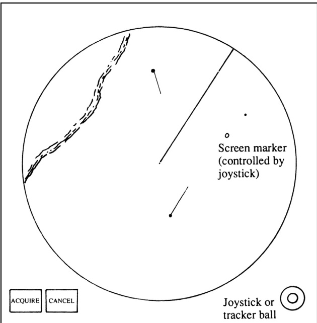  
FIGURE 4.1 Manual acquisition.  

【翻译】
图4.1 手动采集。

【解读】
这幅图片展示了一个名为“手动采集”的过程，可能与数据收集、实验操作或其他需要人工干预的步骤相关。由于没有具体的上下文信息，这里只能做出一般性的推断。

【词汇表】
| 英文词汇 | 中文翻译 | 解释 |
| --- | --- | --- |
| Manual | 手动 | 由人工操作而非自动化完成的过程 |
| Acquisition | 采集 | 获取或收集数据、信息或资源的行为 |
| Figure | 图 | 一种用于说明或展示信息的视觉表现形式 |

# 4.2.4 Automatic Acquisition by Area  

In this type, an area around the ship is specified by the operator and any target that is detected within this area is acquired. Some prioritizing system must operate when the number of targets exceeds the number of tracking channels (Figure 4.2).  

【翻译】
在这种类型中，操作员指定船周围的一个区域，并且任何在该区域内被检测到的目标都会被获取。当目标数量超过跟踪通道数量时，一定要有某种优先级系统来运作（图4.2）。

【解读】
这段话描述了一种目标获取系统的工作原理，即通过指定一个特定区域来自动获取目标，并在目标数量过多时使用优先级系统进行筛选，以确保有效跟踪。

【词汇表】
| 英文词汇 | 中文翻译 | 解释 |
| --- | --- | --- |
| operator | 操作员 | 指控制或管理系统的人员 |
| prioritizing system | 优先级系统 | 用于确定处理顺序的系统，尤其是在资源有限的情况下 |
| tracking channels | 跟踪通道 | 用于监测和跟踪目标的信号或数据通路 |

# 4.2.5 Guard Zones  

In this system, zones (usually up to two) may be specified by arc and depth. Targets entering the zone will be acquired and an alarm activated. A ‘tracks full’ warning will be given when all tracking channels are in use and it will then be up to the operator to decide which of the acquired targets can be cancelled (Figure 4.3).  

【翻译】
在这个系统中，区域（通常最多两个）可以通过弧度和深度来指定。当目标进入该区域时，将会被捕获并激活警报。当所有跟踪通道都在使用时，将会发出“跟踪通道满载”的警告，此时由操作员决定哪些已捕获的目标可以被取消（图4.3）。

【解读】
这段话描述了一个监控或追踪系统的工作原理。在这个系统中，可以设置特定的区域，当目标物体进入这些区域时，系统会自动捕获它们并触发警报。如果系统的跟踪能力达到极限，操作员需要做出决定，选择哪些目标可以被忽略或取消，以便系统能够继续有效地运作。

【词汇表】
| 英文词汇 | 中文翻译 | 解释 |
| --- | --- | --- |
| Zone | 区域 | 指定范围内的空间或区域 |
| Arc | 弧度 | 用于描述圆形或曲线路径的测量单位 |
| Tracks | 跟踪通道 | 系统用于跟踪目标的信号或数据通路 |
| Acquired | 捕获 | 被系统成功检测或跟踪到的目标 |

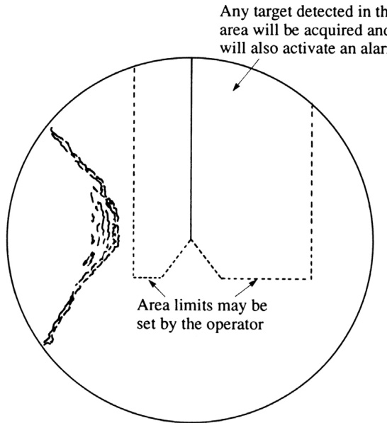  
FIGURE 4.2 Automatic acquisition by area.  

【翻译】
图4.2 按区域自动获取。

【解读】
该图表明了一个地理信息系统或遥感技术中按照特定区域进行数据自动采集的过程。这一过程通常用于环境监测、土地利用规划等领域，以便更好地了解和管理特定区域的资源和变化。

【词汇表】
| 英文词汇 | 中文翻译 | 解释 |
| --- | --- | --- |
| Automatic | 自动 | 不需要人工干预，能自行运行的过程或系统。 |
| Acquisition | 获取 | 获得或收集数据、信息或资源的行为。 |
| Area | 区域 | 指一定范围内的地理空间，如城市、乡村等。 |

Note: Target $'A^{\prime}$ may only be acquired at a late stage in the encounter and target $\mathbf{\nabla}^{\prime}\mathrm{B^{\prime}}.$ , which appears for the first time inside the inner zone, may not be acquired at all. Careful thought must be given when setting up guard zones and the display must be regularly observed.  

# 4.2.6 Guard Rings and Area Rejection Boundaries  

With this method of acquisition, the usual provision is for up to two ‘rings’ (of predetermined depth) plus up to two area rejection boundaries (ARBs). The rings and ARBs may be positioned by the operator  

【翻译】
通过这种获取方法，通常的规定是最多两个预定深度的“环”（ring）以及最多两个区域拒绝边界（ARBs）。这些环和ARBs可以由操作员进行定位。

【解读】
本段主要介绍了一种数据获取方法中关于空间限制的设置，包括环形区域和面积拒绝边界的设定，这些设置可以根据需要进行调整，以满足特定的数据采集需求。

【词汇表】
| 英文词汇 | 中文翻译 | 解释 |
| --- | --- | --- |
| Rings | 环 | 指在获取方法中定义的环形区域 |
| ARBs | 区域拒绝边界 | 指在获取方法中用于排除某些区域的边界 |
| Operator | 操作员 | 指负责设置和控制获取方法参数的人员 |

When a target is automatically acquired in a guard zone/guard area, it is usual for an alarm to be activated to attract the operator’s attention (see Section 4.7.1). The target activating the alarm will be indicated on the screen by, for example, a flashing symbol (Figure 4.4).  

【翻译】
当目标自动进入警戒区/警戒范围时，通常会触发报警装置以吸引操作员的注意（见第4.7.1节）。触发报警的目标将在屏幕上用闪烁符号等方式指示（图4.4）。

【解读】
本段描述了当系统检测到目标进入警戒区域时，会通过激活报警装置来提醒操作员，并且会在屏幕上用特定符号标记出触发报警的目标，以便于识别和跟踪。

【词汇表】
| 英文词汇 | 中文翻译 | 解释 |
| --- | --- | --- |
| Target | 目标 | 系统需要监测或跟踪的对象 |
| Guard zone/Guard area | 警戒区/警戒范围 | 预设的区域，当目标进入此区域时会触发报警或其他响应措施 |
| Alarm | 报警装置 | 用于发出警告信号的设备或系统，目的是提醒操作员注意某种情况或事件 |

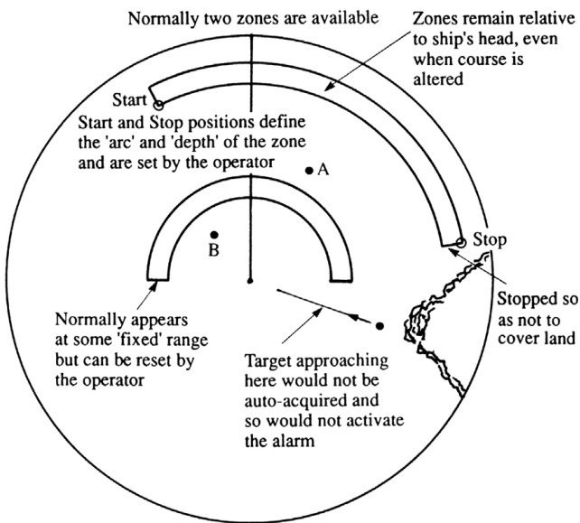  
FIGURE 4.3 Guard zones.  

【翻译】
图4.3 保护区。

【解读】
这幅图展示了一个名为“保护区”的区域概念，可能与安全、保安或环境保护相关。图中没有具体的描述，但根据标题可以推断，这些区域是为了防止某种类型的侵入、危害或损害而设立的。

【词汇表】
| 英文词汇 | 中文翻译 | 解释 |
| --- | --- | --- |
| Guard | 保护 | 指防御或守卫某个区域或物体 |
| Zones | 区域 | 指特定的空间范围或界限 |
| Figure | 图 | 指插图或示意图，用于说明某个概念或想法 |

In general, automatic acquisition has traditionally not been as successful as was at first predicted. There is a tendency to acquire sea clutter, rain clutter, noise and interference, while disassociated elements of land echoes will very quickly fill up the available tracking channels. Land echoes can be excluded by careful setting of the zones/areas and ARBs, but spurious targets (e.g. clutter), after having been acquired, are quickly lost and the ‘lost target’ alarm can sound continually. In future, this situation might be improved with the introduction of coherent radar technology (see Section 2.9.1).  

【翻译】
一般来说，自动获取技术传统上没有达到最初预测的成功程度。存在一种趋势，即获取海洋杂波、雨雾杂波、噪声和干扰，同时陆地回声的离散元素会非常快速地填满可用的跟踪通道。通过仔细设置区域/区域能够排除陆地回声，但虚假目标（例如杂波）在被获取后很快就会丢失，且“丢失目标”警报会不断响起。在未来，这种情况可能会通过引入相干雷达技术得到改善（见第2.9.1节）。

【解读】
本段讨论了自动获取技术在雷达系统中的局限性和挑战。尽管该技术旨在自动检测和跟踪目标，但它经常受到各种干扰因素的影响，如海洋杂波、雨雾杂波、噪声等，从而导致跟踪通道被占用和虚假目标的产生。然而，随着技术的进步，特别是相干雷达技术的引入，有望提高自动获取技术的准确性和可靠性。

【词汇表】
| 英文词汇 | 中文翻译 | 解释 |
| --- | --- | --- |
| Sea clutter | 海洋杂波 | 指由海面反射回来的无关信号 |
| Coherent radar technology | 相干雷达技术 | 一种利用相干原理来提高雷达信号质量和精度的技术 |
| Spurious targets | 虚假目标 | 指非真实的或错误识别的目标 |
| Tracking channels | 跟踪通道 | 指用于跟踪和监视目标的专用信号通路 |

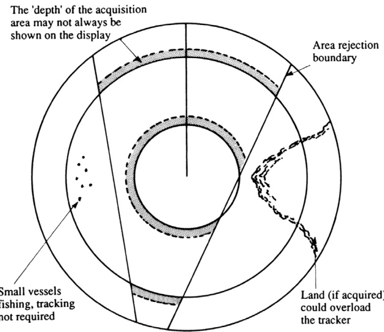  
FIGURE 4.4 Guard rings and ARBs.  

【翻译】
图4.4 保护环和ARBs。

【解读】
本图展示了保护环（guard rings）和ARBs（Address Resolution Bridges，或称为地址解析桥接器）的结构或连接示意图，可能用于计算机网络或电子系统中，以提高数据传输的安全性和效率。

【词汇表】
| 英文词汇 | 中文翻译 | 解释 |
| --- | --- | --- |
| Guard rings | 保护环 | 一种用于防止电磁干扰或其他信号干扰的屏蔽结构 |
| ARBs | 地址解析桥接器 | 一种用于连接不同网络设备并进行地址解析的网络设备 |
| FIGURE | 图 | 图片、插图，通常用于说明某一概念或结构 |

While it is argued that automatic acquisition will reduce the operator’s workload, in practice there is a tendency for it to acquire spurious targets, also to ‘over-acquire’ and so clutter the screen with unnecessary and unwanted vectors. This has led to auto-acquisition falling out of favour. Enquiries have indicated that it is rarely used in areas of high-density traffic, but can sometimes be useful on long ocean passages where the number of targets is small and there is the danger of loss of concentration by the officer of the watch due to boredom.  

【翻译】
虽然有人认为自动获取功能可以减少操作员的工作量，但实际上它往往会获取错误的目标，并且会“过度获取”，导致屏幕被不必要和不想要的向量信息弄得杂乱无章。这使得自动获取功能逐渐失宠。调查显示，在高密度交通区域中，这种功能很少被使用，但是在长距离的海洋航行中，由于目标数量较少，操作人员可能由于无聊而分心，因此这种功能偶尔也会有些用处。

【解读】
这段话讨论了自动获取功能在实际应用中的问题。尽管它本意是为了减轻操作员的负担，但却常常产生不良后果，如获取错误信息或过度获取信息，从而降低了其在高密度交通区域的实用性。但在某些特定情况下，比如长距离海洋航行中，由于环境相对单调，操作人员容易分心，这时自动获取功能可能仍有一定的价值。

【词汇表】
| 英文词汇 | 中文翻译 | 解释 |
| --- | --- | --- |
| Spurious | 错误的、虚假的 | 指不正确或不相关的信息 |
| Over-acquire | 过度获取 | 获取超过需要的信息，导致混乱 |
| Clutter | 杂乱、凌乱 | 指信息过多导致的视觉或认知上的混乱 |
| Concentration | 集中注意力 | 指保持专注和警觉的状态 |

Manual acquisition can be very quick and also selective, and hence the perceived need for automatic acquisition has not really materialized.  

【翻译】
手动获取可以非常快速，也是选择性的，因此对自动获取的感知需求尚未真正实现。

【解读】
这段话讨论了手动获取数据与自动获取数据之间的比较。作者认为，由于手动获取速度快且可选择性强，所以人们对自动获取的需求并不迫切。这意味着，在某些情况下，手动获取可能更为合适或高效。

【词汇表】
| 英文词汇 | 中文翻译 | 解释 |
| --- | --- | --- |
| Manual | 手动 | 由人工操作进行的 |
| Selective | 选择性的 | 允许用户根据特定标准选择所需内容 |
| Materialized | 实现 | 某事物或状况成为现实或被认可 |

Guard zones/areas should be regarded as an additional, rather than an alternative, means of keeping a proper lookout.  

【翻译】
警戒区/区域应被视为保持适当瞭望的附加手段，而不是替代手段。

【解读】
这句话强调了警戒区在安全监控中的重要性，指出它们应该作为额外的预防措施来使用，而不是取代现有的监控方式。这意味着警戒区可以提高整体安全水平，但不应完全依赖于此。

【词汇表】
| 英文词汇 | 中文翻译 | 解释 |
| --- | --- | --- |
| Guard zones/areas | 警戒区/区域 | 指定区域内的人员或车辆需要特别注意和监控的区域 |
| Proper lookout | 适当瞭望 | 指按照规定或标准进行的安全观察或监控 |
| Additional | 附加的 | 表示除了原本的方法以外增加的东西 |
| Alternative | 替代的 | 表示可以取代原有方法的选择 |

# 4.3 THE TRACKING OF TARGETS  

# 4.3.1 The Tracking Specification  

In previous performance standards the accuracy of tracking was stated to be not less than that obtainable by using manual recordings of successive target positions obtained from the radar display.  

【翻译】
在以前的性能标准中，跟踪的准确度被规定为不低于使用从雷达显示器获得的目标位置的手动记录所能达到的准确度。

【解读】
该段落描述了之前的性能标准对于跟踪准确度的要求，即至少要达到通过手动记录雷达显示器上的目标位置序列所能达到的准确度。这意味着传统的评估方法依赖于人工操作来确定基准线。

【词汇表】
| 英文词汇 | 中文翻译 | 解释 |
| --- | --- | --- |
| accuracy | 准确度 | 指的是测量或跟踪结果与真实值之间的接近程度 |
| manual recordings | 手动记录 | 人工进行的数据记录过程 |
| radar display | 雷达显示器 | 显示雷达信号和目标信息的设备或界面 |
| successive target positions | 目标位置序列 | 连续的、一个接着一个的目标位置记录 |

Table 4.3 indicates the tracked target accuracy now required. Accuracy is a compromise with the time taken to plot.  

【翻译】
表4.3指出了当前跟踪目标所需的准确度。准确度与绘制时间之间存在权衡关系。

【解读】
这段话强调了在追踪目标时，需要在准确度和耗时之间找到平衡点。也就是说，提高准确度可能会增加处理或计算的时间，而快速完成任务可能会降低准确度。这是一个典型的trade-off问题，在许多领域，如数据分析、工程设计等都常常遇到。

【词汇表】
| 英文词汇 | 中文翻译 | 解释 |
| --- | --- | --- |
| Accuracy | 准确度 | 指的是结果或测量的精确程度 |
| Compromise | 权衡 | 在两个相互冲突的需求或目标之间找到一个中间立场或解决方案 |
| Plot | 绘制/处理 | 这里指的是对数据进行处理、分析或可视化呈现的过程 |

In many cases it may be obvious that a target is being tracked by virtue of the fact that its predicted movement will be indicated by a graphic line known as a vector (see Section 4.4). The line originates on the target and its remote end indicates the predicted position of the target after an elapsed time selected by the observer. However, the need for tracked targets to be clearly indicated on the display is important because in the early stages (up to about $1\mathrm{min},$ ) of tracking a fresh target, in most systems the vector is suppressed because the available data is unlikely to be sufficiently accurate or stable. Furthermore, in certain cases, even when the vector is present it may have zero length (e.g. the true vector of a stationary target or the relative vector of a target on the same course and speed as the observing vessel). Some manufacturers overcome this problem by replacing the zero length with the symbol ${}^{\prime}Z^{\prime}$ .  

TABLE 4.3 Tracked Target Accuracy $95\%$ Probability Figures)   

<html><body><table><tr><td>TimeofSteady State (min)</td><td>Relative Course (deg)</td><td>Relative Speed (kn)</td><td>CPA (NM)</td><td>TCPA (u)</td><td>TrueCourse (deg)</td><td>True Speed (kn)</td></tr><tr><td>1min:Trend</td><td>11</td><td>1.5%or10%(whichever is greater)</td><td>1.0</td><td></td><td></td><td></td></tr><tr><td>3min:Motion</td><td>3</td><td>0.8%or1%(whichever is greater)</td><td>0.3</td><td>0.5</td><td>5</td><td>0.5%or1%(whichever is greater)</td></tr></table></body></html>  

Once tracking is initiated, by whatever method, the tracker will continue to follow the target until tracking is cancelled (manually, or automatically, because some other criterion has been met, e.g. ‘more than 16 miles away and range increasing’) or the target is ‘lost’.  

【翻译】
一旦开始跟踪，无论使用什么方法，追踪器都会继续跟随目标，直到跟踪被取消（手动或自动，因为某些其他标准已经满足，例如“距离超过16英里且范围增加”），或者目标被“丢失”。

【解读】
这段话描述了追踪系统的工作原理。一旦启动追踪功能，系统就会持续监测目标，直到用户手动停止、系统自动停止（因为达到某些条件，如目标超出一定距离）或者目标从视野中消失为止。这说明了追踪系统的自动化和智能化特点。

【词汇表】
| 英文词汇 | 中文翻译 | 解释 |
| --- | --- | --- |
| initiate | 启动 | 开始某项行动或过程 |
| cancel | 取消 | 终止或停止某项行动或计划 |
| criterion | 标准 | 判断或评估的依据或条件 |
| manually | 手动地 | 由人工操作控制 |
| automatically | 自动地 | 由机器或系统自行控制 |

The precise nature of the algorithms used to ensure that the tracking window will faithfully follow the target varies with manufacturer. The fine details of such methods are beyond the scope of this text, but the general principle can be illustrated by the following description of the technique known as rate aiding.  

【翻译】
确保跟踪窗口准确地跟随目标的算法在不同制造商之间有所不同。这些方法的细节超出了本文的范围，但一般原理可以通过描述一种称为速率辅助（rate aiding）的技术来说明。

【解读】
这段话讨论了跟踪系统中用于保持跟踪窗口与目标同步的算法。由于这些算法涉及到具体实现细节，因此不同的制造商可能采用不同的方法。文章提到了“速率辅助”技术作为一个例子，旨在阐明这种跟踪机制的基本原理。

【词汇表】
| 英文词汇 | 中文翻译 | 解释 |
| --- | --- | --- |
| algorithm | 算法 | 一系列解决问题或完成任务的步骤指令 |
| manufacturer | 制造商 | 生产和销售产品的公司或企业 |
| scope | 范围 | 某事物的界限或某一领域的覆盖范围 |
| rate aiding | 速率辅助 | 一种用于提高跟踪精度的技术，通过估计和调整跟踪速度来辅助跟踪过程 |

# 4.3.2 Rate Aiding  

When the target is first acquired, a large gate is necessary since there is uncertainty as to the direction in which the target will move.  

【翻译】
当目标首次被获取时，需要一个大的门限，因为存在不确定性，即目标将朝哪个方向移动。

【解读】
这段话主要讨论了在追踪或监测目标时，初期阶段需要设置较大的允许误差范围（gate），这是因为一开始对目标的运动方向可能没有明确的预知，因此需要更广泛的覆盖范围来确保能够成功跟踪目标。

【词汇表】
| 英文词汇 | 中文翻译 | 解释 |
| --- | --- | --- |
| target | 目标 | 被追踪或监测的对象 |
| gate | 门限/允许误差范围 | 允许目标在一定范围内移动而仍被视为有效目标的区域或值 |
| uncertainty | 不确定性 | 对某事物状态、行为或结果的不明确或无法准确预测 |

Figure 4.5 shows how successive positions can be used to improve the forecast of the next position in which the target is expected to appear. The radius of the gate is really a measure of confidence in the tracking and the smaller this value becomes, the more precise the prediction will be. In this way it is possible to establish a feedback loop in the computer which will progressively reduce the size of the tracking gate.  

【翻译】
图4.5展示了如何利用连续位置来提高对目标下一个出现位置的预测精度。门限半径实际上是跟踪置信度的衡量标准，而这个值越小，预测就越精确。通过这种方式，可以在计算机中建立一个反馈环路，从而逐步减小跟踪门限的大小。

【解读】
本段主要讨论的是如何通过使用连续位置信息来提高目标运动轨迹的预测精度。关键点在于，通过不断更新跟踪门限的半径，可以提高预测的准确性。这一过程可以自动化，并通过计算机实现反馈循环，不断优化预测结果。

【词汇表】
| 英文词汇 | 中文翻译 | 解释 |
| --- | --- | --- |
| successive positions | 连续位置 | 指目标物体在不同时间点的位置 |
| feedback loop | 反馈环路 | 计算机系统中用于不断改进处理结果的循环过程 |
| tracking gate | 跟踪门限 | 用于定位和预测目标物体位置的区域或范围 |
| radius | 半径 | 圆形或球形的半径，表示跟踪门限的大小 |

The advantages of a reduced tracking gate are:  

【翻译】
减少跟踪门限的优点是：

【解读】
这句话介绍了减少跟踪门限的好处，可能是在某种技术或系统中，这种设计可以提高效率、准确性或者其他方面的性能。

【词汇表】
| 英文词汇 | 中文翻译 | 解释 |
| --- | --- | --- |
| tracking gate | 跟踪门限 | 指在某些系统中用于控制或监测对象运动的阈值或限制 |
| reduced | 减少 | 表示数量或程度的降低 |
| advantages | 优点 | 指某事物或情况的有利条件或益处 |

a. A lower likelihood of target swap (see Section 4.3.5).   
b. An improved ability to track targets through rain and sea clutter.   
c. An ability to continue tracking, even when target response is intermittent.  

【翻译】
a. 降低目标互换的可能性（见第4.3.5节）。
b. 提高了在雨天和海洋杂波中跟踪目标的能力。
c. 即使目标响应不连续，也能继续跟踪的能力。

【解读】
该段落描述的是雷达系统或其他追踪技术的三个优势。首先，它降低了目标混淆的可能性，这意味着系统能够更准确地识别和区分不同的目标。其次，在恶劣环境条件下，如雨天和海洋杂波中，系统仍然能够有效地跟踪目标。这提高了系统在复杂环境下的可靠性和实用性。最后，即使目标的信号不稳定或间歇，系统也能维持对目标的跟踪，这进一步增强了系统的稳健性和实时反应能力。

【词汇表】
| 英文词汇 | 中文翻译 | 解释 |
| --- | --- | --- |
| Target swap | 目标互换 | 指系统错误地将一个目标识别为另一个目标的情况。 |
| Rain and sea clutter | 雨天和海洋杂波 | 指雨天和海洋环境中的干扰信号，可能影响系统的正常工作。 |
| Intermittent | 不连续的、间歇的 | 描述信号或响应不稳定、断断续续的状态。 |

One problem which can arise with reduced gate size is that if a target manoeuvres and, as a result, is not found by the computer in the predicted position, the computer may continue to track and look in the predicted direction and end up by losing the target altogether. To avoid this possibility, as soon as the target is missed, i.e. not found in the predicted position, the gate size is increased (and the tracking duration reduced see Section 4.3.6). If the target is still detectable and is subsequently found, the tracking will resume and a new track will gradually stabilize.  

【翻译】
当使用较小的门限值时，可能会出现一个问题：如果目标物体进行机动并且因此没有出现在计算机预测的位置上，计算机会继续跟踪并在预测方向上寻找，最终完全失去目标。这可以通过以下方式避免：一旦目标物体被错过（即未在预测位置找到），门限值就会增加（同时减少跟踪时间，请参见第4.3.6节）。如果目标物体仍然可检测并随后被找到，跟踪就会恢复，并且新的轨迹会逐渐稳定下来。

【解读】
本段讨论了在目标跟踪中使用较小的门限值可能带来的问题，即目标物体移动后计算机可能无法找到它，从而导致跟踪失败。为了解决这个问题，可以在目标物体被错过时增加门限值，以便于重新找到目标并恢复跟踪。

【词汇表】
| 英文词汇 | 中文翻译 | 解释 |
| --- | --- | --- |
| gate size | 门限值 | 在目标跟踪中，指允许目标物体偏离预测位置的最大距离或范围 |
| manoeuvres | 机动 | 指目标物体的运动或改变方向 |
| predicted position | 预测位置 | 计算机根据之前的数据预测目标物体应该所处的位置 |
| tracking duration | 跟踪时间 | 指计算机跟踪目标物体的持续时间 |

If, after six fruitless scans, the target is still not found then an alarm is activated and a flashing marker is displayed at the target’s last observed position (see Section 4.7.3).  

【翻译】
如果经过六次无果的扫描后，目标仍然未被找到，则会激活警报，并在目标最后观察到的位置显示闪烁标记（见第4.7.3节）。

【解读】
这段话描述了一个系统在无法找到目标的情况下的行为。当系统进行了多次扫描但仍然无法定位目标时，它会触发警报，并通过闪烁标记指示目标最后已知的位置。这是一个典型的错误处理或异常情况下的应对机制，旨在提醒操作员注意问题并可能需要人工干预。

【词汇表】
| 英文词汇 | 中文翻译 | 解释 |
| --- | --- | --- |
| scans | 扫描 | 系统对某一区域或目标进行搜索的动作 |
| alarm | 警报 | 当发生异常情况或需要引起注意时触发的信号或提示 |
| flashing marker | 闪烁标记 | 在屏幕上以闪烁方式显示的标志，用于吸引注意力或指示特定位置 |
| target | 目标 | 被系统搜索或跟踪的对象或位置 |

# 4.3.3 The Number of Targets to Be Tracked  

The ARPA should be able to automatically track, process, simultaneously display and continuously update the information on the number of targets specified in Table 4.2, whether manually or automatically acquired. This means that the reduced ARPA requires at least 20!30 tracking channels, depending on ship size. The full ARPA requires a minimum of 40 tracking channels.  

【翻译】
ARPA系统应该能够自动跟踪、处理、同时显示并持续更新表4.2中指定的目标数量信息，无论这些信息是通过手动还是自动方式获得。这意味着简化版的ARPA至少需要20到30个跟踪通道，具体取决于船只的大小，而完整版的ARPA则需要至少40个跟踪通道。

【解读】
本段主要讨论了ARPA（自动雷达绘图辅助）系统的功能要求，特别是在跟踪和处理多个目标方面的能力。根据船只的大小不同，系统需要具备一定数量的跟踪通道，以满足实时数据处理和显示的需求。

【词汇表】
| 英文词汇 | 中文翻译 | 解释 |
| --- | --- | --- |
| ARPA | 自动雷达绘图辅助 | 一种用于辅助雷达操作的系统 |
| Track | 跟踪 | 指定目标并记录其运动轨迹的过程 |
| Channel | 通道 | 在这里指的是系统用于跟踪目标的独立路径或信号通路 |
| Automatically | 自动地 | 不需要人工干预，系统自行完成任务 |

It has been suggested that 20 tracking channels might be insufficient in heavy traffic, but from practical experience it has been found that ship’s officers can quickly identify the targets which need to be tracked and acquire them. (Although at times there will be some 40 plus targets on the screen, not all of them will need to be tracked.) In fact, it has been found that an excess of vectors can produce ‘ARPA clutter’ (i.e. information overload) and be counter-productive.  

【翻译】
有人建议，在交通繁忙的情况下，20个跟踪通道可能不足，但根据实际经验，船员可以快速识别需要跟踪的目标并捕获它们。（尽管有时屏幕上会显示40多个目标，但并非所有目标都需要跟踪。）事实上，发现过多的矢量会产生“ARPA杂乱”（即信息超载），反而会产生负面效果。

【解读】
这段话讨论了在海事领域中关于跟踪通道数量的讨论。虽然有人担心20个跟踪通道可能不够用，但实际经验表明，船员能够有效地识别和跟踪必要的目标。同时，也提到了过多的信息可能会导致“信息超载”，从而降低工作效率。

【词汇表】
| 英文词汇 | 中文翻译 | 解释 |
| --- | --- | --- |
| tracking channels | 跟踪通道 | 用于追踪和监控目标的信号或数据通道 |
| ARPA clutter | ARPA杂乱 | 由于过多的信息输入导致的混乱状态，可能降低工作效率 |
| vectors | 矢量 | 在此 context 中指的是表示方向和大小的信息或数据 |
| counter-productive | 反而会产生负面效果 | 指某种行为或措施最终导致了相反的结果 |

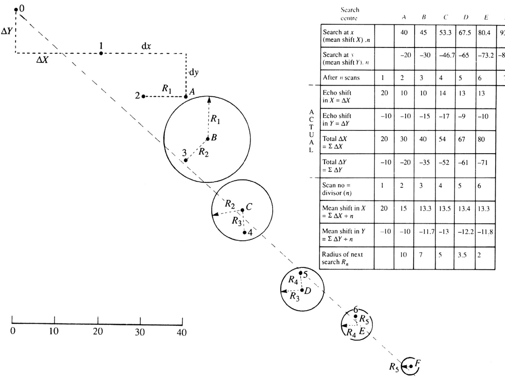  
FIGURE 4.5 Rate aiding.  

【处理失败：内存不足或无法生成有效响应】

It should be noted that a higher tracking capability is required by the performance standard where automatic acquisition is required. This recognizes the tendency of the latter facility to over-acquire (see Section 4.2.6) and compensates for it to some extent.  

【翻译】
值得注意的是，在需要自动获取的性能标准中，需要更高的跟踪能力。这是因为后者容易过度获取（见第4.2.6节），因此在一定程度上进行了补偿。

【解读】
本段强调了在需要自动获取的情况下，对跟踪能力有更高的要求，这是为了弥补可能出现的过度获取问题，从而确保系统的稳定性和准确性。

【词汇表】
| 英文词汇 | 中文翻译 | 解释 |
| --- | --- | --- |
| tracking capability | 跟踪能力 | 指系统能够有效跟踪目标或信号的能力 |
| automatic acquisition | 自动获取 | 系统自动获取数据或信息的过程 |
| over-acquire | 过度获取 | 获取超过实际需要的数据或信息 |

# 4.3.4 Target Loss  

The system should continue to track an acquired target which is clearly distinguishable on the display for 5 out of 10 consecutive scans or equivalent.  

【翻译】
系统应该继续跟踪已经获得的目标，该目标在显示屏上清晰可区分，在10次连续扫描中至少有5次或等效次数被识别出来。

【解读】
这段话描述了一个系统对于目标跟踪的要求，即系统需要能够持续地追踪已经锁定到的目标，并且这个目标必须在大多数的扫描过程中是可以被清晰地区分开来的。这意味着系统的稳定性和准确性非常重要，因为它需要在多次扫描中保持对目标的跟踪，而不是只在一次扫描中侥幸成功。

【词汇表】
| 英文词汇 | 中文翻译 | 解释 |
| --- | --- | --- |
| Target | 目标 | 系统需要跟踪的对象 |
| Distinguishable | 可区分 | 能够被识别或区分开来 |
| Consecutive | 连续的 | 持续进行，没有间断 |
| Scans | 扫描 | 系统用于探测或跟踪目标的动作 |

(The term scan tends to be used rather loosely in radar terminology. Sometimes it is used to describe one line, as in the term ‘interscan period’, while on other occasions it refers to one antenna rotation. In the above context it refers to the latter.)  

【翻译】
“扫描”一词在雷达术语中经常被宽松地使用。有时它用来描述一条线，如“间隔扫描周期”中的那样，而在其他情况下，它指的是一个天线旋转。在上述背景下，它指的是后者。

【解读】
本段主要讨论了雷达领域中“扫描”一词的使用方式，指出其定义可能根据不同情境而有所不同，有时特指某一条线或某一次天线旋转。

【词汇表】
| 英文词汇 | 中文翻译 | 解释 |
| --- | --- | --- |
| scan | 扫描 | 指雷达信号对目标区域进行探测的过程 |
| interscan period | 间隔扫描周期 | 两次扫描之间的时间间隔 |
| antenna rotation | 天线旋转 | 雷达天线完成一次全方位扫描的动作 |

It should be noted here that if, for some reason, a response from a tracked target is not received on a particular scan, the ARPA must not immediately declare the target lost. Also it is implied that some form of ‘search’ for it must take place, for example by opening the tracking gate rather than merely looking in the limited area in which it was expected but failed to be detected.  

【翻译】
这里需要注意的是，如果由于某种原因，在特定扫描中没有收到被跟踪目标的响应，ARPA（自动雷达 Plotter 和追踪系统）不能立即宣布该目标丢失。此外，还意味着必须进行某种形式的“搜索”，例如通过打开跟踪门限，而不是简单地在预期但未检测到的有限区域内寻找。

【解读】
本段强调了在使用自动雷达Plotter和追踪系统（ARPA）时遇到目标响应丢失的情况下的处理原则。它要求系统在目标响应未被接收时，不应该立即判定目标为丢失，而是应该进行一定形式的搜索，以尝试重新找到目标。这体现了对系统设计和操作中的容错性和鲁棒性的考虑。

【词汇表】
| 英文词汇 | 中文翻译 | 解释 |
| --- | --- | --- |
| ARPA | 自动雷达 Plotter 和追踪系统 | 一种用于海事或航空领域的自动化系统，用于跟踪和记录目标的位置和运动。 |
| tracked target | 被跟踪目标 | 指系统正在监测和跟踪的目标，如船只、飞机等。 |
| tracking gate | 跟踪门限 | 系统用来确定是否继续跟踪一个目标的参数设置，包括距离、速度等因素。 |

# 4.3.5 Target Swap  

The possibility of tracking errors, including target swap, should be minimized by design (Figure 4.6).  

【翻译】
应该通过设计来最小化跟踪错误的可能性，包括目标交换（图4.6）。

【解读】
本段强调了在系统设计中减少跟踪错误的重要性，特别是避免目标混淆或交换。这意味着设计者应尽量确保系统能够准确识别和跟踪目标，以防止可能出现的错误。

【词汇表】
| 英文词汇 | 中文翻译 | 解释 |
| --- | --- | --- |
| track | 跟踪 | 指定位或状态随时间变化的监测过程 |
| error | 错误 | 系统运行中产生的不正确结果或情况 |
| minimize | 最小化 | 将某事物降至最低限度或程度 |
| target swap | 目标交换 | 指两个或多个目标在系统中被误判为彼此的情况 |

Target swap is likely when two targets respond within the tracking gate at the same time. When this happens, the tracker can become confused and the vector(s) may transfer to the wrong target. To minimize this problem, the gate should be made as small as possible, the movement of the target should be predicted and the gate moved on at each scan as described under ‘rate aiding’ (see Section 4.3.2).  

【翻译】
当两个目标同时在跟踪门限内响应时，目标交换很可能发生。当这种情况发生时，追踪器会变得混乱，矢量（s）可能转移到错误的目标。为了最小化这个问题，门限应该尽可能小，目标的运动应该被预测，并且在每次扫描中按照“速率辅助”（见第4.3.2节）的描述移动门限。

【解读】
本段讨论了目标跟踪中的一个潜在问题，即目标交换，当两个目标同时出现在跟踪范围内，系统可能会混淆，将矢量指向错误的目标。为了解决这个问题，可以通过减小跟踪门限、预测目标运动并相应地调整门限来实现。

【词汇表】
| 英文词汇 | 中文翻译 | 解释 |
| --- | --- | --- |
| Target swap | 目标交换 | 指两个或多个目标在跟踪过程中被误判为彼此的情况 |
| Tracking gate | 跟踪门限 | 用于定义跟踪区域的边界 |
| Rate aiding | 速率辅助 | 一种预测目标运动并根据预测结果调整跟踪参数的技术 |
| Vector | 矢量 | 在这里指的是表示目标位置、速度等信息的数学量 |

The two requirements that target swap be minimized by the ARPA (and auto-tracking) design and that tracking be continued even if no response is received for a period of time are thus to some extent achieved by the common solution of rate aiding.  

【翻译】
两个要求，即目标交换由ARPA（和自动跟踪）设计最小化，以及即使在一段时间内没有收到响应，跟踪仍然继续，这些在一定程度上通过速率辅助的共同解决方案得以实现。

【解读】
本段讨论的是一种技术设计，特别是速率辅助（rate aiding），如何满足两个关键需求：第一，减少目标交换带来的影响；第二，在没有接收到响应的情况下，仍能持续进行跟踪。这意味着该设计能够在某种程度上同时满足这两项要求，展现出其在系统稳定性和追踪能力方面的优势。

【词汇表】
| 英文词汇 | 中文翻译 | 解释 |
| --- | --- | --- |
| ARPA | 自动雷达plotter分析仪 | 一种用于海军或其他领域的雷达信号处理和分析设备 |
| Auto-tracking | 自动跟踪 | 自动对目标进行跟踪的功能 |
| Rate Aiding | 速率辅助 | 一种提高系统稳定性和准确性的技术方法 |

# 4.3.6 The Analysis of Tracks and the Display of Data  

When a target is acquired the system should present the targets motion within 1 min and the prediction within 3 min.  

【翻译】
当系统捕获目标后，应在1分钟内显示目标的运动情况，并在3分钟内给出预测结果。

【解读】
该段落描述了一个系统对于目标追踪和预测的时间要求，即在目标被识别后的短时间内提供目标的实时运动信息和预测分析，这对快速响应和决策至关重要。

【词汇表】
| 英文词汇 | 中文翻译 | 解释 |
| --- | --- | --- |
| Target | 目标 | 指需要被跟踪或分析的对象 |
| Acquired | 捕获 | 系统成功识别或锁定目标的状态 |
| Prediction | 预测 | 根据历史数据或模型对未来事件的预测或估计 |

The performance measures stated in Table 4.3 therefore define two levels of expected accuracy:  

【翻译】
因此，在表4.3中列出的性能指标定义了两个预期准确性水平：

【解读】
本段主要讨论的是关于性能评估的标准，特别是根据表4.3中的数据来确定预期的准确性水平。这意味着在评估某一系统或模型的表现时，有两种不同的准确性要求或目标。

【词汇表】
| 英文词汇 | 中文翻译 | 解释 |
| --- | --- | --- |
| Performance measures | 性能指标 | 用于评估系统或模型表现的标准或方法 |
| Expected accuracy | 预期准确性 | 在特定条件下预计能够达到的准确程度 |
| Levels | 水平/层次 | 指标或标准的不同等级或分类 |

1. A lower level (after 1 min) relating to the target’s ‘trend’, which is an early indication of the target’s relative track.   
2. A higher level (after $3\mathrm{min},$ ) relating to the target’s predicted motion; this means the best possible estimate of the target’s relative- and true-motion data.  

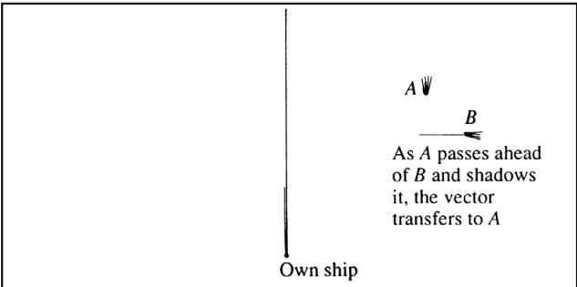  

【处理失败：内存不足或无法生成有效响应】

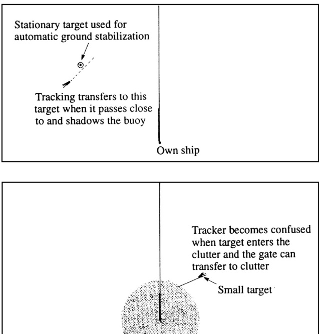  
FIGURE 4.6 Target swap.  

【翻译】
图4.6 目标交换。

【解读】
这幅图似乎是展示一种视觉错觉或认知心理学中的一个概念，即“目标交换”。这种现象可能与人们对视觉信息的感知和处理方式有关，特别是在快速变化或不确定的环境中。图像本身没有提供足够的上下文来详细解释这一概念，但它可能涉及到人们如何看待和理解视觉刺激，以及我们的脑部如何处理这些信息。

【词汇表】
| 英文词汇 | 中文翻译 | 解释 |
| --- | --- | --- |
| Target | 目标 | 指向被观察或研究的对象或刺激 |
| Swap | 交换 | 在这里指的是视觉信息的突然改变或替换 |
| Figure | 图 | 一种用于说明或演示某一概念或想法的视觉表现形式 |

However, for the general discussion of tracking philosophy which follows, it is adequate to appreciate that essentially the performance standard requires the computer to deduce and display relative-motion data to a specified level of accuracy after $1\mathrm{min}$ of steady-state tracking, and both relative-and true-motion data to a higher specified accuracy after 3 min of steady-state tracking. Steadystate tracking means that neither the target nor the observing vessel has manoeuvred and no significant change has taken place in the errors of the input sensors.  

# 4.3.6.1 General Tracker Philosophy  

In order to calculate the data required by the performance standard, the computer must store sequential positions of each tracked target and then analyse the movement represented by such successive positions so as to evaluate the relative-motion and the true-motion of each target. The computer is thus required to automate the operation which has traditionally been carried out manually by the recording of successive target positions (either by the plotting of ranges and bearings on a paper sheet or by the use of a reflection plotter) and the subsequent resolution of the OAW triangle (see Chapter 7). Automation of any process normally carried out by an intelligent being is always complex. The injection of pseudo-intelligence and the difficulty of satisfying conflicting requirements give considerable scope to the inventiveness of the designer, and it is not surprising that various solutions to the problem exist, all of which differ in mathematical detail to a greater or lesser extent. A detailed consideration of the options open to the designer in carrying out the data processing is beyond the scope of this text, but it is important for the observer to have some general knowledge of how the operation relates to the way in which the same task would be tackled by manual plotting. This understanding is relevant not only to the above extract from the performance standard, but to the general philosophy that requires the results to be at least as good as would be obtained by using manual recordings, and that autotracking should enable observers to perform as well with multiple targets as they can by manually plotting a single target. It should thus be appreciated that auto-tracking is carrying out a task which could be undertaken manually by an observer, given the time and the inclination, and that there is no reason to believe that the results obtained by auto-tracking are any better, or any worse, than those that can be achieved by such an observer.  

【翻译】
为了计算性能标准所需的数据，计算机必须存储每个被跟踪目标的顺序位置，然后分析这些连续位置所代表的运动，以评估每个目标的相对运动和真实运动。因此，计算机需要自动执行传统上由人工完成的操作，即记录目标的连续位置（无论是通过在纸张上绘制距离和方位还是使用反射绘图仪），然后解决OAW三角形（见第7章）。任何通常由智能生命体完成的过程的自动化都是复杂的。注入伪智能和满足冲突要求的困难为设计师带来了很大的发明空间，因此不奇怪各种解决方案都存在，它们在数学细节上有较大或较小的差异。在本文中，对于设计师在进行数据处理时可选择的选项进行详细考虑超出了范围，但对于观察者来说，了解该操作如何与手动绘图方式相关是非常重要的。这种理解不仅适用于上述从性能标准中提取的内容，还适用于要求结果至少与使用手动记录相同的总体哲学，以及自动跟踪应该使观察者能够像手动绘图单个目标一样，在多个目标上表现良好。因此，应该认识到自动跟踪正在执行一个可以由观察者手动完成的任务，只要有时间和意愿，并且没有理由相信自动跟踪获得的结果会比观察者手动完成的结果更好或更坏。

【解读】
这段文字主要讨论了计算机在自动跟踪系统中的作用，特别是在计算性能标准所需的数据方面。它强调了自动化的复杂性以及设计师在满足不同需求时面临的挑战。同时，也指出自动跟踪的结果并不一定优于手动记录的结果，而是两者应该达到同样的效果。这段文字还涉及到了自动跟踪技术的基本原理和其与手动方法的比较，强调了理解自动跟踪工作原理的重要性。

【词汇表】
| 英文词汇 | 中文翻译 | 解释 |
| --- | --- | --- |
| automation | 自动化 | 使用技术手

For acceptance by the ARPA, data must be in digital form, since the necessary calculations must be performed by digital computation. Thus, in the first instance, the analogue radar data must be stored, radial line by radial line, in a digital memory. The presence of a response will be registered as a binary 1 in the appropriate range cell(s) and will be associated with the appropriate bearing word, as was described for the general radar memory in Section 2.7.3. Filtering techniques are used to establish the likelihood of any particular response being a target, and hence whether or not it should be stored for tracking purposes. During each timebase the detected responses are read into what is known as the prime register, which is a group of memory elements of the form shown by one line of the memory matrix illustrated in Figure 1.5. During the rest (or interscan) period, the contents of the prime register are transferred into the number one register, which is the first of a group of $N$ identical registers. At the same time the contents of number one are transferred into number two, and so on down the group. The contents of the Nth register (i.e. the oldest data) are discarded. During the transfer period a comparison is made of the contents of the $N$ cells in each column and if more than $M$ out of $N$ cells in the column contain a binary 1, a hit is registered in the correct location in a further section of the tracker memory which holds only filtered responses. The filtering technique helps to reduce the probability of false echoes reaching the tracker and also improves the chances of a real but weak or intermittent response being tracked.  

Targets within the filtered area of the memory are selected for tracking when, either manually or automatically, a gate is placed over their responses. As the antenna beam sweeps past a ship-target, it will register a number of strikes (see Sections 2.3.3.3 and 2.5) on successive timebases and it may be that such a target activates more than one successive radial range cell. In the case of picture storage (see Section 2.7.3.2), these digitized responses will aggregate in the memory to generate on the display an echo having the outline of the distinctive echo paint (see Section 2.8.5). Clearly it is neither necessary nor desirable for the computer to track each individual element present in the resolution cell. For this reason the input responses to the tracker are processed to produce a single registration which represents the location of the target to be tracked and about which the gate will in due course attempt to centre itself. The area of memory which is used to store the assembly of such registrations is known as the hit matrix.  

【翻译】
在内存的过滤区域中，当手动或自动地在目标响应上放置一个门限时，会选择跟踪这些目标。当天线束扫过船只目标时，它将在连续的时间基准上注册多次击中（见2.3.3.3和2.5节），这样一个目标可能激活多个连续的径向范围单元。在图像存储的情况下（见2.7.3.2节），这些数字化的响应将在内存中聚合，以便在显示屏上生成具有独特回声绘制轮廓的回声（见2.8.5节）。显然，不需要也不希望计算机追踪每个存在于分辨率单元中的个别元素。因此，对跟踪器的输入响应进行处理以产生一个代表要跟踪的目标位置的单一注册，这个门限将尝试使其居中。用于存储此类注册集合的内存区域称为命中矩阵。

【解读】
本段主要讨论了雷达系统中目标跟踪的过程。通过对目标响应的处理和分析，系统能够确定目标的位置，并在显示屏上呈现出相应的回声图像。为了提高跟踪效率，系统会对输入的响应数据进行处理，生成一个单一的注册信息，以表示目标的位置，而不是跟踪每个个别的元素。

【词汇表】
| 英文词汇 | 中文翻译 | 解释 |
| --- | --- | --- |
| gate | 门限 | 手动或自动设置的目标跟踪区域 |
| strike | 击中 | 天线束扫过目标时注册的信号 |
| hit matrix | 命中矩阵 | 存储目标注册信息的内存区域 |
| radial range cell | 径向范围单元 | 雷达系统中用于测量距离的单元 |
| resolution cell | 分辨率单元 | 雷达系统中用于区分目标的最小单元 |

If the target has been acquired, and is being successfully tracked, a tracking window will be centred on that particular memory location within the hit matrix which corresponds with the target’s range and bearing. The coordinates of the window can be extracted and stored in a further area of the tracker memory. This area is sometimes referred to as the track file and there will have to be a separate track file for each tracked target. Thus, rotation by rotation, as the gate moves in steps following the target’s position through the hit matrix, sequential positions of each tracked target can be stored in the appropriate track file.  

【翻译】
如果目标已经被获取并且正在被成功跟踪，那么一个跟踪窗口将会被集中在击中矩阵中的特定内存位置，该位置对应于目标的距离和方位。该窗口的坐标可以被提取并储存在追踪器内存的另一个区域中。这个区域有时被称为跟踪文件，每个被跟踪的目标都需要有一个单独的跟踪文件。因此，随着门的移动一步步地跟随目标在击中矩阵中的位置，不同被跟踪目标的顺序位置可以被储存在相应的跟踪文件中。

【解读】
本段主要描述了目标跟踪系统的工作原理。当系统成功获取并跟踪目标后，它会创建一个跟踪窗口来记录目标的位置信息，这些信息会被储存在追踪器的内存中，以便进一步处理和分析。每个被跟踪的目标都会有一个独立的跟踪文件来记录其位置变化。

【词汇表】
| 英文词汇 | 中文翻译 | 解释 |
| --- | --- | --- |
| Target | 目标 | 被跟踪或监测的对象 |
| Tracking Window | 跟踪窗口 | 用于记录目标位置信息的窗口 |
| Hit Matrix | 击中矩阵 | 记录目标位置和其他相关信息的数据结构 |
| Track File | 跟踪文件 | 储存被跟踪目标位置信息的文件 |

The processor (which is that part of the computer which manipulates the data and carries out the mathematical operations) must operate on the recorded positions to calculate the most probable track of the target. It is difficult to carry out calculations based on positions which are expressed in terms of range and bearing because the rates at which the bearing and range change are not constant for a target on a straight track. Further, the spatial resolution varies with range (i.e. it is geometrical). For these reasons it is usual to convert the target positions into Cartesian coordinates of northings and eastings, the mathematical operation being the same as that described for scan conversion (see Figure 2.41).  

【翻译】
处理器（即计算机中操纵数据和执行数学运算的部分）必须对记录的位置进行操作，以计算目标最可能的轨迹。由于目标在直线轨迹上的方位和距离变化率不恒定，因此基于以方位和距离表示的位置进行计算是困难的。此外，空间分辨率会随着距离而变化（即呈几何性）。因此，通常会将目标位置转换为北向和东向的笛卡尔坐标，这种数学运算与扫描转换中描述的相同（见图2.41）。

【解读】
本段主要讨论了计算机处理器如何根据记录的目标位置来计算出目标最可能的运动轨迹。由于直接使用方位和距离会因变化率不恒定而导致计算困难，因此需要将这些信息转换为更适合数学运算的笛卡尔坐标系。这一过程可以提高计算的准确性和效率。

【词汇表】
| 英文词汇 | 中文翻译 | 解释 |
| --- | --- | --- |
| Processor | 处理器 | 计算机中负责执行指令和进行数据处理的部件 |
| Cartesian coordinates | 笛卡尔坐标 | 一种使用x、y轴来定位点或物体的坐标系统 |
| Spatial resolution | 空间分辨率 | 指在一定距离下能区分两个相邻点的能力 |
| Bearing | 方位 | 指从一个点到另一个点的方向角度 |

When laying off observed ranges and bearings on a plotting sheet (see Section 7.8), the effect of inherent errors is that, even for a target on a steady track, the plotted positions do not form a perfectly straight line but are scattered about the correct track; the observer has to attempt to draw the line that is the best fit. Exactly the same effect occurs with automatic plotting and it is further exacerbated by quantizing errors introduced by digital storage (see Sections 2.7.3.2 and 9.4). Since the data must eventually be displayed as a stable straight line vector, the processor must calculate a length and direction which represents the best fit to the scattered observations. This operation is known as smoothing and involves the application of quite complex mathematical techniques such as Kalman filtering, the mechanics of which are beyond the scope of this text. However, it is important for the observer to appreciate that such smoothing does take place and to understand the implications.  

【翻译】
在绘制观测范围和方位到图表纸上时（见第7.8节），固有误差的影响是，即使对于目标稳定轨迹，绘制出的位置也不会形成一条完美的直线，而是散布在正确轨迹周围；观察者必须尝试画出最合适的线。自动绘制中会出现同样的效果，而且由于数字存储引入的量化误差而进一步加剧（见第2.7.3.2节和第9.4节）。由于数据最终必须以稳定的直线矢量形式显示，因此处理器必须计算长度和方向，这些是对分散的观测值的最佳拟合。这种操作称为平滑处理，涉及应用诸如卡尔曼滤波等相当复杂的数学技术，但这些技术的细节超出了本文的范围。然而，对于观察者来说，了解这种平滑处理确实存在以及其含义是非常重要的。

【解读】
这段话主要讨论了在观测和绘制目标运动轨迹时，由于固有误差和量化误差的影响，观测到的位置可能不会形成一条完美的直线。为了解决这个问题，需要进行平滑处理，以找到最合适的直线来表示目标的运动轨迹。这一过程涉及复杂的数学技术，如卡尔曼滤波，目的是为了得到一个更加准确和稳定的结果。

【词汇表】
| 英文词汇 | 中文翻译 | 解释 |
| --- | --- | --- |
| inherent errors | 固有误差 | 指系统或方法中固有的、不可避免的错误 |
| quantizing errors | 量化误差 | 数字化过程中由于离散取样导致的误差 |
| Kalman filtering | 卡尔曼滤波 | 一种用于估计和预测随时间变化的状态变量的数学算法 |
| smoothing | 平滑处理 | 一种用于减少数据中的噪声和离散度的数学处理方法 |

If the smoothing is carried out over too long a period, the tracker will be insensitive to changes in tracks as a result of which small manoeuvres may go undetected and there will be a long delay before large manoeuvres become apparent. On the other hand, if smoothing is carried out over a short period, the output data will fluctuate, rendering decision-making difficult. Clearly the amount and duration of smoothing is a compromise and the difficulty of reconciling the twin requirements of sensitivity to target manoeuvres and data stability provides the designer with a considerable challenge. As a result, the particular algorithms used for smoothing vary in detail with manufacturer.  

【翻译】
如果平滑处理的时间过长，跟踪器将对轨迹变化不敏感，从而导致小幅度机动可能未被检测到，而大幅度机动需要很长时间才能变得明显。另一方面，如果平滑处理的时间过短，输出数据会波动，使得决策变得困难。显然，平滑处理的量和持续时间是一个折衷，而协调目标机动的灵敏度与数据稳定性这两个相互矛盾的要求给设计师带来了相当大的挑战。因此，不同制造商使用的平滑算法在细节上各有不同。

【解读】
本段讨论了跟踪系统中平滑处理的时间长度问题。如果平滑处理时间太长或太短，都会导致跟踪精度下降或决策困难，因此需要找到一个合适的平衡点。此外，不同制造商可能会根据自己的需求和经验选择不同的平滑算法，以求达到最佳效果。

【词汇表】
| 英文词汇 | 中文翻译 | 解释 |
| --- | --- | --- |
| Smoothing | 平滑处理 | 一种信号处理技术，用于减少数据中的噪声和波动 |
| Manoeuvres | 机动 | 指飞行器、车辆等进行的转向、加速等操作 |
| Insensitive | 不敏感 | 对某些变化或刺激无反应或反应迟钝 |
| Fluctuate | 波动 | 数据或信号在数值上出现规律性的变化 |
| Compromise | 折衷 | 在两种或多种相互矛盾的要求之间寻找一个平衡点或妥协方案 |

When a target is first acquired, the computer will commence storing positions, obtaining updated coordinates each time the antenna sweeps across the target (i.e. about once every $_{3-5\mathrm{s})}$ . These positions will have an inherent scatter and initially the mean line will be very sensitive to plots which fall some distance from it. However, as the plotting duration increases and more plots are obtained, the mean line will stabilize and accuracy will improve. During the first minute of tracking, the target will normally display only a symbol to indicate that it is being tracked. In most systems the vector (or other graphical indication of target movement) will be suppressed until sufficient observations have been obtained to produce the indication of the target’s motion trend to the level of accuracy required by the performance standard. Some systems were designed to display vectors within a few seconds of acquisition. This should not be seen as a sign of instant accuracy. Accuracy demands a number of successive observations and until the 1 min interval has elapsed there is no requirement to meet the performance standard accuracy. Any data derived directly or indirectly from these very early indications could be highly misleading. In general, where such early display takes place, a study of the instability of the vector (or other indication of movement) should convince the user that it is based on insufficient observations. After $1\mathrm{min}$ the tracker will have smoothed about 12 20 observations and must then produce data to the lower of the two accuracy levels set out in the performance standard. In some systems a graphic symbol on the target is used to indicate that the data is based on more than one but less than $3\mathrm{min}$ of observation. As long as the target continues to be detected at the location predicted by the rate aiding (see Section 4.3.2), the tracking period is allowed to build up to $3\mathrm{min},$ , at which stage the processor will be able to smooth some $36-60$ observations and must then reach the higher accuracy level. Thereafter as each new plot is added the oldest is discarded.  

If a target response is not detected in the location forecast by the rate aiding, one possible explanation is that the target has manoeuvred. The tracking gate will be opened out and if the target is detected, tracking will continue. If the departure from the $3\mathrm{min}$ track is not significant, the processor will conclude that the departure was due to scatter and will continue to smooth the track over a period of 3 min. On the other hand, if the departure is significant, the processor will treat the situation as a target manoeuvre and will reduce the smoothing period to 1 min. This reduction in smoothing period is analogous to the situation in which an observer decides that a target has manoeuvred and therefore discards a previous OAW triangle and starts a new plot. If steady-state conditions resume, low-level accuracy must be obtained within 1 min and then the tracking period can again be allowed to build up to $3\mathrm{min}.$ , allowing high level accuracy to be regained.  

Most systems have two smoothing periods, a short period of about 1 min and a long period of about 3 min. For compliance with the performance standard the periods must not be more than 1 or $3\mathrm{min},$ respectively, but in practice manufacturers quite often use slightly shorter periods and hence reach the required accuracy a little more quickly than the standard requires.  

While the mathematical detail of the smoothing is beyond the scope of this work, what is of importance to the observer is the question of whether the smoothing is performed on the relative tracks or on the true tracks. This is a fundamental decision which must be taken by the designer and there are merits in both choices.  

【翻译】
虽然平滑处理的数学细节超出了本研究的范围，但对于观察者来说，最重要的是是否在相对轨迹或真实轨迹上进行平滑处理。这是一个基本的决定，由设计师来做出，而两种选择都有其优点。

【解读】
这段话讨论了数据平滑处理中的一个关键问题，即是在相对轨迹还是真实轨迹上进行平滑处理。这个决定由设计师根据具体情况和需求来做出，因为两种方法都有各自的优势和劣势。

【词汇表】
| 英文词汇 | 中文翻译 | 解释 |
| --- | --- | --- |
| Smoothing | 平滑处理 | 一种数据处理技术，用于减少数据中的噪音和离散性 |
| Relative tracks | 相对轨迹 | 指的是相对于某个参考系或基准的运动轨迹 |
| True tracks | 真实轨迹 | 指的是物体实际的、绝对的运动轨迹 |
| Merits | 优点 | 指的是某一选择或方法的优势和好处 |

In general trackers will either:  

【翻译】
通常，跟踪器会执行以下两种操作之一：

【解读】
本段主要讨论跟踪器（tracker）的基本功能或行为，指出它们通常会有两个可能的操作方式，但具体内容在此段中没有详细说明。

【词汇表】
| 英文词汇 | 中文翻译 | 解释 |
| --- | --- | --- |
| tracker | 跟踪器 | 一种用于监测、记录或分析特定信息的工具或系统 |
| general | 通常 | 指一般情况或大多数情况下的状态或行为 |
| execute | 执行 | 实施或完成某项任务或操作 |

a. smooth and store the relative track of a target to produce directly the output relative-motion data and hence calculate the true-motion data from the smoothed relative-track data and the instantaneous input course and speed data, which is normally unsmoothed to avoid any loss of sensitivity to manoeuvres by the observing vessel; or  

【翻译】
平滑存储目标的相对轨迹，以直接产生相对运动数据输出，然后利用平滑后的相对轨迹数据和瞬时输入航向及速度数据计算真实运动数据，这些数据通常不进行平滑处理，以避免因观测船舶的机动而导致的敏感度损失。

【解读】
本段主要讨论的是如何通过对目标的相对轨迹进行平滑处理和存储，从而获得相对运动数据，并进一步计算出真实运动数据。这里强调了在处理这些数据时需要考虑到观测船舶自身的机动性，以确保数据的准确性和敏感度。

【词汇表】
| 英文词汇 | 中文翻译 | 解释 |
| --- | --- | --- |
| relative track | 相对轨迹 | 指目标相对于观测者（或观测设备）的运动路径 |
| true-motion data | 真实运动数据 | 指目标的实际运动参数，如位置、速度、方向等 |
| manoeuvres | 机动 | 指船舶或其他载体的转向、加速等操作 |
| sensitivity | 敏感度 | 指系统或设备检测和响应变化的能力 |

b. smooth and store the true track of a target to produce directly the smoothed truemotion data and reconstitute the relativemotion data from the smoothed true-track data and the (normally unsmoothed) input course and speed data.  

【翻译】
平滑并存储目标的真实轨迹，以直接产生平滑后的真实运动数据，并从平滑后的真实轨迹数据和（通常未平滑的）输入航向和速度数据中重构相对运动数据。

【解读】
本段主要讨论的是如何处理目标的运动轨迹数据，通过平滑处理来获得更准确的真实运动数据，然后利用这些数据与原始的航向和速度数据一起计算出相对运动数据。这一过程对于精确定位、导航或追踪系统等领域非常重要，因为它可以帮助提高位置和运动参数的测量精度。

【词汇表】
| 英文词汇 | 中文翻译 | 解释 |
| --- | --- | --- |
| smooth | 平滑 | 指的是对数据进行处理以减少噪音或不规则性的影响，使其变得更加平稳连续。 |
| true track | 真实轨迹 | 指的是目标物体实际移动的路径或轨道。 |
| motion data | 运动数据 | 指的是描述物体运动特征的数据，如速度、加速度、方向等。 |
| reconstitute | 重构 | 在这里指的是根据已有的数据重新计算或恢复某些信息，如相对运动数据。 |

Note: In order to smooth and store true tracks, the normally unsmoothed course and speed data are applied to the raw relativemotion data (see Section 4.3.6.2).  

【翻译】
注：为了平滑和存储真实轨迹，通常不进行平滑处理的航向和速度数据被应用于原始相对运动数据（见第4.3.6.2节）。

【解读】
本段主要讨论的是如何处理和保存真实的运动轨迹数据。它提到了一种方法，即使用未经平滑处理的航向和速度数据来平滑和存储原始的相对运动数据。这意味着在某些情况下，原始数据可能存在一定的噪音或不规则性，而通过这种方法可以更好地还原真实的运动轨迹。

【词汇表】
| 英文词汇 | 中文翻译 | 解释 |
| --- | --- | --- |
| smooth | 平滑 | 指使数据变得更加均匀一致，减少噪音或不规则性 |
| relativemotion | 相对运动 | 指两个或多个物体之间的相对位置、速度等变化 |
| unsmoothed | 未经平滑处理 | 指原始数据没有经过任何平滑或滤波处理 |
| raw data | 原始数据 | 指刚收集到的、尚未经过任何处理或分析的数据 |

In the steady-state situation, i.e. where neither tracked target nor the observing vessel manoeuvres and no changes take place in any errors in the input data, both approaches will produce the same result. If a change takes place, the two different approaches will produce differing results over the succeeding smoothing period. To understand the differences, it is necessary to consider in general terms how the calculations are performed.  

【翻译】
在稳态情况下，即被跟踪目标或观测船只不进行机动操作且输入数据中的任何错误都没有变化时，两种方法都会产生相同的结果。如果发生变化，这两种不同的方法会在随后的平滑周期内产生不同的结果。要了解这些差异，必须从一般角度考虑计算是如何进行的。

【解读】
本段讨论了两种不同方法在稳态和非稳态条件下的表现。在稳态条件下，两种方法得到相同的结果，但一旦出现变化，两种方法就会产生不同的结果。这意味着在实际应用中，选择合适的方法取决于具体的情况和需求。

【词汇表】
| 英文词汇 | 中文翻译 | 解释 |
| --- | --- | --- |
| steady-state | 稳态 | 系统或过程处于一个稳定的状态，不再发生变化 |
| manoeuvres | 机动操作 | 指船只或其他载体进行的转向、加速等操作 |
| smoothing period | 平滑周期 | 数据处理中用于平滑数据的时间间隔 |
| succeeding | 随后 | 在时间上紧接着某一事件或阶段之后 |

# 4.3.6.2 The Storage of Relative Data  

In this approach the ranges and bearings of the tracked target are scan-converted, smoothed and stored to produce the direction and rate of the target’s relative motion. The displayed relative vector (see Section 4.4.1) and the CPA/ TCPA (see Section 4.6) data are derived directly from this, as illustrated by Figure 4.7.  

【翻译】
在这种方法中，跟踪目标的范围和方位被扫描转换、平滑并存储，以产生目标相对运动的方向和速度。显示的相对向量（见第4.4.1节）和CPA/TCPA（见第4.6节）数据直接源自此，如图4.7所示。

【解读】
本段主要介绍了一种跟踪目标的方法，该方法通过处理跟踪目标的位置信息来计算其相对运动的参数，并利用这些参数来获取相关的导航数据。

【词汇表】
| 英文词汇 | 中文翻译 | 解释 |
| --- | --- | --- |
| scan-converted | 扫描转换 | 将原始数据转换为可用的形式 |
| smoothed | 平滑 | 去除数据中的噪声或不规则性 |
| relative motion | 相对运动 | 指两个物体之间的相对位置变化 |
| CPA/TCPA | 最近接近点/时间最近接近点 | 船舶导航中用于避免碰撞的重要参数 |

The merit of this approach is that, just as when an observer constructs a relative plot, the CPA data is totally independent of the course and speed inputs to the system. This is a feature which many users believe to be of paramount importance because they take the view that the miss-distance ranks in importance above all other data.  

【翻译】
这种方法的优点在于，当观察者构建相对图时，CPA数据完全独立于系统中的航向和速度输入。这是一个许多用户认为至关重要的特性，因为他们认为失误距离排名高于其他所有数据。

【解读】
本段强调了一种导航或跟踪系统中使用CPA（Closest Point of Approach，最近接近点）数据的方法的优势。这种方法使得CPA数据不受系统中航向和速度输入的影响，从而能够更准确地计算出与目标物体的最短距离，这对于安全和决策非常重要。

【词汇表】
| 英文词汇 | 中文翻译 | 解释 |
| --- | --- | --- |
| Merit | 优点 | 指某事物或方法的优越之处 |
| Relative plot | 相对图 | 一种显示相对位置关系的图表 |
| Paramount importance | 至关重要 | 极为重要，首要考虑的事项 |
| Miss-distance | 失误距离 | 指实际路径与预期路径之间的差距或偏离距离 |

If the true-motion data relating to the target is requested, the computer will calculate that information by vector addition of the instantaneous course and speed data to the smoothed relative track. Thus, as might be expected, the accuracy of the true-motion data depends on the accuracy of the input course and speed data (see Section 9.6.3). Where trial manoeuvre data (see Section 4.4.3) is requested, the vector addition will involve the smoothed relative track and the proposed course and speed.  

【翻译】
如果需要目标的真实运动数据，计算机会通过对瞬时航向和速度数据与平滑相对轨迹进行矢量加法来计算这些信息。因此，可以预期，真实运动数据的准确性取决于输入航向和速度数据的准确性（见第9.6.3节）。当请求试验机动数据（见第4.4.3节）时，矢量加法将涉及平滑相对轨迹和拟议航向与速度。

【解读】
本段主要讨论了计算机如何根据不同的输入数据计算目标的真实运动数据。它强调了输入数据的准确性对于最终结果的影响，以及在不同场景下（如试验机动数据）如何调整计算方法以获得所需的输出。

【词汇表】
| 英文词汇 | 中文翻译 | 解释 |
| --- | --- | --- |
| true-motion data | 真实运动数据 | 指目标物体实际的运动状态数据 |
| vector addition | 矢量加法 | 一种数学运算，用于合并两个或多个矢量 |
| instantaneous course | 瞬时航向 | 指某一特定时刻的方向或航线 |
| smoothed relative track | 平滑相对轨迹 | 经过处理使其变得更为平滑的相对运动路径 |

An inherent difficulty which besets relativetrack storage is that if the observing vessel manoeuvres, the direction and rate of the relative track of all targets will change. There will thus be a tendency for the relative vectors to become unstable, because the tracker is vainly attempting to smooth a curve to produce a straight line. It follows that, during the time of the manoeuvre and for a short period thereafter, relative and true track data will be suspect. The effect is likely to be particularly dramatic on board vessels such as ferries which can change their heading and speed by a large amount in a fairly short time; the tracking data may give the mistaken impression that all tracked targets are manoeuvring. This is not intended as a criticism of the systems which elect to store relative data, but merely recognition of the basic laws of relative-motion which demand steady-state conditions for a stable and reliable assessment of relative-motion, however it is deduced. In general, the system will attempt to recover stability by smoothing the relative-motion over the shorter period (approximately $1\mathrm{min})$ ) once the computer has decided that a significant track change has taken place.  

# 4.3.6.3 The Storage of True Data  

In this approach the ranges and bearings are scan-converted to produce Cartesian coordinates. Before each position is stored, its coordinates are modified by the direction and distance moved by the observing vessel since the first observation (see Figure 4.8).  

【翻译】
在这种方法中，范围和方位被扫描转换以产生笛卡尔坐标。在每个位置存储之前，其坐标会根据观察船自第一次观察以来移动的方向和距离进行修改（见图4.8）。

【解读】
本段描述了一种数据处理方法，其中涉及到将极坐标系下的测量值（范围和方位）转换为更常用的笛卡尔坐标系。这一过程使得观察到的目标位置能够根据观察者的运动情况进行修正，从而提高了定位的准确性。

【词汇表】
| 英文词汇 | 中文翻译 | 解释 |
| --- | --- | --- |
| scan-convert | 扫描转换 | 将一种坐标系统下的数据转换为另一种坐标系统 |
| Cartesian coordinates | 笛卡尔坐标 | 一种使用x、y轴表示点或物体位置的坐标系统 |
| observing vessel | 观察船 | 指进行观察或测量的载具，如船只或飞机等 |
| modify | 修改 | 改变某些参数以适应新的条件或要求 |

The effect of this is to produce within the track file a succession of positions whose coordinates represent the unsmoothed true track of the selected target. These positions are smoothed to produce the best estimate of the target’s true course and speed. The operation is analogous to the construction of a true plot, as described in Section 7.3.  

【翻译】
这种效果是在轨迹文件中产生一系列位置，这些位置的坐标代表所选目标的未平滑的真实轨迹。这些位置经过平滑处理，以产生对目标真实航向和速度的最佳估计。该操作类似于构建真实图表，如第7.3节所述。

【解读】
本段描述了一个跟踪系统的工作原理，该系统通过记录目标在不同时间点的位置来估计其真实轨迹和速度。系统首先记录目标的原始位置数据，然后通过平滑处理这些数据以去除噪声和干扰，从而得到目标的真实运动路径和速度。这一过程与绘制真实图表的方法类似，旨在提供对目标运动规律的准确描述。

【词汇表】
| 英文词汇 | 中文翻译 | 解释 |
| --- | --- | --- |
| succession | 一系列 | 指连续发生或存在的事物序列 |
| coordinates | 坐标 | 指在坐标系中确定点的数值 |
| smoothed | 平滑处理 | 指使用数学方法去除数据中的噪声和干扰 |
| estimate | 估计 | 指根据已知信息对未知量进行的合理猜测 |
| true course | 真实航向 | 指目标实际遵循的运动路径 |

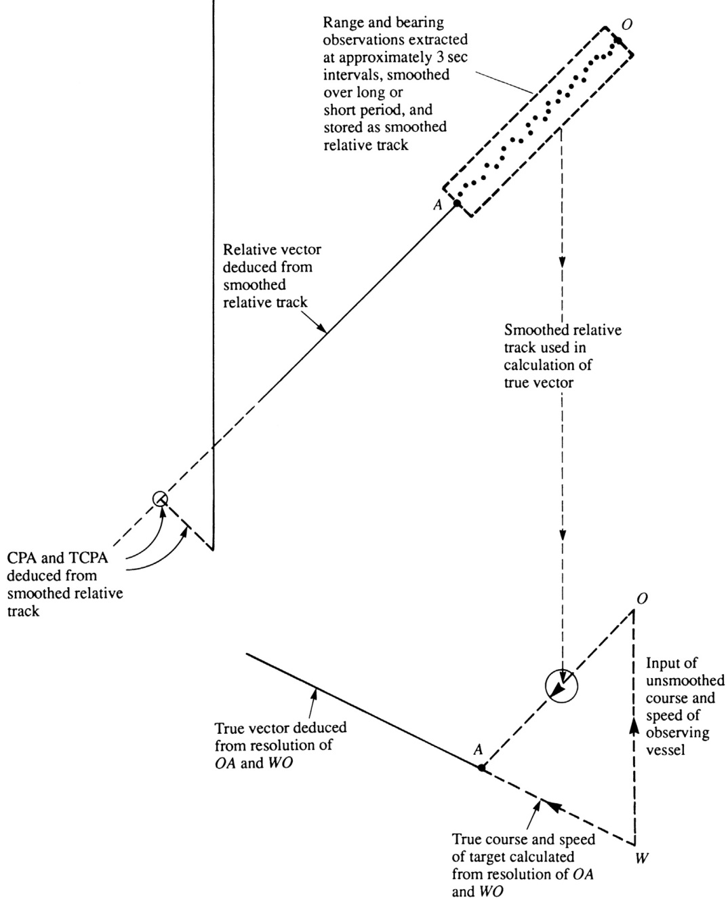  
FIGURE 4.7 The storage of relative data.  

【翻译】
图4.7 相对数据的存储。

【解读】
该图展示了相对数据在计算机系统中的存储方式，可能涉及数据库或文件系统的组织结构，以便于高效地检索和管理这些数据。

【词汇表】
| 英文词汇 | 中文翻译 | 解释 |
| --- | --- | --- |
| Relative Data | 相对数据 | 指在特定情境下相关联的数据，通常需要根据某种逻辑关系进行存储和管理。|
| Storage | 存储 | 计算机中保存数据的过程或位置，可以是硬盘、内存等。|
| Database | 数据库 |一种有组织的电子数据集合，用于高效地存储、检索和管理数据。|

If the relative-motion data relating to the target is requested, the computer will calculate that information by vector addition of the instantaneous input course and speed data to the smoothed true track of the target. Where trial manoeuvre data (see Section 4.4.3) is requested, the vector addition will involve the smoothed true track and the proposed course and speed.  

【翻译】
如果需要与目标相关的相对运动数据，计算机将通过瞬时输入航向和速度数据与目标的平滑真实轨迹进行矢量加法来计算这些信息。在请求试验机动数据（见第4.4.3节）时，矢量加法涉及平滑真实轨迹和拟议航向与速度。

【解读】
本段主要讨论计算机如何根据不同情况计算与目标相关的相对运动数据。它提到了两种情况：一种是直接利用目标的平滑真实轨迹和当前输入的航向、速度数据；另一种是在试验机动数据的场景下，考虑的是目标的平滑真实轨迹以及拟议的航向和速度。这意味着计算机可以根据不同的需求灵活地调整计算方法，以获得所需的相对运动数据。

【词汇表】
| 英文词汇 | 中文翻译 | 解释 |
| --- | --- | --- |
| Relative-motion data | 相对运动数据 | 指两个或多个物体之间的运动关系数据 |
| Vector addition | 矢量加法 | 一种数学运算，用于计算两个或多个矢量的总和 |
| Instantaneous input course and speed data | 瞬时输入航向和速度数据 | 指在某一特定时刻输入的航向和速度信息 |
| Smoothed true track | 平滑真实轨迹 | 对原始轨迹数据进行处理以去除噪音后的精确轨迹 |

The merit of this approach is that if the observing vessel manoeuvres, the relative vector will remain stable (though changing) because it is updated, rotation by rotation, being calculated from the smoothed true course of the target and the instantaneous course and speed of the observing vessel. On the debit side it would appear at first sight that the calculated relative-motion of the target is dependent on the accuracy of the input course and speed data. This is not the case provided that the input course and speed data are consistent over a full smoothing period. If the input data error is constant for the full smoothing period, the smoothed true track will of course similarly be in error. The computer will then use the wrong input data and the consistently wrong true track and as a result will arrive at the correct relative-motion (see Figures 4.8 and 9.7(b)).  

【翻译】
这种方法的优点在于，如果观察船进行机动，相对向量将保持稳定（尽管会变化），因为它是通过更新、旋转计算得出的，基于目标的平滑真实航迹和观察船的瞬时航向和速度。然而，从负面来看，乍一看似乎计算出的目标的相对运动依赖于输入航向和速度数据的准确性。但是，只要输入的航向和速度数据在整个平滑周期内保持一致，这就不是问题。如果输入数据错误在整个平滑周期内保持不变，那么平滑后的真实航迹当然也会有相同的错误。计算机会使用错误的输入数据和一致的错误真实航迹，最终得到正确的相对运动（见图4.8和9.7（b））。

【解读】
本段讨论了一种计算目标相对运动的方法及其优缺点。这种方法可以根据观察船的机动情况实时更新相对向量，使其保持稳定，但同时也依赖于输入数据的准确性。然而，只要输入数据在一定周期内保持一致，即使存在错误，也不会影响最终结果的准确性。这意味着该方法具有自我纠正的能力，可以在一定程度上抵消输入数据中的错误。

【词汇表】
| 英文词汇 | 中文翻译 | 解释 |
| --- | --- | --- |
| merit | 优点 | 指某事物或方法的优势或好处 |
| manoeuvres | 机动 | 指船只或飞行器等进行的各种操作或动作 |
| relative vector | 相对向量 | 指两个物体之间的位置或运动关系的矢量表示 |
| smoothing period | 平滑周期 | 指数据处理中用于平滑或平均化数据的时间间隔 |
| consistent | 一致 | 指数据或信息在一定范围内保持相同或相似的特征 |

It is thus evident that, provided any error in the input course and speed data is consistent for the full smoothing period, it will not affect the accuracy of the CPA/TCPA data. However, if there is a fluctuating error, for example due to an erratic log input, the relative vector will be inaccurate and unstable. While recognizing the advantage of this approach in ensuring relative data stability during manoeuvres by the observing vessel, many users are concerned about the ability of random input errors to influence the CPA. Most users are prepared to tolerate some degree of instability or inaccuracy of true vectors when the observing vessel is performing a manoeuvre, but most, if not all, believe that the CPA is inviolate.  

【翻译】
因此，很明显，只要输入的航向和速度数据在整个平滑期内的一致性错误是相同的，就不会影响CPA/TCPA数据的准确性。然而，如果存在波动性的错误，例如由于不规则的日志输入，相对向量就会变得不准确且不稳定。在认识到这种方法在保证观察船机动过程中相对数据稳定性的优势的同时，许多用户担心随机输入错误会影响CPA。大多数用户准备容忍真实向量在观察船进行机动时出现一定程度的不稳定或不准确，但大多数人，甚至所有人，都认为CPA是不可侵犯的。

【解读】
本段讨论了CPA（最近接近点）/TCPA（时间最近接近点）数据的准确性与输入数据错误之间的关系。作者指出，只要输入数据的错误保持一致，就不会影响CPA/TCPA数据的准确性。但如果输入数据存在波动性的错误，则会导致相对向量不准确且不稳定。同时，也提到了用户对于CPA准确性的关注和对其不可侵犯性的信念。

【词汇表】
| 英文词汇 | 中文翻译 | 解释 |
| --- | --- | --- |
| CPA | 最近接近点 | 船只与目标物体之间最近的距离点 |
| TCPA | 时间最近接近点 | 船只与目标物体之间最近的距离点所对应的时间点 |
| erratic | 不规则的 | 指行为、运动等不按照正常规律进行 |
| manoeuvre | 机动 | 指船只或飞行器等进行的特定动作或操作 |

# 4.3.6.4 Storage Philosophies Compared  

The two forms of storage which in general terms are described above represent two different approaches to dealing with the difficulty of maintaining stable tracking data when the observing vessel manoeuvres. This is an inherent difficulty which is experienced whether the plotting is carried out manually or automatically and arises from the fact that the basic information, that is range and bearing, is being measured from a moving vessel. The implications for tracking accuracy are discussed further in Section 9.5.3. However, at this stage it has to be emphasized that the observer must be alert to the likelihood of the data being inaccurate during non-steady-state conditions, and to the way in which the method of track storage will influence the nature of these inaccuracies.  

【翻译】
上述两种存储形式代表了处理观测船只机动时稳定跟踪数据困难的两种不同方法。这是一个固有的困难，无论是手动还是自动绘制，都会遇到这种情况，因为基本信息（即距离和方位）是在移动的船只上进行测量的。跟踪精度的影响在第9.5.3节中进一步讨论。但是，在这一阶段，必须强调观察者需要警惕地意识到数据在非稳态条件下可能不准确，以及跟踪存储方法将如何影响这些不准确性的性质。

【解读】
本段主要讨论跟踪数据存储的两种形式及其对应的处理方法，特别是在观测船只机动的情况下。由于观测数据来自移动的船只，因此无论采用手动还是自动方式，都存在数据不准确的问题。因此，观察者需要注意数据的潜在错误，并了解不同的存储方法如何影响这些错误。

【词汇表】
| 英文词汇 | 中文翻译 | 解释 |
| --- | --- | --- |
| manoeuvres | 机动、操纵 | 指船只或其他载体的运动或操作 |
| stable | 稳定 | 指系统或状态保持不变或一致 |
| steady-state | 稳态 | 指系统或状态达到平衡，不再变化 |
| inaccuracies | 不准确性、误差 | 指数据或结果与真实值之间的偏差或差异 |

# 4.3.7 Target Trails and Past Positions  

Older ARPA regulations termed past data as ‘target history’ and the information was required to be provided by four past plots at predefined intervals (2 min was common). At the same time similar information could theoretically be observed from the target trails which at one time were a natural afterglow from the target in the phosphorous of the old CRT display technology then in use. This afterglow was a side effect, but observers found it very useful as an indication of target trend, for reasons explored more fully in the next paragraph. However, as data became digitized, CRT technology moved on and was replaced by LCD and other technologies, these target trails have had to be artificially inserted by the manufacturers. As the trails are now artificial, the time length of these trails can be controlled on the display, which means they provide similar timed historical data as the ‘history plots’. The modern regulations (below) allow either or both modes of presentation, the past positions (still often called ‘history’ plot or dot) and the target trails.  

【翻译】
早期的ARPA法规将过去的数据称为“目标历史记录”，要求每隔一定时间（通常为2分钟）由四个过去的轨迹图提供信息。在同一时间，观察者可以从目标轨迹中理论上观察到类似的信息，这些轨迹曾经是老式CRT显示技术中目标在磷光体中的自然余晖。这种余晖是一个副作用，但观察员发现它对判断目标趋势非常有用，下一段将更详细地探讨这一点。然而，当数据变得数字化时，CRT技术被更新，LCD和其他技术取而代之，制造商不得不人工插入这些目标轨迹。由于这些轨迹现在是人工的，它们的长度可以在显示屏上控制，这意味着它们提供了与“历史图”类似的定时历史数据。现代法规（见下文）允许使用两种或两种以上的显示模式，即过去的位置（仍常被称为“历史图”或“历史点”）和目标轨迹。

【解读】
本段主要介绍了ARPA法规中关于目标历史记录的规定，以及随着技术进步，尤其是CRT显示技术向LCD等新技术转变后，目标轨迹的呈现方式发生的变化。通过比较传统的“历史图”和现代的目标轨迹，强调了观察目标趋势的重要性以及技术进步带来的便利。

【词汇表】
| 英文词汇 | 中文翻译 | 解释 |
| --- | --- | --- |
| ARPA | 高级研究计划局 | 美国国防部的一个研究机构，负责开发新的军事技术。 |
| Target History | 目标历史记录 | 指过去目标的位置和运动轨迹的记录。 |
| Phosphor | 磷光体 |CRT显示器中的一层物质，可以发光显示图像。 |
| CRT | 阴极射线管 | 一种传统的显示技术，使用电子枪扫描磷光体来显示图像。 |
| LCD | 液晶显示器 | 一种较新的显示技术，使用液晶来控制光线的透过度，从而显示图像。 |

Variable length (time) target trails should be provided, with an indication of trail time and mode. It should be possible to select true or relative trails from a reset condition for all true-motion display modes.  

【翻译】
应提供可变长度（时间）的目标轨迹，包括轨迹时间和模式的指示。对于所有真实运动显示模式，从复位条件下应该可以选择真实或相对轨迹。

【解读】
本段强调在设计系统时，需要考虑到用户可能需要观察不同长度和模式的目标轨迹，并且这些轨迹应该能够从一个初始状态开始计算。这意味着系统不仅要能记录和显示运动轨迹，还要允许用户自定义轨迹的显示方式，以满足不同的分析需求。

【词汇表】
| 英文词汇 | 中文翻译 | 解释 |
| --- | --- | --- |
| Variable length | 可变长度 | 指的是轨迹的长度可以根据需要进行调整 |
| Target trails | 目标轨迹 | 指的是被跟踪或监测的物体或信号的运动路径 |
| True-motion display modes | 真实运动显示模式 | 指的是以真实的速度和方向显示运动的模式 |
| Reset condition | 复位条件 | 指的是系统或设备恢复到最初状态的条件或动作 |

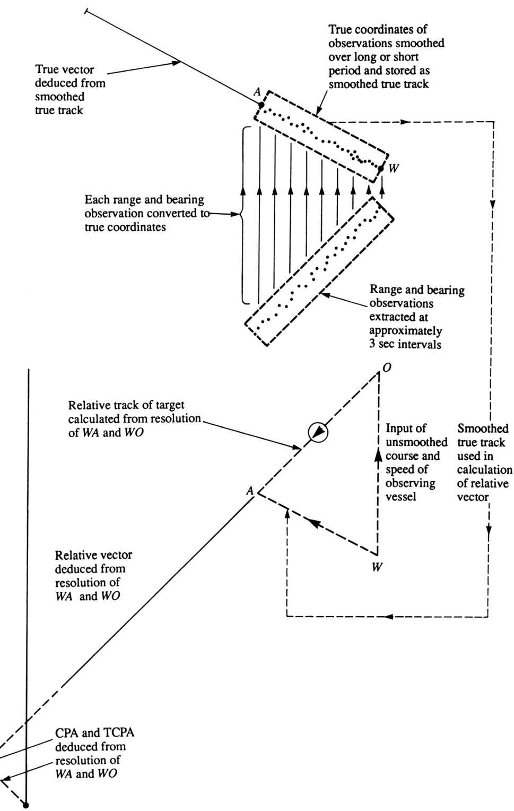  
FIGURE 4.8 The storage of true data.  

【翻译】
图4.8 真实数据的存储。

【解读】
该图表明了真实数据在系统中的存储方式，展示了如何组织和保存真实信息，以便于后续的处理、分析或检索。

【词汇表】
| 英文词汇 | 中文翻译 | 解释 |
| --- | --- | --- |
| Storage | 存储 | 将数据保存在计算机或其他设备中以备使用 |
| True Data | 真实数据 | 指的是准确、可靠的信息或数字 |
| Figure | 图表/图形 | 一种用于说明或展示信息的视觉表现形式 |

1. The trails should be distinguishable from targets.   
2. Either scaled trails or past positions or both should be maintained and should be available for presentation within two scans or equivalent, following: ! the reduction or increase of one range scale; the offset and reset of the radar picture position; and a change between true and relative trails.  

【翻译】
1. 小道（或轨迹）应该与目标能够区分开来。
2. 无论是缩放的小道还是过去的位置，或者两者都应被维持，并且在两个扫描周期内或等效时间内对变化做出反应，包括：范围刻度的减小或增大；雷达图像位置的偏移和重置；以及在真实轨迹和相对轨迹之间的切换。

【解读】
该段落主要讨论了雷达系统中轨迹显示的要求，强调了轨迹与目标的可区分性，以及系统对不同操作模式（如范围刻度改变、位置偏移和轨迹类型切换）的快速响应能力。这意味着一个良好的雷达系统不仅需要清晰地展示目标，还要能根据不同的操作需求灵活调整轨迹的显示方式，以便于观察和分析。

【词汇表】
| 英文词汇 | 中文翻译 | 解释 |
| --- | --- | --- |
| Trails | 轨迹/小道 | 在雷达屏幕上显示的移动目标路径 |
| Targets | 目标 | 雷达探测到的物体，如飞机、船只等 |
| Scaled trails | 缩放的小道 | 根据距离或速度等因素缩放显示的轨迹 |
| Relative trails | 相对轨迹 | 以观察点为参考的轨迹显示方式 |
| True trails | 真实轨迹 | 绝对坐标系中的轨迹显示方式 |

The past data enables an observer to check whether a particular target has manoeuvred in the recent past, possibly while the observer was temporarily away from the display on other bridge duties. Not only is this knowledge useful in showing the observer what has happened, but it may well help him to form an opinion of what the target is likely to do in the future. Manoeuvres by targets may be for navigational purposes and it may be possible to gain an indication from the general overview that this is the case. Alternatively, there may be an indication from the nature of the manoeuvre, when considered in relation to the general traffic pattern, that it has been undertaken for collision avoidance and hence the observer can be alert for a resumption of previous conditions.  

【翻译】
过去的数据使观察者能够检查目标在最近的过去是否进行了机动，可能是在观察者暂时离开显示屏执行其他桥梁职责期间。这一知识不仅有助于向观察者展示发生了什么，而且还可以帮助他们形成对目标未来行为的看法。目标的机动可能出于导航目的，从总体概况中可能获得一个指示，即这是这种情况。或者，当考虑到一般交通模式时，机动的性质可能会产生一个指示，即它是为了避免碰撞而采取的，因此观察者可以为恢复以前的条件做好准备。

【解读】
本段主要讨论使用历史数据来分析和预测目标（如船只或飞机）的行为。通过查看过去的机动，可以更好地了解目标的意图和可能的未来行动，这对于防止碰撞和确保安全尤其重要。同时，也提到了目标的机动可能出于不同的目的，如导航或避免碰撞，并强调了观察者需要根据这些信息做出相应的判断和反应。

【词汇表】
| 英文词汇 | 中文翻译 | 解释 |
| --- | --- | --- |
| manoeuvre | 机动、操纵 | 指改变方向、速度或位置的操作 |
| navigational | 导航的 | 与导航有关，用于确定位置、规划路线等 |
| collision avoidance | 避让碰撞 | 采取措施以避免与他物体发生碰撞 |
| resumption | 恢复 | 再次开始或继续某种状态或活动 |

The past positions or history plots provide slightly better quality information on the history, because although the trails provide good information in changes of direction of target past motion, the only time references are the current position and the end of the trail. The provision of (say) four-time specific history dots would better indicate changes in speed of motion across the display. This is demonstrated by comparing the ‘slowing target’ in Figure 4.9 and the same target in Figure 4.10a.  

【翻译】
过去的位置或历史轨迹图能够提供略微更好的质量信息来描述目标物体的历史运动，因为尽管轨迹能够很好地显示出目标物体过去运动方向的变化，但时间参考点只有当前位置和轨迹的终点。提供（例如）四个特定时间的历史点能够更好地指示目标物体在整个显示区域内速度变化的情况。这一点可以通过比较图4.9中的“减速目标”和图4.10a中的同一目标来演示。

【解读】
本段讨论的是如何更好地表示目标物体的历史运动轨迹和速度变化。作者认为，提供特定时间的历史点能够更准确地展示目标物体的速度变化情况，而不是仅凭借当前位置和轨迹的终点。这种方法能够帮助观察者更好地理解目标物体的运动规律和速度变化。

【词汇表】
| 英文词汇 | 中文翻译 | 解释 |
| --- | --- | --- |
| trails | 轨迹 | 指目标物体运动的路径 |
| time references | 时间参考点 | 用于确定事件发生时间的基准点 |
| history dots | 历史点 | 指目标物体在特定时间的位置 |
| slowing target | 减速目标 | 指目标物体的速度正在减慢的状态 |

However, a problem with the history plots is that they make the screen look more cluttered and they can be very confusing on short ranges and heavy traffic when the plots of different targets start crossing and overlapping each other. These are situations when the observer needs to have no ambiguity. The trails have the advantage of more clearly identifying to which target they belong.  

【翻译】
然而，历史记录图表存在一个问题：它们使屏幕看起来更加混乱，当不同目标的图表在短距离和高交通量的情况下开始交叉和重叠时，它们可能会非常令人困惑。在这些情况下，观察者需要清晰无歧义的信息。轨迹有明显的优势，即更清楚地标识出属于哪个目标。

【解读】
这段话讨论了使用历史记录图表来跟踪目标的缺点，特别是在复杂环境中容易产生混淆和视觉干扰。作者指出，在这种情况下，使用轨迹可以更好地避免歧义，帮助观察者快速准确地辨别目标。

【词汇表】
| 英文词汇 | 中文翻译 | 解释 |
| --- | --- | --- |
| cluttered | 混乱的 | 指视觉或空间上杂乱无序的状态 |
| ambiguity | 歧义 | 指信息或情况不明确，容易引起误解的状态 |
| trails | 轨迹 | 指物体运动路径的可视化表示 |
| overlapping | 重叠 | 指两个或多个物体或图形部分相互覆盖的状态 |

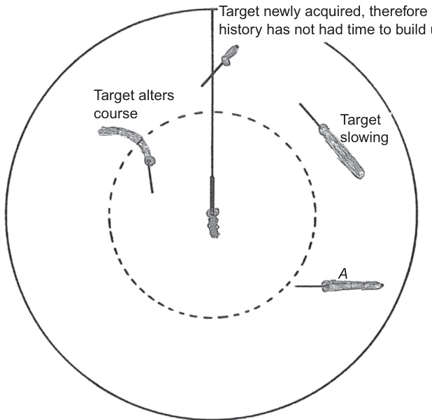  
FIGURE 4.9 True Target Trails, with targets maneuvering.  

【翻译】
图4.9真实目标轨迹，目标正在进行机动。

【解读】
该图显示了在实际环境中，目标物体（如飞机、导弹等）可能会进行机动，这使得追踪它们变得更加复杂。这张图可能出自一篇关于目标跟踪算法或系统的文章或者书籍，用于说明真实世界中的目标跟踪问题的挑战性。

【词汇表】
| 英文词汇 | 中文翻译 | 解释 |
| --- | --- | --- |
| Targets | 目标物体 | 在这里指的是需要被跟踪的物体，如飞机、导弹等 |
| Maneuvering | 机动 | 指目标物体能够改变其运动状态，如速度、方向等 |
| Trails | 轨迹 | 指目标物体运动时留下的路径或痕迹 |

‘True history’ is without doubt the only meaningful way in which this data can be displayed, since the nature of the manoeuvre is readily apparent. A curve in the trail indicates an alteration of course by the target, whereas a change in the spacing of the plots will occur when there has been a change in speed. Since changes in speed are much slower to take effect, they are consequently more difficult to detect.  

【翻译】
毫无疑问，“真实历史”是展示这些数据的唯一有意义的方式，因为从中可以清晰地看出操作的性质。在轨迹上出现曲线，表示目标改变了方向，而当目标速度发生变化时，图上的点之间的间距就会发生变化。由于速度变化需要更长时间才能生效，因此相对来说，它们也更加难以被检测到。

【解读】
这段话讨论的是如何有效地展示某些与运动或追踪相关的数据，以便于分析和理解。作者认为，将数据按照“真实历史”的顺序呈现，是最有意义的方法，因为这样可以直观地看到目标的运动轨迹、方向变化以及速度变化。这种方法使得分析者能够快速识别出目标的行为模式，从而做出相应的判断或决策。

【词汇表】
| 英文词汇 | 中文翻译 | 解释 |
| --- | --- | --- |
| True history | 真实历史 | 按照实际发生的时间顺序来记录和展示事件或数据的方法 |
| Manoeuvre | 操作/机动 | 指在特定环境下进行的复杂或协调一致的行动或运动 |
| Alteration | 改变 | 指事物状态、形式或性质的变化 |
| Detect | 检测 | 发现或发现某种情况、问题或变化 |

‘Relative history’ is not always provided but where it is, it is important to remember that any change in the direction or spacing of the plots can result from a change of course, a change of speed, or a combination of the two. It is therefore essential that the true manoeuvre is identified. Relative history should be used with great caution (see Section 7.4.2). Relative history will not be considered further.  

【翻译】
“相对历史”并不总是被提供，但是在它被提供的情况下，必须记住任何改变航向或间隔的图表可能是由于航线变化、速度变化或者两者的结合所导致的。因此，确定真正的机动行为是非常必要的。“相对历史”应该谨慎使用（见第7.4.2节）。此处不再进一步讨论“相对历史”。

【解读】
本段强调了在分析“相对历史”时需要谨慎，因为小的变化可能由多种因素引起，如航线或速度的调整。正确识别真实的机动行为至关重要，以避免误解。

【词汇表】
| 英文词汇 | 中文翻译 | 解释 |
| --- | --- | --- |
| Relative history | 相对历史 | 指两个或多个物体之间位置和运动关系随时间变化的记录 |
| Manoeuvre | 机动行为 | 指船只、飞机等载具的操作或控制方式 |
| Caution | 谨慎 | 指处理事务时应有的小心和警惕态度 |

The history plots can be likened to a vessel dropping buoys (with radar reflectors) at equal intervals of time, thus a change in the spacing is indicative of a change in the target’s speed, but it is important to appreciate the significance of the distance between the echo and the last plot. For example, in Figure 4.10, target $A$ has not just executed a crash stop but has just dropped a buoy and is now steaming away from it.  

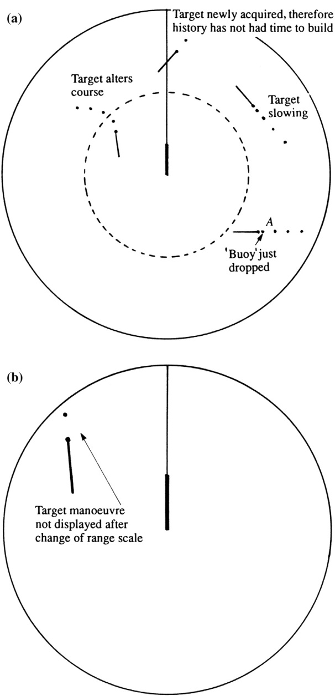  
FIGURE 4.10 Tracking history: (a) 12-mile and (b) 6 mile range scale.  

【翻译】
图4.10 跟踪历史：（a）12英里和（b）6英里范围尺度。

【解读】
该图显示了跟踪历史记录，分别以12英里和6英里的范围尺度来表示。这可能是在某种导航或监控系统中用到的地图或雷达图像，用于展示目标物体或事件在不同距离下的移动轨迹。

【词汇表】
| 英文词汇 | 中文翻译 | 解释 |
| --- | --- | --- |
| Tracking | 跟踪 | 监测和记录物体或事件的运动轨迹 |
| Range | 范围 | 指一定距离或尺度内的区域或空间 |
| Scale | 尺度 | 用于衡量或表示大小、距离等的标准单位或比例 |

When history plots are requested, only those of tracked targets can be displayed, and even then the number of plots which are displayed will depend upon the period for which a particular target has been tracked. A target which has been tracked for 2 min can only display a maximum of 2 min worth of history and so probably only one plot will be displayed, others being added as the tracking period increases.  

【翻译】
当请求历史记录图表时，只有被跟踪目标的图表可以显示，而且即使如此，显示的图表数量也取决于特定目标被跟踪的时间段。一个被跟踪了2分钟的目标只能显示最多2分钟的历史记录，因此可能只会显示一条图表，随着跟踪时间的增加，其他图表会被添加。

【解读】
本段主要讨论的是历史记录图表的显示规则。当用户要求查看历史记录图表时，系统只会显示那些正在被跟踪的目标的图表。而且，即使这些目标的图表可以显示，其显示的数量也受到跟踪时间的限制。只有当目标被跟踪的时间足够长时，才会显示更多的图表。这意味着系统的历史记录功能是动态的，会根据跟踪数据的变化而更新。

【词汇表】
| 英文词汇 | 中文翻译 | 解释 |
| --- | --- | --- |
| plot | 图表 | 一种用于展示数据趋势或关系的视觉表现形式 |
| tracked targets | 被跟踪目标 | 指那些正在被监测或追踪的对象或实体 |
| period | 时间段 | 指一段特定的时间长度 |
| tracking period | 跟踪时间 | 指对某个目标进行跟踪的时间长度 |

Some manufacturers cause the plots to flash sequentially, for example 2 min ago, 4 min ago, while others cause the plots to decrease in brightness or size with time. The last plot is always removed as the latest plot is added to the display. Users usually have control of the number of plots and the time spacing between plots.  

【翻译】
一些制造商会让图表顺序闪现，例如2分钟前、4分钟前等，而其他制造商则会随着时间的推移降低图表的亮度或大小。最新的图表被添加到显示屏上时，最后一个图表总是被删除。用户通常可以控制图表的数量以及图表之间的时间间隔。

【解读】
本段主要描述了不同制造商对图表显示的处理方式，以及用户对图表的控制权。通过这种方式，可以更好地管理和展示数据，提高用户体验。

【词汇表】
| 英文词汇 | 中文翻译 | 解释 |
| --- | --- | --- |
| sequentially | 顺序 | 按照一定的顺序进行 |
| brightness | 亮度 | 物体发出的光的强弱程度 |
| spacing | 间隔 | 两个物体或事件之间的距离或时间差 |
| display | 显示 | 在屏幕或界面上呈现信息或图像 |

Uneven tracks of targets or apparent instability of motion may be taken to indicate that tracking of that target is less precise than it might be and the displayed data should be treated with caution.  

【翻译】
不均匀的目标轨迹或运动的明显不稳定性可能表明对该目标的跟踪精度低于预期，因此显示的数据应谨慎处理。

【解读】
这段话强调了在追踪目标时，轨迹的不均匀或者运动的不稳定性可能是跟踪精度较低的指标，这意味着得到的数据可能存在一定的误差或不确定性，需要谨慎对待和进一步验证。

【词汇表】
| 英文词汇 | 中文翻译 | 解释 |
| --- | --- | --- |
| Uneven | 不均匀的 | 指事物的状态、形状或分布不一致或不平衡 |
| Targets | 目标 | 在这里指的是被跟踪或观察的对象 |
| Precise | 精确的 | 指某种测量、计算或操作的准确程度高 |
| Caution | 谨慎 | 小心、注意避免错误或风险的态度 |

Because of the variations in the way this facility can operate, great care should be taken when observing history to ensure that one is certain of exactly what is being displayed. In particular, one must establish whether true or relative history is being displayed and also which time spacings are in use.  

【翻译】
由于该设施操作方式的多样性，在观察历史时必须谨慎，以确保自己清楚地了解正在显示的内容。特别是，必须确定是否显示的是真实历史还是相对历史，以及使用哪种时间间隔。

【解读】
本段强调了在观察历史记录时需要谨慎，因为历史记录可能以不同的形式呈现，包括真实历史和相对历史，并且时间间隔也可能有所不同。因此，观察者需要仔细辨别这些差异，以避免误解。

【词汇表】
| 英文词汇 | 中文翻译 | 解释 |
| --- | --- | --- |
| variations | 多样性、变化 | 指事物或情况的不同表现形式 |
| observe | 观察、注意 | 密切关注和研究某事物 |
| relative | 相对的、比较的 | 与其他事物相比而言的状态或程度 |
| time spacings | 时间间隔 | 指两个事件或时刻之间的时间距离 |

# 4.4 VECTORS  

The course and speed information generated by ARPA for acquired targets should be displayed in a vector or graphic form (e.g. PADs, predicted areas of danger, see Section 4.12 and Figure 4.10) which clearly indicates the target’s predicted motion. In this regard:  

【翻译】
ARPA为已获取的目标生成的航向和速度信息应以矢量或图形形式显示（例如PADs，即预测危险区域，请参阅第4.12节和图4.10），清晰地指示目标的预测运动。在这方面：

【解读】
本段强调了在使用自动雷达plotting辅助（ARPA）系统时，对于已经被跟踪的目标，其移动预测信息应该通过直观的图形方式呈现给操作员，以便他们能够快速准确地理解目标的预测轨迹和潜在危险区域。这有助于提高船舶或其他水上作业的安全性和效率。

【词汇表】
| 英文词汇 | 中文翻译 | 解释 |
| --- | --- | --- |
| ARPA | 自动雷达plotting辅助 | 一种用于辅助雷达目标跟踪和预测的系统 |
| Vector | 矢量 | 在图形表示中，用箭头线段表示方向和大小的量 |
| Graphic | 图形 | 使用图像、符号等来表示数据或信息的形式 |
| PADs | 预测危险区域 | 根据目标预测运动计算出的可能存在碰撞风险的区域 |

1. ARPA (or auto-tracking) presenting predicted (extrapolated) information in  

【翻译】
ARPA（或自动跟踪）呈现预测（外推）的信息，

【解读】
该段落提到了ARPA，即自动跟踪技术，该技术能够呈现预测或外推的信息。这意味着ARPA可以根据历史数据或模式来预测未来可能发生的事件或趋势，并以某种形式呈现出来。

【词汇表】
| 英文词汇 | 中文翻译 | 解释 |
| --- | --- | --- |
| ARPA | 自动跟踪技术 | 一种能够自动跟踪和预测信息的技术 |
| extrapolated | 外推的 | 根据已知数据或模式来预测未知信息 |
| predicted | 预测的 | 根据历史数据或模式来预测未来可能发生的事件或趋势 |

vector form only, should have the option o true and relative vectors. There should be an indication of the vector mode selected and, if true vector mode is selected, the display should show whether it is sea or ground stabilized.   
2. An ARPA (or auto-tracking) which is capable of presenting target course and speed information in graphic form should also, on request, provide the target’s true and/or relative vector. (Note: This means that vectors of some kind must be provided, irrespective of the availability of any other method such as PADs, used to display collision-avoidance information.)   
3. Vectors displayed should be time adjustable.   
4. A positive indication of the timescale of the vector in use should be given.  

【翻译】
向量形式应具有真实向量和相对向量选项。应有指示选择的向量模式，如果选择了真实向量模式，显示应显示是否为海上或陆地稳定化。 
2. 能够以图形形式呈现目标航向和速度信息的ARPA（或自动跟踪）系统，也应在请求时提供目标的真实和/或相对向量。（注：这意味着必须提供某种类型的向量，无论是否有其他方法，如PADs，用于显示碰撞避免信息。）
3. 显示的向量应是可调节时间的。
4. 应给出使用的向量的时间尺度的正面指示。

【解读】
本段落主要讨论的是有关向量显示的要求，特别是在船舶导航和防碰撞系统中。它强调了向量显示应具有灵活性，包括真实向量和相对向量的选项，以及显示当前的向量模式和时间尺度。同时，它也提到了ARPA系统的功能要求，包括提供目标的航向、速度和向量信息。这些要求旨在提高导航安全性和效率。

【词汇表】
| 英文词汇 | 中文翻译 | 解释 |
| --- | --- | --- |
| Vector | 向量 | 在这里指的是表示方向和大小的线段，常用于表示物体的运动状态 |
| ARPA | 自动雷达plotter和跟踪系统 | 一种自动跟踪和绘制雷达目标的系统 |
| Stabilized | 稳定化 | 指的是通过一定的机制使得设备或显示保持在一个稳定的状态，不受外界影响而变化 |
| Timescale | 时间尺度 | 指的是用来衡量时间长度的标准单位，在这里特指向量的时间参考系 |

Vectors must be capable of indicating the rate and direction of the target’s relative motion (relative vectors), or indicating the rate and direction of the target’s proper motion (true vectors). The direction and rate forecast by a true vector will only be fulfilled if the tracked target maintains its course and speed. In the case of a relative vector, the fulfilment depends additionally on the observing vessel similarly maintaining course and speed.  

【翻译】
矢量必须能够指示目标相对运动的速率和方向（相对矢量），或指示目标自身运动的速率和方向（真实矢量）。真实矢量预测的方向和速率只有在被跟踪的目标保持其航向和速度的情况下才会实现。在相对矢量的情况下，其实现还取决于观察船只同样保持航向和速度。

【解读】
本段主要讨论了矢量在跟踪目标运动中的应用，特别是相对矢量和真实矢量的区别。相对矢量考虑的是目标与观察者之间的相对运动，而真实矢量则关注目标的绝对运动。两者的预测结果都依赖于目标和观察者的运动状态，这意味着在实际应用中需要综合考虑多种因素以获得准确的预测结果。

【词汇表】
| 英文词汇 | 中文翻译 | 解释 |
| --- | --- | --- |
| Vectors | 矢量 | 数学和物理学中表示大小和方向的量 |
| Relative motion | 相对运动 | 指两个物体之间的相对位置、速度和加速度变化 |
| True vectors | 真实矢量 | 表示目标自身运动的矢量，与观察者无关 |
| Fulfilment | 实现 | 指预测结果是否符合实际情况 |

In all cases, the displayed vector length is time related and is adjustable by using a ‘vector length’ control. An alternative approach is to have a default physical length which remains the same irrespective of the range scale, for example 3 min on the 6 NM range scale, 6 min on the $12\mathrm{NM}$ range scale.  

Note: Vectors of either of the two types can be displayed on a true- or relative-motion radar picture presentation, that is true vectors can be selected to appear on a relative-motion presentation and vice versa. It was originally considered in some quarters that this might result in confusion and at least one manufacturer has in the past provided a default condition where relative vectors are displayed when relative-motion is selected and, likewise, true vectors on the truemotion presentation, with the alternative vector mode being temporarily selectable in each case by the user holding down a virtual or real ‘spring-loaded’ control (see also Section 9.6.1, incorrect interpretation).  

【翻译】
注意：两种类型的矢量都可以显示在真实运动或相对运动的雷达图像中，即真实矢量可以选择出现在相对运动的图像中，反之亦然。最初，一些人认为这可能会导致混淆，至少有一家制造商曾经提供了一个默认设置，当选择相对运动时显示相对矢量，而当选择真实运动时则显示真实矢量，在每种情况下，用户都可以通过按住虚拟或真实的“弹簧加载”控制（见9.6.1节，错误解释）临时切换到另一种矢量模式。

【解读】
本段主要讨论的是雷达系统中矢量的显示问题，特别是真实矢量和相对矢量如何在不同运动模式下的显示。它提到了由于两种类型的矢量可以在任意一种运动模式下显示，这可能会引起操作者的混淆。为了解决这个问题，一些制造商采取了默认设置和临时切换的方法，以便用户能够根据需要选择合适的矢量模式。

【词汇表】
| 英文词汇 | 中文翻译 | 解释 |
| --- | --- | --- |
| Vector | 矢量 | 在此 contexto 指向量，描述物体的方向和大小 |
| Relative-motion | 相对运动 | 一种运动模式，描述相对于观察者或其他参考点的运动 |
| True-motion | 真实运动 | 另一种运动模式，描述绝对的、不依赖于观察者或其他参考点的运动 |
| Spring-loaded | 弹簧加载 | 一种控制方式，需要用户持续按压才能保持某种状态或功能 |

# 4.4.1 Relative Vectors  

As described in Section 4.3.6, the ARPA must track the target(s) for a period of time, after which a vector can be displayed as in Figure 4.11(a). Using the vector length control, the vectors can be extended to determine the CPA by observation against the background of the range rings and the TCPA can be read off from the vector length control.  

【翻译】
如第4.3.6节所述，ARPA必须在一段时间内跟踪目标，然后可以像图4.11（a）中那样显示一个矢量。使用矢量长度控制，可以延伸矢量以确定CPA（最接近点），通过观察范围环与TCPA（最接近时间点）的背景，可以从矢量长度控制中读取TCPA。

【解读】
本段描述了自动雷达测距和方位系统（ARPA）的一种应用，即利用矢量表示法来计算船舶或物体的最接近点（CPA）和最接近时间点（TCPA）。这涉及到对目标进行跟踪，一旦有足够的数据，就可以通过矢量长度控制来估算这些参数，从而辅助航行决策。

【词汇表】
| 英文词汇 | 中文翻译 | 解释 |
| --- | --- | --- |
| ARPA | 自动雷达测距和方位系统 | 一种用于海事领域的雷达系统，能够自动检测和跟踪目标。 |
| CPA | 最接近点 | 指两个移动物体之间在某一时刻的最近距离。 |
| TCPA | 最接近时间点 | 指两个移动物体之间最接近的时间点。 |
| Vector | 矢量 | 在此 contexto 中指表示方向和大小的线段，用于表示运动的速度和方向。 |

# 4.4.2 True Vectors  

As an alternative, the observer may request that the true vector(s) be displayed (Figure 4.11(b)). In this case, the own ship will also have a vector which will increase in length as the time control is increased. The likelihood of a close-quarters situation developing can be ascertained by running out the true vectors progressively to show the predicted development of the encounter. The dynamic nature of this technique appeals to many users, but it must be borne in mind that any evaluation of CPA/TCPA is a matter of trial and error and thus is better avoided. It is essential to appreciate that the CPA is not represented by the point at which the target’s true vector intersects the own ship’s true vector, except in the case of zero CPA.  

【翻译】
作为一种替代方法，观察者可以请求显示真实向量（图4.11（b））。在这种情况下，自己的船只也会有一个向量，当时间控制增加时，该向量的长度也会增加。通过逐步展开真实向量，可以预测接近距离的情况的发展，从而确定这种情况发生的可能性。这种技术的动态性质吸引了许多用户，但是必须记住，任何对最接近点/时间最接近点（CPA/TCPA）的评估都是试错法，因此最好避免。必须理解，最接近点不代表目标的真实向量与自身船只的真实向量相交的点，除非是在零最接近点的情况下。

【解读】
本段讨论的是航海中使用的一种技术，即通过显示真实向量来预测两艘船之间可能发生的接近距离的情况。这种方法可以帮助观察者更好地了解两艘船之间的相对运动关系，但同时也提醒人们要注意评估最接近点/时间最接近点的复杂性和不确定性。

【词汇表】
| 英文词汇 | 中文翻译 | 解释 |
| --- | --- | --- |
| Vector | 向量 | 一种表示方向和大小的数学对象，在这里指的是船只的运动方向和速度 |
| Close-quarters situation | 接近距离情况 | 两艘船之间距离很近，可能导致碰撞或其他安全问题的情况 |
| Trial and error | 试错法 | 一种通过不断尝试和调整来找到解决方案的方法，在这里指的是评估最接近点/时间最接近点的过程 |
| CPA/TCPA | 最接近点/时间最接近点 | 两艘船之间距离最小的点/时间，最接近点是空间位置，时间最接近点是时间点 |

True vectors can be ‘sea stabilized’ or ‘ground stabilized’ depending on the sensors used or the set-up. A more detailed discussion of these issues is reserved for a later chapter (Section 6.9.6).  

【翻译】
真实向量可以根据使用的传感器或设置被“海上稳定”或“地面稳定”。有关这些问题的更详细讨论将在后面的章节中进行（第6.9.6节）。

【解读】
本段主要介绍了真实向量的两个稳定状态，即“海上稳定”和“地面稳定”，这取决于所使用的传感器类型或实验设置。同时，也提到了这些问题会在后续章节中进一步详细讨论。

【词汇表】
| 英文词汇 | 中文翻译 | 解释 |
| --- | --- | --- |
| True vectors | 真实向量 | 指不受外界干扰影响的准确向量值 |
| Sea stabilized | 海上稳定 | 指在海上环境中保持稳定的状态 |
| Ground stabilized | 地面稳定 | 指在地面环境中保持稳定的状态 |
| Sensors | 传感器 | 用于检测和测量物理参数的设备 |

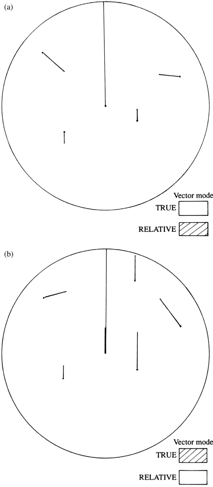  
FIGURE 4.11 Vectors. (a) Relative vectors. (b) True vectors for the situation displayed in (a).  

【翻译】
图4.11向量。（a）相对向量。（b）显示在（a）中情况的真实向量。

【解读】
该图展示了向量的概念，特别是相对向量和真实向量的区别。在物理学和数学中，向量是一个具有大小和方向的量。相对向量通常指的是以某一点为参考点的向量，而真实向量则表示实际的、绝对的位置或运动状态。这两种类型的向量在描述物体的运动、力学等方面都非常重要。

【词汇表】
| 英文词汇 | 中文翻译 | 解释 |
| --- | --- | --- |
| Vector | 向量 | 具有大小和方向的量 |
| Relative | 相对 | 以某一点或条件为参考的 |
| True | 真实 | 实际的、绝对的 |

# 4.4.3 Trial Manoeuvre  

The system should, where required by Table 4.2, be capable of simulating the predicted effects of the own ship’s manoeuvre in a potential threat situation and should include the own ship’s dynamic characteristics. A trial manoeuvre simulation should be clearly identified. The requirements are:  

【翻译】
系统应该能够模拟本船在潜在威胁情况下的预测操纵效果，如表4.2所要求，并且应包括本船的动态特性。试验操纵模拟应清晰地标识。要求如下：

【解读】
该段落描述了一个系统的功能需求，特别是在模拟本船在潜在威胁情况下的操纵效果方面。它强调了系统需要考虑本船的动态特性，并且能够清晰地标识出试验操纵模拟。这意味着该系统旨在为操作员或决策者提供准确的模拟结果，以便他们能够更好地评估和应对可能出现的威胁。

【词汇表】
| 英文词汇 | 中文翻译 | 解释 |
| --- | --- | --- |
| simulate | 模拟 | 使用计算机或其他方法来模仿某一过程或系统的行为 |
| manoeuvre | 操纵 | 船舶、飞机等的驾驶或控制动作 |
| dynamic characteristics | 动态特性 | 指系统或物体在运动或变化时表现出的特征，如速度、加速度等 |
| trial manoeuvre simulation | 试验操纵模拟 | 对某一操纵方案进行模拟试验，以评估其可行性和效果 |

• The simulation of the own ship’s course and speed should be variable.   
• A simulated time to manoeuvre with a countdown should be provided. During simulation, TT should continue and the actual target data should be indicated. The trial manoeuvre should be applied to all tracked targets and at least all activated AIS targets.  

【翻译】
• 本船的航向和速度模拟应该是可变的。
• 应该提供一个带有倒计时功能的模拟时间来进行操纵。在模拟过程中，TT（目标跟踪）应继续运行，并且实际目标数据应被指示。试验性操纵应应用于所有被跟踪的目标，并至少应用于所有已激活的AIS（自动识别系统）目标。

【解读】
这段话主要讨论了船舶模拟训练中的几个关键要求。首先，本船的航向和速度在模拟中应该可以变化，以模拟现实海上各种情况。其次，需要一个带有倒计时功能的模拟时间，让操作员能够在压力下进行操纵训练。在整个模拟过程中，目标跟踪系统应该保持运行状态，同时显示实际目标的数据。最后，这种试验性操纵不仅应该应用于所有被跟踪的目标，还应该包括所有已经激活的自动识别系统（AIS）目标。这意味着模拟训练的设计宗旨是为了提高操作员在真实环境下的反应能力和决策能力。

【词汇表】
| 英文词汇 | 中文翻译 | 解释 |
| --- | --- | --- |
| Simulation | 模拟 | 指通过计算机或其他手段模拟现实世界中某一过程或系统的行为。 |
| Manoeuvre | 操纵 | 在这里指的是船舶的操作或控制，尤其是在特定条件下的操控。 |
| Countdown | 倒计时 | 指从某一数字开始逐步减少直到零的计数过程，常用于任务的启动或结束。 |
| AIS | 自动识别系统 | 一种用于船舶之间、船舶与岸基站之间交换船舶位置、航速等信息的系统，用于增强海上交通安全。 |

The feature is still not a requirement for vessels below 10,000 grt in the latest standards.  

【翻译】
该功能在最新标准中仍不是10,000吨以下船舶的必备要求。

【解读】
这句话指出，对于10,000吨以下的船舶来说，某些特定功能或技术在当前的行业标准中尚未成为强制性要求。这意味着这些船舶可以不具备这一功能而仍然符合现行标准。

【词汇表】
| 英文词汇 | 中文翻译 | 解释 |
| --- | --- | --- |
| vessel | 船舶 | 指各种类型的船只或海上浮动结构 |
| grt | 总吨位 | 计算船舶大小的一种方法，考虑其体积和其他因素 |
| standard | 标准 | 行业或领域内通用的规则或规范 |

With the availability of computer assistance, the problem of predicting the effect of a manoeuvre prior to its implementation by the own ship is much simplified. While it is relatively easy to visualize mentally the outcome of a manoeuvre where two ships are involved, in dense traffic this becomes very difficult. In particular, with large ships and limited sea room, it is necessary to plan and update the whole collision-avoidance strategy as quickly as possible in light of the continually changing radar scene.  

【翻译】
有了计算机辅助，预测在自己的船只实施某一动作之前其效果的问题变得简单得多。在只有两艘船参与的情况下，很容易在脑海中想象出某一动作的结果，但是在拥挤的交通中，这就变得非常困难。特别是，对于大型船只和有限的海面来说，有必要根据不断变化的雷达情况尽快地规划和更新整个碰撞避免策略。

【解读】
这段话讨论了计算机辅助技术如何帮助解决航海中的一个关键问题，即预测船只操作的效果，尤其是在繁忙的水域中。通过使用计算机辅助系统，可以更快速、准确地评估不同操作的潜在风险和后果，从而提高航海安全性。

【词汇表】
| 英文词汇 | 中文翻译 | 解释 |
| --- | --- | --- |
| manoeuvre | 操作/动作 | 指船只进行的特定动作或转向 |
| collision-avoidance | 碰撞避免 | 指为避免与其他船只或障碍物发生碰撞而采取的措施或策略 |
| radar scene | 雷达情况 | 指通过雷达设备获取的当前海上情况信息 |
| sea room | 海面/航行空间 | 指船只可以安全航行的海面区域或空间 |

While planning, it is important to bear in mind the following points:  

【翻译】
在规划过程中，以下几点是非常重要的需要牢记在心：

【解读】
这段话强调了在进行计划或策划时，需要特别注意某些关键因素，以确保计划的顺利实施和成功。这意味着规划者应该对这些要点有清晰的认识，并据此来调整自己的策略。

【词汇表】
| 英文词汇 | 中文翻译 | 解释 |
| --- | --- | --- |
| bear in mind | 牢记在心 | 记住，保持警惕 |
| planning | 规划 | 计划、策划 |
| points | 要点 | 关键因素、重点事项 |

a. The own ship may temporarily need to be on a ‘collision course’ with more distant vessels, that is collisions may require sequential avoidance since it is unlikely that a single manoeuvre will resolve all the problems.   
b. Extrapolation of the present situation using the trial manoeuvre facility with current course and speed as inputs can provide valuable information on which of the ‘other’ vessels in the vicinity may have to manoeuvre in order to avoid collisions  

【翻译】
a. 自己的船只可能暂时需要与更远处的船舶保持在“碰撞航向”上，这意味着碰撞可能需要顺序规避，因为不太可能单一的机动就能解决所有问题。
b. 利用试验机动设施以当前航向和速度作为输入，对现状进行外推，可以提供有价值的信息，关于哪些在附近的“其他”船舶需要进行机动以避免碰撞。

【解读】
这两段话主要讨论了船舶避碰撞的策略和方法。第一段强调了在某些情况下，自己的船可能需要暂时与其他船保持碰撞航向，但通过顺序规避可以减少碰撞的风险。第二段则介绍了一种利用试验机动设施来预测和避免碰撞的方法，通过分析当前的情况和周围船舶的运动状态，可以提前做出相应的反应。

【词汇表】
| 英文词汇 | 中文翻译 | 解释 |
| --- | --- | --- |
| collision course | 碰撞航向 | 指两个或多个物体（如船舶）移动的路径如果不改变，将会发生碰撞。 |
| manoeuvre | 机动、操纵 | 在这里指船舶为避免碰撞而进行的方向或速度变化。 |
| extrapolation | 外推 | 根据已知数据或情况对未来或未知情况进行预测或推断。 |
| vicinity | 附近、邻近区域 | 指一个事物或位置周围的区域。 |

between each other. Obvious avoiding manoeuvres may present themselves and should be looked out for.  

【翻译】
他们之间相互作用时。明显的回避动作可能会出现，并且应该被注意到。

【解读】
这段话强调了在个人或事物之间的互动中，需要注意到可能存在的回避行为，这些行为可能是故意为之或者无意识的，以此来规避直接冲突或不舒服的情况。

【词汇表】
| 英文词汇 | 中文翻译 | 解释 |
| --- | --- | --- |
| manoeuvres | 动作、策略 | 指的是人们采取的行动或方法，尤其是在应对复杂情况时。 |
| obvious | 明显的 | 易于察觉或理解的事物。 |
| avoiding | 回避 | 故意不去做某事或不与某人接触。 |
| looked out for | 注意到、提防 | 要求人们保持警惕，注意到潜在的问题或风险。 |

c. Constraints imposed by navigation may dictate the manoeuvre of ‘other’ vessels. This should be taken into account when planning strategy and watched for when carrying out the plan and assessing its effectiveness.  

【翻译】
导航可能会对其他船舶施加限制，从而决定它们的机动。这种情况应该在规划策略时考虑，在执行计划和评估其有效性时也应予以关注。

【解读】
本段强调了在制定航行策略和实施计划时，需要考虑到导航对其他船舶的影响和限制。这意味着不仅要考虑自己的行动，还要预测和适应其他船舶可能受到导航限制而采取的机动，以确保安全高效的航行。

【词汇表】
| 英文词汇 | 中文翻译 | 解释 |
| --- | --- | --- |
| Constraints | 限制 | 指的是某种条件或规定对行为或活动的约束或阻碍作用 |
| Navigation | 导航 | 指的是船舶、飞机等在特定区域内行驶或飞行的过程，以及相关的技术和管理措施 |
| Manoeuvre | 机动 | 指的是船舶、飞机等进行转向、改变方向或位置的操作 |
| Strategy | 策略 | 指的是为了实现特定目标而制定的整体计划或方法 |

d. The ease with which this facility allows the navigator to establish the course to steer for a given passing distance may encourage the choice of a small alteration. This temptation must be avoided at all costs as it loses sight of the need to make a substantial alteration. The rules require the latter in recognition of the fact that other vessels may be using much more rudimentary methods of data extraction and may not be able to detect a small manoeuvre.  

【翻译】
d. 这种设施使得航海员能够轻松地为特定距离确定航向，这可能会鼓励选择小幅度的转向。但是，这种诱惑必须不惜一切代价避免，因为它忽略了需要进行实质性的改变。规则要求后者是因为其他船只可能使用更原始的数据提取方法，无法检测到小规模的机动。

【解读】
本段强调了在航海中选择合适的转向幅度的重要性。由于其他船只可能使用较为简单的方法来获取信息，因此为了确保安全，必须进行足够大的转向，以便被他人所察觉。

【词汇表】
| 英文词汇 | 中文翻译 | 解释 |
| --- | --- | --- |
| facility | 设施、便利条件 | 指的是一种工具或系统，使某事物变得更加容易或高效 |
| rudimentary | 基本的、原始的 | 描述某事物处于初级或发展阶段 |
| manoeuvre | 机动、操纵 | 在这里指的是船只的转向或方向变化 |
| substantial | 实质的、充分的 | 强调某事物的重要性或程度 |

Unfortunately, although there is a single requirement for all approved ARPAs to possess a facility for simulating a trial manoeuvre, different methods of providing this have been devised by the various manufacturers.  

【翻译】
不幸的是，尽管所有批准的ARPAs都有一个单一的要求，即具备模拟试验机动的设施，但不同的制造商已经设计出了各种方法来实现这一点。

【解读】
这段话指出尽管对ARPAs（自动驾驶辅助系统）有一致的要求，即需要能够模拟试验机动，但是不同制造商却开发了多种不同的实现方式。这意味着在同样的功能需求下，各个厂商可能采取了不同的技术路线或解决方案，从而导致产品之间的差异化。

【词汇表】
| 英文词汇 | 中文翻译 | 解释 |
| --- | --- | --- |
| ARPAs | 自动驾驶辅助系统 | 一种帮助驾驶员进行自动驾驶的系统 |
| simulate | 模拟 | 使用计算机或其他设备模仿某种情况或过程 |
| manoeuvre | 机动、操作 | 指飞机、车辆等的运动或控制动作 |

When information relating to the proposed manoeuvre is fed in, the true or relative vectors which would result from such a manoeuvre are displayed on request. This, combined with the ability to adjust the vector length, can give a clear presentation of potential closequarters situations between other vessels and the observer’s vessel.  

【翻译】
当输入与拟议操纵相关的信息时，会在请求时显示出自该操纵所产生的真实或相对向量。这种功能结合调整向量长度的能力，可以清晰地呈现其他船舶与观察者船舶之间可能出现的近距离情况。

【解读】
本段描述了一个系统，该系统可以模拟船舶操纵并预测不同操作下的潜在结果，特别是在多艘船舶接近的情况下。通过展示真实或相对向量以及允许用户调整这些向量的长度，这个系统能够帮助观察者更好地理解和应对复杂的海上环境。

【词汇表】
| 英文词汇 | 中文翻译 | 解释 |
| --- | --- | --- |
| manoeuvre | 操纵、机动 | 指船舶或飞行器等进行的特定动作或一系列动作 |
| vector | 向量 | 在数学和物理学中，表示大小和方向的量 |
| close-quarters | 近距离 | 指两个或多个物体之间非常近的距离，尤其是在海战或航海环境中 |
| observer | 观察者 | 指观察、监视某事物或某种情况的人 |

It is important to select relative vectors when assessing the effect of a manoeuvre, as this will give an indication of how far the target will pass clear (Figure 4.12). It is also possible to vary the inputs while observing this display and note the effect on the CPA.  

【翻译】
在评估机动的效果时，选择相对向量很重要，因为这将指示目标将如何通过清除（图4.12）。同时，也可以在观察此显示时改变输入并注意其对CPA的影响。

【解读】
本段强调了在评估机动效果时选择相对向量的重要性，这样可以更好地了解目标物体与当前位置之间的距离关系，以及预计最接近点（CPA）的变化情况。这对于航海、航空等领域的安全导航至关重要。

【词汇表】
| 英文词汇 | 中文翻译 | 解释 |
| --- | --- | --- |
| manoeuvre | 机动、操纵 | 指船只或飞行器等进行的特定操作或动作 |
| relative vectors | 相对向量 | 在某一参考系中，以相对位置表示的向量 |
| CPA | 预计最接近点 | Closest Point of Approach，即两个移动物体之间最近的距离点 |

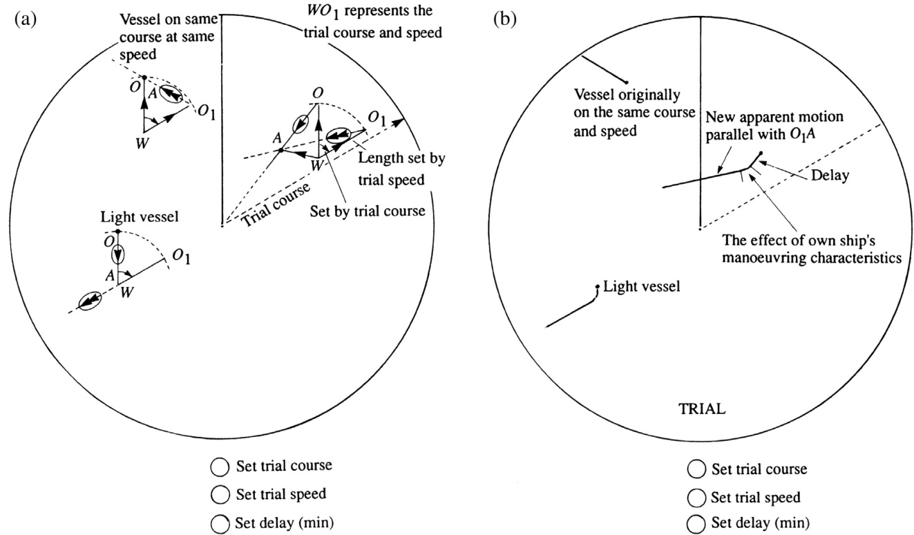  
FIGURE 4.12 Trial manoeuvre display in the relative vector mode. (a) Construction of relative vectors. (b) The trial manoeuvre display.  

【翻译】
图4.12相对向量模式下的试验机动显示。（a）相对向量构造。（b）试验机动显示。

【解读】
该图展示了在相对向量模式下进行试验机动时的显示界面，包括如何构建相对向量以及试验机动的具体显示效果。这通常用于航空或航海领域的导航系统中，以便于操作员理解和预测飞行器或船舶之间的相对位置和运动状态。

【词汇表】
| 英文词汇 | 中文翻译 | 解释 |
| --- | --- | --- |
| Relative Vector Mode | 相对向量模式 | 一种导航模式，通过显示两个物体之间的相对位置和速度来辅助导航。 |
| Trial Manoeuvre Display | 试验机动显示 | 在导航系统中模拟和显示飞行器或船舶可能执行的机动，以便于规划和决策。 |
| Construction | 构造 | 指建立或创建某种模型、图像或数据结构的过程。 |

The ARPA has to produce a plot similar to that discussed in Section 7.5. There is a range of facilities available, with an increasing number of factors being taken into account when presenting the trial data. In the simplest form, it is possible to feed in only the intended course, speed and alteration time and observe their effect on the display.  

【翻译】
ARPA需要生成一个类似于第7.5节中讨论的图表。在呈现试验数据时，有一系列可用的设施，考虑到的因素数量也越来越多。在最简单的形式中，只需输入预期航向、速度和改变时间，就可以观察到它们对显示的影响。

【解读】
本段主要介绍了ARPA（自动雷达导航辅助设备）系统的功能，特别是其能够根据输入的参数（如航向、速度和改变时间）生成相应的图表，以帮助用户分析和理解试验数据。这种功能使得用户可以更直观地了解不同参数设置下的效果，从而有助于优化系统的性能。

【词汇表】
| 英文词汇 | 中文翻译 | 解释 |
| --- | --- | --- |
| ARPA | 自动雷达导航辅助设备 | 一种用于辅助船舶导航的电子设备 |
| plot | 图表 | 数据的视觉表现形式 |
| facility | 设施 | 系统或设备中提供的某种功能或服务 |
| trial data | 试验数据 | 在实验或测试过程中收集的数据 |

In some ARPAs it is possible for the vessel’s handling characteristics to be included in the evaluation, but this will add to the complexity of data required from the user. Given that merchant vessels handling characteristics vary with condition of loading, weather and depth of water, the user must consider whether such data is worth providing or whether an error estimate is allowed in the observed results.  

【翻译】
在某些自动避碰系统（ARPAs）中，可以将船舶的操纵特性纳入评估范围，但这会增加用户需要提供的数据复杂度。由于商用船舶的操纵特性会随着载货状态、天气和水深而变化，用户必须考虑是否值得提供此类数据，或者允许观察结果中存在一定的误差。

【解读】
本段讨论了在自动避碰系统中考虑船舶操纵特性的问题。虽然有些系统可以纳入这些特性，但这会使得数据要求更加复杂，因为船舶的操纵行为受到多种因素影响，如载货状态、天气条件和水深。因此，用户需要权衡提供详细数据的必要性与可能出现的误差。

【词汇表】
| 英文词汇 | 中文翻译 | 解释 |
| --- | --- | --- |
| ARPAs | 自动避碰系统 | 一种用于帮助船舶避免碰撞的电子系统 |
| handling characteristics | 操纵特性 | 船舶对控制输入的响应特征，包括转向、加速等方面的表现 |
| complexity | 复杂度 | 指事物或系统的复杂程度，这里指数据收集和处理的难度 |
| error estimate | 误差估计 | 对可能出现的错误或偏差的预测或评估 |

On some equipment, provision is made for two successive manoeuvres to be displayed. This can be extremely helpful when endeavouring to assess the time for which an alteration must be held, as well as modelling complex situations when more than one manoeuvre may be required. Observers should not be tempted into a series of frequent often small manoeuvres (see Section 7.11.6(b)).  

【翻译】
在某些设备上，可以显示两个连续的操作。这在尝试评估改变必须保持的时间以及模拟需要多个操作的复杂情况时非常有帮助。观察者不应被诱惑进行一系列频繁的小操作（见第7.11.6节（b））。

【解读】
本段强调了某些设备能够显示两个连续操作的功能，这对评估改变所需时间和模拟复杂情况有着重要作用。但同时，也警告观察者避免进行过于频繁的小规模操作，以免产生误导或干扰。

【词汇表】
| 英文词汇 | 中文翻译 | 解释 |
| --- | --- | --- |
| manoeuvres | 操作/机动 | 指飞行中的特定动作或调整 |
| successive | 连续的 | 按顺序发生或存在的 |
| endeavour | 尽力/尝试 | 努力去做某事或实现某目标 |
| alteraton | 改变 | 对状态、位置或性质的修改或调整 |

In order that there should be no confusion between the ‘trial’ data and the current situation, when the trial is in operation the screen will display some distinctive indication such as the word SIM or TRIAL. The use of a ‘T’ to indicate trial is frequently mistaken for an indication that true vectors are being displayed.  

【翻译】
为了避免“试验”数据与当前情况之间的混淆，当试验正在进行时，屏幕上会显示一些明显的指示，如单词SIM或TRIAL。当使用字母“T”来表示试验时，人们经常误以为这是一个指示，表明正在显示真实向量。

【解读】
本段主要讨论在系统试验期间如何避免数据混淆。通过在屏幕上显示特定指示（如“SIM”或“TRIAL”），可以清晰地标明当前状态是试验模式，而不是实际操作。这一点尤为重要，因为简单的“T”标记可能被误解为表示真实数据的输出，从而导致信息混乱。

【词汇表】
| 英文词汇 | 中文翻译 | 解释 |
| --- | --- | --- |
| Trial | 试验 | 指系统或设备的测试运行阶段 |
| Distinctive | 明显的、独特的 | 能够清晰地区分或识别的特征 |
| Indication | 指示、提示 | 提供信息或线索以帮助理解某种状态或情况 |
| Vectors | 向量 | 在此 contexto 中，可能指代数学或物理中的方向量，或在计算机图形学中指代二维或三维空间中的位置和方向 |

Some systems have required the observer to hold down a button, which means that the observer has to make a positive decision to operate the switch and hold it over while he observes the display. Few systems offer such a fail-safe control.  

【翻译】
有些系统要求观察者按住一个按钮，这意味着观察者必须做出积极的决定来操作开关，并在观察显示时一直按住它。很少有系统提供这样的故障安全控制。

【解读】
这段话描述了一种特殊的系统设计，旨在提高安全性。通过要求观察者主动按住按钮并持续按住以保持系统运行，可以避免意外或无意识的操作，从而增强了系统的安全可靠性。

【词汇表】
| 英文词汇 | 中文翻译 | 解释 |
| --- | --- | --- |
| observer | 观察者 | 指的是使用或监控系统的人员 |
| fail-safe | 故障安全 | 指的是当系统发生故障时，能够自动切换到安全状态，以防止事故或损害 |
| positive decision | 积极的决定 | 指的是用户或操作者需要明确、有意识地做出的选择或行动 |

ii. Where PADs (see Section 4.12) are provided, all the possible alterations of course should be simultaneously apparent.   
iii. A ‘trial speed’ facility is also provided since any given family of PADs is drawn for a specific speed of the observing vessel.  

【翻译】
ii. 在提供PADs（见第4.12节）时，所有可能的航线变化应该同时显现。
iii. 同时还提供了“试验速度”功能，因为任何给定的PADs系列都是为观测船只的特定速度而绘制的。

【解读】
本段落主要讨论的是有关PADs（可能行动区）的使用要求和特性。在提供PADs时，需要能够同时显示出所有可能的航线变化。此外，还提到了“试验速度”的概念，这意味着PADs的设计是基于观测船只的特定速度。这两个要点强调了在使用PADs时考虑到航速和航向变化的重要性，以确保安全高效的海上操作。

【词汇表】
| 英文词汇 | 中文翻译 | 解释 |
| --- | --- | --- |
| PADs | 可能行动区 | 指在海图或导航系统中标示出的船只可能采取的行动区域 |
| trial speed | 试验速度 | 指用于测试或模拟的速度，特别是在PADs的设计和应用中 |
| observing vessel | 观测船只 | 指进行观测或监视的船只，通常与PADs的使用相关 |

# 4.5 THE ARPA DISPLAY  

# 4.5.1 The Size of the Operational Display  

The sizes of operational display for different vessel sizes are summarized in Tables 4.1 and 4.2. The ARPA for a vessel above $10{,}000{\mathrm{grt}}$ should be at least $320\mathrm{mm}$ in diameter, but may be $250\mathrm{mm}$ in diameter and $180\mathrm{mm}$ in diameter as vessel size is reduced. This is the size of the circular PPI display and should not be confused with the overall (usually rectangular in practice) screen size, which is defined separately in Table 4.2. The minimum size is defined in terms of a square and the extra area outside of the operational area is intended for supporting information.  

# 4.5.2 The Range Scales on Which ARPA Facilities Should Be Available  

TT facilities should be available on at least the 3, 6 and 12 NM range scales. Tracking range should extend to a minimum of 12 NM.  

【翻译】
TT设施应至少在3、6和12海里范围尺度上可用。跟踪范围应至少延伸到12海里。

【解读】
本段强调了TT（可能指的是交通管制或监控系统）设施的基本要求，即需要在不同范围内进行设置，以满足最低12海里的跟踪需求。这意味着这些设施应该能够覆盖从近距离到较远距离的范围，以确保有效的监控和管理。

【词汇表】
| 英文词汇 | 中文翻译 | 解释 |
| --- | --- | --- |
| TT facilities | TT设施 | 指的是某种类型的技术或监控设施，可能与交通管制或监控有关 |
| NM | 海里 | 是一种测量单位，1海里等于1852米，常用于航海和航空领域 |
| tracking range | 跟踪范围 | 指的是设备或系统能够检测和跟踪目标的最大距离 |

In actual practice, the provision is normally far in excess of this requirement: ARPA and auto-tracking facilities are usually provided on all the range scales provided.  

【翻译】
在实际操作中，该规定通常远远超过了这个要求：ARPA和自动跟踪设施通常都配备在所有的测量范围上。

【解读】
这段话描述的是，在实际应用中，对于某些设备或系统的配置，往往会超出最低要求。这意味着，不仅满足了基本需求，还额外提供了一些功能或服务，以确保更好的性能或体验。在本例中，提到的ARPA（自动雷达盲区处理）和自动跟踪设施被安装在所有可用的测量范围上，这样可以提高整个系统的效率和准确性。

【词汇表】
| 英文词汇 | 中文翻译 | 解释 |
| --- | --- | --- |
| ARPA | 自动雷达盲区处理 | 一种用于处理雷达信号盲区的技术 |
| Auto-tracking | 自动跟踪 | 能够自动追踪目标的系统或功能 |
| Provision | 规定、配置 | 指为满足某种需要而做出的准备或安排 |

Note:  

i. While trial manoeuvres are being presented on the display, the computer continues its normal task of tracking all acquired targets.  

【翻译】
当试验机动在显示屏上呈现时，计算机继续其正常任务，跟踪所有已获取的目标。

【解读】
这句话描述了计算机系统在进行试验机动展示的同时，仍然能够持续地跟踪已经获得的目标。这意味着系统具有多任务处理能力，可以同时执行不同的功能而不影响整体性能。

【词汇表】
| 英文词汇 | 中文翻译 | 解释 |
| --- | --- | --- |
| trial manoeuvres | 试验机动 | 指在模拟或测试环境中进行的飞行器或其他设备的操作演示 |
| display | 显示屏 | 电子设备上的视觉输出界面 |
| tracking | 跟踪 | 持续监测和记录某物的位置、状态或变化 |
| targets | 目标 | 在此 context 中指被跟踪或监控的对象，如飞机、导弹等 |

# 4.5.3 The Modes of Display  

The ARPA and auto-tracking should be capable of operating with a relative-motion display with ‘north-up’ and ‘course-up’ azimuth stabilization. In addition, the ARPA and auto-tracking may also provide for a truemotion display. If true motion is provided, the operator should be able to select for his display either true or relative motion. There should be a positive indication of the display mode and orientation in use.  

【翻译】
ARPA（自动雷达监视辅助）和自动跟踪系统应该能够与相对运动显示一起工作，该显示应具有“北向上”和“航向上”的方位稳定功能。此外，ARPA和自动跟踪还可能提供真实运动显示。如果提供了真实运动，则操作员应该能够选择在其显示中使用真实运动或相对运动。同时，还应有明确的指示显示模式和方向的使用状态。

【解读】
本段主要讨论的是ARPA和自动跟踪系统的基本要求，特别是它们与不同类型的运动显示（如相对运动和真实运动）的兼容性，以及对于显示模式和方向的清晰指示的必要性。这意味着这些系统不仅需要能够处理不同的显示设置，还要为操作员提供足够的信息，以便他们可以根据实际需求进行调整和选择。

【词汇表】
| 英文词汇 | 中文翻译 | 解释 |
| --- | --- | --- |
| ARPA | 自动雷达监视辅助 | 一种用于辅助雷达监视的自动化系统 |
| Relative-motion display | 相对运动显示 | 以相对位置变化来表示目标运动的显示方式 |
| True motion display | 真实运动显示 | 以绝对坐标系表示目标真实运动的显示方式 |
| Azimuth stabilization | 方位稳定 | 保持显示方向稳定的技术，通常以北向上或航向上为基准 |

The term ‘mode’ is used here to describe the ‘radar’ features of picture orientation and picture presentation, which are discussed in detail in Sections 1.4 and 1.5.  

【翻译】
在这里，“模式”一词用于描述图片方向和图片呈现的“雷达”特征，这些内容将在第1.4节和第1.5节中详细讨论。

【解读】
本段主要介绍了“模式”（mode）这个概念，并指出它与图片的方向和呈现方式有关，将在后续章节中进行详细阐述。

【词汇表】
| 英文词汇 | 中文翻译 | 解释 |
| --- | --- | --- |
| mode | 模式/模式 | 指某种特定状态或方式 |
| radar | 雷达/雷达 | 原指一种探测系统，但此处可能比喻为发现或感知某种特征的能力 |
| orientation | 方向/定向 | 指物体或图像的朝向或摆放方式 |
| presentation | 呈现/呈现 | 指信息、数据或图像的展示方式 |

# 4.5.4 The ARPA Data Brilliance Control  

Means should be provided to adjust independently the brilliance of the ARPA (or autotracking) data, including complete elimination of the ARPA (or auto-tracking) data.  

【翻译】
应提供手段来独立调整ARPA（或自动跟踪）数据的亮度，包括完全消除ARPA（或自动跟踪）数据。

【解读】
本段强调了在系统中需要能够独立控制和调整ARPA（自动雷达盲区追踪）或自动跟踪功能的显示亮度，甚至可以完全关闭这些数据的显示。这意味着系统应该具有灵活性，以适应不同用户的需求和环境条件。

【词汇表】
| 英文词汇 | 中文翻译 | 解释 |
| --- | --- | --- |
| ARPA | 自动雷达盲区追踪 | 一种使用雷达技术自动跟踪目标的系统 |
| Autotracking | 自动跟踪 | 自动地跟踪和监测目标的移动 |
| Brilliance | 亮度 | 显示设备中图像或数据的明亮程度 |

This control allows the observer to remove all ARPA data from the screen in order to see just which is radar and which is ARPA data. It can be particularly useful when searching for a poor-response target (e.g. in clutter) while still wishing to continue tracking the other vessels in the vicinity.  

【翻译】
该控制功能允许观察者从屏幕上删除所有ARPA数据，以便只显示雷达信号和ARPA数据。这在搜索响应较差的目标（例如在杂乱环境中）时尤其有用，同时仍希望继续跟踪附近的其他船只。

【解读】
本段主要介绍了一个控制功能的作用，即可以清除屏幕上的自动雷达测距和方位系统（ARPA）数据，只显示原始雷达信号。这种功能特别适用于在复杂环境中搜索难以探测的目标，同时又不想失去对周围其他船只的跟踪。

【词汇表】
| 英文词汇 | 中文翻译 | 解释 |
| --- | --- | --- |
| ARPA | 自动雷达测距和方位系统 | 一种辅助雷达系统，帮助识别和跟踪目标 |
| clutter | 杂乱环境 | 指雷达信号受到干扰，难以准确识别目标的环境 |
| vicinity | 附近区域 | 指某一目标或事件发生的周边区域 |

Unfortunately, many a mariner has been caught out by this control and has spent some frustrating minutes trying to find the screen marker, only to realize that the ARPA data brilliance control was turned down.  

【翻译】
不幸的是，许多水手都曾经被这个控制功能所迷惑，花费了多分钟的时间去寻找屏幕上的标记，只是后来才意识到ARPA数据亮度控制已经被调低了。

【解读】
这段话描述了一个情况，其中水手们在使用电子海图时遇到了困难，因为他们不知道ARPA（自动雷达绘制与分析）数据的亮度控制已经被调低，这导致他们无法找到屏幕上的标记，从而浪费了很多时间。

【词汇表】
| 英文词汇 | 中文翻译 | 解释 |
| --- | --- | --- |
| Mariner | 水手 | 指从事航海工作的人员，如船长、水手等 |
| ARPA | 自动雷达绘制与分析 | 一种用于辅助雷达操作的系统，可以自动追踪和分析目标 |
| Frustrating |令人沮丧的 | 用于描述某种情况或感觉让人感到非常失望或恼怒 |

# 4.5.5 The Use of the Screen Marker for Range and Bearing Measurement  

Provisions should be made to obtain quickly the range and bearing of any object which appears on the ARPA (or auto-tracking) display.  

【翻译】
应采取措施快速获取在ARPA（或自动跟踪）显示屏上出现的任何物体的方位和距离。

【解读】
本段强调了在使用自动雷达盲瞎区追踪（ARPA）系统时，需要能够迅速准确地获得目标物体的位置信息，这对于航海安全和导航至关重要。

【词汇表】
| 英文词汇 | 中文翻译 | 解释 |
| --- | --- | --- |
| Provisions | 措取措施 | 为某事做准备或安排 |
| ARPA | 自动雷达盲瞎区追踪 | 一种用于船舶导航的雷达系统 |
| Bearing | 方位 | 指示方向的角度测量 |
| Range | 距离 | 物体之间的距离 |

To comply with this requirement, most manufacturers have enabled the range and bearing of the screen-controlled marker to be displayed. In this way, the range and bearing of an object can be obtained by placing the marker over it. Like all range and bearing measuring devices, they should be regularly checked against the range rings and heading marker respectively (see also Section 6.6).  

【翻译】
为了满足这一要求，大多数制造商已经使屏幕控制标记的范围和方位能够显示出来。通过这种方式，可以通过将标记放在物体上来获取其范围和方位。与所有测量距离和方向的设备一样，它们应该定期检查是否与距离环和航向标记相符（见第6.6节）。

【解读】
本段主要讨论了如何在电子设备中实现对物体距离和方向的测量。制造商通过在屏幕上显示标记的范围和方位，使用户可以轻松地获得这些信息。同时，也强调了定期校验这些测量结果，以确保其准确性。

【词汇表】
| 英文词汇 | 中文翻译 | 解释 |
| --- | --- | --- |
| Range | 范围、距离 | 指两个点之间的距离或某一区域内的最大距离 |
| Bearing | 方位、方向 | 指一个物体相对于观察者的位置或方向 |
| Marker | 标记、指示器 | 在屏幕或图表上用来指示特定位置或物体的符号或指针 |
| Heading | 航向、方向 | 指飞机、船只等的前进方向 |

# 4.5.6 The Effect of Changing Range Scales  

After changing range scales on which the ARPA (or auto-tracking) facilities are available or resetting the display, full plotting information should be displayed within a period of time not exceeding one scan.  

【翻译】
在更改ARPA（或自动跟踪）功能可用的范围刻度或重置显示后，应在不超过一个扫描周期内显示完整的绘图信息。

【解读】
本段强调了系统在参数变化后恢复正常工作状态的速度要求，即在最多一个扫描周期内完成对绘图信息的更新，以确保用户能够及时获取准确的数据。

【词汇表】
| 英文词汇 | 中文翻译 | 解释 |
| --- | --- | --- |
| ARPA | 自动雷达跟踪辅助 | 一种使用雷达技术实现目标自动跟踪的系统 |
| auto-tracking | 自动跟踪 | 系统自动识别和跟踪目标的能力 |
| scan | 扫描周期 | 雷达或其他传感器一次完成的探测和数据收集过程 |

It should be appreciated that, in order to fulfil this requirement, the ARPA needs to track and plot the acquired targets continually out to some 16 miles, irrespective of the range scale selected by the operator. Because of this, if the shorter range scales are selected and accompanied by a short pulse, targets at a longer range returning a poor response may be lost.  

【翻译】
为了满足这一要求，ARPA需要连续跟踪和绘制已获取的目标，距离可达16英里，无论操作员选择哪种范围尺度。因此，如果选择较短的范围尺度并伴有短脉冲，较远距离的目标可能会因返回信号较差而丢失。

【解读】
本段强调了自动雷达定位系统（ARPA）在跟踪目标方面的能力要求，即使在较短的范围尺度下，也需要能够追踪到16英里以外的目标。但是，这也意味着如果使用较短的范围尺度和短脉冲，较远距离的目标可能因为返回的信号太弱而被忽略。

【词汇表】
| 英文词汇 | 中文翻译 | 解释 |
| --- | --- | --- |
| ARPA | 自动雷达定位系统 | 一种用于船舶导航的雷达系统，可以自动检测和跟踪其他船舶或障碍物 |
| plot | 绘制、跟踪 | 在这里指的是雷达系统对目标的跟踪和显示 |
| range scale | 范围尺度 | 雷达系统中用来表示距离的量程设置 |
| pulse | 脉冲 | 雷达发射的能量脉冲，影响探测距离和精度 |

# 4.6 THE DISPLAY OF ALPHANUMERIC DATA  

For each selected tracked radar target, the following data should be presented in alphanumeric form:  

【翻译】
对于每个选中的被跟踪的雷达目标，应以字母数字形式呈现以下数据：

【解读】
本段强调了在雷达系统中，对于已经被识别和跟踪的目标，需要清晰地以易于阅读的方式（即字母数字形式）展示相关信息，以便操作人员能够快速准确地获取和处理这些数据。

【词汇表】
| 英文词汇 | 中文翻译 | 解释 |
| --- | --- | --- |
| Tracked | 被跟踪的 | 指雷达系统已经锁定并正在监测的目标 |
| Radar Target | 雷达目标 | 指通过雷达系统探测到的物体或信号 |
| Alphanumeric | 字母数字 | 指同时包含字母和数字的字符集，用于方便人机交互的显示形式 |

1. Source of data   
2. Actual range to the target   
3. Actual bearing of the target   
4. Predicted target range at the closest point of   
approach (CPA)   
5. Predicted time to CPA (TCPA)   
6. True course of target   
7. True speed of target.  

【翻译】
1. 数据来源 
2. 到目标的实际距离 
3. 目标的实际方位 
4. 在最接近点（CPA）处预测的目标距离 
5. 预测到达CPA的时间（TCPA） 
6. 目标的真实航向 
7. 目标的真实速度 

【解读】
该段落列出了与目标跟踪相关的七项关键数据或参数，涵盖了数据来源、目标位置、距离、方向、速度等方面的信息。这类信息在导航、雷达追踪、军事作战以及其他需要精确定位和预测目标运动的领域中尤为重要。

【词汇表】
| 英文词汇 | 中文翻译 | 解释 |
| --- | --- | --- |
| Target | 目标 | 指定要跟踪或监控的对象，可以是飞机、船只、车辆等 |
| Bearing | 方位 | 指目标相对于观察者的方向角度 |
| Range | 距离 | 指观察者与目标之间的距离 |
| CPA | 最接近点 | 指目标在其轨迹上与观察者最近的点 |
| TCPA | 预测到达CPA的时间 | 指从当前时刻开始，目标将在何时通过其轨迹上的最接近点 |

The alphanumeric display is usually shared with radar tracked targets and AIS targets. Many ARPAs now designate the targets with a serial number when first plotted or acquired by the AIS. (It should be noted that individual targets will often have two serial numbers, one as a radar tracked target and one as an AIS target.) The alphanumeric display usually makes use of the space to the side of the circular display on the rectangular screen and usually space for the display of one or more sets of target data simultaneously (Figure 4.13).  

【翻译】
字母数字显示通常与雷达跟踪目标和AIS目标共享。许多自动雷达定位系统（ARPA）现在在首次绘制或通过AIS获取目标时为其分配一个序列号。（需要注意的是，单个目标通常会有两个序列号：一个作为雷达跟踪目标，另一个作为AIS目标。）字母数字显示通常利用矩形屏幕上圆形显示旁边的空间，同时显示一组或多组目标数据（图4.13）。

【解读】
本段主要介绍了自动雷达定位系统（ARPA）的字母数字显示功能，特别是它如何与雷达跟踪目标和AIS目标共享信息，以及如何为每个目标分配唯一的序列号以便于识别和跟踪。这种显示方式能够同时呈现多组目标数据，便于操作人员快速掌握目标信息。

【词汇表】
| 英文词汇 | 中文翻译 | 解释 |
| --- | --- | --- |
| Alphanumeric display | 字母数字显示 | 使用字母和数字混合表示的显示方式 |
| Radar tracked targets | 雷达跟踪目标 | 被雷达系统跟踪的目标 |
| AIS targets | AIS目标 | 自动识别系统（AIS）中的目标 |
| Serial number | 序列号 | 为每个目标分配的唯一编号 |

Some manufacturers also change the colour of the target(s) on the display so it is clear to which target the alphanumerics relate.  

【翻译】
一些制造商还会改变显示屏上目标的颜色，以便明确数字字母与哪个目标相关。

【解读】
本段主要介绍了一些制造商为了提高用户体验，在显示屏上对目标进行了视觉上的区分，使得用户能够更容易地理解数字信息与具体目标之间的关联。

【词汇表】
| 英文词汇 | 中文翻译 | 解释 |
| --- | --- | --- |
| manufacturer | 制造商 | 生产产品的公司或个人 |
| alphanumeric | 数字字母 | 由数字和字母组合而成的字符集 |
| target | 目标 | 指定要达到的对象或状态 |

When a target is ‘marked’ or ‘designated’, the alphanumeric display should change to reflect the data on the target so selected. The system is sometimes programmed by the manufacturer to automatically provide the alphanumeric data when a target becomes dangerous, that is, it first activates the CPA/TCPA alarm (see Section 4.2), although this is not a requirement in performance standards. In some systems the data available also includes the distance at which it is predicted that the target will cross ahead (BCR) and the interval which will elapse until this event occurs (BCT).  

【翻译】
当目标被“标记”或“指定”时，字母数字显示应改变以反映所选目标的数据。系统有时会由制造商编程，以便在目标变得危险时自动提供字母数字数据，即首先激活CPA/TCPA警报（见第4.2节），尽管这不是性能标准中的要求。在某些系统中，所提供的数据还包括预测目标将交叉的距离（BCR）以及直到该事件发生之前的时间间隔（BCT）。

【解读】
本段主要讨论的是一种目标跟踪系统，当目标被识别为需要关注时，该系统会自动更新显示信息，为操作员提供实时的目标状态数据。这其中提到的CPA/TCPA警报、BCR和BCT都是系统用来评估目标与自身之间的安全距离和时间的指标，这对于避免碰撞尤其重要。

【词汇表】
| 英文词汇 | 中文翻译 | 解释 |
| --- | --- | --- |
| Target | 目标 | 指需要被跟踪或监控的物体或飞行器 |
| Alphanumeric display | 字母数字显示 | 混合了字母和数字的显示屏 |
| CPA/TCPA alarm | 最近接近/时间最近接近警报 | 当目标进入最小安全距离范围内时触发的警报 |
| BCR | 预测交叉距离 | 系统预测目标将与自身交叉的距离 |
| BCT | 交叉前时间间隔 | 系统预测目标将与自身交叉前的剩余时间 |

Although vectors are suppressed during the first minute of tracking (for the reasons described in Section 4.3.6), the observer can normally select a target during that period and read out the alphanumeric data. This is acceptable as a means of quickly obtaining the range and bearing of the target, but it must be appreciated that other alphanumeric values will at that stage be based on only a few observations and hence can be dangerously misleading.  

【翻译】
尽管在跟踪的第一分钟内矢量被抑制（如第4.3.6节所述），但观察者通常可以在此期间选择目标并读取字母数字数据。这是快速获取目标距离和方位的一种可接受的手段，但必须认识到，在那一阶段，其他字母数字值将仅基于少数观测，因此可能具有误导性。

【解读】
这段话主要讨论了在跟踪目标时，特别是在初期阶段，如何利用矢量信息来获得目标的距离和方位等数据。虽然在最初的时间内矢量信息可能不完全准确或受到限制，但观察者仍然可以通过选择目标并读取相关数据来快速获取必要的信息。然而，这种方法也存在潜在风险，因为初期的数据可能基于有限的观测，从而导致结论可能具有误导性。

【词汇表】
| 英文词汇 | 中文翻译 | 解释 |
| --- | --- | --- |
| Vectors | 矢量 | 在这里指的是与目标位置、速度等有关的方向和大小的量化信息 |
| Alphanumeric | 字母数字 | 由字母和数字组合而成的字符，用于表示各种信息，如距离、方位等 |
| Misleading | 误导性 | 指的是可能导致错误判断或决策的信息或情况 |
| Observations | 观测 | 指的是对目标的观察和记录，用于收集数据和信息 |

When trial manoeuvre is selected, modern systems continue to provide the real alphanumeric data, while some older ARPA systems produce the trial values. In the case of any given system, it is essential to establish exactly which data are being made available.  

【翻译】
当选择试验机动时，现代系统继续提供真实的字母数字数据，而一些较旧的ARPA系统则产生试验值。在任何给定系统中，确定哪些数据是可用的至关重要。

【解读】
本段主要讨论了在进行试验机动（trial manoeuvre）操作时，不同年龄的系统会提供不同类型的数据。现代系统会提供真实的数据，而较老的系统可能只提供试验或模拟数据。这意味着在使用这些系统时，需要明确了解每个系统能够提供什么样的数据，以避免混淆或错误。

【词汇表】
| 英文词汇 | 中文翻译 | 解释 |
| --- | --- | --- |
| Trial manoeuvre | 试验机动 | 指在某种条件下测试或演练系统的运行状态 |
| Alphanumeric | 字母数字 | 由字母和数字组合而成的字符集 |
| ARPA | 自动雷达plotter辅助系统 | 一种用于辅助雷达作业的自动化系统 |
| Essential | 至关重要 | 极为必要或关键的东西 |

# 4.7 ALARMS AND WARNINGS  

It should be possible to activate or deactivate the operational warnings.  

【翻译】
应该可以激活或关闭操作警告。

【解读】
这句话强调了在系统中控制操作警告的灵活性和可配置性，允许用户根据需要开启或关闭这些警告，以确保系统的正常运行和安全性。

【词汇表】
| 英文词汇 | 中文翻译 | 解释 |
| --- | --- | --- |
| activate | 激活 | 启动某一功能或状态 |
| deactivate | 关闭 | 停止某一功能或状态 |
| operational | 操作的 | 与系统运行、管理相关的 |

# 4.7.1 Guard Zone Violation  

If a user-defined acquisition/activation zone facility is provided, a target not previously acquired/activated entering the zone, or detected within the zone, should be clearly identified with the relevant symbol and an alarm should be given. It should be possible for the user to set ranges and outlines for the zone.  

【翻译】
如果提供了用户定义的获取/激活区域设施，当一个之前未被获取/激活的目标进入该区域，或在该区域内被检测到时，该目标应使用相关符号清晰标识，并且应发出报警信号。用户应该能够为该区域设置范围和轮廓。

【解读】
本段落主要讨论的是关于用户自定义的获取或激活区域的设定和相应的报警机制。当目标物体进入或被发现于此区域时，系统会通过特定的符号进行标识，并触发报警，以便及时提醒用户注意。同时，也强调了用户对区域设定的自定义能力，包括设定范围和轮廓等参数，以满足不同场景下的需求。

【词汇表】
| 英文词汇 | 中文翻译 | 解释 |
| --- | --- | --- |
| Acquisition | 获取 | 指获取或锁定目标的过程 |
| Activation | 激活 | 指使某功能或设备开始工作的动作 |
| Zone | 区域 | 指一个特定的空间范围或区域 |
| Outline | 轮廓 | 指区域的边界或形状描述 |

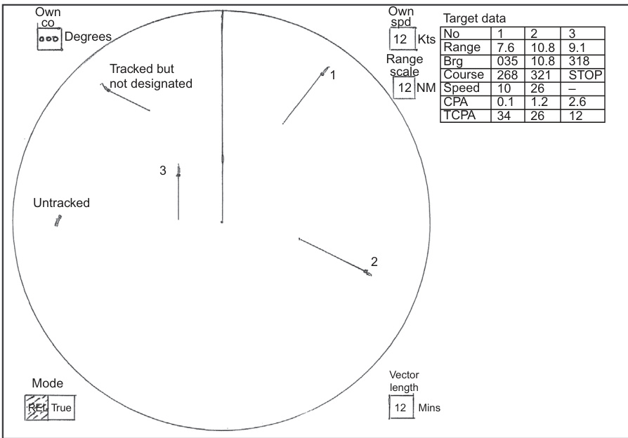  

【处理失败：内存不足或无法生成有效响应】

It is possible to specify an area in the vicinity of the own ship, for example at 10 miles, a zone 5 cables in depth (Figure 4.14), or an area surrounding the own ship, which on entry by a target activates an alarm. It is not unusual to have two zones, one which may be at some preset range and the other at a range which may be varied according to circumstances.  

【翻译】
在自己船只附近的区域内，可以指定一个特定范围，例如10英里范围内的一个区域，或深度为5海里（图4.14）的区域，也可以是周围的一个区域，当目标进入该区域时会触发报警器。通常情况下，会设置两个区域：一个是在预设距离内，另一个则根据实际情况进行调整。

【解读】
本段主要讨论的是船只防御系统中，对于自身位置周围区域的监控和报警设置。通过设置不同的区域范围和深度，可以实现对潜在威胁的自动检测和报警，从而提高船只的安全性。

【词汇表】
| 英文词汇 | 中文翻译 | 解释 |
| --- | --- | --- |
| vicinity | 附近 | 指某物体或地点的周围区域 |
| cable | 海里 | 一种测量海上距离的单位，相当于185.2米 |
| preset | 预设 | 事先确定好的设置或参数 |
| activate | 触发 | 使某个功能或机制开始工作 |

The target which has activated the alarm may be made to ‘flash’ or alternatively be marked in some other way, such as having a short bearing marker through it. In some systems, the range and bearing of the target entering the zone is displayed in numerical form. It is important to remember that a target which is detected for the first time at a lesser range than a guard ring or area will not activate the alarm; this warning system should not be regarded as an alternative to keeping a proper lookout, but rather as an additional means of ensuring the safety of the vessel. Each guard zone may be set for  

【翻译】
触发警报的目标可能会被设置为“闪烁”或以其他方式标记，例如通过一个短暂的方位标记。有些系统会以数字形式显示进入区域的目标的距离和方位。在某些情况下，如果目标首次在警戒环或区域以外的较近距离内被检测到，则不会激活警报；这种警告系统不应被视为替代保持适当瞭望的方法，而是作为确保船只安全的额外手段。每个警戒区都可以根据需要进行设置。

【解读】
本段主要讨论的是一种船舶安全警报系统的工作原理和使用注意事项。它强调了该系统的作用是辅助性的，不应该取代传统的瞭望方式，而是作为增加安全保障的一种手段。同时，也提到了系统的设定和灵活性，以满足不同情况下的需求。

【词汇表】
| 英文词汇 | 中文翻译 | 解释 |
| --- | --- | --- |
| Target | 目标 | 在此指可能引起碰撞风险的物体或船只 |
| Guard ring/area | 警戒环/区域 | 为防止碰撞而设定的安全范围 |
| Bearing marker | 方位标记 | 指示目标方向的标记或符号 |
| Vessel | 船只 | 指各种类型的船舶或水上载具 |

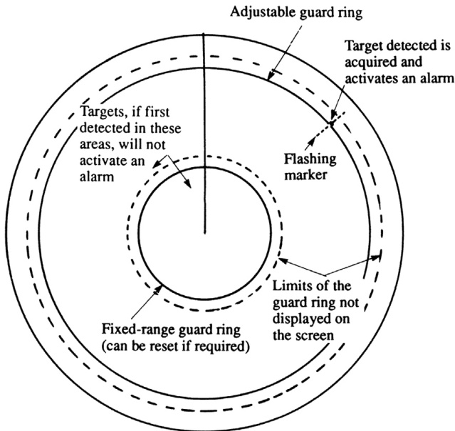  
FIGURE 4.14 Guard rings.  

【翻译】
图4.14 保护环。

【解读】
这幅图展示了保护环（guard rings）的结构或设计，可能用于电子设备、电路板或其他需要防止电弧或过度电压损害的场合。保护环通常是指在电气元件周围设置的一种环形结构，旨在吸收或分散多余的能量，以保护内部元件免受外界干扰或过载的影响。

【词汇表】
| 英文词汇 | 中文翻译 | 解释 |
| --- | --- | --- |
| Guard rings | 保护环 | 一种环形结构，用于保护电气元件免受外界干扰或过载的影响。 |
| Electronic devices | 电子设备 | 使用电子技术的装置，如计算机、手机等。 |
| Electric arc | 电弧 | 两点之间的高温电放射现象，常见于高压电路中。 |

$360^{\circ}$ coverage or for a specific sector of threat. See also Figures 4.2 4.4.  

Note: This provision is normally coupled with the ‘automatic acquisition’ facilities, in which case, in addition to activating the alarm, the target will also be acquired if there is an available tracking channel. Even where automatic acquisition is not provided, the guard zone facility is still required.  

【翻译】
注意：此规定通常与“自动获取”功能结合使用，此时除了激活警报外，如果有可用的跟踪通道，也会获取目标，即使没有提供自动获取功能，守卫区设施仍然是必要的。

【解读】
本段主要讨论了某种系统中的一个特定设置或规定，它涉及到当检测到某些条件时触发警报，并可能自动获取目标。这意味着该系统不仅能够监测和报警，还可能具有追踪和管理目标的能力。即使在没有自动获取功能的情况下，这样的设置也是必须的，以确保系统的完整性和有效性。

【词汇表】
| 英文词汇 | 中文翻译 | 解释 |
| --- | --- | --- |
| Provision | 规定 | 一项规则或协议 |
| Automatic Acquisition | 自动获取 | 系统自动获取或追踪目标的功能 |
| Guard Zone Facility | 守卫区设施 | 用于监控和保护特定区域的设备或功能 |
| Tracking Channel | 跟踪通道 | 用于追踪目标的信号或数据传输通路 |

# 4.7.2 Predicted CPA/TCPA Violation  

If the calculated CPA and TCPA values of a tracked target or activated AIS target are less than the set limits:  

【翻译】
如果跟踪目标或激活的自动识别系统（AIS）目标计算出的CPA和TCPA值小于设定限制，则：

【解读】
本段描述了一个与船舶安全相关的场景，特别是关于跟踪目标或使用自动识别系统（AIS）的目标。当这些目标的最接近距离（CPA）和时间到达最近点（TCPA）计算值低于预先设置的警戒值时，就会触发某种应对措施。这通常用于避免碰撞。

【词汇表】
| 英文词汇 | 中文翻译 | 解释 |
| --- | --- | --- |
| CPA | 最接近距离 | 距离目标物体最近的距离 |
| TCPA | 时间到达最近点 | 预计到达最近点所需的时间 |
| AIS | 自动识别系统 | 一种通过卫星或其他通信方式自动发送和接收船舶位置信息的系统 |

• A CPA/TCPA alarm should be given.   
• The target should be clearly indicated.  

【翻译】
应发出CPA/TCPA警报。
目标应清晰地指示出来。

【解读】
这段话强调了在特定情况下（可能是航空或海事领域），当遇到潜在碰撞风险时，需要通过CPA（最接近点）/TCPA（时间至最接近点）警报系统发出警告。此外，还要求明确指出潜在的碰撞目标，以便相关人员能够快速识别并采取相应措施避免碰撞。

【词汇表】
| 英文词汇 | 中文翻译 | 解释 |
| --- | --- | --- |
| CPA | 最接近点 | Closest Point of Approach，即两个物体之间最近距离的位置。 |
| TCPA | 时间至最接近点 | Time to Closest Point of Approach，即预计到达两个物体之间最近距离所需的时间。 |
| Alarm | 警报 | 指示有潜在危险或问题的信号或通知。 |

As the target has not yet violated BOTH conditions, the alarm has not yet been activated.  

【翻译】
由于目标尚未违反两个条件，因此警报尚未激活。

【解读】
这段话描述了一个监控或安全系统的状态，说明只有当两个特定条件都被违反时，警报才会被触发。在当前情况下，由于这些条件尚未同时满足，系统中的警报功能还没有被激活。这意味着系统处于待命状态，随时准备在必要时响应。

【词汇表】
| 英文词汇 | 中文翻译 | 解释 |
| --- | --- | --- |
| Target | 目标 | 指需要被监控或检测的对象或行为 |
| Conditions | 条件 | 系统触发某种反应所需满足的特定要求或标准 |
| Activated | 激活 | 指使系统或设备开始工作或执行预设功能的动作 |

It is possible to specify a CPA and TCPA (sometimes referred to as safe limits) which will activate an alarm if both are violated. For example, if the CPA and TCPA controls are set to $0.5\mathrm{NM}$ and $30\mathrm{min},$ respectively, and a target which is being tracked will come to a CPA of less than $0.5\mathrm{NM}$ in less than $30\mathrm{min}$ , then the alarm will be activated (Figure 4.15). This will occur even if the ‘relative vector’ has not been extended into the specified area. The displayed echo and vector of the target activating the alarm may be made to flash or, alternatively, marked in some other way.  

# 4.7.3 Lost Target  

The system should alert the user if a tracked radar target is lost, rather than excluded by a predetermined range or preset parameter. The target’s last position should be clearly indicated on the display.  

【翻译】
系统应该在跟踪雷达目标丢失时提醒用户，而不是通过预设的范围或参数排除目标。目标的最后位置应清晰地显示在屏幕上。

【解读】
本段强调了系统对用户体验的设计要求，即当跟踪的雷达目标丢失时，系统不应简单地因为某些预设条件而忽略这一事实，而是应该主动提醒用户，并且要清晰地标示出目标最后被跟踪到的位置，以便于用户进一步的操作和决策。

【词汇表】
| 英文词汇 | 中文翻译 | 解释 |
| --- | --- | --- |
| Tracked | 跟踪的 | 被系统持续监测的目标 |
| Radar target | 雷达目标 | 使用雷达技术探测到的物体或信号源 |
| Predetermined | 预先确定的 | 事先设置好的参数或规则 |
| Parameter | 参数 | 用于控制或调整系统行为的变量或常数 |

Consider a target which is being tracked but, for one of a number of reasons does not return a detectable response on one scan, the tracker will open up the gate and, if it finds a response, will continue to track as described in Section 4.3.2. If it fails to find a response, it is required that the tracker should continue to search for the echo in an area where it might be expected until it has failed to appear for 5 out of 10 consecutive scans. If, after this searching, the target is still not detected, the ‘target lost’ warning is activated and the last observed position of the echo is marked on the screen. It is also normal to activate an audible alarm.  

【翻译】
考虑一个正在被跟踪的目标，但由于某种原因，在一次扫描中没有返回可检测的响应，这时跟踪器会打开“门槛”（gate），如果找到响应，就会继续跟踪，如4.3.2节所述。如果找不到响应，则要求跟踪器在可能存在回声的区域内继续搜索，直到连续10次扫描中有5次未出现回声。如果经过这种搜索后，目标仍然未被检测到，则激活“目标丢失”警告，并在屏幕上标记最后观察到的回声位置。同时，通常也会激活听觉报警。

【解读】
本段描述了跟踪系统在遇到暂时无法检测到目标的情况下的处理机制。当目标在一次扫描中未能返回可检测的信号时，系统会尝试通过扩大搜索范围来重新捕获目标，如果多次扫描都未能找到目标，则会触发“目标丢失”的警告，并记录目标最后已知的位置，同时发出声音提示。

【词汇表】
| 英文词汇 | 中文翻译 | 解释 |
| --- | --- | --- |
| detectable | 可检测的 | 能够被探测或发现的信号或反应 |
| gate | 门槛 | 在跟踪系统中，指的是允许或拒绝某一信号通过的设定阈值或条件 |
| consecutive | 连续的 | 持续或接着发生的，尤指时间上的先后关系 |
| audible | 听觉的 | 能够被听到或听见的 |
| alarm | 报警、警报 | 用于提醒注意或警示某种情况的装置或信号 |

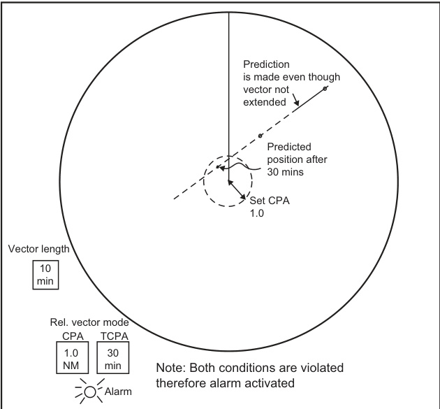  
FIGURE 4.15 CPA/TCPA alarm settings.  

【翻译】
图4.15 CPA/TCPA报警设置。

【解读】
该图显示了CPA（Collision Prediction Algorithm，碰撞预测算法）和TCPA（Time to Collision Prediction Algorithm，时间到碰撞预测算法）的报警设置界面。这两个算法通常用于航空交通管制系统中，以提醒飞行员注意潜在的碰撞风险。

【词汇表】
| 英文词汇 | 中文翻译 | 解释 |
| --- | --- | --- |
| CPA | 碰撞预测算法 | 一种计算机算法，用于预测两架飞机之间可能发生碰撞的风险。 |
| TCPA | 时间到碰撞预测算法 | 一种计算机算法，用于预测两架飞机之间可能发生碰撞所需的时间。 |
| Alarm settings | 报警设置 | 指定何时触发报警信号以提示飞行员注意潜在的碰撞风险。 |

# 4.7.4 Time to Manoeuvre  

A ‘delay’ facility is provided with trial manoeuvre (see Section 4.4.3) that an alarm may be provided to warn the officer of the watch that it is (usually) 1 min until ‘time to manoeuvre’. Depending on the size of ship and its manoeuvrability, this warning can be used as a reminder to apply helm and/or ring the telegraph, in order that a pre-planned manoeuvre is executed on time.  

【翻译】
“延迟”功能配备了试验机动（见第4.4.3节），当距离“开始机动”的时间通常只有1分钟时，会发出警报提醒值班官员。这一警告可以根据船只大小和机动性，作为一个提示，提醒他们及时转舵和/或拉响电报，以便能够按计划执行机动。

【解读】
本段主要介绍的是船舶操作中的一个安全功能，即“延迟”设施。这个设施通过在特定时间（通常为1分钟）之前发出警报，提醒值班人员即将到达需要进行机动操作的时间，从而确保船舶能够按照预先规划好的方案准时执行机动。这种设计旨在提高船舶操作的安全性和效率。

【词汇表】
| 英文词汇 | 中文翻译 | 解释 |
| --- | --- | --- |
| delay | 延迟 | 在这里指的是船舶操作中设置的一个时间缓冲区间 |
| manoeuvre | 机动、操纵 | 指船舶的转向、停靠等操作 |
| helm | 转舵 | 船舶驾驶室中控制方向的装置 |
| telegraph | 电报 | 一种用于船舶与岸上或者其他船舶之间通信的设备，在这里可能指的是一种机械或电信号设备，用来传递命令，如“全速前进”等 |

# 4.7.5 Track Change  

This alarm is associated with an algorithm which quantifies departures from the predicted tracks of targets. The target(s) activating the alarm will be indicated by some graphic symbol. Its operation is likely to be associated with the change from a long to a short smoothing period (see Section 4.3.6.1).  

【翻译】
该警报与一个算法相关，该算法量化了目标从预测轨迹上的偏离程度。激活警报的目标将由某种图形符号指示。其操作可能与从长平滑周期到短平滑周期的变化有关（见第4.3.6.1节）。

【解读】
这段话描述的是一种警报系统，它使用算法来检测目标是否偏离了预测的轨迹。当目标出现异常时，会通过图形符号指示出哪些目标触发了警报。此外，这个系统的操作可能涉及调整平滑周期的长度，以便更好地应对目标的变化。

【词汇表】
| 英文词汇 | 中文翻译 | 解释 |
| --- | --- | --- |
| Algorithm | 算法 | 一套用于解决特定问题或完成特定任务的指令集 |
| Quantifies | 量化 | 将某一现象或属性用数字表示或衡量 |
| Smoothing period | 平滑周期 | 数据处理中用于减少数据波动的时间间隔 |
| Targets | 目标 | 在此 context 中指被跟踪或监控的对象或实体 |

It can be useful, but it does depend on the application of some arbitrary decision as to when the change in track is ‘significant’. In some systems, the track change alarm will be activated by large or rapid manoeuvres performed by the observing vessel. This is more likely to arise where relative-track storage is used (see Section 4.3.6.2). In general, this condition can be recognized, as all targets will exhibit the track change symbol.  

【翻译】
这可能是有用的，但它取决于对“显著变化”的判定标准。在一些系统中，当观察船只进行大幅度或快速的机动时，轨迹变化报警会被激活。这更有可能发生在使用相对轨迹存储的情况下（见第4.3.6.2节）。一般来说，这种情况可以通过所有目标显示轨迹变化符号来识别。

【解读】
本段讨论了轨迹变化报警的应用及其判定标准，指出其有用性取决于如何定义“显著变化”。同时提到了相对轨迹存储的使用情景以及如何通过目标的轨迹变化符号识别这种情况。

【词汇表】
| 英文词汇 | 中文翻译 | 解释 |
| --- | --- | --- |
| arbitrary | 任意的 | 根据个人判断或随意决定的 |
| manoeuvres | 机动 | 船只或飞行器等的操作或行动 |
| relative-track storage | 相对轨迹存储 | 一种数据存储方式，记录的是相对于某一参照物体的运动轨迹 |
| significant | 显著的 | 达到一定程度，值得注意的 |

# 4.7.6 Anchor Watch  

This facility attempts to offer automatic warning of the observing vessel or other vessels dragging in an anchorage. If a known stationary target (e.g. a small isolated navigation mark) is acquired and designated as such, then an alarm will be activated if the designated target moves more than a preset distance from the marked position. If the stationary target appears to move, then it must be due to the observing vessel dragging her anchor. Alternatively, if other anchored vessels in the anchorage are tracked, it will give a warning if a ‘tracked’ vessel in the anchorage drags her anchor. It will also, of course, be activated if such a vessel heaves up her anchor and gets under way.  

【翻译】
本设施尝试为观察船或其他在锚地拖拽的船只提供自动警告。如果一个已知的静止目标（例如，小型孤立导航标志）被获取并指定为此类目标，那么如果指定目标从标记位置移动超过预设距离，则会激活报警器。如果静止目标似乎移动，则必须是由于观察船拖拽了她的锚。如果在锚地跟踪其他抛锚的船只，它也会在“跟踪”的船只拖拽锚时发出警告。当然，如果这样的船只提起锚并开始航行，也会激活报警器。

【解读】
该段落描述了一种船舶安全系统，该系统能够检测到锚地内船舶是否正在拖拽或移动，并及时发出警告，以防止潜在的碰撞事故。通过跟踪已知的静止目标或其他船舶的运动，系统可以判断出观察船或其他船舶是否正在拖拽锚或已经开始移动，从而提高了船舶安全性。

【词汇表】
| 英文词汇 | 中文翻译 | 解释 |
| --- | --- | --- |
| anchorage | 锚地 | 指船舶停泊或抛锚的地方 |
| designated | 指定 | 被选中或确定为某一特定用途或身份 |
| preset | 预设 | 事先设置好的参数或值 |
| tracked | 跟踪 | 被监测或记录其运动或状态的对象 |

# 4.7.7 Tracks Full  

There is a limit to the number of targets which an ARPA is capable of tracking, although this figure has risen considerably over the years. In areas of high traffic density, there may well come a time when all the tracking channels are in use. This is particularly likely when automatic acquisition (see Sections 4.2.4!4.2.6) is in operation. An alarm will warn the operator to inspect the untracked targets for potential dangers and to transfer tracking from less important targets which are being tracked. This is now a compulsory alarm in the current IMO Performance Standards (See Section 11.2.1).  

【翻译】
自动雷达监视辅助系统（ARPA）能够跟踪的目标数量是有限的，尽管这一数字多年来已经大幅增加。在交通密度高的区域，当所有跟踪通道都被占用时可能会出现问题。这在自动获取功能（见4.2.4至4.2.6节）启用时尤其容易发生。当这种情况发生时，将会发出警报，提示操作员检查未被跟踪的目标是否存在潜在危险，并将对不那么重要的目标的跟踪转移到更重要的目标上。根据当前国际海事组织（IMO）的性能标准，这是一个强制性的警报（见11.2.1节）。

【解读】
本段主要讨论了自动雷达监视辅助系统（ARPA）的跟踪能力限制，以及在高交通密度地区可能遇到的问题。它提到了当系统达到最大跟踪容量时，需要人工干预以确保安全，特别是在自动获取模式下。同时，它也指出这是一个按照国际海事组织（IMO）性能标准必须实施的警报机制，以保证船舶的安全运行。

【词汇表】
| 英文词汇 | 中文翻译 | 解释 |
| --- | --- | --- |
| ARPA | 自动雷达监视辅助系统 | 一种用于辅助雷达监视的自动化系统 |
| Traffic Density | 交通密度 | 指一定区域内的交通工具或目标数量与该区域大小之比 |
| Automatic Acquisition | 自动获取 | 系统自动识别和跟踪目标的功能 |
| IMO Performance Standards | 国际海事组织性能标准 | 由国际海事组织制定，对船舶设备和系统性能的要求规范 |

# 4.7.8 Wrong or Invalid Request  

Where an operator feeds in incorrect data or data in an unacceptable form, for example course $370^{\circ}$ , an alarm and indicator will be activated and will continue until the invalid data is deleted or overwritten.  

# 4.7.9 Safe Limit Vector Suppression  

This uncommon facility, if selected, suppresses the vectors of targets whose predicted motion does not violate the safe limits (see Section 4.7.2) and is an attempt to reduce ARPA ‘clutter’. The computer continues to track the targets whose vectors are suppressed. If any of them should manoeuvre in such a way as to violate the set safe limits, the vector of that target will reappear and the safe limit alarm will be activated. If a decision is taken to use this facility, considerable thought must be given to the implications of the selected values of safe limits. In general, it is advisable to switch the facility off before contemplating a manoeuvre.  

【翻译】
如果选择了这种不常见的功能，它会抑制预测运动不会违反安全限制（参见第4.7.2节）的目标向量，这是减少ARPA“杂乱”的一种尝试。计算机继续跟踪被抑制的目标向量。如果其中任何一个以违反设置的安全限制的方式进行机动，其目标向量将重新出现，安全限制报警器将被激活。如果决定使用此功能，必须认真考虑所选安全限制值的影响。一般来说，在考虑机动之前最好关闭此功能。

【解读】
本段主要讨论了一种特殊的功能，该功能可以根据目标的预测运动是否违反安全限制来筛除某些目标，从而减少ARPA系统中的“杂乱”。同时，也提醒用户在使用这个功能时需要谨慎考虑安全限制的设定，以避免可能的风险。

【词汇表】
| 英文词汇 | 中文翻译 | 解释 |
| --- | --- | --- |
| suppress | 抑制、屏蔽 | 在这里指的是暂时隐藏或忽略某些目标的向量 |
| clutter | 杂乱、干扰 | 指的是ARPA系统中多余的、无关紧要的信息或信号 |
| manoeuvre | 机动、操纵 | 指的是飞行物体（如飞机）进行的特定动作或操作 |
| implications | 影响、含义 | 指的是某一行动或决策可能带来的后果或结果 |

# 4.7.10 Trial Alarm  

This facility is analogous to the safe limit alarm but operates only when the trial manoeuvre is selected. It is not available on all systems.  

【翻译】
该设施与安全限制报警类似，但只在选择试验机动时才运作，并非所有系统都有此功能。

【解读】
这段话描述了一个特定设备或系统中的一个功能，该功能与安全限制报警相似，但其激活条件是当用户选择进行试验机动（trial manoeuvre）时。这个功能不是所有系统都具备的，这意味着它可能依赖于具体的硬件或软件配置。

【词汇表】
| 英文词汇 | 中文翻译 | 解释 |
| --- | --- | --- |
| facility | 设施/功能 | 指系统中提供的一种服务或能力 |
| manoeuvre | 机动/操作 | 指对系统或设备进行某种控制或操作的行为 |
| selected | 选择/选定 | 指用户或操作员通过某种方式选择了一项特定的操作或模式 |

# 4.7.11 Performance Tests and Warnings  

All ARPA equipments incorporate some form of self-diagnostic routine which monitors the correct operation of the various circuits. These checks are normally conducted on ‘switch on’ and repeated at regular intervals (which may range from once per hour to many times per second) or on request from the operator. In the event of a fault, a warning is given to the operator and, in some cases, an indication of the cause or location (e.g. printed circuit board No. 6) of the fault is also given.  

【翻译】
所有ARPA设备都内置了一种自我诊断程序，该程序监测各种电路的正确运行。这些检查通常在设备打开时进行，并在规律间隔（可能从每小时一次到每秒多次不等）或根据操作员的要求重复进行。在发生故障的情况下，会向操作员发出警告，在某些情况下，还会显示故障的原因或位置（例如印刷电路板编号6）。

【解读】
本段描述了ARPA设备的自我诊断功能，这一功能可以实时监测设备各部分的正常运作。当设备出现问题时，它能够自动检测并提醒操作员，同时还能提供有关故障原因或位置的信息，以便于维修和排除故障。

【词汇表】
| 英文词汇 | 中文翻译 | 解释 |
| --- | --- | --- |
| self-diagnostic | 自我诊断 | 设备自身用于检查和诊断问题的能力 |
| routine | 程序、例行公事 | 按照既定方式进行的工作或检查 |
| circuits | 电路 | 电子设备中的导电路径 |
| fault | 故障 | 设备或系统中出现的问题或错误 |
| indication | 指示、提示 | 提供有关某事物状态或情况的信息或信号 |

However, it must be appreciated that some faults cannot be detected internally, for example a failure of certain elements in a numeric read-out can cause an 8 to appear as a 6 or a 9 to appear as a 3. In such cases, a typical test may provide for the operator to switch all of the elements on so that each indicator should display an 8.  

【翻译】
然而，我们必须认识到有些故障不能通过内部检测来发现。例如，在数字显示中某些元素的故障可能会导致8显示为6，或者9显示为3。在这种情况下，一种典型的测试方法是要求操作员打开所有元素，以便每个指示器都显示一个8。

【解读】
这段话强调了在系统测试中需要考虑外部验证的重要性，因为有些内部故障可能无法被检测到。它提出了一个具体例子，即数字显示中的错误可能导致数字显示不正确，而这种情况只能通过特定的测试方法来识别和纠正。

【词汇表】
| 英文词汇 | 中文翻译 | 解释 |
| --- | --- | --- |
| internally | 内部地 | 在系统内部进行的检测或处理 |
| numeric read-out | 数字显示 | 使用数字表示信息的显示方式 |
| indicator | 指示器 | 显示特定信息或状态的设备或符号 |
| element | 元素 | 组成系统或设备的基本部分 |
| operator | 操作员 | 负责控制、监测或维护系统的人员 |

# 4.8 AUTOMATIC GROUND-STABILIZATION  

The difficulties of achieving groundstabilization on a raw radar display are outlined in Sections 6.2.6.2 and 6.9.6. With ARPA assistance, ground-stabilization can be achieved easily and automatically in many circumstances, but not all. Once selected, this stabilization also applies to all true target vectors displayed, whether or not the operator is showing relative or true-motion display. It is particularly important to appreciate the implications of this, which are discussed later.  

【翻译】
在原始雷达显示上实现地面稳定化的困难之处在第6.2.6.2和6.9.6节中有所描述。借助ARPA（自动雷达辅助plotting系统），在许多情况下可以轻松、自动地实现地面稳定化，但不是所有情况都如此。一旦选择了这种稳定化方式，它也同样适用于所有显示的真实目标矢量，无论操作员是否以相对运动或真实运动的形式进行显示。这一点尤为重要，因为它的影响会在后续章节中详细讨论。

【解读】
本段主要讨论了在原始雷达显示屏上实现地面稳定化的挑战，以及如何通过ARPA系统来解决这一问题。同时强调了理解这种稳定化方式的重要性及其对后续操作的影响。

【词汇表】
| 英文词汇 | 中文翻译 | 解释 |
| --- | --- | --- |
| Groundstabilization | 地面稳定化 | 指的是使雷达显示保持与地面相关的稳定状态，以便更好地观察目标的运动。 |
| ARPA | 自动雷达辅助plotting系统 | 一种辅助雷达系统，可以帮助实现地面稳定化等功能。 |
| True target vectors | 真实目标矢量 | 指的是实际存在的目标物体的运动方向和速度信息，在雷达显示上用矢量表示。 |
| Relative or true-motion display | 相对运动或真实运动显示 | 指的是两种不同的雷达显示模式，一种是相对于观察者的运动，另一种是绝对的真实运动。 |

An isolated land target with good response is selected as reference. It is acquired and tracked by one of the ARPA tracking channels and then designated as a ‘fixed target’. It has also been called ‘echo reference’ by some manufacturers. This makes it possible for the tracker to calculate the ground track of the observing vessel, and hence to maintain the movement of the electronic origin of the display in sympathy with it. When using this facility the observer should be particularly watchful for other targets which approach the reference target and, in particular, for those which pass between the observing vessel and the reference target. If the intervening target shadows the reference target, the chances of target swap (see Section 4.3.5) may be greatly increased. If target swap does involve the reference target, it may have quite dramatic effects on the presentation of all vectors, particularly if the reference attaches to a fast moving target. If such an eventuality seems likely, it may be expedient to move the reference to another fixed target.  

【翻译】
选择一个孤立的陆地目标，其响应良好作为参考点。它被其中一个ARPA跟踪通道获取和跟踪，然后被指定为“固定目标”。一些制造商也称其为“回声参考”。这使得跟踪器能够计算观察船只的地面轨迹，从而保持显示的电子原点与之同步。当使用此功能时，观察者应该特别注意其他接近参考目标的目标，尤其是那些在观察船只和参考目标之间经过的目标。如果干扰目标遮蔽了参考目标，则交换目标（见第4.3.5节）的可能性可能会大大增加。如果交换目标涉及参考目标，它可能对所有矢量的呈现产生相当戏剧性的影响，特别是如果参考目标附着在快速移动的目标上。如果这种情况似乎有可能发生，可能需要将参考点转移到另一个固定目标。

【解读】
本段主要讨论了在雷达系统中选择一个合适的参考目标以便于跟踪和定位的重要性。通过选择一个孤立且响应良好的陆地目标作为参考点，可以帮助跟踪器更准确地计算观察船只的运动轨迹，并维持显示的稳定性。但同时，也提醒观察者要注意其他可能干扰参考目标的目标，以避免交换目标的情况发生，如果发生这样的情况，可能需要调整参考目标以保证系统的正常运作。

【词汇表】
| 英文词汇 | 中文翻译 | 解释 |
| --- | --- | --- |
| ARPA | 自动雷达plotter和跟踪系统 | 一种自动化的雷达系统，用于绘制和跟踪目标 |
| echo reference | 回声参考 | 在雷达系统中用作参考点的目标 |
| target swap | 交换目标 | 雷达系统中两个或多个目标位置信息互换的现象 |
| vector | 矢量 | 在图形表示中，用箭头线表示方向和大小的量 |

The facility has been developed in such a way that the same stabilization is applied to the radar picture presentation and to the true vectors, i.e. either both are sea-stabilized or both are ground-stabilized. Thus in general, where automatic ground-stabilization is selected, true vectors will indicate the ground tracks of targets and not their headings. Failure to appreciate this can render the presentation dangerously misleading if it is mistakenly used in the planning of collision-avoidance strategy. This is illustrated in the right-hand display of Figure 4.16. One might expect the danger of observers being misled in this respect, because (except in case of an alongtrack tide) there will be angular displacement of the observing vessel’s vector from the heading marker. Experience has indicated that this expectation of observers cannot be justified in all cases.  

【翻译】
该设施的开发方式是，对雷达图像呈现和真实向量（即目标的实际运动方向）施加相同的稳定化处理，也就是说，无论是海上稳定化还是陆地稳定化，都会同时应用于两者。因此，一般来说，当选择自动陆地稳定化时，真实向量将指示目标在地面上的轨迹，而不是它们的航向。如果不理解这一点，就可能在规划碰撞避免策略时产生误导性的信息，这种情况在图4.16的右侧显示中有所体现。人们可能会担心观察员在这方面会被误导，因为（除了沿着航道的潮汐外），观察船只的向量与航向标志之间会存在角度偏差。但经验表明，在所有情况下，这样的担心都是没有根据的。

【解读】
本段主要讨论了雷达系统中的稳定化问题，特别是在选择自动陆地稳定化时，真实向量如何表示目标的地面轨迹而非其航向。这是一个容易被忽视但非常关键的问题，因为如果操作人员不了解这个特性，可能会导致误判和错误决策，从而影响到碰撞避免策略的有效实施。通过对此进行说明，可以帮助操作人员更好地理解和使用雷达系统，减少潜在风险。

【词汇表】
| 英文词汇 | 中文翻译 | 解释 |
| --- | --- | --- |
| Stabilization | 稳定化 | 指的是使得系统或信号保持在一个稳定的状态，不受外界干扰的过程。 |
| Vectors | 向量 | 在这里指的是目标的运动方向或速度。 |
| Ground-stabilized | 陆地稳定化 | 指的是以陆地为参考系，使系统或信号相对于陆地保持稳定。 |
| Collision-avoidance | 碰撞避免 | 指的是为了防止碰撞而采取的措施或策略。 |

The useful feature is that it makes truemotion parallel indexing a practical proposition, which is scarcely if at all the case with manual ground-stabilization (see Section 8.4.5). It also makes it possible to maintain electronic navigation lines and maps (see Sections 4.9 and 8.4.6) in a fixed position on the screen. Some users find the availability of a fixed map particularly attractive in coastal navigation. However, it must be stressed that the penalty paid is that the presentation may not afford traffic heading information and may therefore in principle be unsuitable for collision avoidance.  

【翻译】
该功能的一个有用之处在于，它使得真实运动的平行索引成为一种可行的方案，这与手动的地面稳定化（见第8.4.5节）相比，几乎没有什么区别。它还可以让电子导航线和地图（见第4.9节和第8.4.6节）保持在屏幕上的固定位置。一些用户认为，在沿海导航中拥有一个固定的地图尤其具有吸引力。然而，必须强调的是，付出的代价是，该显示可能无法提供交通方向信息，因此原则上可能不适合用于碰撞避免。

【解读】
本段主要讨论了一项技术功能的优点和缺点。这项功能能够实现真实运动的平行索引，使得电子导航变得更加方便和高效，特别是在沿海导航中。然而，这项功能也存在一定的局限性，即可能无法提供交通方向信息，从而影响到碰撞避免的效果。

【词汇表】
| 英文词汇 | 中文翻译 | 解释 |
| --- | --- | --- |
| truemotion | 真实运动 | 指物体或系统的实际运动状态 |
| parallel indexing | 平行索引 | 一种数据组织和检索方式，允许快速访问相关信息 |
| ground-stabilization | 地面稳定化 | 手动或自动调整设备以保持稳定的地面参考系 |
| collision avoidance | 碰撞避免 | 系统或设备用于预防或减少碰撞风险的措施或功能 |

Automatic ground-stabilization can also be achieved by using the output from a twin axis Doppler log which is locked to the ground (see Section 6.2.6.2) and by integration with the Global Navigation Satellite System (GNSS) (see Section 10.1).  

【翻译】
自动的地面稳定化也可以通过使用与地面锁定的双轴多普勒日志输出（见第6.2.6.2节）以及与全球导航卫星系统（GNSS）（见第10.1节）集成来实现。

【解读】
本段主要讨论了如何实现自动的地面稳定化，提到了两种方法：一是利用双轴多普勒日志输出，二是与全球导航卫星系统进行集成。这意味着这些技术可以帮助提高测量或导航的准确性和稳定性。

【词汇表】
| 英文词汇 | 中文翻译 | 解释 |
| --- | --- | --- |
| Automatic | 自动 | 不需要人工干预的过程或系统 |
| Ground-stabilization | 地面稳定化 | 保持设备或系统相对于地面的位置和方向的稳定状态 |
| Doppler log | 多普勒日志 | 一种利用多普勒效应测量速度的设备 |
| GNSS | 全球导航卫星系统 | 由多颗卫星组成的导航系统，为用户提供位置、速度和时间信息 |

The ease of integration with GNSS and the accuracy make this a very popular display for modern navigators. However, it is important to remember the potential for misleading anticollision information in a cross track tide.  

【翻译】
与GNSS（全球导航卫星系统）的集成容易以及其高精度，使得这款显示设备在现代导航员中非常受欢迎。然而，人们需要记住，在横向潮汐中，可能会出现误导性的防碰撞信息。

【解读】
本段强调了某种导航显示设备的优点，如易于与全球导航卫星系统集成以及高精度，这使得它成为现代导航员的热门选择。但同时，也提醒人们注意在特定情况下，如横向潮汐环境中，可能会出现错误的防碰撞信息，提示用户需要谨慎使用和解读数据。

【词汇表】
| 英文词汇 | 中文翻译 | 解释 |
| --- | --- | --- |
| GNSS | 全球导航卫星系统 | 一种利用卫星实现全球范围内位置、速度和时间测定的导航系统 |
| Anticollision | 防碰撞 | 指的是一种技术或系统，用于预防止两个或多个物体之间的碰撞 |
| Cross track tide | 横向潮汐 | 指的是一种特殊的海洋现象或环境，可能影响导航设备的准确性 |

The advantage of the ARPA ‘fixed target’ facility is that it provides a continuous check of ground course and speed, independent of GNSS and other sensors. The disadvantage is that it depends on the availability of a suitable fixed land-based target. Buoys may also be used with caution, particularly in areas like the English Channel, where the large buoys are well monitored and so may be regarded as fixed.  

【翻译】
ARPA“固定目标”设施的优势在于，它能够独立于GNSS和其他传感器，对地面航向和速度进行连续检查。其缺点是它依赖于合适的陆基固定目标的可用性。在某些地区，如英吉利海峡，可以谨慎使用浮标，因为那里的大型浮标受到密切监控，可以被视为固定目标。

【解读】
本段主要讨论了ARPA（自动雷达定位系统）中“固定目标”设施的优缺点。这种设施可以不依赖全球导航卫星系统（GNSS）和其他传感器来检查船舶的地面航向和速度，但同时也需要有合适的固定目标作为参考，这可能会受到地域限制。

【词汇表】
| 英文词汇 | 中文翻译 | 解释 |
| --- | --- | --- |
| ARPA | 自动雷达定位系统 | 一种用于确定船舶位置和速度的雷达系统 |
| GNSS | 全球导航卫星系统 | 包括GPS、GLONASS等多种卫星导航系统的总称 |
| Buoys | 浮标 | 海上标志物，通常用于航行辅助或科学研究 |

# 4.9 NAVIGATIONAL LINES AND MAPS (SEE ALSO SECTION 8.4.6.3)  

Most modern radar sets (even without ARPA) offer a graphics facility whereby electronic lines can be drawn on the screen. The position, length and orientation of the lines can be adjusted, thus making it possible to produce parallel indexing lines (see Section 8.4) and to delineate navigational limits in channels, traffic separation schemes, poor-response coastlines, etc. It may also be possible to indicate points of interest such as isolated rocks and floating marks with a specific symbol.  

【翻译】
大多数现代雷达系统（即使没有ARPA）都具有图形功能，可以在屏幕上绘制电子线。这些线的位置、长度和方向可以调整，从而可以产生平行索引线（见第8.4节），并在航道、交通分离方案、信号响应不良的海岸线等处标出导航限制。此外，还可能使用特定符号指示兴趣点，如孤立岩石和浮标等。

【解读】
本段主要介绍了现代雷达系统的图形功能，强调了其能够根据需要自定义电子线以辅助导航的能力。这一功能对于水面交通管理和安全导航具有重要意义，因为它能帮助操作员更好地识别和避免潜在的危险区域或物体。

【词汇表】
| 英文词汇 | 中文翻译 | 解释 |
| --- | --- | --- |
| ARPA | 自动雷达测距和方位系统 | 一种用于辅助船舶导航的自动化系统 |
| graphics facility | 图形功能 | 雷达系统中用于显示和编辑图像的功能 |
| parallel indexing lines | 平行索引线 | 用于辅助导航的平行参考线 |
| navigational limits | 导航限制 | 为确保安全导航而设定的区域或界限 |

The range of facilities available under the general heading of a navigation lines package is considerable. With the advent of Electronic Chart Display and Information Systems (ECDIS) integration (see Section 10.2) modern equipments are tending to provide less complex facilities, if at all.  

【翻译】
在导航线路套件的一般标题下，可用的设施范围相当可观。随着电子海图显示和信息系统（ECDIS）的集成（见第10.2节），现代设备倾向于提供较少复杂的设施，如果有的话。

【解读】
这段话主要讨论了导航线路套件中可用的设施种类，以及随着技术进步，特别是电子海图显示和信息系统（ECDIS）的发展，现代设备正在变得更加简单，不再提供过多的复杂功能。这意味着导航技术的发展方向是朝着更高效、更易用性的方向前进。

【词汇表】
| 英文词汇 | 中文翻译 | 解释 |
| --- | --- | --- |
| ECDIS | 电子海图显示和信息系统 | 一种用于展示和管理海图及相关信息的电子系统 |
| Navigation lines package | 导航线路套件 | 指一系列用于辅助船舶导航的软件或硬件工具集合 |
| Facilities | 设施 | 在这里指的是导航线路套件中提供的各种功能或服务 |

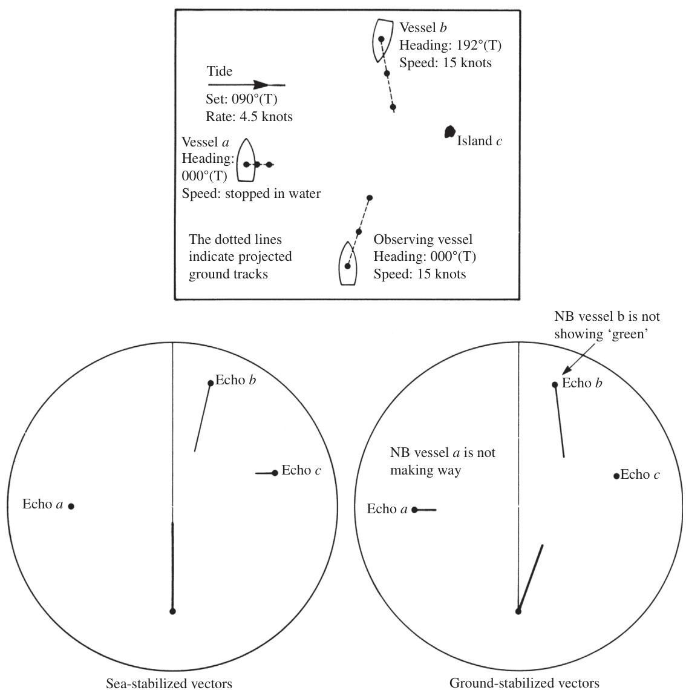  
FIGURE 4.16 Sea-stabilized and ground-stabilized displays.  

【翻译】
图4.16海基稳定显示和地基稳定显示。

【解读】
该图展示了两种类型的稳定显示：海基稳定显示和地基稳定显示。这可能是在讨论导航或测量技术中使用的不同类型的显示设备，特别是在海上或陆地环境中保持稳定性的重要性。

【词汇表】
| 英文词汇 | 中文翻译 | 解释 |
| --- | --- | --- |
| Sea-stabilized | 海基稳定 | 在海上环境中保持稳定性 |
| Ground-stabilized | 地基稳定 | 在陆地环境中保持稳定性 |
| Displays | 显示 | 电子设备上的视觉输出 |

In simple facilities, only some ten to fifteen lines may be available, thus merely allowing the construction of fairly crude patterns or maps (see Figure 4.17). The pattern may be lost if the equipment is switched off, and it may or may not be possible to edit or move the pattern around the screen, once drawn. More advanced packages will allow the observer to prepare and store the pattern at a convenient time when planning the passage and subsequently to recall it when required. It will then be possible to move the pattern around the screen in order to align or realign it with displayed radar echoes and there will be provision for easy editing. A non-volatile memory allows the storage of several maps even when the equipment is switched off. The most comprehensive mapping facilities will provide for the permanent storage of maps containing as many as a thousand or more elements. While there is no rigid distinction in names between the two extremes, the simpler packages tend to be referred to as navigation lines while the more comprehensive are usually described as mapping facilities. The facility will frequently be used in association with automatic ground-stabilization (see Section 4.8).  

【翻译】
在简单的设施中，只有大约十到十五条线可用，因此只能构建出相当粗糙的图案或地图（见图4.17）。如果设备被关闭，图案可能会丢失，而且可能无法编辑或移动屏幕上的图案。一旦绘制完成，更高级的软件包允许观察者在规划航程时准备和存储图案，然后在需要时回忆它。这时可以移动图案在屏幕上，以便与显示的雷达回声对齐或重新对齐，并且可以轻松编辑。非易失性内存允许即使设备关闭也能存储多个地图。最全面的映射设施可以永久存储包含一千多个元素的地图。虽然两种极端之间没有严格的命名区别，但较简单的软件包往往被称为导航线，而更全面的则通常被描述为映射设施。该设施经常与自动地面稳定化（见第4.8节）一起使用。

【解读】
本段主要讨论了不同级别的导航和映射设施的功能差异，从简单的导航线到复杂的映射设施。这些设施的主要目的是帮助用户规划和导航航程，通过构建和编辑地图、图案等。更高级的设施提供了更多的灵活性和功能，如自动存储和回忆图案、编辑和移动图案等。同时，也提到了这些设施与其他技术如自动地面稳定化的结合使用。

【词汇表】
| 英文词汇 | 中文翻译 | 解释 |
| --- | --- | --- |
| facilities | 设施 | 指这里的导航和映射系统 |
| volatile | 易失性 | 指数据容易丢失的特性 |
| non-volatile | 非易失性 | 指数据不会因为设备关闭而丢失的特性 |
| ground-stabilization | 地面稳定化 | 指一种保持设备在地面位置稳定的技术 |
| mapping facilities | 映射设施 | 指能够创建和编辑地图的高级导航系统 |

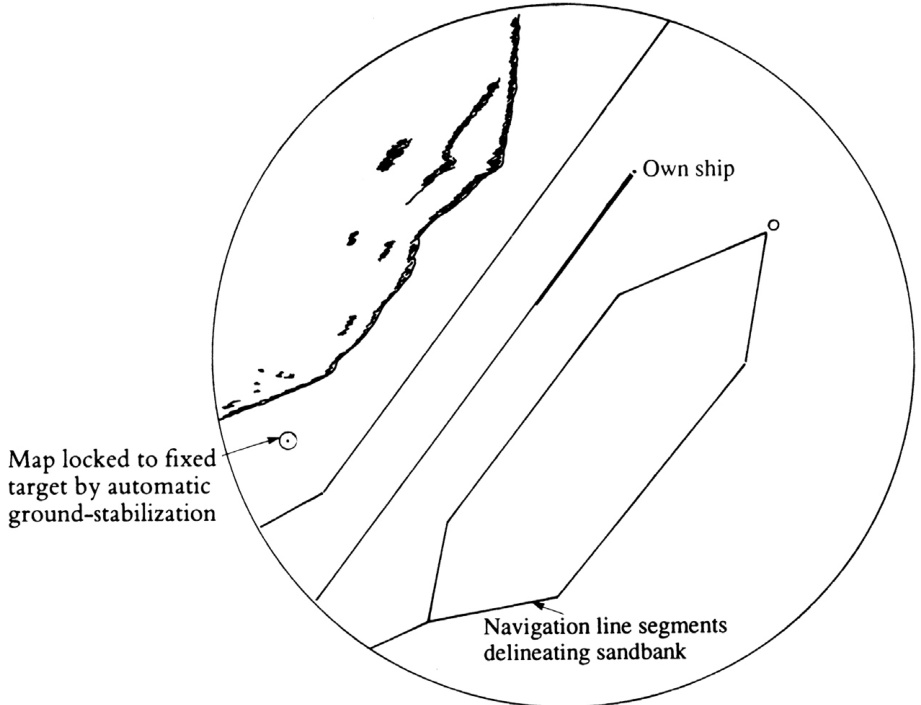  
FIGURE 4.17 Map presentation.  

【翻译】
图4.17 地图展示。

【解读】
该图片展示的是一张地图的呈现方式，可能用于地理信息系统（GIS）或其他地图相关应用中，以直观的形式展现地理数据。

【词汇表】
| 英文词汇 | 中文翻译 | 解释 |
| --- | --- | --- |
| Figure | 图片/图表 | 指示一个插图或图形 |
| Map | 地图 | 一种表示地理区域的视觉表现形式 |
| Presentation | 呈现/展示 | 指某物被以特定方式显示或介绍给观众 |

The concept of adding maps to the radar display has now extended to the integration of electronic charts (ECDIS) with the radar/ARPA. The advantages are that:  

【翻译】
添加地图到雷达显示的概念已经扩展到电子海图（ECDIS）与雷达/ARPA的集成。其优点是：

【解读】
该段落描述了现代航海技术中雷达系统与电子海图的集成发展。这种集成可以提高航海安全性和效率，因为它能够为操作员提供更加全面和准确的海上情况信息。

【词汇表】
| 英文词汇 | 中文翻译 | 解释 |
| --- | --- | --- |
| ECDIS | 电子海图系统 | 一种用于航海的电子海图系统，能够显示船舶位置、水深等信息 |
| ARPA | 自动雷达 Plotter 辅助系统 | 一种辅助雷达系统，能够自动跟踪和识别其他船舶或障碍物 |
| Radar | 雷达 | 无线电探测和定位系统，使用无线电波来检测和定位目标 |

a. The data is not prepared by the navigator which improves the reliability and accuracy as well as being more convenient.  

【翻译】
数据不是由导航员准备的，这提高了可靠性和准确性，同时也更加方便。

【解读】
这句话强调了使用自动化或计算机系统处理数据的优势，相比之下，由人工（如导航员）准备数据可能会引入错误，从而降低可靠性和准确性。这种方法不仅能够提高数据处理的效率，还能减少人为错误的发生。

【词汇表】
| 英文词汇 | 中文翻译 | 解释 |
| --- | --- | --- |
| navigator | 导航员 | 指在特定环境中帮助他人找到方向或位置的人，也可以指导航设备或软件。 |
| reliability | 可靠性 | 指系统、产品或服务能够按照预期方式正常运行且持续工作的能力。 |
| accuracy | 准确性 | 指结果或测量值与真实值之间的接近程度。 |
| convenient | 方便 | 指某事物或情况易于操作、访问或管理。 |

b. It allows a more sophisticated selection of features to be added.  

【翻译】
它允许添加更复杂、更精细的特征选择。

【解读】
这句话强调了某种技术或方法的优势，即能够支持更加高级和细致的特征选择。这意味着这种方法可以根据具体需求精心挑选最合适的特征，从而提高整体性能或准确度。

【词汇表】
| 英文词汇 | 中文翻译 | 解释 |
| --- | --- | --- |
| sophisticated | 复杂、精细 | 指的是高级别或高端的东西，在这里指特征选择的能力更为先进和细致。 |
| features | 特征 | 在数据分析或机器学习中，特征是指用来描述或定义对象或实体的属性或变量。 |
| selection | 选择 | 指的是从一组选项中挑选出最合适的部分，这里指的是从众多特征中选择最有用的那一些。 |

The ECDIS topic is covered in more detail in Section 10.2.  

【翻译】
ECDIS话题在第10.2节中有更详细的介绍。

【解读】
本段提示读者，如果想要了解更多关于ECDIS的话题，可以参考第10.2节中的内容，这意味着相关章节中会对ECDIS进行更加深入的讨论。

【词汇表】
| 英文词汇 | 中文翻译 | 解释 |
| --- | --- | --- |
| ECDIS | 电子海图显示与信息系统 | 一种用于航海的电子导航系统 |
| Section | 节、部分 | 文档或书籍中的一个独立部分 |
| Topic | 话题、主题 | 讨论或研究的对象或领域 |

# 4.10 TARGET SIMULATION FACILITY  

A target simulation facility should be provided for training purposes.  

【翻译】
为了培训目的，应该配备一个目标模拟设施。

【解读】
这句话强调了在培训过程中，拥有一个能够模拟实际操作环境的设施是非常必要的。这可以帮助训练者更好地适应真实情况，提高他们的反应能力和操作技能。

【词汇表】
| 英文词汇 | 中文翻译 | 解释 |
| --- | --- | --- |
| Target | 目标 | 指定要达到的标准或要求 |
| Simulation | 模拟 | 使用模型或虚拟环境来模仿现实世界中的情况或过程 |
| Facility | 设施 | 为某种活动或用途而设置的场所或设备 |

Older performance standards required a test programme to check the performance of the radar tracker. Test scenarios were provided with dummy echoes on the display and often these were also found useful for training trainee officers when at sea. The test scenarios are no longer a requirement, but the ability for the system to provide a simulation facility for training purposes is required. When in use, the display needs a clear indication that it is in training mode, in case it is accidently left in this mode and mistaken for a real situation.  

【翻译】
旧的性能标准要求一个测试程序来检查雷达跟踪器的性能。测试场景会在显示屏上提供虚拟回声，通常这些也被发现对训练海上新任官员很有用处。虽然测试场景不再是必需的，但系统需要具备为培训目的提供模拟设施的能力。当使用时，显示屏需要明确指示它处于训练模式，以防止它意外地留在这种模式下而被误认为是真实情况。

【解读】
这段话主要讨论了雷达跟踪系统的性能测试和培训要求。过去，系统需要通过特定测试程序来验证其性能，而现在则强调了系统提供模拟培训功能的能力，以便于官员的培训，同时也需要清晰地标示是否处于训练模式，以避免混淆。

【词汇表】
| 英文词汇 | 中文翻译 | 解释 |
| --- | --- | --- |
| Radar Tracker | 雷达跟踪器 | 一种使用雷达技术跟踪目标的设备或系统 |
| Dummy Echoes | 虚拟回声 | 在雷达显示屏上人工生成的信号，用于模拟实际目标的回声 |
| Simulation Facility | 模拟设施 | 系统中用于模拟各种情景以进行培训或测试的功能 |
| Training Mode | 训练模式 | 系统中的一个状态，用于官员培训，不处理实际数据 |

# 4.11 THE PREDICTED POINT OF COLLISION  

The predicted point of collision (PPC) is that point towards which the observing ship should steer at her present speed (assuming that the target does not manoeuvre) in order for a collision to occur.  

【翻译】
预测碰撞点（Predicted Point of Collision，PPC）是指观察船在当前速度下（假设目标物体不进行机动），为了发生碰撞而应驶向的方向点。

【解读】
本段落介绍了“预测碰撞点”的概念，这是一个用于航海领域的术语，特别是在避免碰撞或判断潜在碰撞风险时使用。它强调了在当前速度和方向下，不考虑目标物体的任何改变的情况下，两艘船只会在这个点发生碰撞。

【词汇表】
| 英文词汇 | 中文翻译 | 解释 |
| --- | --- | --- |
| Predicted Point of Collision | 预测碰撞点 | 指在特定条件下两艘船可能发生碰撞的位置 |
| observing ship | 观察船 | 指观察和判断碰撞风险的一方 |
| target | 目标物体 | 在此 context 下指另一艘船或可能与观察船发生碰撞的对象 |
| manoeuvre | 机动 | 指船只进行转向、减速、加速等操作以改变其运动状态 |

Some early ARPA designers recognized that the positions of these points can be quickly calculated and displayed for all tracked targets. The argument made for displaying the PPCs is that they assist in developing a collisionavoidance strategy by showing the navigator, at a glance, the courses which are completely unacceptable because they intersect a collision point. This is the only contribution which can be claimed for PPCs. They do not give any indication of miss distance (other than in the zero CPA case) and any attempt to extrapolate the clearing distance either side of the point will be fraught with danger. A safe course is one which, among other things, results in passing at a safe distance, which implies a knowledge of clearing distance. Safe and effective use of PPCs depends upon a thorough understanding of the factors which affect their location and movement. As is evident from the following treatment, this is, in many cases, not a simple matter. Some systems make it possible to display these points as small circles when, but only when, true vectors are selected.  

【翻译】
一些早期的ARPA设计师认识到，这些点的位置可以快速计算和显示所有被跟踪的目标。展示PPCs（预测碰撞点）的理由是，它们通过向导航员展示哪些航线完全不可接受，因为它们与碰撞点相交，从而帮助开发碰撞避免策略。这是PPCs唯一能声称的贡献。它们不能提供任何偏差距离的指示（除了零CPA情况），任何试图外推清除距离两边的点都会充满危险。安全的航线是指在其他条件下，还要保证安全距离，这意味着需要了解清除距离。安全有效地使用PPCs取决于对影响其位置和运动的因素有深入的理解。如同下面所讨论的，这在很多情况下不是一个简单的问题。有些系统使得当且仅当选择真实矢量时，可以以小圆圈的形式显示这些点。

【解读】
本段主要讨论了预测碰撞点（PPCs）在导航系统中的作用和局限。它强调了PPCs能够帮助导航员快速识别出可能发生碰撞的航线，但同时也指出了PPCs的限制，如无法提供具体的偏差距离信息等。因此，使用PPCs需要对相关因素有深刻的理解，以确保安全高效的操作。

【词汇表】
| 英文词汇 | 中文翻译 | 解释 |
| --- | --- | --- |
| ARPA | 自动雷达导航系统 | 一种用于船舶导航的自动化雷达系统 |
| PPCs | 预测碰撞点 | 预测可能发生碰撞的点 |
| CPA | 最近接近点 | 船舶之间最近的接近点 |
| Vectors | 矢量 | 在几何学中表示大小和方向的量 |

# 4.11.1 The Concept of Collision Points  

When two ships are in the same area of sea, it is always possible for them to collide. The point(s) at which collision can occur may be defined and depends upon:  

【翻译】
当两艘船在同一海域时，它们发生碰撞的可能性始终存在。可能发生碰撞的点（或多个点）可以被定义，并且取决于：

【解读】
本段强调了海上交通安全的一个关键问题，即两艘船只在同一区域航行时就有可能相互碰撞。这意味着无论是由于人类操作失误还是其他不可预测的因素，都可能导致严重的事故。因此，了解可能发生碰撞的具体位置对于采取有效的防范措施至关重要。

【词汇表】
| 英文词汇 | 中文翻译 | 解释 |
| --- | --- | --- |
| collide | 碰撞 | 指两个物体之间的冲突或撞击 |
| depend upon | 取决于 | 表示某事物的发生、状态等受到某种条件或因素的影响 |
| define | 定义 | 确定或规定某事物的含义、范围或特征 |

a. The speed ratio of the two ships.   
b. The position of the two ships.  

【翻译】
a. 两艘船的速度比。
b. 两艘船的位置。

【解读】
该段落讨论了两个相关要点：第一点是关于两艘船之间的速度关系，即它们的速度比率；第二点则关注于这两艘船在空间中的相对位置。这两个方面对于航海、交通管理或军事战略等领域都具有重要意义，因为了解船只的速度比率可以帮助预测它们之间的交互作用，而确定它们的位置则有助于规划路线或实施战术决策。

【词汇表】
| 英文词汇 | 中文翻译 | 解释 |
| --- | --- | --- |
| Speed Ratio | 速度比率 | 指两个物体的速度之比，用于比较它们的运动快慢。 |
| Position | 位置 | 指某一物体在特定时刻所处的空间坐标或状态。 |

Considering any two ships, usually one is moving faster than the other; the possibility that one is at exactly the same speed as the other and will maintain that ratio for any period of time is remote enough to be disregarded for the moment.  

【翻译】
考虑到任意两艘船，只有一艘通常会比另一艘移动得更快；一艘船以与另一艘完全相同的速度行驶，并且在任何时间内保持这种速度比率的可能性足够小，可以暂时忽略。

【解读】
这段话讨论了两艘船之间的相对速度问题，指出一般情况下，一艘船的速度会高于另一艘。同时，它也提到了两艘船可能以相同的速度行驶，但认为这种情况发生的概率非常低，因此可以暂时不予考虑。

【词汇表】
| 英文词汇 | 中文翻译 | 解释 |
| --- | --- | --- |
| remote | 远程的、遥远的 | 在这里指的是“极小”的意思，表示某种情况发生的概率非常低。 |
| disregard | 忽略、不考虑 | 暂时或永久地不予考虑或注意。 |
| maintain | 维持、保持 | 保持某种状态或水平不变。 |
| ratio | 比率、比例 | 两个数量之间的比较关系。 |

The ship which is the faster of the two will always see displayed one and only one collision point, since it can pursue the target if necessary. This collision point is always on the track of the target, as shown in Figure 4.18.  

【翻译】
两艘船中速度较快的一艘总是只能看到一个碰撞点，因为它可以在必要时追逐目标。这个碰撞点始终位于目标的航迹上，如图4.18所示。

【解读】
本段讨论的是两艘船之间可能发生的碰撞情况，特别强调了速度较快的船只能够看到一个唯一的碰撞点。这意味着，无论如何，只有一个潜在的碰撞位置存在，这取决于目标船只的轨迹。这种情况下，速度较快的船只具有主动权，可以选择是否与目标进行碰撞。

【词汇表】
| 英文词汇 | 中文翻译 | 解释 |
| --- | --- | --- |
| collision point | 碰撞点 | 指两个物体可能发生碰撞的位置或瞬间 |
| pursue | 追逐 | 在这里指跟踪或紧随目标以便采取行动 |
| target | 目标 | 指被跟踪、观察或作为行动对象的事物或人 |
| track | 航迹 | 指移动物体（如船只）行进的路径或路线 |

The ship which is the slower of the two may see displayed two collision points, both of which must be on the target track. One exists where the slow ship heads towards the target and intercepts it, while another exists where the slow ship heads away from the target but is struck by it. The two cases appear in Figure 4.19. Alternatively there may be no way for the slower ship to collide with the faster (even though the faster may collide with the slower) because it is just not fast enough to reach the target (Figure 4.20).  

【翻译】
两艘船中较慢的一艘可能会看到两个碰撞点，这两个点都必须在目标轨迹上。一个情况是当较慢的船朝向目标并拦截它时，另一个情况是当较慢的船远离目标但被目标击中时。这两种情况如图4.19所示。或者，较慢的船可能根本无法与较快的船碰撞（尽管较快的船可以与较慢的船碰撞），因为它速度不够快，无法到达目标（图4.20）。

【解读】
本段讨论的是两艘船之间的碰撞问题，特别是当其中一艘船速度较慢时的情况。通过分析不同情景下的运动轨迹，可以得出结论：较慢的船可能有两个碰撞点，或者由于速度不足而根本无法与较快的船碰撞。

【词汇表】
| 英文词汇 | 中文翻译 | 解释 |
| --- | --- | --- |
| collision | 碰撞 | 两个或多个物体之间的撞击或冲突 |
| intercept | 拦截 | 在某物移动的路径上阻挡或截住它 |
| target | 目标 | 预期要达到或击中的对象或位置 |
| trajectory | 轨迹 | 物体运动的路径或轨道 |

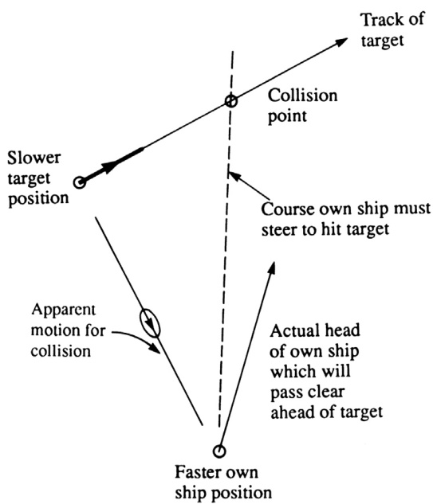  
FIGURE 4.18 Single point of collision.  

【翻译】
图4.18 单点碰撞。

【解读】
该图示意为单点碰撞，即两个物体在同一时刻、同一位置发生碰撞。这种情况通常用于物理学或工程学中研究碰撞动力学的模型。

【词汇表】
| 英文词汇 | 中文翻译 | 解释 |
| --- | --- | --- |
| Collision | 碰撞 | 指两个或多个物体之间的撞击或接触 |
| Point | 点 | 在几何学中指空间中的一个位置 |
| Single | 单一 | 只有一个，独一无二 |

246  

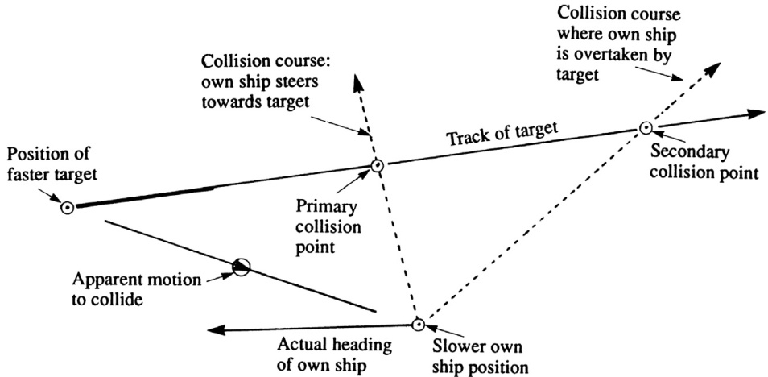  
FIGURE 4.19 Dual points of collision.  

【翻译】
图4.19 双重碰撞点。

【解读】
这幅图展示了两个物体之间可能发生双重碰撞的情况，这意味着在同一时间或非常接近的时间内，这两个物体会在两个不同的位置相互作用或碰撞。这类现象在物理学、工程学等领域中有重要意义，因为它可以影响系统的稳定性、安全性以及能量转移等方面。

【词汇表】
| 英文词汇 | 中文翻译 | 解释 |
| --- | --- | --- |
| Collision | 碰撞 | 指两个或多个物体之间的冲突或撞击。 |
| Dual | 双重 | 在这里指的是同时发生的两次碰撞。 |
| Points | 点 | 指空间中的特定位置，在本例中是碰撞发生的位置。 |

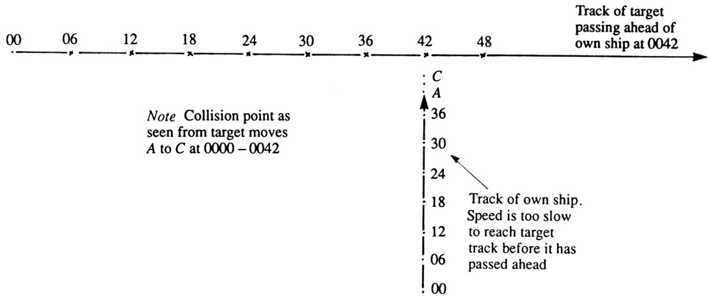  
FIGURE 4.20 No points of collision.  

【翻译】
图4.20 无碰撞点。

【解读】
该图示意为没有发生碰撞或交集的情况，可能是在讨论几何形状、运动轨迹或者其他相关领域中的一个特定情景。

【词汇表】
| 英文词汇 | 中文翻译 | 解释 |
| --- | --- | --- |
| Collision | 碰撞 | 指两个或多个物体之间的冲突或撞击 |
| Points | 点 | 在几何学中指空间中的位置或坐标 |
| Figure | 图 | 通常用于表示图表、插图等视觉辅助工具 |

Note: A critical in-between case of one collision point exists where the slow ship can just reach the track of the fast ship.  

【翻译】
注：存在一个临界情况，即有一次碰撞点，当缓慢的船只刚好能够到达快速船只的航迹。

【解读】
本段讨论的是两艘船只（一艘快船，一艘慢船）之间可能发生碰撞的情况，特别是当慢船刚好能够到达快船的行进路径时，这被认为是一个临界或关键的情况。

【词汇表】
| 英文词汇 | 中文翻译 | 解释 |
| --- | --- | --- |
| critical | 临界的、关键的 | 指在某种情况下具有决定性影响的因素或条件 |
| collision | 碰撞 | 两个或多个物体之间的撞击或冲突 |
| in-between | 之间的、中间的 | 描述两个事物或状态之间的位置或阶段 |

# 4.11.2 The Behaviour of Collision Points If the Observing Ship Maintains Speed  

# 4.11.2.1 The Initial Collision Case  

It is important to realize that collision points exist, whether an actual collision threat exists or not. The only significance is that in the event of an actual collision threat, the collision points are the same for both ships. Figure 4.21 shows how the collision points move in a collision situation and how they will appear to the two ships involved. On the faster ship, the single collision point appears on the heading marker and moves down, decreasing in range as the collision approaches. On the slower ship, one of the two collision points will move down the heading marker, while the other moves down a steady bearing.  

【翻译】
了解碰撞点的存在是非常重要的，无论实际上的碰撞威胁是否存在。唯一的意义在于，如果发生实际的碰撞威胁，两艘船只会有相同的碰撞点。图4.21展示了碰撞情况下碰撞点如何移动，以及它们在两艘涉及的船只看来如何变化。在速度较快的船只上，单一的碰撞点出现在航向标志器上，并且随着碰撞的接近而向下移动，距离也逐渐减小。在速度较慢的船只上，其中一个碰撞点会沿着航向标志器向下移动，而另一个则沿着稳定的方位向下移动。

【解读】
本段强调了了解碰撞点的重要性，这对于避免海上碰撞至关重要。通过分析碰撞点的移动，可以预测潜在的碰撞风险，并采取相应措施进行避让。图4.21为此提供了视觉化的参考，帮助理解不同速度下的船只如何感知和应对碰撞点的变化。

【词汇表】
| 英文词汇 | 中文翻译 | 解释 |
| --- | --- | --- |
| Collision points | 碰撞点 | 指两艘船只在可能发生碰撞的情况下的交叉点或区域 |
| Heading marker | 航向标志器 | 一种导航工具，指示船只当前的航向 |
| Steady bearing | 稳定方位 | 指两个物体之间保持不变的方向关系 |
| Collision situation | 碰撞情况 | 指可能发生碰撞的环境或场景 |

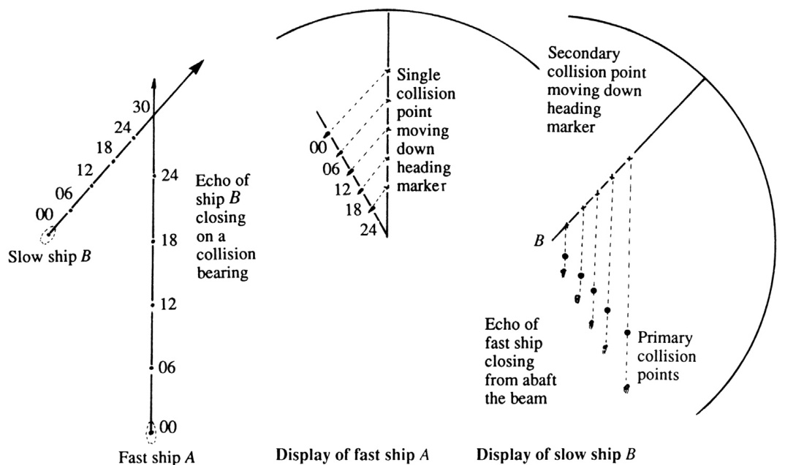  
FIGURE 4.21 The movement of the PPC in the collision situation.  

【翻译】
图4.21碰撞情况下生产可能性曲线（PPC）的移动。

【解读】
该图描述了在发生碰撞的情况下，生产可能性曲线（Production Possibility Curve, PPC）如何移动或变化。生产可能性曲线是经济学中用来表示一个国家或企业在一定资源条件下，可以生产的两种商品的最大可能组合。碰撞情况可能指的是资源、技术或者其他限制条件的变化，从而导致生产可能性曲线的移动。

【词汇表】
| 英文词汇 | 中文翻译 | 解释 |
| --- | --- | --- |
| PPC | 生产可能性曲线 | 描述一个国家或企业在一定资源条件下，可以生产的两种商品的最大可能组合的曲线。|
| Collision | 碰撞 | 在这里指的是影响生产可能性曲线移动的事件或情况，如资源、技术或者其他限制条件的变化。|
| Situation | 情况 | 指特定环境或条件下的状态，在本例中是指碰撞发生前的状态。|

# 4.11.2.2 The Non-Collision Case  

In a non-collision case, the collision point moves according to well-defined rules, but it will never cross the heading marker. In the case of the faster ship, the movement depends on whether the fast ship will cross ahead of or behind the target ship. Figure 4.22 shows the two possible cases and typical track lines.  

【翻译】
在非碰撞情况下，碰撞点按照明确的规则移动，但永远不会越过航向标志。在较快船只的情况下，其运动取决于快速船是否会在目标船的前方或后方通过。图4.22显示了两种可能的情况以及典型的轨迹线。

【解读】
本段主要讨论的是在海上避碰撞的规则和情况，特别是当两艘船相遇时如何预测和应对潜在的碰撞风险。它提到了“碰撞点”和“航向标志”，这些都是海事安全中的关键概念，用于判断船舶之间的距离和方向关系，以避免碰撞。

【词汇表】
| 英文词汇 | 中文翻译 | 解释 |
| --- | --- | --- |
| Non-collision | 非碰撞 | 指两艘船没有实际碰撞的状态 |
| Collision point | 碰撞点 | 预测出的两艘船可能碰撞的位置 |
| Heading marker | 航向标志 | 用于指示船舶当前航向的标志或参考点 |
| Target ship | 目标船 | 被观察或跟踪的另一艘船，只用于比较运动状态 |

The case of the slower ship is more complicated because of the two collision points and the possibility of no collision point existing. If the observin g ship’s course is to pass between the two collision points, they will pass down either side of the observing ship, generally shortening in range, and then draw together under the stern of the observing ship. As they meet they become one collision point before they finally disappear, as in Figure 4.23.  

【翻译】
较慢的船只情况更加复杂，因为有两个碰撞点以及可能没有碰撞点存在。如果观察船的航向是通过两个碰撞点之间的区域，则它们会从观察船的两侧经过，一般而言距离会逐渐缩短，然后在观察船的艉部下方汇聚。当它们相遇时，它们会变成一个碰撞点，然后最终消失，如图4.23所示。

【解读】
本段主要讨论的是海上两艘船只可能发生碰撞的情况，特别是当其中一艘船速度较慢时。由于有两个可能的碰撞点，观察船需要根据自己的航向和对方船只的位置来判断是否会发生碰撞。如果观察船的航向位于两个碰撞点之间，那么这两艘船只会先在距离上逐渐接近，然后在观察船的后方汇聚，最终成为一个碰撞点然后消失。这段强调了海上交通中预测碰撞点的重要性，以确保安全航行。

【词汇表】
| 英文词汇 | 中文翻译 | 解释 |
| --- | --- | --- |
| collision points | 碰撞点 | 指两艘船只可能发生碰撞的位置 |
| observin g ship | 观察船 | 指观察和跟踪另一艘船只的船只 |
| stern | 艉部 | 船尾部分 |
| range | 距离 | 指两艘船只之间的距离 |

If the observing ship is steering to pass astern of the fast ship, the collision points will draw together, form one point and then disappear. It is noticeable that the collision point more distant from the target ship, usually termed the secondary point, moves much faster than the point nearer to the target which is termed the primary collision point.  

【翻译】
如果观察船正在操纵以从快船后方通过，那么碰撞点会聚集在一起，形成一个点，然后消失。值得注意的是，与目标船距离较远的碰撞点（通常称为次要点）移动速度比靠近目标的点（称为主要碰撞点）移动速度快得多。

【解读】
本段描述了两艘船只之间可能发生碰撞的情况，当观察船试图从另一艘较快船的后方通过时，碰撞点会随着时间的推移而变化。特别是，距离目标船较远的碰撞点（次要点）移动速度更快，而距离目标船较近的点（主要碰撞点）移动速度较慢。这一现象对于航海安全和避免碰撞具有重要意义。

【词汇表】
| 英文词汇 | 中文翻译 | 解释 |
| --- | --- | --- |
| Astern | 后方 | 指船舶的后部或尾部 |
| Collision point | 碰撞点 | 指两艘船只可能碰撞的位置 |
| Primary collision point | 主要碰撞点 | 指距离目标船较近的碰撞点 |
| Secondary point | 次要点 | 指距离目标船较远的碰撞点 |

# 4.11.3 The Behaviour of the Collision Point When the Target Ship’s Speed Changes  

If the speed ratio is infinitely large, for example when the target is stationary, then obviously the collision point is at the position of the target. If the observing ship maintains speed while the target begins to increase speed, the collision point will begin to move along the target track. When the target speed has increased to that of the observing ship, the secondary collision point will appear at infinity. Further increase of the target speed will move the primary and secondary collision points towards each other (not necessarily by equal amounts); eventually, own speed in comparison to target speed may be so slow that the two points will merge and then  

【翻译】
如果速度比率是无限大的，比如当目标物体是静止的，那么很明显碰撞点就在目标物体的位置。当观察船保持速度不变，而目标开始增加速度时，碰撞点会沿着目标轨迹移动。当目标速度增加到与观察船相同的速度时，第二个碰撞点会出现在无穷远处。进一步增加目标速度会使主、副碰撞点向彼此靠近（并不一定以相等的距离）；最终，自身速度相对于目标速度可能变得如此缓慢，以至于两个点会合并，然后...

【解读】
本段讨论的是在不同速度条件下，观察船与目标物体之间的碰撞点如何变化。特别强调了当目标速度变化时，碰撞点的位置和数量如何受到影响。这一分析对于理解追踪和导航系统中的动态关系具有重要意义。

【词汇表】
| 英文词汇 | 中文翻译 | 解释 |
| --- | --- | --- |
| Speed Ratio | 速度比率 | 指两个物体之间的速度比例关系 |
| Collision Point | 碰撞点 | 两物体在预测路径上可能发生碰撞的位置 |
| Target Track | 目标轨迹 | 目标物体运动的预测路径 |
| Secondary Collision Point | 次要碰撞点 | 在特定条件下出现的另一个可能的碰撞位置 |

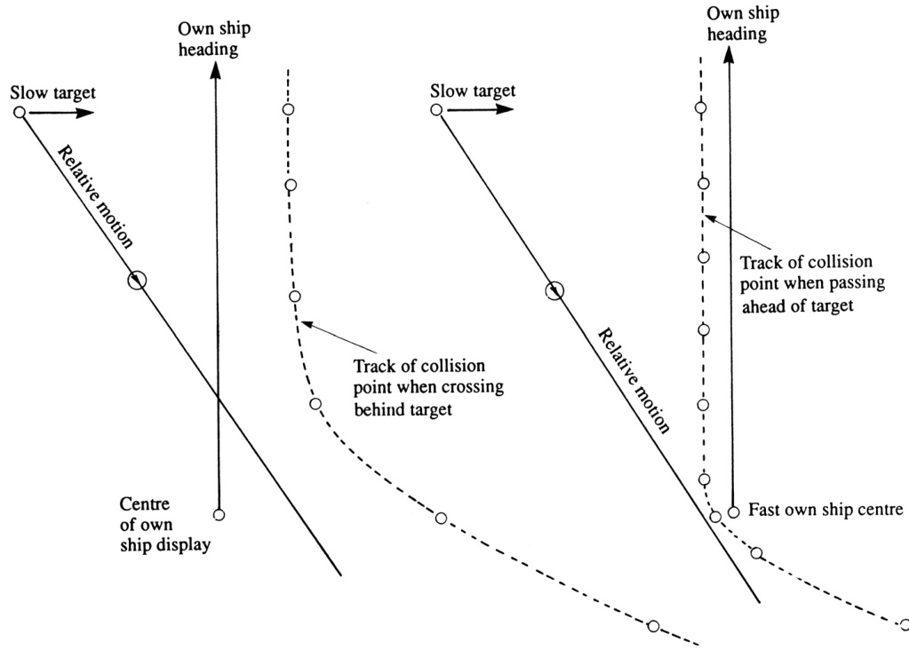  
FIGURE 4.22 The track of the collision point.  

【翻译】
图4.22碰撞点轨迹。

【解读】
该图显示了两个物体碰撞过程中碰撞点的运动轨迹，用于描述和分析碰撞的动力学特性。

【词汇表】
| 英文词汇 | 中文翻译 | 解释 |
| --- | --- | --- |
| collision | 碰撞 | 两个或多个物体之间的撞击或冲突 |
| track | 轨迹 | 物体运动的路径或路线 |
| point | 点 | 空间中的一个位置或坐标 |

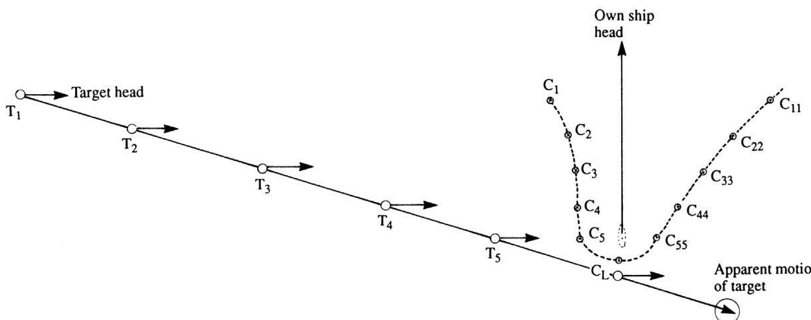  
FIGURE 4.23 The movement of dual collision points. Own ship is steering to pass between the collision points at speed $7\mathrm{kn}$ . Target speed $=24\mathrm{kn}$ .  

$C_{\mathrm{n}}=$ primary collision point ${\mathrm{C}}_{\mathrm{nn}}=$ secondary collision point when target is at $T_{\mathrm{n}}$ $C_{\mathrm{nn}}C L=$ limiting condition where the hazard disappears disappear. This behaviour is shown in Figure 4.24.  

# 4.11.4 The Behaviour of the Collision Point When the Target Changes Course  

If the two ships have the same speed, the collision point moves on a locus which is the perpendicular bisector of the line joining the two ships. The greater the aspect, the farther away the collision point will be (Figure 4.25). Theoretically, the limiting aspect in this case is $90^{\circ}$ , but then the collision point would be at infinity and hence an aspect of some $85^{\circ}$ plus is considered the practical limit.  

# 4.11.4.1 For a Slower Observing Ship  

When the observing ship is slower than the target, two collision points exist and they are seen to be on the circumference of a circle  

【翻译】
当观测船只比目标移动得更慢时，会存在两个碰撞点，它们被看到位于一个圆圈的周围。

【解读】
这段话描述了在海上或者其他环境中，当一艘观测船只试图跟踪或预测另一艘船（目标）的运动路径时，如果观测船只的速度低于目标船只，则会出现两个可能的碰撞点，这些点位于以某一点为中心的一个圆圈上。这意味着观测船只需要根据目标船只的速度和方向来调整自己的位置，以避免潜在的碰撞。

【词汇表】
| 英文词汇 | 中文翻译 | 解释 |
| --- | --- | --- |
| Observing ship | 观测船只 | 指监视和跟踪目标的船只 |
| Target | 目标 | 在本文中指被观测和跟踪的对象，即另一艘船 |
| Circumference | 周围、圆周 | 指圆形的边缘或周长，在此处特指圆圈的边界 |

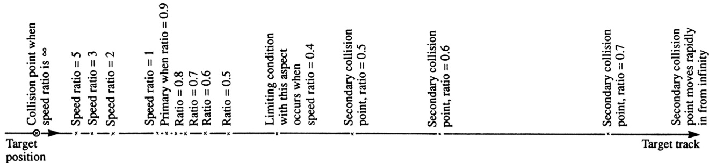  

【处理失败：内存不足或无法生成有效响应】

# ① Own ship position  

FIGURE 4.24 The behaviour of the collision point with the change of speed ratio (i.e. own speed: target speed).  

【翻译】
图4.24碰撞点随速度比（即自身速度与目标速度之比）变化的行为。

【解读】
该图表明了碰撞点如何在不同速度比下发生变化，这可以帮助分析者了解不同速度条件下的碰撞动态特征。

【词汇表】
| 英文词汇 | 中文翻译 | 解释 |
| --- | --- | --- |
| collision point | 碰撞点 | 指两个物体相互作用或冲突的位置或瞬间 |
| speed ratio | 速度比 | 两个物体之间的速度关系，通常指自身速度与目标速度的比例 |
| behaviour | 行为 | 指系统或物体在特定条件下的反应或表现方式 |

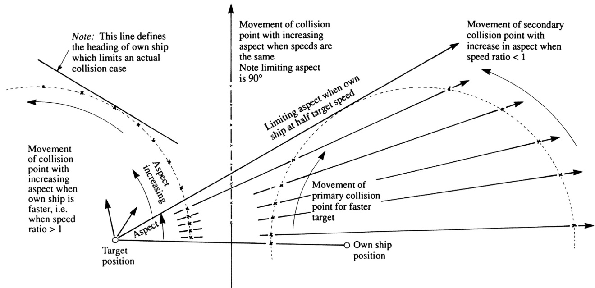  
FIGURE 4.25 The movement of the collision point(s) as target aspect changes, drawn for speed ratios of 2:1 and 1:2.  

【翻译】
图4.25：当目标方位变化时，碰撞点的运动轨迹（以2:1和1:2的速度比绘制）。

【解读】
该图展示了在不同速度比下，当目标物体的朝向发生变化时，碰撞点如何移动。这可以帮助分析者了解不同速度条件下的碰撞动态特征。

【词汇表】
| 英文词汇 | 中文翻译 | 解释 |
| --- | --- | --- |
| collision point | 碰撞点 | 指两个物体相互作用或冲突的位置 |
| speed ratio | 速度比 | 两个物体之间的速度关系，通常用一个数值来表示某一物体的速度是另一物体速度的多少倍 |
| target aspect | 目标方位 | 指目标物体的方向或朝向 |

whose centre and radius are dependent on the speed ratio; the circle is always on the observing ship’s side of the unity speed ratio locus. A limiting aspect can be defined which is also dependent on the speed ratio. A slower observing ship will mean that a target will have a smaller limiting aspect angle.  

【翻译】
其圆心和半径取决于速度比；该圆始终位于观测船一侧的单位速度比轨迹上。可以定义一个限制方面，它也取决于速度比。较慢的观测船意味着目标的限制方面角度会更小。

【解读】
本段主要讨论的是在海军或航海领域中，观测船与目标之间的相对运动关系，特别是如何根据速度比确定某些关键参数，如圆心、半径以及限制方面角度等。这段强调了观测船的速度对于这些参数的影响，尤其是当观测船的速度变慢时，目标的可见范围或者说限制方面角度会减小。

【词汇表】
| 英文词汇 | 中文翻译 | 解释 |
| --- | --- | --- |
| speed ratio | 速度比 | 指两个物体（如观测船和目标）之间的速度比例关系 |
| unity speed ratio locus | 单位速度比轨迹 | 指速度比为1时的位置轨迹，作为参考基准 |
| limiting aspect | 限制方面 | 指目标从观测船视角看过去的最大或最小可见范围或角度 |

Aspects greater than the limit pose no hazard since the observing ship can never catch up with the target.  

【翻译】
超过极限的方面不构成任何危险，因为观察船永远无法赶上目标。

【解读】
这段话讨论的是在某种追逐或跟踪场景中，当被观察的目标（target）移动速度或距离超过了观察者（observing ship）的能力范围时，就不会对观察者造成威胁。这意味着只要目标保持在一定的速度或距离优势，观察者就无法接近或捕获它，从而保证了目标的安全。

【词汇表】
| 英文词汇 | 中文翻译 | 解释 |
| --- | --- | --- |
| Aspects | 方面、方面 | 指事物的某一特征或侧面 |
| Hazard | 危险、风险 | 对人或事物可能造成伤害或损失的状况 |
| Target | 目标、对象 | 被观察、追踪或攻击的物体或人物 |
| Limit | 极限、限制 | 最大或最小的允许值或程度 |

# 4.11.4.2 For a Faster Observing Ship  

When the observing ship is the faster, the circle of collision points lies on the target side of the equal-speed locus. As the aspect increases, the collision point moves farther away from the observing ship. There is no limiting aspect and collision is always possible.  

【翻译】
当观测船只速度较快时，碰撞点的圆圈位于等速轨迹的目标侧。随着方位角的增加，碰撞点会离观测船只越来越远。没有限制方位角，碰撞总是可能的。

【解读】
本段主要讨论了在海军战术中，当观测船只速度超过目标船只时，两者之间可能发生碰撞的位置关系。它指出，随着观测船只与目标船只之间的方位角度的增加，碰撞点会逐渐远离观测船只。这意味着，即使观测船只处于不利的位置，也有可能通过调整航向或速度来实现与目标船只的碰撞。

【词汇表】
| 英文词汇 | 中文翻译 | 解释 |
| --- | --- | --- |
| observing ship | 观测船只 | 指进行观察或监视的船只 |
| target | 目标 | 在这里指被观测或攻击的对象，通常为另一艘船只 |
| aspect | 方位角 | 指观测者与目标之间的方向角度 |
| collision | 碰撞 | 指两个物体（如船只）之间的撞击或冲突 |

An interesting point to note in Figure 4.25 is that the inverse of the idea of a limiting aspect to the slow observing ship appears when the observing ship is faster; this is effectively a limiting course for the observing ship. If the actual heading is to the remote side of this line, all collision points appear on the one bow. If the own heading is inside this limiting direction, the collision point will move across the heading marker as the target changes aspect.  

【翻译】
在图4.25中，有一个有趣的观察点：当观测船只速度更快时，慢速观测船的限制方面的想法会出现逆转；这实际上是观测船只的一条限制航向。如果实际航向位于此线的远侧，则所有碰撞点都出现在一侧的船头。如果自己的航向在这个限制方向内，碰撞点会随着目标改变方位而移动到航向标记处。

【解读】
本段讨论的是两艘船只之间可能发生碰撞的情况下的观测原理。当观测船只速度较快时，其与另一艘船只（目标）之间的相对运动会产生一种特殊的限制航向，如果观测船只的实际航向超过了这一限制航向，所有可能的碰撞点都会集中在同一侧。这意味着观测船只需要特别注意这一区域，以避免潜在的碰撞风险。

【词汇表】
| 英文词汇 | 中文翻译 | 解释 |
| --- | --- | --- |
| limiting aspect | 限制方面 | 指某一特定条件或状态下物体或系统的行为受到限制的方面或情况 |
| observing ship | 观测船只 | 指进行观测或监视的船只 |
| collision points | 碰撞点 | 指两艘船只可能发生碰撞的位置 |
| heading marker | 航向标记 | 指表示船只当前航向的标志或仪器 |

# 4.12 THE PREDICTED AREA OF DANGER (PAD)  

The shortcomings of collision points can be listed as follows:  

【翻译】
碰撞点的缺陷可以列举如下：

【解读】
本段主要介绍了碰撞点的不足之处，预示着后续内容将对这些缺陷进行详细说明。

【词汇表】
| 英文词汇 | 中文翻译 | 解释 |
| --- | --- | --- |
| shortcomings | 缺陷、缺点 | 指某事物或方法存在的不完善或不足的地方 |
| collision points | 碰撞点 | 在这里指可能发生冲突或问题的区域或时刻 |
| listed | 列举、枚举 | 按顺序或项目清单形式展示某些事项 |

a. Inaccuracies in data acquisition are likely to displace the points.   
b. No account is taken of the dimensions of the ships involved.   
c. They offer no quantitative indication of miss distance, which is the essential data required for collision avoidance.  

【翻译】
a. 数据采集中的不准确性可能会导致点的位置发生偏移。
b. 没有考虑到相关船舶的尺寸。
c. 它们无法提供距离失误的定量指标，这是避免碰撞所需的基本数据。

【解读】
这段话主要讨论了某种方法或系统在预防碰撞方面存在的三个缺陷：第一，数据采集过程中的错误可能导致位置信息不准确；第二，没有考虑到船舶的大小，这是一个重要因素；第三，缺乏对距离失误的定量评估，这是避免碰撞的关键数据。这意味着这种方法或系统可能不能有效地帮助避免碰撞。

【词汇表】
| 英文词汇 | 中文翻译 | 解释 |
| --- | --- | --- |
| inaccuracies | 不准确性 | 指数据、测量等中存在的错误或差异 |
| displace | 使偏移 | 使某物从原来的位置移动或改变 |
| quantitative indication | 定量指标 | 用数字或数量来表示的衡量标准 |
| miss distance | 距离距离 | 指两个物体之间的最小距离，尤其是在避免碰撞的 context 下 |

The logical development is to construct, around the PPC, a plane figure which is associated with a chosen passing distance and in the calculation of which due margin of safety can be allowed for the effects of data inaccuracies and the physical dimensions of the vessels involved. The area within the figure is to be avoided to achieve at least the chosen passing distance and is referred to as a PAD. The technique was patented by Sperry Marine Systems and is exclusive to the ARPAs produced by that company. The PAD approach is an extremely elegant solution to the problem of how best to present collision-avoidance data. It is essential that the user has a thorough understanding of the principles underlying the presentation with particular reference to the location, movement, shape and change of shape of the PAD. As will be seen from the following explanation, this is not a simple subject.  

【翻译】
逻辑发展是围绕预期航向（PPC）构建一个平面图形，该图形与所选的通过距离相关联，在计算中可以允许一定的安全裕度来应对数据不准确性和所涉及船舶的物理尺寸的影响。图形内的区域应该避免，以实现至少所选的通过距离，这被称为“PAD”（通过避让区）。该技术由Sperry海洋系统公司获得专利，并且仅适用于该公司生产的ARPA。PAD方法是解决如何最佳地呈现碰撞避让数据问题的一个极其优雅的解决方案。用户必须彻底理解呈现背后的原理，特别是关于PAD的位置、运动、形状和形状变化。正如下面的解释所示，这不是一个简单的话题。

【解读】
本段主要讨论了在导航系统中使用PAD（通过避让区）的概念，旨在帮助船只避免碰撞。通过构建一个与预期航向相关的平面图形，可以计算出需要避免的区域，以达到某一安全距离。这种方法被认为是一个优雅的解决方案，但需要用户深入理解其背后的原理，包括PAD的位置、运动、形状及其变化。

【词汇表】
| 英文词汇 | 中文翻译 | 解释 |
| --- | --- | --- |
| PPC | 预期航向 | 指船只预计要走的航线或方向 |
| PAD | 通过避让区 | 指为了保持安全距离而需要避开的区域 |
| ARPA | 自动雷达辅助 Plotter | 一种辅助雷达系统，帮助操作员跟踪和分析目标物体的运动 |
| Sperry Marine Systems | 斯佩瑞海洋系统公司 | 一家开发和制造海洋电子设备的公司 |

In the case of the collision point there is a course which intercepts the target’s track at the given speed ratio, whereas in the PAD there are generally two intersection points. One of these is where the observing ship will pass ahead of the target and the other where the observing ship will pass astern of the target. The angle subtended by these two limiting courses will depend upon:  

【翻译】
在碰撞点的情况下，有一条航线会以给定的速度比截断目标的航迹，而在PAD（预测空域）中，一般存在两个交点。其中一个是观察船将从目标前方通过，另一个是观察船将从目标后方通过。这两条极限航线所形成的角度取决于：

【解读】
本段讨论的是有关海上追踪或导航的技术问题，特别是关于“碰撞点”和“预测空域”（PAD）的概念。在海军战术或航海领域，这些术语指的是预测和计算两艘船只（或其他移动物体）之间可能发生碰撞的位置和时间，以及如何避免这种情况。文中提到的“速度比”、“交点”和“角度”等参数都是用来计算和预测两艘船只运动轨迹的关键因素。

【词汇表】
| 英文词汇 | 中文翻译 | 解释 |
| --- | --- | --- |
| Collision Point | 碰撞点 | 两艘船只可能发生碰撞的位置 |
| PAD (Predicted Area of Danger) | 预测空域 | 预测两艘船只可能发生碰撞的区域 |
| Speed Ratio | 速度比 | 两艘船只的相对速度比例 |
| Intersection Points | 交点 | 两条航线或轨迹相交的点 |

a. The speed ratio.   
b. The position of the target.   
c. The aspect of the target.  

【翻译】
a. 速度比。
b. 目标位置。
c. 目标方位。

【解读】
该段落列出了三个要点，分别是速度比、目标位置以及目标方位，这些信息可能与导航、追踪或定位系统相关，强调了在这些系统中需要考虑的关键因素。

【词汇表】
| 英文词汇 | 中文翻译 | 解释 |
| --- | --- | --- |
| Speed ratio | 速度比 | 指两个物体之间的速度关系，常用于描述相对运动的速率。 |
| Target | 目标 | 在此 contexto 中指需要被跟踪、定位或检测的对象。 |
| Aspect | 方位 | 指目标物体的方向或朝向，通常在航空或海军领域使用。 |

As shown in the case of the collision point, a faster observing ship must always generate a single cross-ahead and cross-astern position. A slower observing ship produces much more complex possibilities and, depending on the three variables noted above, these may include:  

【翻译】
如碰撞点案例所示，更快的观测船只会产生一个单一的交叉前方和交叉后方位置。较慢的观测船则会产生更加复杂的可能性，这些可能性取决于上述三个变量，可能包括：

【解读】
本段讨论的是两艘船之间的相对运动关系，特别是当其中一艘船作为观测者时。根据观测者的速度不同，它们在预测碰撞点或其他位置时会面临不同的复杂程度。更快的观测者能够清晰地确定对方的位置，而较慢的观测者则需要考虑更多的变量，从而导致预测结果更加复杂。

【词汇表】
| 英文词汇 | 中文翻译 | 解释 |
| --- | --- | --- |
| collision point | 碰撞点 | 两艘船可能发生碰撞的位置 |
| observing ship | 观测船 | 进行观测的船只 |
| cross-ahead | 交叉前方 | 指某物体位于观测者前方的位置 |
| cross-astern | 交叉后方 | 指某物体位于观测者后方的位置 |
| variables | 变量 | 影响事件结果的可改变因素 |

a. Two cross-ahead and two cross-astern points.   
b. One cross-ahead and two cross-astern points.   
c. Two cross-astern points.   
d. No hazard.  

【翻译】
a. 两个向前交叉点和两个向后交叉点。
b. 一个向前交叉点和两个向后交叉点。
c. 两个向后交叉点。
d. 无危险。

【解读】
该段落描述的是船舶或航行中关于交叉点的分类，特别是在海上或者河流中的情况。这些选项（a、b、c、d）分别对应不同的交叉情景，用于判断是否存在碰撞风险或需要采取避让措施。

【词汇表】
| 英文词汇 | 中文翻译 | 解释 |
| --- | --- | --- |
| Cross-ahead | 向前交叉 | 指其他船只从观察者的左侧或右侧横过，位于观察者前方的位置。 |
| Cross-astern | 向后交叉 | 指其他船只从观察者的左侧或右侧横过，但已经位于观察者身后的位置。 |
| Hazard | 危险 | 在此指可能导致碰撞或其他安全问题的情况。 |

In the case of the single or primary collision point, the position at which the observing ship will cross ahead of the target is always farther from the target than the collision point, while the cross-astern point is always nearer to the target.  

【翻译】
在单一碰撞点或主要碰撞点的情况下，观察船只将要超越目标的位置总是比碰撞点更远离目标，而横向后方的交叉点则总是更接近于目标。

【解读】
本段讨论的是海上相遇时的几何关系，特别是在两艘船可能发生碰撞的情况下的位置判断。它指出，当考虑到观察船与目标船之间的距离和位置关系时，有两个关键点需要注意：一个是观察船将要超越目标船的位置（cross-ahead point），另一个是观察船与目标船在横向后方的交叉点（cross-astern point）。这两个点对于航海安全和避免碰撞至关重要，因为它们帮助船员预测和应对可能的碰撞风险。

【词汇表】
| 英文词汇 | 中文翻译 | 解释 |
| --- | --- | --- |
| collision point | 碰撞点 | 两艘船可能发生碰撞的位置 |
| cross-ahead point | 超越点 | 观察船将要超越目标船的位置 |
| cross-astern point | 横向后方交叉点 | 观察船与目标船在横向后方的交叉点 |

In the case of a slower observing ship, where there is a secondary collision point, the second cross-ahead position is nearer to the target and the associated cross-astern position more remote from it (Figure 4.26).  

【翻译】
在观测船速度较慢的情况下，如果存在第二次碰撞点，则第二个前方交叉位置更接近目标，而相应的后方交叉位置则更加远离它（图4.26）。

【解读】
本段主要讨论的是海上观测和避碰的原则，特别是在两艘船可能发生碰撞的情况下如何进行判断和操作。提到的“第二次碰撞点”、“前方交叉位置”和“后方交叉位置”都是海事领域中的专业术语，用于描述不同阶段的相对位置关系，以便采取适当的措施避免碰撞。

【词汇表】
| 英文词汇 | 中文翻译 | 解释 |
| --- | --- | --- |
| secondary collision point | 第二次碰撞点 | 在两船可能发生第一次碰撞后，又可能发生的另一次碰撞的位置。 |
| cross-ahead position | 前方交叉位置 | 指一艘船与另一艘船在航向上的前方交叉时的位置关系。 |
| cross-astern position | 后方交叉位置 | 指一艘船与另一艘船在航向上的后方交叉时的位置关系。 |

To indicate limits within the ‘cross-ahead/ cross-astern’ arc, it is necessary to draw a bar parallel to the target’s track and at the intended miss-distance closer to the observing ship’s position.  

【翻译】
为了指示“交叉前方/交叉后方”弧线内的限制范围，需要画一条与目标航迹平行的线条，并且该线条应靠近观察船的位置，在预期的偏离距离处。

【解读】
本段主要讨论的是如何在海军或航空领域中确定一个目标的交叉点的限制范围。通过绘制一条与目标移动方向平行的线条，可以更好地判断出目标与观察者之间的相对位置和距离，从而进行更加准确的导航或瞄准。

【词汇表】
| 英文词汇 | 中文翻译 | 解释 |
| --- | --- | --- |
| cross-ahead/cross-astern | 交叉前方/交叉后方 | 指目标物体与观察者的相对运动位置关系 |
| target | 目标 | 被观察或瞄准的对象 |
| miss-distance | 偏离距离 | 观察者与目标之间的预期距离 |

The limits defined by the arc and the bar are such that, if the observing ship were to cross those limits, then it would be at a less distance than the desired miss-distance from the target. Figure 4.27 shows the generation of the two boundaries in the case of a slower observing ship.  

【翻译】
由弧线和杆状物定义的限制是这样的，如果观察船越过这些限制，那么它将距离目标小于期望的最小距离。图4.27显示了在较慢的观察船的情况下生成两个边界的过程。

【解读】
本段主要讨论的是关于观察船与目标之间保持安全距离的问题，通过设置特定的限制（arc和bar），以确保观察船不会过度接近目标，从而保证安全距离。图4.27则具体展示了如何根据观察船的速度情况来确定这些限制。

【词汇表】
| 英文词汇 | 中文翻译 | 解释 |
| --- | --- | --- |
| arc | 弧线 | 一种曲线形状的几何图形，在这里指的是用于定义限制的曲线部分 |
| bar | 杆状物 | 一种直线或棒状的标记或物体，在这里指的是用于定义限制的直线部分 |
| miss-distance | 最小距离 | 指的是观察船与目标之间需要保持的最小安全距离 |

# 4.12.1 The PAD in Practice  

In order to produce an acceptable system for practical operation, these limits are normally encapsulated by a symmetrical figure such as an ellipse or a hexagon.  

【翻译】
为了产生一个可接受的实际操作系统，这些限制通常被封装在对称图形中，如椭圆或六边形。

【解读】
该段落讨论了如何设计一个实用的系统，强调了对系统限制进行对称化处理（如使用椭圆或六边形）的必要性，以使其更适合实际应用。

【词汇表】
| 英文词汇 | 中文翻译 | 解释 |
| --- | --- | --- |
| encapsulated | 封装 | 将某物置于容器或保护层内 |
| symmetrical | 对称的 | 在形状、大小或排列上呈现对称关系 |
| ellipse | 椭圆 | 一种扁平的、近似圆形的曲线图形 |
| hexagon | 六边形 | 一种有六条边的多边形 |

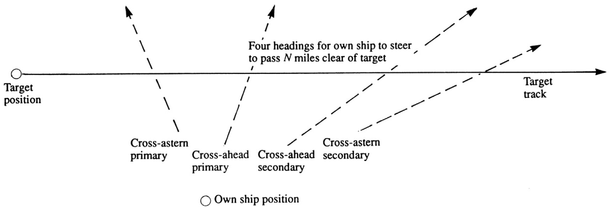  
FIGURE 4.26 The sequence of cross-ahead/cross-astern points.  

【翻译】
图4.26：交叉前方点/交叉后方点序列。

【解读】
该图展示了航海或航空领域中用于确定位置和方向的一种方法，即通过观察两个物体（如星体、地标等）之间的相对位置关系来判断自身的位置和运动方向。在这种情况下，“cross-ahead”指的是某一物体位于观察者前方，而“cross-astern”则表示该物体位于观察者的后方。这种方法可以帮助人们更好地理解空间中的相对位置和运动轨迹。

【词汇表】
| 英文词汇 | 中文翻译 | 解释 |
| --- | --- | --- |
| Sequence | 序列 | 一系列按照一定顺序排列的事件或状态 |
| Cross-ahead | 交叉前方 | 指某一物体位于观察者前方的位置关系 |
| Cross-astern | 交叉后方 | 指某一物体位于观察者后方的位置关系 |

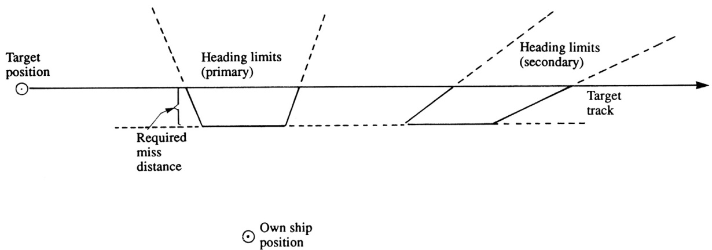  
FIGURE 4.27 The development of areas to keep clear: heavy lines indicate boundaries of danger areas.  

【翻译】
图4.27 保持清晰区域的发展：粗线表示危险区域的边界。

【解读】
该图展示了保持清晰区域的发展过程，其中用粗线标记出了危险区域的边界。这可能是在某种规划、设计或安全协议中使用的一种视觉表现形式，以帮助识别和避免潜在的风险区域。

【词汇表】
| 英文词汇 | 中文翻译 | 解释 |
| --- | --- | --- |
| development | 发展 | 指的是某事物或概念随时间的变化和进步 |
| boundaries | 边界 | 指的是两个或多个区域之间的分界线或限制 |
| danger areas | 危险区域 | 指的是存在潜在风险或威胁的地方或区域 |

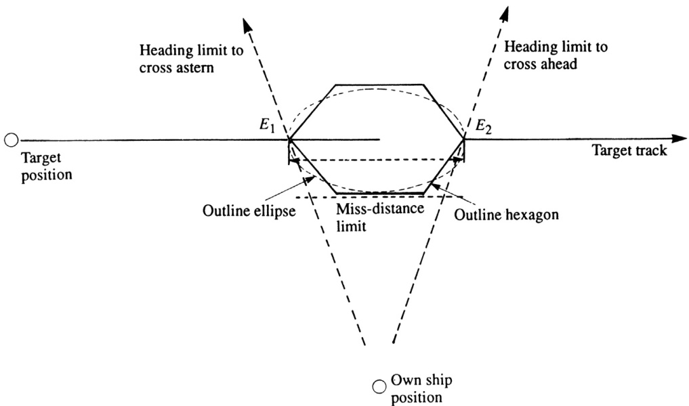  
FIGURE 4.28 Acceptable symmetrical figures.  

【翻译】
图4.28 可接受的对称图形。

【解读】
该图展示了几种被认为是可接受的对称图形，这些图形在设计或艺术中可能会用到，对称性是指图形在某一条线（对称轴）两侧呈现出镜像般的效果。

【词汇表】
| 英文词汇 | 中文翻译 | 解释 |
| --- | --- | --- |
| Symmetrical | 对称的 | 指两个部分在一个中心线或点上完全相同的排列方式 |
| Figures | 图形 | 在这里指的是几何形状或设计元素 |
| Acceptable | 可接受的 | 符合一定标准或美观要求的 |

In the case of the ellipse, the major axis is equal to the difference between the cross-ahead and cross-astern distances as measured from the target, while the minor axis is equal to twice the intended miss-distance. In the case of the hexagon, it is drawn from a rectangle and two isosceles triangles. The base of the triangle is always twice the miss-distance and the vertical height is one-quarter of the distance $E_{1}E_{2},$ as shown in Figure 4.28. It should be noted that the collision point is not necessarily at the centre of either of the traditional figures.  

In many cases the stylized figures do not follow the limits exactly, but any bias is on the safe side.  

【翻译】
在许多情况下，这些风格化的人物可能并不完全遵循这些限制，但任何偏差都倾向于保守一方。

【解读】
这句话主要强调的是，即使是经过风格化处理的人物，也不一定会严格按照既定的规则或限制来表现。但是，如果有任何偏差，那么这种偏差通常都是朝着更加安全或保守的方向进行的。这意味着，在设计或创作过程中，为了避免潜在风险或问题，往往会采取更为谨慎的态度。

【词汇表】
| 英文词汇 | 中文翻译 | 解释 |
| --- | --- | --- |
| stylized | 风格化 | 指的是对事物进行艺术加工，使其具有特定的风格或形式。 |
| bias | 偏差 | 在这里指的是与预期结果或标准相比的差异或偏移。 |
| safe side | 保守一方 | 指的是在做决定或采取行动时，选择最安全、最少风险的方式。 |

# 4.12.2 Changes in the Shape of the PAD  

Due to the lack of symmetry in the geometry which generates the area, the cross-ahead and cross-astern positions do not move symmetrically about the collision point when the miss-distance is changed. The cross-ahead position usually moves more markedly than the cross-astern position (see Figure 4.24, showing the movement of the two collision points, where the primary movement is much slower than the secondary). The overall result is an asymmetrical growth of the area with the cross-ahead position moving rapidly away from the collision point.  

【翻译】
由于生成该区域的几何形状缺乏对称性，当改变失误距离时，交叉前方和交叉后方位置不会在碰撞点周围对称移动。交叉前方位置通常比交叉后方位置移动得更明显（见图4.24，显示两个碰撞点的运动，其中主要运动远慢于次要运动）。总体结果是区域呈现非对称增长，交叉前方位置迅速远离碰撞点。

【解读】
本段讨论的是碰撞几何学中的一个特定问题，即当改变某个参数（失误距离）时，交叉前方和交叉后方位置如何移动。由于底层几何形状的非对称性，这些位置的移动并不对称，导致区域的增长也呈现出非对称的特征。这一分析对于理解和预测碰撞行为具有重要意义。

【词汇表】
| 英文词汇 | 中文翻译 | 解释 |
| --- | --- | --- |
| Symmetry | 对称性 | 指几何形状或系统在旋转、反射等变换下保持不变的属性 |
| Miss-distance | 失误距离 | 指两物体之间的最小距离，常用于描述碰撞风险或避免碰撞的安全距离 |
| Asymmetrical | 非对称的 | 指不具备对称性的特征，在这里指区域的增长方式与对称的预期不同 |

# 4.12.3 The Movement of the PAD  

# 4.12.3.1 The Collision Case  

As in the case of the collision point, when a danger area is violated by the heading marker the danger area will continue to move down the heading marker with the cross-ahead and cross-astern points on opposite bows. The shape of the danger area may change, but it will never move off the heading marker. In the case of a slower ship, where either of the two predicted areas is violated, the other will move in towards the target and eventually merge with the one on the heading marker.  

【翻译】
与碰撞点类似，当航向标志进入危险区域时，危险区域会继续沿着航向标志向下移动，且在对侧船头的前方和后方出现交叉点。虽然危险区域的形状可能发生变化，但它永远不会离开航向标志。在较慢的船只中，如果两个预测区域中的任意一个被违反，则另一个区域会朝目标移动，最终与航向标志上的区域合并。

【解读】
本段主要讨论了当船只的航向标志进入危险区域时，危险区域如何随之移动和变化。特别是，对于较慢的船只，如果其中一个预测区域被违反，另一个区域会向目标移动并最终与第一个区域合并。这一过程强调了船只在避免碰撞方面需要注意的动态变化。

【词汇表】
| 英文词汇 | 中文翻译 | 解释 |
| --- | --- | --- |
| collision point | 碰撞点 | 指两船相撞的位置或时间点 |
| danger area | 危险区域 | 船只行驶中可能发生碰撞的区域 |
| heading marker | 航向标志 | 表示船只当前航向的指示器 |
| cross-ahead | 前方交叉点 | 船只前方与另一船的交叉点 |
| cross-astern | 后方交叉点 | 船只后方与另一船的交叉点 |

In the limiting case where the observing ship’s heading marker just touches the limit of either of the PADs, the limit will remain in contact with the heading marker, although the shape of the area may change considerably.  

【翻译】
在观测船舶的航向指示器刚好接触到PAD（位置方位图）限制范围的极限情况下，限制范围将保持与航向指示器的接触，尽管该区域的形状可能会发生相当大的变化。

【解读】
本段描述了当观测船舶的航向指示器与位置方位图（PAD）的限制范围接触时，限制范围如何随着观测条件的变化而变化。这种情况通常出现在导航或航空领域，用于确定飞机或船舶的安全操作范围。

【词汇表】
| 英文词汇 | 中文翻译 | 解释 |
| --- | --- | --- |
| limiting case | 极限情况 | 指某种现象或系统达到其最极端或临界状态的情況 |
| heading marker | 航向指示器 | 一种设备或符号，用于表示飞机或船舶的当前航向 |
| PAD | 位置方位图 | 一种图表或显示，用于展示飞机或船舶相对于特定参考点的位置和方向信息 |

# 4.12.3.2 The ‘Passing Clear’ Case  

In the non-collision case where the heading marker does not violate one of the danger areas, the areas themselves will move across the screen, changing in shape and position. The movement will be very similar to that described for the collision point in Figure 4.22, depending on whether the observing ship is heading farther ahead than the cross-ahead position or farther astern than the cross-astern position. In the case of the dual areas of danger, although the movement will generally be the same as that shown for the dual collision points, a special case can arise when two danger areas may merge. This special case indicates the possibility of two cross-astern positions existing but no cross-ahead position. It is also possible that cross-astern positions may exist and an area of danger be drawn, which does not embrace an actual collision point.  

【翻译】
在非碰撞情况下，当航向标志不违反其中一个危险区域时，这些区域本身会在屏幕上移动，改变形状和位置。这种运动与图4.22中描述的碰撞点的运动非常相似，取决于观察船是否比交叉前方位置更远或比交叉后方位置更远。在双重危险区域的情况下，尽管运动通常与显示的双重碰撞点相同，但当两个危险区域合并时可能出现特殊情况。这一特殊情况指出存在两个交叉后方位置但没有交叉前方位置的可能性。同时，也有可能存在交叉后方位置，并绘制出一个不包含实际碰撞点的危险区域。

【解读】
这段话主要讨论了在导航系统中，特别是在非碰撞情况下的危险区域的表现和变化规律。它强调了根据观察船的位置和方向，危险区域在屏幕上的移动方式，以及在特定条件下可能出现的特殊情况，如两个危险区域的合并等。这些内容对于理解和预测海上交通中的潜在风险和避免碰撞的策略具有重要意义。

【词汇表】
| 英文词汇 | 中文翻译 | 解释 |
| --- | --- | --- |
| Non-collision | 非碰撞 | 指两物体之间没有发生直接碰撞的状态。 |
| Danger areas | 危险区域 | 指可能导致碰撞或其他安全风险的区域。 |
| Collision point | 碰撞点 | 指两物体可能发生碰撞的具体位置。 |
| Cross-ahead position | 交叉前方位置 | 指观察船前方与另一物体可能交叉的位置。 |
| Cross-astern position | 交叉后方位置 | 指观察船后方与另一物体可能交叉的位置。 |

# 4.12.3.3 Special Cases  

In some cases, for example, an end-on encounter, a cross-ahead and cross-astern position is not valid. In this context it is necessary to consider a pass-to-port and pass-to-starboard as defining the limits of the miss-distance. In the practical case, this results in the generation of a circle about the target’s position.  

【翻译】
在某些情况下，例如尾对尾相遇时，交叉前方和交叉后方的位置是不合法的。在这种情况下，需要考虑靠左驶过和靠右驶过来定义最小安全距离的限制。在实际应用中，这会产生一个以目标位置为中心的圆圈。

【解读】
本段讨论的是船舶或其他交通工具在特定情景下的安全距离问题，特别是在尾对尾相遇的情况下。为了避免碰撞，必须根据靠左驶过或靠右驶过的规则来确定最小安全距离，从而形成一个安全区域，即以目标位置为中心的圆圈。这一概念对于航海、航空等领域的安全操作具有重要意义。

【词汇表】
| 英文词汇 | 中文翻译 | 解释 |
| --- | --- | --- |
| end-on encounter | 尾对尾相遇 | 指两辆交通工具正面相向的相遇方式 |
| pass-to-port | 靠左驶过 | 指靠左侧驶过他人的交通工具 |
| pass-to-starboard | 靠右驶过 | 指靠右侧驶过他人的交通工具 |
| miss-distance | 最小安全距离 | 指两辆交通工具之间为了避免碰撞所需保持的最小距离 |

# 4.12.4 The Future of PADs  

PADs are additional to the display of standard relative and true vectors. They have never become recognized by the regulatory authorities and do not have to be part of an ARPA training course. PADs are no longer provided on the present radar models manufactured by the company to which Sperry now belongs, although this does not necessarily mean that PADs will not be introduced on a new model.  

【翻译】
PAD（位置辅助显示）是除了标准相对向量和真实向量显示之外的额外显示内容。它们从未被监管机构认可，也不需要成为ARPA培训课程的一部分。在目前由Sperry所属公司生产的雷达模型中，不再提供PAD，尽管这并不意味着PAD不会在新型号中引入。

【解读】
本段主要讨论了PAD（位置辅助显示）的特点及其在雷达系统中的应用情况。它提到PAD并没有得到监管机构的认可，也不是ARPA培训的必备内容。此外，在当前的雷达设备中，PAD可能已经不再被支持，但仍有可能在未来新的设备中重新引入。

【词汇表】
| 英文词汇 | 中文翻译 | 解释 |
| --- | --- | --- |
| PADs | 位置辅助显示 | 一种额外的显示功能，帮助用户更好地理解目标的位置信息 |
| ARPA | 自动雷达plotter和 Acquisition 系统 | 一种用于跟踪和记录雷达数据的自动化系统 |
| Regulatory authorities | 监管机构 | 负责监督和管理相关行业的政府或组织机构 |

PADs require some understanding of the principles and misunderstanding of the data that can occur. There has been some suggestion that PADs take no account of the Collision Avoidance Regulations and encourage less well-trained navigators to alter course for the biggest gap rather than in accordance with the rules. Thus there has been some reluctance to accept PADs at sea, not helped by the fact that availability has been restricted to Sperry models no longer in production.  

【翻译】
自动避碰辅助设备（PADs）需要对其原理有一定了解，同时也可能存在对数据的误解。有人提出，PADs没有考虑到碰撞规避法规，而是鼓励训练较差的导航员为寻找最大间隙而改变航向，而不是按照规定的规则行事。因此，一些人在海上使用PADs时持犹豫态度，这种情况并未因PADs只适用于已经停产的Sperry型号而得到改善。

【解读】
本段主要讨论了自动避碰辅助设备（PADs）的局限性和潜在问题。由于PADs可能被误解或滥用，尤其是在紧急情况下，导航员可能会根据PADs的建议进行不恰当的操作，从而增加碰撞的风险。此外，PADs的可用性受到限制，只适用于某些特定型号的设备，这进一步限制了其应用范围。

【词汇表】
| 英文词汇 | 中文翻译 | 解释 |
| --- | --- | --- |
| PADs | 自动避碰辅助设备 | 一种帮助导航员避免碰撞的电子设备 |
| Collision Avoidance Regulations | 碰撞规避法规 | 海上交通安全管理的相关法律法规 |
| navigators | 导航员 | 负责船舶导航的人员 |
| reluctance | 犹豫态度 | 对某事物持有顾虑或不愿意的态度 |

They remain an elegant solution to the collision-avoidance problem and a study of PADs becomes an interesting test of encounter geometry for the academic. It is not impossible that PADs will again be provided on ARPAs in the future.  

【翻译】
它们仍然是解决碰撞避免问题的一个优雅方案，对PADs的研究成为学者们对遭遇几何学的一项有趣测试。在未来，ARPAs上再次提供PADs也不是不可能的。

【解读】
本段讨论了PADs（可能指防撞系统或算法）在解决碰撞避免问题中的作用和潜在价值。尽管当前可能没有广泛应用，但从学术角度出发，研究PADs可以帮助深入理解遭遇几何学，这是一个有趣的领域。同时，也提到了未来可能会在ARPAs（自动驾驶系统或其他相关技术）中重新引入PADs，暗示着其在实际应用中的潜力。

【词汇表】
| 英文词汇 | 中文翻译 | 解释 |
| --- | --- | --- |
| Elegant | 优雅的 | 指解决方案简单、有效且美观 |
| Collision-avoidance | 碰撞避免 | 指避免发生碰撞的技术或策略 |
| Encounter geometry | 遭遇几何学 | 研究物体之间相互作用的空间关系和运动规律的学科 |
| ARPAs | 自动驾驶系统/自动反应规划算法 | 可能指自动驾驶车辆或系统中的某种算法或模块 |

