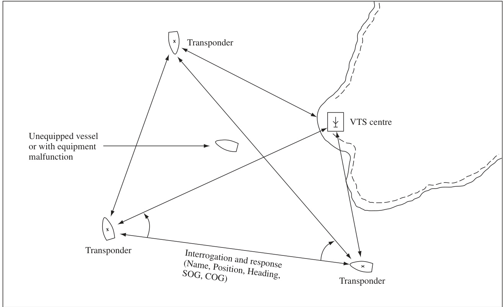
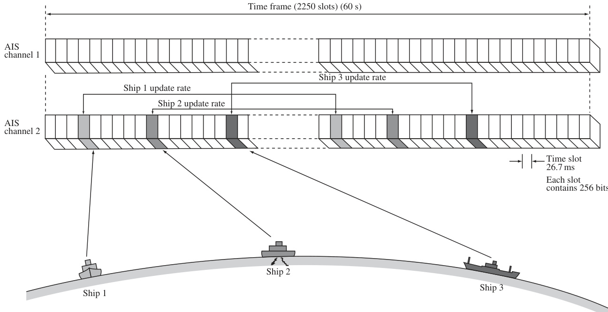
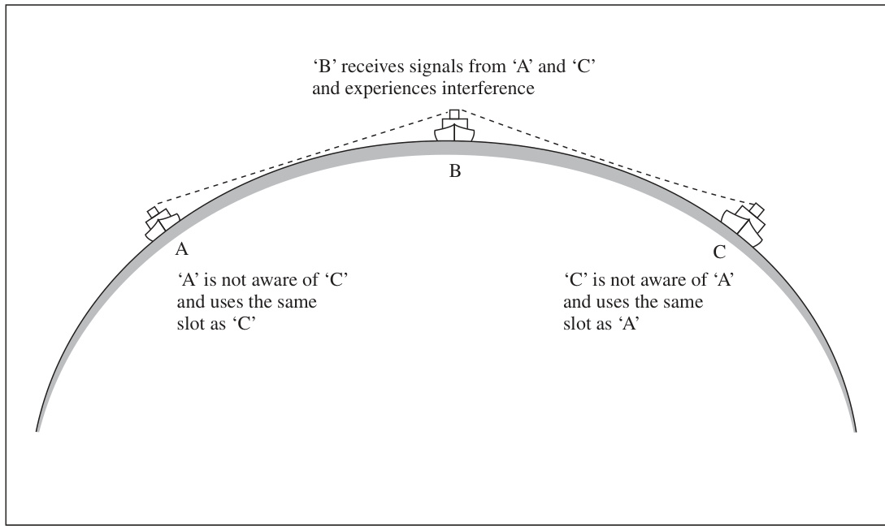
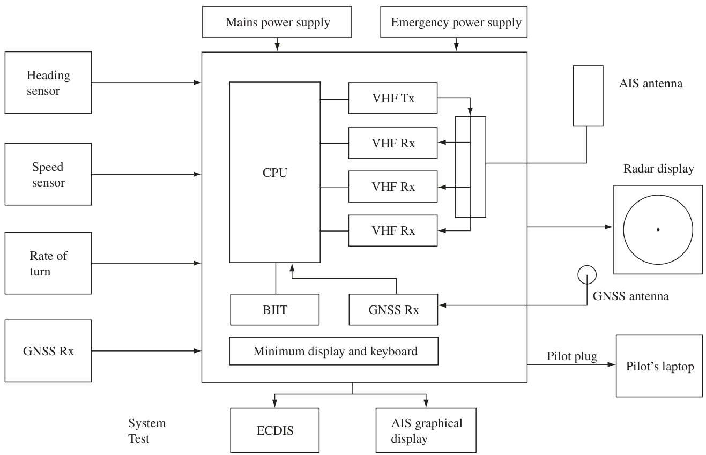
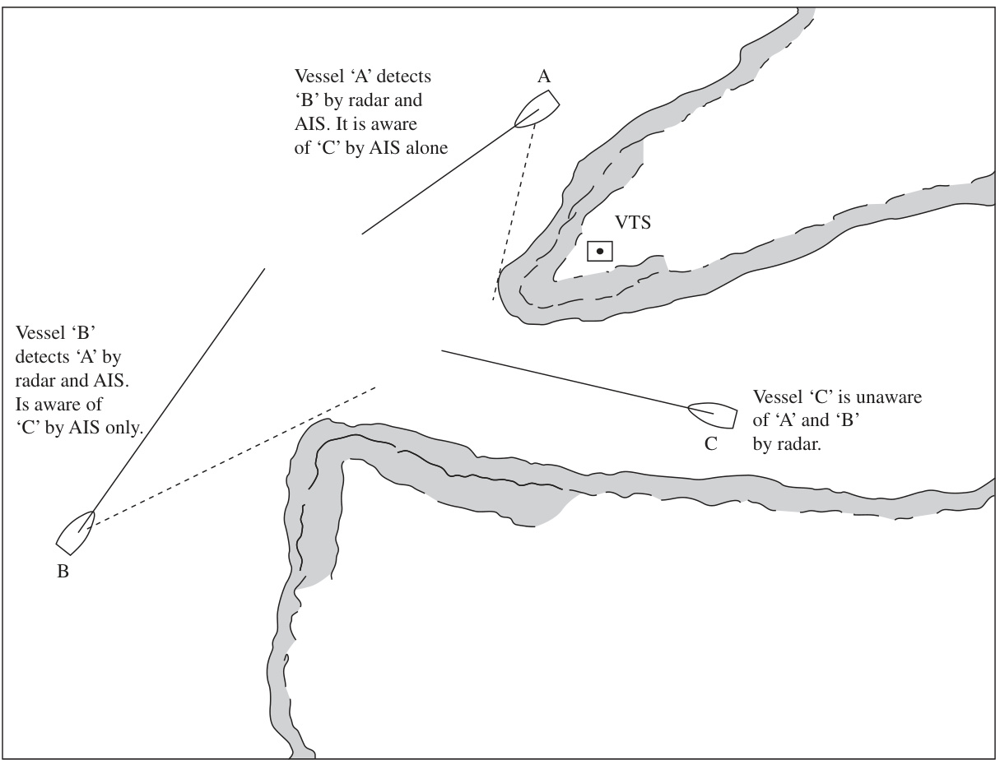
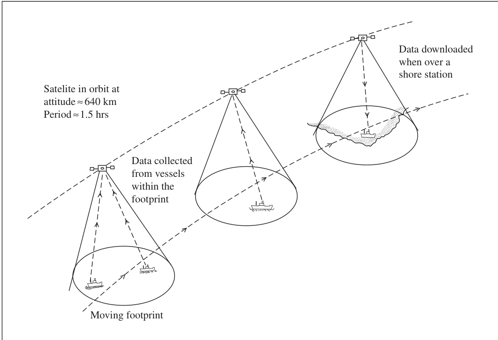
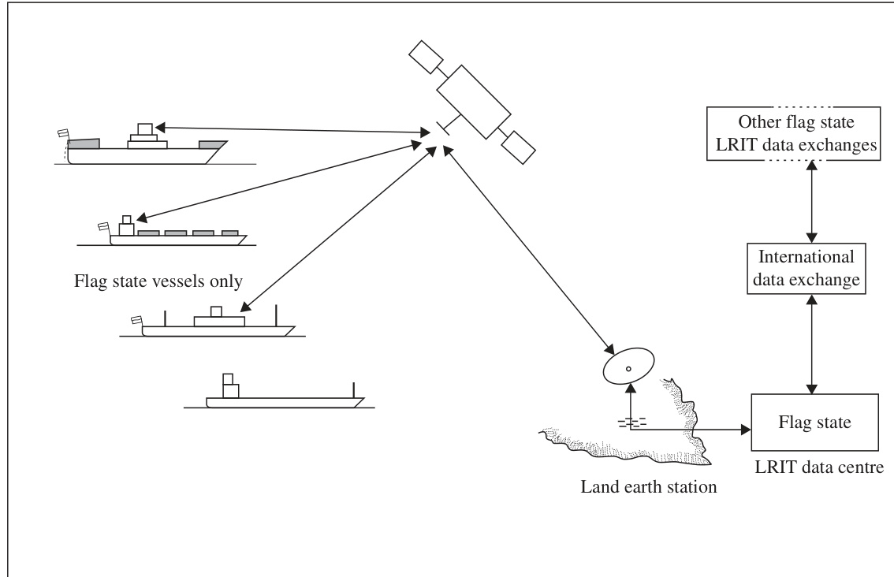

# Automatic Identification System (AIS)  

With the advent of VHF communication systems at sea, the advantages of bridge-tobridge and bridge-to-shore communications were widely recognized. Unfortunately, outside of pilotage waters and particularly in restricted visibility, there was no certainty as to who was talking to whom. While other vessels might be detected by radar, there was no means of positive identification that would allow meaningful communications or dialogue to be established. Regrettably, attempts to establish a dialogue without this positive identification resulted in the too frequently heard and dangerous practice of calling ‘Ship on my starboard bow . . .’, with all its ramifications, especially where traffic was heavy.  

【翻译】
随着VHF通信系统在海上广泛应用，桥梁至桥梁和桥梁至岸边通信的优势得到了广泛认可。不幸的是，在非领航水域尤其是在能见度受限的情况下，没有确定谁正在与谁交谈。虽然其他船只可能通过雷达被探测到，但没有一种积极的识别方式能够让有意义的通信或对话得以建立。遗憾的是，在没有这种积极识别的情况下尝试建立对话，导致了过于频繁地听到并且危险的“在我右舷弧……的船”这一叫喊行为，这种情况在交通拥挤的地方尤其明显。

【解读】
本段讨论了海上通信中身份识别的问题。在引入VHF通信系统后，人们认识到桥梁间和桥梁与岸边之间通信的优势。但是，当视野受限时，无法确认哪艘船正在与哪艘船进行通信。这导致了安全隐患，因为船只可能会错误地响应他人的呼叫，从而增加碰撞的风险。

【词汇表】
| 英文词汇 | 中文翻译 | 解释 |
| --- | --- | --- |
| VHF | 超高频 | 一种无线电通信技术，常用于海事通信 |
| Pilotage | 领航 | 指导航行的过程或区域 |
| Restricted visibility | 能见度受限 | 因为天气、雾霾等原因导致视野不清晰的状态 |
| Ramifications | 后果、影响 | 某一行动或事件所产生的结果或影响 |

The development of transponders provided the impetus to enable the identification of vessels fitted with the appropriate equipment to be established.  

【翻译】
超声应答器（transponder）的发展为识别配备了适当设备的船舶提供了动力，使得能够建立相关的识别标准。

【解读】
这段话主要讲述了超声应答器技术的发展如何推动了对特定船舶的识别能力。这意味着通过使用这些设备，可以更好地辨别和跟踪那些安装了相应设备的船只，从而提高海事管理和安全性的效率。

【词汇表】
| 英文词汇 | 中文翻译 | 解释 |
| --- | --- | --- |
| Transponders | 超声应答器/应答机 | 一种可以接收信号并自动发送回复信号的设备，常用于身份识别和位置追踪。 |
| Impetus | 动力/推动力 | 指促进或激发某一行动、变化或发展的力量或因素。 |
| Vessels | 船舶/船只 |泛指各种类型的船只，包括货船、客轮等。 |
| Established | 建立/确定 | 指使某事物变得稳固、可靠或被广泛接受。 |

The ability of shore stations, particularly where a vessel traffic service (VTS) is provided, to automatically identify vessels within their surveillance area, has long been an ideal, and the automatic identification system (AIS) provides just such a facility. The AIS also provides useful tracking data for security services and commercial business.  

【翻译】
岸基站，特别是那些提供船舶交通服务（VTS ）的地方，长期以来一直希望能够自动识别其监视区域内的船舶，而自动识别系统（ AIS ）正好满足了这一需求。同时，AIS 也为安全服务和商业业务提供了有用的跟踪数据。

【解读】
本段主要介绍了岸基站对自动识别船舶的需求，以及自动识别系统（AIS）如何满足这一需求。AIS不仅能帮助岸基站自动识别船舶，还能为安全服务和商业业务提供有价值的跟踪数据，从而提高管理效率和安全性。

【词汇表】
| 英文词汇 | 中文翻译 | 解释 |
| --- | --- | --- |
| VTS | 船舶交通服务 | 一种通过无线电通信等方式来管理和引导船舶交通的服务 |
| AIS | 自动识别系统 |一种用于自动识别和跟踪船舶位置、速度等信息的系统 |
| Surveillance | 监视 | 指对某一区域或对象进行持续观察和监控 |
| Facility | 设施、设施 | 指为某一目的而设置的设备或场所 |

The AIS is based on transponders located on vessels and other locations that transmit and receive information on dedicated VHF frequencies (Figure 5.1). Once set up for a voyage, information is transmitted continuously from each vessel without requiring attention from the mariner, unless something changes. The introduction of AIS provides an alternative way of obtaining information for both collision avoidance and navigation, which has traditionally been the preserve of the radar or automatic radar plotting aid (ARPA). Hence it is particularly important to appreciate the benefits and limitations of this new technology.  

【翻译】
自动识别系统（AIS）基于安装在船舶和其他位置上的应答器，这些应答器可以在专用的甚高频率（VHF）上发送和接收信息（图5.1）。一旦为航程设置好，信息就会从每艘船舶持续传输，不需要水手的关注，除非发生变化。AIS的引入为获取用于碰撞避免和导航的信息提供了一种新的方法，这些信息传统上是通过雷达或自动雷达绘图辅助工具（ARPA）获得的。因此，了解这种新技术的优点和局限性尤为重要。

【解读】
本段主要介绍了自动识别系统（AIS）的基本工作原理及其意义。AIS通过使用船舶上的应答器来实现信息的实时传输，从而为防止碰撞和导航提供了一个新的辅助手段。同时，也强调了理解这项技术的优势和限制的重要性，以便更好地应用于实际操作中。

【词汇表】
| 英文词汇 | 中文翻译 | 解释 |
| --- | --- | --- |
| AIS | 自动识别系统 | 一种用于船舶安全和交通管理的技术系统 |
| Transponder | 应答器 | 能够接收和发送信号的设备 |
| VHF | 甚高频率 | 无线电通信中的一个频率范围 |
| ARPA | 自动雷达绘图辅助工具 | 一种利用雷达数据进行航行辅助的系统 |

The specifications for a marine AIS were adopted by IMO as part of the revisions in 2001 to SOLAS Chapter V. AIS became a requirement for vessels covered by SOLAS in 2004, now termed Class A vessels, this date having been brought forward from 2007 due to international pressure. These are vessels of $300{\mathrm{grt}}$ or greater which are approved to operate internationally. Later in 2007, IMO introduced specified minimum standards for non-SOLAS (now termed Class B) vessels, which are generally small vessels, but can be larger vessels that only work in national waters of one state. It should be noted that by definition Class B vessels do not come under IMO jurisdiction, but under national government jurisdiction. IMO specified Class B equipment standards to ensure compatibly with Class A equipment. It also means that the fitting of Class B equipment to these non-SOLAS vessels is optional in most countries unless a country has made it a requirement in their own territorial waters.  

  
FIGURE 5.1 AIS overview.  

【处理失败：内存不足或无法生成有效响应】

Additionally transmissions can also be sent by other types of ‘user’. These are SAR (search and rescue) aircraft, aids to navigation (e.g. buoys), AIS base stations and AIS SARTs (search and rescue transponders). More details of these AIS types are provided in this chapter. This chapter also covers AIS displays, and compares the AIS with ARPA data from the perspective of both the shore and sea-based users.  

【翻译】
除了上述类型外，还有其他类型的“用户”可以发送传输信号。这些包括搜索和救援（SAR）飞机、航行辅助设施（如浮标）、AIS基站以及AIS搜索和救援应答器（SARTs）。本章中将详细介绍这些AIS类型。此外，本章还涵盖了AIS显示设备，并从岸基和海基用户的角度出发，对比了AIS数据与ARPA数据。

【解读】
该段落主要讨论了自动识别系统（AIS）的应用范围，提到了不同类型的用户可以发送AIS信号，包括搜索和救援飞机、航行辅助设施、AIS基站和AIS搜索及救援应答器等。同时，也提到本章节将对这些AIS类型进行详细说明，并且会比较AIS数据与ARPA数据，从而为用户提供更全面的了解。

【词汇表】
| 英文词汇 | 中文翻译 | 解释 |
| --- | --- | --- |
| SAR | 搜索和救援 | 指用于搜索和救援任务的飞机或设备 |
| AIS | 自动识别系统 | 一种用于船舶位置报告和识别的系统 |
| ARPA | 雷达辅助盲目导航 | 一种使用雷达技术辅助导航的系统 |
| SARTs | 搜索和救援应答器 | 用于搜索和救援任务的应答设备 |

# 5.1 ORGANIZATION OF AIS TRANSMISSIONS  

Two VHF frequencies have been dedicated for AIS transmission. In AIS terms they are designated as AIS channel A (VHF channel 87B or $161.975\mathrm{MHz})$ ) and AIS channel B (VHF channel 88B or 162.025 MHz). The Class A system is designed to be capable of transmission on other frequencies should there be a future demand.  

The potential range of Class A AIS on normal power (12.5 W) is therefore similar to VHF voice communications and is usually greater than radar. This is typically 30 or $40~\mathrm{NM}$ for a VHF antenna mounted on a large vessel and 20 miles for a smaller craft. However, if a Class A AIS transponder decides that the AIS is overloaded then it will switch to low power mode (2 W), which is the same power as Class B transmissions and reduces the effective range to under $10\mathrm{NM}$ .  

In order to allow all transponders to share the limited frequencies available, each transponder transmits for very short and precisely controlled time periods. The transmission system is known as TDMA time division multiple access. The time is regulated by the Global Navigation Satellite System (GNSS) (in practice GPS) clocks provided by satellite and it is divided into frames, each of 1 min in length. Each frame is divided into 2250 equal slots. Thus there are normally 4500 time slots available for transmission in every minute over the two frequencies (Figure 5.2). Approximately 256 bits, which can transmit the equivalent of 40 50 text characters, are sent in each slot. The allocation of the information into time slots can be made by an individual transponder under three different modes.  

【翻译】
为了使所有应答器能够共享有限的可用频率，每个应答器只在非常短暂且精确控制的时间段内传输信号。这种传输系统被称为TDMA（时分多址）。时间由全球导航卫星系统（GNSS）（实际上是GPS）提供的钟控，分为一分钟长的帧，每帧又分为2250个相等的时隙。因此，在每分钟内，两个频率上通常有4500个时隙可用于传输（图5.2）。大约256比特的数据可以在每个时隙中发送，这相当于传输40到50个文本字符。信息可以通过三个不同的模式分配到时隙中，由单个应答器进行管理。

【解读】
该段落主要介绍了TDMA（时分多址）技术的工作原理，以便在有限的频率资源下实现多个应答器之间的通信。通过将时间划分为极短的时隙，并由GNSS（或GPS）提供的时钟进行精确控制，每个应答器都可以在指定的时隙中传输自己的信息，从而实现高效的通信。

【词汇表】
| 英文词汇 | 中文翻译 | 解释 |
| --- | --- | --- |
| Transponder | 应答器 | 一种设备，可以接收和重发信号 |
| TDMA | 时分多址 | 一种多址技术，通过将时间划分为多个时隙来实现多个设备之间的通信 |
| GNSS | 全球导航卫星系统 | 包括GPS、GLONASS等多个卫星导航系统的总称 |
| Slot | 时隙 | 在TDMA系统中，一个固定长度的时间间隔，用于传输数据 |

# 5.1.1 Autonomous and Continuous Mode  

This is the default Class A mode and its technical name is SOTDMA (self-organizing time division multiple access), where each Class A transponder decides in which slot it is transmitting. The amount of information that is transmitted by each transponder varies, so each transponder may use a variable number of slots on each frame. If a transponder detects that it is transmitting in the same slot as another station, it will change its slot. There is another practical interference problem in that there may be accidental interference with another vessel, as shown by vessels A and C in Figure 5.3, each out of range of the other but both within range of another vessel B. To help reduce the time over which this potential interference occurs, each transponder will periodically change the slots it uses.  

【翻译】
这是默认的A类模式，其技术名称为SOTDMA（自组织时分多址接入），其中每个A类应答器决定在哪个时隙中传输。每个应答器传输的信息量不同，因此每个应答器可能在每个帧中使用可变数量的时隙。如果一个应答器检测到它与另一个站点在同一时隙中传输，它将改变其时隙。还有另一个实际干扰问题，即可能与另一艘船发生意外干扰，如图5.3所示，船只A和C各自超出对方的范围，但都在另一艘船B的范围内。为了帮助减少这种潜在干扰的持续时间，每个应答器将定期更改其使用的时隙。

【解读】
本段主要介绍了AIS（自动识别系统）中的SOTDMA模式，这是一种自组织的时分多址接入方式。这种方式允许每个应答器根据需要选择自己的传输时隙，以避免与其他设备的冲突。但是，由于每个应答器传输的信息量不同，可能会出现意外的干扰问题，尤其是在多个设备之间。为了解决这个问题，每个应答器会周期性地更改其传输时隙，以尽量减少干扰的发生。

【词汇表】
| 英文词汇 | 中文翻译 | 解释 |
| --- | --- | --- |
| SOTDMA | 自组织时分多址接入 | 一种无线通信技术，允许多个设备共享同一信道 |
| Transponder | 应答器 |一种可以接收和发送信号的电子设备 |
| Slot | 时隙 | 在数字通信中，用于传输数据的特定时间间隔 |
| Interference | 干扰 | 指两个或多个信号同时存在于同一信道上，导致信号失真或无法识别的情况 |

# 5.1.2 Assigned Mode  

The second mode of organizing the VHF time slots is the ‘assigned mode’ in which a suitably equipped shore station will take responsibility for all AIS transmissions within an area and will assign slots to individual AIS transponders. This may be applicable, or indeed become a necessity, in busy waters.  

【翻译】
第二种组织VHF时间槽的方式是“指定模式”，在这种模式下，一座配备齐全的岸基站将负责某一区域内所有AIS传输，并为每个AIS应答器分配时间槽。这可能在繁忙的水域中适用，甚至成为必要。

【解读】
这段话描述了AIS（自动识别系统）通信中的一个组织模式，即“指定模式”。在这个模式中，岸基站负责管理特定区域内的AIS信号传输，并为各个设备分配相应的时间槽，以避免信号冲突，特别是在交通繁忙的水域中，这种模式可以提高通信效率和安全性。

【词汇表】
| 英文词汇 | 中文翻译 | 解释 |
| --- | --- | --- |
| assigned mode | 指定模式 | 一种组织VHF时间槽的方式，由岸基站负责分配时间槽 |
| shore station | 岸基站 | 负责管理特定区域内AIS信号传输的陆地站点 |
| AIS transponders | AIS应答器 | 自动识别系统的设备，能够发送和接收AIS信号 |
| busy waters | 繁忙水域 | 交通拥挤的海域或水道，需要高效的通信管理 |

  
FIGURE 5.2 Principles of SOTDMA.  

【处理失败：内存不足或无法生成有效响应】

  
FIGURE 5.3 Interference to a vessel caused by vessels out of range of each other.  

【翻译】
图5.3：不同航向船舶之间的干扰

【解读】
该图描述了当两个船舶相互之间不在视线范围内时，由于它们的存在而对某一特定船舶造成的干扰现象。这通常发生在海上或其他水域中，当多艘船只同时航行，但彼此之间没有直接的视觉联系时。这种情况可能会导致通信、导航或者其他方面的困难，因为来自不同方向的信号或者声波可能会相互干扰，从而影响到某一特定船舶的正常运行或者安全。

【词汇表】
| 英文词汇 | 中文翻译 | 解释 |
| --- | --- | --- |
| Interference | 干扰 | 指的是两个或以上的信号、声波或者其他形式的能量相互作用，导致其中一个或者全部信号受到影响，变得失真或者不可用。 |
| Vessel | 船舶 | 指任何类型的船只，包括货船、客轮、渔船等。 |
| Out of range | 不在视线范围内 | 指两个物体或者人之间的距离太远，以至于无法通过肉眼看到对方。 |

# 5.1.3 Polling Mode  

IMO specification also allows for a third mode of AIS transmission: the ‘polling mode’. In this mode the AIS transponder will give out its information whenever interrogated by an authorized transponder. For example, this mode could be used to get static information on a vessel instead of potentially waiting 6 min.  

【翻译】
国际海事组织（IMO）的规范还允许AIS传输的第三种模式，即“轮询模式”。在这种模式下，当被授权的信标设备查询时，AIS应答器会发出其信息。例如，可以使用此模式获取船舶的静态信息，而不需要等待长达6分钟。

【解读】
本段主要介绍了AIS（自动识别系统）传输的第三种模式——“轮询模式”，这种模式可以让AIS应答器在被授权的信标设备查询时主动发送信息，从而提高获取船舶静态信息的效率。

【词汇表】
| 英文词汇 | 中文翻译 | 解释 |
| --- | --- | --- |
| IMO | 国际海事组织 | 负责制定全球海事安全标准的国际组织 |
| AIS | 自动识别系统 | 一种用于船舶位置报告和识别的无线电通信系统 |
| polling mode | 轮询模式 | AIS传输的一种模式，需被授权的信标设备查询后才发送信息 |

# 5.1.4 Class B Transmissions CSTDMA  

The Class A AIS SOTDMA was already in operation when the system for Class B was designed. There was much concern as to the AIS congestion and interference that could be caused by the considerable number of potential Class B users. In many busy maritime areas, the theoretical number of leisure craft present outnumbers commercial (SOLAS) vessels by a factor of 10 or more. It is estimated that there are over 10,000,000 potential Class B users in comparison with the potential maximum number of Class A users, which is less than 100,000.  

【翻译】
当A类AIS SOTDMA系统已经投入运行时，B类系统的设计工作也正在进行。在此过程中，人们对AIS拥堵和干扰问题十分担忧，因为潜在的B类用户数量非常庞大。在许多繁忙的海事区域，理论上的休闲船只数量远远超过商业（SOLAS）船只，比例甚至达到10倍或以上。据估计，潜在的B类用户数量超过1千万，而A类用户的最大潜在数量则少于10万。

【解读】
本段主要讨论了AIS（自动识别系统）中的两个类别：A类和B类。当B类系统被设计出来时，人们担心大量的B类用户可能会导致AIS信号拥堵和干扰，从而影响系统的正常运作。通过比较两类用户的数量，可以看出B类用户的数量远远超过A类用户，这使得系统的设计者需要特别考虑如何解决这一问题，以确保AIS系统的可靠性和效率。

【词汇表】
| 英文词汇 | 中文翻译 | 解释 |
| --- | --- | --- |
| AIS | 自动识别系统 | 一种用于船舶位置报告和识别的系统 |
| SOTDMA | 自组织时间分割多址技术 | 一种无线通信技术，用于管理多个设备之间的数据传输 |
| SOLAS | 国际海上人命安全公约 | 一项国际公约，旨在提高海上人命安全标准 |
| Leisure craft | 休闲船只 | 非商业用途的船舶，如游艇、帆船等 |

Class B equipment was therefore designed to reduce potential AIS congestion in a number of ways. Firstly data requirements are reduced by limiting the amount of data transmitted per vessel and also by increasing the intervals between message transmissions (see below). Secondly Class B transmitters only operate on low power (2 W) which limits their range to less than 10 miles) and thirdly they do not use SOTDMA but CSTDMA carrier sensitive time division multiple access. Carrier sensitive means that the Class B transmitters are designed to work within the AIS time slots, but defer to Class A and other AIS transmissions. In other words, Class B transmissions are ‘polite’ to Class A transmissions. Class B equipment decides on the slots in which they will transmit in a similar way to Class A, but at their prescribed (increased) intervals (30 or 180 or 360 s as per Table 5.1). However, at the start of the time slot, the Class B AIS listens to see if they can detect another station transmitting in that slot and if so, the Class B transmitter does not transmit and defers to the next intended transmission. The main differences between Class B and Class A equipment are summarized in Table 5.2.  

【翻译】
为了减少AIS拥堵的潜在问题，B类设备被设计为通过多种方式来降低数据传输要求。首先，通过限制每艘船只发送有限量的数据以及增加消息传输之间的间隔（见下文），从而减少了数据需求。其次，B类发射器仅以低功率（2W）运行，这限制了它们的范围小于10英里。第三，它们不使用SOTDMA，而是使用CSTDMA载波敏感时间分割多路复用技术。载波敏感意味着B类发射器被设计为在AIS时间槽内工作，但会让位于A类和其他AIS传输之前。换句话说，B类传输对A类传输很“礼貌”。B类设备决定在哪些时间槽中传输，其方式与A类相似，但是在规定的（增加的）间隔（表5.1中的30、180或360秒）。然而，在时间槽开始时，B类AIS会监听，看看是否能检测到其他站点在该槽中传输，如果可以，则B类发射器不会传输，并推迟到下一次预定传输。B类和A类设备之间的主要区别总结在表5.2中。

【解读】
本段讨论了B类设备如何设计来减少自动识别系统（AIS）拥堵的问题。通过限制数据传输、增加传输间隔、使用低功率和特定的多路复用技术，B类设备能够避免干扰A类设备的传输，从而确保AIS系统的高效运行。

【词汇表】
| 英文词汇 | 中文翻译 | 解释 |
| --- | --- | --- |
| AIS | 自动识别系统 | 一种用于船舶位置报告和识别的系统 |
| SOTDMA | 自组织时间分割多路复用 | 一种无线通信技术 |
| CSTDMA | 载波敏感时间分割多路复用 | 一种无线通信技术，考虑到载波信号的影响 |
| Carrier sensitive | 载波敏感 | 指设备能够检测和响应载波信号的变化 |

  
FIGURE 5.4 Block diagram of AIS user equipment.  

【翻译】
图5.4：自动识别系统（AIS）用户设备的方块图。

【解读】
该图显示了自动识别系统（AIS）用户设备的基本组成部分，包括接收器、处理器、存储器等。它是了解AIS系统结构和功能的一个视觉辅助工具。

【词汇表】
| 英文词汇 | 中文翻译 | 解释 |
| --- | --- | --- |
| AIS | 自动识别系统 | 一种用于船舶位置报告和识别的技术系统 |
| User Equipment | 用户设备 | 指使用AIS技术的设备或系统 |
| Block Diagram | 方块图 |一种用简单的图形表示系统各部分及其关系的图表 |

and enables the receiver to associate messages with a particular ship. For example, it correlates the static data with the dynamic data as these are sent in different messages and time slots. It can also be used by a vessel to communicate to a specific vessel using AIS or Digital Selective Calling (DSC) on VHF, MF, HF or satellite communication frequencies and thus helps avoid communicating with the wrong vessel.  

【翻译】
这使得接收者能够将消息与特定船只关联起来。例如，它可以将静态数据与动态数据相关联，因为这些数据是通过不同的消息和时间段发送的。它还可以被用于通过AIS（自动识别系统）或VHF、MF、HF或卫星通信频率上的数字选择呼叫（DSC）来让一艘船只与另一艘特定船只进行通信，从而避免与错误的船只进行通信。

【解读】
本段主要讨论的是一种通信技术，可以帮助船只之间准确地传递信息，并且能避免信息混淆。这种技术通过整合静态和动态数据，使得接收端能够明确知道哪些信息来自哪艘船只，从而提高了海上通信的安全性和效率。

【词汇表】
| 英文词汇 | 中文翻译 | 解释 |
| --- | --- | --- |
| AIS | 自动识别系统 | 一种用于船舶位置报告和识别的系统 |
| DSC | 数字选择呼叫 | 一种无线电通信技术，允许用户直接呼叫特定的设备或个人 |
| VHF | 超高频 | 无线电通信中的一种频率范围，常用于近距离通信 |
| MF | 中频 | 无线电通信中的一种频率范围，介于长波和短波之间 |
| HF | 高频 | 无线电通信中的一种频率范围，也称为短波 |

# 5.2 AIS INFORMATION TRANSMITTED BY A CLASS A VESSEL  

In addition to the MMSI number the following information is sent:  

【翻译】
除了MMSI号码外，还会发送以下信息：

【解读】
该段落提到，在某种通信或数据传输过程中，不仅会发送MMSI号码，还会附带其他相关信息。这意味着在这种情况下，MMSI号码只是被发送数据的一部分，完整的信息还包括其他内容。

【词汇表】
| 英文词汇 | 中文翻译 | 解释 |
| --- | --- | --- |
| MMSI | 海上移动服务身份号码 | 一种用于识别船舶、海事单位等的九位数字代码 |
| information | 信息 | 指在这里指的是除MMSI号码以外的其他相关数据或消息 |

The standard information transmitted by a SOLAS (Class A) vessel can be divided into four sections, as shown below. Any information sent by a vessel is identifiable as belonging to that vessel by the inclusion of a Maritime Mobile Service Identification (MMSI) number. This is unique to each vessel Static IMO number Callsign Length and beam (metres) Type of ship (container, tanker, etc.) Location of position fixing antenna to ship extremities (stern, bow, port and  

【翻译】
SOLAS（A类）船舶传输的标准信息可以分为四个部分，如下所示。任何由船舶发送的信息都通过包含海事移动业务识别号（MMSI）来识别属于该船舶。这一编号对于每艘船舶都是唯一的。这些信息包括静态IMO编号、呼号、长度和宽度（米）、船舶类型（集装箱船、油轮等）、位置定位天线相对于船舶极端（后部、前部、左侧和右侧）的位置等。

【解读】
本段主要介绍了SOLAS（A类）船舶在进行通信时会传输哪些标准信息，这些信息能够帮助识别船舶并了解其基本情况。其中，海事移动业务识别号（MMSI）是一个关键信息，因为它是每艘船舶独有的，从而使得其他船舶或岸基站能够准确地识别信息的来源。

【词汇表】
| 英文词汇 | 中文翻译 | 解释 |
| --- | --- | --- |
| SOLAS | 国际海上人命安全公约 | 一项国际公约，旨在提高船舶及其乘员的安全性 |
| MMSI | 海事移动业务识别号 | 每艘船舶独有的一个编号，用于识别信息的来源 |
| IMO | 国际海事组织编号 | 由国际海事组织分配给每艘船舶的一个唯一编号 |
| Stern | 后部 | 船舶的后方 |
| Bow | 前部 | 船舶的前方 |

starboard). Note that overall dimension are assumed to be the relevant summation) • Dynamic Ship position (with accuracy indication and integrity) Time in UTC Course over the ground Speed over the ground Heading Navigational status (NUC, underway, at anchor, etc.) Rate of turn (where available) Angle of heel (optional and where available) Pitch and roll (optional and where available) Voyage related Ship’s draught (metres) Hazardous cargo type (if any) Destination and ETA (at master’s discretion) Optional ! Route plan (waypoints)  

【翻译】
注意：整体尺寸被假设为相关总和。动态船舶位置（带有精度指示和完整性）包括时间（UTC）、地面航向、地面速度、方位、导航状态（例如正在航行中、抛锚等）、转弯率（如有）、倾斜角度（可选且如有）、俯仰和横摇（可选且如有）。航程相关信息包括船舶吃水深度（米）、危险货物类型（若有）、目的地及预计到达时间（ETA，由船长决定），以及可选的路线计划（途经点）。

【解读】
该段落主要描述了船舶在航行过程中的各种参数和信息，这些信息对于确保安全航行和有效通信至关重要。这些参数包括船舶的位置、速度、方向、导航状态，以及与航行相关的其他细节，如吃水深度、货物类型和目的地等。这些信息可以帮助船员、岸基管理人员和其他相关方掌握船舶的实时情况，从而做出更好的决策。

【词汇表】
| 英文词汇 | 中文翻译 | 解释 |
| --- | --- | --- |
| UTC | 世界协调时 |一种全球通用的时间标准 |
| NUC | 正常使用状态 |表示船舶处于正常操作状态，没有异常情况 |
| ETA | 预计到达时间 |预计船舶到达目的地的时间 |
| Waypoints | 途经点 |船舶航行路线上的特定点或区域 |

TABLE 5.1 Data Reporting Rates   

【翻译】
表5.1 数据报告率

【解读】
该段落标题“Data Reporting Rates”指的是数据报告的频率或比例，可能是某项研究或调查中收集和报告数据的效率或完成度。这个标题通常出现在统计分析、研究报告或学术论文中，用来描述数据收集过程中的一个重要方面。

【词汇表】
| 英文词汇 | 中文翻译 | 解释 |
| --- | --- | --- |
| Data | 数据 | 指任何形式的信息或事实的集合 |
| Reporting | 报告 | 将信息以书面或口头形式呈现给他人 |
| Rates | 率 | 指事件发生的速度或频率，常用于统计分析中 |

<html><body><table><tr><td>VesselCondition</td><td>Dynamic Data Reporting</td></tr><tr><td>Class A Ship at anchor or moored</td><td>3 min</td></tr><tr><td>Class A Ship 0-14 knots</td><td>10 s</td></tr><tr><td>Class A Ship 0-14 knots and changing course</td><td>3.3 s</td></tr><tr><td>Class A Ship 14-23 knots</td><td>6s</td></tr><tr><td>Class A Ship 14-23 knots and changing course</td><td>2s</td></tr><tr><td>Class A Ship >23 knots</td><td>2s</td></tr><tr><td>Class B vessel <2 knots, including at anchor</td><td>3 min</td></tr><tr><td>ClassBvessel>2knots</td><td>30 s</td></tr><tr><td>Class A Static and voyage data</td><td>6 min</td></tr><tr><td>Class B Static data</td><td>6 min</td></tr></table></body></html>  

TABLE 5.2 Differences Between AIS Class A and Class B Transponders   

【翻译】
表5.2 AIS类A和类B应答器之间的差异

【解读】
该段落标题指出，这是一个关于自动识别系统（AIS）中两种类型的应答器（Transponders），即类A和类B应答器之间的区别的比较表格。这种比较可能涉及技术参数、功能特点、应用场景等方面的对比。

【词汇表】
| 英文词汇 | 中文翻译 | 解释 |
| --- | --- | --- |
| AIS | 自动识别系统 | 一种用于船舶位置报告和识别的系统 |
| Transponder | 应答器 |一种设备，能够接收信号并发送响应信号 |
| Class A/B | 类A/类B | 指AIS应答器的不同分类，通常根据其功能、复杂度和使用环境进行定义 |

<html><body><table><tr><td></td><td>Class A</td><td>Class B</td></tr><tr><td>Communication scheme</td><td>SOTDMA</td><td>CSTDMA</td></tr><tr><td>Dynamic data reporting interval (see Table 5.1)</td><td>Dynamic 2-10 s</td><td>Dynamic 30 s</td></tr><tr><td>Dynamic data</td><td>Full Class A required</td><td>No rate of turn, navigation status</td></tr><tr><td>Voyage data</td><td>Full Class A required</td><td>No voyage data (draft, ETA, destination)</td></tr><tr><td>Static data</td><td>Full Class A required</td><td>No IMO number</td></tr><tr><td>Safety text message</td><td>Required</td><td>Transmit feature optional</td></tr><tr><td>Position source</td><td>External GNSS source or AIS internal GNSS</td><td>AIS internal GNSS</td></tr><tr><td>Heading (compass) input</td><td>Required</td><td>Optional</td></tr><tr><td>Rate of turn input</td><td>Required</td><td>No</td></tr><tr><td>Multiple input/ output interfaces</td><td>Required</td><td>Optional</td></tr><tr><td>Transmit power</td><td>12.5 W (normal) 2 W (low power mode)</td><td>2W</td></tr></table></body></html>  

Short safety related message A short text message can be routinely transmitted.  

【翻译】
与安全相关的简短信息可以定期发送一个简短的文本消息。

【解读】
这段话强调了在特定情况下（可能是紧急或需要快速通知的情况），发送简短的安全相关信息的重要性。这种做法可以提高效率和及时性，特别是在需要快速响应的场合中。

【词汇表】
| 英文词汇 | 中文翻译 | 解释 |
| --- | --- | --- |
| routine | 定期 | 按照固定的时间间隔进行的活动 |
| transmit | 发送 | 通过某种方式（如电子信号）把信息从一处送到另一处 |
| safety | 安全 | 指人、财产、环境等不受伤害或损失的状态 |

The information is grouped into different AIS messages (see Section 5.3) and updated at different time intervals, in order to keep the amount of information being transmitted to a minimum. As indicated in Table 5.1, the voyage related data and the static data block are only transmitted every 6 min or if there is an outside request. The safety related message is sent as required. The dynamic data is sent according to the frequency indicated in  

【翻译】
信息被分组为不同的AIS消息（见第5.3节），并在不同的时间间隔更新，以便最小化传输的信息量。如表5.1所示，行程相关数据和静态数据块仅每6分钟或当有外部请求时传输一次。安全相关消息根据需要发送。动态数据按照指示的频率发送。

【解读】
本段主要讨论了自动识别系统（AIS）中信息的传输策略，强调了为了减少传输信息量而对不同类型的数据采用不同的更新和发送频率。这意味着AIS系统通过优化数据传输来提高效率和可靠性，特别是在海事通信领域。

【词汇表】
| 英文词汇 | 中文翻译 | 解释 |
| --- | --- | --- |
| AIS | 自动识别系统 | 一种用于船舶位置报告和识别的系统 |
| Static Data Block | 静态数据块 | 包含不经常变化的船舶信息，如船名、呼号等 |
| Dynamic Data | 动态数据 | 指船舶的实时位置、速度、方向等不断变化的信息 |
| Safety Related Message | 安全相关消息 | 与船舶安全有关的紧急或重要信息 |

Table 5.1, which depends on vessel speed and if changing course. The structure of messages for all ships, shore and aircraft is detailed in the next section.  

【翻译】
表5.1依赖于船舶速度以及是否改变航向。所有船舶、岸基站和飞机之间的消息结构将在下一节中详细说明。

【解读】
本段主要介绍了一个与海事通信相关的表格（表5.1），它考虑到了船舶的速度和航向变化对信息传递的影响。同时，它预告了后续章节将会对各类船舶、岸基设施和飞机之间的通讯协议进行详细阐述。

【词汇表】
| 英文词汇 | 中文翻译 | 解释 |
| --- | --- | --- |
| Vessel | 船舶 | 指各种类型的船只或水上运输工具 |
| Shore | 岸基 | 指陆地上的基础设施或设备，与海事活动有关 |
| Aircraft | 飞机 | 指用于航空运输或作业的飞行器械，如飞机、直升机等 |

# 5.3 AIS MESSAGES AND TYPES  

The AIS standards allow up to 63 different messages to be defined, but currently there are only definitions for 27. Different messages are defined for different purposes and different AIS types (Table 5.3).  

【翻译】
AIS标准允许定义多达63种不同的消息，但目前只有27种消息被定义。不同目的和不同类型的AIS（表5.3）都有各自特定的消息定义。

【解读】
本段主要介绍了AIS（自动识别系统）标准中关于消息定义的内容。它提到虽然理论上可以定义63种不同的消息，但实际上目前只对27种进行了定义，这些定义是根据不同的用途和AIS类型来区分的。

【词汇表】
| 英文词汇 | 中文翻译 | 解释 |
| --- | --- | --- |
| AIS | 自动识别系统 | 一种用于船舶、航空器等交通工具之间或与岸基站之间交换信息的系统 |
| Messages | 消息 | 在通信系统中传递的信息单元 |
| Defined | 定义 | 确定或规定某事物的含义或性质 |

# 5.3.1 Class A Transmissions  

Messages 1, 2 and 3 are the ‘short’ messages routinely transmitted by Class A vessels, every few seconds (see Table 5.1). They contain the same positional and dynamic information, but the different message numbers indicate the mode of transmission of the receiver. Message 1 is for use when the AIS transmitter is operating in autonomous mode, Message 2 is sent when the transmitter is in assigned mode as a result of instructions from a competent authority via an AIS base station using Message 16 or 23 (polling mode). Message 3 is a transmitted response to an interrogation (i.e. polling mode) by an authorized user using AIS Message 15.  

【翻译】
消息1、2和3是由A类船舶每隔几秒定期传输的“短”消息（见表5.1）。它们包含相同的位置和动态信息，但不同的消息编号指示接收器的传输模式。当AIS发射器以自主模式运行时使用消息1，当发射器根据来自AIS基站的指令以分配模式运行时发送消息2，这些指令通过消息16或23进行传递（轮询模式）。消息3是对授权用户使用AIS消息15进行询问（即轮询模式）的响应。

【解读】
本段主要介绍了AIS（自动识别系统）中不同类型的消息及其传输模式。AIS是一种用于船舶之间以及船舶与岸基站之间通信的系统，能够提供船舶的位置、速度等信息。文中提到的三种消息分别对应不同的传输模式：自主模式、分配模式和响应模式。这意味着AIS系统可以根据不同的需求和命令调整其传输方式，以确保海上交通的安全和高效。

【词汇表】
| 英文词汇 | 中文翻译 | 解释 |
| --- | --- | --- |
| Autonomous mode | 自主模式 | AIS设备独立运行的模式，不需要外部指令。 |
| Assigned mode | 分配模式 | AIS设备根据外部指令运行的模式，通常由管理机构下达。 |
| Polling mode | 轮询模式 | 一种通信模式，其中一个设备会向其他设备发出请求，以获取特定信息。 |

Message 5 is the ‘long’ Class A AIS message sent every 6 min. It contains all the expected static and voyage data as indicated in Section 5.2. The exception is the optional route (waypoint) data which is sent using in a subtype of AIS binary message 8 (see Section 5.3.6).  

【翻译】
第5条消息是每6分钟发送一次的“长”类A AIS消息，它包含所有预期的静态数据和航程数据，如第5.2节所示。唯一的例外是可选的路线（航点）数据，它使用AIS二进制消息8的一个子类型来发送（见第5.3.6节）。

【解读】
本段主要介绍了AIS（自动识别系统）中的第5条消息的内容和发送频率。它强调了该消息包含的大部分静态和航程相关信息，但有一些特定信息，如路线数据，则通过其他方式发送。

【词汇表】
| 英文词汇 | 中文翻译 | 解释 |
| --- | --- | --- |
| AIS | 自动识别系统 | 一种用于船舶位置报告和识别的通信系统 |
| Static Data | 静态数据 | 指不经常变化的基本信息，如船名、呼号等 |
| Voyage Data | 航程数据 | 指与当前航行相关的信息，如目的地、ETA等 |
| Binary Message | 二进制消息 | 计算机或通信系统中以二进制形式传输的信息 |

The optional safety text message broadcast to all ships is defined as message 14, but if only sent (addressed) to a specific vessel then Message 12 is used.  

【翻译】
可选的安全文字消息向所有船只广播被定义为第14号消息，但如果只有发送（地址）到特定船舶，则使用第12号消息。

【解读】
本段主要介绍了海事通信中关于安全信息传递的规定，特别是针对不同情景下使用的消息编号。根据内容，可以了解到当需要向所有船只广播安全信息时，使用的是第14号消息；而如果信息仅针对某一艘具体的船舶，则会使用第12号消息。这体现了海事通信中的精确性和规范化，以确保信息能够准确高效地传递。

【词汇表】
| 英文词汇 | 中文翻译 | 解释 |
| --- | --- | --- |
| broadcast | 广播 | 向所有相关对象传递信息的行为 |
| addressed | 地址 | 指定信息接收者的过程或状态 |
| vessel | 船舶 | 指各种类型的船只或水上运输工具 |
| message | 消息 | 在此 contexto 下指的是海事通信中的标准信息格式 |

# 5.3.2 Class B Transmissions  

The main differences for Class B vessels are summarized in Table 5.2. Class B transponders transmit a shorter Message 18 than Messages 1, 2 and 3 used by Class A. The dynamic information excluded from Class B are the Rate of Turn and Navigational Status fields. There is also no requirement for Class B vessels to provide compass heading, although it is an optional field within Message 18.  

【翻译】
B类船舶的主要区别总结在表5.2中。B类应答器传输的信息18比A类使用的信息1、2和3要短。从B类中排除的动态信息是转向率和导航状态字段。此外，对于B类船舶来说，也没有提供罗盘方位的要求，尽管它是在信息18中的一个可选字段。

【解读】
本段主要讨论了AIS（自动识别系统）中B类船舶与A类船舶之间的差异，特别是在信息传输方面。B类船舶的应答器发送的信息较为简单，某些动态信息如转向率和导航状态被省略，同时也减少了一些可选字段的要求。

【词汇表】
| 英文词汇 | 中文翻译 | 解释 |
| --- | --- | --- |
| Vessel | 船舶 | 指各种类型的船只或海上浮动装置 |
| Transponder | 应答器 |一种设备，用于接收和发送信号，常用于AIS系统中 |
| Dynamic Information | 动态信息 |指随时间变化的信息，如位置、速度等 |
| Compass Heading | 罗盘方位 |指船舶当前的方向，以罗盘度数表示 |

Message 24 is equivalent to Class A Message 5 in that it provides the static data. However, the voyage related data of Class A is not included. Draft, ETA and destination fields are all not provided by Class B craft. The static data also does not include IMO number, which is logical as these are not IMO ships.  

【翻译】
第24条消息相当于A类第5条消息，因为它提供了静态数据。然而，A类的航程相关数据不包括在内。吃水、预计到达时间（ETA）和目的地字段均未被B类船只提供。静态数据也不包括国际海事组织编号，这是合理的，因为这些不是国际海事组织的船只。

【解读】
本段主要讨论的是不同类型的船只（A类和B类）所提供的信息内容的差异，特别是在静态数据和航程相关数据方面。其中提到了某些特定字段，如吃水、预计到达时间和目的地等，对于B类船只来说，这些信息是不提供的。此外，还涉及到了国际海事组织编号（IMO号）的适用范围问题。

【词汇表】
| 英文词汇 | 中文翻译 | 解释 |
| --- | --- | --- |
| Static Data | 静态数据 | 指不经常变化的基本信息，如船只名称、类型等。 |
| Voyage Related Data | 航程相关数据 | 指与具体航次有关的信息，如目的地、预计到达时间等。 |
| IMO Number | 国际海事组织编号 | 一种用于识别船只的唯一编号，由国际海事组织颁发。 |
| ETA | 预计到达时间 | Estimated Time of Arrival，即预计抵达时间。 |
| Draft | 吃水 | 指船只载货或空载时浸入水中的深度。 |

Class B regulations were designed and came into force several years after Class A. On introduction of Class B, some of the older Class A receivers were only partially compatible with Class B messages and they did not show all available Class B information (particularly the Class B static data). These older equipments all should have been (software or hardware) upgraded by now, but no doubt some may still in use.  

【翻译】
B类规定是在A类几年后设计和实施的。在引入B类时，一些较旧的A类接收器只能部分兼容B类消息，它们不能显示所有可用的B类信息（特别是B类静态数据）。这些老式设备本应已经升级（软件或硬件），但无疑有些可能仍在使用中。

【解读】
这段话主要讨论了A类和B类规定之间的兼容性问题，特别是当B类规定被引入时，对于一些较旧的A类设备来说，它们可能无法完全支持B类消息，尤其是静态数据。这意味着这些设备需要进行升级，以确保它们能够正常工作。

【词汇表】
| 英文词汇 | 中文翻译 | 解释 |
| --- | --- | --- |
| Class A/B | A类/B类 | 指定类型的技术标准或规定 |
| compatible | 兼容 | 能够一起正常工作或协同运作 |
| static data | 静态数据 | 不会改变的数据，通常用于描述特定的、不变的信息 |
| upgrade | 升级 | 更新或改进设备、软件等，使其达到新的标准或性能水平 |

# 5.3.3 SAR Aircraft  

SAR aircraft can broadcast Message 9 which will provide their positional data on an AIS graphical display. Low flying aircraft can sometimes be picked up in radar vertical lobes, but the marine radar is not designed for this task and the occurrence of aircraft echoes on a radar screen are erratic. The provision of AIS information of SAR aircraft (particularly helicopters) on ship and shore AIS displays could be of potential great benefit in a SAR scenario and could assist in the monitoring and execution of a combined ship/aircraft search.  

【翻译】
搜索和救援（SAR）飞机可以广播信息9，这将在AIS图形显示上提供其位置数据。低空飞行的飞机有时会被雷达垂直束捕捉到，但海事雷达并非为此设计，飞机回声出现在雷达屏幕上的情况是不可预测的。提供SAR飞机（尤其是直升机）的AIS信息在船舶和岸基AIS显示设备上，在SAR情景中可能带来巨大的潜在益处，并且能够协助监控和执行联合船舶/飞机搜索。

【解读】
本段主要讨论了搜索和救援（SAR）飞机与自动识别系统（AIS）之间的集成问题。通过广播特定信息，SAR飞机可以让相关人员实时掌握其位置，从而提高搜索和救援的效率。然而，由于海事雷达的局限性，低空飞行的飞机可能难以被准确探测到。但是，如果能够在船舶和岸基AIS显示设备上提供SAR飞机的AIS信息，则将大大增强搜索和救援的协调性和成功率。

【词汇表】
| 英文词汇 | 中文翻译 | 解释 |
| --- | --- | --- |
| SAR | 搜索和救援 | 指搜索和救援行动或组织 |
| AIS | 自动识别系统 | 一种用于船舶位置报告和识别的电子系统 |
| Radar | 雷达 | 无线电波探测和定位系统 |
| Helicopters | 直升机 | 一种旋翼飞机，常用于搜索和救援任务 |

# 5.3.4 AIS SART  

Although similar in user function to the radar-based SART (see Section 3.5.6), the AIS SART, when activated by the seafarer, instead transmits a distress message on both the AIS channels. IMO now allows SOLAS vessels (which above 500 grt require two such devices) to choose between the traditional radar-based SARTs or the AIS SARTs. Once activated the AIS SART sends eight transmissions a minute, four on each AIS VHF frequency. AIS receivers on other ships in range should alarm and it should appear as a cross surrounded by a red circle on Electronic Chart Display and Information System (ECDIS) and AIS displays. Once activated it should transmit for at least 96 hours. Like radar SARTs they are designed so that they can easily be pole mounted in a life raft or lifeboat. Unlike the radar SART, it does not indicate if it has received AIS signals from other vessels. The transmission consists of a unique number (programmed by the manufacturer before it is fitted to the ship) and the GPS position. Like the radar SART, there is no additional information programmable by the ship’s crew at the time of the distress.  

【翻译】
尽管AIS SART（见3.5.6节）在用户功能上与基于雷达的SART相似，但当水手激活它时，它会在两个AIS信道上发送求救消息。国际海事组织（IMO）现在允许符合安全级别的船舶（超过500吨的船舶需要两台这样的设备）在传统的基于雷达的SART和AIS SART之间进行选择。一旦激活，AIS SART每分钟发送八次传输，在每个AIS VHF频率上发送四次传输。在其他船舶上的AIS接收器应该报警，并且它应该在电子图表显示和信息系统（ECDIS）以及AIS显示屏上以红圈围绕的十字形状出现。一旦激活，它应该至少传输96小时。像雷达SART一样，它们被设计为可以轻松地安装在救生艇或救生筏上。与雷达SART不同的是，它不指示是否从其他船舶接收到AIS信号。传输由一个独特的编号（制造商在将其安装到船舶之前编程）和GPS位置组成。像雷达SART一样，没有额外的信息可供船员在紧急情况下编程。

【解读】
本段主要介绍了AIS SART（自动识别系统搜索和救援应答信标）的工作原理、特点和使用规定。AIS SART是用于紧急情况下的求救工具，与传统的基于雷达的SART相比，它通过AIS信道发送求救消息，可以被其他船舶的AIS接收器检测到，从而实现快速定位和救援。同时，本段还提到了国际海事组织对AIS SART的规定和要求，包括其安装、使用和性能标准等方面。

【词汇表】
| 英文词汇 | 中文翻译 | 解释 |
| --- | --- | --- |
| SART | 搜索和救援应答信标 | 一种用于紧急情况下的求救工具 |
| AIS | 自动识别系统 |一种用于船舶位置报告和识别的系统 |
| ECDIS | 电子图表显示和信息系统

TABLE 5.3 AIS Messages   

【翻译】
表5.3 AIS消息

【解读】
该段落似乎是从一份技术报告或学术论文中截取的，内容涉及自动识别系统（AIS）的消息类型。AIS是一种用于船舶之间以及船舶与岸基站之间通信的系统，主要目的是为了提高海上交通安全性。

【词汇表】
| 英文词汇 | 中文翻译 | 解释 |
| --- | --- | --- |
| AIS | 自动识别系统 | 一种用于船舶识别和位置报告的系统 |
| Messages | 消息 | 在AIS系统中传递的信息，可能包括位置、速度、方向等数据 |
| TABLE 5.3 | 表5.3 | 指特定报告或论文中的一个表格，编号为5.3，内容为AIS消息相关信息 |

<html><body><table><tr><td>AIS Message ID Number</td><td>Name</td><td>Description</td></tr><tr><td>1</td><td>Position report</td><td>Scheduled position report (Class A shipborne mobile equipment)</td></tr><tr><td>2</td><td>Position report</td><td>Assigned scheduled position report (Class A shipborne mobile equipment)</td></tr><tr><td>3</td><td>Position report</td><td>shipborne mobile equipment)</td></tr><tr><td>4</td><td>Base station report</td><td>Position, UTC, date and current slot number of base station</td></tr><tr><td>5</td><td>Static and voyage related data</td><td>Scheduled static and voyage related vessel data report (Class A shipborne mobile equipment)</td></tr><tr><td>6</td><td>Binary addressed message</td><td>Binary data for addressed communication</td></tr><tr><td>7</td><td>Binary acknowledgement</td><td>Acknowledgement of received addressed binary data</td></tr><tr><td>8</td><td>Binary broadcast message</td><td>Binary data for broadcast communication</td></tr><tr><td>9</td><td>Standard SAR aircraft position report</td><td>Position report for airborne stations involved in SAR operations only</td></tr><tr><td>10</td><td>UTC/date inquiry</td><td>Request UTC and date</td></tr><tr><td>11</td><td>UTC/date response</td><td>Current UTC and date if available</td></tr><tr><td>12</td><td>Addressed safety related message</td><td>Safety related datafor addressed communication</td></tr><tr><td>13</td><td>Safety related acknowledgement</td><td>Acknowledgement of received addressed safety related message</td></tr><tr><td>14</td><td>Safety related broadcast message</td><td>Safety related data for broadcast communication</td></tr><tr><td>15</td><td>Interrogation</td><td>Request for a specific message type (can result in multiple responses from one or several stations)</td></tr><tr><td>16</td><td>Assignment mode command</td><td>authority using a base station</td></tr><tr><td>17</td><td>DGNSS broadcast binary message</td><td> DGNSS corrections provided by a base station</td></tr><tr><td>18</td><td>Standard Class B equipment position report</td><td>Standard position report for Class B shipborne mobile equipment to be used instead of Messages 1, 2, 3</td></tr><tr><td>19</td><td>Extended Class B equipment position report</td><td>Extended position report for Class B shipborne mobile equipment; contains additional static information</td></tr><tr><td>20</td><td>Data link management message</td><td>Reserve slots for base station(s)</td></tr><tr><td>21</td><td>Aids-to-Navigation report</td><td>Position and status report for aids to navigation</td></tr><tr><td>22</td><td>Channel management</td><td></td></tr><tr><td>23</td><td>Group assignment command</td><td>Assignment of a specific report behaviour by competent authority using a base station to a specific group of mobiles</td></tr><tr><td>24</td><td>Static data report</td><td>Additional data assigned to an MMSI Part A: Name, Part B: Static Data</td></tr><tr><td>25</td><td>Single slot binary message</td><td>Short unscheduled binary data transmission (broadcast or address</td></tr><tr><td>26</td><td>Multiple slot binary message with communications state</td><td>Scheduled binary data transmission (broadcast or addressed)</td></tr><tr><td>27</td><td>Position report for long range applications</td><td>Scheduled position report; Class A shipborne mobile equipment outside base station coverage</td></tr></table></body></html>  

# 5.3.5 Aids to Navigation  

# 5.3.5.1 AIS on Buoys  

AIS transponders are fitted to a number of navigationally important buoys. They transmit AIS message 21. This has two main benefits. The buoy will be positively identified to AIS users including its specific name. Furthermore, if the buoy moves out of position, the shore authorities and vessels will be alerted. There are thoughts that these could eventually replace Racons (see Section 3.5.1) as these are not only much cheaper to install, operate and maintain, but additionally AIS self-monitors its position and is not dependent on the user selecting the correct radar frequency for observation.  

【翻译】
自动识别系统（AIS）发射器被安装在许多导航上重要的浮标上。它们传输AIS消息21，这带来了两个主要的好处。一是浮标能够被AIS用户准确识别，包括其具体名称；二是如果浮标移出了位置，岸基当局和船只都会收到警报。人们认为，这些设备最终可能取代雷达应答机（Racons）（见3.5.1节），因为它们不仅安装、运行和维护成本较低，而且AIS还能自行监测自己的位置，不依赖于用户选择正确的雷达频率进行观察。

【解读】
本段介绍了自动识别系统（AIS）在导航浮标上的应用。通过安装AIS发射器，浮标可以被准确识别，并且如果浮标位置发生变化，相关人员会及时接收到警报。这项技术具有成本效益和自主监测能力，可能在未来取代传统的雷达应答机。

【词汇表】
| 英文词汇 | 中文翻译 | 解释 |
| --- | --- | --- |
| AIS | 自动识别系统 | 一种用于船舶识别和位置报告的系统 |
| Transponder | 发射器 | 接收信号并自动发送响应信号的设备 |
| Navigationally | 导航上 | 与导航有关 |
| Racons | 雷达应答机 | 一种使用雷达信号进行应答的设备 |

# 5.3.5.2 Virtual AIS Transmissions from Shore Stations  

Another related area being explored is the use of virtual AIS. In this scenario a shore authority can send AIS messages representing virtual ‘buoys’ to indicate a safe channel or mark a wreck. These would appear on an AIS display to vessels even though the ‘buoys’ would not physically exist. This would be of great benefit for marking safe or dangerous areas of a temporary or transient nature, or in advance of real wreck-marking buoys being laid over a new wreck. A further example is in areas where, in winter, real buoys are removed because of floating ice.  

【翻译】
另一个相关领域是虚拟AIS（自动识别系统）的使用。在这种情景下，岸基权威可以发送代表虚拟“浮标”的AIS消息，以指示安全航道或标记沉船。这些信息会出现在船舶的AIS显示屏上，即使实际上的“浮标”并不存在。这对于标记临时或暂时的安全区域或危险区域，或是在真正的沉船标志浮标放置之前，对于新沉船的标记尤其有益。另一个例子是在冬季，由于浮冰的存在，实际浮标被移除的地区。

【解读】
本段主要讨论了虚拟AIS技术在海事管理中的应用潜力，特别是在标记安全或危险区域、临时性水域标志以及冬季浮冰地区等方面。通过使用虚拟AIS，可以提高航行安全性和效率，减少物理浮标的维护成本。

【词汇表】
| 英文词汇 | 中文翻译 | 解释 |
| --- | --- | --- |
| Virtual AIS | 虚拟自动识别系统 | 一种利用电子信号模拟传统浮标功能的技术 |
| Buoys | 浮标 | 水面上的标志物，用于导航或警告 |
| Shore authority | 岸基权威 | 负责管理和监督沿海地区的官方机构 |
| Wreck | 沉船 | 已经沉没的船只，可能对航行构成危险 |

# 5.3.5.3 Synthetic AIS Transmissions from Shore Stations  

Another similar proposal is synthetic AIS, where AIS messages for existing marks and buoys are generated by a shore station. This would save the expense of installing and maintaining AIS transmitters on the actual marks and buoys. It could cause confusion if the buoy drifted out of position, but again it could be argued that this is useful information, if an observing vessel with radar and AIS observes and understands the discrepancy.  

【翻译】
另一个类似的提议是合成AIS（Automatic Identification System），即岸基站为现有的航标和浮标生成AIS消息。这可以节省在实际的航标和浮标上安装和维护AIS发射器的费用。但如果浮标因漂移而脱离原位，这可能会造成混淆。然而，可以认为这也是有用的信息，因为如果一艘配备了雷达和AIS的观测船只观察到并理解这种差异，就能获得有价值的数据。

【解读】
本段讨论的是一种名为“合成AIS”的海事技术提议。这种方法通过让岸基站模拟现有航标和浮标的AIS信号来减少在这些设施上安装和维护实体AIS设备的开支。尽管这种做法可能会因为浮标位置变化导致信号不符而引起混乱，但同时也被认为能够提供有价值的信息，特别是在观测船具备相应设备的情况下能够及时发现和理解位置上的差异，从而提高海事安全性。

【词汇表】
| 英文词汇 | 中文翻译 | 解释 |
| --- | --- | --- |
| Synthetic AIS | 合成AIS | 一种通过岸基站模拟航标和浮标的AIS信号以节省成本的技术 |
| Shore station | 岸基站 | 位于陆地的控制或监控中心，负责发送或接收信息 |
| AIS transmitters | AIS发射器 | 设备用于发送AIS信号，以便其他船只或岸基站识别特定船只或设施的身份和位置 |
| Discrepancy | 差异 | 指两个或多个事物之间的不一致或不同之处，在此指浮标实际位置与其AIS信号所示位置之间的差异 |

The standard message used to transmit data on both virtual and synthetic aids to navigation is another example of the message subtype of AIS binary message 8. Other examples of AIS binary messages are covered in the next section.  

【翻译】
用于在虚拟和综合导航辅助设备上传输数据的标准消息是AIS二进制消息8的一个子类型的另一个例子。其他AIS二进制消息的例子将在下一节中介绍。

【解读】
本段主要讨论了自动识别系统（AIS）中的二进制消息，特别是消息子类型8，这种消息用于在不同类型的导航辅助设备上传输数据。它提到了虚拟和综合导航辅助设备作为应用实例，并指出还有其他类型的AIS二进制消息将在后续内容中详细说明。

【词汇表】
| 英文词汇 | 中文翻译 | 解释 |
| --- | --- | --- |
| AIS | 自动识别系统 | 一种用于船舶位置报告和识别的系统 |
| Binary Message | 二进制消息 | 计算机或通信系统中以二进制形式表示的信息 |
| Virtual Aids to Navigation | 虚拟导航辅助设备 | 利用技术模拟或增强现有导航辅助设施的设备或系统 |
| Synthetic Aids to Navigation | 综合导航辅助设备 | 结合多种技术手段来提供导航辅助功能的设备或系统 |

# 5.3.6 AIS Binary Messages  

Certain AIS messages allowed by IMO performance measures allow competent authorities to define extra messages within the standard IMO message structure. These are often termed ASMs (Application Specific Messages). Thus messages 6, 8, 25 and 26 allow authorized users to transmit ASMs relating to specific areas or additional information. These can be broadcast to all vessels (messages 8, 25, 26) or by using message 6 addressed to specific vessels (or vessel) using MMSI numbers.  

【翻译】
国际海事组织（IMO）性能措施允许的某些自动识别系统（AIS）消息使得有权威的当局能够在标准的IMO消息结构中定义额外的消息。这些通常被称为应用特定消息（ASMs）。因此，消息6、8、25和26允许授权用户传输与特定区域或附加信息相关的ASMs。这些可以广播到所有船舶（消息8、25、26），或者通过使用消息6并使用MMSI号码来指定特定的船舶（或多艘船）。

【解读】
本段主要讨论了国际海事组织（IMO）对于自动识别系统（AIS）消息的规定，特别是关于应用特定消息（ASMs）的定义和传输。它指出，有权威的当局可以在标准的IMO消息结构中定义额外的消息，这些消息可以用于向特定船舶或所有船舶广播特定区域或附加信息。

【词汇表】
| 英文词汇 | 中文翻译 | 解释 |
| --- | --- | --- |
| AIS | 自动识别系统 | 一种用于船舶位置报告和识别的系统 |
| IMO | 国际海事组织 | 一个负责制定全球海事安全和环境保护标准的国际组织 |
| ASMs | 应用特定消息 | 在标准消息结构中定义的额外消息，用于传输特定信息 |
| MMSI | 海上移动服务身份号码 | 用于识别船舶的唯一号码 |

Examples of AIS message 8 developed by specific shore authorities include the Saint Lawrence Seaway (which broadcasts data on locks, tidal levels and weather) and the Panama Canal (which broadcasts weather data from specific locations along the canal).  

【翻译】
AIS消息8的一个例子是由特定岸基设施开发的，这包括圣劳伦斯航道（该航道广播关于锁、潮汐水位和天气的数据）和巴拿马运河（该运河从运河沿线的特定位置广播天气数据）。

【解读】
本段主要介绍了AIS（自动识别系统）消息8的应用实例，特别提到了圣劳伦斯航道和巴拿马运河这两个具体案例。这两个地区利用AIS技术来广播与航行相关的重要信息，如水位、天气状况等，以便于船只的安全导航。

【词汇表】
| 英文词汇 | 中文翻译 | 解释 |
| --- | --- | --- |
| AIS | 自动识别系统 | 一种用于船舶之间或船舶与岸基站之间交换信息的系统 |
| Shore Authorities | 岸基设施/当局 | 负责管理和维护海岸区域内基础设施的组织或机构 |
| Saint Lawrence Seaway | 圣劳伦斯航道 | 连接大西洋和五大湖的重要水道 |
| Panama Canal | 巴拿马运河 | 连接太平洋和大西洋的重要运河 |

There are also many other more generic binary messages currently defined for authorized users to send on weather reports, tidal information, salinity reports, traffic reports, suggested routes and text messages. Examples of binary messages containing additional information for transmission by vessels include the number of persons onboard, route (waypoint) information, extended static and voyage data.  

【翻译】
除了这些以外，还有许多其他更为通用的二进制消息被定义，允许授权用户发送天气报告、潮汐信息、盐度报告、交通报告、建议路线以及文字消息等。船舶传输的二进制消息中还可以包含额外的信息，如船上人员数量、航线（途经点）信息、扩展静态数据和航程数据等。

【解读】
本段主要介绍了二进制消息在海事领域的应用，特别是指出除了基本功能外，还有很多其他类型的二进制消息可供授权用户使用，以便于获取和传递各种与航行相关的信息，如天气、潮汐、盐度、交通状况、推荐路线等。此外，这些消息还能携带更多详细信息，如船上的人员数、具体的航线规划、静态数据和航程相关数据等。这体现了二进制消息在现代海事通信中的广泛应用和重要性。

【词汇表】
| 英文词汇 | 中文翻译 | 解释 |
| --- | --- | --- |
| Binary Messages | 二进制消息 | 使用二进制代码表示的信息，常用于计算机和电子设备之间的通信。 |
| Authorized Users | 授权用户 | 被允许访问或操作某系统、数据或功能的合法用户。 |
| Vessels | 船舶 | 指各种类型的船只，包括货船、客船、渔船等。 |
| Waypoint | 途经点 | 在一条航线或路线上的一个特定点，通常作为导航参考。 |
| Static Data | 静态数据 | 不会随时间变化的数据，与动态数据相对应。 |

Individual countries and organizations have often developed these messages and they are then submitted to IMO for approval. These messages are still developing and there is evidence that the development is not always well coordinated. There is overlap and national differences between similar binary messages. The official IMO registry of these binary messages is updated occasionally with some older messages having already been superseded and made obsolete. It emphasizes the need for regular AIS software updates to be provided by equipment manufacturers and updated by individual vessels, if a full AIS service is to be provided.  

【翻译】
各国和组织经常开发这些信息，然后提交给国际海事组织（IMO）批准。这些信息仍在不断发展，但也存在一些问题，如协调性不佳、重复和国家间的差异等。国际海事组织官方注册的二进制信息会定期更新，一些旧信息已经被取代和废弃。这强调了需要设备制造商定期提供自动识别系统（AIS）软件更新，而船舶也需要更新，以便能够提供完整的AIS服务。

【解读】
本段主要讨论国际海事组织（IMO）对各国和组织开发的二进制信息进行管理和更新的问题。由于这些信息的快速发展和缺乏有效协调，导致出现重复、差异和过时信息，这使得自动识别系统（AIS）的正常运行受到影响。因此，设备制造商和船舶需要定期更新软件以确保AIS服务的完整性和有效性。

【词汇表】
| 英文词汇 | 中文翻译 | 解释 |
| --- | --- | --- |
| IMO | 国际海事组织 | 负责全球海事安全和环境保护的联合国专门机构 |
| AIS | 自动识别系统 | 一种用于船舶位置报告和跟踪的技术系统 |
| Binary Messages | 二进制信息 | 使用二进制代码表示的信息，在计算机和通信系统中使用 |
| Superseded | 取代 | 被新版本或更新的信息所替代 |
| Obsolete | 废弃 | 过时或不再需要的东西 |

three broad types. This is because the initial 2004 standards ensured that vessels transmitted AIS messages, but (at the minimum compliance with IMO standards) did not provide a graphical user-friendly device for the navigator. The compulsory provision of AIS as a graphical interface together with integration of AIS and ARPA data was left until IMO Performance Standards for new radar equipment on ships from 2008.  

【翻译】
有三种广泛的类型。这是因为最初的2004年标准确保船舶传输AIS消息，但（至少符合国际海事组织标准）没有为导航员提供图形化、用户友好的设备。直到2008年，国际海事组织才规定了新的雷达设备在船上的性能标准，这些标准要求AIS作为图形界面与ARPA数据集成。

【解读】
该段落主要讨论了国际海事组织（IMO）对自动识别系统（AIS）的标准演进过程。从2004年开始，船舶被要求传输AIS消息，但最初的标准并未要求提供图形化的用户界面。直到2008年，新的标准才要求AIS与雷达数据（ARPA）集成，并以图形界面的形式呈现给导航员。

【词汇表】
| 英文词汇 | 中文翻译 | 解释 |
| --- | --- | --- |
| AIS | 自动识别系统 | 一种用于船舶位置报告和识别的系统 |
| ARPA | 雷达自动跟踪辅助 | 一种使用雷达技术来自动跟踪目标的系统 |
| IMO | 国际海事组织 | 一个负责制定全球海事安全标准的国际组织 |
| Graphical user-friendly device | 图形化、用户友好的设备 | 指具有视觉界面且易于操作的电子设备 |

# 5.4.1 Stand-Alone Minimum Keyboard Display  

# 5.4 AIS UNITS AND BRIDGE DISPLAYS  

The minimum keyboard display (MKD) is a unit with a display that provides a small data screen capable of displaying only text (not graphics) with a limited number of buttons, each performing multiple tasks (similar to mobile phones). Input and extraction of information can be tedious and is prone to keying error. Initially this was the simplest unit and popular because it meets IMO approval at the lowest cost. It is designed for the primary purpose of programming the AIS unit with the vessel’s own information. The reception and output of target vessel data to the navigator was clearly of secondary concern to whoever formulated the regulations. There were even reports in the early days of implementation that this philosophy extended on some vessels to the fitting of these units away from the navigational area of the bridge, or not even on the bridge at all.  

【翻译】
最小键盘显示器（MKD）是一个带有显示屏的设备，它能够显示一个小型数据屏幕，只能显示文字（不能显示图形），并且只有有限数量的按钮，每个按钮可以执行多项任务（类似于移动电话）。输入和提取信息可能很繁琐，容易出现键入错误。最初，这是最简单的设备，也很受欢迎，因为它以最低的成本满足了国际海事组织（IMO）的要求。它主要用于编程自动识别系统（AIS）单元，使其包含船舶自身的信息。目标船舶数据的接收和输出对导航员来说显然是次要考虑的问题。早期实施中，有报道称，一些船舶甚至将这些设备安装在桥梁以外的区域，或者根本没有安装在桥梁上。

【解读】
本段介绍了最小键盘显示器（MKD）的基本功能和特点，包括其显示能力、操作方式以及设计初衷。同时也指出MKD存在一些缺陷，如操作繁琐、易发生键入错误等。此外，本段还提到了MKD在实际应用中的问题，如有些船舶将其安装在不便于使用的位置，影响了其正常功能的发挥。

【词汇表】
| 英文词汇 | 中文翻译 | 解释 |
| --- | --- | --- |
| MKD | 最小键盘显示器 | 一种带有显示屏的设备，用于显示和输入信息 |
| AIS | 自动识别系统 |一种用于船舶识别和跟踪的系统 |
| IMO | 国际海事组织 |一个负责制定和监督全球海事安全标准的国际组织 |
| navigator | 导航员 |负责船舶导航和操作的人员 |

The Class A AIS unit is fitted on the bridge. When fitted to an existing vessel, much of the installation expense for Class A vessels can be the linking of the unit to other bridge equipment, especially older bridge equipment (e.g. stepper motor type gyro interfaces).  

【翻译】
A级AIS设备安装在桥上。当安装到现有的船只时，大部分A级船舶的安装费用是将该设备连接到其他桥梁设备中，特别是较旧的桥梁设备（例如步进电机型陀螺仪接口）。

【解读】
本段主要讨论了AIS（自动识别系统）设备的安装位置以及与现有船舶的兼容性问题，尤其强调了与老式设备的集成可能带来的额外成本。

【词汇表】
| 英文词汇 | 中文翻译 | 解释 |
| --- | --- | --- |
| AIS | 自动识别系统 | 一种用于船舶之间或船舶与岸基站之间交换信息的系统，以提高海事安全性和效率。 |
| Vessel | 船舶 | 指各种类型的船只，包括货船、客船等。 |
| Bridge | 桥 | 指船舶的驾驶室或指挥中心。 |
| Gyro interfaces | 陀螺仪接口 | 一种测量船舶方向和姿态的设备接口。 |

The standard of the provision of AIS data available to the navigator has been very variable and the provision can be divided into  

【翻译】
自动识别系统（AIS）数据向导航员提供的标准一直很不统一，这种提供可以分为几类。

【解读】
这段话主要讨论了自动识别系统（AIS）数据在不同情况下向导航员提供的标准存在差异，可能会影响到航行安全和效率。

【词汇表】
| 英文词汇 | 中文翻译 | 解释 |
| --- | --- | --- |
| AIS | 自动识别系统 | 一种用于船舶位置报告和识别的系统 |
| navigator | 导航员 | 负责操作和管理船舶的人员 |
| variable | 不统一、可变的 | 指某事物或情况的变化性或不确定性 |

However, within an MKD, it is possible to get lists of vessels that are in the own ship’s geographical area with range and bearing (see Section 6.10.1.2), and this can be used to supplement information on other vessels being observed from traditional sources such as visual scene or radar/ARPA. Alarms can be set up for certain parameters, including collision threats based on GPS position calculations.  

【翻译】
然而，在MKD中，可以获取本船地理区域内的船舶列表，包括距离和方位信息（见第6.10.1.2节），这可以用来补充来自传统来源（如视觉场景或雷达/ARPA）的其他船舶观测信息。还可以设置某些参数的报警，包括基于GPS位置计算的碰撞威胁。

【解读】
该段落讨论了MKD（一种海事数据系统）在获取和处理海上船舶信息方面的功能。它指出，通过MKD，不仅可以获得周围船舶的基本信息，还可以根据GPS位置计算设置碰撞威胁报警等高级别的安全功能。这意味着MKD能够为航行中的安全监控提供重要支持。

【词汇表】
| 英文词汇 | 中文翻译 | 解释 |
| --- | --- | --- |
| MKD | 海事数据系统 | 一种用于收集、处理和显示海事相关数据的系统 |
| GPS | 全球定位系统 | 一个用于提供位置信息和时间信息的卫星导航系统 |
| ARPA | 自动雷达 Plotter 和 Acquisition 系统 | 一种辅助雷达系统，用于自动跟踪和识别目标 |
| Collision threat | 碰撞威胁 | 指可能导致碰撞的危险情况或状态 |

# 5.4.2 Stand-Alone Graphical Display  

This unit was more intended for operational use by the navigators of the ship on which the AIS is fitted. Information can be displayed graphically and the display will therefore look similar in function and appearance to a radar screen. However, this graphical display will only display vessels that have AIS transponders.  

【翻译】
该单元主要是为安装了AIS（自动识别系统）的船只上的导航员使用而设计的。信息可以以图形方式显示，因此显示界面在功能和外观上与雷达屏幕类似。然而，这种图形显示只能显示配备有AIS应答器的船舶。

【解读】
这段话描述的是一种用于船舶导航的设备——自动识别系统（AIS）。它强调了这种系统的显示界面与雷达屏幕相似，但只会显示那些配备了AIS应答器的船舶。这意味着AIS不仅能提供船舶位置等基本信息，还能通过图形化的方式帮助导航员更好地理解周围环境，从而提高航行安全性。

【词汇表】
| 英文词汇 | 中文翻译 | 解释 |
| --- | --- | --- |
| AIS | 自动识别系统 | 一种用于船舶之间以及船舶与岸基站之间交换身份和位置信息的系统，以提高海上交通安全性。 |
| navigators | 导航员 | 负责操作和管理船舶导航系统的人员。 |
| transponders | 应答器 | 指能够接收信号并发送响应信号的设备，在AIS系统中用于标识和定位船舶。 |
| radar screen | 雷达屏幕 | 显示雷达探测结果的电子屏幕，通常用于监视和跟踪目标物体，如飞机或船舶。 |

Additional AIS information on a displayed vessel should therefore be available at the press of a button (See section 6.10.1).  

【翻译】
因此，在显示的船舶上应能通过按一个按钮（参见第6.10.1节）轻松获取额外的AIS信息。

【解读】
本段强调了在航海设备中快速访问附加船舶信息的重要性，特别是自动识别系统（AIS）的信息，以便于操作和决策。

【词汇表】
| 英文词汇 | 中文翻译 | 解释 |
| --- | --- | --- |
| AIS | 自动识别系统 | 一种用于船舶位置报告和识别的电子导航辅助系统 |
| Vessel | 船舶 | 指各种类型的船只或水上运输工具 |
| Button | 按钮 | 电子设备上的按键，用于激活特定功能 |

# 5.4.3 Integration of AIS with ARPA and/or ECDIS  

In this system, the AIS unit provides the AIS information on other vessels to an ARPA, radar, ECDIS or integrated bridge system (IBS) display, possibly as part of the network of an IBS.  

【翻译】
在这个系统中，AIS单元向ARPA、雷达、ECDIS或集成桥梁系统（IBS）的显示设备提供其他船舶的AIS信息，这可能是作为IBS网络的一部分。

【解读】
该段描述了自动识别系统（AIS）在海事通信中的作用，特别是在集成桥梁系统（IBS）中如何与其他航海辅助系统如ARPA、雷达和ECDIS进行整合，以提高船舶的安全性和导航效率。

【词汇表】
| 英文词汇 | 中文翻译 | 解释 |
| --- | --- | --- |
| AIS | 自动识别系统 | 一种用于船舶位置报告和识别的系统 |
| ARPA | 自动雷达.plotting援助 | 一种利用雷达数据自动跟踪目标的系统 |
| ECDIS | 电子海图表演示与信息系统 | 一种电子化的海图表演示系统 |
| IBS | 集成桥梁系统 | 将多种航海辅助系统整合于一体的桥梁控制系统 |

The advantage of overlaying the AIS information on the ARPA is that radar targets can be compared with the additional AIS information. Vessels that are poor radar targets become obvious and vessels not operating AIS can become identifiable on the radar screen. The navigator can therefore see a summary of both systems on one screen.  

【翻译】
在ARPA上叠加AIS信息的优势在于，可以比较雷达目标与附加的AIS信息。这使得那些作为雷达目标不佳的船只变得明显，而未启用AIS的船只也可以在雷达屏幕上被识别。因此，导航员可以在一个屏幕上看到两个系统的总结。

【解读】
本段主要讨论了在自动辨认系统（AIS）和雷达自动跟踪系统（ARPA）中叠加显示AIS信息的优点。通过这种方式，导航员能够同时观察到两种系统的数据，从而更好地识别出难以被雷达探测到的船只或者没有开启AIS功能的船只，这有助于提高海上交通的安全性和管理效率。

【词汇表】
| 英文词汇 | 中文翻译 | 解释 |
| --- | --- | --- |
| AIS | 自动辨认系统 | 一种用于船舶位置报告和识别的系统 |
| ARPA | 雷达自动跟踪系统 | 一种使用雷达信号自动跟踪和识别目标的系统 |
| Radar Targets | 雷达目标 | 指的是能被雷达探测到的物体或船只 |
| Navigator | 导航员 | 负责操作和监控船舶导航系统的人员 |

The advantages of overlaying the AIS on the ECDIS display is that other vessels’ paths can be seen in a navigational context, which is particularly apt as the AIS gives ground track and ground speed. Additionally, the projected routes of target vessels can sometimes also be displayed for consideration.  

【翻译】
在ECDIS显示屏上叠加AIS的优势在于，可以在导航背景下看到其他船舶的路径，这尤其适合，因为AIS能够提供地面轨迹和地面速度。此外，目标船舶的预测路线有时也可以被显示出来以供参考。

【解读】
本段主要讨论了在电子海图显示系统（ECDIS）中集成自动识别系统（AIS）的好处。通过这种集成，可以更清晰地了解周围船舶的行进情况，有利于航行安全和决策。

【词汇表】
| 英文词汇 | 中文翻译 | 解释 |
| --- | --- | --- |
| AIS | 自动识别系统 | 一种用于船舶位置报告和识别的系统 |
| ECDIS | 电子海图显示系统 | 用于展示电子海图和辅助航行的系统 |
| Ground track | 地面轨迹 | 船舶在地面上的实际行进路径 |
| Navigational context | 导航背景 | 指船舶在特定环境下的航行情况和相关信息 |

The obvious disadvantage of AIS information is the danger of information overload on the navigator. In busy situations, navigators have already demonstrated the potential (and often serious) consequences of getting the following information confused:  

【翻译】
AIS信息的一个明显缺点是可能会让航海员感到信息过载。在繁忙的情况下，航海员已经表现出混淆以下信息的潜在（且常常严重）的后果。

【解读】
本段强调了AIS（自动识别系统）信息对航海员来说可能存在的一个问题，即信息过载。当面临大量信息时，航海员可能难以快速准确地处理这些信息，从而导致错误或延误，这些错误或延误可能带来严重的后果。

【词汇表】
| 英文词汇 | 中文翻译 | 解释 |
| --- | --- | --- |
| AIS | 自动识别系统 | 一种用于船舶之间以及船舶与岸基站之间交换船舶位置、速度等信息的系统，以提高海上交通安全性。 |
| Information Overload | 信息过载 | 指当个人接收到的信息超过其处理能力时，可能导致决策效率降低、错误增加等问题。 |
| Navigator | 航海员 | 操纵船只的人员，负责导航和控制船舶的行驶。 |

• ARPA derived relative and true vectors • ARPA derived ground and water stabilized true vectors.  

【翻译】
• ARPA 推导的相对向量和真实向量 
• ARPA 推导的地面和水面稳定化的真实向量。

【解读】
该段落提到了ARPA（自动雷达测距和方位）系统推导出的两个类型的向量：相对向量和真实向量，以及地面和水面稳定化的真实向量。这意味着这些向量是通过ARPA系统计算出来的，用来描述目标物体的运动状态和位置。

【词汇表】
| 英文词汇 | 中文翻译 | 解释 |
| --- | --- | --- |
| ARPA | 自动雷达测距和方位 | 一种用于检测和跟踪目标的雷达系统 |
| Relative Vector | 相对向量 | 描述目标相对于观察者的运动状态 |
| True Vector | 真实向量 | 描述目标的绝对运动状态 |
| Stabilized Vector | 稳定化向量 | 经过处理以减少误差的向量数据 |

The provision of additional vectors based on AIS derived information has provoked serious consideration in some quarters to reduce the problem of information overload. There are two results of this research.  

【翻译】
基于AIS（自动识别系统）派生的信息提供额外的向量已经在某些领域引发了严肃的考虑，以减少信息过载的问题。这个研究有两个结果。

【解读】
这段话讨论了使用AIS派生信息来解决信息过载问题的潜在方法。通过提供额外的数据向量，可以帮助减轻信息过载，从而提高决策效率。这项研究可能与交通管理、海事安全或其他需要处理大量信息的领域相关。

【词汇表】
| 英文词汇 | 中文翻译 | 解释 |
| --- | --- | --- |
| AIS | 自动识别系统 | 一种用于船舶位置报告和跟踪的技术 |
| Vectors | 向量 | 在此 contexto中指的是数据或信息的集合 |
| Information Overload | 信息过载 | 指的是当信息数量超过个体处理能力时产生的状态 |

# 1. Standard symbology  

Table 3 in Section 11.2.3 shows IMO approved symbols for AIS targets. These symbols have been selected for their clarity. Note that the triangle points in the direction of the ship’s head and should therefore provide aspect. The vector line gives ground course and speed. The curved tail on this vector appears when a vessel is changing course and indicates the direction of the change. The triangle can be replaced by a ship outline of the correct scale dimensions when the display scale is large enough and the static information relating to that vessel is available.  

【翻译】
第11.2.3节中的表格3显示了国际海事组织（IMO）批准的AIS目标符号，这些符号因其清晰度而被选用。注意，三角形指向船头方向，因此应该提供方位信息。矢量线表示地面航向和速度。当船只改变航向时，矢量上的弯曲尾部会出现，指示变化的方向。当显示比例足够大且该船只的静态信息可用时，可以用正确比例尺寸的船舶轮廓替换三角形。

【解读】
本段主要介绍了国际海事组织（IMO）对自动识别系统（AIS）目标符号的规定和使用方法，包括这些符号如何表示船舶的方向、航速以及航向变化等信息，以帮助用户更好地理解和应用AIS技术。

【词汇表】
| 英文词汇 | 中文翻译 | 解释 |
| --- | --- | --- |
| AIS | 自动识别系统 | 一种用于船舶位置报告和跟踪的系统 |
| IMO | 国际海事组织 | 负责制定全球海事安全标准的国际组织 |
| Vector | 矢量 | 在此 contexto 中指表示方向和大小的线条或箭头 |
| Aspect | 方位 | 指物体朝向观察者的方向 |
| Static information | 静态信息 | 不随时间变化的基本信息，如船舶类型、尺寸等 |

# 2. Data fusion  

Algorithms have been developed to compare ARPA derived data with AIS derived data. Thus, where the system thinks an ARPA target and AIS source are the same vessel, it will indicate that they are the same on a combined display and will not show them as two separate vessels. The idea here is to reduce the amount of unnecessary information provided to the navigator. These algorithms are manufacturer specific and can vary in operation and in terms of (any) operator adjusted parameters (see Section 6.10.2).  

【翻译】
已经开发出算法来比较ARPA派生的数据与AIS派生的数据。当系统认为一个ARPA目标和一个AIS源是同一艘船时，它会在综合显示中指示它们为同一艘船，而不会将其显示为两艘独立的船只。这里的想法是减少向导航员提供的不必要信息的数量。这些算法是特定于制造商的，并且可以在操作和（任何）操作员调整参数方面有所不同（见第6.10.2节）。

【解读】
本段主要介绍了为了提高海事导航效率而开发出的算法，这些算法能够比较来自自动雷达测角和距离系统（ARPA）和自动识别系统（AIS）的数据，以消除重复信息，减轻导航员的工作量，从而提高导航的准确性和效率。

【词汇表】
| 英文词汇 | 中文翻译 | 解释 |
| --- | --- | --- |
| Algorithm | 算法 | 一系列用于解决特定问题或完成特定任务的指令集 |
| ARPA | 自动雷达测角和距离系统 |一种利用雷达技术自动跟踪和测量目标的位置、速度等信息的系统 |
| AIS | 自动识别系统 |一种通过无线电通信技术实现船舶之间以及船舶与岸基站之间实时共享位置、速度等信息的系统 |
| Navigator | 导航员 | 负责操作和管理船舶导航系统的人员 |

It can be computer intensive for a radar/ ARPA/AIS set to track and plot a large number of AIS targets in addition to its normal workload. Radar/ARPA sets that have AIS integration include a maximum number of AIS targets that will be monitored and displayed on the screen. A typical maximum number is 50, but the navigator can usually select a lower number if required. The radar/ARPA/AIS set will plot the nearest AIS targets to the own ship if the maximum number of AIS targets is exceeded.  

【翻译】
追踪和绘制大量AIS目标除了正常工作量外，对雷达/ARPA/AIS系统来说可能会很耗费计算机资源。具有AIS集成功能的雷达/ARPA系统会设定一个最大数量的AIS目标，这些目标将被监测并在屏幕上显示。通常这个最大数量是50，但导航员通常可以根据需要选择一个较低的数字。如果超过了最大数量的AIS目标，雷达/ARPA/AIS系统将只绘制距离自身船舶最近的AIS目标。

【解读】
该段落讨论了雷达、自动雷达plotter（ARPA）和自动识别系统（AIS）的集成问题。当系统需要同时处理大量AIS目标时，可能会对计算机资源造成压力。为了解决这一问题，系统通常会设置一个最大可监测和显示的AIS目标数量，一般为50个，如果超过此数量，则优先显示距离自身船舶最近的目标。

【词汇表】
| 英文词汇 | 中文翻译 | 解释 |
| --- | --- | --- |
| AIS | 自动识别系统 | 一种用于船舶位置报告和识别的系统 |
| ARPA | 自动雷达plotter | 一种使用雷达数据自动绘制和跟踪目标的系统 |
| Radar | 雷达 | 无线电探测和定位系统 |

In the performance standards for new ships built after 2008, the radar installation must be capable of displaying a minimum number of active AIS targets. This number depends on ship size and is, in fact, the same number as the minimum number of radar tracked targets (see Table 4.2). The standards also allow the navigator to designate a certain number as sleeping targets, so the display is not overly cluttered with information. This can be on an individual vessel basis or by designating the area around the own ship in which to show AIS vessels (see Section 6.10.2.1).  

【翻译】
对于2008年以后建造的新船舶，其雷达安装必须能够显示最少数量的活跃AIS目标，这个数字取决于船舶大小，事实上，与最小数量的雷达跟踪目标相同（见表4.2）。标准还允许导航员指定某些目标为休眠状态，以免显示过多信息。这可以根据单独船舶或指定周围区域来显示AIS船舶（见第6.10.2.1节）。

【解读】
本段主要讨论了对新船舶雷达系统的性能要求，特别是关于自动识别系统（AIS）目标的显示。为了避免信息过载，导航员可以选择性地显示特定区域内的AIS目标，或将部分目标设为“休眠”状态，不在主界面中显示。

【词汇表】
| 英文词汇 | 中文翻译 | 解释 |
| --- | --- | --- |
| AIS | 自动识别系统 | 一种用于船舶位置报告和识别的系统 |
| Radar Installation | 雷达安装 | 船舶上的雷达设备及其安装配置 |
| Tracked Targets | 跟踪目标 | 由雷达系统监测和跟踪的目标，如其他船舶 |
| Sleeping Targets | 休眠目标 | 不在当前雷达显示界面中呈现的目标，通常由用户设置以减少信息干扰 |

# 5.4.4 Pilot Plug and Display  

AIS units are also fitted with a ‘pilot plug’, which is simply a standard data connector. The pilot brings onboard a display unit (sometimes termed PPU pilot portable unit) which interfaces directly with the AIS. The advantage is that the pilot can then use a display device with which he is familiar while controlling and using the transponder already installed on the vessel. The pilot is also able to use the information from the ship’s transponder in conjunction with other computer-based applications specific to the pilotage, such as local electronic charts and tide data.  

【翻译】
自动识别系统（AIS）设备还配备了“飞行插头”，这只是一个标准的数据连接器。飞行员带上一台显示单元（有时称为便携式飞行员单元PPU），该单元直接与AIS接口。这样做的好处是飞行员可以使用自己熟悉的显示设备，同时控制和使用已经安装在船上的应答器。飞行员还能够结合其他特定于引航业务的计算机应用程序（如本地电子海图和潮汐数据）来利用来自船只应答器的信息。

【解读】
本段主要介绍了自动识别系统（AIS）设备中“飞行插头”的功能及其优势。通过这个插头，飞行员可以使用自己的显示设备，与船上的AIS系统进行交互，从而更方便地获取和使用相关信息，如电子海图和潮汐数据等。这提高了飞行员的工作效率，也增强了他们对船舶情况的掌握能力。

【词汇表】
| 英文词汇 | 中文翻译 | 解释 |
| --- | --- | --- |
| AIS | 自动识别系统 | 一种用于船舶位置报告和识别的系统 |
| Pilot Plug | 飞行插头 | 标准数据连接器，用于飞行员设备与AIS系统连接 |
| Transponder | 应答器 | 安装在船上的设备，用于发送和接收AIS信号 |
| PPU | 便携式飞行员单元 | 飞行员使用的便携式显示设备 |

Vessels entering US waters are additionally required to provide a convenient $120~\mathrm{V}$ power supply for the use of the pilot display, when using the pilot plug.  

# 5.4.5 Class B Equipment  

Class B is (by design) intended to be lower cost and power consumption. The reduced data inputs will also mean less installation costs, as less interfaces are needed. Indeed the external bridge equipment to interface with AIS in Class A is unlikely to be carried by such vessels. In practice they resemble a Class A MKD (Section 5.4.1) or more likely an AIS stand-alone device (Section 5.4.2). Optionally they can be provided for output interfaces for any kind of electronic chart or radar display (full IMO compliant ARPA and ECDIS equipment would be unusual on most Class B vessels). However, pages and menu systems should be simpler due to the lesser data information that Class B vessels transmit. The fact that voyage data and navigational status are not transmitted by such vessels means that the Class B navigator does not normally need to update the AIS on a voyage-by-voyage basis, unlike the Class A counterpart. It can be just switch on and switch off.  

【翻译】
B类设备（按照设计）旨在降低成本和功耗。减少的数据输入还意味着较低的安装成本，因为需要的接口较少。事实上，外部桥梁设备与A类自动识别系统（AIS）进行接口的可能性不大，这些船只不太可能配备此类设备。在实际应用中，它们更像是一个A类MKD设备（第5.4.1节）或更有可能是独立的AIS设备（第5.4.2节）。可选地，它们可以为任何类型的电子海图或雷达显示提供输出接口（完全符合国际海事组织标准的ARPA和ECDIS设备在大多数B类船只上是不常见的）。然而，由于B类船只传输的数据信息较少，页面和菜单系统应该更简单。由于这些船只不传输航程数据和导航状态的事实意味着B类导航员通常不需要在每次航程中更新AIS，与A类设备相比，可以直接开启和关闭。

【解读】
本段主要讨论了B类自动识别系统（AIS）设备与A类设备之间的区别。B类设备注重于降低成本和功耗，适用于小型船只或不需要高级导航功能的船舶。它的设计使其操作更加简单，不需要频繁更新，也不支持复杂的导航数据传输。

【词汇表】
| 英文词汇 | 中文翻译 | 解释 |
| --- | --- | --- |
| Class B | B类设备 | 一种自动识别系统设备，设计用于降低成本和功耗，适用于小型船只。 |
| AIS | 自动识别系统 | Automatic Identification System，一种用于船舶识别和位置报告的系统。 |
| ARPA | 自动雷达辅助 Plotter | Automatic Radar Plotting Aid，一种辅助雷达导航的系统。 |
| ECDIS | 电子海图显示和信息系统 | Electronic Chart Display and Information System，一种用于显示和管理电子海图的系统。 |

# 5.4.6 AIS Receivers  

Also available for small boats are AIS receivers, which do not transmit any AIS messages. They are intended for small craft and are low cost. In particular they have very low power requirements. The advantage of this equipment is that it gives the navigator a graphical picture of larger vessels and any other users in the local area who are transmitting AIS messages. It has the obvious disadvantage that the equipment does not transmit the presence of the ‘own ship’ to other users, which is effectively missing one half of the true collision avoidance scenario. However, the argument is probably that it is better than no AIS information and at least such vessels are trying to keep out of the way of large vessels. One could also argue that the target market for such equipment represents a large number of vessels and if they adopt this equipment they will not cause AIS congestion. There are no standards for such equipment and no known carriage requirements. These have been unofficially termed Class C AIS by some manufacturers.  

【翻译】
对于小型船只，也有AIS接收器可供选择，这种设备不发送任何AIS消息。它们适用于小型船舶且价格低廉，尤其是功耗非常低。这种设备的优点在于，它为航海员提供了大型船舶和其他正在发送AIS消息的用户在当地区域内的图形化显示。然而，其明显的缺点是，该设备不能向其他用户传输“自身船只”的存在，这实际上忽略了真正的碰撞避免场景的一半。然而，有人可能会认为，即使它不是完整的AIS系统，但至少比没有AIS信息要好，而且这样的小型船舶也正在尝试避开大型船舶。有人还可以认为，这类设备的目标市场代表着大量的船舶，如果他们采用这类设备，就不会导致AIS信号拥堵。目前，对于这类设备尚无标准，也没有已知的携带要求。一些制造商非正式地称之为Class C AIS。

【解读】
本段主要讨论的是针对小型船舶的AIS（自动识别系统）接收器。这些设备能够接收来自其他船舶的AIS消息，但自己并不发送任何消息。虽然它们有一些优势，如低成本、低功耗以及能为航海员提供周围环境的图像化显示，但同时也存在一个很大的缺陷：无法让其他船舶知道自己的位置，从而可能增加碰撞风险。尽管如此，这样的设备仍然被认为是有价值的，因为即使不能实现完全的碰撞避免功能，也至少能让小型船舶了解到周围的大型船舶情况，并尽量避开它们。

【词汇表】
| 英文词汇 | 中文翻译 | 解释 |
| --- | --- | --- |
| AIS | 自动识别系统 | 一种用于船舶之间及船舶与岸基站之间通信的系统，帮助提高海上安全性。 |
| AIS receiver | AIS接收器 | 能够接收AIS消息但不能发送的设备。 |
| Collision avoidance | 碰撞避免 | 指船舶通过各种手段避免相互碰撞的行为或

# 5.5 AIS USABILITY  

AIS and ARPA information are often compared. In considering the relative capabilities of AIS, a number of issues need to be considered.  

【翻译】
AIS和ARPA信息通常会被比较。在考虑AIS相对能力时，需要考虑几个问题。

【解读】
本段讨论了AIS（自动识别系统）和ARPA（雷达系统）信息的比较，强调在评估AIS能力时需要考虑多种因素。

【词汇表】
| 英文词汇 | 中文翻译 | 解释 |
| --- | --- | --- |
| AIS | 自动识别系统 | 一种用于船舶识别和位置报告的系统 |
| ARPA | 雷达系统 | 一种使用雷达技术进行目标跟踪和识别的系统 |
| Relative Capabilities | 相对能力 | 指的是两个或多个系统之间的性能比较 |

# 5.5.1 Target Swap  

A common ARPA issue (onshore or vessel display) is radar target swap (see Section 4.3.5). This is when a target plotted by an ARPA loses its ‘tag’ to another passing vessel or static radar target. AIS does not have this problem. In fact, on a combined AIS/ARPA display (on vessel or shore VTS), it can provide a warning that radar target swap has occurred.  

【翻译】
一种常见的自动雷达测距和方位系统（ARPA）问题（无论是在岸上还是在船上的显示设备中），就是雷达目标交换（参见第4.3.5节）。这种情况发生在一个被ARPA跟踪的目标失去其标识符号，而错误地分配给另一艘经过的船只或静止的雷达目标时。自动识别系统（AIS）则不会出现这个问题。事实上，在结合了AIS和ARPA的显示设备上（无论是船载还是岸基的航运交通管理系统），当雷达目标交换发生时，它可以提供警告。

【解读】
本段主要讨论了自动雷达测距和方位系统（ARPA）与自动识别系统（AIS）的区别，特别是在处理雷达目标识别时的差异。ARPA可能会出现目标混淆的问题，即一个目标的标识符号被错误地分配给另一个目标；而AIS由于其基于身份识别的工作原理，不会出现此类问题。同时，当两种系统结合使用时，AIS还能对ARPA中的目标交换提供警告，从而提高了海上交通管理的准确性和安全性。

【词汇表】
| 英文词汇 | 中文翻译 | 解释 |
| --- | --- | --- |
| ARPA | 自动雷达测距和方位系统 | 一种利用雷达技术来自动检测、跟踪和计算目标距离和方向的系统。 |
| AIS | 自动识别系统 | 一种通过卫星或其他通信方式来自动识别和报告船舶位置、速度等信息的系统。 |
| Radar Target Swap | 雷达目标交换 | 指ARPA系统中，一个目标的标识符号被错误地分配给另一个目标的情况。 |

However, there has been a form of AIS target swap that can occur. It has previously been stressed that AIS quality depends on the information that has been programmed into the AIS equipment. If two vessels are programmed with the same MMSI number and they are both within the observing range of a third vessel or VTS centre, then this will cause a problem on the observing AIS display. The observing AIS equipment will think the messages are all from the same vessel. On the user display, this would result in the vessel jumping from one position to the other as the dynamic data comes in every few seconds. The actual vessel name (and other static data) shown will depend on which vessel last sent its static and voyage message (every 6 min), so the name and static data shown will therefore change probably twice in every 6 min. MMSI numbers are of course supposed to be unique to each vessel, but typographical mistakes can occur and the two vessels may happen to be in the same AIS coverage area. It also does not help that manufacturers usually put the same default information into all their AIS equipment, so it can be an error of omission on commissioning the onboard equipment which results in a common incorrect MMSI being used by several vessels. Furthermore, there has also been a case (hopefully now past) caused by poor AIS equipment design by one AIS manufacturer. The MMSI number on the shipboard unit in question defaulted to the preset manufacturer MMSI number whenever restarted after any power outage. A significant number of vessels therefore were at one time using the same incorrect MMSI number.  

【翻译】
然而，有一种AIS目标交换的情况可能会发生。之前强调过，AIS的质量取决于编程到AIS设备中的信息。如果两艘船被编程为相同的MMSI号码，并且它们都在第三艘船或VTS中心的观察范围内，那么这将会导致观察AIS显示的问题。观察AIS设备会认为所有消息都是来自同一艘船。在用户界面上，这将导致船只从一个位置跳转到另一个位置，因为动态数据每隔几秒就会更新一次。实际显示的船名（和其他静态数据）取决于哪艘船最后发送了其静态和航行消息（每6分钟），因此显示的名称和静态数据将会改变，大约每6分钟变化两次。当然，MMSI号码应该是每艘船独有的，但打字错误可能会发生，两艘船可能恰好处于同一AIS覆盖区域。此外，制造商通常会将相同的默认信息放入所有他们的AIS设备中，因此，在安装船载设备时可能会因为疏忽而导致多艘船使用相同的错误MMSI号码。此外，还有一个案例（希望现在已经过去了），是由一家AIS制造商的糟糕设计引起的。该问题船载单元的MMSI号码在任何断电后重新启动时都会默认为预设的制造商MMSI号码。因此，一定数量的船只曾经同时使用相同的错误MMSI号码。

【解读】
本段讨论了自动识别系统（AIS）中可能出现的目标交换问题，即两个或多个船只被分配了相同的MMSI号码，从而导致观察AIS显示混乱。这种情况可能是由于人为错误，如输入错误的MMSI号码，或是由于制造商的设计缺陷。这种问题可能会导致观察AIS设备混淆，不确定哪艘船是哪艘，进而影响海事安全。

【词汇表】
| 英文词汇 | 中文翻译 | 解释 |
| --- | --- | --- |
| AIS | 自动识别系统 | 一种用于船只

In summary, given the very small numbers of vessels likely to be incorrectly programmed with their MMSI number, it is very unlikely that two vessels with the same MMSI number will be in the same ship AIS area and so AIS target swap is unlikely to be a common problem for seafarers. One benefit of the existence of the larger ‘global’ AIS networks (see Sections 5.8.1 and 5.8.2) is that the existence of such MMSI errors will be known to such networks and they will probably be proactive in advising the culprit vessels of the problem.  

【翻译】
总而言之，由于可能被错误编程的船舶数量非常少，因此同一海区内出现两个具有相同MMSI号码的船舶的情况极为罕见，这意味着AIS目标混淆问题不太可能成为水手们普遍面临的问题。较大规模的“全球”AIS网络（详见5.8.1和5.8.2节）的存在有一项好处，即这些网络能够识别出MMSI错误的存在，并很可能会主动通知相关船舶纠正这一问题。

【解读】
本段主要讨论了船舶自动识别系统（AIS）中MMSI号码错误导致的潜在问题——AIS目标混淆。通过分析，作者认为这种情况发生的可能性极低，因为错误编程的船舶数量非常少。此外，大型AIS网络可以帮助识别和纠正MMSI错误，从而减少AIS目标混淆的风险。

【词汇表】
| 英文词汇 | 中文翻译 | 解释 |
| --- | --- | --- |
| MMSI | 船舶识别号码 | Maritime Mobile Service Identity，用于唯一标识船舶的号码 |
| AIS | 自动识别系统 | Automatic Identification System，用于船舶位置和身份信息的自动交换系统 |
| Vessel | 船舶 | 指各种类型的船只或舰艇 |
| Proactive | 主动的 | 采取主动措施以预防或解决问题 |

# 5.5.2 The Transmission of AIS Signals Around Large Land Features  

AIS VHF transmissions can not only have a longer range than radar, but they also have a limited ability to go round corners and over the top of land masses. This is particularly useful in fjord type regions where radar and visual observer are unable to see far ahead due to blind areas, whereas AIS transmissions can usually be received (Figure 5.5). Such areas can also be blessed with narrow navigation channels with only limited searoom for vessels to pass. The ability to recognize the position and ETA of a vessel approaching around a blind corner, and then communicate a passing strategy in advance can be very useful.  

【翻译】
AIS VHF 信号传输不仅可以比雷达信号传输距离更远，而且还具有有限地绕过拐角和跨越陆地的能力。这在峡湾地区尤其有用，因为在这些区域，雷达和肉眼观察者由于视线死角而无法看到很远的地方，而AIS信号通常可以接收到（图5.5）。此类区域也可能拥有狭窄的航道，只为船只通过留下有限的空间。能够识别一艘船只从视线死角处靠近时的位置和预计到达时间，并且提前制定一个通过策略进行沟通，可以非常有用。

【解读】
本段主要讨论了AIS（自动识别系统）VHF信号传输相对于雷达信号传输的一些优势，特别是在峡湾等复杂地形区域。AIS信号可以绕过障碍物，这使得它在某些特定环境中比雷达更有效。此外，本段强调了AIS在狭窄航道中的应用价值，包括识别船只位置、预计到达时间以及提前沟通通过策略等方面。

【词汇表】
| 英文词汇 | 中文翻译 | 解释 |
| --- | --- | --- |
| AIS | 自动识别系统 | 一种用于船舶位置报告和识别的系统 |
| VHF | 超高频 | 无线电通信中的一种频率范围 |
| Fjord | 峡湾 | 一种长而狭窄的海湾或湖泊，两侧常有陡峭的山坡 |
| ETA | 预计到达时间 | 指船舶或其他交通工具预计抵达目的地的时间 |

# 5.5.3 AIS Capacity  

It is claimed that the system copes with in excess of 2000 transponders in an area. It can be seen from Table 5.1 that the maximum capacity will depend on whether a large proportion of the vessels are in motion and how fast they are travelling. Thus for such a claim to be possible, it is assuming that the majority of vessels transmitting are stationary and that a significant proportion are Class B, which may well be a reasonable assumption. Class A transmitters can also reduce the power and therefore range of transmissions to reduce congestion, as described in Section 5.1.4.  

【翻译】
据称，该系统可以处理一个区域内超过2000个应答器。从表5.1中可以看出，最大容量取决于船舶中有大量是在运动状态还是静止状态，以及它们移动的速度。因此，要实现这一说法，假设大多数传输的船舶是静止的，并且其中相当一部分属于B类，这可能是一个合理的假设。A类发射器也可以降低传输功率，从而减少传输范围以缓解拥塞，如第5.1.4节所述。

【解读】
本段主要讨论了某个系统在特定区域内能够处理的应答器数量上限，强调了船舶的运动状态、速度以及类型（A类或B类）对系统容量的影响。同时提到了通过调整传输功率来优化系统性能的可能性。

【词汇表】
| 英文词汇 | 中文翻译 | 解释 |
| --- | --- | --- |
| transponder | 应答器 | 一种电子设备，可以接收信号并自动发送回复信号 |
| vessel | 船舶 | 指各种类型的船只或水上交通工具 |
| congestion | 拥塞 | 系统过载导致的效率降低或阻塞 |
| transmitter | 发射器 | 将信号转换为电磁波并向外界发射的设备 |

As the system gets more congested then the occasional transmissions are missed by other craft due to corruption caused interference or because slots are not always available to transmit. Effectively the updates on AIS displays reduce, so whether the AIS is ‘coping’ depends on the user’s perception of what is an acceptable update rate. Certainly most users would not be too concerned if they receive data at intervals significantly larger than IMO specified intervals, and to date there have been no known complaints that the system has failed to work due to congestion.  

【翻译】
随着系统变得更加拥挤，其他船只可能会由于腐蚀性干扰或没有可用的时间槽而错过偶尔的传输。实际上，在AIS显示屏上的更新减少了，因此AIS是否“跟得上”取决于用户对可接受的更新速率的看法。当然，大多数用户如果在比国际海事组织（IMO）指定的间隔时间大得多的间隔内接收数据，也不会太担心，到目前为止，还没有任何已知的投诉称该系统因拥堵而无法工作。

【解读】
本段讨论了自动识别系统（AIS）的性能问题，当系统负载增加时，可能导致数据传输延迟或丢失，从而影响系统的实时更新能力。然而，这种情况并不一定会引起用户的强烈不满，因为大多数用户对于较低的更新频率也能够容忍。

【词汇表】
| 英文词汇 | 中文翻译 | 解释 |
| --- | --- | --- |
| Congested | 拥挤的 | 系统中有大量的数据或请求，导致处理速度变慢 |
| Corruption | 腐蚀 | 数据在传输过程中被破坏或改变 |
| Intervals | 间隔时间 | 两个事件或动作之间的时间差 |
| IMO | 国际海事组织 | 制定全球海事安全标准的国际组织 |
| AIS | 自动识别系统 | 一种用于船舶位置报告和识别的电子导航辅助系统 |

# 5.5.4 AIS Dependence on GNSS  

An important point about AIS is that the system is completely dependent on an operational GNSS (in practice GPS) for its timing of radio message broadcasts. Indeed AIS units come with an internal GNSS unit incorporated ! primarily to provide the timing.  

【翻译】
一个关于AIS（自动识别系统）的重要点是，该系统完全依赖于可操作的GNSS（实际上是GPS）来确定无线电消息广播的时间。事实上，AIS设备都带有内置的GNSS单元，其主要目的是提供时序。

【解读】
本段强调了AIS系统对全球导航卫星系统（GNSS），尤其是GPS的依赖性。这种依赖关系体现在AIS设备需要通过GNSS获取精确的时间信息，以便正确地广播无线电消息。这意味着，如果GNSS不可用或信号不稳定，AIS系统可能无法正常工作。

【词汇表】
| 英文词汇 | 中文翻译 | 解释 |
| --- | --- | --- |
| AIS | 自动识别系统 | 一种用于船舶位置报告和识别的系统 |
| GNSS | 全球导航卫星系统 | 包括多个卫星导航系统，如GPS、GLONASS等 |
| GPS | 全球定位系统 | 美国开发的卫星导航系统 |
| Operational | 可操作的 | 指系统处于正常运行状态，可以使用 |

  
FIGURE 5.5 Fjord effect.  

很抱歉，您没有提供任何英文段落，只有一个图片链接和一个标题“FIGURE 5.5 Fjord effect.”。如果您能提供完整的英文段落，我将非常乐意帮助您进行翻译和解读。

如果您需要关于“Fjord effect”的信息，我可以尝试提供一些基本的解释和相关词汇。

【翻译】
(无)

【解读】
“Fjord effect”可能指的是峡湾效应，这是一个地理学概念，描述了峡湾对周围环境和气候的影响。

【词汇表】
| 英文词汇 | 中文翻译 | 解释 |
| --- | --- | --- |
| Fjord | 峡湾 | 一种狭长、深邃的海湾或湖泊，通常由冰川雕刻而成 |
| Effect | 效应 | 指某一事物或现象对其他事物或现象产生的影响或结果 |

The position, ground speed and ground course will also come from GNSS derived data. However, it should also be noted that these should come from the GNSS unit on the bridge being used by the navigators, which may not be the internal GNSS fitted to the AIS. It is the position of the navigator’s GNSS antennae (i.e. not necessarily the antenna of the GNSS internal to the AIS) which should be included in the static message.  

【翻译】
位置、地面速度和地面航向也将来自GNSS派生的数据。但是，也应该注意，这些数据应来自导航员在桥上使用的GNSS单元，而不是AIS内部安装的GNSS。应该包含在静态消息中的，是导航员的GNSS天线的位置（即，不一定是AIS内部的GNSS天线）。

【解读】
本段强调了在船舶自动识别系统（AIS）中获取位置、速度和航向数据的来源。它指出这些数据可以从全球导航卫星系统（GNSS）派生数据中获得，但需要注意的是，这些数据应该来自导航员实际使用的GNSS设备，而不是AIS设备自身可能集成的GNSS模块。特别提到的是，应该记录导航员GNSS天线的位置，以确保数据的准确性。

【词汇表】
| 英文词汇 | 中文翻译 | 解释 |
| --- | --- | --- |
| GNSS | 全球导航卫星系统 | 一种利用卫星提供位置、速度和时间信息的导航系统 |
| AIS | 自动识别系统 |一种用于船舶安全和交通管理的自动识别系统 |
| Navigators | 导航员 |负责操作和导航船舶的人员 |
| Antennae | 天线 |无线电信号的发射或接收装置 |

The introduction of other GNSS, including GLONASS, Compass and Galileo (see Section 10.1.8) provides the opportunity for the AIS time system not being dependent on GPS alone. This has the political advantage of the AIS not being under the control of one country, but it will not significantly reduce the vulnerability of the system to potential interference to GNSS satellite-based transmissions (see Section 10.1.5.8).  

【翻译】
随着其他全球卫星导航系统（GNSS）的出现，如格洛纳斯、北斗和伽利略（见10.1.8节），为自动识别系统（AIS）提供了摆脱对GPS单一依赖的机会。这具有政治优势，即AIS不再受一个国家的控制，但这不会显著减少该系统对潜在干扰的脆弱性，尤其是针对基于卫星传输的GNSS（见10.1.5.8节）。

【解读】
本段讨论了引入多种全球卫星导航系统对自动识别系统（AIS）的影响。通过使用多个系统，AIS可以减少对单一系统（如GPS）的依赖，这带来了政治上的优势，因为它不再完全受一个国家的控制。但同时，也提到了这种变化可能无法显著降低系统受到干扰的风险，特别是在基于卫星传输的导航信号方面。

【词汇表】
| 英文词汇 | 中文翻译 | 解释 |
| --- | --- | --- |
| GNSS | 全球卫星导航系统 | 一组由卫星构成的导航系统，为用户提供位置、速度和时间信息 |
| AIS | 自动识别系统 |一种用于船舶之间以及船舶与岸基站之间交换信息的系统，以提高海上安全性 |
| GPS | 全球定位系统 |一种美国开发的全球卫星导航系统，为用户提供位置、速度和时间信息 |
| GLONASS | 格洛纳斯 |俄罗斯的全球卫星导航系统，与GPS类似 |
| Galileo | 伽利略 |欧洲空间局开发的全球卫星导航系统 |

# 5.5.5 AIS Participation by Vessels  

A number of vessels can be exempted by administrations from carrying AIS. These may include warships and security vessels. In practice such vessels have found it beneficial to fit and transmit AIS as (rightly or wrongly) other navigators are getting used to having AIS information as part of their decision-making processes. In should be borne in mind that the transmission of AIS by such vessels is voluntary and that they are fully entitled to switch off AIS without notice. Indeed, as in law enforcement ashore, they may even pretend to be another vessel, when on law enforcement activities.  

【翻译】
一些船舶可以被管理部门豁免安装自动识别系统（AIS）。这些可能包括军舰和保安船舶。实际上，这些船舶发现安装和传输AIS是有益的，因为其他航海者已经习惯在决策过程中使用AIS信息。需要注意的是，这些船舶传输AIS是自愿的，它们完全有权利在不通知的情况下关闭AIS。事实上，就像执法人员在陆地上的做法一样，他们甚至可能冒充其他船舶，当他们进行执法活动时。

【解读】
本段主要讨论了某些类型的船舶可以豁免安装自动识别系统（AIS），但即使如此，这些船舶也可能出于自身利益而选择安装和使用AIS。同时，也提到了这些船舶在进行执法活动时可能会关闭AIS或假装成其他船舶，以便更好地执行任务。

【词汇表】
| 英文词汇 | 中文翻译 | 解释 |
| --- | --- | --- |
| AIS | 自动识别系统 | 一种用于船舶位置报告和识别的电子系统 |
| Warships | 军舰 | 用于军事目的的船舶 |
| Security vessels | 保安船舶 | 用于维护安全和秩序的船舶 |
| Law enforcement | 执法 | 指执行法律、维持社会秩序的行为和机构 |

As already indicated, many Class B vessels are not required to carry or transmit AIS.  

【翻译】
如前所述，许多B类船舶无需携带或传输AIS（自动识别系统）。

【解读】
本段强调了对某些船舶的AIS要求的例外，即许多B类船舶不需要安装或使用AIS，这可能是由于它们的大小、类型或航行区域等因素决定的。

【词汇表】
| 英文词汇 | 中文翻译 | 解释 |
| --- | --- | --- |
| AIS | 自动识别系统 | 一种用于船舶位置报告和识别的电子导航辅助系统 |
| Vessels | 船舶 | 指各种类型的船只，包括货船、客船、渔船等 |
| Required | 需要 | 强调某些行为或设备是必须的或被规定的 |
| Transmit | 传输 | 指发送或广播信号、数据等信息的行为 |

It is therefore not certain that every vessel encountered at sea will have AIS even in those waters where the national administration has adopted the Class B AIS. Another potential problem is that there are occasions in many countries when many thousands of leisure craft congregate together in a few square miles. If all these vessels are fitted with AIS, then the system could theoretically become overloaded.  

【翻译】
因此，即使在国家管理部门已经采用了B类自动识别系统（AIS）的水域，每遇到一艘船只也不一定都配备有AIS。此外，在许多国家，有时会有数千艘休闲船只聚集在几平方英里的区域内。如果所有这些船只都安装了AIS，那么该系统理论上可能会不堪重负。

【解读】
本段讨论了自动识别系统（AIS）在海上应用中的两个潜在问题：一是即使在已采用AIS的地区，也不能保证所有船只都会配备AIS；二是在某些热门航行区域，由于大量休闲船只集中，可能导致AIS系统过载，从而影响其正常功能。

【词汇表】
| 英文词汇 | 中文翻译 | 解释 |
| --- | --- | --- |
| AIS | 自动识别系统 | 一种用于船舶位置报告和识别的电子系统 |
| vessel | 船只 | 指各种类型的船舶或舰艇 |
| administration | 管理部门 | 指政府或机构的管理层面 |
| overload | 过载 | 系统或设备超出其承受能力的状态 |

Vessels fitted with AIS do not necessarily have to send all the normal information. As already indicated in Section 5.2, certain parameters, particularly route information, are optional.  

【翻译】
安装了AIS（自动识别系统）的船舶不一定需要发送所有正常信息。如第5.2节已经指出的，某些参数，特别是航线信息，是可选的。

【解读】
本段强调了安装AIS系统的船舶在发送信息时有一定的灵活性，尤其是在路线信息方面，可以根据实际情况选择是否发送，这样可以提高通信效率和数据安全性。

【词汇表】
| 英文词汇 | 中文翻译 | 解释 |
| --- | --- | --- |
| AIS | 自动识别系统 | 一种用于船舶位置报告和识别的技术系统 |
| Parameters | 参数 | 指定系统或过程中可以被测量、计算或控制的变量 |
| Optional | 可选的 | 不是必须的，但可以根据需要选择使用 |
| Route Information | 航线信息 | 船舶行驶的预定路线或航程相关信息 |

The full AIS may be turned off if the master believes that it constitutes a danger to his vessel. This may be the case when transiting known piracy areas or carrying sensitive cargoes such as nuclear waste.  

【翻译】
如果船长认为自动识别系统（AIS）对自己的船只构成危险，可以完全关闭该系统。这可能发生在穿越已知海盗活动区域或运载敏感货物（如核废料）的情况下。

【解读】
本段强调了船长在特定情况下可以关闭自动识别系统（AIS），以确保船只安全。这种情况包括航行通过海盗频繁出没的地区或者运输高度敏感的货物，如核废料等。在这些情况下，关闭AIS可以避免向潜在威胁者泄露船只位置信息，从而保护船只和人员的安全。

【词汇表】
| 英文词汇 | 中文翻译 | 解释 |
| --- | --- | --- |
| AIS | 自动识别系统 | 一种用于船舶之间及船舶与岸基站之间交换船舶静态和动态信息的系统，帮助提高海上交通安全性。 |
| piracy | 海盗行为 | 指在公海或其他水域中，对船舶进行抢劫、掠夺或暴力袭击的行为。 |
| sensitive cargoes | 敏感货物 | 指那些需要特殊处理和保护的货物，例如核废料、军火、贵重物品等。 |
| vessel | 船舶 |泛指各种类型的船只，包括货轮、客轮、渔船等。 |

In summary, although some administrations are intending to have AIS fitted and used on all vessels in their waters whenever practical, it is unlikely in the foreseeable future that a situation will be reached where all vessels encountered on a voyage can be depended upon to have AIS. From this perspective it would appear certain that there will be a requirement for vessels to continue to carry and operate radar in order to dependably detect other craft in reduced visibility.  

【翻译】
总而言之，尽管一些管理机构打算在所有船舶上安装和使用自动识别系统（AIS），尤其是在实际可行的情况下，但是从目前看来，在可预见的未来，不太可能出现所有遇到的船舶都配备了AIS的情况。因此，从这个角度来看，似乎可以肯定的是，船舶需要继续携带和操作雷达，以便在能见度降低的情况下可靠地探测其他船只。

【解读】
本段强调了即使自动识别系统（AIS）得到广泛应用，船舶仍然需要依赖传统的雷达技术来检测其他船只。这是因为在近期内，不可能所有的船舶都会配备AIS设备，因此雷达仍然是一个必要的安全措施，特别是在能见度较低的情况下。

【词汇表】
| 英文词汇 | 中文翻译 | 解释 |
| --- | --- | --- |
| AIS | 自动识别系统 | 一种用于船舶位置报告和识别的电子系统 |
| Vessels | 船舶 | 指各种类型的船只或海上浮动装置 |
| Radar | 雷达 | 无线电波探测和定位系统，常用于导航和监视 |
| Reduced Visibility | 能见度降低 | 指由于天气、雾霾等原因导致视野不清的情况 |

# 5.5.6 AIS Vulnerability to False Reports, Spoofing and Jamming  

Like radar, AIS is susceptible to jamming. The more precise frequency control and low transmission power means that AIS can be jammed far more easily than radar, either by accident or by deliberate act.  

【翻译】
与雷达类似，AIS也容易受到干扰。更精确的频率控制和低传输功率意味着AIS比雷达更容易被干扰，无论是意外还是故意的行为。

【解读】
本段讨论了AIS（自动识别系统）的一个安全弱点，即它容易受到干扰。这是因为AIS使用的频率控制更加精确，传输功率较低，从而使得它比雷达更容易被干扰，这可能会对航运安全造成影响。

【词汇表】
| 英文词汇 | 中文翻译 | 解释 |
| --- | --- | --- |
| susceptible | 易受影响 | 指某物或某人容易受到某种影响或攻击 |
| jamming | 干扰 | 指通过发出信号来干扰或破坏其他设备的正常工作 |
| deliberate | 故意的 | 指某行为是有意识、故意为之的 |
| transmission power | 传输功率 | 指设备发射信号的强度或能量 |

As already described in synthetic and virtual AIS (see Sections 5.3.5.2 and 5.3.5.3), it is comparatively easy for one station to send messages referring to another geographic location, and it is therefore very easy for a malignant user to generate false targets on a user’s  

【翻译】
如前所述，在合成和虚拟AIS中（见5.3.5.2和5.3.5.3节），一个站点发送关于其他地理位置的消息相对容易，因此对于恶意用户来说，生成假目标到用户的系统上是非常容易的。

【解读】
本段主要讨论了合成和虚拟自动识别系统（AIS）的安全性问题，特别是指出恶意用户可以轻松地向其他用户的系统发送虚假信息，从而制造假目标。这凸显了AIS系统的潜在安全风险和防范措施的必要性。

【词汇表】
| 英文词汇 | 中文翻译 | 解释 |
| --- | --- | --- |
| Synthetic | 合成 | 指人工模拟或综合的东西，在这里指合成AIS系统 |
| Virtual | 虚拟 | 不是物理存在的，但通过计算机等技术模拟出来的环境或系统 |
| Malignant | 恶意的 | 指具有恶意、故意造成伤害的行为或特质 |
| Geographic location | 地理位置 | 指某一具体的地理坐标或区域 |

AIS display. Whilst there has been no reported deliberate occurrence of this type, vessels have had false AIS positions and data reported due to faulty equipment and incorrect data entry by installers and navigators.  

【翻译】
自动识别系统（AIS）显示。虽然没有报告过这种类型的故意事件，但由于设备故障以及安装人员和导航员的错误数据输入，船舶曾经出现过虚假的AIS位置和数据。

【解读】
本段讨论了自动识别系统（AIS）中可能出现的问题，即由于设备故障或人为错误导致虚假位置和数据被报告，这可能会对航行安全造成影响。

【词汇表】
| 英文词汇 | 中文翻译 | 解释 |
| --- | --- | --- |
| AIS | 自动识别系统 | 一种用于船舶之间及船舶与岸基站之间交换海上交通信息的系统 |
| Deliberate | 故意的 | 是指有意识、故意地做某事 |
| Faulty | 有故障的 | 指设备或系统存在缺陷或问题 |
| Navigators | 导航员 | 负责操作和管理船舶导航系统的人员 |

# 5.6 BENEFITS OF AIS TO SHORE MONITORING STATIONS  

The speeding up of the AIS implementation by IMO was for the benefit of nations wanting better shore-based surveillance, probably for security and perhaps VTS purposes. Many such VTS centres already operate radars, but having AIS has a number of positive benefits for these centres.  

【翻译】
国际海事组织（IMO）加速实施自动识别系统（AIS），是为了满足那些希望拥有更好岸基监视能力的国家的需求，这些国家可能出于安全考虑，也可能是为了航道交通管理（VTS）的目的。许多这样的VTS中心已经在运作雷达，但拥有AIS系统对这些中心有多方面的积极作用。

【解读】
本段主要讨论了国际海事组织加速实施自动识别系统的原因和益处。这种系统可以为岸基监视提供更好的支持，特别是在安全和航道交通管理方面。通过使用AIS，相关机构可以获得更多的实时信息，从而提高他们的监管效率。

【词汇表】
| 英文词汇 | 中文翻译 | 解释 |
| --- | --- | --- |
| AIS | 自动识别系统 | 一种用于船舶位置报告和识别的技术系统 |
| IMO | 国际海事组织 | 一个负责制定全球海事标准和规范的国际组织 |
| VTS | 航道交通管理 | 指对船舶在特定水域内的交通进行监控和管理的系统 |

AIS facilitates the positive identification of vessels on a VTS display without recourse to the VHF radio. Many useful details regarding the AIS equipped vessel become available and the information is passed on in computer language. Thus AIS avoids the language difficulties and identification confusions often associated with VHF voice communications.  

【翻译】
自动识别系统（AIS）可以在VTS显示屏上无需使用VHF收发机就能实现对船舶的正面识别。装备了AIS的船舶会提供许多有用的详细信息，这些信息以计算机语言传递，从而避免了与VHF语音通信相关的语言困难和识别混淆。

【解读】
本段主要介绍了自动识别系统（AIS）的优点，即能够在不依赖VHF收发机的情况下，在VTS（船舶交通管理系统）显示屏上准确识别船舶，并且能够提供有关装备了AIS的船舶的详细信息。此外，AIS还能解决由于语言障碍导致的识别混淆问题，提高了海事通信的效率和安全性。

【词汇表】
| 英文词汇 | 中文翻译 | 解释 |
| --- | --- | --- |
| AIS | 自动识别系统 | 一种用于船舶识别和位置报告的技术系统 |
| VTS | 船舶交通管理系统 | 用于监控和管理船舶交通的系统 |
| VHF | 超高频收发机 | 一种用于海事通信的无线电收发设备 |
| Recourse | 使用、依赖 | 在这里指的是使用VHF收发机进行识别 |

Many shore VTS stations cover large areas requiring a network of antennae connected to the centre by data communications channels. VHF antennae and transponders are much simpler devices than radar antenna and transceivers, with considerably less power and maintenance requirements. The AIS data communications network should also be of much lower capacity and low cost. Finally, it is much simpler to correlate the data for tracking purposes from multiple AIS receivers than the output from multiple radars. AIS data is digital and it is easy for computer processors to recognize multiple occurrences of the same target from different receivers. Correlation of radar data can be more difficult due the same target being a different size when observed by different radar positions, and the correct range calibration and alignment of each radar in the network is critical.  

【翻译】
许多岸基VTS站点覆盖了大范围的区域，需要一个通过数据通信信道连接到中心的天线网络。VHF天线和应答器比雷达天线和收发器要简单得多，功耗和维护要求也明显较低。AIS数据通信网络的容量和成本也应该远远较低。最后，从多个AIS接收器中关联数据以便于跟踪目的比从多个雷达中关联输出更为简单。AIS数据是数字化的，对于计算机处理器来说，很容易识别来自不同接收器的同一目标的多次出现。雷达数据的关联可能更加困难，因为相同的目标在被不同的雷达位置观察时会有不同的大小，而且每个雷达在网络中的正确距离校准和对齐至关重要。

【解读】
本段主要讨论了岸基船舶交通服务（VTS）系统中使用自动识别系统（AIS）与雷达相比的优势。AIS系统由于其设备简单、功耗低、维护需求少以及数据处理方便等特点，在实际应用中表现出较高的效率和可靠性。特别是在多个接收器之间关联数据以实现目标跟踪方面，AIS系统由于其数字化数据形式而具有明显优势。这使得AIS成为现代航运业中一种重要的辅助导航工具。

【词汇表】
| 英文词汇 | 中文翻译 | 解释 |
| --- | --- | --- |
| VTS | 船舶交通服务 | 一种用于监控和管理水上交通的系统 |
| AIS | 自动识别系统 | 一种用于识别和跟踪船舶位置和运动的系统 |
| Antennae | 天线 | 用于发送和接收电磁波的装置 |
| Transponders | 应答器 | 用于接收和发送信号的设备 |
| Radar | 雷达 | 一种利用无线电波探测和定位物体的系统 |

The net effect of this and two previously mentioned factors, the larger range for Class A vessels (Section 5.5.2) and the ‘fjord’ effect (Section 5.5.1), means that it normally requires fewer AIS transponders than radar scanners to provide shore coverage of an area, and therefore an AIS shore network is a lot less expensive to operate than a radar-based one. A good example of the benefits of AIS is the Panama Canal VTS. The radar coverage was limited to a very small proportion of the canal before AIS, despite having multiple radar antennae. Once AIS was introduced it was cheap, quick and cost-effective to provide coverage of the whole canal. The Panama Canal has made AIS carriage mandatory for the transit including otherwise exempted vessels (such as warships). AIS sets are available for rental for the transit.  

【翻译】
综合考虑这两个因素，以及之前提到的两个因素——适用于A级船舶的更大范围（第5.5.2节）和“峡湾”效应（第5.5.1节），结果表明，通常情况下，相比雷达扫描仪，需要较少的自动识别系统（AIS）发射器来实现对某一区域的岸基覆盖，因此AIS岸基网络的运营成本远低于基于雷达的网络。巴拿马运河的船舶交通管理系统（VTS）是AIS优势的一个很好的例子。在引入AIS之前，尽管有多个雷达天线，但雷达信号只能覆盖运河的一小部分。一旦引入AIS，就可以快速、廉价地覆盖整个运河。巴拿马运河已经规定所有过境船舶（包括原本豁免的船舶，如军舰）必须安装AIS设备，且AIS设备可供过境船舶租用。

【解读】
本段主要讨论了自动识别系统（AIS）与雷达技术在船舶交通管理中的应用比较。通过分析AIS的特点，如其覆盖范围和成本效益，作者指出AIS在许多方面优于传统的雷达技术，特别是在岸基覆盖方面。以巴拿马运河为例，证明了AIS能够快速、廉价地实现对整个水域的监控，这使得AIS成为现代航运业中一个不可或缺的工具。

【词汇表】
| 英文词汇 | 中文翻译 | 解释 |
| --- | --- | --- |
| AIS | 自动识别系统 | 一种用于船舶位置报告和监控的电子导航辅助系统 |
| Radar | 雷达 | 无线电探测和定位系统，利用无线电波来探测目标物体 |
| VTS | 船舶交通管理系统 | 用于监控和管理海上船舶交通的系统 |
| Fjord effect | 峡湾效应 | 指AIS在狭窄地区如峡湾中由于地形而增强的信号覆盖能力 |
| Transponder | 发射

The main disadvantage of the AIS network from a shore perspective is that the vessel messages are dependent upon and under the control of the vessels themselves. If a vessel chooses not to transmit its AIS or its equipment fails, the shore-based VTS would have no indication of the vessel’s presence on an AIS network. This indicates that the ideal solution is to have some radar coverage, particularly in the approaches to the VTS area, as well as total coverage by AIS. This would enable the existence of vessels to be confirmed and confirm that their AIS is working. The previously mentioned Panama Canal is a good example of this arrangement. It is also worth mentioning that as well as traffic management, many shore authorities have a security role and the indication of a vessel on the radar which does not have an AIS message output may well make the vessel of interest to security forces.  

【翻译】
从岸基角度来看，AIS网络的一个主要缺点是船舶消息依赖于并受船舶本身的控制。如果一艘船选择不传输其AIS信号或其设备故障，岸基VTS系统就无法在AIS网络上检测到该船的存在。这意味着理想的解决方案是在VTS区域的接近海域以及整个AIS覆盖范围内都部署雷达系统。这可以确认船舶的存在并验证其AIS是否正常工作。之前提到的巴拿马运河就是这种安排的一个好例子。值得注意的是，除了交通管理外，许多岸基当局还承担安全职责，对于没有AIS消息输出的雷达目标，可能会引起安全部门的兴趣。

【解读】
这段话讨论了AIS（自动识别系统）网络在岸基视角下的一个主要缺陷，即船舶信息的可靠性取决于船舶自身的操作状态，这使得岸基VTS（船舶交通服务）系统难以实时监控所有船舶的位置和状态。因此，作者建议结合使用雷达技术，以确保能够全面地监测到所有船舶，包括那些未能正常发送AIS信号的船舶。这种方法不仅有助于提高交通管理效率，也有助于加强安全监管。

【词汇表】
| 英文词汇 | 中文翻译 | 解释 |
| --- | --- | --- |
| AIS | 自动识别系统 | 一种用于船舶之间、船舶与岸基设施之间交换航行信息的通信系统 |
| VTS | 船舶交通服务 | 利用各种技术手段对船舶进行监控和管理的系统 |
| Radar | 雷达 | 无线电探测和定位物体的系统，常用于航空、航海等领域的交通管制和监视 |
| Shore-based | 岸基 | 指位于陆地上的系统或设施，与船舶上的系统相对应 |

If the shore authority wishes, AIS can be used to send useful information to vessels autonomously, such as tidal information, lock information, weather and other environmental information (see Section 5.3.6).  

【翻译】
如果岸基管理机构需要，AIS可以用来自动向船只发送有用的信息，如潮汐信息、锁情信息、天气及其他环境信息（见第5.3.6节）。

【解读】
本段主要介绍了岸基管理机构通过AIS系统能够自动向船只发送各种实时信息，以便于航行和安全监管。这包括与自然环境相关的数据，如潮汐、天气等，也包括人工设施的状态，如水闸的开放情况等，这些信息对于确保船只安全高效地航行至关重要。

【词汇表】
| 英文词汇 | 中文翻译 | 解释 |
| --- | --- | --- |
| AIS | 自动识别系统 | 一种用于船舶位置报告和信息交换的技术系统 |
| autonomously | 自动地 | 不需要人为干预，能自主运行的意思 |
| tidal information | 潮汐信息 | 关于海洋潮汐变化的数据，影响航行安全 |
| lock information | 锁情信息 | 水闸的开启或关闭状态，对船舶通行有直接影响 |

The addition of AIS (probably in conjunction with radar) should make remote pilotage more feasible in certain areas, particularly where the pilotage demands are not intense, or where severe weather or other constraints might prevent a pilot from boarding a vessel. The pilot would be able to monitor the course steered and ground track of a vessel very effectively in near real-time and advise the master from the shore. The role of the shore-based radar in emergency pilotage would be to act both as a check that the AIS is operating correctly, and as an emergency fallback should the AIS suffer a malfunction.  

【翻译】
添加自动识别系统（AIS），可能与雷达结合使用，可以使远程驾驶在某些地区变得更加可行，特别是在驾驶要求不高的地区，或由于恶劣天气或其他限制因素导致船员无法登上船只的情况下。通过这种方式，驾驶员可以非常有效地实时监测船舶的航向和地面轨迹，并从岸边为船长提供建议。在紧急情况下的岸基雷达作用是检查AIS是否正常工作，同时也作为备用方案，以防AIS发生故障。

【解读】
本段讨论了自动识别系统（AIS）和雷达技术在远程驾驶中的应用。通过结合使用这些技术，可以提高远程驾驶的安全性和效率，尤其是在恶劣环境中或人员难以到达的区域。同时，这种方法还能够为船长提供及时的建议和支持，从而减少事故风险。

【词汇表】
| 英文词汇 | 中文翻译 | 解释 |
| --- | --- | --- |
| AIS | 自动识别系统 | 一种用于船舶位置报告和识别的电子系统 |
| Radar | 雷达 | 无线电探测和定位系统 |
| Pilotage | 驾驶、引导 | 指导或控制船舶的航行 |
| Malfunction | 故障 | 设备或系统不能正常运作的状态 |

Overall the benefits of AIS to a shore authority are thus large and will enable monitoring of vessel traffic in areas not currently feasible by radar due to geographical and/or cost considerations.  

【翻译】
总体而言，AIS（自动识别系统）为岸基管理机构带来的益处是巨大的，它能够使得监控船舶交通在目前由于地理环境和/或成本因素限制无法使用雷达的区域成为可能。

【解读】
该段强调了AIS对岸基管理机构的优势，特别是在地理条件复杂或者成本较高的地区，可以弥补传统雷达技术的不足，从而实现对船舶交通的有效监控。

【词汇表】
| 英文词汇 | 中文翻译 | 解释 |
| --- | --- | --- |
| AIS | 自动识别系统 | 一种用于船舶位置报告和监控的技术系统 |
| Shore Authority | 岸基管理机构 | 负责管理和监督海岸区域内水上交通的组织 |
| Vessel Traffic | 船舶交通 | 指各种类型的船舶在水域中的移动和活动 |
| Radar | 雷达 | 一种利用无线电波探测和定位物体的技术设备 |

the initial early industry introduction of radar in the 1950s which led to the occurrence of several high-profile ‘radar assisted collisions’. Fortunately there have been to date very few ‘AIS assisted collisions’. However, it has taken time for navigators to see the benefits of having AIS on their displays and only then taking the trouble to ensure that their AIS is transmitting the correct information at the correct stage of the voyage. Vessels with new radar equipment from 2008 have benefited from compulsory integrated AIS and radar display.  

【翻译】
在20世纪50年代，雷达技术首次被引入早期工业中，这导致了多起备受关注的“雷达辅助碰撞”事件。幸运的是，到目前为止，只发生了极少数几起“AIS辅助碰撞”。然而，航海员需要花费时间才能认识到在他们的显示屏上使用AIS的益处，并且只有在那之后才会费心确保他们的AIS在航程的正确阶段传输正确的信息。从2008年开始配备新雷达设备的船舶得益于强制集成的AIS和雷达显示。

【解读】
本段主要讨论了雷达技术（Radar）和自动识别系统（AIS）的应用历史及其对航海安全的影响。提到了早期雷达技术的引入曾导致了一些严重的事故，但随着AIS的发展和应用，事故数量大幅减少。同时，也指出航海员需要时间来适应和正确使用这些技术，以发挥其最大效用。

【词汇表】
| 英文词汇 | 中文翻译 | 解释 |
| --- | --- | --- |
| Radar | 雷达 | 无线电探测和定位系统 |
| AIS | 自动识别系统 |一种用于船舶位置报告和识别的系统 |
| Navigators | 航海员 |负责导航和操作船舶的人员 |
| Voyage | 航程 |船舶从一个港口到另一个港口的旅程 |

In Table 5.4 the comparison of radar and AIS information for anti-collision purposes is summarized. It is true that in the open ocean there is no need for the quality and depth of information that AIS provides in order to easily detect and avoid potential collisions. However, in coastal areas under pilotage type conditions, traffic can be busier, traffic movements more complex and the options to avoid collision become more restricted. In these conditions both the extra information (such as the vessels’ destination) and the speed of reception of course/speed changes can be a useful complement to ARPA information for the navigator.  

【翻译】
在表5.4中，对雷达和AIS信息用于防碰撞目的的比较进行了总结。在公海上，不需要AIS提供的那么高质量和深度的信息就可以轻松地检测和避免潜在的碰撞。然而，在沿海地区，尤其是在领航条件下，交通可能更加繁忙，交通动作更加复杂，避免碰撞的选择也变得更加受限。在这些情况下，额外的信息（如船舶的目的地）以及对航向/速度变化的接收速度，可以成为一种有用的补充，以辅助ARPA信息为导航员服务。

【解读】
本段讨论了雷达和自动识别系统（AIS）在防碰撞方面的比较，特别是在不同海域条件下的应用。作者指出，在开阔的海洋中，简单的雷达信息足以应对大多数的情况，但是在沿海地区，由于交通复杂性增加和空间限制，AIS提供的详细信息和实时更新可以作为宝贵的补充，帮助航海人员做出更好的决策。

【词汇表】
| 英文词汇 | 中文翻译 | 解释 |
| --- | --- | --- |
| AIS | 自动识别系统 | 一种通过卫星或其他通信方式自动发送和接收船舶位置、速度等信息的系统 |
| ARPA | 自动雷达测距和速度计 | 一种利用雷达技术自动计算目标距离和速度的设备 |
| Pilotage | 领航 | 指引导船舶安全通过特定水域的过程或状态 |
| Collision | 碰撞 | 两艘或以上船舶之间发生的撞击事故 |

# 5.7 RADAR/ARPA AND AIS COMPARISON FOR COLLISION AVOIDANCE  

The AIS information is much faster to update than ARPA. Course changes are indicated as soon as the target ship’s heading starts to change instead of waiting for the ARPA to detect the change in apparent motion (it could be 5 more minutes later for large vessels). The AIS information is reliant totally on GPS. The positive side of this is that groundbased information does not depend on other less reliable sensors such as gyro and logs for processing such information.  

【翻译】
AIS信息更新比ARPA快得多。航向变化会在目标船只开始改变航向时立即显示，而不是等待ARPA检测到运动方向的变化（对于大型船舶，这可能需要再等5分钟）。AIS信息完全依赖于GPS。这一方面的优点是，基于地面的信息不依赖于其他可靠性较低的传感器，如陀螺仪和日志记录器来处理此类信息。

【解读】
本段主要讨论了AIS（自动识别系统）与ARPA（雷达自动跟踪辅助）两种海事技术之间的比较，特别是在信息更新速度和数据来源可靠性方面。通过对比，可以看出AIS由于直接利用GPS数据，因此能够更快速、准确地获取船舶位置和航向信息，而无需依赖其他可能不那么可靠的传感器设备。

【词汇表】
| 英文词汇 | 中文翻译 | 解释 |
| --- | --- | --- |
| AIS | 自动识别系统 | 一种用于船舶识别和位置报告的系统 |
| ARPA | 雷达自动跟踪辅助 | 利用雷达技术自动跟踪目标的系统 |
| GPS | 全球定位系统 | 提供位置和时间信息的卫星导航系统 |
| Gyro | 陀螺仪 | 测量方向和角速度的传感器 |

There is also the danger that AIS information could lead to bad practices in potential collision situations, with more vessels exchanging communications and agreeing to actions contrary to good seamanship and the rules of the road, but it is beyond the remit of this book to cover such issues in depth.  

【翻译】
此外，还存在这样的危险：AIS信息可能会导致在潜在碰撞情况下产生不良的做法，更多的船只进行通信并同意违反良好航海习惯和道路规则的行为，但这些问题超出了本书的讨论范围。

【解读】
这段话提到了自动识别系统（AIS）信息可能带来的负面影响，即在潜在的碰撞情况下，船只之间可能因为过度依赖AIS信息而采取不恰当的行动，从而违反了基本的航海安全原则和交通规则。这凸显了在使用先进技术的同时，也需要强调传统的航海知识和安全意识的重要性。

【词汇表】
| 英文词汇 | 中文翻译 | 解释 |
| --- | --- | --- |
| AIS | 自动识别系统 | 一种用于船舶位置报告和识别的电子系统 |
| Seamanship | 航海习惯 | 指遵守航海规则、保持安全距离等良好的航海行为 |
| Remit | 讨论范围 | 指某一篇文章、书籍或研究的主题或内容范围 |

AIS did have initial teething troubles due to the limited equipment initially installed on the majority of vessel (the stand-alone MKD, see Section 5.4.1), poor bridge installation, incorrect information being programmed, missing information and a complete lack of initial user training. There were some parallels here with  

【翻译】
自动识别系统（AIS）最初确实遇到了些问题，这是由于大多数船舶上安装的设备有限（独立的MKD，见第5.4.1节），桥梁安装不良，程序中输入的信息不正确，缺少信息以及完全没有初始用户培训。这些问题与其他情况有相似之处。

【解读】
本段主要讨论了自动识别系统（AIS）在初期实施过程中遇到的困难和挑战。这些问题包括设备限制、安装质量差、信息错误或缺失，以及用户培训不足等方面。这些问题可能导致系统不能正常运行，影响到航运安全和效率。

【词汇表】
| 英文词汇 | 中文翻译 | 解释 |
| --- | --- | --- |
| AIS | 自动识别系统 | 一种用于船舶位置报告和识别的电子系统 |
| Teething troubles | 初期困难 | 指新系统或新项目开始时遇到的各种问题和挑战 |
| Vessel | 船舶 | 指各种类型的船只或海洋载具 |
| Bridge installation | 桥梁安装 | 指船舶控制室或驾驶台的布置和安装 |

Another concern is that the provision of AIS may lead to fewer small craft fitting radar reflectors, even though the ideal would be to have both. A converse point is that there will be practical limitations to implementation of AIS on some small craft due to such problems as available power supply and finding an effective antenna position. From a radar perspective, this is unfortunate as these small vessels are very often poor radar targets and AIS would give confirmation of their positions.  

【翻译】
另一个担忧是自动识别系统（AIS）的实施可能导致小型船只安装雷达反射器的数量减少，即使理想状态下同时拥有两者也是如此。相反的一个观点是，由于诸如可用电源供应和寻找有效天线位置等问题，在一些小型船只上实施AIS存在实际限制。从雷达角度来看，这是不幸的，因为这些小型船只通常是很差的雷达目标，而AIS能够确认它们的位置。

【解读】
本段讨论了在小型船只上实施自动识别系统（AIS）可能带来的两个问题：一方面，小型船只可能因为安装了AIS而不再安装雷达反射器，从而降低了它们被雷达探测到的机会；另一方面，由于技术和资源限制，一些小型船只可能无法实施AIS。这对雷达探测来说是不利的，因为这些小型船只原本就不是好的雷达目标，而AIS本可以帮助确认它们的位置。

【词汇表】
| 英文词汇 | 中文翻译 | 解释 |
| --- | --- | --- |
| AIS | 自动识别系统 | 一种用于船舶之间以及船舶与岸基站之间交换航行信息的系统 |
| Radar Reflector | 雷达反射器 | 一种装置，可以增强物体被雷达探测到的能力 |
| Antenna Position | 天线位置 | 指的是天线的放置位置，以便于信号的传输和接收 |
| Power Supply | 电源供应 | 指的是为设备提供电力的系统或装置 |

TABLE 5.4 Comparison of ARPA and AIS Data for Anti-Collision Purposes   

【翻译】
表5.4：ARPA和AIS数据用于防碰撞目的的比较

【解读】
本节主要介绍了自动雷达测距和方位系统（ARPA）与自动识别系统（AIS）在船舶防碰撞方面的应用比较。两种系统都用于海上交通安全，但它们的工作原理、数据处理方式以及应用场景有所不同。通过对比这两种系统的数据，可以更好地了解其优缺点和适用范围，从而为航运安全提供参考。

【词汇表】
| 英文词汇 | 中文翻译 | 解释 |
| --- | --- | --- |
| ARPA | 自动雷达测距和方位系统 | 一种利用雷达技术来检测和跟踪其他船舶位置的系统 |
| AIS | 自动识别系统 | 一种利用VHF无线电通信技术来实现船舶之间及船舶与岸基站之间信息交换的系统 |
| Anti-Collision | 防碰撞 | 指船舶或其他移动物体避免相互碰撞的措施或系统 |

<html><body><table><tr><td></td><td>ARPA/RadarDerivedData</td><td>AIS/VHFDerivedData</td></tr><tr><td>Overall accuracy</td><td>Similar to AIS at close range but accuracy reduces linearly with range, due mainly to</td><td>Positional errors 10-30 m</td></tr><tr><td>Framework for calculations</td><td>bearing accuracy sRelative to ship</td><td>Ground based</td></tr><tr><td>Derivation of aspect</td><td>Derived by calculation and depends on accurate knowledge of the own ship's</td><td>Obtained directly from compass of target ship (when available)</td></tr><tr><td>Detection of changes in target course and speed</td><td>course and speed through water Takes several minutes</td><td>Immediate (when compass available), as soon as gyro heading starts to change. Otherwise will still be apparent sooner than radar, when</td></tr><tr><td></td><td>Identification of target size Can be misleading; changes with range and aspect</td><td>GPS derived ground track changes Good, if static data is transmitted</td></tr><tr><td>Reliance on other equipment</td><td>All necessary equipment on the own ship; requires compass and log</td><td>GPS sensors on other vessels and programming on other vessels</td></tr><tr><td>Reliability of detecting other vessels in the vicinity</td><td>Dependent on echo strength and weather 1conditions</td><td>Only if fitted with AIS, not significantly</td></tr><tr><td>Target swap</td><td>Possible</td><td>weather dependent Unlikely</td></tr><tr><td>Interference and false</td><td>A possibility</td><td>Less likely</td></tr><tr><td>echoes Reduced coverage due to</td><td>Can occur depending on antenna position</td><td>Less likely</td></tr><tr><td>own ship obstructions Reduced coverage due to land mass obstructions (the</td><td>Yes, line of sight only</td><td>Unlikely</td></tr><tr><td>'fjord' effect) Range</td><td>Typically 10-20 miles, maximum depending on antenna heights and</td><td>Typically 20-40 miles for Class A, 10 miles for Class B or Class A in congested waters. Also depends on antenna heights and</td></tr><tr><td>Transmission and target response density causing</td><td>Unlikely</td><td>environmental factors A possibility</td></tr></table></body></html>  

In summary, it is unlikely that AIS will replace radar as an anti-collision aid, because it depends on every other vessel having AIS equipment, for every other vessel to have their equipment in full working order and for every other vessels’ AIS to be set up properly. However, there is no denying that when working properly and if provided in a user-friendly display to the navigator, the AIS can provide high-quality and useful information. In poor weather, it may even be superior to radar and visual in detecting small vessels (if fitted with AIS). AIS should therefore be regarded as a complement to radar/ARPA and not a competitor.  

【翻译】
总而言之，不太可能自动识别系统（AIS）会取代雷达作为防碰撞辅助工具，因为它依赖于每艘船只装备有AIS设备，每艘船只的设备都处于完善工作状态，以及每艘船只的AIS设置得当。然而，当AIS正常运作并以用户友好的方式呈现给航海员时，它能够提供高质量且有用的信息。在恶劣天气条件下，它甚至可能优于雷达和视觉观察来检测小型船只（如果这些船只安装了AIS）。因此，AIS应该被认为是对雷达/ARPA的补充，而不是竞争者。

【解读】
这段话讨论了自动识别系统（AIS）与雷达在防碰撞方面的作用。虽然AIS有一些局限性，如需要其他船只也安装AIS设备，但当它工作正常时，可以提供高质量的信息，特别是在恶劣天气条件下检测小型船只。因此，作者认为AIS应该被看作是对雷达的补充，而不是替代品。

【词汇表】
| 英文词汇 | 中文翻译 | 解释 |
| --- | --- | --- |
| AIS | 自动识别系统 | 一种用于船舶之间交换位置和速度等信息的系统，以避免碰撞。 |
| ARPA | 雷达自动跟踪系统 | 一种使用雷达信号自动跟踪目标的系统。 |
| Navigator | 航海员 | 负责操作和导航船舶的人员。 |
| Superior | 优于 | 表示某物或某人比另一个更好或更强。 |

# 5.8 OTHER AIS APPLICATIONS AND APPLICATIONS ASSOCIATED WITH AIS  

# 5.8.1 AIS Internet-Based Networks  

The advent of Class A AIS in 2004 also saw the introduction of shore-based AIS networks which were set up for access by Internet users. Technically these are similar to VTS type AIS networks above, but these were set up by coastguards, commercial companies with ambitions to provide a regional/global network, and by local enthusiasts for their local area. It is relatively low cost to set up a VHF antenna and AIS receiver onshore (near a coast) and then transmit the results through an Internet portal to anywhere and everywhere. Some of the commercial companies have very large global networks of antennas/receivers, particularly located in coastal areas next to major sea lanes. The receivers continuously relay the messages to a central server. The server normally does some processing of the messages to remove spurious or corrupted messages and then provides the information on global maps to their clients. Tens of thousands of ships are monitored in this way.  

【翻译】
2004年Class A AIS的出现也标志着岸基AIS网络的引入，这些网络是为互联网用户提供访问而设置的。从技术上讲，这些网络与上述VTS类型的AIS网络相似，但它们是由海岸警卫队、旨在提供区域/全球网络的商业公司以及为其当地地区服务的当地爱好者建立的。在沿海（靠近海岸）地区设置一个VHF天线和AIS接收器，然后通过互联网门户将结果传输到任何地方和每个地方，其成本相对较低。一些商业公司拥有非常庞大的全球天线/接收器网络，特别是在主要航道旁边的沿海地区。这些接收器不断将消息中继到中央服务器。服务器通常会处理这些消息以删除错误或损坏的消息，然后在全局地图上为客户提供信息。数万艘船只通过这种方式被监控。

【解读】
本段描述了随着Class A AIS的推出，岸基AIS网络也得到了发展。这些网络允许互联网用户访问船舶位置和其他相关信息。通过设置VHF天线和AIS接收器，可以实时监测船舶位置，并通过互联网门户将信息传递给全球各地的用户。这种技术使得数万艘船舶能够被实时监控，为航运安全和管理提供了重要支持。

【词汇表】
| 英文词汇 | 中文翻译 | 解释 |
| --- | --- | --- |
| AIS | 自动识别系统 | 一种用于船舶位置报告和监控的自动化系统 |
| VTS | 航行交通服务 | 一种用于监控和管理船舶交通的服务 |
| VHF | 超高频 | 一种无线电通信技术，常用于船舶通讯 |
| Shore-based | 岸基 | 指安装在陆地上的设备或系统 |
| Antenna | 天线 | 用于发送和接收无线电信号的设备 |

In terms of coverage, although these large networks may have a global nature, they are not and can never be $100\%$ global. Ships are only monitored when within range of a coast station. Most ocean going ships will disappear from coverage for large periods of time, either due to an ocean passage or passing a coastal region with no coverage.  

These networks can also provide additional services to their clients, such as time, position and ETA when the ship last reported, and additional correlated non-AIS vessel data such as archived photographs and registry data.  

【翻译】
这些网络还可以为其客户提供额外的服务，如时间、位置以及估计到达时间（ETA）当船只最后报告时，以及其他相关的非AIS船舶数据，如存档照片和登记数据。

【解读】
该段描述了船舶跟踪网络除了基本功能以外，还能提供一些附加服务，以满足客户对更详细信息的需求。这包括提供船舶最后报告的时间、位置、预计到达时间等信息，以及一些额外的相关数据，如历史照片和注册信息，这些都有助于更全面地了解船舶的情况。

【词汇表】
| 英文词汇 | 中文翻译 | 解释 |
| --- | --- | --- |
| AIS | 自动识别系统 | 一种用于船舶位置报告和跟踪的自动化系统 |
| ETA | 预计到达时间 | 指船舶或其他交通工具预计抵达目的地的时间 |
| Correlated | 相关的 | 在此 context 下指与船舶数据有关的其他信息 |
| Archived | 存档的 | 指已被保存和存储以供日后参考的数据或文件 |

It should also be noted that providers are restricting information in certain areas due to political or other sensibilities. This has included the non-provision of any ship data in areas of high piracy risk.  

【翻译】
还应注意到，供应商由于政治或其他敏感因素，在某些地区限制了信息的披露。这包括在高海盗风险地区不提供任何船舶数据。

【解读】
本段强调了信息披露受到政治和敏感因素影响的问题，特别是在海盗风险较高的地区，供应商可能会限制相关信息的发布，以避免引起不必要的冲突或风险。

【词汇表】
| 英文词汇 | 中文翻译 | 解释 |
| --- | --- | --- |
| providers | 供应商 | 提供服务或产品的组织或个人 |
| sensibilities | 敏感因素 | 对某些话题或问题容易产生反应或关注的因素 |
| piracy | 海盗 | 指在公海上对船舶进行的抢劫、掠夺等行为 |

# 5.8.2 Satellite AIS  

In an attempt to get over the range limitations of terrestrial-based shore AIS networks, several countries and organizations have been using satellite-based technology to receive AIS messages from ships on a truly global basis. They have all used satellites in low earth orbits, to receive messages and then relay them to a shore station. In some cases these are very small satellites, the size of a football, called nanosatellites. Even in these low earth orbits, the footprint of these low earth orbits is such that thousands of AIS transmissions can be received at any one time, something for which AIS was not designed. Furthermore, even if the volume of ships is not high (such as a rarely travelled ocean route), the AIS transmissions will probably overlap and interfere with each other on many occasions, because the AIS messages are being transmitted by ships which are unaware of each others’ transmissions. However, it has now proved possible to unscramble some or all the messages being received, even though they are being received simultaneously at the same time and frequency. This can be assisted by the use of directional receivers which can restrict the area being examined and search small area by small area over time. The satellites can only download data when over a suitable shore station, so it is not intended that the service provides instantaneous data, but that individual ship data is only updated over periods of 1!12 hours (Figure 5.6).  

【翻译】
为了克服基于陆地的岸基AIS网络的范围限制，多个国家和组织开始使用卫星技术来接收来自船舶的AIS消息，以实现真正的全球覆盖。他们都利用低地球轨道上的卫星来接收消息，然后将其转发到岸站。在某些情况下，这些卫星非常小，只有足球大小，被称为纳米卫星。即使在这些低地球轨道上，卫星的覆盖范围也足以同时接收数千条AIS传输，而这正是AIS系统所面临的挑战。另外，即使船舶数量不多（如一些鲜有人迹的海路），AIS信号仍可能会相互干扰，因为各艘船只知道自己的传输状态，而不知道其他船的传输情况。然而，通过技术手段，现在已经可以解码同时接收到的信号，即使它们是在同一时间和频率下接收的。这可以通过使用定向接收器来辅助完成，这些接收器可以限制被检查的区域，并随着时间的推移逐一扫描小区域。由于卫星只能在飞越合适的岸站时下载数据，因此该服务并不旨在提供实时数据，而是每隔1至12小时更新一次单个船舶的数据（图5.6）。

【解读】
本段主要讨论了如何利用卫星技术来扩大AIS（自动识别系统）网络的覆盖范围，以便能够从全球范围内接收船舶的AIS消息。尽管这种方法存在信号干扰的问题，但通过技术创新，如使用定向接收器和数据处理算法，可以有效地解决这个问题。这种卫星AIS系统虽然不能提供实时数据，但可以在一定时间间隔内更新船舶信息，从而提高海事管理和安全监管的效率。

【词汇表】
| 英文词汇 | 中文翻译 | 解释 |
| --- | --- | --- |
| Terrestrial-based | 基于陆地的 | 指的是依赖陆地基础设施的系统或网络 |
| Nanosatellites | 纳米卫星 | 极小的卫星，通常指体积和重量极小的卫星 |
| Foot

These organizations are governmental or quasi-governmental and unlike the shorebased networks (Section 5.8.1) the information is claimed to be strictly controlled. The organizations involved collect the data for safety, search and rescue (SAR), SAR, security and environmental protection. IMO itself does not regulate satellite-based AIS networks.  

【翻译】
这些组织是政府或准政府机构，与陆基网络（第5.8.1节）不同，信息被声称为严格控制。参与的组织收集数据用于安全、搜索和救援（SAR）、安全以及环境保护。国际海事组织（IMO）本身并不监管基于卫星的AIS网络。

【解读】
该段落介绍了与船舶自动识别系统（AIS）相关的组织类型，这些组织主要负责收集和管理海上安全、搜索和救援、安全以及环境保护方面的数据。值得注意的是，国际海事组织（IMO）并不直接监管基于卫星的AIS网络，暗示着这些组织在数据收集和使用上有一定程度的自主权和监管责任。

【词汇表】
| 英文词汇 | 中文翻译 | 解释 |
| --- | --- | --- |
| Quasi-governmental | 准政府 | 指具有部分政府职能但不完全归属于政府的组织或机构。 |
| SAR | 搜索和救援 | Search And Rescue的缩写，指在紧急情况下对人员或物资进行搜寻和救助的行动。 |
| AIS | 自动识别系统 | Automatic Identification System的缩写，指一种能够自动识别和跟踪船舶位置和身份的系统。 |
| IMO | 国际海事组织 | International Maritime Organization的缩写，指一个专门负责制定全球海事标准和规范的联合国专门机构。 |

  
FIGURE 5.6 Satellite AIS data collection and distribution.  

【翻译】
图5.6卫星自动识别系统（AIS）数据采集与分发。

【解读】
该图展示了卫星自动识别系统（AIS）的数据采集和分发过程，说明了如何通过卫星技术来收集和分发船舶位置信息，以提高海上交通安全性和管理效率。

【词汇表】
| 英文词汇 | 中文翻译 | 解释 |
| --- | --- | --- |
| Satellite | 卫星 | 人造地球轨道上的太空器，用于通信、导航等功能 |
| AIS | 自动识别系统 | 一种用于船舶位置报告和识别的自动化系统，通过VHF无线电台或卫星网络传输数据 |
| Distribution | 分发 | 将数据或信息发送到各个目的地的过程 |

# 5.8.3 Long Range Identification and Tracking LRIT  

In parallel with the development of satellitebased AIS, IMO itself developed LRIT to correct for the deficiencies of AIS and provide the ability to track vessels on a truly global basis. LRIT is not AIS, it is included here as it is has many objectives which are the same as AIS, and it is useful to make clear the differences.  

【翻译】
与卫星基AIS系统发展同步，国际海事组织（IMO）开发了长程识别跟踪（LRIT）系统，以弥补AIS的不足，并能够在全球范围内真正追踪船舶。LRIT不是AIS，但由于它有许多与AIS相同的目标，因此在这里进行介绍是有益的，这样可以明确两者的区别。

【解读】
本段主要讲述了国际海事组织（IMO）为了解决AIS（自动识别系统）的缺陷而开发的长程识别跟踪（LRIT）系统。LRIT系统旨在实现对船舶的全球追踪，其目的与AIS有一些相似之处，但两者并不相同。通过对比，可以更好地理解这两个系统各自的特点和应用场景。

【词汇表】
| 英文词汇 | 中文翻译 | 解释 |
| --- | --- | --- |
| AIS | 自动识别系统 | 一种用于船舶位置报告和识别的系统 |
| LRIT | 长程识别跟踪 | 由IMO开发的用于全球追踪船舶的系统 |
| IMO | 国际海事组织 | 负责制定全球海事安全标准的国际组织 |

LRIT applies to all SOLAS vessels, the equipment onboard contains a GNSS device and may contain low-cost text-only dedicated satellite communications equipment (usually INMARSAT MINI-C), or it may be linked to the ships existing satellite equipment.  

【翻译】
长程识别跟踪系统（LRIT）适用于所有国际海事组织（SOLAS）的船舶，该系统中的设备包括全球导航卫星系统（GNSS）设备，可能还包含低成本的专用卫星通信设备（通常为INMARSAT MINI-C），或者也可能与船舶现有的卫星设备相连。

【解读】
该段主要介绍了长程识别跟踪系统（LRIT）的应用范围和所需设备。它强调了LRIT对所有遵守国际海事安全协议的船舶都是适用的，并且这些船舶需要配备特定的导航和通信设备，以便于实时监控和位置报告。

【词汇表】
| 英文词汇 | 中文翻译 | 解释 |
| --- | --- | --- |
| LRIT | 长程识别跟踪系统 | 一种用于监测和跟踪船舶位置的系统 |
| SOLAS | 国际海事组织安全协议 | 一套旨在提高船舶安全性的国际标准和规定 |
| GNSS | 全球导航卫星系统 | 包括多个卫星导航系统，如GPS、GLONASS等 |
| INMARSAT MINI-C | 小型国际海事卫星通信系统 | 一种用于船舶通信的小型卫星设备 |

The MINI-C antenna is a static compact antenna without the complications of a gyro stabilized satellite ‘dish’. The equipment sends a positional report (at least) every 6 hour via satellite to the LRIT data centre of the flag state. The message contains the vessel ID, date and position. Some flag states have contracted the data collection and supervision out to commercial IT providers, but it still means that the flag states control the data. In the case of the European Union (EU), all European flag data goes straight to an EU LRIT data centre under the control of the European maritime administration (EMSA). Ship data can be requested by approved government parties who have a legitimate interest, through an LRIT international data exchange set up by IMO (Figure 5.7).  

【翻译】
MINI-C天线是一种静态紧凑型天线，不需要像陀螺稳定卫星“碟”那样复杂的设备。该设备每隔6小时至少通过卫星向旗国的LRIT数据中心发送一次位置报告，该报告包含船舶ID、日期和位置等信息。一些旗国已经将数据收集和监督委托给了商业IT服务提供者，但这仍然意味着旗国控制着这些数据。在欧洲联盟（EU）的情况下，所有欧盟旗下的数据直接发送到由欧洲海事管理局（EMSA）控制的EU LRIT数据中心。经批准的政府部门如果有合理的利益，可以通过国际海事组织（IMO）建立的LRIT国际数据交换系统请求获取船舶数据（图5.7）。

【解读】
本段主要介绍了MINI-C天线的特点及其在船舶位置报告中的应用。它强调了旗国对船舶位置数据的控制权，以及这些数据如何被共享给相关的政府部门或机构。同时，也提到了欧洲联盟在此方面的特殊做法，即所有欧盟旗下的船舶数据都集中发送到一个由欧洲海事管理局控制的数据中心。

【词汇表】
| 英文词汇 | 中文翻译 | 解释 |
| --- | --- | --- |
| MINI-C antenna | MINI-C天线 | 一种静态紧凑型天线 |
| gyro stabilized satellite | 陀螺稳定卫星 | 使用陀螺仪稳定化的卫星设备 |
| LRIT | 长程识别跟踪系统 | 用于跟踪和监控船舶位置的系统 |
| flag state | 旗国 | 船舶注册所在的国家 |
| EMSA | 欧洲海事管理局 | 负责欧洲海事安全和环境保护的机构 |

Like AIS, the flag state can send an interrogation message to the ship LRIT unit (polling mode), which will generate an immediate positional message by the vessel being polled.  

【翻译】
与AIS类似，船旗国可以向船舶LRIT单元发送询问消息（轮询模式），被询问的船舶会立即生成位置消息。

【解读】
该段描述了船旗国如何通过向船舶的长程识别跟踪（LRIT）系统发送询问消息来获取船舶的实时位置信息。这一过程称为“轮询模式”，它使得船旗国能够及时了解船舶的当前位置。

【词汇表】
| 英文词汇 | 中文翻译 | 解释 |
| --- | --- | --- |
| Flag State | 船旗国 | 指一个国家对其注册的船舶拥有管辖权 |
| Interrogation Message | 询问消息 | 一种请求信息的消息，用于获取特定数据或状态 |
| Polling Mode | 轮询模式 | 一种通信方式，主机发起请求，终端设备响应 |
| LRIT | 长程识别跟踪 | 一种用于监控和跟踪船舶位置的系统 |

  
FIGURE 5.7 Block architecture of LRIT.  

【翻译】
图5.7 LRIT的块级架构。

【解读】
该图显示了LRIT（低速率信息传输）的块级架构，这是卫星通信中的一种数据传输方式。这种架构通常用于卫星图像传输和其他低速率数据传输应用场景。

【词汇表】
| 英文词汇 | 中文翻译 | 解释 |
| --- | --- | --- |
| LRIT | 低速率信息传输 | 一种用于卫星通信的数据传输方式，适用于低速率数据传输，如卫星图像传输。 |
| Block architecture | 块级架构 | 计算机系统或网络中的一个逻辑结构，分为多个功能模块或“块”以实现特定功能。 |
| Satellite communication | 卫星通信 | 利用人造卫星进行地球间通信的技术和方法。 |

There are two classes of polling requests, routine and SAR. Requests can be addressed to an individual ship or to ships in a specified area. The flag state can also request, remotely, for the positional message to be sent at much reduced intervals down to a minimum of $15\mathrm{min}$ .  

Unlike Class A AIS units, there are no user inputs on a voyage by voyage basis. However, message transmission intervals can be increased from every 6 hours to every 24 hours if the vessel is in long-term layup or drydock.  

【翻译】
与A类AIS设备不同，该设备不需要每次航行时进行用户输入。但是，如果船舶处于长期停泊或在干船坞中，消息传输间隔可以从每6小时增加到每24小时。

【解读】
本段主要介绍了一种AIS（自动识别系统）设备的特点，即它不需要像Class A AIS设备那样，每次航行都需要用户输入信息。此外，它还提到了当船舶处于长期停泊或维修状态时，可以调整消息传输的频率，以减少不必要的数据传输。

【词汇表】
| 英文词汇 | 中文翻译 | 解释 |
| --- | --- | --- |
| AIS | 自动识别系统 | 一种用于船舶位置报告和识别的电子系统 |
| Voyage | 航行 | 指船舶的一次行程或旅程 |
| Layup | 停泊 | 将船舶暂时停靠在港口或锚地，不进行运营 |
| Drydock | 干船坞 | 一种用于船舶维修和保养的设施，通过排水使船舶露出水面 |

