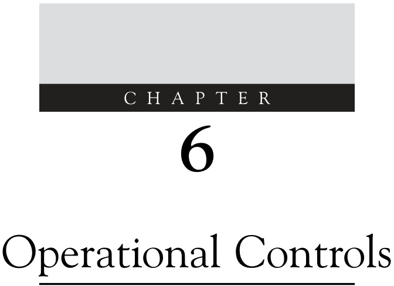  

【处理失败：内存不足或无法生成有效响应】

# 6.1 USE OF CONTROLS AND OPTIMUM PERFORMANCE  

This chapter will focus on the use of the main controls for target tracking equipment which essentially can be broken into the radar, the automatic radar plotting aid (ARPA) and the automatic identification system (AIS).  

【翻译】
本章主要介绍目标跟踪设备的主要控制装置的使用方法，这些装置基本上可以分为雷达、自动雷达绘图辅助系统（ARPA ）和自动识别系统（ AIS ）。

【解读】
该段落介绍了本章的内容重点，即对目标跟踪设备中的关键控制组件进行详细说明，包括雷达、自动雷达绘图辅助系统和自动识别系统。这三个系统是现代航海和航空领域中用于目标检测、跟踪和识别的重要技术手段。

【词汇表】
| 英文词汇 | 中文翻译 | 解释 |
| --- | --- | --- |
| Radar | 雷达 | 无线电探测和定位系统 |
| ARPA | 自动雷达绘图辅助系统 | 利用雷达数据自动绘制和更新地图的系统 |
| AIS | 自动识别系统 | 用于船舶或飞机等交通工具之间自动交换位置和身份信息的系统 |

The bulk of the chapter is on radar because unlike the other two components, the performance of traditional radar has depended on the correct setting of several controls. A major aim of the radar observer should be to ensure that all the targets which can be detected are detected. This is sometimes described as achieving the maximum probability of detection of targets. For any given radar system, the performance is limited in all circumstances by certain design parameters such as transmitter power, antenna gain and receiver sensitivity (see Section 3.2). On any particular occasion the performance of the system may be further limited by weather, atmospheric conditions and antenna position (see Sections 3.6!3.8). Although design features and environmental conditions place limits on the potential performance of the system, the ability of the observer to set and maintain the operational controls in correct adjustment determines whether or not such potential performance is realized.  

【翻译】
本章的大部分内容关注雷达，因为与其他两个组件不同，传统雷达的性能取决于几个控制器的正确设置。雷达观察员的一个主要目标应该是确保所有可以被检测到的目标都被检测到。这有时被描述为实现目标的最大概率检测。对于任何给定的雷达系统，其性能在所有情况下都受到某些设计参数的限制，如发射器功率、天线增益和接收灵敏度（见第3.2节）。在任何特定场合中，系统的性能可能进一步受到天气、 атмос条件和天线位置的限制（见第3.6-3.8节）。尽管设计特征和环境条件对系统的潜在性能施加了限制，但观察员设置和维持操作控制器以正确调整的能力决定了是否实现此类潜在性能。

【解读】
这段话强调了雷达系统中人工因素的重要性，特别是观察员设置和维持控制器的能力，这直接影响到系统的实际性能。虽然系统的设计和环境条件会限制其潜在性能，但人的参与可以使系统达到最佳状态。

【词汇表】
| 英文词汇 | 中文翻译 | 解释 |
| --- | --- | --- |
| Radar | 雷达 | 一种利用无线电波探测和定位物体的系统 |
| Transmitter power | 发射器功率 | 雷达系统发射无线电波的能量大小 |
| Antenna gain | 天线增益 | 天线接受或发射信号的效率指标 |
| Receiver sensitivity | 接收灵敏度 | 雷达系统检测弱信号的能力 |

Maladjustment of the controls may result in a failure to detect and display targets at a sufficiently early stage or may allow them to escape detection completely. It is therefore of crucial importance that the radar observer knows, understands and implements the correct practical procedures for the setting up of the operational controls and for maintaining them in optimum adjustment according to changing requirements and circumstances.  

【翻译】
控制系统的不当调整可能导致无法在足够早的阶段检测和显示目标，或者使其完全逃避检测。因此，雷达观察员必须了解、理解并实施正确的实用程序，以便设置操作控制并根据不断变化的需求和情况保持最佳状态。

【解读】
本段强调了雷达系统中控制器的准确设置和维护的重要性。如果这些控制器没有被正确地设置和调整，就会导致目标不能被及时发现，甚至完全躲避检测。这要求雷达观察员对操作控制有深入的理解，并能根据实际情况进行灵活的调整。

【词汇表】
| 英文词汇 | 中文翻译 | 解释 |
| --- | --- | --- |
| Maladjustment | 不当调整 | 控制系统未被正确设置或调整 |
| Operational controls | 操作控制 | 雷达系统中的控制参数和设置 |
| Optimum adjustment | 最佳状态 | 控制系统被调整到最优状态以保证最佳性能 |
| Radar observer | 雷达观察员 | 操作和监控雷达系统的人员 |

Further, when basic data is extracted by making measurements from the display, the observer must ensure that the full potential accuracy is realized. Maladjustment of certain controls may impair the accuracy of such measurements and this must be avoided by the use of the proper procedures.  

【翻译】
此外，当从显示屏上提取基本数据时，观察者必须确保实现全部潜在的精度。某些控制装置的失调可能会损害这些测量的准确性，这必须通过使用适当的程序来避免。

【解读】
本段强调了在进行数据提取和测量时，需要注意到设备的设置和操作是否正确，以保证测量结果的准确性。这意味着操作人员需要遵循标准化的程序和方法，以避免由于人为错误或设备失调导致的测量偏差。

【词汇表】
| 英文词汇 | 中文翻译 | 解释 |
| --- | --- | --- |
| Maladjustment | 失调 | 设备或系统的调整不当，导致其不能正常工作或产生预期效果。 |
| Realized | 实现 | 使某事物或状态成为现实，或达到预期的目标或效果。 |
| Impair | 损害 | 对某事物或功能造成负面影响，降低其质量或效能。 |
| Procedures | 程序 | 一系列按照一定顺序进行的步骤或操作，用于完成特定任务或达成特定目标。 |

This chapter presents detailed practical procedures which, if followed, will ensure the correct initial setting of the controls at switch-on and the appropriate subsequent adjustments necessary to maintain optimum performance. The procedures also deal with the use of the controls in routine tasks, including the combating of the adverse effects of weather conditions and the extraction of basic radar, ARPA and AIS data from the display. There are different display options of the AIS and ARPA tracking information for a modern observer, and it is important that the observer understands what is being presented.  

【翻译】
本章介绍了详细的实用程序，如果按照这些程序进行操作，可以确保在开机时正确设置控制器的初始值，并对后续调整做出必要的优化以维持最佳性能。这些程序还涉及使用控制器执行常规任务，包括应对恶劣天气条件的不利影响以及从显示屏中提取基本雷达、ARPA和AIS数据。对于现代观察员来说，AIS和ARPA跟踪信息有不同的显示选项，理解所呈现的内容至关重要。

【解读】
这段话主要讲述了一些操作步骤和注意事项，以便用户能够正确地使用某种设备（可能是雷达或导航系统），特别是在初始设置和日常使用过程中。它强调了理解设备显示的重要性，尤其是在处理不同类型的跟踪信息时。

【词汇表】
| 英文词汇 | 中文翻译 | 解释 |
| --- | --- | --- |
| Switch-on | 开机 | 设备启动的动作 |
| Optimum performance | 最佳性能 | 指设备或系统运行的最好状态 |
| Adverse effects | 不利影响 | 对系统或环境产生负面影响的因素 |
| AIS | 自动识别系统 | 一种用于船舶识别和位置报告的系统 |
| ARPA | 雷达辅助盲目导航 | 一种利用雷达辅助船舶导航的系统 |

Traditionally, there existed long established criteria by which the setting of the radar controls for best radar performance was judged. These criteria derived historically from the characteristics of the traditional analogue picture on a cathode ray tube (CRT) display cannot be applied directly to a modern synthetic raster display, and are no longer covered in this book. The recent introduction of new technologies mean that setting up these radars is much simpler in order to obtain an optimum radar picture. The setting up of an ARPA display requires the optimization of the radar controls and the correct adjustment of the ARPA controls to achieve effective and accurate tracking and this is also treated separately (see Section 6.9). In many modern displays, there is the additional complexity of inputs from sensors such as AIS and Global Navigation Satellite System (GNSS). Finally the display options for AIS data are discussed.  

【翻译】
传统上，有一些长期确立的标准来评估雷达控制设置是否能获得最佳的雷达性能。这些标准源自传统模拟图像在阴极射线管（CRT）显示器上的特性，但不能直接应用于现代合成光栅显示器，因此本书不再涉及这些内容。最近引入的新技术使得设置这些雷达变得更加简单，以便获得最优的雷达图像。设置ARPA（自动雷达定位辅助）显示器需要优化雷达控制并正确调整ARPA控制以实现有效准确的跟踪，这也会单独讨论（见第6.9节）。在许多现代显示设备中，还增加了来自诸如AIS（自动识别系统）和全球导航卫星系统（GNSS）的传感器输入的复杂性。最后，本节还讨论了AIS数据的显示选项。

【解读】
这段话主要讲述了雷达技术的发展和变化，特别是从传统的模拟显示到现代的数字显示的转变。随着新技术的出现，设置雷达变得更为简单，但同时也带来了新的复杂性，如来自其他传感器的输入。因此，需要对雷达控制和显示参数进行优化和调整，以达到最佳的表现。

【词汇表】
| 英文词汇 | 中文翻译 | 解释 |
| --- | --- | --- |
| Radar | 雷达 | 无线电探测和定位系统 |
| Cathode Ray Tube (CRT) | 阴极射线管 | 一种传统的电子显像管 |
| Synthetic Raster Display | 合成光栅显示 | 一种使用数字信号生成图像的显示技术 |
| Automatic Radar Plotting Aid (ARPA) | 自动雷达定位辅助 | 一种用于辅助雷达目标跟踪的系统 |
| Automatic Identification System (AIS) | 自动识别系统 | 一种用于船舶识别和位置报告的系统 |

see Section 2.3.3.2) and in the receiver (to control the bandwidth see Section 2.6.4.2).  

【翻译】
（参见第2.3.3.2节）以及在接收器中（控制带宽参见第2.6.4.2节）。

【解读】
该段落提到了两个特定章节中的内容，分别与发送器和接收器中的带宽控制相关。这意味着这两部分对于理解系统的带宽管理机制至关重要。

【词汇表】
| 英文词汇 | 中文翻译 | 解释 |
| --- | --- | --- |
| receiver | 接收器 | 指接受信号或数据的设备或系统 |
| bandwidth | 带宽 | 指通信系统中可用频率范围的宽度，影响数据传输速率 |
| control | 控制 | 在这里指的是调节或管理某一参数，如带宽，以达到预期效果 |

# 6.2.1 Preliminary Procedure  

Before switching the equipment on, the following preliminary checks should be carried out:  

【翻译】
在打开设备之前，应进行以下初步检查：

【解读】
本段强调了在使用设备前进行必要的安全检查和准备工作的重要性，这是确保操作安全和避免潜在风险的关键一步。

【词汇表】
| 英文词汇 | 中文翻译 | 解释 |
| --- | --- | --- |
| preliminary | 初步的 | 在开始某项工作或行动之前所做的准备工作或检查 |
| checks | 检查 | 对某物或某人进行审视、调查或核实，以确定其状况或有效性 |
| equipment | 设备 | 用于完成特定任务或功能的机器、工具或装置 |
| carried out | 进行、执行 | 完成或实施某项计划、任务或活动 |

1. Ensure that the antenna is clear. In particular it is important to check that no personnel are working on or close to the antenna and that there are no loose halyards or other such rigging which may foul it.   
2. Check that the power switch that makes the ship’s mains available to the installation is on. This switch may not necessarily be located in the wheelhouse.  

【翻译】
1. 确保天线清晰无阻碍。特别是，需要检查是否有人员在天线上或附近工作，以及是否有松散的索具或其他可能缠绕天线的设备。
2. 检查控制船只主电源供给安装的电源开关是否已打开。这一开关不一定位于驾驶室内。

【解读】
这两段话主要强调了在操作某种设备（可能是通信系统或雷达）之前的安全检查步骤。首先，需要确保天线周围没有障碍物，也没有人员在该区域工作，以避免事故发生。其次，需要确认电源开关已经打开，这样设备才能正常运行。这些步骤对于保证操作的安全性和有效性至关重要。

【词汇表】
| 英文词汇 | 中文翻译 | 解释 |
| --- | --- | --- |
| antenna | 天线 | 用于发送和接收信号的设备 |
| halyards | 索具 | 船只上用于升降旗帜、吊装重物等的绳索或索链 |
| rigging | 缠绕、索具 | 指船只上的索具或绳索，以及它们的布置方式 |
| wheelhouse | 驾驶室 | 船只上指挥和控制航行的房间 |

# 6.2.2 Switching On  

It is convenient to consider that this operation carries out three distinct functions:  

【翻译】
考虑到这个操作执行三个不同的功能是很方便的。

【解读】
这段话强调了某一操作或过程中同时存在的多重功能，这意味着该操作不仅仅有一个目的，而是具有多方面的作用。这种描述方式通常用于分析复杂系统或过程，以便更好地理解其内部机制和影响。

【词汇表】
| 英文词汇 | 中文翻译 | 解释 |
| --- | --- | --- |
| convenient | 方便的 | 指在此情况下这样做比较容易或合适 |
| distinct | 不同的、不同的 | 强调这些功能之间是明显区别的 |
| functions | 功能 | 指操作或过程所执行的作用或任务 |

# 6.2 SETTING UP THE RADAR DISPLAY  

1. The supply of power to the antenna.   
2. The supply of power to the transceiver and display.   
3. The switching of the system from the standby condition to the operational condition (see below).  

【翻译】
1. 天线的电源供应。
2. 收发器和显示屏的电源供应。
3. 系统从待机状态切换到操作状态（见下文）。

【解读】
该段落描述了一个电子系统中三个关键方面：天线的电源供应、收发器和显示屏的电源供应，以及系统从待机状态转变为操作状态的切换过程。这三个方面对于系统的正常运行至关重要，分别涉及信号传输、数据处理和显示，以及系统的基本控制功能。

【词汇表】
| 英文词汇 | 中文翻译 | 解释 |
| --- | --- | --- |
| Antenna | 天线 | 用于发送和接收信号的设备 |
| Transceiver | 收发器 | 既能发送也能接收信号的设备 |
| Standby | 待机 | 设备或系统处于休眠或低功耗状态，准备随时启动工作 |

The operational controls are all located on the display unit and for this reason the procedure is commonly referred to as setting up the display. However, it should be borne in mind that some of the controls do not perform display functions. The tuning control, if fitted, operates within the radio frequency section of the transceiver (see Sections 2.7.2 and 2.7.4.1). The gain and sea clutter controls also perform receiver functions (see Section 2.6.4.5), although the section of the receiver in which they operate may well be located within the display unit. The pulse length selector (which may also be affected by the range selector) operates in the transmitter (to control the pulse length and pulse repetition frequency (PRF)  

【翻译】
操作控制都位于显示单元，因此该过程通常被称为设置显示。但是，应该记住，其中一些控制并不执行显示功能。如果配备了调谐控制，它在收发器的无线电频率部分工作（见第2.7.2和2.7.4.1节）。增益和海杂波控制也执行接收器功能（见第2.6.4.5节），尽管它们工作的接收器部分可能位于显示单元内。脉冲长度选择器（也可能受到范围选择器的影响）在发射器中工作，以控制脉冲长度和脉冲重复频率（PRF）。

【解读】
本段主要介绍了雷达系统中的操作控制及其位置，大多数控制位于显示单元，但有一些控制执行非显示功能，如调谐、增益和海杂波控制等，这些控制与收发器或发射器相关联。

【词汇表】
| 英文词汇 | 中文翻译 | 解释 |
| --- | --- | --- |
| Transceiver | 收发器 | 一种同时具有发送和接收信号能力的设备 |
| Pulse Length Selector | 脉冲长度选择器 | 用于控制雷达发射脉冲长度的装置 |
| PRF (Pulse Repetition Frequency) | 脉冲重复频率 | 雷达发射脉冲的重复频率 |
| Sea Clutter | 海杂波 | 雷达信号中由于海面反射而产生的干扰信号 |

In some systems an individual switch may be associated with each function. It is perhaps more common to find that a single switch combines functions 1 and 2. In a further traditional variation, a single multi-position switch may service all three functions. It is now common to have a software control to switch between stand-by and operational conditions.  

【翻译】
在某些系统中，每个功能可能都有一个单独的开关与之对应。也许更常见的情况是，一个开关同时控制功能1和2。在另一种传统变体中，一个多位置开关可以服务于所有三个功能。现在，使用软件控制来在待机状态和操作条件之间切换已经变得很常见。

【解读】
这段话主要讨论了不同系统中开关的配置方式，包括每个功能一个独立开关、一个开关控制多个功能，以及使用多位置开关或软件控制来实现不同的状态切换。这反映了技术发展过程中对控制系统的设计和优化。

【词汇表】
| 英文词汇 | 中文翻译 | 解释 |
| --- | --- | --- |
| switch | 开关 | 用于控制电路或信号的设备 |
| multi-position switch | 多位置开关 | 可以设置为多种状态的开关 |
| stand-by | 待机状态 | 设备或系统处于准备就绪但未激活的状态 |
| operational conditions | 操作条件 | 设备或系统正常运行所需满足的条件 |

# 6.2.2.1 Magnetron Radar  

The application of power to the system initiates a warming-up period. In a magnetronbased radar, very high voltages (EHT) and working temperatures are associated with certain elements of the system, in particular the transmitter (see Section 2.3). Good engineering practice dictates that such elements should be raised gradually to working temperature before the high voltages are applied. Some form of thermal or other delay timer will normally be used to isolate the EHT during the warming-up period, which is likely to exceed one and a half minutes. The maximum duration is set by IMO Performance Standards (see Section 11.2.1) which require that, after switching on from cold, the equipment should become fully operational within 4 minutes. For situations other than that of a cold start the same section of the standard requires the provision of a stand-by condition from which the equipment can be brought to an operational condition within $5\mathrm{s}$ .  

The precise status of the equipment in the stand-by condition may vary with manufacturer, but in all cases the transmitter will be in the quiescent state, that is it will be maintained at or close to working temperature but no pulses will be transmitted. The use of the stand-by condition is discussed in detail in Section 6.5. If the operational condition is selected at initial switch-on (see function 3 above), the system will automatically switch from the stand-by condition to the operational condition when the warming-up period has elapsed.  

【翻译】
设备在待机状态下的精确状态可能因制造商而异，但是在所有情况下，发射器都会处于静止状态，即保持在或接近工作温度，但不会传输任何脉冲。待机条件的使用在第6.5节中进行了详细讨论。如果在初始开启时选择操作条件（见上述功能3），系统将自动从待机条件切换到操作条件，当预热期结束后就会发生这种情况。

【解读】
本段主要介绍了设备在待机状态下的特点，以及如何从待机状态转变为操作状态。它提到了设备在待机状态下会维持在工作温度，但不发送任何信号，并且系统可以根据设置自动切换到操作模式。

【词汇表】
| 英文词汇 | 中文翻译 | 解释 |
| --- | --- | --- |
| quiescent | 静止状态 | 设备或系统处于休眠或非活跃状态，但仍然保持基本功能或准备好随时启动。 |
| stand-by | 待机状态 | 设备或系统处于准备就绪状态，可以快速启动或激活。 |
| transmitter | 发射器 | 将信号或能量传输到其他位置的设备。 |
| warming-up | 预热期 | 设备或系统开始运行前的热身或准备阶段，以达到最佳工作状态。 |

# 6.2.2.2 Solid-State Radar  

The introduction of this new technology (Section 2.9) means that the radar is no longer high voltage, indeed it may be termed low voltage (under $50\mathrm{~V~}$ is typical in the transmitter/receiver). The issues of a significant warming-up period for components are therefore a thing of the past. The only delay is due to booting up time of the computer-based technology which processes the radar signals and provides the display.  

# 6.2.3 Setting the Screen Brilliance  

The setting of the brilliance on a raster display is judged by a criterion which differs fundamentally from that traditionally used in radial-scan displays, where the control adjusts the brilliance of the slowly rotating trace, and the criterion for optimum setting can be rigidly specified in terms of the principle on which echoes are displayed. In a modern high-refresh-rate television-type raster display, the screen brilliance controls the brightness of the entire picture frame and the setting is far less critical for good radar performance. The perceived brightness of the picture is largely a function of the ambient light conditions. It is also affected by the screen contrast control which defines the difference between dark and light for both graphics and echoes. In some systems the contrast is preset. The relationship between the brilliance and contrast settings for a green monochrome display is illustrated in Figure 6.1.  

【翻译】
在光栅显示器中，亮度设置的标准与传统的辐射扫描显示器不同，在那里控制调整缓慢旋转的迹线的亮度，而最佳设置的标准可以根据显示回波的原理严格指定。在现代高刷新率的电视式光栅显示器中，屏幕亮度控制整个图像帧的亮度，设置对良好的雷达性能来说远不那么关键。图像的感知亮度在很大程度上取决于环境光条件，也受到屏幕对比度控制的影响，这定义了图形和回波之间的暗和亮差异。在某些系统中，对比度是预设的。绿色单色显示器中亮度和对比度设置之间的关系如图6.1所示。

【解读】
本段主要讨论的是光栅显示器（如现代电视）中亮度设置的特点及其与传统辐射扫描显示器的区别。它强调了环境光、屏幕对比度等因素对图像亮度的影响，以及这些设置如何影响雷达性能。同时，它提到了对于不同的显示设备（如绿色单色显示器），亮度和对比度设置之间可能存在特定的关系。

【词汇表】
| 英文词汇 | 中文翻译 | 解释 |
| --- | --- | --- |
| Raster display | 光栅显示器 | 一种使用矩阵形式排列的像素来显示图像的显示技术 |
| Radial-scan displays | 辐射扫描显示器 | 一种通过辐射方式扫描来显示图像的显示技术 |
| Refresh rate | 刷新率 | 显示器更新图像的频率，通常以赫兹为单位 |
| Ambient light | 环境光 | 周围环境中的光线，会影响屏幕图像的可视性 |

Reference to Figure 6.1 shows that the screen contrast adjusts the difference in brilliance level between the darker/darkest areas of the screen and the brighter/brightest areas. In general, the graphics will be single level, i.e. bright on dark, and this will also be the case for target echoes in a simple singlethreshold system. Where multi-level video is offered, the number of levels of echo brightness is dependent on the number of levels to which the signal strength has been digitized (see Section 2.6.4.5). The perceived effect of the screen contrast will depend to some extent on the screen brilliance setting. At higher brilliance settings, a greater absolute difference between light and dark will be necessary for an observer to perceive a difference between the two levels. Similarly, at very low levels of brilliance, both light and dark levels may be so dark as to be indistinguishable.  

【翻译】
参考图6.1可以看出，屏幕对比度调整的是屏幕上较暗或最暗区域与较亮或最亮区域之间的亮度级别差异。一般来说，图形都是单一层次，即明暗对比，而在简单的单阈值系统中，目标回声也是如此。在提供多级视频的情况下，回声亮度的级数取决于信号强度被数字化的级数（见第2.6.4.5节）。屏幕对比度的感知效果在一定程度上取决于屏幕亮度设置。在更高的亮度设置下，观察者需要更大的绝对差异才能区分两种级别之间的差异。同样，在非常低的亮度水平下，明暗两个级别可能都太暗而难以区分。

【解读】
本段主要讨论了屏幕对比度及其对图像显示的影响，特别是在不同亮度设置下的情况。它指出，对比度会影响观察者如何感知图像中的明暗差异，并且这种效果会受到屏幕亮度设置的影响。这对于理解图像显示技术尤其是医学影像领域中的重要性具有指导意义。

【词汇表】
| 英文词汇 | 中文翻译 | 解释 |
| --- | --- | --- |
| Contrast | 对比度 | 指图像中明暗区域之间的亮度差异 |
| Brilliance | 亮度 | 屏幕的整体光照度 |
| Digitized | 数字化 | 将模拟信号转换为数字信号的过程 |
| Threshold | 阈值 | 判断信号是否有效的最低限度 |
| Multi-level | 多级 | 允许图像显示多个亮度级别的功能 |

Clearly there is an interrelationship between screen brilliance and screen contrast. Both contribute to the overall brightness of the picture as perceived by the observer, and must be adjusted alternately until the best joint setting is found. The assessment of ‘best’ is a matter of subjective judgement for which a simple specific criterion, such as that prescribed for the radial case, cannot be given. However, consideration of the following factors will assist in making the judgement.  

【翻译】
显然，屏幕亮度和屏幕对比度之间存在着相互关系。两者都贡献于图像整体亮度的感知，并且必须交替调整，直到找到最佳的联合设置。“最佳”的评估是一个主观判断的问题，没有一个简单、具体的标准，如同径向情况下的规定，可以被给出。然而，考虑以下因素可以帮助做出这个判断。

【解读】
本段讨论了屏幕亮度和屏幕对比度在图像显示中的重要性，以及它们之间的平衡关系。作者强调，这两个参数需要交替调整，以达到最佳的视觉效果，而“最佳”的判定则取决于个人主观判断。同时，作者也提到了，在进行这种判断时，需要考虑多种因素。

【词汇表】
| 英文词汇 | 中文翻译 | 解释 |
| --- | --- | --- |
| interrelationship | 相互关系 | 指两个或多个事物之间的相互影响和关联 |
| subjective judgement | 主观判断 | 由个人意见、感觉或态度决定的判断 |
| criterion | 标准 | 判断或评价的依据或参考点 |
| radial case | 径向情况 | 特指某一特定情形或案例，可能与圆形或半径相关 |

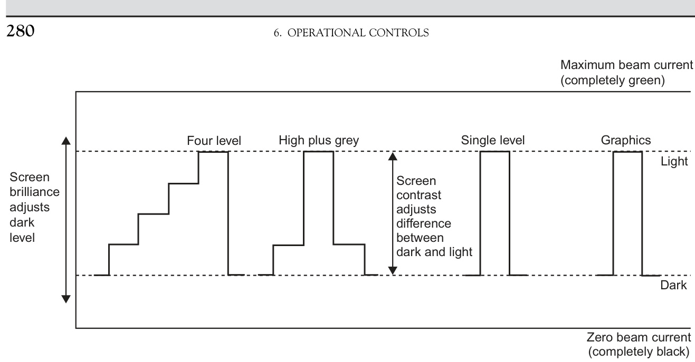  
FIGURE 6.1 The relationship between raster-scan screen brilliance and contrast settings.  

【翻译】
图6.1：栅格扫描屏幕亮度与对比度设置之间的关系。

【解读】
该图表明了栅格扫描屏幕的亮度（brilliance）与对比度（contrast）设置之间的相互影响关系。这意味着在显示技术中，调整亮度和对比度可以优化图像的可视性和质量。

【词汇表】
| 英文词汇 | 中文翻译 | 解释 |
| --- | --- | --- |
| Raster-scan | 栅格扫描 | 一种显示技术，通过扫描线逐行绘制图像 |
| Brilliance | 亮度 | 屏幕或图像的光照强度 |
| Contrast | 对比度 | 图像中不同区域之间的色彩差异程度 |

Excessive brilliance. If the overall brightness is too high, the picture will be uncomfortable to view in the same way as any source of bright light. Tiredness, stress and headaches may result. At night the high level of illumination associated with the display may impair night vision and distract the watchkeeper by producing reflections on the inside of the wheelhouse windows and other such surfaces. Even at maximum screen contrast setting, it will be difficult to achieve an adequate difference between background and picture content, because both will already be very bright.  

【翻译】
过度的亮度。如果整体亮度过高，图像会让人感到不舒服，就像任何强光源一样。长时间接触可能导致疲劳、压力和头痛。在夜间，显示器的高照明水平可能会损害夜视能力，并通过在驾驶室窗户内侧及其他表面产生反射来分散值班人员的注意力。即使在最大屏幕对比度设置下，也很难实现背景和图像内容之间的足够差异，因为两者已经非常亮了。

【解读】
本段讨论的是过高的屏幕亮度可能带来的负面影响，包括视觉不适感、疲劳、压力和头痛等问题。特别是在夜间，这种情况可能更加严重，不仅影响观察者的视力，还可能通过反射干扰他们的注意力。因此，合理控制屏幕亮度对于保持舒适的观看体验和确保观察者的健康与安全至关重要。

【词汇表】
| 英文词汇 | 中文翻译 | 解释 |
| --- | --- | --- |
| excessive | 过度的 | 超出正常或适当范围的 |
| brilliance | 亮度 | 光线的强度或耀眼程度 |
| illumination | 照明 | 用光线照亮某物或某处 |
| impair | 损害 | 使某事物功能受损或减弱 |
| distract | 分散注意力 | 使某人转移注意力或被吸引到别处 |

Insufficient brilliance. If the overall brightness is too low, it will be difficult to view the display and distinguish picture detail in full daylight, particularly at a distance. Even at maximum screen contrast setting, it will be difficult to achieve an adequate difference between background and picture content, because both will be very dark.  

【翻译】
如果整体亮度过低，在明亮的环境下，尤其是从远处观察，就会很难清晰地看到屏幕上的内容并区分图像细节。即使在最大化屏幕对比度设置下，也很难实现背景和图像内容之间的足够差异，因为两者都会显得非常暗淡。

【解读】
这段话主要讨论了屏幕亮度不足的问题。当屏幕整体亮度太低时，即使调整到最高对比度设置，也很难让人清晰地看到屏幕上的内容，特别是在明亮的环境下或从远处观察。这会导致观众难以区分图像中的细节和背景。

【词汇表】
| 英文词汇 | 中文翻译 | 解释 |
| --- | --- | --- |
| Insufficient | 不足 | 指某物质或数量不够用 |
| Brilliance | 亮度 | 物体发出的光的强度 |
| Contrast | 对比度 | 两个或多个事物之间的差异程度 |
| Background | 背景 | 图像或场景中位于主体后面的部分 |
| Picture detail | 图像细节 | 图像中较小但重要的部分，如线条、纹理等 |

Excessive contrast. If the screen brilliance is set at a level which is comfortable to the eye, excessive screen contrast will make the picture stark and harsh.  

【翻译】
过度对比。如果屏幕亮度设置在舒适的水平上，过度的屏幕对比会使图像变得刺眼且严酷。

【解读】
本段主要讨论了屏幕亮度与对比度之间的关系。当屏幕亮度设置为舒适的水平时，如果对比度过高，会导致观看体验不佳，使得图像显得过于鲜明甚至刺眼，这可能会引起视觉疲劳。

【词汇表】
| 英文词汇 | 中文翻译 | 解释 |
| --- | --- | --- |
| Excessive | 过度的 | 超出正常或合理范围的 |
| Contrast | 对比度 | 图像中明暗部分之间的差异程度 |
| Stark | 刺眼的 | 形容颜色或光线过于鲜明或强烈 |
| Harsh | 严酷的 | 形容光线、声音等过于强烈或刺激 |

Inadequate contrast. Insufficient contrast will result in a picture which is flat and featureless.  

【翻译】
不充分的对比度会导致图片看起来平淡无奇且缺乏特征。

【解读】
这段话强调了对比度在图像中的重要性，如果对比度不足，图像就会失去层次感和鲜明感，看起来很单调。

【词汇表】
| 英文词汇 | 中文翻译 | 解释 |
| --- | --- | --- |
| Inadequate | 不充分的 | 指某物或某事不够或不完全满足要求或标准 |
| Contrast | 对比度 | 在视觉中指不同元素（如颜色、亮度）之间的差异程度 |
| Flat | 平淡的 | 用于描述图像或设计缺乏立体感或深度感 |
| Featureless | 缺乏特征的 | 指没有显著特点或特色的东西 |

In most cases it will be found that if at switch-on the screen brilliance and contrast controls are left in the position in which they were last used, the settings will be sufficiently close to the optimum as to require only a small amount of adjustment to suit the new ambient light conditions. If the controls have been set to zero or have been badly maladjusted, the following procedures should be used:  

【翻译】
在大多数情况下，如果打开开关时，屏幕亮度和对比度控制保持在上次使用的位置，则设置将足够接近最佳值，只需要进行少量调整即可适应新的环境光条件。如果控件被设置为零或严重失调，应遵循以下步骤：

【解读】
这段话主要讨论了电子设备（可能是电视或显示器）的亮度和对比度控制。在大多数情况下，这些设置可以根据之前的使用情况进行微小的调整以适应当前的环境光线。但如果这些设置被完全重置或错误地调整，则需要按照特定的步骤来重新调整它们，以达到最佳的视觉效果。

【词汇表】
| 英文词汇 | 中文翻译 | 解释 |
| --- | --- | --- |
| switch-on | 打开开关 | 指设备从关闭状态变为开启状态的动作 |
| ambient light | 环境光 | 指周围环境中的自然光或人工光 |
| maladjusted | 失调 | 指设备的设置不正确或不合适 |
| optimum | 最佳值 | 指某一参数或设置达到最好的状态 |

1. If the system offers alternative daytime and nighttime monochrome or colour combinations, select the option appropriate to the ambient light conditions.   
2. Set the screen brilliance and screen contrast controls to the middle of their travel. The plan position indicator (PPI) circle, synthetic bearing scale and other graphics should be visible. (If they are not, advance each control in turn by small amounts until the graphics are visible.)   
3. Adjust the screen brilliance to a level consistent with comfortable viewing in the ambient light conditions and such that the light issuing from the display does not interfere with the keeping of a proper lookout.   
4. Adjust the screen contrast to achieve an obvious but comfortable difference in brightness between the graphics and the background.   
5. It may be necessary to make further repeated small alternate adjustments to the screen brilliance and screen contrast controls to obtain an optimum overall level of brightness.  

【翻译】
如果系统提供了白天和夜间的单色或彩色组合，请选择适应当前环境光线条件的选项。
将屏幕亮度和屏幕对比度控制调节到中间位置，计划位置指示器（PPI）圆圈、合成方位标尺和其他图形应该是可见的（如果不可见，则逐一微调每个控制，直到图形可见）。
调整屏幕亮度至与舒适观看环境光线条件相符的水平，同时确保从显示屏发出的光线不会干扰保持适当的视野。
调整屏幕对比度以实现图形与背景之间明显但舒适的亮度差异。
可能需要进一步进行反复的小幅度交替调整屏幕亮度和屏幕对比度控制，以获得最佳整体亮度水平。

【解读】
本段落主要讲述如何调整电子设备（可能是导航设备或显示屏）的设置，以便在不同环境光线条件下获得最佳视觉效果。通过调整屏幕亮度和对比度，可以使图形和背景达到舒适的视觉效果，从而帮助用户更好地观察和操作设备。

【词汇表】
| 英文词汇 | 中文翻译 | 解释 |
| --- | --- | --- |
| Ambient light | 环境光线 | 指周围环境中的自然光或人工光照 |
| Monochrome | 单色 | 指只有一个颜色的图像或显示 |
| Synthetic bearing scale | 合成方位标尺 | 指一种用于表示方向和角度的测量工具或图形 |
| Screen brilliance | 屏幕亮度 | 指屏幕的亮度程度 |
| Screen contrast | 屏幕对比度 | 指屏幕上图形与背景之间的亮度差异程度 |

# 6.2.4 Default Conditions and Start-Up  

In modern systems it is usually found that orientation, presentation, range scale, pulse length and signal processing are selected automatically on switch-on. The conditions automatically selected are known as the default conditions and will also probably include status of controls such as range rings and variable range marker (VRM). If the observer does not wish to use any given default setting, appropriate selection can be made after switch-on.  

【翻译】
在现代系统中，一般在打开开关时会自动选择方位、显示方式、范围刻度、脉冲长度和信号处理等参数。这些自动选择的条件被称为默认条件，也可能包括控制状态，如范围环和可变范围标记（VRM）。如果观察者不想使用任何给定的默认设置，可以在打开开关后进行适当的选择。

【解读】
这段话描述了现代系统在启动时的自动化设置过程，强调了默认条件的概念以及用户对这些设置的自定义选项。这意味着现代系统设计得更加智能和便捷，能够根据预设的参数自动调整以满足大多数用户的需求，同时也允许用户根据个人偏好进行调整。

【词汇表】
| 英文词汇 | 中文翻译 | 解释 |
| --- | --- | --- |
| Orientation | 方位 | 指系统或设备的方向或朝向设置 |
| Default Conditions | 默认条件 | 系统或软件在未指定其他设置时自动采用的一组参数或状态 |
| Pulse Length | 脉冲长度 | 在信号处理中，指一个脉冲信号持续的时间长度 |
| Signal Processing | 信号处理 | 对收到的信号进行分析、修改或提取信息的过程 |
| Variable Range Marker (VRM) | 可变范围标记 | 一种电子设备功能，用于在显示屏上标记特定范围内的目标或信息 |

The use of default conditions has been made possible by the availability of modern on-screen controls designed particularly for computer applications. Traditionally, marine radar controls have been analogue in their action, normally taking the form of rotary knobs and multi-position mechanical switches, but most, if not all, of these controls are now replaced by electronic switches which send a digital signal to the display computer when operated by touch or pressure. They may take the form of push buttons, touch-sensitive switches or a tracker ball. The touch-sensitive screen described in Section 2.8.3 is an extension of this technique.  

【翻译】
现代屏幕控制技术的出现使得默认条件的使用成为可能，这些控制技术是专门为计算机应用而设计的。传统上，海洋雷达控制都是模拟的，通常以旋转按钮和多位置机械开关的形式出现，但现在这些控制大部分已经被电子开关取代，当用户触摸或施加压力时，电子开关会向显示计算机发送数字信号。这些控制可以是按键、触摸式开关或者跟踪球。第2.8.3节中描述的触摸式屏幕是这一技术的延伸。

【解读】
本段主要介绍了现代屏幕控制技术对海洋雷达系统的影响，特别是如何实现默认条件的设置。通过采用电子开关和触摸式界面，操作人员可以更方便地与系统交互，从而提高了操作效率。

【词汇表】
| 英文词汇 | 中文翻译 | 解释 |
| --- | --- | --- |
| default conditions | 默认条件 | 系统或设备在未指定其他设置时自动采用的参数或状态 |
| on-screen controls | 屏幕控制 | 直接在显示器上进行的控制操作 |
| analogue | 模拟 | 指连续变化的信号或量，而非离散的数字信号 |
| digital signal | 数字信号 | 离散的电信号，用来表示数字信息 |
| touch-sensitive | 触摸式 | 能够感应触摸动作的设备或界面 |

On receipt of the start-up signal, the display computer will carry out some programmed checks on the status of the equipment. The controls can be configured and programmed to operate in a variety of ways. They may operate on the alternative action or toggle principle, that is one push or touch selects a function and a further push de-selects that function. Alternatively, they may be used to control more than one function, for example the first push selects function 1, the second push selects function 2 and the third push de-selects both functions. They can be used in pairs to perform an incremental action. For example, each push of one control may select the next higher range scale while its partner will reduce, in steps, the range scale selected. The list of variations is almost endless but the common feature of all actions is that, other than the actual push or touch, the action is not mechanical.  

【翻译】
当接收到启动信号后，显示计算机将对设备状态进行一些编程检查。控制器可以被配置和编程以多种方式运行。它们可能按照替换动作或切换原则工作，即一次按键或触摸选择一个功能，而另一次按键则取消该功能。或者，它们也可以用来控制多个功能，例如第一次按键选择功能1，第二次按键选择功能2，而第三次按键则同时取消两个功能。它们可以成对使用来执行增量动作。例如，每按一下控制器可能会选择更高范围的刻度，而其搭档则会逐步减少所选范围的刻度。变化的列表几乎是无穷的，但所有动作的共同特征是，除了实际的按键或触摸外，动作都是非机械的。

【解读】
本段主要介绍了显示计算机在接收启动信号后的操作过程，以及控制器的多样化配置和编程方式。它强调了控制器的灵活性和可定制性，可以根据不同的需求和场景进行设置，以实现各种功能的选择、切换和控制。同时，也提到了这些动作的非机械性质，意味着大部分操作通过电子或软件方式实现，而不是传统的机械结构。

【词汇表】
| 英文词汇 | 中文翻译 | 解释 |
| --- | --- | --- |
| start-up signal | 启动信号 | 计算机或系统开始运行的信号 |
| toggle principle | 切换原则 | 一种电路或控制逻辑，通过开关或按钮的按压来切换状态 |
| incremental action | 增量动作 | 每次操作都会导致状态或值有一定幅度的增加或减少 |
| non-mechanical | 非机械的 | 不依赖于物理机械运动或结构的操作方式，通常指电子或软件实现的功能 |

The display computer can be programmed to select the default conditions when the power is first applied at switch-on. For example, it might default to true-north-up orientation, relative-motion presentation, 12 mile range scale and long pulse. If the observer wishes to use conditions other than those to which the system defaults, the necessary selection can be made by pushing the appropriate switches immediately after switch-on.  

【翻译】
显示计算机可以被编程为在打开电源时选择默认条件。例如，它可能默认为真北朝上方向、相对运动演示、12英里范围刻度和长脉冲。如果观察者希望使用与系统默认设置不同的条件，可以通过在打开开关后立即按下适当的开关来进行必要的选择。

【解读】
本段主要介绍了显示计算机的默认设置功能及其可定制性。当计算机启动时，它会自动应用预设的条件，如显示方向、运动模式、距离尺度等。但是，如果用户需要改变这些默认设置，只需在计算机启动后通过按下特定的按钮即可实现。这使得系统更加灵活和便于使用。

【词汇表】
| 英文词汇 | 中文翻译 | 解释 |
| --- | --- | --- |
| default | 默认 | 系统或程序在没有特定指令的情况下的自动设置或行为 |
| relative-motion | 相对运动 | 指的是物体之间的相对位置和运动状态的描述方式 |
| true-north-up | 真北朝上 | 一种地图或导航设备中表示方向的方式，即始终以真实的北方为参考点，向上为正方向 |
| pulse | 脉冲 | 在电子信号中，一个短暂的能量增强或变化，常用于测量或传输信息 |

The observer may make the following selections:  

【翻译】
观察者可以进行以下选择：

【解读】
本段落介绍了观察者的操作选项，可能是在一个实验、调查或数据收集的场景中，观察者需要根据特定条件或标准进行选择。

【词汇表】
| 英文词汇 | 中文翻译 | 解释 |
| --- | --- | --- |
| observer | 观察者 | 指在实验、调查等场景中负责观察和记录数据的人。 |
| selections | 选择 | 在这里指观察者根据某些标准或条件所做出的决定或操作。 |

Orientation and presentation. This selection is a matter of personal choice and navigational circumstances. This is considered in greater detail in Sections 6.2.5 and 6.2.6. Features which might influence such a selection are considered in Sections 1.4.4, 1.5.3, Chapters 7 and 8. Range scale. At sea, it is usually best to set up on a medium range scale such as 12 miles. The likelihood of echoes and sea  

【翻译】
定向和显示。这一选择是个人偏好和导航环境的问题。在6.2.5和6.2.6节中对此进行了更详细的讨论。可能影响这一选择的特征在1.4.4、1.5.3、第7章和第8章中被考虑。距离刻度。在海上，通常最好使用中等范围的刻度，如12英里。回声和海浪的可能性取决于...

【解读】
本段主要讨论的是导航系统中的定向和显示设置，以及如何根据实际情况选择合适的距离刻度。作者提到，这些问题会在后续章节中进一步详细讨论，并且强调了个人偏好和具体环境的重要性。

【词汇表】
| 英文词汇 | 中文翻译 | 解释 |
| --- | --- | --- |
| Orientation | 定向 | 指导航系统中物体或人的方向和位置 |
| Presentation | 显示 | 指信息或数据的呈现方式 |
| Navigational | 导航的 | 与导航有关的 |
| Circumstances | 环境 | 指某事发生时的具体情况或条件 |
| Range scale | 距离刻度 | 指测量距离的尺度或比例 |

clutter which have not been affected by saturation (see Section 2.7.4) make such a scale best suited for judging the quality of the picture when it is subsequently obtained. In port, when surrounded by large land-based structures and large vessels which prevent the radar pulses travelling long distances, a lower range scale is frequently more applicable. Pulse length. This should be appropriate to the range scale selected, for example medium range scale would suggest medium pulse length (see Section 2.3.3.1).  

【翻译】
未受饱和影响的杂波（见第2.7.4节）使得这样的尺度最适合判断图像质量，当图像随后获得时。在港口，当被大型陆基结构和大型船只所包围，这些结构和船只会阻止雷达脉冲传播长距离，一般来说，更低的范围尺度更为适用。脉冲长度应与所选择的范围尺度相适应，例如中等范围尺度则意味着中等脉冲长度（见第2.3.3.1节）。

【解读】
本段主要讨论了雷达系统中的参数设置，特别是范围尺度和脉冲长度的选择。作者指出，在不同的环境下，需要根据实际情况调整这些参数，以保证雷达图像的质量。例如，在港口区域，由于有大量的大型结构和船只存在，雷达信号难以传播长距离，因此需要使用较低的范围尺度。而脉冲长度也应该根据所选择的范围尺度进行调整，以确保最佳的图像质量。

【词汇表】
| 英文词汇 | 中文翻译 | 解释 |
| --- | --- | --- |
| clutter | 杂波 | 雷达系统中干扰信号的总称 |
| saturation | 饱和 | 信号过强导致的失真现象 |
| pulse length | 脉冲长度 | 雷达发射的脉冲持续时间 |
| range scale | 范围尺度 | 雷达显示的距离范围设定 |

# 6.2.5 Setting the Orientation of the Picture  

The picture must be correctly orientated so that the heading marker intersects the correct graduation on the circular bearing scale surrounding the radar picture. In many older systems it was necessary to rotate the picture manually, whereas in modern systems it is an automatic alignment as the azimuth scale is part of the graphics. Nevertheless the display should be observed to ensure that the heading marker has aligned correctly according to the numerical value of the compass course in use, as well as to check that the numerical value indicated on the radar data display is the same as that indicated on the actual compass.  

【翻译】
图片必须正确地定向，这样标题标记就会与雷达图片周围的圆形方位标尺上的正确刻度相交。在许多老式系统中，需要手动旋转图片，而在现代系统中，它是自动对齐，因为方位标尺是图形的一部分。然而，显示屏应该被观察，以确保标题标记已经根据所用指南针航向的数值正确地对齐，以及检查雷达数据显示屏上显示的数值是否与实际指南针上显示的数值相同。

【解读】
本段主要讨论了雷达系统中的图片定向问题，强调了正确的定向对于确保雷达数据的准确性至关重要。同时，也提到了现代系统中自动对齐功能的优势，但仍然建议用户进行人工核查，以防止错误。

【词汇表】
| 英文词汇 | 中文翻译 | 解释 |
| --- | --- | --- |
| orientated | 定向 | 指图片或物体的方向与位置关系的确定 |
| graduation | 刻度 | 标尺或仪表上的刻线或数字标记 |
| azimuth | 方位 | 地平线上某点与子午线之间的角距离 |
| alignment | 对齐 | 使两个或多个物体的方向或位置一致 |
| compass course | 指南针航向 | 航海或飞行的方向，通常以指南针度数表示 |

After the heading marker has been checked for alignment, the display should be observed for a short period to ensure that the heading marker is following variations in the ship’s heading. The observer must decide between three options, head-up (unstabilized), north-up (stabilized) and course-up (stabilized) as discussed in Section 1.4.1. Modern sets are usually provided with a three button toggle control. The two stabilized options are to be much preferred if the intention is to do manual paper plotting or taking bearings for navigation. They are essential if using an ARPA as stabilized options require the input from a working compass.  

【翻译】
在检查了航向标志的对齐后，应观察显示屏一段时间，以确保航向标志能够跟随船舶航向的变化。观察者必须在三个选项之间做出选择：头朝上（非稳定）、北方朝上（稳定）和航程朝上（稳定），如第1.4.1节所讨论的。现代设备通常配备有三键切换控制器。如果打算进行手动纸质绘图或为导航取航向，这两个稳定选项更为首选。如果使用ARPA（自动雷达测距和速度系统），则需要稳定选项以从工作罗盘中获取输入。

【解读】
本段主要介绍了在使用电子海图时，如何设置航向标志以及选择合适的显示模式。它强调了在进行手动导航或使用自动雷达测距和速度系统（ARPA）时，选择稳定化的显示模式（北方朝上或航程朝上）的重要性。

【词汇表】
| 英文词汇 | 中文翻译 | 解释 |
| --- | --- | --- |
| Heading Marker | 航向标志 | 指示船舶当前航向的指针或标记 |
| Stabilized | 稳定化 | 指系统根据外部输入（如罗盘数据）调整显示内容以保持稳定的方向参考 |
| ARPA | 自动雷达测距和速度系统 | 一种利用雷达技术自动检测和追踪其他船舶或目标的系统，常用于避碰和安全监控 |
| Toggle Control | 切换控制器 | 一种可以在多个状态或选项之间快速切换的控制装置，在这里指的是三键切换控制器 |

The digital read-out of the compass should be clearly displayed on the screen along with the source (e.g. ‘gyro compass $2^{\prime}$ ). There will be a method (usually in the menu system) of changing to different compass sources when available. Older compass repeater systems merely reproduced the changes in headings of the vessel and it was also essential to check that the compass heading on the radar was aligned with the master compass, and to periodically check that this was still the case.  

In the particular case of course-up orientation, it will be necessary to reset the reference course each time the vessel makes a sustained alteration of course. In modern systems it is merely necessary to press some form of reset control when the vessel is steady on the new course.  

【翻译】
在航向校正的情况下，每当船舶进行持续的航向改变时，就需要重置参考航向。在现代系统中，只需在船舶稳定在新航向上时按下某种形式的复位控制即可。

【解读】
本段讨论的是航向校正中的一个特定情况，即当船舶改变航向时，需要更新或重置参考航向，以确保导航系统能够准确地跟踪船舶的位置和方向。这种操作在现代系统中变得非常简单，只需按一下按钮就可以完成。

【词汇表】
| 英文词汇 | 中文翻译 | 解释 |
| --- | --- | --- |
| reset | 重置 | 将系统或设备恢复到初始状态或默认设置 |
| sustained alteration | 持续的改变 | 指长时间保持的变化或调整，而不是暂时的偏离 |
| reference course | 参考航向 | 用于导航的基准航向，作为判断船舶位置和方向的依据 |
| reset control | 复位控制 | 用于重置系统或设备的按钮、开关等控制装置 |

The alignment of the heading marker on the bearing scale should not be confused with that of the alignment of the heading marker with the ship’s fore-and-aft line. The latter operation is concerned with ensuring that the heading marker contacts (see Section 2.5.3) close and produce the heading marker signal at the instant the radar beam crosses the ship’s foreand-aft line in the forward direction. This alignment cannot be checked without reference to both visual and radar observations (see Section 6.6.8).  

【翻译】
航向标志在轴承刻度上的对齐，不应与航向标志与船只的前后线对齐混淆。后者操作是为了确保当雷达束在正向交叉船只的前后线时，航向标志接触点（见第2.5.3节）关闭并产生航向标志信号。这一对齐无法在没有视觉观察和雷达观察参考的情况下进行检查（见第6.6.8节）。

【解读】
本段强调了两种不同的对齐过程：一种是航向标志在轴承刻度上的对齐，另一种是航向标志与船只的前后线的对齐。正确的对齐对于确保雷达系统正常工作至关重要，而这需要同时考虑视觉观察和雷达观察。

【词汇表】
| 英文词汇 | 中文翻译 | 解释 |
| --- | --- | --- |
| Alignment | 对齐 | 指两个或多个物体之间的位置关系调整，使其符合特定要求 |
| Heading Marker | 航向标志 | 一种指示船只当前航向的设备或符号 |
| Fore-and-aft Line | 前后线 | 船只的纵向中线，即从船头到船尾的中心线 |
| Radar Beam | 雷达束 | 由雷达发射出的电磁波束 |

# 6.2.6 Setting the Presentation of the Radar Picture  

The presentation of the radar is matter of observer choice (see Section 1.5.3). In simple terms it is the control of the spot at the centre of the radar picture which represents the own ship (otherwise known as the origin). It also affects the artificial direction of the artificial afterglow or trails of targets and (for true-motion only) the afterglow of the own ship origin. The observer has a choice of relative-motion and true-motion, which is usually provided by two push buttons acting as a toggle switch.  

【翻译】
雷达的显示方式取决于观察者的选择（见第1.5.3节）。简单来说，就是控制雷达图像中心点的位置，该点代表自己的船只（也称为原点）。它还影响目标人工方向、残影或轨迹，以及（仅适用于真实运动）自身船只原点的残影。观察者可以在相对运动和真实运动之间进行选择，这通常由两个按钮作为切换开关来实现。

【解读】
本段主要讨论的是雷达系统中观察者对显示模式的选择，特别是相对于自己船只的位置和运动方式的表示。这涉及到雷达图像中的一个关键点——代表自己船只的中心点，以及如何展示目标的移动轨迹和自身船只的运动状态。这种设置允许观察者根据需要在相对运动和真实运动两种模式之间切换，以便更好地理解和跟踪目标的动态。

【词汇表】
| 英文词汇 | 中文翻译 | 解释 |
| --- | --- | --- |
| Radar | 雷达 | 无线电探测和定位系统 |
| Relative-motion | 相对运动 | 以观察者所在的参考系为基准的运动描述方式 |
| True-motion | 真实运动 | 以地球或其他绝对参考系为基准的运动描述方式 |
| Toggle switch | 切换开关 | 一种可以在两个状态之间切换的电子开关 |

# 6.2.6.1 Relative-Motion  

In relative-motion, the own ship origin has a fixed position on the screen. This can be at the centre so that observer can see an equal range all around the ship, or it can be off-centre ! up to $75\%$ of screen radius from the centre of display. The advantage of this latter option is that, for a given range scale, the observer can see further ahead than behind. The theory is that the relative speed of head-on vessels is large and the relative speed of overtaking vessels from behind is small, but care must be taken in case the vessel encounters the odd exceptional fast vessel from astern or quarters. For relatively slow vessels, the offset screen is not recommended.  

A push-button control is normally provided to centre the picture and the screen is usually offset by pointing the tracker ball/joystick at the desired position for the own ship origin and clicking a push button.  

【翻译】
通常会提供一个按钮控制来使图像居中，屏幕也可以通过指向所需位置（即自己的飞船原点）的追踪球/操纵杆并点击按钮来进行偏移调整。

【解读】
这段话描述了如何使用推钮控制和追踪球/操纵杆来调整屏幕上的图像位置，使其居中或偏移到特定位置。这是计算机视觉、游戏或者模拟系统中的常见操作。

【词汇表】
| 英文词汇 | 中文翻译 | 解释 |
| --- | --- | --- |
| push-button | 按钮 | 一种通过按压来激活的控制按钮 |
| centre | 居中 | 将物体放在中心位置 |
| tracker ball/joystick | 追踪球/操纵杆 | 一种用于控制移动方向的设备 |
| offset | 偏移 | 将物体从原始位置移动到另一个位置 |

# 6.2.6.2 True-Motion  

In true-motion presentation, the own ship origin moves across the screen according to the speed and heading obtained from external sensors. The observer has a choice of seastabilization or ground-stabilization. This selection of sea-or ground-stabilization also (and more importantly) affects the true vectors on targets (see Section 6.9.6). In the context of presentation mode, in sea-stabilized true-motion, the origin is driven across the display based on compass heading and water speed. While in the groundstabilized mode, the origin is driven across the display based on heading and speed of vessel with respect to the ground. This ground-based heading and speed may be derived from a number of different types of sensors and sources, as discussed more fully in Section 6.9.6 in the context of effect on displayed vector headings. The ground speed and heading being used should be clearly indicated in a data read-out on the display. In all cases, the inputs of sensor headings and speeds must be verified as correct.  

【翻译】
在真实运动显示中，根据来自外部传感器的速度和航向，自身船只的原点会按照一定的速度和方向在屏幕上移动。观察者可以选择海面稳定或地面稳定。这一选择不仅影响显示效果，还会更为重要地影响目标的真实矢量（见第6.9.6节）。在显示模式的背景下，在海面稳定的真实运动中，原点是基于指南针航向和水速驱动跨越显示屏的。而在地面稳定模式中，原点则是基于相对于地面的船舶航向和速度驱动跨越显示屏的。这种基于地面的航向和速度可能来源于多种不同类型的传感器和数据源，如第6.9.6节所讨论的那样，这些信息会对显示的矢量航向产生影响。在使用的地面速度和航向应该清晰地标示在显示屏上的数据读取中。无论如何，传感器的航向和速度输入必须被验证为正确的。

【解读】
本段主要介绍了真实运动显示中的两种模式：海面稳定和地面稳定。海面稳定是根据船舶的指南针航向和水速来确定原点位置，而地面稳定则是根据船舶相对于地面的航向和速度来确定原点位置。两种模式都会影响目标的真实矢量，并且需要确保传感器的输入准确性，以保证显示的正确性。

【词汇表】
| 英文词汇 | 中文翻译 | 解释 |
| --- | --- | --- |
| True-motion | 真实运动 | 指的是根据实际情况模拟的运动状态 |
| Seastabilization | 海面稳定 | 根据船舶与海面的关系来稳定显示的模式 |
| Ground-stabilization | 地面稳定 | 根据船舶与地面的关系来稳定显示的模式 |
| Vector | 矢量 | 具有大小和方向的物理量，在这里指目标的运动方向和速度 |

Note that in ground-stabilized true-motion the origin of the own ship moves according to ground speed and track, and the heading line should still be indicating the compass heading of the vessel.  

【翻译】
注意，在地面稳定真实运动中，自身船只的原点按照地面速度和航向移动，而航向线仍应指示船舶的罗盘航向。

【解读】
本段强调了在地面稳定真实运动模式下，船舶位置和方向的表示方法。它提到，即使船舶在地图上移动，其航向线也应该保持显示实际的罗盘航向，这样可以帮助用户更好地理解船舶的当前状态和方向。

【词汇表】
| 英文词汇 | 中文翻译 | 解释 |
| --- | --- | --- |
| ground-stabilized | 地面稳定 | 指以地面为参考系来描述物体运动的方式 |
| true-motion | 真实运动 | 指以真实的时间和速度来模拟物体运动的方式 |
| compass heading | 罗盘航向 | 指根据罗盘测量的船舶或飞机的前进方向 |

# 6.2.6.3 True-Motion Reset Controls  

As the origin tracks across the screen, the view ahead decreases and from time to time it will be necessary to reset the position of the origin.  

【翻译】
当原点在屏幕上移动时，前方视野会逐渐减少，因此有时需要重置原点的位置。

【解读】
这段话描述了在一个可能是图形编辑、地理信息系统或其他需要跟踪坐标原点的环境中，随着原点的移动，用户的视野范围会减小，从而需要周期性地调整原点的位置，以保持对所关注区域的清晰观察。

【词汇表】
| 英文词汇 | 中文翻译 | 解释 |
| --- | --- | --- |
| origin | 原点 | 指坐标系中的起始点（0,0） |
| reset | 重置 | 将某物恢复到初始状态或重新设置其位置 |
| position | 位置 | 物体在空间中的坐标或点 |

In modern systems, with a tracker ball or mouse, the observer can select the new position of the origin at any time, by ‘pointing’ at the required new position and then giving a ‘click’. The origin selected must be a legal position. IMO allows the observer to move the origin anywhere within a fairly large circular limit which must not exceed a maximum. This maximum limit is chosen by the manufacturer, but it must be between $50\%$ and $75\%$ of the radius of the display from the centre of the screen (see IMO Performance Standard in Section 11.2.1). Alternatively, the equivalent action is achieved by holding in a push-button type control and steering the origin to the desired reset position by means of a joystick or tracker ball (see Figure 6.11).  

Also, often provided is a reset button, which when pressed, resets the origin on the reciprocal of the observing vessel’s course at the maximum permitted radius, thus seeking to make the best possible use of the screen area ahead (see Section 6.2.6.3).  

【翻译】
另外，通常还会提供一个复位按钮，当按下时，它会在观察船舶航向的倒数上以最大允许半径重置原点，从而尝试充分利用屏幕前方区域（见第6.2.6.3节）。

【解读】
本段主要介绍了导航系统中“复位”功能的作用，即当用户按下复位按钮后，系统会自动调整观察视角，使得屏幕上的信息得到最佳展示，特别是在最大允许范围内。这一功能有助于提高导航效率和准确性。

【词汇表】
| 英文词汇 | 中文翻译 | 解释 |
| --- | --- | --- |
| reset button | 复位按钮 | 用于恢复默认设置或初始状态的按钮 |
| reciprocal | 倒数 | 指的是某个值的逆运算，如速度的倒数是时间 |
| observing vessel | 观察船舶 | 指进行观察或测量的船只或载具 |
| maximum permitted radius | 最大允许半径 | 指在特定条件下允许的最大距离或范围 |

If the observer fails to reset the origin and allows it to approach the outer extent of the tracking limit, the display will produce some form of automatic response. The reset position is likely to lie on the reciprocal of the vessel’s course at up to $50\%$ of the screen radius from the screen centre, as encouraged by IMO specification (see Section 11.2).  

In most systems automatic resetting takes place when a new range scale is selected.  

【翻译】
在大多数系统中，当选择新的量程范围时会自动进行复位。

【解读】
这句话描述了系统中的一个基本功能，即当用户选择不同的量程范围时，系统会自动重置以适应新的测量范围。这意味着系统能够根据需要调整其测量精度和范围，以便于不同场合下的使用。

【词汇表】
| 英文词汇 | 中文翻译 | 解释 |
| --- | --- | --- |
| automatic | 自动 | 不需要人工干预，系统自行完成的操作 |
| resetting | 复位 | 将系统或设备恢复到初始状态或默认设置 |
| range scale | 量程范围 | 指定仪器或系统可以测量或处理的数据范围 |

# 6.2.6.4 True-Motion with Fixed Display Origin  

As already mentioned in Section 1.5.2, some manufacturers provide a third presentation option to get over the perceived problem in true-motion of the own ship moving across the radar picture display and the view ahead reducing in range. Effectively it is a true-motion display but instead of the origin moving forward over a fixed radar picture, the origin is in a fixed position on the display and the radar picture is moved backwards as the vessel progresses.  

【翻译】
如在1.5.2节中已经提到的，一些制造商提供了第三种显示选项来解决真实运动中自身船只在雷达图像上移动以及前方视野范围减少的问题。实际上，这是真实运动显示，但与固定雷达图像上的原点向前移动不同，原点保持在显示屏上的固定位置，而随着船舶的进展，雷达图像会向后移动。

【解读】
本段主要讨论了一些雷达设备制造商为了解决船舶在雷达图像上移动时造成的视觉问题而提供的第三种显示模式。这种模式通过让雷达图像相对于船舶的位置进行反方向移动，从而使得船舶在图像上保持静止，不再出现因为船舶移动导致的视野范围缩小的问题。

【词汇表】
| 英文词汇 | 中文翻译 | 解释 |
| --- | --- | --- |
| true-motion | 真实运动 | 指雷达系统中模拟船舶或物体的真实运动状态 |
| radar picture | 雷达图像 | 由雷达系统生成的、表示周围环境的电子图像 |
| origin | 原点 | 在坐标系中指起始点或参考点，在此处特指船舶在雷达图像中的位置 |
| vessel | 船舶 | 指各种类型的船只或水上载具 |

To the observer, this looks like a relativemotion picture, the essential difference is that target trails will be true trails, not relative trails. The different names for this type of display show the confusion as to the complexity of this presentation. For instance, it has been called true-motion constant display (TMCD) on one model and relative-motion true-tracks (RMT) on another.  

【翻译】
对于观察者来说，这看起来像是一个相对运动图景，但其本质区别在于目标轨迹将是真实轨迹，而不是相对轨迹。这种类型显示的不同名称反映了人们对其复杂性的混淆。例如，它曾被称为真实运动常数显示（TMCD）或相对运动真实轨迹（RMT）。

【解读】
这段话讨论的是一种显示技术，特别是在航空或导航领域中，对目标物体的运动轨迹进行展示。关键点在于，这种技术能够呈现出真实的运动轨迹，而不是相对的或者假设的轨迹。这使得观察者能够更准确地理解目标的实际运动情况。不同的命名方式（如TMCD和RMT）反映了对这一概念的理解和描述存在一定的混淆和差异。

【词汇表】
| 英文词汇 | 中文翻译 | 解释 |
| --- | --- | --- |
| Relativemotion | 相对运动 | 指两个或多个物体之间的相对位置和速度变化。 |
| True-motion | 真实运动 | 指物体的实际、绝对运动状态。 |
| Constant display | 常数显示 | 指一种保持一致性和稳定性的显示模式。 |
| Relative-motion | 相对运动 | 与真实运动相对，指的是相对于观察者的运动状态。 |

# 6.2.7 Obtaining the Optimum Picture (Magnetron Radar)  

The optimum picture is obtained by setting the receiver controls to maximize the detection of weak echoes. These may be automatic controls on some modern radars, but non-coherent magnetron radars always have the option of manual controls that require the adjustment of, firstly, the gain control and, secondly, the tuning control.  

【翻译】
最佳图像是通过设置接收器控制以最大限度地检测微弱回声来获得的。这可能是在一些现代雷达上自动控制，但非相干磁控管雷达始终具有手动控制选项，需要调整首先是增益控制，其次是调谐控制。

【解读】
本段主要讨论如何在雷达系统中获得最佳图像。它提到，无论是使用自动控制还是手动控制，都需要对某些参数进行调整，以确保能够最大程度地检测到微弱的回声信号。这种调整对于提高雷达的探测能力至关重要。

【词汇表】
| 英文词汇 | 中文翻译 | 解释 |
| --- | --- | --- |
| optimum | 最佳 | 指最好的或最合适的状态或条件 |
| detection | 检测 | 发现或感知某物的行为或过程 |
| echoes | 回声 | 原始信号被反射回来后形成的信号 |
| gain control | 增益控制 | 调整设备增益的装置或功能 |
| tuning control | 调谐控制 | 调整设备频率或参数的装置或功能 |

The gain, sea clutter and rain clutter controls should be set to zero. In addition, particular attention should be paid to ensuring that signal-processing facilities, such as interference suppression, echo stretch, adaptive gain and rotation-to-rotation correlation, are inoperative (see Sections 3.9.5.1, 3.6.3.3, 3.6.3.4 and 6.8 respectively). In some raster-scan systems these facilities default to the off condition at switchon. The setting of the gain is fundamental to achieving the correct relationship between threshold and noise levels (see Section 2.6.4.4). All of the other foregoing controls and facilities also affect the echo content of the picture and may result in the gain being set incorrectly if not switched to zero effect when the gain level is assessed.  

【翻译】
增益、海杂波和雨杂波控制应设置为零。此外，应特别注意确保信号处理设施（如干扰抑制、回声拉伸、自适应增益和旋转相关性）处于非工作状态（参见第3.9.5.1、3.6.3.3、3.6.3.4和6.8节）。在某些光栅扫描系统中，这些设施在开机时默认关闭。增益的设置对于实现阈值和噪音水平之间的正确关系至关重要（参见第2.6.4.4节）。所有其他前述控件和设施也会影响图像中的回声内容，如果不在评估增益级别时将其切换到零效果，则可能导致增益设置错误。

【解读】
本段主要讨论了雷达或类似设备中各种控制和信号处理设施的设置，以确保获得准确的测量结果。特别强调了增益、海杂波和雨杂波控制应该设为零，以及其他信号处理功能应该被禁用，以避免对测量产生不必要的影响。同时，也提到了这些设置对于达到正确的阈值和噪音水平关系的重要性。

【词汇表】
| 英文词汇 | 中文翻译 | 解释 |
| --- | --- | --- |
| Gain | 增益 | 指设备放大信号的能力 |
| Clutter | 杂波 | 指干扰信号，如来自海面或雨天的反射 |
| Interference Suppression | 干扰抑制 | 技术用于减少或消除干扰信号的影响 |
| Adaptive Gain | 自适应增益 | 根据输入信号自动调整增益的技术 |
| Echo Stretch | 回声拉伸 | 一种信号处理技术，用于延长回声信号的持续时间 |

# 6.2.7.1 Setting the Gain Control  

The gain must be set to achieve the optimum relationship between the threshold level and the noise amplitude (see Section 2.6.4.4). In some systems, by operating the gain, the observer controls the threshold level, while in others the receiver gain is affected. The difference is academic as, in both cases, advancing the setting of the gain control brings the threshold closer to the noise.  

【翻译】
增益必须设置为实现阈值水平与噪声幅度之间的最佳关系（见第2.6.4.4节）。在某些系统中，通过操作增益，观察者控制阈值水平，而在其他系统中，则影响接收器的增益。这种区别是学术性的，因为在两种情况下，提高增益控制的设置都会使阈值更接近于噪声。

【解读】
本段讨论了电子系统中的增益设置问题，强调了正确设置增益以达到阈值水平与噪声幅度之间的最佳平衡的重要性。不同的系统可能有不同的增益控制方式，但最终目标都是为了优化信号处理效果。

【词汇表】
| 英文词汇 | 中文翻译 | 解释 |
| --- | --- | --- |
| Gain | 增益 | 指电子设备中信号的放大倍数 |
| Threshold | 阈值 | 指信号被认为有效或可接受的最低强度或水平 |
| Noise Amplitude | 噪声幅度 | 指随机干扰信号的大小或强度 |
| Receiver Gain | 接收器增益 | 指接收器对信号的放大能力 |

Ideally one would wish the gain to be set so that the threshold level is sufficiently low to display all detectable echoes, yet sufficiently high to miss the noise (Figure 6.2). Because noise is a very rapidly fluctuating signal, such an ideal cannot be achieved. If the setting of the gain is sufficiently high for all detectable targets to cross the threshold, many noise peaks will also cross the threshold. Conversely, if the gain is set so that no noise peaks cross the threshold, weak but detectable targets may well be missed. For the case of a single-level digitized picture, the dilemma is illustrated by Figure 6.3. Clearly a compromise setting must be found. The ease with which this setting can be made depends on the number of discrete video levels offered by the system (see Section 2.6.4.5).  

【翻译】
理想情况下，我们希望增益设置得当阈值水平足够低，以显示所有可检测到的回声，同时又足够高以忽略噪音（图6.2）。由于噪音是一个变化非常快的信号，这种理想的情况是无法实现的。如果增益设置得足够高，以使所有可检测到的目标都超过阈值，那么许多噪音峰值也会超过阈值。相反，如果增益设置得使得没有噪音峰值超过阈值，那么可能会错过一些弱但可检测到的目标。对于单级数字化图片来说，这种困境如图6.3所示。显然，必须找到一个折衷的设置。这种设置的容易程度取决于系统提供的离散视频级数（见第2.6.4.5节）。

【解读】
这段话讨论了在信号处理中设置合适的增益水平的挑战。理想情况下，增益应该足够低以捕捉所有可检测到的信号，但同时又要足够高以过滤掉噪音。然而，由于噪音的快速波动，这个平衡点很难确定。因此，需要找到一个折衷的设置，以便在最大限度上捕捉有用信号的同时尽量减少噪音的影响。

【词汇表】
| 英文词汇 | 中文翻译 | 解释 |
| --- | --- | --- |
| Threshold | 阈值 | 指信号处理中判断是否为有效信号的最低强度或幅度标准 |
| Noise | 噪音 | 指干扰信号处理的不想要的信号或干扰 |
| Discrete | 离散 | 指由个别的、分开的单位组成的东西，在这里指的是数字化后的视频信号的不同级数 |
| Compromise | 折衷 | 指为了解决问题或满足不同的需求而做出的权宜之计或妥协 |
| Digitized | 数字化 | 指将模拟信号转换为数字信号的过程 |

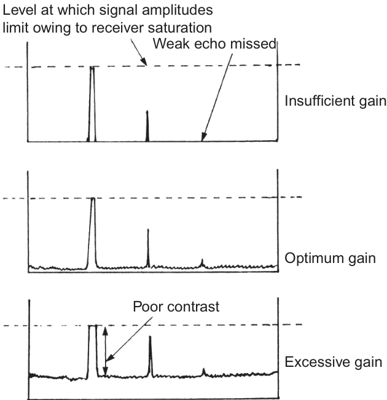  
FIGURE 6.2 Setting the gain control.  

【翻译】
图6.2 设置增益控制。

【解读】
该图示意为设置音频设备或其他电子设备中的增益（gain）控制。增益控制是调整输入信号的强度以达到最佳输出效果的过程。在音频设备中，适当的增益设置可以帮助提高声音质量，减少噪声，避免失真。

【词汇表】
| 英文词汇 | 中文翻译 | 解释 |
| --- | --- | --- |
| Gain | 增益 | 指的是对输入信号进行放大，以改变其强度或幅度。 |
| Control | 控制 | 在这里指的是调节或调整某一参数（如增益）的过程或手段。 |
| Setting | 设置 | 指的是配置或调整设备参数到特定值的行为。 |

In the single-level video case any noise which crosses the threshold will be displayed with the same brightness as a detectable echo. This makes it much more difficult to assess the background noise than in the analogue case, where there is a very obvious amplitude difference between most echoes and the noise background. In some older synthetic displays it is possible to revert to an analogue picture, albeit in some cases on only one range scale. The difficulty can then be avoided by setting the gain while viewing the analogue picture. Later synthetic displays do not offer the analogue option and in such cases it was necessary to live with the difficulty of single-level noise and targets. With practice the observer should be able to identify the noise by its random nature and the radial length of individual noise pulses. The peaks of real noise are sharply spiked, and thus the number of successive range cells (see Section 2.7.3) occupied by a single noise pulse is likely to be noticeably less than that occupied by most genuine targets. This does not mean that every very short digital response is necessarily noise. A weak, but genuine, received echo which barely crosses the threshold may well activate only one range cell, but may appear in the same place on successive scans, whereas the noise will appear randomly.  

【翻译】
在单级视频情况下，任何超过阈值的噪声都会与可检测到的回波以相同的亮度显示，这使得评估背景噪声比模拟情况下困难得多，在模拟情况下，大多数回波和噪声背景之间存在非常明显的幅度差异。在一些较旧的合成显示器中，可以恢复到模拟图像，尽管在某些情况下，只能在一个范围刻度上进行。然后可以通过设置增益来查看模拟图像，从而避免这种困难。较新的合成显示器不提供模拟选项，在这种情况下，就不得不忍受单级噪声和目标的困难。经过练习，观察者应该能够根据噪声的随机性和单个噪声脉冲的径向长度来识别噪声。真实噪声的峰值是尖锐的，因此单个噪声脉冲占据的连续范围单元（见第2.7.3节）数量可能会明显少于大多数真正目标所占据的数量。这并不意味着每一个非常短的数字响应一定是噪声。一个弱但真实的接收回波可能刚好超过阈值，只激活一个范围单元，但可能在后续扫描中出现在同一位置，而噪声则会随机出现。

【解读】
本段讨论了单级视频系统中的噪声问题，指出由于噪声和回波具有相同的亮度，使得评估背景噪声变得更加困难。然而，通过观察噪声的随机性和径向长度，观察者可以学会识别噪声。此外，真实的回波通常会在后续扫描中保持稳定，而噪声则会随机变化。

【词汇表】
| 英文词汇 | 中文翻译 | 解释 |
| --- | --- | --- |
| Threshold | 阈值 | 指信号处理中用于区分信号和噪声的最低强度或电压值 |
| Analogue | 模拟 | 指使用连续信号表示信息的技术或系统 |
| Synthetic display | 合成显示器 | 指

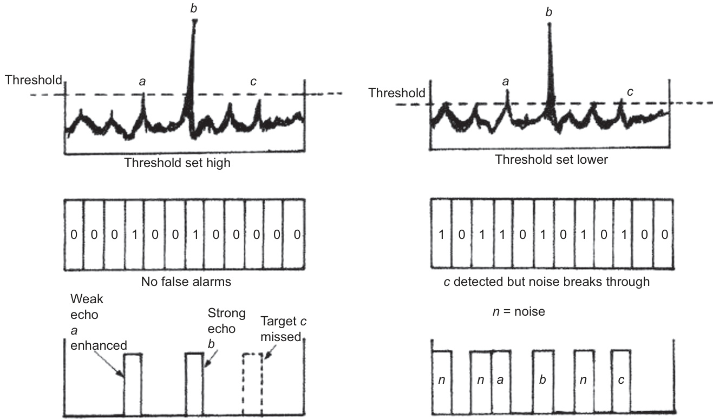  
FIGURE 6.3 Target detection and threshold setting.  

【翻译】
图6.3：目标检测与阈值设置。

【解读】
该图展示了目标检测过程中如何设定阈值，以确定什么样的信号或特征被认为是有效的目标检测结果。这是一个在信号处理和模式识别领域非常重要的步骤，因为它直接影响到检测的准确性和可靠性。

【词汇表】
| 英文词汇 | 中文翻译 | 解释 |
| --- | --- | --- |
| Target detection | 目标检测 | 指通过各种方法（如传感器、算法等）来识别和定位特定目标的过程。 |
| Threshold setting | 阈值设置 | 在信号处理中，为区分信号和噪声而设定的最低强度或幅度值。 |
| Signal | 信号 | 在这里指的是传递信息的电磁波或其他形式的能量。 |

The difficulty of achieving a suitable noise setting is reduced where more than one video level is offered. Modern equipment with digital signal processing (see Section 2.7.1) allows the signal strength to have multiple digital levels and therefore multiple video levels. Because noise pulses are displayed at a fraction of high-level amplitude, the practised observer will not confuse them with stronger genuine echoes. Further, although low-level echoes will have the same amplitude as the noise, their coherence, persistence and radial length will favour detection when compared with the random noise pattern.  

【翻译】
当提供多个视频级别时，实现合适的噪声设置的难度会降低。现代设备采用数字信号处理技术（见第2.7.1节），可以使信号强度具有多个数字级别，从而实现多个视频级别。当噪声脉冲以高级别幅值的一小部分显示时，经过练习的观察者不会将其与更强的真实回声混淆。此外，尽管低级别回声的幅值与噪声相同，但它们的相干性、持久性和径向长度将有利于检测，当与随机噪声模式进行比较时。

【解读】
本段讨论了在信号处理中如何通过提供多个视频级别来减少噪声对信号质量的影响。通过使用数字信号处理技术，可以产生多个视频级别，这样就可以区分噪声和真正的回声信号。即使噪声和低级别回声的幅值相同，后者的相干性、持久性和径向长度也会帮助观察者识别出真正的回声。

【词汇表】
| 英文词汇 | 中文翻译 | 解释 |
| --- | --- | --- |
| digital signal processing | 数字信号处理 | 一种使用计算机算法处理信号的技术 |
| coherence | 相干性 | 指信号或波之间的相关性或一致性 |
| persistence | 持久性 | 指信号或现象持续存在的时间或能力 |
| radial length | 径向长度 | 指信号或物体沿径向方向的尺寸或大小 |

# 6.2.7.2 Setting the Tuning Control  

In a magnetron-based radar, the function of the tuning control is to adjust the frequency of the receiver (see Section 2.6.4.2) so that it coincides with that of the transmitter, rather in the same way as one might tune a broadcast receiver to listen for a distant station. Some modern radar equipments offer automatic tuning, while the solid-state coherent radar equipment no longer requires ‘tuning’ in the traditional sense as the monitoring of the small variations in the received radar signals are part of the ‘coherent’ principle. This section considers the use of the manual tuning control.  

【翻译】
在磁控管雷达中，调谐控制的功能是调整接收器的频率（见第2.6.4.2节），使其与发射器的频率一致，就像调谐广播接收器以收听远程电台一样。一些现代雷达设备提供自动调谐，而固态相干雷达设备不再需要传统意义上的“调谐”，因为监测接收到的雷达信号的小变化是“相干”原理的一部分。本节讨论手动调谐控制的使用。

【解读】
本段主要介绍了磁控管雷达中的调谐控制功能及其作用，指出其目的是使接收器的频率与发射器的频率保持一致，以确保有效的雷达信号接收和处理。同时，也提到了现代雷达设备中自动调谐和固态相干雷达技术的应用，这些技术减少或消除了手动调谐的必要性。

【词汇表】
| 英文词汇 | 中文翻译 | 解释 |
| --- | --- | --- |
| Magnetron | 磁控管 | 一种用于产生高功率微波能量的电子设备，常用于雷达系统中。 |
| Tuning Control | 调谐控制 | 用于调整设备参数以匹配特定频率或条件的控制装置。在此处指的是雷达系统中用于匹配发射器和接收器频率的控制。 |
| Coherent Radar | 相干雷达 | 一种利用相干原理来提高雷达信号质量和精度的雷达技术。 |
| Solid-State | 固态 | 指使用半导体材料等固态元件构成的电子设备，与传统的真空管设备相对应。 |

If the receiver is only slightly mistuned, the extent of the bandwidth may still allow stronger echoes to be displayed even to the level of saturation. It is important not to be misled by this because weak echoes will most certainly be lost. It is thus important to establish criteria against which it is possible to make a sensitive assessment of the setting of the tuning control.  

【翻译】
如果接收器的调谐仅略有偏差，带宽范围可能仍允许更强的回声显示，甚至达到饱和水平。但是，不要被这种情况所迷惑，因为弱回声很可能会丢失。因此，建立评估调谐控制设置的标准至关重要，以便能够进行敏感的评估。

【解读】
这段话强调了在使用某种设备（可能是雷达或超声波设备）时，接收器的调谐对信号质量的影响。即使接收器的调谐稍有偏差，也可能导致弱信号丢失，因此需要建立明确的评估标准来确保调谐控制的准确性。

【词汇表】
| 英文词汇 | 中文翻译 | 解释 |
| --- | --- | --- |
| mistuned | 调谐不当 | 指设备的调谐参数与实际要求不符 |
| bandwidth | 带宽 | 信号处理中能通过的频率范围 |
| saturation | 饱和 | 指信号强度超过设备的处理能力，导致信号失真 |
| criteria | 标准 | 用于评估或判断的依据或条件 |

One of the most sensitive criteria is the response of a weak echo from land (Figure 6.4). The tuning control should be adjusted while carefully watching such a response. On traditional radar, as the correct frequency was approached, the brightness of the displayed target response increased. It will peak at the correct setting and decay after that setting has been passed. By adjusting the control to achieve the maximum displayed brightness of such a target, the correct setting could be easily and reliably found.  

【翻译】
其中一个最敏感的标准是来自陆地的微弱回声的响应（图6.4）。调谐控制应该在仔细观察这种响应的同时进行调整。在传统的雷达系统中，当接近正确频率时，显示的目标响应亮度会增加。当达到正确设置时会达到峰值，一旦超过该设置，亮度就会减少。通过调整控制以实现此类目标的最大显示亮度，可以轻松且可靠地找到正确的设置。

【解读】
本段主要讨论如何通过观察雷达信号的变化来确定正确的频率设置。它强调了在调整过程中需要注意观察目标响应的亮度变化，以便找到最佳的设置。这一方法对于确保雷达系统的准确性和有效性至关重要。

【词汇表】
| 英文词汇 | 中文翻译 | 解释 |
| --- | --- | --- |
| Criteria | 标准 | 用于评估或判断的依据 |
| Tuning control | 调谐控制 | 调整设备参数以获得最佳性能的控制器 |
| Target response | 目标响应 | 雷达系统对目标物体的检测反应 |
| Brightness | 亮度 | 图像或信号的明暗程度 |

The use of a weak land echo as the sensitive criterion by which to judge the setting of the  

【翻译】
利用弱地面回声作为敏感标准来判断设置的方法。

【解读】
该段落讨论了在某种技术或科学应用中使用弱地面回声作为一个关键指标来评估设置是否合适。这种方法可能与雷达、地震探测或其他需要精确检测的地球物理领域相关。

【词汇表】
| 英文词汇 | 中文翻译 | 解释 |
| --- | --- | --- |
| weak land echo | 弱地面回声 | 在雷达或地震探测中，由于地面的反射而产生的较弱的信号回声 |
| sensitive criterion | 敏感标准 | 用于评估或判断某一特定条件或状态的依据或参考点 |
| setting | 设置 | 指系统、设备或参数的配置或调整 |

FIGURE 6.4 Setting the tuning control.  

【翻译】
图6.4 设置调谐控制。

【解读】
本段落主要是关于设置某种设备或系统的调谐控制的一个说明，可能是在电子、通信或者音频领域中使用到的一个步骤或过程。

【词汇表】
| 英文词汇 | 中文翻译 | 解释 |
| --- | --- | --- |
| Figure | 图 | 指图表中的插图或示意图 |
| Tuning control | 调谐控制 | 用于调整或优化设备性能的控制装置或功能 |
| Setting | 设置 | 配置或调整某项参数到特定状态的行为 |

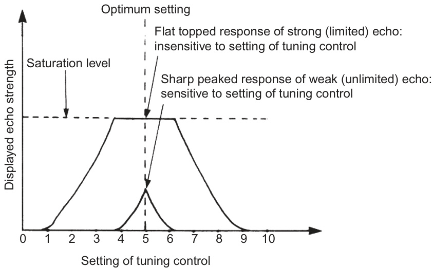  

【处理失败：内存不足或无法生成有效响应】

tuning control cannot be applied in the case of a modern synthetic display due to the quantizing effect of digital storage. This is illustrated for a single video level system by Figure 6.5.  

【翻译】
调节控制不能应用于现代合成显示器，因为数字存储具有量化效应。这一点通过图6.5中的单视频级系统得到了说明。

【解读】
这段话主要讨论了在现代合成显示技术中，由于数字存储的量化效应，传统的调节控制方法不再适用。这种限制被一个具体的例子——单视频级系统的图示（图6.5）所阐明，强调了数字技术对显示控制的影响。

【词汇表】
| 英文词汇 | 中文翻译 | 解释 |
| --- | --- | --- |
| tuning control | 调节控制 | 指调整或优化系统参数以达到最佳性能的过程 |
| quantizing effect | 量化效应 | 数字信号处理中，将连续信号离散化为有限数值的效果 |
| digital storage | 数字存储 | 使用数字形式存储数据的技术或设备 |
| synthetic display | 合成显示 | 利用电子或数字技术生成图像的显示设备，如计算机屏幕等 |

Reference to Figure 6.5 shows that there may be little or no relation between the amplitude of the synthetic echo and the analogue response which produced it. The setting of the tuning control must not be judged with respect to the amplitude of the synthetic echoes, because their brightness is not sufficiently sensitive to the position of the control. Even if several video levels are offered, the displayed echo strength will change only when the real echo moves into a new inter-threshold band, and even then in steps which may be quite large.  

【翻译】
如图6.5所示，合成回波的幅度与产生它的模拟响应之间可能几乎没有关系。调谐控制的设置不能根据合成回波的幅度来判断，因为它们的亮度对控制位置的变化不够敏感。即使提供了多个视频级别，当真实回波移动到新的阈值带时显示的回波强度才会改变，而且即使那样，变化也可能是相当大的阶梯状。

【解读】
这段话讨论了合成回波（synthetic echo）与其产生的模拟响应之间的关系，以及调谐控制设置的影响。主要观点是，合成回波的幅度并不直接反映出模拟响应的特征，这意味着在调整系统参数时，不能简单地依靠合成回波的视觉表现来进行判断。这种现象可能导致系统的灵敏度和准确性受到限制。

【词汇表】
| 英文词汇 | 中文翻译 | 解释 |
| --- | --- | --- |
| Synthetic Echo | 合成回波 | 人工生成的回波信号，用于模拟或测试目的 |
| Analogue Response | 模拟响应 | 系统对输入信号的模拟输出反应 |
| Tuning Control | 调谐控制 | 用于调整系统参数以优化性能的控制装置 |
| Inter-threshold Band | 阈值带 | 指系统中两个阈值之间的范围，在此范围内系统行为保持一致 |

It is therefore necessary to adjust the control to achieve one of the following results:  

【翻译】
因此，有必要调整控制以达到以下结果之一：

【解读】
这段话强调了在某种情况下需要对控制进行调整，以实现预期的效果或结果。这意味着当前的设置或状态可能不是最佳的，需要进行修改来满足特定的目标或要求。

【词汇表】
| 英文词汇 | 中文翻译 | 解释 |
| --- | --- | --- |
| adjust | 调整 | 修改或改变某些参数以适应新的条件或需求 |
| control | 控制 | 对系统、过程或行为的管理或调节 |
| achieve | 实现 | 达到或完成某个目标或结果 |

1. The maximum radial extent of sea clutter echoes: these are described in Section 3.6.   
2. The maximum area of precipitation echoes: these are described in Section 3.7.   
3. The maximum extent of land echoes (ideally a coastline).  

【翻译】
1. 海杂波回声的最大径向范围：这些在第3.6节中进行了描述。
2. 降水回声的最大面积：这些在第3.7节中进行了描述。
3. 陆地回声的最大范围（理想情况下是一个海岸线）。

【解读】
该段落主要讨论的是雷达信号处理中的三个关键方面：海杂波回声、降水回声和陆地回声的最大范围或面积。这三个方面对于理解和分析雷达数据至关重要，因为它们直接影响到雷达系统的性能和准确性。

【词汇表】
| 英文词汇 | 中文翻译 | 解释 |
| --- | --- | --- |
| Radial extent | 径向范围 | 指从雷达天线中心向外延伸的距离或范围 |
| Sea clutter | 海杂波 | 由海面反射而产生的干扰信号 |
| Precipitation echoes | 降水回声 | 由降水（如雨、雪等）引起的雷达回声 |
| Land echoes | 陆地回声 | 由陆地表面反射而产生的雷达回声 |

4. The maximum radial extent of the receiver monitor signal: this is discussed in Section 6.5.  

【翻译】
4. 接收器监测信号的最大径向范围：这在第6.5节中进行了讨论。

【解读】
本段落提到了一个特定技术参数，即接收器监测信号的最大径向范围，这是一个需要具体讨论和定义的技术指标，相关细节将在第6.5节中展开说明。

【词汇表】
| 英文词汇 | 中文翻译 | 解释 |
| --- | --- | --- |
| Radial extent | 径向范围 | 指从中心点向外延伸的距离或尺寸 |
| Receiver monitor signal | 接收器监测信号 | 用于监控和控制接收器工作状态的信号 |
| Maximum | 最大 | 表示某一量值或程度的最高点或极限 |

It should be noted that all the above criteria are suitable because they are based on the area of response rather than on its brightness.  

【翻译】
需要注意的是，上述所有标准都是合适的，因为它们是基于响应区域而非其亮度来制定的。

【解读】
这段话强调了评估标准的依据应该是响应的区域或范围，而不是其明显程度或亮度。这意味着在评估某些特性或反应时，更关注的是影响范围或覆盖面积，而不是单纯的强度或视觉效果。

【词汇表】
| 英文词汇 | 中文翻译 | 解释 |
| --- | --- | --- |
| criteria | 标准 | 用于评估或判断的依据或条件 |
| response | 响应 | 对刺激或情况的反应或回应 |
| brightness | 亮度 | 物体或光源的发光强度或视觉感受 |

The tuning may drift as the system warms up and to a lesser extent with the passage of time. The setting of the control should therefore be checked frequently during the first 30 minutes after switching on and periodically thereafter.  

【翻译】
调节可能会随着系统预热以及时间的推移而发生变化，但后者程度较小。因此，在打开开关后的前30分钟内应频繁检查控制设置，并在此之后定期进行检查。

【解读】
这段话强调了系统启动后需要对其进行监测和调整，以确保其正常运作。特别是在系统刚开始运行时，需要密切关注以防止任何不稳定性或偏差。

【词汇表】
| 英文词汇 | 中文翻译 | 解释 |
| --- | --- | --- |
| tune | 调节、调整 | 指使系统或设备达到最佳状态的过程 |
| drift | 漂移、变化 | 系统或参数随时间或条件变化而发生的缓慢移动或偏离 |
| periodically | 定期地、周期性地 | 在固定的间隔时间内重复进行某种活动或检查 |
| switch on | 打开、启动 | 将电源或设备打开，使其开始工作 |

If the coarse tuning has been set correctly by service personnel, the correct setting for the display tuning control should lie close to the centre of its range of travel. If the correct position is found to approach either end of the range of travel, the coarse tuning control, usually located in the transmitter and not normally available to the operator, should be readjusted by qualified service personnel.  

【翻译】
如果服务人员正确设置了粗调节，则显示调谐控制的正确设置应该位于其行程范围的中间位置。如果发现正确位置接近行程范围的任意一端，通常位于发射器内且不对操作员开放的粗调节控制应由合格的服务人员重新调整。

【解读】
本段主要讨论电子设备（可能是无线电台或通信系统）中的调谐过程，特别强调了粗调和细调之间的关系，以及如何确保设备正常工作。它提醒维护人员注意到设备的调谐设置，以便在需要时进行适当的调整。

【词汇表】
| 英文词汇 | 中文翻译 | 解释 |
| --- | --- | --- |
| coarse tuning | 粗调节 | 电子设备中用于大幅度调谐的控制 |
| fine tuning | 细调节/显示调谐控制 | 用于精细调谐的控制，通常对用户可见 |
| transmitter | 发射器 | 将信号传输到其他设备的元件 |
| qualified service personnel | 合格的服务人员 | 具有相应资格和经验的人员，能够进行设备维修和调整 |

Most displays offer features such as magic eyes, tuning meters and tuning indicators. They should not be used in preference to the  

【翻译】
大多数显示设备都提供了诸如魔眼、调谐仪表和调谐指示器等功能。然而，这些功能不应该被优先使用，而是作为辅助工具。

【解读】
这段话讨论的是显示设备中的一些常见功能，如“魔眼”（magic eyes）、调谐仪表（tuning meters）和调谐指示器（tuning indicators）。这些功能可以帮助用户更好地控制和调整设备，但作者强调，不应过度依赖这些功能，而是将它们作为辅助工具来使用，以避免忽视其他重要方面。

【词汇表】
| 英文词汇 | 中文翻译 | 解释 |
| --- | --- | --- |
| Magic Eyes | 魔眼 | 一种用于监测信号强度或质量的显示设备功能 |
| Tuning Meters | 调谐仪表 | 用于测量和显示设备调谐状态的仪表 |
| Tuning Indicators | 调谐指示器 | 指示设备是否已正确调谐的灯光或符号 |

FIGURE 6.5 Setting the tuning control ! the effect of quantizing.  

【翻译】
图6.5 设置调谐控制！量化效应。

【解读】
该段落似乎是来自一篇技术文章或教材，讨论的是数字信号处理中的“量化”概念。图6.5可能展示了如何设置调谐控制以观察量化对信号的影响。

【词汇表】
| 英文词汇 | 中文翻译 | 解释 |
| --- | --- | --- |
| Quantizing | 量化 | 将连续信号转换为离散值的过程 |
| Tuning control | 调谐控制 | 用于调整或优化系统参数的设备或功能 |
| Effect | 效应 | 指某一过程或操作所产生的结果或影响 |

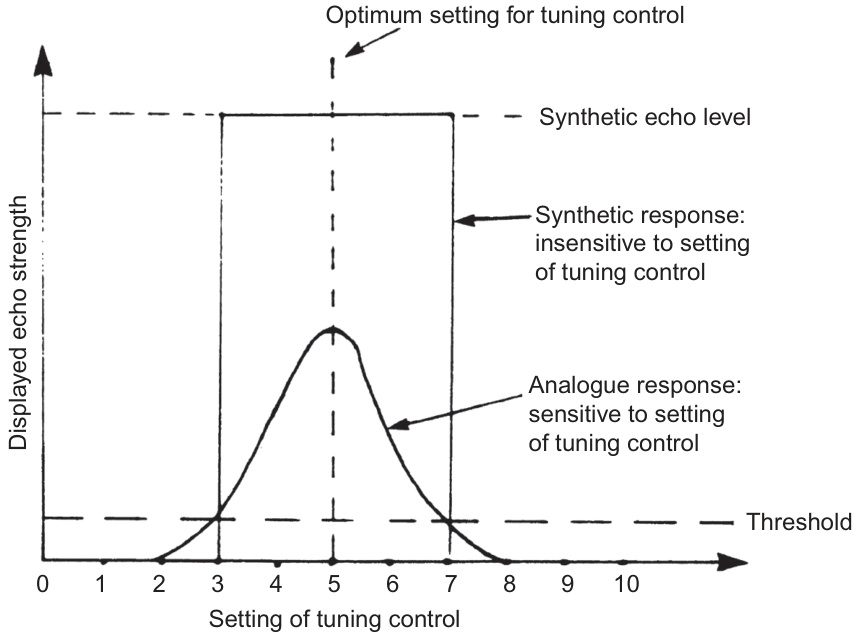  

【处理失败：内存不足或无法生成有效响应】

above criteria. Such devices are not required by IMO Performance Standards and there is a danger of the observer being misled by such indicators.  

【翻译】
符合上述标准的设备不需要按照国际海事组织（IMO）的性能标准，而使用此类指示器可能会误导观察员。

【解读】
本段强调某些设备不受国际海事组织性能标准的约束，但使用这些设备可能会导致观察员产生错误的判断或结论，因此需要谨慎对待这种情况。

【词汇表】
| 英文词汇 | 中文翻译 | 解释 |
| --- | --- | --- |
| IMO | 国际海事组织 | 一个负责制定全球海事安全、保安和环境保护标准的联合国专门机构 |
| Performance Standards | 性能标准 | 指定设备或系统必须达到的最低性能要求 |
| observer | 观察员 | 在特定情境下进行观察或监测的人员 |

Where full automatic tuning is provided, a performance check should be carried out to ensure that optimum tuning is being achieved. The procedure for carrying this out is described in Section 6.3.  

【翻译】
在提供全自动调谐的情况下，应进行性能检查，以确保达到最佳调谐效果。执行此操作的程序在第6.3节中描述。

【解读】
本段强调了在使用全自动调谐功能时，需要进行性能检查以保证系统能够达到最佳状态。这意味着，即使是自动化的过程，也需要人工干预来验证其是否正常工作。

【词汇表】
| 英文词汇 | 中文翻译 | 解释 |
| --- | --- | --- |
| Automatic Tuning | 自动调谐 | 系统自行调整参数以达到最佳状态的过程 |
| Performance Check | 性能检查 | 验证系统是否按照预期运行的检查过程 |
| Optimum Tuning | 最佳调谐 | 系统达到最好状态的调谐效果 |

# 6.2.8 Optimum Picture on Coherent Radar Systems  

Coherent radars (Section 2.9) provide sophisticated and automated tuning controls, essential to ensure the required coherency of the system. For this reason they are unlikely to have conventional tuning controls. However, they will have manual controls to help the user optimize the picture, which will generally replicate the gain and clutter controls of a conventional magnetron radar. They will also have a number of of automated options for setting the display.  

【翻译】
相干雷达（第2.9节）提供了复杂且自动化的调谐控制，这对于确保系统所需的相干性至关重要。因此，它们不太可能具有传统的调谐控制。但是，它们会有手动控制来帮助用户优化图像，这通常会复制传统磁控管雷达的增益和杂波控制。它们还会有一些用于设置显示的自动选项。

【解读】
本段主要介绍了相干雷达的特点，即其调谐控制更加自动化和复杂，以保证系统的相干性。虽然它可能没有传统的调谐控制，但仍然具备手动控制以便于用户调整图像，以及多种自动设定显示的选项。这意味着相干雷达在设计上更倾向于智能化和易用性。

【词汇表】
| 英文词汇 | 中文翻译 | 解释 |
| --- | --- | --- |
| Coherent | 相干的 | 指的是两个或多个波之间的相位关系保持一致性的状态，在这里指相干雷达。 |
| Magnetron | 磁控管 | 一种高功率微波发生器，常用于雷达系统中产生微波能量。 |
| Clutter | 杂波 | 在雷达信号中，由非目标物体反射回来的无用信号，会干扰目标信号的检测。 |

the observer cannot be sure that the equipment is operating at the level of performance that was intended by the manufacturer. In the open sea in calm, foggy weather, the absence of echoes, despite the presence of receiver noise, may be due to a loss in performance rather than an empty ocean. Failure to appreciate this fundamental principle could lead to a very dangerous situation. The absence of echoes deprives the observer of the normal criteria by which to judge the setting of the tuning control.  

【翻译】
观察者无法确保设备按照制造商预期的性能水平运行。在开阔的大海中，天气平静且雾蒙蒙的，尽管接收器噪音存在，但回声的缺失可能是由于性能损失而不是空旷的海洋。忽视这一基本原则可能会导致非常危险的情况。回声的缺失剥夺了观察者用来判断调谐控制设置的正常标准。

【解读】
这段话强调了在使用电子设备（如雷达或声纳）进行观察时，需要注意设备的性能可能会受到影响，从而导致观察结果不准确。特别是在恶劣的天气条件下，设备可能无法正常工作，观察者需要意识到这种可能性，以避免做出错误的判断。这要求观察者对设备的性能和环境条件有充分的了解，并能够根据实际情况调整自己的判断标准。

【词汇表】
| 英文词汇 | 中文翻译 | 解释 |
| --- | --- | --- |
| observer | 观察者 | 使用设备进行观察的人员 |
| performance | 性能 | 设备的运行效率或质量 |
| criteria | 标准 | 判断或评估的依据或参考点 |
| tuning control | 调谐控制 | 用于调整设备参数以获得最佳效果的控制装置 |

IMO Performance Standard (see Section 11.2.1) requires that means be available, while the equipment is in use operationally, to determine readily a significant drop in performance relative to a calibration standard established at the time of installation, and that the equipment is correctly tuned in the absence of targets. This facility is commonly referred to as a performance monitor. The sensitive element which makes monitoring possible is usually a unit known as an echo box and is described in the next section. Some systems use a device known as a transponder (see Section 6.3.4).  

【翻译】
国际海事组织（IMO）性能标准（见第11.2.1节）要求，在设备运行过程中，有可用的手段来快速确定其性能相对于安装时建立的校准标准而言是否有明显下降，以及在没有目标的情况下设备是否正确调谐。这一功能通常被称为性能监测器。使得监测成为可能的敏感元件通常是一个称为回声箱的单元，将在下一节中描述。有些系统使用一种称为应答器（见第6.3.4节）的设备。

【解读】
本段主要讨论了国际海事组织对雷达设备性能监测的要求，强调了在设备运行过程中需要能够快速检测出性能下降以及确保设备正确调谐的必要性。同时提到了实现这一功能的技术手段，如回声箱和应答器。

【词汇表】
| 英文词汇 | 中文翻译 | 解释 |
| --- | --- | --- |
| IMO | 国际海事组织 | 一个负责制定全球海事安全、防污染和船舶安全操作标准的联合国专门机构 |
| Performance Standard | 性能标准 | 对设备或系统的性能提出的一系列要求或规范 |
| Echo Box | 回声箱 | 一种用于测试和监测雷达设备性能的装置 |
| Transponder | 应答器 | 一种可以接收信号并发送响应信号的电子设备，常用于通信和导航系统 |

# 6.3 PERFORMANCE MONITORING  

As soon as practical after the initial setting up of the display, the system performance should be monitored. In the case of a shorebased radar system, it may be possible to assess the level of performance from a knowledge of the identity of those targets which were at the limit of detection when the system was installed and the performance was tested and optimized by the manufacturer. However, at sea it is usually not possible to discern whether or not the system is giving optimum performance merely by viewing the displayed picture, because the observer does not usually have exact knowledge of which targets should be seen. Although the picture may look good,  

【翻译】
在显示系统初步设置完成后，应尽快监测系统性能。在陆基雷达系统中，可以通过了解当时处于探测极限的目标身份来评估系统性能，因为这些信息是在安装和测试过程中由制造商优化的。但是，在海上，通常无法仅凭借观察显示图像就判断系统是否达到最佳性能，因为观察者通常不知道应该看到哪些目标。尽管图像看起来很好，

【解读】
本段强调了对雷达系统性能进行监测和评估的重要性，特别是在海上环境中。由于观察者可能缺乏关于应该探测到哪些目标的确切知识，因此仅凭借视觉观察可能不足以确定系统是否工作正常。这意味着需要采取更为系统化和量化的方法来评估和优化雷达系统的性能。

【词汇表】
| 英文词汇 | 中文翻译 | 解释 |
| --- | --- | --- |
| monitor | 监测 | 定期检查或跟踪某事物的状态或进展 |
| optimum | 最佳 | 最好的或最合适的状态 |
| discern | 辨别 | 区分或识别不同的事物 |
| exact | 确切 | 完全准确或精确的 |
| optimize | 优化 | 使某事物达到最佳状态或效率 |

# 6.3.1 The Principle of the Echo Box  

Any normal target which was mounted on the ship to reflect signals for test purposes would be unsatisfactory because, apart from the fact that it would probably be inside the minimum detection range (see Section 3.2.4), the strength of the echo would probably be so great as to saturate the receiver even if the performance was well below optimum. The problem is commonly overcome by using what is known as an echo box.  

【翻译】
任何正常的目标如果被安装在船上以反射信号用于测试目的，将会是不满意的，因为除了它可能位于最小探测范围内（见3.2.4节）之外，其回声强度可能非常大，以至于即使性能远低于最佳状态，也会饱和接收器。这个问题通常通过使用所谓的“回声箱”来解决。

【解读】
这段话讨论了在船上进行信号测试时遇到的一个技术挑战。由于直接使用正常目标可能导致信号过强而难以处理，因此需要一种特殊的设备——回声箱来帮助解决这一问题。这种方法可以更好地控制信号强度，从而获得更准确的测试结果。

【词汇表】
| 英文词汇 | 中文翻译 | 解释 |
| --- | --- | --- |
| target | 目标 | 在这里指的是用于测试的物体或装置 |
| saturate | 饱和 | 指信号过强以至于超过了接收器的处理能力 |
| optimum | 最佳 | 指性能达到最高水平的状态 |
| echo box | 回声箱 | 一种专门用于控制和调整信号强度的设备 |

The echo box is essentially a hollow metal container of precisely machined dimensions. In theory, a variety of shapes can be used but, in practice, modern systems normally use a cylinder about the size of a small food can. The theory of the operation of the echo box is quite complex but its behaviour can be described in fairly simple terms. When a pulse of radar energy is transmitted into the box, the energy reverberates within the cavity and if, but only if, the cavity is the correct size in relationship to the wavelength of the radar signal, intense oscillations build up over the duration of the pulse length. At the end of the transmitted pulse the oscillations continue but their amplitude gradually decays over a period which is much longer than the duration of the transmitted pulse. As long as the oscillations persist, radar energy is re-radiated from the box. The energy reradiated from the echo box can be treated in the same way as other returning radar signals and thus produces a visible, radial response on the display which is known as the performance monitor signal. This general principle is illustrated by Figure 6.6, but it should be noted that the angular extent of the monitor signal depends on other factors which are discussed in Section 6.3.2. The echo box and its associated circuitry is referred to as a performance monitor.  

【翻译】
回声箱本质上是一个具有精确机械加工尺寸的空心金属容器。理论上讲，可以使用各种形状，但在实践中，现代系统通常使用一个大约与小型食品罐头相同大小的圆柱体。回声箱的工作原理相当复杂，但其行为可以用简单的术语来描述。当雷达能量脉冲传入箱内时，能量在腔体内产生共振，如果且仅如果腔体的尺寸与雷达信号的波长相适应，强烈的振荡会随着脉冲长度的持续时间而建立。在传输脉冲结束后，振荡继续存在，但其幅度会在远长于传输脉冲持续时间的期间逐渐衰减。只要振荡持续存在，雷达能量就会从箱内重新辐射出来。从回声箱重新辐射出的能量可以像对待其他返回的雷达信号一样处理，因此会在显示屏上产生可见的、径向的响应，这被称为性能监测信号。这种一般原理如图6.6所示，但应该注意，监测信号的角度范围取决于第6.3.2节中讨论的其他因素。回声箱及其相关电路被称为性能监测器。

【解读】
这段话主要介绍了回声箱的基本结构和工作原理，包括其尺寸、形状、工作过程以及如何产生性能监测信号。回声箱是雷达系统中的一个重要组件，用于测试和监控雷达信号的质量和性能。

【词汇表】
| 英文词汇 | 中文翻译 | 解释 |
| --- | --- | --- |
| Echo Box | 回声箱 | 一种用于测试和监控雷达信号的设备 |
| Radar Energy | 雷达能量 | 由雷达系统发射或接收的能量 |
| Wavelength | 波长 | 电磁波（包括雷达信号）的波动周期 |
| Oscillations | 振荡 | 能量在回声箱内的反复波动 |
| Performance Monitor Signal | 性能监测信号 | 从回声箱重新辐

It may be found helpful to liken the action of the echo box to that of a bell which rings for a long time after being struck by a comparatively swift blow. In fact, engineers often refer to the re-radiation from the box as ‘ringing’. (A full explanation of the action of the echo box is beyond the scope of this work, requiring an understanding of the theory of the resonant cavity: the reader who wishes to pursue this is referred to any good radar engineering text.)  

【翻译】
回声箱的作用可以类比为钟被敲击后长时间的鸣响。事实上，工程师们经常把从箱体中重新辐射出的信号称为“环响”。（对回声箱工作原理的完整解释超出了本书的范围，因为它需要理解谐振腔体理论：希望进一步了解这一点的读者可以参考任何好的雷达工程教材。）

【解读】
这段话通过一个简单的类比来帮助读者理解回声箱的工作原理，即与钟被敲击后产生的长时间鸣响相似。同时，也提到了这个主题的深入探讨需要一定的技术基础，特别是谐振腔体理论的知识。

【词汇表】
| 英文词汇 | 中文翻译 | 解释 |
| --- | --- | --- |
| resonate | 谐振 | 指物体或系统在特定频率下振动或发出声音的现象 |
| cavity | 腔体 | 空间或容器，尤其指具有特定形状和尺寸的封闭空间 |
| re-radiation | 重新辐射 | 指能量或信号从某一介质或设备中再次发射出去的过程 |

Pursuing the analogy of the bell further, the length of time for which a nearby listener hears the bell ringing depends on the vigour with which it has been struck, and the sensitivity of the listener’s ear at the frequency emitted by the bell. Applying this reasoning to the echo box, it should be evident that the radial extent of the monitor signal on the display is a measure of the performance of the radar system since it depends on:  

【翻译】
进一步延伸钟声的比喻，我们可以发现附近听众听到钟声持续的时间长短取决于钟声被敲击的力度以及听众耳朵对钟声发出的频率的敏感度。将这种推理应用到回声箱中，可以清楚地看出显示器上监测信号的径向范围是雷达系统性能的一个衡量标准，因为它取决于多种因素。

【解读】
本段主要讨论了一个关于钟声与雷达系统之间的类比关系，强调了雷达系统性能的评估可以通过观察监测信号在显示器上的表现来进行。这意味着雷达系统的能力与其能够探测和显示目标物体的距离和清晰度有关，这些信息对于理解雷达技术的工作原理和优化其性能具有重要意义。

【词汇表】
| 英文词汇 | 中文翻译 | 解释 |
| --- | --- | --- |
| analogy | 类比 | 一种比较或对比的方法，用以说明某种概念或想法 |
| vigour | 力度、力量 | 指的是钟声被敲击的有力程度，也可泛指事物的强烈程度 |
| sensitivity | 敏感度 | 指的是听众耳朵对特定频率声音的反应能力，也可用于描述设备或系统对刺激的反应能力 |
| radial extent | 径向范围 | 指的是从中心点向外辐射的距离或范围，在此处特指监测信号在显示器上的展开范围 |

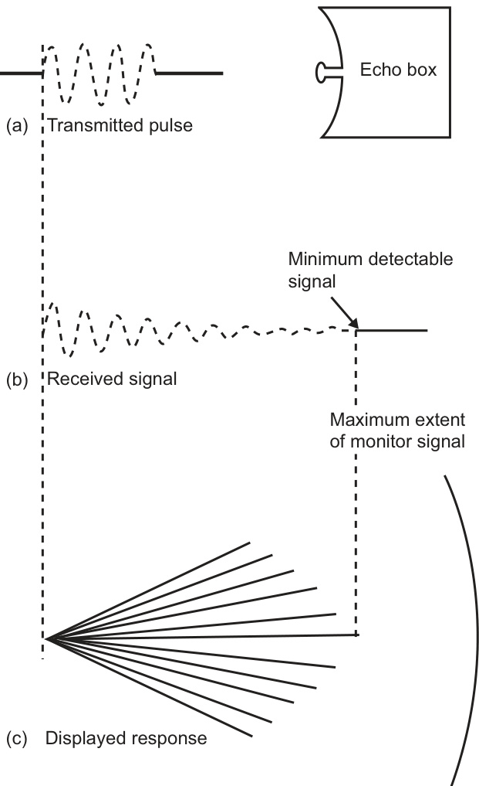  
FIGURE 6.6 The echo box response.  

【翻译】
图6.6 回声箱响应。

【解读】
该图显示了回声箱（echo box）的响应情况，可能与音频处理或信号处理领域相关，展示了某种设备或系统对输入信号的输出反应。

【词汇表】
| 英文词汇 | 中文翻译 | 解释 |
| --- | --- | --- |
| Figure | 图 | 一幅插图或图表，通常用于说明或支持某一观点或概念。 |
| Echo box | 回声箱 | 一种设备或系统，能够产生回声或反馈，常用于音频测试或信号处理中。 |
| Response | 响应 | 指系统或设备对输入信号或刺激的输出反应。 |

1. The transmitter performance. The energy entering the echo box is a function of transmitted power and pulse length (see Sections 2.3.3.1 and 2.3.3.2). Thus the greater the amount of transmitted energy, the longer the echo box will ring. 2. The receiver sensitivity. The re-radiated signal is capable of detection until its amplitude has decayed to less than that of the receiver noise. Thus the more sensitive the receiver, the greater is the visible extent of the monitor signal (see Figure 6.6).  

【翻译】
1. 发射器性能：进入回声箱的能量是发射功率和脉冲长度的函数（见2.3.3.1和2.3.3.2节）。因此，发射的能量越大，回声箱的振铃时间就越长。2. 接收器灵敏度：重新辐射的信号可以被检测到，直到其幅度衰减到小于接收器噪声的程度。因此，接收器越灵敏，监视信号的可见范围就越大（见图6.6）。

【解读】
本段主要讨论了影响回声箱性能的两个关键因素：发射器的性能和接收器的灵敏度。发射器发出的能量越多，回声箱会持续发出回声的时间就越长；而接收器的灵敏度越高，就能够检测到更微弱的信号，从而使得监视信号的可见范围扩大。这两个因素直接关系到系统对信号的处理能力和检测精度。

【词汇表】
| 英文词汇 | 中文翻译 | 解释 |
| --- | --- | --- |
| Transmitter | 发射器 | 将电信号转换为电磁波或其他形式的能量并向外发送的设备 |
| Pulse length | 脉冲长度 | 电子信号中一个脉冲的持续时间 |
| Receiver sensitivity | 接收器灵敏度 | 接收器能够检测到的最低信号强度 |
| Re-radiated signal | 重新辐射信号 | 经过某种介质或物体后再次发射出来的信号 |

3. The receiver tuning. The frequency re-radiated by the echo box is the same as that of the transmitter. The maximum monitor signal depends on the receiver being tuned to the same frequency.   
4. The display control settings. Maladjustment of the display controls may prevent the observer detecting the full potential extent of the signal emitted by the echo box.  

【翻译】
3. 接收器调谐。回声箱重新辐射的频率与发射器相同。最大监测信号取决于接收器是否调谐到相同的频率。
4. 显示控制设置。不当的显示控制设置可能会阻止观察者检测到回声箱发出的信号的全部潜在范围。

【解读】
这两段话主要讨论了雷达系统中回声箱（echo box）的信号接收和显示问题。首先强调了接收器需要调谐到与发射器相同的频率，以获得最佳的监测信号。这意味着只有当接收器和发射器工作在同一频率下时，才能有效地检测和监测回声箱反射回来的信号。其次，提到了显示控制设置的重要性，如果这些设置不正确，可能会导致观察者无法完全检测到回声箱发出的信号，从而影响整个系统的性能和准确性。

【词汇表】
| 英文词汇 | 中文翻译 | 解释 |
| --- | --- | --- |
| Receiver | 接收器 | 用于接收信号的设备 |
| Transmitter | 发射器 | 用于发送信号的设备 |
| Echo Box | 回声箱 | 一种用来测试和校准雷达系统的设备 |
| Monitor Signal | 监测信号 | 用于监测和跟踪目标的信号 |
| Display Control | 显示控制 | 控制显示设备显示内容的设置 |

It is evident that if the system is adjusted by the manufacturer to optimum performance on installation (or after a service visit), and the radial extent of the monitor signal is measured at that time, the observer can be supplied with an objective calibration, in terms of miles and cables, against which to judge the performance of the system in the future. In particular, this facilitates an assessment of the setting of the tuning control in the absence of echoes. It should be noted that if the echo box is sited external to the radar system, for example on some part of the ship’s structure, it additionally monitors the antenna and waveguide performance. However, if the echo box is located within the radar system, as is quite common, it only monitors the transmitter and receiver functions. The implications of echo box siting are discussed further in the next section.  

【翻译】
很明显，如果系统在安装时（或服务访问后）由制造商调整为最佳性能，并且在那时测量监视信号的径向范围，观察者可以获得一个客观的校准，以里程和海里为单位，这样就可以用来判断系统在未来的表现。特别是，这便于评估调谐控制的设置，而不需要回声。此外，应注意到如果回声箱位于雷达系统以外，例如在船只结构的某些部分，它还会监控天线和波导管的性能。但是，如果回声箱位于雷达系统内部，如同现在很多情况一样，它只监控发射器和接收器功能。关于回声箱位置的影响，将在下一节中进一步讨论。

【解读】
本段主要讨论了使用回声箱对雷达系统进行校准和性能评估的方法。当系统被调整到最佳状态时，可以通过测量监视信号的范围来提供一个客观的标准，以此来评估系统未来的表现。同时，也提到了回声箱的位置会影响其监控的内容，如果它位于系统外部，则可以监控更多的组件；而如果位于系统内部，则只能监控发射器和接收器。

【词汇表】
| 英文词汇 | 中文翻译 | 解释 |
| --- | --- | --- |
| optimum | 最佳 | 指系统达到最好的工作状态 |
| radial extent | 径向范围 | 指从中心点向外延伸的距离或范围 |
| calibration | 校准 | 指使设备或系统达到精确的工作状态的过程 |
| transmitter | 发射器 | 指发送信号的设备 |
| receiver | 接收器 | 指接受信号的设备 |

below the level of the scanner, as illustrated by Figure 6.7(b).  

【翻译】
如图6.7（b）所示，在扫描仪下方。

【解读】
本段描述的是一个特定位置，即在扫描仪的下方区域，这通常是在讨论某种技术设备或系统的布局时使用到的描述方式。

【词汇表】
| 英文词汇 | 中文翻译 | 解释 |
| --- | --- | --- |
| scanner | 扫描仪 | 一种用于扫描和读取信息的设备 |
| below | 下方 | 指位于某物体或水平面以下的位置 |
| level | 水平面 | 指某物体或设备的高度或位置基准 |

As the beam sweeps the horn once per revolution, some 10 20 pulses (see Section 1.2.3) will energize the horn and be conveyed down the waveguide to the echo box. This approach, like all external sitings, has the virtue that the length of the monitor signal is a measure of antenna and waveguide performance in addition to that of the transmitter and receiver. Such an echo box and its associated circuitry can justifiably be referred to as an overall performance monitor because it monitors the performance of all units of the system. The principal drawback of an external echo box is the general expense of producing such a unit (in particular the cost of making it suitable for above-deck fitting) and the problems which result if water does penetrate the system. The monitor can be switched on and off by means of an attenuator which effectively blocks the short length of waveguide when the signal is not required. Because external echo boxes are only energized as the radar beam sweeps across them, they produce a monitor signal which has a limited angular width the form of which is illustrated in Figure 6.7(c). This form is commonly described as a plume.  

【翻译】
当束扫过喇叭一次时，大约10到20个脉冲（见1.2.3节）会激活喇叭，并通过波导传输到回声箱。这一方法，如所有外部放置方式一样，有一个优点，即监控信号的长度不仅是发射器和接收器的性能指标，也是天线和波导的性能指标。这样的回声箱及其相关电路可以合理地被称为整体性能监测器，因为它监测系统中所有单元的性能。外部回声箱的主要缺点是生产此类单元的总体费用（特别是使其适合在甲板上安装的成本）以及如果水进入系统可能产生的问题。监控器可以通过衰减器开启或关闭，衰减器有效地阻塞了波导的短长度，当信号不需要时。由于外部回声箱只在雷达束扫过它们时才被激活，因此它们产生的监控信号具有有限的角度宽度，其形式如图6.7（c）所示。这种形式通常被描述为羽状。

【解读】
本段讨论的是一种用于监测雷达系统性能的方法，即使用外部回声箱。当雷达束扫过回声箱时，会产生一系列脉冲，这些脉冲可以用来评估整个系统的性能，包括天线、波导、发射器和接收器。虽然这种方法有其优点，但也存在一些缺点，如生产成本高和潜在的水侵入问题。另外，外部回声箱只在雷达束扫过它们时才被激活，从而产生有限角度宽度的监控信号。

【词汇表】
| 英文词汇 | 中文翻译 | 解释 |
| --- | --- | --- |
| beam | 束 | 一种狭窄的能量束，常用于雷达系统中 |
| waveguide | 波导 | 一种用于引导电磁波的结构 |
| echo box | 回声箱 | 用于监测雷达系统性能的设备 |
| attenuator | 衰减器 | 一种用于控制信号强度的设备 |
| plume | 羽

# 6.3.2 Echo Box Siting  

In older systems it was common for the echo box to be mounted in a blind sector on a mast, Samson post or other part of the ship’s structure. Such boxes were large and rectangular in shape with a parabolic reflector to focus the received energy at the entrance to the cavity. They are now really only of historical interest. One of a number of subsequent variations which developed from this was the incorporation of the echo box within the antenna drive unit and the fitting of a horn with a short length of connecting waveguide  

【翻译】
在较旧的系统中，回声箱通常安装在桅杆、萨姆森柱或船只结构的其他部分的盲区。这种盒子体积大，形状呈矩形，具有抛物线反射器，可以聚焦接收到的能量到腔体入口处。现在，这些盒子基本上只具有历史意义。在随后发展的一系列变种中，有一种是将回声箱集成到天线驱动单元中，并且配备了一个喇叭口以及一段短的连接波导。

【解读】
这段话描述了早期雷达系统中的回声箱的安装位置和结构特点，以及随着技术进步，这种设计被改进和集成到其他部件中去了。现在，这种早期设计主要具有历史参考价值。

【词汇表】
| 英文词汇 | 中文翻译 | 解释 |
| --- | --- | --- |
| Echo box | 回声箱 | 一种用于聚焦和接收雷达信号的设备 |
| Parabolic reflector | 抛物线反射器 | 一种利用抛物线曲面来聚焦能量的光学元件 |
| Antenna drive unit | 天线驱动单元 | 驱动和控制天线运动的设备 |
| Horn | 喇叭口 | 一种用于增强和方向化信号传输的装置 |
| Waveguide | 波导 | 一种用于引导电磁波传播的结构 |

Many systems site the echo box on the waveguide just on the antenna side of the transmit/ receive (T/R) cell (see Section 2.6.3.1), as illustrated in Figure 6.7(a). This dispenses with the need to make the unit suitable for above-deck mounting and allows the unit to be more compact and less expensive. However, it does have the serious shortcoming that it does not monitor antenna or waveguide performance. If the echo box is sited in this position it forms, with the associated circuitry, a transceiver monitor and this should be supplemented by some arrangement which monitors the radiation from the antenna. Such an arrangement is normally referred to as a power or output monitor (see Section 6.3.3).  

【翻译】
许多系统都将回声箱放置在波导上，位于天线侧的发收（T/R）单元旁（见第2.6.3.1节），如图6.7（a）所示。这省去了使该单元适合在甲板以上安装的需要，使得该单元更加紧凑和廉价。然而，它有一个严重的缺点，即它不能监测天线或波导的性能。如果回声箱放置在这个位置，它与相关电路一起形成了一个收发器监视器，这应该通过某种安排来补充，该安排可以监测从天线发出的辐射。这种安排通常被称为功率或输出监视器（见第6.3.3节）。

【解读】
本段主要讨论了回声箱在系统中的放置位置及其优缺点。将回声箱放在波导上的天线侧，可以减少对单元的要求，使其更紧凑和廉价，但同时也会忽略对天线和波导性能的监测。因此，需要额外的安排来监测天线的辐射情况，以确保系统的正常运行。

【词汇表】
| 英文词汇 | 中文翻译 | 解释 |
| --- | --- | --- |
| waveguide | 波导 | 一种用于传输电磁波的导管或导线 |
| transceiver | 收发器 | 既能接收又能发送信号的设备 |
| monitor | 监视器 | 用于观察或控制设备运行状态的装置 |
| radiation | 辐射 | 电磁波或其他形式的能量从源头发出或传播的过程 |

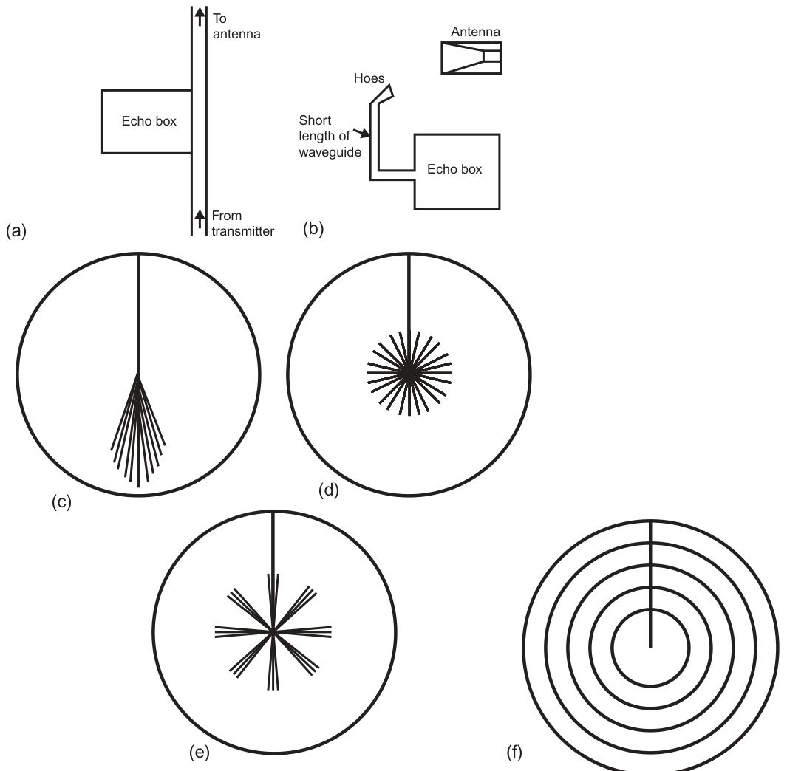  
FIGURE 6.7 Echo box siting and the performance monitor signals. (a) Echo box located on waveguide between transmitter and antenna. (b) Echo box located below antenna. (c) ‘Plume’ from external echo box. (d) ‘Sun pattern’ from internal fixed-tune echo box. (e) ‘Multi-plume’ from internal echo box with oscillating plunger. (f) ‘Concentric rings’.  

【翻译】
图6.7 回声箱放置位置与性能监测信号。 (a) 回声箱位于波导管中，介于发射器和天线之间。 (b) 回声箱位于天线下方。 (c) 外部回声箱产生的“羽状”图案。 (d) 内部固定频率回声箱产生的“太阳图案”。 (e) 具有振荡活塞的内部回声箱产生的“多重羽状”图案。 (f) “同心环”。

【解读】
该图示意了不同位置放置的回声箱对雷达系统性能监测信号的影响。通过改变回声箱的位置和类型，可以观察到不同的信号模式，这对于理解和优化雷达系统的性能具有重要意义。

【词汇表】
| 英文词汇 | 中文翻译 | 解释 |
| --- | --- | --- |
| Echo box | 回声箱 | 一种用于测试和校准雷达系统的设备，能够反射和延迟信号 |
| Waveguide | 波导管 | 一种用于传输电磁波的管道或结构 |
| Transmitter | 发射器 | 将电信号转换为电磁波的设备 |
| Antenna | 天线 | 用于发送和接收电磁波的装置 |
| Oscillating plunger | 振荡活塞 | 一种在回声箱中来回移动以产生变化信号的机械元件 |

In the transceiver monitor the cavity is cylindrical and its size can be varied by adjusting a plunger. This allows service personnel to tune the cavity (i.e. make the cavity the correct size) so that it will ring at the magnetron frequency. The monitor can be switched on or off from the display position by means of some form of electromechanical control which detunes the cavity when the monitor signal is not required. Because the echo box is located on the waveguide, the response is not sensitive to antenna direction and hence the monitor signal extends for the full $360^{\circ}$ of azimuth. The resulting pattern is sometimes referred to as a sun and is illustrated in Figure 6.7(d). Some observers might have a natural reluctance to switch on a monitor which produces such an extensive pattern. It is also sometimes argued that it is more difficult to discern the extent of a sun pattern than that of a plume, in which the contrast on either side assists in identifying the pattern. Some manufacturers break up the sun pattern as shown in Figure 6.7(e) by driving the tuning plunger in and out of the cavity. The echo box rings each time the plunger passes the tuned position, producing a ‘family’ of plumes which rotate at a speed governed by the relationship between the periods of the plunger oscillation and that of the antenna rotation. A plunger which makes a single sweep of the cavity and is triggered once per scan by the antenna as it rotates will produce a plume.  

# 6.3.3 Power Monitors  

Where a transceiver monitor is fitted, the performance of the system is only monitored as far as the location of the echo box. Thus the presence on the display of a monitor signal of the specified length is no guarantee of optimum radiation from the antenna, which may be reduced by a variety of causes. These may include puncture or distortion damage to the waveguide, the presence of moisture or dirt in the waveguide space, damage to the antenna or the accretion of dirt or ice on the glass reinforced plastic (GRP) envelope which protects the antenna.  

【翻译】
在安装了收发器监视器的情况下，系统的性能只被监测到回声箱的位置。因此，在显示屏上出现指定长度的监控信号不能保证天线的最佳辐射，这可能会因多种原因而降低。这些原因可能包括波导管受到穿孔或失真损伤、波导空间中存在水分或污垢、天线受损或者玻璃纤维增强塑料（GRP）外壳上的附着污垢或冰。

【解读】
本段主要讨论的是收发器系统中的监控问题，即使得到了预期的监控信号，也不代表天线的辐射性能是最优的，因为有许多潜在的因素可能影响天线的工作效率，如物理损伤、环境因素等，因此需要对整个系统进行全面检查和维护，以确保其最佳运行状态。

【词汇表】
| 英文词汇 | 中文翻译 | 解释 |
| --- | --- | --- |
| Transceiver | 收发器 | 一种同时具有发送和接收功能的设备 |
| Waveguide | 波导管 | 用于引导电磁波传播的管道结构 |
| Antenna | 天线 | 发送或接收电磁波的装置 |
| GRP | 玻璃纤维增强塑料 |一种由玻璃纤维和树脂组成的复合材料，常用于制造耐用且抗腐蚀的外壳 |

The sensitive element commonly used in power monitors is a neon tube a glass envelope which is filled with the inert gas neon and contains two separate metal electrodes. Neon gas has the particular property that it normally behaves as an insulator but, if it is subjected to an adequate level of radio frequency radiation, the gas is ionized and behaves as a conductor. Thus, within the tube, in the quiescent condition the electrodes are insulated from one another, whereas, when the gas ionizes in the irradiated state, the electrodes are effectively connected by a conducting medium. The neon tube is mounted close to the scanner so that radiated energy from the beam falls on it at each revolution. The tube is connected in series with some circuitry which produces a visual indication at the display position. In the absence of adequate radiation, the de-ionized neon will interrupt the circuitry and give a visual indication of an absence of power. If the output power from the antenna is adequate, the ionized neon will complete the circuitry with a low-resistance path, giving a visual indication of the presence of radiation at the antenna output. (The particular feature of the neon tube is that the ionization level can be fixed very precisely.)  

【翻译】
通常用于功率监测器中的敏感元件是一个充满惰性气体——霓虹灯管，它由一个玻璃外壳组成，里面装有两根独立的金属电极。当霓虹灯管受到足够强度的射频辐射时，霓虹气会被电离，从而表现出导体的特性。在静止状态下，电极是相互绝缘的，但当气体被电离后，电极就会通过一种导电介质有效地连接起来。霓虹灯管安装在扫描仪附近，因此每次扫描都会有一部分辐射能量照射到它上面。该管与一些电路连接，这些电路会在显示位置产生视觉指示。如果没有足够的辐射，去电离的霓虹气会中断电路，并给出无功率存在的视觉指示。如果天线输出的功率足够，电离的霓虹气会以低阻抗路径完成电路，给出辐射存在于天线输出的视觉指示。（特别之处在于霓虹灯管的电离水平可以非常精确地设定。）

【解读】
本段主要介绍了霓虹灯管在功率监测器中的应用原理。霓虹灯管根据是否受到射频辐射，可以改变其导电性能，从而实现对功率的检测和指示。这一机制使得功率监测器能够准确地判断天线输出是否有足够的功率，并给出相应的视觉提示。

【词汇表】
| 英文词汇 | 中文翻译 | 解释 |
| --- | --- | --- |
| Neon tube | 霓虹灯管 | 一种充满惰性气体的玻璃管，用于检测射频辐射 |
| Ionize | 电离 | 原子或分子失去或获得电子，成为带电粒子的过程 |
| Insulator | 绝缘体 | 不导电的材料或物质 |
| Conductor | 导体 | 能够导电的材料或物质 |
| Quiescent | 静止 | 没有外界作用下的稳定状态

The form of visual indication employed can vary considerably with manufacturer. It may take the form of a simple light which is illuminated when adequate power is present, or the signal from the neon may be used to indicate the output power by the deflection of a meter. The meter scale may well have a red arc or some other feature to give an indication of an unacceptably low-output power level. In both cases it is likely that the indication will be smoothed over a period of one antenna revolution, otherwise the light or meter reading would fluctuate as the beam swept across the neon sensor. Some systems have used the signal detected by the neon to produce on the display a plume whose radial length represents the level of output power.  

【翻译】
所使用的视觉指示形式可能会因制造商而有很大差异。它可以是当充足电源存在时亮起的一盏简单灯光，或者霓虹管的信号被用来通过仪表的偏转来指示输出功率。仪表刻度上可能有一段红色弧线或其他特征，以指示不可接受的低输出功率水平。在两种情况下，指示都可能在一个天线旋转周期内平滑处理，否则随着束扫过霓虹传感器，灯光或仪表读数都会波动。有些系统利用霓虹检测到的信号在显示屏上产生一根羽毛，其径向长度代表输出功率的水平。

【解读】
本段主要讨论了不同制造商对视觉指示的实现方式，包括使用简单的灯光、仪表指示输出功率，以及一些系统中使用羽毛图案表示输出功率水平。这些方法都是为了提供直观的输出功率信息，以便用户能够快速判断设备是否工作在合适的参数范围内。

【词汇表】
| 英文词汇 | 中文翻译 | 解释 |
| --- | --- | --- |
| illumination | 照明 | 指物体或空间被光线照射，使其变得可见的状态 |
| deflection | 偏转 | 指某物体或信号从原来的方向或路径上发生的偏离或改变 |
| fluctuate | 波动 | 指某事物的状态、数量或强度在一定范围内不断变化或振荡 |
| radial length | 径向长度 | 指从圆心到圆周上的某点之间的距离，在这里用于描述羽毛图案的大小与输出功率的关系 |

# 6.3.4 Transponder Performance Monitors  

The sensitive unit of this modern type of performance monitor is an active (as opposed to passive) element known as a transponder, which is located on the antenna drive unit in such a way that it is irradiated by the beam as it sweeps past. The transponder reacts to reception of the radio frequency pulses by transmitting, after a short delay, a low-level coded response at the same frequency. A threshold set within the active element ensures that the response will only be given if the received signal is above a power level determined by the manufacturer.  

【翻译】
这种现代性能监测系统中灵敏的单元是一个称为应答器（transponder）的主动元素（与被动元素相对），它位于天线驱动单元上，以便在扫描时能被射频束照射到。应答器在接收到无线电频率脉冲后，经过短暂的延迟，会以相同的频率发送一个低级别的编码响应。该主动元素内设置了一个阈值，确保只有当接收到的信号强度高于制造商确定的功率水平时，才会产生响应。

【解读】
本段描述了一种现代性能监测系统中的关键组件——应答器。应答器是系统中一个非常重要的部分，它能够接收无线电频率脉冲并发送回应，从而帮助系统监测和评估性能。通过设置阈值，可以确保系统只对足够强的信号做出反应，减少了错误触发的可能性。

【词汇表】
| 英文词汇 | 中文翻译 | 解释 |
| --- | --- | --- |
| Transponder | 应答器 | 一种可以接收和发送信号的设备，常用于通信和导航系统中。 |
| Threshold | 阈值 | 指系统或设备开始做出反应的最低限度或条件。 |
| Radio Frequency | 无线电频率 | 电磁波的一种形式，常用于无线通信和数据传输。 |
| Pulse | 脉冲 | 短暂的能量或信号爆发，常用于数字通信和控制系统中。 |

The power level within the limits of the horizontal beam of the radar system falls off on either side of the axis. Thus, as the beam sweeps past the transponder, the latter responds over an arc bounded by the limits at which the radiated power is above the preset level. The transponder is thus a monitor of transmitted power.  

【翻译】
雷达系统水平波束内的功率水平在两侧随着轴向外的距离增加而降低。因此，当波束扫过应答器时，后者会在一个以预设功率水平为界限的弧形区域内做出响应。这样，应答器就成为传输功率的监测器。

【解读】
本段主要描述了雷达系统中应答器（transponder）的工作原理。当雷达波束扫过应答器时，由于波束的功率水平在其水平方向上不是均匀分布，应答器只会在某一特定范围内对雷达信号作出响应，这个范围是由预先设置的最低功率水平决定的。这意味着应答器可以监测到它所接收到的雷达信号的强度，从而作为一种传输功率的监测工具。

【词汇表】
| 英文词汇 | 中文翻译 | 解释 |
| --- | --- | --- |
| Transponder | 应答器 | 一种电子设备，可以接收信号并自动发送回复信号 |
| Radiated Power | 辐射功率 | 从天线或其他辐射源发出去的电磁能量 |
| Preset Level | 预设水平 | 指定的一定标准或阈值，用来比较或触发某些动作 |
| Axis | 轴向 | 指定方向上的直线，通常用作参考或基准 |
| Arc | 弧形区域 | 指曲线或圆弧形状的区域或路径 |

The response returned to the antenna is treated as any other received signal, and thus the ability to receive the response is a measure of receiver response. The response is displayed in the form of a series of arcs (Figure 6.8), the angular limits of which are a measure of performance.  

【翻译】
返回到天线的响应被视为其他任何接收到的信号一样进行处理，因此接收到响应的能力是对接收器响应的衡量标准。该响应以一系列弧形（图6.8）的形式显示，其角度极限是性能的衡量指标。

【解读】
本段主要讨论了在某种技术系统中，如何评估接收器的响应能力。通过分析返回到天线的信号，可以确定接收器的性能水平，这通常使用一系列弧形来表示，以便于观察和分析。

【词汇表】
| 英文词汇 | 中文翻译 | 解释 |
| --- | --- | --- |
| Antenna | 天线 | 用于发送或接收电磁波的设备 |
| Receiver | 接收器 | 指接收和处理信号的设备或系统 |
| Response | 响应 | 系统或设备对输入信号做出的反应 |
| Angular limits | 角度极限 | 指某一范围内的最大和最小角度值，用于描述某些特性的限制 |

The angular limits are measured by the manufacturer when the performance is known to be optimum and supplied as a calibration level against which performance can be judged.  

【翻译】
角度限制是由制造商在性能最佳时测量的，并作为校准级别提供，以便可以根据此标准来评估性能。

【解读】
本段主要讨论的是角度限制的测量和应用。制造商会在设备或系统性能最优时进行测量，并将这些数据作为基准值（校准级别），以便日后可以通过比较实际性能与这个基准值来评估设备或系统的当前状态和效能。

【词汇表】
| 英文词汇 | 中文翻译 | 解释 |
| --- | --- | --- |
| Angular limits | 角度限制 | 指某一范围内允许的最大或最小角度值 |
| Manufacturer | 制造商 | 生产和供应产品的公司或个人 |
| Calibration | 校准 | 将仪器或系统调整到标准状态，以确保其精度和可靠性 |
| Optimum | 最佳 | 最好的、最合适的状态或条件 |

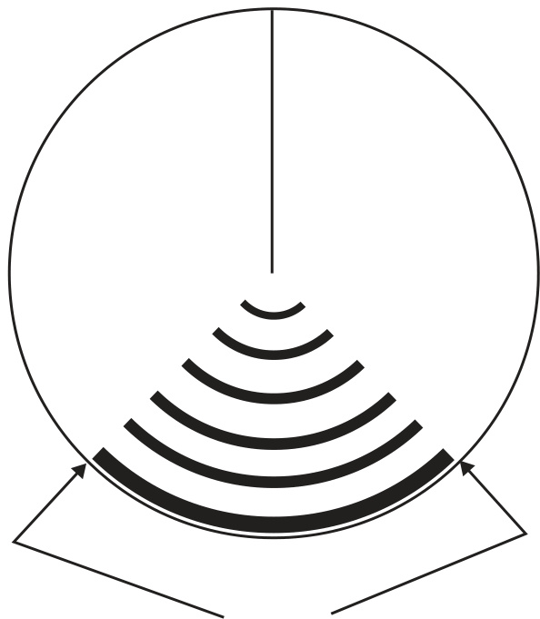  
Extent of arc is a measure of overall performance   
FIGURE 6.8 Transponder monitor signal.  

【翻译】
弧度范围是衡量整体性能的一个指标
图6.8：应答器监测信号。

【解读】
该段落主要讨论的是某种技术设备（可能是雷达或导航系统）的性能评估指标，即“弧度范围”（Extent of arc）。同时，它提到了一个特定类型的信号——“应答器监测信号”（Transponder monitor signal），这通常与航空交通管制或导航系统相关联。图6.8很可能是一个示意图或截图，用来说明这种信号的表现形式。

【词汇表】
| 英文词汇 | 中文翻译 | 解释 |
| --- | --- | --- |
| Extent of arc | 弧度范围 | 指衡量某一曲线弧段的长度或程度，常用于描述圆弧或其他曲线的特征。 |
| Transponder | 应答器 | 一种电子设备，可以接收信号并自动发送回应信号，广泛应用于航空、海事等领域的通信和识别系统中。 |
| Monitor signal | 监测信号 | 用于监控或跟踪某一状态、参数或信号的特殊信号，在这里指的是用于观察或分析应答器工作状态的信号。 |

# 6.3.5 Calibration Levels  

Given the wide variety of purely arbitrary ways in which the monitor information may be displayed, and considering in particular that, for example, one manufacturer may use a plume as an indicator of output power whereas another may use it as a transceiver monitor signal, it should be evident that it is essential to study the operator’s manual to establish which signal or indicator to observe and to appreciate precisely what it measures.  

【翻译】
鉴于监控信息可以通过多种任意方式显示，而且考虑到不同制造商可能使用不同的指示符号（例如，一家制造商可能使用羽毛状图标表示输出功率，而另一家则使用它作为收发器监控信号），因此很明显，研究操作员手册以确定应该观察哪个信号或指示符号以及精确地了解它所测量的内容是非常必要的。

【解读】
本段强调了在使用监控设备时，必须仔细阅读操作手册，以便能够正确理解和识别各种信号和指示符号，因为不同制造商可能对同一个符号赋予不同的含义。

【词汇表】
| 英文词汇 | 中文翻译 | 解释 |
| --- | --- | --- |
| arbitrary | 任意的 | 根据个人喜好或习惯而定的，没有特定的规则或标准 |
| plume | 羽毛状图标 | 一种用于表示某些状态或参数的图形符号 |
| transceiver | 收发器 | 既能接收也能发送信号的设备 |
| manual | 手册 | 指导用户如何使用某种设备、软件或系统的书面说明 |

The calibration levels should be measured by the manufacturer when the performance of the system is known to be optimum. In the case of a sun or plume pattern, such measurement will be made in miles and cables. The following information should be shown on a tally close to the display:  

【翻译】
校准级别应在系统性能最佳时由制造商进行测量。在太阳或羽状图案的情况下，这种测量将以英里和海缆为单位进行。以下信息应显示在靠近显示屏的计数器上：

【解读】
该段落强调了在系统性能最优时进行校准级别的测量的重要性，特别是在使用特定图案（如太阳或羽状图案）时。同时，也提到了测量结果的显示方式，要求相关信息应清晰地显示在显示屏附近，便于用户参考和操作。

【词汇表】
| 英文词汇 | 中文翻译 | 解释 |
| --- | --- | --- |
| Calibration | 校准 | 指调整或设置设备使其达到精确度或标准的过程 |
| Optimum | 最佳 | 表示某事物处于最好的状态或条件 |
| Tally | 计数器 | 一种用于记录或显示数字信息的设备或工具 |
| Plume | 羽状图案 | 在此 contexto 下指一种特殊的图形模式，可能与系统性能测试有关 |

1. The length of the signal (or status of indicator) consistent with optimum performance.   
2. The length of the signal (or status of indicator) corresponding to a significant drop in performance.  

【翻译】
1. 信号长度（或指标状态）与最佳性能相一致。
2. 信号长度（或指标状态）对应着性能显著下降。

【解读】
这两个句子描述了信号长度或指标状态与系统性能之间的关系。第一个句子强调了信号长度与最佳性能的一致性，而第二个句子则指出当信号长度或指标状态达到某一特定值时，系统性能会出现明显的下降。这两个概念在许多领域，如工程、通信和控制系统中都非常重要，因为它们帮助设计者和操作员优化系统设置以获得最佳结果。

【词汇表】
| 英文词汇 | 中文翻译 | 解释 |
| --- | --- | --- |
| optimum | 最佳 | 指最好的或最高效的状态或条件 |
| significant | 显著的 | 表示某种变化或效果是显著且重要的 |
| performance | 性能 | 指系统、设备或人员的工作效率或质量 |
| indicator | 指标 | 指示某种状态、情况或趋势的标志或信号 |

If the overall performance is not monitored by a single signal or indicator, the values for both transceiver and power monitors should be shown separately and unambiguously.  

【翻译】
如果总体性能没有通过单一信号或指标进行监控，则应分别、明确地显示发收器和电源监测的值。

【解读】
这段话强调了在系统中，如果没有一个统一的信号或指标来监视整体性能，那么就需要分别、清晰地显示不同组件（如发收器和电源）的监测值，以便于观察和分析。这意味着在设计监控系统时，需要考虑到各个部分的独立性和可辨别性，以保证信息的准确传递和使用。

【词汇表】
| 英文词汇 | 中文翻译 | 解释 |
| --- | --- | --- |
| monitored | 监控 | 指对某事物或过程进行持续的观察和检查 |
| transceiver | 发收器 | 一种可以同时发送和接收信号的设备 |
| unambiguously | 明确地 | 指不含糊、不模糊的方式 |
| indicator | 指标 | 用于表示或衡量某种状态或情况的东西 |

# 6.3.6 Performance Check Procedure  

It must be remembered that the length of the monitor signals (or the status of other indicators) is influenced by the position in which the operational controls have been set. When carrying out a performance check it is vital that controls are set as instructed in the maker’s manual otherwise comparison with the calibration level is meaningless.  

【翻译】
必须记住，监控信号（或其他指标）的长度受到操作控制设置位置的影响。在进行性能检查时，按照制造商手册中的说明设置控制是至关重要的，否则与校准级别的比较就没有意义。

【解读】
本段强调了在进行设备性能检查时，严格按照制造商的手册设置操作控制的重要性。这是因为控制的设置会直接影响到监控信号的长度或者其他指标的状态，从而影响到性能检查的结果。如果不按照规定的方法设置控制，那么得到的数据就不能作为有效的参考，无法与标准的校准级别进行比较。

【词汇表】
| 英文词汇 | 中文翻译 | 解释 |
| --- | --- | --- |
| monitor signals | 监控信号 | 设备运行状态的信号反馈 |
| operational controls | 操作控制 | 设备运行过程中需要人工调整的参数 |
| performance check | 性能检查 | 检验设备是否达到预期的工作效率和质量 |
| calibration level | 校准级别 | 设备正常运行的标准基线 |

It cannot be stressed too strongly that the way in which the performance signals are displayed, and the extent to which they monitor the performance, vary considerably from manufacturer to manufacturer and even with different types made by the same company. Thus the important basic rule for carrying out a performance check is: consult the maker’s manual and follow exactly the instructions given therein.  

【翻译】
必须强调的是，不同制造商（甚至同一家公司生产的不同型号）显示性能信号和监测性能的方式差异很大。因此，进行性能检查的基本规则是：查阅制造商的手册，并严格按照其中的说明进行操作。

【解读】
本段强调了在进行设备或系统性能检查时，需要遵循制造商提供的具体指南。这是因为不同的制造商可能有着不同的设计和要求，如果不按照正确的步骤进行检查，可能会得出错误的结论或者忽略重要的问题。因此，用户应该始终参考制造商的手册，以确保检查的准确性和有效性。

【词汇表】
| 英文词汇 | 中文翻译 | 解释 |
| --- | --- | --- |
| manufacturer | 制造商 | 生产特定产品的公司或企业 |
| manual | 手册 | 指导使用、维护或修理某种设备、机器等的书籍或文件 |
| performance check | 性能检查 | 检验设备、系统或人员的工作效率和质量 |
| instruction | 说明 | 指导如何做某事的指导或命令 |

A performance check should be carried out as soon as practicable after setting up and thereafter at regular intervals. In the United Kingdom, it is a requirement (see Section 11.4.1) that a check should be carried out before sailing and at least every 4 hours when a radar watch is kept. This should be regarded as a minimum.  

【翻译】
性能检查应该在安装完成后尽快进行，然后在定期间隔内进行。在英国，这是一个要求（见第11.4.1节），即应在启航前进行一次检查，当雷达值班时至少每4小时进行一次检查。这应该被视为最低限度。

【解读】
本段强调了对雷达系统进行定期性能检查的重要性，特别是在启航前和雷达值班期间，以确保其正常运行和安全使用。

【词汇表】
| 英文词汇 | 中文翻译 | 解释 |
| --- | --- | --- |
| Performance check | 性能检查 | 检查设备或系统的工作效率和效果 |
| Practicable | 可行的 | 在实际情况下可以实施的 |
| Intervals | 间隔 | 指定时间范围内的等距时间点 |
| Requirement | 要求 | 必须满足的条件或标准 |

The most important value of the external performance monitor is the ability to reliably detect a drop in performance. It is a not impossible scenario that the vessel is in poor visibility with little or no sea clutter and there is a defect in radar performance so that weaker targets are no longer seen. The internal monitors may not detect the problem, because some responses are being received. Like the internal performance monitoring, the observer will gain some false confidence from the display of the larger targets, but not be aware that other targets are not being detected. The external monitors are very useful pieces of equipment.  

【翻译】
外部性能监测器最重要的价值在于其能够可靠地检测到性能下降的情况。有一种情景是完全有可能发生的，即船只处于能见度较差的环境中，海面杂乱信号很少或几乎没有，但雷达性能存在缺陷，从而导致较弱的目标不再被探测到。内部监测器可能无法发现这个问题，因为仍然有一些响应信号被接收到了。与内部性能监测类似，观察者从显示出的较大目标中获得了一定的虚假信心，但却不知道其他目标已经不能被探测到了。外部监测器是一种非常有用的设备。

【解读】
这段话强调了外部性能监测器在检测系统性能下降方面的重要性，特别是在低能见度环境中或者当系统存在缺陷时。它指出内部监测器可能因为仍然接收到一些信号而忽略问题，而外部监测器可以更准确地识别出这些隐患。因此，使用外部监测器可以帮助提高整个系统的可靠性和安全性。

【词汇表】
| 英文词汇 | 中文翻译 | 解释 |
| --- | --- | --- |
| external performance monitor | 外部性能监测器 | 用于检测系统外部性能的设备 |
| reliably detect | 可靠地检测 | 能够稳定、准确地识别出问题 |
| sea clutter | 海面杂乱信号 | 来自海面的干扰信号，可能影响雷达等设备的正常工作 |
| false confidence | 虚假信心 | 因为部分信息而产生的过度自信，可能忽略潜在的问题 |

# 6.3.7 Modern Trends  

The methods described above are still in use today, and even replacements that exist replicate the patterns (above) to the observer.  

【翻译】
上述方法至今仍在使用中，即使有替代品出现，也会在观察者眼中复制出相同的模式。

【解读】
这段话指出，即使随着时间的推移和技术的进步，一些传统的方法仍然被沿用，甚至新的替代方案也可能继承了这些传统方法的特点，从而在观察者的视角下呈现出相似的模式。这意味着某些基本原理或思维方式是相对稳定和持久的。

【词汇表】
| 英文词汇 | 中文翻译 | 解释 |
| --- | --- | --- |
| replicate | 复制、重现 | 指的是再次产生或模仿某种情况、模式或结果 |
| observer | 观察者 | 指的是观察、研究或注意某事物的人 |
| replacements | 替代品 | 指的是可以取代其他东西的物品、方法或解决方案 |
| patterns | 模式、规律 | 指的是事物的排列、行为或变化中的可识别的规则或结构 |

# 6.4 CHANGE OF RANGE SCALE AND/OR PULSE LENGTH  

Manufacturers and suppliers of radars are occasionally seeking ways to avoid the installation of external performance monitors and power monitors. Possibly this is because of economic pressure as there will be an extra exterior unit with cabling to be installed. Certain recent models have been approved without an external monitor, as it is claimed that the internal monitoring of the equipment is sufficient.  

【翻译】
雷达制造商和供应商偶尔会寻找方法避免安装外部性能监测器和电源监测器。可能这是由于经济压力，因为需要额外安装一个带有线缆的外部单元。某些最近的型号已经在没有外部监测器的情况下获得批准，因为据称设备的内部监测已经足够。

【解读】
本段主要讨论了雷达制造商和供应商试图规避安装外部监测设备的问题，可能是出于成本考虑，但也提到了近期的一些型号通过内部监测获得了批准，这意味着行业内对监测方式的认知和要求可能正在发生变化。

【词汇表】
| 英文词汇 | 中文翻译 | 解释 |
| --- | --- | --- |
| radar | 雷达 | 一种利用无线电波探测和定位物体的系统 |
| manufacturers | 制造商 | 生产特定产品的公司或个人 |
| suppliers | 供应商 | 提供商品或服务的公司或个人 |
| external | 外部的 | 指位于系统或设备之外的部分或组件 |
| performance monitors | 性能监测器 | 用于监测和评估系统或设备性能的设备或软件 |

Instances have been reported where a significant loss of performance was detected in marine radars (but shore based), by observing that known targets were failing to display in spite of (internal) monitoring indicating that the performance was satisfactory. On visual inspection, the antenna/waveguide section of the system was found to be damaged. Had this happened aboard a vessel in the open sea, in fog where the energy was attenuated/ failed to leave the antenna, the existence of vessels in the vicinity would have gone undetected even though the (internal) monitor was indicating that satisfactory performance might be expected.  

【翻译】
有报告称，在海洋雷达（但基于岸基）中检测到显著的性能损失，尽管内部监测指示性能令人满意，但已知目标未能显示。通过视觉检查发现，天线/波导管部分受损。如果这件事发生在公海中的船上，特别是在雾中，能量被衰减或无法离开天线，那么即使内部监控器指示预期的性能是令人满意的，附近的船只也可能不会被探测到。

【解读】
该段落描述了一个海洋雷达系统出现故障的情况，即使得到了内部监控系统的正常反馈，也可能由于外部因素如天线或波导管受损而导致目标未被正确探测。这凸显了定期维护和检查雷达系统的重要性，以确保其正常运作，尤其是在恶劣环境下。

【词汇表】
| 英文词汇 | 中文翻译 | 解释 |
| --- | --- | --- |
| Attenuated | 衰减 | 指信号或能量随距离增加而减弱的现象 |
| Waveguide | 波导管 | 一种用于引导电磁波传播的结构或设备 |
| Vessel | 船只 | 指各种类型的船舶，如货船、客轮等 |
| Satisfactory | 合格的 | 符合要求或标准的意思 |

During normal operation of the radar system it will be necessary for a variety of reasons to change range scale from time to time. For example, having considered factors such as traffic density, speed of the observing vessel and the frequency of observation, a suitable range scale may have been selected on which to carry out radar plotting (see Section 7.2.4), but it may be necessary to change to a longer range scale at intervals in order to fix the vessel’s position or to obtain early warning of approaching vessels. When using the radar for position-fixing or progress-monitoring, it may be necessary to change scale in order to maximize the available accuracy of range and bearing measurement (see Sections 6.6.7 and 6.6.8). From time to time during general observation, it may be necessary to select a suitable scale on which to search for targets among sea clutter returns. Many other circumstances will arise in which the range scale selected for some aspects of watchkeeping is not suitable for others. Intelligent use must thus be made of the range scale selector. “Don’t keep fiddling with the radar”, is a phrase which is frequently heard, when two persons are using the same radar on a bridge. While it might appear to be justified in some cases, it is essential to make intelligent and appropriate use of ALL the radar’s facilities and at times, this may appear as fiddling.  

【翻译】
在雷达系统正常运行期间，出于各种原因，需要定期更改距离刻度。例如，在考虑了交通密度、观察船只的速度以及观察频率等因素后，可能已经选择了适合进行雷达绘图（见第7.2.4节）的距离刻度，但可能需要间歇性地切换到较长距离刻度，以确定船只的位置或提前预警接近的船只。当使用雷达进行位置确定或进度监测时，可能需要更改比例以最大限度地提高距离和方位测量的准确性（见第6.6.7节和第6.6.8节）。在一般观察过程中，可能需要不时选择一个合适的比例来搜索目标从海上杂乱回波中。在许多其他情况下，为某些值班方面选择的距离刻度可能不适用于其他方面。因此，必须明智地使用距离刻度选择器。“不要一直摆弄雷达”是当两个人在桥上使用同一台雷达时经常听到的一个短语。虽然在某些情况下似乎是正当的，但必须明智地和恰当地使用所有雷达功能，有时这可能看起来像是在摆弄。

【解读】
本段讨论了雷达系统在实际操作中的灵活应用，特别强调了根据不同情况调整距离刻度的必要性。这包括根据交通状况、观察速度和观察频率选择合适的距离刻度，以及在进行位置确定、进度监测或搜索目标时更改比例以获得最佳的测量准确性。同时，也提到了在使用雷达时应避免频繁无谓地调整设置，而应该做到明智地利用所有的雷达功能。

【词汇表】
| 英文词汇 | 中文翻译 | 解释 |
| --- | --- | --- |
| Radar System | 雷达系统 | 一种使用无线电波探测和定位物体的电子系统 |
| Range Scale | 距距刻度 | 雷达显示屏上表示距离的标尺或比例 |
| Position-Fixing | 位置确定 | 使用雷达等方法确定船只或飞机当前位置的过程 |
| Sea Clutter

A change of range scale may be associated with a change in pulse length, and some pulse lengths may not be available on all range scales (see Section 2.3.3.1). Change of pulse length may be necessary for a variety of reasons such as the need to improve range discrimination, minimum range, detection in sea clutter, long-range detection and detection in and beyond areas of rain (see Sections 2.3.3.1, 3.2.4, 3.6, and 3.7, respectively).  

【翻译】
范围尺度的变化可能与脉冲长度的变化相关联，一些脉冲长度可能在所有范围尺度上都不可用（见第2.3.3.1节）。出于各种原因，如改善距离辨别、最小距离、海杂波中的探测、长距离探测以及雨区内外的探测等，可能需要改变脉冲长度（分别见第2.3.3.1、3.2.4、3.6和3.7节）。

【解读】
本段主要讨论了雷达系统中范围尺度与脉冲长度之间的关系，以及改变脉冲长度的必要性。它提到了几种特定情况下需要调整脉冲长度，以优化雷达的性能，如提高距离分辨率、检测最小距离、在海面杂波中探测目标、进行长距离探测以及在雨区内外进行探测。

【词汇表】
| 英文词汇 | 中文翻译 | 解释 |
| --- | --- | --- |
| Range Scale | 范围尺度 | 雷达系统中用于表示距离的量程设置 |
| Pulse Length | 脉冲长度 | 雷达发射的电磁脉冲的持续时间 |
| Sea Clutter | 海杂波 | 由海面反射引起的雷达信号干扰 |
| Detection | 探测 | 使用雷达识别和定位目标的过程 |

# 6.5 THE STAND-BY CONDITION  

As indicated in Section 6.2.2, IMO Performance Standards require that such a condition be available. This requires the radar to be brought into the full operational condition in 5 seconds (see Section 11.2.1).  

【翻译】
如第6.2.2节所述，国际海事组织（IMO）性能标准要求这种情况下雷达必须处于可用状态。这需要在5秒内将雷达带入完全正常工作状态（见第11.2.1节）。

【解读】
本段强调了国际海事组织对雷达设备的性能标准要求，即在特定条件下，雷达必须能够快速进入完全正常工作状态，以满足安全和操作需求。

【词汇表】
| 英文词汇 | 中文翻译 | 解释 |
| --- | --- | --- |
| IMO | 国际海事组织 | 一个专门为促进全球航运安全、防止污染而成立的联合国机构 |
| Performance Standards | 性能标准 | 指定设备或系统必须达到的一系列技术要求和指标 |
| Operational Condition | 运行状态 | 设备或系统运行的状态，包括正常工作状态和故障状态等 |

The detailed nature of the stand-by condition will vary with manufacturer, but in all cases transmission is inhibited. Thus, although the radar is virtually ready for immediate use, limited-life components in the transmitter are not operational. A further, more general benefit is that the amount of radar-to-radar interference (see Section 3.9.5) experienced by other vessels (which may need to operate their radar systems) will be reduced over a potentially large geographical area. The life of components and hence the reliability of the radar system will be far less affected by continuous running than by frequent switching on and off, so that in periods of uncertain visibility, it is better to leave the radar in full operation or in the stand-by condition.  

【翻译】
备用状态的具体细节会根据制造商的不同而有所变化，但在所有情况下，传输都会被抑制。因此，尽管雷达几乎已经准备好可以立即使用，但发射器中的有限寿命组件却无法操作。另一个更普遍的好处是，其他船只（可能需要运行其雷达系统）经历的雷达间干扰（见第3.9.5节）数量将在潜在地理区域内减少。相比之下，连续运行对组件的寿命和雷达系统的可靠性影响较小，而频繁地开启和关闭则会对其产生更大的影响，因此，在能见度不确定的时期，最好让雷达保持全功率运行或处于备用状态。

【解读】
本段主要讨论了雷达设备的备用状态及其优点。通过保持备用状态，可以减少对其他雷达系统的干扰，同时也能延长设备的使用寿命和提高可靠性。这对于需要在低能见度条件下运行雷达系统的船只来说尤为重要，因为这可以帮助他们获得更好的雷达信号接收效果。

【词汇表】
| 英文词汇 | 中文翻译 | 解释 |
| --- | --- | --- |
| Stand-by condition | 备用状态 | 设备待机状态，随时可以启动但当前未运行 |
| Inhibited | 抑制 | 被限制或阻止运行 |
| Interference | 干扰 | 对信号的干涉或破坏 |
| Reliability | 可靠性 | 设备正常运作和维持功能的能力 |
| Visibility | 能见度 | 指环境中物体可被看到的清晰程度 |

Rule 7(b) of the Collision Regulations requires that ‘proper use shall be made of radar equipment if fitted and operational’. There are many occasions on which proper use means continuous running. However, there are other occasions, for example in the open sea on a clear day with fog forecast, when the stand-by condition constitutes proper use. Thus, compliance with the letter and spirit of the rule is ensured as there is no excessive delay should the equipment be required quickly, yet there is no unnecessary transmission in the meantime.  

【翻译】
碰撞规则第7（b）条规定，如果安装并且可操作，则必须“正确使用雷达设备”。有很多情况下，“正确使用”意味着持续运行。但是，也有一些其他情况，例如在晴天海上预报有雾时，处于待机状态就构成了正确使用。因此，通过这种方式可以确保遵守规则的字面意义和精神，因为如果需要快速使用设备不会延迟，但同时也避免了不必要的传输。

【解读】
本段主要讨论了碰撞规则中关于雷达设备使用的规定，强调了正确使用雷达设备的重要性，并指出在不同的情况下，什么才算是“正确使用”。这要求操作人员根据实际情况灵活地决定是否应该让雷达设备持续运行或者置于待机状态，以达到既能及时响应可能出现的情况，又能避免不必要的干扰或能耗的目的。

【词汇表】
| 英文词汇 | 中文翻译 | 解释 |
| --- | --- | --- |
| Collision Regulations | 碰撞规则 | 一套用于防止船舶碰撞的国际航行规则 |
| Radar Equipment | 雷达设备 | 用于探测和跟踪目标的电子设备 |
| Stand-by Condition | 待机状态 | 设备准备就绪但暂时不工作的状态 |
| Excessive Delay | 过度延迟 | 不必要的、过长的延迟时间 |

If the equipment is to be left on stand-by, the controls may be left in the optimum position, but the settings, particularly that of the tuning control, should be checked immediately on returning to the operational condition.  

【翻译】
如果设备需要保持待机状态，则控制器可以保持在最佳位置，但设置（尤其是调谐控制的设置）应该在恢复到操作条件时立即检查。

【解读】
本段强调了设备待机状态下的维护要求，即使设备不使用，也应确保其控制设置正确，以便随时恢复正常运行。这反映出对设备性能和可靠性的关注。

【词汇表】
| 英文词汇 | 中文翻译 | 解释 |
| --- | --- | --- |
| stand-by | 待机状态 | 设备或系统处于准备就绪但暂时不工作的状态 |
| optimum | 最佳 | 最适合或最有效的状态或条件 |
| tuning control | 调谐控制 | 用于调整设备参数以达到最佳工作状态的控制装置 |
| operational condition | 操作条件 | 设备或系统正常运行所需满足的条件或状态 |

If the equipment is likely to be on stand-by for a long period, it is probably better on a magnetron radar for the gain, sea clutter and rain clutter controls to be set to minimum effect and all signal-processing facilities should be switched off, all being subsequently reset on returning to the operational condition. On coherent radar there are fewer controls to be concerned about. The concepts of gain and tuning no longer apply. There will be different filter settings which can help reduce different types of clutter.  

【翻译】
如果设备可能处于待机状态一段较长时间，那么对于磁控管雷达来说，最好是将增益、海杂波和雨杂波控制设置为最小影响，并关闭所有信号处理设施，之后在恢复到操作条件时重新设置。在相干雷达中，有更少的控制需要考虑。增益和调谐的概念不再适用，将会有不同的滤波器设置可以帮助减少不同类型的杂波。

【解读】
本段主要讨论了雷达设备在长时间待机状态下的最佳设置，以减少杂波对雷达性能的影响。对于磁控管雷达，建议将相关控制设置为最小影响并关闭信号处理设施，而对于相干雷达，则通过调整滤波器设置来实现类似的效果。

【词汇表】
| 英文词汇 | 中文翻译 | 解释 |
| --- | --- | --- |
| Magnetron | 磁控管 | 一种用于产生微波能量的装置，常用于雷达系统中 |
| Coherent Radar | 相干雷达 | 一种利用相干原理提高测量精度的雷达技术 |
| Clutter | 杂波 | 雷达信号中由于非目标物体反射或其他干扰源引起的干扰信号 |
| Gain | 增益 | 信号放大倍数，用于提高信号强度以改善测量精度 |

# 6.6 CONTROLS FOR RANGE AND BEARING MEASUREMENT  

A wide range of facilities are provided to enable the observer to measure the range and bearing of targets. Some arrangements measure range and bearing while others measure one quantity or the other. Modern equipments employ a joystick/tracker ball and a graphic read-out to measure range and bearing. There is considerable variation in the precise detail of facilities provided by different manufacturers, but the principle is essentially the same in each case.  

【翻译】
为使观察者能够测量目标的距离和方位，提供了广泛的设施。有些装置可以同时测量距离和方位，而其他一些则只能测量其中一个量。现代设备采用操纵杆/跟踪球和图形显示来测量距离和方位。不同制造商提供的设施细节有相当大的差异，但每种情况下的基本原理都是相同的。

【解读】
本段主要介绍了用于测量目标距离和方位的各种设施，包括传统的机械装置和现代的电子设备。这些设施的设计宗旨是帮助观察者快速准确地获取目标的位置信息，以便于后续的分析或操作。尽管不同制造商的产品在细节上可能存在差异，但其基本功能和工作原理是相似的。

【词汇表】
| 英文词汇 | 中文翻译 | 解释 |
| --- | --- | --- |
| facilities | 设施 | 为完成特定任务而提供的设备或服务 |
| range | 距离 | 指两个物体之间的水平距离 |
| bearing | 方位 | 指目标相对于观察者的方向角度 |
| joystick | 操纵杆 | 一种控制器，通过移动杆子来控制设备的运动或方向 |
| tracker ball | 跟踪球 | 一种输入设备，通过球的滚动来控制屏幕上的光标移动 |

The new IMO Performance Standards (see Section 11.2.1) also require that all radar displays are fitted with compensation for an offset antenna position so that all positional data is relative to a consistent common reference point (normally the conning position). This could be very useful for multiple antenna installations.  

【翻译】
新的国际海事组织（IMO）性能标准（见11.2.1节）还要求所有雷达显示设备都配备有补偿功能，以适应偏移的天线位置，这样所有位置数据都相对于一个一致的共同参考点（通常是驾驶位置）。这对多天线安装非常有用。

【解读】
该段落主要讨论了国际海事组织（IMO）新颁布的性能标准，对于雷达显示设备提出了更高的要求。这些要求包括：所有雷达显示设备必须能够进行位置补偿，以确保即使天线位置发生偏移，也能保持位置数据的一致性。这项规定尤其适用于多天线安装的场景，有助于提高导航的准确性和安全性。

【词汇表】
| 英文词汇 | 中文翻译 | 解释 |
| --- | --- | --- |
| IMO | 国际海事组织 | 一个专门为促进全球海上安全、防止污染而成立的联合国专门机构 |
| Radar Displays | 雷达显示设备 | 用于显示雷达信号和目标信息的电子设备 |
| Antenna Position | 天线位置 | 指雷达或其他通信设备中天线的安装位置 |
| Conning Position | 驾驶位置 | 船只中负责驾驶和控制船舶运动的位置 |

# 6.6.1 Fixed Range Rings  

IMO Performance Standard requires that fixed rings should be provided. The number of rings required depends on the range scale selected; six rings are typical for range scales above 1 NM, but this can be reduced to two rings for range scales below 1 NM. There is also a requirement that the range scale displayed and the interval between the range rings should be clearly indicated at all times.  

【翻译】
国际海事组织（IMO）性能标准要求应提供固定环。所需环数取决于选择的范围刻度；对于大于1海里（NM）的范围刻度，典型的是六个环，但对于小于1海里的范围刻度，可以减少到两个环。此外，还有一个要求，即显示的范围刻度和范围环之间的间隔应始终清晰地指示。

【解读】
该段落主要讨论了国际海事组织对电子海图设备的性能标准，特别是关于固定环的设置要求。它提到了根据不同的范围刻度，需要多少个环，以及如何清晰地标示范围刻度和环之间的间隔，以确保使用者能够准确地读取信息。

【词汇表】
| 英文词汇 | 中文翻译 | 解释 |
| --- | --- | --- |
| IMO | 国际海事组织 | 负责制定全球海事安全、防污染和相关海事实践标准的联合国专门机构 |
| Performance Standard | 性能标准 | 指设备或系统必须达到的最低性能要求 |
| Range Scale | 范围刻度 | 电子海图中表示距离的尺寸标记 |
| Fixed Rings | 固定环 | 电子海图上用于测量距离的圆形标志 |

The fixed range rings take the form of a pattern of equally spaced circles concentric with the electronic origin of the picture.  

【翻译】
固定范围环以一系列同心圆的形式出现，这些同心圆等间距地围绕着电子图像的原点。

【解读】
这段话描述了固定范围环在电子图像中的表现形式，即这些环是同心圆，均匀分布，且与图像的中心（即电子原点）对齐。这意味着这些环是按照一定规律排列的，形成一个有规则的图案。

【词汇表】
| 英文词汇 | 中文翻译 | 解释 |
| --- | --- | --- |
| concentric | 同心的 | 指多个圆形或其他形状共享同一个中心点 |
| equally spaced | 等间距的 | 指多个物体或事件之间的距离相等 |
| electronic origin | 电子原点 | 指电子图像的中心点或起源点 |

In a raster-scan display, a slight ‘staircase’ effect may be noticed due to the quantizing effect of scan conversion (see Section 2.7.1). The effect will be most noticeable close to bearings of $0^{\circ}$ and $180^{\circ}$ , because in that area the circumference of the circle runs parallel or nearly parallel to the raster lines and will be exacerbated at lower line standards. The effect may offend the eye of the observer, but it should be appreciated that it does not in itself represent a ranging error. This can be understood from consideration of the fact that a circular stretch of coastline at the range represented by the ring would have the same steps due to quantizing.  

A facility will be provided to switch the rings on/off and often to adjust their brilliance. This may take the form of a single control or two separate controls. Usually only two or three different levels of brilliance are provided. Brighter brilliance will usually make the rings thicker and fuzzy, thus making accurate range measurement more difficult. There also exists the risk that a weak target will be obscured by the brightness of the ring.  

【翻译】
将会提供一个设施来开启或关闭环形标志，并且经常需要调整它们的亮度。这可能以单一控制器或者两个独立的控制器的形式出现。通常，只有两到三个不同的亮度等级可供选择。更高的亮度通常会使环形标志变得更加厚重和模糊，从而使得精确的距离测量更加困难。此外，还存在这样一种风险：弱目标可能会被环形标志的亮度所遮蔽。

【解读】
这段话主要讨论了在某种设备中（可能是望远镜或光学仪器）控制环形标志亮度的功能。这种功能可以帮助用户根据实际需求调节环形标志的可见性，以便于观察或测量。然而，过高的亮度可能会导致观察效果变差，因此需要合理地设置亮度等级。

【词汇表】
| 英文词汇 | 中文翻译 | 解释 |
| --- | --- | --- |
| facility | 设施、功能 | 指提供的特定功能或服务 |
| brilliance | 亮度、光辉 | 指物体发出的光的强度或明亮程度 |
| obscure | 遮蔽、掩盖 | 指某物被其他东西遮挡住，使其不可见或不清楚 |
| fuzzy | 模糊、模糊不清 | 指图像或轮廓不清晰、边缘不确定 |

IMO Performance Standards require that the fixed range rings should enable the range of an object to be measured with an error not exceeding $1\%$ of the maximum range of the scale in use or $30\mathrm{m},$ whichever is greater. Thus, when using the range rings to measure the range of a target, the most open range scale appropriate should be selected so as to maximize the inherent accuracy of the measurement.  

The measurement of range should be taken to the nearer edge of the echo, as this represents the leading edge of the returned echo. Time measurement commences at the leading edge of the transmitted pulse, and thus elapsed time must be measured to the same reference on the received pulse (see Figure 2.4). It must be appreciated that the leading edge of the echo represents the range of the nearest detectable facet of the target and not necessarily the nearest part of the target (e.g. possibly the bridge rather than the bow of a ship approaching head-on).  

【翻译】
距离的测量应取自回波的近边缘，因为这代表了返回回波的前沿。时间测量从发射脉冲的前沿开始，因此经过的时间必须以相同的参考点来测量接收到的脉冲（见图2.4）。需要注意的是，回波的前沿代表着目标中最近可检测到的面的距离，而不一定是目标的最近部分（例如，当船只正面靠近时，可能是桥梁而不是船头）。

【解读】
本段主要讨论了雷达信号处理中的距离和时间测量问题，强调了测量的参照点应该是回波的前沿，以确保准确性。同时，也提到了在实际应用中，测量到的距离可能对应于目标的某一特定部位，而非整体的最短距离。

【词汇表】
| 英文词汇 | 中文翻译 | 解释 |
| --- | --- | --- |
| range | 距离 | 指两个物体之间的距离，在这里指的是雷达系统测量到的目标距离 |
| echo | 回波 | 雷达信号被目标反射回来后接受到的信号 |
| facet | 面 | 在几何学或光学中，指一个平面或曲面，在这里指目标的某一部分 |
| elapsed time | 经过时间 | 从某一时刻开始到另一时刻为止的时间间隔 |

The only situation in which an observer can conveniently fix the vessel’s position with a sufficient degree of precision to be able to check the accuracy of the rings is when the vessel is alongside a berth. It is possible for an observer to check the accuracy of the rings by observing the echo of a known small, isolated and steep-sided target when secure in a known charted position.  

【翻译】
唯一能够方便地让观察者以足够高的精度确定船舶位置，从而检查环形标志准确性的情况，是当船舶停靠在码头旁边时。观察者可以通过观察已知的小型、孤立且陡峭侧面的目标回声，当位于一个已知的绘制位置时，以此来检查环形标志的准确性。

【解读】
这段话主要讨论了如何检查船舶上环形标志（可能指的是导航辅助设施或测量设备）的准确性。它提到，只有当船舶处于特定位置，如停靠在码头旁边，或是观察者能够清晰观察到小型、独立且侧面较陡的目标物体的回声时，才能方便地进行准确性的检查。这意味着，要确保这些环形标志的准确性，需要特定的环境条件。

【词汇表】
| 英文词汇 | 中文翻译 | 解释 |
| --- | --- | --- |
| alongside | 停靠在...旁边 | 指船舶与某物体（如码头）平行停靠的状态 |
| berth | 码头 | 船舶停靠或系泊的地方 |
| echo | 回声 | 声音反射回来所产生的声音 |
| steep-sided | 陡峭侧面 | 指侧面非常陡峭或垂直的物体或结构 |

The range rings are highly suited to the measurement of the range of a target which lies on a ring and there may well be situations in which it is convenient to measure the range of a target as it crosses a ring. In general it will be necessary to interpolate between the rings and this is best done with the aid of the VRM (see Section 6.6.6) or the joystick/tracker ball control.  

【翻译】
范围环非常适合于测量位于环上的目标的距离，在某些情况下，也可能需要在目标穿过环时测量其距离。一般来说，需要在环之间进行插值，这最好借助VRM（见6.6.6节）或操纵杆/跟踪球控制来完成。

【解读】
本段主要讨论了范围环在测量目标距离方面的应用场景，特别是当目标位于环上或者穿过环时。同时提到了在实际操作中可能需要对距离进行插值计算，以获得更准确的结果，并推荐使用特定工具如VRM或操纵杆/跟踪球控制来辅助这一过程。

【词汇表】
| 英文词汇 | 中文翻译 | 解释 |
| --- | --- | --- |
| Range rings | 范围环 | 一种用于测量距离的圆形标记 |
| Interpolate | 插值 | 在已知数据点之间估算未知数值的过程 |
| VRM | 虚拟测距仪 | 一种用于辅助测量距离的电子设备 |
| Joystick/tracker ball control | 操纵杆/跟踪球控制 | 一种用于精确定位或控制运动的输入设备 |

If the decision is taken to interpolate by eye, a visual check should be made to ensure that the rings are equally spaced.  

【翻译】
如果决定通过目视插值，那么应该进行视觉检查，以确保环形图案均匀分布。

【解读】
这段话强调了在使用目视插值法时，需要仔细检查以保证数据点或图案（如树木年轮）之间的距离是均匀的，这样才能得到准确的结果。

【词汇表】
| 英文词汇 | 中文翻译 | 解释 |
| --- | --- | --- |
| interpolate | 插值 | 在已知数据点之间估计或计算出新的数据点 |
| by eye | 目视 | 通过肉眼观察来判断或确定某事物 |
| equally spaced | 均匀分布 | 指数据点、图案等在空间或时间上分布得均匀一致 |

The factors affecting the inherent accuracy of range measurement and the procedure for ensuring that this accuracy is realized are summarized in Section 6.6.7.  

【翻译】
影响测量范围内在精度的因素以及确保实现这种精度的程序，在第6.6.7节中进行了总结。

【解读】
本段主要介绍了影响测量范围准确性的因素，以及如何确保这些因素能够发挥作用，从而保证测量结果的可靠性。相关内容详见第6.6.7节。

【词汇表】
| 英文词汇 | 中文翻译 | 解释 |
| --- | --- | --- |
| inherent | 内在的 | 指某物本身固有的特性或属性 |
| accuracy | 准确性 | 指测量、计算等结果与真实值之间的接近程度 |
| procedure | 程序 | 指按照一定步骤进行的操作或处理方法 |

# 6.6.2 Variable Range Marker  

The new IMO Performance Standards (see Section 11.2.1) require that two electronic range markers with a numerical read-out of range be provided. It also requires that arrangements are made so that it is possible to vary the brilliance of each marker and to remove it completely from the screen. Such arrangements will in general be similar to those described for the fixed rings in Section 6.6.1. The accuracy requirement, that is $1\%$ of the maximum range of the scale in use or 30 metres (whichever is greater), is also the same as that required for the fixed range rings.  

The VRM will be similarly liable to exhibit the staircase effect described for the fixed range rings in Section 6.6.1.  

【翻译】
VRM也同样容易表现出在6.6.1节中描述的固定范围环的阶梯效应。

【解读】
该段落讨论了虚拟范围模型（VRM）可能出现的“阶梯效应”，这是一个技术概念，指的是数据或信号呈现阶梯状变化的现象。这意味着VRM可能会产生类似的、不连续的变化模式，就像固定范围环一样。

【词汇表】
| 英文词汇 | 中文翻译 | 解释 |
| --- | --- | --- |
| VRM | 虚拟范围模型 | 一种模拟或预测系统 |
| Staircase effect | 阶梯效应 | 数据或信号呈现阶梯状变化的现象 |
| Fixed range rings | 固定范围环 | 指一种特定的数据或信号模式 |
| Exhibit | 表现出 | 指某种趋势或性质的显现 |

It is good practice to check the accuracy of the VRM regularly by placing it over a ring and comparing the read-out value with that of the ring. To maximize the inherent accuracy of any range measurement made with the VRM, the most open range scale appropriate should be selected. The VRM brilliance should be adjusted to obtain the finest possible line and the range should be taken to the nearer edge of the echo (see also Section 6.6.1). Errors in VRM of this kind are not very likely, but it is prudent to check the VRM anyway.  

【翻译】
为了确保距离测量雷达（VRM）的准确性，建议定期检查其精度。方法是将其置于某一环上，然后比较显示值与环的实际值。此外，在进行任何范围测量时，应选择最合适的范围尺度以最大限度地提高测量的内在准确性。同时，应调整VRM的亮度以获得可能的最佳线条，并将测量结果取自回声的近边（详见6.6.1节）。虽然此类错误不太可能发生，但检查VRM仍是一个谨慎的做法。

【解读】
本段强调了定期检查距离测量雷达（VRM）准确性的重要性，以确保其测量结果的可靠性。通过简单的校验步骤，可以最大程度上减少测量中的误差，从而提高整体测量精度。

【词汇表】
| 英文词汇 | 中文翻译 | 解释 |
| --- | --- | --- |
| VRM | 距距测量雷达 | 一种用于测量目标距离的雷达设备 |
| Accuracy | 准确性 | 测量结果与真实值之间的接近程度 |
| Range Scale | 范围尺度 | 用于表示测量范围的标度或比例 |
| Echo | 回声 | 雷达信号被反射回来的信号 |

The factors affecting the inherent accuracy of range measurement and the practical procedure for ensuring that this accuracy is realized are summarized in Section 6.6.8.  

【翻译】
影响测量范围内在精度的因素以及确保实现这种精度的实际步骤，在第6.6.8节中进行了总结。

【解读】
本段主要介绍了影响测量范围准确性的因素，以及如何确保这些因素能够发挥作用，从而保证测量结果的可靠性。相关内容在第6.6.8节中有详细说明。

【词汇表】
| 英文词汇 | 中文翻译 | 解释 |
| --- | --- | --- |
| inherent | 内在的 | 指某物本身固有的特性或属性 |
| accuracy | 准确性 | 指测量、计算等结果与真实值之间的接近程度 |
| procedure | 步骤、程序 | 指为了达到某一目标或完成某一任务所采取的一系列动作或方法 |

# 6.6.3 Parallel Index Lines  

These lines are available electronically for display on the screen. For a full discussion of their use, see Chapter 8.  

【翻译】
这些线条可以在屏幕上电子显示。有关它们的使用详细讨论，请参阅第八章。

【解读】
这段话指出某些线条可以通过电子方式在屏幕上显示，并且对其使用方法有更详细的介绍在第八章中。

【词汇表】
| 英文词汇 | 中文翻译 | 解释 |
| --- | --- | --- |
| electronically | 电子地 | 使用电子设备或技术 |
| display | 显示 | 在屏幕或其他设备上呈现信息或图像 |
| discussion | 讨论 | 对某一主题进行深入的分析或探讨 |

# 6.6.4 The Electronic Bearing Line  

This may also be referred to as the electronic bearing indicator (EBI) or electronic bearing marker (EBM). It takes the form of a continuous or dashed line which is generated electronically (Figure 6.9(a)). It can also be available as an electronic bearing and range line (EBRL), where the length as well as direction is controlled by the observer (see Figure 6.9(b)). Because it emanates from the electronic origin it can be used even if the origin is not centred. In raster-scan displays the brilliance levels may be restricted to on/off or possibly to off/low/high.  

【翻译】
这也可能被称为电子方位指示器（EBI）或电子方位标记（EBM）。它呈现为一条连续或虚线，由电子设备生成（图6.9（a））。它还可以作为电子方位和距离线（EBRL），其中长度和方向都由观察者控制（见图6.9（b））。由于它来自电子源，因此即使原点不居中，也可以使用它。在光栅扫描显示中，亮度水平可能限制为开/关或可能为关/低/高。

【解读】
本段主要介绍了电子方位指示器（EBI）或电子方位标记（EBM）的概念，这是一种通过电子方式生成的连续或虚线，用来表示方向和距离。这种技术可以应用于各种显示系统，包括光栅扫描显示，并且其亮度水平可以根据需要进行调整。

【词汇表】
| 英文词汇 | 中文翻译 | 解释 |
| --- | --- | --- |
| EBI | 电子方位指示器 | 一种用来表示方向的电子设备 |
| EBRL | 电子方位和距离线 | 一种同时表示方向和距离的电子线 |
| Raster-scan | 光栅扫描 | 一种显示技术，通过扫描形成图像 |
| Brilliance | 亮度 | 图像或物体的明暗程度 |

The electronic bearing line (EBL) or ERBL may be controlled by incremental touch controls, a joystick or a tracker ball (see Section 6.6.6).  

【翻译】
电子方位线（EBL）或ERBL可以通过增量触摸控制、操纵杆或跟踪球进行控制（见第6.6.6节）。

【解读】
本段主要介绍了电子方位线（EBL）或ERBL的控制方式，提到了几种常用的控制设备，如增量触摸控制、操纵杆和跟踪球，这些设备使得用户能够精确地控制电子方位线的移动和定位。

【词汇表】
| 英文词汇 | 中文翻译 | 解释 |
| --- | --- | --- |
| EBL | 电子方位线 | 一种用于显示方向或位置的电子线条 |
| ERBL | 增强型电子方位线 | 与EBL类似，但可能具有更高的精度或功能 |
| Joystick | 操纵杆 | 一种用于控制设备运动或方向的操控器 |
| Tracker ball | 跟踪球 | 一种用于控制设备的球形输入设备 |

Although errors are unlikely in modern equipment, the EBL can be checked by superimposing it on the heading marker and checking that the bearing read-out is in agreement. Similarly, the ERBL should be checked for range measurement against the rings.  

【翻译】
尽管现代设备中出错的可能性不大，但仍可以通过在航向标志上叠加电子基线（EBL）并检查方位读数是否一致来进行验证。同样，应外参考基线（ERBL）也应该与环形标记一起检查测量范围。

【解读】
本段主要讨论了如何验证电子基线（EBL）和应外参考基线（ERBL）的准确性。通过比较这些基线与现有标志或标记的数据，可以确保测量结果的一致性和可靠性。这是为了保证导航或测量过程中的精度和安全性。

【词汇表】
| 英文词汇 | 中文翻译 | 解释 |
| --- | --- | --- |
| EBL | 电子基线 | 一种用于测量或导航的基准线 |
| ERBL | 应外参考基线 | 另一种用于测量或导航的参考基线 |
| Superimposing | 叠加 | 将两幅图像或数据重叠以便比较 |
| Bearing | 方位 | 指物体相对于观察者的方向角度 |

In general, the type of bearing (i.e. relative or true) which is read off using the EBL will depend on the orientation selected, as described in Section 6.2.5. In some systems arrangements are made for the EBL to read off true bearings even when a ship’s head-up orientation is selected. This is only possible where there is a gyro repeater input, as the ship’s instantaneous heading must be added automatically to the relative bearing to produce a true read-out. For any given system, care must be taken to establish the type of bearings available with each orientation.  

【翻译】
一般来说，使用电子方位仪（EBL）读取的方位类型（即相对方位或真实方位）取决于所选择的方向，如第6.2.5节中描述的那样。在某些系统中，即使选择了船头朝上的方向，电子方位仪也可以读取真实方位。这只有在有陀螺仪重复器输入的情况下才是可能的，因为必须自动将船舶的瞬时航向添加到相对方位中以产生真实读数。对于任何给定的系统，都必须小心地确定每种方向可用的方位类型。

【解读】
本段主要讨论使用电子方位仪读取方位的原理，特别强调了不同方向设置下读取的方位类型（相对方位或真实方位）的区别。同时，也提到了实现真实方位读取的技术条件，即需要陀螺仪重复器输入来自动计算船舶的航向与相对方位之间的关系。

【词汇表】
| 英文词汇 | 中文翻译 | 解释 |
| --- | --- | --- |
| Bearing | 方位 | 指物体的位置或方向，尤其是在导航中指一个物体相对于另一个物体的方向。 |
| Gyro Repeater | 陀螺仪重复器 | 一种设备，可以重复显示陀螺罗盘的读数，以便于观察和记录。 |
| Orientation | 方向 | 指物体或人的面向或姿势，在这里特指船舶的航向或方向。 |
| Relative Bearing | 相对方位 | 指一个物体相对于另一个物体的方向，但不考虑绝对方向。 |

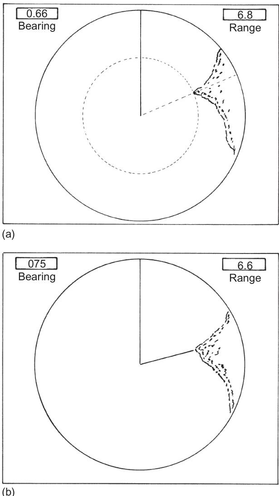  
FIGURE 6.9 Electronic bearing line, VRM and EBRL.  

【翻译】
图6.9 电子罗盘线、虚拟罗盘（VRM）和电子基准罗盘线（EBRL）。

【解读】
该图显示了航空导航中使用的几种重要工具，包括电子罗盘线、虚拟罗盘（VRM）和电子基准罗盘线（EBRL）。这些工具对于飞行员在机场或其他区域内确定方向和位置非常重要。

【词汇表】
| 英文词汇 | 中文翻译 | 解释 |
| --- | --- | --- |
| Electronic bearing line | 电子罗盘线 | 一条用于指示方向的电子线，通常出现在航空导航设备上。 |
| Virtual Reference Marker (VRM) | 虚拟参考标志 | 一个虚拟的标志，用来作为飞机导航的参考点。 |
| Electronic Base Reference Line (EBRL) | 电子基准参考线 | 一条用于提供基准参考的电子线，帮助飞行员确定自己的位置和方向。 |

When taking a bearing the most open range scale appropriate should be selected, and the bearing should be taken through the angular centre of the echo. The inherent accuracy of radar bearings and the procedures for ensuring that the potential accuracy is realized are discussed in detail in Section 6.6.8.  

【翻译】
在测量方位时，应选择最合适的开放式范围标度，并通过回波的角中心取方位。雷达方位的固有精度以及确保实现潜在精度的程序详细讨论于第6.6.8节。

【解读】
本段强调了在使用雷达测量目标方位时选择合适的测量范围和方法的重要性，以保证测量结果的准确性。同时，也提到了雷达方位的精度问题和相关的技术细节，这些内容在后续章节中会进行更详细的讨论。

【词汇表】
| 英文词汇 | 中文翻译 | 解释 |
| --- | --- | --- |
| bearing | 方位 | 指从观察点到目标物体的方向角度 |
| radar | 雷达 | 无线电探测和定位系统 |
| inherent accuracy | 固有精度 | 系统或设备本身所具有的精度水平 |
| angular centre | 角中心 | 指回波信号的中间位置 |

# 6.6.5 Free Electronic Range and Bearing Line  

This facility takes the form of an ERBL, the origin of which can be positioned at any point on the screen. It allows the observer to measure the range and bearing between two displayed targets, as illustrated by Figure 6.10.  

【翻译】
该设施以电子距离和方位测量仪（ERBL）的形式存在，其起点可以放在屏幕上的任何位置。它允许观察者在两个显示目标之间测量距离和方向，如图6.10所示。

【解读】
本段描述了一种电子设备，用于测量屏幕上两个目标之间的距离和方向。这种设备可以放置在屏幕的任意位置，为用户提供便捷的测量功能。

【词汇表】
| 英文词汇 | 中文翻译 | 解释 |
| --- | --- | --- |
| ERBL | 电子距离和方位测量仪 | 一种用于测量距离和方向的电子设备 |
| observer | 观察者 | 使用设备的人员 |
| target | 目标 | 需要测量距离和方向的对象 |
| bearing | 方向 | 指两个目标之间的角度或方向关系 |

The following three examples serve to indicate that there is a range of circumstances in which this facility might be found useful.  

【翻译】
下面三个例子表明，在多种情况下，这种功能可能被认为是有用的。

【解读】
这段话介绍了三个例子来说明某种设施或功能在不同情境下的潜在用途，强调其广泛的适用性和实用价值。

【词汇表】
| 英文词汇 | 中文翻译 | 解释 |
| --- | --- | --- |
| facility | 设施、功能 | 指的是某种设备、服务或能力，使得某事物更容易完成或更方便。 |
| circumstances | 情况、环境 | 指的是影响事件发生或发展的各种条件或状态。 |
| useful | 有用、有益 | 表示某事物对特定目的或需求具有帮助或价值。 |

1. Approaching port may be useful to ascertain the distance of other approaching vessels from the pilot station.   
2. Having heard another vessel broadcast its position in terms of bearing from a welldefined charted object, it may be possible to identify positively the radar echo of that vessel. (Note: the incorrect use of VHF in collision avoidance can contribute to the development of a dangerous situation; see also AIS, Chapter 5.)   
3. Having positively identified one land echo, it may be possible to positively identify others by measuring their range and bearing from the known echo.  

【翻译】
1. 接近港口可能有助于确定其他接近船只与飞行员站之间的距离。
2. 在听到另一艘船只广播其位置（以某一明确的海图标志物为参考的方位）后，也许可以确认该船只在雷达上的回声。注意：VHF在避碰系统中的误用会促进危险情况的发展；另见AIS，第五章。
3. 确认了一个陆地回声后，也许可以通过测量它们与已知回声的距离和方位来确认其他回声。

【解读】
这段话主要讨论了在航海中使用雷达技术来识别和跟踪其他船只或陆地目标的方法。通过结合多种信息来源，如广播的位置信息、雷达回声以及已知的地理特征，可以提高识别和定位的准确性，从而增强安全性和避免碰撞。

【词汇表】
| 英文词汇 | 中文翻译 | 解释 |
| --- | --- | --- |
| Pilot Station | 飞行员站/驾驶室 | 船只上负责导航和控制的区域 |
| Bearing | 方位 | 从观察点到目标的方向角度 |
| Charted Object | 海图标志物 | 在海图上标记的可辨识的地理特征或人工设施 |
| Radar Echo | 雷达回声 | 物体反射回来的雷达信号，在屏幕上显示为回声 |
| AIS | 自动识别系统 | 一种用于船只间及船只与岸基站之间交换位置和速度等信息的系统，以提高海上交通安全性 |

Other applications which are particularly appropriate to a given trade will no doubt suggest themselves to readers. The facility can also be used to draw navigational lines in systems which offer automatic tracking (see Section 8.4.6.3).  

【翻译】
其他特定行业的应用也会让读者自然想到。此外，该功能还可以用于在支持自动跟踪的系统中绘制导航线（见第8.4.6.3节）。

【解读】
本段强调了该功能的多用性，不仅限于某一特定领域，还能根据不同行业的需求进行扩展和应用。特别提到了在具有自动跟踪功能的系统中使用此功能来绘制导航线，这进一步阐述了其在实际操作中的实用价值。

【词汇表】
| 英文词汇 | 中文翻译 | 解释 |
| --- | --- | --- |
| facility | 功能/便利条件 | 指的是一种工具、设备或服务所提供的方便条件或能力。 |
| navigational | 导航的 | 与导航有关，尤指船舶、飞机等的行进方向和位置的确定。 |
| automatic tracking | 自动跟踪 | 指系统能够自行追踪目标物体或信号的功能。 |
| suggest themselves | 自然想到 | 指想法或主意自然而然地产生或出现。 |

# 6.6.6 Joystick/Tracker Ball and Screen Marker  

This facility makes use of the fact that in modern synthetic displays, range and bearing data are stored in digital form (see also Sections 2.7 and 4.5.5).  

【翻译】
该设施利用了现代合成显示器中，距离和方位数据以数字形式存储这一事实（参见第2.7节和4.5.5节）。

【解读】
这段话主要介绍了一种设施，它能够利用现代合成显示技术中数字化存储的距离和方向信息。这意味着这种设施可以高效地处理和应用这些数字数据，从而实现特定的功能或目标。

【词汇表】
| 英文词汇 | 中文翻译 | 解释 |
| --- | --- | --- |
| facility | 设施 | 指的是一种设备、系统或机构，用于完成特定任务或提供某种服务 |
| synthetic displays | 合成显示器 | 一种使用电子信号生成图像的显示设备，常用于雷达、导航等领域 |
| digital form | 数字形式 | 数据以二进制代码表示和存储的方式，易于计算机处理和存储 |
| range and bearing data | 距离和方位数据 | 指的是关于目标物体的距离和方向的信息，通常在导航和追踪系统中使用 |

A joystick is a short spindle which is mounted on the display adjacent and normally to the right of the screen (Figure 6.11). In its neutral position it lies perpendicular to the plane of the screen. A small sphere or other suitable hand-grip is fitted on the outer end of the spindle, while the inner end is pivoted in such a way that it can be moved fore-and-aft, athwartships or in any direction which lies between these two. The movement of the joystick controls two independent voltages which are analogues of the displacement of the joystick from its neutral position. If these analogue signals are converted into digital numbers they can be used to control the $\boldsymbol{\mathrm X}$ and Y screen coordinates of a graphics marker and to generate the corresponding digital angle and range in the form of a read-out of bearing and range. The engineering details of the technique by which the displacement of the joystick is translated into marker position (or bearing and range) may vary in detail with manufacturer.  

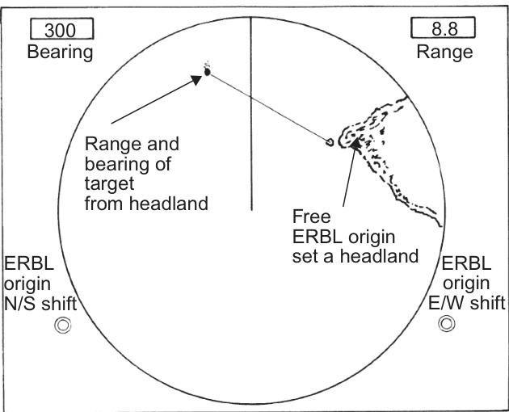  
FIGURE 6.10 Free electronic range and bearing line: (a) EBL and VRM and (b) ERBL.  

【翻译】
图6.10 自由电子范围和方位线：（a）EBL和VRM，（b）ERBL。

【解读】
该图展示了自由电子范围和方位线的概念，分为两部分：第一部分显示了电子方位线（EBL）和可变范围标记（VRM）的关系，第二部分则展示了扩展的自由电子范围和方位线（ERBL）。这可能与导航或测量技术相关，特别是在航空或海事领域。

【词汇表】
| 英文词汇 | 中文翻译 | 解释 |
| --- | --- | --- |
| EBL | 电子方位线 | 一种用于确定方向的导航辅助工具 |
| VRM | 可变范围标记 | 一种用于表示距离的标记，通常在导航系统中使用 |
| ERBL | 扩展的自由电子范围和方位线 | 一种结合了自由电子范围和方位线的导航技术，可能用于更精确的定位和导航 |

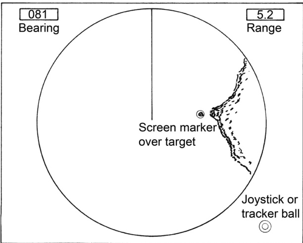  
FIGURE 6.11 Joystick/tracker ball and screen marker.  

【翻译】
图6.11操纵杆/追踪球和屏幕标记。

【解读】
该图展示了计算机输入设备中的两个组件：操纵杆（joystick）和追踪球（tracker ball），以及它们在屏幕上的表现形式——屏幕标记（screen marker）。这些设备和标记通常用于交互式应用程序中，以便用户能够精确地控制光标或选择特定区域。

【词汇表】
| 英文词汇 | 中文翻译 | 解释 |
| --- | --- | --- |
| Joystick | 操纵杆 | 一种允许用户通过移动杆来控制光标或其他指针的计算机输入设备。 |
| Tracker ball | 追踪球 | 一种使用球体来追踪运动并转化为数字信号的输入设备，常用于笔记本电脑的触摸板上。 |
| Screen marker | 屏幕标记 | 在屏幕上表示当前位置或被选中区域的视觉提示。 |

The graphics marker is commonly a small circle or cross which is located at the origin of the picture when the joystick is in its neutral position. By steering the marker with the joystick, it is placed over the chosen target and the bearing and range are read out on a computer-controlled digital scale. This facility offers a simple and rapid method of range and bearing measurement. As with any form of range and bearing measurement, it should be monitored for errors by checking it against the rings and heading marker.  

【翻译】
图形标记通常是一个小圆圈或十字交叉，位于图片的原点，当操纵杆处于中性位置时。通过使用操纵杆来控制标记，将其放在所选目标上，然后在计算机控制的数字尺度上读取方位和距离。这一功能提供了测量距离和方向的一种简单快速的方法。与任何形式的距离和方向测量一样，它应该通过检查环和航向标记来监控错误。

【解读】
本段主要介绍了图形标记的作用及其在测量距离和方向方面的应用。它强调了使用这种方法需要注意可能出现的错误，并建议通过对比其他参考物体（如环和航向标记）来进行校验，以确保测量结果的准确性。

【词汇表】
| 英文词汇 | 中文翻译 | 解释 |
| --- | --- | --- |
| graphics marker | 图形标记 | 用于指示目标的视觉标志 |
| joystick | 操纵杆 | 控制设备，用于移动图形标记 |
| bearing | 方位 | 指向目标的方向角度 |
| range | 距离 | 到目标的距离 |
| digital scale | 数字尺度 | 电子显示的测量尺度 |

In some systems a tracker ball is used as an alternative to a joystick. This comprises a sphere, half of which projects above the top panel of the display. It is pivoted in such a way that it can be rotated in any direction, thus allowing control of the graphics marker in a similar fashion to that of the joystick. It effectively operates as an inverted computer mouse (see Section 2.8.6).  

【翻译】
在某些系统中，追踪球（tracker ball）被用作操纵杆（joystick）的替代品。它由一个球体组成，其中一半突出于显示屏的顶部面板上。该球体以一种方式支撑，使其可以在任何方向上旋转，从而允许以与操纵杆类似的方式控制图形标记。它实际上作为一个倒置的计算机鼠标（见第2.8.6节）。

【解读】
本段介绍了一种名为“追踪球”的设备，它是操纵杆的替代品，可以实现对图形标记的控制。通过球体的旋转来控制标记的移动，这与传统的操纵杆或计算机鼠标的功能相似，但操作方式有所不同。

【词汇表】
| 英文词汇 | 中文翻译 | 解释 |
| --- | --- | --- |
| tracker ball | 追踪球 | 一种用于控制图形标记的球形设备 |
| joystick | 操纵杆 | 一种用于控制电子游戏或模拟器的操控装置 |
| pivoted | 支撑 | 指物体以某一点为支点进行旋转或运动 |
| graphics marker | 图形标记 | 在屏幕上表示位置或状态的视觉指示器 |

# 6.6.7 Range Accuracy  

IMO Performance Standards (see Section 11.2.1) require that the fixed range rings and the VRM enable the range of a target to be measured with an error not exceeding $1\%$ of the maximum range of the scale in use or $30\mathrm{m}$ , whichever is greater. Where appropriate in the preceding descriptions of the various facilities available for range measurement, mention was made of procedures for ensuring that the potential accuracy is realized. For ease of reference it is appropriate to summarize these procedures in this section.  

1. If the ability exists, adjust the brilliance of the VRM, or ERBL, to obtain the finest possible line.   
2. Measure the range to the nearer edge of the displayed echo.   
3. Use the rings when the target is on or close to a ring.   
4. Use the VRM, ERBL or joystick marker to interpolate between the rings.   
5. Regularly check the VRM, ERBL or joystick marker against the rings.   
6. Use the most open scale appropriate.  

【翻译】
如果该功能存在，请调整VRM或ERBL的亮度以获得最清晰的线条。
测量到显示回波的较近边缘的距离。
当目标位于或接近环时使用环。
使用VRM、ERBL或操纵杆标记来在环之间进行插值。
定期检查VRM、ERBL或操纵杆标记与环的对齐情况。
使用最合适的开放刻度。

【解读】
这段文字似乎是关于雷达操作的指南，特别是在测量目标距离时如何有效地使用各种工具，如可变范围标记（VRM）、扩展基线长度（ERBL）和操纵杆标记。这些步骤旨在帮助操作员准确测量目标的距离，并通过比较不同的测量方法来验证结果。

【词汇表】
| 英文词汇 | 中文翻译 | 解释 |
| --- | --- | --- |
| VRM | 可变范围标记 | 一种用于测量雷达上目标距离的工具 |
| ERBL | 扩展基线长度 | 一种用于测量雷达上目标距离的技术 |
| Joystick Marker | 操纵杆标记 | 一种用于在雷达屏幕上标记目标位置的控制器 |

# 6.6.8 Bearing Accuracy  

IMO Performance Standards require that the means provided for measuring bearings should enable the bearing of a target whose echo appears at the edge of the display to be measured with an accuracy of $\pm1^{\circ}$ or better.  

It is essential to appreciate that the permitted error of $\pm1^{\circ}$ refers only to the measurement of the angle (whose accuracy will depend on the correctness of the alignment of scanner and trace/digital bearing word and the graduation accuracy of the measuring device). It does not take into account the accuracy of the heading marker from which the angle is measured, or of the accuracy of the gyro signal used where azimuth stabilization is provided. The performance standards specify an accuracy of $\pm1^{\circ}$ for the heading marker and $\pm0.5^{\circ}$ for the gyro input. If these error sources are aggregated, a bearing measured from the display could be in error by $2.5^{\circ}$ without the provisions of the standards being contravened. However, it must be said that each error will have a component which is substantially constant throughout the period of taking a series of bearings. For example, only in the case of mechanical fault would one expect the error from the heading marker source to change from $+1^{\circ}$ to $-1^{\circ}$ during the taking of a series of bearings and there are no mechanical components in modern equipment. The significance of the aggregate error will depend on whether the bearings are being used for radar plotting or for position-fixing. The implications of bearing errors are discussed separately in terms of their significance in the accuracy of radar plotting in Section 7.8 and of the accuracy of position-fixing in Section 8.3.  

Where appropriate in the preceding descriptions of the various facilities available for bearing measurement, mention was made of procedures for ensuring that the potential accuracy is realized. For ease of reference it is appropriate to summarize these procedures in this section:  

【翻译】
在前面对各种用于测量轴承的设施的描述中，适当的地方提到了确保潜在精度实现的程序。为了方便参考，在本节中总结这些程序是合适的。

【解读】
这段话主要是在强调之前提到的各类测量工具或方法中，都有相应的步骤来保证其准确性能够得到充分发挥。作者认为，将这些步骤总结在一起，有利于读者快速查阅和理解。

【词汇表】
| 英文词汇 | 中文翻译 | 解释 |
| --- | --- | --- |
| preceding | 前面的 | 指之前提到的事情或事件 |
| facilities | 设施、设施 | 这里指的是用于测量轴承的设备或方法 |
| procedures | 步骤、程序 | 指为了达到某种目的而采取的一系列行动或措施 |
| potential accuracy | 潜在精度 | 指设备或方法所能达到的最高精度水平 |

It is important to check regularly that the   
heading marker accurately represents the   
ship’s fore-and-aft line. The procedure for   
carrying out this check is as follows:   
a. Switch off azimuth stabilization and ensure the heading marker is aligned with $0^{\circ}$ on bearing scale.   
b. Select an object which is conspicuous but small visually and whose echo is small and lies as near as possible to the maximum range scale in use. Measure simultaneously the relative visual bearing of this object and the bearing on the PPI relative to the bearing scale. It is important that the visual bearing is taken from a position near the radar antenna in plan. Repeat at least twice and calculate the mean difference between bearings obtained visually and by radar.   
c. If an error exists, adjust the heading marker contact adjustment to remove the error. Traditionally, the adjustment was in the antenna unit, but modern systems allow adjustment to be done in the  

processing unit and so could be accessible to an operator.  

【翻译】
处理单元，因此可以被操作员访问。

【解读】
这句话描述了计算机系统中的一个组件——处理单元，它是可以被操作员直接访问和控制的。这意味着操作员可以通过某种方式与这个处理单元进行交互，可能是为了输入指令、监控状态或者执行其他操作。

【词汇表】
| 英文词汇 | 中文翻译 | 解释 |
| --- | --- | --- |
| processing unit | 处理单元 | 计算机系统中负责数据处理的部分 |
| operator | 操作员 | 使用和管理计算机系统的人员 |
| accessible | 可访问的 | 能够被使用或操作的状态 |

d. Repeat (b) above to check the accuracy of the adjustment.  

【翻译】
d. 重复上述步骤（b），以检查调整的准确性。

【解读】
本段落要求重复之前的步骤，以验证调整是否准确。这意味着在进行了某种调整之后，需要通过重复特定操作来确认结果是否符合预期。

【词汇表】
| 英文词汇 | 中文翻译 | 解释 |
| --- | --- | --- |
| Repeat | 重复 | 再次执行某一动作或过程 |
| Accuracy | 准确性 | 某事物的正确程度或精度 |
| Adjustment | 调整 | 对某事物进行修改或校正以使其更合适或有效 |

2. Ensure that the picture is correctly orientated.   
3. Use an appropriate range scale with the target as near to the edge of the screen as possible.   
4. If using a ship’s head-up unstabilized orientation, the ship’s head must be read at the same instant as taking the bearing.   
5. Check the EBL, ERBL or joystick marker by superimposing them on the heading marker, at which time the bearing and heading should agree. Any error should be noted, applied to bearings and the cause investigated.   
6. For a small isolated target align the cursor, EBL, ERBL or marker with the centre of the target.   
7. Temporarily reduce the gain if it will give a more clearly defined echo.  

【翻译】
2. 确保图片正确地朝向。
3. 使用适当的范围刻度，将目标尽可能地靠近屏幕边缘。
4. 如果使用船舶的非稳定化前视方向，必须在同一瞬间读取船舶的航向，同时记录方位角。
5. 通过叠加它们到航向标记上，检查EBL、ERBL或操纵杆标记，在此时，方位角和航向应该一致。任何错误都应被注意到、应用于方位角，并调查其原因。
6. 对于一个小型孤立目标， 将光标、EBL、ERBL或标记与目标中心对齐。
7. 暂时降低增益，如果可以获得更清晰定义的回声。

【解读】
本段落主要介绍了雷达操作中的几项基本步骤，包括确保图像正确朝向、选择合适的范围刻度、校准方位角和航向、调整光标位置以及优化回声显示等。这些步骤对于获取准确的雷达数据和进行有效的导航至关重要。

【词汇表】
| 英文词汇 | 中文翻译 | 解释 |
| --- | --- | --- |
| orientated | 朝向 | 指物体的方向或姿势 |
| range scale | 范围刻度 | 雷达中表示距离的尺度 |
| EBL | 电子基线 | 一种用于测量方位角的电子设备 |
| ERBL | 扩展电子基线 | 与EBL类似，但功能更强大 |
| joystick | 操纵杆 | 一种控制设备，用于调整光标或其他指示器的位置 |

target masked by proximate rain clutter or strong sidelobe response (see Sections 3.7.4 and 3.9.4) and the rain clutter control may be efficacious in improving range discrimination (see Section 3.7.4.4).  

【翻译】
目标可能被临近雨杂波或强侧瓣响应所遮蔽（见3.7.4和3.9.4节），而雨杂波控制可能在改善距离辨别能力方面是有效的（见3.7.4.4节）。

【解读】
本段主要讨论雷达系统中目标检测的问题，特别是在雨天环境下。由于雨滴会产生大量的杂波，这些杂波可能来自于雷达信号的侧瓣（sidelobe），从而干扰到对目标的识别。因此，控制这些雨杂波对于提高雷达系统的距离分辨率（range discrimination）至关重要。

【词汇表】
| 英文词汇 | 中文翻译 | 解释 |
| --- | --- | --- |
| Proximate | 临近的 | 指空间或时间上接近的事物 |
| Sidelobe | 侧瓣 | 雷达天线发射出的非主瓣方向上的能量 |
| Rain clutter | 雨杂波 | 由雨滴反射回来的雷达信号，干扰目标检测 |
| Range discrimination | 距离分辨率 | 雷达系统区分两个相邻目标的最小距离能力 |

In general it should be borne in mind that positions derived from radar ranges have a much higher inherent accuracy than is obtainable from position lines derived from radar bearings. Further, radar bearings are not as accurate as visual bearings.  

【翻译】
一般来说，人们应该牢记，基于雷达测量范围得出的位置比基于雷达方位的位置线要准确得多。此外，雷达方位也不如视觉观察所得的方位那么准确。

【解读】
这段话强调了在使用雷达技术确定位置时，应优先考虑基于测量范围的数据，因为它相对于基于方位的数据具有更高的内在精度。这意味着在导航或定位应用中，选择合适的方法非常重要，以获得最准确的结果。

【词汇表】
| 英文词汇 | 中文翻译 | 解释 |
| --- | --- | --- |
| inherent | 内在的 | 指某物本身固有的特性或属性 |
| accuracy | 准确度 | 指测量、计算等结果与真实值之间的接近程度 |
| radar bearings | 雷达方位 | 指利用雷达设备测量目标物体的方向角度 |
| radar ranges | 雷达测量范围 | 指利用雷达设备测量目标物体的距离或范围 |

# 6.7.1 Sea Clutter Suppression  

The theory of the sea clutter response and of the various techniques available for its suppression are treated in detail in Section 3.6 for non-coherent radar and it is intended in this chapter merely to deal with the appropriate practical procedures.  

【翻译】
海洋杂波响应理论以及各种抑制方法的详细内容在第3.6节中针对非相干雷达进行了讨论，本章主要关注相关的实际操作步骤。

【解读】
本段强调了海洋杂波响应理论和抑制技术的重要性，并指出这些内容已经在其他章节中详细讨论过。本章则侧重于介绍如何在实践中应用这些理论和技术，提供操作指导。

【词汇表】
| 英文词汇 | 中文翻译 | 解释 |
| --- | --- | --- |
| Clutter | 杂波 | 指雷达信号中不需要的反射或干扰信号 |
| Suppression | 抑制 | 指降低或消除不需要的信号干扰的过程 |
| Non-coherent | 非相干 | 指一种类型的雷达系统，其发射和接收信号之间没有相干关系 |
| Procedures | 步骤 | 指一系列按照一定顺序执行的操作或处理方法 |

It should be appreciated that many targets will be visible before they enter the clutter area and the probability of detecting them within the clutter will be improved if their position is regularly monitored as they approach. As the range of any target decreases its response will improve (see Section 3.6), but once within the clutter it must compete for attention with clutter signals which will be weak at the point of entry but the response of which improves with decreasing range. If the clutter response overtakes that of the target the latter will be undetectable. Thus, where weak targets are approaching, it is important to attempt to detect them before this occurs. Very weak targets may of course be within the clutter area before they return a detectable response.  

【翻译】
应该认识到，在许多目标进入杂乱区域之前就已经可见，而如果在它们接近时定期监测其位置，则在杂乱中检测它们的概率会提高。当任何目标的距离减小时，其响应会改善（参见第3.6节），但一旦进入杂乱区域，它必须与杂乱信号竞争注意力，这些信号在入口点上很弱，但随着距离的减小，其响应会改善。如果杂乱响应超过目标的响应，则后者将无法被检测。因此，当弱目标正在接近时，尝试在此之前检测它们非常重要。当然，非常弱的目标可能在返回可检测响应之前就在杂乱区域内。

【解读】
本段强调了在目标进入杂乱区域之前尽早检测的重要性，因为这样可以提高检测概率。一旦目标进入杂乱区域，就需要与杂乱信号竞争注意力，如果杂乱信号过强，目标就会变得不可检测。尤其是对于弱目标，提前检测至关重要，以免错失检测机会。

【词汇表】
| 英文词汇 | 中文翻译 | 解释 |
| --- | --- | --- |
| clutter | 杂乱 | 指的是干扰或噪声，可能来自环境或其他信号源 |
| detectable | 可检测的 | 能够被探测或识别的 |
| overtakes | 超过、超过 | 在这里指的是杂乱信号的响应超过目标的响应，从而使目标不可检测 |
| probability | 概率 | 指的是事件发生的可能性大小 |
| response | 响应 | 指的是系统或设备对刺激或输入的反应 |

# 6.7 CONTROLS FOR THE SUPPRESSION OF UNWANTED RESPONSES  

Controls for the suppression of unwanted responses naturally group themselves under the headings of sea clutter, rain clutter and interference. Each of these controls will be dealt with in turn, but it should be borne in mind that the usefulness of their effects is not necessarily limited to the heading under which they are considered. For example, the sea clutter control may assist in the detection of a  

【翻译】
抑制不想要的响应的控制措施自然地分为海洋杂波、雨雾杂波和干扰三个类别。每一种控制措施都会被逐一讨论，但应该记住的是，它们的效果的有用性并不一定局限于它们被分类的标题下。例如，海洋杂波控制可能会帮助检测到某些目标。

【解读】
本段主要讨论了雷达系统中抑制不想要的响应的控制措施，这些措施可以分为三大类：海洋杂波、雨雾杂波和干扰。这些控制措施对于提高雷达系统的准确性和可靠性至关重要。本段还提到了这些控制措施之间的相互作用和兼容性，强调了在实际应用中需要综合考虑各种因素。

【词汇表】
| 英文词汇 | 中文翻译 | 解释 |
| --- | --- | --- |
| suppression | 抑制 | 阻止或减少某种现象的发生 |
| sea clutter | 海洋杂波 | 由海面反射引起的雷达信号干扰 |
| rain clutter | 雨雾杂波 | 由降水引起的雷达信号干扰 |
| interference | 干扰 | 对信号或系统正常运行的影响或破坏 |

The above principle is well illustrated by the situation in which a vessel engaged in a search and rescue mission is attempting to locate the echoes of survival craft close to her in clutter conditions. Under such circumstances it may be that the rescue vessel cannot detect the echoes of the survival craft because of the clutter. Another vessel stationed sufficiently far away that the first vessel and the survival craft responses are clear of the clutter response may well be able to locate all the craft involved, because it does not have to view them against a clutter background.  

【翻译】
上述原则可以通过这样一种情况来说明：一艘参与搜索和救援任务的船只试图在杂乱环境中定位靠近它的求生器材的回声。在这种情况下，由于杂乱环境，救援船可能无法检测到求生器材的回声。另一艘距离足够远，以至于第一艘船和求生器材的响应清晰地脱离了杂乱环境的响应的船只，可能能够定位所有相关的船只，因为它不需要在杂乱的背景下观察它们。

【解读】
本段主要讨论了在搜索和救援任务中，如何有效地定位目标物体（如求生器材）在复杂环境中的问题。作者指出，在杂乱环境中，靠近目标的观测者可能由于干扰而难以准确定位目标，而一个距离较远、能避开干扰的观测者可能更容易完成这一任务。这凸显了观测位置和环境对搜索和救援任务成功性的影响。

【词汇表】
| 英文词汇 | 中文翻译 | 解释 |
| --- | --- | --- |
| clutter | 杂乱环境 | 指的是多余的信号或干扰，使得观测变得困难 |
| echoes | 回声 | 在此处特指雷达信号的反射 |
| rescue vessel | 救援船 | 参与搜索和救援任务的船只 |
| survival craft | 求生器材 | 为人员在紧急情况下提供临时安全的设备，如救生艇等 |

# 6.7.1.1 The Manual Sea Clutter Control  

It is evident from the theory (see Section 3.6) that there is no single correct setting for the sea clutter control and that the correct use of the control is to perform regular searching operations. The practical procedure for carrying out searches can be set out as follows:  

【翻译】
根据理论（见第3.6节），很明显没有单一正确的海洋杂波控制设置，而且正确使用该控制的方法是进行定期搜索操作。执行搜索的实际程序可以概括如下：

【解读】
本段强调了海洋杂波控制的灵活性和适应性，没有一个固定的参数能够满足所有情况，而需要通过定期的搜索操作来找到最合适的设置。这要求操作人员具备一定的专业知识和实践经验，以便能够有效地调整控制参数。

【词汇表】
| 英文词汇 | 中文翻译 | 解释 |
| --- | --- | --- |
| sea clutter | 海洋杂波 | 指海洋环境中产生的各种干扰信号 |
| control | 控制 | 在此指海洋杂波的控制设置 |
| searching operations | 搜索操作 | 指为了找到最佳控制设置而进行的定期检查和调整过程 |

1. Turn the manual sea clutter control to maximum effect. This will immediately suppress the responses within the receiver but the artificial afterglow of previously displayed echoes will persist on the screen for a short period. To maximize the possibility of detecting targets it is necessary to pause and allow the afterglow to fade.   
2. Reduce the suppression by a small step and study the screen for the appearance of echoes.   
3. Continue to reduce the suppression in small steps, pausing at each step to examine the screen for the appearance of echoes. In due course the clutter peaks will begin to appear and, as the suppression continues to be removed, it will become progressively difficult to detect targets against the clutter background. In this connection it should be remembered that sea clutter paints will tend to be random while those of targets will tend to be relatively steady.   
4. Repeat the search procedure at frequent intervals. The frequency with which this is done must be matched to the prevailing conditions. In particular, consideration should be given to the speed of the observing vessel, the visibility and the type of floating object which is likely to be encountered.   
5. Between searches it is prudent to set the control so that just a few sea clutter echoes are painting.   
6. The effectiveness of the searching operation may be assisted by the overall reduction in response which can be achieved by the use  

【翻译】

1. 将手动海杂波控制调至最大效果。这将立即抑制接收器内的响应，但之前显示的回声的人工残影将在屏幕上持续一段短时间。为了最大限度地提高检测目标的可能性，需要暂停并允许残影消失。
2. 将抑制减少一个小步骤，并观察屏幕是否出现回声。
3. 继续以小步骤减少抑制，在每一步都暂停检查屏幕是否出现回声。随着时间的推移，杂波峰值将开始出现，当继续取消抑制时，将变得越来越难以在杂波背景下检测到目标。在这方面，应该记住海杂波的图像往往是随机的，而目标的图像则相对稳定。
4. 在频繁的间隔重复搜索过程。执行此操作的频率必须与当前条件相匹配。特别是，应考虑观测船只的速度、能见度以及可能遇到的漂浮物类型。
5. 在搜索之间，谨慎地设置控制，使得只有几个海杂波回声被绘制出来。
6. 搜索操作的有效性可以通过使用整体响应降低技术来实现辅助。

【解读】
本段落介绍了雷达系统中检测目标的方法，尤其是在海杂波环境下的操作步骤。它强调了调整海杂波控制、暂停观察以使人工残影消失、逐步减少抑制、重复搜索过程以及适当地设置控制以获得最佳检测效果的重要性。同时，它也提到了海杂波和目标回声的特征差异，可以帮助操作员更好地识别目标。

【词汇表】
| 英文词汇 | 中文翻译 | 解释 |
| --- | --- | --- |
| Sea Clutter | 海杂波 | 指雷达信号中由于海面反射而产生的干扰信号 |
| Suppression | 抑制 | 指降低或消除不需要的信号干扰的过程 |
| Afterglow | 残影 | 指在信号源消失后，屏幕上仍然保留的光迹 |
| Targets | 目标 |

of a short pulse length, a logarithmic receiver and the selection of S-band transmission. In very heavy clutter, it may be found that even the full suppression offered by the sea clutter control is inadequate, in which case its effect will have to be supplemented by that of the gain control.  

【翻译】
在极重的杂波环境中，即使是海浪杂波控制提供的完全抑制也可能被认为是不够的，这种情况下，其效果需要通过增益控制来补充。为了实现这一点，可以采用短脉冲长度、对数接收器以及选择S频带传输。

【解读】
该段讨论了雷达系统在处理重杂波环境时的挑战。即使使用最先进的技术，如海浪杂波控制，也可能不足以消除所有干扰。在这种情况下，需要额外的措施，如增益控制，以确保系统的有效性。作者强调了在设计雷达系统时考虑多种因素的重要性，包括脉冲长度、接收器类型和传输频率。

【词汇表】
| 英文词汇 | 中文翻译 | 解释 |
| --- | --- | --- |
| Clutter | 杂波 | 指的是雷达信号中除了目标反射信号以外的其他信号，通常由地面、建筑物或天气条件引起的干扰。 |
| Logarithmic receiver | 对数接收器 | 一种能够以对数形式表示信号强度的接收器，用于扩大动态范围。 |
| Gain control | 增益控制 | 用于调整电子设备中信号的幅度，以优化输出信号质量。 |
| S-band transmission | S频带传输 | 指的是一种特定频率范围（约2-4GHz）的无线电传输方式，常用于雷达和卫星通信系统。 |

Where two transmitters of different powers are available, it may be helpful to select the one having the lower power.  

【翻译】
当有两台不同功率的发射器可供选择时，选择功率较低的那一台可能会更有帮助。

【解读】
这句话是在讨论通信或广播系统中选择合适的发射器功率的问题。它建议在两个不同的发射器之间进行选择时，选用功率较低的发射器可能会带来更好的效果，这可能是因为功率过高可能导致干扰或其他问题，而功率较低的发射器可以提供更稳定和可靠的信号传输。

【词汇表】
| 英文词汇 | 中文翻译 | 解释 |
| --- | --- | --- |
| transmitter | 发射器 | 用于发送信号的设备 |
| power | 功率 | 设备的能量输出大小 |
| select | 选择 | 根据某些标准挑选最合适的选项 |

Effective sea clutter searching requires considerable skill which can only be developed by practice. It is recommended that, wherever possible in clear weather, the observer should make use of opportunities to carry out such practice. It must always be remembered that with noncoherent radar, targets weaker than the clutter may not be detected although a weak target in clutter may be detected due to its persistence.  

【翻译】
有效的海上杂波搜索需要大量的技巧，这种技巧只能通过实践来发展。在晴天等清晰天气条件下，建议观察员在任何可能的情况下利用机会进行这样的练习。必须始终牢记，使用非相干雷达时，目标信号如果弱于杂波，则可能无法被检测到，尽管由于目标的持续性，在杂波中一个较弱的目标可能会被检测到。

【解读】
本段强调了海上杂波搜索的复杂性和挑战，指出这项工作需要大量的技能和实践经验。同时，也提到了使用非相干雷达时存在的技术限制，即弱目标可能被杂波掩盖而无法被检测到，但如果目标具有持久性，则有可能被识别出来。这要求操作人员具备丰富的经验和对设备特性的深入理解，以便能够有效地进行搜索和探测。

【词汇表】
| 英文词汇 | 中文翻译 | 解释 |
| --- | --- | --- |
| Clutter | 杂波 | 指雷达信号中除了目标反射信号以外的其他所有信号，包括来自自然环境的反射和噪声。 |
| Noncoherent radar | 非相干雷达 | 一种不考虑信号相干性的雷达系统，与相干雷达相比，非相干雷达在处理多路径效应和提高距离分辨率方面有一定局限性。 |
| Persistence | 持久性 | 在这里指的是目标在时间维度上的连续性或稳定性，使得即使目标信号较弱，也可能因为其持久性而被检测到。 |

# 6.7.1.2 Adaptive Gain  

When adaptive gain is selected, the manual sea clutter and rain clutter controls are rendered inoperative, a fixed amount of differentiation is applied, and the gain is varied instantaneously and automatically according to the dictates of a suppression waveform derived from the signals present on the current or previous radial timebase (see Section 3.6.3.3).  

【翻译】
当选择自适应增益时，手动海杂波和雨杂波控制失效，一定量的差异化被应用，增益会根据当前或前一径向时间基线上存在的信号得出的抑制波形的要求瞬间自动变化（见第3.6.3.3节）。

【解读】
本段描述了雷达系统中自适应增益模式的工作原理。当启用此模式后，某些手动控制功能将被禁用，系统会自动调整增益以优化信号处理效果，通过分析信号来实时调整参数，以达到最佳的信噪比和干扰抑制效果。

【词汇表】
| 英文词汇 | 中文翻译 | 解释 |
| --- | --- | --- |
| Adaptive gain | 自适应增益 | 根据信号特性自动调整放大倍数的技术 |
| Sea clutter | 海杂波 | 雷达信号中由海面反射引起的干扰 |
| Rain clutter | 雨杂波 | 雷达信号中由雨滴反射引起的干扰 |
| Suppression waveform | 抑制波形 | 用于抑制干扰的特殊波形信号 |

The name ‘adaptive gain’ is a general engineering term but the control which selects the facility may be variously named by different manufacturers. Examples include video processor, automatic clutter, auto sea clutter and CFAR (constant false alarm rate a statistical term used in the theory of threshold detection). In this, unwanted targets, such as noise and clutter, which cross the threshold are referred to as false alarms. In the case of noise, which is a random phenomenon as described in Section 2.6.4.4, the false alarm rate, that is the number of false alarms per unit time, should be the same whatever the screen location. This makes it comparatively easy to make a judgement on threshold setting. In the case of sea clutter, the false alarm rate is likely to have a high value at the centre of the screen falling to a lower value where only noise is present, making the choice of threshold setting a problem. Adaptive gain seeks to simplify the problem of threshold setting by producing a constant false alarm rate, that is reducing the clutter to a noise-like response (see Section 3.6.3.3).  

【翻译】
“自适应增益”是一个通用的工程术语，但选择该功能的控制可能会被不同的制造商以不同的名称命名。例如，视频处理器、自动杂波、自动海杂波和CFAR（恒定虚警率，是阈值检测理论中使用的一个统计术语）。在这里，不需要的目标，如噪声和杂波，如果超过阈值，则被称为虚警。在噪声的情况下，正如第2.6.4.4节所描述的那样，它是一个随机现象，虚警率，即单位时间内的虚警次数，无论屏幕位置如何，都应该是相同的。这使得对阈值设置进行判断相对容易。在海杂波的情况下，虚警率可能在屏幕中心具有较高的值，在只有噪声存在的地方降低到较低的值，使得阈值设置的选择成为一个问题。自适应增益试图通过产生恒定的虚警率来简化阈值设置的问题，即将杂波减少到类似于噪声的响应（见第3.6.3.3节）。

【解读】
本段主要讨论了“自适应增益”的概念及其在信号处理中的应用，特别是在海杂波和噪声背景下的阈值检测问题。它强调了自适应增益可以帮助简化阈值设置的问题，通过保持一个恒定的虚警率，从而提高信号处理的准确性。

【词汇表】
| 英文词汇 | 中文翻译 | 解释 |
| --- | --- | --- |
| Adaptive Gain | 自适应增益 | 一种信号处理技术，用于调整信号的增益以保持恒定的虚警率 |
| False Alarm Rate | 虚警率 | 单位时间内虚警的数量 |
| Threshold Detection | 阈值检测 |一种信号处理技术，用于检测信号是否超过某一阈值 |
| Clutter | 杂波 | 信号处理中的一种干扰，指不需要的信号或噪声 |
| CFAR | 恒定虚警率 | 一种统计术语，指在阈值检测中保持恒定的虚警率 |

The particular virtue of adaptive gain is that, if correctly set up, it will provide near optimum instantaneous clutter suppression, line by radial line, hour after hour, without tiring, losing concentration or becoming distracted. In general, it is not possible to set up the circuitry so as to guarantee optimum performance over the entire range of sea conditions that may be experienced, and exclusive reliance must not be placed on its ability to remove all clutter responses and display all targets. In some conditions, particularly heavy clutter, it may well be found that skilled use of the manual sea clutter control in a ‘searching’ action (see Section 3.6.3.1) will provide a higher probability of detection. The adaptive gain facility should be regarded as having the ability to display most of the targets masked by clutter for most of the time. However, the observer must from time to time switch off the adaptive gain and use the manual clutter control to check for targets close to clutter level. Commonly, the control for the selection of adaptive gain is integral with the manual clutter control.  

【翻译】
自适应增益的特定优点是，如果正确设置，它将提供近似最佳的瞬时杂波抑制，从而实现每小时、每条径向线的最佳性能，而不会感到疲劳、失去注意力或分心。一般来说，不可能设置电路以保证在所有可能遇到的海况范围内获得最佳性能，因此不能完全依赖其消除所有杂波响应和显示所有目标的能力。在某些条件下，特别是在重度杂波的情况下，可能会发现使用手动海杂波控制（参见第3.6.3.1节）进行“搜索”操作可以提供更高的探测概率。自适应增益功能应该被认为具有在大多数时间内显示被杂波遮蔽的大部分目标的能力。然而，观察员必须不时关闭自适应增益并使用手动杂波控制来检查靠近杂波水平的目标。通常，选择自适应增益的控制与手动杂波控制是集成的。

【解读】
本段讨论了自适应增益在雷达系统中的作用和优势。它指出自适应增益可以提供近似最佳的杂波抑制，但也强调了在某些情况下需要人工干预和调整，以确保最佳性能。同时，也提到了自适应增益和手动控制之间的配合使用，可以提高目标的探测概率。

【词汇表】
| 英文词汇 | 中文翻译 | 解释 |
| --- | --- | --- |
| Adaptive Gain | 自适应增益 | 雷达系统中一种自动调整信号增益的技术，以优化目标检测 |
| Clutter Suppression | 杂波抑制 | 去除或减少雷达信号中不必要的杂波干扰 |
| Manual Control | 手动控制 | 人工调整和控制设备的参数以达到最佳效果 |
| Probability of Detection | 探测概率 | 目标被成功探测到的可能性大小 |

The manual gain control remains operative and thus the observer maintains control of the gain level which obtains in the absence of automatic suppression. At initial setting up the manual gain control should be set with the manual and adaptive clutter controls at zero effect. If the adaptive gain circuitry is functioning correctly, further adjustment of the gain should not be necessary. However, at any time that the observer suspects that excessive suppression is being applied, the gain may be adjusted to produce a higher level of residual speckle in order to ensure maximum probability of detection of targets.  

【翻译】
手动增益控制保持有效，因此观察者在没有自动抑制的情况下能够维持对增益水平的控制。在最初设置时，应将手动增益控制与手动和自适应杂波控制一起设置为零效果。如果自适应增益电路功能正常，则不需要进一步调整增益。但是，如果观察者怀疑过度抑制被应用，可以调整增益以产生更高水平的残余斑点，从而确保最大概率地检测目标。

【解读】
本段主要讨论了雷达或其他信号处理系统中的手动增益控制的作用和使用方法。它强调了在初始设置中正确配置手动和自适应控制对于避免过度抑制和确保最佳目标检测性能的重要性。同时，也提到了根据实际情况进行增益调整，以平衡信号质量和目标检测能力。

【词汇表】
| 英文词汇 | 中文翻译 | 解释 |
| --- | --- | --- |
| Manual gain control | 手动增益控制 | 允许用户手动调整信号增益的机制 |
| Adaptive clutter controls | 自适应杂波控制 | 能够自动调整以减少背景噪声（杂波）的控制机制 |
| Residual speckle | 残余斑点 | 信号处理后仍然存在的细微干扰或噪声 |

For the reasons set out in Section 3.6.3.3, it may be necessary to switch off the adaptive gain facility in the following circumstances:  

【翻译】
根据第3.6.3.3节中列出的理由，在以下情况下可能需要关闭自适应增益功能：

【解读】
本段落主要讨论在特定情况下关闭自适应增益功能的必要性，这通常出现在某些特定的技术或系统操作中。这种决定往往基于具体的技术要求或性能优化考虑。

【词汇表】
| 英文词汇 | 中文翻译 | 解释 |
| --- | --- | --- |
| adaptive gain facility | 自适应增益功能 | 一种能够自动调整信号强度以适应不同环境的技术功能 |
| switch off | 关闭 | 停止某一设备或功能的运行 |
| circumstances | 情况、条件 | 指特定的环境或状态，影响决策或行为 |

1. When attempting to detect radar beacons. In some systems, separate automatic sea and rain adaptive gain controls are provided and it may be possible to detect a distant radar beacon while maintaining the ability to use the limited range of the automatic sea clutter adaptive gain facility.   
2. When carrying out a performance check.   
3. When attempting to identify coastlines.   
4. In rivers, narrow channels and enclosed dock areas.  

【翻译】
在以下情况下可能需要关闭自动海杂波适应增益控制：
1. 当试图检测雷达信标时。在某些系统中，单独的自动海和雨适应增益控制被提供，可能可以检测到远处的雷达信标，同时保持使用有限范围的自动海杂波适应增益设施的能力。
2. 当进行性能检查时。
3. 当试图识别海岸线时。
4. 在河流、狭窄水道和封闭码头区域。

【解读】
该段落讨论了在特定情况下关闭自动海杂波适应增益控制的必要性，这是一种用于提高雷达系统性能的技术。这些情况包括检测雷达信标、进行性能检查、识别海岸线以及在特定水域（如河流和封闭码头）中操作。关闭这种控制可以帮助改善雷达信号的清晰度和准确性，从而更好地完成相关任务。

【词汇表】
| 英文词汇 | 中文翻译 | 解释 |
| --- | --- | --- |
| Radar Beacons | 雷达信标 | 发射特定信号以便于雷达定位的设备 |
| Automatic Sea Clutter Adaptive Gain Facility | 自动海杂波适应增益设施 | 一种用于减少海面杂波干扰的雷达系统功能 |
| Performance Check | 性能检查 | 检验设备或系统是否正常运作的过程 |
| Coastlines | 海岸线 |陆地与海洋的交界线 |

# 6.7.1.3 Rotation-to-Rotation Correlation  

This facility seeks to remove clutter responses by identifying their random character (see Section 3.6.3.4). The signal produced as a result of the processing is sometimes referred to as integrated video and the control may be similarly labelled.  

【翻译】
该设施旨在通过识别杂乱响应的随机特征（见第3.6.3.4节）来消除杂乱响应。处理结果产生的信号有时被称为集成视频，而控制也可能以类似的方式标记。

【解读】
这段话描述了一个设施或系统，它试图去除不必要的、杂乱的响应。它通过识别这些响应中的随机模式来实现这一点，并生成一个更清晰的信号，即“集成视频”。这个过程涉及对输入数据进行处理，以区分真正的信号和噪声。

【词汇表】
| 英文词汇 | 中文翻译 | 解释 |
| --- | --- | --- |
| Clutter | 杂乱响应/干扰 | 不相关或无用的数据或信号 |
| Integrated Video | 集成视频 | 经过处理后得到的清晰视频信号 |
| Random Character | 随机特征 | 指数据或信号中不可预测的部分 |

Only two states, on and off, are associated with the facility. In some systems the facility defaults to off at switch-on and the observer is required to make a positive selection if the correlation is required. In other systems the facility defaults to the on condition and the observer must switch it off if not desired. In some cases the switch is spring-loaded. In cases where the facility does default to the on state, it is important to switch it off when setting the gain control because it will produce some reduction in the displayed noise.  

【翻译】
该设施只有两种状态：开启和关闭。在某些系统中，默认情况下在打开时为关闭状态，如果需要相关性，则观察者必须进行积极选择。在其他系统中，默认情况下为开启状态，如果不需要则观察者必须关闭它。在某些情况下，开关是带有弹簧加载的。这意味着，当设施默认为开启状态时，在设置增益控制时关闭它非常重要，因为这样可以减少显示噪声。

【解读】
这段话主要讨论了一个设施或功能的开启和关闭状态，以及不同系统中的默认设置。它强调了根据实际需求正确设置此功能的重要性，以避免不必要的干扰或噪声。

【词汇表】
| 英文词汇 | 中文翻译 | 解释 |
| --- | --- | --- |
| facility | 设施/功能 | 指的是设备或系统中的一个特定功能或部分 |
| defaults | 默认设置 | 系统或设备在没有外部输入的情况下的预设状态 |
| correlation | 相关性 | 在这里指的是两个或多个事物之间的关系或联系 |
| gain control | 增益控制 | 调整信号强度或放大度的装置或设置 |
| displayed noise | 显示噪声 | 指的是在屏幕或显示器上看到的随机、无规律的信号或干扰 |

The use of the facility in combination with adaptive gain will greatly reduce the displayed clutter response. It will also make manual searching a simpler operation. However, it must be borne in mind that echoes close to clutter level, such as those from small boats, buoys and small icebergs, may also be random in their character. Small fast-moving targets may also be displayed at low level if the facility is selected.  

【翻译】
使用该设施与自适应增益相结合，将大大减少显示出的杂波响应。它还会使手动搜索变得更简单。但是，必须牢记在心的是，靠近杂波水平的回声，如来自小船、浮标和小冰山的回声，也可能具有随机性。如果选择了该功能，小型快速移动目标也可能以低水平显示出来。

【解读】
本段主要讨论了一种技术设施与自适应增益结合使用的效果，强调了其对降低杂波干扰和简化手动搜索操作的作用，同时也提醒注意到某些特定情况下可能出现的随机信号。

【词汇表】
| 英文词汇 | 中文翻译 | 解释 |
| --- | --- | --- |
| facility | 设施/功能 | 指一种技术设备或系统中的一个特定部分或功能 |
| adaptive gain | 自适应增益 | 一种根据输入信号自动调整放大倍数的技术，以优化输出信号质量 |
| clutter | 杂波/干扰 | 在雷达或其他传感器系统中，由于非目标物体（如树木、建筑物等）反射而产生的干扰信号 |
| buoy | 浮标 | 一种用于海上导航或科学研究的浮动标志物 |

# 6.7.2 Rain Clutter Suppression  

The theory of the rain clutter response and of the various techniques available for its suppression is treated in detail in Section 3.7 and it is intended in this chapter merely to deal with the appropriate practical procedures.  

【翻译】
雨杂波响应理论以及各种抑制方法的详细介绍见第3.7节，本章主要讨论相关的实用程序。

【解读】
本段强调了对雨杂波响应理论及其抑制技术进行详细研究的必要性，并指出本章的重点在于介绍实际操作步骤。

【词汇表】
| 英文词汇 | 中文翻译 | 解释 |
| --- | --- | --- |
| Clutter | 杂波 | 指雷达系统中由于非目标物体（如雨、雾等）反射信号而产生的干扰 |
| Suppression | 抑制 | 指通过某些技术或方法来减少或消除不需要的信号干扰 |
| Practical procedures | 实用程序 | 指在实际应用中使用的具体步骤或方法 |

As in the case of sea clutter, targets may well be visible before they enter areas of precipitation and it is self-evident that the task of detecting any target is made easier by knowing roughly where to look. Thus every effort should be made to track such targets so as to improve the probability of detecting them once they are within the clutter area. One must of course always be alert to the danger of a target manoeuvring within the clutter region. Rain clutter differs from sea clutter in that the echoes may appear in any part of the screen and may move quite rapidly. The probability of problems arising with targets being lost in precipitation can be anticipated if efforts are made to track the direction in which particular areas of precipitation are moving.  

【翻译】
与海洋杂波的情况类似，目标可能在进入降水区域之前就已经可见，而且很明显，知道大致要看哪里会使得检测任何目标的任务变得更容易。因此，应尽一切努力跟踪这些目标，以便一旦它们进入杂波区域，就能提高检测它们的概率。当然，一定要时刻警惕目标在杂波区域内机动的危险。雨杂波与海洋杂波不同之处在于，回声可能出现在屏幕的任何部分，并且可能移动得相当迅速。如果努力跟踪特定降水区域移动的方向，则可以预料到目标在降水中丢失的问题的可能性。

【解读】
本段讨论了雷达系统中雨杂波（rain clutter）对目标检测的影响。雨杂波是指降水区域中的回声干扰，使得目标难以被检测。为了提高检测概率，需要提前跟踪目标，并了解降水区域的移动方向，以免目标在杂波中丢失。同时，也需要注意目标在杂波区域内可能进行的机动。

【词汇表】
| 英文词汇 | 中文翻译 | 解释 |
| --- | --- | --- |
| Clutter | 杂波 | 雷达信号中不相关的回声干扰 |
| Precipitation | 降水 | 下雨、下雪等天气现象 |
| Manoeuvring | 机动 | 目标在空间中进行的运动或变化 |
| Probability | 概率 | 事件发生的可能性大小 |

# 6.7.2.1 The Rain Clutter Control  

As described in Sections 2.7.4.2 and 3.7.4.4, this control seeks to deal with the saturation problem by displaying only the leading edges of echoes. Because it is so called, there is a tendency for observers to assume that it is the most effective way of dealing with rain echoes. On the basis of practical experience, many observers hold the view that the use of the gain control in a searching fashion is much more effective. It can of course be argued that this view is to some extent subjective. The important point to appreciate is that suppression and differentiation are two quite different attempts to solve the same problem. Given the subjective element that exists, an observer should take every opportunity to establish which particular technique he or she finds most helpful, and whether the preference applies to particular circumstances.  

【翻译】
如第2.7.4.2节和第3.7.4.4节所述，该控制通过只显示回声的前沿来解决饱和问题。由于它被如此命名，因此观察者容易认为这是处理降雨回声最有效的方法。然而，根据实际经验，许多观察者认为以搜索方式使用增益控制更加有效。当然，可以认为这种观点在某种程度上是主观的。需要注意的是，抑制和区分是两种不同的尝试，旨在解决同一个问题。在存在主观因素的情况下，观察者应该尽可能地确定哪种特定技术对他们来说最有帮助，以及这种偏好是否适用于特定情况。

【解读】
本段讨论了雷达系统中一种称为“抑制”的控制功能，它通过只显示回声的前沿来减少由降雨引起的信号饱和问题。尽管名称容易让人误以为这是最有效的解决方案，但实际经验表明，以搜索方式调整增益控制可能更有效。文章强调了主观性在评估这些技术时的重要性，鼓励操作员找到最适合自己和具体情况的方法。

【词汇表】
| 英文词汇 | 中文翻译 | 解释 |
| --- | --- | --- |
| Saturation | 饱和 | 指信号超过设备处理能力导致失真或信息丢失的状态 |
| Suppression | 抑制 | 一种减少不必要信号的技术，在这里指的是减少降雨回声 |
| Differentiation | 区分 | 区别不同信号的过程，在这里指的是区分目标信号和干扰信号 |
| Gain Control | 增益控制 | 调整设备敏感度以优化信号接收质量的功能 |

# 6.7.2.2 Manual Searching for Targets Within Rain  

The masking effect of rain can be dealt with as follows:  

【翻译】
雨的声音屏蔽效应可以按照如下方式处理：

【解读】
本段讨论了如何处理雨声对其他声音的掩盖或干扰作用，这是音频处理或环境声学领域中的一个重要问题。通过研究这种掩盖效应，可以更好地理解和控制不同环境下的声音传播。

【词汇表】
| 英文词汇 | 中文翻译 | 解释 |
| --- | --- | --- |
| Masking effect | 屏蔽效应 | 指一种声音覆盖另一种声音，使其变得不易被察觉的现象 |
| Rain | 雨 | 本文中指的是雨的声音 |
| Deal with | 处理、解决 | 在这里指的是找到方法来应对或减轻雨声的屏蔽效应 |

1. If the rain is close to the ship, searching with the sea clutter control may be effective.   
2. In general the most effective technique is to use the gain control in a searching fashion.   
3. If preferred, the rain clutter control may be used in a searching fashion, either alone or in combination with some suppression of the gain.   
4. The effectiveness of the searching operation may be assisted by the overall reduction in response which can be achieved by the use of a short pulse length, a logarithmic receiver, the selection of S-band transmission, the selection of a low-power transmitter or the selection of circular polarization if available.  

【翻译】
1. 如果雨区靠近船只，可以使用海洋杂波控制进行搜索，这可能会有效。
2. 一般来说，最有效的技术是以搜索方式使用增益控制。
3. 如果需要，也可以单独或与部分增益抑制相结合，以搜索方式使用雨杂波控制。
4. 搜索操作的有效性可以通过整体响应的减少来提高，这可以通过使用短脉冲长度、对数接收器、选择S频带传输、选择低功率发射机或选择可用的圆偏振来实现。

【解读】
这段话主要讨论了在雷达系统中如何有效地进行搜索操作，特别是在遇到雨区或其他干扰时。它提到了几种方法，如使用海洋杂波控制、增益控制、雨杂波控制等，并且强调了这些控制的灵活使用方式，可以根据实际情况选择最合适的方法。此外，它还提到了通过调整一些参数，如脉冲长度、接收器类型、传输频带、发射机功率以及偏振方式，可以进一步提高搜索操作的效果。

【词汇表】
| 英文词汇 | 中文翻译 | 解释 |
| --- | --- | --- |
| Sea clutter control | 海洋杂波控制 | 一种用于减少海面反射信号干扰的雷达技术 |
| Gain control | 增益控制 | 调整雷达信号放大倍数的功能，用于优化信号质量 |
| Rain clutter control | 雨杂波控制 | 用于减少雨天条件下雷达信号干扰的技术 |
| Logarithmic receiver | 对数接收器 | 一种能够以对数形式表示信号强度的雷达接收器 |

# 6.7.2.3 Adaptive Gain  

This is an effective way of providing automatic rain clutter suppression. Attention however is drawn to the practical limitations of the technique set out in Sections 3.7.4 and 6.7.1.2.  

【翻译】
这是一种有效的自动降雨杂波抑制方法。然而，需要注意的是，该技术在第3.7.4节和第6.7.1.2节中提到的实际限制。

【解读】
本段强调了一种有效的自动降雨杂波抑制方法，但同时也指出这种方法存在实际上的局限性，提示读者参考相关章节了解这些限制。

【词汇表】
| 英文词汇 | 中文翻译 | 解释 |
| --- | --- | --- |
| Clutter | 杂波 | 在雷达信号中，由于非目标物体（如雨、雾等）反射或散射引起的干扰信号 |
| Suppression | 抑制 | 对某一信号或噪声进行减弱或消除的处理过程 |
| Limitations | 局限性 | 指某种方法、技术或系统所存在的缺陷或不足之处 |

# 6.7.2.4 Searching for Targets Beyond Precipitation  

Because of the attenuating effect of precipitation (see Section 3.7.4), it may be difficult to detect weak targets which lie beyond areas of precipitation. It may be possible to overcome this difficulty by using S-band transmission, a higher power transmitter (if fitted) or selecting a longer pulse length. While searching for specific targets it may be useful temporarily to turn the gain above the normal setting, or use an echo-stretching facility if available (see below).  

【翻译】
由于降水的衰减效应（见3.7.4节），可能很难检测到位于降水区域以外的弱目标。可以通过使用S波段传输、更高功率的发射器（如果配备）或选择较长的脉冲长度来克服这一困难。在搜索特定目标时，暂时提高增益至正常设置以上，或使用回声拉伸功能（如果可用）可能会有所帮助（见下文）。

【解读】
本段讨论了雷达系统在检测弱目标时遇到的挑战，特别是在降水区域的情况下。它提出了几种解决方案，如使用不同频段的传输、增加发射器功率或调整脉冲长度。此外，还建议在搜索特定目标时临时调整系统设置以提高检测能力。

【词汇表】
| 英文词汇 | 中文翻译 | 解释 |
| --- | --- | --- |
| Attenuating | 衰减的 | 指的是某些物质或现象对信号或能量的减弱作用 |
| Precipitation | 降水 | 指的是从大气中降落到地面的水或冰，包括雨、雪等 |
| S-band transmission | S波段传输 | 一种特定的无线电频段，常用于雷达系统 |
| Pulse length | 脉冲长度 | 雷达系统发射的能量脉冲的持续时间 |
| Echo-stretching | 回声拉伸 | 一种雷达信号处理技术，用于延长回声信号的持续时间以提高检测能力 |

# 6.7.3 Interference Suppression  

Section 2.6.5.1 explains how interference suppression works. It is based on pulse-topulse (also known as line-to-line) correlation. The facility should be switched off when initially setting the gain control because it also reduces the noise content of the picture. Its use will reduce the visibility of weak targets and may also affect the display of certain types of racon (see Section 3.9.5).  

【翻译】
第2.6.5.1节解释了干扰抑制的工作原理。它基于脉冲到脉冲（也称为线到线）的相关性。在最初设置增益控制时，应关闭该设备，因为它还可以减少图像中的噪声内容。使用它会降低弱目标的可见度，也可能影响某些类型的雷达信标（参见第3.9.5节）的显示。

【解读】
本段主要介绍了干扰抑制技术的基本原理及其应用注意事项。干扰抑制是通过分析不同脉冲之间的相关性来实现的，这种方法不仅能提高图像质量，还需要在设置系统参数时谨慎操作，以避免对目标检测产生负面影响。

【词汇表】
| 英文词汇 | 中文翻译 | 解释 |
| --- | --- | --- |
| Interference suppression | 干扰抑制 | 一种技术，用于减少或消除干扰信号对系统的影响 |
| Pulse-to-pulse correlation | 脉冲到脉冲相关性 |一种信号处理技术，通过比较不同时间的脉冲信号来提取有用信息 |
| Gain control | 增益控制 | 调整系统的敏感度以优化信号接收和处理 |
| Racon | 雷达信标 |一种用于测试和校准雷达系统的特殊信号或设备 |

# 6.7.3.1 Second-Trace Echo Elimination  

Some systems provide a facility whereby second-trace echoes can be eliminated. The facility can normally be switched on or off. The theory of the techniques used to eliminate the second-trace echoes is described in Section 3.9.6.  

【翻译】
一些系统提供了一种功能，可以消除二次追踪回声。这一功能通常可以开启或关闭。用于消除二次追踪回声的技术理论在第3.9.6节中进行了描述。

【解读】
本段介绍了一些系统具有消除二次追踪回声的功能，这一功能可以根据需要开启或关闭，并指出相关理论的详细描述位置，以便进一步了解具体实现方法。

【词汇表】
| 英文词汇 | 中文翻译 | 解释 |
| --- | --- | --- |
| facility | 功能 | 系统中提供的一种特定服务或能力 |
| eliminate | 消除 | 去除或清除某物 |
| switched on/off | 开启/关闭 | 控制设备或功能的启动或停止 |

# 6.8 ECHO STRETCH  

In a synthetic display, the radial length of the displayed echo is normally fixed by the number of elements of memory activated by the detected response. Some systems offer an additional facility whereby the number of radial elements representing the target can be increased, as a result of which the observer can cause the displayed echoes to be stretched radially away from the origin in order to make them more obvious, while preserving the leading edge at the correct range. The rules which govern the stretching vary somewhat with manufacturer, but in general the availability of the facility is limited to:  

【翻译】
在合成显示中，显示回波的径向长度通常由检测到的响应激活的存储器元素数量决定。一些系统提供了额外的功能，可以增加表示目标的径向元素数量，从而使观察者可以拉伸显示的回波，使其远离原点，以便更明显地看到它们，同时保持正确距离的前沿。控制拉伸的规则因制造商而异，但一般来说，该功能的可用性仅限于：

【解读】
这段话主要讨论的是合成雷达显示技术中的一个特定功能，即如何调整显示回波的大小以提高可视度。通过增加表示目标的径向元素数量，观察者可以拉伸显示的回波，使其更加明显，同时保持距离信息的准确性。这项技术对于提高雷达系统的使用效率和准确性具有重要意义。

【词汇表】
| 英文词汇 | 中文翻译 | 解释 |
| --- | --- | --- |
| Synthetic display | 合成显示 | 一种利用计算机处理和组合多个数据源来生成图像的显示技术 |
| Radial length | 径向长度 | 指从圆心到某一点的距离，在这里指回波信号的长度 |
| Elements of memory | 存储器元素 | 计算机中用于存储数据的基本单位 |
| Detected response | 检测到的响应 | 由雷达系统检测到的回波信号 |

1. The longer range scales.   
2. Targets beyond a preset minimum range.  

【翻译】
1. 更长距离的量表。
2. 超出预设最小距离的目标。

【解读】
这两个句子描述了与测量或瞄准系统相关的概念。第一个句子提到了“更长距离的量表”，可能指的是能够测量较远距离的尺度或标准。第二个句子则谈到“超出预设最小距离的目标”，这意味着某些目标或物体位于一个已经设置好的最小距离以外，这可能是在某种技术或军事背景下用于定位或追踪的场景。

【词汇表】
| 英文词汇 | 中文翻译 | 解释 |
| --- | --- | --- |
| range | 距离、范围 | 指一定区域内的最大或最小距离 |
| preset | 预设、预先设置 | 指事先确定或设置好某些参数或条件 |
| target | 目标、靶子 | 可以是需要击中或定位的物体，也可以是计划或任务的目标 |

3. Targets whose received echoes exceed a preset duration.  

【翻译】
3. 接收到的回波超过预设时长的目标。

【解读】
本段落描述了一个雷达或声纳系统中的目标检测原则，即当接收到的回波信号超过预先设置的时间阈值时，就认为该目标有效。

【词汇表】
| 英文词汇 | 中文翻译 | 解释 |
| --- | --- | --- |
| Targets | 目标 | 在这里指的是雷达或声纳系统中需要被探测的物体或位置 |
| Echoes | 回波 | 指的是发射的信号在遇到目标后反弹回来接受到的信号 |
| Duration | 时长 | 指的是某一过程或现象持续的时间长度，在这里是指回波信号的持续时间 |

Such a facility may be particularly useful when trying to detect distant land echoes. Once detection has been achieved and identification becomes a priority, the stretching effect will become counter-productive (see Section 8.2.1).  

【翻译】
这种设施在试图探测遥远陆地回声时可能尤其有用。一旦检测成功，识别成为优先事项，拉伸效应就会变得反而不利（见第8.2.1节）。

【解读】
本段讨论的是一种用于探测遥远陆地回声的技术设施。当初步检测工作完成后，需要进行进一步的识别工作，这时候某种“拉伸效应”会产生负面影响，说明在不同阶段，技术手段的选择和使用需要根据具体情况进行调整。

【词汇表】
| 英文词汇 | 中文翻译 | 解释 |
| --- | --- | --- |
| facility | 设施、设备 | 指用于特定目的的工具或系统 |
| detection | 探测、检测 | 发现或感知某物的行为或过程 |
| identification | 识别、辨认 | 确定某物的身份或性质的行为或过程 |
| counter-productive | 反而不利、适得其反 | 原意为帮助，但结果却起到了相反的作用 |

# 6.9 USING AN AUTOMATICRADAR PLOTTING DISPLAY  

Most ARPAs offer a host of facilities, some of which are required by IMO Performance Standards and others which are not (see Chapter 4). The precise way in which the facilities are controlled varies considerably with manufacturer. This general treatment seeks to deal with the setting up of the display for basic tracking of radar targets in terms of the important guiding principles which are common to all systems.  

【翻译】
大多数自动雷达测距和方位系统（ARPAs）都提供了许多功能，其中一些是国际海事组织（IMO）性能标准所要求的，而另一些则不是（见第4章）。这些设施的控制方式因制造商而异。这一概括性处理旨在以所有系统共同的重要指导原则为基础，介绍如何设置显示器以进行基本的雷达目标跟踪。

【解读】
本段主要讨论自动雷达测距和方位系统（ARPAs）的功能和操作。它提到不同的制造商可能有不同的控制方式，但有一些基本的指导原则适用于所有系统。这些原则对于设置显示器以跟踪雷达目标至关重要。

【词汇表】
| 英文词汇 | 中文翻译 | 解释 |
| --- | --- | --- |
| ARPAs | 自动雷达测距和方位系统 | 一种用于船舶导航的雷达系统 |
| IMO | 国际海事组织 | 一个负责制定全球海事安全标准的国际组织 |
| Performance Standards | 性能标准 | 指定设备或系统必须满足的最低性能要求 |
| Manufacturer | 制造商 | 生产和销售产品的公司或企业 |

# 6.9.1 The Input of Radar Data  

It is essential to ensure that the radar system supplying the raw data to the ARPA tracker is correctly set up (see Section 6.2). Particular attention on a magnetron radar must be paid to pulse length selection, tuning and any control that affects receiver gain (e.g. the sea clutter control see Sections 3.6.3.1 and 6.7.1). Failure to use the correct pulse length or to tune the receiver will reduce the probability of targets being detected and tracked by ARPA although, in some cases, once tracking has been initiated, the tracker will continue to track the target even though the target may not appear on the display (see below). The effect of the setting of the receiver gain controls on the video fed to the tracker varies from one manufacturer to another. In most modern systems the signal level fed to the tracker (see Section 4.3.6) is independent of the operator’s gain controls, being continuously set by some form of adaptive gain or other form of automatic signal processing. In other systems, the manual gain control determines the signal level fed to both the tracker and the CRT. When first using an ARPA with which the observer is not familiar it is prudent to establish which gain control settings affect the input to the tracker. This can be done quite simply by acquiring a target, adjusting each relevant control in turn, and observing any consequent loss of tracking (see Section 4.7.3).  

【翻译】
确保为ARPA跟踪器提供原始数据的雷达系统正确设置至关重要（见第6.2节）。对于磁控管雷达，必须特别注意脉冲长度选择、调谐以及任何影响接收增益的控制（例如海杂波控制，见第3.6.3.1和6.7.1节）。如果不使用正确的脉冲长度或调谐接收器，将会降低目标被检测和跟踪的概率，尽管在某些情况下，一旦开始跟踪，跟踪器将继续跟踪目标，即使目标可能不会出现在显示屏上（见下文）。从一个制造商到另一个制造商，不同系统中接收器增益控制设置对输入跟踪器的视频信号的影响各不相同。在大多数现代系统中，输入跟踪器的信号水平（见第4.3.6节）与操作员的增益控制无关，而是由某种形式的自适应增益或其他形式的自动信号处理持续设置。在其他系统中，手动增益控制决定了输入跟踪器和CRT的信号水平。当第一次使用不熟悉的ARPA时，明智的做法是确定哪些增益控制设置会影响输入跟踪器。这可以通过获取目标、依次调整每个相关控制并观察随之而来的任何跟踪丢失来简单地完成（见第4.7.3节）。

【解读】
本段强调了正确配置雷达系统以供给ARPA跟踪器原始数据的重要性，尤其是在磁控管雷达中需要注意的参数包括脉冲长度选择、调谐和影响接收器增益的控制。这些设置的错误会导致目标检测和跟踪概率降低，但在某些情况下，跟踪器仍会继续跟踪目标。不同系统中，接收器增益控制对输入跟踪器的视频信号有不同的影响，因此建议用户在使用新系统时检查这些设置，以确保最佳性能。

【词汇表】
| 英文词汇 | 中文翻译 | 解释 |
| --- | --- | --- |
| Magnetron | 磁

# 6.9.2 Switching on the Computer  

In most systems the ARPA computer is switched on when the radar is switched to the ‘operate’ condition, while there may still be some older models in which a separate ‘ARPA’ switch is provided. After the computer is switched on, it may be necessary to wait for a short time, normally less than a minute, for the computer to carry out a self-checking programme.  

【翻译】
在大多数系统中，当雷达切换到“操作”状态时，ARPA计算机就会被打开，而有些老式模型可能还需要一个单独的“ARPA”开关。在计算机打开后，可能需要等待一段较短的时间，通常不超过一分钟，让计算机执行自检程序。

【解读】
这段话描述了ARPA（自动雷达绘图辅助）计算机的启动过程，强调了其与雷达系统的集成以及初始化自检的必要性。这说明了现代雷达系统中计算机化管理和安全检查的重要性。

【词汇表】
| 英文词汇 | 中文翻译 | 解释 |
| --- | --- | --- |
| ARPA | 自动雷达绘图辅助 | 一种用于辅助雷达图像处理和目标跟踪的计算机系统 |
| operate | 操作 | 指雷达系统处于工作状态 |
| self-checking | 自检 | 计算机或系统进行内部检查以确保正常运行的过程 |

When the computer becomes active, many ARPAs have default conditions by which all but the basic facilities are switched off. This ensures that the observer obtains the additional facilities only if they are positively requested and is thus not confused by uncertainty as to the status of the controls, nor plagued by the need to find the control necessary to switch off unwanted facilities.  

【翻译】
当计算机激活时，许多ARPAs都有默认设置，只有基本功能是开启的。这确保观察者只有在明确请求的情况下才会获得额外的功能，从而不会因为对控制状态的不确定性而感到困惑，也不会被迫去寻找关闭不需要的功能的控制按钮。

【解读】
本段主要讨论了计算机激活后的初始状态设置问题，强调了通过默认关闭非必要功能来避免用户混淆和不便，这体现了人机交互设计中的可用性原则。

【词汇表】
| 英文词汇 | 中文翻译 | 解释 |
| --- | --- | --- |
| ARPAs | 自动资源规划算法/自动化系统 | 一种计算机系统或算法，可能与自动化、资源分配有关 |
| default conditions | 默认设置 | 系统或软件在未指定其他设置时采用的标准配置 |
| facilities | 功能/设施 | 计算机系统中提供的各种服务或工具 |
| positively requested | 明确请求 | 用户明确要求某一功能或操作的行为 |

# 6.9.3 Heading and Speed Input Data  

The observer should check that the correct heading and water speed information is being fed to the computer for the target tracking; if not, the necessary adjustments should be made. It is vital that this check is made, otherwise no reliance can be placed on the tracking. The importance of heading and speed inputs cannot be overstressed and the observer must always be watchful for errors in these fundamental data sources. The use of groundstabilized heading and speed is discussed in Section 6.9.6.  

【翻译】
观察员应该检查是否向计算机输入了正确的航向和水速信息以进行目标跟踪；如果没有，应做出必要的调整。这项检查至关重要，否则无法依赖跟踪结果。航向和速度输入的重要性不容低估，观察员必须始终警惕地监视这些基本数据源中的错误。在6.9.6节中讨论了使用地面稳定化的航向和速度。

【解读】
本段强调了在目标跟踪过程中，准确的航向和水速信息对于获得可靠的跟踪结果的重要性。观察员需要仔细检查这些信息，以确保它们被正确输入到计算机中，并且要随时发现和纠正可能出现的错误。

【词汇表】
| 英文词汇 | 中文翻译 | 解释 |
| --- | --- | --- |
| Heading | 航向 | 指方向或航线 |
| Water speed | 水速 | 指水体的流动速度 |
| Target tracking | 目标跟踪 | 指追踪和监测特定目标的运动状态 |
| Ground-stabilized | 地面稳定化 | 指通过某种方式使得设备或系统相对于地面保持稳定的状态 |

# 6.9.3.1 Compass Heading Input  

The checking and setting up of the compass input has been covered in Section 6.2.5  

【翻译】
指南针输入的检查和设置已经在第6.2.5节中涵盖。

【解读】
本段落提到关于指南针输入的检查和设置工作已经在之前的章节（第6.2.5节）中进行了详细说明，不需要再次重复介绍。

【词汇表】
| 英文词汇 | 中文翻译 | 解释 |
| --- | --- | --- |
| Compass | 指南针 | 一种用于确定方向的仪器 |
| Input | 输入 | 数据或信号的输入过程 |
| Covered | 涵盖 | 包含或涉及某些内容，通常指书面或口头描述中已有所述 |

# 6.9.3.2 Water Speed Input  

As in the case of the course input, it is vital that the correct value of speed is fed in, otherwise all the displayed tracks will be in error and may dangerously mislead the observer (see Section 7.9.3).  

【翻译】
与课程输入一样，输入正确的速度值至关重要，否则所有显示的轨迹都将出现错误，并可能危险地误导观察者（见第7.9.3节）。

【解读】
本段强调了在系统中输入准确的速度值的重要性，如果输入的速度值不正确，将会导致所有显示的轨迹出现错误，从而可能对观察者造成误导甚至危险。

【词汇表】
| 英文词汇 | 中文翻译 | 解释 |
| --- | --- | --- |
| vital | 至关重要的 | 强调某事物的必要性或重要性 |
| mislead | 误导 | 指引起他人对情况的理解或判断发生错误 |
| observer | 观察者 | 指观察、监测某事物或现象的人 |

There were will be an input speed selector that enables the observer to choose the input either as a signal from the ship’s log or an artificial log that is usually referred to as manual speed. In the latter case the observer must input the value of estimated speed, perhaps based on engine revolutions with an allowance for propeller slip which will vary according to weather and the loaded condition of the vessel.  

【翻译】
将会有一个输入速度选择器，使观察者能够选择输入信号，既可以来自船舶日志中的信号，也可以是人工日志（通常称为手动速度）。在后一种情况下，观察者必须输入估计速度的值，这可能基于发动机转速，并考虑到螺旋桨的滑移，这将根据天气条件和船舶的载重状态而变化。

【解读】
本段主要介绍了一个用于选择输入速度信号来源的设备或功能。它允许用户选择从船舶日志中获取信号或者使用人工设定速度。在使用人工速度时，需要考虑到发动机转速、螺旋桨的滑移以及天气和船舶载重对速度的影响。这意味着该系统旨在提供更准确的速度测量，尤其是在不同操作条件下。

【词汇表】
| 英文词汇 | 中文翻译 | 解释 |
| --- | --- | --- |
| Input Speed Selector | 输入速度选择器 | 设备或功能，用于选择输入速度信号的来源 |
| Artificial Log | 人工日志 | 手动设置的速度，非自动记录 |
| Propeller Slip | 螺旋桨滑移 | 螺旋桨实际推进距离与理论计算距离之间的差异 |
| Loaded Condition | 载重状态 | 船舶的负载状况，包括货物、燃料等的重量 |

Many shipboard logs measure speed through the water and will thus, if selected, produce the correct water track true vector. The Doppler log is an exception to this rule. Where a Doppler log is used to provide the speed input, particular care must be taken to establish the answers to the following questions:  

【翻译】
许多船载日志记录了通过水中的速度，因此，如果被选中，将会产生正确的水迹真实向量。多普勒式测速仪是这一规则的一个例外。当使用多普勒式测速仪来提供速度输入时，必须特别小心，以确定以下问题的答案：

【解读】
这段话讨论的是船舶导航系统中测量速度的方法，特别是多普勒式测速仪与其他类型的测速仪之间的区别。它强调了在使用多普勒式测速仪时需要谨慎，因为它可能不会直接提供正确的水迹真实向量。

【词汇表】
| 英文词汇 | 中文翻译 | 解释 |
| --- | --- | --- |
| Shipboard logs | 船载日志 | 记录船舶运行状态的设备或软件 |
| Doppler log | 多普勒式测速仪 | 一种利用多普勒效应测量船舶速度的设备 |
| Speed input | 速度输入 | 将速度数据输入到导航系统中的过程 |
| Water track true vector | 水迹真实向量 | 表示船舶在水中实际运动方向和速度的矢量值 |

1. Is the log measuring speed through the water or speed over the ground? 2. Is the log a single-axis or a dual-axis (sometimes referred to as a Janus Array) type?  

【翻译】
1. 这个测速仪是通过水中的速度还是地面上的速度来进行测量的？ 
2. 这个测速仪是单轴型还是双轴型（有时被称为雅努斯阵列）？

【解读】
这段话主要是在询问关于某种测速仪（log）的类型和工作方式。它涉及到两个问题：第一，测速仪是测量物体在水中运动的速度还是在地面上运动的速度；第二，测速仪的类型是单轴的还是双轴的，也就是说，它是否能够同时从两个方向或角度进行测量。

【词汇表】
| 英文词汇 | 中文翻译 | 解释 |
| --- | --- | --- |
| log | 测速仪 | 一种用于测量速度的设备 |
| single-axis | 单轴型 | 只能沿一个轴向测量的类型 |
| dual-axis | 双轴型 | 能够沿两个轴向同时测量的类型 |
| Janus Array | 雅努斯阵列 | 一种特殊的双轴测量阵列，指能够从两个相反方向观察的阵列 |

Most Doppler logs can be set to operate either on signals returned from the water mass or on signals returned from the sea bed. These two options are commonly referred to as water lock and ground lock, respectively. In very shallow water it will only be possible to obtain ground lock, while in very deep water only water lock will be possible.  

【翻译】
大多数多普勒日志可以设置为在水体返回的信号或海床返回的信号上运行。这些两个选项分别被称为水锁和底锁。在非常浅的水中，只有可能获得底锁，而在非常深的水中，只有可能获得水锁。

【解读】
这段话主要讨论了多普勒日志（Doppler logs）的工作模式，特别是它们如何根据水的深度调整以获取来自水体或海床的信号反馈。这种技术对于航行和海洋测量来说至关重要，因为它帮助确定船只相对于水体或海床的位置和速度。

【词汇表】
| 英文词汇 | 中文翻译 | 解释 |
| --- | --- | --- |
| Doppler logs | 多普勒日志 | 一种利用多普勒效应测量物体速度的设备 |
| water lock | 水锁 | 多普勒日志的一种工作模式，跟踪水体返回的信号 |
| ground lock | 底锁 | 多普勒日志的一种工作模式，跟踪海床返回的信号 |
| shallow water | 浅水 | 水深较小的区域 |
| deep water | 深水 | 水深较大的区域 |

A single-axis Doppler log uses one transducer which measures fore-and-aft movement only. If the log is ground locked and the vessel is experiencing a tide having an athwartships component, the reading will be neither the speed through the water nor the speed over the ground (see paragraph 3 below).  

【翻译】
单轴多普勒航速仪使用一个传感器，只测量船只前后方向的运动。如果该设备与地面锁定，而船只受到有横向分量的潮汐影响，则读数既不是通过水的速度，也不是相对于陆地的速度（见下面的第3段）。

【解读】
这段话主要讨论了单轴多普勒航速仪的工作原理及其在特定条件下的测量误差。当船只受到潮汐影响时，如果航速仪与地面锁定，它将无法准确地测量出船只在水中的速度或相对于陆地的速度。这意味着在这种情况下，需要考虑到潮汐对船只运动的影响，以便更准确地计算船只的实际速度。

【词汇表】
| 英文词汇 | 中文翻译 | 解释 |
| --- | --- | --- |
| Transducer | 传感器 | 将一种形式的能量转换为另一种形式的设备，在这里指的是测量船只运动的传感器 |
| Athwartships | 横向 | 与船只纵向中线成直角的方向，即左右方向 |
| Ground locked | 地面锁定 | 航速仪固定在某一位置，与地面相关的状态 |
| Tide | 潮汐 | 海洋由于月球和太阳引力的周期性涨落现象 |

A dual-axis Doppler log has a second transducer which additionally measures athwartships movement. The output from the dual-axis Doppler log can be in the form of the individual velocity components or their resultant. Some radar displays are designed to accept both a fore-and-aft input and an athwartships input and to cause the origin to track in sympathy with the resultant from both, whereas others will only accept a single input. The possible effects on the true-motion tracking of these various options are illustrated by Figure 6.12 (see also Section 7.9.3) and can be analysed by considering the following three possible cases:  

【翻译】
双轴多普勒航速仪具有第二个传感器，可以额外测量横向运动。双轴多普勒航速仪的输出可以是各个速度分量或它们的合成形式。一些雷达显示设备被设计为接受前后输入和横向输入，并使原点随着两个方向的合成结果一起移动，而其他设备只接受单一输入。这些选项对真实运动跟踪的可能影响如图6.12所示（见7.9.3节），可以通过考虑以下三个可能的情况进行分析：

【解读】
本段主要介绍了双轴多普勒航速仪的工作原理及其在雷达显示系统中的应用。它提到了该设备可以测量船舶的横向运动，并且其输出可以以不同的形式呈现。此外，它还讨论了不同类型的雷达显示设备如何处理来自双轴多普勒航速仪的数据，以及这可能会对真实运动跟踪产生什么样的影响。

【词汇表】
| 英文词汇 | 中文翻译 | 解释 |
| --- | --- | --- |
| Dual-axis | 双轴 | 指能够同时测量两个方向的运动或参数的设备 |
| Transducer | 传感器 | 将一种形式的能量转换为另一种形式的能量的设备 |
| Athwartships | 横向 | 船舶的左右方向 |
| Resultant | 合成 | 多个力或运动的综合效果 |
| True-motion tracking | 真实运动跟踪 | 精确地跟踪物体的实际运动路径 |

1. If the Doppler log is correctly water locked, the input speed to the true-motion computer will represent the speed through the water whether it is a single-axis or a dual-axis log and irrespective of whether the radar display is designed to accept single-axis or dual-axis inputs (assuming that leeway can be neglected). The effect of this input will be to produce a correct water track true vector on targets and (when  

【翻译】
如果多普勒日志（Doppler log）正确地与水锁定，则输入到真实运动计算机的速度代表了通过水的速度，无论它是一个单轴或双轴日志，以及无论雷达显示是否被设计为接受单轴或双轴输入（假设横向可以被忽略）。这种输入的效果是产生一个正确的水上跟踪真实矢量在目标上（当时）。

【解读】
本段主要讨论的是多普勒日志（Doppler log）在航海中的应用，特别是在确定船舶通过水的速度方面。当多普勒日志正确地与水相锁定后，它能够准确地测量出船舶在水中的速度，这对于真实运动计算机来说至关重要，因为这能帮助计算机更好地理解船舶的实际运动状态，从而对目标进行更加精确的跟踪和导航。

【词汇表】
| 英文词汇 | 中文翻译 | 解释 |
| --- | --- | --- |
| Doppler log | 多普勒日志 | 一种利用多普勒效应来测量物体相对运动速度的设备 |
| water locked | 水锁定 | 指多普勒日志与水面同步，以便准确测量通过水的速度 |
| true-motion computer | 真实运动计算机 | 一种计算机系统，用于根据各种传感器数据计算和预测船舶的真实运动状态 |
| leeway | 横向 | 船舶由于风、洋流等外界因素而产生的横向运动，可以被忽略不计 |

selected by the observer) a correct seastabilized presentation.  

【翻译】
被观察者选择（由观察者选定）一种正确的稳定海洋展示。

【解读】
这段话描述的是一个观察者根据自己的选择来呈现一个关于海洋的准确且稳定的展示，这可能是在某种科学研究或教育背景下。

【词汇表】
| 英文词汇 | 中文翻译 | 解释 |
| --- | --- | --- |
| observer | 观察者 | 指进行观察或实验的人 |
| stabilized | 稳定 | 指使某物保持稳定的状态 |
| presentation | 呈现、展示 | 指以某种方式向他人介绍或显示信息或内容 |

2. If the Doppler log is correctly ground locked, and the radar display is designed to accept a dual-axis input, then this will represent the vessel’s speed over the ground in two dimensions and can be used to set up a ground-stabilized presentation and ground track true vectors of target vessels will be displayed, as covered in Section 6.9.6. Attention is drawn to the danger of using this presentation when planning a collision avoidance strategy (see Section 1.5.2.2).  

【翻译】
2. 如果多普勒日志器正确地与地面锁定，并且雷达显示屏能够接受双轴输入，那么这将代表船舶在两个维度上的地面速度，可以用来设置地面稳定化的显示和目标船舶的地面真实航向矢量，如第6.9.6节所述。需要注意的是，在规划碰撞避免策略时使用这种显示方式存在危险（见第1.5.2.2节）。

【解读】
本段主要讨论了当多普勒日志器与地面锁定并且雷达显示屏支持双轴输入时，可以获得船舶在地面上的两维速度信息，从而实现地面稳定化的显示和目标船舶的真实航向矢量的显示。但同时也提醒读者在规划碰撞避免策略时应谨慎使用这种显示方式，以避免潜在的危险。

【词汇表】
| 英文词汇 | 中文翻译 | 解释 |
| --- | --- | --- |
| Doppler log | 多普勒日志器 | 一种测量船舶速度的设备 |
| ground locked | 地面锁定 | 将设备的参考系绑定到地面 |
| dual-axis input | 双轴输入 | 支持两个方向的数据输入 |
| collision avoidance strategy | 碰撞避免策略 | 为避免碰撞而采取的措施或计划 |

3. If the Doppler log is ground locked, and it is of the single-axis type and/or the radar display is designed to accept a single-axis input only, then it will be neither the vessel’s speed over the ground nor the vessel’s speed through the water: It will be the vessel’s speed through the water plus that component of the tide which lies in the direction of the vessel’s course (see Figure 6.12). The effect will be to produce an erroneous calculation of target vessels true course and effectively a presentation which is neither sea-stabilized nor ground-stabilized. Such a display will be highly misleading and could lead to the development of a dangerous situation. The effect of errors on the true vectors and true-motion presentation is discussed in Section 7.9.  

【翻译】
3. 如果多普勒日志被锁定在陆地基准上，而它又是单轴类型的和/或雷达显示器只接受单轴输入，那么它既不会显示船舶在地面上的速度，也不会显示船舶在水中的速度：它会显示船舶在水中的速度加上与船舶航向同方向的潮汐分量（见图6.12）。这种情况会产生对目标船舶真实航向的错误计算，从而导致一个既不稳定在海面也不稳定在陆地的显示。这样的显示非常容易让人误导，并可能导致危险局面的出现。关于错误对真实矢量和真实运动显示的影响，请参阅第7.9节。

【解读】
本段主要讨论了当多普勒测速设备以单轴模式工作且其数据输入仅考虑一个方向时，可能出现的显示错误问题。特别是在考虑到潮汐因素的情况下，这种设置会导致对船舶真实航向和速度的错误判断，从而可能造成严重的导航错误。因此，在使用此类设备时，必须确保其能够正确处理多维度的数据，以避免可能的安全隐患。

【词汇表】
| 英文词汇 | 中文翻译 | 解释 |
| --- | --- | --- |
| Doppler log | 多普勒测速仪 | 一种利用多普勒效应来测量物体相对于观察者速度的设备 |
| Ground locked | 锁定在陆地基准上 | 指设备的测量参考系基于陆地坐标 |
| Single-axis type | 单轴类型 | 设备只能沿一个方向进行测量 |
| Tide | 潮汐 | 海洋由于月球和太阳引力的周期性涨落现象 |

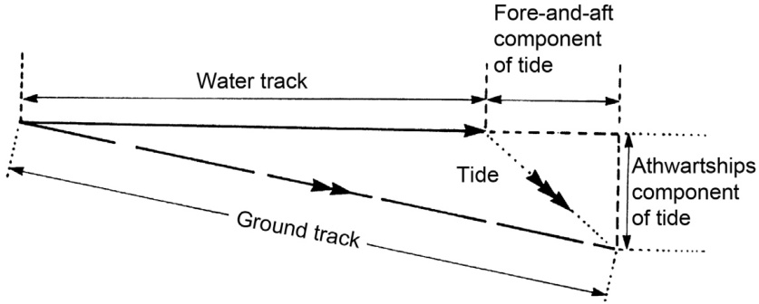  
FIGURE 6.12 The use of a Doppler log as speed input.  

【翻译】
图6.12 使用多普勒日志作为速度输入。

【解读】
这幅图展示了如何使用多普勒日志（Doppler log）作为速度输入的一种方法。多普勒日志是一种测量船速的设备，它通过检测水流对声波的多普勒效应来计算速度。在导航系统中，这种速度数据可以用作重要的输入，以便更准确地确定位置和轨迹。

【词汇表】
| 英文词汇 | 中文翻译 | 解释 |
| --- | --- | --- |
| Doppler log | 多普勒日志 | 一种利用多普勒效应测量船速的设备 |
| speed input | 速度输入 | 导航系统中用于计算位置和轨迹的速度数据 |
| navigation system | 导航系统 | 用于确定位置、方向和轨迹的电子系统 |

It is evident that, where a Doppler log is used, great care must be taken to establish the nature of the input to the ARPA calculations of true vector. Failure to do so may result in inadvertent use of the ground-stabilized true vectors or the use of true vectors with an inherent error in the speed input.  

【翻译】
当使用多普勒航速仪时，必须非常小心地确定输入到自动雷达测距和方位系统（ARPA）真向量计算中的数据类型。否则，可能会不经意地使用地面稳定化的真向量或者带有速度输入固有误差的真向量。

【解读】
本段强调了在使用多普勒航速仪进行导航计算时，需要特别注意输入数据的准确性，以避免由于错误的数据类型或含有固有误差的速度输入而导致的计算结果偏差。这对于保证船舶或其他载具的安全导航至关重要。

【词汇表】
| 英文词汇 | 中文翻译 | 解释 |
| --- | --- | --- |
| Doppler log | 多普勒航速仪 | 一种利用多普勒效应测量船舶速度的设备 |
| ARPA | 自动雷达测距和方位系统 |一种用于检测和跟踪目标的雷达系统，常用于海事领域 |
| true vector | 真向量 | 指的是经过修正的、能够反映实际情况的向量值，在这里指的是船舶的运动状态 |
| ground-stabilized | 地面稳定化 | 指的是以地面为参考系的稳定化处理方式 |

See also Section 6.9.6 for a further discussion of heading and speed data in the context of ground-stabilized true vectors.  

【翻译】
另外，请参阅第6.9.6节，对于地面稳定真向量中航向和速度数据的讨论。

【解读】
本段提示读者可以在第6.9.6节找到关于地面稳定真向量中航向和速度数据更详细的讨论，这意味着该主题与导航或航空领域有关，特别是在处理真向量时考虑地面稳定性的情况下。

【词汇表】
| 英文词汇 | 中文翻译 | 解释 |
| --- | --- | --- |
| Heading | 航向 | 指飞机、船只等的行进方向 |
| Speed | 速度 | 指物体运动的快慢程度 |
| Vectors | 向量 | 在数学和物理学中，表示大小和方向的量 |

# 6.9.4 Setting the Vector Time Control  

In many systems the vector time control will default to some non-zero setting, probably in the range of 6 12 minutes. This ensures that, when vectors are initially displayed after acquisition has commenced, they will in general have a length which is sufficient to be obvious but not excessive. In due course the length can be set to suit the traffic conditions and will of course have to be adjusted from time to time as the vectors are used to extract data from the display. Where there is no default condition the observer should, when setting up, adjust the vector time control to a suitable non-zero value, usually in the range 6 12 minutes. Some observers have recommended using a value equivalent to range scale in use, thus 6 minutes vectors for 6 NM scale as their ‘default’ as it represents a good compromise for many conditions.  

【翻译】
在许多系统中，矢量时间控制默认设置为非零值，通常在6至12分钟之间。这确保了，当矢量在采集开始后首次显示时，它们一般具有足够明显但不过度的长度。随着时间的推移，可以根据交通状况调整长度，当然需要不时地对其进行调整，以便从显示中提取数据。在没有默认条件的情况下，观察者应该在设置时，将矢量时间控制调整到合适的非零值，通常也在6至12分钟之间。一些观察员建议使用与当前范围尺度相等的值作为“默认”值，例如对于6海里（NM）尺度使用6分钟的矢量，因为这代表了很多情况下的良好折衷。

【解读】
本段主要讨论矢量时间控制的默认设置及其调整方法，强调了根据实际交通状况灵活调整矢量长度的重要性，以保证信息的清晰度和实用性。

【词汇表】
| 英文词汇 | 中文翻译 | 解释 |
| --- | --- | --- |
| Vector | 矢量 | 在此 contexto 指向量显示中的箭头或线条，表示方向和速度 |
| Default | 默认 | 系统或设置的预设初值 |
| Non-zero | 非零 | 不为零的数值，在这里指矢量时间控制的初始设置不是零 |
| Range scale | 范围尺度 | 地图或显示器上距离的测量单位，如海里（NM） |

# 6.9.5 Selecting the Relative or True Vector Mode  

Most systems will have a default condition which will select a particular vector mode (see Section 4.4) at switch-on, either true or relative vectors. Some systems default to relative vector mode, some to true vector mode, while in others the default condition depends on the radar picture presentation that has been selected. The observer clearly must be able to select the alternate mode to the default condition, but in some systems the vector mode is biased to the default condition, so that in order to select the other mode the observer must activate a control which returns to the default condition on release. Such are the variations found in practice that it is essential to consult the operating manual and discover what options are available.  

【翻译】
大多数系统都有一个默认设置，它会在开机时选择特定的矢量模式（见第4.4节），可以是真实矢量或相对矢量。有些系统默认为相对矢量模式，有些则默认为真实矢量模式，而其他系统的默认条件取决于所选的雷达图像呈现方式。观察者必须能够清晰地选择与默认条件相反的模式，但是在一些系统中，矢量模式偏向默认条件，因此为了选择另一种模式，观察者必须激活一个控制装置，该装置在释放后会返回到默认条件。由于实际操作中存在如此众多的变体，因此咨询操作手册以了解可用的选项至关重要。

【解读】
本段主要讨论了不同系统中的矢量模式选择问题，强调了系统之间的差异性以及使用前需要参考操作手册的必要性，以确保正确理解和使用系统功能。

【词汇表】
| 英文词汇 | 中文翻译 | 解释 |
| --- | --- | --- |
| Default Condition | 默认条件 | 系统初始状态下的设置或参数 |
| Vector Mode | 矢量模式 | 一种表示方向和大小的数据表现形式 |
| Relative Vectors | 相对矢量 | 与某一参照系相关的矢量 |
| True Vectors | 真实矢量 | 绝对坐标系下的矢量，反映绝对位置和方向 |

There should be a clear indication on the display of the vector mode. Even so, more than one collision has been partially attributed to confusion between which vectors were being observed by the navigators.  

【翻译】
矢量模式在显示屏上应该有明显的指示。尽管如此，由于导航员对所观察的矢量存在混淆，多次碰撞事故部分归因于此。

【解读】
这段话强调了在导航系统中清晰地表示矢量模式的重要性，以避免由于操作员误解而导致的潜在碰撞或错误。这意味着界面设计应确保用户能够轻松识别当前正在使用的矢量模式，从而提高操作的安全性和准确性。

【词汇表】
| 英文词汇 | 中文翻译 | 解释 |
| --- | --- | --- |
| Vector Mode | 矢量模式 | 一种导航或图形显示模式，使用矢量图形来表示方向、速度等信息。 |
| Collision | 碰撞 | 在这里指的是导航过程中的意外事件，如飞机或船只之间的碰撞。 |
| Navigators | 导航员 | 操作导航系统的人员，负责控制和监视航行过程。 |
| Observed | 观察 | 指导航员通过系统观察或监测到的信息或状态。 |

# 6.9.6 Selecting Ground- or SeaStabilized True Vectors  

Ground- and sea-stabilization is normally selected by a software button operating as a toggle switch. The main importance to the observer (assuming that ground/sea speeds and headings are not identical) is that choosing ground- or sea-stabilization affects the displayed course, speed and aspect of targets, and therefore the direction and the length of true vectors. It does not affect the direction and size of the relative vector (and therefore does not affect CPA and TCPA readings).  

【翻译】
地面和海面稳定化通常通过一个软件按钮来选择，该按钮作为一个切换开关工作。对于观察者来说（假设地面/海面速度和方向不相同），最重要的是选择地面或海面稳定化会影响显示的目标航向、速度和方位，从而影响真实矢量的方向和长度。但是，它不会影响相对矢量的方向和大小（因此也不会影响CPA和TCPA读数）。

【解读】
本段主要讨论了地面和海面稳定化在导航系统中的作用和区别，特别是在显示目标信息时的影响。通过选择不同的稳定化模式，可以改变显示的航向、速度和方位等信息，但这并不影响相对位置和时间的计算，如CPA（最近接近点）和TCPA（时间到达最近接近点）。

【词汇表】
| 英文词汇 | 中文翻译 | 解释 |
| --- | --- | --- |
| Stabilization | 稳定化 | 指保持某一状态不变的技术处理 |
| Toggle switch | 切换开关 | 一种可以在两种状态之间切换的电子开关 |
| Vector | 矢量 | 在数学和物理学中表示具有大小和方向的量 |
| CPA | 最近接近点 | 指两个物体之间最近的距离点 |
| TCPA | 时间到达最近接近点 | 指两个物体到达最近接近点所需的时间 |

As already covered in Section 6.2.6, the selection of ground- or sea-stabilization of vectors will also affect the movement of the own ship origin across the display and the direction of artificial afterglow of targets and own ship origin, if in true-motion presentation.  

【翻译】
如第6.2.6节已经提到的，选择地面或海面稳定化的矢量也会影响自身船只原点在显示屏上的移动以及目标和自身船只原点的人工残影方向，如果是在真实运动演示中。

【解读】
本段主要讨论的是在某种导航或模拟系统中，选择不同类型的稳定化方式（地面稳定或海面稳定）对显示效果的影响，特别是对于自身船只的位置和目标物体的残影效果的影响。这意味着不同的稳定化设置可能会改变用户观察到自身船只和目标物体的相对位置和运动轨迹，这对理解和预测运动中的情况非常重要。

【词汇表】
| 英文词汇 | 中文翻译 | 解释 |
| --- | --- | --- |
| stabilization | 稳定化 | 指保持某一状态不变的技术或方法，在这里指的是地面或海面作为参考系来稳定显示的矢量。 |
| true-motion presentation | 真实运动演示 | 一种模拟或显示方式，试图以最真实的方式呈现运动中的情况，包括所有相关物体的实际速度和方向。 |
| afterglow | 残影 | 在显示设备上，一旦物体移出视野后，仍然留下的光跡或影像。 |

As emphasized in many other sections, if using the ARPA or target tracker in an anticollision situation, ground-stabilized true vectors will probably not show the correct aspect of the vessel, in terms of the rule of the road. Sea-stabilized true vectors should be used for this purpose. In this respect, it is interesting to note that in IMO performance specification (Section 11.2) that in the event of ground course and speed sensor failure, the observer should select sea-stabilized display, while in the event of failure of the water track speed sensor, the user should use a manual estimate of speed.  

【翻译】
如在其他章节中强调的，如果在防碰撞情况下使用ARPA或目标跟踪器，地面稳定化的真实矢量可能不会显示船舶正确的朝向，以符合交通规则。应该使用海面稳定化的真实矢量来实现这一目的。值得注意的是，在国际海事组织（IMO）的性能规范（第11.2节）中规定，当地面航向和速度传感器发生故障时，观察员应选择海面稳定化显示，而当水道追踪速度传感器发生故障时，用户应使用手动估算速度。

【解读】
本段主要讨论了在防碰撞情况下使用自动雷达测距仪（ARPA）或目标跟踪器时，选择合适的坐标系以避免碰撞的重要性。特别提到地面稳定化的真实矢量可能不能准确反映船舶的方向，因此建议使用海面稳定化的真实矢量。此外，还提到了国际海事组织对传感器故障处理的具体要求，包括选择海面稳定化显示或使用手动估算速度等方法。

【词汇表】
| 英文词汇 | 中文翻译 | 解释 |
| --- | --- | --- |
| ARPA | 自动雷达测距仪 | 一种用于检测和跟踪周围船只的雷达系统 |
| Anticollision | 防碰撞 | 预防船舶之间碰撞的措施或系统 |
| Ground-stabilized | 地面稳定化 | 以陆地为参考系的稳定方式 |
| Sea-stabilized | 海面稳定化 | 以海面为参考系的稳定方式 |
| True vector | 真实矢量 | 表示物体实际运动方向和速度的矢量 |

As with all displayed information, the displayed information is only as good as the input data from which it is derived. The input and issues in getting the correct values of compass and water speed for sea-stabilized true vectors is covered in Section 6.9.3. The rest of this section will focus on the possible inputs to obtain the ground heading and speed of the own vessel, in order to obtain groundstabilized true vectors.  

【翻译】
与所有显示信息一样，显示信息的质量取决于其来源的输入数据。关于如何获取罗盘和水速的正确值以获得海上稳定真实向量的输入问题在第6.9.3节中进行了讨论。本节的剩余部分将集中讨论如何获取自身船舶的地面航向和速度，以便得到地面稳定真实向量。

【解读】
本段强调了准确的输入数据对于获取可靠的显示信息的重要性，特别是在海上导航系统中获取真实向量时。它提到了获取罗盘和水速数据的挑战，并指出本节将重点介绍如何获取自身船舶的地面航向和速度，这是计算地面稳定真实向量的关键步骤。

【词汇表】
| 英文词汇 | 中文翻译 | 解释 |
| --- | --- | --- |
| displayed information | 显示信息 | 在屏幕或界面上呈现的数据或结果 |
| input data | 输入数据 | 用于计算或生成输出结果的原始数据 |
| compass | 罗盘 | 测量方向的仪器，在此 contexto 指的是测量船舶方向的设备 |
| ground heading | 地面航向 | 船舶在地面上的实际航向，与海上状态下的航向不同 |
| stabilized true vectors | 稳定真实向量 | 经过校正和滤波处理后的精确向量数据，用于导航目的 |

# 6.9.6.1 GNSS or Other Navigational Input  

It is relatively straightforward for the manufacturers to input the positional signal from a GNSS (currently most commonly GPS) into the radar (see Sections 10.1 and 10.3), and also to get the ground speed and heading which the GNSS has obtained by integration of the positional data over time. The GNSS equipment itself must be switched on and checked that it is operational. Then the GNSS must be selected in the ARPA/target tracking display (usually in the menu system). There may be a choice of GNSS equipment in some vessels. The readout of position, ground heading and ground speed displayed on the ARPA should be checked against the original equipment.  

【翻译】
对于制造商来说，将来自GNSS（目前最常用的是GPS）的位置信号输入到雷达系统中（见第10.1和10.3节）相对比较直接，同时也能获得GNSS通过对位置数据随时间进行整合而得到的地面速度和航向。GNSS设备本身必须被打开并检查是否正常工作。然后，在ARPA/目标跟踪显示中选择GNSS（通常在菜单系统中）。有些船只可能有多个GNSS设备可供选择。在ARPA上显示的位置、地面航向和地面速度读数应与原始设备进行核对。

【解读】
该段落主要讨论了如何将全球导航卫星系统（GNSS）与雷达系统集成，以获取位置信息、地面速度和航向等数据。它强调了需要确保GNSS设备正常运行，并在ARPA（自动雷达.plotting援助）或目标跟踪显示中正确选择和配置GNSS设备，以保证数据准确性。

【词汇表】
| 英文词汇 | 中文翻译 | 解释 |
| --- | --- | --- |
| GNSS | 全球导航卫星系统 | 一种利用一组人造卫星提供位置信息、速度和时间的导航系统 |
| GPS | 全球定位系统 | 美国开发的全球导航卫星系统，是GNSS的一部分 |
| ARPA | 自动雷达.plotting援助 | 一种辅助雷达操作的系统，能够自动标识和跟踪目标 |
| Heading | 航向 | 指一个物体或船只的前进方向 |
| Ground Speed | 地面速度 | 指一个物体或船只在地面上的运动速度 |

The same can apply to other non-satellite navigational equipment such as LORAN $\subset,$ if available in the vessels geographical region and with a LORAN C receiver onboard. However, this is not commonly fitted to vessels in practice.  

# 6.9.6.2 Manual Estimate of Tide/Current  

It is clear from Figure 6.12 that given that all ARPAs should have compass and water speed inputs, it is also possible for the ARPA to estimate ground speed and heading if the observer can provide a value of tide or current.  

【翻译】
从图6.12可以看出，如果所有ARPA都具有罗盘和水速输入，那么当观察者能够提供潮汐或洋流的值时，ARPA也可以估计地面速度和航向。

【解读】
本段讨论了自动雷达测距和方位系统（ARPA）的功能。它指出，只要有罗盘和水速的输入，ARPA就不仅能接收这些基本信息，还能通过观察者的额外输入（如潮汐或洋流的速度）来计算地面速度和航向。这意味着ARPA的能力比简单的距离和方向测量更为广泛，能够对船舶的实际运动状态进行更准确的评估。

【词汇表】
| 英文词汇 | 中文翻译 | 解释 |
| --- | --- | --- |
| ARPA | 自动雷达测距和方位系统 | 一种用于海事领域的雷达系统，帮助确定其他船只的位置和速度。 |
| Compass | 罗盘 | 用于指示方向的仪器。 |
| Water Speed | 水速 | 指水体中的流速，如河流、海洋等。 |
| Tide | 潮汐 | 海洋由于月球和太阳引力的影响而产生的周期性涨落现象。 |
| Current | 洋流 | 水体中水平方向上的流动，如海洋洋流。 |

The manual tidal inputs can simply take the form of two data entry fields. One is the estimated direction of the tidal stream or current between $0^{\circ}$ and $360^{\circ}.$ , while the other is the estimated rate of the tidal or current stream in knots. The ground speed and heading used for true vector calculations will be the vector addition of these values of current and the compass heading and water speed (see Figure 6.12). In theory the estimate of current can be obtained from current information from charts and tables or by radar plotting of buoys and fixed objects. In the latter case, consideration should be given to use the fixed target reference mode of ground-stabilization. However, if persevering with this method of manual tide/current tide settings:  

a. Set a sea-stabilized display with zero current/tide settings. Any radar plots of known stationary targets will indicate the set and rate of the current. However, the actual direction of current will be the reciprocal of the ‘true course’ indicated on the fixed target.   
b. Enter this value into tide current settings and select ground-stabilized vectors using this manual entry.   
c. The effectiveness of the value of current entered can be monitored by continuing to plot the fixed targets in ground-stabilized vector mode. If the speed of the fixed targets is not zero or near zero, then the value of current entered into the ARPA must be adjusted until it does become zero or near zero.  

【翻译】
为了确定潮流的方向和速度，可以按照以下步骤进行： 
a. 设置海上稳定显示，当前/潮流设置为零。任何已知固定目标的雷达图会指示出当前的设定值和速率。但是，实际的潮流方向将是固定目标上标示的“真实航向”的反向。
b. 将这个值输入到潮流设置中，并选择使用此手动输入的底物稳定化矢量。
c. 输入的潮流值的有效性可以通过继续在底物稳定化矢量模式下绘制固定目标来监测。如果固定目标的速度不是零或接近零，则必须调整输入到ARPA（自动雷达导航辅助系统）中的潮流值，直到它变得接近零。

【解读】
本段落介绍了一种确定潮流方向和速度的方法，主要用于船舶导航。通过设置海上稳定显示和零当前/潮流设置，观察固定目标的雷达图可以帮助确定潮流的设定值和速率。然后，将该值输入到潮流设置中，并选择底物稳定化矢量，以便更准确地监测和调整潮流值，直到固定目标的速度接近零。

【词汇表】
| 英文词汇 | 中文翻译 | 解释 |
| --- | --- | --- |
| sea-stabilized | 海上稳定 | 一种导航模式，相对于海面保持稳定 |
| ARPA | 自动雷达导航辅助系统 |一种利用雷达技术辅助船舶导航的系统 |
| ground-stabilized | 底物稳定化 | 一种导航模式，相对于陆地或海底保持稳定 |
| reciprocal | 反向 | 指两个方向恰好相反 |

In summary, the availability of easier to operate and more accurate alternates do not make this option attractive to use.  

【翻译】
总之，更容易操作且更准确的替代方案的出现使得这个选项不再具有吸引力。

【解读】
这句话是在讨论某种选择或方法是否值得使用。由于有其他更易于操作、更准确的替代方案存在，因此原来的选项变得不那么有吸引力了。这意味着在评估不同选择时，需要考虑到可替代方案的便捷性和精度。

【词汇表】
| 英文词汇 | 中文翻译 | 解释 |
| --- | --- | --- |
| Attractive | 有吸引力 | 指的是某事物或选择对人有诱惑力，使人愿意接受或采用。 |
| Alternates | 替代方案 | 指的是可以取代原有选择或方法的其他选择或方法。 |
| Accurate | 准确 | 指的是某事物或结果的精度，能够准确地反映真实情况。 |

# 6.9.6.3 Dual-Axis Doppler Log in Ground Track Mode  

As already discussed in Section 6.9.3 the output of the dual-axis Doppler log when used in ground track mode will make a valid estimate of ground track. The ARPA must add together by vector addition, the fore-and-aft component of ground track with the athwartship component of ground track to obtain a value of ground heading and speed to be indicated on the ARPA display (see Figure 6.12). The dual-axis log option (if available) is simply selected as an alternative to GNSS or manual entry of current data in the menu system.  

【翻译】
如在6.9.3节中已经讨论过的，当双轴多普勒日志被用于地面跟踪模式时，其输出将能够对地面跟踪进行有效估计。自动雷达测距和速度表（ARPA）必须通过矢量加法，将地面跟踪的前后向分量与横向分量相加，以获得地面航向和速度的值，这些值将显示在ARPA显示屏上（见图6.12）。如果可用，双轴日志选项只需作为替代选择，而不是使用GNSS或手动输入当前数据到菜单系统中。

【解读】
本段主要介绍了如何利用双轴多普勒日志来估计地面跟踪，并且需要通过矢量加法计算出地面航向和速度以便于ARPA显示。同时提到了双轴日志选项可以作为获取当前数据的替代方法。

【词汇表】
| 英文词汇 | 中文翻译 | 解释 |
| --- | --- | --- |
| Dual-axis Doppler log | 双轴多普勒日志 | 一种测量船速和方向的设备 |
| ARPA | 自动雷达测距和速度表 |一种辅助雷达导航的系统 |
| Ground track | 地面跟踪 | 船舶在地面上的实际行进路线 |
| Vector addition | 矢量加法 | 将两个或多个矢量按照一定规则相加的运算 |

The concerns of a Doppler log probably not remaining ground locked throughout the passage are well covered in Section 6.9.3 and equally apply to this section. If used, the status of the dual-axis ground lock must be checked frequently.  

【翻译】
多普勒记录仪可能在整个过程中不能保持地面锁定状态的顾虑，在第6.9.3节中有充分的描述，这同样适用于本节。如果使用了，应频繁检查双轴地面锁定的状态。

【解读】
这段话主要讨论的是多普勒记录仪（Doppler log）在使用过程中的一个潜在问题，即它可能无法始终保持地面锁定状态。这意味着设备可能会因为某些原因而失去对地面的稳定参考，从而影响测量结果或数据的准确性。因此，用户需要频繁检查设备的地面锁定状态，以确保其正常运行。

【词汇表】
| 英文词汇 | 中文翻译 | 解释 |
| --- | --- | --- |
| Doppler log | 多普勒记录仪 | 一种利用多普勒效应来测量速度或距离的设备 |
| Ground locked | 地面锁定 | 设备与地面保持一致的参考状态 |
| Dual-axis | 双轴 | 指设备可以在两个不同的轴向上进行测量或操作 |

# 6.9.6.4 Ground-Stabilization Using an ARPA Plotted Fixed Target as Reference  

This technique is well covered in Sections 4.8 and 8.4.6. When possible, this is a very effective way of monitoring the instantaneous vessel’s navigational position and obtaining ground speed and heading independently from GNSS and other navigation equipment.  

【翻译】
该技术在第4.8节和8.4.6节中有详细介绍。在可能的情况下，这是一种非常有效的监测瞬时船舶导航位置和获取地面速度与方向的方法，不依赖于GNSS（全球卫星导航系统）和其他导航设备。

【解读】
这段话主要讨论了一种用于监测船舶导航位置和获取相关数据的技术，强调了这种方法在某些情况下的有效性和独立性。

【词汇表】
| 英文词汇 | 中文翻译 | 解释 |
| --- | --- | --- |
| instantaneous | 瞬时的 | 指的是某一特定时间点上的状态或数值 |
| navigational | 导航的 | 与船舶、飞机等的导航有关 |
| GNSS | 全球卫星导航系统 | 一种利用卫星实现全球范围内精确定位和导航的系统 |
| ground speed | 地面速度 | 指的是相对于地球表面的速度 |

1. A fixed target must be selected for use as a reference. Some systems allow a number of such targets to be selected. Ideally it is a rock or platform or tower fixed to the sea bed, small enough to be trackable by the ARPA. In extremis, a buoy can be used with caution, particularly if more than one can be used or they are the large channel buoys fitted with racons and monitored by the shore radar, such as in the Dover Strait.   
2. The selected fixed target(s) must be selected as ARPA targets and tracked for the requisite 3 minutes.   
3. The selected fixed target(s) must then be ‘designated’ in the ARPA menu.   
4. Finally, the option to use the designated target(s) as a reference for groundstabilization can be selected. The designated targets will be indicated on the display by a  

【翻译】

1. 必须选择一个固定的目标作为参考点。有些系统允许选择多个这样的目标。理想情况下，这个目标应该是一个固定在海底的小岩石、平台或塔楼，小到足以被自动雷达绘制和分析系统（ARPA）跟踪。在极端情况下，可以谨慎地使用浮标，特别是当可以使用多个浮标或者它们是配备有辐射信标的宽频道浮标，并且受到岸基雷达监控时，例如在多佛海峡。
2. 所选定的固定的目标必须被选为ARPA目标，并被跟踪3分钟所需的时间。
3. 然后，所选定的固定的目标必须在ARPA菜单中被“指定”。
4. 最后，可以选择使用指定的目标作为地面稳定化的参考点。指定的目标将在显示屏上用特殊标记指示出来。

【解读】
本段落主要介绍了如何在自动雷达绘制和分析系统（ARPA）中选择和设置固定的参考目标，以便进行地面稳定化。步骤包括选择合适的目标，如岩石、平台或浮标，然后在系统中指定这些目标，并最终将其设为地面稳定化的参考点。这一过程对于确保航行安全和精度至关重要。

【词汇表】
| 英文词汇 | 中文翻译 | 解释 |
| --- | --- | --- |
| ARPA | 自动雷达绘制和分析系统 | 一种用于跟踪和分析雷达信号的系统 |
| Target | 目标 | 在这里指的是作为参考点的物体或位置 |
| Groundstabilization | 地面稳定化 | 指通过参考点来纠正和稳定导航数据的过程 |
| Racon | 辐射信标 | 一种安装在浮标上的设备，向雷达发射信号以提高可见性 |

special symbol. ${}^{\prime}\mathrm{R}^{\prime}$ (Reference) is in the latest IMO approved symbol list, but $\mathrm{^{/}F^{\prime}}$ (Fixed) is quite common. It will, of course, have no true vector, when used as such.  

Even if limited to only one designated target at a time, it is good practice to have several suitable targets plotted at the same time, in order to change as the vessel proceeds. Whilst ground-stabilized true vectors are selected, they should be showing as a ‘stopped’ target or nearly stopped target, which is a good check that the observer has selected a stationary target. It also allows the observer to quickly swap the designated target to another one, should the tracking of the existing designated target be lost. Indeed the prudent observer will change the designated target in advance of the designated target being lost. His passage plan should indicate which target(s) to designate next.  

【翻译】
即使只针对一个指定目标，通常也会同时规划多个合适的目标，以便在船舶行进过程中进行切换。当选择地面稳定化的真实向量时，它们应该显示为“停止”的目标或几乎静止的目标，这是观察员选择了静止目标的一个良好检查。这也允许观察员快速切换到另一个目标，如果当前指定目标的跟踪丢失。实际上，谨慎的观察员会在指定目标丢失之前提前更改指定目标。他的航程计划应指示下一步要指定哪些目标。

【解读】
本段强调了在导航过程中保持灵活性和准备性的重要性，即使只关注一个目标，也应预先规划好多个备用目标，以便在需要时能够迅速切换。这不仅可以确保观察员始终有一个可靠的参考点，还能帮助避免由于目标丢失而导致的混乱。此外，通过提前规划和准备，可以减少错误的发生率，提高整个导航过程的安全性和效率。

【词汇表】
| 英文词汇 | 中文翻译 | 解释 |
| --- | --- | --- |
| Designated target | 指定目标 | 在导航过程中被选中的特定目标 |
| Ground-stabilized true vectors | 地面稳定化的真实向量 | 以地面为基准的、经过校正的方向和速度信息 |
| Passage plan | 航程计划 | 预先制定的航线和时间安排 |
| Prudent observer | 谨慎的观察员 | 具有丰富经验和谨慎态度的观察人员 |

# 6.9.7 Safe Limits  

The observer should set suitable safe limits in terms of CPA and TCPA (see Section 4.7.2). The judgement of what is suitable is to some extent subjective. Excessive alerts can be distracting and counter-productive whereas, by contrast, if very small limits are used the dangerous target alarm will not be activated by a vessel which is standing in a close-quarters situation.  

【翻译】
观察者应该根据CPA（最接近距离）和TCPA（时间到达最近点）设置合适的安全限制（见第4.7.2节）。判断什么是合适的在某种程度上是主观的。过多的警报可能会分散注意力且产生反作用，而相比之下，如果使用非常小的限制，那么处于近距离情况下的船只不会触发危险目标警报。

【解读】
本段强调了在设置安全限制时需要考虑的平衡问题。一方面，过多的警报可能会造成干扰；另一方面，如果限制设置得太严格，可能会导致关键时刻无法及时发出警告，从而增加事故风险。因此，观察者需要根据实际情况设定一个合理的安全限制值，以确保安全和效率。

【词汇表】
| 英文词汇 | 中文翻译 | 解释 |
| --- | --- | --- |
| CPA | 最接近距离 | 指两物体运动路径中彼此最接近的距离 |
| TCPA | 时间到达最近点 | 指从当前位置到预测的最接近点所需的时间 |
| Counter-productive | 产生反作用 | 指某一行为或措施不仅没有达到预期效果，反而产生了负面影响 |
| Close-quarters situation | 近距离情况 | 指两个或多个物体之间的距离很小，容易发生碰撞的情况 |

# 6.9.8 Preparation for Tracking  

If the observer is unfamiliar with the system, time should be spent in locating the joystick (or tracker ball), the acquire button and the cancel button and practicing their use. This can be done using live targets if available or, failing that, use can be made of the synthetic targets provided by the training programme supplied with some ARPAs.  

【翻译】
如果观察者不熟悉该系统，应该花时间找到操纵杆（或跟踪球）、获取按钮和取消按钮，并练习使用它们。这可以通过使用现成目标来完成，如果有的话；否则，可以使用一些ARPAs附带的训练程序提供的合成目标。

【解读】
本段强调了在操作ARPAs（自动无线电定位系统）之前，需要对系统进行初步的熟悉和实践，特别是对于不熟悉的人员。通过实践操作，如找到关键控制器、按钮等，可以提高操作效率和准确性。

【词汇表】
| 英文词汇 | 中文翻译 | 解释 |
| --- | --- | --- |
| Joystick | 操纵杆 | 一种用于控制设备运动方向的控制器 |
| Tracker Ball | 跟踪球 | 一种用于控制设备运动的球形控制器 |
| Acquire Button | 获取按钮 | 用于启动设备获取数据的按钮 |
| Cancel Button | 取消按钮 | 用于停止或取消设备操作的按钮 |
| Synthetic Targets | 合成目标 | 由计算机模拟生成的虚拟目标，用于训练或测试目的 |

# 6.9.8.1 Manual Tracking  

Once the radar is set up, tracking of radar targets can commence. This requires putting the tracker ball/joystick control into ‘tracking’ or ‘acquire’ mode (by pressing an appropriate software button) and then using the pointing device to hover over a target and then ‘click’ a push button to manually acquire. Then one can move to another target and repeat to acquire this target (if required). Most equipments do not have ‘acquire’ mode as the default setting, so after a short delay the joystick/tracker ball pointer will default to another mode. There will also be another push button which will allow the observer to select ‘delete target’ mode for the tracker ball/joystick pointer and ARPA targets with which target vectors can be deleted by pointing and clicking. Tracking information (containing minimum of CPA, TCPA, course, speed, range and bearing) on a small number of selected targets can be shown textually on the display. These targets are selected and clicked in the default mode. It should be noted that these same functions are also used for AIS targets in AIS-enabled equipment.  

【翻译】
一旦雷达系统安装完成，就可以开始跟踪雷达目标。这需要将追踪球/操纵杆控制器切换到“跟踪”或“获取”模式（通过按下相应的软件按钮），然后使用指向设备悬停在一个目标上，然后按下“点击”按钮手动获取。之后，可以移动到另一个目标并重复获取该目标（如果需要）。大多数设备没有默认的“获取”模式，因此在短暂延迟后，操纵杆/追踪球指针将默认为其他模式。此外，还会有另一个按钮允许观察员选择“删除目标”模式，以便从ARPA目标中删除目标矢量，只需指向并点击即可。有关少数选定目标的跟踪信息（至少包括CPA、TCPA、航向、速度、距离和方位）可以以文字形式显示在屏幕上。这些目标是在默认模式下选择和点击的。值得注意的是，这些相同的功能也适用于启用AIS的设备中的AIS目标。

【解读】
本段主要介绍了雷达系统的跟踪功能，包括如何进入跟踪模式、手动获取目标以及查看跟踪信息等。同时，也提到了部分设备可能没有默认的“获取”模式，以及如何删除不需要的目标。最后，还特别提到这些功能同样适用于AIS（自动识别系统）目标。

【词汇表】
| 英文词汇 | 中文翻译 | 解释 |
| --- | --- | --- |
| Radar | 雷达 | 无线电探测和定位系统 |
| Tracker | 追踪器 | 用于跟踪目标的设备或软件 |
| Joystick | 操纵杆 | 一种控制装置，常用于游戏机或模拟器中 |
| Acquire | 获取 | 在这里指获得或锁定目标 |
| ARPA | 自动雷达辅助plotter | 一种辅助雷达系统，帮助观察员跟踪目标 |
| AIS | 自动识别系统 |一种船舶上的系统，能够自动广播其位置和相关信息 |

# 6.9.8.2 Selecting Automatic Acquisition  

Larger ships are required to have automatic acquisition facilities. There will be a simple software touch button to press to activate this. However, before doing this, it is important to take the trouble to make sure that an observer understands how to control the area or region of the screen that is being automatically searched for targets to track. It may seem to be a good thing to be searching a large area, but each time a new target is found, an alarm will go off and if these alarms are continually sounding for targets which are of absolutely no interest to the observer, then the observer’s responsiveness to alarms will be reduced. Also the maximum target capacity of the tracker may be reached although many of the targets are of no interest.  

【翻译】
大型船舶需要配备自动获取设施。只需轻触一个简单的软件按钮即可激活此功能。然而，在这样做之前，必须确保观察员了解如何控制屏幕中正在被自动搜索以跟踪目标的区域或区域。搜索大面积似乎是一个好主意，但每当发现新的目标时，警报就会响起，如果这些警报不断地为观察员完全无关心的目标而响起，那么观察员对警报的反应性就会降低。此外，跟踪器的最大目标容量可能会达到，即使其中许多目标与观察员无关。

【解读】
本段主要讨论了大型船舶使用自动获取设施进行目标跟踪的注意事项。它强调了在激活自动搜索功能前，观察员需要理解如何控制屏幕中的搜索区域，以避免不必要的警报干扰和跟踪器容量过载的问题。

【词汇表】
| 英文词汇 | 中文翻译 | 解释 |
| --- | --- | --- |
| Automatic acquisition facilities | 自动获取设施 | 指能够自动搜索和识别目标的设备或系统。 |
| Observer | 观察员 | 指操作和监控系统的人员。 |
| Tracker | 跟踪器 | 指用于跟踪和监测目标的设备或系统。 |
| Target capacity | 目标容量 | 指跟踪器能够同时处理和跟踪的目标数量。 |
| Alarm | 警报 | 指当系统检测到目标或出现异常情况时发出的警告信号。 |

As discussed in Section 4.2.3, there are as many different ways of defining the shapes of automatic acquisition areas (sometimes called guard zones) as there are manufacturers. Figures 4.2 4.4 give some indications of the shape and controls of some types of area, but there are others. It is important that the observers (who may be intending to use automatic acquisition) are familiar with the system on their own particular equipment. The outline of the area can be shown graphically (and hidden) on the graphical display at the touch of a software button (often within the display menu system), but there will also be controls to alter the boundaries of the area to suit user requirements.  

【翻译】
如第4.2.3节所讨论的，有多少种不同的方式来定义自动获取区域（有时称为警戒区）的形状，就有多少家制造商。图4.2至4.4给出了某些类型区域的形状和控制的一些指示，但还有其他类型。观察者（可能打算使用自动获取功能）必须熟悉他们自己的设备系统。这一区域的轮廓可以在图形显示上以图形方式显示（并隐藏），方法是点击一个软件按钮（通常位于显示菜单系统中），但也会有控制来改变区域边界以满足用户需求。

【解读】
本段主要讨论了自动获取区域（或称警戒区）的定义和控制问题。由于不同制造商对这些区域的定义方式各不相同，因此观察者需要了解自己设备上的具体设置和控制方式，以便能够有效地使用自动获取功能。同时，这一区域的边界可以通过软件进行调整，以适应不同的用户需求。

【词汇表】
| 英文词汇 | 中文翻译 | 解释 |
| --- | --- | --- |
| Automatic Acquisition Areas | 自动获取区域 | 指系统自动识别和跟踪目标的区域 |
| Guard Zones | 警戒区 | 与自动获取区域类似，用于监控和防御目的 |
| Graphical Display | 图形显示 | 使用图像和符号来表示信息的显示屏 |
| Software Button | 软件按钮 | 计算机程序中的虚拟按钮，用于执行特定命令 |

It should be pointed out that automatic acquisition should not be used as an excuse for an observer to not examine the ARPA for new targets. The manual operator can often find weak targets missed by the automatic tracking. Also, the automatic acquisition may be subject to many false alarms in heavy clutter conditions.  

【翻译】
应该指出，自动获取不应成为观察员不检查ARPA中新目标的借口。手动操作员通常可以找到被自动跟踪系统漏掉的弱目标。此外，在严重杂乱环境下，自动获取可能会产生许多虚假警报。

【解读】
本段强调了在使用自动化系统进行目标检测时，仍需要人工干预和检查，以确保不会错过潜在的目标或出现误报。这是因为自动系统可能无法捕捉到所有情况，尤其是在复杂环境中。

【词汇表】
| 英文词汇 | 中文翻译 | 解释 |
| --- | --- | --- |
| Automatic Acquisition | 自动获取 | 使用自动化系统来识别和跟踪目标的过程 |
| Observer | 观察员 | 负责监视和分析数据的人员 |
| False Alarms | 虚假警报 | 系统错误地报告存在目标或事件的警告 |
| Clutter Conditions | 杂乱环境 | 指环境中的噪音、干扰等因素使得系统难以准确工作的情况 |

# 6.10 AIS OPERATIONALCONTROLS  

As already discussed in Chapter 5, AIS data can be provided from a stand-alone device or it can be fed to an electronic chart display and information system (ECDIS) or radar type screen. There is a multitude of models and types of AIS enabled equipment, including all SOLAS radars installed since 2008 (see Sections 4.1 and 4.2). This section will discuss the basic operations required for both types of AIS-enabled target tracking equipment with a particular focus on that likely to be installed on Class A vessels.  

【翻译】
如第五章中已经讨论过的，AIS数据可以来自独立设备，也可以输入到电子海图显示和信息系统（ECDIS）或雷达类型屏幕中。有许多种类和型号的AIS启用设备，包括自2008年以来安装的所有SOLAS雷达（见4.1和4.2节）。本节将讨论两种类型的AIS启用目标跟踪设备的基本操作，特别关注可能在A级船舶上安装的设备。

【解读】
该段落主要介绍了AIS（自动识别系统）数据的来源和应用，提到了AIS设备的多样性，以及对AIS启用目标跟踪设备的基本操作进行了概述，尤其是针对可能安装在A级船舶上的设备进行了重点说明。这一部分内容对于理解AIS技术在航运领域的应用和操作具有重要意义。

【词汇表】
| 英文词汇 | 中文翻译 | 解释 |
| --- | --- | --- |
| AIS | 自动识别系统 | 一种用于船舶位置报告和识别的系统 |
| ECDIS | 电子海图显示和信息系统 | 一种集成了海图、航行数据和警告信息的电子系统 |
| SOLAS | 国际海上人命安全公约 | 一项国际公约，旨在确保船舶及其乘员的安全 |
| Radar | 雷达 | 一种利用无线电波探测和定位物体的系统 |

# 6.10.1 Stand-Alone AIS Equipment  

Class A vessels could either have an MKD (minimum keyboard display; see Section 5.4.1) or an AIS with a graphical display as the main stand-alone device onboard (see Section 5.4.2). The keyboards on such devices are typically a minimum set of multi-function keys similar to an early model mobile phone with a few extra keys for navigating the menu and display (text or graphical display). Much of the data broadcast is derived automatically from its own GPS and other external sensors, all of which do not need any attention from the observer, except to monitor that it is working. There are some manual fields which will need occasional attention.  

【翻译】
A类船舶可以配备最小键盘显示（MKD）设备或具有图形显示的自动识别系统（AIS）作为主要独立设备（见第5.4.1节和第5.4.2节）。此类设备上的键盘通常为一套最少的多功能键，类似于早期手机模型，只需添加几个导航菜单和显示（文本或图形显示）的额外按键。大部分广播数据是从其自身的GPS和其他外部传感器中自动生成的，这些不需要观察员进行任何操作，只需监测它们是否正常工作。有一些手动字段需要偶尔关注。

【解读】
该段落描述了A类船舶上可能使用的两种类型的设备：最小键盘显示（MKD）和自动识别系统（AIS），这两种设备都有自己的显示方式。这些设备通过GPS和其他传感器自动收集和广播数据，但仍有一些手动输入的字段需要定期检查。这说明了现代船舶在导航方面对技术的依赖，以及简化操作的趋势。

【词汇表】
| 英文词汇 | 中文翻译 | 解释 |
| --- | --- | --- |
| MKD | 最小键盘显示 | 一种简单的键盘显示设备 |
| AIS | 自动识别系统 |一种用于船舶识别和位置报告的系统 |
| GPS | 全球定位系统 |一种用于确定位置和时间的卫星导航系统 |
| Multi-function keys | 多功能键 | 可以执行多种功能的按键 |

manoeuvre, etc.). There are also optional extras such as the route waypoints and number of persons onboard. c. Safety messages. The equipment also has to be programmed for the ship to broadcast safety messages to all users or a specific address or addresses. This is by the MMSI number(s), but the navigator need not type the target MMSI direct, but can select the ship or other AIS user to address from the target list (see below).  

【翻译】
此外，还有一些可选的额外功能，如航线路标和船上人员数量。c. 安全消息。设备还必须被编程为向所有用户或特定地址广播安全消息。这是通过MMSI号码实现的，但导航员无需直接输入目标MMSI号码，而可以从目标列表中选择要发送到的船只或其他AIS用户（见下文）。

【解读】
本段主要讨论自动识别系统（AIS）设备的编程设置，包括对船舶进行跟踪、记录航线路标以及向特定用户或所有用户广播安全消息等功能。这些设置使得船舶之间以及船舶与岸基站之间能够实现高效的信息交流，从而提高了海上交通的安全性。

【词汇表】
| 英文词汇 | 中文翻译 | 解释 |
| --- | --- | --- |
| manoeuvre | 操纵、机动 | 指船舶的操作或移动 |
| waypoints | 路标、航点 | 船舶航行中的参考点或位置 |
| MMSI | 海事移动服务身份号码 | 用于识别船舶或海事通信设备的唯一号码 |
| AIS | 自动识别系统 | 一种用于船舶识别和位置报告的电子导航辅助系统 |

The AIS devices have a series of pages containing a few lines of data or fields for the observer to enter data. These multiple pages are arranged in a tree-like hierarchy and they can be cumbersome to operate and use. The observer has to find the appropriate screen for the task required, be it to update or input data, or to get data on other vessels or other information from the AIS.  

【翻译】
AIS设备具有多个页面，每个页面包含几行数据或字段，供观察者输入数据。这些页面以树状层次结构排列，但操作起来可能很繁琐。观察者需要找到适合当前任务的屏幕，无论是更新或输入数据，还是从AIS获取其他船舶或信息。

【解读】
本段主要介绍了AIS（自动识别系统）设备的操作界面及其使用特点。由于AIS设备的菜单式设计，使得用户在寻找特定功能或信息时可能会遇到一些困难，这体现了早期技术产品在人机交互方面的局限性。

【词汇表】
| 英文词汇 | 中文翻译 | 解释 |
| --- | --- | --- |
| AIS | 自动识别系统 | 一种用于船舶之间及船舶与岸基站之间通信的系统，能够自动发送和接收船舶的位置、速度等信息。 |
| hierarchy | 层次结构 | 指事物按照一定的顺序或级别排列的组织形式。 |
| cumbersome | 繁琐的 | 形容某件事情或某个过程比较麻烦或不方便。 |
| observer | 观察者 | 指观察、监测某些事物或现象的人。 |

# 6.10.1.2 Output of Data  

# 6.10.1.1 Input of Data  

Certain important data must be programmed into the unit at the appropriate time, by the user. These can be divided into permanent data, voyage-related data and safety messages:  

【翻译】
某些重要数据必须由用户在适当的时间内编程到设备中。这些数据可以分为永久性数据、航行相关数据和安全信息。

【解读】
本段强调了用户在使用设备时需要输入特定数据的重要性，这些数据根据其用途不同被分类，以确保设备能够正常运行并提供必要的信息。

【词汇表】
| 英文词汇 | 中文翻译 | 解释 |
| --- | --- | --- |
| programmed | 编程 | 将数据或指令输入计算机或设备中 |
| permanent | 永久性 | 指不变或长期保持状态的东西 |
| voyage-related | 航行相关 | 与旅行或航海有关的信息或数据 |
| safety messages | 安全信息 | 用于告知或警示安全问题的消息或通知 |

a. Permanent data. This data is normally programmed in by the installer and will only need changing should this information be changed during the life of the ship. It includes the AIS static data, MMSI number, name of ship, IMO number, type of ship and dimensions of ship in relation to the navigational GPS antenna (port, starboard, forward and aft). It may also include equipment settings such as the data rates to communicate with other shipboard devices. b. Voyage data. This is data which normally needs updating at the start of each voyage and which may occasionally need updating while on the voyage. This includes draft, destination, ETA and navigational status of the vessel (underway, restricted in ability to  

【翻译】
永久数据。这类数据通常由安装人员编程输入，只有当船舶生命周期内这些信息发生变化时才需要修改。它包括AIS静态数据、MMSI号码、船名、IMO号码、船舶类型以及相对于导航GPS天线（左舷、右舷、前部和后部）的船舶尺寸。它还可能包括设备设置，如与其他船载设备进行通信的数据速率。航程数据。这是通常需要在每次航程开始更新且可能偶尔需要在航程中途更新的数据。它包括吃水、目的地、预计到达时间（ETA）以及船舶的导航状态（正在行驶、受限于能力）。

【解读】
本段主要讨论了船舶自动识别系统（AIS）中的两种类型的数据：永久数据和航程数据。永久数据是指不常改变的基本信息，如船舶名称、编号等，而航程数据则是指会随着每次航程而变化的信息，如目的地、预计到达时间等。这些数据对于确保船舶安全高效运行至关重要。

【词汇表】
| 英文词汇 | 中文翻译 | 解释 |
| --- | --- | --- |
| AIS | 自动识别系统 | 一种用于船舶位置报告和识别的系统 |
| MMSI | 船舶识别码 | 用于识别船舶的唯一代码 |
| IMO | 国际海事组织编号 | 由国际海事组织分配给每艘船舶的唯一编号 |
| ETA | 预计到达时间 | 预计抵达目的地的时间 |
| GPS | 全球定位系统 | 一种用于确定位置和导航的卫星系统 |

In the menu system of the AIS, the standalone units can display lists of available targets, which are usually ordered in terms of range from the own ship. If the data list cannot be fitted into one page then the data is spread over multiple pages, accessed by the arrow up/down keys (Figure 6.13(a)). These simple lists usually only display ship name, range, true bearing and class of user (usually class A or B, but other transmissions from SAR aircraft, buoys, etc. can be received as discussed in Section 5.3). The class B ships can be hidden from the list, but all class A vessels must be shown. As the user goes up and down the list, selecting an AIS vessel, further details of that vessel can obtained by pressing the appropriate button, which will take the observer to one or more pages of information giving the full details of its AIS message. Pressing a ‘back’ button will normally take the navigator back to the target list (Figure 6.13(a) and (b)).  

【翻译】
在AIS的菜单系统中，独立单位可以显示可用目标列表，这些列表通常按照距离从自身船只到其他船只的顺序排列。如果数据列表不能放入一页，则数据会分散在多页中，可以通过上下箭头键进行访问（图6.13（a））。这些简单的列表通常只显示船名、距离、真实方位和用户类别（通常为A类或B类，但也可以接收来自SAR飞机、浮标等的其他传输，如第5.3节所讨论的）。B类船只可以从列表中隐藏，但所有A类船舶必须显示。当用户在列表中上下移动并选择一个AIS船只时，可以通过按相应按钮获得该船只的进一步详细信息，该按钮将观察者带到一个或多个页面以获取其AIS消息的全部详细信息。按“返回”按钮通常会将导航员带回目标列表（图6.13（a）和（b））。

【解读】
本段主要介绍了AIS（自动识别系统）的菜单系统如何显示和管理可用目标的列表，包括目标的基本信息如名称、距离、方向和类型，以及如何通过按钮操作来查看更多详细信息和切换页面。

【词汇表】
| 英文词汇 | 中文翻译 | 解释 |
| --- | --- | --- |
| AIS | 自动识别系统 | 一种用于船舶之间及船舶与岸基站之间交换海上交通信息的系统 |
| Target | 目标 | 在此 context 下指的是船舶或其他海上物体 |
| Range | 距离 | 指两个点之间的距离，在这里特指船舶之间的距离 |
| True Bearing | 真实方位 | 指目标相对于观察者的实际方向 |
| Class A/B | A类/B类 | 不同类型的船舶或用户，根据其设备和功能不同而分类 |

In the case of stand-alone graphical devices, the input and output features are the same, but additionally a radar-like situation display that only displays the AIS targets is included (Figure 6.14). Typically each ship is shown as an isosceles triangle on the situation display with the sharp angle indicating the heading of the vessel. The full range of symbols that can be used is detailed in Section 11.3. The heading of the own ship is displayed as a single line, and typically a single range ring is provided to give the observer an appropriate reference for scale. The observer can change the range being displayed. The keyboard arrow will allow the user to select one of the targets and then go to the appropriate AIS individual target’s data pages (Figure 6.13(b)).  

【翻译】
在独立的图形设备中，输入和输出功能是相同的，但额外增加了一个类似雷达的情景显示，只显示AIS目标（图6.14）。通常，每艘船在情景显示上以等腰三角形表示，尖角指示船舶的航向。所有可用的符号范围详见第11.3节。本船的航向以单线显示，一般会提供一个距离环，以便观察者有适当的比例参考。观察者可以更改所显示的距离范围。键盘箭头允许用户选择其中一个目标，然后转到相应的AIS单个目标数据页面（图6.13（b））。

【解读】
本段主要介绍独立图形设备中的AIS（自动识别系统）显示功能，包括情景显示、符号表示、距离环等。这些功能帮助观察者快速了解周围船舶的情况，并能够方便地获取特定船舶的详细信息。

【词汇表】
| 英文词汇 | 中文翻译 | 解释 |
| --- | --- | --- |
| AIS | 自动识别系统 | 一种用于船舶位置报告和识别的系统 |
| Radar-like | 类似雷达的 | 指具有雷达显示功能的设备或界面 |
| Isosceles triangle | 等腰三角形 | 一种两边长相等的三角形，在此处用作船舶的符号表示 |
| Heading | 航向 | 船舶的前进方向 |
| Range ring | 距离环 | 用于表示距离的圆形标记 |

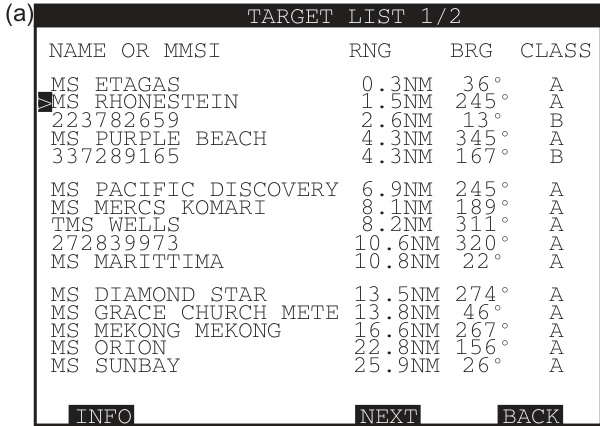  

【处理失败：内存不足或无法生成有效响应】

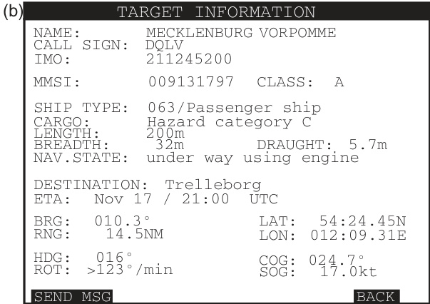  
FIGURE 6.13 Examples of textual AIS data: (a) textual data display from vessels transmitting in the AIS area and (b) textual data display relating to one vessel in the AIS text list.  

【翻译】
图6.13 文本AIS数据示例：（a）来自船舶在AIS区域传输的文本数据显示和（b）与单一船舶相关的AIS文本列表中的文本数据显示。

【解读】
该图展示了两种不同形式的AIS（自动识别系统）文本数据的显示方式。一种是来自多艘船舶在AIS区域内传输的数据，另一种则是针对特定一艘船舶的详细信息。这说明AIS系统不仅能够接收和处理来自各个来源的数据，还能根据需要筛选出特定船舶的信息，以便于监控和管理。

【词汇表】
| 英文词汇 | 中文翻译 | 解释 |
| --- | --- | --- |
| AIS | 自动识别系统 | 一种用于船舶位置报告和识别的电子导航辅助系统 |
| Vessels | 船舶 | 指各种类型的船只或海上浮动装置 |
| Transmitting | 传输 | 数据或信号从一个地方发送到另一个地方的过程 |
| Textual Data | 文本数据 | 以文字形式呈现的信息或数据 |

# 6.10.2 AIS Integrated with ARPA  

The facility to have integrated ARPA and AIS data on one target tracking display is a prominent feature of IMO Performance Standard in Section 11.2. The AIS data is fed from the stand-alone device and can be superimposed on top of the ARPA data. The observer can choose to display or not display the additional AIS vector data. The navigator can also select a specific AIS target and can:  

【翻译】
国际海事组织（IMO）性能标准第11.2节的一个突出特点是，可以在一个目标跟踪显示器上集成ARPA和AIS数据。AIS数据来自独立设备，可以叠加到ARPA数据之上。观察员可以选择是否显示额外的AIS矢量数据。导航员还可以选择特定的AIS目标，并且可以：

【解读】
本段主要介绍了国际海事组织（IMO）对船舶自动识别系统（AIS）和雷达自动跟踪辅助系统（ARPA）的集成要求。这种集成使得观察员和导航员能够更方便地获取和使用相关数据，从而提高了船舶的安全性和效率。

【词汇表】
| 英文词汇 | 中文翻译 | 解释 |
| --- | --- | --- |
| ARPA | 雷达自动跟踪辅助系统 | 一种利用雷达技术自动跟踪和识别目标的系统 |
| AIS | 自动识别系统 | 一种用于船舶之间以及船舶与岸基站之间交换信息的系统，以提高海上交通安全性 |
| IMO | 国际海事组织 | 联合国下属的一个专门机构，负责制定全球海事安全、保安和环境保护的标准和规范 |

a. Obtain the equivalent information to an ARPA target (range, bearding, course, speed, CPA, TCPA), plus the actual target name. This is usually displayed alongside the comparable radar target text displays of data.   
b. Request a further display of detailed AIS information associated with that target (IMO number, navigational status, AIS class, ETA, destination, number of persons onboard, etc.). This is usually accessed through a menu page.  

【翻译】
a. 获取与ARPA目标（范围、方位、航向、速度、CPA、TCPA）等效的信息，同时获取实际的目标名称。这通常与可比拟的雷达目标文本显示数据一起显示。
b. 请求显示与该目标相关的详细AIS信息（IMO编号、导航状态、AIS类别、ETA、目的地、船上人员数量等）。这通常通过菜单页面访问。

【解读】
该段落描述了如何从自动识别系统（AIS）中获取有关特定目标的信息，包括基本信息如位置、速度等，以及更为详细的信息，如国际海事组织编号、预计到达时间等。这些信息对于航运安全和管理至关重要，可以通过相应的界面或菜单来访问。

【词汇表】
| 英文词汇 | 中文翻译 | 解释 |
| --- | --- | --- |
| ARPA | 自动雷达测角和距离系统 | 一种用于测量目标距离和方向的雷达系统 |
| AIS | 自动识别系统 | 用于船舶之间及船舶与岸基站之间交换航行信息的系统 |
| IMO number | 国际海事组织编号 | 船舶的唯一标识码，由国际海事组织分配 |
| ETA | 预计到达时间 | 预计抵达某一地点的时间 |
| CPA | 最近接近点 | 船舶在不改变当前航向的情况下，最接近另一船舶的点 |

Additionally, in this combined ARPA/AIS/ target tracking display menu system, there is usually a copy of many of the AIS functions found on the stand-alone AIS equipment indicated in Section 6.10.1. Thus, AIS information displayed by the ownship can be checked on the ARPA/AIS/target tracking device and also some of the updating of the own ship AIS information can be done within the ARPA/ AIS/target tracking display which is then sent to the AIS device which transmits the AIS messages.  

【翻译】
此外，在这个综合的ARPA/AIS/目标跟踪显示菜单系统中，通常会包含许多独立AIS设备（如第6.10.1节所述）中的AIS功能副本。因此，自身船舶的AIS信息可以在ARPA/AIS/目标跟踪设备上进行检查，同时也可以在ARPA/AIS/目标跟踪显示界面上更新部分自身船舶的AIS信息，然后发送到AIS设备以传输AIS消息。

【解读】
该段描述了一个综合系统，该系统集成了自动雷达测距和方位仪（ARPA）、自动识别系统（AIS）以及目标跟踪等功能。它强调了该系统与独立AIS设备之间的兼容性和数据共享能力，用户可以通过综合系统查看和更新自身船舶的AIS信息，并将这些信息传输出去。

【词汇表】
| 英文词汇 | 中文翻译 | 解释 |
| --- | --- | --- |
| ARPA | 自动雷达测距和方位仪 | 一种用于检测和跟踪其他船舶或物体的雷达系统 |
| AIS | 自动识别系统 |一种用于交换船舶位置、速度和方向等信息的系统，以提高海上安全性 |
| Target Tracking | 目标跟踪 | 指定系统跟踪和监视特定目标（如其他船舶）的能力 |

# 6.10.2.1 Sleeping and Active AIS Targets  

As well as having the ability to totally remove all AIS targets from the display, it is also possible to filter the targets being shown. These targets are not removed from the display completely, but are all designated as ‘sleeping’ targets and are typically shown as very small isosceles triangles which display no vector or target identification detail. However, the acute angle of the triangle should be indicating the heading of the AIS target. The full IMO approved list of symbols is given in Section 11.2.3.  

【翻译】
除了能够完全从显示屏上删除所有AIS目标外，还可以筛选出要显示的目标。这些目标不会被彻底地从显示屏上移除，而是被标记为“休眠”状态，并且通常以非常小的等腰三角形表示，这些三角形不显示任何矢量或目标识别细节。然而，三角形的锐角应该指示AIS目标的航向。国际海事组织（IMO）批准的完整符号列表见第11.2.3节。

【解读】
本段主要讨论了AIS（自动识别系统）目标在显示屏上的管理方式，包括完全删除和筛选两种方法。筛选出的目标会被标记为“休眠”状态，以特殊的图形（小三角形）表示，不显示详细信息，但仍然保留了基本的方向信息。这一功能有助于用户根据需要定制显示内容，提高操作效率。

【词汇表】
| 英文词汇 | 中文翻译 | 解释 |
| --- | --- | --- |
| AIS | 自动识别系统 | 一种用于船舶、航空器等交通工具的位置报告和识别系统 |
| Filter | 筛选 | 过滤掉某些信息，只显示特定内容 |
| Isosceles Triangle | 等腰三角形 | 一种几何图形，两边长相等 |
| Vector | 矢量 | 在数学和物理学中，表示大小和方向的量 |

The criteria for targets to become sleeping targets may vary from manufacturer to manufacturer. Some allow individual selection, but the manufacturers can provide the ability to filter the AIS targets on the basis of range, CPA/TCPA and target class (Class A, B, etc.). Most also have some kind of area control, so that targets outside a designated area are automatically designated as sleeping, while those inside the area are designated as active AIS targets and are shown on the display with name and appropriate vector. The filter status of AIS targets should be clear to users.  

【翻译】
成为“休眠目标”的标准可能因制造商而异。有些允许个别选择，但制造商可以根据距离、CPA（最接近点）/TCPA（时间最近点）和目标类别（A类、B类等）对AIS目标进行筛选。大多数设备还具备某种区域控制功能，以便在指定区域外的目标自动被标记为“休眠”，而在该区域内的目标则被标记为活动AIS目标，并在显示屏上以名称和适当的矢量形式呈现。AIS目标的筛选状态应清晰地向用户展示。

【解读】
本段主要讨论了AIS（自动识别系统）目标的筛选标准和功能。不同的制造商可能有不同的标准来决定哪些目标应该被视为“休眠”目标，即不主动显示或提醒的目标。同时，许多设备都提供了区域控制和筛选功能，让用户能够根据自己的需求定制显示内容，从而更好地管理和监控周围环境。

【词汇表】
| 英文词汇 | 中文翻译 | 解释 |
| --- | --- | --- |
| AIS | 自动识别系统 | 一种用于船舶之间及船舶与岸基站之间交换航行信息的系统 |
| CPA/TCPA | 最接近点/时间最近点 | 预测两物体在未来一段时间内最接近的时刻和位置 |
| Filter | 筛选 | 根据一定条件过滤数据或信号的过程 |
| Vector | 矢量 | 在图形界面中表示方向和大小的线段 |

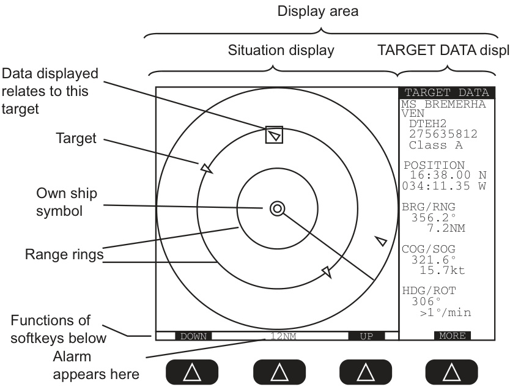  
FIGURE 6.14 Example of graphical AIS display on stand-alone equipment.  

【翻译】
图6.14独立设备上自动识别系统（AIS）的图形显示示例。

【解读】
该图展示了一个独立设备上的自动识别系统（AIS）如何以图形方式呈现信息，使用户能够直观地了解船舶位置、航向等关键数据。

【词汇表】
| 英文词汇 | 中文翻译 | 解释 |
| --- | --- | --- |
| AIS | 自动识别系统 | 一种用于船舶之间以及船舶与岸基站之间交换海上交通信息的技术 |
| Graphical Display | 图形显示 | 以视觉图形形式呈现信息的方法 |
| Stand-alone Equipment | 独立设备 | 能够独立运行，不需要连接到其他系统或网络的设备 |

The controls to move the boundaries of the area again vary between manufacturers, but IMO have specified that it is the same area shape that defines the limits of both ‘active’ AIS data and automatic acquisition of radar targets (see Sections 6.9.8.2 and 4.2.3). It can by a point, click and drag on the display itself or more usually within the menu system of the display. In this latter option, the observer selects digital values of the distance ahead, port, starboard and astern of vessel and/or relative bearings defining radial lines which define the area. This sharing of the same area works quite well in practice, partly because the same areas of the target display are of interest to the observer, and partly because automatic acquisition is not actually used by many observers.  

【翻译】
控制移动区域边界的方法在不同制造商之间各有不同，但国际海事组织（IMO）规定，这一相同的区域形状定义了“主动”AIS数据和雷达目标自动获取的限制（见第6.9.8.2节和第4.2.3节）。这一操作可以通过直接在显示屏上点击、拖拽，也可以在菜单系统中进行。后者需要观察员选择距离船只前方、左侧、右侧和后方的数字值，以及/或相对方向角，来定义区域的半径线。这一共享相同区域的方式在实践中运作良好，部分原因是同样的目标显示区域对观察员来说很感兴趣，另外因为许多观察员实际上并不使用自动获取功能。

【解读】
本段主要讨论的是船舶导航系统中区域设置的控制方法及其特点。国际海事组织（IMO）对此进行了规范，确保了“主动”AIS数据和雷达目标自动获取的区域限制的一致性。这种设置方式既可以通过直观的图形界面，也可以通过菜单选项来实现，提高了操作的灵活性和便捷性。同时，文章指出这种共享区域的设定在实践中效果良好，因为它满足了观察员的需求，同时也考虑到了自动获取功能的实际应用情况。

【词汇表】
| 英文词汇 | 中文翻译 | 解释 |
| --- | --- | --- |
| AIS | 自动识别系统 | 一种用于船舶位置报告和识别的自动化系统 |
| Radar Targets | 雷达目标 | 指雷达系统检测到的目标，如其他船舶或障碍物 |
| Relative Bearings | 相对方向角 | 指目标相对于观察者的方向角度 |
| Automatic Acquisition | 自动获取 | 系统自动锁定和跟踪目标的功能 |

Finally, at low-range scales, the isosceles triangle symbol can be replaced by an outline (to scale) of a target vessel, based on the dimensions of the target being broadcast in the AIS message.  

# 6.10.2.2 Data Fusion  

IMO (Section 11.2.1) also requires that where a tracked radar target and AIS information are clearly the same physical target, they should appear as one target and the AIS symbols and alphanumeric text should be displayed by default. This is called data fusion and is intended to make the display less cluttered for the observer. However, the observer should have the ability to change the display of the target symbol and alphanumeric data to that provided by the ARPA or the AIS.  

The algorithms to make this decision as to whether an AIS and ARPA target is the same target are specific to the manufacturers. Within the AIS section of the menu system, there are normally criteria which the observer can adjust which are used for making this decision. For example, it could specify the maximum differences in:  

a. Distance between the AIS and radar positions (probably in metres).   
b. Heading (in degrees).   
c. Speed (in knots).  

In this case, if the AIS and ARPA targets are less than all three limits, then the targets would appear as one.  

Again, it is important that the observer understands how the display is making decisions on what information is being displayed.  