7  

# Radar Plotting Including Collision Avoidance  

# 7.1 INTRODUCTION  

It may be argued that the prime function of the radar system is avoidance of collision, either with other vessels, with navigation marks or land in restricted visibility. After the initial euphoria of being able to detect other vessels in fog, the plethora of accidents involving vessels equipped with radar left no doubt as to the need for systematic observation of the radar display and for proper techniques for the extraction of data relating to other vessels. The method by which this information has been displayed to the navigator has seen a steady progression from paper plotting sheets via true-motion displays to the present-day automatic radar plotting aids (ARPAs). All have sought to provide the mariner with the most meaningful portrayal of the situation in the proximity of his ship and with the least amount of distraction to the other bridge routines. In order to understand the more complex operations performed by ARPAs and for the benefit of those who are not so fortunate as to have that aid or where it has broken down, it is still necessary to have a fair degree of skill and dexterity in practical plotting. To maintain this dexterity, it is essential to engage in regular practice, preferably in clear weather where visual confirmation of results will build confidence in the information obtained when using the radar in restricted visibility.  

【翻译】
有人可能会认为雷达系统的主要功能是避免碰撞，无论是与其他船只、航行标志或在能见度受限的情况下靠近陆地。最初能够在雾中探测到其他船只时的欣喜若狂之后，大量装备了雷达的船只发生的事故无疑证明了需要系统性地观察雷达显示屏以及提取有关其他船只的数据的适当技术。向导航员展示这些信息的方法已经从纸质绘图表开始，经历了真实运动显示，直到现在的自动雷达绘图辅助设备（ARPAs）。所有这些都旨在为水手提供最有意义的情景描述，同时尽量减少对其他桥梁日常操作的干扰。为了理解ARPAs执行的更复杂的操作，并且为了帮助那些没有这种辅助工具的人或者是在这种工具失灵时，仍然需要具备相当程度的实际绘图技能和灵活性。为了保持这种灵活性，定期进行练习是必要的，最好是在晴天进行，因为视觉确认结果可以增强在有限能见度条件下使用雷达获得信息的信心。

【解读】
本段讨论了雷达系统在海上导航中的作用，特别是它如何帮助避免碰撞。作者指出，即使拥有雷达，也不能完全依赖技术，而是需要结合人工观察和技巧来确保安全。随着技术的进步，如ARPAs的出现，虽然提高了效率，但也要求操作者具备基本的雷达操作和数据分析能力，以便在任何情况下都能有效利用这些工具。

【词汇表】
| 英文词汇 | 中文翻译 | 解释 |
| --- | --- | --- |
| radar system | 雷达系统 | 一种使用电磁波探测和定位物体的系统，广泛用于航空和海事领域。 |
| navigation marks | 航行标志 | 用于引导船只安全航行的标志，包括灯塔、浮标等。 |
| ARPA | 自动雷达绘图辅助设备 |一种现代化的雷达系统，能够自动追踪和显示周围环境的变化。

This chapter covers the basics of plotting from a manual plotting perspective. It also covers electronic aids to plotting. This chapter concludes with a section on the use of radar and ARPA for collision avoidance.  

【翻译】
本章涵盖了从手动绘图角度出发的基本绘图知识，同时也介绍了电子辅助绘图工具。最后，本章以雷达和ARPA在碰撞避免中的应用为结尾。

【解读】
这段话主要是对一章内容的概述，介绍了该章节的主题，即绘图的基础知识，从传统的手动绘图方法到现代的电子辅助工具，以及利用雷达和ARPA（自动雷达定位辅助）系统来避免碰撞的方法。这表明该章节旨在为读者提供一个全面了解绘图技术的发展和应用。

【词汇表】
| 英文词汇 | 中文翻译 | 解释 |
| --- | --- | --- |
| Plotting | 绘图 | 指创建图表或图纸上的标记过程 |
| Electronic aids | 电子辅助工具 | 使用电子设备来辅助完成某项任务的工具或软件 |
| Radar | 雷达 | 无线电探测和定位系统，使用无线电波来检测和定位物体 |
| ARPA | 自动雷达定位辅助 | 一种使用雷达信号来自动识别和跟踪其他船只或障碍物的系统 |

# 7.2 THE RELATIVE PLOT  

Since the radar is carried along by the vessel as it proceeds, the direct measurements obtainable are always relative to the observing vessel (see Section 1.5.1). Thus, in order to determine the true courses and speeds of other vessels, it is necessary to resolve this observed relative or apparent track into its components by using a knowledge of the own ship’s true course and speed. The means by which this may be achieved ranges from pencil-on-paper plotting sheets via reflection plotters and true-motion displays to computer-based collision-avoidance systems. Irrespective of the mechanism used, if a complete appreciation of the dynamic situation in the vicinity of the own ship is to be obtained, the relative track of targets must be systematically recorded and the true track derived by means of a plot (manual or ARPA). The techniques employed to extract the relevant data by manual methods and the use to which it is put will form the major part of this chapter. Failure to carry out systematic observation has resulted in many dangerous misconceptions (Figure 7.1). An older generation of navigators reliant on manual methods often used the excuse that the method was laborious and slow. However, such lapses still occasionally occur with modern navigators with ARPA equipment.  

【翻译】
由于雷达随着船舶移动，因此可以获得的直接测量结果总是相对于观察船舶而言的（见第1.5.1节）。因此，要确定其他船舶的真实航向和速度，必须通过了解自身船舶的真实航向和速度，将观察到的相对或显现轨迹分解为其组成部分。实现这一点的方法从铅笔在纸上绘制图表到反射绘图仪、真实运动显示器，再到基于计算机的碰撞避免系统等各种形式。无论使用何种机制，如果要获得对自己船舶周围动态情况的完整理解，都必须系统地记录目标的相对轨迹，并通过手动或自动雷达辅助绘图（ARPA）来推导出真实轨迹。本章的主要内容将介绍如何通过手动方法提取相关数据以及这些数据的应用。未能进行系统观察导致了许多危险的误解（图7.1）。过去一代依赖手动方法的导航员常常以这种方法耗时且缓慢为借口，但是，即使是配备有ARPA设备的现代导航员，也偶尔会出现这样的疏忽。

【解读】
本段讨论了雷达在船舶导航中的应用，特别强调了需要将观察到的相对轨迹转换为真实轨迹，以便于判断其他船舶的位置和速度。同时也指出了系统观察的重要性，以及如果不这样做可能造成的后果。

【词汇表】
| 英文词汇 | 中文翻译 | 解释 |
| --- | --- | --- |
| Relative track | 相对轨迹 | 指的是相对于观察者（如船舶）而言的目标物体的运动路径 |
| True track | 真实轨迹 | 指的是目标物体在绝对坐标系下的实际运动路径 |
| ARPA | 自动雷达辅助绘图 | 一种利用雷达信号自动跟踪和预警碰撞的系统 |
| Collision-avoidance | 碰撞避免 | 指的是为了防止船舶之间发生碰撞

If systematic observations are made of the bearing and range of a displayed echo and the positions are plotted on a traditional plotting sheet, the line joining the plotted positions will depict the target’s apparent track OA (Figure 7.2), which if extended will enable a measurement of the target’s closest point of approach, CPA, to be obtained. The time to closest point of approach, TCPA, can be obtained by stepping off the rate from $O$ to $A$ along OA extended to CPA. This does of course assume that both vessels maintain their present courses and speeds. If this condition is not met, the apparent track will not be uniform, that is the echo will not move across the screen in a constant direction at a constant rate.  

It is important to realize that the measurements obtained thus far are only subject to those errors inherent in the radar system itself, the azimuth stabilization (see Sections 7.9.1 and 7.9.2) and in the observations. They are therefore uncontaminated by errors (or blunders) to which other inputs notably the own ship’s speed ! might be subjected. For this reason, relative track (or the relative plot) is probably the most reliable, although not the only data on which to base decisions.  

【翻译】
必须认识到，迄今为止获得的测量结果只受雷达系统本身、方位稳定化（见7.9.1和7.9.2节）以及观察到的错误的影响。因此，这些测量结果不受其他输入可能存在的错误（或失误）的影响，特别是自己的船速。因此，相对轨迹（或相对图）可能是最可靠的数据，尽管不是唯一的决策依据。

【解读】
这段话强调了在使用雷达系统进行测量时，需要考虑系统自身的错误，以及观察过程中的错误。同时，也提到了方位稳定化对测量结果的影响。作者认为，由于这些测量结果不受其他外部因素的干扰，因此相对轨迹是较为可靠的数据，可以作为决策的参考。

【词汇表】
| 英文词汇 | 中文翻译 | 解释 |
| --- | --- | --- |
| Azimuth | 方位 | 指物体在水平面上的方向角度 |
| Stabilization | 稳定化 | 指使系统保持稳定的过程或技术 |
| Uncontaminated | 不受污染 | 指没有受到外界错误或干扰的影响 |
| Relative track | 相对轨迹 | 指两个物体之间的相对运动轨迹 |

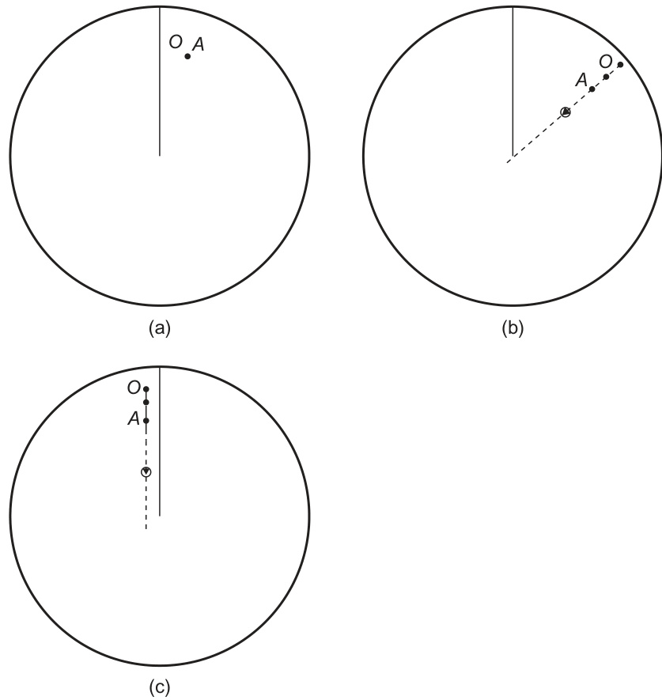  
FIGURE 7.1 Common misinterpretations of relative-motion displays. (a) The target, believed to be stopped, is in fact on the same course and proceeding at the same speed as the own ship. (b) A vessel which might be expected, if observed visually at night, to be showing both sidelights, i.e. to be head-on and to present no threat, is in fact crossing broad starboardto-port and on a collision course. (c) The target appears to be proceeding slowly on a reciprocal course, showing a red light; it is actually being overtaken and showing a stern light.  

【翻译】
图7.1 相对运动显示的常见误判。（a）被认为已经停下的目标实际上与自己的船只在同一航向上，以相同的速度行进。（b）如果在夜间通过肉眼观察，一艘可能会预期看到两侧灯光（即正面相对且无碰撞危险）的船只，事实上却是从右舷到左舷横过且处于碰撞航线上。（c）目标看起来似乎正在缓慢地沿着相反航向行进，显示出红色灯光；它实际上是在被超越，并且显示的是尾部灯光。

【解读】
本段落讨论了相对运动显示中容易出现的误判情况，提到了三种常见的情况：第一种情况是当目标物体实际上与观察者所在的船只保持相同的航向和速度时，却被误以为已经停下；第二种情况是某艘船只在夜间观察时可能被误认为是正面相对而没有碰撞风险，但实际上它正处于与观察者的碰撞航线上；第三种情况是目标物体看起来好像在缓慢移动并显示红色灯光，而实际上它正被超越并显示的是尾部灯光。这三个例子强调了在判断相对运动时需要谨慎和准确的观察。

【词汇表】
| 英文词汇 | 中文翻译 | 解释 |
| --- | --- | --- |
| relative-motion displays | 相对运动显示 | 指的是两个或多个物体之间的相对位置和运动状态的表现形式 |
| own ship | 自己的船只 | 指的是观察者所在的船只 |
| collision course | 碰撞航线 | 指的是两艘船只可能发生碰撞的航向 |
| reciprocal course | 相反航向 | 指的是两个方向相反的航向 |
| overtaken | 被超越 | 指的是一艘船只被另一艘船只超过或赶上 |

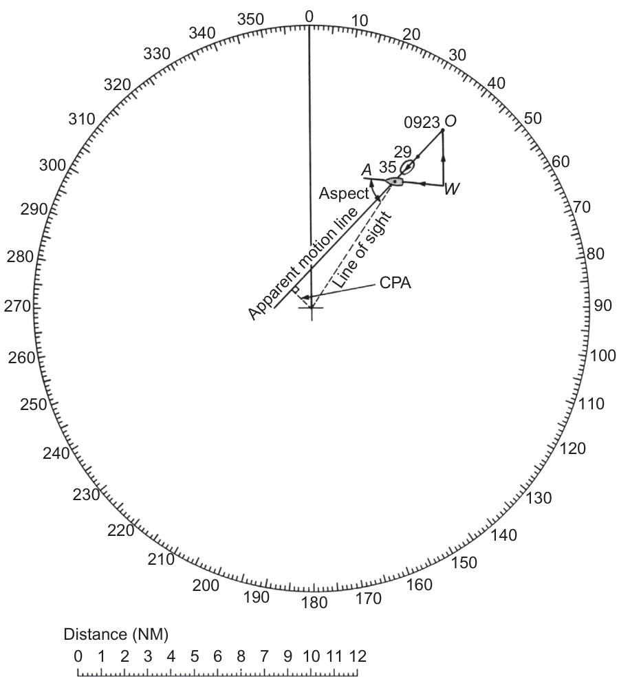  
FIGURE 7.2 The relative-motion plot.  

【翻译】
图7.2 相对运动图。

【解读】
该图显示了两个物体之间相对运动的情况，通常用于物理学或工程学中描述两个物体之间的位置关系和运动状态。

【词汇表】
| 英文词汇 | 中文翻译 | 解释 |
| --- | --- | --- |
| Relative motion | 相对运动 | 指两个物体之间的相对位置和运动状态 |
| Plot | 图表 | 一种用来表示数据或关系的视觉表现形式 |
| Figure | 图片、图表 | 在文章或书籍中插入的图片或图表，用以说明某一观点或概念 |

While CPA and TCPA are two important pieces of information, it is essential that, prior to manoeuvring the own ship, the true course and speed of the target(s) are derived and this can only be done by resolving the vector triangle.  

【翻译】
虽然CPA（最接近点）和TCPA（时间到达最接近点）是两项重要信息，但在操纵自己的船只之前，必须推导出目标的真实航向和速度，而这只能通过解析矢量三角形来实现。

【解读】
本段强调了在进行船只操纵前，准确获取目标物体的运动状态（包括航向和速度）的重要性。这涉及到矢量三角形的解析，以便能够做出正确的判断和操作。

【词汇表】
| 英文词汇 | 中文翻译 | 解释 |
| --- | --- | --- |
| CPA | 最接近点 | 指船只与目标之间最近距离的位置 |
| TCPA | 时间到达最接近点 | 指船只到达与目标最近距离的时间点 |
| Vector Triangle | 矢量三角形 | 一种数学模型，用于描述两个或多个物体之间的相对运动关系 |

# 7.2.1 The Vector Triangle  

By plotting the apparent track of a target and with a knowledge of the own ship’s true course  

【翻译】
通过绘制目标的视觉轨迹，并结合对自身船只真实航向的了解，

【解读】
这段话描述的是一种导航或追踪技术，涉及到记录和分析目标物体（可能是另一艘船）的运动轨迹，同时考虑到自己的船只的实际行进方向。这项技术可能用于军事、海上救援或者其他需要精确位置信息的情境中。

【词汇表】
| 英文词汇 | 中文翻译 | 解释 |
| --- | --- | --- |
| plot | 绘制、记录 | 在图表上标记或记录某物的轨迹或位置 |
| apparent track | 视觉轨迹 | 从观察者的角度看起来的目标物体的运动路径 |
| true course | 真实航向 | 船只实际的行进方向，与其预期或计划的路线可能不同 |

and speed, it is possible to determine the true course and speed of the target (Figure 7.3).  

【翻译】
通过距离和速度，可以确定目标的真实航向和速度（图7.3）。

【解读】
本段主要讨论如何利用距离和速度这两个参数来确定目标物体的实际运动方向和速度。这通常应用于导航、追踪等领域，通过测量距离和速度可以精确地计算出目标的真实状态。

【词汇表】
| 英文词汇 | 中文翻译 | 解释 |
| --- | --- | --- |
| target | 目标 | 指需要被跟踪或监控的对象 |
| course | 航向 | 指移动物体的行进方向 |
| speed | 速度 | 指物体运动的快慢程度 |

# 7.2.2 The Plotting Triangle  

# EXAMPLE 7.1 (USED IN FIGURES 7.2 AND 7.4)  

While steering $090^{\circ}$ (T) at 12 knots, the echo of a vessel is observed as follows:  

0923 echo bearing $127^{\circ}$ (T) at 9.5 NM   
0929 echo bearing $126^{\circ}$ (T) at $8.0\mathrm{NM}$   
0935 echo bearing $124^{\circ}$ (T) at 6.5 NM.  

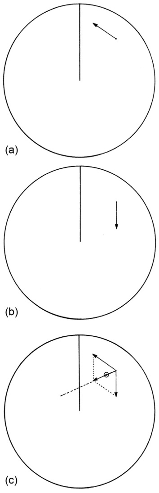  
FIGURE 7.3 The vector triangle. (a) With the own ship stopped, target moves with true course and speed. (b) With target stopped, the own ship movement causes the target to appear to move. (c) The resultant track of the echo when both vessels are moving.  

【翻译】
图7.3矢量三角形。（a）当自己的船停靠时，目标物以真实航向和速度移动。（b）当目标物静止不动时，自己的船只的运动使得目标物似乎在移动。（c）当两艘船同时移动时，回声的轨迹。

【解读】
这段文字描述的是雷达或声纳系统中，两个移动物体（如船只）之间相对运动的原理。通过分析不同情况下的运动关系，可以确定目标物的真实航向和速度，以及自身船只的运动对观测结果的影响。这对于海上导航、追踪目标等应用至关重要。

【词汇表】
| 英文词汇 | 中文翻译 | 解释 |
| --- | --- | --- |
| Vector Triangle | 矢量三角形 | 描述两个物体相对运动关系的几何模型 |
| True Course | 真实航向 | 目标物实际的移动方向 |
| Resultant Track | 结果轨迹 | 当两艘船同时移动时，回声的最终运动路径 |

c. Lay off a line to represent the apparent track of a stationary target, from O, opposite to the direction of the heading line.   
d. Plot at least one intermediate position of the target to ascertain that its apparent track is not changing. Insert the time.   
e. Plot the final position, with the time, and label it A. Ensure that the apparent track is consistent in direction and rate. Join OA and label it thus.   
f. Produce the apparent-track line OA to find the CPA and the TCPA.   
g. The ‘plotting interval’ is the time between the readings of range and bearing for O and A. Calculate the distance that the own ship has steamed in this time and plot the position in which you would expect to find the stationary target W at the end of the plotting interval. (OW is derived from the own ship’s speed and course reversed.)   
h. If $A$ and W coincide, the target is stationary. If they do not, the line $W$ to $A$ represents the proper track of the target in the plotting interval.   
i. ‘Aspect’ is measured between the ‘line of sight’ and the WA direction as in Figure 7.4.  

The data relating to the target in Figure 7.4 as extracted from the plot at 0935 is as follows:  

【翻译】
图7.4中目标的数据，如下所示，是在0935时从图中提取的：

【解读】
本段主要介绍了图7.4中目标的数据提取时间和方式，说明了数据来源于特定时间（0935）的图表中。

【词汇表】
| 英文词汇 | 中文翻译 | 解释 |
| --- | --- | --- |
| target | 目标 | 指图7.4中的特定对象或区域 |
| extracted | 提取 | 从原始数据或图表中获取特定信息的过程 |
| plot | 图表 | 一种用于展示数据关系的视觉化表现形式 |

Course: $008^{\circ}$ (T); CPA: $1.0\mathrm{NM}.$ ; Aspect: Red $65^{\circ}$ Speed: $11\mathbf{kn}$ TCPA: in 26 minutes.  

At 0935, determine the target’s true course and speed; CPA and TCPA; and aspect.  

【翻译】
在0935时，确定目标的真实航向和速度；最接近点（CPA）和时间到最接近点（TCPA）；以及方位。

【解读】
本段落描述的是一种海事或航海操作中的一个步骤，具体是在某一特定时间（0935）需要确定目标物体（可能是船只）的实际行进方向、速度，以及与观察者的位置相关的一些关键参数，如最接近点（CPA）和时间到最接近点（TCPA），同时还要考虑目标的方位。这通常用于航海安全、交通管制或者军事作战等领域，以便于规划和执行相应的行动。

【词汇表】
| 英文词汇 | 中文翻译 | 解释 |
| --- | --- | --- |
| CPA | 最接近点 | Closest Point of Approach，即目标物体与观察者之间最近距离的位置 |
| TCPA | 时间到最接近点 | Time to Closest Point of Approach，即从当前时刻到目标物体与观察者之间最近距离的时间 |
| Aspect | 方位 | 指目标物体相对于观察者的方向或姿态 |

# 7.2.3 The Construction of the Plot  

a. Draw in the own ship’s heading line on the plotting sheet.   
b. Plot the first position of the target. Label it O. Insert the time.  

【翻译】
a. 在绘图纸上画出自己的船舶航向线。
b. 标记目标的初始位置，并标记为O，同时记录时间。

【解读】
这段话描述的是海军或航海领域中用于导航和跟踪目标的基本步骤。首先，需要在绘图纸（plotting sheet）上确定自己船舶的方向，这样才能有一个参照系来判断相对位置和运动方向。接着，标记目标的初始位置，并给予一个标识（本例中为“O”），同时记录下当前的时间。这一步骤对于后续的追踪、计算速度和预测目标未来位置至关重要。

【词汇表】
| 英文词汇 | 中文翻译 | 解释 |
| --- | --- | --- |
| plotting sheet | 绘图纸 | 用于绘制和记录航海数据的特殊纸张 |
| target | 目标 | 需要被跟踪或监视的对象，如其他船只、飞机等 |
| heading line | 航向线 | 表示船舶当前航向的线条 |

It can be seen that, whichever orientation is used for the plot, the answers obtained will be the same, but some consideration must be given to the actual practicalities of plotting and the way in which the results are to be used. Where it is not possible to compass-stabilize the radar display (see Section 1.4.1), the ship’s head-up display will be the obvious choice. Where the radar display is capable of being compass-stabilized, it makes good sense to orientate the plot in the same way as the radar display, that is true-north-up when the radar display is truenorth-up, especially when the vessel is on a southerly heading. There can be considerable confusion and even potential danger in trying to relate a ship’s head-up plot to a displayed radar picture which is ‘upside down’, for example when heading south. Course-up radar display and paper plot orientation is also a possible option, but is best avoided as it is a common outcome of radar target plotting that the own ship alters course and therefore loses the benefit of the ‘new’ course being at the top of the display. On the other hand, when conning the vessel and therefore relating the plot to the visual scene ahead of the vessel, it is sensible to orientate the display and to plot the ship’s head-up or course-up accordingly.  

【翻译】
无论使用哪种方向来绘制航向图，得到的答案都相同，但必须考虑实际的绘制实用性以及结果的使用方式。当无法使雷达显示屏进行指南针稳定（见第1.4.1节）时，船舶的头部显示屏是明显的选择。当雷达显示屏可以进行指南针稳定时，将航向图与雷达显示屏以相同的方式定向是有意义的，即当雷达显示屏为真北朝上时，也将其设置为真北朝上，特别是在船舶向南行驶时。试图将船舶的头部显示图与“倒置”的雷达显示图片关联起来可能会造成很大的混乱甚至潜在危险，例如当向南行驶时。航向雷达显示屏和纸质绘制图的方向也是一个可能的选项，但最好避免，因为雷达目标绘制的一个常见结果是自己的船只改变航向，从而失去新航向出现在显示屏顶部的优势。另一方面，当控制船舶并且因此需要将绘制图与船舶前方的视觉场景关联起来时，以头部显示或航向显示的方式来定向显示屏和绘制船舶是合理的。

【解读】
本段讨论了在海上导航中，如何选择适当的方向来绘制航向图。它强调了根据实际情况选择合适的方向，以避免混淆和潜在危险。同时也提到了不同类型的雷达显示屏和它们对导航的影响。

【词汇表】
| 英文词汇 | 中文翻译 | 解释 |
| --- | --- | --- |
| compass-stabilize | 指南针稳定 | 使设备或显示保持指南针方向不变 |
| true-north-up | 真北朝上 | 以地图上的北极为上方的显示方式 |
| course-up | 航向朝上 | 以当前航向为上方的显示方式 |
| conning | 控制、驾驶 | 操控船舶的行为 |

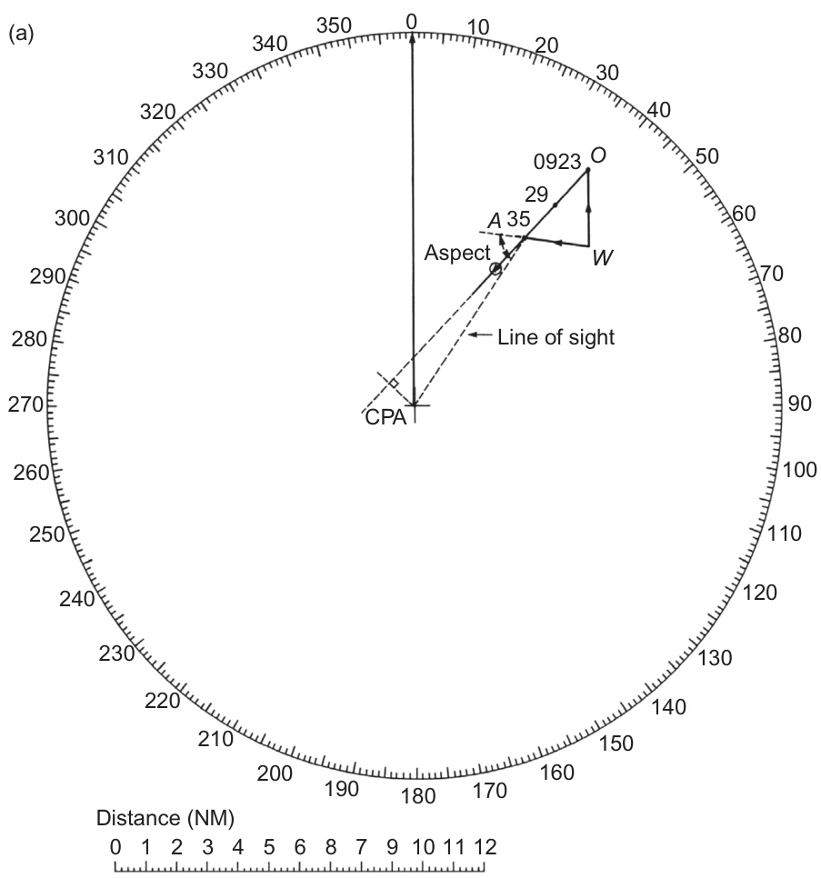  
FIGURE 7.4 (a) The relative plot for Example 7.1 ship’s head-up. (b) True-north-up.  

【翻译】
图7.4（a）示例7.1中船头朝上的相对位置图。（b）真北向上图。

【解读】
该段落描述的是一张航海或导航相关的图表，具体来说是关于一个船只在不同方向下的相对位置图。图7.4分为两部分：（a）表示船头朝上的情况，而（b）则表示真北向上的情况。这可能是在讨论导航系统或设备如何根据不同的参照系显示信息。

【词汇表】
| 英文词汇 | 中文翻译 | 解释 |
| --- | --- | --- |
| Relative plot | 相对位置图 | 一种显示对象相对于其他物体或参照系位置关系的图表 |
| True-north-up | 真北向上 | 指导航系统中以地理北极为准的方向指示方式 |
| Head-up | 头朝上 | 船只或飞行器等物体的前进方向与其自身坐标系的对齐方式 |

# 7.2.4 The Practicalities of Plotting  

The way in which the plot is constructed in practice is very different from the way in which one theoretically tackles a plot, such as the example in Section 7.2.2. In the first place, ranges and bearings are obtained only at intervals of some 3 6 minute (not all at the same time), and it is unlikely that the plotter will be able to enjoy the luxury of radar plotting as a dedicated task, having rather to dovetail this activity into the many other bridge duties. If plotting is not to become all-consuming, or if it results in peaks and troughs of activity, some wrinkles will have to be adopted to assist in spreading the load:  

【翻译】
实际上构建情节的方式与理论上的处理方法大不相同，就像第7.2.2节中的例子一样。在第一点，范围和方位只在某些间隔（约3-6分钟）获得，而不是同时获得，而且绘图员不太可能能够享受雷达绘图作为专门任务的奢侈，因为他们必须将这项活动融入到许多其他桥梁职责中。如果绘图不能成为全部消耗，或者如果它导致活动的高峰和低谷，那么就需要采取一些措施来帮助分配负载。

【解读】
本段讨论了实际操作中构建情节或绘制航线的挑战。由于信息的获取是间歇性的，且需要同时处理多项任务，因此难以高效地完成绘图工作。这要求绘图员必须灵活地安排时间和任务，以避免工作量过大或出现忙闲不均的情况。

【词汇表】
| 英文词汇 | 中文翻译 | 解释 |
| --- | --- | --- |
| plot | 情节、航线 | 指的是船舶或飞机的行进路线或轨迹 |
| tackle | 处理、解决 | 在这里指的是理论上或实践中对待某一问题或任务的方法 |
| dovetail | 融合、衔接 | 指的是将不同的事物或任务结合起来，使其协调一致 |
| all-consuming | 全部消耗、占据全部时间 | 描述某事物或活动占用了所有的时间或精力 |
| peaks and troughs | 高峰和低谷 | 比喻性地描述事情的高潮和低迷时期 |

a. Always draw in the heading line before starting to plot.   
b. When a target is first plotted, draw in OW and graduate it in 3 minute steps up to  

【翻译】
a. 开始绘制之前，请务必画出标题线。
b. 当目标第一次被绘制出来时，画出OW并以3分钟为步长进行标度，直到

【解读】
这段文字似乎是关于制图或导航的指南，强调在开始绘制之前要先画出标题线，并且当一个目标被首次绘制出来时，要对其进行标度。这可能是在某种特定环境下，如航空、海事或地理信息系统中使用的技术步骤。

【词汇表】
| 英文词汇 | 中文翻译 | 解释 |
| --- | --- | --- |
| heading line | 标题线 | 指导航或制图中的参考线 |
| plot | 绘制/情节 | 在这里指的是在图表上标记位置或轨迹 |
| target | 目标 | 指需要被定位或跟踪的物体或位置 |
| graduate | 标度 | 为测量或计数提供标记或间隔 |

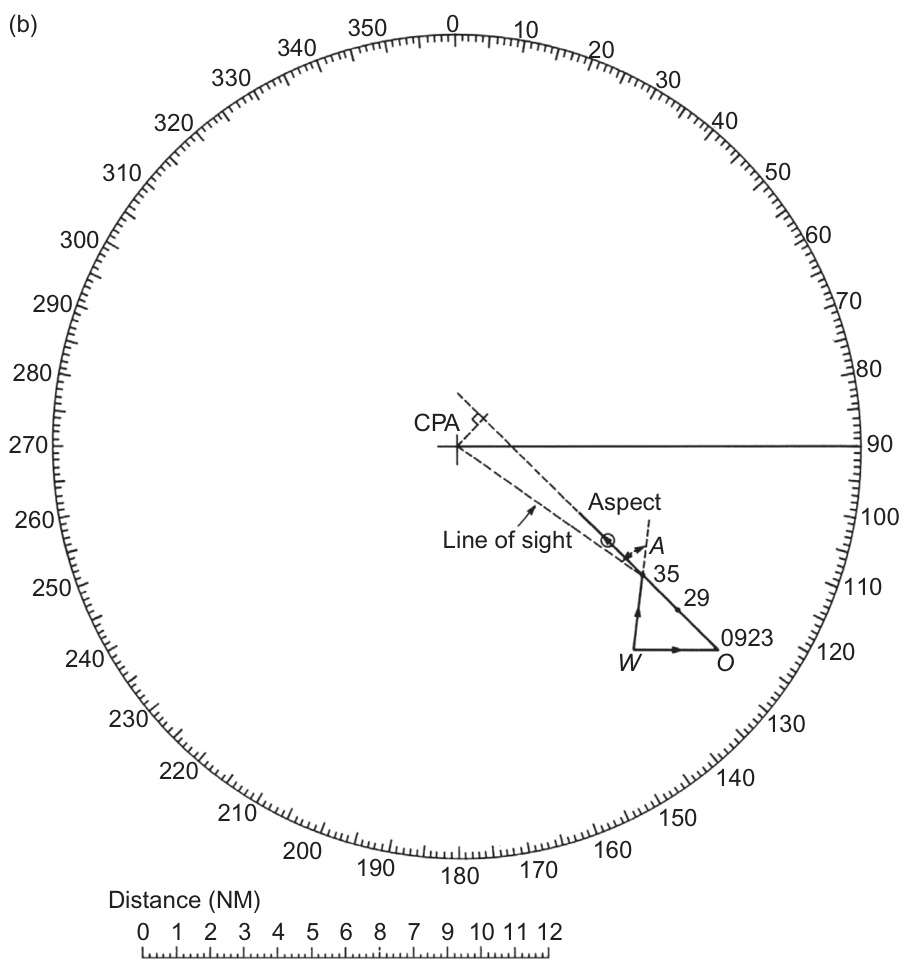  
FIGURE 7.4 (Continued)  

【处理失败：内存不足或无法生成有效响应】

about 12 minutes. This is not to suggest that one should plot slavishly at 3 minute intervals but, rather, that one should plot when the opportunity arises and interpolate visually between the 3 minute graduations on the OW line.  

【翻译】
大约12分钟。这并不意味着应该每隔3分钟就机械地绘制一次图表，而是当机会出现时进行绘制，并在OW线上的3分钟刻度之间进行视觉插值。

【解读】
本段强调了在绘制图表时应灵活掌握时间间隔，不必死板地遵循固定的3分钟间隔，而是根据实际情况选择合适的时机进行绘制，并利用视觉来估算和插值未明确标记的时间点。

【词汇表】
| 英文词汇 | 中文翻译 | 解释 |
| --- | --- | --- |
| plot | 绘制、.plot | 指在图表上标记或记录数据点 |
| slavishly | 机械地、死板地 | 表示完全按照规则或惯例行事，没有任何灵活性或创造力 |
| interpolate | 插值 | 指通过已知数据点来估算或计算未知数据点的值 |
| visually | 视觉地 | 指通过眼睛观察或感知来进行判断或估算 |

The frequency with which the target should be plotted is dependent on a number of factors, namely, the range, the approach rate and the CPA. A target which is closing fast will require more frequent plots than, say, one which the observing vessel is slowly overhauling.  

【翻译】
目标应该被绘制的频率取决于多种因素，包括射程、接近速度以及最接近点（CPA）。一个快速靠近的目标需要比慢速超越的目标更频繁地进行绘制。

【解读】
本段讨论的是在航海或军事领域中，如何根据不同的情况来决定目标的跟踪频率。它强调了射程、接近速度以及最接近点等因素对跟踪频率的影响，特别是当目标快速靠近时，需要更高的跟踪频率以确保准确性和安全性。

【词汇表】
| 英文词汇 | 中文翻译 | 解释 |
| --- | --- | --- |
| frequency | 频率 | 指事件发生或重复的次数或速度 |
| plot | 绘制/跟踪 | 在图表上标记或记录某物的位置或运动轨迹 |
| CPA | 最接近点 | 指两艘船只或物体之间最近距离的位置 |
| overhauling | 超越 | 指一艘船只或车辆超过另一艘船只或车辆 |

c. Make a quick, early plot after, say, 3 minutes. Although the triangle will be small and not particularly accurate, it will  

【翻译】
C. 在大约3分钟后快速绘制一个初步的图形。虽然三角形会很小且不特别准确，但它仍然能够为我们提供一些基本信息。

【解读】
本段主要强调在进行某种测量或计算时，快速获得一个初步结果的重要性，即使这个结果可能并不完全准确。这种方法可以帮助人们迅速地对情况有一个大致的了解，从而更好地规划下一步骤。

【词汇表】
| 英文词汇 | 中文翻译 | 解释 |
| --- | --- | --- |
| plot | 绘制图形 | 创建一个简单的图表来表示数据或关系 |
| triangle | 三角形 | 一种几何形状，由三个点和连接它们的线段组成 |
| accurate | 准确的 | 能够精确地描述事物或情况的状态 |

give early warning of the potential of the encounter which is arising and allow time for some pre-planning. Do not wait 12 minutes before drawing the first triangle   
d. Obtain at least three consistently spaced positions in a reasonably straight line before being prepared to make a decision based on the plot.   
e. Plotted positions should be in a reasonably straight line and spaced at distance intervals which are related to the time intervals between the plots. Where a plotted position appears significantly different from what is anticipated, it should be investigated immediately for an error either in reading the range and bearing from the  

【翻译】
提前预警可能出现的遭遇情况，并为事先规划留出时间。不要等到12分钟后才开始绘制第一个三角形。
d. 在做出决定之前，应至少获得三个在合理直线上均匀分布的位置，在绘制图表时，这些位置应与时间间隔相关联。
e. 绘制的位置应该大致呈直线分布，且间距应与绘制之间的时间间隔相对应。当某个绘制位置明显偏离预期时，应立即调查是否存在读取距离和方位的错误。

【解读】
本段落主要讨论的是如何有效地进行航海或军事侦察中的位置跟踪和决策过程。它强调了及早发现潜在的遭遇、提前规划以及确保位置数据的准确性和一致性的重要性。通过获取多个位置点并检查它们是否沿着一条合理的直线分布，可以帮助识别和纠正错误，从而做出更好的决策。

【词汇表】
| 英文词汇 | 中文翻译 | 解释 |
| --- | --- | --- |
| encounter | 遭遇 | 指两个或多个对象（如船只、飞机）之间的接近或相遇 |
| pre-planning | 事先规划 | 为未来事件或行动做出的准备工作 |
| consistently spaced | 均匀分布 | 指多个点或物体按照一定规律排列，间距相等 |
| plotted positions | 绘制位置 | 在图表或地图上标记的位置点 |

radar or in plotting the position. Where a change in apparent track is found to have occurred, a new triangle should be started (see Section 7.4).  

【翻译】
在雷达上或绘制位置图时，如果发现有明显的轨迹变化，就应该开始一个新的三角测量（见第7.4节）。

【解读】
这段话主要讨论了如何使用雷达或者其他方法来跟踪和记录物体的运动轨迹。当检测到物体的运动方向发生变化时，需要重新开始一个新的三角测量，以确保准确地记录下来的位置和轨迹。这是导航和追踪技术中非常重要的一步，能够帮助提高定位和预测的精度。

【词汇表】
| 英文词汇 | 中文翻译 | 解释 |
| --- | --- | --- |
| radar | 雷达 | 无线电探测和定范围距离系统的缩写，用于探测和跟踪物体 |
| plot | 绘制、.plotting | 指在图表或地图上标记或记录某物的位置或轨迹 |
| triangle | 三角测量 | 一种利用三个已知点来确定未知点位置的测量方法 |
| apparent track | 明显的轨迹变化 | 指通过观察或测量得出的物体运动方向的改变 |

f. Only essential lines should be put on the plot and then kept to a minimum in length. Extending WA beyond $A$ should be avoided as it can be dangerously misleading and mistaken for an indication of CPA. On the other hand, OA should not be stopped short but extended at least beyond CPA.   
g. It can be extremely helpful, especially when other officers are likely to observe the plot, to adopt some standard form of labelling (the labelling used in all figures in this text conforms with the United Kingdom Department of Transport’s recommendations).   
h. Times should be placed alongside each plotted position. This is essential when the plotting interval varies as it can justify the unequal spacing of the positions. ‘Minutes’ are quite sufficient, with the occasional indication of the hour.   
i. TCPA should be given as the ‘time to elapse’, that is ‘CPA in 16 minutes’ rather than ‘CPA at $1743^{\prime}$ which is far less meaningful to someone who has then to check the time and subtract mentally. Also, time to elapse will in itself convey the degree of urgency in the situation.   
j. After some 12 minutes there should be no real need to continue plotting bigger and bigger triangles, but it is essential to continue to plot positions and ensure that the target’s apparent track is being maintained. As soon as the apparent track is observed to change, a new plot should be commenced (see Section 7.4).   
k. Neatness is essential at all times. An untidy plot lines everywhere, no labels, with times not related closely to plots, crossings out, etc. ! is likely to be more of a hindrance than a help. There is no merit in  

a plot which even the plotter has difficulty in understanding.  

【翻译】
一个连策划者自己都难以理解的情节。

【解读】
这句话形容某个情节或计划非常复杂，以至于甚至是制定这个计划的人也很难完全理解它。这通常用来描述那些过度复杂、自相矛盾或者逻辑混乱的故事、阴谋或方案。

【词汇表】
| 英文词汇 | 中文翻译 | 解释 |
| --- | --- | --- |
| plot | 情节、计划 | 指的是故事中的事件发展或者是一个人为达到某种目的而制定的计谋或安排。 |
| plotter | 策划者、阴谋者 | 是指制定计划或情节的人，可能带有负面含义，暗示该人在进行秘密或不道德的活动。 |
| difficulty | 困难、困境 | 表示遇到的障碍或挑战，使得事情难以完成或理解。 |

l. The range scale on which to plot requires some consideration. As a general rule, plots should be initiated on the 12 NM range scale, but two differing requirements can arise. Where targets are likely to be closing fast, the earlier the plot is commenced the better, in which case the 12 NM range scale should be adequate; when targets are close, a shorter (3 or 6 NM) scale should be in use, possibly off-centred. The advantages of the shorter range scale are that there is better intrinsic accuracy, and that changes in the target’s movement are quickly and easily identifiable. As a target closes, a shorter range scale should be selected, but the plotter should, at intervals, temporarily return to the longer range scale(s) to search for newly arrived targets which could be a potential threat.  

【翻译】
绘制图表所需的范围尺度需要一些考虑。一般规则是，从12海里范围尺度开始绘制，但可能会出现两种不同的需求。当目标可能快速接近时，越早开始绘制越好，这种情况下12海里范围尺度应该足够；当目标靠近时，应使用较短（3或6海里）的尺度，可能会偏离中心。较短范围尺度的优点是具有更好的内在准确性，并且可以快速、轻松地识别出目标运动的变化。当目标接近时，应选择较短的范围尺度，但绘图人员应定期暂时返回到较长的范围尺度，以搜索新到的可能构成潜在威胁的目标。

【解读】
本段主要讨论了在绘制目标运动轨迹时选择合适的范围尺度的重要性。根据目标的距离和速度，选择不同的范围尺度可以提高绘制的准确性和效率。特别是在目标快速接近的情况下，及早开始绘制并选择合适的范围尺度至关重要。

【词汇表】
| 英文词汇 | 中文翻译 | 解释 |
| --- | --- | --- |
| Range scale | 范围尺度 | 用于测量距离的比例尺度 |
| Intrinsic accuracy | 内在准确性 | 不受外界条件影响的测量精度 |
| Off-centred | 偏离中心 | 指标或物体位置不在预期的中心位置 |
| Potential threat | 潜在威胁 | 可能造成危害或损失的潜在风险 |

# 7.2.5 The Need to Extract Numerical Data  

Plotting theory provides for the extraction of data in numerical form but this takes time and is needed only rarely. Also, the precision with which it is displayed often belies its accuracy and therefore the reliance which can be placed upon it.  

【翻译】
绘图理论可以用来提取数值形式的数据，但这需要时间，而且通常只在很少的情况下才需要。此外，显示的精度往往掩盖了其准确性，因此也就难以确定对它的依赖程度。

【解读】
本段讨论的是绘图理论在数据提取方面的局限性。虽然它能够提供数值形式的数据，但是这个过程耗时且通常并不常用。另外，数据的显示精度可能会让人误以为其准确性，从而影响对这些数据的信任程度。

【词汇表】
| 英文词汇 | 中文翻译 | 解释 |
| --- | --- | --- |
| Plotting theory | 绘图理论 | 一种用于数据可视化和分析的数学方法 |
| Extraction | 提取 | 从某个来源中获取或抽取数据的过程 |
| Precision | 精度 | 数据或测量结果的准确程度 |
| Accuracy | 准确性 | 数据或测量结果与真实值之间的一致性 |

Of the information normally available on a clearly constructed plot, CPA and the target’s aspect/course should be directly observable with sufficient accuracy and without precise measurement. The target’s speed should be mentally assessable by visual comparison with the own ship’s speed vector, that is by comparing WA with WO, which is known. By this means, the target’s aspect/course, speed and CPA should be obtainable with sufficient accuracy for the practical assessment of the situation, and only TCPA will require some form of measurement.  

【翻译】
在一个清晰构建的航线图中，通常可以直接观察到CPA（最接近点）以及目标物体的方位/航向，并且无需精确测量即可获得足够的准确度。通过视觉比较自己的船速矢量，可以大致评估出目标物体的速度，即通过比较WA与WO，这些信息都是已知的。通过这种方法，可以获得足够的准确度来评估情况，包括目标物体的方位/航向、速度和CPA，只有TCPA需要某种形式的测量。

【解读】
本段主要讨论如何在海上或其他环境中通过观察和简单的比较来评估目标物体的运动状态，特别是其相对位置、速度和预计最接近点（CPA）。这对于航海安全和避免碰撞至关重要。作者强调，大部分必要信息可以通过视觉观察和简单的比较获得，而不需要进行精确的测量。

【词汇表】
| 英文词汇 | 中文翻译 | 解释 |
| --- | --- | --- |
| CPA | 最接近点 | 指两个移动物体之间最近距离的时刻及其所处位置 |
| TCPA | 时间到最接近点 | 指从当前时刻到两个移动物体之间最接近点的时间间隔 |
| Aspect/Course | 方位/航向 | 指目标物体的方向和行进路线 |
| Speed Vector | 速度矢量 | 表示物体速度大小和方向的矢量 |

# 7.2.6 The Plot in Special Cases Where No Triangle ‘Appears’  

As can be seen in the cases shown in Figure 7.5, all of the vector values are represented but in some of the cases their value is zero, while in others, the vectors are superimposed, all of which requires a little more care in the drawing of the plot and its subsequent analysis.  

【翻译】
如图7.5所示的案例中，可以看到所有向量值都被表示出来，但在某些情况下，其值为零，而在其他情况下，向量是叠加的，这一切都需要在绘制图表及其后续分析时更加小心。

【解读】
本段强调了在绘制和分析图表时需要谨慎，因为向量值可能为零或相互叠加，从而影响结果的准确性。这要求进行者细致地处理数据和图表，以避免错误的结论。

【词汇表】
| 英文词汇 | 中文翻译 | 解释 |
| --- | --- | --- |
| superimposed | 叠加 | 指两个或多个物体或图形重叠在一起 |
| subsequent | 后续的 | 指发生或存在于某事之后 |
| analysis | 分析 | 指对数据、信息等进行详细检查和研究以得出结论的过程 |

# 7.3 THE TRUE PLOT  

The data given in Example 7.1 in Section 7.2.2 can alternatively be plotted on graph paper or on the chart as a ‘true plot’ (Figure 7.6), although it has never been in common use.  

【翻译】
在7.2.2节中的例子7.1中给出的数据也可以另外用图纸或曲线图来表示为“真实图”（图7.6），尽管这种方法从未被广泛使用过。

【解读】
本段主要讨论的是如何以不同方式呈现数据，特别是提到了可以使用图纸或者曲线图来绘制“真实图”，但同时指出这种方法并不常见。

【词汇表】
| 英文词汇 | 中文翻译 | 解释 |
| --- | --- | --- |
| plotted | 绘制、.plot | 将数据点标记在图表上 |
| graph paper | 图纸 | 特殊设计用于绘制图表的纸张 |
| true plot | 真实图 | 按照实际测量数据绘制的图表 |

In this case, the own ship’s course line is laid off on the plotting sheet and the own position marked. From this position the bearing and range of the target are laid off. The own ship’s position at, say, 3 minute intervals is then marked off along the course line. What will be obtained directly is the target’s course and the distance travelled in the plotting interval but, as already stated, perhaps the most important single piece of information available from a plot is the target’s CPA, which is not immediately available and must be determined by the following geometrical construction:  

【翻译】
在这种情况下，将自己的船舶航线标记在绘图纸上，并标注自己的位置。从这个位置出发，测量目标的方位和距离。然后，每隔3分钟，在航线上标记一下自己船舶的位置。直接获得的结果是目标的航向和在绘图间隔期间行驶的距离，但正如前面所述，可能最重要的一条信息是目标的最近接近点（CPA），这并不是立即可用的，必须通过以下几何构造来确定：

【解读】
本段主要讲述了如何利用绘图法来获取目标的航向、距离以及最近接近点等关键信息。通过在绘图纸上标记自己的船舶航线和位置，然后计算目标的方位和距离，可以初步获得目标的运动信息。但要得到目标的最近接近点，则需要进行进一步的几何构造，这一点对于航海安全和导航至关重要。

【词汇表】
| 英文词汇 | 中文翻译 | 解释 |
| --- | --- | --- |
| Plotting sheet | 绘图纸 | 用于记录和分析航海数据的特殊纸张 |
| Bearing | 方位 | 目标相对于观察者的方向角度 |
| Range | 距距 | 观察者与目标之间的距离 |
| CPA | 最近接近点 | 目标相对于观察者来说最近的接近点，用于评估碰撞风险 |

a. Lay off a line WO, parallel with the course line and of a length equal to the distance that the own ship has travelled in the plotting interval.   
b. Join O to the current position of the target $A$ and extend $O A$ to pass $O_{2},$ that is  

FIGURE 7.5 Plots where no triangle appears.  

【翻译】
图7.5 无三角形出现的情形。

【解读】
本段落主要是对一张图（图7.5）的描述，这张图展示了在某些情况下，没有三角形出现的情形。这可能是在讨论几何学或计算机科学中关于图形识别、几何构型等主题时用到的一个例子。

【词汇表】
| 英文词汇 | 中文翻译 | 解释 |
| --- | --- | --- |
| Figure | 图 | 指图表中的插图或示意图 |
| Plot | 情形 | 指特定条件下的表现形式或结果 |
| Triangle | 三角形 | 指由三个顶点和连接这些顶点的直线组成的几何形状 |

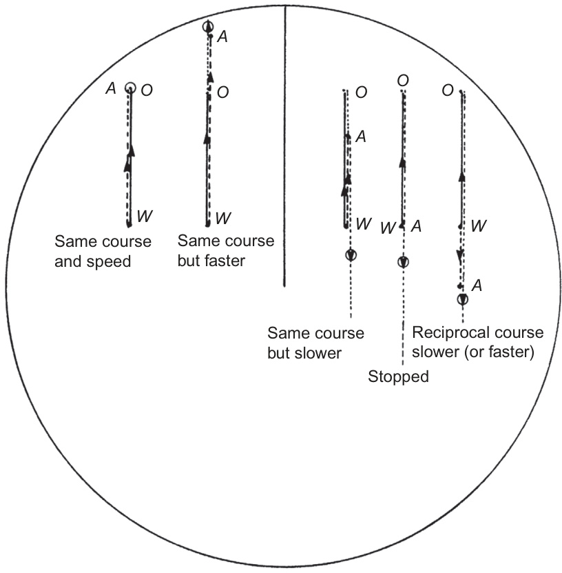  

【处理失败：内存不足或无法生成有效响应】

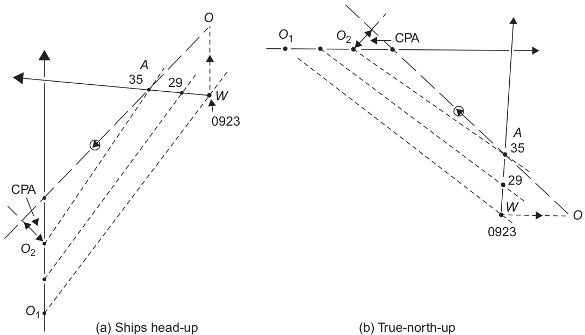  
FIGURE 7.6 The true plot for Example 7.1.  

【翻译】
图7.6是示例7.1的真实曲线图。

【解读】
该图表展示了示例7.1中函数或关系的真实曲线图像，可能用于数学、物理或工程等领域的分析和研究。

【词汇表】
| 英文词汇 | 中文翻译 | 解释 |
| --- | --- | --- |
| Figure | 图表 | 一种用来表示数据或概念的视觉表现形式 |
| Plot | 曲线图 | 一种显示两个变量之间关系的二维图形 |
| True | 真实的 | 在此指实际存在或准确的曲线图像 |

the own ship’s current position, thus giving CPA. The static situation is identical with that depicted in Figure 7.4 and the required information is extracted in the same way. To this extent, relative and true plots are equally valid, but some practical points are worth noting:  

【翻译】
因此，可以得出自己的船舶当前位置，从而得到CPA（最接近点）。静态情况与图7.4中所示的情况相同，所需信息也是以同样的方式提取出来的。在这一方面，相对和真实的图表同样有效，但有一些值得注意的实际问题：

【解读】
本段主要讨论的是如何通过获取自身船舶的当前位置来计算最接近点（CPA），以及在静态情况下，相对和真实的图表具有同等的参考价值。但同时也指出，在实际操作中需要考虑一些细节问题。

【词汇表】
| 英文词汇 | 中文翻译 | 解释 |
| --- | --- | --- |
| CPA | 最接近点 | Closest Point of Approach，即两船之间最近距离的位置 |
| static situation | 静态情况 | 指不考虑时间变化或运动因素的状态 |
| relative plots | 相对图表 | 与某一参照系相关的图表 |
| true plots | 真实图表 | 根据绝对坐标或参照系绘制的图表 |

i. The convenience of a bearing scale and range circles on a relative plotting sheet are not possible with a true plot where the own position is continually moving. In plotting the target’s position, protractor (or equivalent) and dividers will have to be used and the operation will be somewhat slower.   
ii. Each target position will have to be laid off from the own ship’s current position, which can be very timeconsuming if a number of targets are being plotted.   
iii. Any error in plotting the own ship’s position (i.e. an error in the course and/or speed input) will result in an error in the directly obtained answer,  

【翻译】
i. 在相对绘图纸上使用方位标度和范围圆是很方便的，但是在真实绘图中，由于自身位置不断变化，这种方便是不可能的。在绘制目标位置时，将不得不使用量角器（或等效工具）和分划尺，因此操作会稍微慢一些。
ii. 每个目标位置都需要从当前的自身船只位置开始测量，如果有多个目标被绘制出来，这将非常耗时。
iii. 如果在绘制自身船只位置时出现任何错误（即航向和/或速度输入中的错误），那么直接获得的答案也将出现错误。

【解读】
这段话主要讨论了使用相对绘图和真实绘图两种方法来确定目标位置的区别和挑战。相对绘图提供了便捷的方式来测量距离和方向，但真实绘图由于自身位置的不断变化，则需要更多的手动计算和校正，从而导致操作变慢且容易出错。

【词汇表】
| 英文词汇 | 中文翻译 | 解释 |
| --- | --- | --- |
| Bearing scale | 方位标度 | 一种用于测量角度和方向的刻度标记 |
| Protractor | 量角器 | 用于测量角度的工具 |
| Dividers | 分划尺 | 用于测量距离和划分线段的工具 |
| True plot | 真实绘图 | 根据实际位置和运动情况进行的绘图 |

that is the course and speed of the target. Note. If this error is repeated when laying off WO the CPA of the target will in fact be correct. iv. Perhaps the most disconcerting feature of this plotting technique is the temporary nature of the apparent-track line (Figure 7.7). It is essential to appreciate that the ‘displayed’ CPA relates to only one the own ship’s position, after which the apparent-track line can be at worst misleading. Where a number of targets are being plotted on the same sheet, apparent-track lines can relate to different own ship positions.  

【翻译】
这就是目标的航向和速度。注意，如果在摆放WO时重复此错误，则目标的CPA（最接近点）实际上是正确的。四、也许这种绘图技术最令人不安的特征是明显轨迹线的临时性质（图7.7）。必须认识到“显示”的CPA只与自己的船舶位置有关，一旦超出这个位置，明显轨迹线可能会产生误导。在同一张纸上同时对多个目标进行绘图时，明显轨迹线可能与不同的自身船舶位置相关。

【解读】
本段主要讨论了一种绘图技术中关于目标的轨迹预测和自身船舶位置关系的问题，强调了需要注意自身船舶位置变化对目标轨迹预测的影响，以避免产生误导。

【词汇表】
| 英文词汇 | 中文翻译 | 解释 |
| --- | --- | --- |
| CPA | 最接近点 | 指两艘船或物体之间最近的距离点 |
| WO | 工作区 | 可能指的是某种操作区域或界限 |
| apparent-track line | 明显轨迹线 | 在绘图中表示目标相对于观察者移动的路径 |
| own ship's position | 自身船舶位置 | 指观察者的船舶当前所处的位置 |

In general, where manual plotting has to be carried out, time is of the essence and in this respect the relative plot, is better. For this reason the subsequent treatment will assume the use of the relative plot, except in the now obsolescent case of reflection plotting on a true-motion display. In the latter case, a true plot was easily and quickly produced.  

【翻译】
一般来说，在需要进行手动绘制的情况下，时间至关重要，这方面相对图更为合适。因此，在后续处理中，将假设使用相对图，除非是在现在已经过时的真实运动显示上的反射绘制情况下。在这种情况下，真实图很容易且快速地产生。

【解读】
这段话讨论了在手动绘制的情况下，相对图比真实图更有优势，因为它能够节省时间。作者指出，只有在特定情况下，如使用真实运动显示的反射绘制，才会使用真实图，而在其他情况下，相对图是首选。

【词汇表】
| 英文词汇 | 中文翻译 | 解释 |
| --- | --- | --- |
| manual plotting | 手动绘制 | 人工进行的绘制过程 |
| relative plot | 相对图 | 与某一参考系相关的图表 |
| true plot | 真实图 | 反映实际运动或状态的图表 |
| obsolescent | 过时的 | 不再被广泛使用或已被取代的技术或方法 |

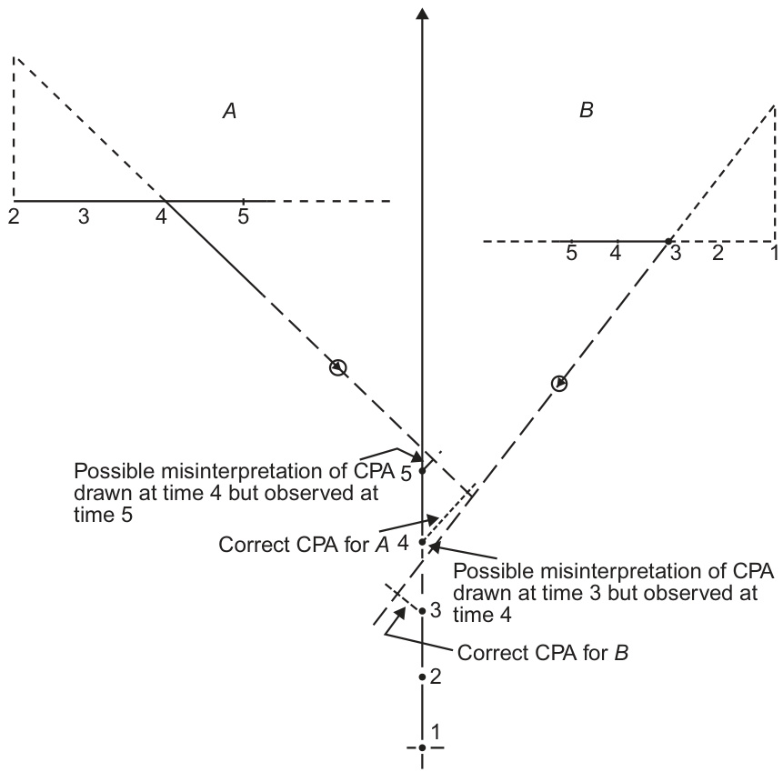  
FIGURE 7.7 The temporary nature of the apparent-track line on a true plot.  

【翻译】
图7.7：真实航迹图中视觉航线的暂时性质。

【解读】
这幅图展示了在真实的航行记录（true plot）中，一条看似连续的航线（apparent-track line）实际上是由多个独立的观测点组成的，而不是一条真正连续的路径。这说明了在导航和海洋研究中，需要考虑到观测数据的离散性和不确定性，以获得更准确的结论。

【词汇表】
| 英文词汇 | 中文翻译 | 解释 |
| --- | --- | --- |
| Apparent-track line | 视觉航线 | 在图表中根据观测数据画出的、看似连续的航线 |
| True plot | 真实航迹图 | 根据实际观测数据绘制的、反映真实情况的航行记录图 |
| Temporary nature | 暂时性质 | 指某种状态或现象的暂时存在或变化性质 |

# 7.4 THE PLOT WHEN ONLY THE TARGET MANOEUVRES  

# EXAMPLE 7.2 (USED IN FIGURE 7.8)  

Your own ship is steering $310^{\circ}$ (T) at a speed of 12 knots. Echoes are observed as follows:  

<html><body><table><tr><td>Time</td><td>Echo A</td><td>Echo B</td></tr><tr><td>0923</td><td>brg 270° (T) at 9.0 NM</td><td>brg 347° (T) at 9.5 NM</td></tr><tr><td>0929</td><td>brg 270° (T) at 7.5 NM</td><td>brg 346° (T) at 8.0 NM</td></tr><tr><td>0935</td><td>brg 270°(T) at 6.0 NM</td><td>brg 344° (T) at 6.5 NM</td></tr><tr><td>speed of each target.</td><td>(a) Determine the CPA, TCPA, course and</td><td></td></tr></table></body></html>  

Plotting is continued as follows:  

【翻译】
绘图过程如下所述继续进行：

【解读】
本段落介绍了一个过程或步骤的继续，可能是在数据分析、科学研究或者工程设计中使用绘图来展示数据或结果的下一步骤。

【词汇表】
| 英文词汇 | 中文翻译 | 解释 |
| --- | --- | --- |
| Plotting | 绘图 | 使用图表来表示数据或关系的过程 |
| Continued | 继续 | 表示某一过程或行动的延续 |
| Follows | 如下所述 | 指示接下来要描述的内容或步骤 |

0941 brg $270^{\circ}$ (T) brg $341^{\circ}$ (T) at at $4.5\mathrm{NM}$ $5.0\mathrm{NM}$   
0947 brg $253^{\circ}$ (T) brg $350^{\circ}$ (T) at at $2.8\mathrm{NM}$ $4.0\mathrm{NM}$   
0953 brg $206^{\circ}$ (T) brg $004^{\circ}$ (T) at at 1.7 NM 3.1 NM  

(b) Say what action each target has taken. (Your vessel maintains course and speed throughout.)  

【翻译】
（b）说明每个目标采取了什么行动。（您的船只在整个过程中保持航向和速度不变。）

【解读】
本段落要求描述每个目标（可能是其他船只或物体）的行为或反应，同时假设自己的船只保持稳定的航向和速度。这意味着需要观察和报告其他对象的动态变化，而自身的状态保持不变。

【词汇表】
| 英文词汇 | 中文翻译 | 解释 |
| --- | --- | --- |
| target | 目标 | 在此 contexto 指的是被观察或跟踪的对象，如其他船只或物体 |
| vessel | 船只 | 指的是进行观察或操作的船只 |
| course | 航向 | 指的是船只的行进方向 |
| speed | 速度 | 指的是船只的运动速度 |

The apparent-track line OA which is produced when determining CPA and TCPA depends upon four factors: the own ship’s course and speed, and the target’s course and speed. If any of these factors change then the apparenttrack line will also change. Changes in the own ship’s proper track are known (but in this example remain unchanged) and the resulting apparent track can be predicted (see Section 7.5), but where a change in the apparent track of the target is observed, the procedure set out in Section 7.4.1 should be followed to determine the change in the target’s proper track.  

【翻译】
当确定CPA（最接近点）和TCPA（时间到最接近点）时产生的视线OA取决于四个因素：自身船舶的航向和速度，以及目标物体的航向和速度。如果这些因素中的任何一个发生变化，那么视线也会随之改变。自身船舶正确轨迹的变化是已知的（但在这个例子中保持不变），从而可以预测出结果视线（见第7.5节）。但是，当观察到目标物体视线的变化时，应按照第7.4.1节所述的程序来确定目标物体正确轨迹的变化。

【解读】
本段主要讨论的是在海上导航过程中，如何根据自身船舶和目标物体的运动参数（包括航向和速度）来确定两者之间的相对位置和距离。特别强调了如果这些参数发生变化，视线（即两者之间的相对运动轨迹）也会随之改变。同时，也提到了如何通过特定程序来更新目标物体的正确轨迹，以便更准确地进行导航。

【词汇表】
| 英文词汇 | 中文翻译 | 解释 |
| --- | --- | --- |
| CPA | 最接近点 | Closest Point of Approach，即两船之间最近的距离点 |
| TCPA | 时间到最接近点 | Time to Closest Point of Approach，即到达最接近点所需的时间 |
| Apparent-track line | 视线 | 指两船之间的相对运动轨迹，在海上导航中用于判断安全距离和避碰措施 |
| Own ship | 自身船舶 | 指执行导航操作的船舶 |
| Target | 目标物体 | 指被观察或跟踪的另一个船舶或物体 |

Answer   

<html><body><table><tr><td></td><td></td><td>Target A</td><td>TargetB</td></tr><tr><td rowspan="5">(a)</td><td>CPA:</td><td>Collision</td><td>1.0 NM</td></tr><tr><td>TCPA:</td><td>24 minutes</td><td>25 minutes</td></tr><tr><td>Course:</td><td>040° (T)</td><td>226° (T)</td></tr><tr><td>Speed:</td><td>10 kn</td><td>10.5 kn</td></tr><tr><td>Target has altered course</td><td></td><td>Target has</td></tr><tr><td>(b)</td><td>only:50° to starboard</td><td></td><td>stopped</td></tr></table></body></html>

Note that target $B$ is similar to that used in the previous example and although, in this case, the bearings are re-orientated, the plots CPA and TCPA are identical.  

# 7.4.1 The Construction of the Plot (Figure 7.8)  

a. The own ship’s heading line should have been drawn in.   
b. The OAW triangle should have been constructed and the basic information extracted.   
c. Continue to plot the apparent track of the target, making sure the direction and rate are as predicted in the initial plot.   
d. As soon as a change in the target’s apparent track is noticed, plot more frequently and, when a new steady apparent track is established, choose a position, label it $O_{1}$ and insert the time.   
$W_{1}A_{1}=W A$ , therefore target speed has not changed, only course.   
Distance (NM) 0 1 2 3 4 5 6 8 7 9 10 11 12 L.ul.l..l.l...l..l..i.l..l.lld  

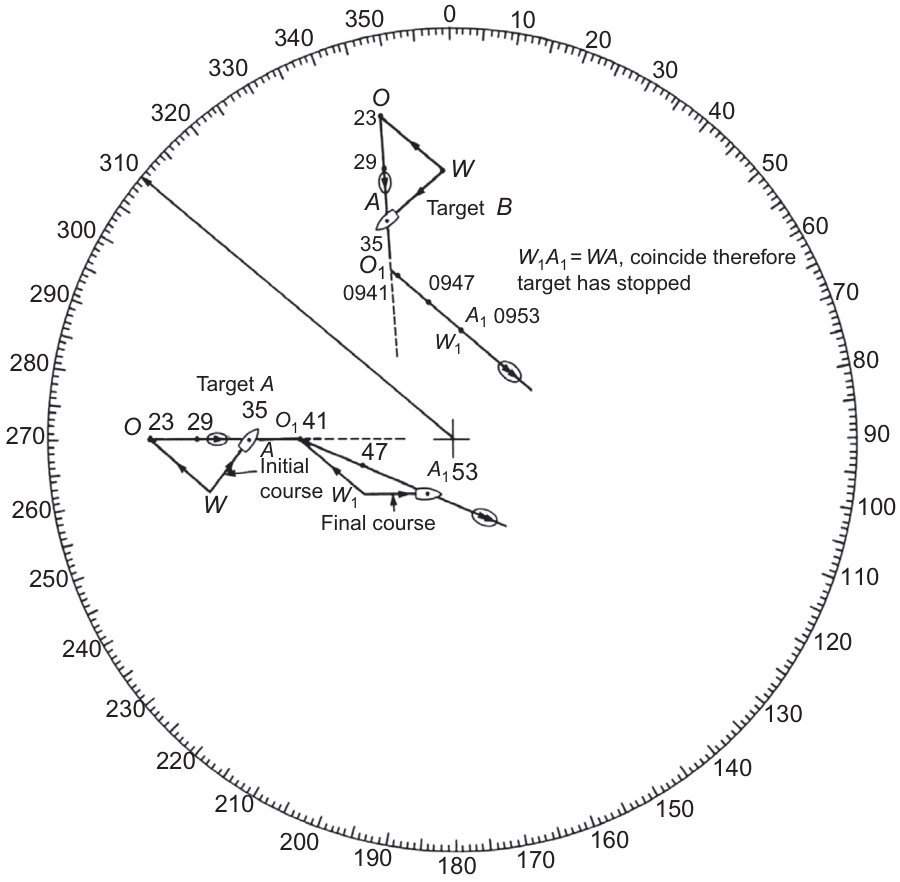  
FIGURE 7.8 The plot when only the target manoeuvres (Example 7.2).  

【翻译】
图7.8仅考虑目标机动（示例7.2）时的曲线图。

【解读】
该图显示了在特定条件下，即仅考虑目标机动的情况下的运动轨迹或状态变化，可能是某种模拟或分析结果的一部分。

【词汇表】
| 英文词汇 | 中文翻译 | 解释 |
| --- | --- | --- |
| Target | 目标 | 指定的对象或目的 |
| Manoeuvres | 机动、操纵 | 特指飞行器、船只等的操作或控制 |
| Plot | 曲线图、绘图 | 数据或关系的视觉表现形式 |

e. Plot the new apparent track as if it were a new target. Predict the new CPA and TCPA, also course and speed, from which any changes from the previous proper track may be noted.  

【翻译】
e. 将新的明显航迹绘制出来，就像它是一个新的目标一样。预测新的最近接近点（CPA）和时间最近接近点（TCPA），以及航向和速度，从而可以注意到与之前正确的航迹相比的任何变化。

【解读】
本段主要讨论的是如何处理和分析一个新出现的、可能被认为是目标的物体的运动轨迹。通过对其进行跟踪和预测，可以了解到该物体与之前已知的航迹之间的差异，这对于海事或航空领域的安全监控和导航系统来说非常重要。

【词汇表】
| 英文词汇 | 中文翻译 | 解释 |
| --- | --- | --- |
| CPA | 最近接近点 | 指两个移动物体在某一时刻之间最短距离的位置 |
| TCPA | 时间最近接近点 | 指两个移动物体在未来某一时刻之间最短距离的位置 |
| plot | 绘制、跟踪 | 在图表上标记或显示某物体的运动轨迹 |
| predict | 预测 | 根据现有数据或规律推断未来的情况或结果 |

# 7.4.2 The Danger in Attempting to Guess the Action Taken by a Target  

Since the change in the target’s apparent track can result from virtually any combination of changes in its course and speed, one should always construct a new plotting triangle and never attempt to assume a particular manoeuvre has taken place even though it fits in with what is both logical and desirable under the collision-avoidance rules. In the typical crossing situation shown in Figure 7.9, one might expect the target to give way by altering her course to starboard. While the change in apparent track would seem to indicate that this is what has happened, when the plot is completed it is clearly indicated that the target has in fact reduced her speed. If the observing vessel is subsequently presented with the development of a close-quarters situation with another vessel, the assessment of the appropriate manoeuvre will be dangerously flawed if it assumes the wrong heading for the preexisting target.  

【翻译】
由于目标的明显航迹变化可能是由其航向和速度的任何组合变化所致，因此应该始终构建一个新的绘图三角形，从不假设某种特定的机动已经发生，即使它符合碰撞避免规则下的逻辑和期望。在典型的交叉情况中，如图7.9所示，人们可能预计目标会通过改变航向到右舷让路。虽然目标的明显航迹变化似乎表明这是发生的事情，但当完成绘图后，很明显目标实际上减少了速度。如果观察船只随后面临与另一艘船发展成为近距离情况，评估适当的机动时如果假设原有目标的错误方向，将会产生危险的缺陷。

【解读】
本段强调在海事领域，特别是在遇到潜在的碰撞风险时，必须谨慎对待目标物体（如其他船只）的行为变化。由于目标的航向和速度变化可能导致其明显航迹的变化，因此不能简单地根据初步观察就假设目标采取了某种具体的行动。正确的做法是重新绘制航迹图，以确保获得准确的信息，这样才能做出恰当的反应以避免碰撞。

【词汇表】
| 英文词汇 | 中文翻译 | 解释 |
| --- | --- | --- |
| target | 目标 | 在此指其他船只或物体 |
| apparent track | 明显航迹 | 指目标物体看起来要走的路径 |
| manoeuvre | 机动 | 指船只进行的转向、加速等操作 |
| collision-avoidance rules | 碰撞避免规则 | 指用于避免碰撞的规则和协议 |
| close-quarters situation | 近距离情况 | 指两艘或以上船只之间非常接近的情况 |

# 7.5 THE PLOT WHEN THE OWN SHIP MANOEUVRES  

When it is decided (after assessment of the initial plot) that it is necessary for the own ship to manoeuvre, it is essential to determine the effect of that manoeuvre prior to its execution and to ensure that it will result in a safe passing distance. After the manoeuvre has been completed, plotting must be continued to ensure that the manoeuvre is having the desired effect.  

【翻译】
当决定（在评估初始航线后）需要自己的船只进行机动时，必须在执行之前确定该机动的效果，并确保它会导致安全的通过距离。在机动完成后，绘制必须继续，以确保机动正在产生预期的效果。

【解读】
本段强调了在海上驾驶中，特别是在遇到其他船只时，需要谨慎地规划和执行机动。首先要评估当前的情况，然后决定是否需要进行机动。如果决定进行机动，就必须提前计算好机动的效果，确保不会与其他船只发生碰撞或危险情况。同时，在机动完成后，还需要持续监测和调整，以确保机动达到预期的目的，保证安全通行。

【词汇表】
| 英文词汇 | 中文翻译 | 解释 |
| --- | --- | --- |
| manoeuvre | 机动、操纵 | 指船只或飞机等进行特定动作或改变方向的行为 |
| assessment | 评估、估计 | 对某事物或情况进行分析和判断的过程 |
| execution | 执行、实施 | 将计划或命令付诸行动的过程 |
| desired effect | 预期效果、理想结果 | 指人们希望达到的目标或结果 |

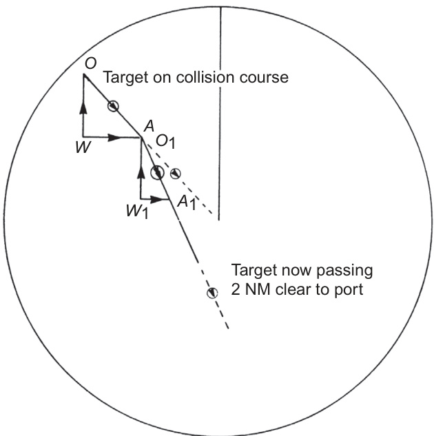  
FIGURE 7.9 The danger in attempting to guess the action taken by a target.  

【处理失败：内存不足或无法生成有效响应】

# 7.5.1 The Plot When the Own Ship Alters Course Only  

Because of the time taken for a change in speed to have any effect on the apparent-track line, the mariner will frequently select a change in course if it will achieve a satisfactory passing distance. This has some distinct advantages:  

【翻译】
由于改变速度对航迹线产生影响需要一定时间，水手通常会选择改变航向，如果这样可以获得满意的通过距离。这有几个明显的优势：

【解读】
本段讨论的是航海中的操舵决策，特别是在遇到其他船只时如何选择合适的行动以确保安全通过。改变航速可能需要较长时间才能生效，因此水手往往优先考虑改变航向，以便更快速地调整位置，保证安全距离。

【词汇表】
| 英文词汇 | 中文翻译 | 解释 |
| --- | --- | --- |
| mariner | 水手/ 航海员 | 指从事航海工作的人，包括船长、船员等。 |
| apparent-track line | 显现航迹线 | 指在特定条件下，船只似乎要经过的路径或轨迹。 |
| satisfactory passing distance | 满意的通过距离 | 指两艘船之间保持的足够安全距离，以避免碰撞风险。 |

a. It is quick to take effect.   
b. The vessel retains steerage way.   
c. The encounter may be more quickly cleared.   
d. It is more likely to be detected if the other vessel is plotting.   
e. It complies with the spirit of rule 8c (see Section 7.11.6).  

【翻译】
a. 它能够快速发挥作用。
b. 船只保持了可控航行状态。
c. 碰撞可能更快被排除。
d. 如果另一艘船正在绘制航线，它更有可能被发现。
e. 它符合规则8c的精神（见第7.11.6节）。

【解读】
该段落讨论的是船舶在遇险或潜在碰撞情况下的操作原则和应急措施，强调了快速反应、保持控制、尽早排除碰撞风险以及遵守相关海事规则的重要性。

【词汇表】
| 英文词汇 | 中文翻译 | 解释 |
| --- | --- | --- |
| Steerage | 可控航行状态 | 指船舶能够按照预期方向航行的状态 |
| Retains | 保持 | 在这里指船舶维持其可控状态 |
| Encounter | 碰撞或相遇 | 指两艘船舶之间可能发生的碰撞或近距离接触 |
| Plotting | 绘制航线 | 指使用导航工具来规划和记录船舶的航向和位置 |

# EXAMPLE 7.3 (USED IN FIGURE 7.10)  

With the own ship steering $000^{\circ}$ (T) at a speed of 12 knots, an echo is observed as follows:  

<html><body><table><tr><td>0923</td><td>Echo bears</td><td>037° (T) at</td><td>9.5 NM</td></tr><tr><td>0929</td><td>Echo bears</td><td>036° (T) at</td><td>8.0 NM</td></tr><tr><td>0935</td><td>Echo bears</td><td>034° (T) at</td><td>6.5 NM</td></tr></table></body></html>  

At 0935 it is intended to alter course $60^{\circ}$ to starboard (assume this to be instantaneous).  

a. Predict the new CPA and TCPA.   
b. Predict the new CPA and TCPA if the manoeuvre is delayed until 0941.   
c. Predict the range and bearing of the echo at 0953, if the (instantaneous) manoeuvre is made at 0941. Answer   
a. CPA is 4.4 NM, 13 minutes after the alteration, that is at 0948.   
b. CPA is 3.6 NM, 10 minutes after the alteration, that is at 0951.   
c. Predicted range is $3.8\mathrm{NM}$ on a bearing of $334^{\circ}$ (T).  

# 7.5.2 The Construction of the Plot (Figure 7.10)  

a. The original OAW triangle should have been drawn.   
b. With compasses at W and radius WO, draw an arc.   
c. Draw from W a line at an angle to port or starboard of WO, equal to the proposed alteration of course.   
d. Label as $O_{1}$ the point at which this line cuts the arc.   
e. Join $O_{1}$ to $A-$ this now represents the new apparent track in direction and rate.   
f. Draw in the ship’s new heading line and expunge the old heading line.   
g. Until the manoeuvre takes place, the target will continue to move down the original apparent-track line. Predict the position of the target at the time at which it is proposed to alter the own ship’s course and label it $O_{2}$ .   
h. Draw $O_{2}A_{2}$ parallel with and equal to $O_{1}A$ and produce if necessary to find the new CPA.  

Note:  

a. The prediction is based on the assumption that the target will maintain its course and speed. If the target also manoeuvres then the target will not follow the predicted apparent track in both direction and rate, and a new plot will have to be started.   
b. It is assumed that the alteration of course is instantaneous. For a more practical prediction, when manoeuvring at sea, to obtain a more realistic indication of the new CPA, one could predict the effect of the manoeuvre and check that it is acceptable. If so, bring the ship round to the new course and, when steadied on the new course, plot the position of the target and transfer the new apparent track, $O_{2}A_{2},$ through this position.  

# 7.5.3 The Plot When the Own Ship Alters Speed Only  

# EXAMPLE 7.4 (USED IN FIGURE 7.11)  

With the own ship steering $000^{\circ}$ (T) at a speed of 12 knots, an echo is observed as follows:  

<html><body><table><tr><td></td><td></td><td></td><td></td><td></td></tr><tr><td>0923</td><td>Echo bears</td><td>037° (T)</td><td>at</td><td>9.5 NM</td></tr><tr><td>0929</td><td>Echo bears</td><td>036° (T)</td><td>at</td><td>8.0 NM</td></tr><tr><td>0935</td><td>Echo bears</td><td>034° (T)</td><td>at</td><td>6.5 NM</td></tr></table></body></html>  

FIGURE 7.10 The plot when the own ship alters course only (Example 7.3).  

【翻译】
图7.10：当自身船只改变航向时的曲线（例7.3）。

【解读】
本段落描述的是一张图表，具体来说是第7.10号图，展示了当自己的船只改变航向时的情况，这是一个特定的例子——例7.3。这可能是在讨论导航或海事操作中关于如何调整航向以应对不同的情况。

【词汇表】
| 英文词汇 | 中文翻译 | 解释 |
| --- | --- | --- |
| Plot | 曲线/图表 | 一种用于显示数据关系的图形表示 |
| Own ship | 自身船只 | 指当前操作或讨论中的那艘船 |
| Alters course | 改变航向 | 调整船只的行进方向 |
| Example | 例子 | 具体的案例或实例，用来说明某种原理或方法 |

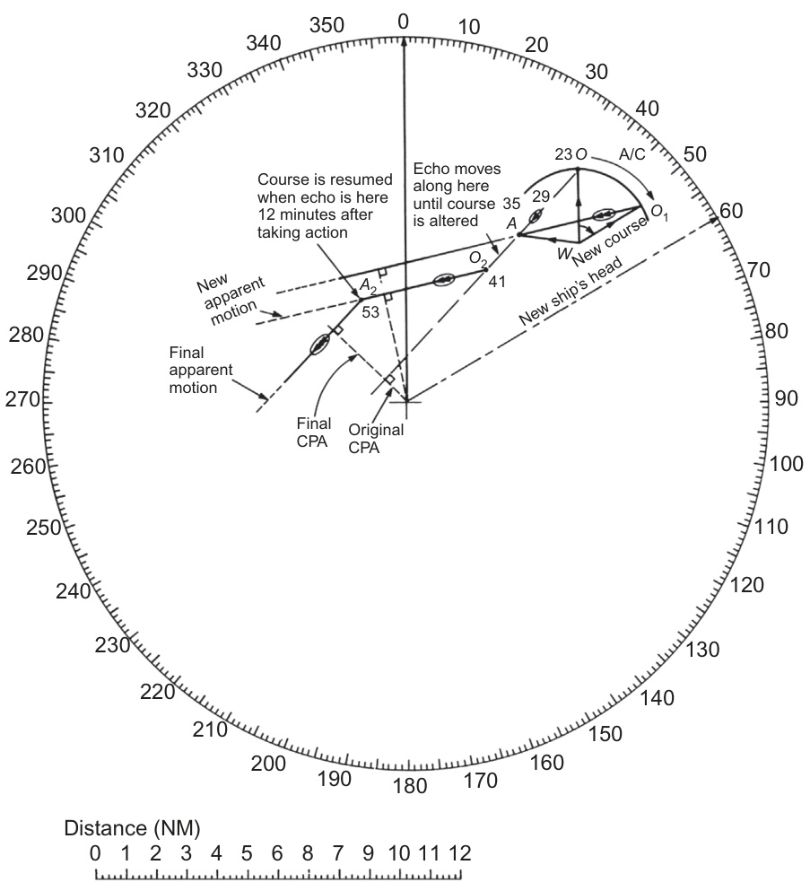  

【处理失败：内存不足或无法生成有效响应】

At 0935 it is intended to reduce speed to 3 knots (assume this to be instantaneous).  

【翻译】
在0935时，将减速至3节（假设此过程是瞬间完成）。

【解读】
本段描述的是一艘船或其他水上交通工具在特定时间（0935）进行速度调整的计划，目标是降低到每小时3海里（约5.6公里）的速度，这个速度变化被认为是立即发生的。

【词汇表】
| 英文词汇 | 中文翻译 | 解释 |
| --- | --- | --- |
| Knots | 节 | 海里，每小时1.852公里 |
| Instantaneous | 瞬间的 | 立即发生，没有延迟 |
| Reduce speed | 减速 | 降低行驶速度 |

a. Predict the new CPA and TCPA.   
b. Predict the new CPA and TCPA if the manoeuvre is delayed until 0941 (assume an instantaneous reduction of speed).   
c. Predict the bearing and range of the echo at 0953, if the manoeuvre is made at 0941. Answer   
a. New CPA is 4.8 NM, 24.5 minutes after the alteration of speed, that is at 0959.5.   
b. New CPA is 3.9 NM, 19 minutes after the alteration of speed, that is at 1000.   
c. At 0953 the bearing should be $007^{\circ}$ (T), range 4.0 NM.  

# 7.5.4 The Construction of the Plot (See Figure 7.11)  

a. The original OAW triangle should have been drawn.   
b. From $W_{\iota}$ , measure off in the direction WO, the distance at the new speed that the own ship will steam in the plotting interval and label the point $O_{1}$ . Join $O_{1}$ to $A$ . This represents, in direction and rate, the new apparent track.   
c. Until the proposed alteration takes place, the target should continue to move along the old apparent-track line. Predict the position of the target at the time it is proposed to alter the own ship’s speed and label it $O_{2}$ .  

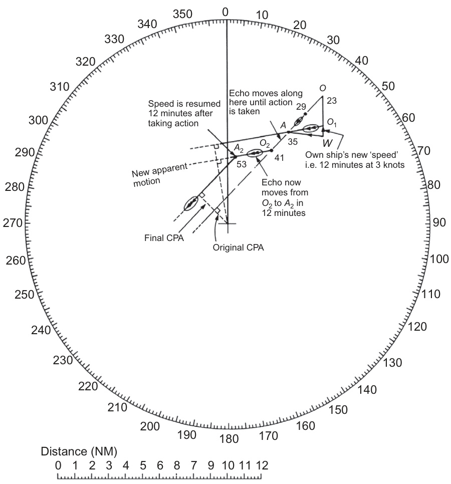  
FIGURE 7.11 The plot when the own ship alters speed only ( $\operatorname{Ex}$ ample 7.4).  

d. Lay off $O_{2}A_{2}$ parallel with and equal to $O_{1}A$ and extend it if necessary to find the new CPA.  

Note:  

a. This prediction is based on the assumption that the target will maintain its course and speed and that the own change in speed is instantaneous.   
b. It should be appreciated that when changing speed, especially in large vessels, it can take a considerable time to achieve the required new speed. Because of this, the new apparent-track line, $O_{2}A_{2},$ will be much nearer the own ship than predicted in the example above.  

This is demonstrated in Figure 7.12 where a ship’s engines are stopped after a 12 minute plotting triangle has been constructed. The own ship’s head reach (stopping distance) is $2.3\mathrm{NM}$ . The limit line constructed on Figure 7.12 will represent a line the target will not cross, but will eventually meet as the own ship comes to a complete stop.  

# 7.5.5 The Use of ‘Stopping Distance’ Data in the Form of Tables, Graphs and Formulae  

# 7.5.5.1 Stopping Distance Tables  

In the radar period before the arrival of ARPA, several organizations produced stopping distance tables to enable the manual plotter to estimate the stopping distances. The most notable of these was produced by the Honourable Company of Master Mariners in London, which included tables of stopping distances for a variety of ship types and tonnages.  

【翻译】
在ARPA出现之前的雷达时代，多个组织制作了停车距离表，以便手动绘图员能够估算停车距离。其中最值得注意的是由伦敦的名誉船长公司（Honourable Company of Master Mariners）编制的，该表格包括各种类型和吨位的船舶的停车距离表。

【解读】
本段描述了早期雷达技术中，人们为了帮助手动绘图员估算船舶的停车距离而创建的参考表格。这些表格对于不同类型和大小的船舶都有相应的停车距离数据，可以帮助航海人员更好地掌握船舶的操控特性。

【词汇表】
| 英文词汇 | 中文翻译 | 解释 |
| --- | --- | --- |
| ARPA | 自动雷达测距和方位系统 | 一种用于辅助船舶导航的电子系统 |
| Honourable Company of Master Mariners | 名誉船长公司 | 一个历史悠久的英国航海组织 |
| stopping distance | 停车距离 | 指船舶从发现障碍到完全停止运动所需的距离 |
| tonnages | 吨位 | 船舶的载重量或排水量单位 |

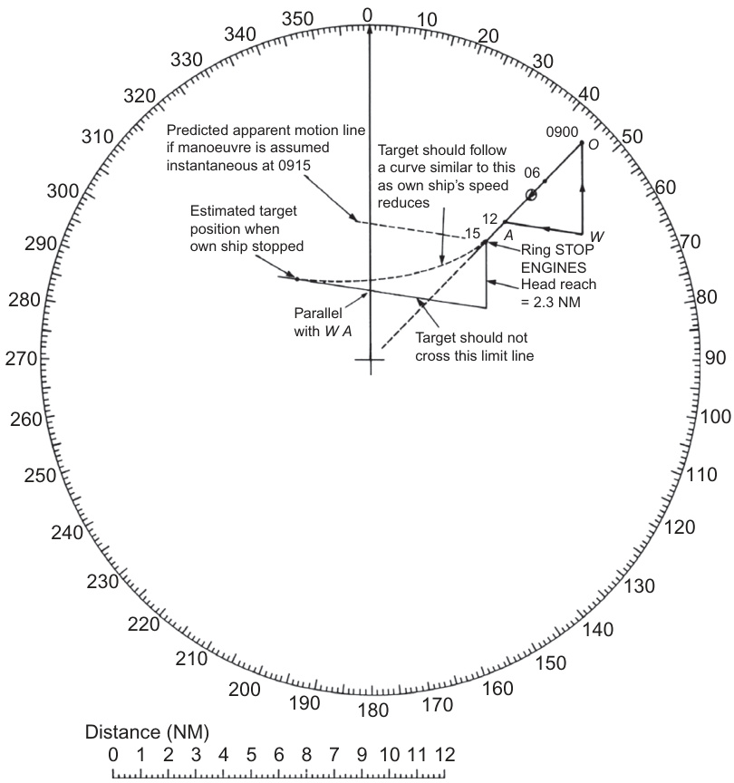  
FIGURE 7.12 The plot when the own ship stops: the effect of head reach and construction of a limit line.  

【翻译】
图7.12：当自身船只停靠时的示意图：头部延伸和限制线构建的影响。

【解读】
该图表明，当一艘船停泊或减速时，其航向和位置会受到各种因素的影响，包括“头部延伸”（head reach）和“限制线构建”（construction of a limit line）。这些因素可能对船舶的安全性和操纵性产生重要影响，因此了解它们对于航海人员来说至关重要。

【词汇表】
| 英文词汇 | 中文翻译 | 解释 |
| --- | --- | --- |
| Head Reach | 头部延伸 | 指船舶在停止或减速过程中，由于惯性而继续前进的距离或范围。 |
| Limit Line | 限制线 | 一条虚拟的线，表示船舶在某种条件下可以到达的最远点或边界。 |
| Construction | 构建 | 在此上下文中指的是根据特定条件或规则建立或确定某些参数（如限制线）的过程。 |

# 7.5.5.2 Manoeuvring Data Which Should Be Available on Board  

The International Maritime Organization (IMO) recommends in Resolution A.601 (15) that booklets containing manoeuvring information should be on board and available to the masters of large ships and also on board smaller ships, especially those carrying dangerous chemicals and gas carriers.  

【翻译】
国际海事组织（IMO）在第A.601（15）号决议中建议，包含操纵信息的小册子应该备置于大型船舶上，并且方便大型船舶的船长使用，同时也应备置于小型船舶上，特别是那些运载危险化学品和气体的船舶。

【解读】
该段强调了国际海事组织对船舶安全操作的重视，尤其对于运载危险物质的船舶。通过要求相关信息的手册随时可供船长查阅，旨在提高船舶操作的安全性和效率，减少事故风险。

【词汇表】
| 英文词汇 | 中文翻译 | 解释 |
| --- | --- | --- |
| Manoeuvring | 操纵、航行控制 | 指船舶在不同环境下的导航和控制 |
| Masters | 船长 | 负责指挥和管理船舶的最高负责人 |
| Carriers | 运载工具、承运者 | 在此指运输危险化学品或气体的船舶 |
| Resolution | 决议、决定 | 官方组织做出的正式决定或声明 |

The booklet should contain manoeuvring data and/or diagrams (preferably the latter), typical of which are the turning circle and stopping curve diagrams (Figures 7.13 and 7.14).  

【翻译】
该小册应包含机动数据和/或图表（更倾向于后者），其中典型的是转弯圆圈和停车曲线图表（图7.13和7.14）。

【解读】
本段强调了小册中需要包含有关机动特性的数据和图表，以便于理解和参考，特别提到了转弯圆圈和停车曲线图表的重要性，这些信息对于操作人员来说至关重要。

【词汇表】
| 英文词汇 | 中文翻译 | 解释 |
| --- | --- | --- |
| manoeuvring | 机动、操纵 | 指操作或控制某物体的运动或位置 |
| diagrams | 图表、图纸 | 用来表示或说明事物结构、工作原理等的图形或图纸 |
| turning circle | 转弯圆圈 | 指车辆或其他物体在转弯时所形成的圆形轨迹 |
| stopping curve | 停车曲线 | 描述车辆从某一速度减速到完全停止所需距离的曲线关系 |

The form of the booklet should be such that additional information can be added from ‘trials’ and during the normal course of the voyage. Shipmasters are encouraged to add to this basic information as they gain experience in the handling of the vessel in conditions not covered by the original data.  

【翻译】
本小册子的形式应能让人在“试验”期间或航程中正常进行时添加额外信息。船长们被鼓励随着他们在处理船只方面积累经验，特别是在原始数据未涵盖的条件下，将这些基本信息补充完整。

【解读】
这段话强调了小册子的动态性质，鼓励船长根据实际操作经验不断更新和完善小册子的内容，以适应不同的航行条件。这体现了对实践经验的重视和对安全、效率的追求。

【词汇表】
| 英文词汇 | 中文翻译 | 解释 |
| --- | --- | --- |
| trials | 试验 | 指船只在不同条件下的测试运行或操作 |
| voyage | 航程 | 指船只从一个港口到另一个港口的旅程 |
| vessel | 船只 | 指各种类型的船舶，如货船、客轮等 |
| shipmasters | 船长 | 指负责指挥和管理船只的最高职务人员 |

The data should be presented in the form of pilot cards, wheelhouse posters and manoeuvring booklet.  

【翻译】
数据应以试验卡、驾驶室海报和操纵手册的形式呈现。

【解读】
这段话强调了数据呈现的重要性，建议使用多种形式，如试验卡、海报和手册，以便于理解和操作。这可能是在航海或航空领域中对数据呈现的一种要求或建议，目的是为了提高操作的安全性和效率。

【词汇表】
| 英文词汇 | 中文翻译 | 解释 |
| --- | --- | --- |
| pilot cards | 试验卡 | 用于记录和展示飞行或航海试验数据的卡片 |
| wheelhouse posters | 驾驶室海报 | 在驾驶室内张贴的海报，用于提示重要信息 |
| manoeuvring booklet | 操纵手册 | 一本关于如何进行复杂操作的指南或手册 |

# 7.5.5.3 The Use of Stopping Curves Drawn Up from Data Recorded During Trials  

Consider a vessel proceeding at 16 knots. If the engines are put to stop, it will take some  

【翻译】
考虑一艘以16节的速度行驶的船舶。如果引擎被设置为停止，它将需要一些时间来减速。

【解读】
本段讨论的是船舶在突然停机时的减速过程，强调了船舶在失去动力后不会立即停止，而是会有一定时间的减速过程。这与物理学中的惯性原理有关，表明物体趋向保持其状态，包括运动状态。

【词汇表】
| 英文词汇 | 中文翻译 | 解释 |
| --- | --- | --- |
| vessel | 船舶 | 指各种类型的船只或航运工具 |
| knots | 节（速度单位） | 海上速度单位，1节约等于1.852公里/小时 |
| engines | 引擎 | 推动船舶前进的发动机或动力系统 |

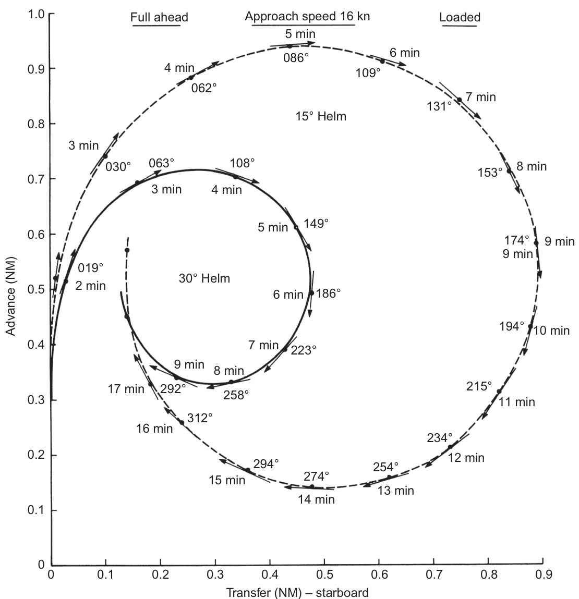  
FIGURE 7.13 Turning circles. The response actually experienced may differ from that shown if any of the following conditions is not met:  

【翻译】
图7.13转弯圆圈。如果不满足以下任何条件，则实际经历的响应可能与所示的不同。

【解读】
该段落主要介绍了一个名为“转弯圆圈”的概念，指出如果某些特定条件没有被满足，那么实际观察到的结果可能会有所不同。这意味着在研究或实验中，控制变量和确保所有必要条件得到满足是非常重要的，以便获得准确的结果。

【词汇表】
| 英文词汇 | 中文翻译 | 解释 |
| --- | --- | --- |
| Response | 响应 | 指的是对某种刺激或条件做出的反应或回应。 |
| Conditions | 条件 | 指的是需要满足或具备的状态、情况或要求。 |
| Experienced | 经历的 | 指的是个人或事物实际经受或感受到的东西。 |

<html><body><table><tr><td>Calmweather</td><td>Displacement97,440tonnes</td></tr><tr><td>Nocurrentortidalstream</td><td>Draught forward 9.14 m</td></tr><tr><td>Water depth at least 2X vessel's draught</td><td>Draught aft9.14 m</td></tr><tr><td>Cleanhull</td><td></td></tr></table></body></html>  

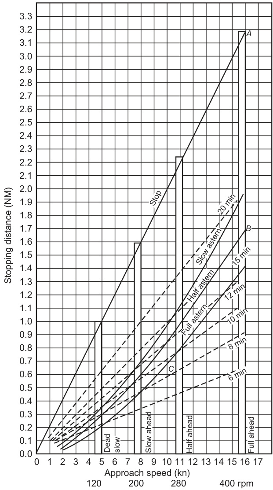  
FIGURE 7.14 Stopping curves.  

【翻译】
图7.14 停止曲线。

【解读】
该图显示了停止曲线，这是交通工程中用于设计道路和高速公路的重要概念。停止曲线是指车辆在紧急情况下需要停下的最短距离，它取决于车速、制动性能和路面摩擦力等因素。通过分析停止曲线，可以更好地理解交通安全和道路设计的关系。

【词汇表】
| 英文词汇 | 中文翻译 | 解释 |
| --- | --- | --- |
| Stopping curves | 停止曲线 | 指车辆在紧急情况下需要停下的最短距离 |
| Traffic engineering | 交通工程 | 研究交通系统和基础设施设计的学科 |
| Friction | 摩擦力 | 物体之间接触时产生的阻碍运动的力 |

$3.2\mathrm{NM}$ to run off the way, that is the readings associated with $A_{\cdot}$ , Figure 7.14.  

If the engines are put to half astern, the vessel will be stopped in the water in some 17 minutes having covered some 1.7 NM in running the way off, that is the readings associated with $B$ .  

If proceeding at 10 knots and full astern is demanded, the vessel will be stopped in the water in 10 minutes having covered some seven cables while running the way off, that is the readings associated with C.  

【翻译】
如果以10节的速度行驶，并要求全速倒车，那么船只在10分钟内就会在水中停下来，同时它已经覆盖了大约7链的距离，这就是与C相关的读数。

【解读】
这段话描述的是一艘船在特定条件下的停止过程，包括其速度、时间和距离。它涉及到航海领域的专业知识，特别是关于船舶操纵和控制的技术细节。

【词汇表】
| 英文词汇 | 中文翻译 | 解释 |
| --- | --- | --- |
| knots | 节（速度单位） | 海上速度单位，1节等于每小时1.852公里 |
| astern | 倒车 | 船舶向后移动 |
| cables | 链（长度单位） | 一种长度单位，1链约等于185.2米 |
| vessel | 船舶 | 通用词指各种类型的船只或舰艇 |

The stopping curves are intended primarily for use when the engines are to be put astern in order to stop the vessel in the water, for example when picking up a pilot, anchoring or in an emergency.  

【翻译】
停车曲线主要用于当需要逆转发动机以便在水中停止船舶时，例如接收领航员、下锚或处于紧急情况下的停靠。

【解读】
本段描述了停车曲线的使用场景，强调了其在特定操作中的重要性，如接收领航员、下锚或应对紧急情况等，这些情况都需要船舶能够快速而安全地停下来。

【词汇表】
| 英文词汇 | 中文翻译 | 解释 |
| --- | --- | --- |
| astern | 逆转 | 指船舶的后退运动，或使发动机进行逆转 |
| anchoring | 下锚 | 将船舶用锚固定在水底，以保持位置不变 |
| emergency | 紧急情况 | 需要立即处理的危险或特殊情况 |

Note: The curves assume that the environmental and loaded conditions, etc. are the same as when the trials data was obtained. They should only be used as a rough guide as to what might be expected. It should also be borne in mind that as speed reduces, a critical speed will be reached when the vessel will no longer answer to the helm. When it is necessary to reduce speed even more quickly, other techniques such as rudder cycling may have to be employed. The prediction of how the speed may change or the vessel may turn under any conditions of loading, weather, etc. can be very difficult. While the documents (see Section 7.5.5) give some indication as to what may be expected, one should always work with a margin of safety and not leave manoeuvres until the last possible moment which theory suggests.  

【翻译】
注意：曲线假设环境条件、载荷条件等与试验数据获得时相同。它们只能作为粗略指南，用于预测可能出现的情况。还应记住，当速度降低到一定程度时，将达到一个临界速度，此时船舶将不再响应舵。若需要更快地降低速度，则可能需要采用其他技术，如舵角循环。预测在任何载荷、天气等条件下船舶的速度变化或转向情况可能非常困难。虽然文件（见第7.5.5节）对可能出现的情况有一些提示，但仍应始终保持安全裕度，不要将操作留到最后一刻，这是理论所建议的。

【解读】
本段强调了在使用曲线预测船舶行为时应考虑的因素，包括环境条件、载荷条件等，并提醒人们在实际操作中应保持安全裕度，不要过于依赖理论预测。此外，还介绍了一些特殊情况下的操作技巧，如舵角循环，以帮助船舶快速降低速度。

【词汇表】
| 英文词汇 | 中文翻译 | 解释 |
| --- | --- | --- |
| environmental conditions | 环境条件 | 指影响船舶行为的自然环境，如风、浪、水流等 |
| loaded conditions | 载荷条件 | 指船舶上的货物、燃料、人员等载荷情况 |
| rudder cycling | 舵角循环 | 一种通过反复改变舵角来控制船舶速度和方向的操作技巧 |
| margin of safety | 安全裕度 | 指在实际操作中为应对意外情况而预留的安全距离或时间 |

# 7.5.6 The Plot When the Own Ship Combines Course and Speed Alterations  

# EXAMPLE 7.5 (USED IN FIGURE 7.15)  

With the own ship steering $000^{\circ}$ (T) at a speed of 12 knots, an echo is observed as follows:  

<html><body><table><tr><td colspan="2"></td></tr><tr><td>0923</td><td>Echobears 037°(T) at 9.5 NM</td></tr><tr><td>0929</td><td>Echobears 036° (T) at 8.0 NM</td></tr><tr><td>0935</td><td>Echo bears 034° (T) at 6.5 NM</td></tr></table></body></html>  

At 0935 it is intended to alter course $40^{\circ}$ to starboard and reduce speed to 6 knots (assume this to be instantaneous).  

a. Predict the new CPA and TCPA. b. Predict the new CPA and TCPA if the manoeuvre is delayed until 0941.  

【翻译】
a. 预测新的CPA（最接近时刻）和TCPA（时间到达预计时间）。b. 如果操作延迟至0941，则预测新的CPA和TCPA。

【解读】
该段落涉及航海或航空领域中的两个重要概念：CPA（Closest Point of Approach，最接近时刻）和TCPA（Time to Closest Point of Approach，时间到达预计时间）。这两个参数用于描述两艘船只或飞机之间的相对运动情况。第一个部分要求预测在当前条件下两者之间的最接近距离和时间点，而第二个部分则考虑了如果行动被推迟到0941，这些参数会如何变化。这意味着需要根据不同的时间条件来计算和预测CPA和TCPA，以便于航行规划和安全评估。

【词汇表】
| 英文词汇 | 中文翻译 | 解释 |
| --- | --- | --- |
| CPA | 最接近时刻 | 指两艘船只或飞机之间最近的距离出现的时间点 |
| TCPA | 时间到达预计时间 | 指从现在开始到两艘船只或飞机之间最近距离出现所需的时间 |
| manoeuvre | 操作/机动 | 在这里指改变航向、速度等以避免碰撞或实现特定目标的行为 |

c. Predict the range and bearing of the echo at 0953 if the manoeuvre was made at 0941. Answer (Figure 7.15)   
a. CPA is $4.4\mathrm{NM},$ , 20 minutes after the manoeuvre. Note: The new apparent-track direction is the same as that when course only was altered (see Figure 7.10) but the new rate, $O_{1}A,$ is much slower.   
b. CPA is $3.6\mathrm{NM},$ , 14.5 minutes after the manoeuvre at 0941, that is at 0955.5.   
c. Predicted range is $3.6\mathrm{NM}$ on a bearing of $355^{\circ}$ (T).  

# 7.5.7 The Plot When the Own Ship Resumes Course and/or Speed  

When taking action to avoid a closequarters situation, the action should be substantial enough and held for long enough to show up in the plotting of radar observers on other vessels.  

【翻译】
在采取行动避免近距离情况时，这种行动应该足够大胆，并且持续足够长的时间，以便在其他船只上的雷达观察员的绘图中显现出来。

【解读】
这段话强调了在海上避免近距离碰撞或不安全情况时，采取的行动必须明显且持久足够长，以便被其他船只上的雷达系统检测到。这意味着简单的轻微调整可能不足以避免潜在的危险，需要更为明显和持续的改变航向或速度。

【词汇表】
| 英文词汇 | 中文翻译 | 解释 |
| --- | --- | --- |
| substantial | 足够大胆的 | 在这里指的是行动的幅度或程度足够引起注意 |
| close-quarters | 近距离的 | 指两个或多个物体之间非常接近的状态，尤其是在海上可能导致碰撞的情况 |
| plotting | 绘图、记录 | 指用雷达等设备跟踪和记录目标的位置和运动轨迹 |

In order to determine the effect of resuming the own ship’s course and/or speed:  

【翻译】
为了确定恢复自己船舶航向和/或速度的影响：

【解读】
本段落主要讨论的是如何评估改变船舶航向或者速度对其运行状态的影响，这通常是在遇到某种情况后需要重新调整航线或者速度以适应新的环境。

【词汇表】
| 英文词汇 | 中文翻译 | 解释 |
| --- | --- | --- |
| determine | 确定 | 找到答案或做出决定 |
| resume | 恢复 | 再次开始做某事 |
| effect | 影响 | 某一行为或事件引起的结果 |

a. The original OAW triangle should have been drawn.   
b. The apparent track after manoeuvring should have been predicted and, provided that the target has maintained its course  

【翻译】
a. 原始的OAW三角形应该已经绘制出来。
b. 在进行操纵后，预测出明显的航迹，而且假设目标保持其航向，

【解读】
这段话描述的是在海军或航空领域中关于追踪目标的操作步骤，特别是涉及到“OAW三角形”的计算和预测目标在操纵后的运动轨迹。它强调了在进行任何行动之前，需要对目标的原始位置和可能的移动路径有一个清晰的了解和预测。

【词汇表】
| 英文词汇 | 中文翻译 | 解释 |
| --- | --- | --- |
| OAW triangle | OAW三角形 | 一种用于导航和追踪的几何图形，帮助确定目标的位置和速度 |
| manoeuvring | 操纵 | 指改变船只、飞机等的方向或速度，以实现特定目的的操作 |
| target | 目标 | 在这里指的是被跟踪或监视的物体，如敌方舰艇或飞机 |
| apparent track | 明显的航迹 | 预测出的目标在某一段时间内的移动路径 |

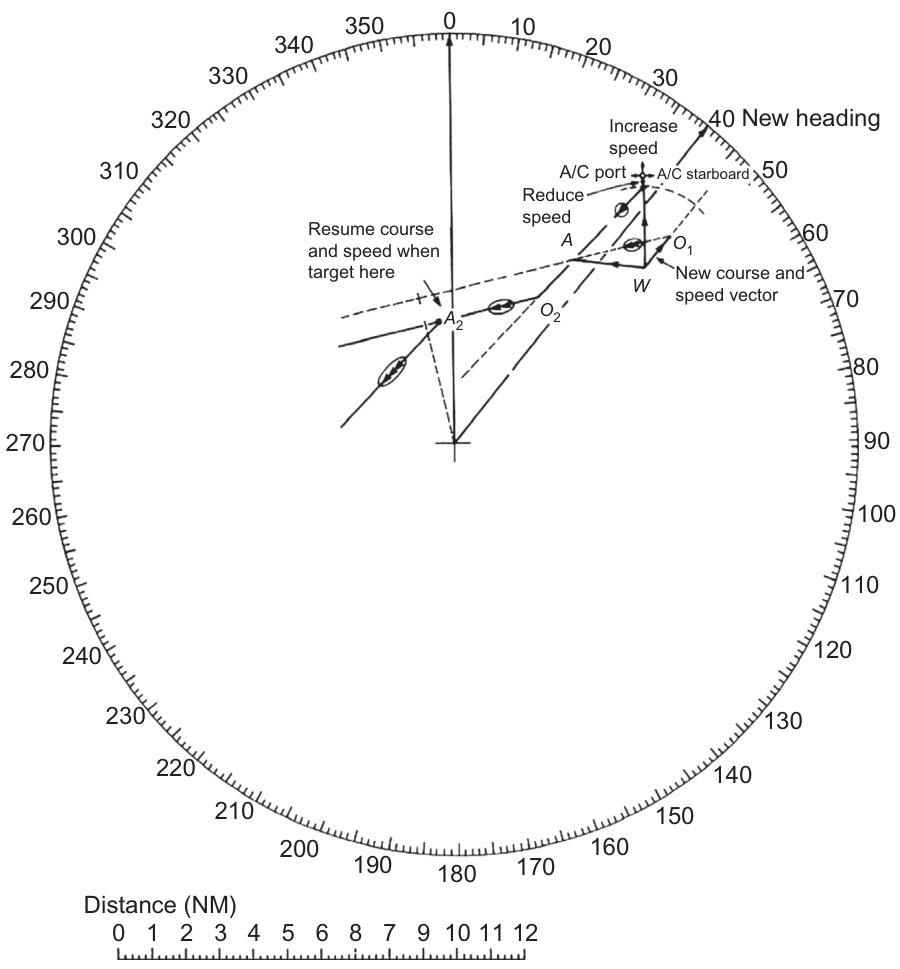  
FIGURE 7.15 The plot when the own ship combines course and speed alterations (Example 7.5).  

【翻译】
图7.15：当自己的船同时改变航向和速度时的曲线图（例7.5）。

【解读】
该图表明，当一艘船同时改变其航向和速度时，会产生特定的曲线轨迹。这可能是在海上导航或避免碰撞等情况下的一个重要考虑因素。

【词汇表】
| 英文词汇 | 中文翻译 | 解释 |
| --- | --- | --- |
| Plot | 曲线图 | 一种显示数据变化关系的图表 |
| Course | 航向 | 船只的行进方向 |
| Speed alterations | 速度改变 | 调整或改变船只的速度 |
| Own ship | 自己的船 | 指当前操作或讨论中的那艘船 |

and speed, the target will follow the new apparent-track line, $O_{2}A_{2}$ .  

c. If the target still maintains its course and speed and the own ship resumes her original course and/or speed, the direction and rate of the final apparent track will be the same as in the original OAW triangle. Thus, from the target’s predicted position at the time of resumption, draw $O_{3}A_{3}$ parallel and equal to OA and produce if necessary to find the new CPA after resumption.   
d. If it is required to find the time to resume course/speed so that the CPA will not be less than, for example, 4 NM, lay off a line parallel to OA and tangential to the 4 NM range circle. The point at which this final apparent-track line crosses the second apparent-track line should be labelled $O_{3}$ . Predict the time at which the target will reach $O_{3}$ . This will be the earliest time to resume course/speed if the target is not to come within the required CPA.  

Note: When predicting the movement of a target along an apparent-track line, be sure to use the appropriate rate along the apparent track.  

【翻译】
注意：在预测目标沿着明显轨迹线运动时，请务必使用沿着该轨迹的适当速度率。

【解读】
本段强调了在预测目标运动时，选择合适的速度率的重要性，尤其是在考虑目标沿着特定轨迹移动的情况下。这要求观察者或分析人员能够准确地判断目标的运动方向和速度，以便做出精确的预测。

【词汇表】
| 英文词汇 | 中文翻译 | 解释 |
| --- | --- | --- |
| Apparent-track | 明显轨迹 | 指目标看起来要经过的路径或轨道 |
| Rate | 速度率 | 指单位时间内的速度变化量，或运动的速率 |
| Target | 目标 | 指被观察、追踪或预测的物体或对象 |

# EXAMPLE 7.6  

Using Examples 7.3 and 7.4, predict in each case the CPA if the original course and speed respectively are resumed at 0953 (see Figures 7.10 and 7.11).  

【翻译】
利用例子7.3和7.4，在每种情况下预测，如果在0953时分别恢复原来的航向和速度（见图7.10和7.11），则CPA为多少。

【解读】
本段要求读者根据之前的例子7.3和7.4，预测如果船只在指定时间恢复原来的航向和速度，则与某物体（可能是其他船只或障碍物）之间的最近接近点（CPA）会发生什么变化。这需要读者对航海学或交通运输领域中的相关概念有所了解，并能够应用这些知识进行预测。

【词汇表】
| 英文词汇 | 中文翻译 | 解释 |
| --- | --- | --- |
| CPA | 最近接近点 | 指两个移动物体之间最接近的距离或位置 |
| Resume | 恢复 | 再次开始或继续某项活动或状态 |
| Original Course | 原来航向 | 指最初确定的航行方向或路线 |
| Speed | 速度 | 指物体运动的快慢程度 |

Answer  

a. If course is resumed at 0953, $\mathrm{CPA}=3.5\mathrm{NM}$ . b. If speed is resumed instantaneously at 0953, $\mathrm{CPA}=2.4\:\mathrm{NM}.$  

Note: If the order for an increase in speed is given at 0953, then by the time the vessel has worked up to the required speed the target will have passed in excess of the 2.4 NM CPA.  

【翻译】
注意：如果在0953时发出增加速度的命令，那么等到船只加速达到所需速度时，目标已经超过了2.4海里最小距离（CPA）。

【解读】
这段话是在讨论航海操作中关于速度调整和距离计算的问题。具体来说，它强调了在某一特定时间点发出速度增加命令后，船只需要一定时间来加速到达要求的速度，而在此期间，目标可能已经超过了预期的安全距离（2.4海里最小距离）。这是一个关于航海安全和操作决策的考虑因素。

【词汇表】
| 英文词汇 | 中文翻译 | 解释 |
| --- | --- | --- |
| Vessel | 船只 | 指任何类型的船舶或水上运输工具 |
| Speed | 速度 | 物体运动的快慢程度，在这里指船只的行进速度 |
| CPA | 最小距离 | Closest Point of Approach，即两个物体之间最近的距离，常用于描述船只与其他物体（如岸边、其他船只）之间的最短距离 |
| NM | 海里 | Nautical Mile，海里是航海用距离单位，1海里约等于1852米 |

# 7.5.8 The Plot When Both Vessels Manoeuvre Simultaneously  

It has been assumed until now that only one of the two vessels in the encounter manoeuvres. In such cases, the resulting apparent track can be predicted when the own ship manoeuvres, or resolved when only the target manoeuvres. When ships of about the same size meet, it is not uncommon for them to commence plotting at about the same time and subsequently manoeuvre simultaneously or nearly so. If each vessel has plotted initially and completed the construction showing the effect of an own ship manoeuvre, then the target in each case will not follow the predicted apparent track. In some cases this will result in each ‘target’ clearing by a greater distance than predicted, but this will not always be the case. Thus it is essential when the own ship manoeuvres:  

【翻译】
人们一直假设在两艘船只遇到时，只有一艘船会进行机动。在这种情况下，当自己的船只进行机动时，可以预测出相对的航迹；或者当只有目标船只进行机动时，可以确定其航迹。当大小相近的船只相遇时，它们经常在同一时间开始绘制航线，然后同时或几乎同时进行机动。如果每艘船只最初都已经绘制了航线并完成了显示自身机动效果的构图，那么在每种情况下，目标船只不会遵循预测的相对航迹。在某些情况下，这将导致每艘“目标”船只与预测值之间的距离更大，但这并不总是如此。因此，当自己的船只进行机动时，必须考虑这一点。

【解读】
本段讨论的是海上遇险时两艘船只的机动问题，强调了在实际操作中需要考虑双方同时机动的情况，而不是单方面的机动。这一点对于确保安全距离和避免碰撞至关重要，因为预测的航迹可能会因为对方的机动而发生变化。

【词汇表】
| 英文词汇 | 中文翻译 | 解释 |
| --- | --- | --- |
| manoeuvres | 机动、操纵 | 指船只进行转向、加速等操作以改变航向或速度 |
| apparent track | 相对航迹 | 指从一个观察者的角度看来另一艘船只的运动轨迹 |
| target | 目标、对象 | 在这里指被观察或跟踪的另一艘船只 |
| commence | 开始 | 指某一行动或过程的起始 |

a. To predict the target’s new apparent track, assuming that it maintains course and speed.   
b. To ensure that the manoeuvre is having the (desired) predicted effect. It is not sufficient merely to assume that, because the target ‘appears’ to be going clear, it is moving in the direction and rate predicted. Where the predicted direction and rate are not as expected, a new plot must be started immediately and the action taken by the target must be determined.  

【翻译】
为了预测目标的新轨迹，假设它保持当前的航向和速度。
为了确保机动正在产生（期望的）预测效果。不仅仅是假设，因为目标“看起来”正在偏离，而是需要确定它是否按照预测的方向和速度移动。当预测的方向和速度与预期不符时，必须立即开始新的情景分析，并确定目标采取的行动。

【解读】
这段话主要讨论的是如何在实时监控或追踪目标的情况下，根据目标的运动预测其未来的位置和行为。关键点包括：1. 假设目标保持当前的航向和速度来预测其未来位置；2. 不断验证预测结果与实际情况之间的一致性，以便及时调整跟踪策略。这要求对目标的运动有清晰的理解，并能够快速响应变化的环境。

【词汇表】
| 英文词汇 | 中文翻译 | 解释 |
| --- | --- | --- |
| target | 目标 | 指需要被跟踪、监视或预测的对象 |
| manoeuvre | 机动/操作 | 指为实现特定目的而进行的战术行动或调整 |
| plot | 情景分析/图表 | 在这里指根据数据绘制的目标运动轨迹图表，或是对目标行为的分析预测 |
| predicted effect | 预测效果 | 指通过分析和预测得出的目标可能表现出的行为或结果 |

The latter can have important consequences in deciding when it is safe to resume course/ speed. No longer can it be assumed that the ‘final’ apparent track will be parallel and equal to the original apparent track, as was assumed in Section 7.5.7.  

【翻译】
后者在决定何时可以安全地恢复航向/速度方面可能产生重要的影响。不能再假设“最终”的明显轨迹将与原始的明显轨迹平行且相等，如第7.5.7节所假设的那样。

【解读】
本段强调了在某些情况下，不能简单地假设两个轨迹是平行和相等的，而需要考虑实际情况的变化，以确保安全。这意味着在决策过程中需要更加谨慎和细致的分析。

【词汇表】
| 英文词汇 | 中文翻译 | 解释 |
| --- | --- | --- |
| assume | 假设 | 指在没有证据或证明的情况下认为某事为真 |
| resume | 恢复 | 指重新开始做某事，通常是在暂停之后 |
| apparent | 明显的 | 指看起来像是如此，但不一定是真的 |
| parallel | 平行的 | 指两条线或方向永不相交 |

Consider the situation in fog, as set out in Figure 7.16. If both vessels manoeuvre simultaneously or at nearly the same time, $B$ as observed from $A$ will move along the new  

FIGURE 7.16 The danger of not determining the target’s actual manoeuvre when apparently passing clear.  

【翻译】
图7.16 未能确定目标实际机动时，尽管看似安全仍存在的危险。

【解读】
这幅图表明，即使在驾驶或操作过程中看似已经通过或绕过某个障碍物，但如果不能准确判断该障碍物（或目标）的真实动作或意图，就可能会面临潜在的风险或危险。这要求操作者必须保持警惕，密切关注目标的行为，以避免可能出现的意外情况。

【词汇表】
| 英文词汇 | 中文翻译 | 解释 |
| --- | --- | --- |
| target | 目标/障碍物 | 指需要被观察、跟踪或应对的对象或事物 |
| manoeuvre | 机动/动作 | 指目标物的移动、转向或其他形式的行动 |
| apparent | 看似/表面上 | 表示事情的外表或初步印象，与实际情况可能有所不同 |
| clear | 安全/无阻碍 | 指没有障碍或危险的情况，但这里强调即使看似安全也可能存在隐患 |

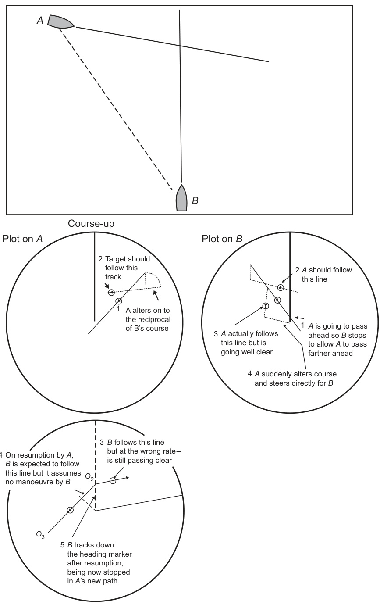  

【处理失败：内存不足或无法生成有效响应】

apparent-track line (but at the wrong rate, which is now much slower) and so appear to be going clear. No longer will $B$ move along $O_{2}O_{3}$ when $A$ resumes; it will move down parallel to the heading marker, since $B$ is now stopped in the water.  

If the apparent track of $B$ had not been predicted, monitored and reappraised after the manoeuvre was detected, $A$ might well have resumed course when $B$ was at $O_{2},$ only to find a vessel stopped directly in its path. This would have manifested itself by $B$ coming down A’s heading marker and thus requiring sudden emergency action, possibly by both vessels at a very late stage in the encounter.  

If systematic observation and interpretation is not carried out on $B_{.}$ , as the way is run off, the relative-motion plot would start to relate to the true situation, in which case $B$ would have observed a vessel steering to pass clear down the port side but then appearing to turn to port and steer directly towards it. Having very little way on at this stage, there is very little that $B$ can do to avoid the close-quarters situation.  

The encounter considered above is frequently carried out with the best of intentions but it is clear that, where manoeuvres are executed without proper prediction, monitoring and reappraisal, the consequences can be dire.  

【翻译】
上述遭遇通常是出于最好的意愿，但很明显，如果在没有适当预测、监控和重新评估的情况下执行机动，则后果可能非常严重。

【解读】
这段话强调了在进行某种行动或决策时，必须要有充分的准备和规划，包括对可能结果的预测、实时监控以及根据情况变化进行调整和重新评估。如果缺乏这些步骤，即使最初的意图是良好的，也可能导致严重的后果。这提示人们在做决定或采取行动前，要谨慎考虑可能的影响，并随时准备根据需要进行调整。

【词汇表】
| 英文词汇 | 中文翻译 | 解释 |
| --- | --- | --- |
| encounter | 遭遇、相遇 | 指两个或多个事物之间的接触或冲突 |
| manoeuvres | 机动、操纵 | 指通过计划和控制来实现特定目标的行为或行动 |
| prediction | 预测、预言 | 指根据现有信息和数据对未来事件或结果的预测 |
| monitoring | 监控、监督 | 指持续观察和检查某事物或过程以确保其正常运行或达到预期效果 |
| reappraisal | 重新评估、重新评价 | 指再次评估或判断某事物或情况，以确定是否需要改变或调整 |

was most meaningful. What follows is the theory and construction of the graphical representations that were devised; the philosophy and shortcomings are discussed in Sections 4.11 and 4.12. It is stressed that it is not envisaged that an observer would construct these points or areas manually. Where available, they would be generated by computer graphics. However, it is essential that any observer who elects to use such facilities understands the principles upon which their construction is based.  

【翻译】
最有意义的是接下来的内容，即图形表示的理论和构建，这些图形表示是经过精心设计的；第四节的4.11和4.12部分讨论了相关的哲学观点和不足之处。需要强调的是，不建议观察者手动构造这些点或区域。在可能的情况下，它们将由计算机图形生成。然而，对于任何选择使用此类设施的观察者来说，理解其构建所依据的原则至关重要。

【解读】
本段主要介绍了关于图形表示的理论基础和构建方法，同时也提到了相关的哲学思考和局限性。作者特别强调了理解这些图形表示背后的原理的重要性，尤其是在使用计算机图形生成工具时。这意味着作者希望读者不仅能使用这些工具，还要深入了解其背后的逻辑和原则，以便更好地应用和评估这些图形表示。

【词汇表】
| 英文词汇 | 中文翻译 | 解释 |
| --- | --- | --- |
| graphical representations | 图形表示 | 使用图像、图表等形式来表现数据或信息的方式 |
| philosophy | 哲学观点 | 指对事物的根本性质、价值和现实的思考和探究 |
| shortcomings | 局限性 | 指某事物或方法存在的缺陷或不足之处 |
| computer graphics | 计算机图形 | 使用计算机技术生成和处理图像的领域 |

# 7.6.1 The Predicted Point of Collision  

This is the point or points towards which the own ship should steer at her present speed (assuming that the target does not manoeuvre) in order for a collision to occur (Figure 7.17(a) and Section 4.11). The logic of this is that if one knows the course(s) which will result in collision then, by not steering those courses, collisions will be avoided. Also, by picking one’s way between the predicted point of collisions (PPCs), a more farreaching collision-avoidance strategy can be evolved.  

【翻译】
这是本船在当前速度下（假设目标物体不进行机动）应驶向的点或多个点，以便发生碰撞（图7.17（a）和第4.11节）。这种逻辑是，如果知道哪些航线会导致碰撞，那么通过避免这些航线，就可以避免碰撞。另外，通过选择预测的碰撞点之间的路径，可以发展出更为有效的碰撞规避策略。

【解读】
这段话讨论了如何通过预测可能的碰撞点来避免海上碰撞。它强调了解如果按照某些航线行进就会发生碰撞，这样就可以通过改变航线来避免碰撞。此外，它还提到可以根据预测的碰撞点规划最优的航线以最大限度地减少碰撞风险。

【词汇表】
| 英文词汇 | 中文翻译 | 解释 |
| --- | --- | --- |
| manoeuvre | 机动、操纵 | 指改变方向或位置的行为，在这里指目标物体的运动变化。 |
| collision | 碰撞 | 在这里指两艘船只或船与其他物体之间的撞击。 |
| evolve | 发展、演变 | 指的是随着时间的推移而变得更加复杂或完善的过程。在这里指的是碰撞规避策略的改进。 |
| PPCs | 预测的碰撞点 | 指计算出来可能发生碰撞的地点。 |

# 7.6 THE THEORY AND CONSTRUCTION OF PPCs, PADs, SODs AND SOPs  

The harnessing of computers and ARPAs to assist in the resolution of the plotting triangle led to the question of whether some assistance could be given which would be of a higher order than that provided by the trial manoeuvre facility on the ARPA (see Section 4.4.3). Without going to the extreme of an expert system (see Section 7.12), some attempts were made to give a graphical representation of the encounter geometry which would assist the mariner in selecting an acceptable manoeuvre. The major problem was to devise a way in which this ‘advice’ should be presented to the mariner so that it  

【翻译】
利用计算机和自动雷达辅助导航系统（ARPAs）来协助解决航行三角测量问题，引发了一个疑问：是否可以提供比自动雷达辅助导航系统上的试验机动设施（见第4.4.3节）更高级别的辅助。没有发展到专家系统（见第7.12节）的极端，一些尝试被进行，以提供一个图形化的遭遇几何表示，这将帮助水手选择一个可接受的机动。但主要的问题是如何向水手呈现这种“建议”，以便于他们理解。

【解读】
本段讨论的是如何利用技术辅助工具来提高船舶导航的安全性和效率。通过结合计算机和自动雷达辅助导航系统，可以提供更先进的辅助功能，帮助水手做出更好的决策。然而，关键在于如何有效地向水手呈现这些信息，以确保他们能够正确理解和应用这些建议。

【词汇表】
| 英文词汇 | 中文翻译 | 解释 |
| --- | --- | --- |
| ARPAs | 自动雷达辅助导航系统 | 一种用于辅助船舶导航的雷达系统 |
| Expert System | 专家系统 | 一种模拟人类专家决策能力的计算机系统 |
| Encounter Geometry | 遭遇几何 | 指两个或多个物体之间的空间关系和运动状态 |
| Manoeuvre | 机动 | 船舶的操作或行动，如转向、加速等 |

# EXAMPLE 7.7 (USED IN FIGURE 7.17)  

With the own ship steering $000^{\circ}$ (T) at a speed of 10 knots, an echo is observed as follows:  

0923 Echo bears $037^{\circ}$ (T) at 10.3 NM   
0929 Echo bears $036^{\circ}$ (T) at 8.5 NM   
0935 Echo bears $034^{\circ}$ (T) at $6.7\mathrm{NM}$  

Determine the bearing and range of the PPC(s).  

【翻译】
确定PPC（预计位置圈）的方位和距离。

【解读】
本句话指的是在导航或测量中，需要确定目标物体（如船只、飞机等）相对于观察者的方向（方位）和距离（范围）。这通常用于定位、追踪或避碰等目的。

【词汇表】
| 英文词汇 | 中文翻译 | 解释 |
| --- | --- | --- |
| Bearing | 方位 | 指目标物体相对于观察者的方向角度 |
| Range | 距离/距离 | 指目标物体与观察者之间的距离 |
| PPC | 预计位置圈 | 一种用来表示可能位置的圆形区域，中心为已知位置，半径为位置不确定性 |

Answer (Figure 7.17(b))  

【翻译】
答案（图7.17（b））

【解读】
本段落似乎是某个教材或考试题目的参考答案指引，指向特定图表中的一个选项或结果。

【词汇表】
| 英文词汇 | 中文翻译 | 解释 |
| --- | --- | --- |
| Answer | 答案 | 指正确的解决方案或结果 |
| Figure | 图表 | 一种用于说明问题或展示数据的视觉表现形式 |

a. $P_{1}$ bearing $337^{\circ}$ at a range of $4.4\mathrm{NM}$ .   
b. $P_{2}$ bearing $270^{\circ}$ at a range of $18.0\mathrm{NM}$ .  

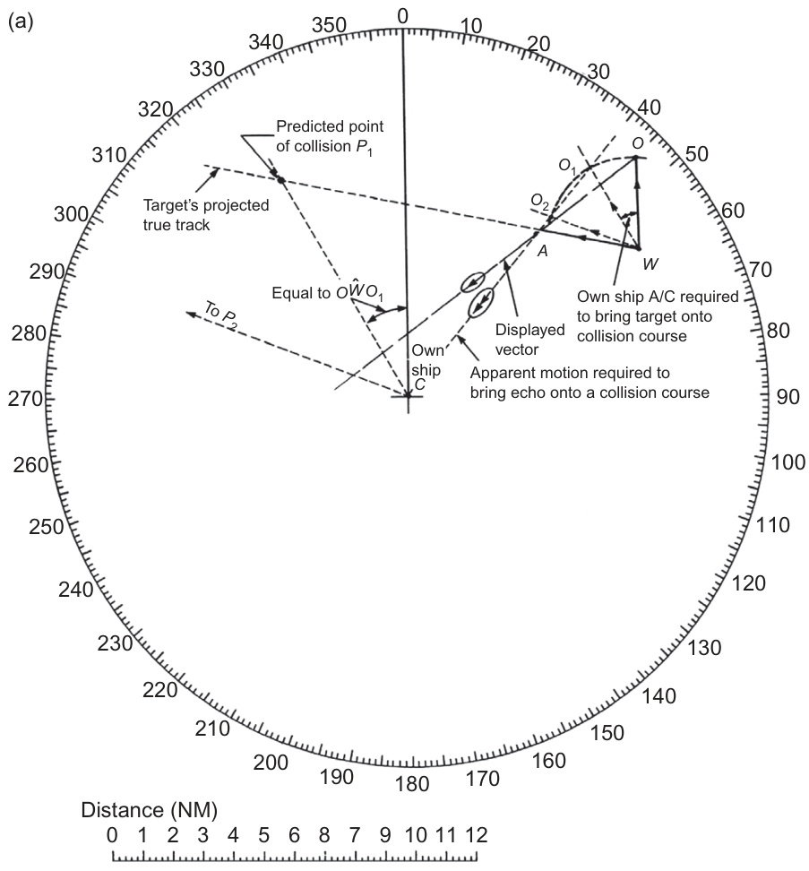  
FIGURE 7.17 (a) PPC. (b) Answer to Example 7.7.  

【处理失败：内存不足或无法生成有效响应】

# 7.6.2 The Construction to Find the PPC  

For a full explanation of PPCs, refer to Section 4.11. The plot is constructed as follows:  

【翻译】
有关PPCs的详细说明，请参阅第4.11节。图表的构建如下所述：

【解读】
本段提示读者若要了解PPCs（可能指付费点击广告或其他特定领域的缩写）的详细信息，应参考第4.11节。同时，它开始介绍某种图表的构建方法，但具体内容在此段落中没有完全展开。

【词汇表】
| 英文词汇 | 中文翻译 | 解释 |
| --- | --- | --- |
| PPCs | 付费点击广告/特定领域缩写 | 指在网络广告中，每当用户点击广告时，广告主就会支付一定费用的一种广告模式，也可能是其他领域中的特定缩写。 |
| refer to | 参考、查阅 | 指导读者去查看特定的资料或章节以获取更多信息。 |
| constructed | 构建、建立 | 指创建或搭建某种结构或系统，如图表等。 |

a. Plot the target and produce the basic triangle.   
b. Join the own ship position $'C^{\prime}$ to the target’s position $'A^{\prime}$ and extend beyond $'A^{\prime}$ .   
c. With compasses at $W$ and radius WO, scribe an arc to cut $C A$ produced at $O_{1}$ or, if the own ship is the slower (i.e. $W O<W A)$ , at $O_{1}$ and $O_{2}$ .   
d. Join $W O_{1}$ (and $W O_{2},$ ).   
e. Draw $C P_{1}$ parallel to $W O_{1}$ to cut WA produced at $P_{1}$ (and $C P_{2}$ parallel to $W O_{2}$ to cut WA produced at $P_{2}$ ).   
f. $P_{1}$ (and $P_{2}$ ) is the PPC.  

For a clearer appreciation of the determination of the PPC, Example 7.7 should be drawn out full size and to scale on a plotting sheet.  

【翻译】
为了更好地理解PPC（生产可能性曲线）的确定，应将例7.7按照实际大小和比例绘制在图纸上。

【解读】
本段强调了通过实践操作来加深对经济学概念的理解。在这里，具体指的是生产可能性曲线（PPC），它是微观经济学中一个基本概念，用来描述两个商品之间的生产可能性边界。通过实际绘制这个曲线，可以帮助学习者更直观地理解其形状、特征以及随着资源变化而如何调整，从而加深对这一经济学概念的掌握。

【词汇表】
| 英文词汇 | 中文翻译 | 解释 |
| --- | --- | --- |
| PPC | 生产可能性曲线 | 描述两个商品之间的生产可能性边界的经济学模型 |
| Plotting sheet | 图纸 | 用于绘制图表的特殊纸张或工具 |
| To scale | 按照比例 | 保持实际尺寸与图纸上的比例一致的意思 |

# 7.6.3 The Predicted Area of Danger  

The PPC gives no indication of the course which needs to be steered to clear the PPC by some specific distance; to this end, the predicted area of danger (PAD) was devised (Figure 7.18(a)). A further improvement is that the target is connected to its PAD on the display, which was not the case with the PPC.  

【翻译】
PPC没有指出需要调整航向以在特定距离内避开它；为此，人们设计了预测危险区域（Predicted Area of Danger，PAD），如图7.18（a）所示。此外，还有一项改进，即目标与其PAD在显示屏上相连，这是PPC中没有的功能。

【解读】
本段主要讨论的是飞行中的安全辅助系统，特别是PPC（预测防撞路径曲线）和PAD（预测危险区域）。这些系统旨在帮助飞行员避免碰撞事故。通过引入PAD和连接目标与其PAD的显示，系统变得更加完善，能够更好地提醒飞行员潜在的危险区域，从而提高飞行安全性。

【词汇表】
| 英文词汇 | 中文翻译 | 解释 |
| --- | --- | --- |
| PPC | 预测防撞路径曲线 | 一种飞行安全辅助系统，用于预测可能发生碰撞的路径 |
| PAD | 预测危险区域 | 用于预测和显示飞行中可能存在的危险区域 |
| Target | 目标 | 在飞行导航中指需要关注或避开的物体或区域 |

# FIGURE 7.17 (Continued)  

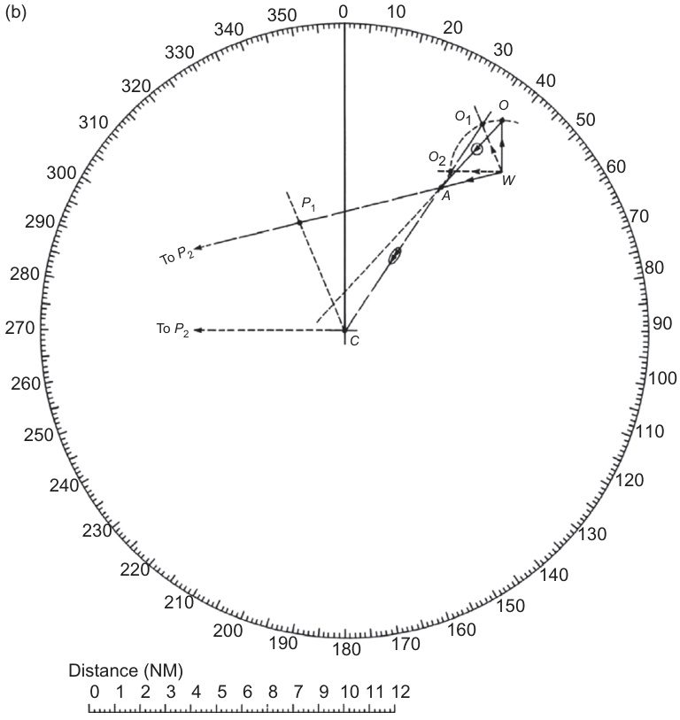  

【处理失败：内存不足或无法生成有效响应】

# EXAMPLE 7.8 (USED IN FIGURE 7.18)  

With the own ship steering $000^{\circ}$ (T) at a speed of 12 knots, an echo is observed as follows:  

1000 Echo bears $045^{\circ}$ (T) at 10.0 NM   
1006 Echo bears $045^{\circ}$ (T) at 8.5 NM   
1012 Echo bears $045^{\circ}$ (T) at 7.0 NM  

Plot the target and draw in the PAD for a 2.0 NM clearing. Answer See Figure 7.18(b).  

【翻译】
绘制目标图，并为2.0海里清除障碍物的PAD进行标记。参见图7.18（b）。

【解读】
本段要求读者根据特定条件（2.0海里清除障碍物）来绘制目标图，并在图中标记相关的PAD（可能指的是“预防区域”或其他与航海、测量相关的术语）。这通常是在航海或测量领域用于规划安全路线或避开障碍物的步骤。

【词汇表】
| 英文词汇 | 中文翻译 | 解释 |
| --- | --- | --- |
| Plot | 绘制 | 在图纸上画出某物的位置或形状 |
| Target | 目标 | 指需要达到的目的或位置 |
| PAD | 预防区域/避让区 | 可能是指在航海或测量中为了安全而设定的区域 |
| Clearing | 清除障碍物 | 移除或避开障碍物以确保安全通行 |
| NM | 海里 | 一种长度单位，1海里约等于1852米 |

c. With compasses at $W$ and radius WO, scribe an arc to cut $T_{1}A$ and $T_{2}A$ at $O_{1}$ and $O_{2},$ respectively.   
d. Join $W O_{1}$ and $W O_{2}$ . These represent the limiting courses to steer to clear the target by the required CPA.   
e. Draw $C E_{1}$ and $C E_{2}$ parallel to $W O_{1}$ and $W O_{2},$ respectively, to cut WA produced at $E_{1}$ and $E_{2},$ respectively.   
f. At the mid-point of $E_{1}E_{2},$ draw the perpendicular to $E_{1}E_{2}$ and extend it in both directions. In each direction, mark off the ‘required CPA’ and label the points $E_{3}$ and $E_{4}$ .   
g. Draw in the ellipse (Figure 7.18(a)) passing through the points $E_{1},E_{2},E_{3}$ and $E_{4}$ (or the hexagon as indicated in Figure 7.18(b)). In the interest of simplicity, the ellipse was replaced by the hexagonal PAD in later equipment.  

# 7.6.4 The Construction of the PAD  

a. Plot the target and produce the basic triangle.   
b. Draw lines $A T_{1}$ and $A T_{2}$ from the target’s position $A,$ tangential to a circle of radius equal to the required CPA. Extend beyond $A$ .  

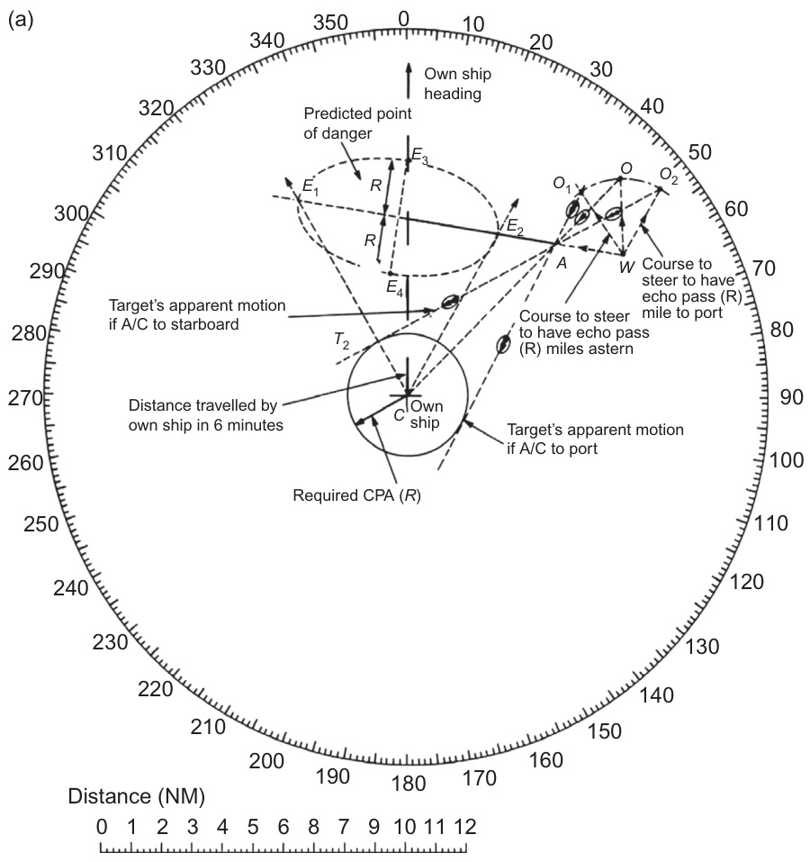  
FIGURE 7.18 (a) The PAD (b) Answer to Example 7.8.  

【处理失败：内存不足或无法生成有效响应】

For a clearer appreciation of the PAD, Example 7.8 should be drawn out full size and to scale on a plotting sheet.  

【翻译】
为了更好地理解PAD，应将例7.8按照实际大小和比例在图纸上绘制出来。

【解读】
这段话建议读者为了更深入地了解PAD（可能指某种技术图纸或设计），应该按照原尺寸和比例在图纸上详细绘制出例7.8。这有助于读者直观地认识和理解PAD的各个部分及其关系。

【词汇表】
| 英文词汇 | 中文翻译 | 解释 |
| --- | --- | --- |
| PAD | 设计图纸/平面图 | 指一种用于展示设计或技术信息的图纸或平面图 |
| plotting sheet | 图纸 | 用于绘制图形或设计的纸张 |
| to scale | 按照比例 | 指按照实际大小或比例进行绘制或表示 |

# 7.6.5 The Sector of Danger  

In this approach, a line $C H,$ equal in length and direction to $O W,$ is drawn from the centre of the plotting sheet. This line is referred to as the own ship vector. The sector of danger is an area constructed to provide a chosen passing distance. If the remote end of the own ship vector lies outside the sector of danger (SOD), a passing distance greater than the chosen value will be achieved, provided that the target does not manoeuvre.  

# EXAMPLE 7.9 (USED IN FIGURE 7.19)  

With the own ship steering $000^{\circ}$ (T) at a speed of 12 knots, an echo is observed as follows:  

<html><body><table><tr><td>1000</td><td>Echo bears 045° (T) at 11.0 NM</td></tr><tr><td></td><td></td></tr><tr><td>1010</td><td>Echo bears 045° (T) at 9.0 NM</td></tr><tr><td>1020</td><td>Echo bears 045° (T) at 7.0 NM</td></tr></table></body></html>  

Plot the SOD and suggest the minimum alteration of course to starboard at 1020 (instantaneous) which will achieve a 2 NM CPA if the own ship’s speed is maintained throughout.  

【翻译】
绘制SOD图，建议在1020时（瞬间）向右舵侧进行最小的航向调整，以便在保持自身船速的情况下实现与目标物体的距离为2海里。

【解读】
本段要求根据安全距离观测（SOD）的结果，在特定时间（1020）对航向进行微调，以确保与其他船只或障碍物之间保持至少2海里的安全距离。这需要考虑到自己的船速保持不变，并通过最小的航向改变来实现这一目标。

【词汇表】
| 英文词汇 | 中文翻译 | 解释 |
| --- | --- | --- |
| SOD | 安全距离观测 | 一种用于评估船舶与其他物体之间安全距离的方法 |
| CPA | 最近接近点 | 船舶与其他物体之间最近的距离 |
| NM | 海里 | 距离单位，1海里约等于1852米 |
| Starboard | 右舵侧 | 船舶的右侧 |

Answer. If the own ship alters course to $027^{\circ}$ (T) at 1020, then the target’s new apparent track will be along $A T_{1}$ (Figure 7.19).  

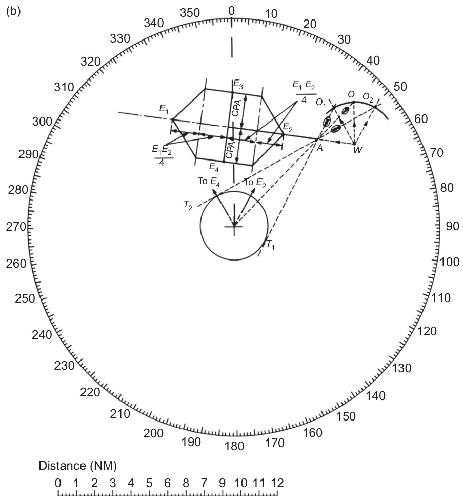  
FIGURE 7.18 (Continued)  

【处理失败：内存不足或无法生成有效响应】

# 7.6.6 The Construction of a Sector of Danger  

a. Plot the target for a set period.   
b. Draw the own ship’s vector for the same period CH, equal to the distance that the own ship will travel in the plotting interval, that is equal to OW.   
c. Draw $H S$ parallel and equal to OA.   
d. Draw $A T_{1}$ and $A T_{2}$ tangential to the ‘required CPA’ range circle. (Note: If it were intended to delay the manoeuvre, then the tangents would be drawn from the predicted position of the target at the manoeuvre time.)   
e. Draw parallel lines to $T_{1}A$ and $T_{2}A$ through $S$ .   
f. Any manoeuvre which takes $H$ outside the shaded sector will achieve a CPA in excess of the required CPA.   
g. Swing $C H$ until it just touches the sector boundary at $H_{1}$ . This is the minimum alteration of course to starboard which the own ship can make at the present speed to keep the target to a 2 NM CPA.  

Alternatively, ‘speed’ could have been reduced to $C H_{2}$ which would also have taken the own ship’s vector just outside the sector.  

While this will take care of the geometry, it is essential to ensure that the manoeuvre  

【翻译】
虽然这可以处理几何问题，但确保机动性是至关重要的。

【解读】
本段强调了在某一特定操作或过程中，同时考虑到几何因素和机动性的重要性。它意味着仅仅满足几何条件是不够的，还需要确保整个过程的顺畅和可行性。

【词汇表】
| 英文词汇 | 中文翻译 | 解释 |
| --- | --- | --- |
| geometry | 几何 | 指空间中的形状、尺寸和位置关系等 |
| manoeuvre | 机动性、操纵 | 指能够灵活地进行操作或移动的能力 |
| essential | 至关重要的 | 强调某事物的必要性或重要性 |

FIGURE 7.19 The SOD Example 7.9.  

【翻译】
图7.19 SOD示例7.9

【解读】
本段落似乎是从一篇技术文章或教材中截取的一部分，具体展示了一个名为"SOD"的示例（第7.9号）。由于提供的信息有限，这里无法对SOD的含义或背景进行详细解释。但一般来说，SOD可能指某种特定领域中的一个概念、模型或方法，如软件开发、数据分析等。

【词汇表】
| 英文词汇 | 中文翻译 | 解释 |
| --- | --- | --- |
| FIGURE | 图 | 指图表或插图 |
| SOD | 示例/模型 | 可能代表某种特定领域的概念或方法 |
| Example | 示例 | 具体案例或实例 |

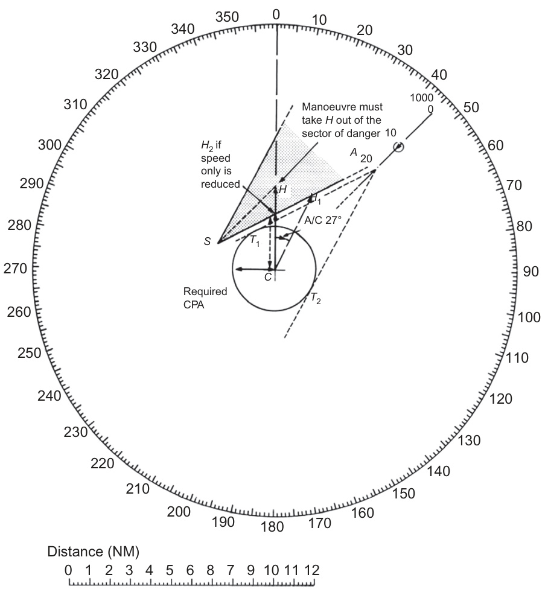  

【处理失败：内存不足或无法生成有效响应】

selected is still in accordance with the collision-avoidance rules and the practice of good seamanship (see Section 7.11).  

【翻译】
所选择的仍然符合碰撞避免规则和良好的航海实践（见第7.11节）。

【解读】
本段强调了在航海活动中选择合适的方法或路线时，必须遵守既定的安全规则和规范，以确保航海安全。这涉及到对潜在碰撞风险的评估和采取措施来避免这些风险，同时也体现出良好的航海习惯和职业素养。

【词汇表】
| 英文词汇 | 中文翻译 | 解释 |
| --- | --- | --- |
| collision-avoidance | 碰撞避免 | 指的是为了防止船舶、飞机等交通工具之间发生碰撞而采取的措施和规则。 |
| seamanship | 航海实践/航海技术 | 指的是与航海相关的技能、知识和经验，包括操作船舶、应对紧急情况等方面的专业能力。 |
| good seamanship | 良好的航海实践 | 表示高水平的航海技能和专业素质，能够有效地应对各种航海情况，确保安全。 |

# 7.6.7 The Sector of Preference  

This relates to a stationary target or navigation mark and is a sector into which one must steer to achieve a passing distance within prescribed limits (Figure 7.20).  

【翻译】
这与静止目标或导航标志有关，是一个需要调整方向以达到规定限度内的通过距离的扇形区域（图7.20）。

【解读】
本段主要讨论的是船舶导航中关于通过某一特定区域的概念，这个区域是为了确保安全距离而设定的。在实际操作中，驾驶员需要根据指定的限度来调整航向，以便能够在规定的距离范围内通过某个目标或标志点。

【词汇表】
| 英文词汇 | 中文翻译 | 解释 |
| --- | --- | --- |
| stationary target | 静止目标 | 不移动的目标物体，如灯塔、浮标等 |
| navigation mark | 导航标志 | 用于引导船只航行的标志，如浮标、灯塔等 |
| prescribed limits | 规定限度 | 根据规则或标准规定的允许范围或界限 |

# EXAMPLE 7.10 (USED IN FIGURE 7.20)  

With the own ship steering $310^{\circ}$ (T) at a speed of 15 knots, a light vessel, identified by its racon, is observed as follows:  

<html><body><table><tr><td>0900</td><td>Echo bears 296° (T) at 10.0 NM</td></tr><tr><td>0906</td><td>Echo bears 290° (T) at 8.6 NM</td></tr><tr><td>0912</td><td>Echo bears 282° (T) at 7.4 NM</td></tr><tr><td></td><td></td></tr></table></body></html>  

It is intended to manoeuvre at 0924.  

【翻译】
计划于0924时进行机动。

【解读】
这句话表明某一行动或任务（可能是军事相关）将在指定时间0924进行，这个时间很可能是以24小时制表示的，即早上9点24分。这句话强调了对时间的精确控制和计划性。

【词汇表】
| 英文词汇 | 中文翻译 | 解释 |
| --- | --- | --- |
| manoeuvre | 机动、操纵 | 指军事行动中按照预定计划移动或调整位置 |
| intended | 计划、意图 | 表示已经做出决定或安排要执行某一行动 |
| at | 于、在 | 用来指示具体的时间或地点 |

a. Construct the sector of preference (SOP) if the light vessel is required to pass at not less than 2 NM nor more than 4 NM to port.   
b. Determine the course alteration which would be needed to achieve a CPA of 2 NM to port (assume the alteration to be instantaneous). Answer. (a) See Figure 7.20. Alter course to $258^{\circ}$ (T), that is $52^{\circ}$ to port.  

FIGURE 7.20 The SOP Example 7.10.  

【翻译】
图7.20：标准操作程序示例7.10

【解读】
本段落主要是指向一张图表，图中展示了一个标准操作程序（SOP）的示例，这可能是在某种特定场合或行业中使用的规范化工作流程或指导方针。

【词汇表】
| 英文词汇 | 中文翻译 | 解释 |
| --- | --- | --- |
| Figure | 图表 | 一种视觉辅助工具，用来说明或支持某个观点或数据。 |
| SOP | 标准操作程序 | 指在特定情况下遵循的规范化步骤或规则，以确保工作的一致性和质量。 |
| Example | 示例 | 具体案例，用以阐明概念或原理。 |

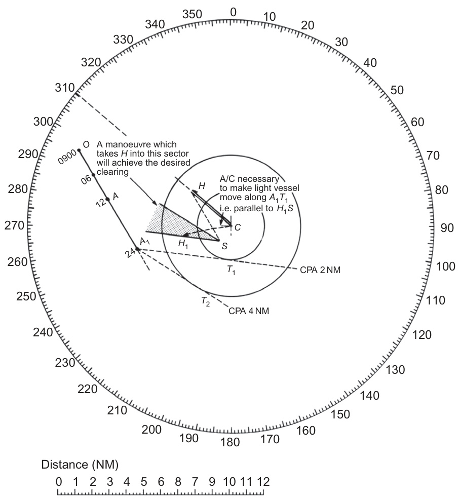  

【处理失败：内存不足或无法生成有效响应】

# 7.6.8 The Construction of an SOP  

a. Plot the stationary target for a set period of time.   
b. Draw the own ship’s vector for the same period, CH, equal to the distance that the own ship will travel in the plotting interval, that is equal to OW.   
c. Draw HS parallel and equal to OA.   
d. Plot the position of the target at the time at which it is intended to manoeuvre, $A_{1}$ .   
e. From $A_{1},$ draw tangents to range limits for clearing the target, $A_{1}T_{1}$ and $A_{1}T_{2}$ .  

f. Draw parallel lines to $T_{1}A_{1}$ and $T_{2}A_{1}$ through S.  

g. Any manoeuvre which takes $H$ into the shaded sector will result in the target clearing within the limits for which the sector was drawn (provided that any tidal effect remains constant). This could be achieved by an alteration of course or speed, or both. If CH is swung until it intersects either of the limits of the shaded sector then that will be the course required to achieve the specific CPA.  

# 7.7 THE PLOT IN TIDE  

# EXAMPLE 7.11 (USED IN FIGURE 7.21)  

With the own ship steering $310^{\circ}$ (T) at a speed of 15 knots, the echo from a light vessel fitted with a racon is observed as follows:  

<html><body><table><tr><td>0900</td><td>Echo bears 346° (rel) at 10.0 NM</td></tr><tr><td>0906</td><td>Echo bears 340° (rel) at 8.6 NM</td></tr><tr><td>0912</td><td>Echo bears 332° (rel) at 7.4 NM</td></tr></table></body></html>  

a. Find the set and rate of the tide.  

【翻译】
找到潮汐的方向和速度。

【解读】
本句指的是确定海洋潮汐运动的方向和速度。潮汐是由月球和太阳对地球海洋的引力作用所致，使得海平面周期性地升降。

【词汇表】
| 英文词汇 | 中文翻译 | 解释 |
| --- | --- | --- |
| tide | 潮汐 | 海洋由于月球和太阳的引力而产生的周期性升降运动 |
| set | 方向 | 指潮汐运动的方向 |
| rate | 速度 | 指潮汐运动的快慢程度 |

b. It is required that your ship should pass 2 NM off, leaving the light vessel to port. i. If action is taken instantaneously at 0912, find the alteration of course which would be necessary. ii. If instead, the action is to be taken at 0924 instead of 0912, find the alteration of course which would then be necessary.  

【翻译】
要求你的船只距离灯塔2海里远，留下灯塔在左舷。如果在0912时立即采取行动，求出需要改变的航向。如果相反，行动改为在0924时采取而不是0912时，求出那时需要改变的航向。

【解读】
本段落描述了一个航海场景，要求一艘船只距离某个灯塔2海里远，并且要保持灯塔在其左侧（port）。然后提出了两个问题：如果在0912时或0924时采取行动，分别需要改变多少航向。这涉及到航海中的定位、方向判断以及时间与空间关系的计算。

【词汇表】
| 英文词汇 | 中文翻译 | 解释 |
| --- | --- | --- |
| NM | 海里 | 一种测量海上距离的单位，1海里约等于1852米 |
| Port | 左舷 | 船只左侧，相对于右舷（starboard） |
| Instantaneously | 立即 | 在极短的时间内发生或完成 |
| Alteration | 改变 | 指航向、速度等的变化 |

Answer. See Figure 7.21.  

【翻译】
答案，请参见图7.21。

【解读】
该英文段落指向一个特定图表（Figure 7.21）作为问题的答案，可能是在某种教材、论文或报告中用来说明某一观点或解决方案。

【词汇表】
| 英文词汇 | 中文翻译 | 解释 |
| --- | --- | --- |
| Answer | 答案 | 指对某个问题或疑问的回应或解决方案 |
| Figure | 图表 | 一种用于说明或展示数据、概念等的视觉表现形式 |
| Refer | 参见 | 指示查看或查阅某些信息或资料以获取更多细节或证据 |

a. $\mathrm{Set}=032^{\circ}$ (T) at 5 knots b. i. Course to steer at 0912 is $278^{\circ}$ (T) ii. Course to steer at 0924 is $260^{\circ}$ (T)  

FIGURE 7.21 The plot in tide Example 7.11.  

【翻译】
图7.21潮汐示例7.11中的曲线图。

【解读】
该段落主要是描述一幅图表，图表编号为7.21，内容与潮汐相关，可能是在某个特定条件下的变化趋势或模式。

【词汇表】
| 英文词汇 | 中文翻译 | 解释 |
| --- | --- | --- |
| Figure | 图表 | 一种用于展示数据或信息的视觉表现形式 |
| Plot | 曲线图 | 一种显示数据之间关系的图形，通常用来表示变量之间的变化 |
| Tide | 潮汐 | 海洋水面因月球和太阳引力而产生的周期性涨落现象 |

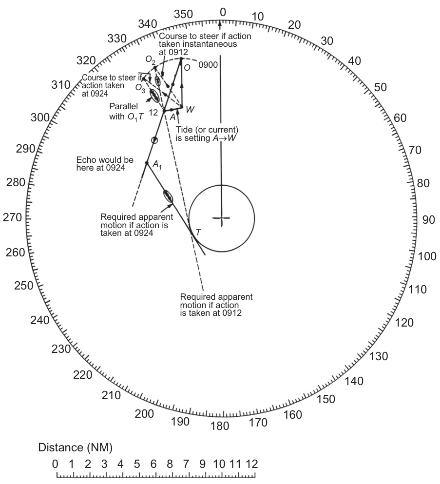  

【处理失败：内存不足或无法生成有效响应】

# 7.7.1 The Construction of the Plot  

a. Establish the identity of the target beyond all doubt (see Section 8.2). Plot the target and construct the basic triangle.   
b. W and $A$ should coincide if there is no tide. If they do not, then $A$ to W is the direction in which the tide is setting. Note that this is the reverse of what is normally deduced from a plot but since the target cannot be moving, it is the ship which must be experiencing set. The distance WA is the drift of the tide in the plotting interval and it is from this that the tidal rate can be calculated.  

Note: When plotting other (moving) targets while experiencing tide, it is their movement through the water which is evaluated. It is precisely this which needs to be known when applying the collision-avoidance rules, and so it is essential that no attempt should be made to apply the effect of tide or current to their courses as determined from the plot.  

【翻译】
注意：当在潮汐条件下绘制其他（移动）的目标时，需要评估的是它们在水中的运动情况。正是这种情况需要在应用碰撞避免规则时知道，因此绝不能尝试将潮汐或洋流的影响应用于从图中确定的航线上。

【解读】
本段强调了在潮汐条件下导航时，特别是在评估移动目标的运动轨迹时，应关注目标在水中的实际运动情况，而不是简单地考虑潮汐或洋流对其航线的影响。这对于确保安全的碰撞避免规则至关重要。

【词汇表】
| 英文词汇 | 中文翻译 | 解释 |
| --- | --- | --- |
| Tide | 潮汐 | 指海洋由于月球和太阳引力的作用而产生的周期性涨落现象 |
| Current | 洋流 | 水体的水平运动，可能受潮汐、风等因素影响 |
| Collision-avoidance rules | 碰撞避免规则 | 一套用于预防船舶之间碰撞的规则和指南 |

# 7.7.2 The Course to Steer to Counteract the Tide  

a. Plot the target and determine the tide or current.   
b. Predict the position of the target at the time at which it is intended to manoeuvre.   
c. Draw in the apparent track which is required, for example $A_{1}T$ .   
d. Draw in a line in the reverse direction through $A,$ i.e. $A O_{2}$ (and $A O_{3}$ for the manoeuvre at 0924).   
e. Swing WO to cut the line through $A$ at $A O_{2}$ (and $A O_{3},$ ).   
f. $W O_{2}$ is the new course to steer (and $W O_{3}$ if the manoeuvre is delayed).  

Note: All of the above assume instantaneous manoeuvres. When handling large ships in tide, due allowance will need to be made for their handling characteristics, especially when a speed change is demanded.  

【翻译】
注意：上述所有假设都基于瞬间机动。但是在潮汐中操作大型船只时，需要考虑到它们的操纵特性，特别是当要求速度变化时。

【解读】
本段强调了在实际操作中，尤其是在潮汐环境下操作大型船只时，不能忽略船只的操纵特性和速度变化带来的影响。这意味着操作人员需要根据具体情况进行调整，以确保安全高效的操作。

【词汇表】
| 英文词汇 | 中文翻译 | 解释 |
| --- | --- | --- |
| instantaneous | 瞬间的 | 指发生或完成在极短时间内的事物 |
| manoeuvres | 机动、操纵 | 指对船只或飞行器等进行控制和导航的行为 |
| tide | 潮汐 | 指海洋水面因月球和太阳引力而产生的周期性涨落现象 |
| handling characteristics | 操纵特性 | 指船只或其他设备在不同条件下的反应和表现方式 |

# 7.7.3 The Change of Course Needed to Maintain Track When Changing Speed in Tide  

When proceeding while experiencing tide, any change in the own ship’s course and/or speed and/or tidal set and/or rate will affect the vessel’s ground track.  

【翻译】
当船舶在潮汐中航行时，自身航向、速度、潮流方向或速率的任何变化都会影响船舶在地面上的实际航迹。

【解读】
本段强调了潮汐对船舶航行的影响，指出船舶自身状态（如航向、速度）以及外部环境因素（如潮流方向和速率）的变化，都会导致其在地面上实际走过的路线发生改变。这要求航海人员需要考虑到这些复杂因素，以确保安全高效的航行。

【词汇表】
| 英文词汇 | 中文翻译 | 解释 |
| --- | --- | --- |
| Tide | 潮汐 | 指海洋由于月球和太阳引力的作用而产生的周期性涨落现象 |
| Vessel | 船舶 |泛指各种类型的船只或水上交通工具 |
| Ground Track | 地面航迹 | 指船舶在地面上实际走过的路线，与理论航线可能有所不同 |
| Tidal Set | 潮流方向 | 指潮汐流动的方向 |
| Rate | 速率 | 本文中特指潮流的速度 |

# EXAMPLE 7.12 (USED IN FIGURE 7.22)  

While steering $090^{\circ}$ (T) at a speed of 16 knots, a beacon marking the anchorage is observed as follows:  

<html><body><table><tr><td colspan="2"></td></tr><tr><td>0900</td><td>Echo bears 076° (T) at 10.0 NM</td></tr><tr><td>0906</td><td>Echo bears 070° (T) at 8.6 NM</td></tr><tr><td>0912</td><td>Echo bears 062° (T) at 7.4 NM</td></tr></table></body></html>  

It is intended to anchor 2 NM due south of the beacon.  

【翻译】
计划在灯塔正南2海里处抛锚。

【解读】
这句话描述的是一艘船或某种浮动装置计划在一个特定位置，即灯塔以南2海里的地方抛下锚。这可能是在航海或水上作业中确定位置的一部分。

【词汇表】
| 英文词汇 | 中文翻译 | 解释 |
| --- | --- | --- |
| Anchor | 抛锚 | 将船只固定在水底，以防止其漂移 |
| Beacon | 灯塔 | 一种标志物，通常用于导航或警告 |
| Due South | 正南 | 方向，指南方正方向，没有偏东或偏西 |

a. Determine the set and rate of the tide.   
b. Determine the course to steer at 0912 to counteract the tide.   
c. If the speeds which are represented by the engine room telegraph settings of Half Ahead, Slow Ahead and Dead Slow Ahead are 9, 6 and 3 knots, respectively, determine the courses to be steered as the speed is progressively reduced when approaching the anchorage.  

【翻译】
a. 确定潮汐的方向和速度。
b. 在0912时确定需要驾驶的航向，以抵消潮汐的影响。
c. 如果发动机室电报设置中的半速前进、慢速前进和完全停顿前进分别对应的速度为9、6和3节，那么当接近锚泊点时，随着速度逐渐减小，确定需要驾驶的航向。

【解读】
本段落主要讨论的是船舶在潮汐环境下的导航问题，涉及到确定潮汐的方向和速度，根据潮汐的影响调整航向，以及在减速的情况下如何选择合适的航向以确保安全靠港。这些步骤对于船舶的安全操作和避免事故至关重要。

【词汇表】
| 英文词汇 | 中文翻译 | 解释 |
| --- | --- | --- |
| Tide | 潮汐 | 指海洋由于月球和太阳的引力作用而产生的周期性涨落现象 |
| Telegraph settings | 电报设置 | 这里指的是发动机室中控制船舶速度的设备设置，如Half Ahead（半速前进）、Slow Ahead（慢速前进）等 |
| Knots | 节 | 船舶的速度单位，1节约等于1.852公里/小时 |
| Anchorage | 锚泊点 | 指船舶可以抛锚停泊的地方，如港口或指定的锚地 |

Answer. See Figure 7.22.  

【翻译】
答案，请参见图7.22。

【解读】
本段落内容较为简单，主要是指引读者查看特定图表（图7.22）以获取某个问题的答案。这意味着相关信息或解释已经在图7.22中提供，因此不需要进一步的文字描述。

【词汇表】
| 英文词汇 | 中文翻译 | 解释 |
| --- | --- | --- |
| Answer | 答案 | 指解决问题或回应疑问的内容 |
| Figure | 图表、插图 | 用于说明或支持论点的视觉辅助工具 |
| Refer | 参见、参考 | 指导读者去查看其他地方的信息或资源 |

a. The tide is setting $184^{\circ}$ (T) at 5 knots.   
b. At 0912, alter course to $060^{\circ}$ (T).   
c. Half Ahead steer $052^{\circ}$ (T). Slow Ahead steer $035^{\circ}$ (T).  

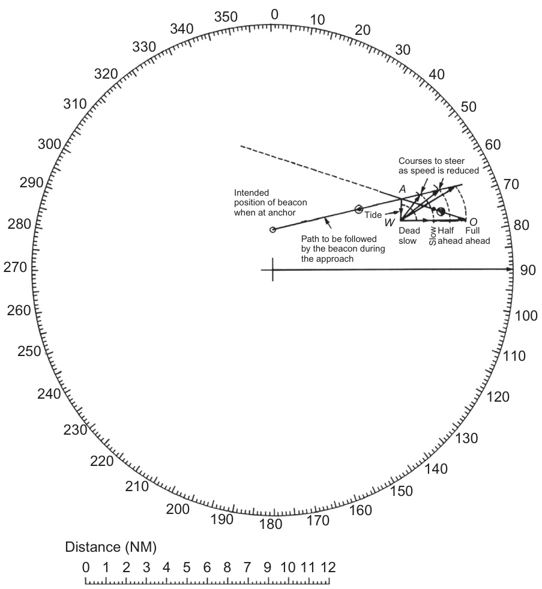  
FIGURE 7.22 The course to steer in tide as speed is reduced Example 7.12.  

【处理失败：内存不足或无法生成有效响应】

Dead Slow Ahead: it is necessary to steer $004^{\circ}$ (T) and stem the tide, but note that the tide is 1 knot greater than the ahead speed.  

# 7.8 MANUAL PLOTTING ACCURACY AND ERRORS  

ship’s course and speed, and the plotting interval. Also, there are of course personal errors and blunders. While a constant (or systematic) error in input will result in a constant error in the answer obtained, it is the errors which are of a random nature which govern the size of the ‘circle of uncertainty’ around the plotted position which, if not actually drawn, should be borne in mind when plotting a position.  

【翻译】
船舶的航向和速度，以及绘制间隔，也会影响定位的准确性。此外，还有个人错误和失误。虽然输入中的恒定（或系统）错误会导致结果中出现恒定的偏差，但那些随机性的错误决定了在已知位置周围“不确定圈”的大小，即使没有实际画出这个圆圈，在绘制位置时也应该考虑到这些因素。

【解读】
本段主要讨论的是导航过程中可能出现的各种类型的错误及其对定位准确性的影响。包括船舶自身状态、人为操作以及随机性错误等多种因素都会导致最终定位结果的不确定性。因此，在进行导航定位时，需要综合考虑这些因素，以便更好地评估和控制定位的准确度。

【词汇表】
| 英文词汇 | 中文翻译 | 解释 |
| --- | --- | --- |
| plotting interval | 绘制间隔 | 指在导航过程中两次定位之间的时间间隔 |
| circle of uncertainty | 不确定圈 | 指由于各种错误导致的定位结果的不确定范围 |
| systematic error | 系统性错误 | 指由固定原因导致的、可以预测的错误 |
| random nature | 随机性 | 指无法预测、随机发生的事件或变化 |

The error in the result from any computation depends upon the accuracy of the data used. The intrinsic sources of error in the radar system relate to the measurement of ranges and bearings. Other data needed to complete the radar plot and subject to error are the own  

【翻译】
计算结果中的错误取决于所用数据的准确性。雷达系统中固有的误差源与测量距离和方位有关。完成雷达图像所需的其他数据也容易出错，这些数据包括自身位置、速度和方向等信息。

【解读】
本段强调了数据准确性的重要性，特别是在雷达系统中，测量距离和方位的精度直接影响到最终结果的可靠性。此外，自身位置、速度和方向等信息的准确性也是保证雷达图像完整性和准确性的关键因素。

【词汇表】
| 英文词汇 | 中文翻译 | 解释 |
| --- | --- | --- |
| accuracy | 准确性 | 数据或测量结果的正确程度 |
| intrinsic | 内在的，固有的 | 指某事物或系统中自然存在或内含的特性或属性 |
| bearing | 方位 | 指目标相对于观察者或参考点的方向角度 |
| radar plot | 雷达图像 | 由雷达系统生成的显示目标位置和运动信息的图形表示 |

Note: Precision of measurement and accuracy of measurement should not be confused. For example, it was no good being able to measure bearings to $0.1^{\circ}$ when the ‘free play’ in traditional mechanical gearing was $\pm2^{\circ}$ .  

# 7.8.1 Accuracy of Bearings as Plotted  

Errors in bearings may arise from any of the following causes:  

【翻译】
轴承中的错误可能源于以下任何原因：

【解读】
本段主要讨论了轴承中错误的潜在来源，强调了需要考虑多种因素以确保轴承的准确性和可靠性。

【词汇表】
| 英文词汇 | 中文翻译 | 解释 |
| --- | --- | --- |
| Errors | 错误 | 指不正确或不精确的地方 |
| Bearings | 轴承 | 支撑和引导运动的机械部件 |
| Causes | 原因 | 导致某事发生的根源或理由 |

1. The existence of inherent errors which fall within the limits allowed by IMO Performance Standard (see Section 11.2.1). The individual error sources are discussed in detail in Section 6.6.8 where it is shown that they may aggregate to as much as $\pm2.5^{\circ}$ . It is also indicated that some components of the total error can be expected to remain constant over a series o bearings and these will have the effect of slewing all plotted positions by a fixed amount. There will, of course, be a random component which is most likely to arise from an instantaneous misalignment of the antenna and trace, and should not exceed $\pm1^{\circ}$ . This error will have the effect of scattering the observed positions about the correct apparent track.   
2. Parallax when bearings are taken with a Perspex cursor (no longer seen at sea).   
3. Failure to centre the origin correctly when use is to be made of a Perspex cursor, (again not a modern problem).   
4. Errors of alignment of the electronic bearing line. This error is likely to be constant over a series of bearings (sec Section 6.6.8).   
5. Failure to check the heading at the time a bearing is taken when a ship’s head-up unstabilized orientation is selected. This error is likely to be random.  

6. Personal errors and blunders.  

【翻译】
6. 个人错误和失误。

【解读】
本段落提到了“个人错误和失误”，这可能是在讨论工作、学习或其他领域中容易发生的人为错误。这类错误通常是由于个人疏忽、缺乏经验或者理解不当导致的，了解这些错误可以帮助人们改进和避免类似的失误。

【词汇表】
| 英文词汇 | 中文翻译 | 解释 |
| --- | --- | --- |
| Errors | 错误 | 指在工作、学习等过程中发生的不正确行为或结果 |
| Blunders | 失误 | 指严重的、令人尴尬或后悔的错误，通常带有更强烈的负面含义 |
| Personal | 个人 | 指与个人的特质、行为或责任相关的事物 |

# 7.8.2 Accuracy of Ranges as Plotted  

Sources of error in the measurement of range may include any or all of the following:  

【翻译】
测量距离可能存在的误差来源包括以下任意或全部内容：

【解读】
本段主要讨论了在测量距离时可能出现的错误来源，提示读者需要注意这些潜在的影响因素，以确保测量结果的准确性。

【词汇表】
| 英文词汇 | 中文翻译 | 解释 |
| --- | --- | --- |
| Sources | 来源、来源地 | 指的是产生某种现象或问题的根源或起点 |
| Error | 错误、误差 | 在测量或计算中出现的不准确或偏差 |
| Measurement | 测量、衡量 | 使用工具或方法来确定某物的大小、数量或其他属性的过程 |
| Range | 距离、范围 | 指两个点之间的距离，或一系列值的上下限之间的差异 |

1. Range errors inherent in radar systems which comply with IMO Performance Standards. These are described in  

【翻译】
雷达系统中固有的距离误差，这些系统符合国际海事组织（IMO）的性能标准。这些误差在下述内容中有所描述：

【解读】
本段主要讨论的是雷达系统中的距离误差问题，特别是那些符合国际海事组织（IMO）制定的性能标准的系统。这种误差可能会影响雷达系统的准确性和可靠性，因此了解和描述这些误差对于提高雷达系统的性能至关重要。

【词汇表】
| 英文词汇 | 中文翻译 | 解释 |
| --- | --- | --- |
| Range errors | 距离误差 | 雷达系统中测量距离的错误 |
| Radar systems | 雷达系统 | 利用无线电波探测和定位物体的系统 |
| IMO Performance Standards | 国际海事组织性能标准 | 由国际海事组织制定的船舶设备和系统的技术要求 |

Section 6.6.7. They should not exceed $1\%$ of the maximum range of the scale in use or $30\mathrm{m},$ , whichever is the greater. On the $12\mathrm{NM}$ range scale this gives 1.2 cables or $222\mathrm{m}$ . These errors should be constant over a series of ranges. 2. Inaccurate interpolation. This will give rise to random errors. 3. Mechanical errors in the variable range marker of old radial cathode ray tube (CRT) displays. Such errors should normally be constant over a series of ranges unless a serious mechanical fault exists. 4. Personal errors or blunders.  

# 7.8.3 Accuracy of the Own Ship’s Speed  

In general, the means of obtaining the ship’s speed can be flawed in the extreme and is the quantity most susceptible to error. Speed (or rather, distance travelled in the plotting interval) can be derived from a variety of sources, for example:  

【翻译】
一般来说，获取船速的方法可能存在极大的缺陷，是最容易出错的数量。速度（或者说，在绘图间隔期间行驶的距离）可以从多种来源推算出来，例如：

【解读】
本段讨论了获取船速的可靠性问题，指出传统方法可能存在较大误差，容易受到错误影响。这意味着在航海或相关领域中，准确测量船速至关重要，但由于方法的局限性，这一过程可能会面临挑战。

【词汇表】
| 英文词汇 | 中文翻译 | 解释 |
| --- | --- | --- |
| flawed | 存在缺陷 | 指某事物或方法存在缺点或错误 |
| susceptible | 容易受影响 | 描述某事物容易受到外界因素的影响或改变 |
| plotting interval | 绘图间隔期间 | 指在导航或制图过程中，用于记录和计算位置、速度等数据的时间间隔 |

1. Distance (towed) log. A very traditional mechanical system in which it was not possible to know one’s speed quickly, particularly when altering speed (e.g. in poor visibility). Also, it was common practice to hand the log when the engines are put on stand-by, so as to avoid fouling the propeller when the engines were put astern. Some towed logs did have an additional unit which provide a read-out of speed as well as distance.   
2. Speed (pitot, impeller, electromagnetic) log. Although the speed may be read at any instant, the sensor is frequently withdrawn when the vessel is in shallow water, for example in port approaches.   
3. Engine revolutions. This is only accurate in so far as how well the ‘slip’ is accurately known and this is rarely the case when  

【翻译】

1. 拖曳式测程仪。这是一个非常传统的机械系统，在这种系统中，无法快速知道自己的速度，特别是在改变速度时（例如在能见度差的情况下）。另外，当发动机处于待命状态时，通常会手动控制测程仪，以避免当发动机反转时螺旋桨被缠绕。一些拖曳式测程仪还具有额外的单元，可以显示速度和距离的读数。
2. 速度测量仪（皮托管、叶轮、电磁式）。虽然可以随时读取速度，但当船只在浅水中航行时（例如靠港接近），传感器经常会被撤回。
3. 发动机转速。这只有在“滑移”参数准确已知的情况下才是准确的，但这种情况很少见，因为……

【解读】
这段文字主要介绍了三种不同类型的测程仪或测速方法：拖曳式测程仪、速度测量仪和发动机转速法。每种方法都有其特点和局限性，例如拖曳式测程仪不能快速获得速度信息，速度测量仪可能需要在浅水中撤回传感器，而发动机转速法的准确性依赖于对“滑移”参数的了解。

【词汇表】
| 英文词汇 | 中文翻译 | 解释 |
| --- | --- | --- |
| Towed log | 拖曳式测程仪 | 一种通过拖曳方式测量船速和距离的设备 |
| Pitot tube | 皮托管 | 一种用于测量流体速度的管道装置 |
| Slip | 滑移 | 指船舶螺旋桨推进效率中的损失或减少 |
| Impeller | 叶轮 | 一种用于测量流体速度的旋转叶片装置 |
| Electromagnetic log | 电磁式测程仪 | 一种利用电磁原理测量船速和距离的设备 |

changing speed such as when manoeuvring in fog.  

【翻译】
改变速度，如在雾中行驶时。

【解读】
这句话描述了驾驶员在特定情况下需要调整车速的场景，特别是在能见度较低的环境中，比如雾天。这种情况要求驾驶员对速度进行细致的控制，以确保安全。

【词汇表】
| 英文词汇 | 中文翻译 | 解释 |
| --- | --- | --- |
| manoeuvring | 操纵、操作 | 指驾驶员控制车辆的动作，尤其是在复杂或危险的情况下。 |
| fog | 雾 | 一种视野受限的天气条件，可能影响驾驶安全。 |
| changing speed | 改变速度 | 调整车辆的行驶速度以适应不同的驾驶条件。 |

4. Doppler log. It should be borne in mind that if ground locked, this indicates speed over the ground which in tide can lead to misinterpretation of the aspects of other ships (see Section 6.9.3). Also, there is some uncertainty as to just what ‘speed’ is being measured if using a single-axis sensor which is ‘ground locked’.  

【翻译】
4. 多普勒记录仪。需要注意的是，如果地面锁定，这表示相对于陆地的地面速度，在潮汐条件下可能会导致对其他船只的方位进行误解（见第6.9.3节）。另外，当使用单轴传感器且“地面锁定”时，还存在关于正在测量什么样的“速度”的不确定性。

【解读】
本段主要讨论多普勒记录仪在航海中的应用，特别是当它被设置为“地面锁定”模式时。这种模式下，记录仪测量的是相对于地面的速度，但是在潮汐条件下，这可能会导致对其他船只位置和运动方向的判断出现错误。同时，使用单轴传感器也会引入不确定性，因为它难以准确区分不同方向上的速度成分。

【词汇表】
| 英文词汇 | 中文翻译 | 解释 |
| --- | --- | --- |
| Doppler log | 多普勒记录仪 | 一种利用多普勒效应测量船速的设备 |
| Ground locked | 地面锁定 | 指多普勒记录仪被设置为测量相对于地面的速度 |
| Single-axis sensor | 单轴传感器 | 只能沿一个方向测量信号的传感器 |
| Tide | 潮汐 | 海洋由于月球和太阳的引力作用而产生的周期性涨落现象 |

5. Speed derived from positions plotted on the chart or Global Navigation Satellite System (GNSS) (see Section 10.1). There is a common misconception that this is the ship’s ‘correct’ speed, and on this basis it is used for plotting and as the manual input to the true-motion unit and ARPA (see Section 6.9.3). It must be remembered that the speed derived is measured over the ground, whereas it is the speed through the water which is required for plotting. Thus, if there is any tide involved, its effect must be allowed for in order to deduce the water speed.  

【翻译】
5. 从图表上绘制的位置或全球导航卫星系统（GNSS）中推算出的速度（见第10.1节）。有一种常见的误解，即认为这是船舶的“正确”速度，因此以此为基础用于绘制和作为真实运动单元和ARPA的手动输入（见第6.9.3节）。必须记住，从地面测量到的速度与通过水面的速度是不同的，而后者才是用于绘制所需的。如果涉及潮汐，其影响必须被考虑，以便推断出水速。

【解读】
本段主要讨论了船舶速度的测量问题，特别是从图表或GNSS系统中推算出的速度可能并不准确，因为它是基于地面测量的，而不是水中的实际速度。因此，在有潮汐的情况下，需要考虑到潮汐对速度的影响，以便得到准确的水速数据。

【词汇表】
| 英文词汇 | 中文翻译 | 解释 |
| --- | --- | --- |
| GNSS | 全球导航卫星系统 | 一种利用卫星来提供位置、速度和时间信息的导航系统 |
| ARPA | 自动雷达.plotting辅助系统 | 一种使用雷达来追踪和预测其他船舶或物体运动的系统 |
| Tide | 潮汐 | 海洋由于月亮和太阳的引力而产生的周期性涨落现象 |

Note: The slower the own ship’s speed, the greater will be the proportionate effects of errors in the knowledge of the own ship’s speed. Unfortunately, the plot can be at its most inaccurate when both vessels are moving slowly, as they might be when proceeding in fog.  

【翻译】
注意：当自己的船速越慢，对于自己船速知识中的错误影响就越大。遗憾的是，当两艘船都在缓慢移动时，比如在雾中行驶，图表可能会出现最大的不准确性。

【解读】
这段话强调了船速对航海计算的重要性，特别是在低能见度条件下，如雾天。它指出，如果自己的船速很慢，即使小小的速度误差也会导致较大的比例误差，从而影响到整体的导航精度。

【词汇表】
| 英文词汇 | 中文翻译 | 解释 |
| --- | --- | --- |
| proportionate | 成比例的 | 指随着某一变量的变化而成比例地变化 |
| inaccurate | 不准确的 | 指测量、计算或描述与实际情况不相符 |
| proceed | 前进、继续 | 在这里指船只在特定条件下继续行驶 |
| fog | 雾 | 一种视野受限的气象条件，常影响交通安全 |

# 7.8.4 Accuracy of the Own Ship’s Course  

Compass error should be small and relatively constant so, although it will produce errors in target course and speed, they too should be small and constant. Where the ship is off course for minutes at a time and this is not taken into account in the plot, errors in the target’s course and speed will result (Figure 7.23).  

【翻译】
指南针误差应该小且相对恒定，因此虽然它会在目标航向和速度上产生错误，但这些错误也应该是小且恒定的。当船只长时间偏离航线（数分钟），而这种情况又没有被记录到图表中时，将会导致目标航向和速度的计算出现错误（如图7.23所示）。

【解读】
本段强调了指南针误差对航海的影响，特别是在确定目标航向和速度方面。作者提醒，即使是一个小的、相对恒定的误差，如果不被考虑进去，也可能导致目标航向和速度的计算出现较大的偏差。这要求航海人员必须注意观察和纠正指南针的误差，以确保航行的准确性。

【词汇表】
| 英文词汇 | 中文翻译 | 解释 |
| --- | --- | --- |
| Compass error | 指南针误差 | 指南针测量中的错误或偏差 |
| Target course | 目标航向 | 船只预期要航行的方向或路线 |
| Plot | 图表 | 记录航海数据的图表或记录 |
| Constant | 恒定 | 不变的、稳定的状态 |

# 7.8.5 Accuracy of the Plotting Interval  

The times of each plot are normally recorded to the nearest minute and so an error of up to half a minute can be quite common when plotting a position. This can mean an error of up to 1 minute in a plotting interval of, say, 5 minutes, i.e. $20\%$ . As the plotting interval is used to calculate the distance run (OW), an error here will have the same effect as an error in speed.  

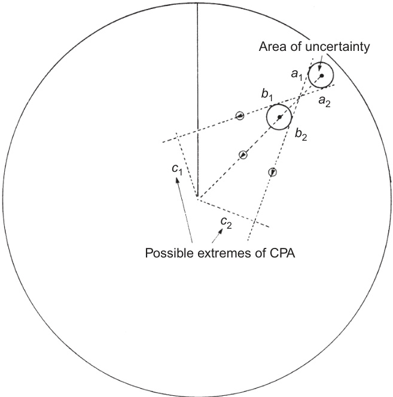  
FIGURE 7.23 Threat assessment markers on a truemotion presentation.  

【翻译】
图7.23真实运动演示中的威胁评估标记。

【解读】
该图展示了一个名为"truemotion"的演示中关于威胁评估的标记。这可能是在某种安全或军事背景下使用的工具或软件，用于分析和标记潜在的威胁。

【词汇表】
| 英文词汇 | 中文翻译 | 解释 |
| --- | --- | --- |
| Threat assessment | 威胁评估 | 对潜在威胁进行分析和评估的过程 |
| Truemotion | 真实运动 | 可能是指一种模拟或预测技术，用于表现物体或目标的真实运动轨迹 |
| Markers | 标记 | 在图像或演示中用来突出或标识特定信息的符号或图形 |

# 7.8.6 The Accuracy with Which CPA Can Be Determined  

Random errors in obtaining the range and bearing of a target will mean that when a position is plotted, it should be surrounded by an area of uncertainty based on the errors referred to in Sections 7.8.1 and 7.8.2. In Figure 7.24, the apparent-track line through the plotted positions indicates a vessel on a collision course. However, if ‘worst accuracy’ is considered, that is that the target’s position is at $a_{1}$ and some time later at $b_{2}$ or, alternatively, is at  

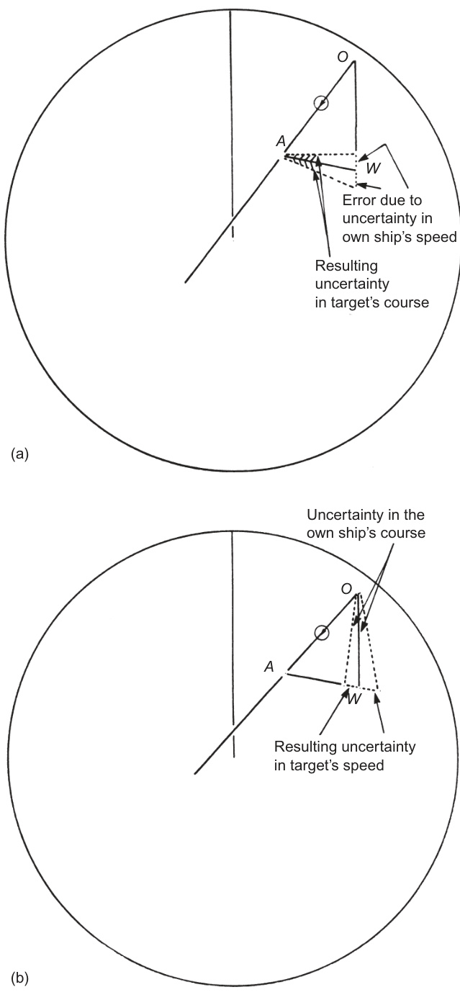  
FIGURE 7.24 The accuracy with which CPA can be determined.  

【翻译】
图7.24 CPA精度确定的准确性。

【解读】
该图表明了CPA（可能是某种测量或计算方法）的精度可以被确定的准确程度，展示了相关研究或实验结果。

【词汇表】
| 英文词汇 | 中文翻译 | 解释 |
| --- | --- | --- |
| Accuracy | 准确性 | 指测量或计算结果与真实值之间的接近程度 |
| Determined | 确定 | 指通过某种方法或过程来获得一个明确的结果或结论 |
| CPA | 未指定具体含义，但可能指某种特定的测量或计算方法 | 根据上下文推断为某种专业或技术领域中的缩写 |

The means by which accuracy can be improved are:  

【翻译】
提高准确性的方法是：

【解读】
本段落介绍了提高准确性的途径，强调了改进的必要性和可能的实现方式，为后续内容的展开奠定了基础。

【词汇表】
| 英文词汇 | 中文翻译 | 解释 |
| --- | --- | --- |
| accuracy | 准确性 | 指事情或结果的精确程度 |
| improved | 提高 | 增加或增强某种品质或状态 |
| means | 方法、手段 | 实现某一目标或效果的途径或工具 |

a. Improve the inherent accuracy of the system, that is decrease the size of the circles of uncertainty.   
b. Plot frequently. This has the advantage of being a quick check for blunders while also allowing for a better ‘mean’ line to be drawn through the plotted positions. It has been suggested that the ideal time period for which plotting should be continued before accepting that the result is of sufficient accuracy should be calculated by allowing the target to traverse some $0.2\times$ radius of screen, for example OA should be some $2.4\mathrm{NM}$ when using the $12\mathrm{NM}$ range scale.  

# 7.8.7 The Consequences of Random Errors in the Own Ship’s Course and Speed  

We assume in the following that positions O and $A$ are without error.  

In the OAW triangle (Figure 7.25), the position of $W$ is determined from a knowledge of the own ship’s course and speed. It is important to note here, that, when dealing with a slowmoving target, if $A$ falls within the error circle around $W$ then it is impossible to determine the course and/or speed of the target (Figure 7.26).  

# 7.8.8 Summary  

1. It has been estimated that the full maximum error occurs only in some $1\%$ of encounters.   
2. In deciding what is an acceptable CPA, the consequences of inaccuracies should be borne in mind and one should err on the safe side.   
3. Small alterations of course and speed by plotted targets can be completely swamped by errors, especially when speeds are low.  

$a_{2}$ and later at $b_{1},$ then the CPA of the target will lie in the range between $c_{1}$ to port and $c_{2}$ to starboard.  

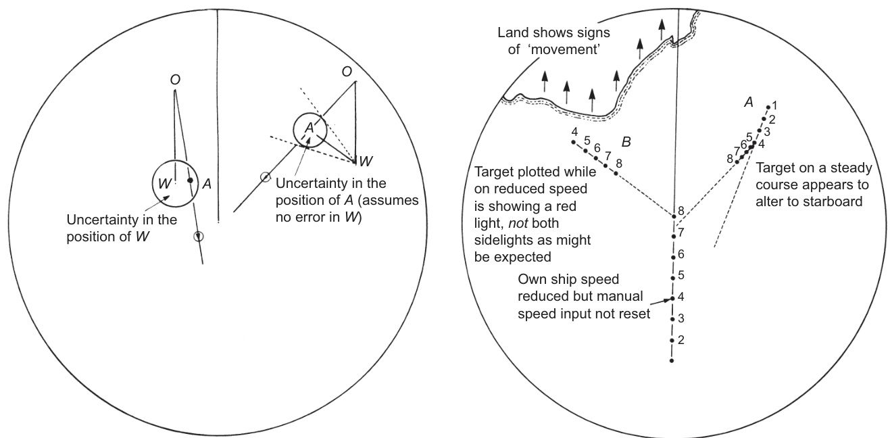  
FIGURE 7.25 Errors resulting from inaccuracy (a) in the own ship’s speed and $(\mathbf{b})$ in the own ship’s course. Note: Assume no error in $O$ or $A$ .   
FIGURE 7.26 Slow-moving targets.  

In an attempt to evaluate the errors, the following have been suggested:  

【翻译】
为了评估这些错误，人们提出了以下几点：

【解读】
本段主要讨论的是如何评估错误，提出了一些方法或建议，以便更好地理解和处理这些错误。

【词汇表】
| 英文词汇 | 中文翻译 | 解释 |
| --- | --- | --- |
| evaluate | 评估 | 评定或判断某事物的价值、质量或性能 |
| attempt | 尝试 | 进行某种努力或行动以实现某一目标 |
| suggest | 提出 | 建议或推荐某种想法、计划或解决方案 |

Error $\mathrm{in{CPA}=\frac{\pm0.03\times\mathrm{mean\mathrm{range}}}{r a n g e\mathrm{change}}}$   
Error in   
vessel0s   
estimated $={\frac{103\times{\mathrm{mean~range}}}{\left({\begin{array}{l}{{\mathrm{estimated~speed}}}\ {{\mathrm{of~target}}}\end{array}}\right)\times{\binom{\mathrm{plot~interval}}{{\mathrm{in~minutes}}}}}}$   
course   
ðdegreesÞ   
Error in   
target0s $=\frac{180\times\mathrm{mean~range}}{\left(\mathrm{^{estimated~speed}}\right)\times\left(\mathrm{^plot~interval}\right)}$   
speed $(\%$ Þ  

# 7.9 ERRORS ASSOCIATED WITH THE TRUE-MOTION PRESENTATION  

The true-motion display (see Section 2.6.4) is, in fact, a contrived mode of display in that the ‘received data’ is processed by applying the ship’s course and speed in order to achieve the desired method of presentation. Because of this, the accuracy of this form of presentation is subject, in addition to the errors discussed in Sections 7.8.7 and 7.8.8, to errors which may arise in the accuracy with which the origin tracks across the screen.  

【翻译】
真实运动显示（见第2.6.4节）实际上是一种人为设置的显示模式，因为“接收到的数据”会经过处理，以应用船舶的航向和速度，从而实现所期望的呈现方式。因此，这种形式的准确性不仅受到第7.8.7节和第7.8.8节中讨论的错误的影响，还可能受到屏幕上原点轨迹准确性的影响。

【解读】
本段主要介绍了真实运动显示的特点及其准确性的影响因素。真实运动显示通过对接收到的数据进行处理，结合船舶的航向和速度来呈现信息，但这种方法也引入了额外的误差源，包括原点轨迹的准确性问题。

【词汇表】
| 英文词汇 | 中文翻译 | 解释 |
| --- | --- | --- |
| true-motion display | 真实运动显示 | 一种根据船舶的实际运动情况来显示其位置和轨迹的方式 |
| contrived mode | 人为设置的模式 | 指的是一种通过特定算法或参数设置来实现某种效果的显示方式 |
| received data | 接收到的数据 | 指的是从各种传感器或设备接收到的原始数据 |
| origin tracks | 原点轨迹 | 指的是在屏幕上表示物体运动起点或参考点的轨迹 |

The use of a true-motion display for manual plotting is associated historically with the reflection plotter (see Section 7.10.3). The true plot is not as easy to use as the relative plot when using paper-based manual plotting (see Section 7.3). This discussion of errors is still relevant to the modern ARPA display.  

【翻译】
使用真实运动显示器进行手动绘图历史上与反射绘图仪（见第7.10.3节）相关联。在纸质手动绘图中，真实绘图不如相对绘图那么容易使用（见第7.3节）。关于错误的讨论仍然适用于现代ARPA显示器。

【解读】
本段主要讨论了在手动绘图中使用真实运动显示器的特点及其与传统相对绘图方法的比较。同时提到了这种讨论对于现代ARPA（自动雷达辅助导航）显示器的相关性，强调了理解和减少错误的重要性。

【词汇表】
| 英文词汇 | 中文翻译 | 解释 |
| --- | --- | --- |
| true-motion display | 真实运动显示器 | 一种能够准确地显示物体运动轨迹的显示设备 |
| manual plotting | 手动绘图 | 人工绘制图表或曲线的过程 |
| ARPA | 自动雷达辅助导航 |一种利用雷达技术辅助船舶导航的系统 |

# 7.9.1 Incorrect Setting of the True-Motion Inputs  

When setting up the true-motion presentation, the method of course and speed input will have to be selected by the operator. The course input will invariably be from a repeating compass and will be automatic, but the repeater in the radar will have to be aligned with the master compass. Provided that this has been done correctly, errors from this source should be minimal (see Section 6.2.6.2).  

【翻译】
在设置真实运动演示时，操作员需要选择航向和速度输入的方法。航向输入通常来自重复罗盘，并且是自动的，但雷达中的重复器必须与主罗盘对齐。假设这一步骤已经正确完成，那么从这个来源产生的错误应该很小（见第6.2.6.2节）。

【解读】
本段主要讨论了设置真实运动演示的过程中，关于航向和速度输入的选择问题。它强调了确保雷达系统中的重复罗盘与主罗盘对齐的重要性，以尽量减少可能出现的错误。

【词汇表】
| 英文词汇 | 中文翻译 | 解释 |
| --- | --- | --- |
| true-motion presentation | 真实运动演示 | 一种模拟或显示设备，能够准确地表现出物体的运动状态 |
| course | 航向 | 指船、飞机等移动物体的行进方向 |
| repeater | 重复器 | 在雷达系统中负责重复或传递信号的装置 |
| master compass | 主罗盘 | 作为参考标准的罗盘，用于校正其他罗盘或导航设备 |

The source of speed input, can be provided by log, by manual input, or with ARPA, by means of automatic ground-stabilization (see Section 4.8). The points discussed in Section 7.8.7 apply here and will affect the displayed movement of the target(s) (Figures 7.27 and 7.28), but it is the setting of the ‘manual’ input of speed that warrants special attention.  

【翻译】
速度输入的来源，可以通过日志、手动输入或使用ARPA（自动地面稳定化）方式提供（见第4.8节）。第7.8.7节中讨论的要点在这里同样适用，并会影响目标的显示运动（图7.27和7.28），但是特别需要注意的是“手动”输入速度的设置。

【解读】
本段主要讨论速度输入的来源以及对目标显示运动的影响。它提到速度输入可以来自多种途径，如日志、手动输入或自动地面稳定化技术ARPA。同时，它强调了手动输入速度设置的重要性，这意味着在实际操作中，正确设置这一参数对于准确显示目标运动至关重要。

【词汇表】
| 英文词汇 | 中文翻译 | 解释 |
| --- | --- | --- |
| ARPA | 自动地面稳定化 | 一种用于稳定地面测量的自动技术 |
| manual input | 手动输入 | 人工设定或输入的数据 |
| ground-stabilization | 地面稳定化 | 技术过程中保持地面状态稳定的方法 |
| target(s) | 目标 | 在此上下文中指被跟踪或观察的物体或对象 |

While steaming at a steady speed it is possible to set the manual speed input and virtually forget about it, but in fog, heavy traffic and in port approaches it may be necessary to change speed frequently. Amid all the other bridge activity, it must be remembered that the manual speed control on the radar will also need to be reset each time there is a change in the demanded speed. It is logical at times like these to use the $'1\mathrm{og}^{\prime}$ input to the true-motion unit, but on some vessels these are also the times when the log is least likely to be deployed.  

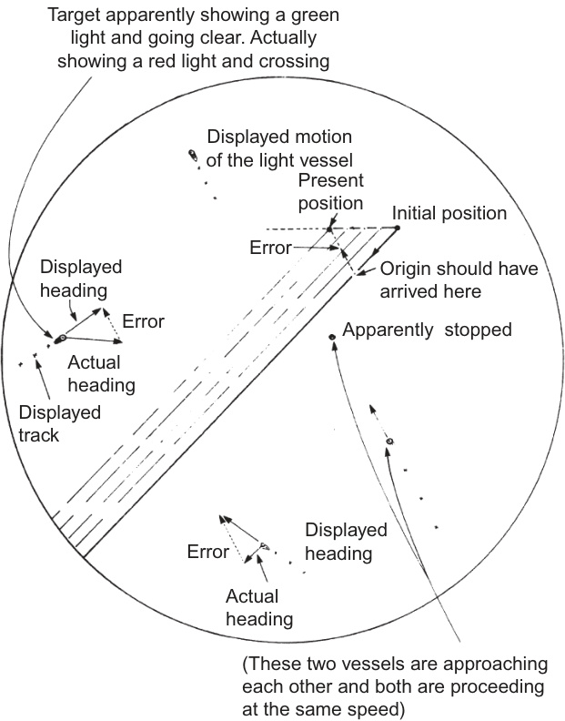  
FIGURE 7.27 Tracking course errors on a true-motion presentation. True course $225^{\circ}$ ; Speed $10\mathrm{kn}$ . Origin tracking $270^{\circ}$ ; Speed $10\mathrm{kn}$ .  

It is very easy to order a change in speed and forget to change the manual speed input to the radar and so have it portray a most misleading presentation of the situation. Such forgetfulness will be less likely if the observer maintains a plot of the origin.  

【翻译】
改变速度设置很容易，但忘记更新雷达的手动速度输入就可能导致显示出误导性的情况表现。若观察者保持原始数据的记录，就不太可能发生这种遗忘的情况。

【解读】
本段强调了在操作雷达系统时，尤其是在调整速度设置后，及时更新相关参数（如手动速度输入）的重要性，以避免产生误导性的信息展示。通过保持对原始数据的跟踪，可以减少因忘记更新参数而导致的错误。

【词汇表】
| 英文词汇 | 中文翻译 | 解释 |
| --- | --- | --- |
| radar | 雷达 | 无线电探测和定位系统 |
| manual speed input | 手动速度输入 | 人工设定设备的速度参数 |
| misleading | 误导性的 | 可能导致错误理解或判断的 |
| plot | 记录、跟踪 | 跟踪和记录某事物的变化或状态 |

Consider the own ship steaming at 16 knots, using manual speed input to the radar which is correct during the initial plotting period. Having passed ahead of vessel $A,$ , the own ship now reduces speed (the other vessels maintain course and speed throughout) but forgets to alter the manual speed input to the radar.  

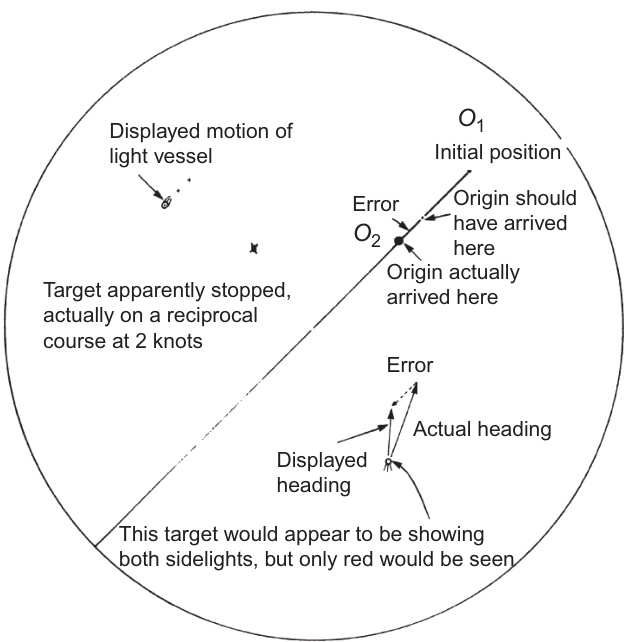  
FIGURE 7.28 Tracking speed errors on a true-motion presentation. True course $225^{\circ}$ ; Speed $5\mathrm{kn}$ . Origin tracking $225^{\circ}$ ; Speed 7 knots.  

The target $A$ would appear to alter course to starboard as indicated in Figure 7.29, but on ‘visual’ observation would still be showing a green light (her starboard side) instead of the expected red light. Careful observation of the land would show that it too is now ‘moving’ ! but at times like this, one rarely has time to analyse the more subtle discrepancies on the display.  

One must also be conscious of the fact that an error in the log input will produce a similar effect.  

【翻译】
我们还必须意识到，在日志输入中出现错误也会产生类似的效果。

【解读】
这句话强调了在处理日志输入时，准确性至关重要，因为任何错误都可能导致意想不到的后果或结果。它提醒人们要谨慎地检查和验证输入，以避免潜在的问题。

【词汇表】
| 英文词汇 | 中文翻译 | 解释 |
| --- | --- | --- |
| conscious | 意识到 | 有意识地认识或注意到某事物 |
| error | 错误 | 不正确或不准确的地方 |
| log input | 日志输入 | 将数据或信息输入日志系统的过程 |
| produce | 产生 | 导致某种结果或影响的发生 |

Other inputs which can inadvertently cause problems are the tide input controls (see Sections 1.5.2 and 6.9.6.2). When setting up the true-motion display, it is essential to check that these controls are set as required (see Section 6.9.6) or are completely inoperative. If allowed to remain as when previously in use, they can cause the origin to track in completely the wrong direction and thus give a totally incorrect impression of the direction in which the targets are tracking. Again, the importance of plotting the origin must be stressed.  

【翻译】
其他可能无意中引起问题的输入包括潮汐输入控制（见第1.5.2节和第6.9.6.2节）。在设置真实运动显示时，必须检查这些控制是否按照要求设置（见第6.9.6节）或完全失效。如果允许它们保持之前使用时的状态，它们会导致原点朝着完全错误的方向移动，从而对目标跟踪的方向产生完全错误的印象。再次强调，绘制原点的重要性。

【解读】
本段主要讨论的是在设置真实运动显示时，需要注意一些容易被忽略的输入控制，如潮汐输入控制，这些控制如果不正确设置，可能会导致显示结果出现错误，特别是原点的移动方向。因此，在进行设置时，务必要仔细检查这些控制，以确保它们按照要求进行设置或者完全失效。

【词汇表】
| 英文词汇 | 中文翻译 | 解释 |
| --- | --- | --- |
| tide input controls | 潮汐输入控制 | 控制潮汐数据输入的设置 |
| true-motion display | 真实运动显示 | 一种能够准确显示物体运动轨迹的显示模式 |
| origin | 原点 | 指标或图像中的参考点或起始点 |
| inoperative | 失效 | 不工作或无法正常运作的状态 |

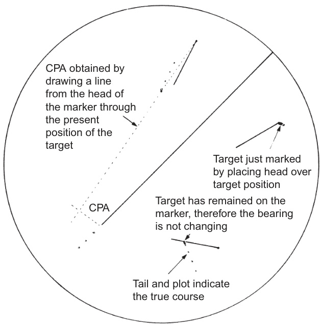  
FIGURE 7.29 The misleading effect caused by failing to reset the manual speed input to the true-motion unit after a manoeuvre ! a reduction of speed in this case.  

【翻译】
图7.29 未在机动后将手动速度输入重置为真实运动单元所造成的误导效应 - 在这种情况下，即减速。

【解读】
该图表明，如果操作员忘记在进行某种机动（manoeuvre）之后，将手动设置的速度输入值重置到反映实际运动状态的真实运动单元，这可能会导致误导性的效果。在本例中，这意味着如果船只或飞行器减速，而系统没有相应地更新其速度数据，就会产生错误的速度显示，从而影响驾驶员或操作员对当前状况的判断和决策。

【词汇表】
| 英文词汇 | 中文翻译 | 解释 |
| --- | --- | --- |
| manoeuvre | 机动、操纵 | 指飞机、船只等在特定条件下的操作或控制，如转弯、升降等。 |
| true-motion unit | 真实运动单元 | 指能够准确反映物体当前运动状态的测量或计算单元。 |
| misleading effect | 误导效应 | 指由于信息不准确或操作失误导致的可能使人产生错误理解或做出错误决定的现象。 |

# 7.9.2 Tracking Course Errors  

In achieving true-motion, the origin must track in the direction in which the vessel is travelling. If it does not, then the target’s courses and/or speeds will be in error. The magnitude and direction of these errors will vary from target to target and will be dependent upon the encounter geometry, and the magnitude and direction of the tracking error (see Figure 7.27).  

【翻译】
为了实现真实运动，原点必须沿着船舶行进的方向进行跟踪。如果不这样做，则目标的航向和/或速度将出现错误。这些错误的大小和方向将根据每个目标而有所不同，并取决于遭遇几何形状、跟踪误差的大小和方向（见图7.27）。

【解读】
本段讨论了实现“真实运动”（true-motion）的条件，即原点需要按照船舶的行进方向进行跟踪，以避免对目标的航向和速度产生错误估计。这些错误会因遭遇的几何情况以及跟踪误差的大小和方向而异。

【词汇表】
| 英文词汇 | 中文翻译 | 解释 |
| --- | --- | --- |
| true-motion | 真实运动 | 指的是能够准确反映目标实际运动状态的跟踪效果 |
| origin | 原点 | 在此 contexto中指的是跟踪系统的参考点或起始点 |
| encounter geometry | 遭遇几何形状 | 指的是两个或多个物体在空间中的相对位置和运动关系 |
| tracking error | 跟踪误差 | 指的是由于各种原因导致的跟踪结果与实际目标运动状态之间的偏差 |

Causes of tracking course error can include a fault in the true-motion unit, incorrect alignment of the compass repeater (heading marker) and incorrect setting of the tidal correctors (see Section 6.9.2).  

【翻译】
航向偏差的原因可能包括真实运动单元的故障、罗盘重复器（航向标志）校准不正确以及潮汐修正器设置不正确（见第6.9.2节）。

【解读】
本段主要讨论了航向偏差的可能原因，强调了设备故障、校准错误以及设置不当等问题对航向精度的影响。这提示在实际操作中需要仔细检查和维护相关设备，以确保航向的准确性。

【词汇表】
| 英文词汇 | 中文翻译 | 解释 |
| --- | --- | --- |
| True-motion unit | 真实运动单元 | 一种用于测量和计算物体真实运动的设备或系统 |
| Compass repeater | 罗盘重复器 | 一种显示方向的仪器，通常与主罗盘同步工作 |
| Tidal correctors | 潮汐修正器 | 用于修正由于潮汐引起的位置或时间变化的设备或方法 |

# 7.9.3 Tracking Speed Errors  

As with tracking course errors, these will result from errors in the movement of the origin across the display (see Figure 7.28). Causes may include a fault in the true-motion unit, an error in the transmitting log, an error in the estimated speed, failure to reset the manual speed control after ordering a change in speed and failure to reset the tidal correctors.  

【翻译】
与跟踪航线错误一样，这些问题是由显示器上原点运动中的错误引起的（见图7.28）。可能的原因包括真实运动单元的故障、传输日志中的错误、估计速度中的错误、在改变速度后未重置手动速度控制以及未重置潮汐校正器。

【解读】
本段主要讨论的是导航系统中可能出现的错误，特别是在显示器上原点移动过程中产生的错误。这些错误可能源于多种因素，包括硬件故障、数据传输错误、速度估算错误，以及操作人员的失误，如忘记重置手动速度控制或潮汐校正器。这些错误会导致航线跟踪不准确，从而影响整个导航系统的性能。

【词汇表】
| 英文词汇 | 中文翻译 | 解释 |
| --- | --- | --- |
| true-motion unit | 真实运动单元 | 一种计算设备，用于模拟和预测物体的真实运动轨迹。 |
| transmitting log | 传输日志 | 记录设备状态、操作命令等信息的日志文件或记录。 |
| tidal correctors | 潮汐校正器 | 用于修正由于潮汐作用导致的位置偏差的设备或算法。 |
| manual speed control | 手动速度控制 | 人工设置和调整速度的控制装置。 |

It is essential not only to plot the origin of the display when using the true-motion presentation, but also to ensure that the movement is correct in both direction and scale speed. This may mean that a future position of the origin must be predicted and marked on the reflection plotter. If the prediction is not achieved then the cause should be investigated.  

【翻译】
在使用真实运动演示时，不仅要绘制显示的起源，还要确保运动的方向和速度尺度都是正确的。这可能意味着需要预测原点的未来位置并在反射绘图仪上标记。如果预测没有实现，则应调查原因。

【解读】
本段强调了在使用真实运动演示技术时，准确地确定显示的起源和运动参数（包括方向和速度）的重要性。同时，也提到了预测原点未来的位置对于确保整个过程的准确性至关重要，如果预测失败则需要进行原因分析。

【词汇表】
| 英文词汇 | 中文翻译 | 解释 |
| --- | --- | --- |
| true-motion presentation | 真实运动演示 | 一种模拟或展示物体运动的方式，旨在表现其真实运动状态 |
| origin | 起源 | 指的是某一现象、事件或运动的开始点或源头 |
| reflection plotter | 反射绘图仪 | 一种用于记录或绘制数据的设备，尤其是在航海、航空等领域中常用来记录船只或飞机的运动轨迹 |
| predict | 预测 | 根据已知条件或规律，对未来事件或情况进行推断或估计 |

# 7.10 RADAR PLOTTING AIDS  

Many pieces of equipment have been developed over the years which were intended to assist the mariner in plotting and thereby interpreting the display. Most are now only of historical interest, having been superseded by ARPAs, but one or two are worthy of individual mention.  

【翻译】
多年来，人们开发了许多设备，这些设备旨在帮助水手绘制航线并从而解读显示结果。大部分这些设备现在只具有历史意义，因为它们已经被自动雷达绘图仪（ARPAs）所取代，但有一两种设备值得特别提及。

【解读】
本段主要讨论的是过去为辅助水手进行导航和解读雷达显示结果而开发的各种设备。虽然大多数这些设备已经被现代技术如自动雷达绘图仪（ARPAs）所替代，但仍有一些设备因其历史价值或特殊功能而值得注意。

【词汇表】
| 英文词汇 | 中文翻译 | 解释 |
| --- | --- | --- |
| Mariner | 水手、海员 | 指在船上工作的人员 |
| Plotting | 绘制航线 | 指根据地图或其他信息规划航行路线的过程 |
| ARPAs | 自动雷达绘图仪 | 一种使用雷达信号自动绘制目标物体位置的电子设备 |
| Superseded | 取代、被淘汰 | 指新技术或方法取代旧有的技术或方法 |

# 7.10.1 The Radar Plotting Board  

This took a number of forms as various manufacturers attempted to provide something more permanent and durable than the paper plotting sheet. Effectively, this was little more than a plotting sheet, overlaid with Perspex or heavy transparent film, which was free to rotate and so assist in predicting the effect of an alteration of course by the own ship.  

【翻译】
这导致了多种形式的出现，因为各个制造商试图提供比纸质绘图表更永久且耐用的东西。实际上，这只不过是覆盖了一层有机玻璃或厚重透明胶片的绘图表，可以自由旋转，从而帮助预测如果自己的船改变航向会产生什么效果。

【解读】
本段描述的是早期导航设备的发展，特别是在海军领域。为了提高航行安全性和准确性，制造商尝试设计出比传统纸质绘图表更为持久和可靠的工具。通过在绘图表上添加一层透明材料，如有机玻璃或塑料薄膜，使得操作人员能够更容易地模拟和预测船只航向变化对实际航线的影响。

【词汇表】
| 英文词汇 | 中文翻译 | 解释 |
| --- | --- | --- |
| Perspex | 有机玻璃 | 一种透明的塑料材料，常用于替代玻璃 |
| plotting sheet | 绘图表 | 用于记录和规划航线的图表 |
| transparent film | 透明胶片 | 薄而透明的塑料薄膜，允许光线通过 |

It is not intended here to discuss its construction and use since it has been superseded, but this was a fruitful area for personal innovation and some boards are still in use in the pleasure boat market.  

【翻译】
这里不打算讨论它的构造和使用，因为它已经被取代，但这是个人创新一个富有成果的领域，一些板子仍然在休闲船市场中使用。

【解读】
这段话提到某种技术或产品已经被更新的东西所取代，不再需要详细讨论其构造和用途。但是，这个领域曾经是个人创新发挥作用的地方，并且一些相关的产品仍然在特定市场中得到应用，比如休闲船的制造。

【词汇表】
| 英文词汇 | 中文翻译 | 解释 |
| --- | --- | --- |
| Superseded | 取代、被替代 | 指新的事物或方法取代旧有的 |
| Fruitful | 富有成果的 | 表示某个领域或尝试带来了成功或成就 |
| Pleasure boat | 休闲船、游乐船 | 用于娱乐或旅游的船只 |

# 7.10.2 Threat Assessment Markers (‘Matchsticks’ or ‘Pins’)  

It has long been the practice of mariners to observe the compass bearing of an approaching vessel and, where there is no appreciable change, to assume that risk of collision exists. Unwary mariners have been seriously misled when using an unstabilized display as the source of bearing measurement.  

【翻译】
水手们长期以来一直观察接近船只的指南针方位，当没有明显变化时，就假设存在碰撞风险。那些使用非稳定显示作为测量方位来源的粗心水手曾经被严重误导。

【解读】
本段强调了在航海中准确判断船只方向的重要性，特别是当使用电子设备时。传统上，水手通过观察指南针来确定其他船只的方向，如果方向没有明显变化，就会认为有碰撞的风险。但如果使用的是非稳定化的显示设备，可能会导致错误的判断，从而造成严重后果。

【词汇表】
| 英文词汇 | 中文翻译 | 解释 |
| --- | --- | --- |
| Mariners | 水手、航海人员 | 指从事航海工作的人员 |
| Compass bearing | 指南针方位 | 用指南针测量的方向或方位 |
| Unstabilized display | 非稳定化显示 | 未经校正或稳定处理的显示数据，可能不准确 |
| Appreciable | 明显的、可感知的 | 能够被感觉或察觉到的变化或差异 |

With the increased use of compass-stabilized displays, the principle of observing the compass bearing of a target again manifested itself by mariners adopting the practice of placing the cursor on the target and observing how its bearing changed in relation to this datum.  

【翻译】
随着指南针稳定显示技术的广泛应用，观察目标的指南针方位的原理再次体现出来，水手们开始采用在目标上放置光标并观察其相对于此基准的方位变化的做法。

【解读】
本段描述了随着指南针稳定显示技术的发展，水手们开始使用一种新的导航方法，即通过在电子地图或显示屏上放置光标来确定目标的方向，并观察其与基准点的相对位置关系，从而更好地掌握目标的运动情况和自身位置。

【词汇表】
| 英文词汇 | 中文翻译 | 解释 |
| --- | --- | --- |
| Compass-stabilized | 指南针稳定 | 使用指南针保持方向稳定的技术 |
| Cursor | 光标 | 电子设备上的移动指针 |
| Datum | 基准点 | 用于测量或参考的标准点或线 |
| Bearing | 方位 | 目标物体相对于观察者位置的方向角度 |

Where it is necessary to monitor more than one target, the technique is difficult to implement. Recognizing this problem, Decca Radar in 1966 made provision for the observer to use up to five ‘threat assessment markers’. These are, in effect, sections of electronic cursor which can be positioned in range and azimuth so that, when placed on a target as shown in Figure 7.23, they will quickly show whether the bearing of the target is changing. The remote end of the marker, which represents a constant range and bearing from the observing vessel, is brightened and thus the marker resembles a match or pin.  

【翻译】
在需要监测多个目标的情况下，这种技术难以实施。德卡雷达公司（Decca Radar）于1966年认识到这一问题，为观察员提供了最多五个“威胁评估标记”（threat assessment markers）。这些标记实际上是电子光标的部分，可以根据距离和方位进行定位，当它们被放置在目标上，如图7.23所示时，能够快速显示目标的方向是否发生变化。标记的远端代表着从观察船只到目标的恒定距离和方向，被高亮显示，因此标记看起来像一根火柴或大头针。

【解读】
本段主要讨论的是雷达技术中监测多个目标的挑战，以及德卡雷达公司为解决这一问题而采取的措施。通过引入“威胁评估标记”，观察员可以更容易地跟踪多个目标，并快速判断目标的方向是否有变化。这项技术创新提高了雷达系统的实用性和效率。

【词汇表】
| 英文词汇 | 中文翻译 | 解释 |
| --- | --- | --- |
| Technique | 技术 | 特殊方法或技能 |
| Target | 目标 | 需要监测或瞄准的物体或位置 |
| Threat assessment markers | 威胁评估标记 | 用于评估潜在威胁的电子标记工具 |
| Cursor | 光标 | 电子设备上的指示器或移动指针 |
| Azimuth | 方位 | 地平线上某点与正北之间的角度，用于描述方向 |

Correct use of the markers provides much more information than merely an indication of change of bearing. It enabled the observer to deduce the relative- and true-motion data for each marked target. To exploit this facility, the true-motion sea-stabilized presentation must be selected. Used in this way, the true plot of the target will indicate its true motion, but the position of the target in relation to the bright end of the marker will indicate its potential threat. By joining the ‘head’ of the marker to the current position of the target and extending the line, the CPA of the target can be assessed.  

【翻译】
正确使用标记符号可以提供比简单的方位变化指示更多的信息。它使观察者能够推断出每个被标记目标的相对运动和真实运动数据。为了利用这一功能，必须选择真实运动海上稳定化显示方式。在这种方式下，被标记目标的真实轨迹将指示其真实运动，但目标在标记符号明亮端的位置将指示其潜在威胁。通过连接标记符号的“头部”到目标当前位置并延伸线条，可以评估目标的最接近点（CPA）。

【解读】
本段主要讨论了如何正确使用标记符号来获取目标的运动信息和潜在威胁。通过选择真实运动海上稳定化显示方式，可以获得目标的真实运动轨迹和潜在威胁信息，从而评估目标的最接近点。这一技术对于海军或其他领域的目标跟踪和风险评估具有重要意义。

【词汇表】
| 英文词汇 | 中文翻译 | 解释 |
| --- | --- | --- |
| Marker | 标记符号 | 用于表示目标位置和运动的符号 |
| True-motion | 真实运动 | 目标的实际运动状态 |
| CPA | 最接近点 | 目标与观察者之间最近距离的位置 |
| Relative-motion | 相对运动 | 目标相对于观察者的运动状态 |
| Sea-stabilized | 海上稳定化 | 一种用于减少海面影响的显示方式 |

Note: When used with a true-motion display, the markers track across the screen in the same manner as the origin but with their orientation and position in relation to the origin remaining unchanged.  

【翻译】
注意：当与真实运动显示一起使用时，标记器会以与原点相同的方式跨屏幕移动，但其方向和相对于原点的位置保持不变。

【解读】
本段主要描述了在特定显示技术中，标记器（markers）如何跟随原点（origin）的运动，同时保持自身的方向和相对位置。这意味着，即使屏幕上的内容发生变化，标记器也能始终保持其相对关系和方向。

【词汇表】
| 英文词汇 | 中文翻译 | 解释 |
| --- | --- | --- |
| true-motion display | 真实运动显示 | 一种能够准确呈现物体运动的显示技术 |
| markers | 标记器 | 在屏幕上用于指示或标记特定位置的符号或图标 |
| origin | 原点 | 指标记器或其他元素的参考起点或基准位置 |

Other manufacturers have produced variations on this basic idea. In one system, the markers are bright spots (i.e. only the head of the ‘match’ is shown) and a free electronic bearing line, having time divisions on it, is used to lay off the relative track of the chosen target. In this particular system, if relativemotion is selected, the marker traces out the track of a water-stationary target and there is a provision temporarily to move the marker to the $O_{1}$ plotting position in order to assess the effect of a proposed manoeuvre by the observing vessel.  

# 7.10.3 The Reflection Plotter  

The work involved in the transferring of data from the radar display to a plotting sheet is both time-consuming and a potential source of errors and so is a discouragement to practical plotting. For those having to plot manually, the advantage of being able to plot directly on the screen surface was recognized at a very early stage in the development of radar. As a result, the anti-parallax reflection plotter was developed.  

【翻译】
在雷达显示器上转移数据到绘图纸上的工作既耗时又容易出错，这使得实际的绘图变得不切实际。对于那些需要手动绘图的人来说，在雷达发展的早期阶段就认识到了直接在屏幕表面上绘图的优势。因此，开发出了抗视差反射绘图仪。

【解读】
本段主要讨论了雷达技术中数据从显示器转移到绘图纸上的过程中的困难和局限性，以及为了解决这些问题而开发出的新型绘图设备——抗视差反射绘图仪。这体现了科技的进步如何帮助改善工作效率和准确度。

【词汇表】
| 英文词汇 | 中文翻译 | 解释 |
| --- | --- | --- |
| radar | 雷达 | 无线电探测和定位系统 |
| parallax | 视差 | 由于观察角度不同导致的物体位置或大小的偏差 |
| plotter | 绘图仪 | 一种可以自动或半自动地在纸上绘制图形的设备 |
| anti-parallax | 抗视差 | 指能够减少或消除视差影响的技术或设备 |

It has rapidly disappeared from general use due to the introduction of the raster-scan display. The UK regulations (see Section 11.4.1) still require that plotting facilities shall be at least as effective as a reflection plotter.  

【翻译】
由于光栅扫描显示技术的引入，它迅速从常规使用中消失。英国法规（见11.4.1节）仍要求绘图设施至少应与反射绘图仪一样有效。

【解读】
这段话主要讨论了随着新技术的出现，一些旧有的设备或方法如何被逐渐淘汰。在这里，提到的“reflection plotter”（反射绘图仪）因为光栅扫描显示技术的发展而变得不再常用。但是，英国相关法规仍然要求新的绘图设施必须达到或者超过传统反射绘图仪的效果，这意味着在某些领域，传统技术的标准仍然被作为评估新技术的基准。

【词汇表】
| 英文词汇 | 中文翻译 | 解释 |
| --- | --- | --- |
| Raster-scan display | 光栅扫描显示 | 一种通过扫描方式显示图像的技术 |
| Plotting facilities | 绘图设施 | 用于创建图表或图纸的设备或软件 |
| Reflection plotter | 反射绘图仪 | 一种通过反射原理来绘制图像的设备 |

# 7.10.3.1 The Construction of the Reflection Plotter  

As can be seen from Figure 7.30, the plotting surface has the same curvature as the CRT. By inverting it and placing a flat partial reflecting surface midway between the two curved surfaces, it is possible to put a mark on the concave plotting surface such that its reflection will be aligned with the target’s response on the CRT surface, irrespective of where the observer’s eye is positioned. This overcomes the problems of parallax which would arise if one were to try to plot on the plastic cursor placed some inches above the CRT surface.  

【翻译】
如图7.30所示，绘制表面与CRT具有相同的曲率。通过反转它并在两个曲面之间放置一个平坦的部分反射表面，可以在凹面的绘制表面上标记一个点，使得其反射光线与CRT表面的目标响应对齐，无论观察者的眼睛位于何处。这解决了如果尝试在距离CRT表面几英寸的塑料光标上绘制而产生的视差问题。

【解读】
本段主要讨论了一种技术方法来解决CRT（阴极射线管）显示设备上的视差问题。通过使用具有特定曲率的绘制表面和部分反射表面，可以实现目标响应的精确定位，无论观察者的角度如何。这项技术可以提高CRT设备的准确性和可靠性。

【词汇表】
| 英文词汇 | 中文翻译 | 解释 |
| --- | --- | --- |
| Curvature | 曲率 | 指物体表面的弯曲程度 |
| Parallax | 视差 | 因为观察角度不同导致的视觉偏差 |
| CRT | 阴极射线管 | 一种传统的显示设备技术 |
| Reflecting surface | 反射表面 | 能够反射光线的表面 |

# 7.10.3.2 The Practical Use of Reflection Plotters, Including the Use of the Perspex Cursor and Parallel Index  

Plotting is carried out on the plotting surface as if working on a plotting sheet, but it is the ‘reflections’ which must be continually observed. Two techniques are peculiar to reflection plotting (Figure 7.30):  

【翻译】
绘图是在绘图面上进行的，就像在绘图纸上工作一样，但是需要不断观察的是“反射”。有两种技术是反射绘图所特有的（图7.30）：

【解读】
本段主要介绍了反射绘图的基本概念和方法，强调了在此过程中需要注意观察“反射”的变化，并提到了两种特殊的技术，这些都是理解和掌握反射绘图技巧的关键点。

【词汇表】
| 英文词汇 | 中文翻译 | 解释 |
| --- | --- | --- |
| Plotting | 绘图 | 指在某一表面或平面上绘制图形或曲线的过程 |
| Reflections | 反射 | 在这里指的是光线或其他形式的能量在物体表面上的反弹现象，在绘图中需要考虑这种效果以获得准确的结果 |
| Techniques | 技术 | 特殊的方法或技能，用于完成某一任务或活动，如绘图中的各种技法 |

a. It was necessary to make a ‘scale’ rule for measuring distance on the plotting surface. This was done by brightening the range rings, placing a mark on each ring and then, using stiff card, marking the position of each ring on the card. Sub-divisions  

【翻译】
为了在绘图面上测量距离，需要制定一个“比例尺”规则。这是通过使范围环变亮、在每个环上标记一个标志，然后使用硬纸板来标记每个环在纸板上的位置来实现的。然后对这些标记进行了细分。

【解读】
这段话描述了一种创建比例尺以便于在绘图面上测量距离的方法。这种方法涉及到使范围环可见，标记每个环，并记录它们在一块硬纸板上的位置，以此来创建一个可以用于测量的参考系统。

【词汇表】
| 英文词汇 | 中文翻译 | 解释 |
| --- | --- | --- |
| scale | 比例尺 | 用于测量距离或大小的标准单位 |
| plotting surface | 绘图面 | 用于绘制图表或图形的平面 |
| range rings | 范围环 | 一系列同心圆，用于表示不同距离或范围 |
| sub-divisions | 细分 | 将某物进一步划分为更小的部分 |

may be put in by eye or more precisely, using the variable range marker. See Figure 7.31.  

【翻译】
可以通过肉眼观察，也可以更精确地使用可变范围标记器来进行观察。参见图7.31。

【解读】
这段话描述了如何观察或测量某些东西，可以通过直接用眼睛看（肉眼观察），也可以使用一种叫做“可变范围标记器”的工具来获得更精确的结果。这种方法可能在科学实验、测量或者其他需要准确观察的领域中被应用。

【词汇表】
| 英文词汇 | 中文翻译 | 解释 |
| --- | --- | --- |
| eye | 肉眼 | 用眼睛直接观察 |
| variable range marker | 可变范围标记器 | 一种用于测量或标记的工具，可以根据不同范围进行调整 |
| precisely | 精确地 | 指事情做得非常准确，没有误差 |

b. It was necessary to draw parallel lines on the plotter surface, for example OW parallel to the heading marker. This was done by lining up the Perspex cursor with the heading marker. The parallel index lines on the cursor were then parallel with the heading marker. The edge of the scale rule was then aligned with the nearest parallel index line below it this may mean that one had to move the position of one’s head slightly, or slide the card a short distance.  

【翻译】
为了在绘图仪的表面上画出平行线，例如与航向标志（heading marker）平行的OW线，这一过程是必要的。操作方法是，将亚克力光标（Perspex cursor）与航向标志对齐，然后光标上的平行索引线就会与航向标志平行。接着，将比例尺边缘与其下方最近的平行索引线对齐，这可能需要稍微调整头部位置或滑动卡片短距离。

【解读】
这段话描述了使用绘图仪时的一种具体操作步骤，主要目的是在绘图仪的表面上画出与某个已知参考线（如航向标志）平行的线。这涉及到使用特殊工具，如亚克力光标和比例尺，通过精确的对齐和调整来实现所需的平行关系。这种操作需要一定的技巧和耐心，以确保准确性和精度。

【词汇表】
| 英文词汇 | 中文翻译 | 解释 |
| --- | --- | --- |
| Plotter | 绘图仪 | 一种用于绘制图形的设备 |
| Perspex cursor | 亚克力光标 | 一种用于定位和测量的透明塑料光标 |
| Heading marker | 航向标志 | 指示方向的标记或指针 |
| Parallel index lines | 平行索引线 | 光标上用于辅助绘制平行线的线条 |

Note: When drawing a line from a point, tangential to a range ring, for example when determining the time to resume, it was best first to mark the position of the range ring on the plotter surface.  

【翻译】
注意：当从一个点画一条线，使其与范围环相切时，例如确定恢复时间时，最好首先在绘图器表面标记范围环的位置。

【解读】
这段话是在描述一种绘图或测量过程中的技巧，特别是当需要从某一点向范围环画一条切线时。为了提高准确性，建议首先标记范围环在绘图器上的位置，这样可以更容易地确定正确的切线位置，从而得到更精确的结果。

【词汇表】
| 英文词汇 | 中文翻译 | 解释 |
| --- | --- | --- |
| Tangential | 相切的 | 与曲线或圆形在一点相切，且只与该点接触，不交叉 |
| Plotter | 绘图器 | 一种用于绘制图表的设备或软件 |
| Range ring | 范围环 | 在测量或导航中用来表示距离或范围的圆形标记 |

# 7.10.3.3 Changing Range Scale  

The reflection plotter had two distinct advantages: namely, it eliminated the need for reading and transferring of ranges and bearings to a plotting sheet and it maintained the immediate contact between display and plot. However, there was often a certain reluctance on the part of the observer to change range scale because of the perceived potential loss of the plot. Nonetheless, it is important that when targets are close, the most appropriate range scale was used. This meant adapting the plot to the new range scale. As can be seen in Figure 7.32, once the target is within the inner portion of the screen, the range scale was changed and the predicted apparent-track line $A_{2}A_{3}$ drawn parallel through the new position of the target.  

It can often prove useful to retain the original plot and, provided that the lines do not become confusing, they can be left on. If available, different colour wax pencils could be used for each range scale to aid clarity.  

【翻译】
保留原始图纸往往是有用的，只要线条不会变得混乱，它们就可以保持原样。如果有条件，可以使用不同颜色的蜡笔来标记每个范围的比例，以提高清晰度。

【解读】
这段话主要讨论了在绘制或编辑图纸时如何处理原始线条和比例尺度的问题。作者建议保留原始图纸以便于理解和比较，同时使用不同的颜色来区分不同的比例尺度，从而提高图纸的清晰度和可读性。

【词汇表】
| 英文词汇 | 中文翻译 | 解释 |
| --- | --- | --- |
| retain | 保留 | 指保持某物的原状不变。 |
| confusing | 混乱 | 指使人感到困惑或难以理解的状态。 |
| clarity | 清晰度 | 指事物的明显易懂程度。 |
| aid | 帮助 | 指为某人或某事提供帮助或支持。 |

FIGURE 7.30 The reflection plotter.  

【翻译】
图7.30 反射绘制器。

【解读】
该段落似乎是从一篇技术文章或教材中截取的一部分，描述了一种名为“反射绘制器”的设备或工具。这种设备可能用于某些特定领域，如地震勘探、声波技术等，来记录和显示物体或信号的反射情况。

【词汇表】
| 英文词汇 | 中文翻译 | 解释 |
| --- | --- | --- |
| Reflection | 反射 | 物理学中的一个概念，指的是一种波（如光波、声波）在遇到另一种介质时发生的方向变化。 |
| Plotter | 绘制器 | 一种输出设备，可以根据输入的数据自动绘制出曲线或图形。 |
| FIGURE | 图 | 文章或书籍中插入的图片或图表，用以说明某一点或展示数据。 |

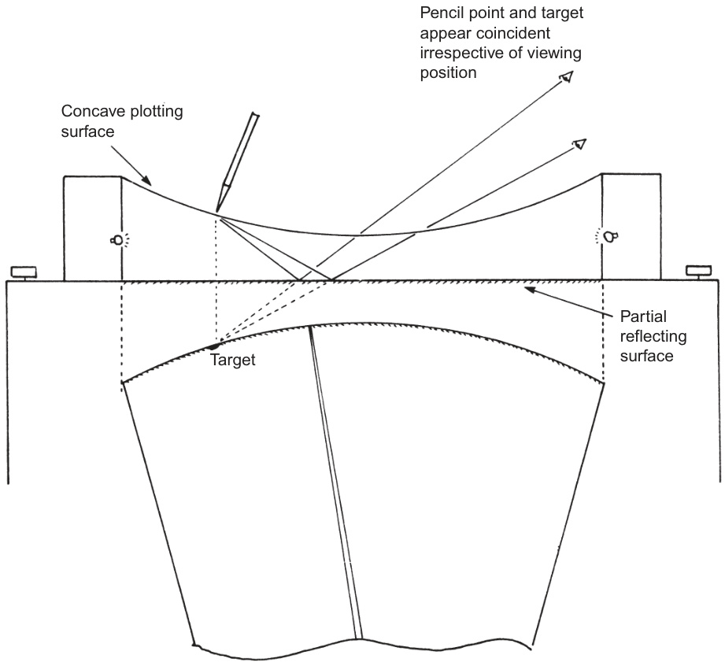  

【处理失败：内存不足或无法生成有效响应】

# 7.10.3.4 The Use of the ‘Free’ EBL to Draw Parallel Lines (See Section 6.6.5)  

The ‘free’ EBL was often extremely useful for transferring parallel lines in conjunction with a reflection plotter in preference to the use of the parallel lines on the Perspex cursor.  

【翻译】
“自由”的EBL通常非常有用，尤其是在配合反射绘图仪的情况下，用于传递平行线，比起使用Perspex光标上的平行线更为方便。

【解读】
这段话描述了在某种技术或设计环境中，“自由”的EBL（可能指的是一种电子束定位器或其他设备）的优势。它提到，当与反射绘图仪结合使用时，这种设置可以更有效地传递平行线，而不是依赖于Perspex光标上的平行线。这意味着在特定的工作流程中，这种方法能够提高效率或准确度。

【词汇表】
| 英文词汇 | 中文翻译 | 解释 |
| --- | --- | --- |
| EBL | 电子束定位器 | 一种用于精确定位的电子设备 |
| Reflection Plotter | 反射绘图仪 | 一种通过反射原理来绘制图像的设备 |
| Perspex Cursor | Perspex光标 | 一种由透明塑料材料制成的光标，用于辅助定位或测量 |

The EBL origin is positioned on the reflection of the line to be transferred and is rotated so that it is aligned with the line to be transferred. The EBL maintained its orientation as it was moved about the screen using the joystick (Figure 7.33).  

【翻译】
EBL（电子束定位）的起点位于待传输线的反射上，并旋转使其与待传输线对齐。在使用操纵杆（图7.33）在屏幕上移动时，EBL保持了其方向。

【解读】
本段描述的是一种电子束定位技术（EBL），它通过调整起点位置和方向来确保准确地跟踪和传输特定线条或路径。这种技术可能应用于电子设计自动化、计算机辅助设计或其他相关领域。

【词汇表】
| 英文词汇 | 中文翻译 | 解释 |
| --- | --- | --- |
| EBL | 电子束定位 | 一种用于精确定位和传输电子信号的技术 |
| Joystick | 操纵杆 | 一种控制设备，用于在屏幕或界面上移动指针或光标 |
| Orientation | 方向 | 指物体或系统相对于某一坐标系或参考系的空间排列方式 |
| Reflection | 反射 | 物理学中指光、声等波或粒子的方向改变现象，也可指代入射角等于反射角的几何学概念 |

# 7.10.3.5 Fixed and Rotatable Surfaces ! Use with a Ship’s Head-Up Unstabilized Display  

While using a reflection plotter on a ship’s head-up unstabilized display, if it became necessary to alter the own ship’s course, the target and plot became out of alignment as the own ship changes course. For example, in Figure 7.34, after an initial plot, the own ship alters course $55^{\circ}$ to starboard; at the completion of the manoeuvre, the plot and target will be as depicted. To realign the plot to the target, it was necessary to rotate the plotter surface anticlockwise (i.e. in the opposite direction to the alteration of course) by the amount which the own ship has altered course.  

When a rotatable surface has not been provided, there are means by which the plot can be continued. However, they can be complicated and consequently confusing, and are best avoided. When a fixed-surface plotter was provided, it was virtually essential that the true-north-up stabilized presentation was selected (see Section 1.4.1.2).  

【翻译】
当没有可旋转的表面时，有些方法可以继续绘制图表。但是，这些方法可能很复杂，从而导致混淆，最好避免使用。当提供了固定表面的绘图仪时，选择真北向上稳定化呈现方式几乎是必不可少的（见第1.4.1.2节）。

【解读】
本段讨论的是在特定条件下如何继续绘制图表，特别是在没有可旋转表面的情况下。它提醒读者，在这种情况下虽然有替代方法，但这些方法可能过于复杂，容易引起混淆，因此建议尽量避免使用。同时，它强调了在使用固定表面绘图仪时，选择真北向上稳定化呈现方式的重要性，以确保图表的准确性和清晰度。

【词汇表】
| 英文词汇 | 中文翻译 | 解释 |
| --- | --- | --- |
| rotatable surface | 可旋转的表面 | 指能够旋转的表面，通常用于绘图或显示设备中，以便更好地观察和操作图像。 |
| plot | 绘制图表 | 创建图形或图表的过程，常用于数据分析、导航等领域。 |
| true-north-up | 真北向上 | 一种导航或绘图中的方向参考设置，确保地图或图表始终以真实的北方为上方来展示。 |
| stabilized presentation | 稳定化呈现 | 指通过某种技术或方法，使得图像或数据表现出稳定和一致的形式，减少因运动或其他干扰因素造成的偏差。 |

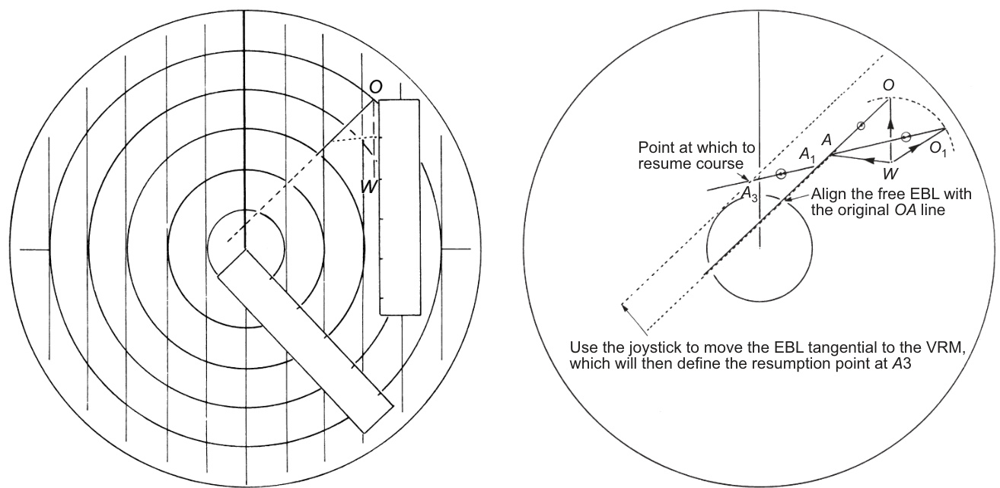  
FIGURE 7.31 Constructing and using a scale rule.   
FIGURE 7.33 The use of the ‘free’ EBL to draw parallel lines. Note: Transfer the line to the plotting surface if the EBL is required for another use; if not, leave it in place.  

【翻译】
图7.31 构建和使用比例尺。图7.33 使用“自由”的基线来绘制平行线。注意：如果需要再次使用基线，请将其转移到绘图表面；否则，可以保持原位。

【解读】
这段文字主要是关于技术绘图中构建和使用工具的说明，特别提到了比例尺（scale rule）和基线（EBL）的应用。这些工具在绘制平行线和其他几何形状时非常有用，通过合理地安排和重复利用这些工具，可以提高绘图效率。

【词汇表】
| 英文词汇 | 中文翻译 | 解释 |
| --- | --- | --- |
| Scale rule | 比例尺 | 一种用于测量和绘制比例准确的直尺。 |
| EBL | 基线 | 在绘图中作为参考的基础线条。 |
| Parallel lines | 平行线 | 永不相交的两条或多条直线。 |

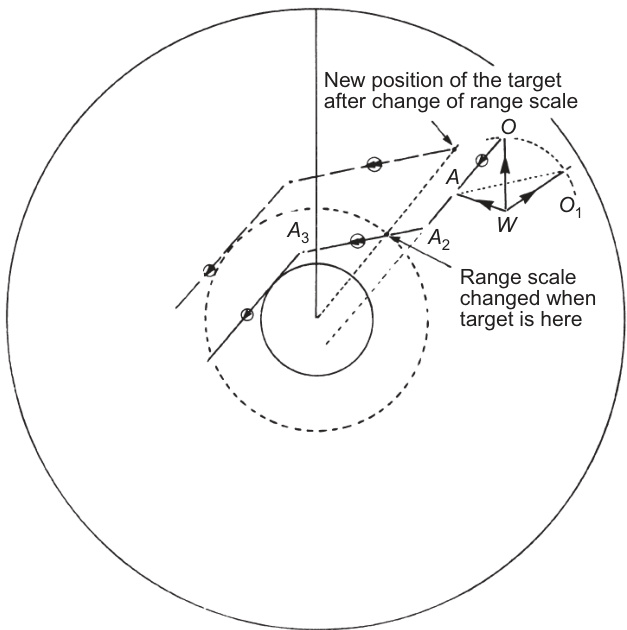  
FIGURE 7.32 Changing range scale on a reflection plotter.  

【翻译】
图7.32 反射绘图仪上改变范围刻度。

【解读】
该图展示了如何在反射绘图仪（reflection plotter）上更改范围刻度，这是地震数据处理中常用的设备。通过调整范围刻度，可以更好地观察和分析地震信号的变化，从而获得更多的地质信息。

【词汇表】
| 英文词汇 | 中文翻译 | 解释 |
| --- | --- | --- |
| Reflection plotter | 反射绘图仪 | 一种用于显示和记录地震信号的设备 |
| Range scale | 范围刻度 | 指定绘图仪上信号幅度的尺寸标记 |
| Seismic signal | 地震信号 | 地震活动产生的波动信号 |

# 7.10.3.6 Flat and Concave Surfaces  

The concave surface can be rather awkward to work on and so more complex plotters were provided with flat plotting surfaces. This was made possible by using a curved partial reflecting surface. However, apart from that, its use was exactly the same as for a plotter with a concave plotting surface.  

【翻译】
凹面可能比较难以操作，因此更复杂的绘图仪器被配备了平坦的绘图表面。这是通过使用曲面的部分反射表面来实现的。然而，除了这一点之外，其使用方法与具有凹面绘图表面的绘图仪器完全相同。

【解读】
本段主要讨论的是绘图仪器中不同类型的绘图表面，包括凹面和平面。由于凹面操作起来较为棘手，后期的绘图仪器开始采用平面绘图表面，这得益于曲面的部分反射技术，使得操作变得更加方便。尽管如此，两种类型的绘图仪器在使用上基本保持一致。

【词汇表】
| 英文词汇 | 中文翻译 | 解释 |
| --- | --- | --- |
| Concave | 凹面 | 指向内侧弯曲的表面 |
| Plotter | 绘图仪器 | 一种用于绘制图形或图表的设备 |
| Reflecting surface | 反射表面 | 能够反射光线或其他形式能量的表面 |
| Curved | 曲面 | 不是直线或平面的弯曲表面 |

# 7.10.3.7 Use in Conjunction with Parallel Indexing  

The provision of a reflection plotter made it possible for a prepared navigation plan to be marked out on the plotter and the movement of particular navigation marks observed in relation to their predicted movement. Any deviation from the pre-planned track will be readily apparent and compensation can be made (see Section 8.4).  

【翻译】
反射绘图仪的设置使得预先规划好的导航计划可以在绘图仪上标记出来，同时观察特定导航标志相对于其预测运动的移动情况。任何偏离预先规划好轨迹的行为都会很容易被发现，从而进行补偿（见第8.4节）。

【解读】
这段话主要讲述了使用反射绘图仪来辅助导航的优势。通过在绘图仪上标记预先规划好的导航计划，可以实时观察到导航标志的实际位置与预测位置之间的差异，从而能够及时发现并纠正可能出现的导航错误。这提高了导航的准确性和安全性。

【词汇表】
| 英文词汇 | 中文翻译 | 解释 |
| --- | --- | --- |
| reflection plotter | 反射绘图仪 | 一种用于记录和显示导航信息的设备 |
| navigation plan | 导航计划 | 预先制定的船舶或飞机等交通工具的行进路线和时间安排 |
| deviation | 偏离 | 指实际位置或状态与预期位置或状态之间的差异 |
| compensation | 补偿 | 对于已经发生的偏离进行调整和修正，以回到预期的状态或轨迹上 |

# 7.10.3.8 Reflection Plotters and Raster-Scan Displays  

No manufacturer has produced an optical reflection plotter which can be used with a television-type rectangular CRT or liquid  

【翻译】
目前尚无制造商生产出能与电视机型矩形阴极射线管（CRT）或液晶显示器配合使用的光学反射绘图仪。

【解读】
这段话主要讨论了当前技术发展中缺乏一种特定类型的设备，即能够与某些显示设备（如电视机型矩形CRT或液晶显示器）一起工作的光学反射绘图仪。这意味着在相关领域可能存在技术空白或需求未被满足。

【词汇表】
| 英文词汇 | 中文翻译 | 解释 |
| --- | --- | --- |
| Manufacturer | 制造商 | 生产和销售产品的公司或个人 |
| Optical Reflection Plotter | 光学反射绘图仪 | 一种利用光学原理来绘制或记录图像的设备 |
| Television-type Rectangular CRT | 电视机型矩形阴极射线管 | 一种用于显示图像的电子管，具有矩形屏幕和电视机般的外观 |
| Liquid Crystal Display | 液晶显示器 | 利用液晶技术来显示图像的电子设备 |

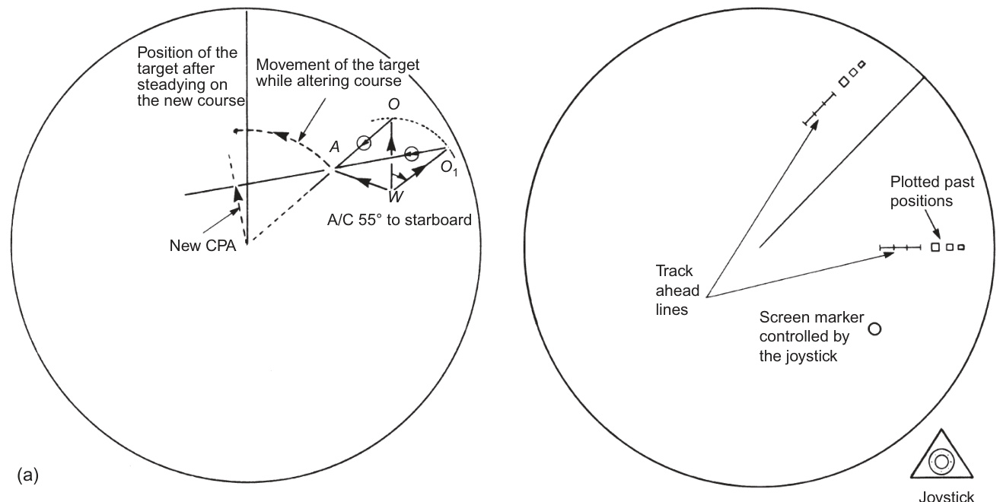  
FIGURE 7.34 The use of a rotatable plotting surface. (a) Before or during alteration of course. (b) After rotation of the plotting surface.  

【翻译】
图7.34 使用旋转绘制表面。在航向改变前或期间（a），以及在旋转绘制表面之后（b）。

【解读】
该图示意了使用可旋转的绘制表面的过程，展示了如何通过旋转表面来调整航向。这一技术可能用于导航或制图领域，以便更方便地记录和调整方向。

【词汇表】
| 英文词汇 | 中文翻译 | 解释 |
| --- | --- | --- |
| rotatable | 可旋转的 | 能够被旋转的物体或部件 |
| plotting surface | 绘制表面 | 用于绘制或记录数据的表面，如图纸等 |
| alteration of course | 改变航向 | 指改变原来的航行方向或路线 |

  
FIGURE 7.35 The $\mathrm{'E^{\prime}}$ plot.  

then any manual plotting will have to be done on paper.  

【翻译】
那么任何手动绘图都必须在纸上完成。

【解读】
这句话强调了在没有电子工具或计算机辅助的情况下，手动绘图只能通过传统方式，即使用纸张来完成。这意味着人们需要依靠手工劳动来创建图表或图纸，而不是使用现代技术。

【词汇表】
| 英文词汇 | 中文翻译 | 解释 |
| --- | --- | --- |
| manual | 手动 | 不使用自动化设备或计算机辅助的操作方式 |
| plotting | 绘图 | 创建图表或图纸的过程 |
| paper | 纸张 | 用于书写、打印或绘图的材料 |

# 7.10.4 The ‘E’ Plot  

This system used a joystick and marker to record ‘electronically’ the position of a target (Figure 7.35). The operator recorded the positions of targets at regular intervals, after which the data was processed and extrapolated to provide the information which would be available from a normal plot, that is course, speed, CPA and TCPA. Up to 10 targets could be manually tracked.  

【翻译】
该系统使用操纵杆和标记器来“电子化”地记录目标的位置（图7.35）。操作员在定期间隔内记录目标的位置，然后处理这些数据并进行外推，以提供从正常情景中可获得的信息，即航向、速度、最近接近点（CPA）和时间最近接近点（TCPA）。最多可以手动跟踪10个目标。

【解读】
这段话描述了一种早期的目标跟踪系统，它通过使用操纵杆和标记器来记录目标的位置，从而实现对目标的电子跟踪。这种系统允许操作员手动跟踪多个目标，并能够计算出与目标相关的各种参数，如航向、速度以及到达最近接近点的时间等。这表明，这种系统是用于海事或军事领域的目标跟踪和监控。

【词汇表】
| 英文词汇 | 中文翻译 | 解释 |
| --- | --- | --- |
| Joystick | 操纵杆 | 一种控制设备，用于输入方向或位置信息 |
| Marker | 标记器 | 在此 context 中可能指一种用来标记或记录目标位置的工具或软件 |
| Extrapolated | 外推 | 根据已知数据预测未知数据的过程 |
| CPA | 最近接近点 | 指船只或飞机与某一目标之间最近时的距离 |
| TCPA | 时间最近接近点 | 指船只或飞机与某一目标之间最近时的时间 |

Manual recording as practiced here should not be confused with manual acquisition followed by automatic tracking which takes place in the simplest of ARPAs.  

【翻译】
在这里实践的手动记录不应与最简单的ARPAs中发生的手动采集后自动跟踪相混淆。

【解读】
本段强调了手动记录和手动采集后自动跟踪之间的区别，指出两者是不同的过程，尤其是在ARPAs（自动目标跟踪系统）中。这意味着，即使在一些基本的自动化系统中，也可能存在混合的手动和自动操作，但它们服务于不同的目的和阶段。

【词汇表】
| 英文词汇 | 中文翻译 | 解释 |
| --- | --- | --- |
| Manual recording | 手动记录 | 人工进行数据或信息的记录 |
| Automatic tracking | 自动跟踪 | 系统自行追踪目标或对象的移动 |
| ARPA | 自动目标跟踪系统 | 一种使用雷达等技术自动检测和跟踪目标的系统 |

crystal display (LCD). There is an inherent assumption that in the unlikely event that the ARPA is not working but the radar is,  

【翻译】
液晶显示（LCD）。在不太可能发生的情况下，即ARPA系统未能正常工作但雷达系统正常工作时，

【解读】
这段话提到了两种技术：液晶显示（LCD）和自动雷达巡航辅助系统（ARPA）。它讨论了当ARPA系统出现故障，但雷达系统仍然正常工作时的假设情况。这意味着即使有一部分系统失效，雷达仍可以继续提供基本功能。

【词汇表】
| 英文词汇 | 中文翻译 | 解释 |
| --- | --- | --- |
| LCD | 液晶显示 | 一种显示技术，常用于电子设备屏幕 |
| ARPA | 自动雷达巡航辅助系统 | 一种辅助船只导航的雷达系统 |
| Radar | 雷达 | 无线电探测和定位系统，使用无线电波来检测目标 |

The system was unique to Kelvin Hughes. However, other types of plotting aids using graphics were common. Development of such facilities is a natural result of the need to provide plotting facilities on a raster-scan display which are at least equivalent to a reflection plotter (see Section 7.10.3), and has been assisted by the ease with which lines and points can be drawn electronically on such a display.  

【翻译】
该系统是Kelvin Hughes独有的。然而，其他类型使用图形的绘图辅助工具很常见。开发此类设施是为了在光栅扫描显示器上提供至少与反射绘图仪（参见第7.10.3节）相当的绘图设施的需要所产生的自然结果，并且得到了可以轻松电子地在此类显示器上绘制线条和点的便利性的帮助。

【解读】
本段主要讨论了Kelvin Hughes公司的绘图系统及其特点，同时提到其他类型的绘图辅助工具也很常见。这些工具的发展是为了满足在现代显示设备上提供高效绘图功能的需求，而电子技术使得这些功能能够轻松实现。

【词汇表】
| 英文词汇 | 中文翻译 | 解释 |
| --- | --- | --- |
| raster-scan display | 光栅扫描显示器 | 一种通过扫描方式显示图像的屏幕设备 |
| reflection plotter | 反射绘图仪 | 一种利用反射原理来绘制图像的设备 |
| graphics | 图形 | 计算机中用于表示和处理图像、图表等视觉元素的技术和方法 |
| facilities | 设施 | 为某一目的而设置的设备或条件 |

The $\mathrm{^{/}E^{\prime}}$ plot has now been superseded by the EPA.  

# 7.10.5 Electronic Plotting Aid (EPA)  

In 1997, IMO produced performance standards for an electronic aid to manual plotting. It was a refinement of earlier graphical devices such as the E plot covered in the previous section. IMO called the device an electronic plotting aid (EPA) and for a short period of time it was the minimum requirement for the smallest vessels (under $500~\mathrm{grt})$ that come under SOLAS (see Section 4.1.3), although not for high-speed craft. This regulation and the device have since disappeared.  

The performance standards required that the radar/EPA has azimuth stabilization, which could be provided by either a gyro or transmitting magnetic compass. There is no requirement for an electronic speed input, thus the speed may have to be input manually.  

【翻译】
雷达/电子方位角测量仪（EPA）的性能标准要求具有方位稳定功能，这可以通过陀螺仪或传输磁罗盘来实现。没有对电子速度输入的要求，因此可能需要手动输入速度。

【解读】
该段落主要讨论了雷达/电子方位角测量仪的技术要求，特别是其方位稳定功能的实现方式，以及速度输入的方法。这反映了设备设计和操作中的具体考虑因素，强调了精确度和可靠性的需求。

【词汇表】
| 英文词汇 | 中文翻译 | 解释 |
| --- | --- | --- |
| Azimuth | 方位 | 指物体在水平面上的方向角度，通常以北为0°，顺时针为正。 |
| Gyro | 陀螺仪 | 一种测量转速、倾斜和振动的仪器，常用于导航系统中保持方向稳定。 |
| Electronic speed input | 电子速度输入 | 使用电子设备自动输入或测量速度的方法。 |

The observer simply plots a target initially by using the joystick or tracker ball controls to position a marker symbol over the target to be plotted. A second plot is added any time between 30 seconds or 15 minutes later. A target symbol and vector then appear on the display. The symbol will move in an extrapolation of the two plots across the screen. The observer should enter more plots in time, particularly if the symbol’s relative motion does not match the underlying relative track of the target across the screen. Individual plots can be corrected if not plotted accurately.  

【翻译】
观察者首先使用操纵杆或追踪球控制器，将标记符号置于要绘制的目标上，然后在30秒到15分钟后添加第二个绘制点。目标符号和向量随后出现在显示屏上。该符号将根据两个绘制点进行外推，横跨整个屏幕移动。如果符号的相对运动与目标在屏幕上的底层相对轨迹不匹配，观察者应该及时输入更多的绘制点。若个别绘制点没有准确地绘制出来，可以进行更正。

【解读】
这段话描述了一个观察系统的操作过程，观察者通过输入多个绘制点来跟踪目标物体的运动。系统会根据这些绘制点预测目标的未来位置，并在屏幕上显示其运动轨迹。观察者需要不断更新绘制点，以确保跟踪的准确性，特别是当目标的运动模式发生变化时。

【词汇表】
| 英文词汇 | 中文翻译 | 解释 |
| --- | --- | --- |
| joystick | 操纵杆 | 一种用于控制设备的操纵杆 |
| tracker ball | 追踪球 | 一种用于控制设备的追踪球 |
| extrapolation | 外推 | 根据已知数据预测未知数据的方法 |
| relative motion | 相对运动 | 两个物体之间的相对运动关系 |
| vector | 向量 | 表示大小和方向的数学对象 |

As soon as a second position has been plotted, the observer can obtain the traditional alphanumeric target information associated with ARPA equipment, i.e. present range and bearing, CPA, TCPA, true course and speed.  

【翻译】
一旦第二个位置被绘制出来，观察者就可以获得与ARPA设备相关的传统字母数字目标信息，即当前距离、方位、最近接近点（CPA）、时间到达最近接近点（TCPA）、真实航向和速度等信息。

【解读】
本段主要介绍了在使用ARPA（自动雷达冲突避免系统）设备时，一旦确定了两个位置点，就能够获取目标物体的详细信息，如距离、方向、预计最接近点、到达该点所需时间、实际行进方向以及速度。这对于海事或航空领域中的安全导航具有重要意义，可以帮助操作员做出更好的决策以避免潜在的碰撞风险。

【词汇表】
| 英文词汇 | 中文翻译 | 解释 |
| --- | --- | --- |
| ARPA | 自动雷达冲突避免系统 | 一种用于检测和防止船舶或飞机之间碰撞的雷达系统 |
| CPA | 最近接近点 | 指两物体运动路径上彼此最近的点 |
| TCPA | 时间到达最近接近点 | 预计到达最近接近点的时间 |
| True Course | 真实航向 | 物体的实际移动方向 |
| Speed | 速度 | 物体的移动速率 |

The observer is also able to switch between true and relative vectors, as well as adjust the time length of vectors. As the observer added more plots to the target, the information and vectors were updated based on calculations from the last two plots only. It obviously follows that best results were obtained by plotting at reasonably regular intervals. Plotting at too small an interval caused minor plotting errors to have a large effect on the accuracy of the result. On the other hand, if the time interval was stretched too much then any target manoeuvres are less accurately detected and followed. The best interval to use will vary according to the target relative speed and direction and the range scale in use at the time (see also Section 7.9).  

【翻译】
观察者还可以在真实向量和相对向量之间切换，以及调整向量的时间长度。当观察者为目标添加更多图时，信息和向量会根据最近两次图的计算结果进行更新。很明显，最好的结果是通过在合理的间隔内绘制图来获得的。如果间隔太小，则微小的绘制错误会对结果的准确性产生重大影响。另一方面，如果时间间隔拉得太长，那么任何目标机动都会被不那么准确地检测和跟踪。使用的最佳间隔将根据目标的相对速度和方向以及当前使用的范围尺度而有所不同（见第7.9节）。

【解读】
本段主要讨论观察者如何优化目标跟踪的效果，特别是在设置向量和选择绘制间隔时。观察者需要平衡绘制频率与目标的移动速度，以避免由于过于频繁或过于稀疏的绘制导致的误差，从而获得最准确的跟踪结果。

【词汇表】
| 英文词汇 | 中文翻译 | 解释 |
| --- | --- | --- |
| vector | 向量 | 在此 contexto中指的是表示目标运动方向和速度的线段或箭头 |
| plot | 图、绘制 | 指的是观察者为目标创建的位置记录点 |
| interval | 间隔、时间间隔 | 指的是两次绘制或观察之间的时间距离 |
| manoeuvre | 机动、行动 | 指的是目标的运动或改变方向的行为 |
| accuracy | 准确性 | 指的是跟踪结果与实际情况之间的一致程度 |

The standard called for a minimum capability of 10 targets to be tracked in this way, so each target symbol must be assigned a target number, which (when appropriate) is included on the alphanumeric display as well as on the radar picture. The observer selects an appropriate target first, before reading the alphanumeric display or adjusting its plot.  

【翻译】
该标准要求最低能力为同时追踪10个目标，因此每个目标符号必须分配一个目标编号，当适当时，该编号会显示在字母数字显示屏上以及雷达图像上。观察员首先选择合适的目标，然后再阅读字母数字显示或调整其轨迹。

【解读】
本段主要讨论了某种系统（可能是军事或航空领域的追踪系统）的技术要求和操作步骤。它强调了系统需要能够同时追踪多个目标，并且每个目标都有唯一的标识符号，以便于观察员的操作和数据的清晰显示。

【词汇表】
| 英文词汇 | 中文翻译 | 解释 |
| --- | --- | --- |
| capability | 能力、容量 | 指系统或者设备能够处理的最大数量或任务 |
| alphanumeric display | 字母数字显示屏 | 一种可以显示字母和数字的电子屏幕，常用于显示代码、信息等 |
| radar picture | 雷达图像 | 由雷达系统生成的目标位置和运动图像，帮助观察员了解目标的实时情况 |
| plot | 轨迹、图表 | 在此 contexto 指目标的运动路径或预测路径，在显示屏上以图形方式呈现 |

# 7.10.5.1 Alarms  

The traditional target violation of preset CPA and TCPA limits found on the ARPA (see Section 4.7.2) was provided on an EPA.  

【翻译】
传统上，在ARPA（见4.7.2节）中设置的CPA和TCPA限制的违规目标是在EPA上提供的。

【解读】
本段主要讨论的是一种传统的方法，即在自动雷达导航辅助系统（ARPA）中预设的最小距离（CPA）和时间（TCPA）限制被违反时，在电子图表设备（EPA）上显示警告信息。这是船舶安全导航的一部分，旨在提醒操作员注意潜在的碰撞风险。

【词汇表】
| 英文词汇 | 中文翻译 | 解释 |
| --- | --- | --- |
| ARPA | 自动雷达导航辅助系统 | 一种使用雷达技术帮助船舶导航的系统 |
| CPA | 最近接近距离 | 船舶之间允许的最近距离 |
| TCPA | 时间至最近接近点 | 预测两艘船舶之间最近接近点的时间 |
| EPA | 电子图表设备 | 显示海图和其他导航信息的电子设备 |

In addition there is a warning if a target plot has not been updated by the observer for more than 10 minutes. The plot is dropped completely if this update time exceeds 15 minutes.  

【翻译】
另外，如果观察者超过10分钟没有更新目标图表，则会发出警告。如果更新时间超过15分钟，则完全放弃该图表。

【解读】
这段话描述了一个系统的更新机制，当观察者长时间不更新目标图表时，系统会先发出警告，然后在一定时间后如果仍然没有更新，就会放弃该图表。这是一个防止信息过时和确保数据新鲜性的措施。

【词汇表】
| 英文词汇 | 中文翻译 | 解释 |
| --- | --- | --- |
| target plot | 目标图表 | 指需要被观察和更新的特定图表或数据展示 |
| observer | 观察者 | 指负责更新和监视图表的人员或系统 |
| update | 更新 | 指对数据或信息进行修改、刷新的操作 |
| exceed | 超过 | 指超出某个限制或阈值 |
| drop | 放弃 | 指停止追踪、不再考虑某个项目或数据 |

# 7.10.5.2 Comparison Between EPA and the Reflection Plotter  

For a short time the EPA effectively superseded the requirement for a reflection plotter on non-ARPA radars. The modern raster CRT and LCD displays do not lend themselves to a reflection plotter and the EPA eliminated the need for calculations by the observer that are associated with hand plotting.  

【翻译】
在一段时间内，EPA（电子计划算法）有效地取代了非ARPA雷达需要反射图绘制器的要求。现代光栅CRT和LCD显示器不适合使用反射图绘制器，而EPA消除了观察者与手动绘图相关的计算需求。

【解读】
这段话主要讨论了EPA（电子计划算法）对雷达技术的影响，特别是它如何减少了对人工绘图的需求。通过使用现代显示技术，如CRT和LCD，EPA使得观察者无需进行复杂的计算来确定目标位置，从而提高了工作效率。

【词汇表】
| 英文词汇 | 中文翻译 | 解释 |
| --- | --- | --- |
| EPA | 电子计划算法 | 一种用于雷达系统的计算方法 |
| ARPA | 自动雷达plotting辅助 | 一种自动化雷达数据处理系统 |
| Raster | 光栅 | 一种数字图像显示技术 |
| CRT | 阴极管 | 一种传统的显示设备 |
| LCD | 液晶显示器 | 一种现代的平板显示设备 |

The plotting errors due to working with a thick grease pencil were reduced and a major advantage is that it is no longer a requirement for the navigator to record the precise time of the plot as it is done by the EPA. Indeed, while it may improve accuracy of EPA to plot at a suitable regular interval (as discussed above), the EPA was more likely to obtain accurate results than a reflection plotter if the plotting periods were a little irregular.  

【翻译】
由于使用厚重的油性铅笔进行绘图会产生错误，这些错误得到了减少，而且一个主要优势是导航员不再需要记录绘图的精确时间，因为这些都由EPA（电子位置指示器）来完成。事实上，虽然定期在合适的间隔内绘制可能会提高EPA的准确度（如前所讨论），但如果绘制周期稍微有些不规律，EPA比反射式绘图仪更有可能获得准确的结果。

【解读】
这段话讨论了使用电子位置指示器（EPA）相对于传统的绘图方法的优势。通过使用EPA，可以减少因人工操作而产生的错误，特别是在记录绘图时间方面。此外，即使绘制的时间间隔不是完全规律的，EPA也能提供比传统方法更高的准确度。这意味着EPA可以提高导航过程中的效率和准确度。

【词汇表】
| 英文词汇 | 中文翻译 | 解释 |
| --- | --- | --- |
| Plotting errors | 绘图错误 | 因为绘图过程中的人为操作导致的误差或错误 |
| Thick grease pencil | 厚重的油性铅笔 | 一种用于绘图的工具，由于其粗糙的特性容易导致绘图错误 |
| Regular interval | 规则的时间间隔 | 指按照固定的时间间隔进行某项操作，如绘图 |
| Accurate results | 准确的结果 | 指通过某种方法或工具获得的结果与真实值非常接近 |

The EPA also maintained plots at the correct range and predicted speed when the range scale was changed, unlike the reflection plotter.  

【翻译】
美国环境保护局（EPA）在范围尺度发生变化时，也能保持正确范围和预测速度的图表，而反射绘图仪则不能做到这一点。

【解读】
该段描述了美国环境保护局（EPA）与反射绘图仪之间的一个关键区别，即当范围尺度改变时，EPA能够维持准确的范围和速度预测，而反射绘图仪则无法实现这一功能。这突出了EPA在处理不同范围尺度下的数据时的优越性。

【词汇表】
| 英文词汇 | 中文翻译 | 解释 |
| --- | --- | --- |
| EPA | 美国环境保护局 | 一个负责环境保护的政府机构 |
| plots | 图表 | 用于显示数据关系的视觉表示 |
| range scale | 范围尺度 | 用于衡量距离或大小范围的标准单位 |
| reflection plotter | 反射绘图仪 | 一种用于创建图表的设备或软件，但具体细节未在此处详述 |

The main disadvantage of the EPA over the reflection plotter was that only two plots are used for the calculations and it is up to the observer to monitor the target track to ensure that the target achieved the second plot in a straight line and at constant speed. The results would not be valid if (unbeknown to the observer) the target adjusted its course or speed and ran a dogleg to the second plot.  

【翻译】
EPA相比反射式绘图仪的一个主要缺点是，只使用两个航迹点进行计算，观察者需要监测目标轨迹，以确保目标以直线和恒定速度到达第二个航迹点。如果（观察者不知道）目标调整了其航向或速度，并且以折线方式运行到第二个航迹点，那么结果将无效。

【解读】
本段讨论的是EPA（电子导航辅助设备）与传统的反射式绘图仪相比的一个主要缺陷，即EPA只利用两个航迹点来进行计算，这要求观察者密切关注目标的运动轨迹，以确保其按照预期的直线和恒定速度移动到下一个点。如果目标在未被观察者发现的情况下改变了方向或速度，或者采取了非直线路径，那么基于这两个点的计算结果将会失去准确性和可靠性。

【词汇表】
| 英文词汇 | 中文翻译 | 解释 |
| --- | --- | --- |
| EPA | 电子导航辅助设备 | 一种用于辅助导航的电子设备 |
| reflection plotter | 反射式绘图仪 | 一种通过反射原理绘制航行图的设备 |
| target track | 目标轨迹 | 指目标物体（如飞机、船只等）的预计或实际运动路径 |
| dogleg | 折线、犬牙形曲线 | 指非直线的曲折路径，如在高尔夫球场上的一种特殊曲线，也用于描述其他领域中的非直线运动 |

It is of course possible for an observer using a reflection plotter to make this error, but in this case it is less likely as the observer was encouraged to take three or more plots and the change in relative track would be more obvious. The human observer may also obtain a more accurate indication of target relative track by averaging it over three or more target plots. This is likely to be particularly true if, for example, the azimuth input was from a transmitting magnetic compass or the vessel is yawing badly.  

【翻译】
当然，使用反射绘图仪的观察者也可能犯这个错误，但是这种情况下发生的可能性较小，因为观察者被鼓励至少绘制三个或更多的图表，这样相对航迹的变化就会更加明显。人工观察者通过对三个或更多目标图表进行平均计算，也可以获得更准确的目标相对航迹指示。这尤其是在方位输入来自传输磁罗盘或者船只剧烈偏转的情况下。

【解读】
本段讨论的是在使用反射绘图仪进行观察时可能出现的误差问题，并强调了通过多次测量和平均计算来提高测量精度的重要性，特别是在某些不利条件下，如磁罗盘输入不稳定或船只剧烈偏转时。

【词汇表】
| 英文词汇 | 中文翻译 | 解释 |
| --- | --- | --- |
| reflection plotter | 反射绘图仪 | 一种用于记录和显示数据的设备 |
| relative track | 相对航迹 | 指两个物体之间的运动关系 |
| azimuth input | 方位输入 | 指方向或角度的输入信息 |
| yawing | 偏转 | 船只左右摇摆的状态 |

As in all manual plotting, the results are still only as good as the diligence of the observer.  

【翻译】
与所有手动绘制方法一样，结果的质量仍然取决于观察者的勤勉程度。

【解读】
这句话强调了在手动绘制或观察过程中，观察者个人素质和工作态度对最终结果的影响。它意味着即使使用相同的方法或工具，不同的人可能会得到不同的结果，这取决于他们投入的时间、精力和关注细节的程度。

【词汇表】
| 英文词汇 | 中文翻译 | 解释 |
| --- | --- | --- |
| diligence | 勤勉 | 指的是认真负责、尽职尽责的态度和行为 |
| observer | 观察者 | 指的是进行观察或实验的人 |
| manual | 手动 | 指的是不使用自动化工具，而是由人工完成的操作或过程 |
| plotting | 绘制 | 在这里指的是通过观察和记录数据来创建图表或图纸的过程 |

# 7.10.6 Auto-Tracking Aid  

IMO Performance Standards of 1997 also introduced the auto-tracking aid or ATA. Essentially it was an ARPA, but with certain features removed (Table 7.1). It was introduced as the minimum standard for vessels between 500 and 10,000 grt and even as the second radar tracker on ships greater than $10{,}000{\mathrm{grt}}$ . Like the EPA, it has been short-lived, existing in the regulations for a period. It had limited takeup by the industry and it is no longer part of current regulations.  

As noted in Section 4.2.6, automatic acquisition has not been found as useful as was first predicted (particularly for a vessel underway) when ARPA standards were first introduced. This omission from ATA standards perhaps reflected this low usage and usefulness. The logic for the lower minimum number of tracked targets follows mainly by removing this automatic acquisition option. There is also a school of thought that too many tracked targets simply clutter up the screen. It follows that 10 tracked targets are more than adequate, provided the navigator selects the 10 targets having the greatest potential threat. Similarly, the history dot option (see Section 4.3.7) is one not often used in practice, especially as manufacturers provide a traditional smear ‘snail’ trail (true or relative track) to show target progress. The biggest loss of function between the ATA and the ARPA is probably the lack of a trial manoeuvre facility (see Section 4.4.3).  

【翻译】
如第4.2.6节所述，自动获取功能并没有最初预测的那么有用（尤其是在船舶航行中），当ARPA标准首次引入时。ATA标准中省略了这一点，可能反映了这种低使用率和有用性。减少跟踪目标的最小数量的逻辑主要是通过删除这个自动获取选项来实现的。也有一个观点认为，太多的跟踪目标只会使屏幕变得混乱。因此，只要导航员选择具有最大潜在威胁的10个目标，那么10个跟踪目标就足够了。同样，历史记录点选项（见第4.3.7节）在实践中并不常用，特别是因为制造商提供传统的“蜗牛”痕迹（真实或相对轨迹）来显示目标进展。ATA和ARPA之间最大的功能损失可能是缺乏试验机动设施（见第4.4.3节）。

【解读】
本段讨论了ATA和ARPA两个标准之间的差异，特别是在自动获取、跟踪目标数量以及历史记录点等方面。作者指出，自动获取功能在实际应用中并不像最初预测的那样有用，因此ATA标准中省略了这一点。此外，作者认为跟踪目标数量不需要太多，10个目标已经足够，前提是导航员能够选择具有最大潜在威胁的目标。最后，作者指出，ATA和ARPA之间最大的功能损失是缺乏试验机动设施。

【词汇表】
| 英文词汇 | 中文翻译 | 解释 |
| --- | --- | --- |
| Automatic acquisition | 自动获取 | 自动获取目标的功能 |
| Tracked targets | 跟踪目标 | 被跟踪的目标数量 |
| Trial manoeuvre facility | 试验机动设施 | 允许进行模拟机动操作的功能 |
| ARPA standards | ARPA标准 | 一种雷达系统的标准 |
| ATA standards | ATA标准 | 另一种雷达系统的标准 |

TABLE 7.1 Differences Between Minimum ARPA and ATA Standards (IMO 1997 and 2001)   

【翻译】
表7.1 最低ARPA和ATA标准之间的差异（IMO 1997年和2001年）

【解读】
本段落主要介绍了国际海事组织（IMO）在1997年和2001年发布的关于最低ARPA（Average Recommended Passenger Area）和ATA（Air Transport Association）标准之间的差异。这些标准可能与船舶或飞机的乘客空间、安全要求等方面有关。

【词汇表】
| 英文词汇 | 中文翻译 | 解释 |
| --- | --- | --- |
| ARPA | 平均推荐乘客面积 | 指船舶或其他交通工具中为每位乘客推荐的平均空间 |
| ATA | 航空运输协会 | 一个代表航空公司和制造商利益的全球性贸易协会 |
| IMO | 国际海事组织 | 联合国的一个专门机构，负责制定全球海事安全、保安和环境保护的标准和规则 |

<html><body><table><tr><td></td><td>ATA</td><td>ARPA</td></tr><tr><td>Acquisition(seeSection4.2)</td><td>Manual</td><td>Manual and (optionally) automatic</td></tr><tr><td>Minimum tracked target capability (seeSection4.2)</td><td>10</td><td>20</td></tr><tr><td>History dots (see Section 4.3.7)</td><td>Nonerequired</td><td>Four equally spaced past positions over timeperiod suitablefor range scale</td></tr><tr><td>Trialmanoeuvre(seeSection4.4.3)</td><td>None</td><td>Yes, including with or without a time delay</td></tr></table></body></html>  

All told, the manufacturing differences between ARPA and ATA were actually quite small and one would speculate that the difference in costs of production between a minimum specification ARPA and a minimum specification ATA is actually quite small (mainly software and computer memory). A significant cost (at the time of writing the ATA regulations) would probably have been a smaller minimum screen size, but display screens subsequently went down dramatically in price.  

【翻译】
综上所述，ARPA和ATA之间的制造差异实际上非常小，我们可以推测最低配置的ARPA和最低配置的ATA之间的生产成本差异实际上也非常小（主要是软件和计算机内存的差异）。在撰写ATA法规时，一个显著的成本可能是较小的最小屏幕尺寸，但是显示屏的价格后来大幅下降。

【解读】
本段讨论了ARPA和ATA两种技术之间的制造差异和成本差异，指出它们之间的差异实际上非常小，主要体现在软件和计算机内存方面。同时，也提到了当时的一个显著成本因素，即屏幕尺寸，但随着时间的推移，显示屏的价格已经大幅下降。

【词汇表】
| 英文词汇 | 中文翻译 | 解释 |
| --- | --- | --- |
| ARPA | 自动路由协议分析器 | 一种网络设备 |
| ATA | 高级传输架构 | 一种硬盘接口标准 |
| Specification | 规范 | 对产品或系统的详细描述 |
| Dramatically | 大幅度地 | 形容某事物发生了很大的变化 |

A separate point is that ever since ARPA was first introduced, most maritime administrations have insisted that the operator should be specifically trained to use the ARPA and not just in radar observer manual plotting techniques. For instance UK regulations state that:  

【翻译】
另一个值得注意的问题是，从ARPA（自动雷达监视辅助）系统首次引入以来，大多数海事管理机构都坚持认为操作员应该接受专门的ARPA培训，而不仅仅是雷达观察者的手动绘图技术。例如，英国法规规定如下：

【解读】
本段强调了对ARPA系统操作员进行专门培训的必要性，这意味着仅掌握基本的雷达观察技能是不够的。这种要求反映出各国海事管理机构对安全和效率的重视，以及对现代化航运技术的适应能力。

【词汇表】
| 英文词汇 | 中文翻译 | 解释 |
| --- | --- | --- |
| ARPA | 自动雷达监视辅助 | 一种用于辅助雷达观察和目标跟踪的电子系统 |
| Maritime Administrations | 海事管理机构 | 负责管理和监督海事活动的政府部门或组织 |
| Radar Observer | 雷达观察者 | 操作和解读雷达设备的人员 |
| Manual Plotting Techniques | 手动绘图技术 | 使用手动方法记录和分析雷达数据的技巧 |

‘When a UK ship which is required to be fitted with ARPA is at sea and a radar watch is being kept on the ARPA, the installation shall be under the control of a person qualified in the operational use of ARPA, who may be assisted by unqualified personnel’. (Edited extract from UK SI 1993 No. 69, part IX, see Section 11.4.2.)  

【翻译】
当一艘英国船只需要安装自动雷达监视辅助系统（ARPA）且在海上航行时，如果正在使用该系统进行雷达监视，则该系统的操作应由熟悉ARPA运行使用的合格人员控制，该人员可以接受未经资格认证的人员的协助。（摘自英国SI 1993年第69号法规，第IX部分，参见第11.4.2节）

【解读】
本段强调了对自动雷达监视辅助系统（ARPA）的操作要求。在英国注册的船舶中，如果需要安装ARPA并且处于海上航行状态，同时正在进行雷达监视，那么必须有一名经过资格认证、了解ARPA操作使用的合格人员来负责控制整个系统。这意味着，即使有其他非资格认证人员协助，这名合格人员仍然需要对系统的操作负最终责任，以确保安全高效的运作。

【词汇表】
| 英文词汇 | 中文翻译 | 解释 |
| --- | --- | --- |
| ARPA | 自动雷达监视辅助系统 | 一种用于辅助雷达监视的自动化系统，帮助识别和跟踪目标物体 |
| Radar Watch | 雷达监视 | 使用雷达设备进行的监视活动，目的是检测和跟踪周围环境中的目标物体 |
| Qualified Personnel | 合格人员 | 指那些通过相关培训或考试获得资格认证的人员，在特定领域拥有专业知识和技能 |
| Unqualified Personnel | 未经资格认证的人员 | 没有获得相关资格认证，但可能在合格人员的指导下协助完成某些任务的人员 |

The ATA had no such provision and would therefore come under the regulation for radar, not ARPA. For instance in UK ships, it would come under the requirement:  

【翻译】
ATA没有这样的规定，因此会受到雷达法规而非ARPA的约束。例如，在英国船只中，它将受以下要求的约束：

【解读】
本段主要讨论的是ATA（自动目标跟踪系统）在不同国家或地区的监管问题，特别是与雷达和ARPA（自动雷达定位辅助系统）相关的法规。由于ATA缺乏特定的规定，因此它可能被视为雷达设备，而不是ARPA，从而受到不同的监管要求。这一差异对各国船舶的装备和操作标准有着重要影响。

【词汇表】
| 英文词汇 | 中文翻译 | 解释 |
| --- | --- | --- |
| ATA | 自动目标跟踪系统 | 一种用于跟踪和识别目标的电子系统 |
| ARPA | 自动雷达定位辅助系统 | 一种辅助雷达系统，帮助确定目标位置 |
| Radar | 雷达 | 无线电探测和定位系统，使用无线电波来检测和定位目标 |

‘While a UK ship which is required to be fitted with a radar installation is at sea and a radar watch is being kept, the radar installation shall be under the control of a qualified radar observer who may be assisted by unqualified personnel’. (Extract from UK SI 1993 No. 69, part IV, see Section 11.4.1.)  

【翻译】
当一艘英国船只在海上航行且需要配备雷达设备时，如果正在进行雷达监视，则该雷达设备应由合格的雷达观察员控制，该观察员可以得到未经资格认证的人员的协助。（摘自英国SI 1993年第69号，第四部分，请参阅第11.4.1节）

【解读】
本条规定强调了对雷达设备操作人员的要求，特别是在英国船只进行海上航行期间。它确保了雷达安装始终处于合格的雷达观察员的控制之下，以保证安全和有效的雷达监视。这也允许非合格人员在合格观察员的监督下协助完成相关工作。

【词汇表】
| 英文词汇 | 中文翻译 | 解释 |
| --- | --- | --- |
| Radar Installation | 雷达设备 | 指安装在船只上的用于探测和跟踪目标的雷达系统 |
| Qualified Radar Observer | 合格的雷达观察员 | 经过培训和认证，具有操作和管理雷达设备的资格的人员 |
| Unqualified Personnel | 未经资格认证的人员 | 没有获得正式资格或认证，但可能在合格人员的指导下协助工作的人员 |

Whilst it is hard to justify the difference in minimum training between an ATA and an  

很抱歉，您提供的英文段落似乎不完整。如果您能提供完整的段落，我将非常乐意帮助您进行翻译、解读以及提供相关词汇表。

如果您提供了完整的段落，我会按照如下格式回答：

【翻译】
(中文翻译)

【解读】
(简短解读)

【词汇表】
| 英文词汇 | 中文翻译 | 解释 |
| --- | --- | --- |

请提供完整的英文段落，以便我能够更好地为您服务。

ARPA on the basis of the difference in features, it would appear that lesser training was required. The only basis for this difference in training is that personnel who are not ARPA trained are effectively restricted to smaller vessels, and traditionally smaller vessels have always had lesser qualifications. However, it is a tradition that does not stand up to close scrutiny as smaller vessels often spend more time in high-density traffic and navigate in waters with little sea room.  

【翻译】
根据特征的不同，似乎需要较少的培训。但是，这种培训差异的唯一依据是，没有接受ARPA培训的人员通常被限制在较小的船只上，而传统上，小型船只的资格要求一直较低。然而，这是一种不能经得起细致审查的传统，因为小型船只往往花更多时间在高密度交通中航行，并在海域狭窄的水域中导航。

【解读】
这段话讨论了船只操作人员的培训问题，特别是比较了接受过ARPA（可能指某种专门培训或认证）培训的人员与没有接受这种培训的人员之间的差异。作者认为，小型船只的操作人员虽然传统上被认为需要较少的资格，但实际上他们面临着更复杂的驾驶环境，如高密度交通和狭窄的水域，因此他们可能需要更多的培训和技能。

【词汇表】
| 英文词汇 | 中文翻译 | 解释 |
| --- | --- | --- |
| ARPA | 特定培训或认证 | 一种专门的培训或认证，可能与船只操作有关 |
| high-density traffic | 高密度交通 | 指船只、车辆等在一定区域内密集地移动的情况 |
| sea room | 海域空间 | 指船只在海上活动时所需的安全距离或空间 |

Although the ATA has disappeared from the performance standards, the philosophy (rightly or wrongly) that small ships need a reduced specification for ARPA and this need still exists in the current IMO performance, as covered in Sections 4.1 and 4.2.  

【翻译】
尽管ATA已经从性能标准中消失，但认为小型船只需要降低ARPA规格的理念（无论是对还是错）仍然存在于当前国际海事组织（IMO）的性能标准中，如第四节第一、二款所述。

【解读】
本段主要讨论了国际海事组织（IMO）关于船舶自动雷达辅助系统（ARPA）的性能标准问题。虽然“ATA”这个概念不再被提及，但是对于小型船只需要较低规格的ARPA系统这一观点仍然影响着当前的性能标准。

【词汇表】
| 英文词汇 | 中文翻译 | 解释 |
| --- | --- | --- |
| ATA | 自动跟踪辅助 | 一种用于船舶的自动化系统 |
| ARPA | 自动雷达辅助系统 | 帮助船员使用雷达进行导航和避碰的系统 |
| IMO | 国际海事组织 | 一个负责制定全球海事安全标准的国际组织 |
| Performance Standards | 性能标准 | 对设备或系统的最低要求或规范 |

# 7.11 THE REGULATIONS FOR PREVENTING COLLISIONS AT SEA AS APPLIED TO RADAR AND ARPA  

# 7.11.1 Introduction  

The specific function of radar plotting (whether carried out on a paper plotting sheet, with the aid of an ARPA, or with any of the intermediate facilities or techniques) is to provide the data on which a collision-avoidance strategy can be based. It is not intended that this section should represent a treatise on collision-avoidance strategy in restricted visibility. This section aims to provide the radar observer with an appreciation of the need to carry out radar plotting (or equivalent systematic observation) in order to comply with the rules for preventing collisions at sea and with an understanding of the relationship between the data extracted and the provision of the regulations to the extent necessary to provide informed support for the master or other officer responsible for the collision-avoidance strategy.  

【翻译】
雷达绘图（无论是在纸质绘图表上进行、使用自动雷达绘图辅助设备（ARPA）还是采用任何中间设施或技术）的具体功能是为碰撞避免策略提供依据数据。这一节并不打算成为关于受限能见度下碰撞避免策略的专著。这个部分旨在让雷达观察员了解到执行雷达绘图（或等效系统观察）的必要性，以遵守防止海上碰撞的规则，并且理解从数据中提取出的信息与规定的关系，至少需要对船长或其他负责碰撞避免策略的官员提供有根据的支持。

【解读】
本段强调了雷达绘图在海上防止碰撞中的重要性，它为制定碰撞避免策略提供了基础数据。同时，也阐明了这一节的目的，即让雷达观察员明白执行雷达绘图的必要性以及它与相关规则和规定的关系，从而能够更好地支持船只安全航行。

【词汇表】
| 英文词汇 | 中文翻译 | 解释 |
| --- | --- | --- |
| Radar Plotting | 雷达绘图 | 使用雷达设备记录和分析目标物体位置和运动的过程 |
| Collision-avoidance Strategy | 碰撞避免策略 | 为避免海上碰撞而采取的措施和方法 |
| Restricted Visibility | 受限能见度 | 能见度不佳的环境，如雾天、雨天或夜晚 |
| ARPA | 自动雷达绘图辅助设备 | 一种帮助雷达观察员自动记录和分析雷达数据的电子设备 |

A notable feature of the 1972 Collision Regulations was that many specific references to the use of radar were made in the body of the rules. Subsequent amendments have not changed the role of radar as an anti-collision aid.  

【翻译】
1972年碰撞规则的一个显著特点是，在规则的内容中对雷达使用做了许多具体的引用。随后的修正案没有改变雷达作为防碰撞辅助工具的作用。

【解读】
这段话主要讲述了1972年碰撞规则关于雷达使用的规定及其后续修正案对雷达作用的影响。它强调了雷达在防止船舶碰撞中的重要性以及其作用的延续。

【词汇表】
| 英文词汇 | 中文翻译 | 解释 |
| --- | --- | --- |
| Radar | 雷达 | 一种利用无线电波探测和定位物体的设备，常用于导航和防碰撞。 |
| Amendments | 修正案 | 对原有法律、法规或协议进行修改或补充的文件或条款。 |
| Anti-collision | 防碰撞 | 指预防或减少碰撞事故发生的措施或系统。 |
| Aid | 辅助工具 | 帮助完成某项任务或功能的工具或设备。 |
| Regulations | 规则 | 为规范行为而制定的规则或标准。 |

When considering the application of radar and ARPA to collision avoidance, it is particularly pertinent that the term radar plotting or equivalent systematic observation of detected objects (rule 7b) appears for the first time. Although the rules do not define this term, consideration of the various instructions and cautions given in the specific references to radar make it possible to deduce a procedure which would enable competent personnel to comply with both the letter and spirit of the rules. In this respect, ARPA should merely be seen as readily providing data which would otherwise have to be obtained from the radar by lengthy and tedious manual extraction.  

【翻译】
在考虑雷达和自动雷达辅助碰撞避免系统（ARPA）应用于碰撞避免时，特别值得注意的是“雷达绘图”或等效的系统观察检测到的物体（规则7b）的术语首次出现。虽然这些规则没有定义这个术语，但通过考虑特定参考中关于雷达的各种指示和警告，可以推断出一种程序，这种程序可以使有能力的人员遵守规则的字面和精神。在这方面，ARPA应该被看作是轻松地提供了数据，而这些数据原本需要从雷达中通过冗长而繁琐的手动提取来获得。

【解读】
本段讨论了雷达技术和自动雷达辅助碰撞避免系统（ARPA）在海事领域中的应用，尤其是在碰撞避免方面的作用。它强调了“雷达绘图”的概念以及ARPA如何简化数据获取过程，使得操作人员更容易遵守相关规则和规定。

【词汇表】
| 英文词汇 | 中文翻译 | 解释 |
| --- | --- | --- |
| Radar Plotting | 雷达绘图 | 使用雷达设备记录和分析目标位置和运动的过程 |
| ARPA | 自动雷达辅助碰撞避免系统 | 一种使用雷达和计算机技术帮助船只避免碰撞的系统 |
| Collision Avoidance | 碰撞避免 | 指船只或其他交通工具采取措施以避免与其他物体发生碰撞的行为或系统 |

# 7.11.2 Lookout Rule 5  

Every vessel shall at all times maintain a proper lookout by sight and hearing, as well as by all available means appropriate in the prevailing circumstances and conditions so as to make a full appraisal of the situation and of the risk of collision.  

【翻译】
每艘船只应当随时保持适当的观察，通过视觉和听觉，以及在当前情况和条件下所有可用的手段来进行全面评估情况和碰撞风险。

【解读】
本段强调了船舶安全航行的重要性，要求船员必须时刻注意周围环境，利用视觉、听觉以及其他可用手段来获取信息，以便能够对可能出现的情况和碰撞风险做出准确的判断，从而采取必要的措施避免事故发生。

【词汇表】
| 英文词汇 | 中文翻译 | 解释 |
| --- | --- | --- |
| Vessel | 船舶 | 指各种类型的船只或海上浮动装置 |
| Lookout | 观察 | 指监视和观察周围环境以发现潜在危险 |
| Prevailing | 当前 | 指现阶段或目前的情况 |
| Appraisal | 评估 | 指对某事物或情况进行分析和判断的过程 |
| Collision | 碰撞 | 指两个或多个物体之间的撞击或冲突 |

Although this rule does not specifically mention radar, there seems little doubt that radar is embraced by the term ‘all available means’; its ability to detect targets and its role as a source of information allow an observer to make a more complete appraisal of the situation. It would also appear that there is an implied requirement to use the equipment in clear weather where it can augment or clarify the visual scene, for example in dense traffic, especially at night.  

【翻译】
尽管这条规则没有具体提到雷达，但似乎毫无疑问的是，雷达被“所有可用手段”的术语所涵盖；其检测目标的能力及其作为信息来源的角色使观察员能够对情况做出更完整的评估。此外，在晴朗天气中使用设备也似乎有一个隐含的要求，因为它可以增强或阐明视觉场景，例如在密集交通中，特别是在夜间。

【解读】
本段主要讨论了雷达技术在特定情境下的应用与规范。尽管相关规则中没有明确提及雷达，但根据雷达的功能和作用，它被认为是“所有可用手段”的一部分。这意味着在进行观察和评估时，应该考虑利用雷达来获取更多信息，从而做出更准确的判断。同时，也提到了在清晰天气条件下，尤其是在复杂环境如夜间交通中，使用雷达设备可以增强视觉观察的效果。

【词汇表】
| 英文词汇 | 中文翻译 | 解释 |
| --- | --- | --- |
| Radar | 雷达 | 一种通过电磁波探测和定位物体的系统 |
| Appraisal | 评估、评判 | 对某事物或情况的价值、质量或状况的判断 |
| Implied | 含示、暗示 | 在言语或文字中未直接表述但可以推断出的意思 |
| Augment | 增加、增强 | 使某物变得更大、更强或更有效 |
| Clarify | 澄清、阐明 | 使某事物变得更清楚或更容易理解 |

# 7.11.3 Safe Speed Rule 6  

Every vessel shall at all times proceed at a safe speed so that she can take proper and effective action to avoid collision and be stopped within a distance appropriate to the prevailing circumstances and conditions. In determining a safe speed, the following factors shall be among those taken into account:  

【翻译】
每艘船只应以安全的速度行驶，以便能够采取适当有效的措施避免碰撞，并在与当前情况和条件相适应的距离内停下来。在确定安全速度时，应考虑以下因素：

【解读】
本段强调了船舶航行中的安全问题，要求所有船只必须以安全的速度行驶，以确保能够及时采取措施避免碰撞，并能在适当的距离内停下来。这一要求是为了防止海上事故的发生，保护人员和财产的安全。

【词汇表】
| 英文词汇 | 中文翻译 | 解释 |
| --- | --- | --- |
| vessel | 船只、船舶 | 指各种类型的船舶或水上交通工具 |
| collision | 碰撞 | 指两艘或多艘船只之间的撞击或碰触 |
| prevailing circumstances | 当前情况、现状 | 指某一特定时间和地点下的环境、条件等 |
| conditions | 条件 | 指影响船舶航行安全的各种因素，如天气、海况等 |

a. By all vessels: i. the state of visibility; ii. the traffic density including concentrations of fishing vessels or any other vessels; iii. the manoeuvrability of the vessel with special reference to stopping distance and turning ability in the prevailing conditions; iv. at night the presence of background light such as from shore lights or from backscatter of her own lights; v. the state of wind, sea and current, and the proximity of navigational hazards; vi. the draught in relation to the available depth of water.   
b. Additionally, by vessels with operational radar: i. the characteristics, efficiency and limitations of the radar equipment; ii. any constraints imposed by the radar range scale in use; iii. the effect on radar detection of the sea state, weather and other sources of interference; iv. the possibility that small vessels, ice and other floating objects may not be detected by radar at an adequate range; v. the number, location and movement of vessels detected by radar; vi. the more exact assessment of the visibility that may be possible when radar is used to determine the range of vessels or other objects in the vicinity.  

【翻译】
所有船舶应考虑以下因素：一、能见度状态；二、交通密度，包括渔业船舶或其他船舶的集中情况；三、船舶在当前条件下的机动性，特别是停车距离和转弯能力；四、夜间背景光线，如来自岸边灯光或自身灯光的反射光；五、风、海况和洋流状态，以及导航危险物的临近性；六、吃水深度与可用水深的关系。
此外，对于配备有作业雷达的船舶，还应考虑：一、雷达设备的特性、效率和局限性；二、当前使用的雷达范围尺度所施加的限制；三、海况、天气和其他干扰源对雷达探测的影响；四、小型船舶、冰块和其他漂浮物体可能无法被雷达在足够的距离上探测到的可能性；五、被雷达探测到的船舶数量、位置和运动情况；六、当使用雷达确定附近船舶或其他物体的距离时，可以进行更精确的能见度评估。

【解读】
本段落强调了船舶在航行中需要考虑的各种因素，以确保安全导航。这包括环境条件、交通状况、自身船舶的机动性以及可能的干扰源等。对于配备有雷达的船舶，还需要考虑雷达设备的特性和局限性，以及各种因素对雷达探测的影响。这些考虑可以帮助船舶驾驶员做出更好的决策，避免碰撞和其他安全风险。

【词汇表】
| 英文词汇 | 中文翻译 | 解释 |
| --- | --- | --- |
| visibility | 能见度 | 指视觉条件下能够看到的程度 |
| manoeuvrability | 机动性 | 船舶在不同条件下的操控和灵活性 |
| backscatter | 反射光 | 物体或介质对光线的反射 |
| draught | 吃水深度 | 船舶浸入水中的深度 |
| radar | 雷达 | 无线

In listing the factors to be considered when determining a safe speed, this rule devotes a complete section to those factors which can be determined by the use of radar. It is important to realize that the factors listed extend beyond the context of basic radar into that of collisionavoidance systems such as ARPA.  

【翻译】
在列出确定安全速度时需要考虑的因素时，该规则专门开辟了一节来讨论那些可以通过雷达使用来确定的因素。了解这些列出的因素超出了基本雷达的范围，延伸到了碰撞避免系统（如ARPA）等领域，是非常重要的。

【解读】
本段强调了在确定船舶安全速度时，需要考虑多种因素，其中包括可以通过雷达技术以及更先进的碰撞避免系统（如自动雷达辅助.plotting援助，ARPA）来评估的因素。这意味着安全速度的判断不仅依赖于基本的雷达观测，还需要综合考虑各种高级别的航行辅助系统所提供的信息，以确保船舶的安全运行。

【词汇表】
| 英文词汇 | 中文翻译 | 解释 |
| --- | --- | --- |
| Radar | 雷达 | 无线电探测和定位系统 |
| ARPA | 自动雷达辅助.plotting援助 | 一种利用雷达数据自动跟踪和预警碰撞的系统 |
| Collision avoidance | 碰撞避免 | 指船舶或其他交通工具采取措施以避免与其他物体发生碰撞的行为或系统 |

# 7.11.4 Risk of Collision Rule 7  

a. Every vessel shall use all available means appropriate to the prevailing circumstances and conditions to determine if risk of collision exists. If there is any doubt, such risk shall be deemed to exist.   
b. Proper use shall be made of radar equipment if fitted and operational, including long range scanning to obtain early warning of risk of collision and radar plotting or equivalent systematic observation of detected objects.   
c. Assumptions shall not be made on the basis of scanty information, especially scanty radar information.   
d. In determining if risk of collision exists, the following considerations shall be among those taken into account: i. such risk shall be deemed to exist if the compass bearing of an approaching vessel does not appreciably change; ii. such risk may sometimes exist even when an appreciable bearing change is evident, particularly when approaching a very large vessel or a tow, or when approaching a vessel at close range.  

【翻译】
每艘船只应使用所有可用的适当手段，在当前的情况和条件下，来确定是否存在碰撞风险。如果有任何疑虑，这种风险应被认为是存在的。
如果安装并且处于工作状态，应正确使用雷达设备，包括长距离扫描以获得早期警告，以及对检测到的物体进行雷达绘图或等效的系统观察。
不应根据缺乏信息，特别是雷达信息，做出假设。
在确定是否存在碰撞风险时，应考虑以下因素：一、如果接近船只的指南针方位没有明显变化，则应认为这种风险是存在的；二、即使指南针方位有明显变化，有时仍可能存在这种风险，特别是在接近非常大的船只或拖船，或在接近船只时距离很近。

【解读】
本段落主要讨论了船舶在航行中如何避免碰撞的相关规定和注意事项。强调了船舶应积极利用各种手段和设备，如雷达，来判断是否存在碰撞风险，并在有疑虑时谨慎处理。同时，也提到了在判断碰撞风险时需要考虑的具体情况和因素，例如其他船舶的大小、距离以及航向变化等。

【词汇表】
| 英文词汇 | 中文翻译 | 解释 |
| --- | --- | --- |
| Vessel | 船舶 | 指各种类型的船只或海上浮动装置 |
| Collision | 碰撞 | 两个或多个物体之间的撞击或冲突 |
| Radar | 雷达 | 无线电探测和定位系统，用于探测和跟踪目标 |
| Scanty | 缺乏的 | 数量或程度不足的 |
| Tow | 拖船 | 被牵引或拖曳的船舶或浮动装置 |

Any discretion as to whether to make use of radar if fitted and operational, which may have existed under the previous rules, appears to have been removed by rule 7b. This section specifies that proper use shall be made of such equipment and the well-established warning about ‘scanty information’ is now embodied in this rule.  

【翻译】
任何关于是否使用已安装且正常运行的雷达的酌情权，如前规则中所存在的那样，似乎已经被第7b条取消了。本节规定应正确使用此类设备，而关于“信息不足”的久经验证现在也体现于本规则中。

【解读】
该段落主要讨论的是新的规则（第7b条）如何影响船舶在使用雷达方面的操作决策。以前可能有一定的灵活性或酌情权决定是否使用雷达，但新规则明确要求必须正确地使用这些设备，同时强调了避免依赖“信息不足”的重要性。

【词汇表】
| 英文词汇 | 中文翻译 | 解释 |
| --- | --- | --- |
| discretion | 酌情权 | 指根据具体情况做出判断或决定的权利或自由 |
| radar | 雷达 | 无线电探测和定位系统，用于检测和跟踪物体 |
| scanty | 不足的、缺乏的 | 在这里指信息不完整或不足够做出准确判断 |
| embodied | 体现、包含 | 指某种思想、原则或精神通过某种形式或方式得以体现或表达 |

# 7.11.5 Conduct of Vessels in Restricted Visibility ! Rule 19  

a. This rule applies to vessels not in sight of one another when navigating in or near an area of restricted visibility.   
b. Every vessel shall proceed at a safe speed adapted to the prevailing circumstances and conditions of restricted visibility. A power-driven vessel shall have her engines ready for immediate manoeuvre.   
c. Every vessel shall have due regard to the prevailing circumstances and conditions of restricted visibility when complying with the rules of section i of this part.   
d. A vessel which detects by radar alone the presence of another vessel shall determine if a close-quarters situation is developing and/or risk of collision exists. If so, she shall take avoiding action in ample time, provided that when such action consists of an alteration of course, so far as possible the following shall be avoided: i. an alteration of course to port for a vessel forward of the beam, other than for a vessel being overtaken; ii. an alteration of course towards a vessel abeam or abaft the beam.   
. Except where it has been determined that a risk of collision does not exist, every vessel which hears apparently forward of her beam the fog signal of another vessel, or which cannot avoid a close-quarters situation with another vessel forward of her beam, shall reduce her speed to the minimum at which she can be kept on her course. She shall if necessary take all her way off and in any event navigate with extreme caution until danger of collision is over.  

【翻译】

a. 本规则适用于在能见度受限区域内或附近航行时，彼此看不到对方的船舶。
b. 每艘船只应以适应当前情况和能见度受限条件的安全速度航行。动力船应随时准备好发动机，以便立即进行操纵。
c. 每艘船只在遵守本部分第一节的规则时，应考虑到当前的情况和能见度受限的条件。
d. 如果一艘船只通过雷达探测到另一艘船的存在，应判断是否正在发展成为近距离接触的情况和/或碰撞风险。如果是，则应及时采取避让行动，但当这种行动涉及改变航向时，应尽可能避免：i. 对于位于船头前方的船只（除被超越的情况外），向左改变航向；ii. 向位于船侧或船尾后的船只改变航向。
e. 除非已经确定不存在碰撞风险，否则每艘听到另一艘船在其船头前方的雾号声的船只，或无法避免与另一艘船在其船头前方发生近距离接触的情况的船只，应降低速度至最低可以保持航向的程度。如果必要，应完全停船，并且在任何情况下都应谨慎航行，直到碰撞危险过去为止。

【解读】

这段文字主要讨论了船舶在能见度受限条件下的航行规则，例如在雾天、雨天或其他视线不清晰的情况下。这些规则强调了安全性，要求船舶以适应当前情况的安全速度航行，并在必要时采取避让行动以防止碰撞。同时，也提到了使用雷达等技术来检测其他船舶的存在，并根据实际情况做出相应的反应。

【词汇表】

| 英文词汇 | 中文翻译 | 解释 |
| --- | --- | --- |
| Restricted visibility | 能见度受限 | 指由于各种因素导致视线不清晰，难以看到远处物体的状态，如雾天、雨天等。

# 7.11.5.1 The Development of a Close-Quarters Situation  

In cases where a target is detected by radar alone, rule 19d places a specific obligation on the observer to determine whether a closequarters situation is developing. To comply with this requirement, the target should be plotted and its CPA and TCPA determined. With ARPA, this information can be made available in alphanumeric form if the target is designated. (The TCPA will assume particular importance if a close-quarters situation is developing.)  

【翻译】
在只有雷达探测到目标的情况下，规则19d要求观察员确定是否正在发展成为近距离情况。为了满足这一要求，应该绘制目标的轨迹并确定其最近接近点（CPA）和时间最近接近点（TCPA）。使用自动雷达plotting辅助系统（ARPA），如果目标被指定，这些信息可以以字母数字形式提供。（如果近距离情况正在发展，TCPA将具有特别重要的意义。）

【解读】
本段主要讨论了当雷达单独探测到目标时，观察员需要遵循的规则和步骤，以判断是否存在近距离情况的风险。通过计算目标的最近接近点和时间最近接近点，可以评估潜在的碰撞风险，并采取相应措施。

【词汇表】
| 英文词汇 | 中文翻译 | 解释 |
| --- | --- | --- |
| Radar | 雷达 | 无线电探测和定位系统 |
| CPA | 最近接近点 | 指目标与观察点之间最短距离的位置 |
| TCPA | 时间最近接近点 | 指目标与观察点之间最近接近的时间点 |
| ARPA | 自动雷达plotting辅助系统 | 一种辅助雷达系统，能够自动绘制目标的轨迹并提供相关信息 |

At this juncture, it is the duty of the officer of the watch to decide if the CPA constitutes a close-quarters situation; the CPA which would suggest that the encounter be deemed ‘closequarters’ will depend upon:  

【翻译】
在这一阶段，值班官员有责任决定CPA（最接近点）是否构成近距离情况；判断是否为“近距离”遭遇取决于CPA。

【解读】
本段强调了值班官员在判断船舶相遇时是否属于近距离情况的重要性，这取决于最接近点（CPA）的计算结果。这一判断对于确保航行安全至关重要，因为近距离情况可能需要采取特别的预防措施以避免碰撞。

【词汇表】
| 英文词汇 | 中文翻译 | 解释 |
| --- | --- | --- |
| Juncture | 阶段、阶段 | 指特定时间或事件发生的点 |
| Officer of the watch | 值班官员 | 负责监管和指挥船只运行的官员 |
| CPA | 最接近点 | Closest Point of Approach，即两艘船之间最近的距离点 |
| Close-quarters | 近距离 | 船舶之间距离很近，可能存在碰撞风险的情况 |

a. the geographical position of the vessels, b. the handling capability of the ship, c. the density of the traffic.  

【翻译】
船舶的位置、船舶的操作能力以及交通的密度分别是三个关键因素。

【解读】
该段落提到了影响某一特定情况（可能与航运或海事相关）的三个主要因素：第一，船舶的地理位置；第二，船舶自身的操作能力；第三，周围交通环境的拥挤程度。这三个因素可能对船舶的安全运行、效率或者其他方面产生影响。

【词汇表】
| 英文词汇 | 中文翻译 | 解释 |
| --- | --- | --- |
| Vessels | 船舶 | 指各种类型的船只或海上浮动装置 |
| Handling Capability | 操作能力 | 指船舶执行特定任务或操作的能力 |
| Density of Traffic | 交通密度 | 指在一定区域内交通工具的数量或集中程度 |

# 7.11.5.2 Manoeuvres to Avoid Collision  

If it is decided that a close-quarters situation is developing, the observer must take action to resolve the situation in ample time, subject to the recommendations laid down in rule 19d (i) and (ii). Any avoiding manoeuvre not based on a knowledge of the true vector of all relevant targets would be unseamanlike and could certainly attract criticism as an assumption based on scanty radar information.  

【翻译】
如果确定正在发展近距离情况，观察员必须采取行动在充足的时间内解决这种情况，这须遵循第19条（d）（i）和（ii）中规定的建议。任何不基于对所有相关目标真实矢量知识的规避动作都是不符合航海规范的，可能会因为依赖不足的雷达信息而受到批评。

【解读】
本段强调了在近距离情况下，观察员需要及时采取措施以避免潜在的碰撞或危险。这些措施应该基于对所有相关目标的运动矢量有准确的了解，而不是简单地依靠有限的雷达信息来进行假设。这要求观察员具备良好的判断力和专业知识，以确保安全高效的航行。

【词汇表】
| 英文词汇 | 中文翻译 | 解释 |
| --- | --- | --- |
| Close-quarters | 近距离 | 指两个或多个物体之间的距离非常近，可能导致碰撞或其他危险的情况。 |
| Vector | 矢量 | 在物理学中，指具有大小和方向的量，如速度、加速度等。在这里特指目标的运动方向和速度。 |
| Unseamanlike | 不符合航海规范 | 指违反航海常规或不专业的行为，在此 context 下，指不基于充分信息的规避动作。 |
| Scanty | 不足的 | 指信息、资源等的数量或质量不足。 |

When ARPA is being used, the true vector data may be obtained in alphanumeric form and cross-checked by interpretation of the graphical presentation but, since these are often generated from the same database, a good comparison should not be taken as an assumption of accuracy of the information. It is important to remember that the success of the action by the own ship may be influenced by recent changes in the target’s true vector. It is thus useful to check, by using the history presentation on the ARPA, whether such changes have occurred.  

【翻译】
当使用ARPA（自动雷达测角和距离系统）时，真实的矢量数据可能以字母数字形式获得，并通过图形显示的解释进行交叉核查。但是，由于这些数据通常来自同一个数据库，因此即使比较结果良好，也不应假设信息是准确的。必须记住，自身船只采取行动的成功可能会受到目标真实矢量最近变化的影响。因此，利用ARPA的历史记录功能检查是否发生了这样的变化是有用的。

【解读】
本段强调在使用ARPA系统获取和验证目标的真实矢量数据时需要谨慎。由于数据来源相同，简单的比较可能无法保证信息的准确性。特别是在动态环境中，目标的状态可能会迅速变化，从而影响到决策的有效性。因此，通过历史记录来检查目标状态的变化，对于做出更准确的判断至关重要。

【词汇表】
| 英文词汇 | 中文翻译 | 解释 |
| --- | --- | --- |
| ARPA | 自动雷达测角和距离系统 | 一种用于海事领域的雷达系统，能够自动测量目标的方位和距离。 |
| Alphanumeric | 字母数字 | 由字母和数字组合而成的字符集。 |
| Cross-checked | 交叉核查 | 通过不同方法或途径对信息进行验证，以确保其准确性。 |
| Graphical presentation | 图形显示 | 以图表、图像等形式呈现信息的方式。 |
| History presentation | 历史记录功能 | 显示过去一段时间内信息变化情况的功能。 |

# 7.11.6 Action to Avoid Collision Rule 8  

a. Any action taken to avoid collision shall be taken in accordance with the rules of this part and shall, if the circumstances of the case admit, be positive, made in ample time and with due regard to the observance of good seamanship.  

【翻译】
为避免碰撞而采取的任何行动，都应按照本部分的规定执行。如果情况允许，这些行动应是积极的、提前进行的，并且要考虑到遵守良好的航海习惯。

【解读】
这段话强调了在避免船舶碰撞时，需要遵循既定的规则和规范，不仅要采取积极措施，还要确保这些措施是在充足的时间内实施的，同时也要注意遵守良好的航海习惯。这意味着船员不仅要有反应能力，还要有预见性和责任感，以确保安全。

【词汇表】
| 英文词汇 | 中文翻译 | 解释 |
| --- | --- | --- |
| collision | 碰撞 | 两艘或多艘船只之间发生的撞击事故 |
| seamanship | 航海习惯 | 船员在操作和管理船只方面所遵循的技能和规范 |
| circumstance | 情况 | 指特定事件或条件下的具体环境或状态 |
| ample time | 充足的时间 | 足够的时间，能够让人有足够的准备和反应时间 |

b. Any alteration of course and/or speed to avoid collision shall, if the circumstances of  

【翻译】
避免碰撞的航向和/或速度的任何改变，在情况允许时，应尽可能保持在原来的航向和速度上。

【解读】
本段落主要讨论的是船舶或其他交通工具在遇到潜在碰撞风险时应该采取的措施。它强调了在改变航向和速度以避免碰撞时，应尽量保持原有的航向和速度，只有在必要时才进行调整。这是为了确保安全，同时也减少对其他交通工具造成干扰或增加新的风险。

【词汇表】
| 英文词汇 | 中文翻译 | 解释 |
| --- | --- | --- |
| alteration | 改变 | 指改变航向、速度等状态 |
| collision | 碰撞 | 两个或多个物体之间的撞击 |
| circumstance | 情况、环境 | 指影响决策的外部条件或背景 |
| speed | 速度 | 指移动物体的速率 |

the case admit, be large enough to be readily apparent to another vessel observing visually or by radar; a succession of small alterations of course and/or speed should be avoided.   
c. If there is sufficient sea room, alteration of course alone may be the most effective action to avoid a close-quarters situation provided that it is made in good time, is substantial and does not result in another close-quarters situation.   
d. Action taken to avoid collision with another vessel shall be such as to result in passing at a safe distance. The effectiveness of the action shall be carefully checked until the other vessel is finally past and clear.   
e. If necessary to avoid collision or allow more time to assess the situation, a vessel shall slacken her speed or take all way off by stopping or reversing her means of propulsion.  

【翻译】
在遇到可能发生碰撞的情况时，应采取措施避免碰撞。如果情况允许，改变航向或速度可以有效地避免近距离接触；如果需要，可以减速甚至停止或逆转推进方式，以便有足够的时间评估情况并采取适当的行动。在改变航向或速度时，应确保变化足够大，以便其他船只能够通过目视观察或雷达探测到这种变化；同时，应该避免连续进行小幅度的航向或速度调整。如果海面空间足够宽敞，单独改变航向可能是最有效的措施，只要这种改变是在合适的时间内进行的、幅度足够大且不会导致另一种近距离接触的情况。为避免与另一艘船只发生碰撞而采取的行动，应保证能保持安全距离通过。直到另一艘船完全驶过且安全通过后，应仔细检查所采取行动的效果。如果必要的话，为避免碰撞或者为了获得更多时间来评估情况，船只可以减少速度或者完全停止前进甚至逆转推进方向。

【解读】
本段落讨论了如何在海上避免船只之间的碰撞。它强调了及时采取有效措施的重要性，包括改变航向、速度或者两者兼而有之，以保持安全距离。同时，也提到了在操作过程中应注意避免频繁的小幅度调整，并确保任何改变都是显著的、及时的，不会导致新的危险情况。减速或停止也是必要的手段，尤其是在评估情况和确保安全通过方面。

【词汇表】
| 英文词汇 | 中文翻译 | 解释 |
| --- | --- | --- |
| Vessel | 船只 | 指各种类型的船舶，如货船、客轮等 |
| Collision | 碰撞 | 两个或多个物体之间的撞击或冲突，在此指船只之间的碰撞 |
| Alteration | 改变 | 在这里特指改变航向或速度以避免碰撞 |
| Close-quarters situation | 近距离接触 | 指两艘船只之间非常接近，可能导致碰

# 7.11.6.1 The Forecast  

Rule 8d requires that action taken to avoid collision with another vessel shall be such as to result in a safe passing distance. This rule applies to all states of visibility but, in restricted visibility, the safe passing distance may have to be greater than that which would be tolerated in clear weather.  

【翻译】
第8d条规定，采取措施避免与另一艘船碰撞时，应确保安全通过的距离。这一规则适用于所有能见度状态，但在能见度受限的情况下，安全通过距离可能需要大于在晴天条件下可以容忍的距离。

【解读】
本段强调了航海中安全通行距离的重要性，特别是在能见度有限的情况下，需要更加谨慎地确定安全距离，以避免碰撞事故。

【词汇表】
| 英文词汇 | 中文翻译 | 解释 |
| --- | --- | --- |
| collision | 碰撞 | 两艘或多艘船只之间发生的撞击事故 |
| visibility | 能见度 | 指视线清晰可见的程度，尤指驾驶或航行中的视野范围 |
| tolerated | 容忍 | 在特定情况下能够接受或允许的极限值或标准 |

When employing radar and ARPA, passing distances may and should be determined by the construction of a ‘predicted OA line’ on the plot or the use of the ‘trial manoeuvre’ facility which all ARPAs are required to have. Such a forecast will also enable the observer to check that the manoeuvre will not result in a close-quarters situation with other vessels (rule 8c) and can often indicate where targets may manoeuvre to avoid each other.  

【翻译】
在使用雷达和自动雷达辅助碰撞避让系统（ARPA）时，可以通过在图表上绘制“预测方位线”或使用所有ARPA必备的“试验机动”功能来确定通过距离。这种预测还可以使观察者检查机动是否会导致与其他船舶发生近距离情况（规则8c），并且常常能够指示目标可能如何机动以避免相互接近。

【解读】
本段主要讨论了在使用雷达和自动雷达辅助碰撞避让系统（ARPA）时，如何通过特定方法预测和避免船舶之间的潜在碰撞风险。它强调了在进行任何机动之前，需要仔细评估可能的结果，以确保安全的航行环境。

【词汇表】
| 英文词汇 | 中文翻译 | 解释 |
| --- | --- | --- |
| Radar | 雷达 | 无线电探测和定范围系 |
| ARPA | 自动雷达辅助碰撞避让系统 | 一种利用雷达技术帮助船舶避免碰撞的系统 |
| Predicted OA line | 预测方位线 | 在图表上绘制的一条线，用来预测两艘船舶可能的相对位置和运动方向 |
| Trial manoeuvre | 试验机动 |一种模拟机动的方式，用于测试和预测不同机动方案的效果 |

It is essential to remember that a further criterion for an acceptable manoeuvre is that it must be readily apparent to another vessel observing by radar (rule 8b). In making this judgement, one must consider the own ship’s speed and the speeds of target vessels.  

【翻译】
必须记住，对于一个可接受的机动行为来说，还有一个重要的标准，即它必须能够被其他通过雷达观察的船只清晰地识别（规则8b）。在做出这个判断时，需要考虑自己的船速以及目标船只的速度。

【解读】
本段强调了在进行海上机动操作时，除了自身安全考虑外，还需要确保自己的行动是可以被其他船只通过雷达观察到的。这意味着，不仅要考虑自己的船速，也要考虑周围环境中其他船只的速度，以避免潜在的碰撞风险。

【词汇表】
| 英文词汇 | 中文翻译 | 解释 |
| --- | --- | --- |
| Manoeuvre | 机动行为/操纵 | 指船舶或飞行器等进行的各种控制和调整动作 |
| Criterion | 标准/条件 | 判断某事物是否合格或满足要求的依据 |
| Readily apparent | 清晰可见/容易被发现 | 能够轻松地被注意到或理解 |
| Target vessels | 目标船只 | 在特定情况下，被观察、跟踪或与之交互的船只 |

Further, it must be appreciated that, even if the target vessel is equipped with radar, the plotting facilities may be very basic. Hence the rate at which the other observer can extract data, and thus become aware of changes, may be slow and the ability to identify small changes may be particularly limited (for this reason, rule 8b gives a warning about a succession of small alterations).  

【翻译】
此外，我们必须认识到，即使目标船只配备了雷达，其绘图设施可能非常基本。因此，另一名观察员提取数据、从而意识到变化的速度可能很慢，识别小变化的能力可能尤其有限（正因为如此，规则8b对一系列的小改动发出警告）。

【解读】
本段强调即使目标船只拥有雷达设备，其实际操作和数据处理能力可能仍然有限。这意味着在监测和应对变化时可能存在延迟或盲点，特别是在识别小规模变化方面。因此，相关规则会对连续的小幅度改变发出警告，以确保安全性和及时反应。

【词汇表】
| 英文词汇 | 中文翻译 | 解释 |
| --- | --- | --- |
| radar | 雷达 | 一种利用无线电波探测和定位物体的系统 |
| plotting facilities | 绘图设施 | 用于记录和分析数据的工具或软件 |
| extract data | 提取数据 | 从原始信息中获取有用信息的过程 |
| succession of small alterations | 一系列的小改动 | 连续发生的一系列小规模变化 |

Finally, the possibility that a target vessel may not be plotting, or may not even have an operational radar, must be continually kept in mind.  

【翻译】
最后，一定要时刻牢记目标船只可能没有进行导航，或甚至根本没有操作雷达的可能性。

【解读】
这段话强调了在海上作业或军事行动中需要考虑到目标船只可能没有正常运作的雷达系统，这意味着它们可能不会被检测到或者无法有效地进行通信。这要求相关人员保持警惕和灵活性，以应对不同的情况。

【词汇表】
| 英文词汇 | 中文翻译 | 解释 |
| --- | --- | --- |
| target vessel | 目标船只 | 指定的、正在被监视或攻击的船只 |
| plotting | 进行导航 | 使用地图或其他工具来记录和预测自己的位置和移动路径 |
| operational radar | 操作雷达 | 正常工作状态下的雷达系统，可以探测和跟踪目标 |

# 7.11.6.2 The Effectiveness of a Manoeuvre  

Rule 8d requires that the effectiveness of the avoiding action be checked until the other vessel is finally past and clear. This requirement can be satisfied by monitoring:  

【翻译】
第8d条规定，在采取避让行动后，必须检查避让行动的有效性，直到另一艘船完全驶过并清除。这一要求可以通过监测来满足：

【解读】
本段强调了在海上交通中采取避让行动后的安全监控的重要性，确保其他船只已经安全通过，以防止潜在的碰撞风险。

【词汇表】
| 英文词汇 | 中文翻译 | 解释 |
| --- | --- | --- |
| Vessel | 船只 | 指任何类型的船舶或水上运输工具 |
| Avoiding action | 避让行动 | 为避免碰撞而采取的措施或动作 |
| Monitoring | 监测 | 实时观察、跟踪和检查某事物的状态或行为 |

a. The true track of all relevant targets (to ensure early detection and identification of target manoeuvres).   
b. The relative track of all relevant targets to check for the fulfilment of the forecast nearest approach.  

【翻译】
a. 所有相关目标的真实轨迹（以确保对目标机动的早期检测和识别）。
b. 所有相关目标相对于检查预测的最近接近点的轨迹。

【解读】
该段落主要讨论的是跟踪系统中目标的监控和预测，特别是为了实现早期发现和识别目标的机动行为，以及检查目标是否按照预测的路径行进，以便于做出相应的反应或调整。

【词汇表】
| 英文词汇 | 中文翻译 | 解释 |
| --- | --- | --- |
| target | 目标 | 指需要被追踪或监视的物体或对象 |
| manoeuvres | 机动行为 | 指目标可能采取的行动或运动 |
| fulfilment | 实现 | 指某事物是否按照计划或预测发生 |
| nearest approach | 最近接近点 | 指目标与其他物体之间最短距离的位置或时刻 |

# 7.11.6.3 Resumption  

When the target is finally past and clear, the decision must be made to resume course and/ or speed.  

【翻译】
当目标终于过去且清晰可见时，就必须做出恢复原航线和/或速度的决定。

【解读】
这段话描述的是在某种行动或任务中，当遇到一个需要绕过或处理的目标（可能是障碍、事件等）后，需要重新评估当前的情况，并根据情况决定是否恢复之前的行进方向和速度。这通常涉及到导航、交通管理或者其他需要实时决策的领域。

【词汇表】
| 英文词汇 | 中文翻译 | 解释 |
| --- | --- | --- |
| target | 目标 | 指需要处理或绕过的对象、事件或目的地 |
| resume | 恢复 | 重新开始或继续之前的状态或行动 |
| course | 航线/方向 | 指移动物体的前进方向或路径 |
| speed | 速度 | 指移动物体的快慢程度 |

As in the case of the avoiding manoeuvre, prior to resuming, the apparent track of the target after resumption (see Section 7.5.7) or the trial manoeuvre on the ARPA should be employed to verify that a safe passing distance will be achieved with respect to all relevant targets. It should be remembered that the resumption will be most obvious to other observing vessels if it is performed as a single manoeuvre as opposed to a series of small alterations. The common practice of resuming course in steps by ‘following the target round’ will make it difficult for other observing ships to identify the manoeuvre positively and could be considered to be in contravention of the spirit of rule 8b.  

【翻译】
与避让机动一样，在恢复原航向之前，应使用目标在恢复后显现的轨迹（见第7.5.7节）或ARPA上的试验机动来验证是否能与所有相关目标保持安全的通过距离。在恢复原航向时，最好以单一机动进行，这样对其他观察到的船舶来说最为明显，而不是通过一系列小幅度的改变。通常的做法是通过“跟随目标”逐步恢复航向，这会使得其他观察到的船舶难以肯定地识别出这种机动，并可能被认为违反了规则8b的精神。

【解读】
本段强调了在恢复原航向前需要谨慎评估，以确保与其他船舶保持安全距离。同时，也提醒船员在操作时应尽量使自己的意图明显，以便其他船舶能够理解和预测自己的行为，从而减少碰撞的风险。

【词汇表】
| 英文词汇 | 中文翻译 | 解释 |
| --- | --- | --- |
| Resumption | 恢复原航向 | 指船舶重新回到原来的航线上 |
| Manoeuvre | 机动 | 船舶为了实现特定目的而进行的运动或操作 |
| ARPA | 自动雷达辅助碰撞避免系统 | 一种用于帮助船舶避免碰撞的电子系统 |
| Contravention | 违反 | 指某一行为或行动违背了既定的规则或法律 |

# 7.11.7 The Cumulative Turn  

This set of related manoeuvres based on wrongly interpreted radar information (in restricted visibility) has probably done more than anything else to give radar a bad name and to indicate the need for a proper appreciation and use of the data displayed on the screen.  

【翻译】
基于对雷达信息（在能见度受限的情况下）的错误解读，这一系列相关操作可能比其他任何事情更让雷达声誉受损，并表明需要正确地理解和使用屏幕上显示的数据。

【解读】
这段话强调了正确解读和使用雷达信息的重要性。在能见度有限的情况下，如果雷达信息被误解，可能会导致一系列错误的操作，从而使得雷达的名声受损。这说明了在使用雷达时，需要谨慎和准确地解读数据，以避免不必要的风险和错误。

【词汇表】
| 英文词汇 | 中文翻译 | 解释 |
| --- | --- | --- |
| Manoeuvres | 操作 | 指飞机、船舶等的驾驶或控制动作 |
| Radar | 雷达 | 无线电探测和定位系统 |
| Visibility | 能见度 | 指物体或目标在视觉上的可见程度 |
| Restricted | 受限 | 指某些条件或情况下的限制或约束 |

A number of elements have been identified which are common in the majority of the cases which have come before the courts and which are of interest when endeavouring to understand just how, in spite of repeated warnings, the same fatal scenario has been played out on so many occasions.  

【翻译】
已经确定了一些在大多数案件中都存在的共同元素，这些案件曾被法庭审理过，对于了解尽管有反复警告，但同样的致命情景为什么会在这么多次中重演具有参考价值。

【解读】
这段话讨论了一个令人担忧的现象，即尽管有反复的警告，类似的错误或问题仍然不断地出现。这可能与决策、风险管理或者安全措施等方面有关，强调了需要深入分析和改进，以避免未来发生类似的问题。

【词汇表】
| 英文词汇 | 中文翻译 | 解释 |
| --- | --- | --- |
| elements | 元素、要素 | 指构成某事物的基本部分或组成因素 |
| scenario | 情景、场景 | 指一种可能发生的情况或事件发展的预测 |
| endeavour | 努力、尝试 | 指为实现某目标而付出的努力或尝试 |
| fatal | 致命的、灾难性的 | 指导致严重后果，如死亡或毁灭的事件或情况 |

The common elements are:  

【翻译】
共同元素是：

【解读】
该段落提到了“共同元素”这一概念，但由于原始段落过于简短，没有提供更多具体信息，因此无法进行深入分析。但一般来说，“共同元素”可能指代在不同事物、系统或结构中共有的基本组成部分或特征。

【词汇表】
| 英文词汇 | 中文翻译 | 解释 |
| --- | --- | --- |
| Common | 共同的 | 指多个事物之间共有的 |
| Elements | 元素 | 基本组成部分或单位 |
| Are | 是 | 连接词，用于陈述事实或状态 |

a. The encounter is end-on or nearly end-on.   
b. In most cases, only the two ships are involved, that is there are no constraints by other vessels or by the land.   
c. There was no proper assessment of the situation based on acceptable plotting techniques, but rather a subjective judgement based on casual observation of the display. Because of the small change in bearing, each assumes (on scanty information) that the other vessel is on a reciprocal course.   
d. With only one other ship on the screen, each considers that there is no need to go to the trouble of a formal plot.   
e. Speeds have invariably been excessive.   
f. Small alterations of course have been seen as adequate and usually the justification has been that it was done ‘only to give the other vessel a wider berth’.   
g. Each vessel alters into the apparently ‘clear water’, that is $A$ alters to starboard while $B$ alters to port (Figure 7.36). In other words, each vessel alters course away from the target.  

h. The misunderstanding of the true situation can be aggravated by the use of a ship’s head-up unstabilized relative-motion display where, after the completion of the manoeuvre, the impression obtained from the casual observation of the display is that the target will now pass farther off (Figure 7.37).  

【翻译】
h. 对真实情况的误解可能会因使用船舶的非稳定相对运动显示屏而加剧，在完成机动后，从显示屏的随意观察中获得的印象是目标现在将更远地经过（图7.37）。

【解读】
本段主要讨论的是在航海或军事操作中，由于使用了不稳定的相对运动显示技术，可能导致对实际情况的判断产生误差。这种误差会使操作人员错误地认为目标物体将会更远距离地经过自己所在的位置，这可能会影响到作战或者航行的决策和安全性。

【词汇表】
| 英文词汇 | 中文翻译 | 解释 |
| --- | --- | --- |
| unstabilized | 非稳定 | 指系统或设备没有稳定功能，容易受到干扰或变化的影响 |
| relative-motion | 相对运动 | 指两个或多个物体之间的相对位置和速度关系 |
| display | 显示屏 | 指电子设备上显示信息的屏幕或界面 |
| manoeuvre | 机动 | 指舰船、飞机等进行的特定动作或操作 |

i. In the agony of the final moments any manoeuvre might be ordered but, in general, the wheel will be put hard over and the engines put astern. The outcome or the intention of the manoeuvre is extremely difficult to predict and rarely has time to take effect.  

【翻译】
在最后时刻的痛苦中，可能会下达任何机动命令，但一般来说，舵会被大幅转向一侧，发动机也会被设置为倒退。这种机动的结果或意图极难预测，而且很少有时间让其生效。

【解读】
这段话描述了船只在极端情况下的操控，特别是在最后关头的紧急状态下。由于情况非常危急，船员可能会尝试各种方法来挽救局面，但是这些操作的效果往往难以预料，且可能没有足够的时间产生实际影响。这段话强调了在极限条件下，决策和操作的不确定性和挑战性。

【词汇表】
| 英文词汇 | 中文翻译 | 解释 |
| --- | --- | --- |
| agony | 痛苦、折磨 | 指极度困难或不适的状态 |
| manoeuvre | 机动、操作 | 指船只或飞行器等的控制和操作 |
| astern | 倒退、后退 | 指发动机逆向运行，使船只减速或后退 |
| predict | 预测、预料 | 指根据现有信息推断未来事件的发生或发展 |

With the aid of ARPA, the true situation can be more readily understood at an early stage in the encounter so that if early and substantial action is taken to avoid the collision followed by rigorous subsequent monitoring, the irretrievable situation should not be allowed to develop. Where there is no ARPA assistance, it is essential that both the letter and spirit of the collision-avoidance rules are adhered to in terms of plotting, predicting ahead, monitoring target manoeuvres, while at the same time making an early and substantial avoiding manoeuvre. The importance of ‘making time to plot’ by reducing speed at an early stage in the encounter cannot be too strongly stressed.  

【翻译】
在ARPA（自动雷达辅助导航系统）的帮助下，可以更早地了解到真实的情况，从而采取及时有效的措施避免碰撞，并通过严格的监测来防止情况进一步恶化。如果没有ARPA的辅助，那么就必须严格遵守碰撞规则的精神和内容，包括绘制航线、预测前方情况、监控目标动向，同时还要尽早进行大幅度的规避动作。在遭遇初期减速以“腾出时间”进行绘制的重要性不容低估。

【解读】
本段强调了在海上或其他环境中发生潜在碰撞情况时，利用技术辅助工具如ARPA可以更好地掌握情况并采取有效措施避免事故。同时，也提到了如果没有这些辅助工具，遵守相关规则和尽早采取规避行动的重要性，以确保安全。

【词汇表】
| 英文词汇 | 中文翻译 | 解释 |
| --- | --- | --- |
| ARPA | 自动雷达辅助导航系统 | 一种使用雷达技术辅助船舶导航的系统 |
| Collision-avoidance rules | 碰撞规则 | 为避免碰撞而设立的规则和规定 |
| Manoeuvre | 动作、操纵 | 指船舶或飞机等的操作动作 |
| Monitoring | 监控 | 对某一事物或情况进行持续观察和跟踪 |

Classical cases which have followed the above scenario with fatal consequences are the Stockholm!Andrea Dona; Crystal Jewel!British Aviator; Dalhanna!Staxton Wyke; as well as the Canopic!Hudson Firth and many more which followed the same basic pattern, but in which no lives were lost.  

【翻译】
经典案例中，有些按照上述情景发展，最终导致了致命后果，如斯德哥尔摩号、安德烈·多娜号、水晶珠宝号、不列颠航空员号、达尔汉纳号、斯塔克斯顿威克号，以及卡诺皮克号哈德逊峡湾号等。此外，还有许多其他案例虽然遵循相同的基本模式，但幸运地没有造成人员伤亡。

【解读】
本段主要讨论了一系列历史上的海事或航运事故，这些事件都遵循了某种特定模式，其中一些事故导致了严重的人员伤亡，而另一些则幸免于难。这些案例被提及是为了强调这种模式的普遍性及其可能带来的严重后果。

【词汇表】
| 英文词汇 | 中文翻译 | 解释 |
| --- | --- | --- |
| Classical cases | 经典案例 | 指具有代表性的历史事件或案例 |
| Fatal consequences | 致命后果 | 导致死亡或严重损害的结果 |
| Scenario | 情景或场景 | 指一系列事件的发生顺序或背景 |
| Pattern | 模式或规律 | 指事件或现象中反复出现的特征或结构 |

# 7.11.8 Conclusion  

A summary of the regulations for preventing collision as applied to radar and ARPA is presented in Table 7.2.  

【翻译】
关于防碰撞规定在雷达和自动雷达辅助导航（ARPA）中的应用总结，请参阅表7.2。

【解读】
本段介绍了一个总结性的内容，指出有关防止船舶碰撞的规定如何应用于雷达技术和自动雷达辅助导航系统中，这些信息被整理到了表7.2中，以便于查阅和理解。

【词汇表】
| 英文词汇 | 中文翻译 | 解释 |
| --- | --- | --- |
| Regulations | 规定 | 指定行为或活动的规则或法律 |
| Collision | 碰撞 | 两个或多个物体之间的撞击或冲突 |
| Radar | 雷达 | 无线电探测和定位系统 |
| ARPA | 自动雷达辅助导航 | 使用雷达辅助进行船舶导航的系统 |

In any potential collision situation, particularly in restricted visibility, the interpretation of displayed radar information facilitates the determination and execution of action to avoid close-quarters situations. Traditionally this is achieved by a decision based on data extracted by manual plotting. ARPA should be seen as a device that extracts and presents such data. It thus reduces the workload on the observer by carrying out routine tasks and allows him more time to carry out decision-making on the basis of the data supplied.  

【翻译】
在任何潜在的碰撞情况中，特别是在能见度受限的情况下，显示的雷达信息的解释可以帮助确定和执行避免近距离情况的行动。传统上，这是通过基于手动绘制数据做出的决定来实现的。自动雷达辅助导航（ARPA）应被视为一种能够提取和呈现此类数据的设备。因此，它减轻了观察员的工作量，通过执行常规任务，让他有更多时间根据所提供的数据进行决策。

【解读】
本段强调了自动雷达辅助导航（ARPA）在船舶安全操作中的重要性，尤其是在能见度有限的情况下。通过自动化地处理雷达数据，ARPA可以帮助观察员更快速、更准确地做出决策，从而降低碰撞风险。

【词汇表】
| 英文词汇 | 中文翻译 | 解释 |
| --- | --- | --- |
| Collision | 碰撞 | 两个或多个物体之间的撞击或冲突 |
| Restricted Visibility | 能见度受限 | 指由于天气、光线等因素导致能见度不佳的情况 |
| ARPA | 自动雷达辅助导航 | 一种利用雷达技术辅助船舶导航的系统 |

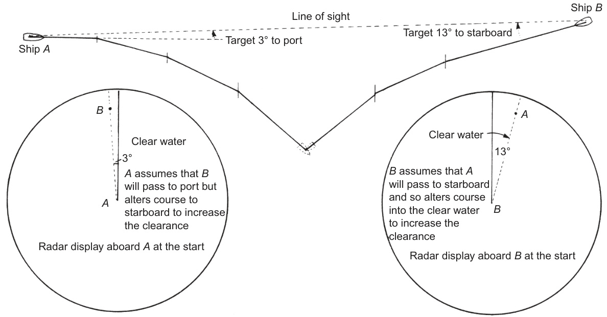  
FIGURE 7.36 The cumulative turn.  

【处理失败：内存不足或无法生成有效响应】

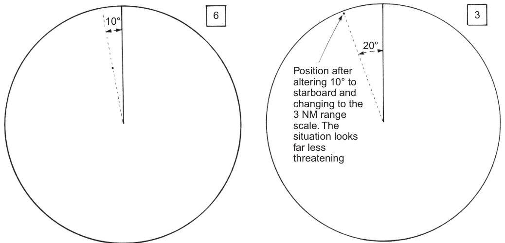  
FIGURE 7.37 The effect of altering course and changing range scale on a ship’s head-up unstabilized radar presentation.  

【翻译】
图7.37改变航向和范围尺度对船只头部未稳定雷达显示的影响。

【解读】
该图展示了当船只改变航向或调整雷达的范围尺度时，如何影响雷达信号的呈现方式。这对于理解雷达系统在不同操作条件下的表现和适应能力具有重要意义。

【词汇表】
| 英文词汇 | 中文翻译 | 解释 |
| --- | --- | --- |
| Altering course | 改变航向 | 指改变船只的行进方向 |
| Changing range scale | 调整范围尺度 | 指调整雷达显示的距离或范围设置 |
| Unstabilized radar presentation | 未稳定雷达显示 | 指雷达信号的显示没有经过稳定处理，可能会受到外界因素的影响 |

The ability of the equipment to carry out routine tracking and computation in no way relieves the observer of the need to understand fully the principles of radar plotting, or of being capable of applying such principles to a practical encounter, such as might be the case in the event of an equipment failure. The traditional Merchant Navy training in manual radar plotting is useful both as an insight to potential issues with ARPA derived results, as well as providing a backup strategy in case of failure of the ARPA tracker.  

【翻译】
设备进行常规跟踪和计算的能力并不减少观察员完全理解雷达绘图原理或将这些原理应用于实际情况（如设备故障）的需要。传统的商船海军在手动雷达绘图方面的培训不仅有助于洞悉自动雷达绘图仪（ARPA）结果中潜在的问题，也为自动雷达追踪器故障时提供了备用策略。

【解读】
本段强调了即使使用自动化设备，操作人员也必须对雷达绘图原理有深入的理解，以便在设备出现问题时能够有效地应对。这意味着传统的手动雷达绘图技能仍然是非常重要的，因为它可以帮助识别自动系统中的错误，并在必要时提供替代方案。

【词汇表】
| 英文词汇 | 中文翻译 | 解释 |
| --- | --- | --- |
| Radar Plotting | 雷达绘图 | 使用雷达数据创建目标位置和运动轨迹的图表过程 |
| ARPA | 自动雷达绘图仪 | 一种使用雷达数据自动跟踪和计算目标位置的电子设备 |
| Merchant Navy | 商船海军 | 指从事商业运输的海上力量，包括货轮、油轮等船只及其管理机构 |

It is imperative that the observer is capable of interpreting and evaluating the data presented by the ARPA system. Equally essential is the ability to detect any circumstances in which the equipment is producing data which is inconsistent with the manner in which a situation is developing as observed, say, from the raw radar.  

【翻译】
观察者必须能够解释和评估ARPA系统呈现的数据。此外，检测设备产生的数据是否与实际情况发展方式不符（例如，与原始雷达数据相比）也是至关重要的。

【解读】
本段强调了观察者的能力在使用ARPA系统时的重要性，不仅需要能够理解系统呈现的数据，还要能发现数据与实际情况不符的地方，这样才能确保信息的准确性和可靠性。

【词汇表】
| 英文词汇 | 中文翻译 | 解释 |
| --- | --- | --- |
| Imperative | 必须的 | 强调某事的必要性或紧迫性 |
| Inconsistent | 不一致的 | 指数据或信息与其他信息或情况不相符 |
| Raw Radar | 原始雷达数据 | 未经处理或分析的直接从雷达设备获取的数据 |
| ARPA System | 自动雷达情报处理系统 | 一种用于处理和分析雷达数据的自动化系统 |

In general, it is vital that the observer understands the limitations of the system in use and hence is aware of the dangers of exclusive reliance on the data produced by an ARPA. In particular, the implicit reliance on the validity of the prediction of small non-zero passing distances should be avoided. The CPA errors tabulated in sections of the Performance Standards for ARPA (see Section 9.3) clearly indicate that predicted passing distances of less than one mile should be treated with the utmost caution.  

【翻译】
一般来说，观察者了解系统使用中的限制并意识到过度依赖ARPA产生的数据的危险至关重要。特别是，应该避免对预测的小非零通过距离的有效性有隐含的依赖。性能标准中针对ARPA的CPA错误表（见第9.3节）明确指出，小于一英里的预测通过距离应谨慎对待。

【解读】
本段强调了在使用自动雷达辅助导航设备（ARPA）时，操作人员需要充分理解系统的局限性，以避免过度依赖其产生的数据，尤其是在预测小距离通过时，应保持高度警惕，因为这些预测可能存在较大的误差。

【词汇表】
| 英文词汇 | 中文翻译 | 解释 |
| --- | --- | --- |
| ARPA | 自动雷达辅助导航设备 | 一种用于船舶导航的电子设备，能够自动跟踪其他船舶的位置和速度。 |
| CPA | 最近接近点 | 指两艘船舶在当前航向和速度下，最接近对方的位置。 |
| Performance Standards | 性能标准 | 对某一系统或设备的性能要求和规范的总称。 |

The importance of regular comparison of the visual situation with that presented by the radar/ARPA cannot be stressed too strongly.  

【翻译】
定期比较视觉情况与雷达/ARPA显示的情况的重要性不容低估。

【解读】
这句话强调了在航海或航空领域中，经常比较实际视觉观察到的情况与雷达或自动雷达辅助冲突避免系统（ARPA）显示的信息的重要性。这有助于确保安全导航，减少错误的发生。

【词汇表】
| 英文词汇 | 中文翻译 | 解释 |
| --- | --- | --- |
| radar | 雷达 | 无线电探测和定范围系统 |
| ARPA | 自动雷达辅助冲突避免系统 | 一种使用雷达数据帮助船只或飞机避免碰撞的系统 |
| stressed | 强调 | 突出地提醒某事物的重要性 |

# 7.12 INTELLIGENT KNOWLEDGEBASED SYSTEMS AS APPLIED TO COLLISION AVOIDANCE  

Systems have been developed to supply the navigator with advice as to the manoeuvre (or manoeuvres) that will be most effective in the existing circumstances.  

【翻译】
已经开发出各种系统，为导航员在当前情况下提供最有效的机动（或一系列机动）建议。

【解读】
该段落描述了为帮助导航员做出最佳决策而开发出的辅助系统，这些系统能够根据实际情况提供最有效的操作建议，从而提高导航效率和安全性。

【词汇表】
| 英文词汇 | 中文翻译 | 解释 |
| --- | --- | --- |
| navigator | 导航员 | 负责导航和控制船只、飞行器等的操作人员 |
| manoeuvre | 机动、操纵 | 指改变方向、速度或位置的操作 |
| circumstances | 情况、环境 | 指某一时刻或事件中的具体条件和状态 |

The International Regulations for Preventing Collisions at Sea provide a framework within which all manoeuvres must conform.  

【翻译】
国际海上防碰撞规则为所有操纵行为提供了一个必须遵守的框架。

【解读】
该段落强调了国际海上防碰撞规则在航海安全中的重要性，它规定了船舶操作的基本标准和要求，以避免海上碰撞事故的发生。

【词汇表】
| 英文词汇 | 中文翻译 | 解释 |
| --- | --- | --- |
| Manoeuvres | 操纵行为 | 船舶的转向、停靠等动作 |
| Conform | 遵守、符合 | 按照既定的规则或标准进行 |
| Framework | 框架、结构 | 指定范围内的组织或管理体系 |

TABLE 7.2 Summary of the Regulations for Preventing Collision at Sea as Applied to Radar and ARPA   

【翻译】
表7.2海上防碰撞规则中关于雷达和自动雷达辅助.plot系统（ARPA）规定的总结

【解读】
本段落介绍了国际海事组织为防止船舶在海上相互碰撞而制定的规则中，对于使用雷达和自动雷达辅助.plot系统（ARPA）的相关规定进行了总结。这些规定旨在提高海上交通安全性，减少事故发生的风险。

【词汇表】
| 英文词汇 | 中文翻译 | 解释 |
| --- | --- | --- |
| Regulations | 规定 | 指政府或组织为规范某一领域行为而制定的法律、法规或标准 |
| Collision | 碰撞 | 指两个或多个物体之间的撞击或冲突，在此处指船舶之间的碰撞 |
| Radar | 雷达 | 无线电探测和定位系统，用于检测和跟踪目标，如飞机、船舶等 |
| ARPA | 自动雷达辅助.plot系统 | 一种利用计算机技术对雷达信号进行处理和分析，以辅助航行人员进行航向决策的系统 |

<html><body><table><tr><td></td><td>1.Use ARPA and radar if they can be</td><td>a.Clear weather with heavy traffic</td></tr><tr><td></td><td>of the slightest assistance 2. Does risk of collision exist, and/or is a</td><td>b. Proper lookout (especially at night) a.Analyse displayed information</td></tr><tr><td></td><td>close-quarters situation developing?</td><td>·Relative tracks, CPA and TCPA</td></tr><tr><td></td><td></td><td>·True tracks - course and speed</td></tr><tr><td></td><td></td><td>History of past position</td></tr><tr><td></td><td>3.Determine best manoeuvre</td><td>a.Trial facility (ARPA only)</td></tr><tr><td></td><td></td><td>·Will targets pass safely?</td></tr><tr><td></td><td></td><td>·Will targets have to manoeuvre?</td></tr><tr><td></td><td></td><td>b. Avoid A/C to port, or turning towards converging overtaking ships</td></tr><tr><td>4.Manoeuvre</td><td></td><td>a.Bold-avoid succession of small A/C</td></tr><tr><td></td><td></td><td>b. Large - obvious to others</td></tr><tr><td></td><td></td><td>c. In good time - time to correct</td></tr><tr><td></td><td></td><td>d. Good seamanship</td></tr><tr><td>5.Ensure its effectiveness</td><td></td><td>a.Continuouscheck ofrelativetrack andhistory</td></tr><tr><td></td><td></td><td>b. Watch for changes in true track of targets</td></tr><tr><td>6.Resume</td><td></td><td>a.Are targets clear?</td></tr><tr><td></td><td></td><td>b. Trial - check other vessels for likely manoeuvres (ARPA only)</td></tr><tr><td></td><td></td><td>c.Make onemanoeuvre</td></tr></table></body></html>  

Unfortunately, the regulations only work well for two-ship encounters in open water. The presence of other vessels and restrictions in navigable water may cause apparent conflicts with the rules. Furthermore, terms such as ‘early’, ‘substantial’ and ‘close-quarters’ are quantitatively imprecise and so application and encoding of the rules is far from simple.  

【翻译】
不幸的是，这些规定只适用于两艘船在开阔水域相遇的情况。当有其他船只存在或在可航行的水域中有限制时，可能会出现与规则明显冲突的情况。此外，诸如“提前”、“实质性”和“近距离”的术语都是定量上不精确的，因此这些规则的应用和编码远非简单。

【解读】
这段话讨论了海事规则在特定情况下的局限性和复杂性，特别是在多艘船只或受限水域中。由于某些术语的模糊性，使得规则的应用变得困难。

【词汇表】
| 英文词汇 | 中文翻译 | 解释 |
| --- | --- | --- |
| Navigable | 可航行的 | 指可以通行和航行的水域，如河流、湖泊或海洋等。 |
| Quantitatively | 定量上 | 从数量角度来衡量或描述事物的属性或状态。 |
| Imprecise | 不精确 | 指描述或测量结果不够准确或清晰。 |
| Encoding | 编码 | 将信息转换为代码或符号以便于存储、传输或处理的过程。 |

Computational techniques can facilitate the encoding of experience. If experienced mariners are presented with complex encounters that are known to cause difficulty, their solutions can be analysed. The principles behind the solutions are learned by the computer which then applies them to a future similar (but not necessarily identical) encounter.  

【翻译】
计算技术可以促进经验的编码。如果让有丰富经验的水手们面对那些已知会引起困难的复杂情况，他们的解决方案可以被分析。计算机学习了这些解决方案背后的原理，然后将其应用于未来的类似（但不一定相同）的遭遇中。

【解读】
这段话主要讨论了计算技术在帮助经验编码方面的作用，特别是在处理复杂问题时。通过分析有经验的人如何解决问题，计算机可以学习到解决问题的原理，并将其应用于未来相似的场景。这意味着计算技术有潜力提高决策效率和准确性，尤其是在需要依赖经验和直觉的领域。

【词汇表】
| 英文词汇 | 中文翻译 | 解释 |
| --- | --- | --- |
| encode | 编码 | 将信息或经验转化为可被计算机理解和存储的形式 |
| mariners | 水手 | 指具有丰富航海经验的人 |
| analyse | 分析 |仔细检查和研究某事物以了解其组成、结构或功能 |
| apply | 应用 | 将所学到的知识或原理运用到实际问题或情境中 |
| encounter | 遭遇 | 指人与人之间或人与事物之间的相遇或接触 |

These systems at present are mainly experimental and do not have any validation from international agencies. Systems based solely on ARPA information have the following features:  

【翻译】
目前，这些系统主要是实验性的，还没有得到国际机构的验证。仅基于ARPA信息的系统具有以下特点：

【解读】
这段话讨论了当前某些系统的状态，指出它们大多处于实验阶段，并且缺乏来自国际机构的认可和验证。这意味着这些系统可能还不够成熟或稳定，需要进一步的开发和测试。

【词汇表】
| 英文词汇 | 中文翻译 | 解释 |
| --- | --- | --- |
| Experimental | 实验性的 | 指正在试验或测试中的状态 |
| Validation | 验证 | 指确认或证明某事物的有效性或正确性的过程 |
| Agencies | 机构 | 指政府、组织等具有管理或监督职能的单位 |
| ARPA | 美国国防部高级研究计划局（Advanced Research Projects Agency） | 指美国的一个研究机构，负责发展新的技术和项目 |

1. The navigator must select whether the restricted visibility or unrestricted visibility rules apply.   
2. The user must designate manually the targets believed to have extra rights under the rules (e.g. vessels engaged in fishing, restricted in ability to manoeuvre and NUC).   
3. The navigator must designate manually if there are areas not navigable by the own ship.   
4. The systems also should present the navigator with the rationale behind the recommended manoeuvre strategy.   
5. The system can also predict the likely manoeuvres of other vessels based on the rules, which also aids the decision-making process, although it should be remembered that the other vessel might be constrained by vessels not seen on the own ship’s radar.  

【翻译】

1. 航海员必须选择是适用受限能见度规则还是无限制能见度规则。
2. 用户必须手动指定被认为在规则下拥有额外权利的目标（例如，参与捕鱼的船只、机动能力有限的船只以及核动力船）。
3. 航海员必须手动指定如果有自己的船只无法航行的区域。
4. 系统还应向航海员呈现推荐的操舵策略背后的理由。
5. 系统也可以根据规则预测其他船只可能采取的操舵行动，这也有助于决策过程，尽管应该记住其他船只可能受到自己船只雷达上未显示的船只的限制。

【解读】

本段落主要讨论了航海系统中航海员与系统之间的交互作用，特别是在遵守国际避碰规则时的决策过程。它强调了航海员需要手动输入特定信息，如特殊权利船只或不可航行区域，以便系统能够提供准确的建议。此外，系统不仅能够提供推荐的操舵策略，还能预测其他船只可能采取的行动，从而辅助航海员做出更好的决策。

【词汇表】

| 英文词汇 | 中文翻译 | 解释 |
| --- | --- | --- |
| restricted visibility | 受限能见度 | 指由于天气条件等因素导致视野受限的情况 |
| manoeuvre | 操舵 | 调整船只的方向或速度以避免碰撞 |
| NUC | 核动力船 | 指使用核能作为动力的船只 |
| rationale | 理由 | 指某一行为或决定的原因或依据 |

These systems will also benefit from the increased use of other navigation technologies.  

【翻译】
这些系统也将从其他导航技术的增加使用中受益。

【解读】
这句话指出，随着其他导航技术的应用增多，这些系统也会因此而获得好处。这意味着不同技术之间可能存在协同效应，从而提高整体性能或效率。

【词汇表】
| 英文词汇 | 中文翻译 | 解释 |
| --- | --- | --- |
| navigation | 导航 | 指引导或定位的技术或系统 |
| technologies | 技术 | 科技中的方法、工具等 |
| benefit | 受益 | 获得好处或利益 |

The integration with ECDIS and GNSS (see Sections 10.1 and 10.2) means that geographical information can be input into the computer and overcomes point 3 above. The universal adoption of the Automatic Identification System (AIS) (see Section 5.4.3), if it happens, will overcome many of the above limitations. Targets will automatically be transmitting their status under the rules (e.g. engaged in fishing and NUC). They also can transmit their intended route so that changes in course for navigational reasons can be included in the analysis. The detection range of AIS is potentially further than radar and is less affected by blind areas (see Section 5.5.2) overcoming the problem identified in point 5.  

【翻译】
与ECDIS和GNSS（见第10.1和10.2节）的集成意味着可以向计算机输入地理信息，从而克服了上述第三点。自动识别系统（AIS）（见第5.4.3节）如果被广泛采用，将会克服许多上述限制。目标会根据规则自动传输其状态（例如，参与捕鱼和NUC）。它们还可以传输预期路线，以便在分析中包括出于航行原因的航向变化。AIS的探测范围可能比雷达更远，并且受盲区影响较小（见第5.5.2节），从而解决了第五点中确定的问题。

【解读】
本段讨论了技术集成对海事安全监控的潜在改进。通过与ECDIS和GNSS的集成，可以获得更多的地理信息；同时，如果广泛采用AIS，则可以实时获取船舶状态和航向信息，这有助于提高监控效率和准确性。

【词汇表】
| 英文词汇 | 中文翻译 | 解释 |
| --- | --- | --- |
| ECDIS | 电子海图显示和信息系统 | 一种用于展示电子海图和相关信息的系统 |
| GNSS | 全球导航卫星系统 | 包括多个卫星导航系统的总称，如GPS、GLONASS等 |
| AIS | 自动识别系统 | 一种用于船舶识别和位置报告的无线电通信系统 |

The recommendation in point 5 above of a particular set of manoeuvres is not intended to take over the navigational function of the navigator, but rather to support, in quantitative terms, the overall strategy that should be followed.  

【翻译】
上述第五点中推荐的一套特定航行操作并不意图取代导航员的导航功能，而是为了从数量上支持应该遵循的整体策略。

【解读】
这段话强调了在航海领域中，某些具体的操作建议（manoeuvres）不是用来替代导航员的职责，而是为了量化地支持整个航海策略的实施。这意味着这些建议是辅助性的，旨在帮助导航员做出更好的决策，而不是完全接管导航的责任。

【词汇表】
| 英文词汇 | 中文翻译 | 解释 |
| --- | --- | --- |
| manoeuvres | 航行操作/机动 | 指船舶或飞机等载具进行的各种控制和调整动作 |
| navigational | 导航的 | 与导航有关的，涉及确定位置、规划路线、避免障碍等方面的工作 |
| quantitative | 数量上的/定量的 | 使用数字或数量来描述或分析事物的方法或方式 |
| strategy | 策略/战略 | 为实现目标而制定的长期计划或方法 |

