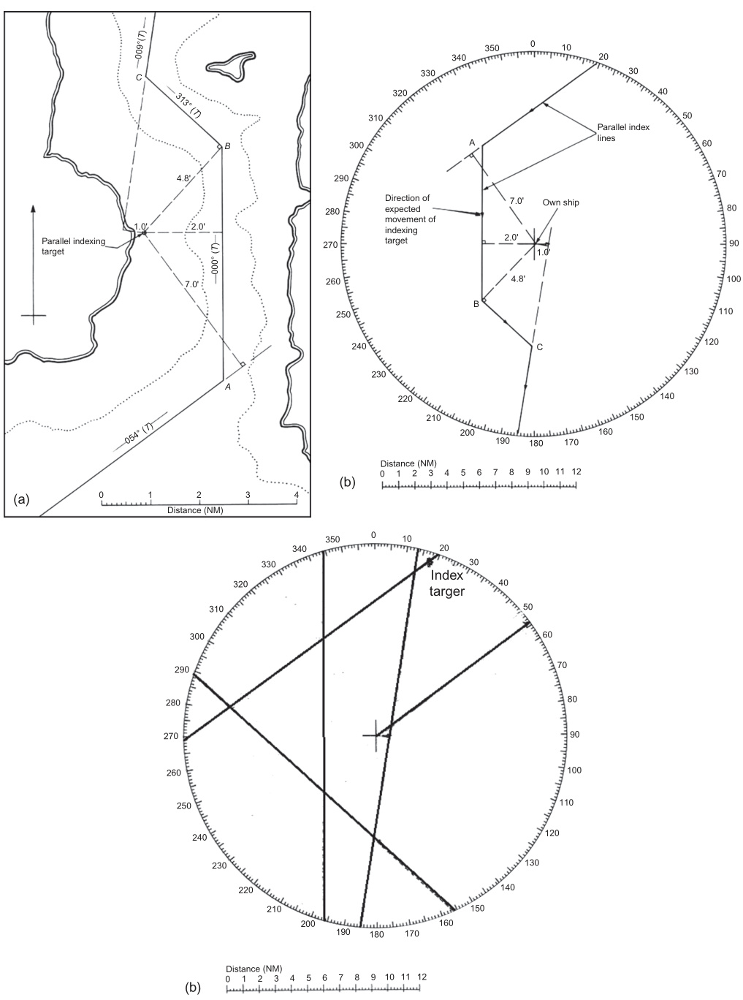
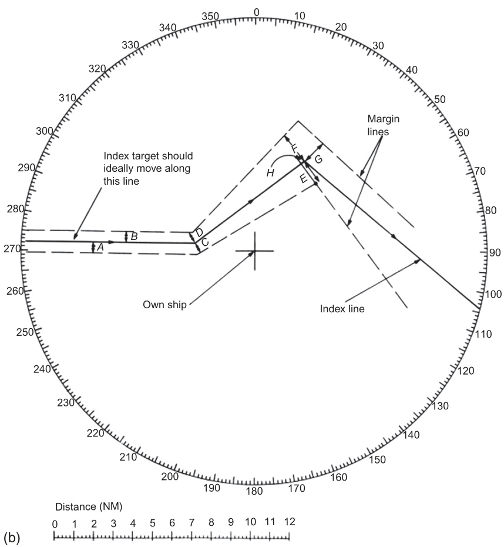
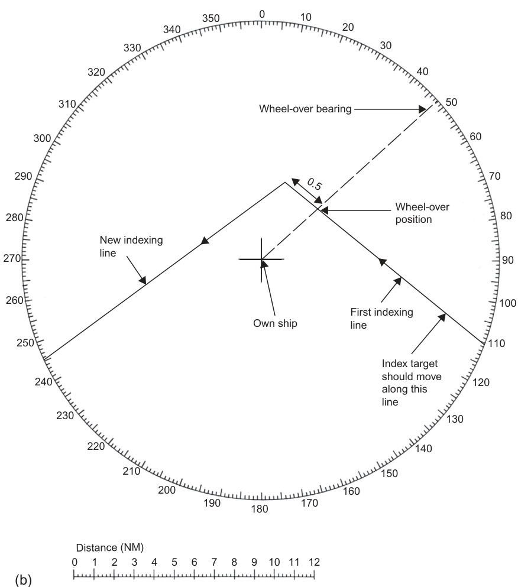

8  

# Navigation Techniques Using Radar and ARPA  

# 8.1 INTRODUCTION  

The availability of information from radar and Automatic Radar Plotting Aid (ARPA) forms the basis of a number of techniques which may assist in the safe navigation of vessels. Successful and safe use of these require an ability to relate the echoes displayed by the radar to the information shown on the chart and an understanding of the levels of performance and accuracy which can be achieved under given circumstances. Where radar information alone is used in making a landfall, the ship’s position may be in considerable doubt and it may be difficult to positively identify specific echoes, particularly if the observer is unfamiliar with the locality. In routine coastal navigation there may be more general certainty as to the vessel’s position, but effective use of these techniques will require organization, skill, practice and a thorough awareness of the capability of the radar system. They will also be found to be of great assistance in certain pilotage situations, but it has to be said that current civil marine radar equipment has a very limited ability to contribute to the docking of vessels.  

【翻译】
雷达和自动雷达绘图辅助系统（ARPA）提供的信息为多种技术提供了基础，这些技术可以帮助船舶安全导航。成功且安全地使用这些技术需要能够将雷达显示的回声与海图上的信息联系起来，并理解在特定情况下可以实现的性能和准确性水平。当仅使用雷达信息进行登陆时，船舶的位置可能存在很大的不确定性，尤其是当观察者对该地区不熟悉时，难以确认具体的回声。在常规的沿海导航中，对船舶位置可能有更一般性的确定性，但有效地使用这些技术需要组织、技能、实践以及对雷达系统能力的全面了解。这些技术也会被发现对某些引航情况非常有帮助，但必须承认当前的民用海事雷达设备对于船舶停靠几乎没有贡献。

【解读】
本段讨论了雷达和ARPA在船舶导航中的应用，强调了正确使用这些技术的重要性，包括理解雷达数据与实际环境的关系，以及认识到这些系统的局限性，特别是在船舶停靠等复杂操作中。

【词汇表】
| 英文词汇 | 中文翻译 | 解释 |
| --- | --- | --- |
| ARPA | 自动雷达绘图辅助系统 | 一种辅助雷达导航的电子系统 |
| Landfall | 登陆 | 船舶接近或到达陆地的过程 |
| Pilotage | 引航 | 指导船舶通过狭窄水域或港口的过程 |
| Radar | 雷达 | 无线电探测和定位系统 |

Before Global Navigation Satellite System (GNSS), these actions were of prime importance in vessel navigation, as there were many areas of the world without an alternate positioning technology until visual sightings were possible. With the advent of GNSS these activities can be considered as firstly to confirm the position indicated by the GNSS and secondly to provide an alternate means of navigation in case of GNSS failure. The ability of a navigator to make best use of the radar in these circumstances requires a certain amount of skill and experience, so the prudent navigators should be performing these tasks to confirm their position even when GNSS is thought to be fully operational. Radar has the advantage that all the equipment is onboard the vessel, while GNSS requires reliance on signals from an external source.  

【翻译】
在全球导航卫星系统（GNSS）出现之前，这些行动对于船舶导航至关重要，因为世界上有很多地区没有替代定位技术，直到可以进行视觉观测。在GNSS出现后，这些活动可以被认为是首先确认GNSS指示的位置，其次是在GNSS故障的情况下提供替代的导航手段。在这种情况下，雷达使用最有效的能力需要一定的技能和经验，因此谨慎的导航员应该执行这些任务来确认他们的位置，即使GNSS被认为是完全正常运行的。雷达具有所有设备都在船舶上的优势，而GNSS则需要依赖外部信号源。

【解读】
这段话讨论了全球导航卫星系统（GNSS）出现前的船舶导航方法，以及GNSS出现后的变化。作者强调了雷达在导航中的重要性，特别是在GNSS故障的情况下，提醒导航员即使GNSS正常运行，也应通过雷达等方式确认自己的位置，以确保安全导航。

【词汇表】
| 英文词汇 | 中文翻译 | 解释 |
| --- | --- | --- |
| GNSS | 全球导航卫星系统 | 一种利用卫星提供位置信息的导航系统 |
| Vessel | 船舶 | 指各种类型的船只或海洋运输工具 |
| Radar | 雷达 | 一种利用无线电波探测和定位物体的设备 |
| Prudent | 谨慎的 | 对可能发生的问题有所预防和考虑的态度 |
| Alternate | 替代的 | 可以用作备份或替换的选择或方案 |

The role of Automatic Identification System (AIS) in this chapter is very limited. It is true that (when provided by shore authorities) the AIS identification of buoys and prominent radar targets can aid identification of these important marks in the same way as racons currently do. However, AIS on buoys depends on GNSS for timing control of its transmission signals as well as the position of these marks, so the AIS information only works if the GNSS as a whole works. The assumption in this chapter is either that GNSS is not available or, at least, the navigator is preparing for a situation when GNSS is not available or is inaccurate.  

【翻译】
在本章中，自动识别系统（AIS）的作用非常有限。虽然当岸基设施提供时，AIS可以识别浮标和显著的雷达目标，从而辅助识别这些重要标志，就像当前的雷达信标一样。但是，浮标上的AIS依赖于全球导航卫星系统（GNSS）来控制其传输信号的时间以及这些标志的位置，因此只有当整个GNSS系统正常工作时，AIS信息才有效。本章假设要么GNSS不可用，要么导航员正在为GNSS不可用或不准确的情况做准备。

【解读】
本段主要讨论了自动识别系统（AIS）在特定情境下的局限性，特别是在全球导航卫星系统（GNSS）不可用或不准确的情况下。它指出AIS对浮标和雷达目标的识别能力依赖于GNSS的正常运作，这限制了其在某些情况下的应用价值。

【词汇表】
| 英文词汇 | 中文翻译 | 解释 |
| --- | --- | --- |
| AIS | 自动识别系统 | 一种用于识别和跟踪船舶、浮标等物体的系统 |
| GNSS | 全球导航卫星系统 | 包括多个卫星导航系统，如GPS、GLONASS等，用于提供位置和时间信息 |
| Racons | 雷达信标 |一种使用雷达信号进行识别和测距的设备 |

This chapter discusses the difficulties of making comparisons between the radar picture and charted features before passing on to describe the navigation techniques in terms of the underlying theory covered elsewhere in this text.  

【翻译】
本章讨论了在回顾雷达图像与已绘制特征之间进行比较的困难，然后继续描述以其他地方所涵盖的基本理论为基础的导航技术。

【解读】
这段话介绍了本章的主要内容，即探讨雷达图像与已知地理特征之间的比较困难，以及如何基于某些理论来描述导航技术。这意味着本章会涉及到导航领域中的一些理论基础和实践应用。

【词汇表】
| 英文词汇 | 中文翻译 | 解释 |
| --- | --- | --- |
| radar picture | 雷达图像 | 利用雷达技术获取的图像或数据 |
| charted features | 已绘制特征 | 地图或海图上已经标记的特征，如陆地、水域等 |
| navigation techniques | 导航技术 | 指引导船只、飞机或其他载具安全、高效行驶于某一区域的方法和技能 |
| underlying theory | 基本理论 | 支持某一学科或技术的根本原理和概念 |

It is often stressed that radar is only an aid to navigation. This does not mean that radar information is necessarily of any less value than that obtained from other sources. What it does mean is that radar data should not be used in isolation and to the exclusion of that available from other sources. The radar system should be seen as one element in a variety of data sources which must be taken into account in arriving at decisions related to directing the safe navigation of the vessel. The exercise of command decision-making based on an evaluation of navigation information derived from all sources is referred to as navigation control.  

【翻译】
人们经常强调，雷达只是导航的一个辅助工具。这并不意味着雷达信息的价值一定低于从其他来源获得的信息。它的意思是，雷达数据不应该孤立地使用，而应与其他来源的数据结合起来考虑。雷达系统应该被视为多种数据源之一，这些数据源必须在做出有关安全导航的决定时综合考虑。基于对所有来源导航信息的评估而做出的指挥决策，被称为导航控制。

【解读】
这段话强调了雷达在船舶导航中的作用，它不是唯一的依靠，而是一个辅助工具。正确的做法是将雷达数据与其他导航信息结合起来使用，以确保船舶的安全导航。这需要对来自不同来源的信息进行综合评估和分析，以做出合理的决策。

【词汇表】
| 英文词汇 | 中文翻译 | 解释 |
| --- | --- | --- |
| Radar | 雷达 | 一种利用无线电波探测和定位物体的系统 |
| Navigation | 导航 | 指引或控制船舶、飞机等移动物体的行进方向和位置 |
| Isolation | 孤立 | 独立或单独地使用某一项信息或系统 |
| Evaluation | 评估 | 对事物的价值、质量或性能进行判断和分析 |

# 8.2 IDENTIFICATION OF TARGETS AND CHART COMPARISON  

It is sometimes suggested that the radar picture offers a bird’s-eye view of the area surrounding the observing vessel. This analogy is imperfect on a number of counts, but two are particularly evident in the use of radar for navigation. The radar antenna does not look down on the terrain from a great height and thus its view can be obstructed. Further, it does not offer the optical resolution (see Section 2.2.2) which the use of the word ‘eye’ may imply. As a consequence, the radar picture may be an incomplete and fairly coarse version of the chart’s finely detailed plan view of the terrain.  

【翻译】
有时有人认为雷达图像能够提供对观测船只周围区域的鸟瞰式视角。这一比喻在几个方面存在缺陷，但是在使用雷达进行导航时尤其明显。雷达天线并不能从很高的高度俯瞰地形，因此它的视野可能会被阻挡。此外，它不具备“眼”这个词所暗示的光学分辨率（见2.2.2节）。因此，雷达图像可能是海图上对地形精细平面视图的一个不完整且相当粗糙的版本。

【解读】
这段话讨论了使用雷达技术来获取地形信息的局限性。虽然人们常用“鸟瞰式视角”来描述雷达图像，但这种比喻并不完全准确，因为雷达信号可能受到遮挡，且无法提供与肉眼相近的分辨率。因此，雷达图像可能无法全面、详细地展现地形特征，这一点需要在实际应用中特别注意。

【词汇表】
| 英文词汇 | 中文翻译 | 解释 |
| --- | --- | --- |
| Bird's-eye view | 鸟瞰式视角 | 从高空俯瞰的视角，类似于鸟儿从高处看地面的方式 |
| Obstructed | 遮挡 | 被某物体阻碍或阻塞，影响视野或信号传递 |
| Optical resolution | 光学分辨率 | 指光学仪器（如眼睛或相机）能区分两个接近点的能力 |
| Coarse | 粗糙 | 不精细，不详尽，指图像或数据的质量较低 |

This may limit the observer’s ability to identify positively elements of the terrain echoes and relate them to the charted representation.  

【翻译】
这可能会限制观察者的能力，使他们难以确定地形回声的元素并将其与已绘制的地图进行关联。

【解读】
该段落讨论了观察者在识别地形特征时可能遇到的困难，这种困难源于对地形回声的不确定性，从而影响到将这些信息准确地映射到地图上。

【词汇表】
| 英文词汇 | 中文翻译 | 解释 |
| --- | --- | --- |
| Terrain | 地形 | 指陆地或海洋表面的自然环境和特征 |
| Echoes | 回声 | 在这里指的是通过某种方式（如雷达）获得的地形反射信号 |
| Charted Representation | 已绘制的地图 | 指已经被记录和标记的地理信息的视觉表现形式 |

Interpretation of the displayed picture involves consideration of a number of factors each of which will be discussed in turn.  

【翻译】
对显示图像的解释需要考虑多种因素，每一种都将分别讨论。

【解读】
这句话强调了在解释图像时需要综合考虑多方面的因素，以确保准确性和全面性。这意味着图像解释是一个复杂的过程，需要仔细分析各个组成部分。

【词汇表】
| 英文词汇 | 中文翻译 | 解释 |
| --- | --- | --- |
| Interpretation | 解释 | 指对信息、数据或图像等进行理解和说明的过程 |
| Displayed picture | 显示图像 | 指通过屏幕、投影仪等设备呈现的视觉图像 |
| Factors | 因素 | 指影响某一结果或情况的各种元素或条件 |

# 8.2.1 Long Range Target Identification  

When making a landfall, the radar must be carefully observed in order to obtain an early indication of the presence of the terrain. In the absence of clutter (see Sections 3.6 and 3.7) the first echoes will have to be found against the background of receiver noise (see Section 2.6.4.4). If the observer knows the approximate bearing and range at which to expect the first echoes, early detection may be assisted by, from time to time, temporarily setting the gain control a little higher than the normal optimum level (see Section 6.2.7.1). A slight loss of contrast is traded for an increase in received signal amplification and this may be beneficial when looking in a specific area as opposed to scanning the entire screen area. Where an echo stretch facility (see Section 6.8) is provided, it may be found similarly helpful. A knowledge of where to look for the expected echoes on the screen pre-supposes other sources of information concerning the vessel’s likely position and the probable detection range of specific terrain features. Such information may stem from dead reckoning techniques, knowledge of leeway and tidal streams, other position-fixing systems (GNSS or LORAN C), and an assessment of specific target detection ranges in the light of radar, target and environmental characteristics (see Chapter 3). This emphasizes the complementary nature of the various data sources available for the safe navigation of the vessel.  

【翻译】
在进行陆地接触时，雷达必须仔细观察，以便能够获得对地形存在的早期指示。在没有杂波（见3.6和3.7节）的情况下，第一个回声需要在接收器噪音（见2.6.4.4节）的背景下找到。如果观察者知道大致的方位和距离，预计会出现第一个回声，通过暂时将增益控制设置得比正常的最佳水平稍高一些（见6.2.7.1节），可以辅助早期检测。这会以牺牲一点对比度为代价来换取接收信号放大的增加，这可能是在特定区域内搜索而不是扫描整个屏幕区域时有益的。在提供了回声拉伸功能（见6.8节）的地方，也可能发现它是类似有用的。提前知道在哪里寻找预期回声的知识假设了其他关于船只可能位置和特定地形特征的可能探测范围的信息来源。这些信息可能来自死算法、侧向和潮流的知识、其他位置确定系统（GNSS或LORAN C），以及根据雷达、目标和环境特性评估特定目标的探测范围（见第三章）。这强调了各种数据源对于安全航行的互补性质。

【解读】
本段主要讨论了使用雷达进行陆地接触时的注意事项，包括如何通过调整增益控制来提高早期检测率，以及利用其他信息来源（如死算法、位置确定系统等）来辅助导航。同时也提到了不同数据源之间的互补性质，对于安全航行具有重要意义。

【词汇表】
| 英文词汇 | 中文翻译 | 解释 |
| --- | --- | --- |
| Clutter | 杂波 | 雷达信号中不相关的干扰信号 |
| Gain Control | 增益控制 | 调整雷达信号强度的设备 |
| Dead Reckoning | 死算法 | 根据已知的速度和方向推算当前位置的一种方法 |
| GNSS | 全球导航卫星系统 | 一种利用卫星实现全球导航的系统 |

Initially the presence of the land may be indicated by only a few responses and these will be considerably distorted by the angular width of the resolution cell (see Sections 2.8.5 and 8.2.2) which will be large at long range. Under these circumstances it will be extremely difficult, if not impossible, to identify positively specific terrain features from the few distorted echoes which are being observed. It must be appreciated that the use of the echo stretch technique is likely to exacerbate the problem by adding radial distortion and it should be switched off after it has fulfilled its role of assisting initial detection. Identification may be assisted if the observer knows which parts of the terrain are likely to show first and also the approximate range and bearing at which they should appear. As indicated in the previous paragraph this presupposes other sources of information related to probable position and target detection considerations.  

【翻译】
最初，陆地的存在可能只通过少数几个响应来表示，这些响应会因分辨率单元的角度宽度（见2.8.5和8.2.2节）而受到显著的扭曲，尤其是在远距离下。 在这种情况下，从少量的失真回声中确定特定的地形特征将极为困难，如果不是不可能的话。 必须认识到，使用回声拉伸技术可能会加剧这个问题，因为它增加了径向扭曲，因此应该在初步检测后关闭。 如果观察者知道哪些地形部分可能首先出现，以及它们大约在什么距离和方位上出现，识别可能会得到帮助。 如前一段所述，这假设其他与可能位置和目标探测考虑相关的信息来源。

【解读】
这段话讨论了雷达系统在长距离下探测陆地时遇到的挑战。由于分辨率单元的角度宽度，回声信号会变得模糊，使得准确识别地形特征变得非常困难。使用某些技术，如回声拉伸，可能会使问题更加严重，因此需要谨慎使用这些技术。此外，拥有关于地形和目标位置的额外信息可以帮助提高识别的准确性。

【词汇表】
| 英文词汇 | 中文翻译 | 解释 |
| --- | --- | --- |
| Resolution Cell | 分辨率单元 | 雷达系统中用于测量和显示回声信号的最小单位 |
| Angular Width | 角度宽度 | 指分辨率单元的角度范围 |
| Echo Stretch Technique | 回声拉伸技术 | 一种用于增强回声信号的技术，但可能引入径向扭曲 |
| Terrain Features | 地形特征 | 指地面上的各种自然或人工特征，如山脉、河谷等 |
| Radial Distortion | 径向扭曲 | 指回声信号在径向方向上的变形或失真 |

To exploit fully the use of radar in making a landfall, adequate preparation should be made in terms of collating the information from other sources. An up-to-date and best available estimate of the ship’s position should be maintained using information from all available sources. Prior to making the landfall, the chart and the Admiralty Sailing Directions should be consulted in order to assess the ranges at which the radar should detect specific terrain features which are likely to be easy to identify. This assessment should take into account the characteristics of the radar system, the characteristics of the target, the atmospheric conditions and any limits to detection which may be imposed by clutter or attenuation, all of which are dealt with in detail in Chapter 3. In particular it should be remembered that frequently coastlines are backed by higher terrain and at long ranges it must be borne in mind that the first land to show is not necessarily the coastline (see Section 3.8.1). Failure to appreciate this can be dangerously misleading because the measured range will suggest that the vessel is farther to seaward than is in fact the case. Also, as the land is closed, responses will be obtained from land which is lower and closer than that originally detected and as it comes above the horizon it may give an exaggerated impression of the speed at which the vessel is approaching the land. When a particular landfall has been made on more than one occasion, it may be possible to establish a list of good landfall targets which may supplement those tabulated in the Sailing Directions.  

【翻译】
为了充分利用雷达进行陆地测量，应在收集其他来源的信息方面做好充分准备。应该使用所有可用来源的信息来维护船舶位置的最新、最好的估计。在进行陆地测量之前，应查阅图表和海军航行指南，以评估雷达检测特定地形特征的距离，这些特征很可能容易识别。这种评估应考虑到雷达系统的特性、目标的特性、大气条件以及任何由于杂乱或衰减而可能施加的探测限制，这些内容都在第三章中详细说明。特别是，人们经常会记得，海岸线后面往往有更高的地形，在长距离上必须牢记，首先出现的陆地不一定是海岸线（见3.8.1节）。未能领悟这一点可能会产生危险的误导，因为测量的距离会让人觉得船只比实际位置更远离海岸。此外，当靠近陆地时，将会从较低、较近的陆地获得回应，而当它出现在地平线上方时，可能会给人一种夸张的印象，即船只正以高速接近陆地。当某一特定的陆地测量已经进行过多次之后，可能可以建立一个良好的陆地测量目标列表，这些列表可以补充航行指南中的表格。

【解读】
本段强调了在使用雷达进行陆地测量时，需要充分准备和了解各种因素对测量结果的影响。包括大气条件、雷达系统特性、目标特性等因素都会影响测量的准确性。同时，也提到了在靠近陆地时，可能会因为地形的遮挡而导致测量结果的误差，因此需要谨慎分析数据以避免错误的结论。

【词汇表】
| 英文词汇 | 中文翻译 | 解释 |
| --- | --- | --- |
| Collate | 收集、整理 | 将来自不同来源的信息整理成系统化的资料 |
| Terrain feature | 地形特征 | 指地貌上的特定标志，如山脉、河谷等 |
| Cl

It has to be recognized that, while civil marine radar offers early warning of the presence of most land formations, long range target identification is not a function at which it excels. A coded racon (see Section 3.5.2.1) is probably the only sure source of early positive target identification and its range may well be limited by the height of its antenna. Positive identification of just one target is a major step forward because it may then be possible to identify other terrain echoes by virtue of their known range and bearing from the identified target. A free electronic bearing line (EBL) (see Section 6.6.4) is ideally suited to making the necessary measurements.  

【翻译】
必须承认，虽然民用海洋雷达可以提早发现大多数陆地构造物的存在，但长距离目标识别并不是它擅长的功能。编码的雷达信标（见3.5.2.1节）可能是唯一能够实现早期正面目标识别的可靠来源，而其范围可能会受到天线高度的限制。确认一个目标的身份是一个重大进步，因为这样就有可能通过已知的距离和方位从已识别的目标来识别其他地形回波。自由电子方位线（EBL）（见6.6.4节）非常适合进行必要的测量。

【解读】
本段讨论了民用海洋雷达在目标识别方面的局限性，指出尽管它能提早发现陆地构造物，但在长距离目标识别方面表现不佳。因此，需要借助其他辅助工具，如编码的雷达信标和自由电子方位线，以实现准确的目标识别和测量。

【词汇表】
| 英文词汇 | 中文翻译 | 解释 |
| --- | --- | --- |
| Racon | 雷达信标 | 一种用于目标识别的设备 |
| EBL | 电子方位线 | 一种用于测量目标方位的电子设备 |
| Terrain Echoes | 地形回波 | 由地形反射回来的雷达信号 |
| Bearing | 方位 | 目标相对于观察者的方向角度 |

Care must be taken not to jump to conclusions when a radar echo appears in the general area in which a particular point of land is expected by dead reckoning (DR). There appears to be a great temptation to ascribe immediately and unquestioningly the hoped-for identity to the target. This temptation must be resisted until cross-checks have established that any fix so obtained is consistent with that obtained from all other available sources of information.  

【翻译】
在雷达回波出现在预计通过死算（DR）会出现某一特定陆地点的区域时，必须小心避免草率下结论。似乎人们有很大的诱惑，立即而无条件地将所期望的身份归于目标。但是，这种诱惑必须抵制，直到交叉核查确认从所有其他可用信息来源获得的任何位置都与之相符。

【解读】
本段强调了在使用雷达导航时需要谨慎和严格的态度，特别是在确定目标身份时。它警告人们不要轻易根据初步观察就下结论，而应该进行全面交叉核查，以确保信息的一致性。这要求操作人员具备批判性思维和细致入微的分析能力，以避免错误判断。

【词汇表】
| 英文词汇 | 中文翻译 | 解释 |
| --- | --- | --- |
| Dead Reckoning (DR) | 死算、估算航程 | 一种通过记录之前位置、速度和方向来估计当前位置的方法 |
| Cross-checks | 交叉核查、互相验证 | 在不同信息源之间进行比较和验证，以确保数据的一致性 |
| Fix | 确定位置、固定点 | 指通过各种方法（如导航或测量）确定的准确位置 |
| Consistent | 一致的、相符的 | 指不同信息源或方法得出的结果相互吻合、没有矛盾 |

# 8.2.2 The Effect of Discrimination  

In the previous section attention was drawn to the difficulty of identifying targets in the landfall situation because of the effect of the size of the resolution cell on the few echoes which may be detected at extreme ranges. Even at the more moderate ranges likely to be employed when using the radar for routine coastal navigation, the effect of resolution (see  

【翻译】
在前一节中，我们提到在陆地降落情况下，识别目标很困难，因为分辨率单元的大小会影响极端距离上可能检测到的少数回声信号。即使是在使用雷达进行常规沿海导航时采用的较为适中的距离范围内，分辨率的影响（见下图）仍然存在。

【解读】
本段主要讨论了在使用雷达进行沿海导航时，由于分辨率单元的大小对回声信号的影响，使得识别目标变得困难，即使是在相对较近的距离范围内也是如此。这意味着雷达技术在这种应用场景下的局限性和挑战。

【词汇表】
| 英文词汇 | 中文翻译 | 解释 |
| --- | --- | --- |
| resolution cell | 分辨率单元 | 雷达系统中能够区分两个目标的最小空间单位 |
| landfall situation | 陆地降落情况 | 船只或飞机接近陆地时的导航情景 |
| extreme ranges | 极端距离 | 超出正常导航距离范围的远距离或近距离 |
| routine coastal navigation | 常规沿海导航 | 日常的、例行的沿海航行和导航活动 |

Sections 2.7.3 and 2.8.5) may still make it difficult to identify specific coastal features, despite the fact that there will be a larger aggregation of land responses forming some sort of chart-like coastline on the plan position indicator (PPI).  

【翻译】
尽管在计划位置指示器（PPI）上会形成更大的陆地响应聚集，从而呈现出某种图表般的海岸线，但第2.7.3节和第2.8.5节仍可能使得识别特定的沿海特征变得困难。

【解读】
这段话讨论了使用计划位置指示器（PPI）来识别沿海特征时可能遇到的挑战，即使有更多的陆地响应数据可用，也不一定能清晰地识别出具体的海岸特征。这意味着在某些情况下，技术上的限制或数据质量问题可能会阻碍准确识别沿海特征的工作。

【词汇表】
| 英文词汇 | 中文翻译 | 解释 |
| --- | --- | --- |
| PPI | 计划位置指示器 | 一种显示目标位置和移动方向的雷达设备 |
| aggregation | 聚集 | 数据或物体的集合或积累 |
| coastline | 海岸线 | 附近海洋的地理边界 |
| indicator | 指示器 | 显示或测量某一特定状态或条件的设备或工具 |

The angular width of the resolution cell produces an angular distortion on both sides of all targets by an amount, each equal to half the horizontal beamwidth plus the spot size effect. Neglecting for the moment the spot size effect, it is evident that if two headlands forming the entrance to a bay are separated by less than the horizontal beamwidth, their echoes will overlap. Thus the effect of the limited bearing discrimination may be to mask coastal features such as bays, river entrances, sea lochs and other similar inlets. The echoes of an island close to the mainland may appear as a peninsula and small islands close together may appear as one large island. Thus a charted coastline having many indentations may translate to a featureless coastline on the PPI. It must be borne in mind that, while the width of the beam is a fixed angle, the linear measurement of the arc it cuts off increases in direct proportion to the range at which it is considered. Thus features which are masked at a distance may become identifiable as their range decreases.  

【翻译】
分辨率单元的角度宽度会在所有目标两侧产生角度失真，每侧的量级均等于水平波束宽度的一半加上斑点尺寸效应。不考虑斑点尺寸效应，很明显，如果两个形成海湾入口的岬石之间的距离小于水平波束宽度，它们的回声信号就会重叠。因此，有限的方位识别能力可能会遮蔽诸如海湾、河口、海峡（一种狭长型海湾）以及其他类似的入海口等沿海特征。如果一个岛屿靠近大陆，其回声信号可能表现为一片半岛，而彼此紧邻的小岛可能看起来像是一个大岛。因此，在图表中绘制的具有许多凹陷的海岸线可能在径向扫描显示器（PPI）上呈现出没有特征的海岸线。必须牢记的是，虽然波束的宽度是一个固定的角度，但它切割的弧形的线性测量值会随着被观察的距离而直接成比例增加。因此，在远处被遮蔽的特征可能会随着距离的减少而变得可以辨认。

【解读】
这段话主要讨论了雷达系统中的角度分辨率问题及其对沿海特征识别的影响。由于雷达波束的有限宽度，会导致目标物体的回声信号发生重叠，从而使得一些细节特征无法被清晰地识别出来。这种现象尤其是在观察距离较远时更加明显，因为波束宽度所对应的实际距离会随着观察距离的增加而增大。但是，当观察距离减小时，这些之前被遮蔽的特征可能会重新变得可见。

【词汇表】
| 英文词汇 | 中文翻译 | 解释 |
| --- | --- | --- |
| Angular width | 角度宽度 | 指的是某一方向上的宽度，通常用于描述波束或光束的散射程度。 |
| Bearing discrimination | 方位识别能力 | 指的是雷达系统区分两个相�

The pulse length/spot size dimension of the resolution cell will produce radial distortion of all responses. Except at very short ranges this will have an effect which is much less significant than that of the angular distortion. However, where two features lie one behind the other, for example an island or a buoy located close to the shore, they may appear as one feature due to the limited range discrimination.  

【翻译】
脉冲长度/点大小维度的分辨率单元会产生所有响应的径向失真。在非常近的距离以外，这种影响远远小于角度失真的影响。然而，当两个特征一个在另一个后面时，例如岛屿或位于海岸附近的浮标，它们可能由于有限的范围识别能力而表现为一个特征。

【解读】
本段讨论了雷达或激光扫描等技术中分辨率单元的限制，特别是径向失真和角度失真对目标识别的影响。其中提到，在大多数情况下，角度失真对识别的影响更显著，但是在某些特定情形下，如两个目标相互遮挡时，径向失真也会导致识别错误。

【词汇表】
| 英文词汇 | 中文翻译 | 解释 |
| --- | --- | --- |
| Radial distortion | 径向失真 | 指图像或信号在径向方向上的变形或失真现象 |
| Angular distortion | 角度失真 | 指图像或信号在角度方向上的变形或失真现象 |
| Range discrimination | 范围识别能力 | 指系统区分不同距离上目标的能力 |
| Resolution cell | 分辨率单元 | 指系统能够区分的最小空间单位 |

The observer’s ability to minimize the effects of the angular and radial distortion is fairly limited. In both cases the spot size effect will be reduced by using the shortest appropriate range scale. Where a dual or interswitched system (see Section 2.10.8) is available, selection of the antenna having the narrower beamwidth will assist, as would a modern raster-scan display offering beam processing. A temporary reduction in the setting of the gain control may help to locate features which have been masked by angular distortion, but this requires some practice and is not invariably successful. Use of differentiation (see Section 3.7.4.4) may improve the picture by combating the radial distortion. However, this technique must be used with care, as if two echoes overlap and the farther is the weaker of the two, the effect of differentiation may be to remove the remote echo.  

【翻译】
观察者的能力在减少角度失真和径向失真的影响方面是相当有限的。在这两种情况下，使用最短的适当范围尺度可以减少点大小效应。如果有双重或交替系统（见第2.10.8节），选择具有较窄束宽的天线可以帮助改善图像，现代光栅扫描显示器提供的束处理也会有所帮助。暂时降低增益控制设置可能有助于定位被角度失真遮蔽的特征，但这需要一些练习，并不总是成功的。使用微分（见第3.7.4.4节）可能通过对抗径向失真来改善图像。然而，这种技术必须谨慎使用，因为如果两个回声重叠，而远处的回声较弱，微分的效果可能是去除远端回声。

【解读】
本段讨论了观察者在雷达图像中减少角度失真和径向失真影响的方法和局限性。提出了几种改善图像质量的方法，包括使用合适的范围尺度、选择束宽较窄的天线、调整增益控制以及使用微分技术。但同时也指出这些方法的局限性和需要注意的问题，如微分可能去除远端回声。

【词汇表】
| 英文词汇 | 中文翻译 | 解释 |
| --- | --- | --- |
| Angular distortion | 角度失真 | 指由于雷达系统的限制导致的图像在角度方向上的失真 |
| Radial distortion | 径向失真 | 指由于雷达系统的限制导致的图像在径向方向上的失真 |
| Beamwidth | 束宽 | 天线发射或接收信号的水平方向上的宽度 |
| Differentiation | 微分 | 一种信号处理技术，用于强调图像中的细节特征 |

Thus, due to the inherent difficulty of relating the radar picture to the chart, care must be taken to ensure positive identification of any target before selecting it for use in position fixing (see also Section 8.3).  

【翻译】
因此，由于雷达图像与海图关联的固有困难，必须谨慎确保在选择目标用于位置确定之前对其进行积极识别（参见第8.3节）。

【解读】
本段强调了在使用雷达导航时需要小心辨别目标，以避免错误的位置确定。由于雷达图像和实际海图之间可能存在差异，操作人员必须仔细核实目标的身份，以确保准确性。

【词汇表】
| 英文词汇 | 中文翻译 | 解释 |
| --- | --- | --- |
| inherent | 固有的 | 指某事物或情况中自然存在或内在的特性或属性 |
| positive identification | 积极识别 | 确定某物或某人的身份，排除任何疑虑 |
| position fixing | 位置确定 | 确定某物体或船只等的精确位置 |

# 8.2.3 Shadow Areas  

Because the line of sight of the radar system is substantially horizontal, some features of the terrain may be shadowed by others. These shadows are a further factor which may make it difficult to relate the radar picture to that of the chart, the problem being compounded by the fact that the shadow pattern will vary with the position of the observing vessel (Figure 8.1).  

【翻译】
由于雷达系统的视线基本上是水平的，一些地形特征可能会被其他特征遮挡。这些阴影是另一个使得雷达图像与海图难以对应的因素，这个问题还因为观察船只的位置变化而变得更加复杂，从而导致阴影模式也会随之变化（图8.1）。

【解读】
本段主要讨论了雷达系统在观察地形时遇到的困难之一，即地形特征之间的遮挡效应。由于雷达的视线是水平的，因此某些地形特征可能会被其他特征遮挡，产生阴影区域。这使得雷达图像与实际的地图（海图）难以匹配，而且这种情况会因观察者的位置不同而变得更加复杂。

【词汇表】
| 英文词汇 | 中文翻译 | 解释 |
| --- | --- | --- |
| Line of sight | 视线 | 指从观察者或仪器到目标物体的直线距离 |
| Terrain | 地形 | 指陆地、海洋等自然环境的形态和特征 |
| Shadowed | 遮挡 | 指被其他物体阻挡光线或视线而不能被看到的一部分 |
| Compounded | 复合 | 在这里指问题变得更加复杂和严重 |

# 8.2.3.1 Vertical Shadowing  

Figure 8.2 shows an example of vertical shadowing. To a vessel which is close inshore, the lower range of coastal hills may shadow higher mountains lying inland, whereas from another vessel farther offshore, the radar may be able to ‘see’ the mountains over the top of the coastal range.  

【翻译】
图8.2展示了垂直阴影的一个例子。对于靠近海岸的一艘船来说，沿海地区较低的山丘可能会遮挡住内陆较高的山脉，而对于在更远的海上另一艘船来说，雷达可能能够“看到”山丘之上的山脉。

【解读】
本段描述的是雷达信号在不同位置观测到的地形特征，特别是垂直阴影的现象。这种现象发生在当雷达信号从一个角度射向地面时，由于地面的不平坦，导致某些区域无法被雷达探测到，从而产生阴影效应。这个例子强调了观测位置对雷达成像结果的影响。

【词汇表】
| 英文词汇 | 中文翻译 | 解释 |
| --- | --- | --- |
| Vertical shadowing | 垂直阴影 | 指由于地面不平坦导致雷达信号在垂直方向上的阴影效应 |
| Inshore | 靠近海岸 | 指靠近海岸或陆地的位置 |
| Offshore | 远离海岸 | 指距离海岸较远的位置 |
| Coastal range | 沿海山脉 | 指沿着海岸线分布的山脉或丘陵 |

Bearing in mind that, as described in Section 8.2.1, a vessel making landfall on such a coastline may well detect the higher inland mountains first, it is evident that if a ship closes the coastline from seaward the character of the radar picture will change through three distinct phases. Initially the vessel will observe the higher mountains only, then both coastal and inland mountains and finally only the coastal range. If there are gaps in the coastal range, horizontal shadowing (see below) will also take place, further complicating the pattern.  

【翻译】
考虑到如第8.2.1节所述，当一艘船靠近这种海岸时，它可能首先探测到较高的内陆山脉，因此，如果一艘船从海上接近海岸，雷达图像的特征将会经历三个不同的阶段。最初，船只会观察到较高的山脉，然后是同时观察到沿海和内陆的山脉，最后只有沿海山脉。如果沿海山脉有空隙，水平阴影（见下文）也会出现，从而进一步复杂化图案。

【解读】
本段主要讨论当船只从海上靠近某种类型的海岸线时，雷达图像会如何变化。根据地形的不同，雷达图像会呈现出三个阶段：首先看到的是较高的内陆山脉，其次是同时看到沿海和内陆的山脉，最后只能看到沿海山脉。此外，如果沿海山脉存在空隙，还会产生水平阴影，使得图像更加复杂。

【词汇表】
| 英文词汇 | 中文翻译 | 解释 |
| --- | --- | --- |
| landfall | 登陆 | 船只或飞机到达陆地 |
| coastline | 海岸线 | 陆地与海洋的交界线 |
| radar picture | 雷达图像 | 由雷达设备生成的地图像 |
| horizontal shadowing | 水平阴影 | 地物在水平方向上的阴影效应 |
| complicating | 复杂化 | 使事物变得更为复杂、难以理解或处理 |

  
FIGURE 8.1 The radar display of charted features (a) Chart. (b) Radar.  

【翻译】
图8.1已绘制特征的雷达显示（a）图表。（b）雷达。

【解读】
该图展示了雷达系统中如何将地图上的特征转换为雷达信号的显示。图(a)代表地图或海图上标注的特征，如陆地、岛屿、水道等，而图(b)则是这些特征在雷达屏幕上的表现形式。这一对比有助于航海人员或飞行员了解雷达信号与实际地理环境之间的关系，从而更好地进行导航。

【词汇表】
| 英文词汇 | 中文翻译 | 解释 |
| --- | --- | --- |
| Radar | 雷达 | 无线电探测和定位系统 |
| Display | 显示 | 在屏幕或其他设备上呈现信息 |
| Chart | 图表 | 一种用来记录和表示数据的图形化表示法，尤其是在航海领域中指地图或海图 |
| Feature | 特征 | 地理环境中的一个独特部分，如山脉、河流或建筑物 |

  
FIGURE 8.2 Vertical shadowing.  

【翻译】
图8.2 垂直阴影。

【解读】
该图示意为展示了垂直阴影的效果，可能是在计算机图形学或光照渲染中使用的一种技术，以创建更逼真和立体感的视觉效果。

【词汇表】
| 英文词汇 | 中文翻译 | 解释 |
| --- | --- | --- |
| Vertical | 垂直 | 指方向或位置与地面垂直 |
| Shadowing | 阴影 | 在计算机图形学中指模拟物体被遮挡部分的暗影效果 |
| Figure | 图 | 指插图、图表等，用以说明某一观点或概念 |

# 8.2.3.2 Horizontal Shadowing  

Figure 8.3 shows an example of horizontal shadowing from which it is clear that the radar picture obtained by a vessel at location $A$ looks quite different from that which would be obtained at location B. It follows that a ship whose course takes it from $A$ to $B$ will notice a progressive change in the character of the radar picture.  

# 8.2.3.3 Composite Shadowing  

In many cases both vertical and horizontal shadowing occur and the interaction between the two as a ship steams past the terrain may produce a complex and changing pattern of responses. In the early days of radar some experimental attempts were made to produce radar maps by producing a collage of radar photographs. Such attempts proved to be of little practical value, because the character of the radar picture portrayed by each element in the collage was heavily dependent on the location at which the photograph was taken and the characteristics of the radar installation used.  

【翻译】
在许多情况下，垂直阴影和水平阴影都会出现，当船只驶过地形时，两者之间的相互作用可能会产生复杂且不断变化的响应模式。在雷达技术的早期，一些实验尝试通过制作雷达照片拼贴画来生成雷达地图。然而，这样的尝试被证明具有很少的实际价值，因为每张照片中显示的雷达图像特征严重依赖于拍摄位置以及所使用的雷达设备特性。

【解读】
本段讨论了雷达技术中的阴影效应，特别是垂直和水平阴影对雷达图像的影响。由于这些阴影的存在，雷达信号会受到地形和观测角度的影响，从而导致雷达图像的复杂性和变化性。同时，也提到了早期尝试利用雷达照片拼贴画来生成雷达地图的做法，但由于其局限性和依赖于具体条件，这种方法并没有得到广泛应用。

【词汇表】
| 英文词汇 | 中文翻译 | 解释 |
| --- | --- | --- |
| Vertical Shadowing | 垂直阴影 | 指物体或地形在垂直方向上阻挡光线或信号的现象 |
| Horizontal Shadowing | 水平阴影 | 指物体或地形在水平方向上阻挡光线或信号的现象 |
| Radar Map | 雷达地图 | 利用雷达技术生成的地理信息图像 |
| Collage | 拼贴画 | 将多张图片组合起来形成新的图像或效果的艺术形式 |

If a ship is uncertain of its position, the complex shadow pattern may make it difficult to recognize the particular stretch of coastline or to identify specific targets on the terrain.  

【翻译】
如果一艘船不确定自己的位置，复杂的阴影模式可能会使得难以识别特定的海岸线或在地形中辨认出具体目标。

【解读】
这段话描述了当一艘船不知道自己所处的位置时，由于地形和阴影的复杂性，使得它很难准确地判断自己相对于陆地的位置以及要攻击或识别的目标。

【词汇表】
| 英文词汇 | 中文翻译 | 解释 |
| --- | --- | --- |
| uncertain | 不确定 | 指没有明确的信息或状态 |
| complex | 复杂 | 指事物结构或情况的复杂程度 |
| terrain | 地形 | 指某一地区的地理环境和地貌 |
| target | 目标 | 指需要被识别、攻击或完成任务的对象或位置 |

# 8.2.4 Rise and Fall of Tide  

The radar picture may appear quite different at various states of the tide. The changes will depend very much on the character of the area. For example, at low water an area with off-lying, drying sandbanks may produce large areas of no response (where the smooth sloping surfaces reflect the radar energy away from the antenna) surrounded by fringes of clutter (where the waves break on the shore) which depend on the strength and direction of the wind. By contrast, at high water, in calm conditions there may be no response at all, whereas in strong winds there may be extensive clutter in the shallow water over the banks. The ability to understand and recognize such effects may be of value to the radar observer in identifying specific targets.  

【翻译】
雷达图像在不同的潮汐状态下可能表现出很大的差异。这些变化取决于该区域的特征。例如，在低潮时，一个有外延、干涸沙洲的区域可能会产生大量无响应区（平滑倾斜表面反射雷达能量远离天线的地方），周围环绕着杂乱信号带（波浪冲击岸边的地方），这取决于风力和方向。在相反的情况下，在高潮时，如果是平静条件，可能完全没有反应，而如果是强风，则可能在浅水中覆盖沙洲上出现广泛的杂乱信号。了解和识别这些影响的能力对于雷达观察员来说可能具有价值，以便确定特定目标。

【解读】
本段主要讨论了雷达图像在不同潮汐状态下的变化，以及这些变化如何受到区域特征、风力和方向等因素的影响。通过理解这些变化，雷达观察员可以更好地识别特定目标，这对海事、气象观测等领域具有重要意义。

【词汇表】
| 英文词汇 | 中文翻译 | 解释 |
| --- | --- | --- |
| radar picture | 雷达图像 | 由雷达设备接收到的回波信号形成的图像 |
| tide | 潮汐 | 海洋由于月球和太阳引力的作用而周期性涨落的现象 |
| clutter | 杂乱信号 | 在雷达图像中，由非目标物体或环境引起的干扰信号 |
| antenna | 天线 | 发送和接收电磁波的装置，用于雷达系统中发射和接收信号 |

# 8.2.5 Radar-Conspicuous Targets  

A radar-conspicuous target is one which produces a good response that can be positively identified. While the ability of radar waves to penetrate fog is of great assistance to vessels navigating in restricted visibility, all targets obscured visually by the fog are not necessarily conspicuous when viewed by the radar.  

【翻译】
雷达显现目标是指能够产生清晰响应且可以被明确识别的目标。虽然雷达波能够穿透雾霾对在能见度受限的情况下航行的船只来说是一个巨大的帮助，但所有被雾霾遮挡视线的目标不一定在雷达上看起来很显现。

【解读】
本段主要讨论了雷达技术在导航中的应用，特别是在低能见度条件下的优势。它强调了雷达系统能够穿透雾霾等障碍物，帮助识别目标的能力，同时也提到了并非所有被视觉遮挡的目标在雷达上都容易被发现。这意味着雷达技术在某些情况下可能需要与其他导航工具结合使用，以获得更全面的环境信息。

【词汇表】
| 英文词汇 | 中文翻译 | 解释 |
| --- | --- | --- |
| radar-conspicuous | 雷达显现 | 能够被雷达清楚地检测到 |
| penetrate | 穿透 | 指雷达波或其他形式的能量通过某种介质（如雾霾）而不被大量吸收或散射 |
| restricted visibility | 能见度受限 | 指由于各种因素（如雾霾、雨雪、黑夜等）导致视野范围缩小的情况 |
| obscured | 遮挡 | 被某种物体或状况所阻挡，无法直接看到 |

A particularly important example is a lighthouse, which traditionally represents a key navigational mark whose charted position is known. It is visually conspicuous and can be identified beyond doubt. Unless other adequate sources of position lines are available, it is a serious loss to the navigator if the lighthouse is obscured by poor visibility and that loss may not be made good by the radar. In general, the shape of a lighthouse makes it an inherently poor target (see Section 3.3.4) and, unless it is situated on an isolated rock, whatever response there is tends to be lost in the land echoes from the terrain surrounding it. Thus, unless the lighthouse is fitted with a radar beacon (see Section 3.5), in many cases it may be difficult or impossible to identify on the radar. Buoys represent another example of navigation marks which, because of their inherently poor reflecting characteristics, may be difficult to detect and hence identify unless fitted with a reflector or a racon (see Sections  

【翻译】
一个特别重要的例子是灯塔，它传统上代表着一个关键的航行标志，其图表位置已知。它在视觉上很显眼，可以无疑地识别出来。除非有其他足够的定位线源可用，否则如果灯塔被糟糕的能见度遮蔽，这对导航员来说将是一个严重的损失，而且这种损失可能无法通过雷达弥补。一般来说，灯塔的形状使其成为一个固有的糟糕目标（参见第3.3.4节），除非它位于一块孤立的岩石上，否则任何响应都趋于在周围地形的回声中丢失。因此，除非灯塔配备了雷达信标（参见第3.5节），否则在许多情况下可能很难或不可能在雷达上识别它。浮标代表另一种导航标志的例子，由于它们固有的反射特性较差，可能很难检测和识别，除非配备了反射器或雷达信标（参见相关章节）。

【解读】
本段讨论了灯塔和浮标作为导航标志的重要性及其在雷达识别中的局限性。由于灯塔的形状和浮标的反射特性，两者都可能很难被雷达探测到，尤其是在低能见度的情况下。这凸显了为这些标志安装辅助设备如雷达信标的必要性，以提高导航安全性。

【词汇表】
| 英文词汇 | 中文翻译 | 解释 |
| --- | --- | --- |
| Lighthouse | 灯塔 | 一种用于航行标志的建筑物，通常具有高大的结构和光源 |
| Navigational mark | 航行标志 | 用于帮助船只或飞机确定方向和位置的标志或符号 |
| Radar beacon | 雷达信标 | 一种发射雷达信号的装置，用于增强目标在雷达上的可见度 |
| Buoy | 浮标 | 一种浮动的标志或信号，用于指示水道或海岸的某些特

  
FIGURE 8.3 Horizontal shadowing. (a) The chart. (b) The radar picture from position A: shadowing takes effect particularly in the south, west and northwest areas of the bay. (c) The radar picture from position B: shadowing takes effect particularly in the north, west and southwest areas of the bay.  

【翻译】
图8.3 水平阴影效应。（a）图表。（b）从位置A拍摄的雷达图像：阴影效应特别是在海湾的南部、西部和西北部地区显现。（c）从位置B拍摄的雷达图像：阴影效应特别是在海湾的北部、西部和西南部地区显现。

【解读】
该段落描述了水平阴影效应在雷达图像中的表现，通过两个不同的观测位置（A和B）来展示阴影效应对海湾不同区域的影响。这说明雷达信号受到地形和观测角度的影响，从而导致某些区域无法被有效探测到。

【词汇表】
| 英文词汇 | 中文翻译 | 解释 |
| --- | --- | --- |
| Shadowing | 阴影效应 | 地形或物体阻挡雷达信号，导致某些区域无法被探测到的现象 |
| Radar picture | 雷达图像 | 由雷达设备接收和处理的回波信号形成的图像 |
| Bay | 海湾 | 一种地理特征，指部分被陆地包围的水体区域 |

3.4 and 3.5) or an AIS transmission (see Section 5.3.5.1). This may be particularly so in cases where vessels anchor or fish in the vicinity of a floating navigation mark such as a fairway buoy.  

【翻译】
在某些情况下，船舶可能会接近浮标，例如当它们在航道浮标附近抛锚或捕鱼时（见3.4和3.5节），或者当自动识别系统（AIS）传输数据时（见5.3.5.1节）。这种情况尤其常见于船舶在浮动导航标志如公平水道浮标附近进行锚泊或捕捞作业时。

【解读】
本段主要讨论船舶与浮动导航标志之间的距离问题，特别是在船舶停靠或捕鱼时可能出现的安全隐患。同时提到了自动识别系统（AIS）的应用，这意味着现代航运中技术手段被广泛用于提高安全性和效率。

【词汇表】
| 英文词汇 | 中文翻译 | 解释 |
| --- | --- | --- |
| AIS | 自动识别系统 | 一种用于船舶位置报告和识别的电子系统 |
| Fairway Buoy | 公平水道浮标 | 用于标示航道中心线的浮标 |
| Vessel | 船舶 | 指各种类型的船只或海上载具 |
| Navigation Mark | 导航标志 | 为引导船舶安全航行而设置的标志或标线 |

However, some man-made features are particularly conspicuous when observed on radar. Tank farms and small built-up areas are particularly good examples. Their response is among the strongest likely to be encountered and, if isolated from other areas of response, they may be very conspicuous. Naturally occurring features such as small isolated islands offer a further example of radar-conspicuous and potentially identifiable targets.  

【翻译】
然而，一些人工特征在雷达观测中特别显著。油罐群和小型建造区是很好的例子。它们的回应信号是最强的之一，如果与其他响应区域隔离，它们可能非常明显。自然形成的特征，如小型孤立岛屿，也提供了另一个雷达上显著且可能被识别的目标的例子。

【解读】
本段主要讨论的是雷达观测中的目标识别问题，指出某些人工特征和自然特征在雷达图像中会表现得非常突出，从而容易被识别。这些特征包括油罐群、小型建造区以及小型孤立岛屿等。这些信息对于雷达技术应用领域具有参考价值。

【词汇表】
| 英文词汇 | 中文翻译 | 解释 |
| --- | --- | --- |
| Conspicuous | 显著的 | 在此处指的是在雷达图像中特别突出或引人注意的特征 |
| Radar | 雷达 | 一种利用无线电波探测和定位物体的设备或系统 |
| Isolated | 孤立的 | 指的是与其他区域或物体分开的状态，在这里用于描述小岛或特征与其他地理特征的关系 |
| Built-up areas | 建造区 | 人类建造的区域，如城市、建筑群等 |

Sloping sandy coastlines may be quite conspicuous to the eye even when fairly low-lying, but their radar response is likely to be poor because most of the energy is not reflected back towards the antenna. The response may be improved if waves are breaking on the beach, but this will only be experienced at fairly short range.  

【翻译】
倾斜的沙滩海岸线即使相对较低，也可能在视觉上相当明显，但它们的雷达响应可能很差，因为大部分能量没有反射回天线。如果波浪冲击海滩，响应可能会改善，但这只会在相对较近的距离内体验到。

【解读】
本段主要讨论了沙滩海岸线在雷达探测中的可见性问题。由于沙滩地形的特点，大部分雷达信号无法反射回去，从而导致雷达响应不佳。但是，当波浪撞击海滩时，由于水面的变化，雷达信号可能会有所改善，不过这种情况通常只出现在较近的距离范围内。

【词汇表】
| 英文词汇 | 中文翻译 | 解释 |
| --- | --- | --- |
| Sloping | 倾斜的 | 指地面或海岸线向某一方向倾斜 |
| Conspicuous | 明显的 | 易于被注意或看出的东西 |
| Radar response | 雷达响应 | 指物体或地形对雷达信号的反应强度 |
| Antenna | 天线 | 用于发送或接收电磁波的设备 |
| Breaking | 冲击、破碎 | 波浪撞击海岸或其他障碍物的动作 |

# 8.2.6 Pilotage Situations  

In most pilotage situations targets are so close that detection scarcely presents a problem. However, identification may be a problem, and an urgent one given the proximity of hazards and the speed with which manoeuvres must be effected.  

【翻译】
在大多数引航情况下，目标距离非常近，因此检测几乎不会带来问题。然而，识别可能是一个问题，而且鉴于危险因素的临近性和操纵的速度，这个问题很紧急。

【解读】
这段话讨论了引航中的目标检测和识别问题。在许多情况下，由于目标距离较近，检测并不困难，但快速准确地识别目标却是关键，因为附近存在潜在的危险，需要迅速做出反应。

【词汇表】
| 英文词汇 | 中文翻译 | 解释 |
| --- | --- | --- |
| pilotage | 引航 | 指导或操作飞机、船只等进行航行的过程 |
| detection | 检测 | 发现或探测某物的行为或过程 |
| identification | 识别 | 确定或辨认某物的身份或性质的过程 |
| proximity | 临近性 | 物体之间的接近程度或位置关系 |
| manoeuvres | 操纵 | 对飞机、船只等进行控制或调整方向的动作 |

In estuary and port approach situations, the need for continuous position monitoring may well be met by using parallel-indexing techniques (see Section 8.4), provided that suitable preparation has been carried out beforehand and the necessary indexing targets can be easily and positively identified. Some high-definition radars are designed with very short range scales, low minimum range and good discrimination that suit them for use in pilotage situations. In the absence of such equipment the observer must attempt to make the best use of the available system. In an interswitched system, antenna siting, beamwidth, pulse length, and the setting of gain and clutter controls should receive attention. Where a single system is fitted, fine detail can be improved by use of the shortest pulse length and differentiation.  

【翻译】
在河口和港口接近区域，持续监测位置的需求可以通过使用平行索引技术（见第8.4节）来满足，前提是事先进行了适当的准备工作，并且必要的索引目标可以容易地被识别和确认。一些高分辨率雷达系统设计有非常短的距离量程、低最小距离和良好的辨别能力，这使得它们适合用于领航情况。在没有此类设备的情况下，观察者必须尝试充分利用现有的系统。在交替系统中，天线放置、波束宽度、脉冲长度以及增益和杂乱控制的设置都应受到关注。当只有一个系统安装时，可以通过使用最短的脉冲长度和差异化来改善细节。

【解读】
本段讨论的是如何在特定环境中（如河口和港口接近区域）有效利用雷达系统进行位置监测。它强调了准备工作、设备选择和参数调整的重要性，以获得最佳效果。特别提到了高分辨率雷达的优势，以及在条件有限时如何通过调整系统参数来优化性能。

【词汇表】
| 英文词汇 | 中文翻译 | 解释 |
| --- | --- | --- |
| Estuary | 河口 | 指河流入海洋或湖泊的地方 |
| Parallel-indexing techniques | 平行索引技术 | 一种提高定位精度的方法 |
| High-definition radars | 高分辨率雷达 | 具有高分辨率和精确度的雷达系统 |
| Pulse length | 脉冲长度 | 雷达发射的信号持续时间 |
| Gain and clutter controls | 增益和杂乱控制 | 调整雷达信号强度和抑制杂乱信号的设置 |

In the docking phase of pilotage, the presence at very close range of targets which produce strong and spurious responses (see Section 3.9) will conspire with the limited discrimination of the radar system (see Sections 2.8.5.2 and 2.8.5.3) to obscure the fine detail of the picture. On the short range scales in use under such circumstances, only relativemotion presentation will be available and the consequent movement of the land echoes on the screen, together with the changes in shadow areas and indirectly reflected echoes, will greatly exacerbate this effect and make it very difficult to identify the extent of berths, lock entrances and other essential features.  

【翻译】
在引航的靠港阶段，由于目标物体非常接近，会产生强烈而错误的回应（见3.9节），同时雷达系统的辨别能力有限（见2.8.5.2和2.8.5.3节），这将使得图像的细节变得模糊。在这种情况下，只有相对运动的显示可用，而陆地回声在屏幕上的移动，以及阴影区域的变化和间接反射回声的变化，将大大加剧这一效果，使得识别码头、锁门入口等重要特征变得非常困难。

【解读】
本段主要讨论了在船舶靠港过程中，雷达系统面临的一些挑战。由于目标物体过于接近，会产生强烈的干扰信号，同时雷达系统自身的辨别能力有限，这导致了图像细节的丧失。此外，在短距离范围内，相对运动的显示和陆地回声的移动等因素进一步加剧了这一问题，使得识别重要特征变得十分困难。

【词汇表】
| 英文词汇 | 中文翻译 | 解释 |
| --- | --- | --- |
| pilotage | 引航 | 指导或操作飞机、船只等的过程 |
| spurious | 错误的、虚假的 | 不真实或不正确的信号或响应 |
| discrimination | 辨别能力 | 区分不同事物或信号的能力 |
| relativemotion | 相对运动 | 指两个或多个物体之间的相对位置或速度变化 |

While the problem can be to some extent reduced by judicious use of differentiation, it has to be said that the docking phase of pilotage is one for which current civil marine radar equipment is not particularly suited. In the past the docking of very large vessels has been assisted by the siting of Doppler equipment ashore to measure the rate of approach of the vessels. There is considerable debate as to how the problem might be solved for the frequent and regular berthing of ferries in fog. The more traditional suggestion is to use radar having a wavelength of a few millimetres, while more recent applications use differential global positioning system (DGPS) in conjunction with an electronic chart (see Sections 10.1.6 and 10.2).  

【翻译】
虽然通过合理使用差分技术可以在一定程度上减少这个问题，但必须承认，当前的民用海洋雷达设备并不特别适合船舶停靠阶段。在过去，对于非常大的船舶停靠，人们会在岸边安装多普勒设备来测量船舶接近的速度。关于如何解决频繁和定期的渡轮在雾中停靠的问题存在相当大的争论。更传统的建议是使用波长为几毫米的雷达，而最近的应用则结合使用电子图表（见10.1.6和10.2节）和差分全球定位系统（DGPS）。

【解读】
本段讨论了船舶停靠过程中的雷达技术应用，指出当前的民用海洋雷达设备不太适合这一阶段，尤其是在雾天条件下。提到了几种可能的解决方案，包括使用特定波长的雷达、差分全球定位系统（DGPS）以及电子图表等技术，以提高船舶停靠的安全性和准确性。

【词汇表】
| 英文词汇 | 中文翻译 | 解释 |
| --- | --- | --- |
| differentiation | 差分技术 | 一种用于提高测量精度的技术方法 |
| Doppler equipment | 多普勒设备 | 利用多普勒效应测量物体速度的设备 |
| DGPS | 差分全球定位系统 |一种利用卫星信号和地面参考站相结合的高精度定位系统 |
| berthing | 停靠 | 船舶与码头或其他船舶靠近并固定位置的过程 |

# 8.3 POSITION FIXING  

Essentially two types of position lines are available directly from the radar, namely radar range circles and radar bearings. These can of course be used in association with position lines from other sources. In making a decision as to which particular position lines should be used to obtain a fix in any given circumstances, consideration must be given to the accuracy that can be obtained. This will depend on the targets chosen and the type of position lines selected.  

【翻译】
本质上，从雷达中可以直接获得两种类型的位置线，即雷达距离圆圈和雷达方位线。这些当然可以与其他来源的位置线一起使用。在决定在任何特定情况下应使用哪些特定的位置线来确定位置时，必须考虑可以获得的准确度。这将取决于所选择的目标和所选定的位置线类型。

【解读】
这段话讨论了如何从雷达数据中获取位置信息，提到了两种主要的位置线：雷达距离圆圈和雷达方位线。它强调了在选择使用哪些位置线来确定位置时，需要考虑到可获得的准确度，这取决于目标的选择和位置线的类型。

【词汇表】
| 英文词汇 | 中文翻译 | 解释 |
| --- | --- | --- |
| Radar | 雷达 | 无线电探测和定范围系统 |
| Position lines | 位置线 | 用于确定位置的参考线或标志 |
| Fix | 确定位置 | 使用多个位置线交点确定精确位置 |
| Accuracy | 准确度 | 测量或结果的正确程度 |
| Targets | 目标 | 在此 context 中指的是用于测量的参照物或点 |

# 8.3.1 Selection of Targets  

In selecting targets for position fixing, attention must be given to the certainty with which they can be identified and the suitability of their angular disposition.  

【翻译】
在选择位置定位目标时，必须考虑到能够确定识别它们的可靠性以及它们角度布局的适宜性。

【解读】
这段话强调了在进行位置定位时，选择合适的目标非常重要。需要考虑两个关键因素：一是目标的识别可靠性，即能否准确地确认目标；二是目标之间的角度关系是否适合用于位置定位。这意味着选定的目标应该清晰易辨，并且它们之间的空间分布应利于计算和测量，以保证位置定位的精度。

【词汇表】
| 英文词汇 | 中文翻译 | 解释 |
| --- | --- | --- |
| Targets | 目标 | 在这里指的是用于位置定位的参考点或物体 |
| Certainty | 可靠性 | 指的是对某事物的确认程度或可信度 |
| Angular disposition | 角度布局 | 指的是目标之间的角度关系或空间分布 |

# 8.3.1.1 Target Identification  

The importance of positive target identification and the difficulties of achieving this have been discussed at length in the proceeding sections of this chapter. Mistaken identification can seriously mislead the observer as to the vessel’s most probable position. Even where the feature has been correctly identified, unless it is small, it is essential to identify which part of the feature has reflected the radar energy; otherwise, accuracy may suffer. For example, when measuring a range from a sloping surface, the high level of ranging accuracy can be lost if the range is not laid off from the correct contour on the chart.  

【翻译】
在本章的前几节中，我们已经详细讨论了确定目标的正面识别的重要性以及实现这一点的困难。错误的识别可能会严重地误导观察者关于船只最有可能的位置。即使特征被正确识别，除非它很小，否则必须确定哪部分特征反射了雷达能量；否则，准确度可能会受到影响。例如，当从一个斜坡表面测量距离时，如果距离不是从图表上的正确轮廓上标记出来，那么高水平的测距精度就可能会丧失。

【解读】
这段话强调了在雷达测量中准确识别目标的重要性，特别是在海事领域。如果不能正确识别目标或确定其特征的具体部位，可能导致观察结果出现重大偏差，从而影响决策的准确性。这要求操作人员具备良好的判断能力和对雷达技术的深入理解，以避免由于识别错误导致的潜在风险。

【词汇表】
| 英文词汇 | 中文翻译 | 解释 |
| --- | --- | --- |
| Target Identification | 目标识别 | 确定雷达信号所指向的物体或目标 |
| Radar Energy | 雷达能量 | 由雷达发射出的电磁波能量 |
| Contour | 轮廓 | 地图或海图上表示地形或水域边界的线条 |
| Ranging Accuracy | 测距精度 | 测量距离的准确程度 |

Similarly, if taking a bearing from the edge of the radar echo of a point, considerable thought must be given to the effect of any slope of the terrain and the beamwidth effect of the radar before deciding from which charted position to lay off the observed bearing. In general, if radar bearings are used it is better to attempt to avoid the effect of the half beamwidth distortion by using the centre of small isolated targets or, if it is necessary to use a point of land, to take a bearing which runs along the axis of the headland rather than one which is tangential to it.  

【翻译】
同样，如果从雷达回波边缘取一个点的方位，必须考虑地形的斜率和雷达的束宽效应，然后才能决定从哪个已绘制的位置开始测量观察到的方位。一般来说，如果使用雷达方位，为了避免半束宽失真效应，最好尝试使用小型孤立目标的中心，或者如果需要使用陆地上的一个点，沿着海角的轴线取方位，而不是与其相切的方位。

【解读】
本段讨论了在使用雷达导航时，如何准确地获取目标的方位。由于地形的斜率和雷达束宽的影响，直接从雷达回波边缘取方位可能会产生误差。因此，建议使用小型孤立目标的中心或沿着海角的轴线取方位，以减少失真效应，提高测量的准确性。

【词汇表】
| 英文词汇 | 中文翻译 | 解释 |
| --- | --- | --- |
| bearing | 方位 | 指从一个点到另一个点的方向角度 |
| radar echo | 雷达回波 | 雷达信号被反射回来的回声 |
| beamwidth | 束宽 | 雷达天线发射出的能量分布的宽度 |
| distortion | 失真 | 信号或图像在传输或处理过程中发生的变形或错误 |
| headland | 海角 | 一块突出入海的陆地，常作为导航标志 |

# 8.3.1.2 Angle of Cut  

In selecting targets for position fixing, the considerations given to angles of cut are not confined to radar but are based on the general principles of position lines. Where two position lines are involved, the angle of cut should be as close to $90^{\circ}$ as possible as this minimizes the displacement of the fix due to any errors in the position lines used. To provide crosschecking, good practice dictates that where possible at least three position lines should be used. Under these circumstances, angles of cut less than $30^{\circ}$ or greater than $150^{\circ}$ should be avoided as small errors in the position lines can produce relatively large errors in the fix.  

# 8.3.2 Types of Position Line  

The position lines available from radar and other sources can be used in a variety of combinations. The considerations of radar accuracy affecting these combinations are discussed in turn.  

【翻译】
来自雷达和其他来源的可用位置线可以以多种组合方式使用。这些组合受到雷达精度影响的考虑因素将逐一讨论。

【解读】
本段主要介绍了利用雷达和其他来源获取的位置信息，可以通过不同的组合方式来应用，并且会受雷达精度的影响而有所不同。

【词汇表】
| 英文词汇 | 中文翻译 | 解释 |
| --- | --- | --- |
| Radar | 雷达 | 无线电探测和定范围系统 |
| Accuracy | 精度 | 指某一测量或结果的准确程度 |
| Combinations | 组合 | 将多个元素以特定方式连接或排列起来 |

# 8.3.2.1 The Use of Radar Ranges  

The inherent accuracy of radar range is very high. IMO Performance Standards (see Section 11.2.1) require that the fixed range rings, the variable range marker and cursor should all enable the range of a target to be measured with an error not exceeding $1.0\%$ of the range scale in use or $30\mathrm{m},$ whichever is the greater. On the 12 mile range scale the error should not exceed $222\mathrm{m}$ and this is adequate for most navigation at this range from the coast. Care must be taken in using the facilities provided for range measurement to ensure that the full potential accuracy is realized. The practical procedures for doing this are summarized in Section 6.6.7. Additionally, as indicated in Section 8.3.1.1, it is essential to establish with certainty the charted location of the reflecting surface. There is little point in measuring with a high degree of accuracy the range of a target which has been incorrectly identified. Assuming that the foregoing procedures are followed, radar ranges have the potential to produce a highly accurate fix.  

# 8.3.2.2 The Use of Radar Bearings  

When compared with that of radar ranges, the inherent accuracy of radar bearings is very much lower. In Section 6.9 the various error sources set out in IMO Performance Standards are discussed and it is shown that the inherent accuracy of radar bearings is such that a bearing measured from the display can be in error by as much as $2.5^{\circ}$ without the system being in breach of the Standard. The arc subtended by an angle of $2.5^{\circ}$ at 12 miles is approximately $870\:\mathrm{m,}$ which does not compare favourably with the inherent accuracy offered by radar ranges. Suitable practical procedures must be followed to ensure that the potential accuracy is realized; these are summarized in Section 6.6.7. As already stressed, care must be exercised to ensure that the target has been correctly identified (see Section 8.3.1.1).  

In general, given the relative inherent accuracy levels, wherever possible radar ranges should be used in preference to radar bearings.  

【翻译】
一般来说，考虑到相对固有的精度水平，在可能的情况下，应优先使用雷达测量范围而不是雷达方位角。

【解读】
这段话强调了在使用雷达技术时，应该优先选择能够提供更高精度的数据，即使使用雷达测量距离（range）而非方向或方位角（bearing）。这是因为雷达测量距离通常比方向信息更准确、更可靠。

【词汇表】
| 英文词汇 | 中文翻译 | 解释 |
| --- | --- | --- |
| Radar | 雷达 | 无线电探测和定位系统 |
| Range | 测量范围/距离 | 指的是雷达系统中目标物体与雷达设备之间的距离 |
| Bearing | 方位角/方向 | 指的是从观察点到目标物体的方向或角度 |
| Inherent | 固有/内在的 | 描述某些特性或属性是天然存在或内在的，而不是后来添加的 |

# 8.3.2.3 The Combination of Radar Ranges and Bearings  

Inevitably, circumstances will arise in which a combination of ranges and bearings will have to be used. Where only one feature is available for fixing, a single range and bearing fix does have the virtue that the angle of cut is $90^{\circ}$ . However, in such circumstances the respective accuracies of the two position lines must be borne in mind.  

# 8.3.2.4 The Use of Single Position Lines  

A single radar range or bearing can be used in the same way as any other single position line to exploit the various general navigation  

【翻译】
单一的雷达测量范围或方位可以像其他任何单一位置线一样被利用，以发挥各种一般导航的作用。

【解读】
这段话主要讨论了在导航中如何利用雷达技术获取的数据。它指出，即使只有一个雷达测量范围或方位，也可以作为一种基本的导航信息来使用，就像其他任何单一的位置参考线一样。这意味着，即使信息有限，通过合理的方法也可以对船只或飞机等进行有效的导航。

【词汇表】
| 英文词汇 | 中文翻译 | 解释 |
| --- | --- | --- |
| Radar | 雷达 | 无线电探测和定位系统的缩写，用于检测和定位物体 |
| Range | 测量范围 | 指的是雷达能够覆盖的距离范围 |
| Bearing | 方位 | 指的是目标相对于观察者的方向角度 |
| Navigation | 导航 | 指的是确定自己位置、规划路线以及控制交通工具运动的过程 |

techniques, such as the running fix, which maximizes the use of such observations.  

【翻译】
例如，运行修正法等技术，可以最大限度地利用这些观测数据。

【解读】
这段话讨论了如何充分利用观测数据，提到了“运行修正法”（running fix）作为一种具体的技术手段，以此来说明在实际应用中如何提高观测数据的利用效率。

【词汇表】
| 英文词汇 | 中文翻译 | 解释 |
| --- | --- | --- |
| techniques | 技术 | 指特定领域或任务中的方法或技能 |
| running fix | 运行修正法 | 一种用于最大化利用观测数据的技术方法 |
| observations | 观测数据 | 在科学研究或其他领域中收集到的数据或信息 |

# 8.3.2.5 The Combination of Radar Position Lines with Those from Other Sources  

Radar ranges and bearings should be seen as one of several sources of position lines, all of which may be combined to arrive at a decision as to the vessel’s most probable position.  

【翻译】
雷达测量范围和方位应该被视为多个位置线源之一，这些信息可以综合考虑，以确定船舶最可能的位置。

【解读】
本段强调了在导航中综合利用各种信息来源（包括雷达数据）来确定船舶位置的重要性，提醒操作者应考虑多种因素以提高定位准确度。

【词汇表】
| 英文词汇 | 中文翻译 | 解释 |
| --- | --- | --- |
| Radar | 雷达 | 无线电探测和定位系统 |
| Ranges | 测量范围 | 指测量到的距离或深度范围 |
| Bearings | 方位 | 指方向或角度，尤指从一个点到另一个点的方向 |

A particular example is the situation which arises in clear weather when only one feature can be positively identified. Under such conditions the accuracy of a visual bearing (which is higher than that of a radar bearing) can be combined with that of a radar range circle to produce a fix having a potentially high degree of accuracy. In conditions of poor visibility of course the lower accuracy of a radar bearing would have to be substituted for the visual.  

【翻译】
一个特定的例子是，在晴天气候中，只有一个地物特征可以被明确识别。在这种情况下，视觉测向（其精度高于雷达测向）的准确性可以与雷达距离圆圈的准确性结合起来，产生一个具有潜在高精度的定位结果。当然，在能见度差的条件下，需要用较低精度的雷达测向来替代视觉测向。

【解读】
本段讨论了在不同天气条件下，如何利用视觉观察和雷达技术相结合来提高定位的准确性。在晴天气候中，可以通过视觉识别地物特征，然后与雷达距离圆圈结合，获得高精度的定位结果。而在能见度差的条件下，由于视觉观察受到限制，则需要依赖较低精度的雷达测向。

【词汇表】
| 英文词汇 | 中文翻译 | 解释 |
| --- | --- | --- |
| Visual bearing | 视觉测向 | 利用视觉观察来确定方向的方法 |
| Radar bearing | 雷达测向 | 利用雷达信号来确定方向的方法 |
| Fix | 定位结果 | 指通过多种方法综合确定的位置或状态 |
| Accuracy | 准确性 | 指测量或计算结果与真实值之间的接近程度 |

In general, the radar should be seen as one source of position-fixing information which should be compared and combined with the others that are available. Any disparity between the information available from different sources such as is manifest by a ‘cocked hat’ should alert the observer to consider carefully why the disparity exists. Serious thought should precede any decision to discount a particular data source. In particular, a large ‘cocked hat’ should be a warning to check all position lines and not an excuse for discarding the one which puts one furthest from one’s preconceived position.  

【翻译】
一般来说，雷达应该被视为位置确定信息的一个来源，它应该与其他可用的信息进行比较和结合。不同来源（如“偏差帽”）之间的任何不一致都应引起观察者的注意，仔细考虑为什么会存在这种不一致。在做出决定之前，特别是要放弃某个特定数据源时，需要认真思考。尤其是，当出现一个较大的“偏差帽”时，应该是一个警告，提示检查所有位置线，而不是放弃最远离预先设想位置的那一个。

【解读】
本段强调了在使用雷达等导航工具时，需要综合考虑多种信息来源，以确保准确性。当发现不同信息来源之间存在差异时，应谨慎分析原因，而不是轻易忽略某些信息。这种方法可以帮助避免由于信息片面或错误导致的导航误判。

【词汇表】
| 英文词汇 | 中文翻译 | 解释 |
| --- | --- | --- |
| Radar | 雷达 | 一种利用无线电波探测目标物体的距离、速度和方向的设备 |
| Position-fixing | 位置确定 | 确定当前位置的过程 |
| Disparity | 不一致、差异 | 指不同信息来源之间的矛盾或差异 |
| Cocked hat | 偏差帽 | 在导航图上，由于不同信息来源的位置确定结果而形成的不一致区域，形状类似于一顶“帽子”的图案 |

# 8.4 PARALLEL INDEXING  

# 8.4.1 Introduction  

While navigating from one port to another, it is inevitable that for part of the time the ship will be in confined waters, be it the approaches to the port and berth, or in a busy waterway such as the Dover Strait or Malacca Strait. Leaving aside for the moment any consideration of avoiding collision with other vessels, restrictions on the available sea room require the navigator to monitor the vessel’s position, not just with an increased accuracy commensurate with the reduced safety margins and clearing distances imposed upon him, but also with an increased frequency to ensure that environmental and other forces that take the vessel off her desired track are recognized in sufficient time for corrective action to be taken and the vessel to be maintained on a safe track.  

【翻译】
在从一个港口航行到另一个港口的过程中，船只部分时间会处于狭窄的水域中，无论是接近港口和码头的区域还是像多佛海峡或马六甲海峡这样的繁忙水道。暂且不考虑避免与其他船舶碰撞的问题，有限的海面空间要求航海员密切监测船舶的位置，不仅要提高定位的准确度以适应减少的安全裕度和通行距离，而且还需要增加监测频率，以便能够及时发现环境和其他因素使船舶偏离预期航线的情况，从而采取纠正措施，保持船舶在安全的航线上。

【解读】
本段强调了航海员在狭窄水域中导航的挑战和复杂性。由于海面空间有限，航海员必须更加精确地监控船舶的位置，以确保安全航行。这不仅需要提高定位的准确度，还需要增加监测的频率，以便能够及时应对可能影响船舶航线的各种因素。

【词汇表】
| 英文词汇 | 中文翻译 | 解释 |
| --- | --- | --- |
| Confined waters | 狭窄水域 | 指狭窄、封闭或半封闭的水体，如河口、海峡等 |
| Sea room | 海面空间 | 指船舶在海面上可以自由活动的范围或空间 |
| Safety margins | 安全裕度 | 指为保证安全而预留的空间或时间裕度 |
| Clearing distances | 通行距离 | 指船舶之间为了避免碰撞而需要保持的最小距离 |

Traditionally the navigator would identify the vessel’s proximity to the track or danger by putting a fix on the chart, the data for this fix having been obtained from a variety of navigation sources. Depending upon which navigation system is being used, the time needed to establish the fix will probably be, at best, about 2 minutes. However, a single fix does not reveal the whole story, merely the ship’s position some 2 minutes ago. Before the navigator can take corrective action, it is necessary to know the trend of the movement, that is a series of fixes is required " probably three or more, bearing in mind the inherent imprecision of most fixing systems. Consequently, there may be a time delay of the order of 6"10 minutes between the vessel beginning to deviate from its desired track to the time when proper considered action is taken to return the vessel to safety.  

【翻译】
传统上，导航员会通过在图表上标记船舶与航线或危险区的距离来确定其位置，这些信息是从各种导航来源获得的。根据使用的导航系统不同，建立一个定位大约需要2分钟的时间。然而，单次定位无法揭示全部情况，只能显示船舶2分钟前的位置。在导航员能够采取纠正措施之前，必须了解运动趋势，即需要一系列的定位，大概需要三次或更多次，考虑到大多数定位系统固有的不精确性。因此，从船舶开始偏离预期航线到采取适当行动将其返回安全区域之间可能存在6-10分钟的时间延迟。

【解读】
这段话描述了传统导航中确定船舶位置和采取纠正措施的过程。由于获取位置信息和分析运动趋势需要一定的时间，因此可能导致船舶偏离航线而难以及时纠正。这凸显了现代化、高效的导航系统的必要性，以减少时间延迟，提高安全性。

【词汇表】
| 英文词汇 | 中文翻译 | 解释 |
| --- | --- | --- |
| navigator | 导航员 | 负责导航的人员 |
| fix | 定位 | 确定船舶当前位置的行为 |
| deviation | 偏离 | 船舶从预期航线上偏离的现象 |
| imprecision | 不精确性 | 不能完全准确地测量或表示某一数量或情况 |

If the reason for the deviation is a five knot crosscurrent and the shoal water is only a few cables away, a reaction time in excess of 6 minutes is too great.  

【翻译】
如果偏离的原因是一个五结强烈的横向水流，而浅水区距离只有几根缆绳那么远，那么超过6分钟的反应时间就太长了。

【解读】
这段话讨论的是航海环境中船只偏离航线的情况，特别是当遇到强烈的横向水流（five knot crosscurrent）和附近的浅水区时，需要快速做出反应以避免危险。作者认为，如果反应时间超过6分钟，就会对安全构成威胁，因为在如此长的时间内，船只可能已经进入浅水区或受到更大的损害。

【词汇表】
| 英文词汇 | 中文翻译 | 解释 |
| --- | --- | --- |
| deviation | 偏离 | 指船只从预定航线上偏离的现象 |
| crosscurrent | 横向水流 | 水面上的水流方向与船只航行方向垂直或不平行的水流 |
| shoal water | 浅水区 | 水较浅的区域，可能对船只航行构成危险 |
| reaction time | 反应时间 | 从发现问题到采取行动的时间间隔 |

One might expect that, under conditions such as these, where the shoal water is so close, there ought to be sufficient visual navigation marks nearby to enable the person conning the vessel, be it the master, pilot or officer of the watch, to react almost instantly to any deviation from the planned track. This will probably be the situation in a port approach with moderate to good visibility. In poor visibility, however, when all the visual marks disappear, conning becomes extremely difficult even with the radar giving the relative positions of some of these marks. Consider also the very large vessel fully laden. Its deep draft means that it may be ‘confined’ to waters well away from port approaches in an area where the navigation marks necessary for the visual conning are sparse.  

【翻译】
在这样的条件下，即使浅水区非常靠近，也许人们会期望附近有足够的视觉导航标志，让驾驶船只的人（无论是船长、领航员还是值班军官）能够几乎瞬间对任何偏离计划航线的情况做出反应。在港口接近区域，能见度中等到良好的情况下，这可能就是现状。但是在能见度差的情况下，当所有视觉标志都消失时，即使雷达显示了一些标志的相对位置，驾驶也变得极其困难。考虑一下满载货物的超大型船只，其深吃水量意味着它可能被“限制”在远离港口接近区域的水域中，在那里用于视觉驾驶的导航标志非常稀少。

【解读】
这段话讨论了在特定海况下，尤其是浅水区或低能见度环境中，船只导航的挑战。即使有现代辅助工具如雷达，驾驶人员仍面临巨大的困难，特别是对于那些体积庞大且吃水深的船只来说，它们可能不得不在导航标志稀少的区域行驶。这凸显了提高船只安全性和导航辅助系统的重要性。

【词汇表】
| 英文词汇 | 中文翻译 | 解释 |
| --- | --- | --- |
| shoal water | 浅水区 | 水较浅的区域 |
| conning | 驾驶、导航 | 指挥或控制船只的运动 |
| draft | 吃水量 | 船只入水的深度 |
| radar | 雷达 | 无线电探测和定位系统 |
| visibility | 能见度 | 指环境中的可视距离或清晰度 |

The usefulness of parallel indexing in the above circumstances is indisputable. There have been numerous incidents of grounding which have resulted from the navigator using a position-monitoring method that had too long a reaction time for the conditions in which the vessel was operating (for instance, the Metaxa, and also the Sundancer casualties), or where the navigator failed to recognize that the data he was appraising was insufficient on which to base remedial action.  

【翻译】
在上述情况下，平行索引的有用性是无可争议的。曾经发生过多起由于导航员使用位置监测方法反应时间太长而导致船只搁浅的事件（例如Metaxa号和Sundancer号的事故），或者导航员未能认识到他评估的数据不足以作为采取纠正措施的依据。

【解读】
本段强调了在特定海事操作条件下使用平行索引的重要性，特别是在需要快速反应的紧急情况中。它提到了几起因导航员判断失误或信息不充分而导致的船只搁浅事故，进一步凸显了及时准确地获取和处理信息的必要性。

【词汇表】
| 英文词汇 | 中文翻译 | 解释 |
| --- | --- | --- |
| indisputable | 无可争议的 | 不容置疑的，明显的 |
| reaction time | 反应时间 | 指系统或人员对刺激或信号做出反应所需的时间 |
| remedial action | 纠正措施 | 采取的行动来改善或修复某种状况或问题 |
| casualties | 事故 | 因某种原因导致的人员伤亡或财产损失 |

It is in situations like these that parallel indexing shows its true worth by enabling the navigator to monitor the vessel’s progress moment by moment and by providing enough data to allow corrective manoeuvres to be made in a timescale which is very similar to that of visual conning, that is about 2"3 minutes.  

【翻译】
在这样的情况下，平行索引法显示了其真正的价值，它使得航海员能够实时监测船舶的进展，并提供足够的数据以便在与目视导航相似的时间范围内（大约2-3分钟）进行纠正操作。

【解读】
本段强调了平行索引法在航海中的重要性，尤其是在需要精确控制的情况下。通过使用这种方法，航海员可以实时跟踪船舶的位置和速度，从而及时发现偏差并进行调整，以保持航向的准确性。

【词汇表】
| 英文词汇 | 中文翻译 | 解释 |
| --- | --- | --- |
| parallel indexing | 平行索引法 | 一种用于确定船舶位置和方向的导航方法 |
| navigator | 航海员 | 操控船舶的人员 |
| vessel | 船舶 | 指各种类型的船只或舰艇 |
| corrective manoeuvres | 纠正操作 | 为纠正航向或位置而进行的调整动作 |

# 8.4.1.1 Parallel Index Facilities  

The facilities for parallel indexing have evolved from the reflection plotter (see Section 7.10.3) to electronic index lines or electronic maps drawn by the user (see Section 4.9). Effectively, parallel indexing has further evolved into the integration of ARPA with Electronic Chart Display and Information Systems (ECDIS) and GNSS, where all fixed radar features can be compared with the chart for accuracy, simultaneously checking the GNSS system against the radar. This is covered fully in Sections 10.1 and 10.2. These advances in other technologies may have led some manufacturers to drop maps (with permanent storage) as many sets only have the four electronic index lines (IMO minimum requirement).  

【翻译】
平行索引的设施已经从反射绘图仪（见第7.10.3节）发展到电子索引线或由用户绘制的电子地图（见第4.9节）。实际上，平行索引进一步演变为将ARPA与电子海图显示和信息系统（ECDIS）以及GNSS集成，所有固定雷达特征都可以与海图进行比较以确保准确性，同时还可以检查GNSS系统是否与雷达一致。这在第10.1和10.2节中有详细介绍。其他技术的进步可能导致一些制造商放弃了地图（具有永久存储功能），因为许多设备只具备四条电子索引线（国际海事组织的最低要求）。

【解读】
本段主要讨论了平行索引技术的发展过程，从传统的反射绘图仪到现代的电子索引线和电子地图，并且这些技术与其他先进的导航系统如ARPA、ECDIS和GNSS相结合，可以实现更高效和准确的导航。同时，也提到了由于技术的进步，一些制造商可能会放弃传统的地图形式。

【词汇表】
| 英文词汇 | 中文翻译 | 解释 |
| --- | --- | --- |
| Parallel Indexing | 平行索引 | 一种用于确定船舶位置的导航方法 |
| ARPA | 自动雷达盲区处理系统 |一种使用雷达自动跟踪目标的系统 |
| ECDIS | 电子海图显示和信息系统 |一种使用电子海图的导航系统 |
| GNSS | 全球导航卫星系统 |一个全球性的卫星导航系统，如GPS等 |

Unlike map lines, the user enters direction and offset for the index line, so there is no control of the length of these lines only, they are automatically drawn from the edge of the display to the edge of the display.  

【翻译】
与地图线不同，用户输入索引线的方向和偏移量，因此无法控制这些线的长度，它们会自动从显示屏的一边延伸到另一边。

【解读】
这段话描述了索引线的绘制方式，与传统的地图线不同。用户只需指定方向和偏移量，系统就会自动绘制索引线，从显示屏的一边延伸到另一边，不需要手动控制线的长度。

【词汇表】
| 英文词汇 | 中文翻译 | 解释 |
| --- | --- | --- |
| Index line | 索引线 | 一种特殊的线条，用于标记或参考 |
| Offset | 偏移量 | 指物体或图形相对于某一位置或基准的距离或差异 |
| Display | 显示屏 | 电子设备中显示图像、文字等内容的屏幕 |

The simplest parallel index facilities possible are an azimuth-stabilized radar with a reflection plotter (traditional radar) or the electronic index lines (modern radar). With this simple system it is usual to use a relative parallel index plot on a relative-motion display. It is difficult to use a true parallel index plot on a ground-stabilized true-motion display for reasons covered in Section 8.4.5. The relative-motion parallel index plot is covered in Sections 8.4.2 8.4.4.  

【翻译】
最简单的平行索引设施是方位稳定雷达配备反射绘图仪（传统雷达）或电子索引线（现代雷达）。使用这种简单系统时，通常会在相对运动显示屏上使用相对平行索引图。由于第8.4.5节中提到的原因，在地面稳定真实运动显示屏上使用真正的平行索引图较为困难。相对运动平行索引图在8.4.2和8.4.4节中有所介绍。

【解读】
本段主要讨论了最基本的平行索引设施，包括传统和现代雷达系统，以及它们与不同类型的显示屏结合使用时的特点。特别强调了相对平行索引图和真正平行索引图在应用中的区别和挑战。

【词汇表】
| 英文词汇 | 中文翻译 | 解释 |
| --- | --- | --- |
| Azimuth-stabilized | 方位稳定 | 保持雷达天线方向不变的技术 |
| Relative-motion display | 相对运动显示屏 | 显示目标物体相对于观察者运动状态的屏幕 |
| True-motion display | 真实运动显示屏 | 显示目标物体绝对运动状态的屏幕 |
| Parallel index plot | 平行索引图 | 一种用于导航的图表，帮助确定位置和方向 |

The ability for the user to draw electronic lines on the display has replaced the Perspex reflection plotter. In fact the lines provided can be relative lines (which remain relative to the own ship) or true lines (which are fixed to where the positional information that the system sensors tell the radar). The facilities associated with drawing these lines are covered in Section 8.4.6.3.  

【翻译】
用户在显示屏上绘制电子线的能力已经取代了透明塑料反射绘图仪。实际上，所提供的线可以是相对线（与自身船只相关）或真实线（固定于系统传感器告诉雷达的位置信息）。与绘制这些线相关的设施在第8.4.6.3节中有所介绍。

【解读】
本段主要讨论的是一种新的技术特性，即用户可以直接在显示屏上绘制电子线，这一功能已经替代了传统的透明塑料反射绘图仪。这项技术允许用户创建两种类型的线：相对线和真实线，前者相对于自身船只，后者则根据系统传感器提供的位置信息确定。这种新技术为用户提供了更直观、更高效的操作方式。

【词汇表】
| 英文词汇 | 中文翻译 | 解释 |
| --- | --- | --- |
| Perspex | 透明塑料 | 一种透明的塑料材料，常用于制作各种设备，如反射绘图仪等 |
| Relative lines | 相对线 | 与自身船只位置相关的线 |
| True lines | 真实线 | 根据系统传感器提供的位置信息确定的线 |
| Radar | 雷达 | 无线电探测和定位系统，使用无线电波来检测和定位目标 |

The use of electronic lines also means that it is now more straightforward for an azimuthstabilized radar to use a true parallel index plot, where the user moves the map manually over the radar plot keeping the radar marks in line with marks on the electronic map as covered in Section 8.4.5.  

【翻译】
使用电子线条还意味着方位稳定雷达可以更直接地使用真实平行索引图，其中用户手动移动地图以覆盖雷达图像，同时保持雷达标记与电子地图上的标记对齐，如第8.4.5节所述。

【解读】
本段主要讨论了电子线条在方位稳定雷达中的应用优势。通过使用电子线条，操作人员可以更容易地使雷达图像与电子地图对齐，从而提高了导航和目标跟踪的准确性和效率。

【词汇表】
| 英文词汇 | 中文翻译 | 解释 |
| --- | --- | --- |
| Azimuth | 方位 | 指物体相对于观察者位置的方向角度 |
| Stabilized | 稳定 | 保持某一状态不变或减少变化 |
| Parallel index plot | 平行索引图 | 一种显示数据之间关系的图表类型 |
| Radar plot | 雷达图像 | 由雷达系统生成的图像或数据展示 |

The advantage of the true parallel index technique is that the index lines have the same orientation as the chart and take less skill to interpret. However, this technique becomes far more powerful when the display is additionally automatically ground-stabilized. The automatic ground-stabilization can be provided by:  

【翻译】
真实平行索引技术的一个优势是索引线与图表具有相同的方向，这使得解读变得更加简单，不需要太多的技巧。然而，当显示器额外具备自动地面稳定功能时，该技术会变得更加强大。这种自动地面稳定可以通过以下方式实现：

【解读】
本段主要讨论了真实平行索引技术的优点，以及当它结合自动地面稳定功能时会带来的更大的优势。这种技术不仅使索引线的解读变得更容易，还能在显示效果上提供更好的稳定性，从而提高整体的观测和分析效率。

【词汇表】
| 英文词汇 | 中文翻译 | 解释 |
| --- | --- | --- |
| parallel index | 平行索引 | 一种索引技术，索引线与图表方向一致 |
| ground-stabilized | 地面稳定 | 指显示设备能够自动调整以保持地面稳定的状态 |
| interpret | 解读 | 指对数据或信息进行分析和理解的过程 |

1. Reference to a known fixed radar target or targets plotted by an ARPA. 2. Input from a ground track dual-axis Doppler log, although this would be unusual.  

【翻译】
1. 对已知固定雷达目标或由自动雷达绘图仪（ARPA）绘制的目标的参考。 2. 从地面轨迹双轴多普勒日志设备输入数据，尽管这种情况较为罕见。

【解读】
该段落主要讨论的是导航系统中获取位置信息的方法，特别是提到了使用自动雷达绘图仪（ARPA）来确定已知固定目标的位置，以及从地面轨迹双轴多普勒日志设备获取输入数据，这两种方法都可以帮助确定船只或飞机的位置和速度。

【词汇表】
| 英文词汇 | 中文翻译 | 解释 |
| --- | --- | --- |
| ARPA | 自动雷达绘图仪 | 一种利用雷达信号自动识别和跟踪目标的系统 |
| Doppler log | 多普勒日志设备 | 利用多普勒效应测量相对速度的设备 |
| Dual-axis | 双轴 | 指能够在两个方向上同时工作或测量的设备或系统 |

3. Input from a position-fixing system such as a GNSS.  

【翻译】
3. 来自位置定位系统（如GNSS）的输入。

【解读】
本段落提到了位置定位系统，如全球导航卫星系统（GNSS），为某种设备或系统提供位置信息的输入。这通常用于各种应用中，如导航、跟踪等。

【词汇表】
| 英文词汇 | 中文翻译 | 解释 |
| --- | --- | --- |
| Input | 输入 | 数据或信号的传入 |
| Position-fixing | 位置定位 | 确定物体或设备的位置 |
| GNSS | 全球导航卫星系统 | 一种利用卫星来提供位置和时间信息的导航系统 |

These automatic ground-stabilized displays are covered in Section 8.4.6.  

【翻译】
这些自动地面稳定显示器在第8.4.6节中有所描述。

【解读】
本段落提到了特定类型的显示设备，这些设备能够自动保持与地面的稳定关系，相关细节参见指定章节。

【词汇表】
| 英文词汇 | 中文翻译 | 解释 |
| --- | --- | --- |
| automatic | 自动 | 不需要人工干预，能自行完成某种功能 |
| ground-stabilized | 地面稳定 | 与地面保持一致的稳定状态 |
| displays | 显示器 | 展示信息的设备或系统 |

In the following sections the techniques specifically for using the reflection plotter are mentioned when appropriate, as some may still be in use. The relative-motion parallel index plot still has a useful future using electronic lines, particularly for use on simple low-cost radar displays without speed input but also on more complicated systems for simple parallel index plotting including the ‘unplanned’ techniques covered in Section 8.4.7.  

【翻译】
在接下来的章节中，当适当时，将提及使用反射绘图仪的具体技术，因为有些可能仍然被使用。相对运动平行索引图仍然具有在电子线上使用的有用未来，特别是用于简单的低成本雷达显示器，没有速度输入，但也适用于更复杂的系统，以进行简单的平行索引绘图，包括第8.4.7节中涵盖的“非计划”技术。

【解读】
本段主要讨论了关于使用反射绘图仪的技术及其应用前景。它指出，即使在现代化的背景下，一些传统的方法仍然有其价值和实用性，尤其是在资源有限或要求不高的场合。同时，也提到了这些技术可以与电子设备结合，扩大其应用范围。

【词汇表】
| 英文词汇 | 中文翻译 | 解释 |
| --- | --- | --- |
| Reflection plotter | 反射绘图仪 | 一种用于绘制和分析数据的设备或软件 |
| Relative-motion | 相对运动 | 指两个或多个物体之间的相对位置和运动关系 |
| Parallel index plot | 平行索引图 | 一种特殊的图表类型，用于表示不同变量之间的关系 |
| Radar displays | 雷达显示器 | 用于显示雷达信号和信息的设备或屏幕 |

# 8.4.2 Preparations and Precautions  

# 8.4.2.1 Pre-Planning  

Navigators who conduct their vessels in confined waters using blind pilotage techniques such as parallel indexing must never lose sight of the fact that safety margins are often minimal and on no account must operator errors be allowed to creep in to the parallelindexing data. By the time an error becomes apparent it can very likely be too late to recover the situation. Considerable care must be taken therefore in deriving the parallelindexing data from the navigation chart and transferring it onto the radar display, to ensure that it is as accurate as possible. All data should be cross-checked and, indeed, the whole process of acquiring the parallelindexing data is best carried out when there is a minimum of pressure and distraction. It would be inviting trouble to attempt to derive and use parallel-indexing data in quantity when the vessel is already proceeding through the confined area. Most ‘off the cuff’ work suffers from inadequate checking and hence is susceptible to error. On occasions, parallel indexing may be employed directly from the radar screen without any pre-planning (see Section 8.4.7), but generally the need for parallel indexing should be assessed during the passage-planning stage and all the necessary data to carry out the task, extracted from the chart and stored in suitable form (see Section 8.4.3.5), hours before it is intended to make use of the data. Only by doing this can one be sure of reliable data of sufficient quality to realize the full benefits of parallel indexing.  

【翻译】
在使用诸如平行索引等盲目导航技术进行封闭水域导航时，航海员必须始终牢记安全裕度往往很小的事实，因此绝不能允许操作错误混入平行索引数据。一旦错误被发现，可能已经为时已晚无法挽回局面。因此，在从航海图中提取平行索引数据并将其转移到雷达显示屏上时，必须谨慎以确保数据尽可能准确。所有数据都应进行交叉核对，而且获取平行索引数据的整个过程最好是在压力和干扰最小的情况下进行。在船舶已经驶入封闭区域时尝试大量提取和使用平行索引数据是自找麻烦。大多数“临时”工作由于缺乏充分的检查而容易出错。有时候，可以直接从雷达屏幕上使用平行索引，而无需事先规划（见第8.4.7节），但通常情况下，应该在航线规划阶段评估使用平行索引的需要，并且从图表中提取必要的数据并以适当的形式存储（见第8.4.3.5节），这样可以在计划使用这些数据前几个小时内完成。只有这样才能确保拥有可靠的、高质量的数据，从而实现平行索引的全部优点。

【解读】
本段强调了在封闭水域导航中使用平行索引技术的重要性和挑战。它指出，由于安全裕度较小，操作错误可能会带来严重后果，因此必须仔细核对数据以避免错误。此外，它建议在低压力和干扰的情况下提取和使用平行索引数据，并且应该在航线规划阶段就考虑到使用平行索引的需要，以便能够更好地准备和执行导航任务。

【词汇表】
| 英文词汇 | 中文翻译 | 解释 |
| --- | --- | --- |
| Confined waters | 封闭水域 | 指狭窄或空间有限的水域，如河口、港湾等 |
| Parallel indexing | 平行索引 | 一种导航技术，通过建立

# 8.4.2.2 Preparing the On-Board Equipment  

The radar set is an integral part of the parallel-indexing process and must be in proper working order, able to display the indexing target, be operated correctly, orientated and stabilized and with proper discrimination and accuracy. Particular care must be exercised with the tuning, gyro compass error and heading marker accuracy (see practical setting-up procedures in Chapter 6). The electronic index lines will be used, so the readout accuracy must be confirmed. Similarly, if the bearing lines and variable range markers are also to be used, then any errors must be removed or known so that due allowance can be made.  

【翻译】
雷达系统是平行索引过程中的一个不可缺少的部分，它必须处于良好的工作状态，能够显示索引目标，正确操作、定向和稳定，并具有适当的辨别能力和准确性。在调谐、陀螺罗盘误差和航向标记准确性方面（见第6章的实际设置程序）必须特别小心。电子索引线将被使用，因此必须确认读数的准确性。同样，如果也要使用方位线和可变范围标记，则任何错误都必须消除或已知，以便可以做出相应的调整。

【解读】
本段强调了雷达系统在平行索引过程中的重要性，要求其保持良好工作状态，确保各项参数的准确性和可靠性，包括调谐、陀螺罗盘误差和航向标记准确性等。这对于保证整个索引过程的精度和有效性至关重要。

【词汇表】
| 英文词汇 | 中文翻译 | 解释 |
| --- | --- | --- |
| radar set | 雷达系统 | 一种用于探测和跟踪目标的电子设备 |
| parallel-indexing process | 平行索引过程 | 一种特定的索引方法，需要多个步骤协同工作 |
| gyro compass error | 陀螺罗盘误差 | 陀螺罗盘导航系统中可能出现的偏差或误差 |
| heading marker accuracy | 航向标记准确性 | 指示方向的标记的准确程度 |

# 8.4.2.3 The Radar Presentation  

In theory, parallel indexing can be employed either on a relative-motion north-up azimuth-stabilized display or on a groundstabilized true-motion display.  

【翻译】
从理论上讲，平行索引法可以应用于相对运动的北向稳定方位显示器或地面稳定的真实运动显示器。

【解读】
本段讨论了平行索引法在不同类型的显示设备上的应用。这种方法可以用于两种类型的显示器：一种是相对运动的北向稳定方位显示器，另一种是地面稳定的真实运动显示器。这意味着平行索引法具有较强的适用性和灵活性，可以根据不同的需求和环境进行选择和应用。

【词汇表】
| 英文词汇 | 中文翻译 | 解释 |
| --- | --- | --- |
| Parallel indexing | 平行索引法 | 一种用于跟踪和显示目标物体位置的技术方法 |
| Relative-motion | 相对运动 | 指两个或多个物体之间的相对运动关系 |
| Azimuth-stabilized | 方位稳定 | 保持方向稳定的状态，不随外界条件变化而改变 |
| Ground-stabilized | 地面稳定 | 以地面为参考系，保持稳定的状态 |

There are practical difficulties in achieving a reliable ground-stabilized display with a simple radar without ARPA or a GNSS position input (see also Sections 6.2.6.2 and 8.4.5). For instance:  

【翻译】
在没有ARPA或GNSS位置输入的情况下，使用简单的雷达实现可靠的地面稳定显示存在实际困难（见6.2.6.2和8.4.5节）。例如：

【解读】
本段讨论了使用简单雷达技术时遇到的挑战，特别是在没有辅助系统如自动雷达绘图仪（ARPA）或全球导航卫星系统（GNSS）位置输入的情况下，难以获得稳定的地面显示。这意味着这些辅助系统对于提高雷达显示的准确性和可靠性至关重要。

【词汇表】
| 英文词汇 | 中文翻译 | 解释 |
| --- | --- | --- |
| ARPA | 自动雷达绘图仪 | 一种用于海事领域的辅助雷达系统，帮助识别和跟踪目标。 |
| GNSS | 全球导航卫星系统 | 包括多个卫星导航系统的总称，如GPS、GLONASS等，提供位置和时间信息。 |
| Radar | 雷达 | 无线电探测和定位系统，通过向物体发射无线电波并检测反射回来的信号来确定其距离、速度和其他特征。 |

1. Obtaining the present tidal rate and set can be time-consuming and not necessarily very accurate. Even if good values are obtained, changing conditions may mean that the values need to be frequently reassessed.  

【翻译】
获取当前的潮汐率和设定值可能是耗时且不一定很准确的，即使获得了良好的数值，由于条件变化，也许需要频繁地重新评估这些数值。

【解读】
本段强调了获取和维持潮汐相关数据的挑战，包括时间消耗和准确性问题，以及环境条件变化导致的数据更新需求。

【词汇表】
| 英文词汇 | 中文翻译 | 解释 |
| --- | --- | --- |
| tidal rate | 潮汐率 | 指海洋潮汐的速度或变化率 |
| set | 设定值 | 在此上下文中指特定的潮汐参数或标准值 |
| reassess | 重新评估 | 再次检查、评估某事物，以确定其当前状态或价值 |

2. An accurate knowledge of our own ship’s course and speed through the water is not always easily available, especially when using unreliable speed logs.   
3. Given good information regarding the vessel’s movement over the ground, it still remains for the radar equipment to track accurately in response to this information. This cannot always be taken for granted.  

【翻译】
2. 准确掌握我们自己的船舶在水中的航向和速度并不总是容易实现的，尤其是在使用不可靠的速率记录仪时。
3. 即使拥有关于船舶在地面上的运动的良好信息，雷达设备仍然需要根据这些信息准确地跟踪。这并不能被视为理所当然的事情。

【解读】
这两段话强调了航海中获取准确信息的挑战。首先，了解自身船舶的航向和速度可能由于设备限制而变得困难。其次，即使拥有关于船舶运动的信息，雷达设备也可能无法准确跟踪，这意味着在实际操作中需要谨慎对待这些数据。

【词汇表】
| 英文词汇 | 中文翻译 | 解释 |
| --- | --- | --- |
| speed logs | 速率记录仪 | 记录船舶速度的设备 |
| vessel | 船舶/船只 | 指一般的船舶或船只 |
| radar equipment | 雷达设备 | 使用雷达技术进行导航和探测的设备 |
| track | 跟踪 | 持续监测和记录某物体的运动轨迹 |

Bearing in mind that parallel indexing is intended to improve navigational safety, the operational difficulties mentioned above that could influence the reliability of this work means that true-motion parallel indexing must be considered second best to relative-motion parallel indexing for a simple radar with azimuth stabilization.  

【翻译】
考虑到平行索引是为了提高导航安全性，前面提到的操作困难可能会影响这项工作的可靠性，这意味着对于一个简单的带有方位稳定化的雷达来说，真实运动平行索引必须被认为是次于相对运动平行索引的选择。

【解读】
本段讨论了在使用简单雷达时，相对运动平行索引比真实运动平行索引更为合适。这是因为真实运动平行索引需要考虑更多的操作因素，从而可能降低其可靠性，而相对运动平行索引则能够提供更稳定的结果，有利于提高导航安全性。

【词汇表】
| 英文词汇 | 中文翻译 | 解释 |
| --- | --- | --- |
| Parallel Indexing | 平行索引 | 一种用于提高导航安全性的技术 |
| Navigational Safety | 导航安全性 | 航空或海事领域中确保安全导航的措施和标准 |
| Azimuth Stabilization | 方位稳定化 |一种用于保持雷达或其他设备方向稳定的技术 |
| Relative-Motion | 相对运动 | 指两个物体之间的相对位置和速度变化 |

# 8.4.2.4 Selecting the Indexing Target and its Effect on Accuracy  

The indexing target is a chosen radar target which appears on the PPI and whose movements relative to the observing vessel as it transits a particular confined area will be closely monitored. If everything goes according to plan, the ship will be manoeuvred to make this target track along the lines that have been drawn on the reflection plotter, or at least within certain limits from these index lines, and in so doing the navigator can ensure that the vessel follows the chosen track line.  

【翻译】
索引目标是选择的一个雷达目标，它出现在PPI（平面位置指示器）上，其相对于观察船只在特定封闭区域内移动的轨迹会被密切监控。如果一切按照计划进行，船只将被操纵使得该目标沿着已经绘制在反射绘图仪上的线路行进，或者至少在这些索引线的某些限度之内，这样做可以确保航海员能够让船只遵循所选定的航线。

【解读】
本段主要讨论的是雷达导航中的一个关键概念，即“索引目标”。它指的是在雷达屏幕上选定的一个目标，通过监测这个目标与观察船只之间的相对运动，可以帮助航海员控制船只的航向，确保其按照预定的路径行驶。这需要精确的操作和监控，以便船只能紧密地跟随预设的航线。

【词汇表】
| 英文词汇 | 中文翻译 | 解释 |
| --- | --- | --- |
| Indexing target | 索引目标 | 在雷达屏幕上选定的目标，用来监测和控制船只的运动 |
| PPI | 平面位置指示器 | 一种显示雷达信号的设备，用于显示目标的位置和运动 |
| Reflection plotter | 反射绘图仪 | 一种绘制设备，用于记录和显示雷达信号的轨迹和相关数据 |
| Vessel | 船只/船舶 | 指一般的船只或舰艇，在这里特指正在执行导航任务的船只 |

For a target to be suitable, there are certain conditions which must apply to the indexing target:  

【翻译】
为了使目标适用，一定要满足某些条件，这些条件必须应用于索引目标。

【解读】
本段强调了在进行索引或选择目标时需要考虑的一些基本条件，以确保目标的合理性和可行性。这意味着任何一个目标都不能脱离特定的环境和要求，而是需要根据具体情况来评估其是否适宜。

【词汇表】
| 英文词汇 | 中文翻译 | 解释 |
| --- | --- | --- |
| Target | 目标 | 指定的目的或对象 |
| Indexing | 索引 | 将信息组织成便于查找的形式 |
| Conditions | 条件 | 必须满足的要求或限制 |

1. It must be a good radar target, that is clearly visible on the PPI at the ranges at which it is intended to be used.   
2. It must be identifiable among all the other land targets in the area and also there must be some recognizable feature on the target to which all the measurements can be related. This latter requirement can be difficult to resolve in the case of non-point  

【翻译】
1. 它必须是一个好的雷达目标，即在预期使用的距离范围内，在计划位置指示器（PPI）上清晰可见。
2. 它必须能够在该区域的所有其他陆地目标中被识别出来，同时目标上还应有一些可识别的特征，以便所有测量结果都能与之相关联。这一后者要求在非点目标的情况下可能较难解决。

【解读】
这两句话主要讨论了一个有效的雷达目标应该具备的两个基本条件：第一，它需要在预设的距离范围内清晰地出现在雷达屏幕上；第二，它不仅要区别于周围环境中的其他目标，还需要有明显的特征使得测量数据能够准确地与其关联起来。这些条件对于选择或设计一个合适的雷达目标至关重要，因为它们直接影响到雷达系统的精度和可靠性。

【词汇表】
| 英文词汇 | 中文翻译 | 解释 |
| --- | --- | --- |
| Radar Target | 雷达目标 | 指的是能够被雷达探测到的物体或信号源 |
| PPI | 计划位置指示器 | 一种显示雷达信号的设备，通常呈圆形，用于表示目标的方位和距离 |
| Land Targets | 陆地目标 | 指的是位于陆地上的各种目标，如建筑物、车辆等 |
| Recognizable Feature | 可识别特征 | 指的是目标上能够被清晰辨认的特点或标志 |

targets, since most change their radar aspect and therefore their appearance as the relative position of the ship changes (see Section 8.2).  

【翻译】
由于大多数目标会随着相对位置的变化而改变其雷达方位，从而改变其外观（见第8.2节）。

【解读】
这段话主要讨论了在海军或航空领域中，目标物体（如飞机或船只）的雷达信号会因为相对位置的变化而发生变化，从而影响到这些目标的识别和跟踪。这意味着在实际应用中，需要考虑到目标物体的动态特性以确保准确的检测和追踪。

【词汇表】
| 英文词汇 | 中文翻译 | 解释 |
| --- | --- | --- |
| targets | 目标物体 | 指需要被探测、跟踪或攻击的对象，如飞机、船只等 |
| radar aspect | 雷达方位 | 指目标物体在雷达系统中呈现的方向或角度 |
| relative position | 相对位置 | 指目标物体与观察者或其他参考点之间的位置关系 |

The navigator, in preparing for parallel indexing, must study the chart of the area with particular care to find the most suitable indexing targets, such as the end of a breakwater, the tip of a headland, small islands, isolated rocks, isolated lighthouses, etc. Lighted navigation marks are of no consequence in this context of course and it is usually advisable to not rely on a floating navigation mark as an indexing target (except as provided in Section 8.4.6.1), not so much because of their slight variations in position but because of the possibility of their not being there at all when the vessel arrives. It is impossible to change all the pre-worked parallelindexing data to another target at short notice.  

【翻译】
在为平行索引做准备时，导航员必须特别小心地研究该区域的图表，以找到最合适的索引目标，例如防波堤的尽头、岬角的顶端、小岛、孤立岩石、孤立灯塔等。在这种情况下，照明的航行标志当然无关紧要，一般来说，不建议依赖浮动的航行标志作为索引目标（除第8.4.6.1节中规定的情况外），这不仅是因为它们位置的微小变化，还因为当船只到达时，它们可能根本不存在。更换所有预先处理好的平行索引数据到另一个目标几乎是不可能的，尤其是在短时间内。

【解读】
本段强调了导航员在进行平行索引前需要仔细研究海区图表以确定合适的索引目标的重要性。同时，也指出了一些类型的索引目标，如浮动航行标志，在实际操作中可能不可靠，应避免使用。此外，本段还提到了更换索引目标的困难，因此导航员应该谨慎选择索引目标。

【词汇表】
| 英文词汇 | 中文翻译 | 解释 |
| --- | --- | --- |
| Breakwater | 防波堤 | 一种人工建筑，用来保护港口或海岸免受波浪的冲击 |
| Headland | 岬角 | 陆地向海延伸的部分，常形成海湾或港口 |
| Parallel indexing | 平行索引 | 一种导航技术，通过观测多个目标来确定船只的位置 |
| Navigation mark | 航行标志 | 用于指示水道深度、方向等信息的标志或标线 |

Note: Whenever a vessel is operating in a confined area where parallel indexing can be useful, the navigator is advised to watch the radar picture carefully with a view to identifying suitable indexing targets for use on a future occasion. This method is far more certain than studying the chart. This information should be stored for future use, for example by marking the chart.  

【翻译】
注意：每当船舶在狭窄区域内运行时，平行索引法可能会有用处，建议航海员仔细观察雷达图像，以便确定适合在未来某一天使用的索引目标。这一方法比研究海图更为可靠。这些信息应该储存起来以备日后之需，例如通过标记海图来实现。

【解读】
这段话强调了在狭窄水域中使用平行索引法进行导航的重要性。它提醒航海员要密切关注雷达图像，以便识别出适合作为索引目标的物体或地理特征，这些信息可以记录下来，比如在海图上做标记，以便于未来的导航工作。这种方法被认为比单纯依赖海图更加可靠。

【词汇表】
| 英文词汇 | 中文翻译 | 解释 |
| --- | --- | --- |
| Confined area | 狭窄区域 | 指空间狭窄、封闭的区域，如河口、港湾等 |
| Parallel indexing | 平行索引法 | 一种导航方法，通过观察两个或多个已知位置之间的关系来确定自身位置 |
| Radar picture | 雷达图像 | 由雷达设备生成的显示屏幕上的图像，用于显示周围环境的回波信号 |
| Chart | 海图 | 用于航海的特殊地图，标示水深、航道、危险区等信息 |

Another important consideration is the choice of the working range scale for the radar. Inevitably, the longer the range scale, the lower the accuracy with which one can monitor the position. The navigational requirements will determine the accuracy required and also the safety margins which will apply. The navigator must therefore be sure that the working range scale of the radar meets this accuracy requirement and that the selected indexing target will be ‘in range’. This should not be taken to imply that a complete parallel index transit should be completed on one range scale. As accuracy requirements change, so should the working range scale. Hand-drawn index lines need to be redrawn at different range scales. It is a great benefit that modern electronic index lines change their position automatically with changes in radar range scale. Similarly, as the vessel progresses through the confined area, so the indexing target will also need to be changed.  

【翻译】
另一个重要考虑因素是雷达的工作范围刻度的选择。不可避免地，范围刻度越长，监测位置的准确性就越低。导航要求将决定所需的准确性以及适用的安全裕度。因此，导航员必须确保雷达的工作范围刻度满足这一准确性要求，并且选定的索引目标在“范围内”。这并不意味着需要在一个范围刻度上完成完整的平行索引转换。当准确性要求发生变化时，工作范围刻度也应随之改变。在不同范围刻度下，手绘索引线需要重新绘制。现代电子索引线的一个大优势是它们会自动随着雷达范围刻度的变化而改变位置。同样，当船只通过狭窄区域时，索引目标也需要进行更改。

【解读】
本段讨论了雷达系统中工作范围刻度的选择对导航准确性的影响。它强调了根据导航要求选择合适的工作范围刻度，以保证索引目标在有效范围内，并随着船只位置的变化及时调整索引目标和工作范围刻度。同时，也提到了现代电子技术如何提高索引线的灵活性和实用性。

【词汇表】
| 英文词汇 | 中文翻译 | 解释 |
| --- | --- | --- |
| working range scale | 工作范围刻度 | 雷达系统中用于显示距离的尺度设置 |
| navigational requirements | 导航要求 | 船只导航过程中的精度和安全标准 |
| indexing target | 索引目标 | 用于定位和跟踪的参考点或物体 |
| safety margins | 安全裕度 | 为防止事故而预留的安全距离或时间裕度 |

# 8.4.2.5 Preparing the Navigation Data  

Parallel indexing is part of the navigation of the ship and therefore any guidance lines that appear on the display should be directly related to actual data of navigational significance on the chart, for example the safety margins and course lines (Figure 8.4).  

【翻译】
平行索引是船舶导航的一部分，因此在显示屏上出现的任何指导线都应直接与图表上的实际导航数据相关，例如安全边距和航向线（图8.4）。

【解读】
本段强调了平行索引在船舶导航中的重要性，指出导航显示屏上的信息应该与实际的导航数据紧密相关，以确保安全高效的航行。

【词汇表】
| 英文词汇 | 中文翻译 | 解释 |
| --- | --- | --- |
| Parallel indexing | 平行索引 | 一种用于船舶导航的技术，帮助确定位置和方向 |
| Navigation | 导航 | 船舶或其他载具的操作和控制过程 |
| Safety margins | 安全边距 | 为避免碰撞或其他危险而预留的空间或距离 |
| Course lines | 航向线 | 表示船舶预计航向的线条或路径 |

In planning a passage through a confined area, the adjacent dangers need to be assessed in detail. Adjacent dangers in addition to shoal water can include areas of strong tidal sets and the boundaries of traffic separation schemes. The navigator should also assess the state of preparedness of the vessel for the passage, that is for the time of the intended transit, speed and engine readiness, method of steering and turning circles, preparedness for anchoring and manning levels, etc. and, with these factors in mind, decide on a safe distance at which to clear the adjacent dangers.  

【翻译】
在规划通过狭窄区域的航线时，需要详细评估邻近的危险。除了浅水区外，邻近的危险还可能包括强烈潮汐流动的区域和交通分离方案的边界。导航员也应评估船舶为通过该区域做出的准备状态，这包括预计通过时间、速度、发动机准备状态、转向方法、转弯半径、锚泊准备以及人员配备等。在考虑这些因素后，决定一个安全的距离来避开邻近的危险。

【解读】
本段强调了在通过狭窄区域时，需要对潜在的危险进行全面评估，不仅要考虑自然环境如浅水区，还要注意人为设定的交通规则，如交通分离方案。此外，船舶自身的状态也是至关重要的，包括其速度、机动性、转向能力、锚泊准备以及人员配置等。只有综合考虑这些因素，才能确定一个安全的距离来避开这些危险，从而确保通过过程的安全。

【词汇表】
| 英文词汇 | 中文翻译 | 解释 |
| --- | --- | --- |
| Confined area | 狭窄区域 | 指空间狭小、通行不便的区域 |
| Shoal water | 浅水区 | 水深较浅的海域或河段 |
| Tidal sets | 潮汐流动 | 由潮汐引起的水流变化 |
| Traffic separation schemes | 交通分离方案 | 为保证安全而设立的交通规则或隔离措施 |
| Manning levels | 人员配备 | 船舶上的人员数量和配置情况 |

This data is put onto the chart as a safety or ‘margin’ line spaced away from the danger by the estimated safe distance.  

【翻译】
这些数据被标记在图表上作为安全线或“余量”线，距离危险区域有一定安全距离。

【解读】
这段话描述了如何在图表中表示安全范围。通过估算出一个安全距离，这条安全线或“余量”线就能帮助观察者直观地了解到达某一危险区域还需要多远，从而确保安全。

【词汇表】
| 英文词汇 | 中文翻译 | 解释 |
| --- | --- | --- |
| margin | 余量、安全裕度 | 指的是预留的安全空间或缓冲区，以避免风险或危险 |
| safety line | 安全线 | 在图表或实际环境中标示安全区域与危险区域之间的界限 |
| estimated | 估算的 | 根据现有信息或经验进行的预测或计算 |

Common sense and experience must be relied upon here when estimating where to position the margin lines, as it is impracticable to draw a ‘contour’ line around every adjacent danger. Furthermore, it is extremely difficult to reproduce curved lines from the chart on a reflection plotter with any degree of accuracy and impossible on modern radars equipped with electronic lines. The purpose of this part of the passage-planning process is to identify clearly all the clear water that can be used safely by the vessel during a transit of the area. Naturally the intention is to maintain the course line, but unfortunately the seaways have to be shared with many other vessels and therefore one must be prepared to leave the course line should an anti-collision manoeuvre be required at any time.  

【翻译】
在估计边界线的位置时，必须依靠常识和经验，因为为每一个相邻的危险区域画出“轮廓”线是不切实际的。此外，从图表上复制曲线到反射绘图仪上具有任何程度的准确性是极其困难的，而对于配备有电子线的现代雷达系统来说则根本不可能。航道规划过程中这一部分的目的是为了明确地确定船舶在穿越该区域期间可以安全使用的所有清洁水域。自然而然，意图是保持航向线，但遗憾的是，海路必须与许多其他船舶共享，因此必须随时准备离开航向线，以应对可能需要的防碰撞机动。

【解读】
本段强调了在航道规划中，尤其是在确定边界线位置时，需要结合常识和经验来进行判断。由于技术限制和海上交通的复杂性，完全避免风险是不现实的，因此需要灵活调整航向以确保安全。同时，这也提醒我们，在现代化的航海设备下，仍然需要人工的判断和反应能力来应对紧急情况。

【词汇表】
| 英文词汇 | 中文翻译 | 解释 |
| --- | --- | --- |
| contour | 轮廓、轮廓 | 指物体或区域的形状或边界 |
| passage-planning | 航道规划 | 为船舶选择最合适的航行路线和方式的过程 |
| anti-collision | 防碰撞 | 预防船舶之间或船舶与其他物体发生碰撞的措施或行动 |
| manoeuvre | 机动、操纵 | 指改变船舶方向或速度的操作或行动 |

  
FIGURE 8.4 Adjacent dangers, margin lines and course lines.  

【翻译】
图8.4：邻近危险、边缘线和航道线。

【解读】
该图示意为展示了航海或航空领域中关于安全区域和警戒区的划分，特别是指出了邻近危险（Adjacent dangers）、边缘线（Margin lines）和航道线（Course lines）的位置和意义。这类信息对于驾驶员或飞行员来说至关重要，因为它帮助他们避免潜在的危险并保持在安全的航向上。

【词汇表】
| 英文词汇 | 中文翻译 | 解释 |
| --- | --- | --- |
| Adjacent dangers | 邻近危险 | 指与当前航向或位置相邻的潜在危险区域或物体。 |
| Margin lines | 边缘线 | 用于标记安全区域边界的线条，帮助驾驶员或飞行员判断自己的位置与安全区域之间的距离。 |
| Course lines | 航道线 | 指导航向的参考线，帮助驾驶员或飞行员保持正确的航向以避免偏离预定路线。 |

The final stage of this navigation process is to draw in the course lines on the chart, taking care at all times to keep within the defined safe/clear water areas.  

【翻译】
导航过程的最后阶段是在地图上绘制航线，同时始终要注意保持在定义的安全/清洁水域内。

【解读】
本段描述了导航过程中的最后一步，即在地图上精确地标出航行的路线，并强调了在此过程中必须始终保持在已确定的安全区域内，以避免潜在的危险或障碍。这一阶段对于确保整个航行过程的安全性至关重要。

【词汇表】
| 英文词汇 | 中文翻译 | 解释 |
| --- | --- | --- |
| Navigation | 导航 | 指引导船只、飞机等移动物体沿着既定路线行进的过程或技术。 |
| Chart | 地图、海图 | 一种用来记录和显示特定区域地理信息的图表，常用于航海、航空等领域。 |
| Safe/Clear Water Areas | 安全/清洁水域 | 指没有障碍、浅滩、礁石等危险因素的水面区域，是船舶安全航行的必要条件。 |

# 8.4.3 Relative Parallel Indexing: The Technique  

# 8.4.3.1 The Relative Parallel Indexing Principle  

On a relative-motion compass-stabilized radar display, a land target will always move across the screen in a direction which is the reciprocal of the observing vessel’s course made good over the ground and at a rate directly related to the vessel’s speed over the ground.  

【翻译】
在相对运动的罗盘稳定雷达显示屏上，陆地目标总是以观察船只在地面上实际航行方向的反向移动，在屏幕上移动，其速度与船只在地面上的速度直接相关。

【解读】
这段话描述了相对运动的罗盘稳定雷达显示屏中陆地目标的运动特性。它指出，陆地目标在屏幕上的运动方向始终是观察船只在地面上实际航行方向的反向，而且其运动速度与船只在地面上的速度有关。这对于航海领域中的雷达导航和目标跟踪具有重要意义。

【词汇表】
| 英文词汇 | 中文翻译 | 解释 |
| --- | --- | --- |
| reciprocal | 反向、逆向 | 指两个方向或关系恰好相反 |
| course made good | 实际航行方向 | 船只在地面上实际航行的方向，与预期航线可能有所不同 |
| speed over the ground | 地面速度 | 船只相对于地面的运动速度，与水速或空速不同 |

In the example shown in Figure 8.5(a), as the vessel steams from position $A$ to position $B$ (3.6 miles off island $C$ ), the radar echo of the island on the PPI will move from a position on the starboard bow until it is 3.6 miles off on the starboard side bearing $100^{\circ}$ $(T)$ , having moved in a direction $190^{\circ}$ $(T)$ , that is reciprocal to the ship’s course made good over the ground.  

With an understanding of this principle, it is possible for the navigator to predict the movements of an echo on the PPI, of a ‘fixed’ object while the ship follows a series of course lines near this object and to draw lines (index lines) on the display to represent these movements prior to arriving in the area (see Figure 8.5(b)).  

【翻译】
通过理解这一原理，导航员可以预测船舶在一系列航线附近行驶时，一个“固定”物体的回波在PPI（平面位置指示器）上的运动情况，并且可以在到达该区域之前，在显示屏上画出代表这些运动的线条（索引线），如图8.5（b）所示。

【解读】
本段主要讨论了利用PPI对船舶周围环境进行导航的技术。通过了解回波的运动规律，导航员能够提前预测船舶与固定物体之间的相对运动，从而更好地规划航线和避免碰撞。

【词汇表】
| 英文词汇 | 中文翻译 | 解释 |
| --- | --- | --- |
| PPI | 平面位置指示器 | 一种用于显示船舶周围环境的雷达设备 |
| navigator | 导航员 | 负责操作和导航船舶的人员 |
| index lines | 索引线 | 在显示屏上绘制的代表物体运动的线条 |

# 8.4.3.2 Positioning the Index Line on the Radar Display  

In the example illustrated in Figure 8.6(a) it is intended to make good a course of $010^{\circ}$ $(T)$ and to pass 3.6 miles off the island $C$ (the indexing target).  

The electronic index line is usually positioned on the display by entering the desired angle and offset required (see Figure $8.7(\mathrm{c}))$ . The latest standards require four of these lines (see Section 11.2.1).  

  
FIGURE 8.5 A simple index line. (a) A charted plan. (b) The relative movement of a fixed target on the PPI as prepared in (a).  

【翻译】
图8.5一个简单的索引线。（a）一个已绘制的计划。（b）根据（a）准备的PPI上固定目标的相对运动。

【解读】
该段落描述了一种导航技术中的索引线概念，通过图示来展示如何在计划图中标记目标的移动情况，以便于跟踪和定位。这种技术可能用于雷达或其他导航系统中，以帮助操作员准确地追踪目标物体的位置和移动。

【词汇表】
| 英文词汇 | 中文翻译 | 解释 |
| --- | --- | --- |
| Index line | 索引线 | 一条用来指示或跟踪目标位置的参考线 |
| PPI | 计划位置指示器 |一种显示目标相对于观察者位置的设备或系统 |
| Fixed target | 固定目标 | 不移动的目标物体或参照点 |
| Charted plan | 已绘制的计划 | 在图表或地图上标记的预定路径或计划 |

On equipment with maps or manual lines drawn on the reflection plotter it was often necessary to set up the lines in one of two ways, either:  

【翻译】
在带有地图或手动绘制线条的反射式绘图仪器上，通常需要以两种方式之一来设置这些线条，要么：

【解读】
这段话描述了过去使用特定设备（如带有地图或手动绘制线条的反射式绘图仪器）时，需要以特定的方式设置线条，以便于操作或提高效率。这可能与导航、测量或制图等领域相关。

【词汇表】
| 英文词汇 | 中文翻译 | 解释 |
| --- | --- | --- |
| equipment | 设备 | 指各种工具或机器 |
| maps | 地图 | 用于导航或表示地理位置的图表 |
| manual lines | 手动绘制线条 | 由人工绘制的线条，用于标记或指示某些信息 |
| reflection plotter | 反射式绘图仪器 | 一种可以显示或记录数据的设备，可能与制图或测量有关 |

a. Set 3.6 miles on the variable range marker and then turn the cursor to $010^{\circ}/190^{\circ}$ $(T)$ .  

Now, lay off the index line at a tangent to the variable range marker and parallel to the cursor as shown in Figure $8.5(\mathrm{b})$ ; or b. Measure the range and bearing of the indexing target from a chosen position on the course line (any position will do, but preferably a beam position, an alter-course position or another position where the highest accuracy is needed). Plot the range and bearing, turn the cursor to $010^{\circ}/190^{\circ}$ $(T)$ and lay off the index line, parallel to the cursor and passing through the plotted position.  

  
FIGURE 8.6 Positioning the relative index lines. (a) A charted navigation plan. (b) Positioning the index line by beam distance using a mechanical cursor. (c) Positioning the index line by ranges and bearings.  

【翻译】
图8.6 相对索引线的定位。（a）一份已绘制的导航计划。（b）使用机械光标定位索引线，依据束距离。（c）根据范围和方位定位索引线。

【解读】
这段文字主要描述的是在导航或测量中如何定位相对索引线的过程。索引线通常用于指示特定位置或方向，通过不同的方法（如使用机械光标、依据束距离或者根据范围和方位）可以精确定位这些索引线，从而辅助完成导航计划或其他空间定位任务。

【词汇表】
| 英文词汇 | 中文翻译 | 解释 |
| --- | --- | --- |
| Index line | 索引线 | 用于指示特定位置或方向的参考线 |
| Mechanical cursor | 机械光标 | 一种用于定位或跟踪物体的设备 |
| Beam distance | 束距离 | 两个点之间的直线距离，常用于定位或测量 |
| Ranges and bearings | 范围和方位 | 描述目标位置的距离和方向信息 |

  
FIGURE 8.7 More complex indexing. (a) A complex charted plan. (b) A series of parallel index lines. (c) Undesirable effect of using all the four minimum IMO specified index lines together.  

【翻译】
图8.7 更复杂的索引。 (a) 一个复杂的计划图表。 (b) 一系列平行的索引线。 (c) 使用所有四条最低限度IMO指定索引线共同作用时产生的不理想效果。

【解读】
该段落主要描述了更复杂的索引技术，展示了一张复杂的计划图表、多条平行的索引线，以及同时使用这些索引线可能带来的负面影响。这说明在进行索引或规划时，需要考虑不同元素之间的协调与兼容性，以避免出现不良后果。

【词汇表】
| 英文词汇 | 中文翻译 | 解释 |
| --- | --- | --- |
| Indexing | 索引 | 指创建索引以便于查找或组织数据的过程 |
| Parallel | 平行 | 在此处指的是多条索引线之间的空间关系，即彼此之间保持一定距离，不相交 |
| IMO | 国际海事组织（International Maritime Organization） | 联合国下属的一个专门机构，负责制定全球海事安全、保安和环境保护标准 |
| Specified | 规定的 | 指按照特定的标准或要求来执行某项任务或活动 |

As a variation on method (b), if two points on the charted course line are fixed and plotted on the reflection plotter then they can be simply joined by a straight line. This method is useful in that it allows a simple cross-check, that is fix the start and end of a particular index line and then confirm from the chart, the actual direction and distance between the two (see Figure $8.6(\mathrm{c}),$ ). Example 8.1 and Figure 8.7 (a) shows a more complex series of intended tracks within a parallel-indexing area and Figure 8.7(b) illustrates how this data translates onto the display.  

# EXAMPLE 8.1  

Figure 8.7(a) has been drawn to scale. Extract the appropriate data and then, using either (a) the beam distance method or (b) the range and bearing method, construct the parallel-indexing lines as they would be drawn out on the display. The accuracy of the construction should be verified by measuring the directions and distances $A$ to $B$ and $B$ to C or the offset distances, as appropriate. The plot should appear as in Figure 8.7(b).  

Figure 8.8(c) shows how this would appear using all four electronic lines, at once, as on a modern IMO specification display. Clearly the extra portions of line do not lend themselves to clarity in this example. It is strongly advised in this type of scenario, that navigators have all four electronic index lines entered and ready, but when on passage, only display the current index line and the next one (i.e. have two turned off).  

【翻译】
图8.8（c）展示了如何使用所有四条电子线同时显示，如现代IMO规范显示器上的效果。很明显，在这个例子中，额外的线部分并不利于清晰度。在这种情况下，强烈建议导航员输入并准备好所有四条电子索引线，但当在航行时，只显示当前索引线和下一个索引线（即关闭两个）。

【解读】
本段讨论的是电子海图中的索引线显示问题，指出同时显示多条索引线可能会降低图像的清晰度，因此建议只显示当前和下一个索引线，以提高可读性和便于观察。

【词汇表】
| 英文词汇 | 中文翻译 | 解释 |
| --- | --- | --- |
| IMO | 国际海事组织 | 指国际海事组织，该组织制定了海事安全和环境保护的国际标准 |
| Index line | 索引线 | 电子海图中用于标记和定位的参考线 |
| Passage | 航行 | 指船舶在某一段水域或路线上的行进过程 |
| Specification | 规范 | 指对产品、系统或服务的技术要求和标准的详细描述 |

# 8.4.3.3 Transferring the Margin Lines to the Radar Display  

a. Normal lines. Adding the margin line data to the parallel-indexing plot is simply an extension of what has already been done, that is draw another series of lines on the display representing the acceptable limits for deviation of the indexing target. When possible, these are usually drawn in such a way as to distinguish them from the normal course keeping index lines. See the straight margin lines on Figure 8.8(a) and (b).  

【翻译】
正常线。在平行索引图中添加边距线数据只是对已经完成的工作的扩展，即在显示屏上绘制另一系列代表索引目标偏差的可接受限度的线。当可能时，这些线通常以区别于正常航线索引线的方式绘制。参见图8.8（a）和（b）中的直边距线。

【解读】
本段主要讨论如何在平行索引图中添加边距线数据，以表示索引目标的偏差限度。这些边距线可以帮助用户快速识别出索引目标是否在可接受的范围内。通过区分边距线与正常航线索引线，可以更好地展示索引目标的状态。

【词汇表】
| 英文词汇 | 中文翻译 | 解释 |
| --- | --- | --- |
| margin line | 边距线 | 表示索引目标偏差的可接受限度的线 |
| parallel-indexing plot | 平行索引图 | 一种用于展示索引目标状态的图表 |
| deviation | 偏差 | 指标值或实际值与预期值之间的差异 |
| indexing target | 索引目标 | 需要被跟踪或监测的指标或对象 |

b. The danger circle. A position circle could be constructed on the now obsolete reflection plotter. It is not usual to find this option to plot a circle electronically on modern raster display equipment. If the option is there, Figure 8.8(a) and (b) illustrates the special case of an isolated danger with a circular margin of safety or ‘danger circle’. In this case, its position on the display is determined by first measuring the position of the indexing target from the isolated danger and then transferring that to the display. Then the margin of safety is drawn as a circle of appropriate radius centred on the plotted point X. Some modern radar sets allow the addition of symbols, which could indicate the centre of such a circle.  

【翻译】
危险圈。在现在已经过时的反射式绘图仪上，可以构建一个位置圈。如果现代光栅显示设备具有此选项，图8.8（a）和（b）展示了带有圆形安全边界或“危险圈”的孤立危险的特殊情况。在这种情况下，其在显示屏上的位置是通过首先测量索引目标从孤立危险处的位置，然后将其转移到显示屏上来确定的。然后，以绘制点X为中心、半径合适的圆圈作为安全边界被绘制出来。一些现代雷达系统允许添加符号，这些符号可以指示此类圆圈的中心。

【解读】
本段主要介绍了“危险圈”的概念及其在现代雷达系统中的应用。它描述了如何使用位置圈来表示某一区域的安全边界，以及如何利用现代技术，如光栅显示设备和雷达系统，来实现这一功能。同时，也提到了现代雷达系统中可能存在的附加功能，如添加符号来标记特定位置。

【词汇表】
| 英文词汇 | 中文翻译 | 解释 |
| --- | --- | --- |
| Danger Circle | 危险圈 | 指一种用以表示某一区域的安全边界的圆形范围 |
| Raster Display Equipment | 光栅显示设备 | 一种使用像素阵列来显示图像的电子设备 |
| Radar Sets | 雷达系统 | 使用无线电波来探测和定位物体的电子系统 |
| Indexing Target | 索引目标 | 在雷达系统中用于定位参考点的目标或标志 |

Note: Although position X has been plotted on the display, this should not be misinterpreted as the actual position of the isolated danger relative to the observing vessel. As the ship transits the area, the indexing target moves along the index line. When the index target reaches position $Z$ (the alter-course position), the vessel is 2.8 NM away from the danger, that is by the distance XZ.  

c. An alternative method of defining margin lines. On traditional displays and in confined waters where the margin lines are relatively close to the course line, it may be found more convenient to fix the margin lines on the plotter using the index lines as the datum rather than the indexing target. This technique is depicted in Figure 8.9(a) and (b).  

【翻译】
c. 定义边界线的另一种方法。在传统显示设备和狭窄水域中，当边界线相对于航道线较为接近时，可以使用索引线作为基准，而不是索引目标来在绘图仪上固定边界线。这种技术如图8.9（a）和（b）所示。

【解读】
本段介绍了一种替代方法，用于定义导航中的边界线，特别是在传统显示设备或狭窄水域中。通过使用索引线作为参考点，可以更方便地确定边界线的位置，这对精确的导航操作有一定帮助。

【词汇表】
| 英文词汇 | 中文翻译 | 解释 |
| --- | --- | --- |
| Margin lines | 边界线 | 导航中用来标记安全区域边缘的线条 |
| Index lines | 索引线 | 用于测量和定位的参考线 |
| Datum | 基准 | 参照物或标准点，用以进行测量或定位 |
| Plotter | 绘图仪 | 一种可以自动绘制图形的设备，常用于导航和制图 |

  
FIGURE 8.8 Margin lines and danger circles. (a) A navigation plan including margin lines and a danger circle. (b) A parallel-indexing plot of margin lines and a danger circle.  

【翻译】
图8.8 边距线和危险圈。 (a) 包含边距线和危险圈的导航计划。 (b) 边距线和危险圈的平行索引图。

【解读】
该图示意为展示了导航中的两个重要概念：边距线（margin lines）和危险圈（danger circles）。边距线是指在导航中为了确保安全而设定的最小距离或界限，而危险圈则代表着可能存在危险或需要特别注意的区域。这些概念对于航海、航空等领域的安全导航至关重要。

【词汇表】
| 英文词汇 | 中文翻译 | 解释 |
| --- | --- | --- |
| Margin lines | 边距线 | 导航中为确保安全而设定的最小距离或界限 |
| Danger circles | 危险圈 | 可能存在危险或需要特别注意的区域 |
| Navigation plan | 导航计划 | 为实现特定目的而制定的航行路线和方法的规划 |

Note that the distances being measured from the chart are the beam distances between the alter-course positions 1 and 2 and the adjacent margin line for both headings. The margin lines on the final $310^{\circ}$ course are additionally referenced by the directions and distances.  

As confirmation that the resultant margin lines on the plotter are in the correct position, check that their individual directions and lengths agree with those laid off on the chart. Provided that the distances $A,B,C,$ etc. are relatively small, it will not be found necessary to measure the beam angle but to lay off the direction by eye and measure the appropriate distance.  

# 8.4.3.4 The ‘Wheel-Over’ Position  

When transiting a very confined channel and/or conning a large vessel, it is advisable to plan the wheel-over positions using a knowledge of the ship’s turning characteristics including any interaction effects. Use of this data should make it possible to keep on the track line required. This information will appear on the chart as a point on the course line spaced a calculated distance prior to the alter-course position. This distance can be used on the display to indicate the point on the index line where the ship should begin to turn. See Figure 8.10(a) and (b).  

【翻译】
当通过非常狭窄的航道和/或驾驶大型船舶时，建议使用对船舶转弯特性的了解（包括任何相互作用效应）来规划转向点。这一数据的使用应该使得能够保持在所需的航线上。这些信息将出现在图表上，作为航线上的一个点，该点位于改变航向位置之前的一个计算距离处。这个距离可以用来指示船舶开始转向的索引线上的点。参见图8.10（a）和（b）。

【解读】
本段强调了在狭窄的水域中驾驶大型船舶时，需要仔细规划转向点，以确保安全高效的航行。通过了解船舶的转弯特性，可以预测并控制船舶的运动轨迹，从而避免可能的碰撞风险。

【词汇表】
| 英文词汇 | 中文翻译 | 解释 |
| --- | --- | --- |
| confined channel | 狭窄的航道 | 指狭窄、空间有限的水道 |
| conning | 驾驶、掌舵 | 指操作和控制船舶的方向和速度 |
| turning characteristics | 转弯特性 | 指船舶在转弯过程中的行为和反应特征 |
| interaction effects | 相互作用效应 | 指不同因素之间的相互影响和作用，如风、洋流等对船舶转弯的影响 |

Note: It is advisable to make these turning predictions for a moderate value of helm $(10^{\circ}-15^{\circ})$ on the understanding that, if the conditions are other than calm (and assuming deep water), the actual turn as executed may not correspond with the predictions. Consequently the person conning the ship should be prepared to increase or reduce the amount of helm applied in order to meet the precise requirements of the turn.  

The track line may be regained using the wheel-over position when the vessel is not exactly on the course line and is approaching an alteration point. Provided circumstances allow, it is common practice to take the new course either early or late, as necessary, in order to recover the course line (see Figure 8.11(a)).  

【翻译】
当船舶不完全在航线上且接近转向点时，可以通过车轮超前（或后）位置来重新获得航线。只要情况允许，通常的做法是在必要时提前或延迟转向，以便恢复到航线上（见图8.11（a））。

【解读】
本段主要讨论的是船舶导航中的航线修正问题。当船舶偏离预定航线时，驾驶员可以通过调整船头方向，提前或延迟转向，以便重新回到正确的航线上。这需要根据实际情况灵活地进行调整，以确保安全高效的航行。

【词汇表】
| 英文词汇 | 中文翻译 | 解释 |
| --- | --- | --- |
| vessel | 船舶 | 指各种类型的船只或海洋运输工具 |
| course line | 航线 | 预先规划好的船舶航行路线 |
| alteration point | 转向点 | 船舶需要改变航向的位置 |
| wheel-over position | 车轮超前（或后）位置 | 一种航行技术，通过调整船头方向来纠正航线偏差 |

  
FIGURE 8.8 (Continued)  

【处理失败：内存不足或无法生成有效响应】

To identify the position at which to begin the alteration of course, a construction line is drawn through the wheel-over position and parallel to the new course line. On the parallel index plot (see Figure 8.11(b)), when the indexing target reaches the construction line through the wheel-over position, the turn begins.  

【翻译】
为了确定开始改变航向的位置，一条施工线被绘制通过轮换点并与新的航线平行。在平行索引图（见图8.11（b））中，当索引目标到达经过轮换点的施工线时，转弯就开始了。

【解读】
本段主要讲述的是船舶或飞机等载具在改变航向时的一个关键步骤，即确定开始转弯的位置。通过绘制一条与新航线平行且经过轮换点的施工线，可以精确地判断何时开始转弯，这样可以使得航向的调整更加准确和安全。

【词汇表】
| 英文词汇 | 中文翻译 | 解释 |
| --- | --- | --- |
| construction line | 施工线 | 一条用于辅助计算或标记的虚拟或实际线条 |
| wheel-over position | 轮换点 | 指船舶或飞机等载具改变方向的参考点 |
| parallel index plot | 平行索引图 | 一种特殊的图表，用来记录和预测载具的运动轨迹 |
| indexing target | 索引目标 | 指定在索引图上移动的指示器或标志物 |

# 8.4.3.5 Recording the Parallel Indexing Data  

Having spent the necessary time and effort in planning a coastal passage or port approach and having defined the areas where parallel indexing will be used, the data needed for the plot must be extracted and recorded in a suitable form, that is either in a notebook or in a diagrammatic form so that, when the time comes to use the data, it can be used with an absolute minimum of delay. It is essential to remember that no mistakes can be tolerated at this stage.  

【翻译】
在规划沿海航行或港口接近时，需要花费必要的时间和精力，并定义出将使用平行索引的区域后，必须提取和记录绘制图表所需的数据，以适合的形式记录下来，可以是笔记本或者图示形式，这样当需要使用这些数据时，可以最小化延迟。在这个阶段，绝不能容忍任何错误。

【解读】
这段话强调了在规划沿海航行或港口接近时，准确性和效率的重要性。它指出，在规划阶段，需要仔细提取和记录相关数据，以便在实际操作中能够快速、准确地使用这些信息，同时也警告人们在这一阶段不能容忍任何错误，因为这可能会导致严重的后果。

【词汇表】
| 英文词汇 | 中文翻译 | 解释 |
| --- | --- | --- |
| parallel indexing | 平行索引 | 一种用于快速定位和识别特定位置或物体的方法 |
| diagrammatic | 图示的 | 以图表或图纸的形式呈现信息 |
| tolerate | 容忍 | 允许或接受某事物的存在或发生 |
| absolute minimum | 绝对最小化 | 尽量减少或降低到最低限度 |
| delay | 延迟 | 耽误或拖延 |

The diagrammatic method of data storage gives the operator the additional advantage of being able to cross-check by direct comparison of the indexing lines drawn on the plot with the previously prepared data.  

【翻译】
图示法数据存储方法使操作员具有额外的优势，即能够通过直接比较绘制在图上的索引线与之前准备好的数据进行交叉核对。

【解读】
这段话描述了使用图示法来存储数据的优点。这种方法允许操作员通过直观的方式来比较和核对数据，从而提高工作效率和准确性。

【词汇表】
| 英文词汇 | 中文翻译 | 解释 |
| --- | --- | --- |
| diagrammatic | 图示法 | 一种使用图表或图形来表示和分析数据的方法 |
| cross-check | 交叉核对 | 检查和验证信息的过程，以确保其准确性和一致性 |
| indexing lines | 索引线 | 在图上标记的参考线，用来定位和识别特定数据或信息 |
| plot | 图 | 二维平面上显示数据或信息的视觉表现形式 |

An extension of the diagrammatic method when used with the traditional reflection plotter involves drawing the parallel-indexing data accurately on one or more acetate sheets which have been cut to fit the face of the display. Apart from the normal parallel indexing data, these sheets would need careful marking with reference points for centre and north.  

【翻译】
当使用传统反射绘图仪时，图表法的扩展涉及在一张或多张乙酸盐片上准确地绘制平行索引数据，这些乙酸盐片已被裁剪以适应显示器的面板。除了正常的平行索引数据外，这些片子还需要仔细标记中心和北方的参考点。

【解读】
本段主要讨论的是一种用于绘制和分析数据的方法，即图表法。在这种方法中，需要使用乙酸盐片来记录和展示数据，特别是平行索引数据。此外，还需要标记关键参考点，如中心和北方，以便于后续的分析和处理。

【词汇表】
| 英文词汇 | 中文翻译 | 解释 |
| --- | --- | --- |
| diagrammatic | 图表法 | 一种通过图表来表示和分析数据的方法 |
| parallel-indexing | 平行索引 |一种数据组织和表示方式，通过平行关系来索引和比较数据 |
| acetate sheets | 乙酸盐片 |一种薄而透明的塑料片，常用于绘图、标记和保护数据 |
| reference points | 参考点 | 在数据分析中用作基准或参照的特定点或值 |

  
FIGURE 8.9 Narrow margins. (a) A navigation plan with narrow margins.  

【翻译】
图8.9 窄边距。(a) 边距窄的导航计划。

【解读】
这幅图展示了一个带有窄边距的导航计划，这意味着在导航过程中，船只或飞机等交通工具之间的安全距离非常小，可能会增加碰撞或其他安全风险的可能性。这张图片强调了在规划和执行导航时，保持足够的安全边距的重要性。

【词汇表】
| 英文词汇 | 中文翻译 | 解释 |
| --- | --- | --- |
| Margins | 边距 | 指两个物体或事件之间的间隔距离，在这里指的是导航中的安全距离 |
| Navigation | 导航 | 指通过地图、指南针等工具来确定方向和位置的过程 |
| Plan | 计划 | 指为实现某一目标而制定的方案或策略，在这里指的是导航计划 |

The recording of this navigational data is part of the normal passage-planning process and the operator should not look on the data as permanent and able to be used repeatedly on future occasions without amendment. It should be remembered that, in deciding on the margin-of-safety lines, the tide and present vessel status, for example, are important factors. Hence the parallel indexing data contained on the acetate overlays should not be used subsequently without first checking that all the data is still valid.  

【翻译】
记录这些导航数据是正常的航线规划过程的一部分，操作员不应认为这些数据是永久性的，可以在未来的场合中反复使用而无需修改。应该记住，在确定安全裕度线时，潮汐和当前船舶状态等因素都是重要的因素。因此，丙烯酸覆盖层上的平行索引数据不应在未经检查确认所有数据仍然有效之前再次使用。

【解读】
本段强调了在航海领域中记录和更新导航数据的重要性。操作员需要定期检查和更新数据，以确保其准确性和可靠性，特别是在决定安全裕度线时。同时，也提醒操作员要考虑到潮汐、船舶状态等多种因素对航海安全的影响。

【词汇表】
| 英文词汇 | 中文翻译 | 解释 |
| --- | --- | --- |
| navigational data | 导航数据 | 航海领域中用来规划和导航的各种数据 |
| margin-of-safety lines | 安全裕度线 | 为保证船舶安全而设定的最小距离或界限 |
| acetate overlays | 丙烯酸覆盖层 | 一种透明的塑料薄片，上面标有索引数据，用来覆盖在地图或海图上 |
| tide | 潮汐 | 海洋由于月亮和太阳的吸引力而产生的周期性涨落现象 |

Included with the parallel indexing lines will be the operational instructions, such as the point at which to begin using the data, the range scale to use, the appropriate point/time to change range scale or to change the indexing target.  

【翻译】
与平行索引线一起提供的还有操作说明，例如从哪个点开始使用数据、使用哪个范围刻度、在何时更改范围刻度或改变索引目标的适当点/时间。

【解读】
本段主要介绍了与平行索引线相关的操作指南，这些指南为用户提供了如何正确地使用数据以及何时进行调整等详细信息，以确保索引过程的准确性和效率。

【词汇表】
| 英文词汇 | 中文翻译 | 解释 |
| --- | --- | --- |
| Parallel indexing lines | 平行索引线 | 一种用于辅助定位和测量的参考线系统 |
| Operational instructions | 操作说明 | 指导用户如何执行特定任务的指示 |
| Range scale | 范围刻度 | 用于衡量距离或大小的标尺或比例尺 |
| Indexing target | 索引目标 | 需要被索引或定位的对象或位置 |

Where a radar ‘mapping’ facility is used to construct the indexing lines, the map may instead be simply stored for future use. The fact that an index map has been used and tested is useful as the possibility of an error in its construction has been removed. However, the map should always be rechecked before use in case of changes in the navigational regime which may have occurred in the interim.  

【翻译】
当使用雷达“制图”设施来构建索引线时，地图可以简单地存储以备将来使用。由于已经使用和测试了索引地图，因此其构建错误的可能性已被排除，这一事实是有用的。然而，在使用前应始终重新检查地图，以防止导航制度在此期间发生变化。

【解读】
本段主要讨论了使用索引地图（index map）在导航中的优势和注意事项。通过使用雷达技术构建索引线，可以提高地图的准确性和可靠性。但即使经过检验，也应该在实际使用前再次核对地图，以确保信息的更新和准确性。

【词汇表】
| 英文词汇 | 中文翻译 | 解释 |
| --- | --- | --- |
| radar | 雷达 | 无线电探测和定范围系统 |
| mapping | 制图 | 创建地图或绘制地理位置的过程 |
| indexing | 索引 | 为便于查找而创建的参考线或指南 |
| navigational | 导航的 | 与船舶、飞机等的导航相关的 |

# 8.4.4 Progress Monitoring  

As described in Section 8.4.2.4, the intention while navigating using parallel indexing is to keep the indexing target on the relative indexing line that has been drawn for it, or at least within the margin lines that may apply. To do this the navigator must continuously monitor the movement of the indexing target and take particular note of (a) the actual position of the indexing target relative to the index line and safety margin lines and (b) the present trend of movement relative to the desired direction of movement.  

【翻译】
如第8.4.2.4节所述，在使用平行索引进行导航时，目标是保持索引目标在其预先绘制的相对索引线上，或至少在可能适用的边距线内。为此，导航员必须持续监测索引目标的移动，并特别注意（a）索引目标相对于索引线和安全边距线的实际位置，以及（b）相对于期望移动方向的当前移动趋势。

【解读】
本段主要讨论了在使用平行索引进行导航时，导航员需要关注的关键因素。导航员需要实时监控索引目标的位置和移动趋势，以确保其始终处于预定索引线或安全范围内。这要求导航员具备高度的专注力和反应能力，以便能够及时调整导航参数，确保安全高效的导航过程。

【词汇表】
| 英文词汇 | 中文翻译 | 解释 |
| --- | --- | --- |
| Parallel indexing | 平行索引 | 一种导航技术，通过建立多条索引线来辅助导航 |
| Index line | 索引线 | 预先绘制的参考线，用于指导索引目标的移动 |
| Safety margin lines | 安全边距线 | 为保证安全而设定的最小距离或边界 |
| Trend of movement | 移动趋势 | 指物体或目标在某一时间段内的运动方向和速度变化情况 |

  
FIGURE 8.9 (Continued)  

【处理失败：内存不足或无法生成有效响应】

Simple observation of the echo and its afterglow can provide this information, but on the traditional reflection plotter it was possible to plot the indexing target with grease pencil to make the data more obvious. The actual position of the indexing target relative to the margin lines confirms that the vessel is in safe water and how much sea room is currently available. The trend of movement as provided by the plotting confirms whether or not the vessel is at that time making good the required track. The navigator can now decide, on the basis of these two pieces of information, whether corrective action is needed, either to regain the planned course line or to make good the required track direction.  

【翻译】
简单地观察回声及其余晖就可以获得这些信息，但在传统的反射式绘图仪上，可以用油性铅笔标记索引目标，以使数据更明显。索引目标相对于边缘线的实际位置确认了船舶是否处于安全水域，以及当前有多少海间距离可供使用。通过绘图提供的运动趋势确认了船舶当时是否正在按照要求的航迹行进。导航员现在可以根据这两条信息决定是否需要纠正措施，要么重新回到计划的航线，要么按照要求的方向航行。

【解读】
本段主要讨论的是利用回声和绘图来确定船舶的位置和航向，帮助导航员判断是否需要进行纠正以保持安全的航行轨迹。通过观察回声、索引目标的位置以及运动趋势，导航员能够快速评估情况并做出决策。

【词汇表】
| 英文词汇 | 中文翻译 | 解释 |
| --- | --- | --- |
| echo | 回声 | 指回声定位系统中接收到的信号 |
| afterglow | 余晖 | 回声消失后的残留光辉或信号 |
| indexing target | 索引目标 | 在绘图仪上标记的参考点或目标 |
| margin lines | 边缘线 | 指示安全水域范围的界限线 |
| sea room | 海间距离 | 船舶与障碍物之间的安全距离 |

For example, in Figure 8.12, monitoring the indexing target as the vessel transits the narrow channel shows that over the past few minutes the indexing target has left the indexing line and is approaching the margin line. This indicates that the ship is being set to the west and that the required corrective action is to turn to starboard by a few degrees so that the indexing target moves back onto the index line, or at least does not move any farther away from it.  

【翻译】
例如，在图8.12中，当船舶通过狭窄航道时，监测索引目标显示，过去几分钟内，索引目标已经离开了索引线，正在接近边缘线。这表明船舶正被设置向西漂移，而需要采取的纠正措施是向右（星板）转向几度，以便索引目标回到索引线上，或者至少不再远离它。

【解读】
本段主要讨论的是船舶导航中的索引控制问题。当船舶通过狭窄水域，如航道时，需要密切监控索引目标以确保安全通行。如果索引目标偏离索引线，可能意味着船舶正在发生方向偏差，这时候就需要进行纠正操作，比如调整航向，使索引目标重新回到索引线上。

【词汇表】
| 英文词汇 | 中文翻译 | 解释 |
| --- | --- | --- |
| indexing target | 索引目标 | 指导航过程中需要跟踪的目标点或线 |
| indexing line | 索引线 | 用于导航的参考线 |
| margin line | 边缘线 | 航道或区域的边界线 |
| transit | 通行、通过 | 船舶通过某一特定区域或水域 |
| starboard | 星板、右侧 | 船舶的右侧，与左侧的港板相对应 |

Notice that no reference is made to the ship’s head in this process because what in fact is relevant here is the course which is being made good rather than the direction in which the ship is pointing. The difference between the two can be large in a cross tideway and when the ship’s speed is low. When visibility is restricted, these differences can be very disorientating. It is not being suggested here that the ship’s head should be totally disregarded; obviously there should be some logical relationship between the two directions provided by knowledge of the tidal set and rate.  

【翻译】
值得注意的是，在这个过程中，没有提到船的航向，因为这里相关的实际上是正在纠正的航线，而不是船指向的方向。在横向潮流中，这两者之间的差异可能很大，尤其是在船速较低时。当能见度受限时，这些差异会非常令人迷失方向。这里并不是建议完全忽略船的航向；显然，通过对潮流方向和速度的了解，应该在这两个方向之间建立某种逻辑关系。

【解读】
本段强调了在航海过程中，特别是在横向潮流或低速情况下，需要区分船的航向（heading）和航线（course）。这两个概念容易混淆，但在特定条件下，如能见度有限时，理解它们之间的差异至关重要，以避免方向感混乱。同时，也提到了虽然船的航向不应被完全忽视，但更重要的是要根据潮流信息来调整和纠正航线。

【词汇表】
| 英文词汇 | 中文翻译 | 解释 |
| --- | --- | --- |
| heading | 航向 | 船只指向的方向 |
| course | 航线 | 船只实际行进的路线 |
| tideway | 潮流 | 海洋因月亮、太阳引力而产生的周期性水位变化 |
| disorientating | 使人感到方向感混乱 | 能见度受限等条件下，难以辨别方向 |

  
FIGURE 8.10 Incorporating the wheel-over position. (a) A navigation plan with alter-course and wheel-over positions. (b) A parallel-indexing plot with the wheel-over position marked.  

【翻译】
图8.10 结合轮换位置。（a）带有改变航向和轮换位置的导航计划。（b）标记了轮换位置的平行索引图。

【解读】
该段落主要介绍了导航中的一个概念，即“轮换位置”（wheel-over position），这是导航过程中的一种特定位置或状态。图8.10展示了两个相关的图表：第一个是导航计划，其中包括改变航向和轮换位置；第二个是一个平行索引图，特别标记出了轮换位置。这说明在导航规划中，需要考虑到轮换位置，以便更好地控制和调整航向。

【词汇表】
| 英文词汇 | 中文翻译 | 解释 |
| --- | --- | --- |
| Navigation | 导航 | 指的是确定自己位置、速度和方向，并根据这些信息来规划和控制运动的过程。 |
| Wheel-over position | 轮换位置 | 在导航中指一种特定的位置或状态，可能与改变航向有关。 |
| Parallel-indexing plot | 平行索引图 | 一种用于记录和分析数据的图表，在这里用于标记轮换位置。 |

As the indexing target moves along the indexing line there is no need to keep the earlier information and plots behind it and these may be progressively cleared from the plotter. While the vessel is being navigated using parallel indexing it is very important to fix the ship’s position on the chart by normal methods at frequent intervals as confirmation that the ship is in fact in safe water and is in fact moving in agreement with the parallel indexing information.  

【翻译】
当索引目标沿着索引线移动时，无需保留其后面的早期信息和图表，这些信息可以逐步从绘图仪中清除。在使用平行索引进行导航时，非常重要的是要在频繁的间隔内通过正常方法在地图上确定船舶的位置，以确认船舶确实在安全水域内，并且实际上与平行索引信息一致地移动。

【解读】
本段强调了在使用平行索引进行导航时，需要定期确认船舶的位置，以确保安全。由于索引目标的移动，不需要保留过时的信息，可以清除以保持绘图仪的更新。同时，通过正常方法（如观测、测量等）来确认船舶的位置是必要的，以避免依赖单一索引系统可能带来的错误或风险。

【词汇表】
| 英文词汇 | 中文翻译 | 解释 |
| --- | --- | --- |
| indexing target | 索引目标 | 指导航过程中的参考点或对象 |
| parallel indexing | 平行索引 | 一种导航方法，利用平行线条来追踪船舶的运动 |
| plotter | 绘图仪 | 一种设备，用于绘制和显示导航信息 |
| confirmation | 确认 | 通过检查或验证来确保某事物的准确性或真实性 |

On modern equipment with electronic lines, track monitoring is limited (but still very effective) to the target trails or history dots. Care should be taken that relative target trails or history dots are being observed for this purpose (not true trails or history dots).  

【翻译】
在配备有电子线路的现代设备上，对目标踪迹或历史点的轨迹监测是有限的（但仍然非常有效）。应注意观察的是相对的目标踪迹或历史点（而不是真实的踪迹或历史点），以达到此目的。

【解读】
本段强调了在使用现代设备进行轨迹监测时，需要关注相对的目标信息，而非真实的数据，以确保监测的准确性和有效性。这要求操作人员具备一定的专业知识和判断能力，以区分相对和真实的信息。

【词汇表】
| 英文词汇 | 中文翻译 | 解释 |
| --- | --- | --- |
| Target trails | 目标踪迹 | 指预先设定好的、需要被跟踪的路径或轨迹 |
| History dots | 历史点 | 指记录下的历史位置或状态点 |
| Relative | 相对的 | 指与其他事物相关联的、比较性的概念 |
| True trails | 真实踪迹 | 指实际存在的、未经处理的原始轨迹或路径 |

# 8.4.5 Parallel Indexing on a True-Motion Display  

As explained in Section 8.4.2.3, the use of a true-motion radar presentation for parallel indexing requires an ability to ground-stabilize the display reliably. Assuming that this condition can be met, the PPI may be used as an extension of the chart. The navigational data additional to the radar targets already on the PPI, such as course lines and margin-of-safety lines, can be marked on the display.  

【翻译】
如第8.4.2.3节所述，对于平行索引，使用真实运动雷达显示需要能够可靠地对显示进行地面稳定化。假设满足了这一条件，PPI（平面位置指示器）可以作为图表的扩展使用。在PPI上已经有雷达目标之外，还可以在显示屏上标记其他导航数据，如航线和安全边界线。

【解读】
本段主要讨论了在雷达系统中使用平面位置指示器（PPI）的条件和应用。它强调了实现地面稳定化的必要性，以便更好地利用PPI作为导航工具。通过在地面稳定化的显示屏上添加额外的导航信息，可以提高导航的准确性和安全性。

【词汇表】
| 英文词汇 | 中文翻译 | 解释 |
| --- | --- | --- |
| true-motion radar | 真实运动雷达 | 一种能显示物体真实运动轨迹的雷达技术 |
| ground-stabilize | 地面稳定化 | 指的是使得显示屏上的图像与地面坐标系保持一致，从而消除因载具运动而造成的显示偏差 |
| PPI | 平面位置指示器 |一种用于显示自身位置和周围环境的雷达设备 |
| navigational data | 导航数据 | 与导航相关的各种信息，如航向、速度等 |

The data needed to be transferred to the plotter is identified during passage planning in exactly the same way as when working with relative indexing, except that the lines will be located relative to any fixed identifiable target on the PPI rather than to a single indexing target. This implies that, if the data is to be maintained at a high level of accuracy, careful consideration must be given to the identification of these fixed targets. In addition, the overall accuracy of this process will be enhanced by using the shortest range scale which is capable of showing the required data and by using reference navigation marks that are the nearest available. Each individual line should also be cross-checked by confirming from the chart the direction and length of each leg. Figure 8.13(a) shows the navigational situation with the own ship approaching an alter-course position north of island $Y,$ , to be followed by the transit of a narrow passage. Suitable radar navigation marks are identified at point $X,$ island $Y$ and point Z. The alter-course position and margin lines are referenced relative to these points. As our vessel approaches the area (see Figure 8.13(b)), the radar echoes of the selected navigation marks are identified, marked on radar and the navigation lines are drawn on the display using the previously recorded ranges and bearings. Each individual line should also be cross-checked by confirming, from the chart, its length and direction. As the ship transits the area in question, the navigator must be prepared to reset the origin and/or change the range scale at the appropriate time. Where the navigation data is on a reflection plotter, this necessitates redrawing, therefore the point at which to do this needs to be pre-planned and the data stored in a form suitable for rapid application to the plotter. It has to be recognized that if ground-stabilization is not perfectly maintained, the fixed targets will drift away from their marks on the reflection plotter. The picture reset controls are normally fairly coarse and it may be difficult or even impossible to recover from this situation without redrawing the lines. Many users believe that this limitation of true parallel indexing rendered the technique unsuitable for practical use on older radars equipped with azimuth stabilization and older reflection plotter.  

  
FIGURE 8.10 (Continued)  

【处理失败：内存不足或无法生成有效响应】

  
FIGURE 8.11 Recovering the track. (a) A navigation plan to recover the track line using the wheel-over line. (b) A parallel-indexing plot with wheel-over line to assist in the recovery of the track line.  

【翻译】
图8.11 恢复轨迹。 (a) 使用车轮越线恢复轨迹线的导航计划。 (b) 带有车轮越线的平行索引图，以协助恢复轨迹线。

【解读】
该段落描述的是一种用于恢复或重建轨迹（track）的方法，特别是在导航或测量领域。通过使用“车轮越线”（wheel-over line）作为参考，能够帮助确定原始的轨迹线。这可能在各种应用中都很有用，比如地理信息系统、交通管理或者是考古发掘等领域。

【词汇表】
| 英文词汇 | 中文翻译 | 解释 |
| --- | --- | --- |
| Recover | 恢复 | 指重新获得或重建某些丢失或被破坏的东西，在这里指的是轨迹。 |
| Navigation | 导航 | 指找到方向、规划路线以及控制移动的过程。 |
| Parallel-indexing | 平行索引 | 一种组织和显示数据的方式，使得不同部分之间可以容易地比较和对应。 |
| Wheel-over line | 车轮越线 | 一条作为参考的线，可能与车辆的轮胎有关，用于确定或恢复轨迹。 |

However, if electronic lines or maps are employed it becomes more feasible for the observer to move the map as it drifts due to tide and other effects.  

【翻译】
然而，如果使用电子线路或地图，观察者可以更容易地随着潮汐和其他影响而移动地图。

【解读】
这段话讨论了在观察过程中如何跟踪地图的变化。如果使用传统的地图，可能很难实时更新位置信息。但是，如果采用电子形式的地图，就能够更加方便地根据潮汐、风向等因素对地图进行调整，从而提高观察的准确性。

【词汇表】
| 英文词汇 | 中文翻译 | 解释 |
| --- | --- | --- |
| feasible | 可行的 | 能够实现或做到的 |
| drift | 漂移 | 因为外界条件（如潮汐）而发生位置变化 |
| tide | 潮汐 | 海洋水面周期性的升降现象 |

The process is further improved by the use of automatic ground-stabilization. This technique requires the use of more advanced facilities of either ARPA, dual-axis ground track speed log, GNSS or other positioning system. However as an ECDIS display would also probably be present on such a vessel and the use of the ECDIS display would almost certainly be of preference, with perhaps radar overlay if available. A possible exception might be using the ARPA ground-stabilization method (described next) in preference to the ECDIS.  

【翻译】
该过程通过使用自动地面稳定技术进一步改进。这项技术需要使用更先进的设施，如ARPA、双轴地面跟踪速度记录仪、GNSS或其他定位系统。然而，在这样的船只上，ECDIS显示屏可能也存在，而使用ECDIS显示屏几乎肯定是首选，可能还会叠加雷达图像（如果可用）。一个可能的例外是使用ARPA地面稳定方法（在下面描述）而不是ECDIS。

【解读】
这段话主要讨论了如何提高导航过程的精度，特别是在使用电子海图表演示系统（ECDIS）的情况下。通过结合自动地面稳定技术，可以获得更加准确的地理位置信息，从而提高导航安全性。同时，也提到了不同技术之间的选择和兼容问题，强调了在实际应用中灵活选择最合适的工具的重要性。

【词汇表】
| 英文词汇 | 中文翻译 | 解释 |
| --- | --- | --- |
| ARPA | 自动雷达测距和方位系统 | 一种利用雷达实现目标距离和方向自动测量的系统 |
| ECDIS | 电子海图表演示系统 | 一种用于展示和管理电子海图的计算机系统 |
| GNSS | 全球导航卫星系统 | 包括多个国家的卫星导航系统，如GPS、GLONASS等 |
| Radar Overlay | 雷达图像叠加 | 将雷达探测到的目标信息叠加到电子海图或其他视觉介质上，以增强观察效果 |

# 8.4.6 Modern Radar Navigation Facilities  

# 8.4.6.1 Ground-Stabilization Using ARPA (See Also Section 4.8)  

The target-tracking capability of the ARPA can provide the navigator with an important and potentially very useful piece of data to help with the navigation problem, namely a continuously updated rate and set of the current being experienced. This is a significant improvement on the previous situation where relatively long periods of plotting or position fixing were needed to be able to deduce the rate and set experienced over that period. The navigator then had to assume that this data was constant and use it to plan future action, naturally with varying degrees of success as this data can be very time-variable.  

【翻译】
ARPA（自动雷达定位系统）的目标跟踪能力能够为导航员提供一个重要且可能非常有用的数据，以帮助解决导航问题，即不断更新的当前速度和方向。这相比之前的情况是一个显著的改进，之前需要花费较长的时间来绘制或确定位置，以便推断出在那段时间内经历的速度和方向。然后，导航员不得不假设这些数据是恒定的，并利用它们来计划未来的行动，自然而然地会因这些数据可能随时间变化而导致不同程度的成功。

【解读】
本段主要讨论了ARPA系统在导航中的作用及其优势。通过提供实时的速度和方向信息，ARPA可以帮助导航员更好地规划和预测未来行动，从而提高导航的准确性和效率。这种能力尤其对于需要快速响应和调整的场景来说至关重要。

【词汇表】
| 英文词汇 | 中文翻译 | 解释 |
| --- | --- | --- |
| ARPA | 自动雷达定位系统 | 一种用于海事和航空领域的雷达系统，能够自动跟踪和定位目标。 |
| navigator | 导航员 | 负责操作和管理船舶、飞机等交通工具的人员。 |
| rate and set | 速度和方向 | 指的是物体运动的速率和朝向。 |
| time-variable | 随时间变化的 | 指的是某些量或状态会随着时间的推移而发生变化。 |

  
FIGURE 8.11 (Continued)  

【处理失败：内存不足或无法生成有效响应】

There are two prerequisites for the ARPA to provide the navigator with accurate tidal data:  

【翻译】
为了能够为导航员提供准确的潮汐数据，ARPA需要满足两个前提条件：

【解读】
本段强调了ARPA（自动雷达测距和方位系统）在为导航员提供准确的潮汐数据方面的重要性，指出需要满足两个关键的前提条件。这意味着这些条件对于获得可靠的潮汐信息至关重要。

【词汇表】
| 英文词汇 | 中文翻译 | 解释 |
| --- | --- | --- |
| Prerequisites | 前提条件 | 指事物发生或进行所需具备的条件 |
| Accurate | 准确的 | 精确、无误差的 |
| Tidal data | 潮汐数据 | 关于海洋潮汐的数据，包括水位、流速等信息 |
| Navigator | 导航员 | 操作导航设备的人员，或负责规划和控制航行路线的人 |

1. The computer must be provided with accurate values of the own ship’s motion through the water, that is true heading and speed (see Section 6.9.3).   
2. There must be a radar echo from a known fixed reference target showing on the PPI and capable of being tracked by the ARPA. In most cases this means that it must be small and isolated, otherwise the point being tracked will tend to wander randomly  

【翻译】
1. 计算机必须被提供准确的自身船舶在水中的运动值，即真实的航向和速度（见第6.9.3节）。
2. 必须有来自已知固定参考目标的雷达回波出现在PPI上，并且能够被ARPA跟踪。在大多数情况下，这意味着它必须很小且孤立，否则被跟踪的点会随机漂移。

【解读】
这两条规则是关于自动雷达测距和方位系统（ARPA）的要求。第一条强调了计算机需要准确的自身船舶运动数据，以便进行精确的测量和导航。第二条则指出，在使用ARPA时，需要一个清晰可靠的参考目标来保证跟踪的准确性，特别是在选择参考目标时应避免目标过大或不明确的情况，以防止跟踪点出现随机偏差。

【词汇表】
| 英文词汇 | 中文翻译 | 解释 |
| --- | --- | --- |
| ARPA | 自动雷达测距和方位系统 | 一种利用雷达技术自动测量距离和方向的系统 |
| PPI | 平面位置指示器 | 一种显示雷达信号的圆形屏幕，用于表示目标的相对位置 |
| Heading | 航向 | 船舶或飞行器的前进方向 |
| Speed | 速度 | 对象运动的速率 |

within the echo area and so provide random spurious data. In some geographical areas, this type of fixed target can be hard to find. However, the rigorous selection requirements associated with parallel-indexing targets (see Section 8.4.2.4) do not apply in this case and, provided that the target is small and isolated and does not move its geographical location during the period of time that it is being used for this purpose, it will suffice. Hence floating marks are acceptable with due caution in this regard.  

【翻译】
在回声区域内，这些目标会产生随机的错误数据。在某些地理区域，找到这种类型的固定目标可能很困难。然而，与平行索引目标相关的严格选择要求（见第8.4.2.4节）在这种情况下并不适用，只要目标足够小且孤立，不会在被用于此目的期间改变其地理位置，那么它就足够了。因此，在这种情况下，浮动标志是可以接受的，但需要谨慎对待。

【解读】
本段讨论的是关于选择合适的目标以避免回声干扰的问题。由于固定目标可能难以找到，因此提到浮动标志也可以作为替代方案，只要注意确保这些标志不移动且不会造成干扰即可。

【词汇表】
| 英文词汇 | 中文翻译 | 解释 |
| --- | --- | --- |
| Spurious | 错误的、虚假的 | 指不正确或无关紧要的数据或信息 |
| Parallel-indexing targets | 平行索引目标 | 一种特定类型的目标，需要满足特定的选择要求 |
| Isolated | 孤立的、独立的 | 指目标与其他物体或环境隔离开来，没有干扰 |
| Geographical location | 地理位置 | 指目标所处的具体位置或地区 |

The accuracy of the tidal data calculated is dependent not only on the accuracy with which the reference target is tracked (yielding  

【翻译】
潮汐数据计算的准确性不仅取决于参考目标跟踪的准确性（从而得到），还取决于其他因素。

【解读】
本段强调了在潮汐数据计算中，除了需要精确地跟踪参考目标外，还有其他重要因素会影响计算结果的准确性。这意味着在进行潮汐数据分析时，需要考虑多个变量以保证结果的可靠性。

【词汇表】
| 英文词汇 | 中文翻译 | 解释 |
| --- | --- | --- |
| accuracy | 准确性 | 指某一测量或计算结果与真实值之间的接近程度 |
| tidal data | 潮汐数据 | 关于海洋潮汐的数据，包括水位、流速等信息 |
| reference target | 参考目标 | 在科学研究或工程应用中作为比较或校正的基准对象 |

FIGURE 8.12 A parallel-indexing plot with the target movement recorded.  

【翻译】
图8.12：带有目标运动记录的平行索引绘制。

【解读】
该段落描述了一种数据可视化技术，即平行索引法，用于展示目标运动的记录情况。这可能是在研究或分析运动模式、轨迹等方面的应用场景中使用的一种工具或方法。

【词汇表】
| 英文词汇 | 中文翻译 | 解释 |
| --- | --- | --- |
| Parallel-indexing | 平行索引 | 一种数据可视化技术，用于同时显示多个变量之间的关系。 |
| Plot | 绘制 | 将数据以图形方式呈现的过程或结果。 |
| Target movement | 目标运动 | 指定要跟踪、分析或预测的运动或动作。 |

  

【处理失败：内存不足或无法生成有效响应】

the ground track), but also on the accuracy of the input of the observing vessel’s water track since the tidal values are deduced from the vector difference of these two tracks. For practical purposes, the accuracy of the set and drift so obtained should be at least as good as would be obtained by using more traditional methods, i.e. better than $\pm0.5$ knot for rate and $\pm20^{\circ}$ for direction. The fact that it has been obtained very rapidly and with only token effort by the navigator makes it an ideal source of information with which to ground-stabilize the radar presentation. This may be done by setting in the relevant values on separate controls, or the radar manufacturer may provide a direct internal route such that, at the touch of the appropriate control, the tidal data is automatically applied to the tracking of the own ship (see Sections 4.8 and 6.9.6). Since the tidal data is continually updated, the result is an almost perfect degree of ground-stabilization where the own ship and all target motions are now indicated with respect to the ground.  

Note: When the display is being automatically ground-stabilized by a reference target, the accuracy of the own ship’s perceived movement through the water does not affect the indicated ground course and speed on the screen. If, however, a read-out is taken of tidal rate and set, then the computation involves the own ship’s input course and speed data, and this factor must therefore be correct.  

【翻译】
注意：当显示屏正在通过参考目标进行自动陆地稳定化时，自身船只在水中感知的运动精度不会影响屏幕上显示的地面航向和速度。但是，如果需要读取潮汐率和设定值，则计算涉及自身船只的输入航向和速度数据，因此这个因素必须正确。

【解读】
本段强调了在使用自动陆地稳定化功能时，自身船只的运动精度对显示屏上的地面航向和速度没有直接影响，但如果需要考虑潮汐率和设定值，则自身船只的航向和速度数据的准确性至关重要。

【词汇表】
| 英文词汇 | 中文翻译 | 解释 |
| --- | --- | --- |
| ground-stabilized | 陆地稳定化 | 指通过参考目标来稳定显示屏上的地面坐标系 |
| own ship | 自身船只 | 指当前操作的船只 |
| tidal rate and set | 潮汐率和设定值 | 指与潮汐相关的海洋流动速率和方向设定值 |

  
FIGURE 8.13 Parallel indexing on a true-motion ground-stabilized presentation. (a) A navigation plan to transit a narrow passage. (b) A parallel-indexing plot on a true-motion ground-stabilized presentation.  

【翻译】
图8.13 在真实运动的地面稳定显示中进行平行索引。 (a) 穿过狭窄通道的导航计划。 (b) 在真实运动的地面稳定显示中进行平行索引的图表。

【解读】
该图表展示了在真实运动的地面稳定显示环境下，如何使用平行索引技术来辅助导航，特别是在穿过狭窄通道时。这项技术可以帮助提高导航的准确性和安全性。

【词汇表】
| 英文词汇 | 中文翻译 | 解释 |
| --- | --- | --- |
| Parallel indexing | 平行索引 | 一种用于辅助导航的技术，通过创建多条索引线来帮助确定位置和方向。 |
| True-motion | 真实运动 | 指实际物体或载具的运动状态，而非相对运动。 |
| Ground-stabilized | 地面稳定 | 指以地面为参考系，消除载具自身运动的影响，从而得到相对于地面的稳定显示。 |
| Navigation plan | 导航计划 | 预先规划好的导航路线或方案，用于指导船只、飞机等载具的移动。 |

The reliability with which the ARPA continues as a ground-stabilized display depends on how well it continues to track the reference fixed target. Tracking can be lost under certain circumstances (see Sections 4.8 and 6.9.6) and, remembering the purpose for which groundstabilization is selected for the radar presentation, it is advisable to pay close attention to the performance of the ARPA in this respect. In particular, always try to keep the reference target visible on the PPI and under observation. Other fixed targets suitable for the purpose of ground-stabilizing should already be being tracked and available to take over the role of reference target at short notice. Some ARPA manufacturers allow the simultaneous tracking of several fixed targets from which the mean value of tidal data is derived and applied. This makes the system less vulnerable to the loss of tracking of a single reference target.  

【翻译】
ARPA作为地面稳定显示继续运行的可靠性取决于它跟踪参考固定目标的效果。跟踪可能在某些情况下丢失（见第4.8节和6.9.6节），考虑到选择地面稳定化用于雷达呈现的目的，建议密切关注ARPA在这方面的性能。特别是，应始终尝试保持参考目标在PPI上可见并处于观察之下。其他适合用于地面稳定化的固定目标应该已经被跟踪并可以在短时间内接替参考目标的角色。一些ARPA制造商允许同时跟踪多个固定目标，从而得出平均潮汐数据并应用。这使系统对单个参考目标跟踪丢失的影响降低。

【解读】
本段主要讨论了自动雷达测距和方位系统（ARPA）中地面稳定化的可靠性问题，强调了跟踪参考固定目标的重要性，以确保系统的准确性和稳定性。同时，也提到了为了提高系统的鲁棒性，可以通过同时跟踪多个固定目标来实现。

【词汇表】
| 英文词汇 | 中文翻译 | 解释 |
| --- | --- | --- |
| ARPA | 自动雷达测距和方位系统 | 一种用于海事领域的导航辅助系统 |
| Ground-stabilized | 地面稳定化 | 指的是以陆地为基准进行位置和速度的测量和修正 |
| Reference fixed target | 参考固定目标 | 用于地面稳定化的已知位置的固定物体或标志 |
| PPI | 计划位置指示器 | 一种显示设备，用于显示船舶当前位置及其周围环境 |

Once the radar presentation has been stabilized, the additional navigational data can be applied to the reflection plotter as described in Section 8.4.5.  

【翻译】
一旦雷达显示稳定下来，额外的导航数据就可以按照第8.4.5节所述应用于反射绘图仪。

【解读】
本段描述了在雷达系统中，当雷达显示稳定后，可以将额外的导航数据应用到反射绘图仪上，以便进一步处理或分析。这意味着雷达系统需要先达到一个稳定的状态，然后才能进行下一步的操作。

【词汇表】
| 英文词汇 | 中文翻译 | 解释 |
| --- | --- | --- |
| Radar | 雷达 | 无线电探测和定位系统 |
| Navigational | 导航的 | 与导航有关的 |
| Reflection Plotter | 反射绘图仪 | 一种用于记录和显示雷达信号的设备 |

# 8.4.6.2 Other Automatic Ground-Stabilization Methods  

The main disadvantage of the reference target method of stabilization is the availability of fixed small radar targets. Other methods of automatic ground-stabilization exist that do not require ARPA plotting facilities.  

【翻译】
参考目标法稳定化的主要缺点是需要固定的小型雷达目标。其他自动地面稳定化方法不需要ARPA绘图设施。

【解读】
这段话讨论了使用参考目标法进行稳定化的弊端，以及其他不依赖特定设备的替代方法。

【词汇表】
| 英文词汇 | 中文翻译 | 解释 |
| --- | --- | --- |
| Stabilization | 稳定化 | 指系统或过程的稳定控制 |
| Reference target | 参考目标 | 用于测量或校准的标准目标 |
| ARPA | 自动雷达绘图辅助 | 一种用于辅助雷达绘制和分析的系统 |

The inputs from a dual-axis ground track Doppler log can be used, but this is not common because of accuracy issues with logs in general and the limited depth range in which the equipment will operate.  

【翻译】
双轴地面跟踪多普勒记录仪的输入可以被利用，但这种方法并不常见，因为日志本身存在精度问题，而且设备只能在有限的深度范围内工作。

【解读】
这段话讨论了使用特定类型的设备，即双轴地面跟踪多普勒记录仪，在某些应用中遇到的限制。主要的问题是设备的准确性以及它只能在一定深度范围内正常工作，这限制了其实际使用场景。

【词汇表】
| 英文词汇 | 中文翻译 | 解释 |
| --- | --- | --- |
| Dual-axis | 双轴 | 指能够同时沿两个不同轴向测量或操作的设备或系统。 |
| Doppler log | 多普勒记录仪 | 一种利用多普勒效应来测量速度或距离的设备，常用于导航或海洋调查。 |
| Accuracy issues | 精度问题 | 指设备或方法不能提供足够准确的结果，可能由于技术限制、环境影响等因素造成。 |

The most popular method of ground-stabilization tends to be the input from GNSS (see Sections 10.1 and 10.3) as they have a high degree of accuracy and availability and are easily connected. It is also possible to use other position-fixing systems such as LORAN C, but the much superior accuracy, reliability and availability of GNSS mean that other systems are not popular for this purpose.  

【翻译】
目前最受欢迎的地面稳定方法是使用GNSS（全球导航卫星系统，见第10.1和10.3节）的输入，因为它们具有高精度和可用性，并且容易连接。也可以使用其他位置确定系统，如LORAN C，但由于GNSS的精度、可靠性和可用性远超其他系统，因此其他系统在此目的上并不受欢迎。

【解读】
本段主要讨论了地面稳定中最常用的方法，即利用GNSS进行位置确定和稳定。由于GNSS的高精度、可靠性和广泛可用性，它成为首选，而其他如LORAN C的系统则因其相对较低的性能而不被青睐。

【词汇表】
| 英文词汇 | 中文翻译 | 解释 |
| --- | --- | --- |
| GNSS | 全球导航卫星系统 | 一种用于提供位置信息和时间参考的卫星导航系统 |
| LORAN C | 长程导航系统C型 | 一种陆基无线电导航系统，用于提供位置信息 |
| Availability | 可用性 | 指系统或服务能够正常运行和访问的程度 |
| Accuracy | 精度 | 指测量或计算结果与真实值之间的接近程度 |

When using these sources for fixing position, the observer has no need to worry about the availability of reference targets and the system will run until switched off. However, in using GNSS data the observer should remember that the operation of the GNSS depends on equipment outside the vessel over which he has no control and may not be informed of system problems. GNSS position fixing should therefore be checked regularly. This can be done externally to the radar set by comparing radar, GNSS and other data positions on the chart. However, if the facilities are available, it can be done on the radar display by comparing the radar image with an electronic true map (see Section 8.4.6.3 below) or integration with ECDIS (see Section 10.2). If not available, conventional parallel indexing may be used.  

【翻译】
在使用这些来源来确定位置时，观察者无需担心参考目标的可用性，该系统将一直运行直到被关闭。然而，在使用GNSS数据时，观察者应该记住GNSS的操作依赖于船外的设备，这些设备超出了他的控制范围，他可能不知道系统问题。因此，应定期检查GNSS位置修正。这可以通过比较雷达、GNSS和其他数据位置与图表进行外部检查。如果有条件，也可以在雷达显示屏上完成，方法是比较雷达图像与电子真实地图（见下面的8.4.6.3节）或集成ECDIS（见10.2节）。如果不可用，可以使用传统的平行索引法。

【解读】
本段主要讨论了在使用GNSS（全球导航卫星系统）数据来确定位置时需要注意的问题。由于GNSS依赖于船外的设备，因此观察者可能无法控制或及时了解系统问题。因此，建议定期检查GNSS位置修正，以确保其准确性。同时，也介绍了几种检查方法，包括外部比较和在雷达显示屏上进行比较等。

【词汇表】
| 英文词汇 | 中文翻译 | 解释 |
| --- | --- | --- |
| GNSS | 全球导航卫星系统 | 一种利用卫星来提供位置信息的导航系统 |
| ECDIS | 电子海图显示和信息系统 | 一种用于显示和管理电子海图的系统 |
| Radar | 雷达 | 一种利用电磁波来探测和定位物体的系统 |
| Parallel indexing | 平行索引 | 一种用于快速定位的方法，通过比较多个数据源来确定位置 |

  
FIGURE 8.13 (Continued)  

【处理失败：内存不足或无法生成有效响应】

The comments on the accuracy of derived tidal data in the previous sections also apply to GNSS automatic ground-stabilization.  

【翻译】
前几节中关于推导潮汐数据准确性的评论同样适用于GNSS自动地面稳定化。

【解读】
本段强调了GNSS（全球卫星导航系统）在进行自动地面稳定化时，与之前讨论的推导潮汐数据准确性问题有着相同的关注点。这意味着GNSS技术在稳定化地面数据方面也会受到与潮汐数据相关的误差或不确定性的影响。

【词汇表】
| 英文词汇 | 中文翻译 | 解释 |
| --- | --- | --- |
| GNSS | 全球卫星导航系统 | 一种利用卫星实现导航和位置测定的系统 |
| Derived | 推导的 | 由其他数据计算或推断出来的 |
| Tidal data | 潮汐数据 | 与海洋潮汐有关的数据，包括水位、流速等信息 |
| Automatic ground-stabilization | 自动地面稳定化 | 利用技术手段使得地面测量数据保持稳定的一种方法 |

# 8.4.6.3 Electronic Navigation Lines (See Also Section 4.9)  

Many radars provide some form of optional navigation line package. This facility allows the navigator to use graphics to draw electronic lines directly on the screen. A major advantage of such a facility is that the observer has complete freedom to reset the origin of the picture and change range scale, because the lines are automatically scaled and referenced to suit the selected range scale and presentation.  

【翻译】
许多雷达系统都提供某种形式的可选导航线包。这一功能允许导航员使用图形直接在屏幕上绘制电子线。这种功能的一个主要优势是观察者可以完全自由地重置图片的原点并改变范围尺度，因为这些线条会自动根据所选择的范围尺度和显示方式进行缩放和参考。

【解读】
这段话描述了雷达系统中一个叫做“导航线包”的功能，它允许用户在屏幕上绘制电子线，并且能够随着范围尺度的变化而自动调整，这为导航操作提供了便利。

【词汇表】
| 英文词汇 | 中文翻译 | 解释 |
| --- | --- | --- |
| radar | 雷达 | 无线电探测和定位系统 |
| navigation | 导航 | 指引或控制方向的过程 |
| graphics | 图形 | 使用计算机生成的视觉元素 |
| origin | 原点 | 坐标系中的起始点 |
| range scale | 范围尺度 | 测量距离或大小的标准单位 |

In theory, the pattern of lines may be referenced to the observing vessel, or to the ground. There is considerable variety in the way manufacturers have approached the provision of this facility, and both modes are not necessarily available in any given package.  

【翻译】
从理论上讲，线条模式可以参考观察船只或地面。制造商在提供这种功能方面采取了多种方法，并且这两种模式不一定都包含在任何一个软件包中。

【解读】
本段讨论的是关于线条模式的参考系的问题，指出制造商在设计时考虑到了不同的参考系（如观察船只或地面），但并不是所有的软件包都会同时支持这两种模式。

【词汇表】
| 英文词汇 | 中文翻译 | 解释 |
| --- | --- | --- |
| vessel | 船只、船舶 | 指用于观察或研究的船只 |
| facility | 功能、设施 | 在这里指的是软件包中的某一项功能或特性 |
| package | 软件包、套装 | 指计算机程序或功能集合的软件包 |
| mode | 模式、方式 | 指系统或设备工作的不同状态或方式 |

Where the lines can be referenced to the observing vessel they will maintain constant position on the screen when the relativemotion presentation (see Section 1.5.1) is selected, thus facilitating relative-motion parallel indexing as described previously.  

【翻译】
当这些线可以参考观察船只时，它们在屏幕上会保持恒定的位置，当选择相对运动演示（见第1.5.1节）时，从而方便了之前描述的相对运动平行索引。

【解读】
这段话主要讨论的是一种相对运动的显示技术。在这种技术中，如果某些参考线与观察者的视角相关联，那么即使观察者或目标物体移动，这些线也会在屏幕上保持不变的位置。这有助于实现相对运动的平行索引，即便于分析和跟踪相对于观察者运动的物体的轨迹。

【词汇表】
| 英文词汇 | 中文翻译 | 解释 |
| --- | --- | --- |
| relativemotion | 相对运动 | 指两个或多个物体之间的相对位置、速度等变化关系 |
| observing vessel | 观察船只/观察者 | 指进行观察或测量的参照物体或个人 |
| parallel indexing | 平行索引 | 一种数据组织方式，通过记录不同时间点或状态下的信息来追踪和分析运动或变化 |
| presentation | 演示/显示 | 指以特定形式呈现信息或数据的方式 |

The ready availability of automatic groundstabilization in radar and ARPA systems makes it simple to generate a line pattern which remains stationary on the screen when the ground-stabilized true-motion presentation (see Section 1.5.2.2) is selected. This facilitates truemotion parallel indexing as described previously in Section 8.4.5 and, additionally, allows the navigator to arrange the lines in such a way as to form simple maps giving a chart-like presentation. It is essential to appreciate that in the case of many systems this will be accompanied by ground-stabilization of the true vectors, as a result of which they will not represent the headings of other vessels. If the radar is also being used for collision avoidance, the observer may be dangerously misled. This important limitation of ground-stabilization is discussed in Sections 8.4.8.2, 4.8 and 6.9.6. In some ARPA systems it is possible to display groundreferenced lines when the relative-motion presentation is selected. In such a situation the map or other pattern should maintain its registration with a ground-stationary target.  

【翻译】
雷达和ARPA系统中自动地面稳定化的可用性使得生成一条在屏幕上保持静止的线模式变得简单，当选择地面稳定真实运动显示（见第1.5.2.2节）时。这便于进行如前所述的第8.4.5节中的真实运动平行索引，同时还允许导航员以一种形成简单地图、类似海图的方式排列这些线。在许多系统中，这种情况下，真实向量也会被地面稳定化，从而它们不会代表其他船只的方向。如果雷达同时用于避碰，观察者可能会被误导。这一地面稳定化的重要限制在第8.4.8.2、4.8和6.9.6节中有讨论。在某些ARPA系统中，即使是在相对运动显示被选中时，也可以显示参照地面的线。在这种情况下，地图或其他图案应该与一个地面固定目标保持注册。

【解读】
本段主要讨论了雷达和ARPA系统中的地面稳定化功能及其应用。通过这个功能，可以生成保持静止的线模式，便于进行真实运动平行索引和创建简单的地图。但是，这种功能也可能带来一些限制，如真实向量的方向可能不准确，特别是在使用雷达进行避碰时。因此，需要注意这些限制，以免产生误导。

【词汇表】
| 英文词汇 | 中文翻译 | 解释 |
| --- | --- | --- |
| Ground-stabilization | 地面稳定化 | 一种技术，使得雷达或ARPA系统能够根据地面特征来稳定显示 |
| True-motion presentation | 真实运动显示 | 一种显示方式，展示物体的真实运动状态 |
| Relative-motion presentation | 相对运动显示 | 一种显示方式，展示物体的相对运动状态 |
| Collision avoidance | 避碰 | 使用雷达等系统来避免碰撞的技术 |

The format in which navigation line data is read into the computer is not standardized and many different systems exist while yet others are being developed. In general, the method will involve one of the following:  

【翻译】
导航线数据读入计算机的格式尚未标准化，目前存在许多不同的系统，同时还有其他系统正在开发中。一般来说，这种方法会涉及以下几种情况之一：

【解读】
这段话主要讨论了导航线数据在计算机中的读取问题，指出由于缺乏标准化，导致不同系统之间可能存在兼容性问题，从而影响数据的有效利用和共享。

【词汇表】
| 英文词汇 | 中文翻译 | 解释 |
| --- | --- | --- |
| Navigation | 导航 | 指引导或定位的过程或技术 |
| Standardized | 标准化 | 指按照统一的标准进行规范和协调 |
| Compatibility | 兼容性 | 指不同系统或设备之间能够相互协作和交换信息的能力 |

a. A series of ranges and bearings b. A Cartesian coordinate system c. A series of latitudes and longitudes.  

【翻译】
一系列的山脉和方位，笛卡尔坐标系统，一系列的纬度和经度。

【解读】
该段落描述了三种不同的地理或空间参考系：第一种是基于地形特征（如山脉）和方向的；第二种是使用笛卡尔坐标系统，即以x、y轴表示位置的方法；第三种则是依据地球上的纬度和经度来确定位置的方式。这三种方法都是用来描述或定位在地球表面或其他空间中的点或区域。

【词汇表】
| 英文词汇 | 中文翻译 | 解释 |
| --- | --- | --- |
| Ranges | 山脉/范围 | 指一系列的山脉或一片连续的地区 |
| Bearings | 方位/方向 | 指某物体相对于观察者的方向或朝向 |
| Cartesian coordinate system | 笛卡尔坐标系统 | 一种使用x、y轴来表示平面上点的位置的数学坐标系统 |
| Latitudes | 纬度 | 地球表面某点与赤道之间的距离，以度为单位 |
| Longitudes | 经度 | 地球表面某点与本初子午线之间的距离，以度为单位 |

In each case the navigator must have some datum (or reference) from which to measure so as to establish the relationship between the chart and the radar picture (e.g. if a navigation line is referenced on the chart relative to a prominent navigation feature such as the end of a breakwater, then, when the vessel arrives in the area in question and the breakwater echo appears on the radar screen, the navigation line can be positioned in the correct relationship to the radar echo of the breakwater and will thus take up its proper geographical location).  

【翻译】
在每种情况下，导航员都需要有一些参考数据（或基准），以便能够测量并建立图表与雷达图像之间的关系（例如，如果一条导航线在图表上相对于一个突出的导航特征（如防波堤的尽头）进行了标记，那么，当船只到达相关区域，并且防波堤的回声出现在雷达屏幕上时，这条导航线就可以被放置在正确的位置，以对应防波堤的雷达回声，从而确定其正确的地理位置）。

【解读】
这段话强调了导航过程中，拥有可靠的参考点来协调图表信息与实际环境（通过雷达等技术获取）的重要性。这使得导航员能够精确地定位船只的位置以及周围环境的布局，从而保证安全高效的航行。

【词汇表】
| 英文词汇 | 中文翻译 | 解释 |
| --- | --- | --- |
| datum | 参考数据/基准 | 指导航中的一个已知位置或点，用于测量和定位 |
| navigation line | 导航线 | 图表上的线条，指示导航路线或方向 |
| breakwater | 防波堤 | 一种人工结构，用于保护港口或海岸免受波浪的冲击 |
| radar picture | 雷达图像 | 由雷达设备生成的，显示目标物体位置和形状的图像 |

The navigator must be very aware of the accuracy with which the datum can be defined and, similarly, of the accuracy with which the lines can be positioned on the screen. It is also a condition that the datum used must be an identifiable radar target.  

Many radar ‘navigation’ packages provide a storage facility such that the map can be drawn at some convenient time prior to use and put into the computer’s memory. Depending on the sophistication of the particular package, several maps of varying sizes may be stored simultaneously and called up when required. When recalled to the display, the map needs precise positioning; to assist in this function, a map align control is usually provided. It is worth remembering that it may be impossible to turn the map in azimuth once drawn and therefore, before constructing any map, the navigator must check that the radar presentation is accurately north-referenced and stabilized.  

A fundamental precaution that must be taken by all navigators designing maps which are to be used to assist with navigation in confined waters is the inclusion of check marks within the map such that, at any time while the maps are being used, it is possible for the navigator to confirm by simple inspection of the PPI screen that the lines drawn are in correct registration with geographical features. Happily, the lines drawn on the paper chart do not move without warning, but this may happen with electronic lines. For any radar there is likely to be one or more sets of circumstances that would allow the maps to shift their position. Usually the drift is very slow but therein lies the danger, for the gradual movement easily escapes detection unless there are obvious marks within the map to highlight the discrepancy. Generally, when the radar presentation has been ground-stabilized by fixed target reference, the map stabilization is reliable provided that the ground-stabilization is accurately maintained. The commonest form of check is to include points or lines in the map which correspond to recognizable fixed radar targets. Only when these markers lie on the appropriate radar echoes is the map known to be properly positioned. These markers, if they include floating reference marks, have the complementary function of attracting the attention of the navigator to buoys which are out of position or missing.  

VRM. Thereafter, steer the vessel so that the echo remains on the index line. b. With a true-motion ground-stabilized radar presentation, set the VRM at the required passing distance from the radar target, then draw a line on the display through the radar echo at a tangent to the VRM. Thereafter, steer the vessel to maintain the tangent relationship between the VRM and the index line.  

It is essential to appreciate that ‘steer the vessel’ means just that, and that no ‘course to steer’ is directly available.  

The advantage of these methods is their instant response to a particular need. Navigators should not, however, lose sight of the dangers inherent in failing to pre-plan thoroughly, such as the absence of crosschecking and the inability to detect the proximity of danger. The navigator also needs to be able to pick out, at short notice, a reliable indexing target.  

# 8.4.7 Unplanned Parallel Indexing  

Occasionally, the navigator may realize a need for parallel-indexing data while actually conning the vessel in an area where the passage-planning appraisal had not foreseen the need. In such a case it is necessary to devise a strategy which, with the minimum of measurements, will allow a simple and rapid application of data to the reflection plotter or a rapid input of data to the facility which generates the navigation lines.  

For example, suppose that the vessel is experiencing difficulty, due to tide or wind, in making an alter-course position off a buoy or other radar target:  

a. With a relative-motion radar presentation, set the variable range marker (VRM) at the required passing distance (CPA) from the radar target and draw a line on the display from the radar target at a tangent to the  

# 8.4.8 Anti-Collision Manoeuvring While Parallel Indexing  

Parallel indexing is purely a radar navigational technique which is unlikely to be employed unless navigational constraints are present and which requires the continuous attention of the navigator. However, nonnavigational obstructions in the form of other vessels may appear at any time requiring anticollision action. This action must not take the vessel into unsafe water and it is in integrating this anti-collision action with the navigational constraints that the margin-of-safety lines included in the parallel indexing data show their true value.  

# 8.4.8.1 Using a Relative-Motion Presentation  

Unless ARPA data is available, the relativemotion display with parallel indexing data on the display is most unsuitable as a source of anti-collision data, mainly due to the disruption it causes to the navigation process while the plotting is taking place. To determine the motion of a target, it is preferable to use one of the following techniques:  

a. Use a second radar set solely for anti-collision data acquisition. In a confined water situation with no ARPA, true-motion would probably be of assistance as it allows the tactical situation to be more apparent and, consequently, possible action by targets to be more predictable and detectable.   
b. Plot the target’s position on the navigation chart. A period of such plotting puts the anti-collision problem into its proper context and the navigator can then plan his actions to avoid the traffic while still remaining in safe water.  

When working on the relative-motion plot, it can be difficult to assess rapidly the importance of any particular moving target and much time and effort can be used in plotting each one as it appears. A ‘rule of thumb’ method to resolve this problem is to take an approximate range and bearing of the moving target from the own ship, transfer the line defined by this vector to the indexing target (the end of the line which intersected the target to be placed on the indexing target). The other end of the line now indicates the position of the moving target relative to the fairway. If it is in or close to the fairway margin lines then it should be given further consideration immediately. If, however, it falls completely away from the parallel-indexing fairway then it can be discounted for the time being as it is not in or close to the intended route. Obviously it could subsequently enter the fairway so it cannot be ignored completely.  

In Figure 8.14, while indexing on the present heading of $110^{\circ}$ $(T)$ , target $a$ has appeared on the starboard bow. By transferring line Oa so that $a$ lies on the indexing target at $A,$ it is established that the target is well outside the fairway at $O_{1}$ and the observing vessel expects to turn to $050^{\circ}$ $(T)$ before reaching the target.  

Where ARPA facilities are provided, it should be possible to extract collisionavoidance data in the usual way.  

# 8.4.8.2 Using a True-Motion Ground-Stabilized Presentation  

a. Without automatic ground-stabilization. In this case stabilization is achieved by the navigator observing a known fixed mark and making adjustments based on these observations (see Sections 4.8 and 6.9.6). Moving targets within the vicinity are soon recognized after a small amount of plotting. Their positions and approximate movements with respect to the navigation problem can be deduced. However, it is essential to bear in mind that all targets will now exhibit their ground tracks.  

This limitation is resolved by turning the tidal speed control to zero for long enough to assess the course and speed of the target through the water, that is 2"3 minutes, depending on the range scale. (Note: The parallel-indexing lines on the plotter are now out of position and the origin will need to be reset to restore the parallel-indexing plot.) b. With automatic ground-stabilization. In this case the ground stabilization is provided by a fixed target reference, dual-axis log or position-fixing system such as GNSS. Echoes of moving targets can be tracked in the normal manner and their true vectors displayed. The relative vectors or data will provide CPA and TCPA information as required.  

However, the true vectors may well represent the movement of the targets over the ground and if the tidal component is significant there could be a large discrepancy between the  

  
FIGURE 8.14 Approximate identification of the relative position of a target on a parallel-indexing plot.  

ARPA ground tracks and the target’s course and speed through the water (see Sections 4.8 and 6.9.6). Since it is the course through the water which provides the aspect, the distortion of this piece of information can result in a complete misunderstanding of the situation which is facing the navigator. For example, in clear visibility at night, as a vessel approaches a port and is presented with an array of lights from moving targets against a backdrop of shore lights, unless there is a fairly close correlation between observed aspects and those illustrated on the PPI, the navigator may become disorientated or, alternatively, begin to lose faith in the equipment, all at a critical point in the passage. In reduced visibility, the fact that the data is distorted may go completely unnoticed and result in the navigator having a completely erroneous understanding of the traffic situation. This could lead to the wrong anti-collision action being taken.  

The solution to this particular problem is that the navigator should not use a radar presentation that is primarily intended for navigation to deal with an anti-collision problem. The correct information on which to base collisionavoidance action comes from a sea-stabilized display and should always be made use of prior to making an anti-collision decision. The observer should remove the fixed target reference or GNSS input and return to the display of sea-stabilized data. Most of these changes of presentation are simple and quick with modern radars, and there is no excuse for attempting to guess the effect that removing the tide would have. Having assessed the relevant information, the navigator can then return to his navigation problem by reselecting the reference and realigning the navigation lines which will have drifted.  