C H A P T E R  

【中文翻译】

第章

9  

# ARPA Accuracy and Errors  

# 9.1 INTRODUCTION  

Errors present in the data displayed on the automatic radar plotting aid (ARPA) screen or by the alphanumeric read-out will affect decision-making. The observer must therefore have a knowledge of the level of accuracy that can be expected and the errors which will affect it. It is not a simple matter to specify the accuracy because it depends on, among other things, the geometry of the plotting triangle. For this reason, current IMO Performance Standards specify accuracy in terms of what must be achieved by the ARPA in Section 9.2. Pre-2008 performance standards used four carefully chosen test scenarios, but this has now been simplified to a generic level of tracking performance.  

【中文翻译】

自动雷达绘图辅助（ARPA）屏幕或字母数字读出显示的数据中的错误将影响决策。因此，观察员必须了解可以预期的准确性水平以及会影响它的错误。指定准确性并非简单的事，因为它取决于多种因素，包括绘图三角形的几何形状。因此，当前的国际海事组织（IMO）性能标准在第9.2节中以ARPA必须实现的内容来指定准确性。2008年之前的性能标准使用了四种精心选择的测试场景，但现在已简化为一个通用的跟踪性能水平。 

（注：自动雷达绘图辅助（ARPA）是船舶上使用的一种辅助导航系统，通过雷达信号自动跟踪和绘制周围海面上的目标物体，例如其他船舶、浮标等，以辅助船舶导航和避碰。国际海事组织（IMO）是联合国下属的一个专门机构，负责制定和监督全球海事安全、保安和环境保护的标准和规范。）

# 9.2 THE ACCURACY OF DISPLAYED DATA REQUIRED BY THE PERFORMANCE STANDARD  

The ARPA should provide accuracies not less than those given in Table 9.1. Two different categories of equipment are specified. For craft with a speed of less than 30 knots, the standards should be met for targets moving at a relative speed of 100 knots to the own ship. For craft whose speed is greater than 30 knots,  

【中文翻译】

ARPA 应该提供的精度不应低于表 9.1 中给出的精度。规定了两种不同类别的设备。对于速度小于 30 节（[即每小时 55.56 公里]）的船舶，应满足以相对速度 100 节（[即每小时 185.2 公里]）相对于本船移动的目标的标准。对于速度大于 30 节（[即每小时 55.56 公里]）的船舶，

Table 9.1 should be met with targets moving at a relative speed of 130 knots.  

【中文翻译】

表9.1应满足相对速度为130节的移动目标的要求。 

（注：这里的“节”是速度单位，1节等于1海里/小时，约为1.852公里/小时。）

An ARPA should present within 1 minute of steady-state tracking, the relative-motion trend of a target with the accuracy values shown on top line of Table 9.1 $95\%$ probability values).  

【中文翻译】

自动雷达plotter（ARPA）应在稳态跟踪（steady-state tracking）1分钟内，显示目标的相对运动趋势（relative-motion trend），其准确度应达到表9.1中第一行所示的值（95%的概率值）。

An ARPA should present within 3 minutes of steady-state tracking, the motion of a target with the accuracy values shown in the bottom line of Table 9.1 $(95\%$ probability values).  

【中文翻译】

自动雷达测位系统（ARPA）应该在稳态跟踪的条件下，能够在3分钟内呈现出目标的运动情况，并且其精度应达到表9.1中底行所示的数值（即95%的概率值）。

When a tracked target, or the own ship, has completed a manoeuvre, the system should present in a period of not more than 1 minute, an indication of the target’s motion trend and display within 3 minutes the target’s predicted motion, in accordance with Table 9.1.  

【中文翻译】

当一个被跟踪的目标（tracked target），或是自己的船只（own ship），完成了一次机动（manoeuvre）后，系统应该在不超过1分钟的时间内，提供目标的运动趋势（motion trend）指示，并在3分钟内显示目标的预测运动（predicted motion），按照表9.1的规定。

The ARPA should be designed in such a manner that under the most favourable conditions of the own ship’s motion, the error contribution from the ARPA should remain insignificant compared to the errors associated with the input sensors.  

【中文翻译】

自动雷达测距和方位系统（ARPA）应设计为在本船运动最有利的条件下，其自身的运动误差贡献仍然与输入传感器相关的误差相比而言是微不足道的。 

（注：自动雷达测距和方位系统是船舶导航系统的一部分，用于自动跟踪和测量其他船舶或目标的距离和方向。）

It should be noted that the table gives $95\%$ probability values. This is necessary because any such error treatment is essentially statistical in its nature and means that the results must be within the tolerance values on 19 out of 20 occasions.  

【中文翻译】

需要注意的是，该表格给出了$95\%$的概率值。这是必要的，因为任何此类错误处理在其本质上都是统计性的，这意味着结果必须在$19$次中有$20$次出现在容忍值之内[即结果有95%的概率在允许的误差范围内]。

It is important to appreciate that even though the data is analysed by a computer, this does not mean that the results are perfect. Further, the errors considered in arriving at these tabulated values do not include ‘blunders’ or errors that result from the input of incorrect data.  

【中文翻译】

需要认识到，即使数据是由计算机分析的，这也并不意味着结果是完美的。此外，在得出这些表格值时考虑的错误不包括“粗心错误”（blunders）或由于输入不正确数据而导致的错误。[这里的“粗心错误”是指由于粗心大意或疏忽导致的明显错误，而不是随机或系统性的错误]。在实际应用中，计算机分析的结果仍可能存在一定的误差或不确定性，尤其是在输入数据不准确或不完整的情况下。因此，需要对计算机分析的结果进行仔细的审查和验证，以确保其准确性和可靠性。

TABLE 9.1 Tracked Target Accuracy $95\%$ Probability Figures) for Installations on Post-2008 New Vessels   

【中文翻译】

表9.1 新建造（2008年以后）船舶上的设备跟踪目标精度（$95\%$概率图）

<html><body><table><tr><td>TimeofSteady- State (minutes)</td><td>RelativeCourse (degrees)</td><td>RelativeSpeed (knots)</td><td>CPA (NM)</td><td>TCPA (minutes)</td><td>TrueCourse (degrees)</td><td>TrueSpeed (knots)</td></tr><tr><td>1minute:trend</td><td>11</td><td>1.5%0r10% (whichever is greater)</td><td>1.0</td><td></td><td></td><td></td></tr><tr><td>3minutes:motion</td><td></td><td>0.8%0r1% (whichever is greater)</td><td>0.3</td><td>0.5</td><td>5</td><td>0.5%0r1% (whicheveris</td></tr></table></body></html>  

Data obtained from the radar, log and gyro compass will be subject to random variations which all contribute to the uncertainty of the results as predicted by the computer. It should be appreciated that, because of the very short time period over which the computer plots (usually 1 or 3 minutes, see Section 4.3.6), and the consequent positional precision required, a whole new appreciation of radar errors is required. Errors which were not even considered with conventional radars in the past now become significant. In any case, the tables included in the specification should be taken as a guide as to what can be expected, especially with regard to the closest point of approach (CPA). The performance may also be reduced below the stated values by factors such as rolling by the vessel on which the ARPA is located. The performance standards are slightly vague on how much degradation is permitted, but do state that performance should not be substantially impaired for rolls up to $10^{\circ}$ , which indicates that degraded results are to be expected when the vessel is rolling.  

【中文翻译】

从雷达、日志和陀螺罗盘（陀螺罗盘是一种利用陀螺的惯性原理来指示方向的罗盘仪）获得的数据将会受到随机变化的影响，这些变化都会导致计算机预测结果的不确定性。我们应该认识到，由于计算机绘制的时间段非常短（通常为1或3分钟，见4.3.6节），以及因此所需的位置精度，需要对雷达错误有一个全新的认识。过去在传统雷达中甚至没有考虑的错误现在变得显著。无论如何，规格中包含的表格应该被视为一个指南，以了解可以预期的内容，特别是关于最近接近点（CPA，即两艘船只在航行中最接近的点）。性能可能还会因诸如自动雷达绘图仪（ARPA）所在船舶的横摇等因素而降低到规定值以下。性能标准对允许的劣化程度的描述略显模糊，但确实规定了在船舶横摇角度不超过$10^{\circ}$的情况下，性能不应明显受损（[即性能不应有明显的下降]），这表明当船舶横摇时，会出现劣化的结果。

# 9.3 THE CLASSIFICATION OF ARPA ERROR SOURCES  

The accuracy levels discussed in the previous section are dependent on the chosen level of sensor errors, but can also be affected by other errors. All errors which can affect the accuracy of displayed data can be conveniently arranged in three groups as follows:  

【中文翻译】

前一节中讨论的准确性水平取决于所选择的传感器错误水平，但也可能受到其他错误的影响。所有可能影响显示数据准确性的错误都可以方便地分为三个组，如下所示：

1. Errors which are generated in the radar installation itself, the behaviour of the signals at the chosen frequency and the limitations of peripheral equipment such as logs, gyro compasses and dedicated trackers.   
2. Errors which may be due to inaccuracies during processing of the radar data, inadequacies of the algorithms chosen and the limits of accuracy accepted.   
3. Errors in interpretation of the displayed data.  

【中文翻译】

以下是英文文本的中文翻译：

1. 由雷达安装本身产生的错误，包括所选频率下信号的行为以及外围设备（如航行日志[记录船舶航行情况的日志]、陀螺罗盘[一种利用陀螺原理保持指向稳定的罗盘]和专用跟踪器[用于跟踪目标的设备]）的限制。
2. 由雷达数据处理中的不准确性、所选算法的不足以及接受的精度限制所导致的错误。
3. 对显示数据的解释错误。

# 9.4 ERRORS THAT ARE GENERATED IN THE RADAR INSTALLATION  

Errors in the radar, gyro compass and log which feed data to the ARPA system will result in errors in the output data. Range and bearing errors which remain constant or nearly so during the encounter, for example a steady gyro compass error of a few degrees, will introduce an error into the predicted vectors of other ships, but are unlikely to cause danger since all data will be similarly affected, including the own ship. The effect of errors on the predicted data depends on the kind of error, the situation and the duration of the plot for which the data is stored for processing and prediction. This time is typically in the range of 1!3 minutes and in this respect it must be appreciated that errors which in the past could be considered to be negligible may have a significant effect on derived data. In the following examples, the situation is assumed to be a near miss or a collision.  

【中文翻译】

雷达、陀螺罗盘和航程计（log）等设备向自动雷达测距和方位系统（ARPA）提供数据，如果这些设备存在错误，将会导致输出数据出现错误。在遭遇过程中，距离和方位错误保持恒定或几乎恒定，例如陀螺罗盘存在几度的稳定误差，这将会引入其他船舶的预测向量中产生错误，但不太可能造成危险，因为所有数据都会受到类似的影响，包括自己的船舶。错误对预测数据的影响取决于错误类型、情况和用于处理和预测的数据存储时间，这个时间通常在1-3分钟的范围内。在这种情况下，必须认识到过去可能被认为是微不足道的错误可能会对派生数据产生重大影响。在以下示例中，假设情况是险些相撞或碰撞。

# 9.4.1 Glint  

As a target ship rolls, pitches and yaws, the apparent centre of its radar echo moves over the full ship’s length; this is termed glint. Its distance from amidships is random with a standard deviation of one-sixth length, that is for a $200\mathrm{m}$ ship it is probable that the error does not exceed $\pm33\mathrm{m}$ . Since the beam of a ship is usually small by comparison with its length, transverse glint is negligible. If the target ship’s aspect is beam-on, glint introduces random bearing errors.  

【中文翻译】

作为目标船在滚动、俯仰和偏航时，其雷达回波的明显中心会在整个船的长度上移动；这种现象被称为“闪光效应”（glint）。其与船中部的距离是随机的，标准偏差为船长的六分之一，即对于一艘长200米的船来说，误差不超过±33米的概率较大。由于船的梁（beam）通常比其长度小得多，横向闪光效应（transverse glint）可以忽略不计。如果目标船的朝向（aspect）是横向的（beam-on），闪光效应会引入随机的方位误差。

# 9.4.2 Errors in Bearing Measurement  

These cause false positions to be recorded on each side of the relative track of the other ship, leading to errors in the observed relative track and therefore in the predicted CPA, and also in the displayed aspect of the other ship. Unfortunately, the greatest errors in displayed aspect occur in those cases where the real aspect is near end-on. Bearing errors may result from the following causes.  

【中文翻译】

这些因素会导致在相对航迹的两侧记录虚假的位置，从而导致观察到的相对航迹和预测的最接近点（CPA）出现错误，并且也会影响到其他船舶的显示方位。遗憾的是，在实际方位接近纵向（即两船头尾相对）的情况下，显示的方位误差最大。方位误差可能由以下原因引起。[注：最接近点（CPA）是指两船之间在预测的航线上最接近的点；纵向是指船舶头尾的方向]

# 9.4.2.1 Backlash in Gearing  

Backlash can occur between the rotating antenna and its azimuth transmitter. Air resistance on the rotating antenna will tend to maintain geartooth contact, but bounce and reverse torque due to aerodynamic forces will break the contact and allow some backlash to occur. This problem has been to a large extent overcome by the use of more modern forms of bearing transmission.  

【中文翻译】

在旋转天线和其方位发射器之间可能会发生回弹（backlash）。空气阻力作用于旋转天线，趋于保持齿轮的接触，但由于空气动力学力（aerodynamic forces）产生的冲击和反转矩（reverse torque）会打破这种接触，并允许发生一定程度的回弹。然而，这个问题在很大程度上已经通过使用更现代化的轴承传动形式（bearing transmission）得以解决。

# 9.4.2.2 Unstable Platform or Antenna Tilt  

Ship motion causes the axis of rotation of the radar antenna to tilt. When the ship is heeled to an angle of $B$ radians, a bearing error of $-({}^{1}/{}_{2}B^{2}\sin\theta\cos\theta)$ radians is produced, where $\theta$ is the bearing of the target off the own ship’s bow. This error is quadrantal, that is zero ahead, astern and abeam, rising to alternate plus and minus maxima at $45^{\circ}$ and $135^{\circ}.$ , etc. It will not be reversed by the opposite roll since $B$ is squared.  

【中文翻译】

船舶运动会导致雷达天线的旋转轴发生倾斜。当船舶倾斜到$B$弧度的角度时，会产生$-({}^{1}/{}_{2}B^{2}\sin\theta\cos\theta)$弧度的方位误差，其中$\theta$是目标相对于自身船舶艏（船头）的方位。这种误差是象限的（quadrantal），即在船头、船尾和船舷处为零，且在$45^{\circ}$和$135^{\circ}$等位置交替达到正负最大值。由于$B$是平方的，这种误差不会被相反的滚动（roll）所逆转。[这里的“象限的”是指误差在某些特定方向上为零，而在其他方向上达到最大或最小值，类似于象限的概念；“滚动”是指船舶在横向上的摇摆运动。]

When the ship is rolling, the tilt has two components: a random variation between zero and a maximum, according to the value of $B$ (i.e. the actual roll angle which happens to be present when the antenna is directly on the bearing of the target) and a rise and fall of the maximum over periods of about 1 or 2 minutes with wave height variation. For a relative bearing of $45^{\circ}$ and a roll of $7.5^{\circ}$ towards or away from the other ship, the error is $-0.25^{\circ}$ maximum.  

【中文翻译】

当船只在横摇时，倾斜角度有两个分量：一个是在零和最大值之间的随机变化，根据$B$的值（即天线与目标在同一方位时实际存在的横摇角度）决定；另一个是最大值在约1或2分钟的周期内随波高变化而上升和下降。对于相对方位为$45^{\circ}$，船只向或离另一个船只横摇$7.5^{\circ}$，误差为$-0.25^{\circ}$的最大值。

# 9.4.2.3 Parallax Due to Roll of the Own Ship (Figure 9.1)  

If the radar antenna is mounted at a height $H$ above the roll axis of the ship and the ship rolls to an angle $B_{.}$ , the antenna moves transversely by $H\sin B$ . The measured bearing of a target at a bearing of $\theta$ from the ship’s head and at a range $R$ will be in error by an angle $e$ which is given by:  

【中文翻译】

如果雷达天线安装在距离船只横滚轴 $H$ 高度的位置，当船只横滚到角度 $B$ 时，天线会横向移动 $H\sin B$ 。对于一个位于船头方向 $\theta$ 角度和距离船只 $R$ 范围内的目标，其测量到的方位会出现一个错误的角度 $e$ ，该角度由以下公式给出：

$$
\tan e={\frac{H\sin B}{R}}\times\cos\theta
$$  

(Note: $H$ and $R$ must be in the same units and $\theta$ is the relative bearing.)  

【中文翻译】

（注：$H$和$R$必须使用相同的单位，且$\theta$是相对方位角[即目标相对于观察者的方向角度]。）

Since $e$ is small:  

【中文翻译】

由于 $e$ 很小：

$$
e={\frac{180H\sin B\cos\theta}{\pi R}}{\mathrm{degrees}}
$$  

This error will vary sinusoidally with time and has a period equal to the roll period.  

【中文翻译】

该错误将随时间呈正弦曲线变化，其周期（指的是波动或变化的周期）等于横摇周期（即船只左右摇晃的周期）。

antenna beam is asymmetrical, the apparent position of the echo may change with the echo strength. Errors due to this cause can become very large in some systems if the echo strength is sufficient for the close-in sidelobe pattern of the antenna to become apparent. At least one system employs special techniques to eliminate this problem.  

【中文翻译】

天线束（antenna beam）是非对称的，这意味着回波（echo）的明显位置可能会随着回波强度（echo strength）的变化而变化。由于这种原因引起的错误在某些系统中可能变得非常大，如果回波强度足够强，足以使天线的近距离旁瓣图案（close-in sidelobe pattern）变得明显。至少有一种系统采用了特殊技术来消除这个问题。

# 9.4.2.5 Azimuth Quantization Error (Figure 9.2)  

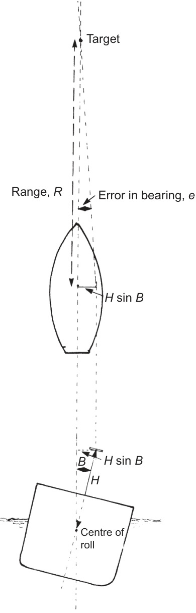  
FIGURE 9.1 Parallax due to roll of the own ship.  

【中文翻译】

图9.1 由于自身船只的横摇引起的视差

The antenna position must be converted to digital form before it can be used by the computer (see Section 2.7.3.2). An azimuth defined by a 12-bit computer word has a least significant bit (LSB) equivalent to $0.09^{\circ}$ (i.e. $360^{\circ}/$ 4096) so that the restriction to 12 bits introduces a quantization error of $0.045^{\circ}$ . The same error will arise if the computer truncates the input azimuth information to 12 bits. Antenna azimuth is often taken to a resolution of either 12 or 13 bits.  

【中文翻译】

天线的位置必须在被计算机使用之前转换为数字形式（见第2.7.3.2节）。一个由12位计算机字定义的方位角，其最低有效位（LSB）相当于$0.09^{\circ}$（即$360^{\circ}/4096$），因此限制为12位会引入$0.045^{\circ}$的量化误差。如果计算机将输入的方位角信息截断为12位，也会出现相同的错误。天线的方位角通常被取为12位或13位的分辨率。 

注：量化误差是指将连续信号转换为离散信号时产生的误差，[即由于数字化过程中信息的丢失导致的精度损失]。

Note: Since gyro compass error is of the order $0.1-0.5^{\circ}$ at best, there is no real point in making the antenna encoder bit size very much smaller.  

【中文翻译】

注意：由于[陀螺罗盘]（一种利用陀螺仪原理测量方向的罗盘）误差最佳情况下也在0.1-0.5度范围内，因此没有实际意义去使[天线编码器]（一种用于记录天线方向的设备）的[比特大小]（二进制数字的长度）变得非常小。

# 9.4.3 Errors in Range Measurement  

# 9.4.3.1 Range Change Due to Roll of the Own Ship  

The error is maximum when $\theta=0^{\circ}$ and $180^{\circ}$ minimum when $\theta=090^{\circ}$ and $270^{\circ}$ , i.e. it varies with cos $\theta$ .  

【中文翻译】

错误最大出现在 $\theta=0^{\circ}$ 和 $180^{\circ}$ 时，最小出现在 $\theta=90^{\circ}$ 和 $270^{\circ}$ 时，即它随着 $\cos\theta$ （余弦函数，[即在单位圆上，某点的横坐标]）而变化。

# 9.4.2.4 Asymmetrical Antenna Beam  

The ARPA should take the bearing of the target as that of the centre of the echo. If the  

【中文翻译】

ARPA 应该将目标的方位视为回声中心的方位。如果

If the radar antenna is mounted at a height $H$ above the roll axis of the ship and the ship rolls to an angle $B_{.}$ , the antenna moves transversely by $H\sin B$ . For a target bearing $\theta$ from the ship’s head, the measured range will be in error by a distance $d$ which is given by:  

【中文翻译】

如果雷达天线安装在距离船只横滚轴 $H$ 高度的位置，当船只横滚到角度 $B$ 时，天线会横向移动 $H\sin B$ 。对于从船头测量的目标方位 $\theta$ ，测量的距离将出现一个距离 $d$ 的误差，误差 $d$ 的计算公式为：

$$
d=H\sin B\sin\theta
$$  

Pitch error is much less significant, but if roll and pitch occur together, the effects add non-linearly and must be worked out separately.  

【中文翻译】

俯仰误差（pitch error）的影响相对较小，但如果俯仰和横滚（roll）同时发生，两者的影响会以非线性的方式叠加，必须分别计算。

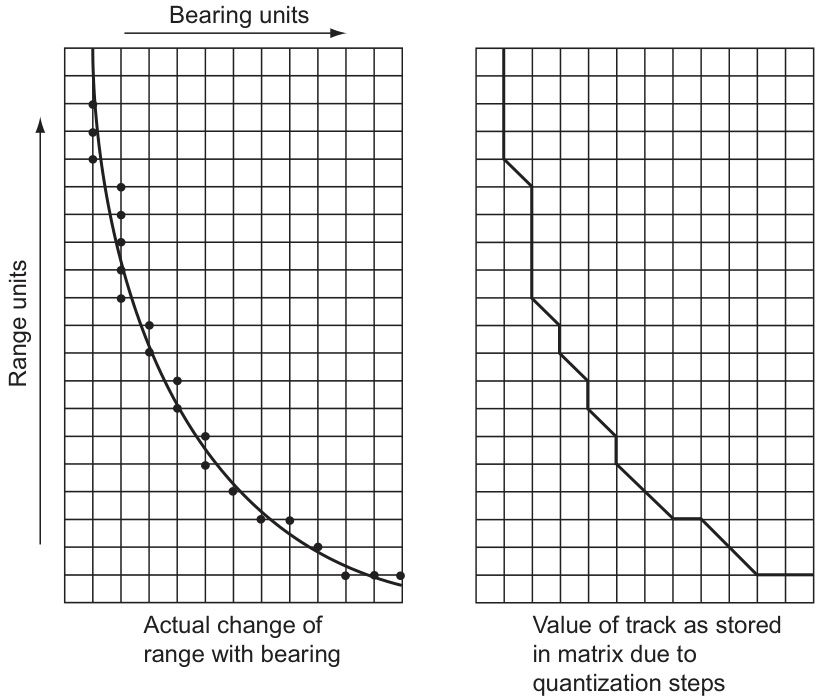  
FIGURE 9.2 Quantization errors.  

【中文翻译】

图9.2 量化误差。

# 9.4.3.2 Range Quantization Error (Figure 9.2)  

The range of a target must be converted into a digital number for the computer to use and it is likely that this will be done by measuring the range using counting techniques. A convenient clock rate is that corresponding to 0.01 NM steps on the 12-mile range scale (see Section 2.7.3.1).  

【中文翻译】

目标的距离必须转换为数字形式，以便计算机能够使用，很可能这是通过使用计数技术来测量距离来实现的。一个方便的时钟速率是对应于12海里范围尺度上0.01海里步长的速率（见第2.7.3.1节）。 

（注：这里的“NM”是nautical mile的缩写，指的是海里，即海上距离的单位，相当于1852米。）

Typical step functions due to range and bearing quantizing are shown in Figure 9.2.  

【中文翻译】

典型的阶跃函数由于距离和方位的量化（即对距离和方向的离散化处理）而产生，如图9.2所示。

Note: During some periods, it will appear that the target is on a collision course, that is steady bearing, although this is never the case in fact.  

【中文翻译】

注意：在某些时期，目标似乎处于碰撞航向（即稳定的相对方位），尽管事实上这种情况永远不会发生。

# 9.4.3.3 Pulse Amplitude Variation (Figure 9.3)  

The equipment will typically measure the range of an echo at the point at which the echo strength rises above a preset threshold. Because of the finite bandwidth of the radar receiver, the echo pulse will have a sloping leading edge and the measured range will vary with the pulse amplitude (see Section 2.3.3.4). For the pulse lengths commonly used on anti-collision range scales, the receiver bandwidths are chosen for long range performance rather than for discrimination, so that it is likely that the leading edge slope will be nearly as long as the transmitted pulse.  

【中文翻译】

该设备通常会在回声强度超过预设阈值（threshold）的点处测量回声的范围。由于雷达接收器的有限带宽（finite bandwidth），回声脉冲（echo pulse）将具有斜率的前沿（leading edge），且测量范围会随着脉冲幅度（pulse amplitude）而变化（见第2.3.3.4节）。对于在防碰撞范围尺度上常用的脉冲长度，接收器带宽是为长距离性能而选择的，而不是为辨别能力（discrimination），因此，前沿斜率可能几乎与传输脉冲一样长。 

注： 
- 有限带宽（finite bandwidth）指的是电子设备接收或处理信号的频率范围是有限的。
- 阈值（threshold）是指信号强度超过一定值时才被认为是有效信号的临界值。
- 辨别能力（discrimination）是指设备区分不同信号或目标的能力。

The resulting apparent range variation will depend upon some assumptions about echo amplitude variations but is likely to be about $40\mathrm{m}$ as a maximum.  

【中文翻译】

所得到的明显距离变化范围将取决于一些关于回声幅度变化的假设，但可能的最大值约为$40\mathrm{m}$。

# 9.4.4 The Effect of Random Gyro Compass Errors  

A gyro compass master unit, mounted at an arbitrary height above the roll axis of the ship, is subject to transverse acceleration at each extremity of the roll. This includes a false vertical as the pendulous unit tilts in its gimbals.  

【中文翻译】

安装在船只横滚轴上方任意高度的陀螺罗盘主机单元，在横滚的每个极端都会受到横向加速度（transverse acceleration）的影响。这包括一个虚假的垂直方向（false vertical），因为当该悬挂式单元在其卡盘（gimbals）中倾斜时，会产生一个与实际垂直方向不一致的方向。[这里的“横向加速度”是指船只在横滚过程中，船体两侧受到的加速度，而“虚假的垂直方向”则是指陀螺罗盘主机单元由于自身的摆动运动，感受到的与实际垂直方向不一致的方向]

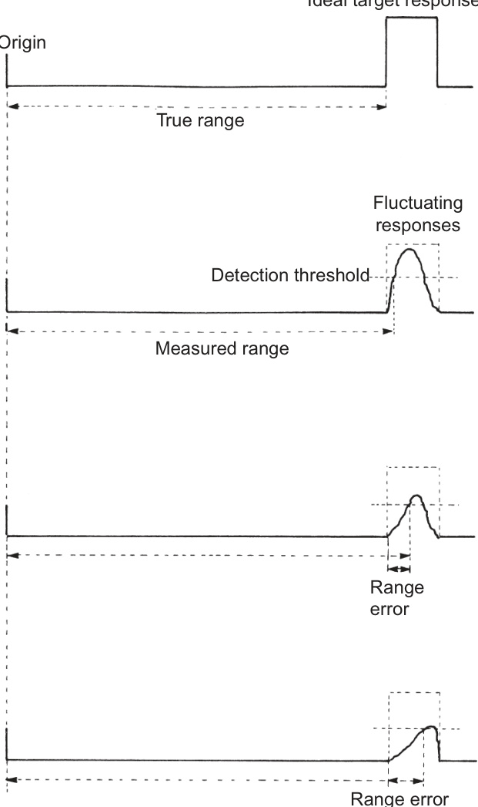  
Ideal target response   
FIGURE 9.3 The error due to pulse amplitude variation.  

【中文翻译】

图9.3脉冲幅度变化引起的误差   
理想目标响应

This puts an error into the gyro compass output affecting all bearings; it has random and slowly varying components in just the same way as the radar tilt error. Observation at sea indicates that $0.25^{\circ}$ is the error in many typical installations.  

【中文翻译】

这会将一个错误引入陀螺罗盘（gyro compass）的输出中，从而影响所有的方位（bearings）；它具有随机和缓慢变化的分量，正如雷达倾斜误差（radar tilt error）[即雷达由于安装位置或其他因素导致的测量角度误差]一样。海上观测表明，在许多典型的安装中，错误约为$0.25^{\circ}$。

The gyro compass also has other errors. Long-term errors (e.g. settling point $\pm0.75^{\circ})$ are unimportant if they remain sensibly constant, as they normally do, but short-term random errors (e.g. settling point difference $\pm0.2^{\circ})$ are significant.  

【中文翻译】

陀螺罗盘还存在其他错误。长期错误（例如稳定点$\pm0.75^{\circ}$）如果保持在合理的常数范围内（通常情况下如此），则是无关紧要的，但是短期随机错误（例如稳定点差值$\pm0.2^{\circ}$）则是显著的。

# 9.4.4.1 Gyro Compass Deck-Plane (Gimballing) Errors  

The true heading of a vessel is the angle between the vessel’s fore-and-aft line and the meridian when measured in the horizontal plane. In several gyro compass designs, the sensitive element has sufficient degrees of freedom to assume a north!south, horizontal attitude. However, the compass card may be constrained to the deck plane. In this case there can be a discrepancy between the compass card reading and the ship’s heading detected by the sensitive element.  

【中文翻译】

船舶的真实航向是指船舶的前后线（fore-and-aft line）与子午线（meridian）在水平面上测量的夹角。在几种陀螺罗盘（gyro compass）的设计中，灵敏元件（sensitive element）具有足够的自由度，可以保持南北方向的水平姿态。然而，罗盘卡片（compass card）可能被限制在甲板平面上。在这种情况下，罗盘卡片的读数与灵敏元件检测到的船舶航向（ship's heading）之间可能存在差异。

# 9.4.4.2 Yaw Motion Produced by the Coupling of Roll and Pitch Motions  

When a ship is rolling and pitching, these two motions interact to produce a resultant yawing motion. The motion can be resolved into horizontal and vertical components. The horizontal component is the yaw motion and is detected by the gyro compass sensing element.  

【中文翻译】

当一艘船在横摇（rolling）和俯仰（pitching）时，这两种运动会相互作用产生一个合成的偏航（yawing）运动。这种运动可以分解为水平和垂直两个分量。水平分量就是偏航运动，由陀螺罗盘（gyro compass）的传感器元件来检测。其中，陀螺罗盘是一种利用陀螺原理来测量方向的罗盘，能够提供稳定的方向参考。

# 9.4.5 The Effect of Random Log Errors  

An error in the own ship’s log will produce a vector error in every tracked ship’s true speed and/or course. This will also result in an error in the displayed aspect of other ships; however this aspect error is minimum in all cases where the real aspect is end-on. A further effect will be to produce non-zero speed indications on all stationary targets being tracked. This cause may also produce large errors in the aspects of very slow-moving targets. If this error is assumed not to exceed 0.4 knots, it will give rise to a positional error of some $15.5\mathrm{{m}}$ in a plot time of $75s$ .  

【中文翻译】

如果自己的船只的日志中存在错误，将会在每艘被跟踪船只的真实速度和/或航向中产生矢量错误。这也会导致其他船只显示的方位（aspect）出现错误；然而，在所有真实方位为端到端（end-on）的情况下，这个方位错误都是最小的。另一个影响是会在所有被跟踪的静止目标上产生非零速度指示。这一原因也可能会在非常缓慢移动的目标的方位中产生很大的错误。如果假设这个错误不超过0.4节（knots），那么在75秒的绘图时间（plot time）内，将会产生大约15.5米的位置错误。

Where true tracks are stored by the tracker (see Section 4.3.6.2), a fluctuating log error can also affect the relative vectors. However, the errors being considered here are the small random variations in the log output and not the large fluctuations which can occur if the log’s performance becomes erratic due to technical malfunction or problems caused by outside influences such as fouling or aeration. Such larger fluctuations are more appropriately considered under errors in input data (see Section 9.5.3).  

【中文翻译】

在跟踪器（见4.3.6.2节）存储真实轨迹的地方，[日志误差（log error）]的波动也会影响相对向量。然而，这里所考虑的误差是[日志输出（log output）]中小的随机变异，而不是由于技术故障或外部影响（如[附着物（fouling）]或[空化（aeration）]）导致[日志性能（log's performance）]变得异常而产生的大波动。这种更大的波动更适合在[输入数据误差（errors in input data）]（见9.5.3节）中考虑。

# 9.5 ERRORS IN DISPLAYED DATA  

# 9.5.1 Target Swap  

When two targets are close to each other, it is possible for the association of past and present echoes to be confused so that the processor is loaded with erroneous data.  

【中文翻译】

当两个目标彼此靠近时，过去和现在的回声关联可能会混淆，从而导致处理器（处理器，指的是计算机系统中负责执行指令的部件）加载错误的数据。

The result is that the historical data on one target may be transferred to another target and the indicated relative (and true) track of that ship will be composed of part of the tracks of two different target motions. Target swap can occur with any type of tracker, but is least likely in those which use a diminishing gate size as confidence in the track increases and those which adopt rate aiding. It is most likely to occur when two targets are close together for a comparatively long time and one target echo is much stronger than the other, see Figure 9.4. It is particularly likely to occur if one target shadows the other (see also Section 4.3.5).  

【中文翻译】

结果是，对于一个目标的历史数据可能会被转移到另一个目标上，而该船的相对（和真实）轨迹将由两个不同目标运动的轨迹的一部分组成。目标交换（target swap）可以在任何类型的跟踪器中发生，但是在那些使用减小的门控尺寸（gate size）随着对轨迹的信心增加以及采用速率辅助（rate aiding）的跟踪器中发生的可能性最小。目标交换最有可能在两个目标在相对较长的时间内靠近，并且一个目标的回声（echo）远远强于另一个目标时发生，见图9.4。如果一个目标遮蔽（shadows）另一个目标（见4.3.5节），也会增加目标交换的可能性。

# 9.5.2 Track Errors  

The motion of a target is rarely completely steady and even steady motion will return positions which are randomly scattered about the actual track, due to basic radar limitations. Quantization errors in range and bearing which are introduced by the translation of the basic radar information to the processor database further exacerbate the effects of these system errors. The only way in which the tracker can deal with these is to use some form of smoothing over a period of time by applying more or less complicated filtering techniques (see also Section 4.3.6). The aim of the filtering is to give the best possible indication of the steady track and at the same time detect real changes quickly.  

【中文翻译】

目标的运动很少是完全稳定的，即使是稳定的运动，由于基本的雷达限制，也会返回在实际轨迹周围随机散布的位置。范围和方位的量化错误是通过将基本的雷达信息转换为处理器数据库而引入的，这进一步加剧了这些系统错误的影响。跟踪器处理这些错误的唯一方法是使用某种形式的平滑处理（smoothing），在一段时间内应用更或 менее复杂的滤波技术（见4.3.6节）。滤波的目标是提供对稳定轨迹的最佳可能指示，同时快速检测实际的变化。 

注意： 
- 量化错误（quantization errors）是指由于数字化处理而导致的误差，通常是由于信号的离散化（discretization）所致。
- 滤波技术（filtering techniques）是指用于减少信号中噪声和干扰的数学方法，例如卡尔曼滤波（Kalman filter）等。

Given the need to satisfy these two conflicting requirements, it is inevitable that the tracker will be limited in its ability to predict precisely the relative- and true-motion of a tracked target at any instant and thus tracking errors will result. The effect of these errors should of course fall within the limits set out in Section 9.2, but the prudent observer will use suitable clear weather opportunities to gain some evaluation of the practical performance of the tracker which is producing the ARPA data. Such performance can be usefully judged against two important criteria. These are the stability of the track shown on the display for a vessel which is observed to be standing-on and the rapidity with which the track responds to a target which has been observed to manoeuvre. It has to be recognized that alterations of the target’s course are easy to detect by visual observation, whereas speed changes are not. However, in clear weather, the former are very much more common than the latter, except in very confined waters.  

【中文翻译】

鉴于需要满足这两个相互矛盾的要求，追踪器（tracker）在预测被跟踪目标在任意时刻的相对运动和真实运动方面的能力必然受到限制，从而导致跟踪错误。这些错误的影响当然应在第9.2节中规定的限制范围内，但谨慎的观察者将利用适当的晴天机会来评估产生ARPA（自动雷达 Plotter 和跟踪系统）数据的追踪器的实际性能。这种性能可以根据两个重要标准来评估。这些标准是：对于观察到的停留不动的船舶，显示屏上显示的轨迹的稳定性（稳定性指的是轨迹的平滑性和一致性，[即轨迹是否会出现突然的跳跃或波动]）；以及对观察到的机动目标的响应速度（响应速度指的是追踪器跟踪目标的速度，[即追踪器多快才能对目标的运动做出反应]）。必须承认，目标航向的改变（航向改变是指船舶或其他目标改变其行进方向）很容易通过视觉观察来检测，而速度的改变（速度改变是指船舶或其他目标改变其行进速度）则不容易检测。然而，在晴天（晴天指天气晴朗，能见度高）条件下，航向的改变（尤其是在开阔水域中）比速度的改变更为常见，除非是在非常狭窄的水域（狭窄的水域是指航行空间有限的水域，如河口、港口等）中。

Accuracy is most difficult to achieve with targets whose tracked movement is slow. In the case of relative track storage (see Section 4.3.6.2), this will affect a target whose course and speed are close to those of the observing vessel. The length of the relative track will be small and thus the system errors are a much more significant proportion of track length than would be the case with a target having a rapid relative-motion. Thus the inherent accuracy of CPA data will be low. Conversely, in the case of true track storage (see Section 4.3.6.3), a near-stationary target will suffer the same low accuracy in the prediction of its true-motion.  

【中文翻译】

准确度（accuracy）最难以实现的目标是那些运动轨迹缓慢的目标。在相对轨迹存储（见4.3.6.2节）中，这将影响到其航向和速度与观察船只相近的目标。相对轨迹的长度将很短，因此系统误差将成为轨迹长度中一个更为显著的比例，而对于具有快速相对运动的目标来说，则不会如此。因此，CPA（最接近点）数据的固有准确度将很低。相反，在真实轨迹存储（见4.3.6.3节）中，一个几乎静止的目标也将在其真实运动的预测中遭受相同的低准确度。 

注：CPA是“Closest Point of Approach”的缩写，指的是两艘船只之间最接近的点。

In general the tracker is likely to offer the best indication of both the relative-motion and the true-motion when both the target and the observing vessel maintain their course and speed for a full smoothing period. In the changing situation the track errors will depend on the nature of the changes and the form of track storage adopted (see Sections 4.3.6.2 and 4.3.6.3).  

【中文翻译】

一般来说，当目标和观测船只在整个平滑周期内保持其航向和速度时，跟踪器（tracker）可能会提供相对运动和真实运动的最佳指示。在情况变化时，轨迹误差将取决于变化的性质和采用的轨迹存储形式（见4.3.6.2和4.3.6.3节）。

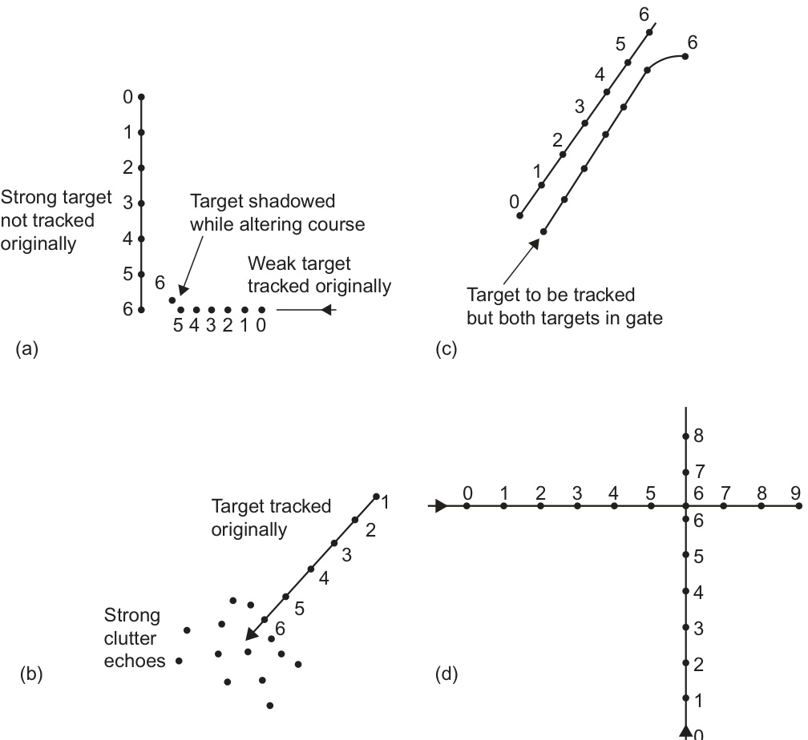  
FIGURE 9.4 Examples of radar target swap. (a) At position 6, tracker transfers to stronger target. (b) At position 6, and later, the profusion of echoes confounds tracker accuracy. The tracker may easily pick up random clutter instead of the target ship. (c) Targets travel close together for a period, then separate. The tracker may not follow the diverging target ship. Note: It is often difficult to acquire a target that is close to others already being tracked. (d) Two tracked targets pass close to each other, so that both are in the tracking gate at one time. Note: In this case, longer rate aiding may be an advantage.  

【中文翻译】

图9.4 雷达目标交换的例子。（a）在位置6，跟踪器转移到信号更强的目标上。（b）在位置6以及之后，回声的丰富性会使跟踪器的准确性混乱。跟踪器可能很容易地捕捉到随机的杂乱回声，而不是目标船。（c）目标在一段时间内紧密地靠近，然后分开。跟踪器可能无法跟随分离的目标船。注意：通常很难获取与已经被跟踪的其他目标靠近的目标。（d）两个被跟踪的目标彼此靠近，以至于同时出现在跟踪门（tracking gate）内。注意：在这种情况下，更长的速率辅助（rate aiding）可能是一个优势。

Where only the target manoeuvres there will be a finite response time in which the displayed vector will seek to follow the change and to stabilize on the new track. Under such circumstances, irrespective of whether the tracker smooths relative or true tracks, there should in theory be no difference in the tracker performance when measured in terms of the accuracy with which it provides output of both relative and true vectors. In both cases the vectors may be erratic when the processor reverts to smoothing over the short period.  

【中文翻译】

当只有目标进行机动时，将会有一个有限的响应时间（response time），在此期间，显示的矢量（vector）将会尝试跟随变化并稳定在新的轨迹（track）上。在这种情况下，无论跟踪器（tracker）是平滑相对轨迹（relative tracks）还是真实轨迹（true tracks），从理论上讲，跟踪器的性能（tracker performance）在提供相对矢量（relative vectors）和真实矢量（true vectors）输出的准确性方面应该没有区别。在两种情况下，当处理器（processor）恢复对短时间进行平滑处理（smoothing）时，矢量可能会出现不规则的波动（erratic）。 

注： 
- 有限的响应时间（finite response time）指的是系统对变化的反应时间是有限的。
- 跟踪器（tracker）是指一种可以跟踪目标运动的系统或算法。
- 相对轨迹（relative tracks）和真实轨迹（true tracks）是指目标运动的相对位置和绝对位置的轨迹。
- 矢量（vector）是指具有大小和方向的量，用于表示目标的运动状态。
- 平滑处理（smoothing）是指对数据进行处理以减少噪声和不规则波动的过程。

Where only the observing vessel manoeuvres, the method of storage is significant because the relative tracks of all targets will be curves for the duration of the manoeuvre. If the smoothing is applied to relative tracks, the tracker will be faced with the task of trying to produce a straight line from a curve and will hence obtain a mean track. Errors in the relative track will result and the relative vectors of all targets may be erratic in the short term. True-motion data derived from this will also be in error, just as where a manual plotter constructs an OAW triangle on the basis of an apparent motion which is not consistent (see Section 7.2). The effect may be exacerbated by the fact that, during the vessel’s manoeuvre, the path traced out by the mass of the vessel, and hence the antenna, may differ significantly from that indicated by the gyro compass and log. Systems which smooth true tracks should derive a more accurate indication of the target’s true track during the observing vessel’s manoeuvre, as the true track is in theory rendered independent of changes in the observing vessel’s course and speed. This independence will be reduced by any difference between the velocity of the ship’s mass during the manoeuvre and the direction and speed fed in by the gyro and log. Again, all errors must fall within the limits of the performance standards, but the prudent observer can assess the effect of manoeuvres on the performance of the tracker by observing a known stationary target during a manoeuvre. In this connection it must be remembered that, even in steady-state conditions, a land-stationary target may display some component of motion due to the effect of tide, and water-stationary targets may have small non-zero vectors due to system errors.  

【中文翻译】

当仅观察船只进行机动时，存储方法至关重要，因为在机动过程中所有目标的相对轨迹将是曲线。如果对相对轨迹进行平滑处理，跟踪器将面临着试图从曲线中产生一条直线的任务，因此将获得一条平均轨迹。相对轨迹中的错误将导致所有目标的相对矢量在短期内可能出现异常。从中导出的真实运动数据也将存在错误，就像手动绘图员在不一致的显现运动（见第7.2节）的基础上构建一个OAW三角形一样。 

注意：OAW三角形是指一种用于确定船只位置和运动参数的方法，通过观察目标的运动轨迹来计算船只的真实运动参数。这种影响可能会因以下事实而加剧：在船舶进行机动（manoeuvre）时，船舶质量（mass of the vessel）的轨迹，以及因此天线（antenna）的轨迹，可能与由陀螺罗经（gyro compass）和航程记录仪（log）指示的轨迹有很大差异。那些能够平滑真实轨迹的系统应该能够在观测船舶进行机动时获得目标的更准确的真实轨迹指示，因为理论上讲，真实轨迹与观测船舶的航向和速度的变化无关。这种独立性将会因观测船舶在机动过程中质量的速度与陀螺罗经和航程记录仪输入的方向和速度之间的任何差异而减少。 

注：陀螺罗经（gyro compass）是一种利用陀螺原理来确定方向的罗经，广泛应用于航空、航海等领域；航程记录仪（log）则是记录船舶航程的设备，能够提供船舶的速度、方向等信息。再次强调，所有的误差都必须在性能标准的范围内，但谨慎的观察者可以通过在机动过程中观察一个已知的静止目标来评估机动对跟踪器（tracker）性能的影响。在这种情况下，必须记住，即使在稳态条件下，陆地静止目标也可能由于潮汐（潮汐效应，即海洋由于月球和太阳的引力而产生的周期性升降运动）而表现出一些运动成分，而水上静止目标可能由于系统误差（系统错误，即系统本身的缺陷或偏差）而具有小的非零向量（非零向量，即矢量的大小不为零）。

Where both observing vessel and target manoeuvre at the same time, it is unlikely that any system will provide a reliable indication of any target data until either the observing vessel or the target ceases to manoeuvre.  

【中文翻译】

当观察船只和目标同时进行机动时，不太可能任何系统能够提供目标数据的可靠指示，直到观察船只或目标停止机动。[这里的“机动”是指船只或目标的运动和转向，包括改变方向、速度等动作]

If targets are tracked down to very close ranges, the relative-motion will give rise to very rapid bearing changes and this may make it impossible for the tracker to follow the target; thus the ‘target lost’ condition may arise, not because the echo is weak, but because the gate cannot be moved fast enough or opened up sufficiently to find it. It is also worth remembering that the use of true vectors as an indication of target heading is based on the assumption that the target is moving through the water in the direction in which it is heading. Leeway is the prime example of a case where this may not be correct. Unless one can see the target, it is impossible even to begin to make an estimate of leeway. In poor visibility and high winds, the observer must be alert to the possibility and use the displayed data with additional caution.  

【中文翻译】

如果目标被跟踪到非常近的距离，相对运动会导致方位变化非常迅速，这可能会使跟踪器无法跟踪目标；因此，可能会出现“目标丢失”的情况，不是因为回声太弱，而是因为门限（gate）不能移动得足够快或打开得足够大以找到它。同时，也值得记住，使用真实向量作为目标航向的指示是基于这样的假设：目标正在按照其航向的方向通过水面移动。横向漂移（leeway）是最典型的例子，即这种假设可能不成立。除非可以看到目标，否则根本无法开始估计横向漂移。在能见度差和风力大的情况下，观察者必须警惕这种可能性，并在使用显示数据时更加谨慎。 

注：横向漂移（leeway）是指船舶或其他漂浮物体在水中移动时，由于风、洋流等外部力作用，导致其实际运动方向与其航向之间的差异。

In summary, it must be remembered that whenever the steady-state conditions are disrupted, there will be a period in which the data will be particularly liable to the track errors described above, in the same way as is the case when a target is first acquired. When the steady-state is regained, accuracy and stability will improve, first over the short smoothing period and then over the long period. Any track data extracted during periods of nonsteady-state conditions must be viewed with suspicion.  

【中文翻译】

总而言之，必须记住，每当稳态条件被破坏时，都会有一个数据特别容易出现上述跟踪错误的时期，就像目标首次被获取时的情况一样。当稳态恢复时，准确性和稳定性将会提高，首先是在短暂的平滑期内，然后是在长期内。任何在非稳态条件期间提取的跟踪数据都必须以怀疑的态度对待。

# 9.5.3 The Effect on Vectors of Incorrect Course and Speed Input  

From the theory of manual radar plotting (see Section 7.2), it is evident that it is possible to deduce the relative-motion of a target without using a knowledge of the true motion of the observing vessel (other than to produce stabilized bearings). Deduction of the truemotion of the target requires a knowledge of the true-motion of the observing vessel to allow resolution of the OAW triangle, and the accuracy of the result depends largely on the accuracy of the course and speed data used. Extrapolation of this reasoning suggests that the accuracy of relative vectors and the associated CPA data are independent of the accuracy of the course and speed input, whereas the accuracy of true vectors and the associated data are dependent on the accuracy of the observing vessel’s input of course and speed. In the case of systems which smooth relative tracks, this is invariably correct; in the case of systems which store true tracks, it is correct subject to the qualification that the input errors are constant. In the case of a fluctuating error input, the two storage approaches will produce different results. For this reason the effect of steady input errors on relative and true vectors is discussed in Sections 9.5.3.1 and 9.5.3.2, respectively, while the case of a fluctuating error is treated separately in Section 9.5.3.3.  

【中文翻译】

根据手动雷达绘图理论（见7.2节），显然可以在不需要知道观测船舶（除了产生稳定化的航向以外）的真实运动的情况下，推断出目标的相对运动。要推断出目标的真实运动，需要知道观测船舶的真实运动，以便解算观测者、目标、观测船舶之间的三角关系（OAW三角形），并且结果的准确性在很大程度上取决于所使用的航向和速度数据的准确性。推广这种推理，表明相对向量和相关的CPA（最接近点）数据的准确性与航向和速度输入的准确性无关，而真实向量和相关数据的准确性则取决于观测船只输入的航向和速度的准确性。在平滑相对航迹的系统中，这种说法总是正确的；在存储真实航迹的系统中，只有当输入错误是常数时才是正确的。如果输入错误是波动的，两种存储方法将会产生不同的结果。 

（注：CPA是Collision Prevention Algorithm的简称，指的是防碰撞算法，用于计算两艘船只之间的最接近点。）因此，稳态输入误差对相对向量和真实向量的影响分别在9.5.3.1和9.5.3.2节中进行了讨论，而波动误差的情况则在9.5.3.3节中单独处理。

Whatever approach the tracker uses, it is essential for the observer to ensure that the correct course and speed inputs are fed in when setting up (see Section 6.9.3), and that regular and frequent checks are made to ensure that the values remain correct. Failure to do this will in general result in the erroneous display of true data which may seriously mislead the navigator when choosing a suitable avoiding manoeuvre strategy.  

【中文翻译】

无论跟踪系统采用何种方法，观察员都必须确保在设置过程中（见6.9.3节）输入正确的航向和速度数据，并且必须进行定期和频繁的检查，以确保这些值保持准确。若不这样做，一般会导致真实数据的错误显示，这可能会严重误导航海员在选择合适的避让机动策略（即为了避免碰撞而采取的航向和速度调整）时。

# 9.5.3.1 Relative Vectors  

The relative vectors and the associated CPA/TCPA data should be unaffected if the observer allows a fixed erroneous input of course and speed data to be applied. In the case of relative storage the information is not used in the calculation. In the case of true storage it is used twice, and one could say that this illustrates a classic case of ‘two wrongs making a right’, as illustrated by Figure 4.8.  

【中文翻译】

当观察者允许一个固定的错误输入的航向和速度数据被应用时，相对向量和相关的CPA（最接近点）/TCPA（最接近时间点）数据应该不受影响。在相对存储的情况下，这些信息在计算中不被使用。在真实存储的情况下，它们被使用两次，可以说这说明了一个经典的“两个错误使得正确”的案例，如图4.8所示。 

注：CPA是“最接近点”的英文缩写，指的是两艘船只在预测航线上最接近的点；TCPA是“最接近时间点”的英文缩写，指的是两艘船只在预测航线上最接近的时间点。

The presence of a fixed gyro compass error at the point at which the bearings are digitized would result in the picture being slewed, but would not affect the CPA/TCPA data.  

【中文翻译】

在数字化方位的位置上存在一个固定的陀螺罗盘误差，将会导致图像发生偏移（即图像的方向或位置发生变化），但不会影响最近接近点（CPA）/时间最近接近点（TCPA）的数据。

# 9.5.3.2 True Vectors  

The true vectors will be displayed incorrectly if the observer allows an erroneous input of course and speed data to be applied, irrespective of the storage format. This may give the observer a seriously misleading impression of the other vessel’s heading and speed and may prompt an unsafe manoeuvre. Such a situation is illustrated by Figures 9.5 and 9.6.  

【中文翻译】

如果观察者允许不正确的航向和速度数据输入（无论存储格式如何），则真实的矢量将被错误地显示。这可能会给观察者留下对另一艘船的航向和速度的严重误导印象，并可能引发不安全的操作。这种情况如图9.5和9.6所示。

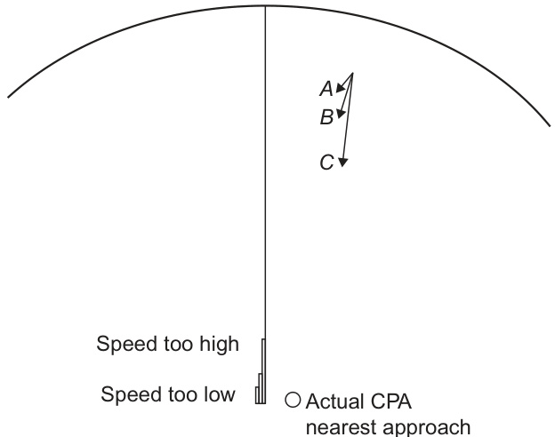  
FIGURE 9.5 The effect of incorrect speed input on a true-vector presentation. Vector $B$ is correct. Speed input ‘too high’ shows vector $A,$ a crossing slow ship. Speed input ‘too low’ shows vector $C,$ a fast target on near parallel crossing.  

【中文翻译】

图9.5 不正确的速度输入对真向量显示的影响。向量$B$是正确的。当速度输入“过高”时，显示向量$A$，即一个缓慢的交叉船只（[即两船之间的相对速度较慢的船只]）。当速度输入“过低”时，显示向量$C$，即一个快速的目标在几乎平行的交叉路径上（[即两船之间的相对速度较快的船只，在几乎平行的路径上与观察者相交]）。

Figure 9.5 shows a target which is moving at a similar speed to the observing vessel, is showing a red light (vector B) and which will pass clear down the starboard side. Incorrect speed input could make this appear to be a slower vessel in a broad crossing situation (vector $A,$ ) or a faster ship passing (vector C) green to green.  

【中文翻译】

图9.5显示了一个目标，其移动速度与观察船相似，显示红色灯光（矢量B），并将从右舷侧通过。错误的速度输入可能会使其看起来像是一个较慢的船只在宽度交叉情况下（矢量A）或者一个较快的船只从绿色到绿色通过（矢量C）。在这里，需要注意“宽度交叉情况”（broad crossing situation）是指两船在大角度下交叉的场景，[即两船的交叉角度较大，不是直接的对向或平行运动]。同时，“绿到绿”（green to green）是指两船在通过时，各自的绿色航行灯都可见，[即两船之间的相对位置是以左舷为基准的相对位置，绿色灯是指左舷的位置灯]。

The effect of an incorrect heading input will have a similar capacity to produce misleading results, as illustrated in Figure 9.6.  

【中文翻译】

不正确的航向输入会产生类似的误导性结果，如图9.6所示。

# 9.5.3.3 The Effect of Fluctuating Input Error  

The most probable source of a fluctuating input error is the log. There are a number of circumstances in which this might arise. An example is the case of some Doppler logs which tend to give erratic output in bad weather when the transducer has to operate through an aerated layer. The fluctuating effect will affect the display of the true vectors whatever the form of storage, but the behaviour of the relative vectors will depend on the mode of storage used. Where relative tracks are smoothed, the fluctuating error will have no effect on the relative vectors and the associated CPA/TCPA data. Where true tracks are smoothed, the relative vector will tend to change erratically in sympathy with the input fluctuations, since the relative vector is derived from the smoothed true track and the instantaneous input course and speed data.  

【中文翻译】

最可能导致输入误差波动的源头是记录仪（log）。可能导致这种情况的原因有很多。例如，一些多普勒记录仪（Doppler logs）在恶劣天气条件下，需要通过充满气泡的水层（aerated layer）进行操作，这时它们往往会输出不稳定的数据。这种波动效应会影响真实航向（true vectors）的显示，无论使用何种形式的存储方式，但是相对航向（relative vectors）的表现将取决于所使用的存储模式。在对相对航迹进行平滑处理的情况下，波动误差不会影响相对航向以及相关的CPA（最接近点）/TCPA（时间最接近点）数据。然而，当对真实航迹进行平滑处理时，相对航向会随着输入波动而不规则地变化，因为相对航向是从平滑的真实航迹和瞬时输入航向及速度数据中推导出来的。

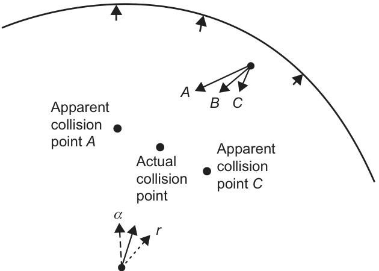  
FIGURE 9.6 The effect of incorrect compass input on a true-vector presentation. Vector $B$ is correct. Incorrect compass input to the left at $\alpha$ shows a target broad crossing to port and faster than the own ship. Incorrect compass input to the right at $r$ shows a target fine crossing to starboard and slower than the own ship.  

【中文翻译】

图9.6 不正确的指南针输入对真向量显示的影响。向量$B$是正确的。当指南针输入出错，向左偏差为$\alpha$时，显示目标向左横过，且速度快于本船。当指南针输入出错，向右偏差为$r$时，显示目标向右横过，且速度慢于本船。

The difference in effect can be considered by an example shown in Figure 9.7. Consider the case where the observing vessel has been on a steady course and speed for a full smoothing period, and the correct course and speed data has been consistently fed in. Both methods of smoothing will have settled to produce the correct relative and true vectors.  

【中文翻译】

效果的差异可以通过图9.7中的例子来说明。考虑这样一种情况：观测船只在一个完整的平滑周期内保持稳定的航向和速度，并且正确的航向和速度数据一直被输入。两种平滑方法都将收敛到产生正确的相对向量和真实向量[即观测船只相对于目标的运动向量和观测船只在实际海图上的运动向量]。

Suppose that the log develops an instantaneous fault and reads half the correct speed.  

【中文翻译】

假设[记录仪]出现瞬间故障，读出的速度仅为正确速度的一半。

The relative track system, shown in Figure 9.7(a), will show no change in the relative vector (because the relative track is smoothed), but the true vector will immediately go to the erroneous value because it is derived from the smoothed relative track and the instantaneous course and speed input.  

【中文翻译】

如图9.7(a)所示，相对航迹系统将不会显示相对向量（因为相对航迹是平滑的）的变化，但真实向量将立即转变为错误的值，因为它是从平滑的相对航迹和瞬时航向及速度输入中推导出来的。

The true track system will show no immediate change in the true vector, because it is insulated by the smoothing, whereas the relative vector will immediately go to an erroneous value since it is derived from the smoothed true track and the instantaneous course and speed input. If no further change takes place in the error and the vectors are observed over a full smoothing period, the true vector will gradually change to the erroneous value while the relative vector will gradually come back to the correct value as the previously smoothed track is progressively discarded. Thus, in this type of storage, if the speed input fluctuates the relative vector will also fluctuate. This disadvantage has to be set against the advantage gained by being able to maintain a stable relative vector when the observing vessel is manoeuvring (see Section 9.5.2).  

【中文翻译】

真实航迹系统不会立即显示真实向量的变化，因为它受到平滑处理的隔离，而相对向量会立即变为错误的值，因为它是从平滑的真实航迹和瞬时航向、速度输入中推导出来的。如果错误不再变化，并且在整个平滑周期内观察向量，真实向量会逐渐改变为错误的值，而相对向量会逐渐恢复到正确的值，因为之前的平滑航迹会被逐步丢弃。因此，在这种类型的存储中，如果速度输入波动，相对向量也会波动。这种缺点必须与在观察船进行机动（见9.5.2节）时能够维持稳定的相对向量的优势相权衡。

An erratic course input would have a similarly disruptive effect. However, such a condition would also affect the digitization of bearings. This would tend to cause targets to jump and it would be fairly obvious to even a casual observer that something was wrong.  

【中文翻译】

不规则的航向输入也会产生类似的破坏性影响。然而，这种情况也会影响方位的数字化处理。这将倾向于导致目标跳动，并且即使是随意观察，也会相当明显地发现有些事情出了问题。 

（注：这里的“航向输入”指的是船舶或飞机等航行物体的方向控制输入；“方位的数字化处理”是指将方位信息转换为数字信号的过程；“目标跳动”是指由于输入不规则导致的目标位置或轨迹的突然变化。）

# 9.5.3.4 Comparison of Relative and True Vectors  

Given that one or other of the vectors can be affected by input errors in a way which may be dependent on the tracker philosophy, it is important to stress the need for the observer continuously to compare one data source with another to ensure that, in all cases, indications given from relative vectors and true vectors sensibly agree.  

【中文翻译】

鉴于其中一个或多个向量可能受到输入错误的影响，而这种影响可能取决于跟踪器的哲学（[跟踪器的基本原理或设计理念]），强调观察者持续比较不同数据源的必要性至关重要，以确保在所有情况下，相对向量和真实向量（[指实际的、准确的向量]）给出的指示是合理一致的。

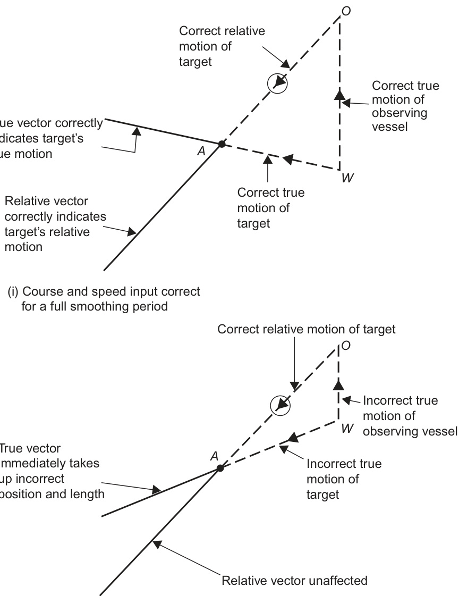  
FIGURE 9.7 The effect of a step change in the error of speed input: (a) where relative track storage is used.  

【中文翻译】

图9.7 速度输入误差的阶跃变化的影响：（a）在使用相对轨迹存储的情况下。 

（注：本图展示了当速度输入出现阶跃变化时，系统的响应情况，特别是在使用相对轨迹存储的控制系统中。相对轨迹存储是指系统中存储的轨迹信息是相对于某个参考点或初始状态的，而不是绝对位置。这种控制方式可以提高系统的稳定性和准确性。）

(ii) Speed input instantaneously drops to (a) half of correct value due to log error  

【中文翻译】

(ii) 速度输入的瞬间下降到（a）正确值的一半，这是由于对数错误[即指由于对数运算中的错误导致的速度值计算不准确]。

# 9.5.4 The Effect on the PPC of Incorrect Data Input  

# 9.5.4.1 Errors in Speed Input  

If incorrect speed is input to a collision situation, the collision point (see Section 4.11) will still appear correctly on the heading marker, but at an incorrect range, and will move down the heading marker at an incorrect speed.  

【中文翻译】

如果将错误的速度输入到碰撞情况中，碰撞点（见4.11节）仍将在航向标志（heading marker）上正确显示，但是在错误的距离上，并且会以错误的速度沿着航向标志向下移动。

In the case where there is, in fact, a miss distance, the collision point will appear in the wrong position, which may give rise to a misjudgement of the danger or urgency of the situation. Figure 9.8 shows how the collision point may be displaced due to a speed error in the two cases where the target is crossing ahead and crossing astern.  

【中文翻译】

在实际情况中，如果存在错过距离（miss distance），碰撞点将出现在错误的位置，这可能导致对情况的危险性或紧急程度的误判。图9.8展示了当目标在前方交叉（crossing ahead）和在后方交叉（crossing astern）的两种情况下，由于速度误差（speed error）导致碰撞点可能被移位的情况。

# 9.5.4.2 Errors in Course Input  

The behaviour of the collision point when an error in the course is input is too complex to allow definition of a pattern. If the error occurs only in the calculation and does not appear in the position of the heading marker, the collision point could appear on the heading marker in a miss situation. More dangerously, a collision point could appear off the heading marker in a collision situation. When the same error appears in both heading marker and calculation, as might occur due to a gyro compass error, the collision case will always show the collision point on the heading marker.  

【中文翻译】

当航向中输入错误时，碰撞点的行为太复杂，无法定义出一个模式。如果错误仅出现在计算中，并没有体现在航向标志（heading marker）的位置上，碰撞点可能会出现在航向标志上，但实际上却是失误的情况（miss situation）。更为危险的是，碰撞点可能会出现在航向标志以外的位置，而实际上却是碰撞的情况（collision situation）。当同样的错误同时出现在航向标志和计算中，例如由于陀螺罗盘（gyro compass）错误引起的错误时，碰撞情况下碰撞点总会显示在航向标志上。

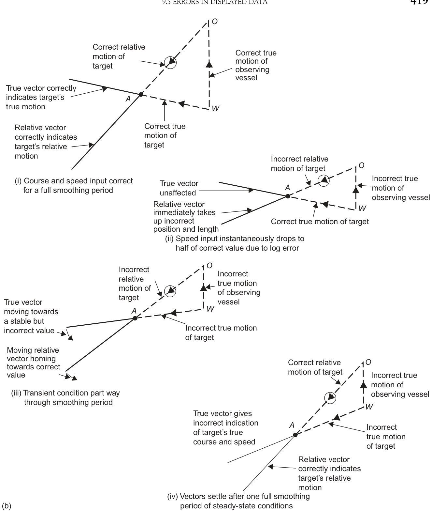  
FIGURE 9.7 (b) where true track storage is used.  

【中文翻译】

图9.7（b）中，采用了真实轨迹存储。

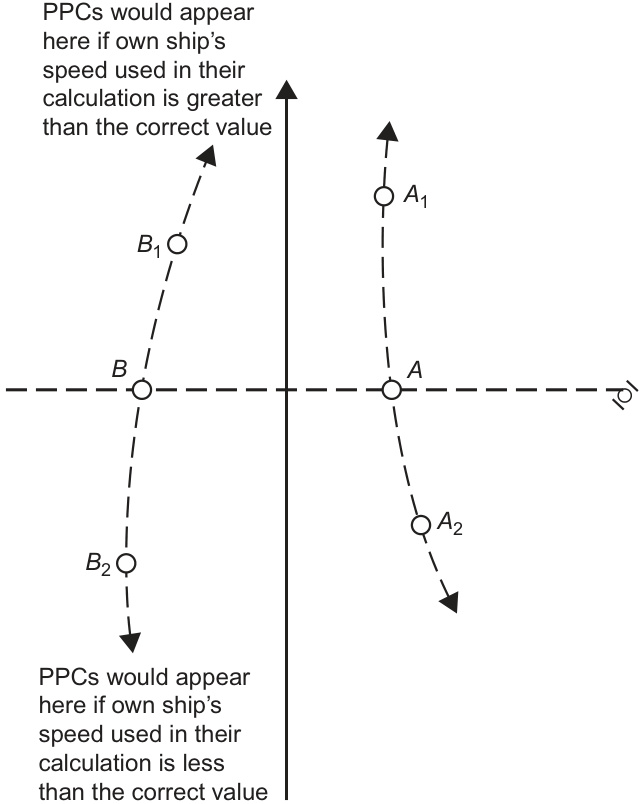  
FIGURE 9.8 The effect on the PPC of a speed error. $A$ , target passing astern, correct speed used. $B$ , target passing ahead, correct speed used. $A_{1},B_{1},$ PPC appears here if a speed greater than the correct value is used. $A_{2},B_{2},$ PPC appears here if a speed less than the correct value is used.  

【中文翻译】

图9.8 速度误差对预计通过位置（PPC）的影响。$A$，目标在船尾通过，使用正确的速度。$B$，目标在船头通过，使用正确的速度。$A_{1},B_{1}$，预计通过位置（PPC）出现在这里，如果使用的速度大于正确的值。$A_{2},B_{2}$，预计通过位置（PPC）出现在这里，如果使用的速度小于正确的值。其中，预计通过位置（PPC）[即预计两船将通过的位置]是海事领域中的一个重要概念，用于船舶航行和避碰的判断。

Similarly, if a miss distance exists, the collision point will not be on the heading marker.  

【中文翻译】

同样，如果存在失距（miss distance，指船舶或物体之间的最短距离，[即两物体在运动中最接近时的距离]），碰撞点将不会位于航向标志（heading marker，[即表示船舶当前航向的标志]）上。

# 9.6 ERRORS OF INTERPRETATION  

These errors are not within the system but are those likely to be made by the operator through misunderstanding, inexperience or casual observation.  

【中文翻译】

这些错误并非系统内部的错误，而是操作员由于误解、缺乏经验或粗心观察而可能犯下的错误。

# 9.6.1 Errors with Vector Systems  

In the case of vector systems, the most common mistakes arise because the observer, either from lack of concentration due to stress of the moment or through lack of knowledge, confuses relative and true vectors (as in the collision between Norwegian Dream and Ever Decent). Typical blunders are:  

【中文翻译】

在矢量系统中，最常见的错误是由于观察者在紧张的时刻缺乏专注力或知识不足，混淆了相对矢量和真实矢量（如挪威梦号（Norwegian Dream）和永远体面号（Ever Decent）之间的碰撞）。典型的错误包括：

a. measuring the CPA as the tangential distance at which the true vector passes the origin;   
b. mistaking the direction of the relative vector for the target’s true heading.  

【中文翻译】

a. 通过测量真实向量经过坐标原点的切线距离来确定CPA（最接近点，[即两船之间最近的距离]）；
b. 将相对向量的方向误认为目标物体的真实航向（[即目标物体实际移动的方向]）。

A further source of error sometimes occurs where the observer runs out the true vector to see the possible dynamic development of the situation (which in itself is a useful ploy) to assist in determining collision avoidance strategy, but deduces the point of closest approach as being where the vectors cross. This is of course only correct in the collision case. Attempts to find the passing distance by trial and error using this technique also frequently mislead the observer and are not necessary when the CPA is so easily available from other sources.  

【中文翻译】

在观察过程中，另一个可能的错误来源是观察者尝试通过延伸真实向量（true vector）来预测情况的可能动态发展（这本身是一种有用的策略），以便于确定碰撞避免策略，但却错误地将最接近点（point of closest approach）确定为向量交叉点。这当然只在碰撞的情况下才是正确的。使用这种方法通过反复试验来确定通过距离（passing distance）的尝试也经常会误导观察者，而当最接近点（CPA，Closest Point of Approach）从其他来源可以轻松获得时，这种方法也是不必要的。

Some manufacturers fit spring-loaded switches or hold-down buttons to ensure that the equipment always reverts to either true or relative vector mode in an attempt to reduce the chance of misinterpretation of the data in this way.  

【中文翻译】

一些制造商会安装带有弹簧加载的开关或按住按钮，以确保设备始终恢复到真实（true）或相对向量（relative vector）模式之一，尝试通过这种方式减少数据在此过程中被误解的可能性。

Other common errors include the confusion of real and trial values of CPA and omitting to set in the correct trial speed. Where the displayed vectors and history of a different type are simultaneously presented, the difference between the two may be mistaken for a manoeuvre by the target.  

【中文翻译】

其他常见的错误包括混淆CPA（最接近点）的真实值和试验值，以及省略设置正确的试验速度。当显示不同类型的矢量和历史记录同时呈现时，两者之间的差异可能被误认为是目标的机动（即目标的航向或速度变化）。

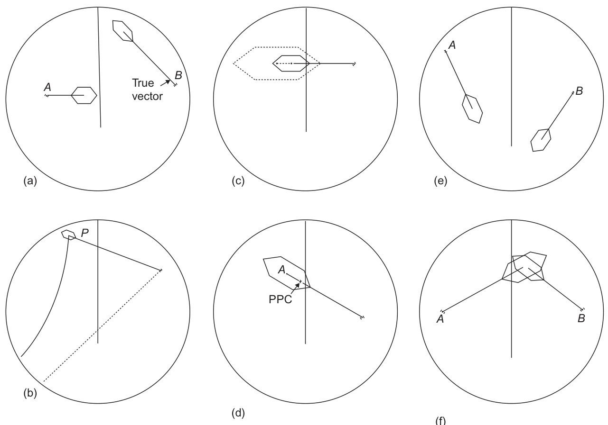  
FIGURE 9.9 Errors of interpretation. (a) Target $A$ is faster and target $B$ is slower than the own ship, despite appearances. Note: Vectors will show this. (b) The solid line shows the track of the PPC from $P$ . The apparent track of the echo is shown by the broken line. (c) The broken line shows the PAD for 2 miles. The solid line shows the PAD for 1 mile. (d) The PPC is not at $A,$ the centre of the hexagon. (e) Targets $A$ and B will collide, although this is not apparent from the display. (f) Targets $A$ and $B$ will not collide, although they may pass within the miss distance.  

【中文翻译】

图9.9 解释错误。 (a) 目标A比自己的船只快，目标B比自己的船只慢，尽管看起来相反。注意：[向量是一种数学表示方法，用于描述大小和方向的量]向量会显示这一点。 (b) 实线表示从P点的[预测碰撞位置，PPC，即预测两船可能碰撞的位置]的轨迹。虚线表示回声的明显轨迹。 (c) 虚线表示2英里[海里，1海里约为1.852公里]的[最接近点，PAD，即两船最接近的点]。实线表示1英里的PAD。 (d) [预测碰撞位置，PPC]并不在A点，即六边形的中心。 (e) 目标A和B将碰撞，尽管从显示上看不出来。 (f) 目标A和B不会碰撞，尽管它们可能在[最小安全距离，miss distance]内通过。

During the second and third minutes of tracking, the vectors will be stabilizing and care must be taken not to be misled into assuming that this is an alteration by the target or that it is yawing.  

【中文翻译】

在跟踪的第二和第三分钟内，[向量（vector）即指向目标的方向和速度]会趋于稳定，此时需要谨慎，以免被误导为目标正在改变方向或[偏航（yawing）即目标的横向转向]。

# 9.6.2 Errors with PPC and PAD Systems  

In the case of predicted points of collision (PPCs) and predicted areas of danger (PADs), the commonest mistakes arise when attempting to interpolate or extrapolate data from the display. As mentioned in Section 4.12.4, PADS are no longer found on ships, but this discussion of PPCs and PADs is included for completeness. Typical errors arise because of failure to appreciate the following:  

【中文翻译】

在预测碰撞点（Predicted Points of Collision，PPCs）和预测危险区域（Predicted Areas of Danger，PADs）方面，最常见的错误出现在试图从显示屏上插值或外推数据时。如第4.12.4节中提到，PADs已经不再在船上使用，但本节仍然包含关于PPCs和PADs的讨论，以便于完整性。典型的错误产生是因为没有充分理解以下几点：[即没有完全理解预测碰撞点和预测危险区域的计算和应用原理]

1. The line joining the target to the collision point is not a time-related vector and does not indicate speed (Figure 9.9(a)).   
2. The collision point gives no indication of miss distance.   
3. Changes in collision point positions do not necessarily indicate a change in the target’s true course or speed.   
4. The PAD does not change symmetrically with a change in the selected miss distance (see Figure $9.9(\mathrm{c})\$ ).   
5. The collision point is not necessarily at the centre of the predicted danger area (see Figure 9.9(d)).  

【中文翻译】

以下是英文文本的中文翻译：

1. 连接目标和碰撞点的线（图9.9(a)）不是一个与时间相关的矢量，也不表示速度。
2. 碰撞点不能指示偏离距离。
3. 碰撞点位置的变化不一定表示目标的真实航向或速度发生了变化。
4. 选择的偏离距离发生变化时，预测危险区（PAD）并不对称地变化（见图9.9(c)）。
5. 碰撞点不一定位于预测危险区的中心（见图9.9(d)）。

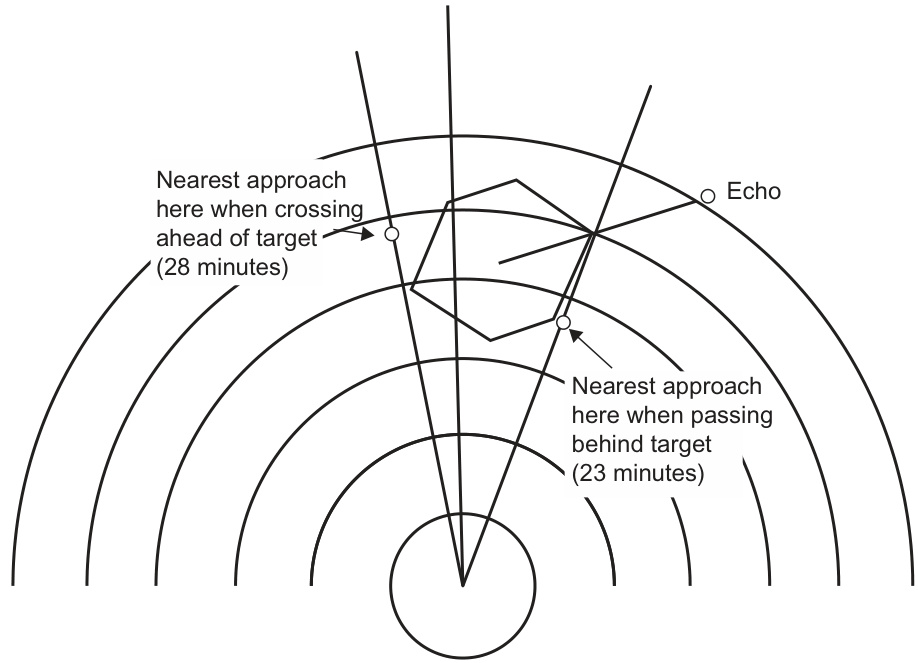  
FIGURE 9.10 The misleading effect of using the bearing cursor to determine the time to resume course. Note: There are four intervals to the point of crossing ahead and five intervals to the point of crossing astern, but nearest approaches occur, as indicated, at 4.9 and 3.6 intervals, respectively.  

【中文翻译】

图9.10 使用方位游标确定恢复航向时间的误导性效果。注意：到前方交汇点有四个时间间隔，到后方交汇点有五个时间间隔，但是最近的接近点分别出现在4.9和3.6个时间间隔处，如图所示。

It is always important to realize that the areas of danger generated on the screen apply only to the own ship and the target, and that they do not always give warning of a mutual threat between two targets. If two areas of danger overlap, it is reasonable to suppose that the two targets involved will also pass each other within the stated miss distance (see Figure 9.9 (f)), but separated danger areas do not imply safe passing between the targets. Two targets may eventually have a close passing although their danger areas, as applied to the own ship, appear to be well separated (see Figure 9.9(e)).  

【中文翻译】

在导航中，必须始终牢记，屏幕上生成的危险区域仅适用于自己的船舶和目标，并且它们并不总是预警两个目标之间的相互威胁。如果两个危险区域重叠，可以合理地假设两个相关目标也将在规定的失误距离内（见图9.9（f））相互经过，但分离的危险区域并不意味着目标之间的安全通过。两个目标可能最终会有近距离通过，尽管它们的危险区域（如应用于自己的船舶）看起来是分开的（见图9.9（e））。这意味着，即使自己的船舶与目标之间的危险区域看起来没有重叠，也不能完全排除与目标发生碰撞的可能性。因此，必须谨慎对待这些信息，并结合实际情况进行综合判断。

# 9.6.2.1 Resumption of Course  

Where a ‘chained’ bearing cursor is available and the chain divisions are an indication of time, care must be exercised in the measurement of time to resume course. As shown in Figure 9.10, the marker correctly indicates the time the own ship will cross ahead and astern on the target track, but the time at which the required miss distance occurs cannot be determined.  

【中文翻译】

当可用“链式”（chained）轴承光标（bearing cursor），且链式分区表示时间时，必须谨慎测量恢复航向的时间。如图9.10所示，标记正确指示了本船将在目标航迹上方和后方交叉的时间，但无法确定所需的安全距离（miss distance）发生的时间。[这里的“安全距离”是指两船之间保持的最小距离，以避免碰撞]

# 9.6.3 The Misleading Effect of Afterglow  

Because the vector mode (i.e. relative or true) is not necessarily the same as the radar presentation which has been selected, vectors and afterglow trails may not match. When true vectors are selected on a relative-motion presentation, the vectors and the afterglow will not correlate. When relative vectors are selected while using a true-motion presentation, the true afterglow will not match the relative vector.  

【中文翻译】

由于矢量模式（即相对或真实矢量）不一定与所选定的雷达显示模式相同，因此矢量和残影轨迹可能不匹配。当在相对运动显示模式下选择真实矢量时，矢量和残影将不会相关联。当使用真实运动显示模式时选择相对矢量，真实残影将不会与相对矢量匹配。 

（注：这里的“矢量模式”指的是雷达显示中目标的运动方向和速度的表示方式，分为相对模式和真实模式。相对模式是指目标相对于观察者的运动情况，而真实模式则是指目标在实际环境中的运动情况。）

# 9.6.4 Accuracy of the Presented Data  

Over-reliance on, and failure to appreciate inaccuracies in, presented data which has been derived from imperfect inputs should be avoided at all costs. It must always be borne in mind that a vector/PAD/alphanumeric readout is not absolutely accurate, just because it has been produced by a computer, no matter how many microprocessors it may boast. An indication by the ARPA that a target will pass one cable clear of the own ship should not be regarded as justification for standing-on into such a situation.  

【中文翻译】

过度依赖于并且未能认识到呈现数据中的不准确性，这些数据是从不完善的输入中推导出来的，应该不惜一切代价避免。必须始终牢记，一个向量/PAD/字母数字读数仅仅因为它是由计算机产生的，并不意味着它是绝对准确的，无论它拥有多少个微处理器。自动雷达定位系统（ARPA）指出目标将在距离自身船只一根缆绳的距离以外通过，不应该被视为继续驶入这种情况的理由。[这里的“一根缆绳的距离”是指一种测量距离的方式，相当于船只的长度或宽度，通常用于描述两船之间的安全距离]。

The errors given in Table 9.1 are quite typical and should always be allowed for.  

【中文翻译】

表9.1中给出的误差相当典型，应该始终予以考虑（即应预留一定的误差范围，以应对这些典型的误差）。

# 9.6.5 Missed Targets  

An automatic acquisition system may totally fail to detect and acquire a target of vital importance, for one of a number of reasons. Similarly, it may also drop or cancel a fading target. In the latter case, the target may subsequently be re-acquired and present a course and speed which may indicate that the target has manoeuvred when, in fact, the track is new and has not yet established its long-term accuracy.  

【中文翻译】

自动获取系统可能由于多种原因完全失败以检测和获取一个至关重要的目标。同样，它也可能丢失或取消一个信号逐渐消失的目标。在后一种情况下，目标可能随后被重新获取并呈现出一条航向和速度，这可能表明目标已经进行了机动（即改变了运动方向或速度）当，实际上，这条轨迹是新的，并且尚未建立其长期的精度（即系统需要一定时间来确认目标的运动规律并提高跟踪的准确性）。
