# 10  

Ancillary Equipment  

【中文翻译】

辅助设备

Whereas, in the past, the radar and target tracking equipment was essentially a standalone module and could, apart from crosschecking, be considered in relative isolation, this is no longer the case. Now that virtually all data is digitized prior to display, it has become possible and desirable for the display of data to be integrated (see Section 10.3). For this reason, some insight into the way other major data sources interact with the radar and target tracking system is included here.  

【中文翻译】

过去，雷达和目标跟踪设备基本上是一个独立的模块，除了进行交叉核对（crosschecking）外，可以认为它们相对独立。但是，这种情况不再存在。由于几乎所有数据在显示之前都被数字化（digitized），因此数据显示的集成（integration）成为可能并且是理想的（参见第10.3节）。因此，本节包括了其他主要数据源如何与雷达和目标跟踪系统交互的相关内容，以便更好地理解整个系统的工作原理。

# 10.1 GLOBAL NAVIGATION SATELLITE SYSTEMS  

discuss global navigation satellite systems (GNSS) to any great depth here, but rather to consider the manner in which they interact with the radar and target tracking equipment. Where a deeper understanding of a particular GNSS is required, readers should consult a more specialized text. Several GNSS’s now exist or are in an advanced stage of implementation. The American GPS will be discussed first (with a little more detail), as it was for many years the only globally available system and is typical of a satellite system from which positional data is derived.  

【中文翻译】

在这里，我们不会对全球导航卫星系统（GNSS）进行深入讨论，而是考虑它们与雷达和目标跟踪设备的交互方式。当需要对特定的GNSS有更深入的了解时，读者应该参考更为专业的文本。目前，已经有多个GNSS系统存在或处于实施的较高阶段。我们将首先讨论美国的GPS系统（并提供稍多的细节），因为多年来它是唯一一个全球可用的系统，并且是从卫星系统中获取位置数据的典型代表。

With the availability of artificial earth satellites and highly accurate clocks, it was soon recognized that there was the potential for a satellite-based global navigation system. At first, the ‘Transit’ system was developed in the United States. The ship’s position was derived from a series of hyperbolic position lines based on measurements obtained from a single satellite in a low earth orbit. With the advance of technology and the US requirement for a 24 hour high precision position fixing system for military purposes, the global positioning system (GPS) was developed and the Transit system has been discontinued. It is not intended to  

【中文翻译】

随着人造地球卫星和高精度时钟的出现，人们很快意识到可以建立一个基于卫星的全球导航系统。最初，在美国开发了“Transit”系统，该系统通过从低地球轨道上的单颗卫星获取的测量数据，根据一系列双曲线位置线来确定船舶的位置。随着技术的进步和美国军事目的对24小时高精度位置确定系统的需求，全球定位系统（GPS）得以发展，而“Transit”系统也已停止使用。该系统不打算[即不再继续使用或发展“Transit”系统]。 

注意：本翻译保持了原文的专业术语和技术精确性，使用了符合中国人表达习惯的流畅中文，并保持了学术写作风格。对于某些复杂的概念，如“双曲线位置线”，虽然可以进行解读，但考虑到原文的专业性和技术性，决定不进行过多的解释，以保持原文的技术精确性。

# 10.1.1 Global Positioning System  

The first experimental GPS satellite was launched in 1978, but the full system was only declared operational with 18 satellites in 1994. The system comprises three segments, namely the tracking and control segment, the satellite or space segment, and the user segment.  

【中文翻译】

第一个实验性的GPS卫星于1978年发射，但完整的系统直到1994年拥有18颗卫星时才被宣布为正式运营。该系统由三个部分组成，分别是跟踪和控制部分（[负责监控和控制卫星的部分]） 、卫星或空间部分（[指GPS卫星本身]）以及用户部分（[指使用GPS服务的终端用户]） 。

# 10.1.1.1 The Tracking and Control Segment  

In general, the overall control and operation of the system is in the hands of the United States Air Force who monitor the performance of the satellites via a series of ground tracking stations around the world. They also update the information transmitted by the satellites and from time to time correct the satellite positions to ensure that their orbits remain within the desired tolerances. The whole of the system is supervised from a master control station (MCS) in the United States. They also launch new satellites to replace those that have come to the end of their useful life or have malfunctioned (Figure 10.1).  

【中文翻译】

一般来说，整个系统的控制和操作都由美国空军负责，他们通过全球各地的一系列地面跟踪站监测卫星的性能。他们还会更新卫星传输的信息，并根据需要纠正卫星的位置，以确保它们的轨道保持在所需的公差范围内。整个系统都由位于美国的主控制站（MCS）进行监督。他们还会发射新的卫星来替换那些已经达到使用寿命末端或发生故障的卫星（图10.1）。

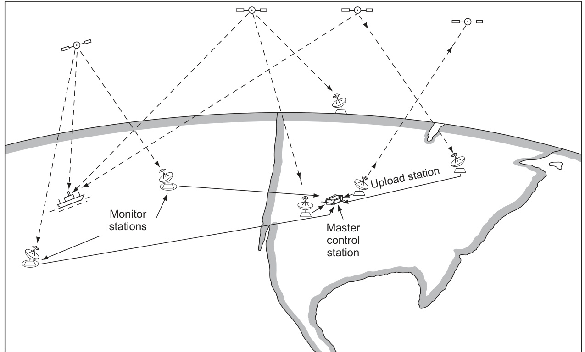  
FIGURE 10.1 Overall supervision of the system.  

【中文翻译】

图10.1 系统的总体监督 [即对整个系统的监控和控制]。

# 10.1.1.2 The Space Segment  

This is now based on a theoretical constellation of some 24 satellites in six near-circular orbits, each orbit being inclined at an angle of $55^{\circ}$ to the equator and separated by some $60^{\circ}$ in longitude. Within each orbit, the four satellites are spaced at $90^{\circ}$ . The relationship between satellites in consecutive orbits is that as one satellite is crossing the equator heading northwards, the one in the orbit ‘ahead’ will have crossed the equator $60^{\circ}$ to the east and will now be some $15^{\circ}$ to the east along its track and north of the equator. The maximum declination of each orbit is $55^{\circ}$ north and south (Figures 10.2 and 10.3). The orbits have a mean altitude of $20{,}200\mathrm{km}.$ , which is designed to result in the satellite completing two orbits in precisely one sidereal day. While the satellites move along the orbits, the earth will rotate within this ‘bird cage’. There is a tendency for the orbits to be perturbed, but this is corrected by the MCS as necessary.  

【中文翻译】

这现在基于一个理论星座，该星座由24颗卫星组成，分布在六个近圆形轨道上，每个轨道与赤道成$55^{\circ}$的夹角，并且每个轨道在经度上相隔约$60^{\circ}$。在每个轨道内，四颗卫星以$90^{\circ}$的间隔分布。相邻轨道上的卫星之间的关系是，当一颗卫星正从赤道向北越过时，在它“前方”的轨道上的卫星已经在$60^{\circ}$的距离向东越过赤道，并且现在位于其轨迹上的东侧，距离赤道向北约$15^{\circ}$。每个轨道的最大赤纬（[即天体在天球上与天赤道之间的最大角距离]）为$55^{\circ}$，分别向北和向南（图10.2和图10.3）。轨道的平均海拔为$20{,}200\mathrm{km}$，设计目的是使卫星在精确的一个恒星日内完成两个轨道运行。在卫星沿着轨道运行的同时，地球将在这个“鸟笼”中自转。轨道存在被干扰的趋势，但是这种情况会根据需要被[轨道控制系统，英文为Mission Control System，负责监控和控制卫星运行状态的系统]进行纠正。

For practical reasons, the constellation has been developed over a period of years and in a climate of advancing technology. Satellites have been replaced and in most orbits, there is at least one spare satellite. Consequently, the actual constellation is not precisely as described above, but the basic principle, that is to have at least four visible and usable satellites available worldwide at all times, is achieved and surpassed (Figure 10.5).  

【中文翻译】

出于实际考虑，该星座（constellation）是在多年时间里和技术进步的环境中发展起来的。卫星（satellites）已经被更换，并且在大多数轨道（orbits）中，至少有一颗备用卫星（spare satellite）。因此，实际的星座并不是完全如上所述，但基本原则，即在全球范围内始终至少有四颗可见且可用的卫星（visible and usable satellites），已经实现并超越了（图10.5）。 

注：constellation 指的是人造卫星的集合体，通常用于导航、通信等目的；satellites 指的是人造卫星；orbits 指的是卫星运行的轨道。

Each satellite carries a number of high precision ‘clocks’ on board with all clocks in the system synchronized to a common standard. In the initial specification, all satellites transmit signals on two frequencies in the $\mathrm{~\textit~{~L~}~}$ -band $\operatorname{L1}=1575.42$ and $\mathrm{L}\bar{2}=1227.6\mathrm{MHz}$ derived from a basic clock frequency of $10.23\mathrm{MHz}.$ , both of which are uniquely coded to provide satellite identification and orbital data and also a signal which provides the means for signal transit time to be measured (see Figure 10.4). Currently only the L1 frequency is available for civilian users (but see Section 10.1.7).  

【中文翻译】

每颗卫星都携带多个高精度的“时钟”，所有时钟都与系统中的一个共同标准同步。在最初的规格中，所有卫星都在两个频率的L频段上发射信号，分别为$\mathrm{L1}=1575.42$和$\mathrm{L2}=1227.6\mathrm{MHz}$，这两个频率都是从基本的时钟频率$10.23\mathrm{MHz}$派生而来的。这些信号都经过唯一的编码，以提供卫星识别和轨道数据，同时还提供了一种信号，以便于测量信号的传输时间（见图10.4）。目前，只有L1频率对民用用户开放（但请参阅第10.1.7节）。

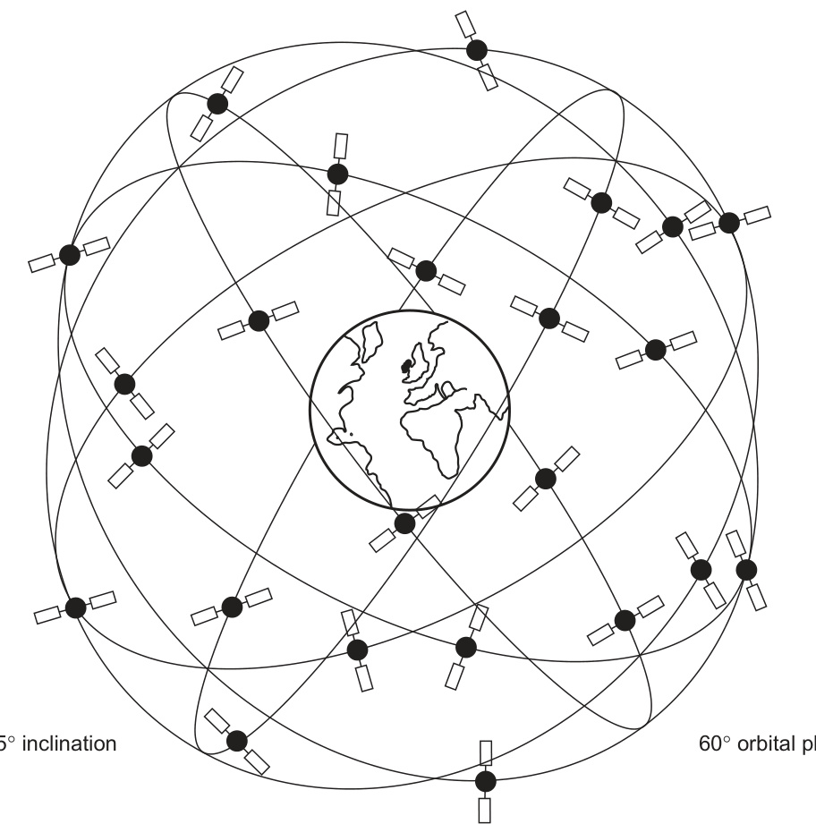  
FIGURE 10.2 The satellite constellation.  

【中文翻译】

图10.2 卫星星座（即一组在轨道上运行的卫星系统，[用于提供全球或区域范围内的通信、导航或遥感服务]）

# 10.1.1.3 The User Segment (See Performance Specifications Section 11.3.1)  

As each satellite proceeds along its orbit, it transmits information regarding its identity, position and also ‘timing pulses’ which allow a receiver to determine the time taken for a particular pulse to travel from the satellite to the receiver. With knowledge of the speed of the pulse, the range from the satellite can be determined. Then, using the transmitted data, the satellite’s position can be fixed at that instant and using the distance from the observer, a position sphere around the satellite can be defined. If similar measurements are made from a second satellite, the intersection of the two position spheres gives a circular ring or position circle in space. The position sphere derived from a third satellite cuts this position circle in two places. Given that one of these positions will be in the reaches of outer space and can be discarded, the receiver’s position can therefore effectively be calculated in three dimensions from three satellites. However, this also assumes that there is a very accurate clock in the receiver see Figures 10.5 and 10.8.  

【中文翻译】

随着每颗卫星沿着其轨道运行，它会传输有关其身份、位置以及“时序脉冲”（timing pulses）的信息，这些信息允许接收器确定特定脉冲从卫星传输到接收器所需的时间。通过了解脉冲的速度，可以确定从卫星到接收器的距离。然后，使用传输的数据，可以在某一时刻确定卫星的位置，并使用从观察者到卫星的距离，可以定义一个围绕卫星的位置球体（position sphere）。如果从第二颗卫星进行类似的测量，两个位置球体的交点将形成一个空间中的圆环或位置圆（position circle）。从第三颗卫星得出的位置球体会在两个地方切割这个位置圆。 

注： 
- 位置球体（position sphere）是指卫星可能存在的所有点的集合，形成一个球面。
- 位置圆（position circle）是指两个位置球体交点形成的圆形区域。假设其中一个位置位于外太空的范围内，可以被丢弃，则接收器的位置可以从三个卫星中有效地计算出三维坐标。然而，这也假设接收器中有一个非常准确的时钟（参见图10.5和图10.8）。

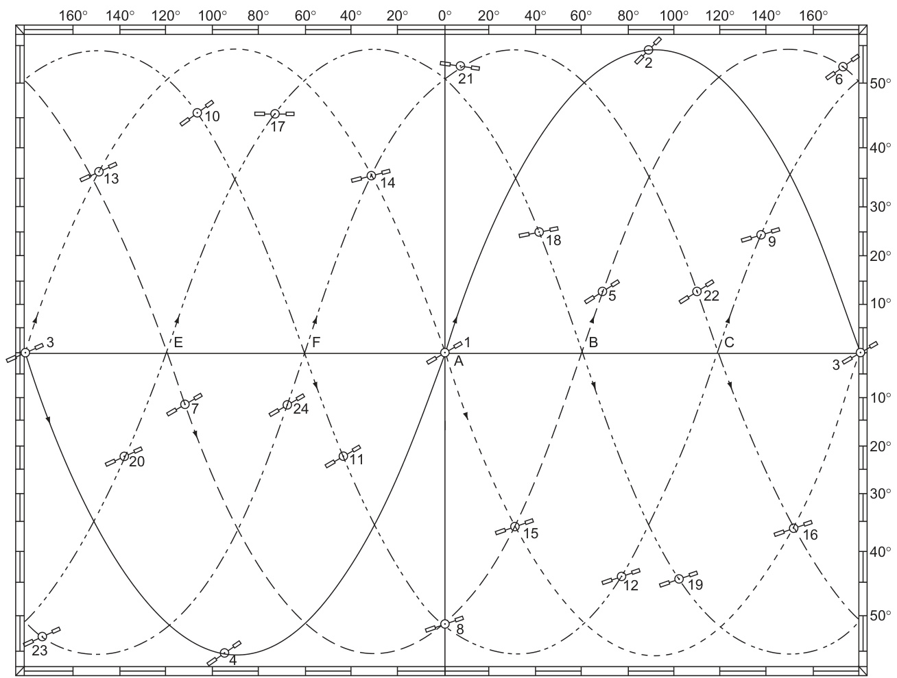  
FIGURE 10.3 Mercator diagram of the satellite orbits.  

【中文翻译】

图10.3 卫星轨道的墨卡托图

The timing signals have two levels of potential precision. The higher level, or Precision code (P-code), is primarily intended for military and other specialized users and is available on both L1 and L2 frequencies, while the Coarse/Acquisition code (C/A code) is currently freely available to all users on the L1 frequency only.  

【中文翻译】

定时信号具有两种精度水平。较高的精度水平，即精度码（P-code），主要针对军事和其他专用用户，既可在L1频率也可在L2频率上获得；而粗略/获取码（C/A code）目前仅在L1频率上对所有用户开放使用。

# 10.1.2 The Measurement of Range and Time from the Satellite  

The timing signal transmitted by the satellite can be thought of as a continuous train of pulses having a unique format. Within the user’s receiver, having identified the satellite from its navigation message, an identical train of pulses relating to that satellite is generated which is then time adjusted until it matches the incoming signal. The amount of this time adjustment is a measure of the signal travel time, and hence the range from the satellite is calculated (Figure 10.6). The detailed process  

【中文翻译】

卫星传输的时序信号可以被认为是一列连续的具有独特格式的脉冲信号。在用户的接收器中，通过识别卫星的导航信息，生成了一列与该卫星相关的相同的脉冲信号，然后对其进行时间调整，直到它与接收到的信号匹配。这种时间调整的量是信号传播时间的衡量标准，因此可以计算出从卫星到接收器的距离（图10.6）。详细的过程涉及到对信号进行精确的时间同步和测距，[即通过测量信号从卫星传输到接收器的时间来计算距离]。

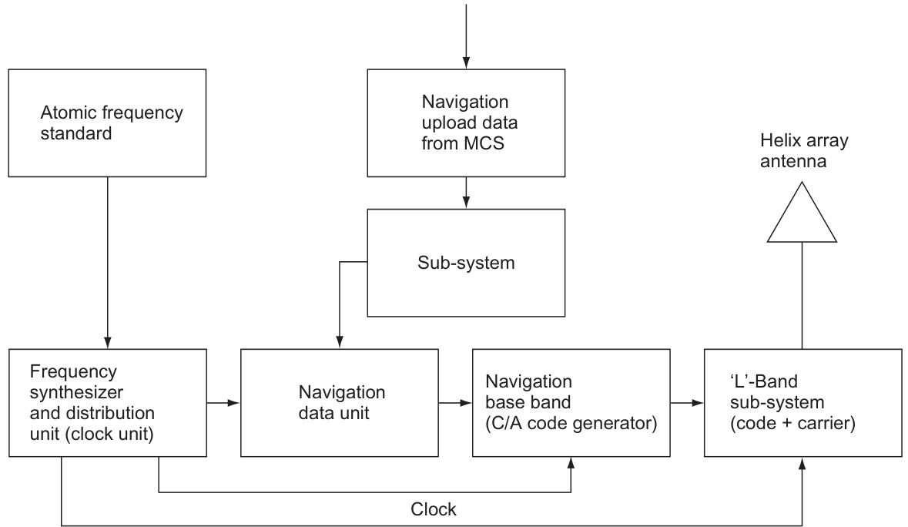  
FIGURE 10.4 Satellite block diagram.  

【中文翻译】

图10.4 卫星系统块图 [即卫星的各个功能模块之间的连接和关系图]

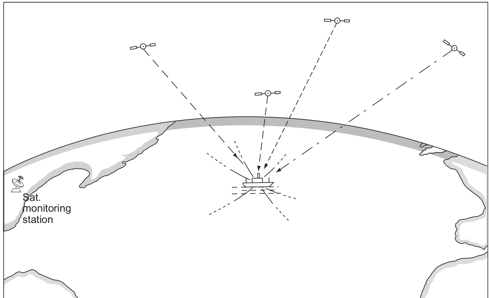  
FIGURE 10.5 The ranging principle.  

【中文翻译】

图10.5测距原理。

Digital stream generated in receiver uses correlation principles, similarly to that described for coherent radar in Section 2.9.  

【中文翻译】

接收器中生成的数字流使用相关性原理，类似于第2.9节中对相干雷达的描述。 

（注：相关性原理是指两个或多个信号之间的统计关系，用于分析信号之间的相似性和差异性。在这里，指的是接收器中使用相关性原理来处理和分析数字流。）

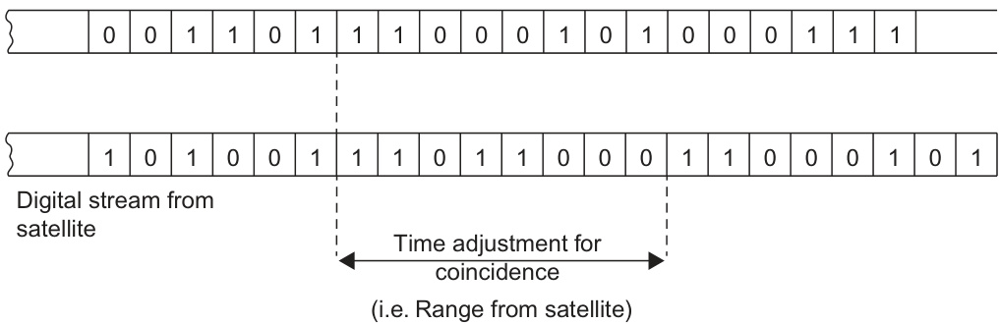  
FIGURE 10.6 Time signal digital matching using satellite code.  

【中文翻译】

图10.6 使用卫星信号的时间信号数字匹配

All this presupposes that the clock in the user’s receiver is as accurate as the atomic clocks in the satellites. This is patently not true as the majority of receivers are designed to be low cost, portable and robust. However, the error in ranges due to any receiver clock error will be the same for all observations. Also, the system is specified to be able to receive four satellites worldwide (not the theoretical three) so that the positional errors in three dimensions and time can all be resolved very accurately. This provision of the receiver clock error also means that very accurate GPS time is maintained at the receiver, which is also useful for many (very often non-navigational) users. In simplistic terms, three satellites are required for an accurate 3D fix; the fourth is required to allow very accurate measurement of time as well as well as 3D position, although it also resolves the theoretical ambiguity in position noted in Section 10.1.1.3.  

【中文翻译】

所有这些假设都依赖于用户接收器中的时钟与卫星中的原子钟一样准确。很明显，这并不是事实，因为大多数接收器都是为了低成本、便携和强固而设计的。然而，由于接收器时钟错误导致的测量范围错误对于所有观测都会是相同的。此外，该系统被指定为能够在全球范围内接收四颗卫星（而不是理论上的三颗），这样就可以非常准确地解决三维和时间的位置错误。接收器时钟错误的这一规定也意味着在接收器中保持非常准确的GPS时间，这对许多用户（通常是非导航用户）也是非常有用的。用简单的术语来说，需要三颗卫星来获得准确的三维定位；第四颗卫星是为了能够非常准确地测量时间以及三维位置，尽管它也解决了在10.1.1.3节中提到的理论上的位置模糊性[即由于只有三个坐标（x、y、z）和一个时间坐标，导致位置可能有多个解的情况]。

# 10.1.3 The Position Fix  

The angular movement of the satellites along their orbits is comparatively slow and with a constellation of some 24 satellites, it is intended that there should be at least four usable satellites above the preferred altitude of  

【中文翻译】

卫星沿其轨道的角运动相对较慢，拥有大约24颗卫星的星座，预期在所需的最低海拔以上至少有四颗可用的卫星 [即至少有四颗卫星位于用户所在位置的上方，能够提供服务]。

$10^{\circ}$ from the horizon at any one time. It is then necessary for the receiving equipment to analyse the geometry and select four satellites whose position lines are expected to give the most accurate position. Included in the navigational data portion of the satellite’s transmission are details relating to the complete constellation which makes it possible to analyse the geometry of the available satellites and select the four which will give the best angle of cut for the position spheres and which give the best quality signals. In particular, the use of low altitude satellites is avoided whenever possible, due to the probability of significant atmospheric errors (see Section 10.1.5). If only three satellites are available, many receivers go into 2D mode where the receiver’s height is estimated from previous observations or is entered by the user.  

【中文翻译】

在任何时候，用户的天线都只能看到大约 $10^{\circ}$ 范围内的地平线以外的卫星。因此，接收设备必须分析几何形状，并选择四颗卫星，这四颗卫星的位置线预计能够提供最准确的位置。卫星传输的导航数据部分包含整个星座的详细信息，这使得可以分析可用卫星的几何形状，并选择四颗能够提供位置球体最佳切角和最佳质量信号的卫星。特别是，尽可能避免使用低轨道卫星（见第 10.1.5 节），因为这会导致显著的 [大气层误差，即卫星信号在穿过大气层时会受到折射，导致位置计算不准确] 。如果只有三颗卫星可用，许多接收器会进入 2D 模式，此时接收器的高度会根据之前的观测结果进行估计，或者由用户输入。

# 10.1.4 User Equipment and Display of Data  

# 10.1.4.1 Switching On and Setting Up  

When first switched on, the pre-tuned receiver locks on to any satellite and its navigational message is used to determine which satellites are available for use in that area and which are to be preferred. The preferred satellites are locked onto, their ranges determined and the position of the observing equipment fixed.  

【中文翻译】

当首次打开时，预调谐的接收机会锁定到任何一个卫星，并使用其导航信息来确定在该区域中哪些卫星可供使用，哪些是首选的。然后锁定首选卫星，确定它们的距离，并固定观测设备的位置。这样就可以根据这些卫星的位置和距离来确定观测设备的精确位置。[这里的“预调谐”是指接收机已经预先设置好了一些参数，以便能够快速锁定卫星信号]

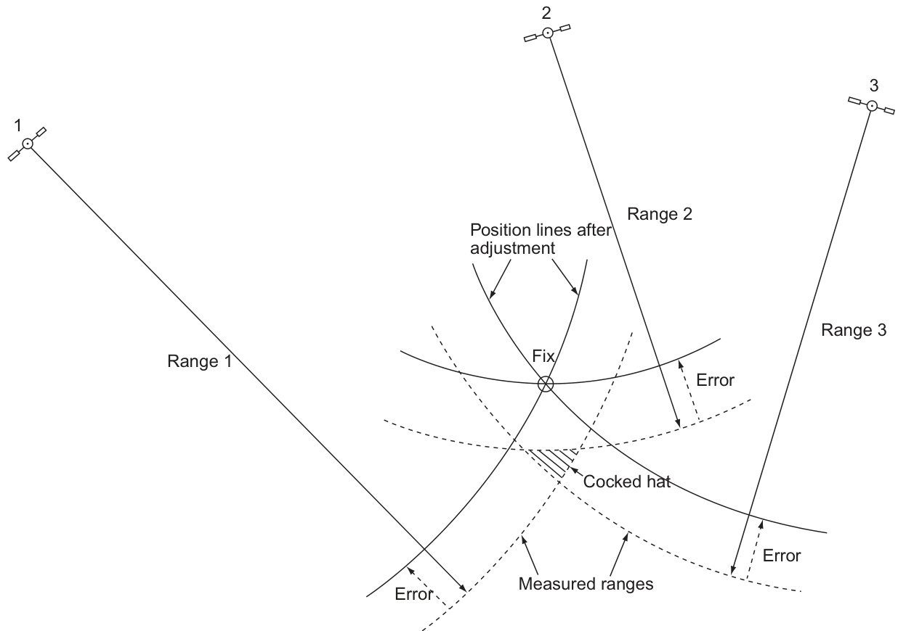  
FIGURE 10.7 Effect of systematic errors (including time) on measured ranges.  

【中文翻译】

图10.7 系统误差（包括时间误差）对测量距离的影响

# 10.1.4.2 Continuity " Transfer to Other Satellites with Time  

With the passing of time, the user equipment will change the four satellites being observed, as the positions in the sky change. Thus the observed satellites are changed to those whose position is navigationally more favourable, either through altitudes being better or improved angle of cut of position line or higher signal quality.  

【中文翻译】

随着时间的推移，用户设备将改变正在观测的四颗卫星，因为天空中的位置会发生变化。因此，观测到的卫星会被更改为那些位置在导航上更为有利的卫星，或者是通过海拔（altitude）更好、位置线的切角（angle of cut）更优或信号质量更高来实现的。这样可以保证用户设备始终与信号质量最佳、位置最优的卫星保持连接，以提高导航精度。

# 10.1.4.3 Frequency of Update of Position  

This is to all intents and purposes continuous, automatic and seamless. The whole operation after switch-on, that is satellite acquisition, lock-on, analysis of data, timing to determine ranges and the derivation of position, as well as continual assessment of the changing circumstances, continues without the operator’s intervention.  

【中文翻译】

这在实际上是连续的、自动的和无缝的。开机后整个操作过程，包括卫星获取（satellite acquisition）、锁定（lock-on）、数据分析、测量距离（timing to determine ranges）以及位置推导（derivation of position），以及对不断变化情况的持续评估，都在无需操作员干预的情况下继续进行。

# 10.1.4.4 Output of Position Coordinates  

As a first choice, positions are given in latitude/longitude coordinates which relate to the earth as defined by the World Geodetic System 1984 (WGS 84), and for relative navigation this is sufficient. Where it is necessary to relate the output position to a navigational chart which is based on some other datum, there is usually a facility for the user to enter the name of the datum into the receiver which will then make the necessary adjustments to the output readings. Where positions are being automatically transferred to an ECDIS (see Section 10.2.3), it is essential that the correct datum has been fed in. It is also necessary to check regularly that the correct datum is being used. It is required that ‘. . . the display should indicate that coordinate conversion is being performed, and should identify the coordinate system in which the position is expressed’ (see Section 11.3.2).  

【中文翻译】

作为首选，位置以纬度/经度坐标表示，这些坐标与1984年世界大地测量系统（WGS 84）定义的地球相关联，对于相对导航来说，这已经足够。然而，在需要将输出位置与基于其他大地测量参考系的航海图表相关联的情况下，通常会为用户提供一个功能，以便他们可以输入大地测量参考系的名称到接收器中，接收器会对输出读数进行必要的调整。当位置被自动传输到电子海图显示和信息系统（ECDIS）（见10.2.3节）时，必须确保正确的大地测量参考系已经被输入。同时，需要定期检查以确保正在使用正确的大地测量参考系。要求是“……显示应指示正在进行坐标转换，并应识别位置所使用的坐标系统”（见11.3.2节）。 

注：大地测量参考系（datum）是指一个已知坐标点的集合，用于定义地球表面的坐标系统。电子海图显示和信息系统（ECDIS）是指一种使用电子方式显示和管理海图、航海信息和其他相关数据的系统。

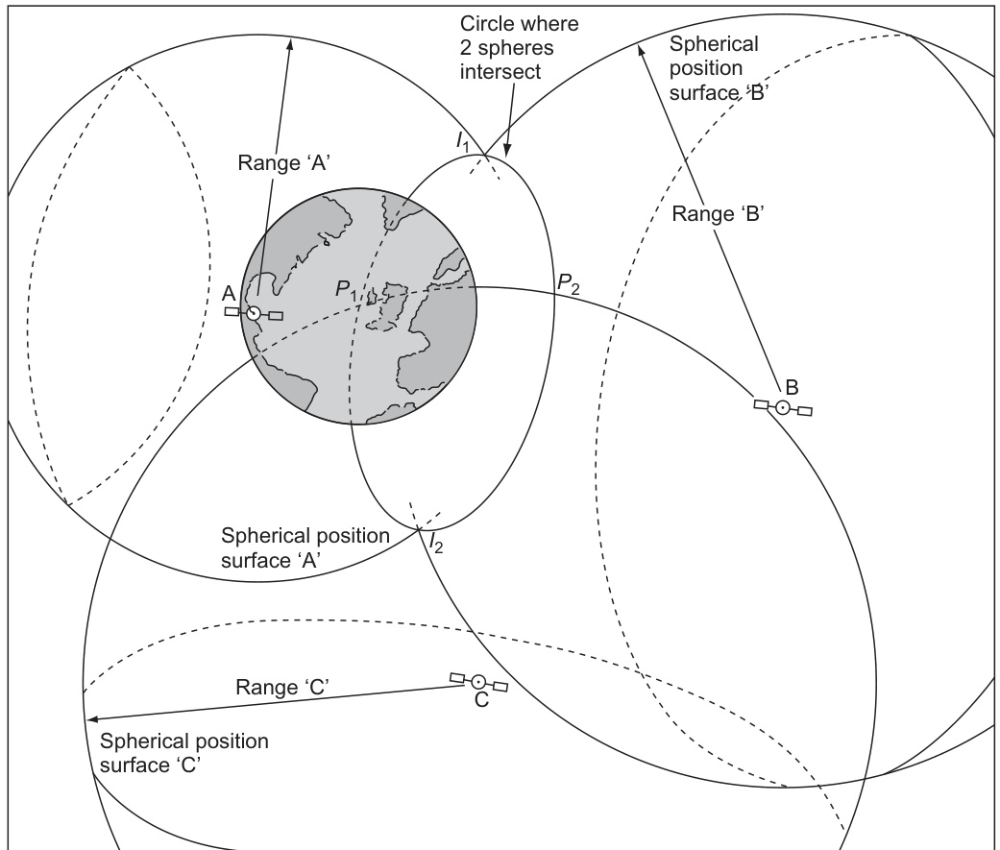  
$P_{\uparrow}$ and $P_{2}$ are the possible positions but $P_{2}$ is ruled out as it is out in space   
FIGURE 10.8 Three-dimensional position fix.  

【中文翻译】

图10.8 三维位置定位  
$P_{\uparrow}$ 和 $P_{2}$ 是可能的位置，但 $P_{2}$ 被排除掉，因为它在太空中 [即不在地球表面或大气层内]。

# 10.1.5 Accuracy and Errors  

The positional accuracy that is being achieved by civil marine users is exceptionally high compared with earlier position fixing methods. Nonetheless, it is important to appreciate why the quoted accuracy figures might be compromised.  

【中文翻译】

民用海事领域用户所实现的位置精度与早期的位置确定方法相比，异常高。然而，了解为什么所引用的精度数据可能会受到影响仍然很重要。

# 10.1.5.1 Sources of Error  

Atmospheric conditions. As the signals travel through the various layers of the atmosphere, the path followed and the medium through which they pass will affect their speed and will therefore affect the calculated range from the satellite.  

【中文翻译】

大气条件。在信号通过大气的各个层时，信号所经过的路径和传播介质会影响其速度，从而影响从卫星计算出的距离。

Signal path. The time taken to pass through the various layers and therefore the delaying effect will be different, depending on the altitude of the satellite (Figure 10.10).  

【中文翻译】

信号路径。信号通过各层的时间以及因此产生的延迟效应将会有所不同，这取决于卫星的海拔高度（图10.10）。

It is necessary to make some estimates based on models of the atmosphere through which the satellite signal has passed. In equipment which is capable of receiving at more than one frequency, it is possible to determine a more accurate estimate of the value of error due to atmospheric conditions by using a more sophisticated error model. Effectively, civilian users have access only to the single L1 frequency, although this situation is changing (see Section 10.1.7).  

【中文翻译】

为了获得准确的卫星信号，需要根据信号通过的大气模型进行一些估计。在能够接收多个频率的设备中，通过使用更复杂的误差模型，可以更准确地确定大气条件引起的误差值。实际上，民用用户通常只能接收单一的L1频率（尽管这种情况正在改变，详见10.1.7节）。

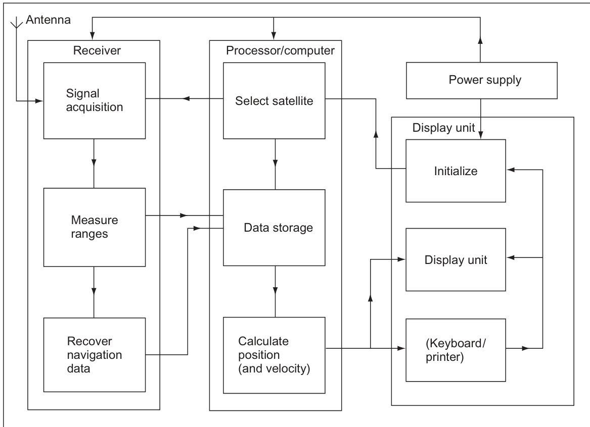  
FIGURE 10.9 Block diagram of user equipment.  

【中文翻译】

图10.9 用户设备的方块图

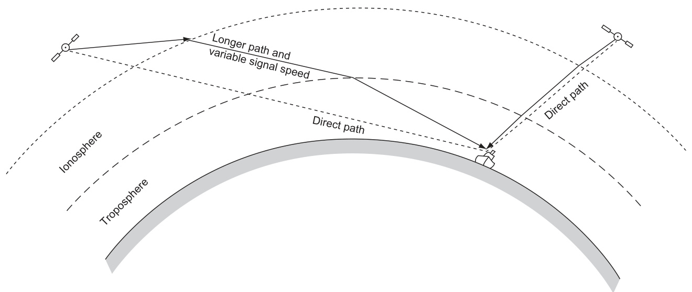  
FIGURE 10.10 Effect of signal path.  

【中文翻译】

图10.10 信号路径的影响

• Ionosphere. Errors due to this source are now to some extent predictable and can be modelled and applied. • Troposphere. Errors arising as the signals pass through this layer of the atmosphere can vary widely and will depend on the existing weather conditions in particular, water vapour. Very little can be done in practice to eliminate this source of error. Multi-path. With range being measured to such a high precision, signals arriving as a result of reflections from nearby surfaces on the vessel or from the sea will have an effect on the required signals which arrive by the direct path. Multi-path signals will arrive  

【中文翻译】

• 电离层。来自这一来源的错误在某种程度上现在是可以预测的，并且可以被建模和应用。 
• 对流层。信号通过这一大气层时产生的错误可能会有很大差异，并且将取决于特定的天气条件，尤其是水蒸气。实际上，几乎没有什么方法可以消除这一来源的错误。 
多路径效应。由于测量范围具有很高的精度，来自船舶附近表面或海面的反射信号将会影响直接路径到达的所需信号。多路径信号将会到达，这些信号是通过间接路径（即信号在到达接收器之前被反射了一次或多次）到达的。这种现象会对测量结果产生影响。

later than those that arrive directly. In any event, all the signals are very weak and where signals arrive out of phase, the timing signal can become undetectable. Note that signals suffer phase reversal at each reflection (Figure 10.11). Relativity. According to Einstein, as a clock travels in different gravity fields and at speeds that are a significant proportion of the speed of light, it will tend to slow down. Corrections for this effect are taken care of in each satellite’s transmission.  

【中文翻译】

与直接到达的信号相比，通过多次反射到达的信号会晚一些。不管怎样，所有信号都非常弱，当信号以相位错开的方式到达时，时序信号可能变得无法检测。请注意，信号在每次反射时都会经历相位反转（图10.11）。根据爱因斯坦的相对论，当一个时钟在不同的重力场中移动，并以接近光速的显著比例的速度移动时，它会趋向于减慢。对这一效应的校正是在每个卫星的传输中进行的。 

（注：本段落涉及的专业术语和概念包括相位错开、相位反转、相对论等，均按照原文保持专业性和技术精确性。）

# 10.1.5.2 Cross-Checking with Other Systems  

It cannot be stressed too strongly that total reliance should not be placed on a single position fixing system and GPS is no different. In spite of its reputation, cross-checking GPS derived positions against those derived by other position fixing methods, for example visual or radar means, is essential. Serious examples have already occurred where signal loss or system malfunction has resulted in the receiver reverting to dead reckoning mode and although this was indicated on the display, its significance was missed as the displayed position continued to be updated on the equipment that was in use.  

【中文翻译】

强调不可能过分的是，不应完全依赖单一的位置确定系统，GPS也不例外。尽管GPS有着良好的声誉，但仍然需要通过其他位置确定方法（如视觉或雷达等手段）来核对GPS获取的位置数据，这一点至关重要。已经有严重的案例发生，信号丢失或系统故障导致接收器切换到[死算法]（dead reckoning）模式，尽管这种情况在显示屏上有所提示，但由于显示的位置继续在使用的设备上更新，其重要性被忽略了。

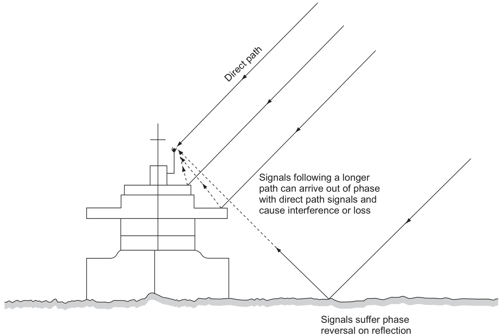  
FIGURE 10.11 Multi-path signals.  

【中文翻译】

图10.11 多路径信号。

# 10.1.5.3 Loss of Signal  

There are a number of possibilities why this might occur. Typical is that as time progresses or after an alteration of the ship’s course, a satellite signal might be temporarily obstructed by the ship’s funnel or by some other part of the ship’s structure. When this occurs, the receiver will endeavour to select another satellite and use its signal to replace the one that has become unreliable. Not all receivers indicate that lock has been lost or that transfer has taken place.  

【中文翻译】

可能会出现这种情况的原因有几种。典型的情况是，随着时间的推移或在改变船舶航向之后，卫星信号可能会被船舶的[烟囱（船舶的排气管）]或船舶结构的其他部分暂时遮挡。当这种情况发生时，接收器将尝试选择另一个卫星并使用其信号来替换变得不可靠的信号。但并非所有接收器都会指示锁定已丢失或转移已经发生。

# 10.1.5.4 System Malfunction  

The satellite constellation’s ‘health’ is being continually monitored by the ground tracking stations, and at any sign of trouble this is communicated to the MCS and action is taken to resolve and rectify the problem. However, satellites are not always in sight of the monitoring stations and they can only be corrected when they are in sight of the MCS. Both detection and correction processes may take some time (see also Section 10.1.5.7) and there have been documented instances when significant outages have occurred.  

【中文翻译】

卫星星座的“健康状况”正在被地面跟踪站不断监测，一旦出现任何问题的迹象，这就会被传递给任务控制系统（MCS），并采取行动来解决和纠正问题。然而，卫星并不总是处于监测站的视线范围内，它们只能在进入MCS视线范围时才能被纠正。无论是检测还是纠正过程，都可能需要一些时间（参见10.1.5.7节），并且已经有记录表明，在一些情况下，卫星曾经出现过较长时间的故障[即卫星无法正常工作或提供服务的状态]。

# 10.1.5.5 Expected Accuracies  

When originally set up, the signals available to civil users (using the single L1 frequency and $\mathrm{C}/\mathrm{A}$ code) were deliberately downgraded. This downgrade was referred to as selective availability (SA) and ensured that accuracies of the order of $100\mathrm{m}$ $95\%$ accuracy) were the norm. In 2000, SA was discontinued and longterm average accuracies of around $35\mathrm{m}$ $95\%$ accuracy) should therefore have been achieved by a 24 satellite constellation. However, the system currently has more satellites (usually around 30) than the minimum constellation and accuracies of $10{-}15\mathrm{m}$ $95\%$ accuracy) are now considered typical under standard conditions. This satellite over-population is not guaranteed to continue but has been the norm for many years. It provides redundancy for satellites that are near or past their designed life span.  

【中文翻译】

最初建立时，面向民用用户（使用单一L1频率和$\mathrm{C}/\mathrm{A}$代码）的信号被故意降级。这种降级被称为选择性可用性（SA），它确保了准确度达到$100\mathrm{m}$（$95\%$准确度）的水平成为常态。2000年，SA被停止，理论上，24颗卫星星座的长期平均准确度应该达到$35\mathrm{m}$（$95\%$准确度）。然而，当前系统拥有比最低星座要求更多的卫星（通常在30颗左右），在标准条件下，$10{-}15\mathrm{m}$（$95\%$准确度）的准确度被认为是典型的。这种卫星过度拥挤的情况并不能保证持续下去，但已经成为多年的常态。它为即将到达或已经超过设计寿命的卫星提供了冗余。

# 10.1.5.6 Quality of Fix or Dilution of Precision  

This is a concept that is essentially intended to give the user a confidence figure that will indicate the reliance that he can place on the position that is being displayed. The figure is based on the geometry of the position fix (Figure 10.12). The minimum attainable DOP which indicates a perfect fix is 1. IMO Performance Standards require that the horizontal dilution of precision $\mathrm{(HDOP)}~\le~4$ (see Section 11.3.2).  

【中文翻译】

这是一个本质上旨在为用户提供一个置信度数值的概念，该数值将指示用户可以在显示的位置上放置的依赖程度。该数值基于位置修正的几何形状（图10.12）。最小可达到的DOP（精度稀释系数）表示一个完美的修正，等于1。国际海事组织（IMO）的性能标准要求水平精度稀释系数（HDOP）小于或等于4（见11.3.2节）。 

注：精度稀释系数（DOP）是指在卫星导航系统中，位置修正的精度会因卫星的位置而受到影响，DOP越小，位置修正的精度越高。水平精度稀释系数（HDOP）是指在水平方向上的精度稀释系数。

Note: DOP may be given for the horizontal plane " HDOP " or the vertical plane " VDOP " or in three dimensions " position dilution of position (PDOP).  

【中文翻译】

注：DOP 可能是指水平面上的“ HDOP ”（水平方向的位置精度下降）或垂直面上的“ VDOP ”（垂直方向的位置精度下降），也可能是在三维空间中的“ PDOP ”（位置精度下降，指的是位置的不确定性增加，在三维空间中，位置精度下降是指由于卫星信号接收质量下降而导致的位置计算精度的降低）。

# 10.1.5.7 Warnings (See Also Section 11.3.2 Warnings and Status Indications)  

The receiver is required to give a warning within 5 s if the HDOP has been exceeded, i.e. ${>}4,$ or if a new position has not been calculated for more than $^{1\mathrm{s},}$ in which case, the time and position of the last valid fix must be displayed, with a clear indication of what has occurred and a warning of loss of position.  

【中文翻译】

接收器在以下情况下需要在5秒内发出警告：即当水平精度保护区（HDOP）被超过，即大于4，或者当一个新的位置在超过1秒内没有被计算出来。在这种情况下，必须显示最后一个有效定位的时间和位置，并且必须清晰地指出发生了什么以及丢失位置的警告。[这里的“水平精度保护区（HDOP）”是指一种用于衡量GPS定位精度的指标，超过这个值意味着定位精度可能不够高，需要发出警告。]

When DGPS (see Section 10.1.6) is in operation, there must be an indication that DGPS signals are being received and that DGPS corrections are being applied to the displayed position. There must also be a display of DGPS integrity status and alarms (if any) plus any DGPS text messages.  

【中文翻译】

当差分全球定位系统（DGPS）（见10.1.6节）处于运行状态时，必须有指示表明正在接收DGPS信号，并且正在将DGPS修正数据应用于显示的位置。同时，还必须显示DGPS完整性状态和报警信息（如果有），以及任何DGPS文本消息。 

注：差分全球定位系统（DGPS）是通过接收来自参考站的修正数据来提高全球定位系统（GPS）定位精度的系统。完整性状态是指系统对其输出的可靠性和准确性的评估。

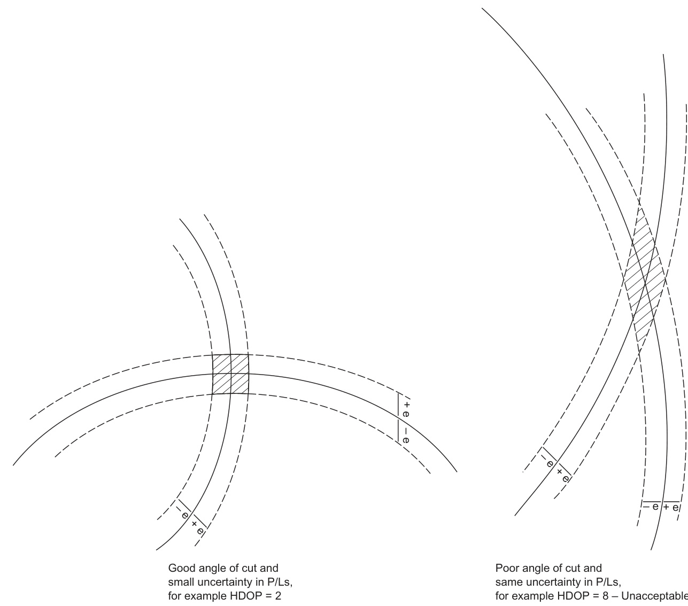  
FIGURE 10.12 Dilution of precision.  

【中文翻译】

图10.12 精度稀释

# 10.1.5.8 Vulnerability of GPS Signals  

GPS signals are very low power when received on the earth’s surface and the received signal strength is about the level of background noise. The code system allows receivers to pick out an individual satellite from the transmission of other satellites and background noise all operating at the same frequency. However, if the interfering signals are powerful enough, they will swamp the GPS signals and render the receiver ineffective.  

【中文翻译】

全球定位系统（GPS）信号在接收到地球表面时功率非常低，接收到的信号强度约等于背景噪声的水平。编码系统允许接收器从其他卫星的传输和背景噪声中分辨出个别的卫星信号，这些信号都在同一频率下运作。然而，如果干扰信号足够强大，它们将会淹没GPS信号，使接收器失去作用。这种现象被称为“信号淹没”[即信号被干扰信号覆盖，导致接收器无法正常工作]。

The main natural cause of concern is the potential for interference from solar flares from the sun. Solar flares are associated with sunspot activity on the sun. The flares are a large energy release from the sun and they are accompanied by extensive magnetic radiation across a wide spectrum of radio frequencies. If the earth is hit by such radiation, it is likely that GPS (and any other radio equipment) will be affected. The frequency of occurrence of solar flares follows an 11-year cycle, but precise prediction is very problematic.  

【中文翻译】

主要的自然因素问题是太阳耀斑（Solar flares）可能对地球产生的干扰。太阳耀斑与太阳黑子（sunspot）活动有关。这些耀斑是太阳释放大量能量的现象，并且伴随着广泛的磁辐射，跨越了广泛的无线电频率谱。若地球受到此类辐射的影响，很可能会影响全球定位系统（GPS）以及其他无线电设备。太阳耀斑的发生频率遵循11年的周期，但精确预测却非常困难。

GPS jammers are widely available to the public, as well as for military applications. There have also been a number of occurrences of unintentional interferences that cause GPS ‘blackspots’. Many of the causes of unintentional interference have been traced to faulty or illegal radio equipment and they usually occur in inland regions. However, there has been more than one occasion when harbours and harbour entrances were affected. There have also been a number of GPS blackspots that have not been satisfactorily explained.  

【中文翻译】

GPS干扰器（GPS干扰设备）广泛地面向公众以及军事应用开放。同时，也发生了多起无意干扰事件，导致GPS信号在某些区域无法接收，形成“盲点”（GPS ‘blackspots’）。许多无意干扰的原因被追溯到有故障或非法的无线电设备，这些情况通常发生在内陆地区。然而，也有多次事件表明，港口和港口入口也受到影响。此外，还有一些GPS盲点的原因尚未得到令人满意的解释。

It is also understood that GPS ‘spoofers’ exist that give false satellite signals and would enable the receiver to give a false but believable position on a user’s display.  

【中文翻译】

人们也了解到，GPS“欺骗装置”（GPS spoofers）是存在的，这些设备会发出虚假的卫星信号，从而使接收器显示出一个虚假但看似可信的位置在用户的显示屏上。

In summary, although GPS has proved to be a very reliable and secure device, it is theoretically very vulnerable to attack and unintentional interference. The user is advised not to rely on it uniquely, but heed the advice given earlier and cross-check between position fixing systems.  

【中文翻译】

总而言之，尽管GPS已被证明是一个非常可靠和安全的设备，但从理论上讲，它对攻击和无意干扰非常脆弱。建议用户不要仅仅依赖它，而是遵循前面提出的建议，并在位置确定系统之间进行交叉核对（即使用多种导航方法，如电子海图、雷达、天文导航等，相互验证和补充，以提高位置确定的准确性和可靠性）。

# 10.1.6 Differential GPS  

# 10.1.6.1 System Principle  

The position of a shore-based antenna is accurately surveyed and its geo-coordinates calculated. The differences given by satellite fixes and the surveyed position are transmitted as corrections to be applied to positions obtained by vessels using GPS in that area. In order to receive these signals, a DGPS receiver is required. The application of these corrections is normally automatic (see Figure 10.12).  

【中文翻译】

岸基天线的位置经过精确测量，并计算出其地理坐标。卫星定位提供的位置与实际测量位置之间的差异被传输为修正值，以便应用于使用GPS在该区域导航的船舶获得的位置。为了接收这些信号，需要使用差分GPS（DGPS）接收机。通常，这些修正值的应用是自动的（见图10.12）。在这里，[差分GPS（DGPS）] 指的是一种通过接收岸基参考站发出的修正信号来提高GPS定位精度的技术。

The UK government has set up a public system of DGPS stations using the sites and frequencies previously used for marine RDF beacons (see Figure 10.14). The US Coastguard has done much the same on the US coasts and commercial organizations can provide corrections in many areas for a fee. Also available are wide area DGPS networks which provide continuous DGPS corrections over continental areas using geostationary communication satellites. They include the European EGNOS, the US WAAS and the Japanese MSAS. The generic term for such systems is satellite based augmentation systems (SBAS). Sometimes conventional ground based DGPS is called ground based augmentation systems (GBAS).  

【中文翻译】

英国政府已建立了一个公共的差分全球定位系统（DGPS）站系统，利用以前用于海事无线电方向探测器（RDF）信标的站点和频率（见图10.14）。美国海岸警卫队也在美国海岸做了类似的事情，商业组织可以在许多地区提供更正服务，需支付一定费用。此外，还有覆盖广大区域的DGPS网络，可以使用地球静止通信卫星在整个大陆地区提供连续的DGPS更正。这些网络包括欧洲的EGNOS、美国的WAAS和日本的MSAS。这种系统的通称为基于卫星的增强系统（Satellite Based Augmentation Systems，SBAS）[即利用卫星来提高全球定位系统的精度和可靠性]。有时，传统的基于地面的DGPS被称为地面基准增强系统（Ground Based Augmentation Systems，GBAS）[即利用地面基站来提高全球定位系统的精度和可靠性]。

# 10.1.6.2 Potential Accuracies Using DGPS  

Using DGPS equipment, accuracies in the order of $5\mathrm{m}$ are expected and even better results have been reported. With such high precision, it is important to appreciate that it is the position of the receiving antenna that is being displayed. Updating of the direct signal is typically within $15s$ . The improvement in accuracy of DGPS over GPS is irrelevant for most marine navigators now that SA (see Section 10.1.5.5) has been removed. However, DGPS has a large advantage over GPS in that there is immediate notification of system malfunction, unlike stand-alone GPS (see Section 10.1.5.4). Thus many users are using DGPS because of the gain in reliability due to external monitoring and not necessarily because of its increased accuracy.  

【中文翻译】

使用差分全球定位系统（DGPS）设备，预计可以达到5米级别的精度，甚至有报道称取得了更好的结果。由于精度如此之高，重要的是要认识到正在显示的是接收天线的位置。直接信号的更新通常在15秒内完成。与GPS相比，DGPS的精度提高对大多数海事导航员来说已经不再重要，因为选择性可用性（SA，见10.1.5.5节）已经被移除。然而，DGPS相比GPS具有一个很大的优势，即系统故障会立即通知用户，而独立的GPS（见10.1.5.4节）则不会。因此，许多用户使用DGPS是因为它通过外部监控提高了可靠性，而不仅仅是因为它提高了精度。 

注：SA（选择性可用性）是指美国政府为防止潜在敌人使用GPS导航系统而实施的措施，通过在卫星信号中加入随机噪声来降低GPS的精度。这种措施已经在2000年被取消。

# 10.1.7 Improvements to GPS  

The US military is currently implementing three main improvements in the GPS service for civilian users, as well as a new military service (M code) not for civilian use. The process is a slow one because the improvements are only being fitted to satellites that have been either launched relatively recently or are still in reserve on the ground. Each improved service will therefore only become properly operational when a minimum of about 18 improved satellites is in orbit. It is an ironic fact that the impressive reliability and longevity of the older satellites is actually holding up further progress.  

【中文翻译】

美国军方目前正在对GPS服务进行三项主要改进，以供民用用户使用，同时也推出了一项新的军用服务（M码），但这项服务不对民用开放。这个过程进展缓慢，因为这些改进仅应用于近期发射或仍在地面上待命的卫星。因此，每项改进的服务只有在至少18颗改进的卫星进入轨道后才会真正投入运营。一个耐人寻味的事实是，老卫星的令人印象深刻的可靠性和长寿命实际上阻碍了进一步的进展。[这里的“长寿命”是指卫星的使用寿命远超出预期，这反而限制了新卫星被更快地发射和部署的速度]。

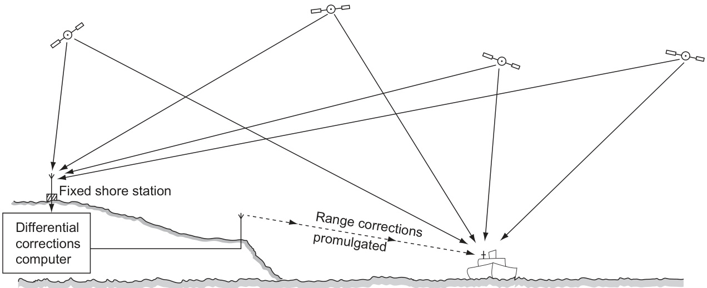  
FIGURE 10.13 Principle of DGPS.  

【中文翻译】

图10.13 差分全球定位系统（DGPS）的原理。

（注：DGPS是差分全球定位系统的英文缩写，全称为Differential Global Positioning System，中文译为差分全球定位系统。它是一种通过卫星信号和地面参考站的差分信号来提高定位精度的技术。）

The first civilian improvement is to open up L2 to civilian users. They are not allowed to use the P-code, so the modification is to transmit the equivalent of the C/A code as well as the P-code on the L2 frequency. This is called the L2C, it currently transmits from a limited number of satellites and it is expected to be fully operational in 2018. The addition of observations on a second frequency will enable better modelling of the atmospheric errors and hence a more accurate fix will be achieved (see Section 10.1.5.1). Moreover, the L2C code will be inherently more accurate and more reliable in weak reception conditions than the C/A code used on the L1 frequency.  

【中文翻译】

第一项民用改进是向民用用户开放L2频段。由于他们不允许使用P码，因此改进是除了传输P码外，还在L2频率上传输等同于C/A码的信号。这被称为L2C，目前它仅从有限数量的卫星上传输，预计将于2018年完全投入使用。在第二个频率上增加观测将能够更好地建模大气误差，从而实现更准确的定位（见10.1.5.1节）。此外，在弱信号接收条件下，L2C码将比L1频率上使用的C/A码更为准确、更可靠。

The second civilian improvement is the addition of a third frequency, $1176.45\mathrm{MHz}$ , termed L5. As well as potentially allowing more sophisticated atmospheric error modelling from using up to three frequencies simultaneously, the civilian code available on L5 will be a more sophisticated signal allowing higher accuracy and reliability than both the L2C and L1 C/A codes. Satellites with the L5 frequency are just beginning to be launched and a full constellation is expected by 2021.  

【中文翻译】

第二项民用改进是添加第三个频率，即 $1176.45\mathrm{MHz}$，被称为L5。除了可以使用多达三个频率同时进行更复杂的大气误差建模（大气误差建模是指对卫星信号在大气中传播过程中产生的误差进行修正和补偿的过程）之外，在L5频率上提供的民用码将是一个更为复杂的信号，允许比L2C和L1 C/A码更高的精度和可靠性。目前，带有L5频率的卫星刚刚开始发射，预计到2021年将会拥有一个完整的星座（星座是指一组在轨道上运行的卫星，它们协同工作以提供连续的覆盖和服务）。

The third civilian improvement is an additional civilian code on the L1 frequency termed the L1C. This code will again offer improved detection and accuracy in weak reception areas. However, its major importance is that it was developed with GALILEO GNSS as a common code and it is also now intended to be implemented on navigation satellites of other countries (see next section).  

【中文翻译】

第三项民用改进是在L1频率上增加一个名为L1C的民用码。这个码将再次提供在弱接收区域改进的检测和精度。然而，其主要重要性在于它是与GALILEO卫星导航系统（GNSS）[一种欧洲的卫星导航系统]共同开发的通用码，并且现在也打算在其他国家的导航卫星上实施（见下一节）。

# 10.1.8 Other Navigation Satellite System Developments  

The GPS is entirely under the control of the US military. It is fully operational, is freely available and is expected to remain so for the foreseeable future. However, other GNSS and regional systems are available or about to become available. It is foreseen that for most users, the use of these additional systems will not be as an alternative to GPS. Instead receivers will be become GNSS receivers capable of receiving satellites’ signals operated by many countries. Thus the receiver will be able to select best available satellites from all the GNSS combined, and the number of available satellites is expected to total over 100 within the next decade. This will mean an improvement in the DOP of positions, with a resulting increase in accuracy as well as redundancy.  

【中文翻译】

全球定位系统（GPS）完全处于美国军方的控制之下。它已经完全投入运营，免费向公众开放，并预计在可预见的未来仍将保持如此。然而，其他全球导航卫星系统（GNSS）和区域系统已经可用或即将推出。人们预计，对于大多数用户来说，使用这些额外的系统并不是作为替代GPS的选择。相反，接收器将演变成GNSS接收器，能够接收由多个国家运营的卫星信号。因此，接收器将能够从所有GNSS系统中选择最好的可用卫星，预计在未来十年内，总共可用的卫星数量将超过100颗。这将意味着位置精度的改善（DOP，即伪随机噪声比率），从而带来精度的提高以及冗余度的增加。[注：冗余度是指系统中组件或功能的多余备份，以确保系统的可靠性和稳定性。]

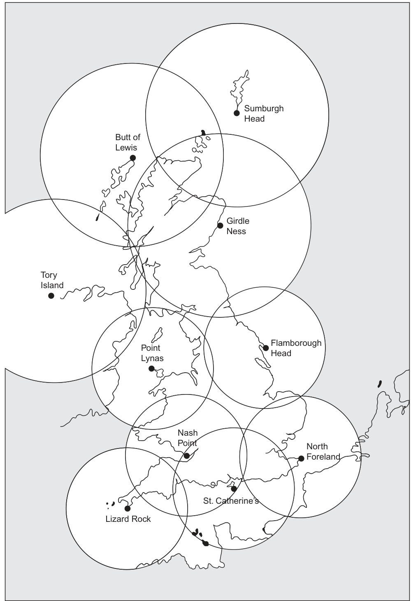  
FIGURE 10.14 DGPS coverage in UK waters.  

【中文翻译】

图10.14 英国水域的差分全球定位系统（DGPS）[即利用地面参考站来纠正卫星导航系统的信号，提高定位精度的技术]覆盖范围。

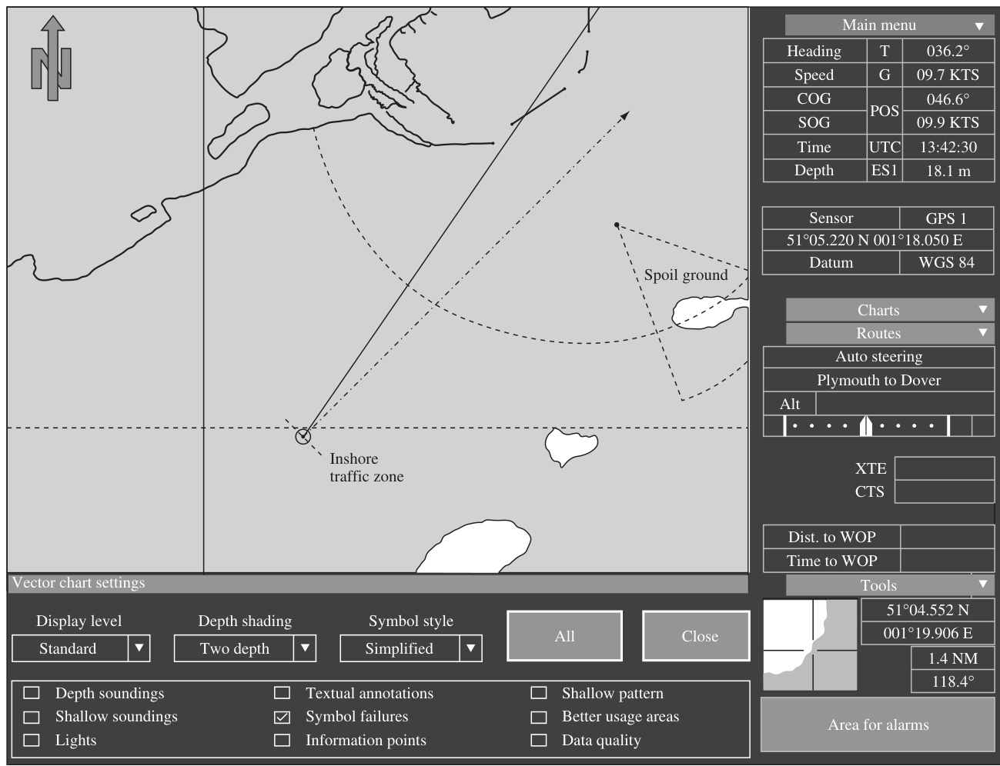  
FIGURE 10.15 Typical ECDIS display.  

【中文翻译】

图10.15 典型的电子海图显示系统（ECDIS）显示界面。

（注：ECDIS是Electronic Chart Display and Information System的缩写，指的是电子海图显示和信息系统，是一种使用电子海图代替传统纸质海图的导航系统。）

Combined GLONASS/GPS receivers already exist that are able to deal with the different ranging methods, frequencies, datum and satellite time systems involved. In the future, this will be even easier for the other systems discussed below, as these are intended to have the new L1C code as part of their specification, which will facilitate the integration of multiple systems. These different satellite navigation systems are listed below.  

【中文翻译】

已经存在能够处理不同测距方法、频率、基准面和卫星时间系统的综合格洛纳斯/GPS接收器。未来，对于下面讨论的其他系统，这将变得更加容易，因为这些系统打算将新的L1C码作为其规范的一部分，这将促进多个系统的集成。这些不同的卫星导航系统列举如下。 

（注：GLONASS是俄罗斯的卫星导航系统，GPS是美国的卫星导航系统，L1C码是一种新的信号结构，旨在提高卫星导航系统的兼容性和互操作性。）

# 10.1.8.1 GLONASS  

This is a system operated by the Russian military and is similar in concept to GPS, being based on a nominal number of 24 satellites. Although the project was started about the same time as GPS, financial constraints have resulted in considerable delays in full implementation, which was only achieved in 2011.  

【中文翻译】

这是由俄罗斯军方运营的系统，其概念与GPS（全球定位系统）类似，基于大约24颗卫星。尽管该项目与GPS大约在同一时间开始，但由于资金限制，导致了全面的实施过程中出现了相当大的延迟，直到2011年才得以完成。

The orbit configuration is three equally spaced orbits, inclined at $64.8^{\circ}$ to the equator. Each orbit is designed to have eight equally spaced satellites. The orbit altitude is slightly less than GPS at $19{,}130\mathrm{km},$ , which gives an orbit period of 11.25 hours.  

【中文翻译】

轨道配置为三个等间距的轨道，这些轨道与赤道的夹角为$64.8^{\circ}$。每个轨道设计为包含八个等间距的卫星。轨道的高程略低于GPS的高程，为$19{,}130\mathrm{km}$，从而使得轨道周期为11.25小时。

The GLONASS satellites currently transmit on different frequencies, unlike the GPS, which shares a single frequency with different satellite codes. Note that GLONASS satellites that are $180^{\circ}$ apart can use the same frequency, which makes slightly more efficient use of the frequency spectrum. GLONASS achieves similar accuracies to GPS. One advantage of the system is that GLONASS satellites can communicate with each other and that satellite errors can therefore be corrected even when the satellite is not visible to the MCS.  

【中文翻译】

俄罗斯的格洛纳斯系统（GLONASS）卫星目前使用不同的频率进行传输，这与美国的GPS系统不同，后者使用单一频率并通过不同的卫星代码来区分。值得注意的是，相距$180^{\circ}$的格洛纳斯卫星可以使用相同的频率，这使得频率谱的利用率略微提高。格洛纳斯系统与GPS系统相比，能够实现相似的精度。该系统的一个优势在于格洛纳斯卫星可以相互通信，因此即使卫星不可见于主控制站（MCS），也可以纠正卫星错误。

The Russians have also developed a codebased signal for broadcast from GLONASS satellites. This will make building combined GNSS receivers that include GLONASS even easier.  

【中文翻译】

俄罗斯人还开发了一种基于代码的信号，可以从GLONASS卫星（俄罗斯的全球导航卫星系统，类似于美国的GPS）广播。这将使得建设包含GLONASS的综合GNSS（全球导航卫星系统）接收器变得更加容易。

# 10.1.8.2 Galileo  

This is a satellite system for navigation and communications, planned and led by the European Union (EU) with an ever-advancing completion date. Unlike GPS and GLONASS, it is civilian controlled and the project has partnerships with a number of countries outside the EU. It also plans to charge some users for some of its high-quality and specialist services. Although primarily a GNSS for navigation, it is expected to have some communications facilities including use by emergency and distress services. It has had considerable funding difficulties and delays over the project’s lifetime.  

【中文翻译】

这是一个由欧洲联盟（EU）规划和领导的导航和通信卫星系统，预计完成日期不断推迟。与GPS和格洛纳斯系统不同，它由民间机构控制，并且该项目与欧盟以外的多个国家建立了合作伙伴关系。它还计划向部分用户收费，以提供一些高质量和专业的服务。尽管它主要是一个用于导航的全球卫星导航系统（GNSS），但预计它也将具备一些通信功能，包括紧急和困境服务。该项目在其整个生命周期中经历了相当大的资金困难和延迟。

The basic design has a 30-satellite system (27 satellites plus three active spares). There are three separate orbits (10 satellites in each) inclined at $56^{\circ}$ to the equator with an altitude of $23{,}616\mathrm{km}$ and an orbit period of about 14 hours. Every satellite will transmit on several frequencies with E5A $(1176.45\mathrm{MHz})$ , E5B $(1207.14\:\mathrm{MHz})$ and E2 ${}^{1575.42\mathrm{MHz})}$ being planned for public use. Another feature of the Galileo system is the large number of ground stations to control and monitor the satellites, that is more than provided by GLONASS and GPS. At the time of writing, funding is committed to launch two-thirds of the full constellation, with a small number already launched.  

【中文翻译】

该系统的基本设计采用30颗卫星（27颗工作卫星加3颗活跃备用卫星）。卫星分布在三个独立的轨道（每个轨道10颗卫星）上，相对于赤道的倾斜角为$56^{\circ}$，海拔高度为$23{,}616\mathrm{km}$，轨道周期约为14小时。每颗卫星将在多个频率上进行传输，包括E5A（$1176.45\mathrm{MHz}$）、E5B（$1207.14\:\mathrm{MHz}$）和E2（$1575.42\mathrm{MHz}$），这些频率计划用于公共服务。伽利略系统的另一个特点是拥有大量的地面站来控制和监测卫星，其数量超过了格洛纳斯系统（GLONASS）和GPS系统。截至撰写时，已经承诺为发射完整星座的三分之二提供资金，少量卫星已经发射。其中，完整星座是指（一个拥有足够多个卫星，以便在任何时刻、任何地点都能接收到至少四个以上卫星信号的卫星群组）。

The system plans to offer a number of services including a ‘free to user’ service of similar accuracy to GPS. A single frequency receiver should achieve $25\mathrm{m}$ $95\%$ accuracy), while a dual frequency receiver should achieve $5\mathrm{m}$ $(95\%)$ . Higher accuracy ‘fee-paying’ services will also be available.  

【中文翻译】

该系统计划提供多项服务，包括类似GPS准确度的“免费用户”服务。单频接收器应达到25米（95%准确度），而双频接收器应达到5米（95%准确度）。此外，还将提供更高精度的“付费”服务。

Galileo operates like GPS using satellite codes and is thus able to use very similar frequencies to GPS. Galileo is to adopt different datum and time systems to GPS, but the differences in datum are expected to be minimal and measured in centimetres. It has been intended from the outset that Galileo and GPS will have a degree of compatibility and receivers capable of receiving both systems will be relatively easy to manufacture. One of the frequencies to be used is the internationally agreed L1C (see Section 10.1.7).  

【中文翻译】

伽利略系统（Galileo）与GPS系统类似，使用卫星信号码，因此能够使用与GPS非常相似的频率。伽利略系统将采用与GPS不同的基准面（datum）和时间系统，但基准面上的差异预计将很小，仅以厘米为单位。从一开始，伽利略系统和GPS系统就被设计为有一定程度的兼容性，能够同时接收两种系统信号的接收器相对来说比较容易制造。其中一个将要使用的频率是国际上同意的L1C频率（见10.1.7节）。 

注： 
- 基准面（datum）是指用来描述地球形状和位置的参考系，[即一个已知的坐标系]。
- 厘米是长度单位，[即一百分之一米]。

# 10.1.8.3 BeiDou Navigation Satellite System (Aka COMPASS)  

This is a Chinese GNSS which already offers a regional service and is intended to offer a full global service by 2020. It will consist of 30 medium earth orbit satellites (that is similar to GPS characteristics) as well 5 geostationary satellites which serve regional areas. Like Galileo and now GPS, it is planned to offer code-based signals on several frequencies. This also includes the L1C signal (see Section 10.1.7).  

【中文翻译】

这是一个中国的全球导航卫星系统（GNSS），它已经提供区域服务，并计划在2020年之前提供完整的全球服务。该系统将由30颗中地球轨道卫星（其特性与GPS相似）以及5颗地球静止轨道卫星组成，后者将服务于区域范围。与伽利略系统和当前的GPS系统一样，计划在多个频率上提供基于代码的信号，包括L1C信号（见第10.1.7节）。 

注： 
- GNSS指全球导航卫星系统（Global Navigation Satellite System），是一个利用一组卫星来提供位置、速度和时间信息的系统。
- 中地球轨道卫星是指绕地球运行的卫星，其轨道高度在2000公里到36000公里之间。
- 地球静止轨道卫星是指绕地球运行的卫星，其轨道高度约为36000公里，相对于地球表面上的一个点保持静止。
- 基于代码的信号是指利用特定的代码序列来传输信息的信号，通常用于卫星导航系统。
- L1C信号是指一种特定的信号类型，用于卫星导航系统，具体指GPS系统中的L1C信号。

# 10.1.8.4 Regional Satellite Navigation Systems  

Although not global, it should be noted that a number of countries are developing regional satellite navigation systems. These include the  

【中文翻译】

尽管不是全球性的，但值得注意的是，许多国家正在开发区域卫星导航系统。这些系统包括：

Japanese QZSS and the Indian IRNSS, both of whom intend to use the L1C signal.  

【中文翻译】

日本的QZSS（准天顶卫星系统）和印度的IRNSS（印度区域导航卫星系统），这两个系统都计划使用L1C信号（L1C信号是一种用于卫星导航的载波信号，[即通过卫星传输的、带有导航信息的无线电波]）。

# 10.1.9 Inter-Relationship of GNSS with Radar  

Where radar equipment is fitted with mapping facilities, it may be possible to feed co-ordinates to the radar in latitude/longitude. Where this can be done, it is usual to be able to automatically feed the GNSS derived position of the ship to the radar and thereby fix the latitude/longitude of radar derived features on the display, thus aiding identification (see also cross-checking, Section 10.1.5.2).  

【中文翻译】

当雷达设备配备有制图功能时，可能可以以纬度/经度的形式向雷达输入坐标。在可以这样做的情况下，通常可以自动将GNSS（[全球导航卫星系统，Global Navigation Satellite System]）推导出的船舶位置输入到雷达中，从而在显示屏上确定雷达推导特征的纬度/经度，进而有助于识别（见也交叉核对，第10.1.5.2节）。

The availability of high-quality GNSS derived positions has led to the decline in using radar as the prime navigational tool. Obviously positions derived from radar are not as accurate as GNSS, but the radar remains a good source of secondary navigational information that is independent of any external transmission and external control. The good navigator will use the radar to check the accuracy of GNSS positions, but the concern is that the less professional navigators who over-rely on the ‘easiest’ positional source will ignore the radar as a navigational tool and thus leave themselves exposed to increased risk in the event of a GNSS failure.  

【中文翻译】

高精度的GNSS（全球导航卫星系统）[一种利用卫星提供位置信息的导航系统]导出位置的可用性导致了雷达作为主要导航工具的使用率下降。很明显，雷达导出的位置不如GNSS那么准确，但是雷达仍然是一个很好的次要导航信息来源，它不依赖于任何外部传输和外部控制。好的导航员会利用雷达来检查GNSS位置的准确性，但是令人担忧的是，那些过度依赖于“最容易”获取的位置信息的非专业导航员会忽略雷达作为导航工具，从而在GNSS失效的情况下将自己置于更高的风险之中。

# 10.1.10 Inter-Relationship of GNSS with ECDIS (See Sections 10.2 and 11.3.3)  

GNSS equipment is able to supply position and time, as well as (optionally) Course Over the Ground (COG) and Speed Over the Ground (SOG) to a digital interface which can then provide an input to an ECDIS.  

【中文翻译】

全球导航卫星系统（GNSS）设备能够提供位置和时间，以及（可选地）地面航向（Course Over the Ground，COG）和地面速度（Speed Over the Ground，SOG）到数字接口，然后可以为电子海图显示和信息系统（ECDIS）提供输入。

Radar images and ARPA information may also be added to the ECDIS but should not degrade the chart information and should be clearly distinguishable from it. Where this information is added, the data should match in scale and orientation. It should be possible to remove this radar data from the ECDIS by a single operator action.  

【中文翻译】

雷达图像和自动雷达绘图仪（ARPA）信息也可以添加到电子海图显示和信息系统（ECDIS）中，但不应降低海图信息的质量，并且应与海图信息明显区分。添加此类信息时，数据应在比例尺和方向上保持一致。操作员应能够通过单一操作动作从ECDIS中删除此雷达数据。

# 10.2 ELECTRONIC CHARTS (ECDIS)  

Electronic charts are an example of a geographical information system (GIS). A GIS has a database of geographical information that can be filtered and arranged in a display for the convenience of the user.  

【中文翻译】

电子海图是地理信息系统（GIS，[即一种可以处理、分析和显示地理数据的计算机系统]）的一个例子。GIS拥有一个地理信息数据库，该数据库可以根据用户的需求进行筛选和排列，以便于用户的使用和查看。

For many hundreds of years, the navigator has used paper-based charts. It is only relatively recently that a computer-based alternative has become practical due to the improvements in and the affordability of two computing related technologies. The first is the ability to store and process large amounts of data and the second is the display technology that is able to show data to an adequate resolution and sufficiently large view of an area of the chart.  

【中文翻译】

在过去的几百年里，航海员一直使用基于纸张的海图。直到最近，由于两个与计算机相关的技术的改进及其价格的降低，计算机基于的替代方案才变得可行。第一个技术是能够存储和处理大量数据的能力（即大数据处理能力），第二个技术是能够以足够高的分辨率和足够大的视野范围显示数据的显示技术，从而能够清晰地显示海图中某一区域的详细信息。

The standards for an approved electronic chart system were being developed from the 1980s by IMO and IHO (International Hydrographic Organization).  

【中文翻译】

国际海事组织（IMO）和国际海图组织（IHO）从20世纪80年代开始制定批准的电子海图系统的标准。

The new system was called ECDIS or electronic chart display and information system. The standards for ECDIS are very high. The opportunity was taken to:  

【中文翻译】

新的系统被称为ECDIS（电子海图显示和信息系统）。ECDIS的标准非常高。人们抓住机会： 

（注：ECDIS是电子海图显示和信息系统的英文缩写，全称为Electronic Chart Display and Information System，主要用于航海领域，提供电子海图显示和相关信息服务。）

• set electronic and hydrographic data storage standards to allow easy interchange of information between hydrographic services and also update ships at sea;   
set minimum hydrographic standards of accuracy and reliability;   
• set a common chart datum (basically the one used by GPS).  

【中文翻译】

• 制定电子和水文测量数据存储标准，以便于水文测量服务机构之间以及船舶在海上更新信息的交换； 
• 制定水文测量的最低精度和可靠性标准； 
• 制定统一的图表基准面（基本上是使用GPS的那一个）[即统一的海图参考面，用于确保不同来源的海图数据的一致性]。

IMO ECDIS standards came into force in 1996 and it was then theoretically possible for a vessel operating under SOLAS regulations to replace its approved paper chart system with an ECDIS. The reality was that although manufacturers rushed out ECDIS software display systems for ships, there was no approved ECDIS chart data. ECDIS data was slow to emerge due firstly to the time it takes to convert existing chart data into ECDIS format, but more particularly due to the need to resurvey hydrographically many areas to the new ECDIS standards. More recently the hydrographic standards required have been relaxed, making a worldwide portfolio of ECDIS charts a practical reality. New merchant ships are now required to have ECDIS fitted.  

【中文翻译】

国际海事组织（IMO）电子海图显示和信息系统（ECDIS）标准于1996年开始实施，此后，根据国际海上人命安全公约（SOLAS）规定的船舶，理论上讲，可以用ECDIS取代批准的纸质海图系统。然而，实际情况是，尽管制造商急忙推出船舶用的ECDIS软件显示系统，但并没有获得批准的ECDIS海图数据。ECDIS数据的推出进展缓慢，主要原因在于将现有的海图数据转换为ECDIS格式需要一定的时间，但更主要的原因是需要对许多地区进行重新的水文测量，以满足新的ECDIS标准。最近，水文测量标准有所放松，这使得在全球范围内拥有ECDIS海图的组合成为一种现实。现在，新的商船都需要安装ECDIS。 

（注：SOLAS是国际海上人命安全公约的英文缩写，旨在确保船舶及其船员在海上安全航行。ECDIS是电子海图显示和信息系统的英文缩写，能够为船舶提供电子海图和相关信息，以提高航行安全性。）

# 10.2.1 Vector Charts  

The data format of ECDIS is vector storage. In this system, the ECDIS data is stored in data tables of separate information. Thus there are data tables of buoys, navigation aids, digitized coastlines, sounding lines, text labels, etc. Each item is stored with details of geographical location, its characteristics and the range of chart scales at which it should be shown. When data on a specific area, at a specific scale, is requested for display, the system selects the data in the requested area, of the right type for display. Important points to note are:  

【中文翻译】

ECDIS（电子海图显示和信息系统）的数据格式是矢量存储。在这个系统中，ECDIS数据存储在单独的信息数据表中。因此，有浮标、航行辅助设施、数字化海岸线、测深线、文本标签等的数据表。每个项目都存储了地理位置、其特征以及应显示的图表比例范围的详细信息。当请求在特定区域、特定比例尺下显示数据时，系统会选择请求区域内、适合显示的正确类型的数据。需要注意的重要点是：[即系统会根据用户的请求，自动筛选出相关的数据，并且这些数据是以矢量的形式存储的，这使得系统可以高效地显示和处理大量的海图数据]。

• The chart data shown on the chart display can be manipulated to remove data not required by the navigator and which may be cluttering up his screen. There is no need to show all data available in a specific area. Thus information on lights could be removed from the display if the vessel is conducting a daylight transit. IMO standards place careful limits on the information that can be removed by the navigator and also what should be displayed. For instance, all information on depths need not be shown, but there  

【中文翻译】

• 图表显示的数据可以被操作以删除导航员不需要的数据，这些数据可能会使屏幕变得混乱。没有必要显示特定区域的所有可用数据。因此，如果船舶正在进行白天通行，灯光信息可以从显示中删除。国际海事组织（IMO）的标准对导航员可以删除的信息以及应该显示的信息施加了仔细的限制。例如，并非所有深度信息都需要显示，但某些关键信息必须保持显示，以确保安全导航。这些标准确保导航员可以根据实际需要定制图表显示，同时仍然保持必要的安全信息。[国际海事组织（IMO）是制定全球海事安全标准的主要组织之一，其标准对于确保全球海事安全至关重要]

must be a minimum safety contour, which shows safe/unsafe water for the own ship.   
• The vector chart can easily change scale or zoom. As the navigator zooms in or out, the data displayed will change according to scale parameters stored with each item of data. Thus a buoy off the Liverpool Bar will not be shown when viewing the whole Atlantic Ocean, but as the navigator zooms into the Liverpool region, the buoy will appear. All depths or soundings have minimum and maximum scale parameters so that as the navigator zooms into an area, more soundings appear so that an appropriate density of soundings is maintained. It will be appreciated that the attachment of these scale factors is a highly skilled and laborious job for a marine cartographer and this is one reason why it has taken such a long time to get approved ECDIS data published, even when the hydrographic data was up to ECDIS standard.   
• The responsibility for obtaining and maintaining approved ECDIS data is divided up between different nations and all data is stored centrally by the IHO. Participating nations can then obtain approved ECDIS data from other areas through the IHO.   
• Vessels that are required by SOLAS to carry an approved chart navigation system can replace their paper chart system with an approved ECDIS which uses approved ECDIS vector data. However, it should be noted that there must be a backup system as well as regulations on installation, training and the provision of regular chart corrections.   
Vector ECDIS displays are required to show chart datum soundings in a similar way to paper and raster charts. The predicted tidal height is shown as a separate figure, when available.  

【中文翻译】

必须具备最低安全等高线图（minimum safety contour），该图表明本船周围的安全/不安全水域。矢量图表可以轻松地改变比例尺或缩放。当导航员放大或缩小时，根据存储在每个数据项中的比例参数，显示的数据将相应地改变。因此，当查看整个大西洋时，利物浦海峡（Liverpool Bar）外的浮标不会被显示，但当导航员放大到利物浦地区时，浮标将出现。所有深度或测深数据都具有最小和最大比例参数，因此当导航员放大到某个区域时，会显示更多的测深数据，以维持适当的测深数据密度。人们会欣赏到，为这些比例因子（scale factors）添加附属信息是一项需要高超技巧和劳动密集的工作，对于一名海图制图师（marine cartographer）来说，这也是为什么即使当水文数据（hydrographic data）达到ECDIS标准后，仍需要花费很长时间来发布批准的ECDIS数据的原因之一。

批准的ECDIS数据的获取和维护责任在不同的国家之间进行分配，而所有数据都由国际海图组织（IHO）集中存储。参与的国家可以通过国际海图组织从其他地区获取批准的ECDIS数据。

根据国际海上人命安全规范（SOLAS）的要求，需要携带批准的图表导航系统的船舶，可以用批准的ECDIS（电子图表显示和信息系统）取代纸质图表系统，而批准的ECDIS使用的是批准的ECDIS矢量数据（vector data）。然而，需要注意的是，除了电子海图显示系统外，还必须有备份系统，以及关于安装、培训和提供定期海图更正的规定。矢量式电子海图显示设备需要以与纸质海图和光栅海图类似的方式显示海图基准深度测量数据。当有可用数据时，预测的潮汐高度会以单独的数值形式显示。

# 10.2.2 Raster Charts  

An alternative method of chart data storage is raster storage. Raster data is stored in picture format. In marine terms, the paper chart is scanned into a digital file using the same techniques as a photocopier or fax machine. The picture to be stored is divided into lines of very small dots or pixels. The scanner decides what the colour number of the original document was for that specific pixel, and it is the colour number that is stored for every pixel on the document. Principal points to note are:  

【中文翻译】

另一种海图数据存储方法是光栅存储（raster storage）。光栅数据以图片格式存储。在海事领域，纸质海图被扫描成数字文件，使用的技术与复印机或传真机类似。要存储的图片被分解成由许多微小的点或像素（pixels）组成的线。扫描仪决定原始文档的每个像素的颜色编号，并将该颜色编号存储为文档上的每个像素。需要注意的主要点是：

• Raster data on display cannot be manipulated by the user. Effectively we have a photocopy of a paper chart on screen. It is not possible to suppress chart data. • A raster chart should be displayed at the correct scale on screen as the original paper chart from which it was derived. Some chart displays do allow a limited zoom function, but the navigator should note that the system simply magnifies or shrinks the chart. At extreme zoom levels the chart becomes unreadable and/or the amount of data shown is inappropriate for the scale. Thus systems which allow zoom display warnings that the chart is being shown underscale or overscale, as appropriate. The navigator can of course select another chart of different scale if one is available. This process is similar to using paper charts, but much faster as courses and positions will normally be transferred automatically. • In the western world, only two organizations maintain a full worldwide paper chart system; the chart authorities of the United Kingdom and the United States. Both these countries have produced raster charts based on their existing paper charts and effectively these are also the only two raster systems that provide comprehensive and approved raster electronic chart  

【中文翻译】

• 位图数据一旦显示出来，就不能被用户进行编辑。实际上，我们在屏幕上看到的只是纸质海图的复印件。无法抑制海图数据的显示。• 位图海图应该在屏幕上以与原始纸质海图相同的比例显示，后者是位图海图的来源。一些海图显示设备允许有限的缩放功能，但导航员应该注意，系统只是放大或缩小海图。在极端的缩放级别下，海图变得难以阅读和/或显示的数据量与比例不相适应。因此，允许缩放的系统会显示警告，提示海图显示的比例过小或过大，视情况而定。当然，导航员可以选择另一张不同比例的海图，如果有的话。该过程与使用纸质海图类似，但速度要快得多，因为航向和位置通常会自动传输。 • 在西方世界，只有两个组织维护着完整的全球纸质海图系统：英国和美国的海图管理机构。两个国家都基于现有的纸质海图制作了光栅图（raster charts），实际上，这也是唯一两个能够提供全面且经过批准的光栅电子海图（electronic chart）的系统。其中，光栅图（raster charts）是指[使用像素网格表示图像的数字图像格式，类似于数字照片]，电子海图（electronic chart）是指[使用电子设备显示和更新的海图，通常用于航海导航]。

systems. These systems were available before ECDIS received IMO approval in 1996.  

【中文翻译】

这些系统在1996年电子海图显示和信息系统（ECDIS）获得国际海事组织（IMO）批准之前就已经存在。

Approved raster data can be used in ECDIS where ECDIS vector data is not available. This is sometimes termed a ‘dual-fuel’ system. However, IMO has determined that raster chart data is not an acceptable replacement for paper charts. The official position is that the paper chart is the approved navigation system and the raster electronic chart is an aid to navigation. Therefore, when the system switches to raster data, because of lack of vector data, the prime means of navigation switches to the paper chart. However, some administrations are allowing a significant reduction in the number of paper charts carried, when the raster chart system is used in conjunction with the appropriate training, backup, installation and correction system.  

【中文翻译】

经批准的光栅数据可以在ECDIS（电子海图显示和信息系统）中使用，特别是在ECDIS矢量数据不可用时。这有时被称为“双燃料”系统。然而，国际海事组织（IMO）已经确定，光栅图表数据不能替代纸质海图。官方立场是，纸质海图是批准的导航系统，而光栅电子海图则是辅助导航工具。因此，当系统切换到光栅数据时（因为缺乏矢量数据），主要的导航手段切换到纸质海图。然而，一些管理机构允许在使用光栅海图系统时，结合适当的培训、备份、安装和纠正系统，减少携带的纸质海图数量。

# 10.2.3 Comparison Between Paper and Electronic Charts  

The biggest single advantage of electronic charts over paper systems to the professional navigator is the ease of correction. Both raster and vector systems allow for automatic electronic correction of the charts onboard, with no real work on the part of the navigator. This means that the corrections are inserted exactly as intended by the marine cartographer. The potential labour reductions for a ship with a worldwide portfolio of 2000 3000 charts are also significant. It is estimated that there are 10,000 15,000 manual corrections which need to be made by the navigator in a typical year for a worldwide paper portfolio of this size. The electronic corrections also lend themselves to electronic transmission so that corrections can be passed immediately to the ship, even while at sea. This is a vast improvement on the traditional paper-based system where corrections often took months to reach a ship by post, although paper chart small corrections can now be transmitted electronically and printed out onboard. The electronic systems also allow the electronic transmission of whole new charts. This could be either because of unexpected passage changes at sea or the issue of a new chart edition when it would usually be impractical to get the chart to the ship at sea in a paper-based system.  

【中文翻译】

电子海图（electronic charts）相比纸质系统（paper systems）对专业航海员来说最大的优势是更容易进行更正。无论是光栅（raster）系统还是矢量（vector）系统，都允许在船上自动进行电子更正，而无需航海员进行实际操作。这意味着更正会被插入到海图中，正如海洋制图师（marine cartographer）所期望的那样。对于一艘拥有2000-3000张海图的全球航线船舶来说，潜在的劳动力减少也是相当可观的。据估计，对于一个典型的全球纸质海图集（worldwide paper portfolio），每年需要进行大约10,000-15,000次手动更正。电子更正还可以通过电子传输，这样更正可以立即传递给船舶，即使是在海上（even while at sea）。这大大提高了航海员的工作效率和海图的准确性。这是一种比传统的纸质系统有了极大改进的方法，在传统的纸质系统中，修正经常需要数月的时间通过邮寄才能到达船只，尽管现在纸质图表的小幅度修正可以通过电子方式传输并在船上打印出来。电子系统还允许传输整个新的电子图表，这可能是由于海上航线的意外变化或者发布新的图表版本，而在纸质系统中，这通常不切实际，因为很难在海上将图表送到船上。

Another significant advantage is the ability to easily add extra information, overlaid on top of the electronic chart. This can include routes, notes, links to extra material (pictures, videos and text documents), tidal currents and lines of safety. Moreover this information can be saved as both a permanent record and also brought back from storage for reusing when a vessel undertakes a second transit of the same area in the same direction. The paper chart requires much laborious preparation and rubbing out on every occasion it is used. It will wear out in time and need replacement.  

【中文翻译】

另一个显著的优势是能够轻松地在电子海图上叠加额外的信息。这可以包括航线、注释、链接到额外的材料（图片、视频和文本文档）、潮流和安全线。另外，这些信息可以保存为永久记录，并且可以在船舶再次通过同一区域时从存储中检索出来，以便重复使用。相比之下，纸质海图需要在每次使用时进行大量的准备和擦除工作，它会随着时间的推移而磨损并需要更换。[这里的“叠加”是指在电子海图上添加额外的信息层，以便于查看和分析。]

Another pencil saving advantage is that the electronic chart lends itself to electronic fixing methods. GNSS or LORAN C systems can feed the position electronically to the chart (see Section 10.1). The improvement over the paper system means that the ship’s position is continuously plotted rather than sampled at intervals convenient to the navigator and the possibility of human plotting error is eliminated. There is usually an option to stabilize the chart display on the vessel’s position so the chart always shows the area around the current position, that is the chart moves past the ship. In these cases, the ship does not have to be at the centre of the display, but can be offset to show a feature of land or to see further ahead than astern. There is also a provision to put in the vessel’s length and breadth so that a scaled ship shape can be displayed when the chart scale in use is appropriate.  

【中文翻译】

电子海图的另一个节省铅笔的优势是，它适合电子修正方法。GNSS（全球导航卫星系统）或LORAN C（长基线导航系统）可以将位置电子地馈入海图（见第10.1节）。与纸质系统相比，改进之处在于，船舶的位置是连续地绘制出来，而不是在方便于航海员的间隔内采样，这样就消除了人为绘制错误的可能性。通常，还有一个选项可以稳定海图显示在船舶的位置上，这样海图总是显示当前位置周围的区域，即海图会随着船舶的移动而滚动。在这些情况下，船舶不必位于显示屏的中心，可以偏移以显示陆地的某个特征或向前看得更远一些。还可以输入船舶的长度和宽度，以便当海图的比例尺合适时，可以显示一个按比例缩放的船舶形状。

There can be an issue with the electronic chart datum being different to the datum of the electronically derived position, but provided the datum adjustments are known to the navigator, they can easily be adjusted automatically in the electronic plotting (see also Section 10.2.4).  

【中文翻译】

电子海图的基准面（datum）可能与电子设备获取的位置的基准面不同，但只要导航员知道基准面调整的参数，就可以在电子绘图中自动进行调整（详见10.2.4节）。

Currently, the main disadvantage of the electronic chart is screen size, although large displays of more than 40 inches are becoming affordable. The minimum size of display for an approved ECDIS is 21 inches, which provides about a sixth of the coverage area of the traditional paper chart. This is why zooming and panning facilities are useful, together with the ability to have different windows on the chart area open and available for easy viewing.  

【中文翻译】

目前，电子海图的主要缺点是屏幕尺寸，尽管40英寸以上的大型显示屏正在变得更加经济实惠。批准的电子海图显示系统（ECDIS）的最小显示尺寸为21英寸，这提供了大约六分之一的传统纸质海图的覆盖面积。这就是为什么缩放和平移功能（[允许用户放大或缩小海图，并在不改变放大倍数的情况下移动视图区域]）很有用，另外，能够在海图区域打开和显示多个窗口也很方便，用户可以轻松地在不同窗口之间切换查看。

The other main disadvantage is the reliance on electronic equipment and the need for a power supply. Hence, there is a requirement for emergency power supplies and a backup chart system that may be a duplicate system and/or a minimal number of paper charts intended to get a vessel to a pilot station.  

【中文翻译】

另一个主要缺点是对电子设备的依赖以及对电源的需求。因此，需要备用电源和备份图表系统，这可能是一个复制系统和/或少量纸质图表，旨在将船舶导航至引水员站（[即负责引导船舶安全通过港口或航道的专业人员]）。

# 10.2.4 Comparison Between Vector and Raster Charts  

One major advantage of the ECDIS vector system is that the navigator can be assured that all the data is surveyed to an approved standard. The raster (and paper) charts traditionally represent the best available data for an area, which is not quite the same thing.  

【中文翻译】

ECDIS矢量系统的一个主要优势是，导航员可以确保所有数据都符合批准的标准进行测量。传统的光栅（和纸质）图表代表了某个区域内最好的可用数据，这与矢量系统的精确度并不是完全相同的概念[这里指的是，传统的光栅图表可能存在一定的误差或不确定性，而矢量系统则提供了更加精确和可靠的数据]。

The main strength of the raster chart system has been that approved worldwide portfolios are available from both the United Kingdom and the United States. Now that equivalent vector ECDIS data is available, the use of the raster charts is expected to decline.  

【中文翻译】

光栅图表系统的主要优势在于，英国和美国都提供了全球范围内认可的图表产品。现在，等效的矢量化电子海图显示系统（ECDIS）数据已经可用，预计光栅图表的使用将会减少。

The ECDIS vector charts are all based on a model of the earth that is effectively the same as the WGS 84 datum, so no corrections are needed when using the American GPS. Raster charts are copied from paper charts that traditionally tended to be based on a local chart datum developed for a particular region. As an example, the British Admiralty paper chart system uses about 300 different chart datums over its worldwide portfolio. However, in their raster electronic chart version (known as ARCS), the corrections are included electronically within approved raster chart data and applied automatically, so the navigator can still use GPS positional data directly without datum conversion. Moreover, as new paper chart editions are produced, the WGS 84 chart datum is being adopted for paper charts, so the theoretical problem is further diminished. For example, all paper and raster charts of the UK region produced by the British Admiralty are now based on WGS 84.  

【中文翻译】

ECDIS矢量图表都基于与WGS 84（世界大地测量系统1984）[即一种全球地理坐标系统标准] 数据库实质上相同的地球模型，因此在使用美国GPS（全球定位系统）[一种卫星导航系统] 时无需进行任何纠正。光栅图表则是从传统上基于特定区域的局部图表数据库[即某一区域的特定地理坐标系统] 复制而来的纸质图表。例如，英国海军部的纸质图表系统在其全球产品线中使用了大约300个不同的图表数据库。然而，在其光栅电子图表版本（称为ARCS）中，纠正被包含在批准的光栅图表数据中，并自动应用，因此导航员仍然可以直接使用GPS位置数据而无需进行数据库转换。此外，随着新版纸质图表的生产，WGS 84图表数据库正在被用于纸质图表，因此理论问题进一步减少。例如，英国海军部为英国地区生产的所有纸质和光栅图表现在都基于WGS 84。

The raster charts have a chart edge, just like the paper chart. The navigator has to change chart or the system will itself decide to change to the next chart. However, most mariners are already well used to dealing with chart edges and changing charts in the paper-based system. In contrast, ECDIS vector datasets or ‘charts’ can be integrated seamlessly together, so no join shows on the user display.  

【中文翻译】

栅格图表（raster charts）具有图表边缘（chart edge），就像纸质图表一样。航海员需要更换图表，或者系统会自动决定切换到下一个图表。然而，大多数航海员已经习惯了处理纸质图表中的图表边缘并更换图表。在相反的方面，电子海图显示和信息系统（ECDIS）中的矢量数据集（vector datasets）或“图表”（charts）可以无缝地集成在一起，因此在用户显示界面上不会显示连接痕迹（join shows）。这意味着，航海员可以更加方便地使用电子海图系统，因为不需要频繁更换图表或者处理图表边缘。[这里的“栅格图表”是指以像素为单位的数字图表，而“矢量数据集”是指以数学曲线和点为基础的数字图表，两者是电子海图系统中常用的两种数据格式。]

Both raster and vector systems are easily correctable by electronic means and while each electronic chart system may have different data storage and computer processing power requirements to cover a particular area in raster or vector format, the actual requirements of either are not expected to be significant or expensive by modern computer standards.  

【中文翻译】

无论是光栅（raster）系统还是矢量（vector）系统，都可以通过电子手段轻松地进行纠正。虽然每个电子海图系统可能对特定区域的数据存储和计算机处理能力有不同的要求，以光栅或矢量格式覆盖该区域，但实际上，无论是哪种系统，其要求都不被认为是显著的或昂贵的，按照现代计算机标准来看。

A major benefit of the vector system is the potential for an electronic chart to have ‘intelligence’. In a vector system, the computer knows that it is a buoy, wreck or coastline ahead and the depth expected. Thus it is possible for the chart to warn the navigator if he is approaching shallow water or a danger, the times at which lights should be picked up or if he has inadvertently laid a course line over a shoal or dangerous wreck. The data stored in a raster system is simply the colours of different dots and the computer would not know if a specific black pixel was part of a buoy, coastline or text.  

【中文翻译】

矢量系统的一个主要优势是电子海图具有“智能化”的潜力。在矢量系统中，计算机知道前方是浮标、沉船还是海岸线，并且预计有多深的水。因此，海图可以在航海员接近浅水或危险区域时发出警告，或者提醒他何时应该看到灯塔，或者如果他不小心将航线绘制在浅滩或危险的沉船上。另一方面，光栅系统中存储的数据只是不同点的颜色，计算机无法判断一个特定的黑色像素是否是浮标、海岸线还是文本的一部分。这样，矢量系统可以提供更智能化和交互性的海图使用体验，提高航海安全性。[矢量系统是指使用数学方程来表示图像和地理信息的系统，而光栅系统则是使用像素来表示图像的系统。]

# 10.2.5 Unapproved Electronic Chart Data  

A number of commercial companies offer unapproved vector data for electronic chart systems. The data first appeared due to the long wait for approved ECDIS data. The standard of this unapproved data is very variable. The companies rarely use original hydrographic data but usually digitize existing paper charts. They also do not provide a continuous system of chart corrections. Nevertheless there is nothing to stop them being used on small vessels not required to carry any approved charts or as an ‘aid’ on larger vessels that still have the paper system as the official navigation system. Electronic charts of this type can sometimes be associated with specialized tasks such as fishing or other underwater activities. The term Electronic Chart System (ECS) is used by IMO to denote a system that does not meet the standards for ECDIS.  

【中文翻译】

有一些商业公司提供未经批准的矢量数据用于电子海图系统。这些数据的出现是由于等待批准的ECDIS（电子海图显示和信息系统）数据需要很长时间。这些未经批准的数据的标准差异很大。这些公司很少使用原始的水文数据，而通常是数字化现有的纸质海图。他们也不提供持续的海图更正系统。尽管如此，仍然没有什么能阻止它们在小型船舶上使用，小型船舶不需要携带任何批准的海图；或者作为“辅助工具”在较大的船舶上使用，较大的船舶仍然使用纸质系统作为官方导航系统。这种类型的电子海图有时会与专门的任务相关联，例如捕鱼或其他水下活动。国际海事组织（IMO）使用“电子海图系统”（ECS）这个术语来表示不符合ECDIS标准的系统。[这里的ECDIS指的是电子海图显示和信息系统，是一种高标准的电子海图系统，需要使用批准的数据和特定的显示设备；而ECS则是较低标准的电子海图系统，可能不需要使用批准的数据。]

# 10.2.6 Publications Associated with Charts  

The same regulations that require charts to be carried on ships also require that associated publications be carried. These include tide tables, tidal stream atlases, light lists, radio signal lists and sailing directions. These publications are slowly moving over to an electronic format, which would also simplify usage and improve the quality of corrections. The ideal is an integration of the combined chart and publication information into one large GIS so that the relevant textual information can be derived on a geographical basis from a visual display and be selected as required.  

【中文翻译】

要求船舶携带航海图表的同样的法规也要求携带相关的出版物。这些出版物包括潮汐表、潮流图集、灯光列表、无线电信号列表和航行指南。这些出版物正逐渐转向电子格式，这也将简化使用并提高更正的质量。理想的情况是，将综合图表和出版物信息整合到一个大型地理信息系统（GIS）中，以便相关的文字信息可以从视觉显示中以地理方式推导出来，并根据需要进行选择。[这里的GIS指的是地理信息系统，是一种将地理数据与其他类型的数据结合起来以便于分析和展示的计算机系统]。

radar display (see Section 11.2.1). Care must be taken that the radar information has priority and is not masked by ECDIS data.  

【中文翻译】

雷达显示（见11.2.1节）。必须注意，雷达信息应优先显示，不应被电子海图显示和信息系统（ECDIS）数据所遮蔽[即电子海图显示和信息系统的数据不应覆盖雷达信息]。

# 10.2.7 Relationship of ECDIS with Radar and Target Tracking  

The ECDIS Performance Standards (see Section 11.3.3) allow for the display of radar and target tracking information on the ECDIS display. In practice, there are two levels of integration on the display.  

【中文翻译】

电子海图显示和信息系统（ECDIS）性能标准（见11.3.3节）允许在ECDIS显示屏上显示雷达和目标跟踪信息。在实际应用中，显示屏上存在两种集成水平。

The first is the display of radar and AIS tracked targets on the ECDIS. These look similar to the symbols/vectors displayed on a standard radar display and this can be achieved through a standard IEC/NMEA interface (see Section 10.3.4). The advantage of this transfer of data is that the traffic situation can be analysed in the context of the chart’s geographical information. This is particularly useful in coastal areas as the flow of traffic around geographical features may not be obvious on the pure radar screen. These may include shoals, underwater hazards, traffic separation schemes and political boundaries. Charts can cover a larger geographical area than the radar and this can be useful for planning manoeuvres in advance.  

【中文翻译】

第一个是将雷达和AIS跟踪目标显示在电子海图显示系统（ECDIS）上。这些符号/向量与标准雷达显示屏上的符号/向量相似，这可以通过标准的IEC/NMEA接口（见10.3.4节）实现。这种数据传输的优势在于，可以在海图的地理信息背景下分析交通情况。这在沿海地区尤其有用，因为在纯粹的雷达屏幕上，地理特征周围的交通流动可能并不明显。这些地理特征可能包括浅滩、水下危险、交通分离方案和政治边界。海图可以覆盖比雷达更大的地理区域，这对于提前规划机动作业很有用。

The second level of radar integration is the superimposition of the radar image onto the ECDIS display. This will allow the easy identification of some radar targets (e.g., which target is the buoy and which target is a possible fishing vessel). The radar overlay will also check that the land features or buoy patterns on the ECDIS line up with the radar overlay, which is the quickest and easiest way to check that GNSS, ECDIS, radar and compass are all working correctly.  

【中文翻译】

雷达集成的第二级别是将雷达图像叠加到电子海图显示系统（ECDIS）上。这将使得容易识别某些雷达目标（例如，哪个目标是浮标，哪个目标是可能的渔船）。雷达叠加层还将检查陆地特征或浮标模式是否与ECDIS上的雷达叠加层对齐，这是检查全球导航卫星系统（GNSS）、ECDIS、雷达和指南针是否都正常工作的最快捷和最简单的方法。

The navigator must be able to suppress or remove all radar and AIS tracked target information from the ECDIS in one operation (see Section 11.3.3).  

【中文翻译】

导航员必须能够在一次操作中（参见第11.3.3节）抑制或从电子海图显示和信息系统（ECDIS）中删除所有被雷达和自动识别系统（AIS）跟踪的目标信息。

There is also the reverse possibility of superimposing selected ECDIS data on the  

【中文翻译】

也存在将选定的电子海图显示和信息系统（ECDIS）数据叠加到[其他图像或数据源上的可能，例如雷达或其他传感器数据]上的逆向可能性。

# 10.3 INTEGRATED SYSTEMS  

Traditionally bridge (and other) instruments have tended to be developed in isolation, with each having an individual (possibly mechanical) method of measuring and displaying data. Ergonomics was a discipline for the future and each instrument had to fight for its position on the bridge. As each new instrument was added to existing bridges, they were invariably placed wherever a vacant spot existed. In time, the grouping and placement of instrument displays was given some consideration in vessels under construction. It is only relatively recently, with the widespread digitization of data, that the ability to integrate and display the data has become a possibility. With the development of an international standard for data format and transmission protocols (see Section 10.3.4), integration is now becoming more commonplace. Whilst initially some manufacturers did integrate instruments of their own manufacture, it is now possible to integrate instruments from different manufacturers who adhere to these common standards.  

【中文翻译】

传统上，桥梁（和其他）仪器的开发往往是孤立的，每个仪器都有其独特的（可能是机械的）测量和显示数据的方法。人体工程学（Ergonomics，[即研究如何设计工作、工具和环境以减少疲劳和不适并提高效率的学科]）是未来的一门学科，每个仪器都必须为其在桥梁上的位置而奋斗。随着每个新仪器被添加到现有的桥梁上，它们通常被放置在任何空置的位置。随着时间的推移，对于正在建造的船舶，仪器显示的分组和放置位置开始被考虑。直到最近，随着数据的广泛数字化（digitization，[即将模拟数据转换为数字数据的过程]），才有可能整合和显示数据。随着国际标准的数据格式和传输协议（见10.3.4节）的发展，集成（integration，[即不同系统或设备的无缝连接和协同工作]）现在变得更加普遍。虽然最初一些制造商确实将他们自己生产的仪器进行了集成，但现在已经可以集成不同制造商生产的仪器，只要这些制造商遵守这些共同的标准即可。

# 10.3.1 Integrated Bridge Systems  

An integrated bridge system (IBS) was defined as ‘. . . a combination of systems which are interconnected in order to allow centralized access to sensor information. . .’. ‘The IBS should support systems performing two or more of the following operations: passage execution; communications; machinery control; and safety and security’.  

【中文翻译】

综合桥梁系统（Integrated Bridge System，IBS）被定义为“……一个系统的组合，这些系统是相互连接的，以便允许集中访问传感器信息……”。综合桥梁系统应该支持执行两个或两个以上以下操作的系统：航行执行（即船舶的航行控制）；通信（包括无线和有线通信）；机械控制（即对船舶机械设备的控制）；以及安全和保安（包括防止船舶事故和确保船舶安全的措施）。

While IMO Performance Standard for IBS dealt with all aspects of vessel operation and safety, it is intended here to deal only with the integration of those systems which have a navigational function and are in some way related to the radar/ARPA as a sub-system of the integrated system. It should also be noted that IMO no longer recognizes the term IBS in the current standards.  

【中文翻译】

国际海事组织（IMO）对综合桥梁系统（IBS）的性能标准涵盖了船舶操作和安全的各个方面，但在这里，我们只关注那些具有导航功能并以某种方式与雷达/自动雷达辅助碰撞避让系统（ARPA）相关的系统的集成，这些系统是综合系统的一个子系统。同时，应该注意到，国际海事组织在当前的标准中不再认可“综合桥梁系统”（IBS）这一术语。

# 10.3.2 Integrated Navigation Systems  

An integrated navigation system (INS) aims to ‘. . . enhance safe and expeditious navigation and to complement the mariner’s capabilities . . .’. Three levels of performance standard are specified by IMO (see Section 11.3.4).  

【中文翻译】

综合导航系统（INS）的目标是“...提高安全和快速的导航，并补充水手的能力...”。国际海事组织（IMO）规定了三个性能标准等级（见11.3.4节）。

# 10.3.3 Typical Systems That May Be Integrated  

Given that a sensor has the ability to export data in a universally recognized format, virtually any combination of instruments may be integrated into a single display system, but the method of display and data grouping does require careful consideration.  

【中文翻译】

假设一个传感器具有以公认格式输出数据的能力，那么几乎任何组合的仪器都可以集成到一个单一的显示系统中，但是显示方法和数据分组的方式需要仔细考虑。 

（注：这里的“公认格式”指的是一种被广泛接受和支持的数据格式，例如CSV、JSON等，以便不同系统之间可以方便地交换和处理数据。）

Integration on smaller craft. For some time now, sailing boats, and in particular those intended for racing, have tended to concentrate on those instrument displays, crucial for strategic decision-making in a single console, readily visible (in all weathers) by the tactician.  

【中文翻译】

在小型船只上进行集成。有一段时间以来，帆船，尤其是那些用于赛艇的船只，倾向于将那些仪表显示集中在一个控制台上，这些显示对于战术决策至关重要，并且可以被战术员（tactician，在帆船比赛中负责制定赛艇航向和策略的人）在各种天气条件下轻松地看到。

Although integration implies that everything is centralized in one unit, this is not necessarily the case, nor is it particularly desirable. The final navigation package may well incorporate a variety of configurations.  

【中文翻译】

尽管“集成”（integration）意味着所有东西都集中在一个单元中，但事实并非一定如此，而且这也不特别可取。最终的导航软件包（navigation package）可能会包含多种配置。

While the integrated system console is intended to centralize the display of data for command and control of the craft, each of the instruments is required to be independently operable should the link to the main console or the main console itself fail or malfunction. It is usual for any  

【中文翻译】

虽然集成系统控制台旨在集中显示数据以便于飞行器的指挥和控制，但每个仪器都需要在与主控制台或主控制台本身的连接断开或发生故障时能够独立操作。这通常是因为任何[即使是小概率事件的发生，也需要有备用方案]，以确保飞行器的安全性和可靠性。这样，即使主控制台或连接出现问题，飞行器的操作员也可以通过独立的仪器来控制和导航飞行器。这种设计可以最大限度地减少对飞行器安全性的影响，并确保飞行器可以继续安全地操作。

‘permanent’ setting-up of the sensor to be done at the sensor with data and status being transmitted to the central position. Where operating controls are in regular use (such as the radar range change control), these are usually duplicated at the display. There may also be remote keypads to facilitate operations such as steering and autopilot inputs which may need to be done at some distance from the console, for example during berthing. The system may also include facilities for data logging, recording of VHF communications and the printout of text transmissions and navigational warnings (Figure 10.16). Integration on larger pleasure craft and commercial vessels. This follows all the same basic principles as above with all the same sensors being integrated but expanded to embrace additional sensors and to take account of different navigational requirements. The additional sensor inputs may include radar target tracking; AIS, rate of turn indicator; bow/stern thruster demand and status; engine and steering control demand and status, with the extra data being displayed on an additional monitor.  

【中文翻译】

“永久性”（permanent）的传感器设置需要在传感器本身完成，并将数据和状态传输到中央位置。在操作控制频繁使用的区域（例如雷达范围变化控制），这些控制通常会在显示屏上重复出现。此外，还可能有远程键盘（remote keypads）以方便在控制台以外的区域进行操作，例如在靠港（berthing）时进行舵角（steering）和自动驾驶（autopilot）输入。该系统还可能包括数据记录（data logging）、VHF通信录音（recording of VHF communications）以及文本传输和航行警告（navigational warnings）的打印功能（图10.16）。在较大的休闲船只和商业船舶上，可能会对这些功能进行集成（integration）。这遵循与上述相同的基本原则，集成了相同的传感器，并扩展以包含额外的传感器，同时考虑到不同的导航要求。额外的传感器输入可能包括雷达目标跟踪（Radar Target Tracking，利用雷达信号跟踪目标物体的位置和速度）；自动识别系统（AIS，Automatic Identification System，船舶之间的自动识别系统）；转弯率指示器（Rate of Turn Indicator，表示船舶转弯速度的设备）；船头/船尾推进器的需求和状态（Bow/Stern Thruster Demand and Status，控制船头或船尾推进器的设备）；发动机和舵控制的需求和状态（Engine and Steering Control Demand and Status，控制发动机和舵的设备），这些额外的数据将在额外的显示器上显示。

The three monitors would be identical and what is displayed would be interchangeable in order to provide redundancy should one display malfunction.  

【中文翻译】

这三个监视器将是完全相同的，所显示的内容也可以互换，以便在其中一个显示器发生故障时提供冗余备份（[即：当一个显示器不能正常工作时，其他显示器可以立即接替，继续显示相同的内容，确保系统的正常运行]）。

While virtually anything is possible, for example the inclusion of AIS (see Section 10.3) and GMDSS, the desirability of incorporating additional functions in a single facility, and the need to display data in a readily assimilated format, needs to be carefully considered. If one bears in mind the integration of other shipboard systems on the bridge (see Sections 10.3.1 and 11.3.4), especially with the additional alarms and warnings, overkill and information overload become a distinct possibility (see Figures 10.17 and 10.18).  

【中文翻译】

虽然从理论上讲，任何事情都是有可能的，例如，集成自动识别系统（AIS，见10.3节）和全球海事卫星系统（GMDSS），但是，需要仔细考虑在单一设施中加入额外功能的可行性，以及以便于快速理解的格式显示数据的必要性。如果我们考虑到其他船载系统在桥梁上的集成（见10.3.1节和11.3.4节），特别是伴随着额外的报警和警告，过度信息化和信息超载就成为了一种非常现实的可能性（见图10.17和10.18）。

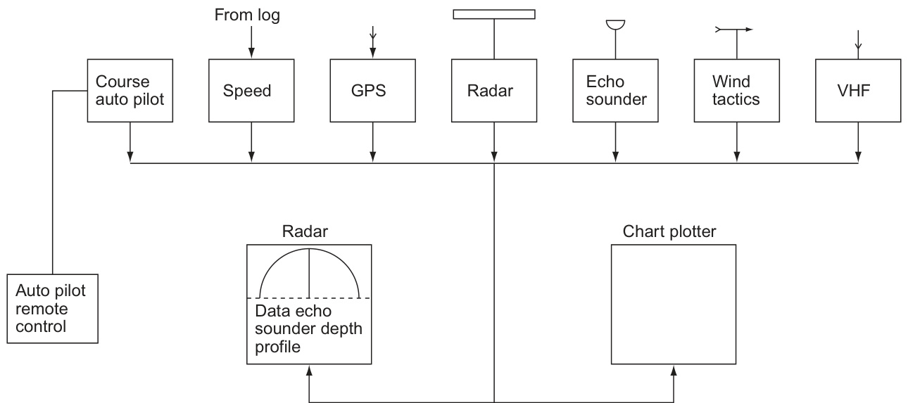  
FIGURE 10.16 Instruments typically integrated on smaller craft.  

【中文翻译】

图10.16 小型船只上通常集成的仪器。

# 10.3.4 Connectivity and Interfacing  

Initially, the interfacing between different items of navigational equipment was individual to certain manufacturers. However, more open general standards have been developed. The NMEA 0183 (National Marine Electronics Association) data standard was developed in the early 1980s and is still extensively used where the data rate required is low. Most radar devices have some NMEA connections so the simple NMEA 0183 interface standard is covered here. The international standard based on NMEA-type messages is known as IEC 61162-1, which is mandated for use on SOLAS vessels. Other standards issued by the IEC and NMEA are typically also used for faster and more flexible interconnection.  

【中文翻译】

最初，不同导航设备之间的接口是由特定制造商个别开发的。然而，更加开放的通用标准已经被开发出来。NMEA 0183（国家海事电子协会）数据标准是在20世纪80年代初期开发的，至今仍被广泛使用，特别是在数据传输速率要求较低的场合。绝大多数雷达设备都具备NMEA接口，因此这里涵盖了简单的NMEA 0183接口标准。基于NMEA类型消息的国际标准被称为IEC 61162-1，该标准被要求在SOLAS（安全生命救助设备）船舶上使用。其他由IEC和NMEA发布的标准通常也被用于实现更快、更灵活的互联。[SOLAS是指国际海事组织（IMO）制定的关于船舶安全设备的国际公约，旨在确保船舶在海上航行时的安全性。]

# 10.3.4.1 Binary and the ASCII Standard  

Computers use the binary language for all their communications and calculations. For example, in terms of electric wires, the $\mathbf{\tilde{()}}\mathbf{\tilde{s}}$ and ‘1’s are represented by high and low voltages, whereas in magnetic storage locations (as found on traditional hard disks) use the polarity of the magnetic field at the location.  

【中文翻译】

计算机在所有的通信和计算中都使用二进制语言。例如，从电线的角度来看，$\mathbf{\tilde{0}}$和‘1’分别被高电压和低电压表示，而在磁性存储位置（如传统硬盘中发现的）则使用该位置的磁场极性来表示。其中，二进制语言是计算机处理信息的基础，高低电压和磁场极性分别对应于二进制中的0和1，（即“0”和“1”分别代表不同的电压状态或磁场方向，以此来存储和处理信息）。

Standard sequences of ${}^{\prime}0^{\prime}\mathrm{s}$ and ‘1’s are used to store text characters and the most common one is the ASCII standard which is used by NMEA. The ASCII standards were developed before computers for telex systems and ASCII refers to the American Standard Code for Information Interchange. The code has 7-bit and 8-bit versions. The 7-bit version contains 128 characters, the additional bit in the 8-bit version allows for an additional 128 characters, 256 characters in all. The first 128 characters (numbered 0 to 127) are the same in both versions, the extra 128 bits are used for symbols for simple graphics. Some of the original ASCII characters have strange names, originally developed as a function in the telex system, and do not necessarily represent printable characters. These include the code for line feed or $\mathrm{^{/}L F^{\prime}}$ which is ASCII code 12 (i.e. 00001100 in 8-bit binary, see Section 2.7.1) and carriage return or $\mathbf{\nabla}^{\prime}\mathbf{C}\mathbf{R}^{\prime}$ ASCII code 13 (i.e. 00001101). The capital letters start at the binary for $\mathbf{\nabla}^{\prime}\mathbf{A}^{\prime}$ at 65 (i.e. 01000001); $\mathbf{\nabla}^{\prime}\mathrm{B^{\prime}}$ is 66 (i.e. 01000010), etc. The small letters start for $\mathbf{\nabla}^{\prime}\mathrm{a}^{\prime}$ at  

【中文翻译】

标准序列的 ${}^{\prime}0^{\prime}\mathrm{s}$ 和 ‘1’s 被用来存储文本字符，其中最常见的是ASCII标准，这也是NMEA使用的标准。ASCII标准是在计算机出现之前为电传打字机（telex系统）开发的，ASCII指的是美国信息交换标准代码（American Standard Code for Information Interchange）。该代码有7位和8位版本。7位版本包含128个字符，8位版本中的额外位允许增加128个字符，总共256个字符。前128个字符（编号0到127）在两个版本中是相同的，额外的128位被用来表示简单图形的符号。[这里的“位”是指计算机中二进制数字的基本单位，每个位可以表示0或1，而“字符”则是指可以在计算机中表示的单个符号，如字母、数字或标点符号。]一些原始的ASCII字符具有奇怪的名称，最初是作为电传打字机系统中的一个功能而开发的，并不一定代表可打印的字符。这些字符包括换行符（line feed）或$\mathrm{^{/}L F^{\prime}}$的代码，即ASCII代码12（即8位二进制中的00001100，见第2.7.1节）和回车符（carriage return）或$\mathbf{\nabla}^{\prime}\mathbf{C}\mathbf{R}^{\prime}$的ASCII代码13（即8位二进制中的00001101）。大写字母从二进制代码为$\mathbf{\nabla}^{\prime}\mathbf{A}^{\prime}$的65（即01000001）开始；$\mathbf{\nabla}^{\prime}\mathrm{B^{\prime}}$是66（即01000010），依此类推。小写字母从二进制代码为$\mathbf{\nabla}^{\prime}\mathrm{a}^{\prime}$的97（即01100001）开始；$\mathbf{\nabla}^{\prime}\mathrm{b}^{\prime}$是98（即01100010），等等。 

注意：电传打字机系统（telex system）[一种早期的电报系统，用于传输文本信息]，ASCII代码[美国信息交换标准代码，用于表示字符]，二进制代码[计算机中使用的二进制数码]。

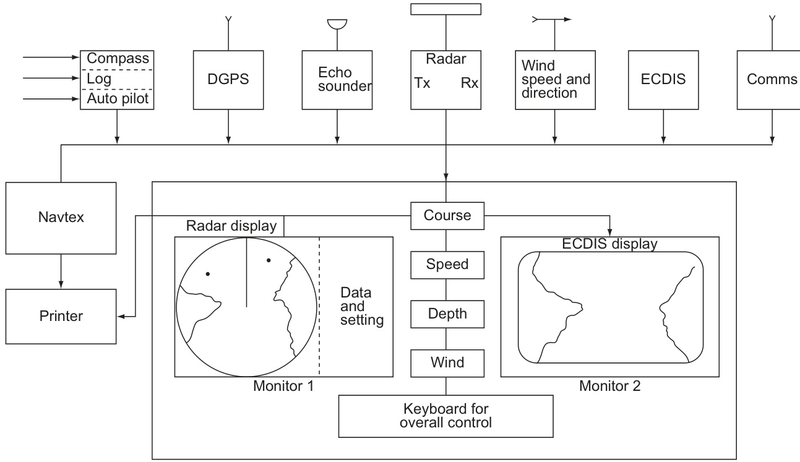  
FIGURE 10.17 Integrated system console.  

【中文翻译】

图10.17 集成系统控制台。

97 (i.e. 01100001); $\mathbf{\Phi}^{\prime}\mathbf{b}^{\prime}$ is 98 (i.e. 01100010), etc. Number characters are also included: $'0^{\prime}$ is 48 (i.e. 00110000); $'1^{\prime}$ is 49 (i.e. 001100001), etc. and most symbols commonly found on keyboards are also included, for example ${}^{\prime}\$1$ is 36 (i.e. 00100100).  

【中文翻译】

97（即01100001）；$\mathbf{\Phi}^{\prime}\mathbf{b}^{\prime}$是98（即01100010），等等。数字字符也包括在内：$'0^{\prime}$是48（即00110000）；$'1^{\prime}$是49（即00110001），等等。并且大多数键盘上常见的符号也包括在内，例如${}^{\prime}\$1$是36（即00100100）。注意，这里所指的数字和符号是通过[ASCII编码（美国信息交换标准代码）]来表示的，每个字符都对应一个唯一的数字编码。

# 10.3.4.2 NMEA 0183 Message Standard  

The current most popular interface standard is NMEA 0183 (IEC 61162-1). It is the simplest way of connecting one device to another. Other more complex standards are available, such as NMEA 2000 (IEC 61162-3), that allow multiple device two-way communication as well as much faster data rates. These are not compatible with NMEA 0183.  

【中文翻译】

目前最流行的接口标准是NMEA 0183（IEC 61162-1）。它是连接一个设备到另一个设备的最简单方式。其他更复杂的标准也可用，例如NMEA 2000（IEC 61162-3），它允许多个设备之间进行双向通信，并且数据传输速率也更快。然而，这些标准与NMEA 0183不兼容。

The adoption of new open standards is a very time consuming and difficult procedure and manufacturers have to make difficult decisions on what interfaces to include such that they can be easily and effectively connected to other manufacturers’ products. For this reason, modern equipment can either offer multiple interfaces (often capable of operating in parallel), or else just a simple NMEA 0183 interface, which is compatible with most equipment but is relatively unsophisticated.  

【中文翻译】

采用新的开放标准是一个非常耗时和困难的过程，制造商必须就哪些接口应包含在产品中做出艰难的决定，以便它们能够轻松且有效地连接到其他制造商的产品。因此，现代设备可以提供多种接口（通常可以并行操作），或者仅提供一个简单的NMEA 0183接口（国家海洋和大气管理局标准，[即美国国家海洋和大气管理局制定的船舶电子设备之间的通信标准]），该接口与大多数设备兼容，但相对来说较为简单和不够先进。

Each line (or sentence) of an NMEA 0183 message is made up of a number of ASCII characters. Each sentence starts with a ${}^{\prime}\$1$ . Five characters immediately follow the ${}^{\prime}\$1$ . The first two characters identify the device from which the message originated, for example $\mathrm{^{/}H E^{\prime}}$ for a gyro compass, $\prime G\mathrm{{P^{\prime}}}$ for a GPS device and $\mathbf{\Lambda}^{\prime}\mathbf{RA}^{\prime}$ for a radar or ARPA. The last three characters identify the NMEA standard sentence. After the identification group, the data fields follow that are associated with that sentence. Each data field is separated by a comma. Many of the sentences include the option of a checksum at the end. Sometimes it is compulsory. The checksum is the numerical binary addition (using exclusive OR logic) of all the binary code sent in a sentence between the ${}^{\prime}\$1$ and the ‘\*’ included as the second character of the checksum (for format see Example 10.1). The checksum is a communication error detection device. If the message received does not add up to the checksum, then there has been a corruption of the sentence between transmission and reception. Each sentence is terminated with carriage return ‘CR’ and line feed ‘LF’ ASCII codes.  

【中文翻译】

每个NMEA 0183消息的行（或句子）都是由多个ASCII字符组成的。每个句子以 `${}^{\prime}\$1$ `开头，其后紧跟着五个字符。前两个字符标识消息的来源设备，例如，$\mathrm{^{/}H E^{\prime}}$ 代表陀螺罗盘（[一种测量方向的仪器]），$\prime G\mathrm{{P^{\prime}}}$ 代表GPS设备（[全球定位系统设备]），$\mathbf{\Lambda}^{\prime}\mathbf{RA}^{\prime}$ 代表雷达或ARPA（[自动雷达定位和追踪系统]）。后三个字符标识NMEA标准句子。在标识组之后，跟随的是与该句子相关的数据字段，每个数据字段由逗号分隔。许多句子在末尾提供了校验和（[用于检测错误的数字值]）选项，有时这是强制性的。校验和是指在一个句子中，从 `${}^{\prime}\$1$` 到包含第二个字符的 `*` 之间发送的所有二进制代码（使用独占或逻辑）进行二进制加法运算所得的数字结果。校验和是一种用于检测通信错误的设备。如果接收到的消息不能加起来等于校验和，则说明在传输和接收之间，句子已经被破坏。每个句子都以回车（CR）和换行（LF）ASCII码结束。 

注意：这里的“独占或逻辑”是指“异或”（exclusive OR）的意思，用于二进制运算中。

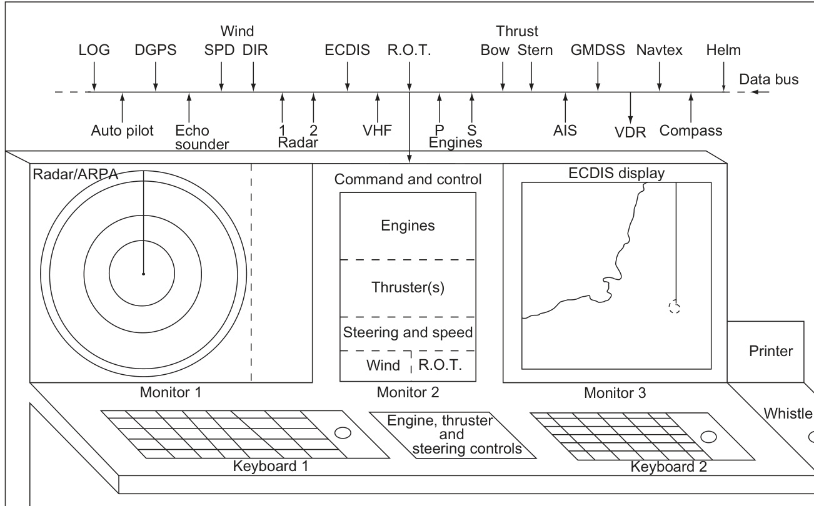  
FIGURE 10.18 Integrated system console as it may appear on a larger vessel.  

【中文翻译】

图10.18：大型船舶上综合系统控制台的可能外观。

The range of information and instructions that can be sent via NMEA 0183 is large and ever increasing. For example, it can send information as diverse as water temperature, navigation waypoints, GPS almanac, location and type of trawler gear, autopilot and engine instructions.  

【中文翻译】

通过NMEA 0183协议可以发送的信息和指令范围非常广泛，并且不断增加。例如，它可以发送多种多样的信息，包括水温、导航航点、GPS星历表、拖网设备的位置和类型、自动驾驶和发动机指令等。

Some example sentences with their potential radar related applications are given below.  

【中文翻译】

以下是一些示例句子及其潜在的雷达相关应用：

# EXAMPLE 10.1  

HDT: Heading " true.  

【中文翻译】

HDT：真实航向（Heading "true"指的是航行的真实方向，与磁向或其他参考系相比，考虑了地磁偏角等因素的影响）

Used to send heading information from gyro compass to other devices including radar.  

【中文翻译】

用于从陀螺罗盘（一种利用陀螺原理测量方向的罗盘仪器）向其他设备（包括雷达）发送航向信息。

<html><body><table><tr><td>$HEHDT,035.9,T,3*56</td></tr><tr><td>HE</td><td>SenderID (north</td></tr><tr><td></td><td>seeking gyro compass) Sentence ID (true</td></tr><tr><td>HDT</td><td>heading)</td></tr><tr><td>035.9,T</td><td>Heading (035.9 true)</td></tr><tr><td>3*56</td><td>Checksum</td></tr></table></body></html>  

# EXAMPLE 10.2  

GLL: Geographical position. Used to send position from GPS, LORAN C, etc. to other devices such as radar.  

【中文翻译】

GLL：地理位置。用于将来自GPS、LORAN C等的位置信息发送到其他设备，如雷达。

<html><body><table><tr><td colspan="2">$GPGLL,2325.53,N,03423.67,W,143341,1</td></tr><tr><td>GP</td><td>Sender ID (GPS)</td></tr><tr><td>GLL</td><td>Sentence ID (geographical position,latitude and</td></tr><tr><td>2325.53,N</td><td>longitude) Latitude (23 deg)</td></tr><tr><td></td><td>25.53min N)</td></tr><tr><td>03423.67,W</td><td>Longitude (034 deg) 23.67 min W)</td></tr><tr><td>143341</td><td>Fix time UTC (14:33:41 UTC)</td></tr><tr><td>1</td><td>Fix validity (valid), 0 if fix is doubtful</td></tr></table></body></html>  

<html><body><table><tr><td>0.5 15.6</td><td>Closest point of approach (0.5 distanceunits) Time to closest point of approach</td></tr><tr><td></td><td>(15.6 minutes), a negative number indicates the target is past its CPA Distance and speed units (NM</td></tr><tr><td>N</td><td>and knots),k is kilometres,S is statute miles</td></tr><tr><td>TAR01 T</td><td>Target label on ARPA (TAR01) Target status (tracking), L is lost</td></tr><tr><td>R</td><td>target, Q is target being acquired Reference target (i.e. designated</td></tr><tr><td></td><td>fixed target), left blank if not designated</td></tr><tr><td>095643.67</td><td>Time ofdata inUTC (O9 h 56minutes43.67seconds)</td></tr><tr><td>M 4*43</td><td>Type of target acquisition (manual),A is automatic Checksum</td></tr></table></body></html>  

# EXAMPLE 10.3  

TTM: Tracked target status.  

【中文翻译】

TTM：被跟踪目标的状态。

Used to send tracked target information from radar to ECDIS. A separate sentence is sent for each target currently plotted.  

【中文翻译】

用于从雷达向电子海图显示和信息系统（ECDIS）发送跟踪目标信息。对于当前绘制的每个目标，都发送一条单独的句子。 

（注：ECDIS是电子海图显示和信息系统的英文缩写，指的是一种集成导航、海图显示、警告和信息等功能的电子系统，广泛应用于船舶导航领域。）

<html><body><table><tr><td>$RATTM,04,5.2,034.3,T,10.5,135.7,T,0.5,15.6,N, TAR01,T,095643.67,M,R,4*43</td></tr><tr><td>RA Sender ID (radar)</td><td></td></tr><tr><td>TTM</td><td>SentenceID(trackedtargetstatus)</td></tr><tr><td>04</td><td>ARPAassignedtargetnumber (04), can be 00 to 99</td></tr><tr><td>5.2</td><td>Target distance (5.2 NM)</td></tr><tr><td>034.3</td><td>Target bearing from own ship</td></tr><tr><td>T</td><td>(034.3°) Target bearing orientation (true),</td></tr><tr><td>10.5</td><td>R is relative Target speed (10.5 knots)</td></tr><tr><td>135.7</td><td>Target course (135.7°)</td></tr><tr><td>T</td><td>Course orientation (true),R is relative</td></tr></table></body></html>  

There are a large number of standard sentences available and each manufacturer selects and incorporates the sentences that a specific piece of equipment can use, either for receiving or transmission. In many devices, it is also possible for the navigator to select from the manufacturer’s list the sentences for actual transmission or reception.  

【中文翻译】

有大量标准句可供选择，每个制造商都会选择并将特定设备可以使用的句子（无论是接收还是传输）纳入设备中。在许多设备中，导航员还可以从制造商的列表中选择实际传输或接收的句子。

NMEA 0183 is continually evolving and different versions of sentences sometimes exist. Usually later versions are longer, so some earlier equipment may only read the first part of the sentence. Another feature of NMEA 0183 is that many manufacturers add extra proprietary sentences designed to interface only with other equipment made by the same manufacturer. The format of the identifier data field is different for proprietary codes. These sentences are all prefixed by $\$1$ , the next three characters are the approved NMEA code for that manufacturer (e.g. ‘GRM’ is Garmin) and the last character is the sentence ID specified by the manufacturer.  

【中文翻译】

NMEA 0183 标准在不断演进，不同版本的句子有时会共存。通常，较晚的版本的句子较长，因此一些较早的设备可能只能读取句子的第一部分。NMEA 0183 的另一个特点是许多制造商会添加专有的句子，这些句子仅设计为与同一制造商生产的其他设备进行接口。专有代码的标识符数据字段格式是不同的。这些句子都以 $\$1$ 为前缀，接下来的三个字符是该制造商的批准 NMEA 代码（例如，‘GRM’ 代表 Garmin），最后一个字符是由制造商指定的句子 ID。这种设计允许制造商扩展标准协议以满足特定的需求，同时仍然保持与标准 NMEA 0183 设备的兼容性。

# 10.3.4.3 Other Connectivity Standards  

NMEA 0183 is not fast enough to send picture data so other faster methods are used (for example) to transfer the radar picture to ECDIS. Such standards can be proprietary and confidential so that such a transfer of information is only possible between equipment provided by a single manufacturer or between two manufacturers who have a working relationship.  

【中文翻译】

NMEA 0183 的传输速度不足以传输图像数据，因此采用其他更快的方法（例如）来将雷达图像传输到电子海图显示和信息系统（ECDIS）。此类标准可能是专有的和保密的，因此这种信息传输仅可能在同一制造商提供的设备之间或在两家具有合作关系的制造商之间进行。

# 10.3.5 Advantages of Integration  

There are distinct advantages to having all data upon which decisions are to be based readily available at one command and control position. However, not all of the data needs to be shown all of the time. There are unique phases in a voyage " as diverse as docking and open-sea collision avoidance " where only some of the data is required and it is important during these operations that irrelevant information is not cluttering up the displays. Hence, great care is necessary when deciding on what data is to be displayed and in what format.  

【中文翻译】

拥有所有决策依据数据在一个指挥和控制位置上随时可用具有明显的优势。然而，并非所有数据都需要一直显示。航程中存在不同的阶段，例如“靠港”和“公海碰撞避免”[即避免在公海中发生碰撞]，在这些阶段，只需要部分数据，而在这些操作期间，屏幕上不需要不相关的信息。因此，在决定显示哪些数据以及以何种格式显示时，需要谨慎考虑。

Having all the data outputs centrally located makes it easy for cross-checking similar data derived from different sensors and sources, for example the vessel’s position may be derived from visual observations, ECDIS/GNSS and radar. A quick check of compass heading and COG as derived from the GNSS will give a sense of how the vessel is being set.  

【中文翻译】

将所有数据输出集中在一起，可以方便地对来自不同传感器和来源的类似数据进行交叉核对。例如，船舶的位置可能是通过视觉观察、电子海图系统（ECDIS）/全球导航卫星系统（GNSS）和雷达等方式获得的。快速检查来自GNSS的罗经方向和航程（COG）可以让我们了解船舶的当前状态和航向。这样可以帮助我们快速发现和纠正可能存在的数据不一致或错误，确保船舶的安全航行。

While all this data is available, it is essential that great care is exercised when making decisions and that no unjustifiable weight is given to some of the data while other data is overlooked.  

【中文翻译】

虽然所有这些数据都是可用的，但在做出决定时，必须谨慎行事，不能对某些数据给予不合理的重视，同时忽略其他数据。这样做的目的是为了避免由于数据选择偏差而导致的决策失误。

In earlier sections in this chapter, we considered the advantages of integrating ECDIS and GPS/GNSS (Section 10.1.10); radar target tracking with ECDIS (Section 10.2.7); ARPA, AIS and ECDIS (Section 5.4.3). Clearly a full integration of bridge information does not stop at integrating these suggested combinations of equipment alone.  

【中文翻译】

在本章的前几节中，我们讨论了集成电子海图显示和信息系统（ECDIS）与全球定位系统/全球导航卫星系统（GPS/GNSS）[一种利用卫星实现全球定位和导航的系统]（第10.1.10节）；雷达目标跟踪与ECDIS（第10.2.7节）；自动雷达测距和方位系统（ARPA）[一种利用雷达实现目标自动跟踪的系统]、自动识别系统（AIS）[一种用于船舶识别和位置报告的系统]与ECDIS（第5.4.3节）的优势。很明显，完全集成桥梁信息不仅仅是将这些建议的设备组合进行集成那么简单。

# 10.3.6 Potential Dangers of Data Overload  

There is an increasing awareness of the potential problem of information overload on the user. As has already been stated, not all the data is needed all of the time, especially when one includes other data displayed on the bridge (see Section 10.3.1). It is essential, when designing the display of data, that only data essential to the operation taking place be directly displayed, while additional data is available on demand.  

【中文翻译】

人们越来越意识到信息过载（information overload）对用户可能造成的问题。正如前面已经提到的，不需要所有数据都在所有时候都可用，尤其是在桥梁上（见10.3.1节）显示其他数据时。设计数据显示时，必须确保只有当前操作所需的数据直接显示，而其他数据则可以按需提供。这是为了避免信息过载，确保用户可以高效地获取所需信息。

# 10.3.7 System Cross-Checking, Warnings and Alarms  

In order for the early detection of malfunction in a system, cross-checking between systems (either electronically or manually) is important. It is also important to check progress against a predetermined plan. Warnings and alarms can be built into the system at various levels of urgency, but the navigator can be overwhelmed and distracted by buzzers, whistles and flashing lights. Again care in design is essential.  

【中文翻译】

为了实现系统中故障的早期检测，系统之间的交叉检查（无论是电子式还是手动式）是非常重要的。同时，检查进度是否符合预先制定的计划也是至关重要的。警告和报警信号可以在系统的不同紧急程度级别中设置，但导航员可能会被蜂鸣器、口哨和闪烁的灯光（这些都是报警的视听提示）弄得不知所措，分心。再次强调，设计时的细心考虑是必不可少的。

# 10.3.8 Sensor Errors and Accuracy of Integration  

One would hope that similar data derived from different sources would have a high correlation factor, but this is not necessarily the case due to system and other errors, which can be random. Where there is unacceptable divergence an alarm should be activated and the navigator will need to exercise his judgement as to the possible cause of the discrepancy or if it is due to the malfunction of a specific sensor.  

【中文翻译】

人们希望来自不同来源的类似数据具有高相关性系数，但由于系统和其他错误，这并不一定是事实，这些错误可以是随机的。在存在不可接受的偏差的情况下，应激活警报，导航员将需要运用自己的判断力来确定差异的可能原因，或者判断是否是由于特定传感器的故障。

# 10.3.9 Data Monitoring and Loggings  

In addition to voyage data recorders (VDRs) (see Section 10.4), data derived from a multitude of shipboard systems (see Section 10.3.1) is in digital form and may be accumulated and stored on a variety of media to facilitate record keeping (e.g. log book) and for voyage performance analysis. In many organizations, there is still a preference for a hard copy of information required for permanent record and legal purposes. A printer is therefore still part of most systems.  

【中文翻译】

除了航程数据记录器（VDRs ）（见第10.4节）外，来自多种船载系统（见第10.3.1节）的数据以数字形式呈现，可以积累和存储在各种介质上，以便于记录保存（例如航海日志）和航程性能分析。在许多组织中，仍然偏好将需要永久保存和法律用途的信息以纸质形式保存。因此，打印机仍然是大多数系统的一部分。

# 10.4 VOYAGE DATA RECORDERS(SEE ALSO SECTION 11.3.5)  

The purpose of a VDR is to record operational information of a vessel so that it can assist investigators should the vessel become involved in an incident. The idea has long been used in the aviation industry, where it has often been called the ‘black box’. Commercial aircraft actually record different information in two separate boxes that are coloured bright orange.  

【中文翻译】

航运数据记录器（VDR）的目的是记录船舶的操作信息，以便在船舶发生事故时能够协助调查人员。这种理念早已被应用于航空业，在那里它常被称为“黑盒子”（black box）。实际上，商用飞机会在两个独立的、鲜橙色（bright orange）的盒子中记录不同的信息，这两个盒子分别用来存储不同的数据。这种黑盒子技术可以在飞机发生事故时提供重要的飞行数据和语音记录，以便事故调查人员进行分析和研究。

The VDR helps to overcome two distinct problems in ascertaining causes of marine incidents. Firstly, there is occasionally a situation when key personnel do not survive the incident. Secondly, even when personnel survive an incident, the truth is not always forthcoming. Survivors may not be aware of certain facts. They could have a mistaken impression of what happened due to the trauma of the event and they may not tell the truth in order to protect themselves or colleagues. Marine incidents are not unique in that one party has a different version of an accident to a second party. The lack of objective evidence has prevented firm conclusions in many enquiries.  

【中文翻译】

航运数据记录器（VDR）有助于克服确定海事事故原因时遇到的两个不同问题。首先，可能会出现关键人员在事故中未能幸存的情况。其次，即使人员幸存事故，事实也不总是真相大白。幸存者可能不知道某些事实，他们可能由于事件的创伤而对发生了什么事有错误的印象，并且他们可能不会说出真相，以保护自己或同事。海事事故并非独一无二，往往会出现一种情况，即一方对事故的描述与另一方不同。缺乏客观证据使得许多调查无法得出明确的结论。

VDR regulations were first introduced in the revisions to SOLAS Chapter V in 2001. All new vessels of more than $3000~\mathrm{grt}$ and all new passenger vessels are required to have them fitted. There is also a phased requirement for fitting them to some existing ships, especially passenger ships. All other existing vessels above $3000~\mathrm{grt}$ are required to have a simplified VDR (SVDR), which is less onerous on the requirements of the data capsule and the number of interfaces connected.  

【中文翻译】

VDR（航行数据记录器）法规最早是在2001年对SOLAS（国际海上人命安全公约）第V章的修订中引入的。所有3000总吨位（grt）以上的新建船舶以及所有新建的客船都必须安装VDR。同时，对于一些现有的船舶，特别是客船，也有分阶段的安装要求。其他所有3000总吨位以上的现有船舶，则需要安装简化的VDR（SVDR），这对数据胶囊的要求和连接的接口数量的要求较少，[即对船舶来说，安装和维护的负担较小]。

# 10.4.1 Equipment  

The VDR equipment has two main items of hardware. There is a single data storage capsule located externally on top of the vessel and a data collection unit probably located inside the bridge (Figure 10.19). Replay facilities are normally located ashore.  

【中文翻译】

VDR（航行数据记录）设备主要包括两项硬件。一个是单独的数据存储胶囊（data storage capsule），通常安装在船舶的外部顶部；另一个是数据采集单元（data collection unit），可能位于驾驶台（bridge）内部（图10.19）。重放设施（replay facilities）通常位于岸上。

The data storage capsule is designed to survive a total loss of the vessel. It is a capsule designed to withstand an intense fire as well as immersion in over $4000\mathrm{m}$ of water. Its construction is therefore very thick steel. The capsule would normally be located towards the top of the vessel in an open space. Its securing arrangements are designed to be easily released by a remotely operated vehicle (ROV) or a deep-sea diver encumbered in a heavy suit. It will not actually contain much electronic equipment, the main component being enough solid-state memory to record at least the last 12 hours of the vessel’s operations. Solid-state memory does not actually require a battery to maintain the data recorded. The capsule is fully sealed to meet its demanding specifications with only a data wire penetrating the casing. To aid detection, it is brightly coloured, covered in retro-reflective material and an underwater locator beacon is attached.  

【中文翻译】

数据存储胶囊（data storage capsule）是为应对船舶（vessel）完全损失而设计的。它是一种能够承受强烈火灾和在超过4000米深的水中浸泡的胶囊。因此，其构造采用非常厚的钢材（steel）。胶囊通常位于船舶顶部的开阔空间内，其固定装置的设计使得远程操作车辆（remotely operated vehicle，ROV）或身穿厚重潜水服的深海潜水员（deep-sea diver）能够轻松释放。胶囊内实际上并不包含太多的电子设备（electronic equipment），其主要组件是足够的固态存储器（solid-state memory），能够记录船舶至少最近12小时的操作记录。固态存储器不需要电池来维持记录的数据。胶囊完全密封以满足其苛刻的规格，只有一个数据线（data wire）穿透其外壳。为了方便检测，胶囊被涂上鲜艳的颜色，覆盖着反射材料（retro-reflective material），并附着一个水下定位信标（underwater locator beacon）。

The data collection unit is usually a standard personal computer, although the usual controls and displays need not normally be provided for ships’ staff. There is little for the navigator to operate except to check that the system is on and functioning, indicated by some manufacturers as a simple flashing light. Connections from all the required bridge equipment are made direct to the data collection unit. The data is stored internally as well as sent to the data storage capsule. Data compression techniques are employed to enable efficient use of the storage systems.  

【中文翻译】

数据采集单元通常是一个标准的个人电脑，尽管通常不需要为船员提供常规的控制和显示设备。导航员几乎无需操作，只需检查系统是否打开并正常运行，一些制造商通过一个简单的闪烁灯光来指示这一点。所有所需的桥梁设备都直接与数据采集单元相连。数据既存储在内部，也发送到数据存储胶囊（数据存储胶囊是一种用于存储数据的容器，通常采用密封的方式以防止数据丢失或损坏）。为了能够高效地使用存储系统，采用了数据压缩技术（数据压缩技术是指通过算法和编码等方法减少数据的大小，以节省存储空间和提高传输效率的技术）。

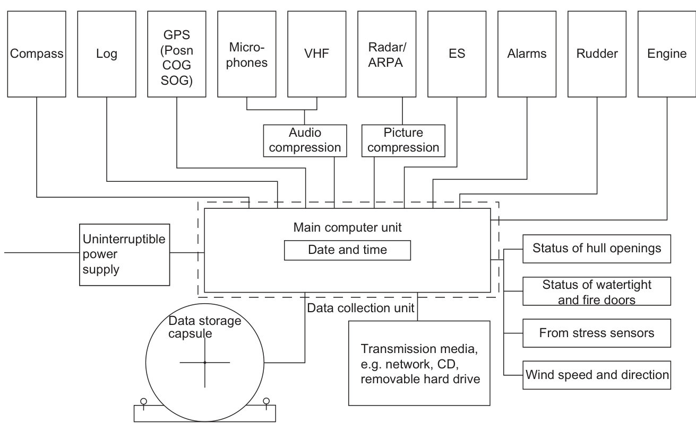  
FIGURE 10.19 Block diagram of VDR system.  

【中文翻译】

图10.19航运数据记录器（VDR）系统的方块图

The data storage capsule only needs to contain the last 12 hours of operation. It is also the single most expensive item in the VDR equipment and once opened cannot be easily reused (if at all). It would be an unnecessary expense to have to cut open the capsule to investigate the vast majority of marine incidents when the bridge and ship are still essentially intact. Following an incident, the stored data in the data collection unit will be maintained over a much longer period. (more than a week is typical) and standard electronic means are provided to extract the data much more cheaply than by opening up the data storage capsule. The method of extraction is at the choice of the supplier and buyer but can be via an electronic network or by standard computer storage media such as compact disk or removable hard drive.  

【中文翻译】

数据存储胶囊（Data Storage Capsule）只需要包含最近12小时的操作数据。它也是VDR设备中最昂贵的单个部件，一旦打开就不能轻易地被重复使用（如果可以的话）。如果只是为了调查绝大多数海事事故（当桥梁和船舶基本上仍然完好无损时），就需要切开胶囊，这将是一笔不必要的开支。在事故发生后，数据采集单元（Data Collection Unit）中存储的数据将被保留更长的时间（通常超过一周），并且提供了标准的电子手段来以比打开数据存储胶囊更便宜的方式提取数据。提取数据的方法由供应商和购买者选择，但可以通过电子网络或标准的计算机存储介质（如光盘或可拆卸硬盘）来实现。

# 10.4.2 Non-Radar Data Recorded  

The data recorded includes the following from bridge equipment:  

【中文翻译】

记录的数据包括来自桥梁设备的以下信息：

Compass heading   
Echo sounder depth   
Audio from VHF communications   
Audio from a network of microphones installed on the bridge   
Main (mandatory) alarms to be found on a bridge   
Rudder order and response   
Engine order and response   
Status of hull openings, watertight/fire doors, hull stresses (on vessels with the equipment)   
Wind speed and direction   
AIS is a requirement only on SVDR   
equipment where radar display is not   
recorded.  

【中文翻译】

指南针航向   
声纳深度   
VHF 通信的音频   
安装在桥梁上的麦克风网络的音频   
桥梁上必须（强制）发现的主要报警器   
舵盘命令和响应   
发动机命令和响应   
船体开口、防水/防火门、船体应力（在配备了该设备的船舶上）（船体应力是指船体在海况、载重、速度等因素的作用下产生的应力，[即船体受到的压力和拉力]）   
风速和风向   
AIS（自动识别系统）仅在SVDR（船舶航行数据记录仪）设备上是必需的，且仅在雷达显示未被记录的设备上。（AIS是一种通过VHF无线电台广播船舶的位置、航向、速度等信息，以提高海上交通安全性的系统）

# 10.4.3 Radar and Radar Tracking Data Recorded  

There is also a requirement to record radar and tracking data. The system adopted makes use of the fact that all modern radar displays are raster. A software technique called ‘frame grabbing’ to store an instantaneous frame (the raster picture) is well established in the computer industry and the picture data can be compressed for efficient storage. The frame grab of the full raster display is completed at least every 15 seconds from one of the ship’s radars.  

【中文翻译】

还需要记录雷达和跟踪数据。所采用的系统利用了现代所有雷达显示都是光栅（raster）的事实。计算机行业中已经成熟的一种软件技术称为“帧抓取”（frame grabbing），可以存储一个瞬时帧（即光栅图像），并且可以对图像数据进行压缩以实现高效存储。从船上的其中一个雷达，每隔至少15秒钟，就会完成对整个光栅显示的帧抓取。

The raster display on a modern raster-scan radar does not just show the picture, it also shows the main radar settings (e.g. range scale in use, true or relative vectors in use, vector time and amount of sea clutter control applied). This trend has increased as ‘hard’ analogue controls have largely disappeared and been replaced by software driven menu controls. Therefore, the frame grabber will record much information of value to investigators as to the way the equipment was being used, as well as the operational state of the radar equipment and the outside scenario in which the vessel was participating.  

【中文翻译】

现代光栅扫描雷达（raster-scan radar）上的光栅显示（raster display）不仅仅显示图像，还显示主要的雷达设置（例如当前使用的距离刻度、使用的真实或相对向量、向量时间以及应用的海杂波控制量）。随着“硬”模拟控制（hard analogue controls）基本消失并被软件驱动的菜单控制（software driven menu controls）取代，这一趋势得到了加强。因此，帧抓取器（frame grabber）将记录大量对调查人员有价值的信息，包括设备的使用方式、雷达设备的运行状态以及船舶参与的外部场景。这些信息对于了解设备的使用情况和外部环境具有重要意义。[注：帧抓取器是一种硬件或软件设备，用于捕获和保存视频信号中的单个帧或一系列帧。海杂波控制是指雷达系统中用于减少海面杂波的技术。]

This use of the frame grabber means that there is little need to have specialized interfaces to capture this radar information. Given the number of radar models and manufacturers, this would otherwise be a matter of some complexity and expense for a VDR manufacturer to handle.  

【中文翻译】

利用帧抓取器（frame grabber）意味着几乎不需要专门的接口来捕获这些雷达信息。考虑到雷达模型和制造商的数量，如果没有帧抓取器，航运数据记录器（VDR）制造商处理这些信息将会变得相当复杂和昂贵。

The radar picture will be an important part of many marine investigations. The visual view is not recorded, so the only dynamic reconstruction of physical events will be found on the radar display.  

【中文翻译】

雷达图像将成为许多海事调查的重要组成部分。由于视觉观察无法被记录下来，因此物理事件的唯一动态重现只能在雷达显示屏上找到。

A downside to the frame grabber radar recording system is that the results are dependent on the navigator adjusting the radar to the optimum settings. If the radar is set up incorrectly, the true situation (e.g. missing target echoes) will not be retrievable by the investigator. This would not necessarily be the case if the raw radar data (i.e. prior to digitization and display) was recorded by the VDR, but the potential gain in recording raw radar is small compared with the potential complexity of recording the raw radar data on a large variety of radar models.  

【中文翻译】

帧抓取雷达记录系统的一个缺点是，其结果依赖于导航员将雷达调整到最佳设置。如果雷达设置不正确，真实情况（例如缺失的目标回声）将无法被调查员检索。这在记录原始雷达数据（即数字化和显示之前）的情况下可能不会发生，但与记录原始雷达数据在各种雷达模型上的潜在复杂性相比，记录原始雷达的潜在收益很小。 

（注：帧抓取雷达记录系统是一种通过捕获雷达屏幕上的图像帧来记录雷达数据的方法；VDR 指船载航行数据记录仪，是一种用于记录船舶航行数据的设备；原始雷达数据指的是雷达接收到的原始、未经处理的数据；数字化和显示是指将原始雷达数据转换为数字信号并在屏幕上显示的过程。）

An advantage of the frame grabber system is that it will record when navigators have not used the radar display correctly, and will probably be able to detect the occasions when human error on the part of the navigator in the use of the radar was a factor in a collision.  

【中文翻译】

帧抓取系统的一个优势是，它将在导航员正确使用雷达显示时记录数据，并且可能能够检测到人类错误（即导航员在使用雷达时的操作失误）是碰撞事故发生的原因之一的场合。

# 10.4.4 Playback Equipment  

It is not intended that the vessel has playback equipment. The playback software is usually installable on a standard multimedia personal computer and would normally be available in the ship manager’s office. The software and the retrieved data would be made available to investigators after an accident. Most playback software allows rewinding, fast-forwarding and freeze framing of data in a similar fashion to a standard video player. A selection of different data streams (radar, helm-controls position, audio channel) can be played back simultaneously and the graphical data (radar picture, helm orders, etc.) are shown in different windows so that an overall view of the incident is obtained. The positional data can be fed to a separate electronic chart to further aid the replay analysis.  

【中文翻译】

这并不意味着船舶上需要安装播放设备。播放软件通常可以安装在标准的多媒体个人电脑上，通常情况下，这样的软件会在船舶管理者的办公室中找到。事故发生后，软件和检索到的数据将会提供给调查人员。大多数播放软件都允许对数据进行倒带、快进和冻结帧（freeze framing），与标准的视频播放器类似。可以同时播放不同的数据流（雷达、舵控位置、音频通道等），并且图形数据（雷达图像、舵令等）会在不同的窗口中显示，以便对事件有一个整体的了解。位置数据可以输入到一个单独的电子海图中，以进一步辅助回放分析[即通过电子海图来模拟事故发生时的船舶位置和移动情况，以便更好地了解事故发生的经过]。

# 10.4.5 Future of VDRs  

Operational experience with VDRs is still very limited. Whilst a lot of vessels now carry them, they have only been of use in a limited number of investigations. Like the ship’s lifeboat, very few of the installations will actually be used for their intended purpose. Nevertheless it is anticipated that, the few times that they are used, they will provide vital and objective information as to the causes of the incident. IMO have also introduced a simplified VDR (SVDR) which has been installed on existing ships over $3000~\mathrm{grt}.$ . This does not require data to be recorded if it’s not economically viable to provide, such as from old analogue equipment. If a radar picture is not recorded then AIS data must be provided in its place. The regulations for SVDR also allow for a float free data capsule if preferred to the VDR data capsule designed to sink with the vessel.  

【中文翻译】

使用航运数据记录器（VDRs）的实际经验仍然非常有限。虽然许多船舶现在都配备了航运数据记录器，但它们只在有限数量的调查中发挥了作用。就像船上的救生艇一样，非常少数的安装才会真正被用于预期的目的。然而，预计在少数情况下使用航运数据记录器时，它们将提供关于事件原因的至关重要和客观的信息。国际海事组织（IMO）还引入了一种简化的航运数据记录器（SVDR），该记录器已被安装在现有的3000吨以上的船舶上。如果从老式模拟设备中获取数据在经济上不可行，则无需记录数据。如果没有记录雷达图像，则必须提供自动识别系统（AIS）数据来替代。简化航运数据记录器的规定还允许使用自由浮动数据舱，而不是设计为与船舶一起沉没的航运数据记录器数据舱。[自由浮动数据舱是指一种可以在船舶沉没时自动浮出水面并发送求救信号的设备，方便救援人员快速找到事故现场。]

The data collected by VDR also has potential for research and analysis of vessel operation when not concerned with an incident. There are already schemes where navigators report (usually anonymously) examples of a near miss that otherwise would not have been analysed. If it were possible to treat data records of these near misses in the same way, future safety would be significantly improved. In fact, it would be useful for VDRs to be examined for examples of good (and successful) navigational practice and for navigational data. For instance, this could include radar pictures of port approaches so that parallel index targets can be identified. This VDR information could be usefully fed back to navigators. However, it would need a large culture shift by navigators, regulators and shipowners to make this data freely available.  

【中文翻译】

航运数据记录器（VDR）收集的数据也具有研究和分析船舶操作的潜力，即使在没有发生事故的情况下。已经有一些计划，航海员会（通常是匿名的）报告近距离错过事件（near miss）的例子，这些事件原本不会被分析。如果能够像对待其他数据记录一样处理这些近距离错过事件的数据记录，未来的安全性将会大大提高。事实上，检查VDR以找出好的（和成功的）航海实践和航海数据将会很有用。例如，这可以包括港口接近的雷达图像，以便可以识别出平行索引目标（parallel index targets）。这些VDR信息可以有用地反馈给航海员。然而，这需要航海员、监管机构和船东进行一次大的文化转变，使这些数据可以自由获取。 

注：near miss 指的是几乎发生事故但最终没有发生的事故，通常用于安全分析和研究中，以找出潜在的安全隐患。
